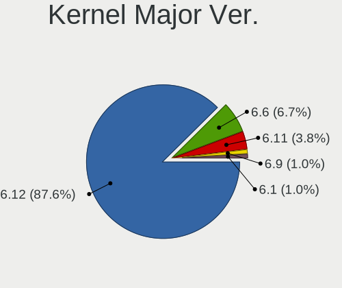
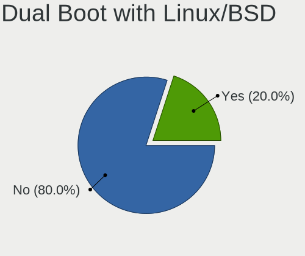
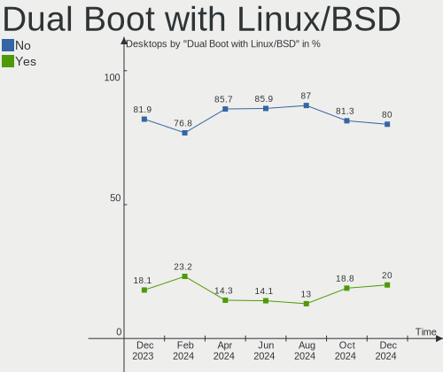
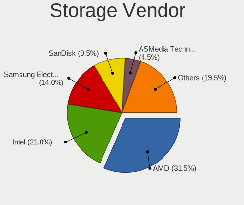
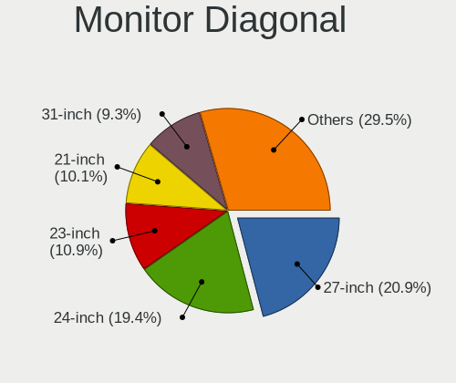

Arch Hardware Trends (Desktop)
------------------------------

A project to identify most popular hardware characteristics and track their change
over time based on data collected by Arch users at https://Linux-Hardware.org.

Anyone can contribute to the study by uploading probes of their computers by
the [hw-probe](https://github.com/linuxhw/hw-probe) tool:

    sudo -E hw-probe -all -upload

Full-feature report is available here: https://linux-hardware.org/?view=trends&formfactor=desktop

Period: Nov, 2020.

Contents
--------

- [ OS                       ](#os)
- [ OS Family                ](#os-family)
- [ Kernel                   ](#kernel)
- [ Kernel Family            ](#kernel-family)
- [ Kernel Major Ver.        ](#kernel-major-ver)
- [ Arch                     ](#arch)
- [ DE                       ](#de)
- [ Display Server           ](#display-server)
- [ Display Manager          ](#display-manager)
- [ OS Lang                  ](#os-lang)
- [ Boot Mode                ](#boot-mode)
- [ Filesystem               ](#filesystem)
- [ Part. scheme             ](#part-scheme)
- [ Dual Boot with Linux/BSD ](#dual-boot-with-linux/bsd)
- [ Dual Boot (Win)          ](#dual-boot-win)
- [ Country                  ](#country)
- [ City                     ](#city)
- [ Vendor                   ](#vendor)
- [ Model                    ](#model)
- [ Model Family             ](#model-family)
- [ MFG Year                 ](#mfg-year)
- [ Form Factor              ](#form-factor)
- [ Secure Boot              ](#secure-boot)
- [ Coreboot                 ](#coreboot)
- [ RAM Size                 ](#ram-size)
- [ RAM Used                 ](#ram-used)
- [ Has CD-ROM               ](#has-cd-rom)
- [ Total Drives             ](#total-drives)
- [ Has Ethernet             ](#has-ethernet)
- [ Drive Vendor             ](#drive-vendor)
- [ Drive Model              ](#drive-model)
- [ HDD Vendor               ](#hdd-vendor)
- [ SSD Vendor               ](#ssd-vendor)
- [ Drive Kind               ](#drive-kind)
- [ Drive Connector          ](#drive-connector)
- [ Drive Size               ](#drive-size)
- [ Space Total              ](#space-total)
- [ Space Used               ](#space-used)
- [ Malfunc. Drives          ](#malfunc-drives)
- [ Malfunc. Drive Vendor    ](#malfunc-drive-vendor)
- [ Malfunc. HDD Vendor      ](#malfunc-hdd-vendor)
- [ Malfunc. Drive Kind      ](#malfunc-drive-kind)
- [ Failed Drives            ](#failed-drives)
- [ Failed Drive Vendor      ](#failed-drive-vendor)
- [ Drive Status             ](#drive-status)
- [ Storage Vendor           ](#storage-vendor)
- [ Storage Model            ](#storage-model)
- [ Storage Kind             ](#storage-kind)
- [ CPU Vendor               ](#cpu-vendor)
- [ CPU Model                ](#cpu-model)
- [ CPU Model Family         ](#cpu-model-family)
- [ CPU Cores                ](#cpu-cores)
- [ CPU Sockets              ](#cpu-sockets)
- [ CPU Threads              ](#cpu-threads)
- [ CPU Op-Modes             ](#cpu-op-modes)
- [ CPU Microcode            ](#cpu-microcode)
- [ CPU Microarch            ](#cpu-microarch)
- [ GPU Vendor               ](#gpu-vendor)
- [ GPU Model                ](#gpu-model)
- [ GPU Combo                ](#gpu-combo)
- [ GPU Driver               ](#gpu-driver)
- [ GPU Memory               ](#gpu-memory)
- [ Monitor Vendor           ](#monitor-vendor)
- [ Monitor Model            ](#monitor-model)
- [ Monitor Resolution       ](#monitor-resolution)
- [ Monitor Diagonal         ](#monitor-diagonal)
- [ Monitor Width            ](#monitor-width)
- [ Aspect Ratio             ](#aspect-ratio)
- [ Monitor Area             ](#monitor-area)
- [ Pixel Density            ](#pixel-density)
- [ Multiple Monitors        ](#multiple-monitors)
- [ Net Controller Vendor    ](#net-controller-vendor)
- [ Net Controller Model     ](#net-controller-model)
- [ Wireless Vendor          ](#wireless-vendor)
- [ Wireless Model           ](#wireless-model)
- [ Ethernet Vendor          ](#ethernet-vendor)
- [ Ethernet Model           ](#ethernet-model)
- [ Net Controller Kind      ](#net-controller-kind)
- [ Used Controller          ](#used-controller)
- [ NICs                     ](#nics)
- [ Memory Vendor            ](#memory-vendor)
- [ Memory Model             ](#memory-model)
- [ Memory Kind              ](#memory-kind)
- [ Memory Form Factor       ](#memory-form-factor)
- [ Memory Size              ](#memory-size)
- [ Memory Speed             ](#memory-speed)
- [ Sound Vendor             ](#sound-vendor)
- [ Sound Model              ](#sound-model)
- [ Camera Vendor            ](#camera-vendor)
- [ Camera Model             ](#camera-model)
- [ Fingerprint Vendor       ](#fingerprint-vendor)
- [ Fingerprint Model        ](#fingerprint-model)
- [ Chipcard Vendor          ](#chipcard-vendor)
- [ Chipcard Model           ](#chipcard-model)
- [ Printer Vendor           ](#printer-vendor)
- [ Printer Model            ](#printer-model)
- [ Scanner Vendor           ](#scanner-vendor)
- [ Scanner Model            ](#scanner-model)
- [ Bluetooth Vendor         ](#bluetooth-vendor)
- [ Bluetooth Model          ](#bluetooth-model)
- [ Unsupported Devices      ](#unsupported-devices)
- [ Unsupported Device Types ](#unsupported-device-types)

OS
--

Installed operating systems

| Name         | Desktops | Percent |
|--------------|----------|---------|
| Arch         | 44       | 67.69%  |
| Arch Rolling | 21       | 32.31%  |

OS Family
---------

OS without a version

| Name | Desktops | Percent |
|------|----------|---------|
| Arch | 65       | 100%    |

Kernel
------

Version of the Linux kernel

| Version                                                  | Desktops | Percent |
|----------------------------------------------------------|----------|---------|
| 5.9.9-arch1-1                                            | 10       | 15.38%  |
| 5.9.8-arch1-1                                            | 9        | 13.85%  |
| 5.9.3-arch1-1                                            | 6        | 9.23%   |
| 5.4.77-1-lts                                             | 5        | 7.69%   |
| 5.9.6-arch1-1                                            | 4        | 6.15%   |
| 5.9.4-arch1-1                                            | 4        | 6.15%   |
| 5.9.2-arch1-1                                            | 3        | 4.62%   |
| 5.9.10-arch1-1                                           | 3        | 4.62%   |
| 5.9.1-arch1-1                                            | 3        | 4.62%   |
| 5.9.9-zen1-1-zen                                         | 2        | 3.08%   |
| 5.4.74-1-lts                                             | 2        | 3.08%   |
| 5.4.73-1-lts                                             | 2        | 3.08%   |
| 5.9.9                                                    | 1        | 1.54%   |
| 5.9.8-95-tkg-pds                                         | 1        | 1.54%   |
| 5.9.6-xanmod1-1                                          | 1        | 1.54%   |
| 5.9.5-95-tkg-bmq                                         | 1        | 1.54%   |
| 5.9.10.a-1-hardened                                      | 1        | 1.54%   |
| 5.9.0-rc5-1-amd-staging-drm-next-git-00658-g868226ff2aeb | 1        | 1.54%   |
| 5.8.14.a-1-hardened                                      | 1        | 1.54%   |
| 5.8.13-arch1-1                                           | 1        | 1.54%   |
| 5.8.11-19-tkg-bmq                                        | 1        | 1.54%   |
| 5.4.78-1-lts                                             | 1        | 1.54%   |
| 5.4.72-microsoft-standard-WSL2                           | 1        | 1.54%   |
| 5.3.9_1                                                  | 1        | 1.54%   |

Kernel Family
-------------

Linux kernel without a distro release

| Version | Desktops | Percent |
|---------|----------|---------|
| 5.9.9   | 13       | 20%     |
| 5.9.8   | 10       | 15.38%  |
| 5.9.3   | 6        | 9.23%   |
| 5.9.6   | 5        | 7.69%   |
| 5.4.77  | 5        | 7.69%   |
| 5.9.4   | 4        | 6.15%   |
| 5.9.10  | 4        | 6.15%   |
| 5.9.2   | 3        | 4.62%   |
| 5.9.1   | 3        | 4.62%   |
| 5.4.74  | 2        | 3.08%   |
| 5.4.73  | 2        | 3.08%   |
| 5.9.5   | 1        | 1.54%   |
| 5.9.0   | 1        | 1.54%   |
| 5.8.14  | 1        | 1.54%   |
| 5.8.13  | 1        | 1.54%   |
| 5.8.11  | 1        | 1.54%   |
| 5.4.78  | 1        | 1.54%   |
| 5.4.72  | 1        | 1.54%   |
| 5.3.9   | 1        | 1.54%   |

Kernel Major Ver.
-----------------

Linux kernel major version

| Version | Desktops | Percent |
|---------|----------|---------|
| 5.9     | 50       | 76.92%  |
| 5.4     | 11       | 16.92%  |
| 5.8     | 3        | 4.62%   |
| 5.3     | 1        | 1.54%   |

Arch
----

OS architecture (x86_64, i586, etc.)

| Name   | Desktops | Percent |
|--------|----------|---------|
| x86_64 | 65       | 100%    |

DE
--

Desktop Environment

| Name       | Desktops | Percent |
|------------|----------|---------|
| GNOME      | 26       | 40%     |
| KDE5       | 14       | 21.54%  |
| XFCE       | 10       | 15.38%  |
| KDE        | 9        | 13.85%  |
| i3         | 2        | 3.08%   |
| X-Cinnamon | 1        | 1.54%   |
| Deepin     | 1        | 1.54%   |
| Budgie     | 1        | 1.54%   |
| Unknown    | 1        | 1.54%   |

Display Server
--------------

X11 or Wayland

| Name    | Desktops | Percent |
|---------|----------|---------|
| X11     | 42       | 64.62%  |
| Wayland | 16       | 24.62%  |
| Tty     | 5        | 7.69%   |
| Unknown | 2        | 3.08%   |

Display Manager
---------------

SDDM, LightDM, etc.

| Name    | Desktops | Percent |
|---------|----------|---------|
| Unknown | 37       | 56.92%  |
| SDDM    | 11       | 16.92%  |
| TDM     | 9        | 13.85%  |
| GDM     | 7        | 10.77%  |
| LightDM | 1        | 1.54%   |

OS Lang
-------

Language

| Lang       | Desktops | Percent |
|------------|----------|---------|
| en_US      | 32       | 49.23%  |
| de_DE      | 6        | 9.23%   |
| it_IT      | 4        | 6.15%   |
| pt_BR      | 3        | 4.62%   |
| pl_PL      | 3        | 4.62%   |
| en_US.utf8 | 3        | 4.62%   |
| C          | 3        | 4.62%   |
| en_GB      | 2        | 3.08%   |
| tr_TR      | 1        | 1.54%   |
| ru_RU      | 1        | 1.54%   |
| fr_FR      | 1        | 1.54%   |
| es_GT      | 1        | 1.54%   |
| es_ES      | 1        | 1.54%   |
| en_SG      | 1        | 1.54%   |
| en_GB.utf8 | 1        | 1.54%   |
| en_CA.utf8 | 1        | 1.54%   |
| Unknown    | 1        | 1.54%   |

Boot Mode
---------

EFI or BIOS

| Mode | Desktops | Percent |
|------|----------|---------|
| EFI  | 40       | 61.54%  |
| BIOS | 25       | 38.46%  |

Filesystem
----------

Type of filesystem

| Type  | Desktops | Percent |
|-------|----------|---------|
| Ext4  | 56       | 86.15%  |
| Btrfs | 5        | 7.69%   |
| Xfs   | 2        | 3.08%   |
| Zfs   | 1        | 1.54%   |
| F2fs  | 1        | 1.54%   |

Part. scheme
------------

Scheme of partitioning

| Type    | Desktops | Percent |
|---------|----------|---------|
| GPT     | 32       | 49.23%  |
| Unknown | 28       | 43.08%  |
| MBR     | 5        | 7.69%   |

Dual Boot with Linux/BSD
------------------------

Hosting more than one Linux/BSD

| Dual boot | Desktops | Percent |
|-----------|----------|---------|
| No        | 53       | 81.54%  |
| Yes       | 12       | 18.46%  |

Dual Boot (Win)
---------------

Hosting Linux and Windows

| Dual boot | Desktops | Percent |
|-----------|----------|---------|
| No        | 43       | 66.15%  |
| Yes       | 22       | 33.85%  |

Country
-------

Geographic location (country)

| Country                     | Desktops | Percent |
|-----------------------------|----------|---------|
| USA                         | 14       | 21.54%  |
| Germany                     | 10       | 15.38%  |
| Russia                      | 5        | 7.69%   |
| Poland                      | 5        | 7.69%   |
| Italy                       | 5        | 7.69%   |
| Brazil                      | 4        | 6.15%   |
| UK                          | 3        | 4.62%   |
| Spain                       | 2        | 3.08%   |
| Turkey                      | 1        | 1.54%   |
| Switzerland                 | 1        | 1.54%   |
| Serbia                      | 1        | 1.54%   |
| Paraguay                    | 1        | 1.54%   |
| Netherlands                 | 1        | 1.54%   |
| Mexico                      | 1        | 1.54%   |
| Iran                        | 1        | 1.54%   |
| Hashemite Kingdom of Jordan | 1        | 1.54%   |
| Guatemala                   | 1        | 1.54%   |
| Greece                      | 1        | 1.54%   |
| France                      | 1        | 1.54%   |
| Finland                     | 1        | 1.54%   |
| China                       | 1        | 1.54%   |
| Chile                       | 1        | 1.54%   |
| Canada                      | 1        | 1.54%   |
| Bahrain                     | 1        | 1.54%   |
| Austria                     | 1        | 1.54%   |

City
----

Geographic location (city)

| City                   | Desktops | Percent |
|------------------------|----------|---------|
| Moscow                 | 3        | 4.62%   |
| St Petersburg          | 2        | 3.08%   |
| Plano                  | 2        | 3.08%   |
| Paducah                | 2        | 3.08%   |
| Krakow                 | 2        | 3.08%   |
| Indianapolis           | 2        | 3.08%   |
| Zwolle                 | 1        | 1.54%   |
| Warsaw                 | 1        | 1.54%   |
| Taranto                | 1        | 1.54%   |
| São Paulo             | 1        | 1.54%   |
| Stuttgart              | 1        | 1.54%   |
| Siemianowice Śląskie | 1        | 1.54%   |
| Shanghai               | 1        | 1.54%   |
| Santiago               | 1        | 1.54%   |
| Sanandij               | 1        | 1.54%   |
| Rinteln                | 1        | 1.54%   |
| Rancho Cordova         | 1        | 1.54%   |
| Poplar                 | 1        | 1.54%   |
| Pontorson              | 1        | 1.54%   |
| Peekskill              | 1        | 1.54%   |
| Palermo                | 1        | 1.54%   |
| Otwock                 | 1        | 1.54%   |
| Mönchengladbach       | 1        | 1.54%   |
| Montes Claros          | 1        | 1.54%   |
| Miami                  | 1        | 1.54%   |
| Maywood                | 1        | 1.54%   |
| Manama                 | 1        | 1.54%   |
| Ludwigshafen am Rhein  | 1        | 1.54%   |
| Linz                   | 1        | 1.54%   |
| Kernen im Remstal      | 1        | 1.54%   |
| Hermosillo             | 1        | 1.54%   |
| Helsinki               | 1        | 1.54%   |
| Hanover                | 1        | 1.54%   |
| Guatemala City         | 1        | 1.54%   |
| Gricignano di Aversa   | 1        | 1.54%   |
| Gran Tarajal           | 1        | 1.54%   |
| Genoa                  | 1        | 1.54%   |
| Frankfurt am Main      | 1        | 1.54%   |
| Fortaleza              | 1        | 1.54%   |
| Fort St. John          | 1        | 1.54%   |
| Diadema                | 1        | 1.54%   |
| Clapham                | 1        | 1.54%   |
| Ciudad del Este        | 1        | 1.54%   |
| Ciserano               | 1        | 1.54%   |
| Chesapeake             | 1        | 1.54%   |
| Bursa                  | 1        | 1.54%   |
| Bremen                 | 1        | 1.54%   |
| Bozeman                | 1        | 1.54%   |
| Bonn                   | 1        | 1.54%   |
| Berlin                 | 1        | 1.54%   |
| Bellinzona             | 1        | 1.54%   |
| Belgrade               | 1        | 1.54%   |
| Belfast                | 1        | 1.54%   |
| Badalona               | 1        | 1.54%   |
| Athens                 | 1        | 1.54%   |
| Anchorage              | 1        | 1.54%   |
| Amman                  | 1        | 1.54%   |
| Alpharetta             | 1        | 1.54%   |

Vendor
------

Motherboard manufacturer

| Name                | Desktops | Percent |
|---------------------|----------|---------|
| Gigabyte Technology | 21       | 32.31%  |
| ASUSTek Computer    | 19       | 29.23%  |
| MSI                 | 6        | 9.23%   |
| ASRock              | 6        | 9.23%   |
| Unknown             | 4        | 6.15%   |
| Dell                | 3        | 4.62%   |
| Pegatron            | 1        | 1.54%   |
| PCWare              | 1        | 1.54%   |
| Lenovo              | 1        | 1.54%   |
| Intel               | 1        | 1.54%   |
| Colorful Technology | 1        | 1.54%   |
| Acer                | 1        | 1.54%   |

Model
-----

Motherboard model

| Name                               | Desktops | Percent |
|------------------------------------|----------|---------|
| Unknown                            | 4        | 6.15%   |
| Gigabyte B450M DS3H                | 2        | 3.08%   |
| Gigabyte B450 AORUS PRO WIFI       | 2        | 3.08%   |
| ASUS TUF GAMING X570-PLUS          | 2        | 3.08%   |
| Pegatron p7-1030                   | 1        | 1.54%   |
| PCWare IPMH110G-DDR3               | 1        | 1.54%   |
| MSI NY518AA-ABM p6200la            | 1        | 1.54%   |
| MSI MS-7C95                        | 1        | 1.54%   |
| MSI MS-7C37                        | 1        | 1.54%   |
| MSI MS-7B89                        | 1        | 1.54%   |
| MSI MS-7A38                        | 1        | 1.54%   |
| MSI MS-7924                        | 1        | 1.54%   |
| Lenovo ThinkCentre M800 10FXS26A00 | 1        | 1.54%   |
| Intel X79                          | 1        | 1.54%   |
| Gigabyte Z97X-UD5H                 | 1        | 1.54%   |
| Gigabyte Z97P-D3                   | 1        | 1.54%   |
| Gigabyte Z87X-UD3H                 | 1        | 1.54%   |
| Gigabyte Z170X-Gaming 5            | 1        | 1.54%   |
| Gigabyte Z170-HD3P                 | 1        | 1.54%   |
| Gigabyte X399 DESIGNARE EX         | 1        | 1.54%   |
| Gigabyte TRX40 AORUS MASTER        | 1        | 1.54%   |
| Gigabyte H81M-S2PV                 | 1        | 1.54%   |
| Gigabyte H370AORUSGAMING3WIFI      | 1        | 1.54%   |
| Gigabyte H270M-DS3H                | 1        | 1.54%   |
| Gigabyte GA-970A-D3                | 1        | 1.54%   |
| Gigabyte GA-880GA-UD3H             | 1        | 1.54%   |
| Gigabyte GA-78LMT-USB3 6.0         | 1        | 1.54%   |
| Gigabyte G41MT-D3                  | 1        | 1.54%   |
| Gigabyte G41M-Combo                | 1        | 1.54%   |
| Gigabyte 990XA-UD3                 | 1        | 1.54%   |
| Gigabyte 970-GAMING                | 1        | 1.54%   |
| Dell Precision T1600               | 1        | 1.54%   |
| Dell OptiPlex 9010                 | 1        | 1.54%   |
| Dell OptiPlex 790                  | 1        | 1.54%   |
| Colorful C.H81A-BTC V20            | 1        | 1.54%   |
| ASUS Z170-A                        | 1        | 1.54%   |
| ASUS Z170 PRO GAMING               | 1        | 1.54%   |
| ASUS STRIX Z270I GAMING            | 1        | 1.54%   |
| ASUS STRIX Z270F GAMING            | 1        | 1.54%   |
| ASUS ROG STRIX X399-E GAMING       | 1        | 1.54%   |
| ASUS ROG STRIX B350-F GAMING       | 1        | 1.54%   |
| ASUS ROG Maximus XI HERO           | 1        | 1.54%   |
| ASUS PRIME Z270-P                  | 1        | 1.54%   |
| ASUS PRIME X370-PRO                | 1        | 1.54%   |
| ASUS PRIME B360M-A                 | 1        | 1.54%   |
| ASUS PRIME A320M-K                 | 1        | 1.54%   |
| ASUS P8Z77-V DELUXE                | 1        | 1.54%   |
| ASUS P8H67-M LE                    | 1        | 1.54%   |
| ASUS P8H61-M LX                    | 1        | 1.54%   |
| ASUS M4A88TD-M EVO                 | 1        | 1.54%   |
| ASUS All Series                    | 1        | 1.54%   |
| ASUS 970 PRO GAMING/AURA           | 1        | 1.54%   |
| ASRock Z390 Taichi Ultimate        | 1        | 1.54%   |
| ASRock X470 Taichi                 | 1        | 1.54%   |
| ASRock X399 Professional Gaming    | 1        | 1.54%   |
| ASRock X370 Gaming X               | 1        | 1.54%   |
| ASRock G358                        | 1        | 1.54%   |
| ASRock B450 Gaming K4              | 1        | 1.54%   |
| Acer Aspire X3990                  | 1        | 1.54%   |

Model Family
------------

Motherboard model prefix

| Name                          | Desktops | Percent |
|-------------------------------|----------|---------|
| ASUS PRIME                    | 4        | 6.15%   |
| Unknown                       | 4        | 6.15%   |
| ASUS ROG                      | 3        | 4.62%   |
| Gigabyte B450M                | 2        | 3.08%   |
| Gigabyte B450                 | 2        | 3.08%   |
| Dell OptiPlex                 | 2        | 3.08%   |
| ASUS TUF                      | 2        | 3.08%   |
| ASUS STRIX                    | 2        | 3.08%   |
| Pegatron p7-1030              | 1        | 1.54%   |
| PCWare IPMH110G-DDR3          | 1        | 1.54%   |
| MSI NY518AA-ABM               | 1        | 1.54%   |
| MSI MS-7C95                   | 1        | 1.54%   |
| MSI MS-7C37                   | 1        | 1.54%   |
| MSI MS-7B89                   | 1        | 1.54%   |
| MSI MS-7A38                   | 1        | 1.54%   |
| MSI MS-7924                   | 1        | 1.54%   |
| Lenovo ThinkCentre            | 1        | 1.54%   |
| Intel X79                     | 1        | 1.54%   |
| Gigabyte Z97X-UD5H            | 1        | 1.54%   |
| Gigabyte Z97P-D3              | 1        | 1.54%   |
| Gigabyte Z87X-UD3H            | 1        | 1.54%   |
| Gigabyte Z170X-Gaming         | 1        | 1.54%   |
| Gigabyte Z170-HD3P            | 1        | 1.54%   |
| Gigabyte X399                 | 1        | 1.54%   |
| Gigabyte TRX40                | 1        | 1.54%   |
| Gigabyte H81M-S2PV            | 1        | 1.54%   |
| Gigabyte H370AORUSGAMING3WIFI | 1        | 1.54%   |
| Gigabyte H270M-DS3H           | 1        | 1.54%   |
| Gigabyte GA-970A-D3           | 1        | 1.54%   |
| Gigabyte GA-880GA-UD3H        | 1        | 1.54%   |
| Gigabyte GA-78LMT-USB3        | 1        | 1.54%   |
| Gigabyte G41MT-D3             | 1        | 1.54%   |
| Gigabyte G41M-Combo           | 1        | 1.54%   |
| Gigabyte 990XA-UD3            | 1        | 1.54%   |
| Gigabyte 970-GAMING           | 1        | 1.54%   |
| Dell Precision                | 1        | 1.54%   |
| Colorful C.H81A-BTC           | 1        | 1.54%   |
| ASUS Z170-A                   | 1        | 1.54%   |
| ASUS Z170                     | 1        | 1.54%   |
| ASUS P8Z77-V                  | 1        | 1.54%   |
| ASUS P8H67-M                  | 1        | 1.54%   |
| ASUS P8H61-M                  | 1        | 1.54%   |
| ASUS M4A88TD-M                | 1        | 1.54%   |
| ASUS All                      | 1        | 1.54%   |
| ASUS 970                      | 1        | 1.54%   |
| ASRock Z390                   | 1        | 1.54%   |
| ASRock X470                   | 1        | 1.54%   |
| ASRock X399                   | 1        | 1.54%   |
| ASRock X370                   | 1        | 1.54%   |
| ASRock G358                   | 1        | 1.54%   |
| ASRock B450                   | 1        | 1.54%   |
| Acer Aspire                   | 1        | 1.54%   |

MFG Year
--------

Motherboard manufacture year

| Year    | Desktops | Percent |
|---------|----------|---------|
| 2019    | 14       | 21.54%  |
| 2018    | 13       | 20%     |
| 2020    | 10       | 15.38%  |
| 2017    | 6        | 9.23%   |
| 2013    | 5        | 7.69%   |
| 2015    | 4        | 6.15%   |
| 2010    | 4        | 6.15%   |
| 2014    | 2        | 3.08%   |
| 2012    | 2        | 3.08%   |
| 2011    | 2        | 3.08%   |
| 2016    | 1        | 1.54%   |
| 2009    | 1        | 1.54%   |
| Unknown | 1        | 1.54%   |

Form Factor
-----------

Physical design of the computer

| Name    | Desktops | Percent |
|---------|----------|---------|
| Desktop | 65       | 100%    |

Secure Boot
-----------

Enabled or disabled

| State    | Desktops | Percent |
|----------|----------|---------|
| Disabled | 65       | 100%    |

Coreboot
--------

Have coreboot on board

| Used | Desktops | Percent |
|------|----------|---------|
| No   | 65       | 100%    |

RAM Size
--------

Total RAM memory

| Size in GB  | Desktops | Percent |
|-------------|----------|---------|
| 16.01-24.0  | 26       | 40%     |
| 32.01-64.0  | 18       | 27.69%  |
| 8.01-16.0   | 7        | 10.77%  |
| 4.01-8.0    | 6        | 9.23%   |
| 3.01-4.0    | 5        | 7.69%   |
| 24.01-32.0  | 2        | 3.08%   |
| 64.01-256.0 | 1        | 1.54%   |

RAM Used
--------

Used RAM memory

| Used GB    | Desktops | Percent |
|------------|----------|---------|
| 1.01-2.0   | 19       | 29.23%  |
| 4.01-8.0   | 18       | 27.69%  |
| 2.01-3.0   | 11       | 16.92%  |
| 3.01-4.0   | 6        | 9.23%   |
| 8.01-16.0  | 6        | 9.23%   |
| 0.01-1.0   | 3        | 4.62%   |
| 16.01-24.0 | 2        | 3.08%   |

Has CD-ROM
----------

Has CD-ROM on board

| Presented | Desktops | Percent |
|-----------|----------|---------|
| No        | 52       | 80%     |
| Yes       | 13       | 20%     |

Total Drives
------------

Number of drives on board

| Drives | Desktops | Percent |
|--------|----------|---------|
| 1      | 17       | 26.15%  |
| 2      | 16       | 24.62%  |
| 3      | 14       | 21.54%  |
| 5      | 7        | 10.77%  |
| 4      | 7        | 10.77%  |
| 9      | 2        | 3.08%   |
| 7      | 1        | 1.54%   |
| 6      | 1        | 1.54%   |

Has Ethernet
------------

Has Ethernet on board

| Presented | Desktops | Percent |
|-----------|----------|---------|
| Yes       | 62       | 95.38%  |
| No        | 3        | 4.62%   |

Drive Vendor
------------

Hard drive vendors

| Vendor                    | Desktops | Drives | Percent |
|---------------------------|----------|--------|---------|
| Samsung Electronics       | 27       | 41     | 19.42%  |
| WDC                       | 23       | 31     | 16.55%  |
| Seagate                   | 22       | 26     | 15.83%  |
| SanDisk                   | 10       | 15     | 7.19%   |
| Crucial                   | 9        | 12     | 6.47%   |
| Kingston                  | 8        | 10     | 5.76%   |
| Toshiba                   | 7        | 10     | 5.04%   |
| Hitachi                   | 7        | 7      | 5.04%   |
| Intel                     | 5        | 5      | 3.6%    |
| Phison                    | 2        | 2      | 1.44%   |
| OCZ                       | 2        | 2      | 1.44%   |
| Micron/Crucial Technology | 2        | 3      | 1.44%   |
| HGST                      | 2        | 3      | 1.44%   |
| XPG                       | 1        | 1      | 0.72%   |
| Team                      | 1        | 1      | 0.72%   |
| Silicon Motion            | 1        | 1      | 0.72%   |
| PLEXTOR                   | 1        | 1      | 0.72%   |
| Patriot                   | 1        | 1      | 0.72%   |
| Mushkin                   | 1        | 1      | 0.72%   |
| Msft                      | 1        | 3      | 0.72%   |
| LITEONIT                  | 1        | 1      | 0.72%   |
| JMicron                   | 1        | 1      | 0.72%   |
| JAMESDONKEY               | 1        | 1      | 0.72%   |
| Corsair                   | 1        | 1      | 0.72%   |
| Apple                     | 1        | 1      | 0.72%   |
| A-DATA Technology         | 1        | 1      | 0.72%   |

Drive Model
-----------

Hard drive models

| Model                              | Desktops | Percent |
|------------------------------------|----------|---------|
| WDC WD10EZEX-08WN4A0 1TB           | 3        | 1.78%   |
| Seagate ST1000LM024 HN-M101MBB 1TB | 3        | 1.78%   |
| SanDisk SDSSDA240G 240GB           | 3        | 1.78%   |
| Samsung SSD 850 EVO 1TB            | 3        | 1.78%   |
| Seagate ST2000DM006-2DM164 2TB     | 2        | 1.18%   |
| Seagate ST1000DL002-9TT153 1TB     | 2        | 1.18%   |
| SanDisk SSD PLUS 240GB             | 2        | 1.18%   |
| Samsung SSD 970 EVO 1TB            | 2        | 1.18%   |
| Samsung SSD 960 EVO 250GB          | 2        | 1.18%   |
| Samsung SSD 860 QVO 1TB            | 2        | 1.18%   |
| Samsung SSD 860 EVO 500GB          | 2        | 1.18%   |
| Samsung SSD 850 PRO 256GB          | 2        | 1.18%   |
| Samsung SSD 850 EVO 250GB          | 2        | 1.18%   |
| Samsung NVMe SSD Drive 1024GB      | 2        | 1.18%   |
| Samsung HD103SJ 1TB                | 2        | 1.18%   |
| Micron/Crucial NVMe SSD Drive 1TB  | 2        | 1.18%   |
| Kingston SA400S37240G 240GB SSD    | 2        | 1.18%   |
| Kingston SA2000M8250G 250GB        | 2        | 1.18%   |
| Intel NVMe SSD Drive 1024GB        | 2        | 1.18%   |
| Hitachi HUA723020ALA641 2TB        | 2        | 1.18%   |
| Hitachi HDS721010CLA332 1TB        | 2        | 1.18%   |
| Crucial M4-CT128M4SSD2 128GB       | 2        | 1.18%   |
| Crucial CT500MX500SSD1 500GB       | 2        | 1.18%   |
| XPG NVMe SSD Drive 512GB           | 1        | 0.59%   |
| WDC WDS500G3X0C-00SJG0 500GB       | 1        | 0.59%   |
| WDC WDS500G2B0A-00SM50 500GB SSD   | 1        | 0.59%   |
| WDC WDS250G2B0A-00SM50 250GB SSD   | 1        | 0.59%   |
| WDC WDS250G1B0B-00AS40 250GB SSD   | 1        | 0.59%   |
| WDC WDS200T2B0A-00SM50 2TB SSD     | 1        | 0.59%   |
| WDC WD6400AAKS-00A7B0 640GB        | 1        | 0.59%   |
| WDC WD5000BEKT-00KA9T0 500GB       | 1        | 0.59%   |
| WDC WD5000AAKX-75U6AA0 500GB       | 1        | 0.59%   |
| WDC WD5000AAKX-22ERMA0 500GB       | 1        | 0.59%   |
| WDC WD5000AAKS-65V0A0 500GB        | 1        | 0.59%   |
| WDC WD40EZRZ-00GXCB0 4TB           | 1        | 0.59%   |
| WDC WD40EFRX-68WT0N0 4TB           | 1        | 0.59%   |
| WDC WD3200AAJS-56M0A0 320GB        | 1        | 0.59%   |
| WDC WD30EZRX-00MMMB0 3TB           | 1        | 0.59%   |
| WDC WD20EZRZ-00Z5HB0 2TB           | 1        | 0.59%   |
| WDC WD2000FYYZ-01UL1B2 2TB         | 1        | 0.59%   |
| WDC WD10EZRX-00L4HB0 1TB           | 1        | 0.59%   |
| WDC WD10EZEX-21WN4A0 1TB           | 1        | 0.59%   |
| WDC WD10EZEX-08M2NA0 1TB           | 1        | 0.59%   |
| WDC WD10EFRX-68FYTN0 1TB           | 1        | 0.59%   |
| WDC WD10EAVS-00M4B0 1TB            | 1        | 0.59%   |
| WDC WD10EARS-00Y5B1 1TB            | 1        | 0.59%   |
| WDC WD10EARS-003BB1 1TB            | 1        | 0.59%   |
| WDC WD10EADS-65M2B0 1TB            | 1        | 0.59%   |
| WDC WD10EADS-00L5B1 1TB            | 1        | 0.59%   |
| WDC WD10EACS-14ZJB0 1TB            | 1        | 0.59%   |
| WDC WD10EACS-00ZJB0 1TB            | 1        | 0.59%   |
| WDC WD1003FZEX-00K3CA0 1TB         | 1        | 0.59%   |
| Toshiba MQ01ABD100 1TB             | 1        | 0.59%   |
| Toshiba MQ01ABD032 320GB           | 1        | 0.59%   |
| Toshiba HDWL120 2TB                | 1        | 0.59%   |
| Toshiba HDWE160 6TB                | 1        | 0.59%   |
| Toshiba HDWD130 3TB                | 1        | 0.59%   |
| Toshiba DT01ACA200 2TB             | 1        | 0.59%   |
| Toshiba DT01ACA100 1TB             | 1        | 0.59%   |
| Team TM8PS7512G 512GB SSD          | 1        | 0.59%   |

HDD Vendor
----------

Hard disk drive vendors

| Vendor              | Desktops | Drives | Percent |
|---------------------|----------|--------|---------|
| Seagate             | 22       | 26     | 34.92%  |
| WDC                 | 20       | 26     | 31.75%  |
| Toshiba             | 7        | 10     | 11.11%  |
| Hitachi             | 7        | 7      | 11.11%  |
| Samsung Electronics | 3        | 3      | 4.76%   |
| HGST                | 2        | 3      | 3.17%   |
| Msft                | 1        | 3      | 1.59%   |
| Apple               | 1        | 1      | 1.59%   |

SSD Vendor
----------

Solid state drive vendors

| Vendor              | Desktops | Drives | Percent |
|---------------------|----------|--------|---------|
| Samsung Electronics | 18       | 22     | 36%     |
| Crucial             | 8        | 10     | 16%     |
| SanDisk             | 7        | 12     | 14%     |
| Kingston            | 5        | 6      | 10%     |
| WDC                 | 3        | 4      | 6%      |
| OCZ                 | 2        | 2      | 4%      |
| Team                | 1        | 1      | 2%      |
| Patriot             | 1        | 1      | 2%      |
| Mushkin             | 1        | 1      | 2%      |
| LITEONIT            | 1        | 1      | 2%      |
| Intel               | 1        | 1      | 2%      |
| Corsair             | 1        | 1      | 2%      |
| A-DATA Technology   | 1        | 1      | 2%      |

Drive Kind
----------

HDD or SSD

| Kind    | Desktops | Drives | Percent |
|---------|----------|--------|---------|
| HDD     | 48       | 79     | 41.74%  |
| SSD     | 39       | 63     | 33.91%  |
| NVMe    | 27       | 39     | 23.48%  |
| Unknown | 1        | 1      | 0.87%   |

Drive Connector
---------------

SATA, SAS, NVMe, etc.

| Type | Desktops | Drives | Percent |
|------|----------|--------|---------|
| SATA | 59       | 138    | 65.56%  |
| NVMe | 27       | 38     | 30%     |
| SAS  | 4        | 6      | 4.44%   |

Drive Size
----------

Size of hard drive

| Size in TB | Desktops | Drives | Percent |
|------------|----------|--------|---------|
| 0.01-0.5   | 41       | 61     | 41.41%  |
| 0.51-1.0   | 32       | 51     | 32.32%  |
| 1.01-2.0   | 17       | 18     | 17.17%  |
| 4.01-10.0  | 4        | 5      | 4.04%   |
| 3.01-4.0   | 3        | 4      | 3.03%   |
| 2.01-3.0   | 2        | 3      | 2.02%   |

Space Total
-----------

Amount of disk space available on the file system

| Size in GB     | Desktops | Percent |
|----------------|----------|---------|
| 101-250        | 15       | 23.08%  |
| 501-1000       | 15       | 23.08%  |
| 251-500        | 12       | 18.46%  |
| More than 3000 | 7        | 10.77%  |
| 1001-2000      | 7        | 10.77%  |
| 2001-3000      | 3        | 4.62%   |
| 51-100         | 3        | 4.62%   |
| Unknown        | 3        | 4.62%   |

Space Used
----------

Amount of used disk space

| Used GB        | Desktops | Percent |
|----------------|----------|---------|
| 1-20           | 14       | 21.54%  |
| 101-250        | 13       | 20%     |
| 251-500        | 11       | 16.92%  |
| 21-50          | 7        | 10.77%  |
| 51-100         | 6        | 9.23%   |
| 2001-3000      | 4        | 6.15%   |
| More than 3000 | 3        | 4.62%   |
| 501-1000       | 3        | 4.62%   |
| Unknown        | 3        | 4.62%   |
| 1001-2000      | 1        | 1.54%   |

Malfunc. Drives
---------------

Drive models with a malfunction

| Model                                 | Desktops | Drives | Percent |
|---------------------------------------|----------|--------|---------|
| WDC WD5000AAKX-75U6AA0 500GB          | 1        | 1      | 11.11%  |
| WDC WD5000AAKX-22ERMA0 500GB          | 1        | 1      | 11.11%  |
| Toshiba MQ01ABD100 1TB                | 1        | 4      | 11.11%  |
| Seagate ST3320418AS 320GB             | 1        | 1      | 11.11%  |
| Seagate ST2000DM001-1ER164 2TB        | 1        | 1      | 11.11%  |
| Samsung Electronics SSD 960 EVO 250GB | 1        | 1      | 11.11%  |
| PLEXTOR PX-1TM8SeG 1TB                | 1        | 1      | 11.11%  |
| OCZ VERTEX4 256GB SSD                 | 1        | 1      | 11.11%  |
| Hitachi HTS543225L9A300 250GB         | 1        | 1      | 11.11%  |

Malfunc. Drive Vendor
---------------------

Vendors of faulty drives

| Vendor              | Desktops | Drives | Percent |
|---------------------|----------|--------|---------|
| WDC                 | 2        | 2      | 22.22%  |
| Seagate             | 2        | 2      | 22.22%  |
| Toshiba             | 1        | 4      | 11.11%  |
| Samsung Electronics | 1        | 1      | 11.11%  |
| PLEXTOR             | 1        | 1      | 11.11%  |
| OCZ                 | 1        | 1      | 11.11%  |
| Hitachi             | 1        | 1      | 11.11%  |

Malfunc. HDD Vendor
-------------------

Vendors of faulty HDD drives

| Vendor  | Desktops | Drives | Percent |
|---------|----------|--------|---------|
| WDC     | 2        | 2      | 33.33%  |
| Seagate | 2        | 2      | 33.33%  |
| Toshiba | 1        | 4      | 16.67%  |
| Hitachi | 1        | 1      | 16.67%  |

Malfunc. Drive Kind
-------------------

Kinds of faulty drives

| Kind | Desktops | Drives | Percent |
|------|----------|--------|---------|
| HDD  | 6        | 9      | 66.67%  |
| NVMe | 2        | 2      | 22.22%  |
| SSD  | 1        | 1      | 11.11%  |

Failed Drives
-------------

Failed drive models

Zero info for selected period =(

Failed Drive Vendor
-------------------

Failed drive vendors

Zero info for selected period =(

Drive Status
------------

Number of failed and malfunc. drives

| Status   | Desktops | Drives | Percent |
|----------|----------|--------|---------|
| Detected | 39       | 103    | 54.17%  |
| Works    | 24       | 67     | 33.33%  |
| Malfunc  | 9        | 12     | 12.5%   |

Storage Vendor
--------------

Storage controller vendors

| Vendor                      | Desktops | Percent |
|-----------------------------|----------|---------|
| Intel                       | 38       | 37.25%  |
| AMD                         | 27       | 26.47%  |
| Samsung Electronics         | 12       | 11.76%  |
| Sandisk                     | 4        | 3.92%   |
| Kingston Technology Company | 4        | 3.92%   |
| ASMedia Technology          | 4        | 3.92%   |
| Phison Electronics          | 2        | 1.96%   |
| Micron/Crucial Technology   | 2        | 1.96%   |
| Marvell Technology Group    | 2        | 1.96%   |
| VIA Technologies            | 1        | 0.98%   |
| Silicon Motion              | 1        | 0.98%   |
| Red Hat                     | 1        | 0.98%   |
| Lite-On Technology          | 1        | 0.98%   |
| JMicron Technology          | 1        | 0.98%   |
| ADATA Technology            | 1        | 0.98%   |
| Adaptec                     | 1        | 0.98%   |

Storage Model
-------------

Storage controller models

| Model                                                                                   | Desktops | Percent |
|-----------------------------------------------------------------------------------------|----------|---------|
| AMD FCH SATA Controller [AHCI mode]                                                     | 19       | 14.73%  |
| Samsung Electronics NVMe SSD Controller SM981/PM981/PM983                               | 9        | 6.98%   |
| AMD 400 Series Chipset SATA Controller                                                  | 8        | 6.2%    |
| Intel Q170/Q150/B150/H170/H110/Z170/CM236 Chipset SATA Controller [AHCI Mode]           | 6        | 4.65%   |
| Intel 8 Series/C220 Series Chipset Family 6-port SATA Controller 1 [AHCI mode]          | 5        | 3.88%   |
| Intel 6 Series/C200 Series Chipset Family 6 port Desktop SATA AHCI Controller           | 5        | 3.88%   |
| AMD SB7x0/SB8x0/SB9x0 IDE Controller                                                    | 5        | 3.88%   |
| Samsung Electronics NVMe SSD Controller SM961/PM961                                     | 4        | 3.1%    |
| Intel 200 Series PCH SATA controller [AHCI mode]                                        | 4        | 3.1%    |
| ASMedia Technology ASM1062 Serial ATA Controller                                        | 4        | 3.1%    |
| AMD SB7x0/SB8x0/SB9x0 SATA Controller [IDE mode]                                        | 4        | 3.1%    |
| Kingston Technology Company A2000 NVMe SSD                                              | 3        | 2.33%   |
| Intel SATA Controller [RAID mode]                                                       | 3        | 2.33%   |
| Intel NM10/ICH7 Family SATA Controller [IDE mode]                                       | 3        | 2.33%   |
| AMD X399 Series Chipset SATA Controller                                                 | 3        | 2.33%   |
| AMD SB7x0/SB8x0/SB9x0 SATA Controller [AHCI mode]                                       | 3        | 2.33%   |
| Sandisk WD Black 2018 / PC SN720 NVMe SSD                                               | 2        | 1.55%   |
| Samsung Electronics NVMe SSD Controller SM951/PM951                                     | 2        | 1.55%   |
| Micron/Crucial Technology P1 NVMe PCIe SSD                                              | 2        | 1.55%   |
| Intel SSD Pro 7600p/760p/E 6100p Series                                                 | 2        | 1.55%   |
| Intel Cannon Lake PCH SATA AHCI Controller                                              | 2        | 1.55%   |
| Intel 9 Series Chipset Family SATA Controller [AHCI Mode]                               | 2        | 1.55%   |
| Intel 7 Series/C210 Series Chipset Family 6-port SATA Controller [AHCI mode]            | 2        | 1.55%   |
| AMD X370 Series Chipset SATA Controller                                                 | 2        | 1.55%   |
| VIA Technologies VT6415 PATA IDE Host Controller                                        | 1        | 0.78%   |
| Silicon Motion SM2262/SM2262EN SSD Controller                                           | 1        | 0.78%   |
| Sandisk WD Blue SN550 NVMe SSD                                                          | 1        | 0.78%   |
| Sandisk WD Black 2019/PC SN750 NVMe SSD                                                 | 1        | 0.78%   |
| Sandisk PC SN520 NVMe SSD                                                               | 1        | 0.78%   |
| Red Hat Virtio filesystem                                                               | 1        | 0.78%   |
| Phison Electronics E16 PCIe4 NVMe Controller                                            | 1        | 0.78%   |
| Phison Electronics E12 NVMe Controller                                                  | 1        | 0.78%   |
| Marvell Technology Group 88SE9172 SATA 6Gb/s Controller                                 | 1        | 0.78%   |
| Marvell Technology Group 88SE9128 PCIe SATA 6 Gb/s RAID controller with HyperDuo        | 1        | 0.78%   |
| Lite-On Technology Non-Volatile memory controller                                       | 1        | 0.78%   |
| Kingston Technology Company Non-Volatile memory controller                              | 1        | 0.78%   |
| JMicron Technology JMB363 SATA/IDE Controller                                           | 1        | 0.78%   |
| Intel SSD 660P Series                                                                   | 1        | 0.78%   |
| Intel SSD 600P Series                                                                   | 1        | 0.78%   |
| Intel C600/X79 series chipset 6-Port SATA AHCI Controller                               | 1        | 0.78%   |
| Intel 6 Series/C200 Series Chipset Family Desktop SATA Controller (IDE mode, ports 4-5) | 1        | 0.78%   |
| Intel 6 Series/C200 Series Chipset Family Desktop SATA Controller (IDE mode, ports 0-3) | 1        | 0.78%   |
| Intel 5 Series/3400 Series Chipset 6 port SATA AHCI Controller                          | 1        | 0.78%   |
| Intel 400 Series Chipset Family SATA AHCI Controller                                    | 1        | 0.78%   |
| AMD SATA controller                                                                     | 1        | 0.78%   |
| AMD FCH SATA Controller D                                                               | 1        | 0.78%   |
| AMD 300 Series Chipset SATA Controller                                                  | 1        | 0.78%   |
| ADATA Technology XPG SX8200 Pro PCIe Gen3x4 M.2 2280 Solid State Drive                  | 1        | 0.78%   |
| Adaptec AAC-RAID                                                                        | 1        | 0.78%   |

Storage Kind
------------

Kind of storage controller (IDE, SATA, NVMe, SAS, ...)

| Kind | Desktops | Percent |
|------|----------|---------|
| SATA | 56       | 57.73%  |
| NVMe | 27       | 27.84%  |
| IDE  | 9        | 9.28%   |
| RAID | 4        | 4.12%   |
| SCSI | 1        | 1.03%   |

CPU Vendor
----------

Processor vendors

| Vendor | Desktops | Percent |
|--------|----------|---------|
| Intel  | 38       | 58.46%  |
| AMD    | 27       | 41.54%  |

CPU Model
---------

Processor models

| Model                                          | Desktops | Percent |
|------------------------------------------------|----------|---------|
| Intel Core i7-6700K CPU @ 4.00GHz              | 3        | 4.62%   |
| Intel Core i7-6700 CPU @ 3.40GHz               | 3        | 4.62%   |
| Intel Core i5-2400 CPU @ 3.10GHz               | 3        | 4.62%   |
| AMD Ryzen Threadripper 1950X 16-Core Processor | 2        | 3.08%   |
| AMD Ryzen 7 2700 Eight-Core Processor          | 2        | 3.08%   |
| AMD Ryzen 5 3600X 6-Core Processor             | 2        | 3.08%   |
| AMD Ryzen 5 3600 6-Core Processor              | 2        | 3.08%   |
| AMD Ryzen 5 2600X Six-Core Processor           | 2        | 3.08%   |
| AMD Ryzen 5 1600 Six-Core Processor            | 2        | 3.08%   |
| AMD Phenom II X4 965 Processor                 | 2        | 3.08%   |
| AMD FX-8350 Eight-Core Processor               | 2        | 3.08%   |
| Intel Xeon CPU E5-2620 0 @ 2.00GHz             | 1        | 1.54%   |
| Intel Xeon CPU E5-1650 0 @ 3.20GHz             | 1        | 1.54%   |
| Intel Pentium Dual-Core CPU E6500 @ 2.93GHz    | 1        | 1.54%   |
| Intel Pentium CPU G630 @ 2.70GHz               | 1        | 1.54%   |
| Intel Pentium CPU G4400 @ 3.30GHz              | 1        | 1.54%   |
| Intel Pentium CPU G3250 @ 3.20GHz              | 1        | 1.54%   |
| Intel Core i9-9900KS CPU @ 4.00GHz             | 1        | 1.54%   |
| Intel Core i9-9900K CPU @ 3.60GHz              | 1        | 1.54%   |
| Intel Core i7-7700K CPU @ 4.20GHz              | 1        | 1.54%   |
| Intel Core i7-6770HQ CPU @ 2.60GHz             | 1        | 1.54%   |
| Intel Core i7-5820K CPU @ 3.30GHz              | 1        | 1.54%   |
| Intel Core i7-4790K CPU @ 4.00GHz              | 1        | 1.54%   |
| Intel Core i7-4771 CPU @ 3.50GHz               | 1        | 1.54%   |
| Intel Core i7-4770 CPU @ 3.40GHz               | 1        | 1.54%   |
| Intel Core i7-3770 CPU @ 3.40GHz               | 1        | 1.54%   |
| Intel Core i7-10700 CPU @ 2.90GHz              | 1        | 1.54%   |
| Intel Core i5-8400 CPU @ 2.80GHz               | 1        | 1.54%   |
| Intel Core i5-7600 CPU @ 3.50GHz               | 1        | 1.54%   |
| Intel Core i5-7400 CPU @ 3.00GHz               | 1        | 1.54%   |
| Intel Core i5-4670K CPU @ 3.40GHz              | 1        | 1.54%   |
| Intel Core i5-4460 CPU @ 3.20GHz               | 1        | 1.54%   |
| Intel Core i5-3570K CPU @ 3.40GHz              | 1        | 1.54%   |
| Intel Core i5-3470 CPU @ 3.20GHz               | 1        | 1.54%   |
| Intel Core i5 CPU M 520 @ 2.40GHz              | 1        | 1.54%   |
| Intel Core i3-8350K CPU @ 4.00GHz              | 1        | 1.54%   |
| Intel Core i3-2100 CPU @ 3.10GHz               | 1        | 1.54%   |
| Intel Core 2 Duo CPU E8400 @ 3.00GHz           | 1        | 1.54%   |
| Intel Core 2 Duo CPU E7500 @ 2.93GHz           | 1        | 1.54%   |
| Intel Celeron CPU G1820 @ 2.70GHz              | 1        | 1.54%   |
| AMD Ryzen Threadripper 3960X 24-Core Processor | 1        | 1.54%   |
| AMD Ryzen Threadripper 2950X 16-Core Processor | 1        | 1.54%   |
| AMD Ryzen 7 3800X 8-Core Processor             | 1        | 1.54%   |
| AMD Ryzen 7 2700X Eight-Core Processor         | 1        | 1.54%   |
| AMD Ryzen 5 2600 Six-Core Processor            | 1        | 1.54%   |
| AMD Ryzen 5 2400G with Radeon Vega Graphics    | 1        | 1.54%   |
| AMD Ryzen 5 1600X Six-Core Processor           | 1        | 1.54%   |
| AMD Ryzen 3 2200G with Radeon Vega Graphics    | 1        | 1.54%   |
| AMD Phenom II X4 960T Processor                | 1        | 1.54%   |
| AMD Phenom II X4 955 Processor                 | 1        | 1.54%   |
| AMD FX-8370 Eight-Core Processor               | 1        | 1.54%   |

CPU Model Family
----------------

Processor model prefix

| Model                   | Desktops | Percent |
|-------------------------|----------|---------|
| Intel Core i7           | 14       | 21.54%  |
| Intel Core i5           | 11       | 16.92%  |
| AMD Ryzen 5             | 11       | 16.92%  |
| AMD Ryzen Threadripper  | 4        | 6.15%   |
| AMD Ryzen 7             | 4        | 6.15%   |
| AMD Phenom II X4        | 4        | 6.15%   |
| Intel Pentium           | 3        | 4.62%   |
| AMD FX                  | 3        | 4.62%   |
| Intel Xeon              | 2        | 3.08%   |
| Intel Core i9           | 2        | 3.08%   |
| Intel Core i3           | 2        | 3.08%   |
| Intel Core 2 Duo        | 2        | 3.08%   |
| Intel Pentium Dual-Core | 1        | 1.54%   |
| Intel Celeron           | 1        | 1.54%   |
| AMD Ryzen 3             | 1        | 1.54%   |

CPU Cores
---------

Number of processor cores

| Number | Desktops | Percent |
|--------|----------|---------|
| 4      | 31       | 47.69%  |
| 6      | 14       | 21.54%  |
| 2      | 9        | 13.85%  |
| 8      | 7        | 10.77%  |
| 16     | 3        | 4.62%   |
| 24     | 1        | 1.54%   |

CPU Sockets
-----------

Number of sockets

| Number | Desktops | Percent |
|--------|----------|---------|
| 1      | 65       | 100%    |

CPU Threads
-----------

Threads per core (Hyper-Threading)

| Number | Desktops | Percent |
|--------|----------|---------|
| 2      | 42       | 64.62%  |
| 1      | 23       | 35.38%  |

CPU Op-Modes
------------

CPU Operation Modes (32-bit, 64-bit)

| Op mode        | Desktops | Percent |
|----------------|----------|---------|
| 32-bit, 64-bit | 64       | 98.46%  |
| Unknown        | 1        | 1.54%   |

CPU Microcode
-------------

Microcode number

| Number     | Desktops | Percent |
|------------|----------|---------|
| Unknown    | 11       | 16.92%  |
| 0x506e3    | 6        | 9.23%   |
| 0x306c3    | 5        | 7.69%   |
| 0x206a7    | 4        | 6.15%   |
| 0x08701021 | 4        | 6.15%   |
| 0x0800820d | 4        | 6.15%   |
| 0x306a9    | 3        | 4.62%   |
| 0x206d7    | 2        | 3.08%   |
| 0x1067a    | 2        | 3.08%   |
| 0x0800820b | 2        | 3.08%   |
| 0x08001138 | 2        | 3.08%   |
| 0x08001137 | 2        | 3.08%   |
| 0x010000c8 | 2        | 3.08%   |
| 0xa0655    | 1        | 1.54%   |
| 0x906ed    | 1        | 1.54%   |
| 0x906ec    | 1        | 1.54%   |
| 0x906ea    | 1        | 1.54%   |
| 0x906e9    | 1        | 1.54%   |
| 0x20655    | 1        | 1.54%   |
| 0x08701013 | 1        | 1.54%   |
| 0x08301025 | 1        | 1.54%   |
| 0x08101016 | 1        | 1.54%   |
| 0x0810100b | 1        | 1.54%   |
| 0x08008206 | 1        | 1.54%   |
| 0x08001129 | 1        | 1.54%   |
| 0x06000852 | 1        | 1.54%   |
| 0x06000803 | 1        | 1.54%   |
| 0x010000dc | 1        | 1.54%   |
| 0x010000b6 | 1        | 1.54%   |

CPU Microarch
-------------

Microarchitecture

| Name        | Desktops | Percent |
|-------------|----------|---------|
| Skylake     | 8        | 12.31%  |
| Haswell     | 8        | 12.31%  |
| Zen+        | 7        | 10.77%  |
| Zen         | 7        | 10.77%  |
| SandyBridge | 7        | 10.77%  |
| KabyLake    | 7        | 10.77%  |
| Zen 2       | 6        | 9.23%   |
| K10         | 4        | 6.15%   |
| Piledriver  | 3        | 4.62%   |
| Penryn      | 3        | 4.62%   |
| IvyBridge   | 3        | 4.62%   |
| Westmere    | 1        | 1.54%   |
| CometLake   | 1        | 1.54%   |

GPU Vendor
----------

Vendors of graphics cards

| Vendor    | Desktops | Percent |
|-----------|----------|---------|
| Nvidia    | 30       | 42.86%  |
| AMD       | 26       | 37.14%  |
| Intel     | 13       | 18.57%  |
| Microsoft | 1        | 1.43%   |

GPU Model
---------

Graphics card models

| Model                                                                       | Desktops | Percent |
|-----------------------------------------------------------------------------|----------|---------|
| AMD Ellesmere [Radeon RX 470/480/570/570X/580/580X/590]                     | 6        | 8.57%   |
| Nvidia GP104 [GeForce GTX 1080]                                             | 3        | 4.29%   |
| AMD Navi 10 [Radeon RX 5600 OEM/5600 XT / 5700/5700 XT]                     | 3        | 4.29%   |
| Nvidia TU106 [GeForce RTX 2060 Rev. A]                                      | 2        | 2.86%   |
| Nvidia TU102 [GeForce RTX 2080 Ti Rev. A]                                   | 2        | 2.86%   |
| Nvidia GP107 [GeForce GTX 1050 Ti]                                          | 2        | 2.86%   |
| Nvidia GP102 [GeForce GTX 1080 Ti]                                          | 2        | 2.86%   |
| Nvidia GM206 [GeForce GTX 960]                                              | 2        | 2.86%   |
| Nvidia GM204 [GeForce GTX 970]                                              | 2        | 2.86%   |
| Intel Xeon E3-1200 v3/4th Gen Core Processor Integrated Graphics Controller | 2        | 2.86%   |
| Intel HD Graphics 630                                                       | 2        | 2.86%   |
| Intel 4 Series Chipset Integrated Graphics Controller                       | 2        | 2.86%   |
| Intel 2nd Generation Core Processor Family Integrated Graphics Controller   | 2        | 2.86%   |
| AMD Vega 20 [Radeon VII]                                                    | 2        | 2.86%   |
| AMD Vega 10 XL/XT [Radeon RX Vega 56/64]                                    | 2        | 2.86%   |
| AMD Oland PRO [Radeon R7 240/340]                                           | 2        | 2.86%   |
| AMD Lexa PRO [Radeon 540/540X/550/550X / RX 540X/550/550X]                  | 2        | 2.86%   |
| Nvidia TU117 [GeForce GTX 1650]                                             | 1        | 1.43%   |
| Nvidia TU116 [GeForce GTX 1660 Ti]                                          | 1        | 1.43%   |
| Nvidia TU116 [GeForce GTX 1650 SUPER]                                       | 1        | 1.43%   |
| Nvidia TU104 [GeForce RTX 2070 SUPER]                                       | 1        | 1.43%   |
| Nvidia GT218 [GeForce 210]                                                  | 1        | 1.43%   |
| Nvidia GM200GL [Quadro M6000]                                               | 1        | 1.43%   |
| Nvidia GK208B [GeForce GT 710]                                              | 1        | 1.43%   |
| Nvidia GK106 [GeForce GTX 660]                                              | 1        | 1.43%   |
| Nvidia GK104 [GeForce GTX 760]                                              | 1        | 1.43%   |
| Nvidia GF119 [GeForce GT 610]                                               | 1        | 1.43%   |
| Nvidia GF116 [GeForce GTX 550 Ti]                                           | 1        | 1.43%   |
| Nvidia GF104 [GeForce GTX 460]                                              | 1        | 1.43%   |
| Nvidia G98 [GeForce 8400 GS Rev. 2]                                         | 1        | 1.43%   |
| Nvidia G96C [GeForce 9500 GT]                                               | 1        | 1.43%   |
| Nvidia G92 [GeForce 9800 GT]                                                | 1        | 1.43%   |
| Microsoft Virtual Render                                                    | 1        | 1.43%   |
| Intel Xeon E3-1200 v2/3rd Gen Core processor Graphics Controller            | 1        | 1.43%   |
| Intel Iris Pro Graphics 580                                                 | 1        | 1.43%   |
| Intel HD Graphics 530                                                       | 1        | 1.43%   |
| Intel HD Graphics 510                                                       | 1        | 1.43%   |
| Intel Core Processor Integrated Graphics Controller                         | 1        | 1.43%   |
| AMD Turks PRO [Radeon HD 7570]                                              | 1        | 1.43%   |
| AMD Tobago PRO [Radeon R7 360 / R9 360 OEM]                                 | 1        | 1.43%   |
| AMD Tahiti PRO [Radeon HD 7950/8950 OEM / R9 280]                           | 1        | 1.43%   |
| AMD RV730 PRO [Radeon HD 4650]                                              | 1        | 1.43%   |
| AMD Raven Ridge [Radeon Vega Series / Radeon Vega Mobile Series]            | 1        | 1.43%   |
| AMD Navi 14 [Radeon RX 5500/5500M / Pro 5500M]                              | 1        | 1.43%   |
| AMD Hawaii XT / Grenada XT [Radeon R9 290X/390X]                            | 1        | 1.43%   |
| AMD Hawaii PRO [Radeon R9 290/390]                                          | 1        | 1.43%   |
| AMD Cedar [Radeon HD 5000/6000/7350/8350 Series]                            | 1        | 1.43%   |

GPU Combo
---------

Combinations of graphics cards

| Name           | Desktops | Percent |
|----------------|----------|---------|
| 1 x Nvidia     | 27       | 41.54%  |
| 1 x AMD        | 23       | 35.38%  |
| 1 x Intel      | 10       | 15.38%  |
| AMD + Nvidia   | 2        | 3.08%   |
| 1 x Microsoft  | 1        | 1.54%   |
| Intel + Nvidia | 1        | 1.54%   |
| Intel + AMD    | 1        | 1.54%   |

GPU Driver
----------

Free vs proprietary

| Driver      | Desktops | Percent |
|-------------|----------|---------|
| Free        | 42       | 64.62%  |
| Proprietary | 22       | 33.85%  |
| Unknown     | 1        | 1.54%   |

GPU Memory
----------

Total video memory

| Size in GB | Desktops | Percent |
|------------|----------|---------|
| Unknown    | 18       | 27.69%  |
| 7.01-8.0   | 14       | 21.54%  |
| 1.01-2.0   | 8        | 12.31%  |
| 3.01-4.0   | 7        | 10.77%  |
| 0.51-1.0   | 7        | 10.77%  |
| 8.01-16.0  | 5        | 7.69%   |
| 5.01-6.0   | 3        | 4.62%   |
| 0.01-0.5   | 2        | 3.08%   |
| 2.01-3.0   | 1        | 1.54%   |

Monitor Vendor
--------------

Monitor vendors

| Vendor               | Desktops | Percent |
|----------------------|----------|---------|
| Acer                 | 10       | 12.82%  |
| Goldstar             | 8        | 10.26%  |
| Samsung Electronics  | 7        | 8.97%   |
| Dell                 | 7        | 8.97%   |
| Ancor Communications | 7        | 8.97%   |
| Iiyama               | 4        | 5.13%   |
| Hewlett-Packard      | 4        | 5.13%   |
| Sony                 | 3        | 3.85%   |
| Lenovo               | 3        | 3.85%   |
| BenQ                 | 3        | 3.85%   |
| AOC                  | 3        | 3.85%   |
| ViewSonic            | 2        | 2.56%   |
| Unknown              | 2        | 2.56%   |
| Philips              | 2        | 2.56%   |
| NEC Computers        | 2        | 2.56%   |
| ___                  | 1        | 1.28%   |
| Xiaomi               | 1        | 1.28%   |
| Viotek               | 1        | 1.28%   |
| Sceptre              | 1        | 1.28%   |
| Positivo             | 1        | 1.28%   |
| MStar                | 1        | 1.28%   |
| JRY                  | 1        | 1.28%   |
| Idek Iiyama          | 1        | 1.28%   |
| HVR                  | 1        | 1.28%   |
| Gateway              | 1        | 1.28%   |
| Fujitsu Siemens      | 1        | 1.28%   |

Monitor Model
-------------

Monitor models

| Model                                                                                 | Desktops | Percent |
|---------------------------------------------------------------------------------------|----------|---------|
| Samsung Electronics C49RG9x SAM0F9C 3840x1080 1190x340mm 48.7-inch                    | 2        | 2.25%   |
| Goldstar IPS FULLHD GSM5AB8 1920x1080 480x270mm 21.7-inch                             | 2        | 2.25%   |
| Ancor Communications LCD Monitor ASUS PB287Q 3840x2160                                | 2        | 2.25%   |
| ___ Monitor ranges (GTF): 48-62Hz V, 14-68kHz H, max dotclock 150MHz ___9000 1440x900 | 1        | 1.12%   |
| Xiaomi Mi TV XMD009A 2880x1800 480x270mm 21.7-inch                                    | 1        | 1.12%   |
| Viotek FI24D VTK0238 2560x1440 530x290mm 23.8-inch                                    | 1        | 1.12%   |
| ViewSonic VX2758-Series VSCA738 2560x1440 598x336mm 27.0-inch                         | 1        | 1.12%   |
| ViewSonic VP2365WB VSC7123 1920x1080 509x286mm 23.0-inch                              | 1        | 1.12%   |
| Unknown LCDTV16 9000 1360x768 1600x900mm 72.3-inch                                    | 1        | 1.12%   |
| Unknown LCD Monitor SAMSUNG                                                           | 1        | 1.12%   |
| Sony TV SNYAC03 1360x768 1600x900mm 72.3-inch                                         | 1        | 1.12%   |
| Sony TV SNYA301 1920x1080 1600x900mm 72.3-inch                                        | 1        | 1.12%   |
| Sony TV SNY8200 1920x1080 560x420mm 27.6-inch                                         | 1        | 1.12%   |
| Sony TV SNY00C4 1360x768 1010x570mm 45.7-inch                                         | 1        | 1.12%   |
| Sceptre LCD Monitor C24 1920x1080                                                     | 1        | 1.12%   |
| Samsung Electronics U32J59x SAM0F35 3840x2160 697x392mm 31.5-inch                     | 1        | 1.12%   |
| Samsung Electronics U32J59x SAM0F33 3840x2160 697x392mm 31.5-inch                     | 1        | 1.12%   |
| Samsung Electronics U28D590 SAM0B80 3840x2160 607x345mm 27.5-inch                     | 1        | 1.12%   |
| Samsung Electronics S27B350 SAM08DC 1920x1080 598x336mm 27.0-inch                     | 1        | 1.12%   |
| Samsung Electronics LCD Monitor SAM0FFB 3840x2160 1420x800mm 64.2-inch                | 1        | 1.12%   |
| Samsung Electronics LCD Monitor SAM0FBE 3840x2160 950x540mm 43.0-inch                 | 1        | 1.12%   |
| Samsung Electronics LCD Monitor SAM0B30 1920x1080 890x500mm 40.2-inch                 | 1        | 1.12%   |
| Positivo SMILE563 NON1503 1360x768 344x194mm 15.5-inch                                | 1        | 1.12%   |
| Philips PHL 246E9Q PHLC17C 1920x1080 527x296mm 23.8-inch                              | 1        | 1.12%   |
| Philips LCD Monitor PHL 243V5 1920x1080                                               | 1        | 1.12%   |
| NEC Computers LCD175M NEC67CB 1280x1024 338x270mm 17.0-inch                           | 1        | 1.12%   |
| NEC Computers EA241WM NEC674F 1920x1200 518x324mm 24.1-inch                           | 1        | 1.12%   |
| MStar TV_MONITOR MST0030 1440x900 1150x650mm 52.0-inch                                | 1        | 1.12%   |
| Lenovo Y25f LEN2450 1920x1080 544x303mm 24.5-inch                                     | 1        | 1.12%   |
| Lenovo LEN L27i-28 LEN65E0 1920x1080 598x336mm 27.0-inch                              | 1        | 1.12%   |
| Lenovo LEN L171 LEN240B 1280x1024 337x270mm 17.0-inch                                 | 1        | 1.12%   |
| JRY HDMI JRY2150 1920x1080 476x268mm 21.5-inch                                        | 1        | 1.12%   |
| Iiyama PLB2712HDS IVM6602 1920x1080 598x336mm 27.0-inch                               | 1        | 1.12%   |
| Iiyama PL2760Q IVM663D 2560x1440 597x336mm 27.0-inch                                  | 1        | 1.12%   |
| Iiyama PL2409HD IVM560C 1920x1080 521x293mm 23.5-inch                                 | 1        | 1.12%   |
| Iiyama PL2377 IVM561D 1920x1080 510x287mm 23.0-inch                                   | 1        | 1.12%   |
| Idek Iiyama LCD Monitor PL2409HD                                                      | 1        | 1.12%   |
| HVR HTC-VIVE HVRAA01 2160x1200                                                        | 1        | 1.12%   |
| Hewlett-Packard L2245w HWP26FB 1680x1050 473x296mm 22.0-inch                          | 1        | 1.12%   |
| Hewlett-Packard ENVY 32 HWP315E 2560x1440 708x399mm 32.0-inch                         | 1        | 1.12%   |
| Hewlett-Packard E243i HPN3462 1920x1200 518x324mm 24.1-inch                           | 1        | 1.12%   |
| Hewlett-Packard 27w HPN3494 1920x1080 598x336mm 27.0-inch                             | 1        | 1.12%   |
| Goldstar ULTRAWIDE GSM76F6 3440x1440 800x335mm 34.1-inch                              | 1        | 1.12%   |
| Goldstar ULTRAWIDE GSM5AFB 2560x1080 798x334mm 34.1-inch                              | 1        | 1.12%   |
| Goldstar HDR WFHD GSM7715 2560x1080 798x334mm 34.1-inch                               | 1        | 1.12%   |
| Goldstar HDR 4K GSM7707 3840x2160 600x340mm 27.2-inch                                 | 1        | 1.12%   |
| Goldstar HD GSM5ACB 1366x768 410x230mm 18.5-inch                                      | 1        | 1.12%   |
| Goldstar 24EB23 GSM59B5 1920x1200 520x330mm 24.2-inch                                 | 1        | 1.12%   |
| Gateway FPD1975W GWY0776 1440x900 410x256mm 19.0-inch                                 | 1        | 1.12%   |
| Fujitsu Siemens P19-1 FUS0452 1280x1024 376x301mm 19.0-inch                           | 1        | 1.12%   |
| Fujitsu Siemens L20T-1 ECO FUS07DF 1600x900 442x249mm 20.0-inch                       | 1        | 1.12%   |
| Dell U2715H DELD066 1920x1080 600x340mm 27.2-inch                                     | 1        | 1.12%   |
| Dell U2715H DELD065 2560x1440 597x336mm 27.0-inch                                     | 1        | 1.12%   |
| Dell U2515H DELD06F 2560x1440 553x311mm 25.0-inch                                     | 1        | 1.12%   |
| Dell U2415 DELA0BA 1920x1080 518x324mm 24.1-inch                                      | 1        | 1.12%   |
| Dell U2415 DELA0B8 1920x1080 520x320mm 24.0-inch                                      | 1        | 1.12%   |
| Dell P2719H DEL4184 1920x1080 598x336mm 27.0-inch                                     | 1        | 1.12%   |
| Dell E197FP DELA024 1280x1024 380x305mm 19.2-inch                                     | 1        | 1.12%   |
| Dell 1909W DELA03C 1440x900 408x255mm 18.9-inch                                       | 1        | 1.12%   |
| BenQ LCD Monitor M2700HD                                                              | 1        | 1.12%   |

Monitor Resolution
------------------

Monitor screen resolution

| Resolution         | Desktops | Percent |
|--------------------|----------|---------|
| 1920x1080 (FHD)    | 31       | 38.27%  |
| 3840x2160 (4K)     | 10       | 12.35%  |
| 2560x1440 (QHD)    | 8        | 9.88%   |
| 1280x1024 (SXGA)   | 5        | 6.17%   |
| 1360x768           | 4        | 4.94%   |
| 1920x1200 (WUXGA)  | 3        | 3.7%    |
| 1680x1050 (WSXGA+) | 3        | 3.7%    |
| 1440x900 (WXGA+)   | 3        | 3.7%    |
| 3840x1080          | 2        | 2.47%   |
| 3440x1440          | 2        | 2.47%   |
| 2560x1080          | 2        | 2.47%   |
| Unknown            | 2        | 2.47%   |
| 7680x2160          | 1        | 1.23%   |
| 5760x2160          | 1        | 1.23%   |
| 2880x1800          | 1        | 1.23%   |
| 2160x1200          | 1        | 1.23%   |
| 1600x900 (HD+)     | 1        | 1.23%   |
| 1366x768 (WXGA)    | 1        | 1.23%   |

Monitor Diagonal
----------------

Diagonal size in inches

| Inches  | Desktops | Percent |
|---------|----------|---------|
| 27      | 18       | 22.22%  |
| 24      | 11       | 13.58%  |
| Unknown | 9        | 11.11%  |
| 23      | 7        | 8.64%   |
| 21      | 5        | 6.17%   |
| 34      | 4        | 4.94%   |
| 72      | 3        | 3.7%    |
| 22      | 3        | 3.7%    |
| 19      | 3        | 3.7%    |
| 17      | 3        | 3.7%    |
| 48      | 2        | 2.47%   |
| 31      | 2        | 2.47%   |
| 18      | 2        | 2.47%   |
| 64      | 1        | 1.23%   |
| 52      | 1        | 1.23%   |
| 45      | 1        | 1.23%   |
| 43      | 1        | 1.23%   |
| 40      | 1        | 1.23%   |
| 32      | 1        | 1.23%   |
| 25      | 1        | 1.23%   |
| 20      | 1        | 1.23%   |
| 15      | 1        | 1.23%   |

Monitor Width
-------------

Physical width

| Width in mm | Desktops | Percent |
|-------------|----------|---------|
| 501-600     | 30       | 38.96%  |
| 401-500     | 11       | 14.29%  |
| Unknown     | 9        | 11.69%  |
| 601-700     | 6        | 7.79%   |
| 701-800     | 5        | 6.49%   |
| 1001-1500   | 5        | 6.49%   |
| 301-350     | 4        | 5.19%   |
| 1501-2000   | 3        | 3.9%    |
| 351-400     | 2        | 2.6%    |
| 801-900     | 1        | 1.3%    |
| 901-1000    | 1        | 1.3%    |

Aspect Ratio
------------

Proportional relationship between the width and the height

| Ratio   | Desktops | Percent |
|---------|----------|---------|
| 16/9    | 45       | 62.5%   |
| 16/10   | 9        | 12.5%   |
| Unknown | 7        | 9.72%   |
| 5/4     | 5        | 6.94%   |
| 21/9    | 4        | 5.56%   |
| 32/9    | 2        | 2.78%   |

Monitor Area
------------

Area in inch²

| Area in inch² | Desktops | Percent |
|----------------|----------|---------|
| 301-350        | 18       | 23.08%  |
| 201-250        | 16       | 20.51%  |
| Unknown        | 9        | 11.54%  |
| 351-500        | 7        | 8.97%   |
| 251-300        | 7        | 8.97%   |
| 151-200        | 6        | 7.69%   |
| More than 1000 | 5        | 6.41%   |
| 501-1000       | 5        | 6.41%   |
| 141-150        | 4        | 5.13%   |
| 101-110        | 1        | 1.28%   |

Pixel Density
-------------

Pixels per inch

| Density | Desktops | Percent |
|---------|----------|---------|
| 51-100  | 36       | 50.7%   |
| 101-120 | 13       | 18.31%  |
| Unknown | 9        | 12.68%  |
| 121-160 | 7        | 9.86%   |
| 1-50    | 5        | 7.04%   |
| 161-240 | 1        | 1.41%   |

Multiple Monitors
-----------------

Total monitors connected

| Total | Desktops | Percent |
|-------|----------|---------|
| 1     | 41       | 63.08%  |
| 2     | 14       | 21.54%  |
| 3     | 5        | 7.69%   |
| 0     | 5        | 7.69%   |

Net Controller Vendor
---------------------

Controller vendors

| Vendor                          | Desktops | Percent |
|---------------------------------|----------|---------|
| Realtek Semiconductor           | 35       | 37.63%  |
| Intel                           | 32       | 34.41%  |
| Qualcomm Atheros                | 5        | 5.38%   |
| Aquantia                        | 3        | 3.23%   |
| TP-Link                         | 2        | 2.15%   |
| Ralink Technology               | 2        | 2.15%   |
| Ralink                          | 2        | 2.15%   |
| Microchip Technology            | 2        | 2.15%   |
| Qualcomm Atheros Communications | 1        | 1.08%   |
| NetGear                         | 1        | 1.08%   |
| Hisense                         | 1        | 1.08%   |
| D-Link System                   | 1        | 1.08%   |
| D-Link                          | 1        | 1.08%   |
| Broadcom Inc. and subsidiaries  | 1        | 1.08%   |
| Bluegiga Technologies           | 1        | 1.08%   |
| AVM                             | 1        | 1.08%   |
| ASUSTek Computer                | 1        | 1.08%   |
| AboCom Systems                  | 1        | 1.08%   |

Net Controller Model
--------------------

Controller models

| Model                                                                                       | Desktops | Percent |
|---------------------------------------------------------------------------------------------|----------|---------|
| Realtek RTL8111/8168/8411 PCI Express Gigabit Ethernet Controller                           | 31       | 27.68%  |
| Intel I211 Gigabit Network Connection                                                       | 12       | 10.71%  |
| Intel Ethernet Connection (2) I219-V                                                        | 5        | 4.46%   |
| Intel Dual Band Wireless-AC 3168NGW [Stone Peak]                                            | 4        | 3.57%   |
| Intel Wi-Fi 6 AX200                                                                         | 3        | 2.68%   |
| Intel Ethernet Connection (7) I219-V                                                        | 3        | 2.68%   |
| Intel 82579LM Gigabit Network Connection (Lewisville)                                       | 3        | 2.68%   |
| Realtek RTL8192CE PCIe Wireless Network Adapter                                             | 2        | 1.79%   |
| Qualcomm Atheros Killer E220x Gigabit Ethernet Controller                                   | 2        | 1.79%   |
| Qualcomm Atheros AR93xx Wireless Network Adapter                                            | 2        | 1.79%   |
| Intel Wireless-AC 9560 [Jefferson Peak]                                                     | 2        | 1.79%   |
| Intel Wireless-AC 9260                                                                      | 2        | 1.79%   |
| Intel Ethernet Connection (2) I219-LM                                                       | 2        | 1.79%   |
| Intel 82579V Gigabit Network Connection                                                     | 2        | 1.79%   |
| Aquantia AQC107 NBase-T/IEEE 802.3bz Ethernet Controller [AQtion]                           | 2        | 1.79%   |
| TP-Link TL-WN722N v2/v3 [Realtek RTL8188EUS]                                                | 1        | 0.89%   |
| TP-Link 802.11ac WLAN Adapter                                                               | 1        | 0.89%   |
| Realtek RTL88x2bu [AC1200 Techkey]                                                          | 1        | 0.89%   |
| Realtek RTL8822BE 802.11a/b/g/n/ac WiFi adapter                                             | 1        | 0.89%   |
| Realtek RTL8812AE 802.11ac PCIe Wireless Network Adapter                                    | 1        | 0.89%   |
| Realtek RTL8723BU 802.11b/g/n WLAN Adapter                                                  | 1        | 0.89%   |
| Realtek RTL8188CUS 802.11n WLAN Adapter                                                     | 1        | 0.89%   |
| Realtek RTL810xE PCI Express Fast Ethernet controller                                       | 1        | 0.89%   |
| Realtek RTL-8100/8101L/8139 PCI Fast Ethernet Adapter                                       | 1        | 0.89%   |
| Ralink RT5370 Wireless Adapter                                                              | 1        | 0.89%   |
| Ralink MT7601U Wireless Adapter                                                             | 1        | 0.89%   |
| Ralink RT5390 Wireless 802.11n 1T/1R PCIe                                                   | 1        | 0.89%   |
| Ralink RT2800 802.11n PCI                                                                   | 1        | 0.89%   |
| Qualcomm Atheros QCA6174 802.11ac Wireless Network Adapter                                  | 1        | 0.89%   |
| Qualcomm Atheros TP-Link TL-WN821N v3 / TL-WN822N v2 802.11n [Atheros AR7010+AR9287]        | 1        | 0.89%   |
| NetGear A6210                                                                               | 1        | 0.89%   |
| Microchip MCP2200 USB Serial Port Emulator                                                  | 1        | 0.89%   |
| Microchip HTC Hub Controller                                                                | 1        | 0.89%   |
| Intel Wireless 8265 / 8275                                                                  | 1        | 0.89%   |
| Intel Wireless 8260                                                                         | 1        | 0.89%   |
| Intel I350 Gigabit Network Connection                                                       | 1        | 0.89%   |
| Intel Ethernet Controller 10-Gigabit X540-AT2                                               | 1        | 0.89%   |
| Intel Ethernet Connection (11) I219-V                                                       | 1        | 0.89%   |
| Intel 82599ES 10-Gigabit SFI/SFP+ Network Connection                                        | 1        | 0.89%   |
| Intel 82577LM Gigabit Network Connection                                                    | 1        | 0.89%   |
| Intel 82574L Gigabit Network Connection                                                     | 1        | 0.89%   |
| Hisense Infinity E30                                                                        | 1        | 0.89%   |
| D-Link System DWA-160 802.11abgn Xtreme N Dual Band Adapter(rev.A2) [Atheros AR9170+AR9104] | 1        | 0.89%   |
| D-Link DWA-140 RangeBooster N Adapter(rev.B3) [Ralink RT5372]                               | 1        | 0.89%   |
| Broadcom Inc. and subsidiaries BCM4360 802.11ac Wireless Network Adapter                    | 1        | 0.89%   |
| Bluegiga BLED112 Bluetooth 4.0 Single Mode Dongle                                           | 1        | 0.89%   |
| AVM FRITZ WLAN N v2 [RT5572/rt2870.bin]                                                     | 1        | 0.89%   |
| ASUS 802.11n NIC                                                                            | 1        | 0.89%   |
| Aquantia AQC111 NBase-T/IEEE 802.3bz Ethernet Controller [AQtion]                           | 1        | 0.89%   |
| AboCom Systems AboCom Systems Inc [WN2001 Prolink Wireless-N Nano Adapter]                  | 1        | 0.89%   |

Wireless Vendor
---------------

Wireless vendors

| Vendor                          | Desktops | Percent |
|---------------------------------|----------|---------|
| Intel                           | 13       | 35.14%  |
| Realtek Semiconductor           | 7        | 18.92%  |
| Qualcomm Atheros                | 3        | 8.11%   |
| TP-Link                         | 2        | 5.41%   |
| Ralink Technology               | 2        | 5.41%   |
| Ralink                          | 2        | 5.41%   |
| Qualcomm Atheros Communications | 1        | 2.7%    |
| NetGear                         | 1        | 2.7%    |
| D-Link System                   | 1        | 2.7%    |
| D-Link                          | 1        | 2.7%    |
| Broadcom Inc. and subsidiaries  | 1        | 2.7%    |
| AVM                             | 1        | 2.7%    |
| ASUSTek Computer                | 1        | 2.7%    |
| AboCom Systems                  | 1        | 2.7%    |

Wireless Model
--------------

Wireless models

| Model                                                                                       | Desktops | Percent |
|---------------------------------------------------------------------------------------------|----------|---------|
| Intel Dual Band Wireless-AC 3168NGW [Stone Peak]                                            | 4        | 10.81%  |
| Intel Wi-Fi 6 AX200                                                                         | 3        | 8.11%   |
| Realtek RTL8192CE PCIe Wireless Network Adapter                                             | 2        | 5.41%   |
| Qualcomm Atheros AR93xx Wireless Network Adapter                                            | 2        | 5.41%   |
| Intel Wireless-AC 9560 [Jefferson Peak]                                                     | 2        | 5.41%   |
| Intel Wireless-AC 9260                                                                      | 2        | 5.41%   |
| TP-Link TL-WN722N v2/v3 [Realtek RTL8188EUS]                                                | 1        | 2.7%    |
| TP-Link 802.11ac WLAN Adapter                                                               | 1        | 2.7%    |
| Realtek RTL88x2bu [AC1200 Techkey]                                                          | 1        | 2.7%    |
| Realtek RTL8822BE 802.11a/b/g/n/ac WiFi adapter                                             | 1        | 2.7%    |
| Realtek RTL8812AE 802.11ac PCIe Wireless Network Adapter                                    | 1        | 2.7%    |
| Realtek RTL8723BU 802.11b/g/n WLAN Adapter                                                  | 1        | 2.7%    |
| Realtek RTL8188CUS 802.11n WLAN Adapter                                                     | 1        | 2.7%    |
| Ralink RT5370 Wireless Adapter                                                              | 1        | 2.7%    |
| Ralink MT7601U Wireless Adapter                                                             | 1        | 2.7%    |
| Ralink RT5390 Wireless 802.11n 1T/1R PCIe                                                   | 1        | 2.7%    |
| Ralink RT2800 802.11n PCI                                                                   | 1        | 2.7%    |
| Qualcomm Atheros QCA6174 802.11ac Wireless Network Adapter                                  | 1        | 2.7%    |
| Qualcomm Atheros TP-Link TL-WN821N v3 / TL-WN822N v2 802.11n [Atheros AR7010+AR9287]        | 1        | 2.7%    |
| NetGear A6210                                                                               | 1        | 2.7%    |
| Intel Wireless 8265 / 8275                                                                  | 1        | 2.7%    |
| Intel Wireless 8260                                                                         | 1        | 2.7%    |
| D-Link System DWA-160 802.11abgn Xtreme N Dual Band Adapter(rev.A2) [Atheros AR9170+AR9104] | 1        | 2.7%    |
| D-Link DWA-140 RangeBooster N Adapter(rev.B3) [Ralink RT5372]                               | 1        | 2.7%    |
| Broadcom Inc. and subsidiaries BCM4360 802.11ac Wireless Network Adapter                    | 1        | 2.7%    |
| AVM FRITZ WLAN N v2 [RT5572/rt2870.bin]                                                     | 1        | 2.7%    |
| ASUS 802.11n NIC                                                                            | 1        | 2.7%    |
| AboCom Systems AboCom Systems Inc [WN2001 Prolink Wireless-N Nano Adapter]                  | 1        | 2.7%    |

Ethernet Vendor
---------------

Ethernet vendors

| Vendor                | Desktops | Percent |
|-----------------------|----------|---------|
| Realtek Semiconductor | 32       | 47.06%  |
| Intel                 | 30       | 44.12%  |
| Aquantia              | 3        | 4.41%   |
| Qualcomm Atheros      | 2        | 2.94%   |
| Hisense               | 1        | 1.47%   |

Ethernet Model
--------------

Ethernet models

| Model                                                             | Desktops | Percent |
|-------------------------------------------------------------------|----------|---------|
| Realtek RTL8111/8168/8411 PCI Express Gigabit Ethernet Controller | 31       | 43.06%  |
| Intel I211 Gigabit Network Connection                             | 12       | 16.67%  |
| Intel Ethernet Connection (2) I219-V                              | 5        | 6.94%   |
| Intel Ethernet Connection (7) I219-V                              | 3        | 4.17%   |
| Intel 82579LM Gigabit Network Connection (Lewisville)             | 3        | 4.17%   |
| Qualcomm Atheros Killer E220x Gigabit Ethernet Controller         | 2        | 2.78%   |
| Intel Ethernet Connection (2) I219-LM                             | 2        | 2.78%   |
| Intel 82579V Gigabit Network Connection                           | 2        | 2.78%   |
| Aquantia AQC107 NBase-T/IEEE 802.3bz Ethernet Controller [AQtion] | 2        | 2.78%   |
| Realtek RTL810xE PCI Express Fast Ethernet controller             | 1        | 1.39%   |
| Realtek RTL-8100/8101L/8139 PCI Fast Ethernet Adapter             | 1        | 1.39%   |
| Intel I350 Gigabit Network Connection                             | 1        | 1.39%   |
| Intel Ethernet Controller 10-Gigabit X540-AT2                     | 1        | 1.39%   |
| Intel Ethernet Connection (11) I219-V                             | 1        | 1.39%   |
| Intel 82599ES 10-Gigabit SFI/SFP+ Network Connection              | 1        | 1.39%   |
| Intel 82577LM Gigabit Network Connection                          | 1        | 1.39%   |
| Intel 82574L Gigabit Network Connection                           | 1        | 1.39%   |
| Hisense Infinity E30                                              | 1        | 1.39%   |
| Aquantia AQC111 NBase-T/IEEE 802.3bz Ethernet Controller [AQtion] | 1        | 1.39%   |

Net Controller Kind
-------------------

Ethernet, WiFi or modem

| Kind     | Desktops | Percent |
|----------|----------|---------|
| Ethernet | 62       | 63.27%  |
| WiFi     | 33       | 33.67%  |
| Modem    | 3        | 3.06%   |

Used Controller
---------------

Currently used network controller

| Kind     | Desktops | Percent |
|----------|----------|---------|
| Ethernet | 51       | 66.23%  |
| WiFi     | 26       | 33.77%  |

NICs
----

Total network controllers on board

| Total | Desktops | Percent |
|-------|----------|---------|
| 1     | 35       | 53.85%  |
| 2     | 21       | 32.31%  |
| 4     | 3        | 4.62%   |
| 3     | 3        | 4.62%   |
| 0     | 3        | 4.62%   |

Memory Vendor
-------------

Memory module vendors

| Vendor              | Desktops | Percent |
|---------------------|----------|---------|
| Kingston            | 11       | 28.21%  |
| Corsair             | 8        | 20.51%  |
| G.Skill             | 5        | 12.82%  |
| Crucial             | 5        | 12.82%  |
| Unknown             | 4        | 10.26%  |
| Team                | 1        | 2.56%   |
| SK Hynix            | 1        | 2.56%   |
| Samsung Electronics | 1        | 2.56%   |
| Nanya Technology    | 1        | 2.56%   |
| Klevv               | 1        | 2.56%   |
| A-DATA Technology   | 1        | 2.56%   |

Memory Model
------------

Memory module models

| Model                                                    | Desktops | Percent |
|----------------------------------------------------------|----------|---------|
| Kingston RAM KHX2400C15/8G 8GB DIMM DDR4 2933MT/s        | 2        | 4.55%   |
| Kingston RAM 99U5471-054.A00LF 8GB DIMM DDR3 1600MT/s    | 2        | 4.55%   |
| Corsair RAM CMK16GX4M2B3200C16 8192MB DIMM DDR4 3266MT/s | 2        | 4.55%   |
| Unknown RAM Module 8192MB DIMM DDR3 1333MT/s             | 1        | 2.27%   |
| Unknown RAM Module 4GB DIMM 1333MT/s                     | 1        | 2.27%   |
| Unknown RAM Module 4096MB DIMM 400MT/s                   | 1        | 2.27%   |
| Unknown RAM 4000 C19 Series 8192MB DIMM DDR4 4000MT/s    | 1        | 2.27%   |
| Team RAM TEAMGROUP-UD4-3000 8GB DIMM DDR4 3000MT/s       | 1        | 2.27%   |
| SK Hynix RAM HMT325U6BFR8C-H9 2048MB DIMM DDR3 1333MT/s  | 1        | 2.27%   |
| Samsung RAM M3 78T5663QZ3-CF7 2GB DIMM DDR2 1639MT/s     | 1        | 2.27%   |
| Nanya RAM M2F4G64CB8HG5N-CG 4GB DIMM DDR3 1600MT/s       | 1        | 2.27%   |
| Klevv RAM KD4AGU880-36A180U 16GB DIMM DDR4 3600MT/s      | 1        | 2.27%   |
| Kingston RAM Module 4096MB DIMM DDR3 1400MT/s            | 1        | 2.27%   |
| Kingston RAM KHX3200C16D4/32GX 32GB DIMM DDR4 3200MT/s   | 1        | 2.27%   |
| Kingston RAM KHX1866C10D3/8GX 8GB DIMM DDR3 1600MT/s     | 1        | 2.27%   |
| Kingston RAM KHX1866C10D3/ 4GB DIMM DDR3 1866MT/s        | 1        | 2.27%   |
| Kingston RAM 99U5584-007.A00LF 4096MB DIMM DDR3 1333MT/s | 1        | 2.27%   |
| Kingston RAM 99U5471-036.A00LF 8192MB DIMM DDR3 1600MT/s | 1        | 2.27%   |
| Kingston RAM 99P5471-048.A 8GB DIMM DDR3 800MT/s         | 1        | 2.27%   |
| Kingston RAM 99P5471-039.A 8GB DIMM DDR3 800MT/s         | 1        | 2.27%   |
| Kingston RAM 9905471-015.A00LF 4GB DIMM DDR3 1333MT/s    | 1        | 2.27%   |
| G.Skill RAM F4-4000C19-16GTZKK 16GB DIMM DDR4 2133MT/s   | 1        | 2.27%   |
| G.Skill RAM F4-3200C16-8GTZR 8GB DIMM DDR4 2133MT/s      | 1        | 2.27%   |
| G.Skill RAM F4-3200C16-16GIS 16GB DIMM DDR4 3200MT/s     | 1        | 2.27%   |
| G.Skill RAM F4-3200C14-16GTZ 16GB DIMM DDR4 3200MT/s     | 1        | 2.27%   |
| G.Skill RAM F4-3000C16-16GISB 16GB DIMM DDR4 3000MT/s    | 1        | 2.27%   |
| Crucial RAM CT8G4DFS824A.C8FHD1 8GB DIMM DDR4 2667MT/s   | 1        | 2.27%   |
| Crucial RAM CT8G4DFS824A.C8FE 8GB DIMM DDR4 2667MT/s     | 1        | 2.27%   |
| Crucial RAM CT8G4DFS824A.C8FAD1 8GB DIMM DDR4 2667MT/s   | 1        | 2.27%   |
| Crucial RAM CT8G4DFD8213.C16FA11 8GB DIMM DDR4 2133MT/s  | 1        | 2.27%   |
| Crucial RAM CT51264BA160BJ.C8F 4GB DIMM DDR3 1600MT/s    | 1        | 2.27%   |
| Crucial RAM BLS8G4D26BFSE.16FE 8GB DIMM DDR4 2667MT/s    | 1        | 2.27%   |
| Crucial RAM BLS8G4D26BFSE.16FD2 8GB DIMM DDR4 2667MT/s   | 1        | 2.27%   |
| Crucial RAM BLS8G4D240FSC.16FBD 8GB DIMM DDR4 2400MT/s   | 1        | 2.27%   |
| Corsair RAM CMZ16GX3M2A1600C10 8192MB DIMM DDR3 1600MT/s | 1        | 2.27%   |
| Corsair RAM CMX4GX3M2A1600C9 2GB DIMM DDR3 1600MT/s      | 1        | 2.27%   |
| Corsair RAM CMV8GX3M1A1333C9 8192MB DIMM DDR3 1333MT/s   | 1        | 2.27%   |
| Corsair RAM CMK8GX4M1A2400C16 8GB DIMM DDR4 2800MT/s     | 1        | 2.27%   |
| Corsair RAM CMK32GX4M4A2400C16 8GB DIMM DDR4 2400MT/s    | 1        | 2.27%   |
| Corsair RAM CMK16GX4M2D3000C16 8GB DIMM DDR4 3200MT/s    | 1        | 2.27%   |
| A-DATA RAM Module 2GB DIMM DDR3 1067MT/s                 | 1        | 2.27%   |

Memory Kind
-----------

Memory module kinds

| Kind    | Desktops | Percent |
|---------|----------|---------|
| DDR4    | 20       | 55.56%  |
| DDR3    | 13       | 36.11%  |
| Unknown | 2        | 5.56%   |
| SDRAM   | 1        | 2.78%   |

Memory Form Factor
------------------

Physical design of the memory module

| Name | Desktops | Percent |
|------|----------|---------|
| DIMM | 36       | 100%    |

Memory Size
-----------

Memory module size

| Size  | Desktops | Percent |
|-------|----------|---------|
| 8192  | 22       | 57.89%  |
| 4096  | 6        | 15.79%  |
| 16384 | 5        | 13.16%  |
| 2048  | 4        | 10.53%  |
| 32768 | 1        | 2.63%   |

Memory Speed
------------

Memory module speed

| Speed | Desktops | Percent |
|-------|----------|---------|
| 1600  | 6        | 16.67%  |
| 3200  | 4        | 11.11%  |
| 1333  | 4        | 11.11%  |
| 3600  | 2        | 5.56%   |
| 3266  | 2        | 5.56%   |
| 3000  | 2        | 5.56%   |
| 2933  | 2        | 5.56%   |
| 2667  | 2        | 5.56%   |
| 2400  | 2        | 5.56%   |
| 2133  | 2        | 5.56%   |
| 4000  | 1        | 2.78%   |
| 2800  | 1        | 2.78%   |
| 1866  | 1        | 2.78%   |
| 1639  | 1        | 2.78%   |
| 1400  | 1        | 2.78%   |
| 1067  | 1        | 2.78%   |
| 800   | 1        | 2.78%   |
| 400   | 1        | 2.78%   |

Sound Vendor
------------

Sound card vendors

| Vendor                                          | Desktops | Percent |
|-------------------------------------------------|----------|---------|
| Intel                                           | 35       | 28.46%  |
| AMD                                             | 35       | 28.46%  |
| Nvidia                                          | 27       | 21.95%  |
| C-Media Electronics                             | 5        | 4.07%   |
| Logitech                                        | 3        | 2.44%   |
| Texas Instruments                               | 2        | 1.63%   |
| Focusrite-Novation                              | 2        | 1.63%   |
| Dell                                            | 2        | 1.63%   |
| Corsair                                         | 2        | 1.63%   |
| Trust                                           | 1        | 0.81%   |
| SteelSeries ApS                                 | 1        | 0.81%   |
| Mark of the Unicorn                             | 1        | 0.81%   |
| Licensed by Sony Computer Entertainment America | 1        | 0.81%   |
| GN Netcom                                       | 1        | 0.81%   |
| Giga-Byte Technology                            | 1        | 0.81%   |
| Earth Computer Technologies                     | 1        | 0.81%   |
| Creative Labs                                   | 1        | 0.81%   |
| Blue Microphones                                | 1        | 0.81%   |
| BEHRINGER International                         | 1        | 0.81%   |

Sound Model
-----------

Sound card models

| Model                                                                      | Desktops | Percent |
|----------------------------------------------------------------------------|----------|---------|
| AMD Family 17h (Models 00h-0fh) HD Audio Controller                        | 11       | 7.75%   |
| Intel 100 Series/C230 Series Chipset Family HD Audio Controller            | 7        | 4.93%   |
| AMD SBx00 Azalia (Intel HDA)                                               | 7        | 4.93%   |
| Intel 6 Series/C200 Series Chipset Family High Definition Audio Controller | 6        | 4.23%   |
| AMD Ellesmere HDMI Audio [Radeon RX 470/480 / 570/580/590]                 | 6        | 4.23%   |
| Intel 8 Series/C220 Series Chipset High Definition Audio Controller        | 5        | 3.52%   |
| AMD Starship/Matisse HD Audio Controller                                   | 5        | 3.52%   |
| Intel 200 Series PCH HD Audio                                              | 4        | 2.82%   |
| AMD Navi 10 HDMI Audio                                                     | 4        | 2.82%   |
| Nvidia GP104 High Definition Audio Controller                              | 3        | 2.11%   |
| Intel NM10/ICH7 Family High Definition Audio Controller                    | 3        | 2.11%   |
| Intel Cannon Lake PCH cAVS                                                 | 3        | 2.11%   |
| Nvidia TU116 High Definition Audio Controller                              | 2        | 1.41%   |
| Nvidia TU106 High Definition Audio Controller                              | 2        | 1.41%   |
| Nvidia TU102 High Definition Audio Controller                              | 2        | 1.41%   |
| Nvidia GP107GL High Definition Audio Controller                            | 2        | 1.41%   |
| Nvidia GP102 HDMI Audio Controller                                         | 2        | 1.41%   |
| Nvidia GM206 High Definition Audio Controller                              | 2        | 1.41%   |
| Nvidia GM204 High Definition Audio Controller                              | 2        | 1.41%   |
| Logitech G933 Wireless Headset Dongle                                      | 2        | 1.41%   |
| Intel Xeon E3-1200 v3/4th Gen Core Processor HD Audio Controller           | 2        | 1.41%   |
| Intel 9 Series Chipset Family HD Audio Controller                          | 2        | 1.41%   |
| Intel 7 Series/C216 Chipset Family High Definition Audio Controller        | 2        | 1.41%   |
| Dell AC511 Sound Bar                                                       | 2        | 1.41%   |
| Corsair VOID PRO Wireless Gaming Headset                                   | 2        | 1.41%   |
| C-Media Electronics CMI8788 [Oxygen HD Audio]                              | 2        | 1.41%   |
| C-Media Electronics Audio Adapter (Unitek Y-247A)                          | 2        | 1.41%   |
| AMD Vega 20 HDMI Audio [Radeon VII]                                        | 2        | 1.41%   |
| AMD Vega 10 HDMI Audio [Radeon Vega 56/64]                                 | 2        | 1.41%   |
| AMD Oland/Hainan/Cape Verde/Pitcairn HDMI Audio [Radeon HD 7000 Series]    | 2        | 1.41%   |
| AMD Hawaii HDMI Audio [Radeon R9 290/290X / 390/390X]                      | 2        | 1.41%   |
| AMD Family 17h (Models 10h-1fh) HD Audio Controller                        | 2        | 1.41%   |
| AMD Baffin HDMI/DP Audio [Radeon RX 550 640SP / RX 560/560X]               | 2        | 1.41%   |
| Trust GXT 211 Microphone                                                   | 1        | 0.7%    |
| Texas Instruments PCM2904 Audio Codec                                      | 1        | 0.7%    |
| Texas Instruments PCM2902 Audio Codec                                      | 1        | 0.7%    |
| SteelSeries ApS SteelSeries Arctis 5                                       | 1        | 0.7%    |
| Nvidia TU107 GeForce GTX 1650 High Definition Audio Controller             | 1        | 0.7%    |
| Nvidia TU104 HD Audio Controller                                           | 1        | 0.7%    |
| Nvidia High Definition Audio Controller                                    | 1        | 0.7%    |
| Nvidia GM200 High Definition Audio                                         | 1        | 0.7%    |
| Nvidia GK208 HDMI/DP Audio Controller                                      | 1        | 0.7%    |
| Nvidia GK106 HDMI Audio Controller                                         | 1        | 0.7%    |
| Nvidia GK104 HDMI Audio Controller                                         | 1        | 0.7%    |
| Nvidia GF119 HDMI Audio Controller                                         | 1        | 0.7%    |
| Nvidia GF116 High Definition Audio Controller                              | 1        | 0.7%    |
| Nvidia GF104 High Definition Audio Controller                              | 1        | 0.7%    |
| Mark of the Unicorn M Series                                               | 1        | 0.7%    |
| Logitech G430 Surround Sound Gaming Headset                                | 1        | 0.7%    |
| Licensed by Sony Computer Entertainment America Wireless Stereo Headset    | 1        | 0.7%    |
| Intel Comet Lake PCH cAVS                                                  | 1        | 0.7%    |
| Intel C600/X79 series chipset High Definition Audio Controller             | 1        | 0.7%    |
| Intel 5 Series/3400 Series Chipset High Definition Audio                   | 1        | 0.7%    |
| GN Netcom Jabra EVOLVE 20 SE MS                                            | 1        | 0.7%    |
| Giga-Byte Technology USB Audio                                             | 1        | 0.7%    |
| Focusrite-Novation Scarlett Solo USB                                       | 1        | 0.7%    |
| Focusrite-Novation Focusrite Scarlett 6i6                                  | 1        | 0.7%    |
| Earth Computer Technologies USB Microphone                                 | 1        | 0.7%    |
| Creative Labs Sound Core3D [Sound Blaster Recon3D / Z-Series]              | 1        | 0.7%    |
| C-Media Electronics USB Audio Device                                       | 1        | 0.7%    |

Camera Vendor
-------------

Camera device vendors

| Vendor                        | Desktops | Percent |
|-------------------------------|----------|---------|
| Logitech                      | 10       | 62.5%   |
| Sunplus Innovation Technology | 2        | 12.5%   |
| Z-Star Microelectronics       | 1        | 6.25%   |
| LG Electronics                | 1        | 6.25%   |
| Huawei Technologies           | 1        | 6.25%   |
| Apple                         | 1        | 6.25%   |

Camera Model
------------

Camera device models

| Model                                | Desktops | Percent |
|--------------------------------------|----------|---------|
| Logitech HD Pro Webcam C920          | 5        | 31.25%  |
| Z-Star Venus USB2.0 Camera           | 1        | 6.25%   |
| Sunplus HD 720P webcam               | 1        | 6.25%   |
| Sunplus AUSDOM FHD Camera            | 1        | 6.25%   |
| Logitech Webcam C270                 | 1        | 6.25%   |
| Logitech StreamCam                   | 1        | 6.25%   |
| Logitech HD Webcam C615              | 1        | 6.25%   |
| Logitech HD Webcam B910              | 1        | 6.25%   |
| Logitech C922 Pro Stream Webcam      | 1        | 6.25%   |
| LG Optimus (Various Models) MTP Mode | 1        | 6.25%   |
| Huawei HiCamera                      | 1        | 6.25%   |
| Apple iPhone 5/5C/5S/6/SE            | 1        | 6.25%   |

Fingerprint Vendor
------------------

Fingerprint sensor vendors

Zero info for selected period =(

Fingerprint Model
-----------------

Fingerprint sensor models

Zero info for selected period =(

Chipcard Vendor
---------------

Chipcard module vendors

Zero info for selected period =(

Chipcard Model
--------------

Chipcard module models

Zero info for selected period =(

Printer Vendor
--------------

Printer device vendors

| Vendor             | Desktops | Percent |
|--------------------|----------|---------|
| Hewlett-Packard    | 1        | 50%     |
| Brother Industries | 1        | 50%     |

Printer Model
-------------

Printer device models

| Model                       | Desktops | Percent |
|-----------------------------|----------|---------|
| HP Deskjet 3050 J610 series | 1        | 50%     |
| Brother HL-5370DW series    | 1        | 50%     |

Scanner Vendor
--------------

Scanner device vendors

Zero info for selected period =(

Scanner Model
-------------

Scanner device models

Zero info for selected period =(

Bluetooth Vendor
----------------

Controller vendors

| Vendor                     | Desktops | Percent |
|----------------------------|----------|---------|
| Intel                      | 13       | 54.17%  |
| Cambridge Silicon Radio    | 5        | 20.83%  |
| ASUSTek Computer           | 3        | 12.5%   |
| Integrated System Solution | 1        | 4.17%   |
| HTC (High Tech Computer)   | 1        | 4.17%   |
| Broadcom                   | 1        | 4.17%   |

Bluetooth Model
---------------

Controller models

| Model                                                                | Desktops | Percent |
|----------------------------------------------------------------------|----------|---------|
| Cambridge Silicon Radio Bluetooth Dongle (HCI mode)                  | 5        | 20.83%  |
| Intel Wireless-AC 3168 Bluetooth                                     | 4        | 16.67%  |
| Intel AX200 Bluetooth                                                | 3        | 12.5%   |
| Intel Wireless-AC 9260 Bluetooth Adapter                             | 2        | 8.33%   |
| Intel Bluetooth wireless interface                                   | 2        | 8.33%   |
| Intel Bluetooth 9460/9560 Jefferson Peak (JfP)                       | 2        | 8.33%   |
| ASUS Broadcom BCM20702A0 Bluetooth                                   | 2        | 8.33%   |
| Integrated System Solution KY-BT100 Bluetooth Adapter                | 1        | 4.17%   |
| HTC (High Tech Computer) Vive Hub Bluetooth 4.1 (Broadcom BCM920703) | 1        | 4.17%   |
| Broadcom BCM20702A0 Bluetooth 4.0                                    | 1        | 4.17%   |
| ASUS Qualcomm Bluetooth 4.1                                          | 1        | 4.17%   |

Unsupported Devices
-------------------

Total unsupported devices on board

| Total | Desktops | Percent |
|-------|----------|---------|
| 0     | 57       | 87.69%  |
| 1     | 6        | 9.23%   |
| 6     | 1        | 1.54%   |
| 2     | 1        | 1.54%   |

Unsupported Device Types
------------------------

Types of unsupported devices

| Type                     | Desktops | Percent |
|--------------------------|----------|---------|
| Net/wireless             | 2        | 15.38%  |
| Net/ethernet             | 2        | 15.38%  |
| Multimedia controller    | 2        | 15.38%  |
| Graphics card            | 2        | 15.38%  |
| Storage/raid             | 1        | 7.69%   |
| Sound                    | 1        | 7.69%   |
| Dvb card                 | 1        | 7.69%   |
| Communication controller | 1        | 7.69%   |
| Camera                   | 1        | 7.69%   |

