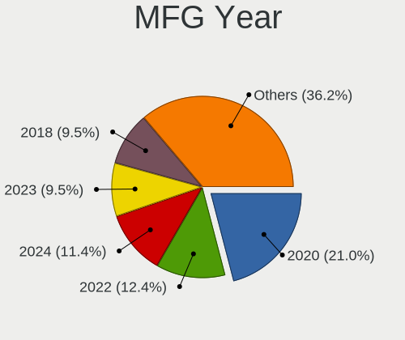
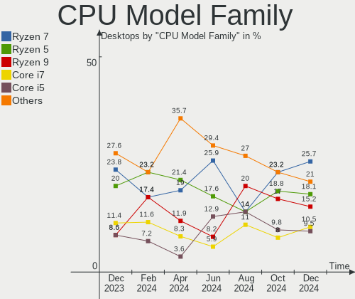
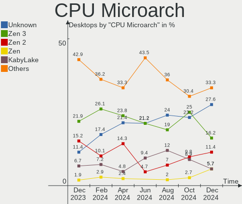
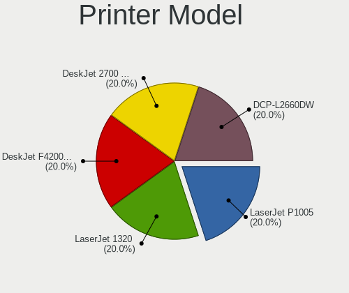

Arch Hardware Trends (Desktop)
------------------------------

A project to identify most popular hardware characteristics and track their change
over time based on data collected by Arch users at https://Linux-Hardware.org.

Anyone can contribute to the study by uploading probes of their computers by
the [hw-probe](https://github.com/linuxhw/hw-probe) tool:

    sudo -E hw-probe -all -upload

Full-feature report is available here: https://linux-hardware.org/?view=trends&formfactor=desktop

Period: Jan, 2021.

Contents
--------

- [ OS                       ](#os)
- [ OS Family                ](#os-family)
- [ Kernel                   ](#kernel)
- [ Kernel Family            ](#kernel-family)
- [ Kernel Major Ver.        ](#kernel-major-ver)
- [ Arch                     ](#arch)
- [ DE                       ](#de)
- [ Display Server           ](#display-server)
- [ Display Manager          ](#display-manager)
- [ OS Lang                  ](#os-lang)
- [ Boot Mode                ](#boot-mode)
- [ Filesystem               ](#filesystem)
- [ Part. scheme             ](#part-scheme)
- [ Dual Boot with Linux/BSD ](#dual-boot-with-linux/bsd)
- [ Dual Boot (Win)          ](#dual-boot-win)
- [ Country                  ](#country)
- [ City                     ](#city)
- [ Vendor                   ](#vendor)
- [ Model                    ](#model)
- [ Model Family             ](#model-family)
- [ MFG Year                 ](#mfg-year)
- [ Form Factor              ](#form-factor)
- [ Secure Boot              ](#secure-boot)
- [ Coreboot                 ](#coreboot)
- [ RAM Size                 ](#ram-size)
- [ RAM Used                 ](#ram-used)
- [ Has CD-ROM               ](#has-cd-rom)
- [ Total Drives             ](#total-drives)
- [ Has Ethernet             ](#has-ethernet)
- [ Drive Vendor             ](#drive-vendor)
- [ Drive Model              ](#drive-model)
- [ HDD Vendor               ](#hdd-vendor)
- [ SSD Vendor               ](#ssd-vendor)
- [ Drive Kind               ](#drive-kind)
- [ Drive Connector          ](#drive-connector)
- [ Drive Size               ](#drive-size)
- [ Space Total              ](#space-total)
- [ Space Used               ](#space-used)
- [ Malfunc. Drives          ](#malfunc-drives)
- [ Malfunc. Drive Vendor    ](#malfunc-drive-vendor)
- [ Malfunc. HDD Vendor      ](#malfunc-hdd-vendor)
- [ Malfunc. Drive Kind      ](#malfunc-drive-kind)
- [ Failed Drives            ](#failed-drives)
- [ Failed Drive Vendor      ](#failed-drive-vendor)
- [ Drive Status             ](#drive-status)
- [ Storage Vendor           ](#storage-vendor)
- [ Storage Model            ](#storage-model)
- [ Storage Kind             ](#storage-kind)
- [ CPU Vendor               ](#cpu-vendor)
- [ CPU Model                ](#cpu-model)
- [ CPU Model Family         ](#cpu-model-family)
- [ CPU Cores                ](#cpu-cores)
- [ CPU Sockets              ](#cpu-sockets)
- [ CPU Threads              ](#cpu-threads)
- [ CPU Op-Modes             ](#cpu-op-modes)
- [ CPU Microcode            ](#cpu-microcode)
- [ CPU Microarch            ](#cpu-microarch)
- [ GPU Vendor               ](#gpu-vendor)
- [ GPU Model                ](#gpu-model)
- [ GPU Combo                ](#gpu-combo)
- [ GPU Driver               ](#gpu-driver)
- [ GPU Memory               ](#gpu-memory)
- [ Monitor Vendor           ](#monitor-vendor)
- [ Monitor Model            ](#monitor-model)
- [ Monitor Resolution       ](#monitor-resolution)
- [ Monitor Diagonal         ](#monitor-diagonal)
- [ Monitor Width            ](#monitor-width)
- [ Aspect Ratio             ](#aspect-ratio)
- [ Monitor Area             ](#monitor-area)
- [ Pixel Density            ](#pixel-density)
- [ Multiple Monitors        ](#multiple-monitors)
- [ Net Controller Vendor    ](#net-controller-vendor)
- [ Net Controller Model     ](#net-controller-model)
- [ Wireless Vendor          ](#wireless-vendor)
- [ Wireless Model           ](#wireless-model)
- [ Ethernet Vendor          ](#ethernet-vendor)
- [ Ethernet Model           ](#ethernet-model)
- [ Net Controller Kind      ](#net-controller-kind)
- [ Used Controller          ](#used-controller)
- [ NICs                     ](#nics)
- [ Memory Vendor            ](#memory-vendor)
- [ Memory Model             ](#memory-model)
- [ Memory Kind              ](#memory-kind)
- [ Memory Form Factor       ](#memory-form-factor)
- [ Memory Size              ](#memory-size)
- [ Memory Speed             ](#memory-speed)
- [ Sound Vendor             ](#sound-vendor)
- [ Sound Model              ](#sound-model)
- [ Camera Vendor            ](#camera-vendor)
- [ Camera Model             ](#camera-model)
- [ Fingerprint Vendor       ](#fingerprint-vendor)
- [ Fingerprint Model        ](#fingerprint-model)
- [ Chipcard Vendor          ](#chipcard-vendor)
- [ Chipcard Model           ](#chipcard-model)
- [ Printer Vendor           ](#printer-vendor)
- [ Printer Model            ](#printer-model)
- [ Scanner Vendor           ](#scanner-vendor)
- [ Scanner Model            ](#scanner-model)
- [ Bluetooth Vendor         ](#bluetooth-vendor)
- [ Bluetooth Model          ](#bluetooth-model)
- [ Unsupported Devices      ](#unsupported-devices)
- [ Unsupported Device Types ](#unsupported-device-types)

OS
--

Installed operating systems

| Name         | Desktops | Percent |
|--------------|----------|---------|
| Arch         | 39       | 56.52%  |
| Arch Rolling | 29       | 42.03%  |
| Arch 20.08.3 | 1        | 1.45%   |

OS Family
---------

OS without a version

| Name | Desktops | Percent |
|------|----------|---------|
| Arch | 69       | 100%    |

Kernel
------

Version of the Linux kernel

| Version                        | Desktops | Percent |
|--------------------------------|----------|---------|
| 5.10.4-arch2-1                 | 8        | 11.59%  |
| 5.10.7-arch1-1                 | 7        | 10.14%  |
| 5.9.14-arch1-1                 | 6        | 8.7%    |
| 5.10.6-arch1-1                 | 6        | 8.7%    |
| 5.10.9-arch1-1                 | 5        | 7.25%   |
| 5.10.3-arch1-1                 | 4        | 5.8%    |
| 5.10.10-arch1-1                | 3        | 4.35%   |
| 5.4.88-1-lts                   | 2        | 2.9%    |
| 5.4.86-1-lts                   | 2        | 2.9%    |
| 5.10.5-zen1-1-zen              | 2        | 2.9%    |
| 5.10.5-arch1-1                 | 2        | 2.9%    |
| 5.10.3-zen1-1-zen              | 2        | 2.9%    |
| 5.10.10-zen1-1-zen             | 2        | 2.9%    |
| 5.9.15-103-tkg-upds            | 1        | 1.45%   |
| 5.9.14-zen1-1-zen              | 1        | 1.45%   |
| 5.9.13-arch1-1                 | 1        | 1.45%   |
| 5.8.14-mono                    | 1        | 1.45%   |
| 5.4.91-1-lts                   | 1        | 1.45%   |
| 5.4.72-microsoft-standard-WSL2 | 1        | 1.45%   |
| 5.4.66-1-lts                   | 1        | 1.45%   |
| 5.10.9-113-tkg-upds            | 1        | 1.45%   |
| 5.10.8-arch1-1                 | 1        | 1.45%   |
| 5.10.7-zen1-1-zen              | 1        | 1.45%   |
| 5.10.7-111-tkg-upds            | 1        | 1.45%   |
| 5.10.7-1-clear                 | 1        | 1.45%   |
| 5.10.6-zen1-1-zen              | 1        | 1.45%   |
| 5.10.5-xanmod1-1               | 1        | 1.45%   |
| 5.10.4-zen2-1-zen              | 1        | 1.45%   |
| 5.10.3-106-tkg-upds            | 1        | 1.45%   |
| 5.10.11-arch1-1                | 1        | 1.45%   |
| 5.10.10-custom-amd             | 1        | 1.45%   |

Kernel Family
-------------

Linux kernel without a distro release

| Version | Desktops | Percent |
|---------|----------|---------|
| 5.10.7  | 10       | 14.49%  |
| 5.10.4  | 9        | 13.04%  |
| 5.9.14  | 7        | 10.14%  |
| 5.10.6  | 7        | 10.14%  |
| 5.10.3  | 7        | 10.14%  |
| 5.10.9  | 6        | 8.7%    |
| 5.10.10 | 6        | 8.7%    |
| 5.10.5  | 5        | 7.25%   |
| 5.4.88  | 2        | 2.9%    |
| 5.4.86  | 2        | 2.9%    |
| 5.9.15  | 1        | 1.45%   |
| 5.9.13  | 1        | 1.45%   |
| 5.8.14  | 1        | 1.45%   |
| 5.4.91  | 1        | 1.45%   |
| 5.4.72  | 1        | 1.45%   |
| 5.4.66  | 1        | 1.45%   |
| 5.10.8  | 1        | 1.45%   |
| 5.10.11 | 1        | 1.45%   |

Kernel Major Ver.
-----------------

Linux kernel major version

| Version | Desktops | Percent |
|---------|----------|---------|
| 5.10    | 52       | 75.36%  |
| 5.9     | 9        | 13.04%  |
| 5.4     | 7        | 10.14%  |
| 5.8     | 1        | 1.45%   |

Arch
----

OS architecture (x86_64, i586, etc.)

| Name   | Desktops | Percent |
|--------|----------|---------|
| x86_64 | 69       | 100%    |

DE
--

Desktop Environment

| Name           | Desktops | Percent |
|----------------|----------|---------|
| GNOME          | 21       | 30.43%  |
| KDE5           | 14       | 20.29%  |
| KDE            | 10       | 14.49%  |
| XFCE           | 8        | 11.59%  |
| Unknown        | 4        | 5.8%    |
| i3             | 3        | 4.35%   |
| MATE           | 2        | 2.9%    |
| Deepin         | 2        | 2.9%    |
| X-Cinnamon     | 1        | 1.45%   |
| Unity          | 1        | 1.45%   |
| i3-with-shmlog | 1        | 1.45%   |
| Cinnamon       | 1        | 1.45%   |
| bspwm          | 1        | 1.45%   |

Display Server
--------------

X11 or Wayland

| Name    | Desktops | Percent |
|---------|----------|---------|
| X11     | 50       | 72.46%  |
| Wayland | 12       | 17.39%  |
| Tty     | 4        | 5.8%    |
| Unknown | 3        | 4.35%   |

Display Manager
---------------

SDDM, LightDM, etc.

| Name    | Desktops | Percent |
|---------|----------|---------|
| Unknown | 36       | 52.17%  |
| SDDM    | 19       | 27.54%  |
| TDM     | 8        | 11.59%  |
| GDM     | 4        | 5.8%    |
| LightDM | 2        | 2.9%    |

OS Lang
-------

Language

| Lang  | Desktops | Percent |
|-------|----------|---------|
| en_US | 33       | 47.83%  |
| en_GB | 7        | 10.14%  |
| ru_RU | 6        | 8.7%    |
| pt_BR | 5        | 7.25%   |
| pl_PL | 4        | 5.8%    |
| it_IT | 3        | 4.35%   |
| fr_FR | 2        | 2.9%    |
| en_IE | 2        | 2.9%    |
| de_DE | 2        | 2.9%    |
| zh_CN | 1        | 1.45%   |
| es_ES | 1        | 1.45%   |
| es_AR | 1        | 1.45%   |
| en_DK | 1        | 1.45%   |
| C     | 1        | 1.45%   |

Boot Mode
---------

EFI or BIOS

| Mode | Desktops | Percent |
|------|----------|---------|
| BIOS | 38       | 55.07%  |
| EFI  | 31       | 44.93%  |

Filesystem
----------

Type of filesystem

| Type  | Desktops | Percent |
|-------|----------|---------|
| Ext4  | 53       | 76.81%  |
| Btrfs | 12       | 17.39%  |
| Xfs   | 3        | 4.35%   |
| F2fs  | 1        | 1.45%   |

Part. scheme
------------

Scheme of partitioning

| Type    | Desktops | Percent |
|---------|----------|---------|
| GPT     | 39       | 56.52%  |
| Unknown | 28       | 40.58%  |
| MBR     | 2        | 2.9%    |

Dual Boot with Linux/BSD
------------------------

Hosting more than one Linux/BSD

| Dual boot | Desktops | Percent |
|-----------|----------|---------|
| No        | 55       | 79.71%  |
| Yes       | 14       | 20.29%  |

Dual Boot (Win)
---------------

Hosting Linux and Windows

| Dual boot | Desktops | Percent |
|-----------|----------|---------|
| No        | 47       | 68.12%  |
| Yes       | 22       | 31.88%  |

Country
-------

Geographic location (country)

| Country            | Desktops | Percent |
|--------------------|----------|---------|
| USA                | 15       | 21.74%  |
| Russia             | 7        | 10.14%  |
| Germany            | 6        | 8.7%    |
| Brazil             | 6        | 8.7%    |
| Poland             | 4        | 5.8%    |
| Ukraine            | 3        | 4.35%   |
| Spain              | 3        | 4.35%   |
| Italy              | 3        | 4.35%   |
| France             | 3        | 4.35%   |
| Sweden             | 2        | 2.9%    |
| India              | 2        | 2.9%    |
| Greece             | 2        | 2.9%    |
| China              | 2        | 2.9%    |
| UK                 | 1        | 1.45%   |
| Switzerland        | 1        | 1.45%   |
| Netherlands        | 1        | 1.45%   |
| Lithuania          | 1        | 1.45%   |
| Korea, Republic of | 1        | 1.45%   |
| Israel             | 1        | 1.45%   |
| Ireland            | 1        | 1.45%   |
| Denmark            | 1        | 1.45%   |
| Canada             | 1        | 1.45%   |
| Argentina          | 1        | 1.45%   |
| Algeria            | 1        | 1.45%   |

City
----

Geographic location (city)

| City                     | Desktops | Percent |
|--------------------------|----------|---------|
| Moscow                   | 3        | 4.35%   |
| Paris                    | 2        | 2.9%    |
| Łódź                  | 1        | 1.45%   |
| Šiauliai                | 1        | 1.45%   |
| Znamianka                | 1        | 1.45%   |
| Włocławek              | 1        | 1.45%   |
| Walsall                  | 1        | 1.45%   |
| Victoria                 | 1        | 1.45%   |
| Tucson                   | 1        | 1.45%   |
| Tel Aviv                 | 1        | 1.45%   |
| Taranto                  | 1        | 1.45%   |
| Suhr                     | 1        | 1.45%   |
| St Petersburg            | 1        | 1.45%   |
| St Louis                 | 1        | 1.45%   |
| Skanderborg              | 1        | 1.45%   |
| Shenzhen                 | 1        | 1.45%   |
| Shanghai                 | 1        | 1.45%   |
| Seversk                  | 1        | 1.45%   |
| Serra                    | 1        | 1.45%   |
| Seattle                  | 1        | 1.45%   |
| Sao Jose                 | 1        | 1.45%   |
| Saint-Christophe-du-Luat | 1        | 1.45%   |
| Ronda                    | 1        | 1.45%   |
| Rome                     | 1        | 1.45%   |
| Roelofarendsveen         | 1        | 1.45%   |
| Rhodes                   | 1        | 1.45%   |
| Radom                    | 1        | 1.45%   |
| Quilmes                  | 1        | 1.45%   |
| Poznan                   | 1        | 1.45%   |
| Porto Alegre             | 1        | 1.45%   |
| Portland                 | 1        | 1.45%   |
| Pokrovsk                 | 1        | 1.45%   |
| Phoenix                  | 1        | 1.45%   |
| Parker                   | 1        | 1.45%   |
| Paducah                  | 1        | 1.45%   |
| Oviedo                   | 1        | 1.45%   |
| Odesa                    | 1        | 1.45%   |
| Münster                 | 1        | 1.45%   |
| Munich                   | 1        | 1.45%   |
| Mineralnye Vody          | 1        | 1.45%   |
| Milton                   | 1        | 1.45%   |
| Milltown                 | 1        | 1.45%   |
| Long Valley              | 1        | 1.45%   |
| Krasnodar                | 1        | 1.45%   |
| Klagerup                 | 1        | 1.45%   |
| Illertissen              | 1        | 1.45%   |
| Ibiza Town               | 1        | 1.45%   |
| Huntingtown              | 1        | 1.45%   |
| Goiânia                 | 1        | 1.45%   |
| Gelsenkirchen            | 1        | 1.45%   |
| Fuenlabrada              | 1        | 1.45%   |
| Frankfurt am Main        | 1        | 1.45%   |
| Framingham               | 1        | 1.45%   |
| Forchheim                | 1        | 1.45%   |
| Eldorado do Sul          | 1        | 1.45%   |
| Delhi                    | 1        | 1.45%   |
| Cambridge                | 1        | 1.45%   |
| Bucheon-si               | 1        | 1.45%   |
| Bengaluru                | 1        | 1.45%   |
| Beaverdam                | 1        | 1.45%   |

Vendor
------

Motherboard manufacturer

| Name                | Desktops | Percent |
|---------------------|----------|---------|
| ASUSTek Computer    | 22       | 31.88%  |
| Gigabyte Technology | 17       | 24.64%  |
| MSI                 | 11       | 15.94%  |
| ASRock              | 8        | 11.59%  |
| Unknown             | 3        | 4.35%   |
| Samsung Electronics | 1        | 1.45%   |
| Positivo            | 1        | 1.45%   |
| Pegatron            | 1        | 1.45%   |
| PCWare              | 1        | 1.45%   |
| Lenovo              | 1        | 1.45%   |
| Hewlett-Packard     | 1        | 1.45%   |
| ECS                 | 1        | 1.45%   |
| Dell                | 1        | 1.45%   |

Model
-----

Motherboard model

| Name                                     | Desktops | Percent |
|------------------------------------------|----------|---------|
| ASUS All Series                          | 3        | 4.35%   |
| Unknown                                  | 3        | 4.35%   |
| Gigabyte 970A-DS3P                       | 2        | 2.9%    |
| ASUS TUF GAMING X570-PLUS                | 2        | 2.9%    |
| Samsung Samsung DeskTop System           | 1        | 1.45%   |
| Positivo POS-AT SERIES D (DMB)           | 1        | 1.45%   |
| Pegatron p6-2026                         | 1        | 1.45%   |
| PCWare IPMH81G1                          | 1        | 1.45%   |
| MSI MS-7C94                              | 1        | 1.45%   |
| MSI MS-7C92                              | 1        | 1.45%   |
| MSI MS-7C87                              | 1        | 1.45%   |
| MSI MS-7C37                              | 1        | 1.45%   |
| MSI MS-7C02                              | 1        | 1.45%   |
| MSI MS-7B87                              | 1        | 1.45%   |
| MSI MS-7B86                              | 1        | 1.45%   |
| MSI MS-7A70                              | 1        | 1.45%   |
| MSI MS-7996                              | 1        | 1.45%   |
| MSI MS-7693                              | 1        | 1.45%   |
| MSI MS-7681                              | 1        | 1.45%   |
| Lenovo ThinkCentre M910t-N000 10N9CTO1WW | 1        | 1.45%   |
| HP Compaq 6200 Pro MT PC                 | 1        | 1.45%   |
| Gigabyte Z68XP-UD3                       | 1        | 1.45%   |
| Gigabyte Z170N-WIFI-CF                   | 1        | 1.45%   |
| Gigabyte X570 AORUS PRO                  | 1        | 1.45%   |
| Gigabyte X570 AORUS ELITE WIFI           | 1        | 1.45%   |
| Gigabyte P35-DS3L                        | 1        | 1.45%   |
| Gigabyte H61M-S2P-R3                     | 1        | 1.45%   |
| Gigabyte GA-970A-D3                      | 1        | 1.45%   |
| Gigabyte GA-78LMT-S2PV                   | 1        | 1.45%   |
| Gigabyte F2A55M-DS2                      | 1        | 1.45%   |
| Gigabyte B75M-D3P                        | 1        | 1.45%   |
| Gigabyte B450M GAMING                    | 1        | 1.45%   |
| Gigabyte B450M DS3H                      | 1        | 1.45%   |
| Gigabyte B450 AORUS ELITE                | 1        | 1.45%   |
| Gigabyte B250M-D3H                       | 1        | 1.45%   |
| Gigabyte A320M-S2H                       | 1        | 1.45%   |
| ECS B332                                 | 1        | 1.45%   |
| Dell Precision WorkStation T7500         | 1        | 1.45%   |
| ASUS Z170-A                              | 1        | 1.45%   |
| ASUS TUF GAMING B550-PLUS                | 1        | 1.45%   |
| ASUS ROG STRIX Z370-E GAMING             | 1        | 1.45%   |
| ASUS ROG STRIX B550-F GAMING             | 1        | 1.45%   |
| ASUS ROG STRIX B450-F GAMING             | 1        | 1.45%   |
| ASUS ROG Maximus XII FORMULA             | 1        | 1.45%   |
| ASUS PRIME X570-PRO                      | 1        | 1.45%   |
| ASUS PRIME X470-PRO                      | 1        | 1.45%   |
| ASUS PRIME B550M-A                       | 1        | 1.45%   |
| ASUS PRIME B360M-K                       | 1        | 1.45%   |
| ASUS P8Z68-V GEN3                        | 1        | 1.45%   |
| ASUS P5K Premium                         | 1        | 1.45%   |
| ASUS M4A88TD-M EVO                       | 1        | 1.45%   |
| ASUS EX-A320M-GAMING                     | 1        | 1.45%   |
| ASUS E3 PRO GAMING V5                    | 1        | 1.45%   |
| ASUS Crosshair IV Formula                | 1        | 1.45%   |
| ASUS A88X-PRO                            | 1        | 1.45%   |
| ASRock Z97 Extreme4                      | 1        | 1.45%   |
| ASRock Z370 Extreme4                     | 1        | 1.45%   |
| ASRock X570 Taichi                       | 1        | 1.45%   |
| ASRock X570 Phantom Gaming-ITX/TB3       | 1        | 1.45%   |
| ASRock X470 Taichi Ultimate              | 1        | 1.45%   |

Model Family
------------

Motherboard model prefix

| Name                   | Desktops | Percent |
|------------------------|----------|---------|
| ASUS ROG               | 4        | 5.8%    |
| ASUS PRIME             | 4        | 5.8%    |
| ASUS TUF               | 3        | 4.35%   |
| ASUS All               | 3        | 4.35%   |
| Unknown                | 3        | 4.35%   |
| Gigabyte X570          | 2        | 2.9%    |
| Gigabyte B450M         | 2        | 2.9%    |
| Gigabyte 970A-DS3P     | 2        | 2.9%    |
| ASRock X570            | 2        | 2.9%    |
| Samsung Samsung        | 1        | 1.45%   |
| Positivo POS-AT        | 1        | 1.45%   |
| Pegatron p6-2026       | 1        | 1.45%   |
| PCWare IPMH81G1        | 1        | 1.45%   |
| MSI MS-7C94            | 1        | 1.45%   |
| MSI MS-7C92            | 1        | 1.45%   |
| MSI MS-7C87            | 1        | 1.45%   |
| MSI MS-7C37            | 1        | 1.45%   |
| MSI MS-7C02            | 1        | 1.45%   |
| MSI MS-7B87            | 1        | 1.45%   |
| MSI MS-7B86            | 1        | 1.45%   |
| MSI MS-7A70            | 1        | 1.45%   |
| MSI MS-7996            | 1        | 1.45%   |
| MSI MS-7693            | 1        | 1.45%   |
| MSI MS-7681            | 1        | 1.45%   |
| Lenovo ThinkCentre     | 1        | 1.45%   |
| HP Compaq              | 1        | 1.45%   |
| Gigabyte Z68XP-UD3     | 1        | 1.45%   |
| Gigabyte Z170N-WIFI-CF | 1        | 1.45%   |
| Gigabyte P35-DS3L      | 1        | 1.45%   |
| Gigabyte H61M-S2P-R3   | 1        | 1.45%   |
| Gigabyte GA-970A-D3    | 1        | 1.45%   |
| Gigabyte GA-78LMT-S2PV | 1        | 1.45%   |
| Gigabyte F2A55M-DS2    | 1        | 1.45%   |
| Gigabyte B75M-D3P      | 1        | 1.45%   |
| Gigabyte B450          | 1        | 1.45%   |
| Gigabyte B250M-D3H     | 1        | 1.45%   |
| Gigabyte A320M-S2H     | 1        | 1.45%   |
| ECS B332               | 1        | 1.45%   |
| Dell Precision         | 1        | 1.45%   |
| ASUS Z170-A            | 1        | 1.45%   |
| ASUS P8Z68-V           | 1        | 1.45%   |
| ASUS P5K               | 1        | 1.45%   |
| ASUS M4A88TD-M         | 1        | 1.45%   |
| ASUS EX-A320M-GAMING   | 1        | 1.45%   |
| ASUS E3                | 1        | 1.45%   |
| ASUS Crosshair         | 1        | 1.45%   |
| ASUS A88X-PRO          | 1        | 1.45%   |
| ASRock Z97             | 1        | 1.45%   |
| ASRock Z370            | 1        | 1.45%   |
| ASRock X470            | 1        | 1.45%   |
| ASRock X370            | 1        | 1.45%   |
| ASRock J4205-ITX       | 1        | 1.45%   |
| ASRock H97M            | 1        | 1.45%   |

MFG Year
--------

Motherboard manufacture year

| Year    | Desktops | Percent |
|---------|----------|---------|
| 2020    | 23       | 33.33%  |
| 2018    | 9        | 13.04%  |
| 2013    | 8        | 11.59%  |
| 2019    | 6        | 8.7%    |
| 2017    | 6        | 8.7%    |
| 2016    | 5        | 7.25%   |
| 2012    | 3        | 4.35%   |
| Unknown | 2        | 2.9%    |
| 2015    | 1        | 1.45%   |
| 2014    | 1        | 1.45%   |
| 2011    | 1        | 1.45%   |
| 2010    | 1        | 1.45%   |
| 2009    | 1        | 1.45%   |
| 2008    | 1        | 1.45%   |
| 2007    | 1        | 1.45%   |

Form Factor
-----------

Physical design of the computer

| Name    | Desktops | Percent |
|---------|----------|---------|
| Desktop | 69       | 100%    |

Secure Boot
-----------

Enabled or disabled

| State    | Desktops | Percent |
|----------|----------|---------|
| Disabled | 69       | 100%    |

Coreboot
--------

Have coreboot on board

| Used | Desktops | Percent |
|------|----------|---------|
| No   | 69       | 100%    |

RAM Size
--------

Total RAM memory

| Size in GB  | Desktops | Percent |
|-------------|----------|---------|
| 16.01-24.0  | 29       | 42.03%  |
| 32.01-64.0  | 16       | 23.19%  |
| 8.01-16.0   | 14       | 20.29%  |
| 64.01-256.0 | 5        | 7.25%   |
| 3.01-4.0    | 4        | 5.8%    |
| 4.01-8.0    | 1        | 1.45%   |

RAM Used
--------

Used RAM memory

| Used GB    | Desktops | Percent |
|------------|----------|---------|
| 1.01-2.0   | 20       | 28.99%  |
| 4.01-8.0   | 16       | 23.19%  |
| 2.01-3.0   | 14       | 20.29%  |
| 8.01-16.0  | 8        | 11.59%  |
| 3.01-4.0   | 7        | 10.14%  |
| 0.51-1.0   | 2        | 2.9%    |
| 32.01-64.0 | 1        | 1.45%   |
| 0.01-0.5   | 1        | 1.45%   |

Has CD-ROM
----------

Has CD-ROM on board

| Presented | Desktops | Percent |
|-----------|----------|---------|
| No        | 44       | 63.77%  |
| Yes       | 25       | 36.23%  |

Total Drives
------------

Number of drives on board

| Drives | Desktops | Percent |
|--------|----------|---------|
| 2      | 21       | 30.43%  |
| 3      | 20       | 28.99%  |
| 1      | 12       | 17.39%  |
| 4      | 7        | 10.14%  |
| 6      | 5        | 7.25%   |
| 5      | 2        | 2.9%    |
| 8      | 1        | 1.45%   |
| 7      | 1        | 1.45%   |

Has Ethernet
------------

Has Ethernet on board

| Presented | Desktops | Percent |
|-----------|----------|---------|
| Yes       | 67       | 97.1%   |
| No        | 2        | 2.9%    |

Drive Vendor
------------

Hard drive vendors

| Vendor              | Desktops | Drives | Percent |
|---------------------|----------|--------|---------|
| Samsung Electronics | 30       | 43     | 20.41%  |
| WDC                 | 27       | 44     | 18.37%  |
| Seagate             | 27       | 39     | 18.37%  |
| Kingston            | 12       | 13     | 8.16%   |
| Toshiba             | 9        | 10     | 6.12%   |
| SanDisk             | 5        | 6      | 3.4%    |
| Crucial             | 5        | 7      | 3.4%    |
| A-DATA Technology   | 5        | 6      | 3.4%    |
| Phison              | 3        | 3      | 2.04%   |
| Hitachi             | 3        | 4      | 2.04%   |
| Silicon Motion      | 2        | 2      | 1.36%   |
| OCZ                 | 2        | 2      | 1.36%   |
| HGST                | 2        | 3      | 1.36%   |
| XPG                 | 1        | 1      | 0.68%   |
| VMware              | 1        | 1      | 0.68%   |
| Unknown             | 1        | 1      | 0.68%   |
| PLEXTOR             | 1        | 1      | 0.68%   |
| Patriot             | 1        | 1      | 0.68%   |
| OCZ-VERTEX          | 1        | 1      | 0.68%   |
| Mushkin             | 1        | 1      | 0.68%   |
| Msft                | 1        | 2      | 0.68%   |
| Micron Technology   | 1        | 1      | 0.68%   |
| KIOXIA-EXCERIA      | 1        | 1      | 0.68%   |
| JMicron             | 1        | 1      | 0.68%   |
| Intel               | 1        | 1      | 0.68%   |
| Hewlett-Packard     | 1        | 1      | 0.68%   |
| GLOWAY              | 1        | 1      | 0.68%   |
| Dogfish             | 1        | 1      | 0.68%   |

Drive Model
-----------

Hard drive models

| Model                              | Desktops | Percent |
|------------------------------------|----------|---------|
| WDC WD20EZRZ-00Z5HB0 2TB           | 4        | 2.16%   |
| Samsung SSD 860 EVO 500GB          | 4        | 2.16%   |
| Seagate ST2000DM008-2FR102 2TB     | 3        | 1.62%   |
| Samsung SSD 850 EVO 500GB          | 3        | 1.62%   |
| Samsung SSD 850 EVO 250GB          | 3        | 1.62%   |
| Samsung NVMe SSD Drive 500GB       | 3        | 1.62%   |
| Samsung HD103SJ 1TB                | 3        | 1.62%   |
| Kingston SHFS37A120G 120GB SSD     | 3        | 1.62%   |
| Kingston SA400S37240G 240GB SSD    | 3        | 1.62%   |
| Crucial CT500MX500SSD1 500GB       | 3        | 1.62%   |
| WDC WDS500G2B0A-00SM50 500GB SSD   | 2        | 1.08%   |
| WDC WD20EARS-00MVWB0 2TB           | 2        | 1.08%   |
| WDC WD10EZEX-00BN5A0 1TB           | 2        | 1.08%   |
| WDC WD10EADS-00L5B1 1TB            | 2        | 1.08%   |
| Toshiba HDWD130 3TB                | 2        | 1.08%   |
| Seagate ST500DM002-1BC142 500GB    | 2        | 1.08%   |
| Seagate ST2000LX001-1RG174 2TB     | 2        | 1.08%   |
| Seagate ST2000DM006-2DM164 2TB     | 2        | 1.08%   |
| Seagate ST2000DM001-1ER164 2TB     | 2        | 1.08%   |
| Seagate ST1000LM024 HN-M101MBB 1TB | 2        | 1.08%   |
| Samsung SSD 970 EVO 250GB          | 2        | 1.08%   |
| Samsung SSD 860 EVO 1TB            | 2        | 1.08%   |
| Samsung SSD 850 EVO 1TB            | 2        | 1.08%   |
| Samsung SSD 840 EVO 250GB          | 2        | 1.08%   |
| Samsung HD502HJ 500GB              | 2        | 1.08%   |
| Kingston SV300S37A120G 120GB SSD   | 2        | 1.08%   |
| Hitachi HUA723020ALA641 2TB        | 2        | 1.08%   |
| XPG NVMe SSD Drive 512GB           | 1        | 0.54%   |
| WDC WDS240G2G0A-00JH30 240GB SSD   | 1        | 0.54%   |
| WDC WDS120G1G0B-00RC30 120GB SSD   | 1        | 0.54%   |
| WDC WDS100T2B0B-00YS70 1TB SSD     | 1        | 0.54%   |
| WDC WD6400AAKS-22A7B2 640GB        | 1        | 0.54%   |
| WDC WD60EFRX-68MYMN1 6TB           | 1        | 0.54%   |
| WDC WD60EFRX-68L0BN1 6TB           | 1        | 0.54%   |
| WDC WD6002FRYZ-01WD5B0 6TB         | 1        | 0.54%   |
| WDC WD5000LPVX-22V0TT0 500GB       | 1        | 0.54%   |
| WDC WD5000AZLX-00K2TA0 500GB       | 1        | 0.54%   |
| WDC WD5000AVDS-63U7B1 500GB        | 1        | 0.54%   |
| WDC WD40EZRZ-00WN9B0 4TB           | 1        | 0.54%   |
| WDC WD40EZRZ-00GXCB0 4TB           | 1        | 0.54%   |
| WDC WD40EZRX-00SPEB0 4TB           | 1        | 0.54%   |
| WDC WD3200AAJS-56B4A0 320GB        | 1        | 0.54%   |
| WDC WD30EZRX-00MMMB0 3TB           | 1        | 0.54%   |
| WDC WD20EARX-22PASB0 2TB           | 1        | 0.54%   |
| WDC WD2002FAEX-007BA0 2TB          | 1        | 0.54%   |
| WDC WD180PURZ-85AFFY0 18TB         | 1        | 0.54%   |
| WDC WD10EZEX-60WN4A0 1TB           | 1        | 0.54%   |
| WDC WD10EZEX-22MFCA0 1TB           | 1        | 0.54%   |
| WDC WD10EZEX-08WN4A0 1TB           | 1        | 0.54%   |
| WDC WD10EZEX-00WN4A0 1TB           | 1        | 0.54%   |
| WDC WD10EFRX-68PJCN0 1TB           | 1        | 0.54%   |
| WDC WD10EADS-65M2B1 1TB            | 1        | 0.54%   |
| WDC WD10EACS-00ZJB0 1TB            | 1        | 0.54%   |
| WDC WD100PURZ-85W86Y0 10TB         | 1        | 0.54%   |
| WDC WD1001FALS-00J7B0 1TB          | 1        | 0.54%   |
| VMware Virtual S 68GB              | 1        | 0.54%   |
| Unknown 4GB SATA Flash Drive       | 1        | 0.54%   |
| Toshiba VT180 480GB SSD            | 1        | 0.54%   |
| Toshiba MQ01ABD100 1TB             | 1        | 0.54%   |
| Toshiba MG07ACA12TE 12TB           | 1        | 0.54%   |

HDD Vendor
----------

Hard disk drive vendors

| Vendor              | Desktops | Drives | Percent |
|---------------------|----------|--------|---------|
| Seagate             | 27       | 39     | 38.57%  |
| WDC                 | 24       | 39     | 34.29%  |
| Toshiba             | 8        | 9      | 11.43%  |
| Samsung Electronics | 5        | 7      | 7.14%   |
| Hitachi             | 3        | 4      | 4.29%   |
| HGST                | 2        | 3      | 2.86%   |
| Msft                | 1        | 2      | 1.43%   |

SSD Vendor
----------

Solid state drive vendors

| Vendor              | Desktops | Drives | Percent |
|---------------------|----------|--------|---------|
| Samsung Electronics | 20       | 24     | 35.09%  |
| Kingston            | 11       | 12     | 19.3%   |
| WDC                 | 5        | 5      | 8.77%   |
| Crucial             | 5        | 7      | 8.77%   |
| SanDisk             | 4        | 5      | 7.02%   |
| A-DATA Technology   | 3        | 4      | 5.26%   |
| OCZ                 | 2        | 2      | 3.51%   |
| Toshiba             | 1        | 1      | 1.75%   |
| Patriot             | 1        | 1      | 1.75%   |
| OCZ-VERTEX          | 1        | 1      | 1.75%   |
| JMicron             | 1        | 1      | 1.75%   |
| Hewlett-Packard     | 1        | 1      | 1.75%   |
| GLOWAY              | 1        | 1      | 1.75%   |
| Dogfish             | 1        | 1      | 1.75%   |

Drive Kind
----------

HDD or SSD

| Kind    | Desktops | Drives | Percent |
|---------|----------|--------|---------|
| HDD     | 54       | 103    | 44.26%  |
| SSD     | 44       | 66     | 36.07%  |
| NVMe    | 22       | 27     | 18.03%  |
| Unknown | 2        | 2      | 1.64%   |

Drive Connector
---------------

SATA, SAS, NVMe, etc.

| Type | Desktops | Drives | Percent |
|------|----------|--------|---------|
| SATA | 64       | 164    | 69.57%  |
| NVMe | 22       | 27     | 23.91%  |
| SAS  | 6        | 7      | 6.52%   |

Drive Size
----------

Size of hard drive

| Size in TB | Desktops | Drives | Percent |
|------------|----------|--------|---------|
| 0.01-0.5   | 47       | 78     | 40.87%  |
| 0.51-1.0   | 29       | 39     | 25.22%  |
| 1.01-2.0   | 20       | 26     | 17.39%  |
| 4.01-10.0  | 7        | 13     | 6.09%   |
| 3.01-4.0   | 5        | 5      | 4.35%   |
| 2.01-3.0   | 5        | 5      | 4.35%   |
| 10.01-20.0 | 2        | 3      | 1.74%   |

Space Total
-----------

Amount of disk space available on the file system

| Size in GB     | Desktops | Percent |
|----------------|----------|---------|
| 1001-2000      | 16       | 23.19%  |
| More than 3000 | 13       | 18.84%  |
| 2001-3000      | 10       | 14.49%  |
| 501-1000       | 10       | 14.49%  |
| 101-250        | 8        | 11.59%  |
| 251-500        | 7        | 10.14%  |
| 51-100         | 4        | 5.8%    |
| Unknown        | 1        | 1.45%   |

Space Used
----------

Amount of used disk space

| Used GB        | Desktops | Percent |
|----------------|----------|---------|
| 251-500        | 11       | 15.94%  |
| 1001-2000      | 11       | 15.94%  |
| 21-50          | 10       | 14.49%  |
| More than 3000 | 9        | 13.04%  |
| 101-250        | 9        | 13.04%  |
| 501-1000       | 8        | 11.59%  |
| 1-20           | 5        | 7.25%   |
| 51-100         | 4        | 5.8%    |
| 2001-3000      | 1        | 1.45%   |
| Unknown        | 1        | 1.45%   |

Malfunc. Drives
---------------

Drive models with a malfunction

| Model                               | Desktops | Drives | Percent |
|-------------------------------------|----------|--------|---------|
| WDC WD6002FRYZ-01WD5B0 6TB          | 1        | 1      | 5.56%   |
| WDC WD5000AVDS-63U7B1 500GB         | 1        | 1      | 5.56%   |
| WDC WD2002FAEX-007BA0 2TB           | 1        | 1      | 5.56%   |
| WDC WD10EADS-65M2B1 1TB             | 1        | 1      | 5.56%   |
| WDC WD10EADS-00L5B1 1TB             | 1        | 1      | 5.56%   |
| Toshiba VT180 480GB SSD             | 1        | 1      | 5.56%   |
| Seagate ST500LT012-1DG142 500GB     | 1        | 1      | 5.56%   |
| Seagate ST500LM012 HN-M500MBB 500GB | 1        | 1      | 5.56%   |
| Seagate ST500DM002-1BC142 500GB     | 1        | 1      | 5.56%   |
| Seagate ST3500630NS Q 500GB         | 1        | 1      | 5.56%   |
| Seagate ST31000528AS 1TB            | 1        | 1      | 5.56%   |
| Seagate ST2000DM006-2DM164 2TB      | 1        | 1      | 5.56%   |
| Seagate ST1000LM024 HN-M101MBB 1TB  | 1        | 1      | 5.56%   |
| Seagate ST1000DX001-1NS162 1TB      | 1        | 1      | 5.56%   |
| Samsung Electronics HD321HJ 320GB   | 1        | 1      | 5.56%   |
| Samsung Electronics HD103SJ 1TB     | 1        | 1      | 5.56%   |
| PLEXTOR PX-1TM8SeG 1TB              | 1        | 1      | 5.56%   |
| HGST HTS545050A7E380 500GB          | 1        | 1      | 5.56%   |

Malfunc. Drive Vendor
---------------------

Vendors of faulty drives

| Vendor              | Desktops | Drives | Percent |
|---------------------|----------|--------|---------|
| Seagate             | 6        | 8      | 40%     |
| WDC                 | 4        | 5      | 26.67%  |
| Samsung Electronics | 2        | 2      | 13.33%  |
| Toshiba             | 1        | 1      | 6.67%   |
| PLEXTOR             | 1        | 1      | 6.67%   |
| HGST                | 1        | 1      | 6.67%   |

Malfunc. HDD Vendor
-------------------

Vendors of faulty HDD drives

| Vendor              | Desktops | Drives | Percent |
|---------------------|----------|--------|---------|
| Seagate             | 6        | 8      | 46.15%  |
| WDC                 | 4        | 5      | 30.77%  |
| Samsung Electronics | 2        | 2      | 15.38%  |
| HGST                | 1        | 1      | 7.69%   |

Malfunc. Drive Kind
-------------------

Kinds of faulty drives

| Kind | Desktops | Drives | Percent |
|------|----------|--------|---------|
| HDD  | 12       | 16     | 85.71%  |
| NVMe | 1        | 1      | 7.14%   |
| SSD  | 1        | 1      | 7.14%   |

Failed Drives
-------------

Failed drive models

| Model                    | Desktops | Drives | Percent |
|--------------------------|----------|--------|---------|
| Seagate ST32000644NS 2TB | 1        | 1      | 100%    |

Failed Drive Vendor
-------------------

Failed drive vendors

| Vendor  | Desktops | Drives | Percent |
|---------|----------|--------|---------|
| Seagate | 1        | 1      | 100%    |

Drive Status
------------

Number of failed and malfunc. drives

| Status   | Desktops | Drives | Percent |
|----------|----------|--------|---------|
| Detected | 38       | 91     | 46.91%  |
| Works    | 29       | 88     | 35.8%   |
| Malfunc  | 13       | 18     | 16.05%  |
| Failed   | 1        | 1      | 1.23%   |

Storage Vendor
--------------

Storage controller vendors

| Vendor                        | Desktops | Percent |
|-------------------------------|----------|---------|
| AMD                           | 35       | 32.11%  |
| Intel                         | 33       | 30.28%  |
| Samsung Electronics           | 12       | 11.01%  |
| ASMedia Technology            | 6        | 5.5%    |
| Silicon Motion                | 3        | 2.75%   |
| Phison Electronics            | 3        | 2.75%   |
| Marvell Technology Group      | 3        | 2.75%   |
| ADATA Technology              | 3        | 2.75%   |
| JMicron Technology            | 2        | 1.83%   |
| VIA Technologies              | 1        | 0.92%   |
| Silicon Image                 | 1        | 0.92%   |
| Sandisk                       | 1        | 0.92%   |
| Micron Technology             | 1        | 0.92%   |
| LSI Logic / Symbios Logic     | 1        | 0.92%   |
| Lite-On Technology            | 1        | 0.92%   |
| KIOXIA                        | 1        | 0.92%   |
| Kingston Technology Company   | 1        | 0.92%   |
| Integrated Technology Express | 1        | 0.92%   |

Storage Model
-------------

Storage controller models

| Model                                                                                   | Desktops | Percent |
|-----------------------------------------------------------------------------------------|----------|---------|
| AMD FCH SATA Controller [AHCI mode]                                                     | 23       | 17.04%  |
| Samsung NVMe SSD Controller SM981/PM981/PM983                                           | 10       | 7.41%   |
| AMD 400 Series Chipset SATA Controller                                                  | 10       | 7.41%   |
| ASMedia ASM1062 Serial ATA Controller                                                   | 6        | 4.44%   |
| Intel 200 Series PCH SATA controller [AHCI mode]                                        | 5        | 3.7%    |
| AMD SATA controller                                                                     | 5        | 3.7%    |
| Intel Q170/Q150/B150/H170/H110/Z170/CM236 Chipset SATA Controller [AHCI Mode]           | 4        | 2.96%   |
| Intel 6 Series/C200 Series Chipset Family 6 port Desktop SATA AHCI Controller           | 4        | 2.96%   |
| AMD SB7x0/SB8x0/SB9x0 SATA Controller [AHCI mode]                                       | 4        | 2.96%   |
| AMD SB7x0/SB8x0/SB9x0 IDE Controller                                                    | 4        | 2.96%   |
| Intel C610/X99 series chipset 6-Port SATA Controller [AHCI mode]                        | 3        | 2.22%   |
| AMD SB7x0/SB8x0/SB9x0 SATA Controller [IDE mode]                                        | 3        | 2.22%   |
| ADATA XPG SX8200 Pro PCIe Gen3x4 M.2 2280 Solid State Drive                             | 3        | 2.22%   |
| Silicon Motion SM2262/SM2262EN SSD Controller                                           | 2        | 1.48%   |
| Phison E16 PCIe4 NVMe Controller                                                        | 2        | 1.48%   |
| Intel C610/X99 series chipset sSATA Controller [AHCI mode]                              | 2        | 1.48%   |
| Intel 9 Series Chipset Family SATA Controller [AHCI Mode]                               | 2        | 1.48%   |
| Intel 8 Series/C220 Series Chipset Family 6-port SATA Controller 1 [AHCI mode]          | 2        | 1.48%   |
| Intel 7 Series/C210 Series Chipset Family 6-port SATA Controller [AHCI mode]            | 2        | 1.48%   |
| Intel 6 Series/C200 Series Chipset Family Desktop SATA Controller (IDE mode, ports 4-5) | 2        | 1.48%   |
| Intel 6 Series/C200 Series Chipset Family Desktop SATA Controller (IDE mode, ports 0-3) | 2        | 1.48%   |
| AMD FCH SATA Controller D                                                               | 2        | 1.48%   |
| VIA VT6415 PATA IDE Host Controller                                                     | 1        | 0.74%   |
| Silicon Motion SM2263EN/SM2263XT SSD Controller                                         | 1        | 0.74%   |
| Silicon Image SiI 3132 Serial ATA Raid II Controller                                    | 1        | 0.74%   |
| Sandisk WD Black SN750 / PC SN730 NVMe SSD                                              | 1        | 0.74%   |
| Samsung NVMe SSD Controller SM961/PM961/SM963                                           | 1        | 0.74%   |
| Samsung NVMe SSD Controller SM951/PM951                                                 | 1        | 0.74%   |
| Phison E12 NVMe Controller                                                              | 1        | 0.74%   |
| Micron 9100 MAX NVMe SSD                                                                | 1        | 0.74%   |
| Marvell Group 88SE9172 SATA 6Gb/s Controller                                            | 1        | 0.74%   |
| Marvell Group 88SE9128 PCIe SATA 6 Gb/s RAID controller with HyperDuo                   | 1        | 0.74%   |
| Marvell Group 88SE9123 PCIe SATA 6.0 Gb/s controller                                    | 1        | 0.74%   |
| LSI Logic / Symbios Logic 53c1030 PCI-X Fusion-MPT Dual Ultra320 SCSI                   | 1        | 0.74%   |
| Lite-On Non-Volatile memory controller                                                  | 1        | 0.74%   |
| KIOXIA NVMe SSD                                                                         | 1        | 0.74%   |
| Kingston Company A2000 NVMe SSD                                                         | 1        | 0.74%   |
| JMicron JMB368 IDE controller                                                           | 1        | 0.74%   |
| JMicron JMB363 SATA/IDE Controller                                                      | 1        | 0.74%   |
| Intel PCIe Data Center SSD                                                              | 1        | 0.74%   |
| Intel NM10/ICH7 Family SATA Controller [IDE mode]                                       | 1        | 0.74%   |
| Intel Chipset SATA RAID Controller                                                      | 1        | 0.74%   |
| Intel Celeron N3350/Pentium N4200/Atom E3900 Series SATA AHCI Controller                | 1        | 0.74%   |
| Intel Cannon Lake PCH SATA AHCI Controller                                              | 1        | 0.74%   |
| Intel C600/X79 series chipset 6-Port SATA AHCI Controller                               | 1        | 0.74%   |
| Intel 82801JI (ICH10 Family) 4 port SATA IDE Controller #1                              | 1        | 0.74%   |
| Intel 82801JI (ICH10 Family) 2 port SATA IDE Controller #2                              | 1        | 0.74%   |
| Intel 82801IR/IO/IH (ICH9R/DO/DH) 6 port SATA Controller [AHCI mode]                    | 1        | 0.74%   |
| Intel 82801IB (ICH9) 4 port SATA Controller [AHCI mode]                                 | 1        | 0.74%   |
| Intel 82801G (ICH7 Family) IDE Controller                                               | 1        | 0.74%   |
| Intel 82371AB/EB/MB PIIX4 IDE                                                           | 1        | 0.74%   |
| Intel 7 Series/C210 Series Chipset Family IDE-r Controller                              | 1        | 0.74%   |
| Integrated Express IT8212 Dual channel ATA RAID controller                              | 1        | 0.74%   |
| AMD X370 Series Chipset SATA Controller                                                 | 1        | 0.74%   |
| AMD FCH IDE Controller                                                                  | 1        | 0.74%   |

Storage Kind
------------

Kind of storage controller (IDE, SATA, NVMe, SAS, ...)

| Kind | Desktops | Percent |
|------|----------|---------|
| SATA | 63       | 62.38%  |
| NVMe | 22       | 21.78%  |
| IDE  | 12       | 11.88%  |
| RAID | 3        | 2.97%   |
| SCSI | 1        | 0.99%   |

CPU Vendor
----------

Processor vendors

| Vendor | Desktops | Percent |
|--------|----------|---------|
| AMD    | 36       | 52.17%  |
| Intel  | 33       | 47.83%  |

CPU Model
---------

Processor models

| Model                                           | Desktops | Percent |
|-------------------------------------------------|----------|---------|
| AMD Ryzen 7 3700X 8-Core Processor              | 4        | 5.8%    |
| AMD Ryzen 5 3600 6-Core Processor               | 4        | 5.8%    |
| Intel Core i5-2500K CPU @ 3.30GHz               | 3        | 4.35%   |
| AMD Ryzen 5 2600X Six-Core Processor            | 3        | 4.35%   |
| Intel Core i7-6700K CPU @ 4.00GHz               | 2        | 2.9%    |
| Intel Core i7-5820K CPU @ 3.30GHz               | 2        | 2.9%    |
| Intel Core i5-7500 CPU @ 3.40GHz                | 2        | 2.9%    |
| Intel Core i3-2120 CPU @ 3.30GHz                | 2        | 2.9%    |
| AMD Ryzen 9 5900X 12-Core Processor             | 2        | 2.9%    |
| AMD Ryzen 9 3900X 12-Core Processor             | 2        | 2.9%    |
| AMD Ryzen 5 3500X 6-Core Processor              | 2        | 2.9%    |
| AMD Phenom II X4 965 Processor                  | 2        | 2.9%    |
| AMD FX-8320 Eight-Core Processor                | 2        | 2.9%    |
| Intel Xeon CPU X5650 @ 2.67GHz                  | 1        | 1.45%   |
| Intel Xeon CPU E5-2620 v2 @ 2.10GHz             | 1        | 1.45%   |
| Intel Xeon CPU E3-1265L v4 @ 2.30GHz            | 1        | 1.45%   |
| Intel Xeon CPU E3-1230 v5 @ 3.40GHz             | 1        | 1.45%   |
| Intel Pentium CPU J4205 @ 1.50GHz               | 1        | 1.45%   |
| Intel Pentium CPU G3220 @ 3.00GHz               | 1        | 1.45%   |
| Intel Core i7-8700K CPU @ 3.70GHz               | 1        | 1.45%   |
| Intel Core i7-6850K CPU @ 3.60GHz               | 1        | 1.45%   |
| Intel Core i7-6700 CPU @ 3.40GHz                | 1        | 1.45%   |
| Intel Core i7-10700K CPU @ 3.80GHz              | 1        | 1.45%   |
| Intel Core i7-10510U CPU @ 1.80GHz              | 1        | 1.45%   |
| Intel Core i5-8400 CPU @ 2.80GHz                | 1        | 1.45%   |
| Intel Core i5-4690K CPU @ 3.50GHz               | 1        | 1.45%   |
| Intel Core i5-4440 CPU @ 3.10GHz                | 1        | 1.45%   |
| Intel Core i5-3570 CPU @ 3.40GHz                | 1        | 1.45%   |
| Intel Core i5-3470 CPU @ 3.20GHz                | 1        | 1.45%   |
| Intel Core i5-2400 CPU @ 3.10GHz                | 1        | 1.45%   |
| Intel Core i3-8100 CPU @ 3.60GHz                | 1        | 1.45%   |
| Intel Core i3-7100 CPU @ 3.90GHz                | 1        | 1.45%   |
| Intel Core 2 Quad CPU Q9650 @ 3.00GHz           | 1        | 1.45%   |
| Intel Core 2 Quad CPU Q9400 @ 2.66GHz           | 1        | 1.45%   |
| Intel Core 2 Duo CPU E6850 @ 3.00GHz            | 1        | 1.45%   |
| AMD Ryzen 9 3950X 16-Core Processor             | 1        | 1.45%   |
| AMD Ryzen 9 3900XT 12-Core Processor            | 1        | 1.45%   |
| AMD Ryzen 7 5800X 8-Core Processor              | 1        | 1.45%   |
| AMD Ryzen 7 3800X 8-Core Processor              | 1        | 1.45%   |
| AMD Ryzen 7 2700X Eight-Core Processor          | 1        | 1.45%   |
| AMD Ryzen 5 3400G with Radeon Vega Graphics     | 1        | 1.45%   |
| AMD Ryzen 5 2600 Six-Core Processor             | 1        | 1.45%   |
| AMD Ryzen 5 1600X Six-Core Processor            | 1        | 1.45%   |
| AMD Ryzen 3 2200G with Radeon Vega Graphics     | 1        | 1.45%   |
| AMD Ryzen 3 1300X Quad-Core Processor           | 1        | 1.45%   |
| AMD Phenom II X6 1075T Processor                | 1        | 1.45%   |
| AMD FX-6300 Six-Core Processor                  | 1        | 1.45%   |
| AMD FX-4170 Quad-Core Processor                 | 1        | 1.45%   |
| AMD Athlon X4 740 Quad Core Processor           | 1        | 1.45%   |
| AMD A10-7850K Radeon R7, 12 Compute Cores 4C+8G | 1        | 1.45%   |

CPU Model Family
----------------

Processor model prefix

| Model             | Desktops | Percent |
|-------------------|----------|---------|
| AMD Ryzen 5       | 12       | 17.39%  |
| Intel Core i5     | 11       | 15.94%  |
| Intel Core i7     | 9        | 13.04%  |
| AMD Ryzen 7       | 7        | 10.14%  |
| AMD Ryzen 9       | 6        | 8.7%    |
| Intel Xeon        | 4        | 5.8%    |
| Intel Core i3     | 4        | 5.8%    |
| AMD FX            | 4        | 5.8%    |
| Intel Pentium     | 2        | 2.9%    |
| Intel Core 2 Quad | 2        | 2.9%    |
| AMD Ryzen 3       | 2        | 2.9%    |
| AMD Phenom II X4  | 2        | 2.9%    |
| Intel Core 2 Duo  | 1        | 1.45%   |
| AMD Phenom II X6  | 1        | 1.45%   |
| AMD Athlon X4     | 1        | 1.45%   |
| AMD A10           | 1        | 1.45%   |

CPU Cores
---------

Number of processor cores

| Number | Desktops | Percent |
|--------|----------|---------|
| 4      | 28       | 40.58%  |
| 6      | 18       | 26.09%  |
| 2      | 8        | 11.59%  |
| 8      | 7        | 10.14%  |
| 12     | 6        | 8.7%    |
| 16     | 1        | 1.45%   |
| 3      | 1        | 1.45%   |

CPU Sockets
-----------

Number of sockets

| Number | Desktops | Percent |
|--------|----------|---------|
| 1      | 67       | 97.1%   |
| 4      | 1        | 1.45%   |
| 2      | 1        | 1.45%   |

CPU Threads
-----------

Threads per core (Hyper-Threading)

| Number | Desktops | Percent |
|--------|----------|---------|
| 2      | 43       | 62.32%  |
| 1      | 26       | 37.68%  |

CPU Op-Modes
------------

CPU Operation Modes (32-bit, 64-bit)

| Op mode        | Desktops | Percent |
|----------------|----------|---------|
| 32-bit, 64-bit | 69       | 100%    |

CPU Microcode
-------------

Microcode number

| Number     | Desktops | Percent |
|------------|----------|---------|
| Unknown    | 30       | 43.48%  |
| 0x08701021 | 10       | 14.49%  |
| 0x0a201009 | 3        | 4.35%   |
| 0x08701013 | 3        | 4.35%   |
| 0x0800820d | 3        | 4.35%   |
| 0x506e3    | 2        | 2.9%    |
| 0x306f2    | 2        | 2.9%    |
| 0x306a9    | 2        | 2.9%    |
| 0x206a7    | 2        | 2.9%    |
| 0xa0655    | 1        | 1.45%   |
| 0x906eb    | 1        | 1.45%   |
| 0x906ea    | 1        | 1.45%   |
| 0x906e9    | 1        | 1.45%   |
| 0x306e4    | 1        | 1.45%   |
| 0x306c3    | 1        | 1.45%   |
| 0x206c2    | 1        | 1.45%   |
| 0x1067a    | 1        | 1.45%   |
| 0x08101016 | 1        | 1.45%   |
| 0x0600063e | 1        | 1.45%   |
| 0x010000c8 | 1        | 1.45%   |
| 0x010000b6 | 1        | 1.45%   |

CPU Microarch
-------------

Microarchitecture

| Name        | Desktops | Percent |
|-------------|----------|---------|
| Zen 2       | 15       | 21.74%  |
| KabyLake    | 7        | 10.14%  |
| Zen+        | 6        | 8.7%    |
| SandyBridge | 6        | 8.7%    |
| Haswell     | 5        | 7.25%   |
| Skylake     | 4        | 5.8%    |
| Piledriver  | 4        | 5.8%    |
| Zen         | 3        | 4.35%   |
| K10         | 3        | 4.35%   |
| IvyBridge   | 3        | 4.35%   |
| Unknown     | 3        | 4.35%   |
| Penryn      | 2        | 2.9%    |
| Broadwell   | 2        | 2.9%    |
| Westmere    | 1        | 1.45%   |
| Steamroller | 1        | 1.45%   |
| Goldmont    | 1        | 1.45%   |
| Core        | 1        | 1.45%   |
| CometLake   | 1        | 1.45%   |
| Bulldozer   | 1        | 1.45%   |

GPU Vendor
----------

Vendors of graphics cards

| Vendor | Desktops | Percent |
|--------|----------|---------|
| Nvidia | 34       | 44.74%  |
| AMD    | 34       | 44.74%  |
| Intel  | 7        | 9.21%   |
| VMware | 1        | 1.32%   |

GPU Model
---------

Graphics card models

| Model                                                                              | Desktops | Percent |
|------------------------------------------------------------------------------------|----------|---------|
| AMD Ellesmere [Radeon RX 470/480/570/570X/580/580X/590]                            | 8        | 10.26%  |
| Nvidia GP107 [GeForce GTX 1050 Ti]                                                 | 5        | 6.41%   |
| AMD Navi 10 [Radeon RX 5600 OEM/5600 XT / 5700/5700 XT]                            | 5        | 6.41%   |
| Nvidia GM206 [GeForce GTX 960]                                                     | 3        | 3.85%   |
| Nvidia GK208B [GeForce GT 710]                                                     | 3        | 3.85%   |
| AMD Vega 10 XL/XT [Radeon RX Vega 56/64]                                           | 3        | 3.85%   |
| AMD Cedar [Radeon HD 5000/6000/7350/8350 Series]                                   | 3        | 3.85%   |
| Nvidia GT218 [GeForce 8400 GS Rev. 3]                                              | 2        | 2.56%   |
| Nvidia GP106 [GeForce GTX 1060 6GB]                                                | 2        | 2.56%   |
| Nvidia GP104 [GeForce GTX 1070]                                                    | 2        | 2.56%   |
| Nvidia GP102 [GeForce GTX 1080 Ti]                                                 | 2        | 2.56%   |
| AMD Barts XT [Radeon HD 6870]                                                      | 2        | 2.56%   |
| AMD Baffin [Radeon RX 460/560D / Pro 450/455/460/555/555X/560/560X]                | 2        | 2.56%   |
| VMware SVGA II Adapter                                                             | 1        | 1.28%   |
| Nvidia TU117 [GeForce GTX 1650]                                                    | 1        | 1.28%   |
| Nvidia TU106 [GeForce RTX 2060 Rev. A]                                             | 1        | 1.28%   |
| Nvidia TU104 [GeForce RTX 2080 SUPER]                                              | 1        | 1.28%   |
| Nvidia GT218 [GeForce 210]                                                         | 1        | 1.28%   |
| Nvidia GP108 [GeForce GT 1030]                                                     | 1        | 1.28%   |
| Nvidia GP107 [GeForce GTX 1050]                                                    | 1        | 1.28%   |
| Nvidia GP106 [GeForce GTX 1060 3GB]                                                | 1        | 1.28%   |
| Nvidia GM200 [GeForce GTX 980 Ti]                                                  | 1        | 1.28%   |
| Nvidia GM107 [GeForce GTX 750]                                                     | 1        | 1.28%   |
| Nvidia GM107 [GeForce GTX 750 Ti]                                                  | 1        | 1.28%   |
| Nvidia GK208B [GeForce GT 730]                                                     | 1        | 1.28%   |
| Nvidia GK106 [GeForce GTX 650 Ti Boost]                                            | 1        | 1.28%   |
| Nvidia GA104 [GeForce RTX 3070]                                                    | 1        | 1.28%   |
| Nvidia GA104 [GeForce RTX 3060 Ti]                                                 | 1        | 1.28%   |
| Nvidia G92 [GeForce 9800 GT]                                                       | 1        | 1.28%   |
| Intel Xeon E3-1200 v3/4th Gen Core Processor Integrated Graphics Controller        | 1        | 1.28%   |
| Intel UHD Graphics 630                                                             | 1        | 1.28%   |
| Intel Iris Pro Graphics P6300                                                      | 1        | 1.28%   |
| Intel HD Graphics 530                                                              | 1        | 1.28%   |
| Intel Celeron N3350/Pentium N4200/Atom E3900 Series Integrated Graphics Controller | 1        | 1.28%   |
| Intel 82G33/G31 Express Integrated Graphics Controller                             | 1        | 1.28%   |
| Intel 2nd Generation Core Processor Family Integrated Graphics Controller          | 1        | 1.28%   |
| AMD Turks XT [Radeon HD 6670/7670]                                                 | 1        | 1.28%   |
| AMD Turks PRO [Radeon HD 6570/7570/8550]                                           | 1        | 1.28%   |
| AMD Tahiti PRO [Radeon HD 7950/8950 OEM / R9 280]                                  | 1        | 1.28%   |
| AMD RV370 [Radeon X300]                                                            | 1        | 1.28%   |
| AMD RV370 [Radeon X300 SE]                                                         | 1        | 1.28%   |
| AMD Polaris 20 XL [Radeon RX 580 2048SP]                                           | 1        | 1.28%   |
| AMD Navi 14 [Radeon RX 5500/5500M / Pro 5500M]                                     | 1        | 1.28%   |
| AMD Hawaii PRO [Radeon R9 290/390]                                                 | 1        | 1.28%   |
| AMD Cypress LE [Radeon HD 5830]                                                    | 1        | 1.28%   |
| AMD Cayman PRO [Radeon HD 6950]                                                    | 1        | 1.28%   |
| AMD Cape Verde XT [Radeon HD 7770/8760 / R7 250X]                                  | 1        | 1.28%   |
| AMD Caicos PRO [Radeon HD 7450]                                                    | 1        | 1.28%   |
| AMD Baffin [Radeon RX 550 640SP / RX 560/560X]                                     | 1        | 1.28%   |

GPU Combo
---------

Combinations of graphics cards

| Name                 | Desktops | Percent |
|----------------------|----------|---------|
| 1 x AMD              | 29       | 42.03%  |
| 1 x Nvidia           | 27       | 39.13%  |
| 1 x Intel            | 4        | 5.8%    |
| AMD + Nvidia         | 3        | 4.35%   |
| Intel + Nvidia       | 2        | 2.9%    |
| Other                | 1        | 1.45%   |
| 2 x AMD + 1 x Nvidia | 1        | 1.45%   |
| 2 x AMD              | 1        | 1.45%   |
| 1 x VMware           | 1        | 1.45%   |

GPU Driver
----------

Free vs proprietary

| Driver      | Desktops | Percent |
|-------------|----------|---------|
| Free        | 43       | 62.32%  |
| Proprietary | 24       | 34.78%  |
| Unknown     | 2        | 2.9%    |

GPU Memory
----------

Total video memory

| Size in GB | Desktops | Percent |
|------------|----------|---------|
| Unknown    | 30       | 43.48%  |
| 7.01-8.0   | 14       | 20.29%  |
| 1.01-2.0   | 7        | 10.14%  |
| 0.51-1.0   | 6        | 8.7%    |
| 3.01-4.0   | 5        | 7.25%   |
| 5.01-6.0   | 4        | 5.8%    |
| 8.01-16.0  | 2        | 2.9%    |
| 0.01-0.5   | 1        | 1.45%   |

Monitor Vendor
--------------

Monitor vendors

| Vendor               | Desktops | Percent |
|----------------------|----------|---------|
| Samsung Electronics  | 19       | 23.75%  |
| Goldstar             | 9        | 11.25%  |
| Dell                 | 9        | 11.25%  |
| Acer                 | 9        | 11.25%  |
| BenQ                 | 6        | 7.5%    |
| AOC                  | 6        | 7.5%    |
| Philips              | 4        | 5%      |
| ViewSonic            | 3        | 3.75%   |
| ASUSTek Computer     | 3        | 3.75%   |
| LG Electronics       | 2        | 2.5%    |
| Ancor Communications | 2        | 2.5%    |
| Viotek               | 1        | 1.25%   |
| Valve                | 1        | 1.25%   |
| Sony                 | 1        | 1.25%   |
| Sanyo                | 1        | 1.25%   |
| RKU                  | 1        | 1.25%   |
| OOO                  | 1        | 1.25%   |
| HVR                  | 1        | 1.25%   |
| Hewlett-Packard      | 1        | 1.25%   |

Monitor Model
-------------

Monitor models

| Model                                                                | Desktops | Percent |
|----------------------------------------------------------------------|----------|---------|
| Viotek FI24D VTK0238 2560x1440 530x290mm 23.8-inch                   | 1        | 1.12%   |
| ViewSonic VX2370 SERIES VSC342C 1920x1080 509x286mm 23.0-inch        | 1        | 1.12%   |
| ViewSonic VX2363 Series VSC6B2F 1920x1080 509x286mm 23.0-inch        | 1        | 1.12%   |
| ViewSonic VA2759 Series VSC6832 1920x1080 598x336mm 27.0-inch        | 1        | 1.12%   |
| ViewSonic LCD Monitor VA2759 Series 3840x1080                        | 1        | 1.12%   |
| ViewSonic LCD Monitor VA2759 Series                                  | 1        | 1.12%   |
| Valve Index HMD VLV91A8                                              | 1        | 1.12%   |
| Sony TV SNYC901 1920x1080 1600x900mm 72.3-inch                       | 1        | 1.12%   |
| Sanyo LCD SAN0A12 1920x540                                           | 1        | 1.12%   |
| Samsung Electronics U32H85x SAM0E3B 3840x2160 700x390mm 31.5-inch    | 1        | 1.12%   |
| Samsung Electronics U28E510 SAM0D68 3840x2160 608x345mm 27.5-inch    | 1        | 1.12%   |
| Samsung Electronics T24B530 SAM0947 1920x1080 530x300mm 24.0-inch    | 1        | 1.12%   |
| Samsung Electronics T22E390 SAM0DC5 1920x1080 480x270mm 21.7-inch    | 1        | 1.12%   |
| Samsung Electronics SyncMaster SAM04E3 1600x900 443x249mm 20.0-inch  | 1        | 1.12%   |
| Samsung Electronics SyncMaster SAM04D5 1920x540                      | 1        | 1.12%   |
| Samsung Electronics SyncMaster SAM02E3 1440x900 367x229mm 17.0-inch  | 1        | 1.12%   |
| Samsung Electronics SMBX2250 SAM071B 1920x1080 477x268mm 21.5-inch   | 1        | 1.12%   |
| Samsung Electronics SMB2430H SAM064E 1920x1080                       | 1        | 1.12%   |
| Samsung Electronics SMB2030N SAM0634 1440x900 440x250mm 19.9-inch    | 1        | 1.12%   |
| Samsung Electronics SA300/SA350 SAM0788 1366x768 410x230mm 18.5-inch | 1        | 1.12%   |
| Samsung Electronics S24E650 SAM0CB7 1920x1080 521x293mm 23.5-inch    | 1        | 1.12%   |
| Samsung Electronics S22F350 SAM0D1A 1920x1080 480x270mm 21.7-inch    | 1        | 1.12%   |
| Samsung Electronics LCD Monitor SA300/SA350 1600x900                 | 1        | 1.12%   |
| Samsung Electronics LCD Monitor S27B350 6400x1440                    | 1        | 1.12%   |
| Samsung Electronics LCD Monitor C49HG9x 7680x2160                    | 1        | 1.12%   |
| Samsung Electronics LCD Monitor C32JG5x                              | 1        | 1.12%   |
| Samsung Electronics C27JG5x SAM0F58 2560x1440 597x336mm 27.0-inch    | 1        | 1.12%   |
| Samsung Electronics C27FG7x SAM0E42 1920x1080 598x337mm 27.0-inch    | 1        | 1.12%   |
| Samsung Electronics C24F390 SAM0D2C 1920x1080 520x290mm 23.4-inch    | 1        | 1.12%   |
| RKU Roku TV RKUC803 3840x2160 800x450mm 36.1-inch                    | 1        | 1.12%   |
| Philips PHL 275E1 PHLC20C 2560x1440 597x336mm 27.0-inch              | 1        | 1.12%   |
| Philips PHL 272B8Q PHL0918 1920x1080 597x336mm 27.0-inch             | 1        | 1.12%   |
| Philips PHL 246E9Q PHLC17C 1920x1080 527x296mm 23.8-inch             | 1        | 1.12%   |
| Philips PHL 243S7 PHL090F 1920x1080 527x296mm 23.8-inch              | 1        | 1.12%   |
| OOO Monitor OOO0001 1920x1080 345x194mm 15.6-inch                    | 1        | 1.12%   |
| LG Electronics LCD Monitor LG ULTRAWIDE 2560x1080                    | 1        | 1.12%   |
| LG Electronics LCD Monitor LG Ultra HD                               | 1        | 1.12%   |
| HVR HTC-VIVE HVRAA01 2160x1200                                       | 1        | 1.12%   |
| Hewlett-Packard ZR22w HWP2867 1920x1080 475x267mm 21.5-inch          | 1        | 1.12%   |
| Goldstar TV SSCR GSMC0C8 3840x2160 1600x900mm 72.3-inch              | 1        | 1.12%   |
| Goldstar TV GSMC0A0 3840x2160 1600x900mm 72.3-inch                   | 1        | 1.12%   |
| Goldstar MP59HT GSM5B44 1920x1080 480x270mm 21.7-inch                | 1        | 1.12%   |
| Goldstar LG FULL HD GSM5ABB 1920x1080 480x270mm 21.7-inch            | 1        | 1.12%   |
| Goldstar IPS FULLHD GSM5AB8 1920x1080 480x270mm 21.7-inch            | 1        | 1.12%   |
| Goldstar HDR 5K GSM7720 3440x1440 800x330mm 34.1-inch                | 1        | 1.12%   |
| Goldstar 24GM77 GSM5A90 1920x1080 531x298mm 24.0-inch                | 1        | 1.12%   |
| Goldstar 22MP55 GSM5A26 1920x1080 477x268mm 21.5-inch                | 1        | 1.12%   |
| Goldstar 22EN33 GSM597C 1920x1080 480x270mm 21.7-inch                | 1        | 1.12%   |
| Dell U3415W DELA0A7 3440x1440 798x335mm 34.1-inch                    | 1        | 1.12%   |
| Dell U2715H DELD066 1920x1080 600x340mm 27.2-inch                    | 1        | 1.12%   |
| Dell U2715H DELD065 2560x1440 597x336mm 27.0-inch                    | 1        | 1.12%   |
| Dell U2417H DEL40E7 1920x1080 527x296mm 23.8-inch                    | 1        | 1.12%   |
| Dell U2414H DELA0A4 1920x1080 530x300mm 24.0-inch                    | 1        | 1.12%   |
| Dell U2412M DELA07B 1920x1200 518x324mm 24.1-inch                    | 1        | 1.12%   |
| Dell U2412M DELA07A 1920x1200 518x324mm 24.1-inch                    | 1        | 1.12%   |
| Dell P2720DC DELD0FD 2560x1440 597x336mm 27.0-inch                   | 1        | 1.12%   |
| Dell E2316H DELF06A 1920x1080 509x286mm 23.0-inch                    | 1        | 1.12%   |
| Dell D2719HGF DELA136 1920x1080 598x336mm 27.0-inch                  | 1        | 1.12%   |
| Dell D2719HGF DELA135 1920x1080 598x336mm 27.0-inch                  | 1        | 1.12%   |
| BenQ ZOWIE XL LCD BNQ7F3F 1920x1080 530x300mm 24.0-inch              | 1        | 1.12%   |

Monitor Resolution
------------------

Monitor screen resolution

| Resolution         | Desktops | Percent |
|--------------------|----------|---------|
| 1920x1080 (FHD)    | 39       | 49.37%  |
| 2560x1440 (QHD)    | 9        | 11.39%  |
| 3840x2160 (4K)     | 5        | 6.33%   |
| 1920x1200 (WUXGA)  | 4        | 5.06%   |
| 1600x900 (HD+)     | 4        | 5.06%   |
| Unknown            | 4        | 5.06%   |
| 3440x1440          | 2        | 2.53%   |
| 1920x540           | 2        | 2.53%   |
| 7680x2160          | 1        | 1.27%   |
| 6400x1440          | 1        | 1.27%   |
| 3840x1080          | 1        | 1.27%   |
| 2560x1080          | 1        | 1.27%   |
| 2160x1200          | 1        | 1.27%   |
| 1680x1050 (WSXGA+) | 1        | 1.27%   |
| 1440x900 (WXGA+)   | 1        | 1.27%   |
| 1366x768 (WXGA)    | 1        | 1.27%   |
| 1360x768           | 1        | 1.27%   |
| 1280x1024 (SXGA)   | 1        | 1.27%   |

Monitor Diagonal
----------------

Diagonal size in inches

| Inches  | Desktops | Percent |
|---------|----------|---------|
| 27      | 15       | 18.52%  |
| 24      | 15       | 18.52%  |
| 23      | 12       | 14.81%  |
| 21      | 12       | 14.81%  |
| Unknown | 10       | 12.35%  |
| 72      | 3        | 3.7%    |
| 20      | 3        | 3.7%    |
| 34      | 2        | 2.47%   |
| 31      | 2        | 2.47%   |
| 22      | 2        | 2.47%   |
| 19      | 2        | 2.47%   |
| 36      | 1        | 1.23%   |
| 18      | 1        | 1.23%   |
| 17      | 1        | 1.23%   |

Monitor Width
-------------

Physical width

| Width in mm | Desktops | Percent |
|-------------|----------|---------|
| 501-600     | 36       | 47.37%  |
| 401-500     | 19       | 25%     |
| Unknown     | 10       | 13.16%  |
| 701-800     | 3        | 3.95%   |
| 601-700     | 3        | 3.95%   |
| 1501-2000   | 3        | 3.95%   |
| 351-400     | 2        | 2.63%   |

Aspect Ratio
------------

Proportional relationship between the width and the height

| Ratio   | Desktops | Percent |
|---------|----------|---------|
| 16/9    | 54       | 73.97%  |
| 16/10   | 8        | 10.96%  |
| Unknown | 6        | 8.22%   |
| 32/9    | 2        | 2.74%   |
| 21/9    | 2        | 2.74%   |
| 5/4     | 1        | 1.37%   |

Monitor Area
------------

Area in inch²

| Area in inch² | Desktops | Percent |
|----------------|----------|---------|
| 201-250        | 33       | 41.77%  |
| 301-350        | 15       | 18.99%  |
| Unknown        | 10       | 12.66%  |
| 151-200        | 7        | 8.86%   |
| 351-500        | 4        | 5.06%   |
| 251-300        | 4        | 5.06%   |
| More than 1000 | 3        | 3.8%    |
| 141-150        | 1        | 1.27%   |
| 131-140        | 1        | 1.27%   |
| 501-1000       | 1        | 1.27%   |

Pixel Density
-------------

Pixels per inch

| Density | Desktops | Percent |
|---------|----------|---------|
| 51-100  | 39       | 52.7%   |
| 101-120 | 20       | 27.03%  |
| Unknown | 10       | 13.51%  |
| 121-160 | 4        | 5.41%   |
| 1-50    | 1        | 1.35%   |

Multiple Monitors
-----------------

Total monitors connected

| Total | Desktops | Percent |
|-------|----------|---------|
| 1     | 44       | 63.77%  |
| 2     | 19       | 27.54%  |
| 3     | 3        | 4.35%   |
| 0     | 3        | 4.35%   |

Net Controller Vendor
---------------------

Controller vendors

| Vendor                          | Desktops | Percent |
|---------------------------------|----------|---------|
| Realtek Semiconductor           | 40       | 42.55%  |
| Intel                           | 32       | 34.04%  |
| Qualcomm Atheros                | 5        | 5.32%   |
| Ralink                          | 2        | 2.13%   |
| Marvell Technology Group        | 2        | 2.13%   |
| Broadcom Inc. and subsidiaries  | 2        | 2.13%   |
| Aquantia                        | 2        | 2.13%   |
| ZyXEL Communications            | 1        | 1.06%   |
| Samsung Electronics             | 1        | 1.06%   |
| Ralink Technology               | 1        | 1.06%   |
| Qualcomm Atheros Communications | 1        | 1.06%   |
| Microsoft                       | 1        | 1.06%   |
| Microchip Technology            | 1        | 1.06%   |
| Google                          | 1        | 1.06%   |
| Belkin Components               | 1        | 1.06%   |
| ASIX Electronics                | 1        | 1.06%   |

Net Controller Model
--------------------

Controller models

| Model                                                                          | Desktops | Percent |
|--------------------------------------------------------------------------------|----------|---------|
| Realtek RTL8111/8168/8411 PCI Express Gigabit Ethernet Controller              | 33       | 30.84%  |
| Intel I211 Gigabit Network Connection                                          | 11       | 10.28%  |
| Intel Wi-Fi 6 AX200                                                            | 6        | 5.61%   |
| Intel Ethernet Connection (2) I219-V                                           | 5        | 4.67%   |
| Intel Ethernet Connection (2) I218-V                                           | 4        | 3.74%   |
| Realtek RTL8125 2.5GbE Controller                                              | 3        | 2.8%    |
| Intel Dual Band Wireless-AC 3168NGW [Stone Peak]                               | 3        | 2.8%    |
| Realtek RTL88x2bu [AC1200 Techkey]                                             | 2        | 1.87%   |
| Intel Ethernet Controller I225-V                                               | 2        | 1.87%   |
| Intel Ethernet Connection (2) I219-LM                                          | 2        | 1.87%   |
| Intel 82579LM Gigabit Network Connection (Lewisville)                          | 2        | 1.87%   |
| Aquantia AQC107 NBase-T/IEEE 802.3bz Ethernet Controller [AQtion]              | 2        | 1.87%   |
| ZyXEL ZyXEL Dual-Band Wireless AC USB Adapter                                  | 1        | 0.93%   |
| Samsung Galaxy series, misc. (tethering mode)                                  | 1        | 0.93%   |
| Realtek RTL8822BE 802.11a/b/g/n/ac WiFi adapter                                | 1        | 0.93%   |
| Realtek RTL8192CE PCIe Wireless Network Adapter                                | 1        | 0.93%   |
| Realtek RTL810xE PCI Express Fast Ethernet controller                          | 1        | 0.93%   |
| Realtek RTL-8110SC/8169SC Gigabit Ethernet                                     | 1        | 0.93%   |
| Ralink MT7601U Wireless Adapter                                                | 1        | 0.93%   |
| Ralink RT3090 Wireless 802.11n 1T/1R PCIe                                      | 1        | 0.93%   |
| Ralink RT2561/RT61 802.11g PCI                                                 | 1        | 0.93%   |
| Qualcomm Atheros Killer E220x Gigabit Ethernet Controller                      | 1        | 0.93%   |
| Qualcomm Atheros AR9271 802.11n                                                | 1        | 0.93%   |
| Qualcomm Atheros AR9485 Wireless Network Adapter                               | 1        | 0.93%   |
| Qualcomm Atheros AR9462 Wireless Network Adapter                               | 1        | 0.93%   |
| Qualcomm Atheros AR93xx Wireless Network Adapter                               | 1        | 0.93%   |
| Qualcomm Atheros AR9287 Wireless Network Adapter (PCI-Express)                 | 1        | 0.93%   |
| Microsoft XBOX ACC                                                             | 1        | 0.93%   |
| Microchip HTC Hub Controller                                                   | 1        | 0.93%   |
| Marvell Group Yukon Optima 88E8059 [PCIe Gigabit Ethernet Controller with AVB] | 1        | 0.93%   |
| Marvell Group 88E8056 PCI-E Gigabit Ethernet Controller                        | 1        | 0.93%   |
| Intel Wireless-AC 9260                                                         | 1        | 0.93%   |
| Intel Wireless 8260                                                            | 1        | 0.93%   |
| Intel Wireless 7260                                                            | 1        | 0.93%   |
| Intel Comet Lake PCH CNVi WiFi                                                 | 1        | 0.93%   |
| Intel 82599ES 10-Gigabit SFI/SFP+ Network Connection                           | 1        | 0.93%   |
| Intel 82579V Gigabit Network Connection                                        | 1        | 0.93%   |
| Intel 82572EI Gigabit Ethernet Controller (Copper)                             | 1        | 0.93%   |
| Intel 82545EM Gigabit Ethernet Controller (Copper)                             | 1        | 0.93%   |
| Google Nexus 4/5/7/10 (tether)                                                 | 1        | 0.93%   |
| Broadcom Inc. and subsidiaries NetXtreme BCM5761 Gigabit Ethernet PCIe         | 1        | 0.93%   |
| Broadcom Inc. and subsidiaries BCM4360 802.11ac Wireless Network Adapter       | 1        | 0.93%   |
| Belkin Components F5D8055 N+ Wireless Adapter v2000 [Ralink RT3072]            | 1        | 0.93%   |
| ASIX AX88179 Gigabit Ethernet                                                  | 1        | 0.93%   |

Wireless Vendor
---------------

Wireless vendors

| Vendor                          | Desktops | Percent |
|---------------------------------|----------|---------|
| Intel                           | 13       | 44.83%  |
| Realtek Semiconductor           | 4        | 13.79%  |
| Qualcomm Atheros                | 4        | 13.79%  |
| Ralink                          | 2        | 6.9%    |
| ZyXEL Communications            | 1        | 3.45%   |
| Ralink Technology               | 1        | 3.45%   |
| Qualcomm Atheros Communications | 1        | 3.45%   |
| Microsoft                       | 1        | 3.45%   |
| Broadcom Inc. and subsidiaries  | 1        | 3.45%   |
| Belkin Components               | 1        | 3.45%   |

Wireless Model
--------------

Wireless models

| Model                                                                    | Desktops | Percent |
|--------------------------------------------------------------------------|----------|---------|
| Intel Wi-Fi 6 AX200                                                      | 6        | 20.69%  |
| Intel Dual Band Wireless-AC 3168NGW [Stone Peak]                         | 3        | 10.34%  |
| Realtek RTL88x2bu [AC1200 Techkey]                                       | 2        | 6.9%    |
| ZyXEL ZyXEL Dual-Band Wireless AC USB Adapter                            | 1        | 3.45%   |
| Realtek RTL8822BE 802.11a/b/g/n/ac WiFi adapter                          | 1        | 3.45%   |
| Realtek RTL8192CE PCIe Wireless Network Adapter                          | 1        | 3.45%   |
| Ralink MT7601U Wireless Adapter                                          | 1        | 3.45%   |
| Ralink RT3090 Wireless 802.11n 1T/1R PCIe                                | 1        | 3.45%   |
| Ralink RT2561/RT61 802.11g PCI                                           | 1        | 3.45%   |
| Qualcomm Atheros AR9271 802.11n                                          | 1        | 3.45%   |
| Qualcomm Atheros AR9485 Wireless Network Adapter                         | 1        | 3.45%   |
| Qualcomm Atheros AR9462 Wireless Network Adapter                         | 1        | 3.45%   |
| Qualcomm Atheros AR93xx Wireless Network Adapter                         | 1        | 3.45%   |
| Qualcomm Atheros AR9287 Wireless Network Adapter (PCI-Express)           | 1        | 3.45%   |
| Microsoft XBOX ACC                                                       | 1        | 3.45%   |
| Intel Wireless-AC 9260                                                   | 1        | 3.45%   |
| Intel Wireless 8260                                                      | 1        | 3.45%   |
| Intel Wireless 7260                                                      | 1        | 3.45%   |
| Intel Comet Lake PCH CNVi WiFi                                           | 1        | 3.45%   |
| Broadcom Inc. and subsidiaries BCM4360 802.11ac Wireless Network Adapter | 1        | 3.45%   |
| Belkin Components F5D8055 N+ Wireless Adapter v2000 [Ralink RT3072]      | 1        | 3.45%   |

Ethernet Vendor
---------------

Ethernet vendors

| Vendor                         | Desktops | Percent |
|--------------------------------|----------|---------|
| Realtek Semiconductor          | 38       | 52.05%  |
| Intel                          | 26       | 35.62%  |
| Marvell Technology Group       | 2        | 2.74%   |
| Aquantia                       | 2        | 2.74%   |
| Samsung Electronics            | 1        | 1.37%   |
| Qualcomm Atheros               | 1        | 1.37%   |
| Google                         | 1        | 1.37%   |
| Broadcom Inc. and subsidiaries | 1        | 1.37%   |
| ASIX Electronics               | 1        | 1.37%   |

Ethernet Model
--------------

Ethernet models

| Model                                                                          | Desktops | Percent |
|--------------------------------------------------------------------------------|----------|---------|
| Realtek RTL8111/8168/8411 PCI Express Gigabit Ethernet Controller              | 33       | 42.86%  |
| Intel I211 Gigabit Network Connection                                          | 11       | 14.29%  |
| Intel Ethernet Connection (2) I219-V                                           | 5        | 6.49%   |
| Intel Ethernet Connection (2) I218-V                                           | 4        | 5.19%   |
| Realtek RTL8125 2.5GbE Controller                                              | 3        | 3.9%    |
| Intel Ethernet Controller I225-V                                               | 2        | 2.6%    |
| Intel Ethernet Connection (2) I219-LM                                          | 2        | 2.6%    |
| Intel 82579LM Gigabit Network Connection (Lewisville)                          | 2        | 2.6%    |
| Aquantia AQC107 NBase-T/IEEE 802.3bz Ethernet Controller [AQtion]              | 2        | 2.6%    |
| Samsung Galaxy series, misc. (tethering mode)                                  | 1        | 1.3%    |
| Realtek RTL810xE PCI Express Fast Ethernet controller                          | 1        | 1.3%    |
| Realtek RTL-8110SC/8169SC Gigabit Ethernet                                     | 1        | 1.3%    |
| Qualcomm Atheros Killer E220x Gigabit Ethernet Controller                      | 1        | 1.3%    |
| Marvell Group Yukon Optima 88E8059 [PCIe Gigabit Ethernet Controller with AVB] | 1        | 1.3%    |
| Marvell Group 88E8056 PCI-E Gigabit Ethernet Controller                        | 1        | 1.3%    |
| Intel 82599ES 10-Gigabit SFI/SFP+ Network Connection                           | 1        | 1.3%    |
| Intel 82579V Gigabit Network Connection                                        | 1        | 1.3%    |
| Intel 82572EI Gigabit Ethernet Controller (Copper)                             | 1        | 1.3%    |
| Intel 82545EM Gigabit Ethernet Controller (Copper)                             | 1        | 1.3%    |
| Google Nexus 4/5/7/10 (tether)                                                 | 1        | 1.3%    |
| Broadcom Inc. and subsidiaries NetXtreme BCM5761 Gigabit Ethernet PCIe         | 1        | 1.3%    |
| ASIX AX88179 Gigabit Ethernet                                                  | 1        | 1.3%    |

Net Controller Kind
-------------------

Ethernet, WiFi or modem

| Kind     | Desktops | Percent |
|----------|----------|---------|
| Ethernet | 67       | 71.28%  |
| WiFi     | 26       | 27.66%  |
| Modem    | 1        | 1.06%   |

Used Controller
---------------

Currently used network controller

| Kind     | Desktops | Percent |
|----------|----------|---------|
| Ethernet | 65       | 79.27%  |
| WiFi     | 17       | 20.73%  |

NICs
----

Total network controllers on board

| Total | Desktops | Percent |
|-------|----------|---------|
| 1     | 44       | 63.77%  |
| 2     | 20       | 28.99%  |
| 3     | 4        | 5.8%    |
| 0     | 1        | 1.45%   |

Memory Vendor
-------------

Memory module vendors

| Vendor              | Desktops | Percent |
|---------------------|----------|---------|
| G.Skill             | 10       | 22.22%  |
| Corsair             | 10       | 22.22%  |
| Kingston            | 6        | 13.33%  |
| Unknown             | 4        | 8.89%   |
| Crucial             | 4        | 8.89%   |
| Samsung Electronics | 2        | 4.44%   |
| Micron Technology   | 2        | 4.44%   |
| Team                | 1        | 2.22%   |
| SK Hynix            | 1        | 2.22%   |
| Patriot             | 1        | 2.22%   |
| GEIL                | 1        | 2.22%   |
| CSX                 | 1        | 2.22%   |
| AMD                 | 1        | 2.22%   |
| A-DATA Technology   | 1        | 2.22%   |

Memory Model
------------

Memory module models

| Model                                                       | Desktops | Percent |
|-------------------------------------------------------------|----------|---------|
| G.Skill RAM F4-3200C16-8GVGB 8GB DIMM DDR4 3200MT/s         | 2        | 3.85%   |
| Unknown RAM Module 8GB DIMM DDR3 1866MT/s                   | 1        | 1.92%   |
| Unknown RAM Module 4GB DIMM 1333MT/s                        | 1        | 1.92%   |
| Unknown RAM Module 2GB DIMM SDRAM                           | 1        | 1.92%   |
| Unknown RAM Module 1GB DIMM 667MT/s                         | 1        | 1.92%   |
| Team RAM TEAMGROUP-UD4-3200 8192MB DIMM DDR4 3200MT/s       | 1        | 1.92%   |
| SK Hynix RAM Module 2GB DIMM DDR3 1333MT/s                  | 1        | 1.92%   |
| Samsung RAM M393B5170GB0 4096MB DIMM DDR3 1866MT/s          | 1        | 1.92%   |
| Samsung RAM M378B5273EB0-CK0 4GB DIMM DDR3 1800MT/s         | 1        | 1.92%   |
| Patriot RAM 3600 C18 Series 32GB DIMM DDR4 3600MT/s         | 1        | 1.92%   |
| Micron RAM Module 2GB DIMM DDR3 1333MT/s                    | 1        | 1.92%   |
| Micron RAM 36JSZF51272PZ1G1F1 4GB DIMM DDR3 1066MT/s        | 1        | 1.92%   |
| Micron RAM 36JSZF51272PY1G1D1 4GB DIMM DDR3 1066MT/s        | 1        | 1.92%   |
| Kingston RAM KHX3333C16D4/8GX 8GB DIMM DDR4 3333MT/s        | 1        | 1.92%   |
| Kingston RAM KHX3200C16D4/8GX 8192MB DIMM DDR4 3533MT/s     | 1        | 1.92%   |
| Kingston RAM KHX2400C15/16G 16384MB DIMM DDR4 2400MT/s      | 1        | 1.92%   |
| Kingston RAM KHX1866C10D3/4G 4GB DIMM DDR3 2133MT/s         | 1        | 1.92%   |
| Kingston RAM CL16-18-18 D4-3000 8GB DIMM DDR4 3000MT/s      | 1        | 1.92%   |
| Kingston RAM 99U5471-040.A00LF 8GB DIMM DDR3 1333MT/s       | 1        | 1.92%   |
| Kingston RAM 9905471-001.A01LF 2GB DIMM DDR3 1600MT/s       | 1        | 1.92%   |
| GEIL RAM CL16-18-18 D4-3000 8GB DIMM DDR4 3000MT/s          | 1        | 1.92%   |
| G.Skill RAM F4-4000C18-8GVK 8GB DIMM DDR4 4000MT/s          | 1        | 1.92%   |
| G.Skill RAM F4-3600C19-16GVRB 16GB DIMM DDR4 3600MT/s       | 1        | 1.92%   |
| G.Skill RAM F4-3600C16-8GTZN 8GB DIMM DDR4 3600MT/s         | 1        | 1.92%   |
| G.Skill RAM F4-3200C16-8GVKB 8GB DIMM DDR4 3200MT/s         | 1        | 1.92%   |
| G.Skill RAM F4-3200C16-16GVK 16384MB DIMM DDR4 3600MT/s     | 1        | 1.92%   |
| G.Skill RAM F4-3200C16-16GTZ 16384MB DIMM DDR4 3200MT/s     | 1        | 1.92%   |
| G.Skill RAM F4-3200C15-16GVR 16GB DIMM DDR4 2800MT/s        | 1        | 1.92%   |
| G.Skill RAM F4-2800C15-4GVRB 4GB DIMM DDR4 2667MT/s         | 1        | 1.92%   |
| G.Skill RAM F4-2400C15-4GVR 4GB DIMM DDR4 2133MT/s          | 1        | 1.92%   |
| G.Skill RAM F4-2400C15-4GRR 4GB DIMM DDR4 2133MT/s          | 1        | 1.92%   |
| CSX RAM V01D3LF4GB26826813 4GB DIMM DDR3 1333MT/s           | 1        | 1.92%   |
| Crucial RAM CT8G4DFS824A.C8FHD1 8192MB DIMM DDR4 2667MT/s   | 1        | 1.92%   |
| Crucial RAM CT8G4DFS824A.C8FE 8192MB DIMM DDR4 2667MT/s     | 1        | 1.92%   |
| Crucial RAM CT8G4DFS824A.C8FAD1 8192MB DIMM DDR4 2667MT/s   | 1        | 1.92%   |
| Crucial RAM BLS8G4D240FSA.16FARG 8GB DIMM DDR4 2133MT/s     | 1        | 1.92%   |
| Crucial RAM BLS8G3D1609DS1S00. 8GB DIMM DDR3 1600MT/s       | 1        | 1.92%   |
| Crucial RAM BL16G32C16U4R.M16FE1 16384MB DIMM DDR4 3600MT/s | 1        | 1.92%   |
| Corsair RAM CMY16GX3M2A1600C9 8GB DIMM DDR3 1600MT/s        | 1        | 1.92%   |
| Corsair RAM CMX8GX3M1A133 8GB DIMM DDR3 1333MT/s            | 1        | 1.92%   |
| Corsair RAM CMW32GX4M2C3200C16 16GB DIMM DDR4 3200MT/s      | 1        | 1.92%   |
| Corsair RAM CMK32GX4M4A2666C16 8GB DIMM DDR4 2667MT/s       | 1        | 1.92%   |
| Corsair RAM CMK32GX4M4A2400C16 8GB DIMM DDR4 2400MT/s       | 1        | 1.92%   |
| Corsair RAM CMK32GX4M4A2133C15 8GB DIMM DDR4 2133MT/s       | 1        | 1.92%   |
| Corsair RAM CMK16GX4M4A2800C16 4GB DIMM DDR4 2933MT/s       | 1        | 1.92%   |
| Corsair RAM CMK16GX4M2B3200C16 8GB DIMM DDR4 3266MT/s       | 1        | 1.92%   |
| Corsair RAM CMK16GX4M1Z3600C18 16GB DIMM DDR4 3600MT/s      | 1        | 1.92%   |
| Corsair RAM CMK16GX4M1A2400C16 16384MB DIMM DDR4 2400MT/s   | 1        | 1.92%   |
| Corsair RAM CMK16GX4M1A2400C14 16GB DIMM DDR4 2400MT/s      | 1        | 1.92%   |
| AMD RAM R938G2401U2S 8GB DIMM DDR3 2134MT/s                 | 1        | 1.92%   |
| A-DATA RAM DDR4 3000 8192MB DIMM DDR4 3200MT/s              | 1        | 1.92%   |

Memory Kind
-----------

Memory module kinds

| Kind    | Desktops | Percent |
|---------|----------|---------|
| DDR4    | 28       | 68.29%  |
| DDR3    | 10       | 24.39%  |
| Unknown | 2        | 4.88%   |
| SDRAM   | 1        | 2.44%   |

Memory Form Factor
------------------

Physical design of the memory module

| Name | Desktops | Percent |
|------|----------|---------|
| DIMM | 41       | 100%    |

Memory Size
-----------

Memory module size

| Size  | Desktops | Percent |
|-------|----------|---------|
| 8192  | 16       | 37.21%  |
| 16384 | 13       | 30.23%  |
| 4096  | 9        | 20.93%  |
| 2048  | 3        | 6.98%   |
| 32768 | 1        | 2.33%   |
| 1024  | 1        | 2.33%   |

Memory Speed
------------

Memory module speed

| Speed   | Desktops | Percent |
|---------|----------|---------|
| 3600    | 6        | 13.33%  |
| 3200    | 6        | 13.33%  |
| 2133    | 5        | 11.11%  |
| 1333    | 4        | 8.89%   |
| 2667    | 3        | 6.67%   |
| 2400    | 3        | 6.67%   |
| 1600    | 3        | 6.67%   |
| 3000    | 2        | 4.44%   |
| 1866    | 2        | 4.44%   |
| 4000    | 1        | 2.22%   |
| 3533    | 1        | 2.22%   |
| 3333    | 1        | 2.22%   |
| 3266    | 1        | 2.22%   |
| 2933    | 1        | 2.22%   |
| 2800    | 1        | 2.22%   |
| 2134    | 1        | 2.22%   |
| 1800    | 1        | 2.22%   |
| 1066    | 1        | 2.22%   |
| 667     | 1        | 2.22%   |
| Unknown | 1        | 2.22%   |

Sound Vendor
------------

Sound card vendors

| Vendor                  | Desktops | Percent |
|-------------------------|----------|---------|
| AMD                     | 45       | 33.58%  |
| Nvidia                  | 33       | 24.63%  |
| Intel                   | 29       | 21.64%  |
| C-Media Electronics     | 7        | 5.22%   |
| Creative Labs           | 3        | 2.24%   |
| Valve Software          | 2        | 1.49%   |
| Kingston Technology     | 2        | 1.49%   |
| GYROCOM C&C             | 2        | 1.49%   |
| Yamaha                  | 1        | 0.75%   |
| Turtle Beach            | 1        | 0.75%   |
| SteelSeries ApS         | 1        | 0.75%   |
| Razer USA               | 1        | 0.75%   |
| Logitech                | 1        | 0.75%   |
| JMTek                   | 1        | 0.75%   |
| Focusrite-Novation      | 1        | 0.75%   |
| Ensoniq                 | 1        | 0.75%   |
| Blue Microphones        | 1        | 0.75%   |
| BEHRINGER International | 1        | 0.75%   |
| AudioQuest              | 1        | 0.75%   |

Sound Model
-----------

Sound card models

| Model                                                                      | Desktops | Percent |
|----------------------------------------------------------------------------|----------|---------|
| AMD Starship/Matisse HD Audio Controller                                   | 17       | 10.49%  |
| AMD Ellesmere HDMI Audio [Radeon RX 470/480 / 570/580/590]                 | 9        | 5.56%   |
| AMD SBx00 Azalia (Intel HDA)                                               | 7        | 4.32%   |
| AMD Family 17h (Models 00h-0fh) HD Audio Controller                        | 7        | 4.32%   |
| Nvidia GP107GL High Definition Audio Controller                            | 6        | 3.7%    |
| AMD Navi 10 HDMI Audio                                                     | 6        | 3.7%    |
| Intel 6 Series/C200 Series Chipset Family High Definition Audio Controller | 5        | 3.09%   |
| Intel 200 Series PCH HD Audio                                              | 5        | 3.09%   |
| Nvidia GK208 HDMI/DP Audio Controller                                      | 4        | 2.47%   |
| Intel 100 Series/C230 Series Chipset Family HD Audio Controller            | 4        | 2.47%   |
| C-Media Electronics Blue Snowball                                          | 4        | 2.47%   |
| Nvidia High Definition Audio Controller                                    | 3        | 1.85%   |
| Nvidia GP106 High Definition Audio Controller                              | 3        | 1.85%   |
| Nvidia GM206 High Definition Audio Controller                              | 3        | 1.85%   |
| Intel C610/X99 series chipset HD Audio Controller                          | 3        | 1.85%   |
| AMD Vega 10 HDMI Audio [Radeon Vega 56/64]                                 | 3        | 1.85%   |
| AMD Cedar HDMI Audio [Radeon HD 5400/6300/7300 Series]                     | 3        | 1.85%   |
| AMD Baffin HDMI/DP Audio [Radeon RX 550 640SP / RX 560/560X]               | 3        | 1.85%   |
| Valve Software Valve VR Radio & HMD Mic                                    | 2        | 1.23%   |
| Nvidia GP104 High Definition Audio Controller                              | 2        | 1.23%   |
| Nvidia GP102 HDMI Audio Controller                                         | 2        | 1.23%   |
| Nvidia GM107 High Definition Audio Controller [GeForce 940MX]              | 2        | 1.23%   |
| Nvidia GA104 High Definition Audio Controller                              | 2        | 1.23%   |
| Intel 9 Series Chipset Family HD Audio Controller                          | 2        | 1.23%   |
| Intel 82801I (ICH9 Family) HD Audio Controller                             | 2        | 1.23%   |
| Intel 8 Series/C220 Series Chipset High Definition Audio Controller        | 2        | 1.23%   |
| C-Media Electronics Audio Adapter (Unitek Y-247A)                          | 2        | 1.23%   |
| AMD Turks HDMI Audio [Radeon HD 6500/6600 / 6700M Series]                  | 2        | 1.23%   |
| AMD FCH Azalia Controller                                                  | 2        | 1.23%   |
| AMD Family 17h (Models 10h-1fh) HD Audio Controller                        | 2        | 1.23%   |
| AMD Barts HDMI Audio [Radeon HD 6790/6850/6870 / 7720 OEM]                 | 2        | 1.23%   |
| Yamaha Steinberg UR44                                                      | 1        | 0.62%   |
| Turtle Beach Z22 Chat                                                      | 1        | 0.62%   |
| SteelSeries ApS SteelSeries Siberia 800                                    | 1        | 0.62%   |
| Razer USA Razer BlackShark V2 Pro                                          | 1        | 0.62%   |
| Razer USA Razer Base Station V2 Chroma                                     | 1        | 0.62%   |
| Nvidia TU107 GeForce GTX 1650 High Definition Audio Controller             | 1        | 0.62%   |
| Nvidia TU106 High Definition Audio Controller                              | 1        | 0.62%   |
| Nvidia TU104 HD Audio Controller                                           | 1        | 0.62%   |
| Nvidia GP108 High Definition Audio Controller                              | 1        | 0.62%   |
| Nvidia GM200 High Definition Audio                                         | 1        | 0.62%   |
| Nvidia GK106 HDMI Audio Controller                                         | 1        | 0.62%   |
| Logitech [G533 Wireless Headset Dongle]                                    | 1        | 0.62%   |
| Kingston Technology HyperX Cloud Flight Wireless Headset                   | 1        | 0.62%   |
| Kingston Technology HyperX 7.1 Audio                                       | 1        | 0.62%   |
| JMTek USB PnP Audio Device                                                 | 1        | 0.62%   |
| Intel Xeon E3-1200 v3/4th Gen Core Processor HD Audio Controller           | 1        | 0.62%   |
| Intel NM10/ICH7 Family High Definition Audio Controller                    | 1        | 0.62%   |
| Intel Celeron N3350/Pentium N4200/Atom E3900 Series Audio Cluster          | 1        | 0.62%   |
| Intel Cannon Lake PCH cAVS                                                 | 1        | 0.62%   |
| Intel C600/X79 series chipset High Definition Audio Controller             | 1        | 0.62%   |
| Intel Broadwell-U Audio Controller                                         | 1        | 0.62%   |
| Intel 82801JI (ICH10 Family) HD Audio Controller                           | 1        | 0.62%   |
| Intel 7 Series/C216 Chipset Family High Definition Audio Controller        | 1        | 0.62%   |
| GYROCOM C&C FiiO USB DAC-E17                                               | 1        | 0.62%   |
| GYROCOM C&C DigiHug USB Audio                                              | 1        | 0.62%   |
| Focusrite-Novation Scarlett Solo USB                                       | 1        | 0.62%   |
| Ensoniq ES1371/ES1373 / Creative Labs CT2518                               | 1        | 0.62%   |
| Creative Labs EMU10k1 [Sound Blaster Live! Series]                         | 1        | 0.62%   |
| Creative Labs CA0110 [Sound Blaster X-Fi Xtreme Audio]                     | 1        | 0.62%   |

Camera Vendor
-------------

Camera device vendors

| Vendor                        | Desktops | Percent |
|-------------------------------|----------|---------|
| Logitech                      | 4        | 21.05%  |
| Razer USA                     | 3        | 15.79%  |
| Microdia                      | 3        | 15.79%  |
| Valve Software                | 2        | 10.53%  |
| Sunplus Innovation Technology | 2        | 10.53%  |
| Creative Technology           | 2        | 10.53%  |
| Samsung Electronics           | 1        | 5.26%   |
| LG Electronics                | 1        | 5.26%   |
| KYE Systems (Mouse Systems)   | 1        | 5.26%   |

Camera Model
------------

Camera device models

| Model                                    | Desktops | Percent |
|------------------------------------------|----------|---------|
| Razer USA Gaming Webcam [Kiyo]           | 3        | 15.79%  |
| Valve Software 3D Camera                 | 2        | 10.53%  |
| Microdia Webcam Vitade AF                | 2        | 10.53%  |
| Sunplus Sandberg USB Webcam Pro          | 1        | 5.26%   |
| Sunplus HD 720P webcam                   | 1        | 5.26%   |
| Samsung Galaxy series, misc. (MTP mode)  | 1        | 5.26%   |
| Microdia MSI Starcam Racer               | 1        | 5.26%   |
| Logitech Webcam C600                     | 1        | 5.26%   |
| Logitech Logitech Webcam C100            | 1        | 5.26%   |
| Logitech HD Webcam C910                  | 1        | 5.26%   |
| Logitech HD Pro Webcam C920              | 1        | 5.26%   |
| LG AN-VC500 Camera                       | 1        | 5.26%   |
| KYE Systems (Mouse Systems) PC-W3 Camera | 1        | 5.26%   |
| Creative Live! Cam Sync HD [VF0770]      | 1        | 5.26%   |
| Creative Live! Cam Sync 1080p            | 1        | 5.26%   |

Fingerprint Vendor
------------------

Fingerprint sensor vendors

Zero info for selected period =(

Fingerprint Model
-----------------

Fingerprint sensor models

Zero info for selected period =(

Chipcard Vendor
---------------

Chipcard module vendors

Zero info for selected period =(

Chipcard Model
--------------

Chipcard module models

Zero info for selected period =(

Printer Vendor
--------------

Printer device vendors

| Vendor              | Desktops | Percent |
|---------------------|----------|---------|
| Zebra               | 1        | 50%     |
| Samsung Electronics | 1        | 50%     |

Printer Model
-------------

Printer device models

| Model                | Desktops | Percent |
|----------------------|----------|---------|
| Zebra LP2844 Printer | 1        | 50%     |
| Samsung M2070 Series | 1        | 50%     |

Scanner Vendor
--------------

Scanner device vendors

| Vendor      | Desktops | Percent |
|-------------|----------|---------|
| Seiko Epson | 1        | 50%     |
| Canon       | 1        | 50%     |

Scanner Model
-------------

Scanner device models

| Model                                                   | Desktops | Percent |
|---------------------------------------------------------|----------|---------|
| Seiko Epson GT-F730 [GT-S630/Perfection V33/V330 Photo] | 1        | 50%     |
| Canon CanoScan LiDE 200                                 | 1        | 50%     |

Bluetooth Vendor
----------------

Controller vendors

| Vendor                   | Desktops | Percent |
|--------------------------|----------|---------|
| Intel                    | 12       | 37.5%   |
| Cambridge Silicon Radio  | 12       | 37.5%   |
| ASUSTek Computer         | 4        | 12.5%   |
| Roper                    | 1        | 3.13%   |
| HTC (High Tech Computer) | 1        | 3.13%   |
| Fujitsu                  | 1        | 3.13%   |
| Broadcom                 | 1        | 3.13%   |

Bluetooth Model
---------------

Controller models

| Model                                                                | Desktops | Percent |
|----------------------------------------------------------------------|----------|---------|
| Cambridge Silicon Radio Bluetooth Dongle (HCI mode)                  | 12       | 37.5%   |
| Intel AX200 Bluetooth                                                | 6        | 18.75%  |
| Intel Wireless-AC 3168 Bluetooth                                     | 3        | 9.38%   |
| ASUS Broadcom BCM20702 Single-Chip Bluetooth 4.0 + LE                | 2        | 6.25%   |
| Roper Class 1 Bluetooth Dongle                                       | 1        | 3.13%   |
| Intel Wireless-AC 9260 Bluetooth Adapter                             | 1        | 3.13%   |
| Intel Bluetooth wireless interface                                   | 1        | 3.13%   |
| Intel Bluetooth Device                                               | 1        | 3.13%   |
| HTC (High Tech Computer) Vive Hub Bluetooth 4.1 (Broadcom BCM920703) | 1        | 3.13%   |
| Fujitsu Bluetooth Device                                             | 1        | 3.13%   |
| Broadcom BCM20702A0 Bluetooth 4.0                                    | 1        | 3.13%   |
| ASUS Bluetooth Radio                                                 | 1        | 3.13%   |
| ASUS ASUS USB-BT500                                                  | 1        | 3.13%   |

Unsupported Devices
-------------------

Total unsupported devices on board

| Total | Desktops | Percent |
|-------|----------|---------|
| 0     | 61       | 88.41%  |
| 1     | 8        | 11.59%  |

Unsupported Device Types
------------------------

Types of unsupported devices

| Type                     | Desktops | Percent |
|--------------------------|----------|---------|
| Unassigned class         | 3        | 37.5%   |
| Graphics card            | 2        | 25%     |
| Net/wireless             | 1        | 12.5%   |
| Multimedia controller    | 1        | 12.5%   |
| Communication controller | 1        | 12.5%   |

