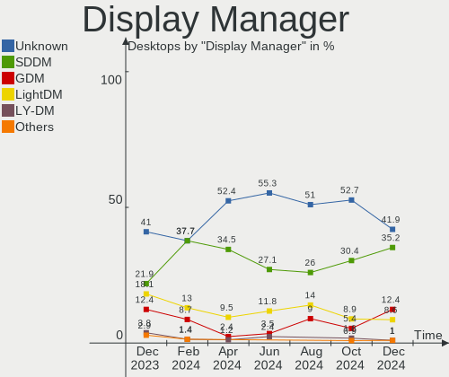
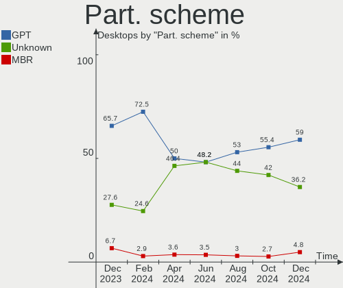
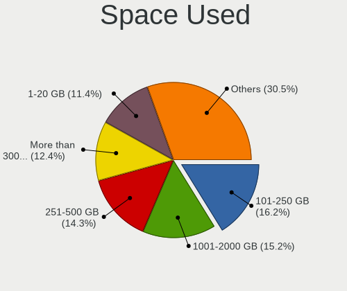
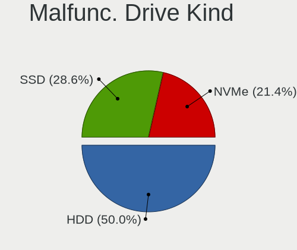
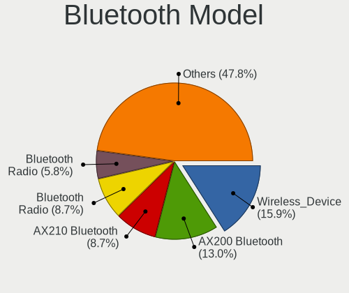
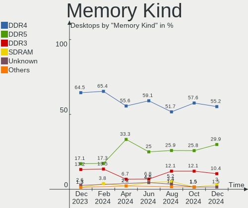

Arch - Hardware Trends (Desktops)
---------------------------------

A project to identify most popular hardware characteristics and track their change
over time based on data collected by Linux users at https://Linux-Hardware.org.

Anyone can contribute to this report by the [hw-probe](https://github.com/linuxhw/hw-probe) tool:

    sudo -E hw-probe -all -upload

This report is for one last month. Overall report since the beginning of time: [TestDays](https://github.com/linuxhw/TestDays)

Period: Nov, 2023.

Contents
--------

* [ System ](#system)
  - [ OS                       ](#os)
  - [ OS Family                ](#os-family)
  - [ Kernel                   ](#kernel)
  - [ Kernel Family            ](#kernel-family)
  - [ Kernel Major Ver.        ](#kernel-major-ver)
  - [ Arch                     ](#arch)
  - [ DE                       ](#de)
  - [ Display Server           ](#display-server)
  - [ Display Manager          ](#display-manager)
  - [ OS Lang                  ](#os-lang)
  - [ Boot Mode                ](#boot-mode)
  - [ Filesystem               ](#filesystem)
  - [ Part. scheme             ](#part-scheme)
  - [ Dual Boot with Linux/BSD ](#dual-boot-with-linuxbsd)
  - [ Dual Boot (Win)          ](#dual-boot-win)

* [ Board ](#board)
  - [ Vendor                   ](#vendor)
  - [ Model                    ](#model)
  - [ Model Family             ](#model-family)
  - [ MFG Year                 ](#mfg-year)
  - [ Form Factor              ](#form-factor)
  - [ Secure Boot              ](#secure-boot)
  - [ Coreboot                 ](#coreboot)
  - [ RAM Size                 ](#ram-size)
  - [ RAM Used                 ](#ram-used)
  - [ Total Drives             ](#total-drives)
  - [ Has CD-ROM               ](#has-cd-rom)
  - [ Has Ethernet             ](#has-ethernet)
  - [ Has WiFi                 ](#has-wifi)
  - [ Has Bluetooth            ](#has-bluetooth)

* [ Location ](#location)
  - [ Country                  ](#country)
  - [ City                     ](#city)

* [ Drives ](#drives)
  - [ Drive Vendor             ](#drive-vendor)
  - [ Drive Model              ](#drive-model)
  - [ HDD Vendor               ](#hdd-vendor)
  - [ SSD Vendor               ](#ssd-vendor)
  - [ Drive Kind               ](#drive-kind)
  - [ Drive Connector          ](#drive-connector)
  - [ Drive Size               ](#drive-size)
  - [ Space Total              ](#space-total)
  - [ Space Used               ](#space-used)
  - [ Malfunc. Drives          ](#malfunc-drives)
  - [ Malfunc. Drive Vendor    ](#malfunc-drive-vendor)
  - [ Malfunc. HDD Vendor      ](#malfunc-hdd-vendor)
  - [ Malfunc. Drive Kind      ](#malfunc-drive-kind)
  - [ Failed Drives            ](#failed-drives)
  - [ Failed Drive Vendor      ](#failed-drive-vendor)
  - [ Drive Status             ](#drive-status)

* [ Storage controller ](#storage-controller)
  - [ Storage Vendor           ](#storage-vendor)
  - [ Storage Model            ](#storage-model)
  - [ Storage Kind             ](#storage-kind)

* [ Processor ](#processor)
  - [ CPU Vendor               ](#cpu-vendor)
  - [ CPU Model                ](#cpu-model)
  - [ CPU Model Family         ](#cpu-model-family)
  - [ CPU Cores                ](#cpu-cores)
  - [ CPU Sockets              ](#cpu-sockets)
  - [ CPU Threads              ](#cpu-threads)
  - [ CPU Op-Modes             ](#cpu-op-modes)
  - [ CPU Microcode            ](#cpu-microcode)
  - [ CPU Microarch            ](#cpu-microarch)

* [ Graphics ](#graphics)
  - [ GPU Vendor               ](#gpu-vendor)
  - [ GPU Model                ](#gpu-model)
  - [ GPU Combo                ](#gpu-combo)
  - [ GPU Driver               ](#gpu-driver)
  - [ GPU Memory               ](#gpu-memory)

* [ Monitor ](#monitor)
  - [ Monitor Vendor           ](#monitor-vendor)
  - [ Monitor Model            ](#monitor-model)
  - [ Monitor Resolution       ](#monitor-resolution)
  - [ Monitor Diagonal         ](#monitor-diagonal)
  - [ Monitor Width            ](#monitor-width)
  - [ Aspect Ratio             ](#aspect-ratio)
  - [ Monitor Area             ](#monitor-area)
  - [ Pixel Density            ](#pixel-density)
  - [ Multiple Monitors        ](#multiple-monitors)

* [ Network ](#network)
  - [ Net Controller Vendor    ](#net-controller-vendor)
  - [ Net Controller Model     ](#net-controller-model)
  - [ Wireless Vendor          ](#wireless-vendor)
  - [ Wireless Model           ](#wireless-model)
  - [ Ethernet Vendor          ](#ethernet-vendor)
  - [ Ethernet Model           ](#ethernet-model)
  - [ Net Controller Kind      ](#net-controller-kind)
  - [ Used Controller          ](#used-controller)
  - [ NICs                     ](#nics)
  - [ IPv6                     ](#ipv6)

* [ Bluetooth ](#bluetooth)
  - [ Bluetooth Vendor         ](#bluetooth-vendor)
  - [ Bluetooth Model          ](#bluetooth-model)

* [ Sound ](#sound)
  - [ Sound Vendor             ](#sound-vendor)
  - [ Sound Model              ](#sound-model)

* [ Memory ](#memory)
  - [ Memory Vendor            ](#memory-vendor)
  - [ Memory Model             ](#memory-model)
  - [ Memory Kind              ](#memory-kind)
  - [ Memory Form Factor       ](#memory-form-factor)
  - [ Memory Size              ](#memory-size)
  - [ Memory Speed             ](#memory-speed)

* [ Printers & scanners ](#printers--scanners)
  - [ Printer Vendor           ](#printer-vendor)
  - [ Printer Model            ](#printer-model)
  - [ Scanner Vendor           ](#scanner-vendor)
  - [ Scanner Model            ](#scanner-model)

* [ Camera ](#camera)
  - [ Camera Vendor            ](#camera-vendor)
  - [ Camera Model             ](#camera-model)

* [ Security ](#security)
  - [ Fingerprint Vendor       ](#fingerprint-vendor)
  - [ Fingerprint Model        ](#fingerprint-model)
  - [ Chipcard Vendor          ](#chipcard-vendor)
  - [ Chipcard Model           ](#chipcard-model)

* [ Unsupported ](#unsupported)
  - [ Unsupported Devices      ](#unsupported-devices)
  - [ Unsupported Device Types ](#unsupported-device-types)

System
------

OS
--

Installed operating systems

| Name         | Desktops | Percent |
|--------------|----------|---------|
| Arch Rolling | 113      | 100%    |

OS Family
---------

OS without a version

| Name | Desktops | Percent |
|------|----------|---------|
| Arch | 113      | 100%    |

Kernel
------

Version of the Linux kernel

| Version                                | Desktops | Percent |
|----------------------------------------|----------|---------|
| 6.6.1-arch1-1                          | 31       | 27.43%  |
| 6.5.9-arch2-1                          | 24       | 21.24%  |
| 6.6.2-arch1-1                          | 17       | 15.04%  |
| 6.6.1-zen1-1-zen                       | 16       | 14.16%  |
| 6.5.9-zen2-1-zen                       | 5        | 4.42%   |
| 6.6.2-zen1-1-zen                       | 3        | 2.65%   |
| 6.1.62-1-lts                           | 2        | 1.77%   |
| 6.7.0-rc3-1-mainline                   | 1        | 0.88%   |
| 6.6.3-zen1-1-zen                       | 1        | 0.88%   |
| 6.6.3-arch1-1                          | 1        | 0.88%   |
| 6.6.1-lqx1-1-lqx                       | 1        | 0.88%   |
| 6.6.0-zen4-xanmod1-1-edge              | 1        | 0.88%   |
| 6.6.0-273-tkg-eevdf                    | 1        | 0.88%   |
| 6.6.0-1-cachyos-bore-lto               | 1        | 0.88%   |
| 6.5.8-arch1-1                          | 1        | 0.88%   |
| 6.5.8-273-tkg-linux-tkg-pds-generic_v3 | 1        | 0.88%   |
| 6.5.7-arch1-1                          | 1        | 0.88%   |
| 6.5.4-arch2-1                          | 1        | 0.88%   |
| 6.4.3-arch1-2                          | 1        | 0.88%   |
| 6.1.63-1-lts                           | 1        | 0.88%   |
| 6.1.61-1-lts                           | 1        | 0.88%   |
| 6.1.60-1-lts                           | 1        | 0.88%   |

Kernel Family
-------------

Linux kernel without a distro release

| Version | Desktops | Percent |
|---------|----------|---------|
| 6.6.1   | 48       | 42.48%  |
| 6.5.9   | 29       | 25.66%  |
| 6.6.2   | 20       | 17.7%   |
| 6.6.0   | 3        | 2.65%   |
| 6.6.3   | 2        | 1.77%   |
| 6.5.8   | 2        | 1.77%   |
| 6.1.62  | 2        | 1.77%   |
| 6.7.0   | 1        | 0.88%   |
| 6.5.7   | 1        | 0.88%   |
| 6.5.4   | 1        | 0.88%   |
| 6.4.3   | 1        | 0.88%   |
| 6.1.63  | 1        | 0.88%   |
| 6.1.61  | 1        | 0.88%   |
| 6.1.60  | 1        | 0.88%   |

Kernel Major Ver.
-----------------

Linux kernel major version

| Version | Desktops | Percent |
|---------|----------|---------|
| 6.6     | 73       | 64.6%   |
| 6.5     | 33       | 29.2%   |
| 6.1     | 5        | 4.42%   |
| 6.7     | 1        | 0.88%   |
| 6.4     | 1        | 0.88%   |

Arch
----

OS architecture (x86_64, i586, etc.)

| Name   | Desktops | Percent |
|--------|----------|---------|
| x86_64 | 113      | 100%    |

DE
--

Desktop Environment

| Name                    | Desktops | Percent |
|-------------------------|----------|---------|
| KDE5                    | 58       | 51.33%  |
| GNOME                   | 19       | 16.81%  |
| i3                      | 7        | 6.19%   |
| Hyprland                | 7        | 6.19%   |
| XFCE                    | 6        | 5.31%   |
| Unknown                 | 6        | 5.31%   |
| X-Cinnamon              | 2        | 1.77%   |
| sway                    | 2        | 1.77%   |
| Wayfire:wayfire:wlroots | 1        | 0.88%   |
| MATE                    | 1        | 0.88%   |
| LXDE                    | 1        | 0.88%   |
| Enlightenment           | 1        | 0.88%   |
| Deepin                  | 1        | 0.88%   |
| bspwm                   | 1        | 0.88%   |

Display Server
--------------

X11 or Wayland

| Name    | Desktops | Percent |
|---------|----------|---------|
| X11     | 52       | 46.02%  |
| Wayland | 45       | 39.82%  |
| Tty     | 10       | 8.85%   |
| Unknown | 6        | 5.31%   |

Display Manager
---------------

SDDM, LightDM, etc.

| Name    | Desktops | Percent |
|---------|----------|---------|
| SDDM    | 42       | 37.17%  |
| Unknown | 36       | 31.86%  |
| LightDM | 18       | 15.93%  |
| GDM     | 12       | 10.62%  |
| LY-DM   | 4        | 3.54%   |
| LXDM    | 1        | 0.88%   |

OS Lang
-------

Language

| Lang    | Desktops | Percent |
|---------|----------|---------|
| en_US   | 68       | 60.18%  |
| C       | 11       | 9.73%   |
| en_GB   | 8        | 7.08%   |
| pt_BR   | 4        | 3.54%   |
| it_IT   | 4        | 3.54%   |
| ru_RU   | 3        | 2.65%   |
| de_DE   | 3        | 2.65%   |
| pl_PL   | 2        | 1.77%   |
| Unknown | 2        | 1.77%   |
| fr_FR   | 1        | 0.88%   |
| es_ES   | 1        | 0.88%   |
| es_DO   | 1        | 0.88%   |
| es_CO   | 1        | 0.88%   |
| es_AR   | 1        | 0.88%   |
| en_IN   | 1        | 0.88%   |
| en_DK   | 1        | 0.88%   |
| en_CA   | 1        | 0.88%   |

Boot Mode
---------

EFI or BIOS

| Mode | Desktops | Percent |
|------|----------|---------|
| EFI  | 76       | 67.26%  |
| BIOS | 37       | 32.74%  |

Filesystem
----------

Type of filesystem

| Type  | Desktops | Percent |
|-------|----------|---------|
| Ext4  | 71       | 62.83%  |
| Btrfs | 38       | 33.63%  |
| F2fs  | 3        | 2.65%   |
| Xfs   | 1        | 0.88%   |

Part. scheme
------------

Scheme of partitioning

| Type    | Desktops | Percent |
|---------|----------|---------|
| GPT     | 79       | 69.91%  |
| Unknown | 26       | 23.01%  |
| MBR     | 8        | 7.08%   |

Dual Boot with Linux/BSD
------------------------

Hosting more than one Linux/BSD

| Dual boot | Desktops | Percent |
|-----------|----------|---------|
| No        | 91       | 80.53%  |
| Yes       | 22       | 19.47%  |

Dual Boot (Win)
---------------

Hosting Linux and Windows

| Dual boot | Desktops | Percent |
|-----------|----------|---------|
| No        | 75       | 66.37%  |
| Yes       | 38       | 33.63%  |

Board
-----

Vendor
------

Motherboard manufacturer

| Name                | Desktops | Percent |
|---------------------|----------|---------|
| ASUSTek Computer    | 32       | 28.32%  |
| MSI                 | 27       | 23.89%  |
| Gigabyte Technology | 16       | 14.16%  |
| ASRock              | 11       | 9.73%   |
| Hewlett-Packard     | 8        | 7.08%   |
| Dell                | 6        | 5.31%   |
| AZW                 | 2        | 1.77%   |
| Acer                | 2        | 1.77%   |
| Semp Toshiba        | 1        | 0.88%   |
| Lenovo              | 1        | 0.88%   |
| Intel               | 1        | 0.88%   |
| Huanan              | 1        | 0.88%   |
| Hardkernel          | 1        | 0.88%   |
| Fujitsu             | 1        | 0.88%   |
| Colorful Technology | 1        | 0.88%   |
| Apple               | 1        | 0.88%   |
| Unknown             | 1        | 0.88%   |

Model
-----

Motherboard model

| Name                                      | Desktops | Percent |
|-------------------------------------------|----------|---------|
| MSI MS-7D75                               | 4        | 3.54%   |
| MSI MS-7C37                               | 3        | 2.65%   |
| MSI MS-7C02                               | 3        | 2.65%   |
| MSI MS-7C91                               | 2        | 1.77%   |
| MSI MS-7B79                               | 2        | 1.77%   |
| Dell OptiPlex 3080                        | 2        | 1.77%   |
| ASUS TUF Gaming X570-PRO                  | 2        | 1.77%   |
| ASUS PRIME Z390-P                         | 2        | 1.77%   |
| ASUS All Series                           | 2        | 1.77%   |
| Semp Toshiba STI                          | 1        | 0.88%   |
| MSI MS-7D91                               | 1        | 0.88%   |
| MSI MS-7D54                               | 1        | 0.88%   |
| MSI MS-7D52                               | 1        | 0.88%   |
| MSI MS-7D46                               | 1        | 0.88%   |
| MSI MS-7C96                               | 1        | 0.88%   |
| MSI MS-7C95                               | 1        | 0.88%   |
| MSI MS-7C94                               | 1        | 0.88%   |
| MSI MS-7C56                               | 1        | 0.88%   |
| MSI MS-7B89                               | 1        | 0.88%   |
| MSI MS-7A33                               | 1        | 0.88%   |
| MSI MS-7817                               | 1        | 0.88%   |
| MSI MS-7816                               | 1        | 0.88%   |
| MSI MS-7583                               | 1        | 0.88%   |
| Lenovo ThinkStation P320 30BGS0XR00       | 1        | 0.88%   |
| Intel H61 V1.5                            | 1        | 0.88%   |
| Huanan X99-QD4 V1.0                       | 1        | 0.88%   |
| HP Z620 Workstation                       | 1        | 0.88%   |
| HP Z240 SFF Workstation                   | 1        | 0.88%   |
| HP Z2 Tower G5 Workstation                | 1        | 0.88%   |
| HP Victus by 15L Gaming Desktop TG02-0xxx | 1        | 0.88%   |
| HP ProLiant ML310e Gen8                   | 1        | 0.88%   |
| HP ProDesk 600 G4 SFF                     | 1        | 0.88%   |
| HP Compaq 8200 Elite SFF PC               | 1        | 0.88%   |
| HP Compaq 8000 Elite CMT PC               | 1        | 0.88%   |
| Hardkernel ODROID-H3                      | 1        | 0.88%   |
| Gigabyte Z97X-Gaming 3                    | 1        | 0.88%   |
| Gigabyte Z390 AORUS MASTER                | 1        | 0.88%   |
| Gigabyte Z390 AORUS ELITE                 | 1        | 0.88%   |
| Gigabyte X570S AORUS MASTER               | 1        | 0.88%   |
| Gigabyte X570 UD                          | 1        | 0.88%   |

Model Family
------------

Motherboard model prefix

| Name                 | Desktops | Percent |
|----------------------|----------|---------|
| ASUS ROG             | 9        | 7.96%   |
| ASUS PRIME           | 8        | 7.08%   |
| Dell OptiPlex        | 5        | 4.42%   |
| ASUS TUF             | 5        | 4.42%   |
| MSI MS-7D75          | 4        | 3.54%   |
| MSI MS-7C37          | 3        | 2.65%   |
| MSI MS-7C02          | 3        | 2.65%   |
| MSI MS-7C91          | 2        | 1.77%   |
| MSI MS-7B79          | 2        | 1.77%   |
| HP Compaq            | 2        | 1.77%   |
| Gigabyte Z390        | 2        | 1.77%   |
| Gigabyte X570        | 2        | 1.77%   |
| ASUS ProArt          | 2        | 1.77%   |
| ASUS All             | 2        | 1.77%   |
| ASRock B550M         | 2        | 1.77%   |
| Semp Toshiba STI     | 1        | 0.88%   |
| MSI MS-7D91          | 1        | 0.88%   |
| MSI MS-7D54          | 1        | 0.88%   |
| MSI MS-7D52          | 1        | 0.88%   |
| MSI MS-7D46          | 1        | 0.88%   |
| MSI MS-7C96          | 1        | 0.88%   |
| MSI MS-7C95          | 1        | 0.88%   |
| MSI MS-7C94          | 1        | 0.88%   |
| MSI MS-7C56          | 1        | 0.88%   |
| MSI MS-7B89          | 1        | 0.88%   |
| MSI MS-7A33          | 1        | 0.88%   |
| MSI MS-7817          | 1        | 0.88%   |
| MSI MS-7816          | 1        | 0.88%   |
| MSI MS-7583          | 1        | 0.88%   |
| Lenovo ThinkStation  | 1        | 0.88%   |
| Intel H61            | 1        | 0.88%   |
| Huanan X99-QD4       | 1        | 0.88%   |
| HP Z620              | 1        | 0.88%   |
| HP Z240              | 1        | 0.88%   |
| HP Z2                | 1        | 0.88%   |
| HP Victus            | 1        | 0.88%   |
| HP ProLiant          | 1        | 0.88%   |
| HP ProDesk           | 1        | 0.88%   |
| Hardkernel ODROID-H3 | 1        | 0.88%   |
| Gigabyte Z97X-Gaming | 1        | 0.88%   |

MFG Year
--------

Motherboard manufacture year

| Year | Desktops | Percent |
|------|----------|---------|
| 2022 | 22       | 19.47%  |
| 2020 | 18       | 15.93%  |
| 2018 | 15       | 13.27%  |
| 2021 | 11       | 9.73%   |
| 2019 | 11       | 9.73%   |
| 2023 | 8        | 7.08%   |
| 2017 | 5        | 4.42%   |
| 2011 | 5        | 4.42%   |
| 2014 | 4        | 3.54%   |
| 2016 | 3        | 2.65%   |
| 2013 | 3        | 2.65%   |
| 2015 | 2        | 1.77%   |
| 2012 | 2        | 1.77%   |
| 2009 | 2        | 1.77%   |
| 2010 | 1        | 0.88%   |
| 2007 | 1        | 0.88%   |

Form Factor
-----------

Physical design of the computer

| Name    | Desktops | Percent |
|---------|----------|---------|
| Desktop | 113      | 100%    |

Secure Boot
-----------

Enabled or disabled

| State    | Desktops | Percent |
|----------|----------|---------|
| Disabled | 110      | 97.35%  |
| Enabled  | 3        | 2.65%   |

Coreboot
--------

Have coreboot on board

| Used | Desktops | Percent |
|------|----------|---------|
| No   | 113      | 100%    |

RAM Size
--------

Total RAM memory

| Size in GB  | Desktops | Percent |
|-------------|----------|---------|
| 32.01-64.0  | 40       | 35.4%   |
| 16.01-24.0  | 29       | 25.66%  |
| 64.01-256.0 | 16       | 14.16%  |
| 8.01-16.0   | 11       | 9.73%   |
| 24.01-32.0  | 7        | 6.19%   |
| 4.01-8.0    | 6        | 5.31%   |
| 3.01-4.0    | 2        | 1.77%   |
| 2.01-3.0    | 1        | 0.88%   |
| 1.01-2.0    | 1        | 0.88%   |

RAM Used
--------

Used RAM memory

| Used GB    | Desktops | Percent |
|------------|----------|---------|
| 4.01-8.0   | 44       | 38.94%  |
| 2.01-3.0   | 19       | 16.81%  |
| 3.01-4.0   | 17       | 15.04%  |
| 8.01-16.0  | 15       | 13.27%  |
| 16.01-24.0 | 6        | 5.31%   |
| 1.01-2.0   | 5        | 4.42%   |
| 0.51-1.0   | 4        | 3.54%   |
| 32.01-64.0 | 1        | 0.88%   |
| 24.01-32.0 | 1        | 0.88%   |
| 0.01-0.5   | 1        | 0.88%   |

Total Drives
------------

Number of drives on board

| Drives | Desktops | Percent |
|--------|----------|---------|
| 3      | 28       | 24.78%  |
| 2      | 27       | 23.89%  |
| 1      | 23       | 20.35%  |
| 4      | 14       | 12.39%  |
| 5      | 11       | 9.73%   |
| 6      | 5        | 4.42%   |
| 8      | 3        | 2.65%   |
| 7      | 1        | 0.88%   |
| 0      | 1        | 0.88%   |

Has CD-ROM
----------

Has CD-ROM on board

| Presented | Desktops | Percent |
|-----------|----------|---------|
| No        | 94       | 83.19%  |
| Yes       | 19       | 16.81%  |

Has Ethernet
------------

Has Ethernet on board

| Presented | Desktops | Percent |
|-----------|----------|---------|
| Yes       | 113      | 100%    |

Has WiFi
--------

Has WiFi module

| Presented | Desktops | Percent |
|-----------|----------|---------|
| Yes       | 69       | 61.06%  |
| No        | 44       | 38.94%  |

Has Bluetooth
-------------

Has Bluetooth module

| Presented | Desktops | Percent |
|-----------|----------|---------|
| Yes       | 70       | 61.95%  |
| No        | 43       | 38.05%  |

Location
--------

Country
-------

Geographic location (country)

| Country                | Desktops | Percent |
|------------------------|----------|---------|
| USA                    | 35       | 30.97%  |
| Germany                | 10       | 8.85%   |
| Russia                 | 7        | 6.19%   |
| Italy                  | 7        | 6.19%   |
| Poland                 | 6        | 5.31%   |
| Brazil                 | 5        | 4.42%   |
| India                  | 4        | 3.54%   |
| France                 | 4        | 3.54%   |
| UK                     | 3        | 2.65%   |
| Canada                 | 3        | 2.65%   |
| New Zealand            | 2        | 1.77%   |
| Mexico                 | 2        | 1.77%   |
| Hungary                | 2        | 1.77%   |
| Czechia                | 2        | 1.77%   |
| Venezuela              | 1        | 0.88%   |
| Ukraine                | 1        | 0.88%   |
| UAE                    | 1        | 0.88%   |
| Taiwan                 | 1        | 0.88%   |
| Switzerland            | 1        | 0.88%   |
| Spain                  | 1        | 0.88%   |
| South Korea            | 1        | 0.88%   |
| Singapore              | 1        | 0.88%   |
| Romania                | 1        | 0.88%   |
| Netherlands            | 1        | 0.88%   |
| Lithuania              | 1        | 0.88%   |
| Ireland                | 1        | 0.88%   |
| Dominican Republic     | 1        | 0.88%   |
| Denmark                | 1        | 0.88%   |
| China                  | 1        | 0.88%   |
| Chile                  | 1        | 0.88%   |
| Brunei                 | 1        | 0.88%   |
| Bosnia and Herzegovina | 1        | 0.88%   |
| Austria                | 1        | 0.88%   |
| Australia              | 1        | 0.88%   |
| Argentina              | 1        | 0.88%   |

City
----

Geographic location (city)

| City                   | Desktops | Percent |
|------------------------|----------|---------|
| Rome                   | 4        | 3.54%   |
| Seattle                | 3        | 2.65%   |
| Rio de Janeiro         | 2        | 1.77%   |
| Portland               | 2        | 1.77%   |
| Moscow                 | 2        | 1.77%   |
| Los Angeles            | 2        | 1.77%   |
| La Broque              | 2        | 1.77%   |
| Bellevue               | 2        | 1.77%   |
| Zurich                 | 1        | 0.88%   |
| Wroclaw                | 1        | 0.88%   |
| Witten                 | 1        | 0.88%   |
| Winchester             | 1        | 0.88%   |
| West Lebanon           | 1        | 0.88%   |
| Wellington             | 1        | 0.88%   |
| Vinnytsia              | 1        | 0.88%   |
| Vilnius                | 1        | 0.88%   |
| Villingen-Schwenningen | 1        | 0.88%   |
| Villepinte             | 1        | 0.88%   |
| Vicosa                 | 1        | 0.88%   |
| Vicenza                | 1        | 0.88%   |
| Vaals                  | 1        | 0.88%   |
| Trige                  | 1        | 0.88%   |
| Trento                 | 1        | 0.88%   |
| Toronto                | 1        | 0.88%   |
| The Bronx              | 1        | 0.88%   |
| Tewksbury              | 1        | 0.88%   |
| Teixeira de Freitas    | 1        | 0.88%   |
| Taoyuan District       | 1        | 0.88%   |
| Steyr                  | 1        | 0.88%   |
| St Petersburg          | 1        | 0.88%   |
| Springfield            | 1        | 0.88%   |
| Sinzig                 | 1        | 0.88%   |
| Singapore              | 1        | 0.88%   |
| Sharjah                | 1        | 0.88%   |
| Sejny                  | 1        | 0.88%   |
| Sebes                  | 1        | 0.88%   |
| Scandolara Ravara      | 1        | 0.88%   |
| Sao Sebastiao          | 1        | 0.88%   |
| Santander              | 1        | 0.88%   |
| Santa Maria            | 1        | 0.88%   |

Drives
------

Drive Vendor
------------

Hard drive vendors

| Vendor                       | Desktops | Drives  | Percent |
|------------------------------|----------|---------|---------|
| Samsung Electronics          | 49       | 77      | 18.56%  |
| WDC                          | 38       | 53      | 14.39%  |
| Sandisk                      | 34       | 42      | 12.88%  |
| Seagate                      | 29       | 34      | 10.98%  |
| Kingston                     | 17       | 22      | 6.44%   |
| Toshiba                      | 12       | 14      | 4.55%   |
| Micron/Crucial Technology    | 10       | 10      | 3.79%   |
| Crucial                      | 10       | 13      | 3.79%   |
| Intel                        | 5        | 5       | 1.89%   |
| SK hynix                     | 4        | 4       | 1.52%   |
| China                        | 4        | 5       | 1.52%   |
| Silicon Motion               | 3        | 3       | 1.14%   |
| Shenzhen Longsys Electronics | 3        | 3       | 1.14%   |
| Realtek Semiconductor        | 3        | 3       | 1.14%   |
| PNY                          | 3        | 3       | 1.14%   |
| Kingston Technology Company  | 3        | 3       | 1.14%   |
| Hitachi                      | 3        | 3       | 1.14%   |
| ADATA Technology             | 3        | 4       | 1.14%   |
| A-DATA Technology            | 3        | 3       | 1.14%   |
| Phison Electronics           | 2        | 2       | 0.76%   |
| Micron Technology            | 2        | 2       | 0.76%   |
| MAXIO Technology (Hangzhou)  | 2        | 2       | 0.76%   |
| KIOXIA                       | 2        | 2       | 0.76%   |
| X12                          | 1        | 1       | 0.38%   |
| WD MediaMax                  | 1        | 1       | 0.38%   |
| Verbatim                     | 1        | 1       | 0.38%   |
| Unknown                      | 1        | 1       | 0.38%   |
| Transcend                    | 1        | 1       | 0.38%   |
| Team                         | 1        | 1       | 0.38%   |
| sobetter                     | 1        | 1       | 0.38%   |
| Patriot                      | 1        | 1       | 0.38%   |
| OCZ                          | 1        | 1       | 0.38%   |
| LITEON                       | 1        | 1       | 0.38%   |
| Leven                        | 1        | 1       | 0.38%   |
| Intenso                      | 1        | 1       | 0.38%   |
| Hjwdz                        | 1        | Unknown | 0.38%   |
| Hewlett-Packard              | 1        | 1       | 0.38%   |
| GOODRAM                      | 1        | 1       | 0.38%   |
| Corsair                      | 1        | 1       | 0.38%   |
| Apple                        | 1        | 1       | 0.38%   |

Drive Model
-----------

Hard drive models

| Model                                                 | Desktops | Percent |
|-------------------------------------------------------|----------|---------|
| Samsung NVMe SSD Controller SM981/PM981/PM983 250GB   | 15       | 4.72%   |
| Samsung NVMe SSD Controller PM9A1/PM9A3/980PRO 2TB    | 12       | 3.77%   |
| Micron/Crucial P2 NVMe PCIe SSD 1TB                   | 7        | 2.2%    |
| Samsung SSD 860 EVO 500GB                             | 6        | 1.89%   |
| Sandisk WD Black SN750 / PC SN730 NVMe SSD 500GB      | 5        | 1.57%   |
| Kingston SA400S37240G 240GB SSD                       | 5        | 1.57%   |
| WDC WD10EZEX-08WN4A0 1TB                              | 4        | 1.26%   |
| Sandisk WD Black SN850 1024GB                         | 4        | 1.26%   |
| Samsung SSD 870 QVO 1TB                               | 4        | 1.26%   |
| Samsung SSD 860 EVO 1TB                               | 4        | 1.26%   |
| Toshiba HDWD110 1TB                                   | 3        | 0.94%   |
| Silicon Motion SM2263EN/SM2263XT SSD Controller 256GB | 3        | 0.94%   |
| Sandisk WD Blue SN550 NVMe SSD 512GB                  | 3        | 0.94%   |
| SanDisk SSD PLUS 240GB                                | 3        | 0.94%   |
| Samsung SSD 980 1TB                                   | 3        | 0.94%   |
| Samsung SSD 850 EVO 500GB                             | 3        | 0.94%   |
| Samsung SSD 850 EVO 250GB                             | 3        | 0.94%   |
| Kingston Company A2000 NVMe SSD 250GB                 | 3        | 0.94%   |
| Kingston SV300S37A240G 240GB SSD                      | 3        | 0.94%   |
| Kingston SKC3000S1024G 1024GB                         | 3        | 0.94%   |
| Intel SSD 660P Series 512GB                           | 3        | 0.94%   |
| WDC WD40EFRX-68N32N0 4TB                              | 2        | 0.63%   |
| WDC WD10EZEX-00BN5A0 1TB                              | 2        | 0.63%   |
| WDC WD10EARS-00Y5B1 1TB                               | 2        | 0.63%   |
| WDC WD10EADS-00L5B1 1TB                               | 2        | 0.63%   |
| WDC WD Green 2.5 240GB SSD                            | 2        | 0.63%   |
| Toshiba MQ01ABD100 1TB                                | 2        | 0.63%   |
| Toshiba HDWD130 3TB                                   | 2        | 0.63%   |
| Toshiba DT01ACA100 1TB                                | 2        | 0.63%   |
| Seagate ST500DM002-1SB10A 500GB                       | 2        | 0.63%   |
| Seagate ST500DM002-1BD142 500GB                       | 2        | 0.63%   |
| Seagate ST3500418AS 500GB                             | 2        | 0.63%   |
| Seagate ST2000DX001-1NS164 2TB                        | 2        | 0.63%   |
| Seagate ST2000DM001-1ER164 2TB                        | 2        | 0.63%   |
| Seagate ST1000DM010-2EP102 1TB                        | 2        | 0.63%   |
| Sandisk WD_BLACK SN770 2TB                            | 2        | 0.63%   |
| Sandisk WDC WDS100T2B0C-00PXH0 1TB                    | 2        | 0.63%   |
| Sandisk WD Blue SN570 1TB                             | 2        | 0.63%   |
| SanDisk SSD PLUS 480GB                                | 2        | 0.63%   |
| SanDisk SDSSDHII120G 120GB                            | 2        | 0.63%   |

HDD Vendor
----------

Hard disk drive vendors

| Vendor              | Desktops | Drives | Percent |
|---------------------|----------|--------|---------|
| WDC                 | 36       | 49     | 43.37%  |
| Seagate             | 28       | 33     | 33.73%  |
| Toshiba             | 11       | 13     | 13.25%  |
| Hitachi             | 3        | 3      | 3.61%   |
| Samsung Electronics | 2        | 2      | 2.41%   |
| WD MediaMax         | 1        | 1      | 1.2%    |
| Apple               | 1        | 1      | 1.2%    |
| ACASIS              | 1        | 2      | 1.2%    |

SSD Vendor
----------

Solid state drive vendors

| Vendor              | Desktops | Drives | Percent |
|---------------------|----------|--------|---------|
| Samsung Electronics | 24       | 34     | 27.91%  |
| Kingston            | 13       | 17     | 15.12%  |
| SanDisk             | 11       | 15     | 12.79%  |
| Crucial             | 10       | 13     | 11.63%  |
| WDC                 | 4        | 4      | 4.65%   |
| China               | 4        | 4      | 4.65%   |
| PNY                 | 3        | 3      | 3.49%   |
| A-DATA Technology   | 3        | 3      | 3.49%   |
| X12                 | 1        | 1      | 1.16%   |
| Verbatim            | 1        | 1      | 1.16%   |
| Transcend           | 1        | 1      | 1.16%   |
| Team                | 1        | 1      | 1.16%   |
| Patriot             | 1        | 1      | 1.16%   |
| OCZ                 | 1        | 1      | 1.16%   |
| LITEON              | 1        | 1      | 1.16%   |
| Leven               | 1        | 1      | 1.16%   |
| Intenso             | 1        | 1      | 1.16%   |
| Hewlett-Packard     | 1        | 1      | 1.16%   |
| GOODRAM             | 1        | 1      | 1.16%   |
| Corsair             | 1        | 1      | 1.16%   |
| AMD                 | 1        | 1      | 1.16%   |
| Acer                | 1        | 1      | 1.16%   |

Drive Kind
----------

HDD or SSD

| Kind    | Desktops | Drives | Percent |
|---------|----------|--------|---------|
| NVMe    | 84       | 118    | 39.44%  |
| SSD     | 64       | 107    | 30.05%  |
| HDD     | 61       | 104    | 28.64%  |
| Unknown | 3        | 2      | 1.41%   |
| MMC     | 1        | 1      | 0.47%   |

Drive Connector
---------------

SATA, SAS, NVMe, etc.

| Type | Desktops | Drives | Percent |
|------|----------|--------|---------|
| SATA | 88       | 207    | 49.16%  |
| NVMe | 84       | 117    | 46.93%  |
| SAS  | 6        | 7      | 3.35%   |
| MMC  | 1        | 1      | 0.56%   |

Drive Size
----------

Size of hard drive

| Size in TB | Desktops | Drives | Percent |
|------------|----------|--------|---------|
| 0.01-0.5   | 59       | 96     | 40.41%  |
| 0.51-1.0   | 46       | 67     | 31.51%  |
| 3.01-4.0   | 14       | 17     | 9.59%   |
| 1.01-2.0   | 14       | 16     | 9.59%   |
| 4.01-10.0  | 6        | 8      | 4.11%   |
| 2.01-3.0   | 5        | 5      | 3.42%   |
| 10.01-20.0 | 2        | 2      | 1.37%   |

Space Total
-----------

Amount of disk space available on the file system

| Size in GB     | Desktops | Percent |
|----------------|----------|---------|
| More than 3000 | 38       | 33.63%  |
| 501-1000       | 27       | 23.89%  |
| 2001-3000      | 14       | 12.39%  |
| 1001-2000      | 14       | 12.39%  |
| 251-500        | 11       | 9.73%   |
| 101-250        | 6        | 5.31%   |
| 21-50          | 1        | 0.88%   |
| 51-100         | 1        | 0.88%   |
| Unknown        | 1        | 0.88%   |

Space Used
----------

Amount of used disk space

| Used GB        | Desktops | Percent |
|----------------|----------|---------|
| 501-1000       | 20       | 17.7%   |
| More than 3000 | 17       | 15.04%  |
| 251-500        | 17       | 15.04%  |
| 1001-2000      | 14       | 12.39%  |
| 101-250        | 12       | 10.62%  |
| 1-20           | 11       | 9.73%   |
| 51-100         | 8        | 7.08%   |
| 21-50          | 7        | 6.19%   |
| 2001-3000      | 6        | 5.31%   |
| Unknown        | 1        | 0.88%   |

Malfunc. Drives
---------------

Drive models with a malfunction

| Model                                                          | Desktops | Drives | Percent |
|----------------------------------------------------------------|----------|--------|---------|
| Seagate ST3500418AS 500GB                                      | 2        | 2      | 6.45%   |
| SanDisk SSD PLUS 240GB                                         | 2        | 2      | 6.45%   |
| WDC WD60EDAZ-11U78B0 6TB                                       | 1        | 1      | 3.23%   |
| WDC WD5000AAKX-00ERMA0 500GB                                   | 1        | 1      | 3.23%   |
| WDC WD2500BEVS-11VAT0 250GB                                    | 1        | 1      | 3.23%   |
| WDC WD20EARS-00MVWB0 2TB                                       | 1        | 1      | 3.23%   |
| WDC WD10EZEX-08M2NA0 1TB                                       | 1        | 1      | 3.23%   |
| WDC WD10EARS-00Y5B1 1TB                                        | 1        | 1      | 3.23%   |
| WDC WD10EADS-65L5B1 1TB                                        | 1        | 1      | 3.23%   |
| WD MediaMax WL4000GSA6472B 4TB                                 | 1        | 1      | 3.23%   |
| Silicon Motion SM2263EN/SM2263XT SSD Controller 256GB          | 1        | 1      | 3.23%   |
| Seagate ST9250315AS 250GB                                      | 1        | 1      | 3.23%   |
| Seagate ST3320813AS 320GB                                      | 1        | 1      | 3.23%   |
| Seagate ST33000651NS 3TB                                       | 1        | 1      | 3.23%   |
| Seagate ST2000DX001-1NS164 2TB                                 | 1        | 1      | 3.23%   |
| Seagate ST1000LM024 HN-M101MBB 1TB                             | 1        | 1      | 3.23%   |
| Seagate ST1000DM010-2EP102 1TB                                 | 1        | 1      | 3.23%   |
| SanDisk SSD PLUS 480GB                                         | 1        | 1      | 3.23%   |
| SanDisk SDSSDP128G 128GB                                       | 1        | 1      | 3.23%   |
| Samsung Electronics SSD 860 EVO 500GB                          | 1        | 1      | 3.23%   |
| Samsung Electronics NVMe SSD Controller PM9A1/PM9A3/980PRO 2TB | 1        | 1      | 3.23%   |
| Realtek Semiconductor RTS5763DL NVMe SSD Controller 512GB      | 1        | 1      | 3.23%   |
| Kingston SV300S37A240G 240GB SSD                               | 1        | 1      | 3.23%   |
| Kingston SKC400S371T 1TB SSD                                   | 1        | 1      | 3.23%   |
| Kingston SA400S37240G 240GB SSD                                | 1        | 1      | 3.23%   |
| Hitachi HUA721010KLA330 1TB                                    | 1        | 1      | 3.23%   |
| Hitachi HDS721016CLA382 160GB                                  | 1        | 1      | 3.23%   |
| Crucial CT525MX300SSD1 528GB                                   | 1        | 2      | 3.23%   |
| Corsair Force GT 240GB SSD                                     | 1        | 1      | 3.23%   |

Malfunc. Drive Vendor
---------------------

Vendors of faulty drives

| Vendor                | Desktops | Drives | Percent |
|-----------------------|----------|--------|---------|
| WDC                   | 7        | 7      | 23.33%  |
| Seagate               | 7        | 8      | 23.33%  |
| SanDisk               | 4        | 4      | 13.33%  |
| Kingston              | 3        | 3      | 10%     |
| Samsung Electronics   | 2        | 2      | 6.67%   |
| Hitachi               | 2        | 2      | 6.67%   |
| WD MediaMax           | 1        | 1      | 3.33%   |
| Silicon Motion        | 1        | 1      | 3.33%   |
| Realtek Semiconductor | 1        | 1      | 3.33%   |
| Crucial               | 1        | 2      | 3.33%   |
| Corsair               | 1        | 1      | 3.33%   |

Malfunc. HDD Vendor
-------------------

Vendors of faulty HDD drives

| Vendor      | Desktops | Drives | Percent |
|-------------|----------|--------|---------|
| WDC         | 7        | 7      | 41.18%  |
| Seagate     | 7        | 8      | 41.18%  |
| Hitachi     | 2        | 2      | 11.76%  |
| WD MediaMax | 1        | 1      | 5.88%   |

Malfunc. Drive Kind
-------------------

Kinds of faulty drives

| Kind | Desktops | Drives | Percent |
|------|----------|--------|---------|
| HDD  | 13       | 18     | 50%     |
| SSD  | 10       | 11     | 38.46%  |
| NVMe | 3        | 3      | 11.54%  |

Failed Drives
-------------

Failed drive models

Zero info for selected period =(

Failed Drive Vendor
-------------------

Failed drive vendors

Zero info for selected period =(

Drive Status
------------

Number of failed and malfunc. drives

| Status   | Desktops | Drives | Percent |
|----------|----------|--------|---------|
| Works    | 74       | 190    | 52.86%  |
| Detected | 43       | 110    | 30.71%  |
| Malfunc  | 23       | 32     | 16.43%  |

Storage controller
------------------

Storage Vendor
--------------

Storage controller vendors

| Vendor                       | Desktops | Percent |
|------------------------------|----------|---------|
| AMD                          | 58       | 25%     |
| Intel                        | 55       | 23.71%  |
| Samsung Electronics          | 30       | 12.93%  |
| SanDisk                      | 26       | 11.21%  |
| ASMedia Technology           | 16       | 6.9%    |
| Micron/Crucial Technology    | 10       | 4.31%   |
| Kingston Technology Company  | 8        | 3.45%   |
| SK hynix                     | 4        | 1.72%   |
| Silicon Motion               | 3        | 1.29%   |
| Shenzhen Longsys Electronics | 3        | 1.29%   |
| Realtek Semiconductor        | 3        | 1.29%   |
| ADATA Technology             | 3        | 1.29%   |
| Phison Electronics           | 2        | 0.86%   |
| Micron Technology            | 2        | 0.86%   |
| MAXIO Technology (Hangzhou)  | 2        | 0.86%   |
| KIOXIA                       | 2        | 0.86%   |
| JMicron Technology           | 2        | 0.86%   |
| Toshiba America Info Systems | 1        | 0.43%   |
| Seagate Technology           | 1        | 0.43%   |
| Broadcom / LSI               | 1        | 0.43%   |

Storage Model
-------------

Storage controller models

| Model                                                                          | Desktops | Percent |
|--------------------------------------------------------------------------------|----------|---------|
| AMD FCH SATA Controller [AHCI mode]                                            | 36       | 13.74%  |
| Samsung NVMe SSD Controller SM981/PM981/PM983                                  | 15       | 5.73%   |
| ASMedia ASM1062 Serial ATA Controller                                          | 14       | 5.34%   |
| AMD 500 Series Chipset SATA Controller                                         | 14       | 5.34%   |
| Samsung NVMe SSD Controller PM9A1/PM9A3/980PRO                                 | 13       | 4.96%   |
| AMD 400 Series Chipset SATA Controller                                         | 12       | 4.58%   |
| Micron/Crucial P2 [Nick P2] / P3 / P3 Plus NVMe PCIe SSD (DRAM-less)           | 7        | 2.67%   |
| Intel Q170/Q150/B150/H170/H110/Z170/CM236 Chipset SATA Controller [AHCI Mode]  | 7        | 2.67%   |
| SanDisk Extreme Pro / WD Black SN750 / PC SN730 / Red SN700 NVMe SSD           | 5        | 1.91%   |
| Intel 6 Series/C200 Series Chipset Family 6 port Desktop SATA AHCI Controller  | 5        | 1.91%   |
| SanDisk WD PC SN810 / Black SN850 NVMe SSD                                     | 4        | 1.53%   |
| SanDisk WD Black SN770 / PC SN740 256GB / PC SN560 (DRAM-less) NVMe SSD        | 4        | 1.53%   |
| Samsung NVMe SSD Controller S4LV008[Pascal]                                    | 4        | 1.53%   |
| Kingston Company KC3000/FURY Renegade NVMe SSD E18                             | 4        | 1.53%   |
| Intel Cannon Lake PCH SATA AHCI Controller                                     | 4        | 1.53%   |
| Intel Alder Lake-S PCH SATA Controller [AHCI Mode]                             | 4        | 1.53%   |
| Intel 9 Series Chipset Family SATA Controller [AHCI Mode]                      | 4        | 1.53%   |
| Intel 700 Series Chipset Family SATA AHCI Controller                           | 4        | 1.53%   |
| Intel 200 Series PCH SATA controller [AHCI mode]                               | 4        | 1.53%   |
| Silicon Motion SM2263EN/SM2263XT (DRAM-less) NVMe SSD Controllers              | 3        | 1.15%   |
| SanDisk Ultra 3D / WD Blue SN570 NVMe SSD (DRAM-less)                          | 3        | 1.15%   |
| SanDisk Ultra 3D / WD Blue SN550 NVMe SSD                                      | 3        | 1.15%   |
| Kingston Company A2000 NVMe SSD SM2263EN                                       | 3        | 1.15%   |
| Intel SSD 660P Series                                                          | 3        | 1.15%   |
| Intel Comet Lake SATA AHCI Controller                                          | 3        | 1.15%   |
| Intel 400 Series Chipset Family SATA AHCI Controller                           | 3        | 1.15%   |
| SK hynix Gold P31/BC711/PC711 NVMe Solid State Drive                           | 2        | 0.76%   |
| SanDisk WD Green SN350 240GB (DRAM-less) / SN560E NVMe SSD                     | 2        | 0.76%   |
| Samsung NVMe SSD Controller SM951/PM951                                        | 2        | 0.76%   |
| Samsung NVMe SSD Controller 980 (DRAM-less)                                    | 2        | 0.76%   |
| Realtek RTS5763DL NVMe SSD Controller (DRAM-less)                              | 2        | 0.76%   |
| Phison E12 NVMe Controller                                                     | 2        | 0.76%   |
| Micron/Crucial P1 NVMe PCIe SSD[Frampton]                                      | 2        | 0.76%   |
| MAXIO (Hangzhou) NVMe SSD Controller MAP1202                                   | 2        | 0.76%   |
| Intel Jasper Lake SATA AHCI Controller                                         | 2        | 0.76%   |
| Intel Comet Lake PCH-H RAID                                                    | 2        | 0.76%   |
| Intel 8 Series/C220 Series Chipset Family 6-port SATA Controller 1 [AHCI mode] | 2        | 0.76%   |
| Intel 500 Series Chipset Family SATA AHCI Controller                           | 2        | 0.76%   |
| AMD X370 Series Chipset SATA Controller                                        | 2        | 0.76%   |
| AMD SB7x0/SB8x0/SB9x0 SATA Controller [AHCI mode]                              | 2        | 0.76%   |

Storage Kind
------------

Kind of storage controller (IDE, SATA, NVMe, SAS, ...)

| Kind | Desktops | Percent |
|------|----------|---------|
| SATA | 105      | 51.72%  |
| NVMe | 85       | 41.87%  |
| IDE  | 7        | 3.45%   |
| RAID | 4        | 1.97%   |
| SAS  | 2        | 0.99%   |

Processor
---------

CPU Vendor
----------

Processor vendors

| Vendor | Desktops | Percent |
|--------|----------|---------|
| AMD    | 59       | 52.21%  |
| Intel  | 54       | 47.79%  |

CPU Model
---------

Processor models

| Model                                  | Desktops | Percent |
|----------------------------------------|----------|---------|
| AMD Ryzen 5 3600 6-Core Processor      | 7        | 6.19%   |
| AMD Ryzen 7 5700G with Radeon Graphics | 5        | 4.42%   |
| AMD Ryzen 9 5900X 12-Core Processor    | 4        | 3.54%   |
| AMD Ryzen 9 3900X 12-Core Processor    | 4        | 3.54%   |
| AMD Ryzen 5 5600G with Radeon Graphics | 4        | 3.54%   |
| AMD Ryzen 9 7950X 16-Core Processor    | 3        | 2.65%   |
| AMD Ryzen 5 7600X 6-Core Processor     | 3        | 2.65%   |
| AMD Ryzen 5 5600X 6-Core Processor     | 3        | 2.65%   |
| Intel Pentium Silver N6005 @ 2.00GHz   | 2        | 1.77%   |
| Intel Core i9-9900K CPU @ 3.60GHz      | 2        | 1.77%   |
| Intel Core i7-7700 CPU @ 3.60GHz       | 2        | 1.77%   |
| Intel Core i7-6700 CPU @ 3.40GHz       | 2        | 1.77%   |
| Intel Core i7-4790K CPU @ 4.00GHz      | 2        | 1.77%   |
| Intel Core i7-4790 CPU @ 3.60GHz       | 2        | 1.77%   |
| Intel Core i5-10500T CPU @ 2.30GHz     | 2        | 1.77%   |
| Intel Core i5-10400F CPU @ 2.90GHz     | 2        | 1.77%   |
| Intel 12th Gen Core i5-12400F          | 2        | 1.77%   |
| AMD Ryzen 9 7900X 12-Core Processor    | 2        | 1.77%   |
| AMD Ryzen 9 5950X 16-Core Processor    | 2        | 1.77%   |
| AMD Ryzen 7 7700X 8-Core Processor     | 2        | 1.77%   |
| AMD Ryzen 7 5800X3D 8-Core Processor   | 2        | 1.77%   |
| AMD Ryzen 7 5800X 8-Core Processor     | 2        | 1.77%   |
| AMD Ryzen 5 2600 Six-Core Processor    | 2        | 1.77%   |
| Intel Xeon CPU X5355 @ 2.66GHz         | 1        | 0.88%   |
| Intel Xeon CPU E5-2680 v4 @ 2.40GHz    | 1        | 0.88%   |
| Intel Xeon CPU E5-2670 0 @ 2.60GHz     | 1        | 0.88%   |
| Intel Xeon CPU E3-1230 V2 @ 3.30GHz    | 1        | 0.88%   |
| Intel Pentium CPU G630 @ 2.70GHz       | 1        | 0.88%   |
| Intel Core i9-10900K CPU @ 3.70GHz     | 1        | 0.88%   |
| Intel Core i9-10850K CPU @ 3.60GHz     | 1        | 0.88%   |
| Intel Core i7-9700F CPU @ 3.00GHz      | 1        | 0.88%   |
| Intel Core i7-8700K CPU @ 3.70GHz      | 1        | 0.88%   |
| Intel Core i7-8700 CPU @ 3.20GHz       | 1        | 0.88%   |
| Intel Core i7-7700K CPU @ 4.20GHz      | 1        | 0.88%   |
| Intel Core i7-6700K CPU @ 4.00GHz      | 1        | 0.88%   |
| Intel Core i7-2600K CPU @ 3.40GHz      | 1        | 0.88%   |
| Intel Core i7-2600 CPU @ 3.40GHz       | 1        | 0.88%   |
| Intel Core i7-10700F CPU @ 2.90GHz     | 1        | 0.88%   |
| Intel Core i7-10700 CPU @ 2.90GHz      | 1        | 0.88%   |
| Intel Core i5-9400F CPU @ 2.90GHz      | 1        | 0.88%   |

CPU Model Family
----------------

Processor model prefix

| Model                | Desktops | Percent |
|----------------------|----------|---------|
| AMD Ryzen 5          | 24       | 21.24%  |
| Intel Core i7        | 17       | 15.04%  |
| AMD Ryzen 7          | 17       | 15.04%  |
| Intel Core i5        | 15       | 13.27%  |
| AMD Ryzen 9          | 15       | 13.27%  |
| Other                | 6        | 5.31%   |
| Intel Xeon           | 4        | 3.54%   |
| Intel Core i9        | 4        | 3.54%   |
| AMD FX               | 3        | 2.65%   |
| Intel Pentium Silver | 2        | 1.77%   |
| Intel Core i3        | 2        | 1.77%   |
| Intel Celeron        | 2        | 1.77%   |
| Intel Pentium        | 1        | 0.88%   |
| Intel Core 2 Duo     | 1        | 0.88%   |

CPU Cores
---------

Number of processor cores

| Number | Desktops | Percent |
|--------|----------|---------|
| 6      | 36       | 31.86%  |
| 8      | 23       | 20.35%  |
| 4      | 23       | 20.35%  |
| 12     | 10       | 8.85%   |
| 16     | 8        | 7.08%   |
| 2      | 6        | 5.31%   |
| 14     | 3        | 2.65%   |
| 10     | 2        | 1.77%   |
| 24     | 1        | 0.88%   |
| 3      | 1        | 0.88%   |

CPU Sockets
-----------

Number of sockets

| Number | Desktops | Percent |
|--------|----------|---------|
| 1      | 111      | 98.23%  |
| 2      | 2        | 1.77%   |

CPU Threads
-----------

Threads per core (Hyper-Threading)

| Number | Desktops | Percent |
|--------|----------|---------|
| 2      | 96       | 84.96%  |
| 1      | 17       | 15.04%  |

CPU Op-Modes
------------

CPU Operation Modes (32-bit, 64-bit)

| Op mode        | Desktops | Percent |
|----------------|----------|---------|
| 32-bit, 64-bit | 113      | 100%    |

CPU Microcode
-------------

Microcode number

| Number     | Desktops | Percent |
|------------|----------|---------|
| Unknown    | 61       | 53.98%  |
| 0x0a601203 | 9        | 7.96%   |
| 0x0a50000d | 7        | 6.19%   |
| 0x08701021 | 6        | 5.31%   |
| 0x08701030 | 5        | 4.42%   |
| 0x0800820d | 5        | 4.42%   |
| 0x0a20120a | 3        | 2.65%   |
| 0x0a601206 | 2        | 1.77%   |
| 0x0a20102b | 2        | 1.77%   |
| 0x0a201025 | 2        | 1.77%   |
| 0x0a201016 | 2        | 1.77%   |
| 0x90675    | 1        | 0.88%   |
| 0x0a704101 | 1        | 0.88%   |
| 0x0a50000f | 1        | 0.88%   |
| 0x0a50000c | 1        | 0.88%   |
| 0x0a201204 | 1        | 0.88%   |
| 0x08701013 | 1        | 0.88%   |
| 0x08600109 | 1        | 0.88%   |
| 0x06000852 | 1        | 0.88%   |
| 0x06000822 | 1        | 0.88%   |

CPU Microarch
-------------

Microarchitecture

| Name             | Desktops | Percent |
|------------------|----------|---------|
| Zen 3            | 24       | 21.24%  |
| Unknown          | 16       | 14.16%  |
| Zen 2            | 15       | 13.27%  |
| KabyLake         | 11       | 9.73%   |
| CometLake        | 10       | 8.85%   |
| Zen+             | 5        | 4.42%   |
| Skylake          | 5        | 4.42%   |
| SandyBridge      | 5        | 4.42%   |
| Haswell          | 5        | 4.42%   |
| Alderlake Hybrid | 5        | 4.42%   |
| Piledriver       | 3        | 2.65%   |
| IvyBridge        | 3        | 2.65%   |
| Tremont          | 2        | 1.77%   |
| Penryn           | 1        | 0.88%   |
| Nehalem          | 1        | 0.88%   |
| Core             | 1        | 0.88%   |
| Broadwell        | 1        | 0.88%   |

Graphics
--------

GPU Vendor
----------

Vendors of graphics cards

| Vendor                     | Desktops | Percent |
|----------------------------|----------|---------|
| AMD                        | 50       | 41.32%  |
| Nvidia                     | 47       | 38.84%  |
| Intel                      | 23       | 19.01%  |
| Matrox Electronics Systems | 1        | 0.83%   |

GPU Model
---------

Graphics card models

| Model                                                                     | Desktops | Percent |
|---------------------------------------------------------------------------|----------|---------|
| AMD Raphael                                                               | 9        | 6.82%   |
| AMD Ellesmere [Radeon RX 470/480/570/570X/580/580X/590]                   | 8        | 6.06%   |
| Nvidia GA106 [GeForce RTX 3060 Lite Hash Rate]                            | 6        | 4.55%   |
| Intel CometLake-S GT2 [UHD Graphics 630]                                  | 6        | 4.55%   |
| AMD Navi 22 [Radeon RX 6700/6700 XT/6750 XT / 6800M/6850M XT]             | 6        | 4.55%   |
| AMD Cezanne [Radeon Vega Series / Radeon Vega Mobile Series]              | 6        | 4.55%   |
| AMD Navi 31 [Radeon RX 7900 XT/7900 XTX]                                  | 5        | 3.79%   |
| AMD Navi 23 [Radeon RX 6600/6600 XT/6600M]                                | 5        | 3.79%   |
| AMD Navi 24 [Radeon RX 6400/6500 XT/6500M]                                | 4        | 3.03%   |
| Nvidia GA104 [GeForce RTX 3070]                                           | 3        | 2.27%   |
| Intel JasperLake [UHD Graphics]                                           | 3        | 2.27%   |
| Intel HD Graphics 530                                                     | 3        | 2.27%   |
| AMD Navi 21 [Radeon RX 6800/6800 XT / 6900 XT]                            | 3        | 2.27%   |
| Nvidia TU117 [GeForce GTX 1650]                                           | 2        | 1.52%   |
| Nvidia TU116 [GeForce GTX 1660 Ti]                                        | 2        | 1.52%   |
| Nvidia GP104 [GeForce GTX 1070]                                           | 2        | 1.52%   |
| Nvidia GM204 [GeForce GTX 970]                                            | 2        | 1.52%   |
| Nvidia GM107 [GeForce GTX 750 Ti]                                         | 2        | 1.52%   |
| Nvidia GA104 [GeForce RTX 3070 Ti]                                        | 2        | 1.52%   |
| Nvidia AD107 [GeForce RTX 4060]                                           | 2        | 1.52%   |
| Intel Raptor Lake-S GT1 [UHD Graphics 770]                                | 2        | 1.52%   |
| Intel HD Graphics 630                                                     | 2        | 1.52%   |
| Intel CoffeeLake-S GT2 [UHD Graphics 630]                                 | 2        | 1.52%   |
| Intel 2nd Generation Core Processor Family Integrated Graphics Controller | 2        | 1.52%   |
| AMD Vega 10 XL/XT [Radeon RX Vega 56/64]                                  | 2        | 1.52%   |
| AMD Navi 10 [Radeon RX 5600 OEM/5600 XT / 5700/5700 XT]                   | 2        | 1.52%   |
| Nvidia TU116 [GeForce GTX 1660]                                           | 1        | 0.76%   |
| Nvidia TU116 [GeForce GTX 1660 SUPER]                                     | 1        | 0.76%   |
| Nvidia TU116 [GeForce GTX 1650]                                           | 1        | 0.76%   |
| Nvidia TU116 [GeForce GTX 1650 SUPER]                                     | 1        | 0.76%   |
| Nvidia TU106 [GeForce RTX 2070 Rev. A]                                    | 1        | 0.76%   |
| Nvidia TU106 [GeForce RTX 2060 Rev. A]                                    | 1        | 0.76%   |
| Nvidia TU104GL [Tesla T4]                                                 | 1        | 0.76%   |
| Nvidia TU104 [GeForce RTX 2070 SUPER]                                     | 1        | 0.76%   |
| Nvidia TU102 [GeForce RTX 2080 Ti Rev. A]                                 | 1        | 0.76%   |
| Nvidia GP108 [GeForce GT 1030]                                            | 1        | 0.76%   |
| Nvidia GP107 [GeForce GTX 1050 Ti]                                        | 1        | 0.76%   |
| Nvidia GP106 [GeForce GTX 1060 6GB]                                       | 1        | 0.76%   |
| Nvidia GP106 [GeForce GTX 1060 3GB]                                       | 1        | 0.76%   |
| Nvidia GM206 [GeForce GTX 960]                                            | 1        | 0.76%   |

GPU Combo
---------

Combinations of graphics cards

| Name             | Desktops | Percent |
|------------------|----------|---------|
| 1 x Nvidia       | 41       | 36.28%  |
| 1 x AMD          | 35       | 30.97%  |
| 1 x Intel        | 20       | 17.7%   |
| 2 x AMD          | 9        | 7.96%   |
| AMD + Nvidia     | 4        | 3.54%   |
| 1 x Matrox       | 1        | 0.88%   |
| Intel + Nvidia   | 1        | 0.88%   |
| Intel + AMD      | 1        | 0.88%   |
| AMD + 2 x Nvidia | 1        | 0.88%   |

GPU Driver
----------

Free vs proprietary

| Driver      | Desktops | Percent |
|-------------|----------|---------|
| Free        | 71       | 62.83%  |
| Proprietary | 41       | 36.28%  |
| Unknown     | 1        | 0.88%   |

GPU Memory
----------

Total video memory

| Size in GB | Desktops | Percent |
|------------|----------|---------|
| Unknown    | 38       | 33.63%  |
| 7.01-8.0   | 22       | 19.47%  |
| 8.01-16.0  | 18       | 15.93%  |
| 3.01-4.0   | 13       | 11.5%   |
| 5.01-6.0   | 6        | 5.31%   |
| 16.01-24.0 | 6        | 5.31%   |
| 1.01-2.0   | 5        | 4.42%   |
| 0.01-0.5   | 3        | 2.65%   |
| 0.51-1.0   | 2        | 1.77%   |

Monitor
-------

Monitor Vendor
--------------

Monitor vendors

| Vendor               | Desktops | Percent |
|----------------------|----------|---------|
| Samsung Electronics  | 21       | 14.09%  |
| Dell                 | 19       | 12.75%  |
| Goldstar             | 16       | 10.74%  |
| Acer                 | 14       | 9.4%    |
| Hewlett-Packard      | 11       | 7.38%   |
| Philips              | 6        | 4.03%   |
| MSI                  | 6        | 4.03%   |
| BenQ                 | 6        | 4.03%   |
| ASUSTek Computer     | 6        | 4.03%   |
| Ancor Communications | 6        | 4.03%   |
| Unknown              | 5        | 3.36%   |
| Gigabyte Technology  | 5        | 3.36%   |
| AOC                  | 5        | 3.36%   |
| Lenovo               | 3        | 2.01%   |
| Sceptre Tech         | 2        | 1.34%   |
| NEC Computers        | 2        | 1.34%   |
| Denver               | 2        | 1.34%   |
| ___                  | 1        | 0.67%   |
| Vita                 | 1        | 0.67%   |
| Valve                | 1        | 0.67%   |
| Sony                 | 1        | 0.67%   |
| Onkyo                | 1        | 0.67%   |
| Iiyama               | 1        | 0.67%   |
| HKC                  | 1        | 0.67%   |
| HEY                  | 1        | 0.67%   |
| HannStar             | 1        | 0.67%   |
| GreenWood            | 1        | 0.67%   |
| Fujitsu Siemens      | 1        | 0.67%   |
| FOX                  | 1        | 0.67%   |
| CMT                  | 1        | 0.67%   |
| Unknown              | 1        | 0.67%   |

Monitor Model
-------------

Monitor models

| Model                                                                  | Desktops | Percent |
|------------------------------------------------------------------------|----------|---------|
| Unknown LCD Monitor FFFF 2288x1287 2550x2550mm 142.0-inch              | 4        | 2.6%    |
| Samsung Electronics U28E590 SAM0C4D 3840x2160 610x350mm 27.7-inch      | 3        | 1.95%   |
| Samsung Electronics S24F350 SAM0D20 1920x1080 521x293mm 23.5-inch      | 2        | 1.3%    |
| Samsung Electronics LF24T35 SAM707D 1920x1080 528x297mm 23.9-inch      | 2        | 1.3%    |
| Gigabyte Technology G27QC GBT270B 2560x1440 597x336mm 27.0-inch        | 2        | 1.3%    |
| Denver 27C1R LHC2700 2560x1440 597x336mm 27.0-inch                     | 2        | 1.3%    |
| AOC 27V2G5 AOC2702 1920x1080 598x336mm 27.0-inch                       | 2        | 1.3%    |
| Acer XV272U V ACR09E6 2560x1440 597x336mm 27.0-inch                    | 2        | 1.3%    |
| ___ LCDTV16 ___9000 1360x768                                           | 1        | 0.65%   |
| Vita V195EW-W VIT1950 1600x900 432x240mm 19.5-inch                     | 1        | 0.65%   |
| Valve Index HMD VLV91A8                                                | 1        | 0.65%   |
| Unknown LCDTV16 9000 1360x768 1600x900mm 72.3-inch                     | 1        | 0.65%   |
| Sony TV SNYE903 1920x1080                                              | 1        | 0.65%   |
| Sceptre Tech Sceptre M25 SPT0A05 1920x1080 597x336mm 27.0-inch         | 1        | 0.65%   |
| Sceptre Tech E225W-1920 SPT08D5 1920x1080 443x249mm 20.0-inch          | 1        | 0.65%   |
| Samsung Electronics T22E390 SAM0C1D 1920x1080 477x268mm 21.5-inch      | 1        | 0.65%   |
| Samsung Electronics SyncMaster SAM7057 3840x2160 1210x680mm 54.6-inch  | 1        | 0.65%   |
| Samsung Electronics SyncMaster SAM05EC 1920x1080 597x336mm 27.0-inch   | 1        | 0.65%   |
| Samsung Electronics SyncMaster SAM0598 1360x768 410x230mm 18.5-inch    | 1        | 0.65%   |
| Samsung Electronics S32D850 SAM0BCB 2560x1440 708x398mm 32.0-inch      | 1        | 0.65%   |
| Samsung Electronics S27F350 SAM0D22 1920x1080 598x336mm 27.0-inch      | 1        | 0.65%   |
| Samsung Electronics S24D390 SAM0B65 1920x1080 521x293mm 23.5-inch      | 1        | 0.65%   |
| Samsung Electronics LS27AG55x SAM71E1 2560x1440 597x336mm 27.0-inch    | 1        | 0.65%   |
| Samsung Electronics LS27AG30x SAM717A 1920x1080 597x336mm 27.0-inch    | 1        | 0.65%   |
| Samsung Electronics LCD Monitor SAM0DFB 3840x2160 1020x570mm 46.0-inch | 1        | 0.65%   |
| Samsung Electronics LCD Monitor S24D330 1920x1080                      | 1        | 0.65%   |
| Samsung Electronics LCD Monitor LC27G5xT 4480x1440                     | 1        | 0.65%   |
| Samsung Electronics LC32G7xT SAM7058 2560x1440 700x400mm 31.7-inch     | 1        | 0.65%   |
| Samsung Electronics C34H89x SAM0E25 3440x1440 797x333mm 34.0-inch      | 1        | 0.65%   |
| Samsung Electronics C27HG7x SAM0E16 2560x1440 598x336mm 27.0-inch      | 1        | 0.65%   |
| Philips PHL 328P6VU PHL0927 3840x2160 698x393mm 31.5-inch              | 1        | 0.65%   |
| Philips PHL 242M8 PHLC253 1920x1080 527x296mm 23.8-inch                | 1        | 0.65%   |
| Philips PHL 223V5 PHLC0CF 1920x1080 477x268mm 21.5-inch                | 1        | 0.65%   |
| Philips PHL 221S8L PHL091C 1920x1080 477x268mm 21.5-inch               | 1        | 0.65%   |
| Philips FTV PHL0782 3840x2160 1440x810mm 65.0-inch                     | 1        | 0.65%   |
| Philips 273EL PHLC07C 1920x1080 600x340mm 27.2-inch                    | 1        | 0.65%   |
| Onkyo AV Receiver ONK1260 3840x2160 1209x680mm 54.6-inch               | 1        | 0.65%   |
| NEC Computers E222W NEC6777 1680x1050 474x296mm 22.0-inch              | 1        | 0.65%   |
| NEC Computers E222W NEC6777 1680x1050 470x300mm 22.0-inch              | 1        | 0.65%   |
| MSI Optix MAG27CQ MSI1462 2560x1440 597x336mm 27.0-inch                | 1        | 0.65%   |

Monitor Resolution
------------------

Monitor screen resolution

| Resolution         | Desktops | Percent |
|--------------------|----------|---------|
| 1920x1080 (FHD)    | 53       | 37.86%  |
| 2560x1440 (QHD)    | 24       | 17.14%  |
| 3840x2160 (4K)     | 20       | 14.29%  |
| 3440x1440          | 7        | 5%      |
| 1680x1050 (WSXGA+) | 5        | 3.57%   |
| 2560x1080          | 4        | 2.86%   |
| 2288x1287          | 4        | 2.86%   |
| Unknown            | 4        | 2.86%   |
| 1280x1024 (SXGA)   | 3        | 2.14%   |
| 1920x1200 (WUXGA)  | 2        | 1.43%   |
| 1600x900 (HD+)     | 2        | 1.43%   |
| 1440x900 (WXGA+)   | 2        | 1.43%   |
| 1360x768           | 2        | 1.43%   |
| 8320x2160          | 1        | 0.71%   |
| 4480x1440          | 1        | 0.71%   |
| 3840x1600          | 1        | 0.71%   |
| 3840x1200          | 1        | 0.71%   |
| 3840x1080          | 1        | 0.71%   |
| 1600x1200          | 1        | 0.71%   |
| 1366x768 (WXGA)    | 1        | 0.71%   |
| 1280x800 (WXGA)    | 1        | 0.71%   |

Monitor Diagonal
----------------

Diagonal size in inches

| Inches  | Desktops | Percent |
|---------|----------|---------|
| 27      | 36       | 25.53%  |
| 24      | 18       | 12.77%  |
| 23      | 15       | 10.64%  |
| 21      | 11       | 7.8%    |
| 31      | 10       | 7.09%   |
| 34      | 9        | 6.38%   |
| Unknown | 8        | 5.67%   |
| 22      | 5        | 3.55%   |
| 142     | 4        | 2.84%   |
| 72      | 4        | 2.84%   |
| 19      | 4        | 2.84%   |
| 32      | 2        | 1.42%   |
| 25      | 2        | 1.42%   |
| 20      | 2        | 1.42%   |
| 15      | 2        | 1.42%   |
| 84      | 1        | 0.71%   |
| 65      | 1        | 0.71%   |
| 54      | 1        | 0.71%   |
| 43      | 1        | 0.71%   |
| 42      | 1        | 0.71%   |
| 38      | 1        | 0.71%   |
| 37      | 1        | 0.71%   |
| 18      | 1        | 0.71%   |
| 17      | 1        | 0.71%   |

Monitor Width
-------------

Physical width

| Width in mm    | Desktops | Percent |
|----------------|----------|---------|
| 501-600        | 57       | 43.51%  |
| 401-500        | 21       | 16.03%  |
| 601-700        | 14       | 10.69%  |
| 701-800        | 11       | 8.4%    |
| Unknown        | 8        | 6.11%   |
| 1501-2000      | 5        | 3.82%   |
| More than 2000 | 4        | 3.05%   |
| 301-350        | 3        | 2.29%   |
| 1001-1500      | 3        | 2.29%   |
| 801-900        | 2        | 1.53%   |
| 351-400        | 2        | 1.53%   |
| 901-1000       | 1        | 0.76%   |

Aspect Ratio
------------

Proportional relationship between the width and the height

| Ratio   | Desktops | Percent |
|---------|----------|---------|
| 16/9    | 86       | 69.92%  |
| 16/10   | 11       | 8.94%   |
| 21/9    | 10       | 8.13%   |
| Unknown | 7        | 5.69%   |
| 1.00    | 4        | 3.25%   |
| 5/4     | 3        | 2.44%   |
| 4/3     | 1        | 0.81%   |
| 3.20    | 1        | 0.81%   |

Monitor Area
------------

Area in inch

| Area in inch | Desktops | Percent |
|----------------|----------|---------|
| 201-250        | 41       | 29.71%  |
| 301-350        | 36       | 26.09%  |
| 351-500        | 21       | 15.22%  |
| More than 1000 | 11       | 7.97%   |
| 151-200        | 8        | 5.8%    |
| Unknown        | 8        | 5.8%    |
| 251-300        | 5        | 3.62%   |
| 501-1000       | 4        | 2.9%    |
| 141-150        | 2        | 1.45%   |
| 101-110        | 2        | 1.45%   |

Pixel Density
-------------

Pixels per inch

| Density | Desktops | Percent |
|---------|----------|---------|
| 51-100  | 68       | 51.91%  |
| 101-120 | 38       | 29.01%  |
| 1-50    | 8        | 6.11%   |
| Unknown | 8        | 6.11%   |
| 121-160 | 7        | 5.34%   |
| 161-240 | 2        | 1.53%   |

Multiple Monitors
-----------------

Total monitors connected

| Total | Desktops | Percent |
|-------|----------|---------|
| 1     | 73       | 64.6%   |
| 2     | 27       | 23.89%  |
| 3     | 9        | 7.96%   |
| 4     | 2        | 1.77%   |
| 0     | 2        | 1.77%   |

Network
-------

Net Controller Vendor
---------------------

Controller vendors

| Vendor                | Desktops | Percent |
|-----------------------|----------|---------|
| Realtek Semiconductor | 69       | 40.12%  |
| Intel                 | 63       | 36.63%  |
| MediaTek              | 12       | 6.98%   |
| Microsoft             | 7        | 4.07%   |
| Qualcomm Atheros      | 5        | 2.91%   |
| TP-Link               | 4        | 2.33%   |
| Broadcom              | 3        | 1.74%   |
| Aquantia              | 3        | 1.74%   |
| Xiaomi                | 2        | 1.16%   |
| Ralink                | 2        | 1.16%   |
| NetGear               | 1        | 0.58%   |
| Mellanox Technologies | 1        | 0.58%   |

Net Controller Model
--------------------

Controller models

| Model                                                                                         | Desktops | Percent |
|-----------------------------------------------------------------------------------------------|----------|---------|
| Realtek RTL8111/8168/8411 PCI Express Gigabit Ethernet Controller                             | 47       | 23.38%  |
| Realtek RTL8125 2.5GbE Controller                                                             | 19       | 9.45%   |
| Intel Ethernet Controller I225-V                                                              | 14       | 6.97%   |
| Intel Wi-Fi 6 AX200                                                                           | 12       | 5.97%   |
| MediaTek MT7922 802.11ax PCI Express Wireless Network Adapter                                 | 8        | 3.98%   |
| Intel Wi-Fi 6 AX210/AX211/AX411 160MHz                                                        | 8        | 3.98%   |
| Intel I211 Gigabit Network Connection                                                         | 7        | 3.48%   |
| Microsoft XBOX ACC                                                                            | 6        | 2.99%   |
| MediaTek MT7921K (RZ608) Wi-Fi 6E 80MHz                                                       | 4        | 1.99%   |
| Intel Ethernet Connection (2) I219-V                                                          | 4        | 1.99%   |
| Intel 700 Series Chipset Family Wi-Fi                                                         | 4        | 1.99%   |
| Intel Dual Band Wireless-AC 3168NGW [Stone Peak]                                              | 3        | 1.49%   |
| Intel Comet Lake PCH CNVi WiFi                                                                | 3        | 1.49%   |
| Xiaomi Mi/Redmi series (RNDIS + ADB)                                                          | 2        | 1%      |
| TP-Link Archer T2U PLUS [RTL8821AU]                                                           | 2        | 1%      |
| Realtek RTL88x2bu [AC1200 Techkey]                                                            | 2        | 1%      |
| Qualcomm Atheros Killer E220x Gigabit Ethernet Controller                                     | 2        | 1%      |
| Intel Wireless-AC 9260                                                                        | 2        | 1%      |
| Intel Wireless 7265                                                                           | 2        | 1%      |
| Intel Ethernet Controller I226-V                                                              | 2        | 1%      |
| Intel Ethernet Connection (7) I219-V                                                          | 2        | 1%      |
| Intel Ethernet Connection (2) I219-LM                                                         | 2        | 1%      |
| Intel Ethernet Connection (2) I218-V                                                          | 2        | 1%      |
| Intel Cannon Lake PCH CNVi WiFi                                                               | 2        | 1%      |
| Intel 82579V Gigabit Network Connection                                                       | 2        | 1%      |
| Intel 82579LM Gigabit Network Connection (Lewisville)                                         | 2        | 1%      |
| Aquantia AQC113CS NBase-T/IEEE 802.3bz Ethernet Controller [AQtion]                           | 2        | 1%      |
| TP-Link TL-WN823N v2/v3 [Realtek RTL8192EU]                                                   | 1        | 0.5%    |
| TP-Link Archer T4U ver.3                                                                      | 1        | 0.5%    |
| Realtek RTL8852AE 802.11ax PCIe Wireless Network Adapter                                      | 1        | 0.5%    |
| Realtek RTL8821CE 802.11ac PCIe Wireless Network Adapter                                      | 1        | 0.5%    |
| Realtek RTL8821AE 802.11ac PCIe Wireless Network Adapter                                      | 1        | 0.5%    |
| Realtek RTL8192EE PCIe Wireless Network Adapter                                               | 1        | 0.5%    |
| Realtek RTL8188FTV 802.11b/g/n 1T1R 2.4G WLAN Adapter                                         | 1        | 0.5%    |
| Realtek RTL8153 Gigabit Ethernet Adapter                                                      | 1        | 0.5%    |
| Realtek RTL810xE PCI Express Fast Ethernet controller                                         | 1        | 0.5%    |
| Realtek Realtek 8812AU/8821AU 802.11ac WLAN Adapter [USB Wireless Dual-Band Adapter 2.4/5Ghz] | 1        | 0.5%    |
| Ralink RT5390 Wireless 802.11n 1T/1R PCIe                                                     | 1        | 0.5%    |
| Ralink RT2790 Wireless 802.11n 1T/2R PCIe                                                     | 1        | 0.5%    |
| Qualcomm Atheros Killer E2500 Gigabit Ethernet Controller                                     | 1        | 0.5%    |

Wireless Vendor
---------------

Wireless vendors

| Vendor                | Desktops | Percent |
|-----------------------|----------|---------|
| Intel                 | 38       | 51.35%  |
| MediaTek              | 12       | 16.22%  |
| Realtek Semiconductor | 8        | 10.81%  |
| Microsoft             | 7        | 9.46%   |
| TP-Link               | 4        | 5.41%   |
| Ralink                | 2        | 2.7%    |
| Qualcomm Atheros      | 1        | 1.35%   |
| NetGear               | 1        | 1.35%   |
| Broadcom              | 1        | 1.35%   |

Wireless Model
--------------

Wireless models

| Model                                                                                         | Desktops | Percent |
|-----------------------------------------------------------------------------------------------|----------|---------|
| Intel Wi-Fi 6 AX200                                                                           | 12       | 16.22%  |
| MediaTek MT7922 802.11ax PCI Express Wireless Network Adapter                                 | 8        | 10.81%  |
| Intel Wi-Fi 6 AX210/AX211/AX411 160MHz                                                        | 8        | 10.81%  |
| Microsoft XBOX ACC                                                                            | 6        | 8.11%   |
| MediaTek MT7921K (RZ608) Wi-Fi 6E 80MHz                                                       | 4        | 5.41%   |
| Intel 700 Series Chipset Family Wi-Fi                                                         | 4        | 5.41%   |
| Intel Dual Band Wireless-AC 3168NGW [Stone Peak]                                              | 3        | 4.05%   |
| Intel Comet Lake PCH CNVi WiFi                                                                | 3        | 4.05%   |
| TP-Link Archer T2U PLUS [RTL8821AU]                                                           | 2        | 2.7%    |
| Realtek RTL88x2bu [AC1200 Techkey]                                                            | 2        | 2.7%    |
| Intel Wireless-AC 9260                                                                        | 2        | 2.7%    |
| Intel Wireless 7265                                                                           | 2        | 2.7%    |
| Intel Cannon Lake PCH CNVi WiFi                                                               | 2        | 2.7%    |
| TP-Link TL-WN823N v2/v3 [Realtek RTL8192EU]                                                   | 1        | 1.35%   |
| TP-Link Archer T4U ver.3                                                                      | 1        | 1.35%   |
| Realtek RTL8852AE 802.11ax PCIe Wireless Network Adapter                                      | 1        | 1.35%   |
| Realtek RTL8821CE 802.11ac PCIe Wireless Network Adapter                                      | 1        | 1.35%   |
| Realtek RTL8821AE 802.11ac PCIe Wireless Network Adapter                                      | 1        | 1.35%   |
| Realtek RTL8192EE PCIe Wireless Network Adapter                                               | 1        | 1.35%   |
| Realtek RTL8188FTV 802.11b/g/n 1T1R 2.4G WLAN Adapter                                         | 1        | 1.35%   |
| Realtek Realtek 8812AU/8821AU 802.11ac WLAN Adapter [USB Wireless Dual-Band Adapter 2.4/5Ghz] | 1        | 1.35%   |
| Ralink RT5390 Wireless 802.11n 1T/1R PCIe                                                     | 1        | 1.35%   |
| Ralink RT2790 Wireless 802.11n 1T/2R PCIe                                                     | 1        | 1.35%   |
| Qualcomm Atheros AR93xx Wireless Network Adapter                                              | 1        | 1.35%   |
| NetGear A6210                                                                                 | 1        | 1.35%   |
| Microsoft Xbox 360 Wireless Adapter                                                           | 1        | 1.35%   |
| Intel Wireless 7260                                                                           | 1        | 1.35%   |
| Intel Wireless 3165                                                                           | 1        | 1.35%   |
| Broadcom BCM4360 802.11ac Dual Band Wireless Network Adapter                                  | 1        | 1.35%   |

Ethernet Vendor
---------------

Ethernet vendors

| Vendor                | Desktops | Percent |
|-----------------------|----------|---------|
| Realtek Semiconductor | 66       | 54.1%   |
| Intel                 | 44       | 36.07%  |
| Qualcomm Atheros      | 4        | 3.28%   |
| Aquantia              | 3        | 2.46%   |
| Xiaomi                | 2        | 1.64%   |
| Broadcom              | 2        | 1.64%   |
| Mellanox Technologies | 1        | 0.82%   |

Ethernet Model
--------------

Ethernet models

| Model                                                               | Desktops | Percent |
|---------------------------------------------------------------------|----------|---------|
| Realtek RTL8111/8168/8411 PCI Express Gigabit Ethernet Controller   | 47       | 37.01%  |
| Realtek RTL8125 2.5GbE Controller                                   | 19       | 14.96%  |
| Intel Ethernet Controller I225-V                                    | 14       | 11.02%  |
| Intel I211 Gigabit Network Connection                               | 7        | 5.51%   |
| Intel Ethernet Connection (2) I219-V                                | 4        | 3.15%   |
| Xiaomi Mi/Redmi series (RNDIS + ADB)                                | 2        | 1.57%   |
| Qualcomm Atheros Killer E220x Gigabit Ethernet Controller           | 2        | 1.57%   |
| Intel Ethernet Controller I226-V                                    | 2        | 1.57%   |
| Intel Ethernet Connection (7) I219-V                                | 2        | 1.57%   |
| Intel Ethernet Connection (2) I219-LM                               | 2        | 1.57%   |
| Intel Ethernet Connection (2) I218-V                                | 2        | 1.57%   |
| Intel 82579V Gigabit Network Connection                             | 2        | 1.57%   |
| Intel 82579LM Gigabit Network Connection (Lewisville)               | 2        | 1.57%   |
| Aquantia AQC113CS NBase-T/IEEE 802.3bz Ethernet Controller [AQtion] | 2        | 1.57%   |
| Realtek RTL8153 Gigabit Ethernet Adapter                            | 1        | 0.79%   |
| Realtek RTL810xE PCI Express Fast Ethernet controller               | 1        | 0.79%   |
| Qualcomm Atheros Killer E2500 Gigabit Ethernet Controller           | 1        | 0.79%   |
| Qualcomm Atheros AR8151 v2.0 Gigabit Ethernet                       | 1        | 0.79%   |
| Mellanox MT27500 Family [ConnectX-3]                                | 1        | 0.79%   |
| Intel Ethernet Controller I219-V                                    | 1        | 0.79%   |
| Intel Ethernet Connection (7) I219-LM                               | 1        | 0.79%   |
| Intel Ethernet Connection (17) I219-V                               | 1        | 0.79%   |
| Intel Ethernet Connection (17) I219-LM                              | 1        | 0.79%   |
| Intel Ethernet Connection (14) I219-V                               | 1        | 0.79%   |
| Intel Ethernet Connection (14) I219-LM                              | 1        | 0.79%   |
| Intel Ethernet Connection (11) I219-LM                              | 1        | 0.79%   |
| Intel 82574L Gigabit Network Connection                             | 1        | 0.79%   |
| Intel 82567LM-3 Gigabit Network Connection                          | 1        | 0.79%   |
| Intel 80003ES2LAN Gigabit Ethernet Controller (Copper)              | 1        | 0.79%   |
| Broadcom NetXtreme BCM5719 Gigabit Ethernet PCIe                    | 1        | 0.79%   |
| Broadcom NetXtreme BCM5717 Gigabit Ethernet PCIe                    | 1        | 0.79%   |
| Aquantia AQC107 NBase-T/IEEE 802.3bz Ethernet Controller [AQtion]   | 1        | 0.79%   |

Net Controller Kind
-------------------

Ethernet, WiFi or modem

| Kind     | Desktops | Percent |
|----------|----------|---------|
| Ethernet | 113      | 62.09%  |
| WiFi     | 69       | 37.91%  |

Used Controller
---------------

Currently used network controller

| Kind     | Desktops | Percent |
|----------|----------|---------|
| Ethernet | 80       | 70.8%   |
| WiFi     | 33       | 29.2%   |

NICs
----

Total network controllers on board

| Total | Desktops | Percent |
|-------|----------|---------|
| 2     | 55       | 48.67%  |
| 1     | 48       | 42.48%  |
| 3     | 7        | 6.19%   |
| 4     | 2        | 1.77%   |
| 5     | 1        | 0.88%   |

IPv6
----

IPv6 vs IPv4

| Used | Desktops | Percent |
|------|----------|---------|
| No   | 77       | 68.14%  |
| Yes  | 36       | 31.86%  |

Bluetooth
---------

Bluetooth Vendor
----------------

Controller vendors

| Vendor                  | Desktops | Percent |
|-------------------------|----------|---------|
| Intel                   | 36       | 50%     |
| Cambridge Silicon Radio | 11       | 15.28%  |
| MediaTek                | 9        | 12.5%   |
| Realtek Semiconductor   | 5        | 6.94%   |
| ASUSTek Computer        | 4        | 5.56%   |
| Foxconn / Hon Hai       | 3        | 4.17%   |
| TP-Link                 | 2        | 2.78%   |
| IMC Networks            | 1        | 1.39%   |
| Apple                   | 1        | 1.39%   |

Bluetooth Model
---------------

Controller models

| Model                                               | Desktops | Percent |
|-----------------------------------------------------|----------|---------|
| Cambridge Silicon Radio Bluetooth Dongle (HCI mode) | 11       | 15.28%  |
| Intel AX200 Bluetooth                               | 10       | 13.89%  |
| MediaTek Wireless_Device                            | 9        | 12.5%   |
| Intel AX210 Bluetooth                               | 8        | 11.11%  |
| Realtek Bluetooth Radio                             | 4        | 5.56%   |
| Intel Bluetooth wireless interface                  | 4        | 5.56%   |
| Intel AX201 Bluetooth                               | 4        | 5.56%   |
| ASUS ASUS USB-BT500                                 | 4        | 5.56%   |
| Intel Wireless-AC 3168 Bluetooth                    | 3        | 4.17%   |
| Intel Bluetooth Device                              | 3        | 4.17%   |
| Foxconn / Hon Hai Wireless_Device                   | 3        | 4.17%   |
| TP-Link TP-Cdj+ UB5A Adapter                        | 2        | 2.78%   |
| Intel Wireless-AC 9260 Bluetooth Adapter            | 2        | 2.78%   |
| Intel Bluetooth 9460/9560 Jefferson Peak (JfP)      | 2        | 2.78%   |
| Realtek Bluetooth 5.1 Radio                         | 1        | 1.39%   |
| IMC Networks Bluetooth Radio                        | 1        | 1.39%   |
| Apple Bluetooth Host Controller                     | 1        | 1.39%   |

Sound
-----

Sound Vendor
------------

Sound card vendors

| Vendor                               | Desktops | Percent |
|--------------------------------------|----------|---------|
| AMD                                  | 67       | 29%     |
| Intel                                | 52       | 22.51%  |
| Nvidia                               | 46       | 19.91%  |
| Micro Star International             | 7        | 3.03%   |
| SteelSeries ApS                      | 5        | 2.16%   |
| Logitech                             | 5        | 2.16%   |
| C-Media Electronics                  | 4        | 1.73%   |
| Blue Microphones                     | 4        | 1.73%   |
| Texas Instruments                    | 3        | 1.3%    |
| ASUSTek Computer                     | 3        | 1.3%    |
| Thesycon Systemsoftware & Consulting | 2        | 0.87%   |
| Realtek Semiconductor                | 2        | 0.87%   |
| M-Audio                              | 2        | 0.87%   |
| Kingston Technology                  | 2        | 0.87%   |
| GN Netcom                            | 2        | 0.87%   |
| DCMT Technology                      | 2        | 0.87%   |
| Creative Technology                  | 2        | 0.87%   |
| Creative Labs                        | 2        | 0.87%   |
| Corsair                              | 2        | 0.87%   |
| XMOS                                 | 1        | 0.43%   |
| Valve Software                       | 1        | 0.43%   |
| TC Electronic                        | 1        | 0.43%   |
| SAVITECH                             | 1        | 0.43%   |
| RME                                  | 1        | 0.43%   |
| Razer USA                            | 1        | 0.43%   |
| Polycom                              | 1        | 0.43%   |
| Native Instruments                   | 1        | 0.43%   |
| Microsoft                            | 1        | 0.43%   |
| KTMicro                              | 1        | 0.43%   |
| JMTek                                | 1        | 0.43%   |
| Hewlett-Packard                      | 1        | 0.43%   |
| GYROCOM C&C                          | 1        | 0.43%   |
| Generalplus Technology               | 1        | 0.43%   |
| Focusrite-Novation                   | 1        | 0.43%   |
| Audient                              | 1        | 0.43%   |
| Arturia                              | 1        | 0.43%   |

Sound Model
-----------

Sound card models

| Model                                                                      | Desktops | Percent |
|----------------------------------------------------------------------------|----------|---------|
| AMD Starship/Matisse HD Audio Controller                                   | 26       | 9.15%   |
| AMD Navi 21/23 HDMI/DP Audio Controller                                    | 20       | 7.04%   |
| AMD Family 17h/19h HD Audio Controller                                     | 19       | 6.69%   |
| AMD Renoir Radeon High Definition Audio Controller                         | 11       | 3.87%   |
| AMD Rembrandt Radeon High Definition Audio Controller                      | 10       | 3.52%   |
| AMD Ellesmere HDMI Audio [Radeon RX 470/480 / 570/580/590]                 | 9        | 3.17%   |
| Nvidia GA106 High Definition Audio Controller                              | 7        | 2.46%   |
| Micro Star International USB Audio                                         | 7        | 2.46%   |
| Intel 100 Series/C230 Series Chipset Family HD Audio Controller            | 7        | 2.46%   |
| AMD Navi 31 HDMI/DP Audio                                                  | 7        | 2.46%   |
| Nvidia TU116 High Definition Audio Controller                              | 6        | 2.11%   |
| Nvidia GA104 High Definition Audio Controller                              | 6        | 2.11%   |
| Intel 6 Series/C200 Series Chipset Family High Definition Audio Controller | 6        | 2.11%   |
| Intel Comet Lake PCH cAVS                                                  | 5        | 1.76%   |
| Intel Cannon Lake PCH cAVS                                                 | 5        | 1.76%   |
| AMD Family 17h (Models 00h-0fh) HD Audio Controller                        | 5        | 1.76%   |
| Nvidia Audio device                                                        | 4        | 1.41%   |
| Intel Alder Lake-S HD Audio Controller                                     | 4        | 1.41%   |
| Intel 700 Series Chipset Family Precise Touch and Stylus Port #1           | 4        | 1.41%   |
| Intel 200 Series PCH HD Audio                                              | 4        | 1.41%   |
| Blue Microphones Yeti Stereo Microphone                                    | 4        | 1.41%   |
| Nvidia GM204 High Definition Audio Controller                              | 3        | 1.06%   |
| Nvidia GM107 High Definition Audio Controller [GeForce 940MX]              | 3        | 1.06%   |
| Intel Jasper Lake HD Audio                                                 | 3        | 1.06%   |
| Intel Comet Lake PCH-V cAVS                                                | 3        | 1.06%   |
| Intel 9 Series Chipset Family HD Audio Controller                          | 3        | 1.06%   |
| ASUSTek Computer USB Audio                                                 | 3        | 1.06%   |
| AMD SBx00 Azalia (Intel HDA)                                               | 3        | 1.06%   |
| AMD Navi 10 HDMI Audio                                                     | 3        | 1.06%   |
| Texas Instruments PCM2902 Audio Codec                                      | 2        | 0.7%    |
| SteelSeries ApS SteelSeries Arctis 7                                       | 2        | 0.7%    |
| Nvidia TU107 GeForce GTX 1650 High Definition Audio Controller             | 2        | 0.7%    |
| Nvidia TU106 High Definition Audio Controller                              | 2        | 0.7%    |
| Nvidia GP106 High Definition Audio Controller                              | 2        | 0.7%    |
| Nvidia GP104 High Definition Audio Controller                              | 2        | 0.7%    |
| Nvidia GK208 HDMI/DP Audio Controller                                      | 2        | 0.7%    |
| Nvidia GA102 High Definition Audio Controller                              | 2        | 0.7%    |
| Logitech Blue Microphones                                                  | 2        | 0.7%    |
| Intel Smart Sound Technology (SST) Audio Controller                        | 2        | 0.7%    |
| Intel 8 Series/C220 Series Chipset High Definition Audio Controller        | 2        | 0.7%    |

Memory
------

Memory Vendor
-------------

Memory module vendors

| Vendor              | Desktops | Percent |
|---------------------|----------|---------|
| Corsair             | 23       | 23%     |
| Kingston            | 17       | 17%     |
| G.Skill             | 13       | 13%     |
| Unknown             | 8        | 8%      |
| SK hynix            | 6        | 6%      |
| Samsung Electronics | 5        | 5%      |
| Crucial             | 5        | 5%      |
| Unknown             | 5        | 5%      |
| Micron Technology   | 4        | 4%      |
| Team                | 2        | 2%      |
| A-DATA Technology   | 2        | 2%      |
| Unknown (0x0B92)    | 1        | 1%      |
| Transcend           | 1        | 1%      |
| Timetec             | 1        | 1%      |
| Silicon Power       | 1        | 1%      |
| Ramaxel Technology  | 1        | 1%      |
| Lexar Co Limited    | 1        | 1%      |
| Lexar               | 1        | 1%      |
| KLEVV               | 1        | 1%      |
| Kingmax             | 1        | 1%      |
| Hewlett-Packard     | 1        | 1%      |

Memory Model
------------

Memory module models

| Model                                                     | Desktops | Percent |
|-----------------------------------------------------------|----------|---------|
| Unknown                                                   | 5        | 4.76%   |
| Unknown RAM Module 4GB DIMM DDR3 1333MT/s                 | 2        | 1.9%    |
| Kingston RAM KHX1866C10D3/8G 8GB DIMM DDR3 2133MT/s       | 2        | 1.9%    |
| Kingston RAM KF560C36-16 16GB DIMM DDR5 6000MT/s          | 2        | 1.9%    |
| Kingston RAM KF3200C16D4/32GX 32GB DIMM DDR4 3933MT/s     | 2        | 1.9%    |
| Kingston RAM KF3200C16D4/16GX 16GB DIMM DDR4 3200MT/s     | 2        | 1.9%    |
| G.Skill RAM F4-3200C16-16GVK 16GB DIMM DDR4 3600MT/s      | 2        | 1.9%    |
| Corsair RAM CMW16GX4M2C3200C16 8GB DIMM DDR4 3733MT/s     | 2        | 1.9%    |
| Corsair RAM CMK32GX4M2E3200C16 16GB DIMM DDR4 3534MT/s    | 2        | 1.9%    |
| Unknown RAM Module 8GB DIMM 1600MT/s                      | 1        | 0.95%   |
| Unknown RAM Module 2GB DIMM DDR3 1600MT/s                 | 1        | 0.95%   |
| Unknown RAM Module 16GB DIMM DDR4 2400MT/s                | 1        | 0.95%   |
| Unknown RAM DDR4 NB 8G 2666 8GB SODIMM DDR4 2667MT/s      | 1        | 0.95%   |
| Unknown RAM 3600 C18 Series 16GB DIMM DDR4 2933MT/s       | 1        | 0.95%   |
| Unknown RAM 3200 C18 Series 16384MB DIMM DDR4 2400MT/s    | 1        | 0.95%   |
| Unknown (0x0B92) RAM Module 8GB DIMM DDR4 2666MT/s        | 1        | 0.95%   |
| Transcend RAM TS1GSH64V2B 8GB SODIMM DDR4 3200MT/s        | 1        | 0.95%   |
| Timetec RAM U8G-1333 8192MB DIMM DDR3 1333MT/s            | 1        | 0.95%   |
| Team RAM TEAMGROUP-UD4-3200 16GB DIMM DDR4 3800MT/s       | 1        | 0.95%   |
| Team RAM TEAMGROUP-UD4-3000 8192MB DIMM DDR4 3200MT/s     | 1        | 0.95%   |
| SK hynix RAM Module 16GB DIMM DDR4 2133MT/s               | 1        | 0.95%   |
| SK hynix RAM HMT351U6EFR8C-PB 4GB DIMM DDR3 1600MT/s      | 1        | 0.95%   |
| SK hynix RAM HMAA1GU6CJR6N-XN 8GB DIMM DDR4 3200MT/s      | 1        | 0.95%   |
| SK hynix RAM HMA82GU6JJR8N-VK 16GB DIMM DDR4 2666MT/s     | 1        | 0.95%   |
| SK hynix RAM HMA82GU6DJR8N-XN 16GB DIMM DDR4 3200MT/s     | 1        | 0.95%   |
| SK hynix RAM HMA82GU6AFR8N-UH 16GB DIMM DDR4 2400MT/s     | 1        | 0.95%   |
| SK hynix RAM HMA451U6AFR8N-TF 4GB DIMM DDR4 2133MT/s      | 1        | 0.95%   |
| SK hynix RAM HMA41GU6AFR8N-TF 8GB DIMM DDR4 2465MT/s      | 1        | 0.95%   |
| Silicon Power RAM Module 8GB DIMM DDR4 2666MT/s           | 1        | 0.95%   |
| Samsung RAM Module 2GB DIMM DDR3 1333MT/s                 | 1        | 0.95%   |
| Samsung RAM Module 16GB DIMM DDR4 2133MT/s                | 1        | 0.95%   |
| Samsung RAM M378A5244CB0-CTD 4GB DIMM DDR4 3334MT/s       | 1        | 0.95%   |
| Samsung RAM M378A5244CB0-CRC 4GB DIMM DDR4 3066MT/s       | 1        | 0.95%   |
| Samsung RAM M323R2GA3BB0-CQKOD 16GB DIMM DDR5 4800MT/s    | 1        | 0.95%   |
| Ramaxel RAM RMSA3260ME78HAF-2666 8GB SODIMM DDR4 2667MT/s | 1        | 0.95%   |
| Micron RAM Module 4GB FB-DIMM DDR2 667MT/s                | 1        | 0.95%   |
| Micron RAM Module 32GB DIMM DDR4 3200MT/s                 | 1        | 0.95%   |
| Micron RAM 4ATF51264AZ-2G6E1 4GB DIMM DDR4 2667MT/s       | 1        | 0.95%   |
| Micron RAM 4ATF1G64HZ-3G2B2 8GB SODIMM DDR4 3200MT/s      | 1        | 0.95%   |
| Lexar RAM LD4AU016G-H3200GST 16GB DIMM DDR4 3200MT/s      | 1        | 0.95%   |

Memory Kind
-----------

Memory module kinds

| Kind    | Desktops | Percent |
|---------|----------|---------|
| DDR4    | 58       | 66.67%  |
| DDR5    | 14       | 16.09%  |
| DDR3    | 12       | 13.79%  |
| SDRAM   | 1        | 1.15%   |
| DDR2    | 1        | 1.15%   |
| Unknown | 1        | 1.15%   |

Memory Form Factor
------------------

Physical design of the memory module

| Name    | Desktops | Percent |
|---------|----------|---------|
| DIMM    | 80       | 91.95%  |
| SODIMM  | 6        | 6.9%    |
| FB-DIMM | 1        | 1.15%   |

Memory Size
-----------

Memory module size

| Size  | Desktops | Percent |
|-------|----------|---------|
| 8192  | 34       | 36.56%  |
| 16384 | 30       | 32.26%  |
| 32768 | 16       | 17.2%   |
| 4096  | 9        | 9.68%   |
| 2048  | 4        | 4.3%    |

Memory Speed
------------

Memory module speed

| Speed | Desktops | Percent |
|-------|----------|---------|
| 3200  | 18       | 18.75%  |
| 3600  | 10       | 10.42%  |
| 2666  | 6        | 6.25%   |
| 1600  | 6        | 6.25%   |
| 6000  | 5        | 5.21%   |
| 1333  | 5        | 5.21%   |
| 5600  | 4        | 4.17%   |
| 3800  | 4        | 4.17%   |
| 2667  | 4        | 4.17%   |
| 2133  | 4        | 4.17%   |
| 4800  | 3        | 3.13%   |
| 3733  | 3        | 3.13%   |
| 2400  | 3        | 3.13%   |
| 3933  | 2        | 2.08%   |
| 3666  | 2        | 2.08%   |
| 3534  | 2        | 2.08%   |
| 3400  | 2        | 2.08%   |
| 3000  | 2        | 2.08%   |
| 6400  | 1        | 1.04%   |
| 5200  | 1        | 1.04%   |
| 4000  | 1        | 1.04%   |
| 3866  | 1        | 1.04%   |
| 3533  | 1        | 1.04%   |
| 3466  | 1        | 1.04%   |
| 3334  | 1        | 1.04%   |
| 3066  | 1        | 1.04%   |
| 2465  | 1        | 1.04%   |
| 1866  | 1        | 1.04%   |
| 667   | 1        | 1.04%   |

Printers & scanners
-------------------

Printer Vendor
--------------

Printer device vendors

| Vendor              | Desktops | Percent |
|---------------------|----------|---------|
| Prolific Technology | 1        | 100%    |

Printer Model
-------------

Printer device models

| Model                         | Desktops | Percent |
|-------------------------------|----------|---------|
| Prolific PL2305 Parallel Port | 1        | 100%    |

Scanner Vendor
--------------

Scanner device vendors

Zero info for selected period =(

Scanner Model
-------------

Scanner device models

Zero info for selected period =(

Camera
------

Camera Vendor
-------------

Camera device vendors

| Vendor                        | Desktops | Percent |
|-------------------------------|----------|---------|
| Logitech                      | 14       | 50%     |
| Sunplus Innovation Technology | 2        | 7.14%   |
| Microsoft                     | 2        | 7.14%   |
| MacroSilicon                  | 2        | 7.14%   |
| Valve Software                | 1        | 3.57%   |
| Tobii Technology AB           | 1        | 3.57%   |
| Samsung Electronics           | 1        | 3.57%   |
| Lenovo                        | 1        | 3.57%   |
| Hewlett-Packard               | 1        | 3.57%   |
| Creative Technology           | 1        | 3.57%   |
| ARC International             | 1        | 3.57%   |
| ANYKA                         | 1        | 3.57%   |

Camera Model
------------

Camera device models

| Model                                   | Desktops | Percent |
|-----------------------------------------|----------|---------|
| Logitech C922 Pro Stream Webcam         | 3        | 10.71%  |
| MacroSilicon USB Video                  | 2        | 7.14%   |
| Logitech HD Webcam C615                 | 2        | 7.14%   |
| Logitech C920 PRO HD Webcam             | 2        | 7.14%   |
| Logitech BRIO 4K Stream Edition         | 2        | 7.14%   |
| Valve Software 3D Camera                | 1        | 3.57%   |
| Tobii AB EyeChip                        | 1        | 3.57%   |
| Sunplus FHD Camera Microphone           | 1        | 3.57%   |
| Sunplus 5Mega Webcam                    | 1        | 3.57%   |
| Samsung Galaxy series, misc. (MTP mode) | 1        | 3.57%   |
| Microsoft Xbox NUI Camera               | 1        | 3.57%   |
| Microsoft LifeCam Cinema                | 1        | 3.57%   |
| Logitech Webcam C930e                   | 1        | 3.57%   |
| Logitech QuickCam Pro 5000              | 1        | 3.57%   |
| Logitech Logitech Webcam C925e          | 1        | 3.57%   |
| Logitech HD Pro Webcam C920             | 1        | 3.57%   |
| Logitech C505e HD Webcam                | 1        | 3.57%   |
| Lenovo Lenovo 500 RGB Camera            | 1        | 3.57%   |
| HP HD-4110 Webcam                       | 1        | 3.57%   |
| Creative Live! Cam Sync 1080p           | 1        | 3.57%   |
| ARC International Camera                | 1        | 3.57%   |
| ANYKA FHD Camera                        | 1        | 3.57%   |

Security
--------

Fingerprint Vendor
------------------

Fingerprint sensor vendors

| Vendor                | Desktops | Percent |
|-----------------------|----------|---------|
| Microsoft             | 1        | 50%     |
| LighTuning Technology | 1        | 50%     |

Fingerprint Model
-----------------

Fingerprint sensor models

| Model                         | Desktops | Percent |
|-------------------------------|----------|---------|
| Microsoft Fingerprint Reader  | 1        | 50%     |
| LighTuning Fingerprint Sensor | 1        | 50%     |

Chipcard Vendor
---------------

Chipcard module vendors

Zero info for selected period =(

Chipcard Model
--------------

Chipcard module models

Zero info for selected period =(

Unsupported
-----------

Unsupported Devices
-------------------

Total unsupported devices on board

| Total | Desktops | Percent |
|-------|----------|---------|
| 0     | 99       | 87.61%  |
| 1     | 12       | 10.62%  |
| 2     | 2        | 1.77%   |

Unsupported Device Types
------------------------

Types of unsupported devices

| Type                     | Desktops | Percent |
|--------------------------|----------|---------|
| Graphics card            | 4        | 28.57%  |
| Net/wireless             | 2        | 14.29%  |
| Multimedia controller    | 2        | 14.29%  |
| Fingerprint reader       | 2        | 14.29%  |
| Sound                    | 1        | 7.14%   |
| Communication controller | 1        | 7.14%   |
| Camera                   | 1        | 7.14%   |
| Bluetooth                | 1        | 7.14%   |

