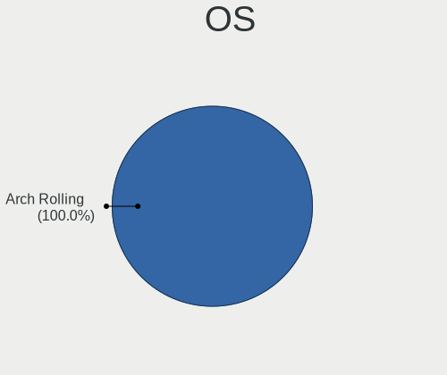
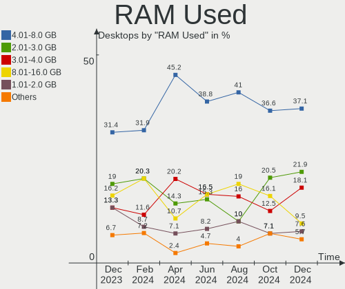
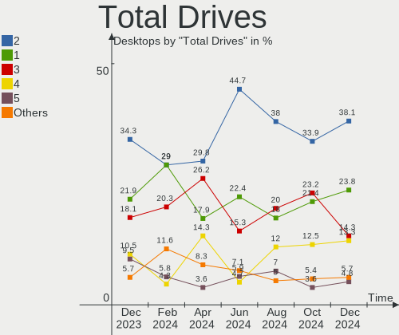
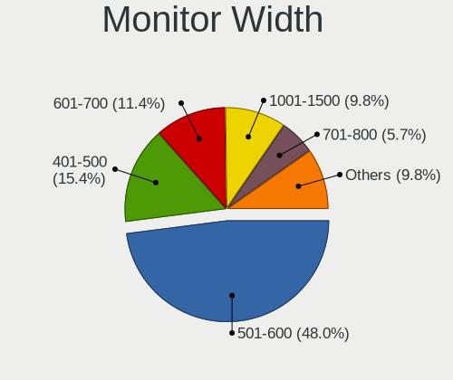
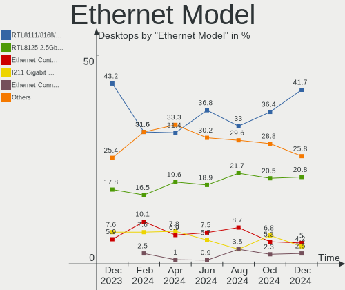
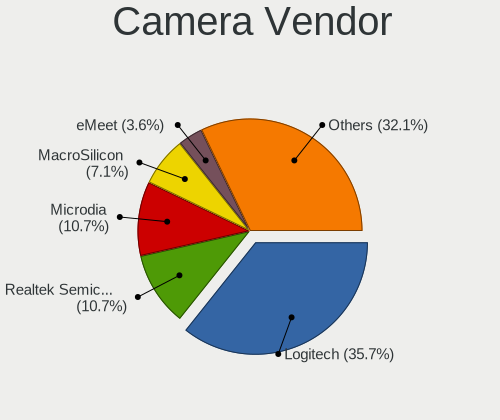

Arch Hardware Trends (Desktop)
------------------------------

A project to identify most popular hardware characteristics and track their change
over time based on data collected by Arch users at https://Linux-Hardware.org.

Anyone can contribute to the study by uploading probes of their computers by
the [hw-probe](https://github.com/linuxhw/hw-probe) tool:

    sudo -E hw-probe -all -upload

Full-feature report is available here: https://linux-hardware.org/?view=trends&formfactor=desktop

Period: Mar, 2021.

Contents
--------

- [ OS                       ](#os)
- [ OS Family                ](#os-family)
- [ Kernel                   ](#kernel)
- [ Kernel Family            ](#kernel-family)
- [ Kernel Major Ver.        ](#kernel-major-ver)
- [ Arch                     ](#arch)
- [ DE                       ](#de)
- [ Display Server           ](#display-server)
- [ Display Manager          ](#display-manager)
- [ OS Lang                  ](#os-lang)
- [ Boot Mode                ](#boot-mode)
- [ Filesystem               ](#filesystem)
- [ Part. scheme             ](#part-scheme)
- [ Dual Boot with Linux/BSD ](#dual-boot-with-linux/bsd)
- [ Dual Boot (Win)          ](#dual-boot-win)
- [ Country                  ](#country)
- [ City                     ](#city)
- [ Vendor                   ](#vendor)
- [ Model                    ](#model)
- [ Model Family             ](#model-family)
- [ MFG Year                 ](#mfg-year)
- [ Form Factor              ](#form-factor)
- [ Secure Boot              ](#secure-boot)
- [ Coreboot                 ](#coreboot)
- [ RAM Size                 ](#ram-size)
- [ RAM Used                 ](#ram-used)
- [ Has CD-ROM               ](#has-cd-rom)
- [ Total Drives             ](#total-drives)
- [ Has Ethernet             ](#has-ethernet)
- [ Has WiFi                 ](#has-wifi)
- [ Has Bluetooth            ](#has-bluetooth)
- [ Drive Vendor             ](#drive-vendor)
- [ Drive Model              ](#drive-model)
- [ HDD Vendor               ](#hdd-vendor)
- [ SSD Vendor               ](#ssd-vendor)
- [ Drive Kind               ](#drive-kind)
- [ Drive Connector          ](#drive-connector)
- [ Drive Size               ](#drive-size)
- [ Space Total              ](#space-total)
- [ Space Used               ](#space-used)
- [ Malfunc. Drives          ](#malfunc-drives)
- [ Malfunc. Drive Vendor    ](#malfunc-drive-vendor)
- [ Malfunc. HDD Vendor      ](#malfunc-hdd-vendor)
- [ Malfunc. Drive Kind      ](#malfunc-drive-kind)
- [ Failed Drives            ](#failed-drives)
- [ Failed Drive Vendor      ](#failed-drive-vendor)
- [ Drive Status             ](#drive-status)
- [ Storage Vendor           ](#storage-vendor)
- [ Storage Model            ](#storage-model)
- [ Storage Kind             ](#storage-kind)
- [ CPU Vendor               ](#cpu-vendor)
- [ CPU Model                ](#cpu-model)
- [ CPU Model Family         ](#cpu-model-family)
- [ CPU Cores                ](#cpu-cores)
- [ CPU Sockets              ](#cpu-sockets)
- [ CPU Threads              ](#cpu-threads)
- [ CPU Op-Modes             ](#cpu-op-modes)
- [ CPU Microcode            ](#cpu-microcode)
- [ CPU Microarch            ](#cpu-microarch)
- [ GPU Vendor               ](#gpu-vendor)
- [ GPU Model                ](#gpu-model)
- [ GPU Combo                ](#gpu-combo)
- [ GPU Driver               ](#gpu-driver)
- [ GPU Memory               ](#gpu-memory)
- [ Monitor Vendor           ](#monitor-vendor)
- [ Monitor Model            ](#monitor-model)
- [ Monitor Resolution       ](#monitor-resolution)
- [ Monitor Diagonal         ](#monitor-diagonal)
- [ Monitor Width            ](#monitor-width)
- [ Aspect Ratio             ](#aspect-ratio)
- [ Monitor Area             ](#monitor-area)
- [ Pixel Density            ](#pixel-density)
- [ Multiple Monitors        ](#multiple-monitors)
- [ Net Controller Vendor    ](#net-controller-vendor)
- [ Net Controller Model     ](#net-controller-model)
- [ Wireless Vendor          ](#wireless-vendor)
- [ Wireless Model           ](#wireless-model)
- [ Ethernet Vendor          ](#ethernet-vendor)
- [ Ethernet Model           ](#ethernet-model)
- [ Net Controller Kind      ](#net-controller-kind)
- [ Used Controller          ](#used-controller)
- [ NICs                     ](#nics)
- [ IPv6                     ](#ipv6)
- [ Memory Vendor            ](#memory-vendor)
- [ Memory Model             ](#memory-model)
- [ Memory Kind              ](#memory-kind)
- [ Memory Form Factor       ](#memory-form-factor)
- [ Memory Size              ](#memory-size)
- [ Memory Speed             ](#memory-speed)
- [ Sound Vendor             ](#sound-vendor)
- [ Sound Model              ](#sound-model)
- [ Camera Vendor            ](#camera-vendor)
- [ Camera Model             ](#camera-model)
- [ Fingerprint Vendor       ](#fingerprint-vendor)
- [ Fingerprint Model        ](#fingerprint-model)
- [ Chipcard Vendor          ](#chipcard-vendor)
- [ Chipcard Model           ](#chipcard-model)
- [ Printer Vendor           ](#printer-vendor)
- [ Printer Model            ](#printer-model)
- [ Scanner Vendor           ](#scanner-vendor)
- [ Scanner Model            ](#scanner-model)
- [ Bluetooth Vendor         ](#bluetooth-vendor)
- [ Bluetooth Model          ](#bluetooth-model)
- [ Unsupported Devices      ](#unsupported-devices)
- [ Unsupported Device Types ](#unsupported-device-types)

OS
--

Installed operating systems

| Name         | Desktops | Percent |
|--------------|----------|---------|
| Arch Rolling | 55       | 57.89%  |
| Arch         | 40       | 42.11%  |

OS Family
---------

OS without a version

| Name | Desktops | Percent |
|------|----------|---------|
| Arch | 95       | 100%    |

Kernel
------

Version of the Linux kernel

| Version                     | Desktops | Percent |
|-----------------------------|----------|---------|
| 5.11.6-arch1-1              | 20       | 21.05%  |
| 5.11.6-zen1-1-zen           | 7        | 7.37%   |
| 5.11.2-zen1-1-zen           | 7        | 7.37%   |
| 5.11.2-arch1-1              | 7        | 7.37%   |
| 5.11.7-arch1-1              | 6        | 6.32%   |
| 5.11.5-arch1-1              | 6        | 6.32%   |
| 5.11.4-arch1-1              | 6        | 6.32%   |
| 5.11.9-arch1-1              | 3        | 3.16%   |
| 5.11.10-arch1-1             | 3        | 3.16%   |
| 5.11.1-arch1-1              | 3        | 3.16%   |
| 5.11.11-arch1-1             | 2        | 2.11%   |
| 5.10.24-1-lts               | 2        | 2.11%   |
| 5.10.23-1-lts               | 2        | 2.11%   |
| 5.10.16-arch1-1             | 2        | 2.11%   |
| 5.9.0-arch1-1               | 1        | 1.05%   |
| 5.11.9-xanmod1-1            | 1        | 1.05%   |
| 5.11.8-zen1-1-zen           | 1        | 1.05%   |
| 5.11.6-xanmod1-1            | 1        | 1.05%   |
| 5.11.6-lqx1-1-lqx           | 1        | 1.05%   |
| 5.11.6-hardened1-1-hardened | 1        | 1.05%   |
| 5.11.6-gentoo               | 1        | 1.05%   |
| 5.11.6-artix1-1             | 1        | 1.05%   |
| 5.11.6-138-tkg-bmq          | 1        | 1.05%   |
| 5.11.6-137-tkg-pds          | 1        | 1.05%   |
| 5.11.5-zen1-1-zen           | 1        | 1.05%   |
| 5.11.5-xanmod1-1            | 1        | 1.05%   |
| 5.11.4-zen1-1-zen           | 1        | 1.05%   |
| 5.11.2-lqx2-1-lqx-native    | 1        | 1.05%   |
| 5.11.11-zen1-1-zen          | 1        | 1.05%   |
| 5.11.10-zen1-1-zen          | 1        | 1.05%   |
| 5.10.25-1-lts               | 1        | 1.05%   |
| 5.10.19-1-lts               | 1        | 1.05%   |
| 5.10.11-arch1-1             | 1        | 1.05%   |

Kernel Family
-------------

Linux kernel without a distro release

| Version | Desktops | Percent |
|---------|----------|---------|
| 5.11.6  | 34       | 35.79%  |
| 5.11.2  | 15       | 15.79%  |
| 5.11.5  | 8        | 8.42%   |
| 5.11.4  | 7        | 7.37%   |
| 5.11.7  | 6        | 6.32%   |
| 5.11.9  | 4        | 4.21%   |
| 5.11.10 | 4        | 4.21%   |
| 5.11.11 | 3        | 3.16%   |
| 5.11.1  | 3        | 3.16%   |
| 5.10.24 | 2        | 2.11%   |
| 5.10.23 | 2        | 2.11%   |
| 5.10.16 | 2        | 2.11%   |
| 5.9.0   | 1        | 1.05%   |
| 5.11.8  | 1        | 1.05%   |
| 5.10.25 | 1        | 1.05%   |
| 5.10.19 | 1        | 1.05%   |
| 5.10.11 | 1        | 1.05%   |

Kernel Major Ver.
-----------------

Linux kernel major version

| Version | Desktops | Percent |
|---------|----------|---------|
| 5.11    | 85       | 89.47%  |
| 5.10    | 9        | 9.47%   |
| 5.9     | 1        | 1.05%   |

Arch
----

OS architecture (x86_64, i586, etc.)

| Name   | Desktops | Percent |
|--------|----------|---------|
| x86_64 | 95       | 100%    |

DE
--

Desktop Environment

| Name            | Desktops | Percent |
|-----------------|----------|---------|
| GNOME           | 27       | 28.42%  |
| KDE5            | 17       | 17.89%  |
| XFCE            | 11       | 11.58%  |
| i3              | 7        | 7.37%   |
| Unknown         | 7        | 7.37%   |
| KDE             | 5        | 5.26%   |
| Cinnamon        | 4        | 4.21%   |
| sway            | 3        | 3.16%   |
| MATE            | 3        | 3.16%   |
| Deepin          | 2        | 2.11%   |
| Budgie          | 2        | 2.11%   |
| xmonad          | 1        | 1.05%   |
| X-Cinnamon      | 1        | 1.05%   |
| Unity           | 1        | 1.05%   |
| qtile           | 1        | 1.05%   |
| GNOME Flashback | 1        | 1.05%   |
| bspwm           | 1        | 1.05%   |
| awesome         | 1        | 1.05%   |

Display Server
--------------

X11 or Wayland

| Name    | Desktops | Percent |
|---------|----------|---------|
| X11     | 60       | 63.16%  |
| Wayland | 17       | 17.89%  |
| Tty     | 14       | 14.74%  |
| Unknown | 4        | 4.21%   |

Display Manager
---------------

SDDM, LightDM, etc.

| Name    | Desktops | Percent |
|---------|----------|---------|
| Unknown | 31       | 32.63%  |
| SDDM    | 22       | 23.16%  |
| TDM     | 15       | 15.79%  |
| GDM     | 14       | 14.74%  |
| LightDM | 7        | 7.37%   |
| XDM     | 3        | 3.16%   |
| SLiM    | 1        | 1.05%   |
| Ly      | 1        | 1.05%   |
| LXDM    | 1        | 1.05%   |

OS Lang
-------

Language

| Lang       | Desktops | Percent |
|------------|----------|---------|
| en_US      | 51       | 53.68%  |
| ru_RU      | 12       | 12.63%  |
| en_GB      | 6        | 6.32%   |
| pl_PL      | 4        | 4.21%   |
| pt_BR      | 3        | 3.16%   |
| Unknown    | 3        | 3.16%   |
| it_IT      | 2        | 2.11%   |
| en_IE      | 2        | 2.11%   |
| de_DE      | 2        | 2.11%   |
| C          | 2        | 2.11%   |
| uk_UA      | 1        | 1.05%   |
| osa_US     | 1        | 1.05%   |
| fr_FR      | 1        | 1.05%   |
| en_US.UTF8 | 1        | 1.05%   |
| en_NZ      | 1        | 1.05%   |
| en_DK      | 1        | 1.05%   |
| el_GR      | 1        | 1.05%   |
| an_ES      | 1        | 1.05%   |

Boot Mode
---------

EFI or BIOS

| Mode | Desktops | Percent |
|------|----------|---------|
| EFI  | 54       | 56.84%  |
| BIOS | 41       | 43.16%  |

Filesystem
----------

Type of filesystem

| Type    | Desktops | Percent |
|---------|----------|---------|
| Ext4    | 67       | 70.53%  |
| Btrfs   | 25       | 26.32%  |
| Zfs     | 1        | 1.05%   |
| Xfs     | 1        | 1.05%   |
| Unknown | 1        | 1.05%   |

Part. scheme
------------

Scheme of partitioning

| Type    | Desktops | Percent |
|---------|----------|---------|
| GPT     | 69       | 72.63%  |
| Unknown | 16       | 16.84%  |
| MBR     | 10       | 10.53%  |

Dual Boot with Linux/BSD
------------------------

Hosting more than one Linux/BSD

| Dual boot | Desktops | Percent |
|-----------|----------|---------|
| No        | 83       | 87.37%  |
| Yes       | 12       | 12.63%  |

Dual Boot (Win)
---------------

Hosting Linux and Windows

| Dual boot | Desktops | Percent |
|-----------|----------|---------|
| No        | 55       | 57.89%  |
| Yes       | 40       | 42.11%  |

Country
-------

Geographic location (country)

| Country     | Desktops | Percent |
|-------------|----------|---------|
| Russia      | 18       | 18.95%  |
| USA         | 17       | 17.89%  |
| Germany     | 8        | 8.42%   |
| Poland      | 7        | 7.37%   |
| Ukraine     | 6        | 6.32%   |
| UK          | 6        | 6.32%   |
| Italy       | 4        | 4.21%   |
| Brazil      | 3        | 3.16%   |
| Turkey      | 2        | 2.11%   |
| Sweden      | 2        | 2.11%   |
| New Zealand | 2        | 2.11%   |
| Greece      | 2        | 2.11%   |
| France      | 2        | 2.11%   |
| Denmark     | 2        | 2.11%   |
| Argentina   | 2        | 2.11%   |
| Uzbekistan  | 1        | 1.05%   |
| Spain       | 1        | 1.05%   |
| Serbia      | 1        | 1.05%   |
| Norway      | 1        | 1.05%   |
| Latvia      | 1        | 1.05%   |
| Ireland     | 1        | 1.05%   |
| Hungary     | 1        | 1.05%   |
| Czechia     | 1        | 1.05%   |
| Canada      | 1        | 1.05%   |
| Bulgaria    | 1        | 1.05%   |
| Belgium     | 1        | 1.05%   |
| Austria     | 1        | 1.05%   |

City
----

Geographic location (city)

| City                | Desktops | Percent |
|---------------------|----------|---------|
| Moscow              | 6        | 6.32%   |
| Valencia            | 2        | 2.11%   |
| San Jose            | 2        | 2.11%   |
| Campinas            | 2        | 2.11%   |
| České Budějovice | 1        | 1.05%   |
| Ålesund            | 1        | 1.05%   |
| Zaporizhzhya        | 1        | 1.05%   |
| Wałbrzych          | 1        | 1.05%   |
| Washington          | 1        | 1.05%   |
| Warsaw              | 1        | 1.05%   |
| Voronezh            | 1        | 1.05%   |
| Vol'ginskiy         | 1        | 1.05%   |
| Vienna              | 1        | 1.05%   |
| Ufa                 | 1        | 1.05%   |
| Thessaloniki        | 1        | 1.05%   |
| Tashkent            | 1        | 1.05%   |
| Szeged              | 1        | 1.05%   |
| Suchy Las           | 1        | 1.05%   |
| Stalowa Wola        | 1        | 1.05%   |
| St Petersburg       | 1        | 1.05%   |
| St Louis            | 1        | 1.05%   |
| Serpukhov           | 1        | 1.05%   |
| Saratov             | 1        | 1.05%   |
| Sao Jose            | 1        | 1.05%   |
| Santa Barbara       | 1        | 1.05%   |
| San Diego           | 1        | 1.05%   |
| Rostov-on-Don       | 1        | 1.05%   |
| Rome                | 1        | 1.05%   |
| Riga                | 1        | 1.05%   |
| Québec             | 1        | 1.05%   |
| Portland            | 1        | 1.05%   |
| Plouzane            | 1        | 1.05%   |
| Pidvolochysk        | 1        | 1.05%   |
| Passau              | 1        | 1.05%   |
| Odessa              | 1        | 1.05%   |
| Nelson              | 1        | 1.05%   |
| Narbarte            | 1        | 1.05%   |
| Myrnohrad           | 1        | 1.05%   |
| Murmansk            | 1        | 1.05%   |
| Milan               | 1        | 1.05%   |
| Magione             | 1        | 1.05%   |
| Luleå              | 1        | 1.05%   |
| London              | 1        | 1.05%   |
| Liverpool           | 1        | 1.05%   |
| Lenoir              | 1        | 1.05%   |
| Lake Placid         | 1        | 1.05%   |
| Kyiv                | 1        | 1.05%   |
| Kungsholmen         | 1        | 1.05%   |
| Kryvyi Rih          | 1        | 1.05%   |
| Kayseri             | 1        | 1.05%   |
| Karlsruhe           | 1        | 1.05%   |
| Izmir               | 1        | 1.05%   |
| Izhevsk             | 1        | 1.05%   |
| Horsens             | 1        | 1.05%   |
| Hamme               | 1        | 1.05%   |
| Gorlice             | 1        | 1.05%   |
| General Roca        | 1        | 1.05%   |
| Frankfurt am Main   | 1        | 1.05%   |
| Fort Bragg          | 1        | 1.05%   |
| Falkenstein         | 1        | 1.05%   |

Vendor
------

Motherboard manufacturer

| Name                | Desktops | Percent |
|---------------------|----------|---------|
| Gigabyte Technology | 28       | 29.47%  |
| ASUSTek Computer    | 27       | 28.42%  |
| MSI                 | 14       | 14.74%  |
| ASRock              | 13       | 13.68%  |
| Hewlett-Packard     | 3        | 3.16%   |
| Intel               | 2        | 2.11%   |
| PCWare              | 1        | 1.05%   |
| PC Engines          | 1        | 1.05%   |
| Medion              | 1        | 1.05%   |
| Lenovo              | 1        | 1.05%   |
| ECS                 | 1        | 1.05%   |
| Dell                | 1        | 1.05%   |
| Casper              | 1        | 1.05%   |
| Acer                | 1        | 1.05%   |

Model
-----

Motherboard model

| Name                             | Desktops | Percent |
|----------------------------------|----------|---------|
| Gigabyte B450 AORUS ELITE        | 4        | 4.21%   |
| MSI MS-7B86                      | 3        | 3.16%   |
| Gigabyte X470 AORUS ULTRA GAMING | 3        | 3.16%   |
| Gigabyte X570 I AORUS PRO WIFI   | 2        | 2.11%   |
| Gigabyte X570 AORUS ELITE        | 2        | 2.11%   |
| ASUS Z170-P                      | 2        | 2.11%   |
| PCWare IPMH81G1                  | 1        | 1.05%   |
| PC Engines apu2                  | 1        | 1.05%   |
| MSI MS-7C35                      | 1        | 1.05%   |
| MSI MS-7C13                      | 1        | 1.05%   |
| MSI MS-7B84                      | 1        | 1.05%   |
| MSI MS-7B79                      | 1        | 1.05%   |
| MSI MS-7A68                      | 1        | 1.05%   |
| MSI MS-7A38                      | 1        | 1.05%   |
| MSI MS-7A34                      | 1        | 1.05%   |
| MSI MS-7922                      | 1        | 1.05%   |
| MSI MS-7693                      | 1        | 1.05%   |
| MSI MS-7640                      | 1        | 1.05%   |
| MSI MS-7267                      | 1        | 1.05%   |
| Medion D3F3-EM                   | 1        | 1.05%   |
| Lenovo H415                      | 1        | 1.05%   |
| Intel X99 V102A                  | 1        | 1.05%   |
| Intel Thurley                    | 1        | 1.05%   |
| HP ProLiant MicroServer Gen8     | 1        | 1.05%   |
| HP Compaq Elite 8300 CMT         | 1        | 1.05%   |
| HP Compaq 6200 Pro MT PC         | 1        | 1.05%   |
| Gigabyte Z87-HD3                 | 1        | 1.05%   |
| Gigabyte Z68AP-D3                | 1        | 1.05%   |
| Gigabyte Z170N-WIFI              | 1        | 1.05%   |
| Gigabyte X570 AORUS PRO          | 1        | 1.05%   |
| Gigabyte X570 AORUS ELITE WIFI   | 1        | 1.05%   |
| Gigabyte H410M H                 | 1        | 1.05%   |
| Gigabyte H170M-DS3H              | 1        | 1.05%   |
| Gigabyte GA-MA770T-UD3P          | 1        | 1.05%   |
| Gigabyte GA-78LMT-USB3 R2        | 1        | 1.05%   |
| Gigabyte F2A88XM-HD3P            | 1        | 1.05%   |
| Gigabyte EP45-DS3                | 1        | 1.05%   |
| Gigabyte B550I AORUS PRO AX      | 1        | 1.05%   |
| Gigabyte B450 AORUS M            | 1        | 1.05%   |
| Gigabyte AB350M-Gaming 3         | 1        | 1.05%   |
| Gigabyte A320MA-M.2              | 1        | 1.05%   |
| Gigabyte A320M-S2H               | 1        | 1.05%   |
| Gigabyte 970A-DS3P               | 1        | 1.05%   |
| ECS H61H2-M6                     | 1        | 1.05%   |
| Dell OptiPlex 3010               | 1        | 1.05%   |
| Casper NIRVANA ONE A500          | 1        | 1.05%   |
| ASUS Z170I PRO GAMING            | 1        | 1.05%   |
| ASUS Z170-PRO                    | 1        | 1.05%   |
| ASUS TUF Z270 MARK 2             | 1        | 1.05%   |
| ASUS TUF GAMING B550M-PLUS       | 1        | 1.05%   |
| ASUS TUF GAMING B550-PLUS        | 1        | 1.05%   |
| ASUS TUF B450-PRO GAMING         | 1        | 1.05%   |
| ASUS STRIX Z270E GAMING          | 1        | 1.05%   |
| ASUS SABERTOOTH Z77              | 1        | 1.05%   |
| ASUS SABERTOOTH 990FX R2.0       | 1        | 1.05%   |
| ASUS ROG STRIX X470-F GAMING     | 1        | 1.05%   |
| ASUS ROG STRIX B550-I GAMING     | 1        | 1.05%   |
| ASUS ROG STRIX B450-I GAMING     | 1        | 1.05%   |
| ASUS ROG STRIX B450-F GAMING     | 1        | 1.05%   |
| ASUS PRIME Z370-A                | 1        | 1.05%   |

Model Family
------------

Motherboard model prefix

| Name                    | Desktops | Percent |
|-------------------------|----------|---------|
| Gigabyte X570           | 6        | 6.32%   |
| Gigabyte B450           | 5        | 5.26%   |
| ASUS TUF                | 4        | 4.21%   |
| ASUS ROG                | 4        | 4.21%   |
| ASUS PRIME              | 4        | 4.21%   |
| MSI MS-7B86             | 3        | 3.16%   |
| Gigabyte X470           | 3        | 3.16%   |
| HP Compaq               | 2        | 2.11%   |
| ASUS Z170-P             | 2        | 2.11%   |
| ASUS SABERTOOTH         | 2        | 2.11%   |
| ASUS Maximus            | 2        | 2.11%   |
| ASRock X570             | 2        | 2.11%   |
| ASRock B450M            | 2        | 2.11%   |
| ASRock B450             | 2        | 2.11%   |
| PCWare IPMH81G1         | 1        | 1.05%   |
| PC Engines apu2         | 1        | 1.05%   |
| MSI MS-7C35             | 1        | 1.05%   |
| MSI MS-7C13             | 1        | 1.05%   |
| MSI MS-7B84             | 1        | 1.05%   |
| MSI MS-7B79             | 1        | 1.05%   |
| MSI MS-7A68             | 1        | 1.05%   |
| MSI MS-7A38             | 1        | 1.05%   |
| MSI MS-7A34             | 1        | 1.05%   |
| MSI MS-7922             | 1        | 1.05%   |
| MSI MS-7693             | 1        | 1.05%   |
| MSI MS-7640             | 1        | 1.05%   |
| MSI MS-7267             | 1        | 1.05%   |
| Medion D3F3-EM          | 1        | 1.05%   |
| Lenovo H415             | 1        | 1.05%   |
| Intel X99               | 1        | 1.05%   |
| Intel Thurley           | 1        | 1.05%   |
| HP ProLiant             | 1        | 1.05%   |
| Gigabyte Z87-HD3        | 1        | 1.05%   |
| Gigabyte Z68AP-D3       | 1        | 1.05%   |
| Gigabyte Z170N-WIFI     | 1        | 1.05%   |
| Gigabyte H410M          | 1        | 1.05%   |
| Gigabyte H170M-DS3H     | 1        | 1.05%   |
| Gigabyte GA-MA770T-UD3P | 1        | 1.05%   |
| Gigabyte GA-78LMT-USB3  | 1        | 1.05%   |
| Gigabyte F2A88XM-HD3P   | 1        | 1.05%   |
| Gigabyte EP45-DS3       | 1        | 1.05%   |
| Gigabyte B550I          | 1        | 1.05%   |
| Gigabyte AB350M-Gaming  | 1        | 1.05%   |
| Gigabyte A320MA-M.2     | 1        | 1.05%   |
| Gigabyte A320M-S2H      | 1        | 1.05%   |
| Gigabyte 970A-DS3P      | 1        | 1.05%   |
| ECS H61H2-M6            | 1        | 1.05%   |
| Dell OptiPlex           | 1        | 1.05%   |
| Casper NIRVANA          | 1        | 1.05%   |
| ASUS Z170I              | 1        | 1.05%   |
| ASUS Z170-PRO           | 1        | 1.05%   |
| ASUS STRIX              | 1        | 1.05%   |
| ASUS P8Z77-V            | 1        | 1.05%   |
| ASUS P5QL-CM            | 1        | 1.05%   |
| ASUS M4A88TD-M          | 1        | 1.05%   |
| ASUS KCMA-D8            | 1        | 1.05%   |
| ASUS All                | 1        | 1.05%   |
| ASUS A0000001           | 1        | 1.05%   |
| ASRock Z97              | 1        | 1.05%   |
| ASRock X99              | 1        | 1.05%   |

MFG Year
--------

Motherboard manufacture year

| Year | Desktops | Percent |
|------|----------|---------|
| 2020 | 24       | 25.26%  |
| 2019 | 17       | 17.89%  |
| 2018 | 14       | 14.74%  |
| 2021 | 10       | 10.53%  |
| 2014 | 7        | 7.37%   |
| 2017 | 5        | 5.26%   |
| 2012 | 5        | 5.26%   |
| 2016 | 4        | 4.21%   |
| 2015 | 2        | 2.11%   |
| 2011 | 2        | 2.11%   |
| 2008 | 2        | 2.11%   |
| 2013 | 1        | 1.05%   |
| 2010 | 1        | 1.05%   |
| 2009 | 1        | 1.05%   |

Form Factor
-----------

Physical design of the computer

| Name    | Desktops | Percent |
|---------|----------|---------|
| Desktop | 95       | 100%    |

Secure Boot
-----------

Enabled or disabled

| State    | Desktops | Percent |
|----------|----------|---------|
| Disabled | 95       | 100%    |

Coreboot
--------

Have coreboot on board

| Used | Desktops | Percent |
|------|----------|---------|
| No   | 93       | 97.89%  |
| Yes  | 2        | 2.11%   |

RAM Size
--------

Total RAM memory

| Size in GB  | Desktops | Percent |
|-------------|----------|---------|
| 16.01-24.0  | 36       | 37.89%  |
| 32.01-64.0  | 29       | 30.53%  |
| 8.01-16.0   | 14       | 14.74%  |
| 4.01-8.0    | 5        | 5.26%   |
| 64.01-256.0 | 5        | 5.26%   |
| 3.01-4.0    | 3        | 3.16%   |
| 24.01-32.0  | 2        | 2.11%   |
| 1.01-2.0    | 1        | 1.05%   |

RAM Used
--------

Used RAM memory

| Used GB    | Desktops | Percent |
|------------|----------|---------|
| 4.01-8.0   | 29       | 30.53%  |
| 3.01-4.0   | 17       | 17.89%  |
| 2.01-3.0   | 15       | 15.79%  |
| 1.01-2.0   | 15       | 15.79%  |
| 8.01-16.0  | 12       | 12.63%  |
| 16.01-24.0 | 4        | 4.21%   |
| 0.51-1.0   | 2        | 2.11%   |
| 0.01-0.5   | 1        | 1.05%   |

Has CD-ROM
----------

Has CD-ROM on board

| Presented | Desktops | Percent |
|-----------|----------|---------|
| No        | 77       | 81.05%  |
| Yes       | 18       | 18.95%  |

Total Drives
------------

Number of drives on board

| Drives | Desktops | Percent |
|--------|----------|---------|
| 2      | 28       | 29.47%  |
| 3      | 25       | 26.32%  |
| 1      | 17       | 17.89%  |
| 4      | 14       | 14.74%  |
| 5      | 7        | 7.37%   |
| 6      | 2        | 2.11%   |
| 11     | 1        | 1.05%   |
| 7      | 1        | 1.05%   |

Has Ethernet
------------

Has Ethernet on board

| Presented | Desktops | Percent |
|-----------|----------|---------|
| Yes       | 95       | 100%    |

Has WiFi
--------

Has WiFi module

| Presented | Desktops | Percent |
|-----------|----------|---------|
| No        | 59       | 62.11%  |
| Yes       | 36       | 37.89%  |

Has Bluetooth
-------------

Has Bluetooth module

| Presented | Desktops | Percent |
|-----------|----------|---------|
| No        | 62       | 65.26%  |
| Yes       | 33       | 34.74%  |

Drive Vendor
------------

Hard drive vendors

| Vendor                    | Desktops | Drives | Percent |
|---------------------------|----------|--------|---------|
| Samsung Electronics       | 40       | 56     | 19.32%  |
| WDC                       | 32       | 52     | 15.46%  |
| Seagate                   | 32       | 50     | 15.46%  |
| Kingston                  | 16       | 17     | 7.73%   |
| Toshiba                   | 10       | 11     | 4.83%   |
| Crucial                   | 10       | 11     | 4.83%   |
| Intel                     | 8        | 8      | 3.86%   |
| Phison                    | 5        | 5      | 2.42%   |
| China                     | 5        | 8      | 2.42%   |
| SanDisk                   | 4        | 4      | 1.93%   |
| Corsair                   | 4        | 4      | 1.93%   |
| A-DATA Technology         | 4        | 4      | 1.93%   |
| SPCC                      | 3        | 3      | 1.45%   |
| Patriot                   | 3        | 3      | 1.45%   |
| HGST                      | 3        | 3      | 1.45%   |
| XPG                       | 2        | 2      | 0.97%   |
| Silicon Motion            | 2        | 2      | 0.97%   |
| PNY                       | 2        | 2      | 0.97%   |
| PLEXTOR                   | 2        | 2      | 0.97%   |
| OCZ                       | 2        | 2      | 0.97%   |
| Micron/Crucial Technology | 2        | 3      | 0.97%   |
| Micron Technology         | 2        | 2      | 0.97%   |
| Hitachi                   | 2        | 2      | 0.97%   |
| Unknown                   | 1        | 1      | 0.48%   |
| Transcend                 | 1        | 1      | 0.48%   |
| Team                      | 1        | 1      | 0.48%   |
| Realtek Semiconductor     | 1        | 1      | 0.48%   |
| MAXTOR                    | 1        | 1      | 0.48%   |
| Kingmax                   | 1        | 1      | 0.48%   |
| JMicron                   | 1        | 1      | 0.48%   |
| Intenso                   | 1        | 1      | 0.48%   |
| GOODRAM                   | 1        | 1      | 0.48%   |
| Gigabyte Technology       | 1        | 1      | 0.48%   |
| ASMT                      | 1        | 1      | 0.48%   |
| AMD                       | 1        | 1      | 0.48%   |

Drive Model
-----------

Hard drive models

| Model                             | Desktops | Percent |
|-----------------------------------|----------|---------|
| Samsung SSD 860 EVO 500GB         | 6        | 2.45%   |
| Seagate ST1000DM010-2EP102 1TB    | 4        | 1.63%   |
| Samsung SSD 860 EVO 1TB           | 4        | 1.63%   |
| Samsung SSD 850 EVO 500GB         | 4        | 1.63%   |
| Kingston SV300S37A120G 120GB SSD  | 4        | 1.63%   |
| Seagate ST2000DM006-2DM164 2TB    | 3        | 1.22%   |
| Samsung SSD 970 EVO Plus 500GB    | 3        | 1.22%   |
| Samsung SSD 970 EVO 500GB         | 3        | 1.22%   |
| Samsung SSD 850 EVO 250GB         | 3        | 1.22%   |
| Kingston SA400S37240G 240GB SSD   | 3        | 1.22%   |
| A-DATA SX8200PNP 1TB              | 3        | 1.22%   |
| XPG NVMe SSD Drive 1TB            | 2        | 0.82%   |
| WDC WDS250G1B0B-00AS40 250GB SSD  | 2        | 0.82%   |
| WDC WD5000AAKX-00ERMA0 500GB      | 2        | 0.82%   |
| WDC WD10EZEX-08WN4A0 1TB          | 2        | 0.82%   |
| WDC WD10EARS-00Y5B1 1TB           | 2        | 0.82%   |
| Seagate ST500DM002-1BD142 500GB   | 2        | 0.82%   |
| Seagate ST2000DM008-2FR102 2TB    | 2        | 0.82%   |
| Seagate ST1000DM003-1ER162 1TB    | 2        | 0.82%   |
| Samsung SSD 970 EVO Plus 1TB      | 2        | 0.82%   |
| Samsung SSD 860 QVO 1TB           | 2        | 0.82%   |
| Samsung SSD 840 EVO 250GB         | 2        | 0.82%   |
| Samsung SSD 750 EVO 250GB         | 2        | 0.82%   |
| Samsung NVMe SSD Drive 1TB        | 2        | 0.82%   |
| Phison NVMe SSD Drive 1TB         | 2        | 0.82%   |
| Patriot Burst 480GB SSD           | 2        | 0.82%   |
| Micron/Crucial NVMe SSD Drive 1TB | 2        | 0.82%   |
| Kingston SA400S37120G 120GB SSD   | 2        | 0.82%   |
| Crucial CT1000MX500SSD4 1TB       | 2        | 0.82%   |
| Crucial CT1000MX500SSD1 1TB       | 2        | 0.82%   |
| Corsair Force MP600 1TB           | 2        | 0.82%   |
| WDC WDS500G3XHC-00SJG0 500GB      | 1        | 0.41%   |
| WDC WDS500G2B0B-00YS70 500GB SSD  | 1        | 0.41%   |
| WDC WDS250G2B0C-00PXH0 250GB      | 1        | 0.41%   |
| WDC WDS240G2G0A-00JH30 240GB SSD  | 1        | 0.41%   |
| WDC WDS200T3XHC-00SJG0 2TB        | 1        | 0.41%   |
| WDC WDS120G2G0B-00EPW0 120GB SSD  | 1        | 0.41%   |
| WDC WDS100T2B0C-00PXH0 1TB        | 1        | 0.41%   |
| WDC WDS100T2B0A-00SM50 1TB SSD    | 1        | 0.41%   |
| WDC WD80EMAZ-00WJTA0 8TB          | 1        | 0.41%   |
| WDC WD800ADFS-75SLR2 80GB         | 1        | 0.41%   |
| WDC WD7500AACS-00D6B1 752GB       | 1        | 0.41%   |
| WDC WD6400AACS-00G8B1 640GB       | 1        | 0.41%   |
| WDC WD5002AALX-00J37A0 500GB      | 1        | 0.41%   |
| WDC WD5000AAKX-001CA0 500GB       | 1        | 0.41%   |
| WDC WD5000AAKS-00V1A0 500GB       | 1        | 0.41%   |
| WDC WD40EFRX-68N32N0 4TB          | 1        | 0.41%   |
| WDC WD40EFAX-68JH4N0 4TB          | 1        | 0.41%   |
| WDC WD4005FZBX-00K5WB0 4TB        | 1        | 0.41%   |
| WDC WD3200KS-00PFB0 320GB         | 1        | 0.41%   |
| WDC WD3200AAKS-75L9A0 320GB       | 1        | 0.41%   |
| WDC WD3200AAJS-56B4A0 320GB       | 1        | 0.41%   |
| WDC WD30EZRX-00D8PB0 3TB          | 1        | 0.41%   |
| WDC WD30EFRX-68EUZN0 3TB          | 1        | 0.41%   |
| WDC WD20EFRX-68EUZN0 2TB          | 1        | 0.41%   |
| WDC WD20EARX-00PASB0 2TB          | 1        | 0.41%   |
| WDC WD15EARS-00Z5B1 1TB           | 1        | 0.41%   |
| WDC WD10SPZX-75Z10T3 1TB          | 1        | 0.41%   |
| WDC WD10SPCX-24HWST1 1TB          | 1        | 0.41%   |
| WDC WD10EZEX-08M2NA0 1TB          | 1        | 0.41%   |

HDD Vendor
----------

Hard disk drive vendors

| Vendor              | Desktops | Drives | Percent |
|---------------------|----------|--------|---------|
| Seagate             | 32       | 49     | 41.03%  |
| WDC                 | 27       | 41     | 34.62%  |
| Toshiba             | 10       | 11     | 12.82%  |
| Samsung Electronics | 3        | 3      | 3.85%   |
| HGST                | 3        | 3      | 3.85%   |
| Hitachi             | 2        | 2      | 2.56%   |
| MAXTOR              | 1        | 1      | 1.28%   |

SSD Vendor
----------

Solid state drive vendors

| Vendor              | Desktops | Drives | Percent |
|---------------------|----------|--------|---------|
| Samsung Electronics | 26       | 31     | 28.89%  |
| Kingston            | 16       | 17     | 17.78%  |
| Crucial             | 10       | 11     | 11.11%  |
| WDC                 | 6        | 6      | 6.67%   |
| China               | 5        | 8      | 5.56%   |
| SanDisk             | 4        | 4      | 4.44%   |
| Patriot             | 3        | 3      | 3.33%   |
| Intel               | 3        | 3      | 3.33%   |
| SPCC                | 2        | 2      | 2.22%   |
| PNY                 | 2        | 2      | 2.22%   |
| OCZ                 | 2        | 2      | 2.22%   |
| Micron Technology   | 2        | 2      | 2.22%   |
| Team                | 1        | 1      | 1.11%   |
| PLEXTOR             | 1        | 1      | 1.11%   |
| Kingmax             | 1        | 1      | 1.11%   |
| JMicron             | 1        | 1      | 1.11%   |
| Intenso             | 1        | 1      | 1.11%   |
| GOODRAM             | 1        | 1      | 1.11%   |
| Corsair             | 1        | 1      | 1.11%   |
| ASMT                | 1        | 1      | 1.11%   |
| AMD                 | 1        | 1      | 1.11%   |

Drive Kind
----------

HDD or SSD

| Kind    | Desktops | Drives | Percent |
|---------|----------|--------|---------|
| SSD     | 67       | 100    | 39.88%  |
| HDD     | 60       | 110    | 35.71%  |
| NVMe    | 39       | 56     | 23.21%  |
| Unknown | 2        | 2      | 1.19%   |

Drive Connector
---------------

SATA, SAS, NVMe, etc.

| Type | Desktops | Drives | Percent |
|------|----------|--------|---------|
| SATA | 85       | 206    | 65.38%  |
| NVMe | 39       | 56     | 30%     |
| SAS  | 6        | 6      | 4.62%   |

Drive Size
----------

Size of hard drive

| Size in TB | Desktops | Drives | Percent |
|------------|----------|--------|---------|
| 0.01-0.5   | 71       | 111    | 48.97%  |
| 0.51-1.0   | 42       | 59     | 28.97%  |
| 1.01-2.0   | 16       | 19     | 11.03%  |
| 3.01-4.0   | 7        | 9      | 4.83%   |
| 4.01-10.0  | 5        | 6      | 3.45%   |
| 2.01-3.0   | 4        | 6      | 2.76%   |

Space Total
-----------

Amount of disk space available on the file system

| Size in GB     | Desktops | Percent |
|----------------|----------|---------|
| 1001-2000      | 23       | 24.21%  |
| 251-500        | 20       | 21.05%  |
| 501-1000       | 15       | 15.79%  |
| More than 3000 | 14       | 14.74%  |
| 2001-3000      | 11       | 11.58%  |
| 101-250        | 8        | 8.42%   |
| Unknown        | 2        | 2.11%   |
| 1-20           | 1        | 1.05%   |
| 51-100         | 1        | 1.05%   |

Space Used
----------

Amount of used disk space

| Used GB        | Desktops | Percent |
|----------------|----------|---------|
| 101-250        | 19       | 20%     |
| 501-1000       | 19       | 20%     |
| 251-500        | 16       | 16.84%  |
| 1001-2000      | 11       | 11.58%  |
| 51-100         | 8        | 8.42%   |
| 2001-3000      | 7        | 7.37%   |
| 1-20           | 7        | 7.37%   |
| More than 3000 | 3        | 3.16%   |
| 21-50          | 3        | 3.16%   |
| Unknown        | 2        | 2.11%   |

Malfunc. Drives
---------------

Drive models with a malfunction

| Model                                       | Desktops | Drives | Percent |
|---------------------------------------------|----------|--------|---------|
| WDC WDS240G2G0A-00JH30 240GB SSD            | 1        | 1      | 5.26%   |
| WDC WD5002AALX-00J37A0 500GB                | 1        | 1      | 5.26%   |
| WDC WD20EARX-00PASB0 2TB                    | 1        | 1      | 5.26%   |
| WDC WD15EARS-00Z5B1 1TB                     | 1        | 1      | 5.26%   |
| WDC WD10EARS-00Y5B1 1TB                     | 1        | 1      | 5.26%   |
| Toshiba MK5075GSX 500GB                     | 1        | 1      | 5.26%   |
| Seagate ST9640320AS 640GB                   | 1        | 1      | 5.26%   |
| Seagate ST500LM021-1KJ152 500GB             | 1        | 1      | 5.26%   |
| Seagate ST3500514NS 500GB                   | 1        | 2      | 5.26%   |
| Seagate ST3320620AS 320GB                   | 1        | 1      | 5.26%   |
| Seagate ST320LT020-9YG142 320GB             | 1        | 1      | 5.26%   |
| Seagate ST31000524AS 1TB                    | 1        | 1      | 5.26%   |
| Seagate ST2000DX002-2DV164 2TB              | 1        | 1      | 5.26%   |
| Seagate ST1000LM014-SSHD-8GB                | 1        | 1      | 5.26%   |
| Samsung Electronics SSD PM810 2.5 7mm 128GB | 1        | 1      | 5.26%   |
| OCZ VERTEX4 256GB SSD                       | 1        | 1      | 5.26%   |
| Kingston SV300S37A120G 120GB SSD            | 1        | 1      | 5.26%   |
| Intel SSDPEKKW256G7 256GB                   | 1        | 1      | 5.26%   |
| Hitachi HUA722010CLA330 1TB                 | 1        | 1      | 5.26%   |

Malfunc. Drive Vendor
---------------------

Vendors of faulty drives

| Vendor              | Desktops | Drives | Percent |
|---------------------|----------|--------|---------|
| Seagate             | 7        | 9      | 41.18%  |
| WDC                 | 4        | 5      | 23.53%  |
| Toshiba             | 1        | 1      | 5.88%   |
| Samsung Electronics | 1        | 1      | 5.88%   |
| OCZ                 | 1        | 1      | 5.88%   |
| Kingston            | 1        | 1      | 5.88%   |
| Intel               | 1        | 1      | 5.88%   |
| Hitachi             | 1        | 1      | 5.88%   |

Malfunc. HDD Vendor
-------------------

Vendors of faulty HDD drives

| Vendor  | Desktops | Drives | Percent |
|---------|----------|--------|---------|
| Seagate | 7        | 9      | 58.33%  |
| WDC     | 3        | 4      | 25%     |
| Toshiba | 1        | 1      | 8.33%   |
| Hitachi | 1        | 1      | 8.33%   |

Malfunc. Drive Kind
-------------------

Kinds of faulty drives

| Kind | Desktops | Drives | Percent |
|------|----------|--------|---------|
| HDD  | 11       | 15     | 68.75%  |
| SSD  | 4        | 4      | 25%     |
| NVMe | 1        | 1      | 6.25%   |

Failed Drives
-------------

Failed drive models

| Model                             | Desktops | Drives | Percent |
|-----------------------------------|----------|--------|---------|
| Samsung Electronics HM251JI 250GB | 1        | 1      | 100%    |

Failed Drive Vendor
-------------------

Failed drive vendors

| Vendor              | Desktops | Drives | Percent |
|---------------------|----------|--------|---------|
| Samsung Electronics | 1        | 1      | 100%    |

Drive Status
------------

Number of failed and malfunc. drives

| Status   | Desktops | Drives | Percent |
|----------|----------|--------|---------|
| Works    | 58       | 141    | 51.79%  |
| Detected | 37       | 106    | 33.04%  |
| Malfunc  | 16       | 20     | 14.29%  |
| Failed   | 1        | 1      | 0.89%   |

Storage Vendor
--------------

Storage controller vendors

| Vendor                    | Desktops | Percent |
|---------------------------|----------|---------|
| AMD                       | 57       | 37.01%  |
| Intel                     | 40       | 25.97%  |
| Samsung Electronics       | 16       | 10.39%  |
| Phison Electronics        | 9        | 5.84%   |
| ASMedia Technology        | 8        | 5.19%   |
| ADATA Technology          | 6        | 3.9%    |
| Silicon Motion            | 4        | 2.6%    |
| Sandisk                   | 3        | 1.95%   |
| JMicron Technology        | 3        | 1.95%   |
| Micron/Crucial Technology | 2        | 1.3%    |
| Broadcom / LSI            | 2        | 1.3%    |
| VIA Technologies          | 1        | 0.65%   |
| Realtek Semiconductor     | 1        | 0.65%   |
| LSI Logic / Symbios Logic | 1        | 0.65%   |
| Lite-On Technology        | 1        | 0.65%   |

Storage Model
-------------

Storage controller models

| Model                                                                                   | Desktops | Percent |
|-----------------------------------------------------------------------------------------|----------|---------|
| AMD FCH SATA Controller [AHCI mode]                                                     | 36       | 19.05%  |
| AMD 400 Series Chipset SATA Controller                                                  | 22       | 11.64%  |
| Samsung NVMe SSD Controller SM981/PM981/PM983                                           | 12       | 6.35%   |
| Intel 200 Series PCH SATA controller [AHCI mode]                                        | 9        | 4.76%   |
| ASMedia ASM1062 Serial ATA Controller                                                   | 8        | 4.23%   |
| Intel Q170/Q150/B150/H170/H110/Z170/CM236 Chipset SATA Controller [AHCI Mode]           | 7        | 3.7%    |
| AMD Starship/Matisse Chipset SATA Controller [AHCI mode]                                | 6        | 3.17%   |
| AMD SB7x0/SB8x0/SB9x0 SATA Controller [AHCI mode]                                       | 6        | 3.17%   |
| ADATA XPG SX8200 Pro PCIe Gen3x4 M.2 2280 Solid State Drive                             | 6        | 3.17%   |
| Phison E16 PCIe4 NVMe Controller                                                        | 5        | 2.65%   |
| Intel 8 Series/C220 Series Chipset Family 6-port SATA Controller 1 [AHCI mode]          | 4        | 2.12%   |
| AMD SB7x0/SB8x0/SB9x0 IDE Controller                                                    | 4        | 2.12%   |
| Phison E12 NVMe Controller                                                              | 3        | 1.59%   |
| Intel 7 Series/C210 Series Chipset Family 6-port SATA Controller [AHCI mode]            | 3        | 1.59%   |
| Intel 6 Series/C200 Series Chipset Family 6 port Desktop SATA AHCI Controller           | 3        | 1.59%   |
| AMD FCH SATA Controller D                                                               | 3        | 1.59%   |
| Silicon Motion SM2263EN/SM2263XT SSD Controller                                         | 2        | 1.06%   |
| Silicon Motion SM2262/SM2262EN SSD Controller                                           | 2        | 1.06%   |
| Samsung NVMe SSD Controller SM961/PM961/SM963                                           | 2        | 1.06%   |
| Samsung NVMe SSD Controller SM951/PM951                                                 | 2        | 1.06%   |
| Micron/Crucial P1 NVMe PCIe SSD                                                         | 2        | 1.06%   |
| JMicron JMB368 IDE controller                                                           | 2        | 1.06%   |
| Intel SSD 660P Series                                                                   | 2        | 1.06%   |
| Intel SSD 600P Series                                                                   | 2        | 1.06%   |
| Intel C610/X99 series chipset 6-Port SATA Controller [AHCI mode]                        | 2        | 1.06%   |
| Intel 9 Series Chipset Family SATA Controller [AHCI Mode]                               | 2        | 1.06%   |
| Intel 82801JI (ICH10 Family) SATA AHCI Controller                                       | 2        | 1.06%   |
| Intel 400 Series Chipset Family SATA AHCI Controller                                    | 2        | 1.06%   |
| AMD SB7x0/SB8x0/SB9x0 SATA Controller [IDE mode]                                        | 2        | 1.06%   |
| AMD 300 Series Chipset SATA Controller                                                  | 2        | 1.06%   |
| VIA VT6415 PATA IDE Host Controller                                                     | 1        | 0.53%   |
| Sandisk WD Blue SN550 NVMe SSD                                                          | 1        | 0.53%   |
| Sandisk WD Blue SN500 / PC SN520 NVMe SSD                                               | 1        | 0.53%   |
| Sandisk WD Black 2018/SN750 / PC SN720 NVMe SSD                                         | 1        | 0.53%   |
| Samsung NVMe SSD Controller PM9A1/980PRO                                                | 1        | 0.53%   |
| Realtek RTS5763DL NVMe SSD Controller                                                   | 1        | 0.53%   |
| Phison NVMe Storage Controller                                                          | 1        | 0.53%   |
| Micron/Crucial Non-Volatile memory controller                                           | 1        | 0.53%   |
| LSI Logic / Symbios Logic MegaRAID SAS 2108 [Liberator]                                 | 1        | 0.53%   |
| Lite-On M8Pe Series NVMe SSD                                                            | 1        | 0.53%   |
| JMicron JMB363 SATA/IDE Controller                                                      | 1        | 0.53%   |
| Intel NVMe Optane Memory Series                                                         | 1        | 0.53%   |
| Intel NM10/ICH7 Family SATA Controller [IDE mode]                                       | 1        | 0.53%   |
| Intel 82801JI (ICH10 Family) 4 port SATA IDE Controller #1                              | 1        | 0.53%   |
| Intel 82801JI (ICH10 Family) 2 port SATA IDE Controller #2                              | 1        | 0.53%   |
| Intel 82801G (ICH7 Family) IDE Controller                                               | 1        | 0.53%   |
| Intel 6 Series/C200 Series Desktop SATA RAID Controller                                 | 1        | 0.53%   |
| Intel 6 Series/C200 Series Chipset Family Desktop SATA Controller (IDE mode, ports 4-5) | 1        | 0.53%   |
| Intel 6 Series/C200 Series Chipset Family Desktop SATA Controller (IDE mode, ports 0-3) | 1        | 0.53%   |
| Broadcom / LSI SAS1068E PCI-Express Fusion-MPT SAS                                      | 1        | 0.53%   |
| Broadcom / LSI MegaRAID SAS 2108 [Liberator]                                            | 1        | 0.53%   |
| AMD X370 Series Chipset SATA Controller                                                 | 1        | 0.53%   |
| AMD FCH SATA Controller [IDE mode]                                                      | 1        | 0.53%   |
| AMD FCH IDE Controller                                                                  | 1        | 0.53%   |

Storage Kind
------------

Kind of storage controller (IDE, SATA, NVMe, SAS, ...)

| Kind | Desktops | Percent |
|------|----------|---------|
| SATA | 91       | 63.64%  |
| NVMe | 39       | 27.27%  |
| IDE  | 10       | 6.99%   |
| RAID | 2        | 1.4%    |
| SCSI | 1        | 0.7%    |

CPU Vendor
----------

Processor vendors

| Vendor | Desktops | Percent |
|--------|----------|---------|
| AMD    | 57       | 60%     |
| Intel  | 38       | 40%     |

CPU Model
---------

Processor models

| Model                                       | Desktops | Percent |
|---------------------------------------------|----------|---------|
| AMD Ryzen 5 3600 6-Core Processor           | 6        | 6.32%   |
| AMD Ryzen 9 3900X 12-Core Processor         | 4        | 4.21%   |
| AMD Ryzen 7 3700X 8-Core Processor          | 4        | 4.21%   |
| Intel Core i7-7700K CPU @ 4.20GHz           | 3        | 3.16%   |
| Intel Core i5-7600K CPU @ 3.80GHz           | 3        | 3.16%   |
| AMD Ryzen 7 2700X Eight-Core Processor      | 3        | 3.16%   |
| AMD Ryzen 7 2700 Eight-Core Processor       | 3        | 3.16%   |
| Intel Core i5-6600K CPU @ 3.50GHz           | 2        | 2.11%   |
| Intel Core i5-6500 CPU @ 3.20GHz            | 2        | 2.11%   |
| Intel Core 2 Duo CPU E8400 @ 3.00GHz        | 2        | 2.11%   |
| AMD Ryzen 9 5900X 12-Core Processor         | 2        | 2.11%   |
| AMD Ryzen 9 3950X 16-Core Processor         | 2        | 2.11%   |
| AMD Ryzen 7 3800X 8-Core Processor          | 2        | 2.11%   |
| AMD Ryzen 7 1700 Eight-Core Processor       | 2        | 2.11%   |
| AMD Ryzen 5 PRO 4650G with Radeon Graphics  | 2        | 2.11%   |
| AMD Ryzen 5 5600X 6-Core Processor          | 2        | 2.11%   |
| AMD Ryzen 5 3600X 6-Core Processor          | 2        | 2.11%   |
| AMD Ryzen 3 3100 4-Core Processor           | 2        | 2.11%   |
| AMD FX-8350 Eight-Core Processor            | 2        | 2.11%   |
| AMD FX-8320 Eight-Core Processor            | 2        | 2.11%   |
| Intel Xeon CPU E5640 @ 2.67GHz              | 1        | 1.05%   |
| Intel Xeon CPU E5-2680 v3 @ 2.50GHz         | 1        | 1.05%   |
| Intel Xeon CPU E5-2620 v3 @ 2.40GHz         | 1        | 1.05%   |
| Intel Xeon CPU E31260L @ 2.40GHz            | 1        | 1.05%   |
| Intel Pentium Dual CPU E2180 @ 2.00GHz      | 1        | 1.05%   |
| Intel Core i7-8700K CPU @ 3.70GHz           | 1        | 1.05%   |
| Intel Core i7-6700K CPU @ 4.00GHz           | 1        | 1.05%   |
| Intel Core i7-6700 CPU @ 3.40GHz            | 1        | 1.05%   |
| Intel Core i7-4790K CPU @ 4.00GHz           | 1        | 1.05%   |
| Intel Core i7-4770K CPU @ 3.50GHz           | 1        | 1.05%   |
| Intel Core i7-3770K CPU @ 3.50GHz           | 1        | 1.05%   |
| Intel Core i7-3770 CPU @ 3.40GHz            | 1        | 1.05%   |
| Intel Core i7-10700 CPU @ 2.90GHz           | 1        | 1.05%   |
| Intel Core i5-7400 CPU @ 3.00GHz            | 1        | 1.05%   |
| Intel Core i5-4690K CPU @ 3.50GHz           | 1        | 1.05%   |
| Intel Core i5-4570S CPU @ 2.90GHz           | 1        | 1.05%   |
| Intel Core i5-4460 CPU @ 3.20GHz            | 1        | 1.05%   |
| Intel Core i5-4440 CPU @ 3.10GHz            | 1        | 1.05%   |
| Intel Core i5-3570K CPU @ 3.40GHz           | 1        | 1.05%   |
| Intel Core i5-3470 CPU @ 3.20GHz            | 1        | 1.05%   |
| Intel Core i5-2400 CPU @ 3.10GHz            | 1        | 1.05%   |
| Intel Core i5-10600 CPU @ 3.30GHz           | 1        | 1.05%   |
| Intel Core i3-9100F CPU @ 3.60GHz           | 1        | 1.05%   |
| Intel Core i3-7350K CPU @ 4.20GHz           | 1        | 1.05%   |
| Intel Core i3-3240 CPU @ 3.40GHz            | 1        | 1.05%   |
| Intel Core i3-2120 CPU @ 3.30GHz            | 1        | 1.05%   |
| AMD Ryzen 7 5800X 8-Core Processor          | 1        | 1.05%   |
| AMD Ryzen 5 3500X 6-Core Processor          | 1        | 1.05%   |
| AMD Ryzen 5 3400G with Radeon Vega Graphics | 1        | 1.05%   |
| AMD Ryzen 5 2600X Six-Core Processor        | 1        | 1.05%   |
| AMD Ryzen 5 2600 Six-Core Processor         | 1        | 1.05%   |
| AMD Ryzen 5 1600X Six-Core Processor        | 1        | 1.05%   |
| AMD Ryzen 5 1600 Six-Core Processor         | 1        | 1.05%   |
| AMD Ryzen 3 1200 Quad-Core Processor        | 1        | 1.05%   |
| AMD Phenom II X4 965 Processor              | 1        | 1.05%   |
| AMD Phenom II X4 925 Processor              | 1        | 1.05%   |
| AMD Opteron Processor 4284                  | 1        | 1.05%   |
| AMD GX-412TC SOC                            | 1        | 1.05%   |
| AMD FX-6300 Six-Core Processor              | 1        | 1.05%   |
| AMD Athlon 200GE with Radeon Vega Graphics  | 1        | 1.05%   |

CPU Model Family
----------------

Processor model prefix

| Model              | Desktops | Percent |
|--------------------|----------|---------|
| Intel Core i5      | 16       | 16.84%  |
| AMD Ryzen 5        | 16       | 16.84%  |
| AMD Ryzen 7        | 15       | 15.79%  |
| Intel Core i7      | 11       | 11.58%  |
| AMD Ryzen 9        | 8        | 8.42%   |
| AMD FX             | 5        | 5.26%   |
| Intel Xeon         | 4        | 4.21%   |
| Intel Core i3      | 4        | 4.21%   |
| AMD Ryzen 3        | 3        | 3.16%   |
| Intel Core 2 Duo   | 2        | 2.11%   |
| AMD Ryzen 5 PRO    | 2        | 2.11%   |
| AMD Phenom II X4   | 2        | 2.11%   |
| Intel Pentium Dual | 1        | 1.05%   |
| AMD Opteron        | 1        | 1.05%   |
| AMD GX             | 1        | 1.05%   |
| AMD Athlon         | 1        | 1.05%   |
| AMD A8             | 1        | 1.05%   |
| AMD A6             | 1        | 1.05%   |
| AMD A10            | 1        | 1.05%   |

CPU Cores
---------

Number of processor cores

| Number | Desktops | Percent |
|--------|----------|---------|
| 4      | 40       | 42.11%  |
| 6      | 20       | 21.05%  |
| 8      | 16       | 16.84%  |
| 2      | 9        | 9.47%   |
| 12     | 7        | 7.37%   |
| 16     | 2        | 2.11%   |
| 3      | 1        | 1.05%   |

CPU Sockets
-----------

Number of sockets

| Number | Desktops | Percent |
|--------|----------|---------|
| 1      | 95       | 100%    |

CPU Threads
-----------

Threads per core (Hyper-Threading)

| Number | Desktops | Percent |
|--------|----------|---------|
| 2      | 69       | 72.63%  |
| 1      | 26       | 27.37%  |

CPU Op-Modes
------------

CPU Operation Modes (32-bit, 64-bit)

| Op mode        | Desktops | Percent |
|----------------|----------|---------|
| 32-bit, 64-bit | 95       | 100%    |

CPU Microcode
-------------

Microcode number

| Number     | Desktops | Percent |
|------------|----------|---------|
| Unknown    | 28       | 29.47%  |
| 0x08701021 | 16       | 16.84%  |
| 0x306c3    | 5        | 5.26%   |
| 0x08701013 | 5        | 5.26%   |
| 0x906e9    | 4        | 4.21%   |
| 0x506e3    | 4        | 4.21%   |
| 0x0800820d | 4        | 4.21%   |
| 0x08001138 | 4        | 4.21%   |
| 0x206a7    | 3        | 3.16%   |
| 0x0a201009 | 3        | 3.16%   |
| 0x306f2    | 2        | 2.11%   |
| 0x08600106 | 2        | 2.11%   |
| 0x06000852 | 2        | 2.11%   |
| 0xa0655    | 1        | 1.05%   |
| 0xa0653    | 1        | 1.05%   |
| 0x906ea    | 1        | 1.05%   |
| 0x6fd      | 1        | 1.05%   |
| 0x306a9    | 1        | 1.05%   |
| 0x206c2    | 1        | 1.05%   |
| 0x10676    | 1        | 1.05%   |
| 0x0a201006 | 1        | 1.05%   |
| 0x08108109 | 1        | 1.05%   |
| 0x0800820b | 1        | 1.05%   |
| 0x06003106 | 1        | 1.05%   |
| 0x03000027 | 1        | 1.05%   |
| 0x010000c6 | 1        | 1.05%   |

CPU Microarch
-------------

Microarchitecture

| Name        | Desktops | Percent |
|-------------|----------|---------|
| Zen 2       | 25       | 26.32%  |
| Zen+        | 10       | 10.53%  |
| KabyLake    | 10       | 10.53%  |
| Haswell     | 8        | 8.42%   |
| Skylake     | 6        | 6.32%   |
| Zen 3       | 5        | 5.26%   |
| Zen         | 5        | 5.26%   |
| Piledriver  | 5        | 5.26%   |
| IvyBridge   | 5        | 5.26%   |
| SandyBridge | 3        | 3.16%   |
| Steamroller | 2        | 2.11%   |
| Penryn      | 2        | 2.11%   |
| K10         | 2        | 2.11%   |
| CometLake   | 2        | 2.11%   |
| Westmere    | 1        | 1.05%   |
| Puma        | 1        | 1.05%   |
| K10 Llano   | 1        | 1.05%   |
| Core        | 1        | 1.05%   |
| Bulldozer   | 1        | 1.05%   |

GPU Vendor
----------

Vendors of graphics cards

| Vendor                     | Desktops | Percent |
|----------------------------|----------|---------|
| AMD                        | 52       | 49.52%  |
| Nvidia                     | 39       | 37.14%  |
| Intel                      | 12       | 11.43%  |
| Matrox Electronics Systems | 1        | 0.95%   |
| ASPEED Technology          | 1        | 0.95%   |

GPU Model
---------

Graphics card models

| Model                                                                       | Desktops | Percent |
|-----------------------------------------------------------------------------|----------|---------|
| AMD Ellesmere [Radeon RX 470/480/570/570X/580/580X/590]                     | 13       | 12.38%  |
| AMD Navi 10 [Radeon RX 5600 OEM/5600 XT / 5700/5700 XT]                     | 7        | 6.67%   |
| Nvidia GP106 [GeForce GTX 1060 6GB]                                         | 5        | 4.76%   |
| Nvidia GP104 [GeForce GTX 1080]                                             | 5        | 4.76%   |
| AMD Vega 10 XL/XT [Radeon RX Vega 56/64]                                    | 5        | 4.76%   |
| AMD Lexa PRO [Radeon 540/540X/550/550X / RX 540X/550/550X]                  | 4        | 3.81%   |
| Nvidia TU104 [GeForce RTX 2070 SUPER]                                       | 3        | 2.86%   |
| Nvidia GM206 [GeForce GTX 960]                                              | 3        | 2.86%   |
| Intel HD Graphics 630                                                       | 3        | 2.86%   |
| Intel CometLake-S GT2 [UHD Graphics 630]                                    | 3        | 2.86%   |
| AMD Navi 21 [Radeon RX 6800/6800 XT / 6900 XT]                              | 3        | 2.86%   |
| Nvidia TU116 [GeForce GTX 1650 SUPER]                                       | 2        | 1.9%    |
| Nvidia TU106 [GeForce RTX 2060 Rev. A]                                      | 2        | 1.9%    |
| Nvidia GP107 [GeForce GTX 1050 Ti]                                          | 2        | 1.9%    |
| Nvidia GM204 [GeForce GTX 980]                                              | 2        | 1.9%    |
| Nvidia GK106 [GeForce GTX 660]                                              | 2        | 1.9%    |
| Intel HD Graphics 530                                                       | 2        | 1.9%    |
| AMD Renoir                                                                  | 2        | 1.9%    |
| AMD Navi 14 [Radeon RX 5500/5500M / Pro 5500M]                              | 2        | 1.9%    |
| AMD Curacao PRO [Radeon R7 370 / R9 270/370 OEM]                            | 2        | 1.9%    |
| Nvidia TU117 [GeForce GTX 1650]                                             | 1        | 0.95%   |
| Nvidia TU102 [GeForce RTX 2080 Ti Rev. A]                                   | 1        | 0.95%   |
| Nvidia GT218 [GeForce 8400 GS Rev. 3]                                       | 1        | 0.95%   |
| Nvidia GT218 [GeForce 210]                                                  | 1        | 0.95%   |
| Nvidia GP106 [GeForce GTX 1060 3GB]                                         | 1        | 0.95%   |
| Nvidia GP104 [GeForce GTX 1070]                                             | 1        | 0.95%   |
| Nvidia GP102 [GeForce GTX 1080 Ti]                                          | 1        | 0.95%   |
| Nvidia GM204 [GeForce GTX 970]                                              | 1        | 0.95%   |
| Nvidia GK208B [GeForce GT 710]                                              | 1        | 0.95%   |
| Nvidia GF119 [GeForce GT 610]                                               | 1        | 0.95%   |
| Nvidia GF110 [GeForce GTX 570 Rev. 2]                                       | 1        | 0.95%   |
| Nvidia GF108GL [Quadro 600]                                                 | 1        | 0.95%   |
| Nvidia G92 [GeForce 9800 GT]                                                | 1        | 0.95%   |
| Matrox Electronics Systems MGA G200EH                                       | 1        | 0.95%   |
| Intel Xeon E3-1200 v3/4th Gen Core Processor Integrated Graphics Controller | 1        | 0.95%   |
| Intel Xeon E3-1200 v2/3rd Gen Core processor Graphics Controller            | 1        | 0.95%   |
| Intel 4 Series Chipset Integrated Graphics Controller                       | 1        | 0.95%   |
| Intel 2nd Generation Core Processor Family Integrated Graphics Controller   | 1        | 0.95%   |
| ASPEED Technology ASPEED Graphics Family                                    | 1        | 0.95%   |
| AMD Turks PRO [Radeon HD 7570]                                              | 1        | 0.95%   |
| AMD Turks PRO [Radeon HD 6570/7570/8550 / R5 230]                           | 1        | 0.95%   |
| AMD Tonga PRO [Radeon R9 285/380]                                           | 1        | 0.95%   |
| AMD Sumo [Radeon HD 6530D]                                                  | 1        | 0.95%   |
| AMD RV620 LE [Radeon HD 3450]                                               | 1        | 0.95%   |
| AMD Raven Ridge [Radeon Vega Series / Radeon Vega Mobile Series]            | 1        | 0.95%   |
| AMD Picasso                                                                 | 1        | 0.95%   |
| AMD Oland PRO [Radeon R7 240/340]                                           | 1        | 0.95%   |
| AMD Navi 22 [Radeon RX 6700/6700 XT / 6800M]                                | 1        | 0.95%   |
| AMD Kaveri [Radeon R7 Graphics]                                             | 1        | 0.95%   |
| AMD Cape Verde PRO [Radeon HD 7750/8740 / R7 250E]                          | 1        | 0.95%   |
| AMD Caicos [Radeon HD 6450/7450/8450 / R5 230 OEM]                          | 1        | 0.95%   |
| AMD Baffin [Radeon RX 550 640SP / RX 560/560X]                              | 1        | 0.95%   |
| AMD Baffin [Radeon RX 460/560D / Pro 450/455/460/555/555X/560/560X]         | 1        | 0.95%   |

GPU Combo
---------

Combinations of graphics cards

| Name           | Desktops | Percent |
|----------------|----------|---------|
| 1 x AMD        | 47       | 49.47%  |
| 1 x Nvidia     | 34       | 35.79%  |
| 1 x Intel      | 6        | 6.32%   |
| AMD + Nvidia   | 4        | 4.21%   |
| Other          | 1        | 1.05%   |
| 1 x Matrox     | 1        | 1.05%   |
| Intel + Nvidia | 1        | 1.05%   |
| AMD + ASPEED   | 1        | 1.05%   |

GPU Driver
----------

Free vs proprietary

| Driver      | Desktops | Percent |
|-------------|----------|---------|
| Free        | 64       | 67.37%  |
| Proprietary | 29       | 30.53%  |
| Unknown     | 2        | 2.11%   |

GPU Memory
----------

Total video memory

| Size in GB | Desktops | Percent |
|------------|----------|---------|
| Unknown    | 39       | 41.05%  |
| 7.01-8.0   | 18       | 18.95%  |
| 3.01-4.0   | 11       | 11.58%  |
| 1.01-2.0   | 9        | 9.47%   |
| 5.01-6.0   | 5        | 5.26%   |
| 0.51-1.0   | 5        | 5.26%   |
| 8.01-16.0  | 4        | 4.21%   |
| 0.01-0.5   | 4        | 4.21%   |

Monitor Vendor
--------------

Monitor vendors

| Vendor               | Desktops | Percent |
|----------------------|----------|---------|
| Goldstar             | 18       | 16.51%  |
| Dell                 | 15       | 13.76%  |
| Samsung Electronics  | 14       | 12.84%  |
| Acer                 | 9        | 8.26%   |
| Ancor Communications | 8        | 7.34%   |
| Iiyama               | 7        | 6.42%   |
| ViewSonic            | 4        | 3.67%   |
| Philips              | 4        | 3.67%   |
| Hewlett-Packard      | 3        | 2.75%   |
| BenQ                 | 3        | 2.75%   |
| ASUSTek Computer     | 3        | 2.75%   |
| Medion               | 2        | 1.83%   |
| AOC                  | 2        | 1.83%   |
| Vizio                | 1        | 0.92%   |
| Vestel Elektronik    | 1        | 0.92%   |
| Valve                | 1        | 0.92%   |
| UGD                  | 1        | 0.92%   |
| Planar               | 1        | 0.92%   |
| Panasonic            | 1        | 0.92%   |
| Onkyo                | 1        | 0.92%   |
| NEC Computers        | 1        | 0.92%   |
| LOS                  | 1        | 0.92%   |
| LG Electronics       | 1        | 0.92%   |
| JRY                  | 1        | 0.92%   |
| Insignia             | 1        | 0.92%   |
| Gigabyte Technology  | 1        | 0.92%   |
| Eizo                 | 1        | 0.92%   |
| DENON                | 1        | 0.92%   |
| CAP                  | 1        | 0.92%   |
| Belinea              | 1        | 0.92%   |

Monitor Model
-------------

Monitor models

| Model                                                                  | Desktops | Percent |
|------------------------------------------------------------------------|----------|---------|
| Goldstar HDR 4K GSM7707 3840x2160 600x340mm 27.2-inch                  | 3        | 2.54%   |
| Dell U2412M DELA07A 1920x1200 518x324mm 24.1-inch                      | 3        | 2.54%   |
| Ancor Communications VG248 ACI24A4 1920x1080 530x300mm 24.0-inch       | 2        | 1.69%   |
| Vizio D55-D2 VIZ1004 1920x1080 477x268mm 21.5-inch                     | 1        | 0.85%   |
| ViewSonic XG2705 VSC0E39 1920x1080 600x340mm 27.2-inch                 | 1        | 0.85%   |
| ViewSonic VX2363 Series VSC6B2F 1920x1080 509x286mm 23.0-inch          | 1        | 0.85%   |
| ViewSonic VP2785 SERIES VSC7F34 3840x2160 597x336mm 27.0-inch          | 1        | 0.85%   |
| ViewSonic VA2248 SERIES VSC0E28 1920x1080 477x268mm 21.5-inch          | 1        | 0.85%   |
| Vestel Elektronik 50UHD_LCD_TV VES3700 3840x2160 1872x1053mm 84.6-inch | 1        | 0.85%   |
| Valve Index HMD VLV91A8                                                | 1        | 0.85%   |
| UGD Artist22R Pro UGD2202 1920x1080 476x268mm 21.5-inch                | 1        | 0.85%   |
| Samsung Electronics U32H85x SAM0E3C 3840x2160 697x392mm 31.5-inch      | 1        | 0.85%   |
| Samsung Electronics U24E850 SAM0CCF 3840x2160 521x293mm 23.5-inch      | 1        | 0.85%   |
| Samsung Electronics SyncMaster SAM02B6 1920x1200 518x324mm 24.1-inch   | 1        | 0.85%   |
| Samsung Electronics SMBX2440 SAM068B 1920x1080 530x300mm 24.0-inch     | 1        | 0.85%   |
| Samsung Electronics SMB1940W SAM0694 1440x900 408x255mm 18.9-inch      | 1        | 0.85%   |
| Samsung Electronics S24F350 SAM0D20 1920x1080 521x293mm 23.5-inch      | 1        | 0.85%   |
| Samsung Electronics S24E650 SAM0CC1 1920x1200 518x324mm 24.1-inch      | 1        | 0.85%   |
| Samsung Electronics S22E391 SAM0C0E 1920x1080 477x268mm 21.5-inch      | 1        | 0.85%   |
| Samsung Electronics S22B350 SAM08D4 1920x1080 480x270mm 21.7-inch      | 1        | 0.85%   |
| Samsung Electronics C49HG9x SAM0E5E 3840x1080 1196x336mm 48.9-inch     | 1        | 0.85%   |
| Samsung Electronics C32HG7x SAM0E14 2560x1440 700x390mm 31.5-inch      | 1        | 0.85%   |
| Samsung Electronics C27F591 SAM0D37 1920x1080 598x336mm 27.0-inch      | 1        | 0.85%   |
| Samsung Electronics C27F390 SAM0D32 1920x1080 600x340mm 27.2-inch      | 1        | 0.85%   |
| Samsung Electronics C24F390 SAM0D2C 1920x1080 520x290mm 23.4-inch      | 1        | 0.85%   |
| Planar PLL2210W PLN2210 1920x1080 476x268mm 21.5-inch                  | 1        | 0.85%   |
| Philips PHL 275E1 PHLC20C 2560x1440 597x336mm 27.0-inch                | 1        | 0.85%   |
| Philips PHL 271E1 PHLC208 1920x1080 598x336mm 27.0-inch                | 1        | 0.85%   |
| Philips PHL 193V5 PHLC0CD 1366x768 410x230mm 18.5-inch                 | 1        | 0.85%   |
| Philips LCD Monitor PHL 242V8 4480x1080                                | 1        | 0.85%   |
| Philips 206VL PHLC08C 1600x900 443x249mm 20.0-inch                     | 1        | 0.85%   |
| Panasonic TV MEIA296 1920x1080 1280x720mm 57.8-inch                    | 1        | 0.85%   |
| Onkyo AV Receiver ONK1190 3840x2160 1085x610mm 49.0-inch               | 1        | 0.85%   |
| NEC Computers 90GX2 NEC6692 1280x1024 376x301mm 19.0-inch              | 1        | 0.85%   |
| Medion MD20329 MED0901 1600x900 443x249mm 20.0-inch                    | 1        | 0.85%   |
| Medion MD 20999 MED3693 1920x1080 509x286mm 23.0-inch                  | 1        | 0.85%   |
| LOS DP1-2714UD LOS0027 3840x2160 600x330mm 27.0-inch                   | 1        | 0.85%   |
| LG Electronics LCD Monitor LG ULTRAWIDE 4480x1080                      | 1        | 0.85%   |
| JRY DVI JRY0195 1600x900 455x256mm 20.6-inch                           | 1        | 0.85%   |
| Insignia NS-19E320A13 BBY0032 1680x1050 640x384mm 29.4-inch            | 1        | 0.85%   |
| Iiyama PLX2283H-DP IVM5631 1920x1080 480x270mm 21.7-inch               | 1        | 0.85%   |
| Iiyama PLE2483H IVM6113 1920x1080 531x299mm 24.0-inch                  | 1        | 0.85%   |
| Iiyama PL3461WQ IVM7615 3440x1440 800x335mm 34.1-inch                  | 1        | 0.85%   |
| Iiyama PL2792UH IVM664D 3840x2160 600x340mm 27.2-inch                  | 1        | 0.85%   |
| Iiyama PL2792Q IVM6630 2560x1440 597x336mm 27.0-inch                   | 1        | 0.85%   |
| Iiyama PL2470H IVM615C 1920x1080 527x296mm 23.8-inch                   | 1        | 0.85%   |
| Iiyama PL2395W IVM5639 1920x1200 488x297mm 22.5-inch                   | 1        | 0.85%   |
| Hewlett-Packard ZR24w HWP286A 1920x1200 546x352mm 25.6-inch            | 1        | 0.85%   |
| Hewlett-Packard L2245w HWP26FC 1680x1050 470x300mm 22.0-inch           | 1        | 0.85%   |
| Hewlett-Packard 2511 HWP293E 1920x1080 553x311mm 25.0-inch             | 1        | 0.85%   |
| Goldstar W2042 GSM4E7E 1680x1050 434x270mm 20.1-inch                   | 1        | 0.85%   |
| Goldstar Ultra HD GSM5B09 3840x2160 600x340mm 27.2-inch                | 1        | 0.85%   |
| Goldstar LG ULTRAWIDE GSM59F1 1920x1080 580x240mm 24.7-inch            | 1        | 0.85%   |
| Goldstar LG FULL HD GSM5ABB 1920x1080 480x270mm 21.7-inch              | 1        | 0.85%   |
| Goldstar L226W GSM566B 1680x1050 474x296mm 22.0-inch                   | 1        | 0.85%   |
| Goldstar L1953HR GSM4B42 1280x1024 376x301mm 19.0-inch                 | 1        | 0.85%   |
| Goldstar L1742 GSM449B 1280x1024 338x270mm 17.0-inch                   | 1        | 0.85%   |
| Goldstar IPS FULLHD GSM5AB8 1920x1080 480x270mm 21.7-inch              | 1        | 0.85%   |
| Goldstar HDR WFHD GSM7715 2560x1080 798x334mm 34.1-inch                | 1        | 0.85%   |
| Goldstar FULL HD GSM5B55 1920x1080 480x270mm 21.7-inch                 | 1        | 0.85%   |

Monitor Resolution
------------------

Monitor screen resolution

| Resolution         | Desktops | Percent |
|--------------------|----------|---------|
| 1920x1080 (FHD)    | 44       | 41.51%  |
| 3840x2160 (4K)     | 16       | 15.09%  |
| 2560x1440 (QHD)    | 11       | 10.38%  |
| 1920x1200 (WUXGA)  | 9        | 8.49%   |
| 1680x1050 (WSXGA+) | 7        | 6.6%    |
| 1600x900 (HD+)     | 4        | 3.77%   |
| 1280x1024 (SXGA)   | 4        | 3.77%   |
| 2560x1080          | 2        | 1.89%   |
| 4480x1080          | 1        | 0.94%   |
| 3840x1080          | 1        | 0.94%   |
| 3600x1080          | 1        | 0.94%   |
| 3440x1440          | 1        | 0.94%   |
| 1920x540           | 1        | 0.94%   |
| 1440x900 (WXGA+)   | 1        | 0.94%   |
| 1366x768 (WXGA)    | 1        | 0.94%   |
| 1024x768 (XGA)     | 1        | 0.94%   |
| Unknown            | 1        | 0.94%   |

Monitor Diagonal
----------------

Diagonal size in inches

| Inches  | Desktops | Percent |
|---------|----------|---------|
| 27      | 22       | 20%     |
| 24      | 21       | 19.09%  |
| 23      | 18       | 16.36%  |
| 21      | 12       | 10.91%  |
| 22      | 6        | 5.45%   |
| 20      | 4        | 3.64%   |
| 19      | 4        | 3.64%   |
| 84      | 3        | 2.73%   |
| 49      | 3        | 2.73%   |
| 34      | 3        | 2.73%   |
| 31      | 3        | 2.73%   |
| 25      | 3        | 2.73%   |
| Unknown | 3        | 2.73%   |
| 18      | 2        | 1.82%   |
| 48      | 1        | 0.91%   |
| 17      | 1        | 0.91%   |
| 15      | 1        | 0.91%   |

Monitor Width
-------------

Physical width

| Width in mm | Desktops | Percent |
|-------------|----------|---------|
| 501-600     | 59       | 55.66%  |
| 401-500     | 25       | 23.58%  |
| 601-700     | 4        | 3.77%   |
| 1001-1500   | 4        | 3.77%   |
| 701-800     | 3        | 2.83%   |
| 351-400     | 3        | 2.83%   |
| 1501-2000   | 3        | 2.83%   |
| Unknown     | 3        | 2.83%   |
| 301-350     | 2        | 1.89%   |

Aspect Ratio
------------

Proportional relationship between the width and the height

| Ratio   | Desktops | Percent |
|---------|----------|---------|
| 16/9    | 70       | 69.31%  |
| 16/10   | 17       | 16.83%  |
| 5/4     | 4        | 3.96%   |
| 21/9    | 3        | 2.97%   |
| Unknown | 3        | 2.97%   |
| 4/3     | 1        | 0.99%   |
| 32/9    | 1        | 0.99%   |
| 3/2     | 1        | 0.99%   |
| 1.96    | 1        | 0.99%   |

Monitor Area
------------

Area in inch²

| Area in inch² | Desktops | Percent |
|----------------|----------|---------|
| 201-250        | 41       | 38.68%  |
| 301-350        | 22       | 20.75%  |
| 251-300        | 12       | 11.32%  |
| 151-200        | 12       | 11.32%  |
| 351-500        | 6        | 5.66%   |
| More than 1000 | 5        | 4.72%   |
| Unknown        | 3        | 2.83%   |
| 141-150        | 2        | 1.89%   |
| 501-1000       | 2        | 1.89%   |
| 101-110        | 1        | 0.94%   |

Pixel Density
-------------

Pixels per inch

| Density | Desktops | Percent |
|---------|----------|---------|
| 51-100  | 62       | 62%     |
| 101-120 | 21       | 21%     |
| 161-240 | 10       | 10%     |
| 1-50    | 3        | 3%      |
| Unknown | 3        | 3%      |
| 121-160 | 1        | 1%      |

Multiple Monitors
-----------------

Total monitors connected

| Total | Desktops | Percent |
|-------|----------|---------|
| 1     | 64       | 67.37%  |
| 2     | 21       | 22.11%  |
| 0     | 6        | 6.32%   |
| 3     | 3        | 3.16%   |
| 5     | 1        | 1.05%   |

Net Controller Vendor
---------------------

Controller vendors

| Vendor                         | Desktops | Percent |
|--------------------------------|----------|---------|
| Realtek Semiconductor          | 60       | 47.24%  |
| Intel                          | 42       | 33.07%  |
| Qualcomm Atheros               | 9        | 7.09%   |
| Ralink                         | 2        | 1.57%   |
| Microsoft                      | 2        | 1.57%   |
| Broadcom Inc. and subsidiaries | 2        | 1.57%   |
| TP-Link                        | 1        | 0.79%   |
| Texas Instruments              | 1        | 0.79%   |
| Standard Microsystems [SMC]    | 1        | 0.79%   |
| SparkFun                       | 1        | 0.79%   |
| Sega                           | 1        | 0.79%   |
| Ralink Technology              | 1        | 0.79%   |
| Micro Star International       | 1        | 0.79%   |
| DisplayLink                    | 1        | 0.79%   |
| D-Link                         | 1        | 0.79%   |
| Aquantia                       | 1        | 0.79%   |

Net Controller Model
--------------------

Controller models

| Model                                                                      | Desktops | Percent |
|----------------------------------------------------------------------------|----------|---------|
| Realtek RTL8111/8168/8411 PCI Express Gigabit Ethernet Controller          | 52       | 35.86%  |
| Intel I211 Gigabit Network Connection                                      | 19       | 13.1%   |
| Intel Ethernet Connection (2) I219-V                                       | 10       | 6.9%    |
| Intel Wi-Fi 6 AX200                                                        | 8        | 5.52%   |
| Realtek RTL8125 2.5GbE Controller                                          | 5        | 3.45%   |
| Qualcomm Atheros QCA6174 802.11ac Wireless Network Adapter                 | 3        | 2.07%   |
| Qualcomm Atheros AR9485 Wireless Network Adapter                           | 3        | 2.07%   |
| Intel Ethernet Connection (2) I218-V                                       | 3        | 2.07%   |
| Intel Dual Band Wireless-AC 3168NGW [Stone Peak]                           | 3        | 2.07%   |
| Microsoft Xbox 360 Wireless Adapter                                        | 2        | 1.38%   |
| Intel 82579V Gigabit Network Connection                                    | 2        | 1.38%   |
| Intel 82579LM Gigabit Network Connection (Lewisville)                      | 2        | 1.38%   |
| Intel 82574L Gigabit Network Connection                                    | 2        | 1.38%   |
| TP-Link 802.11ac NIC                                                       | 1        | 0.69%   |
| Texas Instruments TI CC2531 USB CDC                                        | 1        | 0.69%   |
| Standard Microsystems [SMC] 83c170 EPIC/100 Fast Ethernet Adapter          | 1        | 0.69%   |
| SparkFun Pro Micro                                                         | 1        | 0.69%   |
| Sega OSA Express Network card                                              | 1        | 0.69%   |
| Realtek RTL88x2bu [AC1200 Techkey]                                         | 1        | 0.69%   |
| Realtek RTL8822BE 802.11a/b/g/n/ac WiFi adapter                            | 1        | 0.69%   |
| Realtek RTL8812AE 802.11ac PCIe Wireless Network Adapter                   | 1        | 0.69%   |
| Realtek RTL8192CE PCIe Wireless Network Adapter                            | 1        | 0.69%   |
| Realtek RTL8188CUS 802.11n WLAN Adapter                                    | 1        | 0.69%   |
| Realtek RTL-8100/8101L/8139 PCI Fast Ethernet Adapter                      | 1        | 0.69%   |
| Realtek 802.11ac NIC                                                       | 1        | 0.69%   |
| Ralink MT7601U Wireless Adapter                                            | 1        | 0.69%   |
| Ralink RT2790 Wireless 802.11n 1T/2R PCIe                                  | 1        | 0.69%   |
| Ralink RT2500 Wireless 802.11bg                                            | 1        | 0.69%   |
| Qualcomm Atheros QCA986x/988x 802.11ac Wireless Network Adapter            | 1        | 0.69%   |
| Qualcomm Atheros AR93xx Wireless Network Adapter                           | 1        | 0.69%   |
| Qualcomm Atheros AR928X Wireless Network Adapter (PCI-Express)             | 1        | 0.69%   |
| Qualcomm Atheros AR9227 Wireless Network Adapter                           | 1        | 0.69%   |
| Micro Star International MS-3871 802.11bgn Wireless Module [Ralink RT8070] | 1        | 0.69%   |
| Intel Wireless 8260                                                        | 1        | 0.69%   |
| Intel Wireless 7265                                                        | 1        | 0.69%   |
| Intel Wireless 7260                                                        | 1        | 0.69%   |
| Intel Wireless 3160                                                        | 1        | 0.69%   |
| Intel I210 Gigabit Network Connection                                      | 1        | 0.69%   |
| Intel Ethernet Controller I225-V                                           | 1        | 0.69%   |
| DisplayLink USB3.0 Dual Video Dock                                         | 1        | 0.69%   |
| D-Link DWA-137 Wireless N High-Gain Adapter [Ralink RT5372]                | 1        | 0.69%   |
| Broadcom Inc. and subsidiaries NetXtreme BCM5720 Gigabit Ethernet PCIe     | 1        | 0.69%   |
| Broadcom Inc. and subsidiaries BCM4360 802.11ac Wireless Network Adapter   | 1        | 0.69%   |
| Aquantia AQC108 NBase-T/IEEE 802.3bz Ethernet Controller [AQtion]          | 1        | 0.69%   |

Wireless Vendor
---------------

Wireless vendors

| Vendor                         | Desktops | Percent |
|--------------------------------|----------|---------|
| Intel                          | 15       | 38.46%  |
| Qualcomm Atheros               | 9        | 23.08%  |
| Realtek Semiconductor          | 6        | 15.38%  |
| Ralink                         | 2        | 5.13%   |
| Microsoft                      | 2        | 5.13%   |
| TP-Link                        | 1        | 2.56%   |
| Ralink Technology              | 1        | 2.56%   |
| Micro Star International       | 1        | 2.56%   |
| D-Link                         | 1        | 2.56%   |
| Broadcom Inc. and subsidiaries | 1        | 2.56%   |

Wireless Model
--------------

Wireless models

| Model                                                                      | Desktops | Percent |
|----------------------------------------------------------------------------|----------|---------|
| Intel Wi-Fi 6 AX200                                                        | 8        | 20%     |
| Qualcomm Atheros QCA6174 802.11ac Wireless Network Adapter                 | 3        | 7.5%    |
| Qualcomm Atheros AR9485 Wireless Network Adapter                           | 3        | 7.5%    |
| Intel Dual Band Wireless-AC 3168NGW [Stone Peak]                           | 3        | 7.5%    |
| Microsoft Xbox 360 Wireless Adapter                                        | 2        | 5%      |
| TP-Link 802.11ac NIC                                                       | 1        | 2.5%    |
| Realtek RTL88x2bu [AC1200 Techkey]                                         | 1        | 2.5%    |
| Realtek RTL8822BE 802.11a/b/g/n/ac WiFi adapter                            | 1        | 2.5%    |
| Realtek RTL8812AE 802.11ac PCIe Wireless Network Adapter                   | 1        | 2.5%    |
| Realtek RTL8192CE PCIe Wireless Network Adapter                            | 1        | 2.5%    |
| Realtek RTL8188CUS 802.11n WLAN Adapter                                    | 1        | 2.5%    |
| Realtek 802.11ac NIC                                                       | 1        | 2.5%    |
| Ralink MT7601U Wireless Adapter                                            | 1        | 2.5%    |
| Ralink RT2790 Wireless 802.11n 1T/2R PCIe                                  | 1        | 2.5%    |
| Ralink RT2500 Wireless 802.11bg                                            | 1        | 2.5%    |
| Qualcomm Atheros QCA986x/988x 802.11ac Wireless Network Adapter            | 1        | 2.5%    |
| Qualcomm Atheros AR93xx Wireless Network Adapter                           | 1        | 2.5%    |
| Qualcomm Atheros AR928X Wireless Network Adapter (PCI-Express)             | 1        | 2.5%    |
| Qualcomm Atheros AR9227 Wireless Network Adapter                           | 1        | 2.5%    |
| Micro Star International MS-3871 802.11bgn Wireless Module [Ralink RT8070] | 1        | 2.5%    |
| Intel Wireless 8260                                                        | 1        | 2.5%    |
| Intel Wireless 7265                                                        | 1        | 2.5%    |
| Intel Wireless 7260                                                        | 1        | 2.5%    |
| Intel Wireless 3160                                                        | 1        | 2.5%    |
| D-Link DWA-137 Wireless N High-Gain Adapter [Ralink RT5372]                | 1        | 2.5%    |
| Broadcom Inc. and subsidiaries BCM4360 802.11ac Wireless Network Adapter   | 1        | 2.5%    |

Ethernet Vendor
---------------

Ethernet vendors

| Vendor                         | Desktops | Percent |
|--------------------------------|----------|---------|
| Realtek Semiconductor          | 57       | 57.58%  |
| Intel                          | 38       | 38.38%  |
| Standard Microsystems [SMC]    | 1        | 1.01%   |
| DisplayLink                    | 1        | 1.01%   |
| Broadcom Inc. and subsidiaries | 1        | 1.01%   |
| Aquantia                       | 1        | 1.01%   |

Ethernet Model
--------------

Ethernet models

| Model                                                                  | Desktops | Percent |
|------------------------------------------------------------------------|----------|---------|
| Realtek RTL8111/8168/8411 PCI Express Gigabit Ethernet Controller      | 52       | 50.98%  |
| Intel I211 Gigabit Network Connection                                  | 19       | 18.63%  |
| Intel Ethernet Connection (2) I219-V                                   | 10       | 9.8%    |
| Realtek RTL8125 2.5GbE Controller                                      | 5        | 4.9%    |
| Intel Ethernet Connection (2) I218-V                                   | 3        | 2.94%   |
| Intel 82579V Gigabit Network Connection                                | 2        | 1.96%   |
| Intel 82579LM Gigabit Network Connection (Lewisville)                  | 2        | 1.96%   |
| Intel 82574L Gigabit Network Connection                                | 2        | 1.96%   |
| Standard Microsystems [SMC] 83c170 EPIC/100 Fast Ethernet Adapter      | 1        | 0.98%   |
| Realtek RTL-8100/8101L/8139 PCI Fast Ethernet Adapter                  | 1        | 0.98%   |
| Intel I210 Gigabit Network Connection                                  | 1        | 0.98%   |
| Intel Ethernet Controller I225-V                                       | 1        | 0.98%   |
| DisplayLink USB3.0 Dual Video Dock                                     | 1        | 0.98%   |
| Broadcom Inc. and subsidiaries NetXtreme BCM5720 Gigabit Ethernet PCIe | 1        | 0.98%   |
| Aquantia AQC108 NBase-T/IEEE 802.3bz Ethernet Controller [AQtion]      | 1        | 0.98%   |

Net Controller Kind
-------------------

Ethernet, WiFi or modem

| Kind     | Desktops | Percent |
|----------|----------|---------|
| Ethernet | 95       | 70.9%   |
| WiFi     | 36       | 26.87%  |
| Modem    | 2        | 1.49%   |
| Unknown  | 1        | 0.75%   |

Used Controller
---------------

Currently used network controller

| Kind     | Desktops | Percent |
|----------|----------|---------|
| Ethernet | 84       | 81.55%  |
| WiFi     | 19       | 18.45%  |

NICs
----

Total network controllers on board

| Total | Desktops | Percent |
|-------|----------|---------|
| 1     | 60       | 63.16%  |
| 2     | 30       | 31.58%  |
| 3     | 4        | 4.21%   |
| 5     | 1        | 1.05%   |

IPv6
----

IPv6 vs IPv4

| Used | Desktops | Percent |
|------|----------|---------|
| No   | 81       | 85.26%  |
| Yes  | 14       | 14.74%  |

Memory Vendor
-------------

Memory module vendors

| Vendor              | Desktops | Percent |
|---------------------|----------|---------|
| Corsair             | 23       | 25.84%  |
| Crucial             | 14       | 15.73%  |
| G.Skill             | 12       | 13.48%  |
| Kingston            | 11       | 12.36%  |
| Unknown             | 10       | 11.24%  |
| Samsung Electronics | 3        | 3.37%   |
| GOODRAM             | 3        | 3.37%   |
| SK Hynix            | 2        | 2.25%   |
| Micron Technology   | 2        | 2.25%   |
| AMD                 | 2        | 2.25%   |
| Wilk Elektronik     | 1        | 1.12%   |
| Team                | 1        | 1.12%   |
| Ramaxel Technology  | 1        | 1.12%   |
| Patriot             | 1        | 1.12%   |
| Golden Empire       | 1        | 1.12%   |
| GEIL                | 1        | 1.12%   |
| A-DATA Technology   | 1        | 1.12%   |

Memory Model
------------

Memory module models

| Model                                                              | Desktops | Percent |
|--------------------------------------------------------------------|----------|---------|
| Kingston RAM KHX2666C16/8G 8192MB DIMM DDR4 3200MT/s               | 3        | 3.06%   |
| Corsair RAM CMK16GX4M2B3200C16 8GB DIMM DDR4 3266MT/s              | 3        | 3.06%   |
| Corsair RAM CMK16GX4M2B3000C15 8GB DIMM DDR4 3466MT/s              | 3        | 3.06%   |
| Unknown RAM Module 4GB DIMM DDR3 1600MT/s                          | 2        | 2.04%   |
| Unknown RAM Module 4GB DIMM 1333MT/s                               | 2        | 2.04%   |
| Crucial RAM BLS8G4D26BFSBK.8FD 8GB DIMM DDR4 2933MT/s              | 2        | 2.04%   |
| Corsair RAM CMZ16GX3M2A1600C10 8GB DIMM DDR3 1600MT/s              | 2        | 2.04%   |
| Corsair RAM CMW16GX4M2C3000C15 8GB DIMM DDR4 3200MT/s              | 2        | 2.04%   |
| Corsair RAM CMK16GX4M2Z3600C18 8GB DIMM DDR4 3600MT/s              | 2        | 2.04%   |
| Wilk Elektronik RAM IRP3600D4V64L17/16G 16384MB DIMM DDR4 3600MT/s | 1        | 1.02%   |
| Unknown RAM Module 8GB DIMM DDR4 2400MT/s                          | 1        | 1.02%   |
| Unknown RAM Module 8GB DIMM DDR3 933MT/s                           | 1        | 1.02%   |
| Unknown RAM Module 8GB DIMM DDR3 1333MT/s                          | 1        | 1.02%   |
| Unknown RAM Module 4GB SODIMM DDR3 667MT/s                         | 1        | 1.02%   |
| Unknown RAM Module 4GB DIMM DDR3 1333MT/s                          | 1        | 1.02%   |
| Unknown RAM Module 2GB DIMM SDRAM                                  | 1        | 1.02%   |
| Unknown RAM Module 2GB DIMM 800MT/s                                | 1        | 1.02%   |
| Unknown RAM Module 2GB DIMM 1333MT/s                               | 1        | 1.02%   |
| Unknown RAM Module 1GB DIMM 800MT/s                                | 1        | 1.02%   |
| Team RAM TEAMGROUP-UD4-3200 16GB DIMM DDR4 3200MT/s                | 1        | 1.02%   |
| SK Hynix RAM Module 8GB DIMM DDR3 1600MT/s                         | 1        | 1.02%   |
| SK Hynix RAM Module 4GB DIMM DDR3 1600MT/s                         | 1        | 1.02%   |
| SK Hynix RAM HMT325U6CFR8C-PB 2GB DIMM DDR3 1600MT/s               | 1        | 1.02%   |
| Samsung RAM Module 4GB DIMM DDR3 1333MT/s                          | 1        | 1.02%   |
| Samsung RAM M393B1K70BH1-CH9 8GB DIMM 1333MT/s                     | 1        | 1.02%   |
| Samsung RAM M378A1K43BB1-CPB 8GB DIMM DDR4 2133MT/s                | 1        | 1.02%   |
| Ramaxel RAM RMR5040MM58F9F1600 4GB DIMM DDR3 1600MT/s              | 1        | 1.02%   |
| Patriot RAM PSD48G240081 8192MB DIMM DDR4 2400MT/s                 | 1        | 1.02%   |
| Micron RAM 16ATF4G64HZ-3G2B2 32GB SODIMM DDR4 3200MT/s             | 1        | 1.02%   |
| Micron RAM 16ATF2G64AZ-3G2J1 16GB DIMM DDR4 3200MT/s               | 1        | 1.02%   |
| Kingston RAM KHX3200C16D4/32GX 32GB DIMM DDR4 3200MT/s             | 1        | 1.02%   |
| Kingston RAM KHX3000C15D4/8GX 8GB DIMM DDR4 3400MT/s               | 1        | 1.02%   |
| Kingston RAM KHX3000C15/16GX 16384MB DIMM DDR4 3200MT/s            | 1        | 1.02%   |
| Kingston RAM KHX2400C15D4/4G 4096MB DIMM DDR4 2400MT/s             | 1        | 1.02%   |
| Kingston RAM KHX2400C15/16G 16384MB DIMM DDR4 3334MT/s             | 1        | 1.02%   |
| Kingston RAM KHX2133C14/8G 8192MB DIMM DDR4 2400MT/s               | 1        | 1.02%   |
| Kingston RAM KHX2133C14/16G 16GB DIMM DDR4 2133MT/s                | 1        | 1.02%   |
| Kingston RAM KHX2133C13D4/8GX 8GB DIMM DDR4 2133MT/s               | 1        | 1.02%   |
| Kingston RAM KHX1866C10D3/ 4GB DIMM DDR3 1866MT/s                  | 1        | 1.02%   |
| Kingston RAM KHX1600C10D3/8G 8192MB DIMM DDR3 1867MT/s             | 1        | 1.02%   |
| Kingston RAM 99U5701-003.A00G 16384MB DIMM DDR4 2400MT/s           | 1        | 1.02%   |
| GOODRAM RAM IRX3000D464L16S/8G 8GB DIMM DDR4 3000MT/s              | 1        | 1.02%   |
| GOODRAM RAM IR2400D464L17/16G 16384MB DIMM DDR4 2933MT/s           | 1        | 1.02%   |
| GOODRAM RAM IR2400D464L15S/8G 8192MB DIMM DDR4 3000MT/s            | 1        | 1.02%   |
| Golden Empire RAM CL19-19-19 D4-2666 8GB DIMM DDR4 2400MT/s        | 1        | 1.02%   |
| GEIL RAM CL15-17-17 D4-3000 8GB DIMM DDR4 3000MT/s                 | 1        | 1.02%   |
| G.Skill RAM F4-3600C18-32GTZR 32GB DIMM DDR4 3600MT/s              | 1        | 1.02%   |
| G.Skill RAM F4-3600C16-16GTZNC 16384MB DIMM DDR4 3600MT/s          | 1        | 1.02%   |
| G.Skill RAM F4-3200C16-8GVKB 8GB DIMM DDR4 3200MT/s                | 1        | 1.02%   |
| G.Skill RAM F4-3200C16-16GVK 16384MB DIMM DDR4 3600MT/s            | 1        | 1.02%   |
| G.Skill RAM F4-3200C16-16GTZSW 16GB DIMM DDR4 3200MT/s             | 1        | 1.02%   |
| G.Skill RAM F4-3200C14-16GTZR 16GB DIMM DDR4 3533MT/s              | 1        | 1.02%   |
| G.Skill RAM F4-3000C16-8GVRB 8GB DIMM DDR4 3000MT/s                | 1        | 1.02%   |
| G.Skill RAM F4-3000C16-8GTZR 8GB DIMM DDR4 3000MT/s                | 1        | 1.02%   |
| G.Skill RAM F4-3000C16-16GISB 16384MB DIMM DDR4 3000MT/s           | 1        | 1.02%   |
| G.Skill RAM F4-3000C15-8GVRB 8GB DIMM DDR4 2133MT/s                | 1        | 1.02%   |
| G.Skill RAM F4-3000C15-8GVKB 8GB DIMM DDR4 3066MT/s                | 1        | 1.02%   |
| G.Skill RAM F4-3000C15-8GVGB 8192MB DIMM DDR4 3066MT/s             | 1        | 1.02%   |
| G.Skill RAM F4-3000C15-8GTZB 8192MB DIMM DDR4 2666MT/s             | 1        | 1.02%   |
| Crucial RAM CT51264BD160B 4GB DIMM DDR3 1600MT/s                   | 1        | 1.02%   |

Memory Kind
-----------

Memory module kinds

| Kind    | Desktops | Percent |
|---------|----------|---------|
| DDR4    | 58       | 73.42%  |
| DDR3    | 16       | 20.25%  |
| Unknown | 4        | 5.06%   |
| SDRAM   | 1        | 1.27%   |

Memory Form Factor
------------------

Physical design of the memory module

| Name   | Desktops | Percent |
|--------|----------|---------|
| DIMM   | 77       | 97.47%  |
| SODIMM | 2        | 2.53%   |

Memory Size
-----------

Memory module size

| Size  | Desktops | Percent |
|-------|----------|---------|
| 8192  | 44       | 48.89%  |
| 16384 | 21       | 23.33%  |
| 4096  | 15       | 16.67%  |
| 32768 | 5        | 5.56%   |
| 2048  | 4        | 4.44%   |
| 1024  | 1        | 1.11%   |

Memory Speed
------------

Memory module speed

| Speed   | Desktops | Percent |
|---------|----------|---------|
| 3200    | 20       | 22.73%  |
| 3600    | 8        | 9.09%   |
| 3000    | 8        | 9.09%   |
| 1600    | 8        | 9.09%   |
| 2133    | 6        | 6.82%   |
| 1333    | 6        | 6.82%   |
| 2933    | 5        | 5.68%   |
| 2400    | 5        | 5.68%   |
| 3466    | 3        | 3.41%   |
| 3266    | 3        | 3.41%   |
| 3533    | 2        | 2.27%   |
| 3066    | 2        | 2.27%   |
| 1867    | 2        | 2.27%   |
| 1866    | 2        | 2.27%   |
| 3400    | 1        | 1.14%   |
| 3334    | 1        | 1.14%   |
| 2666    | 1        | 1.14%   |
| 1800    | 1        | 1.14%   |
| 933     | 1        | 1.14%   |
| 800     | 1        | 1.14%   |
| 667     | 1        | 1.14%   |
| Unknown | 1        | 1.14%   |

Sound Vendor
------------

Sound card vendors

| Vendor                  | Desktops | Percent |
|-------------------------|----------|---------|
| AMD                     | 69       | 38.12%  |
| Nvidia                  | 38       | 20.99%  |
| Intel                   | 35       | 19.34%  |
| C-Media Electronics     | 8        | 4.42%   |
| SteelSeries ApS         | 4        | 2.21%   |
| Logitech                | 3        | 1.66%   |
| JMTek                   | 3        | 1.66%   |
| Yamaha                  | 2        | 1.1%    |
| Texas Instruments       | 2        | 1.1%    |
| SAVITECH                | 2        | 1.1%    |
| Dell                    | 2        | 1.1%    |
| Creative Technology     | 2        | 1.1%    |
| Valve Software          | 1        | 0.55%   |
| ROCCAT                  | 1        | 0.55%   |
| Realtek Semiconductor   | 1        | 0.55%   |
| Plantronics             | 1        | 0.55%   |
| Focusrite-Novation      | 1        | 0.55%   |
| DCMT Technology         | 1        | 0.55%   |
| Creative Labs           | 1        | 0.55%   |
| Corsair                 | 1        | 0.55%   |
| Blue Microphones        | 1        | 0.55%   |
| BEHRINGER International | 1        | 0.55%   |
| Astro Gaming            | 1        | 0.55%   |

Sound Model
-----------

Sound card models

| Model                                                                      | Desktops | Percent |
|----------------------------------------------------------------------------|----------|---------|
| AMD Starship/Matisse HD Audio Controller                                   | 26       | 11.93%  |
| AMD Family 17h (Models 00h-0fh) HD Audio Controller                        | 13       | 5.96%   |
| AMD Ellesmere HDMI Audio [Radeon RX 470/480 / 570/580/590]                 | 13       | 5.96%   |
| Intel 200 Series PCH HD Audio                                              | 9        | 4.13%   |
| AMD Navi 10 HDMI Audio                                                     | 9        | 4.13%   |
| AMD SBx00 Azalia (Intel HDA)                                               | 8        | 3.67%   |
| Intel 100 Series/C230 Series Chipset Family HD Audio Controller            | 7        | 3.21%   |
| Nvidia GP106 High Definition Audio Controller                              | 6        | 2.75%   |
| Nvidia GP104 High Definition Audio Controller                              | 6        | 2.75%   |
| AMD Baffin HDMI/DP Audio [Radeon RX 550 640SP / RX 560/560X]               | 6        | 2.75%   |
| AMD Vega 10 HDMI Audio [Radeon Vega 56/64]                                 | 5        | 2.29%   |
| Intel 6 Series/C200 Series Chipset Family High Definition Audio Controller | 4        | 1.83%   |
| AMD Oland/Hainan/Cape Verde/Pitcairn HDMI Audio [Radeon HD 7000 Series]    | 4        | 1.83%   |
| AMD Navi 21 [Radeon RX 6000 HDMI Audio Controller]                         | 4        | 1.83%   |
| AMD Family 17h (Models 10h-1fh) HD Audio Controller                        | 4        | 1.83%   |
| SteelSeries ApS SteelSeries Arctis 7                                       | 3        | 1.38%   |
| Nvidia TU104 HD Audio Controller                                           | 3        | 1.38%   |
| Nvidia GM206 High Definition Audio Controller                              | 3        | 1.38%   |
| Nvidia GM204 High Definition Audio Controller                              | 3        | 1.38%   |
| JMTek USB PnP Audio Device                                                 | 3        | 1.38%   |
| Intel 8 Series/C220 Series Chipset High Definition Audio Controller        | 3        | 1.38%   |
| Intel 7 Series/C216 Chipset Family High Definition Audio Controller        | 3        | 1.38%   |
| AMD FCH Azalia Controller                                                  | 3        | 1.38%   |
| Texas Instruments PCM2902 Audio Codec                                      | 2        | 0.92%   |
| Nvidia TU116 High Definition Audio Controller                              | 2        | 0.92%   |
| Nvidia TU106 High Definition Audio Controller                              | 2        | 0.92%   |
| Nvidia High Definition Audio Controller                                    | 2        | 0.92%   |
| Nvidia GP107GL High Definition Audio Controller                            | 2        | 0.92%   |
| Nvidia GK106 HDMI Audio Controller                                         | 2        | 0.92%   |
| Intel Comet Lake PCH-V Smart Sound Technology Audio Controller             | 2        | 0.92%   |
| Intel C610/X99 series chipset HD Audio Controller                          | 2        | 0.92%   |
| Intel 9 Series Chipset Family HD Audio Controller                          | 2        | 0.92%   |
| Intel 82801JI (ICH10 Family) HD Audio Controller                           | 2        | 0.92%   |
| C-Media Electronics CMI8788 [Oxygen HD Audio]                              | 2        | 0.92%   |
| C-Media Electronics Blue Snowball                                          | 2        | 0.92%   |
| AMD Turks HDMI Audio [Radeon HD 6500/6600 / 6700M Series]                  | 2        | 0.92%   |
| AMD Renoir Radeon High Definition Audio Controller                         | 2        | 0.92%   |
| AMD Raven/Raven2/Fenghuang HDMI/DP Audio Controller                        | 2        | 0.92%   |
| Yamaha Steinberg UR22mkII                                                  | 1        | 0.46%   |
| Yamaha MG-XU                                                               | 1        | 0.46%   |
| Valve Software Valve VR Radio & HMD Mic                                    | 1        | 0.46%   |
| SteelSeries ApS Arctis Pro Wireless                                        | 1        | 0.46%   |
| SAVITECH SA9023 audio controller                                           | 1        | 0.46%   |
| SAVITECH JDS Labs Element DAC                                              | 1        | 0.46%   |
| ROCCAT Juke                                                                | 1        | 0.46%   |
| Realtek Semiconductor USB Audio                                            | 1        | 0.46%   |
| Plantronics Audio 655 DSP                                                  | 1        | 0.46%   |
| Nvidia TU107 GeForce GTX 1650 High Definition Audio Controller             | 1        | 0.46%   |
| Nvidia TU102 High Definition Audio Controller                              | 1        | 0.46%   |
| Nvidia GP102 HDMI Audio Controller                                         | 1        | 0.46%   |
| Nvidia GK208 HDMI/DP Audio Controller                                      | 1        | 0.46%   |
| Nvidia GF119 HDMI Audio Controller                                         | 1        | 0.46%   |
| Nvidia GF110 High Definition Audio Controller                              | 1        | 0.46%   |
| Nvidia GF108 High Definition Audio Controller                              | 1        | 0.46%   |
| Logitech G933 Wireless Headset Dongle                                      | 1        | 0.46%   |
| Logitech G432 Gaming Headset                                               | 1        | 0.46%   |
| Logitech 960 Headset                                                       | 1        | 0.46%   |
| Intel NM10/ICH7 Family High Definition Audio Controller                    | 1        | 0.46%   |
| Focusrite-Novation Scarlett 2i2 Camera                                     | 1        | 0.46%   |
| Dell PROFESSIONAL SOUND BAR AE515                                          | 1        | 0.46%   |

Camera Vendor
-------------

Camera device vendors

| Vendor                        | Desktops | Percent |
|-------------------------------|----------|---------|
| Logitech                      | 11       | 52.38%  |
| Alcor Micro                   | 2        | 9.52%   |
| Z-Star Microelectronics       | 1        | 4.76%   |
| Sunplus Innovation Technology | 1        | 4.76%   |
| SHENZHEN Fullhan              | 1        | 4.76%   |
| Samsung Electronics           | 1        | 4.76%   |
| Microsoft                     | 1        | 4.76%   |
| Microdia                      | 1        | 4.76%   |
| KYE Systems (Mouse Systems)   | 1        | 4.76%   |
| GEMBIRD                       | 1        | 4.76%   |

Camera Model
------------

Camera device models

| Model                                             | Desktops | Percent |
|---------------------------------------------------|----------|---------|
| Logitech Webcam C270                              | 3        | 14.29%  |
| Alcor Micro USB 2.0 PC Camera                     | 2        | 9.52%   |
| Z-Star Full HD 1080P PC Camera                    | 1        | 4.76%   |
| Sunplus HD 720P webcam                            | 1        | 4.76%   |
| SHENZHEN Fullhan webcam                           | 1        | 4.76%   |
| Samsung Galaxy A5 (MTP)                           | 1        | 4.76%   |
| Microsoft LifeCam HD-3000                         | 1        | 4.76%   |
| Microdia USB 2.0 Camera                           | 1        | 4.76%   |
| Logitech Webcam C925e                             | 1        | 4.76%   |
| Logitech Webcam C170                              | 1        | 4.76%   |
| Logitech StreamCam                                | 1        | 4.76%   |
| Logitech QuickCam Communicate MP/S5500            | 1        | 4.76%   |
| Logitech HD Webcam C910                           | 1        | 4.76%   |
| Logitech HD Pro Webcam C920                       | 1        | 4.76%   |
| Logitech C922 Pro Stream Webcam                   | 1        | 4.76%   |
| Logitech B525 HD Webcam                           | 1        | 4.76%   |
| KYE Systems (Mouse Systems) AUKEY PC-LM1E Camera  | 1        | 4.76%   |
| GEMBIRD Generic UVC 1.00 camera [AppoTech AX2311] | 1        | 4.76%   |

Fingerprint Vendor
------------------

Fingerprint sensor vendors

Zero info for selected period =(

Fingerprint Model
-----------------

Fingerprint sensor models

Zero info for selected period =(

Chipcard Vendor
---------------

Chipcard module vendors

| Vendor                | Desktops | Percent |
|-----------------------|----------|---------|
| Gemalto (was Gemplus) | 1        | 50%     |
| Advanced Card Systems | 1        | 50%     |

Chipcard Model
--------------

Chipcard module models

| Model                                            | Desktops | Percent |
|--------------------------------------------------|----------|---------|
| Gemalto (was Gemplus) GemPC Key SmartCard Reader | 1        | 50%     |
| Advanced Card Systems ACR38 SmartCard Reader     | 1        | 50%     |

Printer Vendor
--------------

Printer device vendors

| Vendor             | Desktops | Percent |
|--------------------|----------|---------|
| Ricoh              | 1        | 33.33%  |
| Hewlett-Packard    | 1        | 33.33%  |
| Brother Industries | 1        | 33.33%  |

Printer Model
-------------

Printer device models

| Model                         | Desktops | Percent |
|-------------------------------|----------|---------|
| Ricoh SP 150SU                | 1        | 33.33%  |
| HP LaserJet M14-M17           | 1        | 33.33%  |
| Brother HL-2030 Laser Printer | 1        | 33.33%  |

Scanner Vendor
--------------

Scanner device vendors

Zero info for selected period =(

Scanner Model
-------------

Scanner device models

Zero info for selected period =(

Bluetooth Vendor
----------------

Controller vendors

| Vendor                   | Desktops | Percent |
|--------------------------|----------|---------|
| Intel                    | 15       | 42.86%  |
| Cambridge Silicon Radio  | 10       | 28.57%  |
| ASUSTek Computer         | 5        | 14.29%  |
| Broadcom                 | 2        | 5.71%   |
| Realtek Semiconductor    | 1        | 2.86%   |
| Micro Star International | 1        | 2.86%   |
| HTC (High Tech Computer) | 1        | 2.86%   |

Bluetooth Model
---------------

Controller models

| Model                                                                | Desktops | Percent |
|----------------------------------------------------------------------|----------|---------|
| Cambridge Silicon Radio Bluetooth Dongle (HCI mode)                  | 10       | 28.57%  |
| Intel AX200 Bluetooth                                                | 8        | 22.86%  |
| Intel Bluetooth wireless interface                                   | 4        | 11.43%  |
| Intel Bluetooth Device                                               | 3        | 8.57%   |
| ASUS Qualcomm Bluetooth 4.1                                          | 3        | 8.57%   |
| Realtek Bluetooth Radio                                              | 1        | 2.86%   |
| Micro Star International Bluetooth Device                            | 1        | 2.86%   |
| HTC (High Tech Computer) Vive Hub Bluetooth 4.1 (Broadcom BCM920703) | 1        | 2.86%   |
| Broadcom BCM920702 Bluetooth 4.0 Zero Touch Dongle                   | 1        | 2.86%   |
| Broadcom BCM20702A0                                                  | 1        | 2.86%   |
| ASUS Broadcom BCM20702A0 Bluetooth                                   | 1        | 2.86%   |
| ASUS Bluetooth Radio                                                 | 1        | 2.86%   |

Unsupported Devices
-------------------

Total unsupported devices on board

| Total | Desktops | Percent |
|-------|----------|---------|
| 0     | 86       | 90.53%  |
| 1     | 7        | 7.37%   |
| 2     | 2        | 2.11%   |

Unsupported Device Types
------------------------

Types of unsupported devices

| Type             | Desktops | Percent |
|------------------|----------|---------|
| Unassigned class | 3        | 27.27%  |
| Graphics card    | 3        | 27.27%  |
| Net/wireless     | 2        | 18.18%  |
| Net/ethernet     | 1        | 9.09%   |
| Chipcard         | 1        | 9.09%   |
| Bluetooth        | 1        | 9.09%   |

