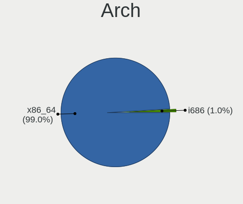
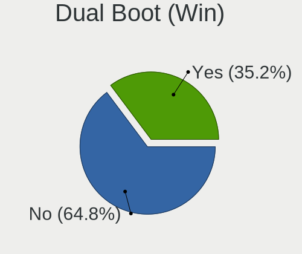
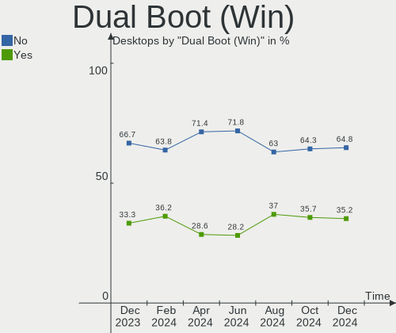
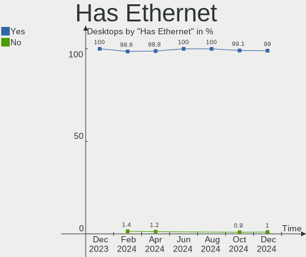
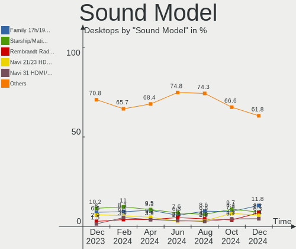

Arch Hardware Trends (Desktops)
-------------------------------

A project to identify most popular hardware characteristics and track their change
over time based on data collected by Arch users at https://Linux-Hardware.org.

Anyone can contribute to this report by the [hw-probe](https://github.com/linuxhw/hw-probe) tool:

    sudo -E hw-probe -all -upload

Full-feature report is available here: https://linux-hardware.org/?view=trends&formfactor=desktop

Period: Oct, 2021.

Contents
--------

* [ System ](#system)
  - [ OS                       ](#os)
  - [ OS Family                ](#os-family)
  - [ Kernel                   ](#kernel)
  - [ Kernel Family            ](#kernel-family)
  - [ Kernel Major Ver.        ](#kernel-major-ver)
  - [ Arch                     ](#arch)
  - [ DE                       ](#de)
  - [ Display Server           ](#display-server)
  - [ Display Manager          ](#display-manager)
  - [ OS Lang                  ](#os-lang)
  - [ Boot Mode                ](#boot-mode)
  - [ Filesystem               ](#filesystem)
  - [ Part. scheme             ](#part-scheme)
  - [ Dual Boot with Linux/BSD ](#dual-boot-with-linuxbsd)
  - [ Dual Boot (Win)          ](#dual-boot-win)

* [ Board ](#board)
  - [ Vendor                   ](#vendor)
  - [ Model                    ](#model)
  - [ Model Family             ](#model-family)
  - [ MFG Year                 ](#mfg-year)
  - [ Form Factor              ](#form-factor)
  - [ Secure Boot              ](#secure-boot)
  - [ Coreboot                 ](#coreboot)
  - [ RAM Size                 ](#ram-size)
  - [ RAM Used                 ](#ram-used)
  - [ Total Drives             ](#total-drives)
  - [ Has CD-ROM               ](#has-cd-rom)
  - [ Has Ethernet             ](#has-ethernet)
  - [ Has WiFi                 ](#has-wifi)
  - [ Has Bluetooth            ](#has-bluetooth)

* [ Location ](#location)
  - [ Country                  ](#country)
  - [ City                     ](#city)

* [ Drives ](#drives)
  - [ Drive Vendor             ](#drive-vendor)
  - [ Drive Model              ](#drive-model)
  - [ HDD Vendor               ](#hdd-vendor)
  - [ SSD Vendor               ](#ssd-vendor)
  - [ Drive Kind               ](#drive-kind)
  - [ Drive Connector          ](#drive-connector)
  - [ Drive Size               ](#drive-size)
  - [ Space Total              ](#space-total)
  - [ Space Used               ](#space-used)
  - [ Malfunc. Drives          ](#malfunc-drives)
  - [ Malfunc. Drive Vendor    ](#malfunc-drive-vendor)
  - [ Malfunc. HDD Vendor      ](#malfunc-hdd-vendor)
  - [ Malfunc. Drive Kind      ](#malfunc-drive-kind)
  - [ Failed Drives            ](#failed-drives)
  - [ Failed Drive Vendor      ](#failed-drive-vendor)
  - [ Drive Status             ](#drive-status)

* [ Storage controller ](#storage-controller)
  - [ Storage Vendor           ](#storage-vendor)
  - [ Storage Model            ](#storage-model)
  - [ Storage Kind             ](#storage-kind)

* [ Processor ](#processor)
  - [ CPU Vendor               ](#cpu-vendor)
  - [ CPU Model                ](#cpu-model)
  - [ CPU Model Family         ](#cpu-model-family)
  - [ CPU Cores                ](#cpu-cores)
  - [ CPU Sockets              ](#cpu-sockets)
  - [ CPU Threads              ](#cpu-threads)
  - [ CPU Op-Modes             ](#cpu-op-modes)
  - [ CPU Microcode            ](#cpu-microcode)
  - [ CPU Microarch            ](#cpu-microarch)

* [ Graphics ](#graphics)
  - [ GPU Vendor               ](#gpu-vendor)
  - [ GPU Model                ](#gpu-model)
  - [ GPU Combo                ](#gpu-combo)
  - [ GPU Driver               ](#gpu-driver)
  - [ GPU Memory               ](#gpu-memory)

* [ Monitor ](#monitor)
  - [ Monitor Vendor           ](#monitor-vendor)
  - [ Monitor Model            ](#monitor-model)
  - [ Monitor Resolution       ](#monitor-resolution)
  - [ Monitor Diagonal         ](#monitor-diagonal)
  - [ Monitor Width            ](#monitor-width)
  - [ Aspect Ratio             ](#aspect-ratio)
  - [ Monitor Area             ](#monitor-area)
  - [ Pixel Density            ](#pixel-density)
  - [ Multiple Monitors        ](#multiple-monitors)

* [ Network ](#network)
  - [ Net Controller Vendor    ](#net-controller-vendor)
  - [ Net Controller Model     ](#net-controller-model)
  - [ Wireless Vendor          ](#wireless-vendor)
  - [ Wireless Model           ](#wireless-model)
  - [ Ethernet Vendor          ](#ethernet-vendor)
  - [ Ethernet Model           ](#ethernet-model)
  - [ Net Controller Kind      ](#net-controller-kind)
  - [ Used Controller          ](#used-controller)
  - [ NICs                     ](#nics)
  - [ IPv6                     ](#ipv6)

* [ Bluetooth ](#bluetooth)
  - [ Bluetooth Vendor         ](#bluetooth-vendor)
  - [ Bluetooth Model          ](#bluetooth-model)

* [ Sound ](#sound)
  - [ Sound Vendor             ](#sound-vendor)
  - [ Sound Model              ](#sound-model)

* [ Memory ](#memory)
  - [ Memory Vendor            ](#memory-vendor)
  - [ Memory Model             ](#memory-model)
  - [ Memory Kind              ](#memory-kind)
  - [ Memory Form Factor       ](#memory-form-factor)
  - [ Memory Size              ](#memory-size)
  - [ Memory Speed             ](#memory-speed)

* [ Printers & scanners ](#printers--scanners)
  - [ Printer Vendor           ](#printer-vendor)
  - [ Printer Model            ](#printer-model)
  - [ Scanner Vendor           ](#scanner-vendor)
  - [ Scanner Model            ](#scanner-model)

* [ Camera ](#camera)
  - [ Camera Vendor            ](#camera-vendor)
  - [ Camera Model             ](#camera-model)

* [ Security ](#security)
  - [ Fingerprint Vendor       ](#fingerprint-vendor)
  - [ Fingerprint Model        ](#fingerprint-model)
  - [ Chipcard Vendor          ](#chipcard-vendor)
  - [ Chipcard Model           ](#chipcard-model)

* [ Unsupported ](#unsupported)
  - [ Unsupported Devices      ](#unsupported-devices)
  - [ Unsupported Device Types ](#unsupported-device-types)

System
------

OS
--

Installed operating systems

| Name         | Desktops | Percent |
|--------------|----------|---------|
| Arch         | 32       | 62.75%  |
| Arch Rolling | 19       | 37.25%  |

OS Family
---------

OS without a version

| Name | Desktops | Percent |
|------|----------|---------|
| Arch | 51       | 100%    |

Kernel
------

Version of the Linux kernel

| Version               | Desktops | Percent |
|-----------------------|----------|---------|
| 5.14.14-arch1-1       | 10       | 19.61%  |
| 5.14.8-arch1-1        | 9        | 17.65%  |
| 5.14.9-arch2-1        | 6        | 11.76%  |
| 5.14.12-arch1-1       | 4        | 7.84%   |
| 5.10.75-1-lts         | 4        | 7.84%   |
| 5.14.11-arch1-1       | 3        | 5.88%   |
| 5.10.72-1-lts         | 3        | 5.88%   |
| 5.14.9-zen2-1-zen     | 2        | 3.92%   |
| 5.15.0-rc4-1-mainline | 1        | 1.96%   |
| 5.14.8-zen1-1-zen     | 1        | 1.96%   |
| 5.14.6-arch1-1        | 1        | 1.96%   |
| 5.14.6-1-cacule       | 1        | 1.96%   |
| 5.14.5-arch1-1        | 1        | 1.96%   |
| 5.14.14-gentoo-x86_64 | 1        | 1.96%   |
| 5.14.13-arch1-1       | 1        | 1.96%   |
| 5.14.12-zen1-1-zen    | 1        | 1.96%   |
| 5.10.71-1-lts         | 1        | 1.96%   |
| 5.10.1                | 1        | 1.96%   |

Kernel Family
-------------

Linux kernel without a distro release

| Version | Desktops | Percent |
|---------|----------|---------|
| 5.14.14 | 11       | 21.57%  |
| 5.14.8  | 10       | 19.61%  |
| 5.14.9  | 8        | 15.69%  |
| 5.14.12 | 5        | 9.8%    |
| 5.10.75 | 4        | 7.84%   |
| 5.14.11 | 3        | 5.88%   |
| 5.10.72 | 3        | 5.88%   |
| 5.14.6  | 2        | 3.92%   |
| 5.15.0  | 1        | 1.96%   |
| 5.14.5  | 1        | 1.96%   |
| 5.14.13 | 1        | 1.96%   |
| 5.10.71 | 1        | 1.96%   |
| 5.10.1  | 1        | 1.96%   |

Kernel Major Ver.
-----------------

Linux kernel major version

| Version | Desktops | Percent |
|---------|----------|---------|
| 5.14    | 41       | 80.39%  |
| 5.10    | 9        | 17.65%  |
| 5.15    | 1        | 1.96%   |

Arch
----

OS architecture (x86_64, i586, etc.)

| Name   | Desktops | Percent |
|--------|----------|---------|
| x86_64 | 51       | 100%    |

DE
--

Desktop Environment

| Name       | Desktops | Percent |
|------------|----------|---------|
| KDE5       | 16       | 31.37%  |
| GNOME      | 14       | 27.45%  |
| Unknown    | 8        | 15.69%  |
| XFCE       | 4        | 7.84%   |
| X-Cinnamon | 3        | 5.88%   |
| openbox    | 2        | 3.92%   |
| sway       | 1        | 1.96%   |
| MATE       | 1        | 1.96%   |
| i3         | 1        | 1.96%   |
| Budgie     | 1        | 1.96%   |

Display Server
--------------

X11 or Wayland

| Name    | Desktops | Percent |
|---------|----------|---------|
| X11     | 32       | 62.75%  |
| Wayland | 7        | 13.73%  |
| Tty     | 6        | 11.76%  |
| Unknown | 6        | 11.76%  |

Display Manager
---------------

SDDM, LightDM, etc.

| Name    | Desktops | Percent |
|---------|----------|---------|
| Unknown | 26       | 50.98%  |
| SDDM    | 10       | 19.61%  |
| LightDM | 9        | 17.65%  |
| GDM     | 6        | 11.76%  |

OS Lang
-------

Language

| Lang        | Desktops | Percent |
|-------------|----------|---------|
| en_US       | 31       | 60.78%  |
| en_GB       | 5        | 9.8%    |
| fr_FR       | 3        | 5.88%   |
| ru_RU       | 2        | 3.92%   |
| en_IN       | 2        | 3.92%   |
| it_IT       | 1        | 1.96%   |
| fi_FI       | 1        | 1.96%   |
| es_ES       | 1        | 1.96%   |
| es_CO       | 1        | 1.96%   |
| en_CA       | 1        | 1.96%   |
| en-US-UTF-8 | 1        | 1.96%   |
| de_AT       | 1        | 1.96%   |
| Unknown     | 1        | 1.96%   |

Boot Mode
---------

EFI or BIOS

| Mode | Desktops | Percent |
|------|----------|---------|
| BIOS | 26       | 50.98%  |
| EFI  | 25       | 49.02%  |

Filesystem
----------

Type of filesystem

| Type  | Desktops | Percent |
|-------|----------|---------|
| Ext4  | 35       | 68.63%  |
| Btrfs | 13       | 25.49%  |
| Xfs   | 2        | 3.92%   |
| F2fs  | 1        | 1.96%   |

Part. scheme
------------

Scheme of partitioning

| Type    | Desktops | Percent |
|---------|----------|---------|
| GPT     | 28       | 54.9%   |
| Unknown | 17       | 33.33%  |
| MBR     | 6        | 11.76%  |

Dual Boot with Linux/BSD
------------------------

Hosting more than one Linux/BSD

| Dual boot | Desktops | Percent |
|-----------|----------|---------|
| No        | 45       | 88.24%  |
| Yes       | 6        | 11.76%  |

Dual Boot (Win)
---------------

Hosting Linux and Windows

| Dual boot | Desktops | Percent |
|-----------|----------|---------|
| No        | 35       | 68.63%  |
| Yes       | 16       | 31.37%  |

Board
-----

Vendor
------

Motherboard manufacturer

| Name                | Desktops | Percent |
|---------------------|----------|---------|
| Gigabyte Technology | 14       | 27.45%  |
| ASUSTek Computer    | 10       | 19.61%  |
| ASRock              | 8        | 15.69%  |
| MSI                 | 5        | 9.8%    |
| Lenovo              | 3        | 5.88%   |
| Hewlett-Packard     | 3        | 5.88%   |
| Pegatron            | 1        | 1.96%   |
| Intel               | 1        | 1.96%   |
| Huanan              | 1        | 1.96%   |
| ECS                 | 1        | 1.96%   |
| Dell                | 1        | 1.96%   |
| Biostar             | 1        | 1.96%   |
| Apple               | 1        | 1.96%   |
| Unknown             | 1        | 1.96%   |

Model
-----

Motherboard model

| Name                                     | Desktops | Percent |
|------------------------------------------|----------|---------|
| MSI MS-7B86                              | 2        | 3.92%   |
| Pegatron FQ618AA-A2L a6734f              | 1        | 1.96%   |
| MSI MS-7C08                              | 1        | 1.96%   |
| MSI MS-7B18                              | 1        | 1.96%   |
| MSI MS-7A38                              | 1        | 1.96%   |
| Lenovo ThinkCentre M91p 4512A12          | 1        | 1.96%   |
| Lenovo ThinkCentre M910t-N080 10N9CTO1WW | 1        | 1.96%   |
| Lenovo ThinkCentre M73 10B1A0KNIG        | 1        | 1.96%   |
| Intel H81                                | 1        | 1.96%   |
| Huanan X79-8D VAA31                      | 1        | 1.96%   |
| HP Z440 Workstation                      | 1        | 1.96%   |
| HP Pavilion Gaming Desktop TG01-2xxx     | 1        | 1.96%   |
| HP Pavilion Desktop TP01-1xxx            | 1        | 1.96%   |
| Gigabyte X570 GAMING X                   | 1        | 1.96%   |
| Gigabyte X570 AORUS PRO                  | 1        | 1.96%   |
| Gigabyte X570 AORUS MASTER               | 1        | 1.96%   |
| Gigabyte X570 AORUS ELITE                | 1        | 1.96%   |
| Gigabyte X470 AORUS ULTRA GAMING         | 1        | 1.96%   |
| Gigabyte P31-ES3G                        | 1        | 1.96%   |
| Gigabyte H61M-D2H-USB3                   | 1        | 1.96%   |
| Gigabyte H57M-USB3                       | 1        | 1.96%   |
| Gigabyte H370M-D3H                       | 1        | 1.96%   |
| Gigabyte F2A88XM-D3H                     | 1        | 1.96%   |
| Gigabyte B550M DS3H                      | 1        | 1.96%   |
| Gigabyte B550 AORUS PRO                  | 1        | 1.96%   |
| Gigabyte B450M DS3H                      | 1        | 1.96%   |
| Gigabyte A520 AORUS ELITE                | 1        | 1.96%   |
| ECS G41T-R3                              | 1        | 1.96%   |
| Dell OptiPlex 7060                       | 1        | 1.96%   |
| Biostar A770L3                           | 1        | 1.96%   |
| ASUS TUF Z370-PLUS GAMING                | 1        | 1.96%   |
| ASUS TUF GAMING B550M-PLUS               | 1        | 1.96%   |
| ASUS TUF B450-PRO GAMING                 | 1        | 1.96%   |
| ASUS TUF B450-PLUS GAMING                | 1        | 1.96%   |
| ASUS ROG STRIX Z390-E GAMING             | 1        | 1.96%   |
| ASUS ROG STRIX X570-I GAMING             | 1        | 1.96%   |
| ASUS ROG CROSSHAIR VIII HERO             | 1        | 1.96%   |
| ASUS PRIME B550M-A                       | 1        | 1.96%   |
| ASUS M4A87TD EVO                         | 1        | 1.96%   |
| ASUS All Series                          | 1        | 1.96%   |
| ASRock Z590M-ITX/ax                      | 1        | 1.96%   |
| ASRock Z270 Killer SLI/ac                | 1        | 1.96%   |
| ASRock Z170M-ITX/ac                      | 1        | 1.96%   |
| ASRock X570M Pro4                        | 1        | 1.96%   |
| ASRock B550M Pro4                        | 1        | 1.96%   |
| ASRock B450 Gaming-ITX/ac                | 1        | 1.96%   |
| ASRock AB350M-HDV                        | 1        | 1.96%   |
| ASRock AB350 Pro4                        | 1        | 1.96%   |
| Apple MacPro5,1                          | 1        | 1.96%   |
| Unknown                                  | 1        | 1.96%   |

Model Family
------------

Motherboard model prefix

| Name                   | Desktops | Percent |
|------------------------|----------|---------|
| Gigabyte X570          | 4        | 7.84%   |
| ASUS TUF               | 4        | 7.84%   |
| Lenovo ThinkCentre     | 3        | 5.88%   |
| ASUS ROG               | 3        | 5.88%   |
| MSI MS-7B86            | 2        | 3.92%   |
| HP Pavilion            | 2        | 3.92%   |
| Pegatron FQ618AA-A2L   | 1        | 1.96%   |
| MSI MS-7C08            | 1        | 1.96%   |
| MSI MS-7B18            | 1        | 1.96%   |
| MSI MS-7A38            | 1        | 1.96%   |
| Intel H81              | 1        | 1.96%   |
| Huanan X79-8D          | 1        | 1.96%   |
| HP Z440                | 1        | 1.96%   |
| Gigabyte X470          | 1        | 1.96%   |
| Gigabyte P31-ES3G      | 1        | 1.96%   |
| Gigabyte H61M-D2H-USB3 | 1        | 1.96%   |
| Gigabyte H57M-USB3     | 1        | 1.96%   |
| Gigabyte H370M-D3H     | 1        | 1.96%   |
| Gigabyte F2A88XM-D3H   | 1        | 1.96%   |
| Gigabyte B550M         | 1        | 1.96%   |
| Gigabyte B550          | 1        | 1.96%   |
| Gigabyte B450M         | 1        | 1.96%   |
| Gigabyte A520          | 1        | 1.96%   |
| ECS G41T-R3            | 1        | 1.96%   |
| Dell OptiPlex          | 1        | 1.96%   |
| Biostar A770L3         | 1        | 1.96%   |
| ASUS PRIME             | 1        | 1.96%   |
| ASUS M4A87TD           | 1        | 1.96%   |
| ASUS All               | 1        | 1.96%   |
| ASRock Z590M-ITX       | 1        | 1.96%   |
| ASRock Z270            | 1        | 1.96%   |
| ASRock Z170M-ITX       | 1        | 1.96%   |
| ASRock X570M           | 1        | 1.96%   |
| ASRock B550M           | 1        | 1.96%   |
| ASRock B450            | 1        | 1.96%   |
| ASRock AB350M-HDV      | 1        | 1.96%   |
| ASRock AB350           | 1        | 1.96%   |
| Apple MacPro5          | 1        | 1.96%   |
| Unknown                | 1        | 1.96%   |

MFG Year
--------

Motherboard manufacture year

| Year | Desktops | Percent |
|------|----------|---------|
| 2021 | 14       | 27.45%  |
| 2020 | 9        | 17.65%  |
| 2019 | 9        | 17.65%  |
| 2018 | 4        | 7.84%   |
| 2016 | 4        | 7.84%   |
| 2010 | 3        | 5.88%   |
| 2011 | 2        | 3.92%   |
| 2017 | 1        | 1.96%   |
| 2015 | 1        | 1.96%   |
| 2014 | 1        | 1.96%   |
| 2012 | 1        | 1.96%   |
| 2009 | 1        | 1.96%   |
| 2008 | 1        | 1.96%   |

Form Factor
-----------

Physical design of the computer

| Name    | Desktops | Percent |
|---------|----------|---------|
| Desktop | 51       | 100%    |

Secure Boot
-----------

Enabled or disabled

| State    | Desktops | Percent |
|----------|----------|---------|
| Disabled | 51       | 100%    |

Coreboot
--------

Have coreboot on board

| Used | Desktops | Percent |
|------|----------|---------|
| No   | 51       | 100%    |

RAM Size
--------

Total RAM memory

| Size in GB  | Desktops | Percent |
|-------------|----------|---------|
| 16.01-24.0  | 22       | 43.14%  |
| 32.01-64.0  | 13       | 25.49%  |
| 8.01-16.0   | 5        | 9.8%    |
| 3.01-4.0    | 4        | 7.84%   |
| 64.01-256.0 | 4        | 7.84%   |
| 4.01-8.0    | 3        | 5.88%   |

RAM Used
--------

Used RAM memory

| Used GB    | Desktops | Percent |
|------------|----------|---------|
| 2.01-3.0   | 16       | 31.37%  |
| 4.01-8.0   | 14       | 27.45%  |
| 1.01-2.0   | 13       | 25.49%  |
| 8.01-16.0  | 3        | 5.88%   |
| 3.01-4.0   | 2        | 3.92%   |
| 16.01-24.0 | 2        | 3.92%   |
| 32.01-64.0 | 1        | 1.96%   |

Total Drives
------------

Number of drives on board

| Drives | Desktops | Percent |
|--------|----------|---------|
| 1      | 15       | 29.41%  |
| 3      | 12       | 23.53%  |
| 2      | 11       | 21.57%  |
| 5      | 6        | 11.76%  |
| 9      | 2        | 3.92%   |
| 6      | 2        | 3.92%   |
| 4      | 2        | 3.92%   |
| 8      | 1        | 1.96%   |

Has CD-ROM
----------

Has CD-ROM on board

| Presented | Desktops | Percent |
|-----------|----------|---------|
| No        | 39       | 76.47%  |
| Yes       | 12       | 23.53%  |

Has Ethernet
------------

Has Ethernet on board

| Presented | Desktops | Percent |
|-----------|----------|---------|
| Yes       | 51       | 100%    |

Has WiFi
--------

Has WiFi module

| Presented | Desktops | Percent |
|-----------|----------|---------|
| Yes       | 27       | 52.94%  |
| No        | 24       | 47.06%  |

Has Bluetooth
-------------

Has Bluetooth module

| Presented | Desktops | Percent |
|-----------|----------|---------|
| Yes       | 27       | 52.94%  |
| No        | 24       | 47.06%  |

Location
--------

Country
-------

Geographic location (country)

| Country      | Desktops | Percent |
|--------------|----------|---------|
| USA          | 15       | 29.41%  |
| Russia       | 4        | 7.84%   |
| UK           | 3        | 5.88%   |
| France       | 3        | 5.88%   |
| India        | 2        | 3.92%   |
| Germany      | 2        | 3.92%   |
| Finland      | 2        | 3.92%   |
| China        | 2        | 3.92%   |
| Austria      | 2        | 3.92%   |
| Ukraine      | 1        | 1.96%   |
| Spain        | 1        | 1.96%   |
| South Africa | 1        | 1.96%   |
| Puerto Rico  | 1        | 1.96%   |
| Poland       | 1        | 1.96%   |
| Philippines  | 1        | 1.96%   |
| Netherlands  | 1        | 1.96%   |
| Mexico       | 1        | 1.96%   |
| Malaysia     | 1        | 1.96%   |
| Italy        | 1        | 1.96%   |
| Iran         | 1        | 1.96%   |
| Estonia      | 1        | 1.96%   |
| Colombia     | 1        | 1.96%   |
| Canada       | 1        | 1.96%   |
| Australia    | 1        | 1.96%   |
| Algeria      | 1        | 1.96%   |

City
----

Geographic location (city)

| City                | Desktops | Percent |
|---------------------|----------|---------|
| St Petersburg       | 2        | 3.92%   |
| Seattle             | 2        | 3.92%   |
| Paris               | 2        | 3.92%   |
| Xining              | 1        | 1.96%   |
| Wroclaw             | 1        | 1.96%   |
| Vienna              | 1        | 1.96%   |
| Valencia            | 1        | 1.96%   |
| Vadodara            | 1        | 1.96%   |
| Troy                | 1        | 1.96%   |
| Tallinn             | 1        | 1.96%   |
| Stevenage           | 1        | 1.96%   |
| Snohomish           | 1        | 1.96%   |
| Shahrak-e K?«l?«r?« | 1        | 1.96%   |
| Schenectady         | 1        | 1.96%   |
| San Juan            | 1        | 1.96%   |
| San Gil             | 1        | 1.96%   |
| Salo                | 1        | 1.96%   |
| Reutlingen          | 1        | 1.96%   |
| Plymouth            | 1        | 1.96%   |
| Pesaro              | 1        | 1.96%   |
| Oulu                | 1        | 1.96%   |
| Novocherkassk       | 1        | 1.96%   |
| Northampton         | 1        | 1.96%   |
| Neyveli             | 1        | 1.96%   |
| Natural Bridge      | 1        | 1.96%   |
| Nantes              | 1        | 1.96%   |
| Moscow              | 1        | 1.96%   |
| Manajao             | 1        | 1.96%   |
| Luhansk             | 1        | 1.96%   |
| Lancaster           | 1        | 1.96%   |
| Kuala Lumpur        | 1        | 1.96%   |
| Kalamazoo           | 1        | 1.96%   |
| Hobart              | 1        | 1.96%   |
| Hilo                | 1        | 1.96%   |
| Hangzhou            | 1        | 1.96%   |
| Guadalajara         | 1        | 1.96%   |
| Gronau              | 1        | 1.96%   |
| Graz                | 1        | 1.96%   |
| Fort St. John       | 1        | 1.96%   |
| Elk Grove Village   | 1        | 1.96%   |
| Chicago             | 1        | 1.96%   |
| Centerburg          | 1        | 1.96%   |
| Catonsville         | 1        | 1.96%   |
| Cape Town           | 1        | 1.96%   |
| Bracknell           | 1        | 1.96%   |
| Belcourt            | 1        | 1.96%   |
| Athens              | 1        | 1.96%   |
| Assen               | 1        | 1.96%   |

Drives
------

Drive Vendor
------------

Hard drive vendors

| Vendor                | Desktops | Drives | Percent |
|-----------------------|----------|--------|---------|
| WDC                   | 20       | 27     | 17.86%  |
| Seagate               | 20       | 25     | 17.86%  |
| Samsung Electronics   | 18       | 25     | 16.07%  |
| Crucial               | 10       | 14     | 8.93%   |
| Toshiba               | 5        | 5      | 4.46%   |
| SK Hynix              | 4        | 5      | 3.57%   |
| Kingston              | 4        | 4      | 3.57%   |
| Intel                 | 3        | 4      | 2.68%   |
| Hewlett-Packard       | 3        | 3      | 2.68%   |
| A-DATA Technology     | 3        | 3      | 2.68%   |
| XPG                   | 2        | 2      | 1.79%   |
| Silicon Motion        | 2        | 2      | 1.79%   |
| Realtek Semiconductor | 2        | 3      | 1.79%   |
| OCZ                   | 2        | 2      | 1.79%   |
| Team                  | 1        | 1      | 0.89%   |
| SanDisk               | 1        | 1      | 0.89%   |
| Phison                | 1        | 1      | 0.89%   |
| OWC                   | 1        | 2      | 0.89%   |
| KIOXIA                | 1        | 1      | 0.89%   |
| INNOVATION IT         | 1        | 1      | 0.89%   |
| Hitachi               | 1        | 1      | 0.89%   |
| HGST                  | 1        | 1      | 0.89%   |
| H/W                   | 1        | 1      | 0.89%   |
| goreche               | 1        | 1      | 0.89%   |
| CORSAIR               | 1        | 1      | 0.89%   |
| China                 | 1        | 1      | 0.89%   |
| BAITITON              | 1        | 1      | 0.89%   |
| Unknown               | 1        | 1      | 0.89%   |

Drive Model
-----------

Hard drive models

| Model                                   | Desktops | Percent |
|-----------------------------------------|----------|---------|
| Samsung SSD 860 EVO 1TB                 | 3        | 2.31%   |
| Crucial CT500MX500SSD1 500GB            | 3        | 2.31%   |
| WDC WD10EZEX-00WN4A0 1TB                | 2        | 1.54%   |
| Seagate ST2000DM006-2DM164 2TB          | 2        | 1.54%   |
| Seagate ST2000DM001-1ER164 2TB          | 2        | 1.54%   |
| Seagate Expansion 1TB                   | 2        | 1.54%   |
| Samsung SSD 980 PRO 2TB                 | 2        | 1.54%   |
| Samsung SSD 840 PRO Series 256GB        | 2        | 1.54%   |
| Samsung NVMe SSD Drive 1TB              | 2        | 1.54%   |
| Realtek NVMe SSD Drive 512GB            | 2        | 1.54%   |
| OCZ VERTEX4 256GB SSD                   | 2        | 1.54%   |
| HP SSD EX900 1TB                        | 2        | 1.54%   |
| Crucial CT500P1SSD8 500GB               | 2        | 1.54%   |
| A-DATA SU630 240GB SSD                  | 2        | 1.54%   |
| XPG NVMe SSD Drive 512GB                | 1        | 0.77%   |
| XPG NVMe SSD Drive 1024GB               | 1        | 0.77%   |
| WDC WDS500G3X0C-00SJG0 500GB            | 1        | 0.77%   |
| WDC WDS500G2B0A-00SM50 500GB SSD        | 1        | 0.77%   |
| WDC WDS480G2G0A-00JH30 480GB SSD        | 1        | 0.77%   |
| WDC WDS120G1G0A-00SS50 120GB SSD        | 1        | 0.77%   |
| WDC WDS100T3XHC-00SJG0 1TB              | 1        | 0.77%   |
| WDC WDS100T3X0C-00SJG0 1TB              | 1        | 0.77%   |
| WDC WD60EZAZ-00SF3B0 6TB                | 1        | 0.77%   |
| WDC WD5003ABYZ-011FA0 500GB             | 1        | 0.77%   |
| WDC WD5000AAKX-001CA0 500GB             | 1        | 0.77%   |
| WDC WD40EFRX-68N32N0 4TB                | 1        | 0.77%   |
| WDC WD2500YS-18SHB2 250GB               | 1        | 0.77%   |
| WDC WD2500AAJS-40VWA1 250GB             | 1        | 0.77%   |
| WDC WD20EZAZ-00GGJB0 2TB                | 1        | 0.77%   |
| WDC WD20EARS-00MVWB0 2TB                | 1        | 0.77%   |
| WDC WD20EARS-00M                        | 1        | 0.77%   |
| WDC WD2002FAEX-007BA0 2TB               | 1        | 0.77%   |
| WDC WD10SPZX-24Z10 1TB                  | 1        | 0.77%   |
| WDC WD10EZRX-00L4HB0 1TB                | 1        | 0.77%   |
| WDC WD10EZEX-75WN4A0 1TB                | 1        | 0.77%   |
| WDC WD10EZEX-08WN4A0 1TB                | 1        | 0.77%   |
| WDC WD10EZEX-00RKKA0 1TB                | 1        | 0.77%   |
| WDC WD10EZEX-00BN5A0 1TB                | 1        | 0.77%   |
| Toshiba MK5065GSX 500GB                 | 1        | 0.77%   |
| Toshiba HDWE140 4TB                     | 1        | 0.77%   |
| Toshiba HDWD120 2TB                     | 1        | 0.77%   |
| Toshiba DT01ACA200 2TB                  | 1        | 0.77%   |
| Toshiba DT01ACA100 1TB                  | 1        | 0.77%   |
| Team TM8FP6512G 512GB                   | 1        | 0.77%   |
| SK Hynix SC311 SATA 128GB SSD           | 1        | 0.77%   |
| SK Hynix NVMe SSD Drive 256GB           | 1        | 0.77%   |
| SK Hynix NVMe SSD Drive 128GB           | 1        | 0.77%   |
| SK Hynix BC511 HFM256GDJTNI-82A0A 256GB | 1        | 0.77%   |
| SK Hynix BC501 NVMe 128GB               | 1        | 0.77%   |
| Silicon Motion NVMe SSD Drive 256GB     | 1        | 0.77%   |
| Silicon Motion NVMe SSD Drive 1TB       | 1        | 0.77%   |
| Seagate ST8000DM004-2CX188 8TB          | 1        | 0.77%   |
| Seagate ST500LX025-1U717D 500GB         | 1        | 0.77%   |
| Seagate ST500DM002-1BD142 500GB         | 1        | 0.77%   |
| Seagate ST4000DM004-2CV104 4TB          | 1        | 0.77%   |
| Seagate ST2000DM008-2FR102 2TB          | 1        | 0.77%   |
| Seagate ST2000DL003-9VT166 2TB          | 1        | 0.77%   |
| Seagate ST2000DL001-9VT156 2TB          | 1        | 0.77%   |
| Seagate ST14000NE0008-2JK101 14TB       | 1        | 0.77%   |
| Seagate ST12000VN0007-2GS116 12TB       | 1        | 0.77%   |

HDD Vendor
----------

Hard disk drive vendors

| Vendor              | Desktops | Drives | Percent |
|---------------------|----------|--------|---------|
| Seagate             | 19       | 23     | 43.18%  |
| WDC                 | 15       | 20     | 34.09%  |
| Toshiba             | 5        | 5      | 11.36%  |
| Samsung Electronics | 2        | 2      | 4.55%   |
| Hitachi             | 1        | 1      | 2.27%   |
| HGST                | 1        | 1      | 2.27%   |
| H/W                 | 1        | 1      | 2.27%   |

SSD Vendor
----------

Solid state drive vendors

| Vendor              | Desktops | Drives | Percent |
|---------------------|----------|--------|---------|
| Samsung Electronics | 11       | 11     | 28.95%  |
| Crucial             | 8        | 11     | 21.05%  |
| WDC                 | 3        | 4      | 7.89%   |
| OCZ                 | 2        | 2      | 5.26%   |
| Kingston            | 2        | 2      | 5.26%   |
| A-DATA Technology   | 2        | 2      | 5.26%   |
| SK Hynix            | 1        | 1      | 2.63%   |
| Seagate             | 1        | 1      | 2.63%   |
| SanDisk             | 1        | 1      | 2.63%   |
| OWC                 | 1        | 2      | 2.63%   |
| INNOVATION IT       | 1        | 1      | 2.63%   |
| Hewlett-Packard     | 1        | 1      | 2.63%   |
| CORSAIR             | 1        | 1      | 2.63%   |
| China               | 1        | 1      | 2.63%   |
| BAITITON            | 1        | 1      | 2.63%   |
| Unknown             | 1        | 1      | 2.63%   |

Drive Kind
----------

HDD or SSD

| Kind    | Desktops | Drives | Percent |
|---------|----------|--------|---------|
| HDD     | 34       | 53     | 36.17%  |
| SSD     | 30       | 43     | 31.91%  |
| NVMe    | 28       | 41     | 29.79%  |
| Unknown | 2        | 2      | 2.13%   |

Drive Connector
---------------

SATA, SAS, NVMe, etc.

| Type | Desktops | Drives | Percent |
|------|----------|--------|---------|
| SATA | 43       | 93     | 56.58%  |
| NVMe | 28       | 41     | 36.84%  |
| SAS  | 5        | 5      | 6.58%   |

Drive Size
----------

Size of hard drive

| Size in TB | Desktops | Drives | Percent |
|------------|----------|--------|---------|
| 0.01-0.5   | 29       | 39     | 40.28%  |
| 0.51-1.0   | 23       | 29     | 31.94%  |
| 1.01-2.0   | 13       | 19     | 18.06%  |
| 3.01-4.0   | 3        | 4      | 4.17%   |
| 10.01-20.0 | 2        | 3      | 2.78%   |
| 4.01-10.0  | 2        | 2      | 2.78%   |

Space Total
-----------

Amount of disk space available on the file system

| Size in GB     | Desktops | Percent |
|----------------|----------|---------|
| 1001-2000      | 12       | 23.53%  |
| More than 3000 | 8        | 15.69%  |
| 251-500        | 8        | 15.69%  |
| 101-250        | 8        | 15.69%  |
| 501-1000       | 7        | 13.73%  |
| 2001-3000      | 5        | 9.8%    |
| Unknown        | 2        | 3.92%   |
| 21-50          | 1        | 1.96%   |

Space Used
----------

Amount of used disk space

| Used GB        | Desktops | Percent |
|----------------|----------|---------|
| 21-50          | 10       | 19.61%  |
| 101-250        | 8        | 15.69%  |
| 1001-2000      | 8        | 15.69%  |
| 1-20           | 7        | 13.73%  |
| 501-1000       | 6        | 11.76%  |
| 251-500        | 5        | 9.8%    |
| More than 3000 | 3        | 5.88%   |
| Unknown        | 2        | 3.92%   |
| 2001-3000      | 1        | 1.96%   |
| 51-100         | 1        | 1.96%   |

Malfunc. Drives
---------------

Drive models with a malfunction

| Model                                          | Desktops | Drives | Percent |
|------------------------------------------------|----------|--------|---------|
| OCZ VERTEX4 256GB SSD                          | 2        | 2      | 14.29%  |
| Hewlett-Packard SSD EX900 1TB                  | 2        | 2      | 14.29%  |
| WDC WD5003ABYZ-011FA0 500GB                    | 1        | 1      | 7.14%   |
| WDC WD5000AAKX-001CA0 500GB                    | 1        | 1      | 7.14%   |
| WDC WD10EZEX-00WN4A0 1TB                       | 1        | 1      | 7.14%   |
| Seagate ST500DM002-1BD142 500GB                | 1        | 1      | 7.14%   |
| Seagate ST2000DL001-9VT156 2TB                 | 1        | 1      | 7.14%   |
| Seagate ST1000LM024 HN-M101MBB 1TB             | 1        | 1      | 7.14%   |
| Samsung Electronics HD502HI 500GB              | 1        | 1      | 7.14%   |
| INNOVATION IT IT 512GB                         | 1        | 1      | 7.14%   |
| Hitachi HUA721010KLA330 44X2459 42C0424IBM 1TB | 1        | 1      | 7.14%   |
| BAITITON BT58SSD09S 240GB                      | 1        | 1      | 7.14%   |

Malfunc. Drive Vendor
---------------------

Vendors of faulty drives

| Vendor              | Desktops | Drives | Percent |
|---------------------|----------|--------|---------|
| WDC                 | 3        | 3      | 21.43%  |
| Seagate             | 3        | 3      | 21.43%  |
| OCZ                 | 2        | 2      | 14.29%  |
| Hewlett-Packard     | 2        | 2      | 14.29%  |
| Samsung Electronics | 1        | 1      | 7.14%   |
| INNOVATION IT       | 1        | 1      | 7.14%   |
| Hitachi             | 1        | 1      | 7.14%   |
| BAITITON            | 1        | 1      | 7.14%   |

Malfunc. HDD Vendor
-------------------

Vendors of faulty HDD drives

| Vendor              | Desktops | Drives | Percent |
|---------------------|----------|--------|---------|
| WDC                 | 3        | 3      | 37.5%   |
| Seagate             | 3        | 3      | 37.5%   |
| Samsung Electronics | 1        | 1      | 12.5%   |
| Hitachi             | 1        | 1      | 12.5%   |

Malfunc. Drive Kind
-------------------

Kinds of faulty drives

| Kind | Desktops | Drives | Percent |
|------|----------|--------|---------|
| HDD  | 7        | 8      | 53.85%  |
| SSD  | 4        | 4      | 30.77%  |
| NVMe | 2        | 2      | 15.38%  |

Failed Drives
-------------

Failed drive models

Zero info for selected period =(

Failed Drive Vendor
-------------------

Failed drive vendors

Zero info for selected period =(

Drive Status
------------

Number of failed and malfunc. drives

| Status   | Desktops | Drives | Percent |
|----------|----------|--------|---------|
| Works    | 30       | 61     | 48.39%  |
| Detected | 21       | 64     | 33.87%  |
| Malfunc  | 11       | 14     | 17.74%  |

Storage controller
------------------

Storage Vendor
--------------

Storage controller vendors

| Vendor                      | Desktops | Percent |
|-----------------------------|----------|---------|
| AMD                         | 27       | 31.03%  |
| Intel                       | 25       | 28.74%  |
| Samsung Electronics         | 8        | 9.2%    |
| Silicon Motion              | 4        | 4.6%    |
| SK Hynix                    | 3        | 3.45%   |
| Sandisk                     | 3        | 3.45%   |
| Micron/Crucial Technology   | 3        | 3.45%   |
| Realtek Semiconductor       | 2        | 2.3%    |
| Kingston Technology Company | 2        | 2.3%    |
| JMicron Technology          | 2        | 2.3%    |
| ADATA Technology            | 2        | 2.3%    |
| Adaptec                     | 2        | 2.3%    |
| Phison Electronics          | 1        | 1.15%   |
| Marvell Technology Group    | 1        | 1.15%   |
| KIOXIA                      | 1        | 1.15%   |
| ASMedia Technology          | 1        | 1.15%   |

Storage Model
-------------

Storage controller models

| Model                                                                                   | Desktops | Percent |
|-----------------------------------------------------------------------------------------|----------|---------|
| AMD FCH SATA Controller [AHCI mode]                                                     | 16       | 15.38%  |
| AMD 400 Series Chipset SATA Controller                                                  | 9        | 8.65%   |
| AMD Starship/Matisse Chipset SATA Controller [AHCI mode]                                | 6        | 5.77%   |
| Samsung NVMe SSD Controller SM981/PM981/PM983                                           | 5        | 4.81%   |
| Intel Cannon Lake PCH SATA AHCI Controller                                              | 4        | 3.85%   |
| Silicon Motion SM2263EN/SM2263XT SSD Controller                                         | 3        | 2.88%   |
| Intel SATA Controller [RAID mode]                                                       | 3        | 2.88%   |
| Intel NM10/ICH7 Family SATA Controller [IDE mode]                                       | 3        | 2.88%   |
| Intel 200 Series PCH SATA controller [AHCI mode]                                        | 3        | 2.88%   |
| SK Hynix BC501 NVMe Solid State Drive                                                   | 2        | 1.92%   |
| Sandisk WD Black SN750 / PC SN730 NVMe SSD                                              | 2        | 1.92%   |
| Samsung NVMe SSD Controller PM9A1/PM9A3/980PRO                                          | 2        | 1.92%   |
| Realtek Realtek Non-Volatile memory controller                                          | 2        | 1.92%   |
| Micron/Crucial P1 NVMe PCIe SSD                                                         | 2        | 1.92%   |
| Intel 82801G (ICH7 Family) IDE Controller                                               | 2        | 1.92%   |
| Intel 8 Series/C220 Series Chipset Family 6-port SATA Controller 1 [AHCI mode]          | 2        | 1.92%   |
| AMD 300 Series Chipset SATA Controller                                                  | 2        | 1.92%   |
| ADATA XPG SX8200 Pro PCIe Gen3x4 M.2 2280 Solid State Drive                             | 2        | 1.92%   |
| Adaptec AAC-RAID                                                                        | 2        | 1.92%   |
| SK Hynix BC511                                                                          | 1        | 0.96%   |
| Silicon Motion SM2262/SM2262EN SSD Controller                                           | 1        | 0.96%   |
| Sandisk WD Black 2018/SN750 / PC SN720 NVMe SSD                                         | 1        | 0.96%   |
| Samsung NVMe SSD Controller SM961/PM961/SM963                                           | 1        | 0.96%   |
| Samsung NVMe SSD Controller 980                                                         | 1        | 0.96%   |
| Phison E12 NVMe Controller                                                              | 1        | 0.96%   |
| Micron/Crucial P2 NVMe PCIe SSD                                                         | 1        | 0.96%   |
| Marvell Group 88SE9230 PCIe 2.0 x2 4-port SATA 6 Gb/s RAID Controller                   | 1        | 0.96%   |
| Marvell Group 88SE9182 PCIe 2.0 x2 2-port SATA 6 Gb/s Controller                        | 1        | 0.96%   |
| KIOXIA Non-Volatile memory controller                                                   | 1        | 0.96%   |
| Kingston Company U-SNS8154P3 NVMe SSD                                                   | 1        | 0.96%   |
| Kingston Company A2000 NVMe SSD                                                         | 1        | 0.96%   |
| JMicron JMB363 SATA/IDE Controller                                                      | 1        | 0.96%   |
| JMicron JMB361 AHCI/IDE                                                                 | 1        | 0.96%   |
| Intel SSD Pro 7600p/760p/E 6100p Series                                                 | 1        | 0.96%   |
| Intel Q170/Q150/B150/H170/H110/Z170/CM236 Chipset SATA Controller [AHCI Mode]           | 1        | 0.96%   |
| Intel NVMe Optane Memory Series                                                         | 1        | 0.96%   |
| Intel Non-Volatile memory controller                                                    | 1        | 0.96%   |
| Intel C610/X99 series chipset sSATA Controller [RAID mode]                              | 1        | 0.96%   |
| Intel C610/X99 series chipset 6-Port SATA Controller [AHCI mode]                        | 1        | 0.96%   |
| Intel C600/X79 series chipset 6-Port SATA AHCI Controller                               | 1        | 0.96%   |
| Intel 9 Series Chipset Family SATA Controller [AHCI Mode]                               | 1        | 0.96%   |
| Intel 82801JI (ICH10 Family) SATA AHCI Controller                                       | 1        | 0.96%   |
| Intel 6 Series/C200 Series Chipset Family Desktop SATA Controller (IDE mode, ports 4-5) | 1        | 0.96%   |
| Intel 6 Series/C200 Series Chipset Family Desktop SATA Controller (IDE mode, ports 0-3) | 1        | 0.96%   |
| Intel 6 Series/C200 Series Chipset Family 6 port Desktop SATA AHCI Controller           | 1        | 0.96%   |
| Intel 500 Series Chipset Family SATA RAID Controller                                    | 1        | 0.96%   |
| Intel 5 Series/3400 Series Chipset 6 port SATA AHCI Controller                          | 1        | 0.96%   |
| ASMedia ASM1062 Serial ATA Controller                                                   | 1        | 0.96%   |
| AMD SB7x0/SB8x0/SB9x0 SATA Controller [IDE mode]                                        | 1        | 0.96%   |
| AMD SB7x0/SB8x0/SB9x0 SATA Controller [AHCI mode]                                       | 1        | 0.96%   |
| AMD SB7x0/SB8x0/SB9x0 IDE Controller                                                    | 1        | 0.96%   |

Storage Kind
------------

Kind of storage controller (IDE, SATA, NVMe, SAS, ...)

| Kind | Desktops | Percent |
|------|----------|---------|
| SATA | 43       | 50.59%  |
| NVMe | 28       | 32.94%  |
| RAID | 7        | 8.24%   |
| IDE  | 7        | 8.24%   |

Processor
---------

CPU Vendor
----------

Processor vendors

| Vendor | Desktops | Percent |
|--------|----------|---------|
| AMD    | 27       | 52.94%  |
| Intel  | 24       | 47.06%  |

CPU Model
---------

Processor models

| Model                                          | Desktops | Percent |
|------------------------------------------------|----------|---------|
| AMD Ryzen 9 3900X 12-Core Processor            | 4        | 7.84%   |
| AMD Ryzen 7 3700X 8-Core Processor             | 3        | 5.88%   |
| AMD Ryzen 5 3600 6-Core Processor              | 3        | 5.88%   |
| AMD Ryzen 5 5600X 6-Core Processor             | 2        | 3.92%   |
| Intel Xeon CPU X5690 @ 3.47GHz                 | 1        | 1.96%   |
| Intel Xeon CPU X3450 @ 2.67GHz                 | 1        | 1.96%   |
| Intel Xeon CPU E5-2695 v2 @ 2.40GHz            | 1        | 1.96%   |
| Intel Xeon CPU E5-1650 v3 @ 3.50GHz            | 1        | 1.96%   |
| Intel Pentium CPU G860 @ 3.00GHz               | 1        | 1.96%   |
| Intel Core i9-9900K CPU @ 3.60GHz              | 1        | 1.96%   |
| Intel Core i9-10900KF CPU @ 3.70GHz            | 1        | 1.96%   |
| Intel Core i7-8700K CPU @ 3.70GHz              | 1        | 1.96%   |
| Intel Core i7-8700 CPU @ 3.20GHz               | 1        | 1.96%   |
| Intel Core i7-7700 CPU @ 3.60GHz               | 1        | 1.96%   |
| Intel Core i7-4790K CPU @ 4.00GHz              | 1        | 1.96%   |
| Intel Core i7-10700 CPU @ 2.90GHz              | 1        | 1.96%   |
| Intel Core i5-9600K CPU @ 3.70GHz              | 1        | 1.96%   |
| Intel Core i5-9400F CPU @ 2.90GHz              | 1        | 1.96%   |
| Intel Core i5-8400 CPU @ 2.80GHz               | 1        | 1.96%   |
| Intel Core i5-7600K CPU @ 3.80GHz              | 1        | 1.96%   |
| Intel Core i5-7600 CPU @ 3.50GHz               | 1        | 1.96%   |
| Intel Core i5-4440 CPU @ 3.10GHz               | 1        | 1.96%   |
| Intel Core i5-2400 CPU @ 3.10GHz               | 1        | 1.96%   |
| Intel Core i3-4150 CPU @ 3.50GHz               | 1        | 1.96%   |
| Intel Core 2 Quad CPU Q9550 @ 2.83GHz          | 1        | 1.96%   |
| Intel Core 2 Quad CPU Q9400 @ 2.66GHz          | 1        | 1.96%   |
| Intel Core 2 Quad CPU Q8200 @ 2.33GHz          | 1        | 1.96%   |
| Intel Core 2 Duo CPU E8400 @ 3.00GHz           | 1        | 1.96%   |
| AMD Ryzen 9 5950X 16-Core Processor            | 1        | 1.96%   |
| AMD Ryzen 9 3950X 16-Core Processor            | 1        | 1.96%   |
| AMD Ryzen 7 5700G with Radeon Graphics         | 1        | 1.96%   |
| AMD Ryzen 7 3800X 8-Core Processor             | 1        | 1.96%   |
| AMD Ryzen 7 2700X Eight-Core Processor         | 1        | 1.96%   |
| AMD Ryzen 7 2700 Eight-Core Processor          | 1        | 1.96%   |
| AMD Ryzen 7 1700 Eight-Core Processor          | 1        | 1.96%   |
| AMD Ryzen 5 PRO 4650G with Radeon Graphics     | 1        | 1.96%   |
| AMD Ryzen 5 2600X Six-Core Processor           | 1        | 1.96%   |
| AMD Ryzen 5 2600 Six-Core Processor            | 1        | 1.96%   |
| AMD Ryzen 3 3200G with Radeon Vega Graphics    | 1        | 1.96%   |
| AMD Ryzen 3 1200 Quad-Core Processor           | 1        | 1.96%   |
| AMD Phenom II X6 1090T Processor               | 1        | 1.96%   |
| AMD Athlon II X2 250 Processor                 | 1        | 1.96%   |
| AMD A10-7800 Radeon R7, 12 Compute Cores 4C+8G | 1        | 1.96%   |

CPU Model Family
----------------

Processor model prefix

| Model             | Desktops | Percent |
|-------------------|----------|---------|
| AMD Ryzen 7       | 8        | 15.69%  |
| Intel Core i5     | 7        | 13.73%  |
| AMD Ryzen 5       | 7        | 13.73%  |
| AMD Ryzen 9       | 6        | 11.76%  |
| Intel Core i7     | 5        | 9.8%    |
| Intel Xeon        | 4        | 7.84%   |
| Intel Core 2 Quad | 3        | 5.88%   |
| Intel Core i9     | 2        | 3.92%   |
| AMD Ryzen 3       | 2        | 3.92%   |
| Intel Pentium     | 1        | 1.96%   |
| Intel Core i3     | 1        | 1.96%   |
| Intel Core 2 Duo  | 1        | 1.96%   |
| AMD Ryzen 5 PRO   | 1        | 1.96%   |
| AMD Phenom II X6  | 1        | 1.96%   |
| AMD Athlon II X2  | 1        | 1.96%   |
| AMD A10           | 1        | 1.96%   |

CPU Cores
---------

Number of processor cores

| Number | Desktops | Percent |
|--------|----------|---------|
| 6      | 15       | 29.41%  |
| 4      | 12       | 23.53%  |
| 8      | 10       | 19.61%  |
| 12     | 5        | 9.8%    |
| 2      | 5        | 9.8%    |
| 16     | 2        | 3.92%   |
| 24     | 1        | 1.96%   |
| 10     | 1        | 1.96%   |

CPU Sockets
-----------

Number of sockets

| Number | Desktops | Percent |
|--------|----------|---------|
| 1      | 49       | 96.08%  |
| 2      | 2        | 3.92%   |

CPU Threads
-----------

Threads per core (Hyper-Threading)

| Number | Desktops | Percent |
|--------|----------|---------|
| 2      | 35       | 68.63%  |
| 1      | 16       | 31.37%  |

CPU Op-Modes
------------

CPU Operation Modes (32-bit, 64-bit)

| Op mode        | Desktops | Percent |
|----------------|----------|---------|
| 32-bit, 64-bit | 51       | 100%    |

CPU Microcode
-------------

Microcode number

| Number     | Desktops | Percent |
|------------|----------|---------|
| Unknown    | 18       | 35.29%  |
| 0x08701021 | 4        | 7.84%   |
| 0x306c3    | 3        | 5.88%   |
| 0x1067a    | 3        | 5.88%   |
| 0xa0655    | 2        | 3.92%   |
| 0x206a7    | 2        | 3.92%   |
| 0x0a201016 | 2        | 3.92%   |
| 0x08701013 | 2        | 3.92%   |
| 0x0800820d | 2        | 3.92%   |
| 0x906ed    | 1        | 1.96%   |
| 0x906ea    | 1        | 1.96%   |
| 0x906e9    | 1        | 1.96%   |
| 0x306e4    | 1        | 1.96%   |
| 0x206c2    | 1        | 1.96%   |
| 0x106e5    | 1        | 1.96%   |
| 0x0a50000b | 1        | 1.96%   |
| 0x08701012 | 1        | 1.96%   |
| 0x08600103 | 1        | 1.96%   |
| 0x08001137 | 1        | 1.96%   |
| 0x08001136 | 1        | 1.96%   |
| 0x010000c8 | 1        | 1.96%   |
| 0x010000bf | 1        | 1.96%   |

CPU Microarch
-------------

Microarchitecture

| Name        | Desktops | Percent |
|-------------|----------|---------|
| Zen 2       | 13       | 25.49%  |
| KabyLake    | 9        | 17.65%  |
| Zen+        | 5        | 9.8%    |
| Zen 3       | 4        | 7.84%   |
| Penryn      | 4        | 7.84%   |
| Haswell     | 4        | 7.84%   |
| Zen         | 2        | 3.92%   |
| SandyBridge | 2        | 3.92%   |
| K10         | 2        | 3.92%   |
| CometLake   | 2        | 3.92%   |
| Westmere    | 1        | 1.96%   |
| Steamroller | 1        | 1.96%   |
| Nehalem     | 1        | 1.96%   |
| IvyBridge   | 1        | 1.96%   |

Graphics
--------

GPU Vendor
----------

Vendors of graphics cards

| Vendor | Desktops | Percent |
|--------|----------|---------|
| Nvidia | 25       | 44.64%  |
| AMD    | 21       | 37.5%   |
| Intel  | 10       | 17.86%  |

GPU Model
---------

Graphics card models

| Model                                                                       | Desktops | Percent |
|-----------------------------------------------------------------------------|----------|---------|
| AMD Ellesmere [Radeon RX 470/480/570/570X/580/580X/590]                     | 6        | 10.34%  |
| Nvidia GP107 [GeForce GTX 1050 Ti]                                          | 4        | 6.9%    |
| Intel CometLake-S GT2 [UHD Graphics 630]                                    | 3        | 5.17%   |
| Nvidia TU116 [GeForce GTX 1660 SUPER]                                       | 2        | 3.45%   |
| Nvidia TU104 [GeForce RTX 2070 SUPER]                                       | 2        | 3.45%   |
| Nvidia GP107GL [Quadro P400]                                                | 2        | 3.45%   |
| Nvidia GP104 [GeForce GTX 1070]                                             | 2        | 3.45%   |
| Intel 2nd Generation Core Processor Family Integrated Graphics Controller   | 2        | 3.45%   |
| AMD Navi 22 [Radeon RX 6700/6700 XT / 6800M]                                | 2        | 3.45%   |
| AMD Cedar [Radeon HD 5000/6000/7350/8350 Series]                            | 2        | 3.45%   |
| Nvidia TU116 [GeForce GTX 1660 Ti]                                          | 1        | 1.72%   |
| Nvidia TU116 [GeForce GTX 1650 SUPER]                                       | 1        | 1.72%   |
| Nvidia TU106 [GeForce RTX 2070]                                             | 1        | 1.72%   |
| Nvidia TU104 [GeForce RTX 2080 SUPER]                                       | 1        | 1.72%   |
| Nvidia TU102 [GeForce RTX 2080 Ti Rev. A]                                   | 1        | 1.72%   |
| Nvidia GT218 [GeForce 8400 GS Rev. 3]                                       | 1        | 1.72%   |
| Nvidia GT218 [GeForce 210]                                                  | 1        | 1.72%   |
| Nvidia GP106 [GeForce GTX 1060 3GB]                                         | 1        | 1.72%   |
| Nvidia GP104 [GeForce GTX 1080]                                             | 1        | 1.72%   |
| Nvidia GP102 [GeForce GTX 1080 Ti]                                          | 1        | 1.72%   |
| Nvidia GM206 [GeForce GTX 960]                                              | 1        | 1.72%   |
| Nvidia GK208B [GeForce GT 730]                                              | 1        | 1.72%   |
| Nvidia GK107 [GeForce GTX 650]                                              | 1        | 1.72%   |
| Intel Xeon E3-1200 v3/4th Gen Core Processor Integrated Graphics Controller | 1        | 1.72%   |
| Intel HD Graphics 630                                                       | 1        | 1.72%   |
| Intel CoffeeLake-S GT2 [UHD Graphics 630]                                   | 1        | 1.72%   |
| Intel 4th Generation Core Processor Family Integrated Graphics Controller   | 1        | 1.72%   |
| Intel 4 Series Chipset Integrated Graphics Controller                       | 1        | 1.72%   |
| AMD Vega 10 XL/XT [Radeon RX Vega 56/64]                                    | 1        | 1.72%   |
| AMD RV515 [Radeon X1300/X1550]                                              | 1        | 1.72%   |
| AMD RV515 [Radeon X1300/X1550 Series] (Secondary)                           | 1        | 1.72%   |
| AMD RV380 [Radeon X550/X600] (Secondary)                                    | 1        | 1.72%   |
| AMD RV380 [Radeon X550/X600]                                                | 1        | 1.72%   |
| AMD Renoir                                                                  | 1        | 1.72%   |
| AMD Oland [Radeon HD 8570 / R5 430 OEM / R7 240/340 / Radeon 520 OEM]       | 1        | 1.72%   |
| AMD Navi 21 [Radeon RX 6900 XT]                                             | 1        | 1.72%   |
| AMD Navi 10 [Radeon RX 5600 OEM/5600 XT / 5700/5700 XT]                     | 1        | 1.72%   |
| AMD Kaveri [Radeon R7 Graphics]                                             | 1        | 1.72%   |
| AMD Juniper XT [Radeon HD 5770]                                             | 1        | 1.72%   |
| AMD Cezanne                                                                 | 1        | 1.72%   |
| AMD Baffin [Radeon RX 550 640SP / RX 560/560X]                              | 1        | 1.72%   |

GPU Combo
---------

Combinations of graphics cards

| Name           | Desktops | Percent |
|----------------|----------|---------|
| 1 x Nvidia     | 22       | 43.14%  |
| 1 x AMD        | 17       | 33.33%  |
| 1 x Intel      | 6        | 11.76%  |
| 2 x AMD        | 2        | 3.92%   |
| AMD + Nvidia   | 2        | 3.92%   |
| Other          | 1        | 1.96%   |
| Intel + Nvidia | 1        | 1.96%   |

GPU Driver
----------

Free vs proprietary

| Driver      | Desktops | Percent |
|-------------|----------|---------|
| Free        | 29       | 56.86%  |
| Proprietary | 20       | 39.22%  |
| Unknown     | 2        | 3.92%   |

GPU Memory
----------

Total video memory

| Size in GB | Desktops | Percent |
|------------|----------|---------|
| Unknown    | 19       | 37.25%  |
| 3.01-4.0   | 8        | 15.69%  |
| 7.01-8.0   | 6        | 11.76%  |
| 1.01-2.0   | 5        | 9.8%    |
| 0.01-0.5   | 4        | 7.84%   |
| 5.01-6.0   | 3        | 5.88%   |
| 8.01-16.0  | 3        | 5.88%   |
| 0.51-1.0   | 2        | 3.92%   |
| 2.01-3.0   | 1        | 1.96%   |

Monitor
-------

Monitor Vendor
--------------

Monitor vendors

| Vendor               | Desktops | Percent |
|----------------------|----------|---------|
| Samsung Electronics  | 10       | 14.29%  |
| Hewlett-Packard      | 7        | 10%     |
| Goldstar             | 7        | 10%     |
| Dell                 | 7        | 10%     |
| Acer                 | 7        | 10%     |
| BenQ                 | 5        | 7.14%   |
| AOC                  | 5        | 7.14%   |
| Philips              | 3        | 4.29%   |
| Ancor Communications | 3        | 4.29%   |
| Unknown              | 2        | 2.86%   |
| Lenovo               | 2        | 2.86%   |
| Sceptre Tech         | 1        | 1.43%   |
| PTW                  | 1        | 1.43%   |
| PAT                  | 1        | 1.43%   |
| MSI                  | 1        | 1.43%   |
| LG Electronics       | 1        | 1.43%   |
| Huion                | 1        | 1.43%   |
| Gigabyte Technology  | 1        | 1.43%   |
| Fujitsu Siemens      | 1        | 1.43%   |
| Eizo                 | 1        | 1.43%   |
| Denver               | 1        | 1.43%   |
| AUS                  | 1        | 1.43%   |
| Unknown              | 1        | 1.43%   |

Monitor Model
-------------

Monitor models

| Model                                                                | Desktops | Percent |
|----------------------------------------------------------------------|----------|---------|
| Goldstar 27GL850 GSM5B7F 2560x1440 597x336mm 27.0-inch               | 2        | 2.7%    |
| Dell U2518D DEL413A 2560x1440 553x311mm 25.0-inch                    | 2        | 2.7%    |
| AOC 24V2W1G5 AOC2402 1920x1080 527x296mm 23.8-inch                   | 2        | 2.7%    |
| Unknown LCD Monitor SAMSUNG 1920x1080                                | 1        | 1.35%   |
| Unknown LCD Monitor Dell AW3418DW 3440x1440                          | 1        | 1.35%   |
| Sceptre Tech Sceptre Q32 SPT0CC6 2560x1440 708x398mm 32.0-inch       | 1        | 1.35%   |
| Sceptre Tech C32 SPT0CB3 1920x1080 544x303mm 24.5-inch               | 1        | 1.35%   |
| Samsung Electronics SyncMaster SAM027F 1680x1050 474x296mm 22.0-inch | 1        | 1.35%   |
| Samsung Electronics SMB2330HD SAM070F 1920x1080 510x290mm 23.1-inch  | 1        | 1.35%   |
| Samsung Electronics SMB2330H SAM064A 1920x1080 509x286mm 23.0-inch   | 1        | 1.35%   |
| Samsung Electronics SM2333T SAM0737 1920x1080 510x290mm 23.1-inch    | 1        | 1.35%   |
| Samsung Electronics SA300/SA350 SAM078D 1600x900 443x249mm 20.0-inch | 1        | 1.35%   |
| Samsung Electronics S34J55x SAM0F70 3440x1440 797x333mm 34.0-inch    | 1        | 1.35%   |
| Samsung Electronics S24D390 SAM0B65 1920x1080 520x290mm 23.4-inch    | 1        | 1.35%   |
| Samsung Electronics S22B150 SAM08A3 1920x1080 477x268mm 21.5-inch    | 1        | 1.35%   |
| Samsung Electronics LC27T55 SAM701E 1920x1080 609x349mm 27.6-inch    | 1        | 1.35%   |
| Samsung Electronics C27F398 SAM0D45 1920x1080 600x340mm 27.2-inch    | 1        | 1.35%   |
| Samsung Electronics C27F398 SAM0D44 1920x1080 598x336mm 27.0-inch    | 1        | 1.35%   |
| PTW 22GM55L PTW0866 1920x1080 477x268mm 21.5-inch                    | 1        | 1.35%   |
| Philips PHL 276E9Q PHLC17B 1920x1080 598x336mm 27.0-inch             | 1        | 1.35%   |
| Philips PHL 243V7 PHLC155 1920x1080 530x300mm 24.0-inch              | 1        | 1.35%   |
| Philips LCD Monitor 241E 1920x1080                                   | 1        | 1.35%   |
| PAT LCD MONITOR PAT2002 1280x1024 338x270mm 17.0-inch                | 1        | 1.35%   |
| MSI G241 MSI3BA4 1920x1080 527x296mm 23.8-inch                       | 1        | 1.35%   |
| LG Electronics LCD Monitor 27GL850 4480x1440                         | 1        | 1.35%   |
| Lenovo LEN T2254A LEN60CD 1680x1050 474x296mm 22.0-inch              | 1        | 1.35%   |
| Lenovo LEN L28u-30 LEN65FA 3840x2160 620x340mm 27.8-inch             | 1        | 1.35%   |
| Huion Kamvas Pro 20 HAT1953 1920x1080 432x243mm 19.5-inch            | 1        | 1.35%   |
| Hewlett-Packard VH240a HPN3499 1920x1080 527x296mm 23.8-inch         | 1        | 1.35%   |
| Hewlett-Packard LCD Monitor 23bw 1920x1080                           | 1        | 1.35%   |
| Hewlett-Packard LA2205 HWP2848 1680x1050 473x296mm 22.0-inch         | 1        | 1.35%   |
| Hewlett-Packard E223 HPN345C 1920x1080 476x268mm 21.5-inch           | 1        | 1.35%   |
| Hewlett-Packard 27w HPN3494 1920x1080 598x336mm 27.0-inch            | 1        | 1.35%   |
| Hewlett-Packard 2511 HWP293E 1920x1080 553x311mm 25.0-inch           | 1        | 1.35%   |
| Hewlett-Packard 24ea HPN3394 1920x1080 527x296mm 23.8-inch           | 1        | 1.35%   |
| Hewlett-Packard 24ea HPN3393 1920x1080 527x296mm 23.8-inch           | 1        | 1.35%   |
| Goldstar MP59G GSM5B35 1920x1080 480x270mm 21.7-inch                 | 1        | 1.35%   |
| Goldstar M2350D GSM57F4 1920x1080 598x336mm 27.0-inch                | 1        | 1.35%   |
| Goldstar IPS FULLHD GSM5AB8 1920x1080 480x270mm 21.7-inch            | 1        | 1.35%   |
| Goldstar FULL HD GSM5B55 1920x1080 480x270mm 21.7-inch               | 1        | 1.35%   |
| Goldstar E2050 GSM4EAE 1600x900 443x249mm 20.0-inch                  | 1        | 1.35%   |
| Gigabyte Technology M28U GBT2800 3840x2160 697x392mm 31.5-inch       | 1        | 1.35%   |
| Fujitsu Siemens SL3220W FUS07C8 1680x1050 474x296mm 22.0-inch        | 1        | 1.35%   |
| Eizo EV2736W ENC2382 1920x1080 600x340mm 27.2-inch                   | 1        | 1.35%   |
| Denver UWQHD-100-V2 LHC3500 3440x1440 798x342mm 34.2-inch            | 1        | 1.35%   |
| Dell U2311H DELA05F 1920x1080 509x286mm 23.0-inch                    | 1        | 1.35%   |
| Dell S2421HN DEL41F1 1920x1080 527x296mm 23.8-inch                   | 1        | 1.35%   |
| Dell P2314H DEL4098 1920x1080 509x286mm 23.0-inch                    | 1        | 1.35%   |
| Dell E2215HV DELF05F 1920x1080 476x268mm 21.5-inch                   | 1        | 1.35%   |
| Dell E198FP DELA028 1280x1024 380x305mm 19.2-inch                    | 1        | 1.35%   |
| BenQ ZOWIE XL LCD BNQ7F33 1920x1080 531x298mm 24.0-inch              | 1        | 1.35%   |
| BenQ LCD Monitor LCD 2560x1440                                       | 1        | 1.35%   |
| BenQ LCD BNQ8024 2560x1440 597x336mm 27.0-inch                       | 1        | 1.35%   |
| BenQ GW2470 BNQ78E4 1920x1080 527x296mm 23.8-inch                    | 1        | 1.35%   |
| BenQ GW2455 BNQ78D8 1920x1080 521x293mm 23.5-inch                    | 1        | 1.35%   |
| BenQ EW2775ZH BNQ7944 1920x1080 598x336mm 27.0-inch                  | 1        | 1.35%   |
| AUS LCD Monitor VG245 1920x1080                                      | 1        | 1.35%   |
| AOC 2470W AOC2470 1920x1080 521x293mm 23.5-inch                      | 1        | 1.35%   |
| AOC 1970W AOC1970 1366x768 410x230mm 18.5-inch                       | 1        | 1.35%   |
| AOC 1620 AOC1620 1366x768 340x190mm 15.3-inch                        | 1        | 1.35%   |

Monitor Resolution
------------------

Monitor screen resolution

| Resolution         | Desktops | Percent |
|--------------------|----------|---------|
| 1920x1080 (FHD)    | 31       | 52.54%  |
| 2560x1440 (QHD)    | 7        | 11.86%  |
| 1680x1050 (WSXGA+) | 5        | 8.47%   |
| 3840x2160 (4K)     | 3        | 5.08%   |
| 3440x1440          | 3        | 5.08%   |
| 1600x900 (HD+)     | 2        | 3.39%   |
| 1366x768 (WXGA)    | 2        | 3.39%   |
| 1280x1024 (SXGA)   | 2        | 3.39%   |
| 6400x1440          | 1        | 1.69%   |
| 4480x1440          | 1        | 1.69%   |
| 1920x1200 (WUXGA)  | 1        | 1.69%   |
| Unknown            | 1        | 1.69%   |

Monitor Diagonal
----------------

Diagonal size in inches

| Inches  | Desktops | Percent |
|---------|----------|---------|
| 27      | 12       | 17.91%  |
| 23      | 12       | 17.91%  |
| 21      | 8        | 11.94%  |
| 24      | 7        | 10.45%  |
| Unknown | 7        | 10.45%  |
| 22      | 5        | 7.46%   |
| 25      | 4        | 5.97%   |
| 34      | 2        | 2.99%   |
| 31      | 2        | 2.99%   |
| 20      | 2        | 2.99%   |
| 19      | 2        | 2.99%   |
| 32      | 1        | 1.49%   |
| 18      | 1        | 1.49%   |
| 17      | 1        | 1.49%   |
| 15      | 1        | 1.49%   |

Monitor Width
-------------

Physical width

| Width in mm | Desktops | Percent |
|-------------|----------|---------|
| 501-600     | 30       | 48.39%  |
| 401-500     | 15       | 24.19%  |
| Unknown     | 7        | 11.29%  |
| 601-700     | 4        | 6.45%   |
| 701-800     | 3        | 4.84%   |
| 301-350     | 2        | 3.23%   |
| 351-400     | 1        | 1.61%   |

Aspect Ratio
------------

Proportional relationship between the width and the height

| Ratio   | Desktops | Percent |
|---------|----------|---------|
| 16/9    | 38       | 70.37%  |
| Unknown | 7        | 12.96%  |
| 16/10   | 5        | 9.26%   |
| 5/4     | 2        | 3.7%    |
| 21/9    | 2        | 3.7%    |

Monitor Area
------------

Area in inch²

| Area in inch² | Desktops | Percent |
|----------------|----------|---------|
| 201-250        | 25       | 40.32%  |
| 301-350        | 12       | 19.35%  |
| 151-200        | 7        | 11.29%  |
| Unknown        | 7        | 11.29%  |
| 351-500        | 4        | 6.45%   |
| 251-300        | 4        | 6.45%   |
| 141-150        | 2        | 3.23%   |
| 91-100         | 1        | 1.61%   |

Pixel Density
-------------

Pixels per inch

| Density | Desktops | Percent |
|---------|----------|---------|
| 51-100  | 33       | 55.93%  |
| 101-120 | 17       | 28.81%  |
| Unknown | 7        | 11.86%  |
| 121-160 | 2        | 3.39%   |

Multiple Monitors
-----------------

Total monitors connected

| Total | Desktops | Percent |
|-------|----------|---------|
| 1     | 28       | 54.9%   |
| 2     | 16       | 31.37%  |
| 3     | 5        | 9.8%    |
| 0     | 2        | 3.92%   |

Network
-------

Net Controller Vendor
---------------------

Controller vendors

| Vendor                | Desktops | Percent |
|-----------------------|----------|---------|
| Realtek Semiconductor | 34       | 45.95%  |
| Intel                 | 27       | 36.49%  |
| Xiaomi                | 2        | 2.7%    |
| TP-Link               | 2        | 2.7%    |
| Qualcomm Atheros      | 2        | 2.7%    |
| Samsung Electronics   | 1        | 1.35%   |
| Oculus VR             | 1        | 1.35%   |
| NetGear               | 1        | 1.35%   |
| Mercucys              | 1        | 1.35%   |
| JMicron Technology    | 1        | 1.35%   |
| D-Link                | 1        | 1.35%   |
| Broadcom              | 1        | 1.35%   |

Net Controller Model
--------------------

Controller models

| Model                                                                         | Desktops | Percent |
|-------------------------------------------------------------------------------|----------|---------|
| Realtek RTL8111/8168/8411 PCI Express Gigabit Ethernet Controller             | 24       | 26.67%  |
| Intel Wi-Fi 6 AX200                                                           | 9        | 10%     |
| Intel I211 Gigabit Network Connection                                         | 9        | 10%     |
| Realtek RTL8125 2.5GbE Controller                                             | 5        | 5.56%   |
| Intel Ethernet Connection (2) I219-V                                          | 4        | 4.44%   |
| Realtek RTL810xE PCI Express Fast Ethernet controller                         | 3        | 3.33%   |
| Intel Ethernet Connection (7) I219-V                                          | 3        | 3.33%   |
| Realtek RTL8821CE 802.11ac PCIe Wireless Network Adapter                      | 2        | 2.22%   |
| Intel Dual Band Wireless-AC 3168NGW [Stone Peak]                              | 2        | 2.22%   |
| Intel Cannon Lake PCH CNVi WiFi                                               | 2        | 2.22%   |
| Xiaomi Mi/Redmi series (RNDIS)                                                | 1        | 1.11%   |
| Xiaomi Mi/Redmi series (RNDIS + ADB)                                          | 1        | 1.11%   |
| TP-Link TL-WN821N v5/v6 [RTL8192EU]                                           | 1        | 1.11%   |
| TP-Link Archer T4U ver.3                                                      | 1        | 1.11%   |
| Samsung GT-I9070 (network tethering, USB debugging enabled)                   | 1        | 1.11%   |
| Realtek RTL8821AE 802.11ac PCIe Wireless Network Adapter                      | 1        | 1.11%   |
| Realtek RTL8188FTV 802.11b/g/n 1T1R 2.4G WLAN Adapter                         | 1        | 1.11%   |
| Realtek RTL-8100/8101L/8139 PCI Fast Ethernet Adapter                         | 1        | 1.11%   |
| Qualcomm Atheros AR9462 Wireless Network Adapter                              | 1        | 1.11%   |
| Qualcomm Atheros AR8151 v2.0 Gigabit Ethernet                                 | 1        | 1.11%   |
| Oculus VR Rift S                                                              | 1        | 1.11%   |
| NetGear A6210                                                                 | 1        | 1.11%   |
| Mercucys 802.11n NIC                                                          | 1        | 1.11%   |
| JMicron JMC260 PCI Express Fast Ethernet Controller                           | 1        | 1.11%   |
| Intel Wireless-AC 9260                                                        | 1        | 1.11%   |
| Intel Wireless 8260                                                           | 1        | 1.11%   |
| Intel Wireless 3160                                                           | 1        | 1.11%   |
| Intel Wi-Fi 6 AX210/AX211/AX411 160MHz                                        | 1        | 1.11%   |
| Intel Ethernet Connection (7) I219-LM                                         | 1        | 1.11%   |
| Intel Ethernet Connection (2) I219-LM                                         | 1        | 1.11%   |
| Intel Ethernet Connection (2) I218-LM                                         | 1        | 1.11%   |
| Intel Ethernet Connection (14) I219-V                                         | 1        | 1.11%   |
| Intel 82579LM Gigabit Network Connection (Lewisville)                         | 1        | 1.11%   |
| Intel 82574L Gigabit Network Connection                                       | 1        | 1.11%   |
| Intel 82571EB/82571GB Gigabit Ethernet Controller D0/D1 (copper applications) | 1        | 1.11%   |
| D-Link DWA-160 802.11abgn Xtreme N Dual Band Adapter(rev.B2) [Ralink RT5572]  | 1        | 1.11%   |
| Broadcom BCM4322 802.11a/b/g/n Wireless LAN Controller                        | 1        | 1.11%   |

Wireless Vendor
---------------

Wireless vendors

| Vendor                | Desktops | Percent |
|-----------------------|----------|---------|
| Intel                 | 17       | 60.71%  |
| Realtek Semiconductor | 4        | 14.29%  |
| TP-Link               | 2        | 7.14%   |
| Qualcomm Atheros      | 1        | 3.57%   |
| NetGear               | 1        | 3.57%   |
| Mercucys              | 1        | 3.57%   |
| D-Link                | 1        | 3.57%   |
| Broadcom              | 1        | 3.57%   |

Wireless Model
--------------

Wireless models

| Model                                                                        | Desktops | Percent |
|------------------------------------------------------------------------------|----------|---------|
| Intel Wi-Fi 6 AX200                                                          | 9        | 32.14%  |
| Realtek RTL8821CE 802.11ac PCIe Wireless Network Adapter                     | 2        | 7.14%   |
| Intel Dual Band Wireless-AC 3168NGW [Stone Peak]                             | 2        | 7.14%   |
| Intel Cannon Lake PCH CNVi WiFi                                              | 2        | 7.14%   |
| TP-Link TL-WN821N v5/v6 [RTL8192EU]                                          | 1        | 3.57%   |
| TP-Link Archer T4U ver.3                                                     | 1        | 3.57%   |
| Realtek RTL8821AE 802.11ac PCIe Wireless Network Adapter                     | 1        | 3.57%   |
| Realtek RTL8188FTV 802.11b/g/n 1T1R 2.4G WLAN Adapter                        | 1        | 3.57%   |
| Qualcomm Atheros AR9462 Wireless Network Adapter                             | 1        | 3.57%   |
| NetGear A6210                                                                | 1        | 3.57%   |
| Mercucys 802.11n NIC                                                         | 1        | 3.57%   |
| Intel Wireless-AC 9260                                                       | 1        | 3.57%   |
| Intel Wireless 8260                                                          | 1        | 3.57%   |
| Intel Wireless 3160                                                          | 1        | 3.57%   |
| Intel Wi-Fi 6 AX210/AX211/AX411 160MHz                                       | 1        | 3.57%   |
| D-Link DWA-160 802.11abgn Xtreme N Dual Band Adapter(rev.B2) [Ralink RT5572] | 1        | 3.57%   |
| Broadcom BCM4322 802.11a/b/g/n Wireless LAN Controller                       | 1        | 3.57%   |

Ethernet Vendor
---------------

Ethernet vendors

| Vendor                | Desktops | Percent |
|-----------------------|----------|---------|
| Realtek Semiconductor | 33       | 55.93%  |
| Intel                 | 21       | 35.59%  |
| Xiaomi                | 2        | 3.39%   |
| Samsung Electronics   | 1        | 1.69%   |
| Qualcomm Atheros      | 1        | 1.69%   |
| JMicron Technology    | 1        | 1.69%   |

Ethernet Model
--------------

Ethernet models

| Model                                                                         | Desktops | Percent |
|-------------------------------------------------------------------------------|----------|---------|
| Realtek RTL8111/8168/8411 PCI Express Gigabit Ethernet Controller             | 24       | 39.34%  |
| Intel I211 Gigabit Network Connection                                         | 9        | 14.75%  |
| Realtek RTL8125 2.5GbE Controller                                             | 5        | 8.2%    |
| Intel Ethernet Connection (2) I219-V                                          | 4        | 6.56%   |
| Realtek RTL810xE PCI Express Fast Ethernet controller                         | 3        | 4.92%   |
| Intel Ethernet Connection (7) I219-V                                          | 3        | 4.92%   |
| Xiaomi Mi/Redmi series (RNDIS)                                                | 1        | 1.64%   |
| Xiaomi Mi/Redmi series (RNDIS + ADB)                                          | 1        | 1.64%   |
| Samsung GT-I9070 (network tethering, USB debugging enabled)                   | 1        | 1.64%   |
| Realtek RTL-8100/8101L/8139 PCI Fast Ethernet Adapter                         | 1        | 1.64%   |
| Qualcomm Atheros AR8151 v2.0 Gigabit Ethernet                                 | 1        | 1.64%   |
| JMicron JMC260 PCI Express Fast Ethernet Controller                           | 1        | 1.64%   |
| Intel Ethernet Connection (7) I219-LM                                         | 1        | 1.64%   |
| Intel Ethernet Connection (2) I219-LM                                         | 1        | 1.64%   |
| Intel Ethernet Connection (2) I218-LM                                         | 1        | 1.64%   |
| Intel Ethernet Connection (14) I219-V                                         | 1        | 1.64%   |
| Intel 82579LM Gigabit Network Connection (Lewisville)                         | 1        | 1.64%   |
| Intel 82574L Gigabit Network Connection                                       | 1        | 1.64%   |
| Intel 82571EB/82571GB Gigabit Ethernet Controller D0/D1 (copper applications) | 1        | 1.64%   |

Net Controller Kind
-------------------

Ethernet, WiFi or modem

| Kind     | Desktops | Percent |
|----------|----------|---------|
| Ethernet | 51       | 64.56%  |
| WiFi     | 27       | 34.18%  |
| Modem    | 1        | 1.27%   |

Used Controller
---------------

Currently used network controller

| Kind     | Desktops | Percent |
|----------|----------|---------|
| Ethernet | 46       | 70.77%  |
| WiFi     | 19       | 29.23%  |

NICs
----

Total network controllers on board

| Total | Desktops | Percent |
|-------|----------|---------|
| 1     | 27       | 52.94%  |
| 2     | 17       | 33.33%  |
| 3     | 6        | 11.76%  |
| 4     | 1        | 1.96%   |

IPv6
----

IPv6 vs IPv4

| Used | Desktops | Percent |
|------|----------|---------|
| No   | 35       | 68.63%  |
| Yes  | 16       | 31.37%  |

Bluetooth
---------

Bluetooth Vendor
----------------

Controller vendors

| Vendor                  | Desktops | Percent |
|-------------------------|----------|---------|
| Intel                   | 16       | 57.14%  |
| Realtek Semiconductor   | 4        | 14.29%  |
| Cambridge Silicon Radio | 4        | 14.29%  |
| Broadcom                | 3        | 10.71%  |
| Apple                   | 1        | 3.57%   |

Bluetooth Model
---------------

Controller models

| Model                                               | Desktops | Percent |
|-----------------------------------------------------|----------|---------|
| Intel AX200 Bluetooth                               | 8        | 28.57%  |
| Cambridge Silicon Radio Bluetooth Dongle (HCI mode) | 4        | 14.29%  |
| Realtek Bluetooth Radio                             | 2        | 7.14%   |
| Intel Wireless-AC 3168 Bluetooth                    | 2        | 7.14%   |
| Intel Bluetooth 9460/9560 Jefferson Peak (JfP)      | 2        | 7.14%   |
| Broadcom BCM20702A0 Bluetooth 4.0                   | 2        | 7.14%   |
| Realtek RTL8821A Bluetooth                          | 1        | 3.57%   |
| Realtek  Bluetooth 4.2 Adapter                      | 1        | 3.57%   |
| Intel Wireless-AC 9260 Bluetooth Adapter            | 1        | 3.57%   |
| Intel Bluetooth wireless interface                  | 1        | 3.57%   |
| Intel Bluetooth Device                              | 1        | 3.57%   |
| Intel AX210 Bluetooth                               | 1        | 3.57%   |
| Broadcom BCM92045B3 ROM                             | 1        | 3.57%   |
| Apple Built-in Bluetooth 2.0+EDR HCI                | 1        | 3.57%   |

Sound
-----

Sound Vendor
------------

Sound card vendors

| Vendor                    | Desktops | Percent |
|---------------------------|----------|---------|
| AMD                       | 31       | 30.39%  |
| Nvidia                    | 25       | 24.51%  |
| Intel                     | 23       | 22.55%  |
| Thomann                   | 2        | 1.96%   |
| Logitech                  | 2        | 1.96%   |
| Kingston Technology       | 2        | 1.96%   |
| GYROCOM C&C               | 2        | 1.96%   |
| Texas Instruments         | 1        | 0.98%   |
| SteelSeries ApS           | 1        | 0.98%   |
| Sennheiser Communications | 1        | 0.98%   |
| Realtek Semiconductor     | 1        | 0.98%   |
| NAD Electronics           | 1        | 0.98%   |
| Microsoft                 | 1        | 0.98%   |
| MAG Technology            | 1        | 0.98%   |
| JMTek                     | 1        | 0.98%   |
| Focusrite-Novation        | 1        | 0.98%   |
| FIFINE Microphones        | 1        | 0.98%   |
| Elgato Systems            | 1        | 0.98%   |
| DCMT Technology           | 1        | 0.98%   |
| Corsair                   | 1        | 0.98%   |
| C-Media Electronics       | 1        | 0.98%   |
| Antlion Audio             | 1        | 0.98%   |

Sound Model
-----------

Sound card models

| Model                                                                      | Desktops | Percent |
|----------------------------------------------------------------------------|----------|---------|
| AMD Starship/Matisse HD Audio Controller                                   | 14       | 11.86%  |
| Nvidia GP107GL High Definition Audio Controller                            | 6        | 5.08%   |
| AMD Family 17h (Models 00h-0fh) HD Audio Controller                        | 6        | 5.08%   |
| AMD Ellesmere HDMI Audio [Radeon RX 470/480 / 570/580/590]                 | 6        | 5.08%   |
| Nvidia TU116 High Definition Audio Controller                              | 4        | 3.39%   |
| Intel Cannon Lake PCH cAVS                                                 | 4        | 3.39%   |
| Intel 200 Series PCH HD Audio                                              | 4        | 3.39%   |
| Nvidia TU104 HD Audio Controller                                           | 3        | 2.54%   |
| Nvidia GP104 High Definition Audio Controller                              | 3        | 2.54%   |
| Intel NM10/ICH7 Family High Definition Audio Controller                    | 3        | 2.54%   |
| AMD Navi 21 HDMI Audio [Radeon RX 6800/6800 XT / 6900 XT]                  | 3        | 2.54%   |
| AMD Family 17h (Models 10h-1fh) HD Audio Controller                        | 3        | 2.54%   |
| Thomann SC450USB                                                           | 2        | 1.69%   |
| Nvidia High Definition Audio Controller                                    | 2        | 1.69%   |
| Kingston Technology HyperX 7.1 Audio                                       | 2        | 1.69%   |
| Intel Xeon E3-1200 v3/4th Gen Core Processor HD Audio Controller           | 2        | 1.69%   |
| Intel 8 Series/C220 Series Chipset High Definition Audio Controller        | 2        | 1.69%   |
| Intel 6 Series/C200 Series Chipset Family High Definition Audio Controller | 2        | 1.69%   |
| GYROCOM C&C Fiio E10                                                       | 2        | 1.69%   |
| AMD SBx00 Azalia (Intel HDA)                                               | 2        | 1.69%   |
| AMD Renoir Radeon High Definition Audio Controller                         | 2        | 1.69%   |
| AMD Cedar HDMI Audio [Radeon HD 5400/6300/7300 Series]                     | 2        | 1.69%   |
| Texas Instruments PCM2902 Audio Codec                                      | 1        | 0.85%   |
| SteelSeries ApS Arctis Pro Wireless                                        | 1        | 0.85%   |
| Sennheiser Communications Sennheiser GSA 70                                | 1        | 0.85%   |
| Realtek Semiconductor Realtek Audio USB                                    | 1        | 0.85%   |
| Nvidia TU106 High Definition Audio Controller                              | 1        | 0.85%   |
| Nvidia TU102 High Definition Audio Controller                              | 1        | 0.85%   |
| Nvidia GP106 High Definition Audio Controller                              | 1        | 0.85%   |
| Nvidia GP102 HDMI Audio Controller                                         | 1        | 0.85%   |
| Nvidia GM206 High Definition Audio Controller                              | 1        | 0.85%   |
| Nvidia GK208 HDMI/DP Audio Controller                                      | 1        | 0.85%   |
| Nvidia GK107 HDMI Audio Controller                                         | 1        | 0.85%   |
| NAD Electronics USB Audio                                                  | 1        | 0.85%   |
| Microsoft LifeChat LX-3000 Headset                                         | 1        | 0.85%   |
| MAG Technology ARC AMP DAC                                                 | 1        | 0.85%   |
| Logitech [G533 Wireless Headset Dongle]                                    | 1        | 0.85%   |
| Logitech PRO X Wireless Gaming Headset                                     | 1        | 0.85%   |
| JMTek USB PnP Audio Device                                                 | 1        | 0.85%   |
| Intel Comet Lake PCH cAVS                                                  | 1        | 0.85%   |
| Intel C610/X99 series chipset HD Audio Controller                          | 1        | 0.85%   |
| Intel C600/X79 series chipset High Definition Audio Controller             | 1        | 0.85%   |
| Intel Audio device                                                         | 1        | 0.85%   |
| Intel 9 Series Chipset Family HD Audio Controller                          | 1        | 0.85%   |
| Intel 82801JI (ICH10 Family) HD Audio Controller                           | 1        | 0.85%   |
| Intel 82801I (ICH9 Family) HD Audio Controller                             | 1        | 0.85%   |
| Intel 100 Series/C230 Series Chipset Family HD Audio Controller            | 1        | 0.85%   |
| Focusrite-Novation Scarlett Solo (3rd Gen.)                                | 1        | 0.85%   |
| FIFINE Microphones FIFINE K678 Microphone                                  | 1        | 0.85%   |
| Elgato Systems Elgato Wave:3                                               | 1        | 0.85%   |
| DCMT Technology USB Condenser Microphone                                   | 1        | 0.85%   |
| Corsair HS70 Pro Wireless Gaming Headset                                   | 1        | 0.85%   |
| C-Media Electronics 7.1ch Surround Audio Device                            | 1        | 0.85%   |
| Antlion Audio Antlion Wireless Microphone                                  | 1        | 0.85%   |
| AMD Vega 10 HDMI Audio [Radeon Vega 56/64]                                 | 1        | 0.85%   |
| AMD Oland/Hainan/Cape Verde/Pitcairn HDMI Audio [Radeon HD 7000 Series]    | 1        | 0.85%   |
| AMD Navi 10 HDMI Audio                                                     | 1        | 0.85%   |
| AMD Kaveri HDMI/DP Audio Controller                                        | 1        | 0.85%   |
| AMD Juniper HDMI Audio [Radeon HD 5700 Series]                             | 1        | 0.85%   |
| AMD FCH Azalia Controller                                                  | 1        | 0.85%   |

Memory
------

Memory Vendor
-------------

Memory module vendors

| Vendor              | Desktops | Percent |
|---------------------|----------|---------|
| Corsair             | 9        | 20.93%  |
| Kingston            | 8        | 18.6%   |
| Unknown             | 7        | 16.28%  |
| G.Skill             | 4        | 9.3%    |
| SK Hynix            | 3        | 6.98%   |
| Micron Technology   | 3        | 6.98%   |
| Crucial             | 3        | 6.98%   |
| A-DATA Technology   | 2        | 4.65%   |
| Team                | 1        | 2.33%   |
| Samsung Electronics | 1        | 2.33%   |
| Patriot             | 1        | 2.33%   |
| Klevv               | 1        | 2.33%   |

Memory Model
------------

Memory module models

| Model                                                     | Desktops | Percent |
|-----------------------------------------------------------|----------|---------|
| G.Skill RAM F4-3600C16-16GVKC 16GB DIMM DDR4 3866MT/s     | 2        | 4.26%   |
| Corsair RAM CMK16GX4M2B3000C15 8GB DIMM DDR4 3466MT/s     | 2        | 4.26%   |
| Unknown RAM Module 4GB DIMM 1066MT/s                      | 1        | 2.13%   |
| Unknown RAM Module 4096MB DIMM SDRAM                      | 1        | 2.13%   |
| Unknown RAM Module 4096MB DIMM DDR3 1333MT/s              | 1        | 2.13%   |
| Unknown RAM Module 4096MB DIMM DDR2                       | 1        | 2.13%   |
| Unknown RAM Module 2GB DIMM 800MT/s                       | 1        | 2.13%   |
| Unknown RAM Module 2GB DIMM 533MT/s                       | 1        | 2.13%   |
| Unknown RAM Module 2GB DIMM 1333MT/s                      | 1        | 2.13%   |
| Unknown RAM Module 2048MB DIMM SDRAM                      | 1        | 2.13%   |
| Team RAM TEAMGROUP-UD4-3200 16384MB DIMM DDR4 3200MT/s    | 1        | 2.13%   |
| SK Hynix RAM HMT84GL7AMR4C 32GB DIMM DDR3 1866MT/s        | 1        | 2.13%   |
| SK Hynix RAM HMT325U6BFR8C-H9 2GB DIMM 1333MT/s           | 1        | 2.13%   |
| SK Hynix RAM HMT125U6TFR8C-H9 2048MB DIMM DDR3 1333MT/s   | 1        | 2.13%   |
| Samsung RAM M378B5773QB0-CK0 2048MB DIMM DDR3 1600MT/s    | 1        | 2.13%   |
| Patriot RAM 3000 C16 Series 16GB DIMM DDR4 3000MT/s       | 1        | 2.13%   |
| Micron RAM 8ATF2G64AZ-3G2E1 16GB DIMM DDR4 3200MT/s       | 1        | 2.13%   |
| Micron RAM 16JTF51264AZ-1G4H1 4096MB DIMM DDR3 1333MT/s   | 1        | 2.13%   |
| Micron RAM 16ATF2G64AZ-2G6E1 16GB DIMM DDR4 2667MT/s      | 1        | 2.13%   |
| Klevv RAM KD48GU880-32A160U 8GB DIMM DDR4 3800MT/s        | 1        | 2.13%   |
| Kingston RAM Module 16GB DIMM DDR4 3200MT/s               | 1        | 2.13%   |
| Kingston RAM KHX3600C18D4/32GX 32GB DIMM DDR4 3600MT/s    | 1        | 2.13%   |
| Kingston RAM KHX3200C16D4/8GX 8192MB DIMM DDR4 3533MT/s   | 1        | 2.13%   |
| Kingston RAM KHX3200C16D4/16GX 16GB DIMM DDR4 3600MT/s    | 1        | 2.13%   |
| Kingston RAM KHX2933C15D4/8GX 8GB DIMM DDR4 2933MT/s      | 1        | 2.13%   |
| Kingston RAM KHX1866C10D3/8G 8GB DIMM 1867MT/s            | 1        | 2.13%   |
| Kingston RAM CL16-18-18 D4-3000 8192MB DIMM DDR4 3000MT/s | 1        | 2.13%   |
| Kingston RAM 9905702-017.A00G 8GB DIMM DDR4 2933MT/s      | 1        | 2.13%   |
| Kingston RAM 9905678-173.A00G 8GB DIMM DDR4 2400MT/s      | 1        | 2.13%   |
| G.Skill RAM F4-3200C16-8GTZR 8GB DIMM DDR4 3200MT/s       | 1        | 2.13%   |
| G.Skill RAM F4-3000C16-8GISB 8GB DIMM DDR4 3200MT/s       | 1        | 2.13%   |
| Crucial RAM CT8G4DFD824A.M16FF 8GB DIMM DDR4 2400MT/s     | 1        | 2.13%   |
| Crucial RAM CT16G4DFRA32A.C8FE 16GB DIMM DDR4 3200MT/s    | 1        | 2.13%   |
| Crucial RAM CT16G4DFD824A.C16FDD 16GB DIMM DDR4 2400MT/s  | 1        | 2.13%   |
| Crucial RAM BL32G36C16U4B.M16FB1 32GB DIMM DDR4 3600MT/s  | 1        | 2.13%   |
| Corsair RAM Module 4GB DIMM DDR3 1066MT/s                 | 1        | 2.13%   |
| Corsair RAM CMX8GX3M1A1600C11 8GB DIMM DDR3 1600MT/s      | 1        | 2.13%   |
| Corsair RAM CMK8GX4M1A2400C16 8GB DIMM DDR4 2800MT/s      | 1        | 2.13%   |
| Corsair RAM CMK8GX4M1A2400C14 8GB DIMM DDR4 2667MT/s      | 1        | 2.13%   |
| Corsair RAM CMK64GX4M2D3600C18 32GB DIMM DDR4 3600MT/s    | 1        | 2.13%   |
| Corsair RAM CMK32GX4M2B3200C16 16GB DIMM DDR4 3400MT/s    | 1        | 2.13%   |
| Corsair RAM CMK16GX4M2A2400C16 8GB DIMM DDR4 2933MT/s     | 1        | 2.13%   |
| Corsair RAM CMD16GX4M2B3200C16 8GB DIMM DDR4 3200MT/s     | 1        | 2.13%   |
| A-DATA RAM DDR4 3000 2OZ 8GB DIMM DDR4 3000MT/s           | 1        | 2.13%   |
| A-DATA RAM DDR4 2666 2OZ 8GB DIMM DDR4 2667MT/s           | 1        | 2.13%   |

Memory Kind
-----------

Memory module kinds

| Kind    | Desktops | Percent |
|---------|----------|---------|
| DDR4    | 25       | 65.79%  |
| DDR3    | 7        | 18.42%  |
| Unknown | 4        | 10.53%  |
| SDRAM   | 1        | 2.63%   |
| DDR2    | 1        | 2.63%   |

Memory Form Factor
------------------

Physical design of the memory module

| Name | Desktops | Percent |
|------|----------|---------|
| DIMM | 37       | 100%    |

Memory Size
-----------

Memory module size

| Size  | Desktops | Percent |
|-------|----------|---------|
| 8192  | 13       | 33.33%  |
| 16384 | 11       | 28.21%  |
| 32768 | 5        | 12.82%  |
| 4096  | 5        | 12.82%  |
| 2048  | 5        | 12.82%  |

Memory Speed
------------

Memory module speed

| Speed   | Desktops | Percent |
|---------|----------|---------|
| 3600    | 5        | 11.63%  |
| 3200    | 5        | 11.63%  |
| 1333    | 4        | 9.3%    |
| 3000    | 3        | 6.98%   |
| 2933    | 3        | 6.98%   |
| 2667    | 3        | 6.98%   |
| 3866    | 2        | 4.65%   |
| 3466    | 2        | 4.65%   |
| 2400    | 2        | 4.65%   |
| 1600    | 2        | 4.65%   |
| 1066    | 2        | 4.65%   |
| Unknown | 2        | 4.65%   |
| 3800    | 1        | 2.33%   |
| 3533    | 1        | 2.33%   |
| 3400    | 1        | 2.33%   |
| 2800    | 1        | 2.33%   |
| 2133    | 1        | 2.33%   |
| 1866    | 1        | 2.33%   |
| 800     | 1        | 2.33%   |
| 533     | 1        | 2.33%   |

Printers & scanners
-------------------

Printer Vendor
--------------

Printer device vendors

| Vendor              | Desktops | Percent |
|---------------------|----------|---------|
| Prolific Technology | 1        | 50%     |
| Brother Industries  | 1        | 50%     |

Printer Model
-------------

Printer device models

| Model                         | Desktops | Percent |
|-------------------------------|----------|---------|
| Prolific PL2305 Parallel Port | 1        | 50%     |
| Brother HL-5370DW series      | 1        | 50%     |

Scanner Vendor
--------------

Scanner device vendors

Zero info for selected period =(

Scanner Model
-------------

Scanner device models

Zero info for selected period =(

Camera
------

Camera Vendor
-------------

Camera device vendors

| Vendor                        | Desktops | Percent |
|-------------------------------|----------|---------|
| Logitech                      | 6        | 37.5%   |
| SHENZHEN EMEET TECHNOLOGY     | 2        | 12.5%   |
| Sunplus Innovation Technology | 1        | 6.25%   |
| Microsoft                     | 1        | 6.25%   |
| MacroSilicon                  | 1        | 6.25%   |
| Lenovo                        | 1        | 6.25%   |
| KYE Systems (Mouse Systems)   | 1        | 6.25%   |
| Jieli Technology              | 1        | 6.25%   |
| Creative Technology           | 1        | 6.25%   |
| Chicony Electronics           | 1        | 6.25%   |

Camera Model
------------

Camera device models

| Model                                          | Desktops | Percent |
|------------------------------------------------|----------|---------|
| SHENZHEN EMEET TECHNOLOGY HD Webcam eMeet C960 | 2        | 12.5%   |
| Logitech Webcam C310                           | 2        | 12.5%   |
| Sunplus Full HD webcam                         | 1        | 6.25%   |
| Microsoft LifeCam VX-2000                      | 1        | 6.25%   |
| MacroSilicon USB Video                         | 1        | 6.25%   |
| Logitech Webcam C270                           | 1        | 6.25%   |
| Logitech Webcam C110                           | 1        | 6.25%   |
| Logitech StreamCam                             | 1        | 6.25%   |
| Logitech HD Pro Webcam C920                    | 1        | 6.25%   |
| Lenovo 500 RGB Camera                          | 1        | 6.25%   |
| KYE Systems (Mouse Systems) PC-LM1E Camera     | 1        | 6.25%   |
| Jieli USB PHY 2.0                              | 1        | 6.25%   |
| Creative Live! Cam Sync HD [VF0770]            | 1        | 6.25%   |
| Chicony Lenovo Integrated Camera               | 1        | 6.25%   |

Security
--------

Fingerprint Vendor
------------------

Fingerprint sensor vendors

Zero info for selected period =(

Fingerprint Model
-----------------

Fingerprint sensor models

Zero info for selected period =(

Chipcard Vendor
---------------

Chipcard module vendors

Zero info for selected period =(

Chipcard Model
--------------

Chipcard module models

Zero info for selected period =(

Unsupported
-----------

Unsupported Devices
-------------------

Total unsupported devices on board

| Total | Desktops | Percent |
|-------|----------|---------|
| 0     | 47       | 92.16%  |
| 1     | 4        | 7.84%   |

Unsupported Device Types
------------------------

Types of unsupported devices

| Type             | Desktops | Percent |
|------------------|----------|---------|
| Graphics card    | 2        | 50%     |
| Unassigned class | 1        | 25%     |
| Storage/ide      | 1        | 25%     |

