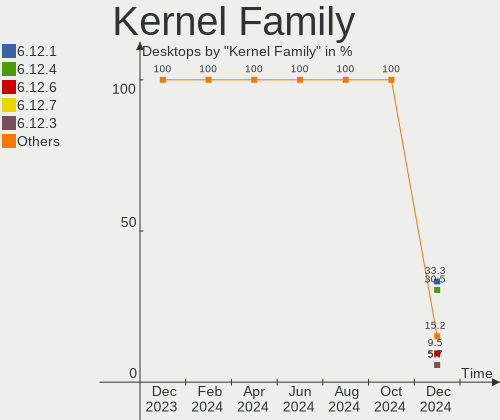
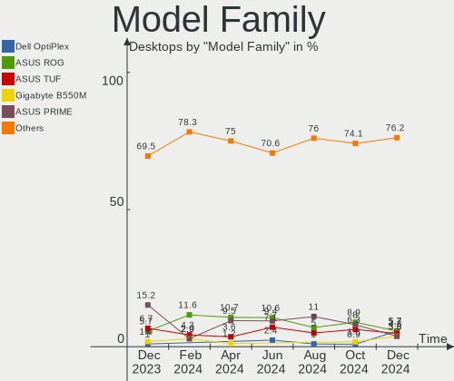

Arch - Hardware Trends (Desktops)
---------------------------------

A project to identify most popular hardware characteristics and track their change
over time based on data collected by Linux users at https://Linux-Hardware.org.

Anyone can contribute to this report by the [hw-probe](https://github.com/linuxhw/hw-probe) tool:

    sudo -E hw-probe -all -upload

This report is for one last month. Overall report since the beginning of time: [TestCoverage](https://github.com/linuxhw/TestCoverage)

Period: May, 2022.

Contents
--------

* [ System ](#system)
  - [ OS                       ](#os)
  - [ OS Family                ](#os-family)
  - [ Kernel                   ](#kernel)
  - [ Kernel Family            ](#kernel-family)
  - [ Kernel Major Ver.        ](#kernel-major-ver)
  - [ Arch                     ](#arch)
  - [ DE                       ](#de)
  - [ Display Server           ](#display-server)
  - [ Display Manager          ](#display-manager)
  - [ OS Lang                  ](#os-lang)
  - [ Boot Mode                ](#boot-mode)
  - [ Filesystem               ](#filesystem)
  - [ Part. scheme             ](#part-scheme)
  - [ Dual Boot with Linux/BSD ](#dual-boot-with-linuxbsd)
  - [ Dual Boot (Win)          ](#dual-boot-win)

* [ Board ](#board)
  - [ Vendor                   ](#vendor)
  - [ Model                    ](#model)
  - [ Model Family             ](#model-family)
  - [ MFG Year                 ](#mfg-year)
  - [ Form Factor              ](#form-factor)
  - [ Secure Boot              ](#secure-boot)
  - [ Coreboot                 ](#coreboot)
  - [ RAM Size                 ](#ram-size)
  - [ RAM Used                 ](#ram-used)
  - [ Total Drives             ](#total-drives)
  - [ Has CD-ROM               ](#has-cd-rom)
  - [ Has Ethernet             ](#has-ethernet)
  - [ Has WiFi                 ](#has-wifi)
  - [ Has Bluetooth            ](#has-bluetooth)

* [ Location ](#location)
  - [ Country                  ](#country)
  - [ City                     ](#city)

* [ Drives ](#drives)
  - [ Drive Vendor             ](#drive-vendor)
  - [ Drive Model              ](#drive-model)
  - [ HDD Vendor               ](#hdd-vendor)
  - [ SSD Vendor               ](#ssd-vendor)
  - [ Drive Kind               ](#drive-kind)
  - [ Drive Connector          ](#drive-connector)
  - [ Drive Size               ](#drive-size)
  - [ Space Total              ](#space-total)
  - [ Space Used               ](#space-used)
  - [ Malfunc. Drives          ](#malfunc-drives)
  - [ Malfunc. Drive Vendor    ](#malfunc-drive-vendor)
  - [ Malfunc. HDD Vendor      ](#malfunc-hdd-vendor)
  - [ Malfunc. Drive Kind      ](#malfunc-drive-kind)
  - [ Failed Drives            ](#failed-drives)
  - [ Failed Drive Vendor      ](#failed-drive-vendor)
  - [ Drive Status             ](#drive-status)

* [ Storage controller ](#storage-controller)
  - [ Storage Vendor           ](#storage-vendor)
  - [ Storage Model            ](#storage-model)
  - [ Storage Kind             ](#storage-kind)

* [ Processor ](#processor)
  - [ CPU Vendor               ](#cpu-vendor)
  - [ CPU Model                ](#cpu-model)
  - [ CPU Model Family         ](#cpu-model-family)
  - [ CPU Cores                ](#cpu-cores)
  - [ CPU Sockets              ](#cpu-sockets)
  - [ CPU Threads              ](#cpu-threads)
  - [ CPU Op-Modes             ](#cpu-op-modes)
  - [ CPU Microcode            ](#cpu-microcode)
  - [ CPU Microarch            ](#cpu-microarch)

* [ Graphics ](#graphics)
  - [ GPU Vendor               ](#gpu-vendor)
  - [ GPU Model                ](#gpu-model)
  - [ GPU Combo                ](#gpu-combo)
  - [ GPU Driver               ](#gpu-driver)
  - [ GPU Memory               ](#gpu-memory)

* [ Monitor ](#monitor)
  - [ Monitor Vendor           ](#monitor-vendor)
  - [ Monitor Model            ](#monitor-model)
  - [ Monitor Resolution       ](#monitor-resolution)
  - [ Monitor Diagonal         ](#monitor-diagonal)
  - [ Monitor Width            ](#monitor-width)
  - [ Aspect Ratio             ](#aspect-ratio)
  - [ Monitor Area             ](#monitor-area)
  - [ Pixel Density            ](#pixel-density)
  - [ Multiple Monitors        ](#multiple-monitors)

* [ Network ](#network)
  - [ Net Controller Vendor    ](#net-controller-vendor)
  - [ Net Controller Model     ](#net-controller-model)
  - [ Wireless Vendor          ](#wireless-vendor)
  - [ Wireless Model           ](#wireless-model)
  - [ Ethernet Vendor          ](#ethernet-vendor)
  - [ Ethernet Model           ](#ethernet-model)
  - [ Net Controller Kind      ](#net-controller-kind)
  - [ Used Controller          ](#used-controller)
  - [ NICs                     ](#nics)
  - [ IPv6                     ](#ipv6)

* [ Bluetooth ](#bluetooth)
  - [ Bluetooth Vendor         ](#bluetooth-vendor)
  - [ Bluetooth Model          ](#bluetooth-model)

* [ Sound ](#sound)
  - [ Sound Vendor             ](#sound-vendor)
  - [ Sound Model              ](#sound-model)

* [ Memory ](#memory)
  - [ Memory Vendor            ](#memory-vendor)
  - [ Memory Model             ](#memory-model)
  - [ Memory Kind              ](#memory-kind)
  - [ Memory Form Factor       ](#memory-form-factor)
  - [ Memory Size              ](#memory-size)
  - [ Memory Speed             ](#memory-speed)

* [ Printers & scanners ](#printers--scanners)
  - [ Printer Vendor           ](#printer-vendor)
  - [ Printer Model            ](#printer-model)
  - [ Scanner Vendor           ](#scanner-vendor)
  - [ Scanner Model            ](#scanner-model)

* [ Camera ](#camera)
  - [ Camera Vendor            ](#camera-vendor)
  - [ Camera Model             ](#camera-model)

* [ Security ](#security)
  - [ Fingerprint Vendor       ](#fingerprint-vendor)
  - [ Fingerprint Model        ](#fingerprint-model)
  - [ Chipcard Vendor          ](#chipcard-vendor)
  - [ Chipcard Model           ](#chipcard-model)

* [ Unsupported ](#unsupported)
  - [ Unsupported Devices      ](#unsupported-devices)
  - [ Unsupported Device Types ](#unsupported-device-types)

System
------

OS
--

Installed operating systems

| Name         | Desktops | Percent |
|--------------|----------|---------|
| Arch         | 40       | 55.56%  |
| Arch Rolling | 32       | 44.44%  |

OS Family
---------

OS without a version

| Name | Desktops | Percent |
|------|----------|---------|
| Arch | 72       | 100%    |

Kernel
------

Version of the Linux kernel

| Version                     | Desktops | Percent |
|-----------------------------|----------|---------|
| 5.17.9-arch1-1              | 19       | 26.39%  |
| 5.17.5-arch1-1              | 15       | 20.83%  |
| 5.18.0-arch1-1              | 4        | 5.56%   |
| 5.17.5-zen1-1-zen           | 4        | 5.56%   |
| 5.17.9-zen1-1-zen           | 3        | 4.17%   |
| 5.17.7-zen1-1-zen           | 3        | 4.17%   |
| 5.17.7-arch1-1              | 3        | 4.17%   |
| 5.17.4-arch1-1              | 3        | 4.17%   |
| 5.17.3-arch1-1              | 3        | 4.17%   |
| 5.17.6-arch1-1              | 2        | 2.78%   |
| 5.15.43-1-lts               | 2        | 2.78%   |
| 5.15.41-1-lts               | 2        | 2.78%   |
| 5.18.0-zen1-1-zen           | 1        | 1.39%   |
| 5.17.7-zen1-2-zen           | 1        | 1.39%   |
| 5.17.7-arch1-2              | 1        | 1.39%   |
| 5.17.5-arch1-2              | 1        | 1.39%   |
| 5.17.11-xanmod1-1-zen3-zen3 | 1        | 1.39%   |
| 5.16.5                      | 1        | 1.39%   |
| 5.16.0-arch1-1              | 1        | 1.39%   |
| 5.15.38-1-lts               | 1        | 1.39%   |
| 5.15.37-1-lts               | 1        | 1.39%   |

Kernel Family
-------------

Linux kernel without a distro release

| Version | Desktops | Percent |
|---------|----------|---------|
| 5.17.9  | 22       | 30.56%  |
| 5.17.5  | 20       | 27.78%  |
| 5.17.7  | 8        | 11.11%  |
| 5.18.0  | 5        | 6.94%   |
| 5.17.4  | 3        | 4.17%   |
| 5.17.3  | 3        | 4.17%   |
| 5.17.6  | 2        | 2.78%   |
| 5.15.43 | 2        | 2.78%   |
| 5.15.41 | 2        | 2.78%   |
| 5.17.11 | 1        | 1.39%   |
| 5.16.5  | 1        | 1.39%   |
| 5.16.0  | 1        | 1.39%   |
| 5.15.38 | 1        | 1.39%   |
| 5.15.37 | 1        | 1.39%   |

Kernel Major Ver.
-----------------

Linux kernel major version

| Version | Desktops | Percent |
|---------|----------|---------|
| 5.17    | 59       | 81.94%  |
| 5.15    | 6        | 8.33%   |
| 5.18    | 5        | 6.94%   |
| 5.16    | 2        | 2.78%   |

Arch
----

OS architecture (x86_64, i586, etc.)

| Name   | Desktops | Percent |
|--------|----------|---------|
| x86_64 | 72       | 100%    |

DE
--

Desktop Environment

| Name       | Desktops | Percent |
|------------|----------|---------|
| GNOME      | 28       | 38.89%  |
| KDE5       | 22       | 30.56%  |
| Unknown    | 8        | 11.11%  |
| XFCE       | 5        | 6.94%   |
| i3         | 4        | 5.56%   |
| qtile      | 2        | 2.78%   |
| X-Cinnamon | 1        | 1.39%   |
| Deepin     | 1        | 1.39%   |
| bspwm      | 1        | 1.39%   |

Display Server
--------------

X11 or Wayland

| Name    | Desktops | Percent |
|---------|----------|---------|
| X11     | 44       | 61.11%  |
| Wayland | 19       | 26.39%  |
| Tty     | 7        | 9.72%   |
| Unknown | 2        | 2.78%   |

Display Manager
---------------

SDDM, LightDM, etc.

| Name    | Desktops | Percent |
|---------|----------|---------|
| Unknown | 34       | 47.22%  |
| SDDM    | 14       | 19.44%  |
| LightDM | 10       | 13.89%  |
| GDM     | 10       | 13.89%  |
| Ly      | 2        | 2.78%   |
| LXDM    | 2        | 2.78%   |

OS Lang
-------

Language

| Lang       | Desktops | Percent |
|------------|----------|---------|
| en_US      | 44       | 61.11%  |
| de_DE      | 4        | 5.56%   |
| en_IN      | 3        | 4.17%   |
| en_IE      | 3        | 4.17%   |
| C          | 3        | 4.17%   |
| pt_BR      | 2        | 2.78%   |
| fr_FR      | 2        | 2.78%   |
| en_GB      | 2        | 2.78%   |
| Unknown    | 2        | 2.78%   |
| tr_TR      | 1        | 1.39%   |
| es_PE      | 1        | 1.39%   |
| es_ES.UTF8 | 1        | 1.39%   |
| en_US.UTF8 | 1        | 1.39%   |
| en_DK      | 1        | 1.39%   |
| en_AU      | 1        | 1.39%   |
| de_CH      | 1        | 1.39%   |

Boot Mode
---------

EFI or BIOS

| Mode | Desktops | Percent |
|------|----------|---------|
| EFI  | 40       | 55.56%  |
| BIOS | 32       | 44.44%  |

Filesystem
----------

Type of filesystem

| Type  | Desktops | Percent |
|-------|----------|---------|
| Ext4  | 54       | 75%     |
| Btrfs | 12       | 16.67%  |
| Xfs   | 4        | 5.56%   |
| Zfs   | 1        | 1.39%   |
| F2fs  | 1        | 1.39%   |

Part. scheme
------------

Scheme of partitioning

| Type    | Desktops | Percent |
|---------|----------|---------|
| GPT     | 43       | 59.72%  |
| Unknown | 21       | 29.17%  |
| MBR     | 8        | 11.11%  |

Dual Boot with Linux/BSD
------------------------

Hosting more than one Linux/BSD

| Dual boot | Desktops | Percent |
|-----------|----------|---------|
| No        | 65       | 90.28%  |
| Yes       | 7        | 9.72%   |

Dual Boot (Win)
---------------

Hosting Linux and Windows

| Dual boot | Desktops | Percent |
|-----------|----------|---------|
| No        | 42       | 58.33%  |
| Yes       | 30       | 41.67%  |

Board
-----

Vendor
------

Motherboard manufacturer

| Name                | Desktops | Percent |
|---------------------|----------|---------|
| ASUSTek Computer    | 30       | 41.67%  |
| Gigabyte Technology | 10       | 13.89%  |
| MSI                 | 8        | 11.11%  |
| Dell                | 7        | 9.72%   |
| Hewlett-Packard     | 5        | 6.94%   |
| ASRock              | 5        | 6.94%   |
| Intel               | 2        | 2.78%   |
| MAXSUN              | 1        | 1.39%   |
| Lenovo              | 1        | 1.39%   |
| Huanan              | 1        | 1.39%   |
| Acer                | 1        | 1.39%   |
| Unknown             | 1        | 1.39%   |

Model
-----

Motherboard model

| Name                                | Desktops | Percent |
|-------------------------------------|----------|---------|
| MSI MS-7C91                         | 2        | 2.78%   |
| HP Desktop M01-F0xxx                | 2        | 2.78%   |
| Dell OptiPlex 9020                  | 2        | 2.78%   |
| Dell OptiPlex 7020                  | 2        | 2.78%   |
| ASUS ROG STRIX X570-E GAMING        | 2        | 2.78%   |
| ASUS PRIME B550M-A                  | 2        | 2.78%   |
| ASUS PRIME B450M-A                  | 2        | 2.78%   |
| MSI MS-7D43                         | 1        | 1.39%   |
| MSI MS-7D32                         | 1        | 1.39%   |
| MSI MS-7C31                         | 1        | 1.39%   |
| MSI MS-7B17                         | 1        | 1.39%   |
| MSI MS-7A40                         | 1        | 1.39%   |
| MSI MS-7100                         | 1        | 1.39%   |
| MAXSUN MS-M3A78EL                   | 1        | 1.39%   |
| Lenovo YangTianT4900c-00 90ETCTO1WW | 1        | 1.39%   |
| Intel DH61BF AAG81311-101           | 1        | 1.39%   |
| Intel D54250WYK H13922-305          | 1        | 1.39%   |
| Huanan X99-TF                       | 1        | 1.39%   |
| HP rp5700 Business System           | 1        | 1.39%   |
| HP ProDesk 600 G4 DM (TAA)          | 1        | 1.39%   |
| HP 20-e018cn                        | 1        | 1.39%   |
| Gigabyte Z97P-D3                    | 1        | 1.39%   |
| Gigabyte X570 UD                    | 1        | 1.39%   |
| Gigabyte X570 I AORUS PRO WIFI      | 1        | 1.39%   |
| Gigabyte X299 UD4 Pro               | 1        | 1.39%   |
| Gigabyte TRX40 AORUS XTREME         | 1        | 1.39%   |
| Gigabyte TRX40 AORUS PRO WIFI       | 1        | 1.39%   |
| Gigabyte H61M-DS2                   | 1        | 1.39%   |
| Gigabyte B550 AORUS ELITE           | 1        | 1.39%   |
| Gigabyte B365M GAMING HD            | 1        | 1.39%   |
| Gigabyte B250M-DS3H                 | 1        | 1.39%   |
| Dell XPS 8700                       | 1        | 1.39%   |
| Dell OptiPlex 5040                  | 1        | 1.39%   |
| Dell OptiPlex 3060                  | 1        | 1.39%   |
| ASUS TUF Gaming X570-PRO            | 1        | 1.39%   |
| ASUS TUF Gaming X570-PLUS           | 1        | 1.39%   |
| ASUS TUF Gaming B550M-PLUS          | 1        | 1.39%   |
| ASUS TUF Gaming B550M-E WIFI        | 1        | 1.39%   |
| ASUS TUF Gaming B450M-PRO S         | 1        | 1.39%   |
| ASUS STRIX Z270E GAMING             | 1        | 1.39%   |
| ASUS SABERTOOTH Z77                 | 1        | 1.39%   |
| ASUS ROG STRIX Z390-E GAMING        | 1        | 1.39%   |
| ASUS ROG STRIX B550-I GAMING        | 1        | 1.39%   |
| ASUS ROG STRIX B550-F GAMING        | 1        | 1.39%   |
| ASUS ROG CROSSHAIR VIII DARK HERO   | 1        | 1.39%   |
| ASUS Pro WS 565-ACE                 | 1        | 1.39%   |
| ASUS PRIME X570-P                   | 1        | 1.39%   |
| ASUS PRIME B450-PLUS                | 1        | 1.39%   |
| ASUS pc                             | 1        | 1.39%   |
| ASUS P9X79                          | 1        | 1.39%   |
| ASUS P8Z77-V LX                     | 1        | 1.39%   |
| ASUS M4A88T-M/USB3                  | 1        | 1.39%   |
| ASUS H110M-R                        | 1        | 1.39%   |
| ASUS G20AJ                          | 1        | 1.39%   |
| ASUS CUSTOM                         | 1        | 1.39%   |
| ASUS CROSSHAIR VI HERO              | 1        | 1.39%   |
| ASUS All Series                     | 1        | 1.39%   |
| ASUS 970 PRO GAMING/AURA            | 1        | 1.39%   |
| ASRock X470 Gaming K4               | 1        | 1.39%   |
| ASRock H270M Pro4                   | 1        | 1.39%   |

Model Family
------------

Motherboard model prefix

| Name                     | Desktops | Percent |
|--------------------------|----------|---------|
| Dell OptiPlex            | 6        | 8.33%   |
| ASUS ROG                 | 6        | 8.33%   |
| ASUS PRIME               | 6        | 8.33%   |
| ASUS TUF                 | 5        | 6.94%   |
| MSI MS-7C91              | 2        | 2.78%   |
| HP Desktop               | 2        | 2.78%   |
| Gigabyte X570            | 2        | 2.78%   |
| Gigabyte TRX40           | 2        | 2.78%   |
| MSI MS-7D43              | 1        | 1.39%   |
| MSI MS-7D32              | 1        | 1.39%   |
| MSI MS-7C31              | 1        | 1.39%   |
| MSI MS-7B17              | 1        | 1.39%   |
| MSI MS-7A40              | 1        | 1.39%   |
| MSI MS-7100              | 1        | 1.39%   |
| MAXSUN MS-M3A78EL        | 1        | 1.39%   |
| Lenovo YangTianT4900c-00 | 1        | 1.39%   |
| Intel DH61BF             | 1        | 1.39%   |
| Intel D54250WYK          | 1        | 1.39%   |
| Huanan X99-TF            | 1        | 1.39%   |
| HP rp5700                | 1        | 1.39%   |
| HP ProDesk               | 1        | 1.39%   |
| HP 20-e018cn             | 1        | 1.39%   |
| Gigabyte Z97P-D3         | 1        | 1.39%   |
| Gigabyte X299            | 1        | 1.39%   |
| Gigabyte H61M-DS2        | 1        | 1.39%   |
| Gigabyte B550            | 1        | 1.39%   |
| Gigabyte B365M           | 1        | 1.39%   |
| Gigabyte B250M-DS3H      | 1        | 1.39%   |
| Dell XPS                 | 1        | 1.39%   |
| ASUS STRIX               | 1        | 1.39%   |
| ASUS SABERTOOTH          | 1        | 1.39%   |
| ASUS Pro                 | 1        | 1.39%   |
| ASUS pc                  | 1        | 1.39%   |
| ASUS P9X79               | 1        | 1.39%   |
| ASUS P8Z77-V             | 1        | 1.39%   |
| ASUS M4A88T-M            | 1        | 1.39%   |
| ASUS H110M-R             | 1        | 1.39%   |
| ASUS G20AJ               | 1        | 1.39%   |
| ASUS CUSTOM              | 1        | 1.39%   |
| ASUS CROSSHAIR           | 1        | 1.39%   |
| ASUS All                 | 1        | 1.39%   |
| ASUS 970                 | 1        | 1.39%   |
| ASRock X470              | 1        | 1.39%   |
| ASRock H270M             | 1        | 1.39%   |
| ASRock FM2A75M-DGS       | 1        | 1.39%   |
| ASRock B450M             | 1        | 1.39%   |
| ASRock AB350             | 1        | 1.39%   |
| Acer Aspire              | 1        | 1.39%   |
| Unknown                  | 1        | 1.39%   |

MFG Year
--------

Motherboard manufacture year

| Year | Desktops | Percent |
|------|----------|---------|
| 2020 | 14       | 19.44%  |
| 2019 | 13       | 18.06%  |
| 2018 | 8        | 11.11%  |
| 2021 | 7        | 9.72%   |
| 2012 | 7        | 9.72%   |
| 2016 | 5        | 6.94%   |
| 2015 | 5        | 6.94%   |
| 2014 | 4        | 5.56%   |
| 2017 | 3        | 4.17%   |
| 2022 | 1        | 1.39%   |
| 2013 | 1        | 1.39%   |
| 2010 | 1        | 1.39%   |
| 2009 | 1        | 1.39%   |
| 2007 | 1        | 1.39%   |
| 2006 | 1        | 1.39%   |

Form Factor
-----------

Physical design of the computer

| Name    | Desktops | Percent |
|---------|----------|---------|
| Desktop | 72       | 100%    |

Secure Boot
-----------

Enabled or disabled

| State    | Desktops | Percent |
|----------|----------|---------|
| Disabled | 71       | 98.61%  |
| Enabled  | 1        | 1.39%   |

Coreboot
--------

Have coreboot on board

| Used | Desktops | Percent |
|------|----------|---------|
| No   | 72       | 100%    |

RAM Size
--------

Total RAM memory

| Size in GB      | Desktops | Percent |
|-----------------|----------|---------|
| 16.01-24.0      | 25       | 34.72%  |
| 32.01-64.0      | 15       | 20.83%  |
| 4.01-8.0        | 9        | 12.5%   |
| 64.01-256.0     | 8        | 11.11%  |
| 8.01-16.0       | 7        | 9.72%   |
| 3.01-4.0        | 5        | 6.94%   |
| More than 256.0 | 1        | 1.39%   |
| 24.01-32.0      | 1        | 1.39%   |
| 2.01-3.0        | 1        | 1.39%   |

RAM Used
--------

Used RAM memory

| Used GB    | Desktops | Percent |
|------------|----------|---------|
| 2.01-3.0   | 22       | 30.56%  |
| 4.01-8.0   | 16       | 22.22%  |
| 3.01-4.0   | 10       | 13.89%  |
| 1.01-2.0   | 10       | 13.89%  |
| 8.01-16.0  | 9        | 12.5%   |
| 32.01-64.0 | 2        | 2.78%   |
| 16.01-24.0 | 2        | 2.78%   |
| 0.51-1.0   | 1        | 1.39%   |

Total Drives
------------

Number of drives on board

| Drives | Desktops | Percent |
|--------|----------|---------|
| 2      | 27       | 37.5%   |
| 1      | 17       | 23.61%  |
| 3      | 12       | 16.67%  |
| 4      | 9        | 12.5%   |
| 8      | 2        | 2.78%   |
| 7      | 2        | 2.78%   |
| 5      | 2        | 2.78%   |
| 6      | 1        | 1.39%   |

Has CD-ROM
----------

Has CD-ROM on board

| Presented | Desktops | Percent |
|-----------|----------|---------|
| No        | 49       | 68.06%  |
| Yes       | 23       | 31.94%  |

Has Ethernet
------------

Has Ethernet on board

| Presented | Desktops | Percent |
|-----------|----------|---------|
| Yes       | 72       | 100%    |

Has WiFi
--------

Has WiFi module

| Presented | Desktops | Percent |
|-----------|----------|---------|
| Yes       | 44       | 61.11%  |
| No        | 28       | 38.89%  |

Has Bluetooth
-------------

Has Bluetooth module

| Presented | Desktops | Percent |
|-----------|----------|---------|
| Yes       | 42       | 58.33%  |
| No        | 30       | 41.67%  |

Location
--------

Country
-------

Geographic location (country)

| Country     | Desktops | Percent |
|-------------|----------|---------|
| USA         | 23       | 31.94%  |
| Germany     | 8        | 11.11%  |
| Poland      | 4        | 5.56%   |
| Russia      | 3        | 4.17%   |
| Ireland     | 3        | 4.17%   |
| France      | 3        | 4.17%   |
| Thailand    | 2        | 2.78%   |
| Spain       | 2        | 2.78%   |
| China       | 2        | 2.78%   |
| Brazil      | 2        | 2.78%   |
| Austria     | 2        | 2.78%   |
| Vietnam     | 1        | 1.39%   |
| UK          | 1        | 1.39%   |
| Turkey      | 1        | 1.39%   |
| Taiwan      | 1        | 1.39%   |
| Switzerland | 1        | 1.39%   |
| Sweden      | 1        | 1.39%   |
| South Korea | 1        | 1.39%   |
| Somalia     | 1        | 1.39%   |
| Serbia      | 1        | 1.39%   |
| Peru        | 1        | 1.39%   |
| Nepal       | 1        | 1.39%   |
| Japan       | 1        | 1.39%   |
| Italy       | 1        | 1.39%   |
| India       | 1        | 1.39%   |
| Egypt       | 1        | 1.39%   |
| Ecuador     | 1        | 1.39%   |
| Chile       | 1        | 1.39%   |
| Australia   | 1        | 1.39%   |

City
----

Geographic location (city)

| City                        | Desktops | Percent |
|-----------------------------|----------|---------|
| Vienna                      | 2        | 2.78%   |
| Oranmore                    | 2        | 2.78%   |
| Krakow                      | 2        | 2.78%   |
| Frankfurt am Main           | 2        | 2.78%   |
| Zurich                      | 1        | 1.39%   |
| Zschopau                    | 1        | 1.39%   |
| Xiamen                      | 1        | 1.39%   |
| Warsaw                      | 1        | 1.39%   |
| Valencia                    | 1        | 1.39%   |
| Thung Song                  | 1        | 1.39%   |
| Taganrog                    | 1        | 1.39%   |
| Sundbyberg                  | 1        | 1.39%   |
| Shanghai                    | 1        | 1.39%   |
| Setagaya-ku                 | 1        | 1.39%   |
| Sertolovo                   | 1        | 1.39%   |
| Seoul                       | 1        | 1.39%   |
| Seattle                     | 1        | 1.39%   |
| Sao Paulo                   | 1        | 1.39%   |
| Santiago                    | 1        | 1.39%   |
| San Cristóbal de La Laguna | 1        | 1.39%   |
| Salt Lake City              | 1        | 1.39%   |
| Saint-Paul-les-Dax          | 1        | 1.39%   |
| Saint-Leu-la-Foret          | 1        | 1.39%   |
| Saint Paul                  | 1        | 1.39%   |
| Royal Oak                   | 1        | 1.39%   |
| Recife                      | 1        | 1.39%   |
| Racine                      | 1        | 1.39%   |
| Peru                        | 1        | 1.39%   |
| Parma                       | 1        | 1.39%   |
| OEdemis                     | 1        | 1.39%   |
| Novosibirsk                 | 1        | 1.39%   |
| Newark                      | 1        | 1.39%   |
| Mogadishu                   | 1        | 1.39%   |
| Marbella                    | 1        | 1.39%   |
| Lima                        | 1        | 1.39%   |
| Lesneven                    | 1        | 1.39%   |
| Lawton                      | 1        | 1.39%   |
| Krapkowice                  | 1        | 1.39%   |
| Kathmandu                   | 1        | 1.39%   |
| Hsinchu                     | 1        | 1.39%   |
| Houston                     | 1        | 1.39%   |
| Ho Chi Minh City            | 1        | 1.39%   |
| Hickory                     | 1        | 1.39%   |
| Herzogenrath                | 1        | 1.39%   |
| Hayden                      | 1        | 1.39%   |
| Hainesport                  | 1        | 1.39%   |
| Guayaquil                   | 1        | 1.39%   |
| Gorey                       | 1        | 1.39%   |
| Franklin Park               | 1        | 1.39%   |
| Dallas                      | 1        | 1.39%   |
| Clapham                     | 1        | 1.39%   |
| Chandigarh                  | 1        | 1.39%   |
| Canfield                    | 1        | 1.39%   |
| Cambridge                   | 1        | 1.39%   |
| Cairo                       | 1        | 1.39%   |
| Bonn                        | 1        | 1.39%   |
| Bielefeld                   | 1        | 1.39%   |
| Belgrade                    | 1        | 1.39%   |
| Bassum                      | 1        | 1.39%   |
| Ban Yang Sam Ton            | 1        | 1.39%   |

Drives
------

Drive Vendor
------------

Hard drive vendors

| Vendor                       | Desktops | Drives | Percent |
|------------------------------|----------|--------|---------|
| WDC                          | 28       | 35     | 20%     |
| Samsung Electronics          | 28       | 47     | 20%     |
| Seagate                      | 26       | 36     | 18.57%  |
| Crucial                      | 10       | 12     | 7.14%   |
| Toshiba                      | 9        | 13     | 6.43%   |
| Kingston                     | 7        | 9      | 5%      |
| Hitachi                      | 5        | 5      | 3.57%   |
| Unknown                      | 3        | 4      | 2.14%   |
| SanDisk                      | 3        | 4      | 2.14%   |
| Phison                       | 2        | 2      | 1.43%   |
| HGST                         | 2        | 2      | 1.43%   |
| Gigabyte Technology          | 2        | 2      | 1.43%   |
| Corsair                      | 2        | 2      | 1.43%   |
| Team                         | 1        | 1      | 0.71%   |
| SK Hynix                     | 1        | 1      | 0.71%   |
| Shenzhen Longsys Electronics | 1        | 1      | 0.71%   |
| Patriot                      | 1        | 1      | 0.71%   |
| Micron Technology            | 1        | 1      | 0.71%   |
| Lexar                        | 1        | 1      | 0.71%   |
| KingSpec                     | 1        | 1      | 0.71%   |
| Intenso                      | 1        | 1      | 0.71%   |
| Intel                        | 1        | 1      | 0.71%   |
| HS-SSD-C100                  | 1        | 1      | 0.71%   |
| GOODRAM                      | 1        | 1      | 0.71%   |
| China                        | 1        | 1      | 0.71%   |
| A-DATA Technology            | 1        | 1      | 0.71%   |

Drive Model
-----------

Hard drive models

| Model                            | Desktops | Percent |
|----------------------------------|----------|---------|
| Samsung NVMe SSD Drive 1TB       | 5        | 2.92%   |
| Crucial CT500MX500SSD1 500GB     | 5        | 2.92%   |
| Seagate ST2000DM008-2FR102 2TB   | 3        | 1.75%   |
| Samsung SSD 970 EVO Plus 1TB     | 3        | 1.75%   |
| Samsung SSD 860 EVO 1TB          | 3        | 1.75%   |
| Samsung NVMe SSD Drive 500GB     | 3        | 1.75%   |
| WDC WDS500G2B0A-00SM50 500GB SSD | 2        | 1.17%   |
| WDC WDS250G2B0B-00YS70 250GB SSD | 2        | 1.17%   |
| WDC WD10EZEX-00BN5A0 1TB         | 2        | 1.17%   |
| Toshiba DT01ACA100 1TB           | 2        | 1.17%   |
| Seagate ST8000DM004-2CX188 8TB   | 2        | 1.17%   |
| Seagate ST500DM002-1BD142 500GB  | 2        | 1.17%   |
| Seagate ST2000DM006-2DM164 2TB   | 2        | 1.17%   |
| Seagate ST1000DM010-2EP102 1TB   | 2        | 1.17%   |
| Samsung SSD 980 PRO 250GB        | 2        | 1.17%   |
| Samsung SSD 970 EVO Plus 2TB     | 2        | 1.17%   |
| Samsung SSD 870 EVO 1TB          | 2        | 1.17%   |
| Samsung SSD 850 EVO 500GB        | 2        | 1.17%   |
| Samsung SSD 850 EVO 250GB        | 2        | 1.17%   |
| Samsung NVMe SSD Drive 250GB     | 2        | 1.17%   |
| Phison Sabrent 1TB               | 2        | 1.17%   |
| Kingston SA400S37240G 240GB SSD  | 2        | 1.17%   |
| Hitachi HDS721010CLA332 1TB      | 2        | 1.17%   |
| Gigabyte GP-GSM2NE3512GNTD 512GB | 2        | 1.17%   |
| Crucial CT1000MX500SSD1 1TB      | 2        | 1.17%   |
| WDC WDS500G3X0C-00SJG0 500GB     | 1        | 0.58%   |
| WDC WDS500G1X0E-00AFY0 500GB     | 1        | 0.58%   |
| WDC WDS250G2B0A 250GB SSD        | 1        | 0.58%   |
| WDC WDS240G2G0B-00EPW0 240GB SSD | 1        | 0.58%   |
| WDC WDS120G1G0A-00SS50 120GB SSD | 1        | 0.58%   |
| WDC WDS100T2G0A-00JH30 1TB SSD   | 1        | 0.58%   |
| WDC WDS100T2B0C-00PXH0 1TB       | 1        | 0.58%   |
| WDC WDBNCE5000PNC 500GB SSD      | 1        | 0.58%   |
| WDC WD5000LPLX-00ZNTT0 500GB     | 1        | 0.58%   |
| WDC WD5000AAKX-08U6AA0 500GB     | 1        | 0.58%   |
| WDC WD5000AAKX-001CA0 500GB      | 1        | 0.58%   |
| WDC WD5000AAKS-22A7B0 500GB      | 1        | 0.58%   |
| WDC WD5000AAKS-00V0A0 500GB      | 1        | 0.58%   |
| WDC WD5000AACS-07G8B0 500GB      | 1        | 0.58%   |
| WDC WD40EZRZ-00WN9B0 4TB         | 1        | 0.58%   |
| WDC WD40EZAZ-19SF3B0 4TB         | 1        | 0.58%   |
| WDC WD3200AAJS-00L7A0 320GB      | 1        | 0.58%   |
| WDC WD20EZRZ-00Z5HB0 2TB         | 1        | 0.58%   |
| WDC WD20EZRX-00DC0B0 2TB         | 1        | 0.58%   |
| WDC WD20EZAZ-00GGJB0 2TB         | 1        | 0.58%   |
| WDC WD20EARX-00PASB0 2TB         | 1        | 0.58%   |
| WDC WD1600AABS-00PRA0 160GB      | 1        | 0.58%   |
| WDC WD15EZRX-00DC0B0 1TB         | 1        | 0.58%   |
| WDC WD10EZEX-75WN4A0 1TB         | 1        | 0.58%   |
| WDC WD10EZEX-60ZF5A0 1TB         | 1        | 0.58%   |
| WDC WD10EZEX-08WN4A0 1TB         | 1        | 0.58%   |
| WDC WD1003FBYX-01Y7B1 1TB        | 1        | 0.58%   |
| WDC WD1002FAEX-00Z3A0 1TB        | 1        | 0.58%   |
| Unknown SD/MMC/MS PRO 999GB      | 1        | 0.58%   |
| Unknown SD/MMC 16GB              | 1        | 0.58%   |
| Unknown MMC Card  64GB           | 1        | 0.58%   |
| Unknown M.S./M.S.Pro/HG 16GB     | 1        | 0.58%   |
| Toshiba RC500 500GB              | 1        | 0.58%   |
| Toshiba NVMe SSD Drive 500GB     | 1        | 0.58%   |
| Toshiba MQ04ABF100 1TB           | 1        | 0.58%   |

HDD Vendor
----------

Hard disk drive vendors

| Vendor              | Desktops | Drives | Percent |
|---------------------|----------|--------|---------|
| Seagate             | 25       | 35     | 41.67%  |
| WDC                 | 18       | 23     | 30%     |
| Toshiba             | 8        | 11     | 13.33%  |
| Hitachi             | 5        | 5      | 8.33%   |
| HGST                | 2        | 2      | 3.33%   |
| Unknown             | 1        | 1      | 1.67%   |
| Samsung Electronics | 1        | 1      | 1.67%   |

SSD Vendor
----------

Solid state drive vendors

| Vendor              | Desktops | Drives | Percent |
|---------------------|----------|--------|---------|
| Samsung Electronics | 15       | 19     | 30.61%  |
| WDC                 | 9        | 9      | 18.37%  |
| Crucial             | 9        | 11     | 18.37%  |
| Kingston            | 6        | 8      | 12.24%  |
| SanDisk             | 2        | 2      | 4.08%   |
| Patriot             | 1        | 1      | 2.04%   |
| Lexar               | 1        | 1      | 2.04%   |
| KingSpec            | 1        | 1      | 2.04%   |
| Intenso             | 1        | 1      | 2.04%   |
| Intel               | 1        | 1      | 2.04%   |
| GOODRAM             | 1        | 1      | 2.04%   |
| China               | 1        | 1      | 2.04%   |
| A-DATA Technology   | 1        | 1      | 2.04%   |

Drive Kind
----------

HDD or SSD

| Kind    | Desktops | Drives | Percent |
|---------|----------|--------|---------|
| HDD     | 48       | 78     | 38.4%   |
| SSD     | 40       | 57     | 32%     |
| NVMe    | 33       | 46     | 26.4%   |
| Unknown | 3        | 4      | 2.4%    |
| MMC     | 1        | 1      | 0.8%    |

Drive Connector
---------------

SATA, SAS, NVMe, etc.

| Type | Desktops | Drives | Percent |
|------|----------|--------|---------|
| SATA | 60       | 135    | 61.86%  |
| NVMe | 33       | 46     | 34.02%  |
| SAS  | 3        | 4      | 3.09%   |
| MMC  | 1        | 1      | 1.03%   |

Drive Size
----------

Size of hard drive

| Size in TB | Desktops | Drives | Percent |
|------------|----------|--------|---------|
| 0.01-0.5   | 41       | 55     | 41%     |
| 0.51-1.0   | 31       | 44     | 31%     |
| 1.01-2.0   | 17       | 18     | 17%     |
| 4.01-10.0  | 5        | 6      | 5%      |
| 3.01-4.0   | 3        | 4      | 3%      |
| 2.01-3.0   | 2        | 4      | 2%      |
| 10.01-20.0 | 1        | 4      | 1%      |

Space Total
-----------

Amount of disk space available on the file system

| Size in GB     | Desktops | Percent |
|----------------|----------|---------|
| More than 3000 | 13       | 18.06%  |
| 1001-2000      | 13       | 18.06%  |
| 251-500        | 12       | 16.67%  |
| 501-1000       | 10       | 13.89%  |
| 101-250        | 9        | 12.5%   |
| 2001-3000      | 7        | 9.72%   |
| 51-100         | 6        | 8.33%   |
| Unknown        | 2        | 2.78%   |

Space Used
----------

Amount of used disk space

| Used GB        | Desktops | Percent |
|----------------|----------|---------|
| 1-20           | 16       | 22.22%  |
| 1001-2000      | 11       | 15.28%  |
| 501-1000       | 10       | 13.89%  |
| 51-100         | 9        | 12.5%   |
| More than 3000 | 6        | 8.33%   |
| 21-50          | 6        | 8.33%   |
| 101-250        | 6        | 8.33%   |
| 251-500        | 5        | 6.94%   |
| Unknown        | 2        | 2.78%   |
| 2001-3000      | 1        | 1.39%   |

Malfunc. Drives
---------------

Drive models with a malfunction

| Model                           | Desktops | Drives | Percent |
|---------------------------------|----------|--------|---------|
| WDC WD5000AAKS-22A7B0 500GB     | 1        | 1      | 14.29%  |
| WDC WD10EZEX-60ZF5A0 1TB        | 1        | 1      | 14.29%  |
| Seagate ST500DM002-1BD142 500GB | 1        | 2      | 14.29%  |
| Seagate ST4000VN008-2DR166 4TB  | 1        | 1      | 14.29%  |
| Seagate ST31000528AS 1TB        | 1        | 1      | 14.29%  |
| Seagate ST2000DM008-2FR102 2TB  | 1        | 1      | 14.29%  |
| Seagate ST2000DM001-9YN164 2TB  | 1        | 1      | 14.29%  |

Malfunc. Drive Vendor
---------------------

Vendors of faulty drives

| Vendor  | Desktops | Drives | Percent |
|---------|----------|--------|---------|
| Seagate | 5        | 6      | 71.43%  |
| WDC     | 2        | 2      | 28.57%  |

Malfunc. HDD Vendor
-------------------

Vendors of faulty HDD drives

| Vendor  | Desktops | Drives | Percent |
|---------|----------|--------|---------|
| Seagate | 5        | 6      | 71.43%  |
| WDC     | 2        | 2      | 28.57%  |

Malfunc. Drive Kind
-------------------

Kinds of faulty drives

| Kind | Desktops | Drives | Percent |
|------|----------|--------|---------|
| HDD  | 7        | 8      | 100%    |

Failed Drives
-------------

Failed drive models

Zero info for selected period =(

Failed Drive Vendor
-------------------

Failed drive vendors

Zero info for selected period =(

Drive Status
------------

Number of failed and malfunc. drives

| Status   | Desktops | Drives | Percent |
|----------|----------|--------|---------|
| Detected | 38       | 86     | 48.1%   |
| Works    | 34       | 92     | 43.04%  |
| Malfunc  | 7        | 8      | 8.86%   |

Storage controller
------------------

Storage Vendor
--------------

Storage controller vendors

| Vendor                       | Desktops | Percent |
|------------------------------|----------|---------|
| Intel                        | 36       | 32.14%  |
| AMD                          | 35       | 31.25%  |
| Samsung Electronics          | 18       | 16.07%  |
| Phison Electronics           | 6        | 5.36%   |
| Sandisk                      | 4        | 3.57%   |
| ASMedia Technology           | 3        | 2.68%   |
| SK Hynix                     | 1        | 0.89%   |
| Silicon Image                | 1        | 0.89%   |
| Shenzhen Longsys Electronics | 1        | 0.89%   |
| Nvidia                       | 1        | 0.89%   |
| Micron/Crucial Technology    | 1        | 0.89%   |
| Micron Technology            | 1        | 0.89%   |
| Marvell Technology Group     | 1        | 0.89%   |
| KIOXIA                       | 1        | 0.89%   |
| Kingston Technology Company  | 1        | 0.89%   |
| Broadcom / LSI               | 1        | 0.89%   |

Storage Model
-------------

Storage controller models

| Model                                                                                   | Desktops | Percent |
|-----------------------------------------------------------------------------------------|----------|---------|
| AMD FCH SATA Controller [AHCI mode]                                                     | 22       | 16.79%  |
| Samsung NVMe SSD Controller SM981/PM981/PM983                                           | 12       | 9.16%   |
| AMD 500 Series Chipset SATA Controller                                                  | 10       | 7.63%   |
| AMD 400 Series Chipset SATA Controller                                                  | 9        | 6.87%   |
| Samsung NVMe SSD Controller PM9A1/PM9A3/980PRO                                          | 6        | 4.58%   |
| Intel 200 Series PCH SATA controller [AHCI mode]                                        | 6        | 4.58%   |
| Intel SATA Controller [RAID mode]                                                       | 5        | 3.82%   |
| Intel 8 Series/C220 Series Chipset Family 6-port SATA Controller 1 [AHCI mode]          | 5        | 3.82%   |
| Phison PS5013 E13 NVMe Controller                                                       | 3        | 2.29%   |
| Phison E12 NVMe Controller                                                              | 3        | 2.29%   |
| Intel Cannon Lake PCH SATA AHCI Controller                                              | 3        | 2.29%   |
| ASMedia ASM1062 Serial ATA Controller                                                   | 3        | 2.29%   |
| Sandisk WD PC SN810 / Black SN850 NVMe SSD                                              | 2        | 1.53%   |
| Intel Q170/Q150/B150/H170/H110/Z170/CM236 Chipset SATA Controller [AHCI Mode]           | 2        | 1.53%   |
| Intel Alder Lake-S PCH SATA Controller [AHCI Mode]                                      | 2        | 1.53%   |
| Intel 7 Series/C210 Series Chipset Family 6-port SATA Controller [AHCI mode]            | 2        | 1.53%   |
| AMD SB7x0/SB8x0/SB9x0 SATA Controller [IDE mode]                                        | 2        | 1.53%   |
| AMD SB7x0/SB8x0/SB9x0 IDE Controller                                                    | 2        | 1.53%   |
| SK Hynix BC501 NVMe Solid State Drive                                                   | 1        | 0.76%   |
| Silicon Image SiI 3132 Serial ATA Raid II Controller                                    | 1        | 0.76%   |
| Shenzhen Longsys Electronics Non-Volatile memory controller                             | 1        | 0.76%   |
| Sandisk WD Blue SN550 NVMe SSD                                                          | 1        | 0.76%   |
| Sandisk WD Black SN750 / PC SN730 NVMe SSD                                              | 1        | 0.76%   |
| Sandisk Non-Volatile memory controller                                                  | 1        | 0.76%   |
| Samsung NVMe SSD Controller SM951/PM951                                                 | 1        | 0.76%   |
| Phison E16 PCIe4 NVMe Controller                                                        | 1        | 0.76%   |
| Nvidia CK804 Serial ATA Controller                                                      | 1        | 0.76%   |
| Nvidia CK804 IDE                                                                        | 1        | 0.76%   |
| Micron/Crucial P2 NVMe PCIe SSD                                                         | 1        | 0.76%   |
| Micron Non-Volatile memory controller                                                   | 1        | 0.76%   |
| Marvell Group 88SE9215 PCIe 2.0 x1 4-port SATA 6 Gb/s Controller                        | 1        | 0.76%   |
| KIOXIA NVMe SSD                                                                         | 1        | 0.76%   |
| Kingston Company A2000 NVMe SSD                                                         | 1        | 0.76%   |
| Intel Jasper Lake SATA AHCI Controller                                                  | 1        | 0.76%   |
| Intel C610/X99 series chipset sSATA Controller [AHCI mode]                              | 1        | 0.76%   |
| Intel C610/X99 series chipset 6-Port SATA Controller [AHCI mode]                        | 1        | 0.76%   |
| Intel C600/X79 series chipset 6-Port SATA AHCI Controller                               | 1        | 0.76%   |
| Intel Atom/Celeron/Pentium Processor x5-E8000/J3xxx/N3xxx Series SATA Controller        | 1        | 0.76%   |
| Intel 9 Series Chipset Family SATA Controller [AHCI Mode]                               | 1        | 0.76%   |
| Intel 82801JI (ICH10 Family) SATA AHCI Controller                                       | 1        | 0.76%   |
| Intel 8 Series SATA Controller 1 [AHCI mode]                                            | 1        | 0.76%   |
| Intel 6 Series/C200 Series Chipset Family Desktop SATA Controller (IDE mode, ports 4-5) | 1        | 0.76%   |
| Intel 6 Series/C200 Series Chipset Family Desktop SATA Controller (IDE mode, ports 0-3) | 1        | 0.76%   |
| Intel 6 Series/C200 Series Chipset Family 6 port Desktop SATA AHCI Controller           | 1        | 0.76%   |
| Intel 500 Series Chipset Family SATA AHCI Controller                                    | 1        | 0.76%   |
| Broadcom / LSI MegaRAID SAS 2108 [Liberator]                                            | 1        | 0.76%   |
| AMD X370 Series Chipset SATA Controller                                                 | 1        | 0.76%   |
| AMD SB7x0/SB8x0/SB9x0 SATA Controller [AHCI mode]                                       | 1        | 0.76%   |
| AMD FCH IDE Controller                                                                  | 1        | 0.76%   |
| AMD 300 Series Chipset SATA Controller                                                  | 1        | 0.76%   |

Storage Kind
------------

Kind of storage controller (IDE, SATA, NVMe, SAS, ...)

| Kind | Desktops | Percent |
|------|----------|---------|
| SATA | 65       | 59.09%  |
| NVMe | 33       | 30%     |
| RAID | 7        | 6.36%   |
| IDE  | 5        | 4.55%   |

Processor
---------

CPU Vendor
----------

Processor vendors

| Vendor | Desktops | Percent |
|--------|----------|---------|
| Intel  | 36       | 50%     |
| AMD    | 36       | 50%     |

CPU Model
---------

Processor models

| Model                                          | Desktops | Percent |
|------------------------------------------------|----------|---------|
| AMD Ryzen 5 3600 6-Core Processor              | 4        | 5.56%   |
| Intel Core i7-7700K CPU @ 4.20GHz              | 3        | 4.17%   |
| Intel Core i5-3470 CPU @ 3.20GHz               | 3        | 4.17%   |
| AMD Ryzen 9 5950X 16-Core Processor            | 3        | 4.17%   |
| AMD Ryzen 5 5600G with Radeon Graphics         | 3        | 4.17%   |
| Intel Core i5-9400F CPU @ 2.90GHz              | 2        | 2.78%   |
| Intel Core i5-4590 CPU @ 3.30GHz               | 2        | 2.78%   |
| Intel Core i3-4150 CPU @ 3.50GHz               | 2        | 2.78%   |
| AMD Ryzen Threadripper 3990X 64-Core Processor | 2        | 2.78%   |
| AMD Ryzen 9 5900X 12-Core Processor            | 2        | 2.78%   |
| AMD Ryzen 7 5800X 8-Core Processor             | 2        | 2.78%   |
| AMD Ryzen 7 3800X 8-Core Processor             | 2        | 2.78%   |
| AMD Ryzen 5 3600X 6-Core Processor             | 2        | 2.78%   |
| AMD Ryzen 5 3400G with Radeon Vega Graphics    | 2        | 2.78%   |
| AMD Ryzen 5 2600 Six-Core Processor            | 2        | 2.78%   |
| AMD Ryzen 3 3200G with Radeon Vega Graphics    | 2        | 2.78%   |
| Intel Xeon CPU E5-2678 v3 @ 2.50GHz            | 1        | 1.39%   |
| Intel Pentium Dual-Core CPU E5500 @ 2.80GHz    | 1        | 1.39%   |
| Intel Pentium Dual-Core CPU E5200 @ 2.50GHz    | 1        | 1.39%   |
| Intel Core i9-9900X CPU @ 3.50GHz              | 1        | 1.39%   |
| Intel Core i9-9900K CPU @ 3.60GHz              | 1        | 1.39%   |
| Intel Core i7-9700K CPU @ 3.60GHz              | 1        | 1.39%   |
| Intel Core i7-6850K CPU @ 3.60GHz              | 1        | 1.39%   |
| Intel Core i7-4790 CPU @ 3.60GHz               | 1        | 1.39%   |
| Intel Core i7-4770 CPU @ 3.40GHz               | 1        | 1.39%   |
| Intel Core i7-3820 CPU @ 3.60GHz               | 1        | 1.39%   |
| Intel Core i5-8500T CPU @ 2.10GHz              | 1        | 1.39%   |
| Intel Core i5-8400 CPU @ 2.80GHz               | 1        | 1.39%   |
| Intel Core i5-7500 CPU @ 3.40GHz               | 1        | 1.39%   |
| Intel Core i5-7400 CPU @ 3.00GHz               | 1        | 1.39%   |
| Intel Core i5-6500 CPU @ 3.20GHz               | 1        | 1.39%   |
| Intel Core i5-4690K CPU @ 3.50GHz              | 1        | 1.39%   |
| Intel Core i5-4460 CPU @ 3.20GHz               | 1        | 1.39%   |
| Intel Core i5-4250U CPU @ 1.30GHz              | 1        | 1.39%   |
| Intel Core i5-3570K CPU @ 3.40GHz              | 1        | 1.39%   |
| Intel Celeron N4500 @ 1.10GHz                  | 1        | 1.39%   |
| Intel Celeron CPU N3050 @ 1.60GHz              | 1        | 1.39%   |
| Intel 12th Gen Core i7-12700K                  | 1        | 1.39%   |
| Intel 12th Gen Core i5-12500                   | 1        | 1.39%   |
| Intel 11th Gen Core i5-11600 @ 2.80GHz         | 1        | 1.39%   |
| AMD Ryzen 9 3900X 12-Core Processor            | 1        | 1.39%   |
| AMD Ryzen 7 3700X 8-Core Processor             | 1        | 1.39%   |
| AMD Ryzen 7 1800X Eight-Core Processor         | 1        | 1.39%   |
| AMD Ryzen 5 5600X 6-Core Processor             | 1        | 1.39%   |
| AMD Ryzen 5 2400G with Radeon Vega Graphics    | 1        | 1.39%   |
| AMD FX-6300 Six-Core Processor                 | 1        | 1.39%   |
| AMD Athlon II X4 635 Processor                 | 1        | 1.39%   |
| AMD Athlon II X2 250 Processor                 | 1        | 1.39%   |
| AMD Athlon 64 X2 Dual Core Processor 4200+     | 1        | 1.39%   |
| AMD A10-5800K APU with Radeon HD Graphics      | 1        | 1.39%   |

CPU Model Family
----------------

Processor model prefix

| Model                   | Desktops | Percent |
|-------------------------|----------|---------|
| Intel Core i5           | 16       | 22.22%  |
| AMD Ryzen 5             | 15       | 20.83%  |
| Intel Core i7           | 8        | 11.11%  |
| AMD Ryzen 9             | 6        | 8.33%   |
| AMD Ryzen 7             | 6        | 8.33%   |
| Other                   | 3        | 4.17%   |
| Intel Pentium Dual-Core | 2        | 2.78%   |
| Intel Core i9           | 2        | 2.78%   |
| Intel Core i3           | 2        | 2.78%   |
| Intel Celeron           | 2        | 2.78%   |
| AMD Ryzen Threadripper  | 2        | 2.78%   |
| AMD Ryzen 3             | 2        | 2.78%   |
| Intel Xeon              | 1        | 1.39%   |
| AMD FX                  | 1        | 1.39%   |
| AMD Athlon II X4        | 1        | 1.39%   |
| AMD Athlon II X2        | 1        | 1.39%   |
| AMD Athlon 64 X2        | 1        | 1.39%   |
| AMD A10                 | 1        | 1.39%   |

CPU Cores
---------

Number of processor cores

| Number | Desktops | Percent |
|--------|----------|---------|
| 4      | 23       | 31.94%  |
| 6      | 19       | 26.39%  |
| 2      | 10       | 13.89%  |
| 8      | 8        | 11.11%  |
| 12     | 5        | 6.94%   |
| 16     | 3        | 4.17%   |
| 64     | 2        | 2.78%   |
| 10     | 1        | 1.39%   |
| 3      | 1        | 1.39%   |

CPU Sockets
-----------

Number of sockets

| Number | Desktops | Percent |
|--------|----------|---------|
| 1      | 72       | 100%    |

CPU Threads
-----------

Threads per core (Hyper-Threading)

| Number | Desktops | Percent |
|--------|----------|---------|
| 2      | 47       | 65.28%  |
| 1      | 25       | 34.72%  |

CPU Op-Modes
------------

CPU Operation Modes (32-bit, 64-bit)

| Op mode        | Desktops | Percent |
|----------------|----------|---------|
| 32-bit, 64-bit | 72       | 100%    |

CPU Microcode
-------------

Microcode number

| Number     | Desktops | Percent |
|------------|----------|---------|
| Unknown    | 26       | 36.11%  |
| 0x08701021 | 7        | 9.72%   |
| 0x306c3    | 4        | 5.56%   |
| 0x306a9    | 3        | 4.17%   |
| 0x0a201016 | 3        | 4.17%   |
| 0x08108109 | 3        | 4.17%   |
| 0x906e9    | 2        | 2.78%   |
| 0x0a50000c | 2        | 2.78%   |
| 0xa0671    | 1        | 1.39%   |
| 0x906ec    | 1        | 1.39%   |
| 0x906ea    | 1        | 1.39%   |
| 0x90672    | 1        | 1.39%   |
| 0x506e3    | 1        | 1.39%   |
| 0x50654    | 1        | 1.39%   |
| 0x406f1    | 1        | 1.39%   |
| 0x406c3    | 1        | 1.39%   |
| 0x40651    | 1        | 1.39%   |
| 0x306f2    | 1        | 1.39%   |
| 0x1067a    | 1        | 1.39%   |
| 0x0a20120a | 1        | 1.39%   |
| 0x0a201009 | 1        | 1.39%   |
| 0x08701013 | 1        | 1.39%   |
| 0x08301055 | 1        | 1.39%   |
| 0x08301039 | 1        | 1.39%   |
| 0x0800820d | 1        | 1.39%   |
| 0x08001138 | 1        | 1.39%   |
| 0x06001119 | 1        | 1.39%   |
| 0x06000822 | 1        | 1.39%   |
| 0x010000b6 | 1        | 1.39%   |
| 0x00000000 | 1        | 1.39%   |

CPU Microarch
-------------

Microarchitecture

| Name             | Desktops | Percent |
|------------------|----------|---------|
| Zen 2            | 12       | 16.67%  |
| Zen 3            | 11       | 15.28%  |
| KabyLake         | 11       | 15.28%  |
| Haswell          | 10       | 13.89%  |
| Zen+             | 6        | 8.33%   |
| IvyBridge        | 4        | 5.56%   |
| Zen              | 2        | 2.78%   |
| Skylake          | 2        | 2.78%   |
| Piledriver       | 2        | 2.78%   |
| Penryn           | 2        | 2.78%   |
| K10              | 2        | 2.78%   |
| Unknown          | 2        | 2.78%   |
| Silvermont       | 1        | 1.39%   |
| SandyBridge      | 1        | 1.39%   |
| K8 Hammer        | 1        | 1.39%   |
| Icelake          | 1        | 1.39%   |
| Broadwell        | 1        | 1.39%   |
| Alderlake Hybrid | 1        | 1.39%   |

Graphics
--------

GPU Vendor
----------

Vendors of graphics cards

| Vendor            | Desktops | Percent |
|-------------------|----------|---------|
| Nvidia            | 29       | 37.66%  |
| AMD               | 27       | 35.06%  |
| Intel             | 20       | 25.97%  |
| ASPEED Technology | 1        | 1.3%    |

GPU Model
---------

Graphics card models

| Model                                                                                    | Desktops | Percent |
|------------------------------------------------------------------------------------------|----------|---------|
| Intel Xeon E3-1200 v3/4th Gen Core Processor Integrated Graphics Controller              | 5        | 6.33%   |
| AMD Navi 23 [Radeon RX 6600/6600 XT/6600M]                                               | 5        | 6.33%   |
| AMD Ellesmere [Radeon RX 470/480/570/570X/580/580X/590]                                  | 5        | 6.33%   |
| Nvidia GP106 [GeForce GTX 1060 6GB]                                                      | 4        | 5.06%   |
| Nvidia TU116 [GeForce GTX 1660 SUPER]                                                    | 3        | 3.8%    |
| Intel CoffeeLake-S GT2 [UHD Graphics 630]                                                | 3        | 3.8%    |
| AMD Picasso/Raven 2 [Radeon Vega Series / Radeon Vega Mobile Series]                     | 3        | 3.8%    |
| AMD Navi 10 [Radeon RX 5600 OEM/5600 XT / 5700/5700 XT]                                  | 3        | 3.8%    |
| Nvidia GP104 [GeForce GTX 1080]                                                          | 2        | 2.53%   |
| Nvidia GM206 [GeForce GTX 960]                                                           | 2        | 2.53%   |
| Nvidia GA104 [GeForce RTX 3070 Ti]                                                       | 2        | 2.53%   |
| Intel 4th Generation Core Processor Family Integrated Graphics Controller                | 2        | 2.53%   |
| AMD Cezanne                                                                              | 2        | 2.53%   |
| Nvidia TU116 [GeForce GTX 1660]                                                          | 1        | 1.27%   |
| Nvidia TU116 [GeForce GTX 1650 SUPER]                                                    | 1        | 1.27%   |
| Nvidia TU106 [GeForce RTX 2060 SUPER]                                                    | 1        | 1.27%   |
| Nvidia TU104 [GeForce RTX 2080 SUPER]                                                    | 1        | 1.27%   |
| Nvidia TU104 [GeForce RTX 2070 SUPER]                                                    | 1        | 1.27%   |
| Nvidia TU102 [GeForce RTX 2080 Ti Rev. A]                                                | 1        | 1.27%   |
| Nvidia GP107 [GeForce GTX 1050 Ti]                                                       | 1        | 1.27%   |
| Nvidia GP106 [GeForce GTX 1060 3GB]                                                      | 1        | 1.27%   |
| Nvidia GP104 [GeForce GTX 1070 Ti]                                                       | 1        | 1.27%   |
| Nvidia GP104 [GeForce GTX 1060 6GB]                                                      | 1        | 1.27%   |
| Nvidia GP102 [GeForce GTX 1080 Ti]                                                       | 1        | 1.27%   |
| Nvidia GM204 [GeForce GTX 970]                                                           | 1        | 1.27%   |
| Nvidia GM107 [GeForce GTX 750]                                                           | 1        | 1.27%   |
| Nvidia GM107 [GeForce GTX 750 Ti]                                                        | 1        | 1.27%   |
| Nvidia GF114 [GeForce GTX 560 Ti]                                                        | 1        | 1.27%   |
| Nvidia GA104 [GeForce RTX 3070]                                                          | 1        | 1.27%   |
| Nvidia GA104 [GeForce RTX 3060 Ti Lite Hash Rate]                                        | 1        | 1.27%   |
| Intel Xeon E3-1200 v2/3rd Gen Core processor Graphics Controller                         | 1        | 1.27%   |
| Intel VGA compatible controller                                                          | 1        | 1.27%   |
| Intel RocketLake-S GT1 [UHD Graphics 750]                                                | 1        | 1.27%   |
| Intel JasperLake [UHD Graphics]                                                          | 1        | 1.27%   |
| Intel HD Graphics 530                                                                    | 1        | 1.27%   |
| Intel Haswell-ULT Integrated Graphics Controller                                         | 1        | 1.27%   |
| Intel Atom/Celeron/Pentium Processor x5-E8000/J3xxx/N3xxx Integrated Graphics Controller | 1        | 1.27%   |
| Intel AlderLake-S GT1                                                                    | 1        | 1.27%   |
| Intel 82Q963/Q965 Integrated Graphics Controller                                         | 1        | 1.27%   |
| Intel 4 Series Chipset Integrated Graphics Controller                                    | 1        | 1.27%   |
| ASPEED Technology ASPEED Graphics Family                                                 | 1        | 1.27%   |
| AMD Tahiti PRO [Radeon HD 7950/8950 OEM / R9 280]                                        | 1        | 1.27%   |
| AMD RV505 CE [Radeon X1550 64-bit]                                                       | 1        | 1.27%   |
| AMD RS780L [Radeon 3000]                                                                 | 1        | 1.27%   |
| AMD Redwood XT GL [FirePro V4800]                                                        | 1        | 1.27%   |
| AMD Raven Ridge [Radeon Vega Series / Radeon Vega Mobile Series]                         | 1        | 1.27%   |
| AMD Radeon X1300 Secondary                                                               | 1        | 1.27%   |
| AMD Navi 22 [Radeon RX 6700/6700 XT/6750 XT / 6800M]                                     | 1        | 1.27%   |
| AMD Navi 21 [Radeon RX 6800/6800 XT / 6900 XT]                                           | 1        | 1.27%   |
| AMD Baffin [Radeon RX 550 640SP / RX 560/560X]                                           | 1        | 1.27%   |
| AMD Baffin [Radeon RX 460/560D / Pro 450/455/460/555/555X/560/560X]                      | 1        | 1.27%   |

GPU Combo
---------

Combinations of graphics cards

| Name           | Desktops | Percent |
|----------------|----------|---------|
| 1 x AMD        | 25       | 34.72%  |
| 1 x Nvidia     | 24       | 33.33%  |
| 1 x Intel      | 14       | 19.44%  |
| Intel + Nvidia | 4        | 5.56%   |
| 2 x Nvidia     | 1        | 1.39%   |
| 2 x Intel      | 1        | 1.39%   |
| 2 x AMD        | 1        | 1.39%   |
| Intel + AMD    | 1        | 1.39%   |
| 1 x ASPEED     | 1        | 1.39%   |

GPU Driver
----------

Free vs proprietary

| Driver      | Desktops | Percent |
|-------------|----------|---------|
| Free        | 49       | 68.06%  |
| Proprietary | 22       | 30.56%  |
| Unknown     | 1        | 1.39%   |

GPU Memory
----------

Total video memory

| Size in GB | Desktops | Percent |
|------------|----------|---------|
| Unknown    | 32       | 44.44%  |
| 7.01-8.0   | 16       | 22.22%  |
| 3.01-4.0   | 8        | 11.11%  |
| 5.01-6.0   | 6        | 8.33%   |
| 1.01-2.0   | 4        | 5.56%   |
| 2.01-3.0   | 2        | 2.78%   |
| 8.01-16.0  | 2        | 2.78%   |
| 0.01-0.5   | 2        | 2.78%   |

Monitor
-------

Monitor Vendor
--------------

Monitor vendors

| Vendor               | Desktops | Percent |
|----------------------|----------|---------|
| Dell                 | 16       | 19.75%  |
| Goldstar             | 12       | 14.81%  |
| Samsung Electronics  | 6        | 7.41%   |
| Hewlett-Packard      | 6        | 7.41%   |
| Acer                 | 6        | 7.41%   |
| BenQ                 | 5        | 6.17%   |
| Ancor Communications | 4        | 4.94%   |
| Philips              | 3        | 3.7%    |
| Gigabyte Technology  | 3        | 3.7%    |
| AOC                  | 3        | 3.7%    |
| MSI                  | 2        | 2.47%   |
| Lenovo               | 2        | 2.47%   |
| Iiyama               | 2        | 2.47%   |
| ASUSTek Computer     | 2        | 2.47%   |
| Unknown (XXX)        | 1        | 1.23%   |
| TFK                  | 1        | 1.23%   |
| Tech Concepts        | 1        | 1.23%   |
| Sharp                | 1        | 1.23%   |
| Sceptre Tech         | 1        | 1.23%   |
| ONKYO                | 1        | 1.23%   |
| LOS                  | 1        | 1.23%   |
| GER                  | 1        | 1.23%   |
| ADI                  | 1        | 1.23%   |

Monitor Model
-------------

Monitor models

| Model                                                                  | Desktops | Percent |
|------------------------------------------------------------------------|----------|---------|
| Gigabyte Technology M27Q GBT270D 2560x1440 596x335mm 26.9-inch         | 3        | 3.45%   |
| Samsung Electronics S24F350 SAM0D20 1920x1080 521x293mm 23.5-inch      | 2        | 2.3%    |
| Dell S2716DG DELA0D1 2560x1440 598x336mm 27.0-inch                     | 2        | 2.3%    |
| Dell P2014H DEL4097 1600x900 434x236mm 19.4-inch                       | 2        | 2.3%    |
| Unknown (XXX) Beyond TV XXX2851 3840x2160 1210x680mm 54.6-inch         | 1        | 1.15%   |
| TFK TELEFUNKEN TFK0030 1920x1080 708x398mm 32.0-inch                   | 1        | 1.15%   |
| Tech Concepts LCD Monitor 32S331 7680x3996                             | 1        | 1.15%   |
| Sharp HDMI SHP110F 1920x1080 700x390mm 31.5-inch                       | 1        | 1.15%   |
| Sceptre Tech X505BV-FMQR SPT13C0 1920x1080                             | 1        | 1.15%   |
| Samsung Electronics S24D330 SAM0D92 1920x1080 531x299mm 24.0-inch      | 1        | 1.15%   |
| Samsung Electronics S23B300 SAM08AF 1920x1080 510x287mm 23.0-inch      | 1        | 1.15%   |
| Samsung Electronics LCD Monitor SAM0C26 1920x1080 1209x680mm 54.6-inch | 1        | 1.15%   |
| Samsung Electronics C27F390 SAM0D32 1920x1080 598x336mm 27.0-inch      | 1        | 1.15%   |
| Philips PHL 288E2 PHLC231 3840x2160 621x341mm 27.9-inch                | 1        | 1.15%   |
| Philips PHL 273V7 PHLC156 1920x1080 598x336mm 27.0-inch                | 1        | 1.15%   |
| Philips PHL 223V5 PHLC0CF 1920x1080 480x270mm 21.7-inch                | 1        | 1.15%   |
| ONKYO LCD Monitor AV Receiver                                          | 1        | 1.15%   |
| MSI Optix MAG27CQ MSI1462 2560x1440 597x336mm 27.0-inch                | 1        | 1.15%   |
| MSI G24C4 MSI3BA0 1920x1080 521x293mm 23.5-inch                        | 1        | 1.15%   |
| LOS DP2-2714UD LOS0027 3840x2160 600x330mm 27.0-inch                   | 1        | 1.15%   |
| Lenovo LEN LS2033wH LEN65A9 1600x900 432x240mm 19.5-inch               | 1        | 1.15%   |
| Lenovo LEN LI2364d LEN65C8 1920x1080 509x286mm 23.0-inch               | 1        | 1.15%   |
| Iiyama PL2792Q IVM6630 2560x1440 597x336mm 27.0-inch                   | 1        | 1.15%   |
| Iiyama PL2481H IVM610E 1920x1080 521x293mm 23.5-inch                   | 1        | 1.15%   |
| Hewlett-Packard Z24i HWP309E 1920x1200 520x320mm 24.0-inch             | 1        | 1.15%   |
| Hewlett-Packard LP2465 HWP2676 1920x1200 520x330mm 24.2-inch           | 1        | 1.15%   |
| Hewlett-Packard ALL-in-One HWP4245 1600x900 434x236mm 19.4-inch        | 1        | 1.15%   |
| Hewlett-Packard 27w HPN3494 1920x1080 598x336mm 27.0-inch              | 1        | 1.15%   |
| Hewlett-Packard 25es HWP3322 1920x1080 553x309mm 24.9-inch             | 1        | 1.15%   |
| Hewlett-Packard 22w HPN342E 1920x1080 476x268mm 21.5-inch              | 1        | 1.15%   |
| Goldstar ULTRAWIDE GSM59F1 2560x1080 673x284mm 28.8-inch               | 1        | 1.15%   |
| Goldstar ULTRAGEAR GSM773B 2560x1080 798x334mm 34.1-inch               | 1        | 1.15%   |
| Goldstar ULTRAGEAR GSM5BD3 2560x1440 697x392mm 31.5-inch               | 1        | 1.15%   |
| Goldstar Ultra HD GSM5B09 3840x2160 600x340mm 27.2-inch                | 1        | 1.15%   |
| Goldstar QHD GSM7729 2560x1440 697x392mm 31.5-inch                     | 1        | 1.15%   |
| Goldstar MP59G GSM5B34 1920x1080 480x270mm 21.7-inch                   | 1        | 1.15%   |
| Goldstar LG HDR 4K GSM7750 3840x2160 700x400mm 31.7-inch               | 1        | 1.15%   |
| Goldstar IPS FULLHD GSM5AB8 1920x1080 480x270mm 21.7-inch              | 1        | 1.15%   |
| Goldstar HD GSM5ACB 1366x768 410x230mm 18.5-inch                       | 1        | 1.15%   |
| Goldstar FULL HD GSM5ABA 1920x1080 480x270mm 21.7-inch                 | 1        | 1.15%   |
| Goldstar EW224 GSM5843 1920x1080 477x268mm 21.5-inch                   | 1        | 1.15%   |
| Goldstar 32inch FHD GSM76F5 1920x1080 698x392mm 31.5-inch              | 1        | 1.15%   |
| GER WoV 170C GER5774 1280x1024 338x270mm 17.0-inch                     | 1        | 1.15%   |
| Dell U4919DW DELA107 3840x1080 1198x337mm 49.0-inch                    | 1        | 1.15%   |
| Dell U2720QM DEL41BD 3840x2160 600x340mm 27.2-inch                     | 1        | 1.15%   |
| Dell U2720Q DEL41B3 3840x2160 597x336mm 27.0-inch                      | 1        | 1.15%   |
| Dell U2419H DEL415D 1920x1080 527x296mm 23.8-inch                      | 1        | 1.15%   |
| Dell U2419H DEL4148 1920x1080 527x296mm 23.8-inch                      | 1        | 1.15%   |
| Dell ST2310 DELF01C 1920x1080 510x287mm 23.0-inch                      | 1        | 1.15%   |
| Dell S3221QS DELD105 3840x2160 697x392mm 31.5-inch                     | 1        | 1.15%   |
| Dell S2721DGF DEL41D9 2560x1440 597x336mm 27.0-inch                    | 1        | 1.15%   |
| Dell P2719HC DEL4188 1920x1080 600x340mm 27.2-inch                     | 1        | 1.15%   |
| Dell P2415Q DELA0BE 3840x2160 527x296mm 23.8-inch                      | 1        | 1.15%   |
| Dell LCD Monitor U2412M 3840x1200                                      | 1        | 1.15%   |
| Dell LCD Monitor U2412M                                                | 1        | 1.15%   |
| Dell LCD Monitor S2330MX                                               | 1        | 1.15%   |
| Dell E2318HR DELF099 1920x1080 509x286mm 23.0-inch                     | 1        | 1.15%   |
| Dell E2216HV DELF06F 1920x1080 476x268mm 21.5-inch                     | 1        | 1.15%   |
| Dell E1916H DELF065 1366x768 410x230mm 18.5-inch                       | 1        | 1.15%   |
| Dell AW2518HF DELA103 1920x1080 544x303mm 24.5-inch                    | 1        | 1.15%   |

Monitor Resolution
------------------

Monitor screen resolution

| Resolution         | Desktops | Percent |
|--------------------|----------|---------|
| 1920x1080 (FHD)    | 36       | 46.75%  |
| 3840x2160 (4K)     | 11       | 14.29%  |
| 2560x1440 (QHD)    | 11       | 14.29%  |
| 1600x900 (HD+)     | 4        | 5.19%   |
| 2560x1080          | 2        | 2.6%    |
| 1920x1200 (WUXGA)  | 2        | 2.6%    |
| 1366x768 (WXGA)    | 2        | 2.6%    |
| 1280x1024 (SXGA)   | 2        | 2.6%    |
| Unknown            | 2        | 2.6%    |
| 7680x3996          | 1        | 1.3%    |
| 3840x1200          | 1        | 1.3%    |
| 3840x1080          | 1        | 1.3%    |
| 3440x1440          | 1        | 1.3%    |
| 1680x1050 (WSXGA+) | 1        | 1.3%    |

Monitor Diagonal
----------------

Diagonal size in inches

| Inches  | Desktops | Percent |
|---------|----------|---------|
| 27      | 18       | 23.38%  |
| 23      | 12       | 15.58%  |
| 31      | 10       | 12.99%  |
| 24      | 9        | 11.69%  |
| 21      | 9        | 11.69%  |
| 19      | 4        | 5.19%   |
| 34      | 3        | 3.9%    |
| 18      | 2        | 2.6%    |
| 17      | 2        | 2.6%    |
| Unknown | 2        | 2.6%    |
| 60      | 1        | 1.3%    |
| 54      | 1        | 1.3%    |
| 49      | 1        | 1.3%    |
| 32      | 1        | 1.3%    |
| 26      | 1        | 1.3%    |
| 22      | 1        | 1.3%    |

Monitor Width
-------------

Physical width

| Width in mm | Desktops | Percent |
|-------------|----------|---------|
| 501-600     | 36       | 48%     |
| 401-500     | 16       | 21.33%  |
| 601-700     | 12       | 16%     |
| 701-800     | 4        | 5.33%   |
| 1001-1500   | 3        | 4%      |
| 301-350     | 2        | 2.67%   |
| Unknown     | 2        | 2.67%   |

Aspect Ratio
------------

Proportional relationship between the width and the height

| Ratio   | Desktops | Percent |
|---------|----------|---------|
| 16/9    | 59       | 83.1%   |
| 16/10   | 4        | 5.63%   |
| 21/9    | 3        | 4.23%   |
| 5/4     | 2        | 2.82%   |
| Unknown | 2        | 2.82%   |
| 32/9    | 1        | 1.41%   |

Monitor Area
------------

Area in inch²

| Area in inch² | Desktops | Percent |
|----------------|----------|---------|
| 201-250        | 24       | 31.58%  |
| 301-350        | 18       | 23.68%  |
| 351-500        | 14       | 18.42%  |
| 151-200        | 6        | 7.89%   |
| 251-300        | 5        | 6.58%   |
| 141-150        | 4        | 5.26%   |
| More than 1000 | 2        | 2.63%   |
| Unknown        | 2        | 2.63%   |
| 501-1000       | 1        | 1.32%   |

Pixel Density
-------------

Pixels per inch

| Density | Desktops | Percent |
|---------|----------|---------|
| 51-100  | 44       | 61.11%  |
| 101-120 | 16       | 22.22%  |
| 121-160 | 5        | 6.94%   |
| 161-240 | 4        | 5.56%   |
| Unknown | 2        | 2.78%   |
| 1-50    | 1        | 1.39%   |

Multiple Monitors
-----------------

Total monitors connected

| Total | Desktops | Percent |
|-------|----------|---------|
| 1     | 52       | 72.22%  |
| 2     | 14       | 19.44%  |
| 3     | 3        | 4.17%   |
| 0     | 3        | 4.17%   |

Network
-------

Net Controller Vendor
---------------------

Controller vendors

| Vendor                   | Desktops | Percent |
|--------------------------|----------|---------|
| Intel                    | 44       | 44%     |
| Realtek Semiconductor    | 42       | 42%     |
| Qualcomm Atheros         | 6        | 6%      |
| Ralink Technology        | 2        | 2%      |
| Broadcom                 | 2        | 2%      |
| Samsung Electronics      | 1        | 1%      |
| Ralink                   | 1        | 1%      |
| Nvidia                   | 1        | 1%      |
| Marvell Technology Group | 1        | 1%      |

Net Controller Model
--------------------

Controller models

| Model                                                             | Desktops | Percent |
|-------------------------------------------------------------------|----------|---------|
| Realtek RTL8111/8168/8411 PCI Express Gigabit Ethernet Controller | 29       | 23.77%  |
| Intel Wi-Fi 6 AX200                                               | 14       | 11.48%  |
| Realtek RTL8125 2.5GbE Controller                                 | 10       | 8.2%    |
| Intel I211 Gigabit Network Connection                             | 9        | 7.38%   |
| Intel Ethernet Connection (2) I219-V                              | 5        | 4.1%    |
| Intel Ethernet Controller I225-V                                  | 4        | 3.28%   |
| Intel Ethernet Connection I217-LM                                 | 4        | 3.28%   |
| Qualcomm Atheros QCA6174 802.11ac Wireless Network Adapter        | 3        | 2.46%   |
| Intel Cannon Lake PCH CNVi WiFi                                   | 3        | 2.46%   |
| Realtek RTL8821CE 802.11ac PCIe Wireless Network Adapter          | 2        | 1.64%   |
| Realtek RTL810xE PCI Express Fast Ethernet controller             | 2        | 1.64%   |
| Realtek 802.11ac NIC                                              | 2        | 1.64%   |
| Qualcomm Atheros AR9485 Wireless Network Adapter                  | 2        | 1.64%   |
| Intel Ethernet Connection (7) I219-V                              | 2        | 1.64%   |
| Intel Ethernet Connection (2) I218-V                              | 2        | 1.64%   |
| Intel Dual Band Wireless-AC 3168NGW [Stone Peak]                  | 2        | 1.64%   |
| Intel Alder Lake-S PCH CNVi WiFi                                  | 2        | 1.64%   |
| Intel 82579V Gigabit Network Connection                           | 2        | 1.64%   |
| Samsung GT-I9070 (network tethering, USB debugging enabled)       | 1        | 0.82%   |
| Realtek RTL88x2bu [AC1200 Techkey]                                | 1        | 0.82%   |
| Realtek RTL8821AE 802.11ac PCIe Wireless Network Adapter          | 1        | 0.82%   |
| Realtek RTL8192EE PCIe Wireless Network Adapter                   | 1        | 0.82%   |
| Realtek RTL8188EUS 802.11n Wireless Network Adapter               | 1        | 0.82%   |
| Realtek RTL8188CUS 802.11n WLAN Adapter                           | 1        | 0.82%   |
| Ralink RT5370 Wireless Adapter                                    | 1        | 0.82%   |
| Ralink MT7601U Wireless Adapter                                   | 1        | 0.82%   |
| Ralink RT3062 Wireless 802.11n 2T/2R                              | 1        | 0.82%   |
| Qualcomm Atheros AR9287 Wireless Network Adapter (PCI-Express)    | 1        | 0.82%   |
| Nvidia CK804 Ethernet Controller                                  | 1        | 0.82%   |
| Marvell Group 88E8053 PCI-E Gigabit Ethernet Controller           | 1        | 0.82%   |
| Intel Wireless 7265                                               | 1        | 0.82%   |
| Intel Wireless 3165                                               | 1        | 0.82%   |
| Intel Wireless 3160                                               | 1        | 0.82%   |
| Intel Tiger Lake PCH CNVi WiFi                                    | 1        | 0.82%   |
| Intel I210 Gigabit Network Connection                             | 1        | 0.82%   |
| Intel Ethernet Controller X550                                    | 1        | 0.82%   |
| Intel Ethernet Connection I218-V                                  | 1        | 0.82%   |
| Intel Ethernet Connection (7) I219-LM                             | 1        | 0.82%   |
| Intel 82567V-2 Gigabit Network Connection                         | 1        | 0.82%   |
| Broadcom NetXtreme BCM5755 Gigabit Ethernet PCI Express           | 1        | 0.82%   |
| Broadcom BCM43142 802.11b/g/n                                     | 1        | 0.82%   |

Wireless Vendor
---------------

Wireless vendors

| Vendor                | Desktops | Percent |
|-----------------------|----------|---------|
| Intel                 | 25       | 56.82%  |
| Realtek Semiconductor | 9        | 20.45%  |
| Qualcomm Atheros      | 6        | 13.64%  |
| Ralink Technology     | 2        | 4.55%   |
| Ralink                | 1        | 2.27%   |
| Broadcom              | 1        | 2.27%   |

Wireless Model
--------------

Wireless models

| Model                                                          | Desktops | Percent |
|----------------------------------------------------------------|----------|---------|
| Intel Wi-Fi 6 AX200                                            | 14       | 31.82%  |
| Qualcomm Atheros QCA6174 802.11ac Wireless Network Adapter     | 3        | 6.82%   |
| Intel Cannon Lake PCH CNVi WiFi                                | 3        | 6.82%   |
| Realtek RTL8821CE 802.11ac PCIe Wireless Network Adapter       | 2        | 4.55%   |
| Realtek 802.11ac NIC                                           | 2        | 4.55%   |
| Qualcomm Atheros AR9485 Wireless Network Adapter               | 2        | 4.55%   |
| Intel Dual Band Wireless-AC 3168NGW [Stone Peak]               | 2        | 4.55%   |
| Intel Alder Lake-S PCH CNVi WiFi                               | 2        | 4.55%   |
| Realtek RTL88x2bu [AC1200 Techkey]                             | 1        | 2.27%   |
| Realtek RTL8821AE 802.11ac PCIe Wireless Network Adapter       | 1        | 2.27%   |
| Realtek RTL8192EE PCIe Wireless Network Adapter                | 1        | 2.27%   |
| Realtek RTL8188EUS 802.11n Wireless Network Adapter            | 1        | 2.27%   |
| Realtek RTL8188CUS 802.11n WLAN Adapter                        | 1        | 2.27%   |
| Ralink RT5370 Wireless Adapter                                 | 1        | 2.27%   |
| Ralink MT7601U Wireless Adapter                                | 1        | 2.27%   |
| Ralink RT3062 Wireless 802.11n 2T/2R                           | 1        | 2.27%   |
| Qualcomm Atheros AR9287 Wireless Network Adapter (PCI-Express) | 1        | 2.27%   |
| Intel Wireless 7265                                            | 1        | 2.27%   |
| Intel Wireless 3165                                            | 1        | 2.27%   |
| Intel Wireless 3160                                            | 1        | 2.27%   |
| Intel Tiger Lake PCH CNVi WiFi                                 | 1        | 2.27%   |
| Broadcom BCM43142 802.11b/g/n                                  | 1        | 2.27%   |

Ethernet Vendor
---------------

Ethernet vendors

| Vendor                   | Desktops | Percent |
|--------------------------|----------|---------|
| Realtek Semiconductor    | 41       | 52.56%  |
| Intel                    | 33       | 42.31%  |
| Samsung Electronics      | 1        | 1.28%   |
| Nvidia                   | 1        | 1.28%   |
| Marvell Technology Group | 1        | 1.28%   |
| Broadcom                 | 1        | 1.28%   |

Ethernet Model
--------------

Ethernet models

| Model                                                             | Desktops | Percent |
|-------------------------------------------------------------------|----------|---------|
| Realtek RTL8111/8168/8411 PCI Express Gigabit Ethernet Controller | 29       | 37.18%  |
| Realtek RTL8125 2.5GbE Controller                                 | 10       | 12.82%  |
| Intel I211 Gigabit Network Connection                             | 9        | 11.54%  |
| Intel Ethernet Connection (2) I219-V                              | 5        | 6.41%   |
| Intel Ethernet Controller I225-V                                  | 4        | 5.13%   |
| Intel Ethernet Connection I217-LM                                 | 4        | 5.13%   |
| Realtek RTL810xE PCI Express Fast Ethernet controller             | 2        | 2.56%   |
| Intel Ethernet Connection (7) I219-V                              | 2        | 2.56%   |
| Intel Ethernet Connection (2) I218-V                              | 2        | 2.56%   |
| Intel 82579V Gigabit Network Connection                           | 2        | 2.56%   |
| Samsung GT-I9070 (network tethering, USB debugging enabled)       | 1        | 1.28%   |
| Nvidia CK804 Ethernet Controller                                  | 1        | 1.28%   |
| Marvell Group 88E8053 PCI-E Gigabit Ethernet Controller           | 1        | 1.28%   |
| Intel I210 Gigabit Network Connection                             | 1        | 1.28%   |
| Intel Ethernet Controller X550                                    | 1        | 1.28%   |
| Intel Ethernet Connection I218-V                                  | 1        | 1.28%   |
| Intel Ethernet Connection (7) I219-LM                             | 1        | 1.28%   |
| Intel 82567V-2 Gigabit Network Connection                         | 1        | 1.28%   |
| Broadcom NetXtreme BCM5755 Gigabit Ethernet PCI Express           | 1        | 1.28%   |

Net Controller Kind
-------------------

Ethernet, WiFi or modem

| Kind     | Desktops | Percent |
|----------|----------|---------|
| Ethernet | 72       | 62.61%  |
| WiFi     | 43       | 37.39%  |

Used Controller
---------------

Currently used network controller

| Kind     | Desktops | Percent |
|----------|----------|---------|
| Ethernet | 56       | 76.71%  |
| WiFi     | 17       | 23.29%  |

NICs
----

Total network controllers on board

| Total | Desktops | Percent |
|-------|----------|---------|
| 2     | 35       | 48.61%  |
| 1     | 33       | 45.83%  |
| 3     | 4        | 5.56%   |

IPv6
----

IPv6 vs IPv4

| Used | Desktops | Percent |
|------|----------|---------|
| No   | 47       | 65.28%  |
| Yes  | 25       | 34.72%  |

Bluetooth
---------

Bluetooth Vendor
----------------

Controller vendors

| Vendor                          | Desktops | Percent |
|---------------------------------|----------|---------|
| Intel                           | 25       | 58.14%  |
| ASUSTek Computer                | 6        | 13.95%  |
| Cambridge Silicon Radio         | 4        | 9.3%    |
| Realtek Semiconductor           | 2        | 4.65%   |
| TP-Link                         | 1        | 2.33%   |
| Qualcomm Atheros Communications | 1        | 2.33%   |
| IMC Networks                    | 1        | 2.33%   |
| Edimax Technology               | 1        | 2.33%   |
| Corsair                         | 1        | 2.33%   |
| Broadcom                        | 1        | 2.33%   |

Bluetooth Model
---------------

Controller models

| Model                                               | Desktops | Percent |
|-----------------------------------------------------|----------|---------|
| Intel AX200 Bluetooth                               | 14       | 32.56%  |
| Cambridge Silicon Radio Bluetooth Dongle (HCI mode) | 4        | 9.3%    |
| Intel Bluetooth wireless interface                  | 3        | 6.98%   |
| Intel Bluetooth 9460/9560 Jefferson Peak (JfP)      | 3        | 6.98%   |
| Intel AX201 Bluetooth                               | 3        | 6.98%   |
| ASUS Qualcomm Bluetooth 4.1                         | 3        | 6.98%   |
| Realtek  Bluetooth 4.2 Adapter                      | 2        | 4.65%   |
| Intel Wireless-AC 3168 Bluetooth                    | 2        | 4.65%   |
| ASUS Broadcom BCM20702A0 Bluetooth                  | 2        | 4.65%   |
| TP-Link UB500 Adapter                               | 1        | 2.33%   |
| Qualcomm Atheros Bluetooth USB Host Controller      | 1        | 2.33%   |
| IMC Networks Bluetooth Radio                        | 1        | 2.33%   |
| Edimax Wi-Fi N150 Bluetooth4.0 USB Adapter          | 1        | 2.33%   |
| Corsair HS70 BLUETOOTH Gaming Headset               | 1        | 2.33%   |
| Broadcom BCM43142A0 Bluetooth 4.0                   | 1        | 2.33%   |
| ASUS ASUS USB-BT500                                 | 1        | 2.33%   |

Sound
-----

Sound Vendor
------------

Sound card vendors

| Vendor                   | Desktops | Percent |
|--------------------------|----------|---------|
| AMD                      | 38       | 27.54%  |
| Intel                    | 35       | 25.36%  |
| Nvidia                   | 29       | 21.01%  |
| Logitech                 | 4        | 2.9%    |
| SteelSeries ApS          | 3        | 2.17%   |
| Razer USA                | 3        | 2.17%   |
| Creative Labs            | 3        | 2.17%   |
| C-Media Electronics      | 3        | 2.17%   |
| Kingston Technology      | 2        | 1.45%   |
| Giga-Byte Technology     | 2        | 1.45%   |
| Focusrite-Novation       | 2        | 1.45%   |
| BEHRINGER International  | 2        | 1.45%   |
| Yamaha                   | 1        | 0.72%   |
| Texas Instruments        | 1        | 0.72%   |
| Realtek Semiconductor    | 1        | 0.72%   |
| Nektar                   | 1        | 0.72%   |
| Microsoft                | 1        | 0.72%   |
| Micro Star International | 1        | 0.72%   |
| JMTek                    | 1        | 0.72%   |
| HiFiBerry                | 1        | 0.72%   |
| Drop                     | 1        | 0.72%   |
| Blue Microphones         | 1        | 0.72%   |
| Audinate                 | 1        | 0.72%   |
| Unknown                  | 1        | 0.72%   |

Sound Model
-----------

Sound card models

| Model                                                                                             | Desktops | Percent |
|---------------------------------------------------------------------------------------------------|----------|---------|
| AMD Starship/Matisse HD Audio Controller                                                          | 18       | 10.65%  |
| AMD Family 17h/19h HD Audio Controller                                                            | 8        | 4.73%   |
| Intel Xeon E3-1200 v3/4th Gen Core Processor HD Audio Controller                                  | 7        | 4.14%   |
| Intel 200 Series PCH HD Audio                                                                     | 7        | 4.14%   |
| AMD Navi 21/23 HDMI/DP Audio Controller                                                           | 7        | 4.14%   |
| Intel 8 Series/C220 Series Chipset High Definition Audio Controller                               | 6        | 3.55%   |
| Nvidia TU116 High Definition Audio Controller                                                     | 5        | 2.96%   |
| Nvidia GP106 High Definition Audio Controller                                                     | 5        | 2.96%   |
| AMD Ellesmere HDMI Audio [Radeon RX 470/480 / 570/580/590]                                        | 5        | 2.96%   |
| Nvidia GP104 High Definition Audio Controller                                                     | 4        | 2.37%   |
| Nvidia GA104 High Definition Audio Controller                                                     | 4        | 2.37%   |
| Intel Cannon Lake PCH cAVS                                                                        | 4        | 2.37%   |
| AMD Raven/Raven2/Fenghuang HDMI/DP Audio Controller                                               | 4        | 2.37%   |
| AMD SBx00 Azalia (Intel HDA)                                                                      | 3        | 1.78%   |
| AMD Renoir Radeon High Definition Audio Controller                                                | 3        | 1.78%   |
| AMD Navi 10 HDMI Audio                                                                            | 3        | 1.78%   |
| AMD Family 17h (Models 00h-0fh) HD Audio Controller                                               | 3        | 1.78%   |
| SteelSeries ApS Arctis Pro Wireless                                                               | 2        | 1.18%   |
| Razer USA RZ19-0229 Gaming Microphone                                                             | 2        | 1.18%   |
| Nvidia TU104 HD Audio Controller                                                                  | 2        | 1.18%   |
| Nvidia GM206 High Definition Audio Controller                                                     | 2        | 1.18%   |
| Nvidia GM107 High Definition Audio Controller [GeForce 940MX]                                     | 2        | 1.18%   |
| Logitech PRO X                                                                                    | 2        | 1.18%   |
| Logitech Blue Microphones                                                                         | 2        | 1.18%   |
| Kingston Technology HyperX 7.1 Audio                                                              | 2        | 1.18%   |
| Intel C610/X99 series chipset HD Audio Controller                                                 | 2        | 1.18%   |
| Intel 9 Series Chipset Family HD Audio Controller                                                 | 2        | 1.18%   |
| Intel 7 Series/C216 Chipset Family High Definition Audio Controller                               | 2        | 1.18%   |
| Intel 6 Series/C200 Series Chipset Family High Definition Audio Controller                        | 2        | 1.18%   |
| Intel 100 Series/C230 Series Chipset Family HD Audio Controller                                   | 2        | 1.18%   |
| Giga-Byte Technology USB Audio                                                                    | 2        | 1.18%   |
| Focusrite-Novation Scarlett Solo (3rd Gen.)                                                       | 2        | 1.18%   |
| Creative Labs EMU20k2 [Sound Blaster X-Fi Titanium Series]                                        | 2        | 1.18%   |
| AMD Baffin HDMI/DP Audio [Radeon RX 550 640SP / RX 560/560X]                                      | 2        | 1.18%   |
| Yamaha AG06/AG03                                                                                  | 1        | 0.59%   |
| Texas Instruments PCM2704C stereo audio DAC                                                       | 1        | 0.59%   |
| SteelSeries ApS SteelSeries Arctis 7                                                              | 1        | 0.59%   |
| Realtek Semiconductor Audeze Mobius Hi-Res 2Ch                                                    | 1        | 0.59%   |
| Razer USA Razer USB Sound Card                                                                    | 1        | 0.59%   |
| Razer USA Kraken Tournament Edition                                                               | 1        | 0.59%   |
| Nvidia TU106 High Definition Audio Controller                                                     | 1        | 0.59%   |
| Nvidia TU102 High Definition Audio Controller                                                     | 1        | 0.59%   |
| Nvidia GP107GL High Definition Audio Controller                                                   | 1        | 0.59%   |
| Nvidia GP102 HDMI Audio Controller                                                                | 1        | 0.59%   |
| Nvidia GM204 High Definition Audio Controller                                                     | 1        | 0.59%   |
| Nvidia GF114 HDMI Audio Controller                                                                | 1        | 0.59%   |
| Nektar Impact LX61+                                                                               | 1        | 0.59%   |
| Microsoft LifeChat LX-3000 Headset                                                                | 1        | 0.59%   |
| Micro Star International USB Audio                                                                | 1        | 0.59%   |
| JMTek USB PnP Audio Device                                                                        | 1        | 0.59%   |
| Intel Tiger Lake-H HD Audio Controller                                                            | 1        | 0.59%   |
| Intel Jasper Lake HD Audio                                                                        | 1        | 0.59%   |
| Intel Haswell-ULT HD Audio Controller                                                             | 1        | 0.59%   |
| Intel C600/X79 series chipset High Definition Audio Controller                                    | 1        | 0.59%   |
| Intel Atom/Celeron/Pentium Processor x5-E8000/J3xxx/N3xxx Series High Definition Audio Controller | 1        | 0.59%   |
| Intel Alder Lake-S HD Audio Controller                                                            | 1        | 0.59%   |
| Intel 82801JI (ICH10 Family) HD Audio Controller                                                  | 1        | 0.59%   |
| Intel 82801H (ICH8 Family) HD Audio Controller                                                    | 1        | 0.59%   |
| Intel 8 Series HD Audio Controller                                                                | 1        | 0.59%   |
| HiFiBerry USB2I2S                                                                                 | 1        | 0.59%   |

Memory
------

Memory Vendor
-------------

Memory module vendors

| Vendor              | Desktops | Percent |
|---------------------|----------|---------|
| G.Skill             | 11       | 18.97%  |
| Kingston            | 10       | 17.24%  |
| Corsair             | 9        | 15.52%  |
| Crucial             | 8        | 13.79%  |
| Samsung Electronics | 5        | 8.62%   |
| Unknown             | 3        | 5.17%   |
| Team                | 2        | 3.45%   |
| SK Hynix            | 2        | 3.45%   |
| Wilk Elektronik     | 1        | 1.72%   |
| PNY                 | 1        | 1.72%   |
| Neo Forza           | 1        | 1.72%   |
| Micron Technology   | 1        | 1.72%   |
| Hewlett-Packard     | 1        | 1.72%   |
| GOODRAM             | 1        | 1.72%   |
| A-DATA Technology   | 1        | 1.72%   |
| Unknown             | 1        | 1.72%   |

Memory Model
------------

Memory module models

| Model                                                           | Desktops | Percent |
|-----------------------------------------------------------------|----------|---------|
| Team RAM TEAMGROUP-UD4-3200 16GB DIMM DDR4 3733MT/s             | 2        | 3.23%   |
| Wilk Elektronik RAM IRP3600D4V64L18/16G 16GB DIMM DDR4 3600MT/s | 1        | 1.61%   |
| Unknown RAM Module 8GB DIMM DDR3 800MT/s                        | 1        | 1.61%   |
| Unknown RAM Module 512MB DIMM                                   | 1        | 1.61%   |
| Unknown RAM Module 2GB DIMM 1333MT/s                            | 1        | 1.61%   |
| Unknown RAM Module 1GB DIMM                                     | 1        | 1.61%   |
| SK Hynix RAM HMT451U6BFR8A-PB 4GB DIMM DDR3 1600MT/s            | 1        | 1.61%   |
| SK Hynix RAM HMT351U6CFR8C-PB 4096MB DIMM DDR3 1800MT/s         | 1        | 1.61%   |
| Samsung RAM M471B1G73DB0-YK0 8192MB SODIMM DDR3 1600MT/s        | 1        | 1.61%   |
| Samsung RAM M393B5170GB0-CK0 4GB DIMM DDR3 1600MT/s             | 1        | 1.61%   |
| Samsung RAM M391A4G43AB1-CWE 32GB DIMM DDR4 3200MT/s            | 1        | 1.61%   |
| Samsung RAM M378B5173QH0-CK0 4GB DIMM DDR3 1866MT/s             | 1        | 1.61%   |
| Samsung RAM M378B5173EB0-YK0 4GB DIMM DDR3 1600MT/s             | 1        | 1.61%   |
| PNY RAM 8GBF1X08LFHH35-12-K 8GB DIMM DDR4 2667MT/s              | 1        | 1.61%   |
| Neo Forza RAM NMUD416E82-3000D 16GB DIMM DDR4 2400MT/s          | 1        | 1.61%   |
| Micron RAM 8KTF51264HZ-1G9P1 4GB DIMM DDR3 1866MT/s             | 1        | 1.61%   |
| Kingston RAM Module 8GB DIMM DDR4 2400MT/s                      | 1        | 1.61%   |
| Kingston RAM Module 2GB DIMM 1333MT/s                           | 1        | 1.61%   |
| Kingston RAM KP4T2F-MIN 4GB DIMM DDR3 1600MT/s                  | 1        | 1.61%   |
| Kingston RAM KHX3200C16D4/8GX 8192MB DIMM DDR4 3533MT/s         | 1        | 1.61%   |
| Kingston RAM KHX2400C15/8G 8192MB DIMM DDR4 2933MT/s            | 1        | 1.61%   |
| Kingston RAM KHX1866C10D3/8G 8GB DIMM DDR3 1867MT/s             | 1        | 1.61%   |
| Kingston RAM KF3200C16D4/8GX 8GB DIMM DDR4 3200MT/s             | 1        | 1.61%   |
| Kingston RAM KF3200C16D4/32GX 32GB DIMM DDR4 3200MT/s           | 1        | 1.61%   |
| Kingston RAM 9905428-123.A00LF 8GB SODIMM DDR3 1600MT/s         | 1        | 1.61%   |
| Kingston RAM 9905402-171.A00LF 2GB DIMM DDR3 1333MT/s           | 1        | 1.61%   |
| HP RAM 7EH64AA# 8GB DIMM DDR4 2667MT/s                          | 1        | 1.61%   |
| GOODRAM RAM IRX3200D464L16SA/8G 8GB DIMM DDR4 3200MT/s          | 1        | 1.61%   |
| G.Skill RAM F4-4000C18-16GTZN 16GB DIMM DDR4 4000MT/s           | 1        | 1.61%   |
| G.Skill RAM F4-3600C19-16GVRB 16GB DIMM DDR4 3600MT/s           | 1        | 1.61%   |
| G.Skill RAM F4-3600C18-16GTZN 16GB DIMM DDR4 3666MT/s           | 1        | 1.61%   |
| G.Skill RAM F4-3600C17-8GTZR 8GB DIMM DDR4 3600MT/s             | 1        | 1.61%   |
| G.Skill RAM F4-3200C16-8GVKB 8GB DIMM DDR4 3200MT/s             | 1        | 1.61%   |
| G.Skill RAM F4-3200C16-32GVK 32GB DIMM DDR4 3200MT/s            | 1        | 1.61%   |
| G.Skill RAM F4-3200C16-16GTZR 16GB DIMM DDR4 3333MT/s           | 1        | 1.61%   |
| G.Skill RAM F4-3200C14-8GVK 8GB DIMM DDR4 3200MT/s              | 1        | 1.61%   |
| G.Skill RAM F4-3000C16-8GTZR 8GB DIMM DDR4 3000MT/s             | 1        | 1.61%   |
| G.Skill RAM F3-14900CL9-4GBXL 4GB DIMM DDR3 1866MT/s            | 1        | 1.61%   |
| G.Skill RAM F3-14900CL9-4GBSR 4GB DIMM DDR3 1867MT/s            | 1        | 1.61%   |
| G.Skill RAM F3-12800CL10-8GBXL 8GB DIMM DDR3 1600MT/s           | 1        | 1.61%   |
| Crucial RAM CT8G4DFD824A.C16FF 8GB DIMM DDR4 2733MT/s           | 1        | 1.61%   |
| Crucial RAM CT8G4DFD8213.C16FDR2 8GB DIMM DDR4 2133MT/s         | 1        | 1.61%   |
| Crucial RAM BLS8G4D240FSBK.8FD 8GB DIMM DDR4 2448MT/s           | 1        | 1.61%   |
| Crucial RAM BLS8G4D240FSB.16FBD2 8GB DIMM DDR4 2400MT/s         | 1        | 1.61%   |
| Crucial RAM BLS8G4D240FSA.16FBD 8GB DIMM DDR4 2400MT/s          | 1        | 1.61%   |
| Crucial RAM BLS4G3D1609DS1S00. 4GB DIMM DDR3 1600MT/s           | 1        | 1.61%   |
| Crucial RAM BLS16G4D32AESB.M16FE 16GB DIMM DDR4 3600MT/s        | 1        | 1.61%   |
| Crucial RAM BL8G36C16U4B.M8FE1 8GB DIMM DDR4 3733MT/s           | 1        | 1.61%   |
| Crucial RAM BL16G32C16U4W.16FE 16GB DIMM DDR4 3200MT/s          | 1        | 1.61%   |
| Corsair RAM CMZ8GX3M1A1600C10 8GB DIMM DDR3 800MT/s             | 1        | 1.61%   |
| Corsair RAM CMW32GX4M2Z3600C18 16GB DIMM DDR4 3733MT/s          | 1        | 1.61%   |
| Corsair RAM CMW32GX4M2C3200C16 16GB DIMM DDR4 3200MT/s          | 1        | 1.61%   |
| Corsair RAM CMW16GX4M2C3200C16 8GB DIMM DDR4 3266MT/s           | 1        | 1.61%   |
| Corsair RAM CMK8GX4M1D3000C16 8GB DIMM DDR4 3200MT/s            | 1        | 1.61%   |
| Corsair RAM CMK64GX4M2E3200C16 32GB DIMM DDR4 3200MT/s          | 1        | 1.61%   |
| Corsair RAM CMK32GX4M2D3200C16 16GB DIMM DDR4 3266MT/s          | 1        | 1.61%   |
| Corsair RAM CMK32GX4M1D3000C16 32GB DIMM DDR4 3000MT/s          | 1        | 1.61%   |
| Corsair RAM CMK16GX4M1D3000C16 16GB DIMM DDR4 3000MT/s          | 1        | 1.61%   |
| Corsair RAM CMK16GX4M1C3000C16 16GB DIMM DDR4 2666MT/s          | 1        | 1.61%   |
| A-DATA RAM Module 8GB DIMM DDR3 1333MT/s                        | 1        | 1.61%   |

Memory Kind
-----------

Memory module kinds

| Kind    | Desktops | Percent |
|---------|----------|---------|
| DDR4    | 35       | 66.04%  |
| DDR3    | 15       | 28.3%   |
| Unknown | 3        | 5.66%   |

Memory Form Factor
------------------

Physical design of the memory module

| Name   | Desktops | Percent |
|--------|----------|---------|
| DIMM   | 51       | 96.23%  |
| SODIMM | 2        | 3.77%   |

Memory Size
-----------

Memory module size

| Size  | Desktops | Percent |
|-------|----------|---------|
| 8192  | 24       | 43.64%  |
| 16384 | 11       | 20%     |
| 4096  | 9        | 16.36%  |
| 32768 | 7        | 12.73%  |
| 2048  | 2        | 3.64%   |
| 1024  | 1        | 1.82%   |
| 512   | 1        | 1.82%   |

Memory Speed
------------

Memory module speed

| Speed   | Desktops | Percent |
|---------|----------|---------|
| 3200    | 10       | 17.24%  |
| 1600    | 9        | 15.52%  |
| 3733    | 4        | 6.9%    |
| 2400    | 4        | 6.9%    |
| 3000    | 3        | 5.17%   |
| 3600    | 2        | 3.45%   |
| 3266    | 2        | 3.45%   |
| 2667    | 2        | 3.45%   |
| 2133    | 2        | 3.45%   |
| 1866    | 2        | 3.45%   |
| 1333    | 2        | 3.45%   |
| 4133    | 1        | 1.72%   |
| 4000    | 1        | 1.72%   |
| 3800    | 1        | 1.72%   |
| 3666    | 1        | 1.72%   |
| 3533    | 1        | 1.72%   |
| 3466    | 1        | 1.72%   |
| 3333    | 1        | 1.72%   |
| 2933    | 1        | 1.72%   |
| 2733    | 1        | 1.72%   |
| 2666    | 1        | 1.72%   |
| 2448    | 1        | 1.72%   |
| 1867    | 1        | 1.72%   |
| 1800    | 1        | 1.72%   |
| 800     | 1        | 1.72%   |
| 533     | 1        | 1.72%   |
| Unknown | 1        | 1.72%   |

Printers & scanners
-------------------

Printer Vendor
--------------

Printer device vendors

| Vendor             | Desktops | Percent |
|--------------------|----------|---------|
| Brother Industries | 1        | 100%    |

Printer Model
-------------

Printer device models

| Model            | Desktops | Percent |
|------------------|----------|---------|
| Brother DCP-1510 | 1        | 100%    |

Scanner Vendor
--------------

Scanner device vendors

Zero info for selected period =(

Scanner Model
-------------

Scanner device models

Zero info for selected period =(

Camera
------

Camera Vendor
-------------

Camera device vendors

| Vendor                | Desktops | Percent |
|-----------------------|----------|---------|
| Logitech              | 13       | 65%     |
| Microdia              | 3        | 15%     |
| Sonix Technology      | 1        | 5%      |
| Microsoft             | 1        | 5%      |
| Jieli Technology      | 1        | 5%      |
| Arkmicro Technologies | 1        | 5%      |

Camera Model
------------

Camera device models

| Model                           | Desktops | Percent |
|---------------------------------|----------|---------|
| Logitech Webcam C270            | 3        | 15%     |
| Logitech Logi Webcam C920e      | 2        | 10%     |
| Logitech C922 Pro Stream Webcam | 2        | 10%     |
| Logitech C920 PRO HD Webcam     | 2        | 10%     |
| Sonix FHD Webcam                | 1        | 5%      |
| Microsoft Xbox NUI Camera       | 1        | 5%      |
| Microdia Webcam Vitade AF       | 1        | 5%      |
| Microdia USB 2.0 Camera         | 1        | 5%      |
| Microdia HP Integrated Webcam   | 1        | 5%      |
| Logitech Webcam C930e           | 1        | 5%      |
| Logitech HD Webcam C910         | 1        | 5%      |
| Logitech HD Webcam C615         | 1        | 5%      |
| Logitech HD Pro Webcam C920     | 1        | 5%      |
| Jieli USB PHY 2.0               | 1        | 5%      |
| Arkmicro USB2.0 PC CAMERA       | 1        | 5%      |

Security
--------

Fingerprint Vendor
------------------

Fingerprint sensor vendors

Zero info for selected period =(

Fingerprint Model
-----------------

Fingerprint sensor models

Zero info for selected period =(

Chipcard Vendor
---------------

Chipcard module vendors

Zero info for selected period =(

Chipcard Model
--------------

Chipcard module models

Zero info for selected period =(

Unsupported
-----------

Unsupported Devices
-------------------

Total unsupported devices on board

| Total | Desktops | Percent |
|-------|----------|---------|
| 0     | 62       | 86.11%  |
| 1     | 8        | 11.11%  |
| 2     | 2        | 2.78%   |

Unsupported Device Types
------------------------

Types of unsupported devices

| Type                  | Desktops | Percent |
|-----------------------|----------|---------|
| Graphics card         | 4        | 33.33%  |
| Net/wireless          | 3        | 25%     |
| Unassigned class      | 2        | 16.67%  |
| Network               | 1        | 8.33%   |
| Multimedia controller | 1        | 8.33%   |
| Bluetooth             | 1        | 8.33%   |

