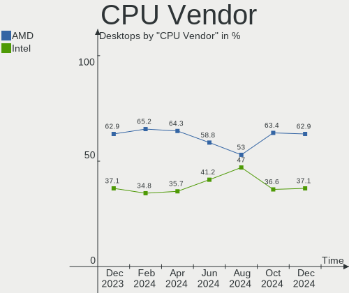
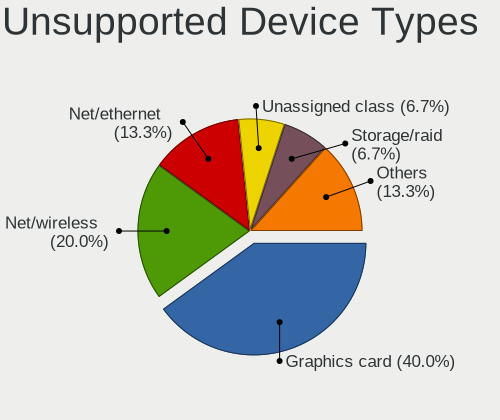

Arch - Hardware Trends (Desktops)
---------------------------------

A project to identify most popular hardware characteristics and track their change
over time based on data collected by Linux users at https://Linux-Hardware.org.

Anyone can contribute to this report by the [hw-probe](https://github.com/linuxhw/hw-probe) tool:

    sudo -E hw-probe -all -upload

This report is for one last month. Overall report since the beginning of time: [TestCoverage](https://github.com/linuxhw/TestCoverage)

Period: Nov, 2022.

Contents
--------

* [ System ](#system)
  - [ OS                       ](#os)
  - [ OS Family                ](#os-family)
  - [ Kernel                   ](#kernel)
  - [ Kernel Family            ](#kernel-family)
  - [ Kernel Major Ver.        ](#kernel-major-ver)
  - [ Arch                     ](#arch)
  - [ DE                       ](#de)
  - [ Display Server           ](#display-server)
  - [ Display Manager          ](#display-manager)
  - [ OS Lang                  ](#os-lang)
  - [ Boot Mode                ](#boot-mode)
  - [ Filesystem               ](#filesystem)
  - [ Part. scheme             ](#part-scheme)
  - [ Dual Boot with Linux/BSD ](#dual-boot-with-linuxbsd)
  - [ Dual Boot (Win)          ](#dual-boot-win)

* [ Board ](#board)
  - [ Vendor                   ](#vendor)
  - [ Model                    ](#model)
  - [ Model Family             ](#model-family)
  - [ MFG Year                 ](#mfg-year)
  - [ Form Factor              ](#form-factor)
  - [ Secure Boot              ](#secure-boot)
  - [ Coreboot                 ](#coreboot)
  - [ RAM Size                 ](#ram-size)
  - [ RAM Used                 ](#ram-used)
  - [ Total Drives             ](#total-drives)
  - [ Has CD-ROM               ](#has-cd-rom)
  - [ Has Ethernet             ](#has-ethernet)
  - [ Has WiFi                 ](#has-wifi)
  - [ Has Bluetooth            ](#has-bluetooth)

* [ Location ](#location)
  - [ Country                  ](#country)
  - [ City                     ](#city)

* [ Drives ](#drives)
  - [ Drive Vendor             ](#drive-vendor)
  - [ Drive Model              ](#drive-model)
  - [ HDD Vendor               ](#hdd-vendor)
  - [ SSD Vendor               ](#ssd-vendor)
  - [ Drive Kind               ](#drive-kind)
  - [ Drive Connector          ](#drive-connector)
  - [ Drive Size               ](#drive-size)
  - [ Space Total              ](#space-total)
  - [ Space Used               ](#space-used)
  - [ Malfunc. Drives          ](#malfunc-drives)
  - [ Malfunc. Drive Vendor    ](#malfunc-drive-vendor)
  - [ Malfunc. HDD Vendor      ](#malfunc-hdd-vendor)
  - [ Malfunc. Drive Kind      ](#malfunc-drive-kind)
  - [ Failed Drives            ](#failed-drives)
  - [ Failed Drive Vendor      ](#failed-drive-vendor)
  - [ Drive Status             ](#drive-status)

* [ Storage controller ](#storage-controller)
  - [ Storage Vendor           ](#storage-vendor)
  - [ Storage Model            ](#storage-model)
  - [ Storage Kind             ](#storage-kind)

* [ Processor ](#processor)
  - [ CPU Vendor               ](#cpu-vendor)
  - [ CPU Model                ](#cpu-model)
  - [ CPU Model Family         ](#cpu-model-family)
  - [ CPU Cores                ](#cpu-cores)
  - [ CPU Sockets              ](#cpu-sockets)
  - [ CPU Threads              ](#cpu-threads)
  - [ CPU Op-Modes             ](#cpu-op-modes)
  - [ CPU Microcode            ](#cpu-microcode)
  - [ CPU Microarch            ](#cpu-microarch)

* [ Graphics ](#graphics)
  - [ GPU Vendor               ](#gpu-vendor)
  - [ GPU Model                ](#gpu-model)
  - [ GPU Combo                ](#gpu-combo)
  - [ GPU Driver               ](#gpu-driver)
  - [ GPU Memory               ](#gpu-memory)

* [ Monitor ](#monitor)
  - [ Monitor Vendor           ](#monitor-vendor)
  - [ Monitor Model            ](#monitor-model)
  - [ Monitor Resolution       ](#monitor-resolution)
  - [ Monitor Diagonal         ](#monitor-diagonal)
  - [ Monitor Width            ](#monitor-width)
  - [ Aspect Ratio             ](#aspect-ratio)
  - [ Monitor Area             ](#monitor-area)
  - [ Pixel Density            ](#pixel-density)
  - [ Multiple Monitors        ](#multiple-monitors)

* [ Network ](#network)
  - [ Net Controller Vendor    ](#net-controller-vendor)
  - [ Net Controller Model     ](#net-controller-model)
  - [ Wireless Vendor          ](#wireless-vendor)
  - [ Wireless Model           ](#wireless-model)
  - [ Ethernet Vendor          ](#ethernet-vendor)
  - [ Ethernet Model           ](#ethernet-model)
  - [ Net Controller Kind      ](#net-controller-kind)
  - [ Used Controller          ](#used-controller)
  - [ NICs                     ](#nics)
  - [ IPv6                     ](#ipv6)

* [ Bluetooth ](#bluetooth)
  - [ Bluetooth Vendor         ](#bluetooth-vendor)
  - [ Bluetooth Model          ](#bluetooth-model)

* [ Sound ](#sound)
  - [ Sound Vendor             ](#sound-vendor)
  - [ Sound Model              ](#sound-model)

* [ Memory ](#memory)
  - [ Memory Vendor            ](#memory-vendor)
  - [ Memory Model             ](#memory-model)
  - [ Memory Kind              ](#memory-kind)
  - [ Memory Form Factor       ](#memory-form-factor)
  - [ Memory Size              ](#memory-size)
  - [ Memory Speed             ](#memory-speed)

* [ Printers & scanners ](#printers--scanners)
  - [ Printer Vendor           ](#printer-vendor)
  - [ Printer Model            ](#printer-model)
  - [ Scanner Vendor           ](#scanner-vendor)
  - [ Scanner Model            ](#scanner-model)

* [ Camera ](#camera)
  - [ Camera Vendor            ](#camera-vendor)
  - [ Camera Model             ](#camera-model)

* [ Security ](#security)
  - [ Fingerprint Vendor       ](#fingerprint-vendor)
  - [ Fingerprint Model        ](#fingerprint-model)
  - [ Chipcard Vendor          ](#chipcard-vendor)
  - [ Chipcard Model           ](#chipcard-model)

* [ Unsupported ](#unsupported)
  - [ Unsupported Devices      ](#unsupported-devices)
  - [ Unsupported Device Types ](#unsupported-device-types)

System
------

OS
--

Installed operating systems

| Name         | Desktops | Percent |
|--------------|----------|---------|
| Arch Rolling | 72       | 100%    |

OS Family
---------

OS without a version

| Name | Desktops | Percent |
|------|----------|---------|
| Arch | 72       | 100%    |

Kernel
------

Version of the Linux kernel

| Version                    | Desktops | Percent |
|----------------------------|----------|---------|
| 6.0.8-arch1-1              | 13       | 18.06%  |
| 6.0.7-arch1-1              | 11       | 15.28%  |
| 6.0.9-arch1-1              | 7        | 9.72%   |
| 6.0.6-arch1-1              | 6        | 8.33%   |
| 6.0.2-arch1-1              | 5        | 6.94%   |
| 6.0.10-arch2-1             | 5        | 6.94%   |
| 6.0.8-zen1-1-zen           | 4        | 5.56%   |
| 6.0.7-zen1-1-zen           | 3        | 4.17%   |
| 5.15.77-1-lts              | 3        | 4.17%   |
| 6.0.9-zen1-1-zen           | 1        | 1.39%   |
| 6.0.9-native_amd-xanmod1-1 | 1        | 1.39%   |
| 6.0.9-1-ck                 | 1        | 1.39%   |
| 6.0.7-zen3-xanmod1-1-zen3  | 1        | 1.39%   |
| 6.0.6-zen1-1-zen           | 1        | 1.39%   |
| 6.0.6                      | 1        | 1.39%   |
| 6.0.5-arch1-1-15khz        | 1        | 1.39%   |
| 6.0.2-x64v2-xanmod1-1      | 1        | 1.39%   |
| 6.0.10-zen2-1-zen          | 1        | 1.39%   |
| 5.19.8-arch1-1             | 1        | 1.39%   |
| 5.15.80-1-lts              | 1        | 1.39%   |
| 5.15.79-1-lts              | 1        | 1.39%   |
| 5.15.78-1-lts              | 1        | 1.39%   |
| 5.15.77-271-tkg-pds-llvm   | 1        | 1.39%   |
| 5.15.76-1-lts              | 1        | 1.39%   |

Kernel Family
-------------

Linux kernel without a distro release

| Version | Desktops | Percent |
|---------|----------|---------|
| 6.0.8   | 17       | 23.61%  |
| 6.0.7   | 15       | 20.83%  |
| 6.0.9   | 10       | 13.89%  |
| 6.0.6   | 8        | 11.11%  |
| 6.0.2   | 6        | 8.33%   |
| 6.0.10  | 6        | 8.33%   |
| 5.15.77 | 4        | 5.56%   |
| 6.0.5   | 1        | 1.39%   |
| 5.19.8  | 1        | 1.39%   |
| 5.15.80 | 1        | 1.39%   |
| 5.15.79 | 1        | 1.39%   |
| 5.15.78 | 1        | 1.39%   |
| 5.15.76 | 1        | 1.39%   |

Kernel Major Ver.
-----------------

Linux kernel major version

| Version | Desktops | Percent |
|---------|----------|---------|
| 6.0     | 63       | 87.5%   |
| 5.15    | 8        | 11.11%  |
| 5.19    | 1        | 1.39%   |

Arch
----

OS architecture (x86_64, i586, etc.)

| Name   | Desktops | Percent |
|--------|----------|---------|
| x86_64 | 72       | 100%    |

DE
--

Desktop Environment

| Name       | Desktops | Percent |
|------------|----------|---------|
| GNOME      | 21       | 29.17%  |
| KDE5       | 19       | 26.39%  |
| XFCE       | 6        | 8.33%   |
| i3         | 6        | 8.33%   |
| sway       | 4        | 5.56%   |
| Unknown    | 4        | 5.56%   |
| LXDE       | 3        | 4.17%   |
| Cinnamon   | 3        | 4.17%   |
| X-Cinnamon | 1        | 1.39%   |
| Openbox    | 1        | 1.39%   |
| MATE       | 1        | 1.39%   |
| KDE        | 1        | 1.39%   |
| Hyprland   | 1        | 1.39%   |
| DWM        | 1        | 1.39%   |

Display Server
--------------

X11 or Wayland

| Name    | Desktops | Percent |
|---------|----------|---------|
| X11     | 38       | 52.78%  |
| Wayland | 14       | 19.44%  |
| Tty     | 13       | 18.06%  |
| Unknown | 7        | 9.72%   |

Display Manager
---------------

SDDM, LightDM, etc.

| Name    | Desktops | Percent |
|---------|----------|---------|
| Unknown | 33       | 45.83%  |
| SDDM    | 16       | 22.22%  |
| LightDM | 11       | 15.28%  |
| GDM     | 6        | 8.33%   |
| GREETD  | 3        | 4.17%   |
| LXDM    | 2        | 2.78%   |
| Ly      | 1        | 1.39%   |

OS Lang
-------

Language

| Lang      | Desktops | Percent |
|-----------|----------|---------|
| en_US     | 30       | 41.67%  |
| it_IT     | 6        | 8.33%   |
| ru_RU     | 4        | 5.56%   |
| pt_BR     | 3        | 4.17%   |
| ja_JP     | 3        | 4.17%   |
| es_ES     | 3        | 4.17%   |
| C         | 3        | 4.17%   |
| pl_PL     | 2        | 2.78%   |
| en_GB     | 2        | 2.78%   |
| de_DE     | 2        | 2.78%   |
| Unknown   | 2        | 2.78%   |
| zh_CN     | 1        | 1.39%   |
| pt_BRutf8 | 1        | 1.39%   |
| it_ITutf8 | 1        | 1.39%   |
| he_IL     | 1        | 1.39%   |
| fr_FR     | 1        | 1.39%   |
| es_MX     | 1        | 1.39%   |
| en_IE     | 1        | 1.39%   |
| en_DK     | 1        | 1.39%   |
| en_AU     | 1        | 1.39%   |
| en_AT     | 1        | 1.39%   |
| en_AG     | 1        | 1.39%   |
| de_AT     | 1        | 1.39%   |

Boot Mode
---------

EFI or BIOS

| Mode | Desktops | Percent |
|------|----------|---------|
| EFI  | 41       | 56.94%  |
| BIOS | 31       | 43.06%  |

Filesystem
----------

Type of filesystem

| Type  | Desktops | Percent |
|-------|----------|---------|
| Ext4  | 42       | 58.33%  |
| Btrfs | 23       | 31.94%  |
| Zfs   | 3        | 4.17%   |
| Xfs   | 3        | 4.17%   |
| F2fs  | 1        | 1.39%   |

Part. scheme
------------

Scheme of partitioning

| Type    | Desktops | Percent |
|---------|----------|---------|
| GPT     | 46       | 63.89%  |
| Unknown | 21       | 29.17%  |
| MBR     | 5        | 6.94%   |

Dual Boot with Linux/BSD
------------------------

Hosting more than one Linux/BSD

| Dual boot | Desktops | Percent |
|-----------|----------|---------|
| No        | 54       | 75%     |
| Yes       | 18       | 25%     |

Dual Boot (Win)
---------------

Hosting Linux and Windows

| Dual boot | Desktops | Percent |
|-----------|----------|---------|
| No        | 45       | 62.5%   |
| Yes       | 27       | 37.5%   |

Board
-----

Vendor
------

Motherboard manufacturer

| Name                | Desktops | Percent |
|---------------------|----------|---------|
| ASUSTek Computer    | 25       | 34.72%  |
| Gigabyte Technology | 13       | 18.06%  |
| MSI                 | 11       | 15.28%  |
| ASRock              | 7        | 9.72%   |
| Hewlett-Packard     | 5        | 6.94%   |
| Dell                | 3        | 4.17%   |
| PCWare              | 1        | 1.39%   |
| OKI Brasil          | 1        | 1.39%   |
| Lenovo              | 1        | 1.39%   |
| IBM                 | 1        | 1.39%   |
| Gateway             | 1        | 1.39%   |
| Foxconn             | 1        | 1.39%   |
| EVGA                | 1        | 1.39%   |
| Unknown             | 1        | 1.39%   |

Model
-----

Motherboard model

| Name                                  | Desktops | Percent |
|---------------------------------------|----------|---------|
| MSI MS-7B86                           | 2        | 2.78%   |
| PCWare IPMH110G                       | 1        | 1.39%   |
| OKI Brasil Infoway ST-4280            | 1        | 1.39%   |
| MSI MS-7D25                           | 1        | 1.39%   |
| MSI MS-7D09                           | 1        | 1.39%   |
| MSI MS-7C94                           | 1        | 1.39%   |
| MSI MS-7C56                           | 1        | 1.39%   |
| MSI MS-7C37                           | 1        | 1.39%   |
| MSI MS-7B79                           | 1        | 1.39%   |
| MSI MS-7A15                           | 1        | 1.39%   |
| MSI MS-7641                           | 1        | 1.39%   |
| MSI ESPRIMO P1510                     | 1        | 1.39%   |
| Lenovo IdeaCentre 5 14IOB6 90RJ0080US | 1        | 1.39%   |
| IBM eServer x226-[8488ECY]-           | 1        | 1.39%   |
| HP Z2 G8 Tower Workstation Desktop PC | 1        | 1.39%   |
| HP ProDesk 600 G4 SFF                 | 1        | 1.39%   |
| HP Pavilion Gaming Desktop TG01-2xxx  | 1        | 1.39%   |
| HP EliteDesk 800 G2 DM 35W            | 1        | 1.39%   |
| HP EliteDesk 705 G4 DM 65W            | 1        | 1.39%   |
| Gigabyte Z690 AORUS MASTER            | 1        | 1.39%   |
| Gigabyte X570 I AORUS PRO WIFI        | 1        | 1.39%   |
| Gigabyte X570 AORUS ELITE             | 1        | 1.39%   |
| Gigabyte H61M-S2PV                    | 1        | 1.39%   |
| Gigabyte H110M-H                      | 1        | 1.39%   |
| Gigabyte B660M DS3H DDR4              | 1        | 1.39%   |
| Gigabyte B560M D3H                    | 1        | 1.39%   |
| Gigabyte B550M DS3H                   | 1        | 1.39%   |
| Gigabyte B550 AORUS ELITE AX V2       | 1        | 1.39%   |
| Gigabyte B550 AORUS ELITE             | 1        | 1.39%   |
| Gigabyte B450M DS3H V2                | 1        | 1.39%   |
| Gigabyte B450M DS3H                   | 1        | 1.39%   |
| Gigabyte B360M-D3H                    | 1        | 1.39%   |
| Gateway SX2803                        | 1        | 1.39%   |
| Foxconn Pro 3400 Series MT            | 1        | 1.39%   |
| EVGA Z690 CLASSIFIED                  | 1        | 1.39%   |
| Dell OptiPlex 5050                    | 1        | 1.39%   |
| Dell OptiPlex 3060                    | 1        | 1.39%   |
| Dell Inspiron 620                     | 1        | 1.39%   |
| ASUS TUF Gaming X570-PLUS             | 1        | 1.39%   |
| ASUS TUF Gaming B550-PLUS             | 1        | 1.39%   |

Model Family
------------

Motherboard model prefix

| Name               | Desktops | Percent |
|--------------------|----------|---------|
| ASUS PRIME         | 7        | 9.72%   |
| ASUS TUF           | 4        | 5.56%   |
| ASUS ROG           | 4        | 5.56%   |
| MSI MS-7B86        | 2        | 2.78%   |
| HP EliteDesk       | 2        | 2.78%   |
| Gigabyte X570      | 2        | 2.78%   |
| Gigabyte B550      | 2        | 2.78%   |
| Gigabyte B450M     | 2        | 2.78%   |
| Dell OptiPlex      | 2        | 2.78%   |
| ASUS P8P67         | 2        | 2.78%   |
| PCWare IPMH110G    | 1        | 1.39%   |
| OKI Brasil Infoway | 1        | 1.39%   |
| MSI MS-7D25        | 1        | 1.39%   |
| MSI MS-7D09        | 1        | 1.39%   |
| MSI MS-7C94        | 1        | 1.39%   |
| MSI MS-7C56        | 1        | 1.39%   |
| MSI MS-7C37        | 1        | 1.39%   |
| MSI MS-7B79        | 1        | 1.39%   |
| MSI MS-7A15        | 1        | 1.39%   |
| MSI MS-7641        | 1        | 1.39%   |
| MSI ESPRIMO        | 1        | 1.39%   |
| Lenovo IdeaCentre  | 1        | 1.39%   |
| IBM eServer        | 1        | 1.39%   |
| HP Z2              | 1        | 1.39%   |
| HP ProDesk         | 1        | 1.39%   |
| HP Pavilion        | 1        | 1.39%   |
| Gigabyte Z690      | 1        | 1.39%   |
| Gigabyte H61M-S2PV | 1        | 1.39%   |
| Gigabyte H110M-H   | 1        | 1.39%   |
| Gigabyte B660M     | 1        | 1.39%   |
| Gigabyte B560M     | 1        | 1.39%   |
| Gigabyte B550M     | 1        | 1.39%   |
| Gigabyte B360M-D3H | 1        | 1.39%   |
| Gateway SX2803     | 1        | 1.39%   |
| Foxconn Pro        | 1        | 1.39%   |
| EVGA Z690          | 1        | 1.39%   |
| Dell Inspiron      | 1        | 1.39%   |
| ASUS Rampage       | 1        | 1.39%   |
| ASUS P7H55-M       | 1        | 1.39%   |
| ASUS P5Q           | 1        | 1.39%   |

MFG Year
--------

Motherboard manufacture year

| Year | Desktops | Percent |
|------|----------|---------|
| 2020 | 12       | 16.67%  |
| 2019 | 10       | 13.89%  |
| 2018 | 9        | 12.5%   |
| 2021 | 8        | 11.11%  |
| 2022 | 7        | 9.72%   |
| 2016 | 6        | 8.33%   |
| 2014 | 4        | 5.56%   |
| 2010 | 4        | 5.56%   |
| 2017 | 3        | 4.17%   |
| 2012 | 3        | 4.17%   |
| 2008 | 2        | 2.78%   |
| 2015 | 1        | 1.39%   |
| 2013 | 1        | 1.39%   |
| 2011 | 1        | 1.39%   |
| 2006 | 1        | 1.39%   |

Form Factor
-----------

Physical design of the computer

| Name    | Desktops | Percent |
|---------|----------|---------|
| Desktop | 72       | 100%    |

Secure Boot
-----------

Enabled or disabled

| State    | Desktops | Percent |
|----------|----------|---------|
| Disabled | 72       | 100%    |

Coreboot
--------

Have coreboot on board

| Used | Desktops | Percent |
|------|----------|---------|
| No   | 72       | 100%    |

RAM Size
--------

Total RAM memory

| Size in GB  | Desktops | Percent |
|-------------|----------|---------|
| 32.01-64.0  | 24       | 33.33%  |
| 16.01-24.0  | 16       | 22.22%  |
| 8.01-16.0   | 11       | 15.28%  |
| 64.01-256.0 | 9        | 12.5%   |
| 4.01-8.0    | 8        | 11.11%  |
| 3.01-4.0    | 2        | 2.78%   |
| 24.01-32.0  | 2        | 2.78%   |

RAM Used
--------

Used RAM memory

| Used GB    | Desktops | Percent |
|------------|----------|---------|
| 4.01-8.0   | 18       | 25%     |
| 2.01-3.0   | 15       | 20.83%  |
| 1.01-2.0   | 14       | 19.44%  |
| 3.01-4.0   | 12       | 16.67%  |
| 8.01-16.0  | 9        | 12.5%   |
| 0.01-0.5   | 2        | 2.78%   |
| 32.01-64.0 | 1        | 1.39%   |
| 16.01-24.0 | 1        | 1.39%   |

Total Drives
------------

Number of drives on board

| Drives | Desktops | Percent |
|--------|----------|---------|
| 2      | 27       | 37.5%   |
| 3      | 14       | 19.44%  |
| 1      | 14       | 19.44%  |
| 4      | 11       | 15.28%  |
| 6      | 2        | 2.78%   |
| 5      | 2        | 2.78%   |
| 9      | 1        | 1.39%   |
| 8      | 1        | 1.39%   |

Has CD-ROM
----------

Has CD-ROM on board

| Presented | Desktops | Percent |
|-----------|----------|---------|
| No        | 54       | 75%     |
| Yes       | 18       | 25%     |

Has Ethernet
------------

Has Ethernet on board

| Presented | Desktops | Percent |
|-----------|----------|---------|
| Yes       | 70       | 97.22%  |
| No        | 2        | 2.78%   |

Has WiFi
--------

Has WiFi module

| Presented | Desktops | Percent |
|-----------|----------|---------|
| Yes       | 38       | 52.78%  |
| No        | 34       | 47.22%  |

Has Bluetooth
-------------

Has Bluetooth module

| Presented | Desktops | Percent |
|-----------|----------|---------|
| Yes       | 38       | 52.78%  |
| No        | 34       | 47.22%  |

Location
--------

Country
-------

Geographic location (country)

| Country     | Desktops | Percent |
|-------------|----------|---------|
| USA         | 17       | 23.61%  |
| Italy       | 9        | 12.5%   |
| Russia      | 6        | 8.33%   |
| Brazil      | 5        | 6.94%   |
| Poland      | 4        | 5.56%   |
| Germany     | 4        | 5.56%   |
| Spain       | 3        | 4.17%   |
| Japan       | 3        | 4.17%   |
| Finland     | 2        | 2.78%   |
| Denmark     | 2        | 2.78%   |
| Canada      | 2        | 2.78%   |
| Austria     | 2        | 2.78%   |
| Australia   | 2        | 2.78%   |
| Argentina   | 2        | 2.78%   |
| UK          | 1        | 1.39%   |
| Turkey      | 1        | 1.39%   |
| New Zealand | 1        | 1.39%   |
| Kosovo      | 1        | 1.39%   |
| Israel      | 1        | 1.39%   |
| France      | 1        | 1.39%   |
| Czechia     | 1        | 1.39%   |
| Cyprus      | 1        | 1.39%   |
| China       | 1        | 1.39%   |

City
----

Geographic location (city)

| City            | Desktops | Percent |
|-----------------|----------|---------|
| St Petersburg   | 2        | 2.78%   |
| Seattle         | 2        | 2.78%   |
| Lodz            | 2        | 2.78%   |
| Chicago         | 2        | 2.78%   |
| Wirral          | 1        | 1.39%   |
| Waterloo        | 1        | 1.39%   |
| Warwick         | 1        | 1.39%   |
| Vienna          | 1        | 1.39%   |
| Valencia        | 1        | 1.39%   |
| Tulsa           | 1        | 1.39%   |
| Toledo          | 1        | 1.39%   |
| The Bronx       | 1        | 1.39%   |
| Tel Aviv        | 1        | 1.39%   |
| Sydney          | 1        | 1.39%   |
| Schorndorf      | 1        | 1.39%   |
| Santos          | 1        | 1.39%   |
| Santo André    | 1        | 1.39%   |
| San Marcos      | 1        | 1.39%   |
| Saitama         | 1        | 1.39%   |
| Saint-Lambert   | 1        | 1.39%   |
| Sabadell        | 1        | 1.39%   |
| Rome            | 1        | 1.39%   |
| Rogers          | 1        | 1.39%   |
| Rocklin         | 1        | 1.39%   |
| Richmond        | 1        | 1.39%   |
| Reggio Calabria | 1        | 1.39%   |
| Radom           | 1        | 1.39%   |
| Pristina        | 1        | 1.39%   |
| Plancoet        | 1        | 1.39%   |
| Pittsburgh      | 1        | 1.39%   |
| Pil'na          | 1        | 1.39%   |
| Parma           | 1        | 1.39%   |
| Pardubice       | 1        | 1.39%   |
| Orlando         | 1        | 1.39%   |
| Moscow          | 1        | 1.39%   |
| Moers           | 1        | 1.39%   |
| Melbourne       | 1        | 1.39%   |
| Meguro-ku       | 1        | 1.39%   |
| Madrid          | 1        | 1.39%   |
| Liuzhou         | 1        | 1.39%   |

Drives
------

Drive Vendor
------------

Hard drive vendors

| Vendor                      | Desktops | Drives | Percent |
|-----------------------------|----------|--------|---------|
| Samsung Electronics         | 28       | 40     | 18.18%  |
| WDC                         | 26       | 34     | 16.88%  |
| Seagate                     | 24       | 31     | 15.58%  |
| SanDisk                     | 17       | 18     | 11.04%  |
| Toshiba                     | 9        | 12     | 5.84%   |
| Crucial                     | 5        | 6      | 3.25%   |
| Phison Electronics          | 4        | 5      | 2.6%    |
| Micron/Crucial Technology   | 4        | 4      | 2.6%    |
| Hitachi                     | 4        | 6      | 2.6%    |
| SK hynix                    | 3        | 5      | 1.95%   |
| Kingston                    | 3        | 3      | 1.95%   |
| SPCC                        | 2        | 2      | 1.3%    |
| A-DATA Technology           | 2        | 2      | 1.3%    |
| Unknown                     | 2        | 2      | 1.3%    |
| Unknown                     | 1        | 1      | 0.65%   |
| Transcend                   | 1        | 1      | 0.65%   |
| StoreJet                    | 1        | 1      | 0.65%   |
| Seagate Technology          | 1        | 1      | 0.65%   |
| Realtek Semiconductor       | 1        | 1      | 0.65%   |
| PNY                         | 1        | 1      | 0.65%   |
| Phison                      | 1        | 1      | 0.65%   |
| OCZ                         | 1        | 2      | 0.65%   |
| Micron Technology           | 1        | 1      | 0.65%   |
| MAXIO Technology (Hangzhou) | 1        | 1      | 0.65%   |
| LITEONIT                    | 1        | 1      | 0.65%   |
| LITEON                      | 1        | 1      | 0.65%   |
| Lite-On Technology          | 1        | 1      | 0.65%   |
| LaCie                       | 1        | 1      | 0.65%   |
| KIOXIA-EXCERIA              | 1        | 1      | 0.65%   |
| Kingston Technology Company | 1        | 1      | 0.65%   |
| GLOWAY                      | 1        | 1      | 0.65%   |
| Fujitsu                     | 1        | 1      | 0.65%   |
| Corsair                     | 1        | 1      | 0.65%   |
| China                       | 1        | 1      | 0.65%   |
| ADATA Technology            | 1        | 1      | 0.65%   |

Drive Model
-----------

Hard drive models

| Model                                                | Desktops | Percent |
|------------------------------------------------------|----------|---------|
| Samsung NVMe SSD Controller SM981/PM981/PM983 1TB    | 11       | 6.29%   |
| Samsung NVMe SSD Controller PM9A1/PM9A3/980PRO 250GB | 5        | 2.86%   |
| Seagate ST2000DM008-2FR102 2TB                       | 4        | 2.29%   |
| Samsung SSD 860 EVO 1TB                              | 4        | 2.29%   |
| Seagate ST2000DM006-2DM164 2TB                       | 3        | 1.71%   |
| WDC WD10EZEX-08WN4A0 1TB                             | 2        | 1.14%   |
| Toshiba DT01ACA100 1TB                               | 2        | 1.14%   |
| Sandisk WD Blue SN570 1TB                            | 2        | 1.14%   |
| Sandisk WD Black SN750 / PC SN730 NVMe SSD 1024GB    | 2        | 1.14%   |
| SanDisk SSD PLUS 240GB                               | 2        | 1.14%   |
| SanDisk SSD PLUS 1000GB                              | 2        | 1.14%   |
| Samsung SSD 980 500GB                                | 2        | 1.14%   |
| Samsung SSD 980 1TB                                  | 2        | 1.14%   |
| Samsung SSD 850 EVO 500GB                            | 2        | 1.14%   |
| Phison E12 NVMe Controller 2TB                       | 2        | 1.14%   |
| Unknown                                              | 2        | 1.14%   |
| WDC WUH721818ALE6L4 18TB                             | 1        | 0.57%   |
| WDC WDS500G2B0A-00SM50 500GB SSD                     | 1        | 0.57%   |
| WDC WDS250G2B0B-00YS70 250GB SSD                     | 1        | 0.57%   |
| WDC WDS240G2G0A-00JH30 240GB SSD                     | 1        | 0.57%   |
| WDC WDS200T2B0A-00SM50 2TB SSD                       | 1        | 0.57%   |
| WDC WDS120G2G0A-00JH30 120GB SSD                     | 1        | 0.57%   |
| WDC WD80EAZZ-00BKLB0 8TB                             | 1        | 0.57%   |
| WDC WD60PURZ-85ZUFY1 6TB                             | 1        | 0.57%   |
| WDC WD40EZRZ-22GXCB0 4TB                             | 1        | 0.57%   |
| WDC WD40EFZX-68AWUN0 4TB                             | 1        | 0.57%   |
| WDC WD4000YR-01PLB0 400GB                            | 1        | 0.57%   |
| WDC WD3200BPVT-00JJ5T0 320GB                         | 1        | 0.57%   |
| WDC WD3200AAJS-07M0A0 320GB                          | 1        | 0.57%   |
| WDC WD30EZRZ-00Z5HB0 3TB                             | 1        | 0.57%   |
| WDC WD30EFRX-68EUZN0 3TB                             | 1        | 0.57%   |
| WDC WD20EZRZ-00Z5HB0 2TB                             | 1        | 0.57%   |
| WDC WD20EZBX-00AYRA0 2TB                             | 1        | 0.57%   |
| WDC WD20EFRX-68AX9N0 2TB                             | 1        | 0.57%   |
| WDC WD2005FBYZ-01YCBB2 2TB                           | 1        | 0.57%   |
| WDC WD2002FAEX-007BA0 2TB                            | 1        | 0.57%   |
| WDC WD10JPCX-24UE4T0 1TB                             | 1        | 0.57%   |
| WDC WD10EZEX-60WN4A1 1TB                             | 1        | 0.57%   |
| WDC WD10EZEX-60WN4A0 1TB                             | 1        | 0.57%   |
| WDC WD10EZEX-00WN4A0 1TB                             | 1        | 0.57%   |

HDD Vendor
----------

Hard disk drive vendors

| Vendor   | Desktops | Drives | Percent |
|----------|----------|--------|---------|
| WDC      | 24       | 29     | 40%     |
| Seagate  | 23       | 29     | 38.33%  |
| Toshiba  | 7        | 8      | 11.67%  |
| Hitachi  | 4        | 6      | 6.67%   |
| StoreJet | 1        | 1      | 1.67%   |
| LaCie    | 1        | 1      | 1.67%   |

SSD Vendor
----------

Solid state drive vendors

| Vendor              | Desktops | Drives | Percent |
|---------------------|----------|--------|---------|
| Samsung Electronics | 12       | 13     | 25%     |
| SanDisk             | 9        | 9      | 18.75%  |
| Crucial             | 5        | 6      | 10.42%  |
| WDC                 | 4        | 5      | 8.33%   |
| Kingston            | 3        | 3      | 6.25%   |
| SPCC                | 2        | 2      | 4.17%   |
| Transcend           | 1        | 1      | 2.08%   |
| Toshiba             | 1        | 3      | 2.08%   |
| PNY                 | 1        | 1      | 2.08%   |
| OCZ                 | 1        | 2      | 2.08%   |
| LITEONIT            | 1        | 1      | 2.08%   |
| LITEON              | 1        | 1      | 2.08%   |
| KIOXIA-EXCERIA      | 1        | 1      | 2.08%   |
| GLOWAY              | 1        | 1      | 2.08%   |
| Fujitsu             | 1        | 1      | 2.08%   |
| Corsair             | 1        | 1      | 2.08%   |
| China               | 1        | 1      | 2.08%   |
| A-DATA Technology   | 1        | 1      | 2.08%   |
| Unknown             | 1        | 1      | 2.08%   |

Drive Kind
----------

HDD or SSD

| Kind    | Desktops | Drives | Percent |
|---------|----------|--------|---------|
| HDD     | 48       | 74     | 35.82%  |
| NVMe    | 41       | 60     | 30.6%   |
| SSD     | 41       | 54     | 30.6%   |
| Unknown | 3        | 3      | 2.24%   |
| MMC     | 1        | 1      | 0.75%   |

Drive Connector
---------------

SATA, SAS, NVMe, etc.

| Type | Desktops | Drives | Percent |
|------|----------|--------|---------|
| SATA | 60       | 123    | 56.07%  |
| NVMe | 41       | 60     | 38.32%  |
| SAS  | 5        | 8      | 4.67%   |
| MMC  | 1        | 1      | 0.93%   |

Drive Size
----------

Size of hard drive

| Size in TB | Desktops | Drives | Percent |
|------------|----------|--------|---------|
| 0.51-1.0   | 34       | 41     | 34.69%  |
| 0.01-0.5   | 34       | 48     | 34.69%  |
| 1.01-2.0   | 18       | 23     | 18.37%  |
| 2.01-3.0   | 4        | 5      | 4.08%   |
| 4.01-10.0  | 4        | 6      | 4.08%   |
| 3.01-4.0   | 3        | 3      | 3.06%   |
| 10.01-20.0 | 1        | 2      | 1.02%   |

Space Total
-----------

Amount of disk space available on the file system

| Size in GB     | Desktops | Percent |
|----------------|----------|---------|
| 2001-3000      | 19       | 26.39%  |
| More than 3000 | 12       | 16.67%  |
| 501-1000       | 11       | 15.28%  |
| 1001-2000      | 9        | 12.5%   |
| 251-500        | 8        | 11.11%  |
| 101-250        | 8        | 11.11%  |
| 1-20           | 2        | 2.78%   |
| Unknown        | 2        | 2.78%   |
| 51-100         | 1        | 1.39%   |

Space Used
----------

Amount of used disk space

| Used GB        | Desktops | Percent |
|----------------|----------|---------|
| 501-1000       | 17       | 23.61%  |
| 1-20           | 10       | 13.89%  |
| 251-500        | 8        | 11.11%  |
| 21-50          | 8        | 11.11%  |
| 101-250        | 8        | 11.11%  |
| More than 3000 | 5        | 6.94%   |
| 1001-2000      | 5        | 6.94%   |
| 51-100         | 5        | 6.94%   |
| 2001-3000      | 4        | 5.56%   |
| Unknown        | 2        | 2.78%   |

Malfunc. Drives
---------------

Drive models with a malfunction

| Model                                                         | Desktops | Drives | Percent |
|---------------------------------------------------------------|----------|--------|---------|
| Seagate ST2000DM008-2FR102 2TB                                | 2        | 2      | 13.33%  |
| WDC WD10EZEX-08WN4A0 1TB                                      | 1        | 1      | 6.67%   |
| WDC WD10EAVS-00D7B0 1TB                                       | 1        | 1      | 6.67%   |
| Transcend TS1TSSD230S 1024GB                                  | 1        | 1      | 6.67%   |
| Toshiba DT01ACA100 1TB                                        | 1        | 1      | 6.67%   |
| Seagate ST3320620AS 320GB                                     | 1        | 1      | 6.67%   |
| Seagate ST2000DM001-1CH164 2TB                                | 1        | 1      | 6.67%   |
| Seagate ST1000DM003-1ER162 1TB                                | 1        | 1      | 6.67%   |
| Samsung Electronics SSD 980 1TB                               | 1        | 1      | 6.67%   |
| Samsung Electronics NVMe SSD Controller SM981/PM981/PM983 1TB | 1        | 1      | 6.67%   |
| Realtek Semiconductor RTS5763DL NVMe SSD Controller 1024GB    | 1        | 1      | 6.67%   |
| Hitachi HDT721010SLA360 1TB                                   | 1        | 1      | 6.67%   |
| GLOWAY FER120GS3-S7 120GB SSD                                 | 1        | 1      | 6.67%   |
| A-DATA Technology SU650 480GB SSD                             | 1        | 1      | 6.67%   |

Malfunc. Drive Vendor
---------------------

Vendors of faulty drives

| Vendor                | Desktops | Drives | Percent |
|-----------------------|----------|--------|---------|
| Seagate               | 5        | 5      | 33.33%  |
| WDC                   | 2        | 2      | 13.33%  |
| Samsung Electronics   | 2        | 2      | 13.33%  |
| Transcend             | 1        | 1      | 6.67%   |
| Toshiba               | 1        | 1      | 6.67%   |
| Realtek Semiconductor | 1        | 1      | 6.67%   |
| Hitachi               | 1        | 1      | 6.67%   |
| GLOWAY                | 1        | 1      | 6.67%   |
| A-DATA Technology     | 1        | 1      | 6.67%   |

Malfunc. HDD Vendor
-------------------

Vendors of faulty HDD drives

| Vendor  | Desktops | Drives | Percent |
|---------|----------|--------|---------|
| Seagate | 5        | 5      | 55.56%  |
| WDC     | 2        | 2      | 22.22%  |
| Toshiba | 1        | 1      | 11.11%  |
| Hitachi | 1        | 1      | 11.11%  |

Malfunc. Drive Kind
-------------------

Kinds of faulty drives

| Kind | Desktops | Drives | Percent |
|------|----------|--------|---------|
| HDD  | 9        | 9      | 60%     |
| NVMe | 3        | 3      | 20%     |
| SSD  | 3        | 3      | 20%     |

Failed Drives
-------------

Failed drive models

Zero info for selected period =(

Failed Drive Vendor
-------------------

Failed drive vendors

Zero info for selected period =(

Drive Status
------------

Number of failed and malfunc. drives

| Status   | Desktops | Drives | Percent |
|----------|----------|--------|---------|
| Works    | 42       | 108    | 48.84%  |
| Detected | 30       | 69     | 34.88%  |
| Malfunc  | 14       | 15     | 16.28%  |

Storage controller
------------------

Storage Vendor
--------------

Storage controller vendors

| Vendor                       | Desktops | Percent |
|------------------------------|----------|---------|
| AMD                          | 36       | 27.07%  |
| Intel                        | 35       | 26.32%  |
| Samsung Electronics          | 22       | 16.54%  |
| SanDisk                      | 9        | 6.77%   |
| Phison Electronics           | 5        | 3.76%   |
| Micron/Crucial Technology    | 4        | 3.01%   |
| SK hynix                     | 3        | 2.26%   |
| Marvell Technology Group     | 3        | 2.26%   |
| ASMedia Technology           | 3        | 2.26%   |
| JMicron Technology           | 2        | 1.5%    |
| ADATA Technology             | 2        | 1.5%    |
| Toshiba America Info Systems | 1        | 0.75%   |
| Seagate Technology           | 1        | 0.75%   |
| Realtek Semiconductor        | 1        | 0.75%   |
| Micron Technology            | 1        | 0.75%   |
| MAXIO Technology (Hangzhou)  | 1        | 0.75%   |
| Lite-On Technology           | 1        | 0.75%   |
| Kingston Technology Company  | 1        | 0.75%   |
| Broadcom / LSI               | 1        | 0.75%   |
| Adaptec                      | 1        | 0.75%   |

Storage Model
-------------

Storage controller models

| Model                                                                         | Desktops | Percent |
|-------------------------------------------------------------------------------|----------|---------|
| AMD FCH SATA Controller [AHCI mode]                                           | 15       | 10.49%  |
| Samsung NVMe SSD Controller SM981/PM981/PM983                                 | 11       | 7.69%   |
| AMD 400 Series Chipset SATA Controller                                        | 10       | 6.99%   |
| AMD 500 Series Chipset SATA Controller                                        | 9        | 6.29%   |
| Samsung NVMe SSD Controller PM9A1/PM9A3/980PRO                                | 6        | 4.2%    |
| Intel Q170/Q150/B150/H170/H110/Z170/CM236 Chipset SATA Controller [AHCI Mode] | 6        | 4.2%    |
| Samsung NVMe SSD Controller 980                                               | 4        | 2.8%    |
| Intel Alder Lake-S PCH SATA Controller [AHCI Mode]                            | 4        | 2.8%    |
| Intel 6 Series/C200 Series Chipset Family 6 port Desktop SATA AHCI Controller | 4        | 2.8%    |
| Intel 500 Series Chipset Family SATA AHCI Controller                          | 4        | 2.8%    |
| AMD 300 Series Chipset SATA Controller                                        | 4        | 2.8%    |
| Intel Cannon Lake PCH SATA AHCI Controller                                    | 3        | 2.1%    |
| ASMedia ASM1062 Serial ATA Controller                                         | 3        | 2.1%    |
| SanDisk WD Blue SN570 NVMe SSD                                                | 2        | 1.4%    |
| SanDisk WD Black SN750 / PC SN730 NVMe SSD                                    | 2        | 1.4%    |
| SanDisk Non-Volatile memory controller                                        | 2        | 1.4%    |
| Phison E12 NVMe Controller                                                    | 2        | 1.4%    |
| Micron/Crucial P5 Plus NVMe PCIe SSD                                          | 2        | 1.4%    |
| JMicron JMB362 SATA Controller                                                | 2        | 1.4%    |
| Intel SATA Controller [RAID mode]                                             | 2        | 1.4%    |
| Intel 5 Series/3400 Series Chipset 6 port SATA AHCI Controller                | 2        | 1.4%    |
| Intel 200 Series PCH SATA controller [AHCI mode]                              | 2        | 1.4%    |
| AMD SATA controller                                                           | 2        | 1.4%    |
| Toshiba America Info Systems XG5 NVMe SSD Controller                          | 1        | 0.7%    |
| SK hynix Non-Volatile memory controller                                       | 1        | 0.7%    |
| SK hynix Gold P31/PC711 NVMe Solid State Drive                                | 1        | 0.7%    |
| SK hynix BC501 NVMe Solid State Drive                                         | 1        | 0.7%    |
| Seagate FireCuda 520 SSD                                                      | 1        | 0.7%    |
| SanDisk WD PC SN810 / Black SN850 NVMe SSD                                    | 1        | 0.7%    |
| SanDisk WD Blue SN550 NVMe SSD                                                | 1        | 0.7%    |
| SanDisk WD Blue SN500 / PC SN520 NVMe SSD                                     | 1        | 0.7%    |
| Samsung NVMe SSD Controller SM961/PM961/SM963                                 | 1        | 0.7%    |
| Realtek RTS5763DL NVMe SSD Controller                                         | 1        | 0.7%    |
| Phison PS5013 E13 NVMe Controller                                             | 1        | 0.7%    |
| Phison E18 PCIe4 NVMe Controller                                              | 1        | 0.7%    |
| Phison E16 PCIe4 NVMe Controller                                              | 1        | 0.7%    |
| Micron/Crucial P2 NVMe PCIe SSD                                               | 1        | 0.7%    |
| Micron/Crucial P1 NVMe PCIe SSD                                               | 1        | 0.7%    |
| Micron Non-Volatile memory controller                                         | 1        | 0.7%    |
| MAXIO (Hangzhou) NVMe SSD Controller MAP1202                                  | 1        | 0.7%    |

Storage Kind
------------

Kind of storage controller (IDE, SATA, NVMe, SAS, ...)

| Kind | Desktops | Percent |
|------|----------|---------|
| SATA | 66       | 56.9%   |
| NVMe | 41       | 35.34%  |
| RAID | 6        | 5.17%   |
| IDE  | 3        | 2.59%   |

Processor
---------

CPU Vendor
----------

Processor vendors

| Vendor | Desktops | Percent |
|--------|----------|---------|
| Intel  | 36       | 50%     |
| AMD    | 36       | 50%     |

CPU Model
---------

Processor models

| Model                                       | Desktops | Percent |
|---------------------------------------------|----------|---------|
| AMD Ryzen 5 5600X 6-Core Processor          | 4        | 5.56%   |
| Intel Core i5-7400 CPU @ 3.00GHz            | 3        | 4.17%   |
| AMD Ryzen 9 3900X 12-Core Processor         | 3        | 4.17%   |
| AMD Ryzen 7 5800X 8-Core Processor          | 3        | 4.17%   |
| AMD Ryzen 7 3700X 8-Core Processor          | 3        | 4.17%   |
| Intel Core i7-8700 CPU @ 3.20GHz            | 2        | 2.78%   |
| Intel Core i7-2600K CPU @ 3.40GHz           | 2        | 2.78%   |
| Intel Core i5-10400F CPU @ 2.90GHz          | 2        | 2.78%   |
| AMD Ryzen 9 7950X 16-Core Processor         | 2        | 2.78%   |
| AMD Ryzen 9 5950X 16-Core Processor         | 2        | 2.78%   |
| AMD Ryzen 9 5900X 12-Core Processor         | 2        | 2.78%   |
| AMD Ryzen 7 5700X 8-Core Processor          | 2        | 2.78%   |
| AMD Ryzen 7 3800X 8-Core Processor          | 2        | 2.78%   |
| AMD Ryzen 5 3600 6-Core Processor           | 2        | 2.78%   |
| Intel Xeon CPU E5-2667 v2 @ 3.30GHz         | 1        | 1.39%   |
| Intel Xeon CPU 3.00GHz                      | 1        | 1.39%   |
| Intel Pentium Dual-Core CPU E6700 @ 3.20GHz | 1        | 1.39%   |
| Intel Pentium CPU G4560 @ 3.50GHz           | 1        | 1.39%   |
| Intel Pentium CPU G3220 @ 3.00GHz           | 1        | 1.39%   |
| Intel Core i9-9900K CPU @ 3.60GHz           | 1        | 1.39%   |
| Intel Core i7-8700T CPU @ 2.40GHz           | 1        | 1.39%   |
| Intel Core i7-3770K CPU @ 3.50GHz           | 1        | 1.39%   |
| Intel Core i7 CPU 860 @ 2.80GHz             | 1        | 1.39%   |
| Intel Core i5-9400F CPU @ 2.90GHz           | 1        | 1.39%   |
| Intel Core i5-7500 CPU @ 3.40GHz            | 1        | 1.39%   |
| Intel Core i5-6600 CPU @ 3.30GHz            | 1        | 1.39%   |
| Intel Core i5-6500T CPU @ 2.50GHz           | 1        | 1.39%   |
| Intel Core i5-3470 CPU @ 3.20GHz            | 1        | 1.39%   |
| Intel Core i5-3330 CPU @ 3.00GHz            | 1        | 1.39%   |
| Intel Core i5 CPU 750 @ 2.67GHz             | 1        | 1.39%   |
| Intel Core i3-2125 CPU @ 3.30GHz            | 1        | 1.39%   |
| Intel Core i3-10100 CPU @ 3.60GHz           | 1        | 1.39%   |
| Intel Core 2 Quad CPU Q9550 @ 2.83GHz       | 1        | 1.39%   |
| Intel Core 2 Duo CPU E8500 @ 3.16GHz        | 1        | 1.39%   |
| Intel 13th Gen Core i7-13700K               | 1        | 1.39%   |
| Intel 12th Gen Core i9-12900K               | 1        | 1.39%   |
| Intel 12th Gen Core i5-12600K               | 1        | 1.39%   |
| Intel 12th Gen Core i3-12100                | 1        | 1.39%   |
| Intel 11th Gen Core i7-11700K @ 3.60GHz     | 1        | 1.39%   |
| Intel 11th Gen Core i7-11700 @ 2.50GHz      | 1        | 1.39%   |

CPU Model Family
----------------

Processor model prefix

| Model                   | Desktops | Percent |
|-------------------------|----------|---------|
| Intel Core i5           | 12       | 16.67%  |
| AMD Ryzen 7             | 11       | 15.28%  |
| AMD Ryzen 5             | 11       | 15.28%  |
| AMD Ryzen 9             | 9        | 12.5%   |
| Other                   | 7        | 9.72%   |
| Intel Core i7           | 7        | 9.72%   |
| Intel Xeon              | 2        | 2.78%   |
| Intel Pentium           | 2        | 2.78%   |
| Intel Core i3           | 2        | 2.78%   |
| Intel Pentium Dual-Core | 1        | 1.39%   |
| Intel Core i9           | 1        | 1.39%   |
| Intel Core 2 Quad       | 1        | 1.39%   |
| Intel Core 2 Duo        | 1        | 1.39%   |
| AMD Ryzen Threadripper  | 1        | 1.39%   |
| AMD Ryzen 3 PRO         | 1        | 1.39%   |
| AMD Athlon II X4        | 1        | 1.39%   |
| AMD A8                  | 1        | 1.39%   |
| AMD A10                 | 1        | 1.39%   |

CPU Cores
---------

Number of processor cores

| Number | Desktops | Percent |
|--------|----------|---------|
| 6      | 18       | 25%     |
| 4      | 18       | 25%     |
| 8      | 15       | 20.83%  |
| 2      | 8        | 11.11%  |
| 16     | 6        | 8.33%   |
| 12     | 5        | 6.94%   |
| 32     | 1        | 1.39%   |
| 10     | 1        | 1.39%   |

CPU Sockets
-----------

Number of sockets

| Number | Desktops | Percent |
|--------|----------|---------|
| 1      | 71       | 98.61%  |
| 2      | 1        | 1.39%   |

CPU Threads
-----------

Threads per core (Hyper-Threading)

| Number | Desktops | Percent |
|--------|----------|---------|
| 2      | 56       | 77.78%  |
| 1      | 16       | 22.22%  |

CPU Op-Modes
------------

CPU Operation Modes (32-bit, 64-bit)

| Op mode        | Desktops | Percent |
|----------------|----------|---------|
| 32-bit, 64-bit | 72       | 100%    |

CPU Microcode
-------------

Microcode number

| Number     | Desktops | Percent |
|------------|----------|---------|
| Unknown    | 31       | 43.06%  |
| 0x0a201016 | 6        | 8.33%   |
| 0x08701021 | 6        | 8.33%   |
| 0x906e9    | 3        | 4.17%   |
| 0x306a9    | 2        | 2.78%   |
| 0x106e5    | 2        | 2.78%   |
| 0x1067a    | 2        | 2.78%   |
| 0x0a20120a | 2        | 2.78%   |
| 0x0a201205 | 2        | 2.78%   |
| 0x0a201009 | 2        | 2.78%   |
| 0xb0671    | 1        | 1.39%   |
| 0xa0671    | 1        | 1.39%   |
| 0xa0653    | 1        | 1.39%   |
| 0x906ea    | 1        | 1.39%   |
| 0x90672    | 1        | 1.39%   |
| 0x306e4    | 1        | 1.39%   |
| 0x0a601203 | 1        | 1.39%   |
| 0x0a50000d | 1        | 1.39%   |
| 0x08701013 | 1        | 1.39%   |
| 0x08301055 | 1        | 1.39%   |
| 0x08101016 | 1        | 1.39%   |
| 0x0800820d | 1        | 1.39%   |
| 0x06001119 | 1        | 1.39%   |
| 0x010000c8 | 1        | 1.39%   |

CPU Microarch
-------------

Microarchitecture

| Name             | Desktops | Percent |
|------------------|----------|---------|
| Zen 3            | 15       | 20.83%  |
| Zen 2            | 12       | 16.67%  |
| KabyLake         | 10       | 13.89%  |
| Unknown          | 6        | 8.33%   |
| IvyBridge        | 4        | 5.56%   |
| SandyBridge      | 3        | 4.17%   |
| Penryn           | 3        | 4.17%   |
| CometLake        | 3        | 4.17%   |
| Zen+             | 2        | 2.78%   |
| Zen              | 2        | 2.78%   |
| Skylake          | 2        | 2.78%   |
| Nehalem          | 2        | 2.78%   |
| Alderlake Hybrid | 2        | 2.78%   |
| Steamroller      | 1        | 1.39%   |
| Piledriver       | 1        | 1.39%   |
| NetBurst         | 1        | 1.39%   |
| K10              | 1        | 1.39%   |
| Icelake          | 1        | 1.39%   |
| Haswell          | 1        | 1.39%   |

Graphics
--------

GPU Vendor
----------

Vendors of graphics cards

| Vendor | Desktops | Percent |
|--------|----------|---------|
| Nvidia | 37       | 44.58%  |
| AMD    | 29       | 34.94%  |
| Intel  | 17       | 20.48%  |

GPU Model
---------

Graphics card models

| Model                                                                     | Desktops | Percent |
|---------------------------------------------------------------------------|----------|---------|
| AMD Ellesmere [Radeon RX 470/480/570/570X/580/580X/590]                   | 7        | 8.43%   |
| Nvidia GM204 [GeForce GTX 970]                                            | 3        | 3.61%   |
| Intel HD Graphics 630                                                     | 3        | 3.61%   |
| AMD Navi 10 [Radeon RX 5600 OEM/5600 XT / 5700/5700 XT]                   | 3        | 3.61%   |
| Nvidia TU117 [GeForce GTX 1650]                                           | 2        | 2.41%   |
| Nvidia GK208B [GeForce GT 710]                                            | 2        | 2.41%   |
| Intel HD Graphics 530                                                     | 2        | 2.41%   |
| Intel CoffeeLake-S GT2 [UHD Graphics 630]                                 | 2        | 2.41%   |
| Intel 2nd Generation Core Processor Family Integrated Graphics Controller | 2        | 2.41%   |
| AMD Raphael                                                               | 2        | 2.41%   |
| AMD Navi 23 [Radeon RX 6600/6600 XT/6600M]                                | 2        | 2.41%   |
| AMD Navi 22 [Radeon RX 6700/6700 XT/6750 XT / 6800M]                      | 2        | 2.41%   |
| AMD Cezanne [Radeon Vega Series / Radeon Vega Mobile Series]              | 2        | 2.41%   |
| AMD Caicos [Radeon HD 6450/7450/8450 / R5 230 OEM]                        | 2        | 2.41%   |
| Nvidia TU117GL [T600]                                                     | 1        | 1.2%    |
| Nvidia TU116 [GeForce GTX 1660 SUPER]                                     | 1        | 1.2%    |
| Nvidia TU116 [GeForce GTX 1650]                                           | 1        | 1.2%    |
| Nvidia TU104 [GeForce RTX 2080 Rev. A]                                    | 1        | 1.2%    |
| Nvidia TU104 [GeForce RTX 2060]                                           | 1        | 1.2%    |
| Nvidia TU102 [GeForce RTX 2080 Ti]                                        | 1        | 1.2%    |
| Nvidia NV44 [GeForce 6200 TurboCache]                                     | 1        | 1.2%    |
| Nvidia GT218 [GeForce 210]                                                | 1        | 1.2%    |
| Nvidia GT216 [GeForce GT 220]                                             | 1        | 1.2%    |
| Nvidia GP107 [GeForce GTX 1050 Ti]                                        | 1        | 1.2%    |
| Nvidia GP106 [GeForce GTX 1060 6GB]                                       | 1        | 1.2%    |
| Nvidia GP106 [GeForce GTX 1060 3GB]                                       | 1        | 1.2%    |
| Nvidia GP104 [GeForce GTX 1070]                                           | 1        | 1.2%    |
| Nvidia GP102 [GeForce GTX 1080 Ti]                                        | 1        | 1.2%    |
| Nvidia GM206 [GeForce GTX 950]                                            | 1        | 1.2%    |
| Nvidia GM107 [GeForce GTX 750 Ti]                                         | 1        | 1.2%    |
| Nvidia GF106 [GeForce GTS 450]                                            | 1        | 1.2%    |
| Nvidia GF104 [GeForce GTX 460]                                            | 1        | 1.2%    |
| Nvidia GA106 [Geforce RTX 3050]                                           | 1        | 1.2%    |
| Nvidia GA104 [GeForce RTX 3070]                                           | 1        | 1.2%    |
| Nvidia GA104 [GeForce RTX 3070 Ti]                                        | 1        | 1.2%    |
| Nvidia GA104 [GeForce RTX 3070 Lite Hash Rate]                            | 1        | 1.2%    |
| Nvidia GA104 [GeForce RTX 3060 Ti Lite Hash Rate]                         | 1        | 1.2%    |
| Nvidia GA102 [GeForce RTX 3090]                                           | 1        | 1.2%    |
| Nvidia GA102 [GeForce RTX 3090 Ti]                                        | 1        | 1.2%    |
| Nvidia GA102 [GeForce RTX 3080]                                           | 1        | 1.2%    |

GPU Combo
---------

Combinations of graphics cards

| Name           | Desktops | Percent |
|----------------|----------|---------|
| 1 x Nvidia     | 27       | 37.5%   |
| 1 x AMD        | 23       | 31.94%  |
| 1 x Intel      | 11       | 15.28%  |
| AMD + Nvidia   | 5        | 6.94%   |
| Intel + Nvidia | 4        | 5.56%   |
| 2 x Nvidia     | 1        | 1.39%   |
| Intel + AMD    | 1        | 1.39%   |

GPU Driver
----------

Free vs proprietary

| Driver      | Desktops | Percent |
|-------------|----------|---------|
| Free        | 45       | 62.5%   |
| Proprietary | 27       | 37.5%   |

GPU Memory
----------

Total video memory

| Size in GB | Desktops | Percent |
|------------|----------|---------|
| Unknown    | 28       | 38.89%  |
| 7.01-8.0   | 12       | 16.67%  |
| 3.01-4.0   | 8        | 11.11%  |
| 8.01-16.0  | 8        | 11.11%  |
| 1.01-2.0   | 4        | 5.56%   |
| 0.01-0.5   | 4        | 5.56%   |
| 5.01-6.0   | 2        | 2.78%   |
| 2.01-3.0   | 2        | 2.78%   |
| 16.01-24.0 | 2        | 2.78%   |
| 0.51-1.0   | 2        | 2.78%   |

Monitor
-------

Monitor Vendor
--------------

Monitor vendors

| Vendor               | Desktops | Percent |
|----------------------|----------|---------|
| Goldstar             | 18       | 19.15%  |
| Samsung Electronics  | 17       | 18.09%  |
| Dell                 | 10       | 10.64%  |
| Acer                 | 6        | 6.38%   |
| ViewSonic            | 5        | 5.32%   |
| LG Electronics       | 5        | 5.32%   |
| Hewlett-Packard      | 5        | 5.32%   |
| BenQ                 | 5        | 5.32%   |
| AOC                  | 3        | 3.19%   |
| Sony                 | 2        | 2.13%   |
| NEC Computers        | 2        | 2.13%   |
| Lenovo               | 2        | 2.13%   |
| ASUSTek Computer     | 2        | 2.13%   |
| Ancor Communications | 2        | 2.13%   |
| VIE                  | 1        | 1.06%   |
| Sharp                | 1        | 1.06%   |
| Sceptre Tech         | 1        | 1.06%   |
| Panasonic            | 1        | 1.06%   |
| MSI                  | 1        | 1.06%   |
| Mi                   | 1        | 1.06%   |
| LOS                  | 1        | 1.06%   |
| ITE                  | 1        | 1.06%   |
| Gigabyte Technology  | 1        | 1.06%   |
| Fujitsu Siemens      | 1        | 1.06%   |

Monitor Model
-------------

Monitor models

| Model                                                                  | Desktops | Percent |
|------------------------------------------------------------------------|----------|---------|
| Samsung Electronics S24F350 SAM0D20 1920x1080 521x293mm 23.5-inch      | 2        | 1.92%   |
| Goldstar HDR WFHD GSM7714 2560x1080 798x334mm 34.1-inch                | 2        | 1.92%   |
| Goldstar HDR 4K GSM7707 3840x2160 600x340mm 27.2-inch                  | 2        | 1.92%   |
| ViewSonic VX3276-QHD VSCE635 2560x1440 698x393mm 31.5-inch             | 1        | 0.96%   |
| ViewSonic VX3211-2K VSCF634 2560x1440 700x390mm 31.5-inch              | 1        | 0.96%   |
| ViewSonic VX2768-2KP VSC0A3B 2560x1440 597x336mm 27.0-inch             | 1        | 0.96%   |
| ViewSonic VX2252 Series VSCDC2E 1920x1080 477x268mm 21.5-inch          | 1        | 0.96%   |
| ViewSonic VX2240w VSC6B20 1680x1050 495x291mm 22.6-inch                | 1        | 0.96%   |
| ViewSonic M108C HCD0108 1920x1080 380x210mm 17.1-inch                  | 1        | 0.96%   |
| ViewSonic LCD Monitor VSCBB31 1920x1080 530x300mm 24.0-inch            | 1        | 0.96%   |
| VIE A2256 VIE2150 1920x1080 368x207mm 16.6-inch                        | 1        | 0.96%   |
| Sony TV SNYEE01 1920x1080                                              | 1        | 0.96%   |
| Sony TV *00 SNY7E04 3840x2160 1218x685mm 55.0-inch                     | 1        | 0.96%   |
| Sharp LCD Monitor SHP14F9 1920x1200 288x180mm 13.4-inch                | 1        | 0.96%   |
| Sceptre Tech E20 SPT080D 1600x900 434x236mm 19.4-inch                  | 1        | 0.96%   |
| Samsung Electronics SyncMaster SAM05CD 1920x1080                       | 1        | 0.96%   |
| Samsung Electronics SEC144A SEC144A 2880x1600 2880x1600mm 129.7-inch   | 1        | 0.96%   |
| Samsung Electronics S34J55x SAM0F72 3440x1440 797x333mm 34.0-inch      | 1        | 0.96%   |
| Samsung Electronics S27R65 SAM1045 1920x1080 598x336mm 27.0-inch       | 1        | 0.96%   |
| Samsung Electronics S24E390 SAM0C1A 1920x1080 521x293mm 23.5-inch      | 1        | 0.96%   |
| Samsung Electronics S24D330 SAM0D92 1920x1080 531x299mm 24.0-inch      | 1        | 0.96%   |
| Samsung Electronics S19D300 SAM0B36 1366x768 410x230mm 18.5-inch       | 1        | 0.96%   |
| Samsung Electronics LCD Monitor SAM0F39 1920x1080 1210x680mm 54.6-inch | 1        | 0.96%   |
| Samsung Electronics LCD Monitor SAM0C3C 1366x768 609x347mm 27.6-inch   | 1        | 0.96%   |
| Samsung Electronics LCD Monitor SAM07C0 1920x1080 700x390mm 31.5-inch  | 1        | 0.96%   |
| Samsung Electronics LCD Monitor SAM0509 1920x1080                      | 1        | 0.96%   |
| Samsung Electronics LCD Monitor SAM04FD 1360x768                       | 1        | 0.96%   |
| Samsung Electronics LCD Monitor LF24T35                                | 1        | 0.96%   |
| Samsung Electronics LC32G7xT SAM7058 2560x1440 698x393mm 31.5-inch     | 1        | 0.96%   |
| Samsung Electronics C27FG70 SAM0DC9 1920x1080 598x337mm 27.0-inch      | 1        | 0.96%   |
| Samsung Electronics C27F390 SAM0D32 1920x1080 598x336mm 27.0-inch      | 1        | 0.96%   |
| Panasonic TV MEIA296 3840x2160 698x392mm 31.5-inch                     | 1        | 0.96%   |
| NEC Computers LCD1770NX NEC6665 1280x1024 338x270mm 17.0-inch          | 1        | 0.96%   |
| NEC Computers EA241WM NEC674F 1920x1200 518x324mm 24.1-inch            | 1        | 0.96%   |
| MSI MAG275R MSI3CB5 1920x1080 600x340mm 27.2-inch                      | 1        | 0.96%   |
| Mi Monitor XMI3444 3440x1440 800x330mm 34.1-inch                       | 1        | 0.96%   |
| LOS DP2-2714UD LOS0027 3840x2160 600x330mm 27.0-inch                   | 1        | 0.96%   |
| LG Electronics LCD Monitor LG HDR QHD 5120x1440                        | 1        | 0.96%   |
| LG Electronics LCD Monitor LG HDR QHD                                  | 1        | 0.96%   |
| LG Electronics LCD Monitor LG HDR 4K 3840x2160                         | 1        | 0.96%   |

Monitor Resolution
------------------

Monitor screen resolution

| Resolution         | Desktops | Percent |
|--------------------|----------|---------|
| 1920x1080 (FHD)    | 33       | 37.08%  |
| 3840x2160 (4K)     | 12       | 13.48%  |
| 2560x1440 (QHD)    | 11       | 12.36%  |
| 3440x1440          | 6        | 6.74%   |
| 1920x1200 (WUXGA)  | 4        | 4.49%   |
| 1280x1024 (SXGA)   | 4        | 4.49%   |
| Unknown            | 4        | 4.49%   |
| 2560x1080          | 3        | 3.37%   |
| 1366x768 (WXGA)    | 3        | 3.37%   |
| 1680x1050 (WSXGA+) | 2        | 2.25%   |
| 1440x900 (WXGA+)   | 2        | 2.25%   |
| 7680x4320          | 1        | 1.12%   |
| 5120x1440          | 1        | 1.12%   |
| 3840x1080          | 1        | 1.12%   |
| 2880x1600          | 1        | 1.12%   |
| 1600x900 (HD+)     | 1        | 1.12%   |

Monitor Diagonal
----------------

Diagonal size in inches

| Inches  | Desktops | Percent |
|---------|----------|---------|
| 27      | 21       | 23.6%   |
| 24      | 11       | 12.36%  |
| 34      | 8        | 8.99%   |
| Unknown | 8        | 8.99%   |
| 21      | 7        | 7.87%   |
| 23      | 6        | 6.74%   |
| 19      | 6        | 6.74%   |
| 31      | 5        | 5.62%   |
| 22      | 3        | 3.37%   |
| 72      | 2        | 2.25%   |
| 18      | 2        | 2.25%   |
| 17      | 2        | 2.25%   |
| 129     | 1        | 1.12%   |
| 84      | 1        | 1.12%   |
| 55      | 1        | 1.12%   |
| 54      | 1        | 1.12%   |
| 46      | 1        | 1.12%   |
| 29      | 1        | 1.12%   |
| 26      | 1        | 1.12%   |
| 13      | 1        | 1.12%   |

Monitor Width
-------------

Physical width

| Width in mm    | Desktops | Percent |
|----------------|----------|---------|
| 501-600        | 35       | 41.67%  |
| 401-500        | 14       | 16.67%  |
| Unknown        | 8        | 9.52%   |
| 701-800        | 7        | 8.33%   |
| 601-700        | 6        | 7.14%   |
| 351-400        | 5        | 5.95%   |
| 1001-1500      | 3        | 3.57%   |
| 1501-2000      | 2        | 2.38%   |
| More than 2000 | 1        | 1.19%   |
| 801-900        | 1        | 1.19%   |
| 301-350        | 1        | 1.19%   |
| 201-300        | 1        | 1.19%   |

Aspect Ratio
------------

Proportional relationship between the width and the height

| Ratio   | Desktops | Percent |
|---------|----------|---------|
| 16/9    | 50       | 64.1%   |
| 21/9    | 9        | 11.54%  |
| 16/10   | 8        | 10.26%  |
| Unknown | 6        | 7.69%   |
| 5/4     | 5        | 6.41%   |

Monitor Area
------------

Area in inch²

| Area in inch² | Desktops | Percent |
|----------------|----------|---------|
| 301-350        | 23       | 26.44%  |
| 201-250        | 21       | 24.14%  |
| 351-500        | 13       | 14.94%  |
| 151-200        | 9        | 10.34%  |
| Unknown        | 8        | 9.2%    |
| More than 1000 | 5        | 5.75%   |
| 141-150        | 3        | 3.45%   |
| 251-300        | 2        | 2.3%    |
| 71-80          | 1        | 1.15%   |
| 121-130        | 1        | 1.15%   |
| 501-1000       | 1        | 1.15%   |

Pixel Density
-------------

Pixels per inch

| Density | Desktops | Percent |
|---------|----------|---------|
| 51-100  | 39       | 47.56%  |
| 101-120 | 21       | 25.61%  |
| Unknown | 8        | 9.76%   |
| 161-240 | 6        | 7.32%   |
| 1-50    | 5        | 6.1%    |
| 121-160 | 3        | 3.66%   |

Multiple Monitors
-----------------

Total monitors connected

| Total | Desktops | Percent |
|-------|----------|---------|
| 1     | 46       | 63.89%  |
| 2     | 18       | 25%     |
| 3     | 6        | 8.33%   |
| 6     | 1        | 1.39%   |
| 0     | 1        | 1.39%   |

Network
-------

Net Controller Vendor
---------------------

Controller vendors

| Vendor                          | Desktops | Percent |
|---------------------------------|----------|---------|
| Realtek Semiconductor           | 43       | 42.57%  |
| Intel                           | 36       | 35.64%  |
| TP-Link                         | 3        | 2.97%   |
| Broadcom                        | 3        | 2.97%   |
| Ralink Technology               | 2        | 1.98%   |
| MediaTek                        | 2        | 1.98%   |
| Marvell Technology Group        | 2        | 1.98%   |
| Xiaomi                          | 1        | 0.99%   |
| Samsung Electronics             | 1        | 0.99%   |
| Ralink                          | 1        | 0.99%   |
| Qualcomm Atheros Communications | 1        | 0.99%   |
| Qualcomm Atheros                | 1        | 0.99%   |
| QinHeng Electronics             | 1        | 0.99%   |
| Microsoft                       | 1        | 0.99%   |
| IMC Networks                    | 1        | 0.99%   |
| Arduino SA                      | 1        | 0.99%   |
| Aquantia                        | 1        | 0.99%   |

Net Controller Model
--------------------

Controller models

| Model                                                             | Desktops | Percent |
|-------------------------------------------------------------------|----------|---------|
| Realtek RTL8111/8168/8411 PCI Express Gigabit Ethernet Controller | 33       | 27.97%  |
| Intel Wi-Fi 6 AX200                                               | 8        | 6.78%   |
| Intel I211 Gigabit Network Connection                             | 8        | 6.78%   |
| Realtek RTL8125 2.5GbE Controller                                 | 7        | 5.93%   |
| Intel Ethernet Controller I225-V                                  | 5        | 4.24%   |
| Intel Wi-Fi 6 AX210/AX211/AX411 160MHz                            | 3        | 2.54%   |
| Intel Alder Lake-S PCH CNVi WiFi                                  | 3        | 2.54%   |
| Intel 82579V Gigabit Network Connection                           | 3        | 2.54%   |
| Ralink MT7601U Wireless Adapter                                   | 2        | 1.69%   |
| MediaTek MT7921K (RZ608) Wi-Fi 6E 80MHz                           | 2        | 1.69%   |
| Marvell Group 88E8056 PCI-E Gigabit Ethernet Controller           | 2        | 1.69%   |
| Intel Wireless-AC 9260                                            | 2        | 1.69%   |
| Intel Wireless 8260                                               | 2        | 1.69%   |
| Xiaomi Mi/Redmi series (RNDIS)                                    | 1        | 0.85%   |
| TP-Link Archer T4U ver.3                                          | 1        | 0.85%   |
| TP-Link Archer T2U PLUS [RTL8821AU]                               | 1        | 0.85%   |
| TP-Link 802.11ac NIC                                              | 1        | 0.85%   |
| Samsung GT-I9070 (network tethering, USB debugging enabled)       | 1        | 0.85%   |
| Realtek RTL8821CE 802.11ac PCIe Wireless Network Adapter          | 1        | 0.85%   |
| Realtek RTL8821AE 802.11ac PCIe Wireless Network Adapter          | 1        | 0.85%   |
| Realtek RTL8812AE 802.11ac PCIe Wireless Network Adapter          | 1        | 0.85%   |
| Realtek RTL8187 Wireless Adapter                                  | 1        | 0.85%   |
| Realtek RTL8153 Gigabit Ethernet Adapter                          | 1        | 0.85%   |
| Realtek RTL810xE PCI Express Fast Ethernet controller             | 1        | 0.85%   |
| Realtek RTL-8110SC/8169SC Gigabit Ethernet                        | 1        | 0.85%   |
| Realtek Realtek Network controller                                | 1        | 0.85%   |
| Realtek Killer E3000 2.5GbE Controller                            | 1        | 0.85%   |
| Ralink RT3090 Wireless 802.11n 1T/1R PCIe                         | 1        | 0.85%   |
| Qualcomm Atheros AR9271 802.11n                                   | 1        | 0.85%   |
| Qualcomm Atheros AR93xx Wireless Network Adapter                  | 1        | 0.85%   |
| QinHeng UsbMonitor                                                | 1        | 0.85%   |
| Microsoft XBOX ACC                                                | 1        | 0.85%   |
| Marvell Group 88E8001 Gigabit Ethernet Controller                 | 1        | 0.85%   |
| Intel Ethernet Connection (7) I219-V                              | 1        | 0.85%   |
| Intel Ethernet Connection (7) I219-LM                             | 1        | 0.85%   |
| Intel Ethernet Connection (5) I219-V                              | 1        | 0.85%   |
| Intel Ethernet Connection (2) I219-V                              | 1        | 0.85%   |
| Intel Ethernet Connection (2) I219-LM                             | 1        | 0.85%   |
| Intel Ethernet Connection (14) I219-V                             | 1        | 0.85%   |
| Intel Ethernet Connection (14) I219-LM                            | 1        | 0.85%   |

Wireless Vendor
---------------

Wireless vendors

| Vendor                          | Desktops | Percent |
|---------------------------------|----------|---------|
| Intel                           | 20       | 52.63%  |
| Realtek Semiconductor           | 5        | 13.16%  |
| TP-Link                         | 3        | 7.89%   |
| Ralink Technology               | 2        | 5.26%   |
| MediaTek                        | 2        | 5.26%   |
| Ralink                          | 1        | 2.63%   |
| Qualcomm Atheros Communications | 1        | 2.63%   |
| Qualcomm Atheros                | 1        | 2.63%   |
| Microsoft                       | 1        | 2.63%   |
| IMC Networks                    | 1        | 2.63%   |
| Broadcom                        | 1        | 2.63%   |

Wireless Model
--------------

Wireless models

| Model                                                            | Desktops | Percent |
|------------------------------------------------------------------|----------|---------|
| Intel Wi-Fi 6 AX200                                              | 8        | 21.05%  |
| Intel Wi-Fi 6 AX210/AX211/AX411 160MHz                           | 3        | 7.89%   |
| Intel Alder Lake-S PCH CNVi WiFi                                 | 3        | 7.89%   |
| Ralink MT7601U Wireless Adapter                                  | 2        | 5.26%   |
| MediaTek MT7921K (RZ608) Wi-Fi 6E 80MHz                          | 2        | 5.26%   |
| Intel Wireless-AC 9260                                           | 2        | 5.26%   |
| Intel Wireless 8260                                              | 2        | 5.26%   |
| TP-Link Archer T4U ver.3                                         | 1        | 2.63%   |
| TP-Link Archer T2U PLUS [RTL8821AU]                              | 1        | 2.63%   |
| TP-Link 802.11ac NIC                                             | 1        | 2.63%   |
| Realtek RTL8821CE 802.11ac PCIe Wireless Network Adapter         | 1        | 2.63%   |
| Realtek RTL8821AE 802.11ac PCIe Wireless Network Adapter         | 1        | 2.63%   |
| Realtek RTL8812AE 802.11ac PCIe Wireless Network Adapter         | 1        | 2.63%   |
| Realtek RTL8187 Wireless Adapter                                 | 1        | 2.63%   |
| Realtek Realtek Network controller                               | 1        | 2.63%   |
| Ralink RT3090 Wireless 802.11n 1T/1R PCIe                        | 1        | 2.63%   |
| Qualcomm Atheros AR9271 802.11n                                  | 1        | 2.63%   |
| Qualcomm Atheros AR93xx Wireless Network Adapter                 | 1        | 2.63%   |
| Microsoft XBOX ACC                                               | 1        | 2.63%   |
| Intel Dual Band Wireless-AC 3168NGW [Stone Peak]                 | 1        | 2.63%   |
| Intel Centrino Advanced-N 6205 [Taylor Peak]                     | 1        | 2.63%   |
| IMC Networks AW-NU137 802.11bgn Wireless Module [Atheros AR9271] | 1        | 2.63%   |
| Broadcom BCM4352 802.11ac Wireless Network Adapter               | 1        | 2.63%   |

Ethernet Vendor
---------------

Ethernet vendors

| Vendor                   | Desktops | Percent |
|--------------------------|----------|---------|
| Realtek Semiconductor    | 43       | 56.58%  |
| Intel                    | 26       | 34.21%  |
| Marvell Technology Group | 2        | 2.63%   |
| Broadcom                 | 2        | 2.63%   |
| Xiaomi                   | 1        | 1.32%   |
| Samsung Electronics      | 1        | 1.32%   |
| Aquantia                 | 1        | 1.32%   |

Ethernet Model
--------------

Ethernet models

| Model                                                             | Desktops | Percent |
|-------------------------------------------------------------------|----------|---------|
| Realtek RTL8111/8168/8411 PCI Express Gigabit Ethernet Controller | 33       | 42.31%  |
| Intel I211 Gigabit Network Connection                             | 8        | 10.26%  |
| Realtek RTL8125 2.5GbE Controller                                 | 7        | 8.97%   |
| Intel Ethernet Controller I225-V                                  | 5        | 6.41%   |
| Intel 82579V Gigabit Network Connection                           | 3        | 3.85%   |
| Marvell Group 88E8056 PCI-E Gigabit Ethernet Controller           | 2        | 2.56%   |
| Xiaomi Mi/Redmi series (RNDIS)                                    | 1        | 1.28%   |
| Samsung GT-I9070 (network tethering, USB debugging enabled)       | 1        | 1.28%   |
| Realtek RTL8153 Gigabit Ethernet Adapter                          | 1        | 1.28%   |
| Realtek RTL810xE PCI Express Fast Ethernet controller             | 1        | 1.28%   |
| Realtek RTL-8110SC/8169SC Gigabit Ethernet                        | 1        | 1.28%   |
| Realtek Killer E3000 2.5GbE Controller                            | 1        | 1.28%   |
| Marvell Group 88E8001 Gigabit Ethernet Controller                 | 1        | 1.28%   |
| Intel Ethernet Connection (7) I219-V                              | 1        | 1.28%   |
| Intel Ethernet Connection (7) I219-LM                             | 1        | 1.28%   |
| Intel Ethernet Connection (5) I219-V                              | 1        | 1.28%   |
| Intel Ethernet Connection (2) I219-V                              | 1        | 1.28%   |
| Intel Ethernet Connection (2) I219-LM                             | 1        | 1.28%   |
| Intel Ethernet Connection (14) I219-V                             | 1        | 1.28%   |
| Intel Ethernet Connection (14) I219-LM                            | 1        | 1.28%   |
| Intel Ethernet Connection (12) I219-V                             | 1        | 1.28%   |
| Intel 82567V-2 Gigabit Network Connection                         | 1        | 1.28%   |
| Intel 82546GB Gigabit Ethernet Controller (Copper)                | 1        | 1.28%   |
| Broadcom NetXtreme II BCM57810 10 Gigabit Ethernet                | 1        | 1.28%   |
| Broadcom NetXtreme BCM5721 Gigabit Ethernet PCI Express           | 1        | 1.28%   |
| Aquantia Ethernet controller                                      | 1        | 1.28%   |

Net Controller Kind
-------------------

Ethernet, WiFi or modem

| Kind     | Desktops | Percent |
|----------|----------|---------|
| Ethernet | 70       | 63.64%  |
| WiFi     | 38       | 34.55%  |
| Modem    | 2        | 1.82%   |

Used Controller
---------------

Currently used network controller

| Kind     | Desktops | Percent |
|----------|----------|---------|
| Ethernet | 54       | 69.23%  |
| WiFi     | 24       | 30.77%  |

NICs
----

Total network controllers on board

| Total | Desktops | Percent |
|-------|----------|---------|
| 1     | 38       | 52.78%  |
| 2     | 30       | 41.67%  |
| 3     | 2        | 2.78%   |
| 5     | 1        | 1.39%   |
| 0     | 1        | 1.39%   |

IPv6
----

IPv6 vs IPv4

| Used | Desktops | Percent |
|------|----------|---------|
| No   | 57       | 79.17%  |
| Yes  | 15       | 20.83%  |

Bluetooth
---------

Bluetooth Vendor
----------------

Controller vendors

| Vendor                          | Desktops | Percent |
|---------------------------------|----------|---------|
| Intel                           | 19       | 46.34%  |
| Realtek Semiconductor           | 5        | 12.2%   |
| ASUSTek Computer                | 5        | 12.2%   |
| TP-Link                         | 3        | 7.32%   |
| Cambridge Silicon Radio         | 3        | 7.32%   |
| MediaTek                        | 2        | 4.88%   |
| Qualcomm Atheros Communications | 1        | 2.44%   |
| IMC Networks                    | 1        | 2.44%   |
| Edimax Technology               | 1        | 2.44%   |
| Broadcom                        | 1        | 2.44%   |

Bluetooth Model
---------------

Controller models

| Model                                               | Desktops | Percent |
|-----------------------------------------------------|----------|---------|
| Intel AX200 Bluetooth                               | 8        | 19.05%  |
| Realtek Bluetooth Radio                             | 4        | 9.52%   |
| TP-Link UB500 Adapter                               | 3        | 7.14%   |
| Intel AX210 Bluetooth                               | 3        | 7.14%   |
| Cambridge Silicon Radio Bluetooth Dongle (HCI mode) | 3        | 7.14%   |
| MediaTek Wireless_Device                            | 2        | 4.76%   |
| Intel Wireless-AC 9260 Bluetooth Adapter            | 2        | 4.76%   |
| Intel Wireless-AC 3168 Bluetooth                    | 2        | 4.76%   |
| Intel Bluetooth wireless interface                  | 2        | 4.76%   |
| Intel Bluetooth Device                              | 2        | 4.76%   |
| ASUS Broadcom BCM20702A0 Bluetooth                  | 2        | 4.76%   |
| ASUS Bluetooth Adapter                              | 2        | 4.76%   |
| Realtek Bluetooth 5.1 Radio                         | 1        | 2.38%   |
| Qualcomm Atheros AR3011 Bluetooth                   | 1        | 2.38%   |
| Intel AX201 Bluetooth                               | 1        | 2.38%   |
| IMC Networks Bluetooth Radio                        | 1        | 2.38%   |
| Edimax Bluetooth Adapter                            | 1        | 2.38%   |
| Broadcom BCM92046DG-CL1ROM Bluetooth 2.1 Adapter    | 1        | 2.38%   |
| ASUS ASUS USB-BT500                                 | 1        | 2.38%   |

Sound
-----

Sound Vendor
------------

Sound card vendors

| Vendor                      | Desktops | Percent |
|-----------------------------|----------|---------|
| AMD                         | 43       | 30.28%  |
| Nvidia                      | 35       | 24.65%  |
| Intel                       | 31       | 21.83%  |
| C-Media Electronics         | 4        | 2.82%   |
| Texas Instruments           | 2        | 1.41%   |
| M-Audio                     | 2        | 1.41%   |
| FiiO Electronics Technology | 2        | 1.41%   |
| Audio-Technica              | 2        | 1.41%   |
| XMOS                        | 1        | 0.7%    |
| Valve Software              | 1        | 0.7%    |
| Unknown                     | 1        | 0.7%    |
| Sony                        | 1        | 0.7%    |
| Samsung Electronics         | 1        | 0.7%    |
| Samson Technologies         | 1        | 0.7%    |
| Roland                      | 1        | 0.7%    |
| Realtek Semiconductor       | 1        | 0.7%    |
| Mackie Designs              | 1        | 0.7%    |
| Logitech                    | 1        | 0.7%    |
| Kingston Technology         | 1        | 0.7%    |
| Generalplus Technology      | 1        | 0.7%    |
| Ensoniq                     | 1        | 0.7%    |
| Creative Technology         | 1        | 0.7%    |
| Creative Labs               | 1        | 0.7%    |
| Blue Microphones            | 1        | 0.7%    |
| BEHRINGER International     | 1        | 0.7%    |
| ASUSTek Computer            | 1        | 0.7%    |
| Astro Gaming                | 1        | 0.7%    |
| Antlion Audio               | 1        | 0.7%    |
| Unknown                     | 1        | 0.7%    |

Sound Model
-----------

Sound card models

| Model                                                                             | Desktops | Percent |
|-----------------------------------------------------------------------------------|----------|---------|
| AMD Starship/Matisse HD Audio Controller                                          | 25       | 15.24%  |
| AMD Ellesmere HDMI Audio [Radeon RX 470/480 / 570/580/590]                        | 7        | 4.27%   |
| Nvidia GA102 High Definition Audio Controller                                     | 6        | 3.66%   |
| Intel 6 Series/C200 Series Chipset Family High Definition Audio Controller        | 6        | 3.66%   |
| Intel 100 Series/C230 Series Chipset Family HD Audio Controller                   | 6        | 3.66%   |
| AMD Navi 21/23 HDMI/DP Audio Controller                                           | 6        | 3.66%   |
| AMD Family 17h/19h HD Audio Controller                                            | 5        | 3.05%   |
| Nvidia GA104 High Definition Audio Controller                                     | 4        | 2.44%   |
| Nvidia TU107 GeForce GTX 1650 High Definition Audio Controller                    | 3        | 1.83%   |
| Nvidia GM204 High Definition Audio Controller                                     | 3        | 1.83%   |
| Intel Tiger Lake-H HD Audio Controller                                            | 3        | 1.83%   |
| Intel Cannon Lake PCH cAVS                                                        | 3        | 1.83%   |
| AMD Navi 10 HDMI Audio                                                            | 3        | 1.83%   |
| AMD Family 17h (Models 00h-0fh) HD Audio Controller                               | 3        | 1.83%   |
| Texas Instruments PCM2902 Audio Codec                                             | 2        | 1.22%   |
| Nvidia TU116 High Definition Audio Controller                                     | 2        | 1.22%   |
| Nvidia TU104 HD Audio Controller                                                  | 2        | 1.22%   |
| Nvidia GP106 High Definition Audio Controller                                     | 2        | 1.22%   |
| Nvidia GK208 HDMI/DP Audio Controller                                             | 2        | 1.22%   |
| Intel Audio device                                                                | 2        | 1.22%   |
| Intel Alder Lake-S HD Audio Controller                                            | 2        | 1.22%   |
| Intel 82801JI (ICH10 Family) HD Audio Controller                                  | 2        | 1.22%   |
| Intel 200 Series PCH HD Audio                                                     | 2        | 1.22%   |
| FiiO Electronics Technology K3                                                    | 2        | 1.22%   |
| AMD Renoir Radeon High Definition Audio Controller                                | 2        | 1.22%   |
| AMD Rembrandt Radeon High Definition Audio Controller                             | 2        | 1.22%   |
| AMD FCH Azalia Controller                                                         | 2        | 1.22%   |
| AMD Caicos HDMI Audio [Radeon HD 6450 / 7450/8450/8490 OEM / R5 230/235/235X OEM] | 2        | 1.22%   |
| XMOS JDS Labs Atom DAC                                                            | 1        | 0.61%   |
| Valve Software Valve VR Radio & HMD Mic                                           | 1        | 0.61%   |
| Unknown USB MIDI Interface                                                        | 1        | 0.61%   |
| Sony DualSense wireless controller (PS5)                                          | 1        | 0.61%   |
| Samsung Electronics USB Audio                                                     | 1        | 0.61%   |
| Samson Technologies Meteor condenser microphone                                   | 1        | 0.61%   |
| Roland A-500S                                                                     | 1        | 0.61%   |
| Realtek Semiconductor USB Audio                                                   | 1        | 0.61%   |
| Nvidia TU102 High Definition Audio Controller                                     | 1        | 0.61%   |
| Nvidia High Definition Audio Controller                                           | 1        | 0.61%   |
| Nvidia GT216 HDMI Audio Controller                                                | 1        | 0.61%   |
| Nvidia GP107GL High Definition Audio Controller                                   | 1        | 0.61%   |

Memory
------

Memory Vendor
-------------

Memory module vendors

| Vendor              | Desktops | Percent |
|---------------------|----------|---------|
| Kingston            | 13       | 22.03%  |
| G.Skill             | 9        | 15.25%  |
| Corsair             | 8        | 13.56%  |
| Unknown             | 5        | 8.47%   |
| Micron Technology   | 5        | 8.47%   |
| Crucial             | 5        | 8.47%   |
| SK hynix            | 3        | 5.08%   |
| Wilk Elektronik     | 2        | 3.39%   |
| Team                | 2        | 3.39%   |
| Samsung Electronics | 2        | 3.39%   |
| Unknown             | 2        | 3.39%   |
| Wilk                | 1        | 1.69%   |
| Transcend           | 1        | 1.69%   |
| Elpida              | 1        | 1.69%   |

Memory Model
------------

Memory module models

| Model                                                           | Desktops | Percent |
|-----------------------------------------------------------------|----------|---------|
| Wilk Elektronik RAM IRP3600D4V64L18/16G 16GB DIMM DDR4 3600MT/s | 2        | 3.28%   |
| Kingston RAM KHX3200C16D4/8GX 8192MB DIMM DDR4 3600MT/s         | 2        | 3.28%   |
| G.Skill RAM F4-3600C16-16GTZNC 16384MB DIMM DDR4 3600MT/s       | 2        | 3.28%   |
| Crucial RAM CT16G4DFRA32A.C8FE 16384MB DIMM DDR4 3200MT/s       | 2        | 3.28%   |
| Corsair RAM CMK16GX4M2B3000C15 8GB DIMM DDR4 3200MT/s           | 2        | 3.28%   |
| Unknown                                                         | 2        | 3.28%   |
| Wilk RAM IRX2666D464L16S/8G 8GB DIMM DDR4 2133MT/s              | 1        | 1.64%   |
| Unknown RAM Module 8GB DIMM DDR3 1600MT/s                       | 1        | 1.64%   |
| Unknown RAM Module 8GB DIMM DDR3 1333MT/s                       | 1        | 1.64%   |
| Unknown RAM Module 8GB DIMM DDR 1333MT/s                        | 1        | 1.64%   |
| Unknown RAM Module 2GB DIMM DDR 800MT/s                         | 1        | 1.64%   |
| Unknown RAM Module 1GB DIMM DDR 400MT/s                         | 1        | 1.64%   |
| Transcend RAM JM3200HLE-32G 32GB DIMM DDR4 3200MT/s             | 1        | 1.64%   |
| Team RAM TEAMGROUP-UD4-3600 16GB DIMM DDR4 3600MT/s             | 1        | 1.64%   |
| Team RAM TEAMGROUP-UD4-3200 16GB DIMM DDR4 3733MT/s             | 1        | 1.64%   |
| SK hynix RAM Module 16GB DIMM DDR4 3200MT/s                     | 1        | 1.64%   |
| SK hynix RAM HYMP512R72BP4-E3 1GB DIMM DDR 400MT/s              | 1        | 1.64%   |
| SK hynix RAM HMT41GU7BFR8C-RD 8GB DIMM DDR3 1866MT/s            | 1        | 1.64%   |
| Samsung RAM Module 1GB DIMM DDR3 1066MT/s                       | 1        | 1.64%   |
| Samsung RAM M471B5273DH0-CK000 4GB DIMM 1333MT/s                | 1        | 1.64%   |
| Micron RAM Module 8GB SODIMM DDR4 2667MT/s                      | 1        | 1.64%   |
| Micron RAM Module 16GB DIMM DDR4 2667MT/s                       | 1        | 1.64%   |
| Micron RAM 8ATF2G64AZ-3G2E1 16GB DIMM DDR4 3200MT/s             | 1        | 1.64%   |
| Micron RAM 8ATF1G64HZ-2G3B1 8192MB SODIMM DDR4 2400MT/s         | 1        | 1.64%   |
| Micron RAM 18JSF1G72AZ-1G9E2 8GB DIMM DDR3 1866MT/s             | 1        | 1.64%   |
| Kingston RAM Module 2GB DIMM DDR3 1333MT/s                      | 1        | 1.64%   |
| Kingston RAM KHX3466C16D4/8GX 8GB DIMM DDR4 3466MT/s            | 1        | 1.64%   |
| Kingston RAM KHX3200C16D4/16GX 16GB DIMM DDR4 3600MT/s          | 1        | 1.64%   |
| Kingston RAM KHX2666C15D4/4G 4GB DIMM DDR4 3200MT/s             | 1        | 1.64%   |
| Kingston RAM KHX2400C15/8G 8GB DIMM DDR4 3400MT/s               | 1        | 1.64%   |
| Kingston RAM KF564C32-16 16GB DIMM DDR5 6400MT/s                | 1        | 1.64%   |
| Kingston RAM KF3600C16D4/16GX 16384MB DIMM DDR4 3600MT/s        | 1        | 1.64%   |
| Kingston RAM HP26D4U9S8ME-8 8GB DIMM DDR4 2667MT/s              | 1        | 1.64%   |
| Kingston RAM 99U5428-063.A00LF 16GB DIMM DDR4 3200MT/s          | 1        | 1.64%   |
| Kingston RAM 9965525-118.A00LF 8GB DIMM DDR3 1333MT/s           | 1        | 1.64%   |
| Kingston RAM 9905702-017.A00G 8GB DIMM DDR4 2933MT/s            | 1        | 1.64%   |
| G.Skill RAM F4-3600C19-8GVRB 8GB DIMM DDR4 3600MT/s             | 1        | 1.64%   |
| G.Skill RAM F4-3600C19-16GVRB 16GB DIMM DDR4 3600MT/s           | 1        | 1.64%   |
| G.Skill RAM F4-3200C16-8GTZ 8GB DIMM DDR4 3200MT/s              | 1        | 1.64%   |
| G.Skill RAM F4-3200C16-8GIS 8GB DIMM DDR4 3200MT/s              | 1        | 1.64%   |

Memory Kind
-----------

Memory module kinds

| Kind    | Desktops | Percent |
|---------|----------|---------|
| DDR4    | 37       | 74%     |
| DDR3    | 6        | 12%     |
| DDR     | 3        | 6%      |
| DDR5    | 2        | 4%      |
| SDRAM   | 1        | 2%      |
| Unknown | 1        | 2%      |

Memory Form Factor
------------------

Physical design of the memory module

| Name   | Desktops | Percent |
|--------|----------|---------|
| DIMM   | 47       | 94%     |
| SODIMM | 3        | 6%      |

Memory Size
-----------

Memory module size

| Size  | Desktops | Percent |
|-------|----------|---------|
| 8192  | 24       | 45.28%  |
| 16384 | 17       | 32.08%  |
| 32768 | 5        | 9.43%   |
| 2048  | 3        | 5.66%   |
| 4096  | 2        | 3.77%   |
| 1024  | 2        | 3.77%   |

Memory Speed
------------

Memory module speed

| Speed | Desktops | Percent |
|-------|----------|---------|
| 3600  | 13       | 24.07%  |
| 3200  | 11       | 20.37%  |
| 1333  | 5        | 9.26%   |
| 3466  | 3        | 5.56%   |
| 2667  | 3        | 5.56%   |
| 2400  | 3        | 5.56%   |
| 3733  | 2        | 3.7%    |
| 2800  | 2        | 3.7%    |
| 1600  | 2        | 3.7%    |
| 6400  | 1        | 1.85%   |
| 4800  | 1        | 1.85%   |
| 3400  | 1        | 1.85%   |
| 3000  | 1        | 1.85%   |
| 2933  | 1        | 1.85%   |
| 2133  | 1        | 1.85%   |
| 1866  | 1        | 1.85%   |
| 1066  | 1        | 1.85%   |
| 800   | 1        | 1.85%   |
| 400   | 1        | 1.85%   |

Printers & scanners
-------------------

Printer Vendor
--------------

Printer device vendors

| Vendor              | Desktops | Percent |
|---------------------|----------|---------|
| Samsung Electronics | 1        | 33.33%  |
| Prolific Technology | 1        | 33.33%  |
| Canon               | 1        | 33.33%  |

Printer Model
-------------

Printer device models

| Model                         | Desktops | Percent |
|-------------------------------|----------|---------|
| Samsung M267x 287x Series     | 1        | 33.33%  |
| Prolific PL2305 Parallel Port | 1        | 33.33%  |
| Canon PIXMA MX490 Series      | 1        | 33.33%  |

Scanner Vendor
--------------

Scanner device vendors

Zero info for selected period =(

Scanner Model
-------------

Scanner device models

Zero info for selected period =(

Camera
------

Camera Vendor
-------------

Camera device vendors

| Vendor                      | Desktops | Percent |
|-----------------------------|----------|---------|
| Logitech                    | 6        | 30%     |
| Microdia                    | 5        | 25%     |
| Trust                       | 2        | 10%     |
| KYE Systems (Mouse Systems) | 2        | 10%     |
| Z-Star Microelectronics     | 1        | 5%      |
| Valve Software              | 1        | 5%      |
| Sonix Technology            | 1        | 5%      |
| Realtek Semiconductor       | 1        | 5%      |
| Jieli Technology            | 1        | 5%      |

Camera Model
------------

Camera device models

| Model                                      | Desktops | Percent |
|--------------------------------------------|----------|---------|
| Logitech Webcam C270                       | 3        | 14.29%  |
| Trust USB Camera                           | 2        | 9.52%   |
| Microdia Webcam Vitade AF                  | 2        | 9.52%   |
| Logitech HD Pro Webcam C920                | 2        | 9.52%   |
| Z-Star Venus USB2.0 Camera                 | 1        | 4.76%   |
| Valve Software 3D Camera                   | 1        | 4.76%   |
| Sonix USB 2.0 Camera                       | 1        | 4.76%   |
| Realtek HD 720P Webcam                     | 1        | 4.76%   |
| Microdia USB 2.0 Camera                    | 1        | 4.76%   |
| Microdia Integrated Camera                 | 1        | 4.76%   |
| Microdia Camera                            | 1        | 4.76%   |
| Logitech Logi Webcam C920e                 | 1        | 4.76%   |
| Logitech C922 Pro Stream Webcam            | 1        | 4.76%   |
| KYE Systems (Mouse Systems) PC-LM1E Camera | 1        | 4.76%   |
| KYE Systems (Mouse Systems) Genius Webcam  | 1        | 4.76%   |
| Jieli USB PHY 2.0                          | 1        | 4.76%   |

Security
--------

Fingerprint Vendor
------------------

Fingerprint sensor vendors

Zero info for selected period =(

Fingerprint Model
-----------------

Fingerprint sensor models

Zero info for selected period =(

Chipcard Vendor
---------------

Chipcard module vendors

Zero info for selected period =(

Chipcard Model
--------------

Chipcard module models

Zero info for selected period =(

Unsupported
-----------

Unsupported Devices
-------------------

Total unsupported devices on board

| Total | Desktops | Percent |
|-------|----------|---------|
| 0     | 64       | 88.89%  |
| 1     | 6        | 8.33%   |
| 3     | 1        | 1.39%   |
| 2     | 1        | 1.39%   |

Unsupported Device Types
------------------------

Types of unsupported devices

| Type          | Desktops | Percent |
|---------------|----------|---------|
| Net/wireless  | 3        | 30%     |
| Bluetooth     | 3        | 30%     |
| Sound         | 2        | 20%     |
| Graphics card | 2        | 20%     |

