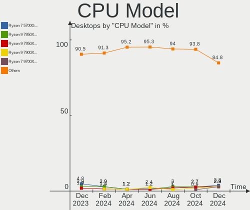
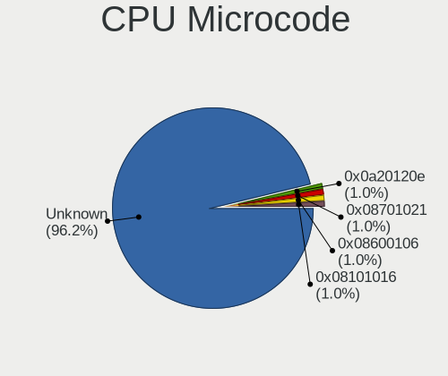

Arch - Hardware Trends (Desktops)
---------------------------------

A project to identify most popular hardware characteristics and track their change
over time based on data collected by Linux users at https://Linux-Hardware.org.

Anyone can contribute to this report by the [hw-probe](https://github.com/linuxhw/hw-probe) tool:

    sudo -E hw-probe -all -upload

This report is for one last month. Overall report since the beginning of time: [TestDays](https://github.com/linuxhw/TestDays)

Period: May, 2023.

Contents
--------

* [ System ](#system)
  - [ OS                       ](#os)
  - [ OS Family                ](#os-family)
  - [ Kernel                   ](#kernel)
  - [ Kernel Family            ](#kernel-family)
  - [ Kernel Major Ver.        ](#kernel-major-ver)
  - [ Arch                     ](#arch)
  - [ DE                       ](#de)
  - [ Display Server           ](#display-server)
  - [ Display Manager          ](#display-manager)
  - [ OS Lang                  ](#os-lang)
  - [ Boot Mode                ](#boot-mode)
  - [ Filesystem               ](#filesystem)
  - [ Part. scheme             ](#part-scheme)
  - [ Dual Boot with Linux/BSD ](#dual-boot-with-linuxbsd)
  - [ Dual Boot (Win)          ](#dual-boot-win)

* [ Board ](#board)
  - [ Vendor                   ](#vendor)
  - [ Model                    ](#model)
  - [ Model Family             ](#model-family)
  - [ MFG Year                 ](#mfg-year)
  - [ Form Factor              ](#form-factor)
  - [ Secure Boot              ](#secure-boot)
  - [ Coreboot                 ](#coreboot)
  - [ RAM Size                 ](#ram-size)
  - [ RAM Used                 ](#ram-used)
  - [ Total Drives             ](#total-drives)
  - [ Has CD-ROM               ](#has-cd-rom)
  - [ Has Ethernet             ](#has-ethernet)
  - [ Has WiFi                 ](#has-wifi)
  - [ Has Bluetooth            ](#has-bluetooth)

* [ Location ](#location)
  - [ Country                  ](#country)
  - [ City                     ](#city)

* [ Drives ](#drives)
  - [ Drive Vendor             ](#drive-vendor)
  - [ Drive Model              ](#drive-model)
  - [ HDD Vendor               ](#hdd-vendor)
  - [ SSD Vendor               ](#ssd-vendor)
  - [ Drive Kind               ](#drive-kind)
  - [ Drive Connector          ](#drive-connector)
  - [ Drive Size               ](#drive-size)
  - [ Space Total              ](#space-total)
  - [ Space Used               ](#space-used)
  - [ Malfunc. Drives          ](#malfunc-drives)
  - [ Malfunc. Drive Vendor    ](#malfunc-drive-vendor)
  - [ Malfunc. HDD Vendor      ](#malfunc-hdd-vendor)
  - [ Malfunc. Drive Kind      ](#malfunc-drive-kind)
  - [ Failed Drives            ](#failed-drives)
  - [ Failed Drive Vendor      ](#failed-drive-vendor)
  - [ Drive Status             ](#drive-status)

* [ Storage controller ](#storage-controller)
  - [ Storage Vendor           ](#storage-vendor)
  - [ Storage Model            ](#storage-model)
  - [ Storage Kind             ](#storage-kind)

* [ Processor ](#processor)
  - [ CPU Vendor               ](#cpu-vendor)
  - [ CPU Model                ](#cpu-model)
  - [ CPU Model Family         ](#cpu-model-family)
  - [ CPU Cores                ](#cpu-cores)
  - [ CPU Sockets              ](#cpu-sockets)
  - [ CPU Threads              ](#cpu-threads)
  - [ CPU Op-Modes             ](#cpu-op-modes)
  - [ CPU Microcode            ](#cpu-microcode)
  - [ CPU Microarch            ](#cpu-microarch)

* [ Graphics ](#graphics)
  - [ GPU Vendor               ](#gpu-vendor)
  - [ GPU Model                ](#gpu-model)
  - [ GPU Combo                ](#gpu-combo)
  - [ GPU Driver               ](#gpu-driver)
  - [ GPU Memory               ](#gpu-memory)

* [ Monitor ](#monitor)
  - [ Monitor Vendor           ](#monitor-vendor)
  - [ Monitor Model            ](#monitor-model)
  - [ Monitor Resolution       ](#monitor-resolution)
  - [ Monitor Diagonal         ](#monitor-diagonal)
  - [ Monitor Width            ](#monitor-width)
  - [ Aspect Ratio             ](#aspect-ratio)
  - [ Monitor Area             ](#monitor-area)
  - [ Pixel Density            ](#pixel-density)
  - [ Multiple Monitors        ](#multiple-monitors)

* [ Network ](#network)
  - [ Net Controller Vendor    ](#net-controller-vendor)
  - [ Net Controller Model     ](#net-controller-model)
  - [ Wireless Vendor          ](#wireless-vendor)
  - [ Wireless Model           ](#wireless-model)
  - [ Ethernet Vendor          ](#ethernet-vendor)
  - [ Ethernet Model           ](#ethernet-model)
  - [ Net Controller Kind      ](#net-controller-kind)
  - [ Used Controller          ](#used-controller)
  - [ NICs                     ](#nics)
  - [ IPv6                     ](#ipv6)

* [ Bluetooth ](#bluetooth)
  - [ Bluetooth Vendor         ](#bluetooth-vendor)
  - [ Bluetooth Model          ](#bluetooth-model)

* [ Sound ](#sound)
  - [ Sound Vendor             ](#sound-vendor)
  - [ Sound Model              ](#sound-model)

* [ Memory ](#memory)
  - [ Memory Vendor            ](#memory-vendor)
  - [ Memory Model             ](#memory-model)
  - [ Memory Kind              ](#memory-kind)
  - [ Memory Form Factor       ](#memory-form-factor)
  - [ Memory Size              ](#memory-size)
  - [ Memory Speed             ](#memory-speed)

* [ Printers & scanners ](#printers--scanners)
  - [ Printer Vendor           ](#printer-vendor)
  - [ Printer Model            ](#printer-model)
  - [ Scanner Vendor           ](#scanner-vendor)
  - [ Scanner Model            ](#scanner-model)

* [ Camera ](#camera)
  - [ Camera Vendor            ](#camera-vendor)
  - [ Camera Model             ](#camera-model)

* [ Security ](#security)
  - [ Fingerprint Vendor       ](#fingerprint-vendor)
  - [ Fingerprint Model        ](#fingerprint-model)
  - [ Chipcard Vendor          ](#chipcard-vendor)
  - [ Chipcard Model           ](#chipcard-model)

* [ Unsupported ](#unsupported)
  - [ Unsupported Devices      ](#unsupported-devices)
  - [ Unsupported Device Types ](#unsupported-device-types)

System
------

OS
--

Installed operating systems

| Name         | Desktops | Percent |
|--------------|----------|---------|
| Arch Rolling | 73       | 100%    |

OS Family
---------

OS without a version

| Name | Desktops | Percent |
|------|----------|---------|
| Arch | 73       | 100%    |

Kernel
------

Version of the Linux kernel

| Version                     | Desktops | Percent |
|-----------------------------|----------|---------|
| 6.3.1-arch1-1               | 12       | 16.44%  |
| 6.3.2-arch1-1               | 9        | 12.33%  |
| 6.2.13-arch1-1              | 9        | 12.33%  |
| 6.3.4-arch1-1               | 6        | 8.22%   |
| 6.3.2-zen1-1-zen            | 4        | 5.48%   |
| 6.2.12-arch1-1              | 4        | 5.48%   |
| 6.3.4-zen1-1-zen            | 3        | 4.11%   |
| 6.3.1-arch2-1               | 3        | 4.11%   |
| 6.3.4-zen2-1-zen            | 2        | 2.74%   |
| 6.3.1-zen2-1-zen            | 2        | 2.74%   |
| 6.3.1-zen1-1-zen            | 2        | 2.74%   |
| 6.2.13-zen-1-zen            | 2        | 2.74%   |
| 6.1.29-1-lts                | 2        | 2.74%   |
| 6.3.5-arch1-1               | 1        | 1.37%   |
| 6.3.4-arch2-1               | 1        | 1.37%   |
| 6.3.3-zen1-1-zen            | 1        | 1.37%   |
| 6.3.3-arch1-1               | 1        | 1.37%   |
| 6.3.2-zen1-1.1-zen          | 1        | 1.37%   |
| 6.3.0-273-tkg-tt-llvm       | 1        | 1.37%   |
| 6.2.7-arch1-1               | 1        | 1.37%   |
| 6.2.2-arch2-1               | 1        | 1.37%   |
| 6.2.10-x64v1-xanmod1-1      | 1        | 1.37%   |
| 6.1.30-1-lts                | 1        | 1.37%   |
| 6.1.28-hardened1-1-hardened | 1        | 1.37%   |
| 6.1.28-1-lts                | 1        | 1.37%   |
| 5.18.12-arch1-1             | 1        | 1.37%   |

Kernel Family
-------------

Linux kernel without a distro release

| Version | Desktops | Percent |
|---------|----------|---------|
| 6.3.1   | 19       | 26.03%  |
| 6.3.2   | 14       | 19.18%  |
| 6.3.4   | 12       | 16.44%  |
| 6.2.13  | 11       | 15.07%  |
| 6.2.12  | 4        | 5.48%   |
| 6.3.3   | 2        | 2.74%   |
| 6.1.29  | 2        | 2.74%   |
| 6.1.28  | 2        | 2.74%   |
| 6.3.5   | 1        | 1.37%   |
| 6.3.0   | 1        | 1.37%   |
| 6.2.7   | 1        | 1.37%   |
| 6.2.2   | 1        | 1.37%   |
| 6.2.10  | 1        | 1.37%   |
| 6.1.30  | 1        | 1.37%   |
| 5.18.12 | 1        | 1.37%   |

Kernel Major Ver.
-----------------

Linux kernel major version

| Version | Desktops | Percent |
|---------|----------|---------|
| 6.3     | 49       | 67.12%  |
| 6.2     | 18       | 24.66%  |
| 6.1     | 5        | 6.85%   |
| 5.18    | 1        | 1.37%   |

Arch
----

OS architecture (x86_64, i586, etc.)

| Name   | Desktops | Percent |
|--------|----------|---------|
| x86_64 | 73       | 100%    |

DE
--

Desktop Environment

| Name           | Desktops | Percent |
|----------------|----------|---------|
| KDE5           | 28       | 38.36%  |
| GNOME          | 18       | 24.66%  |
| Unknown        | 6        | 8.22%   |
| XFCE           | 5        | 6.85%   |
| i3             | 3        | 4.11%   |
| Hyprland       | 3        | 4.11%   |
| X-Cinnamon     | 2        | 2.74%   |
| bspwm          | 2        | 2.74%   |
| LXQt           | 1        | 1.37%   |
| LXDE           | 1        | 1.37%   |
| i3-with-shmlog | 1        | 1.37%   |
| dwm            | 1        | 1.37%   |
| Cinnamon       | 1        | 1.37%   |
| chadwm         | 1        | 1.37%   |

Display Server
--------------

X11 or Wayland

| Name    | Desktops | Percent |
|---------|----------|---------|
| X11     | 43       | 58.9%   |
| Wayland | 19       | 26.03%  |
| Unknown | 6        | 8.22%   |
| Tty     | 5        | 6.85%   |

Display Manager
---------------

SDDM, LightDM, etc.

| Name    | Desktops | Percent |
|---------|----------|---------|
| Unknown | 29       | 39.73%  |
| SDDM    | 23       | 31.51%  |
| LightDM | 11       | 15.07%  |
| GDM     | 7        | 9.59%   |
| SLiM    | 1        | 1.37%   |
| LXDM    | 1        | 1.37%   |
| GREETD  | 1        | 1.37%   |

OS Lang
-------

Language

| Lang    | Desktops | Percent |
|---------|----------|---------|
| en_US   | 43       | 58.9%   |
| C       | 6        | 8.22%   |
| en_GB   | 5        | 6.85%   |
| ru_RU   | 3        | 4.11%   |
| it_IT   | 2        | 2.74%   |
| es_ES   | 2        | 2.74%   |
| en_CA   | 2        | 2.74%   |
| de_DE   | 2        | 2.74%   |
| Unknown | 2        | 2.74%   |
| sv_SE   | 1        | 1.37%   |
| pt_BR   | 1        | 1.37%   |
| ga_IE   | 1        | 1.37%   |
| de_AT   | 1        | 1.37%   |
| cs_CZ   | 1        | 1.37%   |
| bg_BG   | 1        | 1.37%   |

Boot Mode
---------

EFI or BIOS

| Mode | Desktops | Percent |
|------|----------|---------|
| EFI  | 50       | 68.49%  |
| BIOS | 23       | 31.51%  |

Filesystem
----------

Type of filesystem

| Type  | Desktops | Percent |
|-------|----------|---------|
| Ext4  | 43       | 58.9%   |
| Btrfs | 26       | 35.62%  |
| F2fs  | 2        | 2.74%   |
| Xfs   | 1        | 1.37%   |
| Jfs   | 1        | 1.37%   |

Part. scheme
------------

Scheme of partitioning

| Type    | Desktops | Percent |
|---------|----------|---------|
| GPT     | 49       | 67.12%  |
| Unknown | 20       | 27.4%   |
| MBR     | 4        | 5.48%   |

Dual Boot with Linux/BSD
------------------------

Hosting more than one Linux/BSD

| Dual boot | Desktops | Percent |
|-----------|----------|---------|
| No        | 56       | 76.71%  |
| Yes       | 17       | 23.29%  |

Dual Boot (Win)
---------------

Hosting Linux and Windows

| Dual boot | Desktops | Percent |
|-----------|----------|---------|
| No        | 58       | 79.45%  |
| Yes       | 15       | 20.55%  |

Board
-----

Vendor
------

Motherboard manufacturer

| Name                | Desktops | Percent |
|---------------------|----------|---------|
| ASUSTek Computer    | 21       | 28.77%  |
| Gigabyte Technology | 14       | 19.18%  |
| MSI                 | 12       | 16.44%  |
| ASRock              | 12       | 16.44%  |
| Hewlett-Packard     | 5        | 6.85%   |
| Dell                | 3        | 4.11%   |
| Lenovo              | 2        | 2.74%   |
| Huanan              | 2        | 2.74%   |
| Cincoze             | 1        | 1.37%   |
| Acer                | 1        | 1.37%   |

Model
-----

Motherboard model

| Name                                  | Desktops | Percent |
|---------------------------------------|----------|---------|
| MSI MS-7C95                           | 2        | 2.74%   |
| Gigabyte X570S AERO G                 | 2        | 2.74%   |
| ASUS PRIME X570-PRO                   | 2        | 2.74%   |
| MSI MS-7D91                           | 1        | 1.37%   |
| MSI MS-7D75                           | 1        | 1.37%   |
| MSI MS-7C81                           | 1        | 1.37%   |
| MSI MS-7C56                           | 1        | 1.37%   |
| MSI MS-7B98                           | 1        | 1.37%   |
| MSI MS-7B86                           | 1        | 1.37%   |
| MSI MS-7A71                           | 1        | 1.37%   |
| MSI MS-7A38                           | 1        | 1.37%   |
| MSI MS-7A20                           | 1        | 1.37%   |
| MSI MS-7693                           | 1        | 1.37%   |
| Lenovo ThinkCentre M93p 10AAS1KE00    | 1        | 1.37%   |
| Lenovo IdeaCentre 5 14IOB6 90RJ009GUS | 1        | 1.37%   |
| Huanan X99-F8 GAMING V5.0             | 1        | 1.37%   |
| Huanan Gaming F8                      | 1        | 1.37%   |
| HP Rfrb 700-210xt                     | 1        | 1.37%   |
| HP Pavilion Gaming Desktop TG01-2xxx  | 1        | 1.37%   |
| HP Pavilion Gaming Desktop TG01-0xxx  | 1        | 1.37%   |
| HP OMEN by Desktop PC 880-p1xx        | 1        | 1.37%   |
| HP Compaq Pro 6300 MT                 | 1        | 1.37%   |
| Gigabyte Z97X-Gaming 3                | 1        | 1.37%   |
| Gigabyte Z590 UD AC                   | 1        | 1.37%   |
| Gigabyte Z170X-UD5 TH                 | 1        | 1.37%   |
| Gigabyte Z170X-Gaming 3               | 1        | 1.37%   |
| Gigabyte X99-UD4-CF                   | 1        | 1.37%   |
| Gigabyte X570 I AORUS PRO WIFI        | 1        | 1.37%   |
| Gigabyte X570 AORUS MASTER            | 1        | 1.37%   |
| Gigabyte X470 AORUS GAMING 7 WIFI     | 1        | 1.37%   |
| Gigabyte X399 AORUS PRO               | 1        | 1.37%   |
| Gigabyte B660 DS3H DDR4               | 1        | 1.37%   |
| Gigabyte B650M AORUS ELITE AX         | 1        | 1.37%   |
| Gigabyte B550 AORUS ELITE             | 1        | 1.37%   |
| Dell Precision WorkStation T3500      | 1        | 1.37%   |
| Dell OptiPlex 9020                    | 1        | 1.37%   |
| Dell OptiPlex 3070                    | 1        | 1.37%   |
| Cincoze DE1000                        | 1        | 1.37%   |
| ASUS Z170-P                           | 1        | 1.37%   |
| ASUS TUF Gaming X570-PLUS             | 1        | 1.37%   |

Model Family
------------

Motherboard model prefix

| Name                  | Desktops | Percent |
|-----------------------|----------|---------|
| ASUS ROG              | 6        | 8.22%   |
| ASUS TUF              | 5        | 6.85%   |
| ASUS PRIME            | 5        | 6.85%   |
| MSI MS-7C95           | 2        | 2.74%   |
| HP Pavilion           | 2        | 2.74%   |
| Gigabyte X570S        | 2        | 2.74%   |
| Gigabyte X570         | 2        | 2.74%   |
| Dell OptiPlex         | 2        | 2.74%   |
| ASRock B450M          | 2        | 2.74%   |
| MSI MS-7D91           | 1        | 1.37%   |
| MSI MS-7D75           | 1        | 1.37%   |
| MSI MS-7C81           | 1        | 1.37%   |
| MSI MS-7C56           | 1        | 1.37%   |
| MSI MS-7B98           | 1        | 1.37%   |
| MSI MS-7B86           | 1        | 1.37%   |
| MSI MS-7A71           | 1        | 1.37%   |
| MSI MS-7A38           | 1        | 1.37%   |
| MSI MS-7A20           | 1        | 1.37%   |
| MSI MS-7693           | 1        | 1.37%   |
| Lenovo ThinkCentre    | 1        | 1.37%   |
| Lenovo IdeaCentre     | 1        | 1.37%   |
| Huanan X99-F8         | 1        | 1.37%   |
| Huanan Gaming         | 1        | 1.37%   |
| HP Rfrb               | 1        | 1.37%   |
| HP OMEN               | 1        | 1.37%   |
| HP Compaq             | 1        | 1.37%   |
| Gigabyte Z97X-Gaming  | 1        | 1.37%   |
| Gigabyte Z590         | 1        | 1.37%   |
| Gigabyte Z170X-UD5    | 1        | 1.37%   |
| Gigabyte Z170X-Gaming | 1        | 1.37%   |
| Gigabyte X99-UD4-CF   | 1        | 1.37%   |
| Gigabyte X470         | 1        | 1.37%   |
| Gigabyte X399         | 1        | 1.37%   |
| Gigabyte B660         | 1        | 1.37%   |
| Gigabyte B650M        | 1        | 1.37%   |
| Gigabyte B550         | 1        | 1.37%   |
| Dell Precision        | 1        | 1.37%   |
| Cincoze DE1000        | 1        | 1.37%   |
| ASUS Z170-P           | 1        | 1.37%   |
| ASUS ProArt           | 1        | 1.37%   |

MFG Year
--------

Motherboard manufacture year

| Year | Desktops | Percent |
|------|----------|---------|
| 2020 | 11       | 15.07%  |
| 2019 | 11       | 15.07%  |
| 2021 | 10       | 13.7%   |
| 2018 | 9        | 12.33%  |
| 2022 | 8        | 10.96%  |
| 2015 | 4        | 5.48%   |
| 2023 | 3        | 4.11%   |
| 2017 | 3        | 4.11%   |
| 2014 | 3        | 4.11%   |
| 2012 | 3        | 4.11%   |
| 2016 | 2        | 2.74%   |
| 2013 | 2        | 2.74%   |
| 2009 | 2        | 2.74%   |
| 2011 | 1        | 1.37%   |
| 2010 | 1        | 1.37%   |

Form Factor
-----------

Physical design of the computer

| Name    | Desktops | Percent |
|---------|----------|---------|
| Desktop | 73       | 100%    |

Secure Boot
-----------

Enabled or disabled

| State    | Desktops | Percent |
|----------|----------|---------|
| Disabled | 71       | 97.26%  |
| Enabled  | 2        | 2.74%   |

Coreboot
--------

Have coreboot on board

| Used | Desktops | Percent |
|------|----------|---------|
| No   | 73       | 100%    |

RAM Size
--------

Total RAM memory

| Size in GB  | Desktops | Percent |
|-------------|----------|---------|
| 32.01-64.0  | 24       | 32.88%  |
| 16.01-24.0  | 16       | 21.92%  |
| 64.01-256.0 | 11       | 15.07%  |
| 8.01-16.0   | 8        | 10.96%  |
| 24.01-32.0  | 6        | 8.22%   |
| 4.01-8.0    | 4        | 5.48%   |
| 3.01-4.0    | 4        | 5.48%   |

RAM Used
--------

Used RAM memory

| Used GB    | Desktops | Percent |
|------------|----------|---------|
| 4.01-8.0   | 20       | 27.4%   |
| 8.01-16.0  | 15       | 20.55%  |
| 3.01-4.0   | 12       | 16.44%  |
| 2.01-3.0   | 12       | 16.44%  |
| 1.01-2.0   | 8        | 10.96%  |
| 0.51-1.0   | 4        | 5.48%   |
| 32.01-64.0 | 1        | 1.37%   |
| 16.01-24.0 | 1        | 1.37%   |

Total Drives
------------

Number of drives on board

| Drives | Desktops | Percent |
|--------|----------|---------|
| 1      | 19       | 26.03%  |
| 2      | 18       | 24.66%  |
| 4      | 12       | 16.44%  |
| 3      | 8        | 10.96%  |
| 6      | 7        | 9.59%   |
| 5      | 7        | 9.59%   |
| 9      | 1        | 1.37%   |
| 7      | 1        | 1.37%   |

Has CD-ROM
----------

Has CD-ROM on board

| Presented | Desktops | Percent |
|-----------|----------|---------|
| No        | 62       | 84.93%  |
| Yes       | 11       | 15.07%  |

Has Ethernet
------------

Has Ethernet on board

| Presented | Desktops | Percent |
|-----------|----------|---------|
| Yes       | 73       | 100%    |

Has WiFi
--------

Has WiFi module

| Presented | Desktops | Percent |
|-----------|----------|---------|
| Yes       | 48       | 65.75%  |
| No        | 25       | 34.25%  |

Has Bluetooth
-------------

Has Bluetooth module

| Presented | Desktops | Percent |
|-----------|----------|---------|
| Yes       | 46       | 63.01%  |
| No        | 27       | 36.99%  |

Location
--------

Country
-------

Geographic location (country)

| Country     | Desktops | Percent |
|-------------|----------|---------|
| USA         | 17       | 23.29%  |
| Canada      | 7        | 9.59%   |
| Italy       | 6        | 8.22%   |
| Russia      | 4        | 5.48%   |
| Poland      | 4        | 5.48%   |
| UK          | 3        | 4.11%   |
| Germany     | 3        | 4.11%   |
| Brazil      | 3        | 4.11%   |
| Switzerland | 2        | 2.74%   |
| Spain       | 2        | 2.74%   |
| France      | 2        | 2.74%   |
| Czechia     | 2        | 2.74%   |
| Austria     | 2        | 2.74%   |
| Ukraine     | 1        | 1.37%   |
| Sweden      | 1        | 1.37%   |
| Sri Lanka   | 1        | 1.37%   |
| Slovenia    | 1        | 1.37%   |
| Romania     | 1        | 1.37%   |
| Norway      | 1        | 1.37%   |
| Iran        | 1        | 1.37%   |
| Finland     | 1        | 1.37%   |
| Estonia     | 1        | 1.37%   |
| Denmark     | 1        | 1.37%   |
| Chile       | 1        | 1.37%   |
| Bulgaria    | 1        | 1.37%   |
| Belgium     | 1        | 1.37%   |
| Australia   | 1        | 1.37%   |
| Argentina   | 1        | 1.37%   |
| Andorra     | 1        | 1.37%   |

City
----

Geographic location (city)

| City               | Desktops | Percent |
|--------------------|----------|---------|
| Toronto            | 2        | 2.74%   |
| Prague             | 2        | 2.74%   |
| London             | 2        | 2.74%   |
| Zurich             | 1        | 1.37%   |
| Wolfurt            | 1        | 1.37%   |
| Weatherford        | 1        | 1.37%   |
| Warsaw             | 1        | 1.37%   |
| Vladivostok        | 1        | 1.37%   |
| Viña del Mar      | 1        | 1.37%   |
| Vienna             | 1        | 1.37%   |
| Trzin              | 1        | 1.37%   |
| Temiskaming Shores | 1        | 1.37%   |
| Tampa              | 1        | 1.37%   |
| Tallinn            | 1        | 1.37%   |
| Silver Spring      | 1        | 1.37%   |
| Seattle            | 1        | 1.37%   |
| Sao Paulo          | 1        | 1.37%   |
| Salvador           | 1        | 1.37%   |
| Rybnik             | 1        | 1.37%   |
| Rovereto           | 1        | 1.37%   |
| Rome               | 1        | 1.37%   |
| Rehnān            | 1        | 1.37%   |
| Raleigh            | 1        | 1.37%   |
| Ponteranica        | 1        | 1.37%   |
| Phoenix            | 1        | 1.37%   |
| Perpignan          | 1        | 1.37%   |
| Pazardzhik         | 1        | 1.37%   |
| Paris              | 1        | 1.37%   |
| Palermo            | 1        | 1.37%   |
| Nikenbah           | 1        | 1.37%   |
| Natal              | 1        | 1.37%   |
| Nacka              | 1        | 1.37%   |
| Moscow             | 1        | 1.37%   |
| Montreal           | 1        | 1.37%   |
| Montevarchi        | 1        | 1.37%   |
| Miercurea-Ciuc     | 1        | 1.37%   |
| Lviv               | 1        | 1.37%   |
| Lucerne            | 1        | 1.37%   |
| Lier               | 1        | 1.37%   |
| Laval              | 1        | 1.37%   |

Drives
------

Drive Vendor
------------

Hard drive vendors

| Vendor                       | Desktops | Drives | Percent |
|------------------------------|----------|--------|---------|
| Samsung Electronics          | 30       | 47     | 17.86%  |
| WDC                          | 20       | 27     | 11.9%   |
| Seagate                      | 20       | 29     | 11.9%   |
| Sandisk                      | 14       | 18     | 8.33%   |
| Kingston                     | 11       | 17     | 6.55%   |
| Toshiba                      | 9        | 13     | 5.36%   |
| Crucial                      | 9        | 10     | 5.36%   |
| Phison Electronics           | 8        | 9      | 4.76%   |
| Micron/Crucial Technology    | 4        | 5      | 2.38%   |
| ADATA Technology             | 4        | 5      | 2.38%   |
| Intel                        | 3        | 3      | 1.79%   |
| HGST                         | 3        | 3      | 1.79%   |
| China                        | 3        | 3      | 1.79%   |
| SK hynix                     | 2        | 2      | 1.19%   |
| PNY                          | 2        | 2      | 1.19%   |
| Phison                       | 2        | 2      | 1.19%   |
| Micron Technology            | 2        | 2      | 1.19%   |
| KingFast                     | 2        | 2      | 1.19%   |
| GOODRAM                      | 2        | 3      | 1.19%   |
| A-DATA Technology            | 2        | 2      | 1.19%   |
| Unknown                      | 1        | 1      | 0.6%    |
| Transcend                    | 1        | 1      | 0.6%    |
| SPCC                         | 1        | 1      | 0.6%    |
| Shenzhen Longsys Electronics | 1        | 1      | 0.6%    |
| Seagate Technology           | 1        | 1      | 0.6%    |
| Realtek Semiconductor        | 1        | 1      | 0.6%    |
| Patriot                      | 1        | 1      | 0.6%    |
| Netac                        | 1        | 2      | 0.6%    |
| Lite-On Technology           | 1        | 1      | 0.6%    |
| Lexar                        | 1        | 1      | 0.6%    |
| Kingston Technology Company  | 1        | 1      | 0.6%    |
| Hitachi                      | 1        | 1      | 0.6%    |
| Gigabyte Technology          | 1        | 1      | 0.6%    |
| Fujitsu                      | 1        | 1      | 0.6%    |
| 2.5"                         | 1        | 1      | 0.6%    |
| Unknown                      | 1        | 1      | 0.6%    |

Drive Model
-----------

Hard drive models

| Model                                                           | Desktops | Percent |
|-----------------------------------------------------------------|----------|---------|
| Samsung NVMe SSD Controller PM9A1/PM9A3/980PRO 1TB              | 10       | 5.24%   |
| Samsung NVMe SSD Controller SM981/PM981/PM983 256GB             | 9        | 4.71%   |
| ADATA XPG SX8200 Pro PCIe Gen3x4 M.2 2280 Solid State Drive 1TB | 4        | 2.09%   |
| Seagate ST4000DM004-2CV104 4TB                                  | 3        | 1.57%   |
| Samsung SSD 980 1TB                                             | 3        | 1.57%   |
| Phison E16 PCIe4 NVMe Controller 1TB                            | 3        | 1.57%   |
| Phison E12 NVMe Controller 256GB                                | 3        | 1.57%   |
| WDC WD10EZEX-08WN4A0 1TB                                        | 2        | 1.05%   |
| WDC WD10EFRX-68FYTN0 1TB                                        | 2        | 1.05%   |
| Toshiba HDWD110 1TB                                             | 2        | 1.05%   |
| Seagate ST8000DM004-2CX188 8TB                                  | 2        | 1.05%   |
| Seagate ST2000DM008-2FR102 2TB                                  | 2        | 1.05%   |
| Sandisk WD_BLACK SN770 1TB                                      | 2        | 1.05%   |
| Sandisk WD Blue SN570 1TB                                       | 2        | 1.05%   |
| Sandisk WD Black SN750 / PC SN730 NVMe SSD 256GB                | 2        | 1.05%   |
| Sandisk WD Black 2018/SN750 / PC SN720 NVMe SSD 1TB             | 2        | 1.05%   |
| Samsung SSD 980 500GB                                           | 2        | 1.05%   |
| Samsung SSD 860 EVO 500GB                                       | 2        | 1.05%   |
| Samsung SSD 860 EVO 1TB                                         | 2        | 1.05%   |
| Samsung SSD 850 EVO 500GB                                       | 2        | 1.05%   |
| Micron/Crucial P2 NVMe PCIe SSD 1TB                             | 2        | 1.05%   |
| Kingston SKC3000D2048G 2TB                                      | 2        | 1.05%   |
| Crucial CT480BX500SSD1 480GB                                    | 2        | 1.05%   |
| Crucial CT1000MX500SSD1 1TB                                     | 2        | 1.05%   |
| WDC WDS240G2G0B-00EPW0 240GB SSD                                | 1        | 0.52%   |
| WDC WD80EDAZ-11TA3A0 8TB                                        | 1        | 0.52%   |
| WDC WD80EAZZ-00BKLB0 8TB                                        | 1        | 0.52%   |
| WDC WD6400AAKS-22A7B2 640GB                                     | 1        | 0.52%   |
| WDC WD5000AAKX-08U6AA0 500GB                                    | 1        | 0.52%   |
| WDC WD5000AAKX-001CA0 500GB                                     | 1        | 0.52%   |
| WDC WD5000AAKS-00UU3A0 500GB                                    | 1        | 0.52%   |
| WDC WD40EZRZ-22GXCB0 4TB                                        | 1        | 0.52%   |
| WDC WD40EZRZ-00WN9B0 4TB                                        | 1        | 0.52%   |
| WDC WD40EZAZ-00SF3B0 4TB                                        | 1        | 0.52%   |
| WDC WD40EFPX-68C6CN0 4TB                                        | 1        | 0.52%   |
| WDC WD3200BEVT-60A23T0 320GB                                    | 1        | 0.52%   |
| WDC WD3200BEVT-22ZCT0 320GB                                     | 1        | 0.52%   |
| WDC WD3200AAKS-75L9A0 320GB                                     | 1        | 0.52%   |
| WDC WD30EFRX-68EUZN0 3TB                                        | 1        | 0.52%   |
| WDC WD20EZRX-00D8PB0 2TB                                        | 1        | 0.52%   |

HDD Vendor
----------

Hard disk drive vendors

| Vendor              | Desktops | Drives | Percent |
|---------------------|----------|--------|---------|
| Seagate             | 20       | 29     | 37.04%  |
| WDC                 | 19       | 26     | 35.19%  |
| Toshiba             | 7        | 9      | 12.96%  |
| HGST                | 3        | 3      | 5.56%   |
| Samsung Electronics | 2        | 2      | 3.7%    |
| Unknown             | 1        | 1      | 1.85%   |
| Hitachi             | 1        | 1      | 1.85%   |
| Fujitsu             | 1        | 1      | 1.85%   |

SSD Vendor
----------

Solid state drive vendors

| Vendor              | Desktops | Drives | Percent |
|---------------------|----------|--------|---------|
| Samsung Electronics | 11       | 15     | 21.57%  |
| Crucial             | 9        | 10     | 17.65%  |
| Kingston            | 6        | 8      | 11.76%  |
| SanDisk             | 3        | 6      | 5.88%   |
| Intel               | 3        | 3      | 5.88%   |
| China               | 3        | 3      | 5.88%   |
| PNY                 | 2        | 2      | 3.92%   |
| GOODRAM             | 2        | 3      | 3.92%   |
| A-DATA Technology   | 2        | 2      | 3.92%   |
| WDC                 | 1        | 1      | 1.96%   |
| Transcend           | 1        | 1      | 1.96%   |
| Toshiba             | 1        | 3      | 1.96%   |
| SPCC                | 1        | 1      | 1.96%   |
| Patriot             | 1        | 1      | 1.96%   |
| Micron Technology   | 1        | 1      | 1.96%   |
| Lexar               | 1        | 1      | 1.96%   |
| KingFast            | 1        | 1      | 1.96%   |
| Gigabyte Technology | 1        | 1      | 1.96%   |
| 2.5"                | 1        | 1      | 1.96%   |

Drive Kind
----------

HDD or SSD

| Kind    | Desktops | Drives | Percent |
|---------|----------|--------|---------|
| NVMe    | 49       | 83     | 37.69%  |
| HDD     | 40       | 72     | 30.77%  |
| SSD     | 39       | 64     | 30%     |
| Unknown | 2        | 2      | 1.54%   |

Drive Connector
---------------

SATA, SAS, NVMe, etc.

| Type | Desktops | Drives | Percent |
|------|----------|--------|---------|
| SATA | 55       | 134    | 50.93%  |
| NVMe | 49       | 83     | 45.37%  |
| SAS  | 4        | 4      | 3.7%    |

Drive Size
----------

Size of hard drive

| Size in TB | Desktops | Drives | Percent |
|------------|----------|--------|---------|
| 0.01-0.5   | 42       | 65     | 46.67%  |
| 0.51-1.0   | 21       | 33     | 23.33%  |
| 1.01-2.0   | 11       | 11     | 12.22%  |
| 3.01-4.0   | 8        | 14     | 8.89%   |
| 4.01-10.0  | 5        | 6      | 5.56%   |
| 2.01-3.0   | 2        | 2      | 2.22%   |
| 10.01-20.0 | 1        | 5      | 1.11%   |

Space Total
-----------

Amount of disk space available on the file system

| Size in GB     | Desktops | Percent |
|----------------|----------|---------|
| More than 3000 | 23       | 31.51%  |
| 1001-2000      | 13       | 17.81%  |
| 501-1000       | 12       | 16.44%  |
| 251-500        | 8        | 10.96%  |
| 101-250        | 8        | 10.96%  |
| 2001-3000      | 4        | 5.48%   |
| 51-100         | 3        | 4.11%   |
| 1-20           | 1        | 1.37%   |
| Unknown        | 1        | 1.37%   |

Space Used
----------

Amount of used disk space

| Used GB        | Desktops | Percent |
|----------------|----------|---------|
| More than 3000 | 11       | 15.07%  |
| 1-20           | 11       | 15.07%  |
| 101-250        | 9        | 12.33%  |
| 1001-2000      | 9        | 12.33%  |
| 21-50          | 8        | 10.96%  |
| 501-1000       | 7        | 9.59%   |
| 51-100         | 7        | 9.59%   |
| 251-500        | 6        | 8.22%   |
| 2001-3000      | 4        | 5.48%   |
| Unknown        | 1        | 1.37%   |

Malfunc. Drives
---------------

Drive models with a malfunction

| Model                                                           | Desktops | Drives | Percent |
|-----------------------------------------------------------------|----------|--------|---------|
| WDC WD5000AAKX-001CA0 500GB                                     | 1        | 1      | 7.14%   |
| WDC WD5000AAKS-00UU3A0 500GB                                    | 1        | 1      | 7.14%   |
| WDC WD40EZRZ-00WN9B0 4TB                                        | 1        | 1      | 7.14%   |
| WDC WD10EADS-11M2B3 1TB                                         | 1        | 1      | 7.14%   |
| Transcend TS1TSSD230S 1TB                                       | 1        | 1      | 7.14%   |
| Seagate ST3160815AS 160GB                                       | 1        | 1      | 7.14%   |
| SanDisk SSD PLUS 240GB                                          | 1        | 1      | 7.14%   |
| Samsung Electronics SSD 870 EVO 1TB                             | 1        | 1      | 7.14%   |
| Samsung Electronics SSD 840 PRO Series 230GB                    | 1        | 1      | 7.14%   |
| Samsung Electronics NVMe SSD Controller SM981/PM981/PM983 256GB | 1        | 1      | 7.14%   |
| Intel SSDSC2KW480H6 480GB                                       | 1        | 1      | 7.14%   |
| HGST HTS541075A9E680 752GB                                      | 1        | 1      | 7.14%   |
| Fujitsu MHZ2320BH G1 320GB                                      | 1        | 1      | 7.14%   |
| Crucial CT525MX300SSD1 528GB                                    | 1        | 1      | 7.14%   |

Malfunc. Drive Vendor
---------------------

Vendors of faulty drives

| Vendor              | Desktops | Drives | Percent |
|---------------------|----------|--------|---------|
| WDC                 | 4        | 4      | 28.57%  |
| Samsung Electronics | 3        | 3      | 21.43%  |
| Transcend           | 1        | 1      | 7.14%   |
| Seagate             | 1        | 1      | 7.14%   |
| SanDisk             | 1        | 1      | 7.14%   |
| Intel               | 1        | 1      | 7.14%   |
| HGST                | 1        | 1      | 7.14%   |
| Fujitsu             | 1        | 1      | 7.14%   |
| Crucial             | 1        | 1      | 7.14%   |

Malfunc. HDD Vendor
-------------------

Vendors of faulty HDD drives

| Vendor  | Desktops | Drives | Percent |
|---------|----------|--------|---------|
| WDC     | 4        | 4      | 57.14%  |
| Seagate | 1        | 1      | 14.29%  |
| HGST    | 1        | 1      | 14.29%  |
| Fujitsu | 1        | 1      | 14.29%  |

Malfunc. Drive Kind
-------------------

Kinds of faulty drives

| Kind | Desktops | Drives | Percent |
|------|----------|--------|---------|
| HDD  | 6        | 7      | 50%     |
| SSD  | 5        | 6      | 41.67%  |
| NVMe | 1        | 1      | 8.33%   |

Failed Drives
-------------

Failed drive models

Zero info for selected period =(

Failed Drive Vendor
-------------------

Failed drive vendors

Zero info for selected period =(

Drive Status
------------

Number of failed and malfunc. drives

| Status   | Desktops | Drives | Percent |
|----------|----------|--------|---------|
| Works    | 45       | 126    | 51.72%  |
| Detected | 31       | 81     | 35.63%  |
| Malfunc  | 11       | 14     | 12.64%  |

Storage controller
------------------

Storage Vendor
--------------

Storage controller vendors

| Vendor                       | Desktops | Percent |
|------------------------------|----------|---------|
| AMD                          | 38       | 26.57%  |
| Intel                        | 30       | 20.98%  |
| Samsung Electronics          | 23       | 16.08%  |
| SanDisk                      | 11       | 7.69%   |
| Phison Electronics           | 10       | 6.99%   |
| Kingston Technology Company  | 6        | 4.2%    |
| ASMedia Technology           | 6        | 4.2%    |
| Micron/Crucial Technology    | 4        | 2.8%    |
| ADATA Technology             | 4        | 2.8%    |
| SK hynix                     | 2        | 1.4%    |
| Toshiba America Info Systems | 1        | 0.7%    |
| Shenzhen Longsys Electronics | 1        | 0.7%    |
| Seagate Technology           | 1        | 0.7%    |
| Realtek Semiconductor        | 1        | 0.7%    |
| Nvidia                       | 1        | 0.7%    |
| Netac Technology             | 1        | 0.7%    |
| Micron Technology            | 1        | 0.7%    |
| Marvell Technology Group     | 1        | 0.7%    |
| Lite-On Technology           | 1        | 0.7%    |

Storage Model
-------------

Storage controller models

| Model                                                                          | Desktops | Percent |
|--------------------------------------------------------------------------------|----------|---------|
| AMD FCH SATA Controller [AHCI mode]                                            | 25       | 15.92%  |
| Samsung NVMe SSD Controller PM9A1/PM9A3/980PRO                                 | 10       | 6.37%   |
| AMD 400 Series Chipset SATA Controller                                         | 10       | 6.37%   |
| Samsung NVMe SSD Controller SM981/PM981/PM983                                  | 9        | 5.73%   |
| AMD 500 Series Chipset SATA Controller                                         | 6        | 3.82%   |
| Samsung NVMe SSD Controller 980                                                | 5        | 3.18%   |
| Kingston Company Company Non-Volatile memory controller                        | 5        | 3.18%   |
| Intel 500 Series Chipset Family SATA AHCI Controller                           | 5        | 3.18%   |
| ASMedia ASM1062 Serial ATA Controller                                          | 5        | 3.18%   |
| SanDisk WD Black SN770 NVMe SSD                                                | 4        | 2.55%   |
| ADATA XPG SX8200 Pro PCIe Gen3x4 M.2 2280 Solid State Drive                    | 4        | 2.55%   |
| Phison E16 PCIe4 NVMe Controller                                               | 3        | 1.91%   |
| Phison E12 NVMe Controller                                                     | 3        | 1.91%   |
| Intel Q170/Q150/B150/H170/H110/Z170/CM236 Chipset SATA Controller [AHCI Mode]  | 3        | 1.91%   |
| Intel Cannon Lake PCH SATA AHCI Controller                                     | 3        | 1.91%   |
| Intel C610/X99 series chipset 6-Port SATA Controller [AHCI mode]               | 3        | 1.91%   |
| Intel 8 Series/C220 Series Chipset Family 6-port SATA Controller 1 [AHCI mode] | 3        | 1.91%   |
| Intel 200 Series PCH SATA controller [AHCI mode]                               | 3        | 1.91%   |
| SanDisk WD Blue SN570 NVMe SSD 1TB                                             | 2        | 1.27%   |
| SanDisk WD Black SN750 / PC SN730 NVMe SSD                                     | 2        | 1.27%   |
| SanDisk WD Black 2018/SN750 / PC SN720 NVMe SSD                                | 2        | 1.27%   |
| Phison Electronics Non-Volatile memory controller                              | 2        | 1.27%   |
| Phison E18 PCIe4 NVMe Controller                                               | 2        | 1.27%   |
| Micron/Crucial P2 NVMe PCIe SSD                                                | 2        | 1.27%   |
| Intel 82801JI (ICH10 Family) SATA AHCI Controller                              | 2        | 1.27%   |
| Intel 7 Series/C210 Series Chipset Family 6-port SATA Controller [AHCI mode]   | 2        | 1.27%   |
| AMD X399 Series Chipset SATA Controller                                        | 2        | 1.27%   |
| AMD SB7x0/SB8x0/SB9x0 SATA Controller [AHCI mode]                              | 2        | 1.27%   |
| AMD FCH SATA Controller D                                                      | 2        | 1.27%   |
| Toshiba America Info Systems XG5 NVMe SSD Controller                           | 1        | 0.64%   |
| SK hynix Non-Volatile memory controller                                        | 1        | 0.64%   |
| SK hynix BC501 NVMe Solid State Drive                                          | 1        | 0.64%   |
| Shenzhen Longsys Electronics Non-Volatile memory controller                    | 1        | 0.64%   |
| Seagate FireCuda 520 SSD                                                       | 1        | 0.64%   |
| Sandisk Western Digital WD Black SN850X NVMe SSD                               | 1        | 0.64%   |
| Samsung NVMe SSD Controller SM961/PM961/SM963                                  | 1        | 0.64%   |
| Samsung NVMe SSD Controller SM951/PM951                                        | 1        | 0.64%   |
| Realtek NVMe Controller                                                        | 1        | 0.64%   |
| Nvidia MCP78S [GeForce 8200] IDE                                               | 1        | 0.64%   |
| Nvidia MCP78S [GeForce 8200] AHCI Controller                                   | 1        | 0.64%   |

Storage Kind
------------

Kind of storage controller (IDE, SATA, NVMe, SAS, ...)

| Kind | Desktops | Percent |
|------|----------|---------|
| SATA | 69       | 57.02%  |
| NVMe | 49       | 40.5%   |
| IDE  | 2        | 1.65%   |
| RAID | 1        | 0.83%   |

Processor
---------

CPU Vendor
----------

Processor vendors

| Vendor | Desktops | Percent |
|--------|----------|---------|
| AMD    | 41       | 56.16%  |
| Intel  | 32       | 43.84%  |

CPU Model
---------

Processor models

| Model                                          | Desktops | Percent |
|------------------------------------------------|----------|---------|
| Intel Core i7-8700K CPU @ 3.70GHz              | 3        | 4.11%   |
| AMD Ryzen 9 7900X 12-Core Processor            | 3        | 4.11%   |
| AMD Ryzen 9 5950X 16-Core Processor            | 3        | 4.11%   |
| AMD Ryzen 9 3900X 12-Core Processor            | 3        | 4.11%   |
| AMD Ryzen 5 5600X 6-Core Processor             | 3        | 4.11%   |
| Intel Core i7-6700K CPU @ 4.00GHz              | 2        | 2.74%   |
| Intel Core i7-5820K CPU @ 3.30GHz              | 2        | 2.74%   |
| Intel Core i7-4770 CPU @ 3.40GHz               | 2        | 2.74%   |
| AMD Ryzen 7 5800X3D 8-Core Processor           | 2        | 2.74%   |
| AMD Ryzen 7 5800X 8-Core Processor             | 2        | 2.74%   |
| AMD Ryzen 7 5700G with Radeon Graphics         | 2        | 2.74%   |
| AMD Ryzen 7 2700X Eight-Core Processor         | 2        | 2.74%   |
| AMD Ryzen 5 3600 6-Core Processor              | 2        | 2.74%   |
| AMD Ryzen 5 3400G with Radeon Vega Graphics    | 2        | 2.74%   |
| Intel Xeon CPU E5520 @ 2.27GHz                 | 1        | 1.37%   |
| Intel Xeon CPU E5-2696 v4 @ 2.20GHz            | 1        | 1.37%   |
| Intel Xeon CPU E5-2666 v3 @ 2.90GHz            | 1        | 1.37%   |
| Intel Pentium Dual-Core CPU E5500 @ 2.80GHz    | 1        | 1.37%   |
| Intel Pentium CPU G4600 @ 3.60GHz              | 1        | 1.37%   |
| Intel Core i7-6700 CPU @ 3.40GHz               | 1        | 1.37%   |
| Intel Core i7-3770K CPU @ 3.50GHz              | 1        | 1.37%   |
| Intel Core i7-10700K CPU @ 3.80GHz             | 1        | 1.37%   |
| Intel Core i5-9500T CPU @ 2.20GHz              | 1        | 1.37%   |
| Intel Core i5-9400F CPU @ 2.90GHz              | 1        | 1.37%   |
| Intel Core i5-4690 CPU @ 3.50GHz               | 1        | 1.37%   |
| Intel Core i5-4570T CPU @ 2.90GHz              | 1        | 1.37%   |
| Intel Core i5-10400F CPU @ 2.90GHz             | 1        | 1.37%   |
| Intel Core i5-10400 CPU @ 2.90GHz              | 1        | 1.37%   |
| Intel Core i3-4150 CPU @ 3.50GHz               | 1        | 1.37%   |
| Intel Core i3-3240 CPU @ 3.40GHz               | 1        | 1.37%   |
| Intel Atom CPU E3845 @ 1.91GHz                 | 1        | 1.37%   |
| Intel 13th Gen Core i9-13900K                  | 1        | 1.37%   |
| Intel 13th Gen Core i9-13900                   | 1        | 1.37%   |
| Intel 13th Gen Core i5-13600K                  | 1        | 1.37%   |
| Intel 11th Gen Core i5-11600KF @ 3.90GHz       | 1        | 1.37%   |
| Intel 11th Gen Core i5-11600K @ 3.90GHz        | 1        | 1.37%   |
| Intel 11th Gen Core i5-11400 @ 2.60GHz         | 1        | 1.37%   |
| AMD Ryzen Threadripper 1950X 16-Core Processor | 1        | 1.37%   |
| AMD Ryzen Threadripper 1920X 12-Core Processor | 1        | 1.37%   |
| AMD Ryzen 9 7950X 16-Core Processor            | 1        | 1.37%   |

CPU Model Family
----------------

Processor model prefix

| Model                   | Desktops | Percent |
|-------------------------|----------|---------|
| Intel Core i7           | 12       | 16.44%  |
| AMD Ryzen 9             | 11       | 15.07%  |
| AMD Ryzen 7             | 11       | 15.07%  |
| AMD Ryzen 5             | 11       | 15.07%  |
| Other                   | 6        | 8.22%   |
| Intel Core i5           | 6        | 8.22%   |
| Intel Xeon              | 3        | 4.11%   |
| Intel Core i3           | 2        | 2.74%   |
| AMD Ryzen Threadripper  | 2        | 2.74%   |
| AMD FX                  | 2        | 2.74%   |
| Intel Pentium Dual-Core | 1        | 1.37%   |
| Intel Pentium           | 1        | 1.37%   |
| Intel Atom              | 1        | 1.37%   |
| AMD Ryzen 3             | 1        | 1.37%   |
| AMD Phenom II X4        | 1        | 1.37%   |
| AMD Athlon              | 1        | 1.37%   |
| AMD A6                  | 1        | 1.37%   |

CPU Cores
---------

Number of processor cores

| Number | Desktops | Percent |
|--------|----------|---------|
| 6      | 21       | 28.77%  |
| 4      | 13       | 17.81%  |
| 8      | 12       | 16.44%  |
| 12     | 8        | 10.96%  |
| 2      | 7        | 9.59%   |
| 16     | 5        | 6.85%   |
| 24     | 2        | 2.74%   |
| 3      | 2        | 2.74%   |
| 22     | 1        | 1.37%   |
| 14     | 1        | 1.37%   |
| 10     | 1        | 1.37%   |

CPU Sockets
-----------

Number of sockets

| Number | Desktops | Percent |
|--------|----------|---------|
| 1      | 73       | 100%    |

CPU Threads
-----------

Threads per core (Hyper-Threading)

| Number | Desktops | Percent |
|--------|----------|---------|
| 2      | 65       | 89.04%  |
| 1      | 8        | 10.96%  |

CPU Op-Modes
------------

CPU Operation Modes (32-bit, 64-bit)

| Op mode        | Desktops | Percent |
|----------------|----------|---------|
| 32-bit, 64-bit | 73       | 100%    |

CPU Microcode
-------------

Microcode number

| Number     | Desktops | Percent |
|------------|----------|---------|
| Unknown    | 42       | 57.53%  |
| 0x0a601203 | 4        | 5.48%   |
| 0x08701030 | 4        | 5.48%   |
| 0x0a201025 | 3        | 4.11%   |
| 0x0a201016 | 3        | 4.11%   |
| 0x08701021 | 3        | 4.11%   |
| 0x0a50000d | 2        | 2.74%   |
| 0x08108109 | 2        | 2.74%   |
| 0x0800820d | 2        | 2.74%   |
| 0x906ea    | 1        | 1.37%   |
| 0x506e3    | 1        | 1.37%   |
| 0x0a20120a | 1        | 1.37%   |
| 0x0a201205 | 1        | 1.37%   |
| 0x08600103 | 1        | 1.37%   |
| 0x08001137 | 1        | 1.37%   |
| 0x06000822 | 1        | 1.37%   |
| 0x03000027 | 1        | 1.37%   |

CPU Microarch
-------------

Microarchitecture

| Name             | Desktops | Percent |
|------------------|----------|---------|
| Zen 3            | 13       | 17.81%  |
| Zen 2            | 9        | 12.33%  |
| Haswell          | 8        | 10.96%  |
| Zen+             | 7        | 9.59%   |
| KabyLake         | 6        | 8.22%   |
| Unknown          | 6        | 8.22%   |
| Skylake          | 3        | 4.11%   |
| Icelake          | 3        | 4.11%   |
| CometLake        | 3        | 4.11%   |
| Alderlake Hybrid | 3        | 4.11%   |
| Zen              | 2        | 2.74%   |
| Piledriver       | 2        | 2.74%   |
| IvyBridge        | 2        | 2.74%   |
| Silvermont       | 1        | 1.37%   |
| Penryn           | 1        | 1.37%   |
| Nehalem          | 1        | 1.37%   |
| K10 Llano        | 1        | 1.37%   |
| K10              | 1        | 1.37%   |
| Broadwell        | 1        | 1.37%   |

Graphics
--------

GPU Vendor
----------

Vendors of graphics cards

| Vendor | Desktops | Percent |
|--------|----------|---------|
| Nvidia | 33       | 42.31%  |
| AMD    | 31       | 39.74%  |
| Intel  | 14       | 17.95%  |

GPU Model
---------

Graphics card models

| Model                                                                       | Desktops | Percent |
|-----------------------------------------------------------------------------|----------|---------|
| AMD Raphael                                                                 | 6        | 7.23%   |
| AMD Navi 10 [Radeon RX 5600 OEM/5600 XT / 5700/5700 XT]                     | 4        | 4.82%   |
| AMD Ellesmere [Radeon RX 470/480/570/570X/580/580X/590]                     | 4        | 4.82%   |
| Intel Xeon E3-1200 v3/4th Gen Core Processor Integrated Graphics Controller | 3        | 3.61%   |
| AMD Picasso/Raven 2 [Radeon Vega Series / Radeon Vega Mobile Series]        | 3        | 3.61%   |
| AMD Navi 23 [Radeon RX 6600/6600 XT/6600M]                                  | 3        | 3.61%   |
| AMD Navi 21 [Radeon RX 6800/6800 XT / 6900 XT]                              | 3        | 3.61%   |
| Nvidia TU116 [GeForce GTX 1660]                                             | 2        | 2.41%   |
| Nvidia TU106 [GeForce RTX 2060 SUPER]                                       | 2        | 2.41%   |
| Nvidia GP107 [GeForce GTX 1050 Ti]                                          | 2        | 2.41%   |
| Nvidia GP104 [GeForce GTX 1080]                                             | 2        | 2.41%   |
| Nvidia GM204 [GeForce GTX 970]                                              | 2        | 2.41%   |
| Intel Raptor Lake-S GT1 [UHD Graphics 770]                                  | 2        | 2.41%   |
| Intel HD Graphics 530                                                       | 2        | 2.41%   |
| Intel CometLake-S GT2 [UHD Graphics 630]                                    | 2        | 2.41%   |
| AMD Renoir                                                                  | 2        | 2.41%   |
| AMD Navi 31 [Radeon RX 7900 XT/7900 XTX]                                    | 2        | 2.41%   |
| AMD Cezanne [Radeon Vega Series / Radeon Vega Mobile Series]                | 2        | 2.41%   |
| Nvidia TU116 [GeForce GTX 1660 Ti]                                          | 1        | 1.2%    |
| Nvidia TU116 [GeForce GTX 1660 SUPER]                                       | 1        | 1.2%    |
| Nvidia TU116 [GeForce GTX 1650]                                             | 1        | 1.2%    |
| Nvidia TU106 [GeForce RTX 2070]                                             | 1        | 1.2%    |
| Nvidia TU106 [GeForce RTX 2060 Rev. A]                                      | 1        | 1.2%    |
| Nvidia TU104 [GeForce RTX 2080 Rev. A]                                      | 1        | 1.2%    |
| Nvidia TU104 [GeForce RTX 2070 SUPER]                                       | 1        | 1.2%    |
| Nvidia TU104 [GeForce RTX 2060]                                             | 1        | 1.2%    |
| Nvidia GP107 [GeForce GTX 1050]                                             | 1        | 1.2%    |
| Nvidia GP106 [GeForce GTX 1060 6GB]                                         | 1        | 1.2%    |
| Nvidia GM206 [GeForce GTX 960]                                              | 1        | 1.2%    |
| Nvidia GM107 [GeForce GTX 750]                                              | 1        | 1.2%    |
| Nvidia GK208B [GeForce GT 710]                                              | 1        | 1.2%    |
| Nvidia GF108 [GeForce GT 630]                                               | 1        | 1.2%    |
| Nvidia GA106 [Geforce RTX 3050]                                             | 1        | 1.2%    |
| Nvidia GA104 [GeForce RTX 3070]                                             | 1        | 1.2%    |
| Nvidia GA104 [GeForce RTX 3060]                                             | 1        | 1.2%    |
| Nvidia GA104 [GeForce RTX 3060 Ti Lite Hash Rate]                           | 1        | 1.2%    |
| Nvidia GA102 [GeForce RTX 3090]                                             | 1        | 1.2%    |
| Nvidia GA102 [GeForce RTX 3080]                                             | 1        | 1.2%    |
| Nvidia GA102 [GeForce RTX 3080 Ti]                                          | 1        | 1.2%    |
| Nvidia AD104 [GeForce RTX 4070 Ti]                                          | 1        | 1.2%    |

GPU Combo
---------

Combinations of graphics cards

| Name                 | Desktops | Percent |
|----------------------|----------|---------|
| 1 x Nvidia           | 29       | 39.73%  |
| 1 x AMD              | 24       | 32.88%  |
| 1 x Intel            | 10       | 13.7%   |
| 2 x AMD              | 3        | 4.11%   |
| 2 x Intel            | 2        | 2.74%   |
| AMD + Nvidia         | 2        | 2.74%   |
| 2 x AMD + 1 x Nvidia | 1        | 1.37%   |
| Intel + Nvidia       | 1        | 1.37%   |
| Intel + AMD          | 1        | 1.37%   |

GPU Driver
----------

Free vs proprietary

| Driver      | Desktops | Percent |
|-------------|----------|---------|
| Free        | 45       | 61.64%  |
| Proprietary | 26       | 35.62%  |
| Unknown     | 2        | 2.74%   |

GPU Memory
----------

Total video memory

| Size in GB | Desktops | Percent |
|------------|----------|---------|
| Unknown    | 27       | 36.99%  |
| 7.01-8.0   | 14       | 19.18%  |
| 8.01-16.0  | 8        | 10.96%  |
| 5.01-6.0   | 7        | 9.59%   |
| 3.01-4.0   | 6        | 8.22%   |
| 0.01-0.5   | 6        | 8.22%   |
| 1.01-2.0   | 3        | 4.11%   |
| 16.01-24.0 | 1        | 1.37%   |
| 0.51-1.0   | 1        | 1.37%   |

Monitor
-------

Monitor Vendor
--------------

Monitor vendors

| Vendor               | Desktops | Percent |
|----------------------|----------|---------|
| Dell                 | 14       | 14.43%  |
| Samsung Electronics  | 10       | 10.31%  |
| Goldstar             | 10       | 10.31%  |
| Acer                 | 7        | 7.22%   |
| Hewlett-Packard      | 6        | 6.19%   |
| Gigabyte Technology  | 5        | 5.15%   |
| ASUSTek Computer     | 5        | 5.15%   |
| Ancor Communications | 5        | 5.15%   |
| Philips              | 4        | 4.12%   |
| BenQ                 | 3        | 3.09%   |
| AOC                  | 3        | 3.09%   |
| MSI                  | 2        | 2.06%   |
| Lenovo               | 2        | 2.06%   |
| Fujitsu Siemens      | 2        | 2.06%   |
| Eizo                 | 2        | 2.06%   |
| Unknown              | 2        | 2.06%   |
| Xiaomi               | 1        | 1.03%   |
| Wacom                | 1        | 1.03%   |
| Valve                | 1        | 1.03%   |
| UpStar               | 1        | 1.03%   |
| Sony                 | 1        | 1.03%   |
| Sharp                | 1        | 1.03%   |
| Sceptre Tech         | 1        | 1.03%   |
| Pixio                | 1        | 1.03%   |
| MiTAC                | 1        | 1.03%   |
| LG Electronics       | 1        | 1.03%   |
| Iiyama               | 1        | 1.03%   |
| HVR                  | 1        | 1.03%   |
| HUAWEI               | 1        | 1.03%   |
| CNC                  | 1        | 1.03%   |
| ADI                  | 1        | 1.03%   |

Monitor Model
-------------

Monitor models

| Model                                                               | Desktops | Percent |
|---------------------------------------------------------------------|----------|---------|
| Hewlett-Packard LP2475w HWP26F7 1920x1200 546x352mm 25.6-inch       | 2        | 1.92%   |
| Gigabyte Technology G27Q GBT2709 2560x1440 600x330mm 27.0-inch      | 2        | 1.92%   |
| Dell U2412M DELA07B 1920x1200 518x324mm 24.1-inch                   | 2        | 1.92%   |
| Unknown                                                             | 2        | 1.92%   |
| Xiaomi Mi TV XMD0076 3840x2160 800x450mm 36.1-inch                  | 1        | 0.96%   |
| Wacom One 13 WAC1070 1920x1080 294x166mm 13.3-inch                  | 1        | 0.96%   |
| Valve Index HMD VLV91A8                                             | 1        | 0.96%   |
| UpStar M240A1 UPS2360 1920x1080 409x230mm 18.5-inch                 | 1        | 0.96%   |
| Sony TV *00 SNY7C04 3840x2160 1218x685mm 55.0-inch                  | 1        | 0.96%   |
| Sharp LCD Monitor SHP14D6 3840x2400 370x230mm 17.2-inch             | 1        | 0.96%   |
| Sceptre Tech Sceptre N55 SPT15BC 3840x2160 575x323mm 26.0-inch      | 1        | 0.96%   |
| Samsung Electronics SMBX2431 SAM0771 1920x1080 531x299mm 24.0-inch  | 1        | 0.96%   |
| Samsung Electronics S24C450 SAM0A02 1920x1080 520x290mm 23.4-inch   | 1        | 0.96%   |
| Samsung Electronics S22B300 SAM08A9 1600x900 443x249mm 20.0-inch    | 1        | 0.96%   |
| Samsung Electronics LS27AG32x SAM71DC 1920x1080 597x336mm 27.0-inch | 1        | 0.96%   |
| Samsung Electronics LCD Monitor SAM04FB 1920x1080                   | 1        | 0.96%   |
| Samsung Electronics LCD Monitor S24D390                             | 1        | 0.96%   |
| Samsung Electronics LCD Monitor LS27R75 2560x1440                   | 1        | 0.96%   |
| Samsung Electronics LC49G95T SAM7053 3840x1080 1193x336mm 48.8-inch | 1        | 0.96%   |
| Samsung Electronics LC27G5xT SAM707A 2560x1440 600x340mm 27.2-inch  | 1        | 0.96%   |
| Samsung Electronics C34H89x SAM0E26 3440x1440 797x333mm 34.0-inch   | 1        | 0.96%   |
| Samsung Electronics C24F390 SAM0D2C 1920x1080 521x293mm 23.5-inch   | 1        | 0.96%   |
| Pixio ICB MN32U1 ICB7D04 3840x2160 708x398mm 32.0-inch              | 1        | 0.96%   |
| Philips PHL 276E8V PHLC18F 3840x2160 597x336mm 27.0-inch            | 1        | 0.96%   |
| Philips PHL 275E2F PHLC23A 2560x1440 597x336mm 27.0-inch            | 1        | 0.96%   |
| Philips PHL 242V8 PHLC219 1920x1080 527x296mm 23.8-inch             | 1        | 0.96%   |
| Philips PHL 226V6 PHLC11D 1920x1080 477x268mm 21.5-inch             | 1        | 0.96%   |
| MSI MPG341CQR MSI3DA0 3440x1440 797x334mm 34.0-inch                 | 1        | 0.96%   |
| MSI MAG301CR2 MSI3CB4 2560x1080 690x291mm 29.5-inch                 | 1        | 0.96%   |
| MiTAC DSGi TV SZM0308 1920x1080 708x398mm 32.0-inch                 | 1        | 0.96%   |
| LG Electronics LCD Monitor LG ULTRAWIDE 2560x1080                   | 1        | 0.96%   |
| Lenovo P24h-10 LEN61AE 2560x1440 530x300mm 24.0-inch                | 1        | 0.96%   |
| Lenovo LEN G24-10 LEN65FD 1920x1080 520x290mm 23.4-inch             | 1        | 0.96%   |
| Iiyama PL2488H IVM612E 1920x1080 531x299mm 24.0-inch                | 1        | 0.96%   |
| HVR HTC-VIVE HVRAA01 2160x1200                                      | 1        | 0.96%   |
| HUAWEI XWU-CBA HWV62F5 2560x1440 597x336mm 27.0-inch                | 1        | 0.96%   |
| Hewlett-Packard X24ih HPN36DA 1920x1080 527x297mm 23.8-inch         | 1        | 0.96%   |
| Hewlett-Packard V22 HPN36A8 1920x1080 477x268mm 21.5-inch           | 1        | 0.96%   |
| Hewlett-Packard 27f HPN354B 1920x1080 598x336mm 27.0-inch           | 1        | 0.96%   |
| Hewlett-Packard 22cwa HWP3183 1920x1080 480x270mm 21.7-inch         | 1        | 0.96%   |

Monitor Resolution
------------------

Monitor screen resolution

| Resolution         | Desktops | Percent |
|--------------------|----------|---------|
| 1920x1080 (FHD)    | 34       | 37.78%  |
| 2560x1440 (QHD)    | 15       | 16.67%  |
| 3840x2160 (4K)     | 13       | 14.44%  |
| 2560x1080          | 5        | 5.56%   |
| 1920x1200 (WUXGA)  | 3        | 3.33%   |
| 1280x1024 (SXGA)   | 3        | 3.33%   |
| 3840x1080          | 2        | 2.22%   |
| 3440x1440          | 2        | 2.22%   |
| 1600x900 (HD+)     | 2        | 2.22%   |
| 1360x768           | 2        | 2.22%   |
| Unknown            | 2        | 2.22%   |
| 3840x2400          | 1        | 1.11%   |
| 2880x1800          | 1        | 1.11%   |
| 2560x2880          | 1        | 1.11%   |
| 2160x1200          | 1        | 1.11%   |
| 1920x540           | 1        | 1.11%   |
| 1680x1050 (WSXGA+) | 1        | 1.11%   |
| 1366x768 (WXGA)    | 1        | 1.11%   |

Monitor Diagonal
----------------

Diagonal size in inches

| Inches  | Desktops | Percent |
|---------|----------|---------|
| 27      | 24       | 24.24%  |
| 24      | 17       | 17.17%  |
| Unknown | 10       | 10.1%   |
| 23      | 9        | 9.09%   |
| 31      | 7        | 7.07%   |
| 21      | 6        | 6.06%   |
| 34      | 5        | 5.05%   |
| 32      | 2        | 2.02%   |
| 25      | 2        | 2.02%   |
| 22      | 2        | 2.02%   |
| 20      | 2        | 2.02%   |
| 19      | 2        | 2.02%   |
| 17      | 2        | 2.02%   |
| 65      | 1        | 1.01%   |
| 54      | 1        | 1.01%   |
| 48      | 1        | 1.01%   |
| 39      | 1        | 1.01%   |
| 29      | 1        | 1.01%   |
| 26      | 1        | 1.01%   |
| 18      | 1        | 1.01%   |
| 15      | 1        | 1.01%   |
| 13      | 1        | 1.01%   |

Monitor Width
-------------

Physical width

| Width in mm | Desktops | Percent |
|-------------|----------|---------|
| 501-600     | 38       | 43.18%  |
| 401-500     | 12       | 13.64%  |
| 601-700     | 11       | 12.5%   |
| Unknown     | 10       | 11.36%  |
| 701-800     | 7        | 7.95%   |
| 351-400     | 3        | 3.41%   |
| 1001-1500   | 3        | 3.41%   |
| 301-350     | 2        | 2.27%   |
| 801-900     | 1        | 1.14%   |
| 201-300     | 1        | 1.14%   |

Aspect Ratio
------------

Proportional relationship between the width and the height

| Ratio   | Desktops | Percent |
|---------|----------|---------|
| 16/9    | 51       | 64.56%  |
| 16/10   | 9        | 11.39%  |
| Unknown | 8        | 10.13%  |
| 21/9    | 6        | 7.59%   |
| 5/4     | 3        | 3.8%    |
| 32/9    | 1        | 1.27%   |
| 0.89    | 1        | 1.27%   |

Monitor Area
------------

Area in inch²

| Area in inch² | Desktops | Percent |
|----------------|----------|---------|
| 301-350        | 24       | 25.26%  |
| 201-250        | 24       | 25.26%  |
| 351-500        | 15       | 15.79%  |
| Unknown        | 10       | 10.53%  |
| 151-200        | 7        | 7.37%   |
| 251-300        | 6        | 6.32%   |
| More than 1000 | 2        | 2.11%   |
| 141-150        | 2        | 2.11%   |
| 501-1000       | 2        | 2.11%   |
| 71-80          | 1        | 1.05%   |
| 131-140        | 1        | 1.05%   |
| 101-110        | 1        | 1.05%   |

Pixel Density
-------------

Pixels per inch

| Density       | Desktops | Percent |
|---------------|----------|---------|
| 51-100        | 42       | 48.84%  |
| 101-120       | 18       | 20.93%  |
| 121-160       | 10       | 11.63%  |
| Unknown       | 10       | 11.63%  |
| 161-240       | 4        | 4.65%   |
| More than 240 | 1        | 1.16%   |
| 1-50          | 1        | 1.16%   |

Multiple Monitors
-----------------

Total monitors connected

| Total | Desktops | Percent |
|-------|----------|---------|
| 1     | 45       | 61.64%  |
| 2     | 19       | 26.03%  |
| 3     | 5        | 6.85%   |
| 0     | 3        | 4.11%   |
| 4     | 1        | 1.37%   |

Network
-------

Net Controller Vendor
---------------------

Controller vendors

| Vendor                          | Desktops | Percent |
|---------------------------------|----------|---------|
| Intel                           | 43       | 38.05%  |
| Realtek Semiconductor           | 42       | 37.17%  |
| MediaTek                        | 7        | 6.19%   |
| Qualcomm Atheros                | 5        | 4.42%   |
| NetGear                         | 2        | 1.77%   |
| Microsoft                       | 2        | 1.77%   |
| Yoctopuce Sarl                  | 1        | 0.88%   |
| STMicroelectronics              | 1        | 0.88%   |
| Ralink Technology               | 1        | 0.88%   |
| Qualcomm Atheros Communications | 1        | 0.88%   |
| Nvidia                          | 1        | 0.88%   |
| Huawei Technologies             | 1        | 0.88%   |
| Holtek Semiconductor            | 1        | 0.88%   |
| D-Link System                   | 1        | 0.88%   |
| D-Link                          | 1        | 0.88%   |
| Broadcom Limited                | 1        | 0.88%   |
| Broadcom                        | 1        | 0.88%   |
| Aquantia                        | 1        | 0.88%   |

Net Controller Model
--------------------

Controller models

| Model                                                             | Desktops | Percent |
|-------------------------------------------------------------------|----------|---------|
| Realtek RTL8111/8168/8411 PCI Express Gigabit Ethernet Controller | 30       | 21.43%  |
| Intel I211 Gigabit Network Connection                             | 12       | 8.57%   |
| Realtek RTL8125 2.5GbE Controller                                 | 11       | 7.86%   |
| Intel Wi-Fi 6 AX200                                               | 9        | 6.43%   |
| Intel Ethernet Controller I225-V                                  | 7        | 5%      |
| Intel Wi-Fi 6 AX210/AX211/AX411 160MHz                            | 6        | 4.29%   |
| MediaTek MT7922 802.11ax PCI Express Wireless Network Adapter     | 5        | 3.57%   |
| Intel Dual Band Wireless-AC 3168NGW [Stone Peak]                  | 4        | 2.86%   |
| Realtek RTL8821CE 802.11ac PCIe Wireless Network Adapter          | 3        | 2.14%   |
| Qualcomm Atheros Killer E220x Gigabit Ethernet Controller         | 2        | 1.43%   |
| Qualcomm Atheros AR93xx Wireless Network Adapter                  | 2        | 1.43%   |
| Intel Wireless 8260                                               | 2        | 1.43%   |
| Intel Ethernet Controller I226-V                                  | 2        | 1.43%   |
| Intel Ethernet Connection I217-LM                                 | 2        | 1.43%   |
| Intel Ethernet Connection (7) I219-V                              | 2        | 1.43%   |
| Intel Ethernet Connection (2) I219-V                              | 2        | 1.43%   |
| Intel Ethernet Connection (2) I218-V                              | 2        | 1.43%   |
| Intel 700 Series Chipset Family Wi-Fi                             | 2        | 1.43%   |
| Yoctopuce Sarl Yocto-Pictor-Wifi                                  | 1        | 0.71%   |
| STMicroelectronics Virtual COM Port                               | 1        | 0.71%   |
| Realtek RTL8822CE 802.11ac PCIe Wireless Network Adapter          | 1        | 0.71%   |
| Realtek RTL8821AE 802.11ac PCIe Wireless Network Adapter          | 1        | 0.71%   |
| Realtek RTL8814AU 802.11a/b/g/n/ac Wireless Adapter               | 1        | 0.71%   |
| Realtek RTL8169 PCI Gigabit Ethernet Controller                   | 1        | 0.71%   |
| Realtek RTL8153 Gigabit Ethernet Adapter                          | 1        | 0.71%   |
| Realtek 802.11ac NIC                                              | 1        | 0.71%   |
| Ralink MT7601U Wireless Adapter                                   | 1        | 0.71%   |
| Qualcomm Atheros AR9271 802.11n                                   | 1        | 0.71%   |
| Qualcomm Atheros AR9462 Wireless Network Adapter                  | 1        | 0.71%   |
| Nvidia MCP77 Ethernet                                             | 1        | 0.71%   |
| NetGear WNDA4100 802.11abgn 3x3:3 [Ralink RT3573]                 | 1        | 0.71%   |
| NetGear WNDA3100v3 802.11abgn 2x2:2 [MediaTek MT7632U]            | 1        | 0.71%   |
| Microsoft XBOX ACC                                                | 1        | 0.71%   |
| Microsoft Wireless XBox Controller Dongle                         | 1        | 0.71%   |
| MediaTek MT7921K (RZ608) Wi-Fi 6E 80MHz                           | 1        | 0.71%   |
| MediaTek MT7921 802.11ax PCI Express Wireless Network Adapter     | 1        | 0.71%   |
| Intel Wireless-AC 9260                                            | 1        | 0.71%   |
| Intel Tiger Lake PCH CNVi WiFi                                    | 1        | 0.71%   |
| Intel I210 Gigabit Network Connection                             | 1        | 0.71%   |
| Intel Ethernet Controller I219-V                                  | 1        | 0.71%   |

Wireless Vendor
---------------

Wireless vendors

| Vendor                          | Desktops | Percent |
|---------------------------------|----------|---------|
| Intel                           | 25       | 50%     |
| MediaTek                        | 7        | 14%     |
| Realtek Semiconductor           | 6        | 12%     |
| Qualcomm Atheros                | 3        | 6%      |
| NetGear                         | 2        | 4%      |
| Microsoft                       | 2        | 4%      |
| Yoctopuce Sarl                  | 1        | 2%      |
| Ralink Technology               | 1        | 2%      |
| Qualcomm Atheros Communications | 1        | 2%      |
| D-Link                          | 1        | 2%      |
| Broadcom Limited                | 1        | 2%      |

Wireless Model
--------------

Wireless models

| Model                                                                | Desktops | Percent |
|----------------------------------------------------------------------|----------|---------|
| Intel Wi-Fi 6 AX200                                                  | 9        | 17.65%  |
| Intel Wi-Fi 6 AX210/AX211/AX411 160MHz                               | 6        | 11.76%  |
| MediaTek MT7922 802.11ax PCI Express Wireless Network Adapter        | 5        | 9.8%    |
| Intel Dual Band Wireless-AC 3168NGW [Stone Peak]                     | 4        | 7.84%   |
| Realtek RTL8821CE 802.11ac PCIe Wireless Network Adapter             | 3        | 5.88%   |
| Qualcomm Atheros AR93xx Wireless Network Adapter                     | 2        | 3.92%   |
| Intel Wireless 8260                                                  | 2        | 3.92%   |
| Intel 700 Series Chipset Family Wi-Fi                                | 2        | 3.92%   |
| Yoctopuce Sarl Yocto-Pictor-Wifi                                     | 1        | 1.96%   |
| Realtek RTL8822CE 802.11ac PCIe Wireless Network Adapter             | 1        | 1.96%   |
| Realtek RTL8821AE 802.11ac PCIe Wireless Network Adapter             | 1        | 1.96%   |
| Realtek RTL8814AU 802.11a/b/g/n/ac Wireless Adapter                  | 1        | 1.96%   |
| Realtek 802.11ac NIC                                                 | 1        | 1.96%   |
| Ralink MT7601U Wireless Adapter                                      | 1        | 1.96%   |
| Qualcomm Atheros AR9271 802.11n                                      | 1        | 1.96%   |
| Qualcomm Atheros AR9462 Wireless Network Adapter                     | 1        | 1.96%   |
| NetGear WNDA4100 802.11abgn 3x3:3 [Ralink RT3573]                    | 1        | 1.96%   |
| NetGear WNDA3100v3 802.11abgn 2x2:2 [MediaTek MT7632U]               | 1        | 1.96%   |
| Microsoft XBOX ACC                                                   | 1        | 1.96%   |
| Microsoft Wireless XBox Controller Dongle                            | 1        | 1.96%   |
| MediaTek MT7921K (RZ608) Wi-Fi 6E 80MHz                              | 1        | 1.96%   |
| MediaTek MT7921 802.11ax PCI Express Wireless Network Adapter        | 1        | 1.96%   |
| Intel Wireless-AC 9260                                               | 1        | 1.96%   |
| Intel Tiger Lake PCH CNVi WiFi                                       | 1        | 1.96%   |
| D-Link DWA-131 Wireless N Nano Adapter (Rev. E1) [Realtek RTL8192EU] | 1        | 1.96%   |
| Broadcom Limited BCM4360 802.11ac Wireless Network Adapter           | 1        | 1.96%   |

Ethernet Vendor
---------------

Ethernet vendors

| Vendor                | Desktops | Percent |
|-----------------------|----------|---------|
| Realtek Semiconductor | 41       | 49.4%   |
| Intel                 | 35       | 42.17%  |
| Qualcomm Atheros      | 2        | 2.41%   |
| Nvidia                | 1        | 1.2%    |
| Huawei Technologies   | 1        | 1.2%    |
| D-Link System         | 1        | 1.2%    |
| Broadcom              | 1        | 1.2%    |
| Aquantia              | 1        | 1.2%    |

Ethernet Model
--------------

Ethernet models

| Model                                                                         | Desktops | Percent |
|-------------------------------------------------------------------------------|----------|---------|
| Realtek RTL8111/8168/8411 PCI Express Gigabit Ethernet Controller             | 30       | 34.48%  |
| Intel I211 Gigabit Network Connection                                         | 12       | 13.79%  |
| Realtek RTL8125 2.5GbE Controller                                             | 11       | 12.64%  |
| Intel Ethernet Controller I225-V                                              | 7        | 8.05%   |
| Qualcomm Atheros Killer E220x Gigabit Ethernet Controller                     | 2        | 2.3%    |
| Intel Ethernet Controller I226-V                                              | 2        | 2.3%    |
| Intel Ethernet Connection I217-LM                                             | 2        | 2.3%    |
| Intel Ethernet Connection (7) I219-V                                          | 2        | 2.3%    |
| Intel Ethernet Connection (2) I219-V                                          | 2        | 2.3%    |
| Intel Ethernet Connection (2) I218-V                                          | 2        | 2.3%    |
| Realtek RTL8169 PCI Gigabit Ethernet Controller                               | 1        | 1.15%   |
| Realtek RTL8153 Gigabit Ethernet Adapter                                      | 1        | 1.15%   |
| Nvidia MCP77 Ethernet                                                         | 1        | 1.15%   |
| Intel I210 Gigabit Network Connection                                         | 1        | 1.15%   |
| Intel Ethernet Controller I219-V                                              | 1        | 1.15%   |
| Intel Ethernet Connection (11) I219-V                                         | 1        | 1.15%   |
| Intel 82599ES 10-Gigabit SFI/SFP+ Network Connection                          | 1        | 1.15%   |
| Intel 82579LM Gigabit Network Connection (Lewisville)                         | 1        | 1.15%   |
| Intel 82574L Gigabit Network Connection                                       | 1        | 1.15%   |
| Intel 82571EB/82571GB Gigabit Ethernet Controller D0/D1 (copper applications) | 1        | 1.15%   |
| Intel 82567V-2 Gigabit Network Connection                                     | 1        | 1.15%   |
| Huawei ANE-LX1                                                                | 1        | 1.15%   |
| D-Link System DGE-528T Gigabit Ethernet Adapter                               | 1        | 1.15%   |
| Broadcom NetXtreme BCM5761 Gigabit Ethernet PCIe                              | 1        | 1.15%   |
| Aquantia AQC107 NBase-T/IEEE 802.3bz Ethernet Controller [AQtion]             | 1        | 1.15%   |

Net Controller Kind
-------------------

Ethernet, WiFi or modem

| Kind     | Desktops | Percent |
|----------|----------|---------|
| Ethernet | 73       | 59.35%  |
| WiFi     | 48       | 39.02%  |
| Modem    | 1        | 0.81%   |
| Unknown  | 1        | 0.81%   |

Used Controller
---------------

Currently used network controller

| Kind     | Desktops | Percent |
|----------|----------|---------|
| Ethernet | 55       | 71.43%  |
| WiFi     | 22       | 28.57%  |

NICs
----

Total network controllers on board

| Total | Desktops | Percent |
|-------|----------|---------|
| 2     | 36       | 49.32%  |
| 1     | 27       | 36.99%  |
| 3     | 8        | 10.96%  |
| 9     | 1        | 1.37%   |
| 4     | 1        | 1.37%   |

IPv6
----

IPv6 vs IPv4

| Used | Desktops | Percent |
|------|----------|---------|
| No   | 55       | 75.34%  |
| Yes  | 18       | 24.66%  |

Bluetooth
---------

Bluetooth Vendor
----------------

Controller vendors

| Vendor                   | Desktops | Percent |
|--------------------------|----------|---------|
| Intel                    | 24       | 51.06%  |
| Cambridge Silicon Radio  | 5        | 10.64%  |
| Realtek Semiconductor    | 4        | 8.51%   |
| Foxconn / Hon Hai        | 4        | 8.51%   |
| MediaTek                 | 3        | 6.38%   |
| ASUSTek Computer         | 3        | 6.38%   |
| TP-Link                  | 1        | 2.13%   |
| IMC Networks             | 1        | 2.13%   |
| HTC (High Tech Computer) | 1        | 2.13%   |
| Apple                    | 1        | 2.13%   |

Bluetooth Model
---------------

Controller models

| Model                                                                | Desktops | Percent |
|----------------------------------------------------------------------|----------|---------|
| Intel AX200 Bluetooth                                                | 9        | 19.15%  |
| Intel AX210 Bluetooth                                                | 5        | 10.64%  |
| Cambridge Silicon Radio Bluetooth Dongle (HCI mode)                  | 5        | 10.64%  |
| Intel Wireless-AC 3168 Bluetooth                                     | 4        | 8.51%   |
| MediaTek Wireless_Device                                             | 3        | 6.38%   |
| Foxconn / Hon Hai Wireless_Device                                    | 3        | 6.38%   |
| Realtek  Bluetooth 4.2 Adapter                                       | 2        | 4.26%   |
| Realtek Bluetooth Radio                                              | 2        | 4.26%   |
| Intel Bluetooth wireless interface                                   | 2        | 4.26%   |
| Intel Bluetooth Device                                               | 2        | 4.26%   |
| ASUS ASUS USB-BT500                                                  | 2        | 4.26%   |
| TP-Link UB500 Adapter                                                | 1        | 2.13%   |
| Intel Wireless-AC 9260 Bluetooth Adapter                             | 1        | 2.13%   |
| Intel Bluetooth 9460/9560 Jefferson Peak (JfP)                       | 1        | 2.13%   |
| IMC Networks Wireless_Device                                         | 1        | 2.13%   |
| HTC (High Tech Computer) Vive Hub Bluetooth 4.1 (Broadcom BCM920703) | 1        | 2.13%   |
| Foxconn / Hon Hai Bluetooth Device                                   | 1        | 2.13%   |
| ASUS Broadcom BCM20702A0 Bluetooth                                   | 1        | 2.13%   |
| Apple Bluetooth Host Controller                                      | 1        | 2.13%   |

Sound
-----

Sound Vendor
------------

Sound card vendors

| Vendor                   | Desktops | Percent |
|--------------------------|----------|---------|
| AMD                      | 43       | 28.67%  |
| Nvidia                   | 34       | 22.67%  |
| Intel                    | 34       | 22.67%  |
| C-Media Electronics      | 5        | 3.33%   |
| Logitech                 | 4        | 2.67%   |
| Razer USA                | 3        | 2%      |
| ASUSTek Computer         | 3        | 2%      |
| RODE Microphones         | 2        | 1.33%   |
| Micro Star International | 2        | 1.33%   |
| Focusrite-Novation       | 2        | 1.33%   |
| Creative Technology      | 2        | 1.33%   |
| Blue Microphones         | 2        | 1.33%   |
| XMOS                     | 1        | 0.67%   |
| Valve Software           | 1        | 0.67%   |
| Texas Instruments        | 1        | 0.67%   |
| SteelSeries ApS          | 1        | 0.67%   |
| OPPO Electronics         | 1        | 0.67%   |
| M-Audio                  | 1        | 0.67%   |
| Kingston Technology      | 1        | 0.67%   |
| Fnatic Gear              | 1        | 0.67%   |
| Ensoniq                  | 1        | 0.67%   |
| DCMT Technology          | 1        | 0.67%   |
| Corsair                  | 1        | 0.67%   |
| Cambridge Silicon Radio  | 1        | 0.67%   |
| Bose                     | 1        | 0.67%   |
| BEHRINGER International  | 1        | 0.67%   |

Sound Model
-----------

Sound card models

| Model                                                               | Desktops | Percent |
|---------------------------------------------------------------------|----------|---------|
| AMD Starship/Matisse HD Audio Controller                            | 17       | 9.5%    |
| AMD Family 17h/19h HD Audio Controller                              | 10       | 5.59%   |
| AMD Navi 21/23 HDMI/DP Audio Controller                             | 8        | 4.47%   |
| Nvidia TU116 High Definition Audio Controller                       | 5        | 2.79%   |
| AMD Rembrandt Radeon High Definition Audio Controller               | 5        | 2.79%   |
| AMD Family 17h (Models 00h-0fh) HD Audio Controller                 | 5        | 2.79%   |
| Nvidia TU106 High Definition Audio Controller                       | 4        | 2.23%   |
| Intel C610/X99 series chipset HD Audio Controller                   | 4        | 2.23%   |
| Intel 8 Series/C220 Series Chipset High Definition Audio Controller | 4        | 2.23%   |
| AMD Renoir Radeon High Definition Audio Controller                  | 4        | 2.23%   |
| AMD Navi 10 HDMI Audio                                              | 4        | 2.23%   |
| AMD Ellesmere HDMI Audio [Radeon RX 470/480 / 570/580/590]          | 4        | 2.23%   |
| Nvidia TU104 HD Audio Controller                                    | 3        | 1.68%   |
| Nvidia GP107GL High Definition Audio Controller                     | 3        | 1.68%   |
| Nvidia GA104 High Definition Audio Controller                       | 3        | 1.68%   |
| Nvidia GA102 High Definition Audio Controller                       | 3        | 1.68%   |
| Intel Xeon E3-1200 v3/4th Gen Core Processor HD Audio Controller    | 3        | 1.68%   |
| Intel Tiger Lake-H HD Audio Controller                              | 3        | 1.68%   |
| Intel Cannon Lake PCH cAVS                                          | 3        | 1.68%   |
| Intel 200 Series PCH HD Audio                                       | 3        | 1.68%   |
| Intel 100 Series/C230 Series Chipset Family HD Audio Controller     | 3        | 1.68%   |
| ASUSTek Computer USB Audio                                          | 3        | 1.68%   |
| AMD Raven/Raven2/Fenghuang HDMI/DP Audio Controller                 | 3        | 1.68%   |
| RODE Microphones RODE NT-USB                                        | 2        | 1.12%   |
| Nvidia GP104 High Definition Audio Controller                       | 2        | 1.12%   |
| Nvidia GM204 High Definition Audio Controller                       | 2        | 1.12%   |
| Micro Star International USB Audio                                  | 2        | 1.12%   |
| Logitech PRO X Wireless Gaming Headset                              | 2        | 1.12%   |
| Intel Smart Sound Technology (SST) Audio Controller                 | 2        | 1.12%   |
| Intel DG2 Audio Controller                                          | 2        | 1.12%   |
| Intel 82801JI (ICH10 Family) HD Audio Controller                    | 2        | 1.12%   |
| Intel 700 Series Chipset Family Precise Touch and Stylus Port #1    | 2        | 1.12%   |
| Intel 7 Series/C216 Chipset Family High Definition Audio Controller | 2        | 1.12%   |
| Focusrite-Novation Scarlett Solo (3rd Gen.)                         | 2        | 1.12%   |
| C-Media Electronics USB Audio Device                                | 2        | 1.12%   |
| Blue Microphones Yeti Stereo Microphone                             | 2        | 1.12%   |
| AMD Navi 31 [Radeon RX 7000 HDMI Audio]                             | 2        | 1.12%   |
| XMOS JDS Labs Element II                                            | 1        | 0.56%   |
| Valve Software Valve VR Radio & HMD Mic                             | 1        | 0.56%   |
| Texas Instruments PCM2902C Audio CODEC                              | 1        | 0.56%   |

Memory
------

Memory Vendor
-------------

Memory module vendors

| Vendor              | Desktops | Percent |
|---------------------|----------|---------|
| Corsair             | 19       | 30.65%  |
| G.Skill             | 11       | 17.74%  |
| Kingston            | 9        | 14.52%  |
| SK hynix            | 5        | 8.06%   |
| Crucial             | 3        | 4.84%   |
| Unknown             | 2        | 3.23%   |
| Team                | 2        | 3.23%   |
| Samsung Electronics | 2        | 3.23%   |
| A-DATA Technology   | 2        | 3.23%   |
| Unknown             | 2        | 3.23%   |
| Micron Technology   | 1        | 1.61%   |
| Hyundai lnc         | 1        | 1.61%   |
| GOODRAM             | 1        | 1.61%   |
| AMD                 | 1        | 1.61%   |
| A Force             | 1        | 1.61%   |

Memory Model
------------

Memory module models

| Model                                                   | Desktops | Percent |
|---------------------------------------------------------|----------|---------|
| Corsair RAM CMK32GX4M2B3200C16 16GB DIMM DDR4 3400MT/s  | 3        | 4.62%   |
| Corsair RAM CMK16GX4M2B3000C15 8GB DIMM DDR4 3533MT/s   | 2        | 3.08%   |
| Corsair RAM CMH16GX4M2E3200C16 8GB DIMM DDR4 3200MT/s   | 2        | 3.08%   |
| Unknown                                                 | 2        | 3.08%   |
| Unknown RAM Module 2GB DIMM DDR3 1333MT/s               | 1        | 1.54%   |
| Unknown RAM 1866 CL10 Series 8192MB DIMM DDR3 933MT/s   | 1        | 1.54%   |
| Team RAM TEAMGROUP-UD4-3600 8GB DIMM DDR4 3600MT/s      | 1        | 1.54%   |
| Team RAM TEAMGROUP-UD4-3200 16GB DIMM DDR4 3800MT/s     | 1        | 1.54%   |
| SK hynix RAM HMT425U6AFR6A-PB 2GB DIMM DDR3 1600MT/s    | 1        | 1.54%   |
| SK hynix RAM HMT41GU6AFR8A-PB 8GB DIMM DDR3 1600MT/s    | 1        | 1.54%   |
| SK hynix RAM HMA851U6DJR6N-XN 4GB DIMM DDR4 3200MT/s    | 1        | 1.54%   |
| SK hynix RAM HMA82GS6JJR8N-VK 16GB SODIMM DDR4 2667MT/s | 1        | 1.54%   |
| SK hynix RAM HMA81GU6DJR8N-XN 8GB DIMM DDR4 3200MT/s    | 1        | 1.54%   |
| SK hynix RAM HMA42GR7MFR4N-TF 16GB DIMM DDR4 2133MT/s   | 1        | 1.54%   |
| Samsung RAM M471A4G43AB1-CWE 32GB SODIMM DDR4 3200MT/s  | 1        | 1.54%   |
| Samsung RAM M378A1K43CB2-CTD 8GB DIMM DDR4 3266MT/s     | 1        | 1.54%   |
| Micron RAM 8ATF2G64AZ-3G2E1 16GB DIMM DDR4 3200MT/s     | 1        | 1.54%   |
| Kingston RAM Module 2GB DIMM DDR3 1333MT/s              | 1        | 1.54%   |
| Kingston RAM KHX3200C16D4/16GX 16GB DIMM DDR4 3600MT/s  | 1        | 1.54%   |
| Kingston RAM KHX2666C16/8G 8GB DIMM DDR4 3466MT/s       | 1        | 1.54%   |
| Kingston RAM KF560C32-32 32GB DIMM DDR5 5600MT/s        | 1        | 1.54%   |
| Kingston RAM KF3600C16D4/8GX 8GB DIMM DDR4 3600MT/s     | 1        | 1.54%   |
| Kingston RAM KF3200C16D4/8GX 8GB DIMM DDR4 3600MT/s     | 1        | 1.54%   |
| Kingston RAM HP26D4U9S8ME-8X 8GB DIMM DDR4 2667MT/s     | 1        | 1.54%   |
| Kingston RAM CL16-18-18 D4-3000 8GB DIMM DDR4 3000MT/s  | 1        | 1.54%   |
| Kingston RAM 9905471-011.A00LF 4GB DIMM DDR3 1600MT/s   | 1        | 1.54%   |
| Hyundai lnc RAM HMA81GU6CJR8N-VK 8GB DIMM DDR4 2666MT/s | 1        | 1.54%   |
| GOODRAM RAM IR2400D464L17S/4G 4GB DIMM DDR4 2400MT/s    | 1        | 1.54%   |
| G.Skill RAM F5-6000J3636F16G 16GB DIMM DDR5 6400MT/s    | 1        | 1.54%   |
| G.Skill RAM F5-6000J3040G32G 32GB DIMM DDR5 6000MT/s    | 1        | 1.54%   |
| G.Skill RAM F4-3600C16-8GVKC 8GB DIMM DDR4 3600MT/s     | 1        | 1.54%   |
| G.Skill RAM F4-3200C16-8GFX 8GB DIMM DDR4 3200MT/s      | 1        | 1.54%   |
| G.Skill RAM F4-3200C16-32GVK 32GB DIMM DDR4 3200MT/s    | 1        | 1.54%   |
| G.Skill RAM F4-3200C16-16GVK 16384MB DIMM DDR4 3600MT/s | 1        | 1.54%   |
| G.Skill RAM F4-3200C14-8GTZR 8GB DIMM DDR4 4000MT/s     | 1        | 1.54%   |
| G.Skill RAM F4-3200C14-8GFX 8GB DIMM DDR4 3733MT/s      | 1        | 1.54%   |
| G.Skill RAM F4-3000C16-8GTZR 8GB DIMM DDR4 3200MT/s     | 1        | 1.54%   |
| G.Skill RAM F4-2800C15-8GVRB 8GB DIMM DDR4 2133MT/s     | 1        | 1.54%   |
| G.Skill RAM F3-12800CL7-2GBRM 2GB DIMM DDR3 1600MT/s    | 1        | 1.54%   |
| Crucial RAM CT4G4DFS8213.C8FADP 4GB DIMM DDR4 2933MT/s  | 1        | 1.54%   |

Memory Kind
-----------

Memory module kinds

| Kind | Desktops | Percent |
|------|----------|---------|
| DDR4 | 41       | 74.55%  |
| DDR3 | 8        | 14.55%  |
| DDR5 | 6        | 10.91%  |

Memory Form Factor
------------------

Physical design of the memory module

| Name   | Desktops | Percent |
|--------|----------|---------|
| DIMM   | 53       | 96.36%  |
| SODIMM | 2        | 3.64%   |

Memory Size
-----------

Memory module size

| Size  | Desktops | Percent |
|-------|----------|---------|
| 8192  | 24       | 40%     |
| 16384 | 16       | 26.67%  |
| 32768 | 9        | 15%     |
| 4096  | 8        | 13.33%  |
| 2048  | 3        | 5%      |

Memory Speed
------------

Memory module speed

| Speed | Desktops | Percent |
|-------|----------|---------|
| 3600  | 10       | 16.39%  |
| 3200  | 10       | 16.39%  |
| 1600  | 6        | 9.84%   |
| 3400  | 3        | 4.92%   |
| 2667  | 3        | 4.92%   |
| 6000  | 2        | 3.28%   |
| 4800  | 2        | 3.28%   |
| 3800  | 2        | 3.28%   |
| 3533  | 2        | 3.28%   |
| 2933  | 2        | 3.28%   |
| 2666  | 2        | 3.28%   |
| 2133  | 2        | 3.28%   |
| 1333  | 2        | 3.28%   |
| 6400  | 1        | 1.64%   |
| 5600  | 1        | 1.64%   |
| 4000  | 1        | 1.64%   |
| 3733  | 1        | 1.64%   |
| 3666  | 1        | 1.64%   |
| 3466  | 1        | 1.64%   |
| 3333  | 1        | 1.64%   |
| 3266  | 1        | 1.64%   |
| 3007  | 1        | 1.64%   |
| 3000  | 1        | 1.64%   |
| 2400  | 1        | 1.64%   |
| 1867  | 1        | 1.64%   |
| 1866  | 1        | 1.64%   |

Printers & scanners
-------------------

Printer Vendor
--------------

Printer device vendors

| Vendor              | Desktops | Percent |
|---------------------|----------|---------|
| Prolific Technology | 1        | 50%     |
| Hewlett-Packard     | 1        | 50%     |

Printer Model
-------------

Printer device models

| Model                         | Desktops | Percent |
|-------------------------------|----------|---------|
| Prolific PL2305 Parallel Port | 1        | 50%     |
| HP LaserJet 2420              | 1        | 50%     |

Scanner Vendor
--------------

Scanner device vendors

Zero info for selected period =(

Scanner Model
-------------

Scanner device models

Zero info for selected period =(

Camera
------

Camera Vendor
-------------

Camera device vendors

| Vendor                        | Desktops | Percent |
|-------------------------------|----------|---------|
| Logitech                      | 6        | 37.5%   |
| Microsoft                     | 2        | 12.5%   |
| Jieli Technology              | 2        | 12.5%   |
| Valve Software                | 1        | 6.25%   |
| Sunplus Innovation Technology | 1        | 6.25%   |
| Sonix Technology              | 1        | 6.25%   |
| Samsung Electronics           | 1        | 6.25%   |
| Razer USA                     | 1        | 6.25%   |
| Generalplus Technology        | 1        | 6.25%   |

Camera Model
------------

Camera device models

| Model                                   | Desktops | Percent |
|-----------------------------------------|----------|---------|
| Logitech HD Pro Webcam C920             | 2        | 12.5%   |
| Logitech BRIO Ultra HD Webcam           | 2        | 12.5%   |
| Jieli USB PHY 2.0                       | 2        | 12.5%   |
| Valve Software 3D Camera                | 1        | 6.25%   |
| Sunplus FHD Camera Microphone           | 1        | 6.25%   |
| Sonix FHD Webcam                        | 1        | 6.25%   |
| Samsung Galaxy series, misc. (MTP mode) | 1        | 6.25%   |
| Razer USA Razer Kiyo Pro                | 1        | 6.25%   |
| Microsoft LifeCam VX-500 [1357]         | 1        | 6.25%   |
| Microsoft LifeCam Studio                | 1        | 6.25%   |
| Logitech Webcam C170                    | 1        | 6.25%   |
| Logitech QuickCam Vision Pro            | 1        | 6.25%   |
| Generalplus GENERAL WEBCAM              | 1        | 6.25%   |

Security
--------

Fingerprint Vendor
------------------

Fingerprint sensor vendors

Zero info for selected period =(

Fingerprint Model
-----------------

Fingerprint sensor models

Zero info for selected period =(

Chipcard Vendor
---------------

Chipcard module vendors

Zero info for selected period =(

Chipcard Model
--------------

Chipcard module models

Zero info for selected period =(

Unsupported
-----------

Unsupported Devices
-------------------

Total unsupported devices on board

| Total | Desktops | Percent |
|-------|----------|---------|
| 0     | 53       | 72.6%   |
| 1     | 18       | 24.66%  |
| 6     | 1        | 1.37%   |
| 3     | 1        | 1.37%   |

Unsupported Device Types
------------------------

Types of unsupported devices

| Type                     | Desktops | Percent |
|--------------------------|----------|---------|
| Net/wireless             | 7        | 35%     |
| Graphics card            | 6        | 30%     |
| Unassigned class         | 4        | 20%     |
| Multimedia controller    | 2        | 10%     |
| Communication controller | 1        | 5%      |

