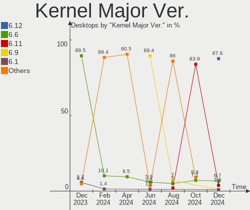
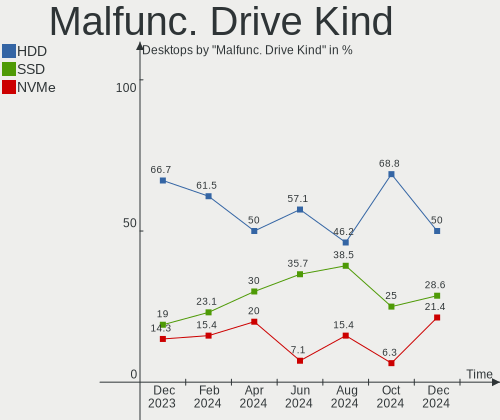
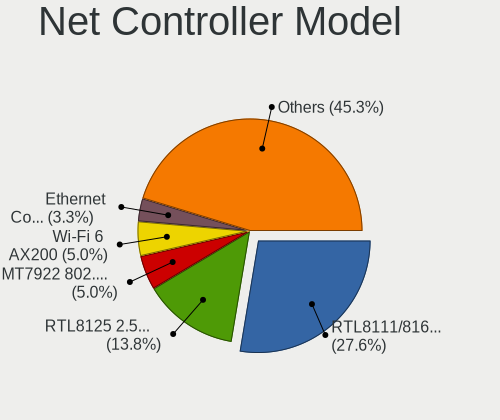
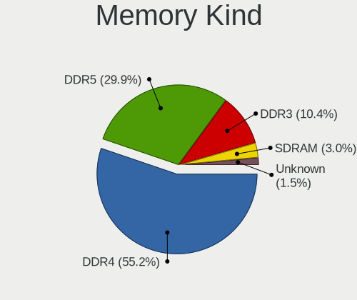
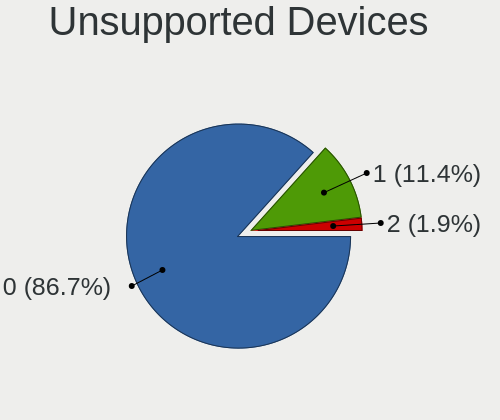

Arch Hardware Trends (Desktop)
------------------------------

A project to identify most popular hardware characteristics and track their change
over time based on data collected by Arch users at https://Linux-Hardware.org.

Anyone can contribute to the study by uploading probes of their computers by
the [hw-probe](https://github.com/linuxhw/hw-probe) tool:

    sudo -E hw-probe -all -upload

Full-feature report is available here: https://linux-hardware.org/?view=trends&formfactor=desktop

Period: Jun, 2021.

Contents
--------

- [ OS                       ](#os)
- [ OS Family                ](#os-family)
- [ Kernel                   ](#kernel)
- [ Kernel Family            ](#kernel-family)
- [ Kernel Major Ver.        ](#kernel-major-ver)
- [ Arch                     ](#arch)
- [ DE                       ](#de)
- [ Display Server           ](#display-server)
- [ Display Manager          ](#display-manager)
- [ OS Lang                  ](#os-lang)
- [ Boot Mode                ](#boot-mode)
- [ Filesystem               ](#filesystem)
- [ Part. scheme             ](#part-scheme)
- [ Dual Boot with Linux/BSD ](#dual-boot-with-linux/bsd)
- [ Dual Boot (Win)          ](#dual-boot-win)
- [ Country                  ](#country)
- [ City                     ](#city)
- [ Vendor                   ](#vendor)
- [ Model                    ](#model)
- [ Model Family             ](#model-family)
- [ MFG Year                 ](#mfg-year)
- [ Form Factor              ](#form-factor)
- [ Secure Boot              ](#secure-boot)
- [ Coreboot                 ](#coreboot)
- [ RAM Size                 ](#ram-size)
- [ RAM Used                 ](#ram-used)
- [ Has CD-ROM               ](#has-cd-rom)
- [ Total Drives             ](#total-drives)
- [ Has Ethernet             ](#has-ethernet)
- [ Has WiFi                 ](#has-wifi)
- [ Has Bluetooth            ](#has-bluetooth)
- [ Drive Vendor             ](#drive-vendor)
- [ Drive Model              ](#drive-model)
- [ HDD Vendor               ](#hdd-vendor)
- [ SSD Vendor               ](#ssd-vendor)
- [ Drive Kind               ](#drive-kind)
- [ Drive Connector          ](#drive-connector)
- [ Drive Size               ](#drive-size)
- [ Space Total              ](#space-total)
- [ Space Used               ](#space-used)
- [ Malfunc. Drives          ](#malfunc-drives)
- [ Malfunc. Drive Vendor    ](#malfunc-drive-vendor)
- [ Malfunc. HDD Vendor      ](#malfunc-hdd-vendor)
- [ Malfunc. Drive Kind      ](#malfunc-drive-kind)
- [ Failed Drives            ](#failed-drives)
- [ Failed Drive Vendor      ](#failed-drive-vendor)
- [ Drive Status             ](#drive-status)
- [ Storage Vendor           ](#storage-vendor)
- [ Storage Model            ](#storage-model)
- [ Storage Kind             ](#storage-kind)
- [ CPU Vendor               ](#cpu-vendor)
- [ CPU Model                ](#cpu-model)
- [ CPU Model Family         ](#cpu-model-family)
- [ CPU Cores                ](#cpu-cores)
- [ CPU Sockets              ](#cpu-sockets)
- [ CPU Threads              ](#cpu-threads)
- [ CPU Op-Modes             ](#cpu-op-modes)
- [ CPU Microcode            ](#cpu-microcode)
- [ CPU Microarch            ](#cpu-microarch)
- [ GPU Vendor               ](#gpu-vendor)
- [ GPU Model                ](#gpu-model)
- [ GPU Combo                ](#gpu-combo)
- [ GPU Driver               ](#gpu-driver)
- [ GPU Memory               ](#gpu-memory)
- [ Monitor Vendor           ](#monitor-vendor)
- [ Monitor Model            ](#monitor-model)
- [ Monitor Resolution       ](#monitor-resolution)
- [ Monitor Diagonal         ](#monitor-diagonal)
- [ Monitor Width            ](#monitor-width)
- [ Aspect Ratio             ](#aspect-ratio)
- [ Monitor Area             ](#monitor-area)
- [ Pixel Density            ](#pixel-density)
- [ Multiple Monitors        ](#multiple-monitors)
- [ Net Controller Vendor    ](#net-controller-vendor)
- [ Net Controller Model     ](#net-controller-model)
- [ Wireless Vendor          ](#wireless-vendor)
- [ Wireless Model           ](#wireless-model)
- [ Ethernet Vendor          ](#ethernet-vendor)
- [ Ethernet Model           ](#ethernet-model)
- [ Net Controller Kind      ](#net-controller-kind)
- [ Used Controller          ](#used-controller)
- [ NICs                     ](#nics)
- [ IPv6                     ](#ipv6)
- [ Memory Vendor            ](#memory-vendor)
- [ Memory Model             ](#memory-model)
- [ Memory Kind              ](#memory-kind)
- [ Memory Form Factor       ](#memory-form-factor)
- [ Memory Size              ](#memory-size)
- [ Memory Speed             ](#memory-speed)
- [ Sound Vendor             ](#sound-vendor)
- [ Sound Model              ](#sound-model)
- [ Camera Vendor            ](#camera-vendor)
- [ Camera Model             ](#camera-model)
- [ Fingerprint Vendor       ](#fingerprint-vendor)
- [ Fingerprint Model        ](#fingerprint-model)
- [ Chipcard Vendor          ](#chipcard-vendor)
- [ Chipcard Model           ](#chipcard-model)
- [ Printer Vendor           ](#printer-vendor)
- [ Printer Model            ](#printer-model)
- [ Scanner Vendor           ](#scanner-vendor)
- [ Scanner Model            ](#scanner-model)
- [ Bluetooth Vendor         ](#bluetooth-vendor)
- [ Bluetooth Model          ](#bluetooth-model)
- [ Unsupported Devices      ](#unsupported-devices)
- [ Unsupported Device Types ](#unsupported-device-types)

OS
--

Installed operating systems

| Name         | Desktops | Percent |
|--------------|----------|---------|
| Arch         | 31       | 52.54%  |
| Arch Rolling | 28       | 47.46%  |

OS Family
---------

OS without a version

| Name | Desktops | Percent |
|------|----------|---------|
| Arch | 59       | 100%    |

Kernel
------

Version of the Linux kernel

| Version                      | Desktops | Percent |
|------------------------------|----------|---------|
| 5.12.9-arch1-1               | 11       | 18.64%  |
| 5.12.8-arch1-1               | 8        | 13.56%  |
| 5.12.9-zen1-1-zen            | 6        | 10.17%  |
| 5.12.11-arch1-1              | 3        | 5.08%   |
| 5.12.13-arch1-2              | 2        | 3.39%   |
| 5.12.12-arch1-1              | 2        | 3.39%   |
| 5.12.10-zen1-1-zen           | 2        | 3.39%   |
| 5.12.10-arch1-1              | 2        | 3.39%   |
| 5.8.9-arch2-1                | 1        | 1.69%   |
| 5.13.0-rc5-1-mainline        | 1        | 1.69%   |
| 5.12.9-xanmod1-1             | 1        | 1.69%   |
| 5.12.9-2-clear               | 1        | 1.69%   |
| 5.12.8-zen1-1-zen            | 1        | 1.69%   |
| 5.12.8-163-tkg-cacule        | 1        | 1.69%   |
| 5.12.8-1-ck-zen2             | 1        | 1.69%   |
| 5.12.7-hardened1-1-hardened  | 1        | 1.69%   |
| 5.12.6-zen1-1-zen            | 1        | 1.69%   |
| 5.12.6-arch1-1               | 1        | 1.69%   |
| 5.12.5-arch1-1               | 1        | 1.69%   |
| 5.12.3-xanmod1-1             | 1        | 1.69%   |
| 5.12.13-zen1-2-zen           | 1        | 1.69%   |
| 5.12.13-arch1-1              | 1        | 1.69%   |
| 5.12.13-172-tkg-pds          | 1        | 1.69%   |
| 5.12.13-172-tkg-bmq          | 1        | 1.69%   |
| 5.12.12-zen1-1-zen           | 1        | 1.69%   |
| 5.12.11-zen1-1-zen           | 1        | 1.69%   |
| 5.11.16-arch1-1              | 1        | 1.69%   |
| 5.10.45-rt42-1-cacule-rdb-rt | 1        | 1.69%   |
| 5.10.45-1-lts                | 1        | 1.69%   |
| 5.10.43-1-lts                | 1        | 1.69%   |
| 5.10.39-1-lts                | 1        | 1.69%   |

Kernel Family
-------------

Linux kernel without a distro release

| Version | Desktops | Percent |
|---------|----------|---------|
| 5.12.9  | 19       | 32.2%   |
| 5.12.8  | 11       | 18.64%  |
| 5.12.13 | 6        | 10.17%  |
| 5.12.11 | 4        | 6.78%   |
| 5.12.10 | 4        | 6.78%   |
| 5.12.12 | 3        | 5.08%   |
| 5.12.6  | 2        | 3.39%   |
| 5.10.45 | 2        | 3.39%   |
| 5.8.9   | 1        | 1.69%   |
| 5.13.0  | 1        | 1.69%   |
| 5.12.7  | 1        | 1.69%   |
| 5.12.5  | 1        | 1.69%   |
| 5.12.3  | 1        | 1.69%   |
| 5.11.16 | 1        | 1.69%   |
| 5.10.43 | 1        | 1.69%   |
| 5.10.39 | 1        | 1.69%   |

Kernel Major Ver.
-----------------

Linux kernel major version

| Version | Desktops | Percent |
|---------|----------|---------|
| 5.12    | 52       | 88.14%  |
| 5.10    | 4        | 6.78%   |
| 5.8     | 1        | 1.69%   |
| 5.13    | 1        | 1.69%   |
| 5.11    | 1        | 1.69%   |

Arch
----

OS architecture (x86_64, i586, etc.)

| Name   | Desktops | Percent |
|--------|----------|---------|
| x86_64 | 59       | 100%    |

DE
--

Desktop Environment

| Name       | Desktops | Percent |
|------------|----------|---------|
| GNOME      | 18       | 30.51%  |
| KDE5       | 13       | 22.03%  |
| kde        | 8        | 13.56%  |
| XFCE       | 5        | 8.47%   |
| Unknown    | 4        | 6.78%   |
| X-Cinnamon | 2        | 3.39%   |
| sway       | 2        | 3.39%   |
| i3         | 2        | 3.39%   |
| sway:Unity | 1        | 1.69%   |
| qtile      | 1        | 1.69%   |
| Cinnamon   | 1        | 1.69%   |
| Budgie     | 1        | 1.69%   |
| bspwm      | 1        | 1.69%   |

Display Server
--------------

X11 or Wayland

| Name    | Desktops | Percent |
|---------|----------|---------|
| X11     | 40       | 67.8%   |
| Wayland | 11       | 18.64%  |
| Unknown | 5        | 8.47%   |
| Tty     | 3        | 5.08%   |

Display Manager
---------------

SDDM, LightDM, etc.

| Name    | Desktops | Percent |
|---------|----------|---------|
| Unknown | 26       | 44.07%  |
| SDDM    | 13       | 22.03%  |
| GDM     | 10       | 16.95%  |
| TDM     | 5        | 8.47%   |
| Ly      | 3        | 5.08%   |
| LXDM    | 1        | 1.69%   |
| LightDM | 1        | 1.69%   |

OS Lang
-------

Language

| Lang  | Desktops | Percent |
|-------|----------|---------|
| en_US | 33       | 55.93%  |
| en_GB | 5        | 8.47%   |
| de_DE | 3        | 5.08%   |
| zh_CN | 2        | 3.39%   |
| pt_BR | 2        | 3.39%   |
| C     | 2        | 3.39%   |
| uk_UA | 1        | 1.69%   |
| ru_UA | 1        | 1.69%   |
| ru_RU | 1        | 1.69%   |
| pl_PL | 1        | 1.69%   |
| fr_FR | 1        | 1.69%   |
| fi_FI | 1        | 1.69%   |
| es_MX | 1        | 1.69%   |
| en_ZA | 1        | 1.69%   |
| en_IL | 1        | 1.69%   |
| en_DK | 1        | 1.69%   |
| en_DE | 1        | 1.69%   |
| en_AU | 1        | 1.69%   |

Boot Mode
---------

EFI or BIOS

| Mode | Desktops | Percent |
|------|----------|---------|
| EFI  | 35       | 59.32%  |
| BIOS | 24       | 40.68%  |

Filesystem
----------

Type of filesystem

| Type  | Desktops | Percent |
|-------|----------|---------|
| Ext4  | 39       | 66.1%   |
| Btrfs | 18       | 30.51%  |
| Xfs   | 2        | 3.39%   |

Part. scheme
------------

Scheme of partitioning

| Type    | Desktops | Percent |
|---------|----------|---------|
| GPT     | 38       | 64.41%  |
| Unknown | 18       | 30.51%  |
| MBR     | 3        | 5.08%   |

Dual Boot with Linux/BSD
------------------------

Hosting more than one Linux/BSD

| Dual boot | Desktops | Percent |
|-----------|----------|---------|
| No        | 51       | 86.44%  |
| Yes       | 8        | 13.56%  |

Dual Boot (Win)
---------------

Hosting Linux and Windows

| Dual boot | Desktops | Percent |
|-----------|----------|---------|
| No        | 35       | 59.32%  |
| Yes       | 24       | 40.68%  |

Country
-------

Geographic location (country)

| Country      | Desktops | Percent |
|--------------|----------|---------|
| USA          | 11       | 18.64%  |
| Germany      | 8        | 13.56%  |
| Poland       | 6        | 10.17%  |
| UK           | 4        | 6.78%   |
| France       | 3        | 5.08%   |
| Ukraine      | 2        | 3.39%   |
| Thailand     | 2        | 3.39%   |
| Sweden       | 2        | 3.39%   |
| Russia       | 2        | 3.39%   |
| Mexico       | 2        | 3.39%   |
| Finland      | 2        | 3.39%   |
| Brazil       | 2        | 3.39%   |
| Vietnam      | 1        | 1.69%   |
| Uzbekistan   | 1        | 1.69%   |
| Spain        | 1        | 1.69%   |
| South Africa | 1        | 1.69%   |
| Singapore    | 1        | 1.69%   |
| Romania      | 1        | 1.69%   |
| Norway       | 1        | 1.69%   |
| New Zealand  | 1        | 1.69%   |
| Netherlands  | 1        | 1.69%   |
| Lithuania    | 1        | 1.69%   |
| Israel       | 1        | 1.69%   |
| Canada       | 1        | 1.69%   |
| Australia    | 1        | 1.69%   |

City
----

Geographic location (city)

| City                 | Desktops | Percent |
|----------------------|----------|---------|
| Warsaw               | 2        | 3.39%   |
| Nuremberg            | 2        | 3.39%   |
| London               | 2        | 3.39%   |
| Wimbledon            | 1        | 1.69%   |
| White Lake           | 1        | 1.69%   |
| Wellington           | 1        | 1.69%   |
| Veracruz             | 1        | 1.69%   |
| Ufa                  | 1        | 1.69%   |
| Toluca               | 1        | 1.69%   |
| Thames Ditton        | 1        | 1.69%   |
| Tashkent             | 1        | 1.69%   |
| São Paulo           | 1        | 1.69%   |
| Sydney               | 1        | 1.69%   |
| Stockholm            | 1        | 1.69%   |
| Springville          | 1        | 1.69%   |
| Singapore            | 1        | 1.69%   |
| Seattle              | 1        | 1.69%   |
| Sangruda             | 1        | 1.69%   |
| Richmond             | 1        | 1.69%   |
| Ratchathewi          | 1        | 1.69%   |
| Ramat Gan            | 1        | 1.69%   |
| Pulheim              | 1        | 1.69%   |
| Perth Amboy          | 1        | 1.69%   |
| Paris                | 1        | 1.69%   |
| Novovolynsk          | 1        | 1.69%   |
| Munich               | 1        | 1.69%   |
| Mooresville          | 1        | 1.69%   |
| Mississippi Mills    | 1        | 1.69%   |
| Miami                | 1        | 1.69%   |
| Markaryd             | 1        | 1.69%   |
| Maringá             | 1        | 1.69%   |
| Mably                | 1        | 1.69%   |
| Los Angeles          | 1        | 1.69%   |
| Lodz                 | 1        | 1.69%   |
| Le Perreux-sur-Marne | 1        | 1.69%   |
| Landau               | 1        | 1.69%   |
| Kuopio               | 1        | 1.69%   |
| Kouvola              | 1        | 1.69%   |
| Kolbeinsvik          | 1        | 1.69%   |
| Kharkiv              | 1        | 1.69%   |
| Irkutsk              | 1        | 1.69%   |
| Hellevoetsluis       | 1        | 1.69%   |
| Hamburg              | 1        | 1.69%   |
| Gdansk               | 1        | 1.69%   |
| Gainesville          | 1        | 1.69%   |
| Freiburg im Breisgau | 1        | 1.69%   |
| Durban               | 1        | 1.69%   |
| Darmstadt            | 1        | 1.69%   |
| Da Nang              | 1        | 1.69%   |
| Bytom                | 1        | 1.69%   |
| Bielsko-Biala        | 1        | 1.69%   |
| Belfast              | 1        | 1.69%   |
| Bardstown            | 1        | 1.69%   |
| Barcelona            | 1        | 1.69%   |
| Bangkok              | 1        | 1.69%   |
| Arad                 | 1        | 1.69%   |

Vendor
------

Motherboard manufacturer

| Name                | Desktops | Percent |
|---------------------|----------|---------|
| ASUSTek Computer    | 21       | 35.59%  |
| MSI                 | 11       | 18.64%  |
| Gigabyte Technology | 11       | 18.64%  |
| ASRock              | 9        | 15.25%  |
| Hewlett-Packard     | 3        | 5.08%   |
| LattePanda          | 1        | 1.69%   |
| KLLISRE             | 1        | 1.69%   |
| Dell                | 1        | 1.69%   |
| Acer                | 1        | 1.69%   |

Model
-----

Motherboard model

| Name                              | Desktops | Percent |
|-----------------------------------|----------|---------|
| MSI MS-7C37                       | 3        | 5.08%   |
| ASUS All Series                   | 2        | 3.39%   |
| MSI MS-7C95                       | 1        | 1.69%   |
| MSI MS-7C52                       | 1        | 1.69%   |
| MSI MS-7B89                       | 1        | 1.69%   |
| MSI MS-7B86                       | 1        | 1.69%   |
| MSI MS-7978                       | 1        | 1.69%   |
| MSI MS-7918                       | 1        | 1.69%   |
| MSI MS-7850                       | 1        | 1.69%   |
| MSI B85M-E45                      | 1        | 1.69%   |
| LattePanda Alpha                  | 1        | 1.69%   |
| KLLISRE X79 V2.72S                | 1        | 1.69%   |
| HP OMEN by HP Desktop PC 880-p0xx | 1        | 1.69%   |
| HP OMEN 30L Desktop GT13-0xxx     | 1        | 1.69%   |
| HP 290 G2 MT Business PC          | 1        | 1.69%   |
| Gigabyte Z87X-UD3H                | 1        | 1.69%   |
| Gigabyte Z270X-Gaming 7           | 1        | 1.69%   |
| Gigabyte Z170-HD3P                | 1        | 1.69%   |
| Gigabyte X570 AORUS PRO WIFI      | 1        | 1.69%   |
| Gigabyte X570 AORUS ELITE         | 1        | 1.69%   |
| Gigabyte GB-BRR7H-4800            | 1        | 1.69%   |
| Gigabyte GA-MA770T-UD3P           | 1        | 1.69%   |
| Gigabyte F2A88XM-HD3P             | 1        | 1.69%   |
| Gigabyte B550M AORUS PRO-P        | 1        | 1.69%   |
| Gigabyte B450M DS3H               | 1        | 1.69%   |
| Gigabyte B150N Phoenix-WIFI       | 1        | 1.69%   |
| Dell Precision Tower 5810         | 1        | 1.69%   |
| ASUS Z170-DELUXE                  | 1        | 1.69%   |
| ASUS WS C246 PRO                  | 1        | 1.69%   |
| ASUS TUF X470-PLUS GAMING         | 1        | 1.69%   |
| ASUS TUF GAMING B550-PLUS         | 1        | 1.69%   |
| ASUS SABERTOOTH X79               | 1        | 1.69%   |
| ASUS ROG STRIX B550-F GAMING      | 1        | 1.69%   |
| ASUS ROG STRIX B450-I GAMING      | 1        | 1.69%   |
| ASUS ROG STRIX B450-F GAMING      | 1        | 1.69%   |
| ASUS ROG Maximus XI FORMULA       | 1        | 1.69%   |
| ASUS Pro WS X570-ACE              | 1        | 1.69%   |
| ASUS PRIME X470-PRO               | 1        | 1.69%   |
| ASUS PRIME X370-PRO               | 1        | 1.69%   |
| ASUS PRIME B550M-A                | 1        | 1.69%   |
| ASUS PRIME B450M-K                | 1        | 1.69%   |
| ASUS P8P67 LE                     | 1        | 1.69%   |
| ASUS P8H61-M LX3                  | 1        | 1.69%   |
| ASUS P7H55-M LX                   | 1        | 1.69%   |
| ASUS P5GC-MX/1333                 | 1        | 1.69%   |
| ASUS Maximus VIII FORMULA         | 1        | 1.69%   |
| ASRock Z97 Extreme6               | 1        | 1.69%   |
| ASRock Z590M Pro4                 | 1        | 1.69%   |
| ASRock Z370 Pro4-IB               | 1        | 1.69%   |
| ASRock X570 Taichi                | 1        | 1.69%   |
| ASRock X470 Taichi                | 1        | 1.69%   |
| ASRock X370 Taichi                | 1        | 1.69%   |
| ASRock H61M-VS4                   | 1        | 1.69%   |
| ASRock G31M-VS2                   | 1        | 1.69%   |
| ASRock AM1B-ITX                   | 1        | 1.69%   |
| Acer Aspire XC-885                | 1        | 1.69%   |

Model Family
------------

Motherboard model prefix

| Name                    | Desktops | Percent |
|-------------------------|----------|---------|
| ASUS ROG                | 4        | 6.78%   |
| ASUS PRIME              | 4        | 6.78%   |
| MSI MS-7C37             | 3        | 5.08%   |
| HP OMEN                 | 2        | 3.39%   |
| Gigabyte X570           | 2        | 3.39%   |
| ASUS TUF                | 2        | 3.39%   |
| ASUS All                | 2        | 3.39%   |
| MSI MS-7C95             | 1        | 1.69%   |
| MSI MS-7C52             | 1        | 1.69%   |
| MSI MS-7B89             | 1        | 1.69%   |
| MSI MS-7B86             | 1        | 1.69%   |
| MSI MS-7978             | 1        | 1.69%   |
| MSI MS-7918             | 1        | 1.69%   |
| MSI MS-7850             | 1        | 1.69%   |
| MSI B85M-E45            | 1        | 1.69%   |
| LattePanda Alpha        | 1        | 1.69%   |
| KLLISRE X79             | 1        | 1.69%   |
| HP 290                  | 1        | 1.69%   |
| Gigabyte Z87X-UD3H      | 1        | 1.69%   |
| Gigabyte Z270X-Gaming   | 1        | 1.69%   |
| Gigabyte Z170-HD3P      | 1        | 1.69%   |
| Gigabyte GB-BRR7H-4800  | 1        | 1.69%   |
| Gigabyte GA-MA770T-UD3P | 1        | 1.69%   |
| Gigabyte F2A88XM-HD3P   | 1        | 1.69%   |
| Gigabyte B550M          | 1        | 1.69%   |
| Gigabyte B450M          | 1        | 1.69%   |
| Gigabyte B150N          | 1        | 1.69%   |
| Dell Precision          | 1        | 1.69%   |
| ASUS Z170-DELUXE        | 1        | 1.69%   |
| ASUS WS                 | 1        | 1.69%   |
| ASUS SABERTOOTH         | 1        | 1.69%   |
| ASUS Pro                | 1        | 1.69%   |
| ASUS P8P67              | 1        | 1.69%   |
| ASUS P8H61-M            | 1        | 1.69%   |
| ASUS P7H55-M            | 1        | 1.69%   |
| ASUS P5GC-MX            | 1        | 1.69%   |
| ASUS Maximus            | 1        | 1.69%   |
| ASRock Z97              | 1        | 1.69%   |
| ASRock Z590M            | 1        | 1.69%   |
| ASRock Z370             | 1        | 1.69%   |
| ASRock X570             | 1        | 1.69%   |
| ASRock X470             | 1        | 1.69%   |
| ASRock X370             | 1        | 1.69%   |
| ASRock H61M-VS4         | 1        | 1.69%   |
| ASRock G31M-VS2         | 1        | 1.69%   |
| ASRock AM1B-ITX         | 1        | 1.69%   |
| Acer Aspire             | 1        | 1.69%   |

MFG Year
--------

Motherboard manufacture year

| Year | Desktops | Percent |
|------|----------|---------|
| 2021 | 15       | 25.42%  |
| 2020 | 11       | 18.64%  |
| 2019 | 8        | 13.56%  |
| 2014 | 7        | 11.86%  |
| 2018 | 6        | 10.17%  |
| 2017 | 3        | 5.08%   |
| 2013 | 3        | 5.08%   |
| 2015 | 2        | 3.39%   |
| 2012 | 2        | 3.39%   |
| 2011 | 1        | 1.69%   |
| 2007 | 1        | 1.69%   |

Form Factor
-----------

Physical design of the computer

| Name    | Desktops | Percent |
|---------|----------|---------|
| Desktop | 59       | 100%    |

Secure Boot
-----------

Enabled or disabled

| State    | Desktops | Percent |
|----------|----------|---------|
| Disabled | 59       | 100%    |

Coreboot
--------

Have coreboot on board

| Used | Desktops | Percent |
|------|----------|---------|
| No   | 59       | 100%    |

RAM Size
--------

Total RAM memory

| Size in GB | Desktops | Percent |
|------------|----------|---------|
| 16.01-24.0 | 22       | 37.29%  |
| 32.01-64.0 | 17       | 28.81%  |
| 8.01-16.0  | 10       | 16.95%  |
| 4.01-8.0   | 3        | 5.08%   |
| 3.01-4.0   | 3        | 5.08%   |
| 24.01-32.0 | 3        | 5.08%   |
| 2.01-3.0   | 1        | 1.69%   |

RAM Used
--------

Used RAM memory

| Used GB    | Desktops | Percent |
|------------|----------|---------|
| 4.01-8.0   | 17       | 28.81%  |
| 2.01-3.0   | 16       | 27.12%  |
| 1.01-2.0   | 9        | 15.25%  |
| 8.01-16.0  | 8        | 13.56%  |
| 3.01-4.0   | 6        | 10.17%  |
| 24.01-32.0 | 1        | 1.69%   |
| 0.51-1.0   | 1        | 1.69%   |
| 0.01-0.5   | 1        | 1.69%   |

Has CD-ROM
----------

Has CD-ROM on board

| Presented | Desktops | Percent |
|-----------|----------|---------|
| No        | 42       | 71.19%  |
| Yes       | 17       | 28.81%  |

Total Drives
------------

Number of drives on board

| Drives | Desktops | Percent |
|--------|----------|---------|
| 3      | 17       | 28.81%  |
| 2      | 16       | 27.12%  |
| 4      | 12       | 20.34%  |
| 1      | 8        | 13.56%  |
| 6      | 3        | 5.08%   |
| 8      | 1        | 1.69%   |
| 5      | 1        | 1.69%   |
| 0      | 1        | 1.69%   |

Has Ethernet
------------

Has Ethernet on board

| Presented | Desktops | Percent |
|-----------|----------|---------|
| Yes       | 58       | 98.31%  |
| No        | 1        | 1.69%   |

Has WiFi
--------

Has WiFi module

| Presented | Desktops | Percent |
|-----------|----------|---------|
| No        | 32       | 54.24%  |
| Yes       | 27       | 45.76%  |

Has Bluetooth
-------------

Has Bluetooth module

| Presented | Desktops | Percent |
|-----------|----------|---------|
| No        | 30       | 50.85%  |
| Yes       | 29       | 49.15%  |

Drive Vendor
------------

Hard drive vendors

| Vendor                | Desktops | Drives | Percent |
|-----------------------|----------|--------|---------|
| Samsung Electronics   | 29       | 45     | 22.14%  |
| WDC                   | 25       | 40     | 19.08%  |
| Seagate               | 19       | 24     | 14.5%   |
| Crucial               | 10       | 13     | 7.63%   |
| Toshiba               | 9        | 10     | 6.87%   |
| SanDisk               | 7        | 10     | 5.34%   |
| Kingston              | 4        | 4      | 3.05%   |
| Intel                 | 4        | 4      | 3.05%   |
| SK Hynix              | 3        | 4      | 2.29%   |
| A-DATA Technology     | 3        | 3      | 2.29%   |
| Unknown               | 2        | 2      | 1.53%   |
| Phison                | 2        | 2      | 1.53%   |
| Yangtze Memory        | 1        | 1      | 0.76%   |
| Silicon Motion        | 1        | 1      | 0.76%   |
| SHGS31-5              | 1        | 1      | 0.76%   |
| Realtek Semiconductor | 1        | 1      | 0.76%   |
| Radeon                | 1        | 1      | 0.76%   |
| Patriot               | 1        | 1      | 0.76%   |
| LITEON                | 1        | 1      | 0.76%   |
| Lexar                 | 1        | 1      | 0.76%   |
| HGST                  | 1        | 1      | 0.76%   |
| Hewlett-Packard       | 1        | 1      | 0.76%   |
| GOODRAM               | 1        | 1      | 0.76%   |
| Gigabyte Technology   | 1        | 1      | 0.76%   |
| Fujitsu               | 1        | 1      | 0.76%   |
| Corsair               | 1        | 1      | 0.76%   |

Drive Model
-----------

Hard drive models

| Model                                     | Desktops | Percent |
|-------------------------------------------|----------|---------|
| Samsung SSD 850 EVO 250GB                 | 5        | 2.99%   |
| Samsung NVMe SSD Drive 500GB              | 3        | 1.8%    |
| Crucial CT1000MX500SSD1 1TB               | 3        | 1.8%    |
| WDC WDS250G3X0C-00SJG0 250GB              | 2        | 1.2%    |
| WDC WDS240G2G0B-00EPW0 240GB SSD          | 2        | 1.2%    |
| WDC WD5000AAKX-60U6AA0 500GB              | 2        | 1.2%    |
| WDC WD20EZRZ-00Z5HB0 2TB                  | 2        | 1.2%    |
| WDC WD20EZAZ-00GGJB0 2TB                  | 2        | 1.2%    |
| WDC WD10EZRZ-00HTKB0 1TB                  | 2        | 1.2%    |
| WDC WD10EZEX-00BN5A0 1TB                  | 2        | 1.2%    |
| Toshiba DT01ACA200 2TB                    | 2        | 1.2%    |
| Toshiba DT01ACA100 1TB                    | 2        | 1.2%    |
| Toshiba DT01ACA050 500GB                  | 2        | 1.2%    |
| Seagate ST1000DM003-1CH162 1TB            | 2        | 1.2%    |
| Samsung SSD 970 EVO Plus 500GB            | 2        | 1.2%    |
| Samsung SSD 970 EVO 500GB                 | 2        | 1.2%    |
| Samsung SSD 960 EVO 500GB                 | 2        | 1.2%    |
| Samsung SSD 860 EVO 500GB                 | 2        | 1.2%    |
| Samsung SSD 860 EVO 1TB                   | 2        | 1.2%    |
| Samsung NVMe SSD Drive 1TB                | 2        | 1.2%    |
| Samsung NVMe SSD Drive 1024GB             | 2        | 1.2%    |
| Intel SSDPEKNW010T8 1TB                   | 2        | 1.2%    |
| Crucial CT480BX500SSD1 480GB              | 2        | 1.2%    |
| Crucial CT240BX500SSD1 240GB              | 2        | 1.2%    |
| Crucial CT1000MX500SSD4 1TB               | 2        | 1.2%    |
| Yangtze Memory ZHITAI PC005 Active 1TB    | 1        | 0.6%    |
| WDC WDS100T3X0C-00SJG0 1TB                | 1        | 0.6%    |
| WDC WDS100T2G0A-00JH30 1TB SSD            | 1        | 0.6%    |
| WDC WDS100T2B0B-00YS70 1TB SSD            | 1        | 0.6%    |
| WDC WDS100T2B0B 1TB SSD                   | 1        | 0.6%    |
| WDC WDS100T2B0A-00SM50 1TB SSD            | 1        | 0.6%    |
| WDC WDBRPG0010BNC-WRSN 1TB                | 1        | 0.6%    |
| WDC WD60EZAZ-00ZGHB0 6TB                  | 1        | 0.6%    |
| WDC WD50EZRX-00MVLB1 5TB                  | 1        | 0.6%    |
| WDC WD5000BPVT-60HXZT3 500GB              | 1        | 0.6%    |
| WDC WD5000BEVT-75A0RT0 500GB              | 1        | 0.6%    |
| WDC WD5000AAVS-00ZTB0 500GB               | 1        | 0.6%    |
| WDC WD5000AAKX-75U6AA0 500GB              | 1        | 0.6%    |
| WDC WD5000AAKX-00ERMA0 500GB              | 1        | 0.6%    |
| WDC WD5000AAKX-001CA0 500GB               | 1        | 0.6%    |
| WDC WD40EZRX-00SPEB0 4TB                  | 1        | 0.6%    |
| WDC WD40EFRX-68WT0N0 4TB                  | 1        | 0.6%    |
| WDC WD4005FZBX-00K5WB0 4TB                | 1        | 0.6%    |
| WDC WD30EZRX-00SPEB0 3TB                  | 1        | 0.6%    |
| WDC WD30EZRX-00D8PB0 3TB                  | 1        | 0.6%    |
| WDC WD30EFRX-68AX9N0 3TB                  | 1        | 0.6%    |
| WDC WD20EFRX-68EUZN0 2TB                  | 1        | 0.6%    |
| WDC WD20EFRX-68AX9N0 2TB                  | 1        | 0.6%    |
| WDC WD10JPVT-75A1YT0 1TB                  | 1        | 0.6%    |
| WDC WD10EZEX-22RKKA0 1TB                  | 1        | 0.6%    |
| WDC WD10EZEX-22MFCA0 1TB                  | 1        | 0.6%    |
| WDC WD10EURX-73FH1Y0 1TB                  | 1        | 0.6%    |
| Unknown SD/MMC/MS PRO 128GB               | 1        | 0.6%    |
| Unknown MMC Card  64GB                    | 1        | 0.6%    |
| Toshiba TR200 240GB SSD                   | 1        | 0.6%    |
| Toshiba Q300 120GB SSD                    | 1        | 0.6%    |
| Toshiba KXG50ZNV512G 512GB                | 1        | 0.6%    |
| Toshiba HDWE160 6TB                       | 1        | 0.6%    |
| SK Hynix SKHynix_HFS256GD9TNI-L2B0B 256GB | 1        | 0.6%    |
| SK Hynix SHGS31-500GS-2 500GB SSD         | 1        | 0.6%    |

HDD Vendor
----------

Hard disk drive vendors

| Vendor              | Desktops | Drives | Percent |
|---------------------|----------|--------|---------|
| WDC                 | 23       | 30     | 42.59%  |
| Seagate             | 18       | 20     | 33.33%  |
| Toshiba             | 7        | 7      | 12.96%  |
| Samsung Electronics | 4        | 4      | 7.41%   |
| HGST                | 1        | 1      | 1.85%   |
| Fujitsu             | 1        | 1      | 1.85%   |

SSD Vendor
----------

Solid state drive vendors

| Vendor              | Desktops | Drives | Percent |
|---------------------|----------|--------|---------|
| Samsung Electronics | 19       | 22     | 33.93%  |
| Crucial             | 10       | 13     | 17.86%  |
| WDC                 | 6        | 6      | 10.71%  |
| SanDisk             | 5        | 6      | 8.93%   |
| Kingston            | 3        | 3      | 5.36%   |
| Toshiba             | 2        | 2      | 3.57%   |
| A-DATA Technology   | 2        | 2      | 3.57%   |
| SK Hynix            | 1        | 1      | 1.79%   |
| Radeon              | 1        | 1      | 1.79%   |
| Patriot             | 1        | 1      | 1.79%   |
| LITEON              | 1        | 1      | 1.79%   |
| Lexar               | 1        | 1      | 1.79%   |
| Intel               | 1        | 1      | 1.79%   |
| Hewlett-Packard     | 1        | 1      | 1.79%   |
| GOODRAM             | 1        | 1      | 1.79%   |
| Corsair             | 1        | 1      | 1.79%   |

Drive Kind
----------

HDD or SSD

| Kind    | Desktops | Drives | Percent |
|---------|----------|--------|---------|
| SSD     | 42       | 63     | 36.52%  |
| HDD     | 40       | 63     | 34.78%  |
| NVMe    | 30       | 42     | 26.09%  |
| Unknown | 2        | 6      | 1.74%   |
| MMC     | 1        | 1      | 0.87%   |

Drive Connector
---------------

SATA, SAS, NVMe, etc.

| Type | Desktops | Drives | Percent |
|------|----------|--------|---------|
| SATA | 54       | 125    | 61.36%  |
| NVMe | 30       | 42     | 34.09%  |
| SAS  | 3        | 7      | 3.41%   |
| MMC  | 1        | 1      | 1.14%   |

Drive Size
----------

Size of hard drive

| Size in TB | Desktops | Drives | Percent |
|------------|----------|--------|---------|
| 0.01-0.5   | 41       | 61     | 43.62%  |
| 0.51-1.0   | 27       | 36     | 28.72%  |
| 1.01-2.0   | 13       | 16     | 13.83%  |
| 3.01-4.0   | 6        | 6      | 6.38%   |
| 4.01-10.0  | 4        | 4      | 4.26%   |
| 2.01-3.0   | 3        | 3      | 3.19%   |

Space Total
-----------

Amount of disk space available on the file system

| Size in GB     | Desktops | Percent |
|----------------|----------|---------|
| More than 3000 | 13       | 22.03%  |
| 1001-2000      | 12       | 20.34%  |
| 101-250        | 9        | 15.25%  |
| 501-1000       | 9        | 15.25%  |
| 251-500        | 7        | 11.86%  |
| 2001-3000      | 6        | 10.17%  |
| 21-50          | 2        | 3.39%   |
| 51-100         | 1        | 1.69%   |

Space Used
----------

Amount of used disk space

| Used GB        | Desktops | Percent |
|----------------|----------|---------|
| 101-250        | 10       | 16.95%  |
| 1001-2000      | 9        | 15.25%  |
| 2001-3000      | 8        | 13.56%  |
| 21-50          | 7        | 11.86%  |
| 1-20           | 7        | 11.86%  |
| 501-1000       | 7        | 11.86%  |
| 251-500        | 5        | 8.47%   |
| 51-100         | 4        | 6.78%   |
| More than 3000 | 2        | 3.39%   |

Malfunc. Drives
---------------

Drive models with a malfunction

| Model                                 | Desktops | Drives | Percent |
|---------------------------------------|----------|--------|---------|
| WDC WD5000BEVT-75A0RT0 500GB          | 1        | 1      | 10%     |
| WDC WD5000AAVS-00ZTB0 500GB           | 1        | 1      | 10%     |
| WDC WD30EZRX-00D8PB0 3TB              | 1        | 1      | 10%     |
| WDC WD10EZRZ-00HTKB0 1TB              | 1        | 1      | 10%     |
| Seagate ST3250823AS 250GB             | 1        | 1      | 10%     |
| Seagate ST1000LM014-SSHD-8GB          | 1        | 1      | 10%     |
| SanDisk SSD PLUS 480GB                | 1        | 1      | 10%     |
| Samsung Electronics SSD 960 EVO 250GB | 1        | 1      | 10%     |
| LITEON CV8-8E128-HP 128GB SSD         | 1        | 1      | 10%     |
| Crucial CT480M500SSD3 480GB           | 1        | 1      | 10%     |

Malfunc. Drive Vendor
---------------------

Vendors of faulty drives

| Vendor              | Desktops | Drives | Percent |
|---------------------|----------|--------|---------|
| WDC                 | 3        | 4      | 33.33%  |
| Seagate             | 2        | 2      | 22.22%  |
| SanDisk             | 1        | 1      | 11.11%  |
| Samsung Electronics | 1        | 1      | 11.11%  |
| LITEON              | 1        | 1      | 11.11%  |
| Crucial             | 1        | 1      | 11.11%  |

Malfunc. HDD Vendor
-------------------

Vendors of faulty HDD drives

| Vendor  | Desktops | Drives | Percent |
|---------|----------|--------|---------|
| WDC     | 3        | 4      | 60%     |
| Seagate | 2        | 2      | 40%     |

Malfunc. Drive Kind
-------------------

Kinds of faulty drives

| Kind | Desktops | Drives | Percent |
|------|----------|--------|---------|
| HDD  | 4        | 6      | 50%     |
| SSD  | 3        | 3      | 37.5%   |
| NVMe | 1        | 1      | 12.5%   |

Failed Drives
-------------

Failed drive models

Zero info for selected period =(

Failed Drive Vendor
-------------------

Failed drive vendors

Zero info for selected period =(

Drive Status
------------

Number of failed and malfunc. drives

| Status   | Desktops | Drives | Percent |
|----------|----------|--------|---------|
| Works    | 32       | 87     | 47.06%  |
| Detected | 28       | 78     | 41.18%  |
| Malfunc  | 8        | 10     | 11.76%  |

Storage Vendor
--------------

Storage controller vendors

| Vendor                       | Desktops | Percent |
|------------------------------|----------|---------|
| AMD                          | 30       | 28.85%  |
| Intel                        | 29       | 27.88%  |
| Samsung Electronics          | 14       | 13.46%  |
| ASMedia Technology           | 11       | 10.58%  |
| Sandisk                      | 6        | 5.77%   |
| Phison Electronics           | 3        | 2.88%   |
| SK Hynix                     | 2        | 1.92%   |
| Marvell Technology Group     | 2        | 1.92%   |
| Yangtze Memory Technologies  | 1        | 0.96%   |
| Toshiba America Info Systems | 1        | 0.96%   |
| Silicon Motion               | 1        | 0.96%   |
| Realtek Semiconductor        | 1        | 0.96%   |
| LSI Logic / Symbios Logic    | 1        | 0.96%   |
| Kingston Technology Company  | 1        | 0.96%   |
| ADATA Technology             | 1        | 0.96%   |

Storage Model
-------------

Storage controller models

| Model                                                                            | Desktops | Percent |
|----------------------------------------------------------------------------------|----------|---------|
| AMD FCH SATA Controller [AHCI mode]                                              | 23       | 18.55%  |
| ASMedia ASM1062 Serial ATA Controller                                            | 11       | 8.87%   |
| AMD 400 Series Chipset SATA Controller                                           | 10       | 8.06%   |
| Samsung NVMe SSD Controller SM981/PM981/PM983                                    | 8        | 6.45%   |
| Intel Q170/Q150/B150/H170/H110/Z170/CM236 Chipset SATA Controller [AHCI Mode]    | 5        | 4.03%   |
| Sandisk WD Black 2018/SN750 / PC SN720 NVMe SSD                                  | 4        | 3.23%   |
| Samsung NVMe SSD Controller SM961/PM961/SM963                                    | 4        | 3.23%   |
| AMD Starship/Matisse Chipset SATA Controller [AHCI mode]                         | 4        | 3.23%   |
| Samsung NVMe SSD Controller PM9A1/PM9A3/980PRO                                   | 3        | 2.42%   |
| Intel Cannon Lake PCH SATA AHCI Controller                                       | 3        | 2.42%   |
| Intel 9 Series Chipset Family SATA Controller [AHCI Mode]                        | 3        | 2.42%   |
| Intel 8 Series/C220 Series Chipset Family 6-port SATA Controller 1 [AHCI mode]   | 3        | 2.42%   |
| Intel 6 Series/C200 Series Chipset Family 6 port Desktop SATA AHCI Controller    | 3        | 2.42%   |
| SK Hynix Non-Volatile memory controller                                          | 2        | 1.61%   |
| Phison PS5013 E13 NVMe Controller                                                | 2        | 1.61%   |
| Intel SSD 660P Series                                                            | 2        | 1.61%   |
| Intel NM10/ICH7 Family SATA Controller [IDE mode]                                | 2        | 1.61%   |
| Intel C610/X99 series chipset sSATA Controller [AHCI mode]                       | 2        | 1.61%   |
| Intel C600/X79 series chipset 6-Port SATA AHCI Controller                        | 2        | 1.61%   |
| Intel 82801G (ICH7 Family) IDE Controller                                        | 2        | 1.61%   |
| Intel 200 Series PCH SATA controller [AHCI mode]                                 | 2        | 1.61%   |
| AMD X370 Series Chipset SATA Controller                                          | 2        | 1.61%   |
| Yangtze Memory Non-Volatile memory controller                                    | 1        | 0.81%   |
| Toshiba America Info Systems Toshiba America Info Non-Volatile memory controller | 1        | 0.81%   |
| SK Hynix NVMe SSD Controller                                                     | 1        | 0.81%   |
| Silicon Motion SM2263EN/SM2263XT SSD Controller                                  | 1        | 0.81%   |
| Sandisk WD Blue SN550 NVMe SSD                                                   | 1        | 0.81%   |
| Sandisk WD Black SN750 / PC SN730 NVMe SSD                                       | 1        | 0.81%   |
| Realtek RTS5763DL NVMe SSD Controller                                            | 1        | 0.81%   |
| Phison E16 PCIe4 NVMe Controller                                                 | 1        | 0.81%   |
| Marvell Group 88SE9172 SATA 6Gb/s Controller                                     | 1        | 0.81%   |
| Marvell Group 88SE9128 PCIe SATA 6 Gb/s RAID controller with HyperDuo            | 1        | 0.81%   |
| LSI Logic / Symbios Logic SAS2004 PCI-Express Fusion-MPT SAS-2 [Spitfire]        | 1        | 0.81%   |
| Kingston Company A2000 NVMe SSD                                                  | 1        | 0.81%   |
| Intel SSD 600P Series                                                            | 1        | 0.81%   |
| Intel C610/X99 series chipset 6-Port SATA Controller [AHCI mode]                 | 1        | 0.81%   |
| Intel 500 Series Chipset Family SATA AHCI Controller                             | 1        | 0.81%   |
| Intel 5 Series/3400 Series Chipset 6 port SATA AHCI Controller                   | 1        | 0.81%   |
| AMD SB7x0/SB8x0/SB9x0 SATA Controller [AHCI mode]                                | 1        | 0.81%   |
| AMD SB7x0/SB8x0/SB9x0 IDE Controller                                             | 1        | 0.81%   |
| AMD FCH SATA Controller D                                                        | 1        | 0.81%   |
| AMD FCH RAID Controller                                                          | 1        | 0.81%   |
| AMD 300 Series Chipset SATA Controller                                           | 1        | 0.81%   |
| ADATA XPG SX8200 Pro PCIe Gen3x4 M.2 2280 Solid State Drive                      | 1        | 0.81%   |

Storage Kind
------------

Kind of storage controller (IDE, SATA, NVMe, SAS, ...)

| Kind | Desktops | Percent |
|------|----------|---------|
| SATA | 54       | 60.67%  |
| NVMe | 30       | 33.71%  |
| IDE  | 3        | 3.37%   |
| RAID | 1        | 1.12%   |
| SAS  | 1        | 1.12%   |

CPU Vendor
----------

Processor vendors

| Vendor | Desktops | Percent |
|--------|----------|---------|
| AMD    | 30       | 50.85%  |
| Intel  | 29       | 49.15%  |

CPU Model
---------

Processor models

| Model                                         | Desktops | Percent |
|-----------------------------------------------|----------|---------|
| AMD Ryzen 7 3700X 8-Core Processor            | 5        | 8.47%   |
| Intel Core i7-6700K CPU @ 4.00GHz             | 4        | 6.78%   |
| Intel Core i9-9900K CPU @ 3.60GHz             | 3        | 5.08%   |
| AMD Ryzen 7 2700X Eight-Core Processor        | 3        | 5.08%   |
| AMD Ryzen 5 2600X Six-Core Processor          | 3        | 5.08%   |
| AMD Ryzen 7 5800X 8-Core Processor            | 2        | 3.39%   |
| AMD Ryzen 5 1600 Six-Core Processor           | 2        | 3.39%   |
| Intel Xeon CPU E5-2620 v2 @ 2.10GHz           | 1        | 1.69%   |
| Intel Xeon CPU E5-1650 v4 @ 3.60GHz           | 1        | 1.69%   |
| Intel Xeon CPU E5-1650 v3 @ 3.50GHz           | 1        | 1.69%   |
| Intel Xeon CPU E31240 @ 3.30GHz               | 1        | 1.69%   |
| Intel Pentium CPU G3258 @ 3.20GHz             | 1        | 1.69%   |
| Intel Core m3-8100Y CPU @ 1.10GHz             | 1        | 1.69%   |
| Intel Core i7-7700K CPU @ 4.20GHz             | 1        | 1.69%   |
| Intel Core i7-4930K CPU @ 3.40GHz             | 1        | 1.69%   |
| Intel Core i7-4790K CPU @ 4.00GHz             | 1        | 1.69%   |
| Intel Core i7-4770K CPU @ 3.50GHz             | 1        | 1.69%   |
| Intel Core i5-8400 CPU @ 2.80GHz              | 1        | 1.69%   |
| Intel Core i5-6600 CPU @ 3.30GHz              | 1        | 1.69%   |
| Intel Core i5-4690K CPU @ 3.50GHz             | 1        | 1.69%   |
| Intel Core i5-4670 CPU @ 3.40GHz              | 1        | 1.69%   |
| Intel Core i5-4430 CPU @ 3.00GHz              | 1        | 1.69%   |
| Intel Core i5-2500K CPU @ 3.30GHz             | 1        | 1.69%   |
| Intel Core i5-10600K CPU @ 4.10GHz            | 1        | 1.69%   |
| Intel Core i3-8100 CPU @ 3.60GHz              | 1        | 1.69%   |
| Intel Core i3-3240 CPU @ 3.40GHz              | 1        | 1.69%   |
| Intel Core i3 CPU 540 @ 3.07GHz               | 1        | 1.69%   |
| Intel Core 2 Duo CPU E8500 @ 3.16GHz          | 1        | 1.69%   |
| Intel Celeron CPU 430 @ 1.80GHz               | 1        | 1.69%   |
| AMD Ryzen 9 5950X 16-Core Processor           | 1        | 1.69%   |
| AMD Ryzen 9 5900X 12-Core Processor           | 1        | 1.69%   |
| AMD Ryzen 9 3950X 16-Core Processor           | 1        | 1.69%   |
| AMD Ryzen 7 4800U with Radeon Graphics        | 1        | 1.69%   |
| AMD Ryzen 7 1800X Eight-Core Processor        | 1        | 1.69%   |
| AMD Ryzen 7 1700 Eight-Core Processor         | 1        | 1.69%   |
| AMD Ryzen 5 3600 6-Core Processor             | 1        | 1.69%   |
| AMD Ryzen 5 3500 6-Core Processor             | 1        | 1.69%   |
| AMD Ryzen 5 2600 Six-Core Processor           | 1        | 1.69%   |
| AMD Ryzen 3 4300GE with Radeon Graphics       | 1        | 1.69%   |
| AMD Ryzen 3 3200G with Radeon Vega Graphics   | 1        | 1.69%   |
| AMD Ryzen 3 3100 4-Core Processor             | 1        | 1.69%   |
| AMD Phenom II X4 925 Processor                | 1        | 1.69%   |
| AMD Athlon 5350 APU with Radeon R3            | 1        | 1.69%   |
| AMD A8-7600 Radeon R7, 10 Compute Cores 4C+6G | 1        | 1.69%   |

CPU Model Family
----------------

Processor model prefix

| Model            | Desktops | Percent |
|------------------|----------|---------|
| AMD Ryzen 7      | 13       | 22.03%  |
| Intel Core i7    | 8        | 13.56%  |
| AMD Ryzen 5      | 8        | 13.56%  |
| Intel Core i5    | 7        | 11.86%  |
| Intel Xeon       | 4        | 6.78%   |
| Intel Core i9    | 3        | 5.08%   |
| Intel Core i3    | 3        | 5.08%   |
| AMD Ryzen 9      | 3        | 5.08%   |
| AMD Ryzen 3      | 3        | 5.08%   |
| Intel Pentium    | 1        | 1.69%   |
| Intel Core m3    | 1        | 1.69%   |
| Intel Core 2 Duo | 1        | 1.69%   |
| Intel Celeron    | 1        | 1.69%   |
| AMD Phenom II X4 | 1        | 1.69%   |
| AMD Athlon       | 1        | 1.69%   |
| AMD A8           | 1        | 1.69%   |

CPU Cores
---------

Number of processor cores

| Number | Desktops | Percent |
|--------|----------|---------|
| 4      | 19       | 32.2%   |
| 8      | 16       | 27.12%  |
| 6      | 14       | 23.73%  |
| 2      | 6        | 10.17%  |
| 16     | 2        | 3.39%   |
| 12     | 1        | 1.69%   |
| 1      | 1        | 1.69%   |

CPU Sockets
-----------

Number of sockets

| Number | Desktops | Percent |
|--------|----------|---------|
| 1      | 59       | 100%    |

CPU Threads
-----------

Threads per core (Hyper-Threading)

| Number | Desktops | Percent |
|--------|----------|---------|
| 2      | 44       | 74.58%  |
| 1      | 15       | 25.42%  |

CPU Op-Modes
------------

CPU Operation Modes (32-bit, 64-bit)

| Op mode        | Desktops | Percent |
|----------------|----------|---------|
| 32-bit, 64-bit | 59       | 100%    |

CPU Microcode
-------------

Microcode number

| Number     | Desktops | Percent |
|------------|----------|---------|
| Unknown    | 21       | 35.59%  |
| 0x08701021 | 5        | 8.47%   |
| 0x306c3    | 4        | 6.78%   |
| 0x0800820d | 3        | 5.08%   |
| 0x506e3    | 2        | 3.39%   |
| 0x306e4    | 2        | 3.39%   |
| 0x206a7    | 2        | 3.39%   |
| 0x0a201009 | 2        | 3.39%   |
| 0x08001138 | 2        | 3.39%   |
| 0x906ed    | 1        | 1.69%   |
| 0x906eb    | 1        | 1.69%   |
| 0x906ea    | 1        | 1.69%   |
| 0x406f1    | 1        | 1.69%   |
| 0x306f2    | 1        | 1.69%   |
| 0x306a9    | 1        | 1.69%   |
| 0x1067a    | 1        | 1.69%   |
| 0x10661    | 1        | 1.69%   |
| 0x0a201016 | 1        | 1.69%   |
| 0x08701013 | 1        | 1.69%   |
| 0x08600106 | 1        | 1.69%   |
| 0x08600103 | 1        | 1.69%   |
| 0x08108109 | 1        | 1.69%   |
| 0x08001129 | 1        | 1.69%   |
| 0x06003106 | 1        | 1.69%   |
| 0x010000db | 1        | 1.69%   |

CPU Microarch
-------------

Microarchitecture

| Name        | Desktops | Percent |
|-------------|----------|---------|
| Zen 2       | 11       | 18.64%  |
| Zen+        | 8        | 13.56%  |
| KabyLake    | 7        | 11.86%  |
| Haswell     | 7        | 11.86%  |
| Skylake     | 5        | 8.47%   |
| Zen 3       | 4        | 6.78%   |
| Zen         | 4        | 6.78%   |
| IvyBridge   | 3        | 5.08%   |
| SandyBridge | 2        | 3.39%   |
| Westmere    | 1        | 1.69%   |
| Steamroller | 1        | 1.69%   |
| Penryn      | 1        | 1.69%   |
| K10         | 1        | 1.69%   |
| Jaguar      | 1        | 1.69%   |
| Core        | 1        | 1.69%   |
| CometLake   | 1        | 1.69%   |
| Broadwell   | 1        | 1.69%   |

GPU Vendor
----------

Vendors of graphics cards

| Vendor | Desktops | Percent |
|--------|----------|---------|
| Nvidia | 32       | 50%     |
| AMD    | 24       | 37.5%   |
| Intel  | 8        | 12.5%   |

GPU Model
---------

Graphics card models

| Model                                                                       | Desktops | Percent |
|-----------------------------------------------------------------------------|----------|---------|
| AMD Ellesmere [Radeon RX 470/480/570/570X/580/580X/590]                     | 10       | 15.15%  |
| Nvidia GP104 [GeForce GTX 1070]                                             | 4        | 6.06%   |
| AMD Navi 10 [Radeon RX 5600 OEM/5600 XT / 5700/5700 XT]                     | 4        | 6.06%   |
| Nvidia GP104 [GeForce GTX 1080]                                             | 3        | 4.55%   |
| Intel CoffeeLake-S GT2 [UHD Graphics 630]                                   | 3        | 4.55%   |
| Nvidia TU106 [GeForce RTX 2060 Rev. A]                                      | 2        | 3.03%   |
| Nvidia GP106 [GeForce GTX 1060 6GB]                                         | 2        | 3.03%   |
| Nvidia GP102 [GeForce GTX 1080 Ti]                                          | 2        | 3.03%   |
| Nvidia GM204 [GeForce GTX 970]                                              | 2        | 3.03%   |
| Nvidia GM107 [GeForce GTX 750 Ti]                                           | 2        | 3.03%   |
| Nvidia GK208B [GeForce GT 710]                                              | 2        | 3.03%   |
| AMD Renoir                                                                  | 2        | 3.03%   |
| AMD Lexa PRO [Radeon 540/540X/550/550X / RX 540X/550/550X]                  | 2        | 3.03%   |
| Nvidia TU116 [GeForce GTX 1660]                                             | 1        | 1.52%   |
| Nvidia TU116 [GeForce GTX 1660 SUPER]                                       | 1        | 1.52%   |
| Nvidia TU116 [GeForce GTX 1650 SUPER]                                       | 1        | 1.52%   |
| Nvidia TU106 [GeForce RTX 2070 Rev. A]                                      | 1        | 1.52%   |
| Nvidia TU104 [GeForce RTX 2070 SUPER]                                       | 1        | 1.52%   |
| Nvidia TU102 [GeForce RTX 2080 Ti Rev. A]                                   | 1        | 1.52%   |
| Nvidia GP107 [GeForce GTX 1050]                                             | 1        | 1.52%   |
| Nvidia GP104 [GeForce GTX 1060 6GB]                                         | 1        | 1.52%   |
| Nvidia GM206 [GeForce GTX 960]                                              | 1        | 1.52%   |
| Nvidia GM200 [GeForce GTX TITAN X]                                          | 1        | 1.52%   |
| Nvidia GM200 [GeForce GTX 980 Ti]                                           | 1        | 1.52%   |
| Nvidia GK107 [GeForce GTX 650]                                              | 1        | 1.52%   |
| Nvidia GF108 [GeForce GT 440]                                               | 1        | 1.52%   |
| Nvidia GA104 [GeForce RTX 3070]                                             | 1        | 1.52%   |
| Intel Xeon E3-1200 v3/4th Gen Core Processor Integrated Graphics Controller | 1        | 1.52%   |
| Intel UHD Graphics 615                                                      | 1        | 1.52%   |
| Intel HD Graphics 630                                                       | 1        | 1.52%   |
| Intel HD Graphics 530                                                       | 1        | 1.52%   |
| Intel 82945G/GZ Integrated Graphics Controller                              | 1        | 1.52%   |
| AMD Picasso                                                                 | 1        | 1.52%   |
| AMD Navi 14 [Radeon RX 5500/5500M / Pro 5500M]                              | 1        | 1.52%   |
| AMD Lexa XT [Radeon PRO WX 3100]                                            | 1        | 1.52%   |
| AMD Kaveri [Radeon R7 Graphics]                                             | 1        | 1.52%   |
| AMD Kabini [Radeon HD 8400 / R3 Series]                                     | 1        | 1.52%   |
| AMD Barts XT [Radeon HD 6870]                                               | 1        | 1.52%   |
| AMD Baffin [Radeon RX 460/560D / Pro 450/455/460/555/555X/560/560X]         | 1        | 1.52%   |

GPU Combo
---------

Combinations of graphics cards

| Name           | Desktops | Percent |
|----------------|----------|---------|
| 1 x Nvidia     | 28       | 47.46%  |
| 1 x AMD        | 21       | 35.59%  |
| 1 x Intel      | 5        | 8.47%   |
| AMD + Nvidia   | 2        | 3.39%   |
| 2 x Nvidia     | 1        | 1.69%   |
| Intel + Nvidia | 1        | 1.69%   |
| Intel + AMD    | 1        | 1.69%   |

GPU Driver
----------

Free vs proprietary

| Driver      | Desktops | Percent |
|-------------|----------|---------|
| Free        | 34       | 57.63%  |
| Proprietary | 25       | 42.37%  |

GPU Memory
----------

Total video memory

| Size in GB | Desktops | Percent |
|------------|----------|---------|
| Unknown    | 17       | 28.81%  |
| 7.01-8.0   | 14       | 23.73%  |
| 1.01-2.0   | 11       | 18.64%  |
| 5.01-6.0   | 7        | 11.86%  |
| 3.01-4.0   | 5        | 8.47%   |
| 0.51-1.0   | 3        | 5.08%   |
| 8.01-16.0  | 1        | 1.69%   |
| 0.01-0.5   | 1        | 1.69%   |

Monitor Vendor
--------------

Monitor vendors

| Vendor               | Desktops | Percent |
|----------------------|----------|---------|
| Samsung Electronics  | 11       | 13.58%  |
| Goldstar             | 11       | 13.58%  |
| Dell                 | 10       | 12.35%  |
| Hewlett-Packard      | 6        | 7.41%   |
| Acer                 | 6        | 7.41%   |
| BenQ                 | 5        | 6.17%   |
| AOC                  | 5        | 6.17%   |
| Ancor Communications | 4        | 4.94%   |
| Iiyama               | 3        | 3.7%    |
| ViewSonic            | 2        | 2.47%   |
| ASUSTek Computer     | 2        | 2.47%   |
| Vizio                | 1        | 1.23%   |
| Unknown              | 1        | 1.23%   |
| Philips              | 1        | 1.23%   |
| Panasonic            | 1        | 1.23%   |
| Packard Bell         | 1        | 1.23%   |
| MStar                | 1        | 1.23%   |
| Medion               | 1        | 1.23%   |
| LG Electronics       | 1        | 1.23%   |
| Lenovo               | 1        | 1.23%   |
| KTC                  | 1        | 1.23%   |
| HKC                  | 1        | 1.23%   |
| Hitachi              | 1        | 1.23%   |
| HannStar             | 1        | 1.23%   |
| Gigabyte Technology  | 1        | 1.23%   |
| Fujitsu Siemens      | 1        | 1.23%   |
| CHI                  | 1        | 1.23%   |

Monitor Model
-------------

Monitor models

| Model                                                                  | Desktops | Percent |
|------------------------------------------------------------------------|----------|---------|
| Goldstar IPS FULLHD GSM5AB8 1920x1080 480x270mm 21.7-inch              | 3        | 3.45%   |
| Samsung Electronics S22D300 SAM0B3F 1920x1080 477x268mm 21.5-inch      | 2        | 2.3%    |
| Dell U2412M DELA07B 1920x1200 518x324mm 24.1-inch                      | 2        | 2.3%    |
| Vizio D58u-D3 VIZ1021 3840x2160 1270x721mm 57.5-inch                   | 1        | 1.15%   |
| ViewSonic VA2248 SERIES VSC0E28 1920x1080 477x268mm 21.5-inch          | 1        | 1.15%   |
| ViewSonic LCD Monitor VSCEF2D 1920x1080 520x290mm 23.4-inch            | 1        | 1.15%   |
| Unknown LCD Monitor Dell AW2521HFL 1920x1080                           | 1        | 1.15%   |
| Samsung Electronics T28D310 SAM0B1F 1366x768 610x350mm 27.7-inch       | 1        | 1.15%   |
| Samsung Electronics SyncMaster SAM04E4 1600x900 443x249mm 20.0-inch    | 1        | 1.15%   |
| Samsung Electronics SyncMaster SAM03E5 1680x1050 470x300mm 22.0-inch   | 1        | 1.15%   |
| Samsung Electronics S24F350 SAM0D20 1920x1080 521x293mm 23.5-inch      | 1        | 1.15%   |
| Samsung Electronics S24D390 SAM0B65 1920x1080 520x290mm 23.4-inch      | 1        | 1.15%   |
| Samsung Electronics LCD Monitor SMB1930N                               | 1        | 1.15%   |
| Samsung Electronics LCD Monitor SAM0FBE 3840x2160 950x540mm 43.0-inch  | 1        | 1.15%   |
| Samsung Electronics LCD Monitor SAM0A7D 1920x1080 1060x626mm 48.5-inch | 1        | 1.15%   |
| Samsung Electronics C27JG5x SAM0FDB 2560x1440 597x336mm 27.0-inch      | 1        | 1.15%   |
| Samsung Electronics C27F390 SAM0D32 1920x1080 600x340mm 27.2-inch      | 1        | 1.15%   |
| Philips PHL 272B7QPJ PHL0900 2560x1440 597x336mm 27.0-inch             | 1        | 1.15%   |
| Panasonic TV MEIA296 1920x1080 1280x720mm 57.8-inch                    | 1        | 1.15%   |
| Packard Bell Viseo243D PKB0386 1920x1080 531x299mm 24.0-inch           | 1        | 1.15%   |
| MStar 27DOG MST2700 2560x1440 597x336mm 27.0-inch                      | 1        | 1.15%   |
| Medion MD9462AD MED11A7 1024x768 307x230mm 15.1-inch                   | 1        | 1.15%   |
| LG Electronics LCD Monitor LG Ultra HD 7680x2160                       | 1        | 1.15%   |
| LG Electronics LCD Monitor LG HDR 4K 7680x2160                         | 1        | 1.15%   |
| Lenovo LEN L24q-30 LEN65FB 2560x1440 527x296mm 23.8-inch               | 1        | 1.15%   |
| KTC 40'TV KTC4000 1920x1080 890x500mm 40.2-inch                        | 1        | 1.15%   |
| Iiyama PLG2488H IVM6126 1920x1080 531x299mm 24.0-inch                  | 1        | 1.15%   |
| Iiyama PLE2483H IVM6113 1920x1080 531x299mm 24.0-inch                  | 1        | 1.15%   |
| Iiyama PL2783Q IVM661F 2560x1440 597x336mm 27.0-inch                   | 1        | 1.15%   |
| HKC Checksum: 0x2a (valid) HKC2160 1920x1080 360x270mm 17.7-inch       | 1        | 1.15%   |
| Hitachi HDMI HEC0030 4096x2160 1150x650mm 52.0-inch                    | 1        | 1.15%   |
| Hewlett-Packard w19b/w19e HWP26A1 1440x900 410x256mm 19.0-inch         | 1        | 1.15%   |
| Hewlett-Packard N246v HPN3509 1920x1080 528x297mm 23.9-inch            | 1        | 1.15%   |
| Hewlett-Packard LA2006 HWP2943 1600x900 443x249mm 20.0-inch            | 1        | 1.15%   |
| Hewlett-Packard 2511 HWP293C 1920x1080 553x311mm 25.0-inch             | 1        | 1.15%   |
| Hewlett-Packard 24f HPN3545 1920x1080 527x296mm 23.8-inch              | 1        | 1.15%   |
| Hewlett-Packard 20xi HWP3043 1600x900 440x250mm 19.9-inch              | 1        | 1.15%   |
| HannStar HE225DPB HSD47D8 1920x1080 480x270mm 21.7-inch                | 1        | 1.15%   |
| Goldstar W2452 GSM5694 1920x1200 518x324mm 24.1-inch                   | 1        | 1.15%   |
| Goldstar ULTRAWIDE GSM76E4 3440x1440 800x335mm 34.1-inch               | 1        | 1.15%   |
| Goldstar Ultra HD GSM5B09 3840x2160 600x340mm 27.2-inch                | 1        | 1.15%   |
| Goldstar LG ULTRAWIDE GSM59F2 1920x1080 800x340mm 34.2-inch            | 1        | 1.15%   |
| Goldstar L204WT GSM4E48 1680x1050 434x270mm 20.1-inch                  | 1        | 1.15%   |
| Goldstar L1742 GSM449B 1280x1024 338x270mm 17.0-inch                   | 1        | 1.15%   |
| Goldstar HDR WFHD GSM7715 2560x1080 798x334mm 34.1-inch                | 1        | 1.15%   |
| Goldstar HDR 4K GSM7706 3840x2160 600x340mm 27.2-inch                  | 1        | 1.15%   |
| Goldstar HD GSM5ACB 1366x768 410x230mm 18.5-inch                       | 1        | 1.15%   |
| Goldstar 24GM79G GSM5B38 1920x1080 530x300mm 24.0-inch                 | 1        | 1.15%   |
| Gigabyte Technology G32QC GBT3200 2560x1440 697x392mm 31.5-inch        | 1        | 1.15%   |
| Fujitsu Siemens B24-8 TE Pro FUS087C 1920x1080 527x296mm 23.8-inch     | 1        | 1.15%   |
| Fujitsu Siemens B24-8 TE Pro FUS087B 1920x1080 527x296mm 23.8-inch     | 1        | 1.15%   |
| Dell U3818DW DELA0F3 3840x1600 880x370mm 37.6-inch                     | 1        | 1.15%   |
| Dell U3818DW DELA0F2 3840x1600 880x367mm 37.5-inch                     | 1        | 1.15%   |
| Dell U3421WE DELA18D 3440x1440 800x335mm 34.1-inch                     | 1        | 1.15%   |
| Dell SE2717H/HX DELD0A1 1920x1080 600x340mm 27.2-inch                  | 1        | 1.15%   |
| Dell P3421W DELA1A6 3440x1440 800x335mm 34.1-inch                      | 1        | 1.15%   |
| Dell P2414H DELA09A 1920x1080 527x297mm 23.8-inch                      | 1        | 1.15%   |
| Dell LCD Monitor E2314H 3286x1080                                      | 1        | 1.15%   |
| Dell LCD Monitor DELA147 1920x1080 600x340mm 27.2-inch                 | 1        | 1.15%   |
| CHI VGA DISPLAY CHIBD1B 1920x1080 880x500mm 39.8-inch                  | 1        | 1.15%   |

Monitor Resolution
------------------

Monitor screen resolution

| Resolution         | Desktops | Percent |
|--------------------|----------|---------|
| 1920x1080 (FHD)    | 36       | 46.75%  |
| 2560x1440 (QHD)    | 9        | 11.69%  |
| 3840x2160 (4K)     | 8        | 10.39%  |
| 3440x1440          | 3        | 3.9%    |
| 1920x1200 (WUXGA)  | 3        | 3.9%    |
| 3840x1600          | 2        | 2.6%    |
| 2560x1080          | 2        | 2.6%    |
| 1680x1050 (WSXGA+) | 2        | 2.6%    |
| 1600x900 (HD+)     | 2        | 2.6%    |
| 1366x768 (WXGA)    | 2        | 2.6%    |
| Unknown            | 2        | 2.6%    |
| 7680x2160          | 1        | 1.3%    |
| 6400x2160          | 1        | 1.3%    |
| 3286x1080          | 1        | 1.3%    |
| 1440x900 (WXGA+)   | 1        | 1.3%    |
| 1280x1024 (SXGA)   | 1        | 1.3%    |
| 1024x768 (XGA)     | 1        | 1.3%    |

Monitor Diagonal
----------------

Diagonal size in inches

| Inches  | Desktops | Percent |
|---------|----------|---------|
| 24      | 18       | 23.08%  |
| 27      | 15       | 19.23%  |
| 21      | 7        | 8.97%   |
| Unknown | 6        | 7.69%   |
| 34      | 5        | 6.41%   |
| 23      | 5        | 6.41%   |
| 20      | 3        | 3.85%   |
| 84      | 2        | 2.56%   |
| 37      | 2        | 2.56%   |
| 31      | 2        | 2.56%   |
| 17      | 2        | 2.56%   |
| 57      | 1        | 1.28%   |
| 48      | 1        | 1.28%   |
| 43      | 1        | 1.28%   |
| 40      | 1        | 1.28%   |
| 39      | 1        | 1.28%   |
| 26      | 1        | 1.28%   |
| 25      | 1        | 1.28%   |
| 22      | 1        | 1.28%   |
| 19      | 1        | 1.28%   |
| 18      | 1        | 1.28%   |
| 15      | 1        | 1.28%   |

Monitor Width
-------------

Physical width

| Width in mm | Desktops | Percent |
|-------------|----------|---------|
| 501-600     | 34       | 47.22%  |
| 401-500     | 12       | 16.67%  |
| Unknown     | 6        | 8.33%   |
| 701-800     | 5        | 6.94%   |
| 801-900     | 4        | 5.56%   |
| 601-700     | 3        | 4.17%   |
| 301-350     | 2        | 2.78%   |
| 1501-2000   | 2        | 2.78%   |
| 1001-1500   | 2        | 2.78%   |
| 351-400     | 1        | 1.39%   |
| 901-1000    | 1        | 1.39%   |

Aspect Ratio
------------

Proportional relationship between the width and the height

| Ratio   | Desktops | Percent |
|---------|----------|---------|
| 16/9    | 47       | 70.15%  |
| 21/9    | 7        | 10.45%  |
| Unknown | 6        | 8.96%   |
| 16/10   | 4        | 5.97%   |
| 4/3     | 2        | 2.99%   |
| 5/4     | 1        | 1.49%   |

Monitor Area
------------

Area in inch²

| Area in inch² | Desktops | Percent |
|----------------|----------|---------|
| 201-250        | 27       | 35.06%  |
| 301-350        | 16       | 20.78%  |
| 351-500        | 7        | 9.09%   |
| Unknown        | 6        | 7.79%   |
| 151-200        | 5        | 6.49%   |
| 501-1000       | 5        | 6.49%   |
| More than 1000 | 4        | 5.19%   |
| 251-300        | 4        | 5.19%   |
| 141-150        | 2        | 2.6%    |
| 101-110        | 1        | 1.3%    |

Pixel Density
-------------

Pixels per inch

| Density | Desktops | Percent |
|---------|----------|---------|
| 51-100  | 37       | 53.62%  |
| 101-120 | 20       | 28.99%  |
| Unknown | 6        | 8.7%    |
| 121-160 | 3        | 4.35%   |
| 161-240 | 2        | 2.9%    |
| 1-50    | 1        | 1.45%   |

Multiple Monitors
-----------------

Total monitors connected

| Total | Desktops | Percent |
|-------|----------|---------|
| 1     | 34       | 57.63%  |
| 2     | 20       | 33.9%   |
| 3     | 3        | 5.08%   |
| 4     | 1        | 1.69%   |
| 0     | 1        | 1.69%   |

Net Controller Vendor
---------------------

Controller vendors

| Vendor                | Desktops | Percent |
|-----------------------|----------|---------|
| Realtek Semiconductor | 35       | 40.7%   |
| Intel                 | 31       | 36.05%  |
| Qualcomm Atheros      | 6        | 6.98%   |
| Ralink Technology     | 2        | 2.33%   |
| Broadcom              | 2        | 2.33%   |
| TP-Link               | 1        | 1.16%   |
| Ralink                | 1        | 1.16%   |
| Microsoft             | 1        | 1.16%   |
| Holtek Semiconductor  | 1        | 1.16%   |
| Google                | 1        | 1.16%   |
| Fitbit                | 1        | 1.16%   |
| Exar                  | 1        | 1.16%   |
| Edimax Technology     | 1        | 1.16%   |
| DisplayLink           | 1        | 1.16%   |
| Aquantia              | 1        | 1.16%   |

Net Controller Model
--------------------

Controller models

| Model                                                             | Desktops | Percent |
|-------------------------------------------------------------------|----------|---------|
| Realtek RTL8111/8168/8411 PCI Express Gigabit Ethernet Controller | 29       | 28.71%  |
| Intel I211 Gigabit Network Connection                             | 12       | 11.88%  |
| Intel Wi-Fi 6 AX200                                               | 7        | 6.93%   |
| Intel Ethernet Connection (2) I219-V                              | 5        | 4.95%   |
| Realtek RTL8125 2.5GbE Controller                                 | 3        | 2.97%   |
| Intel Ethernet Connection (2) I218-V                              | 3        | 2.97%   |
| Intel Dual Band Wireless-AC 3168NGW [Stone Peak]                  | 3        | 2.97%   |
| Realtek RTL810xE PCI Express Fast Ethernet controller             | 2        | 1.98%   |
| Intel Cannon Lake PCH CNVi WiFi                                   | 2        | 1.98%   |
| Broadcom BCM4360 802.11ac Wireless Network Adapter                | 2        | 1.98%   |
| TP-Link 802.11ac NIC                                              | 1        | 0.99%   |
| Realtek RTL8822CE 802.11ac PCIe Wireless Network Adapter          | 1        | 0.99%   |
| Realtek RTL8822BE 802.11a/b/g/n/ac WiFi adapter                   | 1        | 0.99%   |
| Realtek RTL8192EU 802.11b/g/n WLAN Adapter                        | 1        | 0.99%   |
| Realtek RTL8188EUS 802.11n Wireless Network Adapter               | 1        | 0.99%   |
| Realtek RTL8153 Gigabit Ethernet Adapter                          | 1        | 0.99%   |
| Ralink RT5370 Wireless Adapter                                    | 1        | 0.99%   |
| Ralink RT3572 Wireless Adapter                                    | 1        | 0.99%   |
| Ralink RT2561/RT61 802.11g PCI                                    | 1        | 0.99%   |
| Qualcomm Atheros QCA6174 802.11ac Wireless Network Adapter        | 1        | 0.99%   |
| Qualcomm Atheros Killer E2500 Gigabit Ethernet Controller         | 1        | 0.99%   |
| Qualcomm Atheros Killer E2400 Gigabit Ethernet Controller         | 1        | 0.99%   |
| Qualcomm Atheros Killer E220x Gigabit Ethernet Controller         | 1        | 0.99%   |
| Qualcomm Atheros Attansic L2 Fast Ethernet                        | 1        | 0.99%   |
| Qualcomm Atheros AR922X Wireless Network Adapter                  | 1        | 0.99%   |
| Microsoft Xbox 360 Wireless Adapter                               | 1        | 0.99%   |
| Intel Wireless 8260                                               | 1        | 0.99%   |
| Intel Wireless 3165                                               | 1        | 0.99%   |
| Intel I210 Gigabit Network Connection                             | 1        | 0.99%   |
| Intel Ethernet Controller I225-V                                  | 1        | 0.99%   |
| Intel Ethernet Connection I217-V                                  | 1        | 0.99%   |
| Intel Ethernet Connection I217-LM                                 | 1        | 0.99%   |
| Intel Ethernet Connection (7) I219-V                              | 1        | 0.99%   |
| Intel Ethernet Connection (7) I219-LM                             | 1        | 0.99%   |
| Intel Ethernet Connection (14) I219-V                             | 1        | 0.99%   |
| Intel 82575EB Gigabit Network Connection                          | 1        | 0.99%   |
| Holtek OSA Express Network card                                   | 1        | 0.99%   |
| Google Nexus 4 (fastboot)                                         | 1        | 0.99%   |
| Fitbit Versa 3                                                    | 1        | 0.99%   |
| Exar XR21V1410 USB-UART IC                                        | 1        | 0.99%   |
| Edimax EW-7811Un 802.11n Wireless Adapter [Realtek RTL8188CUS]    | 1        | 0.99%   |
| DisplayLink USB3.0 Dual Video Dock                                | 1        | 0.99%   |
| Aquantia AQC111 NBase-T/IEEE 802.3bz Ethernet Controller [AQtion] | 1        | 0.99%   |

Wireless Vendor
---------------

Wireless vendors

| Vendor                | Desktops | Percent |
|-----------------------|----------|---------|
| Intel                 | 14       | 50%     |
| Realtek Semiconductor | 4        | 14.29%  |
| Ralink Technology     | 2        | 7.14%   |
| Qualcomm Atheros      | 2        | 7.14%   |
| Broadcom              | 2        | 7.14%   |
| TP-Link               | 1        | 3.57%   |
| Ralink                | 1        | 3.57%   |
| Microsoft             | 1        | 3.57%   |
| Edimax Technology     | 1        | 3.57%   |

Wireless Model
--------------

Wireless models

| Model                                                          | Desktops | Percent |
|----------------------------------------------------------------|----------|---------|
| Intel Wi-Fi 6 AX200                                            | 7        | 25%     |
| Intel Dual Band Wireless-AC 3168NGW [Stone Peak]               | 3        | 10.71%  |
| Intel Cannon Lake PCH CNVi WiFi                                | 2        | 7.14%   |
| Broadcom BCM4360 802.11ac Wireless Network Adapter             | 2        | 7.14%   |
| TP-Link 802.11ac NIC                                           | 1        | 3.57%   |
| Realtek RTL8822CE 802.11ac PCIe Wireless Network Adapter       | 1        | 3.57%   |
| Realtek RTL8822BE 802.11a/b/g/n/ac WiFi adapter                | 1        | 3.57%   |
| Realtek RTL8192EU 802.11b/g/n WLAN Adapter                     | 1        | 3.57%   |
| Realtek RTL8188EUS 802.11n Wireless Network Adapter            | 1        | 3.57%   |
| Ralink RT5370 Wireless Adapter                                 | 1        | 3.57%   |
| Ralink RT3572 Wireless Adapter                                 | 1        | 3.57%   |
| Ralink RT2561/RT61 802.11g PCI                                 | 1        | 3.57%   |
| Qualcomm Atheros QCA6174 802.11ac Wireless Network Adapter     | 1        | 3.57%   |
| Qualcomm Atheros AR922X Wireless Network Adapter               | 1        | 3.57%   |
| Microsoft Xbox 360 Wireless Adapter                            | 1        | 3.57%   |
| Intel Wireless 8260                                            | 1        | 3.57%   |
| Intel Wireless 3165                                            | 1        | 3.57%   |
| Edimax EW-7811Un 802.11n Wireless Adapter [Realtek RTL8188CUS] | 1        | 3.57%   |

Ethernet Vendor
---------------

Ethernet vendors

| Vendor                | Desktops | Percent |
|-----------------------|----------|---------|
| Realtek Semiconductor | 35       | 53.03%  |
| Intel                 | 25       | 37.88%  |
| Qualcomm Atheros      | 4        | 6.06%   |
| DisplayLink           | 1        | 1.52%   |
| Aquantia              | 1        | 1.52%   |

Ethernet Model
--------------

Ethernet models

| Model                                                             | Desktops | Percent |
|-------------------------------------------------------------------|----------|---------|
| Realtek RTL8111/8168/8411 PCI Express Gigabit Ethernet Controller | 29       | 42.03%  |
| Intel I211 Gigabit Network Connection                             | 12       | 17.39%  |
| Intel Ethernet Connection (2) I219-V                              | 5        | 7.25%   |
| Realtek RTL8125 2.5GbE Controller                                 | 3        | 4.35%   |
| Intel Ethernet Connection (2) I218-V                              | 3        | 4.35%   |
| Realtek RTL810xE PCI Express Fast Ethernet controller             | 2        | 2.9%    |
| Realtek RTL8153 Gigabit Ethernet Adapter                          | 1        | 1.45%   |
| Qualcomm Atheros Killer E2500 Gigabit Ethernet Controller         | 1        | 1.45%   |
| Qualcomm Atheros Killer E2400 Gigabit Ethernet Controller         | 1        | 1.45%   |
| Qualcomm Atheros Killer E220x Gigabit Ethernet Controller         | 1        | 1.45%   |
| Qualcomm Atheros Attansic L2 Fast Ethernet                        | 1        | 1.45%   |
| Intel I210 Gigabit Network Connection                             | 1        | 1.45%   |
| Intel Ethernet Controller I225-V                                  | 1        | 1.45%   |
| Intel Ethernet Connection I217-V                                  | 1        | 1.45%   |
| Intel Ethernet Connection I217-LM                                 | 1        | 1.45%   |
| Intel Ethernet Connection (7) I219-V                              | 1        | 1.45%   |
| Intel Ethernet Connection (7) I219-LM                             | 1        | 1.45%   |
| Intel Ethernet Connection (14) I219-V                             | 1        | 1.45%   |
| Intel 82575EB Gigabit Network Connection                          | 1        | 1.45%   |
| DisplayLink USB3.0 Dual Video Dock                                | 1        | 1.45%   |
| Aquantia AQC111 NBase-T/IEEE 802.3bz Ethernet Controller [AQtion] | 1        | 1.45%   |

Net Controller Kind
-------------------

Ethernet, WiFi or modem

| Kind     | Desktops | Percent |
|----------|----------|---------|
| Ethernet | 58       | 65.17%  |
| WiFi     | 27       | 30.34%  |
| Modem    | 3        | 3.37%   |
| Unknown  | 1        | 1.12%   |

Used Controller
---------------

Currently used network controller

| Kind     | Desktops | Percent |
|----------|----------|---------|
| Ethernet | 54       | 79.41%  |
| WiFi     | 14       | 20.59%  |

NICs
----

Total network controllers on board

| Total | Desktops | Percent |
|-------|----------|---------|
| 1     | 34       | 57.63%  |
| 2     | 21       | 35.59%  |
| 3     | 4        | 6.78%   |

IPv6
----

IPv6 vs IPv4

| Used | Desktops | Percent |
|------|----------|---------|
| No   | 45       | 76.27%  |
| Yes  | 14       | 23.73%  |

Memory Vendor
-------------

Memory module vendors

| Vendor              | Desktops | Percent |
|---------------------|----------|---------|
| Kingston            | 11       | 22.45%  |
| Corsair             | 9        | 18.37%  |
| G.Skill             | 6        | 12.24%  |
| Unknown             | 5        | 10.2%   |
| Samsung Electronics | 4        | 8.16%   |
| Crucial             | 4        | 8.16%   |
| SK Hynix            | 2        | 4.08%   |
| Patriot             | 2        | 4.08%   |
| Micron Technology   | 2        | 4.08%   |
| Unknown (08C8)      | 1        | 2.04%   |
| Team                | 1        | 2.04%   |
| Smart               | 1        | 2.04%   |
| A-DATA Technology   | 1        | 2.04%   |

Memory Model
------------

Memory module models

| Model                                                      | Desktops | Percent |
|------------------------------------------------------------|----------|---------|
| Kingston RAM KHX3200C16D4/8GX 8192MB DIMM DDR4 3533MT/s    | 3        | 5.56%   |
| Unknown RAM Module 4GB DIMM DDR3 1333MT/s                  | 2        | 3.7%    |
| G.Skill RAM F4-3200C16-8GVKB 8GB DIMM DDR4 3200MT/s        | 2        | 3.7%    |
| Corsair RAM CMX4GX3M2A1600C9 2GB DIMM DDR3 1600MT/s        | 2        | 3.7%    |
| Corsair RAM CMK16GX4M2B3000C15 8GB DIMM DDR4 3466MT/s      | 2        | 3.7%    |
| Unknown RAM Module 4GB DIMM 1333MT/s                       | 1        | 1.85%   |
| Unknown RAM Module 2GB DIMM SDRAM                          | 1        | 1.85%   |
| Unknown RAM Module 2GB DIMM DDR2                           | 1        | 1.85%   |
| Unknown RAM Module 2GB DIMM 1333MT/s                       | 1        | 1.85%   |
| Unknown RAM Module 1GB DIMM SDRAM                          | 1        | 1.85%   |
| Unknown RAM Module 1GB DIMM DDR2                           | 1        | 1.85%   |
| Unknown (08C8) RAM Module 8GB DIMM DDR4 2666MT/s           | 1        | 1.85%   |
| Team RAM TEAMGROUP-UD4-3000 8GB DIMM DDR4 3000MT/s         | 1        | 1.85%   |
| Smart RAM SH564568FH8N6 2GB DIMM DDR3 1333MT/s             | 1        | 1.85%   |
| SK Hynix RAM HMA81GR7AFR8N-VK 8GB RIMM DDR4 2667MT/s       | 1        | 1.85%   |
| SK Hynix RAM DMT125U6BFR8C-H9 2GB DIMM DDR3 1333MT/s       | 1        | 1.85%   |
| Samsung RAM Module 8GB DIMM DDR4 2666MT/s                  | 1        | 1.85%   |
| Samsung RAM Module 4GB DIMM DDR4 2666MT/s                  | 1        | 1.85%   |
| Samsung RAM M378B5273DH0-CH9 4GB DIMM DDR3 2133MT/s        | 1        | 1.85%   |
| Samsung RAM M378A1K43CB2-CTD 8GB DIMM DDR4 3200MT/s        | 1        | 1.85%   |
| Patriot RAM 3200 C16 Series 8192MB DIMM DDR4 3200MT/s      | 1        | 1.85%   |
| Patriot RAM 2800 C16 Series 16GB DIMM DDR4 3466MT/s        | 1        | 1.85%   |
| Micron RAM 18ASF1G72PZ-2G1A2 8GB RIMM DDR4 2133MT/s        | 1        | 1.85%   |
| Micron RAM 16ATF2G64AZ-2G1B1 16GB DIMM DDR4 2133MT/s       | 1        | 1.85%   |
| Micron RAM 16ATF2G64AZ-2G1A1 16GB DIMM DDR4 2133MT/s       | 1        | 1.85%   |
| Kingston RAM KHX3200C16D4/16GX 16GB DIMM DDR4 3600MT/s     | 1        | 1.85%   |
| Kingston RAM KHX3000C15D4/8GX 8GB DIMM DDR4 3400MT/s       | 1        | 1.85%   |
| Kingston RAM KHX2933C15D4/8GX 8GB DIMM DDR4 2933MT/s       | 1        | 1.85%   |
| Kingston RAM KHX2666C13D4/8GX 8GB DIMM DDR4 2400MT/s       | 1        | 1.85%   |
| Kingston RAM KHX2133C14/8G 8192MB DIMM DDR4 2400MT/s       | 1        | 1.85%   |
| Kingston RAM 99U5471-052.A00LF 8GB DIMM DDR3 1333MT/s      | 1        | 1.85%   |
| Kingston RAM 99U5471-002.A01LF 2048MB DIMM DDR3 1333MT/s   | 1        | 1.85%   |
| Kingston RAM 99U5471-001.A 2GB DIMM DDR3 1333MT/s          | 1        | 1.85%   |
| G.Skill RAM F4-3200C14-8GTZ 8GB DIMM DDR4 3733MT/s         | 1        | 1.85%   |
| G.Skill RAM F4-2666C19-8GNT 8GB DIMM DDR4 2667MT/s         | 1        | 1.85%   |
| G.Skill RAM F3-1600C8-4GAB 4GB DIMM DDR3 1600MT/s          | 1        | 1.85%   |
| G.Skill RAM F3-10666CL9-2GBECO 2GB DIMM DDR3 1333MT/s      | 1        | 1.85%   |
| Crucial RAM BLS8G3D1609DS1S00. 8192MB DIMM DDR3 1600MT/s   | 1        | 1.85%   |
| Crucial RAM BLE8G3D1869DE1TX0 8GB DIMM DDR3 1866MT/s       | 1        | 1.85%   |
| Crucial RAM BL32G32C16S4B.M16FB1 32GB SODIMM DDR4 2667MT/s | 1        | 1.85%   |
| Crucial RAM BL16G30C15U4B.M16FE1 16GB DIMM DDR4 3000MT/s   | 1        | 1.85%   |
| Corsair RAM VS2GB1333D4 2GB DIMM DDR3 1600MT/s             | 1        | 1.85%   |
| Corsair RAM CMZ8GX3M2A1600C9 4GB DIMM DDR3 1600MT/s        | 1        | 1.85%   |
| Corsair RAM CMZ8GX3M1A1600C10 8GB DIMM DDR3 1600MT/s       | 1        | 1.85%   |
| Corsair RAM CMK32GX4M4B3200C16 8GB DIMM DDR4 3600MT/s      | 1        | 1.85%   |
| Corsair RAM CMK16GX4M2Z3600C14 8GB DIMM DDR4 3600MT/s      | 1        | 1.85%   |
| Corsair RAM CMK16GX4M2D3600C18 8GB DIMM DDR4 3600MT/s      | 1        | 1.85%   |
| A-DATA RAM DDR4 3200 8192MB DIMM DDR4 3200MT/s             | 1        | 1.85%   |

Memory Kind
-----------

Memory module kinds

| Kind    | Desktops | Percent |
|---------|----------|---------|
| DDR4    | 28       | 68.29%  |
| DDR3    | 10       | 24.39%  |
| SDRAM   | 1        | 2.44%   |
| DDR2    | 1        | 2.44%   |
| Unknown | 1        | 2.44%   |

Memory Form Factor
------------------

Physical design of the memory module

| Name   | Desktops | Percent |
|--------|----------|---------|
| DIMM   | 39       | 95.12%  |
| SODIMM | 1        | 2.44%   |
| RIMM   | 1        | 2.44%   |

Memory Size
-----------

Memory module size

| Size  | Desktops | Percent |
|-------|----------|---------|
| 8192  | 24       | 48%     |
| 2048  | 9        | 18%     |
| 4096  | 7        | 14%     |
| 16384 | 5        | 10%     |
| 32768 | 3        | 6%      |
| 1024  | 2        | 4%      |

Memory Speed
------------

Memory module speed

| Speed   | Desktops | Percent |
|---------|----------|---------|
| 1600    | 6        | 13.33%  |
| 1333    | 6        | 13.33%  |
| 3200    | 5        | 11.11%  |
| 3600    | 4        | 8.89%   |
| 3533    | 3        | 6.67%   |
| 3466    | 3        | 6.67%   |
| 2667    | 3        | 6.67%   |
| 2133    | 3        | 6.67%   |
| 3000    | 2        | 4.44%   |
| 2666    | 2        | 4.44%   |
| 2400    | 2        | 4.44%   |
| Unknown | 2        | 4.44%   |
| 3733    | 1        | 2.22%   |
| 3400    | 1        | 2.22%   |
| 2933    | 1        | 2.22%   |
| 1866    | 1        | 2.22%   |

Sound Vendor
------------

Sound card vendors

| Vendor                      | Desktops | Percent |
|-----------------------------|----------|---------|
| AMD                         | 36       | 28.35%  |
| Nvidia                      | 32       | 25.2%   |
| Intel                       | 29       | 22.83%  |
| C-Media Electronics         | 5        | 3.94%   |
| SAVITECH                    | 2        | 1.57%   |
| Razer USA                   | 2        | 1.57%   |
| Focusrite-Novation          | 2        | 1.57%   |
| Elan Microelectronics       | 2        | 1.57%   |
| Blue Microphones            | 2        | 1.57%   |
| Turtle Beach                | 1        | 0.79%   |
| Texas Instruments           | 1        | 0.79%   |
| SteelSeries ApS             | 1        | 0.79%   |
| Sony                        | 1        | 0.79%   |
| Shenzhen Riitek Technology  | 1        | 0.79%   |
| Realtek Semiconductor       | 1        | 0.79%   |
| Logitech                    | 1        | 0.79%   |
| JMTek                       | 1        | 0.79%   |
| Generalplus Technology      | 1        | 0.79%   |
| FiiO Electronics Technology | 1        | 0.79%   |
| FIFINE Microphones          | 1        | 0.79%   |
| Dell                        | 1        | 0.79%   |
| Corsair                     | 1        | 0.79%   |
| Asahi Kasei Microsystems    | 1        | 0.79%   |
| AlfaPlus Semiconductor      | 1        | 0.79%   |

Sound Model
-----------

Sound card models

| Model                                                                      | Desktops | Percent |
|----------------------------------------------------------------------------|----------|---------|
| AMD Starship/Matisse HD Audio Controller                                   | 13       | 8.9%    |
| AMD Family 17h (Models 00h-0fh) HD Audio Controller                        | 10       | 6.85%   |
| AMD Ellesmere HDMI Audio [Radeon RX 470/480 / 570/580/590]                 | 10       | 6.85%   |
| Nvidia GP104 High Definition Audio Controller                              | 8        | 5.48%   |
| Intel 100 Series/C230 Series Chipset Family HD Audio Controller            | 5        | 3.42%   |
| AMD Navi 10 HDMI Audio                                                     | 5        | 3.42%   |
| Intel Cannon Lake PCH cAVS                                                 | 4        | 2.74%   |
| AMD Baffin HDMI/DP Audio [Radeon RX 550 640SP / RX 560/560X]               | 4        | 2.74%   |
| Nvidia TU116 High Definition Audio Controller                              | 3        | 2.05%   |
| Nvidia TU106 High Definition Audio Controller                              | 3        | 2.05%   |
| Intel 9 Series Chipset Family HD Audio Controller                          | 3        | 2.05%   |
| Intel 8 Series/C220 Series Chipset High Definition Audio Controller        | 3        | 2.05%   |
| Intel 6 Series/C200 Series Chipset Family High Definition Audio Controller | 3        | 2.05%   |
| SAVITECH SA9023 audio controller                                           | 2        | 1.37%   |
| Nvidia GP106 High Definition Audio Controller                              | 2        | 1.37%   |
| Nvidia GP102 HDMI Audio Controller                                         | 2        | 1.37%   |
| Nvidia GM204 High Definition Audio Controller                              | 2        | 1.37%   |
| Nvidia GM200 High Definition Audio                                         | 2        | 1.37%   |
| Nvidia GM107 High Definition Audio Controller [GeForce 940MX]              | 2        | 1.37%   |
| Nvidia GK208 HDMI/DP Audio Controller                                      | 2        | 1.37%   |
| Intel NM10/ICH7 Family High Definition Audio Controller                    | 2        | 1.37%   |
| Intel C610/X99 series chipset HD Audio Controller                          | 2        | 1.37%   |
| Intel C600/X79 series chipset High Definition Audio Controller             | 2        | 1.37%   |
| Intel 200 Series PCH HD Audio                                              | 2        | 1.37%   |
| Elan Microelectronics USB Audio                                            | 2        | 1.37%   |
| C-Media Electronics Blue Snowball                                          | 2        | 1.37%   |
| C-Media Electronics Audio Adapter (Unitek Y-247A)                          | 2        | 1.37%   |
| Blue Microphones Yeti Stereo Microphone                                    | 2        | 1.37%   |
| AMD Renoir Radeon High Definition Audio Controller                         | 2        | 1.37%   |
| AMD FCH Azalia Controller                                                  | 2        | 1.37%   |
| AMD Family 17h (Models 10h-1fh) HD Audio Controller                        | 2        | 1.37%   |
| Turtle Beach Recon 60P                                                     | 1        | 0.68%   |
| Texas Instruments Sabaj A3 AMP                                             | 1        | 0.68%   |
| SteelSeries ApS SteelSeries Arctis 5                                       | 1        | 0.68%   |
| Sony Wireless Controller                                                   | 1        | 0.68%   |
| Shenzhen Riitek Technology Multimedia Air Mouse Keyboard                   | 1        | 0.68%   |
| Realtek Semiconductor Realtek Audio USB                                    | 1        | 0.68%   |
| Razer USA Nommo Chroma                                                     | 1        | 0.68%   |
| Razer USA Kraken 7.1 Chroma                                                | 1        | 0.68%   |
| Nvidia TU104 HD Audio Controller                                           | 1        | 0.68%   |
| Nvidia TU102 High Definition Audio Controller                              | 1        | 0.68%   |
| Nvidia GP107GL High Definition Audio Controller                            | 1        | 0.68%   |
| Nvidia GM206 High Definition Audio Controller                              | 1        | 0.68%   |
| Nvidia GK107 HDMI Audio Controller                                         | 1        | 0.68%   |
| Nvidia GF108 High Definition Audio Controller                              | 1        | 0.68%   |
| Nvidia GA104 High Definition Audio Controller                              | 1        | 0.68%   |
| Logitech G433 Gaming Headset                                               | 1        | 0.68%   |
| JMTek USB PnP Audio Device                                                 | 1        | 0.68%   |
| Intel Xeon E3-1200 v3/4th Gen Core Processor HD Audio Controller           | 1        | 0.68%   |
| Intel Sunrise Point-LP HD Audio                                            | 1        | 0.68%   |
| Intel Audio device                                                         | 1        | 0.68%   |
| Intel 5 Series/3400 Series Chipset High Definition Audio                   | 1        | 0.68%   |
| Generalplus Technology USB Audio Device                                    | 1        | 0.68%   |
| Focusrite-Novation Scarlett Solo USB                                       | 1        | 0.68%   |
| Focusrite-Novation Scarlett 2i4 USB                                        | 1        | 0.68%   |
| FiiO Electronics Technology K5 Pro                                         | 1        | 0.68%   |
| FIFINE Microphones FIFINE K678 Microphone                                  | 1        | 0.68%   |
| Dell Slim Soundbar SB521A                                                  | 1        | 0.68%   |
| Corsair VOID ELITE Wireless Gaming Dongle                                  | 1        | 0.68%   |
| C-Media Electronics CMI8788 [Oxygen HD Audio]                              | 1        | 0.68%   |

Camera Vendor
-------------

Camera device vendors

| Vendor            | Desktops | Percent |
|-------------------|----------|---------|
| Logitech          | 6        | 46.15%  |
| Microdia          | 2        | 15.38%  |
| Microsoft         | 1        | 7.69%   |
| MACROSILICON      | 1        | 7.69%   |
| Lenovo            | 1        | 7.69%   |
| ARC International | 1        | 7.69%   |
| Apple             | 1        | 7.69%   |

Camera Model
------------

Camera device models

| Model                                 | Desktops | Percent |
|---------------------------------------|----------|---------|
| Logitech StreamCam                    | 2        | 15.38%  |
| Microsoft LifeCam VX-2000             | 1        | 7.69%   |
| Microdia Laptop_Integrated_Webcam_FHD | 1        | 7.69%   |
| Microdia Camera                       | 1        | 7.69%   |
| MACROSILICON USB Video                | 1        | 7.69%   |
| Logitech Webcam C930e                 | 1        | 7.69%   |
| Logitech Webcam C300                  | 1        | 7.69%   |
| Logitech C922 Pro Stream Webcam       | 1        | 7.69%   |
| Logitech BRIO Ultra HD Webcam         | 1        | 7.69%   |
| Lenovo 500 RGB Camera                 | 1        | 7.69%   |
| ARC International Camera              | 1        | 7.69%   |
| Apple iPhone 5/5C/5S/6/SE             | 1        | 7.69%   |

Fingerprint Vendor
------------------

Fingerprint sensor vendors

Zero info for selected period =(

Fingerprint Model
-----------------

Fingerprint sensor models

Zero info for selected period =(

Chipcard Vendor
---------------

Chipcard module vendors

Zero info for selected period =(

Chipcard Model
--------------

Chipcard module models

Zero info for selected period =(

Printer Vendor
--------------

Printer device vendors

| Vendor          | Desktops | Percent |
|-----------------|----------|---------|
| Hewlett-Packard | 1        | 50%     |
| Canon           | 1        | 50%     |

Printer Model
-------------

Printer device models

| Model            | Desktops | Percent |
|------------------|----------|---------|
| HP LaserJet 1020 | 1        | 50%     |
| Canon MF4410     | 1        | 50%     |

Scanner Vendor
--------------

Scanner device vendors

Zero info for selected period =(

Scanner Model
-------------

Scanner device models

Zero info for selected period =(

Bluetooth Vendor
----------------

Controller vendors

| Vendor                  | Desktops | Percent |
|-------------------------|----------|---------|
| Intel                   | 13       | 44.83%  |
| ASUSTek Computer        | 7        | 24.14%  |
| Cambridge Silicon Radio | 6        | 20.69%  |
| Realtek Semiconductor   | 2        | 6.9%    |
| Broadcom                | 1        | 3.45%   |

Bluetooth Model
---------------

Controller models

| Model                                                 | Desktops | Percent |
|-------------------------------------------------------|----------|---------|
| Intel AX200 Bluetooth                                 | 6        | 20.69%  |
| Cambridge Silicon Radio Bluetooth Dongle (HCI mode)   | 6        | 20.69%  |
| Intel Wireless-AC 3168 Bluetooth                      | 3        | 10.34%  |
| ASUS Broadcom BCM20702A0 Bluetooth                    | 3        | 10.34%  |
| Intel Bluetooth wireless interface                    | 2        | 6.9%    |
| Intel Bluetooth 9460/9560 Jefferson Peak (JfP)        | 2        | 6.9%    |
| ASUS Broadcom BCM20702 Single-Chip Bluetooth 4.0 + LE | 2        | 6.9%    |
| Realtek  Bluetooth 4.2 Adapter                        | 1        | 3.45%   |
| Realtek Bluetooth Radio                               | 1        | 3.45%   |
| Broadcom BCM20702A0 Bluetooth 4.0                     | 1        | 3.45%   |
| ASUS Qualcomm Bluetooth 4.1                           | 1        | 3.45%   |
| ASUS Bluetooth Radio                                  | 1        | 3.45%   |

Unsupported Devices
-------------------

Total unsupported devices on board

| Total | Desktops | Percent |
|-------|----------|---------|
| 0     | 49       | 83.05%  |
| 1     | 9        | 15.25%  |
| 2     | 1        | 1.69%   |

Unsupported Device Types
------------------------

Types of unsupported devices

| Type                     | Desktops | Percent |
|--------------------------|----------|---------|
| Unassigned class         | 3        | 27.27%  |
| Net/wireless             | 3        | 27.27%  |
| Storage/raid             | 1        | 9.09%   |
| Sound                    | 1        | 9.09%   |
| Graphics card            | 1        | 9.09%   |
| Communication controller | 1        | 9.09%   |
| Bluetooth                | 1        | 9.09%   |

