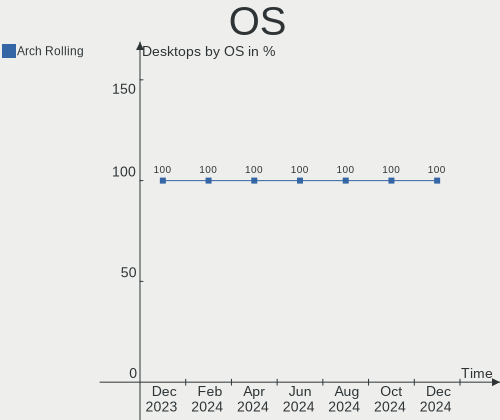
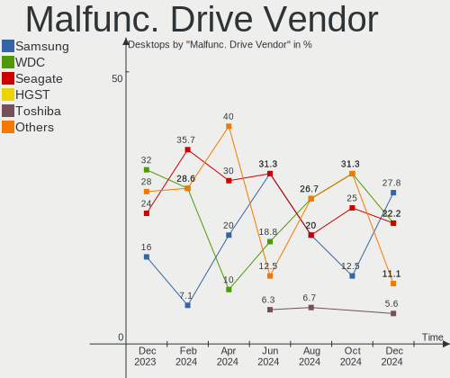
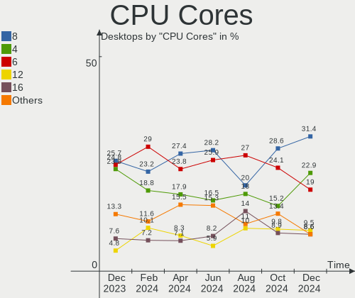
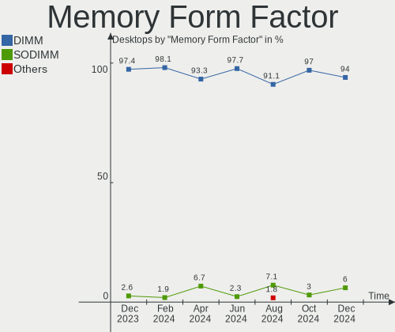

Arch - Hardware Trends (Desktops)
---------------------------------

A project to identify most popular hardware characteristics and track their change
over time based on data collected by Linux users at https://Linux-Hardware.org.

Anyone can contribute to this report by the [hw-probe](https://github.com/linuxhw/hw-probe) tool:

    sudo -E hw-probe -all -upload

This report is for one last month. Overall report since the beginning of time: [TestDays](https://github.com/linuxhw/TestDays)

Period: Dec, 2024.

Contents
--------

* [ System ](#system)
  - [ OS                       ](#os)
  - [ OS Family                ](#os-family)
  - [ Kernel                   ](#kernel)
  - [ Kernel Family            ](#kernel-family)
  - [ Kernel Major Ver.        ](#kernel-major-ver)
  - [ Arch                     ](#arch)
  - [ DE                       ](#de)
  - [ Display Server           ](#display-server)
  - [ Display Manager          ](#display-manager)
  - [ OS Lang                  ](#os-lang)
  - [ Boot Mode                ](#boot-mode)
  - [ Filesystem               ](#filesystem)
  - [ Part. scheme             ](#part-scheme)
  - [ Dual Boot with Linux/BSD ](#dual-boot-with-linuxbsd)
  - [ Dual Boot (Win)          ](#dual-boot-win)

* [ Board ](#board)
  - [ Vendor                   ](#vendor)
  - [ Model                    ](#model)
  - [ Model Family             ](#model-family)
  - [ MFG Year                 ](#mfg-year)
  - [ Form Factor              ](#form-factor)
  - [ Secure Boot              ](#secure-boot)
  - [ Coreboot                 ](#coreboot)
  - [ RAM Size                 ](#ram-size)
  - [ RAM Used                 ](#ram-used)
  - [ Total Drives             ](#total-drives)
  - [ Has CD-ROM               ](#has-cd-rom)
  - [ Has Ethernet             ](#has-ethernet)
  - [ Has WiFi                 ](#has-wifi)
  - [ Has Bluetooth            ](#has-bluetooth)

* [ Location ](#location)
  - [ Country                  ](#country)
  - [ City                     ](#city)

* [ Drives ](#drives)
  - [ Drive Vendor             ](#drive-vendor)
  - [ Drive Model              ](#drive-model)
  - [ HDD Vendor               ](#hdd-vendor)
  - [ SSD Vendor               ](#ssd-vendor)
  - [ Drive Kind               ](#drive-kind)
  - [ Drive Connector          ](#drive-connector)
  - [ Drive Size               ](#drive-size)
  - [ Space Total              ](#space-total)
  - [ Space Used               ](#space-used)
  - [ Malfunc. Drives          ](#malfunc-drives)
  - [ Malfunc. Drive Vendor    ](#malfunc-drive-vendor)
  - [ Malfunc. HDD Vendor      ](#malfunc-hdd-vendor)
  - [ Malfunc. Drive Kind      ](#malfunc-drive-kind)
  - [ Failed Drives            ](#failed-drives)
  - [ Failed Drive Vendor      ](#failed-drive-vendor)
  - [ Drive Status             ](#drive-status)

* [ Storage controller ](#storage-controller)
  - [ Storage Vendor           ](#storage-vendor)
  - [ Storage Model            ](#storage-model)
  - [ Storage Kind             ](#storage-kind)

* [ Processor ](#processor)
  - [ CPU Vendor               ](#cpu-vendor)
  - [ CPU Model                ](#cpu-model)
  - [ CPU Model Family         ](#cpu-model-family)
  - [ CPU Cores                ](#cpu-cores)
  - [ CPU Sockets              ](#cpu-sockets)
  - [ CPU Threads              ](#cpu-threads)
  - [ CPU Op-Modes             ](#cpu-op-modes)
  - [ CPU Microcode            ](#cpu-microcode)
  - [ CPU Microarch            ](#cpu-microarch)

* [ Graphics ](#graphics)
  - [ GPU Vendor               ](#gpu-vendor)
  - [ GPU Model                ](#gpu-model)
  - [ GPU Combo                ](#gpu-combo)
  - [ GPU Driver               ](#gpu-driver)
  - [ GPU Memory               ](#gpu-memory)

* [ Monitor ](#monitor)
  - [ Monitor Vendor           ](#monitor-vendor)
  - [ Monitor Model            ](#monitor-model)
  - [ Monitor Resolution       ](#monitor-resolution)
  - [ Monitor Diagonal         ](#monitor-diagonal)
  - [ Monitor Width            ](#monitor-width)
  - [ Aspect Ratio             ](#aspect-ratio)
  - [ Monitor Area             ](#monitor-area)
  - [ Pixel Density            ](#pixel-density)
  - [ Multiple Monitors        ](#multiple-monitors)

* [ Network ](#network)
  - [ Net Controller Vendor    ](#net-controller-vendor)
  - [ Net Controller Model     ](#net-controller-model)
  - [ Wireless Vendor          ](#wireless-vendor)
  - [ Wireless Model           ](#wireless-model)
  - [ Ethernet Vendor          ](#ethernet-vendor)
  - [ Ethernet Model           ](#ethernet-model)
  - [ Net Controller Kind      ](#net-controller-kind)
  - [ Used Controller          ](#used-controller)
  - [ NICs                     ](#nics)
  - [ IPv6                     ](#ipv6)

* [ Bluetooth ](#bluetooth)
  - [ Bluetooth Vendor         ](#bluetooth-vendor)
  - [ Bluetooth Model          ](#bluetooth-model)

* [ Sound ](#sound)
  - [ Sound Vendor             ](#sound-vendor)
  - [ Sound Model              ](#sound-model)

* [ Memory ](#memory)
  - [ Memory Vendor            ](#memory-vendor)
  - [ Memory Model             ](#memory-model)
  - [ Memory Kind              ](#memory-kind)
  - [ Memory Form Factor       ](#memory-form-factor)
  - [ Memory Size              ](#memory-size)
  - [ Memory Speed             ](#memory-speed)

* [ Printers & scanners ](#printers--scanners)
  - [ Printer Vendor           ](#printer-vendor)
  - [ Printer Model            ](#printer-model)
  - [ Scanner Vendor           ](#scanner-vendor)
  - [ Scanner Model            ](#scanner-model)

* [ Camera ](#camera)
  - [ Camera Vendor            ](#camera-vendor)
  - [ Camera Model             ](#camera-model)

* [ Security ](#security)
  - [ Fingerprint Vendor       ](#fingerprint-vendor)
  - [ Fingerprint Model        ](#fingerprint-model)
  - [ Chipcard Vendor          ](#chipcard-vendor)
  - [ Chipcard Model           ](#chipcard-model)

* [ Unsupported ](#unsupported)
  - [ Unsupported Devices      ](#unsupported-devices)
  - [ Unsupported Device Types ](#unsupported-device-types)

System
------

OS
--

Installed operating systems

| Name         | Desktops | Percent |
|--------------|----------|---------|
| Arch Rolling | 105      | 100%    |

OS Family
---------

OS without a version

| Name | Desktops | Percent |
|------|----------|---------|
| Arch | 105      | 100%    |

Kernel
------

Version of the Linux kernel

| Version                      | Desktops | Percent |
|------------------------------|----------|---------|
| 6.12.4-arch1-1               | 28       | 26.67%  |
| 6.12.1-arch1-1               | 22       | 20.95%  |
| 6.12.1-zen1-1-zen            | 11       | 10.48%  |
| 6.12.6-arch1-1               | 7        | 6.67%   |
| 6.12.7-arch1-1               | 5        | 4.76%   |
| 6.6.63-1-lts                 | 4        | 3.81%   |
| 6.12.3-arch1-1               | 4        | 3.81%   |
| 6.6.65-1-lts                 | 3        | 2.86%   |
| 6.12.4-zen1-1-zen            | 3        | 2.86%   |
| 6.11.9-arch1-1               | 2        | 1.9%    |
| 6.9.7-arch1-1                | 1        | 0.95%   |
| 6.12.7-zen1-1-zen            | 1        | 0.95%   |
| 6.12.6-lqx1-1-lqx            | 1        | 0.95%   |
| 6.12.6-1-cachyos-bore        | 1        | 0.95%   |
| 6.12.6-1-cachyos             | 1        | 0.95%   |
| 6.12.5-arch1-1-61205-01      | 1        | 0.95%   |
| 6.12.5-2-cachyos             | 1        | 0.95%   |
| 6.12.5-1-cachyos             | 1        | 0.95%   |
| 6.12.4-2-cachyos             | 1        | 0.95%   |
| 6.12.3-zen1-1-zen            | 1        | 0.95%   |
| 6.12.3-273-tkg-pds           | 1        | 0.95%   |
| 6.12.1-rc1-1home             | 1        | 0.95%   |
| 6.12.1-273-tkg-eevdf-llvm    | 1        | 0.95%   |
| 6.11.7-arch1-1               | 1        | 0.95%   |
| 6.11.11-hardened1-2-hardened | 1        | 0.95%   |
| 6.1.0-28-amd64               | 1        | 0.95%   |

Kernel Family
-------------

Linux kernel without a distro release

| Version | Desktops | Percent |
|---------|----------|---------|
| 6.12.1  | 35       | 33.33%  |
| 6.12.4  | 32       | 30.48%  |
| 6.12.6  | 10       | 9.52%   |
| 6.12.7  | 6        | 5.71%   |
| 6.12.3  | 6        | 5.71%   |
| 6.6.63  | 4        | 3.81%   |
| 6.6.65  | 3        | 2.86%   |
| 6.12.5  | 3        | 2.86%   |
| 6.11.9  | 2        | 1.9%    |
| 6.9.7   | 1        | 0.95%   |
| 6.11.7  | 1        | 0.95%   |
| 6.11.11 | 1        | 0.95%   |
| 6.1.0   | 1        | 0.95%   |

Kernel Major Ver.
-----------------

Linux kernel major version

| Version | Desktops | Percent |
|---------|----------|---------|
| 6.12    | 92       | 87.62%  |
| 6.6     | 7        | 6.67%   |
| 6.11    | 4        | 3.81%   |
| 6.9     | 1        | 0.95%   |
| 6.1     | 1        | 0.95%   |

Arch
----

OS architecture (x86_64, i586, etc.)

| Name   | Desktops | Percent |
|--------|----------|---------|
| x86_64 | 105      | 100%    |

DE
--

Desktop Environment

| Name          | Desktops | Percent |
|---------------|----------|---------|
| KDE6          | 39       | 37.14%  |
| GNOME         | 27       | 25.71%  |
| KDE           | 10       | 9.52%   |
| XFCE          | 8        | 7.62%   |
| Hyprland      | 6        | 5.71%   |
| Unknown       | 5        | 4.76%   |
| X-Cinnamon    | 3        | 2.86%   |
| LXQt          | 1        | 0.95%   |
| LXDE          | 1        | 0.95%   |
| i3            | 1        | 0.95%   |
| gtk           | 1        | 0.95%   |
| GNOME Classic | 1        | 0.95%   |
| Cinnamon      | 1        | 0.95%   |
| awesome       | 1        | 0.95%   |

Display Server
--------------

X11 or Wayland

| Name    | Desktops | Percent |
|---------|----------|---------|
| Wayland | 70       | 66.67%  |
| X11     | 24       | 22.86%  |
| Unknown | 8        | 7.62%   |
| Tty     | 3        | 2.86%   |

Display Manager
---------------

SDDM, LightDM, etc.

| Name    | Desktops | Percent |
|---------|----------|---------|
| Unknown | 44       | 41.9%   |
| SDDM    | 37       | 35.24%  |
| GDM     | 13       | 12.38%  |
| LightDM | 9        | 8.57%   |
| LY-DM   | 1        | 0.95%   |
| LXDM    | 1        | 0.95%   |

OS Lang
-------

Language

| Lang    | Desktops | Percent |
|---------|----------|---------|
| en_US   | 60       | 57.14%  |
| de_DE   | 10       | 9.52%   |
| en_GB   | 9        | 8.57%   |
| ru_RU   | 5        | 4.76%   |
| fr_FR   | 5        | 4.76%   |
| C       | 4        | 3.81%   |
| en_NZ   | 3        | 2.86%   |
| es_ES   | 2        | 1.9%    |
| en_AU   | 2        | 1.9%    |
| ro_RO   | 1        | 0.95%   |
| pl_PL   | 1        | 0.95%   |
| it_IT   | 1        | 0.95%   |
| es_MX   | 1        | 0.95%   |
| Unknown | 1        | 0.95%   |

Boot Mode
---------

EFI or BIOS

| Mode | Desktops | Percent |
|------|----------|---------|
| EFI  | 60       | 57.14%  |
| BIOS | 45       | 42.86%  |

Filesystem
----------

Type of filesystem

| Type  | Desktops | Percent |
|-------|----------|---------|
| Ext4  | 71       | 67.62%  |
| Btrfs | 30       | 28.57%  |
| Xfs   | 2        | 1.9%    |
| Zfs   | 1        | 0.95%   |
| F2fs  | 1        | 0.95%   |

Part. scheme
------------

Scheme of partitioning

| Type    | Desktops | Percent |
|---------|----------|---------|
| GPT     | 62       | 59.05%  |
| Unknown | 38       | 36.19%  |
| MBR     | 5        | 4.76%   |

Dual Boot with Linux/BSD
------------------------

Hosting more than one Linux/BSD

| Dual boot | Desktops | Percent |
|-----------|----------|---------|
| No        | 84       | 80%     |
| Yes       | 21       | 20%     |

Dual Boot (Win)
---------------

Hosting Linux and Windows

| Dual boot | Desktops | Percent |
|-----------|----------|---------|
| No        | 68       | 64.76%  |
| Yes       | 37       | 35.24%  |

Board
-----

Vendor
------

Motherboard manufacturer

| Name                                 | Desktops | Percent |
|--------------------------------------|----------|---------|
| ASUSTek Computer                     | 24       | 22.86%  |
| MSI                                  | 23       | 21.9%   |
| Gigabyte Technology                  | 19       | 18.1%   |
| ASRock                               | 17       | 16.19%  |
| Dell                                 | 8        | 7.62%   |
| Hewlett-Packard                      | 3        | 2.86%   |
| Shenzhen Meigao Electronic Equipment | 1        | 0.95%   |
| PELADN                               | 1        | 0.95%   |
| Micro Computer (HK) Tech Limited     | 1        | 0.95%   |
| Medion                               | 1        | 0.95%   |
| Maibenben                            | 1        | 0.95%   |
| JGINYUE                              | 1        | 0.95%   |
| GMKtec                               | 1        | 0.95%   |
| Foxconn                              | 1        | 0.95%   |
| ECS                                  | 1        | 0.95%   |
| Colorful Technology                  | 1        | 0.95%   |
| Acer                                 | 1        | 0.95%   |

Model
-----

Motherboard model

| Name                                                  | Desktops | Percent |
|-------------------------------------------------------|----------|---------|
| MSI MS-7C95                                           | 2        | 1.9%    |
| MSI MS-7C02                                           | 2        | 1.9%    |
| Gigabyte B550 GAMING X V2                             | 2        | 1.9%    |
| Dell OptiPlex 7010                                    | 2        | 1.9%    |
| ASUS All Series                                       | 2        | 1.9%    |
| ASRock B550M Pro4                                     | 2        | 1.9%    |
| Shenzhen Meigao Electronic Equipment AtomMan G Series | 1        | 0.95%   |
| PELADN WI-6                                           | 1        | 0.95%   |
| MSI MS-7E51                                           | 1        | 0.95%   |
| MSI MS-7E49                                           | 1        | 0.95%   |
| MSI MS-7E24                                           | 1        | 0.95%   |
| MSI MS-7D89                                           | 1        | 0.95%   |
| MSI MS-7D77                                           | 1        | 0.95%   |
| MSI MS-7D75                                           | 1        | 0.95%   |
| MSI MS-7D25                                           | 1        | 0.95%   |
| MSI MS-7D22                                           | 1        | 0.95%   |
| MSI MS-7D15                                           | 1        | 0.95%   |
| MSI MS-7C94                                           | 1        | 0.95%   |
| MSI MS-7C84                                           | 1        | 0.95%   |
| MSI MS-7C56                                           | 1        | 0.95%   |
| MSI MS-7C37                                           | 1        | 0.95%   |
| MSI MS-7B89                                           | 1        | 0.95%   |
| MSI MS-7B84                                           | 1        | 0.95%   |
| MSI MS-7A68                                           | 1        | 0.95%   |
| MSI MS-7A38                                           | 1        | 0.95%   |
| MSI MS-7A37                                           | 1        | 0.95%   |
| MSI MS-7882                                           | 1        | 0.95%   |
| Micro (HK) Tech Limited HX100G                        | 1        | 0.95%   |
| Medion MD34098/C648                                   | 1        | 0.95%   |
| Maibenben PC34                                        | 1        | 0.95%   |
| JGINYUE X99 TITANIUM D3                               | 1        | 0.95%   |
| HP OMEN by 25L Gaming Desktop GT15-0xxx               | 1        | 0.95%   |
| HP EliteDesk 800 G4 DM 35W                            | 1        | 0.95%   |
| HP EliteDesk 800 G1 DM                                | 1        | 0.95%   |
| GMKtec NucBox K6                                      | 1        | 0.95%   |
| Gigabyte Z790 AORUS ELITE AX                          | 1        | 0.95%   |
| Gigabyte X870E AORUS ELITE WIFI7                      | 1        | 0.95%   |
| Gigabyte X870 EAGLE WIFI7                             | 1        | 0.95%   |
| Gigabyte X670 AORUS ELITE AX                          | 1        | 0.95%   |
| Gigabyte X470 AORUS ULTRA GAMING                      | 1        | 0.95%   |

Model Family
------------

Motherboard model prefix

| Name                                         | Desktops | Percent |
|----------------------------------------------|----------|---------|
| Dell OptiPlex                                | 6        | 5.71%   |
| ASUS ROG                                     | 6        | 5.71%   |
| ASUS TUF                                     | 5        | 4.76%   |
| Gigabyte B550M                               | 4        | 3.81%   |
| ASUS PRIME                                   | 4        | 3.81%   |
| ASRock B650M                                 | 3        | 2.86%   |
| MSI MS-7C95                                  | 2        | 1.9%    |
| MSI MS-7C02                                  | 2        | 1.9%    |
| HP EliteDesk                                 | 2        | 1.9%    |
| Gigabyte B650                                | 2        | 1.9%    |
| Gigabyte B550                                | 2        | 1.9%    |
| Gigabyte B450M                               | 2        | 1.9%    |
| ASUS All                                     | 2        | 1.9%    |
| ASRock X570                                  | 2        | 1.9%    |
| ASRock B550M                                 | 2        | 1.9%    |
| Shenzhen Meigao Electronic Equipment AtomMan | 1        | 0.95%   |
| PELADN WI-6                                  | 1        | 0.95%   |
| MSI MS-7E51                                  | 1        | 0.95%   |
| MSI MS-7E49                                  | 1        | 0.95%   |
| MSI MS-7E24                                  | 1        | 0.95%   |
| MSI MS-7D89                                  | 1        | 0.95%   |
| MSI MS-7D77                                  | 1        | 0.95%   |
| MSI MS-7D75                                  | 1        | 0.95%   |
| MSI MS-7D25                                  | 1        | 0.95%   |
| MSI MS-7D22                                  | 1        | 0.95%   |
| MSI MS-7D15                                  | 1        | 0.95%   |
| MSI MS-7C94                                  | 1        | 0.95%   |
| MSI MS-7C84                                  | 1        | 0.95%   |
| MSI MS-7C56                                  | 1        | 0.95%   |
| MSI MS-7C37                                  | 1        | 0.95%   |
| MSI MS-7B89                                  | 1        | 0.95%   |
| MSI MS-7B84                                  | 1        | 0.95%   |
| MSI MS-7A68                                  | 1        | 0.95%   |
| MSI MS-7A38                                  | 1        | 0.95%   |
| MSI MS-7A37                                  | 1        | 0.95%   |
| MSI MS-7882                                  | 1        | 0.95%   |
| Micro (HK) Tech Limited HX100G               | 1        | 0.95%   |
| Medion MD34098                               | 1        | 0.95%   |
| Maibenben PC34                               | 1        | 0.95%   |
| JGINYUE X99                                  | 1        | 0.95%   |

MFG Year
--------

Motherboard manufacture year

| Year | Desktops | Percent |
|------|----------|---------|
| 2020 | 22       | 20.95%  |
| 2022 | 13       | 12.38%  |
| 2024 | 12       | 11.43%  |
| 2023 | 10       | 9.52%   |
| 2018 | 10       | 9.52%   |
| 2021 | 9        | 8.57%   |
| 2019 | 7        | 6.67%   |
| 2017 | 5        | 4.76%   |
| 2014 | 5        | 4.76%   |
| 2013 | 4        | 3.81%   |
| 2016 | 2        | 1.9%    |
| 2012 | 2        | 1.9%    |
| 2010 | 2        | 1.9%    |
| 2011 | 1        | 0.95%   |
| 2008 | 1        | 0.95%   |

Form Factor
-----------

Physical design of the computer

| Name    | Desktops | Percent |
|---------|----------|---------|
| Desktop | 105      | 100%    |

Secure Boot
-----------

Enabled or disabled

| State    | Desktops | Percent |
|----------|----------|---------|
| Disabled | 104      | 99.05%  |
| Enabled  | 1        | 0.95%   |

Coreboot
--------

Have coreboot on board

| Used | Desktops | Percent |
|------|----------|---------|
| No   | 105      | 100%    |

RAM Size
--------

Total RAM memory

| Size in GB  | Desktops | Percent |
|-------------|----------|---------|
| 16.01-24.0  | 33       | 31.43%  |
| 32.01-64.0  | 29       | 27.62%  |
| 64.01-256.0 | 19       | 18.1%   |
| 24.01-32.0  | 11       | 10.48%  |
| 8.01-16.0   | 7        | 6.67%   |
| 4.01-8.0    | 5        | 4.76%   |
| 3.01-4.0    | 1        | 0.95%   |

RAM Used
--------

Used RAM memory

| Used GB    | Desktops | Percent |
|------------|----------|---------|
| 4.01-8.0   | 39       | 37.14%  |
| 2.01-3.0   | 23       | 21.9%   |
| 3.01-4.0   | 19       | 18.1%   |
| 8.01-16.0  | 10       | 9.52%   |
| 1.01-2.0   | 8        | 7.62%   |
| 16.01-24.0 | 3        | 2.86%   |
| 24.01-32.0 | 2        | 1.9%    |
| 32.01-64.0 | 1        | 0.95%   |

Total Drives
------------

Number of drives on board

| Drives | Desktops | Percent |
|--------|----------|---------|
| 2      | 40       | 38.1%   |
| 1      | 25       | 23.81%  |
| 3      | 15       | 14.29%  |
| 4      | 14       | 13.33%  |
| 5      | 5        | 4.76%   |
| 6      | 3        | 2.86%   |
| 9      | 1        | 0.95%   |
| 8      | 1        | 0.95%   |
| 0      | 1        | 0.95%   |

Has CD-ROM
----------

Has CD-ROM on board

| Presented | Desktops | Percent |
|-----------|----------|---------|
| No        | 84       | 80%     |
| Yes       | 21       | 20%     |

Has Ethernet
------------

Has Ethernet on board

| Presented | Desktops | Percent |
|-----------|----------|---------|
| Yes       | 104      | 99.05%  |
| No        | 1        | 0.95%   |

Has WiFi
--------

Has WiFi module

| Presented | Desktops | Percent |
|-----------|----------|---------|
| Yes       | 57       | 54.29%  |
| No        | 48       | 45.71%  |

Has Bluetooth
-------------

Has Bluetooth module

| Presented | Desktops | Percent |
|-----------|----------|---------|
| Yes       | 64       | 60.95%  |
| No        | 41       | 39.05%  |

Location
--------

Country
-------

Geographic location (country)

| Country     | Desktops | Percent |
|-------------|----------|---------|
| USA         | 22       | 20.95%  |
| Germany     | 14       | 13.33%  |
| Russia      | 8        | 7.62%   |
| France      | 7        | 6.67%   |
| UK          | 6        | 5.71%   |
| Canada      | 6        | 5.71%   |
| Spain       | 3        | 2.86%   |
| New Zealand | 3        | 2.86%   |
| Netherlands | 3        | 2.86%   |
| Brazil      | 3        | 2.86%   |
| Poland      | 2        | 1.9%    |
| Malaysia    | 2        | 1.9%    |
| Belgium     | 2        | 1.9%    |
| Australia   | 2        | 1.9%    |
| Vietnam     | 1        | 0.95%   |
| Switzerland | 1        | 0.95%   |
| Sweden      | 1        | 0.95%   |
| Slovakia    | 1        | 0.95%   |
| Romania     | 1        | 0.95%   |
| Puerto Rico | 1        | 0.95%   |
| Portugal    | 1        | 0.95%   |
| Philippines | 1        | 0.95%   |
| Norway      | 1        | 0.95%   |
| Mexico      | 1        | 0.95%   |
| Kazakhstan  | 1        | 0.95%   |
| Japan       | 1        | 0.95%   |
| Italy       | 1        | 0.95%   |
| Indonesia   | 1        | 0.95%   |
| India       | 1        | 0.95%   |
| Finland     | 1        | 0.95%   |
| Denmark     | 1        | 0.95%   |
| Colombia    | 1        | 0.95%   |
| China       | 1        | 0.95%   |
| Bulgaria    | 1        | 0.95%   |
| Bangladesh  | 1        | 0.95%   |
| Austria     | 1        | 0.95%   |

City
----

Geographic location (city)

| City              | Desktops | Percent |
|-------------------|----------|---------|
| Berlin            | 3        | 2.86%   |
| Paris             | 2        | 1.9%    |
| Moscow            | 2        | 1.9%    |
| Melbourne         | 2        | 1.9%    |
| Martorell         | 2        | 1.9%    |
| Los Angeles       | 2        | 1.9%    |
| Auckland          | 2        | 1.9%    |
| Amsterdam         | 2        | 1.9%    |
| Žilina           | 1        | 0.95%   |
| Wiener Neustadt   | 1        | 0.95%   |
| West Chester      | 1        | 0.95%   |
| Wellington        | 1        | 0.95%   |
| Warsaw            | 1        | 0.95%   |
| Vancouver         | 1        | 0.95%   |
| Turku             | 1        | 0.95%   |
| Toulouse          | 1        | 0.95%   |
| Thornhill         | 1        | 0.95%   |
| Themar            | 1        | 0.95%   |
| Swindon           | 1        | 0.95%   |
| Stuttgart         | 1        | 0.95%   |
| Stockholm         | 1        | 0.95%   |
| St. Catharines    | 1        | 0.95%   |
| Southbury         | 1        | 0.95%   |
| Soreide           | 1        | 0.95%   |
| Smolensk          | 1        | 0.95%   |
| Simões Filho     | 1        | 0.95%   |
| Silkeborg         | 1        | 0.95%   |
| Siegen            | 1        | 0.95%   |
| Seremban          | 1        | 0.95%   |
| Schoeneck         | 1        | 0.95%   |
| Sarlat-la-Canéda | 1        | 0.95%   |
| Santa Isabel      | 1        | 0.95%   |
| San Jose          | 1        | 0.95%   |
| Saltcoats         | 1        | 0.95%   |
| Sacramento        | 1        | 0.95%   |
| Rostock           | 1        | 0.95%   |
| Reutlingen        | 1        | 0.95%   |
| Poissy            | 1        | 0.95%   |
| Piatra Neamţ     | 1        | 0.95%   |
| Petrich           | 1        | 0.95%   |

Drives
------

Drive Vendor
------------

Hard drive vendors

| Vendor                       | Desktops | Drives | Percent |
|------------------------------|----------|--------|---------|
| Samsung Electronics          | 37       | 64     | 17.37%  |
| WDC                          | 26       | 36     | 12.21%  |
| Seagate                      | 23       | 30     | 10.8%   |
| Sandisk                      | 23       | 26     | 10.8%   |
| Kingston                     | 17       | 17     | 7.98%   |
| Toshiba                      | 11       | 12     | 5.16%   |
| Micron/Crucial Technology    | 7        | 8      | 3.29%   |
| Crucial                      | 7        | 8      | 3.29%   |
| ADATA Technology             | 7        | 9      | 3.29%   |
| Phison Electronics           | 6        | 6      | 2.82%   |
| Intel                        | 6        | 6      | 2.82%   |
| Hitachi                      | 5        | 5      | 2.35%   |
| Kingston Technology Company  | 4        | 4      | 1.88%   |
| A-DATA Technology            | 4        | 4      | 1.88%   |
| SK hynix                     | 3        | 4      | 1.41%   |
| HGST                         | 3        | 3      | 1.41%   |
| Fanxiang                     | 3        | 3      | 1.41%   |
| Realtek Semiconductor        | 2        | 2      | 0.94%   |
| Patriot                      | 2        | 2      | 0.94%   |
| Unknown                      | 1        | 1      | 0.47%   |
| TEXTORM                      | 1        | 1      | 0.47%   |
| TCSUNBOW                     | 1        | 1      | 0.47%   |
| T-FORCE                      | 1        | 1      | 0.47%   |
| SPCC                         | 1        | 1      | 0.47%   |
| Smartbuy                     | 1        | 1      | 0.47%   |
| Silicon Motion               | 1        | 1      | 0.47%   |
| Shenzhen Longsys Electronics | 1        | 1      | 0.47%   |
| SABRENT                      | 1        | 2      | 0.47%   |
| Pioneer                      | 1        | 1      | 0.47%   |
| PELADN                       | 1        | 1      | 0.47%   |
| OCZ                          | 1        | 1      | 0.47%   |
| Netac                        | 1        | 1      | 0.47%   |
| Lite-On                      | 1        | 1      | 0.47%   |
| GOODRAM                      | 1        | 1      | 0.47%   |
| China                        | 1        | 1      | 0.47%   |
| BR                           | 1        | 1      | 0.47%   |

Drive Model
-----------

Hard drive models

| Model                                                             | Desktops | Percent |
|-------------------------------------------------------------------|----------|---------|
| Samsung NVMe SSD Controller SM981/PM981/PM983 512GB               | 12       | 4.71%   |
| Samsung NVMe SSD Controller PM9A1/PM9A3/980PRO 512GB              | 9        | 3.53%   |
| Seagate ST1000DM010-2EP102 1TB                                    | 7        | 2.75%   |
| Samsung SSD 840 EVO 250GB                                         | 6        | 2.35%   |
| Seagate ST2000DM008-2FR102 2TB                                    | 5        | 1.96%   |
| Samsung SSD 980 1TB                                               | 5        | 1.96%   |
| Toshiba HDWD110 1TB                                               | 4        | 1.57%   |
| Micron/Crucial P2 NVMe PCIe SSD 500GB                             | 4        | 1.57%   |
| Kingston SA400S37240G 240GB SSD                                   | 4        | 1.57%   |
| Sandisk WD_BLACK SN850X 2000GB                                    | 3        | 1.18%   |
| Sandisk WD_BLACK SN770 1TB                                        | 3        | 1.18%   |
| Samsung SSD 990 PRO 2TB                                           | 3        | 1.18%   |
| Samsung SSD 860 EVO 500GB                                         | 3        | 1.18%   |
| Samsung SSD 860 EVO 1TB                                           | 3        | 1.18%   |
| Kingston SA400S37480G 480GB SSD                                   | 3        | 1.18%   |
| WDC WDBNCE0010PNC 1TB SSD                                         | 2        | 0.78%   |
| WDC WD2003FZEX-00SRLA0 2TB                                        | 2        | 0.78%   |
| SK hynix SHPP41-2000GM 2TB                                        | 2        | 0.78%   |
| Sandisk WD_BLACK SN750 SE 1TB                                     | 2        | 0.78%   |
| Sandisk WD Black SN850 2TB                                        | 2        | 0.78%   |
| Sandisk WD Black 2018/SN750 / PC SN720 NVMe SSD 512GB             | 2        | 0.78%   |
| Samsung SSD 990 PRO 1TB                                           | 2        | 0.78%   |
| Samsung SSD 870 QVO 4TB                                           | 2        | 0.78%   |
| Samsung SSD 870 EVO 1TB                                           | 2        | 0.78%   |
| Samsung HD103SJ 1TB                                               | 2        | 0.78%   |
| Phison PS5013 E13 NVMe Controller 512GB                           | 2        | 0.78%   |
| Phison E12 NVMe Controller 480GB                                  | 2        | 0.78%   |
| Micron/Crucial CT2000P3PSSD8 2TB                                  | 2        | 0.78%   |
| Intel SSD 660P Series 1024GB                                      | 2        | 0.78%   |
| Crucial CT2000MX500SSD1 2TB                                       | 2        | 0.78%   |
| Crucial CT1000BX500SSD1 1TB                                       | 2        | 0.78%   |
| ADATA XPG SX8200 Pro PCIe Gen3x4 M.2 2280 Solid State Drive 256GB | 2        | 0.78%   |
| ADATA LEGEND 800 1TB                                              | 2        | 0.78%   |
| WDC WDS200T1R0A-68A4W0 2TB SSD                                    | 1        | 0.39%   |
| WDC WDS120G2G0A-00JH30 120GB SSD                                  | 1        | 0.39%   |
| WDC WDS100T2B0A-00SM50 1TB SSD                                    | 1        | 0.39%   |
| WDC WD60EZAZ-00SF3B0 6TB                                          | 1        | 0.39%   |
| WDC WD60EFRX-68MYMN1 6TB                                          | 1        | 0.39%   |
| WDC WD40EZRZ-00GXCB0 4TB                                          | 1        | 0.39%   |
| WDC WD40EFRX-68WT0N0 4TB                                          | 1        | 0.39%   |

HDD Vendor
----------

Hard disk drive vendors

| Vendor              | Desktops | Drives | Percent |
|---------------------|----------|--------|---------|
| Seagate             | 23       | 29     | 35.38%  |
| WDC                 | 21       | 29     | 32.31%  |
| Toshiba             | 10       | 11     | 15.38%  |
| Hitachi             | 5        | 5      | 7.69%   |
| HGST                | 3        | 3      | 4.62%   |
| Samsung Electronics | 2        | 2      | 3.08%   |
| SABRENT             | 1        | 2      | 1.54%   |

SSD Vendor
----------

Solid state drive vendors

| Vendor              | Desktops | Drives | Percent |
|---------------------|----------|--------|---------|
| Samsung Electronics | 20       | 26     | 27.78%  |
| Kingston            | 13       | 13     | 18.06%  |
| Crucial             | 7        | 8      | 9.72%   |
| WDC                 | 6        | 7      | 8.33%   |
| SanDisk             | 5        | 5      | 6.94%   |
| A-DATA Technology   | 4        | 4      | 5.56%   |
| Patriot             | 2        | 2      | 2.78%   |
| Intel               | 2        | 2      | 2.78%   |
| TEXTORM             | 1        | 1      | 1.39%   |
| TCSUNBOW            | 1        | 1      | 1.39%   |
| T-FORCE             | 1        | 1      | 1.39%   |
| SPCC                | 1        | 1      | 1.39%   |
| Smartbuy            | 1        | 1      | 1.39%   |
| Seagate             | 1        | 1      | 1.39%   |
| Pioneer             | 1        | 1      | 1.39%   |
| PELADN              | 1        | 1      | 1.39%   |
| OCZ                 | 1        | 1      | 1.39%   |
| Lite-On             | 1        | 1      | 1.39%   |
| GOODRAM             | 1        | 1      | 1.39%   |
| Fanxiang            | 1        | 1      | 1.39%   |
| China               | 1        | 1      | 1.39%   |

Drive Kind
----------

HDD or SSD

| Kind    | Desktops | Drives | Percent |
|---------|----------|--------|---------|
| NVMe    | 75       | 103    | 40.32%  |
| SSD     | 60       | 80     | 32.26%  |
| HDD     | 48       | 81     | 25.81%  |
| Unknown | 3        | 3      | 1.61%   |

Drive Connector
---------------

SATA, SAS, NVMe, etc.

| Type | Desktops | Drives | Percent |
|------|----------|--------|---------|
| SATA | 77       | 159    | 49.68%  |
| NVMe | 75       | 103    | 48.39%  |
| SAS  | 3        | 5      | 1.94%   |

Drive Size
----------

Size of hard drive

| Size in TB | Desktops | Drives | Percent |
|------------|----------|--------|---------|
| 0.01-0.5   | 46       | 60     | 37.4%   |
| 0.51-1.0   | 39       | 52     | 31.71%  |
| 1.01-2.0   | 20       | 25     | 16.26%  |
| 3.01-4.0   | 10       | 14     | 8.13%   |
| 4.01-10.0  | 5        | 5      | 4.07%   |
| 10.01-20.0 | 2        | 4      | 1.63%   |
| 2.01-3.0   | 1        | 1      | 0.81%   |

Space Total
-----------

Amount of disk space available on the file system

| Size in GB     | Desktops | Percent |
|----------------|----------|---------|
| More than 3000 | 27       | 25.71%  |
| 501-1000       | 22       | 20.95%  |
| 1001-2000      | 21       | 20%     |
| 251-500        | 15       | 14.29%  |
| 101-250        | 11       | 10.48%  |
| 2001-3000      | 8        | 7.62%   |
| 1-20           | 1        | 0.95%   |

Space Used
----------

Amount of used disk space

| Used GB        | Desktops | Percent |
|----------------|----------|---------|
| 101-250        | 17       | 16.19%  |
| 1001-2000      | 16       | 15.24%  |
| 251-500        | 15       | 14.29%  |
| More than 3000 | 13       | 12.38%  |
| 1-20           | 12       | 11.43%  |
| 21-50          | 11       | 10.48%  |
| 51-100         | 10       | 9.52%   |
| 501-1000       | 7        | 6.67%   |
| 2001-3000      | 4        | 3.81%   |

Malfunc. Drives
---------------

Drive models with a malfunction

| Model                                                           | Desktops | Drives | Percent |
|-----------------------------------------------------------------|----------|--------|---------|
| Samsung Electronics SSD 980 1TB                                 | 2        | 2      | 11.11%  |
| WDC WD22PURZ-85B4ZY0 2TB                                        | 1        | 1      | 5.56%   |
| WDC WD2002FAEX-007BA0 2TB                                       | 1        | 1      | 5.56%   |
| WDC WD10EARS-00Z5B1 1TB                                         | 1        | 1      | 5.56%   |
| WDC WD Green 2.5 1000GB SSD                                     | 1        | 1      | 5.56%   |
| Toshiba MG04ACA400N 4TB                                         | 1        | 1      | 5.56%   |
| Seagate ST500DM002-1BD142 500GB                                 | 1        | 1      | 5.56%   |
| Seagate ST3320418AS 320GB                                       | 1        | 1      | 5.56%   |
| Seagate ST2000DM008-2FR102 2TB                                  | 1        | 1      | 5.56%   |
| Seagate ST1000DM010-2EP102 1TB                                  | 1        | 1      | 5.56%   |
| Samsung Electronics SSD 870 EVO 1TB                             | 1        | 1      | 5.56%   |
| Samsung Electronics SSD 840 EVO 250GB                           | 1        | 1      | 5.56%   |
| Samsung Electronics NVMe SSD Controller SM981/PM981/PM983 512GB | 1        | 1      | 5.56%   |
| Kingston SA400S37120G 120GB SSD                                 | 1        | 1      | 5.56%   |
| HGST HTS721010A9E630 1TB                                        | 1        | 1      | 5.56%   |
| HGST HTS545050A7E680 500GB                                      | 1        | 1      | 5.56%   |
| A-DATA Technology SU750 1TB SSD                                 | 1        | 1      | 5.56%   |

Malfunc. Drive Vendor
---------------------

Vendors of faulty drives

| Vendor              | Desktops | Drives | Percent |
|---------------------|----------|--------|---------|
| Samsung Electronics | 5        | 5      | 27.78%  |
| WDC                 | 4        | 4      | 22.22%  |
| Seagate             | 4        | 4      | 22.22%  |
| HGST                | 2        | 2      | 11.11%  |
| Toshiba             | 1        | 1      | 5.56%   |
| Kingston            | 1        | 1      | 5.56%   |
| A-DATA Technology   | 1        | 1      | 5.56%   |

Malfunc. HDD Vendor
-------------------

Vendors of faulty HDD drives

| Vendor  | Desktops | Drives | Percent |
|---------|----------|--------|---------|
| Seagate | 4        | 4      | 40%     |
| WDC     | 3        | 3      | 30%     |
| HGST    | 2        | 2      | 20%     |
| Toshiba | 1        | 1      | 10%     |

Malfunc. Drive Kind
-------------------

Kinds of faulty drives

| Kind | Desktops | Drives | Percent |
|------|----------|--------|---------|
| HDD  | 7        | 10     | 50%     |
| SSD  | 4        | 5      | 28.57%  |
| NVMe | 3        | 3      | 21.43%  |

Failed Drives
-------------

Failed drive models

Zero info for selected period =(

Failed Drive Vendor
-------------------

Failed drive vendors

Zero info for selected period =(

Drive Status
------------

Number of failed and malfunc. drives

| Status   | Desktops | Drives | Percent |
|----------|----------|--------|---------|
| Works    | 61       | 146    | 51.69%  |
| Detected | 45       | 103    | 38.14%  |
| Malfunc  | 12       | 18     | 10.17%  |

Storage controller
------------------

Storage Vendor
--------------

Storage controller vendors

| Vendor                       | Desktops | Percent |
|------------------------------|----------|---------|
| AMD                          | 63       | 31.5%   |
| Intel                        | 42       | 21%     |
| Samsung Electronics          | 28       | 14%     |
| SanDisk                      | 19       | 9.5%    |
| ASMedia Technology           | 9        | 4.5%    |
| Kingston Technology Company  | 8        | 4%      |
| Micron/Crucial Technology    | 7        | 3.5%    |
| ADATA Technology             | 7        | 3.5%    |
| Phison Electronics           | 6        | 3%      |
| SK hynix                     | 3        | 1.5%    |
| Realtek Semiconductor        | 2        | 1%      |
| Toshiba America Info Systems | 1        | 0.5%    |
| Solidigm                     | 1        | 0.5%    |
| Silicon Motion               | 1        | 0.5%    |
| Shenzhen Longsys Electronics | 1        | 0.5%    |
| Netac Technology             | 1        | 0.5%    |
| JMicron Technology           | 1        | 0.5%    |

Storage Model
-------------

Storage controller models

| Model                                                                                  | Desktops | Percent |
|----------------------------------------------------------------------------------------|----------|---------|
| AMD 600 Series Chipset SATA Controller                                                 | 22       | 9.65%   |
| AMD FCH SATA Controller [AHCI mode]                                                    | 17       | 7.46%   |
| AMD 500 Series Chipset SATA Controller                                                 | 17       | 7.46%   |
| Samsung NVMe SSD Controller SM981/PM981/PM983                                          | 12       | 5.26%   |
| AMD 400 Series Chipset SATA Controller                                                 | 11       | 4.82%   |
| Samsung NVMe SSD Controller PM9A1/PM9A3/980PRO                                         | 9        | 3.95%   |
| Samsung NVMe SSD Controller 980 (DRAM-less)                                            | 7        | 3.07%   |
| ASMedia ASM1061/ASM1062 Serial ATA Controller                                          | 7        | 3.07%   |
| Samsung NVMe SSD Controller S4LV008[Pascal]                                            | 5        | 2.19%   |
| Micron/Crucial P2 [Nick P2] / P3 / P3 Plus NVMe PCIe SSD (DRAM-less)                   | 4        | 1.75%   |
| Intel Raptor Lake SATA AHCI Controller                                                 | 4        | 1.75%   |
| Intel Q170/Q150/B150/H170/H110/Z170/CM236 Chipset SATA Controller [AHCI Mode]          | 4        | 1.75%   |
| Intel Cannon Lake PCH SATA AHCI Controller                                             | 4        | 1.75%   |
| Intel 500 Series Chipset Family SATA AHCI Controller                                   | 4        | 1.75%   |
| Sandisk WD Black SN850X NVMe SSD                                                       | 3        | 1.32%   |
| SanDisk WD Black SN770 / PC SN740 256GB / PC SN560 (DRAM-less) NVMe SSD                | 3        | 1.32%   |
| Intel Alder Lake-S PCH SATA Controller [AHCI Mode]                                     | 3        | 1.32%   |
| Intel 8 Series/C220 Series Chipset Family 6-port SATA Controller 1 [AHCI mode]         | 3        | 1.32%   |
| AMD 300 Series Chipset SATA Controller                                                 | 3        | 1.32%   |
| ADATA LEGEND 800 NVMe SSD (DRAM-less)                                                  | 3        | 1.32%   |
| SK hynix Platinum P41/PC801 NVMe Solid State Drive                                     | 2        | 0.88%   |
| SanDisk WD PC SN810 / Black SN850 NVMe SSD                                             | 2        | 0.88%   |
| SanDisk PC SN735 / WD_BLACK SN750 SE NVMe SSD (DRAM-less)                              | 2        | 0.88%   |
| SanDisk Extreme Pro / WD Black 2018/SN750/PC SN720 NVMe SSD                            | 2        | 0.88%   |
| Realtek RTS5765DL NVMe SSD Controller (DRAM-less)                                      | 2        | 0.88%   |
| Phison PS5013-E13 PCIe3 NVMe Controller (DRAM-less)                                    | 2        | 0.88%   |
| Phison E12 NVMe Controller                                                             | 2        | 0.88%   |
| Micron/Crucial P3 Plus NVMe PCIe SSD (DRAM-less)                                       | 2        | 0.88%   |
| Intel Volume Management Device NVMe RAID Controller Intel Corporation                  | 2        | 0.88%   |
| Intel SSD 660P Series                                                                  | 2        | 0.88%   |
| Intel 9 Series Chipset Family SATA Controller [AHCI Mode]                              | 2        | 0.88%   |
| Intel 7 Series/C210 Series Chipset Family 6-port SATA Controller [AHCI mode]           | 2        | 0.88%   |
| Intel 6 Series/C200 Series Chipset Family 6 port Desktop SATA AHCI Controller          | 2        | 0.88%   |
| Intel 5 Series/3400 Series Chipset 4 port SATA IDE Controller                          | 2        | 0.88%   |
| Intel 5 Series/3400 Series Chipset 2 port SATA IDE Controller                          | 2        | 0.88%   |
| ASMedia ASM1064 Serial ATA Controller                                                  | 2        | 0.88%   |
| ADATA XPG SX8200 Pro PCIe Gen3x4 M.2 2280 Solid State Drive                            | 2        | 0.88%   |
| ADATA XPG GAMMIXS1 1L, XPG GAMMIX S5, LEGEND 710 / 740, SWORDFISH NVMe SSD (DRAM-less) | 2        | 0.88%   |
| Toshiba America Info Systems XG6 NVMe SSD Controller                                   | 1        | 0.44%   |
| Solidigm P44 Pro NVMe SSD [Hollywood Beach]                                            | 1        | 0.44%   |

Storage Kind
------------

Kind of storage controller (IDE, SATA, NVMe, SAS, ...)

| Kind | Desktops | Percent |
|------|----------|---------|
| SATA | 95       | 52.78%  |
| NVMe | 75       | 41.67%  |
| RAID | 6        | 3.33%   |
| IDE  | 4        | 2.22%   |

Processor
---------

CPU Vendor
----------

Processor vendors

| Vendor | Desktops | Percent |
|--------|----------|---------|
| AMD    | 66       | 62.86%  |
| Intel  | 39       | 37.14%  |

CPU Model
---------

Processor models

| Model                                       | Desktops | Percent |
|---------------------------------------------|----------|---------|
| AMD Ryzen 7 5700G with Radeon Graphics      | 4        | 3.81%   |
| AMD Ryzen 9 7950X3D 16-Core Processor       | 3        | 2.86%   |
| AMD Ryzen 9 7950X 16-Core Processor         | 3        | 2.86%   |
| AMD Ryzen 9 7900X3D 12-Core Processor       | 3        | 2.86%   |
| AMD Ryzen 7 9700X 8-Core Processor          | 3        | 2.86%   |
| AMD Ryzen 7 7700X 8-Core Processor          | 3        | 2.86%   |
| AMD Ryzen 7 5800X 8-Core Processor          | 3        | 2.86%   |
| AMD Ryzen 7 5700X 8-Core Processor          | 3        | 2.86%   |
| AMD Ryzen 5 3600 6-Core Processor           | 3        | 2.86%   |
| Intel Core i7-10700 CPU @ 2.90GHz           | 2        | 1.9%    |
| Intel Core i5-6500 CPU @ 3.20GHz            | 2        | 1.9%    |
| Intel Core i5-3470 CPU @ 3.20GHz            | 2        | 1.9%    |
| Intel 12th Gen Core i5-12600K               | 2        | 1.9%    |
| AMD Ryzen 9 7900 12-Core Processor          | 2        | 1.9%    |
| AMD Ryzen 9 5900X 12-Core Processor         | 2        | 1.9%    |
| AMD Ryzen 7 7840HS w/ Radeon 780M Graphics  | 2        | 1.9%    |
| AMD Ryzen 7 7800X3D 8-Core Processor        | 2        | 1.9%    |
| AMD Ryzen 7 3700X 8-Core Processor          | 2        | 1.9%    |
| AMD Ryzen 7 1700X Eight-Core Processor      | 2        | 1.9%    |
| AMD Ryzen 5 PRO 4650G with Radeon Graphics  | 2        | 1.9%    |
| AMD Ryzen 5 5600X 6-Core Processor          | 2        | 1.9%    |
| AMD Ryzen 5 5600 6-Core Processor           | 2        | 1.9%    |
| AMD Ryzen 5 2600 Six-Core Processor         | 2        | 1.9%    |
| AMD Ryzen 5 2400G with Radeon Vega Graphics | 2        | 1.9%    |
| AMD Ryzen 5 1600 Six-Core Processor         | 2        | 1.9%    |
| Intel Xeon W-1390P @ 3.50GHz                | 1        | 0.95%   |
| Intel Xeon CPU X3470 @ 2.93GHz              | 1        | 0.95%   |
| Intel Xeon CPU E5-2678 v3 @ 2.50GHz         | 1        | 0.95%   |
| Intel Pentium Gold G6500 CPU @ 4.10GHz      | 1        | 0.95%   |
| Intel Pentium Dual-Core CPU E5400 @ 2.70GHz | 1        | 0.95%   |
| Intel N100                                  | 1        | 0.95%   |
| Intel Core i9-10900K CPU @ 3.70GHz          | 1        | 0.95%   |
| Intel Core i7-8700T CPU @ 2.40GHz           | 1        | 0.95%   |
| Intel Core i7-8700 CPU @ 3.20GHz            | 1        | 0.95%   |
| Intel Core i7-6900K CPU @ 3.20GHz           | 1        | 0.95%   |
| Intel Core i7-6700K CPU @ 4.00GHz           | 1        | 0.95%   |
| Intel Core i7-6700 CPU @ 3.40GHz            | 1        | 0.95%   |
| Intel Core i7-4790 CPU @ 3.60GHz            | 1        | 0.95%   |
| Intel Core i7-3770 CPU @ 3.40GHz            | 1        | 0.95%   |
| Intel Core i7-14700F                        | 1        | 0.95%   |

CPU Model Family
----------------

Processor model prefix

| Model                   | Desktops | Percent |
|-------------------------|----------|---------|
| AMD Ryzen 7             | 27       | 25.71%  |
| AMD Ryzen 5             | 19       | 18.1%   |
| AMD Ryzen 9             | 16       | 15.24%  |
| Intel Core i7           | 11       | 10.48%  |
| Intel Core i5           | 10       | 9.52%   |
| Other                   | 8        | 7.62%   |
| Intel Core i3           | 4        | 3.81%   |
| Intel Xeon              | 3        | 2.86%   |
| AMD Ryzen 5 PRO         | 2        | 1.9%    |
| Intel Pentium Gold      | 1        | 0.95%   |
| Intel Pentium Dual-Core | 1        | 0.95%   |
| Intel Core i9           | 1        | 0.95%   |
| AMD Ryzen 3             | 1        | 0.95%   |
| AMD FX                  | 1        | 0.95%   |

CPU Cores
---------

Number of processor cores

| Number | Desktops | Percent |
|--------|----------|---------|
| 8      | 33       | 31.43%  |
| 4      | 24       | 22.86%  |
| 6      | 20       | 19.05%  |
| 12     | 10       | 9.52%   |
| 16     | 9        | 8.57%   |
| 10     | 3        | 2.86%   |
| 2      | 3        | 2.86%   |
| 24     | 1        | 0.95%   |
| 20     | 1        | 0.95%   |
| 14     | 1        | 0.95%   |

CPU Sockets
-----------

Number of sockets

| Number | Desktops | Percent |
|--------|----------|---------|
| 1      | 105      | 100%    |

CPU Threads
-----------

Threads per core (Hyper-Threading)

| Number | Desktops | Percent |
|--------|----------|---------|
| 2      | 89       | 84.76%  |
| 1      | 16       | 15.24%  |

CPU Op-Modes
------------

CPU Operation Modes (32-bit, 64-bit)

| Op mode        | Desktops | Percent |
|----------------|----------|---------|
| 32-bit, 64-bit | 105      | 100%    |

CPU Microcode
-------------

Microcode number

| Number     | Desktops | Percent |
|------------|----------|---------|
| Unknown    | 101      | 96.19%  |
| 0x0a20120e | 1        | 0.95%   |
| 0x08701021 | 1        | 0.95%   |
| 0x08600106 | 1        | 0.95%   |
| 0x08101016 | 1        | 0.95%   |

CPU Microarch
-------------

Microarchitecture

| Name             | Desktops | Percent |
|------------------|----------|---------|
| Unknown          | 29       | 27.62%  |
| Zen 3            | 17       | 16.19%  |
| Zen 2            | 12       | 11.43%  |
| Zen              | 6        | 5.71%   |
| KabyLake         | 6        | 5.71%   |
| Zen+             | 5        | 4.76%   |
| IvyBridge        | 5        | 4.76%   |
| Haswell          | 5        | 4.76%   |
| CometLake        | 5        | 4.76%   |
| Skylake          | 4        | 3.81%   |
| Alderlake Hybrid | 4        | 3.81%   |
| Nehalem          | 2        | 1.9%    |
| Piledriver       | 1        | 0.95%   |
| Penryn           | 1        | 0.95%   |
| Icelake          | 1        | 0.95%   |
| Gracemont        | 1        | 0.95%   |
| Broadwell        | 1        | 0.95%   |

Graphics
--------

GPU Vendor
----------

Vendors of graphics cards

| Vendor | Desktops | Percent |
|--------|----------|---------|
| AMD    | 54       | 45%     |
| Nvidia | 48       | 40%     |
| Intel  | 18       | 15%     |

GPU Model
---------

Graphics card models

| Model                                                                 | Desktops | Percent |
|-----------------------------------------------------------------------|----------|---------|
| AMD Raphael                                                           | 14       | 10.37%  |
| AMD Navi 31 [Radeon RX 7900 XT/7900 XTX/7900 GRE/7900M]               | 6        | 4.44%   |
| AMD Navi 23 [Radeon RX 6600/6600 XT/6600M]                            | 5        | 3.7%    |
| AMD Navi 22 [Radeon RX 6700/6700 XT/6750 XT / 6800M/6850M XT]         | 5        | 3.7%    |
| Nvidia AD107 [GeForce RTX 4060]                                       | 4        | 2.96%   |
| Intel CoffeeLake-S GT2 [UHD Graphics 630]                             | 4        | 2.96%   |
| AMD Navi 32 [Radeon RX 7700 XT / 7800 XT]                             | 4        | 2.96%   |
| AMD Granite Ridge [Radeon Graphics]                                   | 4        | 2.96%   |
| AMD Ellesmere [Radeon RX 470/480/570/570X/580/580X/590]               | 4        | 2.96%   |
| Nvidia TU106 [GeForce RTX 2060 Rev. A]                                | 3        | 2.22%   |
| Nvidia TU104 [GeForce RTX 2070 SUPER]                                 | 3        | 2.22%   |
| Nvidia GP107 [GeForce GTX 1050 Ti]                                    | 3        | 2.22%   |
| Nvidia GK208B [GeForce GT 710]                                        | 3        | 2.22%   |
| AMD Phoenix1                                                          | 3        | 2.22%   |
| AMD Navi 24 [Radeon RX 6400/6500 XT/6500M]                            | 3        | 2.22%   |
| Nvidia TU116 [GeForce GTX 1660 Ti]                                    | 2        | 1.48%   |
| Nvidia TU116 [GeForce GTX 1650 SUPER]                                 | 2        | 1.48%   |
| Nvidia GP106 [GeForce GTX 1060 6GB]                                   | 2        | 1.48%   |
| Nvidia GM107 [GeForce GTX 750 Ti]                                     | 2        | 1.48%   |
| Nvidia GA104 [GeForce RTX 3070]                                       | 2        | 1.48%   |
| Nvidia AD104 [GeForce RTX 4070 SUPER]                                 | 2        | 1.48%   |
| Nvidia AD102 [GeForce RTX 4090]                                       | 2        | 1.48%   |
| Intel Xeon E3-1200 v2/3rd Gen Core processor Graphics Controller      | 2        | 1.48%   |
| Intel HD Graphics 530                                                 | 2        | 1.48%   |
| Intel CometLake-S GT2 [UHD Graphics 630]                              | 2        | 1.48%   |
| AMD Raven Ridge [Radeon Vega Series / Radeon Vega Mobile Series]      | 2        | 1.48%   |
| AMD Navi 33 [Radeon RX 7600/7600 XT/7600M XT/7600S/7700S / PRO W7600] | 2        | 1.48%   |
| AMD Navi 23 [Radeon RX 6650 XT / 6700S / 6800S]                       | 2        | 1.48%   |
| AMD Navi 21 [Radeon RX 6800/6800 XT / 6900 XT]                        | 2        | 1.48%   |
| AMD Navi 14 [Radeon RX 5500/5500M / Pro 5500M]                        | 2        | 1.48%   |
| AMD Navi 10 [Radeon RX 5600 OEM/5600 XT / 5700/5700 XT]               | 2        | 1.48%   |
| AMD Cezanne [Radeon Vega Series / Radeon Vega Mobile Series]          | 2        | 1.48%   |
| Nvidia TU117GLM [Quadro T400 Mobile]                                  | 1        | 0.74%   |
| Nvidia TU117 [GeForce GTX 1650]                                       | 1        | 0.74%   |
| Nvidia TU116 [GeForce GTX 1660 SUPER]                                 | 1        | 0.74%   |
| Nvidia TU106 [GeForce RTX 2060 SUPER]                                 | 1        | 0.74%   |
| Nvidia NV18 [GeForce4 MX 4000]                                        | 1        | 0.74%   |
| Nvidia GP107 [GeForce GTX 1050]                                       | 1        | 0.74%   |
| Nvidia GP106 [GeForce GTX 1060 3GB]                                   | 1        | 0.74%   |
| Nvidia GP104 [GeForce GTX 1070 Ti]                                    | 1        | 0.74%   |

GPU Combo
---------

Combinations of graphics cards

| Name                     | Desktops | Percent |
|--------------------------|----------|---------|
| 1 x Nvidia               | 36       | 34.29%  |
| 1 x AMD                  | 33       | 31.43%  |
| 2 x AMD                  | 13       | 12.38%  |
| 1 x Intel                | 11       | 10.48%  |
| AMD + Nvidia             | 6        | 5.71%   |
| Intel + Nvidia           | 4        | 3.81%   |
| Intel + AMD + 1 x Nvidia | 1        | 0.95%   |
| Intel + AMD              | 1        | 0.95%   |

GPU Driver
----------

Free vs proprietary

| Driver      | Desktops | Percent |
|-------------|----------|---------|
| Free        | 61       | 58.1%   |
| Proprietary | 39       | 37.14%  |
| Unknown     | 5        | 4.76%   |

GPU Memory
----------

Total video memory

| Size in GB | Desktops | Percent |
|------------|----------|---------|
| Unknown    | 45       | 42.86%  |
| 7.01-8.0   | 21       | 20%     |
| 8.01-16.0  | 15       | 14.29%  |
| 3.01-4.0   | 7        | 6.67%   |
| 1.01-2.0   | 6        | 5.71%   |
| 5.01-6.0   | 4        | 3.81%   |
| 16.01-24.0 | 4        | 3.81%   |
| 0.01-0.5   | 2        | 1.9%    |
| 2.01-3.0   | 1        | 0.95%   |

Monitor
-------

Monitor Vendor
--------------

Monitor vendors

| Vendor               | Desktops | Percent |
|----------------------|----------|---------|
| Goldstar             | 18       | 13.33%  |
| Samsung Electronics  | 16       | 11.85%  |
| Dell                 | 10       | 7.41%   |
| Acer                 | 10       | 7.41%   |
| AOC                  | 8        | 5.93%   |
| Hewlett-Packard      | 7        | 5.19%   |
| Ancor Communications | 7        | 5.19%   |
| BenQ                 | 6        | 4.44%   |
| ASUSTek Computer     | 6        | 4.44%   |
| Philips              | 5        | 3.7%    |
| Iiyama               | 5        | 3.7%    |
| Sony                 | 3        | 2.22%   |
| MStar                | 3        | 2.22%   |
| MSI                  | 3        | 2.22%   |
| Lenovo               | 3        | 2.22%   |
| Unknown              | 2        | 1.48%   |
| Sceptre Tech         | 2        | 1.48%   |
| Mi                   | 2        | 1.48%   |
| Gigabyte Technology  | 2        | 1.48%   |
| Viotek               | 1        | 0.74%   |
| ViewSonic            | 1        | 0.74%   |
| Unknown (AAA)        | 1        | 0.74%   |
| Toshiba              | 1        | 0.74%   |
| TBD                  | 1        | 0.74%   |
| SKG                  | 1        | 0.74%   |
| Sharp                | 1        | 0.74%   |
| Onkyo                | 1        | 0.74%   |
| MIG                  | 1        | 0.74%   |
| JRY                  | 1        | 0.74%   |
| ITE                  | 1        | 0.74%   |
| Insignia             | 1        | 0.74%   |
| HXM                  | 1        | 0.74%   |
| HKC                  | 1        | 0.74%   |
| HGC                  | 1        | 0.74%   |
| DPL                  | 1        | 0.74%   |
| Denver               | 1        | 0.74%   |

Monitor Model
-------------

Monitor models

| Model                                                                  | Desktops | Percent |
|------------------------------------------------------------------------|----------|---------|
| MStar Demo MST0030 1920x1080 708x398mm 32.0-inch                       | 3        | 2.16%   |
| Unknown LCD Monitor FFFF 2288x1287 2550x2550mm 142.0-inch              | 2        | 1.44%   |
| Goldstar Ultra HD GSM5B09 3840x2160 600x340mm 27.2-inch                | 2        | 1.44%   |
| Goldstar FULL HD GSM5B55 1920x1080 480x270mm 21.7-inch                 | 2        | 1.44%   |
| Viotek GN24CB VTK0236 1920x1080 522x293mm 23.6-inch                    | 1        | 0.72%   |
| ViewSonic VX3268-PC-mhd VSC0A3A 1920x1080 698x393mm 31.5-inch          | 1        | 0.72%   |
| Unknown (AAA) CR340HDU AAA8542 3440x1440 797x334mm 34.0-inch           | 1        | 0.72%   |
| Toshiba TV TSB0112 1920x1080 1036x585mm 46.8-inch                      | 1        | 0.72%   |
| TBD VGA TBD3120 1366x768 344x193mm 15.5-inch                           | 1        | 0.72%   |
| Sony TV SNYD301 1360x768                                               | 1        | 0.72%   |
| Sony TV SNY3002 1920x1080 886x498mm 40.0-inch                          | 1        | 0.72%   |
| Sony TV *30 SNY6007 3840x2160                                          | 1        | 0.72%   |
| SKG AF27H1 SKG2722 1920x1080 600x330mm 27.0-inch                       | 1        | 0.72%   |
| Sharp HDMI SHP114D 1400x1050 700x390mm 31.5-inch                       | 1        | 0.72%   |
| Sceptre Tech Sceptre F27 SPT0ABF 1920x1080 409x230mm 18.5-inch         | 1        | 0.72%   |
| Sceptre Tech Sceptre F24 SPT09AB 1920x1080 526x296mm 23.8-inch         | 1        | 0.72%   |
| Samsung Electronics U32D970 SAM0BDE 3840x2160 698x393mm 31.5-inch      | 1        | 0.72%   |
| Samsung Electronics S27F358 SAM0D73 1920x1080 598x336mm 27.0-inch      | 1        | 0.72%   |
| Samsung Electronics S24F350 SAM0D20 1920x1080 521x293mm 23.5-inch      | 1        | 0.72%   |
| Samsung Electronics S24D590 SAM0B47 1920x1080 521x293mm 23.5-inch      | 1        | 0.72%   |
| Samsung Electronics S22F350 SAM0D1A 1920x1080 477x268mm 21.5-inch      | 1        | 0.72%   |
| Samsung Electronics S22E310 SAM0C2D 1920x1080 477x268mm 21.5-inch      | 1        | 0.72%   |
| Samsung Electronics S22D300 SAM0B3F 1920x1080 477x268mm 21.5-inch      | 1        | 0.72%   |
| Samsung Electronics LS49AG95 SAM71AC 3840x1080 1193x336mm 48.8-inch    | 1        | 0.72%   |
| Samsung Electronics LS24AG30x SAM7178 1920x1080 527x296mm 23.8-inch    | 1        | 0.72%   |
| Samsung Electronics LF24T35 SAM707D 1920x1080 528x297mm 23.9-inch      | 1        | 0.72%   |
| Samsung Electronics LCD Monitor SAM0A7D 1920x1080 1060x626mm 48.5-inch | 1        | 0.72%   |
| Samsung Electronics LCD Monitor SAM0900 1366x768 700x390mm 31.5-inch   | 1        | 0.72%   |
| Samsung Electronics LCD Monitor SAM0509 1920x1080                      | 1        | 0.72%   |
| Samsung Electronics LC49G95T SAM7053 3840x1080 1193x336mm 48.8-inch    | 1        | 0.72%   |
| Samsung Electronics LC27G5xT SAM707A 2560x1440 698x393mm 31.5-inch     | 1        | 0.72%   |
| Samsung Electronics C49HG9x SAM0E5E 3840x1080 1196x336mm 48.9-inch     | 1        | 0.72%   |
| Philips PHL 243V7 PHLC155 1920x1080 527x296mm 23.8-inch                | 1        | 0.72%   |
| Philips PHL 243V5 PHLC0D1 1920x1080 521x293mm 23.5-inch                | 1        | 0.72%   |
| Philips 226C PHLC057 1920x1080 477x268mm 21.5-inch                     | 1        | 0.72%   |
| Philips 19S PHL0878 1280x1024 376x301mm 19.0-inch                      | 1        | 0.72%   |
| Philips 196V4 PHLC0AF 1366x768 410x230mm 18.5-inch                     | 1        | 0.72%   |
| Onkyo AV Receiver ONK1190 3840x2160 1085x610mm 49.0-inch               | 1        | 0.72%   |
| MSI MAG342CQR MSI3DB6 3440x1440 797x333mm 34.0-inch                    | 1        | 0.72%   |
| MSI G32C4W MSI5DA6 1920x1080 698x393mm 31.5-inch                       | 1        | 0.72%   |

Monitor Resolution
------------------

Monitor screen resolution

| Resolution         | Desktops | Percent |
|--------------------|----------|---------|
| 1920x1080 (FHD)    | 58       | 46.03%  |
| 2560x1440 (QHD)    | 22       | 17.46%  |
| 3840x2160 (4K)     | 19       | 15.08%  |
| 3440x1440          | 5        | 3.97%   |
| 3840x1080          | 3        | 2.38%   |
| 1440x900 (WXGA+)   | 3        | 2.38%   |
| 1366x768 (WXGA)    | 3        | 2.38%   |
| 1280x1024 (SXGA)   | 3        | 2.38%   |
| 2288x1287          | 2        | 1.59%   |
| 1920x1200 (WUXGA)  | 2        | 1.59%   |
| 1680x1050 (WSXGA+) | 2        | 1.59%   |
| 1920x540           | 1        | 0.79%   |
| 1600x900 (HD+)     | 1        | 0.79%   |
| 1400x1050          | 1        | 0.79%   |
| 1360x768           | 1        | 0.79%   |

Monitor Diagonal
----------------

Diagonal size in inches

| Inches  | Desktops | Percent |
|---------|----------|---------|
| 27      | 27       | 20.93%  |
| 24      | 25       | 19.38%  |
| 23      | 14       | 10.85%  |
| 21      | 13       | 10.08%  |
| 31      | 12       | 9.3%    |
| 34      | 5        | 3.88%   |
| 19      | 5        | 3.88%   |
| 48      | 4        | 3.1%    |
| 52      | 3        | 2.33%   |
| 49      | 3        | 2.33%   |
| Unknown | 3        | 2.33%   |
| 142     | 2        | 1.55%   |
| 72      | 2        | 1.55%   |
| 46      | 2        | 1.55%   |
| 32      | 2        | 1.55%   |
| 22      | 2        | 1.55%   |
| 18      | 2        | 1.55%   |
| 40      | 1        | 0.78%   |
| 20      | 1        | 0.78%   |
| 15      | 1        | 0.78%   |

Monitor Width
-------------

Physical width

| Width in mm    | Desktops | Percent |
|----------------|----------|---------|
| 501-600        | 59       | 47.97%  |
| 401-500        | 19       | 15.45%  |
| 601-700        | 14       | 11.38%  |
| 1001-1500      | 12       | 9.76%   |
| 701-800        | 7        | 5.69%   |
| 351-400        | 3        | 2.44%   |
| Unknown        | 3        | 2.44%   |
| More than 2000 | 2        | 1.63%   |
| 1501-2000      | 2        | 1.63%   |
| 801-900        | 1        | 0.81%   |
| 301-350        | 1        | 0.81%   |

Aspect Ratio
------------

Proportional relationship between the width and the height

| Ratio | Desktops | Percent |
|-------|----------|---------|
| 16/9  | 88       | 77.88%  |
| 16/10 | 10       | 8.85%   |
| 21/9  | 5        | 4.42%   |
| 32/9  | 4        | 3.54%   |
| 5/4   | 3        | 2.65%   |
| 1.00  | 2        | 1.77%   |
| 1.96  | 1        | 0.88%   |

Monitor Area
------------

Area in inch²

| Area in inch² | Desktops | Percent |
|----------------|----------|---------|
| 201-250        | 40       | 31.5%   |
| 301-350        | 27       | 21.26%  |
| 351-500        | 19       | 14.96%  |
| 151-200        | 10       | 7.87%   |
| More than 1000 | 9        | 7.09%   |
| 251-300        | 9        | 7.09%   |
| 501-1000       | 8        | 6.3%    |
| Unknown        | 3        | 2.36%   |
| 141-150        | 1        | 0.79%   |
| 101-110        | 1        | 0.79%   |

Pixel Density
-------------

Pixels per inch

| Density | Desktops | Percent |
|---------|----------|---------|
| 51-100  | 69       | 56.1%   |
| 101-120 | 28       | 22.76%  |
| 1-50    | 12       | 9.76%   |
| 121-160 | 7        | 5.69%   |
| 161-240 | 4        | 3.25%   |
| Unknown | 3        | 2.44%   |

Multiple Monitors
-----------------

Total monitors connected

| Total | Desktops | Percent |
|-------|----------|---------|
| 1     | 71       | 67.62%  |
| 2     | 28       | 26.67%  |
| 3     | 5        | 4.76%   |
| 0     | 1        | 0.95%   |

Network
-------

Net Controller Vendor
---------------------

Controller vendors

| Vendor                     | Desktops | Percent |
|----------------------------|----------|---------|
| Realtek Semiconductor      | 78       | 50.32%  |
| Intel                      | 41       | 26.45%  |
| MediaTek                   | 17       | 10.97%  |
| Qualcomm Atheros           | 5        | 3.23%   |
| ASIX Electronics           | 3        | 1.94%   |
| Broadcom                   | 2        | 1.29%   |
| Aquantia                   | 2        | 1.29%   |
| VIA Technologies           | 1        | 0.65%   |
| TP-Link                    | 1        | 0.65%   |
| QinHeng Electronics        | 1        | 0.65%   |
| Microsoft                  | 1        | 0.65%   |
| Linksys                    | 1        | 0.65%   |
| D-Link                     | 1        | 0.65%   |
| American Future Technology | 1        | 0.65%   |

Net Controller Model
--------------------

Controller models

| Model                                                                  | Desktops | Percent |
|------------------------------------------------------------------------|----------|---------|
| Realtek RTL8111/8168/8211/8411 PCI Express Gigabit Ethernet Controller | 50       | 27.62%  |
| Realtek RTL8125 2.5GbE Controller                                      | 25       | 13.81%  |
| MediaTek MT7922 802.11ax PCI Express Wireless Network Adapter          | 9        | 4.97%   |
| Intel Wi-Fi 6 AX200                                                    | 9        | 4.97%   |
| Intel Ethernet Controller I225-V                                       | 6        | 3.31%   |
| Realtek RTL8821CE 802.11ac PCIe Wireless Network Adapter               | 5        | 2.76%   |
| Intel Wi-Fi 6E(802.11ax) AX210/AX1675* 2x2 [Typhoon Peak]              | 5        | 2.76%   |
| Intel I211 Gigabit Network Connection                                  | 5        | 2.76%   |
| MediaTek MT7921 802.11ax PCI Express Wireless Network Adapter          | 4        | 2.21%   |
| MediaTek WLAN controller                                               | 3        | 1.66%   |
| Intel Ethernet Connection (7) I219-V                                   | 3        | 1.66%   |
| Intel Ethernet Connection (2) I219-V                                   | 3        | 1.66%   |
| Realtek RTL8852BE PCIe 802.11ax Wireless Network Controller            | 2        | 1.1%    |
| Realtek RTL8153 Gigabit Ethernet Adapter                               | 2        | 1.1%    |
| Realtek RT8126 PCIe Ethernet Controller                                | 2        | 1.1%    |
| Intel Raptor Lake-S PCH CNVi WiFi                                      | 2        | 1.1%    |
| Intel Ethernet Controller I226-V                                       | 2        | 1.1%    |
| Intel Comet Lake PCH CNVi WiFi                                         | 2        | 1.1%    |
| Intel 82579LM Gigabit Network Connection (Lewisville)                  | 2        | 1.1%    |
| ASIX AX88179 Gigabit Ethernet                                          | 2        | 1.1%    |
| VIA VIA USB2.0 WLAN                                                    | 1        | 0.55%   |
| TP-Link AC600 wireless Realtek RTL8811AU [Archer T2U Nano]             | 1        | 0.55%   |
| Realtek USB 10/100/1G/2.5G LAN                                         | 1        | 0.55%   |
| Realtek RTL8852CE PCIe 802.11ax Wireless Network Controller            | 1        | 0.55%   |
| Realtek RTL8852AE 802.11ax PCIe Wireless Network Adapter               | 1        | 0.55%   |
| Realtek RTL8822CE 802.11ac PCIe Wireless Network Adapter               | 1        | 0.55%   |
| Realtek RTL8192EE PCIe Wireless Network Adapter                        | 1        | 0.55%   |
| Realtek RTL8188EE Wireless Network Adapter                             | 1        | 0.55%   |
| Realtek Realtek Network controller                                     | 1        | 0.55%   |
| Realtek Killer E2600 GbE Controller                                    | 1        | 0.55%   |
| Qualcomm Atheros QCA9565 / AR9565 Wireless Network Adapter             | 1        | 0.55%   |
| Qualcomm Atheros QCA9377 802.11ac Wireless Network Adapter             | 1        | 0.55%   |
| Qualcomm Atheros Killer E220x Gigabit Ethernet Controller              | 1        | 0.55%   |
| Qualcomm Atheros Attansic L2 Fast Ethernet                             | 1        | 0.55%   |
| Qualcomm Atheros AR9485 Wireless Network Adapter                       | 1        | 0.55%   |
| QinHeng SONOFF Zigbee 3.0 USB Dongle Plus V2                           | 1        | 0.55%   |
| Microsoft Xbox Wireless Adapter for Windows                            | 1        | 0.55%   |
| MediaTek MT7921K (RZ608) Wi-Fi 6E 80MHz                                | 1        | 0.55%   |
| Linksys WUSB6300 V2                                                    | 1        | 0.55%   |
| Intel Wireless 8265 / 8275                                             | 1        | 0.55%   |

Wireless Vendor
---------------

Wireless vendors

| Vendor                | Desktops | Percent |
|-----------------------|----------|---------|
| Intel                 | 23       | 38.98%  |
| MediaTek              | 14       | 23.73%  |
| Realtek Semiconductor | 12       | 20.34%  |
| Qualcomm Atheros      | 3        | 5.08%   |
| Broadcom              | 2        | 3.39%   |
| VIA Technologies      | 1        | 1.69%   |
| TP-Link               | 1        | 1.69%   |
| Microsoft             | 1        | 1.69%   |
| Linksys               | 1        | 1.69%   |
| D-Link                | 1        | 1.69%   |

Wireless Model
--------------

Wireless models

| Model                                                                | Desktops | Percent |
|----------------------------------------------------------------------|----------|---------|
| Intel Wi-Fi 6 AX200                                                  | 9        | 15.25%  |
| MediaTek MT7922 802.11ax PCI Express Wireless Network Adapter        | 8        | 13.56%  |
| Realtek RTL8821CE 802.11ac PCIe Wireless Network Adapter             | 5        | 8.47%   |
| Intel Wi-Fi 6E(802.11ax) AX210/AX1675* 2x2 [Typhoon Peak]            | 5        | 8.47%   |
| MediaTek MT7921 802.11ax PCI Express Wireless Network Adapter        | 4        | 6.78%   |
| Realtek RTL8852BE PCIe 802.11ax Wireless Network Controller          | 2        | 3.39%   |
| Intel Raptor Lake-S PCH CNVi WiFi                                    | 2        | 3.39%   |
| Intel Comet Lake PCH CNVi WiFi                                       | 2        | 3.39%   |
| VIA VIA USB2.0 WLAN                                                  | 1        | 1.69%   |
| TP-Link AC600 wireless Realtek RTL8811AU [Archer T2U Nano]           | 1        | 1.69%   |
| Realtek RTL8852CE PCIe 802.11ax Wireless Network Controller          | 1        | 1.69%   |
| Realtek RTL8852AE 802.11ax PCIe Wireless Network Adapter             | 1        | 1.69%   |
| Realtek RTL8822CE 802.11ac PCIe Wireless Network Adapter             | 1        | 1.69%   |
| Realtek RTL8192EE PCIe Wireless Network Adapter                      | 1        | 1.69%   |
| Realtek RTL8188EE Wireless Network Adapter                           | 1        | 1.69%   |
| Qualcomm Atheros QCA9565 / AR9565 Wireless Network Adapter           | 1        | 1.69%   |
| Qualcomm Atheros QCA9377 802.11ac Wireless Network Adapter           | 1        | 1.69%   |
| Qualcomm Atheros AR9485 Wireless Network Adapter                     | 1        | 1.69%   |
| Microsoft Xbox Wireless Adapter for Windows                          | 1        | 1.69%   |
| MediaTek WLAN controller                                             | 1        | 1.69%   |
| MediaTek MT7921K (RZ608) Wi-Fi 6E 80MHz                              | 1        | 1.69%   |
| Linksys WUSB6300 V2                                                  | 1        | 1.69%   |
| Intel Wireless 8265 / 8275                                           | 1        | 1.69%   |
| Intel Wireless 7265                                                  | 1        | 1.69%   |
| Intel Wireless 7260                                                  | 1        | 1.69%   |
| Intel Wireless 3165                                                  | 1        | 1.69%   |
| Intel Dual Band Wireless-AC 3168NGW [Stone Peak]                     | 1        | 1.69%   |
| D-Link DWA-131 Wireless N Nano Adapter (Rev. E1) [Realtek RTL8192EU] | 1        | 1.69%   |
| Broadcom BCM4360 802.11ac Dual Band Wireless Network Adapter         | 1        | 1.69%   |
| Broadcom BCM4352 802.11ac Dual Band Wireless Network Adapter         | 1        | 1.69%   |

Ethernet Vendor
---------------

Ethernet vendors

| Vendor                | Desktops | Percent |
|-----------------------|----------|---------|
| Realtek Semiconductor | 76       | 67.26%  |
| Intel                 | 27       | 23.89%  |
| MediaTek              | 3        | 2.65%   |
| ASIX Electronics      | 3        | 2.65%   |
| Qualcomm Atheros      | 2        | 1.77%   |
| Aquantia              | 2        | 1.77%   |

Ethernet Model
--------------

Ethernet models

| Model                                                                          | Desktops | Percent |
|--------------------------------------------------------------------------------|----------|---------|
| Realtek RTL8111/8168/8211/8411 PCI Express Gigabit Ethernet Controller         | 50       | 41.67%  |
| Realtek RTL8125 2.5GbE Controller                                              | 25       | 20.83%  |
| Intel Ethernet Controller I225-V                                               | 6        | 5%      |
| Intel I211 Gigabit Network Connection                                          | 5        | 4.17%   |
| Intel Ethernet Connection (7) I219-V                                           | 3        | 2.5%    |
| Intel Ethernet Connection (2) I219-V                                           | 3        | 2.5%    |
| Realtek RTL8153 Gigabit Ethernet Adapter                                       | 2        | 1.67%   |
| Realtek RT8126 PCIe Ethernet Controller                                        | 2        | 1.67%   |
| MediaTek WLAN controller                                                       | 2        | 1.67%   |
| Intel Ethernet Controller I226-V                                               | 2        | 1.67%   |
| Intel 82579LM Gigabit Network Connection (Lewisville)                          | 2        | 1.67%   |
| ASIX AX88179 Gigabit Ethernet                                                  | 2        | 1.67%   |
| Realtek USB 10/100/1G/2.5G LAN                                                 | 1        | 0.83%   |
| Realtek Realtek Network controller                                             | 1        | 0.83%   |
| Realtek Killer E2600 GbE Controller                                            | 1        | 0.83%   |
| Qualcomm Atheros Killer E220x Gigabit Ethernet Controller                      | 1        | 0.83%   |
| Qualcomm Atheros Attansic L2 Fast Ethernet                                     | 1        | 0.83%   |
| MediaTek MT7922 802.11ax PCI Express Wireless Network Adapter                  | 1        | 0.83%   |
| Intel Wi-Fi 7(802.11be) AX1775*/AX1790*/BE20*/BE401/BE1750* 2x2                | 1        | 0.83%   |
| Intel Ethernet Connection I217-LM                                              | 1        | 0.83%   |
| Intel Ethernet Connection (7) I219-LM                                          | 1        | 0.83%   |
| Intel Ethernet Connection (2) I218-V                                           | 1        | 0.83%   |
| Intel Ethernet Connection (17) I219-LM                                         | 1        | 0.83%   |
| Intel Ethernet Connection (14) I219-LM                                         | 1        | 0.83%   |
| Intel Ethernet Connection (10) I219-V                                          | 1        | 0.83%   |
| ASIX AX88772                                                                   | 1        | 0.83%   |
| Aquantia AQtion AQC107 NBase-T/IEEE 802.3an Ethernet Controller [Atlantic 10G] | 1        | 0.83%   |
| Aquantia AQtion AQC100 NBase-T/IEEE 802.3an Ethernet Controller [Atlantic 10G] | 1        | 0.83%   |

Net Controller Kind
-------------------

Ethernet, WiFi or modem

| Kind     | Desktops | Percent |
|----------|----------|---------|
| Ethernet | 104      | 63.8%   |
| WiFi     | 57       | 34.97%  |
| Modem    | 2        | 1.23%   |

Used Controller
---------------

Currently used network controller

| Kind     | Desktops | Percent |
|----------|----------|---------|
| Ethernet | 85       | 75.89%  |
| WiFi     | 27       | 24.11%  |

NICs
----

Total network controllers on board

| Total | Desktops | Percent |
|-------|----------|---------|
| 2     | 59       | 56.19%  |
| 1     | 42       | 40%     |
| 3     | 3        | 2.86%   |
| 0     | 1        | 0.95%   |

IPv6
----

IPv6 vs IPv4

| Used | Desktops | Percent |
|------|----------|---------|
| No   | 63       | 60%     |
| Yes  | 42       | 40%     |

Bluetooth
---------

Bluetooth Vendor
----------------

Controller vendors

| Vendor                          | Desktops | Percent |
|---------------------------------|----------|---------|
| Intel                           | 24       | 34.78%  |
| MediaTek                        | 11       | 15.94%  |
| IMC Networks                    | 10       | 14.49%  |
| Realtek Semiconductor           | 6        | 8.7%    |
| Foxconn / Hon Hai               | 6        | 8.7%    |
| Cambridge Silicon Radio         | 4        | 5.8%    |
| TP-Link                         | 3        | 4.35%   |
| ASUSTek Computer                | 3        | 4.35%   |
| Qualcomm Atheros Communications | 2        | 2.9%    |

Bluetooth Model
---------------

Controller models

| Model                                               | Desktops | Percent |
|-----------------------------------------------------|----------|---------|
| MediaTek Wireless_Device                            | 11       | 15.94%  |
| Intel AX200 Bluetooth                               | 9        | 13.04%  |
| Intel AX210 Bluetooth                               | 6        | 8.7%    |
| IMC Networks Bluetooth Radio                        | 6        | 8.7%    |
| Realtek Bluetooth Radio                             | 4        | 5.8%    |
| IMC Networks Wireless_Device                        | 4        | 5.8%    |
| Cambridge Silicon Radio Bluetooth Dongle (HCI mode) | 4        | 5.8%    |
| TP-Link TP-Link Bluetooth USB Adapter               | 3        | 4.35%   |
| Intel Bluetooth wireless interface                  | 3        | 4.35%   |
| Foxconn / Hon Hai Wireless_Device                   | 3        | 4.35%   |
| ASUS Broadcom BCM20702A0 Bluetooth                  | 3        | 4.35%   |
| Qualcomm Atheros  Bluetooth Device                  | 2        | 2.9%    |
| Intel AX211 Bluetooth                               | 2        | 2.9%    |
| Intel AX201 Bluetooth                               | 2        | 2.9%    |
| Foxconn / Hon Hai Bluetooth Device                  | 2        | 2.9%    |
| Realtek  Bluetooth 4.2 Adapter                      | 1        | 1.45%   |
| Realtek Bluetooth 5.3 Radio                         | 1        | 1.45%   |
| Intel Wireless-AC 3168 Bluetooth                    | 1        | 1.45%   |
| Intel Bluetooth Device                              | 1        | 1.45%   |
| Foxconn / Hon Hai Bluetooth Radio                   | 1        | 1.45%   |

Sound
-----

Sound Vendor
------------

Sound card vendors

| Vendor                               | Desktops | Percent |
|--------------------------------------|----------|---------|
| AMD                                  | 73       | 34.76%  |
| Nvidia                               | 48       | 22.86%  |
| Intel                                | 39       | 18.57%  |
| C-Media Electronics                  | 7        | 3.33%   |
| Logitech                             | 5        | 2.38%   |
| Micro Star International             | 4        | 1.9%    |
| Focusrite-Novation                   | 4        | 1.9%    |
| SteelSeries ApS                      | 3        | 1.43%   |
| Texas Instruments                    | 2        | 0.95%   |
| Corsair                              | 2        | 0.95%   |
| ASUSTek Computer                     | 2        | 0.95%   |
| Unknown                              | 2        | 0.95%   |
| Turtle Beach                         | 1        | 0.48%   |
| Trust                                | 1        | 0.48%   |
| Thesycon Systemsoftware & Consulting | 1        | 0.48%   |
| Sony                                 | 1        | 0.48%   |
| RODE Microphones                     | 1        | 0.48%   |
| Razer USA                            | 1        | 0.48%   |
| PreSonus Audio Electronics           | 1        | 0.48%   |
| Kingston Technology                  | 1        | 0.48%   |
| JMTek                                | 1        | 0.48%   |
| Jieli Technology                     | 1        | 0.48%   |
| Hewlett-Packard                      | 1        | 0.48%   |
| Generalplus Technology               | 1        | 0.48%   |
| fifine Microphones                   | 1        | 0.48%   |
| Elitegroup Computer Systems (ECS)    | 1        | 0.48%   |
| Dell                                 | 1        | 0.48%   |
| Creative Technology                  | 1        | 0.48%   |
| Creative Labs                        | 1        | 0.48%   |
| Cooler Master                        | 1        | 0.48%   |
| Afatech                              | 1        | 0.48%   |

Sound Model
-----------

Sound card models

| Model                                                                      | Desktops | Percent |
|----------------------------------------------------------------------------|----------|---------|
| AMD Family 17h/19h/1ah HD Audio Controller                                 | 32       | 11.76%  |
| AMD Starship/Matisse HD Audio Controller                                   | 22       | 8.09%   |
| AMD Rembrandt Radeon High Definition Audio Controller                      | 21       | 7.72%   |
| AMD Navi 21/23 HDMI/DP Audio Controller                                    | 17       | 6.25%   |
| AMD Navi 31 HDMI/DP Audio                                                  | 12       | 4.41%   |
| AMD Family 17h (Models 00h-0fh) HD Audio Controller                        | 7        | 2.57%   |
| AMD Renoir Radeon High Definition Audio Controller                         | 6        | 2.21%   |
| Nvidia TU116 High Definition Audio Controller                              | 5        | 1.84%   |
| Nvidia TU106 High Definition Audio Controller                              | 4        | 1.47%   |
| Nvidia GP107GL High Definition Audio Controller                            | 4        | 1.47%   |
| Nvidia GA104 High Definition Audio Controller                              | 4        | 1.47%   |
| Nvidia AD107 High Definition Audio Controller                              | 4        | 1.47%   |
| Nvidia AD104 High Definition Audio Controller                              | 4        | 1.47%   |
| Micro Star International USB Audio                                         | 4        | 1.47%   |
| Intel Raptor Lake High Definition Audio Controller                         | 4        | 1.47%   |
| Intel Cannon Lake PCH cAVS                                                 | 4        | 1.47%   |
| Intel 100 Series/C230 Series Chipset Family HD Audio Controller            | 4        | 1.47%   |
| AMD Navi 10 HDMI Audio                                                     | 4        | 1.47%   |
| AMD Ellesmere HDMI Audio [Radeon RX 470/480 / 570/580/590]                 | 4        | 1.47%   |
| Nvidia TU104 HD Audio Controller                                           | 3        | 1.1%    |
| Nvidia GP106 High Definition Audio Controller                              | 3        | 1.1%    |
| Nvidia GK208 HDMI/DP Audio Controller                                      | 3        | 1.1%    |
| Nvidia GA102 High Definition Audio Controller                              | 3        | 1.1%    |
| Intel Alder Lake-S HD Audio Controller                                     | 3        | 1.1%    |
| Intel 8 Series/C220 Series Chipset High Definition Audio Controller        | 3        | 1.1%    |
| Intel 7 Series/C216 Chipset Family High Definition Audio Controller        | 3        | 1.1%    |
| AMD Raven/Raven2/Fenghuang HDMI/DP Audio Controller                        | 3        | 1.1%    |
| Texas Instruments PCM2902 Audio Codec                                      | 2        | 0.74%   |
| SteelSeries ApS Arctis Nova Pro Wireless                                   | 2        | 0.74%   |
| Nvidia TU107 GeForce GTX 1650 High Definition Audio Controller             | 2        | 0.74%   |
| Nvidia GM107 High Definition Audio Controller [GeForce 940MX]              | 2        | 0.74%   |
| Nvidia AD102 High Definition Audio Controller                              | 2        | 0.74%   |
| Intel Tiger Lake-H HD Audio Controller                                     | 2        | 0.74%   |
| Intel Smart Sound Technology (SST) Audio Controller                        | 2        | 0.74%   |
| Intel Comet Lake PCH cAVS                                                  | 2        | 0.74%   |
| Intel 9 Series Chipset Family HD Audio Controller                          | 2        | 0.74%   |
| Intel 6 Series/C200 Series Chipset Family High Definition Audio Controller | 2        | 0.74%   |
| Intel 5 Series/3400 Series Chipset High Definition Audio                   | 2        | 0.74%   |
| Intel 200 Series PCH HD Audio                                              | 2        | 0.74%   |
| Focusrite-Novation Scarlett 2i2 3rd Gen                                    | 2        | 0.74%   |

Memory
------

Memory Vendor
-------------

Memory module vendors

| Vendor                                  | Desktops | Percent |
|-----------------------------------------|----------|---------|
| Kingston                                | 16       | 22.86%  |
| Corsair                                 | 16       | 22.86%  |
| G.Skill                                 | 11       | 15.71%  |
| Unknown                                 | 5        | 7.14%   |
| Unknown                                 | 4        | 5.71%   |
| Team                                    | 4        | 5.71%   |
| Samsung Electronics                     | 3        | 4.29%   |
| Crucial                                 | 3        | 4.29%   |
| SK hynix                                | 2        | 2.86%   |
| Wilk                                    | 1        | 1.43%   |
| Unknown (0x0CC7)                        | 1        | 1.43%   |
| Silicon Power Computer & Communications | 1        | 1.43%   |
| Ramaxel Technology                      | 1        | 1.43%   |
| Micron Technology                       | 1        | 1.43%   |
| Hyundai lnc                             | 1        | 1.43%   |

Memory Model
------------

Memory module models

| Model                                                 | Desktops | Percent |
|-------------------------------------------------------|----------|---------|
| Unknown                                               | 5        | 6.85%   |
| Team RAM TEAMGROUP-UD4-3200 8GB DIMM DDR4 3800MT/s    | 3        | 4.11%   |
| Kingston RAM KF3200C16D4/16GX 16GB DIMM DDR4 3200MT/s | 2        | 2.74%   |
| G.Skill RAM F5-6400J3239G16G 16GB DIMM DDR5 7000MT/s  | 2        | 2.74%   |
| G.Skill RAM F5-6000J3038F16G 16GB DIMM DDR5 6000MT/s  | 2        | 2.74%   |
| G.Skill RAM F4-3200C16-16GVK 16GB DIMM DDR4 3600MT/s  | 2        | 2.74%   |
| Corsair RAM CMK16GX4M2B3200C16 8GB DIMM DDR4 3600MT/s | 2        | 2.74%   |
| Corsair RAM CMK16GX4M2B3000C15 8GB DIMM DDR4 3600MT/s | 2        | 2.74%   |
| Wilk RAM IR2400D464L17S/4G 4GB DIMM DDR4 2400MT/s     | 1        | 1.37%   |
| Unknown RAM Module 8GB SODIMM DDR3 1600MT/s           | 1        | 1.37%   |
| Unknown RAM Module 8GB DIMM SDRAM                     | 1        | 1.37%   |
| Unknown RAM Module 8GB DIMM 1600MT/s                  | 1        | 1.37%   |
| Unknown RAM Module 2GB DIMM SDRAM                     | 1        | 1.37%   |
| Unknown (0x0CC7) RAM Module 16GB SODIMM DDR4 3200MT/s | 1        | 1.37%   |
| Team RAM UD5-5600 16GB DIMM DDR5 12800MT/s            | 1        | 1.37%   |
| SK hynix RAM HMT451U6AFR8A-PB 4GB DIMM DDR3 1600MT/s  | 1        | 1.37%   |
| SK hynix RAM HMA851U6JJR6N-VK 4GB DIMM DDR4 2667MT/s  | 1        | 1.37%   |
| Silicon Power & RAM Module 16GB DIMM DDR5 4800MT/s    | 1        | 1.37%   |
| Samsung RAM Module 8GB SODIMM DDR4 2400MT/s           | 1        | 1.37%   |
| Samsung RAM M393B2G70QH0-CK0 16GB DIMM DDR3 1600MT/s  | 1        | 1.37%   |
| Samsung RAM M391A4G43AB1-CWE 32GB DIMM DDR4 3200MT/s  | 1        | 1.37%   |
| Ramaxel RAM RMR5030MN68F9F1600 4GB DIMM DDR3 1600MT/s | 1        | 1.37%   |
| Micron RAM Module 8GB SODIMM DDR4 2667MT/s            | 1        | 1.37%   |
| Kingston RAM Module 8GB DIMM DDR3 1600MT/s            | 1        | 1.37%   |
| Kingston RAM KHX3333C16D4/8GX 8GB DIMM DDR4 3800MT/s  | 1        | 1.37%   |
| Kingston RAM KHX3200C16D4/8GX 8GB DIMM DDR4 3733MT/s  | 1        | 1.37%   |
| Kingston RAM KHX2666C16/8G 8GB DIMM DDR4 3466MT/s     | 1        | 1.37%   |
| Kingston RAM KHX2400C15/8G 8GB DIMM DDR4 3400MT/s     | 1        | 1.37%   |
| Kingston RAM KHX1600C9D3/8GX 8GB DIMM DDR3 2133MT/s   | 1        | 1.37%   |
| Kingston RAM KF560C32-48 48GB DIMM DDR5 4800MT/s      | 1        | 1.37%   |
| Kingston RAM KF560C30-16 16GB DIMM DDR5 4800MT/s      | 1        | 1.37%   |
| Kingston RAM KF556C40-32 32GB DIMM DDR5 5808MT/s      | 1        | 1.37%   |
| Kingston RAM KF552C40-32 32GB DIMM DDR5 5200MT/s      | 1        | 1.37%   |
| Kingston RAM KF2666C16D4/8G 8GB DIMM DDR4 2667MT/s    | 1        | 1.37%   |
| Kingston RAM HP37D4U1S8MR-8XR 8GB DIMM DDR4 3200MT/s  | 1        | 1.37%   |
| Kingston RAM ACR26D4U9S1KA-4 4GB DIMM DDR4 2666MT/s   | 1        | 1.37%   |
| Kingston RAM 99U5471-054.A00LF 8GB DIMM DDR3 1600MT/s | 1        | 1.37%   |
| Kingston RAM 99U5403-466.A00LF 8GB DIMM DDR3 1333MT/s | 1        | 1.37%   |
| Kingston RAM 9905584-027.A00LF 4GB DIMM DDR3 1600MT/s | 1        | 1.37%   |
| Kingston RAM 9905471-030.A00LF 8GB DIMM DDR3 1600MT/s | 1        | 1.37%   |

Memory Kind
-----------

Memory module kinds

| Kind    | Desktops | Percent |
|---------|----------|---------|
| DDR4    | 37       | 55.22%  |
| DDR5    | 20       | 29.85%  |
| DDR3    | 7        | 10.45%  |
| SDRAM   | 2        | 2.99%   |
| Unknown | 1        | 1.49%   |

Memory Form Factor
------------------

Physical design of the memory module

| Name   | Desktops | Percent |
|--------|----------|---------|
| DIMM   | 63       | 94.03%  |
| SODIMM | 4        | 5.97%   |

Memory Size
-----------

Memory module size

| Size  | Desktops | Percent |
|-------|----------|---------|
| 16384 | 31       | 44.93%  |
| 8192  | 20       | 28.99%  |
| 32768 | 12       | 17.39%  |
| 4096  | 4        | 5.8%    |
| 49152 | 1        | 1.45%   |
| 2048  | 1        | 1.45%   |

Memory Speed
------------

Memory module speed

| Speed   | Desktops | Percent |
|---------|----------|---------|
| 3600    | 11       | 15.49%  |
| 3200    | 11       | 15.49%  |
| 1600    | 7        | 9.86%   |
| 6000    | 6        | 8.45%   |
| 3800    | 5        | 7.04%   |
| 4800    | 4        | 5.63%   |
| 2667    | 4        | 5.63%   |
| 2400    | 4        | 5.63%   |
| 5200    | 3        | 4.23%   |
| 7000    | 2        | 2.82%   |
| 5600    | 2        | 2.82%   |
| Unknown | 2        | 2.82%   |
| 12800   | 1        | 1.41%   |
| 7200    | 1        | 1.41%   |
| 5808    | 1        | 1.41%   |
| 3733    | 1        | 1.41%   |
| 3534    | 1        | 1.41%   |
| 3466    | 1        | 1.41%   |
| 3400    | 1        | 1.41%   |
| 2666    | 1        | 1.41%   |
| 2133    | 1        | 1.41%   |
| 1333    | 1        | 1.41%   |

Printers & scanners
-------------------

Printer Vendor
--------------

Printer device vendors

| Vendor             | Desktops | Percent |
|--------------------|----------|---------|
| Hewlett-Packard    | 4        | 80%     |
| Brother Industries | 1        | 20%     |

Printer Model
-------------

Printer device models

| Model                   | Desktops | Percent |
|-------------------------|----------|---------|
| HP LaserJet P1005       | 1        | 20%     |
| HP LaserJet 1320        | 1        | 20%     |
| HP DeskJet F4200 series | 1        | 20%     |
| HP DeskJet 2700 series  | 1        | 20%     |
| Brother DCP-L2660DW     | 1        | 20%     |

Scanner Vendor
--------------

Scanner device vendors

Zero info for selected period =(

Scanner Model
-------------

Scanner device models

Zero info for selected period =(

Camera
------

Camera Vendor
-------------

Camera device vendors

| Vendor                        | Desktops | Percent |
|-------------------------------|----------|---------|
| Logitech                      | 10       | 35.71%  |
| Realtek Semiconductor         | 3        | 10.71%  |
| Microdia                      | 3        | 10.71%  |
| MacroSilicon                  | 2        | 7.14%   |
| Sunplus Innovation Technology | 1        | 3.57%   |
| Remo Tech                     | 1        | 3.57%   |
| Razer USA                     | 1        | 3.57%   |
| Image+                        | 1        | 3.57%   |
| Generalplus Technology        | 1        | 3.57%   |
| eMeet                         | 1        | 3.57%   |
| Dell                          | 1        | 3.57%   |
| Creative Technology           | 1        | 3.57%   |
| Anker PowerConf C200          | 1        | 3.57%   |
| Allwinner Technology          | 1        | 3.57%   |

Camera Model
------------

Camera device models

| Model                                     | Desktops | Percent |
|-------------------------------------------|----------|---------|
| Logitech HD Pro Webcam C920               | 3        | 10.71%  |
| MacroSilicon USB Video                    | 2        | 7.14%   |
| Logitech Webcam C270                      | 2        | 7.14%   |
| Logitech C922 Pro Stream Webcam           | 2        | 7.14%   |
| Sunplus DICOTA 4K                         | 1        | 3.57%   |
| Remo Tech OBSBOT Meet 2                   | 1        | 3.57%   |
| Realtek USB Camera                        | 1        | 3.57%   |
| Realtek NexiGo N660P FHD Webcam           | 1        | 3.57%   |
| Realtek Auto Focus Camera                 | 1        | 3.57%   |
| Razer USA Gaming Webcam [Kiyo]            | 1        | 3.57%   |
| Microdia Webcam Vitade AF                 | 1        | 3.57%   |
| Microdia USB 2.0 Camera                   | 1        | 3.57%   |
| Microdia Camera                           | 1        | 3.57%   |
| Logitech C505 HD Webcam                   | 1        | 3.57%   |
| Logitech BRIO Ultra HD Webcam             | 1        | 3.57%   |
| Logitech BRIO 4K Stream Edition           | 1        | 3.57%   |
| Image+ Fic760xUsbCamera                   | 1        | 3.57%   |
| Generalplus GENERAL WEBCAM                | 1        | 3.57%   |
| eMeet EMEET SmartCam C960 4K              | 1        | 3.57%   |
| Dell Dell Webcam WB7022                   | 1        | 3.57%   |
| Creative Live! Cam Sync 1080p V2          | 1        | 3.57%   |
| Anker PowerConf C200 Anker PowerConf C200 | 1        | 3.57%   |
| Allwinner Android                         | 1        | 3.57%   |

Security
--------

Fingerprint Vendor
------------------

Fingerprint sensor vendors

Zero info for selected period =(

Fingerprint Model
-----------------

Fingerprint sensor models

Zero info for selected period =(

Chipcard Vendor
---------------

Chipcard module vendors

Zero info for selected period =(

Chipcard Model
--------------

Chipcard module models

Zero info for selected period =(

Unsupported
-----------

Unsupported Devices
-------------------

Total unsupported devices on board

| Total | Desktops | Percent |
|-------|----------|---------|
| 0     | 91       | 86.67%  |
| 1     | 12       | 11.43%  |
| 2     | 2        | 1.9%    |

Unsupported Device Types
------------------------

Types of unsupported devices

| Type             | Desktops | Percent |
|------------------|----------|---------|
| Graphics card    | 6        | 40%     |
| Net/wireless     | 3        | 20%     |
| Net/ethernet     | 2        | 13.33%  |
| Unassigned class | 1        | 6.67%   |
| Storage/raid     | 1        | 6.67%   |
| Sound            | 1        | 6.67%   |
| Network          | 1        | 6.67%   |

