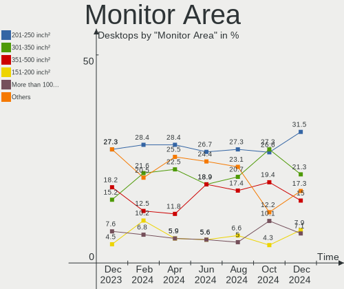
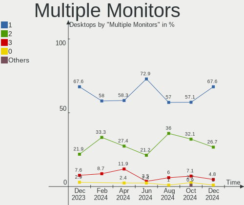

Arch - Hardware Trends (Desktops)
---------------------------------

A project to identify most popular hardware characteristics and track their change
over time based on data collected by Linux users at https://Linux-Hardware.org.

Anyone can contribute to this report by the [hw-probe](https://github.com/linuxhw/hw-probe) tool:

    sudo -E hw-probe -all -upload

This report is for one last month. Overall report since the beginning of time: [TestDays](https://github.com/linuxhw/TestDays)

Period: Jul, 2023.

Contents
--------

* [ System ](#system)
  - [ OS                       ](#os)
  - [ OS Family                ](#os-family)
  - [ Kernel                   ](#kernel)
  - [ Kernel Family            ](#kernel-family)
  - [ Kernel Major Ver.        ](#kernel-major-ver)
  - [ Arch                     ](#arch)
  - [ DE                       ](#de)
  - [ Display Server           ](#display-server)
  - [ Display Manager          ](#display-manager)
  - [ OS Lang                  ](#os-lang)
  - [ Boot Mode                ](#boot-mode)
  - [ Filesystem               ](#filesystem)
  - [ Part. scheme             ](#part-scheme)
  - [ Dual Boot with Linux/BSD ](#dual-boot-with-linuxbsd)
  - [ Dual Boot (Win)          ](#dual-boot-win)

* [ Board ](#board)
  - [ Vendor                   ](#vendor)
  - [ Model                    ](#model)
  - [ Model Family             ](#model-family)
  - [ MFG Year                 ](#mfg-year)
  - [ Form Factor              ](#form-factor)
  - [ Secure Boot              ](#secure-boot)
  - [ Coreboot                 ](#coreboot)
  - [ RAM Size                 ](#ram-size)
  - [ RAM Used                 ](#ram-used)
  - [ Total Drives             ](#total-drives)
  - [ Has CD-ROM               ](#has-cd-rom)
  - [ Has Ethernet             ](#has-ethernet)
  - [ Has WiFi                 ](#has-wifi)
  - [ Has Bluetooth            ](#has-bluetooth)

* [ Location ](#location)
  - [ Country                  ](#country)
  - [ City                     ](#city)

* [ Drives ](#drives)
  - [ Drive Vendor             ](#drive-vendor)
  - [ Drive Model              ](#drive-model)
  - [ HDD Vendor               ](#hdd-vendor)
  - [ SSD Vendor               ](#ssd-vendor)
  - [ Drive Kind               ](#drive-kind)
  - [ Drive Connector          ](#drive-connector)
  - [ Drive Size               ](#drive-size)
  - [ Space Total              ](#space-total)
  - [ Space Used               ](#space-used)
  - [ Malfunc. Drives          ](#malfunc-drives)
  - [ Malfunc. Drive Vendor    ](#malfunc-drive-vendor)
  - [ Malfunc. HDD Vendor      ](#malfunc-hdd-vendor)
  - [ Malfunc. Drive Kind      ](#malfunc-drive-kind)
  - [ Failed Drives            ](#failed-drives)
  - [ Failed Drive Vendor      ](#failed-drive-vendor)
  - [ Drive Status             ](#drive-status)

* [ Storage controller ](#storage-controller)
  - [ Storage Vendor           ](#storage-vendor)
  - [ Storage Model            ](#storage-model)
  - [ Storage Kind             ](#storage-kind)

* [ Processor ](#processor)
  - [ CPU Vendor               ](#cpu-vendor)
  - [ CPU Model                ](#cpu-model)
  - [ CPU Model Family         ](#cpu-model-family)
  - [ CPU Cores                ](#cpu-cores)
  - [ CPU Sockets              ](#cpu-sockets)
  - [ CPU Threads              ](#cpu-threads)
  - [ CPU Op-Modes             ](#cpu-op-modes)
  - [ CPU Microcode            ](#cpu-microcode)
  - [ CPU Microarch            ](#cpu-microarch)

* [ Graphics ](#graphics)
  - [ GPU Vendor               ](#gpu-vendor)
  - [ GPU Model                ](#gpu-model)
  - [ GPU Combo                ](#gpu-combo)
  - [ GPU Driver               ](#gpu-driver)
  - [ GPU Memory               ](#gpu-memory)

* [ Monitor ](#monitor)
  - [ Monitor Vendor           ](#monitor-vendor)
  - [ Monitor Model            ](#monitor-model)
  - [ Monitor Resolution       ](#monitor-resolution)
  - [ Monitor Diagonal         ](#monitor-diagonal)
  - [ Monitor Width            ](#monitor-width)
  - [ Aspect Ratio             ](#aspect-ratio)
  - [ Monitor Area             ](#monitor-area)
  - [ Pixel Density            ](#pixel-density)
  - [ Multiple Monitors        ](#multiple-monitors)

* [ Network ](#network)
  - [ Net Controller Vendor    ](#net-controller-vendor)
  - [ Net Controller Model     ](#net-controller-model)
  - [ Wireless Vendor          ](#wireless-vendor)
  - [ Wireless Model           ](#wireless-model)
  - [ Ethernet Vendor          ](#ethernet-vendor)
  - [ Ethernet Model           ](#ethernet-model)
  - [ Net Controller Kind      ](#net-controller-kind)
  - [ Used Controller          ](#used-controller)
  - [ NICs                     ](#nics)
  - [ IPv6                     ](#ipv6)

* [ Bluetooth ](#bluetooth)
  - [ Bluetooth Vendor         ](#bluetooth-vendor)
  - [ Bluetooth Model          ](#bluetooth-model)

* [ Sound ](#sound)
  - [ Sound Vendor             ](#sound-vendor)
  - [ Sound Model              ](#sound-model)

* [ Memory ](#memory)
  - [ Memory Vendor            ](#memory-vendor)
  - [ Memory Model             ](#memory-model)
  - [ Memory Kind              ](#memory-kind)
  - [ Memory Form Factor       ](#memory-form-factor)
  - [ Memory Size              ](#memory-size)
  - [ Memory Speed             ](#memory-speed)

* [ Printers & scanners ](#printers--scanners)
  - [ Printer Vendor           ](#printer-vendor)
  - [ Printer Model            ](#printer-model)
  - [ Scanner Vendor           ](#scanner-vendor)
  - [ Scanner Model            ](#scanner-model)

* [ Camera ](#camera)
  - [ Camera Vendor            ](#camera-vendor)
  - [ Camera Model             ](#camera-model)

* [ Security ](#security)
  - [ Fingerprint Vendor       ](#fingerprint-vendor)
  - [ Fingerprint Model        ](#fingerprint-model)
  - [ Chipcard Vendor          ](#chipcard-vendor)
  - [ Chipcard Model           ](#chipcard-model)

* [ Unsupported ](#unsupported)
  - [ Unsupported Devices      ](#unsupported-devices)
  - [ Unsupported Device Types ](#unsupported-device-types)

System
------

OS
--

Installed operating systems

| Name         | Desktops | Percent |
|--------------|----------|---------|
| Arch Rolling | 86       | 100%    |

OS Family
---------

OS without a version

| Name | Desktops | Percent |
|------|----------|---------|
| Arch | 86       | 100%    |

Kernel
------

Version of the Linux kernel

| Version                    | Desktops | Percent |
|----------------------------|----------|---------|
| 6.3.9-arch1-1              | 13       | 15.12%  |
| 6.4.3-arch1-2              | 10       | 11.63%  |
| 6.4.3-arch1-1              | 10       | 11.63%  |
| 6.4.4-arch1-1              | 8        | 9.3%    |
| 6.4.2-arch1-1              | 7        | 8.14%   |
| 6.4.1-arch1-1              | 5        | 5.81%   |
| 6.4.2-zen1-1-zen           | 4        | 4.65%   |
| 6.4.1-arch2-1              | 4        | 4.65%   |
| 6.4.3-zen1-2-zen           | 3        | 3.49%   |
| 6.4.1-zen1-1-zen           | 3        | 3.49%   |
| 6.4.7-arch1-1              | 2        | 2.33%   |
| 6.4.4-zen1-1-zen           | 2        | 2.33%   |
| 6.3.9-zen1-1-zen           | 2        | 2.33%   |
| 6.1.39-1-lts               | 2        | 2.33%   |
| 6.5.0-rc2-2-cachyos-rc     | 1        | 1.16%   |
| 6.4.6-zen1-1-zen           | 1        | 1.16%   |
| 6.4.5-arch1-1              | 1        | 1.16%   |
| 6.4.4-hardened1-1-hardened | 1        | 1.16%   |
| 6.4.3-1-cachyos            | 1        | 1.16%   |
| 6.4.2-1-clear              | 1        | 1.16%   |
| 6.4.1-zen2-1-zen           | 1        | 1.16%   |
| 6.4.1-arch1-1-custom       | 1        | 1.16%   |
| 6.1.38-2-lts               | 1        | 1.16%   |
| 6.1.38-1-lts               | 1        | 1.16%   |
| 5.10.54-1-lts              | 1        | 1.16%   |

Kernel Family
-------------

Linux kernel without a distro release

| Version | Desktops | Percent |
|---------|----------|---------|
| 6.4.3   | 24       | 27.91%  |
| 6.3.9   | 15       | 17.44%  |
| 6.4.1   | 14       | 16.28%  |
| 6.4.2   | 12       | 13.95%  |
| 6.4.4   | 11       | 12.79%  |
| 6.4.7   | 2        | 2.33%   |
| 6.1.39  | 2        | 2.33%   |
| 6.1.38  | 2        | 2.33%   |
| 6.5.0   | 1        | 1.16%   |
| 6.4.6   | 1        | 1.16%   |
| 6.4.5   | 1        | 1.16%   |
| 5.10.54 | 1        | 1.16%   |

Kernel Major Ver.
-----------------

Linux kernel major version

| Version | Desktops | Percent |
|---------|----------|---------|
| 6.4     | 65       | 75.58%  |
| 6.3     | 15       | 17.44%  |
| 6.1     | 4        | 4.65%   |
| 6.5     | 1        | 1.16%   |
| 5.10    | 1        | 1.16%   |

Arch
----

OS architecture (x86_64, i586, etc.)

| Name   | Desktops | Percent |
|--------|----------|---------|
| x86_64 | 86       | 100%    |

DE
--

Desktop Environment

| Name          | Desktops | Percent |
|---------------|----------|---------|
| KDE5          | 43       | 50%     |
| GNOME         | 14       | 16.28%  |
| XFCE          | 9        | 10.47%  |
| Unknown       | 8        | 9.3%    |
| i3            | 3        | 3.49%   |
| X-Cinnamon    | 1        | 1.16%   |
| openbox       | 1        | 1.16%   |
| MATE          | 1        | 1.16%   |
| LXQT          | 1        | 1.16%   |
| LXDE          | 1        | 1.16%   |
| Hyprland      | 1        | 1.16%   |
| GNOME-Classic | 1        | 1.16%   |
| GNOME Classic | 1        | 1.16%   |
| Deepin        | 1        | 1.16%   |

Display Server
--------------

X11 or Wayland

| Name    | Desktops | Percent |
|---------|----------|---------|
| X11     | 43       | 50%     |
| Wayland | 24       | 27.91%  |
| Tty     | 12       | 13.95%  |
| Unknown | 7        | 8.14%   |

Display Manager
---------------

SDDM, LightDM, etc.

| Name    | Desktops | Percent |
|---------|----------|---------|
| Unknown | 37       | 43.02%  |
| SDDM    | 31       | 36.05%  |
| LightDM | 9        | 10.47%  |
| GDM     | 5        | 5.81%   |
| LY-DM   | 3        | 3.49%   |
| NODM    | 1        | 1.16%   |

OS Lang
-------

Language

| Lang    | Desktops | Percent |
|---------|----------|---------|
| en_US   | 48       | 55.81%  |
| en_gb   | 7        | 8.14%   |
| ru_RU   | 5        | 5.81%   |
| pt_BR   | 3        | 3.49%   |
| it_IT   | 3        | 3.49%   |
| Unknown | 3        | 3.49%   |
| zh_CN   | 2        | 2.33%   |
| es_ES   | 2        | 2.33%   |
| de_DE   | 2        | 2.33%   |
| C       | 2        | 2.33%   |
| pl_PL   | 1        | 1.16%   |
| ja_JP   | 1        | 1.16%   |
| fr_FR   | 1        | 1.16%   |
| fi_FI   | 1        | 1.16%   |
| es_GT   | 1        | 1.16%   |
| en_ZA   | 1        | 1.16%   |
| en_NL   | 1        | 1.16%   |
| en_DE   | 1        | 1.16%   |
| en_CA   | 1        | 1.16%   |

Boot Mode
---------

EFI or BIOS

| Mode | Desktops | Percent |
|------|----------|---------|
| EFI  | 52       | 60.47%  |
| BIOS | 34       | 39.53%  |

Filesystem
----------

Type of filesystem

| Type    | Desktops | Percent |
|---------|----------|---------|
| Ext4    | 52       | 60.47%  |
| Btrfs   | 28       | 32.56%  |
| Overlay | 3        | 3.49%   |
| Xfs     | 2        | 2.33%   |
| Jfs     | 1        | 1.16%   |

Part. scheme
------------

Scheme of partitioning

| Type    | Desktops | Percent |
|---------|----------|---------|
| GPT     | 54       | 62.79%  |
| Unknown | 25       | 29.07%  |
| MBR     | 7        | 8.14%   |

Dual Boot with Linux/BSD
------------------------

Hosting more than one Linux/BSD

| Dual boot | Desktops | Percent |
|-----------|----------|---------|
| No        | 74       | 86.05%  |
| Yes       | 12       | 13.95%  |

Dual Boot (Win)
---------------

Hosting Linux and Windows

| Dual boot | Desktops | Percent |
|-----------|----------|---------|
| No        | 56       | 65.12%  |
| Yes       | 30       | 34.88%  |

Board
-----

Vendor
------

Motherboard manufacturer

| Name                | Desktops | Percent |
|---------------------|----------|---------|
| ASUSTek Computer    | 29       | 33.72%  |
| MSI                 | 15       | 17.44%  |
| Gigabyte Technology | 11       | 12.79%  |
| ASRock              | 9        | 10.47%  |
| Lenovo              | 3        | 3.49%   |
| Hewlett-Packard     | 3        | 3.49%   |
| Dell                | 3        | 3.49%   |
| Pegatron            | 2        | 2.33%   |
| Positivo            | 1        | 1.16%   |
| ONDA                | 1        | 1.16%   |
| MECHREVO            | 1        | 1.16%   |
| Huanan              | 1        | 1.16%   |
| Fujitsu             | 1        | 1.16%   |
| ECS                 | 1        | 1.16%   |
| Biostar             | 1        | 1.16%   |
| AZW                 | 1        | 1.16%   |
| ASRockRack          | 1        | 1.16%   |
| Apple               | 1        | 1.16%   |
| Unknown             | 1        | 1.16%   |

Model
-----

Motherboard model

| Name                                | Desktops | Percent |
|-------------------------------------|----------|---------|
| MSI MS-7C37                         | 2        | 2.33%   |
| Gigabyte Z390 AORUS PRO             | 2        | 2.33%   |
| ASUS All Series                     | 2        | 2.33%   |
| ASRock B450M Pro4                   | 2        | 2.33%   |
| Positivo POS-PIG43BC                | 1        | 1.16%   |
| Pegatron p2-1113w                   | 1        | 1.16%   |
| Pegatron 320-1030                   | 1        | 1.16%   |
| ONDA A320SD4-ITX Ver:2.00           | 1        | 1.16%   |
| MSI MS-7D75                         | 1        | 1.16%   |
| MSI MS-7D53                         | 1        | 1.16%   |
| MSI MS-7D09                         | 1        | 1.16%   |
| MSI MS-7C91                         | 1        | 1.16%   |
| MSI MS-7C75                         | 1        | 1.16%   |
| MSI MS-7C56                         | 1        | 1.16%   |
| MSI MS-7C02                         | 1        | 1.16%   |
| MSI MS-7B93                         | 1        | 1.16%   |
| MSI MS-7B89                         | 1        | 1.16%   |
| MSI MS-7A15                         | 1        | 1.16%   |
| MSI MS-7971                         | 1        | 1.16%   |
| MSI MS-7721                         | 1        | 1.16%   |
| MSI MS-7592                         | 1        | 1.16%   |
| MECHREVO F7BFD V1.0                 | 1        | 1.16%   |
| Lenovo ThinkCentre M93p 10AB001UGE  | 1        | 1.16%   |
| Lenovo ThinkCentre M93p 10AAS62K00  | 1        | 1.16%   |
| Lenovo ThinkCentre M92p 3227K58     | 1        | 1.16%   |
| Huanan H610M-PLUS                   | 1        | 1.16%   |
| HP Pavilion Gaming Desktop 690-00xx | 1        | 1.16%   |
| HP EliteDesk 800 G1 SFF             | 1        | 1.16%   |
| HP Compaq 6005 Pro SFF PC           | 1        | 1.16%   |
| Gigabyte Z77X-D3H                   | 1        | 1.16%   |
| Gigabyte Z170X-Gaming 3             | 1        | 1.16%   |
| Gigabyte H110M-H                    | 1        | 1.16%   |
| Gigabyte GA-78LMT-S2P               | 1        | 1.16%   |
| Gigabyte B550 AORUS ELITE V2        | 1        | 1.16%   |
| Gigabyte B450M H                    | 1        | 1.16%   |
| Gigabyte B450 I AORUS PRO WIFI      | 1        | 1.16%   |
| Gigabyte B450 AORUS ELITE           | 1        | 1.16%   |
| Gigabyte B360M-DS3H                 | 1        | 1.16%   |
| Fujitsu ESPRIMO_P756                | 1        | 1.16%   |
| ECS A780LM-M2                       | 1        | 1.16%   |

Model Family
------------

Motherboard model prefix

| Name                  | Desktops | Percent |
|-----------------------|----------|---------|
| ASUS PRIME            | 8        | 9.3%    |
| ASUS ROG              | 7        | 8.14%   |
| ASUS TUF              | 6        | 6.98%   |
| Lenovo ThinkCentre    | 3        | 3.49%   |
| Dell OptiPlex         | 3        | 3.49%   |
| MSI MS-7C37           | 2        | 2.33%   |
| Gigabyte Z390         | 2        | 2.33%   |
| Gigabyte B450         | 2        | 2.33%   |
| ASUS All              | 2        | 2.33%   |
| ASRock B450M          | 2        | 2.33%   |
| Positivo POS-PIG43BC  | 1        | 1.16%   |
| Pegatron p2-1113w     | 1        | 1.16%   |
| Pegatron 320-1030     | 1        | 1.16%   |
| ONDA A320SD4-ITX      | 1        | 1.16%   |
| MSI MS-7D75           | 1        | 1.16%   |
| MSI MS-7D53           | 1        | 1.16%   |
| MSI MS-7D09           | 1        | 1.16%   |
| MSI MS-7C91           | 1        | 1.16%   |
| MSI MS-7C75           | 1        | 1.16%   |
| MSI MS-7C56           | 1        | 1.16%   |
| MSI MS-7C02           | 1        | 1.16%   |
| MSI MS-7B93           | 1        | 1.16%   |
| MSI MS-7B89           | 1        | 1.16%   |
| MSI MS-7A15           | 1        | 1.16%   |
| MSI MS-7971           | 1        | 1.16%   |
| MSI MS-7721           | 1        | 1.16%   |
| MSI MS-7592           | 1        | 1.16%   |
| MECHREVO F7BFD        | 1        | 1.16%   |
| Huanan H610M-PLUS     | 1        | 1.16%   |
| HP Pavilion           | 1        | 1.16%   |
| HP EliteDesk          | 1        | 1.16%   |
| HP Compaq             | 1        | 1.16%   |
| Gigabyte Z77X-D3H     | 1        | 1.16%   |
| Gigabyte Z170X-Gaming | 1        | 1.16%   |
| Gigabyte H110M-H      | 1        | 1.16%   |
| Gigabyte GA-78LMT-S2P | 1        | 1.16%   |
| Gigabyte B550         | 1        | 1.16%   |
| Gigabyte B450M        | 1        | 1.16%   |
| Gigabyte B360M-DS3H   | 1        | 1.16%   |
| Fujitsu ESPRIMO       | 1        | 1.16%   |

MFG Year
--------

Motherboard manufacture year

| Year | Desktops | Percent |
|------|----------|---------|
| 2018 | 14       | 16.28%  |
| 2020 | 9        | 10.47%  |
| 2019 | 9        | 10.47%  |
| 2022 | 8        | 9.3%    |
| 2021 | 7        | 8.14%   |
| 2023 | 6        | 6.98%   |
| 2013 | 6        | 6.98%   |
| 2011 | 6        | 6.98%   |
| 2017 | 5        | 5.81%   |
| 2015 | 5        | 5.81%   |
| 2016 | 3        | 3.49%   |
| 2010 | 3        | 3.49%   |
| 2012 | 2        | 2.33%   |
| 2014 | 1        | 1.16%   |
| 2009 | 1        | 1.16%   |
| 2007 | 1        | 1.16%   |

Form Factor
-----------

Physical design of the computer

| Name    | Desktops | Percent |
|---------|----------|---------|
| Desktop | 86       | 100%    |

Secure Boot
-----------

Enabled or disabled

| State    | Desktops | Percent |
|----------|----------|---------|
| Disabled | 86       | 100%    |

Coreboot
--------

Have coreboot on board

| Used | Desktops | Percent |
|------|----------|---------|
| No   | 86       | 100%    |

RAM Size
--------

Total RAM memory

| Size in GB  | Desktops | Percent |
|-------------|----------|---------|
| 16.01-24.0  | 24       | 27.91%  |
| 32.01-64.0  | 23       | 26.74%  |
| 4.01-8.0    | 11       | 12.79%  |
| 8.01-16.0   | 10       | 11.63%  |
| 24.01-32.0  | 7        | 8.14%   |
| 64.01-256.0 | 7        | 8.14%   |
| 3.01-4.0    | 3        | 3.49%   |
| 1.01-2.0    | 1        | 1.16%   |

RAM Used
--------

Used RAM memory

| Used GB    | Desktops | Percent |
|------------|----------|---------|
| 4.01-8.0   | 24       | 27.91%  |
| 3.01-4.0   | 18       | 20.93%  |
| 2.01-3.0   | 16       | 18.6%   |
| 8.01-16.0  | 11       | 12.79%  |
| 1.01-2.0   | 10       | 11.63%  |
| 0.51-1.0   | 3        | 3.49%   |
| 16.01-24.0 | 2        | 2.33%   |
| 0.01-0.5   | 2        | 2.33%   |

Total Drives
------------

Number of drives on board

| Drives | Desktops | Percent |
|--------|----------|---------|
| 1      | 22       | 25.58%  |
| 2      | 20       | 23.26%  |
| 3      | 19       | 22.09%  |
| 5      | 11       | 12.79%  |
| 4      | 7        | 8.14%   |
| 7      | 4        | 4.65%   |
| 6      | 3        | 3.49%   |

Has CD-ROM
----------

Has CD-ROM on board

| Presented | Desktops | Percent |
|-----------|----------|---------|
| No        | 67       | 77.91%  |
| Yes       | 19       | 22.09%  |

Has Ethernet
------------

Has Ethernet on board

| Presented | Desktops | Percent |
|-----------|----------|---------|
| Yes       | 86       | 100%    |

Has WiFi
--------

Has WiFi module

| Presented | Desktops | Percent |
|-----------|----------|---------|
| Yes       | 48       | 55.81%  |
| No        | 38       | 44.19%  |

Has Bluetooth
-------------

Has Bluetooth module

| Presented | Desktops | Percent |
|-----------|----------|---------|
| Yes       | 44       | 51.16%  |
| No        | 42       | 48.84%  |

Location
--------

Country
-------

Geographic location (country)

| Country      | Desktops | Percent |
|--------------|----------|---------|
| USA          | 18       | 20.93%  |
| Russia       | 8        | 9.3%    |
| UK           | 6        | 6.98%   |
| Germany      | 5        | 5.81%   |
| Poland       | 4        | 4.65%   |
| Italy        | 4        | 4.65%   |
| Hong Kong    | 4        | 4.65%   |
| Canada       | 4        | 4.65%   |
| Brazil       | 4        | 4.65%   |
| Sweden       | 3        | 3.49%   |
| Netherlands  | 3        | 3.49%   |
| France       | 3        | 3.49%   |
| Finland      | 2        | 2.33%   |
| China        | 2        | 2.33%   |
| Chile        | 2        | 2.33%   |
| Vietnam      | 1        | 1.16%   |
| Turkey       | 1        | 1.16%   |
| South Africa | 1        | 1.16%   |
| Singapore    | 1        | 1.16%   |
| Peru         | 1        | 1.16%   |
| Norway       | 1        | 1.16%   |
| Japan        | 1        | 1.16%   |
| Iran         | 1        | 1.16%   |
| Guatemala    | 1        | 1.16%   |
| Greece       | 1        | 1.16%   |
| Denmark      | 1        | 1.16%   |
| Czechia      | 1        | 1.16%   |
| Brunei       | 1        | 1.16%   |
| Bangladesh   | 1        | 1.16%   |

City
----

Geographic location (city)

| City             | Desktops | Percent |
|------------------|----------|---------|
| Warsaw           | 3        | 3.49%   |
| Central          | 3        | 3.49%   |
| Volgograd        | 2        | 2.33%   |
| St Petersburg    | 2        | 2.33%   |
| Malmo            | 2        | 2.33%   |
| Chengdu          | 2        | 2.33%   |
| Berlin           | 2        | 2.33%   |
| Athens           | 2        | 2.33%   |
| Łomża          | 1        | 1.16%   |
| Zaraysk          | 1        | 1.16%   |
| Wanchai          | 1        | 1.16%   |
| Viña del Mar    | 1        | 1.16%   |
| Vejle            | 1        | 1.16%   |
| Varsta           | 1        | 1.16%   |
| Vancouver        | 1        | 1.16%   |
| Valencia         | 1        | 1.16%   |
| Toledo           | 1        | 1.16%   |
| Thornhill        | 1        | 1.16%   |
| Tehran           | 1        | 1.16%   |
| Tapiramuta       | 1        | 1.16%   |
| Sulzbach am Main | 1        | 1.16%   |
| Stanmore         | 1        | 1.16%   |
| St Louis         | 1        | 1.16%   |
| Singapore        | 1        | 1.16%   |
| Shelbyville      | 1        | 1.16%   |
| Serpukhov        | 1        | 1.16%   |
| Selasvatn        | 1        | 1.16%   |
| Schoonhoven      | 1        | 1.16%   |
| Roswell          | 1        | 1.16%   |
| Providence       | 1        | 1.16%   |
| Pretoria         | 1        | 1.16%   |
| Prague           | 1        | 1.16%   |
| Philadelphia     | 1        | 1.16%   |
| Peterborough     | 1        | 1.16%   |
| Patos de Minas   | 1        | 1.16%   |
| Paris            | 1        | 1.16%   |
| Oulu             | 1        | 1.16%   |
| Osnabrück       | 1        | 1.16%   |
| Naples           | 1        | 1.16%   |
| Naha             | 1        | 1.16%   |

Drives
------

Drive Vendor
------------

Hard drive vendors

| Vendor                      | Desktops | Drives | Percent |
|-----------------------------|----------|--------|---------|
| Samsung Electronics         | 32       | 47     | 16.93%  |
| WDC                         | 29       | 47     | 15.34%  |
| Seagate                     | 26       | 36     | 13.76%  |
| Sandisk                     | 16       | 18     | 8.47%   |
| Kingston                    | 14       | 17     | 7.41%   |
| Toshiba                     | 7        | 9      | 3.7%    |
| ADATA Technology            | 6        | 6      | 3.17%   |
| Intel                       | 5        | 9      | 2.65%   |
| Silicon Motion              | 4        | 4      | 2.12%   |
| Phison Electronics          | 4        | 4      | 2.12%   |
| Micron Technology           | 4        | 4      | 2.12%   |
| Crucial                     | 4        | 4      | 2.12%   |
| Micron/Crucial Technology   | 3        | 3      | 1.59%   |
| Kingston Technology Company | 3        | 3      | 1.59%   |
| Hitachi                     | 3        | 4      | 1.59%   |
| Yangtze Memory Technologies | 2        | 2      | 1.06%   |
| SK hynix                    | 2        | 3      | 1.06%   |
| GOODRAM                     | 2        | 2      | 1.06%   |
| China                       | 2        | 2      | 1.06%   |
| ZHITAI                      | 1        | 2      | 0.53%   |
| Transcend                   | 1        | 1      | 0.53%   |
| TO Exter                    | 1        | 1      | 0.53%   |
| SPCC                        | 1        | 1      | 0.53%   |
| Seagate Technology          | 1        | 1      | 0.53%   |
| OCZ-VERTEX3                 | 1        | 1      | 0.53%   |
| OCZ                         | 1        | 1      | 0.53%   |
| Maxtor                      | 1        | 1      | 0.53%   |
| LITEONIT                    | 1        | 1      | 0.53%   |
| KIOXIA-EXCERIA              | 1        | 1      | 0.53%   |
| KIOXIA                      | 1        | 2      | 0.53%   |
| HS-SSD-E100N                | 1        | 1      | 0.53%   |
| HIKSEMI                     | 1        | 1      | 0.53%   |
| HGST                        | 1        | 1      | 0.53%   |
| Gigabyte Technology         | 1        | 1      | 0.53%   |
| Geonix                      | 1        | 1      | 0.53%   |
| External                    | 1        | 1      | 0.53%   |
| ELECOM                      | 1        | 1      | 0.53%   |
| Corsair                     | 1        | 1      | 0.53%   |
| Biostar                     | 1        | 1      | 0.53%   |
| Unknown                     | 1        | 1      | 0.53%   |

Drive Model
-----------

Hard drive models

| Model                                                              | Desktops | Percent |
|--------------------------------------------------------------------|----------|---------|
| Samsung NVMe SSD Controller SM981/PM981/PM983 500GB                | 10       | 4.41%   |
| Samsung NVMe SSD Controller PM9A1/PM9A3/980PRO 1TB                 | 5        | 2.2%    |
| ADATA XPG SX8200 Pro PCIe Gen3x4 M.2 2280 Solid State Drive 1024GB | 5        | 2.2%    |
| WDC WD10EZEX-08WN4A0 1TB                                           | 3        | 1.32%   |
| Sandisk WD Black SN750 / PC SN730 NVMe SSD 1024GB                  | 3        | 1.32%   |
| Samsung SSD 860 EVO 500GB                                          | 3        | 1.32%   |
| Samsung SSD 860 EVO 1TB                                            | 3        | 1.32%   |
| Phison E12 NVMe Controller 2TB                                     | 3        | 1.32%   |
| Kingston SA400S37240G 240GB SSD                                    | 3        | 1.32%   |
| WDC WD10EZEX-22MFCA0 1TB                                           | 2        | 0.88%   |
| WDC WD10EZEX-00BN5A0 1TB                                           | 2        | 0.88%   |
| Toshiba DT01ACA050 500GB                                           | 2        | 0.88%   |
| Silicon Motion SM2263EN/SM2263XT SSD Controller 500GB              | 2        | 0.88%   |
| Seagate ST500DM002-1BD142 500GB                                    | 2        | 0.88%   |
| Seagate ST4000VN006-3CW104 4TB                                     | 2        | 0.88%   |
| Seagate ST4000DM004-2CV104 4TB                                     | 2        | 0.88%   |
| Seagate ST2000DM008-2FR102 2TB                                     | 2        | 0.88%   |
| Seagate ST2000DM001-1CH164 2TB                                     | 2        | 0.88%   |
| Seagate ST1000LM024 HN-M101MBB 1TB                                 | 2        | 0.88%   |
| Sandisk WD Blue SN550 NVMe SSD 250GB                               | 2        | 0.88%   |
| Sandisk WD Black SN850 1TB                                         | 2        | 0.88%   |
| Sandisk WD Black 2018/SN750 / PC SN720 NVMe SSD 1TB                | 2        | 0.88%   |
| SanDisk SSD PLUS 240GB                                             | 2        | 0.88%   |
| Samsung SSD 990 PRO 1TB                                            | 2        | 0.88%   |
| Samsung SSD 980 500GB                                              | 2        | 0.88%   |
| Samsung SSD 850 EVO 250GB                                          | 2        | 0.88%   |
| Samsung SSD 840 EVO 250GB                                          | 2        | 0.88%   |
| Micron/Crucial P1 NVMe PCIe SSD 1TB                                | 2        | 0.88%   |
| Kingston Company A2000 NVMe SSD 1TB                                | 2        | 0.88%   |
| Kingston SUV400S37120G 120GB SSD                                   | 2        | 0.88%   |
| Kingston SFYRD2000G 2TB                                            | 2        | 0.88%   |
| Kingston SA400S37480G 480GB SSD                                    | 2        | 0.88%   |
| Intel SSD 600P Series 512GB                                        | 2        | 0.88%   |
| Crucial CT2000MX500SSD1 2TB                                        | 2        | 0.88%   |
| ZHITAI SC001 Active 512GB SSD                                      | 1        | 0.44%   |
| ZHITAI SC001 Active 256GB SSD                                      | 1        | 0.44%   |
| Yangtze Memory ZHITAI PC005 Active 512GB                           | 1        | 0.44%   |
| Yangtze Memory YMTC PC300-1TB-B                                    | 1        | 0.44%   |
| WDC WDS500G2B0A-00SM50 500GB SSD                                   | 1        | 0.44%   |
| WDC WDS480G2G0A-00JH30 480GB SSD                                   | 1        | 0.44%   |

HDD Vendor
----------

Hard disk drive vendors

| Vendor              | Desktops | Drives | Percent |
|---------------------|----------|--------|---------|
| WDC                 | 25       | 40     | 37.88%  |
| Seagate             | 25       | 35     | 37.88%  |
| Toshiba             | 7        | 9      | 10.61%  |
| Hitachi             | 3        | 4      | 4.55%   |
| Samsung Electronics | 2        | 3      | 3.03%   |
| Maxtor              | 1        | 1      | 1.52%   |
| HGST                | 1        | 1      | 1.52%   |
| External            | 1        | 1      | 1.52%   |
| Unknown             | 1        | 1      | 1.52%   |

SSD Vendor
----------

Solid state drive vendors

| Vendor              | Desktops | Drives | Percent |
|---------------------|----------|--------|---------|
| Samsung Electronics | 16       | 20     | 25.81%  |
| Kingston            | 10       | 11     | 16.13%  |
| WDC                 | 6        | 7      | 9.68%   |
| SanDisk             | 5        | 6      | 8.06%   |
| Crucial             | 4        | 4      | 6.45%   |
| Micron Technology   | 3        | 3      | 4.84%   |
| Intel               | 2        | 5      | 3.23%   |
| GOODRAM             | 2        | 2      | 3.23%   |
| China               | 2        | 2      | 3.23%   |
| ZHITAI              | 1        | 2      | 1.61%   |
| Transcend           | 1        | 1      | 1.61%   |
| TO Exter            | 1        | 1      | 1.61%   |
| SPCC                | 1        | 1      | 1.61%   |
| OCZ-VERTEX3         | 1        | 1      | 1.61%   |
| OCZ                 | 1        | 1      | 1.61%   |
| LITEONIT            | 1        | 1      | 1.61%   |
| KIOXIA-EXCERIA      | 1        | 1      | 1.61%   |
| Gigabyte Technology | 1        | 1      | 1.61%   |
| Geonix              | 1        | 1      | 1.61%   |
| Corsair             | 1        | 1      | 1.61%   |
| Biostar             | 1        | 1      | 1.61%   |

Drive Kind
----------

HDD or SSD

| Kind    | Desktops | Drives | Percent |
|---------|----------|--------|---------|
| NVMe    | 50       | 75     | 33.78%  |
| HDD     | 48       | 95     | 32.43%  |
| SSD     | 46       | 73     | 31.08%  |
| Unknown | 4        | 4      | 2.7%    |

Drive Connector
---------------

SATA, SAS, NVMe, etc.

| Type | Desktops | Drives | Percent |
|------|----------|--------|---------|
| SATA | 71       | 165    | 55.91%  |
| NVMe | 50       | 75     | 39.37%  |
| SAS  | 6        | 7      | 4.72%   |

Drive Size
----------

Size of hard drive

| Size in TB | Desktops | Drives | Percent |
|------------|----------|--------|---------|
| 0.01-0.5   | 47       | 66     | 38.52%  |
| 0.51-1.0   | 37       | 52     | 30.33%  |
| 1.01-2.0   | 15       | 19     | 12.3%   |
| 3.01-4.0   | 8        | 13     | 6.56%   |
| 2.01-3.0   | 6        | 7      | 4.92%   |
| 4.01-10.0  | 5        | 6      | 4.1%    |
| 10.01-20.0 | 3        | 4      | 2.46%   |
| 20.01-50.0 | 1        | 1      | 0.82%   |

Space Total
-----------

Amount of disk space available on the file system

| Size in GB     | Desktops | Percent |
|----------------|----------|---------|
| More than 3000 | 30       | 34.88%  |
| 501-1000       | 17       | 19.77%  |
| 251-500        | 12       | 13.95%  |
| 1001-2000      | 11       | 12.79%  |
| 101-250        | 6        | 6.98%   |
| 2001-3000      | 4        | 4.65%   |
| 1-20           | 2        | 2.33%   |
| 51-100         | 2        | 2.33%   |
| Unknown        | 2        | 2.33%   |

Space Used
----------

Amount of used disk space

| Used GB        | Desktops | Percent |
|----------------|----------|---------|
| 101-250        | 13       | 15.12%  |
| 1-20           | 13       | 15.12%  |
| More than 3000 | 11       | 12.79%  |
| 1001-2000      | 11       | 12.79%  |
| 251-500        | 9        | 10.47%  |
| 21-50          | 9        | 10.47%  |
| 501-1000       | 9        | 10.47%  |
| 2001-3000      | 7        | 8.14%   |
| 51-100         | 2        | 2.33%   |
| Unknown        | 2        | 2.33%   |

Malfunc. Drives
---------------

Drive models with a malfunction

| Model                                               | Desktops | Drives | Percent |
|-----------------------------------------------------|----------|--------|---------|
| WDC WD60EDAZ-11U78B0 6TB                            | 1        | 1      | 4.17%   |
| WDC WD5001AALS-00L3B2 500GB                         | 1        | 1      | 4.17%   |
| WDC WD5000AAKX-22ERMA0 500GB                        | 1        | 1      | 4.17%   |
| WDC WD40EJRX-89AKWY0 4TB                            | 1        | 3      | 4.17%   |
| WDC WD20EFRX-68EUZN0 2TB                            | 1        | 2      | 4.17%   |
| WDC WD20EARS-00MVWB0 2TB                            | 1        | 1      | 4.17%   |
| WDC WD10JPLX-00MBPT1 1TB                            | 1        | 2      | 4.17%   |
| WDC WD10EFRX-68PJCN0 1TB                            | 1        | 1      | 4.17%   |
| Toshiba MQ01ABD100 1TB                              | 1        | 1      | 4.17%   |
| TO Exter nal USB 3.0 1TB                            | 1        | 1      | 4.17%   |
| Seagate ST500DM002-1BD142 500GB                     | 1        | 1      | 4.17%   |
| Seagate ST33000651NS 3TB                            | 1        | 1      | 4.17%   |
| Seagate ST3000DM001-1CH166 3TB                      | 1        | 1      | 4.17%   |
| Seagate ST2000DL003-9VT166 2TB                      | 1        | 1      | 4.17%   |
| Seagate ST1000DM010-2EP102 1TB                      | 1        | 1      | 4.17%   |
| Seagate ST1000DM003-1SB102 1TB                      | 1        | 1      | 4.17%   |
| SanDisk SDSSDXPS480G 480GB                          | 1        | 1      | 4.17%   |
| Samsung Electronics HD503HI 500GB                   | 1        | 2      | 4.17%   |
| OCZ VERTEX3 120GB SSD                               | 1        | 1      | 4.17%   |
| Micron Technology MTFDDAV256TBN-1AR15ABHA 256GB SSD | 1        | 1      | 4.17%   |
| Kingston SKC400S371T 1TB SSD                        | 1        | 1      | 4.17%   |
| Intel SSD 600P Series 512GB                         | 1        | 1      | 4.17%   |
| Crucial CT240M500SSD1 240GB                         | 1        | 1      | 4.17%   |
| Corsair Force LS SSD 240GB                          | 1        | 1      | 4.17%   |

Malfunc. Drive Vendor
---------------------

Vendors of faulty drives

| Vendor              | Desktops | Drives | Percent |
|---------------------|----------|--------|---------|
| WDC                 | 7        | 12     | 30.43%  |
| Seagate             | 6        | 6      | 26.09%  |
| Toshiba             | 1        | 1      | 4.35%   |
| TO Exter            | 1        | 1      | 4.35%   |
| SanDisk             | 1        | 1      | 4.35%   |
| Samsung Electronics | 1        | 2      | 4.35%   |
| OCZ                 | 1        | 1      | 4.35%   |
| Micron Technology   | 1        | 1      | 4.35%   |
| Kingston            | 1        | 1      | 4.35%   |
| Intel               | 1        | 1      | 4.35%   |
| Crucial             | 1        | 1      | 4.35%   |
| Corsair             | 1        | 1      | 4.35%   |

Malfunc. HDD Vendor
-------------------

Vendors of faulty HDD drives

| Vendor              | Desktops | Drives | Percent |
|---------------------|----------|--------|---------|
| WDC                 | 7        | 12     | 46.67%  |
| Seagate             | 6        | 6      | 40%     |
| Toshiba             | 1        | 1      | 6.67%   |
| Samsung Electronics | 1        | 2      | 6.67%   |

Malfunc. Drive Kind
-------------------

Kinds of faulty drives

| Kind | Desktops | Drives | Percent |
|------|----------|--------|---------|
| HDD  | 13       | 21     | 61.9%   |
| SSD  | 7        | 7      | 33.33%  |
| NVMe | 1        | 1      | 4.76%   |

Failed Drives
-------------

Failed drive models

Zero info for selected period =(

Failed Drive Vendor
-------------------

Failed drive vendors

Zero info for selected period =(

Drive Status
------------

Number of failed and malfunc. drives

| Status   | Desktops | Drives | Percent |
|----------|----------|--------|---------|
| Works    | 56       | 143    | 52.34%  |
| Detected | 31       | 75     | 28.97%  |
| Malfunc  | 20       | 29     | 18.69%  |

Storage controller
------------------

Storage Vendor
--------------

Storage controller vendors

| Vendor                      | Desktops | Percent |
|-----------------------------|----------|---------|
| AMD                         | 45       | 28.13%  |
| Intel                       | 41       | 25.63%  |
| Samsung Electronics         | 19       | 11.88%  |
| SanDisk                     | 11       | 6.88%   |
| ASMedia Technology          | 9        | 5.63%   |
| Kingston Technology Company | 8        | 5%      |
| ADATA Technology            | 6        | 3.75%   |
| Silicon Motion              | 4        | 2.5%    |
| Phison Electronics          | 4        | 2.5%    |
| Micron/Crucial Technology   | 3        | 1.88%   |
| Yangtze Memory Technologies | 2        | 1.25%   |
| SK hynix                    | 2        | 1.25%   |
| Marvell Technology Group    | 2        | 1.25%   |
| Seagate Technology          | 1        | 0.63%   |
| Micron Technology           | 1        | 0.63%   |
| KIOXIA                      | 1        | 0.63%   |
| JMicron Technology          | 1        | 0.63%   |

Storage Model
-------------

Storage controller models

| Model                                                                          | Desktops | Percent |
|--------------------------------------------------------------------------------|----------|---------|
| AMD FCH SATA Controller [AHCI mode]                                            | 25       | 13.44%  |
| AMD 400 Series Chipset SATA Controller                                         | 12       | 6.45%   |
| Samsung NVMe SSD Controller SM981/PM981/PM983                                  | 10       | 5.38%   |
| ASMedia ASM1062 Serial ATA Controller                                          | 8        | 4.3%    |
| Intel Q170/Q150/B150/H170/H110/Z170/CM236 Chipset SATA Controller [AHCI Mode]  | 7        | 3.76%   |
| AMD 500 Series Chipset SATA Controller                                         | 6        | 3.23%   |
| Samsung NVMe SSD Controller PM9A1/PM9A3/980PRO                                 | 5        | 2.69%   |
| Kingston Company KC3000/Renegade NVMe SSD                                      | 5        | 2.69%   |
| Intel 8 Series/C220 Series Chipset Family 6-port SATA Controller 1 [AHCI mode] | 5        | 2.69%   |
| ADATA XPG SX8200 Pro PCIe Gen3x4 M.2 2280 Solid State Drive                    | 5        | 2.69%   |
| Intel 7 Series/C210 Series Chipset Family 6-port SATA Controller [AHCI mode]   | 4        | 2.15%   |
| AMD SB7x0/SB8x0/SB9x0 SATA Controller [AHCI mode]                              | 4        | 2.15%   |
| SanDisk WD Black SN750 / PC SN730 NVMe SSD                                     | 3        | 1.61%   |
| Samsung NVMe SSD Controller S4LV008[Pascal]                                    | 3        | 1.61%   |
| Samsung NVMe SSD Controller 980                                                | 3        | 1.61%   |
| Phison E12 NVMe Controller                                                     | 3        | 1.61%   |
| Intel Volume Management Device NVMe RAID Controller Intel Corporation          | 3        | 1.61%   |
| Intel SATA Controller [RAID mode]                                              | 3        | 1.61%   |
| Intel Cannon Lake PCH SATA AHCI Controller                                     | 3        | 1.61%   |
| Intel 700 Series Chipset Family SATA AHCI Controller                           | 3        | 1.61%   |
| Intel 200 Series PCH SATA controller [AHCI mode]                               | 3        | 1.61%   |
| AMD SB7x0/SB8x0/SB9x0 IDE Controller                                           | 3        | 1.61%   |
| AMD FCH SATA Controller D                                                      | 3        | 1.61%   |
| Silicon Motion SM2263EN/SM2263XT (DRAM-less) NVMe SSD Controllers              | 2        | 1.08%   |
| SanDisk WD PC SN810 / Black SN850 NVMe SSD                                     | 2        | 1.08%   |
| SanDisk WD Blue SN550 NVMe SSD                                                 | 2        | 1.08%   |
| SanDisk WD Black SN770 / PC SN740 256GB / PC SN560 (DRAM-less) NVMe SSD        | 2        | 1.08%   |
| SanDisk WD Black 2018/SN750 / PC SN720 NVMe SSD                                | 2        | 1.08%   |
| Micron/Crucial P1 NVMe PCIe SSD[Frampton]                                      | 2        | 1.08%   |
| Marvell Group 88SE9172 SATA 6Gb/s Controller                                   | 2        | 1.08%   |
| Kingston Company A2000 NVMe SSD                                                | 2        | 1.08%   |
| Intel SSD 600P Series                                                          | 2        | 1.08%   |
| Yangtze Memory ZHITAI PC005 NVMe SSD                                           | 1        | 0.54%   |
| Yangtze Memory Non-Volatile memory controller                                  | 1        | 0.54%   |
| SK hynix Platinum P41/PC801 NVMe Solid State Drive                             | 1        | 0.54%   |
| SK hynix BC501 NVMe Solid State Drive                                          | 1        | 0.54%   |
| Silicon Motion SM2262/SM2262EN SSD Controller                                  | 1        | 0.54%   |
| Silicon Motion SM2260 NVMe SSD Controller                                      | 1        | 0.54%   |
| Seagate FireCuda/IronWolf 510 SSD                                              | 1        | 0.54%   |
| SanDisk WD Green SN350 NVMe SSD 240GB (DRAM-less)                              | 1        | 0.54%   |

Storage Kind
------------

Kind of storage controller (IDE, SATA, NVMe, SAS, ...)

| Kind | Desktops | Percent |
|------|----------|---------|
| SATA | 77       | 54.61%  |
| NVMe | 50       | 35.46%  |
| RAID | 7        | 4.96%   |
| IDE  | 7        | 4.96%   |

Processor
---------

CPU Vendor
----------

Processor vendors

| Vendor | Desktops | Percent |
|--------|----------|---------|
| AMD    | 48       | 55.81%  |
| Intel  | 38       | 44.19%  |

CPU Model
---------

Processor models

| Model                                       | Desktops | Percent |
|---------------------------------------------|----------|---------|
| AMD Ryzen 7 3700X 8-Core Processor          | 4        | 4.65%   |
| AMD Ryzen 9 5950X 16-Core Processor         | 3        | 3.49%   |
| AMD Ryzen 5 3400G with Radeon Vega Graphics | 3        | 3.49%   |
| Intel Core i5-9400F CPU @ 2.90GHz           | 2        | 2.33%   |
| Intel Core i5-4570T CPU @ 2.90GHz           | 2        | 2.33%   |
| Intel Core 2 Quad CPU Q6600 @ 2.40GHz       | 2        | 2.33%   |
| Intel 13th Gen Core i7-13700KF              | 2        | 2.33%   |
| AMD Ryzen 9 7950X 16-Core Processor         | 2        | 2.33%   |
| AMD Ryzen 9 5900X 12-Core Processor         | 2        | 2.33%   |
| AMD Ryzen 7 5700G with Radeon Graphics      | 2        | 2.33%   |
| AMD Ryzen 7 3800X 8-Core Processor          | 2        | 2.33%   |
| AMD Ryzen 5 5600G with Radeon Graphics      | 2        | 2.33%   |
| AMD Ryzen 5 3600 6-Core Processor           | 2        | 2.33%   |
| Intel Xeon CPU E5620 @ 2.40GHz              | 1        | 1.16%   |
| Intel Xeon CPU E3-1245 v5 @ 3.50GHz         | 1        | 1.16%   |
| Intel Pentium CPU G4560 @ 3.50GHz           | 1        | 1.16%   |
| Intel Core i9-9900K CPU @ 3.60GHz           | 1        | 1.16%   |
| Intel Core i7-9700K CPU @ 3.60GHz           | 1        | 1.16%   |
| Intel Core i7-8700K CPU @ 3.70GHz           | 1        | 1.16%   |
| Intel Core i7-8700 CPU @ 3.20GHz            | 1        | 1.16%   |
| Intel Core i7-7700K CPU @ 4.20GHz           | 1        | 1.16%   |
| Intel Core i7-6700K CPU @ 4.00GHz           | 1        | 1.16%   |
| Intel Core i7-4790 CPU @ 3.60GHz            | 1        | 1.16%   |
| Intel Core i7-4770K CPU @ 3.50GHz           | 1        | 1.16%   |
| Intel Core i7-4770 CPU @ 3.40GHz            | 1        | 1.16%   |
| Intel Core i7-3820 CPU @ 3.60GHz            | 1        | 1.16%   |
| Intel Core i7-3770K CPU @ 3.50GHz           | 1        | 1.16%   |
| Intel Core i7-3770 CPU @ 3.40GHz            | 1        | 1.16%   |
| Intel Core i7-10750H CPU @ 2.60GHz          | 1        | 1.16%   |
| Intel Core i5-7500 CPU @ 3.40GHz            | 1        | 1.16%   |
| Intel Core i5-7400 CPU @ 3.00GHz            | 1        | 1.16%   |
| Intel Core i5-6600K CPU @ 3.50GHz           | 1        | 1.16%   |
| Intel Core i5-6500 CPU @ 3.20GHz            | 1        | 1.16%   |
| Intel Core i5-6400 CPU @ 2.70GHz            | 1        | 1.16%   |
| Intel Core i5-3570 CPU @ 3.40GHz            | 1        | 1.16%   |
| Intel Core i5-10600 CPU @ 3.30GHz           | 1        | 1.16%   |
| Intel Core i3-8100 CPU @ 3.60GHz            | 1        | 1.16%   |
| Intel Core i3-3220 CPU @ 3.30GHz            | 1        | 1.16%   |
| Intel Celeron N5105 @ 2.00GHz               | 1        | 1.16%   |
| Intel Celeron CPU E3400 @ 2.60GHz           | 1        | 1.16%   |

CPU Model Family
----------------

Processor model prefix

| Model                  | Desktops | Percent |
|------------------------|----------|---------|
| AMD Ryzen 7            | 15       | 17.44%  |
| Intel Core i7          | 12       | 13.95%  |
| AMD Ryzen 5            | 12       | 13.95%  |
| Intel Core i5          | 11       | 12.79%  |
| AMD Ryzen 9            | 10       | 11.63%  |
| Other                  | 5        | 5.81%   |
| Intel Xeon             | 2        | 2.33%   |
| Intel Core i3          | 2        | 2.33%   |
| Intel Core 2 Quad      | 2        | 2.33%   |
| Intel Celeron          | 2        | 2.33%   |
| AMD Athlon II X2       | 2        | 2.33%   |
| AMD Athlon             | 2        | 2.33%   |
| AMD A8                 | 2        | 2.33%   |
| Intel Pentium          | 1        | 1.16%   |
| Intel Core i9          | 1        | 1.16%   |
| AMD Ryzen Threadripper | 1        | 1.16%   |
| AMD Phenom II X6       | 1        | 1.16%   |
| AMD FX                 | 1        | 1.16%   |
| AMD E                  | 1        | 1.16%   |
| AMD A6                 | 1        | 1.16%   |

CPU Cores
---------

Number of processor cores

| Number | Desktops | Percent |
|--------|----------|---------|
| 4      | 24       | 27.91%  |
| 8      | 19       | 22.09%  |
| 6      | 16       | 18.6%   |
| 2      | 12       | 13.95%  |
| 16     | 8        | 9.3%    |
| 12     | 5        | 5.81%   |
| 14     | 2        | 2.33%   |

CPU Sockets
-----------

Number of sockets

| Number | Desktops | Percent |
|--------|----------|---------|
| 1      | 85       | 98.84%  |
| 2      | 1        | 1.16%   |

CPU Threads
-----------

Threads per core (Hyper-Threading)

| Number | Desktops | Percent |
|--------|----------|---------|
| 2      | 65       | 75.58%  |
| 1      | 21       | 24.42%  |

CPU Op-Modes
------------

CPU Operation Modes (32-bit, 64-bit)

| Op mode        | Desktops | Percent |
|----------------|----------|---------|
| 32-bit, 64-bit | 86       | 100%    |

CPU Microcode
-------------

Microcode number

| Number     | Desktops | Percent |
|------------|----------|---------|
| Unknown    | 52       | 60.47%  |
| 0x0a601203 | 5        | 5.81%   |
| 0x0a50000d | 5        | 5.81%   |
| 0x08701030 | 3        | 3.49%   |
| 0x08701021 | 3        | 3.49%   |
| 0x08108109 | 3        | 3.49%   |
| 0x08701013 | 2        | 2.33%   |
| 0x0800820d | 2        | 2.33%   |
| 0x506e3    | 1        | 1.16%   |
| 0x0a404102 | 1        | 1.16%   |
| 0x0a201205 | 1        | 1.16%   |
| 0x0a201025 | 1        | 1.16%   |
| 0x08101016 | 1        | 1.16%   |
| 0x08001138 | 1        | 1.16%   |
| 0x08001137 | 1        | 1.16%   |
| 0x06003106 | 1        | 1.16%   |
| 0x0600063e | 1        | 1.16%   |
| 0x010000dc | 1        | 1.16%   |
| 0x010000b6 | 1        | 1.16%   |

CPU Microarch
-------------

Microarchitecture

| Name             | Desktops | Percent |
|------------------|----------|---------|
| Zen 3            | 14       | 16.28%  |
| KabyLake         | 11       | 12.79%  |
| Zen 2            | 10       | 11.63%  |
| Unknown          | 10       | 11.63%  |
| Zen+             | 6        | 6.98%   |
| Skylake          | 5        | 5.81%   |
| Haswell          | 5        | 5.81%   |
| IvyBridge        | 4        | 4.65%   |
| Zen              | 3        | 3.49%   |
| K10              | 3        | 3.49%   |
| K10 Llano        | 2        | 2.33%   |
| Core             | 2        | 2.33%   |
| CometLake        | 2        | 2.33%   |
| Alderlake Hybrid | 2        | 2.33%   |
| Westmere         | 1        | 1.16%   |
| Tremont          | 1        | 1.16%   |
| Steamroller      | 1        | 1.16%   |
| SandyBridge      | 1        | 1.16%   |
| Penryn           | 1        | 1.16%   |
| Bulldozer        | 1        | 1.16%   |
| Bobcat           | 1        | 1.16%   |

Graphics
--------

GPU Vendor
----------

Vendors of graphics cards

| Vendor | Desktops | Percent |
|--------|----------|---------|
| AMD    | 41       | 46.59%  |
| Nvidia | 31       | 35.23%  |
| Intel  | 16       | 18.18%  |

GPU Model
---------

Graphics card models

| Model                                                                       | Desktops | Percent |
|-----------------------------------------------------------------------------|----------|---------|
| AMD Ellesmere [Radeon RX 470/480/570/570X/580/580X/590]                     | 5        | 5.32%   |
| AMD Raphael                                                                 | 4        | 4.26%   |
| AMD Picasso/Raven 2 [Radeon Vega Series / Radeon Vega Mobile Series]        | 4        | 4.26%   |
| AMD Navi 21 [Radeon RX 6800/6800 XT / 6900 XT]                              | 4        | 4.26%   |
| AMD Cezanne [Radeon Vega Series / Radeon Vega Mobile Series]                | 4        | 4.26%   |
| Nvidia GP104 [GeForce GTX 1070]                                             | 3        | 3.19%   |
| Intel Xeon E3-1200 v3/4th Gen Core Processor Integrated Graphics Controller | 3        | 3.19%   |
| Intel HD Graphics 630                                                       | 3        | 3.19%   |
| AMD Navi 21 [Radeon RX 6950 XT]                                             | 3        | 3.19%   |
| Nvidia GP107 [GeForce GTX 1050 Ti]                                          | 2        | 2.13%   |
| Nvidia GP106 [GeForce GTX 1060 6GB]                                         | 2        | 2.13%   |
| Nvidia GA106 [GeForce RTX 3060 Lite Hash Rate]                              | 2        | 2.13%   |
| Nvidia GA104 [GeForce RTX 3070]                                             | 2        | 2.13%   |
| Nvidia AD103 [GeForce RTX 4080]                                             | 2        | 2.13%   |
| Intel Xeon E3-1200 v2/3rd Gen Core processor Graphics Controller            | 2        | 2.13%   |
| Intel 4 Series Chipset Integrated Graphics Controller                       | 2        | 2.13%   |
| AMD Navi 31 [Radeon RX 7900 XT/7900 XTX]                                    | 2        | 2.13%   |
| AMD Navi 23 [Radeon RX 6600/6600 XT/6600M]                                  | 2        | 2.13%   |
| AMD Navi 22 [Radeon RX 6700/6700 XT/6750 XT / 6800M/6850M XT]               | 2        | 2.13%   |
| AMD Navi 10 [Radeon RX 5600 OEM/5600 XT / 5700/5700 XT]                     | 2        | 2.13%   |
| Nvidia TU117 [GeForce GTX 1650]                                             | 1        | 1.06%   |
| Nvidia TU116 [GeForce GTX 1660 SUPER]                                       | 1        | 1.06%   |
| Nvidia TU106 [GeForce RTX 2070]                                             | 1        | 1.06%   |
| Nvidia GP106 [GeForce GTX 1060 3GB]                                         | 1        | 1.06%   |
| Nvidia GP104 [GeForce GTX 1080]                                             | 1        | 1.06%   |
| Nvidia GP104 [GeForce GTX 1070 Ti]                                          | 1        | 1.06%   |
| Nvidia GM204 [GeForce GTX 970]                                              | 1        | 1.06%   |
| Nvidia GM107GL [Quadro K620]                                                | 1        | 1.06%   |
| Nvidia GM107 [GeForce GTX 750]                                              | 1        | 1.06%   |
| Nvidia GK106 [GeForce GTX 650 Ti]                                           | 1        | 1.06%   |
| Nvidia GF119 [GeForce GT 520]                                               | 1        | 1.06%   |
| Nvidia GF116 [GeForce GTS 450 Rev. 2]                                       | 1        | 1.06%   |
| Nvidia GF108 [GeForce GT 420]                                               | 1        | 1.06%   |
| Nvidia GA106 [GeForce RTX 3060]                                             | 1        | 1.06%   |
| Nvidia GA104 [GeForce RTX 3070 Lite Hash Rate]                              | 1        | 1.06%   |
| Nvidia GA104 [GeForce RTX 3060]                                             | 1        | 1.06%   |
| Nvidia GA102 [GeForce RTX 3090]                                             | 1        | 1.06%   |
| Nvidia GA102 [GeForce RTX 3080 Ti]                                          | 1        | 1.06%   |
| Nvidia GA102 [GeForce RTX 3080 12GB]                                        | 1        | 1.06%   |
| Nvidia AD102 [GeForce RTX 4090]                                             | 1        | 1.06%   |

GPU Combo
---------

Combinations of graphics cards

| Name           | Desktops | Percent |
|----------------|----------|---------|
| 1 x AMD        | 36       | 41.86%  |
| 1 x Nvidia     | 27       | 31.4%   |
| 1 x Intel      | 15       | 17.44%  |
| 2 x AMD        | 4        | 4.65%   |
| 2 x Nvidia     | 2        | 2.33%   |
| Intel + Nvidia | 1        | 1.16%   |
| AMD + Nvidia   | 1        | 1.16%   |

GPU Driver
----------

Free vs proprietary

| Driver      | Desktops | Percent |
|-------------|----------|---------|
| Free        | 56       | 65.12%  |
| Proprietary | 28       | 32.56%  |
| Unknown     | 2        | 2.33%   |

GPU Memory
----------

Total video memory

| Size in GB | Desktops | Percent |
|------------|----------|---------|
| Unknown    | 30       | 34.88%  |
| 7.01-8.0   | 17       | 19.77%  |
| 8.01-16.0  | 12       | 13.95%  |
| 1.01-2.0   | 8        | 9.3%    |
| 3.01-4.0   | 7        | 8.14%   |
| 5.01-6.0   | 3        | 3.49%   |
| 16.01-24.0 | 3        | 3.49%   |
| 0.51-1.0   | 3        | 3.49%   |
| 0.01-0.5   | 2        | 2.33%   |
| 2.01-3.0   | 1        | 1.16%   |

Monitor
-------

Monitor Vendor
--------------

Monitor vendors

| Vendor               | Desktops | Percent |
|----------------------|----------|---------|
| Goldstar             | 11       | 10%     |
| Dell                 | 11       | 10%     |
| Samsung Electronics  | 10       | 9.09%   |
| Ancor Communications | 10       | 9.09%   |
| BenQ                 | 9        | 8.18%   |
| ASUSTek Computer     | 6        | 5.45%   |
| AOC                  | 6        | 5.45%   |
| Acer                 | 6        | 5.45%   |
| Hewlett-Packard      | 5        | 4.55%   |
| Philips              | 4        | 3.64%   |
| Iiyama               | 3        | 2.73%   |
| ViewSonic            | 2        | 1.82%   |
| Sceptre Tech         | 2        | 1.82%   |
| LG Electronics       | 2        | 1.82%   |
| Lenovo               | 2        | 1.82%   |
| Gigabyte Technology  | 2        | 1.82%   |
| ___                  | 1        | 0.91%   |
| Vizio                | 1        | 0.91%   |
| Valve                | 1        | 0.91%   |
| Unknown              | 1        | 0.91%   |
| Sony                 | 1        | 0.91%   |
| Pixio                | 1        | 0.91%   |
| Optoma               | 1        | 0.91%   |
| Onkyo                | 1        | 0.91%   |
| NEC Computers        | 1        | 0.91%   |
| MSI                  | 1        | 0.91%   |
| LDR                  | 1        | 0.91%   |
| InnoView             | 1        | 0.91%   |
| HUAWEI               | 1        | 0.91%   |
| HannStar             | 1        | 0.91%   |
| GreenWood            | 1        | 0.91%   |
| Eizo                 | 1        | 0.91%   |
| DRB                  | 1        | 0.91%   |
| BOE                  | 1        | 0.91%   |
| Unknown              | 1        | 0.91%   |

Monitor Model
-------------

Monitor models

| Model                                                                 | Desktops | Percent |
|-----------------------------------------------------------------------|----------|---------|
| AOC Q27G2SG4 AOC2702 2560x1440 597x336mm 27.0-inch                    | 2        | 1.74%   |
| Ancor Communications ROG PG278Q ACI27B1 2560x1440 600x340mm 27.2-inch | 2        | 1.74%   |
| ___ LCDTV16 ___9000 1360x768                                          | 1        | 0.87%   |
| Vizio D24h-G9 VIZ1028 1366x768 521x293mm 23.5-inch                    | 1        | 0.87%   |
| ViewSonic VX2210 SERIES VSC172B 1920x1080 476x268mm 21.5-inch         | 1        | 0.87%   |
| ViewSonic LCD Monitor VX2453 Series 1920x1080                         | 1        | 0.87%   |
| Valve Index HMD VLV91A8                                               | 1        | 0.87%   |
| Unknown LCDTV16 9000 1360x768 1600x900mm 72.3-inch                    | 1        | 0.87%   |
| Sony TV *02 SNYC403 1920x1080 1218x685mm 55.0-inch                    | 1        | 0.87%   |
| Sceptre Tech Sceptre M25 SPT0A05 1920x1080 698x393mm 31.5-inch        | 1        | 0.87%   |
| Sceptre Tech Sceptre L27 SPT0AB8 1920x1080 598x336mm 27.0-inch        | 1        | 0.87%   |
| Samsung Electronics U28E590 SAM0C4D 3840x2160 607x345mm 27.5-inch     | 1        | 0.87%   |
| Samsung Electronics SyncMaster SAM05CC 1920x1080 530x300mm 24.0-inch  | 1        | 0.87%   |
| Samsung Electronics SMC27A550U SAM07F6 1920x1080 598x336mm 27.0-inch  | 1        | 0.87%   |
| Samsung Electronics S24F350 SAM0D20 1920x1080 521x293mm 23.5-inch     | 1        | 0.87%   |
| Samsung Electronics S24D590 SAM0B47 1920x1080 521x293mm 23.5-inch     | 1        | 0.87%   |
| Samsung Electronics S22C300 SAM0A20 1920x1080 477x268mm 21.5-inch     | 1        | 0.87%   |
| Samsung Electronics S19C200 SAM09B3 1440x900 408x255mm 18.9-inch      | 1        | 0.87%   |
| Samsung Electronics S19B300 SAM08A5 1366x768 410x230mm 18.5-inch      | 1        | 0.87%   |
| Samsung Electronics LC32G5xT SAM7088 2560x1440 698x393mm 31.5-inch    | 1        | 0.87%   |
| Samsung Electronics C24F390 SAM0D2C 1920x1080 521x293mm 23.5-inch     | 1        | 0.87%   |
| Pixio DP WAM2700 1920x1080 598x336mm 27.0-inch                        | 1        | 0.87%   |
| Philips PHL 276E8V PHLC18F 3840x2160 597x336mm 27.0-inch              | 1        | 0.87%   |
| Philips PHL 242M8 PHLC253 1920x1080 527x296mm 23.8-inch               | 1        | 0.87%   |
| Philips PHL 223V7 PHLC154 1920x1080 480x270mm 21.7-inch               | 1        | 0.87%   |
| Philips LCD Monitor PHL 272E1GJ                                       | 1        | 0.87%   |
| Optoma 1080P OTM1080 1920x1080                                        | 1        | 0.87%   |
| Onkyo AV Receiver ONK1130 1920x1080 530x300mm 24.0-inch               | 1        | 0.87%   |
| NEC Computers EA244WMi NEC68D6 1920x1200 519x324mm 24.1-inch          | 1        | 0.87%   |
| MSI G273 MSI3CA7 1920x1080 597x336mm 27.0-inch                        | 1        | 0.87%   |
| MSI G24C4 MSI3BA0 1920x1080 521x293mm 23.5-inch                       | 1        | 0.87%   |
| LG Electronics LCD Monitor LG ULTRAGEAR 1920x1080                     | 1        | 0.87%   |
| LG Electronics LCD Monitor LG HDR 4K 3840x2160                        | 1        | 0.87%   |
| Lenovo P27h-20 LEN61E9 2560x1440 600x340mm 27.2-inch                  | 1        | 0.87%   |
| Lenovo P24h-10 LEN61AE 2560x1440 527x296mm 23.8-inch                  | 1        | 0.87%   |
| Lenovo D27-40 LEN67A3 1920x1080 597x336mm 27.0-inch                   | 1        | 0.87%   |
| LDR CFORCE LDR1560 1920x1080 300x260mm 15.6-inch                      | 1        | 0.87%   |
| InnoView Sculptor YCTBC37 2560x1600 354x199mm 16.0-inch               | 1        | 0.87%   |
| Iiyama PLE1900 IVM482C 1280x1024 376x301mm 19.0-inch                  | 1        | 0.87%   |
| Iiyama PL4071UH IVM0009 3840x2160                                     | 1        | 0.87%   |

Monitor Resolution
------------------

Monitor screen resolution

| Resolution         | Desktops | Percent |
|--------------------|----------|---------|
| 1920x1080 (FHD)    | 39       | 38.61%  |
| 2560x1440 (QHD)    | 19       | 18.81%  |
| 3840x2160 (4K)     | 14       | 13.86%  |
| 1440x900 (WXGA+)   | 4        | 3.96%   |
| 3440x1440          | 3        | 2.97%   |
| 1680x1050 (WSXGA+) | 3        | 2.97%   |
| 1280x1024 (SXGA)   | 3        | 2.97%   |
| Unknown            | 3        | 2.97%   |
| 3840x1080          | 2        | 1.98%   |
| 1920x1200 (WUXGA)  | 2        | 1.98%   |
| 1600x900 (HD+)     | 2        | 1.98%   |
| 1366x768 (WXGA)    | 2        | 1.98%   |
| 7680x2160          | 1        | 0.99%   |
| 2560x1600          | 1        | 0.99%   |
| 2560x1080          | 1        | 0.99%   |
| 1600x1200          | 1        | 0.99%   |
| 1360x768           | 1        | 0.99%   |

Monitor Diagonal
----------------

Diagonal size in inches

| Inches  | Desktops | Percent |
|---------|----------|---------|
| 27      | 22       | 20.75%  |
| 24      | 16       | 15.09%  |
| 23      | 12       | 11.32%  |
| Unknown | 12       | 11.32%  |
| 21      | 10       | 9.43%   |
| 31      | 7        | 6.6%    |
| 34      | 4        | 3.77%   |
| 20      | 4        | 3.77%   |
| 32      | 2        | 1.89%   |
| 22      | 2        | 1.89%   |
| 19      | 2        | 1.89%   |
| 18      | 2        | 1.89%   |
| 17      | 2        | 1.89%   |
| 72      | 1        | 0.94%   |
| 65      | 1        | 0.94%   |
| 49      | 1        | 0.94%   |
| 42      | 1        | 0.94%   |
| 39      | 1        | 0.94%   |
| 25      | 1        | 0.94%   |
| 16      | 1        | 0.94%   |
| 15      | 1        | 0.94%   |
| 14      | 1        | 0.94%   |

Monitor Width
-------------

Physical width

| Width in mm | Desktops | Percent |
|-------------|----------|---------|
| 501-600     | 38       | 39.58%  |
| 401-500     | 19       | 19.79%  |
| Unknown     | 12       | 12.5%   |
| 601-700     | 10       | 10.42%  |
| 701-800     | 6        | 6.25%   |
| 351-400     | 3        | 3.13%   |
| 301-350     | 3        | 3.13%   |
| 1001-1500   | 2        | 2.08%   |
| 801-900     | 1        | 1.04%   |
| 1501-2000   | 1        | 1.04%   |
| 901-1000    | 1        | 1.04%   |

Aspect Ratio
------------

Proportional relationship between the width and the height

| Ratio   | Desktops | Percent |
|---------|----------|---------|
| 16/9    | 58       | 67.44%  |
| 16/10   | 10       | 11.63%  |
| Unknown | 10       | 11.63%  |
| 21/9    | 4        | 4.65%   |
| 5/4     | 2        | 2.33%   |
| 4/3     | 2        | 2.33%   |

Monitor Area
------------

Area in inch²

| Area in inch² | Desktops | Percent |
|----------------|----------|---------|
| 201-250        | 31       | 29.81%  |
| 301-350        | 22       | 21.15%  |
| 351-500        | 13       | 12.5%   |
| Unknown        | 12       | 11.54%  |
| 151-200        | 9        | 8.65%   |
| 251-300        | 6        | 5.77%   |
| More than 1000 | 3        | 2.88%   |
| 141-150        | 2        | 1.92%   |
| 501-1000       | 2        | 1.92%   |
| 81-90          | 1        | 0.96%   |
| 131-140        | 1        | 0.96%   |
| 111-120        | 1        | 0.96%   |
| 101-110        | 1        | 0.96%   |

Pixel Density
-------------

Pixels per inch

| Density | Desktops | Percent |
|---------|----------|---------|
| 51-100  | 43       | 45.26%  |
| 101-120 | 25       | 26.32%  |
| Unknown | 12       | 12.63%  |
| 121-160 | 9        | 9.47%   |
| 1-50    | 3        | 3.16%   |
| 161-240 | 3        | 3.16%   |

Multiple Monitors
-----------------

Total monitors connected

| Total | Desktops | Percent |
|-------|----------|---------|
| 1     | 49       | 56.98%  |
| 2     | 24       | 27.91%  |
| 3     | 6        | 6.98%   |
| 0     | 6        | 6.98%   |
| 4     | 1        | 1.16%   |

Network
-------

Net Controller Vendor
---------------------

Controller vendors

| Vendor                     | Desktops | Percent |
|----------------------------|----------|---------|
| Realtek Semiconductor      | 53       | 42.4%   |
| Intel                      | 42       | 33.6%   |
| Broadcom                   | 8        | 6.4%    |
| Qualcomm Atheros           | 6        | 4.8%    |
| MediaTek                   | 6        | 4.8%    |
| TP-Link                    | 2        | 1.6%    |
| ZTE WCDMA Technologies MSM | 1        | 0.8%    |
| Xilinx                     | 1        | 0.8%    |
| Ralink Technology          | 1        | 0.8%    |
| Ralink                     | 1        | 0.8%    |
| Oculus VR                  | 1        | 0.8%    |
| Mellanox Technologies      | 1        | 0.8%    |
| BUFFALO                    | 1        | 0.8%    |
| ASIX Electronics           | 1        | 0.8%    |

Net Controller Model
--------------------

Controller models

| Model                                                             | Desktops | Percent |
|-------------------------------------------------------------------|----------|---------|
| Realtek RTL8111/8168/8411 PCI Express Gigabit Ethernet Controller | 36       | 24.32%  |
| Realtek RTL8125 2.5GbE Controller                                 | 14       | 9.46%   |
| Intel I211 Gigabit Network Connection                             | 11       | 7.43%   |
| Intel Wi-Fi 6 AX210/AX211/AX411 160MHz                            | 6        | 4.05%   |
| MediaTek MT7921K (RZ608) Wi-Fi 6E 80MHz                           | 5        | 3.38%   |
| Intel Wi-Fi 6 AX200                                               | 5        | 3.38%   |
| Intel Ethernet Controller I225-V                                  | 4        | 2.7%    |
| Intel Wireless 8260                                               | 3        | 2.03%   |
| Intel Ethernet Connection I217-LM                                 | 3        | 2.03%   |
| Intel 700 Series Chipset Family Wi-Fi                             | 3        | 2.03%   |
| Realtek RTL8188EUS 802.11n Wireless Network Adapter               | 2        | 1.35%   |
| Realtek RTL810xE PCI Express Fast Ethernet controller             | 2        | 1.35%   |
| Qualcomm Atheros AR8151 v2.0 Gigabit Ethernet                     | 2        | 1.35%   |
| Intel Wireless-AC 9260                                            | 2        | 1.35%   |
| Intel Ethernet Controller I226-V                                  | 2        | 1.35%   |
| Intel Ethernet Connection (7) I219-V                              | 2        | 1.35%   |
| Intel Ethernet Connection (2) I219-V                              | 2        | 1.35%   |
| Intel 82579LM Gigabit Network Connection (Lewisville)             | 2        | 1.35%   |
| Broadcom NetXtreme BCM5761 Gigabit Ethernet PCIe                  | 2        | 1.35%   |
| Broadcom BCM4360 802.11ac Wireless Network Adapter                | 2        | 1.35%   |
| Broadcom BCM4352 802.11ac Wireless Network Adapter                | 2        | 1.35%   |
| ZTE WCDMA MSM USB SCSI CD-ROM                                     | 1        | 0.68%   |
| Xilinx Ethernet controller                                        | 1        | 0.68%   |
| TP-Link TL-WN823N v2/v3 [Realtek RTL8192EU]                       | 1        | 0.68%   |
| TP-Link Archer T3U [Realtek RTL8812BU]                            | 1        | 0.68%   |
| Realtek RTL88x2bu [AC1200 Techkey]                                | 1        | 0.68%   |
| Realtek RTL8852BE PCIe 802.11ax Wireless Network Controller       | 1        | 0.68%   |
| Realtek RTL8822BE 802.11a/b/g/n/ac WiFi adapter                   | 1        | 0.68%   |
| Realtek RTL8192CE PCIe Wireless Network Adapter                   | 1        | 0.68%   |
| Realtek RTL8153 Gigabit Ethernet Adapter                          | 1        | 0.68%   |
| Realtek RTL-8100/8101L/8139 PCI Fast Ethernet Adapter             | 1        | 0.68%   |
| Realtek 802.11ac NIC                                              | 1        | 0.68%   |
| Ralink MT7601U Wireless Adapter                                   | 1        | 0.68%   |
| Ralink RT2561/RT61 rev B 802.11g                                  | 1        | 0.68%   |
| Qualcomm Atheros QCA9565 / AR9565 Wireless Network Adapter        | 1        | 0.68%   |
| Qualcomm Atheros QCA6174 802.11ac Wireless Network Adapter        | 1        | 0.68%   |
| Qualcomm Atheros Killer E220x Gigabit Ethernet Controller         | 1        | 0.68%   |
| Qualcomm Atheros AR8152 v2.0 Fast Ethernet                        | 1        | 0.68%   |
| Oculus VR Rift S                                                  | 1        | 0.68%   |
| Mellanox MT27500 Family [ConnectX-3]                              | 1        | 0.68%   |

Wireless Vendor
---------------

Wireless vendors

| Vendor                | Desktops | Percent |
|-----------------------|----------|---------|
| Intel                 | 24       | 48.98%  |
| Realtek Semiconductor | 7        | 14.29%  |
| MediaTek              | 6        | 12.24%  |
| Broadcom              | 5        | 10.2%   |
| TP-Link               | 2        | 4.08%   |
| Qualcomm Atheros      | 2        | 4.08%   |
| Ralink Technology     | 1        | 2.04%   |
| Ralink                | 1        | 2.04%   |
| BUFFALO               | 1        | 2.04%   |

Wireless Model
--------------

Wireless models

| Model                                                         | Desktops | Percent |
|---------------------------------------------------------------|----------|---------|
| Intel Wi-Fi 6 AX210/AX211/AX411 160MHz                        | 6        | 12%     |
| MediaTek MT7921K (RZ608) Wi-Fi 6E 80MHz                       | 5        | 10%     |
| Intel Wi-Fi 6 AX200                                           | 5        | 10%     |
| Intel Wireless 8260                                           | 3        | 6%      |
| Intel 700 Series Chipset Family Wi-Fi                         | 3        | 6%      |
| Realtek RTL8188EUS 802.11n Wireless Network Adapter           | 2        | 4%      |
| Intel Wireless-AC 9260                                        | 2        | 4%      |
| Broadcom BCM4360 802.11ac Wireless Network Adapter            | 2        | 4%      |
| Broadcom BCM4352 802.11ac Wireless Network Adapter            | 2        | 4%      |
| TP-Link TL-WN823N v2/v3 [Realtek RTL8192EU]                   | 1        | 2%      |
| TP-Link Archer T3U [Realtek RTL8812BU]                        | 1        | 2%      |
| Realtek RTL88x2bu [AC1200 Techkey]                            | 1        | 2%      |
| Realtek RTL8852BE PCIe 802.11ax Wireless Network Controller   | 1        | 2%      |
| Realtek RTL8822BE 802.11a/b/g/n/ac WiFi adapter               | 1        | 2%      |
| Realtek RTL8192CE PCIe Wireless Network Adapter               | 1        | 2%      |
| Realtek 802.11ac NIC                                          | 1        | 2%      |
| Ralink MT7601U Wireless Adapter                               | 1        | 2%      |
| Ralink RT2561/RT61 rev B 802.11g                              | 1        | 2%      |
| Qualcomm Atheros QCA9565 / AR9565 Wireless Network Adapter    | 1        | 2%      |
| Qualcomm Atheros QCA6174 802.11ac Wireless Network Adapter    | 1        | 2%      |
| MediaTek MT7922 802.11ax PCI Express Wireless Network Adapter | 1        | 2%      |
| Intel Wireless 3165                                           | 1        | 2%      |
| Intel Wi-Fi 6 AX201 160MHz                                    | 1        | 2%      |
| Intel Ultimate N WiFi Link 5300                               | 1        | 2%      |
| Intel Dual Band Wireless-AC 3168NGW [Stone Peak]              | 1        | 2%      |
| Intel Centrino Advanced-N 6235                                | 1        | 2%      |
| BUFFALO 802.11ac WLAN Adapter                                 | 1        | 2%      |
| Broadcom BCM4322 802.11a/b/g/n Wireless LAN Controller        | 1        | 2%      |
| Broadcom BCM43143 802.11bgn (1x1) Wireless Adapter            | 1        | 2%      |

Ethernet Vendor
---------------

Ethernet vendors

| Vendor                     | Desktops | Percent |
|----------------------------|----------|---------|
| Realtek Semiconductor      | 53       | 55.21%  |
| Intel                      | 32       | 33.33%  |
| Qualcomm Atheros           | 4        | 4.17%   |
| Broadcom                   | 3        | 3.13%   |
| ZTE WCDMA Technologies MSM | 1        | 1.04%   |
| Xilinx                     | 1        | 1.04%   |
| Mellanox Technologies      | 1        | 1.04%   |
| ASIX Electronics           | 1        | 1.04%   |

Ethernet Model
--------------

Ethernet models

| Model                                                             | Desktops | Percent |
|-------------------------------------------------------------------|----------|---------|
| Realtek RTL8111/8168/8411 PCI Express Gigabit Ethernet Controller | 36       | 37.11%  |
| Realtek RTL8125 2.5GbE Controller                                 | 14       | 14.43%  |
| Intel I211 Gigabit Network Connection                             | 11       | 11.34%  |
| Intel Ethernet Controller I225-V                                  | 4        | 4.12%   |
| Intel Ethernet Connection I217-LM                                 | 3        | 3.09%   |
| Realtek RTL810xE PCI Express Fast Ethernet controller             | 2        | 2.06%   |
| Qualcomm Atheros AR8151 v2.0 Gigabit Ethernet                     | 2        | 2.06%   |
| Intel Ethernet Controller I226-V                                  | 2        | 2.06%   |
| Intel Ethernet Connection (7) I219-V                              | 2        | 2.06%   |
| Intel Ethernet Connection (2) I219-V                              | 2        | 2.06%   |
| Intel 82579LM Gigabit Network Connection (Lewisville)             | 2        | 2.06%   |
| Broadcom NetXtreme BCM5761 Gigabit Ethernet PCIe                  | 2        | 2.06%   |
| ZTE WCDMA MSM USB SCSI CD-ROM                                     | 1        | 1.03%   |
| Xilinx Ethernet controller                                        | 1        | 1.03%   |
| Realtek RTL8153 Gigabit Ethernet Adapter                          | 1        | 1.03%   |
| Realtek RTL-8100/8101L/8139 PCI Fast Ethernet Adapter             | 1        | 1.03%   |
| Qualcomm Atheros Killer E220x Gigabit Ethernet Controller         | 1        | 1.03%   |
| Qualcomm Atheros AR8152 v2.0 Fast Ethernet                        | 1        | 1.03%   |
| Mellanox MT27500 Family [ConnectX-3]                              | 1        | 1.03%   |
| Intel I210 Gigabit Network Connection                             | 1        | 1.03%   |
| Intel Ethernet Connection I217-V                                  | 1        | 1.03%   |
| Intel Ethernet Connection (5) I219-V                              | 1        | 1.03%   |
| Intel 82579V Gigabit Network Connection                           | 1        | 1.03%   |
| Intel 82576 Gigabit Network Connection                            | 1        | 1.03%   |
| Intel 82574L Gigabit Network Connection                           | 1        | 1.03%   |
| Broadcom NetXtreme BCM5754 Gigabit Ethernet PCI Express           | 1        | 1.03%   |
| ASIX AX88179 Gigabit Ethernet                                     | 1        | 1.03%   |

Net Controller Kind
-------------------

Ethernet, WiFi or modem

| Kind     | Desktops | Percent |
|----------|----------|---------|
| Ethernet | 86       | 63.7%   |
| WiFi     | 48       | 35.56%  |
| Modem    | 1        | 0.74%   |

Used Controller
---------------

Currently used network controller

| Kind     | Desktops | Percent |
|----------|----------|---------|
| Ethernet | 69       | 79.31%  |
| WiFi     | 18       | 20.69%  |

NICs
----

Total network controllers on board

| Total | Desktops | Percent |
|-------|----------|---------|
| 1     | 41       | 47.67%  |
| 2     | 37       | 43.02%  |
| 3     | 7        | 8.14%   |
| 4     | 1        | 1.16%   |

IPv6
----

IPv6 vs IPv4

| Used | Desktops | Percent |
|------|----------|---------|
| No   | 63       | 73.26%  |
| Yes  | 23       | 26.74%  |

Bluetooth
---------

Bluetooth Vendor
----------------

Controller vendors

| Vendor                          | Desktops | Percent |
|---------------------------------|----------|---------|
| Intel                           | 23       | 50%     |
| MediaTek                        | 6        | 13.04%  |
| Cambridge Silicon Radio         | 4        | 8.7%    |
| TP-Link                         | 3        | 6.52%   |
| Realtek Semiconductor           | 3        | 6.52%   |
| ASUSTek Computer                | 2        | 4.35%   |
| Realtek                         | 1        | 2.17%   |
| Qualcomm Atheros Communications | 1        | 2.17%   |
| IMC Networks                    | 1        | 2.17%   |
| Apple                           | 1        | 2.17%   |
| Actions                         | 1        | 2.17%   |

Bluetooth Model
---------------

Controller models

| Model                                               | Desktops | Percent |
|-----------------------------------------------------|----------|---------|
| MediaTek Wireless_Device                            | 6        | 13.04%  |
| Intel AX210 Bluetooth                               | 6        | 13.04%  |
| Intel AX200 Bluetooth                               | 5        | 10.87%  |
| Intel Bluetooth wireless interface                  | 4        | 8.7%    |
| Cambridge Silicon Radio Bluetooth Dongle (HCI mode) | 4        | 8.7%    |
| TP-Link UB500 Adapter                               | 3        | 6.52%   |
| Intel AX201 Bluetooth                               | 3        | 6.52%   |
| Realtek Bluetooth Radio                             | 2        | 4.35%   |
| Intel Wireless-AC 9260 Bluetooth Adapter            | 2        | 4.35%   |
| Realtek  Bluetooth 4.2 Adapter                      | 1        | 2.17%   |
| Realtek Bluetooth Radio                             | 1        | 2.17%   |
| Qualcomm Atheros AR9462 Bluetooth                   | 1        | 2.17%   |
| Intel Wireless-AC 3168 Bluetooth                    | 1        | 2.17%   |
| Intel Centrino Bluetooth Wireless Transceiver       | 1        | 2.17%   |
| Intel Bluetooth Device                              | 1        | 2.17%   |
| IMC Networks Bluetooth Radio                        | 1        | 2.17%   |
| ASUS Qualcomm Bluetooth 4.1                         | 1        | 2.17%   |
| ASUS BCM20702A0                                     | 1        | 2.17%   |
| Apple Built-in Bluetooth 2.0+EDR HCI                | 1        | 2.17%   |
| Actions general adapter                             | 1        | 2.17%   |

Sound
-----

Sound Vendor
------------

Sound card vendors

| Vendor                         | Desktops | Percent |
|--------------------------------|----------|---------|
| AMD                            | 51       | 30%     |
| Intel                          | 35       | 20.59%  |
| Nvidia                         | 31       | 18.24%  |
| C-Media Electronics            | 6        | 3.53%   |
| Kingston Technology            | 5        | 2.94%   |
| Razer USA                      | 4        | 2.35%   |
| Logitech                       | 4        | 2.35%   |
| JMTek                          | 4        | 2.35%   |
| ASUSTek Computer               | 3        | 1.76%   |
| Yamaha                         | 2        | 1.18%   |
| Texas Instruments              | 2        | 1.18%   |
| Micro Star International       | 2        | 1.18%   |
| fifine Microphones             | 2        | 1.18%   |
| DSEA A/S                       | 2        | 1.18%   |
| XMOS                           | 1        | 0.59%   |
| www.hirestech.com 2012 REV 1.8 | 1        | 0.59%   |
| Valve Software                 | 1        | 0.59%   |
| SteelSeries ApS                | 1        | 0.59%   |
| Solid State System             | 1        | 0.59%   |
| Sennheiser electronic          | 1        | 0.59%   |
| Samsung Electronics            | 1        | 0.59%   |
| Samson Technologies            | 1        | 0.59%   |
| RODE Microphones               | 1        | 0.59%   |
| KTMicro                        | 1        | 0.59%   |
| GYROCOM C&C                    | 1        | 0.59%   |
| FiiO Electronics Technology    | 1        | 0.59%   |
| Corsair                        | 1        | 0.59%   |
| Conexant Systems               | 1        | 0.59%   |
| BEHRINGER International        | 1        | 0.59%   |
| B & W Group                    | 1        | 0.59%   |
| Anlya.cn                       | 1        | 0.59%   |

Sound Model
-----------

Sound card models

| Model                                                               | Desktops | Percent |
|---------------------------------------------------------------------|----------|---------|
| AMD Starship/Matisse HD Audio Controller                            | 15       | 7.21%   |
| AMD Family 17h/19h HD Audio Controller                              | 15       | 7.21%   |
| AMD Navi 21/23 HDMI/DP Audio Controller                             | 12       | 5.77%   |
| Intel 100 Series/C230 Series Chipset Family HD Audio Controller     | 6        | 2.88%   |
| AMD Ellesmere HDMI Audio [Radeon RX 470/480 / 570/580/590]          | 6        | 2.88%   |
| Nvidia GP104 High Definition Audio Controller                       | 5        | 2.4%    |
| Intel 8 Series/C220 Series Chipset High Definition Audio Controller | 5        | 2.4%    |
| AMD Renoir Radeon High Definition Audio Controller                  | 5        | 2.4%    |
| AMD Rembrandt Radeon High Definition Audio Controller               | 5        | 2.4%    |
| AMD Raven/Raven2/Fenghuang HDMI/DP Audio Controller                 | 5        | 2.4%    |
| Nvidia GA104 High Definition Audio Controller                       | 4        | 1.92%   |
| Intel Cannon Lake PCH cAVS                                          | 4        | 1.92%   |
| Intel 7 Series/C216 Chipset Family High Definition Audio Controller | 4        | 1.92%   |
| Intel 200 Series PCH HD Audio                                       | 4        | 1.92%   |
| AMD SBx00 Azalia (Intel HDA)                                        | 4        | 1.92%   |
| Nvidia GP106 High Definition Audio Controller                       | 3        | 1.44%   |
| Nvidia GA106 High Definition Audio Controller                       | 3        | 1.44%   |
| Nvidia GA102 High Definition Audio Controller                       | 3        | 1.44%   |
| Kingston Technology HyperX QuadCast                                 | 3        | 1.44%   |
| JMTek USB PnP Audio Device                                          | 3        | 1.44%   |
| Intel Xeon E3-1200 v3/4th Gen Core Processor HD Audio Controller    | 3        | 1.44%   |
| Intel 700 Series Chipset Family Precise Touch and Stylus Port #1    | 3        | 1.44%   |
| AMD FCH Azalia Controller                                           | 3        | 1.44%   |
| AMD Family 17h (Models 00h-0fh) HD Audio Controller                 | 3        | 1.44%   |
| Texas Instruments PCM2902 Audio Codec                               | 2        | 0.96%   |
| Razer USA Razer USB Sound Card                                      | 2        | 0.96%   |
| Nvidia GP107GL High Definition Audio Controller                     | 2        | 0.96%   |
| Nvidia GM107 High Definition Audio Controller [GeForce 940MX]       | 2        | 0.96%   |
| Nvidia Audio device                                                 | 2        | 0.96%   |
| Micro Star International USB Audio                                  | 2        | 0.96%   |
| Kingston Technology HyperX 7.1 Audio                                | 2        | 0.96%   |
| Intel Comet Lake PCH cAVS                                           | 2        | 0.96%   |
| Intel 82801JI (ICH10 Family) HD Audio Controller                    | 2        | 0.96%   |
| fifine Microphones fifine Microphone                                | 2        | 0.96%   |
| C-Media Electronics Blue Snowball                                   | 2        | 0.96%   |
| ASUSTek Computer USB Audio                                          | 2        | 0.96%   |
| AMD Navi 31 HDMI/DP Audio                                           | 2        | 0.96%   |
| AMD Navi 10 HDMI Audio                                              | 2        | 0.96%   |
| Yamaha Digital Keyboard                                             | 1        | 0.48%   |
| Yamaha AG03MK2                                                      | 1        | 0.48%   |

Memory
------

Memory Vendor
-------------

Memory module vendors

| Vendor              | Desktops | Percent |
|---------------------|----------|---------|
| Corsair             | 13       | 20%     |
| G.Skill             | 10       | 15.38%  |
| Kingston            | 9        | 13.85%  |
| Crucial             | 9        | 13.85%  |
| Samsung Electronics | 5        | 7.69%   |
| Unknown             | 3        | 4.62%   |
| Team                | 2        | 3.08%   |
| SK hynix            | 2        | 3.08%   |
| Patriot             | 2        | 3.08%   |
| A-DATA Technology   | 2        | 3.08%   |
| Silicon Power       | 1        | 1.54%   |
| PNY                 | 1        | 1.54%   |
| Nanya Technology    | 1        | 1.54%   |
| Micron Technology   | 1        | 1.54%   |
| Kingmax             | 1        | 1.54%   |
| CUSO                | 1        | 1.54%   |
| Avant               | 1        | 1.54%   |
| Apacer              | 1        | 1.54%   |

Memory Model
------------

Memory module models

| Model                                                    | Desktops | Percent |
|----------------------------------------------------------|----------|---------|
| Samsung RAM M471B5173QH0-YK0 4096MB SODIMM DDR3 1600MT/s | 2        | 2.82%   |
| Corsair RAM CMK16GX4M2B3200C16 8GB DIMM DDR4 3600MT/s    | 2        | 2.82%   |
| Unknown RAM Module 8GB DIMM 1600MT/s                     | 1        | 1.41%   |
| Unknown RAM Module 2GB DIMM SDRAM 1066MT/s               | 1        | 1.41%   |
| Unknown RAM DDR4 NB 8G 2666 8GB SODIMM DDR4 2667MT/s     | 1        | 1.41%   |
| Team RAM TEAMGROUP-UD4-3200 8GB DIMM DDR4 3800MT/s       | 1        | 1.41%   |
| Team RAM TEAMGROUP-UD4-3200 16GB DIMM DDR4 3733MT/s      | 1        | 1.41%   |
| Team RAM TEAMGROUP-UD4-2666 8GB DIMM DDR4 3000MT/s       | 1        | 1.41%   |
| SK hynix RAM HMT351U6CFR8C-H9 4GB DIMM DDR3 1333MT/s     | 1        | 1.41%   |
| SK hynix RAM HMA81GU6CJR8N-XN 8GB DIMM DDR4 3200MT/s     | 1        | 1.41%   |
| Silicon Power RAM Module 8GB DIMM DDR4 3200MT/s          | 1        | 1.41%   |
| Samsung RAM Module 2GB DIMM DDR3 1066MT/s                | 1        | 1.41%   |
| Samsung RAM M378B5273DH0-CK0 4GB DIMM DDR3 2200MT/s      | 1        | 1.41%   |
| Samsung RAM M378A1K43EB2-CVF 8GB DIMM DDR4 3266MT/s      | 1        | 1.41%   |
| PNY RAM 8GBF1X08QFHH36-135-K 8GB DIMM DDR4 3200MT/s      | 1        | 1.41%   |
| Patriot RAM PSD38G16002 8GB DIMM DDR3 1600MT/s           | 1        | 1.41%   |
| Patriot RAM PSD34G16002 4GB DIMM DDR3 1648MT/s           | 1        | 1.41%   |
| Patriot RAM 2666 C16 Series 8GB DIMM DDR4 2800MT/s       | 1        | 1.41%   |
| Nanya RAM NT4GC64B8HG0NS-CG 4GB DIMM DDR3 1333MT/s       | 1        | 1.41%   |
| Micron RAM 18ASF2G72AZ-2G6B1 16GB DIMM DDR4 2667MT/s     | 1        | 1.41%   |
| Kingston RAM Module 4GB DIMM DDR3 1333MT/s               | 1        | 1.41%   |
| Kingston RAM KHX3200C18D4/8G 8GB DIMM DDR4 3333MT/s      | 1        | 1.41%   |
| Kingston RAM KHX3200C16D4/8GX 8GB DIMM DDR4 3600MT/s     | 1        | 1.41%   |
| Kingston RAM KHX2400C15D4/8G 8GB DIMM DDR4 2400MT/s      | 1        | 1.41%   |
| Kingston RAM KHX1600C9D3/4GX 4GB DIMM DDR3 1600MT/s      | 1        | 1.41%   |
| Kingston RAM KHX1600C9D3/4G 4GB DIMM DDR3 1866MT/s       | 1        | 1.41%   |
| Kingston RAM KF560C36-32 32GB DIMM DDR5 4800MT/s         | 1        | 1.41%   |
| Kingston RAM KF560C36-16 16GB DIMM DDR5 6000MT/s         | 1        | 1.41%   |
| Kingston RAM KF556C36-16 16GB DIMM DDR5 6400MT/s         | 1        | 1.41%   |
| Kingston RAM KF3200C16D4/8GX 8GB DIMM DDR4 3600MT/s      | 1        | 1.41%   |
| Kingston RAM 99U5402-052.A00LF 4GB DIMM DDR3 1600MT/s    | 1        | 1.41%   |
| Kingston RAM 9905474-060.A00LF 4GB DIMM DDR3 1333MT/s    | 1        | 1.41%   |
| Kingmax RAM FLFF65F-C8KF900000 4GB DIMM 667MT/s          | 1        | 1.41%   |
| G.Skill RAM F5-6400J3239G16G 16GB DIMM DDR5 6400MT/s     | 1        | 1.41%   |
| G.Skill RAM F5-6000J3238F16G 16GB DIMM DDR5 6000MT/s     | 1        | 1.41%   |
| G.Skill RAM F4-3600C18-8GVK 8GB DIMM DDR4 3600MT/s       | 1        | 1.41%   |
| G.Skill RAM F4-3600C18-8GTRS 8GB DIMM DDR4 3600MT/s      | 1        | 1.41%   |
| G.Skill RAM F4-3600C18-32GTZN 32GB DIMM DDR4 3800MT/s    | 1        | 1.41%   |
| G.Skill RAM F4-3200C16-8GFX 8GB DIMM DDR4 3200MT/s       | 1        | 1.41%   |
| G.Skill RAM F4-3200C14-16GTZR 16GB DIMM DDR4 3600MT/s    | 1        | 1.41%   |

Memory Kind
-----------

Memory module kinds

| Kind    | Desktops | Percent |
|---------|----------|---------|
| DDR4    | 39       | 62.9%   |
| DDR3    | 12       | 19.35%  |
| DDR5    | 8        | 12.9%   |
| Unknown | 2        | 3.23%   |
| SDRAM   | 1        | 1.61%   |

Memory Form Factor
------------------

Physical design of the memory module

| Name   | Desktops | Percent |
|--------|----------|---------|
| DIMM   | 57       | 91.94%  |
| SODIMM | 5        | 8.06%   |

Memory Size
-----------

Memory module size

| Size  | Desktops | Percent |
|-------|----------|---------|
| 8192  | 28       | 43.08%  |
| 16384 | 16       | 24.62%  |
| 4096  | 13       | 20%     |
| 32768 | 6        | 9.23%   |
| 2048  | 2        | 3.08%   |

Memory Speed
------------

Memory module speed

| Speed | Desktops | Percent |
|-------|----------|---------|
| 3600  | 8        | 11.76%  |
| 3200  | 7        | 10.29%  |
| 2400  | 6        | 8.82%   |
| 1600  | 6        | 8.82%   |
| 3800  | 4        | 5.88%   |
| 4800  | 3        | 4.41%   |
| 2667  | 3        | 4.41%   |
| 1333  | 3        | 4.41%   |
| 6400  | 2        | 2.94%   |
| 6000  | 2        | 2.94%   |
| 3733  | 2        | 2.94%   |
| 3400  | 2        | 2.94%   |
| 2133  | 2        | 2.94%   |
| 1066  | 2        | 2.94%   |
| 5200  | 1        | 1.47%   |
| 3666  | 1        | 1.47%   |
| 3533  | 1        | 1.47%   |
| 3333  | 1        | 1.47%   |
| 3266  | 1        | 1.47%   |
| 3066  | 1        | 1.47%   |
| 3000  | 1        | 1.47%   |
| 2933  | 1        | 1.47%   |
| 2800  | 1        | 1.47%   |
| 2666  | 1        | 1.47%   |
| 2600  | 1        | 1.47%   |
| 2200  | 1        | 1.47%   |
| 1866  | 1        | 1.47%   |
| 1800  | 1        | 1.47%   |
| 1648  | 1        | 1.47%   |
| 667   | 1        | 1.47%   |

Printers & scanners
-------------------

Printer Vendor
--------------

Printer device vendors

| Vendor              | Desktops | Percent |
|---------------------|----------|---------|
| Prolific Technology | 1        | 100%    |

Printer Model
-------------

Printer device models

| Model                         | Desktops | Percent |
|-------------------------------|----------|---------|
| Prolific PL2305 Parallel Port | 1        | 100%    |

Scanner Vendor
--------------

Scanner device vendors

Zero info for selected period =(

Scanner Model
-------------

Scanner device models

Zero info for selected period =(

Camera
------

Camera Vendor
-------------

Camera device vendors

| Vendor                        | Desktops | Percent |
|-------------------------------|----------|---------|
| Logitech                      | 5        | 23.81%  |
| Microsoft                     | 3        | 14.29%  |
| Microdia                      | 2        | 9.52%   |
| Unknown                       | 1        | 4.76%   |
| Trust                         | 1        | 4.76%   |
| Sunplus Innovation Technology | 1        | 4.76%   |
| Realtek Semiconductor         | 1        | 4.76%   |
| Razer USA                     | 1        | 4.76%   |
| Lenovo                        | 1        | 4.76%   |
| Cubeternet                    | 1        | 4.76%   |
| Creative Technology           | 1        | 4.76%   |
| Chicony Electronics           | 1        | 4.76%   |
| Anker PowerConf C200          | 1        | 4.76%   |
| A4Tech                        | 1        | 4.76%   |

Camera Model
------------

Camera device models

| Model                                     | Desktops | Percent |
|-------------------------------------------|----------|---------|
| Microsoft Xbox NUI Camera                 | 2        | 9.52%   |
| Logitech HD Pro Webcam C920               | 2        | 9.52%   |
| Unknown HD camera                         | 1        | 4.76%   |
| Trust 17676 Webcam                        | 1        | 4.76%   |
| Sunplus HD 720P webcam                    | 1        | 4.76%   |
| Realtek Dell_Monitor_IR_Webcam            | 1        | 4.76%   |
| Razer USA Razer Kiyo X                    | 1        | 4.76%   |
| Microsoft LifeCam HD-3000                 | 1        | 4.76%   |
| Microdia Webcam Vitade AF                 | 1        | 4.76%   |
| Microdia USB 2.0 Camera                   | 1        | 4.76%   |
| Logitech Webcam C270                      | 1        | 4.76%   |
| Logitech StreamCam                        | 1        | 4.76%   |
| Logitech C922 Pro Stream Webcam           | 1        | 4.76%   |
| Lenovo 500 RGB Camera                     | 1        | 4.76%   |
| Cubeternet PC Camera                      | 1        | 4.76%   |
| Creative Live! Cam Sync 1080p             | 1        | 4.76%   |
| Chicony HP High Definition 1MP Webcam     | 1        | 4.76%   |
| Anker PowerConf C200 Anker PowerConf C200 | 1        | 4.76%   |
| A4Tech FHD 1080P PC Camera                | 1        | 4.76%   |

Security
--------

Fingerprint Vendor
------------------

Fingerprint sensor vendors

| Vendor    | Desktops | Percent |
|-----------|----------|---------|
| Microsoft | 1        | 100%    |

Fingerprint Model
-----------------

Fingerprint sensor models

| Model                        | Desktops | Percent |
|------------------------------|----------|---------|
| Microsoft Fingerprint Reader | 1        | 100%    |

Chipcard Vendor
---------------

Chipcard module vendors

Zero info for selected period =(

Chipcard Model
--------------

Chipcard module models

Zero info for selected period =(

Unsupported
-----------

Unsupported Devices
-------------------

Total unsupported devices on board

| Total | Desktops | Percent |
|-------|----------|---------|
| 0     | 76       | 88.37%  |
| 1     | 9        | 10.47%  |
| 2     | 1        | 1.16%   |

Unsupported Device Types
------------------------

Types of unsupported devices

| Type                     | Desktops | Percent |
|--------------------------|----------|---------|
| Graphics card            | 3        | 30%     |
| Net/wireless             | 2        | 20%     |
| Unassigned class         | 1        | 10%     |
| Net/ethernet             | 1        | 10%     |
| Fingerprint reader       | 1        | 10%     |
| Communication controller | 1        | 10%     |
| Bluetooth                | 1        | 10%     |

