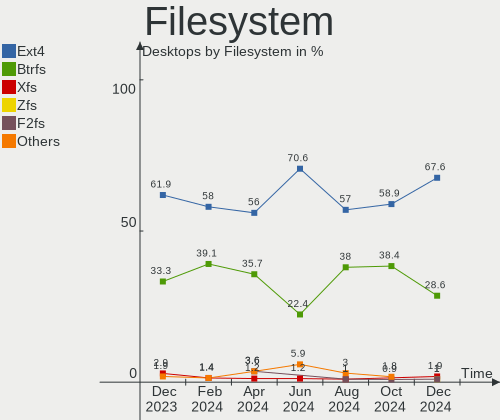
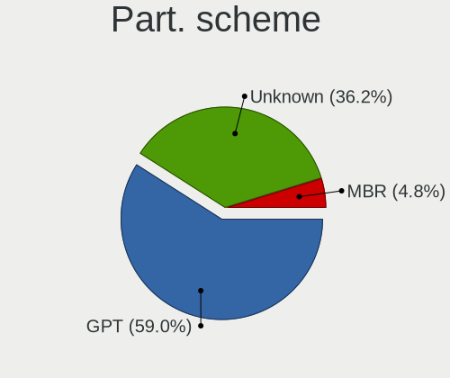
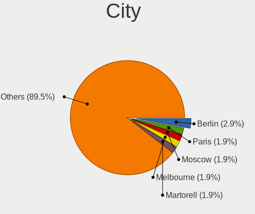
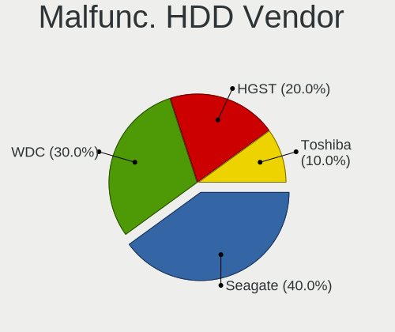
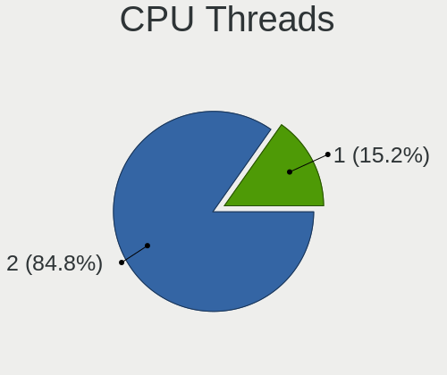
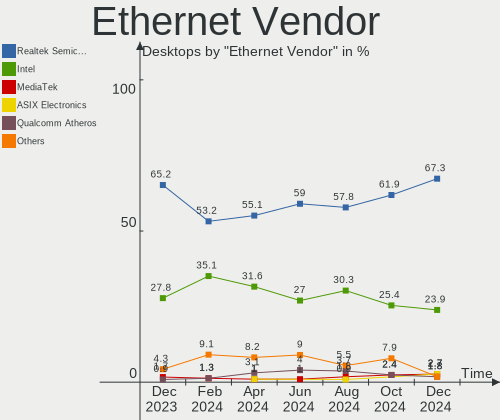
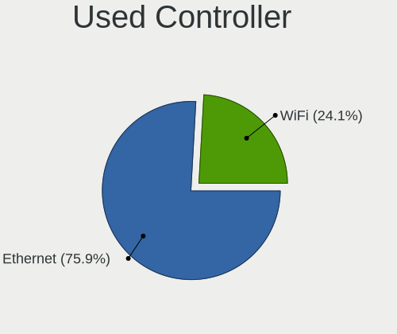
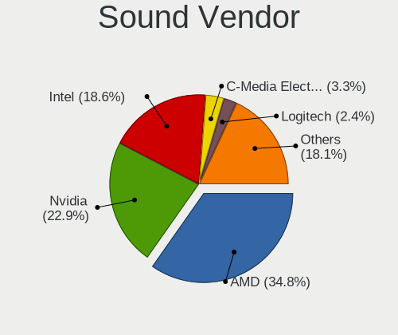

Arch - Hardware Trends (Desktops)
---------------------------------

A project to identify most popular hardware characteristics and track their change
over time based on data collected by Linux users at https://Linux-Hardware.org.

Anyone can contribute to this report by the [hw-probe](https://github.com/linuxhw/hw-probe) tool:

    sudo -E hw-probe -all -upload

This report is for one last month. Overall report since the beginning of time: [TestCoverage](https://github.com/linuxhw/TestCoverage)

Period: Jul, 2022.

Contents
--------

* [ System ](#system)
  - [ OS                       ](#os)
  - [ OS Family                ](#os-family)
  - [ Kernel                   ](#kernel)
  - [ Kernel Family            ](#kernel-family)
  - [ Kernel Major Ver.        ](#kernel-major-ver)
  - [ Arch                     ](#arch)
  - [ DE                       ](#de)
  - [ Display Server           ](#display-server)
  - [ Display Manager          ](#display-manager)
  - [ OS Lang                  ](#os-lang)
  - [ Boot Mode                ](#boot-mode)
  - [ Filesystem               ](#filesystem)
  - [ Part. scheme             ](#part-scheme)
  - [ Dual Boot with Linux/BSD ](#dual-boot-with-linuxbsd)
  - [ Dual Boot (Win)          ](#dual-boot-win)

* [ Board ](#board)
  - [ Vendor                   ](#vendor)
  - [ Model                    ](#model)
  - [ Model Family             ](#model-family)
  - [ MFG Year                 ](#mfg-year)
  - [ Form Factor              ](#form-factor)
  - [ Secure Boot              ](#secure-boot)
  - [ Coreboot                 ](#coreboot)
  - [ RAM Size                 ](#ram-size)
  - [ RAM Used                 ](#ram-used)
  - [ Total Drives             ](#total-drives)
  - [ Has CD-ROM               ](#has-cd-rom)
  - [ Has Ethernet             ](#has-ethernet)
  - [ Has WiFi                 ](#has-wifi)
  - [ Has Bluetooth            ](#has-bluetooth)

* [ Location ](#location)
  - [ Country                  ](#country)
  - [ City                     ](#city)

* [ Drives ](#drives)
  - [ Drive Vendor             ](#drive-vendor)
  - [ Drive Model              ](#drive-model)
  - [ HDD Vendor               ](#hdd-vendor)
  - [ SSD Vendor               ](#ssd-vendor)
  - [ Drive Kind               ](#drive-kind)
  - [ Drive Connector          ](#drive-connector)
  - [ Drive Size               ](#drive-size)
  - [ Space Total              ](#space-total)
  - [ Space Used               ](#space-used)
  - [ Malfunc. Drives          ](#malfunc-drives)
  - [ Malfunc. Drive Vendor    ](#malfunc-drive-vendor)
  - [ Malfunc. HDD Vendor      ](#malfunc-hdd-vendor)
  - [ Malfunc. Drive Kind      ](#malfunc-drive-kind)
  - [ Failed Drives            ](#failed-drives)
  - [ Failed Drive Vendor      ](#failed-drive-vendor)
  - [ Drive Status             ](#drive-status)

* [ Storage controller ](#storage-controller)
  - [ Storage Vendor           ](#storage-vendor)
  - [ Storage Model            ](#storage-model)
  - [ Storage Kind             ](#storage-kind)

* [ Processor ](#processor)
  - [ CPU Vendor               ](#cpu-vendor)
  - [ CPU Model                ](#cpu-model)
  - [ CPU Model Family         ](#cpu-model-family)
  - [ CPU Cores                ](#cpu-cores)
  - [ CPU Sockets              ](#cpu-sockets)
  - [ CPU Threads              ](#cpu-threads)
  - [ CPU Op-Modes             ](#cpu-op-modes)
  - [ CPU Microcode            ](#cpu-microcode)
  - [ CPU Microarch            ](#cpu-microarch)

* [ Graphics ](#graphics)
  - [ GPU Vendor               ](#gpu-vendor)
  - [ GPU Model                ](#gpu-model)
  - [ GPU Combo                ](#gpu-combo)
  - [ GPU Driver               ](#gpu-driver)
  - [ GPU Memory               ](#gpu-memory)

* [ Monitor ](#monitor)
  - [ Monitor Vendor           ](#monitor-vendor)
  - [ Monitor Model            ](#monitor-model)
  - [ Monitor Resolution       ](#monitor-resolution)
  - [ Monitor Diagonal         ](#monitor-diagonal)
  - [ Monitor Width            ](#monitor-width)
  - [ Aspect Ratio             ](#aspect-ratio)
  - [ Monitor Area             ](#monitor-area)
  - [ Pixel Density            ](#pixel-density)
  - [ Multiple Monitors        ](#multiple-monitors)

* [ Network ](#network)
  - [ Net Controller Vendor    ](#net-controller-vendor)
  - [ Net Controller Model     ](#net-controller-model)
  - [ Wireless Vendor          ](#wireless-vendor)
  - [ Wireless Model           ](#wireless-model)
  - [ Ethernet Vendor          ](#ethernet-vendor)
  - [ Ethernet Model           ](#ethernet-model)
  - [ Net Controller Kind      ](#net-controller-kind)
  - [ Used Controller          ](#used-controller)
  - [ NICs                     ](#nics)
  - [ IPv6                     ](#ipv6)

* [ Bluetooth ](#bluetooth)
  - [ Bluetooth Vendor         ](#bluetooth-vendor)
  - [ Bluetooth Model          ](#bluetooth-model)

* [ Sound ](#sound)
  - [ Sound Vendor             ](#sound-vendor)
  - [ Sound Model              ](#sound-model)

* [ Memory ](#memory)
  - [ Memory Vendor            ](#memory-vendor)
  - [ Memory Model             ](#memory-model)
  - [ Memory Kind              ](#memory-kind)
  - [ Memory Form Factor       ](#memory-form-factor)
  - [ Memory Size              ](#memory-size)
  - [ Memory Speed             ](#memory-speed)

* [ Printers & scanners ](#printers--scanners)
  - [ Printer Vendor           ](#printer-vendor)
  - [ Printer Model            ](#printer-model)
  - [ Scanner Vendor           ](#scanner-vendor)
  - [ Scanner Model            ](#scanner-model)

* [ Camera ](#camera)
  - [ Camera Vendor            ](#camera-vendor)
  - [ Camera Model             ](#camera-model)

* [ Security ](#security)
  - [ Fingerprint Vendor       ](#fingerprint-vendor)
  - [ Fingerprint Model        ](#fingerprint-model)
  - [ Chipcard Vendor          ](#chipcard-vendor)
  - [ Chipcard Model           ](#chipcard-model)

* [ Unsupported ](#unsupported)
  - [ Unsupported Devices      ](#unsupported-devices)
  - [ Unsupported Device Types ](#unsupported-device-types)

System
------

OS
--

Installed operating systems

| Name         | Desktops | Percent |
|--------------|----------|---------|
| Arch Rolling | 29       | 51.79%  |
| Arch         | 27       | 48.21%  |

OS Family
---------

OS without a version

| Name | Desktops | Percent |
|------|----------|---------|
| Arch | 56       | 100%    |

Kernel
------

Version of the Linux kernel

| Version                  | Desktops | Percent |
|--------------------------|----------|---------|
| 5.18.12-arch1-1          | 9        | 16.07%  |
| 5.18.9-arch1-1           | 7        | 12.5%   |
| 5.18.14-arch1-1          | 6        | 10.71%  |
| 5.18.13-arch1-1          | 4        | 7.14%   |
| 5.18.10-arch1-1          | 4        | 7.14%   |
| 5.18.12-zen1-1-zen       | 3        | 5.36%   |
| 5.18.9-zen1-1-zen        | 2        | 3.57%   |
| 5.18.6-arch1-1           | 2        | 3.57%   |
| 5.18.11-zen1-1-zen       | 2        | 3.57%   |
| 5.15.52-1-lts            | 2        | 3.57%   |
| 5.18.8-arch1-1           | 1        | 1.79%   |
| 5.18.8-AMD-znver2        | 1        | 1.79%   |
| 5.18.7-zen1-1-zen        | 1        | 1.79%   |
| 5.18.7-arch1-1           | 1        | 1.79%   |
| 5.18.5-zen1-1-zen        | 1        | 1.79%   |
| 5.18.3-arch1-1           | 1        | 1.79%   |
| 5.18.2-zen1-1-zen        | 1        | 1.79%   |
| 5.18.14-zen1-1-zen       | 1        | 1.79%   |
| 5.18.13-1-ck-generic-v3  | 1        | 1.79%   |
| 5.18.12-1-clear          | 1        | 1.79%   |
| 5.18.11-arch1-1          | 1        | 1.79%   |
| 5.18.10-lqx1-1-lqx       | 1        | 1.79%   |
| 5.18.10-arch1-1-51810-01 | 1        | 1.79%   |
| 5.15.55-1-lts            | 1        | 1.79%   |
| 5.15.52-1-vfio-lts       | 1        | 1.79%   |

Kernel Family
-------------

Linux kernel without a distro release

| Version | Desktops | Percent |
|---------|----------|---------|
| 5.18.12 | 13       | 23.21%  |
| 5.18.9  | 9        | 16.07%  |
| 5.18.14 | 7        | 12.5%   |
| 5.18.10 | 6        | 10.71%  |
| 5.18.13 | 5        | 8.93%   |
| 5.18.11 | 3        | 5.36%   |
| 5.15.52 | 3        | 5.36%   |
| 5.18.8  | 2        | 3.57%   |
| 5.18.7  | 2        | 3.57%   |
| 5.18.6  | 2        | 3.57%   |
| 5.18.5  | 1        | 1.79%   |
| 5.18.3  | 1        | 1.79%   |
| 5.18.2  | 1        | 1.79%   |
| 5.15.55 | 1        | 1.79%   |

Kernel Major Ver.
-----------------

Linux kernel major version

| Version | Desktops | Percent |
|---------|----------|---------|
| 5.18    | 52       | 92.86%  |
| 5.15    | 4        | 7.14%   |

Arch
----

OS architecture (x86_64, i586, etc.)

| Name   | Desktops | Percent |
|--------|----------|---------|
| x86_64 | 56       | 100%    |

DE
--

Desktop Environment

| Name       | Desktops | Percent |
|------------|----------|---------|
| KDE5       | 22       | 39.29%  |
| GNOME      | 16       | 28.57%  |
| XFCE       | 6        | 10.71%  |
| Unknown    | 5        | 8.93%   |
| Budgie     | 2        | 3.57%   |
| bspwm      | 2        | 3.57%   |
| X-Cinnamon | 1        | 1.79%   |
| Openbox    | 1        | 1.79%   |
| i3         | 1        | 1.79%   |

Display Server
--------------

X11 or Wayland

| Name    | Desktops | Percent |
|---------|----------|---------|
| X11     | 36       | 64.29%  |
| Wayland | 9        | 16.07%  |
| Tty     | 7        | 12.5%   |
| Unknown | 4        | 7.14%   |

Display Manager
---------------

SDDM, LightDM, etc.

| Name    | Desktops | Percent |
|---------|----------|---------|
| Unknown | 25       | 44.64%  |
| SDDM    | 13       | 23.21%  |
| LightDM | 13       | 23.21%  |
| GDM     | 3        | 5.36%   |
| SLiM    | 1        | 1.79%   |
| Ly      | 1        | 1.79%   |

OS Lang
-------

Language

| Lang    | Desktops | Percent |
|---------|----------|---------|
| en_US   | 29       | 51.79%  |
| en_GB   | 5        | 8.93%   |
| C       | 3        | 5.36%   |
| ru_RU   | 2        | 3.57%   |
| fr_FR   | 2        | 3.57%   |
| de_DE   | 2        | 3.57%   |
| pt_PT   | 1        | 1.79%   |
| pt_BR   | 1        | 1.79%   |
| pl_PL   | 1        | 1.79%   |
| ja_JP   | 1        | 1.79%   |
| es_ES   | 1        | 1.79%   |
| es_CL   | 1        | 1.79%   |
| es_BO   | 1        | 1.79%   |
| en_SE   | 1        | 1.79%   |
| en_DK   | 1        | 1.79%   |
| en_DE   | 1        | 1.79%   |
| en_AU   | 1        | 1.79%   |
| de_CH   | 1        | 1.79%   |
| Unknown | 1        | 1.79%   |

Boot Mode
---------

EFI or BIOS

| Mode | Desktops | Percent |
|------|----------|---------|
| EFI  | 33       | 58.93%  |
| BIOS | 23       | 41.07%  |

Filesystem
----------

Type of filesystem

| Type  | Desktops | Percent |
|-------|----------|---------|
| Ext4  | 42       | 75%     |
| Btrfs | 11       | 19.64%  |
| F2fs  | 2        | 3.57%   |
| Xfs   | 1        | 1.79%   |

Part. scheme
------------

Scheme of partitioning

| Type    | Desktops | Percent |
|---------|----------|---------|
| GPT     | 36       | 64.29%  |
| Unknown | 16       | 28.57%  |
| MBR     | 4        | 7.14%   |

Dual Boot with Linux/BSD
------------------------

Hosting more than one Linux/BSD

| Dual boot | Desktops | Percent |
|-----------|----------|---------|
| No        | 47       | 83.93%  |
| Yes       | 9        | 16.07%  |

Dual Boot (Win)
---------------

Hosting Linux and Windows

| Dual boot | Desktops | Percent |
|-----------|----------|---------|
| No        | 34       | 60.71%  |
| Yes       | 22       | 39.29%  |

Board
-----

Vendor
------

Motherboard manufacturer

| Name                | Desktops | Percent |
|---------------------|----------|---------|
| ASUSTek Computer    | 21       | 37.5%   |
| MSI                 | 13       | 23.21%  |
| Gigabyte Technology | 10       | 17.86%  |
| ASRock              | 3        | 5.36%   |
| Lenovo              | 2        | 3.57%   |
| Hewlett-Packard     | 2        | 3.57%   |
| Dell                | 2        | 3.57%   |
| Medion              | 1        | 1.79%   |
| Machinist/Runing    | 1        | 1.79%   |
| Unknown             | 1        | 1.79%   |

Model
-----

Motherboard model

| Name                                | Desktops | Percent |
|-------------------------------------|----------|---------|
| MSI MS-7C94                         | 2        | 3.57%   |
| MSI MS-7A34                         | 2        | 3.57%   |
| ASUS TUF Gaming X570-PLUS           | 2        | 3.57%   |
| ASUS TUF Gaming B550-PLUS           | 2        | 3.57%   |
| MSI MS-7D43                         | 1        | 1.79%   |
| MSI MS-7C91                         | 1        | 1.79%   |
| MSI MS-7C39                         | 1        | 1.79%   |
| MSI MS-7C02                         | 1        | 1.79%   |
| MSI MS-7B86                         | 1        | 1.79%   |
| MSI MS-7A70                         | 1        | 1.79%   |
| MSI MS-7A38                         | 1        | 1.79%   |
| MSI MS-7882                         | 1        | 1.79%   |
| MSI MS-7756                         | 1        | 1.79%   |
| Medion Akoya P2150 D MD8331/2496    | 1        | 1.79%   |
| Machinist/Runing X99Z GAMING Beta   | 1        | 1.79%   |
| Lenovo ThinkStation P700 30A8S0TH00 | 1        | 1.79%   |
| Lenovo ThinkCentre M93p 10A8S1K403  | 1        | 1.79%   |
| HP t620 Quad Core TC                | 1        | 1.79%   |
| HP OMEN 30L Desktop GT13-0xxx       | 1        | 1.79%   |
| Gigabyte Z97X-UD3H-BK               | 1        | 1.79%   |
| Gigabyte Z390 AORUS PRO             | 1        | 1.79%   |
| Gigabyte Z370 AORUS Gaming 5        | 1        | 1.79%   |
| Gigabyte Z170XP-SLI                 | 1        | 1.79%   |
| Gigabyte Z170X-Gaming 7             | 1        | 1.79%   |
| Gigabyte X470 AORUS ULTRA GAMING    | 1        | 1.79%   |
| Gigabyte X470 AORUS GAMING 7 WIFI   | 1        | 1.79%   |
| Gigabyte B550 AORUS ELITE AX V2     | 1        | 1.79%   |
| Gigabyte B450M S2H                  | 1        | 1.79%   |
| Gigabyte B450M DS3H                 | 1        | 1.79%   |
| Dell OptiPlex XE2                   | 1        | 1.79%   |
| Dell OptiPlex 3050                  | 1        | 1.79%   |
| ASUS TUF Gaming Z690-PLUS D4        | 1        | 1.79%   |
| ASUS TUF Gaming B550-PLUS WIFI II   | 1        | 1.79%   |
| ASUS STRIX Z270G GAMING             | 1        | 1.79%   |
| ASUS ROG STRIX Z370-F GAMING        | 1        | 1.79%   |
| ASUS ROG STRIX B550-I GAMING        | 1        | 1.79%   |
| ASUS ROG STRIX B550-F GAMING        | 1        | 1.79%   |
| ASUS ROG STRIX B350-F GAMING        | 1        | 1.79%   |
| ASUS ROG CROSSHAIR VII HERO         | 1        | 1.79%   |
| ASUS PRIME Z270-A                   | 1        | 1.79%   |
| ASUS PRIME X399-A                   | 1        | 1.79%   |
| ASUS PRIME B550M-A                  | 1        | 1.79%   |
| ASUS PRIME B450-PLUS                | 1        | 1.79%   |
| ASUS P8H61-M LX3 PLUS               | 1        | 1.79%   |
| ASUS P5K-E                          | 1        | 1.79%   |
| ASUS Maximus VIII HERO              | 1        | 1.79%   |
| ASUS M5A97 EVO R2.0                 | 1        | 1.79%   |
| ASUS H110M-E/M.2                    | 1        | 1.79%   |
| ASRock X570 Phantom Gaming 4        | 1        | 1.79%   |
| ASRock H61M-DGS                     | 1        | 1.79%   |
| ASRock B550 Steel Legend            | 1        | 1.79%   |
| Unknown                             | 1        | 1.79%   |

Model Family
------------

Motherboard model prefix

| Name                  | Desktops | Percent |
|-----------------------|----------|---------|
| ASUS TUF              | 6        | 10.71%  |
| ASUS ROG              | 5        | 8.93%   |
| ASUS PRIME            | 4        | 7.14%   |
| MSI MS-7C94           | 2        | 3.57%   |
| MSI MS-7A34           | 2        | 3.57%   |
| Gigabyte X470         | 2        | 3.57%   |
| Gigabyte B450M        | 2        | 3.57%   |
| Dell OptiPlex         | 2        | 3.57%   |
| MSI MS-7D43           | 1        | 1.79%   |
| MSI MS-7C91           | 1        | 1.79%   |
| MSI MS-7C39           | 1        | 1.79%   |
| MSI MS-7C02           | 1        | 1.79%   |
| MSI MS-7B86           | 1        | 1.79%   |
| MSI MS-7A70           | 1        | 1.79%   |
| MSI MS-7A38           | 1        | 1.79%   |
| MSI MS-7882           | 1        | 1.79%   |
| MSI MS-7756           | 1        | 1.79%   |
| Medion Akoya          | 1        | 1.79%   |
| Machinist/Runing X99Z | 1        | 1.79%   |
| Lenovo ThinkStation   | 1        | 1.79%   |
| Lenovo ThinkCentre    | 1        | 1.79%   |
| HP t620               | 1        | 1.79%   |
| HP OMEN               | 1        | 1.79%   |
| Gigabyte Z97X-UD3H-BK | 1        | 1.79%   |
| Gigabyte Z390         | 1        | 1.79%   |
| Gigabyte Z370         | 1        | 1.79%   |
| Gigabyte Z170XP-SLI   | 1        | 1.79%   |
| Gigabyte Z170X-Gaming | 1        | 1.79%   |
| Gigabyte B550         | 1        | 1.79%   |
| ASUS STRIX            | 1        | 1.79%   |
| ASUS P8H61-M          | 1        | 1.79%   |
| ASUS P5K-E            | 1        | 1.79%   |
| ASUS Maximus          | 1        | 1.79%   |
| ASUS M5A97            | 1        | 1.79%   |
| ASUS H110M-E          | 1        | 1.79%   |
| ASRock X570           | 1        | 1.79%   |
| ASRock H61M-DGS       | 1        | 1.79%   |
| ASRock B550           | 1        | 1.79%   |
| Unknown               | 1        | 1.79%   |

MFG Year
--------

Motherboard manufacture year

| Year | Desktops | Percent |
|------|----------|---------|
| 2020 | 11       | 19.64%  |
| 2018 | 9        | 16.07%  |
| 2017 | 9        | 16.07%  |
| 2019 | 8        | 14.29%  |
| 2021 | 5        | 8.93%   |
| 2016 | 4        | 7.14%   |
| 2014 | 3        | 5.36%   |
| 2012 | 3        | 5.36%   |
| 2022 | 1        | 1.79%   |
| 2015 | 1        | 1.79%   |
| 2013 | 1        | 1.79%   |
| 2007 | 1        | 1.79%   |

Form Factor
-----------

Physical design of the computer

| Name    | Desktops | Percent |
|---------|----------|---------|
| Desktop | 56       | 100%    |

Secure Boot
-----------

Enabled or disabled

| State    | Desktops | Percent |
|----------|----------|---------|
| Disabled | 56       | 100%    |

Coreboot
--------

Have coreboot on board

| Used | Desktops | Percent |
|------|----------|---------|
| No   | 56       | 100%    |

RAM Size
--------

Total RAM memory

| Size in GB  | Desktops | Percent |
|-------------|----------|---------|
| 16.01-24.0  | 20       | 35.71%  |
| 32.01-64.0  | 17       | 30.36%  |
| 64.01-256.0 | 8        | 14.29%  |
| 4.01-8.0    | 5        | 8.93%   |
| 8.01-16.0   | 3        | 5.36%   |
| 3.01-4.0    | 2        | 3.57%   |
| 24.01-32.0  | 1        | 1.79%   |

RAM Used
--------

Used RAM memory

| Used GB    | Desktops | Percent |
|------------|----------|---------|
| 4.01-8.0   | 21       | 37.5%   |
| 3.01-4.0   | 12       | 21.43%  |
| 2.01-3.0   | 9        | 16.07%  |
| 1.01-2.0   | 7        | 12.5%   |
| 8.01-16.0  | 4        | 7.14%   |
| 32.01-64.0 | 2        | 3.57%   |
| 0.51-1.0   | 1        | 1.79%   |

Total Drives
------------

Number of drives on board

| Drives | Desktops | Percent |
|--------|----------|---------|
| 2      | 14       | 25%     |
| 1      | 13       | 23.21%  |
| 3      | 11       | 19.64%  |
| 5      | 9        | 16.07%  |
| 4      | 7        | 12.5%   |
| 7      | 1        | 1.79%   |
| 6      | 1        | 1.79%   |

Has CD-ROM
----------

Has CD-ROM on board

| Presented | Desktops | Percent |
|-----------|----------|---------|
| No        | 42       | 75%     |
| Yes       | 14       | 25%     |

Has Ethernet
------------

Has Ethernet on board

| Presented | Desktops | Percent |
|-----------|----------|---------|
| Yes       | 56       | 100%    |

Has WiFi
--------

Has WiFi module

| Presented | Desktops | Percent |
|-----------|----------|---------|
| No        | 30       | 53.57%  |
| Yes       | 26       | 46.43%  |

Has Bluetooth
-------------

Has Bluetooth module

| Presented | Desktops | Percent |
|-----------|----------|---------|
| No        | 31       | 55.36%  |
| Yes       | 25       | 44.64%  |

Location
--------

Country
-------

Geographic location (country)

| Country     | Desktops | Percent |
|-------------|----------|---------|
| USA         | 10       | 17.86%  |
| Germany     | 7        | 12.5%   |
| Russia      | 4        | 7.14%   |
| France      | 4        | 7.14%   |
| UK          | 3        | 5.36%   |
| Poland      | 3        | 5.36%   |
| Austria     | 3        | 5.36%   |
| Sweden      | 2        | 3.57%   |
| Spain       | 2        | 3.57%   |
| Brazil      | 2        | 3.57%   |
| Ukraine     | 1        | 1.79%   |
| Switzerland | 1        | 1.79%   |
| Romania     | 1        | 1.79%   |
| Portugal    | 1        | 1.79%   |
| Netherlands | 1        | 1.79%   |
| Mexico      | 1        | 1.79%   |
| Japan       | 1        | 1.79%   |
| India       | 1        | 1.79%   |
| Hungary     | 1        | 1.79%   |
| Greece      | 1        | 1.79%   |
| Finland     | 1        | 1.79%   |
| Croatia     | 1        | 1.79%   |
| China       | 1        | 1.79%   |
| Chile       | 1        | 1.79%   |
| Bolivia     | 1        | 1.79%   |
| Australia   | 1        | 1.79%   |

City
----

Geographic location (city)

| City              | Desktops | Percent |
|-------------------|----------|---------|
| Villeneuve-d'Ascq | 2        | 3.57%   |
| Seattle           | 2        | 3.57%   |
| Moscow            | 2        | 3.57%   |
| Zurich            | 1        | 1.79%   |
| Zagreb            | 1        | 1.79%   |
| Yekaterinburg     | 1        | 1.79%   |
| Walnut Creek      | 1        | 1.79%   |
| Vienna            | 1        | 1.79%   |
| Telde             | 1        | 1.79%   |
| Szemud            | 1        | 1.79%   |
| Stockholm         | 1        | 1.79%   |
| St Petersburg     | 1        | 1.79%   |
| Shoreham          | 1        | 1.79%   |
| Shenzhen          | 1        | 1.79%   |
| Sao Paulo         | 1        | 1.79%   |
| Santa Cruz        | 1        | 1.79%   |
| Saint Paul        | 1        | 1.79%   |
| Rison             | 1        | 1.79%   |
| Regensburg        | 1        | 1.79%   |
| Rauma             | 1        | 1.79%   |
| Quincy            | 1        | 1.79%   |
| Puerto Natales    | 1        | 1.79%   |
| Pittsburgh        | 1        | 1.79%   |
| Pearl City        | 1        | 1.79%   |
| Paris             | 1        | 1.79%   |
| Osaka             | 1        | 1.79%   |
| Odessa            | 1        | 1.79%   |
| Niedernhausen     | 1        | 1.79%   |
| Milton Keynes     | 1        | 1.79%   |
| Mexico City       | 1        | 1.79%   |
| Merthyr Tydfil    | 1        | 1.79%   |
| Mem Martins       | 1        | 1.79%   |
| Melbourne         | 1        | 1.79%   |
| Matinhos          | 1        | 1.79%   |
| Malappuram        | 1        | 1.79%   |
| Linz              | 1        | 1.79%   |
| Langenzersdorf    | 1        | 1.79%   |
| Langebrueck       | 1        | 1.79%   |
| Krakow            | 1        | 1.79%   |
| Hort              | 1        | 1.79%   |
| Gudensberg        | 1        | 1.79%   |
| Grenoble          | 1        | 1.79%   |
| Gothenburg        | 1        | 1.79%   |
| Gdansk            | 1        | 1.79%   |
| Eppelheim         | 1        | 1.79%   |
| Darmstadt         | 1        | 1.79%   |
| Cardiff           | 1        | 1.79%   |
| Bucharest         | 1        | 1.79%   |
| Bochum            | 1        | 1.79%   |
| Bilbao            | 1        | 1.79%   |
| Atlanta           | 1        | 1.79%   |
| Athens            | 1        | 1.79%   |
| Amsterdam         | 1        | 1.79%   |

Drives
------

Drive Vendor
------------

Hard drive vendors

| Vendor              | Desktops | Drives | Percent |
|---------------------|----------|--------|---------|
| Samsung Electronics | 26       | 36     | 20.31%  |
| Seagate             | 19       | 25     | 14.84%  |
| WDC                 | 18       | 28     | 14.06%  |
| Toshiba             | 14       | 15     | 10.94%  |
| Crucial             | 11       | 14     | 8.59%   |
| Kingston            | 6        | 7      | 4.69%   |
| SanDisk             | 4        | 5      | 3.13%   |
| HGST                | 3        | 3      | 2.34%   |
| A-DATA Technology   | 3        | 3      | 2.34%   |
| XPG                 | 2        | 2      | 1.56%   |
| SPCC                | 2        | 2      | 1.56%   |
| PNY                 | 2        | 2      | 1.56%   |
| Phison              | 2        | 2      | 1.56%   |
| Intel               | 2        | 2      | 1.56%   |
| China               | 2        | 2      | 1.56%   |
| ZHITAI              | 1        | 1      | 0.78%   |
| Transcend           | 1        | 1      | 0.78%   |
| SSSTC               | 1        | 1      | 0.78%   |
| S3+                 | 1        | 1      | 0.78%   |
| Patriot             | 1        | 1      | 0.78%   |
| OCZ                 | 1        | 1      | 0.78%   |
| Mushkin             | 1        | 1      | 0.78%   |
| ICY BOX             | 1        | 1      | 0.78%   |
| GOODRAM             | 1        | 1      | 0.78%   |
| Corsair             | 1        | 1      | 0.78%   |
| BAITITON            | 1        | 1      | 0.78%   |
| Unknown             | 1        | 1      | 0.78%   |

Drive Model
-----------

Hard drive models

| Model                            | Desktops | Percent |
|----------------------------------|----------|---------|
| Toshiba DT01ACA100 1TB           | 3        | 1.95%   |
| Seagate ST2000DM008-2FR102 2TB   | 3        | 1.95%   |
| Samsung NVMe SSD Drive 1TB       | 3        | 1.95%   |
| WDC WD20EARX-00PASB0 2TB         | 2        | 1.3%    |
| WDC WD10EZEX-22MFCA0 1TB         | 2        | 1.3%    |
| WDC WD10EZEX-00BN5A0 1TB         | 2        | 1.3%    |
| Seagate ST500DM002-1BD142 500GB  | 2        | 1.3%    |
| Seagate ST2000DM006-2DM164 2TB   | 2        | 1.3%    |
| Samsung SSD 980 1TB              | 2        | 1.3%    |
| Samsung SSD 970 EVO Plus 500GB   | 2        | 1.3%    |
| Samsung SSD 970 EVO Plus 2TB     | 2        | 1.3%    |
| Samsung SSD 970 EVO Plus 1TB     | 2        | 1.3%    |
| Samsung SSD 860 EVO 1TB          | 2        | 1.3%    |
| Samsung SSD 850 EVO 500GB        | 2        | 1.3%    |
| Samsung SSD 850 EVO 250GB        | 2        | 1.3%    |
| Samsung NVMe SSD Drive 500GB     | 2        | 1.3%    |
| Kingston SA400S37240G 240GB SSD  | 2        | 1.3%    |
| ZHITAI TiPlus5000 1TB            | 1        | 0.65%   |
| XPG NVMe SSD Drive 2TB           | 1        | 0.65%   |
| XPG GAMMIX S11 Pro 256GB         | 1        | 0.65%   |
| WDC WDS500G2B0A-00SM50 500GB SSD | 1        | 0.65%   |
| WDC WDS240G2G0B-00EPW0 240GB SSD | 1        | 0.65%   |
| WDC WD80EFAX-68KNBN0 8TB         | 1        | 0.65%   |
| WDC WD5000BPVT-60HXZT3 500GB     | 1        | 0.65%   |
| WDC WD40EZRZ-75GXCB0 4TB         | 1        | 0.65%   |
| WDC WD40EZRZ-00GXCB0 4TB         | 1        | 0.65%   |
| WDC WD40 EFZX-68AWUN0 4TB        | 1        | 0.65%   |
| WDC WD30EZRZ-00Z5HB0 3TB         | 1        | 0.65%   |
| WDC WD30EFRX-68AX9N0 3TB         | 1        | 0.65%   |
| WDC WD2500AAKX-75U6AA0 250GB     | 1        | 0.65%   |
| WDC WD2500AAKX-753CA1 250GB      | 1        | 0.65%   |
| WDC WD20EZRX-00D8PB0 2TB         | 1        | 0.65%   |
| WDC WD20EZAZ-00GGJB0 2TB         | 1        | 0.65%   |
| WDC WD20EFRX-68EUZN0 2TB         | 1        | 0.65%   |
| WDC WD20EARS-42S0XB0 2TB         | 1        | 0.65%   |
| WDC WD140EFGX-68B0GN0 14TB       | 1        | 0.65%   |
| WDC WD10JPVX-80JC3T0 1TB         | 1        | 0.65%   |
| WDC WD10EZRZ-00HTKB0 1TB         | 1        | 0.65%   |
| WDC WD10EARX-00N0YB0 1TB         | 1        | 0.65%   |
| WDC WD10EARS-00MVWB0 1TB         | 1        | 0.65%   |
| WDC WD10EADS-00L5B1 1TB          | 1        | 0.65%   |
| WDC WD1003FZEX-00MK2A0 1TB       | 1        | 0.65%   |
| Transcend TS512GSSD370S 512GB    | 1        | 0.65%   |
| Toshiba MQ04ABF100 1TB           | 1        | 0.65%   |
| Toshiba MK1652GSX 160GB          | 1        | 0.65%   |
| Toshiba MG08ACA14TE 14TB         | 1        | 0.65%   |
| Toshiba MG04ACA400N 4TB          | 1        | 0.65%   |
| Toshiba MG04ACA400E 4TB          | 1        | 0.65%   |
| Toshiba MD04ACA400 4TB           | 1        | 0.65%   |
| Toshiba HDWL120 2TB              | 1        | 0.65%   |
| Toshiba HDWE140 4TB              | 1        | 0.65%   |
| Toshiba DT01ACA300 3TB           | 1        | 0.65%   |
| Toshiba DT01ACA200 2TB           | 1        | 0.65%   |
| Toshiba DT01ABA100V 1TB          | 1        | 0.65%   |
| SSSTC CVB-8D128-HP 128GB SSD     | 1        | 0.65%   |
| SPCC Solid State Disk 512GB      | 1        | 0.65%   |
| SPCC Solid State Disk 120GB      | 1        | 0.65%   |
| Seagate ST8000NE001-2M7101 8TB   | 1        | 0.65%   |
| Seagate ST8000DM004-2CX188 8TB   | 1        | 0.65%   |
| Seagate ST500DM002-1SB10A 500GB  | 1        | 0.65%   |

HDD Vendor
----------

Hard disk drive vendors

| Vendor              | Desktops | Drives | Percent |
|---------------------|----------|--------|---------|
| Seagate             | 19       | 25     | 34.55%  |
| WDC                 | 17       | 26     | 30.91%  |
| Toshiba             | 14       | 15     | 25.45%  |
| HGST                | 3        | 3      | 5.45%   |
| Samsung Electronics | 2        | 2      | 3.64%   |

SSD Vendor
----------

Solid state drive vendors

| Vendor              | Desktops | Drives | Percent |
|---------------------|----------|--------|---------|
| Samsung Electronics | 11       | 13     | 24.44%  |
| Crucial             | 9        | 11     | 20%     |
| Kingston            | 4        | 5      | 8.89%   |
| WDC                 | 2        | 2      | 4.44%   |
| SPCC                | 2        | 2      | 4.44%   |
| PNY                 | 2        | 2      | 4.44%   |
| China               | 2        | 2      | 4.44%   |
| Transcend           | 1        | 1      | 2.22%   |
| SSSTC               | 1        | 1      | 2.22%   |
| SanDisk             | 1        | 1      | 2.22%   |
| S3+                 | 1        | 1      | 2.22%   |
| Patriot             | 1        | 1      | 2.22%   |
| OCZ                 | 1        | 1      | 2.22%   |
| Mushkin             | 1        | 1      | 2.22%   |
| Intel               | 1        | 1      | 2.22%   |
| GOODRAM             | 1        | 1      | 2.22%   |
| Corsair             | 1        | 1      | 2.22%   |
| BAITITON            | 1        | 1      | 2.22%   |
| A-DATA Technology   | 1        | 1      | 2.22%   |
| Unknown             | 1        | 1      | 2.22%   |

Drive Kind
----------

HDD or SSD

| Kind    | Desktops | Drives | Percent |
|---------|----------|--------|---------|
| HDD     | 36       | 71     | 36%     |
| SSD     | 35       | 50     | 35%     |
| NVMe    | 28       | 38     | 28%     |
| Unknown | 1        | 1      | 1%      |

Drive Connector
---------------

SATA, SAS, NVMe, etc.

| Type | Desktops | Drives | Percent |
|------|----------|--------|---------|
| SATA | 45       | 120    | 60%     |
| NVMe | 28       | 38     | 37.33%  |
| SAS  | 2        | 2      | 2.67%   |

Drive Size
----------

Size of hard drive

| Size in TB | Desktops | Drives | Percent |
|------------|----------|--------|---------|
| 0.01-0.5   | 31       | 45     | 36.9%   |
| 0.51-1.0   | 24       | 35     | 28.57%  |
| 1.01-2.0   | 13       | 15     | 15.48%  |
| 3.01-4.0   | 9        | 14     | 10.71%  |
| 2.01-3.0   | 3        | 4      | 3.57%   |
| 4.01-10.0  | 3        | 4      | 3.57%   |
| 10.01-20.0 | 1        | 4      | 1.19%   |

Space Total
-----------

Amount of disk space available on the file system

| Size in GB     | Desktops | Percent |
|----------------|----------|---------|
| More than 3000 | 18       | 32.14%  |
| 251-500        | 8        | 14.29%  |
| 501-1000       | 8        | 14.29%  |
| 2001-3000      | 7        | 12.5%   |
| 1001-2000      | 6        | 10.71%  |
| 101-250        | 5        | 8.93%   |
| 51-100         | 2        | 3.57%   |
| Unknown        | 2        | 3.57%   |

Space Used
----------

Amount of used disk space

| Used GB        | Desktops | Percent |
|----------------|----------|---------|
| 101-250        | 11       | 19.64%  |
| More than 3000 | 8        | 14.29%  |
| 251-500        | 7        | 12.5%   |
| 501-1000       | 6        | 10.71%  |
| 2001-3000      | 5        | 8.93%   |
| 1001-2000      | 5        | 8.93%   |
| 1-20           | 5        | 8.93%   |
| 51-100         | 4        | 7.14%   |
| 21-50          | 3        | 5.36%   |
| Unknown        | 2        | 3.57%   |

Malfunc. Drives
---------------

Drive models with a malfunction

| Model                              | Desktops | Drives | Percent |
|------------------------------------|----------|--------|---------|
| WDC WD10EZEX-00BN5A0 1TB           | 1        | 1      | 10%     |
| Toshiba MK1652GSX 160GB            | 1        | 1      | 10%     |
| SSSTC CVB-8D128-HP 128GB SSD       | 1        | 1      | 10%     |
| Seagate ST1000LM024 HN-M101MBB 1TB | 1        | 1      | 10%     |
| Seagate ST1000DM003-9YN162 1TB     | 1        | 1      | 10%     |
| Samsung Electronics SSD 980 1TB    | 1        | 1      | 10%     |
| Samsung Electronics HD753LJ 752GB  | 1        | 1      | 10%     |
| Crucial CT525MX300SSD4 528GB       | 1        | 1      | 10%     |
| BAITITON BT58SSD09S 240GB          | 1        | 1      | 10%     |
| A-DATA Technology SX8200PNP 1TB    | 1        | 1      | 10%     |

Malfunc. Drive Vendor
---------------------

Vendors of faulty drives

| Vendor              | Desktops | Drives | Percent |
|---------------------|----------|--------|---------|
| Seagate             | 2        | 2      | 20%     |
| Samsung Electronics | 2        | 2      | 20%     |
| WDC                 | 1        | 1      | 10%     |
| Toshiba             | 1        | 1      | 10%     |
| SSSTC               | 1        | 1      | 10%     |
| Crucial             | 1        | 1      | 10%     |
| BAITITON            | 1        | 1      | 10%     |
| A-DATA Technology   | 1        | 1      | 10%     |

Malfunc. HDD Vendor
-------------------

Vendors of faulty HDD drives

| Vendor              | Desktops | Drives | Percent |
|---------------------|----------|--------|---------|
| Seagate             | 2        | 2      | 40%     |
| WDC                 | 1        | 1      | 20%     |
| Toshiba             | 1        | 1      | 20%     |
| Samsung Electronics | 1        | 1      | 20%     |

Malfunc. Drive Kind
-------------------

Kinds of faulty drives

| Kind | Desktops | Drives | Percent |
|------|----------|--------|---------|
| HDD  | 5        | 5      | 50%     |
| SSD  | 3        | 3      | 30%     |
| NVMe | 2        | 2      | 20%     |

Failed Drives
-------------

Failed drive models

Zero info for selected period =(

Failed Drive Vendor
-------------------

Failed drive vendors

Zero info for selected period =(

Drive Status
------------

Number of failed and malfunc. drives

| Status   | Desktops | Drives | Percent |
|----------|----------|--------|---------|
| Works    | 33       | 92     | 50.77%  |
| Detected | 24       | 58     | 36.92%  |
| Malfunc  | 8        | 10     | 12.31%  |

Storage controller
------------------

Storage Vendor
--------------

Storage controller vendors

| Vendor                      | Desktops | Percent |
|-----------------------------|----------|---------|
| AMD                         | 29       | 31.87%  |
| Intel                       | 28       | 30.77%  |
| Samsung Electronics         | 16       | 17.58%  |
| ADATA Technology            | 5        | 5.49%   |
| SanDisk                     | 3        | 3.3%    |
| ASMedia Technology          | 3        | 3.3%    |
| Phison Electronics          | 2        | 2.2%    |
| Kingston Technology Company | 2        | 2.2%    |
| Micron/Crucial Technology   | 1        | 1.1%    |
| Micron Technology           | 1        | 1.1%    |
| JMicron Technology          | 1        | 1.1%    |

Storage Model
-------------

Storage controller models

| Model                                                                          | Desktops | Percent |
|--------------------------------------------------------------------------------|----------|---------|
| AMD FCH SATA Controller [AHCI mode]                                            | 16       | 14.68%  |
| Samsung NVMe SSD Controller SM981/PM981/PM983                                  | 12       | 11.01%  |
| AMD 500 Series Chipset SATA Controller                                         | 11       | 10.09%  |
| AMD 400 Series Chipset SATA Controller                                         | 8        | 7.34%   |
| Intel 200 Series PCH SATA controller [AHCI mode]                               | 7        | 6.42%   |
| Intel Q170/Q150/B150/H170/H110/Z170/CM236 Chipset SATA Controller [AHCI Mode]  | 4        | 3.67%   |
| ADATA XPG SX8200 Pro PCIe Gen3x4 M.2 2280 Solid State Drive                    | 4        | 3.67%   |
| Intel SATA Controller [RAID mode]                                              | 3        | 2.75%   |
| Intel C610/X99 series chipset 6-Port SATA Controller [AHCI mode]               | 3        | 2.75%   |
| ASMedia ASM1062 Serial ATA Controller                                          | 3        | 2.75%   |
| AMD 300 Series Chipset SATA Controller                                         | 3        | 2.75%   |
| Samsung NVMe SSD Controller SM961/PM961/SM963                                  | 2        | 1.83%   |
| Samsung NVMe SSD Controller 980                                                | 2        | 1.83%   |
| Phison E12 NVMe Controller                                                     | 2        | 1.83%   |
| Intel C610/X99 series chipset sSATA Controller [AHCI mode]                     | 2        | 1.83%   |
| Intel Alder Lake-S PCH SATA Controller [AHCI Mode]                             | 2        | 1.83%   |
| Intel 8 Series/C220 Series Chipset Family 6-port SATA Controller 1 [AHCI mode] | 2        | 1.83%   |
| Intel 6 Series/C200 Series Chipset Family 6 port Desktop SATA AHCI Controller  | 2        | 1.83%   |
| SanDisk WD Blue SN570 NVMe SSD                                                 | 1        | 0.92%   |
| SanDisk WD Black SN750 / PC SN730 NVMe SSD                                     | 1        | 0.92%   |
| SanDisk Non-Volatile memory controller                                         | 1        | 0.92%   |
| Samsung NVMe SSD Controller PM9A1/PM9A3/980PRO                                 | 1        | 0.92%   |
| Micron/Crucial P2 NVMe PCIe SSD                                                | 1        | 0.92%   |
| Micron/Crucial P1 NVMe PCIe SSD                                                | 1        | 0.92%   |
| Micron Non-Volatile memory controller                                          | 1        | 0.92%   |
| Kingston Company KC2000 NVMe SSD                                               | 1        | 0.92%   |
| Kingston Company A2000 NVMe SSD                                                | 1        | 0.92%   |
| JMicron JMB363 SATA/IDE Controller                                             | 1        | 0.92%   |
| Intel Volume Management Device NVMe RAID Controller                            | 1        | 0.92%   |
| Intel SSD 660P Series                                                          | 1        | 0.92%   |
| Intel Celeron N3350/Pentium N4200/Atom E3900 Series SATA AHCI Controller       | 1        | 0.92%   |
| Intel Cannon Lake PCH SATA AHCI Controller                                     | 1        | 0.92%   |
| Intel C610/X99 series chipset IDE-r Controller                                 | 1        | 0.92%   |
| Intel 9 Series Chipset Family SATA Controller [AHCI Mode]                      | 1        | 0.92%   |
| Intel 7 Series/C210 Series Chipset Family 6-port SATA Controller [AHCI mode]   | 1        | 0.92%   |
| AMD X399 Series Chipset SATA Controller                                        | 1        | 0.92%   |
| AMD SB7x0/SB8x0/SB9x0 SATA Controller [AHCI mode]                              | 1        | 0.92%   |
| AMD FCH SATA Controller D                                                      | 1        | 0.92%   |
| ADATA A Non-Volatile memory controller                                         | 1        | 0.92%   |

Storage Kind
------------

Kind of storage controller (IDE, SATA, NVMe, SAS, ...)

| Kind | Desktops | Percent |
|------|----------|---------|
| SATA | 53       | 60.92%  |
| NVMe | 28       | 32.18%  |
| RAID | 4        | 4.6%    |
| IDE  | 2        | 2.3%    |

Processor
---------

CPU Vendor
----------

Processor vendors

| Vendor | Desktops | Percent |
|--------|----------|---------|
| AMD    | 29       | 51.79%  |
| Intel  | 27       | 48.21%  |

CPU Model
---------

Processor models

| Model                                          | Desktops | Percent |
|------------------------------------------------|----------|---------|
| AMD Ryzen 7 5800X 8-Core Processor             | 3        | 5.36%   |
| AMD Ryzen 7 3700X 8-Core Processor             | 3        | 5.36%   |
| AMD Ryzen 7 2700X Eight-Core Processor         | 3        | 5.36%   |
| Intel Core i7-7700K CPU @ 4.20GHz              | 2        | 3.57%   |
| Intel Core i7-6700K CPU @ 4.00GHz              | 2        | 3.57%   |
| Intel Core i5-9400F CPU @ 2.90GHz              | 2        | 3.57%   |
| AMD Ryzen 7 5700G with Radeon Graphics         | 2        | 3.57%   |
| AMD Ryzen 7 3800X 8-Core Processor             | 2        | 3.57%   |
| AMD Ryzen 5 5600X 6-Core Processor             | 2        | 3.57%   |
| AMD Ryzen 5 3600 6-Core Processor              | 2        | 3.57%   |
| Intel Xeon CPU E5440 @ 2.83GHz                 | 1        | 1.79%   |
| Intel Xeon CPU E5-2650 v3 @ 2.30GHz            | 1        | 1.79%   |
| Intel Xeon CPU E5-2620 v3 @ 2.40GHz            | 1        | 1.79%   |
| Intel Core i9-9900K CPU @ 3.60GHz              | 1        | 1.79%   |
| Intel Core i9-10900 CPU @ 2.80GHz              | 1        | 1.79%   |
| Intel Core i7-9700K CPU @ 3.60GHz              | 1        | 1.79%   |
| Intel Core i7-7700 CPU @ 3.60GHz               | 1        | 1.79%   |
| Intel Core i7-6900K CPU @ 3.20GHz              | 1        | 1.79%   |
| Intel Core i7-2600 CPU @ 3.40GHz               | 1        | 1.79%   |
| Intel Core i5-7500 CPU @ 3.40GHz               | 1        | 1.79%   |
| Intel Core i5-6600K CPU @ 3.50GHz              | 1        | 1.79%   |
| Intel Core i5-6500 CPU @ 3.20GHz               | 1        | 1.79%   |
| Intel Core i5-4670 CPU @ 3.40GHz               | 1        | 1.79%   |
| Intel Core i5-4570S CPU @ 2.90GHz              | 1        | 1.79%   |
| Intel Core i5-4440 CPU @ 3.10GHz               | 1        | 1.79%   |
| Intel Core i5-3570K CPU @ 3.40GHz              | 1        | 1.79%   |
| Intel Core i3-7100 CPU @ 3.90GHz               | 1        | 1.79%   |
| Intel Celeron CPU N3350 @ 1.10GHz              | 1        | 1.79%   |
| Intel Celeron CPU G550 @ 2.60GHz               | 1        | 1.79%   |
| Intel 12th Gen Core i5-12500                   | 1        | 1.79%   |
| Intel 12th Gen Core i5-12400                   | 1        | 1.79%   |
| AMD Ryzen Threadripper 1950X 16-Core Processor | 1        | 1.79%   |
| AMD Ryzen 9 5950X 16-Core Processor            | 1        | 1.79%   |
| AMD Ryzen 9 5900X 12-Core Processor            | 1        | 1.79%   |
| AMD Ryzen 7 5700X 8-Core Processor             | 1        | 1.79%   |
| AMD Ryzen 7 1700X Eight-Core Processor         | 1        | 1.79%   |
| AMD Ryzen 7 1700 Eight-Core Processor          | 1        | 1.79%   |
| AMD Ryzen 5 2600X Six-Core Processor           | 1        | 1.79%   |
| AMD Ryzen 5 2600 Six-Core Processor            | 1        | 1.79%   |
| AMD Ryzen 5 1600 Six-Core Processor            | 1        | 1.79%   |
| AMD Ryzen 3 1300X Quad-Core Processor          | 1        | 1.79%   |
| AMD GX-415GA SOC with Radeon HD Graphics       | 1        | 1.79%   |
| AMD FX-8320 Eight-Core Processor               | 1        | 1.79%   |

CPU Model Family
----------------

Processor model prefix

| Model                  | Desktops | Percent |
|------------------------|----------|---------|
| AMD Ryzen 7            | 16       | 28.57%  |
| Intel Core i5          | 9        | 16.07%  |
| Intel Core i7          | 8        | 14.29%  |
| AMD Ryzen 5            | 7        | 12.5%   |
| Intel Xeon             | 3        | 5.36%   |
| Other                  | 2        | 3.57%   |
| Intel Core i9          | 2        | 3.57%   |
| Intel Celeron          | 2        | 3.57%   |
| AMD Ryzen 9            | 2        | 3.57%   |
| Intel Core i3          | 1        | 1.79%   |
| AMD Ryzen Threadripper | 1        | 1.79%   |
| AMD Ryzen 3            | 1        | 1.79%   |
| AMD GX                 | 1        | 1.79%   |
| AMD FX                 | 1        | 1.79%   |

CPU Cores
---------

Number of processor cores

| Number | Desktops | Percent |
|--------|----------|---------|
| 8      | 19       | 33.93%  |
| 4      | 17       | 30.36%  |
| 6      | 12       | 21.43%  |
| 2      | 3        | 5.36%   |
| 16     | 2        | 3.57%   |
| 20     | 1        | 1.79%   |
| 12     | 1        | 1.79%   |
| 10     | 1        | 1.79%   |

CPU Sockets
-----------

Number of sockets

| Number | Desktops | Percent |
|--------|----------|---------|
| 1      | 55       | 98.21%  |
| 2      | 1        | 1.79%   |

CPU Threads
-----------

Threads per core (Hyper-Threading)

| Number | Desktops | Percent |
|--------|----------|---------|
| 2      | 41       | 73.21%  |
| 1      | 15       | 26.79%  |

CPU Op-Modes
------------

CPU Operation Modes (32-bit, 64-bit)

| Op mode        | Desktops | Percent |
|----------------|----------|---------|
| 32-bit, 64-bit | 56       | 100%    |

CPU Microcode
-------------

Microcode number

| Number     | Desktops | Percent |
|------------|----------|---------|
| Unknown    | 19       | 33.93%  |
| 0x906e9    | 3        | 5.36%   |
| 0x506e3    | 3        | 5.36%   |
| 0x306c3    | 3        | 5.36%   |
| 0x08701021 | 3        | 5.36%   |
| 0x0800820d | 3        | 5.36%   |
| 0x906ea    | 2        | 3.57%   |
| 0x0a201204 | 2        | 3.57%   |
| 0x0a201009 | 2        | 3.57%   |
| 0x08001138 | 2        | 3.57%   |
| 0x906ed    | 1        | 1.79%   |
| 0x90675    | 1        | 1.79%   |
| 0x506c9    | 1        | 1.79%   |
| 0x406f1    | 1        | 1.79%   |
| 0x306a9    | 1        | 1.79%   |
| 0x1067a    | 1        | 1.79%   |
| 0x0a50000d | 1        | 1.79%   |
| 0x0a50000c | 1        | 1.79%   |
| 0x0a20120a | 1        | 1.79%   |
| 0x0a201205 | 1        | 1.79%   |
| 0x0a201016 | 1        | 1.79%   |
| 0x08001137 | 1        | 1.79%   |
| 0x06000852 | 1        | 1.79%   |
| 0x00000000 | 1        | 1.79%   |

CPU Microarch
-------------

Microarchitecture

| Name             | Desktops | Percent |
|------------------|----------|---------|
| Zen 3            | 10       | 17.86%  |
| KabyLake         | 9        | 16.07%  |
| Zen 2            | 7        | 12.5%   |
| Zen+             | 5        | 8.93%   |
| Zen              | 5        | 8.93%   |
| Haswell          | 5        | 8.93%   |
| Skylake          | 4        | 7.14%   |
| SandyBridge      | 2        | 3.57%   |
| Piledriver       | 1        | 1.79%   |
| Penryn           | 1        | 1.79%   |
| Jaguar           | 1        | 1.79%   |
| IvyBridge        | 1        | 1.79%   |
| Goldmont         | 1        | 1.79%   |
| CometLake        | 1        | 1.79%   |
| Broadwell        | 1        | 1.79%   |
| Alderlake Hybrid | 1        | 1.79%   |
| Unknown          | 1        | 1.79%   |

Graphics
--------

GPU Vendor
----------

Vendors of graphics cards

| Vendor | Desktops | Percent |
|--------|----------|---------|
| Nvidia | 27       | 44.26%  |
| AMD    | 23       | 37.7%   |
| Intel  | 11       | 18.03%  |

GPU Model
---------

Graphics card models

| Model                                                                       | Desktops | Percent |
|-----------------------------------------------------------------------------|----------|---------|
| AMD Ellesmere [Radeon RX 470/480/570/570X/580/580X/590]                     | 6        | 9.52%   |
| Nvidia GP104 [GeForce GTX 1070]                                             | 4        | 6.35%   |
| Intel Xeon E3-1200 v3/4th Gen Core Processor Integrated Graphics Controller | 3        | 4.76%   |
| Intel HD Graphics 630                                                       | 3        | 4.76%   |
| AMD Vega 10 XL/XT [Radeon RX Vega 56/64]                                    | 3        | 4.76%   |
| Nvidia TU104 [GeForce RTX 2070 SUPER]                                       | 2        | 3.17%   |
| Nvidia GP107 [GeForce GTX 1050 Ti]                                          | 2        | 3.17%   |
| Nvidia GP102 [GeForce GTX 1080 Ti]                                          | 2        | 3.17%   |
| Nvidia GM206 [GeForce GTX 960]                                              | 2        | 3.17%   |
| Nvidia GM107 [GeForce GTX 750 Ti]                                           | 2        | 3.17%   |
| Nvidia GA104 [GeForce RTX 3070]                                             | 2        | 3.17%   |
| AMD Navi 21 [Radeon RX 6800/6800 XT / 6900 XT]                              | 2        | 3.17%   |
| AMD Navi 14 [Radeon RX 5500/5500M / Pro 5500M]                              | 2        | 3.17%   |
| AMD Navi 10 [Radeon RX 5600 OEM/5600 XT / 5700/5700 XT]                     | 2        | 3.17%   |
| AMD Lexa PRO [Radeon 540/540X/550/550X / RX 540X/550/550X]                  | 2        | 3.17%   |
| AMD Cezanne                                                                 | 2        | 3.17%   |
| Nvidia TU116 [GeForce GTX 1650]                                             | 1        | 1.59%   |
| Nvidia TU104 [GeForce RTX 2080 SUPER]                                       | 1        | 1.59%   |
| Nvidia GP106 [GeForce GTX 1060 6GB]                                         | 1        | 1.59%   |
| Nvidia GM204 [GeForce GTX 980]                                              | 1        | 1.59%   |
| Nvidia GK208B [GeForce GT 730]                                              | 1        | 1.59%   |
| Nvidia GK208B [GeForce GT 720]                                              | 1        | 1.59%   |
| Nvidia GK104 [GeForce GTX 670]                                              | 1        | 1.59%   |
| Nvidia GA106 [GeForce RTX 3060]                                             | 1        | 1.59%   |
| Nvidia GA106 [GeForce RTX 3060 Lite Hash Rate]                              | 1        | 1.59%   |
| Nvidia GA104 [GeForce RTX 3070 Lite Hash Rate]                              | 1        | 1.59%   |
| Nvidia GA102 [GeForce RTX 3080]                                             | 1        | 1.59%   |
| Nvidia GA102 [GeForce RTX 3080 Lite Hash Rate]                              | 1        | 1.59%   |
| Intel VGA compatible controller                                             | 1        | 1.59%   |
| Intel HD Graphics 530                                                       | 1        | 1.59%   |
| Intel HD Graphics 500                                                       | 1        | 1.59%   |
| Intel CoffeeLake-S GT2 [UHD Graphics 630]                                   | 1        | 1.59%   |
| Intel 2nd Generation Core Processor Family Integrated Graphics Controller   | 1        | 1.59%   |
| AMD Turks PRO [Radeon HD 7570]                                              | 1        | 1.59%   |
| AMD Kabini [Radeon HD 8330E]                                                | 1        | 1.59%   |
| AMD Cape Verde XT [Radeon HD 7770/8760 / R7 250X]                           | 1        | 1.59%   |
| AMD Bonaire XTX [Radeon R7 260X/360]                                        | 1        | 1.59%   |
| AMD Baffin [Radeon RX 460/560D / Pro 450/455/460/555/555X/560/560X]         | 1        | 1.59%   |

GPU Combo
---------

Combinations of graphics cards

| Name           | Desktops | Percent |
|----------------|----------|---------|
| 1 x Nvidia     | 23       | 41.07%  |
| 1 x AMD        | 20       | 35.71%  |
| 1 x Intel      | 8        | 14.29%  |
| Intel + Nvidia | 3        | 5.36%   |
| 2 x AMD        | 1        | 1.79%   |
| AMD + Nvidia   | 1        | 1.79%   |

GPU Driver
----------

Free vs proprietary

| Driver      | Desktops | Percent |
|-------------|----------|---------|
| Free        | 30       | 53.57%  |
| Proprietary | 25       | 44.64%  |
| Unknown     | 1        | 1.79%   |

GPU Memory
----------

Total video memory

| Size in GB | Desktops | Percent |
|------------|----------|---------|
| Unknown    | 19       | 33.93%  |
| 7.01-8.0   | 13       | 23.21%  |
| 3.01-4.0   | 7        | 12.5%   |
| 8.01-16.0  | 7        | 12.5%   |
| 1.01-2.0   | 5        | 8.93%   |
| 0.51-1.0   | 2        | 3.57%   |
| 0.01-0.5   | 2        | 3.57%   |
| 5.01-6.0   | 1        | 1.79%   |

Monitor
-------

Monitor Vendor
--------------

Monitor vendors

| Vendor               | Desktops | Percent |
|----------------------|----------|---------|
| Dell                 | 12       | 17.14%  |
| Samsung Electronics  | 11       | 15.71%  |
| Goldstar             | 10       | 14.29%  |
| BenQ                 | 4        | 5.71%   |
| AOC                  | 4        | 5.71%   |
| Acer                 | 4        | 5.71%   |
| Iiyama               | 3        | 4.29%   |
| Philips              | 2        | 2.86%   |
| Gigabyte Technology  | 2        | 2.86%   |
| ViewSonic            | 1        | 1.43%   |
| Sceptre Tech         | 1        | 1.43%   |
| OEM                  | 1        | 1.43%   |
| MSI                  | 1        | 1.43%   |
| LG Electronics       | 1        | 1.43%   |
| Lenovo Group Limited | 1        | 1.43%   |
| Lenovo               | 1        | 1.43%   |
| ITE                  | 1        | 1.43%   |
| HPN                  | 1        | 1.43%   |
| Hewlett-Packard      | 1        | 1.43%   |
| HBTV-24L06FD         | 1        | 1.43%   |
| HB@                  | 1        | 1.43%   |
| DPL                  | 1        | 1.43%   |
| CVT                  | 1        | 1.43%   |
| Compal               | 1        | 1.43%   |
| ASUSTek Computer     | 1        | 1.43%   |
| Ancor Communications | 1        | 1.43%   |
| Unknown              | 1        | 1.43%   |

Monitor Model
-------------

Monitor models

| Model                                                                 | Desktops | Percent |
|-----------------------------------------------------------------------|----------|---------|
| Samsung Electronics U28E590 SAM0C4D 3840x2160 607x345mm 27.5-inch     | 2        | 2.7%    |
| Goldstar ULTRAGEAR GSM5BB4 2560x1440 597x336mm 27.0-inch              | 2        | 2.7%    |
| Dell P2715Q DEL40BD 3840x2160 597x336mm 27.0-inch                     | 2        | 2.7%    |
| ViewSonic LCD Monitor VSC692F 1920x1080 480x270mm 21.7-inch           | 1        | 1.35%   |
| Sceptre Tech Sceptre B34 SPT0D52 2560x1080 800x340mm 34.2-inch        | 1        | 1.35%   |
| Samsung Electronics U24E590 SAM0CD2 3840x2160 521x293mm 23.5-inch     | 1        | 1.35%   |
| Samsung Electronics S24F350 SAM0D20 1920x1080 521x293mm 23.5-inch     | 1        | 1.35%   |
| Samsung Electronics S24B350 SAM08DA 1920x1080 531x299mm 24.0-inch     | 1        | 1.35%   |
| Samsung Electronics S24B300 SAM08B4 1920x1080 521x293mm 23.5-inch     | 1        | 1.35%   |
| Samsung Electronics S23B350 SAM08F3 1920x1080 510x287mm 23.0-inch     | 1        | 1.35%   |
| Samsung Electronics S22B300 SAM08A9 1600x900 440x250mm 19.9-inch      | 1        | 1.35%   |
| Samsung Electronics S22B150 SAM08A3 1920x1080 477x268mm 21.5-inch     | 1        | 1.35%   |
| Samsung Electronics LCD Monitor SAM090B 1920x1080 700x390mm 31.5-inch | 1        | 1.35%   |
| Samsung Electronics LCD Monitor LC49G95T                              | 1        | 1.35%   |
| Samsung Electronics LC27RG50 SAM100A 1920x1080 532x304mm 24.1-inch    | 1        | 1.35%   |
| Philips PHL24M1N3200Z PHLC263 1920x1080 527x296mm 23.8-inch           | 1        | 1.35%   |
| Philips 220WS PHL0851 1680x1050 434x270mm 20.1-inch                   | 1        | 1.35%   |
| OEM 26W_LCD_TV OEM3700 1920x540                                       | 1        | 1.35%   |
| MSI Optix MAG27CQ MSI1462 2560x1440 597x336mm 27.0-inch               | 1        | 1.35%   |
| LG Electronics LCD Monitor LG HDR 4K 3840x2160                        | 1        | 1.35%   |
| Lenovo P24q-10 LEN61A5 2560x1440 527x296mm 23.8-inch                  | 1        | 1.35%   |
| Lenovo Group Limited LCD Monitor LEN G34w-10 6000x1440                | 1        | 1.35%   |
| ITE HDMI2VGA V101 ITE6693 1920x1080 600x340mm 27.2-inch               | 1        | 1.35%   |
| Iiyama PLB2403WS IVM5601 1920x1200 520x330mm 24.2-inch                | 1        | 1.35%   |
| Iiyama PL2290 IVM562C 1920x1080 476x268mm 21.5-inch                   | 1        | 1.35%   |
| Iiyama PL2283H IVM562E 1920x1080 496x292mm 22.7-inch                  | 1        | 1.35%   |
| HPN LCD Monitor HP X32 7920x1440                                      | 1        | 1.35%   |
| Hewlett-Packard Z30i HWP3099 2560x1600 640x400mm 29.7-inch            | 1        | 1.35%   |
| Hewlett-Packard Z27n G2 HPN348A 2560x1440 600x340mm 27.2-inch         | 1        | 1.35%   |
| HBTV-24L06FD LCD Monitor 0001 1360x768 885x498mm 40.0-inch            | 1        | 1.35%   |
| HB@ HBTV-24L06FD HB@0001 1920x1080 890x500mm 40.2-inch                | 1        | 1.35%   |
| Goldstar M2250D GSM57F1 1920x1080 598x336mm 27.0-inch                 | 1        | 1.35%   |
| Goldstar IPS WSXGA GSM5B20 1440x900 419x262mm 19.5-inch               | 1        | 1.35%   |
| Goldstar HDR WFHD GSM5B9F 2560x1080 798x334mm 34.1-inch               | 1        | 1.35%   |
| Goldstar HD GSM5ACD 1366x768 410x230mm 18.5-inch                      | 1        | 1.35%   |
| Goldstar E1942 GSM4C09 1366x768 410x230mm 18.5-inch                   | 1        | 1.35%   |
| Goldstar 27GK750F GSM770F 1920x1080 531x298mm 24.0-inch               | 1        | 1.35%   |
| Goldstar 24MP76 GSM5A28 1920x1080 530x300mm 24.0-inch                 | 1        | 1.35%   |
| Goldstar 24MB56 GSM5A98 1920x1080 510x290mm 23.1-inch                 | 1        | 1.35%   |
| Gigabyte Technology M27Q GBT270D 2560x1440 596x335mm 26.9-inch        | 1        | 1.35%   |
| Gigabyte Technology G34WQC GBT3400 3440x1440 800x330mm 34.1-inch      | 1        | 1.35%   |
| DPL DVI DPL2700 2560x1440 480x270mm 21.7-inch                         | 1        | 1.35%   |
| Dell U3415W DELA0A6 3440x1440 798x335mm 34.1-inch                     | 1        | 1.35%   |
| Dell U2412M DELA07A 1920x1200 518x324mm 24.1-inch                     | 1        | 1.35%   |
| Dell S2721D DELA199 2560x1440 597x336mm 27.0-inch                     | 1        | 1.35%   |
| Dell S2719DGF DELD0E6 2560x1440 597x336mm 27.0-inch                   | 1        | 1.35%   |
| Dell S2716DG DELA0D1 2560x1440 598x336mm 27.0-inch                    | 1        | 1.35%   |
| Dell P2412H DELA07D 1920x1080 530x300mm 24.0-inch                     | 1        | 1.35%   |
| Dell LCD Monitor DEL41FE 1920x1080 530x300mm 24.0-inch                | 1        | 1.35%   |
| Dell E2016H DELA0C8 1600x900 432x236mm 19.4-inch                      | 1        | 1.35%   |
| Dell AW3821DW DELA17F 3840x1600 880x367mm 37.5-inch                   | 1        | 1.35%   |
| Dell 2407WFP DELA017 1920x1200 520x330mm 24.2-inch                    | 1        | 1.35%   |
| CVT LCD Monitor CVT0003 1920x1080 575x323mm 26.0-inch                 | 1        | 1.35%   |
| Compal TERRA 2447W WOR2447 1920x1080 521x293mm 23.5-inch              | 1        | 1.35%   |
| BenQ LCD Monitor LCD 2560x1440                                        | 1        | 1.35%   |
| BenQ GW2480 BNQ78E7 1920x1080 527x296mm 23.8-inch                     | 1        | 1.35%   |
| BenQ GW2470 BNQ78E4 1920x1080 527x296mm 23.8-inch                     | 1        | 1.35%   |
| BenQ EW2780U BNQ7953 3840x2160 597x336mm 27.0-inch                    | 1        | 1.35%   |
| ASUSTek Computer VP248QG AUS24A9 1920x1080 531x299mm 24.0-inch        | 1        | 1.35%   |
| AOC U34P2G1 AOC3402 3440x1440 797x334mm 34.0-inch                     | 1        | 1.35%   |

Monitor Resolution
------------------

Monitor screen resolution

| Resolution         | Desktops | Percent |
|--------------------|----------|---------|
| 1920x1080 (FHD)    | 28       | 41.18%  |
| 2560x1440 (QHD)    | 10       | 14.71%  |
| 3840x2160 (4K)     | 8        | 11.76%  |
| 3440x1440          | 4        | 5.88%   |
| 1920x1200 (WUXGA)  | 3        | 4.41%   |
| 2560x1080          | 2        | 2.94%   |
| 1600x900 (HD+)     | 2        | 2.94%   |
| 1366x768 (WXGA)    | 2        | 2.94%   |
| Unknown            | 2        | 2.94%   |
| 7920x1440          | 1        | 1.47%   |
| 6000x1440          | 1        | 1.47%   |
| 3840x1600          | 1        | 1.47%   |
| 2560x1600          | 1        | 1.47%   |
| 1680x1050 (WSXGA+) | 1        | 1.47%   |
| 1440x900 (WXGA+)   | 1        | 1.47%   |
| 1360x768           | 1        | 1.47%   |

Monitor Diagonal
----------------

Diagonal size in inches

| Inches  | Desktops | Percent |
|---------|----------|---------|
| 24      | 16       | 23.53%  |
| 27      | 13       | 19.12%  |
| 23      | 10       | 14.71%  |
| 34      | 6        | 8.82%   |
| Unknown | 5        | 7.35%   |
| 21      | 4        | 5.88%   |
| 22      | 2        | 2.94%   |
| 19      | 2        | 2.94%   |
| 18      | 2        | 2.94%   |
| 54      | 1        | 1.47%   |
| 40      | 1        | 1.47%   |
| 37      | 1        | 1.47%   |
| 32      | 1        | 1.47%   |
| 31      | 1        | 1.47%   |
| 29      | 1        | 1.47%   |
| 26      | 1        | 1.47%   |
| 20      | 1        | 1.47%   |

Monitor Width
-------------

Physical width

| Width in mm | Desktops | Percent |
|-------------|----------|---------|
| 501-600     | 31       | 50.82%  |
| 401-500     | 11       | 18.03%  |
| 701-800     | 7        | 11.48%  |
| Unknown     | 5        | 8.2%    |
| 601-700     | 4        | 6.56%   |
| 801-900     | 2        | 3.28%   |
| 1001-1500   | 1        | 1.64%   |

Aspect Ratio
------------

Proportional relationship between the width and the height

| Ratio   | Desktops | Percent |
|---------|----------|---------|
| 16/9    | 41       | 69.49%  |
| 21/9    | 7        | 11.86%  |
| 16/10   | 7        | 11.86%  |
| Unknown | 4        | 6.78%   |

Monitor Area
------------

Area in inch

| Area in inch | Desktops | Percent |
|----------------|----------|---------|
| 201-250        | 23       | 34.85%  |
| 301-350        | 13       | 19.7%   |
| 351-500        | 9        | 13.64%  |
| 251-300        | 7        | 10.61%  |
| Unknown        | 5        | 7.58%   |
| 151-200        | 4        | 6.06%   |
| 141-150        | 2        | 3.03%   |
| 501-1000       | 2        | 3.03%   |
| More than 1000 | 1        | 1.52%   |

Pixel Density
-------------

Pixels per inch

| Density | Desktops | Percent |
|---------|----------|---------|
| 51-100  | 35       | 54.69%  |
| 101-120 | 13       | 20.31%  |
| 121-160 | 5        | 7.81%   |
| Unknown | 5        | 7.81%   |
| 161-240 | 4        | 6.25%   |
| 1-50    | 2        | 3.13%   |

Multiple Monitors
-----------------

Total monitors connected

| Total | Desktops | Percent |
|-------|----------|---------|
| 1     | 37       | 66.07%  |
| 2     | 15       | 26.79%  |
| 3     | 2        | 3.57%   |
| 4     | 1        | 1.79%   |
| 0     | 1        | 1.79%   |

Network
-------

Net Controller Vendor
---------------------

Controller vendors

| Vendor                   | Desktops | Percent |
|--------------------------|----------|---------|
| Realtek Semiconductor    | 34       | 43.59%  |
| Intel                    | 31       | 39.74%  |
| Qualcomm Atheros         | 4        | 5.13%   |
| TP-Link                  | 2        | 2.56%   |
| MediaTek                 | 2        | 2.56%   |
| Ralink                   | 1        | 1.28%   |
| Oculus VR                | 1        | 1.28%   |
| Microsoft                | 1        | 1.28%   |
| Marvell Technology Group | 1        | 1.28%   |
| Broadcom                 | 1        | 1.28%   |

Net Controller Model
--------------------

Controller models

| Model                                                                         | Desktops | Percent |
|-------------------------------------------------------------------------------|----------|---------|
| Realtek RTL8111/8168/8411 PCI Express Gigabit Ethernet Controller             | 24       | 26.67%  |
| Realtek RTL8125 2.5GbE Controller                                             | 8        | 8.89%   |
| Intel I211 Gigabit Network Connection                                         | 6        | 6.67%   |
| Intel Ethernet Connection (2) I219-V                                          | 6        | 6.67%   |
| Intel Wi-Fi 6 AX200                                                           | 5        | 5.56%   |
| Intel Ethernet Controller I225-V                                              | 4        | 4.44%   |
| Intel Wireless-AC 9260                                                        | 3        | 3.33%   |
| Realtek 802.11ac NIC                                                          | 2        | 2.22%   |
| Intel Wireless 3165                                                           | 2        | 2.22%   |
| Intel Ethernet Connection I217-LM                                             | 2        | 2.22%   |
| TP-Link TL-WN823N v2/v3 [Realtek RTL8192EU]                                   | 1        | 1.11%   |
| TP-Link 802.11ac NIC                                                          | 1        | 1.11%   |
| Realtek RTL88x2bu [AC1200 Techkey]                                            | 1        | 1.11%   |
| Realtek RTL8822CE 802.11ac PCIe Wireless Network Adapter                      | 1        | 1.11%   |
| Realtek RTL8821CE 802.11ac PCIe Wireless Network Adapter                      | 1        | 1.11%   |
| Realtek RTL8812AE 802.11ac PCIe Wireless Network Adapter                      | 1        | 1.11%   |
| Realtek RTL8153 Gigabit Ethernet Adapter                                      | 1        | 1.11%   |
| Ralink RT2790 Wireless 802.11n 1T/2R PCIe                                     | 1        | 1.11%   |
| Qualcomm Atheros Killer E2400 Gigabit Ethernet Controller                     | 1        | 1.11%   |
| Qualcomm Atheros Killer E220x Gigabit Ethernet Controller                     | 1        | 1.11%   |
| Qualcomm Atheros AR9287 Wireless Network Adapter (PCI-Express)                | 1        | 1.11%   |
| Qualcomm Atheros AR9227 Wireless Network Adapter                              | 1        | 1.11%   |
| Oculus VR Rift S                                                              | 1        | 1.11%   |
| Microsoft Xbox 360 Wireless Adapter                                           | 1        | 1.11%   |
| MediaTek MT7921K (RZ608) Wi-Fi 6E 80MHz                                       | 1        | 1.11%   |
| MediaTek MT7921 802.11ax PCI Express Wireless Network Adapter                 | 1        | 1.11%   |
| Marvell Group 88E8056 PCI-E Gigabit Ethernet Controller                       | 1        | 1.11%   |
| Intel Wireless 8260                                                           | 1        | 1.11%   |
| Intel Wireless 7265                                                           | 1        | 1.11%   |
| Intel I210 Gigabit Network Connection                                         | 1        | 1.11%   |
| Intel Ethernet Connection I217-V                                              | 1        | 1.11%   |
| Intel Ethernet Connection (7) I219-V                                          | 1        | 1.11%   |
| Intel Ethernet Connection (2) I218-LM                                         | 1        | 1.11%   |
| Intel Alder Lake-S PCH CNVi WiFi                                              | 1        | 1.11%   |
| Intel 82575EB Gigabit Network Connection                                      | 1        | 1.11%   |
| Intel 82574L Gigabit Network Connection                                       | 1        | 1.11%   |
| Intel 82571EB/82571GB Gigabit Ethernet Controller D0/D1 (copper applications) | 1        | 1.11%   |
| Broadcom NetXtreme II BCM57810 10 Gigabit Ethernet                            | 1        | 1.11%   |

Wireless Vendor
---------------

Wireless vendors

| Vendor                | Desktops | Percent |
|-----------------------|----------|---------|
| Intel                 | 13       | 48.15%  |
| Realtek Semiconductor | 6        | 22.22%  |
| TP-Link               | 2        | 7.41%   |
| Qualcomm Atheros      | 2        | 7.41%   |
| MediaTek              | 2        | 7.41%   |
| Ralink                | 1        | 3.7%    |
| Microsoft             | 1        | 3.7%    |

Wireless Model
--------------

Wireless models

| Model                                                          | Desktops | Percent |
|----------------------------------------------------------------|----------|---------|
| Intel Wi-Fi 6 AX200                                            | 5        | 18.52%  |
| Intel Wireless-AC 9260                                         | 3        | 11.11%  |
| Realtek 802.11ac NIC                                           | 2        | 7.41%   |
| Intel Wireless 3165                                            | 2        | 7.41%   |
| TP-Link TL-WN823N v2/v3 [Realtek RTL8192EU]                    | 1        | 3.7%    |
| TP-Link 802.11ac NIC                                           | 1        | 3.7%    |
| Realtek RTL88x2bu [AC1200 Techkey]                             | 1        | 3.7%    |
| Realtek RTL8822CE 802.11ac PCIe Wireless Network Adapter       | 1        | 3.7%    |
| Realtek RTL8821CE 802.11ac PCIe Wireless Network Adapter       | 1        | 3.7%    |
| Realtek RTL8812AE 802.11ac PCIe Wireless Network Adapter       | 1        | 3.7%    |
| Ralink RT2790 Wireless 802.11n 1T/2R PCIe                      | 1        | 3.7%    |
| Qualcomm Atheros AR9287 Wireless Network Adapter (PCI-Express) | 1        | 3.7%    |
| Qualcomm Atheros AR9227 Wireless Network Adapter               | 1        | 3.7%    |
| Microsoft Xbox 360 Wireless Adapter                            | 1        | 3.7%    |
| MediaTek MT7921K (RZ608) Wi-Fi 6E 80MHz                        | 1        | 3.7%    |
| MediaTek MT7921 802.11ax PCI Express Wireless Network Adapter  | 1        | 3.7%    |
| Intel Wireless 8260                                            | 1        | 3.7%    |
| Intel Wireless 7265                                            | 1        | 3.7%    |
| Intel Alder Lake-S PCH CNVi WiFi                               | 1        | 3.7%    |

Ethernet Vendor
---------------

Ethernet vendors

| Vendor                   | Desktops | Percent |
|--------------------------|----------|---------|
| Realtek Semiconductor    | 32       | 54.24%  |
| Intel                    | 23       | 38.98%  |
| Qualcomm Atheros         | 2        | 3.39%   |
| Marvell Technology Group | 1        | 1.69%   |
| Broadcom                 | 1        | 1.69%   |

Ethernet Model
--------------

Ethernet models

| Model                                                                         | Desktops | Percent |
|-------------------------------------------------------------------------------|----------|---------|
| Realtek RTL8111/8168/8411 PCI Express Gigabit Ethernet Controller             | 24       | 38.71%  |
| Realtek RTL8125 2.5GbE Controller                                             | 8        | 12.9%   |
| Intel I211 Gigabit Network Connection                                         | 6        | 9.68%   |
| Intel Ethernet Connection (2) I219-V                                          | 6        | 9.68%   |
| Intel Ethernet Controller I225-V                                              | 4        | 6.45%   |
| Intel Ethernet Connection I217-LM                                             | 2        | 3.23%   |
| Realtek RTL8153 Gigabit Ethernet Adapter                                      | 1        | 1.61%   |
| Qualcomm Atheros Killer E2400 Gigabit Ethernet Controller                     | 1        | 1.61%   |
| Qualcomm Atheros Killer E220x Gigabit Ethernet Controller                     | 1        | 1.61%   |
| Marvell Group 88E8056 PCI-E Gigabit Ethernet Controller                       | 1        | 1.61%   |
| Intel I210 Gigabit Network Connection                                         | 1        | 1.61%   |
| Intel Ethernet Connection I217-V                                              | 1        | 1.61%   |
| Intel Ethernet Connection (7) I219-V                                          | 1        | 1.61%   |
| Intel Ethernet Connection (2) I218-LM                                         | 1        | 1.61%   |
| Intel 82575EB Gigabit Network Connection                                      | 1        | 1.61%   |
| Intel 82574L Gigabit Network Connection                                       | 1        | 1.61%   |
| Intel 82571EB/82571GB Gigabit Ethernet Controller D0/D1 (copper applications) | 1        | 1.61%   |
| Broadcom NetXtreme II BCM57810 10 Gigabit Ethernet                            | 1        | 1.61%   |

Net Controller Kind
-------------------

Ethernet, WiFi or modem

| Kind     | Desktops | Percent |
|----------|----------|---------|
| Ethernet | 56       | 67.47%  |
| WiFi     | 26       | 31.33%  |
| Modem    | 1        | 1.2%    |

Used Controller
---------------

Currently used network controller

| Kind     | Desktops | Percent |
|----------|----------|---------|
| Ethernet | 44       | 74.58%  |
| WiFi     | 15       | 25.42%  |

NICs
----

Total network controllers on board

| Total | Desktops | Percent |
|-------|----------|---------|
| 1     | 30       | 53.57%  |
| 2     | 25       | 44.64%  |
| 4     | 1        | 1.79%   |

IPv6
----

IPv6 vs IPv4

| Used | Desktops | Percent |
|------|----------|---------|
| No   | 40       | 71.43%  |
| Yes  | 16       | 28.57%  |

Bluetooth
---------

Bluetooth Vendor
----------------

Controller vendors

| Vendor                  | Desktops | Percent |
|-------------------------|----------|---------|
| Intel                   | 13       | 52%     |
| Cambridge Silicon Radio | 5        | 20%     |
| Realtek Semiconductor   | 3        | 12%     |
| TP-Link                 | 1        | 4%      |
| MediaTek                | 1        | 4%      |
| IMC Networks            | 1        | 4%      |
| ASUSTek Computer        | 1        | 4%      |

Bluetooth Model
---------------

Controller models

| Model                                               | Desktops | Percent |
|-----------------------------------------------------|----------|---------|
| Intel AX200 Bluetooth                               | 5        | 20%     |
| Cambridge Silicon Radio Bluetooth Dongle (HCI mode) | 5        | 20%     |
| Intel Bluetooth wireless interface                  | 4        | 16%     |
| Realtek Bluetooth Radio                             | 3        | 12%     |
| Intel Bluetooth Device                              | 3        | 12%     |
| TP-Link TP-hink UB500 Adapter                       | 1        | 4%      |
| MediaTek Wireless_Device                            | 1        | 4%      |
| Intel AX201 Bluetooth                               | 1        | 4%      |
| IMC Networks Wireless_Device                        | 1        | 4%      |
| ASUS Qualcomm Bluetooth 4.1                         | 1        | 4%      |

Sound
-----

Sound Vendor
------------

Sound card vendors

| Vendor              | Desktops | Percent |
|---------------------|----------|---------|
| AMD                 | 34       | 29.57%  |
| Nvidia              | 27       | 23.48%  |
| Intel               | 25       | 21.74%  |
| C-Media Electronics | 6        | 5.22%   |
| Logitech            | 3        | 2.61%   |
| Creative Labs       | 3        | 2.61%   |
| Razer USA           | 2        | 1.74%   |
| Creative Technology | 2        | 1.74%   |
| USB MICROPHONE      | 1        | 0.87%   |
| Texas Instruments   | 1        | 0.87%   |
| SteelSeries ApS     | 1        | 0.87%   |
| Solid State System  | 1        | 0.87%   |
| SM900T Microphone   | 1        | 0.87%   |
| OLKB                | 1        | 0.87%   |
| Kingston Technology | 1        | 0.87%   |
| JMTek               | 1        | 0.87%   |
| HiFiBerry           | 1        | 0.87%   |
| Focusrite-Novation  | 1        | 0.87%   |
| AudioQuest          | 1        | 0.87%   |
| Audinate            | 1        | 0.87%   |
| Unknown             | 1        | 0.87%   |

Sound Model
-----------

Sound card models

| Model                                                                      | Desktops | Percent |
|----------------------------------------------------------------------------|----------|---------|
| AMD Starship/Matisse HD Audio Controller                                   | 15       | 10.87%  |
| AMD Family 17h (Models 00h-0fh) HD Audio Controller                        | 9        | 6.52%   |
| Intel 200 Series PCH HD Audio                                              | 8        | 5.8%    |
| AMD Ellesmere HDMI Audio [Radeon RX 470/480 / 570/580/590]                 | 6        | 4.35%   |
| Nvidia GP104 High Definition Audio Controller                              | 4        | 2.9%    |
| Intel 100 Series/C230 Series Chipset Family HD Audio Controller            | 4        | 2.9%    |
| C-Media Electronics Blue Snowball                                          | 4        | 2.9%    |
| AMD Navi 10 HDMI Audio                                                     | 4        | 2.9%    |
| Nvidia TU104 HD Audio Controller                                           | 3        | 2.17%   |
| Nvidia GA104 High Definition Audio Controller                              | 3        | 2.17%   |
| Intel Xeon E3-1200 v3/4th Gen Core Processor HD Audio Controller           | 3        | 2.17%   |
| Intel C610/X99 series chipset HD Audio Controller                          | 3        | 2.17%   |
| AMD Vega 10 HDMI Audio [Radeon Vega 56/64]                                 | 3        | 2.17%   |
| AMD Baffin HDMI/DP Audio [Radeon RX 550 640SP / RX 560/560X]               | 3        | 2.17%   |
| Nvidia GP107GL High Definition Audio Controller                            | 2        | 1.45%   |
| Nvidia GP102 HDMI Audio Controller                                         | 2        | 1.45%   |
| Nvidia GM206 High Definition Audio Controller                              | 2        | 1.45%   |
| Nvidia GM107 High Definition Audio Controller [GeForce 940MX]              | 2        | 1.45%   |
| Nvidia GK208 HDMI/DP Audio Controller                                      | 2        | 1.45%   |
| Nvidia GA106 High Definition Audio Controller                              | 2        | 1.45%   |
| Nvidia GA102 High Definition Audio Controller                              | 2        | 1.45%   |
| Intel 8 Series/C220 Series Chipset High Definition Audio Controller        | 2        | 1.45%   |
| Intel 6 Series/C200 Series Chipset Family High Definition Audio Controller | 2        | 1.45%   |
| C-Media Electronics Audio Adapter (Unitek Y-247A)                          | 2        | 1.45%   |
| AMD Renoir Radeon High Definition Audio Controller                         | 2        | 1.45%   |
| AMD Navi 21/23 HDMI/DP Audio Controller                                    | 2        | 1.45%   |
| AMD Family 17h/19h HD Audio Controller                                     | 2        | 1.45%   |
| USB MICROPHONE USB MICROPHONE                                              | 1        | 0.72%   |
| Texas Instruments PCM2902 Audio Codec                                      | 1        | 0.72%   |
| SteelSeries ApS SteelSeries Arctis 1 Wireless                              | 1        | 0.72%   |
| Solid State System FIFINE K669 Microphone                                  | 1        | 0.72%   |
| SM900T Microphone SM900T Microphone                                        | 1        | 0.72%   |
| Razer USA Razer BlackShark V2 Pro                                          | 1        | 0.72%   |
| Razer USA Kraken Tournament Edition                                        | 1        | 0.72%   |
| OLKB Planck                                                                | 1        | 0.72%   |
| Nvidia TU116 High Definition Audio Controller                              | 1        | 0.72%   |
| Nvidia GP106 High Definition Audio Controller                              | 1        | 0.72%   |
| Nvidia GM204 High Definition Audio Controller                              | 1        | 0.72%   |
| Nvidia GK104 HDMI Audio Controller                                         | 1        | 0.72%   |
| Logitech [G533 Wireless Headset Dongle]                                    | 1        | 0.72%   |
| Logitech G930                                                              | 1        | 0.72%   |
| Logitech G430 Surround Sound Gaming Headset                                | 1        | 0.72%   |
| Kingston Technology HyperX Cloud Flight S                                  | 1        | 0.72%   |
| JMTek USB PnP Audio Device                                                 | 1        | 0.72%   |
| Intel Comet Lake PCH cAVS                                                  | 1        | 0.72%   |
| Intel Celeron N3350/Pentium N4200/Atom E3900 Series Audio Cluster          | 1        | 0.72%   |
| Intel Cannon Lake PCH cAVS                                                 | 1        | 0.72%   |
| Intel Alder Lake-S HD Audio Controller                                     | 1        | 0.72%   |
| Intel 9 Series Chipset Family HD Audio Controller                          | 1        | 0.72%   |
| Intel 7 Series/C216 Chipset Family High Definition Audio Controller        | 1        | 0.72%   |
| HiFiBerry USB2I2S                                                          | 1        | 0.72%   |
| Focusrite-Novation Scarlett Solo USB                                       | 1        | 0.72%   |
| Creative Technology Sound Blaster Play! 3                                  | 1        | 0.72%   |
| Creative Technology SB X-Fi Surround 5.1 Pro                               | 1        | 0.72%   |
| Creative Labs Sound Core3D [Sound Blaster Recon3D / Z-Series]              | 1        | 0.72%   |
| Creative Labs EMU10k2/CA0100/CA0102/CA10200 [Sound Blaster Audigy Series]  | 1        | 0.72%   |
| Creative Labs EMU10k1 [Sound Blaster Live! Series]                         | 1        | 0.72%   |
| C-Media Electronics CMI8788 [Oxygen HD Audio]                              | 1        | 0.72%   |
| AudioQuest DragonFly Red                                                   | 1        | 0.72%   |
| Audinate Dante USB I/O Module                                              | 1        | 0.72%   |

Memory
------

Memory Vendor
-------------

Memory module vendors

| Vendor              | Desktops | Percent |
|---------------------|----------|---------|
| Corsair             | 15       | 30.61%  |
| Crucial             | 11       | 22.45%  |
| Kingston            | 4        | 8.16%   |
| G.Skill             | 4        | 8.16%   |
| Unknown             | 2        | 4.08%   |
| SK hynix            | 2        | 4.08%   |
| Samsung Electronics | 2        | 4.08%   |
| Micron Technology   | 2        | 4.08%   |
| Unknown (ABCD)      | 1        | 2.04%   |
| Ramos Technology    | 1        | 2.04%   |
| Kllisre             | 1        | 2.04%   |
| GOODRAM             | 1        | 2.04%   |
| GLOWAY              | 1        | 2.04%   |
| Chun Well           | 1        | 2.04%   |
| A-DATA Technology   | 1        | 2.04%   |

Memory Model
------------

Memory module models

| Model                                                          | Desktops | Percent |
|----------------------------------------------------------------|----------|---------|
| Kingston RAM KHX2666C16/8G 8GB DIMM DDR4 3466MT/s              | 3        | 5.77%   |
| Crucial RAM CT102464BA160B.C16 8GB DIMM DDR3 1600MT/s          | 2        | 3.85%   |
| Corsair RAM CMK8GX4M1A2400C14 8GB DIMM DDR4 2800MT/s           | 2        | 3.85%   |
| Corsair RAM CMK32GX4M2D3600C18 16GB DIMM DDR4 3600MT/s         | 2        | 3.85%   |
| Corsair RAM CMK32GX4M2B3200C16 16GB DIMM DDR4 3400MT/s         | 2        | 3.85%   |
| Corsair RAM CMK32GX4M2A2666C16 16GB DIMM DDR4 3100MT/s         | 2        | 3.85%   |
| Corsair RAM CMK16GX4M2D3600C18 8GB DIMM DDR4 3600MT/s          | 2        | 3.85%   |
| Unknown RAM Module 8GB DIMM DDR3 1600MT/s                      | 1        | 1.92%   |
| Unknown RAM Module 2GB DIMM DDR 667MT/s                        | 1        | 1.92%   |
| Unknown (ABCD) RAM 123456789012345678 4GB DIMM LPDDR4 2400MT/s | 1        | 1.92%   |
| SK hynix RAM HMA82GU6AFR8N-UH 16GB DIMM DDR4 2400MT/s          | 1        | 1.92%   |
| SK hynix RAM HMA81GU6AFR8N-UH 8GB DIMM DDR4 2400MT/s           | 1        | 1.92%   |
| Samsung RAM M471B5173QH0-YK0 4GB SODIMM DDR3 1600MT/s          | 1        | 1.92%   |
| Samsung RAM M393A4K40BB0-CPB 32GB DIMM DDR4 2133MT/s           | 1        | 1.92%   |
| Ramos RAM EWB8GB681PAE-16IC 8GB DIMM DDR3 1600MT/s             | 1        | 1.92%   |
| Micron RAM 8JTF51264AZ-1G6E1 4096MB DIMM DDR3 1600MT/s         | 1        | 1.92%   |
| Micron RAM 16JTF1G64AZ-1G6E1 8192MB DIMM DDR3 1600MT/s         | 1        | 1.92%   |
| Kllisre RAM KRE-D3U1600M/8G 8GB DIMM DDR3 1600MT/s             | 1        | 1.92%   |
| Kingston RAM KF3200C16D4/32GX 32GB DIMM DDR4 3200MT/s          | 1        | 1.92%   |
| GOODRAM RAM IRX3200D464L16A/16G 16GB DIMM DDR4 3200MT/s        | 1        | 1.92%   |
| GLOWAY RAM TYP4U3200E16082C 8GB DIMM DDR4 3200MT/s             | 1        | 1.92%   |
| G.Skill RAM F4-3600C18-8GVK 8GB DIMM DDR4 3600MT/s             | 1        | 1.92%   |
| G.Skill RAM F4-3200C16-8GFX 8GB DIMM DDR4 3200MT/s             | 1        | 1.92%   |
| G.Skill RAM F4-2400C15-16GIS 16GB DIMM DDR4 2400MT/s           | 1        | 1.92%   |
| G.Skill RAM F3-17000CL11-4GBXL 4GB DIMM DDR3 2400MT/s          | 1        | 1.92%   |
| Crucial RAM CT8G4DFS824A.M8FH3 8GB DIMM DDR4 2400MT/s          | 1        | 1.92%   |
| Crucial RAM CT8G4DFS824A.M8FH 8GB DIMM DDR4 2400MT/s           | 1        | 1.92%   |
| Crucial RAM CT8G4DFD824A.M16FF 8GB DIMM DDR4 2400MT/s          | 1        | 1.92%   |
| Crucial RAM CT8G4DFD8213.C16FBD2 8GB DIMM DDR4 2133MT/s        | 1        | 1.92%   |
| Crucial RAM CT16G4DFD824A.M16FD 16GB DIMM DDR4 2400MT/s        | 1        | 1.92%   |
| Crucial RAM CT16G4DFD824A.C16FE 16GB DIMM DDR4 2400MT/s        | 1        | 1.92%   |
| Crucial RAM CT16G4DFD824A.C16FDD 16GB DIMM DDR4 2400MT/s       | 1        | 1.92%   |
| Crucial RAM BLT8G4D32AET4K.M8FE1 8GB DIMM DDR4 3280MT/s        | 1        | 1.92%   |
| Crucial RAM BLS8G3D1609DS1S00. 8GB DIMM DDR3 1600MT/s          | 1        | 1.92%   |
| Crucial RAM BLS16G4D240FSC.16FAD 16GB DIMM DDR4 2400MT/s       | 1        | 1.92%   |
| Crucial RAM BL32G36C16U4B.M16FB1 32GB DIMM DDR4 3733MT/s       | 1        | 1.92%   |
| Crucial RAM BL16G32C16U4B.16FE 16GB DIMM DDR4 3200MT/s         | 1        | 1.92%   |
| Corsair RAM CMW16GX4M2C3000C15 8GB DIMM DDR4 3200MT/s          | 1        | 1.92%   |
| Corsair RAM CMK16GX4M2B3200C16 8GB DIMM DDR4 3600MT/s          | 1        | 1.92%   |
| Corsair RAM CMK16GX4M2B3000C15 8GB DIMM DDR4 3000MT/s          | 1        | 1.92%   |
| Corsair RAM CMK16GX4M2A2400C16 8GB DIMM DDR4 2933MT/s          | 1        | 1.92%   |
| Corsair RAM CMK16GX4M1B3000C15 16GB DIMM DDR4 3400MT/s         | 1        | 1.92%   |
| Chun Well RAM D4U0832160B 8GB DIMM DDR4 3200MT/s               | 1        | 1.92%   |
| A-DATA RAM DDR4 2800 2OZ 8GB DIMM DDR4 2133MT/s                | 1        | 1.92%   |

Memory Kind
-----------

Memory module kinds

| Kind   | Desktops | Percent |
|--------|----------|---------|
| DDR4   | 32       | 78.05%  |
| DDR3   | 6        | 14.63%  |
| SDRAM  | 1        | 2.44%   |
| LPDDR4 | 1        | 2.44%   |
| DDR    | 1        | 2.44%   |

Memory Form Factor
------------------

Physical design of the memory module

| Name   | Desktops | Percent |
|--------|----------|---------|
| DIMM   | 40       | 97.56%  |
| SODIMM | 1        | 2.44%   |

Memory Size
-----------

Memory module size

| Size  | Desktops | Percent |
|-------|----------|---------|
| 8192  | 23       | 53.49%  |
| 16384 | 13       | 30.23%  |
| 32768 | 3        | 6.98%   |
| 4096  | 3        | 6.98%   |
| 2048  | 1        | 2.33%   |

Memory Speed
------------

Memory module speed

| Speed | Desktops | Percent |
|-------|----------|---------|
| 2400  | 7        | 16.28%  |
| 1600  | 7        | 16.28%  |
| 3600  | 6        | 13.95%  |
| 3200  | 6        | 13.95%  |
| 3466  | 3        | 6.98%   |
| 3400  | 3        | 6.98%   |
| 2133  | 3        | 6.98%   |
| 3100  | 2        | 4.65%   |
| 2800  | 2        | 4.65%   |
| 3733  | 1        | 2.33%   |
| 3280  | 1        | 2.33%   |
| 2933  | 1        | 2.33%   |
| 667   | 1        | 2.33%   |

Printers & scanners
-------------------

Printer Vendor
--------------

Printer device vendors

Zero info for selected period =(

Printer Model
-------------

Printer device models

Zero info for selected period =(

Scanner Vendor
--------------

Scanner device vendors

Zero info for selected period =(

Scanner Model
-------------

Scanner device models

Zero info for selected period =(

Camera
------

Camera Vendor
-------------

Camera device vendors

| Vendor       | Desktops | Percent |
|--------------|----------|---------|
| Logitech     | 11       | 73.33%  |
| SJ-180517-N  | 1        | 6.67%   |
| Microsoft    | 1        | 6.67%   |
| MacroSilicon | 1        | 6.67%   |
| Lenovo       | 1        | 6.67%   |

Camera Model
------------

Camera device models

| Model                         | Desktops | Percent |
|-------------------------------|----------|---------|
| Logitech Webcam C270          | 4        | 26.67%  |
| Logitech HD Pro Webcam C920   | 2        | 13.33%  |
| SJ-180517-N 1080P Webcam      | 1        | 6.67%   |
| Microsoft LifeCam HD-3000     | 1        | 6.67%   |
| MacroSilicon USB3.0 HD VIDEO  | 1        | 6.67%   |
| Logitech Webcam C310          | 1        | 6.67%   |
| Logitech Mic (Fusion)         | 1        | 6.67%   |
| Logitech C920 PRO HD Webcam   | 1        | 6.67%   |
| Logitech C505 HD Webcam       | 1        | 6.67%   |
| Logitech BRIO Ultra HD Webcam | 1        | 6.67%   |
| Lenovo 500 RGB Camera         | 1        | 6.67%   |

Security
--------

Fingerprint Vendor
------------------

Fingerprint sensor vendors

Zero info for selected period =(

Fingerprint Model
-----------------

Fingerprint sensor models

Zero info for selected period =(

Chipcard Vendor
---------------

Chipcard module vendors

| Vendor     | Desktops | Percent |
|------------|----------|---------|
| Yubico.com | 1        | 100%    |

Chipcard Model
--------------

Chipcard module models

| Model                           | Desktops | Percent |
|---------------------------------|----------|---------|
| Yubico.com Yubikey 4/5 U2F+CCID | 1        | 100%    |

Unsupported
-----------

Unsupported Devices
-------------------

Total unsupported devices on board

| Total | Desktops | Percent |
|-------|----------|---------|
| 0     | 49       | 87.5%   |
| 1     | 6        | 10.71%  |
| 2     | 1        | 1.79%   |

Unsupported Device Types
------------------------

Types of unsupported devices

| Type             | Desktops | Percent |
|------------------|----------|---------|
| Unassigned class | 3        | 42.86%  |
| Graphics card    | 2        | 28.57%  |
| Sound            | 1        | 14.29%  |
| Net/wireless     | 1        | 14.29%  |

