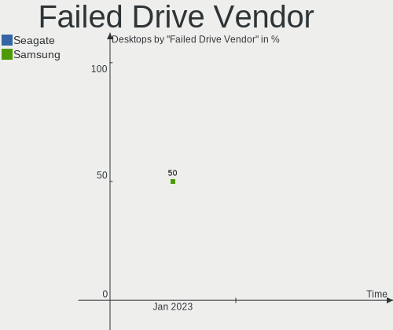
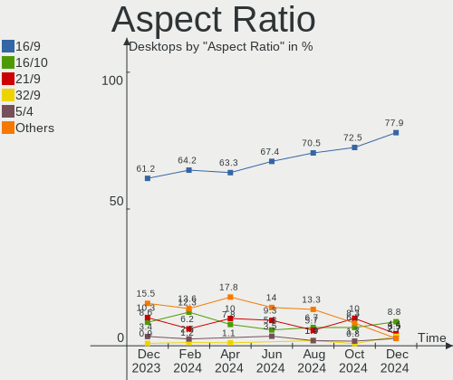
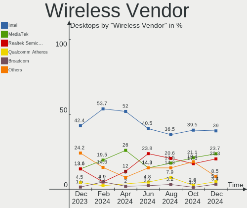
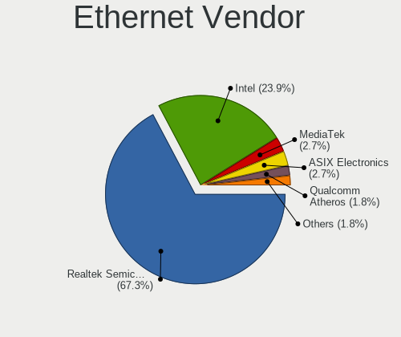

Arch Hardware Trends (Desktops)
-------------------------------

A project to identify most popular hardware characteristics and track their change
over time based on data collected by Arch users at https://Linux-Hardware.org.

Anyone can contribute to this report by the [hw-probe](https://github.com/linuxhw/hw-probe) tool:

    sudo -E hw-probe -all -upload

Full-feature report is available here: https://linux-hardware.org/?view=trends

Period: Nov, 2021.

Contents
--------

* [ System ](#system)
  - [ OS                       ](#os)
  - [ OS Family                ](#os-family)
  - [ Kernel                   ](#kernel)
  - [ Kernel Family            ](#kernel-family)
  - [ Kernel Major Ver.        ](#kernel-major-ver)
  - [ Arch                     ](#arch)
  - [ DE                       ](#de)
  - [ Display Server           ](#display-server)
  - [ Display Manager          ](#display-manager)
  - [ OS Lang                  ](#os-lang)
  - [ Boot Mode                ](#boot-mode)
  - [ Filesystem               ](#filesystem)
  - [ Part. scheme             ](#part-scheme)
  - [ Dual Boot with Linux/BSD ](#dual-boot-with-linuxbsd)
  - [ Dual Boot (Win)          ](#dual-boot-win)

* [ Board ](#board)
  - [ Vendor                   ](#vendor)
  - [ Model                    ](#model)
  - [ Model Family             ](#model-family)
  - [ MFG Year                 ](#mfg-year)
  - [ Form Factor              ](#form-factor)
  - [ Secure Boot              ](#secure-boot)
  - [ Coreboot                 ](#coreboot)
  - [ RAM Size                 ](#ram-size)
  - [ RAM Used                 ](#ram-used)
  - [ Total Drives             ](#total-drives)
  - [ Has CD-ROM               ](#has-cd-rom)
  - [ Has Ethernet             ](#has-ethernet)
  - [ Has WiFi                 ](#has-wifi)
  - [ Has Bluetooth            ](#has-bluetooth)

* [ Location ](#location)
  - [ Country                  ](#country)
  - [ City                     ](#city)

* [ Drives ](#drives)
  - [ Drive Vendor             ](#drive-vendor)
  - [ Drive Model              ](#drive-model)
  - [ HDD Vendor               ](#hdd-vendor)
  - [ SSD Vendor               ](#ssd-vendor)
  - [ Drive Kind               ](#drive-kind)
  - [ Drive Connector          ](#drive-connector)
  - [ Drive Size               ](#drive-size)
  - [ Space Total              ](#space-total)
  - [ Space Used               ](#space-used)
  - [ Malfunc. Drives          ](#malfunc-drives)
  - [ Malfunc. Drive Vendor    ](#malfunc-drive-vendor)
  - [ Malfunc. HDD Vendor      ](#malfunc-hdd-vendor)
  - [ Malfunc. Drive Kind      ](#malfunc-drive-kind)
  - [ Failed Drives            ](#failed-drives)
  - [ Failed Drive Vendor      ](#failed-drive-vendor)
  - [ Drive Status             ](#drive-status)

* [ Storage controller ](#storage-controller)
  - [ Storage Vendor           ](#storage-vendor)
  - [ Storage Model            ](#storage-model)
  - [ Storage Kind             ](#storage-kind)

* [ Processor ](#processor)
  - [ CPU Vendor               ](#cpu-vendor)
  - [ CPU Model                ](#cpu-model)
  - [ CPU Model Family         ](#cpu-model-family)
  - [ CPU Cores                ](#cpu-cores)
  - [ CPU Sockets              ](#cpu-sockets)
  - [ CPU Threads              ](#cpu-threads)
  - [ CPU Op-Modes             ](#cpu-op-modes)
  - [ CPU Microcode            ](#cpu-microcode)
  - [ CPU Microarch            ](#cpu-microarch)

* [ Graphics ](#graphics)
  - [ GPU Vendor               ](#gpu-vendor)
  - [ GPU Model                ](#gpu-model)
  - [ GPU Combo                ](#gpu-combo)
  - [ GPU Driver               ](#gpu-driver)
  - [ GPU Memory               ](#gpu-memory)

* [ Monitor ](#monitor)
  - [ Monitor Vendor           ](#monitor-vendor)
  - [ Monitor Model            ](#monitor-model)
  - [ Monitor Resolution       ](#monitor-resolution)
  - [ Monitor Diagonal         ](#monitor-diagonal)
  - [ Monitor Width            ](#monitor-width)
  - [ Aspect Ratio             ](#aspect-ratio)
  - [ Monitor Area             ](#monitor-area)
  - [ Pixel Density            ](#pixel-density)
  - [ Multiple Monitors        ](#multiple-monitors)

* [ Network ](#network)
  - [ Net Controller Vendor    ](#net-controller-vendor)
  - [ Net Controller Model     ](#net-controller-model)
  - [ Wireless Vendor          ](#wireless-vendor)
  - [ Wireless Model           ](#wireless-model)
  - [ Ethernet Vendor          ](#ethernet-vendor)
  - [ Ethernet Model           ](#ethernet-model)
  - [ Net Controller Kind      ](#net-controller-kind)
  - [ Used Controller          ](#used-controller)
  - [ NICs                     ](#nics)
  - [ IPv6                     ](#ipv6)

* [ Bluetooth ](#bluetooth)
  - [ Bluetooth Vendor         ](#bluetooth-vendor)
  - [ Bluetooth Model          ](#bluetooth-model)

* [ Sound ](#sound)
  - [ Sound Vendor             ](#sound-vendor)
  - [ Sound Model              ](#sound-model)

* [ Memory ](#memory)
  - [ Memory Vendor            ](#memory-vendor)
  - [ Memory Model             ](#memory-model)
  - [ Memory Kind              ](#memory-kind)
  - [ Memory Form Factor       ](#memory-form-factor)
  - [ Memory Size              ](#memory-size)
  - [ Memory Speed             ](#memory-speed)

* [ Printers & scanners ](#printers--scanners)
  - [ Printer Vendor           ](#printer-vendor)
  - [ Printer Model            ](#printer-model)
  - [ Scanner Vendor           ](#scanner-vendor)
  - [ Scanner Model            ](#scanner-model)

* [ Camera ](#camera)
  - [ Camera Vendor            ](#camera-vendor)
  - [ Camera Model             ](#camera-model)

* [ Security ](#security)
  - [ Fingerprint Vendor       ](#fingerprint-vendor)
  - [ Fingerprint Model        ](#fingerprint-model)
  - [ Chipcard Vendor          ](#chipcard-vendor)
  - [ Chipcard Model           ](#chipcard-model)

* [ Unsupported ](#unsupported)
  - [ Unsupported Devices      ](#unsupported-devices)
  - [ Unsupported Device Types ](#unsupported-device-types)

System
------

OS
--

Installed operating systems

| Name         | Desktops | Percent |
|--------------|----------|---------|
| Arch Rolling | 35       | 55.56%  |
| Arch         | 28       | 44.44%  |

OS Family
---------

OS without a version

| Name | Desktops | Percent |
|------|----------|---------|
| Arch | 63       | 100%    |

Kernel
------

Version of the Linux kernel

| Version                      | Desktops | Percent |
|------------------------------|----------|---------|
| 5.14.16-arch1-1              | 9        | 14.29%  |
| 5.15.4-arch1-1               | 7        | 11.11%  |
| 5.15.3-arch1-1               | 6        | 9.52%   |
| 5.15.2-zen1-1-zen            | 5        | 7.94%   |
| 5.14.15-arch1-1              | 5        | 7.94%   |
| 5.15.4-zen1-1-zen            | 4        | 6.35%   |
| 5.15.2-arch1-1               | 3        | 4.76%   |
| 5.14.14-arch1-1              | 3        | 4.76%   |
| 5.15.5-arch1-1               | 2        | 3.17%   |
| 5.6.4-arch1-1                | 1        | 1.59%   |
| 5.15.5-zen1-1-zen            | 1        | 1.59%   |
| 5.15.4-arch1-1-51504-01      | 1        | 1.59%   |
| 5.15.2-220-tkg-cfs           | 1        | 1.59%   |
| 5.15.1-jg                    | 1        | 1.59%   |
| 5.15.1-arch1-2               | 1        | 1.59%   |
| 5.15.0-arch1-1               | 1        | 1.59%   |
| 5.14.8-arch1-1               | 1        | 1.59%   |
| 5.14.18-xanmod1-1            | 1        | 1.59%   |
| 5.14.18-hardened1-1-hardened | 1        | 1.59%   |
| 5.14.17-216-tkg-cfs          | 1        | 1.59%   |
| 5.14.16-zen1-1-zen           | 1        | 1.59%   |
| 5.13.13-arch1-1              | 1        | 1.59%   |
| 5.13.12-arch1-1              | 1        | 1.59%   |
| 5.12.1-arch1-1               | 1        | 1.59%   |
| 5.11.0-rc5-1-mainline        | 1        | 1.59%   |
| 5.10.81-1-lts                | 1        | 1.59%   |
| 5.10.80-1-lts                | 1        | 1.59%   |
| 5.10.75-1-lts                | 1        | 1.59%   |

Kernel Family
-------------

Linux kernel without a distro release

| Version | Desktops | Percent |
|---------|----------|---------|
| 5.15.4  | 12       | 19.05%  |
| 5.14.16 | 10       | 15.87%  |
| 5.15.2  | 9        | 14.29%  |
| 5.15.3  | 6        | 9.52%   |
| 5.14.15 | 5        | 7.94%   |
| 5.15.5  | 3        | 4.76%   |
| 5.14.14 | 3        | 4.76%   |
| 5.15.1  | 2        | 3.17%   |
| 5.14.18 | 2        | 3.17%   |
| 5.6.4   | 1        | 1.59%   |
| 5.15.0  | 1        | 1.59%   |
| 5.14.8  | 1        | 1.59%   |
| 5.14.17 | 1        | 1.59%   |
| 5.13.13 | 1        | 1.59%   |
| 5.13.12 | 1        | 1.59%   |
| 5.12.1  | 1        | 1.59%   |
| 5.11.0  | 1        | 1.59%   |
| 5.10.81 | 1        | 1.59%   |
| 5.10.80 | 1        | 1.59%   |
| 5.10.75 | 1        | 1.59%   |

Kernel Major Ver.
-----------------

Linux kernel major version

| Version | Desktops | Percent |
|---------|----------|---------|
| 5.15    | 33       | 52.38%  |
| 5.14    | 22       | 34.92%  |
| 5.10    | 3        | 4.76%   |
| 5.13    | 2        | 3.17%   |
| 5.6     | 1        | 1.59%   |
| 5.12    | 1        | 1.59%   |
| 5.11    | 1        | 1.59%   |

Arch
----

OS architecture (x86_64, i586, etc.)

| Name   | Desktops | Percent |
|--------|----------|---------|
| x86_64 | 63       | 100%    |

DE
--

Desktop Environment

| Name       | Desktops | Percent |
|------------|----------|---------|
| KDE5       | 24       | 38.1%   |
| XFCE       | 9        | 14.29%  |
| GNOME      | 9        | 14.29%  |
| Unknown    | 9        | 14.29%  |
| Cinnamon   | 3        | 4.76%   |
| LXQt       | 2        | 3.17%   |
| i3         | 2        | 3.17%   |
| X-Cinnamon | 1        | 1.59%   |
| Unity      | 1        | 1.59%   |
| qtile      | 1        | 1.59%   |
| KDE        | 1        | 1.59%   |
| dusk       | 1        | 1.59%   |

Display Server
--------------

X11 or Wayland

| Name    | Desktops | Percent |
|---------|----------|---------|
| X11     | 48       | 76.19%  |
| Tty     | 7        | 11.11%  |
| Wayland | 5        | 7.94%   |
| Unknown | 3        | 4.76%   |

Display Manager
---------------

SDDM, LightDM, etc.

| Name    | Desktops | Percent |
|---------|----------|---------|
| Unknown | 26       | 41.27%  |
| LightDM | 17       | 26.98%  |
| SDDM    | 16       | 25.4%   |
| GDM     | 4        | 6.35%   |

OS Lang
-------

Language

| Lang    | Desktops | Percent |
|---------|----------|---------|
| en_US   | 37       | 58.73%  |
| ru_RU   | 4        | 6.35%   |
| fr_FR   | 4        | 6.35%   |
| de_DE   | 4        | 6.35%   |
| en_GB   | 3        | 4.76%   |
| de_AT   | 2        | 3.17%   |
| C       | 2        | 3.17%   |
| nl_BE   | 1        | 1.59%   |
| fr_BE   | 1        | 1.59%   |
| es_ES   | 1        | 1.59%   |
| en_SE   | 1        | 1.59%   |
| en_CA   | 1        | 1.59%   |
| en_AU   | 1        | 1.59%   |
| Unknown | 1        | 1.59%   |

Boot Mode
---------

EFI or BIOS

| Mode | Desktops | Percent |
|------|----------|---------|
| EFI  | 39       | 61.9%   |
| BIOS | 24       | 38.1%   |

Filesystem
----------

Type of filesystem

| Type  | Desktops | Percent |
|-------|----------|---------|
| Ext4  | 43       | 68.25%  |
| Btrfs | 17       | 26.98%  |
| Xfs   | 2        | 3.17%   |
| Zfs   | 1        | 1.59%   |

Part. scheme
------------

Scheme of partitioning

| Type    | Desktops | Percent |
|---------|----------|---------|
| GPT     | 46       | 73.02%  |
| Unknown | 14       | 22.22%  |
| MBR     | 3        | 4.76%   |

Dual Boot with Linux/BSD
------------------------

Hosting more than one Linux/BSD

| Dual boot | Desktops | Percent |
|-----------|----------|---------|
| No        | 47       | 74.6%   |
| Yes       | 16       | 25.4%   |

Dual Boot (Win)
---------------

Hosting Linux and Windows

| Dual boot | Desktops | Percent |
|-----------|----------|---------|
| No        | 43       | 68.25%  |
| Yes       | 20       | 31.75%  |

Board
-----

Vendor
------

Motherboard manufacturer

| Name                | Desktops | Percent |
|---------------------|----------|---------|
| ASUSTek Computer    | 24       | 38.1%   |
| ASRock              | 11       | 17.46%  |
| MSI                 | 10       | 15.87%  |
| Gigabyte Technology | 7        | 11.11%  |
| Hewlett-Packard     | 5        | 7.94%   |
| Dell                | 2        | 3.17%   |
| Protectli           | 1        | 1.59%   |
| Pegatron            | 1        | 1.59%   |
| Medion              | 1        | 1.59%   |
| Fujitsu             | 1        | 1.59%   |

Model
-----

Motherboard model

| Name                                 | Desktops | Percent |
|--------------------------------------|----------|---------|
| ASUS All Series                      | 4        | 6.35%   |
| MSI MS-7C37                          | 3        | 4.76%   |
| MSI MS-7C84                          | 2        | 3.17%   |
| ASUS M5A97                           | 2        | 3.17%   |
| ASRock Z87 Extreme4                  | 2        | 3.17%   |
| Protectli FW6                        | 1        | 1.59%   |
| MSI MS-7C95                          | 1        | 1.59%   |
| MSI MS-7B98                          | 1        | 1.59%   |
| MSI MS-7B79                          | 1        | 1.59%   |
| MSI MS-7A37                          | 1        | 1.59%   |
| MSI MS-7978                          | 1        | 1.59%   |
| Medion MS-7748                       | 1        | 1.59%   |
| HP Z4 G4 Workstation                 | 1        | 1.59%   |
| HP Z210 Workstation                  | 1        | 1.59%   |
| HP ProDesk 400 G4 MT                 | 1        | 1.59%   |
| HP Pavilion Gaming Desktop TG01-2xxx | 1        | 1.59%   |
| HP Compaq 8100 Elite CMT PC          | 1        | 1.59%   |
| Gigabyte Z87X-UD3H                   | 1        | 1.59%   |
| Gigabyte Z370P D3                    | 1        | 1.59%   |
| Gigabyte Z370 AORUS Ultra Gaming     | 1        | 1.59%   |
| Gigabyte P67A-UD3-B3                 | 1        | 1.59%   |
| Gigabyte B550M AORUS PRO-P           | 1        | 1.59%   |
| Gigabyte AX370-Gaming K5             | 1        | 1.59%   |
| Gigabyte 970A-DS3P                   | 1        | 1.59%   |
| Fujitsu D3071-S1                     | 1        | 1.59%   |
| Dell OptiPlex 9010                   | 1        | 1.59%   |
| Dell OptiPlex 780                    | 1        | 1.59%   |
| ASUS Z170-PRO                        | 1        | 1.59%   |
| ASUS Z170-P                          | 1        | 1.59%   |
| ASUS Z10PE-D16 WS                    | 1        | 1.59%   |
| ASUS TUF X470-PLUS GAMING            | 1        | 1.59%   |
| ASUS TUF GAMING X570-PRO             | 1        | 1.59%   |
| ASUS TUF GAMING B550-PLUS            | 1        | 1.59%   |
| ASUS ROG ZENITH II EXTREME ALPHA     | 1        | 1.59%   |
| ASUS ROG STRIX X570-E GAMING         | 1        | 1.59%   |
| ASUS ROG STRIX B550-F GAMING         | 1        | 1.59%   |
| ASUS PRIME Z270-AR                   | 1        | 1.59%   |
| ASUS PRIME X570-P                    | 1        | 1.59%   |
| ASUS PRIME B550M-A                   | 1        | 1.59%   |
| ASUS PRIME B365M-K                   | 1        | 1.59%   |
| ASUS P8B75-M                         | 1        | 1.59%   |
| ASUS P7P55D                          | 1        | 1.59%   |
| ASUS M5A97 LE R2.0                   | 1        | 1.59%   |
| ASUS M2N                             | 1        | 1.59%   |
| ASUS AT5NM10-I                       | 1        | 1.59%   |
| ASRock X570 Taichi                   | 1        | 1.59%   |
| ASRock X570 Steel Legend             | 1        | 1.59%   |
| ASRock X370 Gaming X                 | 1        | 1.59%   |
| ASRock TRX40 Taichi                  | 1        | 1.59%   |
| ASRock Q1900-ITX                     | 1        | 1.59%   |
| ASRock P67 Pro3                      | 1        | 1.59%   |
| ASRock B550M-ITX/ac                  | 1        | 1.59%   |
| ASRock B550AM Gaming                 | 1        | 1.59%   |
| ASRock B450 Pro4                     | 1        | 1.59%   |
| Unknown                              | 1        | 1.59%   |

Model Family
------------

Motherboard model prefix

| Name                  | Desktops | Percent |
|-----------------------|----------|---------|
| ASUS PRIME            | 4        | 6.35%   |
| ASUS All              | 4        | 6.35%   |
| MSI MS-7C37           | 3        | 4.76%   |
| ASUS TUF              | 3        | 4.76%   |
| ASUS ROG              | 3        | 4.76%   |
| ASUS M5A97            | 3        | 4.76%   |
| MSI MS-7C84           | 2        | 3.17%   |
| Dell OptiPlex         | 2        | 3.17%   |
| ASRock Z87            | 2        | 3.17%   |
| ASRock X570           | 2        | 3.17%   |
| Protectli FW6         | 1        | 1.59%   |
| MSI MS-7C95           | 1        | 1.59%   |
| MSI MS-7B98           | 1        | 1.59%   |
| MSI MS-7B79           | 1        | 1.59%   |
| MSI MS-7A37           | 1        | 1.59%   |
| MSI MS-7978           | 1        | 1.59%   |
| Medion MS-7748        | 1        | 1.59%   |
| HP Z4                 | 1        | 1.59%   |
| HP Z210               | 1        | 1.59%   |
| HP ProDesk            | 1        | 1.59%   |
| HP Pavilion           | 1        | 1.59%   |
| HP Compaq             | 1        | 1.59%   |
| Gigabyte Z87X-UD3H    | 1        | 1.59%   |
| Gigabyte Z370P        | 1        | 1.59%   |
| Gigabyte Z370         | 1        | 1.59%   |
| Gigabyte P67A-UD3-B3  | 1        | 1.59%   |
| Gigabyte B550M        | 1        | 1.59%   |
| Gigabyte AX370-Gaming | 1        | 1.59%   |
| Gigabyte 970A-DS3P    | 1        | 1.59%   |
| Fujitsu D3071-S1      | 1        | 1.59%   |
| ASUS Z170-PRO         | 1        | 1.59%   |
| ASUS Z170-P           | 1        | 1.59%   |
| ASUS Z10PE-D16        | 1        | 1.59%   |
| ASUS P8B75-M          | 1        | 1.59%   |
| ASUS P7P55D           | 1        | 1.59%   |
| ASUS M2N              | 1        | 1.59%   |
| ASUS AT5NM10-I        | 1        | 1.59%   |
| ASRock X370           | 1        | 1.59%   |
| ASRock TRX40          | 1        | 1.59%   |
| ASRock Q1900-ITX      | 1        | 1.59%   |
| ASRock P67            | 1        | 1.59%   |
| ASRock B550M-ITX      | 1        | 1.59%   |
| ASRock B550AM         | 1        | 1.59%   |
| ASRock B450           | 1        | 1.59%   |
| Unknown               | 1        | 1.59%   |

MFG Year
--------

Motherboard manufacture year

| Year | Desktops | Percent |
|------|----------|---------|
| 2021 | 18       | 28.57%  |
| 2018 | 10       | 15.87%  |
| 2020 | 7        | 11.11%  |
| 2019 | 7        | 11.11%  |
| 2016 | 6        | 9.52%   |
| 2011 | 5        | 7.94%   |
| 2012 | 3        | 4.76%   |
| 2010 | 2        | 3.17%   |
| 2017 | 1        | 1.59%   |
| 2015 | 1        | 1.59%   |
| 2014 | 1        | 1.59%   |
| 2013 | 1        | 1.59%   |
| 2009 | 1        | 1.59%   |

Form Factor
-----------

Physical design of the computer

| Name    | Desktops | Percent |
|---------|----------|---------|
| Desktop | 63       | 100%    |

Secure Boot
-----------

Enabled or disabled

| State    | Desktops | Percent |
|----------|----------|---------|
| Disabled | 63       | 100%    |

Coreboot
--------

Have coreboot on board

| Used | Desktops | Percent |
|------|----------|---------|
| No   | 63       | 100%    |

RAM Size
--------

Total RAM memory

| Size in GB  | Desktops | Percent |
|-------------|----------|---------|
| 32.01-64.0  | 20       | 31.75%  |
| 16.01-24.0  | 19       | 30.16%  |
| 8.01-16.0   | 10       | 15.87%  |
| 64.01-256.0 | 4        | 6.35%   |
| 4.01-8.0    | 3        | 4.76%   |
| 3.01-4.0    | 3        | 4.76%   |
| 24.01-32.0  | 3        | 4.76%   |
| 2.01-3.0    | 1        | 1.59%   |

RAM Used
--------

Used RAM memory

| Used GB     | Desktops | Percent |
|-------------|----------|---------|
| 1.01-2.0    | 15       | 23.81%  |
| 4.01-8.0    | 13       | 20.63%  |
| 2.01-3.0    | 12       | 19.05%  |
| 8.01-16.0   | 8        | 12.7%   |
| 3.01-4.0    | 7        | 11.11%  |
| 0.51-1.0    | 3        | 4.76%   |
| 16.01-24.0  | 2        | 3.17%   |
| 24.01-32.0  | 1        | 1.59%   |
| 64.01-256.0 | 1        | 1.59%   |
| 0.01-0.5    | 1        | 1.59%   |

Total Drives
------------

Number of drives on board

| Drives | Desktops | Percent |
|--------|----------|---------|
| 3      | 14       | 22.22%  |
| 2      | 14       | 22.22%  |
| 1      | 14       | 22.22%  |
| 5      | 6        | 9.52%   |
| 4      | 5        | 7.94%   |
| 7      | 4        | 6.35%   |
| 6      | 4        | 6.35%   |
| 22     | 1        | 1.59%   |
| 12     | 1        | 1.59%   |

Has CD-ROM
----------

Has CD-ROM on board

| Presented | Desktops | Percent |
|-----------|----------|---------|
| No        | 46       | 73.02%  |
| Yes       | 17       | 26.98%  |

Has Ethernet
------------

Has Ethernet on board

| Presented | Desktops | Percent |
|-----------|----------|---------|
| Yes       | 63       | 100%    |

Has WiFi
--------

Has WiFi module

| Presented | Desktops | Percent |
|-----------|----------|---------|
| No        | 33       | 52.38%  |
| Yes       | 30       | 47.62%  |

Has Bluetooth
-------------

Has Bluetooth module

| Presented | Desktops | Percent |
|-----------|----------|---------|
| Yes       | 36       | 57.14%  |
| No        | 27       | 42.86%  |

Location
--------

Country
-------

Geographic location (country)

| Country     | Desktops | Percent |
|-------------|----------|---------|
| USA         | 12       | 19.05%  |
| Germany     | 10       | 15.87%  |
| Russia      | 8        | 12.7%   |
| France      | 4        | 6.35%   |
| Norway      | 3        | 4.76%   |
| Austria     | 3        | 4.76%   |
| Spain       | 2        | 3.17%   |
| Qatar       | 2        | 3.17%   |
| Netherlands | 2        | 3.17%   |
| Hungary     | 2        | 3.17%   |
| Finland     | 2        | 3.17%   |
| Colombia    | 2        | 3.17%   |
| Belgium     | 2        | 3.17%   |
| Poland      | 1        | 1.59%   |
| Mexico      | 1        | 1.59%   |
| Lithuania   | 1        | 1.59%   |
| Iran        | 1        | 1.59%   |
| India       | 1        | 1.59%   |
| Cyprus      | 1        | 1.59%   |
| China       | 1        | 1.59%   |
| Canada      | 1        | 1.59%   |
| Australia   | 1        | 1.59%   |

City
----

Geographic location (city)

| City                  | Desktops | Percent |
|-----------------------|----------|---------|
| Moscow                | 4        | 6.35%   |
| Vienna                | 2        | 3.17%   |
| Nyiregyhaza           | 2        | 3.17%   |
| Mannheim              | 2        | 3.17%   |
| Doha                  | 2        | 3.17%   |
| Wetteren              | 1        | 1.59%   |
| West Covina           | 1        | 1.59%   |
| Warsaw                | 1        | 1.59%   |
| Vilnius               | 1        | 1.59%   |
| Seattle               | 1        | 1.59%   |
| Rostov-on-Don         | 1        | 1.59%   |
| Pune                  | 1        | 1.59%   |
| Perm                  | 1        | 1.59%   |
| Paris                 | 1        | 1.59%   |
| Pachuca               | 1        | 1.59%   |
| Oudenaarde            | 1        | 1.59%   |
| Oslo                  | 1        | 1.59%   |
| Opelousas             | 1        | 1.59%   |
| Oldenzaal             | 1        | 1.59%   |
| Oak Harbor            | 1        | 1.59%   |
| Nicosia               | 1        | 1.59%   |
| Munich                | 1        | 1.59%   |
| Muhos                 | 1        | 1.59%   |
| Mosby                 | 1        | 1.59%   |
| Meriden               | 1        | 1.59%   |
| Melbourne             | 1        | 1.59%   |
| Medell?­n             | 1        | 1.59%   |
| Madrid                | 1        | 1.59%   |
| Lyon                  | 1        | 1.59%   |
| Ludwigshafen am Rhein | 1        | 1.59%   |
| Lubbock               | 1        | 1.59%   |
| Kazan?ˆ™              | 1        | 1.59%   |
| Houston               | 1        | 1.59%   |
| Hongshan              | 1        | 1.59%   |
| Helsinki              | 1        | 1.59%   |
| Hegra                 | 1        | 1.59%   |
| Hanover               | 1        | 1.59%   |
| Hamburg               | 1        | 1.59%   |
| Fal??varj??n          | 1        | 1.59%   |
| Endingen              | 1        | 1.59%   |
| Elk Grove Village     | 1        | 1.59%   |
| Cologne               | 1        | 1.59%   |
| Clamart               | 1        | 1.59%   |
| Chicago               | 1        | 1.59%   |
| Chelyabinsk           | 1        | 1.59%   |
| Charenton-le-Pont     | 1        | 1.59%   |
| Casselman             | 1        | 1.59%   |
| Burriana              | 1        | 1.59%   |
| Bogot??               | 1        | 1.59%   |
| Bingen am Rhein       | 1        | 1.59%   |
| Berlin                | 1        | 1.59%   |
| Belleville            | 1        | 1.59%   |
| Batavia               | 1        | 1.59%   |
| Auxier                | 1        | 1.59%   |
| Amsterdam             | 1        | 1.59%   |
| Aldrans               | 1        | 1.59%   |

Drives
------

Drive Vendor
------------

Hard drive vendors

| Vendor                    | Desktops | Drives | Percent |
|---------------------------|----------|--------|---------|
| WDC                       | 27       | 49     | 17.76%  |
| Samsung Electronics       | 27       | 39     | 17.76%  |
| Seagate                   | 24       | 36     | 15.79%  |
| Toshiba                   | 15       | 20     | 9.87%   |
| Crucial                   | 12       | 14     | 7.89%   |
| SanDisk                   | 6        | 11     | 3.95%   |
| A-DATA Technology         | 5        | 7      | 3.29%   |
| Kingston                  | 4        | 4      | 2.63%   |
| Phison                    | 3        | 3      | 1.97%   |
| Micron/Crucial Technology | 3        | 3      | 1.97%   |
| Intel                     | 3        | 4      | 1.97%   |
| HGST                      | 3        | 4      | 1.97%   |
| XPG                       | 1        | 1      | 0.66%   |
| Unknown                   | 1        | 1      | 0.66%   |
| Team                      | 1        | 3      | 0.66%   |
| SPCC                      | 1        | 1      | 0.66%   |
| SK Hynix                  | 1        | 1      | 0.66%   |
| Silicon Motion            | 1        | 1      | 0.66%   |
| SABRENT                   | 1        | 1      | 0.66%   |
| Realtek Semiconductor     | 1        | 1      | 0.66%   |
| Realtek                   | 1        | 1      | 0.66%   |
| PNY                       | 1        | 1      | 0.66%   |
| PLEXTOR                   | 1        | 1      | 0.66%   |
| Palit                     | 1        | 1      | 0.66%   |
| OCZ                       | 1        | 1      | 0.66%   |
| Marvell                   | 1        | 1      | 0.66%   |
| LIO-ORG                   | 1        | 1      | 0.66%   |
| Lexar                     | 1        | 1      | 0.66%   |
| LDLC                      | 1        | 1      | 0.66%   |
| Hoodisk                   | 1        | 1      | 0.66%   |
| Hitachi                   | 1        | 1      | 0.66%   |
| Corsair                   | 1        | 1      | 0.66%   |

Drive Model
-----------

Hard drive models

| Model                                | Desktops | Percent |
|--------------------------------------|----------|---------|
| Samsung SSD 860 QVO 1TB              | 4        | 2.17%   |
| Samsung SSD 860 EVO 1TB              | 4        | 2.17%   |
| Toshiba HDWD240 4TB                  | 3        | 1.63%   |
| Toshiba DT01ACA300 3TB               | 3        | 1.63%   |
| Toshiba DT01ACA200 2TB               | 3        | 1.63%   |
| Seagate ST31000524AS 1TB             | 3        | 1.63%   |
| Crucial CT500MX500SSD1 500GB         | 3        | 1.63%   |
| WDC WDS500G2B0C-00PXH0 500GB         | 2        | 1.09%   |
| WDC WDS100T1X0E-00AFY0 1TB           | 2        | 1.09%   |
| WDC WD10EZEX-22MFCA0 1TB             | 2        | 1.09%   |
| Toshiba MQ01ABD100 1TB               | 2        | 1.09%   |
| Toshiba MK3261GSYN 320GB             | 2        | 1.09%   |
| Seagate ST4000DM004-2CV104 4TB       | 2        | 1.09%   |
| Seagate ST4000DM000-1F2168 4TB       | 2        | 1.09%   |
| Seagate ST2000DM008-2FR102 2TB       | 2        | 1.09%   |
| Sandisk NVMe SSD Drive 1TB           | 2        | 1.09%   |
| Samsung SSD 970 EVO Plus 1TB         | 2        | 1.09%   |
| Samsung SSD 860 EVO 250GB            | 2        | 1.09%   |
| Samsung SSD 840 EVO 120GB            | 2        | 1.09%   |
| Samsung NVMe SSD Drive 1TB           | 2        | 1.09%   |
| Phison NVMe SSD Drive 512GB          | 2        | 1.09%   |
| Micron/Crucial NVMe SSD Drive 1TB    | 2        | 1.09%   |
| Crucial CT240BX500SSD1 240GB         | 2        | 1.09%   |
| A-DATA SX8200PNP 512GB               | 2        | 1.09%   |
| XPG GAMMIX S70 1TB                   | 1        | 0.54%   |
| WDC WDS250G2B0A-00SM50 250GB SSD     | 1        | 0.54%   |
| WDC WDS120G2G0A-00JH30 120GB SSD     | 1        | 0.54%   |
| WDC WDS100T2B0A-00SM50 1TB SSD       | 1        | 0.54%   |
| WDC WD80EMAZ-00WJTA0 8TB             | 1        | 0.54%   |
| WDC WD80EFAX-68LHPN0 8TB             | 1        | 0.54%   |
| WDC WD60EZRZ-00GZ5B1 6TB             | 1        | 0.54%   |
| WDC WD60EZAZ-00SF3B0 6TB             | 1        | 0.54%   |
| WDC WD5000AAKX-08U6AA0 500GB         | 1        | 0.54%   |
| WDC WD5000AAKS-00UU3A0 500GB         | 1        | 0.54%   |
| WDC WD5000AADS-00S9B0 500GB          | 1        | 0.54%   |
| WDC WD4000FYYZ-01UL1B2 4TB           | 1        | 0.54%   |
| WDC WD3200AVVS-56L2B0 320GB          | 1        | 0.54%   |
| WDC WD3200AAKS-75L9A0 320GB          | 1        | 0.54%   |
| WDC WD30EFRX-68EUZN0 3TB             | 1        | 0.54%   |
| WDC WD2500AAKX-75U6AA0 250GB         | 1        | 0.54%   |
| WDC WD20EZRZ-00Z5HB0 2TB             | 1        | 0.54%   |
| WDC WD20EZAZ-00L9GB0 2TB             | 1        | 0.54%   |
| WDC WD20EFRX-68EUZN0 2TB             | 1        | 0.54%   |
| WDC WD20EFAX-68FB5N0 2TB             | 1        | 0.54%   |
| WDC WD20EARX-00PASB0 2TB             | 1        | 0.54%   |
| WDC WD20EARS-07MVWB0 2TB             | 1        | 0.54%   |
| WDC WD20EARS-00MVWB0 2TB             | 1        | 0.54%   |
| WDC WD2003FZEX-00SRLA0 2TB           | 1        | 0.54%   |
| WDC WD2002FAEX-007BA0 2TB            | 1        | 0.54%   |
| WDC WD1600AAJS-00PSA0 160GB          | 1        | 0.54%   |
| WDC WD15EADS-00P8B0 1TB              | 1        | 0.54%   |
| WDC WD120EMFZ-11A6JA0 12TB           | 1        | 0.54%   |
| WDC WD1200BEVS-75UST0 120GB          | 1        | 0.54%   |
| WDC WD10JUCT-63CYNY0 1TB             | 1        | 0.54%   |
| WDC WD10EZEX-08M2NA0 1TB             | 1        | 0.54%   |
| WDC WD1003FZEX-00MK2A0 1TB           | 1        | 0.54%   |
| WDC PC SN730 SDBQNTY-512G-1001 512GB | 1        | 0.54%   |
| WDC PC SN720 SDAQNTW-512G-1001 512GB | 1        | 0.54%   |
| Unknown SD/MMC/MS PRO 394GB          | 1        | 0.54%   |
| Toshiba MQ01ABD050 500GB             | 1        | 0.54%   |

HDD Vendor
----------

Hard disk drive vendors

| Vendor  | Desktops | Drives | Percent |
|---------|----------|--------|---------|
| WDC     | 25       | 38     | 36.23%  |
| Seagate | 23       | 34     | 33.33%  |
| Toshiba | 15       | 20     | 21.74%  |
| HGST    | 3        | 4      | 4.35%   |
| Unknown | 1        | 1      | 1.45%   |
| LIO-ORG | 1        | 1      | 1.45%   |
| Hitachi | 1        | 1      | 1.45%   |

SSD Vendor
----------

Solid state drive vendors

| Vendor              | Desktops | Drives | Percent |
|---------------------|----------|--------|---------|
| Samsung Electronics | 17       | 21     | 35.42%  |
| Crucial             | 11       | 13     | 22.92%  |
| SanDisk             | 4        | 9      | 8.33%   |
| Kingston            | 3        | 3      | 6.25%   |
| A-DATA Technology   | 3        | 5      | 6.25%   |
| WDC                 | 2        | 5      | 4.17%   |
| Intel               | 2        | 3      | 4.17%   |
| SK Hynix            | 1        | 1      | 2.08%   |
| PNY                 | 1        | 1      | 2.08%   |
| Palit               | 1        | 1      | 2.08%   |
| OCZ                 | 1        | 1      | 2.08%   |
| Lexar               | 1        | 1      | 2.08%   |
| Hoodisk             | 1        | 1      | 2.08%   |

Drive Kind
----------

HDD or SSD

| Kind    | Desktops | Drives | Percent |
|---------|----------|--------|---------|
| HDD     | 49       | 99     | 41.53%  |
| SSD     | 38       | 65     | 32.2%   |
| NVMe    | 29       | 49     | 24.58%  |
| Unknown | 2        | 3      | 1.69%   |

Drive Connector
---------------

SATA, SAS, NVMe, etc.

| Type | Desktops | Drives | Percent |
|------|----------|--------|---------|
| SATA | 57       | 162    | 61.96%  |
| NVMe | 29       | 47     | 31.52%  |
| SAS  | 6        | 7      | 6.52%   |

Drive Size
----------

Size of hard drive

| Size in TB | Desktops | Drives | Percent |
|------------|----------|--------|---------|
| 0.01-0.5   | 39       | 62     | 36.45%  |
| 0.51-1.0   | 24       | 40     | 22.43%  |
| 1.01-2.0   | 21       | 25     | 19.63%  |
| 3.01-4.0   | 10       | 16     | 9.35%   |
| 4.01-10.0  | 8        | 15     | 7.48%   |
| 2.01-3.0   | 4        | 4      | 3.74%   |
| 10.01-20.0 | 1        | 2      | 0.93%   |

Space Total
-----------

Amount of disk space available on the file system

| Size in GB     | Desktops | Percent |
|----------------|----------|---------|
| More than 3000 | 20       | 31.75%  |
| 101-250        | 11       | 17.46%  |
| 501-1000       | 11       | 17.46%  |
| 2001-3000      | 6        | 9.52%   |
| 251-500        | 5        | 7.94%   |
| 1001-2000      | 5        | 7.94%   |
| 21-50          | 3        | 4.76%   |
| 51-100         | 1        | 1.59%   |
| Unknown        | 1        | 1.59%   |

Space Used
----------

Amount of used disk space

| Used GB        | Desktops | Percent |
|----------------|----------|---------|
| 101-250        | 9        | 14.29%  |
| 51-100         | 9        | 14.29%  |
| More than 3000 | 8        | 12.7%   |
| 1001-2000      | 8        | 12.7%   |
| 501-1000       | 8        | 12.7%   |
| 251-500        | 7        | 11.11%  |
| 21-50          | 5        | 7.94%   |
| 1-20           | 5        | 7.94%   |
| 2001-3000      | 3        | 4.76%   |
| Unknown        | 1        | 1.59%   |

Malfunc. Drives
---------------

Drive models with a malfunction

| Model                          | Desktops | Drives | Percent |
|--------------------------------|----------|--------|---------|
| Toshiba MK3261GSYN 320GB       | 2        | 2      | 16.67%  |
| WDC WD5000AAKS-00UU3A0 500GB   | 1        | 1      | 8.33%   |
| WDC WD1003FZEX-00MK2A0 1TB     | 1        | 1      | 8.33%   |
| Toshiba MQ01ABD100 1TB         | 1        | 1      | 8.33%   |
| Toshiba HDWD110 1TB            | 1        | 1      | 8.33%   |
| Seagate ST3250823AS 250GB      | 1        | 1      | 8.33%   |
| Seagate ST3160813AS 160GB      | 1        | 1      | 8.33%   |
| Seagate ST31000524AS 1TB       | 1        | 1      | 8.33%   |
| Seagate ST1000DM010-2EP102 1TB | 1        | 1      | 8.33%   |
| PLEXTOR PX-1TM8SeG 1TB         | 1        | 1      | 8.33%   |
| Intel SSDSC2BW240A4 240GB      | 1        | 1      | 8.33%   |

Malfunc. Drive Vendor
---------------------

Vendors of faulty drives

| Vendor  | Desktops | Drives | Percent |
|---------|----------|--------|---------|
| Seagate | 4        | 4      | 36.36%  |
| Toshiba | 3        | 4      | 27.27%  |
| WDC     | 2        | 2      | 18.18%  |
| PLEXTOR | 1        | 1      | 9.09%   |
| Intel   | 1        | 1      | 9.09%   |

Malfunc. HDD Vendor
-------------------

Vendors of faulty HDD drives

| Vendor  | Desktops | Drives | Percent |
|---------|----------|--------|---------|
| Seagate | 4        | 4      | 44.44%  |
| Toshiba | 3        | 4      | 33.33%  |
| WDC     | 2        | 2      | 22.22%  |

Malfunc. Drive Kind
-------------------

Kinds of faulty drives

| Kind | Desktops | Drives | Percent |
|------|----------|--------|---------|
| HDD  | 9        | 10     | 81.82%  |
| NVMe | 1        | 1      | 9.09%   |
| SSD  | 1        | 1      | 9.09%   |

Failed Drives
-------------

Failed drive models

| Model                      | Desktops | Drives | Percent |
|----------------------------|----------|--------|---------|
| WDC WD4000FYYZ-01UL1B2 4TB | 1        | 1      | 100%    |

Failed Drive Vendor
-------------------

Failed drive vendors

| Vendor | Desktops | Drives | Percent |
|--------|----------|--------|---------|
| WDC    | 1        | 1      | 100%    |

Drive Status
------------

Number of failed and malfunc. drives

| Status   | Desktops | Drives | Percent |
|----------|----------|--------|---------|
| Works    | 40       | 132    | 51.28%  |
| Detected | 26       | 71     | 33.33%  |
| Malfunc  | 11       | 12     | 14.1%   |
| Failed   | 1        | 1      | 1.28%   |

Storage controller
------------------

Storage Vendor
--------------

Storage controller vendors

| Vendor                      | Desktops | Percent |
|-----------------------------|----------|---------|
| Intel                       | 31       | 26.96%  |
| AMD                         | 31       | 26.96%  |
| Samsung Electronics         | 13       | 11.3%   |
| ASMedia Technology          | 8        | 6.96%   |
| Sandisk                     | 7        | 6.09%   |
| Phison Electronics          | 6        | 5.22%   |
| Marvell Technology Group    | 5        | 4.35%   |
| Micron/Crucial Technology   | 4        | 3.48%   |
| ADATA Technology            | 2        | 1.74%   |
| Unknown                     | 1        | 0.87%   |
| Silicon Motion              | 1        | 0.87%   |
| Realtek Semiconductor       | 1        | 0.87%   |
| Nvidia                      | 1        | 0.87%   |
| Lite-On Technology          | 1        | 0.87%   |
| Kingston Technology Company | 1        | 0.87%   |
| JMicron Technology          | 1        | 0.87%   |
| Adaptec                     | 1        | 0.87%   |

Storage Model
-------------

Storage controller models

| Model                                                                                   | Desktops | Percent |
|-----------------------------------------------------------------------------------------|----------|---------|
| AMD FCH SATA Controller [AHCI mode]                                                     | 20       | 15.04%  |
| Samsung NVMe SSD Controller SM981/PM981/PM983                                           | 8        | 6.02%   |
| ASMedia ASM1062 Serial ATA Controller                                                   | 7        | 5.26%   |
| AMD Starship/Matisse Chipset SATA Controller [AHCI mode]                                | 6        | 4.51%   |
| Intel 200 Series PCH SATA controller [AHCI mode]                                        | 5        | 3.76%   |
| AMD 400 Series Chipset SATA Controller                                                  | 5        | 3.76%   |
| Intel 8 Series/C220 Series Chipset Family 6-port SATA Controller 1 [AHCI mode]          | 4        | 3.01%   |
| AMD SB7x0/SB8x0/SB9x0 SATA Controller [AHCI mode]                                       | 4        | 3.01%   |
| Sandisk WD Blue SN550 NVMe SSD                                                          | 3        | 2.26%   |
| Phison E12 NVMe Controller                                                              | 3        | 2.26%   |
| Intel SATA Controller [RAID mode]                                                       | 3        | 2.26%   |
| Intel Q170/Q150/B150/H170/H110/Z170/CM236 Chipset SATA Controller [AHCI Mode]           | 3        | 2.26%   |
| Intel 6 Series/C200 Series Chipset Family Desktop SATA Controller (IDE mode, ports 4-5) | 3        | 2.26%   |
| Intel 6 Series/C200 Series Chipset Family Desktop SATA Controller (IDE mode, ports 0-3) | 3        | 2.26%   |
| Sandisk WD PC SN810 / Black SN850 NVMe SSD                                              | 2        | 1.5%    |
| Samsung NVMe SSD Controller SM961/PM961/SM963                                           | 2        | 1.5%    |
| Samsung NVMe SSD Controller PM9A1/PM9A3/980PRO                                          | 2        | 1.5%    |
| Samsung NVMe SSD Controller 980                                                         | 2        | 1.5%    |
| Phison E16 PCIe4 NVMe Controller                                                        | 2        | 1.5%    |
| Micron/Crucial P1 NVMe PCIe SSD                                                         | 2        | 1.5%    |
| AMD X370 Series Chipset SATA Controller                                                 | 2        | 1.5%    |
| ADATA XPG SX8200 Pro PCIe Gen3x4 M.2 2280 Solid State Drive                             | 2        | 1.5%    |
| Unknown Non-Volatile memory controller                                                  | 1        | 0.75%   |
| Silicon Motion SM2262/SM2262EN SSD Controller                                           | 1        | 0.75%   |
| Sandisk WD Black SN750 / PC SN730 NVMe SSD                                              | 1        | 0.75%   |
| Sandisk WD Black 2018/SN750 / PC SN720 NVMe SSD                                         | 1        | 0.75%   |
| Sandisk Non-Volatile memory controller                                                  | 1        | 0.75%   |
| Realtek Realtek Non-Volatile memory controller                                          | 1        | 0.75%   |
| Phison PS5013 E13 NVMe Controller                                                       | 1        | 0.75%   |
| Nvidia MCP61 SATA Controller                                                            | 1        | 0.75%   |
| Micron/Crucial NVMe Controller                                                          | 1        | 0.75%   |
| Micron/Crucial Non-Volatile memory controller                                           | 1        | 0.75%   |
| Marvell Group Marvell Non-Volatile memory controller                                    | 1        | 0.75%   |
| Marvell Group 88SE9230 PCIe 2.0 x2 4-port SATA 6 Gb/s RAID Controller                   | 1        | 0.75%   |
| Marvell Group 88SE9215 PCIe 2.0 x1 4-port SATA 6 Gb/s Controller                        | 1        | 0.75%   |
| Marvell Group 88SE9172 SATA 6Gb/s Controller                                            | 1        | 0.75%   |
| Marvell Group 88SE9128 PCIe SATA 6 Gb/s RAID controller with HyperDuo                   | 1        | 0.75%   |
| Lite-On Non-Volatile memory controller                                                  | 1        | 0.75%   |
| Kingston Company A2000 NVMe SSD                                                         | 1        | 0.75%   |
| JMicron JMB363 SATA/IDE Controller                                                      | 1        | 0.75%   |
| Intel Sunrise Point-LP SATA Controller [AHCI mode]                                      | 1        | 0.75%   |
| Intel SSD Pro 7600p/760p/E 6100p Series                                                 | 1        | 0.75%   |
| Intel NM10/ICH7 Family SATA Controller [AHCI mode]                                      | 1        | 0.75%   |
| Intel Cannon Lake PCH SATA AHCI Controller                                              | 1        | 0.75%   |
| Intel C610/X99 series chipset sSATA Controller [RAID mode]                              | 1        | 0.75%   |
| Intel C610/X99 series chipset sSATA Controller [AHCI mode]                              | 1        | 0.75%   |
| Intel C610/X99 series chipset SATA Controller [RAID mode]                               | 1        | 0.75%   |
| Intel C610/X99 series chipset 6-Port SATA Controller [AHCI mode]                        | 1        | 0.75%   |
| Intel C600/X79 series chipset SATA RAID Controller                                      | 1        | 0.75%   |
| Intel Atom Processor E3800 Series SATA AHCI Controller                                  | 1        | 0.75%   |
| Intel 9 Series Chipset Family SATA Controller [AHCI Mode]                               | 1        | 0.75%   |
| Intel 7 Series/C210 Series Chipset Family IDE-r Controller                              | 1        | 0.75%   |
| Intel 7 Series/C210 Series Chipset Family 6-port SATA Controller [AHCI mode]            | 1        | 0.75%   |
| Intel 6 Series/C200 Series Chipset Family IDE-r Controller                              | 1        | 0.75%   |
| Intel 6 Series/C200 Series Chipset Family 6 port Desktop SATA AHCI Controller           | 1        | 0.75%   |
| Intel 5 Series/3400 Series Chipset 6 port SATA AHCI Controller                          | 1        | 0.75%   |
| Intel 5 Series/3400 Series Chipset 4 port SATA IDE Controller                           | 1        | 0.75%   |
| Intel 5 Series/3400 Series Chipset 2 port SATA IDE Controller                           | 1        | 0.75%   |
| Intel 4 Series Chipset PT IDER Controller                                               | 1        | 0.75%   |
| ASMedia 106x SATA/RAID Controller                                                       | 1        | 0.75%   |

Storage Kind
------------

Kind of storage controller (IDE, SATA, NVMe, SAS, ...)

| Kind | Desktops | Percent |
|------|----------|---------|
| SATA | 54       | 56.25%  |
| NVMe | 29       | 30.21%  |
| IDE  | 8        | 8.33%   |
| RAID | 5        | 5.21%   |

Processor
---------

CPU Vendor
----------

Processor vendors

| Vendor | Desktops | Percent |
|--------|----------|---------|
| AMD    | 32       | 50.79%  |
| Intel  | 31       | 49.21%  |

CPU Model
---------

Processor models

| Model                                          | Desktops | Percent |
|------------------------------------------------|----------|---------|
| AMD Ryzen 7 3700X 8-Core Processor             | 4        | 6.35%   |
| AMD Ryzen 9 5900X 12-Core Processor            | 3        | 4.76%   |
| AMD Ryzen 7 3800X 8-Core Processor             | 3        | 4.76%   |
| AMD Ryzen 5 5600X 6-Core Processor             | 3        | 4.76%   |
| AMD Ryzen 5 3600 6-Core Processor              | 3        | 4.76%   |
| AMD Ryzen 5 2600X Six-Core Processor           | 3        | 4.76%   |
| Intel Core i7-6700K CPU @ 4.00GHz              | 2        | 3.17%   |
| Intel Core i5-2400 CPU @ 3.10GHz               | 2        | 3.17%   |
| AMD Ryzen 7 5800X 8-Core Processor             | 2        | 3.17%   |
| Intel Xeon W-2123 CPU @ 3.60GHz                | 1        | 1.59%   |
| Intel Xeon CPU E5-2698 v4 @ 2.20GHz            | 1        | 1.59%   |
| Intel Xeon CPU E3-1231 v3 @ 3.40GHz            | 1        | 1.59%   |
| Intel Pentium CPU G3220 @ 3.00GHz              | 1        | 1.59%   |
| Intel Core i7-8700K CPU @ 3.70GHz              | 1        | 1.59%   |
| Intel Core i7-7700K CPU @ 4.20GHz              | 1        | 1.59%   |
| Intel Core i7-6900K CPU @ 3.20GHz              | 1        | 1.59%   |
| Intel Core i7-4770K CPU @ 3.50GHz              | 1        | 1.59%   |
| Intel Core i7-4770 CPU @ 3.40GHz               | 1        | 1.59%   |
| Intel Core i7-3770K CPU @ 3.50GHz              | 1        | 1.59%   |
| Intel Core i7-3770 CPU @ 3.40GHz               | 1        | 1.59%   |
| Intel Core i7-2600 CPU @ 3.40GHz               | 1        | 1.59%   |
| Intel Core i7 CPU 860 @ 2.80GHz                | 1        | 1.59%   |
| Intel Core i5-9400F CPU @ 2.90GHz              | 1        | 1.59%   |
| Intel Core i5-8400 CPU @ 2.80GHz               | 1        | 1.59%   |
| Intel Core i5-7500 CPU @ 3.40GHz               | 1        | 1.59%   |
| Intel Core i5-6500 CPU @ 3.20GHz               | 1        | 1.59%   |
| Intel Core i5-4670K CPU @ 3.40GHz              | 1        | 1.59%   |
| Intel Core i5-4670 CPU @ 3.40GHz               | 1        | 1.59%   |
| Intel Core i5-2500 CPU @ 3.30GHz               | 1        | 1.59%   |
| Intel Core i5 CPU 760 @ 2.80GHz                | 1        | 1.59%   |
| Intel Core i3-9100T CPU @ 3.10GHz              | 1        | 1.59%   |
| Intel Core i3-7100U CPU @ 2.40GHz              | 1        | 1.59%   |
| Intel Core i3-2120 CPU @ 3.30GHz               | 1        | 1.59%   |
| Intel Core 2 Quad CPU Q8200 @ 2.33GHz          | 1        | 1.59%   |
| Intel Celeron CPU J1900 @ 1.99GHz              | 1        | 1.59%   |
| Intel Atom CPU D525 @ 1.80GHz                  | 1        | 1.59%   |
| AMD Ryzen Threadripper 3990X 64-Core Processor | 1        | 1.59%   |
| AMD Ryzen Threadripper 3960X 24-Core Processor | 1        | 1.59%   |
| AMD Ryzen 7 5700G with Radeon Graphics         | 1        | 1.59%   |
| AMD Ryzen 7 2700X Eight-Core Processor         | 1        | 1.59%   |
| AMD Ryzen 5 1600X Six-Core Processor           | 1        | 1.59%   |
| AMD FX-8350 Eight-Core Processor               | 1        | 1.59%   |
| AMD FX-8320 Eight-Core Processor               | 1        | 1.59%   |
| AMD FX-6350 Six-Core Processor                 | 1        | 1.59%   |
| AMD Athlon II X4 640 Processor                 | 1        | 1.59%   |
| AMD Athlon 64 X2 Dual Core Processor 5600+     | 1        | 1.59%   |
| AMD A8-3820 APU with Radeon HD Graphics        | 1        | 1.59%   |

CPU Model Family
----------------

Processor model prefix

| Model                  | Desktops | Percent |
|------------------------|----------|---------|
| Intel Core i7          | 11       | 17.46%  |
| AMD Ryzen 7            | 11       | 17.46%  |
| Intel Core i5          | 10       | 15.87%  |
| AMD Ryzen 5            | 10       | 15.87%  |
| Intel Xeon             | 3        | 4.76%   |
| Intel Core i3          | 3        | 4.76%   |
| AMD Ryzen 9            | 3        | 4.76%   |
| AMD FX                 | 3        | 4.76%   |
| AMD Ryzen Threadripper | 2        | 3.17%   |
| Intel Pentium          | 1        | 1.59%   |
| Intel Core 2 Quad      | 1        | 1.59%   |
| Intel Celeron          | 1        | 1.59%   |
| Intel Atom             | 1        | 1.59%   |
| AMD Athlon II X4       | 1        | 1.59%   |
| AMD Athlon 64 X2       | 1        | 1.59%   |
| AMD A8                 | 1        | 1.59%   |

CPU Cores
---------

Number of processor cores

| Number | Desktops | Percent |
|--------|----------|---------|
| 4      | 26       | 41.27%  |
| 6      | 13       | 20.63%  |
| 8      | 12       | 19.05%  |
| 2      | 5        | 7.94%   |
| 12     | 3        | 4.76%   |
| 64     | 1        | 1.59%   |
| 40     | 1        | 1.59%   |
| 24     | 1        | 1.59%   |
| 3      | 1        | 1.59%   |

CPU Sockets
-----------

Number of sockets

| Number | Desktops | Percent |
|--------|----------|---------|
| 1      | 62       | 98.41%  |
| 2      | 1        | 1.59%   |

CPU Threads
-----------

Threads per core (Hyper-Threading)

| Number | Desktops | Percent |
|--------|----------|---------|
| 2      | 44       | 69.84%  |
| 1      | 19       | 30.16%  |

CPU Op-Modes
------------

CPU Operation Modes (32-bit, 64-bit)

| Op mode        | Desktops | Percent |
|----------------|----------|---------|
| 32-bit, 64-bit | 63       | 100%    |

CPU Microcode
-------------

Microcode number

| Number     | Desktops | Percent |
|------------|----------|---------|
| Unknown    | 23       | 36.51%  |
| 0x306c3    | 5        | 7.94%   |
| 0x206a7    | 5        | 7.94%   |
| 0x08701021 | 5        | 7.94%   |
| 0x906ea    | 3        | 4.76%   |
| 0x0a201016 | 3        | 4.76%   |
| 0x0800820d | 3        | 4.76%   |
| 0x0a201009 | 2        | 3.17%   |
| 0x08301039 | 2        | 3.17%   |
| 0x806e9    | 1        | 1.59%   |
| 0x506e3    | 1        | 1.59%   |
| 0x50654    | 1        | 1.59%   |
| 0x406f1    | 1        | 1.59%   |
| 0x306a9    | 1        | 1.59%   |
| 0x30673    | 1        | 1.59%   |
| 0x106e5    | 1        | 1.59%   |
| 0x0a50000b | 1        | 1.59%   |
| 0x08001138 | 1        | 1.59%   |
| 0x06000852 | 1        | 1.59%   |
| 0x0600081c | 1        | 1.59%   |
| 0x03000027 | 1        | 1.59%   |

CPU Microarch
-------------

Microarchitecture

| Name        | Desktops | Percent |
|-------------|----------|---------|
| Zen 2       | 12       | 19.05%  |
| Zen 3       | 9        | 14.29%  |
| KabyLake    | 7        | 11.11%  |
| Haswell     | 6        | 9.52%   |
| SandyBridge | 5        | 7.94%   |
| Zen+        | 4        | 6.35%   |
| Skylake     | 4        | 6.35%   |
| Piledriver  | 3        | 4.76%   |
| Nehalem     | 2        | 3.17%   |
| IvyBridge   | 2        | 3.17%   |
| Broadwell   | 2        | 3.17%   |
| Zen         | 1        | 1.59%   |
| Silvermont  | 1        | 1.59%   |
| Penryn      | 1        | 1.59%   |
| K8 Hammer   | 1        | 1.59%   |
| K10 Llano   | 1        | 1.59%   |
| K10         | 1        | 1.59%   |
| Bonnell     | 1        | 1.59%   |

Graphics
--------

GPU Vendor
----------

Vendors of graphics cards

| Vendor            | Desktops | Percent |
|-------------------|----------|---------|
| Nvidia            | 36       | 50.7%   |
| AMD               | 22       | 30.99%  |
| Intel             | 12       | 16.9%   |
| ASPEED Technology | 1        | 1.41%   |

GPU Model
---------

Graphics card models

| Model                                                                       | Desktops | Percent |
|-----------------------------------------------------------------------------|----------|---------|
| Nvidia GP106 [GeForce GTX 1060 6GB]                                         | 4        | 5.48%   |
| AMD Navi 10 [Radeon RX 5600 OEM/5600 XT / 5700/5700 XT]                     | 4        | 5.48%   |
| AMD Ellesmere [Radeon RX 470/480/570/570X/580/580X/590]                     | 4        | 5.48%   |
| Nvidia GK208B [GeForce GT 730]                                              | 3        | 4.11%   |
| AMD Vega 10 XL/XT [Radeon RX Vega 56/64]                                    | 3        | 4.11%   |
| Nvidia TU116 [GeForce GTX 1660 SUPER]                                       | 2        | 2.74%   |
| Nvidia GM206 [GeForce GTX 960]                                              | 2        | 2.74%   |
| Nvidia GM107 [GeForce GTX 750 Ti]                                           | 2        | 2.74%   |
| Nvidia GK107 [GeForce GT 640]                                               | 2        | 2.74%   |
| Nvidia GA102 [GeForce RTX 3090]                                             | 2        | 2.74%   |
| Intel Xeon E3-1200 v3/4th Gen Core Processor Integrated Graphics Controller | 2        | 2.74%   |
| Intel HD Graphics 630                                                       | 2        | 2.74%   |
| Intel CoffeeLake-S GT2 [UHD Graphics 630]                                   | 2        | 2.74%   |
| AMD Baffin [Radeon RX 460/560D / Pro 450/455/460/555/555X/560/560X]         | 2        | 2.74%   |
| Nvidia TU117GL [T600]                                                       | 1        | 1.37%   |
| Nvidia TU117 [GeForce GTX 1650]                                             | 1        | 1.37%   |
| Nvidia TU116 [GeForce GTX 1650 SUPER]                                       | 1        | 1.37%   |
| Nvidia TU106 [GeForce RTX 2060 Rev. A]                                      | 1        | 1.37%   |
| Nvidia TU104GL [Quadro RTX 4000]                                            | 1        | 1.37%   |
| Nvidia TU104 [GeForce RTX 2070 SUPER]                                       | 1        | 1.37%   |
| Nvidia GT218 [GeForce 310]                                                  | 1        | 1.37%   |
| Nvidia GP107 [GeForce GTX 1050 Ti]                                          | 1        | 1.37%   |
| Nvidia GP104 [GeForce GTX 1080]                                             | 1        | 1.37%   |
| Nvidia GP104 [GeForce GTX 1070]                                             | 1        | 1.37%   |
| Nvidia GP102 [GeForce GTX 1080 Ti]                                          | 1        | 1.37%   |
| Nvidia GM200GL [Quadro M6000]                                               | 1        | 1.37%   |
| Nvidia GM107GL [Quadro K1200]                                               | 1        | 1.37%   |
| Nvidia GK208B [GeForce GT 710]                                              | 1        | 1.37%   |
| Nvidia GK106 [GeForce GTX 660]                                              | 1        | 1.37%   |
| Nvidia GF114 [GeForce GTX 560]                                              | 1        | 1.37%   |
| Nvidia GA106 [GeForce RTX 3060]                                             | 1        | 1.37%   |
| Nvidia GA106 [GeForce RTX 3060 Lite Hash Rate]                              | 1        | 1.37%   |
| Nvidia GA104 [GeForce RTX 3070]                                             | 1        | 1.37%   |
| Nvidia GA104 [GeForce RTX 3070 Ti]                                          | 1        | 1.37%   |
| Intel HD Graphics 620                                                       | 1        | 1.37%   |
| Intel HD Graphics 530                                                       | 1        | 1.37%   |
| Intel Atom Processor Z36xxx/Z37xxx Series Graphics & Display                | 1        | 1.37%   |
| Intel Atom Processor D4xx/D5xx/N4xx/N5xx Integrated Graphics Controller     | 1        | 1.37%   |
| Intel 4 Series Chipset Integrated Graphics Controller                       | 1        | 1.37%   |
| Intel 2nd Generation Core Processor Family Integrated Graphics Controller   | 1        | 1.37%   |
| ASPEED Technology ASPEED Graphics Family                                    | 1        | 1.37%   |
| AMD Tonga XT / Amethyst XT [Radeon R9 380X / R9 M295X]                      | 1        | 1.37%   |
| AMD Sumo [Radeon HD 6550D]                                                  | 1        | 1.37%   |
| AMD RV635 [Radeon HD 3650/3750/4570/4580]                                   | 1        | 1.37%   |
| AMD Oland [Radeon HD 8570 / R5 430 OEM / R7 240/340 / Radeon 520 OEM]       | 1        | 1.37%   |
| AMD Navi 23 [Radeon RX 6600/6600 XT/6600M]                                  | 1        | 1.37%   |
| AMD Navi 22 [Radeon RX 6700/6700 XT / 6800M]                                | 1        | 1.37%   |
| AMD Navi 14 [Radeon RX 5500/5500M / Pro 5500M]                              | 1        | 1.37%   |
| AMD Juniper XT [Radeon HD 6770]                                             | 1        | 1.37%   |
| AMD Cezanne                                                                 | 1        | 1.37%   |
| AMD Caicos [Radeon HD 6450/7450/8450 / R5 230 OEM]                          | 1        | 1.37%   |

GPU Combo
---------

Combinations of graphics cards

| Name           | Desktops | Percent |
|----------------|----------|---------|
| 1 x Nvidia     | 31       | 49.21%  |
| 1 x AMD        | 17       | 26.98%  |
| 1 x Intel      | 8        | 12.7%   |
| AMD + Nvidia   | 3        | 4.76%   |
| 2 x Nvidia     | 1        | 1.59%   |
| 2 x AMD        | 1        | 1.59%   |
| Intel + Nvidia | 1        | 1.59%   |
| AMD + ASPEED   | 1        | 1.59%   |

GPU Driver
----------

Free vs proprietary

| Driver      | Desktops | Percent |
|-------------|----------|---------|
| Free        | 30       | 47.62%  |
| Proprietary | 29       | 46.03%  |
| Unknown     | 4        | 6.35%   |

GPU Memory
----------

Total video memory

| Size in GB | Desktops | Percent |
|------------|----------|---------|
| Unknown    | 21       | 33.33%  |
| 7.01-8.0   | 13       | 20.63%  |
| 1.01-2.0   | 8        | 12.7%   |
| 5.01-6.0   | 6        | 9.52%   |
| 3.01-4.0   | 6        | 9.52%   |
| 8.01-16.0  | 3        | 4.76%   |
| 0.51-1.0   | 3        | 4.76%   |
| 0.01-0.5   | 2        | 3.17%   |
| 16.01-24.0 | 1        | 1.59%   |

Monitor
-------

Monitor Vendor
--------------

Monitor vendors

| Vendor               | Desktops | Percent |
|----------------------|----------|---------|
| Dell                 | 13       | 17.11%  |
| Samsung Electronics  | 11       | 14.47%  |
| Goldstar             | 6        | 7.89%   |
| Acer                 | 6        | 7.89%   |
| BenQ                 | 5        | 6.58%   |
| AOC                  | 5        | 6.58%   |
| Ancor Communications | 4        | 5.26%   |
| ViewSonic            | 3        | 3.95%   |
| Sony                 | 3        | 3.95%   |
| Hewlett-Packard      | 3        | 3.95%   |
| Eizo                 | 3        | 3.95%   |
| Philips              | 2        | 2.63%   |
| ASUSTek Computer     | 2        | 2.63%   |
| Toshiba              | 1        | 1.32%   |
| Packard Bell         | 1        | 1.32%   |
| Medion               | 1        | 1.32%   |
| Lenovo               | 1        | 1.32%   |
| Iiyama               | 1        | 1.32%   |
| HVR                  | 1        | 1.32%   |
| Gigabyte Technology  | 1        | 1.32%   |
| Gateway              | 1        | 1.32%   |
| DPL                  | 1        | 1.32%   |
| Belinea              | 1        | 1.32%   |

Monitor Model
-------------

Monitor models

| Model                                                                 | Desktops | Percent |
|-----------------------------------------------------------------------|----------|---------|
| Samsung Electronics SyncMaster SAM03E1 1440x900 410x257mm 19.1-inch   | 2        | 2.41%   |
| Goldstar HDR 4K GSM7706 3840x2160 600x340mm 27.2-inch                 | 2        | 2.41%   |
| ViewSonic VX2363 Series VSC6B2F 1920x1080 509x286mm 23.0-inch         | 1        | 1.2%    |
| ViewSonic VX2270 SERIES VSCE02C 1920x1080 476x267mm 21.5-inch         | 1        | 1.2%    |
| ViewSonic VG2227WM VSCF422 1920x1080 480x270mm 21.7-inch              | 1        | 1.2%    |
| Toshiba TV TSB1206 1360x768                                           | 1        | 1.2%    |
| Sony TV SNYDB01 1920x1080 1600x900mm 72.3-inch                        | 1        | 1.2%    |
| Sony LCD Monitor TV  *30 3840x2160                                    | 1        | 1.2%    |
| Sony LCD Monitor TV  *00 3840x2160                                    | 1        | 1.2%    |
| Samsung Electronics U32J59x SAM0F33 3840x2160 697x392mm 31.5-inch     | 1        | 1.2%    |
| Samsung Electronics SyncMaster SAM0302 1680x1050 459x296mm 21.5-inch  | 1        | 1.2%    |
| Samsung Electronics S27D590C SAM0BEA 1920x1080 598x336mm 27.0-inch    | 1        | 1.2%    |
| Samsung Electronics S27B350 SAM08DC 1920x1080 598x336mm 27.0-inch     | 1        | 1.2%    |
| Samsung Electronics S24C300 SAM0A2A 1920x1080 521x293mm 23.5-inch     | 1        | 1.2%    |
| Samsung Electronics LS32A80 SAM7186 3840x2160 698x393mm 31.5-inch     | 1        | 1.2%    |
| Samsung Electronics LCD Monitor U32J59x 7680x2160                     | 1        | 1.2%    |
| Samsung Electronics LCD Monitor SAM0FEE 3840x2160 950x540mm 43.0-inch | 1        | 1.2%    |
| Samsung Electronics LCD Monitor SAM07C0 1920x1080 700x390mm 31.5-inch | 1        | 1.2%    |
| Samsung Electronics C49RG9x SAM0F99 3840x1080 1193x336mm 48.8-inch    | 1        | 1.2%    |
| Samsung Electronics C27F390 SAM0D33 1920x1080 598x336mm 27.0-inch     | 1        | 1.2%    |
| Samsung Electronics C27F390 SAM0D32 1920x1080 600x340mm 27.2-inch     | 1        | 1.2%    |
| Philips PHL 246E9Q PHLC17C 1920x1080 527x296mm 23.8-inch              | 1        | 1.2%    |
| Philips LCD Monitor 241E 1920x1080                                    | 1        | 1.2%    |
| Packard Bell LCD Monitor PKB01B2 1920x1080 480x270mm 21.7-inch        | 1        | 1.2%    |
| Medion MD 20889 MED3688 1920x1080 509x286mm 23.0-inch                 | 1        | 1.2%    |
| Lenovo LEN L27q-10 LEN65CE 2560x1440 597x336mm 27.0-inch              | 1        | 1.2%    |
| Iiyama PL2530H IVM6132 1920x1080 544x303mm 24.5-inch                  | 1        | 1.2%    |
| HVR HTC-VIVE HVRAA01 2160x1200                                        | 1        | 1.2%    |
| Hewlett-Packard ALL-in-One HWP4264 1920x1080 527x297mm 23.8-inch      | 1        | 1.2%    |
| Hewlett-Packard 27m HPN357A 1920x1080 598x336mm 27.0-inch             | 1        | 1.2%    |
| Hewlett-Packard 27es HWP3326 1920x1080 598x336mm 27.0-inch            | 1        | 1.2%    |
| Goldstar W2042 GSM4E7E 1680x1050 434x270mm 20.1-inch                  | 1        | 1.2%    |
| Goldstar IPS FULLHD GSM5AB8 1920x1080 480x270mm 21.7-inch             | 1        | 1.2%    |
| Goldstar HDR QHD GSM5B96 2560x1440 698x392mm 31.5-inch                | 1        | 1.2%    |
| Goldstar 32LG3000 GSM75F0 1920x1080 700x390mm 31.5-inch               | 1        | 1.2%    |
| Gigabyte Technology G32QC GBT3200 2560x1440 697x392mm 31.5-inch       | 1        | 1.2%    |
| Gateway HD2200 GWY08A6 1680x1050 470x300mm 22.0-inch                  | 1        | 1.2%    |
| Eizo S2433W ENC2110 1920x1200 519x324mm 24.1-inch                     | 1        | 1.2%    |
| Eizo S1931 ENC1833 1280x1024 376x301mm 19.0-inch                      | 1        | 1.2%    |
| Eizo EV2456 ENC2798 1920x1200 520x330mm 24.2-inch                     | 1        | 1.2%    |
| Eizo EV2333W ENC2068 1920x1080 510x287mm 23.0-inch                    | 1        | 1.2%    |
| DPL DVI DPL2700 2560x1440 480x270mm 21.7-inch                         | 1        | 1.2%    |
| Dell U4021QW DEL4206 2560x1080 929x392mm 39.7-inch                    | 1        | 1.2%    |
| Dell U2917W DEL40F9 2560x1080 673x284mm 28.8-inch                     | 1        | 1.2%    |
| Dell U2719D DEL415F 2560x1440 597x336mm 27.0-inch                     | 1        | 1.2%    |
| Dell U2417H DEL40E8 1920x1080 527x296mm 23.8-inch                     | 1        | 1.2%    |
| Dell SP1908FP DEL4030 1280x1024 376x301mm 19.0-inch                   | 1        | 1.2%    |
| Dell SE2719HR DELF115 1920x1080 598x336mm 27.0-inch                   | 1        | 1.2%    |
| Dell S3221QS DELD107 3840x2160 697x392mm 31.5-inch                    | 1        | 1.2%    |
| Dell P2422HE DELA1C7 1920x1080 527x296mm 23.8-inch                    | 1        | 1.2%    |
| Dell P2214H DELA098 1920x1080 480x270mm 21.7-inch                     | 1        | 1.2%    |
| Dell P2212H DELA07F 1920x1080 531x299mm 24.0-inch                     | 1        | 1.2%    |
| Dell P2210 DEL404D 1680x1050 474x296mm 22.0-inch                      | 1        | 1.2%    |
| Dell LCD Monitor P2412H                                               | 1        | 1.2%    |
| Dell LCD Monitor P2213 3360x1050                                      | 1        | 1.2%    |
| Dell LCD Monitor P2213                                                | 1        | 1.2%    |
| BenQ XL2730Z BNQ7F45 2560x1440 600x340mm 27.2-inch                    | 1        | 1.2%    |
| BenQ LCD BNQ8024 2560x1440 597x336mm 27.0-inch                        | 1        | 1.2%    |
| BenQ GW2406Z BNQ78E1 1920x1080 530x300mm 24.0-inch                    | 1        | 1.2%    |
| BenQ GL2706PQ BNQ78E0 2560x1440 597x336mm 27.0-inch                   | 1        | 1.2%    |

Monitor Resolution
------------------

Monitor screen resolution

| Resolution         | Desktops | Percent |
|--------------------|----------|---------|
| 1920x1080 (FHD)    | 34       | 45.33%  |
| 3840x2160 (4K)     | 9        | 12%     |
| 2560x1440 (QHD)    | 9        | 12%     |
| 1680x1050 (WSXGA+) | 5        | 6.67%   |
| 1280x1024 (SXGA)   | 3        | 4%      |
| 3840x1080          | 2        | 2.67%   |
| 2560x1080          | 2        | 2.67%   |
| 1920x1200 (WUXGA)  | 2        | 2.67%   |
| 1440x900 (WXGA+)   | 2        | 2.67%   |
| Unknown            | 2        | 2.67%   |
| 7680x2160          | 1        | 1.33%   |
| 3440x1440          | 1        | 1.33%   |
| 3360x1050          | 1        | 1.33%   |
| 2160x1200          | 1        | 1.33%   |
| 1360x768           | 1        | 1.33%   |

Monitor Diagonal
----------------

Diagonal size in inches

| Inches  | Desktops | Percent |
|---------|----------|---------|
| 27      | 16       | 21.33%  |
| 24      | 15       | 20%     |
| 21      | 8        | 10.67%  |
| Unknown | 8        | 10.67%  |
| 31      | 6        | 8%      |
| 23      | 6        | 8%      |
| 19      | 4        | 5.33%   |
| 22      | 3        | 4%      |
| 84      | 1        | 1.33%   |
| 72      | 1        | 1.33%   |
| 48      | 1        | 1.33%   |
| 40      | 1        | 1.33%   |
| 39      | 1        | 1.33%   |
| 34      | 1        | 1.33%   |
| 28      | 1        | 1.33%   |
| 20      | 1        | 1.33%   |
| 17      | 1        | 1.33%   |

Monitor Width
-------------

Physical width

| Width in mm | Desktops | Percent |
|-------------|----------|---------|
| 501-600     | 32       | 45.71%  |
| 401-500     | 14       | 20%     |
| Unknown     | 8        | 11.43%  |
| 601-700     | 7        | 10%     |
| 351-400     | 2        | 2.86%   |
| 1501-2000   | 2        | 2.86%   |
| 801-900     | 1        | 1.43%   |
| 701-800     | 1        | 1.43%   |
| 301-350     | 1        | 1.43%   |
| 1001-1500   | 1        | 1.43%   |
| 901-1000    | 1        | 1.43%   |

Aspect Ratio
------------

Proportional relationship between the width and the height

| Ratio   | Desktops | Percent |
|---------|----------|---------|
| 16/9    | 43       | 66.15%  |
| 16/10   | 8        | 12.31%  |
| Unknown | 6        | 9.23%   |
| 5/4     | 3        | 4.62%   |
| 21/9    | 3        | 4.62%   |
| 32/9    | 1        | 1.54%   |
| 3/2     | 1        | 1.54%   |

Monitor Area
------------

Area in inch²

| Area in inch² | Desktops | Percent |
|----------------|----------|---------|
| 201-250        | 24       | 33.8%   |
| 301-350        | 16       | 22.54%  |
| Unknown        | 8        | 11.27%  |
| 351-500        | 7        | 9.86%   |
| 251-300        | 5        | 7.04%   |
| 151-200        | 5        | 7.04%   |
| 501-1000       | 3        | 4.23%   |
| More than 1000 | 2        | 2.82%   |
| 141-150        | 1        | 1.41%   |

Pixel Density
-------------

Pixels per inch

| Density | Desktops | Percent |
|---------|----------|---------|
| 51-100  | 39       | 59.09%  |
| 101-120 | 12       | 18.18%  |
| Unknown | 8        | 12.12%  |
| 121-160 | 4        | 6.06%   |
| 161-240 | 2        | 3.03%   |
| 1-50    | 1        | 1.52%   |

Multiple Monitors
-----------------

Total monitors connected

| Total | Desktops | Percent |
|-------|----------|---------|
| 1     | 44       | 69.84%  |
| 2     | 10       | 15.87%  |
| 3     | 6        | 9.52%   |
| 0     | 3        | 4.76%   |

Network
-------

Net Controller Vendor
---------------------

Controller vendors

| Vendor                   | Desktops | Percent |
|--------------------------|----------|---------|
| Realtek Semiconductor    | 37       | 41.11%  |
| Intel                    | 36       | 40%     |
| TP-Link                  | 2        | 2.22%   |
| Ralink Technology        | 2        | 2.22%   |
| ASIX Electronics         | 2        | 2.22%   |
| Xiaomi                   | 1        | 1.11%   |
| Qualcomm Atheros         | 1        | 1.11%   |
| Nvidia                   | 1        | 1.11%   |
| NetGear                  | 1        | 1.11%   |
| Microsoft                | 1        | 1.11%   |
| Microchip Technology     | 1        | 1.11%   |
| Micro Star International | 1        | 1.11%   |
| IMC Networks             | 1        | 1.11%   |
| D-Link System            | 1        | 1.11%   |
| Aquantia                 | 1        | 1.11%   |
| Unknown                  | 1        | 1.11%   |

Net Controller Model
--------------------

Controller models

| Model                                                                      | Desktops | Percent |
|----------------------------------------------------------------------------|----------|---------|
| Realtek RTL8111/8168/8411 PCI Express Gigabit Ethernet Controller          | 29       | 26.61%  |
| Intel Wi-Fi 6 AX200                                                        | 11       | 10.09%  |
| Intel I211 Gigabit Network Connection                                      | 8        | 7.34%   |
| Realtek RTL8125 2.5GbE Controller                                          | 6        | 5.5%    |
| Intel Dual Band Wireless-AC 3168NGW [Stone Peak]                           | 5        | 4.59%   |
| Realtek 802.11ac NIC                                                       | 3        | 2.75%   |
| Intel Ethernet Connection (2) I219-V                                       | 3        | 2.75%   |
| Intel 82579LM Gigabit Network Connection (Lewisville)                      | 3        | 2.75%   |
| Realtek RTL8188EUS 802.11n Wireless Network Adapter                        | 2        | 1.83%   |
| Realtek RTL8153 Gigabit Ethernet Adapter                                   | 2        | 1.83%   |
| Intel I210 Gigabit Network Connection                                      | 2        | 1.83%   |
| Intel Ethernet Controller I225-V                                           | 2        | 1.83%   |
| Intel Ethernet Connection I217-V                                           | 2        | 1.83%   |
| Intel Ethernet Connection (2) I218-V                                       | 2        | 1.83%   |
| ASIX AX88179 Gigabit Ethernet                                              | 2        | 1.83%   |
| Xiaomi Mi/Redmi series (RNDIS)                                             | 1        | 0.92%   |
| TP-Link UE300 10/100/1000 LAN (ethernet mode) [Realtek RTL8153]            | 1        | 0.92%   |
| TP-Link Archer T3U [Realtek RTL8812BU]                                     | 1        | 0.92%   |
| Realtek RTL88x2bu [AC1200 Techkey]                                         | 1        | 0.92%   |
| Realtek RTL8821CE 802.11ac PCIe Wireless Network Adapter                   | 1        | 0.92%   |
| Realtek RTL8812AE 802.11ac PCIe Wireless Network Adapter                   | 1        | 0.92%   |
| Realtek RTL8723BE PCIe Wireless Network Adapter                            | 1        | 0.92%   |
| Realtek RTL8192CE PCIe Wireless Network Adapter                            | 1        | 0.92%   |
| Ralink RT5372 Wireless Adapter                                             | 1        | 0.92%   |
| Ralink MT7601U Wireless Adapter                                            | 1        | 0.92%   |
| Qualcomm Atheros Killer E2400 Gigabit Ethernet Controller                  | 1        | 0.92%   |
| Nvidia MCP61 Ethernet                                                      | 1        | 0.92%   |
| NetGear LB1120-100NAS                                                      | 1        | 0.92%   |
| Microsoft Xbox 360 Wireless Adapter                                        | 1        | 0.92%   |
| Microchip HTC Hub Controller                                               | 1        | 0.92%   |
| Micro Star International MS-3871 802.11bgn Wireless Module [Ralink RT8070] | 1        | 0.92%   |
| Intel Wireless 8260                                                        | 1        | 0.92%   |
| Intel Ethernet Connection (2) I219-LM                                      | 1        | 0.92%   |
| Intel 82599ES 10-Gigabit SFI/SFP+ Network Connection                       | 1        | 0.92%   |
| Intel 82583V Gigabit Network Connection                                    | 1        | 0.92%   |
| Intel 82578DM Gigabit Network Connection                                   | 1        | 0.92%   |
| Intel 82576 Gigabit Network Connection                                     | 1        | 0.92%   |
| Intel 82567LM-3 Gigabit Network Connection                                 | 1        | 0.92%   |
| IMC Networks Mediao 802.11n WLAN [Realtek RTL8191SU]                       | 1        | 0.92%   |
| D-Link System WUA-1340                                                     | 1        | 0.92%   |
| Aquantia AQC107 NBase-T/IEEE 802.3bz Ethernet Controller [AQtion]          | 1        | 0.92%   |
| Unknown                                                                    | 1        | 0.92%   |

Wireless Vendor
---------------

Wireless vendors

| Vendor                   | Desktops | Percent |
|--------------------------|----------|---------|
| Intel                    | 17       | 53.13%  |
| Realtek Semiconductor    | 8        | 25%     |
| Ralink Technology        | 2        | 6.25%   |
| TP-Link                  | 1        | 3.13%   |
| Microsoft                | 1        | 3.13%   |
| Micro Star International | 1        | 3.13%   |
| IMC Networks             | 1        | 3.13%   |
| D-Link System            | 1        | 3.13%   |

Wireless Model
--------------

Wireless models

| Model                                                                      | Desktops | Percent |
|----------------------------------------------------------------------------|----------|---------|
| Intel Wi-Fi 6 AX200                                                        | 11       | 32.35%  |
| Intel Dual Band Wireless-AC 3168NGW [Stone Peak]                           | 5        | 14.71%  |
| Realtek 802.11ac NIC                                                       | 3        | 8.82%   |
| Realtek RTL8188EUS 802.11n Wireless Network Adapter                        | 2        | 5.88%   |
| TP-Link Archer T3U [Realtek RTL8812BU]                                     | 1        | 2.94%   |
| Realtek RTL88x2bu [AC1200 Techkey]                                         | 1        | 2.94%   |
| Realtek RTL8821CE 802.11ac PCIe Wireless Network Adapter                   | 1        | 2.94%   |
| Realtek RTL8812AE 802.11ac PCIe Wireless Network Adapter                   | 1        | 2.94%   |
| Realtek RTL8723BE PCIe Wireless Network Adapter                            | 1        | 2.94%   |
| Realtek RTL8192CE PCIe Wireless Network Adapter                            | 1        | 2.94%   |
| Ralink RT5372 Wireless Adapter                                             | 1        | 2.94%   |
| Ralink MT7601U Wireless Adapter                                            | 1        | 2.94%   |
| Microsoft Xbox 360 Wireless Adapter                                        | 1        | 2.94%   |
| Micro Star International MS-3871 802.11bgn Wireless Module [Ralink RT8070] | 1        | 2.94%   |
| Intel Wireless 8260                                                        | 1        | 2.94%   |
| IMC Networks Mediao 802.11n WLAN [Realtek RTL8191SU]                       | 1        | 2.94%   |
| D-Link System WUA-1340                                                     | 1        | 2.94%   |

Ethernet Vendor
---------------

Ethernet vendors

| Vendor                | Desktops | Percent |
|-----------------------|----------|---------|
| Realtek Semiconductor | 36       | 50.7%   |
| Intel                 | 27       | 38.03%  |
| ASIX Electronics      | 2        | 2.82%   |
| Xiaomi                | 1        | 1.41%   |
| TP-Link               | 1        | 1.41%   |
| Qualcomm Atheros      | 1        | 1.41%   |
| Nvidia                | 1        | 1.41%   |
| NetGear               | 1        | 1.41%   |
| Aquantia              | 1        | 1.41%   |

Ethernet Model
--------------

Ethernet models

| Model                                                             | Desktops | Percent |
|-------------------------------------------------------------------|----------|---------|
| Realtek RTL8111/8168/8411 PCI Express Gigabit Ethernet Controller | 29       | 39.73%  |
| Intel I211 Gigabit Network Connection                             | 8        | 10.96%  |
| Realtek RTL8125 2.5GbE Controller                                 | 6        | 8.22%   |
| Intel Ethernet Connection (2) I219-V                              | 3        | 4.11%   |
| Intel 82579LM Gigabit Network Connection (Lewisville)             | 3        | 4.11%   |
| Realtek RTL8153 Gigabit Ethernet Adapter                          | 2        | 2.74%   |
| Intel I210 Gigabit Network Connection                             | 2        | 2.74%   |
| Intel Ethernet Controller I225-V                                  | 2        | 2.74%   |
| Intel Ethernet Connection I217-V                                  | 2        | 2.74%   |
| Intel Ethernet Connection (2) I218-V                              | 2        | 2.74%   |
| ASIX AX88179 Gigabit Ethernet                                     | 2        | 2.74%   |
| Xiaomi Mi/Redmi series (RNDIS)                                    | 1        | 1.37%   |
| TP-Link UE300 10/100/1000 LAN (ethernet mode) [Realtek RTL8153]   | 1        | 1.37%   |
| Qualcomm Atheros Killer E2400 Gigabit Ethernet Controller         | 1        | 1.37%   |
| Nvidia MCP61 Ethernet                                             | 1        | 1.37%   |
| NetGear LB1120-100NAS                                             | 1        | 1.37%   |
| Intel Ethernet Connection (2) I219-LM                             | 1        | 1.37%   |
| Intel 82599ES 10-Gigabit SFI/SFP+ Network Connection              | 1        | 1.37%   |
| Intel 82583V Gigabit Network Connection                           | 1        | 1.37%   |
| Intel 82578DM Gigabit Network Connection                          | 1        | 1.37%   |
| Intel 82576 Gigabit Network Connection                            | 1        | 1.37%   |
| Intel 82567LM-3 Gigabit Network Connection                        | 1        | 1.37%   |
| Aquantia AQC107 NBase-T/IEEE 802.3bz Ethernet Controller [AQtion] | 1        | 1.37%   |

Net Controller Kind
-------------------

Ethernet, WiFi or modem

| Kind     | Desktops | Percent |
|----------|----------|---------|
| Ethernet | 63       | 66.32%  |
| WiFi     | 30       | 31.58%  |
| Modem    | 1        | 1.05%   |
| Unknown  | 1        | 1.05%   |

Used Controller
---------------

Currently used network controller

| Kind     | Desktops | Percent |
|----------|----------|---------|
| Ethernet | 52       | 71.23%  |
| WiFi     | 21       | 28.77%  |

NICs
----

Total network controllers on board

| Total | Desktops | Percent |
|-------|----------|---------|
| 1     | 34       | 53.97%  |
| 2     | 25       | 39.68%  |
| 3     | 2        | 3.17%   |
| 6     | 1        | 1.59%   |
| 0     | 1        | 1.59%   |

IPv6
----

IPv6 vs IPv4

| Used | Desktops | Percent |
|------|----------|---------|
| No   | 46       | 73.02%  |
| Yes  | 17       | 26.98%  |

Bluetooth
---------

Bluetooth Vendor
----------------

Controller vendors

| Vendor                   | Desktops | Percent |
|--------------------------|----------|---------|
| Intel                    | 18       | 47.37%  |
| Cambridge Silicon Radio  | 13       | 34.21%  |
| Realtek Semiconductor    | 4        | 10.53%  |
| Micro Star International | 1        | 2.63%   |
| HTC (High Tech Computer) | 1        | 2.63%   |
| ASUSTek Computer         | 1        | 2.63%   |

Bluetooth Model
---------------

Controller models

| Model                                                                | Desktops | Percent |
|----------------------------------------------------------------------|----------|---------|
| Cambridge Silicon Radio Bluetooth Dongle (HCI mode)                  | 13       | 34.21%  |
| Intel AX200 Bluetooth                                                | 12       | 31.58%  |
| Intel Wireless-AC 3168 Bluetooth                                     | 5        | 13.16%  |
| Realtek Bluetooth Radio                                              | 4        | 10.53%  |
| Micro Star International Bluetooth Device                            | 1        | 2.63%   |
| Intel Bluetooth wireless interface                                   | 1        | 2.63%   |
| HTC (High Tech Computer) Vive Hub Bluetooth 4.1 (Broadcom BCM920703) | 1        | 2.63%   |
| ASUS Qualcomm Bluetooth 4.1                                          | 1        | 2.63%   |

Sound
-----

Sound Vendor
------------

Sound card vendors

| Vendor              | Desktops | Percent |
|---------------------|----------|---------|
| AMD                 | 39       | 29.55%  |
| Nvidia              | 36       | 27.27%  |
| Intel               | 29       | 21.97%  |
| C-Media Electronics | 5        | 3.79%   |
| Logitech            | 3        | 2.27%   |
| Kingston Technology | 3        | 2.27%   |
| Creative Labs       | 3        | 2.27%   |
| Corsair             | 2        | 1.52%   |
| XMOS                | 1        | 0.76%   |
| Unknown             | 1        | 0.76%   |
| Texas Instruments   | 1        | 0.76%   |
| Razer USA           | 1        | 0.76%   |
| JMTek               | 1        | 0.76%   |
| Google              | 1        | 0.76%   |
| Focusrite-Novation  | 1        | 0.76%   |
| Creative Technology | 1        | 0.76%   |
| Blue Microphones    | 1        | 0.76%   |
| AudioQuest          | 1        | 0.76%   |
| Audient             | 1        | 0.76%   |
| ASUSTek Computer    | 1        | 0.76%   |

Sound Model
-----------

Sound card models

| Model                                                                      | Desktops | Percent |
|----------------------------------------------------------------------------|----------|---------|
| AMD Starship/Matisse HD Audio Controller                                   | 19       | 12.84%  |
| Intel 200 Series PCH HD Audio                                              | 6        | 4.05%   |
| Intel 8 Series/C220 Series Chipset High Definition Audio Controller        | 5        | 3.38%   |
| Intel 6 Series/C200 Series Chipset Family High Definition Audio Controller | 5        | 3.38%   |
| AMD Navi 10 HDMI Audio                                                     | 5        | 3.38%   |
| AMD Family 17h (Models 00h-0fh) HD Audio Controller                        | 5        | 3.38%   |
| Nvidia GP106 High Definition Audio Controller                              | 4        | 2.7%    |
| Nvidia GK208 HDMI/DP Audio Controller                                      | 4        | 2.7%    |
| AMD Ellesmere HDMI Audio [Radeon RX 470/480 / 570/580/590]                 | 4        | 2.7%    |
| Nvidia TU116 High Definition Audio Controller                              | 3        | 2.03%   |
| Nvidia GM107 High Definition Audio Controller [GeForce 940MX]              | 3        | 2.03%   |
| Intel 100 Series/C230 Series Chipset Family HD Audio Controller            | 3        | 2.03%   |
| AMD Vega 10 HDMI Audio [Radeon Vega 56/64]                                 | 3        | 2.03%   |
| AMD SBx00 Azalia (Intel HDA)                                               | 3        | 2.03%   |
| Nvidia TU107 GeForce GTX 1650 High Definition Audio Controller             | 2        | 1.35%   |
| Nvidia TU104 HD Audio Controller                                           | 2        | 1.35%   |
| Nvidia GP104 High Definition Audio Controller                              | 2        | 1.35%   |
| Nvidia GM206 High Definition Audio Controller                              | 2        | 1.35%   |
| Nvidia GK107 HDMI Audio Controller                                         | 2        | 1.35%   |
| Nvidia GA104 High Definition Audio Controller                              | 2        | 1.35%   |
| Nvidia GA102 High Definition Audio Controller                              | 2        | 1.35%   |
| Nvidia Audio device                                                        | 2        | 1.35%   |
| Intel C610/X99 series chipset HD Audio Controller                          | 2        | 1.35%   |
| Intel 7 Series/C216 Chipset Family High Definition Audio Controller        | 2        | 1.35%   |
| Intel 5 Series/3400 Series Chipset High Definition Audio                   | 2        | 1.35%   |
| Creative Labs Sound Core3D [Sound Blaster Recon3D / Z-Series]              | 2        | 1.35%   |
| C-Media Electronics XIBERIA                                                | 2        | 1.35%   |
| C-Media Electronics CMI8788 [Oxygen HD Audio]                              | 2        | 1.35%   |
| AMD Navi 21 HDMI Audio [Radeon RX 6800/6800 XT / 6900 XT]                  | 2        | 1.35%   |
| AMD Baffin HDMI/DP Audio [Radeon RX 550 640SP / RX 560/560X]               | 2        | 1.35%   |
| XMOS X1S USB DAC                                                           | 1        | 0.68%   |
| Unknown USB Audio                                                          | 1        | 0.68%   |
| Texas Instruments PCM2900 Audio Codec                                      | 1        | 0.68%   |
| Razer USA RC30-026902, Gaming Headset [Nari Essential, Wireless, Receiver] | 1        | 0.68%   |
| Nvidia TU106 High Definition Audio Controller                              | 1        | 0.68%   |
| Nvidia MCP61 High Definition Audio                                         | 1        | 0.68%   |
| Nvidia High Definition Audio Controller                                    | 1        | 0.68%   |
| Nvidia GP107GL High Definition Audio Controller                            | 1        | 0.68%   |
| Nvidia GP102 HDMI Audio Controller                                         | 1        | 0.68%   |
| Nvidia GM200 High Definition Audio                                         | 1        | 0.68%   |
| Nvidia GK106 HDMI Audio Controller                                         | 1        | 0.68%   |
| Nvidia GF114 HDMI Audio Controller                                         | 1        | 0.68%   |
| Logitech G930                                                              | 1        | 0.68%   |
| Logitech G430 Surround Sound Gaming Headset                                | 1        | 0.68%   |
| Logitech Blue Microphones                                                  | 1        | 0.68%   |
| Kingston Technology HyperX Cloud Revolver S                                | 1        | 0.68%   |
| Kingston Technology HyperX Cloud Flight Wireless Headset                   | 1        | 0.68%   |
| Kingston Technology HyperX Cloud Alpha S                                   | 1        | 0.68%   |
| JMTek USB PnP Audio Device                                                 | 1        | 0.68%   |
| Intel Xeon E3-1200 v3/4th Gen Core Processor HD Audio Controller           | 1        | 0.68%   |
| Intel Cannon Lake PCH cAVS                                                 | 1        | 0.68%   |
| Intel Atom Processor Z36xxx/Z37xxx Series High Definition Audio Controller | 1        | 0.68%   |
| Intel 9 Series Chipset Family HD Audio Controller                          | 1        | 0.68%   |
| Intel 82801JD/DO (ICH10 Family) HD Audio Controller                        | 1        | 0.68%   |
| Google Pixel earbuds                                                       | 1        | 0.68%   |
| Focusrite-Novation Scarlett Solo USB                                       | 1        | 0.68%   |
| Creative Technology Sound BlasterX G6                                      | 1        | 0.68%   |
| Creative Labs CA0108/CA10300 [Sound Blaster Audigy Series]                 | 1        | 0.68%   |
| Corsair VOID PRO Wireless Gaming Headset                                   | 1        | 0.68%   |
| Corsair Slipstream Multi-Device Receiver                                   | 1        | 0.68%   |

Memory
------

Memory Vendor
-------------

Memory module vendors

| Vendor              | Desktops | Percent |
|---------------------|----------|---------|
| Kingston            | 12       | 21.82%  |
| G.Skill             | 11       | 20%     |
| Corsair             | 11       | 20%     |
| Unknown             | 8        | 14.55%  |
| Crucial             | 4        | 7.27%   |
| Samsung Electronics | 3        | 5.45%   |
| SK Hynix            | 2        | 3.64%   |
| Patriot             | 2        | 3.64%   |
| Micron Technology   | 2        | 3.64%   |

Memory Model
------------

Memory module models

| Model                                                     | Desktops | Percent |
|-----------------------------------------------------------|----------|---------|
| Kingston RAM KHX3200C16D4/8GX 8GB DIMM DDR4 3533MT/s      | 2        | 3.28%   |
| Corsair RAM CMK32GX4M2D3600C18 16GB DIMM DDR4 3600MT/s    | 2        | 3.28%   |
| Corsair RAM CMK16GX4M2B3000C15 8GB DIMM DDR4 3466MT/s     | 2        | 3.28%   |
| Unknown RAM Module 8GB DIMM DDR3 1333MT/s                 | 1        | 1.64%   |
| Unknown RAM Module 4GB DIMM DDR3 1600MT/s                 | 1        | 1.64%   |
| Unknown RAM Module 4GB DIMM DDR3 1333MT/s                 | 1        | 1.64%   |
| Unknown RAM Module 4GB DIMM 1333MT/s                      | 1        | 1.64%   |
| Unknown RAM Module 4096MB DIMM DDR 1333MT/s               | 1        | 1.64%   |
| Unknown RAM Module 2GB SODIMM DDR2 667MT/s                | 1        | 1.64%   |
| Unknown RAM Module 2GB DIMM DDR2 800MT/s                  | 1        | 1.64%   |
| Unknown RAM Module 1GB SODIMM DDR2 667MT/s                | 1        | 1.64%   |
| Unknown RAM 1600 CL9 Seri 4GB DIMM DDR3 800MT/s           | 1        | 1.64%   |
| SK Hynix RAM HMT125U6TFR8C-H9 2048MB DIMM DDR3 1333MT/s   | 1        | 1.64%   |
| SK Hynix RAM HMA42GR7MFR4N-TF 16GB DIMM DDR4 2133MT/s     | 1        | 1.64%   |
| Samsung RAM Module 8GB DIMM DDR4 2133MT/s                 | 1        | 1.64%   |
| Samsung RAM M393A2K40CB2-CVF 16GB DIMM DDR4 2933MT/s      | 1        | 1.64%   |
| Samsung RAM M393A2G40DB0-CPB 16GB DIMM DDR4 2133MT/s      | 1        | 1.64%   |
| Patriot RAM PSD34G13332 ...... 4096MB DIMM DDR3 1333MT/s  | 1        | 1.64%   |
| Patriot RAM 3200 C16 Series 8GB DIMM DDR4 3200MT/s        | 1        | 1.64%   |
| Micron RAM 9KSF25672AZ-1G4M1 2048MB DIMM DDR3 1333MT/s    | 1        | 1.64%   |
| Micron RAM 8ATF2G64AZ-3G2E1 16GB DIMM DDR4 3200MT/s       | 1        | 1.64%   |
| Kingston RAM KHX2666C16/8G 8192MB DIMM DDR4 3200MT/s      | 1        | 1.64%   |
| Kingston RAM KHX2400C11D3/8GX 8GB DIMM DDR3 2400MT/s      | 1        | 1.64%   |
| Kingston RAM KHX2133C14D4/8G 8192MB DIMM DDR4 2667MT/s    | 1        | 1.64%   |
| Kingston RAM KHX1866C10D3/8G 8GB DIMM DDR3 1867MT/s       | 1        | 1.64%   |
| Kingston RAM KHX1600C9S3L/8G 8GB DIMM DDR3 1600MT/s       | 1        | 1.64%   |
| Kingston RAM CBD24D4S7S1ME-4 4096MB SODIMM DDR4 2400MT/s  | 1        | 1.64%   |
| Kingston RAM 99U5471-031.A00LF 8GB DIMM DDR3 1333MT/s     | 1        | 1.64%   |
| Kingston RAM 99U5471-012.A00LF 4096MB DIMM DDR3 1600MT/s  | 1        | 1.64%   |
| Kingston RAM 99U5471-002.A00LF 2GB DIMM DDR3 1333MT/s     | 1        | 1.64%   |
| Kingston RAM 99P5474-050.A00LF 4096MB DIMM DDR3 1333MT/s  | 1        | 1.64%   |
| Kingston RAM 9905471-011.A00LF 4096MB DIMM DDR3 1600MT/s  | 1        | 1.64%   |
| G.Skill RAM F4-4000C18-32GTZR 32GB DIMM DDR4 2667MT/s     | 1        | 1.64%   |
| G.Skill RAM F4-3600C19-16GVRB 16384MB DIMM DDR4 3600MT/s  | 1        | 1.64%   |
| G.Skill RAM F4-3600C18-8GVK 8GB DIMM DDR4 3600MT/s        | 1        | 1.64%   |
| G.Skill RAM F4-3600C18-8GTZRX 8GB DIMM DDR4 3600MT/s      | 1        | 1.64%   |
| G.Skill RAM F4-3600C16-8GTZNC 8GB DIMM DDR4 3800MT/s      | 1        | 1.64%   |
| G.Skill RAM F4-3600C16-32GTZN 32GB DIMM DDR4 3600MT/s     | 1        | 1.64%   |
| G.Skill RAM F4-3200C16-16GIS 16GB DIMM DDR4 3600MT/s      | 1        | 1.64%   |
| G.Skill RAM F4-3200C14-8GFX 8GB DIMM DDR4 3733MT/s        | 1        | 1.64%   |
| G.Skill RAM F4-3000C16-16GVRB 16GB DIMM DDR4 3000MT/s     | 1        | 1.64%   |
| G.Skill RAM F4-3000C15-8GVRB 8GB DIMM DDR4 2133MT/s       | 1        | 1.64%   |
| G.Skill RAM F3-12800CL9-4GBRL 4096MB DIMM DDR3 1600MT/s   | 1        | 1.64%   |
| G.Skill RAM F3-10666CL9-4GBNT 4GB DIMM DDR3 1400MT/s      | 1        | 1.64%   |
| Crucial RAM CT8G4DFS824A.C8FHD1 8GB DIMM DDR4 2667MT/s    | 1        | 1.64%   |
| Crucial RAM CT8G4DFS824A.C8FE 8GB DIMM DDR4 3000MT/s      | 1        | 1.64%   |
| Crucial RAM CT8G4DFS824A.C8FAD1 8GB DIMM DDR4 2667MT/s    | 1        | 1.64%   |
| Crucial RAM CT16G4DFRA32A.C8FE 16384MB DIMM DDR4 3200MT/s | 1        | 1.64%   |
| Crucial RAM CT102464BA1339.M16 8GB DIMM DDR3 1333MT/s     | 1        | 1.64%   |
| Crucial RAM BLS8G3D1609DS1S00. 8192MB DIMM DDR3 1600MT/s  | 1        | 1.64%   |
| Corsair RAM CMZ8GX3M2A1600C9 4GB DIMM DDR3 1600MT/s       | 1        | 1.64%   |
| Corsair RAM CMZ16GX3M2A1600C10 8GB DIMM DDR3 1600MT/s     | 1        | 1.64%   |
| Corsair RAM CMX8GX3M2A1333C9 4GB DIMM DDR3 1333MT/s       | 1        | 1.64%   |
| Corsair RAM CMWX16GC3200C16W2E 16GB DIMM DDR4 3200MT/s    | 1        | 1.64%   |
| Corsair RAM CMK8GX4M2A2133C13 4096MB DIMM DDR4 2933MT/s   | 1        | 1.64%   |
| Corsair RAM CMK8GX4M1D3000C16 8GB DIMM DDR4 3200MT/s      | 1        | 1.64%   |
| Corsair RAM CMK32GX4M2B3200C16 16GB DIMM DDR4 3400MT/s    | 1        | 1.64%   |
| Corsair RAM CMK16GX4M2B3200C16 8GB DIMM DDR4 3600MT/s     | 1        | 1.64%   |

Memory Kind
-----------

Memory module kinds

| Kind    | Desktops | Percent |
|---------|----------|---------|
| DDR4    | 29       | 59.18%  |
| DDR3    | 16       | 32.65%  |
| DDR2    | 2        | 4.08%   |
| DDR     | 1        | 2.04%   |
| Unknown | 1        | 2.04%   |

Memory Form Factor
------------------

Physical design of the memory module

| Name   | Desktops | Percent |
|--------|----------|---------|
| DIMM   | 47       | 95.92%  |
| SODIMM | 2        | 4.08%   |

Memory Size
-----------

Memory module size

| Size  | Desktops | Percent |
|-------|----------|---------|
| 8192  | 24       | 45.28%  |
| 4096  | 11       | 20.75%  |
| 16384 | 10       | 18.87%  |
| 2048  | 4        | 7.55%   |
| 32768 | 3        | 5.66%   |
| 1024  | 1        | 1.89%   |

Memory Speed
------------

Memory module speed

| Speed | Desktops | Percent |
|-------|----------|---------|
| 1333  | 10       | 18.87%  |
| 3600  | 8        | 15.09%  |
| 1600  | 6        | 11.32%  |
| 3200  | 5        | 9.43%   |
| 2133  | 4        | 7.55%   |
| 2667  | 3        | 5.66%   |
| 3533  | 2        | 3.77%   |
| 3466  | 2        | 3.77%   |
| 3000  | 2        | 3.77%   |
| 2933  | 2        | 3.77%   |
| 2400  | 2        | 3.77%   |
| 800   | 2        | 3.77%   |
| 3800  | 1        | 1.89%   |
| 3733  | 1        | 1.89%   |
| 3400  | 1        | 1.89%   |
| 1400  | 1        | 1.89%   |
| 667   | 1        | 1.89%   |

Printers & scanners
-------------------

Printer Vendor
--------------

Printer device vendors

| Vendor              | Desktops | Percent |
|---------------------|----------|---------|
| Prolific Technology | 1        | 50%     |
| Canon               | 1        | 50%     |

Printer Model
-------------

Printer device models

| Model                         | Desktops | Percent |
|-------------------------------|----------|---------|
| Prolific PL2305 Parallel Port | 1        | 50%     |
| Canon PIXMA MX320 series      | 1        | 50%     |

Scanner Vendor
--------------

Scanner device vendors

Zero info for selected period =(

Scanner Model
-------------

Scanner device models

Zero info for selected period =(

Camera
------

Camera Vendor
-------------

Camera device vendors

| Vendor                  | Desktops | Percent |
|-------------------------|----------|---------|
| Logitech                | 8        | 61.54%  |
| Z-Star Microelectronics | 1        | 7.69%   |
| Samsung Electronics     | 1        | 7.69%   |
| Microsoft               | 1        | 7.69%   |
| Microdia                | 1        | 7.69%   |
| Guillemot               | 1        | 7.69%   |

Camera Model
------------

Camera device models

| Model                             | Desktops | Percent |
|-----------------------------------|----------|---------|
| Logitech HD Pro Webcam C920       | 2        | 15.38%  |
| Z-Star A4 TECH USB2.0 PC Camera E | 1        | 7.69%   |
| Samsung Galaxy A5 (MTP)           | 1        | 7.69%   |
| Microsoft LifeCam HD-3000         | 1        | 7.69%   |
| Microdia Webcam Vitade AF         | 1        | 7.69%   |
| Logitech Webcam C310              | 1        | 7.69%   |
| Logitech Webcam C270              | 1        | 7.69%   |
| Logitech StreamCam                | 1        | 7.69%   |
| Logitech HD Webcam C615           | 1        | 7.69%   |
| Logitech BRIO Ultra HD Webcam     | 1        | 7.69%   |
| Logitech B525 HD Webcam           | 1        | 7.69%   |
| Guillemot Hercules HD Sunset      | 1        | 7.69%   |

Security
--------

Fingerprint Vendor
------------------

Fingerprint sensor vendors

| Vendor                     | Desktops | Percent |
|----------------------------|----------|---------|
| Shenzhen Goodix Technology | 1        | 100%    |

Fingerprint Model
-----------------

Fingerprint sensor models

| Model                               | Desktops | Percent |
|-------------------------------------|----------|---------|
| Shenzhen Goodix  Fingerprint Device | 1        | 100%    |

Chipcard Vendor
---------------

Chipcard module vendors

Zero info for selected period =(

Chipcard Model
--------------

Chipcard module models

Zero info for selected period =(

Unsupported
-----------

Unsupported Devices
-------------------

Total unsupported devices on board

| Total | Desktops | Percent |
|-------|----------|---------|
| 0     | 53       | 84.13%  |
| 1     | 8        | 12.7%   |
| 4     | 1        | 1.59%   |
| 3     | 1        | 1.59%   |

Unsupported Device Types
------------------------

Types of unsupported devices

| Type                     | Desktops | Percent |
|--------------------------|----------|---------|
| Graphics card            | 4        | 33.33%  |
| Net/wireless             | 3        | 25%     |
| Unassigned class         | 2        | 16.67%  |
| Network                  | 1        | 8.33%   |
| Communication controller | 1        | 8.33%   |
| Camera                   | 1        | 8.33%   |

