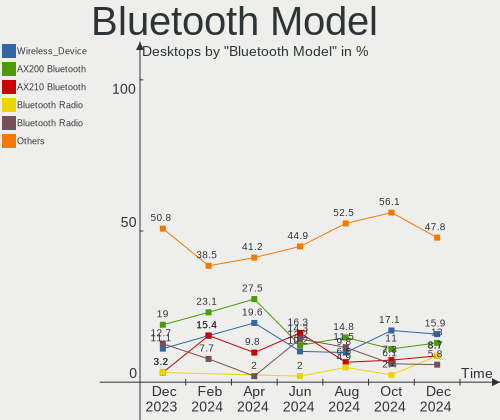

Arch - Hardware Trends (Desktops)
---------------------------------

A project to identify most popular hardware characteristics and track their change
over time based on data collected by Linux users at https://Linux-Hardware.org.

Anyone can contribute to this report by the [hw-probe](https://github.com/linuxhw/hw-probe) tool:

    sudo -E hw-probe -all -upload

This report is for one last month. Overall report since the beginning of time: [TestCoverage](https://github.com/linuxhw/TestCoverage)

Period: Aug, 2022.

Contents
--------

* [ System ](#system)
  - [ OS                       ](#os)
  - [ OS Family                ](#os-family)
  - [ Kernel                   ](#kernel)
  - [ Kernel Family            ](#kernel-family)
  - [ Kernel Major Ver.        ](#kernel-major-ver)
  - [ Arch                     ](#arch)
  - [ DE                       ](#de)
  - [ Display Server           ](#display-server)
  - [ Display Manager          ](#display-manager)
  - [ OS Lang                  ](#os-lang)
  - [ Boot Mode                ](#boot-mode)
  - [ Filesystem               ](#filesystem)
  - [ Part. scheme             ](#part-scheme)
  - [ Dual Boot with Linux/BSD ](#dual-boot-with-linuxbsd)
  - [ Dual Boot (Win)          ](#dual-boot-win)

* [ Board ](#board)
  - [ Vendor                   ](#vendor)
  - [ Model                    ](#model)
  - [ Model Family             ](#model-family)
  - [ MFG Year                 ](#mfg-year)
  - [ Form Factor              ](#form-factor)
  - [ Secure Boot              ](#secure-boot)
  - [ Coreboot                 ](#coreboot)
  - [ RAM Size                 ](#ram-size)
  - [ RAM Used                 ](#ram-used)
  - [ Total Drives             ](#total-drives)
  - [ Has CD-ROM               ](#has-cd-rom)
  - [ Has Ethernet             ](#has-ethernet)
  - [ Has WiFi                 ](#has-wifi)
  - [ Has Bluetooth            ](#has-bluetooth)

* [ Location ](#location)
  - [ Country                  ](#country)
  - [ City                     ](#city)

* [ Drives ](#drives)
  - [ Drive Vendor             ](#drive-vendor)
  - [ Drive Model              ](#drive-model)
  - [ HDD Vendor               ](#hdd-vendor)
  - [ SSD Vendor               ](#ssd-vendor)
  - [ Drive Kind               ](#drive-kind)
  - [ Drive Connector          ](#drive-connector)
  - [ Drive Size               ](#drive-size)
  - [ Space Total              ](#space-total)
  - [ Space Used               ](#space-used)
  - [ Malfunc. Drives          ](#malfunc-drives)
  - [ Malfunc. Drive Vendor    ](#malfunc-drive-vendor)
  - [ Malfunc. HDD Vendor      ](#malfunc-hdd-vendor)
  - [ Malfunc. Drive Kind      ](#malfunc-drive-kind)
  - [ Failed Drives            ](#failed-drives)
  - [ Failed Drive Vendor      ](#failed-drive-vendor)
  - [ Drive Status             ](#drive-status)

* [ Storage controller ](#storage-controller)
  - [ Storage Vendor           ](#storage-vendor)
  - [ Storage Model            ](#storage-model)
  - [ Storage Kind             ](#storage-kind)

* [ Processor ](#processor)
  - [ CPU Vendor               ](#cpu-vendor)
  - [ CPU Model                ](#cpu-model)
  - [ CPU Model Family         ](#cpu-model-family)
  - [ CPU Cores                ](#cpu-cores)
  - [ CPU Sockets              ](#cpu-sockets)
  - [ CPU Threads              ](#cpu-threads)
  - [ CPU Op-Modes             ](#cpu-op-modes)
  - [ CPU Microcode            ](#cpu-microcode)
  - [ CPU Microarch            ](#cpu-microarch)

* [ Graphics ](#graphics)
  - [ GPU Vendor               ](#gpu-vendor)
  - [ GPU Model                ](#gpu-model)
  - [ GPU Combo                ](#gpu-combo)
  - [ GPU Driver               ](#gpu-driver)
  - [ GPU Memory               ](#gpu-memory)

* [ Monitor ](#monitor)
  - [ Monitor Vendor           ](#monitor-vendor)
  - [ Monitor Model            ](#monitor-model)
  - [ Monitor Resolution       ](#monitor-resolution)
  - [ Monitor Diagonal         ](#monitor-diagonal)
  - [ Monitor Width            ](#monitor-width)
  - [ Aspect Ratio             ](#aspect-ratio)
  - [ Monitor Area             ](#monitor-area)
  - [ Pixel Density            ](#pixel-density)
  - [ Multiple Monitors        ](#multiple-monitors)

* [ Network ](#network)
  - [ Net Controller Vendor    ](#net-controller-vendor)
  - [ Net Controller Model     ](#net-controller-model)
  - [ Wireless Vendor          ](#wireless-vendor)
  - [ Wireless Model           ](#wireless-model)
  - [ Ethernet Vendor          ](#ethernet-vendor)
  - [ Ethernet Model           ](#ethernet-model)
  - [ Net Controller Kind      ](#net-controller-kind)
  - [ Used Controller          ](#used-controller)
  - [ NICs                     ](#nics)
  - [ IPv6                     ](#ipv6)

* [ Bluetooth ](#bluetooth)
  - [ Bluetooth Vendor         ](#bluetooth-vendor)
  - [ Bluetooth Model          ](#bluetooth-model)

* [ Sound ](#sound)
  - [ Sound Vendor             ](#sound-vendor)
  - [ Sound Model              ](#sound-model)

* [ Memory ](#memory)
  - [ Memory Vendor            ](#memory-vendor)
  - [ Memory Model             ](#memory-model)
  - [ Memory Kind              ](#memory-kind)
  - [ Memory Form Factor       ](#memory-form-factor)
  - [ Memory Size              ](#memory-size)
  - [ Memory Speed             ](#memory-speed)

* [ Printers & scanners ](#printers--scanners)
  - [ Printer Vendor           ](#printer-vendor)
  - [ Printer Model            ](#printer-model)
  - [ Scanner Vendor           ](#scanner-vendor)
  - [ Scanner Model            ](#scanner-model)

* [ Camera ](#camera)
  - [ Camera Vendor            ](#camera-vendor)
  - [ Camera Model             ](#camera-model)

* [ Security ](#security)
  - [ Fingerprint Vendor       ](#fingerprint-vendor)
  - [ Fingerprint Model        ](#fingerprint-model)
  - [ Chipcard Vendor          ](#chipcard-vendor)
  - [ Chipcard Model           ](#chipcard-model)

* [ Unsupported ](#unsupported)
  - [ Unsupported Devices      ](#unsupported-devices)
  - [ Unsupported Device Types ](#unsupported-device-types)

System
------

OS
--

Installed operating systems

| Name         | Desktops | Percent |
|--------------|----------|---------|
| Arch Rolling | 30       | 50%     |
| Arch         | 30       | 50%     |

OS Family
---------

OS without a version

| Name | Desktops | Percent |
|------|----------|---------|
| Arch | 60       | 100%    |

Kernel
------

Version of the Linux kernel

| Version                | Desktops | Percent |
|------------------------|----------|---------|
| 5.18.16-arch1-1        | 12       | 20%     |
| 5.19.3-arch1-1         | 9        | 15%     |
| 5.19.2-arch1-1         | 4        | 6.67%   |
| 5.19.1-arch2-1         | 4        | 6.67%   |
| 5.15.59-2-lts          | 4        | 6.67%   |
| 5.19.4-arch1-1         | 3        | 5%      |
| 5.19.3-zen1-1-zen      | 2        | 3.33%   |
| 5.19.2-zen1-2-zen      | 2        | 3.33%   |
| 5.19.1-zen1-1-zen      | 2        | 3.33%   |
| 5.18.15-arch1-1        | 2        | 3.33%   |
| 5.15.60-1-lts          | 2        | 3.33%   |
| 5.19.5-arch1-1         | 1        | 1.67%   |
| 5.19.4-zen1-1-zen      | 1        | 1.67%   |
| 5.19.2-arch1-2         | 1        | 1.67%   |
| 5.19.1-2-cachyos-bore  | 1        | 1.67%   |
| 5.19.0-xanmod2-2-x64v2 | 1        | 1.67%   |
| 5.19.0-xanmod1-1-zen2  | 1        | 1.67%   |
| 5.18.9-zen1-1-zen      | 1        | 1.67%   |
| 5.18.15-zen1-1-zen     | 1        | 1.67%   |
| 5.18.15-arch1-2        | 1        | 1.67%   |
| 5.18.14-arch1-1        | 1        | 1.67%   |
| 5.15.63-1-lts          | 1        | 1.67%   |
| 5.15.61-2-lts          | 1        | 1.67%   |
| 5.15.52-1-lts          | 1        | 1.67%   |
| 5.15.14-1-lts          | 1        | 1.67%   |

Kernel Family
-------------

Linux kernel without a distro release

| Version | Desktops | Percent |
|---------|----------|---------|
| 5.18.16 | 12       | 20%     |
| 5.19.3  | 11       | 18.33%  |
| 5.19.2  | 7        | 11.67%  |
| 5.19.1  | 7        | 11.67%  |
| 5.19.4  | 4        | 6.67%   |
| 5.18.15 | 4        | 6.67%   |
| 5.15.59 | 4        | 6.67%   |
| 5.19.0  | 2        | 3.33%   |
| 5.15.60 | 2        | 3.33%   |
| 5.19.5  | 1        | 1.67%   |
| 5.18.9  | 1        | 1.67%   |
| 5.18.14 | 1        | 1.67%   |
| 5.15.63 | 1        | 1.67%   |
| 5.15.61 | 1        | 1.67%   |
| 5.15.52 | 1        | 1.67%   |
| 5.15.14 | 1        | 1.67%   |

Kernel Major Ver.
-----------------

Linux kernel major version

| Version | Desktops | Percent |
|---------|----------|---------|
| 5.19    | 32       | 53.33%  |
| 5.18    | 18       | 30%     |
| 5.15    | 10       | 16.67%  |

Arch
----

OS architecture (x86_64, i586, etc.)

| Name   | Desktops | Percent |
|--------|----------|---------|
| x86_64 | 60       | 100%    |

DE
--

Desktop Environment

| Name       | Desktops | Percent |
|------------|----------|---------|
| KDE5       | 28       | 46.67%  |
| GNOME      | 16       | 26.67%  |
| XFCE       | 6        | 10%     |
| Unknown    | 4        | 6.67%   |
| X-Cinnamon | 2        | 3.33%   |
| i3         | 2        | 3.33%   |
| Qtile      | 1        | 1.67%   |
| LXQt       | 1        | 1.67%   |

Display Server
--------------

X11 or Wayland

| Name    | Desktops | Percent |
|---------|----------|---------|
| X11     | 41       | 68.33%  |
| Wayland | 13       | 21.67%  |
| Tty     | 3        | 5%      |
| Unknown | 3        | 5%      |

Display Manager
---------------

SDDM, LightDM, etc.

| Name    | Desktops | Percent |
|---------|----------|---------|
| Unknown | 28       | 46.67%  |
| LightDM | 14       | 23.33%  |
| SDDM    | 13       | 21.67%  |
| GDM     | 4        | 6.67%   |
| XDM     | 1        | 1.67%   |

OS Lang
-------

Language

| Lang    | Desktops | Percent |
|---------|----------|---------|
| en_US   | 27       | 45%     |
| pt_BR   | 4        | 6.67%   |
| de_DE   | 4        | 6.67%   |
| C       | 4        | 6.67%   |
| pl_PL   | 3        | 5%      |
| en_GB   | 3        | 5%      |
| ru_RU   | 2        | 3.33%   |
| zh_CN   | 1        | 1.67%   |
| sv_SE   | 1        | 1.67%   |
| ko_KR   | 1        | 1.67%   |
| it_IT   | 1        | 1.67%   |
| fr_FR   | 1        | 1.67%   |
| fi_FI   | 1        | 1.67%   |
| es_MX   | 1        | 1.67%   |
| es_ES   | 1        | 1.67%   |
| es_AR   | 1        | 1.67%   |
| en_NZ   | 1        | 1.67%   |
| en_IN   | 1        | 1.67%   |
| en_DE   | 1        | 1.67%   |
| Default | 1        | 1.67%   |

Boot Mode
---------

EFI or BIOS

| Mode | Desktops | Percent |
|------|----------|---------|
| BIOS | 33       | 55%     |
| EFI  | 27       | 45%     |

Filesystem
----------

Type of filesystem

| Type    | Desktops | Percent |
|---------|----------|---------|
| Ext4    | 39       | 65%     |
| Btrfs   | 17       | 28.33%  |
| F2fs    | 2        | 3.33%   |
| Xfs     | 1        | 1.67%   |
| Overlay | 1        | 1.67%   |

Part. scheme
------------

Scheme of partitioning

| Type    | Desktops | Percent |
|---------|----------|---------|
| GPT     | 30       | 50%     |
| Unknown | 24       | 40%     |
| MBR     | 6        | 10%     |

Dual Boot with Linux/BSD
------------------------

Hosting more than one Linux/BSD

| Dual boot | Desktops | Percent |
|-----------|----------|---------|
| No        | 53       | 88.33%  |
| Yes       | 7        | 11.67%  |

Dual Boot (Win)
---------------

Hosting Linux and Windows

| Dual boot | Desktops | Percent |
|-----------|----------|---------|
| No        | 46       | 76.67%  |
| Yes       | 14       | 23.33%  |

Board
-----

Vendor
------

Motherboard manufacturer

| Name                | Desktops | Percent |
|---------------------|----------|---------|
| ASUSTek Computer    | 19       | 31.67%  |
| ASRock              | 12       | 20%     |
| MSI                 | 11       | 18.33%  |
| Gigabyte Technology | 10       | 16.67%  |
| Hewlett-Packard     | 3        | 5%      |
| MACHINIST           | 1        | 1.67%   |
| Intel               | 1        | 1.67%   |
| ECS                 | 1        | 1.67%   |
| Acer                | 1        | 1.67%   |
| 16512-2316-22801    | 1        | 1.67%   |

Model
-----

Motherboard model

| Name                                                         | Desktops | Percent |
|--------------------------------------------------------------|----------|---------|
| MSI MS-7C52                                                  | 2        | 3.33%   |
| MSI MS-7C37                                                  | 2        | 3.33%   |
| Gigabyte B450 AORUS PRO WIFI                                 | 2        | 3.33%   |
| ASRock B450M Steel Legend                                    | 2        | 3.33%   |
| MSI MS-7D42                                                  | 1        | 1.67%   |
| MSI MS-7C95                                                  | 1        | 1.67%   |
| MSI MS-7C70                                                  | 1        | 1.67%   |
| MSI MS-7C35                                                  | 1        | 1.67%   |
| MSI MS-7B86                                                  | 1        | 1.67%   |
| MSI MS-7845                                                  | 1        | 1.67%   |
| MSI MS-7758                                                  | 1        | 1.67%   |
| MACHINIST X99-RS9 V2.0                                       | 1        | 1.67%   |
| Intel X79 (INTEL Xeon E5/Corei7 DMI2 - C600/C200 Cipset V304 | 1        | 1.67%   |
| HP EliteDesk 800 G2 SFF                                      | 1        | 1.67%   |
| HP EliteDesk 800 G1 USDT                                     | 1        | 1.67%   |
| HP 870-115ng                                                 | 1        | 1.67%   |
| Gigabyte Z390 AORUS MASTER                                   | 1        | 1.67%   |
| Gigabyte H97-HD3                                             | 1        | 1.67%   |
| Gigabyte H61MS                                               | 1        | 1.67%   |
| Gigabyte G31M-ES2C                                           | 1        | 1.67%   |
| Gigabyte B550M DS3H                                          | 1        | 1.67%   |
| Gigabyte B550I AORUS PRO AX                                  | 1        | 1.67%   |
| Gigabyte B550 AORUS MASTER                                   | 1        | 1.67%   |
| Gigabyte B450M AORUS ELITE                                   | 1        | 1.67%   |
| ECS A55F-M4                                                  | 1        | 1.67%   |
| ASUS TUF Gaming Z690-PLUS D4                                 | 1        | 1.67%   |
| ASUS TUF Gaming X570-PRO                                     | 1        | 1.67%   |
| ASUS TUF Gaming X570-PLUS                                    | 1        | 1.67%   |
| ASUS TUF B450M-PLUS GAMING                                   | 1        | 1.67%   |
| ASUS TUF B450-PRO GAMING                                     | 1        | 1.67%   |
| ASUS TUF B450-PLUS GAMING                                    | 1        | 1.67%   |
| ASUS ROG ZENITH EXTREME                                      | 1        | 1.67%   |
| ASUS ROG STRIX B550-A GAMING                                 | 1        | 1.67%   |
| ASUS ROG STRIX B450-F GAMING                                 | 1        | 1.67%   |
| ASUS ROG CROSSHAIR VIII HERO                                 | 1        | 1.67%   |
| ASUS PRIME Z390-A                                            | 1        | 1.67%   |
| ASUS PRIME Z370-A II                                         | 1        | 1.67%   |
| ASUS PRIME X570-P                                            | 1        | 1.67%   |
| ASUS PRIME X370-PRO                                          | 1        | 1.67%   |
| ASUS PRIME B550M-A                                           | 1        | 1.67%   |
| ASUS PRIME B450M-A II                                        | 1        | 1.67%   |
| ASUS PRIME A320M-K/BR                                        | 1        | 1.67%   |
| ASUS P5K-E                                                   | 1        | 1.67%   |
| ASUS G20AJ                                                   | 1        | 1.67%   |
| ASRock Z75 Pro3                                              | 1        | 1.67%   |
| ASRock Z170M Pro4S                                           | 1        | 1.67%   |
| ASRock X370 Pro4                                             | 1        | 1.67%   |
| ASRock Q1900-ITX                                             | 1        | 1.67%   |
| ASRock H81M-HDS                                              | 1        | 1.67%   |
| ASRock H61M-DGS                                              | 1        | 1.67%   |
| ASRock B550M-ITX/ac                                          | 1        | 1.67%   |
| ASRock B450M Pro4                                            | 1        | 1.67%   |
| ASRock AD2550-ITX                                            | 1        | 1.67%   |
| ASRock AB350M-HDV                                            | 1        | 1.67%   |
| Acer Predator G3-710                                         | 1        | 1.67%   |
| 16512-2316-22801 MS-7C37                                     | 1        | 1.67%   |

Model Family
------------

Motherboard model prefix

| Name                     | Desktops | Percent |
|--------------------------|----------|---------|
| ASUS PRIME               | 7        | 11.67%  |
| ASUS TUF                 | 6        | 10%     |
| ASUS ROG                 | 4        | 6.67%   |
| ASRock B450M             | 3        | 5%      |
| MSI MS-7C52              | 2        | 3.33%   |
| MSI MS-7C37              | 2        | 3.33%   |
| HP EliteDesk             | 2        | 3.33%   |
| Gigabyte B450            | 2        | 3.33%   |
| MSI MS-7D42              | 1        | 1.67%   |
| MSI MS-7C95              | 1        | 1.67%   |
| MSI MS-7C70              | 1        | 1.67%   |
| MSI MS-7C35              | 1        | 1.67%   |
| MSI MS-7B86              | 1        | 1.67%   |
| MSI MS-7845              | 1        | 1.67%   |
| MSI MS-7758              | 1        | 1.67%   |
| MACHINIST X99-RS9        | 1        | 1.67%   |
| Intel X79                | 1        | 1.67%   |
| HP 870-115ng             | 1        | 1.67%   |
| Gigabyte Z390            | 1        | 1.67%   |
| Gigabyte H97-HD3         | 1        | 1.67%   |
| Gigabyte H61MS           | 1        | 1.67%   |
| Gigabyte G31M-ES2C       | 1        | 1.67%   |
| Gigabyte B550M           | 1        | 1.67%   |
| Gigabyte B550I           | 1        | 1.67%   |
| Gigabyte B550            | 1        | 1.67%   |
| Gigabyte B450M           | 1        | 1.67%   |
| ECS A55F-M4              | 1        | 1.67%   |
| ASUS P5K-E               | 1        | 1.67%   |
| ASUS G20AJ               | 1        | 1.67%   |
| ASRock Z75               | 1        | 1.67%   |
| ASRock Z170M             | 1        | 1.67%   |
| ASRock X370              | 1        | 1.67%   |
| ASRock Q1900-ITX         | 1        | 1.67%   |
| ASRock H81M-HDS          | 1        | 1.67%   |
| ASRock H61M-DGS          | 1        | 1.67%   |
| ASRock B550M-ITX         | 1        | 1.67%   |
| ASRock AD2550-ITX        | 1        | 1.67%   |
| ASRock AB350M-HDV        | 1        | 1.67%   |
| Acer Predator            | 1        | 1.67%   |
| 16512-2316-22801 MS-7C37 | 1        | 1.67%   |

MFG Year
--------

Motherboard manufacture year

| Year | Desktops | Percent |
|------|----------|---------|
| 2020 | 11       | 18.33%  |
| 2018 | 11       | 18.33%  |
| 2019 | 10       | 16.67%  |
| 2021 | 6        | 10%     |
| 2013 | 6        | 10%     |
| 2017 | 3        | 5%      |
| 2015 | 3        | 5%      |
| 2014 | 3        | 5%      |
| 2012 | 3        | 5%      |
| 2022 | 1        | 1.67%   |
| 2016 | 1        | 1.67%   |
| 2008 | 1        | 1.67%   |
| 2007 | 1        | 1.67%   |

Form Factor
-----------

Physical design of the computer

| Name    | Desktops | Percent |
|---------|----------|---------|
| Desktop | 60       | 100%    |

Secure Boot
-----------

Enabled or disabled

| State    | Desktops | Percent |
|----------|----------|---------|
| Disabled | 60       | 100%    |

Coreboot
--------

Have coreboot on board

| Used | Desktops | Percent |
|------|----------|---------|
| No   | 60       | 100%    |

RAM Size
--------

Total RAM memory

| Size in GB  | Desktops | Percent |
|-------------|----------|---------|
| 16.01-24.0  | 21       | 35%     |
| 32.01-64.0  | 16       | 26.67%  |
| 4.01-8.0    | 7        | 11.67%  |
| 64.01-256.0 | 6        | 10%     |
| 8.01-16.0   | 6        | 10%     |
| 3.01-4.0    | 2        | 3.33%   |
| 24.01-32.0  | 1        | 1.67%   |
| 1.01-2.0    | 1        | 1.67%   |

RAM Used
--------

Used RAM memory

| Used GB    | Desktops | Percent |
|------------|----------|---------|
| 4.01-8.0   | 26       | 43.33%  |
| 2.01-3.0   | 11       | 18.33%  |
| 3.01-4.0   | 8        | 13.33%  |
| 1.01-2.0   | 7        | 11.67%  |
| 8.01-16.0  | 6        | 10%     |
| 16.01-24.0 | 1        | 1.67%   |
| 0.51-1.0   | 1        | 1.67%   |

Total Drives
------------

Number of drives on board

| Drives | Desktops | Percent |
|--------|----------|---------|
| 2      | 20       | 33.33%  |
| 3      | 13       | 21.67%  |
| 1      | 12       | 20%     |
| 4      | 9        | 15%     |
| 5      | 3        | 5%      |
| 6      | 2        | 3.33%   |
| 7      | 1        | 1.67%   |

Has CD-ROM
----------

Has CD-ROM on board

| Presented | Desktops | Percent |
|-----------|----------|---------|
| No        | 49       | 81.67%  |
| Yes       | 11       | 18.33%  |

Has Ethernet
------------

Has Ethernet on board

| Presented | Desktops | Percent |
|-----------|----------|---------|
| Yes       | 60       | 100%    |

Has WiFi
--------

Has WiFi module

| Presented | Desktops | Percent |
|-----------|----------|---------|
| Yes       | 38       | 63.33%  |
| No        | 22       | 36.67%  |

Has Bluetooth
-------------

Has Bluetooth module

| Presented | Desktops | Percent |
|-----------|----------|---------|
| Yes       | 36       | 60%     |
| No        | 24       | 40%     |

Location
--------

Country
-------

Geographic location (country)

| Country     | Desktops | Percent |
|-------------|----------|---------|
| USA         | 15       | 25%     |
| Germany     | 7        | 11.67%  |
| Poland      | 4        | 6.67%   |
| Brazil      | 4        | 6.67%   |
| UK          | 3        | 5%      |
| Sweden      | 3        | 5%      |
| Russia      | 3        | 5%      |
| Finland     | 3        | 5%      |
| Mexico      | 2        | 3.33%   |
| China       | 2        | 3.33%   |
| Vietnam     | 1        | 1.67%   |
| Taiwan      | 1        | 1.67%   |
| Spain       | 1        | 1.67%   |
| South Korea | 1        | 1.67%   |
| New Zealand | 1        | 1.67%   |
| Italy       | 1        | 1.67%   |
| India       | 1        | 1.67%   |
| Hungary     | 1        | 1.67%   |
| Denmark     | 1        | 1.67%   |
| Chile       | 1        | 1.67%   |
| Canada      | 1        | 1.67%   |
| Bulgaria    | 1        | 1.67%   |
| Austria     | 1        | 1.67%   |
| Argentina   | 1        | 1.67%   |

City
----

Geographic location (city)

| City              | Desktops | Percent |
|-------------------|----------|---------|
| Moscow            | 2        | 3.33%   |
| Krakow            | 2        | 3.33%   |
| Helsinki          | 2        | 3.33%   |
| Dallas            | 2        | 3.33%   |
| Beijing           | 2        | 3.33%   |
| Watsonville       | 1        | 1.67%   |
| Warsaw            | 1        | 1.67%   |
| Warrington        | 1        | 1.67%   |
| Vienna            | 1        | 1.67%   |
| Várzea Grande    | 1        | 1.67%   |
| Van Buren         | 1        | 1.67%   |
| Ulm               | 1        | 1.67%   |
| Tauranga          | 1        | 1.67%   |
| Tampere           | 1        | 1.67%   |
| Taipei            | 1        | 1.67%   |
| Stockholm         | 1        | 1.67%   |
| Stara Zagora      | 1        | 1.67%   |
| Seattle           | 1        | 1.67%   |
| Salamanca         | 1        | 1.67%   |
| Rostov-on-Don     | 1        | 1.67%   |
| Rome              | 1        | 1.67%   |
| Peru              | 1        | 1.67%   |
| Murshidabad       | 1        | 1.67%   |
| Miami             | 1        | 1.67%   |
| Meriden           | 1        | 1.67%   |
| Mar del Plata     | 1        | 1.67%   |
| Malmo             | 1        | 1.67%   |
| Madrid            | 1        | 1.67%   |
| Luborzyca         | 1        | 1.67%   |
| Leavenworth       | 1        | 1.67%   |
| Lancaster         | 1        | 1.67%   |
| Kramfors          | 1        | 1.67%   |
| Kelowna           | 1        | 1.67%   |
| Karlsruhe         | 1        | 1.67%   |
| Jung-gu           | 1        | 1.67%   |
| Ixtapaluca        | 1        | 1.67%   |
| Hofgeismar        | 1        | 1.67%   |
| Hanoi             | 1        | 1.67%   |
| Greve             | 1        | 1.67%   |
| Greeneville       | 1        | 1.67%   |
| Giessen           | 1        | 1.67%   |
| Gaithersburg      | 1        | 1.67%   |
| Frankfurt am Main | 1        | 1.67%   |
| Fergus Falls      | 1        | 1.67%   |
| Clarksville       | 1        | 1.67%   |
| Cascavel          | 1        | 1.67%   |
| Cariacica         | 1        | 1.67%   |
| Calne             | 1        | 1.67%   |
| Budapest          | 1        | 1.67%   |
| Bad Homburg       | 1        | 1.67%   |
| Aurora            | 1        | 1.67%   |
| Antofagasta       | 1        | 1.67%   |
| Ansbach           | 1        | 1.67%   |
| American Fork     | 1        | 1.67%   |
| Unknown           | 1        | 1.67%   |

Drives
------

Drive Vendor
------------

Hard drive vendors

| Vendor                      | Desktops | Drives | Percent |
|-----------------------------|----------|--------|---------|
| WDC                         | 22       | 33     | 17.6%   |
| Seagate                     | 22       | 27     | 17.6%   |
| Samsung Electronics         | 22       | 33     | 17.6%   |
| Sandisk                     | 10       | 12     | 8%      |
| Kingston                    | 9        | 11     | 7.2%    |
| Toshiba                     | 6        | 7      | 4.8%    |
| Crucial                     | 5        | 5      | 4%      |
| Silicon Motion              | 4        | 5      | 3.2%    |
| Intel                       | 3        | 4      | 2.4%    |
| Unknown                     | 2        | 2      | 1.6%    |
| Phison Electronics          | 2        | 3      | 1.6%    |
| Micron/Crucial Technology   | 2        | 2      | 1.6%    |
| SPCC                        | 1        | 1      | 0.8%    |
| SK hynix                    | 1        | 1      | 0.8%    |
| Plextor                     | 1        | 1      | 0.8%    |
| Patriot                     | 1        | 1      | 0.8%    |
| OCZ                         | 1        | 1      | 0.8%    |
| Netac                       | 1        | 1      | 0.8%    |
| Micron Technology           | 1        | 1      | 0.8%    |
| LITEONIT                    | 1        | 1      | 0.8%    |
| LITEON                      | 1        | 1      | 0.8%    |
| Kingston Technology Company | 1        | 1      | 0.8%    |
| Hitachi                     | 1        | 2      | 0.8%    |
| GOODRAM                     | 1        | 1      | 0.8%    |
| China                       | 1        | 1      | 0.8%    |
| Apacer                      | 1        | 1      | 0.8%    |
| ADATA Technology            | 1        | 1      | 0.8%    |
| A-DATA Technology           | 1        | 1      | 0.8%    |

Drive Model
-----------

Hard drive models

| Model                                              | Desktops | Percent |
|----------------------------------------------------|----------|---------|
| SanDisk NVMe SSD Drive 1TB                         | 4        | 2.74%   |
| Samsung NVMe SSD Drive 1TB                         | 3        | 2.05%   |
| Samsung NVMe SSD Controller SM981/PM981/PM983 1TB  | 3        | 2.05%   |
| Kingston SA400S37120G 120GB SSD                    | 3        | 2.05%   |
| Unknown SD/MMC/MS PRO 128GB                        | 2        | 1.37%   |
| Toshiba HDWD110 1TB                                | 2        | 1.37%   |
| Silicon Motion NVMe SSD Drive 512GB                | 2        | 1.37%   |
| Seagate ST2000DM008-2FR102 2TB                     | 2        | 1.37%   |
| Seagate ST2000DM006-2DM164 2TB                     | 2        | 1.37%   |
| Seagate ST2000DM001-1CH164 2TB                     | 2        | 1.37%   |
| Seagate ST1000DM010-2EP102 1TB                     | 2        | 1.37%   |
| Samsung SSD 970 EVO Plus 500GB                     | 2        | 1.37%   |
| Samsung SSD 870 QVO 1TB                            | 2        | 1.37%   |
| Samsung SSD 860 EVO 1TB                            | 2        | 1.37%   |
| Samsung SSD 850 EVO 500GB                          | 2        | 1.37%   |
| Samsung NVMe SSD Controller PM9A1/PM9A3/980PRO 1TB | 2        | 1.37%   |
| Phison E12 NVMe Controller 1TB                     | 2        | 1.37%   |
| Kingston SA400S37240G 240GB SSD                    | 2        | 1.37%   |
| Crucial CT480BX500SSD1 480GB                       | 2        | 1.37%   |
| WDC WDS250G2B0B-00YS70 250GB SSD                   | 1        | 0.68%   |
| WDC WDS250G2B0A-00SM50 250GB SSD                   | 1        | 0.68%   |
| WDC WDS240G2G0B-00EPW0 240GB SSD                   | 1        | 0.68%   |
| WDC WDS100T2B0C-00PXH0 1TB                         | 1        | 0.68%   |
| WDC WDS100T2B0C 1TB                                | 1        | 0.68%   |
| WDC WD800JD-75JNC0 80GB                            | 1        | 0.68%   |
| WDC WD60EZRZ-00GZ5B1 6TB                           | 1        | 0.68%   |
| WDC WD60EZAZ-00ZGHB0 6TB                           | 1        | 0.68%   |
| WDC WD5000LUCT-63Y8HY0 500GB                       | 1        | 0.68%   |
| WDC WD5000LPVX-80V0TT0 500GB                       | 1        | 0.68%   |
| WDC WD5000LPLX-00ZNTT0 500GB                       | 1        | 0.68%   |
| WDC WD5000AAKX-001CA0 500GB                        | 1        | 0.68%   |
| WDC WD40EZRZ-00GXCB0 4TB                           | 1        | 0.68%   |
| WDC WD40EFRX-68N32N0 4TB                           | 1        | 0.68%   |
| WDC WD3200AVJS-63B6A0 320GB                        | 1        | 0.68%   |
| WDC WD30EFRX-68EUZN0 3TB                           | 1        | 0.68%   |
| WDC WD2500AAKX-75U6AA0 250GB                       | 1        | 0.68%   |
| WDC WD20EZAZ-00GGJB0 2TB                           | 1        | 0.68%   |
| WDC WD2003FZEX-00SRLA0 2TB                         | 1        | 0.68%   |
| WDC WD2000F9YZ-09N20L0 2TB                         | 1        | 0.68%   |
| WDC WD161KFGX-68AFPN0 16TB                         | 1        | 0.68%   |
| WDC WD10EZRX-00L4HB0 1TB                           | 1        | 0.68%   |
| WDC WD10EZEX-22MFCA0 1TB                           | 1        | 0.68%   |
| WDC WD10EZEX-07WN4A0 1TB                           | 1        | 0.68%   |
| WDC WD10EZEX-00WN4A0 1TB                           | 1        | 0.68%   |
| WDC WD10EZEX-00BN5A0 1TB                           | 1        | 0.68%   |
| WDC WD10EALX-009BA0 1TB                            | 1        | 0.68%   |
| WDC WD1003FZEX-00K3CA0 1TB                         | 1        | 0.68%   |
| Toshiba Q200 EX M.2 240GB SSD                      | 1        | 0.68%   |
| Toshiba HDWE140 4TB                                | 1        | 0.68%   |
| Toshiba DT01ACA300 3TB                             | 1        | 0.68%   |
| Toshiba DT01ACA100 1TB                             | 1        | 0.68%   |
| SPCC Solid State Disk 256GB                        | 1        | 0.68%   |
| SK hynix C2S3T/240G 240GB                          | 1        | 0.68%   |
| Silicon Motion NVMe SSD Drive 256GB                | 1        | 0.68%   |
| Silicon Motion NE-256 256GB                        | 1        | 0.68%   |
| Seagate ST9500420AS 500GB                          | 1        | 0.68%   |
| Seagate ST500LT012-1DG142 500GB                    | 1        | 0.68%   |
| Seagate ST500DM002-1BD142 500GB                    | 1        | 0.68%   |
| Seagate ST3500830AS 500GB                          | 1        | 0.68%   |
| Seagate ST32000644NS 59Y5483 59Y1807IBMV 2TB       | 1        | 0.68%   |

HDD Vendor
----------

Hard disk drive vendors

| Vendor              | Desktops | Drives | Percent |
|---------------------|----------|--------|---------|
| Seagate             | 20       | 25     | 41.67%  |
| WDC                 | 18       | 28     | 37.5%   |
| Toshiba             | 5        | 6      | 10.42%  |
| Unknown             | 2        | 2      | 4.17%   |
| Samsung Electronics | 2        | 2      | 4.17%   |
| Hitachi             | 1        | 2      | 2.08%   |

SSD Vendor
----------

Solid state drive vendors

| Vendor              | Desktops | Drives | Percent |
|---------------------|----------|--------|---------|
| Samsung Electronics | 13       | 15     | 28.26%  |
| Kingston            | 7        | 9      | 15.22%  |
| Crucial             | 5        | 5      | 10.87%  |
| SanDisk             | 4        | 4      | 8.7%    |
| WDC                 | 3        | 3      | 6.52%   |
| Toshiba             | 1        | 1      | 2.17%   |
| SPCC                | 1        | 1      | 2.17%   |
| SK hynix            | 1        | 1      | 2.17%   |
| Plextor             | 1        | 1      | 2.17%   |
| Patriot             | 1        | 1      | 2.17%   |
| OCZ                 | 1        | 1      | 2.17%   |
| Netac               | 1        | 1      | 2.17%   |
| Micron Technology   | 1        | 1      | 2.17%   |
| LITEONIT            | 1        | 1      | 2.17%   |
| LITEON              | 1        | 1      | 2.17%   |
| GOODRAM             | 1        | 1      | 2.17%   |
| China               | 1        | 1      | 2.17%   |
| Apacer              | 1        | 1      | 2.17%   |
| A-DATA Technology   | 1        | 1      | 2.17%   |

Drive Kind
----------

HDD or SSD

| Kind | Desktops | Drives | Percent |
|------|----------|--------|---------|
| SSD  | 37       | 50     | 35.58%  |
| HDD  | 37       | 65     | 35.58%  |
| NVMe | 30       | 46     | 28.85%  |

Drive Connector
---------------

SATA, SAS, NVMe, etc.

| Type | Desktops | Drives | Percent |
|------|----------|--------|---------|
| SATA | 47       | 108    | 55.95%  |
| NVMe | 30       | 46     | 35.71%  |
| SAS  | 7        | 7      | 8.33%   |

Drive Size
----------

Size of hard drive

| Size in TB | Desktops | Drives | Percent |
|------------|----------|--------|---------|
| 0.01-0.5   | 32       | 49     | 40.51%  |
| 0.51-1.0   | 25       | 34     | 31.65%  |
| 1.01-2.0   | 14       | 18     | 17.72%  |
| 3.01-4.0   | 3        | 4      | 3.8%    |
| 2.01-3.0   | 3        | 6      | 3.8%    |
| 10.01-20.0 | 1        | 2      | 1.27%   |
| 4.01-10.0  | 1        | 2      | 1.27%   |

Space Total
-----------

Amount of disk space available on the file system

| Size in GB     | Desktops | Percent |
|----------------|----------|---------|
| 1001-2000      | 15       | 25%     |
| More than 3000 | 13       | 21.67%  |
| 501-1000       | 13       | 21.67%  |
| 251-500        | 7        | 11.67%  |
| 101-250        | 6        | 10%     |
| 2001-3000      | 3        | 5%      |
| 51-100         | 2        | 3.33%   |
| Unknown        | 1        | 1.67%   |

Space Used
----------

Amount of used disk space

| Used GB        | Desktops | Percent |
|----------------|----------|---------|
| 251-500        | 13       | 21.67%  |
| 1001-2000      | 10       | 16.67%  |
| 101-250        | 9        | 15%     |
| 1-20           | 7        | 11.67%  |
| More than 3000 | 5        | 8.33%   |
| 501-1000       | 5        | 8.33%   |
| 21-50          | 4        | 6.67%   |
| 51-100         | 4        | 6.67%   |
| 2001-3000      | 2        | 3.33%   |
| Unknown        | 1        | 1.67%   |

Malfunc. Drives
---------------

Drive models with a malfunction

| Model                           | Desktops | Drives | Percent |
|---------------------------------|----------|--------|---------|
| WDC WD5000AAKX-001CA0 500GB     | 1        | 1      | 20%     |
| WDC WD10EZEX-07WN4A0 1TB        | 1        | 1      | 20%     |
| Samsung Electronics HD105SI 1TB | 1        | 1      | 20%     |
| OCZ INTREPID 3700 240GB SSD     | 1        | 1      | 20%     |
| Kingston SKC400S371T 1TB SSD    | 1        | 1      | 20%     |

Malfunc. Drive Vendor
---------------------

Vendors of faulty drives

| Vendor              | Desktops | Drives | Percent |
|---------------------|----------|--------|---------|
| WDC                 | 2        | 2      | 40%     |
| Samsung Electronics | 1        | 1      | 20%     |
| OCZ                 | 1        | 1      | 20%     |
| Kingston            | 1        | 1      | 20%     |

Malfunc. HDD Vendor
-------------------

Vendors of faulty HDD drives

| Vendor              | Desktops | Drives | Percent |
|---------------------|----------|--------|---------|
| WDC                 | 2        | 2      | 66.67%  |
| Samsung Electronics | 1        | 1      | 33.33%  |

Malfunc. Drive Kind
-------------------

Kinds of faulty drives

| Kind | Desktops | Drives | Percent |
|------|----------|--------|---------|
| HDD  | 3        | 3      | 60%     |
| SSD  | 2        | 2      | 40%     |

Failed Drives
-------------

Failed drive models

Zero info for selected period =(

Failed Drive Vendor
-------------------

Failed drive vendors

Zero info for selected period =(

Drive Status
------------

Number of failed and malfunc. drives

| Status   | Desktops | Drives | Percent |
|----------|----------|--------|---------|
| Detected | 33       | 85     | 48.53%  |
| Works    | 30       | 71     | 44.12%  |
| Malfunc  | 5        | 5      | 7.35%   |

Storage controller
------------------

Storage Vendor
--------------

Storage controller vendors

| Vendor                      | Desktops | Percent |
|-----------------------------|----------|---------|
| AMD                         | 35       | 33.98%  |
| Intel                       | 26       | 25.24%  |
| Samsung Electronics         | 12       | 11.65%  |
| SanDisk                     | 8        | 7.77%   |
| ASMedia Technology          | 7        | 6.8%    |
| Silicon Motion              | 4        | 3.88%   |
| Kingston Technology Company | 3        | 2.91%   |
| Seagate Technology          | 2        | 1.94%   |
| Phison Electronics          | 2        | 1.94%   |
| Micron/Crucial Technology   | 2        | 1.94%   |
| JMicron Technology          | 1        | 0.97%   |
| ADATA Technology            | 1        | 0.97%   |

Storage Model
-------------

Storage controller models

| Model                                                                                   | Desktops | Percent |
|-----------------------------------------------------------------------------------------|----------|---------|
| AMD FCH SATA Controller [AHCI mode]                                                     | 22       | 17.89%  |
| AMD 400 Series Chipset SATA Controller                                                  | 12       | 9.76%   |
| Samsung NVMe SSD Controller SM981/PM981/PM983                                           | 8        | 6.5%    |
| ASMedia ASM1062 Serial ATA Controller                                                   | 7        | 5.69%   |
| AMD 500 Series Chipset SATA Controller                                                  | 7        | 5.69%   |
| Intel Q170/Q150/B150/H170/H110/Z170/CM236 Chipset SATA Controller [AHCI Mode]           | 4        | 3.25%   |
| Intel 8 Series/C220 Series Chipset Family 6-port SATA Controller 1 [AHCI mode]          | 4        | 3.25%   |
| Silicon Motion SM2263EN/SM2263XT SSD Controller                                         | 3        | 2.44%   |
| SanDisk Non-Volatile memory controller                                                  | 3        | 2.44%   |
| Samsung NVMe SSD Controller PM9A1/PM9A3/980PRO                                          | 3        | 2.44%   |
| AMD FCH SATA Controller D                                                               | 3        | 2.44%   |
| SanDisk WD Black SN750 / PC SN730 NVMe SSD                                              | 2        | 1.63%   |
| SanDisk WD Black 2018/SN750 / PC SN720 NVMe SSD                                         | 2        | 1.63%   |
| Phison E12 NVMe Controller                                                              | 2        | 1.63%   |
| Kingston Company A2000 NVMe SSD                                                         | 2        | 1.63%   |
| Intel SATA Controller [RAID mode]                                                       | 2        | 1.63%   |
| Intel NM10/ICH7 Family SATA Controller [IDE mode]                                       | 2        | 1.63%   |
| Intel Cannon Lake PCH SATA AHCI Controller                                              | 2        | 1.63%   |
| Intel Alder Lake-S PCH SATA Controller [AHCI Mode]                                      | 2        | 1.63%   |
| Intel 7 Series/C210 Series Chipset Family 6-port SATA Controller [AHCI mode]            | 2        | 1.63%   |
| AMD X370 Series Chipset SATA Controller                                                 | 2        | 1.63%   |
| Silicon Motion SM2262/SM2262EN SSD Controller                                           | 1        | 0.81%   |
| Seagate FireCuda 530 SSD                                                                | 1        | 0.81%   |
| Seagate FireCuda 520 SSD                                                                | 1        | 0.81%   |
| SanDisk WD PC SN810 / Black SN850 NVMe SSD                                              | 1        | 0.81%   |
| SanDisk WD Blue SN550 NVMe SSD                                                          | 1        | 0.81%   |
| Samsung NVMe SSD Controller SM961/PM961/SM963                                           | 1        | 0.81%   |
| Samsung NVMe SSD Controller SM951/PM951                                                 | 1        | 0.81%   |
| Micron/Crucial P1 NVMe PCIe SSD                                                         | 1        | 0.81%   |
| Micron/Crucial NVMe Controller                                                          | 1        | 0.81%   |
| Kingston Company Company Non-Volatile memory controller                                 | 1        | 0.81%   |
| JMicron JMB363 SATA/IDE Controller                                                      | 1        | 0.81%   |
| Intel Volume Management Device NVMe RAID Controller                                     | 1        | 0.81%   |
| Intel SSD Pro 7600p/760p/E 6100p Series                                                 | 1        | 0.81%   |
| Intel SSD 660P Series                                                                   | 1        | 0.81%   |
| Intel PROSet/Wireless WiFi Software extension                                           | 1        | 0.81%   |
| Intel Comet Lake SATA AHCI Controller                                                   | 1        | 0.81%   |
| Intel 9 Series Chipset Family SATA Controller [AHCI Mode]                               | 1        | 0.81%   |
| Intel 82801IR/IO/IH (ICH9R/DO/DH) 6 port SATA Controller [AHCI mode]                    | 1        | 0.81%   |
| Intel 7 Series Chipset Family 6-port SATA Controller [AHCI mode]                        | 1        | 0.81%   |
| Intel 6 Series/C200 Series Chipset Family Desktop SATA Controller (IDE mode, ports 4-5) | 1        | 0.81%   |
| Intel 6 Series/C200 Series Chipset Family Desktop SATA Controller (IDE mode, ports 0-3) | 1        | 0.81%   |
| Intel 6 Series/C200 Series Chipset Family 6 port Desktop SATA AHCI Controller           | 1        | 0.81%   |
| AMD X399 Series Chipset SATA Controller                                                 | 1        | 0.81%   |
| AMD FCH SATA Controller [IDE mode]                                                      | 1        | 0.81%   |
| AMD FCH IDE Controller                                                                  | 1        | 0.81%   |
| AMD 300 Series Chipset SATA Controller                                                  | 1        | 0.81%   |
| ADATA XPG SX8200 Pro PCIe Gen3x4 M.2 2280 Solid State Drive                             | 1        | 0.81%   |

Storage Kind
------------

Kind of storage controller (IDE, SATA, NVMe, SAS, ...)

| Kind | Desktops | Percent |
|------|----------|---------|
| SATA | 55       | 59.14%  |
| NVMe | 30       | 32.26%  |
| IDE  | 5        | 5.38%   |
| RAID | 3        | 3.23%   |

Processor
---------

CPU Vendor
----------

Processor vendors

| Vendor | Desktops | Percent |
|--------|----------|---------|
| AMD    | 35       | 58.33%  |
| Intel  | 25       | 41.67%  |

CPU Model
---------

Processor models

| Model                                           | Desktops | Percent |
|-------------------------------------------------|----------|---------|
| AMD Ryzen 7 3700X 8-Core Processor              | 5        | 8.33%   |
| AMD Ryzen 9 5950X 16-Core Processor             | 3        | 5%      |
| AMD Ryzen 9 5900X 12-Core Processor             | 3        | 5%      |
| AMD Ryzen 5 3600 6-Core Processor               | 3        | 5%      |
| Intel Core i7-6700 CPU @ 3.40GHz                | 2        | 3.33%   |
| Intel Core i5-4460 CPU @ 3.20GHz                | 2        | 3.33%   |
| Intel Core i5-3470 CPU @ 3.20GHz                | 2        | 3.33%   |
| AMD Ryzen 7 3800X 8-Core Processor              | 2        | 3.33%   |
| AMD Ryzen 5 3400G with Radeon Vega Graphics     | 2        | 3.33%   |
| AMD Ryzen 5 2600 Six-Core Processor             | 2        | 3.33%   |
| Intel Xeon CPU E5440 @ 2.83GHz                  | 1        | 1.67%   |
| Intel Xeon CPU E5-2666 v3 @ 2.90GHz             | 1        | 1.67%   |
| Intel Xeon CPU E5-2450 0 @ 2.10GHz              | 1        | 1.67%   |
| Intel Core i9-9900K CPU @ 3.60GHz               | 1        | 1.67%   |
| Intel Core i9-10900KF CPU @ 3.70GHz             | 1        | 1.67%   |
| Intel Core i7-9700K CPU @ 3.60GHz               | 1        | 1.67%   |
| Intel Core i7-8700K CPU @ 3.70GHz               | 1        | 1.67%   |
| Intel Core i7-7700 CPU @ 3.60GHz                | 1        | 1.67%   |
| Intel Core i5-7500 CPU @ 3.40GHz                | 1        | 1.67%   |
| Intel Core i5-4690K CPU @ 3.50GHz               | 1        | 1.67%   |
| Intel Core i5-4570S CPU @ 2.90GHz               | 1        | 1.67%   |
| Intel Core i5-4430 CPU @ 3.00GHz                | 1        | 1.67%   |
| Intel Core i5-3570 CPU @ 3.40GHz                | 1        | 1.67%   |
| Intel Core i5-2500K CPU @ 3.30GHz               | 1        | 1.67%   |
| Intel Core 2 Quad CPU Q9650 @ 3.00GHz           | 1        | 1.67%   |
| Intel Celeron CPU J1900 @ 1.99GHz               | 1        | 1.67%   |
| Intel Atom CPU D2550 @ 1.86GHz                  | 1        | 1.67%   |
| Intel 12th Gen Core i7-12700                    | 1        | 1.67%   |
| Intel 12th Gen Core i5-12600K                   | 1        | 1.67%   |
| AMD Ryzen Threadripper 2990WX 32-Core Processor | 1        | 1.67%   |
| AMD Ryzen 9 3900X 12-Core Processor             | 1        | 1.67%   |
| AMD Ryzen 7 5800X 8-Core Processor              | 1        | 1.67%   |
| AMD Ryzen 7 5700G with Radeon Graphics          | 1        | 1.67%   |
| AMD Ryzen 7 2700 Eight-Core Processor           | 1        | 1.67%   |
| AMD Ryzen 7 1800X Eight-Core Processor          | 1        | 1.67%   |
| AMD Ryzen 5 5600X 6-Core Processor              | 1        | 1.67%   |
| AMD Ryzen 5 5600G with Radeon Graphics          | 1        | 1.67%   |
| AMD Ryzen 5 5600 6-Core Processor               | 1        | 1.67%   |
| AMD Ryzen 5 3600X 6-Core Processor              | 1        | 1.67%   |
| AMD Ryzen 5 2600X Six-Core Processor            | 1        | 1.67%   |
| AMD Ryzen 5 2400G with Radeon Vega Graphics     | 1        | 1.67%   |
| AMD Ryzen 3 3200G with Radeon Vega Graphics     | 1        | 1.67%   |
| AMD Ryzen 3 2200G with Radeon Vega Graphics     | 1        | 1.67%   |
| AMD A8-3850 APU with Radeon HD Graphics         | 1        | 1.67%   |

CPU Model Family
----------------

Processor model prefix

| Model                  | Desktops | Percent |
|------------------------|----------|---------|
| AMD Ryzen 5            | 13       | 21.67%  |
| AMD Ryzen 7            | 11       | 18.33%  |
| Intel Core i5          | 10       | 16.67%  |
| AMD Ryzen 9            | 7        | 11.67%  |
| Intel Core i7          | 5        | 8.33%   |
| Intel Xeon             | 3        | 5%      |
| Other                  | 2        | 3.33%   |
| Intel Core i9          | 2        | 3.33%   |
| AMD Ryzen 3            | 2        | 3.33%   |
| Intel Core 2 Quad      | 1        | 1.67%   |
| Intel Celeron          | 1        | 1.67%   |
| Intel Atom             | 1        | 1.67%   |
| AMD Ryzen Threadripper | 1        | 1.67%   |
| AMD A8                 | 1        | 1.67%   |

CPU Cores
---------

Number of processor cores

| Number | Desktops | Percent |
|--------|----------|---------|
| 4      | 22       | 36.67%  |
| 8      | 14       | 23.33%  |
| 6      | 11       | 18.33%  |
| 12     | 5        | 8.33%   |
| 16     | 3        | 5%      |
| 10     | 3        | 5%      |
| 32     | 1        | 1.67%   |
| 2      | 1        | 1.67%   |

CPU Sockets
-----------

Number of sockets

| Number | Desktops | Percent |
|--------|----------|---------|
| 1      | 60       | 100%    |

CPU Threads
-----------

Threads per core (Hyper-Threading)

| Number | Desktops | Percent |
|--------|----------|---------|
| 2      | 42       | 70%     |
| 1      | 18       | 30%     |

CPU Op-Modes
------------

CPU Operation Modes (32-bit, 64-bit)

| Op mode        | Desktops | Percent |
|----------------|----------|---------|
| 32-bit, 64-bit | 60       | 100%    |

CPU Microcode
-------------

Microcode number

| Number     | Desktops | Percent |
|------------|----------|---------|
| Unknown    | 27       | 45%     |
| 0x08701013 | 4        | 6.67%   |
| 0x08701021 | 3        | 5%      |
| 0x90672    | 2        | 3.33%   |
| 0x306c3    | 2        | 3.33%   |
| 0x306a9    | 2        | 3.33%   |
| 0x0a201016 | 2        | 3.33%   |
| 0x0800820d | 2        | 3.33%   |
| 0x906ea    | 1        | 1.67%   |
| 0x906e9    | 1        | 1.67%   |
| 0x506e3    | 1        | 1.67%   |
| 0x30661    | 1        | 1.67%   |
| 0x206d7    | 1        | 1.67%   |
| 0x206a7    | 1        | 1.67%   |
| 0x1067a    | 1        | 1.67%   |
| 0x0a50000d | 1        | 1.67%   |
| 0x0a50000c | 1        | 1.67%   |
| 0x0a201205 | 1        | 1.67%   |
| 0x0a201204 | 1        | 1.67%   |
| 0x0a201009 | 1        | 1.67%   |
| 0x08108109 | 1        | 1.67%   |
| 0x08101016 | 1        | 1.67%   |
| 0x0810100b | 1        | 1.67%   |
| 0x08001137 | 1        | 1.67%   |

CPU Microarch
-------------

Microarchitecture

| Name             | Desktops | Percent |
|------------------|----------|---------|
| Zen 2            | 12       | 20%     |
| Zen 3            | 11       | 18.33%  |
| Zen+             | 8        | 13.33%  |
| Haswell          | 6        | 10%     |
| KabyLake         | 5        | 8.33%   |
| Zen              | 3        | 5%      |
| IvyBridge        | 3        | 5%      |
| Skylake          | 2        | 3.33%   |
| SandyBridge      | 2        | 3.33%   |
| Penryn           | 2        | 3.33%   |
| Silvermont       | 1        | 1.67%   |
| K10 Llano        | 1        | 1.67%   |
| CometLake        | 1        | 1.67%   |
| Bonnell          | 1        | 1.67%   |
| Alderlake Hybrid | 1        | 1.67%   |
| Unknown          | 1        | 1.67%   |

Graphics
--------

GPU Vendor
----------

Vendors of graphics cards

| Vendor | Desktops | Percent |
|--------|----------|---------|
| Nvidia | 28       | 44.44%  |
| AMD    | 25       | 39.68%  |
| Intel  | 10       | 15.87%  |

GPU Model
---------

Graphics card models

| Model                                                                       | Desktops | Percent |
|-----------------------------------------------------------------------------|----------|---------|
| AMD Navi 10 [Radeon RX 5600 OEM/5600 XT / 5700/5700 XT]                     | 6        | 9.38%   |
| Nvidia TU106 [GeForce RTX 2060 SUPER]                                       | 3        | 4.69%   |
| Intel Xeon E3-1200 v3/4th Gen Core Processor Integrated Graphics Controller | 3        | 4.69%   |
| AMD Ellesmere [Radeon RX 470/480/570/570X/580/580X/590]                     | 3        | 4.69%   |
| Nvidia GP108 [GeForce GT 1030]                                              | 2        | 3.13%   |
| Nvidia GP107 [GeForce GTX 1050 Ti]                                          | 2        | 3.13%   |
| Nvidia GP106 [GeForce GTX 1060 6GB]                                         | 2        | 3.13%   |
| Nvidia GA104 [GeForce RTX 3070 Lite Hash Rate]                              | 2        | 3.13%   |
| Intel Xeon E3-1200 v2/3rd Gen Core processor Graphics Controller            | 2        | 3.13%   |
| AMD Picasso/Raven 2 [Radeon Vega Series / Radeon Vega Mobile Series]        | 2        | 3.13%   |
| AMD Navi 22 [Radeon RX 6700/6700 XT/6750 XT / 6800M]                        | 2        | 3.13%   |
| AMD Navi 21 [Radeon RX 6800/6800 XT / 6900 XT]                              | 2        | 3.13%   |
| AMD Lexa PRO [Radeon 540/540X/550/550X / RX 540X/550/550X]                  | 2        | 3.13%   |
| Nvidia TU117 [GeForce GTX 1650]                                             | 1        | 1.56%   |
| Nvidia TU116 [GeForce GTX 1660 Ti]                                          | 1        | 1.56%   |
| Nvidia TU104 [GeForce RTX 2080 SUPER]                                       | 1        | 1.56%   |
| Nvidia TU104 [GeForce RTX 2080 Rev. A]                                      | 1        | 1.56%   |
| Nvidia TU104 [GeForce RTX 2070 SUPER]                                       | 1        | 1.56%   |
| Nvidia GT218 [GeForce 8400 GS Rev. 3]                                       | 1        | 1.56%   |
| Nvidia GP104 [GeForce GTX 1080]                                             | 1        | 1.56%   |
| Nvidia GP104 [GeForce GTX 1060 6GB]                                         | 1        | 1.56%   |
| Nvidia GP102 [GeForce GTX 1080 Ti]                                          | 1        | 1.56%   |
| Nvidia GM204 [GeForce GTX 980]                                              | 1        | 1.56%   |
| Nvidia GM204 [GeForce GTX 970]                                              | 1        | 1.56%   |
| Nvidia GM107 [GeForce GTX 750]                                              | 1        | 1.56%   |
| Nvidia GK104 [GeForce GTX 770]                                              | 1        | 1.56%   |
| Nvidia GF104 [GeForce GTX 460]                                              | 1        | 1.56%   |
| Nvidia GA106 [GeForce RTX 3060]                                             | 1        | 1.56%   |
| Nvidia GA102 [GeForce RTX 3090]                                             | 1        | 1.56%   |
| Nvidia GA102 [GeForce RTX 3080]                                             | 1        | 1.56%   |
| Intel HD Graphics 530                                                       | 1        | 1.56%   |
| Intel CoffeeLake-S GT2 [UHD Graphics 630]                                   | 1        | 1.56%   |
| Intel Atom Processor Z36xxx/Z37xxx Series Graphics & Display                | 1        | 1.56%   |
| Intel Atom Processor D2xxx/N2xxx Integrated Graphics Controller             | 1        | 1.56%   |
| Intel AlderLake-S GT1                                                       | 1        | 1.56%   |
| AMD Vega 10 XL/XT [Radeon RX Vega 56/64]                                    | 1        | 1.56%   |
| AMD Sumo [Radeon HD 6550D]                                                  | 1        | 1.56%   |
| AMD Raven Ridge [Radeon Vega Series / Radeon Vega Mobile Series]            | 1        | 1.56%   |
| AMD Navi 24 [Radeon RX 6400 / 6500 XT]                                      | 1        | 1.56%   |
| AMD Navi 23 [Radeon RX 6600/6600 XT/6600M]                                  | 1        | 1.56%   |
| AMD Cezanne                                                                 | 1        | 1.56%   |
| AMD Cedar [Radeon HD 5000/6000/7350/8350 Series]                            | 1        | 1.56%   |
| AMD Bonaire XTX [Radeon R7 260X/360]                                        | 1        | 1.56%   |
| AMD Baffin [Radeon RX 460/560D / Pro 450/455/460/555/555X/560/560X]         | 1        | 1.56%   |

GPU Combo
---------

Combinations of graphics cards

| Name           | Desktops | Percent |
|----------------|----------|---------|
| 1 x Nvidia     | 26       | 43.33%  |
| 1 x AMD        | 23       | 38.33%  |
| 1 x Intel      | 8        | 13.33%  |
| 2 x AMD        | 1        | 1.67%   |
| Intel + Nvidia | 1        | 1.67%   |
| AMD + Nvidia   | 1        | 1.67%   |

GPU Driver
----------

Free vs proprietary

| Driver      | Desktops | Percent |
|-------------|----------|---------|
| Free        | 37       | 61.67%  |
| Proprietary | 23       | 38.33%  |

GPU Memory
----------

Total video memory

| Size in GB | Desktops | Percent |
|------------|----------|---------|
| Unknown    | 26       | 43.33%  |
| 7.01-8.0   | 11       | 18.33%  |
| 3.01-4.0   | 8        | 13.33%  |
| 1.01-2.0   | 6        | 10%     |
| 5.01-6.0   | 4        | 6.67%   |
| 8.01-16.0  | 4        | 6.67%   |
| 0.51-1.0   | 1        | 1.67%   |

Monitor
-------

Monitor Vendor
--------------

Monitor vendors

| Vendor               | Desktops | Percent |
|----------------------|----------|---------|
| Samsung Electronics  | 13       | 17.57%  |
| Goldstar             | 10       | 13.51%  |
| Dell                 | 7        | 9.46%   |
| Acer                 | 7        | 9.46%   |
| Hewlett-Packard      | 4        | 5.41%   |
| BenQ                 | 3        | 4.05%   |
| AOC                  | 3        | 4.05%   |
| ViewSonic            | 2        | 2.7%    |
| Sceptre Tech         | 2        | 2.7%    |
| MSI                  | 2        | 2.7%    |
| Lenovo               | 2        | 2.7%    |
| ASUSTek Computer     | 2        | 2.7%    |
| Ancor Communications | 2        | 2.7%    |
| Wacom                | 1        | 1.35%   |
| Unknown              | 1        | 1.35%   |
| UGD                  | 1        | 1.35%   |
| Sony                 | 1        | 1.35%   |
| Philips              | 1        | 1.35%   |
| Panasonic            | 1        | 1.35%   |
| Mi                   | 1        | 1.35%   |
| LG Electronics       | 1        | 1.35%   |
| Lenovo Group Limited | 1        | 1.35%   |
| LEC                  | 1        | 1.35%   |
| Iiyama               | 1        | 1.35%   |
| Gigabyte Technology  | 1        | 1.35%   |
| Fujitsu Siemens      | 1        | 1.35%   |
| Eizo                 | 1        | 1.35%   |
| Unknown              | 1        | 1.35%   |

Monitor Model
-------------

Monitor models

| Model                                                                   | Desktops | Percent |
|-------------------------------------------------------------------------|----------|---------|
| Samsung Electronics C49RG9x SAM0F9C 3840x1080 1193x336mm 48.8-inch      | 2        | 2.41%   |
| Goldstar LCD Monitor GSM5AB8 1920x1080 480x270mm 21.7-inch              | 2        | 2.41%   |
| Goldstar 27GL850 GSM5B7F 2560x1440 597x336mm 27.0-inch                  | 2        | 2.41%   |
| Acer XB271HU A ACR052F 2560x1440 600x340mm 27.2-inch                    | 2        | 2.41%   |
| Wacom One 13 WAC1070 1920x1080 294x166mm 13.3-inch                      | 1        | 1.2%    |
| ViewSonic VX2476 Series VSCD332 1920x1080 527x296mm 23.8-inch           | 1        | 1.2%    |
| ViewSonic VA2456 Series VSC3236 1920x1080 527x296mm 23.8-inch           | 1        | 1.2%    |
| Unknown LCD Monitor SAMSUNG                                             | 1        | 1.2%    |
| UGD LCD Monitor UGD1503 1920x1080 340x190mm 15.3-inch                   | 1        | 1.2%    |
| Sony TV SNY7001 1920x1080                                               | 1        | 1.2%    |
| Sceptre Tech Sceptre J20 SPT080D 1600x900 435x237mm 19.5-inch           | 1        | 1.2%    |
| Sceptre Tech C24 SPT09A7 1920x1080 598x336mm 27.0-inch                  | 1        | 1.2%    |
| Samsung Electronics T24B300 SAM0930 1920x1080 521x293mm 23.5-inch       | 1        | 1.2%    |
| Samsung Electronics SyncMaster SAM04F3 1360x768 410x230mm 18.5-inch     | 1        | 1.2%    |
| Samsung Electronics SA300/SA350 SAM0789 1366x768 410x230mm 18.5-inch    | 1        | 1.2%    |
| Samsung Electronics S34J55x SAM0F70 3440x1440 797x333mm 34.0-inch       | 1        | 1.2%    |
| Samsung Electronics S24H85x SAM0E0C 2560x1440 527x296mm 23.8-inch       | 1        | 1.2%    |
| Samsung Electronics S22F350 SAM0D1A 1920x1080 480x270mm 21.7-inch       | 1        | 1.2%    |
| Samsung Electronics LCD Monitor SyncMaster 1280x1024                    | 1        | 1.2%    |
| Samsung Electronics LCD Monitor SAM0F14 3840x2160 1872x1053mm 84.6-inch | 1        | 1.2%    |
| Samsung Electronics LCD Monitor SAM0C3F 3840x2160 890x500mm 40.2-inch   | 1        | 1.2%    |
| Samsung Electronics LCD Monitor SAM0A7A 1920x1080 1060x626mm 48.5-inch  | 1        | 1.2%    |
| Samsung Electronics LC34G55T SAM711A 3440x1440 798x334mm 34.1-inch      | 1        | 1.2%    |
| Samsung Electronics LC27G5xT SAM707A 2560x1440 698x393mm 31.5-inch      | 1        | 1.2%    |
| Samsung Electronics C27F390 SAM0D32 1920x1080 600x340mm 27.2-inch       | 1        | 1.2%    |
| Philips 227E4LH PHLC0AC 1920x1080 477x268mm 21.5-inch                   | 1        | 1.2%    |
| Panasonic TV MEIC328 1920x1080 698x392mm 31.5-inch                      | 1        | 1.2%    |
| MSI MAG301CR2 MSI3CB4 2560x1080 690x291mm 29.5-inch                     | 1        | 1.2%    |
| MSI G27C4 MSI3CA9 1920x1080 600x340mm 27.2-inch                         | 1        | 1.2%    |
| Mi Monitor XMI23C3 1920x1080 530x290mm 23.8-inch                        | 1        | 1.2%    |
| LG Electronics LCD Monitor LG ULTRAGEAR                                 | 1        | 1.2%    |
| Lenovo LEN LI2364d LEN65C8 1920x1080 509x286mm 23.0-inch                | 1        | 1.2%    |
| Lenovo LEN G34w-10 LEN66A1 3440x1440 797x334mm 34.0-inch                | 1        | 1.2%    |
| Lenovo Group Limited LCD Monitor T2224zD 6400x1440                      | 1        | 1.2%    |
| LEC M2814PL LEC2814 3840x2160 628x335mm 28.0-inch                       | 1        | 1.2%    |
| Iiyama PLE2283H IVM562E 1920x1080 477x268mm 21.5-inch                   | 1        | 1.2%    |
| Hewlett-Packard w1907 HWP26A3 1440x900 408x255mm 18.9-inch              | 1        | 1.2%    |
| Hewlett-Packard LV1911 HWP3005 1366x768 410x230mm 18.5-inch             | 1        | 1.2%    |
| Hewlett-Packard LA2405 HWP284C 1920x1200 518x324mm 24.1-inch            | 1        | 1.2%    |
| Hewlett-Packard L1750 HWP26EA 1280x1024 340x270mm 17.1-inch             | 1        | 1.2%    |
| Hewlett-Packard L1730 HWP260E 1280x1024 338x270mm 17.0-inch             | 1        | 1.2%    |
| Goldstar QHD GSM772A 2560x1440 697x392mm 31.5-inch                      | 1        | 1.2%    |
| Goldstar MP59G GSM5B34 1920x1080 480x270mm 21.7-inch                    | 1        | 1.2%    |
| Goldstar M2350D GSM57F4 1920x1080 598x336mm 27.0-inch                   | 1        | 1.2%    |
| Goldstar LG ULTRAGEAR GSM774B 3440x1440 800x330mm 34.1-inch             | 1        | 1.2%    |
| Goldstar LG ULTRAGEAR GSM5B73 1920x1080 530x300mm 24.0-inch             | 1        | 1.2%    |
| Goldstar HDR WFHD GSM7714 2560x1080 798x334mm 34.1-inch                 | 1        | 1.2%    |
| Goldstar FULL HD GSM5B55 1920x1080 480x270mm 21.7-inch                  | 1        | 1.2%    |
| Goldstar 34GL750 GSM773B 2560x1080 798x334mm 34.1-inch                  | 1        | 1.2%    |
| Goldstar 27GN950 GSM5B9A 3840x2160 600x340mm 27.2-inch                  | 1        | 1.2%    |
| Gigabyte Technology M27Q GBT270D 2560x1440 596x335mm 26.9-inch          | 1        | 1.2%    |
| Fujitsu Siemens SL3220W FUS07C8 1680x1050 470x300mm 22.0-inch           | 1        | 1.2%    |
| Eizo EV2450 ENC2532 1920x1080 528x297mm 23.9-inch                       | 1        | 1.2%    |
| Dell U2718Q DELA0E9 3840x2160 609x349mm 27.6-inch                       | 1        | 1.2%    |
| Dell U2415 DELA0B8 1920x1200 518x324mm 24.1-inch                        | 1        | 1.2%    |
| Dell U2412M DELA07B 1920x1200 518x324mm 24.1-inch                       | 1        | 1.2%    |
| Dell U2412M DELA07A 1920x1200 518x324mm 24.1-inch                       | 1        | 1.2%    |
| Dell SE2219HX DELF10E 1920x1080 476x268mm 21.5-inch                     | 1        | 1.2%    |
| Dell S2417DG DELA0E7 2560x1440 527x296mm 23.8-inch                      | 1        | 1.2%    |
| Dell P2715Q DEL40BD 3840x2160 597x336mm 27.0-inch                       | 1        | 1.2%    |

Monitor Resolution
------------------

Monitor screen resolution

| Resolution         | Desktops | Percent |
|--------------------|----------|---------|
| 1920x1080 (FHD)    | 26       | 34.67%  |
| 2560x1440 (QHD)    | 11       | 14.67%  |
| 3840x2160 (4K)     | 10       | 13.33%  |
| 3440x1440          | 4        | 5.33%   |
| 3840x1080          | 3        | 4%      |
| 2560x1080          | 3        | 4%      |
| 1920x1200 (WUXGA)  | 3        | 4%      |
| 1440x900 (WXGA+)   | 3        | 4%      |
| 1280x1024 (SXGA)   | 3        | 4%      |
| 1366x768 (WXGA)    | 2        | 2.67%   |
| 1360x768           | 2        | 2.67%   |
| Unknown            | 2        | 2.67%   |
| 6400x1440          | 1        | 1.33%   |
| 1680x1050 (WSXGA+) | 1        | 1.33%   |
| 1600x900 (HD+)     | 1        | 1.33%   |

Monitor Diagonal
----------------

Diagonal size in inches

| Inches  | Desktops | Percent |
|---------|----------|---------|
| 27      | 14       | 17.95%  |
| 24      | 10       | 12.82%  |
| 21      | 9        | 11.54%  |
| 23      | 8        | 10.26%  |
| 34      | 6        | 7.69%   |
| 31      | 5        | 6.41%   |
| 19      | 4        | 5.13%   |
| Unknown | 4        | 5.13%   |
| 48      | 3        | 3.85%   |
| 18      | 3        | 3.85%   |
| 84      | 2        | 2.56%   |
| 22      | 2        | 2.56%   |
| 17      | 2        | 2.56%   |
| 72      | 1        | 1.28%   |
| 32      | 1        | 1.28%   |
| 29      | 1        | 1.28%   |
| 28      | 1        | 1.28%   |
| 15      | 1        | 1.28%   |
| 13      | 1        | 1.28%   |

Monitor Width
-------------

Physical width

| Width in mm | Desktops | Percent |
|-------------|----------|---------|
| 501-600     | 28       | 38.36%  |
| 401-500     | 16       | 21.92%  |
| 601-700     | 8        | 10.96%  |
| 701-800     | 7        | 9.59%   |
| Unknown     | 4        | 5.48%   |
| 301-350     | 3        | 4.11%   |
| 1501-2000   | 3        | 4.11%   |
| 1001-1500   | 3        | 4.11%   |
| 201-300     | 1        | 1.37%   |

Aspect Ratio
------------

Proportional relationship between the width and the height

| Ratio   | Desktops | Percent |
|---------|----------|---------|
| 16/9    | 45       | 66.18%  |
| 16/10   | 8        | 11.76%  |
| 21/9    | 7        | 10.29%  |
| Unknown | 4        | 5.88%   |
| 5/4     | 2        | 2.94%   |
| 32/9    | 2        | 2.94%   |

Monitor Area
------------

Area in inch²

| Area in inch² | Desktops | Percent |
|----------------|----------|---------|
| 201-250        | 22       | 29.73%  |
| 301-350        | 16       | 21.62%  |
| 351-500        | 11       | 14.86%  |
| 151-200        | 5        | 6.76%   |
| 141-150        | 5        | 6.76%   |
| More than 1000 | 4        | 5.41%   |
| Unknown        | 4        | 5.41%   |
| 251-300        | 3        | 4.05%   |
| 501-1000       | 2        | 2.7%    |
| 71-80          | 1        | 1.35%   |
| 91-100         | 1        | 1.35%   |

Pixel Density
-------------

Pixels per inch

| Density | Desktops | Percent |
|---------|----------|---------|
| 51-100  | 40       | 56.34%  |
| 101-120 | 17       | 23.94%  |
| 161-240 | 4        | 5.63%   |
| 121-160 | 4        | 5.63%   |
| Unknown | 4        | 5.63%   |
| 1-50    | 2        | 2.82%   |

Multiple Monitors
-----------------

Total monitors connected

| Total | Desktops | Percent |
|-------|----------|---------|
| 1     | 39       | 65%     |
| 2     | 15       | 25%     |
| 3     | 4        | 6.67%   |
| 4     | 1        | 1.67%   |
| 0     | 1        | 1.67%   |

Network
-------

Net Controller Vendor
---------------------

Controller vendors

| Vendor                   | Desktops | Percent |
|--------------------------|----------|---------|
| Realtek Semiconductor    | 47       | 48.96%  |
| Intel                    | 32       | 33.33%  |
| Qualcomm Atheros         | 4        | 4.17%   |
| Microsoft                | 2        | 2.08%   |
| D-Link                   | 2        | 2.08%   |
| Wilocity                 | 1        | 1.04%   |
| TP-Link                  | 1        | 1.04%   |
| Samsung Electronics      | 1        | 1.04%   |
| Ralink Technology        | 1        | 1.04%   |
| Mercucys                 | 1        | 1.04%   |
| Marvell Technology Group | 1        | 1.04%   |
| Google                   | 1        | 1.04%   |
| AVM                      | 1        | 1.04%   |
| Aquantia                 | 1        | 1.04%   |

Net Controller Model
--------------------

Controller models

| Model                                                             | Desktops | Percent |
|-------------------------------------------------------------------|----------|---------|
| Realtek RTL8111/8168/8411 PCI Express Gigabit Ethernet Controller | 36       | 34.29%  |
| Intel Wi-Fi 6 AX200                                               | 8        | 7.62%   |
| Intel Dual Band Wireless-AC 3168NGW [Stone Peak]                  | 7        | 6.67%   |
| Realtek RTL8125 2.5GbE Controller                                 | 6        | 5.71%   |
| Intel I211 Gigabit Network Connection                             | 6        | 5.71%   |
| Intel Ethernet Controller I225-V                                  | 3        | 2.86%   |
| Microsoft Xbox 360 Wireless Adapter                               | 2        | 1.9%    |
| Intel Wireless 7265                                               | 2        | 1.9%    |
| Intel Ethernet Connection (7) I219-V                              | 2        | 1.9%    |
| Intel Ethernet Connection (2) I219-V                              | 2        | 1.9%    |
| Wilocity Wil6200 802.11ad Wireless Network Adapter                | 1        | 0.95%   |
| TP-Link Archer T2U PLUS [RTL8821AU]                               | 1        | 0.95%   |
| Samsung GT-I9070 (network tethering, USB debugging enabled)       | 1        | 0.95%   |
| Realtek RTL8821AE 802.11ac PCIe Wireless Network Adapter          | 1        | 0.95%   |
| Realtek RTL8812AU 802.11a/b/g/n/ac 2T2R DB WLAN Adapter           | 1        | 0.95%   |
| Realtek RTL8812AE 802.11ac PCIe Wireless Network Adapter          | 1        | 0.95%   |
| Realtek RTL8188FTV 802.11b/g/n 1T1R 2.4G WLAN Adapter             | 1        | 0.95%   |
| Realtek RTL8188EUS 802.11n Wireless Network Adapter               | 1        | 0.95%   |
| Realtek RTL810xE PCI Express Fast Ethernet controller             | 1        | 0.95%   |
| Realtek 8821CE Wireless LAN 802.11ac PCIe NIC                     | 1        | 0.95%   |
| Ralink RT5370 Wireless Adapter                                    | 1        | 0.95%   |
| Qualcomm Atheros QCA6174 802.11ac Wireless Network Adapter        | 1        | 0.95%   |
| Qualcomm Atheros Killer E220x Gigabit Ethernet Controller         | 1        | 0.95%   |
| Qualcomm Atheros AR93xx Wireless Network Adapter                  | 1        | 0.95%   |
| Qualcomm Atheros AR8151 v2.0 Gigabit Ethernet                     | 1        | 0.95%   |
| Mercucys MW300UM RTL8192EU wifi                                   | 1        | 0.95%   |
| Marvell Group 88E8056 PCI-E Gigabit Ethernet Controller           | 1        | 0.95%   |
| Intel Wireless-AC 9260                                            | 1        | 0.95%   |
| Intel Wireless 8260                                               | 1        | 0.95%   |
| Intel Ethernet Connection I217-LM                                 | 1        | 0.95%   |
| Intel Ethernet Connection (2) I219-LM                             | 1        | 0.95%   |
| Intel Ethernet Connection (2) I218-V                              | 1        | 0.95%   |
| Intel Comet Lake PCH CNVi WiFi                                    | 1        | 0.95%   |
| Intel Cannon Lake PCH CNVi WiFi                                   | 1        | 0.95%   |
| Intel Alder Lake-S PCH CNVi WiFi                                  | 1        | 0.95%   |
| Intel 82580 Gigabit Network Connection                            | 1        | 0.95%   |
| Google Pixel 6                                                    | 1        | 0.95%   |
| D-Link DWA-125 Wireless N 150 Adapter(rev.B1) [Ralink RT5370]     | 1        | 0.95%   |
| D-Link DWA-123 Wireless N 150 Adapter (rev.D1)                    | 1        | 0.95%   |
| AVM FRITZ WLAN N v2 [RT5572/rt2870.bin]                           | 1        | 0.95%   |
| Aquantia AQC107 NBase-T/IEEE 802.3bz Ethernet Controller [AQtion] | 1        | 0.95%   |

Wireless Vendor
---------------

Wireless vendors

| Vendor                | Desktops | Percent |
|-----------------------|----------|---------|
| Intel                 | 22       | 56.41%  |
| Realtek Semiconductor | 6        | 15.38%  |
| Qualcomm Atheros      | 2        | 5.13%   |
| Microsoft             | 2        | 5.13%   |
| D-Link                | 2        | 5.13%   |
| Wilocity              | 1        | 2.56%   |
| TP-Link               | 1        | 2.56%   |
| Ralink Technology     | 1        | 2.56%   |
| Mercucys              | 1        | 2.56%   |
| AVM                   | 1        | 2.56%   |

Wireless Model
--------------

Wireless models

| Model                                                         | Desktops | Percent |
|---------------------------------------------------------------|----------|---------|
| Intel Wi-Fi 6 AX200                                           | 8        | 20.51%  |
| Intel Dual Band Wireless-AC 3168NGW [Stone Peak]              | 7        | 17.95%  |
| Microsoft Xbox 360 Wireless Adapter                           | 2        | 5.13%   |
| Intel Wireless 7265                                           | 2        | 5.13%   |
| Wilocity Wil6200 802.11ad Wireless Network Adapter            | 1        | 2.56%   |
| TP-Link Archer T2U PLUS [RTL8821AU]                           | 1        | 2.56%   |
| Realtek RTL8821AE 802.11ac PCIe Wireless Network Adapter      | 1        | 2.56%   |
| Realtek RTL8812AU 802.11a/b/g/n/ac 2T2R DB WLAN Adapter       | 1        | 2.56%   |
| Realtek RTL8812AE 802.11ac PCIe Wireless Network Adapter      | 1        | 2.56%   |
| Realtek RTL8188FTV 802.11b/g/n 1T1R 2.4G WLAN Adapter         | 1        | 2.56%   |
| Realtek RTL8188EUS 802.11n Wireless Network Adapter           | 1        | 2.56%   |
| Realtek 8821CE Wireless LAN 802.11ac PCIe NIC                 | 1        | 2.56%   |
| Ralink RT5370 Wireless Adapter                                | 1        | 2.56%   |
| Qualcomm Atheros QCA6174 802.11ac Wireless Network Adapter    | 1        | 2.56%   |
| Qualcomm Atheros AR93xx Wireless Network Adapter              | 1        | 2.56%   |
| Mercucys MW300UM RTL8192EU wifi                               | 1        | 2.56%   |
| Intel Wireless-AC 9260                                        | 1        | 2.56%   |
| Intel Wireless 8260                                           | 1        | 2.56%   |
| Intel Comet Lake PCH CNVi WiFi                                | 1        | 2.56%   |
| Intel Cannon Lake PCH CNVi WiFi                               | 1        | 2.56%   |
| Intel Alder Lake-S PCH CNVi WiFi                              | 1        | 2.56%   |
| D-Link DWA-125 Wireless N 150 Adapter(rev.B1) [Ralink RT5370] | 1        | 2.56%   |
| D-Link DWA-123 Wireless N 150 Adapter (rev.D1)                | 1        | 2.56%   |
| AVM FRITZ WLAN N v2 [RT5572/rt2870.bin]                       | 1        | 2.56%   |

Ethernet Vendor
---------------

Ethernet vendors

| Vendor                   | Desktops | Percent |
|--------------------------|----------|---------|
| Realtek Semiconductor    | 43       | 65.15%  |
| Intel                    | 17       | 25.76%  |
| Qualcomm Atheros         | 2        | 3.03%   |
| Samsung Electronics      | 1        | 1.52%   |
| Marvell Technology Group | 1        | 1.52%   |
| Google                   | 1        | 1.52%   |
| Aquantia                 | 1        | 1.52%   |

Ethernet Model
--------------

Ethernet models

| Model                                                             | Desktops | Percent |
|-------------------------------------------------------------------|----------|---------|
| Realtek RTL8111/8168/8411 PCI Express Gigabit Ethernet Controller | 36       | 54.55%  |
| Realtek RTL8125 2.5GbE Controller                                 | 6        | 9.09%   |
| Intel I211 Gigabit Network Connection                             | 6        | 9.09%   |
| Intel Ethernet Controller I225-V                                  | 3        | 4.55%   |
| Intel Ethernet Connection (7) I219-V                              | 2        | 3.03%   |
| Intel Ethernet Connection (2) I219-V                              | 2        | 3.03%   |
| Samsung GT-I9070 (network tethering, USB debugging enabled)       | 1        | 1.52%   |
| Realtek RTL810xE PCI Express Fast Ethernet controller             | 1        | 1.52%   |
| Qualcomm Atheros Killer E220x Gigabit Ethernet Controller         | 1        | 1.52%   |
| Qualcomm Atheros AR8151 v2.0 Gigabit Ethernet                     | 1        | 1.52%   |
| Marvell Group 88E8056 PCI-E Gigabit Ethernet Controller           | 1        | 1.52%   |
| Intel Ethernet Connection I217-LM                                 | 1        | 1.52%   |
| Intel Ethernet Connection (2) I219-LM                             | 1        | 1.52%   |
| Intel Ethernet Connection (2) I218-V                              | 1        | 1.52%   |
| Intel 82580 Gigabit Network Connection                            | 1        | 1.52%   |
| Google Pixel 6                                                    | 1        | 1.52%   |
| Aquantia AQC107 NBase-T/IEEE 802.3bz Ethernet Controller [AQtion] | 1        | 1.52%   |

Net Controller Kind
-------------------

Ethernet, WiFi or modem

| Kind     | Desktops | Percent |
|----------|----------|---------|
| Ethernet | 60       | 61.22%  |
| WiFi     | 38       | 38.78%  |

Used Controller
---------------

Currently used network controller

| Kind     | Desktops | Percent |
|----------|----------|---------|
| Ethernet | 51       | 79.69%  |
| WiFi     | 13       | 20.31%  |

NICs
----

Total network controllers on board

| Total | Desktops | Percent |
|-------|----------|---------|
| 1     | 32       | 53.33%  |
| 2     | 23       | 38.33%  |
| 3     | 4        | 6.67%   |
| 5     | 1        | 1.67%   |

IPv6
----

IPv6 vs IPv4

| Used | Desktops | Percent |
|------|----------|---------|
| No   | 42       | 70%     |
| Yes  | 18       | 30%     |

Bluetooth
---------

Bluetooth Vendor
----------------

Controller vendors

| Vendor                  | Desktops | Percent |
|-------------------------|----------|---------|
| Intel                   | 22       | 61.11%  |
| Cambridge Silicon Radio | 5        | 13.89%  |
| ASUSTek Computer        | 3        | 8.33%   |
| Broadcom                | 2        | 5.56%   |
| Realtek Semiconductor   | 1        | 2.78%   |
| Realtek                 | 1        | 2.78%   |
| IMC Networks            | 1        | 2.78%   |
| Edimax Technology       | 1        | 2.78%   |

Bluetooth Model
---------------

Controller models

| Model                                               | Desktops | Percent |
|-----------------------------------------------------|----------|---------|
| Intel AX200 Bluetooth                               | 8        | 22.22%  |
| Intel Wireless-AC 3168 Bluetooth                    | 7        | 19.44%  |
| Cambridge Silicon Radio Bluetooth Dongle (HCI mode) | 5        | 13.89%  |
| Intel Bluetooth wireless interface                  | 3        | 8.33%   |
| Intel AX201 Bluetooth                               | 2        | 5.56%   |
| Broadcom BCM20702A0 Bluetooth 4.0                   | 2        | 5.56%   |
| ASUS Broadcom BCM20702A0 Bluetooth                  | 2        | 5.56%   |
| Realtek Bluetooth Radio                             | 1        | 2.78%   |
| Realtek Bluetooth Radio                             | 1        | 2.78%   |
| Intel Wireless-AC 9260 Bluetooth Adapter            | 1        | 2.78%   |
| Intel Bluetooth 9460/9560 Jefferson Peak (JfP)      | 1        | 2.78%   |
| IMC Networks Bluetooth Radio                        | 1        | 2.78%   |
| Edimax Bluetooth Adapter                            | 1        | 2.78%   |
| ASUS Bluetooth Device                               | 1        | 2.78%   |

Sound
-----

Sound Vendor
------------

Sound card vendors

| Vendor                               | Desktops | Percent |
|--------------------------------------|----------|---------|
| AMD                                  | 38       | 29.92%  |
| Nvidia                               | 28       | 22.05%  |
| Intel                                | 22       | 17.32%  |
| C-Media Electronics                  | 4        | 3.15%   |
| SAVITECH                             | 3        | 2.36%   |
| Razer USA                            | 3        | 2.36%   |
| Logitech                             | 3        | 2.36%   |
| Shure                                | 2        | 1.57%   |
| Samson Technologies                  | 2        | 1.57%   |
| Creative Technology                  | 2        | 1.57%   |
| Creative Labs                        | 2        | 1.57%   |
| Corsair                              | 2        | 1.57%   |
| Valve Software                       | 1        | 0.79%   |
| Thesycon Systemsoftware & Consulting | 1        | 0.79%   |
| Texas Instruments                    | 1        | 0.79%   |
| Solid State System                   | 1        | 0.79%   |
| Oculus VR                            | 1        | 0.79%   |
| Medeli Electronics                   | 1        | 0.79%   |
| Lenovo                               | 1        | 0.79%   |
| Kingston Technology                  | 1        | 0.79%   |
| JMTek                                | 1        | 0.79%   |
| Generalplus Technology               | 1        | 0.79%   |
| Elgato Systems                       | 1        | 0.79%   |
| Cambridge Silicon Radio              | 1        | 0.79%   |
| Bose                                 | 1        | 0.79%   |
| Blue Microphones                     | 1        | 0.79%   |
| Audio-Technica                       | 1        | 0.79%   |
| Alesis                               | 1        | 0.79%   |

Sound Model
-----------

Sound card models

| Model                                                                      | Desktops | Percent |
|----------------------------------------------------------------------------|----------|---------|
| AMD Starship/Matisse HD Audio Controller                                   | 21       | 13.55%  |
| AMD Family 17h/19h HD Audio Controller                                     | 7        | 4.52%   |
| AMD Navi 21/23 HDMI/DP Audio Controller                                    | 6        | 3.87%   |
| AMD Navi 10 HDMI Audio                                                     | 6        | 3.87%   |
| AMD Family 17h (Models 00h-0fh) HD Audio Controller                        | 6        | 3.87%   |
| Intel 8 Series/C220 Series Chipset High Definition Audio Controller        | 4        | 2.58%   |
| Nvidia TU106 High Definition Audio Controller                              | 3        | 1.94%   |
| Nvidia TU104 HD Audio Controller                                           | 3        | 1.94%   |
| Intel Xeon E3-1200 v3/4th Gen Core Processor HD Audio Controller           | 3        | 1.94%   |
| Intel 100 Series/C230 Series Chipset Family HD Audio Controller            | 3        | 1.94%   |
| AMD Raven/Raven2/Fenghuang HDMI/DP Audio Controller                        | 3        | 1.94%   |
| AMD Ellesmere HDMI Audio [Radeon RX 470/480 / 570/580/590]                 | 3        | 1.94%   |
| AMD Baffin HDMI/DP Audio [Radeon RX 550 640SP / RX 560/560X]               | 3        | 1.94%   |
| Shure MV7                                                                  | 2        | 1.29%   |
| Nvidia GP108 High Definition Audio Controller                              | 2        | 1.29%   |
| Nvidia GP107GL High Definition Audio Controller                            | 2        | 1.29%   |
| Nvidia GP106 High Definition Audio Controller                              | 2        | 1.29%   |
| Nvidia GP104 High Definition Audio Controller                              | 2        | 1.29%   |
| Nvidia GM204 High Definition Audio Controller                              | 2        | 1.29%   |
| Nvidia GA104 High Definition Audio Controller                              | 2        | 1.29%   |
| Nvidia GA102 High Definition Audio Controller                              | 2        | 1.29%   |
| Intel NM10/ICH7 Family High Definition Audio Controller                    | 2        | 1.29%   |
| Intel Cannon Lake PCH cAVS                                                 | 2        | 1.29%   |
| Intel Alder Lake-S HD Audio Controller                                     | 2        | 1.29%   |
| Intel 9 Series Chipset Family HD Audio Controller                          | 2        | 1.29%   |
| Intel 7 Series/C216 Chipset Family High Definition Audio Controller        | 2        | 1.29%   |
| Intel 6 Series/C200 Series Chipset Family High Definition Audio Controller | 2        | 1.29%   |
| Corsair VOID PRO Wireless Gaming Headset                                   | 2        | 1.29%   |
| C-Media Electronics Blue Snowball                                          | 2        | 1.29%   |
| C-Media Electronics Anua Mic CM 900                                        | 2        | 1.29%   |
| AMD Renoir Radeon High Definition Audio Controller                         | 2        | 1.29%   |
| Valve Software Valve VR Radio & HMD Mic                                    | 1        | 0.65%   |
| Thesycon Systemsoftware & Consulting SMSL USB AUDIO                        | 1        | 0.65%   |
| Texas Instruments PCM2902 Audio Codec                                      | 1        | 0.65%   |
| Solid State System FIFINE K669 Microphone                                  | 1        | 0.65%   |
| SAVITECH SA9123 USB Audio                                                  | 1        | 0.65%   |
| SAVITECH SA9023 audio controller                                           | 1        | 0.65%   |
| SAVITECH NuForce USB Audio                                                 | 1        | 0.65%   |
| Samson Technologies Q2U handheld mic with XLR                              | 1        | 0.65%   |
| Samson Technologies G-Track Pro microphone                                 | 1        | 0.65%   |
| Razer USA Razer USB Sound Card                                             | 1        | 0.65%   |
| Razer USA Razer Barracuda X                                                | 1        | 0.65%   |
| Razer USA Kraken Tournament Edition                                        | 1        | 0.65%   |
| Oculus VR Rift CV1 Audio                                                   | 1        | 0.65%   |
| Nvidia TU116 High Definition Audio Controller                              | 1        | 0.65%   |
| Nvidia TU107 GeForce GTX 1650 High Definition Audio Controller             | 1        | 0.65%   |
| Nvidia High Definition Audio Controller                                    | 1        | 0.65%   |
| Nvidia GP102 HDMI Audio Controller                                         | 1        | 0.65%   |
| Nvidia GM107 High Definition Audio Controller [GeForce 940MX]              | 1        | 0.65%   |
| Nvidia GK104 HDMI Audio Controller                                         | 1        | 0.65%   |
| Nvidia GF104 High Definition Audio Controller                              | 1        | 0.65%   |
| Nvidia GA106 High Definition Audio Controller                              | 1        | 0.65%   |
| Medeli Electronics USB Audio Device                                        | 1        | 0.65%   |
| Logitech Yeti Nano                                                         | 1        | 0.65%   |
| Logitech G432 Gaming Headset                                               | 1        | 0.65%   |
| Logitech Blue Microphones                                                  | 1        | 0.65%   |
| Lenovo T2224zD                                                             | 1        | 0.65%   |
| Kingston Technology HyperX 7.1 Audio                                       | 1        | 0.65%   |
| JMTek USB PnP Audio Device                                                 | 1        | 0.65%   |
| Intel Comet Lake PCH cAVS                                                  | 1        | 0.65%   |

Memory
------

Memory Vendor
-------------

Memory module vendors

| Vendor              | Desktops | Percent |
|---------------------|----------|---------|
| Corsair             | 9        | 24.32%  |
| G.Skill             | 6        | 16.22%  |
| Crucial             | 4        | 10.81%  |
| Samsung Electronics | 3        | 8.11%   |
| Kingston            | 3        | 8.11%   |
| Team                | 2        | 5.41%   |
| Micron Technology   | 2        | 5.41%   |
| A-DATA Technology   | 2        | 5.41%   |
| Unknown             | 1        | 2.7%    |
| Transcend           | 1        | 2.7%    |
| SK hynix            | 1        | 2.7%    |
| Hewlett-Packard     | 1        | 2.7%    |
| GOODRAM             | 1        | 2.7%    |
| Elpida              | 1        | 2.7%    |

Memory Model
------------

Memory module models

| Model                                                    | Desktops | Percent |
|----------------------------------------------------------|----------|---------|
| Unknown RAM Module 2GB DIMM DDR 667MT/s                  | 1        | 2.5%    |
| Transcend RAM JM1333KSN-2G 2GB SODIMM DDR3 1333MT/s      | 1        | 2.5%    |
| Team RAM TEAMGROUP-UD4-3200 32GB DIMM DDR4 3200MT/s      | 1        | 2.5%    |
| Team RAM Elite-1333 4GB DIMM DDR3 1333MT/s               | 1        | 2.5%    |
| SK hynix RAM HMA81GU6AFR8N-UH 8GB DIMM DDR4 2400MT/s     | 1        | 2.5%    |
| Samsung RAM M471B1G73DB0-YK0 8GB SODIMM DDR3 1600MT/s    | 1        | 2.5%    |
| Samsung RAM M378B5773CH0-CH9 2GB DIMM DDR3 1867MT/s      | 1        | 2.5%    |
| Samsung RAM M378B5173EB0-YK0 4GB DIMM DDR3 1600MT/s      | 1        | 2.5%    |
| Micron RAM 36JSZF51272PZ 4GB DIMM DDR3 1600MT/s          | 1        | 2.5%    |
| Micron RAM 16KTF1G64HZ-1G6E1 8GB SODIMM DDR3 1600MT/s    | 1        | 2.5%    |
| Kingston RAM KHX2400C15D4/4G 4GB DIMM DDR4 3151MT/s      | 1        | 2.5%    |
| Kingston RAM KHX1866C9D3/4GX 4GB DIMM DDR3 1867MT/s      | 1        | 2.5%    |
| Kingston RAM HP37D4U1S8ME-8XR 8GB DIMM DDR4 3733MT/s     | 1        | 2.5%    |
| Kingston RAM 9965669-023.A00G 8GB DIMM DDR4 2133MT/s     | 1        | 2.5%    |
| HP RAM 7EH74AA# 8GB DIMM DDR4 3200MT/s                   | 1        | 2.5%    |
| GOODRAM RAM GR2400D464L17S/8G 8GB DIMM DDR4 2400MT/s     | 1        | 2.5%    |
| G.Skill RAM F4-3600C16-8GVKC 8GB DIMM DDR4 3600MT/s      | 1        | 2.5%    |
| G.Skill RAM F4-3600C16-16GTZNC 16GB DIMM DDR4 3600MT/s   | 1        | 2.5%    |
| G.Skill RAM F4-3200C16-8GIS 8192MB DIMM DDR4 3200MT/s    | 1        | 2.5%    |
| G.Skill RAM F4-3200C16-16GVK 16GB DIMM DDR4 3600MT/s     | 1        | 2.5%    |
| G.Skill RAM F4-3000C16-8GTZR 8GB DIMM DDR4 3000MT/s      | 1        | 2.5%    |
| G.Skill RAM F3-1600C9-4GAB 4GB DIMM DDR3 1600MT/s        | 1        | 2.5%    |
| Elpida RAM EBJ41HE4BDFA 4GB DIMM DDR3 1600MT/s           | 1        | 2.5%    |
| Crucial RAM CT102464BF160B.M16 8GB DIMM DDR3 1600MT/s    | 1        | 2.5%    |
| Crucial RAM CT102464BF160B.C16 8GB DIMM DDR3 1600MT/s    | 1        | 2.5%    |
| Crucial RAM BLS8G4D30AESEK.M8FE 8GB DIMM DDR4 3600MT/s   | 1        | 2.5%    |
| Crucial RAM BL32G32C16U4W.M16FB1 32GB DIMM DDR4 3200MT/s | 1        | 2.5%    |
| Crucial RAM BL16G32C16U4W.16FE 16GB DIMM DDR4 3200MT/s   | 1        | 2.5%    |
| Corsair RAM CMW32GX4M2C3200C16 16GB DIMM DDR4 3200MT/s   | 1        | 2.5%    |
| Corsair RAM CMK8GX4M1A2666C16 8192MB DIMM DDR4 3000MT/s  | 1        | 2.5%    |
| Corsair RAM CMK8GX4M1A2400C16 8GB DIMM DDR4 2800MT/s     | 1        | 2.5%    |
| Corsair RAM CMK64GX4M2E3200C16 32GB DIMM DDR4 3200MT/s   | 1        | 2.5%    |
| Corsair RAM CMK32GX4M2E3200C16 16GB DIMM DDR4 3200MT/s   | 1        | 2.5%    |
| Corsair RAM CMK32GX4M2D3000C16 16GB DIMM DDR4 3200MT/s   | 1        | 2.5%    |
| Corsair RAM CMK32GX4M2B3200C16 16GB DIMM DDR4 3400MT/s   | 1        | 2.5%    |
| Corsair RAM CMK32GX4M2A2400C14 16GB DIMM DDR4 2400MT/s   | 1        | 2.5%    |
| Corsair RAM CMK16GX4M2B3200C16 8GB DIMM DDR4 3600MT/s    | 1        | 2.5%    |
| A-DATA RAM DDR4 3200 8GB DIMM DDR4 3400MT/s              | 1        | 2.5%    |
| A-DATA RAM DDR4 3000 8GB DIMM DDR4 3600MT/s              | 1        | 2.5%    |
| A-DATA RAM DDR4 2400 2OZ 8GB DIMM DDR4 3000MT/s          | 1        | 2.5%    |

Memory Kind
-----------

Memory module kinds

| Kind  | Desktops | Percent |
|-------|----------|---------|
| DDR4  | 25       | 69.44%  |
| DDR3  | 9        | 25%     |
| SDRAM | 1        | 2.78%   |
| DDR   | 1        | 2.78%   |

Memory Form Factor
------------------

Physical design of the memory module

| Name   | Desktops | Percent |
|--------|----------|---------|
| DIMM   | 32       | 91.43%  |
| SODIMM | 3        | 8.57%   |

Memory Size
-----------

Memory module size

| Size  | Desktops | Percent |
|-------|----------|---------|
| 8192  | 15       | 40.54%  |
| 16384 | 9        | 24.32%  |
| 4096  | 6        | 16.22%  |
| 32768 | 4        | 10.81%  |
| 2048  | 3        | 8.11%   |

Memory Speed
------------

Memory module speed

| Speed | Desktops | Percent |
|-------|----------|---------|
| 3200  | 9        | 23.68%  |
| 3600  | 6        | 15.79%  |
| 1600  | 6        | 15.79%  |
| 3000  | 3        | 7.89%   |
| 2400  | 3        | 7.89%   |
| 3400  | 2        | 5.26%   |
| 1867  | 2        | 5.26%   |
| 1333  | 2        | 5.26%   |
| 3733  | 1        | 2.63%   |
| 3151  | 1        | 2.63%   |
| 2800  | 1        | 2.63%   |
| 2133  | 1        | 2.63%   |
| 667   | 1        | 2.63%   |

Printers & scanners
-------------------

Printer Vendor
--------------

Printer device vendors

| Vendor             | Desktops | Percent |
|--------------------|----------|---------|
| Brother Industries | 1        | 100%    |

Printer Model
-------------

Printer device models

| Model            | Desktops | Percent |
|------------------|----------|---------|
| Brother MFC-7420 | 1        | 100%    |

Scanner Vendor
--------------

Scanner device vendors

Zero info for selected period =(

Scanner Model
-------------

Scanner device models

Zero info for selected period =(

Camera
------

Camera Vendor
-------------

Camera device vendors

| Vendor                        | Desktops | Percent |
|-------------------------------|----------|---------|
| Logitech                      | 7        | 38.89%  |
| Realtek Semiconductor         | 3        | 16.67%  |
| Microdia                      | 2        | 11.11%  |
| Valve Software                | 1        | 5.56%   |
| Sunplus Innovation Technology | 1        | 5.56%   |
| Samsung Electronics           | 1        | 5.56%   |
| Microsoft                     | 1        | 5.56%   |
| Lenovo                        | 1        | 5.56%   |
| Arkmicro Technologies         | 1        | 5.56%   |

Camera Model
------------

Camera device models

| Model                                   | Desktops | Percent |
|-----------------------------------------|----------|---------|
| Realtek Streaming Webcam                | 2        | 10.53%  |
| Microdia USB 2.0 Camera                 | 2        | 10.53%  |
| Logitech Webcam C270                    | 2        | 10.53%  |
| Logitech C922 Pro Stream Webcam         | 2        | 10.53%  |
| Valve Software 3D Camera                | 1        | 5.26%   |
| Sunplus 5Mega Webcam                    | 1        | 5.26%   |
| Samsung Galaxy series, misc. (MTP mode) | 1        | 5.26%   |
| Realtek HK 2M CAM                       | 1        | 5.26%   |
| Microsoft LifeCam Cinema                | 1        | 5.26%   |
| Logitech Logitech Webcam C100           | 1        | 5.26%   |
| Logitech HD Pro Webcam C920             | 1        | 5.26%   |
| Logitech C920 PRO HD Webcam             | 1        | 5.26%   |
| Logitech BRIO Ultra HD Webcam           | 1        | 5.26%   |
| Lenovo 500 RGB Camera                   | 1        | 5.26%   |
| Arkmicro USB2.0 PC CAMERA               | 1        | 5.26%   |

Security
--------

Fingerprint Vendor
------------------

Fingerprint sensor vendors

| Vendor                | Desktops | Percent |
|-----------------------|----------|---------|
| Elan Microelectronics | 1        | 100%    |

Fingerprint Model
-----------------

Fingerprint sensor models

| Model                                       | Desktops | Percent |
|---------------------------------------------|----------|---------|
| Elan fingerprint sensor [FeinTech FPS00200] | 1        | 100%    |

Chipcard Vendor
---------------

Chipcard module vendors

| Vendor                   | Desktops | Percent |
|--------------------------|----------|---------|
| Yubico.com               | 1        | 50%     |
| Reiner SCT Kartensysteme | 1        | 50%     |

Chipcard Model
--------------

Chipcard module models

| Model                                | Desktops | Percent |
|--------------------------------------|----------|---------|
| Yubico.com Yubikey 4 U2F+CCID        | 1        | 50%     |
| Reiner SCT Kartensysteme tanJack USB | 1        | 50%     |

Unsupported
-----------

Unsupported Devices
-------------------

Total unsupported devices on board

| Total | Desktops | Percent |
|-------|----------|---------|
| 0     | 51       | 85%     |
| 1     | 7        | 11.67%  |
| 2     | 2        | 3.33%   |

Unsupported Device Types
------------------------

Types of unsupported devices

| Type               | Desktops | Percent |
|--------------------|----------|---------|
| Net/wireless       | 4        | 40%     |
| Chipcard           | 2        | 20%     |
| Sound              | 1        | 10%     |
| Network            | 1        | 10%     |
| Fingerprint reader | 1        | 10%     |
| Bluetooth          | 1        | 10%     |

