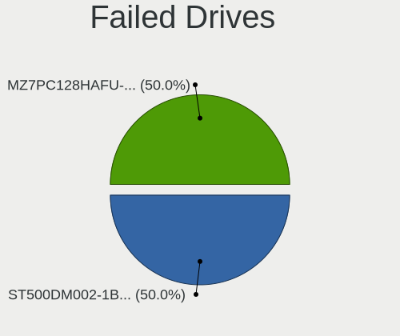
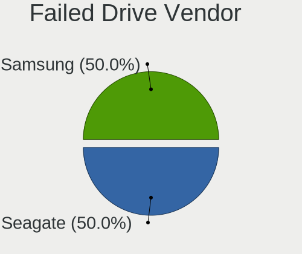
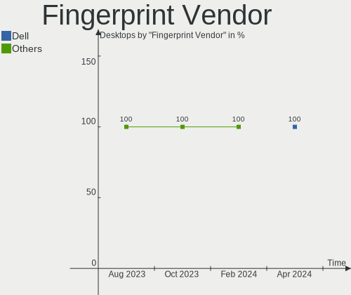

Arch Hardware Trends (Desktop)
------------------------------

A project to identify most popular hardware characteristics and track their change
over time based on data collected by Arch users at https://Linux-Hardware.org.

Anyone can contribute to the study by uploading probes of their computers by
the [hw-probe](https://github.com/linuxhw/hw-probe) tool:

    sudo -E hw-probe -all -upload

Full-feature report is available here: https://linux-hardware.org/?view=trends&formfactor=desktop

Period: Sep, 2020.

Contents
--------

- [ OS                       ](#os)
- [ OS Family                ](#os-family)
- [ Kernel                   ](#kernel)
- [ Kernel Family            ](#kernel-family)
- [ Kernel Major Ver.        ](#kernel-major-ver)
- [ Arch                     ](#arch)
- [ DE                       ](#de)
- [ Display Server           ](#display-server)
- [ Display Manager          ](#display-manager)
- [ OS Lang                  ](#os-lang)
- [ Boot Mode                ](#boot-mode)
- [ Filesystem               ](#filesystem)
- [ Part. scheme             ](#part-scheme)
- [ Dual Boot with Linux/BSD ](#dual-boot-with-linux/bsd)
- [ Dual Boot (Win)          ](#dual-boot-win)
- [ Country                  ](#country)
- [ City                     ](#city)
- [ Vendor                   ](#vendor)
- [ Model                    ](#model)
- [ Model Family             ](#model-family)
- [ MFG Year                 ](#mfg-year)
- [ Form Factor              ](#form-factor)
- [ Secure Boot              ](#secure-boot)
- [ Coreboot                 ](#coreboot)
- [ RAM Size                 ](#ram-size)
- [ RAM Used                 ](#ram-used)
- [ Has CD-ROM               ](#has-cd-rom)
- [ Total Drives             ](#total-drives)
- [ Has Ethernet             ](#has-ethernet)
- [ Drive Vendor             ](#drive-vendor)
- [ HDD Vendor               ](#hdd-vendor)
- [ SSD Vendor               ](#ssd-vendor)
- [ Drive Model              ](#drive-model)
- [ Drive Kind               ](#drive-kind)
- [ Drive Connector          ](#drive-connector)
- [ Drive Size               ](#drive-size)
- [ Space Total              ](#space-total)
- [ Space Used               ](#space-used)
- [ Malfunc. Drives          ](#malfunc-drives)
- [ Malfunc. Drive Vendor    ](#malfunc-drive-vendor)
- [ Malfunc. HDD Vendor      ](#malfunc-hdd-vendor)
- [ Malfunc. Drive Kind      ](#malfunc-drive-kind)
- [ Failed Drives            ](#failed-drives)
- [ Failed Drive Vendor      ](#failed-drive-vendor)
- [ Drive Status             ](#drive-status)
- [ Storage Vendor           ](#storage-vendor)
- [ Storage Model            ](#storage-model)
- [ Storage Kind             ](#storage-kind)
- [ CPU Vendor               ](#cpu-vendor)
- [ CPU Model                ](#cpu-model)
- [ CPU Model Family         ](#cpu-model-family)
- [ CPU Cores                ](#cpu-cores)
- [ CPU Sockets              ](#cpu-sockets)
- [ CPU Threads              ](#cpu-threads)
- [ CPU Op-Modes             ](#cpu-op-modes)
- [ CPU Microcode            ](#cpu-microcode)
- [ CPU Microarch            ](#cpu-microarch)
- [ GPU Vendor               ](#gpu-vendor)
- [ GPU Model                ](#gpu-model)
- [ GPU Combo                ](#gpu-combo)
- [ GPU Driver               ](#gpu-driver)
- [ GPU Memory               ](#gpu-memory)
- [ Monitor Vendor           ](#monitor-vendor)
- [ Monitor Model            ](#monitor-model)
- [ Monitor Resolution       ](#monitor-resolution)
- [ Monitor Diagonal         ](#monitor-diagonal)
- [ Monitor Width            ](#monitor-width)
- [ Aspect Ratio             ](#aspect-ratio)
- [ Monitor Area             ](#monitor-area)
- [ Pixel Density            ](#pixel-density)
- [ Multiple Monitors        ](#multiple-monitors)
- [ Net Controller Vendor    ](#net-controller-vendor)
- [ Net Controller Model     ](#net-controller-model)
- [ Wireless Vendor          ](#wireless-vendor)
- [ Wireless Model           ](#wireless-model)
- [ Ethernet Vendor          ](#ethernet-vendor)
- [ Ethernet Model           ](#ethernet-model)
- [ Net Controller Kind      ](#net-controller-kind)
- [ Used Controller          ](#used-controller)
- [ NICs                     ](#nics)
- [ Memory Vendor            ](#memory-vendor)
- [ Memory Model             ](#memory-model)
- [ Memory Kind              ](#memory-kind)
- [ Memory Form Factor       ](#memory-form-factor)
- [ Memory Size              ](#memory-size)
- [ Memory Speed             ](#memory-speed)
- [ Sound Vendor             ](#sound-vendor)
- [ Sound Model              ](#sound-model)
- [ Camera Vendor            ](#camera-vendor)
- [ Camera Model             ](#camera-model)
- [ Fingerprint Vendor       ](#fingerprint-vendor)
- [ Fingerprint Model        ](#fingerprint-model)
- [ Chipcard Vendor          ](#chipcard-vendor)
- [ Chipcard Model           ](#chipcard-model)
- [ Printer Vendor           ](#printer-vendor)
- [ Printer Model            ](#printer-model)
- [ Scanner Vendor           ](#scanner-vendor)
- [ Scanner Model            ](#scanner-model)
- [ Bluetooth Vendor         ](#bluetooth-vendor)
- [ Bluetooth Model          ](#bluetooth-model)
- [ Unsupported Devices      ](#unsupported-devices)
- [ Unsupported Device Types ](#unsupported-device-types)

OS
--

Installed operating systems

| Name         | Desktops | Percent |
|--------------|----------|---------|
| Arch Rolling | 134      | 68.02%  |
| Arch         | 63       | 31.98%  |

OS Family
---------

OS without a version

| Name | Desktops | Percent |
|------|----------|---------|
| Arch | 197      | 100%    |

Kernel
------

Version of the Linux kernel

| Version                                              | Desktops | Percent |
|------------------------------------------------------|----------|---------|
| 5.8.5-arch1-1                                        | 33       | 16.75%  |
| 5.8.10-arch1-1                                       | 20       | 10.15%  |
| 5.8.7-arch1-1                                        | 15       | 7.61%   |
| 5.8.12-arch1-1                                       | 15       | 7.61%   |
| 5.8.8-arch1-1                                        | 11       | 5.58%   |
| 5.8.12-zen1-1-zen                                    | 9        | 4.57%   |
| 5.8.11-arch1-1                                       | 9        | 4.57%   |
| 5.8.11-zen1-1-zen                                    | 6        | 3.05%   |
| 5.8.5-zen1-1-zen                                     | 5        | 2.54%   |
| 5.8.10-zen1-1-zen                                    | 5        | 2.54%   |
| 5.8.5-8-tkg-pds                                      | 4        | 2.03%   |
| 5.8.3-arch1-1                                        | 4        | 2.03%   |
| 5.8.9-arch2-1                                        | 3        | 1.52%   |
| 5.8.11-18-tkg-pds                                    | 3        | 1.52%   |
| 5.4.61-1-lts                                         | 3        | 1.52%   |
| 5.9.0-rc6-1-mainline                                 | 2        | 1.02%   |
| 5.8.8-zen1-1-zen                                     | 2        | 1.02%   |
| 5.8.7-zen1-1-zen                                     | 2        | 1.02%   |
| 5.8.12-20-tkg-cfs                                    | 2        | 1.02%   |
| 5.8.10-17-tkg-bmq                                    | 2        | 1.02%   |
| 5.8.0-1-tkg-pds                                      | 2        | 1.02%   |
| 5.4.65-1-lts                                         | 2        | 1.02%   |
| 5.9.0-rc5-1-mainline                                 | 1        | 0.51%   |
| 5.8.9.a-1-hardened                                   | 1        | 0.51%   |
| 5.8.9-zen2-1-zen                                     | 1        | 0.51%   |
| 5.8.9-zen1-1-zen-vfio                                | 1        | 0.51%   |
| 5.8.9-xanmod1-1                                      | 1        | 0.51%   |
| 5.8.9-16-tkg-pds                                     | 1        | 0.51%   |
| 5.8.8-AMD                                            | 1        | 0.51%   |
| 5.8.6-arch1-1                                        | 1        | 0.51%   |
| 5.8.5-zen1-1-vmi                                     | 1        | 0.51%   |
| 5.8.5-xanmod1-1-xanmod                               | 1        | 0.51%   |
| 5.8.5-8-tkg-bmq                                      | 1        | 0.51%   |
| 5.8.4-7-tkg-pds                                      | 1        | 0.51%   |
| 5.8.3-6-tkg-pds                                      | 1        | 0.51%   |
| 5.8.3-6-tkg-bmq                                      | 1        | 0.51%   |
| 5.8.12.a-1-hardened                                  | 1        | 0.51%   |
| 5.8.12-20-tkg-upds                                   | 1        | 0.51%   |
| 5.8.12-20-tkg-pds                                    | 1        | 0.51%   |
| 5.8.11-988.native                                    | 1        | 0.51%   |
| 5.8.11-19-tkg-upds                                   | 1        | 0.51%   |
| 5.8.11-18-tkg-upds                                   | 1        | 0.51%   |
| 5.8.10-xanmod1-2                                     | 1        | 0.51%   |
| 5.8.10-arch1-1-iain                                  | 1        | 0.51%   |
| 5.8.10-17-tkg-upds                                   | 1        | 0.51%   |
| 5.8.1-zen1-1-zen                                     | 1        | 0.51%   |
| 5.8.1-xanmod1-1-xanmod                               | 1        | 0.51%   |
| 5.8.1-arch1-1                                        | 1        | 0.51%   |
| 5.7.19-33-tkg-pds                                    | 1        | 0.51%   |
| 5.7.19-1-ck-zen                                      | 1        | 0.51%   |
| 5.7.12-arch1-1                                       | 1        | 0.51%   |
| 5.7.10-arch1-1                                       | 1        | 0.51%   |
| 5.6.0-1-amd-staging-drm-next-git-01606-g3265ca90e34a | 1        | 0.51%   |
| 5.5.7-arch1-1                                        | 1        | 0.51%   |
| 5.4.68-1-lts                                         | 1        | 0.51%   |
| 5.4.67-1-lts                                         | 1        | 0.51%   |
| 5.4.66-1-lts                                         | 1        | 0.51%   |
| 5.4.61-RAVEN                                         | 1        | 0.51%   |
| 5.4.54-1-lts                                         | 1        | 0.51%   |
| 4.19.146-1-lts419                                    | 1        | 0.51%   |

Kernel Family
-------------

Linux kernel without a distro release

| Version  | Desktops | Percent |
|----------|----------|---------|
| 5.8.5    | 45       | 22.84%  |
| 5.8.10   | 30       | 15.23%  |
| 5.8.12   | 29       | 14.72%  |
| 5.8.11   | 21       | 10.66%  |
| 5.8.7    | 17       | 8.63%   |
| 5.8.8    | 14       | 7.11%   |
| 5.8.9    | 8        | 4.06%   |
| 5.8.3    | 6        | 3.05%   |
| 5.4.61   | 4        | 2.03%   |
| 5.9.0    | 3        | 1.52%   |
| 5.8.1    | 3        | 1.52%   |
| 5.8.0    | 2        | 1.02%   |
| 5.7.19   | 2        | 1.02%   |
| 5.4.65   | 2        | 1.02%   |
| 5.8.6    | 1        | 0.51%   |
| 5.8.4    | 1        | 0.51%   |
| 5.7.12   | 1        | 0.51%   |
| 5.7.10   | 1        | 0.51%   |
| 5.6.0    | 1        | 0.51%   |
| 5.5.7    | 1        | 0.51%   |
| 5.4.68   | 1        | 0.51%   |
| 5.4.67   | 1        | 0.51%   |
| 5.4.66   | 1        | 0.51%   |
| 5.4.54   | 1        | 0.51%   |
| 4.19.146 | 1        | 0.51%   |

Kernel Major Ver.
-----------------

Linux kernel major version

| Version | Desktops | Percent |
|---------|----------|---------|
| 5.8     | 177      | 89.85%  |
| 5.4     | 10       | 5.08%   |
| 5.7     | 4        | 2.03%   |
| 5.9     | 3        | 1.52%   |
| 5.6     | 1        | 0.51%   |
| 5.5     | 1        | 0.51%   |
| 4.19    | 1        | 0.51%   |

Arch
----

OS architecture (x86_64, i586, etc.)

| Name   | Desktops | Percent |
|--------|----------|---------|
| x86_64 | 197      | 100%    |

DE
--

Desktop Environment

| Name          | Desktops | Percent |
|---------------|----------|---------|
| GNOME         | 58       | 29.44%  |
| KDE5          | 55       | 27.92%  |
| XFCE          | 20       | 10.15%  |
| Unknown       | 19       | 9.64%   |
| KDE           | 14       | 7.11%   |
| i3            | 8        | 4.06%   |
| Budgie        | 6        | 3.05%   |
| MATE          | 5        | 2.54%   |
| Cinnamon      | 4        | 2.03%   |
| Deepin        | 3        | 1.52%   |
| Unity         | 1        | 0.51%   |
| sway          | 1        | 0.51%   |
| LXDE          | 1        | 0.51%   |
| GNOME Classic | 1        | 0.51%   |
| bspwm         | 1        | 0.51%   |

Display Server
--------------

X11 or Wayland

| Name    | Desktops | Percent |
|---------|----------|---------|
| X11     | 145      | 73.6%   |
| Tty     | 26       | 13.2%   |
| Wayland | 24       | 12.18%  |
| Unknown | 2        | 1.02%   |

Display Manager
---------------

SDDM, LightDM, etc.

| Name    | Desktops | Percent |
|---------|----------|---------|
| Unknown | 61       | 30.96%  |
| SDDM    | 59       | 29.95%  |
| TDM     | 38       | 19.29%  |
| GDM     | 27       | 13.71%  |
| LightDM | 5        | 2.54%   |
| XDM     | 3        | 1.52%   |
| SLiM    | 2        | 1.02%   |
| Ly      | 1        | 0.51%   |
| LXDM    | 1        | 0.51%   |

OS Lang
-------

Language

| Lang        | Desktops | Percent |
|-------------|----------|---------|
| en_US       | 111      | 56.35%  |
| en_GB       | 15       | 7.61%   |
| C           | 9        | 4.57%   |
| pt_BR       | 7        | 3.55%   |
| en_CA       | 7        | 3.55%   |
| de_DE       | 7        | 3.55%   |
| en_US.utf8  | 4        | 2.03%   |
| en_IE       | 4        | 2.03%   |
| Unknown     | 4        | 2.03%   |
| ru_RU       | 3        | 1.52%   |
| fr_FR       | 3        | 1.52%   |
| pl_PL       | 2        | 1.02%   |
| es_ES       | 2        | 1.02%   |
| en_IN       | 2        | 1.02%   |
| cs_CZ       | 2        | 1.02%   |
| sv_SE       | 1        | 0.51%   |
| pl_PL.utf8  | 1        | 0.51%   |
| nl_NL       | 1        | 0.51%   |
| lv_LV       | 1        | 0.51%   |
| ja_JP       | 1        | 0.51%   |
| it_IT       | 1        | 0.51%   |
| fr_FR.utf8  | 1        | 0.51%   |
| es_VE       | 1        | 0.51%   |
| es_CO       | 1        | 0.51%   |
| en_XX@POSIX | 1        | 0.51%   |
| en_NZ       | 1        | 0.51%   |
| en_GB.utf8  | 1        | 0.51%   |
| en_DK       | 1        | 0.51%   |
| en_DE       | 1        | 0.51%   |
| en_AU       | 1        | 0.51%   |

Boot Mode
---------

EFI or BIOS

| Mode | Desktops | Percent |
|------|----------|---------|
| EFI  | 162      | 82.23%  |
| BIOS | 35       | 17.77%  |

Filesystem
----------

Type of filesystem

| Type    | Desktops | Percent |
|---------|----------|---------|
| Ext4    | 155      | 78.68%  |
| Btrfs   | 33       | 16.75%  |
| F2fs    | 4        | 2.03%   |
| Xfs     | 3        | 1.52%   |
| Zfs     | 1        | 0.51%   |
| Overlay | 1        | 0.51%   |

Part. scheme
------------

Scheme of partitioning

| Type    | Desktops | Percent |
|---------|----------|---------|
| GPT     | 160      | 81.22%  |
| Unknown | 29       | 14.72%  |
| MBR     | 8        | 4.06%   |

Dual Boot with Linux/BSD
------------------------

Hosting more than one Linux/BSD

| Dual boot | Desktops | Percent |
|-----------|----------|---------|
| No        | 160      | 81.22%  |
| Yes       | 37       | 18.78%  |

Dual Boot (Win)
---------------

Hosting Linux and Windows

| Dual boot | Desktops | Percent |
|-----------|----------|---------|
| No        | 112      | 56.85%  |
| Yes       | 85       | 43.15%  |

Country
-------

Geographic location (country)

| Country            | Desktops | Percent |
|--------------------|----------|---------|
| USA                | 56       | 28.43%  |
| Germany            | 17       | 8.63%   |
| Brazil             | 13       | 6.6%    |
| Russia             | 11       | 5.58%   |
| UK                 | 10       | 5.08%   |
| France             | 9        | 4.57%   |
| Sweden             | 7        | 3.55%   |
| Canada             | 6        | 3.05%   |
| Switzerland        | 5        | 2.54%   |
| Spain              | 4        | 2.03%   |
| Poland             | 4        | 2.03%   |
| India              | 4        | 2.03%   |
| Italy              | 3        | 1.52%   |
| Finland            | 3        | 1.52%   |
| Estonia            | 3        | 1.52%   |
| Czech Republic     | 3        | 1.52%   |
| Australia          | 3        | 1.52%   |
| Venezuela          | 2        | 1.02%   |
| Ukraine            | 2        | 1.02%   |
| Serbia             | 2        | 1.02%   |
| Netherlands        | 2        | 1.02%   |
| Greece             | 2        | 1.02%   |
| Denmark            | 2        | 1.02%   |
| Belgium            | 2        | 1.02%   |
| Austria            | 2        | 1.02%   |
| Turkey             | 1        | 0.51%   |
| Saudi Arabia       | 1        | 0.51%   |
| Portugal           | 1        | 0.51%   |
| Paraguay           | 1        | 0.51%   |
| Norway             | 1        | 0.51%   |
| New Zealand        | 1        | 0.51%   |
| Myanmar            | 1        | 0.51%   |
| Mexico             | 1        | 0.51%   |
| Latvia             | 1        | 0.51%   |
| Israel             | 1        | 0.51%   |
| Ireland            | 1        | 0.51%   |
| Iran               | 1        | 0.51%   |
| Indonesia          | 1        | 0.51%   |
| Hungary            | 1        | 0.51%   |
| Hong Kong          | 1        | 0.51%   |
| Dominican Republic | 1        | 0.51%   |
| Colombia           | 1        | 0.51%   |
| Chile              | 1        | 0.51%   |
| Bolivia            | 1        | 0.51%   |
| Argentina          | 1        | 0.51%   |

City
----

Geographic location (city)

| City                   | Desktops | Percent |
|------------------------|----------|---------|
| São Paulo             | 5        | 2.54%   |
| Moscow                 | 4        | 2.03%   |
| Zurich                 | 3        | 1.52%   |
| Tallinn                | 3        | 1.52%   |
| Uppsala                | 2        | 1.02%   |
| St Petersburg          | 2        | 1.02%   |
| San Jose               | 2        | 1.02%   |
| San Diego              | 2        | 1.02%   |
| Salt Lake City         | 2        | 1.02%   |
| Rybnik                 | 2        | 1.02%   |
| Lviv                   | 2        | 1.02%   |
| London                 | 2        | 1.02%   |
| Little Rock            | 2        | 1.02%   |
| Essen                  | 2        | 1.02%   |
| Copenhagen             | 2        | 1.02%   |
| Cambridge              | 2        | 1.02%   |
| Berlin                 | 2        | 1.02%   |
| Zarzal                 | 1        | 0.51%   |
| Zagoryanskiy           | 1        | 0.51%   |
| Ypres                  | 1        | 0.51%   |
| Yangon                 | 1        | 0.51%   |
| Windsor                | 1        | 0.51%   |
| Westminster            | 1        | 0.51%   |
| Weinheim               | 1        | 0.51%   |
| Villingen-Schwenningen | 1        | 0.51%   |
| Vienna                 | 1        | 0.51%   |
| Utrecht                | 1        | 0.51%   |
| Ufa                    | 1        | 0.51%   |
| Tyumen                 | 1        | 0.51%   |
| Twickenham             | 1        | 0.51%   |
| Tucson                 | 1        | 0.51%   |
| Trollhättan           | 1        | 0.51%   |
| Traralgon              | 1        | 0.51%   |
| Toulouse               | 1        | 0.51%   |
| Toronto                | 1        | 0.51%   |
| Thessaloniki           | 1        | 0.51%   |
| Tel Aviv               | 1        | 0.51%   |
| Tampere                | 1        | 0.51%   |
| Talcahuano             | 1        | 0.51%   |
| Staten Island          | 1        | 0.51%   |
| Sragen                 | 1        | 0.51%   |
| South Jordan           | 1        | 0.51%   |
| Sosua, Cabarete        | 1        | 0.51%   |
| Sorocaba               | 1        | 0.51%   |
| Sherbrooke             | 1        | 0.51%   |
| Seattle                | 1        | 0.51%   |
| Sanandij               | 1        | 0.51%   |
| Samara                 | 1        | 0.51%   |
| Saint Ives             | 1        | 0.51%   |
| Saint Clair Shores     | 1        | 0.51%   |
| Royal Oak              | 1        | 0.51%   |
| Roseville              | 1        | 0.51%   |
| Riga                   | 1        | 0.51%   |
| Richmond               | 1        | 0.51%   |
| Reus                   | 1        | 0.51%   |
| Redmond                | 1        | 0.51%   |
| Rayleigh               | 1        | 0.51%   |
| Puyallup               | 1        | 0.51%   |
| Prague                 | 1        | 0.51%   |
| Porto Alegre           | 1        | 0.51%   |

Vendor
------

Motherboard manufacturer

| Name                | Desktops | Percent |
|---------------------|----------|---------|
| ASUSTek Computer    | 72       | 36.55%  |
| MSI                 | 42       | 21.32%  |
| Gigabyte Technology | 39       | 19.8%   |
| ASRock              | 31       | 15.74%  |
| Hewlett-Packard     | 4        | 2.03%   |
| Dell                | 3        | 1.52%   |
| Intel               | 2        | 1.02%   |
| Pegatron            | 1        | 0.51%   |
| ECS                 | 1        | 0.51%   |
| Biostar             | 1        | 0.51%   |
| Acer                | 1        | 0.51%   |

Model
-----

Motherboard model

| Name                                | Desktops | Percent |
|-------------------------------------|----------|---------|
| ASUS PRIME X470-PRO                 | 6        | 3.05%   |
| ASUS All Series                     | 6        | 3.05%   |
| ASUS TUF GAMING X570-PLUS           | 5        | 2.54%   |
| MSI MS-7C02                         | 4        | 2.03%   |
| MSI MS-7B89                         | 4        | 2.03%   |
| Gigabyte B450M DS3H                 | 4        | 2.03%   |
| ASUS ROG CROSSHAIR VII HERO         | 4        | 2.03%   |
| MSI MS-7B86                         | 3        | 1.52%   |
| MSI MS-7A34                         | 3        | 1.52%   |
| MSI MS-7972                         | 3        | 1.52%   |
| Gigabyte X570 AORUS ELITE           | 3        | 1.52%   |
| ASUS ROG STRIX X470-F GAMING        | 3        | 1.52%   |
| ASUS ROG STRIX B450-F GAMING        | 3        | 1.52%   |
| ASUS PRIME B450M-A                  | 3        | 1.52%   |
| MSI MS-7B98                         | 2        | 1.02%   |
| MSI MS-7A38                         | 2        | 1.02%   |
| MSI MS-7817                         | 2        | 1.02%   |
| Gigabyte X470 AORUS ULTRA GAMING    | 2        | 1.02%   |
| Gigabyte 970A-DS3P                  | 2        | 1.02%   |
| ASUS TUF B450M-PLUS GAMING          | 2        | 1.02%   |
| ASUS ROG STRIX X570-E GAMING        | 2        | 1.02%   |
| ASUS PRIME X570-P                   | 2        | 1.02%   |
| ASUS PRIME X370-PRO                 | 2        | 1.02%   |
| ASRock X570 Taichi                  | 2        | 1.02%   |
| ASRock X470 Taichi                  | 2        | 1.02%   |
| Pegatron p6-2133w                   | 1        | 0.51%   |
| MSI MS-7C84                         | 1        | 0.51%   |
| MSI MS-7C60                         | 1        | 0.51%   |
| MSI MS-7C35                         | 1        | 0.51%   |
| MSI MS-7B87                         | 1        | 0.51%   |
| MSI MS-7B85                         | 1        | 0.51%   |
| MSI MS-7B79                         | 1        | 0.51%   |
| MSI MS-7B58                         | 1        | 0.51%   |
| MSI MS-7A70                         | 1        | 0.51%   |
| MSI MS-7A68                         | 1        | 0.51%   |
| MSI MS-7A63                         | 1        | 0.51%   |
| MSI MS-7A40                         | 1        | 0.51%   |
| MSI MS-7A39                         | 1        | 0.51%   |
| MSI MS-7971                         | 1        | 0.51%   |
| MSI MS-7922                         | 1        | 0.51%   |
| MSI MS-7918                         | 1        | 0.51%   |
| MSI MS-7885                         | 1        | 0.51%   |
| MSI MS-7821                         | 1        | 0.51%   |
| MSI MS-7721                         | 1        | 0.51%   |
| MSI MS-7693                         | 1        | 0.51%   |
| Intel X99 V102                      | 1        | 0.51%   |
| Intel DG31PR AAE58249-302           | 1        | 0.51%   |
| HP Z620 Workstation                 | 1        | 0.51%   |
| HP Z220 CMT Workstation             | 1        | 0.51%   |
| HP Pavilion Gaming Desktop 690-00xx | 1        | 0.51%   |
| HP Compaq 6200 Pro MT PC            | 1        | 0.51%   |
| Gigabyte Z97X-Gaming 5              | 1        | 0.51%   |
| Gigabyte Z390 AORUS MASTER          | 1        | 0.51%   |
| Gigabyte Z370M AORUS Gaming         | 1        | 0.51%   |
| Gigabyte Z370 AORUS Ultra Gaming    | 1        | 0.51%   |
| Gigabyte Z370 AORUS Gaming 5        | 1        | 0.51%   |
| Gigabyte Z270X-Ultra Gaming         | 1        | 0.51%   |
| Gigabyte X570 AORUS PRO             | 1        | 0.51%   |
| Gigabyte TRX40 AORUS MASTER         | 1        | 0.51%   |
| Gigabyte P75-D3                     | 1        | 0.51%   |

Model Family
------------

Motherboard model prefix

| Name                 | Desktops | Percent |
|----------------------|----------|---------|
| ASUS PRIME           | 20       | 10.15%  |
| ASUS ROG             | 17       | 8.63%   |
| ASUS TUF             | 10       | 5.08%   |
| ASUS All             | 6        | 3.05%   |
| ASRock X570          | 6        | 3.05%   |
| ASRock X470          | 5        | 2.54%   |
| MSI MS-7C02          | 4        | 2.03%   |
| MSI MS-7B89          | 4        | 2.03%   |
| Gigabyte X570        | 4        | 2.03%   |
| Gigabyte B450M       | 4        | 2.03%   |
| MSI MS-7B86          | 3        | 1.52%   |
| MSI MS-7A34          | 3        | 1.52%   |
| MSI MS-7972          | 3        | 1.52%   |
| ASUS Maximus         | 3        | 1.52%   |
| MSI MS-7B98          | 2        | 1.02%   |
| MSI MS-7A38          | 2        | 1.02%   |
| MSI MS-7817          | 2        | 1.02%   |
| Gigabyte Z370        | 2        | 1.02%   |
| Gigabyte X470        | 2        | 1.02%   |
| Gigabyte B450        | 2        | 1.02%   |
| Gigabyte 970A-DS3P   | 2        | 1.02%   |
| Dell OptiPlex        | 2        | 1.02%   |
| ASRock Z170          | 2        | 1.02%   |
| ASRock X370          | 2        | 1.02%   |
| ASRock B450M         | 2        | 1.02%   |
| ASRock B450          | 2        | 1.02%   |
| Pegatron p6-2133w    | 1        | 0.51%   |
| MSI MS-7C84          | 1        | 0.51%   |
| MSI MS-7C60          | 1        | 0.51%   |
| MSI MS-7C35          | 1        | 0.51%   |
| MSI MS-7B87          | 1        | 0.51%   |
| MSI MS-7B85          | 1        | 0.51%   |
| MSI MS-7B79          | 1        | 0.51%   |
| MSI MS-7B58          | 1        | 0.51%   |
| MSI MS-7A70          | 1        | 0.51%   |
| MSI MS-7A68          | 1        | 0.51%   |
| MSI MS-7A63          | 1        | 0.51%   |
| MSI MS-7A40          | 1        | 0.51%   |
| MSI MS-7A39          | 1        | 0.51%   |
| MSI MS-7971          | 1        | 0.51%   |
| MSI MS-7922          | 1        | 0.51%   |
| MSI MS-7918          | 1        | 0.51%   |
| MSI MS-7885          | 1        | 0.51%   |
| MSI MS-7821          | 1        | 0.51%   |
| MSI MS-7721          | 1        | 0.51%   |
| MSI MS-7693          | 1        | 0.51%   |
| Intel X99            | 1        | 0.51%   |
| Intel DG31PR         | 1        | 0.51%   |
| HP Z620              | 1        | 0.51%   |
| HP Z220              | 1        | 0.51%   |
| HP Pavilion          | 1        | 0.51%   |
| HP Compaq            | 1        | 0.51%   |
| Gigabyte Z97X-Gaming | 1        | 0.51%   |
| Gigabyte Z390        | 1        | 0.51%   |
| Gigabyte Z370M       | 1        | 0.51%   |
| Gigabyte Z270X-Ultra | 1        | 0.51%   |
| Gigabyte TRX40       | 1        | 0.51%   |
| Gigabyte P75-D3      | 1        | 0.51%   |
| Gigabyte H81M-DS2V   | 1        | 0.51%   |
| Gigabyte H270M-D3H   | 1        | 0.51%   |

MFG Year
--------

Motherboard manufacture year

| Year | Desktops | Percent |
|------|----------|---------|
| 2019 | 60       | 30.46%  |
| 2020 | 49       | 24.87%  |
| 2018 | 29       | 14.72%  |
| 2013 | 13       | 6.6%    |
| 2017 | 11       | 5.58%   |
| 2016 | 10       | 5.08%   |
| 2015 | 9        | 4.57%   |
| 2014 | 5        | 2.54%   |
| 2012 | 5        | 2.54%   |
| 2011 | 4        | 2.03%   |
| 2008 | 1        | 0.51%   |
| 2006 | 1        | 0.51%   |

Form Factor
-----------

Physical design of the computer

| Name    | Desktops | Percent |
|---------|----------|---------|
| Desktop | 197      | 100%    |

Secure Boot
-----------

Enabled or disabled

| State    | Desktops | Percent |
|----------|----------|---------|
| Disabled | 194      | 98.48%  |
| Enabled  | 3        | 1.52%   |

Coreboot
--------

Have coreboot on board

| Used | Desktops | Percent |
|------|----------|---------|
| No   | 197      | 100%    |

RAM Size
--------

Total RAM memory

| Size in GB  | Desktops | Percent |
|-------------|----------|---------|
| 16.01-24.0  | 84       | 42.64%  |
| 32.01-64.0  | 60       | 30.46%  |
| 8.01-16.0   | 25       | 12.69%  |
| 64.01-256.0 | 10       | 5.08%   |
| 4.01-8.0    | 7        | 3.55%   |
| 3.01-4.0    | 6        | 3.05%   |
| 24.01-32.0  | 5        | 2.54%   |

RAM Used
--------

Used RAM memory

| Used GB    | Desktops | Percent |
|------------|----------|---------|
| 4.01-8.0   | 70       | 35.53%  |
| 8.01-16.0  | 32       | 16.24%  |
| 3.01-4.0   | 27       | 13.71%  |
| 2.01-3.0   | 23       | 11.68%  |
| 1.01-2.0   | 23       | 11.68%  |
| 16.01-24.0 | 11       | 5.58%   |
| 0.01-1.0   | 7        | 3.55%   |
| 24.01-32.0 | 3        | 1.52%   |
| 32.01-64.0 | 1        | 0.51%   |

Has CD-ROM
----------

Has CD-ROM on board

| Presented | Desktops | Percent |
|-----------|----------|---------|
| No        | 154      | 78.17%  |
| Yes       | 43       | 21.83%  |

Total Drives
------------

Number of drives on board

| Drives | Desktops | Percent |
|--------|----------|---------|
| 2      | 57       | 28.93%  |
| 3      | 46       | 23.35%  |
| 1      | 35       | 17.77%  |
| 4      | 23       | 11.68%  |
| 5      | 19       | 9.64%   |
| 6      | 10       | 5.08%   |
| 7      | 5        | 2.54%   |
| 8      | 2        | 1.02%   |

Has Ethernet
------------

Has Ethernet on board

| Presented | Desktops | Percent |
|-----------|----------|---------|
| Yes       | 196      | 99.49%  |
| No        | 1        | 0.51%   |

Drive Vendor
------------

Hard drive vendors

| Vendor                | Desktops | Drives | Percent |
|-----------------------|----------|--------|---------|
| Samsung Electronics   | 95       | 135    | 20.97%  |
| WDC                   | 82       | 113    | 18.1%   |
| Seagate               | 77       | 109    | 17%     |
| Kingston              | 33       | 39     | 7.28%   |
| Crucial               | 27       | 30     | 5.96%   |
| SanDisk               | 22       | 26     | 4.86%   |
| Toshiba               | 21       | 26     | 4.64%   |
| Phison                | 13       | 16     | 2.87%   |
| Intel                 | 10       | 10     | 2.21%   |
| A-DATA Technology     | 9        | 11     | 1.99%   |
| Hitachi               | 7        | 8      | 1.55%   |
| HGST                  | 5        | 10     | 1.1%    |
| Corsair               | 5        | 6      | 1.1%    |
| Transcend             | 4        | 4      | 0.88%   |
| OCZ                   | 4        | 5      | 0.88%   |
| XPG                   | 3        | 3      | 0.66%   |
| SPCC                  | 3        | 3      | 0.66%   |
| Silicon Motion        | 3        | 3      | 0.66%   |
| PNY                   | 2        | 2      | 0.44%   |
| Phison Electronics    | 2        | 2      | 0.44%   |
| Micron Technology     | 2        | 2      | 0.44%   |
| Hewlett-Packard       | 2        | 2      | 0.44%   |
| Fujitsu               | 2        | 2      | 0.44%   |
| WD MediaMax           | 1        | 1      | 0.22%   |
| USB3.0                | 1        | 2      | 0.22%   |
| Unknown               | 1        | 1      | 0.22%   |
| TCSUNBOW              | 1        | 1      | 0.22%   |
| SABRENT               | 1        | 1      | 0.22%   |
| Realtek Semiconductor | 1        | 1      | 0.22%   |
| PLEXTOR               | 1        | 1      | 0.22%   |
| Patriot               | 1        | 1      | 0.22%   |
| LITEON                | 1        | 1      | 0.22%   |
| Lite-On               | 1        | 1      | 0.22%   |
| LIO-ORG               | 1        | 2      | 0.22%   |
| Kingrich              | 1        | 1      | 0.22%   |
| Intenso               | 1        | 1      | 0.22%   |
| HS-SSD-C100           | 1        | 1      | 0.22%   |
| Hikvision             | 1        | 1      | 0.22%   |
| Gigabyte Technology   | 1        | 1      | 0.22%   |
| China                 | 1        | 1      | 0.22%   |
| BRAVEEAGLE            | 1        | 1      | 0.22%   |
| ASMedia               | 1        | 1      | 0.22%   |
| Apple                 | 1        | 1      | 0.22%   |

HDD Vendor
----------

Hard disk drive vendors

| Vendor              | Desktops | Drives | Percent |
|---------------------|----------|--------|---------|
| Seagate             | 75       | 105    | 40.32%  |
| WDC                 | 70       | 92     | 37.63%  |
| Toshiba             | 20       | 25     | 10.75%  |
| Hitachi             | 7        | 8      | 3.76%   |
| Samsung Electronics | 6        | 8      | 3.23%   |
| HGST                | 5        | 10     | 2.69%   |
| Hewlett-Packard     | 1        | 1      | 0.54%   |
| Fujitsu             | 1        | 1      | 0.54%   |
| Apple               | 1        | 1      | 0.54%   |

SSD Vendor
----------

Solid state drive vendors

| Vendor              | Desktops | Drives | Percent |
|---------------------|----------|--------|---------|
| Samsung Electronics | 60       | 74     | 32.26%  |
| Kingston            | 29       | 35     | 15.59%  |
| Crucial             | 26       | 29     | 13.98%  |
| SanDisk             | 20       | 23     | 10.75%  |
| WDC                 | 18       | 18     | 9.68%   |
| A-DATA Technology   | 6        | 8      | 3.23%   |
| OCZ                 | 4        | 5      | 2.15%   |
| Transcend           | 3        | 3      | 1.61%   |
| SPCC                | 3        | 3      | 1.61%   |
| Micron Technology   | 2        | 2      | 1.08%   |
| TCSUNBOW            | 1        | 1      | 0.54%   |
| SABRENT             | 1        | 1      | 0.54%   |
| PNY                 | 1        | 1      | 0.54%   |
| Patriot             | 1        | 1      | 0.54%   |
| LITEON              | 1        | 1      | 0.54%   |
| LIO-ORG             | 1        | 2      | 0.54%   |
| Kingrich            | 1        | 1      | 0.54%   |
| Intenso             | 1        | 1      | 0.54%   |
| Intel               | 1        | 1      | 0.54%   |
| Gigabyte Technology | 1        | 1      | 0.54%   |
| Fujitsu             | 1        | 1      | 0.54%   |
| Corsair             | 1        | 1      | 0.54%   |
| China               | 1        | 1      | 0.54%   |
| BRAVEEAGLE          | 1        | 1      | 0.54%   |
| ASMedia             | 1        | 1      | 0.54%   |

Drive Model
-----------

Hard drive models

| Model                        | Desktops | Percent |
|------------------------------|----------|---------|
| SSD 860 EVO 1TB              | 12       | 2.22%   |
| SSD 860 EVO 500GB            | 11       | 2.04%   |
| NVMe SSD Drive 500GB         | 9        | 1.67%   |
| SSD 970 EVO 500GB            | 8        | 1.48%   |
| NVMe SSD Drive 1TB           | 8        | 1.48%   |
| WD20EZRZ-00Z5HB0 2TB         | 7        | 1.3%    |
| WD10EZEX-08WN4A0 1TB         | 7        | 1.3%    |
| ST2000DM006-2DM164 2TB       | 7        | 1.3%    |
| ST1000DM010-2EP102 1TB       | 7        | 1.3%    |
| SSD 960 EVO 250GB            | 7        | 1.3%    |
| SA400S37240G 240GB SSD       | 7        | 1.3%    |
| SSD 850 EVO 500GB            | 6        | 1.11%   |
| ST4000DM004-2CV104 4TB       | 5        | 0.93%   |
| ST2000DM008-2FR102 2TB       | 5        | 0.93%   |
| SSD 970 EVO Plus 500GB       | 5        | 0.93%   |
| SSD 970 EVO 250GB            | 5        | 0.93%   |
| SSD 860 QVO 1TB              | 5        | 0.93%   |
| SSD 860 EVO 250GB            | 5        | 0.93%   |
| SSD 850 PRO 256GB            | 5        | 0.93%   |
| SSD 850 EVO 1TB              | 5        | 0.93%   |
| NVMe SSD Drive 256GB         | 5        | 0.93%   |
| DT01ACA100 1TB               | 5        | 0.93%   |
| CT1000MX500SSD1 1TB          | 5        | 0.93%   |
| WD20EARX-00PASB0 2TB         | 4        | 0.74%   |
| ST2000DM001-1CH164 2TB       | 4        | 0.74%   |
| ST1000DM003-1CH162 1TB       | 4        | 0.74%   |
| NVMe SSD Drive 2TB           | 4        | 0.74%   |
| HDWD130 3TB                  | 4        | 0.74%   |
| CT500MX500SSD1 500GB         | 4        | 0.74%   |
| WDS120G2G0A-00JH30 120GB SSD | 3        | 0.56%   |
| WD20EZRX-00DC0B0 2TB         | 3        | 0.56%   |
| WD10EZEX-00BN5A0 1TB         | 3        | 0.56%   |
| Ultra II 240GB SSD           | 3        | 0.56%   |
| SV300S37A120G 120GB SSD      | 3        | 0.56%   |
| ST500DM002-1BD142 500GB      | 3        | 0.56%   |
| ST4000VN008-2DR166 4TB       | 3        | 0.56%   |
| ST1000DM003-9YN162 1TB       | 3        | 0.56%   |
| ST1000DM003-1ER162 1TB       | 3        | 0.56%   |
| SSDPEKNW020T8 2TB            | 3        | 0.56%   |
| SSD 970 PRO 512GB            | 3        | 0.56%   |
| SSD 860 EVO M.2 500GB        | 3        | 0.56%   |
| SSD 850 EVO 250GB            | 3        | 0.56%   |
| SSD 850 EVO 120GB            | 3        | 0.56%   |
| SH103S3120G 120GB SSD        | 3        | 0.56%   |
| NVMe SSD Drive 960GB         | 3        | 0.56%   |
| HD103SJ 1TB                  | 3        | 0.56%   |
| Expansion 1TB                | 3        | 0.56%   |
| CT2000MX500SSD1 2TB          | 3        | 0.56%   |
| WDS500G2B0A-00SM50 500GB SSD | 2        | 0.37%   |
| WDS250G2B0B-00YS70 250GB SSD | 2        | 0.37%   |
| WDS100T2B0C-00PXH0 1TB       | 2        | 0.37%   |
| WDS100T2B0B-00YS70 1TB SSD   | 2        | 0.37%   |
| WDS100T1B0B-00AS40 1TB SSD   | 2        | 0.37%   |
| WD60EZAZ-00ZGHB0 6TB         | 2        | 0.37%   |
| WD40EZRZ-00GXCB0 4TB         | 2        | 0.37%   |
| WD2003FZEX-00SRLA0 2TB       | 2        | 0.37%   |
| WD10EZEX-60WN4A0 1TB         | 2        | 0.37%   |
| WD10EZEX-00RKKA0 1TB         | 2        | 0.37%   |
| WD10EARS-00Y5B1 1TB          | 2        | 0.37%   |
| WD10EACS-00ZJB0 1TB          | 2        | 0.37%   |

Drive Kind
----------

HDD or SSD

| Kind    | Desktops | Drives | Percent |
|---------|----------|--------|---------|
| SSD     | 143      | 216    | 37.63%  |
| HDD     | 141      | 251    | 37.11%  |
| NVMe    | 90       | 115    | 23.68%  |
| Unknown | 6        | 7      | 1.58%   |

Drive Connector
---------------

SATA, SAS, NVMe, etc.

| Type | Desktops | Drives | Percent |
|------|----------|--------|---------|
| SATA | 183      | 458    | 63.99%  |
| NVMe | 90       | 115    | 31.47%  |
| SAS  | 13       | 16     | 4.55%   |

Drive Size
----------

Size of hard drive

| Size in TB | Desktops | Drives | Percent |
|------------|----------|--------|---------|
| 0.01-0.5   | 143      | 249    | 37.83%  |
| 0.51-1.0   | 128      | 189    | 33.86%  |
| 1.01-2.0   | 56       | 81     | 14.81%  |
| 4.01-10.0  | 19       | 31     | 5.03%   |
| 3.01-4.0   | 16       | 19     | 4.23%   |
| 2.01-3.0   | 16       | 20     | 4.23%   |

Space Total
-----------

Amount of disk space available on the file system

| Size in GB     | Desktops | Percent |
|----------------|----------|---------|
| More than 3000 | 48       | 24.37%  |
| 1001-2000      | 39       | 19.8%   |
| 501-1000       | 38       | 19.29%  |
| 2001-3000      | 25       | 12.69%  |
| 251-500        | 23       | 11.68%  |
| 101-250        | 14       | 7.11%   |
| Unknown        | 4        | 2.03%   |
| 1-20           | 3        | 1.52%   |
| 51-100         | 2        | 1.02%   |
| 21-50          | 1        | 0.51%   |

Space Used
----------

Amount of used disk space

| Used GB        | Desktops | Percent |
|----------------|----------|---------|
| 501-1000       | 37       | 18.78%  |
| 251-500        | 29       | 14.72%  |
| 101-250        | 24       | 12.18%  |
| 1001-2000      | 24       | 12.18%  |
| More than 3000 | 22       | 11.17%  |
| 2001-3000      | 20       | 10.15%  |
| 1-20           | 16       | 8.12%   |
| 51-100         | 13       | 6.6%    |
| 21-50          | 8        | 4.06%   |
| Unknown        | 4        | 2.03%   |

Malfunc. Drives
---------------

Drive models with a malfunction

| Model                     | Desktops | Drives | Percent |
|---------------------------|----------|--------|---------|
| WD20EZRZ-00Z5HB0 2TB      | 2        | 2      | 4.55%   |
| ST500DM002-1BD142 500GB   | 2        | 2      | 4.55%   |
| SSD 960 EVO 250GB         | 2        | 2      | 4.55%   |
| WD60EFRX-68L0BN1 6TB      | 1        | 6      | 2.27%   |
| WD40EZRX-00SPEB0 4TB      | 1        | 1      | 2.27%   |
| WD3200BEVT-00A0RT0 320GB  | 1        | 1      | 2.27%   |
| WD20EZRX-00DC0B0 2TB      | 1        | 2      | 2.27%   |
| WD20EARX-00PASB0 2TB      | 1        | 1      | 2.27%   |
| WD20EARS-00MVWB0 2TB      | 1        | 1      | 2.27%   |
| WD15EARS-00MVWB0 1TB      | 1        | 1      | 2.27%   |
| WD10EZEX-08WN4A0 1TB      | 1        | 1      | 2.27%   |
| WD10EURX-73FH1Y0 1TB      | 1        | 1      | 2.27%   |
| WD10EURX-63C57Y0 1TB      | 1        | 1      | 2.27%   |
| WD1000DHTZ-04N21V0 1TB    | 1        | 1      | 2.27%   |
| VERTEX4 256GB SSD         | 1        | 1      | 2.27%   |
| Ultra II 240GB SSD        | 1        | 1      | 2.27%   |
| SVP200S37A120G 120GB SSD  | 1        | 1      | 2.27%   |
| SU800NS38 512GB SSD       | 1        | 1      | 2.27%   |
| ST3500418AS 500GB         | 1        | 1      | 2.27%   |
| ST3500410AS 500GB         | 1        | 1      | 2.27%   |
| ST3320613AS 320GB         | 1        | 1      | 2.27%   |
| ST3320418AS 320GB         | 1        | 1      | 2.27%   |
| ST1000DM003-9YN162 1TB    | 1        | 1      | 2.27%   |
| SSDPEKKW512G7 512GB       | 1        | 1      | 2.27%   |
| SSD2SC240GC2DH16T-T 240GB | 1        | 1      | 2.27%   |
| SSD 960 PRO 512GB         | 1        | 1      | 2.27%   |
| Solid State Disk 512GB    | 1        | 1      | 2.27%   |
| SHPM2280P2 240G SSD       | 1        | 1      | 2.27%   |
| PX-1TM8SeG 1TB            | 1        | 1      | 2.27%   |
| P200 1TB SSD              | 1        | 1      | 2.27%   |
| Neutron GTX SSD 240GB     | 1        | 1      | 2.27%   |
| MZVLW256HEHP-000H1 256GB  | 1        | 1      | 2.27%   |
| MQ01ABF050 500GB          | 1        | 1      | 2.27%   |
| MK6476GSX 640GB           | 1        | 1      | 2.27%   |
| MK5075GSX 500GB           | 1        | 1      | 2.27%   |
| MK2552GSX 250GB           | 1        | 1      | 2.27%   |
| K9 128GB SATA3 SSD        | 1        | 1      | 2.27%   |
| HD103UJ 1TB               | 1        | 1      | 2.27%   |
| HD103SJ 1TB               | 1        | 2      | 2.27%   |
| CT960M500SSD1 960GB       | 1        | 1      | 2.27%   |
| CT120M500SSD1 120GB       | 1        | 2      | 2.27%   |

Malfunc. Drive Vendor
---------------------

Vendors of faulty drives

| Vendor              | Desktops | Drives | Percent |
|---------------------|----------|--------|---------|
| WDC                 | 12       | 19     | 28.57%  |
| Seagate             | 7        | 7      | 16.67%  |
| Samsung Electronics | 6        | 7      | 14.29%  |
| Toshiba             | 3        | 4      | 7.14%   |
| Kingston            | 2        | 2      | 4.76%   |
| Crucial             | 2        | 3      | 4.76%   |
| SPCC                | 1        | 1      | 2.38%   |
| SanDisk             | 1        | 1      | 2.38%   |
| PNY                 | 1        | 1      | 2.38%   |
| PLEXTOR             | 1        | 1      | 2.38%   |
| Patriot             | 1        | 1      | 2.38%   |
| OCZ                 | 1        | 1      | 2.38%   |
| Kingrich            | 1        | 1      | 2.38%   |
| Intel               | 1        | 1      | 2.38%   |
| Corsair             | 1        | 1      | 2.38%   |
| A-DATA Technology   | 1        | 1      | 2.38%   |

Malfunc. HDD Vendor
-------------------

Vendors of faulty HDD drives

| Vendor              | Desktops | Drives | Percent |
|---------------------|----------|--------|---------|
| WDC                 | 12       | 19     | 50%     |
| Seagate             | 7        | 7      | 29.17%  |
| Toshiba             | 3        | 4      | 12.5%   |
| Samsung Electronics | 2        | 3      | 8.33%   |

Malfunc. Drive Kind
-------------------

Kinds of faulty drives

| Kind | Desktops | Drives | Percent |
|------|----------|--------|---------|
| HDD  | 24       | 33     | 57.14%  |
| SSD  | 12       | 13     | 28.57%  |
| NVMe | 6        | 6      | 14.29%  |

Failed Drives
-------------

Failed drive models

| Model              | Desktops | Drives | Percent |
|--------------------|----------|--------|---------|
| TS128GMTE850 128GB | 1        | 1      | 100%    |

Failed Drive Vendor
-------------------

Failed drive vendors

| Vendor    | Desktops | Drives | Percent |
|-----------|----------|--------|---------|
| Transcend | 1        | 1      | 100%    |

Drive Status
------------

Number of failed and malfunc. drives

| Status   | Desktops | Drives | Percent |
|----------|----------|--------|---------|
| Works    | 131      | 352    | 53.25%  |
| Detected | 76       | 184    | 30.89%  |
| Malfunc  | 38       | 52     | 15.45%  |
| Failed   | 1        | 1      | 0.41%   |

Storage Vendor
--------------

Storage controller vendors

| Vendor                       | Desktops | Percent |
|------------------------------|----------|---------|
| AMD                          | 122      | 38.85%  |
| Intel                        | 83       | 26.43%  |
| Samsung Electronics          | 46       | 14.65%  |
| Phison Electronics           | 20       | 6.37%   |
| ASMedia Technology           | 11       | 3.5%    |
| Silicon Motion               | 6        | 1.91%   |
| Sandisk                      | 6        | 1.91%   |
| Kingston Technology Company  | 5        | 1.59%   |
| ADATA Technology             | 4        | 1.27%   |
| Marvell Technology Group     | 3        | 0.96%   |
| Lite-On Technology           | 2        | 0.64%   |
| Toshiba America Info Systems | 1        | 0.32%   |
| Seagate Technology           | 1        | 0.32%   |
| Realtek Semiconductor        | 1        | 0.32%   |
| OCZ Technology Group         | 1        | 0.32%   |
| Micron/Crucial Technology    | 1        | 0.32%   |
| Adaptec                      | 1        | 0.32%   |

Storage Model
-------------

Storage controller models

| Model                                                                             | Desktops | Percent |
|-----------------------------------------------------------------------------------|----------|---------|
| FCH SATA Controller [AHCI mode]                                                   | 110      | 26.96%  |
| 400 Series Chipset SATA Controller                                                | 59       | 14.46%  |
| NVMe SSD Controller SM981/PM981/PM983                                             | 34       | 8.33%   |
| 200 Series PCH SATA controller [AHCI mode]                                        | 14       | 3.43%   |
| E12 NVMe Controller                                                               | 13       | 3.19%   |
| Q170/Q150/B150/H170/H110/Z170/CM236 Chipset SATA Controller [AHCI Mode]           | 12       | 2.94%   |
| NVMe SSD Controller SM961/PM961                                                   | 12       | 2.94%   |
| ASM1062 Serial ATA Controller                                                     | 11       | 2.7%    |
| 8 Series/C220 Series Chipset Family 6-port SATA Controller 1 [AHCI mode]          | 8        | 1.96%   |
| 300 Series Chipset SATA Controller                                                | 8        | 1.96%   |
| Non-Volatile memory controller                                                    | 7        | 1.72%   |
| Cannon Lake PCH SATA AHCI Controller                                              | 7        | 1.72%   |
| 9 Series Chipset Family SATA Controller [AHCI Mode]                               | 7        | 1.72%   |
| X370 Series Chipset SATA Controller                                               | 6        | 1.47%   |
| SSD 660P Series                                                                   | 6        | 1.47%   |
| SATA Controller [RAID mode]                                                       | 6        | 1.47%   |
| E16 PCIe4 NVMe Controller                                                         | 6        | 1.47%   |
| 6 Series/C200 Series Chipset Family 6 port Desktop SATA AHCI Controller           | 6        | 1.47%   |
| SM2262/SM2262EN SSD Controller                                                    | 5        | 1.23%   |
| SB7x0/SB8x0/SB9x0 IDE Controller                                                  | 5        | 1.23%   |
| XPG SX8200 Pro PCIe Gen3x4 M.2 2280 Solid State Drive                             | 4        | 0.98%   |
| SB7x0/SB8x0/SB9x0 SATA Controller [IDE mode]                                      | 4        | 0.98%   |
| SB7x0/SB8x0/SB9x0 SATA Controller [AHCI mode]                                     | 4        | 0.98%   |
| FCH SATA Controller D                                                             | 4        | 0.98%   |
| C610/X99 series chipset 6-Port SATA Controller [AHCI mode]                        | 4        | 0.98%   |
| NM10/ICH7 Family SATA Controller [IDE mode]                                       | 3        | 0.74%   |
| 82801G (ICH7 Family) IDE Controller                                               | 3        | 0.74%   |
| 7 Series/C210 Series Chipset Family 6-port SATA Controller [AHCI mode]            | 3        | 0.74%   |
| 7 Series/C210 Series Chipset Family 4-port SATA Controller [IDE mode]             | 3        | 0.74%   |
| 7 Series/C210 Series Chipset Family 2-port SATA Controller [IDE mode]             | 3        | 0.74%   |
| SATA controller                                                                   | 2        | 0.49%   |
| NVMe SSD Controller SM951/PM951                                                   | 2        | 0.49%   |
| A2000, M.2, 500GB                                                                 | 2        | 0.49%   |
| X399 Series Chipset SATA Controller                                               | 1        | 0.25%   |
| WD Black NVMe SSD                                                                 | 1        | 0.25%   |
| WD Black 2018/PC SN720 NVMe SSD                                                   | 1        | 0.25%   |
| WD Black 2018/PC SN520 NVMe SSD                                                   | 1        | 0.25%   |
| Toshiba America Info Non-Volatile memory controller                               | 1        | 0.25%   |
| SSD Pro 7600p/760p/E 6100p Series                                                 | 1        | 0.25%   |
| SSD 600P Series                                                                   | 1        | 0.25%   |
| Realtek Non-Volatile memory controller                                            | 1        | 0.25%   |
| P1 NVMe PCIe SSD                                                                  | 1        | 0.25%   |
| Optane SSD 900P Series                                                            | 1        | 0.25%   |
| OCZ SCSI storage controller                                                       | 1        | 0.25%   |
| NVMe Controller                                                                   | 1        | 0.25%   |
| FCH SATA Controller [IDE mode]                                                    | 1        | 0.25%   |
| E7 NVMe Controller                                                                | 1        | 0.25%   |
| Digital HyperX Predator                                                           | 1        | 0.25%   |
| C602 chipset 4-Port SATA Storage Control Unit                                     | 1        | 0.25%   |
| C600/X79 series chipset 6-Port SATA AHCI Controller                               | 1        | 0.25%   |
| AAC-RAID                                                                          | 1        | 0.25%   |
| 92xx SATA 6G Controller                                                           | 1        | 0.25%   |
| 88SE912x SATA 6Gb/s Controller [IDE mode]                                         | 1        | 0.25%   |
| 88SE912x IDE Controller                                                           | 1        | 0.25%   |
| 88SE9128 PCIe SATA 6 Gb/s RAID controller with HyperDuo                           | 1        | 0.25%   |
| 6 Series/C200 Series Chipset Family Desktop SATA Controller (IDE mode, ports 4-5) | 1        | 0.25%   |
| 6 Series/C200 Series Chipset Family Desktop SATA Controller (IDE mode, ports 0-3) | 1        | 0.25%   |
| 400 Series Chipset Family SATA AHCI Controller                                    | 1        | 0.25%   |

Storage Kind
------------

Kind of storage controller (IDE, SATA, NVMe, SAS, ...)

| Kind | Desktops | Percent |
|------|----------|---------|
| SATA | 185      | 62.29%  |
| NVMe | 90       | 30.3%   |
| IDE  | 13       | 4.38%   |
| RAID | 7        | 2.36%   |
| SAS  | 1        | 0.34%   |
| SCSI | 1        | 0.34%   |

CPU Vendor
----------

Processor vendors

| Vendor | Desktops | Percent |
|--------|----------|---------|
| AMD    | 122      | 61.93%  |
| Intel  | 75       | 38.07%  |

CPU Model
---------

Processor models

| Model                                          | Desktops | Percent |
|------------------------------------------------|----------|---------|
| AMD Ryzen 7 3700X 8-Core Processor             | 18       | 9.14%   |
| AMD Ryzen 5 3600 6-Core Processor              | 13       | 6.6%    |
| AMD Ryzen 7 2700X Eight-Core Processor         | 11       | 5.58%   |
| AMD Ryzen 5 2600 Six-Core Processor            | 8        | 4.06%   |
| AMD Ryzen 7 3800X 8-Core Processor             | 7        | 3.55%   |
| AMD Ryzen 5 2600X Six-Core Processor           | 7        | 3.55%   |
| AMD Ryzen 9 3900X 12-Core Processor            | 5        | 2.54%   |
| AMD Ryzen 5 1600 Six-Core Processor            | 5        | 2.54%   |
| Intel Core i7-7700K CPU @ 4.20GHz              | 4        | 2.03%   |
| Intel Core i7-6700K CPU @ 4.00GHz              | 4        | 2.03%   |
| Intel Core i7-4790K CPU @ 4.00GHz              | 4        | 2.03%   |
| AMD Ryzen 7 1700 Eight-Core Processor          | 4        | 2.03%   |
| AMD Ryzen 5 3600X 6-Core Processor             | 4        | 2.03%   |
| Intel Core i5-8400 CPU @ 2.80GHz               | 3        | 1.52%   |
| Intel Core i5-7400 CPU @ 3.00GHz               | 3        | 1.52%   |
| Intel Core i5-6500 CPU @ 3.20GHz               | 3        | 1.52%   |
| Intel Core i5-4670 CPU @ 3.40GHz               | 3        | 1.52%   |
| Intel Core i5-3570K CPU @ 3.40GHz              | 3        | 1.52%   |
| AMD Ryzen 5 1600X Six-Core Processor           | 3        | 1.52%   |
| AMD FX-6300 Six-Core Processor                 | 3        | 1.52%   |
| Intel Core i9-9900K CPU @ 3.60GHz              | 2        | 1.02%   |
| Intel Core i7-8700K CPU @ 3.70GHz              | 2        | 1.02%   |
| Intel Core i7-5820K CPU @ 3.30GHz              | 2        | 1.02%   |
| Intel Core i7-2600K CPU @ 3.40GHz              | 2        | 1.02%   |
| Intel Core i5-7600K CPU @ 3.80GHz              | 2        | 1.02%   |
| Intel Core i3-8100 CPU @ 3.60GHz               | 2        | 1.02%   |
| Intel Core i3-2120 CPU @ 3.30GHz               | 2        | 1.02%   |
| AMD Ryzen Threadripper 3970X 32-Core Processor | 2        | 1.02%   |
| AMD Ryzen 9 3950X 16-Core Processor            | 2        | 1.02%   |
| AMD Ryzen 9 3900XT 12-Core Processor           | 2        | 1.02%   |
| AMD Ryzen 7 2700 Eight-Core Processor          | 2        | 1.02%   |
| AMD Ryzen 7 1800X Eight-Core Processor         | 2        | 1.02%   |
| AMD Ryzen 7 1700X Eight-Core Processor         | 2        | 1.02%   |
| AMD Ryzen 5 3400G with Radeon Vega Graphics    | 2        | 1.02%   |
| AMD Ryzen 3 2200G with Radeon Vega Graphics    | 2        | 1.02%   |
| AMD FX-8350 Eight-Core Processor               | 2        | 1.02%   |
| Intel Xeon CPU E5450 @ 3.00GHz                 | 1        | 0.51%   |
| Intel Xeon CPU E5-2670 0 @ 2.60GHz             | 1        | 0.51%   |
| Intel Xeon CPU E5-2620 v3 @ 2.40GHz            | 1        | 0.51%   |
| Intel Xeon CPU E3-1270 V2 @ 3.50GHz            | 1        | 0.51%   |
| Intel Xeon CPU E3-1265L v4 @ 2.30GHz           | 1        | 0.51%   |
| Intel Xeon CPU E3-1230 v5 @ 3.40GHz            | 1        | 0.51%   |
| Intel Pentium CPU G860 @ 3.00GHz               | 1        | 0.51%   |
| Intel Pentium CPU G3220 @ 3.00GHz              | 1        | 0.51%   |
| Intel Pentium 4 CPU 3.00GHz                    | 1        | 0.51%   |
| Intel Core i7-9700KF CPU @ 3.60GHz             | 1        | 0.51%   |
| Intel Core i7-9700K CPU @ 3.60GHz              | 1        | 0.51%   |
| Intel Core i7-8700 CPU @ 3.20GHz               | 1        | 0.51%   |
| Intel Core i7-8086K CPU @ 4.00GHz              | 1        | 0.51%   |
| Intel Core i7-7700 CPU @ 3.60GHz               | 1        | 0.51%   |
| Intel Core i7-6700 CPU @ 3.40GHz               | 1        | 0.51%   |
| Intel Core i7-5930K CPU @ 3.50GHz              | 1        | 0.51%   |
| Intel Core i7-4790 CPU @ 3.60GHz               | 1        | 0.51%   |
| Intel Core i7-3770K CPU @ 3.50GHz              | 1        | 0.51%   |
| Intel Core i7-10700 CPU @ 2.90GHz              | 1        | 0.51%   |
| Intel Core i5-9500 CPU @ 3.00GHz               | 1        | 0.51%   |
| Intel Core i5-7500 CPU @ 3.40GHz               | 1        | 0.51%   |
| Intel Core i5-6600 CPU @ 3.30GHz               | 1        | 0.51%   |
| Intel Core i5-6400 CPU @ 2.70GHz               | 1        | 0.51%   |
| Intel Core i5-4670K CPU @ 3.40GHz              | 1        | 0.51%   |

CPU Model Family
----------------

Processor model prefix

| Model                  | Desktops | Percent |
|------------------------|----------|---------|
| AMD Ryzen 7            | 47       | 23.86%  |
| AMD Ryzen 5            | 44       | 22.34%  |
| Intel Core i7          | 28       | 14.21%  |
| Intel Core i5          | 28       | 14.21%  |
| AMD Ryzen 9            | 9        | 4.57%   |
| AMD FX                 | 7        | 3.55%   |
| Intel Xeon             | 6        | 3.05%   |
| Intel Core i3          | 6        | 3.05%   |
| AMD Ryzen Threadripper | 4        | 2.03%   |
| AMD Ryzen 3            | 4        | 2.03%   |
| Intel Pentium          | 2        | 1.02%   |
| Intel Core i9          | 2        | 1.02%   |
| AMD A8                 | 2        | 1.02%   |
| Intel Pentium 4        | 1        | 0.51%   |
| Intel Core 2           | 1        | 0.51%   |
| Intel Celeron          | 1        | 0.51%   |
| AMD Sempron            | 1        | 0.51%   |
| AMD Athlon             | 1        | 0.51%   |
| AMD A6                 | 1        | 0.51%   |
| AMD A4                 | 1        | 0.51%   |
| AMD A10                | 1        | 0.51%   |

CPU Cores
---------

Number of processor cores

| Number | Desktops | Percent |
|--------|----------|---------|
| 4      | 60       | 30.46%  |
| 8      | 53       | 26.9%   |
| 6      | 53       | 26.9%   |
| 2      | 12       | 6.09%   |
| 12     | 7        | 3.55%   |
| 16     | 3        | 1.52%   |
| 3      | 3        | 1.52%   |
| 1      | 3        | 1.52%   |
| 32     | 2        | 1.02%   |
| 24     | 1        | 0.51%   |

CPU Sockets
-----------

Number of sockets

| Number | Desktops | Percent |
|--------|----------|---------|
| 1      | 196      | 99.49%  |
| 2      | 1        | 0.51%   |

CPU Threads
-----------

Threads per core (Hyper-Threading)

| Number | Desktops | Percent |
|--------|----------|---------|
| 2      | 152      | 77.16%  |
| 1      | 45       | 22.84%  |

CPU Op-Modes
------------

CPU Operation Modes (32-bit, 64-bit)

| Op mode        | Desktops | Percent |
|----------------|----------|---------|
| 32-bit, 64-bit | 197      | 100%    |

CPU Microcode
-------------

Microcode number

| Number     | Desktops | Percent |
|------------|----------|---------|
| 0x08701021 | 28       | 14.21%  |
| Unknown    | 22       | 11.17%  |
| 0x08701013 | 21       | 10.66%  |
| 0x0800820d | 21       | 10.66%  |
| 0x306c3    | 12       | 6.09%   |
| 0x906e9    | 11       | 5.58%   |
| 0x506e3    | 10       | 5.08%   |
| 0x08001138 | 10       | 5.08%   |
| 0x306a9    | 7        | 3.55%   |
| 0x906ea    | 6        | 3.05%   |
| 0x206a7    | 6        | 3.05%   |
| 0x06000852 | 6        | 3.05%   |
| 0x08001129 | 4        | 2.03%   |
| 0x306f2    | 3        | 1.52%   |
| 0x06003106 | 3        | 1.52%   |
| 0x906ec    | 2        | 1.02%   |
| 0x906eb    | 2        | 1.02%   |
| 0x08301025 | 2        | 1.02%   |
| 0x08108109 | 2        | 1.02%   |
| 0x0800820b | 2        | 1.02%   |
| 0x08008206 | 2        | 1.02%   |
| 0xf43      | 1        | 0.51%   |
| 0x906ed    | 1        | 0.51%   |
| 0x40671    | 1        | 0.51%   |
| 0x206d6    | 1        | 0.51%   |
| 0x1067a    | 1        | 0.51%   |
| 0x08701012 | 1        | 0.51%   |
| 0x08301039 | 1        | 0.51%   |
| 0x08108102 | 1        | 0.51%   |
| 0x08101016 | 1        | 0.51%   |
| 0x08101013 | 1        | 0.51%   |
| 0x08001137 | 1        | 0.51%   |
| 0x0700010b | 1        | 0.51%   |
| 0x06000629 | 1        | 0.51%   |
| 0x03000027 | 1        | 0.51%   |
| 0x010000c8 | 1        | 0.51%   |

CPU Microarch
-------------

Microarchitecture

| Name        | Desktops | Percent |
|-------------|----------|---------|
| Zen 2       | 56       | 28.43%  |
| Zen+        | 32       | 16.24%  |
| Skylake     | 32       | 16.24%  |
| Zen         | 20       | 10.15%  |
| Haswell     | 18       | 9.14%   |
| SandyBridge | 8        | 4.06%   |
| Piledriver  | 7        | 3.55%   |
| IvyBridge   | 7        | 3.55%   |
| KabyLake    | 5        | 2.54%   |
| Steamroller | 3        | 1.52%   |
| Penryn      | 2        | 1.02%   |
| NetBurst    | 1        | 0.51%   |
| K10 Llano   | 1        | 0.51%   |
| K10         | 1        | 0.51%   |
| Jaguar      | 1        | 0.51%   |
| CometLake   | 1        | 0.51%   |
| Bulldozer   | 1        | 0.51%   |
| Broadwell   | 1        | 0.51%   |

GPU Vendor
----------

Vendors of graphics cards

| Vendor | Desktops | Percent |
|--------|----------|---------|
| Nvidia | 99       | 47.6%   |
| AMD    | 91       | 43.75%  |
| Intel  | 18       | 8.65%   |

GPU Model
---------

Graphics card models

| Model                                                                 | Desktops | Percent |
|-----------------------------------------------------------------------|----------|---------|
| Ellesmere [Radeon RX 470/480/570/570X/580/580X/590]                   | 30       | 14.22%  |
| Navi 10 [Radeon RX 5600 OEM/5600 XT / 5700/5700 XT]                   | 27       | 12.8%   |
| GP104 [GeForce GTX 1070]                                              | 11       | 5.21%   |
| GP102 [GeForce GTX 1080 Ti]                                           | 10       | 4.74%   |
| GP106 [GeForce GTX 1060 6GB]                                          | 9        | 4.27%   |
| GP104 [GeForce GTX 1080]                                              | 9        | 4.27%   |
| Vega 10 XL/XT [Radeon RX Vega 56/64]                                  | 8        | 3.79%   |
| GM204 [GeForce GTX 970]                                               | 8        | 3.79%   |
| TU104 [GeForce RTX 2070 SUPER]                                        | 5        | 2.37%   |
| TU106 [GeForce RTX 2060 Rev. A]                                       | 4        | 1.9%    |
| GP107 [GeForce GTX 1050 Ti]                                           | 4        | 1.9%    |
| GP106 [GeForce GTX 1060 3GB]                                          | 4        | 1.9%    |
| Baffin [Radeon RX 550 640SP / RX 560/560X]                            | 4        | 1.9%    |
| Xeon E3-1200 v3/4th Gen Core Processor Integrated Graphics Controller | 3        | 1.42%   |
| UHD Graphics 630 (Desktop)                                            | 3        | 1.42%   |
| TU116 [GeForce GTX 1660]                                              | 3        | 1.42%   |
| Navi 14 [Radeon RX 5500/5500M / Pro 5500M]                            | 3        | 1.42%   |
| HD Graphics 630                                                       | 3        | 1.42%   |
| HD Graphics 530                                                       | 3        | 1.42%   |
| GM206 [GeForce GTX 960]                                               | 3        | 1.42%   |
| GK106 [GeForce GTX 660]                                               | 3        | 1.42%   |
| Vega 20 [Radeon VII]                                                  | 2        | 0.95%   |
| TU116 [GeForce GTX 1650 SUPER]                                        | 2        | 0.95%   |
| TU104 [GeForce RTX 2080 SUPER]                                        | 2        | 0.95%   |
| TU104 [GeForce RTX 2080 Rev. A]                                       | 2        | 0.95%   |
| TU102 [GeForce RTX 2080 Ti Rev. A]                                    | 2        | 0.95%   |
| Tobago PRO [Radeon R7 360 / R9 360 OEM]                               | 2        | 0.95%   |
| Raven Ridge [Radeon Vega Series / Radeon Vega Mobile Series]          | 2        | 0.95%   |
| Picasso                                                               | 2        | 0.95%   |
| GT218 [GeForce 210]                                                   | 2        | 0.95%   |
| GP107 [GeForce GTX 1050]                                              | 2        | 0.95%   |
| GM204 [GeForce GTX 980]                                               | 2        | 0.95%   |
| Cape Verde PRO [Radeon HD 7750/8740 / R7 250E]                        | 2        | 0.95%   |
| 2nd Generation Core Processor Family Integrated Graphics Controller   | 2        | 0.95%   |
| Xeon E3-1200 v2/3rd Gen Core processor Graphics Controller            | 1        | 0.47%   |
| TU116 [GeForce GTX 1660 Ti]                                           | 1        | 0.47%   |
| TU116 [GeForce GTX 1660 SUPER]                                        | 1        | 0.47%   |
| TU106 [GeForce RTX 2070 Rev. A]                                       | 1        | 0.47%   |
| Tonga PRO [Radeon R9 285/380]                                         | 1        | 0.47%   |
| NV42GL [Quadro FX 3450/4000 SDI]                                      | 1        | 0.47%   |
| Navi 10 [Radeon Pro W5700]                                            | 1        | 0.47%   |
| Lexa PRO [Radeon 540/540X/550/550X / RX 540X/550/550X]                | 1        | 0.47%   |
| Kaveri [Radeon R7 Graphics]                                           | 1        | 0.47%   |
| Iris Pro Graphics P6300                                               | 1        | 0.47%   |
| Hawaii PRO [Radeon R9 290/390]                                        | 1        | 0.47%   |
| GP108 [GeForce GT 1030]                                               | 1        | 0.47%   |
| GP106GL [Quadro P2000]                                                | 1        | 0.47%   |
| GP104 [GeForce GTX 1070 Ti]                                           | 1        | 0.47%   |
| GM200 [GeForce GTX 980 Ti]                                            | 1        | 0.47%   |
| GK208B [GeForce GT 710]                                               | 1        | 0.47%   |
| GK110 [GeForce GTX 780]                                               | 1        | 0.47%   |
| GF119 [GeForce GT 610]                                                | 1        | 0.47%   |
| GF108GL [Quadro 600]                                                  | 1        | 0.47%   |
| GF108 [GeForce GT 520]                                                | 1        | 0.47%   |
| G92 [GeForce 9800 GT]                                                 | 1        | 0.47%   |
| Fiji [Radeon R9 FURY / NANO Series]                                   | 1        | 0.47%   |
| Curacao XT / Trinidad XT [Radeon R7 370 / R9 270X/370X]               | 1        | 0.47%   |
| Cedar [Radeon HD 5000/6000/7350/8350 Series]                          | 1        | 0.47%   |
| Cape Verde XT [Radeon HD 7770/8760 / R7 250X]                         | 1        | 0.47%   |
| Baffin [Radeon RX 460/560D / Pro 450/455/460/555/555X/560/560X]       | 1        | 0.47%   |

GPU Combo
---------

Combinations of graphics cards

| Name           | Desktops | Percent |
|----------------|----------|---------|
| 1 x Nvidia     | 92       | 46.7%   |
| 1 x AMD        | 87       | 44.16%  |
| 1 x Intel      | 10       | 5.08%   |
| AMD + Nvidia   | 3        | 1.52%   |
| 2 x Nvidia     | 2        | 1.02%   |
| Intel + Nvidia | 2        | 1.02%   |
| 2 x AMD        | 1        | 0.51%   |

GPU Driver
----------

Free vs proprietary

| Driver      | Desktops | Percent |
|-------------|----------|---------|
| Free        | 110      | 55.84%  |
| Proprietary | 86       | 43.65%  |
| Unknown     | 1        | 0.51%   |

GPU Memory
----------

Total video memory

| Size in GB | Desktops | Percent |
|------------|----------|---------|
| 7.01-8.0   | 71       | 36.04%  |
| 3.01-4.0   | 34       | 17.26%  |
| Unknown    | 28       | 14.21%  |
| 5.01-6.0   | 21       | 10.66%  |
| 1.01-2.0   | 16       | 8.12%   |
| 8.01-16.0  | 14       | 7.11%   |
| 2.01-3.0   | 5        | 2.54%   |
| 0.01-0.5   | 4        | 2.03%   |
| 0.51-1.0   | 3        | 1.52%   |
| 4.01-5.0   | 1        | 0.51%   |

Monitor Vendor
--------------

Monitor vendors

| Vendor               | Desktops | Percent |
|----------------------|----------|---------|
| Dell                 | 36       | 13.33%  |
| Goldstar             | 29       | 10.74%  |
| Samsung Electronics  | 28       | 10.37%  |
| AOC                  | 27       | 10%     |
| Acer                 | 26       | 9.63%   |
| BenQ                 | 21       | 7.78%   |
| Ancor Communications | 21       | 7.78%   |
| ViewSonic            | 12       | 4.44%   |
| Philips              | 9        | 3.33%   |
| Hewlett-Packard      | 9        | 3.33%   |
| Iiyama               | 5        | 1.85%   |
| MSI                  | 4        | 1.48%   |
| ASUSTek Computer     | 4        | 1.48%   |
| Sceptre Tech         | 3        | 1.11%   |
| VLV                  | 2        | 0.74%   |
| Vizio                | 2        | 0.74%   |
| Sony                 | 2        | 0.74%   |
| Panasonic            | 2        | 0.74%   |
| ___                  | 1        | 0.37%   |
| WAM                  | 1        | 0.37%   |
| Viotek               | 1        | 0.37%   |
| Vestel Elektronik    | 1        | 0.37%   |
| Unknown (ABC)        | 1        | 0.37%   |
| Unknown              | 1        | 0.37%   |
| Toshiba              | 1        | 0.37%   |
| TCL                  | 1        | 0.37%   |
| Sun                  | 1        | 0.37%   |
| SAC                  | 1        | 0.37%   |
| Princeton            | 1        | 0.37%   |
| Positivo             | 1        | 0.37%   |
| Mitac                | 1        | 0.37%   |
| Marantz              | 1        | 0.37%   |
| LG Electronics       | 1        | 0.37%   |
| Lenovo               | 1        | 0.37%   |
| Kogan                | 1        | 0.37%   |
| Huion                | 1        | 0.37%   |
| HKC                  | 1        | 0.37%   |
| Hitachi              | 1        | 0.37%   |
| HannStar             | 1        | 0.37%   |
| Gigabyte Technology  | 1        | 0.37%   |
| Fujitsu Siemens      | 1        | 0.37%   |
| FST                  | 1        | 0.37%   |
| Denver               | 1        | 0.37%   |
| DENON                | 1        | 0.37%   |
| Chimei Innolux       | 1        | 0.37%   |
| BOE                  | 1        | 0.37%   |

Monitor Model
-------------

Monitor models

| Model                                               | Desktops | Percent |
|-----------------------------------------------------|----------|---------|
| 27GL850 GSM5B7F 2560x1440 597x336mm 27.0-inch       | 5        | 1.74%   |
| FULL HD GSM5B55 1920x1080 480x270mm 21.7-inch       | 4        | 1.39%   |
| U34G2G4R3 AOC3402 3440x1440 797x334mm 34.0-inch     | 3        | 1.05%   |
| U2412M DELA07B 1920x1200 518x324mm 24.1-inch        | 3        | 1.05%   |
| GW2765 BNQ78D6 1920x1080 600x340mm 27.2-inch        | 3        | 1.05%   |
| 24V2W1G5 AOC2402 1920x1080 527x296mm 23.8-inch      | 3        | 1.05%   |
| 24B1W AOC2401 1920x1080 521x293mm 23.5-inch         | 3        | 1.05%   |
| XL2420T BNQ7F04 1920x1080 521x293mm 23.5-inch       | 2        | 0.7%    |
| VX2457 VSCB931 1920x1080 520x290mm 23.4-inch        | 2        | 0.7%    |
| VS24A ACI24D1 1920x1200 518x324mm 24.1-inch         | 2        | 0.7%    |
| VG248 ACI24A4 1920x1080 530x300mm 24.0-inch         | 2        | 0.7%    |
| VE228 ACI22FA 1920x1080 477x268mm 21.5-inch         | 2        | 0.7%    |
| Ultra HD GSM5B09 3840x2160 600x340mm 27.2-inch      | 2        | 0.7%    |
| U32H85x SAM0E3C 3840x2160 697x392mm 31.5-inch       | 2        | 0.7%    |
| U2515H DELD06F 2560x1440 553x311mm 25.0-inch        | 2        | 0.7%    |
| U2414H DELA0A4 1920x1080 530x300mm 24.0-inch        | 2        | 0.7%    |
| U2412M DELA07A 1920x1200 518x324mm 24.1-inch        | 2        | 0.7%    |
| S24F350 SAM0D20 1920x1080 521x293mm 23.5-inch       | 2        | 0.7%    |
| ROG PG279Q ACI27EC 2560x1440 598x336mm 27.0-inch    | 2        | 0.7%    |
| Q3279WG5B AOC3279 2560x1440 725x428mm 33.1-inch     | 2        | 0.7%    |
| IPS FULLHD GSM5AB6 1920x1080 480x270mm 21.7-inch    | 2        | 0.7%    |
| Index HMD VLV91A8                                   | 2        | 0.7%    |
| GW2760 BNQ78C6 1920x1080 598x336mm 27.0-inch        | 2        | 0.7%    |
| GL2450H BNQ78A7 1920x1080 530x300mm 24.0-inch       | 2        | 0.7%    |
| GL2250H BNQ78A1 1920x1080 477x268mm 21.5-inch       | 2        | 0.7%    |
| E228WFP DELD015 1680x1050 473x296mm 22.0-inch       | 2        | 0.7%    |
| C24FG7x SAM0E43 1920x1080 532x304mm 24.1-inch       | 2        | 0.7%    |
| C24F390 SAM0D2C 1920x1080 520x290mm 23.4-inch       | 2        | 0.7%    |
| BenQG2222HDL BNQ785A 1920x1080 478x269mm 21.6-inch  | 2        | 0.7%    |
| ASUS VN247 ACI24C3 1920x1080 520x290mm 23.4-inch    | 2        | 0.7%    |
| ASUS VC239 ACI23C4 1920x1080 510x290mm 23.1-inch    | 2        | 0.7%    |
| ASUS MG279 ACI27A7 2560x1440 597x336mm 27.0-inch    | 2        | 0.7%    |
| 2460G5 AOC246A 1920x1080 531x299mm 24.0-inch        | 2        | 0.7%    |
| 2460 AOC0001 1920x1080 531x299mm 24.0-inch          | 2        | 0.7%    |
| ZR30w HWP286C 2560x1600 641x400mm 29.7-inch         | 1        | 0.35%   |
| ZOWIE XL LCD BNQ7F51 1920x1080 540x300mm 24.3-inch  | 1        | 0.35%   |
| ZOWIE XL LCD BNQ7F33 1920x1080 531x298mm 24.0-inch  | 1        | 0.35%   |
| ZOWIE XL LCD BNQ7F31 1920x1080 531x298mm 24.0-inch  | 1        | 0.35%   |
| Z24i HWP309E 1920x1200 518x324mm 24.1-inch          | 1        | 0.35%   |
| XG32VQR AUS32B2 2560x1440 700x390mm 31.5-inch       | 1        | 0.35%   |
| XG2401 SERIES VSCBB31 1920x1080 531x299mm 24.0-inch | 1        | 0.35%   |
| XF270HU ACR0549 2560x1440 597x336mm 27.0-inch       | 1        | 0.35%   |
| XB271HU ACR0490 2560x1440 598x336mm 27.0-inch       | 1        | 0.35%   |
| XB241YU ACR0526 2560x1440 530x300mm 24.0-inch       | 1        | 0.35%   |
| X27 P ACR070B 3840x2160 598x336mm 27.0-inch         | 1        | 0.35%   |
| X2485 IVM610F 1920x1080 520x320mm 24.0-inch         | 1        | 0.35%   |
| W2243 GSM56FF 1920x1080 477x268mm 21.5-inch         | 1        | 0.35%   |
| W2243 GSM56FE 1920x1080 477x269mm 21.6-inch         | 1        | 0.35%   |
| W2242 GSM5678 1680x1050 474x296mm 22.0-inch         | 1        | 0.35%   |
| VX2476 Series VSCD332 1920x1080 527x296mm 23.8-inch | 1        | 0.35%   |
| VX2453 Series VSC0C28 1920x1080 520x290mm 23.4-inch | 1        | 0.35%   |
| VX2257 VSCB731 1920x1080 477x268mm 21.5-inch        | 1        | 0.35%   |
| VW2430 BNQ7B2E 1920x1080 530x300mm 24.0-inch        | 1        | 0.35%   |
| VW226 ACI22AD 1680x1050 470x300mm 22.0-inch         | 1        | 0.35%   |
| VW225 ACI22A0 1680x1050 473x296mm 22.0-inch         | 1        | 0.35%   |
| VS278 ACI27A1 1920x1080 598x336mm 27.0-inch         | 1        | 0.35%   |
| VS248 ACI2498 1920x1080 531x299mm 24.0-inch         | 1        | 0.35%   |
| VL158 PGS031F 1024x768 304x228mm 15.0-inch          | 1        | 0.35%   |
| VIOTEKNB32C VTK3200 1920x1080 698x393mm 31.5-inch   | 1        | 0.35%   |
| VG27A AUS2722 2560x1440 597x336mm 27.0-inch         | 1        | 0.35%   |

Monitor Resolution
------------------

Monitor screen resolution

| Resolution         | Desktops | Percent |
|--------------------|----------|---------|
| 1920x1080 (FHD)    | 127      | 52.7%   |
| 2560x1440 (QHD)    | 36       | 14.94%  |
| 3840x2160 (4K)     | 15       | 6.22%   |
| 1920x1200 (WUXGA)  | 11       | 4.56%   |
| 3440x1440          | 10       | 4.15%   |
| 1680x1050 (WSXGA+) | 8        | 3.32%   |
| 1366x768 (WXGA)    | 5        | 2.07%   |
| 1280x1024 (SXGA)   | 5        | 2.07%   |
| 2560x1080          | 4        | 1.66%   |
| 1600x900 (HD+)     | 4        | 1.66%   |
| 1360x768           | 4        | 1.66%   |
| 1440x900 (WXGA+)   | 3        | 1.24%   |
| 1920x540           | 2        | 0.83%   |
| Unknown            | 2        | 0.83%   |
| 3360x1080          | 1        | 0.41%   |
| 2880x1440          | 1        | 0.41%   |
| 2560x1600          | 1        | 0.41%   |
| 1280x720 (HD)      | 1        | 0.41%   |
| 1024x768 (XGA)     | 1        | 0.41%   |

Monitor Diagonal
----------------

Diagonal size in inches

| Inches  | Desktops | Percent |
|---------|----------|---------|
| 23      | 49       | 18.63%  |
| 27      | 47       | 17.87%  |
| 24      | 40       | 15.21%  |
| 21      | 38       | 14.45%  |
| Unknown | 15       | 5.7%    |
| 31      | 12       | 4.56%   |
| 34      | 10       | 3.8%    |
| 19      | 9        | 3.42%   |
| 22      | 6        | 2.28%   |
| 15      | 6        | 2.28%   |
| 18      | 5        | 1.9%    |
| 33      | 4        | 1.52%   |
| 26      | 3        | 1.14%   |
| 25      | 3        | 1.14%   |
| 20      | 3        | 1.14%   |
| 32      | 2        | 0.76%   |
| 29      | 2        | 0.76%   |
| 17      | 2        | 0.76%   |
| 84      | 1        | 0.38%   |
| 72      | 1        | 0.38%   |
| 65      | 1        | 0.38%   |
| 54      | 1        | 0.38%   |
| 46      | 1        | 0.38%   |
| 43      | 1        | 0.38%   |
| 37      | 1        | 0.38%   |

Monitor Width
-------------

Physical width

| Width in mm | Desktops | Percent |
|-------------|----------|---------|
| 501-600     | 120      | 50.42%  |
| 401-500     | 53       | 22.27%  |
| 701-800     | 16       | 6.72%   |
| 601-700     | 15       | 6.3%    |
| Unknown     | 15       | 6.3%    |
| 301-350     | 8        | 3.36%   |
| 351-400     | 3        | 1.26%   |
| 1001-1500   | 3        | 1.26%   |
| 1501-2000   | 2        | 0.84%   |
| 801-900     | 1        | 0.42%   |
| 201-300     | 1        | 0.42%   |
| 901-1000    | 1        | 0.42%   |

Aspect Ratio
------------

Proportional relationship between the width and the height

| Ratio   | Desktops | Percent |
|---------|----------|---------|
| 16/9    | 154      | 70.97%  |
| 16/10   | 29       | 13.36%  |
| 21/9    | 13       | 5.99%   |
| Unknown | 10       | 4.61%   |
| 5/4     | 5        | 2.3%    |
| 32/9    | 2        | 0.92%   |
| 4/3     | 1        | 0.46%   |
| 3/2     | 1        | 0.46%   |
| 2.00    | 1        | 0.46%   |
| 0.57    | 1        | 0.46%   |

Monitor Area
------------

Area in inch²

| Area in inch² | Desktops | Percent |
|----------------|----------|---------|
| 201-250        | 84       | 32.68%  |
| 301-350        | 50       | 19.46%  |
| 151-200        | 35       | 13.62%  |
| 351-500        | 29       | 11.28%  |
| 251-300        | 26       | 10.12%  |
| Unknown        | 15       | 5.84%   |
| 141-150        | 5        | 1.95%   |
| More than 1000 | 4        | 1.56%   |
| 101-110        | 4        | 1.56%   |
| 501-1000       | 3        | 1.17%   |
| 91-100         | 2        | 0.78%   |

Pixel Density
-------------

Pixels per inch

| Density | Desktops | Percent |
|---------|----------|---------|
| 51-100  | 124      | 52.54%  |
| 101-120 | 78       | 33.05%  |
| Unknown | 15       | 6.36%   |
| 121-160 | 10       | 4.24%   |
| 161-240 | 5        | 2.12%   |
| 1-50    | 4        | 1.69%   |

Multiple Monitors
-----------------

Total monitors connected

| Total | Desktops | Percent |
|-------|----------|---------|
| 1     | 111      | 56.35%  |
| 2     | 61       | 30.96%  |
| 3     | 18       | 9.14%   |
| 0     | 5        | 2.54%   |
| 4     | 2        | 1.02%   |

Net Controller Vendor
---------------------

Controller vendors

| Vendor                         | Desktops | Percent |
|--------------------------------|----------|---------|
| Realtek Semiconductor          | 111      | 41.57%  |
| Intel                          | 101      | 37.83%  |
| Qualcomm Atheros               | 19       | 7.12%   |
| Microsoft                      | 9        | 3.37%   |
| Ralink Technology              | 5        | 1.87%   |
| Aquantia                       | 5        | 1.87%   |
| Broadcom Inc. and subsidiaries | 4        | 1.5%    |
| NetGear                        | 2        | 0.75%   |
| Microchip Technology           | 2        | 0.75%   |
| D-Link                         | 2        | 0.75%   |
| VIA Technologies               | 1        | 0.37%   |
| TP-Link                        | 1        | 0.37%   |
| Input Club                     | 1        | 0.37%   |
| Edimax Technology              | 1        | 0.37%   |
| Broadcom Limited               | 1        | 0.37%   |
| AVM                            | 1        | 0.37%   |
| ASIX Electronics               | 1        | 0.37%   |

Net Controller Model
--------------------

Controller models

| Model                                                     | Desktops | Percent |
|-----------------------------------------------------------|----------|---------|
| RTL8111/8168/8411 PCI Express Gigabit Ethernet Controller | 98       | 32.03%  |
| I211 Gigabit Network Connection                           | 55       | 17.97%  |
| Ethernet Connection (2) I219-V                            | 15       | 4.9%    |
| Wi-Fi 6 AX200                                             | 13       | 4.25%   |
| Dual Band Wireless-AC 3168NGW [Stone Peak]                | 9        | 2.94%   |
| RTL8125 2.5GbE Controller                                 | 7        | 2.29%   |
| Wireless-AC 9260                                          | 6        | 1.96%   |
| Ethernet Connection (7) I219-V                            | 5        | 1.63%   |
| Xbox 360 Wireless Adapter                                 | 4        | 1.31%   |
| Wireless XBox Controller Dongle                           | 4        | 1.31%   |
| Wireless 8260                                             | 4        | 1.31%   |
| RTL8822BE 802.11a/b/g/n/ac WiFi adapter                   | 4        | 1.31%   |
| Killer E220x Gigabit Ethernet Controller                  | 4        | 1.31%   |
| Ethernet Connection (2) I218-V                            | 4        | 1.31%   |
| AQC107 NBase-T/IEEE 802.3bz Ethernet Controller [AQtion]  | 4        | 1.31%   |
| RTL8192EE PCIe Wireless Network Adapter                   | 3        | 0.98%   |
| RT5372 Wireless Adapter                                   | 3        | 0.98%   |
| QCA6174 802.11ac Wireless Network Adapter                 | 3        | 0.98%   |
| AR93xx Wireless Network Adapter                           | 3        | 0.98%   |
| 82579LM Gigabit Network Connection (Lewisville)           | 3        | 0.98%   |
| Wireless 7265                                             | 2        | 0.65%   |
| RTL8188EUS 802.11n Wireless Network Adapter               | 2        | 0.65%   |
| RTL8153 Gigabit Ethernet Adapter                          | 2        | 0.65%   |
| Network controller                                        | 2        | 0.65%   |
| Killer E2500 Gigabit Ethernet Controller                  | 2        | 0.65%   |
| BCM4360 802.11ac Wireless Network Adapter                 | 2        | 0.65%   |
| AR9287 Wireless Network Adapter (PCI-Express)             | 2        | 0.65%   |
| 82579V Gigabit Network Connection                         | 2        | 0.65%   |
| XBOX ACC                                                  | 1        | 0.33%   |
| WLAN controller                                           | 1        | 0.33%   |
| Wireless-AC 9560 [Jefferson Peak]                         | 1        | 0.33%   |
| Wireless 7260                                             | 1        | 0.33%   |
| Wireless 3165                                             | 1        | 0.33%   |
| VT6105/VT6106S [Rhine-III]                                | 1        | 0.33%   |
| RTL8812AU Archer T4U 802.11ac                             | 1        | 0.33%   |
| RTL8812AE 802.11ac PCIe Wireless Network Adapter          | 1        | 0.33%   |
| RTL8192CU 802.11n WLAN Adapter                            | 1        | 0.33%   |
| RTL8190 802.11n PCI Wireless Network Adapter              | 1        | 0.33%   |
| RTL8188EE Wireless Network Adapter                        | 1        | 0.33%   |
| RTL-8100/8101L/8139 PCI Fast Ethernet Adapter             | 1        | 0.33%   |
| RT5370 Wireless Adapter                                   | 1        | 0.33%   |
| QCA9377 802.11ac Wireless Network Adapter                 | 1        | 0.33%   |
| NetXtreme BCM5751 Gigabit Ethernet PCI Express            | 1        | 0.33%   |
| MT7601U Wireless Adapter                                  | 1        | 0.33%   |
| MCP2200 USB Serial Port Emulator                          | 1        | 0.33%   |
| Killer E2400 Gigabit Ethernet Controller                  | 1        | 0.33%   |
| HTC Hub Controller                                        | 1        | 0.33%   |
| FRITZ!WLAN AC 860                                         | 1        | 0.33%   |
| EW-7811Un 802.11n Wireless Adapter [Realtek RTL8188CUS]   | 1        | 0.33%   |
| Ethernet Connection I217-V                                | 1        | 0.33%   |
| Ethernet Connection (7) I219-LM                           | 1        | 0.33%   |
| Ethernet Connection (2) I219-LM                           | 1        | 0.33%   |
| Ethernet Connection (12) I219-V                           | 1        | 0.33%   |
| ErgoDox Infinity                                          | 1        | 0.33%   |
| Centrino Wireless-N 2200                                  | 1        | 0.33%   |
| AX88179 Gigabit Ethernet                                  | 1        | 0.33%   |
| AR9485 Wireless Network Adapter                           | 1        | 0.33%   |
| AR8161 Gigabit Ethernet                                   | 1        | 0.33%   |
| AR8151 v2.0 Gigabit Ethernet                              | 1        | 0.33%   |
| AR8131 Gigabit Ethernet                                   | 1        | 0.33%   |

Wireless Vendor
---------------

Wireless vendors

| Vendor                         | Desktops | Percent |
|--------------------------------|----------|---------|
| Intel                          | 38       | 44.19%  |
| Realtek Semiconductor          | 13       | 15.12%  |
| Qualcomm Atheros               | 10       | 11.63%  |
| Microsoft                      | 9        | 10.47%  |
| Ralink Technology              | 5        | 5.81%   |
| Broadcom Inc. and subsidiaries | 3        | 3.49%   |
| NetGear                        | 2        | 2.33%   |
| D-Link                         | 2        | 2.33%   |
| TP-Link                        | 1        | 1.16%   |
| Edimax Technology              | 1        | 1.16%   |
| Broadcom Limited               | 1        | 1.16%   |
| AVM                            | 1        | 1.16%   |

Wireless Model
--------------

Wireless models

| Model                                                   | Desktops | Percent |
|---------------------------------------------------------|----------|---------|
| Wi-Fi 6 AX200                                           | 13       | 15.12%  |
| Dual Band Wireless-AC 3168NGW [Stone Peak]              | 9        | 10.47%  |
| Wireless-AC 9260                                        | 6        | 6.98%   |
| Xbox 360 Wireless Adapter                               | 4        | 4.65%   |
| Wireless XBox Controller Dongle                         | 4        | 4.65%   |
| Wireless 8260                                           | 4        | 4.65%   |
| RTL8822BE 802.11a/b/g/n/ac WiFi adapter                 | 4        | 4.65%   |
| RTL8192EE PCIe Wireless Network Adapter                 | 3        | 3.49%   |
| RT5372 Wireless Adapter                                 | 3        | 3.49%   |
| QCA6174 802.11ac Wireless Network Adapter               | 3        | 3.49%   |
| AR93xx Wireless Network Adapter                         | 3        | 3.49%   |
| Wireless 7265                                           | 2        | 2.33%   |
| RTL8188EUS 802.11n Wireless Network Adapter             | 2        | 2.33%   |
| Network controller                                      | 2        | 2.33%   |
| BCM4360 802.11ac Wireless Network Adapter               | 2        | 2.33%   |
| AR9287 Wireless Network Adapter (PCI-Express)           | 2        | 2.33%   |
| XBOX ACC                                                | 1        | 1.16%   |
| WLAN controller                                         | 1        | 1.16%   |
| Wireless-AC 9560 [Jefferson Peak]                       | 1        | 1.16%   |
| Wireless 7260                                           | 1        | 1.16%   |
| Wireless 3165                                           | 1        | 1.16%   |
| RTL8812AU Archer T4U 802.11ac                           | 1        | 1.16%   |
| RTL8812AE 802.11ac PCIe Wireless Network Adapter        | 1        | 1.16%   |
| RTL8192CU 802.11n WLAN Adapter                          | 1        | 1.16%   |
| RTL8190 802.11n PCI Wireless Network Adapter            | 1        | 1.16%   |
| RTL8188EE Wireless Network Adapter                      | 1        | 1.16%   |
| RT5370 Wireless Adapter                                 | 1        | 1.16%   |
| QCA9377 802.11ac Wireless Network Adapter               | 1        | 1.16%   |
| MT7601U Wireless Adapter                                | 1        | 1.16%   |
| FRITZ!WLAN AC 860                                       | 1        | 1.16%   |
| EW-7811Un 802.11n Wireless Adapter [Realtek RTL8188CUS] | 1        | 1.16%   |
| Centrino Wireless-N 2200                                | 1        | 1.16%   |
| AR9485 Wireless Network Adapter                         | 1        | 1.16%   |
| A6210                                                   | 1        | 1.16%   |
| A6150                                                   | 1        | 1.16%   |
| 802.11 n WLAN                                           | 1        | 1.16%   |

Ethernet Vendor
---------------

Ethernet vendors

| Vendor                         | Desktops | Percent |
|--------------------------------|----------|---------|
| Realtek Semiconductor          | 105      | 49.76%  |
| Intel                          | 88       | 41.71%  |
| Qualcomm Atheros               | 10       | 4.74%   |
| Aquantia                       | 5        | 2.37%   |
| VIA Technologies               | 1        | 0.47%   |
| Broadcom Inc. and subsidiaries | 1        | 0.47%   |
| ASIX Electronics               | 1        | 0.47%   |

Ethernet Model
--------------

Ethernet models

| Model                                                                   | Desktops | Percent |
|-------------------------------------------------------------------------|----------|---------|
| RTL8111/8168/8411 PCI Express Gigabit Ethernet Controller               | 98       | 45.16%  |
| I211 Gigabit Network Connection                                         | 55       | 25.35%  |
| Ethernet Connection (2) I219-V                                          | 15       | 6.91%   |
| RTL8125 2.5GbE Controller                                               | 7        | 3.23%   |
| Ethernet Connection (7) I219-V                                          | 5        | 2.3%    |
| Killer E220x Gigabit Ethernet Controller                                | 4        | 1.84%   |
| Ethernet Connection (2) I218-V                                          | 4        | 1.84%   |
| AQC107 NBase-T/IEEE 802.3bz Ethernet Controller [AQtion]                | 4        | 1.84%   |
| 82579LM Gigabit Network Connection (Lewisville)                         | 3        | 1.38%   |
| RTL8153 Gigabit Ethernet Adapter                                        | 2        | 0.92%   |
| Killer E2500 Gigabit Ethernet Controller                                | 2        | 0.92%   |
| 82579V Gigabit Network Connection                                       | 2        | 0.92%   |
| VT6105/VT6106S [Rhine-III]                                              | 1        | 0.46%   |
| RTL-8100/8101L/8139 PCI Fast Ethernet Adapter                           | 1        | 0.46%   |
| NetXtreme BCM5751 Gigabit Ethernet PCI Express                          | 1        | 0.46%   |
| Killer E2400 Gigabit Ethernet Controller                                | 1        | 0.46%   |
| Ethernet Connection I217-V                                              | 1        | 0.46%   |
| Ethernet Connection (7) I219-LM                                         | 1        | 0.46%   |
| Ethernet Connection (2) I219-LM                                         | 1        | 0.46%   |
| Ethernet Connection (12) I219-V                                         | 1        | 0.46%   |
| AX88179 Gigabit Ethernet                                                | 1        | 0.46%   |
| AR8161 Gigabit Ethernet                                                 | 1        | 0.46%   |
| AR8151 v2.0 Gigabit Ethernet                                            | 1        | 0.46%   |
| AR8131 Gigabit Ethernet                                                 | 1        | 0.46%   |
| AQC111 NBase-T/IEEE 802.3bz Ethernet Controller [AQtion]                | 1        | 0.46%   |
| 82574L Gigabit Network Connection                                       | 1        | 0.46%   |
| 82572EI Gigabit Ethernet Controller (Copper)                            | 1        | 0.46%   |
| 82571EB/82571GB Gigabit Ethernet Controller D0/D1 (copper applications) | 1        | 0.46%   |

Net Controller Kind
-------------------

Ethernet, WiFi or modem

| Kind     | Desktops | Percent |
|----------|----------|---------|
| Ethernet | 196      | 69.26%  |
| WiFi     | 84       | 29.68%  |
| Modem    | 3        | 1.06%   |

Used Controller
---------------

Currently used network controller

| Kind     | Desktops | Percent |
|----------|----------|---------|
| Ethernet | 169      | 79.34%  |
| WiFi     | 44       | 20.66%  |

NICs
----

Total network controllers on board

| Total | Desktops | Percent |
|-------|----------|---------|
| 1     | 120      | 60.91%  |
| 2     | 67       | 34.01%  |
| 3     | 9        | 4.57%   |
| 0     | 1        | 0.51%   |

Memory Vendor
-------------

Memory module vendors

| Vendor                 | Desktops | Percent |
|------------------------|----------|---------|
| Corsair                | 55       | 29.89%  |
| G.Skill                | 37       | 20.11%  |
| Kingston               | 34       | 18.48%  |
| Crucial                | 23       | 12.5%   |
| Unknown                | 10       | 5.43%   |
| Micron Technology      | 6        | 3.26%   |
| Samsung Electronics    | 4        | 2.17%   |
| Team                   | 2        | 1.09%   |
| Patriot                | 2        | 1.09%   |
| GOODRAM                | 2        | 1.09%   |
| G Skill                | 2        | 1.09%   |
| Unknown (8A45)         | 1        | 0.54%   |
| Unknown (0000CE020000) | 1        | 0.54%   |
| SK Hynix               | 1        | 0.54%   |
| Ramaxel Technology     | 1        | 0.54%   |
| Neo Forza              | 1        | 0.54%   |
| Goldkey                | 1        | 0.54%   |
| A-DATA Technology      | 1        | 0.54%   |

Memory Model
------------

Memory module models

| Model                                               | Desktops | Percent |
|-----------------------------------------------------|----------|---------|
| RAM CMK16GX4M2B3000C15 8192MB DIMM DDR4 3466MT/s    | 8        | 3.98%   |
| RAM KHX2400C15/8G 8192MB DIMM DDR4 2933MT/s         | 7        | 3.48%   |
| RAM CMK16GX4M2B3200C16 8192MB DIMM DDR4 3266MT/s    | 7        | 3.48%   |
| RAM F4-3200C16-8GVKB 8192MB DIMM DDR4 3200MT/s      | 5        | 2.49%   |
| RAM F4-3200C14-8GFX 8192MB DIMM DDR4 3733MT/s       | 5        | 2.49%   |
| RAM Module 8192MB DIMM DDR3 1333MT/s                | 3        | 1.49%   |
| RAM KHX3200C16D4/8GX 8192MB DIMM DDR4 3333MT/s      | 3        | 1.49%   |
| RAM F4-3200C16-16GVK 16GB DIMM DDR4 3600MT/s        | 3        | 1.49%   |
| RAM F4-3000C16-8GISB 8192MB DIMM DDR4 3200MT/s      | 3        | 1.49%   |
| RAM CMK32GX4M4B3200C16 8192MB DIMM DDR4 3600MT/s    | 3        | 1.49%   |
| RAM BLS16G4D30AESC.M16FE 16384MB DIMM DDR4 3800MT/s | 3        | 1.49%   |
| RAM Module 8192MB DIMM DDR3 1600MT/s                | 2        | 1%      |
| RAM KHX3200C16D4/32GX 32GB DIMM DDR4 3200MT/s       | 2        | 1%      |
| RAM KHX2400C15D4/4G 4096MB DIMM DDR4 2400MT/s       | 2        | 1%      |
| RAM KHX2133C14D4/8G 8192MB DIMM DDR4 2667MT/s       | 2        | 1%      |
| RAM KHX1600C9D3/4GX 4096MB DIMM DDR3 2400MT/s       | 2        | 1%      |
| RAM KHX1600C10D3/8G 4096MB DIMM DDR3 1867MT/s       | 2        | 1%      |
| RAM F4-2666C15-8GVR 8192MB DIMM DDR4 2800MT/s       | 2        | 1%      |
| RAM CT102464BA160B.C16 8192MB DIMM DDR3 1600MT/s    | 2        | 1%      |
| RAM CMZ8GX3M2A1600C9 4096MB DIMM DDR3 1600MT/s      | 2        | 1%      |
| RAM CMW32GX4M2C3200C16 16384MB DIMM DDR4 3200MT/s   | 2        | 1%      |
| RAM CMV8GX4M1A2400C16 8192MB DIMM DDR4 2400MT/s     | 2        | 1%      |
| RAM CMV8GX3M1A1333C9 8192MB DIMM DDR3 1333MT/s      | 2        | 1%      |
| RAM BLS8G4D30AESBK.M8FE 8192MB DIMM DDR4 3600MT/s   | 2        | 1%      |
| RAM BLS8G4D240FSBK.8FD 8192MB DIMM DDR4 2400MT/s    | 2        | 1%      |
| RAM VS2GB1333D4 2048MB DIMM DDR3 1333MT/s           | 1        | 0.5%    |
| RAM TEAMGROUP-UD4-4133 8192MB DIMM DDR4 3734MT/s    | 1        | 0.5%    |
| RAM TEAMGROUP-UD4-3000 8GB DIMM DDR4 3000MT/s       | 1        | 0.5%    |
| RAM RMR5030ED58E8W1600 2048MB DIMM DDR3 1600MT/s    | 1        | 0.5%    |
| RAM R009D408GX2-4000C19A 8192MB DIMM DDR4 3600MT/s  | 1        | 0.5%    |
| RAM PSD44G240041 4096MB DIMM DDR4 2400MT/s          | 1        | 0.5%    |
| RAM NMUD480E81-3600 8192MB DIMM DDR4 3200MT/s       | 1        | 0.5%    |
| RAM Module 8192MB DIMM DDR4 2666MT/s                | 1        | 0.5%    |
| RAM Module 8192MB DIMM 1333MT/s                     | 1        | 0.5%    |
| RAM Module 4096MB DIMM DDR3 1600MT/s                | 1        | 0.5%    |
| RAM Module 4096MB DIMM 1600MT/s                     | 1        | 0.5%    |
| RAM Module 4096MB DIMM 1066MT/s                     | 1        | 0.5%    |
| RAM Module 4096MB DIMM                              | 1        | 0.5%    |
| RAM M391B5273DH0-CK0 4096MB DIMM DDR3 1600MT/s      | 1        | 0.5%    |
| RAM M391A4G43MB1-CTD 32GB DIMM DDR4 2667MT/s        | 1        | 0.5%    |
| RAM M378B5273CH0-CH9 4096MB DIMM DDR3 1867MT/s      | 1        | 0.5%    |
| RAM M378A1K43CB2-CTD 8192MB DIMM DDR4 2666MT/s      | 1        | 0.5%    |
| RAM KHX4133C19D4/8GX 8192MB DIMM DDR4 4133MT/s      | 1        | 0.5%    |
| RAM KHX3600C17D4/16GX 16384MB DIMM DDR4 3600MT/s    | 1        | 0.5%    |
| RAM KHX3000C15D4/8GX 8192MB DIMM DDR4 3000MT/s      | 1        | 0.5%    |
| RAM KHX2666C16/8G 8GB DIMM DDR4 2800MT/s            | 1        | 0.5%    |
| RAM KHX2400C11D3/ 8192MB DIMM DDR3 1600MT/s         | 1        | 0.5%    |
| RAM KHX2133C14D4/4G 4096MB DIMM DDR4 2933MT/s       | 1        | 0.5%    |
| RAM KHX2133C14/8G 8192MB DIMM DDR4 2133MT/s         | 1        | 0.5%    |
| RAM KHX1866C10D3/8GX 8192MB DIMM DDR3 1600MT/s      | 1        | 0.5%    |
| RAM KHX1866C10D3/8G 8192MB DIMM DDR3 1904MT/s       | 1        | 0.5%    |
| RAM KHX1600C9D3/4 4096MB DIMM DDR3 1600MT/s         | 1        | 0.5%    |
| RAM KHX1600C10D3/4G 4096MB DIMM DDR3 1866MT/s       | 1        | 0.5%    |
| RAM IR2400D464L15S/8G 8192MB DIMM DDR4 3000MT/s     | 1        | 0.5%    |
| RAM IR2400D464L15S/4G 4096MB DIMM DDR4 2400MT/s     | 1        | 0.5%    |
| RAM HMA82GU6DJR8N-VK 16384MB DIMM DDR4 2666MT/s     | 1        | 0.5%    |
| RAM GKE800UD102408-3200 8192MB DIMM DDR4 3200MT/s   | 1        | 0.5%    |
| RAM F4-4133C19-8GTZA 8192MB DIMM DDR4 2133MT/s      | 1        | 0.5%    |
| RAM F4-3600C18-8GTZRX 8192MB DIMM DDR4 3600MT/s     | 1        | 0.5%    |
| RAM F4-3600C16-8GTRS 8192MB DIMM DDR4 3600MT/s      | 1        | 0.5%    |

Memory Kind
-----------

Memory module kinds

| Kind    | Desktops | Percent |
|---------|----------|---------|
| DDR4    | 133      | 80.12%  |
| DDR3    | 29       | 17.47%  |
| Unknown | 4        | 2.41%   |

Memory Form Factor
------------------

Physical design of the memory module

| Name   | Desktops | Percent |
|--------|----------|---------|
| DIMM   | 165      | 98.8%   |
| SODIMM | 2        | 1.2%    |

Memory Size
-----------

Memory module size

| Size  | Desktops | Percent |
|-------|----------|---------|
| 8192  | 108      | 62.07%  |
| 4096  | 26       | 14.94%  |
| 16384 | 23       | 13.22%  |
| 16000 | 6        | 3.45%   |
| 32000 | 4        | 2.3%    |
| 8000  | 4        | 2.3%    |
| 2048  | 3        | 1.72%   |

Memory Speed
------------

Memory module speed

| Speed   | Desktops | Percent |
|---------|----------|---------|
| 2133    | 53       | 29.94%  |
| 2400    | 28       | 15.82%  |
| 3200    | 26       | 14.69%  |
| 1600    | 19       | 10.73%  |
| 1333    | 11       | 6.21%   |
| 3600    | 8        | 4.52%   |
| 3000    | 6        | 3.39%   |
| 2666    | 5        | 2.82%   |
| 3800    | 3        | 1.69%   |
| 2800    | 3        | 1.69%   |
| 2667    | 3        | 1.69%   |
| 3533    | 2        | 1.13%   |
| 1066    | 2        | 1.13%   |
| 800     | 2        | 1.13%   |
| 4133    | 1        | 0.56%   |
| 3400    | 1        | 0.56%   |
| 2999    | 1        | 0.56%   |
| 1866    | 1        | 0.56%   |
| 667     | 1        | 0.56%   |
| Unknown | 1        | 0.56%   |

Sound Vendor
------------

Sound card vendors

| Vendor                               | Desktops | Percent |
|--------------------------------------|----------|---------|
| AMD                                  | 132      | 32.04%  |
| Nvidia                               | 97       | 23.54%  |
| Intel                                | 73       | 17.72%  |
| C-Media Electronics                  | 23       | 5.58%   |
| Kingston Technology                  | 10       | 2.43%   |
| Logitech                             | 8        | 1.94%   |
| JMTek                                | 5        | 1.21%   |
| Creative Labs                        | 5        | 1.21%   |
| Corsair                              | 5        | 1.21%   |
| Valve Software                       | 4        | 0.97%   |
| SteelSeries ApS                      | 4        | 0.97%   |
| Blue Microphones                     | 4        | 0.97%   |
| Texas Instruments                    | 3        | 0.73%   |
| Realtek Semiconductor                | 3        | 0.73%   |
| Razer USA                            | 3        | 0.73%   |
| Focusrite-Novation                   | 3        | 0.73%   |
| Schiit Audio                         | 2        | 0.49%   |
| RODE Microphones                     | 2        | 0.49%   |
| GYROCOM C&C                          | 2        | 0.49%   |
| Creative Technology                  | 2        | 0.49%   |
| Cambridge Silicon Radio              | 2        | 0.49%   |
| XMOS                                 | 1        | 0.24%   |
| VIA Technologies                     | 1        | 0.24%   |
| Turtle Beach                         | 1        | 0.24%   |
| Thesycon Systemsoftware & Consulting | 1        | 0.24%   |
| Sony                                 | 1        | 0.24%   |
| PS Audio                             | 1        | 0.24%   |
| Plugable                             | 1        | 0.24%   |
| Plantronics                          | 1        | 0.24%   |
| Nektar                               | 1        | 0.24%   |
| Microsoft                            | 1        | 0.24%   |
| Micro Star International             | 1        | 0.24%   |
| M-Audio                              | 1        | 0.24%   |
| GuangZhou FiiO Electronics           | 1        | 0.24%   |
| Giga-Byte Technology                 | 1        | 0.24%   |
| Cooler Master                        | 1        | 0.24%   |
| Cambridge Audio                      | 1        | 0.24%   |
| BEHRINGER International              | 1        | 0.24%   |
| Audio-Technica                       | 1        | 0.24%   |
| ASUSTek Computer                     | 1        | 0.24%   |
| Antlion Audio                        | 1        | 0.24%   |

Sound Model
-----------

Sound card models

| Model                                                                | Desktops | Percent |
|----------------------------------------------------------------------|----------|---------|
| Starship/Matisse HD Audio Controller                                 | 52       | 10.51%  |
| Family 17h (Models 00h-0fh) HD Audio Controller                      | 44       | 8.89%   |
| Navi 10 HDMI Audio                                                   | 31       | 6.26%   |
| Ellesmere HDMI Audio [Radeon RX 470/480 / 570/580/590]               | 30       | 6.06%   |
| GP104 High Definition Audio Controller                               | 21       | 4.24%   |
| 200 Series PCH HD Audio                                              | 15       | 3.03%   |
| GP106 High Definition Audio Controller                               | 14       | 2.83%   |
| 100 Series/C230 Series Chipset Family HD Audio Controller            | 13       | 2.63%   |
| GP102 HDMI Audio Controller                                          | 10       | 2.02%   |
| GM204 High Definition Audio Controller                               | 10       | 2.02%   |
| TU104 HD Audio Controller                                            | 9        | 1.82%   |
| Cannon Lake PCH cAVS                                                 | 9        | 1.82%   |
| Blue Snowball                                                        | 9        | 1.82%   |
| Vega 10 HDMI Audio [Radeon Vega 56/64]                               | 8        | 1.62%   |
| SBx00 Azalia (Intel HDA)                                             | 8        | 1.62%   |
| 8 Series/C220 Series Chipset High Definition Audio Controller        | 8        | 1.62%   |
| TU116 High Definition Audio Controller                               | 7        | 1.41%   |
| HyperX 7.1 Audio                                                     | 7        | 1.41%   |
| 6 Series/C200 Series Chipset Family High Definition Audio Controller | 7        | 1.41%   |
| GP107GL High Definition Audio Controller                             | 6        | 1.21%   |
| FCH Azalia Controller                                                | 6        | 1.21%   |
| Family 17h (Models 10h-1fh) HD Audio Controller                      | 6        | 1.21%   |
| Baffin HDMI/DP Audio [Radeon RX 550 640SP / RX 560/560X]             | 6        | 1.21%   |
| 9 Series Chipset Family HD Audio Controller                          | 6        | 1.21%   |
| 7 Series/C216 Chipset Family High Definition Audio Controller        | 6        | 1.21%   |
| USB Audio                                                            | 5        | 1.01%   |
| TU106 High Definition Audio Controller                               | 5        | 1.01%   |
| [G533 Wireless Headset Dongle]                                       | 4        | 0.81%   |
| Yeti Stereo Microphone                                               | 4        | 0.81%   |
| Valve VR Radio & HMD Mic                                             | 4        | 0.81%   |
| USB Audio Device                                                     | 4        | 0.81%   |
| Raven/Raven2/Fenghuang HDMI/DP Audio Controller                      | 4        | 0.81%   |
| Oland/Hainan/Cape Verde/Pitcairn HDMI Audio [Radeon HD 7000 Series]  | 4        | 0.81%   |
| C610/X99 series chipset HD Audio Controller                          | 4        | 0.81%   |
| Xeon E3-1200 v3/4th Gen Core Processor HD Audio Controller           | 3        | 0.61%   |
| VOID PRO Wireless Gaming Headset                                     | 3        | 0.61%   |
| GM206 High Definition Audio Controller                               | 3        | 0.61%   |
| GK106 HDMI Audio Controller                                          | 3        | 0.61%   |
| Audio Adapter (Unitek Y-247A)                                        | 3        | 0.61%   |
| Vega 20 HDMI Audio [Radeon VII]                                      | 2        | 0.4%    |
| USB PnP Audio Device(EEPROM)                                         | 2        | 0.4%    |
| USB PnP Audio Device                                                 | 2        | 0.4%    |
| TU102 High Definition Audio Controller                               | 2        | 0.4%    |
| Tobago HDMI Audio [Radeon R7 360 / R9 360 OEM]                       | 2        | 0.4%    |
| NM10/ICH7 Family High Definition Audio Controller                    | 2        | 0.4%    |
| I'm Fulla Schiit                                                     | 2        | 0.4%    |
| HyperX Cloud Flight Wireless Headset                                 | 2        | 0.4%    |
| High Definition Audio Controller                                     | 2        | 0.4%    |
| GF108 High Definition Audio Controller                               | 2        | 0.4%    |
| G430 Surround Sound Gaming Headset                                   | 2        | 0.4%    |
| Fiio E10                                                             | 2        | 0.4%    |
| CMI8788 [Oxygen HD Audio]                                            | 2        | 0.4%    |
| CM108 Audio Controller                                               | 2        | 0.4%    |
| Arctis Pro Wireless                                                  | 2        | 0.4%    |
| Antlion USB adapter                                                  | 2        | 0.4%    |
| X1S USB DAC                                                          | 1        | 0.2%    |
| VOID Wireless Gaming Dongle                                          | 1        | 0.2%    |
| VMV D1 USB2.0                                                        | 1        | 0.2%    |
| USB-VOX                                                              | 1        | 0.2%    |
| UMC204HD 192k                                                        | 1        | 0.2%    |

Camera Vendor
-------------

Camera device vendors

| Vendor                        | Desktops | Percent |
|-------------------------------|----------|---------|
| Logitech                      | 20       | 48.78%  |
| Valve Software                | 4        | 9.76%   |
| Z-Star Microelectronics       | 2        | 4.88%   |
| Samsung Electronics           | 2        | 4.88%   |
| Microsoft                     | 2        | 4.88%   |
| Huawei Technologies           | 2        | 4.88%   |
| Cubeternet                    | 2        | 4.88%   |
| Sunplus Innovation Technology | 1        | 2.44%   |
| Nokia Mobile Phones           | 1        | 2.44%   |
| MacroSilicon                  | 1        | 2.44%   |
| LG Electronics                | 1        | 2.44%   |
| KYE Systems (Mouse Systems)   | 1        | 2.44%   |
| Intel                         | 1        | 2.44%   |
| Apple                         | 1        | 2.44%   |

Camera Model
------------

Camera device models

| Model                                       | Desktops | Percent |
|---------------------------------------------|----------|---------|
| HD Pro Webcam C920                          | 11       | 26.83%  |
| 3D Camera                                   | 4        | 9.76%   |
| Webcam C310                                 | 2        | 4.88%   |
| Webcam C270                                 | 2        | 4.88%   |
| UVC Camera                                  | 2        | 4.88%   |
| Galaxy series, misc. (MTP mode)             | 2        | 4.88%   |
| Xbox NUI Camera                             | 1        | 2.44%   |
| Webcam C925e                                | 1        | 2.44%   |
| Video Camera                                | 1        | 2.44%   |
| Venus USB2.0 Camera                         | 1        | 2.44%   |
| USB Video                                   | 1        | 2.44%   |
| USB 2.0 HD1080P PC Camera                   | 1        | 2.44%   |
| RealSense Camera SR300                      | 1        | 2.44%   |
| QuickCam Vision Pro                         | 1        | 2.44%   |
| Lumia 640 Phone                             | 1        | 2.44%   |
| Live Streaming USB Device                   | 1        | 2.44%   |
| iPhone5/5C/5S/6                             | 1        | 2.44%   |
| HDMI to U3 capture                          | 1        | 2.44%   |
| HD Webcam C910                              | 1        | 2.44%   |
| HD Webcam C615                              | 1        | 2.44%   |
| G2/G3 Android Phone [MTP/PTP/Download mode] | 1        | 2.44%   |
| Full HD webcam                              | 1        | 2.44%   |
| C922 Pro Stream Webcam                      | 1        | 2.44%   |
| A4 TECH HD PC Camera                        | 1        | 2.44%   |

Fingerprint Vendor
------------------

Fingerprint sensor vendors

| Vendor    | Desktops | Percent |
|-----------|----------|---------|
| Synaptics | 1        | 100%    |

Fingerprint Model
-----------------

Fingerprint sensor models

| Model                                       | Desktops | Percent |
|---------------------------------------------|----------|---------|
| Synaptics WBDI Fingerprint Reader - USB 052 | 1        | 100%    |

Chipcard Vendor
---------------

Chipcard module vendors

| Vendor     | Desktops | Percent |
|------------|----------|---------|
| Clay Logic | 1        | 100%    |

Chipcard Model
--------------

Chipcard module models

| Model        | Desktops | Percent |
|--------------|----------|---------|
| Nitrokey Pro | 1        | 100%    |

Printer Vendor
--------------

Printer device vendors

| Vendor              | Desktops | Percent |
|---------------------|----------|---------|
| Samsung Electronics | 1        | 50%     |
| Hewlett-Packard     | 1        | 50%     |

Printer Model
-------------

Printer device models

| Model                    | Desktops | Percent |
|--------------------------|----------|---------|
| SCX-4200 series          | 1        | 50%     |
| Deskjet 3050 J610 series | 1        | 50%     |

Scanner Vendor
--------------

Scanner device vendors

Zero info for selected period =(

Scanner Model
-------------

Scanner device models

Zero info for selected period =(

Bluetooth Vendor
----------------

Controller vendors

| Vendor                          | Desktops | Percent |
|---------------------------------|----------|---------|
| Intel                           | 36       | 46.15%  |
| Cambridge Silicon Radio         | 23       | 29.49%  |
| ASUSTek Computer                | 9        | 11.54%  |
| HTC (High Tech Computer)        | 3        | 3.85%   |
| Broadcom                        | 3        | 3.85%   |
| Realtek Semiconductor           | 2        | 2.56%   |
| Qualcomm Atheros Communications | 1        | 1.28%   |
| Apple                           | 1        | 1.28%   |

Bluetooth Model
---------------

Controller models

| Model                             | Desktops | Percent |
|-----------------------------------|----------|---------|
| Bluetooth Device                  | 28       | 35.9%   |
| Bluetooth Dongle (HCI mode)       | 23       | 29.49%  |
| Wireless-AC 3168 Bluetooth        | 8        | 10.26%  |
| Bluetooth Radio                   | 5        | 6.41%   |
| Broadcom BCM20702A0 Bluetooth     | 4        | 5.13%   |
| BCM920703 Bluetooth 4.1           | 3        | 3.85%   |
| BCM20702A0 Bluetooth 4.0          | 3        | 3.85%   |
| Qualcomm Bluetooth 4.1            | 2        | 2.56%   |
| Qualcomm Atheros Bluetooth Device | 1        | 1.28%   |
| Bluetooth USB Host Controller     | 1        | 1.28%   |

Unsupported Devices
-------------------

Total unsupported devices on board

| Total | Desktops | Percent |
|-------|----------|---------|
| 0     | 181      | 91.88%  |
| 1     | 14       | 7.11%   |
| 2     | 2        | 1.02%   |

Unsupported Device Types
------------------------

Types of unsupported devices

| Type                     | Desktops | Percent |
|--------------------------|----------|---------|
| Net/wireless             | 6        | 33.33%  |
| Unassigned class         | 5        | 27.78%  |
| Camera                   | 2        | 11.11%  |
| Multimedia controller    | 1        | 5.56%   |
| Graphics card            | 1        | 5.56%   |
| Fingerprint reader       | 1        | 5.56%   |
| Communication controller | 1        | 5.56%   |
| Bluetooth                | 1        | 5.56%   |

