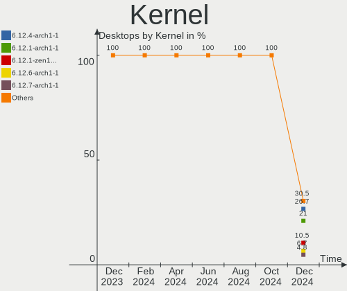
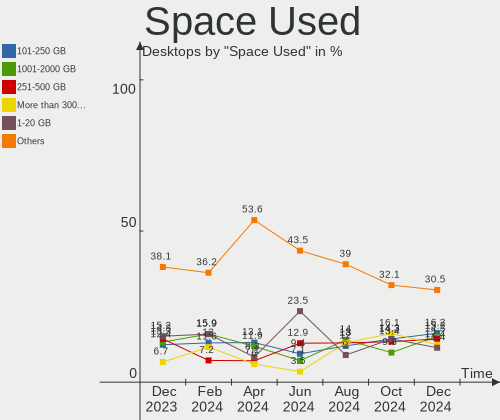
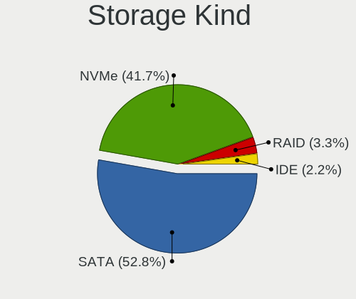
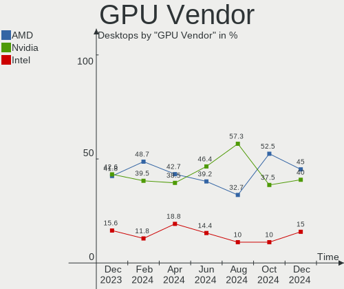

Arch Hardware Trends (Desktops)
-------------------------------

A project to identify most popular hardware characteristics and track their change
over time based on data collected by Arch users at https://Linux-Hardware.org.

Anyone can contribute to this report by the [hw-probe](https://github.com/linuxhw/hw-probe) tool:

    sudo -E hw-probe -all -upload

Full-feature report is available here: https://linux-hardware.org/?view=trends

Period: Dec, 2021.

Contents
--------

* [ System ](#system)
  - [ OS                       ](#os)
  - [ OS Family                ](#os-family)
  - [ Kernel                   ](#kernel)
  - [ Kernel Family            ](#kernel-family)
  - [ Kernel Major Ver.        ](#kernel-major-ver)
  - [ Arch                     ](#arch)
  - [ DE                       ](#de)
  - [ Display Server           ](#display-server)
  - [ Display Manager          ](#display-manager)
  - [ OS Lang                  ](#os-lang)
  - [ Boot Mode                ](#boot-mode)
  - [ Filesystem               ](#filesystem)
  - [ Part. scheme             ](#part-scheme)
  - [ Dual Boot with Linux/BSD ](#dual-boot-with-linuxbsd)
  - [ Dual Boot (Win)          ](#dual-boot-win)

* [ Board ](#board)
  - [ Vendor                   ](#vendor)
  - [ Model                    ](#model)
  - [ Model Family             ](#model-family)
  - [ MFG Year                 ](#mfg-year)
  - [ Form Factor              ](#form-factor)
  - [ Secure Boot              ](#secure-boot)
  - [ Coreboot                 ](#coreboot)
  - [ RAM Size                 ](#ram-size)
  - [ RAM Used                 ](#ram-used)
  - [ Total Drives             ](#total-drives)
  - [ Has CD-ROM               ](#has-cd-rom)
  - [ Has Ethernet             ](#has-ethernet)
  - [ Has WiFi                 ](#has-wifi)
  - [ Has Bluetooth            ](#has-bluetooth)

* [ Location ](#location)
  - [ Country                  ](#country)
  - [ City                     ](#city)

* [ Drives ](#drives)
  - [ Drive Vendor             ](#drive-vendor)
  - [ Drive Model              ](#drive-model)
  - [ HDD Vendor               ](#hdd-vendor)
  - [ SSD Vendor               ](#ssd-vendor)
  - [ Drive Kind               ](#drive-kind)
  - [ Drive Connector          ](#drive-connector)
  - [ Drive Size               ](#drive-size)
  - [ Space Total              ](#space-total)
  - [ Space Used               ](#space-used)
  - [ Malfunc. Drives          ](#malfunc-drives)
  - [ Malfunc. Drive Vendor    ](#malfunc-drive-vendor)
  - [ Malfunc. HDD Vendor      ](#malfunc-hdd-vendor)
  - [ Malfunc. Drive Kind      ](#malfunc-drive-kind)
  - [ Failed Drives            ](#failed-drives)
  - [ Failed Drive Vendor      ](#failed-drive-vendor)
  - [ Drive Status             ](#drive-status)

* [ Storage controller ](#storage-controller)
  - [ Storage Vendor           ](#storage-vendor)
  - [ Storage Model            ](#storage-model)
  - [ Storage Kind             ](#storage-kind)

* [ Processor ](#processor)
  - [ CPU Vendor               ](#cpu-vendor)
  - [ CPU Model                ](#cpu-model)
  - [ CPU Model Family         ](#cpu-model-family)
  - [ CPU Cores                ](#cpu-cores)
  - [ CPU Sockets              ](#cpu-sockets)
  - [ CPU Threads              ](#cpu-threads)
  - [ CPU Op-Modes             ](#cpu-op-modes)
  - [ CPU Microcode            ](#cpu-microcode)
  - [ CPU Microarch            ](#cpu-microarch)

* [ Graphics ](#graphics)
  - [ GPU Vendor               ](#gpu-vendor)
  - [ GPU Model                ](#gpu-model)
  - [ GPU Combo                ](#gpu-combo)
  - [ GPU Driver               ](#gpu-driver)
  - [ GPU Memory               ](#gpu-memory)

* [ Monitor ](#monitor)
  - [ Monitor Vendor           ](#monitor-vendor)
  - [ Monitor Model            ](#monitor-model)
  - [ Monitor Resolution       ](#monitor-resolution)
  - [ Monitor Diagonal         ](#monitor-diagonal)
  - [ Monitor Width            ](#monitor-width)
  - [ Aspect Ratio             ](#aspect-ratio)
  - [ Monitor Area             ](#monitor-area)
  - [ Pixel Density            ](#pixel-density)
  - [ Multiple Monitors        ](#multiple-monitors)

* [ Network ](#network)
  - [ Net Controller Vendor    ](#net-controller-vendor)
  - [ Net Controller Model     ](#net-controller-model)
  - [ Wireless Vendor          ](#wireless-vendor)
  - [ Wireless Model           ](#wireless-model)
  - [ Ethernet Vendor          ](#ethernet-vendor)
  - [ Ethernet Model           ](#ethernet-model)
  - [ Net Controller Kind      ](#net-controller-kind)
  - [ Used Controller          ](#used-controller)
  - [ NICs                     ](#nics)
  - [ IPv6                     ](#ipv6)

* [ Bluetooth ](#bluetooth)
  - [ Bluetooth Vendor         ](#bluetooth-vendor)
  - [ Bluetooth Model          ](#bluetooth-model)

* [ Sound ](#sound)
  - [ Sound Vendor             ](#sound-vendor)
  - [ Sound Model              ](#sound-model)

* [ Memory ](#memory)
  - [ Memory Vendor            ](#memory-vendor)
  - [ Memory Model             ](#memory-model)
  - [ Memory Kind              ](#memory-kind)
  - [ Memory Form Factor       ](#memory-form-factor)
  - [ Memory Size              ](#memory-size)
  - [ Memory Speed             ](#memory-speed)

* [ Printers & scanners ](#printers--scanners)
  - [ Printer Vendor           ](#printer-vendor)
  - [ Printer Model            ](#printer-model)
  - [ Scanner Vendor           ](#scanner-vendor)
  - [ Scanner Model            ](#scanner-model)

* [ Camera ](#camera)
  - [ Camera Vendor            ](#camera-vendor)
  - [ Camera Model             ](#camera-model)

* [ Security ](#security)
  - [ Fingerprint Vendor       ](#fingerprint-vendor)
  - [ Fingerprint Model        ](#fingerprint-model)
  - [ Chipcard Vendor          ](#chipcard-vendor)
  - [ Chipcard Model           ](#chipcard-model)

* [ Unsupported ](#unsupported)
  - [ Unsupported Devices      ](#unsupported-devices)
  - [ Unsupported Device Types ](#unsupported-device-types)

System
------

OS
--

Installed operating systems

| Name         | Desktops | Percent |
|--------------|----------|---------|
| Arch Rolling | 35       | 64.81%  |
| Arch         | 19       | 35.19%  |

OS Family
---------

OS without a version

| Name | Desktops | Percent |
|------|----------|---------|
| Arch | 55       | 100%    |

Kernel
------

Version of the Linux kernel

| Version            | Desktops | Percent |
|--------------------|----------|---------|
| 5.15.7-arch1-1     | 14       | 25.45%  |
| 5.15.6-arch2-1     | 8        | 14.55%  |
| 5.15.10-arch1-1    | 6        | 10.91%  |
| 5.15.7-zen1-1-zen  | 3        | 5.45%   |
| 5.15.11-zen1-1-zen | 3        | 5.45%   |
| 5.10.84-1-lts      | 3        | 5.45%   |
| 5.15.8-zen1-1-zen  | 2        | 3.64%   |
| 5.15.6-zen2-1-zen  | 2        | 3.64%   |
| 5.15.11-arch2-1    | 2        | 3.64%   |
| 5.15.8-arch1-1     | 1        | 1.82%   |
| 5.15.8-227-tkg-pds | 1        | 1.82%   |
| 5.15.7-4-clear     | 1        | 1.82%   |
| 5.15.6-lqx2-1-lqx  | 1        | 1.82%   |
| 5.15.5-arch1-1     | 1        | 1.82%   |
| 5.15.11-xanmod1-1  | 1        | 1.82%   |
| 5.15.10-zen1-1-zen | 1        | 1.82%   |
| 5.14.14-arch1-1    | 1        | 1.82%   |
| 5.10.88-2-lts      | 1        | 1.82%   |
| 5.10.87-1-lts      | 1        | 1.82%   |
| 5.10.81-1-lts      | 1        | 1.82%   |
| 5.10.69-1-lts      | 1        | 1.82%   |

Kernel Family
-------------

Linux kernel without a distro release

| Version | Desktops | Percent |
|---------|----------|---------|
| 5.15.7  | 18       | 32.73%  |
| 5.15.6  | 11       | 20%     |
| 5.15.10 | 7        | 12.73%  |
| 5.15.11 | 6        | 10.91%  |
| 5.15.8  | 4        | 7.27%   |
| 5.10.84 | 3        | 5.45%   |
| 5.15.5  | 1        | 1.82%   |
| 5.14.14 | 1        | 1.82%   |
| 5.10.88 | 1        | 1.82%   |
| 5.10.87 | 1        | 1.82%   |
| 5.10.81 | 1        | 1.82%   |
| 5.10.69 | 1        | 1.82%   |

Kernel Major Ver.
-----------------

Linux kernel major version

| Version | Desktops | Percent |
|---------|----------|---------|
| 5.15    | 47       | 85.45%  |
| 5.10    | 7        | 12.73%  |
| 5.14    | 1        | 1.82%   |

Arch
----

OS architecture (x86_64, i586, etc.)

| Name   | Desktops | Percent |
|--------|----------|---------|
| x86_64 | 55       | 100%    |

DE
--

Desktop Environment

| Name    | Desktops | Percent |
|---------|----------|---------|
| KDE5    | 28       | 50.91%  |
| GNOME   | 15       | 27.27%  |
| XFCE    | 2        | 3.64%   |
| MATE    | 2        | 3.64%   |
| Unknown | 2        | 3.64%   |
| xmonad  | 1        | 1.82%   |
| xinitrc | 1        | 1.82%   |
| KDE     | 1        | 1.82%   |
| i3      | 1        | 1.82%   |
| Budgie  | 1        | 1.82%   |
| awesome | 1        | 1.82%   |

Display Server
--------------

X11 or Wayland

| Name    | Desktops | Percent |
|---------|----------|---------|
| X11     | 39       | 70.91%  |
| Wayland | 8        | 14.55%  |
| Tty     | 6        | 10.91%  |
| Unknown | 2        | 3.64%   |

Display Manager
---------------

SDDM, LightDM, etc.

| Name    | Desktops | Percent |
|---------|----------|---------|
| SDDM    | 25       | 45.45%  |
| Unknown | 13       | 23.64%  |
| LightDM | 7        | 12.73%  |
| GDM     | 7        | 12.73%  |
| Ly      | 2        | 3.64%   |
| LXDM    | 1        | 1.82%   |

OS Lang
-------

Language

| Lang  | Desktops | Percent |
|-------|----------|---------|
| en_US | 32       | 58.18%  |
| ru_RU | 3        | 5.45%   |
| pl_PL | 3        | 5.45%   |
| it_IT | 3        | 5.45%   |
| fr_FR | 2        | 3.64%   |
| en_IN | 2        | 3.64%   |
| de_DE | 2        | 3.64%   |
| ru_UA | 1        | 1.82%   |
| fi_FI | 1        | 1.82%   |
| es_ES | 1        | 1.82%   |
| en_SG | 1        | 1.82%   |
| en_GB | 1        | 1.82%   |
| en_DE | 1        | 1.82%   |
| de_AT | 1        | 1.82%   |
| C     | 1        | 1.82%   |

Boot Mode
---------

EFI or BIOS

| Mode | Desktops | Percent |
|------|----------|---------|
| EFI  | 35       | 63.64%  |
| BIOS | 20       | 36.36%  |

Filesystem
----------

Type of filesystem

| Type  | Desktops | Percent |
|-------|----------|---------|
| Ext4  | 36       | 65.45%  |
| Btrfs | 17       | 30.91%  |
| XXXXX | 1        | 1.82%   |
| Xfs   | 1        | 1.82%   |

Part. scheme
------------

Scheme of partitioning

| Type    | Desktops | Percent |
|---------|----------|---------|
| GPT     | 43       | 78.18%  |
| Unknown | 9        | 16.36%  |
| MBR     | 3        | 5.45%   |

Dual Boot with Linux/BSD
------------------------

Hosting more than one Linux/BSD

| Dual boot | Desktops | Percent |
|-----------|----------|---------|
| No        | 40       | 72.73%  |
| Yes       | 15       | 27.27%  |

Dual Boot (Win)
---------------

Hosting Linux and Windows

| Dual boot | Desktops | Percent |
|-----------|----------|---------|
| Yes       | 28       | 50.91%  |
| No        | 27       | 49.09%  |

Board
-----

Vendor
------

Motherboard manufacturer

| Name                | Desktops | Percent |
|---------------------|----------|---------|
| ASUSTek Computer    | 20       | 36.36%  |
| MSI                 | 10       | 18.18%  |
| ASRock              | 9        | 16.36%  |
| Gigabyte Technology | 7        | 12.73%  |
| Hewlett-Packard     | 3        | 5.45%   |
| Acer                | 2        | 3.64%   |
| Intel               | 1        | 1.82%   |
| Dell                | 1        | 1.82%   |
| Biostar             | 1        | 1.82%   |
| AMI                 | 1        | 1.82%   |

Model
-----

Motherboard model

| Name                                 | Desktops | Percent |
|--------------------------------------|----------|---------|
| ASUS All Series                      | 3        | 5.45%   |
| MSI MS-7B86                          | 2        | 3.64%   |
| MSI MS-7B79                          | 2        | 3.64%   |
| ASUS TUF GAMING X570-PLUS            | 2        | 3.64%   |
| ASUS ROG CROSSHAIR VIII DARK HERO    | 2        | 3.64%   |
| ASUS H170 PRO GAMING                 | 2        | 3.64%   |
| ASRock AB350 Pro4                    | 2        | 3.64%   |
| MSI MS-7D22                          | 1        | 1.82%   |
| MSI MS-7D07                          | 1        | 1.82%   |
| MSI MS-7C91                          | 1        | 1.82%   |
| MSI MS-7B77                          | 1        | 1.82%   |
| MSI MS-7B49                          | 1        | 1.82%   |
| MSI MS-7721                          | 1        | 1.82%   |
| Intel DH67BL AAG10189-213            | 1        | 1.82%   |
| HP Pavilion Gaming Desktop TG01-2xxx | 1        | 1.82%   |
| HP Pavilion Gaming Desktop TG01-0xxx | 1        | 1.82%   |
| HP OMEN 30L Desktop GT13-0xxx        | 1        | 1.82%   |
| Gigabyte Z390 AORUS PRO              | 1        | 1.82%   |
| Gigabyte X58A-UD3R                   | 1        | 1.82%   |
| Gigabyte H110M-H                     | 1        | 1.82%   |
| Gigabyte B450M DS3H V2               | 1        | 1.82%   |
| Gigabyte B450M DS3H                  | 1        | 1.82%   |
| Gigabyte B450 AORUS M                | 1        | 1.82%   |
| Gigabyte 970A-DS3P                   | 1        | 1.82%   |
| Dell OptiPlex 7060                   | 1        | 1.82%   |
| Biostar H77MU3                       | 1        | 1.82%   |
| ASUS Z170-A                          | 1        | 1.82%   |
| ASUS TUF B450M-PLUS GAMING           | 1        | 1.82%   |
| ASUS ROG STRIX X570-I GAMING         | 1        | 1.82%   |
| ASUS ROG STRIX B550-I GAMING         | 1        | 1.82%   |
| ASUS ROG CROSSHAIR VI EXTREME        | 1        | 1.82%   |
| ASUS PRIME X370-PRO                  | 1        | 1.82%   |
| ASUS PRIME B550M-A                   | 1        | 1.82%   |
| ASUS P8P67 LE                        | 1        | 1.82%   |
| ASUS M5A78L-M/USB3                   | 1        | 1.82%   |
| ASUS M4A88TD-M EVO                   | 1        | 1.82%   |
| ASUS F1A75-V EVO                     | 1        | 1.82%   |
| ASRock Z170 Extreme7+                | 1        | 1.82%   |
| ASRock X99 Extreme4                  | 1        | 1.82%   |
| ASRock X570 Taichi                   | 1        | 1.82%   |
| ASRock X470 Gaming K4                | 1        | 1.82%   |
| ASRock X370 Gaming X                 | 1        | 1.82%   |
| ASRock B560M Pro4                    | 1        | 1.82%   |
| ASRock B550AM Gaming                 | 1        | 1.82%   |
| AMI Cherry Trail CR                  | 1        | 1.82%   |
| Acer Aspire XC-1660                  | 1        | 1.82%   |
| Acer Aspire X3910                    | 1        | 1.82%   |

Model Family
------------

Motherboard model prefix

| Name               | Desktops | Percent |
|--------------------|----------|---------|
| ASUS ROG           | 5        | 9.09%   |
| ASUS TUF           | 3        | 5.45%   |
| ASUS All           | 3        | 5.45%   |
| MSI MS-7B86        | 2        | 3.64%   |
| MSI MS-7B79        | 2        | 3.64%   |
| HP Pavilion        | 2        | 3.64%   |
| Gigabyte B450M     | 2        | 3.64%   |
| ASUS PRIME         | 2        | 3.64%   |
| ASUS H170          | 2        | 3.64%   |
| ASRock AB350       | 2        | 3.64%   |
| Acer Aspire        | 2        | 3.64%   |
| MSI MS-7D22        | 1        | 1.82%   |
| MSI MS-7D07        | 1        | 1.82%   |
| MSI MS-7C91        | 1        | 1.82%   |
| MSI MS-7B77        | 1        | 1.82%   |
| MSI MS-7B49        | 1        | 1.82%   |
| MSI MS-7721        | 1        | 1.82%   |
| Intel DH67BL       | 1        | 1.82%   |
| HP OMEN            | 1        | 1.82%   |
| Gigabyte Z390      | 1        | 1.82%   |
| Gigabyte X58A-UD3R | 1        | 1.82%   |
| Gigabyte H110M-H   | 1        | 1.82%   |
| Gigabyte B450      | 1        | 1.82%   |
| Gigabyte 970A-DS3P | 1        | 1.82%   |
| Dell OptiPlex      | 1        | 1.82%   |
| Biostar H77MU3     | 1        | 1.82%   |
| ASUS Z170-A        | 1        | 1.82%   |
| ASUS P8P67         | 1        | 1.82%   |
| ASUS M5A78L-M      | 1        | 1.82%   |
| ASUS M4A88TD-M     | 1        | 1.82%   |
| ASUS F1A75-V       | 1        | 1.82%   |
| ASRock Z170        | 1        | 1.82%   |
| ASRock X99         | 1        | 1.82%   |
| ASRock X570        | 1        | 1.82%   |
| ASRock X470        | 1        | 1.82%   |
| ASRock X370        | 1        | 1.82%   |
| ASRock B560M       | 1        | 1.82%   |
| ASRock B550AM      | 1        | 1.82%   |
| AMI Cherry         | 1        | 1.82%   |

MFG Year
--------

Motherboard manufacture year

| Year | Desktops | Percent |
|------|----------|---------|
| 2021 | 14       | 25.45%  |
| 2020 | 9        | 16.36%  |
| 2019 | 9        | 16.36%  |
| 2018 | 8        | 14.55%  |
| 2016 | 4        | 7.27%   |
| 2014 | 3        | 5.45%   |
| 2012 | 3        | 5.45%   |
| 2013 | 2        | 3.64%   |
| 2010 | 2        | 3.64%   |
| 2017 | 1        | 1.82%   |

Form Factor
-----------

Physical design of the computer

| Name    | Desktops | Percent |
|---------|----------|---------|
| Desktop | 55       | 100%    |

Secure Boot
-----------

Enabled or disabled

| State    | Desktops | Percent |
|----------|----------|---------|
| Disabled | 55       | 100%    |

Coreboot
--------

Have coreboot on board

| Used | Desktops | Percent |
|------|----------|---------|
| No   | 55       | 100%    |

RAM Size
--------

Total RAM memory

| Size in GB  | Desktops | Percent |
|-------------|----------|---------|
| 16.01-24.0  | 21       | 38.18%  |
| 32.01-64.0  | 16       | 29.09%  |
| 8.01-16.0   | 6        | 10.91%  |
| 64.01-256.0 | 5        | 9.09%   |
| 4.01-8.0    | 2        | 3.64%   |
| 24.01-32.0  | 2        | 3.64%   |
| 3.01-4.0    | 1        | 1.82%   |
| 2.01-3.0    | 1        | 1.82%   |
| 1.01-2.0    | 1        | 1.82%   |

RAM Used
--------

Used RAM memory

| Used GB    | Desktops | Percent |
|------------|----------|---------|
| 4.01-8.0   | 12       | 21.82%  |
| 2.01-3.0   | 10       | 18.18%  |
| 1.01-2.0   | 10       | 18.18%  |
| 3.01-4.0   | 8        | 14.55%  |
| 8.01-16.0  | 8        | 14.55%  |
| 16.01-24.0 | 3        | 5.45%   |
| 0.51-1.0   | 2        | 3.64%   |
| 32.01-64.0 | 1        | 1.82%   |
| 24.01-32.0 | 1        | 1.82%   |

Total Drives
------------

Number of drives on board

| Drives | Desktops | Percent |
|--------|----------|---------|
| 2      | 16       | 29.09%  |
| 3      | 10       | 18.18%  |
| 1      | 9        | 16.36%  |
| 4      | 8        | 14.55%  |
| 6      | 6        | 10.91%  |
| 5      | 3        | 5.45%   |
| 17     | 1        | 1.82%   |
| 10     | 1        | 1.82%   |
| 7      | 1        | 1.82%   |

Has CD-ROM
----------

Has CD-ROM on board

| Presented | Desktops | Percent |
|-----------|----------|---------|
| No        | 42       | 76.36%  |
| Yes       | 13       | 23.64%  |

Has Ethernet
------------

Has Ethernet on board

| Presented | Desktops | Percent |
|-----------|----------|---------|
| Yes       | 54       | 98.18%  |
| No        | 1        | 1.82%   |

Has WiFi
--------

Has WiFi module

| Presented | Desktops | Percent |
|-----------|----------|---------|
| No        | 30       | 54.55%  |
| Yes       | 25       | 45.45%  |

Has Bluetooth
-------------

Has Bluetooth module

| Presented | Desktops | Percent |
|-----------|----------|---------|
| Yes       | 32       | 58.18%  |
| No        | 23       | 41.82%  |

Location
--------

Country
-------

Geographic location (country)

| Country     | Desktops | Percent |
|-------------|----------|---------|
| USA         | 9        | 16.36%  |
| Germany     | 6        | 10.91%  |
| Poland      | 5        | 9.09%   |
| UK          | 3        | 5.45%   |
| Spain       | 3        | 5.45%   |
| Singapore   | 3        | 5.45%   |
| Russia      | 3        | 5.45%   |
| Italy       | 3        | 5.45%   |
| India       | 3        | 5.45%   |
| Ukraine     | 2        | 3.64%   |
| France      | 2        | 3.64%   |
| Austria     | 2        | 3.64%   |
| Venezuela   | 1        | 1.82%   |
| Turkey      | 1        | 1.82%   |
| Sweden      | 1        | 1.82%   |
| Romania     | 1        | 1.82%   |
| Netherlands | 1        | 1.82%   |
| Moldova     | 1        | 1.82%   |
| Indonesia   | 1        | 1.82%   |
| Greece      | 1        | 1.82%   |
| Finland     | 1        | 1.82%   |
| Canada      | 1        | 1.82%   |
| Bangladesh  | 1        | 1.82%   |

City
----

Geographic location (city)

| City               | Desktops | Percent |
|--------------------|----------|---------|
| Singapore          | 3        | 5.45%   |
| Vancouver          | 2        | 3.64%   |
| Moscow             | 2        | 3.64%   |
| Basingstoke        | 2        | 3.64%   |
| Warsaw             | 1        | 1.82%   |
| Velbert            | 1        | 1.82%   |
| Turku              | 1        | 1.82%   |
| Tongi              | 1        | 1.82%   |
| Tirschenreuth      | 1        | 1.82%   |
| Tighina            | 1        | 1.82%   |
| St Petersburg      | 1        | 1.82%   |
| Sighetu Marma??iei | 1        | 1.82%   |
| Seattle            | 1        | 1.82%   |
| Roydon             | 1        | 1.82%   |
| Reus               | 1        | 1.82%   |
| Remscheid          | 1        | 1.82%   |
| Radom              | 1        | 1.82%   |
| Quincy             | 1        | 1.82%   |
| Poznan             | 1        | 1.82%   |
| Oberhausen         | 1        | 1.82%   |
| Noida              | 1        | 1.82%   |
| Navi Mumbai        | 1        | 1.82%   |
| Naples             | 1        | 1.82%   |
| Mykolayiv          | 1        | 1.82%   |
| Miami              | 1        | 1.82%   |
| Meaux              | 1        | 1.82%   |
| Massa              | 1        | 1.82%   |
| Madrid             | 1        | 1.82%   |
| Lviv               | 1        | 1.82%   |
| Lublin             | 1        | 1.82%   |
| Lubbock            | 1        | 1.82%   |
| Lamon              | 1        | 1.82%   |
| Istanbul           | 1        | 1.82%   |
| Hummelstown        | 1        | 1.82%   |
| Gothenburg         | 1        | 1.82%   |
| Franklin Park      | 1        | 1.82%   |
| Frankfurt am Main  | 1        | 1.82%   |
| Elyria             | 1        | 1.82%   |
| Ebenfurth          | 1        | 1.82%   |
| Dresden            | 1        | 1.82%   |
| Dordrecht          | 1        | 1.82%   |
| Dabrowka Dolna     | 1        | 1.82%   |
| Creutzwald         | 1        | 1.82%   |
| Carmichael         | 1        | 1.82%   |
| Caracas            | 1        | 1.82%   |
| Bhopal             | 1        | 1.82%   |
| Bekasi             | 1        | 1.82%   |
| Barcelona          | 1        | 1.82%   |
| Athens             | 1        | 1.82%   |
| Aldrans            | 1        | 1.82%   |

Drives
------

Drive Vendor
------------

Hard drive vendors

| Vendor              | Desktops | Drives | Percent |
|---------------------|----------|--------|---------|
| Samsung Electronics | 32       | 59     | 25.81%  |
| WDC                 | 22       | 28     | 17.74%  |
| Seagate             | 21       | 40     | 16.94%  |
| Toshiba             | 8        | 10     | 6.45%   |
| Kingston            | 6        | 7      | 4.84%   |
| SanDisk             | 4        | 5      | 3.23%   |
| Crucial             | 4        | 7      | 3.23%   |
| A-DATA Technology   | 4        | 5      | 3.23%   |
| Hitachi             | 3        | 4      | 2.42%   |
| HGST                | 3        | 5      | 2.42%   |
| PNY                 | 2        | 2      | 1.61%   |
| OCZ                 | 2        | 2      | 1.61%   |
| GOODRAM             | 2        | 2      | 1.61%   |
| XPG                 | 1        | 1      | 0.81%   |
| Unknown             | 1        | 1      | 0.81%   |
| Silicon Motion      | 1        | 1      | 0.81%   |
| SABRENT             | 1        | 1      | 0.81%   |
| RSH-319             | 1        | 1      | 0.81%   |
| PLEXTOR             | 1        | 1      | 0.81%   |
| Phison              | 1        | 1      | 0.81%   |
| Patriot             | 1        | 1      | 0.81%   |
| KLEVV               | 1        | 1      | 0.81%   |
| China               | 1        | 1      | 0.81%   |
| ASMT                | 1        | 1      | 0.81%   |

Drive Model
-----------

Hard drive models

| Model                              | Desktops | Percent |
|------------------------------------|----------|---------|
| Samsung SSD 860 EVO 1TB            | 6        | 3.8%    |
| Seagate ST4000DM004-2CV104 4TB     | 4        | 2.53%   |
| Samsung SSD 850 EVO 500GB          | 4        | 2.53%   |
| WDC WD3200AAJS-00L7A0 320GB        | 2        | 1.27%   |
| WDC WD10EZEX-22MFCA0 1TB           | 2        | 1.27%   |
| WDC WD1002FAEX-00Z3A0 1TB          | 2        | 1.27%   |
| Toshiba DT01ACA100 1TB             | 2        | 1.27%   |
| Seagate ST3500312CS 500GB          | 2        | 1.27%   |
| Seagate ST2000DM008-2FR102 2TB     | 2        | 1.27%   |
| Seagate ST1000DM003-1CH162 1TB     | 2        | 1.27%   |
| Samsung SSD 980 PRO 1TB            | 2        | 1.27%   |
| Samsung SSD 970 EVO Plus 500GB     | 2        | 1.27%   |
| Samsung SSD 970 EVO Plus 1TB       | 2        | 1.27%   |
| Samsung SSD 970 EVO 250GB          | 2        | 1.27%   |
| Samsung NVMe SSD Drive 256GB       | 2        | 1.27%   |
| Samsung NVMe SSD Drive 1TB         | 2        | 1.27%   |
| Crucial CT500MX500SSD1 500GB       | 2        | 1.27%   |
| A-DATA SX8200PNP 512GB             | 2        | 1.27%   |
| XPG NVMe SSD Drive 512GB           | 1        | 0.63%   |
| WDC WDS200T2B0B-00YS70 2TB SSD     | 1        | 0.63%   |
| WDC WDS100T2B0C-00PXH0 1TB         | 1        | 0.63%   |
| WDC WD60EZAZ-00SF3B0 6TB           | 1        | 0.63%   |
| WDC WD5000BPKT-80PK4T0 500GB       | 1        | 0.63%   |
| WDC WD5000AZRX-00L4HB0 500GB       | 1        | 0.63%   |
| WDC WD5000AAKX-001CA0 500GB        | 1        | 0.63%   |
| WDC WD5000AACS-07G8B0 500GB        | 1        | 0.63%   |
| WDC WD40EZRZ-00WN9B0 4TB           | 1        | 0.63%   |
| WDC WD40EFRX-68N32N0 4TB           | 1        | 0.63%   |
| WDC WD4004FZWX-00GBGB0 4TB         | 1        | 0.63%   |
| WDC WD4000FYYZ-01UL1B0 4TB         | 1        | 0.63%   |
| WDC WD30EZRX-00MMMB0 3TB           | 1        | 0.63%   |
| WDC WD30EZRX-00DC0B0 3TB           | 1        | 0.63%   |
| WDC WD20EFRX-68AX9N0 2TB           | 1        | 0.63%   |
| WDC WD160EDFZ-11AFWA0 16TB         | 1        | 0.63%   |
| WDC WD10EZEX-60ZF5A0 1TB           | 1        | 0.63%   |
| WDC WD10EZEX-60WN4A1 1TB           | 1        | 0.63%   |
| WDC WD10EZEX-08M2NA0 1TB           | 1        | 0.63%   |
| WDC WD10EARS-00Y5B1 1TB            | 1        | 0.63%   |
| WDC WD1001FAES-22W7A0 1TB          | 1        | 0.63%   |
| Unknown NCard  32GB                | 1        | 0.63%   |
| Toshiba MG06ACA800E 8TB            | 1        | 0.63%   |
| Toshiba MG04ACA200N 2TB            | 1        | 0.63%   |
| Toshiba HDWE150 5TB                | 1        | 0.63%   |
| Toshiba HDWD110 1TB                | 1        | 0.63%   |
| Toshiba DT01ACA300 3TB             | 1        | 0.63%   |
| Toshiba DT01ACA200 2TB             | 1        | 0.63%   |
| Silicon Motion NVMe SSD Drive 1TB  | 1        | 0.63%   |
| Seagate ST500LX025-1U717D 500GB    | 1        | 0.63%   |
| Seagate ST4000VN008-2DR166 4TB     | 1        | 0.63%   |
| Seagate ST4000NM0033-9ZM170 4TB    | 1        | 0.63%   |
| Seagate ST4000LM024-2AN17V 4TB     | 1        | 0.63%   |
| Seagate ST4000LM016-1N2170 4TB     | 1        | 0.63%   |
| Seagate ST4000DM000-1F2168 4TB     | 1        | 0.63%   |
| Seagate ST3500418AS 500GB          | 1        | 0.63%   |
| Seagate ST31000528AS 1TB           | 1        | 0.63%   |
| Seagate ST3000DM001-1CH166 3TB     | 1        | 0.63%   |
| Seagate ST2000LX001-1RG174 2TB     | 1        | 0.63%   |
| Seagate ST2000LM015-2E8174 2TB     | 1        | 0.63%   |
| Seagate ST2000LM003 HN-M201RAD 2TB | 1        | 0.63%   |
| Seagate ST2000DM006-2DM164 2TB     | 1        | 0.63%   |

HDD Vendor
----------

Hard disk drive vendors

| Vendor              | Desktops | Drives | Percent |
|---------------------|----------|--------|---------|
| Seagate             | 21       | 40     | 33.87%  |
| WDC                 | 20       | 26     | 32.26%  |
| Toshiba             | 8        | 10     | 12.9%   |
| Samsung Electronics | 4        | 5      | 6.45%   |
| Hitachi             | 3        | 4      | 4.84%   |
| HGST                | 3        | 5      | 4.84%   |
| SABRENT             | 1        | 1      | 1.61%   |
| RSH-319             | 1        | 1      | 1.61%   |
| ASMT                | 1        | 1      | 1.61%   |

SSD Vendor
----------

Solid state drive vendors

| Vendor              | Desktops | Drives | Percent |
|---------------------|----------|--------|---------|
| Samsung Electronics | 18       | 27     | 46.15%  |
| Crucial             | 4        | 7      | 10.26%  |
| SanDisk             | 3        | 4      | 7.69%   |
| Kingston            | 3        | 4      | 7.69%   |
| PNY                 | 2        | 2      | 5.13%   |
| OCZ                 | 2        | 2      | 5.13%   |
| GOODRAM             | 2        | 2      | 5.13%   |
| A-DATA Technology   | 2        | 2      | 5.13%   |
| WDC                 | 1        | 1      | 2.56%   |
| Patriot             | 1        | 1      | 2.56%   |
| China               | 1        | 1      | 2.56%   |

Drive Kind
----------

HDD or SSD

| Kind | Desktops | Drives | Percent |
|------|----------|--------|---------|
| HDD  | 41       | 93     | 39.05%  |
| SSD  | 34       | 53     | 32.38%  |
| NVMe | 29       | 40     | 27.62%  |
| MMC  | 1        | 1      | 0.95%   |

Drive Connector
---------------

SATA, SAS, NVMe, etc.

| Type | Desktops | Drives | Percent |
|------|----------|--------|---------|
| SATA | 50       | 142    | 61.73%  |
| NVMe | 29       | 40     | 35.8%   |
| SAS  | 1        | 4      | 1.23%   |
| MMC  | 1        | 1      | 1.23%   |

Drive Size
----------

Size of hard drive

| Size in TB | Desktops | Drives | Percent |
|------------|----------|--------|---------|
| 0.01-0.5   | 34       | 49     | 36.17%  |
| 0.51-1.0   | 27       | 35     | 28.72%  |
| 1.01-2.0   | 12       | 20     | 12.77%  |
| 3.01-4.0   | 11       | 24     | 11.7%   |
| 2.01-3.0   | 4        | 6      | 4.26%   |
| 4.01-10.0  | 4        | 7      | 4.26%   |
| 10.01-20.0 | 2        | 5      | 2.13%   |

Space Total
-----------

Amount of disk space available on the file system

| Size in GB     | Desktops | Percent |
|----------------|----------|---------|
| More than 3000 | 14       | 25.45%  |
| 1001-2000      | 10       | 18.18%  |
| 501-1000       | 10       | 18.18%  |
| 251-500        | 7        | 12.73%  |
| 101-250        | 7        | 12.73%  |
| 2001-3000      | 5        | 9.09%   |
| 21-50          | 1        | 1.82%   |
| 51-100         | 1        | 1.82%   |

Space Used
----------

Amount of used disk space

| Used GB        | Desktops | Percent |
|----------------|----------|---------|
| More than 3000 | 10       | 18.18%  |
| 101-250        | 8        | 14.55%  |
| 51-100         | 7        | 12.73%  |
| 1001-2000      | 6        | 10.91%  |
| 501-1000       | 6        | 10.91%  |
| 251-500        | 5        | 9.09%   |
| 21-50          | 5        | 9.09%   |
| 2001-3000      | 4        | 7.27%   |
| 1-20           | 4        | 7.27%   |

Malfunc. Drives
---------------

Drive models with a malfunction

| Model                               | Desktops | Drives | Percent |
|-------------------------------------|----------|--------|---------|
| WDC WD5000BPKT-80PK4T0 500GB        | 1        | 1      | 7.69%   |
| WDC WD5000AAKX-001CA0 500GB         | 1        | 1      | 7.69%   |
| WDC WD10EZEX-60ZF5A0 1TB            | 1        | 1      | 7.69%   |
| WDC WD10EZEX-08M2NA0 1TB            | 1        | 1      | 7.69%   |
| WDC WD10EARS-00Y5B1 1TB             | 1        | 1      | 7.69%   |
| Seagate ST4000DM004-2CV104 4TB      | 1        | 1      | 7.69%   |
| Seagate ST3500312CS 500GB           | 1        | 1      | 7.69%   |
| Seagate ST31000528AS 1TB            | 1        | 1      | 7.69%   |
| Seagate ST1000DX001-1NS162 1TB      | 1        | 1      | 7.69%   |
| Samsung Electronics SSD 870 EVO 2TB | 1        | 4      | 7.69%   |
| Samsung Electronics HD161HJ 160GB   | 1        | 1      | 7.69%   |
| PLEXTOR PX-1TM8SeG 1TB              | 1        | 1      | 7.69%   |
| Hitachi HUS724030ALE641 3TB         | 1        | 1      | 7.69%   |

Malfunc. Drive Vendor
---------------------

Vendors of faulty drives

| Vendor              | Desktops | Drives | Percent |
|---------------------|----------|--------|---------|
| WDC                 | 5        | 5      | 41.67%  |
| Seagate             | 3        | 4      | 25%     |
| Samsung Electronics | 2        | 5      | 16.67%  |
| PLEXTOR             | 1        | 1      | 8.33%   |
| Hitachi             | 1        | 1      | 8.33%   |

Malfunc. HDD Vendor
-------------------

Vendors of faulty HDD drives

| Vendor              | Desktops | Drives | Percent |
|---------------------|----------|--------|---------|
| WDC                 | 5        | 5      | 50%     |
| Seagate             | 3        | 4      | 30%     |
| Samsung Electronics | 1        | 1      | 10%     |
| Hitachi             | 1        | 1      | 10%     |

Malfunc. Drive Kind
-------------------

Kinds of faulty drives

| Kind | Desktops | Drives | Percent |
|------|----------|--------|---------|
| HDD  | 9        | 11     | 81.82%  |
| NVMe | 1        | 1      | 9.09%   |
| SSD  | 1        | 4      | 9.09%   |

Failed Drives
-------------

Failed drive models

Zero info for selected period =(

Failed Drive Vendor
-------------------

Failed drive vendors

Zero info for selected period =(

Drive Status
------------

Number of failed and malfunc. drives

| Status   | Desktops | Drives | Percent |
|----------|----------|--------|---------|
| Works    | 38       | 128    | 57.58%  |
| Detected | 17       | 43     | 25.76%  |
| Malfunc  | 11       | 16     | 16.67%  |

Storage controller
------------------

Storage Vendor
--------------

Storage controller vendors

| Vendor                      | Desktops | Percent |
|-----------------------------|----------|---------|
| AMD                         | 33       | 34.02%  |
| Intel                       | 21       | 21.65%  |
| Samsung Electronics         | 19       | 19.59%  |
| ASMedia Technology          | 5        | 5.15%   |
| Marvell Technology Group    | 4        | 4.12%   |
| Kingston Technology Company | 3        | 3.09%   |
| ADATA Technology            | 3        | 3.09%   |
| Silicon Motion              | 2        | 2.06%   |
| Sandisk                     | 2        | 2.06%   |
| VIA Technologies            | 1        | 1.03%   |
| Phison Electronics          | 1        | 1.03%   |
| LSI Logic / Symbios Logic   | 1        | 1.03%   |
| Lite-On Technology          | 1        | 1.03%   |
| JMicron Technology          | 1        | 1.03%   |

Storage Model
-------------

Storage controller models

| Model                                                                         | Desktops | Percent |
|-------------------------------------------------------------------------------|----------|---------|
| AMD FCH SATA Controller [AHCI mode]                                           | 23       | 18.85%  |
| AMD 400 Series Chipset SATA Controller                                        | 14       | 11.48%  |
| Samsung NVMe SSD Controller SM981/PM981/PM983                                 | 11       | 9.02%   |
| Samsung NVMe SSD Controller SM961/PM961/SM963                                 | 6        | 4.92%   |
| Intel Q170/Q150/B150/H170/H110/Z170/CM236 Chipset SATA Controller [AHCI Mode] | 5        | 4.1%    |
| ASMedia ASM1062 Serial ATA Controller                                         | 5        | 4.1%    |
| Intel 500 Series Chipset Family SATA AHCI Controller                          | 4        | 3.28%   |
| Samsung NVMe SSD Controller PM9A1/PM9A3/980PRO                                | 3        | 2.46%   |
| Intel 9 Series Chipset Family SATA Controller [AHCI Mode]                     | 3        | 2.46%   |
| AMD X370 Series Chipset SATA Controller                                       | 3        | 2.46%   |
| AMD Starship/Matisse Chipset SATA Controller [AHCI mode]                      | 3        | 2.46%   |
| AMD SB7x0/SB8x0/SB9x0 IDE Controller                                          | 3        | 2.46%   |
| ADATA XPG SX8200 Pro PCIe Gen3x4 M.2 2280 Solid State Drive                   | 3        | 2.46%   |
| Silicon Motion SM2263EN/SM2263XT SSD Controller                               | 2        | 1.64%   |
| Samsung NVMe SSD Controller SM951/PM951                                       | 2        | 1.64%   |
| Marvell Group 88SE9128 PCIe SATA 6 Gb/s RAID controller with HyperDuo         | 2        | 1.64%   |
| Kingston Company A2000 NVMe SSD                                               | 2        | 1.64%   |
| Intel Cannon Lake PCH SATA AHCI Controller                                    | 2        | 1.64%   |
| Intel 82801JI (ICH10 Family) SATA AHCI Controller                             | 2        | 1.64%   |
| Intel 6 Series/C200 Series Chipset Family 6 port Desktop SATA AHCI Controller | 2        | 1.64%   |
| AMD SB7x0/SB8x0/SB9x0 SATA Controller [IDE mode]                              | 2        | 1.64%   |
| AMD 300 Series Chipset SATA Controller                                        | 2        | 1.64%   |
| VIA VT6415 PATA IDE Host Controller                                           | 1        | 0.82%   |
| Sandisk WD Blue SN550 NVMe SSD                                                | 1        | 0.82%   |
| Sandisk WD Blue SN500 / PC SN520 NVMe SSD                                     | 1        | 0.82%   |
| Samsung NVMe SSD Controller 980                                               | 1        | 0.82%   |
| Phison E16 PCIe4 NVMe Controller                                              | 1        | 0.82%   |
| Marvell Group 88SE9215 PCIe 2.0 x1 4-port SATA 6 Gb/s Controller              | 1        | 0.82%   |
| Marvell Group 88SE912x IDE Controller                                         | 1        | 0.82%   |
| Marvell Group 88SE9128 PCIe SATA 6 Gb/s RAID controller                       | 1        | 0.82%   |
| LSI Logic / Symbios Logic SAS2008 PCI-Express Fusion-MPT SAS-2 [Falcon]       | 1        | 0.82%   |
| Lite-On Non-Volatile memory controller                                        | 1        | 0.82%   |
| Kingston Company Company Non-Volatile memory controller                       | 1        | 0.82%   |
| JMicron JMB363 SATA/IDE Controller                                            | 1        | 0.82%   |
| Intel C610/X99 series chipset sSATA Controller [AHCI mode]                    | 1        | 0.82%   |
| Intel C610/X99 series chipset 6-Port SATA Controller [AHCI mode]              | 1        | 0.82%   |
| Intel 7 Series/C210 Series Chipset Family 4-port SATA Controller [IDE mode]   | 1        | 0.82%   |
| Intel 7 Series/C210 Series Chipset Family 2-port SATA Controller [IDE mode]   | 1        | 0.82%   |
| Intel 200 Series PCH SATA controller [AHCI mode]                              | 1        | 0.82%   |
| AMD SB7x0/SB8x0/SB9x0 SATA Controller [AHCI mode]                             | 1        | 0.82%   |

Storage Kind
------------

Kind of storage controller (IDE, SATA, NVMe, SAS, ...)

| Kind | Desktops | Percent |
|------|----------|---------|
| SATA | 53       | 59.55%  |
| NVMe | 29       | 32.58%  |
| IDE  | 6        | 6.74%   |
| SAS  | 1        | 1.12%   |

Processor
---------

CPU Vendor
----------

Processor vendors

| Vendor | Desktops | Percent |
|--------|----------|---------|
| AMD    | 33       | 60%     |
| Intel  | 22       | 40%     |

CPU Model
---------

Processor models

| Model                                       | Desktops | Percent |
|---------------------------------------------|----------|---------|
| AMD Ryzen 7 3700X 8-Core Processor          | 6        | 10.91%  |
| AMD Ryzen 5 3600 6-Core Processor           | 5        | 9.09%   |
| Intel 11th Gen Core i5-11400 @ 2.60GHz      | 3        | 5.45%   |
| Intel Core i7-8700 CPU @ 3.20GHz            | 2        | 3.64%   |
| AMD Ryzen 9 5950X 16-Core Processor         | 2        | 3.64%   |
| AMD Ryzen 5 2600 Six-Core Processor         | 2        | 3.64%   |
| AMD Ryzen 5 1600 Six-Core Processor         | 2        | 3.64%   |
| AMD FX-4300 Quad-Core Processor             | 2        | 3.64%   |
| Intel Pentium Dual-Core CPU E5500 @ 2.80GHz | 1        | 1.82%   |
| Intel Core i7-6850K CPU @ 3.60GHz           | 1        | 1.82%   |
| Intel Core i7-6700K CPU @ 4.00GHz           | 1        | 1.82%   |
| Intel Core i7-4790K CPU @ 4.00GHz           | 1        | 1.82%   |
| Intel Core i7-4790 CPU @ 3.60GHz            | 1        | 1.82%   |
| Intel Core i7-2600K CPU @ 3.40GHz           | 1        | 1.82%   |
| Intel Core i7-2600 CPU @ 3.40GHz            | 1        | 1.82%   |
| Intel Core i7 CPU 930 @ 2.80GHz             | 1        | 1.82%   |
| Intel Core i5-7500 CPU @ 3.40GHz            | 1        | 1.82%   |
| Intel Core i5-7400 CPU @ 3.00GHz            | 1        | 1.82%   |
| Intel Core i5-6600 CPU @ 3.30GHz            | 1        | 1.82%   |
| Intel Core i5-6400 CPU @ 2.70GHz            | 1        | 1.82%   |
| Intel Core i5-4690 CPU @ 3.50GHz            | 1        | 1.82%   |
| Intel Core i5-2500K CPU @ 3.30GHz           | 1        | 1.82%   |
| Intel Core i3-8350K CPU @ 4.00GHz           | 1        | 1.82%   |
| Intel Atom x5-Z8350 CPU @ 1.44GHz           | 1        | 1.82%   |
| Intel 11th Gen Core i7-11700K @ 3.60GHz     | 1        | 1.82%   |
| AMD Ryzen 9 5900X 12-Core Processor         | 1        | 1.82%   |
| AMD Ryzen 9 3950X 16-Core Processor         | 1        | 1.82%   |
| AMD Ryzen 7 5700G with Radeon Graphics      | 1        | 1.82%   |
| AMD Ryzen 7 2700 Eight-Core Processor       | 1        | 1.82%   |
| AMD Ryzen 7 1800X Eight-Core Processor      | 1        | 1.82%   |
| AMD Ryzen 7 1700X Eight-Core Processor      | 1        | 1.82%   |
| AMD Ryzen 7 1700 Eight-Core Processor       | 1        | 1.82%   |
| AMD Ryzen 5 5600X 6-Core Processor          | 1        | 1.82%   |
| AMD Ryzen 5 3400G with Radeon Vega Graphics | 1        | 1.82%   |
| AMD Ryzen 5 2600X Six-Core Processor        | 1        | 1.82%   |
| AMD Ryzen 5 1600X Six-Core Processor        | 1        | 1.82%   |
| AMD Phenom II X4 965 Processor              | 1        | 1.82%   |
| AMD A8-6600K APU with Radeon HD Graphics    | 1        | 1.82%   |
| AMD A8-3870 APU with Radeon HD Graphics     | 1        | 1.82%   |

CPU Model Family
----------------

Processor model prefix

| Model                   | Desktops | Percent |
|-------------------------|----------|---------|
| AMD Ryzen 5             | 13       | 23.64%  |
| AMD Ryzen 7             | 11       | 20%     |
| Intel Core i7           | 9        | 16.36%  |
| Intel Core i5           | 6        | 10.91%  |
| Other                   | 4        | 7.27%   |
| AMD Ryzen 9             | 4        | 7.27%   |
| AMD FX                  | 2        | 3.64%   |
| AMD A8                  | 2        | 3.64%   |
| Intel Pentium Dual-Core | 1        | 1.82%   |
| Intel Core i3           | 1        | 1.82%   |
| Intel Atom              | 1        | 1.82%   |
| AMD Phenom II X4        | 1        | 1.82%   |

CPU Cores
---------

Number of processor cores

| Number | Desktops | Percent |
|--------|----------|---------|
| 6      | 18       | 32.73%  |
| 4      | 17       | 30.91%  |
| 8      | 12       | 21.82%  |
| 2      | 4        | 7.27%   |
| 16     | 3        | 5.45%   |
| 12     | 1        | 1.82%   |

CPU Sockets
-----------

Number of sockets

| Number | Desktops | Percent |
|--------|----------|---------|
| 1      | 55       | 100%    |

CPU Threads
-----------

Threads per core (Hyper-Threading)

| Number | Desktops | Percent |
|--------|----------|---------|
| 2      | 44       | 80%     |
| 1      | 11       | 20%     |

CPU Op-Modes
------------

CPU Operation Modes (32-bit, 64-bit)

| Op mode        | Desktops | Percent |
|----------------|----------|---------|
| 32-bit, 64-bit | 55       | 100%    |

CPU Microcode
-------------

Microcode number

| Number     | Desktops | Percent |
|------------|----------|---------|
| Unknown    | 16       | 29.09%  |
| 0x08701021 | 6        | 10.91%  |
| 0x08001138 | 4        | 7.27%   |
| 0xa0671    | 3        | 5.45%   |
| 0x0800820d | 3        | 5.45%   |
| 0x906e9    | 2        | 3.64%   |
| 0x306c3    | 2        | 3.64%   |
| 0x206a7    | 2        | 3.64%   |
| 0x0a201016 | 2        | 3.64%   |
| 0x0a201009 | 2        | 3.64%   |
| 0x08701013 | 2        | 3.64%   |
| 0x906eb    | 1        | 1.82%   |
| 0x906ea    | 1        | 1.82%   |
| 0x506e3    | 1        | 1.82%   |
| 0x106a5    | 1        | 1.82%   |
| 0x1067a    | 1        | 1.82%   |
| 0x0a50000b | 1        | 1.82%   |
| 0x08001137 | 1        | 1.82%   |
| 0x06001119 | 1        | 1.82%   |
| 0x0600081f | 1        | 1.82%   |
| 0x0600081c | 1        | 1.82%   |
| 0x03000027 | 1        | 1.82%   |

CPU Microarch
-------------

Microarchitecture

| Name        | Desktops | Percent |
|-------------|----------|---------|
| Zen 2       | 12       | 21.82%  |
| Zen         | 6        | 10.91%  |
| Zen+        | 5        | 9.09%   |
| Zen 3       | 5        | 9.09%   |
| KabyLake    | 5        | 9.09%   |
| Skylake     | 3        | 5.45%   |
| SandyBridge | 3        | 5.45%   |
| Piledriver  | 3        | 5.45%   |
| Haswell     | 3        | 5.45%   |
| Unknown     | 3        | 5.45%   |
| Silvermont  | 1        | 1.82%   |
| Penryn      | 1        | 1.82%   |
| Nehalem     | 1        | 1.82%   |
| K10 Llano   | 1        | 1.82%   |
| K10         | 1        | 1.82%   |
| Icelake     | 1        | 1.82%   |
| Broadwell   | 1        | 1.82%   |

Graphics
--------

GPU Vendor
----------

Vendors of graphics cards

| Vendor | Desktops | Percent |
|--------|----------|---------|
| AMD    | 27       | 44.26%  |
| Nvidia | 24       | 39.34%  |
| Intel  | 10       | 16.39%  |

GPU Model
---------

Graphics card models

| Model                                                                                    | Desktops | Percent |
|------------------------------------------------------------------------------------------|----------|---------|
| AMD Ellesmere [Radeon RX 470/480/570/570X/580/580X/590]                                  | 5        | 8.06%   |
| Nvidia GP104 [GeForce GTX 1070]                                                          | 3        | 4.84%   |
| AMD Vega 10 XL/XT [Radeon RX Vega 56/64]                                                 | 3        | 4.84%   |
| AMD Navi 10 [Radeon RX 5600 OEM/5600 XT / 5700/5700 XT]                                  | 3        | 4.84%   |
| Nvidia TU116 [GeForce GTX 1660 SUPER]                                                    | 2        | 3.23%   |
| Nvidia GP107 [GeForce GTX 1050 Ti]                                                       | 2        | 3.23%   |
| Nvidia GK104 [GeForce GTX 760]                                                           | 2        | 3.23%   |
| Intel RocketLake-S GT1 [UHD Graphics 730]                                                | 2        | 3.23%   |
| Intel 2nd Generation Core Processor Family Integrated Graphics Controller                | 2        | 3.23%   |
| AMD Lexa PRO [Radeon 540/540X/550/550X / RX 540X/550/550X]                               | 2        | 3.23%   |
| AMD Baffin [Radeon RX 550 640SP / RX 560/560X]                                           | 2        | 3.23%   |
| Nvidia TU116 [GeForce GTX 1660]                                                          | 1        | 1.61%   |
| Nvidia TU106 [GeForce RTX 2070 Rev. A]                                                   | 1        | 1.61%   |
| Nvidia GP108 [GeForce GT 1030]                                                           | 1        | 1.61%   |
| Nvidia GP107 [GeForce GTX 1050]                                                          | 1        | 1.61%   |
| Nvidia GP104 [GeForce GTX 1080]                                                          | 1        | 1.61%   |
| Nvidia GP102 [TITAN X]                                                                   | 1        | 1.61%   |
| Nvidia GM206 [GeForce GTX 960]                                                           | 1        | 1.61%   |
| Nvidia GM204 [GeForce GTX 970]                                                           | 1        | 1.61%   |
| Nvidia GM107 [GeForce GTX 750 Ti]                                                        | 1        | 1.61%   |
| Nvidia GK107 [GeForce GTX 650]                                                           | 1        | 1.61%   |
| Nvidia GK106 [GeForce GTX 660]                                                           | 1        | 1.61%   |
| Nvidia GF110 [GeForce GTX 590]                                                           | 1        | 1.61%   |
| Nvidia GF108 [GeForce GT 630]                                                            | 1        | 1.61%   |
| Nvidia GA106 [GeForce RTX 3060 Lite Hash Rate]                                           | 1        | 1.61%   |
| Nvidia GA104 [GeForce RTX 3060 Ti Lite Hash Rate]                                        | 1        | 1.61%   |
| Nvidia GA102 [GeForce RTX 3080 Ti]                                                       | 1        | 1.61%   |
| Intel RocketLake-S GT1 [UHD Graphics 750]                                                | 1        | 1.61%   |
| Intel HD Graphics 630                                                                    | 1        | 1.61%   |
| Intel HD Graphics 530                                                                    | 1        | 1.61%   |
| Intel CoffeeLake-S GT2 [UHD Graphics 630]                                                | 1        | 1.61%   |
| Intel Atom/Celeron/Pentium Processor x5-E8000/J3xxx/N3xxx Integrated Graphics Controller | 1        | 1.61%   |
| Intel 4 Series Chipset Integrated Graphics Controller                                    | 1        | 1.61%   |
| AMD Tonga PRO [Radeon R9 285/380]                                                        | 1        | 1.61%   |
| AMD Tahiti XT [Radeon HD 7970/8970 OEM / R9 280X]                                        | 1        | 1.61%   |
| AMD Sumo [Radeon HD 6550D]                                                               | 1        | 1.61%   |
| AMD RS780L [Radeon 3000]                                                                 | 1        | 1.61%   |
| AMD Richland [Radeon HD 8570D]                                                           | 1        | 1.61%   |
| AMD Picasso/Raven 2 [Radeon Vega Series / Radeon Vega Mobile Series]                     | 1        | 1.61%   |
| AMD Navi 21 [Radeon RX 6900 XT]                                                          | 1        | 1.61%   |
| AMD Navi 21 [Radeon RX 6800/6800 XT / 6900 XT]                                           | 1        | 1.61%   |
| AMD Navi 14 [Radeon RX 5500/5500M / Pro 5500M]                                           | 1        | 1.61%   |
| AMD Lexa XT [Radeon PRO WX 2100]                                                         | 1        | 1.61%   |
| AMD Cezanne                                                                              | 1        | 1.61%   |
| AMD Barts XT [Radeon HD 6870]                                                            | 1        | 1.61%   |

GPU Combo
---------

Combinations of graphics cards

| Name         | Desktops | Percent |
|--------------|----------|---------|
| 1 x AMD      | 23       | 41.82%  |
| 1 x Nvidia   | 19       | 34.55%  |
| 1 x Intel    | 8        | 14.55%  |
| AMD + Nvidia | 4        | 7.27%   |
| 2 x Nvidia   | 1        | 1.82%   |

GPU Driver
----------

Free vs proprietary

| Driver      | Desktops | Percent |
|-------------|----------|---------|
| Free        | 33       | 60%     |
| Proprietary | 22       | 40%     |

GPU Memory
----------

Total video memory

| Size in GB | Desktops | Percent |
|------------|----------|---------|
| Unknown    | 18       | 32.73%  |
| 7.01-8.0   | 13       | 23.64%  |
| 3.01-4.0   | 7        | 12.73%  |
| 1.01-2.0   | 6        | 10.91%  |
| 8.01-16.0  | 4        | 7.27%   |
| 5.01-6.0   | 3        | 5.45%   |
| 0.01-0.5   | 2        | 3.64%   |
| 2.01-3.0   | 1        | 1.82%   |
| 0.51-1.0   | 1        | 1.82%   |

Monitor
-------

Monitor Vendor
--------------

Monitor vendors

| Vendor               | Desktops | Percent |
|----------------------|----------|---------|
| Dell                 | 15       | 22.73%  |
| Samsung Electronics  | 13       | 19.7%   |
| Goldstar             | 8        | 12.12%  |
| Hewlett-Packard      | 7        | 10.61%  |
| AOC                  | 3        | 4.55%   |
| Acer                 | 3        | 4.55%   |
| Philips              | 2        | 3.03%   |
| Lenovo               | 2        | 3.03%   |
| Denver               | 2        | 3.03%   |
| BenQ                 | 2        | 3.03%   |
| Ancor Communications | 2        | 3.03%   |
| Toshiba              | 1        | 1.52%   |
| RSR                  | 1        | 1.52%   |
| LG Electronics       | 1        | 1.52%   |
| Iiyama               | 1        | 1.52%   |
| HVR                  | 1        | 1.52%   |
| Gigabyte Technology  | 1        | 1.52%   |
| ADI                  | 1        | 1.52%   |

Monitor Model
-------------

Monitor models

| Model                                                                  | Desktops | Percent |
|------------------------------------------------------------------------|----------|---------|
| Goldstar IPS FULLHD GSM5AB8 1920x1080 480x270mm 21.7-inch              | 2        | 2.78%   |
| Dell U2412M DELA07A 1920x1200 518x324mm 24.1-inch                      | 2        | 2.78%   |
| Dell S2716DG DELA0D1 2560x1440 598x336mm 27.0-inch                     | 2        | 2.78%   |
| Toshiba TV TSB0206 1920x1080 886x498mm 40.0-inch                       | 1        | 1.39%   |
| Samsung Electronics T19B300 SAM0928 1366x768 410x230mm 18.5-inch       | 1        | 1.39%   |
| Samsung Electronics SyncMaster SAM05EC 1920x1080 597x336mm 27.0-inch   | 1        | 1.39%   |
| Samsung Electronics SyncMaster SAM05C4 1920x1080 510x287mm 23.0-inch   | 1        | 1.39%   |
| Samsung Electronics SyncMaster SAM056E 1920x1200 518x324mm 24.1-inch   | 1        | 1.39%   |
| Samsung Electronics SyncMaster SAM0255 1680x1050 474x296mm 22.0-inch   | 1        | 1.39%   |
| Samsung Electronics SMT27A300 SAM087A 1920x1080 598x336mm 27.0-inch    | 1        | 1.39%   |
| Samsung Electronics SMS22A350H SAM07D2 1920x1080 480x270mm 21.7-inch   | 1        | 1.39%   |
| Samsung Electronics SA300/SA350 SAM0788 1366x768 410x230mm 18.5-inch   | 1        | 1.39%   |
| Samsung Electronics S24D332 SAM0F5E 1920x1080 531x299mm 24.0-inch      | 1        | 1.39%   |
| Samsung Electronics S22D300 SAM0B3B 1920x1080 477x268mm 21.5-inch      | 1        | 1.39%   |
| Samsung Electronics LU28R55 SAM1018 3840x2160 632x360mm 28.6-inch      | 1        | 1.39%   |
| Samsung Electronics LS32R75 SAM0F93 3840x2160 697x392mm 31.5-inch      | 1        | 1.39%   |
| Samsung Electronics LF24T35 SAM707D 1920x1080 528x297mm 23.9-inch      | 1        | 1.39%   |
| Samsung Electronics LCD Monitor S23C650 1920x1080                      | 1        | 1.39%   |
| Samsung Electronics LC24RG50 SAM0F91 1920x1080 532x304mm 24.1-inch     | 1        | 1.39%   |
| RSR LCD Monitor RSR0100 3840x2160 1872x1053mm 84.6-inch                | 1        | 1.39%   |
| Philips PHL 246E9Q PHLC17C 1920x1080 527x296mm 23.8-inch               | 1        | 1.39%   |
| Philips LCD Monitor PHL 243V5 1920x1080                                | 1        | 1.39%   |
| LG Electronics LCD Monitor LG HDR 4K                                   | 1        | 1.39%   |
| Lenovo LEN L201p LEN2404 1600x1200 400x300mm 19.7-inch                 | 1        | 1.39%   |
| Lenovo L24q-10 LEN65CF 2560x1440 527x296mm 23.8-inch                   | 1        | 1.39%   |
| Iiyama PL2730H IVM663B 1920x1080 598x336mm 27.0-inch                   | 1        | 1.39%   |
| HVR HTC-VIVE HVRAA01 2160x1200                                         | 1        | 1.39%   |
| Hewlett-Packard V194 HWP3346 1366x768 410x230mm 18.5-inch              | 1        | 1.39%   |
| Hewlett-Packard OMEN 27i IPS HPN3673 2560x1440 597x336mm 27.0-inch     | 1        | 1.39%   |
| Hewlett-Packard LCD Monitor HPN3380 3440x1440 820x350mm 35.1-inch      | 1        | 1.39%   |
| Hewlett-Packard LA2306 HWP294A 1920x1080 510x287mm 23.0-inch           | 1        | 1.39%   |
| Hewlett-Packard LA2306 HWP2949 1920x1080 509x286mm 23.0-inch           | 1        | 1.39%   |
| Hewlett-Packard E243 HPN3468 1920x1080 527x296mm 23.8-inch             | 1        | 1.39%   |
| Hewlett-Packard 23xw HWP318A 1920x1080 509x286mm 23.0-inch             | 1        | 1.39%   |
| Hewlett-Packard 2310e HWP288E 1920x1080 510x287mm 23.0-inch            | 1        | 1.39%   |
| Goldstar ULTRAFINE GSM5BC2 3840x2160 697x392mm 31.5-inch               | 1        | 1.39%   |
| Goldstar M2794DP GSM5703 1920x1080 600x340mm 27.2-inch                 | 1        | 1.39%   |
| Goldstar LG ULTRAWIDE GSM59F1 1920x1080 580x240mm 24.7-inch            | 1        | 1.39%   |
| Goldstar HDR 4K GSM7707 3840x2160 600x340mm 27.2-inch                  | 1        | 1.39%   |
| Goldstar HD GSM5ACB 1366x768 410x230mm 18.5-inch                       | 1        | 1.39%   |
| Goldstar E2350 GSM5791 1920x1080 510x290mm 23.1-inch                   | 1        | 1.39%   |
| Goldstar 27GL850 GSM5B7F 2560x1440 597x336mm 27.0-inch                 | 1        | 1.39%   |
| Gigabyte Technology AORUS AD27QD GBT2701 2560x1440 609x355mm 27.8-inch | 1        | 1.39%   |
| Denver UWQHD-100-V2 LHC3500 3440x1440 798x342mm 34.2-inch              | 1        | 1.39%   |
| Denver MLE-2401 LHC2360 1920x1080 521x294mm 23.6-inch                  | 1        | 1.39%   |
| Dell U2715H DELD066 1920x1080 600x340mm 27.2-inch                      | 1        | 1.39%   |
| Dell U2518D DEL413A 2560x1440 553x311mm 25.0-inch                      | 1        | 1.39%   |
| Dell U2414H DELA0A4 1920x1080 530x300mm 24.0-inch                      | 1        | 1.39%   |
| Dell U2311H DELA05E 1920x1080 509x286mm 23.0-inch                      | 1        | 1.39%   |
| Dell SE2719HR DELF115 1920x1080 598x336mm 27.0-inch                    | 1        | 1.39%   |
| Dell S3422DW DELD104 3440x1440 797x334mm 34.0-inch                     | 1        | 1.39%   |
| Dell S2817Q DEL40EE 3840x2160 621x341mm 27.9-inch                      | 1        | 1.39%   |
| Dell S2721DGF DEL41D9 2560x1440 597x336mm 27.0-inch                    | 1        | 1.39%   |
| Dell S2721D DELA19A 2560x1440 590x330mm 26.6-inch                      | 1        | 1.39%   |
| Dell LCD Monitor U2720Q 7680x2160                                      | 1        | 1.39%   |
| Dell E248WFP DELA02E 1920x1200 518x324mm 24.1-inch                     | 1        | 1.39%   |
| Dell E1914H DELD03A 1366x768 410x230mm 18.5-inch                       | 1        | 1.39%   |
| BenQ LCD BNQ8024 2560x1440 597x336mm 27.0-inch                         | 1        | 1.39%   |
| BenQ DL2215 BNQ8403 1920x1080 477x268mm 21.5-inch                      | 1        | 1.39%   |
| AOC 27G2G4 AOC2702 1920x1080 598x336mm 27.0-inch                       | 1        | 1.39%   |

Monitor Resolution
------------------

Monitor screen resolution

| Resolution         | Desktops | Percent |
|--------------------|----------|---------|
| 1920x1080 (FHD)    | 28       | 43.75%  |
| 2560x1440 (QHD)    | 12       | 18.75%  |
| 3840x2160 (4K)     | 6        | 9.38%   |
| 1366x768 (WXGA)    | 5        | 7.81%   |
| 3440x1440          | 3        | 4.69%   |
| 1920x1200 (WUXGA)  | 3        | 4.69%   |
| 7680x2160          | 1        | 1.56%   |
| 2560x1080          | 1        | 1.56%   |
| 2160x1200          | 1        | 1.56%   |
| 1680x1050 (WSXGA+) | 1        | 1.56%   |
| 1600x1200          | 1        | 1.56%   |
| 1280x1024 (SXGA)   | 1        | 1.56%   |
| Unknown            | 1        | 1.56%   |

Monitor Diagonal
----------------

Diagonal size in inches

| Inches  | Desktops | Percent |
|---------|----------|---------|
| 27      | 19       | 28.36%  |
| 24      | 13       | 19.4%   |
| 23      | 8        | 11.94%  |
| 21      | 5        | 7.46%   |
| 18      | 5        | 7.46%   |
| Unknown | 4        | 5.97%   |
| 34      | 3        | 4.48%   |
| 31      | 2        | 2.99%   |
| 84      | 1        | 1.49%   |
| 74      | 1        | 1.49%   |
| 35      | 1        | 1.49%   |
| 28      | 1        | 1.49%   |
| 25      | 1        | 1.49%   |
| 22      | 1        | 1.49%   |
| 19      | 1        | 1.49%   |
| 17      | 1        | 1.49%   |

Monitor Width
-------------

Physical width

| Width in mm | Desktops | Percent |
|-------------|----------|---------|
| 501-600     | 36       | 57.14%  |
| 401-500     | 11       | 17.46%  |
| 601-700     | 4        | 6.35%   |
| Unknown     | 4        | 6.35%   |
| 701-800     | 3        | 4.76%   |
| 1501-2000   | 2        | 3.17%   |
| 801-900     | 1        | 1.59%   |
| 351-400     | 1        | 1.59%   |
| 301-350     | 1        | 1.59%   |

Aspect Ratio
------------

Proportional relationship between the width and the height

| Ratio   | Desktops | Percent |
|---------|----------|---------|
| 16/9    | 43       | 74.14%  |
| 16/10   | 6        | 10.34%  |
| 21/9    | 4        | 6.9%    |
| Unknown | 3        | 5.17%   |
| 5/4     | 1        | 1.72%   |
| 4/3     | 1        | 1.72%   |

Monitor Area
------------

Area in inch

| Area in inch | Desktops | Percent |
|----------------|----------|---------|
| 201-250        | 21       | 32.31%  |
| 301-350        | 19       | 29.23%  |
| 351-500        | 6        | 9.23%   |
| 251-300        | 6        | 9.23%   |
| 141-150        | 6        | 9.23%   |
| Unknown        | 4        | 6.15%   |
| More than 1000 | 2        | 3.08%   |
| 151-200        | 1        | 1.54%   |

Pixel Density
-------------

Pixels per inch

| Density | Desktops | Percent |
|---------|----------|---------|
| 51-100  | 32       | 52.46%  |
| 101-120 | 19       | 31.15%  |
| 121-160 | 4        | 6.56%   |
| Unknown | 4        | 6.56%   |
| 1-50    | 1        | 1.64%   |
| 161-240 | 1        | 1.64%   |

Multiple Monitors
-----------------

Total monitors connected

| Total | Desktops | Percent |
|-------|----------|---------|
| 1     | 41       | 74.55%  |
| 2     | 8        | 14.55%  |
| 3     | 5        | 9.09%   |
| 0     | 1        | 1.82%   |

Network
-------

Net Controller Vendor
---------------------

Controller vendors

| Vendor                | Desktops | Percent |
|-----------------------|----------|---------|
| Realtek Semiconductor | 31       | 43.66%  |
| Intel                 | 30       | 42.25%  |
| Ralink Technology     | 2        | 2.82%   |
| Broadcom              | 2        | 2.82%   |
| TP-Link               | 1        | 1.41%   |
| Qualcomm Atheros      | 1        | 1.41%   |
| Microsoft             | 1        | 1.41%   |
| Microchip Technology  | 1        | 1.41%   |
| Dresden Elektronik    | 1        | 1.41%   |
| D-Link                | 1        | 1.41%   |

Net Controller Model
--------------------

Controller models

| Model                                                             | Desktops | Percent |
|-------------------------------------------------------------------|----------|---------|
| Realtek RTL8111/8168/8411 PCI Express Gigabit Ethernet Controller | 27       | 31.03%  |
| Intel I211 Gigabit Network Connection                             | 10       | 11.49%  |
| Intel Wi-Fi 6 AX200                                               | 8        | 9.2%    |
| Intel Ethernet Connection (2) I219-V                              | 5        | 5.75%   |
| Intel Ethernet Connection (2) I218-V                              | 4        | 4.6%    |
| Realtek RTL8125 2.5GbE Controller                                 | 3        | 3.45%   |
| Realtek RTL8822CE 802.11ac PCIe Wireless Network Adapter          | 2        | 2.3%    |
| Intel Ethernet Controller I225-V                                  | 2        | 2.3%    |
| TP-Link TL-WN823N v2/v3 [Realtek RTL8192EU]                       | 1        | 1.15%   |
| Realtek RTL8822BE 802.11a/b/g/n/ac WiFi adapter                   | 1        | 1.15%   |
| Realtek RTL8821CE 802.11ac PCIe Wireless Network Adapter          | 1        | 1.15%   |
| Realtek RTL8812AE 802.11ac PCIe Wireless Network Adapter          | 1        | 1.15%   |
| Realtek RTL8192CU 802.11n WLAN Adapter                            | 1        | 1.15%   |
| Realtek RTL8152 Fast Ethernet Adapter                             | 1        | 1.15%   |
| Ralink MT7610U ("Archer T2U" 2.4G+5G WLAN Adapter                 | 1        | 1.15%   |
| Ralink MT7601U Wireless Adapter                                   | 1        | 1.15%   |
| Qualcomm Atheros Killer E2500 Gigabit Ethernet Controller         | 1        | 1.15%   |
| Microsoft Wireless XBox Controller Dongle                         | 1        | 1.15%   |
| Microchip HTC Hub Controller                                      | 1        | 1.15%   |
| Intel Wireless-AC 9260                                            | 1        | 1.15%   |
| Intel Wireless 8265 / 8275                                        | 1        | 1.15%   |
| Intel Wireless 7265                                               | 1        | 1.15%   |
| Intel I210 Gigabit Network Connection                             | 1        | 1.15%   |
| Intel Ethernet Connection (7) I219-V                              | 1        | 1.15%   |
| Intel Ethernet Connection (7) I219-LM                             | 1        | 1.15%   |
| Intel Ethernet Connection (11) I219-V                             | 1        | 1.15%   |
| Intel Ethernet Connection (10) I219-V                             | 1        | 1.15%   |
| Intel Dual Band Wireless-AC 3168NGW [Stone Peak]                  | 1        | 1.15%   |
| Intel Cannon Lake PCH CNVi WiFi                                   | 1        | 1.15%   |
| Intel 82567V-2 Gigabit Network Connection                         | 1        | 1.15%   |
| Dresden Elektronik ZigBee gateway [ConBee II]                     | 1        | 1.15%   |
| D-Link DWA-171                                                    | 1        | 1.15%   |
| Broadcom BCM4360 802.11ac Wireless Network Adapter                | 1        | 1.15%   |
| Broadcom BCM4352 802.11ac Wireless Network Adapter                | 1        | 1.15%   |

Wireless Vendor
---------------

Wireless vendors

| Vendor                | Desktops | Percent |
|-----------------------|----------|---------|
| Intel                 | 13       | 50%     |
| Realtek Semiconductor | 6        | 23.08%  |
| Ralink Technology     | 2        | 7.69%   |
| Broadcom              | 2        | 7.69%   |
| TP-Link               | 1        | 3.85%   |
| Microsoft             | 1        | 3.85%   |
| D-Link                | 1        | 3.85%   |

Wireless Model
--------------

Wireless models

| Model                                                    | Desktops | Percent |
|----------------------------------------------------------|----------|---------|
| Intel Wi-Fi 6 AX200                                      | 8        | 30.77%  |
| Realtek RTL8822CE 802.11ac PCIe Wireless Network Adapter | 2        | 7.69%   |
| TP-Link TL-WN823N v2/v3 [Realtek RTL8192EU]              | 1        | 3.85%   |
| Realtek RTL8822BE 802.11a/b/g/n/ac WiFi adapter          | 1        | 3.85%   |
| Realtek RTL8821CE 802.11ac PCIe Wireless Network Adapter | 1        | 3.85%   |
| Realtek RTL8812AE 802.11ac PCIe Wireless Network Adapter | 1        | 3.85%   |
| Realtek RTL8192CU 802.11n WLAN Adapter                   | 1        | 3.85%   |
| Ralink MT7610U ("Archer T2U" 2.4G+5G WLAN Adapter        | 1        | 3.85%   |
| Ralink MT7601U Wireless Adapter                          | 1        | 3.85%   |
| Microsoft Wireless XBox Controller Dongle                | 1        | 3.85%   |
| Intel Wireless-AC 9260                                   | 1        | 3.85%   |
| Intel Wireless 8265 / 8275                               | 1        | 3.85%   |
| Intel Wireless 7265                                      | 1        | 3.85%   |
| Intel Dual Band Wireless-AC 3168NGW [Stone Peak]         | 1        | 3.85%   |
| Intel Cannon Lake PCH CNVi WiFi                          | 1        | 3.85%   |
| D-Link DWA-171                                           | 1        | 3.85%   |
| Broadcom BCM4360 802.11ac Wireless Network Adapter       | 1        | 3.85%   |
| Broadcom BCM4352 802.11ac Wireless Network Adapter       | 1        | 3.85%   |

Ethernet Vendor
---------------

Ethernet vendors

| Vendor                | Desktops | Percent |
|-----------------------|----------|---------|
| Realtek Semiconductor | 30       | 53.57%  |
| Intel                 | 25       | 44.64%  |
| Qualcomm Atheros      | 1        | 1.79%   |

Ethernet Model
--------------

Ethernet models

| Model                                                             | Desktops | Percent |
|-------------------------------------------------------------------|----------|---------|
| Realtek RTL8111/8168/8411 PCI Express Gigabit Ethernet Controller | 27       | 45.76%  |
| Intel I211 Gigabit Network Connection                             | 10       | 16.95%  |
| Intel Ethernet Connection (2) I219-V                              | 5        | 8.47%   |
| Intel Ethernet Connection (2) I218-V                              | 4        | 6.78%   |
| Realtek RTL8125 2.5GbE Controller                                 | 3        | 5.08%   |
| Intel Ethernet Controller I225-V                                  | 2        | 3.39%   |
| Realtek RTL8152 Fast Ethernet Adapter                             | 1        | 1.69%   |
| Qualcomm Atheros Killer E2500 Gigabit Ethernet Controller         | 1        | 1.69%   |
| Intel I210 Gigabit Network Connection                             | 1        | 1.69%   |
| Intel Ethernet Connection (7) I219-V                              | 1        | 1.69%   |
| Intel Ethernet Connection (7) I219-LM                             | 1        | 1.69%   |
| Intel Ethernet Connection (11) I219-V                             | 1        | 1.69%   |
| Intel Ethernet Connection (10) I219-V                             | 1        | 1.69%   |
| Intel 82567V-2 Gigabit Network Connection                         | 1        | 1.69%   |

Net Controller Kind
-------------------

Ethernet, WiFi or modem

| Kind     | Desktops | Percent |
|----------|----------|---------|
| Ethernet | 54       | 66.67%  |
| WiFi     | 25       | 30.86%  |
| Modem    | 2        | 2.47%   |

Used Controller
---------------

Currently used network controller

| Kind     | Desktops | Percent |
|----------|----------|---------|
| Ethernet | 48       | 80%     |
| WiFi     | 12       | 20%     |

NICs
----

Total network controllers on board

| Total | Desktops | Percent |
|-------|----------|---------|
| 1     | 33       | 60%     |
| 2     | 18       | 32.73%  |
| 3     | 3        | 5.45%   |
| 0     | 1        | 1.82%   |

IPv6
----

IPv6 vs IPv4

| Used | Desktops | Percent |
|------|----------|---------|
| No   | 47       | 85.45%  |
| Yes  | 8        | 14.55%  |

Bluetooth
---------

Bluetooth Vendor
----------------

Controller vendors

| Vendor                   | Desktops | Percent |
|--------------------------|----------|---------|
| Intel                    | 13       | 36.11%  |
| Cambridge Silicon Radio  | 10       | 27.78%  |
| Realtek Semiconductor    | 5        | 13.89%  |
| Broadcom                 | 3        | 8.33%   |
| HTC (High Tech Computer) | 2        | 5.56%   |
| ASUSTek Computer         | 2        | 5.56%   |
| Apple                    | 1        | 2.78%   |

Bluetooth Model
---------------

Controller models

| Model                                                                | Desktops | Percent |
|----------------------------------------------------------------------|----------|---------|
| Cambridge Silicon Radio Bluetooth Dongle (HCI mode)                  | 10       | 27.78%  |
| Intel AX200 Bluetooth                                                | 8        | 22.22%  |
| Realtek Bluetooth Radio                                              | 5        | 13.89%  |
| Intel Bluetooth Device                                               | 2        | 5.56%   |
| HTC (High Tech Computer) Vive Hub Bluetooth 4.1 (Broadcom BCM920703) | 2        | 5.56%   |
| Broadcom BCM20702A0 Bluetooth 4.0                                    | 2        | 5.56%   |
| Intel Wireless-AC 9260 Bluetooth Adapter                             | 1        | 2.78%   |
| Intel Wireless-AC 3168 Bluetooth                                     | 1        | 2.78%   |
| Intel Bluetooth wireless interface                                   | 1        | 2.78%   |
| Broadcom Bluetooth Device                                            | 1        | 2.78%   |
| ASUS Bluetooth Radio                                                 | 1        | 2.78%   |
| ASUS BCM20702A0                                                      | 1        | 2.78%   |
| Apple Bluetooth USB Host Controller                                  | 1        | 2.78%   |

Sound
-----

Sound Vendor
------------

Sound card vendors

| Vendor                               | Desktops | Percent |
|--------------------------------------|----------|---------|
| AMD                                  | 36       | 34.62%  |
| Nvidia                               | 24       | 23.08%  |
| Intel                                | 18       | 17.31%  |
| C-Media Electronics                  | 4        | 3.85%   |
| Texas Instruments                    | 3        | 2.88%   |
| Thesycon Systemsoftware & Consulting | 2        | 1.92%   |
| Logitech                             | 2        | 1.92%   |
| Generalplus Technology               | 2        | 1.92%   |
| Corsair                              | 2        | 1.92%   |
| Valve Software                       | 1        | 0.96%   |
| Sennheiser Communications            | 1        | 0.96%   |
| RODE Microphones                     | 1        | 0.96%   |
| Realtek Semiconductor                | 1        | 0.96%   |
| No brand                             | 1        | 0.96%   |
| Micro Star International             | 1        | 0.96%   |
| M-Audio                              | 1        | 0.96%   |
| Focusrite-Novation                   | 1        | 0.96%   |
| Fnatic Gear                          | 1        | 0.96%   |
| Creative Technology                  | 1        | 0.96%   |
| Audient                              | 1        | 0.96%   |

Sound Model
-----------

Sound card models

| Model                                                                      | Desktops | Percent |
|----------------------------------------------------------------------------|----------|---------|
| AMD Starship/Matisse HD Audio Controller                                   | 15       | 11.81%  |
| AMD Family 17h (Models 00h-0fh) HD Audio Controller                        | 8        | 6.3%    |
| AMD Ellesmere HDMI Audio [Radeon RX 470/480 / 570/580/590]                 | 5        | 3.94%   |
| AMD Baffin HDMI/DP Audio [Radeon RX 550 640SP / RX 560/560X]               | 5        | 3.94%   |
| Nvidia GP104 High Definition Audio Controller                              | 4        | 3.15%   |
| Intel 100 Series/C230 Series Chipset Family HD Audio Controller            | 4        | 3.15%   |
| AMD Navi 10 HDMI Audio                                                     | 4        | 3.15%   |
| Texas Instruments PCM2902 Audio Codec                                      | 3        | 2.36%   |
| Nvidia TU116 High Definition Audio Controller                              | 3        | 2.36%   |
| Nvidia GP107GL High Definition Audio Controller                            | 3        | 2.36%   |
| Intel Tiger Lake-H HD Audio Controller                                     | 3        | 2.36%   |
| AMD Vega 10 HDMI Audio [Radeon Vega 56/64]                                 | 3        | 2.36%   |
| AMD SBx00 Azalia (Intel HDA)                                               | 3        | 2.36%   |
| Thesycon Systemsoftware & Consulting SMSL M7 1.1.2                         | 2        | 1.57%   |
| Nvidia GK104 HDMI Audio Controller                                         | 2        | 1.57%   |
| Intel Cannon Lake PCH cAVS                                                 | 2        | 1.57%   |
| Intel 9 Series Chipset Family HD Audio Controller                          | 2        | 1.57%   |
| Intel 82801JI (ICH10 Family) HD Audio Controller                           | 2        | 1.57%   |
| Intel 6 Series/C200 Series Chipset Family High Definition Audio Controller | 2        | 1.57%   |
| Generalplus Technology USB Audio Device                                    | 2        | 1.57%   |
| C-Media Electronics Blue Snowball                                          | 2        | 1.57%   |
| AMD Navi 21 HDMI Audio [Radeon RX 6800/6800 XT / 6900 XT]                  | 2        | 1.57%   |
| AMD FCH Azalia Controller                                                  | 2        | 1.57%   |
| AMD Family 17h (Models 10h-1fh) HD Audio Controller                        | 2        | 1.57%   |
| Valve Software Valve VR Radio & HMD Mic                                    | 1        | 0.79%   |
| Sennheiser Communications GSP 370                                          | 1        | 0.79%   |
| RODE Microphones RODE NT-USB Mini                                          | 1        | 0.79%   |
| Realtek Semiconductor USB2.0 Microphone                                    | 1        | 0.79%   |
| Nvidia TU106 High Definition Audio Controller                              | 1        | 0.79%   |
| Nvidia GP108 High Definition Audio Controller                              | 1        | 0.79%   |
| Nvidia GP102 HDMI Audio Controller                                         | 1        | 0.79%   |
| Nvidia GM206 High Definition Audio Controller                              | 1        | 0.79%   |
| Nvidia GM204 High Definition Audio Controller                              | 1        | 0.79%   |
| Nvidia GM107 High Definition Audio Controller [GeForce 940MX]              | 1        | 0.79%   |
| Nvidia GK107 HDMI Audio Controller                                         | 1        | 0.79%   |
| Nvidia GK106 HDMI Audio Controller                                         | 1        | 0.79%   |
| Nvidia GF110 High Definition Audio Controller                              | 1        | 0.79%   |
| Nvidia GF108 High Definition Audio Controller                              | 1        | 0.79%   |
| Nvidia GA104 High Definition Audio Controller                              | 1        | 0.79%   |
| Nvidia GA102 High Definition Audio Controller                              | 1        | 0.79%   |
| Nvidia Audio device                                                        | 1        | 0.79%   |
| No brand CalDigit Thunderbolt 3 Audio                                      | 1        | 0.79%   |
| Micro Star International USB Audio                                         | 1        | 0.79%   |
| M-Audio M-Track 2X2                                                        | 1        | 0.79%   |
| Logitech Yeti X                                                            | 1        | 0.79%   |
| Logitech G432 Gaming Headset                                               | 1        | 0.79%   |
| Intel C610/X99 series chipset HD Audio Controller                          | 1        | 0.79%   |
| Intel 7 Series/C216 Chipset Family High Definition Audio Controller        | 1        | 0.79%   |
| Intel 200 Series PCH HD Audio                                              | 1        | 0.79%   |
| Focusrite-Novation Focusrite Scarlett 2i2                                  | 1        | 0.79%   |
| Fnatic Gear FNATIC Esports Audio                                           | 1        | 0.79%   |
| Creative Technology Sound BlasterX G1                                      | 1        | 0.79%   |
| Corsair VOID PRO Wireless Gaming Headset                                   | 1        | 0.79%   |
| Corsair VOID ELITE Wireless Gaming Dongle                                  | 1        | 0.79%   |
| C-Media Electronics USB Advanced Audio Device                              | 1        | 0.79%   |
| C-Media Electronics CMI8788 [Oxygen HD Audio]                              | 1        | 0.79%   |
| C-Media Electronics Audio Adapter (Unitek Y-247A)                          | 1        | 0.79%   |
| Audient EVO4                                                               | 1        | 0.79%   |
| AMD Trinity HDMI Audio Controller                                          | 1        | 0.79%   |
| AMD Tonga HDMI Audio [Radeon R9 285/380]                                   | 1        | 0.79%   |

Memory
------

Memory Vendor
-------------

Memory module vendors

| Vendor                         | Desktops | Percent |
|--------------------------------|----------|---------|
| Corsair                        | 13       | 24.07%  |
| G.Skill                        | 12       | 22.22%  |
| Kingston                       | 9        | 16.67%  |
| Crucial                        | 7        | 12.96%  |
| Unknown                        | 3        | 5.56%   |
| SK Hynix                       | 2        | 3.7%    |
| Samsung Electronics            | 2        | 3.7%    |
| Micron Technology              | 2        | 3.7%    |
| MKF_SMBIOS_TYPE17_MANUFACTURER | 1        | 1.85%   |
| GOODRAM                        | 1        | 1.85%   |
| GeIL                           | 1        | 1.85%   |
| Essencore Limited              | 1        | 1.85%   |

Memory Model
------------

Memory module models

| Model                                                               | Desktops | Percent |
|---------------------------------------------------------------------|----------|---------|
| Kingston RAM KHX1866C10D3/8G 8GB DIMM DDR3 1867MT/s                 | 2        | 3.39%   |
| Corsair RAM CMK16GX4M2B3000C15 8GB DIMM DDR4 3466MT/s               | 2        | 3.39%   |
| Unknown RAM Module 4GB DIMM 400MT/s                                 | 1        | 1.69%   |
| Unknown RAM Module 4GB DIMM 1600MT/s                                | 1        | 1.69%   |
| Unknown RAM 2133 C14 Series 8192MB DIMM DDR4 2133MT/s               | 1        | 1.69%   |
| SK Hynix RAM HMT41GU6BFR8A-PB 8GB DIMM DDR3 1600MT/s                | 1        | 1.69%   |
| SK Hynix RAM HMT351U6CFR8C 4GB DIMM DDR3 1333MT/s                   | 1        | 1.69%   |
| Samsung RAM Module 2GB DIMM DDR3 1333MT/s                           | 1        | 1.69%   |
| Samsung RAM Module 1GB DIMM DDR3 1333MT/s                           | 1        | 1.69%   |
| Samsung RAM M378A1K43BB1-CPB 8GB DIMM DDR4 2733MT/s                 | 1        | 1.69%   |
| MKF_SMBIOS_TYPE17_MANUFACTURER RAM Module 2048MB DIMM DDR3 1600MT/s | 1        | 1.69%   |
| Micron RAM 8ATF2G64AZ-3G2E1 16GB DIMM DDR4 3200MT/s                 | 1        | 1.69%   |
| Micron RAM 16ATF2G64AZ-2G6E1 16GB DIMM DDR4 2667MT/s                | 1        | 1.69%   |
| Kingston RAM Module 16GB DIMM DDR4 3200MT/s                         | 1        | 1.69%   |
| Kingston RAM KHX3200C16D4/16GX 16GB DIMM DDR4 3600MT/s              | 1        | 1.69%   |
| Kingston RAM KHX2666C16/16G 16GB DIMM DDR4 3200MT/s                 | 1        | 1.69%   |
| Kingston RAM KHX1600C9D3/4GX 4GB DIMM DDR3 2400MT/s                 | 1        | 1.69%   |
| Kingston RAM KF3200C16D4/8GX 8GB DIMM DDR4 3200MT/s                 | 1        | 1.69%   |
| Kingston RAM CL16-20-20 D4-3200 16GB DIMM DDR4 3200MT/s             | 1        | 1.69%   |
| Kingston RAM 9905403-149.A00LF 4GB DIMM DDR3 1600MT/s               | 1        | 1.69%   |
| GOODRAM RAM GY1600D364L9A 4GB DIMM DDR3 667MT/s                     | 1        | 1.69%   |
| GOODRAM RAM GY1600D364L9/ 4GB DIMM DDR3 667MT/s                     | 1        | 1.69%   |
| GeIL RAM CL11-11-11 D3-1600 4096MB DIMM DDR3 1600MT/s               | 1        | 1.69%   |
| G.Skill RAM F4-3600C18-32GTZN 32GB DIMM DDR4 3600MT/s               | 1        | 1.69%   |
| G.Skill RAM F4-3600C18-16GVK 16384MB DIMM DDR4 3733MT/s             | 1        | 1.69%   |
| G.Skill RAM F4-3600C16-16GVKC 16GB DIMM DDR4 3866MT/s               | 1        | 1.69%   |
| G.Skill RAM F4-3600C16-16GTZNC 16384MB DIMM DDR4 3600MT/s           | 1        | 1.69%   |
| G.Skill RAM F4-3200C16-8GIS 8192MB DIMM DDR4 3200MT/s               | 1        | 1.69%   |
| G.Skill RAM F4-3200C16-16GVK 16GB DIMM DDR4 3600MT/s                | 1        | 1.69%   |
| G.Skill RAM F4-3000C16-8GISB 8GB DIMM DDR4 3200MT/s                 | 1        | 1.69%   |
| G.Skill RAM F4-2400C17-8GNT 8192MB DIMM DDR4 2400MT/s               | 1        | 1.69%   |
| G.Skill RAM F4-2400C15-8GVR 8GB DIMM DDR4 3200MT/s                  | 1        | 1.69%   |
| G.Skill RAM F4-2400C15-8GFXR 8GB DIMM DDR4 2666MT/s                 | 1        | 1.69%   |
| G.Skill RAM F4-2400C15-4GNT 4096MB DIMM DDR4 2400MT/s               | 1        | 1.69%   |
| G.Skill RAM F3-12800CL9-4GBXL 4GB DIMM DDR3 1867MT/s                | 1        | 1.69%   |
| Essencore Limited RAM KD48GU880-32A160U 8GB DIMM DDR4 2667MT/s      | 1        | 1.69%   |
| Essencore Limited RAM KD48GU880-32A160T 8GB DIMM DDR4 2667MT/s      | 1        | 1.69%   |
| Crucial RAM CT8G4DFS824A.C8FHD1 8GB DIMM DDR4 2667MT/s              | 1        | 1.69%   |
| Crucial RAM CT8G4DFS824A.C8FE 8GB DIMM DDR4 3000MT/s                | 1        | 1.69%   |
| Crucial RAM CT8G4DFS824A.C8FAD1 8GB DIMM DDR4 2667MT/s              | 1        | 1.69%   |
| Crucial RAM CT8G4DFRA32A.C4FE 8GB DIMM DDR4 3200MT/s                | 1        | 1.69%   |
| Crucial RAM CT16G4DFRA32A.C8FE 16GB DIMM DDR4 3200MT/s              | 1        | 1.69%   |
| Crucial RAM BLS8G4D240FSB.16FBD2 8GB DIMM DDR4 2400MT/s             | 1        | 1.69%   |
| Crucial RAM BLS8G3N169ES4.16FE 8GB DIMM DDR3 1600MT/s               | 1        | 1.69%   |
| Crucial RAM BL8G32C16U4B.M8FE 8GB DIMM DDR4 3600MT/s                | 1        | 1.69%   |
| Crucial RAM BL16G32C16U4B.M16FE 16GB DIMM DDR4 3200MT/s             | 1        | 1.69%   |
| Corsair RAM CMW64GX4M2K4000C18 32GB DIMM DDR4 4000MT/s              | 1        | 1.69%   |
| Corsair RAM CMW32GX4M2Z3600C18 16GB DIMM DDR4 3733MT/s              | 1        | 1.69%   |
| Corsair RAM CMW16GX4M2C3600C18 8GB DIMM DDR4 3600MT/s               | 1        | 1.69%   |
| Corsair RAM CMW16GX4M2C3000C15 8GB DIMM DDR4 3200MT/s               | 1        | 1.69%   |
| Corsair RAM CMV8GX4M1A2133C15 8GB DIMM DDR4 2733MT/s                | 1        | 1.69%   |
| Corsair RAM CMT64GX4M4Z3600C16 16GB DIMM DDR4 2666MT/s              | 1        | 1.69%   |
| Corsair RAM CML4GX3M2A1600C9 2GB DIMM DDR3 1333MT/s                 | 1        | 1.69%   |
| Corsair RAM CMK8GX4M2A2400C14 4GB DIMM DDR4 2400MT/s                | 1        | 1.69%   |
| Corsair RAM CMK32GX4M4Z3200C16 8GB DIMM DDR4 3200MT/s               | 1        | 1.69%   |
| Corsair RAM CMK16GX4M2B3200C16 8GB DIMM DDR4 3600MT/s               | 1        | 1.69%   |
| Corsair RAM CMK16GX4M2A2400C16 8GB DIMM DDR4 2933MT/s               | 1        | 1.69%   |

Memory Kind
-----------

Memory module kinds

| Kind    | Desktops | Percent |
|---------|----------|---------|
| DDR4    | 34       | 73.91%  |
| DDR3    | 10       | 21.74%  |
| Unknown | 2        | 4.35%   |

Memory Form Factor
------------------

Physical design of the memory module

| Name | Desktops | Percent |
|------|----------|---------|
| DIMM | 46       | 100%    |

Memory Size
-----------

Memory module size

| Size  | Desktops | Percent |
|-------|----------|---------|
| 8192  | 22       | 46.81%  |
| 16384 | 11       | 23.4%   |
| 4096  | 7        | 14.89%  |
| 32768 | 3        | 6.38%   |
| 2048  | 3        | 6.38%   |
| 1024  | 1        | 2.13%   |

Memory Speed
------------

Memory module speed

| Speed | Desktops | Percent |
|-------|----------|---------|
| 3200  | 12       | 23.08%  |
| 3600  | 7        | 13.46%  |
| 2400  | 5        | 9.62%   |
| 1600  | 5        | 9.62%   |
| 2667  | 3        | 5.77%   |
| 2133  | 3        | 5.77%   |
| 1333  | 3        | 5.77%   |
| 3733  | 2        | 3.85%   |
| 3466  | 2        | 3.85%   |
| 2666  | 2        | 3.85%   |
| 4000  | 1        | 1.92%   |
| 3866  | 1        | 1.92%   |
| 3000  | 1        | 1.92%   |
| 2933  | 1        | 1.92%   |
| 2733  | 1        | 1.92%   |
| 1867  | 1        | 1.92%   |
| 667   | 1        | 1.92%   |
| 400   | 1        | 1.92%   |

Printers & scanners
-------------------

Printer Vendor
--------------

Printer device vendors

| Vendor              | Desktops | Percent |
|---------------------|----------|---------|
| Prolific Technology | 1        | 33.33%  |
| Hewlett-Packard     | 1        | 33.33%  |
| Brother Industries  | 1        | 33.33%  |

Printer Model
-------------

Printer device models

| Model                         | Desktops | Percent |
|-------------------------------|----------|---------|
| Prolific PL2305 Parallel Port | 1        | 33.33%  |
| HP ENVY 5540 series           | 1        | 33.33%  |
| Brother Printer               | 1        | 33.33%  |

Scanner Vendor
--------------

Scanner device vendors

Zero info for selected period =(

Scanner Model
-------------

Scanner device models

Zero info for selected period =(

Camera
------

Camera Vendor
-------------

Camera device vendors

| Vendor                        | Desktops | Percent |
|-------------------------------|----------|---------|
| Logitech                      | 10       | 58.82%  |
| Sunplus Innovation Technology | 2        | 11.76%  |
| Microdia                      | 2        | 11.76%  |
| Valve Software                | 1        | 5.88%   |
| SJ-180517-N                   | 1        | 5.88%   |
| MACROSILICON                  | 1        | 5.88%   |

Camera Model
------------

Camera device models

| Model                       | Desktops | Percent |
|-----------------------------|----------|---------|
| Logitech HD Pro Webcam C920 | 3        | 17.65%  |
| Sunplus HD 720P webcam      | 2        | 11.76%  |
| Logitech HD Webcam C910     | 2        | 11.76%  |
| Logitech BRIO               | 2        | 11.76%  |
| Valve Software 3D Camera    | 1        | 5.88%   |
| SJ-180517-N 1080P Webcam    | 1        | 5.88%   |
| Microdia USB 2.0 Camera     | 1        | 5.88%   |
| Microdia Integrated Camera  | 1        | 5.88%   |
| MACROSILICON ShadowCast     | 1        | 5.88%   |
| Logitech Webcam C930e       | 1        | 5.88%   |
| Logitech Webcam C310        | 1        | 5.88%   |
| Logitech Webcam C270        | 1        | 5.88%   |

Security
--------

Fingerprint Vendor
------------------

Fingerprint sensor vendors

Zero info for selected period =(

Fingerprint Model
-----------------

Fingerprint sensor models

Zero info for selected period =(

Chipcard Vendor
---------------

Chipcard module vendors

| Vendor                | Desktops | Percent |
|-----------------------|----------|---------|
| Advanced Card Systems | 1        | 100%    |

Chipcard Model
--------------

Chipcard module models

| Model                                        | Desktops | Percent |
|----------------------------------------------|----------|---------|
| Advanced Card Systems ACR38 SmartCard Reader | 1        | 100%    |

Unsupported
-----------

Unsupported Devices
-------------------

Total unsupported devices on board

| Total | Desktops | Percent |
|-------|----------|---------|
| 0     | 50       | 90.91%  |
| 1     | 5        | 9.09%   |

Unsupported Device Types
------------------------

Types of unsupported devices

| Type             | Desktops | Percent |
|------------------|----------|---------|
| Net/wireless     | 2        | 40%     |
| Bluetooth        | 2        | 40%     |
| Unassigned class | 1        | 20%     |

