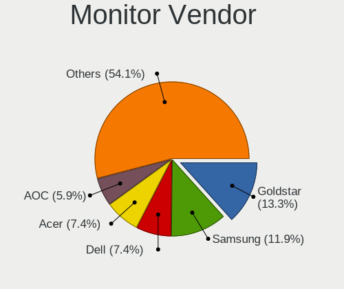
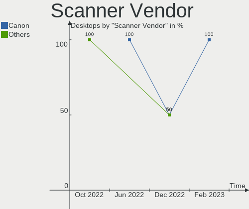

Arch Hardware Trends (Desktop)
------------------------------

A project to identify most popular hardware characteristics and track their change
over time based on data collected by Arch users at https://Linux-Hardware.org.

Anyone can contribute to the study by uploading probes of their computers by
the [hw-probe](https://github.com/linuxhw/hw-probe) tool:

    sudo -E hw-probe -all -upload

Full-feature report is available here: https://linux-hardware.org/?view=trends&formfactor=desktop

Period: May, 2021.

Contents
--------

- [ OS                       ](#os)
- [ OS Family                ](#os-family)
- [ Kernel                   ](#kernel)
- [ Kernel Family            ](#kernel-family)
- [ Kernel Major Ver.        ](#kernel-major-ver)
- [ Arch                     ](#arch)
- [ DE                       ](#de)
- [ Display Server           ](#display-server)
- [ Display Manager          ](#display-manager)
- [ OS Lang                  ](#os-lang)
- [ Boot Mode                ](#boot-mode)
- [ Filesystem               ](#filesystem)
- [ Part. scheme             ](#part-scheme)
- [ Dual Boot with Linux/BSD ](#dual-boot-with-linux/bsd)
- [ Dual Boot (Win)          ](#dual-boot-win)
- [ Country                  ](#country)
- [ City                     ](#city)
- [ Vendor                   ](#vendor)
- [ Model                    ](#model)
- [ Model Family             ](#model-family)
- [ MFG Year                 ](#mfg-year)
- [ Form Factor              ](#form-factor)
- [ Secure Boot              ](#secure-boot)
- [ Coreboot                 ](#coreboot)
- [ RAM Size                 ](#ram-size)
- [ RAM Used                 ](#ram-used)
- [ Has CD-ROM               ](#has-cd-rom)
- [ Total Drives             ](#total-drives)
- [ Has Ethernet             ](#has-ethernet)
- [ Has WiFi                 ](#has-wifi)
- [ Has Bluetooth            ](#has-bluetooth)
- [ Drive Vendor             ](#drive-vendor)
- [ Drive Model              ](#drive-model)
- [ HDD Vendor               ](#hdd-vendor)
- [ SSD Vendor               ](#ssd-vendor)
- [ Drive Kind               ](#drive-kind)
- [ Drive Connector          ](#drive-connector)
- [ Drive Size               ](#drive-size)
- [ Space Total              ](#space-total)
- [ Space Used               ](#space-used)
- [ Malfunc. Drives          ](#malfunc-drives)
- [ Malfunc. Drive Vendor    ](#malfunc-drive-vendor)
- [ Malfunc. HDD Vendor      ](#malfunc-hdd-vendor)
- [ Malfunc. Drive Kind      ](#malfunc-drive-kind)
- [ Failed Drives            ](#failed-drives)
- [ Failed Drive Vendor      ](#failed-drive-vendor)
- [ Drive Status             ](#drive-status)
- [ Storage Vendor           ](#storage-vendor)
- [ Storage Model            ](#storage-model)
- [ Storage Kind             ](#storage-kind)
- [ CPU Vendor               ](#cpu-vendor)
- [ CPU Model                ](#cpu-model)
- [ CPU Model Family         ](#cpu-model-family)
- [ CPU Cores                ](#cpu-cores)
- [ CPU Sockets              ](#cpu-sockets)
- [ CPU Threads              ](#cpu-threads)
- [ CPU Op-Modes             ](#cpu-op-modes)
- [ CPU Microcode            ](#cpu-microcode)
- [ CPU Microarch            ](#cpu-microarch)
- [ GPU Vendor               ](#gpu-vendor)
- [ GPU Model                ](#gpu-model)
- [ GPU Combo                ](#gpu-combo)
- [ GPU Driver               ](#gpu-driver)
- [ GPU Memory               ](#gpu-memory)
- [ Monitor Vendor           ](#monitor-vendor)
- [ Monitor Model            ](#monitor-model)
- [ Monitor Resolution       ](#monitor-resolution)
- [ Monitor Diagonal         ](#monitor-diagonal)
- [ Monitor Width            ](#monitor-width)
- [ Aspect Ratio             ](#aspect-ratio)
- [ Monitor Area             ](#monitor-area)
- [ Pixel Density            ](#pixel-density)
- [ Multiple Monitors        ](#multiple-monitors)
- [ Net Controller Vendor    ](#net-controller-vendor)
- [ Net Controller Model     ](#net-controller-model)
- [ Wireless Vendor          ](#wireless-vendor)
- [ Wireless Model           ](#wireless-model)
- [ Ethernet Vendor          ](#ethernet-vendor)
- [ Ethernet Model           ](#ethernet-model)
- [ Net Controller Kind      ](#net-controller-kind)
- [ Used Controller          ](#used-controller)
- [ NICs                     ](#nics)
- [ IPv6                     ](#ipv6)
- [ Memory Vendor            ](#memory-vendor)
- [ Memory Model             ](#memory-model)
- [ Memory Kind              ](#memory-kind)
- [ Memory Form Factor       ](#memory-form-factor)
- [ Memory Size              ](#memory-size)
- [ Memory Speed             ](#memory-speed)
- [ Sound Vendor             ](#sound-vendor)
- [ Sound Model              ](#sound-model)
- [ Camera Vendor            ](#camera-vendor)
- [ Camera Model             ](#camera-model)
- [ Fingerprint Vendor       ](#fingerprint-vendor)
- [ Fingerprint Model        ](#fingerprint-model)
- [ Chipcard Vendor          ](#chipcard-vendor)
- [ Chipcard Model           ](#chipcard-model)
- [ Printer Vendor           ](#printer-vendor)
- [ Printer Model            ](#printer-model)
- [ Scanner Vendor           ](#scanner-vendor)
- [ Scanner Model            ](#scanner-model)
- [ Bluetooth Vendor         ](#bluetooth-vendor)
- [ Bluetooth Model          ](#bluetooth-model)
- [ Unsupported Devices      ](#unsupported-devices)
- [ Unsupported Device Types ](#unsupported-device-types)

OS
--

Installed operating systems

| Name         | Desktops | Percent |
|--------------|----------|---------|
| Arch         | 41       | 58.57%  |
| Arch Rolling | 29       | 41.43%  |

OS Family
---------

OS without a version

| Name | Desktops | Percent |
|------|----------|---------|
| Arch | 70       | 100%    |

Kernel
------

Version of the Linux kernel

| Version             | Desktops | Percent |
|---------------------|----------|---------|
| 5.12.4-arch1-2      | 10       | 14.29%  |
| 5.11.16-arch1-1     | 9        | 12.86%  |
| 5.12.3-arch1-1      | 7        | 10%     |
| 5.12.6-arch1-1      | 5        | 7.14%   |
| 5.12.1-arch1-1      | 5        | 7.14%   |
| 5.12.6-zen1-1-zen   | 3        | 4.29%   |
| 5.12.2-arch1-1      | 3        | 4.29%   |
| 5.12.1-zen2-1-zen   | 3        | 4.29%   |
| 5.11.16-zen1-1-zen  | 3        | 4.29%   |
| 5.12.8-arch1-1      | 2        | 2.86%   |
| 5.12.7-arch1-1      | 2        | 2.86%   |
| 5.12.5-arch1-1      | 2        | 2.86%   |
| 5.12.4-zen1-2-zen   | 2        | 2.86%   |
| 5.10.36-1-lts       | 2        | 2.86%   |
| 5.12.5-zen1-1-zen   | 1        | 1.43%   |
| 5.12.5-158-tkg-pds  | 1        | 1.43%   |
| 5.12.4-arch1-1-vfio | 1        | 1.43%   |
| 5.12.4-157-tkg-bmq  | 1        | 1.43%   |
| 5.12.3-zen1-1-zen   | 1        | 1.43%   |
| 5.12.1-xanmod2-2    | 1        | 1.43%   |
| 5.12.0-152-tkg-pds  | 1        | 1.43%   |
| 5.11.7-arch1-1      | 1        | 1.43%   |
| 5.11.21-lqx2-1-lqx  | 1        | 1.43%   |
| 5.11.15-arch1-2     | 1        | 1.43%   |
| 5.10.33-1-lts       | 1        | 1.43%   |
| 5.10.27-1-lts       | 1        | 1.43%   |

Kernel Family
-------------

Linux kernel without a distro release

| Version | Desktops | Percent |
|---------|----------|---------|
| 5.12.4  | 14       | 20%     |
| 5.11.16 | 12       | 17.14%  |
| 5.12.1  | 9        | 12.86%  |
| 5.12.6  | 8        | 11.43%  |
| 5.12.3  | 8        | 11.43%  |
| 5.12.5  | 4        | 5.71%   |
| 5.12.2  | 3        | 4.29%   |
| 5.12.8  | 2        | 2.86%   |
| 5.12.7  | 2        | 2.86%   |
| 5.10.36 | 2        | 2.86%   |
| 5.12.0  | 1        | 1.43%   |
| 5.11.7  | 1        | 1.43%   |
| 5.11.21 | 1        | 1.43%   |
| 5.11.15 | 1        | 1.43%   |
| 5.10.33 | 1        | 1.43%   |
| 5.10.27 | 1        | 1.43%   |

Kernel Major Ver.
-----------------

Linux kernel major version

| Version | Desktops | Percent |
|---------|----------|---------|
| 5.12    | 51       | 72.86%  |
| 5.11    | 15       | 21.43%  |
| 5.10    | 4        | 5.71%   |

Arch
----

OS architecture (x86_64, i586, etc.)

| Name   | Desktops | Percent |
|--------|----------|---------|
| x86_64 | 70       | 100%    |

DE
--

Desktop Environment

| Name              | Desktops | Percent |
|-------------------|----------|---------|
| KDE5              | 21       | 30%     |
| GNOME             | 18       | 25.71%  |
| KDE               | 13       | 18.57%  |
| i3                | 6        | 8.57%   |
| XFCE              | 3        | 4.29%   |
| Unknown           | 3        | 4.29%   |
| Cinnamon          | 2        | 2.86%   |
| Yaru:ubuntu:GNOME | 1        | 1.43%   |
| Unity             | 1        | 1.43%   |
| qtile             | 1        | 1.43%   |
| LXQt              | 1        | 1.43%   |

Display Server
--------------

X11 or Wayland

| Name    | Desktops | Percent |
|---------|----------|---------|
| X11     | 51       | 72.86%  |
| Wayland | 11       | 15.71%  |
| Tty     | 6        | 8.57%   |
| Unknown | 2        | 2.86%   |

Display Manager
---------------

SDDM, LightDM, etc.

| Name    | Desktops | Percent |
|---------|----------|---------|
| Unknown | 29       | 41.43%  |
| SDDM    | 24       | 34.29%  |
| GDM     | 9        | 12.86%  |
| TDM     | 5        | 7.14%   |
| XDM     | 1        | 1.43%   |
| SLiM    | 1        | 1.43%   |
| LightDM | 1        | 1.43%   |

OS Lang
-------

Language

| Lang    | Desktops | Percent |
|---------|----------|---------|
| en_US   | 36       | 51.43%  |
| en_GB   | 11       | 15.71%  |
| ru_RU   | 3        | 4.29%   |
| it_IT   | 3        | 4.29%   |
| C       | 3        | 4.29%   |
| pl_PL   | 2        | 2.86%   |
| en_CA   | 2        | 2.86%   |
| zh_CN   | 1        | 1.43%   |
| uk_UA   | 1        | 1.43%   |
| pt_BR   | 1        | 1.43%   |
| es_MX   | 1        | 1.43%   |
| es_ES   | 1        | 1.43%   |
| en_DE   | 1        | 1.43%   |
| de_DE   | 1        | 1.43%   |
| de_AT   | 1        | 1.43%   |
| ca_ES   | 1        | 1.43%   |
| Unknown | 1        | 1.43%   |

Boot Mode
---------

EFI or BIOS

| Mode | Desktops | Percent |
|------|----------|---------|
| EFI  | 38       | 54.29%  |
| BIOS | 32       | 45.71%  |

Filesystem
----------

Type of filesystem

| Type    | Desktops | Percent |
|---------|----------|---------|
| Ext4    | 53       | 75.71%  |
| Btrfs   | 14       | 20%     |
| Xfs     | 2        | 2.86%   |
| Overlay | 1        | 1.43%   |

Part. scheme
------------

Scheme of partitioning

| Type    | Desktops | Percent |
|---------|----------|---------|
| GPT     | 45       | 64.29%  |
| Unknown | 22       | 31.43%  |
| MBR     | 3        | 4.29%   |

Dual Boot with Linux/BSD
------------------------

Hosting more than one Linux/BSD

| Dual boot | Desktops | Percent |
|-----------|----------|---------|
| No        | 55       | 78.57%  |
| Yes       | 15       | 21.43%  |

Dual Boot (Win)
---------------

Hosting Linux and Windows

| Dual boot | Desktops | Percent |
|-----------|----------|---------|
| No        | 39       | 55.71%  |
| Yes       | 31       | 44.29%  |

Country
-------

Geographic location (country)

| Country    | Desktops | Percent |
|------------|----------|---------|
| USA        | 13       | 18.57%  |
| Russia     | 7        | 10%     |
| Germany    | 7        | 10%     |
| UK         | 6        | 8.57%   |
| Sweden     | 4        | 5.71%   |
| Canada     | 4        | 5.71%   |
| Spain      | 3        | 4.29%   |
| Poland     | 3        | 4.29%   |
| Italy      | 3        | 4.29%   |
| Austria    | 3        | 4.29%   |
| Uruguay    | 2        | 2.86%   |
| Ukraine    | 2        | 2.86%   |
| Finland    | 2        | 2.86%   |
| Brazil     | 2        | 2.86%   |
| Vietnam    | 1        | 1.43%   |
| Turkey     | 1        | 1.43%   |
| Mexico     | 1        | 1.43%   |
| Hungary    | 1        | 1.43%   |
| Colombia   | 1        | 1.43%   |
| China      | 1        | 1.43%   |
| Belarus    | 1        | 1.43%   |
| Azerbaijan | 1        | 1.43%   |
| Argentina  | 1        | 1.43%   |

City
----

Geographic location (city)

| City               | Desktops | Percent |
|--------------------|----------|---------|
| Moscow             | 3        | 4.29%   |
| St Petersburg      | 2        | 2.86%   |
| Palermo            | 2        | 2.86%   |
| Montevideo         | 2        | 2.86%   |
| Helsinki           | 2        | 2.86%   |
| Würzburg          | 1        | 1.43%   |
| Wuxi               | 1        | 1.43%   |
| Wolverhampton      | 1        | 1.43%   |
| Wichita            | 1        | 1.43%   |
| Whitewater         | 1        | 1.43%   |
| Walthamstow        | 1        | 1.43%   |
| Voronezh           | 1        | 1.43%   |
| Villa Ballester    | 1        | 1.43%   |
| Vienna             | 1        | 1.43%   |
| Veracruz           | 1        | 1.43%   |
| Tambach-Dietharz   | 1        | 1.43%   |
| São Paulo         | 1        | 1.43%   |
| Sundsvall          | 1        | 1.43%   |
| Stockholm          | 1        | 1.43%   |
| St. Petersburg     | 1        | 1.43%   |
| Seattle            | 1        | 1.43%   |
| Schwanenstadt      | 1        | 1.43%   |
| Sabadell           | 1        | 1.43%   |
| Romford            | 1        | 1.43%   |
| Rockland           | 1        | 1.43%   |
| Richmond Hill      | 1        | 1.43%   |
| Poznan             | 1        | 1.43%   |
| Portland           | 1        | 1.43%   |
| Pomona             | 1        | 1.43%   |
| Perm               | 1        | 1.43%   |
| Palmer             | 1        | 1.43%   |
| Ottawa             | 1        | 1.43%   |
| Norwich            | 1        | 1.43%   |
| Northampton        | 1        | 1.43%   |
| Norrköping        | 1        | 1.43%   |
| Málaga            | 1        | 1.43%   |
| Moosburg           | 1        | 1.43%   |
| Minsk              | 1        | 1.43%   |
| Miami              | 1        | 1.43%   |
| Lublin             | 1        | 1.43%   |
| Los Angeles        | 1        | 1.43%   |
| London             | 1        | 1.43%   |
| Kyiv               | 1        | 1.43%   |
| Kaslo              | 1        | 1.43%   |
| Kansas City        | 1        | 1.43%   |
| Ingelheim am Rhein | 1        | 1.43%   |
| Hanoi              | 1        | 1.43%   |
| Hamm               | 1        | 1.43%   |
| Halle              | 1        | 1.43%   |
| Graz               | 1        | 1.43%   |
| Duque de Caxias    | 1        | 1.43%   |
| Dortmund           | 1        | 1.43%   |
| Dobre Miasto       | 1        | 1.43%   |
| Cusano Mutri       | 1        | 1.43%   |
| Calgary            | 1        | 1.43%   |
| Bursa              | 1        | 1.43%   |
| Burgos             | 1        | 1.43%   |
| Budapest           | 1        | 1.43%   |
| Belfast            | 1        | 1.43%   |
| Barranquilla       | 1        | 1.43%   |

Vendor
------

Motherboard manufacturer

| Name                | Desktops | Percent |
|---------------------|----------|---------|
| ASUSTek Computer    | 26       | 37.14%  |
| ASRock              | 15       | 21.43%  |
| MSI                 | 10       | 14.29%  |
| Gigabyte Technology | 10       | 14.29%  |
| Dell                | 3        | 4.29%   |
| Lenovo              | 1        | 1.43%   |
| Hewlett-Packard     | 1        | 1.43%   |
| Fujitsu             | 1        | 1.43%   |
| Foxconn             | 1        | 1.43%   |
| ECS                 | 1        | 1.43%   |
| Unknown             | 1        | 1.43%   |

Model
-----

Motherboard model

| Name                              | Desktops | Percent |
|-----------------------------------|----------|---------|
| MSI MS-7B86                       | 3        | 4.29%   |
| ASRock X570M Pro4                 | 3        | 4.29%   |
| MSI MS-7C02                       | 2        | 2.86%   |
| ASUS TUF GAMING X570-PLUS         | 2        | 2.86%   |
| ASUS TUF B360-PRO GAMING          | 2        | 2.86%   |
| ASUS PRIME B550M-A                | 2        | 2.86%   |
| MSI MS-7C56                       | 1        | 1.43%   |
| MSI MS-7C37                       | 1        | 1.43%   |
| MSI MS-7B98                       | 1        | 1.43%   |
| MSI MS-7B84                       | 1        | 1.43%   |
| MSI MS-7816                       | 1        | 1.43%   |
| Lenovo ThinkCentre M77 2209A12    | 1        | 1.43%   |
| HP OMEN by HP Desktop PC 880-p0xx | 1        | 1.43%   |
| Gigabyte Z97N-Gaming 5            | 1        | 1.43%   |
| Gigabyte Z77X-D3H                 | 1        | 1.43%   |
| Gigabyte X570 I AORUS PRO WIFI    | 1        | 1.43%   |
| Gigabyte X570 AORUS PRO           | 1        | 1.43%   |
| Gigabyte H87-HD3                  | 1        | 1.43%   |
| Gigabyte GA-880GA-UD3H            | 1        | 1.43%   |
| Gigabyte GA-780T-D3L              | 1        | 1.43%   |
| Gigabyte B450 AORUS ELITE         | 1        | 1.43%   |
| Gigabyte AB350-Gaming 3           | 1        | 1.43%   |
| Gigabyte A520M S2H                | 1        | 1.43%   |
| Fujitsu ESPRIMO Q956              | 1        | 1.43%   |
| Foxconn p6653w                    | 1        | 1.43%   |
| ECS Livermore8                    | 1        | 1.43%   |
| Dell XPS 8500                     | 1        | 1.43%   |
| Dell Precision Tower 5810         | 1        | 1.43%   |
| Dell OptiPlex 990                 | 1        | 1.43%   |
| ASUS Z170I PRO GAMING             | 1        | 1.43%   |
| ASUS TUF GAMING B550M-PLUS        | 1        | 1.43%   |
| ASUS SABERTOOTH 990FX R2.0        | 1        | 1.43%   |
| ASUS ROG STRIX B450-F GAMING      | 1        | 1.43%   |
| ASUS ROG STRIX B360-I GAMING      | 1        | 1.43%   |
| ASUS ROG STRIX B350-F GAMING      | 1        | 1.43%   |
| ASUS ROG CROSSHAIR VIII DARK HERO | 1        | 1.43%   |
| ASUS PRIME Z590M-PLUS             | 1        | 1.43%   |
| ASUS PRIME X570-P                 | 1        | 1.43%   |
| ASUS PRIME X470-PRO               | 1        | 1.43%   |
| ASUS PRIME H110M-P                | 1        | 1.43%   |
| ASUS PRIME B450M-A II             | 1        | 1.43%   |
| ASUS PRIME B450M-A                | 1        | 1.43%   |
| ASUS P8Z77-V PRO                  | 1        | 1.43%   |
| ASUS P8H77-M PRO                  | 1        | 1.43%   |
| ASUS P6X58D PREMIUM               | 1        | 1.43%   |
| ASUS MacPro7,1                    | 1        | 1.43%   |
| ASUS M4A88TD-M EVO                | 1        | 1.43%   |
| ASUS All Series                   | 1        | 1.43%   |
| ASUS A88XM-PLUS                   | 1        | 1.43%   |
| ASRock Z170 Pro4                  | 1        | 1.43%   |
| ASRock X99M Extreme4              | 1        | 1.43%   |
| ASRock X570 Phantom Gaming 4      | 1        | 1.43%   |
| ASRock X470 Taichi                | 1        | 1.43%   |
| ASRock X370 Gaming X              | 1        | 1.43%   |
| ASRock G502                       | 1        | 1.43%   |
| ASRock G41M-VS3                   | 1        | 1.43%   |
| ASRock B550M Pro4                 | 1        | 1.43%   |
| ASRock B450M-HDV R4.0             | 1        | 1.43%   |
| ASRock B450M Pro4-F               | 1        | 1.43%   |
| ASRock A320M-HDV R3.0             | 1        | 1.43%   |

Model Family
------------

Motherboard model prefix

| Name                   | Desktops | Percent |
|------------------------|----------|---------|
| ASUS PRIME             | 8        | 11.43%  |
| ASUS TUF               | 5        | 7.14%   |
| ASUS ROG               | 4        | 5.71%   |
| MSI MS-7B86            | 3        | 4.29%   |
| ASRock X570M           | 3        | 4.29%   |
| MSI MS-7C02            | 2        | 2.86%   |
| Gigabyte X570          | 2        | 2.86%   |
| MSI MS-7C56            | 1        | 1.43%   |
| MSI MS-7C37            | 1        | 1.43%   |
| MSI MS-7B98            | 1        | 1.43%   |
| MSI MS-7B84            | 1        | 1.43%   |
| MSI MS-7816            | 1        | 1.43%   |
| Lenovo ThinkCentre     | 1        | 1.43%   |
| HP OMEN                | 1        | 1.43%   |
| Gigabyte Z97N-Gaming   | 1        | 1.43%   |
| Gigabyte Z77X-D3H      | 1        | 1.43%   |
| Gigabyte H87-HD3       | 1        | 1.43%   |
| Gigabyte GA-880GA-UD3H | 1        | 1.43%   |
| Gigabyte GA-780T-D3L   | 1        | 1.43%   |
| Gigabyte B450          | 1        | 1.43%   |
| Gigabyte AB350-Gaming  | 1        | 1.43%   |
| Gigabyte A520M         | 1        | 1.43%   |
| Fujitsu ESPRIMO        | 1        | 1.43%   |
| Foxconn p6653w         | 1        | 1.43%   |
| ECS Livermore8         | 1        | 1.43%   |
| Dell XPS               | 1        | 1.43%   |
| Dell Precision         | 1        | 1.43%   |
| Dell OptiPlex          | 1        | 1.43%   |
| ASUS Z170I             | 1        | 1.43%   |
| ASUS SABERTOOTH        | 1        | 1.43%   |
| ASUS P8Z77-V           | 1        | 1.43%   |
| ASUS P8H77-M           | 1        | 1.43%   |
| ASUS P6X58D            | 1        | 1.43%   |
| ASUS MacPro7           | 1        | 1.43%   |
| ASUS M4A88TD-M         | 1        | 1.43%   |
| ASUS All               | 1        | 1.43%   |
| ASUS A88XM-PLUS        | 1        | 1.43%   |
| ASRock Z170            | 1        | 1.43%   |
| ASRock X99M            | 1        | 1.43%   |
| ASRock X570            | 1        | 1.43%   |
| ASRock X470            | 1        | 1.43%   |
| ASRock X370            | 1        | 1.43%   |
| ASRock G502            | 1        | 1.43%   |
| ASRock G41M-VS3        | 1        | 1.43%   |
| ASRock B550M           | 1        | 1.43%   |
| ASRock B450M-HDV       | 1        | 1.43%   |
| ASRock B450M           | 1        | 1.43%   |
| ASRock A320M-HDV       | 1        | 1.43%   |
| ASRock 970             | 1        | 1.43%   |
| Unknown                | 1        | 1.43%   |

MFG Year
--------

Motherboard manufacture year

| Year | Desktops | Percent |
|------|----------|---------|
| 2020 | 21       | 30%     |
| 2021 | 12       | 17.14%  |
| 2019 | 10       | 14.29%  |
| 2018 | 9        | 12.86%  |
| 2014 | 4        | 5.71%   |
| 2013 | 3        | 4.29%   |
| 2010 | 3        | 4.29%   |
| 2017 | 2        | 2.86%   |
| 2012 | 2        | 2.86%   |
| 2016 | 1        | 1.43%   |
| 2015 | 1        | 1.43%   |
| 2011 | 1        | 1.43%   |
| 2007 | 1        | 1.43%   |

Form Factor
-----------

Physical design of the computer

| Name    | Desktops | Percent |
|---------|----------|---------|
| Desktop | 70       | 100%    |

Secure Boot
-----------

Enabled or disabled

| State    | Desktops | Percent |
|----------|----------|---------|
| Disabled | 70       | 100%    |

Coreboot
--------

Have coreboot on board

| Used | Desktops | Percent |
|------|----------|---------|
| No   | 70       | 100%    |

RAM Size
--------

Total RAM memory

| Size in GB  | Desktops | Percent |
|-------------|----------|---------|
| 16.01-24.0  | 26       | 37.14%  |
| 32.01-64.0  | 20       | 28.57%  |
| 8.01-16.0   | 9        | 12.86%  |
| 4.01-8.0    | 7        | 10%     |
| 64.01-256.0 | 3        | 4.29%   |
| 3.01-4.0    | 2        | 2.86%   |
| 24.01-32.0  | 2        | 2.86%   |
| 2.01-3.0    | 1        | 1.43%   |

RAM Used
--------

Used RAM memory

| Used GB    | Desktops | Percent |
|------------|----------|---------|
| 4.01-8.0   | 19       | 27.14%  |
| 3.01-4.0   | 15       | 21.43%  |
| 2.01-3.0   | 12       | 17.14%  |
| 1.01-2.0   | 9        | 12.86%  |
| 8.01-16.0  | 8        | 11.43%  |
| 0.51-1.0   | 4        | 5.71%   |
| 16.01-24.0 | 2        | 2.86%   |
| 0.01-0.5   | 1        | 1.43%   |

Has CD-ROM
----------

Has CD-ROM on board

| Presented | Desktops | Percent |
|-----------|----------|---------|
| No        | 46       | 65.71%  |
| Yes       | 24       | 34.29%  |

Total Drives
------------

Number of drives on board

| Drives | Desktops | Percent |
|--------|----------|---------|
| 2      | 24       | 34.29%  |
| 3      | 16       | 22.86%  |
| 4      | 10       | 14.29%  |
| 1      | 9        | 12.86%  |
| 6      | 5        | 7.14%   |
| 5      | 4        | 5.71%   |
| 14     | 1        | 1.43%   |
| 7      | 1        | 1.43%   |

Has Ethernet
------------

Has Ethernet on board

| Presented | Desktops | Percent |
|-----------|----------|---------|
| Yes       | 70       | 100%    |

Has WiFi
--------

Has WiFi module

| Presented | Desktops | Percent |
|-----------|----------|---------|
| No        | 36       | 51.43%  |
| Yes       | 34       | 48.57%  |

Has Bluetooth
-------------

Has Bluetooth module

| Presented | Desktops | Percent |
|-----------|----------|---------|
| No        | 39       | 55.71%  |
| Yes       | 31       | 44.29%  |

Drive Vendor
------------

Hard drive vendors

| Vendor                    | Desktops | Drives | Percent |
|---------------------------|----------|--------|---------|
| Samsung Electronics       | 32       | 49     | 18.29%  |
| WDC                       | 26       | 44     | 14.86%  |
| Seagate                   | 23       | 28     | 13.14%  |
| Kingston                  | 16       | 17     | 9.14%   |
| Toshiba                   | 15       | 17     | 8.57%   |
| SanDisk                   | 12       | 14     | 6.86%   |
| Crucial                   | 7        | 7      | 4%      |
| Phison                    | 5        | 5      | 2.86%   |
| A-DATA Technology         | 5        | 6      | 2.86%   |
| SK Hynix                  | 3        | 3      | 1.71%   |
| Micron/Crucial Technology | 3        | 3      | 1.71%   |
| HGST                      | 3        | 5      | 1.71%   |
| TO Exter                  | 2        | 2      | 1.14%   |
| SPCC                      | 2        | 2      | 1.14%   |
| PLEXTOR                   | 2        | 2      | 1.14%   |
| Intel                     | 2        | 2      | 1.14%   |
| Yangtze Memory            | 1        | 1      | 0.57%   |
| XPG                       | 1        | 2      | 0.57%   |
| Unknown                   | 1        | 1      | 0.57%   |
| SABRENT                   | 1        | 1      | 0.57%   |
| QUMO                      | 1        | 1      | 0.57%   |
| PNY                       | 1        | 1      | 0.57%   |
| Patriot                   | 1        | 1      | 0.57%   |
| OCZ                       | 1        | 1      | 0.57%   |
| Mushkin                   | 1        | 1      | 0.57%   |
| KingSpec                  | 1        | 1      | 0.57%   |
| KingDian                  | 1        | 1      | 0.57%   |
| Hitachi                   | 1        | 1      | 0.57%   |
| GOODRAM                   | 1        | 1      | 0.57%   |
| Gigabyte Technology       | 1        | 1      | 0.57%   |
| China                     | 1        | 1      | 0.57%   |
| BAITITON                  | 1        | 1      | 0.57%   |
| Apple                     | 1        | 1      | 0.57%   |

Drive Model
-----------

Hard drive models

| Model                                  | Desktops | Percent |
|----------------------------------------|----------|---------|
| Kingston SA400S37480G 480GB SSD        | 6        | 2.9%    |
| Samsung SSD 860 EVO 500GB              | 5        | 2.42%   |
| Seagate ST2000DM008-2FR102 2TB         | 4        | 1.93%   |
| Samsung SSD 970 EVO 1TB                | 4        | 1.93%   |
| Toshiba HDWD130 3TB                    | 3        | 1.45%   |
| Seagate ST4000DM004-2CV104 4TB         | 3        | 1.45%   |
| Samsung SSD 850 EVO 500GB              | 3        | 1.45%   |
| Samsung SSD 850 EVO 250GB              | 3        | 1.45%   |
| Samsung SSD 840 EVO 250GB              | 3        | 1.45%   |
| Crucial CT500MX500SSD1 500GB           | 3        | 1.45%   |
| WDC WD10EZEX-75WN4A0 1TB               | 2        | 0.97%   |
| WDC WD10EZEX-22MFCA0 1TB               | 2        | 0.97%   |
| WDC WD10EZEX-08WN4A0 1TB               | 2        | 0.97%   |
| TO Exter nal USB 3.0 1TB               | 2        | 0.97%   |
| Seagate ST4000VN008-2DR166 4TB         | 2        | 0.97%   |
| Seagate ST2000DM006-2DM164 2TB         | 2        | 0.97%   |
| Seagate ST1000DM003-1CH162 1TB         | 2        | 0.97%   |
| SanDisk SDSSDH3500G 500GB              | 2        | 0.97%   |
| Samsung SSD 970 EVO Plus 1TB           | 2        | 0.97%   |
| Samsung SSD 970 EVO 250GB              | 2        | 0.97%   |
| Samsung SSD 860 EVO 1TB                | 2        | 0.97%   |
| Samsung SSD 850 PRO 512GB              | 2        | 0.97%   |
| Samsung NVMe SSD Drive 500GB           | 2        | 0.97%   |
| Phison Sabrent Rocket 4.0 500GB        | 2        | 0.97%   |
| A-DATA SX8200PNP 512GB                 | 2        | 0.97%   |
| Yangtze Memory ZHITAI PC005 Active 1TB | 1        | 0.48%   |
| XPG NVMe SSD Drive 1024GB              | 1        | 0.48%   |
| XPG GAMMIX S11 Pro 512GB               | 1        | 0.48%   |
| WDC WUH721414ALE604 14TB               | 1        | 0.48%   |
| WDC WDS500G2B0C-00PXH0 500GB           | 1        | 0.48%   |
| WDC WDS500G2B0B 500GB SSD              | 1        | 0.48%   |
| WDC WDS250G2B0B 250GB SSD              | 1        | 0.48%   |
| WDC WDS100T2B0A-00SM50 1TB SSD         | 1        | 0.48%   |
| WDC WDBRPG0010BNC-WRSN 1TB             | 1        | 0.48%   |
| WDC WD60EZRZ-00GZ5B1 6TB               | 1        | 0.48%   |
| WDC WD50EZRZ-00RWYB1 5TB               | 1        | 0.48%   |
| WDC WD5000LPVX-22V0TT0 500GB           | 1        | 0.48%   |
| WDC WD5000LPCX-24VHAT0 500GB           | 1        | 0.48%   |
| WDC WD5000AAKX-60U6AA0 500GB           | 1        | 0.48%   |
| WDC WD40EFRX-68WT0N0 4TB               | 1        | 0.48%   |
| WDC WD40EFRX-68N32N0 4TB               | 1        | 0.48%   |
| WDC WD30EZRX-00D8PB0 3TB               | 1        | 0.48%   |
| WDC WD30EFRX-68EUZN0 3TB               | 1        | 0.48%   |
| WDC WD20EZRZ-00Z5HB0 2TB               | 1        | 0.48%   |
| WDC WD20EZRX-00D8PB0 2TB               | 1        | 0.48%   |
| WDC WD20EURS-63S48Y0 2TB               | 1        | 0.48%   |
| WDC WD20EARX-32PASB0 2TB               | 1        | 0.48%   |
| WDC WD20EARS-00MVWB0 2TB               | 1        | 0.48%   |
| WDC WD1600AAJS-22L7A0 160GB            | 1        | 0.48%   |
| WDC WD140EMFZ-11A0WA0 14TB             | 1        | 0.48%   |
| WDC WD10JPVX-00JC3T0 1TB               | 1        | 0.48%   |
| WDC WD10EZEX-07WN4A0 1TB               | 1        | 0.48%   |
| WDC WD10EZEX-00WN4A0 1TB               | 1        | 0.48%   |
| WDC WD10EARS-00Y5B1 1TB                | 1        | 0.48%   |
| WDC WD10EARS-003BB1 1TB                | 1        | 0.48%   |
| WDC WD10EADS-00M2B0 1TB                | 1        | 0.48%   |
| WDC WD1002FAEX-00Y9A0 1TB              | 1        | 0.48%   |
| Unknown SD/MMC/MS PRO 8GB              | 1        | 0.48%   |
| Toshiba TR200 480GB SSD                | 1        | 0.48%   |
| Toshiba THNSNJ128G8NY 128GB SSD        | 1        | 0.48%   |

HDD Vendor
----------

Hard disk drive vendors

| Vendor              | Desktops | Drives | Percent |
|---------------------|----------|--------|---------|
| WDC                 | 24       | 38     | 35.29%  |
| Seagate             | 23       | 27     | 33.82%  |
| Toshiba             | 14       | 15     | 20.59%  |
| HGST                | 3        | 5      | 4.41%   |
| Samsung Electronics | 2        | 2      | 2.94%   |
| Hitachi             | 1        | 1      | 1.47%   |
| Apple               | 1        | 1      | 1.47%   |

SSD Vendor
----------

Solid state drive vendors

| Vendor              | Desktops | Drives | Percent |
|---------------------|----------|--------|---------|
| Samsung Electronics | 20       | 30     | 27.78%  |
| Kingston            | 13       | 14     | 18.06%  |
| SanDisk             | 11       | 13     | 15.28%  |
| Crucial             | 6        | 6      | 8.33%   |
| WDC                 | 3        | 4      | 4.17%   |
| Toshiba             | 2        | 2      | 2.78%   |
| TO Exter            | 2        | 2      | 2.78%   |
| A-DATA Technology   | 2        | 2      | 2.78%   |
| SPCC                | 1        | 1      | 1.39%   |
| SK Hynix            | 1        | 1      | 1.39%   |
| SABRENT             | 1        | 1      | 1.39%   |
| QUMO                | 1        | 1      | 1.39%   |
| PLEXTOR             | 1        | 1      | 1.39%   |
| Patriot             | 1        | 1      | 1.39%   |
| OCZ                 | 1        | 1      | 1.39%   |
| Mushkin             | 1        | 1      | 1.39%   |
| KingSpec            | 1        | 1      | 1.39%   |
| KingDian            | 1        | 1      | 1.39%   |
| GOODRAM             | 1        | 1      | 1.39%   |
| China               | 1        | 1      | 1.39%   |
| BAITITON            | 1        | 1      | 1.39%   |

Drive Kind
----------

HDD or SSD

| Kind    | Desktops | Drives | Percent |
|---------|----------|--------|---------|
| SSD     | 55       | 86     | 39.01%  |
| HDD     | 53       | 89     | 37.59%  |
| NVMe    | 31       | 47     | 21.99%  |
| Unknown | 2        | 2      | 1.42%   |

Drive Connector
---------------

SATA, SAS, NVMe, etc.

| Type | Desktops | Drives | Percent |
|------|----------|--------|---------|
| SATA | 67       | 170    | 64.42%  |
| NVMe | 31       | 47     | 29.81%  |
| SAS  | 6        | 7      | 5.77%   |

Drive Size
----------

Size of hard drive

| Size in TB | Desktops | Drives | Percent |
|------------|----------|--------|---------|
| 0.01-0.5   | 52       | 83     | 41.6%   |
| 0.51-1.0   | 34       | 39     | 27.2%   |
| 1.01-2.0   | 17       | 18     | 13.6%   |
| 3.01-4.0   | 10       | 12     | 8%      |
| 2.01-3.0   | 7        | 7      | 5.6%    |
| 4.01-10.0  | 4        | 6      | 3.2%    |
| 10.01-20.0 | 1        | 10     | 0.8%    |

Space Total
-----------

Amount of disk space available on the file system

| Size in GB     | Desktops | Percent |
|----------------|----------|---------|
| 1001-2000      | 20       | 28.57%  |
| More than 3000 | 15       | 21.43%  |
| 101-250        | 9        | 12.86%  |
| 501-1000       | 8        | 11.43%  |
| 251-500        | 7        | 10%     |
| 2001-3000      | 5        | 7.14%   |
| 21-50          | 2        | 2.86%   |
| 51-100         | 2        | 2.86%   |
| 1-20           | 1        | 1.43%   |
| Unknown        | 1        | 1.43%   |

Space Used
----------

Amount of used disk space

| Used GB        | Desktops | Percent |
|----------------|----------|---------|
| 251-500        | 11       | 15.71%  |
| 101-250        | 11       | 15.71%  |
| 501-1000       | 9        | 12.86%  |
| 21-50          | 8        | 11.43%  |
| 1001-2000      | 8        | 11.43%  |
| 1-20           | 7        | 10%     |
| More than 3000 | 5        | 7.14%   |
| 2001-3000      | 5        | 7.14%   |
| 51-100         | 5        | 7.14%   |
| Unknown        | 1        | 1.43%   |

Malfunc. Drives
---------------

Drive models with a malfunction

| Model                               | Desktops | Drives | Percent |
|-------------------------------------|----------|--------|---------|
| WDC WD40EFRX-68WT0N0 4TB            | 1        | 2      | 11.11%  |
| WDC WD20EARS-00MVWB0 2TB            | 1        | 1      | 11.11%  |
| Seagate ST1000LM024 HN-M101MBB 1TB  | 1        | 1      | 11.11%  |
| Seagate ST1000DX001-1NS162 1TB      | 1        | 1      | 11.11%  |
| Samsung Electronics SSD 970 EVO 1TB | 1        | 1      | 11.11%  |
| Samsung Electronics HD103SJ 1TB     | 1        | 1      | 11.11%  |
| PLEXTOR PX-1TM8SeG 1TB              | 1        | 1      | 11.11%  |
| OCZ VERTEX3 240GB SSD               | 1        | 1      | 11.11%  |
| BAITITON BT58SSD09S 240GB           | 1        | 1      | 11.11%  |

Malfunc. Drive Vendor
---------------------

Vendors of faulty drives

| Vendor              | Desktops | Drives | Percent |
|---------------------|----------|--------|---------|
| WDC                 | 2        | 3      | 22.22%  |
| Seagate             | 2        | 2      | 22.22%  |
| Samsung Electronics | 2        | 2      | 22.22%  |
| PLEXTOR             | 1        | 1      | 11.11%  |
| OCZ                 | 1        | 1      | 11.11%  |
| BAITITON            | 1        | 1      | 11.11%  |

Malfunc. HDD Vendor
-------------------

Vendors of faulty HDD drives

| Vendor              | Desktops | Drives | Percent |
|---------------------|----------|--------|---------|
| WDC                 | 2        | 3      | 40%     |
| Seagate             | 2        | 2      | 40%     |
| Samsung Electronics | 1        | 1      | 20%     |

Malfunc. Drive Kind
-------------------

Kinds of faulty drives

| Kind | Desktops | Drives | Percent |
|------|----------|--------|---------|
| HDD  | 5        | 6      | 55.56%  |
| NVMe | 2        | 2      | 22.22%  |
| SSD  | 2        | 2      | 22.22%  |

Failed Drives
-------------

Failed drive models

Zero info for selected period =(

Failed Drive Vendor
-------------------

Failed drive vendors

Zero info for selected period =(

Drive Status
------------

Number of failed and malfunc. drives

| Status   | Desktops | Drives | Percent |
|----------|----------|--------|---------|
| Detected | 39       | 89     | 46.99%  |
| Works    | 37       | 125    | 44.58%  |
| Malfunc  | 7        | 10     | 8.43%   |

Storage Vendor
--------------

Storage controller vendors

| Vendor                      | Desktops | Percent |
|-----------------------------|----------|---------|
| AMD                         | 46       | 36.8%   |
| Intel                       | 25       | 20%     |
| Samsung Electronics         | 15       | 12%     |
| Phison Electronics          | 7        | 5.6%    |
| ASMedia Technology          | 6        | 4.8%    |
| Marvell Technology Group    | 5        | 4%      |
| Sandisk                     | 3        | 2.4%    |
| Micron/Crucial Technology   | 3        | 2.4%    |
| Kingston Technology Company | 3        | 2.4%    |
| ADATA Technology            | 3        | 2.4%    |
| SK Hynix                    | 2        | 1.6%    |
| Yangtze Memory Technologies | 1        | 0.8%    |
| VIA Technologies            | 1        | 0.8%    |
| Realtek Semiconductor       | 1        | 0.8%    |
| LSI Logic / Symbios Logic   | 1        | 0.8%    |
| Lite-On Technology          | 1        | 0.8%    |
| JMicron Technology          | 1        | 0.8%    |
| Broadcom / LSI              | 1        | 0.8%    |

Storage Model
-------------

Storage controller models

| Model                                                                          | Desktops | Percent |
|--------------------------------------------------------------------------------|----------|---------|
| AMD FCH SATA Controller [AHCI mode]                                            | 30       | 19.23%  |
| AMD 400 Series Chipset SATA Controller                                         | 15       | 9.62%   |
| Samsung NVMe SSD Controller SM981/PM981/PM983                                  | 12       | 7.69%   |
| ASMedia ASM1062 Serial ATA Controller                                          | 6        | 3.85%   |
| AMD Starship/Matisse Chipset SATA Controller [AHCI mode]                       | 6        | 3.85%   |
| AMD SB7x0/SB8x0/SB9x0 SATA Controller [AHCI mode]                              | 5        | 3.21%   |
| Phison E12 NVMe Controller                                                     | 4        | 2.56%   |
| Intel SATA Controller [RAID mode]                                              | 4        | 2.56%   |
| Intel Q170/Q150/B150/H170/H110/Z170/CM236 Chipset SATA Controller [AHCI Mode]  | 4        | 2.56%   |
| Phison E16 PCIe4 NVMe Controller                                               | 3        | 1.92%   |
| Kingston Company A2000 NVMe SSD                                                | 3        | 1.92%   |
| Intel C610/X99 series chipset sSATA Controller [AHCI mode]                     | 3        | 1.92%   |
| Intel C610/X99 series chipset 6-Port SATA Controller [AHCI mode]               | 3        | 1.92%   |
| Intel 7 Series/C210 Series Chipset Family 6-port SATA Controller [AHCI mode]   | 3        | 1.92%   |
| AMD SB7x0/SB8x0/SB9x0 IDE Controller                                           | 3        | 1.92%   |
| AMD FCH SATA Controller D                                                      | 3        | 1.92%   |
| AMD 300 Series Chipset SATA Controller                                         | 3        | 1.92%   |
| ADATA XPG SX8200 Pro PCIe Gen3x4 M.2 2280 Solid State Drive                    | 3        | 1.92%   |
| SK Hynix Non-Volatile memory controller                                        | 2        | 1.28%   |
| Intel NM10/ICH7 Family SATA Controller [IDE mode]                              | 2        | 1.28%   |
| Intel 9 Series Chipset Family SATA Controller [AHCI Mode]                      | 2        | 1.28%   |
| Intel 82801G (ICH7 Family) IDE Controller                                      | 2        | 1.28%   |
| AMD SB7x0/SB8x0/SB9x0 SATA Controller [IDE mode]                               | 2        | 1.28%   |
| Yangtze Memory Non-Volatile memory controller                                  | 1        | 0.64%   |
| VIA VT6415 PATA IDE Host Controller                                            | 1        | 0.64%   |
| Sandisk WD Blue SN550 NVMe SSD                                                 | 1        | 0.64%   |
| Sandisk WD Blue SN500 / PC SN520 NVMe SSD                                      | 1        | 0.64%   |
| Sandisk WD Black 2018/SN750 / PC SN720 NVMe SSD                                | 1        | 0.64%   |
| Samsung NVMe SSD Controller SM961/PM961/SM963                                  | 1        | 0.64%   |
| Samsung NVMe SSD Controller SM951/PM951                                        | 1        | 0.64%   |
| Samsung NVMe SSD Controller PM9A1/PM9A3/980PRO                                 | 1        | 0.64%   |
| Realtek Realtek Non-Volatile memory controller                                 | 1        | 0.64%   |
| Phison PS5013 E13 NVMe Controller                                              | 1        | 0.64%   |
| Micron/Crucial P2 NVMe PCIe SSD                                                | 1        | 0.64%   |
| Micron/Crucial P1 NVMe PCIe SSD                                                | 1        | 0.64%   |
| Micron/Crucial Non-Volatile memory controller                                  | 1        | 0.64%   |
| Marvell Group 88SE9215 PCIe 2.0 x1 4-port SATA 6 Gb/s Controller               | 1        | 0.64%   |
| Marvell Group 88SE9172 SATA III 6Gb/s RAID Controller                          | 1        | 0.64%   |
| Marvell Group 88SE9172 SATA 6Gb/s Controller                                   | 1        | 0.64%   |
| Marvell Group 88SE9128 PCIe SATA 6 Gb/s RAID controller with HyperDuo          | 1        | 0.64%   |
| Marvell Group 88SE9120 SATA 6Gb/s Controller                                   | 1        | 0.64%   |
| LSI Logic / Symbios Logic SAS2008 PCI-Express Fusion-MPT SAS-2 [Falcon]        | 1        | 0.64%   |
| LSI Logic / Symbios Logic SAS2004 PCI-Express Fusion-MPT SAS-2 [Spitfire]      | 1        | 0.64%   |
| Lite-On Non-Volatile memory controller                                         | 1        | 0.64%   |
| JMicron JMB363 SATA/IDE Controller                                             | 1        | 0.64%   |
| Intel SSD Pro 7600p/760p/E 6100p Series                                        | 1        | 0.64%   |
| Intel Optane SSD 900P Series                                                   | 1        | 0.64%   |
| Intel Cannon Lake PCH SATA AHCI Controller                                     | 1        | 0.64%   |
| Intel C600/X79 series chipset SATA RAID Controller                             | 1        | 0.64%   |
| Intel 82801JI (ICH10 Family) SATA AHCI Controller                              | 1        | 0.64%   |
| Intel 8 Series/C220 Series Chipset Family 6-port SATA Controller 1 [AHCI mode] | 1        | 0.64%   |
| Intel 7 Series/C210 Series Chipset Family 4-port SATA Controller [IDE mode]    | 1        | 0.64%   |
| Intel 7 Series/C210 Series Chipset Family 2-port SATA Controller [IDE mode]    | 1        | 0.64%   |
| Intel 500 Series Chipset Family SATA AHCI Controller                           | 1        | 0.64%   |
| Broadcom / LSI SAS2008 PCI-Express Fusion-MPT SAS-2 [Falcon]                   | 1        | 0.64%   |
| AMD X370 Series Chipset SATA Controller                                        | 1        | 0.64%   |

Storage Kind
------------

Kind of storage controller (IDE, SATA, NVMe, SAS, ...)

| Kind | Desktops | Percent |
|------|----------|---------|
| SATA | 62       | 57.94%  |
| NVMe | 31       | 28.97%  |
| IDE  | 7        | 6.54%   |
| RAID | 6        | 5.61%   |
| SAS  | 1        | 0.93%   |

CPU Vendor
----------

Processor vendors

| Vendor | Desktops | Percent |
|--------|----------|---------|
| AMD    | 47       | 67.14%  |
| Intel  | 23       | 32.86%  |

CPU Model
---------

Processor models

| Model                                           | Desktops | Percent |
|-------------------------------------------------|----------|---------|
| AMD Ryzen 7 3700X 8-Core Processor              | 6        | 8.57%   |
| AMD Ryzen 5 3600 6-Core Processor               | 5        | 7.14%   |
| AMD Ryzen 5 2600X Six-Core Processor            | 4        | 5.71%   |
| Intel Core i7-9700 CPU @ 3.00GHz                | 3        | 4.29%   |
| AMD Ryzen 5 3600X 6-Core Processor              | 3        | 4.29%   |
| AMD Ryzen 5 1600 Six-Core Processor             | 3        | 4.29%   |
| Intel Core i7-5820K CPU @ 3.30GHz               | 2        | 2.86%   |
| Intel Core i7-4790K CPU @ 4.00GHz               | 2        | 2.86%   |
| Intel Core i7-3770 CPU @ 3.40GHz                | 2        | 2.86%   |
| AMD Ryzen 9 5900X 12-Core Processor             | 2        | 2.86%   |
| AMD Ryzen 9 3900X 12-Core Processor             | 2        | 2.86%   |
| AMD Ryzen 7 5800X 8-Core Processor              | 2        | 2.86%   |
| AMD Ryzen 7 2700X Eight-Core Processor          | 2        | 2.86%   |
| Intel Xeon CPU E5-1620 v3 @ 3.50GHz             | 1        | 1.43%   |
| Intel Pentium Dual-Core CPU E6600 @ 3.06GHz     | 1        | 1.43%   |
| Intel Pentium Dual CPU E2180 @ 2.00GHz          | 1        | 1.43%   |
| Intel Core i7-8700 CPU @ 3.20GHz                | 1        | 1.43%   |
| Intel Core i7-6700K CPU @ 4.00GHz               | 1        | 1.43%   |
| Intel Core i7-4770 CPU @ 3.40GHz                | 1        | 1.43%   |
| Intel Core i7-2600S CPU @ 2.80GHz               | 1        | 1.43%   |
| Intel Core i7 CPU 950 @ 3.07GHz                 | 1        | 1.43%   |
| Intel Core i5-6600K CPU @ 3.50GHz               | 1        | 1.43%   |
| Intel Core i5-6500T CPU @ 2.50GHz               | 1        | 1.43%   |
| Intel Core i5-3450 CPU @ 3.10GHz                | 1        | 1.43%   |
| Intel Core i5-2500K CPU @ 3.30GHz               | 1        | 1.43%   |
| Intel Core i3-7100 CPU @ 3.90GHz                | 1        | 1.43%   |
| Intel 11th Gen Core i5-11400 @ 2.60GHz          | 1        | 1.43%   |
| AMD Ryzen 7 2700 Eight-Core Processor           | 1        | 1.43%   |
| AMD Ryzen 7 1700X Eight-Core Processor          | 1        | 1.43%   |
| AMD Ryzen 7 1700 Eight-Core Processor           | 1        | 1.43%   |
| AMD Ryzen 5 PRO 4650G with Radeon Graphics      | 1        | 1.43%   |
| AMD Ryzen 5 2600 Six-Core Processor             | 1        | 1.43%   |
| AMD Ryzen 5 1600X Six-Core Processor            | 1        | 1.43%   |
| AMD Ryzen 3 3200G with Radeon Vega Graphics     | 1        | 1.43%   |
| AMD Ryzen 3 3100 4-Core Processor               | 1        | 1.43%   |
| AMD Phenom II X4 965 Processor                  | 1        | 1.43%   |
| AMD Phenom II X4 945 Processor                  | 1        | 1.43%   |
| AMD FX-8350 Eight-Core Processor                | 1        | 1.43%   |
| AMD FX-8320 Eight-Core Processor                | 1        | 1.43%   |
| AMD FX-4100 Quad-Core Processor                 | 1        | 1.43%   |
| AMD Athlon II X4 645 Processor                  | 1        | 1.43%   |
| AMD Athlon II X2 250 Processor                  | 1        | 1.43%   |
| AMD Athlon 3000G with Radeon Vega Graphics      | 1        | 1.43%   |
| AMD A8-9600 RADEON R7, 10 COMPUTE CORES 4C+6G   | 1        | 1.43%   |
| AMD A10-7860K Radeon R7, 12 Compute Cores 4C+8G | 1        | 1.43%   |

CPU Model Family
----------------

Processor model prefix

| Model                   | Desktops | Percent |
|-------------------------|----------|---------|
| AMD Ryzen 5             | 17       | 24.29%  |
| Intel Core i7           | 14       | 20%     |
| AMD Ryzen 7             | 13       | 18.57%  |
| Intel Core i5           | 4        | 5.71%   |
| AMD Ryzen 9             | 4        | 5.71%   |
| AMD FX                  | 3        | 4.29%   |
| AMD Ryzen 3             | 2        | 2.86%   |
| AMD Phenom II X4        | 2        | 2.86%   |
| Other                   | 1        | 1.43%   |
| Intel Xeon              | 1        | 1.43%   |
| Intel Pentium Dual-Core | 1        | 1.43%   |
| Intel Pentium Dual      | 1        | 1.43%   |
| Intel Core i3           | 1        | 1.43%   |
| AMD Ryzen 5 PRO         | 1        | 1.43%   |
| AMD Athlon II X4        | 1        | 1.43%   |
| AMD Athlon II X2        | 1        | 1.43%   |
| AMD Athlon              | 1        | 1.43%   |
| AMD A8                  | 1        | 1.43%   |
| AMD A10                 | 1        | 1.43%   |

CPU Cores
---------

Number of processor cores

| Number | Desktops | Percent |
|--------|----------|---------|
| 6      | 22       | 31.43%  |
| 4      | 20       | 28.57%  |
| 8      | 16       | 22.86%  |
| 2      | 8        | 11.43%  |
| 12     | 4        | 5.71%   |

CPU Sockets
-----------

Number of sockets

| Number | Desktops | Percent |
|--------|----------|---------|
| 1      | 70       | 100%    |

CPU Threads
-----------

Threads per core (Hyper-Threading)

| Number | Desktops | Percent |
|--------|----------|---------|
| 2      | 56       | 80%     |
| 1      | 14       | 20%     |

CPU Op-Modes
------------

CPU Operation Modes (32-bit, 64-bit)

| Op mode        | Desktops | Percent |
|----------------|----------|---------|
| 32-bit, 64-bit | 70       | 100%    |

CPU Microcode
-------------

Microcode number

| Number     | Desktops | Percent |
|------------|----------|---------|
| Unknown    | 24       | 34.29%  |
| 0x08701021 | 9        | 12.86%  |
| 0x0800820d | 6        | 8.57%   |
| 0x0a201009 | 4        | 5.71%   |
| 0x306c3    | 3        | 4.29%   |
| 0x08001138 | 3        | 4.29%   |
| 0x906ed    | 2        | 2.86%   |
| 0x506e3    | 2        | 2.86%   |
| 0x08701013 | 2        | 2.86%   |
| 0xa0671    | 1        | 1.43%   |
| 0x906ea    | 1        | 1.43%   |
| 0x906e9    | 1        | 1.43%   |
| 0x406f1    | 1        | 1.43%   |
| 0x306f2    | 1        | 1.43%   |
| 0x306a9    | 1        | 1.43%   |
| 0x106a5    | 1        | 1.43%   |
| 0x1067a    | 1        | 1.43%   |
| 0x08108109 | 1        | 1.43%   |
| 0x08008206 | 1        | 1.43%   |
| 0x08001137 | 1        | 1.43%   |
| 0x06003106 | 1        | 1.43%   |
| 0x06000822 | 1        | 1.43%   |
| 0x06000817 | 1        | 1.43%   |
| 0x06000629 | 1        | 1.43%   |

CPU Microarch
-------------

Microarchitecture

| Name        | Desktops | Percent |
|-------------|----------|---------|
| Zen 2       | 18       | 25.71%  |
| Zen+        | 10       | 14.29%  |
| Zen         | 6        | 8.57%   |
| Haswell     | 6        | 8.57%   |
| KabyLake    | 5        | 7.14%   |
| Zen 3       | 4        | 5.71%   |
| K10         | 4        | 5.71%   |
| Skylake     | 3        | 4.29%   |
| IvyBridge   | 3        | 4.29%   |
| SandyBridge | 2        | 2.86%   |
| Piledriver  | 2        | 2.86%   |
| Steamroller | 1        | 1.43%   |
| Penryn      | 1        | 1.43%   |
| Nehalem     | 1        | 1.43%   |
| Icelake     | 1        | 1.43%   |
| Excavator   | 1        | 1.43%   |
| Core        | 1        | 1.43%   |
| Bulldozer   | 1        | 1.43%   |

GPU Vendor
----------

Vendors of graphics cards

| Vendor | Desktops | Percent |
|--------|----------|---------|
| AMD    | 34       | 44.74%  |
| Nvidia | 32       | 42.11%  |
| Intel  | 10       | 13.16%  |

GPU Model
---------

Graphics card models

| Model                                                                       | Desktops | Percent |
|-----------------------------------------------------------------------------|----------|---------|
| AMD Ellesmere [Radeon RX 470/480/570/570X/580/580X/590]                     | 11       | 13.75%  |
| AMD Navi 10 [Radeon RX 5600 OEM/5600 XT / 5700/5700 XT]                     | 4        | 5%      |
| Nvidia GP106 [GeForce GTX 1060 6GB]                                         | 3        | 3.75%   |
| Nvidia GP104 [GeForce GTX 1070]                                             | 3        | 3.75%   |
| Nvidia TU116 [GeForce GTX 1660]                                             | 2        | 2.5%    |
| Nvidia TU106 [GeForce RTX 2060 SUPER]                                       | 2        | 2.5%    |
| Nvidia TU104 [GeForce RTX 2070 SUPER]                                       | 2        | 2.5%    |
| Nvidia GP107 [GeForce GTX 1050]                                             | 2        | 2.5%    |
| Nvidia GP104 [GeForce GTX 1080]                                             | 2        | 2.5%    |
| Nvidia GF116 [GeForce GTX 550 Ti]                                           | 2        | 2.5%    |
| Intel Xeon E3-1200 v3/4th Gen Core Processor Integrated Graphics Controller | 2        | 2.5%    |
| Intel Xeon E3-1200 v2/3rd Gen Core processor Graphics Controller            | 2        | 2.5%    |
| AMD Vega 10 XL/XT [Radeon RX Vega 56/64]                                    | 2        | 2.5%    |
| AMD Picasso                                                                 | 2        | 2.5%    |
| AMD Navi 14 [Radeon RX 5500/5500M / Pro 5500M]                              | 2        | 2.5%    |
| AMD Lexa PRO [Radeon 540/540X/550/550X / RX 540X/550/550X]                  | 2        | 2.5%    |
| AMD Curacao XT / Trinidad XT [Radeon R7 370 / R9 270X/370X]                 | 2        | 2.5%    |
| AMD Baffin [Radeon RX 550 640SP / RX 560/560X]                              | 2        | 2.5%    |
| Nvidia TU116 [GeForce GTX 1660 Ti]                                          | 1        | 1.25%   |
| Nvidia TU116 [GeForce GTX 1650 SUPER]                                       | 1        | 1.25%   |
| Nvidia TU106 [GeForce RTX 2070]                                             | 1        | 1.25%   |
| Nvidia TU106 [GeForce RTX 2060 Rev. A]                                      | 1        | 1.25%   |
| Nvidia TU104 [GeForce RTX 2080 Rev. A]                                      | 1        | 1.25%   |
| Nvidia GP107 [GeForce GTX 1050 Ti]                                          | 1        | 1.25%   |
| Nvidia GP104 [GeForce GTX 1060 6GB]                                         | 1        | 1.25%   |
| Nvidia GM206 [GeForce GTX 960]                                              | 1        | 1.25%   |
| Nvidia GM204 [GeForce GTX 970]                                              | 1        | 1.25%   |
| Nvidia GM200 [GeForce GTX 980 Ti]                                           | 1        | 1.25%   |
| Nvidia GK208B [GeForce GT 730]                                              | 1        | 1.25%   |
| Nvidia GK208B [GeForce GT 710]                                              | 1        | 1.25%   |
| Nvidia GK104 [GeForce GTX 760]                                              | 1        | 1.25%   |
| Nvidia GA102 [GeForce RTX 3080]                                             | 1        | 1.25%   |
| Nvidia G92 [GeForce 9800 GT]                                                | 1        | 1.25%   |
| Nvidia G92 [GeForce 9800 GTX+]                                              | 1        | 1.25%   |
| Intel RocketLake-S GT1 [UHD Graphics 730]                                   | 1        | 1.25%   |
| Intel HD Graphics 530                                                       | 1        | 1.25%   |
| Intel CometLake-S GT2 [UHD Graphics 630]                                    | 1        | 1.25%   |
| Intel 82945G/GZ Integrated Graphics Controller                              | 1        | 1.25%   |
| Intel 4 Series Chipset Integrated Graphics Controller                       | 1        | 1.25%   |
| Intel 2nd Generation Core Processor Family Integrated Graphics Controller   | 1        | 1.25%   |
| AMD Turks PRO [Radeon HD 7570]                                              | 1        | 1.25%   |
| AMD Tobago PRO [Radeon R7 360 / R9 360 OEM]                                 | 1        | 1.25%   |
| AMD RV370 [Radeon X300]                                                     | 1        | 1.25%   |
| AMD RV370 [Radeon X300 SE]                                                  | 1        | 1.25%   |
| AMD RS880 [Radeon HD 4250]                                                  | 1        | 1.25%   |
| AMD Renoir                                                                  | 1        | 1.25%   |
| AMD Lexa XT [Radeon PRO WX 3100]                                            | 1        | 1.25%   |
| AMD Kaveri [Radeon R7 Graphics]                                             | 1        | 1.25%   |
| AMD Baffin [Radeon RX 460/560D / Pro 450/455/460/555/555X/560/560X]         | 1        | 1.25%   |

GPU Combo
---------

Combinations of graphics cards

| Name           | Desktops | Percent |
|----------------|----------|---------|
| 1 x AMD        | 27       | 38.57%  |
| 1 x Nvidia     | 26       | 37.14%  |
| 1 x Intel      | 8        | 11.43%  |
| AMD + Nvidia   | 3        | 4.29%   |
| 2 x Nvidia     | 2        | 2.86%   |
| 2 x AMD        | 2        | 2.86%   |
| Intel + Nvidia | 1        | 1.43%   |
| Intel + AMD    | 1        | 1.43%   |

GPU Driver
----------

Free vs proprietary

| Driver      | Desktops | Percent |
|-------------|----------|---------|
| Free        | 43       | 61.43%  |
| Proprietary | 26       | 37.14%  |
| Unknown     | 1        | 1.43%   |

GPU Memory
----------

Total video memory

| Size in GB | Desktops | Percent |
|------------|----------|---------|
| Unknown    | 25       | 35.71%  |
| 7.01-8.0   | 21       | 30%     |
| 5.01-6.0   | 7        | 10%     |
| 1.01-2.0   | 7        | 10%     |
| 3.01-4.0   | 5        | 7.14%   |
| 0.51-1.0   | 2        | 2.86%   |
| 0.01-0.5   | 2        | 2.86%   |
| 8.01-16.0  | 1        | 1.43%   |

Monitor Vendor
--------------

Monitor vendors

| Vendor                  | Desktops | Percent |
|-------------------------|----------|---------|
| Dell                    | 11       | 12.22%  |
| Acer                    | 10       | 11.11%  |
| Samsung Electronics     | 8        | 8.89%   |
| Hewlett-Packard         | 7        | 7.78%   |
| BenQ                    | 7        | 7.78%   |
| AOC                     | 7        | 7.78%   |
| Goldstar                | 6        | 6.67%   |
| Ancor Communications    | 6        | 6.67%   |
| Unknown                 | 3        | 3.33%   |
| Philips                 | 3        | 3.33%   |
| Lenovo                  | 3        | 3.33%   |
| Iiyama                  | 2        | 2.22%   |
| Eizo                    | 2        | 2.22%   |
| AUS                     | 2        | 2.22%   |
| ___                     | 1        | 1.11%   |
| ViewSonic               | 1        | 1.11%   |
| STD                     | 1        | 1.11%   |
| Plain Tree Systems      | 1        | 1.11%   |
| Panasonic               | 1        | 1.11%   |
| OEM                     | 1        | 1.11%   |
| NEC Computers           | 1        | 1.11%   |
| MSI                     | 1        | 1.11%   |
| Microstep               | 1        | 1.11%   |
| HannStar                | 1        | 1.11%   |
| DENON                   | 1        | 1.11%   |
| Chi Mei Optoelectronics | 1        | 1.11%   |
| ASUSTek Computer        | 1        | 1.11%   |

Monitor Model
-------------

Monitor models

| Model                                                                    | Desktops | Percent |
|--------------------------------------------------------------------------|----------|---------|
| Dell U2412M DELA07B 1920x1200 518x324mm 24.1-inch                        | 3        | 3.16%   |
| Lenovo LEN L24q-30 LEN65FB 2560x1440 527x296mm 23.8-inch                 | 2        | 2.11%   |
| AUS LCD Monitor ASUS VG289 3840x2160                                     | 2        | 2.11%   |
| AOC U2879G6 AOC2879 3840x2160 621x341mm 27.9-inch                        | 2        | 2.11%   |
| Ancor Communications VG248 ACI24A4 1920x1080 530x300mm 24.0-inch         | 2        | 2.11%   |
| ___ LCDTV ___6068 1360x768 700x390mm 31.5-inch                           | 1        | 1.05%   |
| ViewSonic XG2405 VSC0D39 1920x1080 530x300mm 24.0-inch                   | 1        | 1.05%   |
| Unknown LCDTV 6068 1360x768 700x390mm 31.5-inch                          | 1        | 1.05%   |
| Unknown LCD Monitor XMI Mi Monitor 3440x1440                             | 1        | 1.05%   |
| Unknown LCD Monitor LHC V3L6W 5360x1440                                  | 1        | 1.05%   |
| STD LED STD0001 1920x1080 480x260mm 21.5-inch                            | 1        | 1.05%   |
| Samsung Electronics T22B300 SAM092B 1920x1080 477x268mm 21.5-inch        | 1        | 1.05%   |
| Samsung Electronics SyncMaster SAM05CD 1920x1080                         | 1        | 1.05%   |
| Samsung Electronics SMS22A100 SAM0868 1920x1080 477x268mm 21.5-inch      | 1        | 1.05%   |
| Samsung Electronics S24F350 SAM0D20 1920x1080 521x293mm 23.5-inch        | 1        | 1.05%   |
| Samsung Electronics S22F350 SAM0D1B 1920x1080 477x268mm 21.5-inch        | 1        | 1.05%   |
| Samsung Electronics LF24T35 SAM707D 1920x1080 528x297mm 23.9-inch        | 1        | 1.05%   |
| Samsung Electronics LCD Monitor SAM0FBE 3840x2160 950x540mm 43.0-inch    | 1        | 1.05%   |
| Samsung Electronics LCD Monitor SAM0390 1920x1080                        | 1        | 1.05%   |
| Plain Tree Systems 572 PTS1215 1024x768 304x228mm 15.0-inch              | 1        | 1.05%   |
| Philips PHL 273V7 PHLC156 1920x1080 598x336mm 27.0-inch                  | 1        | 1.05%   |
| Philips PHL 246E9Q PHLC17C 1920x1080 527x296mm 23.8-inch                 | 1        | 1.05%   |
| Philips PHL 223V5 PHLC0CF 1920x1080 480x270mm 21.7-inch                  | 1        | 1.05%   |
| Panasonic TV MEIA296 1920x1080 1280x720mm 57.8-inch                      | 1        | 1.05%   |
| OEM 32W_LCD_TV OEM3700 1920x1080                                         | 1        | 1.05%   |
| NEC Computers LCD1970NXp NEC668E 1280x1024 376x301mm 19.0-inch           | 1        | 1.05%   |
| MSI Optix AG32C MSI1462 1920x1080 700x390mm 31.5-inch                    | 1        | 1.05%   |
| Microstep LCD Monitor Optix G27C2 3840x1080                              | 1        | 1.05%   |
| Lenovo T24h-10 LEN61B5 2560x1440 530x300mm 24.0-inch                     | 1        | 1.05%   |
| Iiyama PL2595W IVM6143 1920x1200 535x339mm 24.9-inch                     | 1        | 1.05%   |
| Iiyama PL2530H IVM6132 1920x1080 544x303mm 24.5-inch                     | 1        | 1.05%   |
| Hewlett-Packard S230tm HWP3115 1920x1080 510x290mm 23.1-inch             | 1        | 1.05%   |
| Hewlett-Packard N246v HPN3509 1920x1080 528x297mm 23.9-inch              | 1        | 1.05%   |
| Hewlett-Packard L2206tm HWP3015 1920x1080 477x268mm 21.5-inch            | 1        | 1.05%   |
| Hewlett-Packard E232 HWP3279 1920x1080 509x286mm 23.0-inch               | 1        | 1.05%   |
| Hewlett-Packard 25x HPN357E 1920x1080 544x303mm 24.5-inch                | 1        | 1.05%   |
| Hewlett-Packard 24y HPN3504 1920x1080 528x297mm 23.9-inch                | 1        | 1.05%   |
| Hewlett-Packard 2311xi HWP301C 1920x1080 509x286mm 23.0-inch             | 1        | 1.05%   |
| Hewlett-Packard 22xi HWP302F 1920x1080 480x270mm 21.7-inch               | 1        | 1.05%   |
| HannStar HF199H HSD1843 1440x900 453x255mm 20.5-inch                     | 1        | 1.05%   |
| Goldstar ULTRAWIDE GSM76F9 2560x1080 531x298mm 24.0-inch                 | 1        | 1.05%   |
| Goldstar HDR WFHD GSM7715 2560x1080 798x334mm 34.1-inch                  | 1        | 1.05%   |
| Goldstar FULL HD GSM5B55 1920x1080 480x270mm 21.7-inch                   | 1        | 1.05%   |
| Goldstar 24GM79G GSM5B39 1920x1080 531x298mm 24.0-inch                   | 1        | 1.05%   |
| Goldstar 24GM79G GSM5B38 1920x1080 530x300mm 24.0-inch                   | 1        | 1.05%   |
| Goldstar 23MB35 GSM5A3E 1920x1080 510x290mm 23.1-inch                    | 1        | 1.05%   |
| Goldstar 22MP55 GSM5A26 1920x1080 477x268mm 21.5-inch                    | 1        | 1.05%   |
| Eizo S1931 ENC1833 1280x1024 376x301mm 19.0-inch                         | 1        | 1.05%   |
| Eizo LCD Monitor EV3285 3840x2160                                        | 1        | 1.05%   |
| DENON AVR DON005F 1920x1080 800x450mm 36.1-inch                          | 1        | 1.05%   |
| Dell U2719D DEL415A 2560x1440 597x336mm 27.0-inch                        | 1        | 1.05%   |
| Dell U2711 DELA057 2560x1440 597x336mm 27.0-inch                         | 1        | 1.05%   |
| Dell U2515H DELD06F 2560x1440 553x311mm 25.0-inch                        | 1        | 1.05%   |
| Dell U2412M DELA07A 1920x1200 518x324mm 24.1-inch                        | 1        | 1.05%   |
| Dell SE2717H/HX DELD0A1 1920x1080 600x340mm 27.2-inch                    | 1        | 1.05%   |
| Dell P2213 DELF043 1680x1050 473x296mm 22.0-inch                         | 1        | 1.05%   |
| Dell LCD Monitor U2518D 2560x1440                                        | 1        | 1.05%   |
| Dell LCD Monitor P2719H 1920x1080                                        | 1        | 1.05%   |
| Dell E156FP DELA013 1024x768 304x228mm 15.0-inch                         | 1        | 1.05%   |
| Chi Mei Optoelectronics LCD Monitor CMO15A2 1366x768 344x193mm 15.5-inch | 1        | 1.05%   |

Monitor Resolution
------------------

Monitor screen resolution

| Resolution         | Desktops | Percent |
|--------------------|----------|---------|
| 1920x1080 (FHD)    | 39       | 46.99%  |
| 3840x2160 (4K)     | 10       | 12.05%  |
| 2560x1440 (QHD)    | 8        | 9.64%   |
| 1920x1200 (WUXGA)  | 4        | 4.82%   |
| 1280x1024 (SXGA)   | 4        | 4.82%   |
| 3440x1440          | 3        | 3.61%   |
| 2560x1080          | 2        | 2.41%   |
| 1680x1050 (WSXGA+) | 2        | 2.41%   |
| 1024x768 (XGA)     | 2        | 2.41%   |
| Unknown            | 2        | 2.41%   |
| 6400x2160          | 1        | 1.2%    |
| 5360x1440          | 1        | 1.2%    |
| 3840x1080          | 1        | 1.2%    |
| 1920x540           | 1        | 1.2%    |
| 1440x900 (WXGA+)   | 1        | 1.2%    |
| 1366x768 (WXGA)    | 1        | 1.2%    |
| 1360x768           | 1        | 1.2%    |

Monitor Diagonal
----------------

Diagonal size in inches

| Inches  | Desktops | Percent |
|---------|----------|---------|
| 24      | 24       | 27.91%  |
| Unknown | 12       | 13.95%  |
| 27      | 11       | 12.79%  |
| 21      | 10       | 11.63%  |
| 23      | 9        | 10.47%  |
| 34      | 4        | 4.65%   |
| 19      | 4        | 4.65%   |
| 15      | 3        | 3.49%   |
| 25      | 2        | 2.33%   |
| 22      | 2        | 2.33%   |
| 84      | 1        | 1.16%   |
| 72      | 1        | 1.16%   |
| 43      | 1        | 1.16%   |
| 31      | 1        | 1.16%   |
| 20      | 1        | 1.16%   |

Monitor Width
-------------

Physical width

| Width in mm | Desktops | Percent |
|-------------|----------|---------|
| 501-600     | 37       | 46.84%  |
| 401-500     | 13       | 16.46%  |
| Unknown     | 12       | 15.19%  |
| 701-800     | 4        | 5.06%   |
| 351-400     | 4        | 5.06%   |
| 601-700     | 3        | 3.8%    |
| 301-350     | 3        | 3.8%    |
| 1501-2000   | 2        | 2.53%   |
| 901-1000    | 1        | 1.27%   |

Aspect Ratio
------------

Proportional relationship between the width and the height

| Ratio   | Desktops | Percent |
|---------|----------|---------|
| 16/9    | 51       | 65.38%  |
| Unknown | 10       | 12.82%  |
| 16/10   | 7        | 8.97%   |
| 5/4     | 4        | 5.13%   |
| 21/9    | 4        | 5.13%   |
| 4/3     | 2        | 2.56%   |

Monitor Area
------------

Area in inch²

| Area in inch² | Desktops | Percent |
|----------------|----------|---------|
| 201-250        | 29       | 36.25%  |
| Unknown        | 12       | 15%     |
| 301-350        | 11       | 13.75%  |
| 251-300        | 9        | 11.25%  |
| 151-200        | 8        | 10%     |
| 351-500        | 5        | 6.25%   |
| 101-110        | 3        | 3.75%   |
| More than 1000 | 2        | 2.5%    |
| 501-1000       | 1        | 1.25%   |

Pixel Density
-------------

Pixels per inch

| Density | Desktops | Percent |
|---------|----------|---------|
| 51-100  | 41       | 52.56%  |
| 101-120 | 17       | 21.79%  |
| Unknown | 12       | 15.38%  |
| 121-160 | 5        | 6.41%   |
| 1-50    | 2        | 2.56%   |
| 161-240 | 1        | 1.28%   |

Multiple Monitors
-----------------

Total monitors connected

| Total | Desktops | Percent |
|-------|----------|---------|
| 1     | 40       | 57.14%  |
| 2     | 24       | 34.29%  |
| 3     | 3        | 4.29%   |
| 0     | 3        | 4.29%   |

Net Controller Vendor
---------------------

Controller vendors

| Vendor                   | Desktops | Percent |
|--------------------------|----------|---------|
| Realtek Semiconductor    | 41       | 42.71%  |
| Intel                    | 36       | 37.5%   |
| Qualcomm Atheros         | 6        | 6.25%   |
| TP-Link                  | 2        | 2.08%   |
| Broadcom                 | 2        | 2.08%   |
| Samsung Electronics      | 1        | 1.04%   |
| Ralink Technology        | 1        | 1.04%   |
| Ralink                   | 1        | 1.04%   |
| Oculus VR                | 1        | 1.04%   |
| Microsoft                | 1        | 1.04%   |
| Mellanox Technologies    | 1        | 1.04%   |
| Marvell Technology Group | 1        | 1.04%   |
| Google                   | 1        | 1.04%   |
| Apple                    | 1        | 1.04%   |

Net Controller Model
--------------------

Controller models

| Model                                                             | Desktops | Percent |
|-------------------------------------------------------------------|----------|---------|
| Realtek RTL8111/8168/8411 PCI Express Gigabit Ethernet Controller | 36       | 32.14%  |
| Intel I211 Gigabit Network Connection                             | 13       | 11.61%  |
| Intel Wi-Fi 6 AX200                                               | 8        | 7.14%   |
| Intel Ethernet Connection (7) I219-V                              | 4        | 3.57%   |
| Intel Dual Band Wireless-AC 3168NGW [Stone Peak]                  | 3        | 2.68%   |
| Intel Cannon Lake PCH CNVi WiFi                                   | 3        | 2.68%   |
| Realtek RTL88x2bu [AC1200 Techkey]                                | 2        | 1.79%   |
| Realtek RTL8125 2.5GbE Controller                                 | 2        | 1.79%   |
| Realtek RTL810xE PCI Express Fast Ethernet controller             | 2        | 1.79%   |
| Qualcomm Atheros AR9485 Wireless Network Adapter                  | 2        | 1.79%   |
| Intel Wireless 8265 / 8275                                        | 2        | 1.79%   |
| Intel Ethernet Connection (2) I219-V                              | 2        | 1.79%   |
| Intel Ethernet Connection (2) I218-V                              | 2        | 1.79%   |
| TP-Link Archer T3U [Realtek RTL8812BU]                            | 1        | 0.89%   |
| TP-Link AC600 wireless Realtek RTL8811AU [Archer T2U Nano]        | 1        | 0.89%   |
| Samsung GT-I9070 (network tethering, USB debugging enabled)       | 1        | 0.89%   |
| Realtek RTL8822BE 802.11a/b/g/n/ac WiFi adapter                   | 1        | 0.89%   |
| Realtek RTL8192CE PCIe Wireless Network Adapter                   | 1        | 0.89%   |
| Realtek RTL8188CUS 802.11n WLAN Adapter                           | 1        | 0.89%   |
| Realtek RTL8187B Wireless 802.11g 54Mbps Network Adapter          | 1        | 0.89%   |
| Ralink MT7601U Wireless Adapter                                   | 1        | 0.89%   |
| Ralink RT5360 Wireless 802.11n 1T/1R                              | 1        | 0.89%   |
| Qualcomm Atheros QCA6174 802.11ac Wireless Network Adapter        | 1        | 0.89%   |
| Qualcomm Atheros Killer E220x Gigabit Ethernet Controller         | 1        | 0.89%   |
| Qualcomm Atheros AR8152 v2.0 Fast Ethernet                        | 1        | 0.89%   |
| Qualcomm Atheros AR8151 v2.0 Gigabit Ethernet                     | 1        | 0.89%   |
| Oculus VR Rift S                                                  | 1        | 0.89%   |
| Microsoft Xbox 360 Wireless Adapter                               | 1        | 0.89%   |
| Mellanox MT26448 [ConnectX EN 10GigE, PCIe 2.0 5GT/s]             | 1        | 0.89%   |
| Marvell Group 88E8056 PCI-E Gigabit Ethernet Controller           | 1        | 0.89%   |
| Intel Wireless-AC 9260                                            | 1        | 0.89%   |
| Intel Wireless 8260                                               | 1        | 0.89%   |
| Intel Wireless 7260                                               | 1        | 0.89%   |
| Intel Ethernet Controller 10G X550T                               | 1        | 0.89%   |
| Intel Ethernet Connection I217-LM                                 | 1        | 0.89%   |
| Intel Ethernet Connection (2) I219-LM                             | 1        | 0.89%   |
| Intel Ethernet Connection (14) I219-V                             | 1        | 0.89%   |
| Intel 82579V Gigabit Network Connection                           | 1        | 0.89%   |
| Intel 82579LM Gigabit Network Connection (Lewisville)             | 1        | 0.89%   |
| Intel 82574L Gigabit Network Connection                           | 1        | 0.89%   |
| Google Nexus/Pixel Device (tether)                                | 1        | 0.89%   |
| Broadcom NetXtreme BCM5761 Gigabit Ethernet PCIe                  | 1        | 0.89%   |
| Broadcom BCM4360 802.11ac Wireless Network Adapter                | 1        | 0.89%   |
| Apple iPad 4/Mini1                                                | 1        | 0.89%   |

Wireless Vendor
---------------

Wireless vendors

| Vendor                | Desktops | Percent |
|-----------------------|----------|---------|
| Intel                 | 19       | 55.88%  |
| Realtek Semiconductor | 6        | 17.65%  |
| Qualcomm Atheros      | 3        | 8.82%   |
| TP-Link               | 2        | 5.88%   |
| Ralink Technology     | 1        | 2.94%   |
| Ralink                | 1        | 2.94%   |
| Microsoft             | 1        | 2.94%   |
| Broadcom              | 1        | 2.94%   |

Wireless Model
--------------

Wireless models

| Model                                                      | Desktops | Percent |
|------------------------------------------------------------|----------|---------|
| Intel Wi-Fi 6 AX200                                        | 8        | 23.53%  |
| Intel Dual Band Wireless-AC 3168NGW [Stone Peak]           | 3        | 8.82%   |
| Intel Cannon Lake PCH CNVi WiFi                            | 3        | 8.82%   |
| Realtek RTL88x2bu [AC1200 Techkey]                         | 2        | 5.88%   |
| Qualcomm Atheros AR9485 Wireless Network Adapter           | 2        | 5.88%   |
| Intel Wireless 8265 / 8275                                 | 2        | 5.88%   |
| TP-Link Archer T3U [Realtek RTL8812BU]                     | 1        | 2.94%   |
| TP-Link AC600 wireless Realtek RTL8811AU [Archer T2U Nano] | 1        | 2.94%   |
| Realtek RTL8822BE 802.11a/b/g/n/ac WiFi adapter            | 1        | 2.94%   |
| Realtek RTL8192CE PCIe Wireless Network Adapter            | 1        | 2.94%   |
| Realtek RTL8188CUS 802.11n WLAN Adapter                    | 1        | 2.94%   |
| Realtek RTL8187B Wireless 802.11g 54Mbps Network Adapter   | 1        | 2.94%   |
| Ralink MT7601U Wireless Adapter                            | 1        | 2.94%   |
| Ralink RT5360 Wireless 802.11n 1T/1R                       | 1        | 2.94%   |
| Qualcomm Atheros QCA6174 802.11ac Wireless Network Adapter | 1        | 2.94%   |
| Microsoft Xbox 360 Wireless Adapter                        | 1        | 2.94%   |
| Intel Wireless-AC 9260                                     | 1        | 2.94%   |
| Intel Wireless 8260                                        | 1        | 2.94%   |
| Intel Wireless 7260                                        | 1        | 2.94%   |
| Broadcom BCM4360 802.11ac Wireless Network Adapter         | 1        | 2.94%   |

Ethernet Vendor
---------------

Ethernet vendors

| Vendor                   | Desktops | Percent |
|--------------------------|----------|---------|
| Realtek Semiconductor    | 40       | 52.63%  |
| Intel                    | 27       | 35.53%  |
| Qualcomm Atheros         | 3        | 3.95%   |
| Samsung Electronics      | 1        | 1.32%   |
| Mellanox Technologies    | 1        | 1.32%   |
| Marvell Technology Group | 1        | 1.32%   |
| Google                   | 1        | 1.32%   |
| Broadcom                 | 1        | 1.32%   |
| Apple                    | 1        | 1.32%   |

Ethernet Model
--------------

Ethernet models

| Model                                                             | Desktops | Percent |
|-------------------------------------------------------------------|----------|---------|
| Realtek RTL8111/8168/8411 PCI Express Gigabit Ethernet Controller | 36       | 46.75%  |
| Intel I211 Gigabit Network Connection                             | 13       | 16.88%  |
| Intel Ethernet Connection (7) I219-V                              | 4        | 5.19%   |
| Realtek RTL8125 2.5GbE Controller                                 | 2        | 2.6%    |
| Realtek RTL810xE PCI Express Fast Ethernet controller             | 2        | 2.6%    |
| Intel Ethernet Connection (2) I219-V                              | 2        | 2.6%    |
| Intel Ethernet Connection (2) I218-V                              | 2        | 2.6%    |
| Samsung GT-I9070 (network tethering, USB debugging enabled)       | 1        | 1.3%    |
| Qualcomm Atheros Killer E220x Gigabit Ethernet Controller         | 1        | 1.3%    |
| Qualcomm Atheros AR8152 v2.0 Fast Ethernet                        | 1        | 1.3%    |
| Qualcomm Atheros AR8151 v2.0 Gigabit Ethernet                     | 1        | 1.3%    |
| Mellanox MT26448 [ConnectX EN 10GigE, PCIe 2.0 5GT/s]             | 1        | 1.3%    |
| Marvell Group 88E8056 PCI-E Gigabit Ethernet Controller           | 1        | 1.3%    |
| Intel Ethernet Controller 10G X550T                               | 1        | 1.3%    |
| Intel Ethernet Connection I217-LM                                 | 1        | 1.3%    |
| Intel Ethernet Connection (2) I219-LM                             | 1        | 1.3%    |
| Intel Ethernet Connection (14) I219-V                             | 1        | 1.3%    |
| Intel 82579V Gigabit Network Connection                           | 1        | 1.3%    |
| Intel 82579LM Gigabit Network Connection (Lewisville)             | 1        | 1.3%    |
| Intel 82574L Gigabit Network Connection                           | 1        | 1.3%    |
| Google Nexus/Pixel Device (tether)                                | 1        | 1.3%    |
| Broadcom NetXtreme BCM5761 Gigabit Ethernet PCIe                  | 1        | 1.3%    |
| Apple iPad 4/Mini1                                                | 1        | 1.3%    |

Net Controller Kind
-------------------

Ethernet, WiFi or modem

| Kind     | Desktops | Percent |
|----------|----------|---------|
| Ethernet | 70       | 66.67%  |
| WiFi     | 34       | 32.38%  |
| Modem    | 1        | 0.95%   |

Used Controller
---------------

Currently used network controller

| Kind     | Desktops | Percent |
|----------|----------|---------|
| Ethernet | 62       | 73.81%  |
| WiFi     | 22       | 26.19%  |

NICs
----

Total network controllers on board

| Total | Desktops | Percent |
|-------|----------|---------|
| 1     | 40       | 57.14%  |
| 2     | 29       | 41.43%  |
| 3     | 1        | 1.43%   |

IPv6
----

IPv6 vs IPv4

| Used | Desktops | Percent |
|------|----------|---------|
| No   | 50       | 71.43%  |
| Yes  | 20       | 28.57%  |

Memory Vendor
-------------

Memory module vendors

| Vendor              | Desktops | Percent |
|---------------------|----------|---------|
| Corsair             | 18       | 34.62%  |
| Kingston            | 9        | 17.31%  |
| Unknown             | 5        | 9.62%   |
| G.Skill             | 5        | 9.62%   |
| Crucial             | 4        | 7.69%   |
| Team                | 2        | 3.85%   |
| Patriot             | 2        | 3.85%   |
| A-DATA Technology   | 2        | 3.85%   |
| Thermaltake         | 1        | 1.92%   |
| SK Hynix            | 1        | 1.92%   |
| Samsung Electronics | 1        | 1.92%   |
| Micron Technology   | 1        | 1.92%   |
| Goldkey             | 1        | 1.92%   |

Memory Model
------------

Memory module models

| Model                                                       | Desktops | Percent |
|-------------------------------------------------------------|----------|---------|
| Corsair RAM CMK16GX4M2B3000C15 8GB DIMM DDR4 3466MT/s       | 4        | 7.02%   |
| Kingston RAM KHX3200C16D4/8GX 8GB DIMM DDR4 3533MT/s        | 3        | 5.26%   |
| Patriot RAM 3200 C16 Series 8GB DIMM DDR4 3200MT/s          | 2        | 3.51%   |
| Corsair RAM CMK16GX4M2D3600C18 8GB DIMM DDR4 3600MT/s       | 2        | 3.51%   |
| Corsair RAM CMK16GX4M2B3200C16 8GB DIMM DDR4 3600MT/s       | 2        | 3.51%   |
| Corsair RAM CMK16GX4M2A2400C14 8GB DIMM DDR4 2800MT/s       | 2        | 3.51%   |
| Unknown RAM Module 8GB DIMM DDR3 1600MT/s                   | 1        | 1.75%   |
| Unknown RAM Module 4GB DIMM 1600MT/s                        | 1        | 1.75%   |
| Unknown RAM Module 4GB DIMM 1066MT/s                        | 1        | 1.75%   |
| Unknown RAM Module 4096MB DIMM SDRAM                        | 1        | 1.75%   |
| Unknown RAM 3400 C16 Series 8GB DIMM DDR4 2133MT/s          | 1        | 1.75%   |
| Thermaltake RAM R009D408GX2-3200C16A 8GB DIMM DDR4 2933MT/s | 1        | 1.75%   |
| Team RAM TEAMGROUP-UD4-3200 8GB DIMM DDR4 3200MT/s          | 1        | 1.75%   |
| Team RAM TEAMGROUP-UD4-3000 8GB DIMM DDR4 3000MT/s          | 1        | 1.75%   |
| SK Hynix RAM HMA81GR7AFR8N-VK 8GB RIMM DDR4 2667MT/s        | 1        | 1.75%   |
| Samsung RAM M471A5143DB0-CPB 4GB SODIMM DDR4 2133MT/s       | 1        | 1.75%   |
| Micron RAM 18ASF1G72PZ-2G1A2 8GB RIMM DDR4 2133MT/s         | 1        | 1.75%   |
| Kingston RAM KHX3200C16D4/32GX 32GB DIMM DDR4 3200MT/s      | 1        | 1.75%   |
| Kingston RAM KHX2133C11D3/4GX 4GB DIMM DDR3 2134MT/s        | 1        | 1.75%   |
| Kingston RAM KHX1600C10D3/8GX 8GB DIMM DDR3 1600MT/s        | 1        | 1.75%   |
| Kingston RAM CL16-20-20 D4-3200 8GB DIMM DDR4 2667MT/s      | 1        | 1.75%   |
| Kingston RAM 9905713-030.A00G 8GB DIMM DDR4 2667MT/s        | 1        | 1.75%   |
| Kingston RAM 9905599-020.A00G 4GB SODIMM DDR4 2133MT/s      | 1        | 1.75%   |
| Goldkey RAM GKE800UD102408-2666 8GB DIMM DDR4 2667MT/s      | 1        | 1.75%   |
| G.Skill RAM F4-3600C18-32GVK 32GB DIMM DDR4 3600MT/s        | 1        | 1.75%   |
| G.Skill RAM F4-3200C16-8GTZR 8GB DIMM DDR4 3200MT/s         | 1        | 1.75%   |
| G.Skill RAM F4-3200C16-8GIS 8GB DIMM DDR4 3200MT/s          | 1        | 1.75%   |
| G.Skill RAM F4-2400C15-16GFXR 16GB DIMM DDR4 2400MT/s       | 1        | 1.75%   |
| G.Skill RAM F4-2400C15-16GFX 16GB DIMM DDR4 2400MT/s        | 1        | 1.75%   |
| G.Skill RAM F3-2133C9-4GXL 4GB DIMM DDR3 1867MT/s           | 1        | 1.75%   |
| Crucial RAM CT8G4DFS824A.C8FHD1 8GB DIMM DDR4 2667MT/s      | 1        | 1.75%   |
| Crucial RAM CT8G4DFS824A.C8FE 8GB DIMM DDR4 2667MT/s        | 1        | 1.75%   |
| Crucial RAM CT8G4DFS824A.C8FAD1 8GB DIMM DDR4 2667MT/s      | 1        | 1.75%   |
| Crucial RAM CT8G4DFD824A.M16FF 8GB DIMM DDR4 2400MT/s       | 1        | 1.75%   |
| Crucial RAM CT51264BA160BJ.C8F 4GB DIMM DDR3 1600MT/s       | 1        | 1.75%   |
| Crucial RAM CT4G4DFS824A.C8FDD2 4GB DIMM DDR4 3000MT/s      | 1        | 1.75%   |
| Crucial RAM CT16G4DFD824A.C16FDD 16GB DIMM DDR4 2400MT/s    | 1        | 1.75%   |
| Corsair RAM CMW16GX4M2Z3600C18 8GB DIMM DDR4 3600MT/s       | 1        | 1.75%   |
| Corsair RAM CMW16GX4M2C3200C16 8GB DIMM DDR4 3200MT/s       | 1        | 1.75%   |
| Corsair RAM CML8GX3M2A1600C9 4GB DIMM DDR3 1867MT/s         | 1        | 1.75%   |
| Corsair RAM CMK32GX4M4A2666C16 8GB DIMM DDR4 2667MT/s       | 1        | 1.75%   |
| Corsair RAM CMK32GX4M2D3000C16 16GB DIMM DDR4 3066MT/s      | 1        | 1.75%   |
| Corsair RAM CMK16GX4M2Z2666C16 8GB DIMM DDR4 2666MT/s       | 1        | 1.75%   |
| Corsair RAM CMK16GX4M2A2400C16 8GB DIMM DDR4 2933MT/s       | 1        | 1.75%   |
| Corsair RAM CMK16GX4M2A2133C13 8192MB DIMM DDR4 2400MT/s    | 1        | 1.75%   |
| Corsair RAM CMD16GX4M4B3000C15 4GB DIMM DDR4 2133MT/s       | 1        | 1.75%   |
| A-DATA RAM DDR4 3600 16GB DIMM DDR4 3800MT/s                | 1        | 1.75%   |
| A-DATA RAM DDR4 3200 8GB DIMM DDR4 3200MT/s                 | 1        | 1.75%   |

Memory Kind
-----------

Memory module kinds

| Kind    | Desktops | Percent |
|---------|----------|---------|
| DDR4    | 40       | 81.63%  |
| DDR3    | 6        | 12.24%  |
| Unknown | 2        | 4.08%   |
| SDRAM   | 1        | 2.04%   |

Memory Form Factor
------------------

Physical design of the memory module

| Name   | Desktops | Percent |
|--------|----------|---------|
| DIMM   | 47       | 95.92%  |
| SODIMM | 1        | 2.04%   |
| RIMM   | 1        | 2.04%   |

Memory Size
-----------

Memory module size

| Size  | Desktops | Percent |
|-------|----------|---------|
| 8192  | 29       | 56.86%  |
| 4096  | 10       | 19.61%  |
| 32768 | 6        | 11.76%  |
| 16384 | 6        | 11.76%  |

Memory Speed
------------

Memory module speed

| Speed   | Desktops | Percent |
|---------|----------|---------|
| 3600    | 7        | 13.46%  |
| 3200    | 7        | 13.46%  |
| 2667    | 6        | 11.54%  |
| 3466    | 4        | 7.69%   |
| 2133    | 4        | 7.69%   |
| 1600    | 4        | 7.69%   |
| 3533    | 3        | 5.77%   |
| 2400    | 3        | 5.77%   |
| 3000    | 2        | 3.85%   |
| 2933    | 2        | 3.85%   |
| 2800    | 2        | 3.85%   |
| 1867    | 2        | 3.85%   |
| 3800    | 1        | 1.92%   |
| 3066    | 1        | 1.92%   |
| 2666    | 1        | 1.92%   |
| 2134    | 1        | 1.92%   |
| 1066    | 1        | 1.92%   |
| Unknown | 1        | 1.92%   |

Sound Vendor
------------

Sound card vendors

| Vendor                    | Desktops | Percent |
|---------------------------|----------|---------|
| AMD                       | 52       | 38.24%  |
| Nvidia                    | 30       | 22.06%  |
| Intel                     | 22       | 16.18%  |
| C-Media Electronics       | 7        | 5.15%   |
| Focusrite-Novation        | 4        | 2.94%   |
| Creative Labs             | 3        | 2.21%   |
| Valve Software            | 2        | 1.47%   |
| Sennheiser Communications | 2        | 1.47%   |
| JMTek                     | 2        | 1.47%   |
| Yamaha                    | 1        | 0.74%   |
| Sony                      | 1        | 0.74%   |
| Samson Technologies       | 1        | 0.74%   |
| RODE Microphones          | 1        | 0.74%   |
| Nordic Semiconductor ASA  | 1        | 0.74%   |
| M-Audio                   | 1        | 0.74%   |
| Logitech                  | 1        | 0.74%   |
| Creative Technology       | 1        | 0.74%   |
| Cooler Master             | 1        | 0.74%   |
| Comtrue                   | 1        | 0.74%   |
| ASUSTek Computer          | 1        | 0.74%   |
| AKAI Professional M.I.    | 1        | 0.74%   |

Sound Model
-----------

Sound card models

| Model                                                                      | Desktops | Percent |
|----------------------------------------------------------------------------|----------|---------|
| AMD Starship/Matisse HD Audio Controller                                   | 20       | 12.05%  |
| AMD Family 17h (Models 00h-0fh) HD Audio Controller                        | 13       | 7.83%   |
| AMD Ellesmere HDMI Audio [Radeon RX 470/480 / 570/580/590]                 | 11       | 6.63%   |
| AMD SBx00 Azalia (Intel HDA)                                               | 7        | 4.22%   |
| Nvidia GP104 High Definition Audio Controller                              | 6        | 3.61%   |
| AMD Navi 10 HDMI Audio                                                     | 6        | 3.61%   |
| AMD Baffin HDMI/DP Audio [Radeon RX 550 640SP / RX 560/560X]               | 6        | 3.61%   |
| Nvidia TU116 High Definition Audio Controller                              | 4        | 2.41%   |
| Nvidia TU106 High Definition Audio Controller                              | 4        | 2.41%   |
| Intel Cannon Lake PCH cAVS                                                 | 4        | 2.41%   |
| Intel 7 Series/C216 Chipset Family High Definition Audio Controller        | 4        | 2.41%   |
| Intel 100 Series/C230 Series Chipset Family HD Audio Controller            | 4        | 2.41%   |
| Nvidia TU104 HD Audio Controller                                           | 3        | 1.81%   |
| Nvidia GP107GL High Definition Audio Controller                            | 3        | 1.81%   |
| Nvidia GP106 High Definition Audio Controller                              | 3        | 1.81%   |
| Intel C610/X99 series chipset HD Audio Controller                          | 3        | 1.81%   |
| AMD Family 17h (Models 10h-1fh) HD Audio Controller                        | 3        | 1.81%   |
| Valve Software Valve VR Radio & HMD Mic                                    | 2        | 1.2%    |
| Nvidia GK208 HDMI/DP Audio Controller                                      | 2        | 1.2%    |
| Nvidia GF116 High Definition Audio Controller                              | 2        | 1.2%    |
| JMTek USB PnP Audio Device                                                 | 2        | 1.2%    |
| Intel Xeon E3-1200 v3/4th Gen Core Processor HD Audio Controller           | 2        | 1.2%    |
| Intel NM10/ICH7 Family High Definition Audio Controller                    | 2        | 1.2%    |
| Intel 9 Series Chipset Family HD Audio Controller                          | 2        | 1.2%    |
| Creative Labs Sound Core3D [Sound Blaster Recon3D / Z-Series]              | 2        | 1.2%    |
| C-Media Electronics Blue Snowball                                          | 2        | 1.2%    |
| AMD Vega 10 HDMI Audio [Radeon Vega 56/64]                                 | 2        | 1.2%    |
| AMD Raven/Raven2/Fenghuang HDMI/DP Audio Controller                        | 2        | 1.2%    |
| AMD Oland/Hainan/Cape Verde/Pitcairn HDMI Audio [Radeon HD 7000 Series]    | 2        | 1.2%    |
| Yamaha Steinberg UR22mkII                                                  | 1        | 0.6%    |
| Sony Wireless Controller                                                   | 1        | 0.6%    |
| Sennheiser Communications SC5x5 MS                                         | 1        | 0.6%    |
| Sennheiser Communications GSP 370                                          | 1        | 0.6%    |
| Samson Technologies Q1U dynamic microphone                                 | 1        | 0.6%    |
| RODE Microphones RODE NT-USB                                               | 1        | 0.6%    |
| Nvidia GM206 High Definition Audio Controller                              | 1        | 0.6%    |
| Nvidia GM204 High Definition Audio Controller                              | 1        | 0.6%    |
| Nvidia GM200 High Definition Audio                                         | 1        | 0.6%    |
| Nvidia GK104 HDMI Audio Controller                                         | 1        | 0.6%    |
| Nvidia GA102 High Definition Audio Controller                              | 1        | 0.6%    |
| Nordic Semiconductor ASA ZY Control Mic                                    | 1        | 0.6%    |
| M-Audio M-Track                                                            | 1        | 0.6%    |
| Logitech G35 Headset                                                       | 1        | 0.6%    |
| Intel Tiger Lake-H HD Audio Controller                                     | 1        | 0.6%    |
| Intel 8 Series/C220 Series Chipset High Definition Audio Controller        | 1        | 0.6%    |
| Intel 6 Series/C200 Series Chipset Family High Definition Audio Controller | 1        | 0.6%    |
| Focusrite-Novation Scarlett Solo USB                                       | 1        | 0.6%    |
| Focusrite-Novation Scarlett Solo (3rd Gen.)                                | 1        | 0.6%    |
| Focusrite-Novation Scarlett 18i8                                           | 1        | 0.6%    |
| Focusrite-Novation Focusrite Scarlett 2i2 2nd Gen                          | 1        | 0.6%    |
| Creative Technology Sound Blaster Play! 3                                  | 1        | 0.6%    |
| Creative Labs EMU20k2 [Sound Blaster X-Fi Titanium Series]                 | 1        | 0.6%    |
| Cooler Master MH752                                                        | 1        | 0.6%    |
| Comtrue #9038SG3 PCM32/384 DSD256                                          | 1        | 0.6%    |
| C-Media Electronics USB Audio Device                                       | 1        | 0.6%    |
| C-Media Electronics CMI8788 [Oxygen HD Audio]                              | 1        | 0.6%    |
| C-Media Electronics CMI8738/CMI8768 PCI Audio                              | 1        | 0.6%    |
| C-Media Electronics CM8888 [Oxygen Express]                                | 1        | 0.6%    |
| C-Media Electronics Audio Adapter (Unitek Y-247A)                          | 1        | 0.6%    |
| ASUSTek Computer STRIX SOUND CARD                                          | 1        | 0.6%    |

Camera Vendor
-------------

Camera device vendors

| Vendor                        | Desktops | Percent |
|-------------------------------|----------|---------|
| Logitech                      | 6        | 33.33%  |
| Sunplus Innovation Technology | 3        | 16.67%  |
| Microdia                      | 2        | 11.11%  |
| Valve Software                | 1        | 5.56%   |
| Samsung Electronics           | 1        | 5.56%   |
| Realtek Semiconductor         | 1        | 5.56%   |
| Microsoft                     | 1        | 5.56%   |
| MACROSILICON                  | 1        | 5.56%   |
| Hewlett-Packard               | 1        | 5.56%   |
| Cubeternet                    | 1        | 5.56%   |

Camera Model
------------

Camera device models

| Model                           | Desktops | Percent |
|---------------------------------|----------|---------|
| Microdia Webcam Vitade AF       | 2        | 11.11%  |
| Valve Software 3D Camera        | 1        | 5.56%   |
| Sunplus HD 720P webcam          | 1        | 5.56%   |
| Sunplus Full HD webcam          | 1        | 5.56%   |
| Sunplus ezcap U3 capture        | 1        | 5.56%   |
| Samsung Galaxy A5 (MTP)         | 1        | 5.56%   |
| Realtek Full HD webcam          | 1        | 5.56%   |
| Microsoft LifeCam HD-3000       | 1        | 5.56%   |
| MACROSILICON USB Video          | 1        | 5.56%   |
| Logitech Webcam C930e           | 1        | 5.56%   |
| Logitech Webcam C300            | 1        | 5.56%   |
| Logitech Webcam C270            | 1        | 5.56%   |
| Logitech Webcam C170            | 1        | 5.56%   |
| Logitech C922 Pro Stream Webcam | 1        | 5.56%   |
| Logitech C505e HD Webcam        | 1        | 5.56%   |
| HP Elite Autofocus Webcam       | 1        | 5.56%   |
| Cubeternet USB2.0 Camera        | 1        | 5.56%   |

Fingerprint Vendor
------------------

Fingerprint sensor vendors

Zero info for selected period =(

Fingerprint Model
-----------------

Fingerprint sensor models

Zero info for selected period =(

Chipcard Vendor
---------------

Chipcard module vendors

Zero info for selected period =(

Chipcard Model
--------------

Chipcard module models

Zero info for selected period =(

Printer Vendor
--------------

Printer device vendors

| Vendor             | Desktops | Percent |
|--------------------|----------|---------|
| Hewlett-Packard    | 1        | 50%     |
| Brother Industries | 1        | 50%     |

Printer Model
-------------

Printer device models

| Model             | Desktops | Percent |
|-------------------|----------|---------|
| HP LaserJet P1005 | 1        | 50%     |
| Brother MFC-1910W | 1        | 50%     |

Scanner Vendor
--------------

Scanner device vendors

| Vendor | Desktops | Percent |
|--------|----------|---------|
| Canon  | 1        | 100%    |

Scanner Model
-------------

Scanner device models

| Model                  | Desktops | Percent |
|------------------------|----------|---------|
| Canon CanoScan LiDE 60 | 1        | 100%    |

Bluetooth Vendor
----------------

Controller vendors

| Vendor                          | Desktops | Percent |
|---------------------------------|----------|---------|
| Intel                           | 17       | 51.52%  |
| ASUSTek Computer                | 6        | 18.18%  |
| Cambridge Silicon Radio         | 4        | 12.12%  |
| Realtek Semiconductor           | 3        | 9.09%   |
| Qualcomm Atheros Communications | 1        | 3.03%   |
| HTC (High Tech Computer)        | 1        | 3.03%   |
| Broadcom                        | 1        | 3.03%   |

Bluetooth Model
---------------

Controller models

| Model                                                                | Desktops | Percent |
|----------------------------------------------------------------------|----------|---------|
| Intel AX200 Bluetooth                                                | 6        | 18.18%  |
| Intel Bluetooth wireless interface                                   | 4        | 12.12%  |
| Cambridge Silicon Radio Bluetooth Dongle (HCI mode)                  | 4        | 12.12%  |
| ASUS Broadcom BCM20702A0 Bluetooth                                   | 4        | 12.12%  |
| Realtek Bluetooth Radio                                              | 3        | 9.09%   |
| Intel Wireless-AC 3168 Bluetooth                                     | 3        | 9.09%   |
| Intel Bluetooth 9460/9560 Jefferson Peak (JfP)                       | 3        | 9.09%   |
| Qualcomm Atheros Bluetooth USB Host Controller                       | 1        | 3.03%   |
| Intel Wireless-AC 9260 Bluetooth Adapter                             | 1        | 3.03%   |
| HTC (High Tech Computer) Vive Hub Bluetooth 4.1 (Broadcom BCM920703) | 1        | 3.03%   |
| Broadcom BCM20702A0 Bluetooth 4.0                                    | 1        | 3.03%   |
| ASUS Qualcomm Bluetooth 4.1                                          | 1        | 3.03%   |
| ASUS Broadcom BCM20702 Single-Chip Bluetooth 4.0 + LE                | 1        | 3.03%   |

Unsupported Devices
-------------------

Total unsupported devices on board

| Total | Desktops | Percent |
|-------|----------|---------|
| 0     | 63       | 90%     |
| 1     | 7        | 10%     |

Unsupported Device Types
------------------------

Types of unsupported devices

| Type                     | Desktops | Percent |
|--------------------------|----------|---------|
| Unassigned class         | 3        | 42.86%  |
| Net/wireless             | 2        | 28.57%  |
| Graphics card            | 1        | 14.29%  |
| Communication controller | 1        | 14.29%  |

