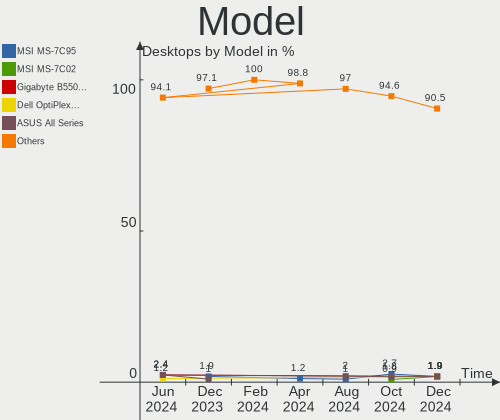
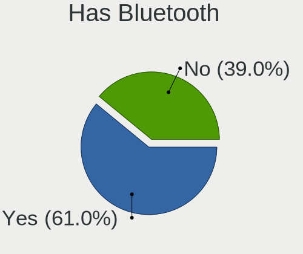
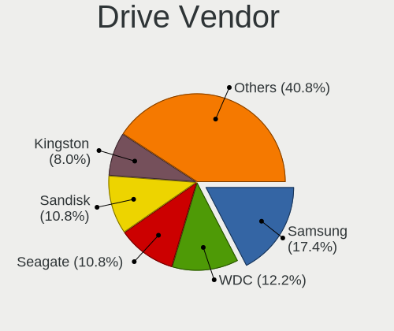
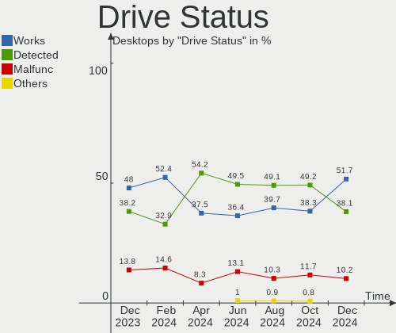
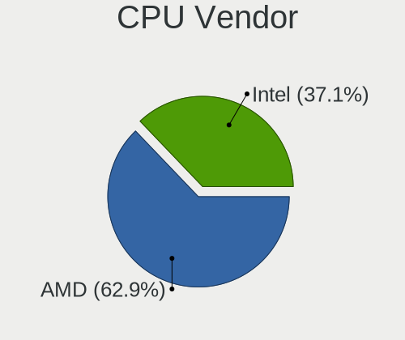
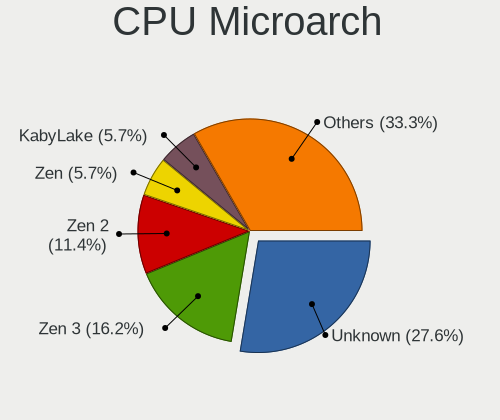
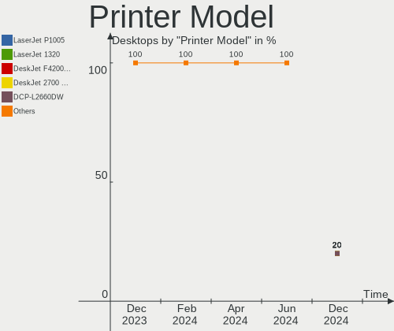

Arch - Hardware Trends (Desktops)
---------------------------------

A project to identify most popular hardware characteristics and track their change
over time based on data collected by Linux users at https://Linux-Hardware.org.

Anyone can contribute to this report by the [hw-probe](https://github.com/linuxhw/hw-probe) tool:

    sudo -E hw-probe -all -upload

This report is for one last month. Overall report since the beginning of time: [TestCoverage](https://github.com/linuxhw/TestCoverage)

Period: Dec, 2022.

Contents
--------

* [ System ](#system)
  - [ OS                       ](#os)
  - [ OS Family                ](#os-family)
  - [ Kernel                   ](#kernel)
  - [ Kernel Family            ](#kernel-family)
  - [ Kernel Major Ver.        ](#kernel-major-ver)
  - [ Arch                     ](#arch)
  - [ DE                       ](#de)
  - [ Display Server           ](#display-server)
  - [ Display Manager          ](#display-manager)
  - [ OS Lang                  ](#os-lang)
  - [ Boot Mode                ](#boot-mode)
  - [ Filesystem               ](#filesystem)
  - [ Part. scheme             ](#part-scheme)
  - [ Dual Boot with Linux/BSD ](#dual-boot-with-linuxbsd)
  - [ Dual Boot (Win)          ](#dual-boot-win)

* [ Board ](#board)
  - [ Vendor                   ](#vendor)
  - [ Model                    ](#model)
  - [ Model Family             ](#model-family)
  - [ MFG Year                 ](#mfg-year)
  - [ Form Factor              ](#form-factor)
  - [ Secure Boot              ](#secure-boot)
  - [ Coreboot                 ](#coreboot)
  - [ RAM Size                 ](#ram-size)
  - [ RAM Used                 ](#ram-used)
  - [ Total Drives             ](#total-drives)
  - [ Has CD-ROM               ](#has-cd-rom)
  - [ Has Ethernet             ](#has-ethernet)
  - [ Has WiFi                 ](#has-wifi)
  - [ Has Bluetooth            ](#has-bluetooth)

* [ Location ](#location)
  - [ Country                  ](#country)
  - [ City                     ](#city)

* [ Drives ](#drives)
  - [ Drive Vendor             ](#drive-vendor)
  - [ Drive Model              ](#drive-model)
  - [ HDD Vendor               ](#hdd-vendor)
  - [ SSD Vendor               ](#ssd-vendor)
  - [ Drive Kind               ](#drive-kind)
  - [ Drive Connector          ](#drive-connector)
  - [ Drive Size               ](#drive-size)
  - [ Space Total              ](#space-total)
  - [ Space Used               ](#space-used)
  - [ Malfunc. Drives          ](#malfunc-drives)
  - [ Malfunc. Drive Vendor    ](#malfunc-drive-vendor)
  - [ Malfunc. HDD Vendor      ](#malfunc-hdd-vendor)
  - [ Malfunc. Drive Kind      ](#malfunc-drive-kind)
  - [ Failed Drives            ](#failed-drives)
  - [ Failed Drive Vendor      ](#failed-drive-vendor)
  - [ Drive Status             ](#drive-status)

* [ Storage controller ](#storage-controller)
  - [ Storage Vendor           ](#storage-vendor)
  - [ Storage Model            ](#storage-model)
  - [ Storage Kind             ](#storage-kind)

* [ Processor ](#processor)
  - [ CPU Vendor               ](#cpu-vendor)
  - [ CPU Model                ](#cpu-model)
  - [ CPU Model Family         ](#cpu-model-family)
  - [ CPU Cores                ](#cpu-cores)
  - [ CPU Sockets              ](#cpu-sockets)
  - [ CPU Threads              ](#cpu-threads)
  - [ CPU Op-Modes             ](#cpu-op-modes)
  - [ CPU Microcode            ](#cpu-microcode)
  - [ CPU Microarch            ](#cpu-microarch)

* [ Graphics ](#graphics)
  - [ GPU Vendor               ](#gpu-vendor)
  - [ GPU Model                ](#gpu-model)
  - [ GPU Combo                ](#gpu-combo)
  - [ GPU Driver               ](#gpu-driver)
  - [ GPU Memory               ](#gpu-memory)

* [ Monitor ](#monitor)
  - [ Monitor Vendor           ](#monitor-vendor)
  - [ Monitor Model            ](#monitor-model)
  - [ Monitor Resolution       ](#monitor-resolution)
  - [ Monitor Diagonal         ](#monitor-diagonal)
  - [ Monitor Width            ](#monitor-width)
  - [ Aspect Ratio             ](#aspect-ratio)
  - [ Monitor Area             ](#monitor-area)
  - [ Pixel Density            ](#pixel-density)
  - [ Multiple Monitors        ](#multiple-monitors)

* [ Network ](#network)
  - [ Net Controller Vendor    ](#net-controller-vendor)
  - [ Net Controller Model     ](#net-controller-model)
  - [ Wireless Vendor          ](#wireless-vendor)
  - [ Wireless Model           ](#wireless-model)
  - [ Ethernet Vendor          ](#ethernet-vendor)
  - [ Ethernet Model           ](#ethernet-model)
  - [ Net Controller Kind      ](#net-controller-kind)
  - [ Used Controller          ](#used-controller)
  - [ NICs                     ](#nics)
  - [ IPv6                     ](#ipv6)

* [ Bluetooth ](#bluetooth)
  - [ Bluetooth Vendor         ](#bluetooth-vendor)
  - [ Bluetooth Model          ](#bluetooth-model)

* [ Sound ](#sound)
  - [ Sound Vendor             ](#sound-vendor)
  - [ Sound Model              ](#sound-model)

* [ Memory ](#memory)
  - [ Memory Vendor            ](#memory-vendor)
  - [ Memory Model             ](#memory-model)
  - [ Memory Kind              ](#memory-kind)
  - [ Memory Form Factor       ](#memory-form-factor)
  - [ Memory Size              ](#memory-size)
  - [ Memory Speed             ](#memory-speed)

* [ Printers & scanners ](#printers--scanners)
  - [ Printer Vendor           ](#printer-vendor)
  - [ Printer Model            ](#printer-model)
  - [ Scanner Vendor           ](#scanner-vendor)
  - [ Scanner Model            ](#scanner-model)

* [ Camera ](#camera)
  - [ Camera Vendor            ](#camera-vendor)
  - [ Camera Model             ](#camera-model)

* [ Security ](#security)
  - [ Fingerprint Vendor       ](#fingerprint-vendor)
  - [ Fingerprint Model        ](#fingerprint-model)
  - [ Chipcard Vendor          ](#chipcard-vendor)
  - [ Chipcard Model           ](#chipcard-model)

* [ Unsupported ](#unsupported)
  - [ Unsupported Devices      ](#unsupported-devices)
  - [ Unsupported Device Types ](#unsupported-device-types)

System
------

OS
--

Installed operating systems

| Name         | Desktops | Percent |
|--------------|----------|---------|
| Arch Rolling | 63       | 100%    |

OS Family
---------

OS without a version

| Name | Desktops | Percent |
|------|----------|---------|
| Arch | 63       | 100%    |

Kernel
------

Version of the Linux kernel

| Version            | Desktops | Percent |
|--------------------|----------|---------|
| 6.0.12-arch1-1     | 13       | 20.63%  |
| 6.1.1-arch1-1      | 10       | 15.87%  |
| 6.0.11-arch1-1     | 10       | 15.87%  |
| 6.0.10-arch2-1     | 7        | 11.11%  |
| 6.0.9-arch1-1      | 5        | 7.94%   |
| 6.0.10-zen2-1-zen  | 3        | 4.76%   |
| 6.0.12-zen1-1-zen  | 2        | 3.17%   |
| 5.15.83-1-lts      | 2        | 3.17%   |
| 5.15.82-1-lts      | 2        | 3.17%   |
| 6.1.1-zen1-1-zen   | 1        | 1.59%   |
| 6.1.0-arch1-1      | 1        | 1.59%   |
| 6.1.0-AMD-znver2   | 1        | 1.59%   |
| 6.0.12-lqx1-1-lqx  | 1        | 1.59%   |
| 6.0.12-272-tkg-pds | 1        | 1.59%   |
| 6.0.11-lqx2-1-lqx  | 1        | 1.59%   |
| 5.19.13-arch1-1    | 1        | 1.59%   |
| 5.18.11-arch1-1    | 1        | 1.59%   |
| 5.15.85-1-lts      | 1        | 1.59%   |

Kernel Family
-------------

Linux kernel without a distro release

| Version | Desktops | Percent |
|---------|----------|---------|
| 6.0.12  | 17       | 26.98%  |
| 6.1.1   | 11       | 17.46%  |
| 6.0.11  | 11       | 17.46%  |
| 6.0.10  | 10       | 15.87%  |
| 6.0.9   | 5        | 7.94%   |
| 6.1.0   | 2        | 3.17%   |
| 5.15.83 | 2        | 3.17%   |
| 5.15.82 | 2        | 3.17%   |
| 5.19.13 | 1        | 1.59%   |
| 5.18.11 | 1        | 1.59%   |
| 5.15.85 | 1        | 1.59%   |

Kernel Major Ver.
-----------------

Linux kernel major version

| Version | Desktops | Percent |
|---------|----------|---------|
| 6.0     | 43       | 68.25%  |
| 6.1     | 13       | 20.63%  |
| 5.15    | 5        | 7.94%   |
| 5.19    | 1        | 1.59%   |
| 5.18    | 1        | 1.59%   |

Arch
----

OS architecture (x86_64, i586, etc.)

| Name   | Desktops | Percent |
|--------|----------|---------|
| x86_64 | 63       | 100%    |

DE
--

Desktop Environment

| Name       | Desktops | Percent |
|------------|----------|---------|
| GNOME      | 19       | 30.16%  |
| KDE5       | 18       | 28.57%  |
| Unknown    | 6        | 9.52%   |
| XFCE       | 5        | 7.94%   |
| i3         | 3        | 4.76%   |
| Cinnamon   | 3        | 4.76%   |
| X-Cinnamon | 2        | 3.17%   |
| Hyprland   | 2        | 3.17%   |
| bspwm      | 2        | 3.17%   |
| sway       | 1        | 1.59%   |
| qtile      | 1        | 1.59%   |
| openbox    | 1        | 1.59%   |

Display Server
--------------

X11 or Wayland

| Name    | Desktops | Percent |
|---------|----------|---------|
| X11     | 33       | 52.38%  |
| Wayland | 13       | 20.63%  |
| Tty     | 12       | 19.05%  |
| Unknown | 5        | 7.94%   |

Display Manager
---------------

SDDM, LightDM, etc.

| Name    | Desktops | Percent |
|---------|----------|---------|
| Unknown | 31       | 49.21%  |
| SDDM    | 14       | 22.22%  |
| LightDM | 12       | 19.05%  |
| GDM     | 6        | 9.52%   |

OS Lang
-------

Language

| Lang    | Desktops | Percent |
|---------|----------|---------|
| en_US   | 25       | 39.68%  |
| en_GB   | 7        | 11.11%  |
| C       | 7        | 11.11%  |
| ru_RU   | 6        | 9.52%   |
| de_DE   | 6        | 9.52%   |
| it_IT   | 3        | 4.76%   |
| en_AU   | 3        | 4.76%   |
| pt_BR   | 2        | 3.17%   |
| Unknown | 2        | 3.17%   |
| pt_PT   | 1        | 1.59%   |
| en_AG   | 1        | 1.59%   |

Boot Mode
---------

EFI or BIOS

| Mode | Desktops | Percent |
|------|----------|---------|
| EFI  | 37       | 58.73%  |
| BIOS | 26       | 41.27%  |

Filesystem
----------

Type of filesystem

| Type  | Desktops | Percent |
|-------|----------|---------|
| Ext4  | 40       | 63.49%  |
| Btrfs | 16       | 25.4%   |
| Zfs   | 5        | 7.94%   |
| Xfs   | 1        | 1.59%   |
| F2fs  | 1        | 1.59%   |

Part. scheme
------------

Scheme of partitioning

| Type    | Desktops | Percent |
|---------|----------|---------|
| GPT     | 39       | 61.9%   |
| Unknown | 19       | 30.16%  |
| MBR     | 5        | 7.94%   |

Dual Boot with Linux/BSD
------------------------

Hosting more than one Linux/BSD

| Dual boot | Desktops | Percent |
|-----------|----------|---------|
| No        | 51       | 80.95%  |
| Yes       | 12       | 19.05%  |

Dual Boot (Win)
---------------

Hosting Linux and Windows

| Dual boot | Desktops | Percent |
|-----------|----------|---------|
| No        | 39       | 61.9%   |
| Yes       | 24       | 38.1%   |

Board
-----

Vendor
------

Motherboard manufacturer

| Name                | Desktops | Percent |
|---------------------|----------|---------|
| ASUSTek Computer    | 25       | 39.68%  |
| Gigabyte Technology | 13       | 20.63%  |
| MSI                 | 9        | 14.29%  |
| ASRock              | 6        | 9.52%   |
| Intel               | 2        | 3.17%   |
| Hewlett-Packard     | 2        | 3.17%   |
| Dell                | 2        | 3.17%   |
| Shuttle             | 1        | 1.59%   |
| PCWare              | 1        | 1.59%   |
| Lenovo              | 1        | 1.59%   |
| Biostar             | 1        | 1.59%   |

Model
-----

Motherboard model

| Name                               | Desktops | Percent |
|------------------------------------|----------|---------|
| MSI MS-7C02                        | 3        | 4.76%   |
| ASUS TUF Gaming X570-PLUS          | 2        | 3.17%   |
| ASUS ROG STRIX X670E-E GAMING WIFI | 2        | 3.17%   |
| Shuttle DS81D                      | 1        | 1.59%   |
| PCWare IPMH110G                    | 1        | 1.59%   |
| MSI MS-7C95                        | 1        | 1.59%   |
| MSI MS-7C91                        | 1        | 1.59%   |
| MSI MS-7B93                        | 1        | 1.59%   |
| MSI MS-7B86                        | 1        | 1.59%   |
| MSI MS-7B78                        | 1        | 1.59%   |
| MSI MS-7693                        | 1        | 1.59%   |
| Lenovo ThinkCentre M93p 10AAS3U300 | 1        | 1.59%   |
| Intel H55                          | 1        | 1.59%   |
| Intel DH55PJ AAE93812-303          | 1        | 1.59%   |
| HP ProDesk 600 G4 SFF              | 1        | 1.59%   |
| HP 550-a114                        | 1        | 1.59%   |
| Gigabyte Z370M DS3H                | 1        | 1.59%   |
| Gigabyte X570 I AORUS PRO WIFI     | 1        | 1.59%   |
| Gigabyte X570 AORUS MASTER         | 1        | 1.59%   |
| Gigabyte PH67A-D3-B3               | 1        | 1.59%   |
| Gigabyte B550M AORUS PRO-P         | 1        | 1.59%   |
| Gigabyte B550 GAMING X V2          | 1        | 1.59%   |
| Gigabyte B550 AORUS PRO V2         | 1        | 1.59%   |
| Gigabyte B550 AORUS ELITE AX V2    | 1        | 1.59%   |
| Gigabyte B450M DS3H                | 1        | 1.59%   |
| Gigabyte B450 AORUS M              | 1        | 1.59%   |
| Gigabyte B360M-D3H                 | 1        | 1.59%   |
| Gigabyte B150-HD3P                 | 1        | 1.59%   |
| Gigabyte AX370-Gaming              | 1        | 1.59%   |
| Dell OptiPlex 790                  | 1        | 1.59%   |
| Dell OptiPlex 7000                 | 1        | 1.59%   |
| Biostar AM1MHP                     | 1        | 1.59%   |
| ASUS TUF Gaming X570-PLUS_BR       | 1        | 1.59%   |
| ASUS TUF Gaming B650-PLUS WIFI     | 1        | 1.59%   |
| ASUS TUF Gaming B550-PLUS          | 1        | 1.59%   |
| ASUS SABERTOOTH X79                | 1        | 1.59%   |
| ASUS Pro WS X570-ACE               | 1        | 1.59%   |
| ASUS PRIME X399-A                  | 1        | 1.59%   |
| ASUS PRIME H610M-K D4              | 1        | 1.59%   |
| ASUS PRIME H510M-K                 | 1        | 1.59%   |

Model Family
------------

Motherboard model prefix

| Name                  | Desktops | Percent |
|-----------------------|----------|---------|
| ASUS PRIME            | 10       | 15.87%  |
| ASUS TUF              | 5        | 7.94%   |
| MSI MS-7C02           | 3        | 4.76%   |
| Gigabyte B550         | 3        | 4.76%   |
| Gigabyte X570         | 2        | 3.17%   |
| Dell OptiPlex         | 2        | 3.17%   |
| ASUS ROG              | 2        | 3.17%   |
| Shuttle DS81D         | 1        | 1.59%   |
| PCWare IPMH110G       | 1        | 1.59%   |
| MSI MS-7C95           | 1        | 1.59%   |
| MSI MS-7C91           | 1        | 1.59%   |
| MSI MS-7B93           | 1        | 1.59%   |
| MSI MS-7B86           | 1        | 1.59%   |
| MSI MS-7B78           | 1        | 1.59%   |
| MSI MS-7693           | 1        | 1.59%   |
| Lenovo ThinkCentre    | 1        | 1.59%   |
| Intel H55             | 1        | 1.59%   |
| Intel DH55PJ          | 1        | 1.59%   |
| HP ProDesk            | 1        | 1.59%   |
| HP 550-a114           | 1        | 1.59%   |
| Gigabyte Z370M        | 1        | 1.59%   |
| Gigabyte PH67A-D3-B3  | 1        | 1.59%   |
| Gigabyte B550M        | 1        | 1.59%   |
| Gigabyte B450M        | 1        | 1.59%   |
| Gigabyte B450         | 1        | 1.59%   |
| Gigabyte B360M-D3H    | 1        | 1.59%   |
| Gigabyte B150-HD3P    | 1        | 1.59%   |
| Gigabyte AX370-Gaming | 1        | 1.59%   |
| Biostar AM1MHP        | 1        | 1.59%   |
| ASUS SABERTOOTH       | 1        | 1.59%   |
| ASUS Pro              | 1        | 1.59%   |
| ASUS P8Z77-V          | 1        | 1.59%   |
| ASUS P8P67            | 1        | 1.59%   |
| ASUS P8H61-M          | 1        | 1.59%   |
| ASUS P5Q              | 1        | 1.59%   |
| ASUS M5A97            | 1        | 1.59%   |
| ASUS All              | 1        | 1.59%   |
| ASRock X570M          | 1        | 1.59%   |
| ASRock X300M-STX      | 1        | 1.59%   |
| ASRock J4205-ITX      | 1        | 1.59%   |

MFG Year
--------

Motherboard manufacture year

| Year | Desktops | Percent |
|------|----------|---------|
| 2020 | 11       | 17.46%  |
| 2019 | 10       | 15.87%  |
| 2018 | 9        | 14.29%  |
| 2017 | 6        | 9.52%   |
| 2022 | 5        | 7.94%   |
| 2014 | 4        | 6.35%   |
| 2012 | 4        | 6.35%   |
| 2015 | 3        | 4.76%   |
| 2021 | 2        | 3.17%   |
| 2016 | 2        | 3.17%   |
| 2011 | 2        | 3.17%   |
| 2010 | 2        | 3.17%   |
| 2013 | 1        | 1.59%   |
| 2009 | 1        | 1.59%   |
| 2007 | 1        | 1.59%   |

Form Factor
-----------

Physical design of the computer

| Name    | Desktops | Percent |
|---------|----------|---------|
| Desktop | 63       | 100%    |

Secure Boot
-----------

Enabled or disabled

| State    | Desktops | Percent |
|----------|----------|---------|
| Disabled | 62       | 98.41%  |
| Enabled  | 1        | 1.59%   |

Coreboot
--------

Have coreboot on board

| Used | Desktops | Percent |
|------|----------|---------|
| No   | 63       | 100%    |

RAM Size
--------

Total RAM memory

| Size in GB  | Desktops | Percent |
|-------------|----------|---------|
| 16.01-24.0  | 24       | 38.1%   |
| 32.01-64.0  | 21       | 33.33%  |
| 4.01-8.0    | 6        | 9.52%   |
| 8.01-16.0   | 5        | 7.94%   |
| 24.01-32.0  | 4        | 6.35%   |
| 64.01-256.0 | 2        | 3.17%   |
| 3.01-4.0    | 1        | 1.59%   |

RAM Used
--------

Used RAM memory

| Used GB    | Desktops | Percent |
|------------|----------|---------|
| 4.01-8.0   | 18       | 28.57%  |
| 2.01-3.0   | 11       | 17.46%  |
| 3.01-4.0   | 10       | 15.87%  |
| 8.01-16.0  | 10       | 15.87%  |
| 1.01-2.0   | 7        | 11.11%  |
| 16.01-24.0 | 3        | 4.76%   |
| 24.01-32.0 | 2        | 3.17%   |
| 32.01-64.0 | 1        | 1.59%   |
| 0.51-1.0   | 1        | 1.59%   |

Total Drives
------------

Number of drives on board

| Drives | Desktops | Percent |
|--------|----------|---------|
| 2      | 17       | 26.98%  |
| 3      | 16       | 25.4%   |
| 1      | 12       | 19.05%  |
| 4      | 9        | 14.29%  |
| 5      | 7        | 11.11%  |
| 13     | 1        | 1.59%   |
| 8      | 1        | 1.59%   |

Has CD-ROM
----------

Has CD-ROM on board

| Presented | Desktops | Percent |
|-----------|----------|---------|
| No        | 48       | 76.19%  |
| Yes       | 15       | 23.81%  |

Has Ethernet
------------

Has Ethernet on board

| Presented | Desktops | Percent |
|-----------|----------|---------|
| Yes       | 63       | 100%    |

Has WiFi
--------

Has WiFi module

| Presented | Desktops | Percent |
|-----------|----------|---------|
| No        | 35       | 55.56%  |
| Yes       | 28       | 44.44%  |

Has Bluetooth
-------------

Has Bluetooth module

| Presented | Desktops | Percent |
|-----------|----------|---------|
| Yes       | 33       | 52.38%  |
| No        | 30       | 47.62%  |

Location
--------

Country
-------

Geographic location (country)

| Country     | Desktops | Percent |
|-------------|----------|---------|
| USA         | 11       | 17.46%  |
| Russia      | 7        | 11.11%  |
| Germany     | 7        | 11.11%  |
| Australia   | 5        | 7.94%   |
| Italy       | 4        | 6.35%   |
| UK          | 3        | 4.76%   |
| Brazil      | 3        | 4.76%   |
| Taiwan      | 2        | 3.17%   |
| Romania     | 2        | 3.17%   |
| Portugal    | 2        | 3.17%   |
| Netherlands | 2        | 3.17%   |
| Japan       | 2        | 3.17%   |
| Hong Kong   | 2        | 3.17%   |
| Finland     | 2        | 3.17%   |
| Turkey      | 1        | 1.59%   |
| Serbia      | 1        | 1.59%   |
| Poland      | 1        | 1.59%   |
| New Zealand | 1        | 1.59%   |
| Kosovo      | 1        | 1.59%   |
| India       | 1        | 1.59%   |
| France      | 1        | 1.59%   |
| Canada      | 1        | 1.59%   |
| Belarus     | 1        | 1.59%   |

City
----

Geographic location (city)

| City             | Desktops | Percent |
|------------------|----------|---------|
| Melbourne        | 5        | 7.94%   |
| Moscow           | 3        | 4.76%   |
| Dublin           | 3        | 4.76%   |
| Helsinki         | 2        | 3.17%   |
| Central          | 2        | 3.17%   |
| Amsterdam        | 2        | 3.17%   |
| Warsaw           | 1        | 1.59%   |
| Votorantim       | 1        | 1.59%   |
| Vittuone         | 1        | 1.59%   |
| Victoria         | 1        | 1.59%   |
| Ulan-Ude         | 1        | 1.59%   |
| Tulcea           | 1        | 1.59%   |
| Silver Spring    | 1        | 1.59%   |
| Seattle          | 1        | 1.59%   |
| Satu Mare        | 1        | 1.59%   |
| Santo André     | 1        | 1.59%   |
| Sacavem          | 1        | 1.59%   |
| Reggio Calabria  | 1        | 1.59%   |
| Recife           | 1        | 1.59%   |
| Pristina         | 1        | 1.59%   |
| Poole            | 1        | 1.59%   |
| Paris            | 1        | 1.59%   |
| Orland Park      | 1        | 1.59%   |
| Nizhniy Novgorod | 1        | 1.59%   |
| New Taipei       | 1        | 1.59%   |
| Munich           | 1        | 1.59%   |
| Minsk            | 1        | 1.59%   |
| Minato-ku        | 1        | 1.59%   |
| Milan            | 1        | 1.59%   |
| Matteson         | 1        | 1.59%   |
| Leskovac         | 1        | 1.59%   |
| Krasnoyarsk      | 1        | 1.59%   |
| Krasnodar        | 1        | 1.59%   |
| Kaohsiung City   | 1        | 1.59%   |
| Istanbul         | 1        | 1.59%   |
| Hyderabad        | 1        | 1.59%   |
| Hahnbach         | 1        | 1.59%   |
| Greer            | 1        | 1.59%   |
| Göttingen       | 1        | 1.59%   |
| Frickenhausen    | 1        | 1.59%   |

Drives
------

Drive Vendor
------------

Hard drive vendors

| Vendor                      | Desktops | Drives | Percent |
|-----------------------------|----------|--------|---------|
| Samsung Electronics         | 25       | 47     | 17.61%  |
| WDC                         | 18       | 24     | 12.68%  |
| Seagate                     | 16       | 20     | 11.27%  |
| Crucial                     | 12       | 14     | 8.45%   |
| Kingston                    | 11       | 12     | 7.75%   |
| Sandisk                     | 8        | 10     | 5.63%   |
| Phison Electronics          | 5        | 5      | 3.52%   |
| Toshiba                     | 4        | 7      | 2.82%   |
| Realtek Semiconductor       | 4        | 4      | 2.82%   |
| ADATA Technology            | 4        | 5      | 2.82%   |
| SPCC                        | 3        | 3      | 2.11%   |
| PNY                         | 3        | 4      | 2.11%   |
| Micron/Crucial Technology   | 3        | 3      | 2.11%   |
| China                       | 3        | 3      | 2.11%   |
| Team                        | 2        | 2      | 1.41%   |
| Kingston Technology Company | 2        | 2      | 1.41%   |
| Intel                       | 2        | 2      | 1.41%   |
| Hitachi                     | 2        | 2      | 1.41%   |
| GOODRAM                     | 2        | 2      | 1.41%   |
| Unknown                     | 2        | 3      | 1.41%   |
| YS                          | 1        | 1      | 0.7%    |
| Unknown                     | 1        | 1      | 0.7%    |
| SK hynix                    | 1        | 1      | 0.7%    |
| Silicon Motion              | 1        | 1      | 0.7%    |
| Mushkin                     | 1        | 1      | 0.7%    |
| JMicron Technology          | 1        | 1      | 0.7%    |
| HGST                        | 1        | 1      | 0.7%    |
| Hewlett-Packard             | 1        | 1      | 0.7%    |
| Fujitsu                     | 1        | 1      | 0.7%    |
| ASMT                        | 1        | 1      | 0.7%    |
| A-DATA Technology           | 1        | 1      | 0.7%    |

Drive Model
-----------

Hard drive models

| Model                                                           | Desktops | Percent |
|-----------------------------------------------------------------|----------|---------|
| Samsung NVMe SSD Controller SM981/PM981/PM983 500GB             | 8        | 4.68%   |
| Samsung NVMe SSD Controller PM9A1/PM9A3/980PRO 2TB              | 5        | 2.92%   |
| Samsung SSD 850 EVO 250GB                                       | 4        | 2.34%   |
| Kingston SA400S37240G 240GB SSD                                 | 4        | 2.34%   |
| ADATA XPG SX8200 Pro PCIe Gen3x4 M.2 2280 Solid State Drive 1TB | 4        | 2.34%   |
| Samsung SSD 860 QVO 1TB                                         | 3        | 1.75%   |
| Realtek RTS5763DL NVMe SSD Controller 512GB                     | 3        | 1.75%   |
| Crucial CT1000MX500SSD1 1TB                                     | 3        | 1.75%   |
| WDC WD30EFRX-68EUZN0 3TB                                        | 2        | 1.17%   |
| WDC WD20EZBX-00AYRA0 2TB                                        | 2        | 1.17%   |
| WDC WD10EZEX-75WN4A1 1TB                                        | 2        | 1.17%   |
| Toshiba DT01ACA300 3TB                                          | 2        | 1.17%   |
| SPCC Solid State Disk 512GB                                     | 2        | 1.17%   |
| Seagate ST500DM002-1BD142 500GB                                 | 2        | 1.17%   |
| Seagate ST1000DM010-2EP102 1TB                                  | 2        | 1.17%   |
| Sandisk WD Blue SN500 / PC SN520 NVMe SSD 256GB                 | 2        | 1.17%   |
| Samsung SSD 980 1TB                                             | 2        | 1.17%   |
| Samsung SSD 860 EVO 250GB                                       | 2        | 1.17%   |
| Samsung SSD 860 EVO 1TB                                         | 2        | 1.17%   |
| Phison E12 NVMe Controller 1TB                                  | 2        | 1.17%   |
| Kingston Company A2000 NVMe SSD 1TB                             | 2        | 1.17%   |
| Kingston SA400S37120G 120GB SSD                                 | 2        | 1.17%   |
| China SATA SSD 120GB                                            | 2        | 1.17%   |
| Unknown                                                         | 2        | 1.17%   |
| YS SSD 240GB                                                    | 1        | 0.58%   |
| WDC WD5000AZDX-00SC2B0 500GB                                    | 1        | 0.58%   |
| WDC WD5000AAVS-00G9B0 500GB                                     | 1        | 0.58%   |
| WDC WD40EFRX-68N32N0 4TB                                        | 1        | 0.58%   |
| WDC WD20EZRZ-00Z5HB0 2TB                                        | 1        | 0.58%   |
| WDC WD20EZAZ-00L9GB0 2TB                                        | 1        | 0.58%   |
| WDC WD20EZAZ-00GGJB0 2TB                                        | 1        | 0.58%   |
| WDC WD20EFRX-68AX9N0 2TB                                        | 1        | 0.58%   |
| WDC WD10EZEX-60ZF5A0 1TB                                        | 1        | 0.58%   |
| WDC WD10EZEX-08WN4A0 1TB                                        | 1        | 0.58%   |
| WDC WD10EZEX-00WN4A0 1TB                                        | 1        | 0.58%   |
| WDC WD10EZEX-00BN5A0 1TB                                        | 1        | 0.58%   |
| WDC WD10EURX-63FH1Y0 1TB                                        | 1        | 0.58%   |
| WDC WD10EARS-00Y5B1 1TB                                         | 1        | 0.58%   |
| WDC WD1003FZEX-00MK2A0 1TB                                      | 1        | 0.58%   |
| WDC WD1003FZEX-00K3CA0 1TB                                      | 1        | 0.58%   |

HDD Vendor
----------

Hard disk drive vendors

| Vendor  | Desktops | Drives | Percent |
|---------|----------|--------|---------|
| WDC     | 18       | 24     | 45%     |
| Seagate | 14       | 18     | 35%     |
| Toshiba | 3        | 6      | 7.5%    |
| Hitachi | 2        | 2      | 5%      |
| Unknown | 1        | 1      | 2.5%    |
| HGST    | 1        | 1      | 2.5%    |
| ASMT    | 1        | 1      | 2.5%    |

SSD Vendor
----------

Solid state drive vendors

| Vendor              | Desktops | Drives | Percent |
|---------------------|----------|--------|---------|
| Samsung Electronics | 16       | 26     | 26.23%  |
| Kingston            | 11       | 12     | 18.03%  |
| Crucial             | 11       | 13     | 18.03%  |
| SanDisk             | 3        | 4      | 4.92%   |
| PNY                 | 3        | 4      | 4.92%   |
| China               | 3        | 3      | 4.92%   |
| Team                | 2        | 2      | 3.28%   |
| SPCC                | 2        | 2      | 3.28%   |
| GOODRAM             | 2        | 2      | 3.28%   |
| YS                  | 1        | 1      | 1.64%   |
| Toshiba             | 1        | 1      | 1.64%   |
| Mushkin             | 1        | 1      | 1.64%   |
| Intel               | 1        | 1      | 1.64%   |
| Hewlett-Packard     | 1        | 1      | 1.64%   |
| Fujitsu             | 1        | 1      | 1.64%   |
| A-DATA Technology   | 1        | 1      | 1.64%   |
| Unknown             | 1        | 2      | 1.64%   |

Drive Kind
----------

HDD or SSD

| Kind    | Desktops | Drives | Percent |
|---------|----------|--------|---------|
| SSD     | 45       | 77     | 36.89%  |
| NVMe    | 38       | 53     | 31.15%  |
| HDD     | 37       | 53     | 30.33%  |
| Unknown | 2        | 2      | 1.64%   |

Drive Connector
---------------

SATA, SAS, NVMe, etc.

| Type | Desktops | Drives | Percent |
|------|----------|--------|---------|
| SATA | 54       | 128    | 56.84%  |
| NVMe | 38       | 53     | 40%     |
| SAS  | 3        | 4      | 3.16%   |

Drive Size
----------

Size of hard drive

| Size in TB | Desktops | Drives | Percent |
|------------|----------|--------|---------|
| 0.01-0.5   | 38       | 56     | 40.86%  |
| 0.51-1.0   | 32       | 42     | 34.41%  |
| 1.01-2.0   | 11       | 18     | 11.83%  |
| 3.01-4.0   | 5        | 6      | 5.38%   |
| 2.01-3.0   | 5        | 6      | 5.38%   |
| 4.01-10.0  | 2        | 2      | 2.15%   |

Space Total
-----------

Amount of disk space available on the file system

| Size in GB     | Desktops | Percent |
|----------------|----------|---------|
| More than 3000 | 17       | 26.98%  |
| 251-500        | 12       | 19.05%  |
| 501-1000       | 9        | 14.29%  |
| 1001-2000      | 8        | 12.7%   |
| 101-250        | 7        | 11.11%  |
| 1-20           | 4        | 6.35%   |
| Unknown        | 3        | 4.76%   |
| 2001-3000      | 2        | 3.17%   |
| 51-100         | 1        | 1.59%   |

Space Used
----------

Amount of used disk space

| Used GB        | Desktops | Percent |
|----------------|----------|---------|
| 251-500        | 10       | 15.87%  |
| 101-250        | 8        | 12.7%   |
| 1-20           | 8        | 12.7%   |
| 21-50          | 7        | 11.11%  |
| 1001-2000      | 7        | 11.11%  |
| More than 3000 | 6        | 9.52%   |
| 501-1000       | 6        | 9.52%   |
| 2001-3000      | 4        | 6.35%   |
| 51-100         | 4        | 6.35%   |
| Unknown        | 3        | 4.76%   |

Malfunc. Drives
---------------

Drive models with a malfunction

| Model                                                     | Desktops | Drives | Percent |
|-----------------------------------------------------------|----------|--------|---------|
| Realtek Semiconductor RTS5763DL NVMe SSD Controller 512GB | 2        | 2      | 20%     |
| WDC WD40EFRX-68N32N0 4TB                                  | 1        | 1      | 10%     |
| Toshiba DT01ACA300 3TB                                    | 1        | 1      | 10%     |
| Seagate ST500DM002-1BD142 500GB                           | 1        | 1      | 10%     |
| Seagate ST2000DM008-2FR102 2TB                            | 1        | 1      | 10%     |
| Seagate ST1000DM010-2EP102 1TB                            | 1        | 1      | 10%     |
| Samsung Electronics SSD 980 1TB                           | 1        | 1      | 10%     |
| Samsung Electronics SSD 840 PRO Series 512GB              | 1        | 1      | 10%     |
| Kingston SV300S37A120G 120GB SSD                          | 1        | 1      | 10%     |

Malfunc. Drive Vendor
---------------------

Vendors of faulty drives

| Vendor                | Desktops | Drives | Percent |
|-----------------------|----------|--------|---------|
| Seagate               | 2        | 3      | 22.22%  |
| Samsung Electronics   | 2        | 2      | 22.22%  |
| Realtek Semiconductor | 2        | 2      | 22.22%  |
| WDC                   | 1        | 1      | 11.11%  |
| Toshiba               | 1        | 1      | 11.11%  |
| Kingston              | 1        | 1      | 11.11%  |

Malfunc. HDD Vendor
-------------------

Vendors of faulty HDD drives

| Vendor  | Desktops | Drives | Percent |
|---------|----------|--------|---------|
| Seagate | 2        | 3      | 50%     |
| WDC     | 1        | 1      | 25%     |
| Toshiba | 1        | 1      | 25%     |

Malfunc. Drive Kind
-------------------

Kinds of faulty drives

| Kind | Desktops | Drives | Percent |
|------|----------|--------|---------|
| HDD  | 4        | 5      | 44.44%  |
| NVMe | 3        | 3      | 33.33%  |
| SSD  | 2        | 2      | 22.22%  |

Failed Drives
-------------

Failed drive models

Zero info for selected period =(

Failed Drive Vendor
-------------------

Failed drive vendors

Zero info for selected period =(

Drive Status
------------

Number of failed and malfunc. drives

| Status   | Desktops | Drives | Percent |
|----------|----------|--------|---------|
| Works    | 32       | 94     | 46.38%  |
| Detected | 28       | 81     | 40.58%  |
| Malfunc  | 9        | 10     | 13.04%  |

Storage controller
------------------

Storage Vendor
--------------

Storage controller vendors

| Vendor                      | Desktops | Percent |
|-----------------------------|----------|---------|
| AMD                         | 40       | 32.52%  |
| Intel                       | 24       | 19.51%  |
| Samsung Electronics         | 17       | 13.82%  |
| ASMedia Technology          | 7        | 5.69%   |
| Phison Electronics          | 6        | 4.88%   |
| SanDisk                     | 5        | 4.07%   |
| Realtek Semiconductor       | 4        | 3.25%   |
| ADATA Technology            | 4        | 3.25%   |
| Micron/Crucial Technology   | 3        | 2.44%   |
| Marvell Technology Group    | 3        | 2.44%   |
| Seagate Technology          | 2        | 1.63%   |
| Kingston Technology Company | 2        | 1.63%   |
| SK hynix                    | 1        | 0.81%   |
| Silicon Motion              | 1        | 0.81%   |
| Micron Technology           | 1        | 0.81%   |
| JMicron Technology          | 1        | 0.81%   |
| Broadcom / LSI              | 1        | 0.81%   |
| Adaptec                     | 1        | 0.81%   |

Storage Model
-------------

Storage controller models

| Model                                                                                   | Desktops | Percent |
|-----------------------------------------------------------------------------------------|----------|---------|
| AMD FCH SATA Controller [AHCI mode]                                                     | 21       | 14.89%  |
| AMD 500 Series Chipset SATA Controller                                                  | 10       | 7.09%   |
| AMD 400 Series Chipset SATA Controller                                                  | 10       | 7.09%   |
| Samsung NVMe SSD Controller SM981/PM981/PM983                                           | 9        | 6.38%   |
| ASMedia ASM1062 Serial ATA Controller                                                   | 6        | 4.26%   |
| Samsung NVMe SSD Controller PM9A1/PM9A3/980PRO                                          | 5        | 3.55%   |
| AMD SATA controller                                                                     | 4        | 2.84%   |
| ADATA XPG SX8200 Pro PCIe Gen3x4 M.2 2280 Solid State Drive                             | 4        | 2.84%   |
| Samsung NVMe SSD Controller 980                                                         | 3        | 2.13%   |
| Realtek RTS5763DL NVMe SSD Controller                                                   | 3        | 2.13%   |
| Phison E12 NVMe Controller                                                              | 3        | 2.13%   |
| Intel 8 Series/C220 Series Chipset Family 6-port SATA Controller 1 [AHCI mode]          | 3        | 2.13%   |
| Intel 6 Series/C200 Series Chipset Family 6 port Desktop SATA AHCI Controller           | 3        | 2.13%   |
| Seagate FireCuda 530 SSD                                                                | 2        | 1.42%   |
| SanDisk WD Blue SN500 / PC SN520 NVMe SSD                                               | 2        | 1.42%   |
| Micron/Crucial P5 Plus NVMe PCIe SSD                                                    | 2        | 1.42%   |
| Marvell Group 88SE9128 PCIe SATA 6 Gb/s RAID controller with HyperDuo                   | 2        | 1.42%   |
| Kingston Company A2000 NVMe SSD                                                         | 2        | 1.42%   |
| Intel Volume Management Device NVMe RAID Controller                                     | 2        | 1.42%   |
| Intel Q170/Q150/B150/H170/H110/Z170/CM236 Chipset SATA Controller [AHCI Mode]           | 2        | 1.42%   |
| Intel Cannon Lake PCH SATA AHCI Controller                                              | 2        | 1.42%   |
| Intel Alder Lake-S PCH SATA Controller [AHCI Mode]                                      | 2        | 1.42%   |
| Intel 6 Series/C200 Series Chipset Family Desktop SATA Controller (IDE mode, ports 4-5) | 2        | 1.42%   |
| Intel 6 Series/C200 Series Chipset Family Desktop SATA Controller (IDE mode, ports 0-3) | 2        | 1.42%   |
| Intel 5 Series/3400 Series Chipset 4 port SATA IDE Controller                           | 2        | 1.42%   |
| Intel 200 Series PCH SATA controller [AHCI mode]                                        | 2        | 1.42%   |
| AMD SB7x0/SB8x0/SB9x0 SATA Controller [AHCI mode]                                       | 2        | 1.42%   |
| SK hynix Non-Volatile memory controller                                                 | 1        | 0.71%   |
| Silicon Motion Non-Volatile memory controller                                           | 1        | 0.71%   |
| SanDisk WD PC SN810 / Black SN850 NVMe SSD                                              | 1        | 0.71%   |
| SanDisk WD Blue SN570 NVMe SSD                                                          | 1        | 0.71%   |
| SanDisk WD Blue SN550 NVMe SSD                                                          | 1        | 0.71%   |
| SanDisk WD Black SN750 / PC SN730 NVMe SSD                                              | 1        | 0.71%   |
| Realtek Realtek Non-Volatile memory controller                                          | 1        | 0.71%   |
| Phison PS5013 E13 NVMe Controller                                                       | 1        | 0.71%   |
| Phison E7 NVMe Controller                                                               | 1        | 0.71%   |
| Phison E16 PCIe4 NVMe Controller                                                        | 1        | 0.71%   |
| Micron/Crucial P2 NVMe PCIe SSD                                                         | 1        | 0.71%   |
| Micron Non-Volatile memory controller                                                   | 1        | 0.71%   |
| Marvell Group 88SE6111/6121 SATA II / PATA Controller                                   | 1        | 0.71%   |

Storage Kind
------------

Kind of storage controller (IDE, SATA, NVMe, SAS, ...)

| Kind | Desktops | Percent |
|------|----------|---------|
| SATA | 58       | 54.72%  |
| NVMe | 38       | 35.85%  |
| IDE  | 5        | 4.72%   |
| RAID | 4        | 3.77%   |
| SAS  | 1        | 0.94%   |

Processor
---------

CPU Vendor
----------

Processor vendors

| Vendor | Desktops | Percent |
|--------|----------|---------|
| AMD    | 40       | 63.49%  |
| Intel  | 23       | 36.51%  |

CPU Model
---------

Processor models

| Model                                          | Desktops | Percent |
|------------------------------------------------|----------|---------|
| AMD Ryzen 9 7950X 16-Core Processor            | 4        | 6.35%   |
| AMD Ryzen 9 3900X 12-Core Processor            | 4        | 6.35%   |
| AMD Ryzen 7 3700X 8-Core Processor             | 4        | 6.35%   |
| AMD Ryzen 5 3600 6-Core Processor              | 4        | 6.35%   |
| AMD Ryzen 7 5800X 8-Core Processor             | 3        | 4.76%   |
| Intel Core i7-8700 CPU @ 3.20GHz               | 2        | 3.17%   |
| Intel Core i7-2600K CPU @ 3.40GHz              | 2        | 3.17%   |
| Intel Core i5-7400 CPU @ 3.00GHz               | 2        | 3.17%   |
| AMD Ryzen 9 5900X 12-Core Processor            | 2        | 3.17%   |
| AMD Ryzen 5 5500                               | 2        | 3.17%   |
| Intel Xeon CPU X5470 @ 3.33GHz                 | 1        | 1.59%   |
| Intel Xeon CPU E3-1230 V2 @ 3.30GHz            | 1        | 1.59%   |
| Intel Pentium CPU J4205 @ 1.50GHz              | 1        | 1.59%   |
| Intel Core i7-4765T CPU @ 2.00GHz              | 1        | 1.59%   |
| Intel Core i7-3930K CPU @ 3.20GHz              | 1        | 1.59%   |
| Intel Core i5-9400F CPU @ 2.90GHz              | 1        | 1.59%   |
| Intel Core i5-4690 CPU @ 3.50GHz               | 1        | 1.59%   |
| Intel Core i5-3570K CPU @ 3.40GHz              | 1        | 1.59%   |
| Intel Core i5-2400 CPU @ 3.10GHz               | 1        | 1.59%   |
| Intel Core i5-10400 CPU @ 2.90GHz              | 1        | 1.59%   |
| Intel Core i5 CPU 750 @ 2.67GHz                | 1        | 1.59%   |
| Intel Core i3-6100 CPU @ 3.70GHz               | 1        | 1.59%   |
| Intel Core i3-4160 CPU @ 3.60GHz               | 1        | 1.59%   |
| Intel Core i3-2100 CPU @ 3.10GHz               | 1        | 1.59%   |
| Intel Core i3 CPU 540 @ 3.07GHz                | 1        | 1.59%   |
| Intel 12th Gen Core i7-12700                   | 1        | 1.59%   |
| Intel 12th Gen Core i5-12400F                  | 1        | 1.59%   |
| AMD Ryzen Threadripper 1920X 12-Core Processor | 1        | 1.59%   |
| AMD Ryzen 7 5700X 8-Core Processor             | 1        | 1.59%   |
| AMD Ryzen 7 5700G with Radeon Graphics         | 1        | 1.59%   |
| AMD Ryzen 7 3800X 8-Core Processor             | 1        | 1.59%   |
| AMD Ryzen 7 1700X Eight-Core Processor         | 1        | 1.59%   |
| AMD Ryzen 7 1700 Eight-Core Processor          | 1        | 1.59%   |
| AMD Ryzen 5 PRO 4650G with Radeon Graphics     | 1        | 1.59%   |
| AMD Ryzen 5 5600X 6-Core Processor             | 1        | 1.59%   |
| AMD Ryzen 5 5600G with Radeon Graphics         | 1        | 1.59%   |
| AMD Ryzen 5 3600X 6-Core Processor             | 1        | 1.59%   |
| AMD Ryzen 5 2600 Six-Core Processor            | 1        | 1.59%   |
| AMD Ryzen 5 1600 Six-Core Processor            | 1        | 1.59%   |
| AMD Ryzen 3 3200G with Radeon Vega Graphics    | 1        | 1.59%   |

CPU Model Family
----------------

Processor model prefix

| Model                  | Desktops | Percent |
|------------------------|----------|---------|
| AMD Ryzen 7            | 12       | 19.05%  |
| AMD Ryzen 5            | 11       | 17.46%  |
| AMD Ryzen 9            | 10       | 15.87%  |
| Intel Core i5          | 8        | 12.7%   |
| Intel Core i7          | 6        | 9.52%   |
| Intel Core i3          | 4        | 6.35%   |
| Other                  | 2        | 3.17%   |
| Intel Xeon             | 2        | 3.17%   |
| AMD FX                 | 2        | 3.17%   |
| Intel Pentium          | 1        | 1.59%   |
| AMD Ryzen Threadripper | 1        | 1.59%   |
| AMD Ryzen 5 PRO        | 1        | 1.59%   |
| AMD Ryzen 3            | 1        | 1.59%   |
| AMD Athlon             | 1        | 1.59%   |
| AMD A8                 | 1        | 1.59%   |

CPU Cores
---------

Number of processor cores

| Number | Desktops | Percent |
|--------|----------|---------|
| 6      | 18       | 28.57%  |
| 4      | 16       | 25.4%   |
| 8      | 12       | 19.05%  |
| 12     | 8        | 12.7%   |
| 2      | 5        | 7.94%   |
| 16     | 4        | 6.35%   |

CPU Sockets
-----------

Number of sockets

| Number | Desktops | Percent |
|--------|----------|---------|
| 1      | 63       | 100%    |

CPU Threads
-----------

Threads per core (Hyper-Threading)

| Number | Desktops | Percent |
|--------|----------|---------|
| 2      | 51       | 80.95%  |
| 1      | 12       | 19.05%  |

CPU Op-Modes
------------

CPU Operation Modes (32-bit, 64-bit)

| Op mode        | Desktops | Percent |
|----------------|----------|---------|
| 32-bit, 64-bit | 63       | 100%    |

CPU Microcode
-------------

Microcode number

| Number     | Desktops | Percent |
|------------|----------|---------|
| Unknown    | 29       | 46.03%  |
| 0x08701021 | 5        | 7.94%   |
| 0x0a601203 | 4        | 6.35%   |
| 0x0a50000d | 3        | 4.76%   |
| 0x0a20120a | 3        | 4.76%   |
| 0x90672    | 2        | 3.17%   |
| 0x206a7    | 2        | 3.17%   |
| 0x0a201016 | 2        | 3.17%   |
| 0x08701013 | 2        | 3.17%   |
| 0x08001138 | 2        | 3.17%   |
| 0x06000822 | 2        | 3.17%   |
| 0xa0653    | 1        | 1.59%   |
| 0x906ea    | 1        | 1.59%   |
| 0x20655    | 1        | 1.59%   |
| 0x106e5    | 1        | 1.59%   |
| 0x1067a    | 1        | 1.59%   |
| 0x0800820d | 1        | 1.59%   |
| 0x08001137 | 1        | 1.59%   |

CPU Microarch
-------------

Microarchitecture

| Name             | Desktops | Percent |
|------------------|----------|---------|
| Zen 2            | 15       | 23.81%  |
| Zen 3            | 11       | 17.46%  |
| SandyBridge      | 5        | 7.94%   |
| KabyLake         | 5        | 7.94%   |
| Unknown          | 4        | 6.35%   |
| Zen+             | 3        | 4.76%   |
| Zen              | 3        | 4.76%   |
| Haswell          | 3        | 4.76%   |
| Piledriver       | 2        | 3.17%   |
| IvyBridge        | 2        | 3.17%   |
| Alderlake Hybrid | 2        | 3.17%   |
| Westmere         | 1        | 1.59%   |
| Skylake          | 1        | 1.59%   |
| Puma             | 1        | 1.59%   |
| Penryn           | 1        | 1.59%   |
| Nehalem          | 1        | 1.59%   |
| Jaguar           | 1        | 1.59%   |
| Goldmont         | 1        | 1.59%   |
| CometLake        | 1        | 1.59%   |

Graphics
--------

GPU Vendor
----------

Vendors of graphics cards

| Vendor | Desktops | Percent |
|--------|----------|---------|
| AMD    | 28       | 43.08%  |
| Nvidia | 25       | 38.46%  |
| Intel  | 12       | 18.46%  |

GPU Model
---------

Graphics card models

| Model                                                                       | Desktops | Percent |
|-----------------------------------------------------------------------------|----------|---------|
| AMD Ellesmere [Radeon RX 470/480/570/570X/580/580X/590]                     | 7        | 10.14%  |
| AMD Raphael                                                                 | 4        | 5.8%    |
| AMD Navi 10 [Radeon RX 5600 OEM/5600 XT / 5700/5700 XT]                     | 4        | 5.8%    |
| Nvidia GP107 [GeForce GTX 1050 Ti]                                          | 3        | 4.35%   |
| AMD Navi 23 [Radeon RX 6600/6600 XT/6600M]                                  | 3        | 4.35%   |
| Nvidia TU116 [GeForce GTX 1660 SUPER]                                       | 2        | 2.9%    |
| Nvidia GP104 [GeForce GTX 1070]                                             | 2        | 2.9%    |
| Nvidia GK106 [GeForce GTX 660]                                              | 2        | 2.9%    |
| Nvidia GA104 [GeForce RTX 3070]                                             | 2        | 2.9%    |
| Intel Xeon E3-1200 v3/4th Gen Core Processor Integrated Graphics Controller | 2        | 2.9%    |
| Intel HD Graphics 630                                                       | 2        | 2.9%    |
| AMD Navi 24 [Radeon RX 6400/6500 XT/6500M]                                  | 2        | 2.9%    |
| AMD Cezanne [Radeon Vega Series / Radeon Vega Mobile Series]                | 2        | 2.9%    |
| Nvidia TU116 [GeForce GTX 1660 Ti]                                          | 1        | 1.45%   |
| Nvidia TU106 [GeForce RTX 2070 Rev. A]                                      | 1        | 1.45%   |
| Nvidia TU106 [GeForce RTX 2060 SUPER]                                       | 1        | 1.45%   |
| Nvidia TU104 [GeForce RTX 2070 SUPER]                                       | 1        | 1.45%   |
| Nvidia TU102 [GeForce RTX 2080 Ti]                                          | 1        | 1.45%   |
| Nvidia GP106 [GeForce GTX 1060 6GB]                                         | 1        | 1.45%   |
| Nvidia GP104 [GeForce GTX 1080]                                             | 1        | 1.45%   |
| Nvidia GM206 [GeForce GTX 950]                                              | 1        | 1.45%   |
| Nvidia GM107 [GeForce GTX 750 Ti]                                           | 1        | 1.45%   |
| Nvidia GK208B [GeForce GT 710]                                              | 1        | 1.45%   |
| Nvidia GK110 [GeForce GTX 780]                                              | 1        | 1.45%   |
| Nvidia GK104 [GeForce GTX 760]                                              | 1        | 1.45%   |
| Nvidia GA106 [GeForce RTX 3060 Lite Hash Rate]                              | 1        | 1.45%   |
| Nvidia GA106 [Geforce RTX 3050]                                             | 1        | 1.45%   |
| Nvidia GA104 [GeForce RTX 3070 Ti]                                          | 1        | 1.45%   |
| Intel IvyBridge GT2 [HD Graphics 4000]                                      | 1        | 1.45%   |
| Intel Core Processor Integrated Graphics Controller                         | 1        | 1.45%   |
| Intel CometLake-S GT2 [UHD Graphics 630]                                    | 1        | 1.45%   |
| Intel CoffeeLake-S GT2 [UHD Graphics 630]                                   | 1        | 1.45%   |
| Intel Apollo Lake [HD Graphics 505]                                         | 1        | 1.45%   |
| Intel AlderLake-S GT1                                                       | 1        | 1.45%   |
| Intel 4th Generation Core Processor Family Integrated Graphics Controller   | 1        | 1.45%   |
| Intel 2nd Generation Core Processor Family Integrated Graphics Controller   | 1        | 1.45%   |
| AMD RV710 [Radeon HD 4350/4550]                                             | 1        | 1.45%   |
| AMD Renoir                                                                  | 1        | 1.45%   |
| AMD Picasso/Raven 2 [Radeon Vega Series / Radeon Vega Mobile Series]        | 1        | 1.45%   |
| AMD Navi 23 [Radeon RX 6650 XT]                                             | 1        | 1.45%   |

GPU Combo
---------

Combinations of graphics cards

| Name         | Desktops | Percent |
|--------------|----------|---------|
| 1 x AMD      | 24       | 38.1%   |
| 1 x Nvidia   | 22       | 34.92%  |
| 1 x Intel    | 11       | 17.46%  |
| 2 x AMD      | 3        | 4.76%   |
| 2 x Nvidia   | 2        | 3.17%   |
| AMD + Nvidia | 1        | 1.59%   |

GPU Driver
----------

Free vs proprietary

| Driver      | Desktops | Percent |
|-------------|----------|---------|
| Free        | 40       | 63.49%  |
| Proprietary | 22       | 34.92%  |
| Unknown     | 1        | 1.59%   |

GPU Memory
----------

Total video memory

| Size in GB | Desktops | Percent |
|------------|----------|---------|
| Unknown    | 27       | 42.86%  |
| 7.01-8.0   | 16       | 25.4%   |
| 3.01-4.0   | 5        | 7.94%   |
| 1.01-2.0   | 5        | 7.94%   |
| 5.01-6.0   | 4        | 6.35%   |
| 8.01-16.0  | 3        | 4.76%   |
| 0.01-0.5   | 2        | 3.17%   |
| 0.51-1.0   | 1        | 1.59%   |

Monitor
-------

Monitor Vendor
--------------

Monitor vendors

| Vendor               | Desktops | Percent |
|----------------------|----------|---------|
| Goldstar             | 16       | 20%     |
| Samsung Electronics  | 7        | 8.75%   |
| Gigabyte Technology  | 6        | 7.5%    |
| Dell                 | 6        | 7.5%    |
| ASUSTek Computer     | 4        | 5%      |
| Acer                 | 4        | 5%      |
| BenQ                 | 3        | 3.75%   |
| AOC                  | 3        | 3.75%   |
| Ancor Communications | 3        | 3.75%   |
| ViewSonic            | 2        | 2.5%    |
| Sony                 | 2        | 2.5%    |
| Philips              | 2        | 2.5%    |
| LG Electronics       | 2        | 2.5%    |
| Lenovo               | 2        | 2.5%    |
| Hewlett-Packard      | 2        | 2.5%    |
| Sceptre Tech         | 1        | 1.25%   |
| RS                   | 1        | 1.25%   |
| Pixio                | 1        | 1.25%   |
| Panasonic            | 1        | 1.25%   |
| Packard Bell         | 1        | 1.25%   |
| NEC Computers        | 1        | 1.25%   |
| Lenovo Group Limited | 1        | 1.25%   |
| Insignia             | 1        | 1.25%   |
| InnoLux Display      | 1        | 1.25%   |
| Iiyama               | 1        | 1.25%   |
| HKC                  | 1        | 1.25%   |
| Gateway              | 1        | 1.25%   |
| EMT                  | 1        | 1.25%   |
| Eizo                 | 1        | 1.25%   |
| CEX                  | 1        | 1.25%   |
| Unknown              | 1        | 1.25%   |

Monitor Model
-------------

Monitor models

| Model                                                                  | Desktops | Percent |
|------------------------------------------------------------------------|----------|---------|
| Gigabyte Technology M27Q GBT270D 2560x1440 596x335mm 26.9-inch         | 3        | 3.49%   |
| Samsung Electronics S24F350 SAM0D20 1920x1080 520x290mm 23.4-inch      | 2        | 2.33%   |
| Goldstar Ultra HD GSM5B08 3840x2160 600x340mm 27.2-inch                | 2        | 2.33%   |
| Goldstar LG HDR QHD GSM771B 2560x1440 700x390mm 31.5-inch              | 2        | 2.33%   |
| ASUSTek Computer VP28U AUS28B1 3840x2160 621x341mm 27.9-inch           | 2        | 2.33%   |
| ViewSonic VX2363 Series VSC6B2F 1920x1080 509x286mm 23.0-inch          | 1        | 1.16%   |
| ViewSonic LCD Monitor VX2239 SERIES 3840x1080                          | 1        | 1.16%   |
| Sony TV SNYEE01 1920x1080                                              | 1        | 1.16%   |
| Sony TV *00 SNY7E04 3840x2160 1218x685mm 55.0-inch                     | 1        | 1.16%   |
| Sceptre Tech Sceptre N55 SPT15BC 3840x2160 575x323mm 26.0-inch         | 1        | 1.16%   |
| Samsung Electronics U28E590 SAM0C4E 3840x2160 608x345mm 27.5-inch      | 1        | 1.16%   |
| Samsung Electronics U28E590 SAM0C4D 3840x2160 607x345mm 27.5-inch      | 1        | 1.16%   |
| Samsung Electronics SyncMaster SAM0225 1440x900 410x257mm 19.1-inch    | 1        | 1.16%   |
| Samsung Electronics SMXL2370HD SAM072B 1920x1080 510x287mm 23.0-inch   | 1        | 1.16%   |
| Samsung Electronics S19F350 SAM0D46 1366x768 410x230mm 18.5-inch       | 1        | 1.16%   |
| Samsung Electronics Odyssey G50A SAM7181 2560x1440 597x336mm 27.0-inch | 1        | 1.16%   |
| RS LE1786 BTC1706 1280x1024 376x301mm 19.0-inch                        | 1        | 1.16%   |
| Pixio PX7 Prime HYC2700 2560x1440 530x280mm 23.6-inch                  | 1        | 1.16%   |
| Philips PHL 273V7 PHLC156 1920x1080 598x336mm 27.0-inch                | 1        | 1.16%   |
| Philips 236V4 PHLC0B3 1920x1080 510x287mm 23.0-inch                    | 1        | 1.16%   |
| Panasonic TV MEIA296 1920x1080 698x392mm 31.5-inch                     | 1        | 1.16%   |
| Packard Bell PKB MAE221W PKB5058 1680x1050 474x296mm 22.0-inch         | 1        | 1.16%   |
| NEC Computers E231W NEC67E9 1920x1080 510x287mm 23.0-inch              | 1        | 1.16%   |
| LG Electronics LCD Monitor LG ULTRAGEAR 4480x1440                      | 1        | 1.16%   |
| LG Electronics LCD Monitor LG HDR QHD 5120x1440                        | 1        | 1.16%   |
| LG Electronics LCD Monitor LG HDR QHD                                  | 1        | 1.16%   |
| Lenovo Q24i-1L LEN66C0 1920x1080 527x296mm 23.8-inch                   | 1        | 1.16%   |
| Lenovo P27u-20 LEN62CB 3840x2160 597x336mm 27.0-inch                   | 1        | 1.16%   |
| Lenovo Group Limited LCD Monitor LEN L22e-20                           | 1        | 1.16%   |
| Insignia NS-39D220NA16 BBY3533 1680x1050 708x398mm 32.0-inch           | 1        | 1.16%   |
| InnoLux Display GM34-CW CMI3400 3440x1440 800x330mm 34.1-inch          | 1        | 1.16%   |
| Iiyama PL2740HS IVM6662 1920x1080 598x336mm 27.0-inch                  | 1        | 1.16%   |
| HKC 27E6QC HKC274F 2560x1440 600x330mm 27.0-inch                       | 1        | 1.16%   |
| Hewlett-Packard LCD Monitor Inc. HP X24c 1920x1080                     | 1        | 1.16%   |
| Hewlett-Packard LCD Monitor 27es 1920x1080                             | 1        | 1.16%   |
| Goldstar W2363D GSM5787 1920x1080 510x287mm 23.0-inch                  | 1        | 1.16%   |
| Goldstar ULTRAWIDE GSM76F9 2560x1080 531x298mm 24.0-inch               | 1        | 1.16%   |
| Goldstar ULTRAWIDE GSM76E3 3440x1440 800x335mm 34.1-inch               | 1        | 1.16%   |
| Goldstar ULTRAGEAR GSM5BB4 2560x1440 597x336mm 27.0-inch               | 1        | 1.16%   |
| Goldstar Ultra HD GSM5B09 3840x2160 600x340mm 27.2-inch                | 1        | 1.16%   |

Monitor Resolution
------------------

Monitor screen resolution

| Resolution         | Desktops | Percent |
|--------------------|----------|---------|
| 1920x1080 (FHD)    | 30       | 38.46%  |
| 2560x1440 (QHD)    | 12       | 15.38%  |
| 3840x2160 (4K)     | 11       | 14.1%   |
| 1920x1200 (WUXGA)  | 4        | 5.13%   |
| 3440x1440          | 3        | 3.85%   |
| 1366x768 (WXGA)    | 3        | 3.85%   |
| Unknown            | 3        | 3.85%   |
| 3840x1080          | 2        | 2.56%   |
| 1440x900 (WXGA+)   | 2        | 2.56%   |
| 1280x1024 (SXGA)   | 2        | 2.56%   |
| 5120x1440          | 1        | 1.28%   |
| 4480x1440          | 1        | 1.28%   |
| 2560x1600          | 1        | 1.28%   |
| 2560x1080          | 1        | 1.28%   |
| 1680x1050 (WSXGA+) | 1        | 1.28%   |
| 1360x768           | 1        | 1.28%   |

Monitor Diagonal
----------------

Diagonal size in inches

| Inches  | Desktops | Percent |
|---------|----------|---------|
| 27      | 20       | 25.97%  |
| 23      | 13       | 16.88%  |
| 24      | 9        | 11.69%  |
| Unknown | 8        | 10.39%  |
| 31      | 5        | 6.49%   |
| 34      | 4        | 5.19%   |
| 21      | 4        | 5.19%   |
| 32      | 3        | 3.9%    |
| 19      | 3        | 3.9%    |
| 18      | 3        | 3.9%    |
| 84      | 1        | 1.3%    |
| 72      | 1        | 1.3%    |
| 55      | 1        | 1.3%    |
| 22      | 1        | 1.3%    |
| 17      | 1        | 1.3%    |

Monitor Width
-------------

Physical width

| Width in mm | Desktops | Percent |
|-------------|----------|---------|
| 501-600     | 35       | 48.61%  |
| 401-500     | 10       | 13.89%  |
| 601-700     | 8        | 11.11%  |
| Unknown     | 8        | 11.11%  |
| 701-800     | 7        | 9.72%   |
| 351-400     | 1        | 1.39%   |
| 301-350     | 1        | 1.39%   |
| 1501-2000   | 1        | 1.39%   |
| 1001-1500   | 1        | 1.39%   |

Aspect Ratio
------------

Proportional relationship between the width and the height

| Ratio   | Desktops | Percent |
|---------|----------|---------|
| 16/9    | 46       | 66.67%  |
| 16/10   | 9        | 13.04%  |
| Unknown | 8        | 11.59%  |
| 21/9    | 4        | 5.8%    |
| 5/4     | 2        | 2.9%    |

Monitor Area
------------

Area in inch²

| Area in inch² | Desktops | Percent |
|----------------|----------|---------|
| 301-350        | 20       | 26.67%  |
| 201-250        | 20       | 26.67%  |
| 351-500        | 12       | 16%     |
| Unknown        | 8        | 10.67%  |
| 251-300        | 6        | 8%      |
| 141-150        | 4        | 5.33%   |
| 151-200        | 3        | 4%      |
| More than 1000 | 2        | 2.67%   |

Pixel Density
-------------

Pixels per inch

| Density | Desktops | Percent |
|---------|----------|---------|
| 51-100  | 41       | 57.75%  |
| 101-120 | 13       | 18.31%  |
| Unknown | 8        | 11.27%  |
| 121-160 | 4        | 5.63%   |
| 161-240 | 3        | 4.23%   |
| 1-50    | 2        | 2.82%   |

Multiple Monitors
-----------------

Total monitors connected

| Total | Desktops | Percent |
|-------|----------|---------|
| 1     | 36       | 57.14%  |
| 2     | 19       | 30.16%  |
| 3     | 4        | 6.35%   |
| 0     | 4        | 6.35%   |

Network
-------

Net Controller Vendor
---------------------

Controller vendors

| Vendor                          | Desktops | Percent |
|---------------------------------|----------|---------|
| Realtek Semiconductor           | 44       | 46.32%  |
| Intel                           | 33       | 34.74%  |
| TP-Link                         | 4        | 4.21%   |
| Qualcomm Atheros                | 3        | 3.16%   |
| QLogic                          | 2        | 2.11%   |
| Broadcom                        | 2        | 2.11%   |
| Xiaomi                          | 1        | 1.05%   |
| Qualcomm Atheros Communications | 1        | 1.05%   |
| Qualcomm                        | 1        | 1.05%   |
| Microsoft                       | 1        | 1.05%   |
| IMC Networks                    | 1        | 1.05%   |
| DisplayLink                     | 1        | 1.05%   |
| ASIX Electronics                | 1        | 1.05%   |

Net Controller Model
--------------------

Controller models

| Model                                                                         | Desktops | Percent |
|-------------------------------------------------------------------------------|----------|---------|
| Realtek RTL8111/8168/8411 PCI Express Gigabit Ethernet Controller             | 32       | 30.77%  |
| Realtek RTL8125 2.5GbE Controller                                             | 9        | 8.65%   |
| Intel Wi-Fi 6 AX200                                                           | 7        | 6.73%   |
| Intel I211 Gigabit Network Connection                                         | 7        | 6.73%   |
| Intel Wi-Fi 6 AX210/AX211/AX411 160MHz                                        | 3        | 2.88%   |
| Intel 82579V Gigabit Network Connection                                       | 3        | 2.88%   |
| TP-Link TL-WN823N v2/v3 [Realtek RTL8192EU]                                   | 2        | 1.92%   |
| TP-Link AC600 wireless Realtek RTL8811AU [Archer T2U Nano]                    | 2        | 1.92%   |
| Realtek RTL810xE PCI Express Fast Ethernet controller                         | 2        | 1.92%   |
| Qualcomm Atheros AR9485 Wireless Network Adapter                              | 2        | 1.92%   |
| QLogic cLOM8214 1/10GbE Controller                                            | 2        | 1.92%   |
| Intel Ethernet Controller I225-V                                              | 2        | 1.92%   |
| Intel Dual Band Wireless-AC 3168NGW [Stone Peak]                              | 2        | 1.92%   |
| Xiaomi Mi/Redmi series (RNDIS)                                                | 1        | 0.96%   |
| Realtek RTL8812AU 802.11a/b/g/n/ac 2T2R DB WLAN Adapter                       | 1        | 0.96%   |
| Realtek RTL8192CU 802.11n WLAN Adapter                                        | 1        | 0.96%   |
| Realtek RTL8192CE PCIe Wireless Network Adapter                               | 1        | 0.96%   |
| Realtek RTL8153 Gigabit Ethernet Adapter                                      | 1        | 0.96%   |
| Qualcomm Nokia 5.4                                                            | 1        | 0.96%   |
| Qualcomm Atheros AR9271 802.11n                                               | 1        | 0.96%   |
| Qualcomm Atheros AR9462 Wireless Network Adapter                              | 1        | 0.96%   |
| Microsoft XBOX ACC                                                            | 1        | 0.96%   |
| Intel Wireless-AC 9260                                                        | 1        | 0.96%   |
| Intel Wireless 8265 / 8275                                                    | 1        | 0.96%   |
| Intel Ethernet Connection I217-LM                                             | 1        | 0.96%   |
| Intel Ethernet Connection (7) I219-V                                          | 1        | 0.96%   |
| Intel Ethernet Connection (7) I219-LM                                         | 1        | 0.96%   |
| Intel Ethernet Connection (2) I219-V                                          | 1        | 0.96%   |
| Intel Ethernet Connection (2) I218-V                                          | 1        | 0.96%   |
| Intel Ethernet Connection (17) I219-LM                                        | 1        | 0.96%   |
| Intel Ethernet Connection (14) I219-V                                         | 1        | 0.96%   |
| Intel 82579LM Gigabit Network Connection (Lewisville)                         | 1        | 0.96%   |
| Intel 82578DC Gigabit Network Connection                                      | 1        | 0.96%   |
| Intel 82571EB/82571GB Gigabit Ethernet Controller D0/D1 (copper applications) | 1        | 0.96%   |
| Intel 82571EB/82571GB Gigabit Ethernet Controller (Copper)                    | 1        | 0.96%   |
| Intel 82546EB Gigabit Ethernet Controller (Copper)                            | 1        | 0.96%   |
| Intel 82541PI Gigabit Ethernet Controller                                     | 1        | 0.96%   |
| IMC Networks AW-NU137 802.11bgn Wireless Module [Atheros AR9271]              | 1        | 0.96%   |
| DisplayLink Plugable UD-3900                                                  | 1        | 0.96%   |
| Broadcom BCM4360 802.11ac Wireless Network Adapter                            | 1        | 0.96%   |

Wireless Vendor
---------------

Wireless vendors

| Vendor                          | Desktops | Percent |
|---------------------------------|----------|---------|
| Intel                           | 14       | 48.28%  |
| TP-Link                         | 4        | 13.79%  |
| Realtek Semiconductor           | 3        | 10.34%  |
| Qualcomm Atheros                | 3        | 10.34%  |
| Broadcom                        | 2        | 6.9%    |
| Qualcomm Atheros Communications | 1        | 3.45%   |
| Microsoft                       | 1        | 3.45%   |
| IMC Networks                    | 1        | 3.45%   |

Wireless Model
--------------

Wireless models

| Model                                                            | Desktops | Percent |
|------------------------------------------------------------------|----------|---------|
| Intel Wi-Fi 6 AX200                                              | 7        | 24.14%  |
| Intel Wi-Fi 6 AX210/AX211/AX411 160MHz                           | 3        | 10.34%  |
| TP-Link TL-WN823N v2/v3 [Realtek RTL8192EU]                      | 2        | 6.9%    |
| TP-Link AC600 wireless Realtek RTL8811AU [Archer T2U Nano]       | 2        | 6.9%    |
| Qualcomm Atheros AR9485 Wireless Network Adapter                 | 2        | 6.9%    |
| Intel Dual Band Wireless-AC 3168NGW [Stone Peak]                 | 2        | 6.9%    |
| Realtek RTL8812AU 802.11a/b/g/n/ac 2T2R DB WLAN Adapter          | 1        | 3.45%   |
| Realtek RTL8192CU 802.11n WLAN Adapter                           | 1        | 3.45%   |
| Realtek RTL8192CE PCIe Wireless Network Adapter                  | 1        | 3.45%   |
| Qualcomm Atheros AR9271 802.11n                                  | 1        | 3.45%   |
| Qualcomm Atheros AR9462 Wireless Network Adapter                 | 1        | 3.45%   |
| Microsoft XBOX ACC                                               | 1        | 3.45%   |
| Intel Wireless-AC 9260                                           | 1        | 3.45%   |
| Intel Wireless 8265 / 8275                                       | 1        | 3.45%   |
| IMC Networks AW-NU137 802.11bgn Wireless Module [Atheros AR9271] | 1        | 3.45%   |
| Broadcom BCM4360 802.11ac Wireless Network Adapter               | 1        | 3.45%   |
| Broadcom BCM43142 802.11b/g/n                                    | 1        | 3.45%   |

Ethernet Vendor
---------------

Ethernet vendors

| Vendor                | Desktops | Percent |
|-----------------------|----------|---------|
| Realtek Semiconductor | 44       | 59.46%  |
| Intel                 | 24       | 32.43%  |
| QLogic                | 2        | 2.7%    |
| Xiaomi                | 1        | 1.35%   |
| Qualcomm              | 1        | 1.35%   |
| DisplayLink           | 1        | 1.35%   |
| ASIX Electronics      | 1        | 1.35%   |

Ethernet Model
--------------

Ethernet models

| Model                                                                         | Desktops | Percent |
|-------------------------------------------------------------------------------|----------|---------|
| Realtek RTL8111/8168/8411 PCI Express Gigabit Ethernet Controller             | 32       | 42.67%  |
| Realtek RTL8125 2.5GbE Controller                                             | 9        | 12%     |
| Intel I211 Gigabit Network Connection                                         | 7        | 9.33%   |
| Intel 82579V Gigabit Network Connection                                       | 3        | 4%      |
| Realtek RTL810xE PCI Express Fast Ethernet controller                         | 2        | 2.67%   |
| QLogic cLOM8214 1/10GbE Controller                                            | 2        | 2.67%   |
| Intel Ethernet Controller I225-V                                              | 2        | 2.67%   |
| Xiaomi Mi/Redmi series (RNDIS)                                                | 1        | 1.33%   |
| Realtek RTL8153 Gigabit Ethernet Adapter                                      | 1        | 1.33%   |
| Qualcomm Nokia 5.4                                                            | 1        | 1.33%   |
| Intel Ethernet Connection I217-LM                                             | 1        | 1.33%   |
| Intel Ethernet Connection (7) I219-V                                          | 1        | 1.33%   |
| Intel Ethernet Connection (7) I219-LM                                         | 1        | 1.33%   |
| Intel Ethernet Connection (2) I219-V                                          | 1        | 1.33%   |
| Intel Ethernet Connection (2) I218-V                                          | 1        | 1.33%   |
| Intel Ethernet Connection (17) I219-LM                                        | 1        | 1.33%   |
| Intel Ethernet Connection (14) I219-V                                         | 1        | 1.33%   |
| Intel 82579LM Gigabit Network Connection (Lewisville)                         | 1        | 1.33%   |
| Intel 82578DC Gigabit Network Connection                                      | 1        | 1.33%   |
| Intel 82571EB/82571GB Gigabit Ethernet Controller D0/D1 (copper applications) | 1        | 1.33%   |
| Intel 82571EB/82571GB Gigabit Ethernet Controller (Copper)                    | 1        | 1.33%   |
| Intel 82546EB Gigabit Ethernet Controller (Copper)                            | 1        | 1.33%   |
| Intel 82541PI Gigabit Ethernet Controller                                     | 1        | 1.33%   |
| DisplayLink Plugable UD-3900                                                  | 1        | 1.33%   |
| ASIX AX88179 Gigabit Ethernet                                                 | 1        | 1.33%   |

Net Controller Kind
-------------------

Ethernet, WiFi or modem

| Kind     | Desktops | Percent |
|----------|----------|---------|
| Ethernet | 63       | 69.23%  |
| WiFi     | 28       | 30.77%  |

Used Controller
---------------

Currently used network controller

| Kind     | Desktops | Percent |
|----------|----------|---------|
| Ethernet | 52       | 86.67%  |
| WiFi     | 8        | 13.33%  |

NICs
----

Total network controllers on board

| Total | Desktops | Percent |
|-------|----------|---------|
| 1     | 36       | 57.14%  |
| 2     | 19       | 30.16%  |
| 3     | 5        | 7.94%   |
| 5     | 1        | 1.59%   |
| 4     | 1        | 1.59%   |
| 0     | 1        | 1.59%   |

IPv6
----

IPv6 vs IPv4

| Used | Desktops | Percent |
|------|----------|---------|
| No   | 50       | 79.37%  |
| Yes  | 13       | 20.63%  |

Bluetooth
---------

Bluetooth Vendor
----------------

Controller vendors

| Vendor                  | Desktops | Percent |
|-------------------------|----------|---------|
| Intel                   | 14       | 40%     |
| Cambridge Silicon Radio | 10       | 28.57%  |
| ASUSTek Computer        | 4        | 11.43%  |
| TP-Link                 | 2        | 5.71%   |
| Realtek Semiconductor   | 2        | 5.71%   |
| Foxconn / Hon Hai       | 1        | 2.86%   |
| Broadcom                | 1        | 2.86%   |
| Apple                   | 1        | 2.86%   |

Bluetooth Model
---------------

Controller models

| Model                                               | Desktops | Percent |
|-----------------------------------------------------|----------|---------|
| Cambridge Silicon Radio Bluetooth Dongle (HCI mode) | 10       | 28.57%  |
| Intel AX200 Bluetooth                               | 7        | 20%     |
| Intel AX210 Bluetooth                               | 3        | 8.57%   |
| TP-Link UB500 Adapter                               | 2        | 5.71%   |
| Realtek Bluetooth Radio                             | 2        | 5.71%   |
| Intel Wireless-AC 3168 Bluetooth                    | 2        | 5.71%   |
| ASUS Broadcom BCM20702A0 Bluetooth                  | 2        | 5.71%   |
| Intel Wireless-AC 9260 Bluetooth Adapter            | 1        | 2.86%   |
| Intel Bluetooth wireless interface                  | 1        | 2.86%   |
| Foxconn / Hon Hai Bluetooth Device                  | 1        | 2.86%   |
| Broadcom BCM43142A0 Bluetooth Device                | 1        | 2.86%   |
| ASUS Bluetooth Device                               | 1        | 2.86%   |
| ASUS Bluetooth Adapter                              | 1        | 2.86%   |
| Apple Bluetooth USB Host Controller                 | 1        | 2.86%   |

Sound
-----

Sound Vendor
------------

Sound card vendors

| Vendor                      | Desktops | Percent |
|-----------------------------|----------|---------|
| AMD                         | 45       | 35.43%  |
| Nvidia                      | 25       | 19.69%  |
| Intel                       | 22       | 17.32%  |
| C-Media Electronics         | 6        | 4.72%   |
| Kingston Technology         | 3        | 2.36%   |
| ASUSTek Computer            | 3        | 2.36%   |
| Logitech                    | 2        | 1.57%   |
| JMTek                       | 2        | 1.57%   |
| Audio-Technica              | 2        | 1.57%   |
| ZOOM                        | 1        | 0.79%   |
| Unknown                     | 1        | 0.79%   |
| Texas Instruments           | 1        | 0.79%   |
| SteelSeries ApS             | 1        | 0.79%   |
| Sony                        | 1        | 0.79%   |
| Samson Technologies         | 1        | 0.79%   |
| Razer USA                   | 1        | 0.79%   |
| Native Instruments          | 1        | 0.79%   |
| MVSI                        | 1        | 0.79%   |
| Khadas                      | 1        | 0.79%   |
| Focusrite-Novation          | 1        | 0.79%   |
| FiiO Electronics Technology | 1        | 0.79%   |
| Corsair                     | 1        | 0.79%   |
| Blue Microphones            | 1        | 0.79%   |
| Astro Gaming                | 1        | 0.79%   |
| ARCAM                       | 1        | 0.79%   |
| Unknown                     | 1        | 0.79%   |

Sound Model
-----------

Sound card models

| Model                                                                      | Desktops | Percent |
|----------------------------------------------------------------------------|----------|---------|
| AMD Starship/Matisse HD Audio Controller                                   | 19       | 12.42%  |
| AMD Family 17h/19h HD Audio Controller                                     | 8        | 5.23%   |
| AMD Navi 21/23 HDMI/DP Audio Controller                                    | 7        | 4.58%   |
| AMD Ellesmere HDMI Audio [Radeon RX 470/480 / 570/580/590]                 | 7        | 4.58%   |
| Intel 6 Series/C200 Series Chipset Family High Definition Audio Controller | 5        | 3.27%   |
| AMD Renoir Radeon High Definition Audio Controller                         | 5        | 3.27%   |
| AMD Family 17h (Models 00h-0fh) HD Audio Controller                        | 5        | 3.27%   |
| AMD Rembrandt Radeon High Definition Audio Controller                      | 4        | 2.61%   |
| AMD Navi 10 HDMI Audio                                                     | 4        | 2.61%   |
| Nvidia TU116 High Definition Audio Controller                              | 3        | 1.96%   |
| Nvidia GP107GL High Definition Audio Controller                            | 3        | 1.96%   |
| Nvidia GP104 High Definition Audio Controller                              | 3        | 1.96%   |
| Nvidia GA104 High Definition Audio Controller                              | 3        | 1.96%   |
| Intel Xeon E3-1200 v3/4th Gen Core Processor HD Audio Controller           | 3        | 1.96%   |
| Intel 8 Series/C220 Series Chipset High Definition Audio Controller        | 3        | 1.96%   |
| Nvidia TU106 High Definition Audio Controller                              | 2        | 1.31%   |
| Nvidia GK106 HDMI Audio Controller                                         | 2        | 1.31%   |
| Nvidia GA106 High Definition Audio Controller                              | 2        | 1.31%   |
| Intel Cannon Lake PCH cAVS                                                 | 2        | 1.31%   |
| Intel Alder Lake-S HD Audio Controller                                     | 2        | 1.31%   |
| Intel 5 Series/3400 Series Chipset High Definition Audio                   | 2        | 1.31%   |
| Intel 200 Series PCH HD Audio                                              | 2        | 1.31%   |
| Intel 100 Series/C230 Series Chipset Family HD Audio Controller            | 2        | 1.31%   |
| C-Media Electronics CMI8738/CMI8768 PCI Audio                              | 2        | 1.31%   |
| ASUSTek Computer USB Audio                                                 | 2        | 1.31%   |
| AMD FCH Azalia Controller                                                  | 2        | 1.31%   |
| AMD Baffin HDMI/DP Audio [Radeon RX 550 640SP / RX 560/560X]               | 2        | 1.31%   |
| ZOOM Handy Recorder stereo mix                                             | 1        | 0.65%   |
| Unknown USB MIDI Interface                                                 | 1        | 0.65%   |
| Texas Instruments PCM2902 Audio Codec                                      | 1        | 0.65%   |
| SteelSeries ApS SteelSeries Arctis 5                                       | 1        | 0.65%   |
| Sony DualSense wireless controller (PS5)                                   | 1        | 0.65%   |
| Samson Technologies Meteor condenser microphone                            | 1        | 0.65%   |
| Razer USA Nommo Pro                                                        | 1        | 0.65%   |
| Nvidia TU104 HD Audio Controller                                           | 1        | 0.65%   |
| Nvidia TU102 High Definition Audio Controller                              | 1        | 0.65%   |
| Nvidia GP106 High Definition Audio Controller                              | 1        | 0.65%   |
| Nvidia GM206 High Definition Audio Controller                              | 1        | 0.65%   |
| Nvidia GM107 High Definition Audio Controller [GeForce 940MX]              | 1        | 0.65%   |
| Nvidia GK208 HDMI/DP Audio Controller                                      | 1        | 0.65%   |

Memory
------

Memory Vendor
-------------

Memory module vendors

| Vendor              | Desktops | Percent |
|---------------------|----------|---------|
| G.Skill             | 9        | 19.15%  |
| Crucial             | 9        | 19.15%  |
| Kingston            | 8        | 17.02%  |
| Corsair             | 6        | 12.77%  |
| Unknown             | 4        | 8.51%   |
| SK hynix            | 2        | 4.26%   |
| Samsung Electronics | 2        | 4.26%   |
| Unknown             | 2        | 4.26%   |
| Team                | 1        | 2.13%   |
| RZX                 | 1        | 2.13%   |
| Micron Technology   | 1        | 2.13%   |
| GOODRAM             | 1        | 2.13%   |
| A-DATA Technology   | 1        | 2.13%   |

Memory Model
------------

Memory module models

| Model                                                    | Desktops | Percent |
|----------------------------------------------------------|----------|---------|
| Unknown RAM 1866 CL10 Series 8192MB DIMM DDR3 933MT/s    | 3        | 5.77%   |
| G.Skill RAM F4-3600C16-16GTZNC 16GB DIMM DDR4 3600MT/s   | 2        | 3.85%   |
| Unknown                                                  | 2        | 3.85%   |
| Unknown RAM Module 4GB DIMM SDRAM                        | 1        | 1.92%   |
| Unknown RAM Module 2GB DIMM SDRAM                        | 1        | 1.92%   |
| Team RAM TEAMGROUP-UD4-3200 16GB DIMM DDR4 3800MT/s      | 1        | 1.92%   |
| SK hynix RAM HMT41GS6BFR8A-PB 8GB SODIMM DDR3 1600MT/s   | 1        | 1.92%   |
| SK hynix RAM HMT351U6CFR8C-H9 4GB DIMM DDR3 1600MT/s     | 1        | 1.92%   |
| Samsung RAM M378B5273DH0-CH9 4096MB DIMM DDR3 2133MT/s   | 1        | 1.92%   |
| Samsung RAM M378B5273CH0-CH9 4GB DIMM DDR3 1867MT/s      | 1        | 1.92%   |
| Samsung RAM M378A2G43BB3-CWE 16GB DIMM DDR4 3200MT/s     | 1        | 1.92%   |
| RZX RAM D3D10M1600B-8G 8GB DIMM DDR3 1600MT/s            | 1        | 1.92%   |
| Micron RAM 16KTF1G64AZ-1G6E1 8GB DIMM DDR3 1600MT/s      | 1        | 1.92%   |
| Kingston RAM Module 8GB DIMM DDR4 2667MT/s               | 1        | 1.92%   |
| Kingston RAM Module 8GB DIMM DDR4 2400MT/s               | 1        | 1.92%   |
| Kingston RAM KHX3466C16D4/8GX 8GB DIMM DDR4 3466MT/s     | 1        | 1.92%   |
| Kingston RAM KF560C36-16 16GB DIMM DDR5 4800MT/s         | 1        | 1.92%   |
| Kingston RAM KF552C40-32 32GB DIMM DDR5 5200MT/s         | 1        | 1.92%   |
| Kingston RAM KF3200C16D4/8GX 8GB DIMM DDR4 3600MT/s      | 1        | 1.92%   |
| Kingston RAM 9905702-017.A00G 8GB DIMM DDR4 2933MT/s     | 1        | 1.92%   |
| Kingston RAM 9905428-087.A00G 8GB SODIMM DDR3 1600MT/s   | 1        | 1.92%   |
| Kingston RAM 9905403-011.A03LF 2GB DIMM DDR3 1333MT/s    | 1        | 1.92%   |
| GOODRAM RAM IRX3200D464L16A/16G 16GB DIMM DDR4 3200MT/s  | 1        | 1.92%   |
| G.Skill RAM F4-3600C18-8GTRS 8GB DIMM DDR4 3600MT/s      | 1        | 1.92%   |
| G.Skill RAM F4-3600C16-8GVKC 8GB DIMM DDR4 3600MT/s      | 1        | 1.92%   |
| G.Skill RAM F4-3200C16-8GVKB 8GB DIMM DDR4 3866MT/s      | 1        | 1.92%   |
| G.Skill RAM F4-3200C16-16GVK 16GB DIMM DDR4 3600MT/s     | 1        | 1.92%   |
| G.Skill RAM F4-2400C15-8GFT 8GB DIMM DDR4 2400MT/s       | 1        | 1.92%   |
| G.Skill RAM F3-12800CL7-2GBRM 2GB DIMM DDR3 1600MT/s     | 1        | 1.92%   |
| G.Skill RAM F3-12800CL10-8GBX 8GB DIMM DDR3 1333MT/s     | 1        | 1.92%   |
| Crucial RAM CT8G4DFS832A.C8FR 8GB DIMM DDR4 3200MT/s     | 1        | 1.92%   |
| Crucial RAM CT8G4DFS824A.M8FE 8GB DIMM DDR4 2933MT/s     | 1        | 1.92%   |
| Crucial RAM CT8G4DFS824A.M8FD 8GB DIMM DDR4 2400MT/s     | 1        | 1.92%   |
| Crucial RAM CT8G4DFRA32A.M8FR 8GB DIMM DDR4 3533MT/s     | 1        | 1.92%   |
| Crucial RAM CT8G4DFRA32A.C8FP 8GB DIMM DDR4 3533MT/s     | 1        | 1.92%   |
| Crucial RAM CT16G4DFRA32A.M16FR 16GB DIMM DDR4 3200MT/s  | 1        | 1.92%   |
| Crucial RAM CT16G48C40U5.M8A1 16GB DIMM DDR5 4800MT/s    | 1        | 1.92%   |
| Crucial RAM CT102464BD160B.M16 8GB DIMM DDR3 1600MT/s    | 1        | 1.92%   |
| Crucial RAM BLS16G4D30AESB.M16FE 16GB DIMM DDR4 3200MT/s | 1        | 1.92%   |
| Crucial RAM BL8G32C16U4W.M8FE 8GB DIMM DDR4 3600MT/s     | 1        | 1.92%   |

Memory Kind
-----------

Memory module kinds

| Kind  | Desktops | Percent |
|-------|----------|---------|
| DDR4  | 27       | 62.79%  |
| DDR3  | 10       | 23.26%  |
| DDR5  | 4        | 9.3%    |
| SDRAM | 1        | 2.33%   |
| DDR2  | 1        | 2.33%   |

Memory Form Factor
------------------

Physical design of the memory module

| Name   | Desktops | Percent |
|--------|----------|---------|
| DIMM   | 41       | 95.35%  |
| SODIMM | 2        | 4.65%   |

Memory Size
-----------

Memory module size

| Size  | Desktops | Percent |
|-------|----------|---------|
| 8192  | 20       | 44.44%  |
| 16384 | 15       | 33.33%  |
| 32768 | 4        | 8.89%   |
| 4096  | 3        | 6.67%   |
| 2048  | 3        | 6.67%   |

Memory Speed
------------

Memory module speed

| Speed   | Desktops | Percent |
|---------|----------|---------|
| 3200    | 9        | 18.37%  |
| 3600    | 8        | 16.33%  |
| 1600    | 6        | 12.24%  |
| 1866    | 4        | 8.16%   |
| 4800    | 3        | 6.12%   |
| 2400    | 3        | 6.12%   |
| 2933    | 2        | 4.08%   |
| 1333    | 2        | 4.08%   |
| 5200    | 1        | 2.04%   |
| 3866    | 1        | 2.04%   |
| 3800    | 1        | 2.04%   |
| 3733    | 1        | 2.04%   |
| 3533    | 1        | 2.04%   |
| 3466    | 1        | 2.04%   |
| 3000    | 1        | 2.04%   |
| 2667    | 1        | 2.04%   |
| 2133    | 1        | 2.04%   |
| 1867    | 1        | 2.04%   |
| 1066    | 1        | 2.04%   |
| Unknown | 1        | 2.04%   |

Printers & scanners
-------------------

Printer Vendor
--------------

Printer device vendors

| Vendor          | Desktops | Percent |
|-----------------|----------|---------|
| Hewlett-Packard | 1        | 50%     |
| Canon           | 1        | 50%     |

Printer Model
-------------

Printer device models

| Model              | Desktops | Percent |
|--------------------|----------|---------|
| HP LaserJet 1012   | 1        | 50%     |
| Canon PIXMA TS6250 | 1        | 50%     |

Scanner Vendor
--------------

Scanner device vendors

| Vendor      | Desktops | Percent |
|-------------|----------|---------|
| Seiko Epson | 1        | 50%     |
| Canon       | 1        | 50%     |

Scanner Model
-------------

Scanner device models

| Model                                       | Desktops | Percent |
|---------------------------------------------|----------|---------|
| Seiko Epson GT-X820 [Perfection V600 Photo] | 1        | 50%     |
| Canon CanoScan LiDE 220                     | 1        | 50%     |

Camera
------

Camera Vendor
-------------

Camera device vendors

| Vendor                        | Desktops | Percent |
|-------------------------------|----------|---------|
| Logitech                      | 8        | 53.33%  |
| Sunplus IT                    | 1        | 6.67%   |
| Sunplus Innovation Technology | 1        | 6.67%   |
| Microsoft                     | 1        | 6.67%   |
| Hewlett-Packard               | 1        | 6.67%   |
| Generalplus Technology        | 1        | 6.67%   |
| Chicony Electronics           | 1        | 6.67%   |
| A4Tech                        | 1        | 6.67%   |

Camera Model
------------

Camera device models

| Model                              | Desktops | Percent |
|------------------------------------|----------|---------|
| Logitech HD Pro Webcam C920        | 2        | 13.33%  |
| Sunplus IT AUKEY PC-LM1 USB Camera | 1        | 6.67%   |
| Sunplus HD 720P webcam             | 1        | 6.67%   |
| Microsoft LifeCam HD-3000          | 1        | 6.67%   |
| Logitech Webcam C925e              | 1        | 6.67%   |
| Logitech Webcam C270               | 1        | 6.67%   |
| Logitech Webcam C170               | 1        | 6.67%   |
| Logitech HD Webcam C910            | 1        | 6.67%   |
| Logitech HD Webcam C510            | 1        | 6.67%   |
| Logitech C920 PRO HD Webcam        | 1        | 6.67%   |
| HP 320 FHD Webcam                  | 1        | 6.67%   |
| Generalplus GENERAL WEBCAM         | 1        | 6.67%   |
| Chicony HP Deluxe Webcam KQ246AA   | 1        | 6.67%   |
| A4Tech FHD 1080P PC Camera         | 1        | 6.67%   |

Security
--------

Fingerprint Vendor
------------------

Fingerprint sensor vendors

| Vendor    | Desktops | Percent |
|-----------|----------|---------|
| Microsoft | 1        | 100%    |

Fingerprint Model
-----------------

Fingerprint sensor models

| Model                        | Desktops | Percent |
|------------------------------|----------|---------|
| Microsoft Fingerprint Reader | 1        | 100%    |

Chipcard Vendor
---------------

Chipcard module vendors

Zero info for selected period =(

Chipcard Model
--------------

Chipcard module models

Zero info for selected period =(

Unsupported
-----------

Unsupported Devices
-------------------

Total unsupported devices on board

| Total | Desktops | Percent |
|-------|----------|---------|
| 0     | 54       | 85.71%  |
| 1     | 7        | 11.11%  |
| 2     | 2        | 3.17%   |

Unsupported Device Types
------------------------

Types of unsupported devices

| Type               | Desktops | Percent |
|--------------------|----------|---------|
| Net/wireless       | 4        | 44.44%  |
| Graphics card      | 2        | 22.22%  |
| Sound              | 1        | 11.11%  |
| Fingerprint reader | 1        | 11.11%  |
| Dvb card           | 1        | 11.11%  |

