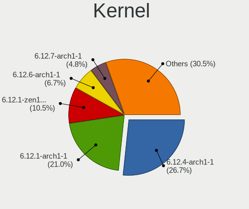
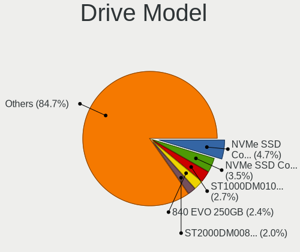
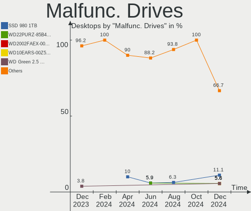
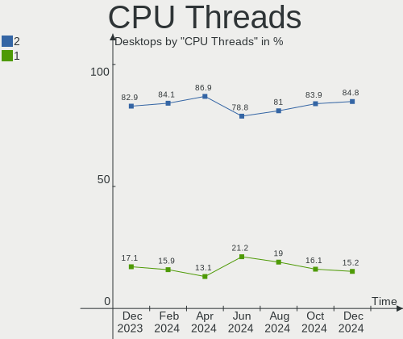
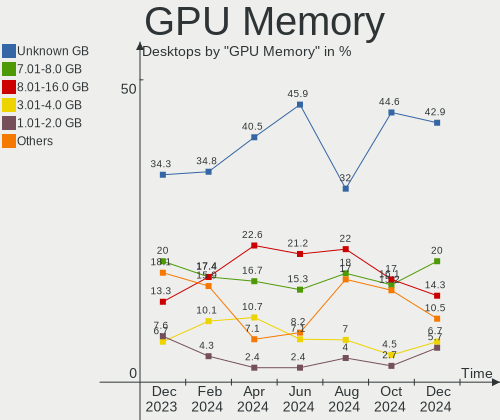
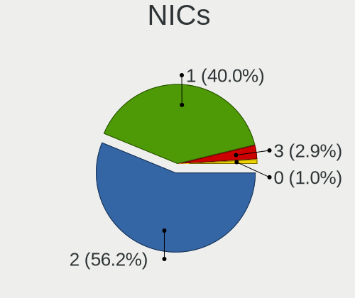

Arch Hardware Trends (Desktop)
------------------------------

A project to identify most popular hardware characteristics and track their change
over time based on data collected by Arch users at https://Linux-Hardware.org.

Anyone can contribute to the study by uploading probes of their computers by
the [hw-probe](https://github.com/linuxhw/hw-probe) tool:

    sudo hw-probe -all -upload

Full-feature report is available here: https://linux-hardware.org/?view=trends&formfactor=desktop

Period: Apr, 2020.

Contents
--------

- [ OS                       ](#os)
- [ OS Family                ](#os-family)
- [ Kernel                   ](#kernel)
- [ Kernel Family            ](#kernel-family)
- [ Kernel Major Ver.        ](#kernel-major-ver)
- [ Arch                     ](#arch)
- [ DE                       ](#de)
- [ Display Server           ](#display-server)
- [ Display Manager          ](#display-manager)
- [ OS Lang                  ](#os-lang)
- [ Boot Mode                ](#boot-mode)
- [ Filesystem               ](#filesystem)
- [ Dual Boot with Linux/BSD ](#dual-boot-with-linux/bsd)
- [ Dual Boot (Win)          ](#dual-boot-win)
- [ Country                  ](#country)
- [ City                     ](#city)
- [ Vendor                   ](#vendor)
- [ Model                    ](#model)
- [ Model Family             ](#model-family)
- [ MFG Year                 ](#mfg-year)
- [ Form Factor              ](#form-factor)
- [ Secure Boot              ](#secure-boot)
- [ Coreboot                 ](#coreboot)
- [ RAM Size                 ](#ram-size)
- [ RAM Used                 ](#ram-used)
- [ Drive Vendor             ](#drive-vendor)
- [ Drive Model              ](#drive-model)
- [ Drive Kind               ](#drive-kind)
- [ Drive Connector          ](#drive-connector)
- [ Drive Size               ](#drive-size)
- [ Space Total              ](#space-total)
- [ Space Used               ](#space-used)
- [ Malfunc. Drives          ](#malfunc-drives)
- [ Malfunc. Drive Vendor    ](#malfunc-drive-vendor)
- [ Malfunc. Drive Kind      ](#malfunc-drive-kind)
- [ Failed Drives            ](#failed-drives)
- [ Failed Drive Vendor      ](#failed-drive-vendor)
- [ Drive Status             ](#drive-status)
- [ Storage Vendor           ](#storage-vendor)
- [ Storage Model            ](#storage-model)
- [ Storage Kind             ](#storage-kind)
- [ CPU Vendor               ](#cpu-vendor)
- [ CPU Model                ](#cpu-model)
- [ CPU Model Family         ](#cpu-model-family)
- [ CPU Cores                ](#cpu-cores)
- [ CPU Sockets              ](#cpu-sockets)
- [ CPU Threads              ](#cpu-threads)
- [ CPU Op-Modes             ](#cpu-op-modes)
- [ CPU Microarch            ](#cpu-microarch)
- [ CPU Microcode            ](#cpu-microcode)
- [ GPU Vendor               ](#gpu-vendor)
- [ GPU Model                ](#gpu-model)
- [ GPU Combo                ](#gpu-combo)
- [ GPU Driver               ](#gpu-driver)
- [ GPU Memory               ](#gpu-memory)
- [ Monitor Vendor           ](#monitor-vendor)
- [ Monitor Model            ](#monitor-model)
- [ Monitor Resolution       ](#monitor-resolution)
- [ Monitor Diagonal         ](#monitor-diagonal)
- [ Monitor Width            ](#monitor-width)
- [ Aspect Ratio             ](#aspect-ratio)
- [ Monitor Area             ](#monitor-area)
- [ Pixel Density            ](#pixel-density)
- [ Multiple Monitors        ](#multiple-monitors)
- [ Net Controller Vendor    ](#net-controller-vendor)
- [ Net Controller Model     ](#net-controller-model)
- [ Net Controller Kind      ](#net-controller-kind)
- [ Used Controller          ](#used-controller)
- [ NICs                     ](#nics)
- [ Unsupported Devices      ](#unsupported-devices)
- [ Unsupported Device Types ](#unsupported-device-types)

OS
--

Installed operating systems

| Name         | Computers | Percent |
|--------------|-----------|---------|
| Arch         | 35        | 64.81%  |
| Arch Rolling | 19        | 35.19%  |

OS Family
---------

OS without a version

| Name | Computers | Percent |
|------|-----------|---------|
| Arch | 54        | 100%    |

Kernel
------

Version of the Linux kernel

| Version            | Computers | Percent |
|--------------------|-----------|---------|
| 5.6.4-arch1-1      | 11        | 20.37%  |
| 5.6.6-arch1-1      | 7         | 12.96%  |
| 5.6.3-arch1-1      | 7         | 12.96%  |
| 5.6.7-arch1-1      | 4         | 7.41%   |
| 5.5.13-arch2-1     | 4         | 7.41%   |
| 5.4.28-2-lts       | 3         | 5.56%   |
| 5.6.7-zen1-1-zen   | 2         | 3.7%    |
| 5.6.5-arch3-1      | 2         | 3.7%    |
| 5.6.3-zen1-1-zen   | 2         | 3.7%    |
| 5.6.8-arch1-1      | 1         | 1.85%   |
| 5.6.4-arch1-1-vfio | 1         | 1.85%   |
| 5.6.2-arch1-2      | 1         | 1.85%   |
| 5.6.2-5-tkg-pds    | 1         | 1.85%   |
| 5.5.7-arch1-1      | 1         | 1.85%   |
| 5.5.19-1-ck-zen2   | 1         | 1.85%   |
| 5.5.18-1-ck-zen2   | 1         | 1.85%   |
| 5.5.15-1-ck        | 1         | 1.85%   |
| 5.4.33-3-lts       | 1         | 1.85%   |
| 5.4.32-1-lts       | 1         | 1.85%   |
| 5.4.31-1-lts       | 1         | 1.85%   |
| 4.8.13-1-ARCH      | 1         | 1.85%   |

Kernel Family
-------------

Linux kernel without a distro release

| Version | Computers | Percent |
|---------|-----------|---------|
| 5.6.4   | 12        | 22.22%  |
| 5.6.3   | 9         | 16.67%  |
| 5.6.6   | 7         | 12.96%  |
| 5.6.7   | 6         | 11.11%  |
| 5.5.13  | 4         | 7.41%   |
| 5.4.28  | 3         | 5.56%   |
| 5.6.5   | 2         | 3.7%    |
| 5.6.2   | 2         | 3.7%    |
| 5.6.8   | 1         | 1.85%   |
| 5.5.7   | 1         | 1.85%   |
| 5.5.19  | 1         | 1.85%   |
| 5.5.18  | 1         | 1.85%   |
| 5.5.15  | 1         | 1.85%   |
| 5.4.33  | 1         | 1.85%   |
| 5.4.32  | 1         | 1.85%   |
| 5.4.31  | 1         | 1.85%   |
| 4.8.13  | 1         | 1.85%   |

Kernel Major Ver.
-----------------

Linux kernel major version

| Version | Computers | Percent |
|---------|-----------|---------|
| 5.6     | 39        | 72.22%  |
| 5.5     | 8         | 14.81%  |
| 5.4     | 6         | 11.11%  |
| 4.8     | 1         | 1.85%   |

Arch
----

OS architecture (x86_64, i586, etc.)

| Name   | Computers | Percent |
|--------|-----------|---------|
| x86_64 | 54        | 100%    |

DE
--

Desktop Environment

| Name       | Computers | Percent |
|------------|-----------|---------|
| GNOME      | 30        | 55.56%  |
| KDE        | 7         | 12.96%  |
| KDE5       | 5         | 9.26%   |
| XFCE       | 3         | 5.56%   |
| Deepin     | 3         | 5.56%   |
| Cinnamon   | 2         | 3.7%    |
| Unknown    | 2         | 3.7%    |
| X-Cinnamon | 1         | 1.85%   |
| LXDE       | 1         | 1.85%   |

Display Server
--------------

X11 or Wayland

| Name    | Computers | Percent |
|---------|-----------|---------|
| X11     | 43        | 79.63%  |
| Wayland | 10        | 18.52%  |
| Unknown | 1         | 1.85%   |

Display Manager
---------------

SDDM, LightDM, etc.

| Name    | Computers | Percent |
|---------|-----------|---------|
| Unknown | 32        | 59.26%  |
| LightDM | 9         | 16.67%  |
| SDDM    | 6         | 11.11%  |
| GDM     | 5         | 9.26%   |
| XDM     | 1         | 1.85%   |
| KDM     | 1         | 1.85%   |

OS Lang
-------

Language

| Lang       | Computers | Percent |
|------------|-----------|---------|
| en_US      | 27        | 50%     |
| pt_BR      | 4         | 7.41%   |
| de_DE      | 4         | 7.41%   |
| Unknown    | 3         | 5.56%   |
| pl_PL      | 2         | 3.7%    |
| en_GB      | 2         | 3.7%    |
| en_AU      | 2         | 3.7%    |
| C          | 2         | 3.7%    |
| sv_SE      | 1         | 1.85%   |
| ru_RU      | 1         | 1.85%   |
| lv_LV      | 1         | 1.85%   |
| fr_FR      | 1         | 1.85%   |
| fr_CA      | 1         | 1.85%   |
| es_MX      | 1         | 1.85%   |
| en_US.utf8 | 1         | 1.85%   |
| en_NL      | 1         | 1.85%   |

Boot Mode
---------

EFI or BIOS

| Mode | Computers | Percent |
|------|-----------|---------|
| EFI  | 28        | 51.85%  |
| BIOS | 26        | 48.15%  |

Filesystem
----------

Type of filesystem

| Type    | Computers | Percent |
|---------|-----------|---------|
| Ext4    | 43        | 79.63%  |
| Xfs     | 4         | 7.41%   |
| Btrfs   | 3         | 5.56%   |
| Zfs     | 1         | 1.85%   |
| F2fs    | 1         | 1.85%   |
| Ext3    | 1         | 1.85%   |
| Unknown | 1         | 1.85%   |

Dual Boot with Linux/BSD
------------------------

Hosting more than one Linux/BSD

| Dual boot | Computers | Percent |
|-----------|-----------|---------|
| No        | 43        | 79.63%  |
| Yes       | 11        | 20.37%  |

Dual Boot (Win)
---------------

Hosting Linux and Windows

| Dual boot | Computers | Percent |
|-----------|-----------|---------|
| No        | 39        | 72.22%  |
| Yes       | 15        | 27.78%  |

Country
-------

Geographic location (country)

| Country     | Computers | Percent |
|-------------|-----------|---------|
| USA         | 15        | 27.78%  |
| Germany     | 6         | 11.11%  |
| UK          | 4         | 7.41%   |
| Brazil      | 4         | 7.41%   |
| Spain       | 3         | 5.56%   |
| Canada      | 3         | 5.56%   |
| Australia   | 3         | 5.56%   |
| Russia      | 2         | 3.7%    |
| Poland      | 2         | 3.7%    |
| Netherlands | 2         | 3.7%    |
| France      | 2         | 3.7%    |
| Turkey      | 1         | 1.85%   |
| Thailand    | 1         | 1.85%   |
| Sweden      | 1         | 1.85%   |
| Mexico      | 1         | 1.85%   |
| Latvia      | 1         | 1.85%   |
| Italy       | 1         | 1.85%   |
| Indonesia   | 1         | 1.85%   |
| Cyprus      | 1         | 1.85%   |

City
----

Geographic location (city)

| City                     | Computers | Percent |
|--------------------------|-----------|---------|
| Barcelona                | 3         | 5.56%   |
| Tallahassee              | 2         | 3.7%    |
| Sanford                  | 2         | 3.7%    |
| Hanover                  | 2         | 3.7%    |
| Zoetermeer               | 1         | 1.85%   |
| Werdohl                  | 1         | 1.85%   |
| Villefranche-de-Rouergue | 1         | 1.85%   |
| Villars                  | 1         | 1.85%   |
| Uppsala                  | 1         | 1.85%   |
| Topeka                   | 1         | 1.85%   |
| Sydney                   | 1         | 1.85%   |
| Sao Jose                 | 1         | 1.85%   |
| Santa Monica             | 1         | 1.85%   |
| Rotherhithe              | 1         | 1.85%   |
| Poznan                   | 1         | 1.85%   |
| Portola Valley           | 1         | 1.85%   |
| Pahrump                  | 1         | 1.85%   |
| Nieuwendijk              | 1         | 1.85%   |
| Munich                   | 1         | 1.85%   |
| Moscow                   | 1         | 1.85%   |
| Montes Claros            | 1         | 1.85%   |
| Mercier                  | 1         | 1.85%   |
| March                    | 1         | 1.85%   |
| London                   | 1         | 1.85%   |
| Limassol                 | 1         | 1.85%   |
| Lielvārde               | 1         | 1.85%   |
| Lake Forest              | 1         | 1.85%   |
| Krakow                   | 1         | 1.85%   |
| Konya                    | 1         | 1.85%   |
| Jakarta                  | 1         | 1.85%   |
| Hamburg                  | 1         | 1.85%   |
| Guarulhos                | 1         | 1.85%   |
| Guadalajara              | 1         | 1.85%   |
| Granville                | 1         | 1.85%   |
| Glen Iris                | 1         | 1.85%   |
| Fredericksburg           | 1         | 1.85%   |
| Florence                 | 1         | 1.85%   |
| Edmonton                 | 1         | 1.85%   |
| Durham                   | 1         | 1.85%   |
| Chula Vista              | 1         | 1.85%   |
| Chesapeake               | 1         | 1.85%   |
| Chemnitz                 | 1         | 1.85%   |
| Brooklyn                 | 1         | 1.85%   |
| Biysk                    | 1         | 1.85%   |
| Beresford                | 1         | 1.85%   |
| Belo Horizonte           | 1         | 1.85%   |
| Bangkok                  | 1         | 1.85%   |
| Austin                   | 1         | 1.85%   |
| Aberdare                 | 1         | 1.85%   |

Vendor
------

Motherboard manufacturer

| Name                | Computers | Percent |
|---------------------|-----------|---------|
| ASUSTek Computer    | 18        | 33.33%  |
| MSI                 | 10        | 18.52%  |
| Gigabyte Technology | 9         | 16.67%  |
| ASRock              | 5         | 9.26%   |
| Lenovo              | 2         | 3.7%    |
| Intel               | 2         | 3.7%    |
| Dell                | 2         | 3.7%    |
| Unknown             | 2         | 3.7%    |
| Hewlett-Packard     | 1         | 1.85%   |
| ECS                 | 1         | 1.85%   |
| Biostar             | 1         | 1.85%   |
| Apple               | 1         | 1.85%   |

Model
-----

Motherboard model

| Name                              | Computers | Percent |
|-----------------------------------|-----------|---------|
| MSI MS-7C37                       | 2         | 3.7%    |
| MSI MS-7B86                       | 2         | 3.7%    |
| Lenovo 1S7033H45MJDMVVK           | 2         | 3.7%    |
| ASUS PRIME A320M-K                | 2         | 3.7%    |
| ASUS Maximus VIII RANGER          | 2         | 3.7%    |
| Unknown                           | 2         | 3.7%    |
| MSI MS-7B79                       | 1         | 1.85%   |
| MSI MS-7B49                       | 1         | 1.85%   |
| MSI MS-7B25                       | 1         | 1.85%   |
| MSI MS-7B17                       | 1         | 1.85%   |
| MSI MS-7A64                       | 1         | 1.85%   |
| MSI MS-7693                       | 1         | 1.85%   |
| Intel DX79SR AAG57199-200         | 1         | 1.85%   |
| Intel D54250WYK H13922-304        | 1         | 1.85%   |
| HP Z400 Workstation               | 1         | 1.85%   |
| Gigabyte Z87X-UD3H                | 1         | 1.85%   |
| Gigabyte Z77X-UD5H                | 1         | 1.85%   |
| Gigabyte X470 AORUS GAMING 7 WIFI | 1         | 1.85%   |
| Gigabyte H110M-S2V                | 1         | 1.85%   |
| Gigabyte B250-HD3                 | 1         | 1.85%   |
| Gigabyte AX370-Gaming K7          | 1         | 1.85%   |
| Gigabyte AX370-Gaming 5           | 1         | 1.85%   |
| Gigabyte AB350-Gaming 3           | 1         | 1.85%   |
| Gigabyte 970A-UD3P                | 1         | 1.85%   |
| ECS 945GCT-M2                     | 1         | 1.85%   |
| Dell Precision WorkStation T3500  | 1         | 1.85%   |
| Dell OptiPlex 7010                | 1         | 1.85%   |
| Biostar NF61D-A2                  | 1         | 1.85%   |
| ASUS TUF Z370-PLUS GAMING         | 1         | 1.85%   |
| ASUS TUF GAMING X570-PLUS         | 1         | 1.85%   |
| ASUS ROG STRIX Z390-I GAMING      | 1         | 1.85%   |
| ASUS ROG STRIX B350-F GAMING      | 1         | 1.85%   |
| ASUS ROG CROSSHAIR VIII HERO      | 1         | 1.85%   |
| ASUS PRIME X470-PRO               | 1         | 1.85%   |
| ASUS P8Z77-V PRO                  | 1         | 1.85%   |
| ASUS P8Z77-V LX                   | 1         | 1.85%   |
| ASUS P5Q                          | 1         | 1.85%   |
| ASUS P5B-Premium                  | 1         | 1.85%   |
| ASUS M5A99FX PRO R2.0             | 1         | 1.85%   |
| ASUS M5A97 R2.0                   | 1         | 1.85%   |
| ASUS M32CD4-K                     | 1         | 1.85%   |
| ASUS All Series                   | 1         | 1.85%   |
| ASRock X570 Steel Legend          | 1         | 1.85%   |
| ASRock X570 Phantom Gaming 4      | 1         | 1.85%   |
| ASRock B450 Pro4                  | 1         | 1.85%   |
| ASRock B250M Pro4                 | 1         | 1.85%   |
| ASRock ALiveNF6G-GLAN             | 1         | 1.85%   |
| Apple MacPro5,1                   | 1         | 1.85%   |

Model Family
------------

Motherboard model prefix

| Name                    | Computers | Percent |
|-------------------------|-----------|---------|
| ASUS ROG                | 3         | 5.56%   |
| ASUS PRIME              | 3         | 5.56%   |
| MSI MS-7C37             | 2         | 3.7%    |
| MSI MS-7B86             | 2         | 3.7%    |
| Lenovo 1S7033H45MJDMVVK | 2         | 3.7%    |
| Gigabyte AX370-Gaming   | 2         | 3.7%    |
| ASUS TUF                | 2         | 3.7%    |
| ASUS P8Z77-V            | 2         | 3.7%    |
| ASUS Maximus            | 2         | 3.7%    |
| ASRock X570             | 2         | 3.7%    |
| Unknown                 | 2         | 3.7%    |
| MSI MS-7B79             | 1         | 1.85%   |
| MSI MS-7B49             | 1         | 1.85%   |
| MSI MS-7B25             | 1         | 1.85%   |
| MSI MS-7B17             | 1         | 1.85%   |
| MSI MS-7A64             | 1         | 1.85%   |
| MSI MS-7693             | 1         | 1.85%   |
| Intel DX79SR            | 1         | 1.85%   |
| Intel D54250WYK         | 1         | 1.85%   |
| HP Z400                 | 1         | 1.85%   |
| Gigabyte Z87X-UD3H      | 1         | 1.85%   |
| Gigabyte Z77X-UD5H      | 1         | 1.85%   |
| Gigabyte X470           | 1         | 1.85%   |
| Gigabyte H110M-S2V      | 1         | 1.85%   |
| Gigabyte B250-HD3       | 1         | 1.85%   |
| Gigabyte AB350-Gaming   | 1         | 1.85%   |
| Gigabyte 970A-UD3P      | 1         | 1.85%   |
| ECS 945GCT-M2           | 1         | 1.85%   |
| Dell Precision          | 1         | 1.85%   |
| Dell OptiPlex           | 1         | 1.85%   |
| Biostar NF61D-A2        | 1         | 1.85%   |
| ASUS P5Q                | 1         | 1.85%   |
| ASUS P5B-Premium        | 1         | 1.85%   |
| ASUS M5A99FX            | 1         | 1.85%   |
| ASUS M5A97              | 1         | 1.85%   |
| ASUS M32CD4-K           | 1         | 1.85%   |
| ASUS All                | 1         | 1.85%   |
| ASRock B450             | 1         | 1.85%   |
| ASRock B250M            | 1         | 1.85%   |
| ASRock ALiveNF6G-GLAN   | 1         | 1.85%   |
| Apple MacPro5           | 1         | 1.85%   |

MFG Year
--------

Motherboard manufacture year

| Year | Computers | Percent |
|------|-----------|---------|
| 2019 | 17        | 31.48%  |
| 2018 | 9         | 16.67%  |
| 2017 | 7         | 12.96%  |
| 2014 | 5         | 9.26%   |
| 2013 | 3         | 5.56%   |
| 2020 | 2         | 3.7%    |
| 2012 | 2         | 3.7%    |
| 2009 | 2         | 3.7%    |
| 2008 | 2         | 3.7%    |
| 2007 | 2         | 3.7%    |
| 2016 | 1         | 1.85%   |
| 2015 | 1         | 1.85%   |
| 2011 | 1         | 1.85%   |

Form Factor
-----------

Physical design of the computer

| Name    | Computers | Percent |
|---------|-----------|---------|
| Desktop | 54        | 100%    |

Secure Boot
-----------

Enabled or disabled

| State    | Computers | Percent |
|----------|-----------|---------|
| Disabled | 54        | 100%    |

Coreboot
--------

Have coreboot on board

| Used | Computers | Percent |
|------|-----------|---------|
| No   | 54        | 100%    |

RAM Size
--------

Total RAM memory

| Size in GB  | Computers | Percent |
|-------------|-----------|---------|
| 16.01-24.0  | 21        | 38.89%  |
| 8.01-16.0   | 14        | 25.93%  |
| 32.01-64.0  | 7         | 12.96%  |
| 4.01-8.0    | 4         | 7.41%   |
| 64.01-256.0 | 4         | 7.41%   |
| 3.01-4.0    | 3         | 5.56%   |
| 24.01-32.0  | 1         | 1.85%   |

RAM Used
--------

Used RAM memory

| Used GB   | Computers | Percent |
|-----------|-----------|---------|
| 1.01-2.0  | 17        | 31.48%  |
| 2.01-3.0  | 14        | 25.93%  |
| 3.01-4.0  | 11        | 20.37%  |
| 4.01-8.0  | 8         | 14.81%  |
| 8.01-16.0 | 3         | 5.56%   |
| 0.01-1.0  | 1         | 1.85%   |

Drive Vendor
------------

Hard drive vendors

| Vendor              | Computers | Drives | Percent |
|---------------------|-----------|--------|---------|
| WDC                 | 22        | 29     | 18.49%  |
| Seagate             | 20        | 27     | 16.81%  |
| Samsung Electronics | 16        | 22     | 13.45%  |
| Kingston            | 9         | 9      | 7.56%   |
| SanDisk             | 7         | 11     | 5.88%   |
| Crucial             | 7         | 7      | 5.88%   |
| Toshiba             | 6         | 6      | 5.04%   |
| Corsair             | 4         | 4      | 3.36%   |
| A-DATA Technology   | 4         | 4      | 3.36%   |
| Intel               | 3         | 3      | 2.52%   |
| DREVO               | 3         | 3      | 2.52%   |
| China               | 3         | 3      | 2.52%   |
| SK Hynix            | 2         | 2      | 1.68%   |
| Hitachi             | 2         | 2      | 1.68%   |
| HGST                | 2         | 2      | 1.68%   |
| ASMT                | 2         | 2      | 1.68%   |
| Unknown             | 1         | 1      | 0.84%   |
| S3U3                | 1         | 1      | 0.84%   |
| Patriot             | 1         | 1      | 0.84%   |
| OCZ                 | 1         | 1      | 0.84%   |
| Mushkin             | 1         | 1      | 0.84%   |
| MARVELL             | 1         | 1      | 0.84%   |
| Gigabyte Technology | 1         | 1      | 0.84%   |

Drive Model
-----------

Hard drive models

| Model                        | Computers | Percent |
|------------------------------|-----------|---------|
| X1 SSD 120GB                 | 3         | 2.13%   |
| SV300S37A120G 120GB SSD      | 3         | 2.13%   |
| ST2000DM006-2DM164 2TB       | 3         | 2.13%   |
| SH00R480GB SSD               | 3         | 2.13%   |
| WD5000AAKX-001CA0 500GB      | 2         | 1.42%   |
| WD40EZRZ-00GXCB0 4TB         | 2         | 1.42%   |
| WD3200AAKS-75L9A0 320GB      | 2         | 1.42%   |
| WD20EURX-57T0FY0 2TB         | 2         | 1.42%   |
| ST750LX003-1AC154 752GB      | 2         | 1.42%   |
| ST500DM005 HD502HJ 500GB     | 2         | 1.42%   |
| ST1000LM024 HN-M101MBB 1TB   | 2         | 1.42%   |
| SSD 850 EVO 120GB            | 2         | 1.42%   |
| SDSSDA240G 240GB             | 2         | 1.42%   |
| SA400S37240G 240GB SSD       | 2         | 1.42%   |
| SA400S37120G 120GB SSD       | 2         | 1.42%   |
| HDWE160 6TB                  | 2         | 1.42%   |
| CT500MX500SSD1 500GB         | 2         | 1.42%   |
| CT1000MX500SSD1 1TB          | 2         | 1.42%   |
| WDS480G2G0B-00EPW0 480GB SSD | 1         | 0.71%   |
| WDS240G2G0A-00JH30 240GB SSD | 1         | 0.71%   |
| WDBNCE2500PNC-WRSN 250GB SSD | 1         | 0.71%   |
| WD8000AARS-00Y5B1 800GB      | 1         | 0.71%   |
| WD50EFRX-68MYMN1 5TB         | 1         | 0.71%   |
| WD5000BEKT-00KA9T0 500GB     | 1         | 0.71%   |
| WD5000AAKS-75V0A0 500GB      | 1         | 0.71%   |
| WD5000AAKS-00YGA0 500GB      | 1         | 0.71%   |
| WD30EZRX-00D8PB0 3TB         | 1         | 0.71%   |
| WD20NPVT-00Z2TT0 2TB         | 1         | 0.71%   |
| WD20EZRZ-00Z5HB0 2TB         | 1         | 0.71%   |
| WD20EARX-008FB0 2TB          | 1         | 0.71%   |
| WD1600JS-08MHB0 160GB        | 1         | 0.71%   |
| WD10EZRX-00A8LB0 1TB         | 1         | 0.71%   |
| WD10EZEX-08WN4A0 1TB         | 1         | 0.71%   |
| WD10EZEX-00WN4A0 1TB         | 1         | 0.71%   |
| WD10EZEX-00BN5A0 1TB         | 1         | 0.71%   |
| WD10EARX-22N0YB0 1TB         | 1         | 0.71%   |
| WD1003FZEX-00K3CA0 1TB       | 1         | 0.71%   |
| WD1001FAES-75W7A0 1TB        | 1         | 0.71%   |
| VERTEX3 240GB SSD            | 1         | 0.71%   |
| Ultra II 480GB SSD           | 1         | 0.71%   |
| THNSN51T02DUK NVMe 1024GB    | 1         | 0.71%   |
| SX8200PNP 512GB              | 1         | 0.71%   |
| SU800 1024GB SSD             | 1         | 0.71%   |
| SU650 480GB SSD              | 1         | 0.71%   |
| SU635 480GB SSD              | 1         | 0.71%   |
| ST750LM022 HN-M750MBB 752GB  | 1         | 0.71%   |
| ST500LM000-1EJ162 500GB      | 1         | 0.71%   |
| ST4000DM004-2CV104 4TB       | 1         | 0.71%   |
| ST4000DM000-1F2168 4TB       | 1         | 0.71%   |
| ST3640323AS 640GB            | 1         | 0.71%   |
| ST3500630AS 500GB            | 1         | 0.71%   |
| ST3500312CS 500GB            | 1         | 0.71%   |
| ST3160318AS 160GB            | 1         | 0.71%   |
| ST31000528AS 1TB             | 1         | 0.71%   |
| ST31000333AS 1TB             | 1         | 0.71%   |
| ST3000DM001-1CH166 3TB       | 1         | 0.71%   |
| ST2000DM008-2FR102 2TB       | 1         | 0.71%   |
| ST2000DL003-9VT166 2TB       | 1         | 0.71%   |
| ST1000LM035-1RK172 1TB       | 1         | 0.71%   |
| ST1000DX001-1NS162 1TB       | 1         | 0.71%   |

Drive Kind
----------

HDD or SSD

| Kind | Computers | Drives | Percent |
|------|-----------|--------|---------|
| SSD  | 39        | 66     | 45.35%  |
| HDD  | 39        | 67     | 45.35%  |
| NVMe | 8         | 10     | 9.3%    |

Drive Connector
---------------

SATA, SAS, NVMe, etc.

| Type | Computers | Drives | Percent |
|------|-----------|--------|---------|
| SATA | 52        | 130    | 83.87%  |
| NVMe | 8         | 10     | 12.9%   |
| SAS  | 2         | 3      | 3.23%   |

Drive Size
----------

Size of hard drive

| Size in TB | Computers | Drives | Percent |
|------------|-----------|--------|---------|
| 0.01-0.5   | 42        | 79     | 46.15%  |
| 0.51-1.0   | 26        | 36     | 28.57%  |
| 1.01-2.0   | 13        | 16     | 14.29%  |
| 3.01-4.0   | 6         | 7      | 6.59%   |
| 4.01-10.0  | 3         | 3      | 3.3%    |
| 2.01-3.0   | 1         | 2      | 1.1%    |

Space Total
-----------

Amount of disk space available on the file system

| Size in GB     | Computers | Percent |
|----------------|-----------|---------|
| 101-250        | 12        | 22.22%  |
| 251-500        | 9         | 16.67%  |
| 1001-2000      | 9         | 16.67%  |
| More than 3000 | 8         | 14.81%  |
| 501-1000       | 8         | 14.81%  |
| 2001-3000      | 6         | 11.11%  |
| 21-50          | 1         | 1.85%   |
| Unknown        | 1         | 1.85%   |

Space Used
----------

Amount of used disk space

| Used GB        | Computers | Percent |
|----------------|-----------|---------|
| 1001-2000      | 10        | 18.52%  |
| 21-50          | 8         | 14.81%  |
| 1-20           | 8         | 14.81%  |
| 51-100         | 8         | 14.81%  |
| 251-500        | 6         | 11.11%  |
| 501-1000       | 5         | 9.26%   |
| 101-250        | 4         | 7.41%   |
| More than 3000 | 2         | 3.7%    |
| 2001-3000      | 2         | 3.7%    |
| Unknown        | 1         | 1.85%   |

Malfunc. Drives
---------------

Drive models with a malfunction

| Model                   | Computers | Drives | Percent |
|-------------------------|-----------|--------|---------|
| X1 SSD 120GB            | 3         | 3      | 25%     |
| SV300S37A120G 120GB SSD | 1         | 1      | 8.33%   |
| SU635 480GB SSD         | 1         | 1      | 8.33%   |
| ST3640323AS 640GB       | 1         | 1      | 8.33%   |
| ST3500312CS 500GB       | 1         | 1      | 8.33%   |
| ST3160318AS 160GB       | 1         | 1      | 8.33%   |
| SSDSA2M080G2GC 80GB     | 1         | 1      | 8.33%   |
| SH103S3240G 240GB SSD   | 1         | 1      | 8.33%   |
| Force GT 240GB SSD      | 1         | 1      | 8.33%   |
| Force 3 SSD 120GB       | 1         | 1      | 8.33%   |

Malfunc. Drive Vendor
---------------------

Vendors of faulty drives

| Vendor            | Computers | Drives | Percent |
|-------------------|-----------|--------|---------|
| Seagate           | 3         | 3      | 25%     |
| DREVO             | 3         | 3      | 25%     |
| Kingston          | 2         | 2      | 16.67%  |
| Corsair           | 2         | 2      | 16.67%  |
| Intel             | 1         | 1      | 8.33%   |
| A-DATA Technology | 1         | 1      | 8.33%   |

Malfunc. Drive Kind
-------------------

Kinds of faulty drives

| Kind | Computers | Drives | Percent |
|------|-----------|--------|---------|
| SSD  | 7         | 9      | 70%     |
| HDD  | 3         | 3      | 30%     |

Failed Drives
-------------

Failed drive models

Zero info for selected period =(

Failed Drive Vendor
-------------------

Failed drive vendors

Zero info for selected period =(

Drive Status
------------

Number of failed and malfunc. drives

| Status   | Computers | Drives | Percent |
|----------|-----------|--------|---------|
| Detected | 32        | 79     | 51.61%  |
| Works    | 20        | 52     | 32.26%  |
| Malfunc  | 10        | 12     | 16.13%  |

Storage Vendor
--------------

Storage controller vendors

| Vendor                       | Computers | Percent |
|------------------------------|-----------|---------|
| Intel                        | 31        | 35.63%  |
| AMD                          | 23        | 26.44%  |
| Samsung Electronics          | 7         | 8.05%   |
| ASMedia Technology           | 6         | 6.9%    |
| Marvell Technology Group     | 5         | 5.75%   |
| Sandisk                      | 2         | 2.3%    |
| Nvidia                       | 2         | 2.3%    |
| JMicron Technology           | 2         | 2.3%    |
| ADATA Technology             | 2         | 2.3%    |
| Toshiba America Info Systems | 1         | 1.15%   |
| SK Hynix                     | 1         | 1.15%   |
| Silicon Motion               | 1         | 1.15%   |
| Phison Electronics           | 1         | 1.15%   |
| Micron/Crucial Technology    | 1         | 1.15%   |
| Kingston Technology Company  | 1         | 1.15%   |
| Adaptec                      | 1         | 1.15%   |

Storage Model
-------------

Storage controller models

| Model                                                                    | Computers | Percent |
|--------------------------------------------------------------------------|-----------|---------|
| FCH SATA Controller [AHCI mode]                                          | 18        | 16.82%  |
| 400 Series Chipset SATA Controller                                       | 6         | 5.61%   |
| ASM1062 Serial ATA Controller                                            | 5         | 4.67%   |
| 200 Series PCH SATA controller [AHCI mode]                               | 5         | 4.67%   |
| SB7x0/SB8x0/SB9x0 SATA Controller [AHCI mode]                            | 4         | 3.74%   |
| Q170/Q150/B150/H170/H110/Z170/CM236 Chipset SATA Controller [AHCI Mode]  | 4         | 3.74%   |
| NVMe SSD Controller SM981/PM981/PM983                                    | 4         | 3.74%   |
| 7 Series/C210 Series Chipset Family 6-port SATA Controller [AHCI mode]   | 4         | 3.74%   |
| NVMe SSD Controller SM961/PM961                                          | 3         | 2.8%    |
| Cannon Lake PCH SATA AHCI Controller                                     | 3         | 2.8%    |
| 82801JI (ICH10 Family) SATA AHCI Controller                              | 3         | 2.8%    |
| XPG SX8200 Pro PCIe Gen3x4 M.2 2280 Solid State Drive                    | 2         | 1.87%   |
| X370 Series Chipset SATA Controller                                      | 2         | 1.87%   |
| WD Black 2018/PC SN720 NVMe SSD                                          | 2         | 1.87%   |
| Non-Volatile memory controller                                           | 2         | 1.87%   |
| MCP61 SATA Controller                                                    | 2         | 1.87%   |
| MCP61 IDE                                                                | 2         | 1.87%   |
| FCH SATA Controller D                                                    | 2         | 1.87%   |
| 88SE9172 SATA 6Gb/s Controller                                           | 2         | 1.87%   |
| 6 Series/C200 Series Chipset Family 6 port Desktop SATA AHCI Controller  | 2         | 1.87%   |
| 300 Series Chipset SATA Controller                                       | 2         | 1.87%   |
| XG4 NVMe SSD Controller                                                  | 1         | 0.93%   |
| SSD Pro 7600p/760p/E 6100p Series                                        | 1         | 0.93%   |
| SSD 660P Series                                                          | 1         | 0.93%   |
| SB7x0/SB8x0/SB9x0 SATA Controller [IDE mode]                             | 1         | 0.93%   |
| SB7x0/SB8x0/SB9x0 IDE Controller                                         | 1         | 0.93%   |
| SATA Controller [RAID mode]                                              | 1         | 0.93%   |
| PC300 NVMe Solid State Drive 512GB                                       | 1         | 0.93%   |
| P1 NVMe PCIe SSD                                                         | 1         | 0.93%   |
| NVMe SSD Controller SM951/PM951                                          | 1         | 0.93%   |
| NM10/ICH7 Family SATA Controller [IDE mode]                              | 1         | 0.93%   |
| JMB368 IDE controller                                                    | 1         | 0.93%   |
| JMB363 SATA/IDE Controller                                               | 1         | 0.93%   |
| E12 NVMe Controller                                                      | 1         | 0.93%   |
| C610/X99 series chipset sSATA Controller [AHCI mode]                     | 1         | 0.93%   |
| C610/X99 series chipset 6-Port SATA Controller [AHCI mode]               | 1         | 0.93%   |
| C600/X79 series chipset 4-Port SATA IDE Controller                       | 1         | 0.93%   |
| C600/X79 series chipset 2-Port SATA IDE Controller                       | 1         | 0.93%   |
| ASM1061 SATA IDE Controller                                              | 1         | 0.93%   |
| AAC-RAID                                                                 | 1         | 0.93%   |
| 88SE9230 PCIe SATA 6Gb/s Controller                                      | 1         | 0.93%   |
| 88SE9128 PCIe SATA 6 Gb/s RAID controller with HyperDuo                  | 1         | 0.93%   |
| 88SE6111/6121 SATA II / PATA Controller                                  | 1         | 0.93%   |
| 82801JI (ICH10 Family) 4 port SATA IDE Controller #1                     | 1         | 0.93%   |
| 82801JI (ICH10 Family) 2 port SATA IDE Controller #2                     | 1         | 0.93%   |
| 82801HR/HO/HH (ICH8R/DO/DH) 6 port SATA Controller [AHCI mode]           | 1         | 0.93%   |
| 82801G (ICH7 Family) IDE Controller                                      | 1         | 0.93%   |
| 8 Series/C220 Series Chipset Family 6-port SATA Controller 1 [AHCI mode] | 1         | 0.93%   |
| 8 Series SATA Controller 1 [AHCI mode]                                   | 1         | 0.93%   |

Storage Kind
------------

Kind of storage controller (IDE, SATA, NVMe, SAS, ...)

| Kind | Computers | Percent |
|------|-----------|---------|
| SATA | 49        | 64.47%  |
| NVMe | 16        | 21.05%  |
| IDE  | 9         | 11.84%  |
| RAID | 2         | 2.63%   |

CPU Vendor
----------

Processor vendors

| Vendor | Computers | Percent |
|--------|-----------|---------|
| Intel  | 29        | 53.7%   |
| AMD    | 25        | 46.3%   |

CPU Model
---------

Processor models

| Model                                       | Computers | Percent |
|---------------------------------------------|-----------|---------|
| AMD Ryzen 3 2200G with Radeon Vega Graphics | 4         | 7.41%   |
| Intel Core i7-8700K CPU @ 3.70GHz           | 2         | 3.7%    |
| Intel Core i7-6700K CPU @ 4.00GHz           | 2         | 3.7%    |
| Intel Core i7-3770K CPU @ 3.50GHz           | 2         | 3.7%    |
| Intel Core i5-9600K CPU @ 3.70GHz           | 2         | 3.7%    |
| Intel Core i5-2400 CPU @ 3.10GHz            | 2         | 3.7%    |
| AMD Ryzen 9 3950X 16-Core Processor         | 2         | 3.7%    |
| AMD Ryzen 7 3700X 8-Core Processor          | 2         | 3.7%    |
| AMD Ryzen 7 2700X Eight-Core Processor      | 2         | 3.7%    |
| AMD FX-8350 Eight-Core Processor            | 2         | 3.7%    |
| AMD FX-6300 Six-Core Processor              | 2         | 3.7%    |
| Intel Xeon CPU X5690 @ 3.47GHz              | 1         | 1.85%   |
| Intel Xeon CPU W3565 @ 3.20GHz              | 1         | 1.85%   |
| Intel Xeon CPU W3550 @ 3.07GHz              | 1         | 1.85%   |
| Intel Pentium Dual CPU E2140 @ 1.60GHz      | 1         | 1.85%   |
| Intel Core i7-7700K CPU @ 4.20GHz           | 1         | 1.85%   |
| Intel Core i7-6700 CPU @ 3.40GHz            | 1         | 1.85%   |
| Intel Core i7-5820K CPU @ 3.30GHz           | 1         | 1.85%   |
| Intel Core i7-4770 CPU @ 3.40GHz            | 1         | 1.85%   |
| Intel Core i7-3820 CPU @ 3.60GHz            | 1         | 1.85%   |
| Intel Core i7-3770S CPU @ 3.10GHz           | 1         | 1.85%   |
| Intel Core i5-8400 CPU @ 2.80GHz            | 1         | 1.85%   |
| Intel Core i5-7600K CPU @ 3.80GHz           | 1         | 1.85%   |
| Intel Core i5-7400 CPU @ 3.00GHz            | 1         | 1.85%   |
| Intel Core i5-4250U CPU @ 1.30GHz           | 1         | 1.85%   |
| Intel Core i3-7100 CPU @ 3.90GHz            | 1         | 1.85%   |
| Intel Core 2 Quad CPU Q9550 @ 2.83GHz       | 1         | 1.85%   |
| Intel Core 2 Quad CPU Q9300 @ 2.50GHz       | 1         | 1.85%   |
| Intel Core 2 Quad CPU Q6700 @ 2.66GHz       | 1         | 1.85%   |
| Intel Celeron CPU G530 @ 2.40GHz            | 1         | 1.85%   |
| AMD Ryzen 9 3900X 12-Core Processor         | 1         | 1.85%   |
| AMD Ryzen 7 3800X 8-Core Processor          | 1         | 1.85%   |
| AMD Ryzen 7 2700 Eight-Core Processor       | 1         | 1.85%   |
| AMD Ryzen 7 1700 Eight-Core Processor       | 1         | 1.85%   |
| AMD Ryzen 5 3600X 6-Core Processor          | 1         | 1.85%   |
| AMD Ryzen 5 2600 Six-Core Processor         | 1         | 1.85%   |
| AMD Ryzen 5 1600X Six-Core Processor        | 1         | 1.85%   |
| AMD Ryzen 3 1300X Quad-Core Processor       | 1         | 1.85%   |
| AMD Phenom II X4 955 Processor              | 1         | 1.85%   |
| AMD Phenom 9550 Quad-Core Processor         | 1         | 1.85%   |
| AMD Athlon 64 X2 Dual Core Processor 5000+  | 1         | 1.85%   |

CPU Model Family
----------------

Processor model prefix

| Model              | Computers | Percent |
|--------------------|-----------|---------|
| Intel Core i7      | 12        | 22.22%  |
| Intel Core i5      | 8         | 14.81%  |
| AMD Ryzen 7        | 7         | 12.96%  |
| AMD Ryzen 3        | 5         | 9.26%   |
| AMD FX             | 4         | 7.41%   |
| Intel Xeon         | 3         | 5.56%   |
| Intel Core 2 Quad  | 3         | 5.56%   |
| AMD Ryzen 9        | 3         | 5.56%   |
| AMD Ryzen 5        | 3         | 5.56%   |
| Intel Pentium Dual | 1         | 1.85%   |
| Intel Core i3      | 1         | 1.85%   |
| Intel Celeron      | 1         | 1.85%   |
| AMD Phenom II X4   | 1         | 1.85%   |
| AMD Phenom         | 1         | 1.85%   |
| AMD Athlon 64 X2   | 1         | 1.85%   |

CPU Cores
---------

Number of processor cores

| Number | Computers | Percent |
|--------|-----------|---------|
| 4      | 27        | 50%     |
| 6      | 10        | 18.52%  |
| 8      | 7         | 12.96%  |
| 2      | 5         | 9.26%   |
| 16     | 2         | 3.7%    |
| 3      | 2         | 3.7%    |
| 12     | 1         | 1.85%   |

CPU Sockets
-----------

Number of sockets

| Number | Computers | Percent |
|--------|-----------|---------|
| 1      | 54        | 100%    |

CPU Threads
-----------

Threads per core (Hyper-Threading)

| Number | Computers | Percent |
|--------|-----------|---------|
| 2      | 33        | 61.11%  |
| 1      | 21        | 38.89%  |

CPU Op-Modes
------------

CPU Operation Modes (32-bit, 64-bit)

| Op mode        | Computers | Percent |
|----------------|-----------|---------|
| 32-bit, 64-bit | 54        | 100%    |

CPU Microarch
-------------

Microarchitecture

| Name        | Computers | Percent |
|-------------|-----------|---------|
| Skylake     | 9         | 16.67%  |
| Zen 2       | 7         | 12.96%  |
| Zen         | 7         | 12.96%  |
| Zen+        | 4         | 7.41%   |
| SandyBridge | 4         | 7.41%   |
| Piledriver  | 4         | 7.41%   |
| Core        | 4         | 7.41%   |
| KabyLake    | 3         | 5.56%   |
| IvyBridge   | 3         | 5.56%   |
| Haswell     | 3         | 5.56%   |
| Nehalem     | 2         | 3.7%    |
| K10         | 2         | 3.7%    |
| Westmere    | 1         | 1.85%   |
| K8 Hammer   | 1         | 1.85%   |

CPU Microcode
-------------

Microcode number

| Number     | Computers | Percent |
|------------|-----------|---------|
| Unknown    | 9         | 16.67%  |
| 0x08701013 | 5         | 9.26%   |
| 0x906e9    | 4         | 7.41%   |
| 0x08101016 | 4         | 7.41%   |
| 0x206a7    | 3         | 5.56%   |
| 0x0800820d | 3         | 5.56%   |
| 0x06000822 | 3         | 5.56%   |
| 0x906ec    | 2         | 3.7%    |
| 0x906ea    | 2         | 3.7%    |
| 0x306a9    | 2         | 3.7%    |
| 0x106a5    | 2         | 3.7%    |
| 0x08001138 | 2         | 3.7%    |
| 0x6fd      | 1         | 1.85%   |
| 0x6fb      | 1         | 1.85%   |
| 0x306f2    | 1         | 1.85%   |
| 0x306c3    | 1         | 1.85%   |
| 0x206d7    | 1         | 1.85%   |
| 0x206c2    | 1         | 1.85%   |
| 0x1067a    | 1         | 1.85%   |
| 0x10677    | 1         | 1.85%   |
| 0x08701012 | 1         | 1.85%   |
| 0x0800820c | 1         | 1.85%   |
| 0x08001126 | 1         | 1.85%   |
| 0x010000c8 | 1         | 1.85%   |
| 0x01000065 | 1         | 1.85%   |

GPU Vendor
----------

Vendors of graphics cards

| Vendor | Computers | Percent |
|--------|-----------|---------|
| Nvidia | 25        | 43.1%   |
| AMD    | 23        | 39.66%  |
| Intel  | 10        | 17.24%  |

GPU Model
---------

Graphics card models

| Model                                                               | Computers | Percent |
|---------------------------------------------------------------------|-----------|---------|
| Raven Ridge [Radeon Vega Series / Radeon Vega Mobile Series]        | 4         | 6.25%   |
| Navi 10 [Radeon RX 5600 OEM/5600 XT / 5700/5700 XT]                 | 4         | 6.25%   |
| Ellesmere [Radeon RX 470/480/570/570X/580/580X/590]                 | 4         | 6.25%   |
| Xeon E3-1200 v2/3rd Gen Core processor Graphics Controller          | 3         | 4.69%   |
| Tahiti PRO [Radeon HD 7950/8950 OEM / R9 280]                       | 3         | 4.69%   |
| GP107 [GeForce GTX 1050 Ti]                                         | 3         | 4.69%   |
| GM204 [GeForce GTX 970]                                             | 3         | 4.69%   |
| UHD Graphics 630 (Desktop 9 Series)                                 | 2         | 3.13%   |
| GP104 [GeForce GTX 1080]                                            | 2         | 3.13%   |
| Baffin [Radeon RX 550 640SP / RX 560/560X]                          | 2         | 3.13%   |
| 2nd Generation Core Processor Family Integrated Graphics Controller | 2         | 3.13%   |
| Vega 20 [Radeon VII]                                                | 1         | 1.56%   |
| Vega 10 XL/XT [Radeon RX Vega 56/64]                                | 1         | 1.56%   |
| UHD Graphics 630 (Desktop)                                          | 1         | 1.56%   |
| TU117 [GeForce GTX 1650]                                            | 1         | 1.56%   |
| TU116 [GeForce GTX 1660]                                            | 1         | 1.56%   |
| TU106 [GeForce RTX 2070 Rev. A]                                     | 1         | 1.56%   |
| TU106 [GeForce RTX 2060 SUPER]                                      | 1         | 1.56%   |
| TU104 [GeForce RTX 2070 SUPER]                                      | 1         | 1.56%   |
| Tahiti XT [Radeon HD 7970/8970 OEM / R9 280X]                       | 1         | 1.56%   |
| RV635 [Radeon HD 3650/3750/4570/4580]                               | 1         | 1.56%   |
| Redwood PRO [Radeon HD 5550/5570/5630/6510/6610/7570]               | 1         | 1.56%   |
| Navi 14 [Radeon RX 5500/5500M / Pro 5500M]                          | 1         | 1.56%   |
| Haswell-ULT Integrated Graphics Controller                          | 1         | 1.56%   |
| GT216 [GeForce GT 220]                                              | 1         | 1.56%   |
| GP108 [GeForce GT 1030]                                             | 1         | 1.56%   |
| GP107 [GeForce GTX 1050]                                            | 1         | 1.56%   |
| GP104 [GeForce GTX 1070]                                            | 1         | 1.56%   |
| GP104 [GeForce GTX 1070 Ti]                                         | 1         | 1.56%   |
| GM206 [GeForce GTX 950]                                             | 1         | 1.56%   |
| GM200GL [Quadro M6000]                                              | 1         | 1.56%   |
| GM200 [GeForce GTX 980 Ti]                                          | 1         | 1.56%   |
| GK208B [GeForce GT 720]                                             | 1         | 1.56%   |
| GK208B [GeForce GT 710]                                             | 1         | 1.56%   |
| GF108 [GeForce GT 630]                                              | 1         | 1.56%   |
| GF108 [GeForce GT 440]                                              | 1         | 1.56%   |
| GF100GL [Quadro 4000]                                               | 1         | 1.56%   |
| G73 [GeForce 7600 GS]                                               | 1         | 1.56%   |
| Curacao XT / Trinidad XT [Radeon R7 370 / R9 270X/370X]             | 1         | 1.56%   |
| Cedar [Radeon HD 5000/6000/7350/8350 Series]                        | 1         | 1.56%   |
| Cape Verde XT [Radeon HD 7770/8760 / R7 250X]                       | 1         | 1.56%   |
| C61 [GeForce 6150SE nForce 430]                                     | 1         | 1.56%   |
| 82945G/GZ Integrated Graphics Controller                            | 1         | 1.56%   |

GPU Combo
---------

Combinations of graphics cards

| Name         | Computers | Percent |
|--------------|-----------|---------|
| 1 x Nvidia   | 21        | 38.89%  |
| 1 x AMD      | 18        | 33.33%  |
| 1 x Intel    | 8         | 14.81%  |
| 2 x AMD      | 3         | 5.56%   |
| 2 x Nvidia   | 2         | 3.7%    |
| AMD + Nvidia | 2         | 3.7%    |

GPU Driver
----------

Free vs proprietary

| Driver      | Computers | Percent |
|-------------|-----------|---------|
| Free        | 32        | 59.26%  |
| Proprietary | 21        | 38.89%  |
| Unknown     | 1         | 1.85%   |

GPU Memory
----------

Total video memory

| Size in GB | Computers | Percent |
|------------|-----------|---------|
| Unknown    | 14        | 25.93%  |
| 7.01-8.0   | 12        | 22.22%  |
| 1.01-2.0   | 9         | 16.67%  |
| 3.01-4.0   | 7         | 12.96%  |
| 2.01-3.0   | 5         | 9.26%   |
| 0.01-0.5   | 3         | 5.56%   |
| 5.01-6.0   | 2         | 3.7%    |
| 8.01-16.0  | 1         | 1.85%   |
| 0.51-1.0   | 1         | 1.85%   |

Monitor Vendor
--------------

Monitor vendors

| Vendor               | Computers | Percent |
|----------------------|-----------|---------|
| Samsung Electronics  | 10        | 15.38%  |
| Goldstar             | 9         | 13.85%  |
| Dell                 | 5         | 7.69%   |
| AOC                  | 5         | 7.69%   |
| BenQ                 | 4         | 6.15%   |
| Ancor Communications | 4         | 6.15%   |
| Acer                 | 4         | 6.15%   |
| Unknown              | 2         | 3.08%   |
| Philips              | 2         | 3.08%   |
| NEC Computers        | 2         | 3.08%   |
| LG Electronics       | 2         | 3.08%   |
| Hitachi              | 2         | 3.08%   |
| Hewlett-Packard      | 2         | 3.08%   |
| Vizio                | 1         | 1.54%   |
| ViewSonic            | 1         | 1.54%   |
| Unknown (AAA)        | 1         | 1.54%   |
| Toshiba              | 1         | 1.54%   |
| Sceptre              | 1         | 1.54%   |
| ONN                  | 1         | 1.54%   |
| Lenovo               | 1         | 1.54%   |
| Insignia             | 1         | 1.54%   |
| Iiyama               | 1         | 1.54%   |
| Grundig              | 1         | 1.54%   |
| ASUSTek Computer     | 1         | 1.54%   |
| Apple                | 1         | 1.54%   |

Monitor Model
-------------

Monitor models

| Model                                               | Computers | Percent |
|-----------------------------------------------------|-----------|---------|
| 2260WG5 AOC2260 1920x1080 477x268mm 21.5-inch       | 3         | 4.41%   |
| ZOWIE XL LCD BNQ7F31 1920x1080 531x298mm 24.0-inch  | 2         | 2.94%   |
| X93S D-sub HIT7009 1280x1024 376x301mm 19.0-inch    | 2         | 2.94%   |
| Ultra HD GSM5B09 3840x2160 600x340mm 27.2-inch      | 2         | 2.94%   |
| LG FULL HD GSM5AB9 1680x1050 480x270mm 21.7-inch    | 2         | 2.94%   |
| C27F390 SAM0D32 1920x1080 600x340mm 27.2-inch       | 2         | 2.94%   |
| W2043 GSM4E9E 1600x900 443x249mm 20.0-inch          | 1         | 1.47%   |
| VX2453 Series VSC0C28 1920x1080 520x290mm 23.4-inch | 1         | 1.47%   |
| VE247 ACI2493 1920x1080 531x299mm 24.0-inch         | 1         | 1.47%   |
| VC279 ACI27C4 1920x1080 598x336mm 27.0-inch         | 1         | 1.47%   |
| V246HL ACR0336 1920x1080 531x299mm 24.0-inch        | 1         | 1.47%   |
| ULTRAWIDE GSM76FC 3840x1600 874x366mm 37.3-inch     | 1         | 1.47%   |
| ULTRAWIDE GSM5AFB 2560x1080 798x334mm 34.1-inch     | 1         | 1.47%   |
| U28E590 SAM0C4E 3840x2160 608x345mm 27.5-inch       | 1         | 1.47%   |
| U28E590 SAM0C4D 3840x2160 607x345mm 27.5-inch       | 1         | 1.47%   |
| U2412M DELA07B 1920x1200 518x324mm 24.1-inch        | 1         | 1.47%   |
| U2212HM DELD047 1920x1080 475x267mm 21.5-inch       | 1         | 1.47%   |
| TV TSB0105 1920x1080 708x398mm 32.0-inch            | 1         | 1.47%   |
| SyncMaster SAM041D 1920x1200 459x296mm 21.5-inch    | 1         | 1.47%   |
| SyncMaster SAM02B6 1920x1200 518x324mm 24.1-inch    | 1         | 1.47%   |
| S27F350 SAM0D22 1920x1080 598x336mm 27.0-inch       | 1         | 1.47%   |
| S24D300 SAM0B43 1920x1080 531x299mm 24.0-inch       | 1         | 1.47%   |
| ROG PG278QR AUS27B1 2560x1440 600x340mm 27.2-inch   | 1         | 1.47%   |
| PL2474H IVM6137 1920x1080 521x293mm 23.5-inch       | 1         | 1.47%   |
| P221 HWP3058 1920x1080 476x268mm 21.5-inch          | 1         | 1.47%   |
| ONA18HO015 ONN0101 1920x1080 698x393mm 31.5-inch    | 1         | 1.47%   |
| LEN LT2223zwC LEN60A2 1920x1080 477x268mm 21.5-inch | 1         | 1.47%   |
| LED Cinema APP9226 2560x1440 600x340mm 27.2-inch    | 1         | 1.47%   |
| LCDTV AAA3393 1360x768 890x500mm 40.2-inch          | 1         | 1.47%   |
| LCD Monitor X34 3440x1440                           | 1         | 1.47%   |
| LCD Monitor WUXGA                                   | 1         | 1.47%   |
| LCD Monitor W2340 3840x1080                         | 1         | 1.47%   |
| LCD Monitor U28E590 3840x2160                       | 1         | 1.47%   |
| LCD Monitor S24B300 1920x1080                       | 1         | 1.47%   |
| LCD Monitor PHL BDM4065 3840x2160                   | 1         | 1.47%   |
| LCD Monitor HISENSE 3840x2160                       | 1         | 1.47%   |
| LCD Monitor GDH Smart TV 1920x1080                  | 1         | 1.47%   |
| LCD Monitor ER320HQ                                 | 1         | 1.47%   |
| LCD Monitor E248W-1920                              | 1         | 1.47%   |
| LCD Monitor E2211H 3840x1080                        | 1         | 1.47%   |
| LCD Monitor DELA103 1920x1080 540x300mm 24.3-inch   | 1         | 1.47%   |
| LCD Monitor C27F390 1920x1080                       | 1         | 1.47%   |
| LCD Monitor 2D FHD LG TV 1920x1080                  | 1         | 1.47%   |
| LCD Monitor 247ELPH 3840x1080                       | 1         | 1.47%   |
| LCD Monitor 2460G5 1920x1080                        | 1         | 1.47%   |
| LCD Monitor 2209WA 1680x1050                        | 1         | 1.47%   |
| HDR 4K GSM7707 3840x2160 600x340mm 27.2-inch        | 1         | 1.47%   |
| HDMI BBY4000 1920x1080 1152x648mm 52.0-inch         | 1         | 1.47%   |
| GW2255 BNQ78CD 1920x1080 480x270mm 21.7-inch        | 1         | 1.47%   |
| GL2460 BNQ78CE 1920x1080 531x299mm 24.0-inch        | 1         | 1.47%   |
| G2 1080p dig GRU4448 1920x1080 1600x900mm 72.3-inch | 1         | 1.47%   |
| FULL HD GSM5B55 1920x1080 480x270mm 21.7-inch       | 1         | 1.47%   |
| EA223WM NEC6890 1680x1050 474x296mm 22.0-inch       | 1         | 1.47%   |
| E190VA VIZ0067 1360x768 410x230mm 18.5-inch         | 1         | 1.47%   |
| ASUS PB278 ACI27A3 2560x1440 597x336mm 27.0-inch    | 1         | 1.47%   |
| ASUS MG24U ACI24AD 3840x2160 521x293mm 23.5-inch    | 1         | 1.47%   |
| AL1916 ACRAD63 1280x1024 376x301mm 19.0-inch        | 1         | 1.47%   |
| 24m HPN3578 1920x1080 527x297mm 23.8-inch           | 1         | 1.47%   |
| 247ELPH PHLC086 1920x1080 521x293mm 23.5-inch       | 1         | 1.47%   |
| 20WGX2 NEC6699 1680x1050 433x270mm 20.1-inch        | 1         | 1.47%   |

Monitor Resolution
------------------

Monitor screen resolution

| Resolution         | Computers | Percent |
|--------------------|-----------|---------|
| 1920x1080 (FHD)    | 28        | 45.16%  |
| 3840x2160 (4K)     | 9         | 14.52%  |
| 3840x1080          | 3         | 4.84%   |
| 2560x1440 (QHD)    | 3         | 4.84%   |
| 1920x1200 (WUXGA)  | 3         | 4.84%   |
| 1680x1050 (WSXGA+) | 3         | 4.84%   |
| 1280x1024 (SXGA)   | 3         | 4.84%   |
| Unknown            | 3         | 4.84%   |
| 1360x768           | 2         | 3.23%   |
| 3840x1600          | 1         | 1.61%   |
| 3440x1440          | 1         | 1.61%   |
| 2560x1080          | 1         | 1.61%   |
| 1600x900 (HD+)     | 1         | 1.61%   |
| 1366x768 (WXGA)    | 1         | 1.61%   |

Monitor Diagonal
----------------

Diagonal size in inches

| Inches  | Computers | Percent |
|---------|-----------|---------|
| Unknown | 13        | 21.31%  |
| 27      | 12        | 19.67%  |
| 24      | 9         | 14.75%  |
| 21      | 8         | 13.11%  |
| 23      | 5         | 8.2%    |
| 19      | 3         | 4.92%   |
| 22      | 2         | 3.28%   |
| 20      | 2         | 3.28%   |
| 72      | 1         | 1.64%   |
| 40      | 1         | 1.64%   |
| 37      | 1         | 1.64%   |
| 34      | 1         | 1.64%   |
| 32      | 1         | 1.64%   |
| 26      | 1         | 1.64%   |
| 15      | 1         | 1.64%   |

Monitor Width
-------------

Physical width

| Width in mm | Computers | Percent |
|-------------|-----------|---------|
| 501-600     | 24        | 40%     |
| Unknown     | 13        | 21.67%  |
| 401-500     | 12        | 20%     |
| 351-400     | 3         | 5%      |
| 801-900     | 2         | 3.33%   |
| 701-800     | 2         | 3.33%   |
| 601-700     | 2         | 3.33%   |
| 301-350     | 1         | 1.67%   |
| 1501-2000   | 1         | 1.67%   |

Aspect Ratio
------------

Proportional relationship between the width and the height

| Ratio   | Computers | Percent |
|---------|-----------|---------|
| 16/9    | 35        | 59.32%  |
| Unknown | 13        | 22.03%  |
| 16/10   | 6         | 10.17%  |
| 5/4     | 3         | 5.08%   |
| 21/9    | 2         | 3.39%   |

Monitor Area
------------

Area in inch²

| Area in inch² | Computers | Percent |
|----------------|-----------|---------|
| 201-250        | 17        | 26.56%  |
| Unknown        | 13        | 20.31%  |
| 301-350        | 12        | 18.75%  |
| 151-200        | 11        | 17.19%  |
| 251-300        | 5         | 7.81%   |
| 351-500        | 3         | 4.69%   |
| More than 1000 | 1         | 1.56%   |
| 101-110        | 1         | 1.56%   |
| 501-1000       | 1         | 1.56%   |

Pixel Density
-------------

Pixels per inch

| Density | Computers | Percent |
|---------|-----------|---------|
| 51-100  | 23        | 39.66%  |
| 101-120 | 14        | 24.14%  |
| Unknown | 13        | 22.41%  |
| 161-240 | 6         | 10.34%  |
| 1-50    | 2         | 3.45%   |

Multiple Monitors
-----------------

Total monitors connected

| Total | Computers | Percent |
|-------|-----------|---------|
| 1     | 43        | 79.63%  |
| 2     | 11        | 20.37%  |

Net Controller Vendor
---------------------

Controller vendors

| Vendor               | Computers | Percent |
|----------------------|-----------|---------|
| Intel                | 15        | 78.95%  |
| Nvidia               | 2         | 10.53%  |
| NetGear              | 1         | 5.26%   |
| Microchip Technology | 1         | 5.26%   |

Net Controller Model
--------------------

Controller models

| Model                                           | Computers | Percent |
|-------------------------------------------------|-----------|---------|
| I211 Gigabit Network Connection                 | 8         | 36.36%  |
| 82579LM Gigabit Network Connection (Lewisville) | 4         | 18.18%  |
| Wi-Fi 6 AX200                                   | 2         | 9.09%   |
| MCP61 Ethernet                                  | 2         | 9.09%   |
| 82579V Gigabit Network Connection               | 2         | 9.09%   |
| 82574L Gigabit Network Connection               | 2         | 9.09%   |
| HTC Hub Controller                              | 1         | 4.55%   |
| A6210                                           | 1         | 4.55%   |

Net Controller Kind
-------------------

Ethernet, WiFi or modem

| Kind     | Computers | Percent |
|----------|-----------|---------|
| Ethernet | 17        | 80.95%  |
| WiFi     | 3         | 14.29%  |
| Modem    | 1         | 4.76%   |

Used Controller
---------------

Currently used network controller

| Kind     | Computers | Percent |
|----------|-----------|---------|
| Ethernet | 10        | 90.91%  |
| WiFi     | 1         | 9.09%   |

NICs
----

Total network controllers on board

| Total | Computers | Percent |
|-------|-----------|---------|
| 1     | 36        | 66.67%  |
| 2     | 12        | 22.22%  |
| 3     | 6         | 11.11%  |

Unsupported Devices
-------------------

Total unsupported devices on board

| Total | Computers | Percent |
|-------|-----------|---------|
| 0     | 47        | 87.04%  |
| 1     | 6         | 11.11%  |
| 2     | 1         | 1.85%   |

Unsupported Device Types
------------------------

Types of unsupported devices

| Type             | Computers | Percent |
|------------------|-----------|---------|
| Graphics card    | 3         | 33.33%  |
| Unassigned class | 1         | 11.11%  |
| Storage/ide      | 1         | 11.11%  |
| Net/wireless     | 1         | 11.11%  |
| Dvb card         | 1         | 11.11%  |
| Chipcard         | 1         | 11.11%  |
| Camera           | 1         | 11.11%  |

