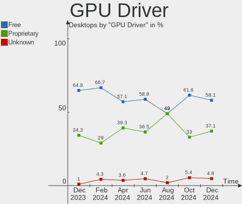
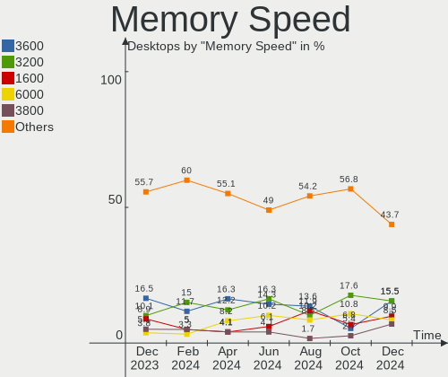

Arch - Hardware Trends (Desktops)
---------------------------------

A project to identify most popular hardware characteristics and track their change
over time based on data collected by Linux users at https://Linux-Hardware.org.

Anyone can contribute to this report by the [hw-probe](https://github.com/linuxhw/hw-probe) tool:

    sudo -E hw-probe -all -upload

This report is for one last month. Overall report since the beginning of time: [TestDays](https://github.com/linuxhw/TestDays)

Period: Mar, 2023.

Contents
--------

* [ System ](#system)
  - [ OS                       ](#os)
  - [ OS Family                ](#os-family)
  - [ Kernel                   ](#kernel)
  - [ Kernel Family            ](#kernel-family)
  - [ Kernel Major Ver.        ](#kernel-major-ver)
  - [ Arch                     ](#arch)
  - [ DE                       ](#de)
  - [ Display Server           ](#display-server)
  - [ Display Manager          ](#display-manager)
  - [ OS Lang                  ](#os-lang)
  - [ Boot Mode                ](#boot-mode)
  - [ Filesystem               ](#filesystem)
  - [ Part. scheme             ](#part-scheme)
  - [ Dual Boot with Linux/BSD ](#dual-boot-with-linuxbsd)
  - [ Dual Boot (Win)          ](#dual-boot-win)

* [ Board ](#board)
  - [ Vendor                   ](#vendor)
  - [ Model                    ](#model)
  - [ Model Family             ](#model-family)
  - [ MFG Year                 ](#mfg-year)
  - [ Form Factor              ](#form-factor)
  - [ Secure Boot              ](#secure-boot)
  - [ Coreboot                 ](#coreboot)
  - [ RAM Size                 ](#ram-size)
  - [ RAM Used                 ](#ram-used)
  - [ Total Drives             ](#total-drives)
  - [ Has CD-ROM               ](#has-cd-rom)
  - [ Has Ethernet             ](#has-ethernet)
  - [ Has WiFi                 ](#has-wifi)
  - [ Has Bluetooth            ](#has-bluetooth)

* [ Location ](#location)
  - [ Country                  ](#country)
  - [ City                     ](#city)

* [ Drives ](#drives)
  - [ Drive Vendor             ](#drive-vendor)
  - [ Drive Model              ](#drive-model)
  - [ HDD Vendor               ](#hdd-vendor)
  - [ SSD Vendor               ](#ssd-vendor)
  - [ Drive Kind               ](#drive-kind)
  - [ Drive Connector          ](#drive-connector)
  - [ Drive Size               ](#drive-size)
  - [ Space Total              ](#space-total)
  - [ Space Used               ](#space-used)
  - [ Malfunc. Drives          ](#malfunc-drives)
  - [ Malfunc. Drive Vendor    ](#malfunc-drive-vendor)
  - [ Malfunc. HDD Vendor      ](#malfunc-hdd-vendor)
  - [ Malfunc. Drive Kind      ](#malfunc-drive-kind)
  - [ Failed Drives            ](#failed-drives)
  - [ Failed Drive Vendor      ](#failed-drive-vendor)
  - [ Drive Status             ](#drive-status)

* [ Storage controller ](#storage-controller)
  - [ Storage Vendor           ](#storage-vendor)
  - [ Storage Model            ](#storage-model)
  - [ Storage Kind             ](#storage-kind)

* [ Processor ](#processor)
  - [ CPU Vendor               ](#cpu-vendor)
  - [ CPU Model                ](#cpu-model)
  - [ CPU Model Family         ](#cpu-model-family)
  - [ CPU Cores                ](#cpu-cores)
  - [ CPU Sockets              ](#cpu-sockets)
  - [ CPU Threads              ](#cpu-threads)
  - [ CPU Op-Modes             ](#cpu-op-modes)
  - [ CPU Microcode            ](#cpu-microcode)
  - [ CPU Microarch            ](#cpu-microarch)

* [ Graphics ](#graphics)
  - [ GPU Vendor               ](#gpu-vendor)
  - [ GPU Model                ](#gpu-model)
  - [ GPU Combo                ](#gpu-combo)
  - [ GPU Driver               ](#gpu-driver)
  - [ GPU Memory               ](#gpu-memory)

* [ Monitor ](#monitor)
  - [ Monitor Vendor           ](#monitor-vendor)
  - [ Monitor Model            ](#monitor-model)
  - [ Monitor Resolution       ](#monitor-resolution)
  - [ Monitor Diagonal         ](#monitor-diagonal)
  - [ Monitor Width            ](#monitor-width)
  - [ Aspect Ratio             ](#aspect-ratio)
  - [ Monitor Area             ](#monitor-area)
  - [ Pixel Density            ](#pixel-density)
  - [ Multiple Monitors        ](#multiple-monitors)

* [ Network ](#network)
  - [ Net Controller Vendor    ](#net-controller-vendor)
  - [ Net Controller Model     ](#net-controller-model)
  - [ Wireless Vendor          ](#wireless-vendor)
  - [ Wireless Model           ](#wireless-model)
  - [ Ethernet Vendor          ](#ethernet-vendor)
  - [ Ethernet Model           ](#ethernet-model)
  - [ Net Controller Kind      ](#net-controller-kind)
  - [ Used Controller          ](#used-controller)
  - [ NICs                     ](#nics)
  - [ IPv6                     ](#ipv6)

* [ Bluetooth ](#bluetooth)
  - [ Bluetooth Vendor         ](#bluetooth-vendor)
  - [ Bluetooth Model          ](#bluetooth-model)

* [ Sound ](#sound)
  - [ Sound Vendor             ](#sound-vendor)
  - [ Sound Model              ](#sound-model)

* [ Memory ](#memory)
  - [ Memory Vendor            ](#memory-vendor)
  - [ Memory Model             ](#memory-model)
  - [ Memory Kind              ](#memory-kind)
  - [ Memory Form Factor       ](#memory-form-factor)
  - [ Memory Size              ](#memory-size)
  - [ Memory Speed             ](#memory-speed)

* [ Printers & scanners ](#printers--scanners)
  - [ Printer Vendor           ](#printer-vendor)
  - [ Printer Model            ](#printer-model)
  - [ Scanner Vendor           ](#scanner-vendor)
  - [ Scanner Model            ](#scanner-model)

* [ Camera ](#camera)
  - [ Camera Vendor            ](#camera-vendor)
  - [ Camera Model             ](#camera-model)

* [ Security ](#security)
  - [ Fingerprint Vendor       ](#fingerprint-vendor)
  - [ Fingerprint Model        ](#fingerprint-model)
  - [ Chipcard Vendor          ](#chipcard-vendor)
  - [ Chipcard Model           ](#chipcard-model)

* [ Unsupported ](#unsupported)
  - [ Unsupported Devices      ](#unsupported-devices)
  - [ Unsupported Device Types ](#unsupported-device-types)

System
------

OS
--

Installed operating systems

| Name         | Desktops | Percent |
|--------------|----------|---------|
| Arch Rolling | 80       | 100%    |

OS Family
---------

OS without a version

| Name | Desktops | Percent |
|------|----------|---------|
| Arch | 80       | 100%    |

Kernel
------

Version of the Linux kernel

| Version             | Desktops | Percent |
|---------------------|----------|---------|
| 6.2.8-arch1-1       | 12       | 15%     |
| 6.2.2-arch1-1       | 10       | 12.5%   |
| 6.2.1-arch1-1       | 9        | 11.25%  |
| 6.2.6-arch1-1       | 7        | 8.75%   |
| 6.2.2-arch2-1       | 7        | 8.75%   |
| 6.2.7-arch1-1       | 5        | 6.25%   |
| 6.2.6-zen1-1-zen    | 4        | 5%      |
| 6.1.21-1-lts        | 3        | 3.75%   |
| 6.2.8-zen1-1-zen    | 2        | 2.5%    |
| 6.2.7-zen1-1-zen    | 2        | 2.5%    |
| 6.2.2-zen2-1-zen    | 2        | 2.5%    |
| 6.2.2-zen1-1-zen    | 2        | 2.5%    |
| 6.2.8-273-tkg-cfs   | 1        | 1.25%   |
| 6.2.6-arch1-1.1     | 1        | 1.25%   |
| 6.2.6-273-tkg-bore  | 1        | 1.25%   |
| 6.2.5-zen1-1-zen    | 1        | 1.25%   |
| 6.2.5-x64v3-xanmod1 | 1        | 1.25%   |
| 6.2.4-273-tkg-pds   | 1        | 1.25%   |
| 6.2.2-1-clear       | 1        | 1.25%   |
| 6.1.20-1-lts        | 1        | 1.25%   |
| 6.1.14-xanmod1      | 1        | 1.25%   |
| 6.1.14-1-lts        | 1        | 1.25%   |
| 6.1.12-zen1-1-zen   | 1        | 1.25%   |
| 6.1.12-arch1-1-vfio | 1        | 1.25%   |
| 6.1.12-arch1-1      | 1        | 1.25%   |
| 6.1.1-arch1-1       | 1        | 1.25%   |
| 6.0.5-arch1-1       | 1        | 1.25%   |

Kernel Family
-------------

Linux kernel without a distro release

| Version | Desktops | Percent |
|---------|----------|---------|
| 6.2.2   | 22       | 27.5%   |
| 6.2.8   | 15       | 18.75%  |
| 6.2.6   | 13       | 16.25%  |
| 6.2.1   | 9        | 11.25%  |
| 6.2.7   | 7        | 8.75%   |
| 6.1.21  | 3        | 3.75%   |
| 6.1.12  | 3        | 3.75%   |
| 6.2.5   | 2        | 2.5%    |
| 6.1.14  | 2        | 2.5%    |
| 6.2.4   | 1        | 1.25%   |
| 6.1.20  | 1        | 1.25%   |
| 6.1.1   | 1        | 1.25%   |
| 6.0.5   | 1        | 1.25%   |

Kernel Major Ver.
-----------------

Linux kernel major version

| Version | Desktops | Percent |
|---------|----------|---------|
| 6.2     | 69       | 86.25%  |
| 6.1     | 10       | 12.5%   |
| 6.0     | 1        | 1.25%   |

Arch
----

OS architecture (x86_64, i586, etc.)

| Name   | Desktops | Percent |
|--------|----------|---------|
| x86_64 | 80       | 100%    |

DE
--

Desktop Environment

| Name       | Desktops | Percent |
|------------|----------|---------|
| KDE5       | 33       | 41.25%  |
| GNOME      | 26       | 32.5%   |
| XFCE       | 6        | 7.5%    |
| Unknown    | 6        | 7.5%    |
| Hyprland   | 3        | 3.75%   |
| KDE        | 2        | 2.5%    |
| i3         | 2        | 2.5%    |
| X-Cinnamon | 1        | 1.25%   |
| MATE       | 1        | 1.25%   |

Display Server
--------------

X11 or Wayland

| Name    | Desktops | Percent |
|---------|----------|---------|
| X11     | 47       | 58.75%  |
| Wayland | 21       | 26.25%  |
| Tty     | 7        | 8.75%   |
| Unknown | 5        | 6.25%   |

Display Manager
---------------

SDDM, LightDM, etc.

| Name    | Desktops | Percent |
|---------|----------|---------|
| Unknown | 34       | 42.5%   |
| SDDM    | 21       | 26.25%  |
| GDM     | 14       | 17.5%   |
| LightDM | 9        | 11.25%  |
| LXDM    | 1        | 1.25%   |
| GREETD  | 1        | 1.25%   |

OS Lang
-------

Language

| Lang        | Desktops | Percent |
|-------------|----------|---------|
| en_US       | 32       | 40%     |
| C           | 7        | 8.75%   |
| Unknown     | 6        | 7.5%    |
| it_IT       | 5        | 6.25%   |
| ru_RU       | 4        | 5%      |
| en_GB       | 4        | 5%      |
| de_DE       | 4        | 5%      |
| pl_PL       | 3        | 3.75%   |
| hu_HU       | 2        | 2.5%    |
| fr_FR       | 2        | 2.5%    |
| pt_PT       | 1        | 1.25%   |
| pt_BR       | 1        | 1.25%   |
| ko_KR       | 1        | 1.25%   |
| it          | 1        | 1.25%   |
| es_ES       | 1        | 1.25%   |
| en_US_UTF-8 | 1        | 1.25%   |
| en_US.UFS-8 | 1        | 1.25%   |
| en_IE       | 1        | 1.25%   |
| en_DK       | 1        | 1.25%   |
| de_AT       | 1        | 1.25%   |
| -enUS       | 1        | 1.25%   |

Boot Mode
---------

EFI or BIOS

| Mode | Desktops | Percent |
|------|----------|---------|
| EFI  | 50       | 62.5%   |
| BIOS | 30       | 37.5%   |

Filesystem
----------

Type of filesystem

| Type  | Desktops | Percent |
|-------|----------|---------|
| Ext4  | 54       | 67.5%   |
| Btrfs | 21       | 26.25%  |
| Zfs   | 2        | 2.5%    |
| Xfs   | 2        | 2.5%    |
| F2fs  | 1        | 1.25%   |

Part. scheme
------------

Scheme of partitioning

| Type    | Desktops | Percent |
|---------|----------|---------|
| GPT     | 52       | 65%     |
| Unknown | 22       | 27.5%   |
| MBR     | 6        | 7.5%    |

Dual Boot with Linux/BSD
------------------------

Hosting more than one Linux/BSD

| Dual boot | Desktops | Percent |
|-----------|----------|---------|
| No        | 64       | 80%     |
| Yes       | 16       | 20%     |

Dual Boot (Win)
---------------

Hosting Linux and Windows

| Dual boot | Desktops | Percent |
|-----------|----------|---------|
| No        | 53       | 66.25%  |
| Yes       | 27       | 33.75%  |

Board
-----

Vendor
------

Motherboard manufacturer

| Name                | Desktops | Percent |
|---------------------|----------|---------|
| ASUSTek Computer    | 26       | 32.5%   |
| Gigabyte Technology | 19       | 23.75%  |
| MSI                 | 12       | 15%     |
| ASRock              | 9        | 11.25%  |
| Intel               | 3        | 3.75%   |
| Hewlett-Packard     | 3        | 3.75%   |
| Dell                | 3        | 3.75%   |
| Acer                | 2        | 2.5%    |
| IP3 Tech            | 1        | 1.25%   |
| BESSTAR Tech        | 1        | 1.25%   |
| Acidanthera         | 1        | 1.25%   |

Model
-----

Motherboard model

| Name                                 | Desktops | Percent |
|--------------------------------------|----------|---------|
| MSI MS-7C02                          | 2        | 2.5%    |
| Gigabyte X570 AORUS MASTER           | 2        | 2.5%    |
| ASUS ROG STRIX B550-F GAMING         | 2        | 2.5%    |
| ASRock B450M Steel Legend            | 2        | 2.5%    |
| MSI MS-7D76                          | 1        | 1.25%   |
| MSI MS-7D70                          | 1        | 1.25%   |
| MSI MS-7D69                          | 1        | 1.25%   |
| MSI MS-7D53                          | 1        | 1.25%   |
| MSI MS-7B89                          | 1        | 1.25%   |
| MSI MS-7B86                          | 1        | 1.25%   |
| MSI MS-7B79                          | 1        | 1.25%   |
| MSI MS-7B38                          | 1        | 1.25%   |
| MSI MS-7A38                          | 1        | 1.25%   |
| MSI MS-7693                          | 1        | 1.25%   |
| IP3 Tech IB8                         | 1        | 1.25%   |
| Intel Jasper Lake Client Platform    | 1        | 1.25%   |
| Intel DQ45CB E30148-207              | 1        | 1.25%   |
| Intel B75 V124                       | 1        | 1.25%   |
| HP Pavilion Gaming Desktop TG01-2xxx | 1        | 1.25%   |
| HP Pavilion Desktop PC 570-p5xx      | 1        | 1.25%   |
| HP Compaq Elite 8300 SFF             | 1        | 1.25%   |
| Gigabyte Z390 M GAMING               | 1        | 1.25%   |
| Gigabyte Z390 M                      | 1        | 1.25%   |
| Gigabyte X570 AORUS PRO WIFI         | 1        | 1.25%   |
| Gigabyte X470 AORUS ULTRA GAMING     | 1        | 1.25%   |
| Gigabyte X470 AORUS GAMING 5 WIFI    | 1        | 1.25%   |
| Gigabyte X399 AORUS PRO              | 1        | 1.25%   |
| Gigabyte P31-DS3L                    | 1        | 1.25%   |
| Gigabyte B85M-D3V-A-SI               | 1        | 1.25%   |
| Gigabyte B650 AORUS ELITE AX         | 1        | 1.25%   |
| Gigabyte B550 AORUS PRO AC           | 1        | 1.25%   |
| Gigabyte B550 AORUS ELITE V2         | 1        | 1.25%   |
| Gigabyte B450M S2H                   | 1        | 1.25%   |
| Gigabyte B450M H                     | 1        | 1.25%   |
| Gigabyte B450 AORUS PRO WIFI         | 1        | 1.25%   |
| Gigabyte AB350-Gaming 3              | 1        | 1.25%   |
| Gigabyte A520I AC                    | 1        | 1.25%   |
| Gigabyte 945GCM-S2L                  | 1        | 1.25%   |
| Dell OptiPlex 780                    | 1        | 1.25%   |
| Dell OptiPlex 7010                   | 1        | 1.25%   |

Model Family
------------

Motherboard model prefix

| Name                   | Desktops | Percent |
|------------------------|----------|---------|
| ASUS ROG               | 8        | 10%     |
| ASUS PRIME             | 8        | 10%     |
| ASUS TUF               | 6        | 7.5%    |
| Gigabyte X570          | 3        | 3.75%   |
| Dell OptiPlex          | 3        | 3.75%   |
| MSI MS-7C02            | 2        | 2.5%    |
| HP Pavilion            | 2        | 2.5%    |
| Gigabyte Z390          | 2        | 2.5%    |
| Gigabyte X470          | 2        | 2.5%    |
| Gigabyte B550          | 2        | 2.5%    |
| Gigabyte B450M         | 2        | 2.5%    |
| ASRock B450M           | 2        | 2.5%    |
| MSI MS-7D76            | 1        | 1.25%   |
| MSI MS-7D70            | 1        | 1.25%   |
| MSI MS-7D69            | 1        | 1.25%   |
| MSI MS-7D53            | 1        | 1.25%   |
| MSI MS-7B89            | 1        | 1.25%   |
| MSI MS-7B86            | 1        | 1.25%   |
| MSI MS-7B79            | 1        | 1.25%   |
| MSI MS-7B38            | 1        | 1.25%   |
| MSI MS-7A38            | 1        | 1.25%   |
| MSI MS-7693            | 1        | 1.25%   |
| IP3 Tech IB8           | 1        | 1.25%   |
| Intel Jasper           | 1        | 1.25%   |
| Intel DQ45CB           | 1        | 1.25%   |
| Intel B75              | 1        | 1.25%   |
| HP Compaq              | 1        | 1.25%   |
| Gigabyte X399          | 1        | 1.25%   |
| Gigabyte P31-DS3L      | 1        | 1.25%   |
| Gigabyte B85M-D3V-A-SI | 1        | 1.25%   |
| Gigabyte B650          | 1        | 1.25%   |
| Gigabyte B450          | 1        | 1.25%   |
| Gigabyte AB350-Gaming  | 1        | 1.25%   |
| Gigabyte A520I         | 1        | 1.25%   |
| Gigabyte 945GCM-S2L    | 1        | 1.25%   |
| BESSTAR Tech HM90      | 1        | 1.25%   |
| ASUS M5A97             | 1        | 1.25%   |
| ASUS M4A87TD           | 1        | 1.25%   |
| ASUS M4A77T            | 1        | 1.25%   |
| ASUS All               | 1        | 1.25%   |

MFG Year
--------

Motherboard manufacture year

| Year | Desktops | Percent |
|------|----------|---------|
| 2018 | 14       | 17.5%   |
| 2020 | 13       | 16.25%  |
| 2021 | 12       | 15%     |
| 2019 | 12       | 15%     |
| 2022 | 8        | 10%     |
| 2017 | 5        | 6.25%   |
| 2010 | 4        | 5%      |
| 2012 | 3        | 3.75%   |
| 2015 | 2        | 2.5%    |
| 2014 | 2        | 2.5%    |
| 2009 | 2        | 2.5%    |
| 2007 | 2        | 2.5%    |
| 2011 | 1        | 1.25%   |

Form Factor
-----------

Physical design of the computer

| Name    | Desktops | Percent |
|---------|----------|---------|
| Desktop | 80       | 100%    |

Secure Boot
-----------

Enabled or disabled

| State    | Desktops | Percent |
|----------|----------|---------|
| Disabled | 75       | 93.75%  |
| Enabled  | 5        | 6.25%   |

Coreboot
--------

Have coreboot on board

| Used | Desktops | Percent |
|------|----------|---------|
| No   | 80       | 100%    |

RAM Size
--------

Total RAM memory

| Size in GB  | Desktops | Percent |
|-------------|----------|---------|
| 32.01-64.0  | 30       | 37.5%   |
| 16.01-24.0  | 23       | 28.75%  |
| 8.01-16.0   | 8        | 10%     |
| 64.01-256.0 | 7        | 8.75%   |
| 4.01-8.0    | 6        | 7.5%    |
| 3.01-4.0    | 2        | 2.5%    |
| 24.01-32.0  | 2        | 2.5%    |
| 2.01-3.0    | 2        | 2.5%    |

RAM Used
--------

Used RAM memory

| Used GB    | Desktops | Percent |
|------------|----------|---------|
| 4.01-8.0   | 21       | 26.25%  |
| 2.01-3.0   | 19       | 23.75%  |
| 3.01-4.0   | 14       | 17.5%   |
| 8.01-16.0  | 12       | 15%     |
| 1.01-2.0   | 7        | 8.75%   |
| 16.01-24.0 | 4        | 5%      |
| 0.51-1.0   | 3        | 3.75%   |

Total Drives
------------

Number of drives on board

| Drives | Desktops | Percent |
|--------|----------|---------|
| 3      | 23       | 28.75%  |
| 1      | 19       | 23.75%  |
| 2      | 16       | 20%     |
| 4      | 12       | 15%     |
| 5      | 7        | 8.75%   |
| 10     | 1        | 1.25%   |
| 8      | 1        | 1.25%   |
| 6      | 1        | 1.25%   |

Has CD-ROM
----------

Has CD-ROM on board

| Presented | Desktops | Percent |
|-----------|----------|---------|
| No        | 65       | 81.25%  |
| Yes       | 15       | 18.75%  |

Has Ethernet
------------

Has Ethernet on board

| Presented | Desktops | Percent |
|-----------|----------|---------|
| Yes       | 80       | 100%    |

Has WiFi
--------

Has WiFi module

| Presented | Desktops | Percent |
|-----------|----------|---------|
| Yes       | 46       | 57.5%   |
| No        | 34       | 42.5%   |

Has Bluetooth
-------------

Has Bluetooth module

| Presented | Desktops | Percent |
|-----------|----------|---------|
| Yes       | 52       | 65%     |
| No        | 28       | 35%     |

Location
--------

Country
-------

Geographic location (country)

| Country     | Desktops | Percent |
|-------------|----------|---------|
| USA         | 13       | 16.25%  |
| Germany     | 8        | 10%     |
| Russia      | 7        | 8.75%   |
| Italy       | 7        | 8.75%   |
| Poland      | 5        | 6.25%   |
| Brazil      | 5        | 6.25%   |
| UK          | 4        | 5%      |
| Denmark     | 4        | 5%      |
| Turkey      | 2        | 2.5%    |
| Taiwan      | 2        | 2.5%    |
| Philippines | 2        | 2.5%    |
| India       | 2        | 2.5%    |
| Hungary     | 2        | 2.5%    |
| France      | 2        | 2.5%    |
| Austria     | 2        | 2.5%    |
| Spain       | 1        | 1.25%   |
| South Korea | 1        | 1.25%   |
| Singapore   | 1        | 1.25%   |
| Portugal    | 1        | 1.25%   |
| Norway      | 1        | 1.25%   |
| Ireland     | 1        | 1.25%   |
| Iran        | 1        | 1.25%   |
| Hong Kong   | 1        | 1.25%   |
| Chile       | 1        | 1.25%   |
| Canada      | 1        | 1.25%   |
| Bulgaria    | 1        | 1.25%   |
| Belarus     | 1        | 1.25%   |
| Argentina   | 1        | 1.25%   |

City
----

Geographic location (city)

| City               | Desktops | Percent |
|--------------------|----------|---------|
| Dublin             | 3        | 3.75%   |
| Copenhagen         | 3        | 3.75%   |
| Zernica            | 1        | 1.25%   |
| Wonju              | 1        | 1.25%   |
| Wisbech            | 1        | 1.25%   |
| Winona             | 1        | 1.25%   |
| Wilhelmshaven      | 1        | 1.25%   |
| Waterford          | 1        | 1.25%   |
| Warsaw             | 1        | 1.25%   |
| Walthamstow        | 1        | 1.25%   |
| Vlasikha           | 1        | 1.25%   |
| Vienna             | 1        | 1.25%   |
| Verbania           | 1        | 1.25%   |
| Venado Tuerto      | 1        | 1.25%   |
| Uetersen           | 1        | 1.25%   |
| Tolyatti           | 1        | 1.25%   |
| Tarlac City        | 1        | 1.25%   |
| Taipei             | 1        | 1.25%   |
| St Albans          | 1        | 1.25%   |
| Skarzysko-Kamienna | 1        | 1.25%   |
| Singapore          | 1        | 1.25%   |
| Shumen             | 1        | 1.25%   |
| Saransk            | 1        | 1.25%   |
| Rome               | 1        | 1.25%   |
| Riverside          | 1        | 1.25%   |
| Rio de Janeiro     | 1        | 1.25%   |
| Recife             | 1        | 1.25%   |
| Ranica             | 1        | 1.25%   |
| Radlin             | 1        | 1.25%   |
| Poland             | 1        | 1.25%   |
| Peterlee           | 1        | 1.25%   |
| Palm City          | 1        | 1.25%   |
| Oklahoma City      | 1        | 1.25%   |
| Novosibirsk        | 1        | 1.25%   |
| New Delhi          | 1        | 1.25%   |
| Naples             | 1        | 1.25%   |
| Munich             | 1        | 1.25%   |
| Moscow             | 1        | 1.25%   |
| Miskolc            | 1        | 1.25%   |
| Martinsville       | 1        | 1.25%   |

Drives
------

Drive Vendor
------------

Hard drive vendors

| Vendor                      | Desktops | Drives | Percent |
|-----------------------------|----------|--------|---------|
| WDC                         | 31       | 44     | 17.71%  |
| Samsung Electronics         | 29       | 52     | 16.57%  |
| Sandisk                     | 16       | 17     | 9.14%   |
| Crucial                     | 16       | 16     | 9.14%   |
| Seagate                     | 12       | 13     | 6.86%   |
| Kingston                    | 12       | 15     | 6.86%   |
| Toshiba                     | 9        | 14     | 5.14%   |
| Micron/Crucial Technology   | 6        | 7      | 3.43%   |
| Phison Electronics          | 4        | 5      | 2.29%   |
| HGST                        | 4        | 4      | 2.29%   |
| ADATA Technology            | 4        | 4      | 2.29%   |
| Realtek Semiconductor       | 3        | 3      | 1.71%   |
| Kingston Technology Company | 3        | 3      | 1.71%   |
| China                       | 3        | 3      | 1.71%   |
| A-DATA Technology           | 3        | 3      | 1.71%   |
| Silicon Motion              | 2        | 2      | 1.14%   |
| Lexar                       | 2        | 2      | 1.14%   |
| Hitachi                     | 2        | 2      | 1.14%   |
| GOODRAM                     | 2        | 2      | 1.14%   |
| USB30                       | 1        | 1      | 0.57%   |
| Unknown                     | 1        | 1      | 0.57%   |
| Transcend                   | 1        | 1      | 0.57%   |
| SK hynix                    | 1        | 1      | 0.57%   |
| QNAP                        | 1        | 4      | 0.57%   |
| PNY                         | 1        | 1      | 0.57%   |
| OCZ                         | 1        | 1      | 0.57%   |
| KIOXIA-EXCERIA              | 1        | 1      | 0.57%   |
| KIOXIA                      | 1        | 1      | 0.57%   |
| Kimtigo                     | 1        | 1      | 0.57%   |
| Integral                    | 1        | 1      | 0.57%   |
| AMD                         | 1        | 1      | 0.57%   |

Drive Model
-----------

Hard drive models

| Model                                                              | Desktops | Percent |
|--------------------------------------------------------------------|----------|---------|
| Samsung NVMe SSD Controller SM981/PM981/PM983 250GB                | 11       | 5.19%   |
| Samsung NVMe SSD Controller PM9A1/PM9A3/980PRO 1TB                 | 6        | 2.83%   |
| Samsung SSD 980 1TB                                                | 4        | 1.89%   |
| Micron/Crucial P2 NVMe PCIe SSD 1TB                                | 4        | 1.89%   |
| Kingston SA400S37240G 240GB SSD                                    | 4        | 1.89%   |
| Crucial CT500MX500SSD1 500GB                                       | 4        | 1.89%   |
| Crucial CT1000MX500SSD1 1TB                                        | 4        | 1.89%   |
| Sandisk WD_BLACK SN770 1TB                                         | 3        | 1.42%   |
| Kingston SA400S37480G 480GB SSD                                    | 3        | 1.42%   |
| ADATA XPG SX8200 Pro PCIe Gen3x4 M.2 2280 Solid State Drive 1024GB | 3        | 1.42%   |
| WDC WDS240G2G0A-00JH30 240GB SSD                                   | 2        | 0.94%   |
| WDC WD3200AAJS-00L7A0 320GB                                        | 2        | 0.94%   |
| WDC WD10EZEX-00WN4A0 1TB                                           | 2        | 0.94%   |
| Toshiba DT01ACA200 2TB                                             | 2        | 0.94%   |
| Silicon Motion SM2263EN/SM2263XT SSD Controller 1024GB             | 2        | 0.94%   |
| Sandisk WD Blue SN550 NVMe SSD 256GB                               | 2        | 0.94%   |
| SanDisk SSD PLUS 1000GB                                            | 2        | 0.94%   |
| Samsung SSD 860 QVO 1TB                                            | 2        | 0.94%   |
| Samsung SSD 860 EVO 500GB                                          | 2        | 0.94%   |
| Samsung SSD 860 EVO 250GB                                          | 2        | 0.94%   |
| Samsung SSD 860 EVO 1TB                                            | 2        | 0.94%   |
| Realtek XPG SPECTRIX S20G 500GB                                    | 2        | 0.94%   |
| Phison PS5013 E13 NVMe Controller 256GB                            | 2        | 0.94%   |
| Phison E12 NVMe Controller 256GB                                   | 2        | 0.94%   |
| Micron/Crucial P1 NVMe PCIe SSD 1TB                                | 2        | 0.94%   |
| Kingston Company SNV2S1000G 1TB                                    | 2        | 0.94%   |
| Crucial CT2000MX500SSD1 2TB                                        | 2        | 0.94%   |
| Crucial CT1000BX500SSD1 1TB                                        | 2        | 0.94%   |
| China SATA SSD 120GB                                               | 2        | 0.94%   |
| WDC WDS500G2B0A-00SM50 500GB SSD                                   | 1        | 0.47%   |
| WDC WDS250G2B0A-00SM50 250GB SSD                                   | 1        | 0.47%   |
| WDC WDS250G1B0A-00H9H0 250GB SSD                                   | 1        | 0.47%   |
| WDC WDS240G2G0B-00EPW0 240GB SSD                                   | 1        | 0.47%   |
| WDC WDS120G2G0A-00JH30 120GB SSD                                   | 1        | 0.47%   |
| WDC WD80EAZZ-00BKLB0 8TB                                           | 1        | 0.47%   |
| WDC WD800AAJB-00J3A0 80GB                                          | 1        | 0.47%   |
| WDC WD7500BPVX-22JC3T0 752GB                                       | 1        | 0.47%   |
| WDC WD7500BPVT-22A1YT0 752GB                                       | 1        | 0.47%   |
| WDC WD60PURX-64T0ZY0 6TB                                           | 1        | 0.47%   |
| WDC WD6002FFWX-68TZ4N0 6TB                                         | 1        | 0.47%   |

HDD Vendor
----------

Hard disk drive vendors

| Vendor              | Desktops | Drives | Percent |
|---------------------|----------|--------|---------|
| WDC                 | 27       | 37     | 48.21%  |
| Seagate             | 11       | 12     | 19.64%  |
| Toshiba             | 7        | 10     | 12.5%   |
| HGST                | 4        | 4      | 7.14%   |
| Samsung Electronics | 3        | 4      | 5.36%   |
| Hitachi             | 2        | 2      | 3.57%   |
| Unknown             | 1        | 1      | 1.79%   |
| QNAP                | 1        | 4      | 1.79%   |

SSD Vendor
----------

Solid state drive vendors

| Vendor              | Desktops | Drives | Percent |
|---------------------|----------|--------|---------|
| Crucial             | 16       | 16     | 23.19%  |
| Samsung Electronics | 13       | 18     | 18.84%  |
| Kingston            | 11       | 12     | 15.94%  |
| WDC                 | 6        | 7      | 8.7%    |
| SanDisk             | 4        | 4      | 5.8%    |
| China               | 3        | 3      | 4.35%   |
| Toshiba             | 2        | 4      | 2.9%    |
| Lexar               | 2        | 2      | 2.9%    |
| GOODRAM             | 2        | 2      | 2.9%    |
| A-DATA Technology   | 2        | 2      | 2.9%    |
| USB30               | 1        | 1      | 1.45%   |
| Transcend           | 1        | 1      | 1.45%   |
| PNY                 | 1        | 1      | 1.45%   |
| OCZ                 | 1        | 1      | 1.45%   |
| KIOXIA-EXCERIA      | 1        | 1      | 1.45%   |
| Kimtigo             | 1        | 1      | 1.45%   |
| Integral            | 1        | 1      | 1.45%   |
| AMD                 | 1        | 1      | 1.45%   |

Drive Kind
----------

HDD or SSD

| Kind    | Desktops | Drives | Percent |
|---------|----------|--------|---------|
| SSD     | 54       | 78     | 36.73%  |
| NVMe    | 51       | 73     | 34.69%  |
| HDD     | 41       | 74     | 27.89%  |
| Unknown | 1        | 1      | 0.68%   |

Drive Connector
---------------

SATA, SAS, NVMe, etc.

| Type | Desktops | Drives | Percent |
|------|----------|--------|---------|
| SATA | 73       | 149    | 57.48%  |
| NVMe | 51       | 73     | 40.16%  |
| SAS  | 3        | 4      | 2.36%   |

Drive Size
----------

Size of hard drive

| Size in TB | Desktops | Drives | Percent |
|------------|----------|--------|---------|
| 0.01-0.5   | 50       | 80     | 46.73%  |
| 0.51-1.0   | 35       | 44     | 32.71%  |
| 1.01-2.0   | 9        | 11     | 8.41%   |
| 4.01-10.0  | 7        | 9      | 6.54%   |
| 3.01-4.0   | 3        | 5      | 2.8%    |
| 2.01-3.0   | 3        | 3      | 2.8%    |

Space Total
-----------

Amount of disk space available on the file system

| Size in GB     | Desktops | Percent |
|----------------|----------|---------|
| 501-1000       | 17       | 21.25%  |
| More than 3000 | 16       | 20%     |
| 1001-2000      | 16       | 20%     |
| 251-500        | 9        | 11.25%  |
| 101-250        | 8        | 10%     |
| 2001-3000      | 7        | 8.75%   |
| Unknown        | 3        | 3.75%   |
| 1-20           | 2        | 2.5%    |
| 51-100         | 2        | 2.5%    |

Space Used
----------

Amount of used disk space

| Used GB        | Desktops | Percent |
|----------------|----------|---------|
| 501-1000       | 16       | 20%     |
| 101-250        | 14       | 17.5%   |
| 1-20           | 14       | 17.5%   |
| 21-50          | 9        | 11.25%  |
| More than 3000 | 7        | 8.75%   |
| 1001-2000      | 6        | 7.5%    |
| 251-500        | 4        | 5%      |
| 51-100         | 4        | 5%      |
| 2001-3000      | 3        | 3.75%   |
| Unknown        | 3        | 3.75%   |

Malfunc. Drives
---------------

Drive models with a malfunction

| Model                                                          | Desktops | Drives | Percent |
|----------------------------------------------------------------|----------|--------|---------|
| WDC WDS240G2G0B-00EPW0 240GB SSD                               | 1        | 1      | 4.35%   |
| WDC WDS120G2G0A-00JH30 120GB SSD                               | 1        | 1      | 4.35%   |
| WDC WD5000LPCX-60VHAT0 500GB                                   | 1        | 1      | 4.35%   |
| WDC WD5000HHTZ-04N21V0 500GB                                   | 1        | 1      | 4.35%   |
| WDC WD5000AVDS-63U7B1 500GB                                    | 1        | 1      | 4.35%   |
| WDC WD5000AAKX-00ERMA0 500GB                                   | 1        | 1      | 4.35%   |
| WDC WD40EFRX-68WT0N0 4TB                                       | 1        | 2      | 4.35%   |
| WDC WD3200AAJS-00L7A0 320GB                                    | 1        | 1      | 4.35%   |
| WDC WD10EZEX-60M2NA0 1TB                                       | 1        | 1      | 4.35%   |
| WDC WD10EZEX-00WN4A0 1TB                                       | 1        | 1      | 4.35%   |
| WDC WD10EZEX-00MFCA0 1TB                                       | 1        | 1      | 4.35%   |
| Transcend TS1TSSD230S 1TB                                      | 1        | 1      | 4.35%   |
| Toshiba DT01ACA300 3TB                                         | 1        | 1      | 4.35%   |
| Seagate ST9250315AS 250GB                                      | 1        | 1      | 4.35%   |
| SanDisk SSD PLUS 480GB                                         | 1        | 1      | 4.35%   |
| SanDisk SSD PLUS 1000GB                                        | 1        | 1      | 4.35%   |
| Samsung Electronics NVMe SSD Controller PM9A1/PM9A3/980PRO 1TB | 1        | 1      | 4.35%   |
| Samsung Electronics HD082GJ 80GB                               | 1        | 1      | 4.35%   |
| Kingston SKC400S371T 1TB SSD                                   | 1        | 1      | 4.35%   |
| Kingston SA400S37480G 480GB SSD                                | 1        | 1      | 4.35%   |
| Hitachi HTS723216L9SA60 160GB                                  | 1        | 1      | 4.35%   |
| HGST HTS541010A9E680 1TB                                       | 1        | 1      | 4.35%   |
| A-DATA Technology SP550 480GB SSD                              | 1        | 1      | 4.35%   |

Malfunc. Drive Vendor
---------------------

Vendors of faulty drives

| Vendor              | Desktops | Drives | Percent |
|---------------------|----------|--------|---------|
| WDC                 | 9        | 12     | 42.86%  |
| SanDisk             | 2        | 2      | 9.52%   |
| Samsung Electronics | 2        | 2      | 9.52%   |
| Kingston            | 2        | 2      | 9.52%   |
| Transcend           | 1        | 1      | 4.76%   |
| Toshiba             | 1        | 1      | 4.76%   |
| Seagate             | 1        | 1      | 4.76%   |
| Hitachi             | 1        | 1      | 4.76%   |
| HGST                | 1        | 1      | 4.76%   |
| A-DATA Technology   | 1        | 1      | 4.76%   |

Malfunc. HDD Vendor
-------------------

Vendors of faulty HDD drives

| Vendor              | Desktops | Drives | Percent |
|---------------------|----------|--------|---------|
| WDC                 | 8        | 10     | 61.54%  |
| Toshiba             | 1        | 1      | 7.69%   |
| Seagate             | 1        | 1      | 7.69%   |
| Samsung Electronics | 1        | 1      | 7.69%   |
| Hitachi             | 1        | 1      | 7.69%   |
| HGST                | 1        | 1      | 7.69%   |

Malfunc. Drive Kind
-------------------

Kinds of faulty drives

| Kind | Desktops | Drives | Percent |
|------|----------|--------|---------|
| HDD  | 10       | 15     | 52.63%  |
| SSD  | 8        | 8      | 42.11%  |
| NVMe | 1        | 1      | 5.26%   |

Failed Drives
-------------

Failed drive models

Zero info for selected period =(

Failed Drive Vendor
-------------------

Failed drive vendors

Zero info for selected period =(

Drive Status
------------

Number of failed and malfunc. drives

| Status   | Desktops | Drives | Percent |
|----------|----------|--------|---------|
| Works    | 52       | 129    | 53.06%  |
| Detected | 29       | 73     | 29.59%  |
| Malfunc  | 17       | 24     | 17.35%  |

Storage controller
------------------

Storage Vendor
--------------

Storage controller vendors

| Vendor                      | Desktops | Percent |
|-----------------------------|----------|---------|
| AMD                         | 49       | 33.79%  |
| Intel                       | 31       | 21.38%  |
| Samsung Electronics         | 24       | 16.55%  |
| SanDisk                     | 12       | 8.28%   |
| Micron/Crucial Technology   | 6        | 4.14%   |
| Realtek Semiconductor       | 4        | 2.76%   |
| Phison Electronics          | 4        | 2.76%   |
| Kingston Technology Company | 4        | 2.76%   |
| ADATA Technology            | 4        | 2.76%   |
| ASMedia Technology          | 3        | 2.07%   |
| Silicon Motion              | 2        | 1.38%   |
| SK hynix                    | 1        | 0.69%   |
| KIOXIA                      | 1        | 0.69%   |

Storage Model
-------------

Storage controller models

| Model                                                                          | Desktops | Percent |
|--------------------------------------------------------------------------------|----------|---------|
| AMD FCH SATA Controller [AHCI mode]                                            | 28       | 16%     |
| AMD 400 Series Chipset SATA Controller                                         | 18       | 10.29%  |
| Samsung NVMe SSD Controller SM981/PM981/PM983                                  | 11       | 6.29%   |
| AMD 500 Series Chipset SATA Controller                                         | 9        | 5.14%   |
| Samsung NVMe SSD Controller PM9A1/PM9A3/980PRO                                 | 7        | 4%      |
| Samsung NVMe SSD Controller 980                                                | 5        | 2.86%   |
| SanDisk NVMe Controller                                                        | 4        | 2.29%   |
| Micron/Crucial P2 NVMe PCIe SSD                                                | 4        | 2.29%   |
| Intel SATA Controller [RAID mode]                                              | 4        | 2.29%   |
| Intel Cannon Lake PCH SATA AHCI Controller                                     | 4        | 2.29%   |
| Intel Alder Lake-S PCH SATA Controller [AHCI Mode]                             | 4        | 2.29%   |
| Realtek NVMe Controller                                                        | 3        | 1.71%   |
| Kingston Company Company Non-Volatile memory controller                        | 3        | 1.71%   |
| Intel Volume Management Device NVMe RAID Controller                            | 3        | 1.71%   |
| Intel 7 Series/C210 Series Chipset Family 6-port SATA Controller [AHCI mode]   | 3        | 1.71%   |
| ASMedia ASM1062 Serial ATA Controller                                          | 3        | 1.71%   |
| AMD 300 Series Chipset SATA Controller                                         | 3        | 1.71%   |
| ADATA XPG SX8200 Pro PCIe Gen3x4 M.2 2280 Solid State Drive                    | 3        | 1.71%   |
| Silicon Motion SM2263EN/SM2263XT SSD Controller                                | 2        | 1.14%   |
| Sandisk Western Digital WD Black SN850X NVMe SSD                               | 2        | 1.14%   |
| SanDisk WD Blue SN550 NVMe SSD                                                 | 2        | 1.14%   |
| Phison PS5013 E13 NVMe Controller                                              | 2        | 1.14%   |
| Phison E12 NVMe Controller                                                     | 2        | 1.14%   |
| Micron/Crucial P1 NVMe PCIe SSD                                                | 2        | 1.14%   |
| Intel NM10/ICH7 Family SATA Controller [IDE mode]                              | 2        | 1.14%   |
| Intel Comet Lake SATA AHCI Controller                                          | 2        | 1.14%   |
| Intel 82801G (ICH7 Family) IDE Controller                                      | 2        | 1.14%   |
| Intel 8 Series/C220 Series Chipset Family 6-port SATA Controller 1 [AHCI mode] | 2        | 1.14%   |
| Intel 500 Series Chipset Family SATA AHCI Controller                           | 2        | 1.14%   |
| Intel 4 Series Chipset PT IDER Controller                                      | 2        | 1.14%   |
| AMD SB7x0/SB8x0/SB9x0 SATA Controller [IDE mode]                               | 2        | 1.14%   |
| AMD SB7x0/SB8x0/SB9x0 SATA Controller [AHCI mode]                              | 2        | 1.14%   |
| AMD SB7x0/SB8x0/SB9x0 IDE Controller                                           | 2        | 1.14%   |
| SK hynix Platinum P41 NVMe Solid State Drive 2TB                               | 1        | 0.57%   |
| SanDisk WD PC SN810 / Black SN850 NVMe SSD                                     | 1        | 0.57%   |
| SanDisk WD Blue SN570 NVMe SSD 1TB                                             | 1        | 0.57%   |
| SanDisk WD Black SN750 / PC SN730 NVMe SSD                                     | 1        | 0.57%   |
| SanDisk Non-Volatile memory controller                                         | 1        | 0.57%   |
| Samsung NVMe SSD Controller SM961/PM961/SM963                                  | 1        | 0.57%   |
| Samsung NVMe SSD Controller SM951/PM951                                        | 1        | 0.57%   |

Storage Kind
------------

Kind of storage controller (IDE, SATA, NVMe, SAS, ...)

| Kind | Desktops | Percent |
|------|----------|---------|
| SATA | 72       | 52.17%  |
| NVMe | 51       | 36.96%  |
| RAID | 8        | 5.8%    |
| IDE  | 7        | 5.07%   |

Processor
---------

CPU Vendor
----------

Processor vendors

| Vendor | Desktops | Percent |
|--------|----------|---------|
| AMD    | 49       | 61.25%  |
| Intel  | 31       | 38.75%  |

CPU Model
---------

Processor models

| Model                                       | Desktops | Percent |
|---------------------------------------------|----------|---------|
| AMD Ryzen 5 3600 6-Core Processor           | 6        | 7.5%    |
| AMD Ryzen 9 7950X 16-Core Processor         | 3        | 3.75%   |
| AMD Ryzen 7 5700G with Radeon Graphics      | 3        | 3.75%   |
| AMD Ryzen 5 5600G with Radeon Graphics      | 3        | 3.75%   |
| Intel Core i5-3470 CPU @ 3.20GHz            | 2        | 2.5%    |
| AMD Ryzen 7 5800X3D 8-Core Processor        | 2        | 2.5%    |
| AMD Ryzen 7 5800X 8-Core Processor          | 2        | 2.5%    |
| AMD Ryzen 7 5700X 8-Core Processor          | 2        | 2.5%    |
| AMD Ryzen 5 7600 6-Core Processor           | 2        | 2.5%    |
| AMD Ryzen 5 5600X 6-Core Processor          | 2        | 2.5%    |
| AMD Ryzen 5 3600X 6-Core Processor          | 2        | 2.5%    |
| AMD Ryzen 5 2600 Six-Core Processor         | 2        | 2.5%    |
| Intel Pentium Dual-Core CPU E5500 @ 2.80GHz | 1        | 1.25%   |
| Intel Pentium Dual CPU E2180 @ 2.00GHz      | 1        | 1.25%   |
| Intel Pentium CPU G3220 @ 3.00GHz           | 1        | 1.25%   |
| Intel Core i9-9900K CPU @ 3.60GHz           | 1        | 1.25%   |
| Intel Core i7-9700K CPU @ 3.60GHz           | 1        | 1.25%   |
| Intel Core i7-9700F CPU @ 3.00GHz           | 1        | 1.25%   |
| Intel Core i7-9700 CPU @ 3.00GHz            | 1        | 1.25%   |
| Intel Core i7-10700K CPU @ 3.80GHz          | 1        | 1.25%   |
| Intel Core i7-10700 CPU @ 2.90GHz           | 1        | 1.25%   |
| Intel Core i7-1065G7 CPU @ 1.30GHz          | 1        | 1.25%   |
| Intel Core i5-9600K CPU @ 3.70GHz           | 1        | 1.25%   |
| Intel Core i5-7400 CPU @ 3.00GHz            | 1        | 1.25%   |
| Intel Core i5-6500T CPU @ 2.50GHz           | 1        | 1.25%   |
| Intel Core i5-4670K CPU @ 3.40GHz           | 1        | 1.25%   |
| Intel Core i5-2500 CPU @ 3.30GHz            | 1        | 1.25%   |
| Intel Core i5-10400F CPU @ 2.90GHz          | 1        | 1.25%   |
| Intel Core i3-8100 CPU @ 3.60GHz            | 1        | 1.25%   |
| Intel Core i3-4130 CPU @ 3.40GHz            | 1        | 1.25%   |
| Intel Core i3-3220 CPU @ 3.30GHz            | 1        | 1.25%   |
| Intel Core 2 Quad CPU Q8400 @ 2.66GHz       | 1        | 1.25%   |
| Intel Core 2 Duo CPU E8400 @ 3.00GHz        | 1        | 1.25%   |
| Intel Core 2 Duo CPU E8200 @ 2.66GHz        | 1        | 1.25%   |
| Intel Core 2 Duo CPU E7500 @ 2.93GHz        | 1        | 1.25%   |
| Intel Celeron N5105 @ 2.00GHz               | 1        | 1.25%   |
| Intel 13th Gen Core i7-13700K               | 1        | 1.25%   |
| Intel 12th Gen Core i9-12900K               | 1        | 1.25%   |
| Intel 12th Gen Core i5-12400F               | 1        | 1.25%   |
| Intel 12th Gen Core i5-12400                | 1        | 1.25%   |

CPU Model Family
----------------

Processor model prefix

| Model                   | Desktops | Percent |
|-------------------------|----------|---------|
| AMD Ryzen 5             | 21       | 26.25%  |
| AMD Ryzen 7             | 13       | 16.25%  |
| AMD Ryzen 9             | 9        | 11.25%  |
| Intel Core i5           | 8        | 10%     |
| Intel Core i7           | 6        | 7.5%    |
| Other                   | 5        | 6.25%   |
| Intel Core i3           | 3        | 3.75%   |
| Intel Core 2 Duo        | 3        | 3.75%   |
| AMD FX                  | 2        | 2.5%    |
| Intel Pentium Dual-Core | 1        | 1.25%   |
| Intel Pentium Dual      | 1        | 1.25%   |
| Intel Pentium           | 1        | 1.25%   |
| Intel Core i9           | 1        | 1.25%   |
| Intel Core 2 Quad       | 1        | 1.25%   |
| Intel Celeron           | 1        | 1.25%   |
| AMD Ryzen Threadripper  | 1        | 1.25%   |
| AMD Phenom II X6        | 1        | 1.25%   |
| AMD Athlon II X4        | 1        | 1.25%   |
| AMD A6                  | 1        | 1.25%   |

CPU Cores
---------

Number of processor cores

| Number | Desktops | Percent |
|--------|----------|---------|
| 6      | 27       | 33.75%  |
| 8      | 20       | 25%     |
| 4      | 12       | 15%     |
| 2      | 8        | 10%     |
| 16     | 6        | 7.5%    |
| 12     | 5        | 6.25%   |
| 1      | 2        | 2.5%    |

CPU Sockets
-----------

Number of sockets

| Number | Desktops | Percent |
|--------|----------|---------|
| 1      | 80       | 100%    |

CPU Threads
-----------

Threads per core (Hyper-Threading)

| Number | Desktops | Percent |
|--------|----------|---------|
| 2      | 59       | 73.75%  |
| 1      | 21       | 26.25%  |

CPU Op-Modes
------------

CPU Operation Modes (32-bit, 64-bit)

| Op mode        | Desktops | Percent |
|----------------|----------|---------|
| 32-bit, 64-bit | 80       | 100%    |

CPU Microcode
-------------

Microcode number

| Number     | Desktops | Percent |
|------------|----------|---------|
| Unknown    | 40       | 50%     |
| 0x0a50000d | 7        | 8.75%   |
| 0x0a601203 | 6        | 7.5%    |
| 0x08701021 | 4        | 5%      |
| 0x08701030 | 3        | 3.75%   |
| 0x0800820d | 3        | 3.75%   |
| 0x0a20120a | 2        | 2.5%    |
| 0x0a201016 | 2        | 2.5%    |
| 0x906ed    | 1        | 1.25%   |
| 0x906e9    | 1        | 1.25%   |
| 0x90672    | 1        | 1.25%   |
| 0x6fd      | 1        | 1.25%   |
| 0x1067a    | 1        | 1.25%   |
| 0x0a50000c | 1        | 1.25%   |
| 0x0a201009 | 1        | 1.25%   |
| 0x08600106 | 1        | 1.25%   |
| 0x0800820b | 1        | 1.25%   |
| 0x08001137 | 1        | 1.25%   |
| 0x06006118 | 1        | 1.25%   |
| 0x06000822 | 1        | 1.25%   |
| 0x010000dc | 1        | 1.25%   |

CPU Microarch
-------------

Microarchitecture

| Name             | Desktops | Percent |
|------------------|----------|---------|
| Zen 3            | 18       | 22.5%   |
| Zen 2            | 13       | 16.25%  |
| Unknown          | 8        | 10%     |
| KabyLake         | 7        | 8.75%   |
| Zen+             | 5        | 6.25%   |
| Penryn           | 5        | 6.25%   |
| IvyBridge        | 3        | 3.75%   |
| Haswell          | 3        | 3.75%   |
| CometLake        | 3        | 3.75%   |
| Zen              | 2        | 2.5%    |
| Piledriver       | 2        | 2.5%    |
| K10              | 2        | 2.5%    |
| IceLake          | 2        | 2.5%    |
| Alderlake Hybrid | 2        | 2.5%    |
| Tremont          | 1        | 1.25%   |
| Skylake          | 1        | 1.25%   |
| SandyBridge      | 1        | 1.25%   |
| Excavator        | 1        | 1.25%   |
| Core             | 1        | 1.25%   |

Graphics
--------

GPU Vendor
----------

Vendors of graphics cards

| Vendor | Desktops | Percent |
|--------|----------|---------|
| Nvidia | 38       | 45.78%  |
| AMD    | 31       | 37.35%  |
| Intel  | 14       | 16.87%  |

GPU Model
---------

Graphics card models

| Model                                                         | Desktops | Percent |
|---------------------------------------------------------------|----------|---------|
| AMD Raphael                                                   | 4        | 4.65%   |
| AMD Navi 22 [Radeon RX 6700/6700 XT/6750 XT / 6800M/6850M XT] | 4        | 4.65%   |
| AMD Navi 21 [Radeon RX 6800/6800 XT / 6900 XT]                | 4        | 4.65%   |
| Nvidia TU106 [GeForce RTX 2060 Rev. A]                        | 3        | 3.49%   |
| Nvidia GA104 [GeForce RTX 3060 Ti Lite Hash Rate]             | 3        | 3.49%   |
| Intel DG2 [Arc A770]                                          | 3        | 3.49%   |
| Intel 4 Series Chipset Integrated Graphics Controller         | 3        | 3.49%   |
| AMD Navi 10 [Radeon RX 5600 OEM/5600 XT / 5700/5700 XT]       | 3        | 3.49%   |
| AMD Ellesmere [Radeon RX 470/480/570/570X/580/580X/590]       | 3        | 3.49%   |
| AMD Cezanne [Radeon Vega Series / Radeon Vega Mobile Series]  | 3        | 3.49%   |
| Nvidia GP108 [GeForce GT 1030]                                | 2        | 2.33%   |
| Nvidia GP107 [GeForce GTX 1050 Ti]                            | 2        | 2.33%   |
| Nvidia GP104 [GeForce GTX 1070]                               | 2        | 2.33%   |
| Nvidia GA106 [GeForce RTX 3060 Lite Hash Rate]                | 2        | 2.33%   |
| Nvidia GA102 [GeForce RTX 3080]                               | 2        | 2.33%   |
| Intel CoffeeLake-S GT2 [UHD Graphics 630]                     | 2        | 2.33%   |
| AMD Navi 23 [Radeon RX 6600/6600 XT/6600M]                    | 2        | 2.33%   |
| AMD Lexa PRO [Radeon 540/540X/550/550X / RX 540X/550/550X]    | 2        | 2.33%   |
| AMD Baffin [Radeon RX 550 640SP / RX 560/560X]                | 2        | 2.33%   |
| Nvidia TU117 [GeForce GTX 1650]                               | 1        | 1.16%   |
| Nvidia TU116 [GeForce GTX 1660 Ti]                            | 1        | 1.16%   |
| Nvidia TU116 [GeForce GTX 1660 SUPER]                         | 1        | 1.16%   |
| Nvidia TU106 [GeForce RTX 2070 Rev. A]                        | 1        | 1.16%   |
| Nvidia TU106 [GeForce RTX 2060 SUPER]                         | 1        | 1.16%   |
| Nvidia TU104 [GeForce RTX 2080 Rev. A]                        | 1        | 1.16%   |
| Nvidia TU104 [GeForce RTX 2070 SUPER]                         | 1        | 1.16%   |
| Nvidia GT218 [GeForce 210]                                    | 1        | 1.16%   |
| Nvidia GP106 [GeForce GTX 1060 6GB]                           | 1        | 1.16%   |
| Nvidia GP104 [GeForce GTX 1080]                               | 1        | 1.16%   |
| Nvidia GP102 [GeForce GTX 1080 Ti]                            | 1        | 1.16%   |
| Nvidia GM206 [GeForce GTX 960]                                | 1        | 1.16%   |
| Nvidia GM206 [GeForce GTX 950]                                | 1        | 1.16%   |
| Nvidia GM200GL [Tesla M40]                                    | 1        | 1.16%   |
| Nvidia GM107 [GeForce GTX 750 Ti]                             | 1        | 1.16%   |
| Nvidia GK208B [GeForce GT 730]                                | 1        | 1.16%   |
| Nvidia GF108 [GeForce GT 730]                                 | 1        | 1.16%   |
| Nvidia GA104 [GeForce RTX 3070]                               | 1        | 1.16%   |
| Nvidia GA104 [GeForce RTX 3070 Lite Hash Rate]                | 1        | 1.16%   |
| Nvidia GA104 [GeForce RTX 3060]                               | 1        | 1.16%   |
| Nvidia GA102 [GeForce RTX 3090]                               | 1        | 1.16%   |

GPU Combo
---------

Combinations of graphics cards

| Name           | Desktops | Percent |
|----------------|----------|---------|
| 1 x Nvidia     | 34       | 42.5%   |
| 1 x AMD        | 28       | 35%     |
| 1 x Intel      | 10       | 12.5%   |
| 2 x Intel      | 2        | 2.5%    |
| 2 x AMD        | 2        | 2.5%    |
| Intel + Nvidia | 2        | 2.5%    |
| 2 x Nvidia     | 1        | 1.25%   |
| AMD + Nvidia   | 1        | 1.25%   |

GPU Driver
----------

Free vs proprietary

| Driver      | Desktops | Percent |
|-------------|----------|---------|
| Free        | 51       | 63.75%  |
| Proprietary | 29       | 36.25%  |

GPU Memory
----------

Total video memory

| Size in GB | Desktops | Percent |
|------------|----------|---------|
| Unknown    | 28       | 35%     |
| 8.01-16.0  | 14       | 17.5%   |
| 7.01-8.0   | 13       | 16.25%  |
| 0.01-0.5   | 7        | 8.75%   |
| 5.01-6.0   | 6        | 7.5%    |
| 3.01-4.0   | 6        | 7.5%    |
| 1.01-2.0   | 3        | 3.75%   |
| 16.01-24.0 | 2        | 2.5%    |
| 0.51-1.0   | 1        | 1.25%   |

Monitor
-------

Monitor Vendor
--------------

Monitor vendors

| Vendor               | Desktops | Percent |
|----------------------|----------|---------|
| Samsung Electronics  | 14       | 14.58%  |
| Dell                 | 10       | 10.42%  |
| Acer                 | 10       | 10.42%  |
| Goldstar             | 8        | 8.33%   |
| BenQ                 | 8        | 8.33%   |
| LG Electronics       | 5        | 5.21%   |
| ViewSonic            | 4        | 4.17%   |
| AOC                  | 4        | 4.17%   |
| Gigabyte Technology  | 3        | 3.13%   |
| Unknown              | 3        | 3.13%   |
| Pixio                | 2        | 2.08%   |
| MSI                  | 2        | 2.08%   |
| Iiyama               | 2        | 2.08%   |
| Idek Iiyama          | 2        | 2.08%   |
| HUAWEI               | 2        | 2.08%   |
| Hewlett-Packard      | 2        | 2.08%   |
| Unknown              | 1        | 1.04%   |
| Sceptre Tech         | 1        | 1.04%   |
| Philips              | 1        | 1.04%   |
| Mi                   | 1        | 1.04%   |
| KTC                  | 1        | 1.04%   |
| Insignia             | 1        | 1.04%   |
| InnoLux Display      | 1        | 1.04%   |
| Hitachi              | 1        | 1.04%   |
| HannStar             | 1        | 1.04%   |
| Elo Touch            | 1        | 1.04%   |
| ELO                  | 1        | 1.04%   |
| Element              | 1        | 1.04%   |
| ASUSTek Computer     | 1        | 1.04%   |
| Ancor Communications | 1        | 1.04%   |
| ADI                  | 1        | 1.04%   |

Monitor Model
-------------

Monitor models

| Model                                                                | Desktops | Percent |
|----------------------------------------------------------------------|----------|---------|
| Unknown                                                              | 3        | 3.03%   |
| HUAWEI ZQE-CBA HWV6A25 3440x1440 797x334mm 34.0-inch                 | 2        | 2.02%   |
| Goldstar TV SSCR2 GSMC0C8 3840x2160                                  | 2        | 2.02%   |
| ViewSonic XG2405 VSC0D39 1920x1080 527x296mm 23.8-inch               | 1        | 1.01%   |
| ViewSonic VX3276-QHD VSCE635 2560x1440 698x393mm 31.5-inch           | 1        | 1.01%   |
| ViewSonic VX2718-2KPC VSCB73A 2560x1440 598x336mm 27.0-inch          | 1        | 1.01%   |
| ViewSonic LCD Monitor XG270 4480x1080                                | 1        | 1.01%   |
| Unknown LCDTV16 0101 1920x1080 1600x900mm 72.3-inch                  | 1        | 1.01%   |
| Sceptre Tech Sceptre N55 SPT15BC 3840x2160 575x323mm 26.0-inch       | 1        | 1.01%   |
| Samsung Electronics U28E590 SAM0C4D 3840x2160 607x345mm 27.5-inch    | 1        | 1.01%   |
| Samsung Electronics T28C570 SAM0AFA 1920x1080 649x369mm 29.4-inch    | 1        | 1.01%   |
| Samsung Electronics SyncMaster SAM0384 1280x1024 376x301mm 19.0-inch | 1        | 1.01%   |
| Samsung Electronics SyncMaster SAM0379 1680x1050 433x271mm 20.1-inch | 1        | 1.01%   |
| Samsung Electronics S24F350 SAM0D20 1920x1080 521x293mm 23.5-inch    | 1        | 1.01%   |
| Samsung Electronics S22C200 SAM09AF 1920x1080 477x268mm 21.5-inch    | 1        | 1.01%   |
| Samsung Electronics LU28R55 SAM1018 3840x2160 632x360mm 28.6-inch    | 1        | 1.01%   |
| Samsung Electronics LCD Monitor U28E590 3840x2160                    | 1        | 1.01%   |
| Samsung Electronics LCD Monitor LC32G7xT 5120x1440                   | 1        | 1.01%   |
| Samsung Electronics LCD Monitor LC24RG50 1920x1080                   | 1        | 1.01%   |
| Samsung Electronics LC32G5xT SAM7088 2560x1440 698x393mm 31.5-inch   | 1        | 1.01%   |
| Samsung Electronics LC27G7xT SAM105C 2560x1440 597x336mm 27.0-inch   | 1        | 1.01%   |
| Samsung Electronics LC27G5xT SAM707A 2560x1440 698x393mm 31.5-inch   | 1        | 1.01%   |
| Samsung Electronics C24FG7x SAM0E43 1920x1080 532x304mm 24.1-inch    | 1        | 1.01%   |
| Pixio PX275h WAM2700 2560x1440 600x330mm 27.0-inch                   | 1        | 1.01%   |
| Pixio ICB MN32U1 ICB7D04 3840x2160 708x398mm 32.0-inch               | 1        | 1.01%   |
| Philips 170S PHL085A 1280x1024 376x301mm 19.0-inch                   | 1        | 1.01%   |
| MSI MAG301CR2 MSI3CB4 2560x1080 690x291mm 29.5-inch                  | 1        | 1.01%   |
| MSI G27C4 MSI3CA9 1920x1080 598x336mm 27.0-inch                      | 1        | 1.01%   |
| Mi Monitor XMI3444 3440x1440 797x334mm 34.0-inch                     | 1        | 1.01%   |
| LG Electronics LCD Monitor LG IPS FULLHD 1920x1080                   | 1        | 1.01%   |
| LG Electronics LCD Monitor LG HDR WFHD 2560x1080                     | 1        | 1.01%   |
| LG Electronics LCD Monitor LG FULL HD 1920x1080                      | 1        | 1.01%   |
| LG Electronics LCD Monitor DM2780D                                   | 1        | 1.01%   |
| LG Electronics LCD Monitor 22MP55 1920x1080                          | 1        | 1.01%   |
| KTC A-7005L KTC1770 1280x1024 338x270mm 17.0-inch                    | 1        | 1.01%   |
| Insignia NS-39D220NA16 BBY3533 1360x768 708x398mm 32.0-inch          | 1        | 1.01%   |
| InnoLux Display GM34-CW CMI3400 3440x1440 797x334mm 34.0-inch        | 1        | 1.01%   |
| Iiyama PL2773H IVM660A 1920x1080 598x336mm 27.0-inch                 | 1        | 1.01%   |
| Iiyama PL2493H IVM616F 1920x1080 527x296mm 23.8-inch                 | 1        | 1.01%   |
| Idek Iiyama LCD Monitor PLB2712HDS 3840x1080                         | 1        | 1.01%   |

Monitor Resolution
------------------

Monitor screen resolution

| Resolution         | Desktops | Percent |
|--------------------|----------|---------|
| 1920x1080 (FHD)    | 32       | 33.68%  |
| 3840x2160 (4K)     | 12       | 12.63%  |
| 2560x1440 (QHD)    | 10       | 10.53%  |
| 1280x1024 (SXGA)   | 7        | 7.37%   |
| 3440x1440          | 6        | 6.32%   |
| Unknown            | 5        | 5.26%   |
| 1680x1050 (WSXGA+) | 4        | 4.21%   |
| 1440x900 (WXGA+)   | 4        | 4.21%   |
| 2560x1080          | 3        | 3.16%   |
| 1600x900 (HD+)     | 2        | 2.11%   |
| 7680x1440          | 1        | 1.05%   |
| 7280x1440          | 1        | 1.05%   |
| 5120x1440          | 1        | 1.05%   |
| 4480x1080          | 1        | 1.05%   |
| 3840x1980          | 1        | 1.05%   |
| 3840x1600          | 1        | 1.05%   |
| 3840x1080          | 1        | 1.05%   |
| 1920x540           | 1        | 1.05%   |
| 1600x1200          | 1        | 1.05%   |
| 1360x768           | 1        | 1.05%   |

Monitor Diagonal
----------------

Diagonal size in inches

| Inches  | Desktops | Percent |
|---------|----------|---------|
| Unknown | 18       | 19.57%  |
| 27      | 12       | 13.04%  |
| 23      | 10       | 10.87%  |
| 21      | 7        | 7.61%   |
| 34      | 5        | 5.43%   |
| 31      | 5        | 5.43%   |
| 32      | 4        | 4.35%   |
| 24      | 4        | 4.35%   |
| 20      | 4        | 4.35%   |
| 19      | 4        | 4.35%   |
| 18      | 4        | 4.35%   |
| 17      | 4        | 4.35%   |
| 72      | 3        | 3.26%   |
| 29      | 3        | 3.26%   |
| 22      | 2        | 2.17%   |
| 48      | 1        | 1.09%   |
| 37      | 1        | 1.09%   |
| 28      | 1        | 1.09%   |

Monitor Width
-------------

Physical width

| Width in mm | Desktops | Percent |
|-------------|----------|---------|
| 501-600     | 22       | 25.29%  |
| Unknown     | 18       | 20.69%  |
| 401-500     | 16       | 18.39%  |
| 601-700     | 10       | 11.49%  |
| 701-800     | 9        | 10.34%  |
| 301-350     | 4        | 4.6%    |
| 351-400     | 3        | 3.45%   |
| 1501-2000   | 3        | 3.45%   |
| 801-900     | 1        | 1.15%   |
| 1001-1500   | 1        | 1.15%   |

Aspect Ratio
------------

Proportional relationship between the width and the height

| Ratio   | Desktops | Percent |
|---------|----------|---------|
| 16/9    | 40       | 48.78%  |
| Unknown | 18       | 21.95%  |
| 21/9    | 8        | 9.76%   |
| 5/4     | 7        | 8.54%   |
| 16/10   | 7        | 8.54%   |
| 4/3     | 1        | 1.22%   |
| 1.96    | 1        | 1.22%   |

Monitor Area
------------

Area in inch

| Area in inch | Desktops | Percent |
|----------------|----------|---------|
| 201-250        | 18       | 20%     |
| Unknown        | 18       | 20%     |
| 351-500        | 16       | 17.78%  |
| 301-350        | 14       | 15.56%  |
| 151-200        | 12       | 13.33%  |
| 141-150        | 5        | 5.56%   |
| More than 1000 | 3        | 3.33%   |
| 251-300        | 2        | 2.22%   |
| 501-1000       | 2        | 2.22%   |

Pixel Density
-------------

Pixels per inch

| Density | Desktops | Percent |
|---------|----------|---------|
| 51-100  | 36       | 41.86%  |
| 101-120 | 20       | 23.26%  |
| Unknown | 18       | 20.93%  |
| 121-160 | 7        | 8.14%   |
| 1-50    | 3        | 3.49%   |
| 161-240 | 2        | 2.33%   |

Multiple Monitors
-----------------

Total monitors connected

| Total | Desktops | Percent |
|-------|----------|---------|
| 1     | 59       | 73.75%  |
| 2     | 18       | 22.5%   |
| 3     | 2        | 2.5%    |
| 0     | 1        | 1.25%   |

Network
-------

Net Controller Vendor
---------------------

Controller vendors

| Vendor                          | Desktops | Percent |
|---------------------------------|----------|---------|
| Realtek Semiconductor           | 50       | 42.74%  |
| Intel                           | 44       | 37.61%  |
| MediaTek                        | 6        | 5.13%   |
| Samsung Electronics             | 2        | 1.71%   |
| Ralink Technology               | 2        | 1.71%   |
| Broadcom                        | 2        | 1.71%   |
| TP-Link                         | 1        | 0.85%   |
| Tenda                           | 1        | 0.85%   |
| Ralink                          | 1        | 0.85%   |
| Qualcomm Atheros Communications | 1        | 0.85%   |
| Qualcomm Atheros                | 1        | 0.85%   |
| Microsoft                       | 1        | 0.85%   |
| Marvell Technology Group        | 1        | 0.85%   |
| LSI                             | 1        | 0.85%   |
| Dexcom                          | 1        | 0.85%   |
| Broadcom Limited                | 1        | 0.85%   |
| Aquantia                        | 1        | 0.85%   |

Net Controller Model
--------------------

Controller models

| Model                                                             | Desktops | Percent |
|-------------------------------------------------------------------|----------|---------|
| Realtek RTL8111/8168/8411 PCI Express Gigabit Ethernet Controller | 35       | 25.18%  |
| Realtek RTL8125 2.5GbE Controller                                 | 12       | 8.63%   |
| Intel I211 Gigabit Network Connection                             | 10       | 7.19%   |
| Intel Ethernet Controller I225-V                                  | 9        | 6.47%   |
| Intel Wi-Fi 6 AX200                                               | 7        | 5.04%   |
| Intel Dual Band Wireless-AC 3168NGW [Stone Peak]                  | 7        | 5.04%   |
| Intel Ethernet Connection (7) I219-V                              | 5        | 3.6%    |
| MediaTek MT7921K (RZ608) Wi-Fi 6E 80MHz                           | 3        | 2.16%   |
| Realtek RTL8821CE 802.11ac PCIe Wireless Network Adapter          | 2        | 1.44%   |
| Realtek RTL8188EUS 802.11n Wireless Network Adapter               | 2        | 1.44%   |
| Realtek 802.11ac NIC                                              | 2        | 1.44%   |
| Ralink RT2870/RT3070 Wireless Adapter                             | 2        | 1.44%   |
| MediaTek MT7922 802.11ax PCI Express Wireless Network Adapter     | 2        | 1.44%   |
| Intel Wireless-AC 9260                                            | 2        | 1.44%   |
| Intel Wireless 7265                                               | 2        | 1.44%   |
| Intel Wi-Fi 6 AX210/AX211/AX411 160MHz                            | 2        | 1.44%   |
| Intel Comet Lake PCH CNVi WiFi                                    | 2        | 1.44%   |
| Intel 82579LM Gigabit Network Connection (Lewisville)             | 2        | 1.44%   |
| Intel 82567LM-3 Gigabit Network Connection                        | 2        | 1.44%   |
| TP-Link UE300 10/100/1000 LAN (ethernet mode) [Realtek RTL8153]   | 1        | 0.72%   |
| Tenda U12                                                         | 1        | 0.72%   |
| Samsung GT-I9070 (network tethering, USB debugging enabled)       | 1        | 0.72%   |
| Samsung Galaxy series, misc. (tethering mode)                     | 1        | 0.72%   |
| Realtek RTL8192CU 802.11n WLAN Adapter                            | 1        | 0.72%   |
| Realtek RTL8187 Wireless Adapter                                  | 1        | 0.72%   |
| Realtek RTL8153 Gigabit Ethernet Adapter                          | 1        | 0.72%   |
| Realtek RTL810xE PCI Express Fast Ethernet controller             | 1        | 0.72%   |
| Ralink RT2760 Wireless 802.11n 1T/2R                              | 1        | 0.72%   |
| Qualcomm Atheros AR9271 802.11n                                   | 1        | 0.72%   |
| Qualcomm Atheros AR9462 Wireless Network Adapter                  | 1        | 0.72%   |
| Microsoft XBOX ACC                                                | 1        | 0.72%   |
| MediaTek MT7921 802.11ax PCI Express Wireless Network Adapter     | 1        | 0.72%   |
| Marvell Group 88E8071 PCI-E Gigabit Ethernet Controller           | 1        | 0.72%   |
| LSI LT WinModem                                                   | 1        | 0.72%   |
| Intel Wireless 7260                                               | 1        | 0.72%   |
| Intel Ice Lake-LP PCH CNVi WiFi                                   | 1        | 0.72%   |
| Intel Ethernet Connection (2) I218-V                              | 1        | 0.72%   |
| Intel Ethernet Connection (17) I219-V                             | 1        | 0.72%   |
| Intel Ethernet Connection (14) I219-V                             | 1        | 0.72%   |
| Intel Ethernet Connection (11) I219-V                             | 1        | 0.72%   |

Wireless Vendor
---------------

Wireless vendors

| Vendor                          | Desktops | Percent |
|---------------------------------|----------|---------|
| Intel                           | 25       | 53.19%  |
| Realtek Semiconductor           | 7        | 14.89%  |
| MediaTek                        | 6        | 12.77%  |
| Ralink Technology               | 2        | 4.26%   |
| Tenda                           | 1        | 2.13%   |
| Ralink                          | 1        | 2.13%   |
| Qualcomm Atheros Communications | 1        | 2.13%   |
| Qualcomm Atheros                | 1        | 2.13%   |
| Microsoft                       | 1        | 2.13%   |
| Broadcom Limited                | 1        | 2.13%   |
| Broadcom                        | 1        | 2.13%   |

Wireless Model
--------------

Wireless models

| Model                                                         | Desktops | Percent |
|---------------------------------------------------------------|----------|---------|
| Intel Wi-Fi 6 AX200                                           | 7        | 14.58%  |
| Intel Dual Band Wireless-AC 3168NGW [Stone Peak]              | 7        | 14.58%  |
| MediaTek MT7921K (RZ608) Wi-Fi 6E 80MHz                       | 3        | 6.25%   |
| Realtek RTL8821CE 802.11ac PCIe Wireless Network Adapter      | 2        | 4.17%   |
| Realtek RTL8188EUS 802.11n Wireless Network Adapter           | 2        | 4.17%   |
| Realtek 802.11ac NIC                                          | 2        | 4.17%   |
| Ralink RT2870/RT3070 Wireless Adapter                         | 2        | 4.17%   |
| MediaTek MT7922 802.11ax PCI Express Wireless Network Adapter | 2        | 4.17%   |
| Intel Wireless-AC 9260                                        | 2        | 4.17%   |
| Intel Wireless 7265                                           | 2        | 4.17%   |
| Intel Wi-Fi 6 AX210/AX211/AX411 160MHz                        | 2        | 4.17%   |
| Intel Comet Lake PCH CNVi WiFi                                | 2        | 4.17%   |
| Tenda U12                                                     | 1        | 2.08%   |
| Realtek RTL8192CU 802.11n WLAN Adapter                        | 1        | 2.08%   |
| Realtek RTL8187 Wireless Adapter                              | 1        | 2.08%   |
| Ralink RT2760 Wireless 802.11n 1T/2R                          | 1        | 2.08%   |
| Qualcomm Atheros AR9271 802.11n                               | 1        | 2.08%   |
| Qualcomm Atheros AR9462 Wireless Network Adapter              | 1        | 2.08%   |
| Microsoft XBOX ACC                                            | 1        | 2.08%   |
| MediaTek MT7921 802.11ax PCI Express Wireless Network Adapter | 1        | 2.08%   |
| Intel Wireless 7260                                           | 1        | 2.08%   |
| Intel Ice Lake-LP PCH CNVi WiFi                               | 1        | 2.08%   |
| Intel Cannon Lake PCH CNVi WiFi                               | 1        | 2.08%   |
| Broadcom Limited BCM4360 802.11ac Wireless Network Adapter    | 1        | 2.08%   |
| Broadcom BCM4360 802.11ac Wireless Network Adapter            | 1        | 2.08%   |

Ethernet Vendor
---------------

Ethernet vendors

| Vendor                   | Desktops | Percent |
|--------------------------|----------|---------|
| Realtek Semiconductor    | 48       | 55.17%  |
| Intel                    | 33       | 37.93%  |
| Samsung Electronics      | 2        | 2.3%    |
| TP-Link                  | 1        | 1.15%   |
| Marvell Technology Group | 1        | 1.15%   |
| Broadcom                 | 1        | 1.15%   |
| Aquantia                 | 1        | 1.15%   |

Ethernet Model
--------------

Ethernet models

| Model                                                               | Desktops | Percent |
|---------------------------------------------------------------------|----------|---------|
| Realtek RTL8111/8168/8411 PCI Express Gigabit Ethernet Controller   | 35       | 39.33%  |
| Realtek RTL8125 2.5GbE Controller                                   | 12       | 13.48%  |
| Intel I211 Gigabit Network Connection                               | 10       | 11.24%  |
| Intel Ethernet Controller I225-V                                    | 9        | 10.11%  |
| Intel Ethernet Connection (7) I219-V                                | 5        | 5.62%   |
| Intel 82579LM Gigabit Network Connection (Lewisville)               | 2        | 2.25%   |
| Intel 82567LM-3 Gigabit Network Connection                          | 2        | 2.25%   |
| TP-Link UE300 10/100/1000 LAN (ethernet mode) [Realtek RTL8153]     | 1        | 1.12%   |
| Samsung GT-I9070 (network tethering, USB debugging enabled)         | 1        | 1.12%   |
| Samsung Galaxy series, misc. (tethering mode)                       | 1        | 1.12%   |
| Realtek RTL8153 Gigabit Ethernet Adapter                            | 1        | 1.12%   |
| Realtek RTL810xE PCI Express Fast Ethernet controller               | 1        | 1.12%   |
| Marvell Group 88E8071 PCI-E Gigabit Ethernet Controller             | 1        | 1.12%   |
| Intel Ethernet Connection (2) I218-V                                | 1        | 1.12%   |
| Intel Ethernet Connection (17) I219-V                               | 1        | 1.12%   |
| Intel Ethernet Connection (14) I219-V                               | 1        | 1.12%   |
| Intel Ethernet Connection (11) I219-V                               | 1        | 1.12%   |
| Intel 82567V-2 Gigabit Network Connection                           | 1        | 1.12%   |
| Intel 82541PI Gigabit Ethernet Controller                           | 1        | 1.12%   |
| Broadcom NetXtreme BCM5720 Gigabit Ethernet PCIe                    | 1        | 1.12%   |
| Aquantia AQC113CS NBase-T/IEEE 802.3bz Ethernet Controller [AQtion] | 1        | 1.12%   |

Net Controller Kind
-------------------

Ethernet, WiFi or modem

| Kind     | Desktops | Percent |
|----------|----------|---------|
| Ethernet | 80       | 62.5%   |
| WiFi     | 46       | 35.94%  |
| Modem    | 2        | 1.56%   |

Used Controller
---------------

Currently used network controller

| Kind     | Desktops | Percent |
|----------|----------|---------|
| Ethernet | 69       | 80.23%  |
| WiFi     | 17       | 19.77%  |

NICs
----

Total network controllers on board

| Total | Desktops | Percent |
|-------|----------|---------|
| 1     | 42       | 52.5%   |
| 2     | 33       | 41.25%  |
| 3     | 5        | 6.25%   |

IPv6
----

IPv6 vs IPv4

| Used | Desktops | Percent |
|------|----------|---------|
| No   | 56       | 70%     |
| Yes  | 24       | 30%     |

Bluetooth
---------

Bluetooth Vendor
----------------

Controller vendors

| Vendor                     | Desktops | Percent |
|----------------------------|----------|---------|
| Intel                      | 26       | 48.15%  |
| Cambridge Silicon Radio    | 10       | 18.52%  |
| MediaTek                   | 7        | 12.96%  |
| Realtek Semiconductor      | 3        | 5.56%   |
| ASUSTek Computer           | 2        | 3.7%    |
| Apple                      | 2        | 3.7%    |
| TP-Link                    | 1        | 1.85%   |
| Integrated System Solution | 1        | 1.85%   |
| IMC Networks               | 1        | 1.85%   |
| Foxconn / Hon Hai          | 1        | 1.85%   |

Bluetooth Model
---------------

Controller models

| Model                                                 | Desktops | Percent |
|-------------------------------------------------------|----------|---------|
| Cambridge Silicon Radio Bluetooth Dongle (HCI mode)   | 10       | 18.52%  |
| MediaTek Wireless_Device                              | 7        | 12.96%  |
| Intel Wireless-AC 3168 Bluetooth                      | 7        | 12.96%  |
| Intel AX200 Bluetooth                                 | 7        | 12.96%  |
| Intel Bluetooth wireless interface                    | 3        | 5.56%   |
| Intel AX210 Bluetooth                                 | 3        | 5.56%   |
| Intel AX201 Bluetooth                                 | 3        | 5.56%   |
| Realtek Bluetooth Radio                               | 2        | 3.7%    |
| Intel Wireless-AC 9260 Bluetooth Adapter              | 2        | 3.7%    |
| ASUS ASUS USB-BT500                                   | 2        | 3.7%    |
| Apple Bluetooth Host Controller                       | 2        | 3.7%    |
| TP-Link UB500 Adapter                                 | 1        | 1.85%   |
| Realtek Bluetooth 5.1 Radio                           | 1        | 1.85%   |
| Intel Bluetooth 9460/9560 Jefferson Peak (JfP)        | 1        | 1.85%   |
| Integrated System Solution KY-BT100 Bluetooth Adapter | 1        | 1.85%   |
| IMC Networks Wireless_Device                          | 1        | 1.85%   |
| Foxconn / Hon Hai Bluetooth Device                    | 1        | 1.85%   |

Sound
-----

Sound Vendor
------------

Sound card vendors

| Vendor                               | Desktops | Percent |
|--------------------------------------|----------|---------|
| AMD                                  | 50       | 30.86%  |
| Nvidia                               | 37       | 22.84%  |
| Intel                                | 32       | 19.75%  |
| C-Media Electronics                  | 6        | 3.7%    |
| Sony                                 | 3        | 1.85%   |
| Micro Star International             | 3        | 1.85%   |
| ASUSTek Computer                     | 3        | 1.85%   |
| Texas Instruments                    | 2        | 1.23%   |
| SteelSeries ApS                      | 2        | 1.23%   |
| Kingston Technology                  | 2        | 1.23%   |
| Focusrite-Novation                   | 2        | 1.23%   |
| Creative Technology                  | 2        | 1.23%   |
| Creative Labs                        | 2        | 1.23%   |
| Valve Software                       | 1        | 0.62%   |
| Trust                                | 1        | 0.62%   |
| Thesycon Systemsoftware & Consulting | 1        | 0.62%   |
| SM900 Microphone                     | 1        | 0.62%   |
| Shure                                | 1        | 0.62%   |
| Samson Technologies                  | 1        | 0.62%   |
| Nektar                               | 1        | 0.62%   |
| Musical Fidelity                     | 1        | 0.62%   |
| M-Audio                              | 1        | 0.62%   |
| Logitech                             | 1        | 0.62%   |
| JMTek                                | 1        | 0.62%   |
| GYROCOM C&C                          | 1        | 0.62%   |
| Fnatic Gear                          | 1        | 0.62%   |
| DCMT Technology                      | 1        | 0.62%   |
| Audient                              | 1        | 0.62%   |
| Apple                                | 1        | 0.62%   |

Sound Model
-----------

Sound card models

| Model                                                                                           | Desktops | Percent |
|-------------------------------------------------------------------------------------------------|----------|---------|
| AMD Starship/Matisse HD Audio Controller                                                        | 18       | 9.28%   |
| AMD Family 17h/19h HD Audio Controller                                                          | 13       | 6.7%    |
| AMD Navi 21/23 HDMI/DP Audio Controller                                                         | 11       | 5.67%   |
| AMD Renoir Radeon High Definition Audio Controller                                              | 10       | 5.15%   |
| Nvidia GA104 High Definition Audio Controller                                                   | 6        | 3.09%   |
| Intel Cannon Lake PCH cAVS                                                                      | 6        | 3.09%   |
| AMD Family 17h (Models 00h-0fh) HD Audio Controller                                             | 6        | 3.09%   |
| Nvidia TU106 High Definition Audio Controller                                                   | 5        | 2.58%   |
| Nvidia GA102 High Definition Audio Controller                                                   | 4        | 2.06%   |
| AMD Rembrandt Radeon High Definition Audio Controller                                           | 4        | 2.06%   |
| AMD Baffin HDMI/DP Audio [Radeon RX 550 640SP / RX 560/560X]                                    | 4        | 2.06%   |
| Nvidia GP104 High Definition Audio Controller                                                   | 3        | 1.55%   |
| Micro Star International USB Audio                                                              | 3        | 1.55%   |
| Intel DG2 Audio Controller                                                                      | 3        | 1.55%   |
| Intel 7 Series/C216 Chipset Family High Definition Audio Controller                             | 3        | 1.55%   |
| C-Media Electronics Audio Adapter (Unitek Y-247A)                                               | 3        | 1.55%   |
| AMD SBx00 Azalia (Intel HDA)                                                                    | 3        | 1.55%   |
| AMD Navi 10 HDMI Audio                                                                          | 3        | 1.55%   |
| AMD Ellesmere HDMI Audio [Radeon RX 470/480 / 570/580/590]                                      | 3        | 1.55%   |
| Sony DualSense wireless controller (PS5)                                                        | 2        | 1.03%   |
| Nvidia TU116 High Definition Audio Controller                                                   | 2        | 1.03%   |
| Nvidia TU104 HD Audio Controller                                                                | 2        | 1.03%   |
| Nvidia GP108 High Definition Audio Controller                                                   | 2        | 1.03%   |
| Nvidia GP107GL High Definition Audio Controller                                                 | 2        | 1.03%   |
| Nvidia GM206 High Definition Audio Controller                                                   | 2        | 1.03%   |
| Nvidia GA106 High Definition Audio Controller                                                   | 2        | 1.03%   |
| Intel NM10/ICH7 Family High Definition Audio Controller                                         | 2        | 1.03%   |
| Intel Comet Lake PCH cAVS                                                                       | 2        | 1.03%   |
| Intel Alder Lake-S HD Audio Controller                                                          | 2        | 1.03%   |
| Intel 82801JI (ICH10 Family) HD Audio Controller                                                | 2        | 1.03%   |
| Intel 82801JD/DO (ICH10 Family) HD Audio Controller                                             | 2        | 1.03%   |
| Intel 8 Series/C220 Series Chipset High Definition Audio Controller                             | 2        | 1.03%   |
| Creative Labs CA0132 Sound Core3D [Sound Blaster Recon3D / Z-Series / Sound BlasterX AE-5 Plus] | 2        | 1.03%   |
| C-Media Electronics CMI8738/CMI8768 PCI Audio                                                   | 2        | 1.03%   |
| ASUSTek Computer USB Audio                                                                      | 2        | 1.03%   |
| Valve Software Valve VR Radio & HMD Mic                                                         | 1        | 0.52%   |
| Trust USB microphone                                                                            | 1        | 0.52%   |
| Thesycon Systemsoftware & Consulting DX3 Pro+                                                   | 1        | 0.52%   |
| Texas Instruments PCM2902 Audio Codec                                                           | 1        | 0.52%   |
| Texas Instruments PCM2704 16-bit stereo audio DAC                                               | 1        | 0.52%   |

Memory
------

Memory Vendor
-------------

Memory module vendors

| Vendor              | Desktops | Percent |
|---------------------|----------|---------|
| Kingston            | 12       | 16.67%  |
| G.Skill             | 10       | 13.89%  |
| Crucial             | 10       | 13.89%  |
| Corsair             | 9        | 12.5%   |
| Unknown             | 8        | 11.11%  |
| Samsung Electronics | 4        | 5.56%   |
| Team                | 3        | 4.17%   |
| Micron Technology   | 3        | 4.17%   |
| A-DATA Technology   | 3        | 4.17%   |
| PNY                 | 2        | 2.78%   |
| Patriot             | 2        | 2.78%   |
| Unknown             | 2        | 2.78%   |
| SK hynix            | 1        | 1.39%   |
| Nanya Technology    | 1        | 1.39%   |
| Golden Empire       | 1        | 1.39%   |
| Apacer              | 1        | 1.39%   |

Memory Model
------------

Memory module models

| Model                                                   | Desktops | Percent |
|---------------------------------------------------------|----------|---------|
| Unknown RAM 1866 CL10 Series 8192MB DIMM DDR3 933MT/s   | 2        | 2.6%    |
| Team RAM TEAMGROUP-UD4-3200 8GB DIMM DDR4 3800MT/s      | 2        | 2.6%    |
| G.Skill RAM F5-6000J3636F16G 16GB DIMM DDR5 6400MT/s    | 2        | 2.6%    |
| G.Skill RAM F5-6000J3238G32G 32GB DIMM DDR5 4800MT/s    | 2        | 2.6%    |
| Crucial RAM BL16G32C16U4B.M16FE 16GB DIMM DDR4 3466MT/s | 2        | 2.6%    |
| Corsair RAM CMK16GX4M2B3000C15 8GB DIMM DDR4 3200MT/s   | 2        | 2.6%    |
| A-DATA RAM DDR4 3200 8GB DIMM DDR4 3400MT/s             | 2        | 2.6%    |
| Unknown                                                 | 2        | 2.6%    |
| Unknown RAM Module 2GB DIMM DDR2 800MT/s                | 1        | 1.3%    |
| Unknown RAM Module 2GB DIMM 667MT/s                     | 1        | 1.3%    |
| Unknown RAM Module 2GB DIMM 1333MT/s                    | 1        | 1.3%    |
| Unknown RAM Module 1GB DIMM 667MT/s                     | 1        | 1.3%    |
| Unknown RAM Module 16GB DIMM DDR4 2133MT/s              | 1        | 1.3%    |
| Unknown RAM 3733 C17 Series 8192MB DIMM DDR4 2133MT/s   | 1        | 1.3%    |
| Unknown RAM 2400 C16 Series 8192MB DIMM DDR4 1200MT/s   | 1        | 1.3%    |
| Team RAM TEAMGROUP-UD4-3200 8GB DIMM DDR4 3733MT/s      | 1        | 1.3%    |
| SK hynix RAM HMT325U6EFR8C-PB 2GB DIMM DDR3 1600MT/s    | 1        | 1.3%    |
| Samsung RAM Module 2GB DIMM DDR3 1333MT/s               | 1        | 1.3%    |
| Samsung RAM M378B5773DH0-CH9 2GB DIMM DDR3 1333MT/s     | 1        | 1.3%    |
| Samsung RAM M378B5273EB0-CK0 4GB DIMM DDR3 1800MT/s     | 1        | 1.3%    |
| Samsung RAM M378A1K43BB2-CRC 8GB DIMM DDR4 3400MT/s     | 1        | 1.3%    |
| PNY RAM 8GBF1X08QFHH38-135-K 8GB DIMM DDR4 3600MT/s     | 1        | 1.3%    |
| PNY RAM 16GF2X08QFHH36-135-K 16GB DIMM DDR4 3200MT/s    | 1        | 1.3%    |
| Patriot RAM PSD48G320081 8GB DIMM DDR4 3200MT/s         | 1        | 1.3%    |
| Patriot RAM 3200 C16 Series 16GB DIMM DDR4 3266MT/s     | 1        | 1.3%    |
| Nanya RAM M2Y2G64CB8HA5N-CG 2GB DIMM DDR3 1333MT/s      | 1        | 1.3%    |
| Micron RAM Module 1GB DIMM DDR3 1333MT/s                | 1        | 1.3%    |
| Micron RAM 8ATF2G64AZ-3G2E1 16GB DIMM DDR4 3200MT/s     | 1        | 1.3%    |
| Micron RAM 16KTF51264AZ-1G4K1 4GB DIMM DDR3 1067MT/s    | 1        | 1.3%    |
| Micron RAM 16JTF51264AZ-1G4M1 4GB DIMM DDR3 1333MT/s    | 1        | 1.3%    |
| Kingston RAM Module 2GB DIMM 1333MT/s                   | 1        | 1.3%    |
| Kingston RAM KHX4000C19D4/8GX 8GB DIMM DDR4 3600MT/s    | 1        | 1.3%    |
| Kingston RAM KHX3200C16D4/16GX 16GB DIMM DDR4 3600MT/s  | 1        | 1.3%    |
| Kingston RAM KHX2400C15D4/4G 4GB DIMM DDR4 3151MT/s     | 1        | 1.3%    |
| Kingston RAM KF560C40-16 16GB DIMM DDR5 6000MT/s        | 1        | 1.3%    |
| Kingston RAM KF560C36-32 32GB DIMM DDR5 4800MT/s        | 1        | 1.3%    |
| Kingston RAM KF552C40-16 16GB DIMM DDR5 5200MT/s        | 1        | 1.3%    |
| Kingston RAM KF3600C17D4/8GX 8GB DIMM DDR4 3600MT/s     | 1        | 1.3%    |
| Kingston RAM KF3200C16D4/8GX 8GB DIMM DDR4 3600MT/s     | 1        | 1.3%    |
| Kingston RAM HP24D4U7S8MH-8 8GB DIMM DDR4 2400MT/s      | 1        | 1.3%    |

Memory Kind
-----------

Memory module kinds

| Kind    | Desktops | Percent |
|---------|----------|---------|
| DDR4    | 40       | 64.52%  |
| DDR3    | 10       | 16.13%  |
| DDR5    | 7        | 11.29%  |
| Unknown | 3        | 4.84%   |
| SDRAM   | 1        | 1.61%   |
| DDR2    | 1        | 1.61%   |

Memory Form Factor
------------------

Physical design of the memory module

| Name   | Desktops | Percent |
|--------|----------|---------|
| DIMM   | 56       | 93.33%  |
| SODIMM | 4        | 6.67%   |

Memory Size
-----------

Memory module size

| Size  | Desktops | Percent |
|-------|----------|---------|
| 8192  | 24       | 35.29%  |
| 16384 | 18       | 26.47%  |
| 32768 | 11       | 16.18%  |
| 2048  | 7        | 10.29%  |
| 4096  | 6        | 8.82%   |
| 1024  | 2        | 2.94%   |

Memory Speed
------------

Memory module speed

| Speed | Desktops | Percent |
|-------|----------|---------|
| 3600  | 9        | 12.68%  |
| 3200  | 7        | 9.86%   |
| 1333  | 6        | 8.45%   |
| 3733  | 4        | 5.63%   |
| 3466  | 4        | 5.63%   |
| 3400  | 4        | 5.63%   |
| 2667  | 4        | 5.63%   |
| 1600  | 4        | 5.63%   |
| 4800  | 3        | 4.23%   |
| 3800  | 3        | 4.23%   |
| 2400  | 3        | 4.23%   |
| 6400  | 2        | 2.82%   |
| 3866  | 2        | 2.82%   |
| 2133  | 2        | 2.82%   |
| 1866  | 2        | 2.82%   |
| 667   | 2        | 2.82%   |
| 6000  | 1        | 1.41%   |
| 5200  | 1        | 1.41%   |
| 3266  | 1        | 1.41%   |
| 3151  | 1        | 1.41%   |
| 3100  | 1        | 1.41%   |
| 3000  | 1        | 1.41%   |
| 1867  | 1        | 1.41%   |
| 1800  | 1        | 1.41%   |
| 1067  | 1        | 1.41%   |
| 800   | 1        | 1.41%   |

Printers & scanners
-------------------

Printer Vendor
--------------

Printer device vendors

| Vendor              | Desktops | Percent |
|---------------------|----------|---------|
| Hewlett-Packard     | 2        | 50%     |
| Prolific Technology | 1        | 25%     |
| Canon               | 1        | 25%     |

Printer Model
-------------

Printer device models

| Model                         | Desktops | Percent |
|-------------------------------|----------|---------|
| Prolific PL2305 Parallel Port | 1        | 25%     |
| HP LaserJet 1012              | 1        | 25%     |
| HP DeskJet 840c               | 1        | 25%     |
| Canon PIXMA MG3100 Series     | 1        | 25%     |

Scanner Vendor
--------------

Scanner device vendors

Zero info for selected period =(

Scanner Model
-------------

Scanner device models

Zero info for selected period =(

Camera
------

Camera Vendor
-------------

Camera device vendors

| Vendor    | Desktops | Percent |
|-----------|----------|---------|
| Logitech  | 9        | 60%     |
| Razer USA | 2        | 13.33%  |
| Microdia  | 2        | 13.33%  |
| Microsoft | 1        | 6.67%   |
| Lenovo    | 1        | 6.67%   |

Camera Model
------------

Camera device models

| Model                                  | Desktops | Percent |
|----------------------------------------|----------|---------|
| Razer USA Gaming Webcam [Kiyo]         | 2        | 13.33%  |
| Microdia USB 2.0 Camera                | 2        | 13.33%  |
| Logitech HD Pro Webcam C920            | 2        | 13.33%  |
| Microsoft LifeCam Cinema               | 1        | 6.67%   |
| Logitech Webcam C310                   | 1        | 6.67%   |
| Logitech Webcam C270                   | 1        | 6.67%   |
| Logitech QuickCam Communicate MP/S5500 | 1        | 6.67%   |
| Logitech Logitech Webcam C100          | 1        | 6.67%   |
| Logitech Logi Webcam C920e             | 1        | 6.67%   |
| Logitech HD Webcam C615                | 1        | 6.67%   |
| Logitech C922 Pro Stream Webcam        | 1        | 6.67%   |
| Lenovo 500 RGB Camera                  | 1        | 6.67%   |

Security
--------

Fingerprint Vendor
------------------

Fingerprint sensor vendors

| Vendor             | Desktops | Percent |
|--------------------|----------|---------|
| STMicroelectronics | 1        | 100%    |

Fingerprint Model
-----------------

Fingerprint sensor models

| Model                                 | Desktops | Percent |
|---------------------------------------|----------|---------|
| STMicroelectronics Fingerprint Reader | 1        | 100%    |

Chipcard Vendor
---------------

Chipcard module vendors

| Vendor                    | Desktops | Percent |
|---------------------------|----------|---------|
| Yubico.com                | 1        | 50%     |
| Aladdin Knowledge Systems | 1        | 50%     |

Chipcard Model
--------------

Chipcard module models

| Model                              | Desktops | Percent |
|------------------------------------|----------|---------|
| Yubico.com Yubikey 4/5 U2F+CCID    | 1        | 50%     |
| Aladdin Knowledge Systems Token JC | 1        | 50%     |

Unsupported
-----------

Unsupported Devices
-------------------

Total unsupported devices on board

| Total | Desktops | Percent |
|-------|----------|---------|
| 0     | 73       | 91.25%  |
| 1     | 6        | 7.5%    |
| 3     | 1        | 1.25%   |

Unsupported Device Types
------------------------

Types of unsupported devices

| Type                     | Desktops | Percent |
|--------------------------|----------|---------|
| Graphics card            | 3        | 33.33%  |
| Net/wireless             | 1        | 11.11%  |
| Modem                    | 1        | 11.11%  |
| Fingerprint reader       | 1        | 11.11%  |
| Dvb card                 | 1        | 11.11%  |
| Communication controller | 1        | 11.11%  |
| Chipcard                 | 1        | 11.11%  |

