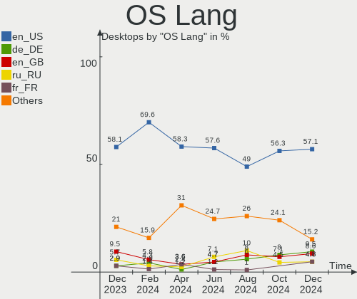
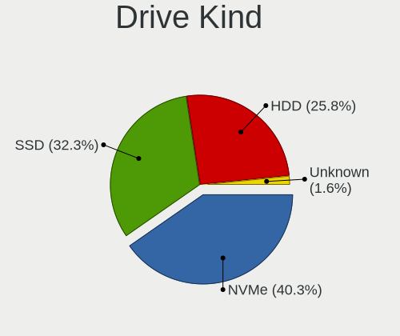
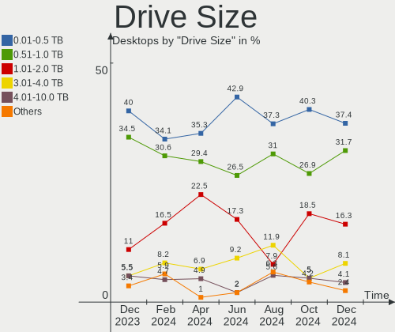
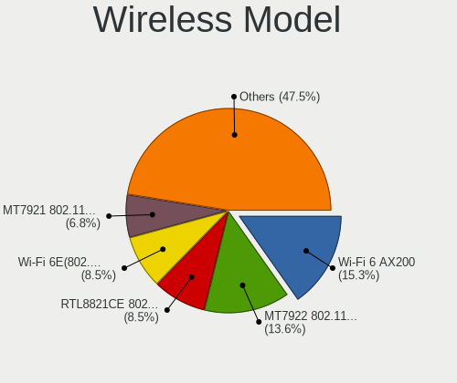
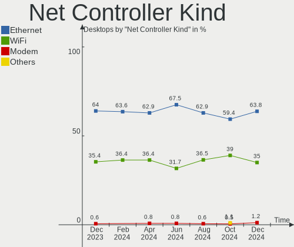
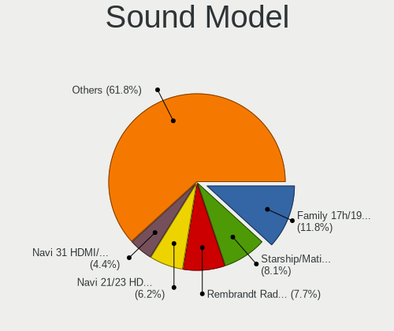

Arch - Hardware Trends (Desktops)
---------------------------------

A project to identify most popular hardware characteristics and track their change
over time based on data collected by Linux users at https://Linux-Hardware.org.

Anyone can contribute to this report by the [hw-probe](https://github.com/linuxhw/hw-probe) tool:

    sudo -E hw-probe -all -upload

This report is for one last month. Overall report since the beginning of time: [TestDays](https://github.com/linuxhw/TestDays)

Period: Aug, 2023.

Contents
--------

* [ System ](#system)
  - [ OS                       ](#os)
  - [ OS Family                ](#os-family)
  - [ Kernel                   ](#kernel)
  - [ Kernel Family            ](#kernel-family)
  - [ Kernel Major Ver.        ](#kernel-major-ver)
  - [ Arch                     ](#arch)
  - [ DE                       ](#de)
  - [ Display Server           ](#display-server)
  - [ Display Manager          ](#display-manager)
  - [ OS Lang                  ](#os-lang)
  - [ Boot Mode                ](#boot-mode)
  - [ Filesystem               ](#filesystem)
  - [ Part. scheme             ](#part-scheme)
  - [ Dual Boot with Linux/BSD ](#dual-boot-with-linuxbsd)
  - [ Dual Boot (Win)          ](#dual-boot-win)

* [ Board ](#board)
  - [ Vendor                   ](#vendor)
  - [ Model                    ](#model)
  - [ Model Family             ](#model-family)
  - [ MFG Year                 ](#mfg-year)
  - [ Form Factor              ](#form-factor)
  - [ Secure Boot              ](#secure-boot)
  - [ Coreboot                 ](#coreboot)
  - [ RAM Size                 ](#ram-size)
  - [ RAM Used                 ](#ram-used)
  - [ Total Drives             ](#total-drives)
  - [ Has CD-ROM               ](#has-cd-rom)
  - [ Has Ethernet             ](#has-ethernet)
  - [ Has WiFi                 ](#has-wifi)
  - [ Has Bluetooth            ](#has-bluetooth)

* [ Location ](#location)
  - [ Country                  ](#country)
  - [ City                     ](#city)

* [ Drives ](#drives)
  - [ Drive Vendor             ](#drive-vendor)
  - [ Drive Model              ](#drive-model)
  - [ HDD Vendor               ](#hdd-vendor)
  - [ SSD Vendor               ](#ssd-vendor)
  - [ Drive Kind               ](#drive-kind)
  - [ Drive Connector          ](#drive-connector)
  - [ Drive Size               ](#drive-size)
  - [ Space Total              ](#space-total)
  - [ Space Used               ](#space-used)
  - [ Malfunc. Drives          ](#malfunc-drives)
  - [ Malfunc. Drive Vendor    ](#malfunc-drive-vendor)
  - [ Malfunc. HDD Vendor      ](#malfunc-hdd-vendor)
  - [ Malfunc. Drive Kind      ](#malfunc-drive-kind)
  - [ Failed Drives            ](#failed-drives)
  - [ Failed Drive Vendor      ](#failed-drive-vendor)
  - [ Drive Status             ](#drive-status)

* [ Storage controller ](#storage-controller)
  - [ Storage Vendor           ](#storage-vendor)
  - [ Storage Model            ](#storage-model)
  - [ Storage Kind             ](#storage-kind)

* [ Processor ](#processor)
  - [ CPU Vendor               ](#cpu-vendor)
  - [ CPU Model                ](#cpu-model)
  - [ CPU Model Family         ](#cpu-model-family)
  - [ CPU Cores                ](#cpu-cores)
  - [ CPU Sockets              ](#cpu-sockets)
  - [ CPU Threads              ](#cpu-threads)
  - [ CPU Op-Modes             ](#cpu-op-modes)
  - [ CPU Microcode            ](#cpu-microcode)
  - [ CPU Microarch            ](#cpu-microarch)

* [ Graphics ](#graphics)
  - [ GPU Vendor               ](#gpu-vendor)
  - [ GPU Model                ](#gpu-model)
  - [ GPU Combo                ](#gpu-combo)
  - [ GPU Driver               ](#gpu-driver)
  - [ GPU Memory               ](#gpu-memory)

* [ Monitor ](#monitor)
  - [ Monitor Vendor           ](#monitor-vendor)
  - [ Monitor Model            ](#monitor-model)
  - [ Monitor Resolution       ](#monitor-resolution)
  - [ Monitor Diagonal         ](#monitor-diagonal)
  - [ Monitor Width            ](#monitor-width)
  - [ Aspect Ratio             ](#aspect-ratio)
  - [ Monitor Area             ](#monitor-area)
  - [ Pixel Density            ](#pixel-density)
  - [ Multiple Monitors        ](#multiple-monitors)

* [ Network ](#network)
  - [ Net Controller Vendor    ](#net-controller-vendor)
  - [ Net Controller Model     ](#net-controller-model)
  - [ Wireless Vendor          ](#wireless-vendor)
  - [ Wireless Model           ](#wireless-model)
  - [ Ethernet Vendor          ](#ethernet-vendor)
  - [ Ethernet Model           ](#ethernet-model)
  - [ Net Controller Kind      ](#net-controller-kind)
  - [ Used Controller          ](#used-controller)
  - [ NICs                     ](#nics)
  - [ IPv6                     ](#ipv6)

* [ Bluetooth ](#bluetooth)
  - [ Bluetooth Vendor         ](#bluetooth-vendor)
  - [ Bluetooth Model          ](#bluetooth-model)

* [ Sound ](#sound)
  - [ Sound Vendor             ](#sound-vendor)
  - [ Sound Model              ](#sound-model)

* [ Memory ](#memory)
  - [ Memory Vendor            ](#memory-vendor)
  - [ Memory Model             ](#memory-model)
  - [ Memory Kind              ](#memory-kind)
  - [ Memory Form Factor       ](#memory-form-factor)
  - [ Memory Size              ](#memory-size)
  - [ Memory Speed             ](#memory-speed)

* [ Printers & scanners ](#printers--scanners)
  - [ Printer Vendor           ](#printer-vendor)
  - [ Printer Model            ](#printer-model)
  - [ Scanner Vendor           ](#scanner-vendor)
  - [ Scanner Model            ](#scanner-model)

* [ Camera ](#camera)
  - [ Camera Vendor            ](#camera-vendor)
  - [ Camera Model             ](#camera-model)

* [ Security ](#security)
  - [ Fingerprint Vendor       ](#fingerprint-vendor)
  - [ Fingerprint Model        ](#fingerprint-model)
  - [ Chipcard Vendor          ](#chipcard-vendor)
  - [ Chipcard Model           ](#chipcard-model)

* [ Unsupported ](#unsupported)
  - [ Unsupported Devices      ](#unsupported-devices)
  - [ Unsupported Device Types ](#unsupported-device-types)

System
------

OS
--

Installed operating systems

| Name         | Desktops | Percent |
|--------------|----------|---------|
| Arch Rolling | 78       | 100%    |

OS Family
---------

OS without a version

| Name | Desktops | Percent |
|------|----------|---------|
| Arch | 78       | 100%    |

Kernel
------

Version of the Linux kernel

| Version                       | Desktops | Percent |
|-------------------------------|----------|---------|
| 6.4.8-arch1-1                 | 11       | 14.1%   |
| 6.4.10-arch1-1                | 10       | 12.82%  |
| 6.4.9-arch1-1                 | 7        | 8.97%   |
| 6.4.12-arch1-1                | 7        | 8.97%   |
| 6.4.11-arch2-1                | 7        | 8.97%   |
| 6.4.11-zen2-1-zen             | 5        | 6.41%   |
| 6.4.10-zen2-1-zen             | 5        | 6.41%   |
| 6.4.7-arch1-2                 | 4        | 5.13%   |
| 6.4.7-arch1-1                 | 3        | 3.85%   |
| 6.4.4-arch1-1                 | 3        | 3.85%   |
| 6.4.7-arch1-3                 | 2        | 2.56%   |
| 6.4.11-arch1-1                | 2        | 2.56%   |
| 6.5.0-rc7-00164-g382d4cd18475 | 1        | 1.28%   |
| 6.5.0-rc6-1-mainline          | 1        | 1.28%   |
| 6.4.8-zen1-1-zen              | 1        | 1.28%   |
| 6.4.4-zen1-1-zen              | 1        | 1.28%   |
| 6.4.3-zen1-1-zen              | 1        | 1.28%   |
| 6.4.3-arch1-1                 | 1        | 1.28%   |
| 6.4.10-2-cachyos              | 1        | 1.28%   |
| 6.1.47-1-lts                  | 1        | 1.28%   |
| 6.1.46-1-lts                  | 1        | 1.28%   |
| 6.1.44-1-lts                  | 1        | 1.28%   |
| 6.1.39-3-lts                  | 1        | 1.28%   |
| 6.1.39-1-lts                  | 1        | 1.28%   |

Kernel Family
-------------

Linux kernel without a distro release

| Version | Desktops | Percent |
|---------|----------|---------|
| 6.4.10  | 16       | 20.51%  |
| 6.4.11  | 14       | 17.95%  |
| 6.4.8   | 12       | 15.38%  |
| 6.4.7   | 9        | 11.54%  |
| 6.4.9   | 7        | 8.97%   |
| 6.4.12  | 7        | 8.97%   |
| 6.4.4   | 4        | 5.13%   |
| 6.5.0   | 2        | 2.56%   |
| 6.4.3   | 2        | 2.56%   |
| 6.1.39  | 2        | 2.56%   |
| 6.1.47  | 1        | 1.28%   |
| 6.1.46  | 1        | 1.28%   |
| 6.1.44  | 1        | 1.28%   |

Kernel Major Ver.
-----------------

Linux kernel major version

| Version | Desktops | Percent |
|---------|----------|---------|
| 6.4     | 71       | 91.03%  |
| 6.1     | 5        | 6.41%   |
| 6.5     | 2        | 2.56%   |

Arch
----

OS architecture (x86_64, i586, etc.)

| Name   | Desktops | Percent |
|--------|----------|---------|
| x86_64 | 78       | 100%    |

DE
--

Desktop Environment

| Name       | Desktops | Percent |
|------------|----------|---------|
| KDE5       | 30       | 38.46%  |
| GNOME      | 22       | 28.21%  |
| XFCE       | 6        | 7.69%   |
| Hyprland   | 6        | 7.69%   |
| Unknown    | 6        | 7.69%   |
| i3         | 5        | 6.41%   |
| X-Cinnamon | 1        | 1.28%   |
| dwm        | 1        | 1.28%   |
| awesome    | 1        | 1.28%   |

Display Server
--------------

X11 or Wayland

| Name    | Desktops | Percent |
|---------|----------|---------|
| X11     | 42       | 53.85%  |
| Wayland | 22       | 28.21%  |
| Tty     | 8        | 10.26%  |
| Unknown | 6        | 7.69%   |

Display Manager
---------------

SDDM, LightDM, etc.

| Name    | Desktops | Percent |
|---------|----------|---------|
| Unknown | 36       | 46.15%  |
| SDDM    | 19       | 24.36%  |
| GDM     | 12       | 15.38%  |
| LightDM | 10       | 12.82%  |
| EMPTTY  | 1        | 1.28%   |

OS Lang
-------

Language

| Lang    | Desktops | Percent |
|---------|----------|---------|
| en_US   | 43       | 55.13%  |
| C       | 6        | 7.69%   |
| ru_RU   | 5        | 6.41%   |
| pt_BR   | 5        | 6.41%   |
| Unknown | 4        | 5.13%   |
| it_IT   | 3        | 3.85%   |
| en_GB   | 3        | 3.85%   |
| es_ES   | 2        | 2.56%   |
| de_DE   | 2        | 2.56%   |
| zh_CN   | 1        | 1.28%   |
| pl_PL   | 1        | 1.28%   |
| en_IN   | 1        | 1.28%   |
| en_DK   | 1        | 1.28%   |
| en_Au   | 1        | 1.28%   |

Boot Mode
---------

EFI or BIOS

| Mode | Desktops | Percent |
|------|----------|---------|
| EFI  | 48       | 61.54%  |
| BIOS | 30       | 38.46%  |

Filesystem
----------

Type of filesystem

| Type  | Desktops | Percent |
|-------|----------|---------|
| Ext4  | 55       | 70.51%  |
| Btrfs | 21       | 26.92%  |
| Zfs   | 1        | 1.28%   |
| Tmpfs | 1        | 1.28%   |

Part. scheme
------------

Scheme of partitioning

| Type    | Desktops | Percent |
|---------|----------|---------|
| GPT     | 52       | 66.67%  |
| Unknown | 22       | 28.21%  |
| MBR     | 4        | 5.13%   |

Dual Boot with Linux/BSD
------------------------

Hosting more than one Linux/BSD

| Dual boot | Desktops | Percent |
|-----------|----------|---------|
| No        | 53       | 67.95%  |
| Yes       | 25       | 32.05%  |

Dual Boot (Win)
---------------

Hosting Linux and Windows

| Dual boot | Desktops | Percent |
|-----------|----------|---------|
| No        | 51       | 65.38%  |
| Yes       | 27       | 34.62%  |

Board
-----

Vendor
------

Motherboard manufacturer

| Name                                 | Desktops | Percent |
|--------------------------------------|----------|---------|
| ASUSTek Computer                     | 23       | 29.49%  |
| Gigabyte Technology                  | 20       | 25.64%  |
| MSI                                  | 12       | 15.38%  |
| ASRock                               | 6        | 7.69%   |
| Hewlett-Packard                      | 3        | 3.85%   |
| Shenzhen Meigao Electronic Equipment | 2        | 2.56%   |
| Intel                                | 2        | 2.56%   |
| Dell                                 | 2        | 2.56%   |
| TYAN Computer                        | 1        | 1.28%   |
| QIYIDA                               | 1        | 1.28%   |
| NZXT                                 | 1        | 1.28%   |
| Huanan                               | 1        | 1.28%   |
| ECS                                  | 1        | 1.28%   |
| CWWK                                 | 1        | 1.28%   |
| AZW                                  | 1        | 1.28%   |
| Acer                                 | 1        | 1.28%   |

Model
-----

Motherboard model

| Name                                                         | Desktops | Percent |
|--------------------------------------------------------------|----------|---------|
| Shenzhen Meigao Electronic Equipment F7BSC                   | 2        | 2.56%   |
| Gigabyte B450M DS3H WIFI                                     | 2        | 2.56%   |
| Gigabyte B365M DS3H                                          | 2        | 2.56%   |
| ASUS ROG STRIX B550-F GAMING                                 | 2        | 2.56%   |
| ASRock B365 Pro4                                             | 2        | 2.56%   |
| TYAN S8010                                                   | 1        | 1.28%   |
| QIYIDA X79 (INTEL Xeon E5/Corei7 DMI2 - C600/C200 Cipset V32 | 1        | 1.28%   |
| NZXT N7 B550                                                 | 1        | 1.28%   |
| MSI MS-7D73                                                  | 1        | 1.28%   |
| MSI MS-7D70                                                  | 1        | 1.28%   |
| MSI MS-7C91                                                  | 1        | 1.28%   |
| MSI MS-7C13                                                  | 1        | 1.28%   |
| MSI MS-7C02                                                  | 1        | 1.28%   |
| MSI MS-7B98                                                  | 1        | 1.28%   |
| MSI MS-7B93                                                  | 1        | 1.28%   |
| MSI MS-7B89                                                  | 1        | 1.28%   |
| MSI MS-7B79                                                  | 1        | 1.28%   |
| MSI MS-7B24                                                  | 1        | 1.28%   |
| MSI MS-7B18                                                  | 1        | 1.28%   |
| MSI MS-7A68                                                  | 1        | 1.28%   |
| Intel X99                                                    | 1        | 1.28%   |
| Intel X79M-S                                                 | 1        | 1.28%   |
| Huanan H610M-PLUS                                            | 1        | 1.28%   |
| HP ProDesk 405 G4 SFF                                        | 1        | 1.28%   |
| HP Compaq 6200 Pro MT PC                                     | 1        | 1.28%   |
| HP 2B29                                                      | 1        | 1.28%   |
| Gigabyte Z790 AORUS ELITE AX                                 | 1        | 1.28%   |
| Gigabyte Z490M GAMING X                                      | 1        | 1.28%   |
| Gigabyte X399 AORUS PRO                                      | 1        | 1.28%   |
| Gigabyte M68M-S2P                                            | 1        | 1.28%   |
| Gigabyte H61M-DS2                                            | 1        | 1.28%   |
| Gigabyte GA-78LMT-USB3 R2                                    | 1        | 1.28%   |
| Gigabyte B660 GAMING X DDR4                                  | 1        | 1.28%   |
| Gigabyte B650 AORUS ELITE AX                                 | 1        | 1.28%   |
| Gigabyte B560M D3H                                           | 1        | 1.28%   |
| Gigabyte B550M DS3H                                          | 1        | 1.28%   |
| Gigabyte B550M AORUS PRO-P                                   | 1        | 1.28%   |
| Gigabyte B450M S2H                                           | 1        | 1.28%   |
| Gigabyte B450M DS3H V2                                       | 1        | 1.28%   |
| Gigabyte B365 HD3                                            | 1        | 1.28%   |

Model Family
------------

Motherboard model prefix

| Name                                       | Desktops | Percent |
|--------------------------------------------|----------|---------|
| ASUS PRIME                                 | 7        | 8.97%   |
| ASUS ROG                                   | 6        | 7.69%   |
| Gigabyte B450M                             | 4        | 5.13%   |
| ASUS TUF                                   | 4        | 5.13%   |
| Shenzhen Meigao Electronic Equipment F7BSC | 2        | 2.56%   |
| Gigabyte B550M                             | 2        | 2.56%   |
| Gigabyte B365M                             | 2        | 2.56%   |
| ASRock B365                                | 2        | 2.56%   |
| TYAN S8010                                 | 1        | 1.28%   |
| QIYIDA X79                                 | 1        | 1.28%   |
| NZXT N7                                    | 1        | 1.28%   |
| MSI MS-7D73                                | 1        | 1.28%   |
| MSI MS-7D70                                | 1        | 1.28%   |
| MSI MS-7C91                                | 1        | 1.28%   |
| MSI MS-7C13                                | 1        | 1.28%   |
| MSI MS-7C02                                | 1        | 1.28%   |
| MSI MS-7B98                                | 1        | 1.28%   |
| MSI MS-7B93                                | 1        | 1.28%   |
| MSI MS-7B89                                | 1        | 1.28%   |
| MSI MS-7B79                                | 1        | 1.28%   |
| MSI MS-7B24                                | 1        | 1.28%   |
| MSI MS-7B18                                | 1        | 1.28%   |
| MSI MS-7A68                                | 1        | 1.28%   |
| Intel X99                                  | 1        | 1.28%   |
| Intel X79M-S                               | 1        | 1.28%   |
| Huanan H610M-PLUS                          | 1        | 1.28%   |
| HP ProDesk                                 | 1        | 1.28%   |
| HP Compaq                                  | 1        | 1.28%   |
| HP 2B29                                    | 1        | 1.28%   |
| Gigabyte Z790                              | 1        | 1.28%   |
| Gigabyte Z490M                             | 1        | 1.28%   |
| Gigabyte X399                              | 1        | 1.28%   |
| Gigabyte M68M-S2P                          | 1        | 1.28%   |
| Gigabyte H61M-DS2                          | 1        | 1.28%   |
| Gigabyte GA-78LMT-USB3                     | 1        | 1.28%   |
| Gigabyte B660                              | 1        | 1.28%   |
| Gigabyte B650                              | 1        | 1.28%   |
| Gigabyte B560M                             | 1        | 1.28%   |
| Gigabyte B365                              | 1        | 1.28%   |
| Gigabyte AX370-Gaming                      | 1        | 1.28%   |

MFG Year
--------

Motherboard manufacture year

| Year | Desktops | Percent |
|------|----------|---------|
| 2019 | 18       | 23.08%  |
| 2018 | 13       | 16.67%  |
| 2022 | 12       | 15.38%  |
| 2021 | 8        | 10.26%  |
| 2020 | 7        | 8.97%   |
| 2023 | 5        | 6.41%   |
| 2011 | 4        | 5.13%   |
| 2017 | 2        | 2.56%   |
| 2014 | 2        | 2.56%   |
| 2013 | 2        | 2.56%   |
| 2012 | 2        | 2.56%   |
| 2009 | 2        | 2.56%   |
| 2008 | 1        | 1.28%   |

Form Factor
-----------

Physical design of the computer

| Name    | Desktops | Percent |
|---------|----------|---------|
| Desktop | 78       | 100%    |

Secure Boot
-----------

Enabled or disabled

| State    | Desktops | Percent |
|----------|----------|---------|
| Disabled | 74       | 94.87%  |
| Enabled  | 4        | 5.13%   |

Coreboot
--------

Have coreboot on board

| Used | Desktops | Percent |
|------|----------|---------|
| No   | 78       | 100%    |

RAM Size
--------

Total RAM memory

| Size in GB      | Desktops | Percent |
|-----------------|----------|---------|
| 16.01-24.0      | 25       | 32.05%  |
| 32.01-64.0      | 23       | 29.49%  |
| 8.01-16.0       | 11       | 14.1%   |
| 64.01-256.0     | 6        | 7.69%   |
| 24.01-32.0      | 5        | 6.41%   |
| 4.01-8.0        | 4        | 5.13%   |
| 3.01-4.0        | 3        | 3.85%   |
| More than 256.0 | 1        | 1.28%   |

RAM Used
--------

Used RAM memory

| Used GB    | Desktops | Percent |
|------------|----------|---------|
| 4.01-8.0   | 23       | 29.49%  |
| 3.01-4.0   | 20       | 25.64%  |
| 2.01-3.0   | 15       | 19.23%  |
| 1.01-2.0   | 10       | 12.82%  |
| 8.01-16.0  | 5        | 6.41%   |
| 0.51-1.0   | 4        | 5.13%   |
| 24.01-32.0 | 1        | 1.28%   |

Total Drives
------------

Number of drives on board

| Drives | Desktops | Percent |
|--------|----------|---------|
| 2      | 30       | 38.46%  |
| 1      | 17       | 21.79%  |
| 3      | 14       | 17.95%  |
| 4      | 9        | 11.54%  |
| 5      | 4        | 5.13%   |
| 9      | 1        | 1.28%   |
| 7      | 1        | 1.28%   |
| 6      | 1        | 1.28%   |
| 0      | 1        | 1.28%   |

Has CD-ROM
----------

Has CD-ROM on board

| Presented | Desktops | Percent |
|-----------|----------|---------|
| No        | 65       | 83.33%  |
| Yes       | 13       | 16.67%  |

Has Ethernet
------------

Has Ethernet on board

| Presented | Desktops | Percent |
|-----------|----------|---------|
| Yes       | 74       | 94.87%  |
| No        | 4        | 5.13%   |

Has WiFi
--------

Has WiFi module

| Presented | Desktops | Percent |
|-----------|----------|---------|
| Yes       | 39       | 50%     |
| No        | 39       | 50%     |

Has Bluetooth
-------------

Has Bluetooth module

| Presented | Desktops | Percent |
|-----------|----------|---------|
| Yes       | 39       | 50%     |
| No        | 39       | 50%     |

Location
--------

Country
-------

Geographic location (country)

| Country         | Desktops | Percent |
|-----------------|----------|---------|
| USA             | 23       | 29.49%  |
| Russia          | 7        | 8.97%   |
| Germany         | 7        | 8.97%   |
| Spain           | 5        | 6.41%   |
| Brazil          | 5        | 6.41%   |
| Namibia         | 3        | 3.85%   |
| Italy           | 3        | 3.85%   |
| Finland         | 2        | 2.56%   |
| China           | 2        | 2.56%   |
| Australia       | 2        | 2.56%   |
| Argentina       | 2        | 2.56%   |
| Turkey          | 1        | 1.28%   |
| Sweden          | 1        | 1.28%   |
| Serbia          | 1        | 1.28%   |
| Poland          | 1        | 1.28%   |
| North Macedonia | 1        | 1.28%   |
| Netherlands     | 1        | 1.28%   |
| Morocco         | 1        | 1.28%   |
| Malaysia        | 1        | 1.28%   |
| Japan           | 1        | 1.28%   |
| Israel          | 1        | 1.28%   |
| Indonesia       | 1        | 1.28%   |
| India           | 1        | 1.28%   |
| Hungary         | 1        | 1.28%   |
| Greece          | 1        | 1.28%   |
| Chile           | 1        | 1.28%   |
| Bulgaria        | 1        | 1.28%   |
| Brunei          | 1        | 1.28%   |

City
----

Geographic location (city)

| City               | Desktops | Percent |
|--------------------|----------|---------|
| Swakopmund         | 3        | 3.85%   |
| Pine Island        | 3        | 3.85%   |
| Munich             | 2        | 2.56%   |
| Moscow             | 2        | 2.56%   |
| Los Angeles        | 2        | 2.56%   |
| Curitiba           | 2        | 2.56%   |
| Yogyakarta         | 1        | 1.28%   |
| Yekaterinburg      | 1        | 1.28%   |
| Weston             | 1        | 1.28%   |
| West Lebanon       | 1        | 1.28%   |
| Vercelli           | 1        | 1.28%   |
| Veldhoven          | 1        | 1.28%   |
| Valencia           | 1        | 1.28%   |
| Ufa                | 1        | 1.28%   |
| Turin              | 1        | 1.28%   |
| Tokyo              | 1        | 1.28%   |
| Tel Aviv           | 1        | 1.28%   |
| Sydney             | 1        | 1.28%   |
| Stolberg           | 1        | 1.28%   |
| St Petersburg      | 1        | 1.28%   |
| St Louis           | 1        | 1.28%   |
| Sofia              | 1        | 1.28%   |
| Skopje             | 1        | 1.28%   |
| Shenzhen           | 1        | 1.28%   |
| Shanghai           | 1        | 1.28%   |
| Sandy              | 1        | 1.28%   |
| Salou              | 1        | 1.28%   |
| Rudolstadt         | 1        | 1.28%   |
| Rio de Janeiro     | 1        | 1.28%   |
| Reno               | 1        | 1.28%   |
| Raleigh            | 1        | 1.28%   |
| Orzesze            | 1        | 1.28%   |
| Örebro            | 1        | 1.28%   |
| Oldenburg          | 1        | 1.28%   |
| Ocean Springs      | 1        | 1.28%   |
| Oak Creek          | 1        | 1.28%   |
| Mollet del Vallès | 1        | 1.28%   |
| Minneapolis        | 1        | 1.28%   |
| Mesa               | 1        | 1.28%   |
| Mendoza            | 1        | 1.28%   |

Drives
------

Drive Vendor
------------

Hard drive vendors

| Vendor                      | Desktops | Drives | Percent |
|-----------------------------|----------|--------|---------|
| Samsung Electronics         | 35       | 52     | 22.44%  |
| Seagate                     | 28       | 35     | 17.95%  |
| WDC                         | 23       | 34     | 14.74%  |
| Sandisk                     | 12       | 13     | 7.69%   |
| Toshiba                     | 9        | 12     | 5.77%   |
| Kingston                    | 8        | 8      | 5.13%   |
| SK hynix                    | 3        | 3      | 1.92%   |
| Silicon Motion              | 3        | 3      | 1.92%   |
| China                       | 3        | 4      | 1.92%   |
| A-DATA Technology           | 3        | 3      | 1.92%   |
| PNY                         | 2        | 2      | 1.28%   |
| Phison Electronics          | 2        | 2      | 1.28%   |
| Patriot                     | 2        | 2      | 1.28%   |
| Micron/Crucial Technology   | 2        | 2      | 1.28%   |
| MAXIO Technology (Hangzhou) | 2        | 2      | 1.28%   |
| Kingston Technology Company | 2        | 2      | 1.28%   |
| HGST                        | 2        | 2      | 1.28%   |
| Crucial                     | 2        | 3      | 1.28%   |
| XSTAR SS                    | 1        | 1      | 0.64%   |
| XrayDisk                    | 1        | 1      | 0.64%   |
| Team                        | 1        | 1      | 0.64%   |
| SABRENT                     | 1        | 1      | 0.64%   |
| MidasForce                  | 1        | 1      | 0.64%   |
| LIO-ORG                     | 1        | 3      | 0.64%   |
| Kingchuxing                 | 1        | 1      | 0.64%   |
| Intel                       | 1        | 1      | 0.64%   |
| Hitachi                     | 1        | 1      | 0.64%   |
| Corsair                     | 1        | 1      | 0.64%   |
| ASUSTOR                     | 1        | 1      | 0.64%   |
| ADATA Technology            | 1        | 1      | 0.64%   |
| Acer                        | 1        | 1      | 0.64%   |

Drive Model
-----------

Hard drive models

| Model                                                 | Desktops | Percent |
|-------------------------------------------------------|----------|---------|
| Samsung NVMe SSD Controller SM981/PM981/PM983 500GB   | 9        | 4.89%   |
| Samsung NVMe SSD Controller PM9A1/PM9A3/980PRO 1024GB | 9        | 4.89%   |
| Toshiba HDWD110 1TB                                   | 5        | 2.72%   |
| Seagate ST1000DM010-2EP102 1TB                        | 5        | 2.72%   |
| Samsung SSD 860 EVO 500GB                             | 5        | 2.72%   |
| WDC WD10EZEX-08WN4A0 1TB                              | 3        | 1.63%   |
| Toshiba DT01ACA100 1TB                                | 3        | 1.63%   |
| Seagate ST2000DM008-2FR102 2TB                        | 3        | 1.63%   |
| Sandisk WD Blue SN550 NVMe SSD 250GB                  | 3        | 1.63%   |
| Samsung SSD 980 1TB                                   | 3        | 1.63%   |
| Samsung SSD 860 EVO 1TB                               | 3        | 1.63%   |
| Samsung NVMe SSD Controller SM961/PM961/SM963 1024GB  | 3        | 1.63%   |
| WDC WD10EZEX-22MFCA0 1TB                              | 2        | 1.09%   |
| Silicon Motion SM2262/SM2262EN SSD Controller 1024GB  | 2        | 1.09%   |
| Seagate ST9500325AS 500GB                             | 2        | 1.09%   |
| Seagate ST500DM002-1BD142 500GB                       | 2        | 1.09%   |
| Seagate ST4000NE001-2MA101 4TB                        | 2        | 1.09%   |
| Seagate ST31000524AS 1TB                              | 2        | 1.09%   |
| Seagate ST2000DM008-2UB102 2TB                        | 2        | 1.09%   |
| Sandisk WD_BLACK SN770 1TB                            | 2        | 1.09%   |
| Sandisk WD Blue SN570 1TB                             | 2        | 1.09%   |
| Sandisk WD Black SN750 / PC SN730 NVMe SSD 1024GB     | 2        | 1.09%   |
| SanDisk SDSSDA480G 480GB                              | 2        | 1.09%   |
| Samsung SSD 870 EVO 500GB                             | 2        | 1.09%   |
| Samsung SSD 850 EVO 500GB                             | 2        | 1.09%   |
| Micron/Crucial P2 NVMe PCIe SSD 1TB                   | 2        | 1.09%   |
| XSTAR SS D 512GB                                      | 1        | 0.54%   |
| XrayDisk 1TB SSD                                      | 1        | 0.54%   |
| WDC WDS500G2B0A-00SM50 500GB SSD                      | 1        | 0.54%   |
| WDC WDS240G2G0A-00JH30 240GB SSD                      | 1        | 0.54%   |
| WDC WD80EMAZ-00WJTA0 8TB                              | 1        | 0.54%   |
| WDC WD60EDAZ-11U78B0 6TB                              | 1        | 0.54%   |
| WDC WD5000BPVT-60HXZT3 500GB                          | 1        | 0.54%   |
| WDC WD5000BPKT-80PK4T0 500GB                          | 1        | 0.54%   |
| WDC WD5000AAKX-60U6AA0 500GB                          | 1        | 0.54%   |
| WDC WD5000AAKS-75A7B2 500GB                           | 1        | 0.54%   |
| WDC WD50 00AADS-00S9B0 500GB                          | 1        | 0.54%   |
| WDC WD40PURZ-85TTDY0 4TB                              | 1        | 0.54%   |
| WDC WD40EZRZ-00GXCB0 4TB                              | 1        | 0.54%   |
| WDC WD3200BEVT-22ZCT0 320GB                           | 1        | 0.54%   |

HDD Vendor
----------

Hard disk drive vendors

| Vendor              | Desktops | Drives | Percent |
|---------------------|----------|--------|---------|
| Seagate             | 28       | 35     | 43.75%  |
| WDC                 | 21       | 30     | 32.81%  |
| Toshiba             | 9        | 12     | 14.06%  |
| HGST                | 2        | 2      | 3.13%   |
| Samsung Electronics | 1        | 1      | 1.56%   |
| SABRENT             | 1        | 1      | 1.56%   |
| Hitachi             | 1        | 1      | 1.56%   |
| ASUSTOR             | 1        | 1      | 1.56%   |

SSD Vendor
----------

Solid state drive vendors

| Vendor              | Desktops | Drives | Percent |
|---------------------|----------|--------|---------|
| Samsung Electronics | 16       | 19     | 34.04%  |
| Kingston            | 7        | 7      | 14.89%  |
| WDC                 | 3        | 3      | 6.38%   |
| China               | 3        | 4      | 6.38%   |
| A-DATA Technology   | 3        | 3      | 6.38%   |
| SanDisk             | 2        | 2      | 4.26%   |
| PNY                 | 2        | 2      | 4.26%   |
| Patriot             | 2        | 2      | 4.26%   |
| Crucial             | 2        | 3      | 4.26%   |
| XrayDisk            | 1        | 1      | 2.13%   |
| Team                | 1        | 1      | 2.13%   |
| SK hynix            | 1        | 1      | 2.13%   |
| MidasForce          | 1        | 1      | 2.13%   |
| LIO-ORG             | 1        | 3      | 2.13%   |
| Corsair             | 1        | 1      | 2.13%   |
| Acer                | 1        | 1      | 2.13%   |

Drive Kind
----------

HDD or SSD

| Kind    | Desktops | Drives | Percent |
|---------|----------|--------|---------|
| HDD     | 53       | 83     | 37.59%  |
| NVMe    | 47       | 59     | 33.33%  |
| SSD     | 38       | 54     | 26.95%  |
| Unknown | 3        | 3      | 2.13%   |

Drive Connector
---------------

SATA, SAS, NVMe, etc.

| Type | Desktops | Drives | Percent |
|------|----------|--------|---------|
| SATA | 65       | 134    | 55.56%  |
| NVMe | 47       | 59     | 40.17%  |
| SAS  | 5        | 6      | 4.27%   |

Drive Size
----------

Size of hard drive

| Size in TB | Desktops | Drives | Percent |
|------------|----------|--------|---------|
| 0.51-1.0   | 36       | 53     | 37.5%   |
| 0.01-0.5   | 36       | 55     | 37.5%   |
| 1.01-2.0   | 13       | 13     | 13.54%  |
| 3.01-4.0   | 5        | 10     | 5.21%   |
| 4.01-10.0  | 4        | 4      | 4.17%   |
| 2.01-3.0   | 1        | 1      | 1.04%   |
| 10.01-20.0 | 1        | 1      | 1.04%   |

Space Total
-----------

Amount of disk space available on the file system

| Size in GB     | Desktops | Percent |
|----------------|----------|---------|
| More than 3000 | 18       | 23.08%  |
| 1001-2000      | 16       | 20.51%  |
| 501-1000       | 13       | 16.67%  |
| 251-500        | 10       | 12.82%  |
| 2001-3000      | 7        | 8.97%   |
| 101-250        | 7        | 8.97%   |
| 21-50          | 3        | 3.85%   |
| 51-100         | 3        | 3.85%   |
| 1-20           | 1        | 1.28%   |

Space Used
----------

Amount of used disk space

| Used GB        | Desktops | Percent |
|----------------|----------|---------|
| 1-20           | 16       | 20.51%  |
| 251-500        | 13       | 16.67%  |
| 101-250        | 11       | 14.1%   |
| 1001-2000      | 8        | 10.26%  |
| 501-1000       | 8        | 10.26%  |
| 21-50          | 7        | 8.97%   |
| 51-100         | 7        | 8.97%   |
| More than 3000 | 6        | 7.69%   |
| 2001-3000      | 2        | 2.56%   |

Malfunc. Drives
---------------

Drive models with a malfunction

| Model                                 | Desktops | Drives | Percent |
|---------------------------------------|----------|--------|---------|
| Seagate ST1000DM010-2EP102 1TB        | 2        | 2      | 8.33%   |
| WDC WD60EDAZ-11U78B0 6TB              | 1        | 1      | 4.17%   |
| WDC WD5000BPVT-60HXZT3 500GB          | 1        | 1      | 4.17%   |
| WDC WD40PURZ-85TTDY0 4TB              | 1        | 1      | 4.17%   |
| WDC WD10EZEX-08WN4A0 1TB              | 1        | 1      | 4.17%   |
| WDC WD10EZEX-08M2NA0 1TB              | 1        | 1      | 4.17%   |
| WDC WD10EAVS-00D7B0 1TB               | 1        | 1      | 4.17%   |
| WDC WD1003FZEX-00MK2A0 1TB            | 1        | 1      | 4.17%   |
| WDC WD1002FAEX-00Z3A0 1TB             | 1        | 1      | 4.17%   |
| WDC WD Green M.2 2280 480GB SSD       | 1        | 1      | 4.17%   |
| Toshiba MG04ACA100N 1TB               | 1        | 1      | 4.17%   |
| Toshiba DT01ACA100 1TB                | 1        | 1      | 4.17%   |
| Seagate ST9500325AS 500GB             | 1        | 1      | 4.17%   |
| Seagate ST3500418AS 500GB             | 1        | 1      | 4.17%   |
| Seagate ST31000524AS 1TB              | 1        | 1      | 4.17%   |
| Seagate ST1000LM035-1RK172 1TB        | 1        | 1      | 4.17%   |
| Seagate ST1000LM010-9YH146 1TB        | 1        | 1      | 4.17%   |
| Samsung Electronics SSD 980 1TB       | 1        | 1      | 4.17%   |
| Samsung Electronics SSD 860 EVO 500GB | 1        | 1      | 4.17%   |
| Samsung Electronics HM160HI 160GB     | 1        | 1      | 4.17%   |
| Kingston SKC400S371T 1TB SSD          | 1        | 1      | 4.17%   |
| HGST HTS541010A7E630 1TB              | 1        | 1      | 4.17%   |
| A-DATA Technology SU900 256GB SSD     | 1        | 1      | 4.17%   |

Malfunc. Drive Vendor
---------------------

Vendors of faulty drives

| Vendor              | Desktops | Drives | Percent |
|---------------------|----------|--------|---------|
| WDC                 | 8        | 9      | 38.1%   |
| Seagate             | 5        | 7      | 23.81%  |
| Samsung Electronics | 3        | 3      | 14.29%  |
| Toshiba             | 2        | 2      | 9.52%   |
| Kingston            | 1        | 1      | 4.76%   |
| HGST                | 1        | 1      | 4.76%   |
| A-DATA Technology   | 1        | 1      | 4.76%   |

Malfunc. HDD Vendor
-------------------

Vendors of faulty HDD drives

| Vendor              | Desktops | Drives | Percent |
|---------------------|----------|--------|---------|
| WDC                 | 7        | 8      | 43.75%  |
| Seagate             | 5        | 7      | 31.25%  |
| Toshiba             | 2        | 2      | 12.5%   |
| Samsung Electronics | 1        | 1      | 6.25%   |
| HGST                | 1        | 1      | 6.25%   |

Malfunc. Drive Kind
-------------------

Kinds of faulty drives

| Kind | Desktops | Drives | Percent |
|------|----------|--------|---------|
| HDD  | 12       | 19     | 70.59%  |
| SSD  | 4        | 4      | 23.53%  |
| NVMe | 1        | 1      | 5.88%   |

Failed Drives
-------------

Failed drive models

Zero info for selected period =(

Failed Drive Vendor
-------------------

Failed drive vendors

Zero info for selected period =(

Drive Status
------------

Number of failed and malfunc. drives

| Status   | Desktops | Drives | Percent |
|----------|----------|--------|---------|
| Works    | 42       | 103    | 44.21%  |
| Detected | 36       | 72     | 37.89%  |
| Malfunc  | 17       | 24     | 17.89%  |

Storage controller
------------------

Storage Vendor
--------------

Storage controller vendors

| Vendor                      | Desktops | Percent |
|-----------------------------|----------|---------|
| Intel                       | 38       | 29.69%  |
| AMD                         | 36       | 28.13%  |
| Samsung Electronics         | 26       | 20.31%  |
| SanDisk                     | 10       | 7.81%   |
| Silicon Motion              | 3        | 2.34%   |
| Kingston Technology Company | 3        | 2.34%   |
| SK hynix                    | 2        | 1.56%   |
| Phison Electronics          | 2        | 1.56%   |
| Micron/Crucial Technology   | 2        | 1.56%   |
| MAXIO Technology (Hangzhou) | 2        | 1.56%   |
| Nvidia                      | 1        | 0.78%   |
| Broadcom / LSI              | 1        | 0.78%   |
| ASMedia Technology          | 1        | 0.78%   |
| ADATA Technology            | 1        | 0.78%   |

Storage Model
-------------

Storage controller models

| Model                                                                                   | Desktops | Percent |
|-----------------------------------------------------------------------------------------|----------|---------|
| AMD FCH SATA Controller [AHCI mode]                                                     | 23       | 14.94%  |
| Samsung NVMe SSD Controller SM981/PM981/PM983                                           | 9        | 5.84%   |
| Samsung NVMe SSD Controller PM9A1/PM9A3/980PRO                                          | 9        | 5.84%   |
| Intel 200 Series PCH SATA controller [AHCI mode]                                        | 9        | 5.84%   |
| AMD 500 Series Chipset SATA Controller                                                  | 9        | 5.84%   |
| AMD 400 Series Chipset SATA Controller                                                  | 9        | 5.84%   |
| Intel Cannon Lake PCH SATA AHCI Controller                                              | 6        | 3.9%    |
| Intel Alder Lake-S PCH SATA Controller [AHCI Mode]                                      | 6        | 3.9%    |
| Samsung NVMe SSD Controller 980                                                         | 5        | 3.25%   |
| Intel Volume Management Device NVMe RAID Controller                                     | 5        | 3.25%   |
| Intel 6 Series/C200 Series Chipset Family 6 port Desktop SATA AHCI Controller           | 4        | 2.6%    |
| SanDisk WD Blue SN550 NVMe SSD                                                          | 3        | 1.95%   |
| SanDisk WD Black SN770 / PC SN740 256GB / PC SN560 (DRAM-less) NVMe SSD                 | 3        | 1.95%   |
| Samsung NVMe SSD Controller SM961/PM961/SM963                                           | 3        | 1.95%   |
| AMD SB7x0/SB8x0/SB9x0 IDE Controller                                                    | 3        | 1.95%   |
| Silicon Motion SM2262/SM2262EN SSD Controller                                           | 2        | 1.3%    |
| SanDisk WD Blue SN570 NVMe SSD 1TB                                                      | 2        | 1.3%    |
| SanDisk WD Black SN750 / PC SN730 NVMe SSD                                              | 2        | 1.3%    |
| Micron/Crucial P2 [Nick P2] / P3 / P3 Plus NVMe PCIe SSD (DRAM-less)                    | 2        | 1.3%    |
| Intel 700 Series Chipset Family SATA AHCI Controller                                    | 2        | 1.3%    |
| Intel 6 Series/C200 Series Chipset Family Desktop SATA Controller (IDE mode, ports 4-5) | 2        | 1.3%    |
| Intel 6 Series/C200 Series Chipset Family Desktop SATA Controller (IDE mode, ports 0-3) | 2        | 1.3%    |
| AMD SB7x0/SB8x0/SB9x0 SATA Controller [AHCI mode]                                       | 2        | 1.3%    |
| SK hynix Platinum P41/PC801 NVMe Solid State Drive                                      | 1        | 0.65%   |
| SK hynix BC511 NVMe SSD                                                                 | 1        | 0.65%   |
| Silicon Motion SM2263EN/SM2263XT (DRAM-less) NVMe SSD Controllers                       | 1        | 0.65%   |
| Sandisk Western Digital WD Black SN850X NVMe SSD                                        | 1        | 0.65%   |
| Phison PS5021-E21 PCIe4 NVMe Controller (DRAM-less)                                     | 1        | 0.65%   |
| Phison E18 PCIe4 NVMe Controller                                                        | 1        | 0.65%   |
| Nvidia MCP61 SATA Controller                                                            | 1        | 0.65%   |
| Nvidia MCP61 IDE                                                                        | 1        | 0.65%   |
| MAXIO (Hangzhou) NVMe SSD Controller MAP1602                                            | 1        | 0.65%   |
| MAXIO (Hangzhou) NVMe SSD Controller MAP1202                                            | 1        | 0.65%   |
| Kingston Company Company Non-Volatile memory controller                                 | 1        | 0.65%   |
| Kingston Company KC3000/Renegade NVMe SSD                                               | 1        | 0.65%   |
| Kingston Company KC2000/KC2500 NVMe SSD                                                 | 1        | 0.65%   |
| Intel SATA Controller [RAID mode]                                                       | 1        | 0.65%   |
| Intel NVMe Optane Memory Series                                                         | 1        | 0.65%   |
| Intel NM10/ICH7 Family SATA Controller [IDE mode]                                       | 1        | 0.65%   |
| Intel Comet Lake SATA AHCI Controller                                                   | 1        | 0.65%   |

Storage Kind
------------

Kind of storage controller (IDE, SATA, NVMe, SAS, ...)

| Kind | Desktops | Percent |
|------|----------|---------|
| SATA | 70       | 53.44%  |
| NVMe | 47       | 35.88%  |
| IDE  | 7        | 5.34%   |
| RAID | 6        | 4.58%   |
| SAS  | 1        | 0.76%   |

Processor
---------

CPU Vendor
----------

Processor vendors

| Vendor | Desktops | Percent |
|--------|----------|---------|
| AMD    | 40       | 51.28%  |
| Intel  | 38       | 48.72%  |

CPU Model
---------

Processor models

| Model                                          | Desktops | Percent |
|------------------------------------------------|----------|---------|
| Intel Core i5-9400F CPU @ 2.90GHz              | 4        | 5.13%   |
| AMD Ryzen 5 5600X 6-Core Processor             | 4        | 5.13%   |
| AMD Ryzen 5 3600 6-Core Processor              | 4        | 5.13%   |
| AMD Ryzen 9 7940HS w/ Radeon 780M Graphics     | 3        | 3.85%   |
| Intel Core i7-8700 CPU @ 3.20GHz               | 2        | 2.56%   |
| Intel Core i5-2400 CPU @ 3.10GHz               | 2        | 2.56%   |
| Intel Core i3-2100 CPU @ 3.10GHz               | 2        | 2.56%   |
| Intel 12th Gen Core i7-12700K                  | 2        | 2.56%   |
| AMD Ryzen 9 5900X 12-Core Processor            | 2        | 2.56%   |
| AMD Ryzen 7 5700G with Radeon Graphics         | 2        | 2.56%   |
| AMD Ryzen 5 7600X 6-Core Processor             | 2        | 2.56%   |
| Intel Xeon CPU X5570 @ 2.93GHz                 | 1        | 1.28%   |
| Intel Xeon CPU E5-2680 v4 @ 2.40GHz            | 1        | 1.28%   |
| Intel Xeon CPU E5-2670 0 @ 2.60GHz             | 1        | 1.28%   |
| Intel Xeon CPU E5-2420 0 @ 1.90GHz             | 1        | 1.28%   |
| Intel Pentium Dual-Core CPU E5400 @ 2.70GHz    | 1        | 1.28%   |
| Intel Core i9-9900KF CPU @ 3.60GHz             | 1        | 1.28%   |
| Intel Core i9-9900K CPU @ 3.60GHz              | 1        | 1.28%   |
| Intel Core i7-9700K CPU @ 3.60GHz              | 1        | 1.28%   |
| Intel Core i7-9700 CPU @ 3.00GHz               | 1        | 1.28%   |
| Intel Core i7-7700K CPU @ 4.20GHz              | 1        | 1.28%   |
| Intel Core i7-4790 CPU @ 3.60GHz               | 1        | 1.28%   |
| Intel Core i7-10700K CPU @ 3.80GHz             | 1        | 1.28%   |
| Intel Core i5-9600KF CPU @ 3.70GHz             | 1        | 1.28%   |
| Intel Core i5-9600K CPU @ 3.70GHz              | 1        | 1.28%   |
| Intel Core i5-9400 CPU @ 2.90GHz               | 1        | 1.28%   |
| Intel Core i5-2500K CPU @ 3.30GHz              | 1        | 1.28%   |
| Intel Core i5-2320 CPU @ 3.00GHz               | 1        | 1.28%   |
| Intel Core i3-9100F CPU @ 3.60GHz              | 1        | 1.28%   |
| Intel Celeron CPU N3050 @ 1.60GHz              | 1        | 1.28%   |
| Intel 13th Gen Core i9-13900K                  | 1        | 1.28%   |
| Intel 13th Gen Core i5-13600KF                 | 1        | 1.28%   |
| Intel 13th Gen Core i5-13500                   | 1        | 1.28%   |
| Intel 12th Gen Core i7-12700KF                 | 1        | 1.28%   |
| Intel 12th Gen Core i5-12600KF                 | 1        | 1.28%   |
| Intel 12th Gen Core i5-12400F                  | 1        | 1.28%   |
| Intel 11th Gen Core i5-11400F @ 2.60GHz        | 1        | 1.28%   |
| AMD Ryzen Threadripper 2950X 16-Core Processor | 1        | 1.28%   |
| AMD Ryzen 9 7950X 16-Core Processor            | 1        | 1.28%   |
| AMD Ryzen 9 5950X 16-Core Processor            | 1        | 1.28%   |

CPU Model Family
----------------

Processor model prefix

| Model                   | Desktops | Percent |
|-------------------------|----------|---------|
| AMD Ryzen 5             | 14       | 17.95%  |
| Intel Core i5           | 11       | 14.1%   |
| Other                   | 9        | 11.54%  |
| AMD Ryzen 9             | 8        | 10.26%  |
| AMD Ryzen 7             | 8        | 10.26%  |
| Intel Core i7           | 7        | 8.97%   |
| Intel Xeon              | 4        | 5.13%   |
| Intel Core i3           | 3        | 3.85%   |
| Intel Core i9           | 2        | 2.56%   |
| AMD FX                  | 2        | 2.56%   |
| Intel Pentium Dual-Core | 1        | 1.28%   |
| Intel Celeron           | 1        | 1.28%   |
| AMD Ryzen Threadripper  | 1        | 1.28%   |
| AMD Ryzen 5 PRO         | 1        | 1.28%   |
| AMD Ryzen 3 PRO         | 1        | 1.28%   |
| AMD Ryzen 3             | 1        | 1.28%   |
| AMD Opteron             | 1        | 1.28%   |
| AMD Athlon II X4        | 1        | 1.28%   |
| AMD A8                  | 1        | 1.28%   |
| AMD A10                 | 1        | 1.28%   |

CPU Cores
---------

Number of processor cores

| Number | Desktops | Percent |
|--------|----------|---------|
| 6      | 25       | 32.05%  |
| 8      | 17       | 21.79%  |
| 4      | 15       | 19.23%  |
| 2      | 6        | 7.69%   |
| 12     | 5        | 6.41%   |
| 16     | 4        | 5.13%   |
| 14     | 2        | 2.56%   |
| 28     | 1        | 1.28%   |
| 24     | 1        | 1.28%   |
| 10     | 1        | 1.28%   |
| 3      | 1        | 1.28%   |

CPU Sockets
-----------

Number of sockets

| Number | Desktops | Percent |
|--------|----------|---------|
| 1      | 77       | 98.72%  |
| 2      | 1        | 1.28%   |

CPU Threads
-----------

Threads per core (Hyper-Threading)

| Number | Desktops | Percent |
|--------|----------|---------|
| 2      | 59       | 75.64%  |
| 1      | 19       | 24.36%  |

CPU Op-Modes
------------

CPU Operation Modes (32-bit, 64-bit)

| Op mode        | Desktops | Percent |
|----------------|----------|---------|
| 32-bit, 64-bit | 78       | 100%    |

CPU Microcode
-------------

Microcode number

| Number     | Desktops | Percent |
|------------|----------|---------|
| Unknown    | 50       | 64.1%   |
| 0x0a704101 | 3        | 3.85%   |
| 0x0a601203 | 3        | 3.85%   |
| 0x0a201025 | 3        | 3.85%   |
| 0x08001138 | 3        | 3.85%   |
| 0x08701030 | 2        | 2.56%   |
| 0x08701021 | 2        | 2.56%   |
| 0x06000852 | 2        | 2.56%   |
| 0x406f1    | 1        | 1.28%   |
| 0x0a50000d | 1        | 1.28%   |
| 0x0a50000c | 1        | 1.28%   |
| 0x0a20120a | 1        | 1.28%   |
| 0x0a201016 | 1        | 1.28%   |
| 0x08701013 | 1        | 1.28%   |
| 0x08600109 | 1        | 1.28%   |
| 0x08101016 | 1        | 1.28%   |
| 0x07030106 | 1        | 1.28%   |
| 0x06003104 | 1        | 1.28%   |

CPU Microarch
-------------

Microarchitecture

| Name             | Desktops | Percent |
|------------------|----------|---------|
| KabyLake         | 15       | 19.23%  |
| Zen 3            | 11       | 14.1%   |
| Zen 2            | 8        | 10.26%  |
| SandyBridge      | 8        | 10.26%  |
| Alderlake Hybrid | 8        | 10.26%  |
| Unknown          | 8        | 10.26%  |
| Zen              | 4        | 5.13%   |
| Zen+             | 3        | 3.85%   |
| Piledriver       | 3        | 3.85%   |
| Steamroller      | 1        | 1.28%   |
| Silvermont       | 1        | 1.28%   |
| Puma             | 1        | 1.28%   |
| Penryn           | 1        | 1.28%   |
| Nehalem          | 1        | 1.28%   |
| K10              | 1        | 1.28%   |
| Icelake          | 1        | 1.28%   |
| Haswell          | 1        | 1.28%   |
| CometLake        | 1        | 1.28%   |
| Broadwell        | 1        | 1.28%   |

Graphics
--------

GPU Vendor
----------

Vendors of graphics cards

| Vendor            | Desktops | Percent |
|-------------------|----------|---------|
| Nvidia            | 41       | 50.62%  |
| AMD               | 32       | 39.51%  |
| Intel             | 7        | 8.64%   |
| ASPEED Technology | 1        | 1.23%   |

GPU Model
---------

Graphics card models

| Model                                                                       | Desktops | Percent |
|-----------------------------------------------------------------------------|----------|---------|
| AMD Navi 22 [Radeon RX 6700/6700 XT/6750 XT / 6800M/6850M XT]               | 5        | 5.88%   |
| AMD Ellesmere [Radeon RX 470/480/570/570X/580/580X/590]                     | 5        | 5.88%   |
| Nvidia GA106 [GeForce RTX 3060 Lite Hash Rate]                              | 4        | 4.71%   |
| AMD Raphael                                                                 | 4        | 4.71%   |
| Nvidia TU106 [GeForce RTX 2070]                                             | 3        | 3.53%   |
| Nvidia GP107 [GeForce GTX 1050 Ti]                                          | 3        | 3.53%   |
| Nvidia GP106 [GeForce GTX 1060 6GB]                                         | 3        | 3.53%   |
| AMD Phoenix1                                                                | 3        | 3.53%   |
| AMD Navi 21 [Radeon RX 6800/6800 XT / 6900 XT]                              | 3        | 3.53%   |
| Nvidia TU106 [GeForce RTX 2060 Rev. A]                                      | 2        | 2.35%   |
| Nvidia GM206 [GeForce GTX 960]                                              | 2        | 2.35%   |
| Nvidia GA104 [GeForce RTX 3060 Ti Lite Hash Rate]                           | 2        | 2.35%   |
| Intel AlderLake-S GT1                                                       | 2        | 2.35%   |
| AMD Navi 23 [Radeon RX 6600/6600 XT/6600M]                                  | 2        | 2.35%   |
| AMD Navi 10 [Radeon RX 5600 OEM/5600 XT / 5700/5700 XT]                     | 2        | 2.35%   |
| Nvidia TU116 [GeForce GTX 1660 SUPER]                                       | 1        | 1.18%   |
| Nvidia TU116 [GeForce GTX 1650 SUPER]                                       | 1        | 1.18%   |
| Nvidia TU102 [GeForce RTX 2080 Ti Rev. A]                                   | 1        | 1.18%   |
| Nvidia GT218 [GeForce 210]                                                  | 1        | 1.18%   |
| Nvidia GP108 [GeForce GT 1030]                                              | 1        | 1.18%   |
| Nvidia GP106 [GeForce GTX 1060 3GB]                                         | 1        | 1.18%   |
| Nvidia GP104 [GeForce GTX 1060 6GB]                                         | 1        | 1.18%   |
| Nvidia GP102 [GeForce GTX 1080 Ti]                                          | 1        | 1.18%   |
| Nvidia GM107 [GeForce GTX 750 Ti]                                           | 1        | 1.18%   |
| Nvidia GK208B [GeForce GT 710]                                              | 1        | 1.18%   |
| Nvidia GK107GL [Quadro K2000]                                               | 1        | 1.18%   |
| Nvidia GF119 [GeForce GT 610]                                               | 1        | 1.18%   |
| Nvidia GF108 [GeForce GT 440]                                               | 1        | 1.18%   |
| Nvidia GF108 [GeForce GT 430]                                               | 1        | 1.18%   |
| Nvidia GA104 [GeForce RTX 3070 Lite Hash Rate]                              | 1        | 1.18%   |
| Nvidia GA104 [GeForce RTX 3060 Ti]                                          | 1        | 1.18%   |
| Nvidia GA104 [GeForce RTX 3060 Ti GDDR6X]                                   | 1        | 1.18%   |
| Nvidia GA102 [GeForce RTX 3090]                                             | 1        | 1.18%   |
| Nvidia GA102 [GeForce RTX 3080]                                             | 1        | 1.18%   |
| Nvidia GA102 [GeForce RTX 3080 12GB]                                        | 1        | 1.18%   |
| Nvidia G96C [GeForce 9500 GT]                                               | 1        | 1.18%   |
| Nvidia AD104 [GeForce RTX 4070 Ti]                                          | 1        | 1.18%   |
| Intel Xeon E3-1200 v3/4th Gen Core Processor Integrated Graphics Controller | 1        | 1.18%   |
| Intel Raptor Lake-S GT1 [UHD Graphics 770]                                  | 1        | 1.18%   |
| Intel CoffeeLake-S GT2 [UHD Graphics 630]                                   | 1        | 1.18%   |

GPU Combo
---------

Combinations of graphics cards

| Name           | Desktops | Percent |
|----------------|----------|---------|
| 1 x Nvidia     | 38       | 48.72%  |
| 1 x AMD        | 26       | 33.33%  |
| 1 x Intel      | 6        | 7.69%   |
| 2 x AMD        | 4        | 5.13%   |
| AMD + Nvidia   | 2        | 2.56%   |
| Intel + Nvidia | 1        | 1.28%   |
| 1 x ASPEED     | 1        | 1.28%   |

GPU Driver
----------

Free vs proprietary

| Driver      | Desktops | Percent |
|-------------|----------|---------|
| Free        | 40       | 51.28%  |
| Proprietary | 30       | 38.46%  |
| Unknown     | 8        | 10.26%  |

GPU Memory
----------

Total video memory

| Size in GB | Desktops | Percent |
|------------|----------|---------|
| Unknown    | 33       | 42.31%  |
| 7.01-8.0   | 13       | 16.67%  |
| 8.01-16.0  | 11       | 14.1%   |
| 3.01-4.0   | 5        | 6.41%   |
| 1.01-2.0   | 5        | 6.41%   |
| 0.51-1.0   | 4        | 5.13%   |
| 0.01-0.5   | 3        | 3.85%   |
| 5.01-6.0   | 2        | 2.56%   |
| 2.01-3.0   | 1        | 1.28%   |
| 16.01-24.0 | 1        | 1.28%   |

Monitor
-------

Monitor Vendor
--------------

Monitor vendors

| Vendor               | Desktops | Percent |
|----------------------|----------|---------|
| Samsung Electronics  | 14       | 15.38%  |
| Goldstar             | 13       | 14.29%  |
| Dell                 | 8        | 8.79%   |
| ASUSTek Computer     | 6        | 6.59%   |
| MSI                  | 5        | 5.49%   |
| BenQ                 | 5        | 5.49%   |
| Acer                 | 5        | 5.49%   |
| Philips              | 4        | 4.4%    |
| AOC                  | 4        | 4.4%    |
| Unknown              | 3        | 3.3%    |
| Iiyama               | 3        | 3.3%    |
| Lenovo               | 2        | 2.2%    |
| HKC                  | 2        | 2.2%    |
| Hewlett-Packard      | 2        | 2.2%    |
| Ancor Communications | 2        | 2.2%    |
| Unknown              | 2        | 2.2%    |
| ___                  | 1        | 1.1%    |
| Vizio                | 1        | 1.1%    |
| ViewSonic            | 1        | 1.1%    |
| SKG                  | 1        | 1.1%    |
| Sceptre Tech         | 1        | 1.1%    |
| Pixio                | 1        | 1.1%    |
| Packard Bell         | 1        | 1.1%    |
| Microstep            | 1        | 1.1%    |
| Gigabyte Technology  | 1        | 1.1%    |
| Fujitsu Siemens      | 1        | 1.1%    |
| Daewoo               | 1        | 1.1%    |

Monitor Model
-------------

Monitor models

| Model                                                                  | Desktops | Percent |
|------------------------------------------------------------------------|----------|---------|
| Unknown LCD Monitor FFFF 2288x1287 2550x2550mm 142.0-inch              | 2        | 2.08%   |
| MSI Optix MAG27C MSI1462 1920x1080 598x336mm 27.0-inch                 | 2        | 2.08%   |
| Goldstar IPS FULLHD GSM5AB8 1920x1080 480x270mm 21.7-inch              | 2        | 2.08%   |
| Goldstar HDR 4K GSM7707 3840x2160 600x340mm 27.2-inch                  | 2        | 2.08%   |
| Goldstar FULL HD GSM5B55 1920x1080 480x270mm 21.7-inch                 | 2        | 2.08%   |
| Unknown                                                                | 2        | 2.08%   |
| ___ LCDTV16 ___9000 1360x768                                           | 1        | 1.04%   |
| Vizio E420VO VIZ0070 1920x1080 930x523mm 42.0-inch                     | 1        | 1.04%   |
| ViewSonic VX2451 SERIES VSC2528 1920x1080 521x293mm 23.5-inch          | 1        | 1.04%   |
| Unknown LCDTV16 9000 1360x768 1600x900mm 72.3-inch                     | 1        | 1.04%   |
| SKG AF27H1 SKG2722 1920x1080 600x330mm 27.0-inch                       | 1        | 1.04%   |
| Sceptre Tech E225W-1920 SPT08D5 1920x1080 443x249mm 20.0-inch          | 1        | 1.04%   |
| Samsung Electronics U28E590 SAM0C4D 3840x2160 607x345mm 27.5-inch      | 1        | 1.04%   |
| Samsung Electronics T23D310 SAM0B1E 1920x1080 510x287mm 23.0-inch      | 1        | 1.04%   |
| Samsung Electronics T22E390 SAM0C1D 1920x1080 477x268mm 21.5-inch      | 1        | 1.04%   |
| Samsung Electronics SyncMaster SAM05CD 1920x1080                       | 1        | 1.04%   |
| Samsung Electronics SyncMaster SAM03D0 1440x900 410x257mm 19.1-inch    | 1        | 1.04%   |
| Samsung Electronics SyncMaster SAM037B 1680x1050 474x296mm 22.0-inch   | 1        | 1.04%   |
| Samsung Electronics SyncMaster SAM02B6 1920x1200 518x324mm 24.1-inch   | 1        | 1.04%   |
| Samsung Electronics SMBX2440 SAM068B 1920x1080 531x299mm 24.0-inch     | 1        | 1.04%   |
| Samsung Electronics SA300/SA350 SAM078B 1600x900 443x249mm 20.0-inch   | 1        | 1.04%   |
| Samsung Electronics S24R35xFZ SAM71A8 1920x1080 530x300mm 24.0-inch    | 1        | 1.04%   |
| Samsung Electronics S24F350 SAM0D20 1920x1080 521x293mm 23.5-inch      | 1        | 1.04%   |
| Samsung Electronics S22D300 SAM0B3F 1920x1080 477x268mm 21.5-inch      | 1        | 1.04%   |
| Samsung Electronics Odyssey Ark SAM72C8 3840x2160 1210x680mm 54.6-inch | 1        | 1.04%   |
| Samsung Electronics LF24T35 SAM707D 1920x1080 528x297mm 23.9-inch      | 1        | 1.04%   |
| Samsung Electronics LCD Monitor SAM0D4D 1366x768 609x347mm 27.6-inch   | 1        | 1.04%   |
| Samsung Electronics LCD Monitor SAM0A7A 1920x1080 1060x626mm 48.5-inch | 1        | 1.04%   |
| Samsung Electronics LC49G95T SAM7053 2560x1440 1193x336mm 48.8-inch    | 1        | 1.04%   |
| Pixio U27I4K WAM2700 3840x2160 600x330mm 27.0-inch                     | 1        | 1.04%   |
| Philips PHL 276E8V PHLC18F 3840x2160 600x340mm 27.2-inch               | 1        | 1.04%   |
| Philips PHL 242M8 PHLC253 1920x1080 527x296mm 23.8-inch                | 1        | 1.04%   |
| Philips PHL 193V5 PHLC0CD 1366x768 410x230mm 18.5-inch                 | 1        | 1.04%   |
| Philips LCD Monitor PHL 243V7 1920x1080                                | 1        | 1.04%   |
| Packard Bell Viseo193DX PKB0375 1366x768 410x230mm 18.5-inch           | 1        | 1.04%   |
| MSI MAG271CQR MSI3FA7 2560x1440 597x336mm 27.0-inch                    | 1        | 1.04%   |
| MSI G24C4 MSI3BA0 1920x1080 521x293mm 23.5-inch                        | 1        | 1.04%   |
| MSI G2412 MSI9BA4 1920x1080 527x296mm 23.8-inch                        | 1        | 1.04%   |
| Microstep LCD Monitor Optix MAG24C 1920x1080                           | 1        | 1.04%   |
| Lenovo LEN T34w-20 LEN61F3 3440x1440 797x334mm 34.0-inch               | 1        | 1.04%   |

Monitor Resolution
------------------

Monitor screen resolution

| Resolution         | Desktops | Percent |
|--------------------|----------|---------|
| 1920x1080 (FHD)    | 41       | 46.07%  |
| 2560x1440 (QHD)    | 11       | 12.36%  |
| 3840x2160 (4K)     | 9        | 10.11%  |
| 1920x1200 (WUXGA)  | 5        | 5.62%   |
| 3440x1440          | 4        | 4.49%   |
| 1440x900 (WXGA+)   | 4        | 4.49%   |
| 1366x768 (WXGA)    | 4        | 4.49%   |
| 1680x1050 (WSXGA+) | 3        | 3.37%   |
| 2288x1287          | 2        | 2.25%   |
| 1360x768           | 2        | 2.25%   |
| 1280x1024 (SXGA)   | 2        | 2.25%   |
| 3840x1080          | 1        | 1.12%   |
| 1600x900 (HD+)     | 1        | 1.12%   |

Monitor Diagonal
----------------

Diagonal size in inches

| Inches  | Desktops | Percent |
|---------|----------|---------|
| 27      | 20       | 21.28%  |
| 24      | 16       | 17.02%  |
| 23      | 12       | 12.77%  |
| 21      | 11       | 11.7%   |
| Unknown | 7        | 7.45%   |
| 19      | 5        | 5.32%   |
| 34      | 3        | 3.19%   |
| 31      | 3        | 3.19%   |
| 22      | 3        | 3.19%   |
| 18      | 3        | 3.19%   |
| 142     | 2        | 2.13%   |
| 48      | 2        | 2.13%   |
| 72      | 1        | 1.06%   |
| 54      | 1        | 1.06%   |
| 42      | 1        | 1.06%   |
| 26      | 1        | 1.06%   |
| 25      | 1        | 1.06%   |
| 20      | 1        | 1.06%   |
| 15      | 1        | 1.06%   |

Monitor Width
-------------

Physical width

| Width in mm    | Desktops | Percent |
|----------------|----------|---------|
| 501-600        | 41       | 48.24%  |
| 401-500        | 19       | 22.35%  |
| Unknown        | 7        | 8.24%   |
| 601-700        | 5        | 5.88%   |
| 701-800        | 3        | 3.53%   |
| 1001-1500      | 3        | 3.53%   |
| More than 2000 | 2        | 2.35%   |
| 351-400        | 2        | 2.35%   |
| 301-350        | 1        | 1.18%   |
| 1501-2000      | 1        | 1.18%   |
| 901-1000       | 1        | 1.18%   |

Aspect Ratio
------------

Proportional relationship between the width and the height

| Ratio   | Desktops | Percent |
|---------|----------|---------|
| 16/9    | 58       | 69.88%  |
| 16/10   | 12       | 14.46%  |
| Unknown | 5        | 6.02%   |
| 21/9    | 3        | 3.61%   |
| 5/4     | 2        | 2.41%   |
| 1.00    | 2        | 2.41%   |
| 32/9    | 1        | 1.2%    |

Monitor Area
------------

Area in inch²

| Area in inch² | Desktops | Percent |
|----------------|----------|---------|
| 201-250        | 31       | 34.07%  |
| 301-350        | 21       | 23.08%  |
| 151-200        | 8        | 8.79%   |
| 251-300        | 7        | 7.69%   |
| Unknown        | 7        | 7.69%   |
| 351-500        | 6        | 6.59%   |
| More than 1000 | 5        | 5.49%   |
| 141-150        | 3        | 3.3%    |
| 501-1000       | 2        | 2.2%    |
| 101-110        | 1        | 1.1%    |

Pixel Density
-------------

Pixels per inch

| Density | Desktops | Percent |
|---------|----------|---------|
| 51-100  | 46       | 52.87%  |
| 101-120 | 22       | 25.29%  |
| Unknown | 7        | 8.05%   |
| 1-50    | 5        | 5.75%   |
| 121-160 | 4        | 4.6%    |
| 161-240 | 3        | 3.45%   |

Multiple Monitors
-----------------

Total monitors connected

| Total | Desktops | Percent |
|-------|----------|---------|
| 1     | 51       | 65.38%  |
| 2     | 19       | 24.36%  |
| 3     | 4        | 5.13%   |
| 0     | 4        | 5.13%   |

Network
-------

Net Controller Vendor
---------------------

Controller vendors

| Vendor                                | Desktops | Percent |
|---------------------------------------|----------|---------|
| Realtek Semiconductor                 | 52       | 46.02%  |
| Intel                                 | 38       | 33.63%  |
| Ralink Technology                     | 3        | 2.65%   |
| MediaTek                              | 3        | 2.65%   |
| Broadcom                              | 3        | 2.65%   |
| Qualcomm Atheros                      | 2        | 1.77%   |
| Mellanox Technologies                 | 2        | 1.77%   |
| TP-Link                               | 1        | 0.88%   |
| Ralink                                | 1        | 0.88%   |
| Oculus VR                             | 1        | 0.88%   |
| Nvidia                                | 1        | 0.88%   |
| Motorola PCS                          | 1        | 0.88%   |
| Microsoft                             | 1        | 0.88%   |
| DisplayLink                           | 1        | 0.88%   |
| ASUSTek Computer                      | 1        | 0.88%   |
| Aquantia                              | 1        | 0.88%   |
| 802.11g Adapter [Linksys WUSB54GC v3] | 1        | 0.88%   |

Net Controller Model
--------------------

Controller models

| Model                                                                                                                  | Desktops | Percent |
|------------------------------------------------------------------------------------------------------------------------|----------|---------|
| Realtek RTL8111/8168/8411 PCI Express Gigabit Ethernet Controller                                                      | 35       | 28%     |
| Realtek RTL8125 2.5GbE Controller                                                                                      | 14       | 11.2%   |
| Intel Wi-Fi 6 AX200                                                                                                    | 6        | 4.8%    |
| Intel I211 Gigabit Network Connection                                                                                  | 6        | 4.8%    |
| Intel Wi-Fi 6 AX210/AX211/AX411 160MHz                                                                                 | 5        | 4%      |
| Intel Ethernet Controller I225-V                                                                                       | 5        | 4%      |
| Intel Dual Band Wireless-AC 3168NGW [Stone Peak]                                                                       | 4        | 3.2%    |
| MediaTek MT7922 802.11ax PCI Express Wireless Network Adapter                                                          | 3        | 2.4%    |
| Intel Ethernet Connection (7) I219-V                                                                                   | 3        | 2.4%    |
| Realtek RTL810xE PCI Express Fast Ethernet controller                                                                  | 2        | 1.6%    |
| Mellanox MT25408A0-FCC-GI ConnectX, Dual Port 20Gb/s InfiniBand / 10GigE Adapter IC with PCIe 2.0 x8 5.0GT/s Interface | 2        | 1.6%    |
| Intel Ethernet Connection (2) I219-V                                                                                   | 2        | 1.6%    |
| Intel Alder Lake-S PCH CNVi WiFi                                                                                       | 2        | 1.6%    |
| Intel 82579LM Gigabit Network Connection (Lewisville)                                                                  | 2        | 1.6%    |
| Intel 700 Series Chipset Family Wi-Fi                                                                                  | 2        | 1.6%    |
| TP-Link 802.11n NIC                                                                                                    | 1        | 0.8%    |
| Realtek RTL88x2bu [AC1200 Techkey]                                                                                     | 1        | 0.8%    |
| Realtek RTL8822BE 802.11a/b/g/n/ac WiFi adapter                                                                        | 1        | 0.8%    |
| Realtek RTL8814AU 802.11a/b/g/n/ac Wireless Adapter                                                                    | 1        | 0.8%    |
| Realtek RTL8723BU 802.11b/g/n WLAN Adapter                                                                             | 1        | 0.8%    |
| Realtek RTL8188CE 802.11b/g/n WiFi Adapter                                                                             | 1        | 0.8%    |
| Realtek 802.11ac NIC                                                                                                   | 1        | 0.8%    |
| Ralink RT2070 Wireless Adapter                                                                                         | 1        | 0.8%    |
| Ralink MT7610U ("Archer T2U" 2.4G+5G WLAN Adapter                                                                      | 1        | 0.8%    |
| Ralink MT7601U Wireless Adapter                                                                                        | 1        | 0.8%    |
| Ralink RT2561/RT61 rev B 802.11g                                                                                       | 1        | 0.8%    |
| Qualcomm Atheros Attansic L2 Fast Ethernet                                                                             | 1        | 0.8%    |
| Qualcomm Atheros AR93xx Wireless Network Adapter                                                                       | 1        | 0.8%    |
| Oculus VR Rift S                                                                                                       | 1        | 0.8%    |
| Nvidia MCP61 Ethernet                                                                                                  | 1        | 0.8%    |
| Motorola PCS motorola edge 20 lite                                                                                     | 1        | 0.8%    |
| Microsoft Xbox Wireless Adapter for Windows                                                                            | 1        | 0.8%    |
| Intel Wireless-AC 9260                                                                                                 | 1        | 0.8%    |
| Intel Wireless 7265                                                                                                    | 1        | 0.8%    |
| Intel Ethernet Controller I226-V                                                                                       | 1        | 0.8%    |
| Intel Ethernet Connection (2) I218-V                                                                                   | 1        | 0.8%    |
| Intel Ethernet Connection (14) I219-V                                                                                  | 1        | 0.8%    |
| Intel Ethernet Connection (11) I219-V                                                                                  | 1        | 0.8%    |
| Intel Cannon Lake PCH CNVi WiFi                                                                                        | 1        | 0.8%    |
| Intel 82574L Gigabit Network Connection                                                                                | 1        | 0.8%    |

Wireless Vendor
---------------

Wireless vendors

| Vendor                                | Desktops | Percent |
|---------------------------------------|----------|---------|
| Intel                                 | 22       | 53.66%  |
| Realtek Semiconductor                 | 6        | 14.63%  |
| Ralink Technology                     | 3        | 7.32%   |
| MediaTek                              | 3        | 7.32%   |
| TP-Link                               | 1        | 2.44%   |
| Ralink                                | 1        | 2.44%   |
| Qualcomm Atheros                      | 1        | 2.44%   |
| Microsoft                             | 1        | 2.44%   |
| Broadcom                              | 1        | 2.44%   |
| ASUSTek Computer                      | 1        | 2.44%   |
| 802.11g Adapter [Linksys WUSB54GC v3] | 1        | 2.44%   |

Wireless Model
--------------

Wireless models

| Model                                                                                               | Desktops | Percent |
|-----------------------------------------------------------------------------------------------------|----------|---------|
| Intel Wi-Fi 6 AX200                                                                                 | 6        | 14.63%  |
| Intel Wi-Fi 6 AX210/AX211/AX411 160MHz                                                              | 5        | 12.2%   |
| Intel Dual Band Wireless-AC 3168NGW [Stone Peak]                                                    | 4        | 9.76%   |
| MediaTek MT7922 802.11ax PCI Express Wireless Network Adapter                                       | 3        | 7.32%   |
| Intel Alder Lake-S PCH CNVi WiFi                                                                    | 2        | 4.88%   |
| Intel 700 Series Chipset Family Wi-Fi                                                               | 2        | 4.88%   |
| TP-Link 802.11n NIC                                                                                 | 1        | 2.44%   |
| Realtek RTL88x2bu [AC1200 Techkey]                                                                  | 1        | 2.44%   |
| Realtek RTL8822BE 802.11a/b/g/n/ac WiFi adapter                                                     | 1        | 2.44%   |
| Realtek RTL8814AU 802.11a/b/g/n/ac Wireless Adapter                                                 | 1        | 2.44%   |
| Realtek RTL8723BU 802.11b/g/n WLAN Adapter                                                          | 1        | 2.44%   |
| Realtek RTL8188CE 802.11b/g/n WiFi Adapter                                                          | 1        | 2.44%   |
| Realtek 802.11ac NIC                                                                                | 1        | 2.44%   |
| Ralink RT2070 Wireless Adapter                                                                      | 1        | 2.44%   |
| Ralink MT7610U ("Archer T2U" 2.4G+5G WLAN Adapter                                                   | 1        | 2.44%   |
| Ralink MT7601U Wireless Adapter                                                                     | 1        | 2.44%   |
| Ralink RT2561/RT61 rev B 802.11g                                                                    | 1        | 2.44%   |
| Qualcomm Atheros AR93xx Wireless Network Adapter                                                    | 1        | 2.44%   |
| Microsoft Xbox Wireless Adapter for Windows                                                         | 1        | 2.44%   |
| Intel Wireless-AC 9260                                                                              | 1        | 2.44%   |
| Intel Wireless 7265                                                                                 | 1        | 2.44%   |
| Intel Cannon Lake PCH CNVi WiFi                                                                     | 1        | 2.44%   |
| Broadcom BCM4360 802.11ac Wireless Network Adapter                                                  | 1        | 2.44%   |
| ASUS USB-AC68 802.11a/b/g/n/ac (4x4) Wireless Adapter [Realtek RTL8814AU]                           | 1        | 2.44%   |
| 802.11g Adapter [Linksys WUSB54GC v3] WUSB100 v2 RangePlus Wireless Network Adapter [Ralink RT3070] | 1        | 2.44%   |

Ethernet Vendor
---------------

Ethernet vendors

| Vendor                | Desktops | Percent |
|-----------------------|----------|---------|
| Realtek Semiconductor | 50       | 62.5%   |
| Intel                 | 23       | 28.75%  |
| Broadcom              | 2        | 2.5%    |
| Qualcomm Atheros      | 1        | 1.25%   |
| Nvidia                | 1        | 1.25%   |
| Motorola PCS          | 1        | 1.25%   |
| DisplayLink           | 1        | 1.25%   |
| Aquantia              | 1        | 1.25%   |

Ethernet Model
--------------

Ethernet models

| Model                                                             | Desktops | Percent |
|-------------------------------------------------------------------|----------|---------|
| Realtek RTL8111/8168/8411 PCI Express Gigabit Ethernet Controller | 35       | 43.21%  |
| Realtek RTL8125 2.5GbE Controller                                 | 14       | 17.28%  |
| Intel I211 Gigabit Network Connection                             | 6        | 7.41%   |
| Intel Ethernet Controller I225-V                                  | 5        | 6.17%   |
| Intel Ethernet Connection (7) I219-V                              | 3        | 3.7%    |
| Realtek RTL810xE PCI Express Fast Ethernet controller             | 2        | 2.47%   |
| Intel Ethernet Connection (2) I219-V                              | 2        | 2.47%   |
| Intel 82579LM Gigabit Network Connection (Lewisville)             | 2        | 2.47%   |
| Qualcomm Atheros Attansic L2 Fast Ethernet                        | 1        | 1.23%   |
| Nvidia MCP61 Ethernet                                             | 1        | 1.23%   |
| Motorola PCS motorola edge 20 lite                                | 1        | 1.23%   |
| Intel Ethernet Controller I226-V                                  | 1        | 1.23%   |
| Intel Ethernet Connection (2) I218-V                              | 1        | 1.23%   |
| Intel Ethernet Connection (14) I219-V                             | 1        | 1.23%   |
| Intel Ethernet Connection (11) I219-V                             | 1        | 1.23%   |
| Intel 82574L Gigabit Network Connection                           | 1        | 1.23%   |
| DisplayLink USB 3.0 Dual 4K Displayport adapter                   | 1        | 1.23%   |
| Broadcom NetXtreme BCM5761 Gigabit Ethernet PCIe                  | 1        | 1.23%   |
| Broadcom NetXtreme BCM5718 Gigabit Ethernet PCIe                  | 1        | 1.23%   |
| Aquantia AQC107 NBase-T/IEEE 802.3bz Ethernet Controller [AQtion] | 1        | 1.23%   |

Net Controller Kind
-------------------

Ethernet, WiFi or modem

| Kind     | Desktops | Percent |
|----------|----------|---------|
| Ethernet | 74       | 63.79%  |
| WiFi     | 39       | 33.62%  |
| Unknown  | 2        | 1.72%   |
| Modem    | 1        | 0.86%   |

Used Controller
---------------

Currently used network controller

| Kind     | Desktops | Percent |
|----------|----------|---------|
| Ethernet | 59       | 73.75%  |
| WiFi     | 21       | 26.25%  |

NICs
----

Total network controllers on board

| Total | Desktops | Percent |
|-------|----------|---------|
| 1     | 43       | 55.13%  |
| 2     | 25       | 32.05%  |
| 3     | 6        | 7.69%   |
| 4     | 2        | 2.56%   |
| 0     | 2        | 2.56%   |

IPv6
----

IPv6 vs IPv4

| Used | Desktops | Percent |
|------|----------|---------|
| No   | 63       | 80.77%  |
| Yes  | 15       | 19.23%  |

Bluetooth
---------

Bluetooth Vendor
----------------

Controller vendors

| Vendor                  | Desktops | Percent |
|-------------------------|----------|---------|
| Intel                   | 22       | 53.66%  |
| Cambridge Silicon Radio | 8        | 19.51%  |
| MediaTek                | 3        | 7.32%   |
| TP-Link                 | 2        | 4.88%   |
| Realtek Semiconductor   | 2        | 4.88%   |
| Foxconn / Hon Hai       | 1        | 2.44%   |
| Edimax Technology       | 1        | 2.44%   |
| Dynex                   | 1        | 2.44%   |
| ASUSTek Computer        | 1        | 2.44%   |

Bluetooth Model
---------------

Controller models

| Model                                                    | Desktops | Percent |
|----------------------------------------------------------|----------|---------|
| Cambridge Silicon Radio Bluetooth Dongle (HCI mode)      | 8        | 19.51%  |
| Intel AX200 Bluetooth                                    | 7        | 17.07%  |
| Intel Bluetooth Device                                   | 5        | 12.2%   |
| Intel AX210 Bluetooth                                    | 4        | 9.76%   |
| MediaTek Wireless_Device                                 | 3        | 7.32%   |
| Intel AX201 Bluetooth                                    | 3        | 7.32%   |
| TP-Link UB5A Adapter                                     | 2        | 4.88%   |
| Realtek Bluetooth Radio                                  | 2        | 4.88%   |
| Intel Wireless-AC 9260 Bluetooth Adapter                 | 1        | 2.44%   |
| Intel Bluetooth wireless interface                       | 1        | 2.44%   |
| Intel Bluetooth 9460/9560 Jefferson Peak (JfP)           | 1        | 2.44%   |
| Foxconn / Hon Hai Wireless_Device                        | 1        | 2.44%   |
| Edimax Bluetooth Adapter                                 | 1        | 2.44%   |
| Dynex Bluetooth 4.0 Adapter [Broadcom, 1.12, BCM20702A0] | 1        | 2.44%   |
| ASUS Bluetooth Radio                                     | 1        | 2.44%   |

Sound
-----

Sound Vendor
------------

Sound card vendors

| Vendor                   | Desktops | Percent |
|--------------------------|----------|---------|
| AMD                      | 48       | 28.57%  |
| Nvidia                   | 40       | 23.81%  |
| Intel                    | 37       | 22.02%  |
| C-Media Electronics      | 6        | 3.57%   |
| Logitech                 | 4        | 2.38%   |
| Kingston Technology      | 4        | 2.38%   |
| Texas Instruments        | 3        | 1.79%   |
| Generalplus Technology   | 3        | 1.79%   |
| Focusrite-Novation       | 3        | 1.79%   |
| Razer USA                | 2        | 1.19%   |
| Micro Star International | 2        | 1.19%   |
| Yamaha                   | 1        | 0.6%    |
| Xilinx                   | 1        | 0.6%    |
| Turtle Beach             | 1        | 0.6%    |
| SteelSeries ApS          | 1        | 0.6%    |
| Sony                     | 1        | 0.6%    |
| RME                      | 1        | 0.6%    |
| Native Instruments       | 1        | 0.6%    |
| Medeli Electronics       | 1        | 0.6%    |
| JMTek                    | 1        | 0.6%    |
| GN Netcom                | 1        | 0.6%    |
| Creative Technology      | 1        | 0.6%    |
| Corsair                  | 1        | 0.6%    |
| Cambridge Silicon Radio  | 1        | 0.6%    |
| Blue Microphones         | 1        | 0.6%    |
| AVerMedia Technologies   | 1        | 0.6%    |
| ASUSTek Computer         | 1        | 0.6%    |

Sound Model
-----------

Sound card models

| Model                                                                      | Desktops | Percent |
|----------------------------------------------------------------------------|----------|---------|
| AMD Starship/Matisse HD Audio Controller                                   | 14       | 7.14%   |
| AMD Family 17h/19h HD Audio Controller                                     | 14       | 7.14%   |
| AMD Navi 21/23 HDMI/DP Audio Controller                                    | 12       | 6.12%   |
| Intel 200 Series PCH HD Audio                                              | 9        | 4.59%   |
| Intel 6 Series/C200 Series Chipset Family High Definition Audio Controller | 7        | 3.57%   |
| AMD Rembrandt Radeon High Definition Audio Controller                      | 7        | 3.57%   |
| Intel Cannon Lake PCH cAVS                                                 | 6        | 3.06%   |
| Nvidia TU106 High Definition Audio Controller                              | 5        | 2.55%   |
| Nvidia GA104 High Definition Audio Controller                              | 5        | 2.55%   |
| Intel Alder Lake-S HD Audio Controller                                     | 5        | 2.55%   |
| AMD Renoir Radeon High Definition Audio Controller                         | 5        | 2.55%   |
| AMD Family 17h (Models 00h-0fh) HD Audio Controller                        | 5        | 2.55%   |
| AMD Ellesmere HDMI Audio [Radeon RX 470/480 / 570/580/590]                 | 5        | 2.55%   |
| Nvidia GP106 High Definition Audio Controller                              | 4        | 2.04%   |
| Nvidia GA106 High Definition Audio Controller                              | 4        | 2.04%   |
| Nvidia GP107GL High Definition Audio Controller                            | 3        | 1.53%   |
| Nvidia GA102 High Definition Audio Controller                              | 3        | 1.53%   |
| Generalplus Technology USB Audio Device                                    | 3        | 1.53%   |
| C-Media Electronics Blue Snowball                                          | 3        | 1.53%   |
| Texas Instruments PCM2902 Audio Codec                                      | 2        | 1.02%   |
| Nvidia TU116 High Definition Audio Controller                              | 2        | 1.02%   |
| Nvidia GF108 High Definition Audio Controller                              | 2        | 1.02%   |
| Micro Star International USB Audio                                         | 2        | 1.02%   |
| Logitech Logitech G PRO X Gaming Headset                                   | 2        | 1.02%   |
| Kingston Technology HyperX SoloCast                                        | 2        | 1.02%   |
| Intel 700 Series Chipset Family Precise Touch and Stylus Port #1           | 2        | 1.02%   |
| Focusrite-Novation Scarlett Solo (3rd Gen.)                                | 2        | 1.02%   |
| C-Media Electronics Audio Adapter (Unitek Y-247A)                          | 2        | 1.02%   |
| AMD SBx00 Azalia (Intel HDA)                                               | 2        | 1.02%   |
| AMD Raven/Raven2/Fenghuang HDMI/DP Audio Controller                        | 2        | 1.02%   |
| AMD Oland/Hainan/Cape Verde/Pitcairn HDMI Audio [Radeon HD 7000 Series]    | 2        | 1.02%   |
| AMD Navi 10 HDMI Audio                                                     | 2        | 1.02%   |
| AMD FCH Azalia Controller                                                  | 2        | 1.02%   |
| AMD Baffin HDMI/DP Audio [Radeon RX 550 640SP / RX 560/560X]               | 2        | 1.02%   |
| Yamaha Steinberg UR22C                                                     | 1        | 0.51%   |
| Xilinx RME Hammerfall DSP                                                  | 1        | 0.51%   |
| Turtle Beach Stealth 700                                                   | 1        | 0.51%   |
| Texas Instruments PCM2900C Audio CODEC                                     | 1        | 0.51%   |
| SteelSeries ApS Arctis Pro Wireless                                        | 1        | 0.51%   |
| Sony DualSense Wireless Controller                                         | 1        | 0.51%   |

Memory
------

Memory Vendor
-------------

Memory module vendors

| Vendor              | Desktops | Percent |
|---------------------|----------|---------|
| G.Skill             | 10       | 16.67%  |
| Kingston            | 9        | 15%     |
| Corsair             | 9        | 15%     |
| Crucial             | 7        | 11.67%  |
| SK hynix            | 5        | 8.33%   |
| A-DATA Technology   | 4        | 6.67%   |
| Samsung Electronics | 3        | 5%      |
| Team                | 2        | 3.33%   |
| Elpida              | 2        | 3.33%   |
| Unknown             | 2        | 3.33%   |
| Unknown             | 1        | 1.67%   |
| Transcend           | 1        | 1.67%   |
| PNY                 | 1        | 1.67%   |
| Patriot             | 1        | 1.67%   |
| Kingmax             | 1        | 1.67%   |
| Golden Empire       | 1        | 1.67%   |
| AMD                 | 1        | 1.67%   |

Memory Model
------------

Memory module models

| Model                                                        | Desktops | Percent |
|--------------------------------------------------------------|----------|---------|
| Corsair RAM CMK16GX4M2B3200C16 8GB DIMM DDR4 3600MT/s        | 3        | 4.62%   |
| Unknown                                                      | 2        | 3.08%   |
| Unknown RAM Module 2GB DIMM SDRAM                            | 1        | 1.54%   |
| Transcend RAM JM1600KLN-4GK 2GB DIMM DDR3 1600MT/s           | 1        | 1.54%   |
| Team RAM TEAMGROUP-UD4-3200 8GB DIMM DDR4 3800MT/s           | 1        | 1.54%   |
| Team RAM TEAMGROUP-UD4-2666 8GB DIMM DDR4 2933MT/s           | 1        | 1.54%   |
| SK hynix RAM Module 8GB DIMM DDR4 2666MT/s                   | 1        | 1.54%   |
| SK hynix RAM Module 16GB DIMM DDR4 2667MT/s                  | 1        | 1.54%   |
| SK hynix RAM HMT451U7AFR8C-RD 4GB DIMM DDR3 1866MT/s         | 1        | 1.54%   |
| SK hynix RAM HMT41GS6BFR8A-PB 8GB DIMM DDR3 1600MT/s         | 1        | 1.54%   |
| SK hynix RAM HMA84GL7MMR4N-TF 32GB DIMM DDR4 2133MT/s        | 1        | 1.54%   |
| SK hynix RAM HMA84GL7AMR4N-TF 32GB DIMM DDR4 2133MT/s        | 1        | 1.54%   |
| Samsung RAM M393B5170DZ1-CH9 4GB DIMM DDR3 1333MT/s          | 1        | 1.54%   |
| Samsung RAM M393B2G70DB0-CMA 16GB DIMM DDR3 1867MT/s         | 1        | 1.54%   |
| Samsung RAM M386A4G40DM0-CPB 32GB DIMM DDR4 2133MT/s         | 1        | 1.54%   |
| PNY RAM 8GBF1X08QFHH36-135-K 8GB DIMM DDR4 3200MT/s          | 1        | 1.54%   |
| Patriot RAM 2666 C16 Series 16GB DIMM DDR4 2800MT/s          | 1        | 1.54%   |
| Kingston RAM KHX3200C18D4/8G 8GB DIMM DDR4 3333MT/s          | 1        | 1.54%   |
| Kingston RAM KHX2400C15/8G 8GB DIMM DDR4 3400MT/s            | 1        | 1.54%   |
| Kingston RAM KHX1600C10D3/8GX 8GB DIMM DDR3 1600MT/s         | 1        | 1.54%   |
| Kingston RAM KF560C36-16 16GB DIMM DDR5 6000MT/s             | 1        | 1.54%   |
| Kingston RAM KF556C36-16 16GB DIMM DDR5 6400MT/s             | 1        | 1.54%   |
| Kingston RAM CBD56S46BD8HA-32 32GB SODIMM DDR5 5600MT/s      | 1        | 1.54%   |
| Kingston RAM 99U5584-010.A00LF 4GB DIMM DDR3 1866MT/s        | 1        | 1.54%   |
| Kingston RAM 99U5474-026.A00LF 4GB DIMM DDR3 1333MT/s        | 1        | 1.54%   |
| Kingston RAM 99U5471-012.A00LF 4GB DIMM DDR3 1600MT/s        | 1        | 1.54%   |
| Kingston RAM 9905702-082.A00G 8GB DIMM DDR4 2667MT/s         | 1        | 1.54%   |
| Kingmax RAM FLFF65F-C8ML9 4GB DIMM DDR3 1333MT/s             | 1        | 1.54%   |
| Golden Empire RAM CL16-20-20 D4-3200 16GB DIMM DDR4 3200MT/s | 1        | 1.54%   |
| G.Skill RAM F5-6000J3636F16G 16GB DIMM DDR5 6400MT/s         | 1        | 1.54%   |
| G.Skill RAM F4-3600C16-8GVKC 8GB DIMM DDR4 3600MT/s          | 1        | 1.54%   |
| G.Skill RAM F4-3600C16-32GVK 32GB DIMM DDR4 3600MT/s         | 1        | 1.54%   |
| G.Skill RAM F4-3600C16-16GVKC 16GB DIMM DDR4 3866MT/s        | 1        | 1.54%   |
| G.Skill RAM F4-3200C16-8GVKB 8192MB DIMM DDR4 3866MT/s       | 1        | 1.54%   |
| G.Skill RAM F4-3200C16-8GTZR 8GB DIMM DDR4 3200MT/s          | 1        | 1.54%   |
| G.Skill RAM F4-3200C16-8GIS 8GB DIMM DDR4 3200MT/s           | 1        | 1.54%   |
| G.Skill RAM F4-3200C16-16GVK 16384MB DIMM DDR4 3600MT/s      | 1        | 1.54%   |
| G.Skill RAM F4-3000C16-16GISB 16GB DIMM DDR4 3200MT/s        | 1        | 1.54%   |
| G.Skill RAM F3-1600C11-8G 8GB DIMM DDR3 1600MT/s             | 1        | 1.54%   |
| G.Skill RAM F3-12800CL9-4GBXL 4GB DIMM DDR3 1867MT/s         | 1        | 1.54%   |

Memory Kind
-----------

Memory module kinds

| Kind  | Desktops | Percent |
|-------|----------|---------|
| DDR4  | 35       | 63.64%  |
| DDR3  | 11       | 20%     |
| DDR5  | 7        | 12.73%  |
| SDRAM | 2        | 3.64%   |

Memory Form Factor
------------------

Physical design of the memory module

| Name   | Desktops | Percent |
|--------|----------|---------|
| DIMM   | 51       | 94.44%  |
| SODIMM | 3        | 5.56%   |

Memory Size
-----------

Memory module size

| Size  | Desktops | Percent |
|-------|----------|---------|
| 8192  | 25       | 42.37%  |
| 16384 | 15       | 25.42%  |
| 32768 | 9        | 15.25%  |
| 4096  | 7        | 11.86%  |
| 2048  | 3        | 5.08%   |

Memory Speed
------------

Memory module speed

| Speed   | Desktops | Percent |
|---------|----------|---------|
| 3600    | 12       | 19.35%  |
| 3200    | 9        | 14.52%  |
| 1600    | 6        | 9.68%   |
| 1333    | 4        | 6.45%   |
| 5600    | 3        | 4.84%   |
| 1866    | 3        | 4.84%   |
| 6400    | 2        | 3.23%   |
| 3866    | 2        | 3.23%   |
| 3800    | 2        | 3.23%   |
| 3333    | 2        | 3.23%   |
| 3000    | 2        | 3.23%   |
| 2933    | 2        | 3.23%   |
| 2667    | 2        | 3.23%   |
| 1867    | 2        | 3.23%   |
| 6000    | 1        | 1.61%   |
| 4800    | 1        | 1.61%   |
| 3733    | 1        | 1.61%   |
| 3400    | 1        | 1.61%   |
| 2800    | 1        | 1.61%   |
| 2666    | 1        | 1.61%   |
| 2400    | 1        | 1.61%   |
| 2133    | 1        | 1.61%   |
| Unknown | 1        | 1.61%   |

Printers & scanners
-------------------

Printer Vendor
--------------

Printer device vendors

| Vendor             | Desktops | Percent |
|--------------------|----------|---------|
| Hewlett-Packard    | 2        | 50%     |
| Canon              | 1        | 25%     |
| Brother Industries | 1        | 25%     |

Printer Model
-------------

Printer device models

| Model                   | Desktops | Percent |
|-------------------------|----------|---------|
| HP LaserJet 1018        | 1        | 25%     |
| HP DeskJet F4200 series | 1        | 25%     |
| Canon G4010 series      | 1        | 25%     |
| Brother DCP-1510        | 1        | 25%     |

Scanner Vendor
--------------

Scanner device vendors

Zero info for selected period =(

Scanner Model
-------------

Scanner device models

Zero info for selected period =(

Camera
------

Camera Vendor
-------------

Camera device vendors

| Vendor                 | Desktops | Percent |
|------------------------|----------|---------|
| Logitech               | 18       | 60%     |
| Microsoft              | 3        | 10%     |
| Microdia               | 2        | 6.67%   |
| Unknown                | 1        | 3.33%   |
| MacroSilicon           | 1        | 3.33%   |
| Lenovo                 | 1        | 3.33%   |
| Genesys Logic          | 1        | 3.33%   |
| Fifine K420            | 1        | 3.33%   |
| AVerMedia Technologies | 1        | 3.33%   |
| Unknown                | 1        | 3.33%   |

Camera Model
------------

Camera device models

| Model                              | Desktops | Percent |
|------------------------------------|----------|---------|
| Logitech HD Pro Webcam C920        | 6        | 19.35%  |
| Unknown HD camera                  | 1        | 3.23%   |
| Microsoft Xbox NUI Camera          | 1        | 3.23%   |
| Microsoft LifeCam VX-800           | 1        | 3.23%   |
| Microsoft LifeCam HD-3000          | 1        | 3.23%   |
| Microdia Webcam Vitade AF          | 1        | 3.23%   |
| Microdia Sonix USB 2.0 Camera      | 1        | 3.23%   |
| Microdia Lumina Camera - Raw       | 1        | 3.23%   |
| MacroSilicon USB Video             | 1        | 3.23%   |
| Logitech Webcam C930e              | 1        | 3.23%   |
| Logitech Webcam C310               | 1        | 3.23%   |
| Logitech Webcam C270               | 1        | 3.23%   |
| Logitech Webcam C260               | 1        | 3.23%   |
| Logitech Webcam C200               | 1        | 3.23%   |
| Logitech Webcam C170               | 1        | 3.23%   |
| Logitech StreamCam                 | 1        | 3.23%   |
| Logitech QuickCam Pro 9000         | 1        | 3.23%   |
| Logitech QuickCam E 3500           | 1        | 3.23%   |
| Logitech HD Webcam C910            | 1        | 3.23%   |
| Logitech HD Webcam C525            | 1        | 3.23%   |
| Logitech C922 Pro Stream Webcam    | 1        | 3.23%   |
| Lenovo 500 RGB Camera              | 1        | 3.23%   |
| Genesys Logic USB2.0 UVC PC Camera | 1        | 3.23%   |
| Fifine K420 Fifine K420            | 1        | 3.23%   |
| AVerMedia PW513                    | 1        | 3.23%   |
| Unknown                            | 1        | 3.23%   |

Security
--------

Fingerprint Vendor
------------------

Fingerprint sensor vendors

| Vendor                | Desktops | Percent |
|-----------------------|----------|---------|
| LighTuning Technology | 1        | 100%    |

Fingerprint Model
-----------------

Fingerprint sensor models

| Model                         | Desktops | Percent |
|-------------------------------|----------|---------|
| LighTuning Fingerprint Sensor | 1        | 100%    |

Chipcard Vendor
---------------

Chipcard module vendors

| Vendor                | Desktops | Percent |
|-----------------------|----------|---------|
| Gemalto (was Gemplus) | 1        | 100%    |

Chipcard Model
--------------

Chipcard module models

| Model                                             | Desktops | Percent |
|---------------------------------------------------|----------|---------|
| Gemalto (was Gemplus) GemPC Twin SmartCard Reader | 1        | 100%    |

Unsupported
-----------

Unsupported Devices
-------------------

Total unsupported devices on board

| Total | Desktops | Percent |
|-------|----------|---------|
| 0     | 62       | 79.49%  |
| 1     | 15       | 19.23%  |
| 2     | 1        | 1.28%   |

Unsupported Device Types
------------------------

Types of unsupported devices

| Type                     | Desktops | Percent |
|--------------------------|----------|---------|
| Graphics card            | 10       | 58.82%  |
| Unassigned class         | 1        | 5.88%   |
| Net/wireless             | 1        | 5.88%   |
| Multimedia controller    | 1        | 5.88%   |
| Fingerprint reader       | 1        | 5.88%   |
| Communication controller | 1        | 5.88%   |
| Chipcard                 | 1        | 5.88%   |
| Bluetooth                | 1        | 5.88%   |

