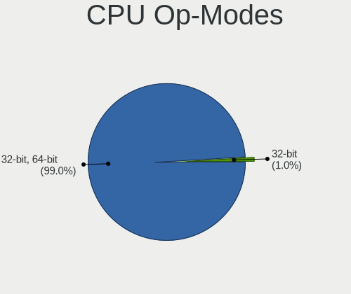
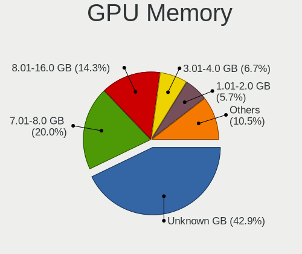
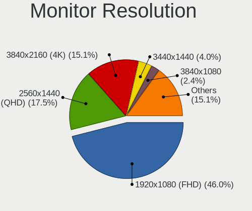
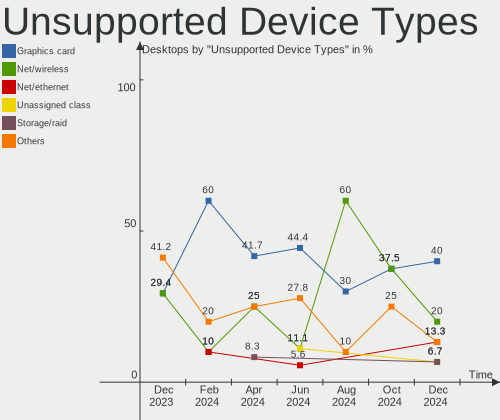

Arch Hardware Trends (Desktops)
-------------------------------

A project to identify most popular hardware characteristics and track their change
over time based on data collected by Arch users at https://Linux-Hardware.org.

Anyone can contribute to this report by the [hw-probe](https://github.com/linuxhw/hw-probe) tool:

    sudo -E hw-probe -all -upload

Full-feature report is available here: https://linux-hardware.org/?view=trends

Period: Jan, 2022.

Contents
--------

* [ System ](#system)
  - [ OS                       ](#os)
  - [ OS Family                ](#os-family)
  - [ Kernel                   ](#kernel)
  - [ Kernel Family            ](#kernel-family)
  - [ Kernel Major Ver.        ](#kernel-major-ver)
  - [ Arch                     ](#arch)
  - [ DE                       ](#de)
  - [ Display Server           ](#display-server)
  - [ Display Manager          ](#display-manager)
  - [ OS Lang                  ](#os-lang)
  - [ Boot Mode                ](#boot-mode)
  - [ Filesystem               ](#filesystem)
  - [ Part. scheme             ](#part-scheme)
  - [ Dual Boot with Linux/BSD ](#dual-boot-with-linuxbsd)
  - [ Dual Boot (Win)          ](#dual-boot-win)

* [ Board ](#board)
  - [ Vendor                   ](#vendor)
  - [ Model                    ](#model)
  - [ Model Family             ](#model-family)
  - [ MFG Year                 ](#mfg-year)
  - [ Form Factor              ](#form-factor)
  - [ Secure Boot              ](#secure-boot)
  - [ Coreboot                 ](#coreboot)
  - [ RAM Size                 ](#ram-size)
  - [ RAM Used                 ](#ram-used)
  - [ Total Drives             ](#total-drives)
  - [ Has CD-ROM               ](#has-cd-rom)
  - [ Has Ethernet             ](#has-ethernet)
  - [ Has WiFi                 ](#has-wifi)
  - [ Has Bluetooth            ](#has-bluetooth)

* [ Location ](#location)
  - [ Country                  ](#country)
  - [ City                     ](#city)

* [ Drives ](#drives)
  - [ Drive Vendor             ](#drive-vendor)
  - [ Drive Model              ](#drive-model)
  - [ HDD Vendor               ](#hdd-vendor)
  - [ SSD Vendor               ](#ssd-vendor)
  - [ Drive Kind               ](#drive-kind)
  - [ Drive Connector          ](#drive-connector)
  - [ Drive Size               ](#drive-size)
  - [ Space Total              ](#space-total)
  - [ Space Used               ](#space-used)
  - [ Malfunc. Drives          ](#malfunc-drives)
  - [ Malfunc. Drive Vendor    ](#malfunc-drive-vendor)
  - [ Malfunc. HDD Vendor      ](#malfunc-hdd-vendor)
  - [ Malfunc. Drive Kind      ](#malfunc-drive-kind)
  - [ Failed Drives            ](#failed-drives)
  - [ Failed Drive Vendor      ](#failed-drive-vendor)
  - [ Drive Status             ](#drive-status)

* [ Storage controller ](#storage-controller)
  - [ Storage Vendor           ](#storage-vendor)
  - [ Storage Model            ](#storage-model)
  - [ Storage Kind             ](#storage-kind)

* [ Processor ](#processor)
  - [ CPU Vendor               ](#cpu-vendor)
  - [ CPU Model                ](#cpu-model)
  - [ CPU Model Family         ](#cpu-model-family)
  - [ CPU Cores                ](#cpu-cores)
  - [ CPU Sockets              ](#cpu-sockets)
  - [ CPU Threads              ](#cpu-threads)
  - [ CPU Op-Modes             ](#cpu-op-modes)
  - [ CPU Microcode            ](#cpu-microcode)
  - [ CPU Microarch            ](#cpu-microarch)

* [ Graphics ](#graphics)
  - [ GPU Vendor               ](#gpu-vendor)
  - [ GPU Model                ](#gpu-model)
  - [ GPU Combo                ](#gpu-combo)
  - [ GPU Driver               ](#gpu-driver)
  - [ GPU Memory               ](#gpu-memory)

* [ Monitor ](#monitor)
  - [ Monitor Vendor           ](#monitor-vendor)
  - [ Monitor Model            ](#monitor-model)
  - [ Monitor Resolution       ](#monitor-resolution)
  - [ Monitor Diagonal         ](#monitor-diagonal)
  - [ Monitor Width            ](#monitor-width)
  - [ Aspect Ratio             ](#aspect-ratio)
  - [ Monitor Area             ](#monitor-area)
  - [ Pixel Density            ](#pixel-density)
  - [ Multiple Monitors        ](#multiple-monitors)

* [ Network ](#network)
  - [ Net Controller Vendor    ](#net-controller-vendor)
  - [ Net Controller Model     ](#net-controller-model)
  - [ Wireless Vendor          ](#wireless-vendor)
  - [ Wireless Model           ](#wireless-model)
  - [ Ethernet Vendor          ](#ethernet-vendor)
  - [ Ethernet Model           ](#ethernet-model)
  - [ Net Controller Kind      ](#net-controller-kind)
  - [ Used Controller          ](#used-controller)
  - [ NICs                     ](#nics)
  - [ IPv6                     ](#ipv6)

* [ Bluetooth ](#bluetooth)
  - [ Bluetooth Vendor         ](#bluetooth-vendor)
  - [ Bluetooth Model          ](#bluetooth-model)

* [ Sound ](#sound)
  - [ Sound Vendor             ](#sound-vendor)
  - [ Sound Model              ](#sound-model)

* [ Memory ](#memory)
  - [ Memory Vendor            ](#memory-vendor)
  - [ Memory Model             ](#memory-model)
  - [ Memory Kind              ](#memory-kind)
  - [ Memory Form Factor       ](#memory-form-factor)
  - [ Memory Size              ](#memory-size)
  - [ Memory Speed             ](#memory-speed)

* [ Printers & scanners ](#printers--scanners)
  - [ Printer Vendor           ](#printer-vendor)
  - [ Printer Model            ](#printer-model)
  - [ Scanner Vendor           ](#scanner-vendor)
  - [ Scanner Model            ](#scanner-model)

* [ Camera ](#camera)
  - [ Camera Vendor            ](#camera-vendor)
  - [ Camera Model             ](#camera-model)

* [ Security ](#security)
  - [ Fingerprint Vendor       ](#fingerprint-vendor)
  - [ Fingerprint Model        ](#fingerprint-model)
  - [ Chipcard Vendor          ](#chipcard-vendor)
  - [ Chipcard Model           ](#chipcard-model)

* [ Unsupported ](#unsupported)
  - [ Unsupported Devices      ](#unsupported-devices)
  - [ Unsupported Device Types ](#unsupported-device-types)

System
------

OS
--

Installed operating systems

| Name         | Desktops | Percent |
|--------------|----------|---------|
| Arch Rolling | 25       | 58.14%  |
| Arch         | 18       | 41.86%  |

OS Family
---------

OS without a version

| Name | Desktops | Percent |
|------|----------|---------|
| Arch | 43       | 100%    |

Kernel
------

Version of the Linux kernel

| Version                | Desktops | Percent |
|------------------------|----------|---------|
| 5.15.13-arch1-1        | 7        | 16.28%  |
| 5.15.12-arch1-1        | 7        | 16.28%  |
| 5.16.0-arch1-1         | 5        | 11.63%  |
| 5.16.2-arch1-1         | 4        | 9.3%    |
| 5.16.1-arch1-1         | 4        | 9.3%    |
| 5.16.1-zen1-1-zen      | 2        | 4.65%   |
| 5.16.0-zen1-1-zen      | 2        | 4.65%   |
| 5.16.4-arch1-1         | 1        | 2.33%   |
| 5.16.3-1-ck-generic-v3 | 1        | 2.33%   |
| 5.16.2-zen1-1.1-zen    | 1        | 2.33%   |
| 5.16.2-zen1-1-zen      | 1        | 2.33%   |
| 5.16.2-jg              | 1        | 2.33%   |
| 5.16.2                 | 1        | 2.33%   |
| 5.15.16-237-tkg-cacule | 1        | 2.33%   |
| 5.15.13-xanmod1-1      | 1        | 2.33%   |
| 5.15.13-lqx1-1-lqx     | 1        | 2.33%   |
| 5.15.12-zen1-1-zen     | 1        | 2.33%   |
| 5.15.10-arch1-1        | 1        | 2.33%   |
| 5.10.88-2-lts          | 1        | 2.33%   |

Kernel Family
-------------

Linux kernel without a distro release

| Version | Desktops | Percent |
|---------|----------|---------|
| 5.15.13 | 9        | 20.93%  |
| 5.16.2  | 8        | 18.6%   |
| 5.15.12 | 8        | 18.6%   |
| 5.16.0  | 7        | 16.28%  |
| 5.16.1  | 6        | 13.95%  |
| 5.16.4  | 1        | 2.33%   |
| 5.16.3  | 1        | 2.33%   |
| 5.15.16 | 1        | 2.33%   |
| 5.15.10 | 1        | 2.33%   |
| 5.10.88 | 1        | 2.33%   |

Kernel Major Ver.
-----------------

Linux kernel major version

| Version | Desktops | Percent |
|---------|----------|---------|
| 5.16    | 23       | 53.49%  |
| 5.15    | 19       | 44.19%  |
| 5.10    | 1        | 2.33%   |

Arch
----

OS architecture (x86_64, i586, etc.)

| Name   | Desktops | Percent |
|--------|----------|---------|
| x86_64 | 43       | 100%    |

DE
--

Desktop Environment

| Name    | Desktops | Percent |
|---------|----------|---------|
| KDE5    | 20       | 46.51%  |
| GNOME   | 7        | 16.28%  |
| XFCE    | 5        | 11.63%  |
| Unknown | 5        | 11.63%  |
| i3      | 2        | 4.65%   |
| awesome | 2        | 4.65%   |
| sway    | 1        | 2.33%   |
| Openbox | 1        | 2.33%   |

Display Server
--------------

X11 or Wayland

| Name    | Desktops | Percent |
|---------|----------|---------|
| X11     | 30       | 69.77%  |
| Tty     | 7        | 16.28%  |
| Wayland | 4        | 9.3%    |
| Unknown | 2        | 4.65%   |

Display Manager
---------------

SDDM, LightDM, etc.

| Name    | Desktops | Percent |
|---------|----------|---------|
| SDDM    | 21       | 48.84%  |
| Unknown | 13       | 30.23%  |
| LightDM | 7        | 16.28%  |
| LXDM    | 1        | 2.33%   |
| GDM     | 1        | 2.33%   |

OS Lang
-------

Language

| Lang    | Desktops | Percent |
|---------|----------|---------|
| en_US   | 24       | 55.81%  |
| pt_BR   | 2        | 4.65%   |
| it_IT   | 2        | 4.65%   |
| en_GB   | 2        | 4.65%   |
| de_DE   | 2        | 4.65%   |
| C       | 2        | 4.65%   |
| zh_CN   | 1        | 2.33%   |
| ru_RU   | 1        | 2.33%   |
| hu_HU   | 1        | 2.33%   |
| fr_FR   | 1        | 2.33%   |
| en_SE   | 1        | 2.33%   |
| en_AU   | 1        | 2.33%   |
| de_CH   | 1        | 2.33%   |
| de_AT   | 1        | 2.33%   |
| Unknown | 1        | 2.33%   |

Boot Mode
---------

EFI or BIOS

| Mode | Desktops | Percent |
|------|----------|---------|
| EFI  | 32       | 74.42%  |
| BIOS | 11       | 25.58%  |

Filesystem
----------

Type of filesystem

| Type  | Desktops | Percent |
|-------|----------|---------|
| Ext4  | 31       | 72.09%  |
| Btrfs | 9        | 20.93%  |
| Xfs   | 3        | 6.98%   |

Part. scheme
------------

Scheme of partitioning

| Type    | Desktops | Percent |
|---------|----------|---------|
| GPT     | 35       | 81.4%   |
| MBR     | 4        | 9.3%    |
| Unknown | 4        | 9.3%    |

Dual Boot with Linux/BSD
------------------------

Hosting more than one Linux/BSD

| Dual boot | Desktops | Percent |
|-----------|----------|---------|
| No        | 36       | 83.72%  |
| Yes       | 7        | 16.28%  |

Dual Boot (Win)
---------------

Hosting Linux and Windows

| Dual boot | Desktops | Percent |
|-----------|----------|---------|
| Yes       | 22       | 51.16%  |
| No        | 21       | 48.84%  |

Board
-----

Vendor
------

Motherboard manufacturer

| Name                | Desktops | Percent |
|---------------------|----------|---------|
| MSI                 | 12       | 27.91%  |
| ASUSTek Computer    | 11       | 25.58%  |
| Gigabyte Technology | 6        | 13.95%  |
| Hewlett-Packard     | 3        | 6.98%   |
| ASRock              | 3        | 6.98%   |
| Lenovo              | 2        | 4.65%   |
| Dell                | 2        | 4.65%   |
| Unknown             | 2        | 4.65%   |
| Semp Toshiba        | 1        | 2.33%   |
| Jetway              | 1        | 2.33%   |

Model
-----

Motherboard model

| Name                                 | Desktops | Percent |
|--------------------------------------|----------|---------|
| MSI MS-7C37                          | 3        | 6.98%   |
| Unknown                              | 2        | 4.65%   |
| Semp Toshiba STI                     | 1        | 2.33%   |
| MSI MS-7D22                          | 1        | 2.33%   |
| MSI MS-7D18                          | 1        | 2.33%   |
| MSI MS-7C91                          | 1        | 2.33%   |
| MSI MS-7C84                          | 1        | 2.33%   |
| MSI MS-7C35                          | 1        | 2.33%   |
| MSI MS-7C02                          | 1        | 2.33%   |
| MSI MS-7918                          | 1        | 2.33%   |
| MSI MS-7788                          | 1        | 2.33%   |
| MSI MS-7721                          | 1        | 2.33%   |
| Lenovo ThinkCentre M93p 10A8S1K403   | 1        | 2.33%   |
| Lenovo Legion T5 28IMB05 90NC00QNUL  | 1        | 2.33%   |
| Jetway 1.0                           | 1        | 2.33%   |
| HP Pavilion Gaming Desktop TG01-2xxx | 1        | 2.33%   |
| HP OMEN by Obelisk Desktop 875-1xxx  | 1        | 2.33%   |
| HP Compaq 6200 Pro SFF PC            | 1        | 2.33%   |
| Gigabyte X570 I AORUS PRO WIFI       | 1        | 2.33%   |
| Gigabyte Q87M-D2H                    | 1        | 2.33%   |
| Gigabyte H470 HD3                    | 1        | 2.33%   |
| Gigabyte H110M-A                     | 1        | 2.33%   |
| Gigabyte GA-MA74GMT-S2               | 1        | 2.33%   |
| Gigabyte 970A-UD3P                   | 1        | 2.33%   |
| Dell Precision Tower 5810            | 1        | 2.33%   |
| Dell OptiPlex 390                    | 1        | 2.33%   |
| ASUS TUF GAMING B550M-PLUS           | 1        | 2.33%   |
| ASUS TUF B450M-PRO GAMING            | 1        | 2.33%   |
| ASUS TUF B450-PLUS GAMING            | 1        | 2.33%   |
| ASUS ROG STRIX Z390-F GAMING         | 1        | 2.33%   |
| ASUS ROG STRIX X570-E GAMING         | 1        | 2.33%   |
| ASUS ROG Strix G15CE_G15CE           | 1        | 2.33%   |
| ASUS ROG CROSSHAIR VIII IMPACT       | 1        | 2.33%   |
| ASUS PRIME B550M-A                   | 1        | 2.33%   |
| ASUS PRIME A320M-K                   | 1        | 2.33%   |
| ASUS Maximus VIII HERO               | 1        | 2.33%   |
| ASUS Maximus VIII GENE               | 1        | 2.33%   |
| ASRock B450M Pro4                    | 1        | 2.33%   |
| ASRock AB350M-HDV                    | 1        | 2.33%   |
| ASRock AB350 Gaming-ITX/ac           | 1        | 2.33%   |

Model Family
------------

Motherboard model prefix

| Name                   | Desktops | Percent |
|------------------------|----------|---------|
| ASUS ROG               | 4        | 9.3%    |
| MSI MS-7C37            | 3        | 6.98%   |
| ASUS TUF               | 3        | 6.98%   |
| ASUS PRIME             | 2        | 4.65%   |
| ASUS Maximus           | 2        | 4.65%   |
| Unknown                | 2        | 4.65%   |
| Semp Toshiba STI       | 1        | 2.33%   |
| MSI MS-7D22            | 1        | 2.33%   |
| MSI MS-7D18            | 1        | 2.33%   |
| MSI MS-7C91            | 1        | 2.33%   |
| MSI MS-7C84            | 1        | 2.33%   |
| MSI MS-7C35            | 1        | 2.33%   |
| MSI MS-7C02            | 1        | 2.33%   |
| MSI MS-7918            | 1        | 2.33%   |
| MSI MS-7788            | 1        | 2.33%   |
| MSI MS-7721            | 1        | 2.33%   |
| Lenovo ThinkCentre     | 1        | 2.33%   |
| Lenovo Legion          | 1        | 2.33%   |
| Jetway 1.0             | 1        | 2.33%   |
| HP Pavilion            | 1        | 2.33%   |
| HP OMEN                | 1        | 2.33%   |
| HP Compaq              | 1        | 2.33%   |
| Gigabyte X570          | 1        | 2.33%   |
| Gigabyte Q87M-D2H      | 1        | 2.33%   |
| Gigabyte H470          | 1        | 2.33%   |
| Gigabyte H110M-A       | 1        | 2.33%   |
| Gigabyte GA-MA74GMT-S2 | 1        | 2.33%   |
| Gigabyte 970A-UD3P     | 1        | 2.33%   |
| Dell Precision         | 1        | 2.33%   |
| Dell OptiPlex          | 1        | 2.33%   |
| ASRock B450M           | 1        | 2.33%   |
| ASRock AB350M-HDV      | 1        | 2.33%   |
| ASRock AB350           | 1        | 2.33%   |

MFG Year
--------

Motherboard manufacture year

| Year | Desktops | Percent |
|------|----------|---------|
| 2019 | 9        | 20.93%  |
| 2020 | 8        | 18.6%   |
| 2018 | 6        | 13.95%  |
| 2021 | 5        | 11.63%  |
| 2017 | 3        | 6.98%   |
| 2011 | 3        | 6.98%   |
| 2016 | 2        | 4.65%   |
| 2014 | 2        | 4.65%   |
| 2013 | 2        | 4.65%   |
| 2015 | 1        | 2.33%   |
| 2012 | 1        | 2.33%   |
| 2010 | 1        | 2.33%   |

Form Factor
-----------

Physical design of the computer

| Name    | Desktops | Percent |
|---------|----------|---------|
| Desktop | 43       | 100%    |

Secure Boot
-----------

Enabled or disabled

| State    | Desktops | Percent |
|----------|----------|---------|
| Disabled | 42       | 97.67%  |
| Enabled  | 1        | 2.33%   |

Coreboot
--------

Have coreboot on board

| Used | Desktops | Percent |
|------|----------|---------|
| No   | 43       | 100%    |

RAM Size
--------

Total RAM memory

| Size in GB  | Desktops | Percent |
|-------------|----------|---------|
| 32.01-64.0  | 12       | 27.91%  |
| 16.01-24.0  | 12       | 27.91%  |
| 8.01-16.0   | 8        | 18.6%   |
| 3.01-4.0    | 4        | 9.3%    |
| 4.01-8.0    | 3        | 6.98%   |
| 64.01-256.0 | 3        | 6.98%   |
| 24.01-32.0  | 1        | 2.33%   |

RAM Used
--------

Used RAM memory

| Used GB    | Desktops | Percent |
|------------|----------|---------|
| 2.01-3.0   | 13       | 30.23%  |
| 4.01-8.0   | 9        | 20.93%  |
| 1.01-2.0   | 7        | 16.28%  |
| 8.01-16.0  | 6        | 13.95%  |
| 3.01-4.0   | 5        | 11.63%  |
| 0.51-1.0   | 2        | 4.65%   |
| 24.01-32.0 | 1        | 2.33%   |

Total Drives
------------

Number of drives on board

| Drives | Desktops | Percent |
|--------|----------|---------|
| 1      | 12       | 27.91%  |
| 3      | 11       | 25.58%  |
| 2      | 11       | 25.58%  |
| 6      | 3        | 6.98%   |
| 5      | 3        | 6.98%   |
| 4      | 2        | 4.65%   |
| 7      | 1        | 2.33%   |

Has CD-ROM
----------

Has CD-ROM on board

| Presented | Desktops | Percent |
|-----------|----------|---------|
| No        | 31       | 72.09%  |
| Yes       | 12       | 27.91%  |

Has Ethernet
------------

Has Ethernet on board

| Presented | Desktops | Percent |
|-----------|----------|---------|
| Yes       | 43       | 100%    |

Has WiFi
--------

Has WiFi module

| Presented | Desktops | Percent |
|-----------|----------|---------|
| Yes       | 23       | 53.49%  |
| No        | 20       | 46.51%  |

Has Bluetooth
-------------

Has Bluetooth module

| Presented | Desktops | Percent |
|-----------|----------|---------|
| No        | 23       | 53.49%  |
| Yes       | 20       | 46.51%  |

Location
--------

Country
-------

Geographic location (country)

| Country     | Desktops | Percent |
|-------------|----------|---------|
| USA         | 8        | 18.6%   |
| Germany     | 4        | 9.3%    |
| France      | 3        | 6.98%   |
| Finland     | 3        | 6.98%   |
| Russia      | 2        | 4.65%   |
| Italy       | 2        | 4.65%   |
| India       | 2        | 4.65%   |
| Hungary     | 2        | 4.65%   |
| Brazil      | 2        | 4.65%   |
| Bangladesh  | 2        | 4.65%   |
| Ukraine     | 1        | 2.33%   |
| UK          | 1        | 2.33%   |
| Switzerland | 1        | 2.33%   |
| Singapore   | 1        | 2.33%   |
| Romania     | 1        | 2.33%   |
| Norway      | 1        | 2.33%   |
| Netherlands | 1        | 2.33%   |
| Malaysia    | 1        | 2.33%   |
| Hong Kong   | 1        | 2.33%   |
| Greece      | 1        | 2.33%   |
| Czechia     | 1        | 2.33%   |
| Austria     | 1        | 2.33%   |
| Australia   | 1        | 2.33%   |

City
----

Geographic location (city)

| City             | Desktops | Percent |
|------------------|----------|---------|
| Helsinki         | 3        | 6.98%   |
| Vlasikha         | 1        | 2.33%   |
| Tukwila          | 1        | 2.33%   |
| Tuen Mun         | 1        | 2.33%   |
| Singapore        | 1        | 2.33%   |
| S??o Paulo       | 1        | 2.33%   |
| San Francisco    | 1        | 2.33%   |
| Rockhampton      | 1        | 2.33%   |
| Recife           | 1        | 2.33%   |
| Rangpur City     | 1        | 2.33%   |
| Port Huron       | 1        | 2.33%   |
| Phoenix          | 1        | 2.33%   |
| Petaling Jaya    | 1        | 2.33%   |
| P??trai          | 1        | 2.33%   |
| Paris            | 1        | 2.33%   |
| Novy Jicin       | 1        | 2.33%   |
| New York         | 1        | 2.33%   |
| Narayanganj      | 1        | 2.33%   |
| Morsang-sur-Orge | 1        | 2.33%   |
| Mizil            | 1        | 2.33%   |
| Madison          | 1        | 2.33%   |
| Lyon             | 1        | 2.33%   |
| Lustenau         | 1        | 2.33%   |
| Kryvyi Rih       | 1        | 2.33%   |
| Kolkata          | 1        | 2.33%   |
| Jalandhar        | 1        | 2.33%   |
| Irkutsk          | 1        | 2.33%   |
| Hershey          | 1        | 2.33%   |
| Hegra            | 1        | 2.33%   |
| Hamburg          | 1        | 2.33%   |
| Gyomro           | 1        | 2.33%   |
| Genoa            | 1        | 2.33%   |
| Csomor           | 1        | 2.33%   |
| Chicago          | 1        | 2.33%   |
| Caldine          | 1        | 2.33%   |
| Buende           | 1        | 2.33%   |
| Barnsley         | 1        | 2.33%   |
| Bad Vilbel       | 1        | 2.33%   |
| Arnhem           | 1        | 2.33%   |
| Altstatten       | 1        | 2.33%   |
| Aichach          | 1        | 2.33%   |

Drives
------

Drive Vendor
------------

Hard drive vendors

| Vendor                    | Desktops | Drives | Percent |
|---------------------------|----------|--------|---------|
| WDC                       | 20       | 23     | 20.83%  |
| Seagate                   | 16       | 19     | 16.67%  |
| Samsung Electronics       | 15       | 24     | 15.63%  |
| Toshiba                   | 6        | 7      | 6.25%   |
| Sandisk                   | 6        | 7      | 6.25%   |
| A-DATA Technology         | 5        | 5      | 5.21%   |
| Crucial                   | 4        | 4      | 4.17%   |
| Corsair                   | 4        | 4      | 4.17%   |
| Kingston                  | 3        | 3      | 3.13%   |
| Intel                     | 2        | 2      | 2.08%   |
| ZHITAI                    | 1        | 1      | 1.04%   |
| XPG                       | 1        | 2      | 1.04%   |
| TCSUNBOW                  | 1        | 1      | 1.04%   |
| SYNOLOGY                  | 1        | 1      | 1.04%   |
| Silicon Motion            | 1        | 2      | 1.04%   |
| PLEXTOR                   | 1        | 1      | 1.04%   |
| Phison Electronics        | 1        | 1      | 1.04%   |
| Patriot                   | 1        | 1      | 1.04%   |
| Micron/Crucial Technology | 1        | 1      | 1.04%   |
| LaCie                     | 1        | 1      | 1.04%   |
| JMicron                   | 1        | 1      | 1.04%   |
| Intenso                   | 1        | 1      | 1.04%   |
| HUAWEI                    | 1        | 1      | 1.04%   |
| Hitachi                   | 1        | 1      | 1.04%   |
| China                     | 1        | 1      | 1.04%   |

Drive Model
-----------

Hard drive models

| Model                                | Desktops | Percent |
|--------------------------------------|----------|---------|
| Seagate ST2000DM008-2FR102 2TB       | 7        | 6.31%   |
| Samsung SSD 970 EVO Plus 1TB         | 3        | 2.7%    |
| Toshiba HDWE140 4TB                  | 2        | 1.8%    |
| Toshiba DT01ACA100 1TB               | 2        | 1.8%    |
| Seagate ST500DM002-1BD142 500GB      | 2        | 1.8%    |
| Seagate ST4000DM004-2CV104 4TB       | 2        | 1.8%    |
| SanDisk SSD G5 BICS4 1TB             | 2        | 1.8%    |
| Sandisk NVMe SSD Drive 500GB         | 2        | 1.8%    |
| Samsung SSD 870 EVO 500GB            | 2        | 1.8%    |
| Samsung SSD 860 EVO 1TB              | 2        | 1.8%    |
| Crucial CT480BX500SSD1 480GB         | 2        | 1.8%    |
| ZHITAI PC005 Active 1TB              | 1        | 0.9%    |
| XPG NVMe SSD Drive 512GB             | 1        | 0.9%    |
| XPG NVMe SSD Drive 1TB               | 1        | 0.9%    |
| WDC WDS500G2B0A-00SM50 500GB SSD     | 1        | 0.9%    |
| WDC WDS100T2G0A-00JH30 1TB SSD       | 1        | 0.9%    |
| WDC WDS100T2B0C 1TB                  | 1        | 0.9%    |
| WDC WDS100T2B0B 1TB SSD              | 1        | 0.9%    |
| WDC WDS100T2B0A-00SM50 1TB SSD       | 1        | 0.9%    |
| WDC WDS100T1X0E-00AFY0 1TB           | 1        | 0.9%    |
| WDC WD6400BEVT-22A0RT0 640GB         | 1        | 0.9%    |
| WDC WD60EZAZ-00SF3B0 6TB             | 1        | 0.9%    |
| WDC WD5000AAKX-22ERMA0 500GB         | 1        | 0.9%    |
| WDC WD5000AAKX-001CA0 500GB          | 1        | 0.9%    |
| WDC WD5000AAKS-22A7B0 500GB          | 1        | 0.9%    |
| WDC WD5000AAKS-00UU3A0 500GB         | 1        | 0.9%    |
| WDC WD50 EZRX-00MVLB1 5TB            | 1        | 0.9%    |
| WDC WD4004FZWX-00GBGB0 4TB           | 1        | 0.9%    |
| WDC WD20EZAZ-00GGJB0 2TB             | 1        | 0.9%    |
| WDC WD20EFRX-68EUZN0 2TB             | 1        | 0.9%    |
| WDC WD2003FYYS-18W0B0 2TB            | 1        | 0.9%    |
| WDC WD10JPVX-75JC3T0 1TB             | 1        | 0.9%    |
| WDC WD10EZEX-60WN4A0 1TB             | 1        | 0.9%    |
| WDC WD10EZEX-08M2NA0 1TB             | 1        | 0.9%    |
| WDC WD10EZEX-00KUWA0 1TB             | 1        | 0.9%    |
| WDC WD easystore 240GB SSD           | 1        | 0.9%    |
| WDC PC SN730 SDBQNTY-256G-1001 256GB | 1        | 0.9%    |
| Toshiba MD04ABA400V 4TB              | 1        | 0.9%    |
| Toshiba HDWD240 4TB                  | 1        | 0.9%    |
| Toshiba HDWD110 1TB                  | 1        | 0.9%    |
| TCSUNBOW X3 120GB SSD                | 1        | 0.9%    |
| SYNOLOGY iSCSI Storage 1TB           | 1        | 0.9%    |
| Silicon Motion NVMe SSD Drive 1TB    | 1        | 0.9%    |
| Seagate ST8000DM004-2U9188 8TB       | 1        | 0.9%    |
| Seagate ST3250312AS 250GB            | 1        | 0.9%    |
| Seagate ST2000DX002-2DV164 2TB       | 1        | 0.9%    |
| Seagate ST2000DM006-2DM164 2TB       | 1        | 0.9%    |
| Seagate ST2000DM001-9YN164 2TB       | 1        | 0.9%    |
| Seagate ST1000LX015-1U7172 1TB       | 1        | 0.9%    |
| Seagate ST1000DM003-1SB10C 1TB       | 1        | 0.9%    |
| SanDisk SDSSDH3 500G                 | 1        | 0.9%    |
| Sandisk NVMe SSD Drive 512GB         | 1        | 0.9%    |
| Samsung SSD 980 1TB                  | 1        | 0.9%    |
| Samsung SSD 970 EVO 500GB            | 1        | 0.9%    |
| Samsung SSD 870 QVO 2TB              | 1        | 0.9%    |
| Samsung SSD 870 EVO 4TB              | 1        | 0.9%    |
| Samsung SSD 870 EVO 2TB              | 1        | 0.9%    |
| Samsung SSD 860 QVO 1TB              | 1        | 0.9%    |
| Samsung SSD 850 EVO 500GB            | 1        | 0.9%    |
| Samsung SSD 840 PRO Series 256GB     | 1        | 0.9%    |

HDD Vendor
----------

Hard disk drive vendors

| Vendor              | Desktops | Drives | Percent |
|---------------------|----------|--------|---------|
| Seagate             | 16       | 19     | 39.02%  |
| WDC                 | 12       | 15     | 29.27%  |
| Toshiba             | 6        | 7      | 14.63%  |
| Samsung Electronics | 4        | 4      | 9.76%   |
| SYNOLOGY            | 1        | 1      | 2.44%   |
| LaCie               | 1        | 1      | 2.44%   |
| Hitachi             | 1        | 1      | 2.44%   |

SSD Vendor
----------

Solid state drive vendors

| Vendor              | Desktops | Drives | Percent |
|---------------------|----------|--------|---------|
| Samsung Electronics | 8        | 11     | 24.24%  |
| WDC                 | 5        | 5      | 15.15%  |
| Crucial             | 4        | 4      | 12.12%  |
| SanDisk             | 3        | 4      | 9.09%   |
| A-DATA Technology   | 3        | 3      | 9.09%   |
| Kingston            | 2        | 2      | 6.06%   |
| Intel               | 2        | 2      | 6.06%   |
| TCSUNBOW            | 1        | 1      | 3.03%   |
| PLEXTOR             | 1        | 1      | 3.03%   |
| Patriot             | 1        | 1      | 3.03%   |
| Intenso             | 1        | 1      | 3.03%   |
| Corsair             | 1        | 1      | 3.03%   |
| China               | 1        | 1      | 3.03%   |

Drive Kind
----------

HDD or SSD

| Kind    | Desktops | Drives | Percent |
|---------|----------|--------|---------|
| HDD     | 32       | 48     | 38.1%   |
| SSD     | 27       | 37     | 32.14%  |
| NVMe    | 24       | 29     | 28.57%  |
| Unknown | 1        | 1      | 1.19%   |

Drive Connector
---------------

SATA, SAS, NVMe, etc.

| Type | Desktops | Drives | Percent |
|------|----------|--------|---------|
| SATA | 40       | 83     | 58.82%  |
| NVMe | 24       | 28     | 35.29%  |
| SAS  | 4        | 4      | 5.88%   |

Drive Size
----------

Size of hard drive

| Size in TB | Desktops | Drives | Percent |
|------------|----------|--------|---------|
| 0.01-0.5   | 23       | 32     | 34.33%  |
| 0.51-1.0   | 17       | 21     | 25.37%  |
| 1.01-2.0   | 16       | 20     | 23.88%  |
| 3.01-4.0   | 7        | 8      | 10.45%  |
| 4.01-10.0  | 4        | 4      | 5.97%   |

Space Total
-----------

Amount of disk space available on the file system

| Size in GB     | Desktops | Percent |
|----------------|----------|---------|
| More than 3000 | 14       | 32.56%  |
| 251-500        | 7        | 16.28%  |
| 501-1000       | 7        | 16.28%  |
| 2001-3000      | 5        | 11.63%  |
| 101-250        | 5        | 11.63%  |
| 1001-2000      | 4        | 9.3%    |
| Unknown        | 1        | 2.33%   |

Space Used
----------

Amount of used disk space

| Used GB        | Desktops | Percent |
|----------------|----------|---------|
| 101-250        | 9        | 20.93%  |
| 1001-2000      | 7        | 16.28%  |
| 501-1000       | 7        | 16.28%  |
| More than 3000 | 4        | 9.3%    |
| 2001-3000      | 4        | 9.3%    |
| 1-20           | 4        | 9.3%    |
| 251-500        | 3        | 6.98%   |
| 21-50          | 2        | 4.65%   |
| 51-100         | 2        | 4.65%   |
| Unknown        | 1        | 2.33%   |

Malfunc. Drives
---------------

Drive models with a malfunction

| Model                             | Desktops | Drives | Percent |
|-----------------------------------|----------|--------|---------|
| WDC WD5000AAKX-001CA0 500GB       | 1        | 1      | 10%     |
| WDC WD5000AAKS-22A7B0 500GB       | 1        | 1      | 10%     |
| WDC WD5000AAKS-00UU3A0 500GB      | 1        | 1      | 10%     |
| WDC WD50 EZRX-00MVLB1 5TB         | 1        | 1      | 10%     |
| WDC WD10EZEX-60WN4A0 1TB          | 1        | 1      | 10%     |
| Toshiba HDWE140 4TB               | 1        | 1      | 10%     |
| Seagate ST3250312AS 250GB         | 1        | 1      | 10%     |
| Seagate ST2000DM008-2FR102 2TB    | 1        | 1      | 10%     |
| Samsung Electronics HD161HJ 160GB | 1        | 1      | 10%     |
| JMicron Generic 128GB             | 1        | 1      | 10%     |

Malfunc. Drive Vendor
---------------------

Vendors of faulty drives

| Vendor              | Desktops | Drives | Percent |
|---------------------|----------|--------|---------|
| WDC                 | 5        | 5      | 50%     |
| Seagate             | 2        | 2      | 20%     |
| Toshiba             | 1        | 1      | 10%     |
| Samsung Electronics | 1        | 1      | 10%     |
| JMicron             | 1        | 1      | 10%     |

Malfunc. HDD Vendor
-------------------

Vendors of faulty HDD drives

| Vendor              | Desktops | Drives | Percent |
|---------------------|----------|--------|---------|
| WDC                 | 5        | 5      | 55.56%  |
| Seagate             | 2        | 2      | 22.22%  |
| Toshiba             | 1        | 1      | 11.11%  |
| Samsung Electronics | 1        | 1      | 11.11%  |

Malfunc. Drive Kind
-------------------

Kinds of faulty drives

| Kind | Desktops | Drives | Percent |
|------|----------|--------|---------|
| HDD  | 9        | 9      | 90%     |
| NVMe | 1        | 1      | 10%     |

Failed Drives
-------------

Failed drive models

Zero info for selected period =(

Failed Drive Vendor
-------------------

Failed drive vendors

Zero info for selected period =(

Drive Status
------------

Number of failed and malfunc. drives

| Status   | Desktops | Drives | Percent |
|----------|----------|--------|---------|
| Works    | 26       | 70     | 49.06%  |
| Detected | 17       | 35     | 32.08%  |
| Malfunc  | 10       | 10     | 18.87%  |

Storage controller
------------------

Storage Vendor
--------------

Storage controller vendors

| Vendor                      | Desktops | Percent |
|-----------------------------|----------|---------|
| AMD                         | 22       | 30.14%  |
| Intel                       | 21       | 28.77%  |
| Samsung Electronics         | 8        | 10.96%  |
| Sandisk                     | 6        | 8.22%   |
| Phison Electronics          | 4        | 5.48%   |
| ASMedia Technology          | 4        | 5.48%   |
| ADATA Technology            | 3        | 4.11%   |
| Yangtze Memory Technologies | 1        | 1.37%   |
| Silicon Motion              | 1        | 1.37%   |
| Micron/Crucial Technology   | 1        | 1.37%   |
| LSI Logic / Symbios Logic   | 1        | 1.37%   |
| Kingston Technology Company | 1        | 1.37%   |

Storage Model
-------------

Storage controller models

| Model                                                                                   | Desktops | Percent |
|-----------------------------------------------------------------------------------------|----------|---------|
| AMD FCH SATA Controller [AHCI mode]                                                     | 17       | 20%     |
| Samsung NVMe SSD Controller SM981/PM981/PM983                                           | 6        | 7.06%   |
| AMD 400 Series Chipset SATA Controller                                                  | 5        | 5.88%   |
| ASMedia ASM1062 Serial ATA Controller                                                   | 4        | 4.71%   |
| Sandisk WD Blue SN550 NVMe SSD                                                          | 3        | 3.53%   |
| Intel Q170/Q150/B150/H170/H110/Z170/CM236 Chipset SATA Controller [AHCI Mode]           | 3        | 3.53%   |
| Intel 8 Series/C220 Series Chipset Family 6-port SATA Controller 1 [AHCI mode]          | 3        | 3.53%   |
| Intel 500 Series Chipset Family SATA AHCI Controller                                    | 3        | 3.53%   |
| AMD Starship/Matisse Chipset SATA Controller [AHCI mode]                                | 3        | 3.53%   |
| ADATA XPG SX8200 Pro PCIe Gen3x4 M.2 2280 Solid State Drive                             | 3        | 3.53%   |
| Phison E16 PCIe4 NVMe Controller                                                        | 2        | 2.35%   |
| Phison E12 NVMe Controller                                                              | 2        | 2.35%   |
| Intel Cannon Lake PCH SATA AHCI Controller                                              | 2        | 2.35%   |
| Intel 6 Series/C200 Series Chipset Family Desktop SATA Controller (IDE mode, ports 4-5) | 2        | 2.35%   |
| Intel 6 Series/C200 Series Chipset Family Desktop SATA Controller (IDE mode, ports 0-3) | 2        | 2.35%   |
| Intel 6 Series/C200 Series Chipset Family 6 port Desktop SATA AHCI Controller           | 2        | 2.35%   |
| AMD SB7x0/SB8x0/SB9x0 SATA Controller [AHCI mode]                                       | 2        | 2.35%   |
| AMD SB7x0/SB8x0/SB9x0 IDE Controller                                                    | 2        | 2.35%   |
| AMD 300 Series Chipset SATA Controller                                                  | 2        | 2.35%   |
| Yangtze Memory Non-Volatile memory controller                                           | 1        | 1.18%   |
| Silicon Motion SM2262/SM2262EN SSD Controller                                           | 1        | 1.18%   |
| Sandisk WD PC SN810 / Black SN850 NVMe SSD                                              | 1        | 1.18%   |
| Sandisk WD Blue SN570 NVMe SSD                                                          | 1        | 1.18%   |
| Sandisk WD Black SN750 / PC SN730 NVMe SSD                                              | 1        | 1.18%   |
| Samsung NVMe SSD Controller PM9A1/PM9A3/980PRO                                          | 1        | 1.18%   |
| Samsung NVMe SSD Controller 980                                                         | 1        | 1.18%   |
| Micron/Crucial P1 NVMe PCIe SSD                                                         | 1        | 1.18%   |
| LSI Logic / Symbios Logic SAS2004 PCI-Express Fusion-MPT SAS-2 [Spitfire]               | 1        | 1.18%   |
| Kingston Company A2000 NVMe SSD                                                         | 1        | 1.18%   |
| Intel Comet Lake SATA AHCI Controller                                                   | 1        | 1.18%   |
| Intel C610/X99 series chipset sSATA Controller [AHCI mode]                              | 1        | 1.18%   |
| Intel C600/X79 series chipset 6-Port SATA AHCI Controller                               | 1        | 1.18%   |
| Intel 9 Series Chipset Family SATA Controller [AHCI Mode]                               | 1        | 1.18%   |
| Intel 7 Series/C210 Series Chipset Family 6-port SATA Controller [AHCI mode]            | 1        | 1.18%   |
| Intel 400 Series Chipset Family SATA AHCI Controller                                    | 1        | 1.18%   |
| AMD FCH SATA Controller D                                                               | 1        | 1.18%   |

Storage Kind
------------

Kind of storage controller (IDE, SATA, NVMe, SAS, ...)

| Kind | Desktops | Percent |
|------|----------|---------|
| SATA | 41       | 58.57%  |
| NVMe | 24       | 34.29%  |
| IDE  | 4        | 5.71%   |
| SAS  | 1        | 1.43%   |

Processor
---------

CPU Vendor
----------

Processor vendors

| Vendor | Desktops | Percent |
|--------|----------|---------|
| AMD    | 22       | 51.16%  |
| Intel  | 21       | 48.84%  |

CPU Model
---------

Processor models

| Model                                       | Desktops | Percent |
|---------------------------------------------|----------|---------|
| AMD Ryzen 7 3700X 8-Core Processor          | 3        | 6.98%   |
| Intel Core i5-6600K CPU @ 3.50GHz           | 2        | 4.65%   |
| AMD Ryzen 9 5950X 16-Core Processor         | 2        | 4.65%   |
| AMD Ryzen 7 5800X 8-Core Processor          | 2        | 4.65%   |
| Intel Xeon CPU E5-1650 v4 @ 3.60GHz         | 1        | 2.33%   |
| Intel Xeon CPU E5-1650 0 @ 3.20GHz          | 1        | 2.33%   |
| Intel Pentium CPU G630 @ 2.70GHz            | 1        | 2.33%   |
| Intel Pentium CPU G620 @ 2.60GHz            | 1        | 2.33%   |
| Intel Pentium CPU G3240 @ 3.10GHz           | 1        | 2.33%   |
| Intel Core i9-9900KF CPU @ 3.60GHz          | 1        | 2.33%   |
| Intel Core i7-9700K CPU @ 3.60GHz           | 1        | 2.33%   |
| Intel Core i7-6700K CPU @ 4.00GHz           | 1        | 2.33%   |
| Intel Core i7-4790 CPU @ 3.60GHz            | 1        | 2.33%   |
| Intel Core i7-4771 CPU @ 3.50GHz            | 1        | 2.33%   |
| Intel Core i5-4670 CPU @ 3.40GHz            | 1        | 2.33%   |
| Intel Core i5-3570 CPU @ 3.40GHz            | 1        | 2.33%   |
| Intel Core i5-2320 CPU @ 3.00GHz            | 1        | 2.33%   |
| Intel Core i5-10400F CPU @ 2.90GHz          | 1        | 2.33%   |
| Intel Core i5-10400 CPU @ 2.90GHz           | 1        | 2.33%   |
| Intel Core i3-2100 CPU @ 3.10GHz            | 1        | 2.33%   |
| Intel 11th Gen Core i7-11700F @ 2.50GHz     | 1        | 2.33%   |
| Intel 11th Gen Core i7-11700 @ 2.50GHz      | 1        | 2.33%   |
| Intel 11th Gen Core i5-11400 @ 2.60GHz      | 1        | 2.33%   |
| AMD Ryzen 9 5900X 12-Core Processor         | 1        | 2.33%   |
| AMD Ryzen 7 5700G with Radeon Graphics      | 1        | 2.33%   |
| AMD Ryzen 7 3800X 8-Core Processor          | 1        | 2.33%   |
| AMD Ryzen 7 1700X Eight-Core Processor      | 1        | 2.33%   |
| AMD Ryzen 5 5600X 6-Core Processor          | 1        | 2.33%   |
| AMD Ryzen 5 3600X 6-Core Processor          | 1        | 2.33%   |
| AMD Ryzen 5 3600 6-Core Processor           | 1        | 2.33%   |
| AMD Ryzen 5 3500X 6-Core Processor          | 1        | 2.33%   |
| AMD Ryzen 5 2600 Six-Core Processor         | 1        | 2.33%   |
| AMD Ryzen 5 1400 Quad-Core Processor        | 1        | 2.33%   |
| AMD Ryzen 3 3200G with Radeon Vega Graphics | 1        | 2.33%   |
| AMD Ryzen 3 2200G with Radeon Vega Graphics | 1        | 2.33%   |
| AMD Phenom II X6 1055T Processor            | 1        | 2.33%   |
| AMD FX-6350 Six-Core Processor              | 1        | 2.33%   |
| AMD A8-6600K APU with Radeon HD Graphics    | 1        | 2.33%   |

CPU Model Family
----------------

Processor model prefix

| Model            | Desktops | Percent |
|------------------|----------|---------|
| AMD Ryzen 7      | 8        | 18.6%   |
| Intel Core i5    | 7        | 16.28%  |
| AMD Ryzen 5      | 6        | 13.95%  |
| Intel Core i7    | 4        | 9.3%    |
| Other            | 3        | 6.98%   |
| Intel Pentium    | 3        | 6.98%   |
| AMD Ryzen 9      | 3        | 6.98%   |
| Intel Xeon       | 2        | 4.65%   |
| AMD Ryzen 3      | 2        | 4.65%   |
| Intel Core i9    | 1        | 2.33%   |
| Intel Core i3    | 1        | 2.33%   |
| AMD Phenom II X6 | 1        | 2.33%   |
| AMD FX           | 1        | 2.33%   |
| AMD A8           | 1        | 2.33%   |

CPU Cores
---------

Number of processor cores

| Number | Desktops | Percent |
|--------|----------|---------|
| 8      | 12       | 27.91%  |
| 6      | 11       | 25.58%  |
| 4      | 11       | 25.58%  |
| 2      | 5        | 11.63%  |
| 16     | 2        | 4.65%   |
| 12     | 1        | 2.33%   |
| 3      | 1        | 2.33%   |

CPU Sockets
-----------

Number of sockets

| Number | Desktops | Percent |
|--------|----------|---------|
| 1      | 43       | 100%    |

CPU Threads
-----------

Threads per core (Hyper-Threading)

| Number | Desktops | Percent |
|--------|----------|---------|
| 2      | 30       | 69.77%  |
| 1      | 13       | 30.23%  |

CPU Op-Modes
------------

CPU Operation Modes (32-bit, 64-bit)

| Op mode        | Desktops | Percent |
|----------------|----------|---------|
| 32-bit, 64-bit | 43       | 100%    |

CPU Microcode
-------------

Microcode number

| Number     | Desktops | Percent |
|------------|----------|---------|
| 0x08701021 | 5        | 11.63%  |
| Unknown    | 5        | 11.63%  |
| 0x306c3    | 4        | 9.3%    |
| 0x206a7    | 4        | 9.3%    |
| 0xa0671    | 3        | 6.98%   |
| 0x0a201016 | 3        | 6.98%   |
| 0x506e3    | 2        | 4.65%   |
| 0x0a201009 | 2        | 4.65%   |
| 0xa0653    | 1        | 2.33%   |
| 0x906ed    | 1        | 2.33%   |
| 0x906ec    | 1        | 2.33%   |
| 0x406f1    | 1        | 2.33%   |
| 0x306a9    | 1        | 2.33%   |
| 0x0a50000b | 1        | 2.33%   |
| 0x08701013 | 1        | 2.33%   |
| 0x08108109 | 1        | 2.33%   |
| 0x08101016 | 1        | 2.33%   |
| 0x0800820d | 1        | 2.33%   |
| 0x08001138 | 1        | 2.33%   |
| 0x08001137 | 1        | 2.33%   |
| 0x06001119 | 1        | 2.33%   |
| 0x06000822 | 1        | 2.33%   |
| 0x010000bf | 1        | 2.33%   |

CPU Microarch
-------------

Microarchitecture

| Name        | Desktops | Percent |
|-------------|----------|---------|
| Zen 3       | 7        | 16.28%  |
| Zen 2       | 7        | 16.28%  |
| SandyBridge | 5        | 11.63%  |
| Haswell     | 4        | 9.3%    |
| Zen         | 3        | 6.98%   |
| Skylake     | 3        | 6.98%   |
| Zen+        | 2        | 4.65%   |
| Piledriver  | 2        | 4.65%   |
| KabyLake    | 2        | 4.65%   |
| Icelake     | 2        | 4.65%   |
| CometLake   | 2        | 4.65%   |
| K10         | 1        | 2.33%   |
| IvyBridge   | 1        | 2.33%   |
| Broadwell   | 1        | 2.33%   |
| Unknown     | 1        | 2.33%   |

Graphics
--------

GPU Vendor
----------

Vendors of graphics cards

| Vendor | Desktops | Percent |
|--------|----------|---------|
| Nvidia | 19       | 40.43%  |
| AMD    | 19       | 40.43%  |
| Intel  | 9        | 19.15%  |

GPU Model
---------

Graphics card models

| Model                                                                       | Desktops | Percent |
|-----------------------------------------------------------------------------|----------|---------|
| AMD Ellesmere [Radeon RX 470/480/570/570X/580/580X/590]                     | 7        | 14.58%  |
| AMD Navi 10 [Radeon RX 5600 OEM/5600 XT / 5700/5700 XT]                     | 4        | 8.33%   |
| Intel Xeon E3-1200 v3/4th Gen Core Processor Integrated Graphics Controller | 3        | 6.25%   |
| Nvidia GP106 [GeForce GTX 1060 6GB]                                         | 2        | 4.17%   |
| Intel 2nd Generation Core Processor Family Integrated Graphics Controller   | 2        | 4.17%   |
| AMD Baffin [Radeon RX 550 640SP / RX 560/560X]                              | 2        | 4.17%   |
| Nvidia TU116 [GeForce GTX 1660 SUPER]                                       | 1        | 2.08%   |
| Nvidia TU116 [GeForce GTX 1650]                                             | 1        | 2.08%   |
| Nvidia TU106 [GeForce RTX 2060 SUPER]                                       | 1        | 2.08%   |
| Nvidia TU106 [GeForce RTX 2060 Rev. A]                                      | 1        | 2.08%   |
| Nvidia TU104 [GeForce RTX 2080 SUPER]                                       | 1        | 2.08%   |
| Nvidia TU102 [GeForce RTX 2080 Ti Rev. A]                                   | 1        | 2.08%   |
| Nvidia GT218 [GeForce 210]                                                  | 1        | 2.08%   |
| Nvidia GP108 [GeForce GT 1030]                                              | 1        | 2.08%   |
| Nvidia GP107 [GeForce GTX 1050 Ti]                                          | 1        | 2.08%   |
| Nvidia GP104 [GeForce GTX 1070]                                             | 1        | 2.08%   |
| Nvidia GP102 [GeForce GTX 1080 Ti]                                          | 1        | 2.08%   |
| Nvidia GM206 [GeForce GTX 960]                                              | 1        | 2.08%   |
| Nvidia GM204 [GeForce GTX 970]                                              | 1        | 2.08%   |
| Nvidia GK104 [GeForce GTX 770]                                              | 1        | 2.08%   |
| Nvidia GK104 [GeForce GTX 660 Ti]                                           | 1        | 2.08%   |
| Nvidia GF104 [GeForce GTX 460]                                              | 1        | 2.08%   |
| Nvidia GA104 [GeForce RTX 3070]                                             | 1        | 2.08%   |
| Intel RocketLake-S GT1 [UHD Graphics 750]                                   | 1        | 2.08%   |
| Intel RocketLake-S GT1 [UHD Graphics 730]                                   | 1        | 2.08%   |
| Intel HD Graphics 530                                                       | 1        | 2.08%   |
| Intel CometLake-S GT2 [UHD Graphics 630]                                    | 1        | 2.08%   |
| AMD Richland [Radeon HD 8570D]                                              | 1        | 2.08%   |
| AMD Raven Ridge [Radeon Vega Series / Radeon Vega Mobile Series]            | 1        | 2.08%   |
| AMD Picasso/Raven 2 [Radeon Vega Series / Radeon Vega Mobile Series]        | 1        | 2.08%   |
| AMD Navi 23 [Radeon RX 6600/6600 XT/6600M]                                  | 1        | 2.08%   |
| AMD Navi 21 [Radeon RX 6800/6800 XT / 6900 XT]                              | 1        | 2.08%   |
| AMD Cezanne                                                                 | 1        | 2.08%   |
| AMD Caicos [Radeon HD 6450/7450/8450 / R5 230 OEM]                          | 1        | 2.08%   |

GPU Combo
---------

Combinations of graphics cards

| Name           | Desktops | Percent |
|----------------|----------|---------|
| 1 x AMD        | 17       | 39.53%  |
| 1 x Nvidia     | 16       | 37.21%  |
| 1 x Intel      | 6        | 13.95%  |
| Intel + Nvidia | 2        | 4.65%   |
| 2 x AMD        | 1        | 2.33%   |
| AMD + Nvidia   | 1        | 2.33%   |

GPU Driver
----------

Free vs proprietary

| Driver      | Desktops | Percent |
|-------------|----------|---------|
| Free        | 26       | 60.47%  |
| Proprietary | 17       | 39.53%  |

GPU Memory
----------

Total video memory

| Size in GB | Desktops | Percent |
|------------|----------|---------|
| Unknown    | 16       | 37.21%  |
| 7.01-8.0   | 11       | 25.58%  |
| 3.01-4.0   | 5        | 11.63%  |
| 0.51-1.0   | 4        | 9.3%    |
| 5.01-6.0   | 3        | 6.98%   |
| 1.01-2.0   | 2        | 4.65%   |
| 8.01-16.0  | 2        | 4.65%   |

Monitor
-------

Monitor Vendor
--------------

Monitor vendors

| Vendor               | Desktops | Percent |
|----------------------|----------|---------|
| Samsung Electronics  | 7        | 13.21%  |
| Hewlett-Packard      | 6        | 11.32%  |
| Goldstar             | 6        | 11.32%  |
| AOC                  | 6        | 11.32%  |
| Dell                 | 4        | 7.55%   |
| Acer                 | 4        | 7.55%   |
| BenQ                 | 3        | 5.66%   |
| RTK                  | 2        | 3.77%   |
| Philips              | 2        | 3.77%   |
| ASUSTek Computer     | 2        | 3.77%   |
| Ancor Communications | 2        | 3.77%   |
| Wacom                | 1        | 1.89%   |
| Sony                 | 1        | 1.89%   |
| Pixio                | 1        | 1.89%   |
| LG Electronics       | 1        | 1.89%   |
| Lenovo               | 1        | 1.89%   |
| Iiyama               | 1        | 1.89%   |
| HVR                  | 1        | 1.89%   |
| Gigabyte Technology  | 1        | 1.89%   |
| Eizo                 | 1        | 1.89%   |

Monitor Model
-------------

Monitor models

| Model                                                                 | Desktops | Percent |
|-----------------------------------------------------------------------|----------|---------|
| Wacom CintiqPro24P WAC1063 3840x2160 530x300mm 24.0-inch              | 1        | 1.82%   |
| Sony TV SNY02A2 1360x768                                              | 1        | 1.82%   |
| Samsung Electronics U32R59x SAM0F96 3840x2160 697x392mm 31.5-inch     | 1        | 1.82%   |
| Samsung Electronics SyncMaster SAM05CC 1920x1080 530x300mm 24.0-inch  | 1        | 1.82%   |
| Samsung Electronics SyncMaster SAM0302 1680x1050 459x296mm 21.5-inch  | 1        | 1.82%   |
| Samsung Electronics S22D300 SAM0B3F 1920x1080 477x268mm 21.5-inch     | 1        | 1.82%   |
| Samsung Electronics C34H89x SAM0E25 3440x1440 797x333mm 34.0-inch     | 1        | 1.82%   |
| Samsung Electronics C27R50x SAM0F9D 1920x1080 600x340mm 27.2-inch     | 1        | 1.82%   |
| Samsung Electronics C24F390 SAM0D2C 1920x1080 521x293mm 23.5-inch     | 1        | 1.82%   |
| RTK LCD Monitor RTK1D1A 1920x1080 1020x570mm 46.0-inch                | 1        | 1.82%   |
| RTK FHD HDR RTKBC32 1920x1080 597x336mm 27.0-inch                     | 1        | 1.82%   |
| Pixio PXC243 PNS0243 1920x1080 521x297mm 23.6-inch                    | 1        | 1.82%   |
| Philips PHL 436M6VBP PHLC179 3840x2160 941x529mm 42.5-inch            | 1        | 1.82%   |
| Philips LCD Monitor PHL 243V5 1920x1080                               | 1        | 1.82%   |
| LG Electronics LCD Monitor 34GL750 2560x1080                          | 1        | 1.82%   |
| Lenovo LEN LT1913pA LEN60AA 1280x1024 376x301mm 19.0-inch             | 1        | 1.82%   |
| Iiyama PL2288H IVM5634 1920x1080 477x268mm 21.5-inch                  | 1        | 1.82%   |
| HVR VIVE Pro 2 HVRAA04                                                | 1        | 1.82%   |
| Hewlett-Packard w1907 HWP26A3 1440x900 408x255mm 18.9-inch            | 1        | 1.82%   |
| Hewlett-Packard V194 HWP3346 1366x768 410x230mm 18.5-inch             | 1        | 1.82%   |
| Hewlett-Packard S2031 HWP2903 1600x900 443x249mm 20.0-inch            | 1        | 1.82%   |
| Hewlett-Packard LE2201w HWP2843 1680x1050 473x296mm 22.0-inch         | 1        | 1.82%   |
| Hewlett-Packard E241i HWP3123 1920x1200 518x324mm 24.1-inch           | 1        | 1.82%   |
| Hewlett-Packard 24mq HPN366F 2560x1440 527x296mm 23.8-inch            | 1        | 1.82%   |
| Goldstar W2453 GSM56F4 1920x1080 530x300mm 24.0-inch                  | 1        | 1.82%   |
| Goldstar LG FULL HD GSM5B54 1920x1080 480x270mm 21.7-inch             | 1        | 1.82%   |
| Goldstar L1952HQ GSM4B09 1280x1024 376x301mm 19.0-inch                | 1        | 1.82%   |
| Goldstar HD GSM5ACB 1366x768 410x230mm 18.5-inch                      | 1        | 1.82%   |
| Goldstar E2241 GSM581A 1920x1080 477x268mm 21.5-inch                  | 1        | 1.82%   |
| Goldstar E1942 GSM4C09 1366x768 410x230mm 18.5-inch                   | 1        | 1.82%   |
| Gigabyte Technology M27Q GBT270D 2560x1440 596x335mm 26.9-inch        | 1        | 1.82%   |
| Eizo EV3237 ENC2600 3840x2160 697x392mm 31.5-inch                     | 1        | 1.82%   |
| Dell U2417H DEL40E7 1920x1080 527x296mm 23.8-inch                     | 1        | 1.82%   |
| Dell SE178WFP DELD017 1440x900 370x230mm 17.2-inch                    | 1        | 1.82%   |
| Dell P2421D DELD0FE 2560x1440 527x296mm 23.8-inch                     | 1        | 1.82%   |
| Dell LCD Monitor DELF10F 1920x1080 480x270mm 21.7-inch                | 1        | 1.82%   |
| BenQ XL2411Z BNQ7F31 1920x1080 531x298mm 24.0-inch                    | 1        | 1.82%   |
| BenQ LCD BNQ8024 2560x1440 600x340mm 27.2-inch                        | 1        | 1.82%   |
| BenQ FP222W BNQ76F2 1680x1050 376x301mm 19.0-inch                     | 1        | 1.82%   |
| BenQ FP222W BNQ76F1 1680x1050 376x301mm 19.0-inch                     | 1        | 1.82%   |
| ASUSTek Computer VZ249 AUS24CC 1920x1080 527x296mm 23.8-inch          | 1        | 1.82%   |
| ASUSTek Computer VG245 AUS24A1 1920x1080 531x299mm 24.0-inch          | 1        | 1.82%   |
| AOC U2790B AOC2790 3840x2160 597x336mm 27.0-inch                      | 1        | 1.82%   |
| AOC Q32G1WG4 AOC3201 2560x1440 697x393mm 31.5-inch                    | 1        | 1.82%   |
| AOC Q27G2WG4 AOC2702 2560x1440 600x340mm 27.2-inch                    | 1        | 1.82%   |
| AOC F22 AOC2200 1920x1080 476x268mm 21.5-inch                         | 1        | 1.82%   |
| AOC 24G1WG4 AOC2401 1920x1080 521x293mm 23.5-inch                     | 1        | 1.82%   |
| AOC 2260WG5 AOC2260 1920x1080 477x268mm 21.5-inch                     | 1        | 1.82%   |
| Ancor Communications VS248 ACI2498 1920x1080 531x299mm 24.0-inch      | 1        | 1.82%   |
| Ancor Communications ASUS VX279 ACI27E4 1920x1080 600x340mm 27.2-inch | 1        | 1.82%   |
| Acer X34A ACR0450 3440x1440 798x335mm 34.1-inch                       | 1        | 1.82%   |
| Acer R240HY ACR046F 1920x1080 527x296mm 23.8-inch                     | 1        | 1.82%   |
| Acer KG241Q P ACR06A7 1920x1080 521x293mm 23.5-inch                   | 1        | 1.82%   |
| Acer G247HYL ACR0427 1920x1080 527x296mm 23.8-inch                    | 1        | 1.82%   |
| Acer AL1916W ACRAD52 1440x900 408x255mm 18.9-inch                     | 1        | 1.82%   |

Monitor Resolution
------------------

Monitor screen resolution

| Resolution         | Desktops | Percent |
|--------------------|----------|---------|
| 1920x1080 (FHD)    | 21       | 42.86%  |
| 3840x2160 (4K)     | 6        | 12.24%  |
| 2560x1440 (QHD)    | 6        | 12.24%  |
| 1680x1050 (WSXGA+) | 3        | 6.12%   |
| 1366x768 (WXGA)    | 3        | 6.12%   |
| 3440x1440          | 2        | 4.08%   |
| 1440x900 (WXGA+)   | 2        | 4.08%   |
| 1280x1024 (SXGA)   | 2        | 4.08%   |
| 2560x1080          | 1        | 2.04%   |
| 1600x900 (HD+)     | 1        | 2.04%   |
| 1360x768           | 1        | 2.04%   |
| Unknown            | 1        | 2.04%   |

Monitor Diagonal
----------------

Diagonal size in inches

| Inches  | Desktops | Percent |
|---------|----------|---------|
| 24      | 11       | 21.15%  |
| 27      | 6        | 11.54%  |
| 21      | 6        | 11.54%  |
| 23      | 5        | 9.62%   |
| 19      | 5        | 9.62%   |
| 31      | 4        | 7.69%   |
| Unknown | 4        | 7.69%   |
| 18      | 3        | 5.77%   |
| 34      | 2        | 3.85%   |
| 22      | 2        | 3.85%   |
| 46      | 1        | 1.92%   |
| 42      | 1        | 1.92%   |
| 20      | 1        | 1.92%   |
| 17      | 1        | 1.92%   |

Monitor Width
-------------

Physical width

| Width in mm | Desktops | Percent |
|-------------|----------|---------|
| 501-600     | 20       | 40%     |
| 401-500     | 13       | 26%     |
| 601-700     | 5        | 10%     |
| 351-400     | 4        | 8%      |
| Unknown     | 4        | 8%      |
| 701-800     | 2        | 4%      |
| 1001-1500   | 1        | 2%      |
| 901-1000    | 1        | 2%      |

Aspect Ratio
------------

Proportional relationship between the width and the height

| Ratio   | Desktops | Percent |
|---------|----------|---------|
| 16/9    | 33       | 68.75%  |
| 16/10   | 6        | 12.5%   |
| 5/4     | 3        | 6.25%   |
| Unknown | 3        | 6.25%   |
| 21/9    | 2        | 4.17%   |
| 3/2     | 1        | 2.08%   |

Monitor Area
------------

Area in inch

| Area in inch | Desktops | Percent |
|----------------|----------|---------|
| 201-250        | 17       | 36.17%  |
| 351-500        | 6        | 12.77%  |
| 301-350        | 6        | 12.77%  |
| 151-200        | 6        | 12.77%  |
| Unknown        | 4        | 8.51%   |
| 141-150        | 3        | 6.38%   |
| 251-300        | 2        | 4.26%   |
| 501-1000       | 2        | 4.26%   |
| 131-140        | 1        | 2.13%   |

Pixel Density
-------------

Pixels per inch

| Density | Desktops | Percent |
|---------|----------|---------|
| 51-100  | 26       | 56.52%  |
| 101-120 | 10       | 21.74%  |
| 121-160 | 4        | 8.7%    |
| Unknown | 4        | 8.7%    |
| 1-50    | 1        | 2.17%   |
| 161-240 | 1        | 2.17%   |

Multiple Monitors
-----------------

Total monitors connected

| Total | Desktops | Percent |
|-------|----------|---------|
| 1     | 30       | 69.77%  |
| 2     | 11       | 25.58%  |
| 3     | 1        | 2.33%   |
| 0     | 1        | 2.33%   |

Network
-------

Net Controller Vendor
---------------------

Controller vendors

| Vendor                | Desktops | Percent |
|-----------------------|----------|---------|
| Realtek Semiconductor | 27       | 43.55%  |
| Intel                 | 22       | 35.48%  |
| Qualcomm Atheros      | 3        | 4.84%   |
| Ralink Technology     | 2        | 3.23%   |
| Broadcom              | 2        | 3.23%   |
| TP-Link               | 1        | 1.61%   |
| Samsung Electronics   | 1        | 1.61%   |
| Microsoft             | 1        | 1.61%   |
| Microchip Technology  | 1        | 1.61%   |
| Huawei Technologies   | 1        | 1.61%   |
| D-Link                | 1        | 1.61%   |

Net Controller Model
--------------------

Controller models

| Model                                                             | Desktops | Percent |
|-------------------------------------------------------------------|----------|---------|
| Realtek RTL8111/8168/8411 PCI Express Gigabit Ethernet Controller | 21       | 28.77%  |
| Intel Wi-Fi 6 AX200                                               | 9        | 12.33%  |
| Realtek RTL8125 2.5GbE Controller                                 | 6        | 8.22%   |
| Intel I211 Gigabit Network Connection                             | 4        | 5.48%   |
| Intel Ethernet Connection I217-LM                                 | 4        | 5.48%   |
| Ralink MT7601U Wireless Adapter                                   | 2        | 2.74%   |
| Intel Tiger Lake PCH CNVi WiFi                                    | 2        | 2.74%   |
| Intel Ethernet Connection (2) I219-V                              | 2        | 2.74%   |
| Intel Dual Band Wireless-AC 3168NGW [Stone Peak]                  | 2        | 2.74%   |
| Broadcom BCM4360 802.11ac Wireless Network Adapter                | 2        | 2.74%   |
| TP-Link TL-WN823N v2/v3 [Realtek RTL8192EU]                       | 1        | 1.37%   |
| Samsung GT-I9070 (network tethering, USB debugging enabled)       | 1        | 1.37%   |
| Realtek RTL8822BE 802.11a/b/g/n/ac WiFi adapter                   | 1        | 1.37%   |
| Realtek RTL8821CE 802.11ac PCIe Wireless Network Adapter          | 1        | 1.37%   |
| Realtek RTL8188EE Wireless Network Adapter                        | 1        | 1.37%   |
| Realtek RTL810xE PCI Express Fast Ethernet controller             | 1        | 1.37%   |
| Qualcomm Atheros Killer E220x Gigabit Ethernet Controller         | 1        | 1.37%   |
| Qualcomm Atheros AR93xx Wireless Network Adapter                  | 1        | 1.37%   |
| Qualcomm Atheros AR8151 v2.0 Gigabit Ethernet                     | 1        | 1.37%   |
| Microsoft Xbox 360 Wireless Adapter                               | 1        | 1.37%   |
| Microchip HTC Hub Controller                                      | 1        | 1.37%   |
| Intel Wi-Fi 6 AX210/AX211/AX411 160MHz                            | 1        | 1.37%   |
| Intel Ethernet Controller I225-V                                  | 1        | 1.37%   |
| Intel Ethernet Connection (7) I219-V                              | 1        | 1.37%   |
| Intel Ethernet Connection (11) I219-V                             | 1        | 1.37%   |
| Intel Ethernet Connection (10) I219-V                             | 1        | 1.37%   |
| Intel 82579LM Gigabit Network Connection (Lewisville)             | 1        | 1.37%   |
| Huawei Modem/Networkcard                                          | 1        | 1.37%   |
| D-Link DWA-171                                                    | 1        | 1.37%   |

Wireless Vendor
---------------

Wireless vendors

| Vendor                | Desktops | Percent |
|-----------------------|----------|---------|
| Intel                 | 14       | 56%     |
| Realtek Semiconductor | 3        | 12%     |
| Ralink Technology     | 2        | 8%      |
| Broadcom              | 2        | 8%      |
| TP-Link               | 1        | 4%      |
| Qualcomm Atheros      | 1        | 4%      |
| Microsoft             | 1        | 4%      |
| D-Link                | 1        | 4%      |

Wireless Model
--------------

Wireless models

| Model                                                    | Desktops | Percent |
|----------------------------------------------------------|----------|---------|
| Intel Wi-Fi 6 AX200                                      | 9        | 36%     |
| Ralink MT7601U Wireless Adapter                          | 2        | 8%      |
| Intel Tiger Lake PCH CNVi WiFi                           | 2        | 8%      |
| Intel Dual Band Wireless-AC 3168NGW [Stone Peak]         | 2        | 8%      |
| Broadcom BCM4360 802.11ac Wireless Network Adapter       | 2        | 8%      |
| TP-Link TL-WN823N v2/v3 [Realtek RTL8192EU]              | 1        | 4%      |
| Realtek RTL8822BE 802.11a/b/g/n/ac WiFi adapter          | 1        | 4%      |
| Realtek RTL8821CE 802.11ac PCIe Wireless Network Adapter | 1        | 4%      |
| Realtek RTL8188EE Wireless Network Adapter               | 1        | 4%      |
| Qualcomm Atheros AR93xx Wireless Network Adapter         | 1        | 4%      |
| Microsoft Xbox 360 Wireless Adapter                      | 1        | 4%      |
| Intel Wi-Fi 6 AX210/AX211/AX411 160MHz                   | 1        | 4%      |
| D-Link DWA-171                                           | 1        | 4%      |

Ethernet Vendor
---------------

Ethernet vendors

| Vendor                | Desktops | Percent |
|-----------------------|----------|---------|
| Realtek Semiconductor | 27       | 60%     |
| Intel                 | 15       | 33.33%  |
| Qualcomm Atheros      | 2        | 4.44%   |
| Samsung Electronics   | 1        | 2.22%   |

Ethernet Model
--------------

Ethernet models

| Model                                                             | Desktops | Percent |
|-------------------------------------------------------------------|----------|---------|
| Realtek RTL8111/8168/8411 PCI Express Gigabit Ethernet Controller | 21       | 45.65%  |
| Realtek RTL8125 2.5GbE Controller                                 | 6        | 13.04%  |
| Intel I211 Gigabit Network Connection                             | 4        | 8.7%    |
| Intel Ethernet Connection I217-LM                                 | 4        | 8.7%    |
| Intel Ethernet Connection (2) I219-V                              | 2        | 4.35%   |
| Samsung GT-I9070 (network tethering, USB debugging enabled)       | 1        | 2.17%   |
| Realtek RTL810xE PCI Express Fast Ethernet controller             | 1        | 2.17%   |
| Qualcomm Atheros Killer E220x Gigabit Ethernet Controller         | 1        | 2.17%   |
| Qualcomm Atheros AR8151 v2.0 Gigabit Ethernet                     | 1        | 2.17%   |
| Intel Ethernet Controller I225-V                                  | 1        | 2.17%   |
| Intel Ethernet Connection (7) I219-V                              | 1        | 2.17%   |
| Intel Ethernet Connection (11) I219-V                             | 1        | 2.17%   |
| Intel Ethernet Connection (10) I219-V                             | 1        | 2.17%   |
| Intel 82579LM Gigabit Network Connection (Lewisville)             | 1        | 2.17%   |

Net Controller Kind
-------------------

Ethernet, WiFi or modem

| Kind     | Desktops | Percent |
|----------|----------|---------|
| Ethernet | 43       | 64.18%  |
| WiFi     | 23       | 34.33%  |
| Modem    | 1        | 1.49%   |

Used Controller
---------------

Currently used network controller

| Kind     | Desktops | Percent |
|----------|----------|---------|
| Ethernet | 35       | 72.92%  |
| WiFi     | 13       | 27.08%  |

NICs
----

Total network controllers on board

| Total | Desktops | Percent |
|-------|----------|---------|
| 1     | 22       | 51.16%  |
| 2     | 20       | 46.51%  |
| 3     | 1        | 2.33%   |

IPv6
----

IPv6 vs IPv4

| Used | Desktops | Percent |
|------|----------|---------|
| No   | 35       | 81.4%   |
| Yes  | 8        | 18.6%   |

Bluetooth
---------

Bluetooth Vendor
----------------

Controller vendors

| Vendor                   | Desktops | Percent |
|--------------------------|----------|---------|
| Intel                    | 12       | 60%     |
| Realtek Semiconductor    | 2        | 10%     |
| HTC (High Tech Computer) | 2        | 10%     |
| TP-Link                  | 1        | 5%      |
| Cambridge Silicon Radio  | 1        | 5%      |
| Apple                    | 1        | 5%      |
| Unknown                  | 1        | 5%      |

Bluetooth Model
---------------

Controller models

| Model                                                                | Desktops | Percent |
|----------------------------------------------------------------------|----------|---------|
| Intel Bluetooth Device                                               | 11       | 55%     |
| HTC (High Tech Computer) Vive Hub Bluetooth 4.1 (Broadcom BCM920703) | 2        | 10%     |
| TP-Link UB500 Adapter                                                | 1        | 5%      |
| Realtek  Bluetooth 4.2 Adapter                                       | 1        | 5%      |
| Realtek Bluetooth Radio                                              | 1        | 5%      |
| Intel Wireless-AC 3168 Bluetooth                                     | 1        | 5%      |
| Cambridge Silicon Radio Bluetooth Dongle (HCI mode)                  | 1        | 5%      |
| Apple Bluetooth USB Host Controller                                  | 1        | 5%      |
| Unknown                                                              | 1        | 5%      |

Sound
-----

Sound Vendor
------------

Sound card vendors

| Vendor                    | Desktops | Percent |
|---------------------------|----------|---------|
| AMD                       | 25       | 27.78%  |
| Intel                     | 22       | 24.44%  |
| Nvidia                    | 19       | 21.11%  |
| C-Media Electronics       | 4        | 4.44%   |
| Corsair                   | 3        | 3.33%   |
| Razer USA                 | 2        | 2.22%   |
| JMTek                     | 2        | 2.22%   |
| XMOS                      | 1        | 1.11%   |
| SlrTek                    | 1        | 1.11%   |
| Sennheiser Communications | 1        | 1.11%   |
| Samson Technologies       | 1        | 1.11%   |
| Realtek Semiconductor     | 1        | 1.11%   |
| Kingston Technology       | 1        | 1.11%   |
| HTC (High Tech Computer)  | 1        | 1.11%   |
| Generalplus Technology    | 1        | 1.11%   |
| Focusrite-Novation        | 1        | 1.11%   |
| DCMT Technology           | 1        | 1.11%   |
| Creative Technology       | 1        | 1.11%   |
| Comtrue                   | 1        | 1.11%   |
| BEHRINGER International   | 1        | 1.11%   |

Sound Model
-----------

Sound card models

| Model                                                                      | Desktops | Percent |
|----------------------------------------------------------------------------|----------|---------|
| AMD Starship/Matisse HD Audio Controller                                   | 13       | 11.82%  |
| AMD Ellesmere HDMI Audio [Radeon RX 470/480 / 570/580/590]                 | 7        | 6.36%   |
| Intel 6 Series/C200 Series Chipset Family High Definition Audio Controller | 4        | 3.64%   |
| AMD Navi 10 HDMI Audio                                                     | 4        | 3.64%   |
| Intel Xeon E3-1200 v3/4th Gen Core Processor HD Audio Controller           | 3        | 2.73%   |
| Intel Tiger Lake-H HD Audio Controller                                     | 3        | 2.73%   |
| Intel 8 Series/C220 Series Chipset High Definition Audio Controller        | 3        | 2.73%   |
| Intel 100 Series/C230 Series Chipset Family HD Audio Controller            | 3        | 2.73%   |
| AMD Family 17h (Models 10h-1fh) HD Audio Controller                        | 3        | 2.73%   |
| Nvidia TU116 High Definition Audio Controller                              | 2        | 1.82%   |
| Nvidia TU106 High Definition Audio Controller                              | 2        | 1.82%   |
| Nvidia GP106 High Definition Audio Controller                              | 2        | 1.82%   |
| Nvidia GK104 HDMI Audio Controller                                         | 2        | 1.82%   |
| JMTek USB PnP Audio Device                                                 | 2        | 1.82%   |
| Intel Cannon Lake PCH cAVS                                                 | 2        | 1.82%   |
| AMD SBx00 Azalia (Intel HDA)                                               | 2        | 1.82%   |
| AMD Raven/Raven2/Fenghuang HDMI/DP Audio Controller                        | 2        | 1.82%   |
| AMD Navi 21 HDMI Audio [Radeon RX 6800/6800 XT / 6900 XT]                  | 2        | 1.82%   |
| AMD Family 17h (Models 00h-0fh) HD Audio Controller                        | 2        | 1.82%   |
| AMD Baffin HDMI/DP Audio [Radeon RX 550 640SP / RX 560/560X]               | 2        | 1.82%   |
| XMOS iFi (by AMR) HD USB Audio                                             | 1        | 0.91%   |
| SlrTek Usb_Audio                                                           | 1        | 0.91%   |
| Sennheiser Communications Sennheiser USB headset                           | 1        | 0.91%   |
| Samson Technologies Meteor condenser microphone                            | 1        | 0.91%   |
| Realtek Semiconductor USB Audio                                            | 1        | 0.91%   |
| Razer USA Razer Kraken X USB                                               | 1        | 0.91%   |
| Razer USA Nommo Chroma                                                     | 1        | 0.91%   |
| Nvidia TU104 HD Audio Controller                                           | 1        | 0.91%   |
| Nvidia TU102 High Definition Audio Controller                              | 1        | 0.91%   |
| Nvidia High Definition Audio Controller                                    | 1        | 0.91%   |
| Nvidia GP108 High Definition Audio Controller                              | 1        | 0.91%   |
| Nvidia GP107GL High Definition Audio Controller                            | 1        | 0.91%   |
| Nvidia GP104 High Definition Audio Controller                              | 1        | 0.91%   |
| Nvidia GP102 HDMI Audio Controller                                         | 1        | 0.91%   |
| Nvidia GM206 High Definition Audio Controller                              | 1        | 0.91%   |
| Nvidia GM204 High Definition Audio Controller                              | 1        | 0.91%   |
| Nvidia GF104 High Definition Audio Controller                              | 1        | 0.91%   |
| Nvidia GA104 High Definition Audio Controller                              | 1        | 0.91%   |
| Kingston Technology HyperX 7.1 Audio                                       | 1        | 0.91%   |
| Intel USB PnP Sound Device                                                 | 1        | 0.91%   |
| Intel Comet Lake PCH-V cAVS                                                | 1        | 0.91%   |
| Intel Comet Lake PCH cAVS                                                  | 1        | 0.91%   |
| Intel C610/X99 series chipset HD Audio Controller                          | 1        | 0.91%   |
| Intel C600/X79 series chipset High Definition Audio Controller             | 1        | 0.91%   |
| Intel 9 Series Chipset Family HD Audio Controller                          | 1        | 0.91%   |
| Intel 7 Series/C216 Chipset Family High Definition Audio Controller        | 1        | 0.91%   |
| HTC (High Tech Computer) VIVE Pro Mutimedia Audio                          | 1        | 0.91%   |
| Generalplus Technology Usb Audio Device                                    | 1        | 0.91%   |
| Focusrite-Novation Scarlett Solo (3rd Gen.)                                | 1        | 0.91%   |
| DCMT Technology USB Condenser Microphone                                   | 1        | 0.91%   |
| Creative Technology Sound Blaster Premium HD [SBX]                         | 1        | 0.91%   |
| Corsair VIRTUOSO Wireless Gaming Headset                                   | 1        | 0.91%   |
| Corsair VIRTUOSO SE Wireless Gaming Headset                                | 1        | 0.91%   |
| Corsair HS45 Surround USB Sound Adapter                                    | 1        | 0.91%   |
| Corsair Corsair ST100 Headset Output                                      | 1        | 0.91%   |
| Comtrue E1DA PowerDAC V2.1 PCM24/192                                       | 1        | 0.91%   |
| C-Media Electronics USB Audio Device                                       | 1        | 0.91%   |
| C-Media Electronics REIYIN Audio                                           | 1        | 0.91%   |
| C-Media Electronics CM108 Audio Controller                                 | 1        | 0.91%   |
| C-Media Electronics Audio Adapter (Unitek Y-247A)                          | 1        | 0.91%   |

Memory
------

Memory Vendor
-------------

Memory module vendors

| Vendor              | Desktops | Percent |
|---------------------|----------|---------|
| G.Skill             | 8        | 17.39%  |
| Corsair             | 8        | 17.39%  |
| Kingston            | 6        | 13.04%  |
| Crucial             | 6        | 13.04%  |
| Micron Technology   | 5        | 10.87%  |
| Samsung Electronics | 3        | 6.52%   |
| SK Hynix            | 2        | 4.35%   |
| Unknown             | 1        | 2.17%   |
| Transcend           | 1        | 2.17%   |
| Smart               | 1        | 2.17%   |
| Nanya Technology    | 1        | 2.17%   |
| Kingmax             | 1        | 2.17%   |
| GeIL                | 1        | 2.17%   |
| Elpida              | 1        | 2.17%   |
| A-DATA Technology   | 1        | 2.17%   |

Memory Model
------------

Memory module models

| Model                                                     | Desktops | Percent |
|-----------------------------------------------------------|----------|---------|
| Kingston RAM KHX2666C16/16G 16GB DIMM DDR4 3200MT/s       | 2        | 4.26%   |
| G.Skill RAM F4-3000C16-8GISB 8GB DIMM DDR4 3200MT/s       | 2        | 4.26%   |
| Corsair RAM CMK32GX4M2B3200C16 16384MB DIMM DDR4 3400MT/s | 2        | 4.26%   |
| Unknown RAM Module 2GB DIMM 1333MT/s                      | 1        | 2.13%   |
| Transcend RAM JM1600KLN-4GK 2048MB DIMM DDR3 1600MT/s     | 1        | 2.13%   |
| Smart RAM SH564128FH8N0QNSCG 4GB DIMM DDR3 1600MT/s       | 1        | 2.13%   |
| SK Hynix RAM HMA81GU6DJR8N-XN 8GB DIMM DDR4 3200MT/s      | 1        | 2.13%   |
| SK Hynix RAM HMA81GR7AFR8N-VK 8GB RIMM DDR4 2667MT/s      | 1        | 2.13%   |
| Samsung RAM M471B5173QH0-YK0 4GB SODIMM DDR3 1600MT/s     | 1        | 2.13%   |
| Samsung RAM M378B5273CH0-CH9 4096MB DIMM DDR3 1867MT/s    | 1        | 2.13%   |
| Samsung RAM M378A1K43DB2-CVF 8GB DIMM DDR4 2933MT/s       | 1        | 2.13%   |
| Nanya RAM M2F4G64CB88C7N-DI 4GB DIMM DDR3 1600MT/s        | 1        | 2.13%   |
| Micron RAM TEAMGROUP-UD4-2133 16384MB DIMM DDR4 2134MT/s  | 1        | 2.13%   |
| Micron RAM 8JTF51264AZ-1G6E1 4096MB DIMM DDR3 1600MT/s    | 1        | 2.13%   |
| Micron RAM 8ATF2G64AZ-3G2E1 16GB DIMM DDR4 3200MT/s       | 1        | 2.13%   |
| Micron RAM 18ASF1G72PZ-2G1A2 8GB RIMM DDR4 2133MT/s       | 1        | 2.13%   |
| Micron RAM 16JTF1G64AZ-1G6E1 8GB DIMM DDR3 1600MT/s       | 1        | 2.13%   |
| Kingston RAM KHX3200C16D4/16GX 16GB DIMM DDR4 3600MT/s    | 1        | 2.13%   |
| Kingston RAM KHX1600C9D3/4 4GB DIMM DDR3 1600MT/s         | 1        | 2.13%   |
| Kingston RAM 99U5469-045.A00LF 4GB SODIMM DDR3 1600MT/s   | 1        | 2.13%   |
| Kingston RAM 9905403-011.A02LF 2048MB DIMM DDR3 1333MT/s  | 1        | 2.13%   |
| Kingmax RAM FLFF65F-D8KQ9 4096MB DIMM DDR3 1333MT/s       | 1        | 2.13%   |
| GeIL RAM CL11-11-11 D3-1600 4096MB DIMM DDR3 1600MT/s     | 1        | 2.13%   |
| G.Skill RAM F4-4000C18-16GTZN 16GB DIMM DDR4 4000MT/s     | 1        | 2.13%   |
| G.Skill RAM F4-3600C16-8GTZNC 8GB DIMM DDR4 3800MT/s      | 1        | 2.13%   |
| G.Skill RAM F4-3200C16-8GTZR 8GB DIMM DDR4 3200MT/s       | 1        | 2.13%   |
| G.Skill RAM F4-3200C16-16GVK 16GB DIMM DDR4 3600MT/s      | 1        | 2.13%   |
| G.Skill RAM F4-3200C14-8GTZR 8GB DIMM DDR4 3200MT/s       | 1        | 2.13%   |
| G.Skill RAM F4-2400C15-4GIS 4GB DIMM DDR4 3000MT/s        | 1        | 2.13%   |
| G.Skill RAM F3-2133C11-8GZL 8GB DIMM DDR3 1600MT/s        | 1        | 2.13%   |
| Elpida RAM Module 2GB DIMM DDR3 1067MT/s                  | 1        | 2.13%   |
| Crucial RAM CT8G4DFRA32A.C4FE 8GB DIMM DDR4 3200MT/s      | 1        | 2.13%   |
| Crucial RAM CT16G4DFRA32A.C8FE 16GB DIMM DDR4 3200MT/s    | 1        | 2.13%   |
| Crucial RAM BLS8G4D32AESBK.M8FE 8GB DIMM DDR4 3200MT/s    | 1        | 2.13%   |
| Crucial RAM BLS8G4D30AESBK.M8FE 8GB DIMM DDR4 3600MT/s    | 1        | 2.13%   |
| Crucial RAM BLS4G4D26BFSB.8FB 4GB DIMM DDR4 2667MT/s      | 1        | 2.13%   |
| Crucial RAM BL32G32C16U4BL.M16FB 32GB DIMM DDR4 3200MT/s  | 1        | 2.13%   |
| Corsair RAM CMW16GX4M2C3200C16 8GB DIMM DDR4 3266MT/s     | 1        | 2.13%   |
| Corsair RAM CMK8GX4M1D3000C16 8GB DIMM DDR4 3200MT/s      | 1        | 2.13%   |
| Corsair RAM CMK8GX4M1A2400C14 8GB DIMM DDR4 2667MT/s      | 1        | 2.13%   |
| Corsair RAM CMK16GX4M2D3000C16 8GB DIMM DDR4 3200MT/s     | 1        | 2.13%   |
| Corsair RAM CMK16GX4M2B3200C16 8GB DIMM DDR4 3600MT/s     | 1        | 2.13%   |
| Corsair RAM CMK16GX4M2B3000C15 8192MB DIMM DDR4 2400MT/s  | 1        | 2.13%   |
| A-DATA RAM DDR4 3200 8GB DIMM DDR4 3200MT/s               | 1        | 2.13%   |

Memory Kind
-----------

Memory module kinds

| Kind    | Desktops | Percent |
|---------|----------|---------|
| DDR4    | 27       | 69.23%  |
| DDR3    | 11       | 28.21%  |
| Unknown | 1        | 2.56%   |

Memory Form Factor
------------------

Physical design of the memory module

| Name   | Desktops | Percent |
|--------|----------|---------|
| DIMM   | 37       | 94.87%  |
| SODIMM | 1        | 2.56%   |
| RIMM   | 1        | 2.56%   |

Memory Size
-----------

Memory module size

| Size  | Desktops | Percent |
|-------|----------|---------|
| 8192  | 18       | 43.9%   |
| 16384 | 9        | 21.95%  |
| 4096  | 9        | 21.95%  |
| 2048  | 3        | 7.32%   |
| 32768 | 2        | 4.88%   |

Memory Speed
------------

Memory module speed

| Speed | Desktops | Percent |
|-------|----------|---------|
| 3200  | 13       | 29.55%  |
| 1600  | 7        | 15.91%  |
| 3600  | 5        | 11.36%  |
| 2667  | 3        | 6.82%   |
| 1333  | 3        | 6.82%   |
| 3400  | 2        | 4.55%   |
| 2133  | 2        | 4.55%   |
| 4000  | 1        | 2.27%   |
| 3800  | 1        | 2.27%   |
| 3466  | 1        | 2.27%   |
| 3266  | 1        | 2.27%   |
| 3000  | 1        | 2.27%   |
| 2933  | 1        | 2.27%   |
| 2134  | 1        | 2.27%   |
| 1867  | 1        | 2.27%   |
| 1067  | 1        | 2.27%   |

Printers & scanners
-------------------

Printer Vendor
--------------

Printer device vendors

| Vendor              | Desktops | Percent |
|---------------------|----------|---------|
| Prolific Technology | 1        | 100%    |

Printer Model
-------------

Printer device models

| Model                         | Desktops | Percent |
|-------------------------------|----------|---------|
| Prolific PL2305 Parallel Port | 1        | 100%    |

Scanner Vendor
--------------

Scanner device vendors

Zero info for selected period =(

Scanner Model
-------------

Scanner device models

Zero info for selected period =(

Camera
------

Camera Vendor
-------------

Camera device vendors

| Vendor                        | Desktops | Percent |
|-------------------------------|----------|---------|
| Logitech                      | 2        | 25%     |
| YGTek                         | 1        | 12.5%   |
| Sunplus Innovation Technology | 1        | 12.5%   |
| SN0002                        | 1        | 12.5%   |
| Microsoft                     | 1        | 12.5%   |
| MacroSilicon                  | 1        | 12.5%   |
| HTC (High Tech Computer)      | 1        | 12.5%   |

Camera Model
------------

Camera device models

| Model                                               | Desktops | Percent |
|-----------------------------------------------------|----------|---------|
| YGTek Webcam                                        | 1        | 12.5%   |
| Sunplus Full HD webcam                              | 1        | 12.5%   |
| SN0002 HIK 2K Camera                                | 1        | 12.5%   |
| Microsoft Xbox NUI Camera                           | 1        | 12.5%   |
| MacroSilicon MiraBox Capture                        | 1        | 12.5%   |
| Logitech StreamCam                                  | 1        | 12.5%   |
| Logitech B525 HD Webcam                             | 1        | 12.5%   |
| HTC (High Tech Computer) VIVE Pro Multimedia Camera | 1        | 12.5%   |

Security
--------

Fingerprint Vendor
------------------

Fingerprint sensor vendors

Zero info for selected period =(

Fingerprint Model
-----------------

Fingerprint sensor models

Zero info for selected period =(

Chipcard Vendor
---------------

Chipcard module vendors

| Vendor                   | Desktops | Percent |
|--------------------------|----------|---------|
| Reiner SCT Kartensysteme | 1        | 100%    |

Chipcard Model
--------------

Chipcard module models

| Model                                  | Desktops | Percent |
|----------------------------------------|----------|---------|
| Reiner SCT Kartensysteme cyberJack one | 1        | 100%    |

Unsupported
-----------

Unsupported Devices
-------------------

Total unsupported devices on board

| Total | Desktops | Percent |
|-------|----------|---------|
| 0     | 37       | 86.05%  |
| 1     | 6        | 13.95%  |

Unsupported Device Types
------------------------

Types of unsupported devices

| Type             | Desktops | Percent |
|------------------|----------|---------|
| Net/wireless     | 2        | 33.33%  |
| Unassigned class | 1        | 16.67%  |
| Graphics card    | 1        | 16.67%  |
| Chipcard         | 1        | 16.67%  |
| Bluetooth        | 1        | 16.67%  |

