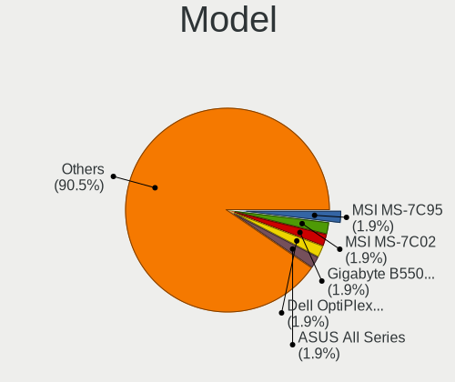
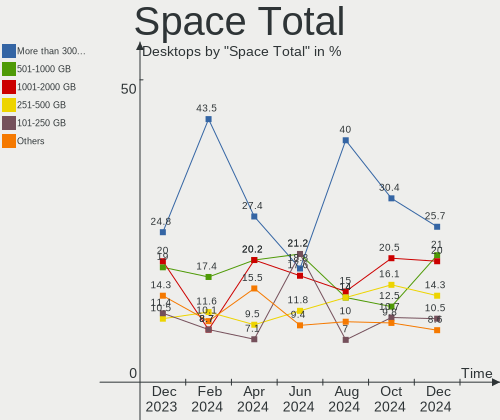
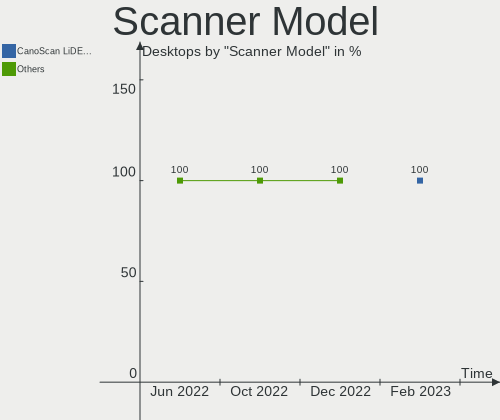

Arch Hardware Trends (Desktop)
------------------------------

A project to identify most popular hardware characteristics and track their change
over time based on data collected by Arch users at https://Linux-Hardware.org.

Anyone can contribute to the study by uploading probes of their computers by
the [hw-probe](https://github.com/linuxhw/hw-probe) tool:

    sudo -E hw-probe -all -upload

Full-feature report is available here: https://linux-hardware.org/?view=trends&formfactor=desktop

Period: Feb, 2021.

Contents
--------

- [ OS                       ](#os)
- [ OS Family                ](#os-family)
- [ Kernel                   ](#kernel)
- [ Kernel Family            ](#kernel-family)
- [ Kernel Major Ver.        ](#kernel-major-ver)
- [ Arch                     ](#arch)
- [ DE                       ](#de)
- [ Display Server           ](#display-server)
- [ Display Manager          ](#display-manager)
- [ OS Lang                  ](#os-lang)
- [ Boot Mode                ](#boot-mode)
- [ Filesystem               ](#filesystem)
- [ Part. scheme             ](#part-scheme)
- [ Dual Boot with Linux/BSD ](#dual-boot-with-linux/bsd)
- [ Dual Boot (Win)          ](#dual-boot-win)
- [ Country                  ](#country)
- [ City                     ](#city)
- [ Vendor                   ](#vendor)
- [ Model                    ](#model)
- [ Model Family             ](#model-family)
- [ MFG Year                 ](#mfg-year)
- [ Form Factor              ](#form-factor)
- [ Secure Boot              ](#secure-boot)
- [ Coreboot                 ](#coreboot)
- [ RAM Size                 ](#ram-size)
- [ RAM Used                 ](#ram-used)
- [ Has CD-ROM               ](#has-cd-rom)
- [ Total Drives             ](#total-drives)
- [ Has Ethernet             ](#has-ethernet)
- [ Drive Vendor             ](#drive-vendor)
- [ Drive Model              ](#drive-model)
- [ HDD Vendor               ](#hdd-vendor)
- [ SSD Vendor               ](#ssd-vendor)
- [ Drive Kind               ](#drive-kind)
- [ Drive Connector          ](#drive-connector)
- [ Drive Size               ](#drive-size)
- [ Space Total              ](#space-total)
- [ Space Used               ](#space-used)
- [ Malfunc. Drives          ](#malfunc-drives)
- [ Malfunc. Drive Vendor    ](#malfunc-drive-vendor)
- [ Malfunc. HDD Vendor      ](#malfunc-hdd-vendor)
- [ Malfunc. Drive Kind      ](#malfunc-drive-kind)
- [ Failed Drives            ](#failed-drives)
- [ Failed Drive Vendor      ](#failed-drive-vendor)
- [ Drive Status             ](#drive-status)
- [ Storage Vendor           ](#storage-vendor)
- [ Storage Model            ](#storage-model)
- [ Storage Kind             ](#storage-kind)
- [ CPU Vendor               ](#cpu-vendor)
- [ CPU Model                ](#cpu-model)
- [ CPU Model Family         ](#cpu-model-family)
- [ CPU Cores                ](#cpu-cores)
- [ CPU Sockets              ](#cpu-sockets)
- [ CPU Threads              ](#cpu-threads)
- [ CPU Op-Modes             ](#cpu-op-modes)
- [ CPU Microcode            ](#cpu-microcode)
- [ CPU Microarch            ](#cpu-microarch)
- [ GPU Vendor               ](#gpu-vendor)
- [ GPU Model                ](#gpu-model)
- [ GPU Combo                ](#gpu-combo)
- [ GPU Driver               ](#gpu-driver)
- [ GPU Memory               ](#gpu-memory)
- [ Monitor Vendor           ](#monitor-vendor)
- [ Monitor Model            ](#monitor-model)
- [ Monitor Resolution       ](#monitor-resolution)
- [ Monitor Diagonal         ](#monitor-diagonal)
- [ Monitor Width            ](#monitor-width)
- [ Aspect Ratio             ](#aspect-ratio)
- [ Monitor Area             ](#monitor-area)
- [ Pixel Density            ](#pixel-density)
- [ Multiple Monitors        ](#multiple-monitors)
- [ Net Controller Vendor    ](#net-controller-vendor)
- [ Net Controller Model     ](#net-controller-model)
- [ Wireless Vendor          ](#wireless-vendor)
- [ Wireless Model           ](#wireless-model)
- [ Ethernet Vendor          ](#ethernet-vendor)
- [ Ethernet Model           ](#ethernet-model)
- [ Net Controller Kind      ](#net-controller-kind)
- [ Used Controller          ](#used-controller)
- [ NICs                     ](#nics)
- [ Memory Vendor            ](#memory-vendor)
- [ Memory Model             ](#memory-model)
- [ Memory Kind              ](#memory-kind)
- [ Memory Form Factor       ](#memory-form-factor)
- [ Memory Size              ](#memory-size)
- [ Memory Speed             ](#memory-speed)
- [ Sound Vendor             ](#sound-vendor)
- [ Sound Model              ](#sound-model)
- [ Camera Vendor            ](#camera-vendor)
- [ Camera Model             ](#camera-model)
- [ Fingerprint Vendor       ](#fingerprint-vendor)
- [ Fingerprint Model        ](#fingerprint-model)
- [ Chipcard Vendor          ](#chipcard-vendor)
- [ Chipcard Model           ](#chipcard-model)
- [ Printer Vendor           ](#printer-vendor)
- [ Printer Model            ](#printer-model)
- [ Scanner Vendor           ](#scanner-vendor)
- [ Scanner Model            ](#scanner-model)
- [ Bluetooth Vendor         ](#bluetooth-vendor)
- [ Bluetooth Model          ](#bluetooth-model)
- [ Unsupported Devices      ](#unsupported-devices)
- [ Unsupported Device Types ](#unsupported-device-types)

OS
--

Installed operating systems

| Name         | Desktops | Percent |
|--------------|----------|---------|
| Arch         | 32       | 62.75%  |
| Arch Rolling | 19       | 37.25%  |

OS Family
---------

OS without a version

| Name | Desktops | Percent |
|------|----------|---------|
| Arch | 51       | 100%    |

Kernel
------

Version of the Linux kernel

| Version                         | Desktops | Percent |
|---------------------------------|----------|---------|
| 5.10.16-arch1-1                 | 12       | 23.53%  |
| 5.10.13-arch1-1                 | 4        | 7.84%   |
| 5.10.15-arch1-1                 | 3        | 5.88%   |
| 5.4.94-1-lts                    | 2        | 3.92%   |
| 5.11.1-arch1-1                  | 2        | 3.92%   |
| 5.10.17-1-lts                   | 2        | 3.92%   |
| 5.10.14-arch1-1                 | 2        | 3.92%   |
| 5.10.13-arch1-2                 | 2        | 3.92%   |
| 5.10.11-arch1-1                 | 2        | 3.92%   |
| 5.9.12-xanmod1-cachy-1          | 1        | 1.96%   |
| 5.8.9-arch2-1                   | 1        | 1.96%   |
| 5.11.2-arch1-1                  | 1        | 1.96%   |
| 5.11.1-zen1-1-zen               | 1        | 1.96%   |
| 5.11.0-arch2-1                  | 1        | 1.96%   |
| 5.11.0-arch1-1                  | 1        | 1.96%   |
| 5.11.0-122-tkg-bmq              | 1        | 1.96%   |
| 5.11.0-1-mainline               | 1        | 1.96%   |
| 5.10.9-arch1-1-custom           | 1        | 1.96%   |
| 5.10.9-arch1-1                  | 1        | 1.96%   |
| 5.10.16-zen1-1-zen              | 1        | 1.96%   |
| 5.10.16-1-lts                   | 1        | 1.96%   |
| 5.10.14-xanmod1-cacule-1-cacule | 1        | 1.96%   |
| 5.10.14-119-tkg-bmq             | 1        | 1.96%   |
| 5.10.13-zen1-2-zen              | 1        | 1.96%   |
| 5.10.13-zen1-1-zen              | 1        | 1.96%   |
| 5.10.12-hardened1-1-hardened    | 1        | 1.96%   |
| 5.10.12-116-tkg-pds             | 1        | 1.96%   |
| 5.10.11-zen2-1-zen              | 1        | 1.96%   |
| 5.10.10-arch1-1                 | 1        | 1.96%   |

Kernel Family
-------------

Linux kernel without a distro release

| Version | Desktops | Percent |
|---------|----------|---------|
| 5.10.16 | 14       | 27.45%  |
| 5.10.13 | 8        | 15.69%  |
| 5.11.0  | 4        | 7.84%   |
| 5.10.14 | 4        | 7.84%   |
| 5.11.1  | 3        | 5.88%   |
| 5.10.15 | 3        | 5.88%   |
| 5.10.11 | 3        | 5.88%   |
| 5.4.94  | 2        | 3.92%   |
| 5.10.9  | 2        | 3.92%   |
| 5.10.17 | 2        | 3.92%   |
| 5.10.12 | 2        | 3.92%   |
| 5.9.12  | 1        | 1.96%   |
| 5.8.9   | 1        | 1.96%   |
| 5.11.2  | 1        | 1.96%   |
| 5.10.10 | 1        | 1.96%   |

Kernel Major Ver.
-----------------

Linux kernel major version

| Version | Desktops | Percent |
|---------|----------|---------|
| 5.10    | 39       | 76.47%  |
| 5.11    | 8        | 15.69%  |
| 5.4     | 2        | 3.92%   |
| 5.9     | 1        | 1.96%   |
| 5.8     | 1        | 1.96%   |

Arch
----

OS architecture (x86_64, i586, etc.)

| Name   | Desktops | Percent |
|--------|----------|---------|
| x86_64 | 51       | 100%    |

DE
--

Desktop Environment

| Name       | Desktops | Percent |
|------------|----------|---------|
| GNOME      | 16       | 31.37%  |
| KDE        | 9        | 17.65%  |
| KDE5       | 8        | 15.69%  |
| i3         | 7        | 13.73%  |
| XFCE       | 4        | 7.84%   |
| Unknown    | 3        | 5.88%   |
| X-Cinnamon | 2        | 3.92%   |
| MATE       | 1        | 1.96%   |
| Deepin     | 1        | 1.96%   |

Display Server
--------------

X11 or Wayland

| Name    | Desktops | Percent |
|---------|----------|---------|
| X11     | 41       | 80.39%  |
| Tty     | 5        | 9.8%    |
| Wayland | 4        | 7.84%   |
| Unknown | 1        | 1.96%   |

Display Manager
---------------

SDDM, LightDM, etc.

| Name    | Desktops | Percent |
|---------|----------|---------|
| Unknown | 21       | 41.18%  |
| TDM     | 12       | 23.53%  |
| SDDM    | 11       | 21.57%  |
| GDM     | 6        | 11.76%  |
| SLiM    | 1        | 1.96%   |

OS Lang
-------

Language

| Lang  | Desktops | Percent |
|-------|----------|---------|
| en_US | 22       | 43.14%  |
| ru_RU | 6        | 11.76%  |
| en_GB | 4        | 7.84%   |
| de_DE | 4        | 7.84%   |
| C     | 3        | 5.88%   |
| pl_PL | 2        | 3.92%   |
| es_ES | 2        | 3.92%   |
| en_AU | 2        | 3.92%   |
| zh_CN | 1        | 1.96%   |
| lv_LV | 1        | 1.96%   |
| hu_HU | 1        | 1.96%   |
| es_CL | 1        | 1.96%   |
| de_AT | 1        | 1.96%   |
| ca_ES | 1        | 1.96%   |

Boot Mode
---------

EFI or BIOS

| Mode | Desktops | Percent |
|------|----------|---------|
| EFI  | 26       | 50.98%  |
| BIOS | 25       | 49.02%  |

Filesystem
----------

Type of filesystem

| Type  | Desktops | Percent |
|-------|----------|---------|
| Ext4  | 37       | 72.55%  |
| Btrfs | 7        | 13.73%  |
| Xfs   | 6        | 11.76%  |
| Zfs   | 1        | 1.96%   |

Part. scheme
------------

Scheme of partitioning

| Type    | Desktops | Percent |
|---------|----------|---------|
| GPT     | 30       | 58.82%  |
| Unknown | 18       | 35.29%  |
| MBR     | 3        | 5.88%   |

Dual Boot with Linux/BSD
------------------------

Hosting more than one Linux/BSD

| Dual boot | Desktops | Percent |
|-----------|----------|---------|
| No        | 47       | 92.16%  |
| Yes       | 4        | 7.84%   |

Dual Boot (Win)
---------------

Hosting Linux and Windows

| Dual boot | Desktops | Percent |
|-----------|----------|---------|
| No        | 32       | 62.75%  |
| Yes       | 19       | 37.25%  |

Country
-------

Geographic location (country)

| Country                   | Desktops | Percent |
|---------------------------|----------|---------|
| USA                       | 8        | 15.69%  |
| Russia                    | 7        | 13.73%  |
| UK                        | 4        | 7.84%   |
| Germany                   | 4        | 7.84%   |
| Spain                     | 3        | 5.88%   |
| Ukraine                   | 2        | 3.92%   |
| Switzerland               | 2        | 3.92%   |
| Poland                    | 2        | 3.92%   |
| Japan                     | 2        | 3.92%   |
| Hungary                   | 2        | 3.92%   |
| Austria                   | 2        | 3.92%   |
| Australia                 | 2        | 3.92%   |
| Uruguay                   | 1        | 1.96%   |
| Romania                   | 1        | 1.96%   |
| Macedonia                 | 1        | 1.96%   |
| Latvia                    | 1        | 1.96%   |
| Italy                     | 1        | 1.96%   |
| Iran, Islamic Republic of | 1        | 1.96%   |
| Indonesia                 | 1        | 1.96%   |
| Chile                     | 1        | 1.96%   |
| Canada                    | 1        | 1.96%   |
| Bulgaria                  | 1        | 1.96%   |
| Argentina                 | 1        | 1.96%   |

City
----

Geographic location (city)

| City                   | Desktops | Percent |
|------------------------|----------|---------|
| Moscow                 | 3        | 5.88%   |
| Vienna                 | 2        | 3.92%   |
| Sydney                 | 2        | 3.92%   |
| Phoenix                | 2        | 3.92%   |
| Łódź                | 1        | 1.96%   |
| Zwingenberg            | 1        | 1.96%   |
| Yate                   | 1        | 1.96%   |
| Vancouver              | 1        | 1.96%   |
| Tokyo                  | 1        | 1.96%   |
| Tehran                 | 1        | 1.96%   |
| St Petersburg          | 1        | 1.96%   |
| Skopje                 | 1        | 1.96%   |
| Sindanglaya            | 1        | 1.96%   |
| Seengen                | 1        | 1.96%   |
| Santiago               | 1        | 1.96%   |
| Sant Cugat del Vallès | 1        | 1.96%   |
| San Rafael             | 1        | 1.96%   |
| Riga                   | 1        | 1.96%   |
| Richmond               | 1        | 1.96%   |
| Plovdiv                | 1        | 1.96%   |
| Perm                   | 1        | 1.96%   |
| Nizhniy Novgorod       | 1        | 1.96%   |
| Nagymaros              | 1        | 1.96%   |
| Nagoya                 | 1        | 1.96%   |
| Montevideo             | 1        | 1.96%   |
| London                 | 1        | 1.96%   |
| Kyiv                   | 1        | 1.96%   |
| Kharkiv                | 1        | 1.96%   |
| Javea                  | 1        | 1.96%   |
| Ibiza Town             | 1        | 1.96%   |
| Hanover                | 1        | 1.96%   |
| Gainesville            | 1        | 1.96%   |
| Fredericksburg         | 1        | 1.96%   |
| Dolgoprudnyy           | 1        | 1.96%   |
| Dohlau                 | 1        | 1.96%   |
| Debrecen               | 1        | 1.96%   |
| Dagenham               | 1        | 1.96%   |
| Cologne                | 1        | 1.96%   |
| Charfield              | 1        | 1.96%   |
| Capua                  | 1        | 1.96%   |
| Bydgoszcz              | 1        | 1.96%   |
| Bucharest              | 1        | 1.96%   |
| Bern                   | 1        | 1.96%   |
| Benson                 | 1        | 1.96%   |
| Bellevue               | 1        | 1.96%   |
| Atlanta                | 1        | 1.96%   |

Vendor
------

Motherboard manufacturer

| Name                | Desktops | Percent |
|---------------------|----------|---------|
| Gigabyte Technology | 15       | 29.41%  |
| ASUSTek Computer    | 15       | 29.41%  |
| MSI                 | 11       | 21.57%  |
| ASRock              | 6        | 11.76%  |
| Pegatron            | 1        | 1.96%   |
| Lenovo              | 1        | 1.96%   |
| Hewlett-Packard     | 1        | 1.96%   |
| Biostar             | 1        | 1.96%   |

Model
-----

Motherboard model

| Name                             | Desktops | Percent |
|----------------------------------|----------|---------|
| MSI MS-7721                      | 2        | 3.92%   |
| Gigabyte X570 AORUS PRO WIFI     | 2        | 3.92%   |
| ASUS TUF GAMING X570-PLUS        | 2        | 3.92%   |
| ASUS ROG STRIX B450-F GAMING     | 2        | 3.92%   |
| Pegatron p6-2026                 | 1        | 1.96%   |
| MSI MS-7C95                      | 1        | 1.96%   |
| MSI MS-7C91                      | 1        | 1.96%   |
| MSI MS-7C84                      | 1        | 1.96%   |
| MSI MS-7C02                      | 1        | 1.96%   |
| MSI MS-7B89                      | 1        | 1.96%   |
| MSI MS-7B85                      | 1        | 1.96%   |
| MSI MS-7B79                      | 1        | 1.96%   |
| MSI MS-7A34                      | 1        | 1.96%   |
| MSI MS-7885                      | 1        | 1.96%   |
| Lenovo ThinkCentre M82 3306D1U   | 1        | 1.96%   |
| HP Compaq 6200 Pro MT PC         | 1        | 1.96%   |
| Gigabyte Z87X-UD3H               | 1        | 1.96%   |
| Gigabyte Z490 VISION G           | 1        | 1.96%   |
| Gigabyte Z390 I AORUS PRO WIFI   | 1        | 1.96%   |
| Gigabyte Z370 AORUS Ultra Gaming | 1        | 1.96%   |
| Gigabyte X570 AORUS MASTER       | 1        | 1.96%   |
| Gigabyte X570 AORUS ELITE        | 1        | 1.96%   |
| Gigabyte X470 AORUS ULTRA GAMING | 1        | 1.96%   |
| Gigabyte P35-DS3L                | 1        | 1.96%   |
| Gigabyte H81M-S2PV               | 1        | 1.96%   |
| Gigabyte H81M-HD3                | 1        | 1.96%   |
| Gigabyte H110M-S2PH              | 1        | 1.96%   |
| Gigabyte B550I AORUS PRO AX      | 1        | 1.96%   |
| Gigabyte AB350M-DS3H             | 1        | 1.96%   |
| Biostar Hi-Fi A68U3P             | 1        | 1.96%   |
| ASUS STRIX Z270F GAMING          | 1        | 1.96%   |
| ASUS ROG STRIX X570-F GAMING     | 1        | 1.96%   |
| ASUS ROG STRIX B550-F GAMING     | 1        | 1.96%   |
| ASUS ROG Maximus XI HERO         | 1        | 1.96%   |
| ASUS PRIME Z270M-PLUS            | 1        | 1.96%   |
| ASUS PRIME B550M-A               | 1        | 1.96%   |
| ASUS PRIME B450M-A II            | 1        | 1.96%   |
| ASUS P5QL PRO                    | 1        | 1.96%   |
| ASUS Maximus V FORMULA           | 1        | 1.96%   |
| ASUS M5A99X EVO                  | 1        | 1.96%   |
| ASUS All Series                  | 1        | 1.96%   |
| ASRock Z370 Extreme4             | 1        | 1.96%   |
| ASRock X570 Steel Legend         | 1        | 1.96%   |
| ASRock J4105-ITX                 | 1        | 1.96%   |
| ASRock B550 Phantom Gaming 4     | 1        | 1.96%   |
| ASRock B450M-HDV R4.0            | 1        | 1.96%   |
| ASRock B450 Steel Legend         | 1        | 1.96%   |

Model Family
------------

Motherboard model prefix

| Name                 | Desktops | Percent |
|----------------------|----------|---------|
| ASUS ROG             | 5        | 9.8%    |
| Gigabyte X570        | 4        | 7.84%   |
| ASUS PRIME           | 3        | 5.88%   |
| MSI MS-7721          | 2        | 3.92%   |
| ASUS TUF             | 2        | 3.92%   |
| Pegatron p6-2026     | 1        | 1.96%   |
| MSI MS-7C95          | 1        | 1.96%   |
| MSI MS-7C91          | 1        | 1.96%   |
| MSI MS-7C84          | 1        | 1.96%   |
| MSI MS-7C02          | 1        | 1.96%   |
| MSI MS-7B89          | 1        | 1.96%   |
| MSI MS-7B85          | 1        | 1.96%   |
| MSI MS-7B79          | 1        | 1.96%   |
| MSI MS-7A34          | 1        | 1.96%   |
| MSI MS-7885          | 1        | 1.96%   |
| Lenovo ThinkCentre   | 1        | 1.96%   |
| HP Compaq            | 1        | 1.96%   |
| Gigabyte Z87X-UD3H   | 1        | 1.96%   |
| Gigabyte Z490        | 1        | 1.96%   |
| Gigabyte Z390        | 1        | 1.96%   |
| Gigabyte Z370        | 1        | 1.96%   |
| Gigabyte X470        | 1        | 1.96%   |
| Gigabyte P35-DS3L    | 1        | 1.96%   |
| Gigabyte H81M-S2PV   | 1        | 1.96%   |
| Gigabyte H81M-HD3    | 1        | 1.96%   |
| Gigabyte H110M-S2PH  | 1        | 1.96%   |
| Gigabyte B550I       | 1        | 1.96%   |
| Gigabyte AB350M-DS3H | 1        | 1.96%   |
| Biostar Hi-Fi        | 1        | 1.96%   |
| ASUS STRIX           | 1        | 1.96%   |
| ASUS P5QL            | 1        | 1.96%   |
| ASUS Maximus         | 1        | 1.96%   |
| ASUS M5A99X          | 1        | 1.96%   |
| ASUS All             | 1        | 1.96%   |
| ASRock Z370          | 1        | 1.96%   |
| ASRock X570          | 1        | 1.96%   |
| ASRock J4105-ITX     | 1        | 1.96%   |
| ASRock B550          | 1        | 1.96%   |
| ASRock B450M-HDV     | 1        | 1.96%   |
| ASRock B450          | 1        | 1.96%   |

MFG Year
--------

Motherboard manufacture year

| Year | Desktops | Percent |
|------|----------|---------|
| 2020 | 21       | 41.18%  |
| 2018 | 7        | 13.73%  |
| 2019 | 6        | 11.76%  |
| 2013 | 4        | 7.84%   |
| 2021 | 3        | 5.88%   |
| 2015 | 3        | 5.88%   |
| 2017 | 2        | 3.92%   |
| 2014 | 2        | 3.92%   |
| 2009 | 2        | 3.92%   |
| 2011 | 1        | 1.96%   |

Form Factor
-----------

Physical design of the computer

| Name    | Desktops | Percent |
|---------|----------|---------|
| Desktop | 51       | 100%    |

Secure Boot
-----------

Enabled or disabled

| State    | Desktops | Percent |
|----------|----------|---------|
| Disabled | 51       | 100%    |

Coreboot
--------

Have coreboot on board

| Used | Desktops | Percent |
|------|----------|---------|
| No   | 51       | 100%    |

RAM Size
--------

Total RAM memory

| Size in GB  | Desktops | Percent |
|-------------|----------|---------|
| 32.01-64.0  | 16       | 31.37%  |
| 16.01-24.0  | 16       | 31.37%  |
| 8.01-16.0   | 9        | 17.65%  |
| 4.01-8.0    | 4        | 7.84%   |
| 64.01-256.0 | 3        | 5.88%   |
| 24.01-32.0  | 2        | 3.92%   |
| 3.01-4.0    | 1        | 1.96%   |

RAM Used
--------

Used RAM memory

| Used GB    | Desktops | Percent |
|------------|----------|---------|
| 1.01-2.0   | 17       | 33.33%  |
| 4.01-8.0   | 9        | 17.65%  |
| 3.01-4.0   | 7        | 13.73%  |
| 2.01-3.0   | 7        | 13.73%  |
| 8.01-16.0  | 6        | 11.76%  |
| 16.01-24.0 | 5        | 9.8%    |

Has CD-ROM
----------

Has CD-ROM on board

| Presented | Desktops | Percent |
|-----------|----------|---------|
| No        | 37       | 72.55%  |
| Yes       | 14       | 27.45%  |

Total Drives
------------

Number of drives on board

| Drives | Desktops | Percent |
|--------|----------|---------|
| 2      | 14       | 27.45%  |
| 1      | 11       | 21.57%  |
| 3      | 10       | 19.61%  |
| 4      | 7        | 13.73%  |
| 5      | 3        | 5.88%   |
| 7      | 2        | 3.92%   |
| 6      | 2        | 3.92%   |
| 10     | 1        | 1.96%   |
| 8      | 1        | 1.96%   |

Has Ethernet
------------

Has Ethernet on board

| Presented | Desktops | Percent |
|-----------|----------|---------|
| Yes       | 50       | 98.04%  |
| No        | 1        | 1.96%   |

Drive Vendor
------------

Hard drive vendors

| Vendor              | Desktops | Drives | Percent |
|---------------------|----------|--------|---------|
| Samsung Electronics | 25       | 35     | 21.37%  |
| WDC                 | 24       | 37     | 20.51%  |
| Seagate             | 12       | 19     | 10.26%  |
| Kingston            | 7        | 7      | 5.98%   |
| SanDisk             | 6        | 11     | 5.13%   |
| Toshiba             | 5        | 5      | 4.27%   |
| Phison              | 5        | 7      | 4.27%   |
| Crucial             | 5        | 6      | 4.27%   |
| A-DATA Technology   | 5        | 5      | 4.27%   |
| Hitachi             | 4        | 4      | 3.42%   |
| OCZ                 | 3        | 3      | 2.56%   |
| Intel               | 3        | 3      | 2.56%   |
| XPG                 | 2        | 3      | 1.71%   |
| SPCC                | 2        | 2      | 1.71%   |
| China               | 2        | 2      | 1.71%   |
| XSTAR               | 1        | 1      | 0.85%   |
| SK Hynix            | 1        | 1      | 0.85%   |
| PLEXTOR             | 1        | 1      | 0.85%   |
| Patriot             | 1        | 1      | 0.85%   |
| LuminouTek          | 1        | 1      | 0.85%   |
| Hewlett-Packard     | 1        | 1      | 0.85%   |
| ASMT                | 1        | 1      | 0.85%   |

Drive Model
-----------

Hard drive models

| Model                            | Desktops | Percent |
|----------------------------------|----------|---------|
| WDC WD10EZEX-08WN4A0 1TB         | 4        | 2.8%    |
| Samsung SSD 860 EVO 500GB        | 3        | 2.1%    |
| Samsung SSD 850 EVO 500GB        | 3        | 2.1%    |
| WDC WD6400AAKS-22A7B2 640GB      | 2        | 1.4%    |
| WDC WD20EZRX-00DC0B0 2TB         | 2        | 1.4%    |
| Toshiba HDWD130 3TB              | 2        | 1.4%    |
| Toshiba HDWD110 1TB              | 2        | 1.4%    |
| Sandisk NVMe SSD Drive 1TB       | 2        | 1.4%    |
| Samsung SSD 970 EVO Plus 500GB   | 2        | 1.4%    |
| Samsung SSD 970 EVO Plus 1TB     | 2        | 1.4%    |
| Samsung SSD 970 EVO 500GB        | 2        | 1.4%    |
| Samsung SSD 860 QVO 2TB          | 2        | 1.4%    |
| Samsung SSD 860 QVO 1TB          | 2        | 1.4%    |
| Samsung SSD 860 EVO 1TB          | 2        | 1.4%    |
| Samsung NVMe SSD Drive 500GB     | 2        | 1.4%    |
| Samsung HD154UI 1TB              | 2        | 1.4%    |
| Phison Sabrent 1TB               | 2        | 1.4%    |
| Kingston SA400S37240G 240GB SSD  | 2        | 1.4%    |
| XSTAR SSD 120GB                  | 1        | 0.7%    |
| XPG NVMe SSD Drive 512GB         | 1        | 0.7%    |
| XPG NVMe SSD Drive 2TB           | 1        | 0.7%    |
| XPG NVMe SSD Drive 1024GB        | 1        | 0.7%    |
| WDC WDS250G2B0C-00PXH0 250GB     | 1        | 0.7%    |
| WDC WDS250G1B0B-00AS40 250GB SSD | 1        | 0.7%    |
| WDC WDS240G2G0A-00JH30 240GB SSD | 1        | 0.7%    |
| WDC WDS100T2B0C-00PXH0 1TB       | 1        | 0.7%    |
| WDC WD800BEVS-22VAT0 80GB        | 1        | 0.7%    |
| WDC WD7500BPKX-00HPJT0 752GB     | 1        | 0.7%    |
| WDC WD5000LPVT-24G33T1 500GB     | 1        | 0.7%    |
| WDC WD5000AVVS-63M8B0 500GB      | 1        | 0.7%    |
| WDC WD5000AAKX-22ERMA0 500GB     | 1        | 0.7%    |
| WDC WD5000AAKS-00A7B0 500GB      | 1        | 0.7%    |
| WDC WD4001FFSX-68JNUN0 4TB       | 1        | 0.7%    |
| WDC WD30EZRZ-00Z5HB0 3TB         | 1        | 0.7%    |
| WDC WD20EARS-60MVWB0 2TB         | 1        | 0.7%    |
| WDC WD20EARS-00J2GB0 2TB         | 1        | 0.7%    |
| WDC WD2003FYPS-27W9B0 2TB        | 1        | 0.7%    |
| WDC WD140EDFZ-11A0VA0 14TB       | 1        | 0.7%    |
| WDC WD121KRYZ-01W0RB0 12TB       | 1        | 0.7%    |
| WDC WD10JUCT-63J6SY0 1TB         | 1        | 0.7%    |
| WDC WD10EZEX-22BN5A0 1TB         | 1        | 0.7%    |
| WDC WD10EZEX-07WN4A0 1TB         | 1        | 0.7%    |
| WDC WD10EARX-00N0YB0 1TB         | 1        | 0.7%    |
| WDC WD10EALX-009BA0 1TB          | 1        | 0.7%    |
| WDC WD1001FALS-00J7B1 1TB        | 1        | 0.7%    |
| Toshiba MK5061GSYN 500GB         | 1        | 0.7%    |
| SPCC Solid State Disk 512GB      | 1        | 0.7%    |
| SPCC Solid State Disk 240GB      | 1        | 0.7%    |
| SK Hynix NVMe SSD Drive 256GB    | 1        | 0.7%    |
| Seagate ST9750420AS 752GB        | 1        | 0.7%    |
| Seagate ST6000DM003-2CY186 6TB   | 1        | 0.7%    |
| Seagate ST500NM0011 500GB        | 1        | 0.7%    |
| Seagate ST4000LM024-2AN17V 4TB   | 1        | 0.7%    |
| Seagate ST4000DM004-2CV104 4TB   | 1        | 0.7%    |
| Seagate ST4000DM000-1F2168 4TB   | 1        | 0.7%    |
| Seagate ST3250310AS 250GB        | 1        | 0.7%    |
| Seagate ST3160215SCE 160GB       | 1        | 0.7%    |
| Seagate ST31000528AS 1TB         | 1        | 0.7%    |
| Seagate ST2000VN004-2E4164 2TB   | 1        | 0.7%    |
| Seagate ST2000DM008-2FR102 2TB   | 1        | 0.7%    |

HDD Vendor
----------

Hard disk drive vendors

| Vendor              | Desktops | Drives | Percent |
|---------------------|----------|--------|---------|
| WDC                 | 23       | 33     | 47.92%  |
| Seagate             | 12       | 19     | 25%     |
| Toshiba             | 5        | 5      | 10.42%  |
| Samsung Electronics | 4        | 4      | 8.33%   |
| Hitachi             | 4        | 4      | 8.33%   |

SSD Vendor
----------

Solid state drive vendors

| Vendor              | Desktops | Drives | Percent |
|---------------------|----------|--------|---------|
| Samsung Electronics | 16       | 20     | 32%     |
| Kingston            | 7        | 7      | 14%     |
| SanDisk             | 4        | 9      | 8%      |
| Crucial             | 4        | 5      | 8%      |
| A-DATA Technology   | 4        | 4      | 8%      |
| OCZ                 | 3        | 3      | 6%      |
| WDC                 | 2        | 2      | 4%      |
| SPCC                | 2        | 2      | 4%      |
| China               | 2        | 2      | 4%      |
| XSTAR               | 1        | 1      | 2%      |
| Patriot             | 1        | 1      | 2%      |
| LuminouTek          | 1        | 1      | 2%      |
| Intel               | 1        | 1      | 2%      |
| Hewlett-Packard     | 1        | 1      | 2%      |
| ASMT                | 1        | 1      | 2%      |

Drive Kind
----------

HDD or SSD

| Kind | Desktops | Drives | Percent |
|------|----------|--------|---------|
| SSD  | 35       | 60     | 37.63%  |
| HDD  | 33       | 65     | 35.48%  |
| NVMe | 25       | 31     | 26.88%  |

Drive Connector
---------------

SATA, SAS, NVMe, etc.

| Type | Desktops | Drives | Percent |
|------|----------|--------|---------|
| SATA | 46       | 122    | 63.01%  |
| NVMe | 25       | 31     | 34.25%  |
| SAS  | 2        | 3      | 2.74%   |

Drive Size
----------

Size of hard drive

| Size in TB | Desktops | Drives | Percent |
|------------|----------|--------|---------|
| 0.01-0.5   | 32       | 49     | 40.51%  |
| 0.51-1.0   | 28       | 46     | 35.44%  |
| 1.01-2.0   | 11       | 17     | 13.92%  |
| 2.01-3.0   | 3        | 3      | 3.8%    |
| 3.01-4.0   | 2        | 4      | 2.53%   |
| 10.01-20.0 | 2        | 5      | 2.53%   |
| 4.01-10.0  | 1        | 1      | 1.27%   |

Space Total
-----------

Amount of disk space available on the file system

| Size in GB     | Desktops | Percent |
|----------------|----------|---------|
| 501-1000       | 16       | 31.37%  |
| 101-250        | 8        | 15.69%  |
| 2001-3000      | 7        | 13.73%  |
| 1001-2000      | 6        | 11.76%  |
| More than 3000 | 5        | 9.8%    |
| 251-500        | 5        | 9.8%    |
| 51-100         | 3        | 5.88%   |
| Unknown        | 1        | 1.96%   |

Space Used
----------

Amount of used disk space

| Used GB        | Desktops | Percent |
|----------------|----------|---------|
| 1-20           | 10       | 19.61%  |
| 251-500        | 8        | 15.69%  |
| 1001-2000      | 8        | 15.69%  |
| 501-1000       | 6        | 11.76%  |
| 101-250        | 5        | 9.8%    |
| 51-100         | 5        | 9.8%    |
| 21-50          | 4        | 7.84%   |
| 2001-3000      | 3        | 5.88%   |
| More than 3000 | 1        | 1.96%   |
| Unknown        | 1        | 1.96%   |

Malfunc. Drives
---------------

Drive models with a malfunction

| Model                                 | Desktops | Drives | Percent |
|---------------------------------------|----------|--------|---------|
| WDC WD5000AAKX-22ERMA0 500GB          | 1        | 1      | 11.11%  |
| WDC WD5000AAKS-00A7B0 500GB           | 1        | 1      | 11.11%  |
| WDC WD10JUCT-63J6SY0 1TB              | 1        | 1      | 11.11%  |
| SPCC Solid State Disk 512GB           | 1        | 1      | 11.11%  |
| Seagate ST4000DM004-2CV104 4TB        | 1        | 1      | 11.11%  |
| Seagate ST1000LM014-1EJ164 1TB        | 1        | 1      | 11.11%  |
| OCZ AGILITY3 120GB SSD                | 1        | 1      | 11.11%  |
| Intel SSDPEKKW512G7 512GB             | 1        | 1      | 11.11%  |
| A-DATA Technology SU800NS38 512GB SSD | 1        | 1      | 11.11%  |

Malfunc. Drive Vendor
---------------------

Vendors of faulty drives

| Vendor            | Desktops | Drives | Percent |
|-------------------|----------|--------|---------|
| WDC               | 3        | 3      | 33.33%  |
| Seagate           | 2        | 2      | 22.22%  |
| SPCC              | 1        | 1      | 11.11%  |
| OCZ               | 1        | 1      | 11.11%  |
| Intel             | 1        | 1      | 11.11%  |
| A-DATA Technology | 1        | 1      | 11.11%  |

Malfunc. HDD Vendor
-------------------

Vendors of faulty HDD drives

| Vendor  | Desktops | Drives | Percent |
|---------|----------|--------|---------|
| WDC     | 3        | 3      | 60%     |
| Seagate | 2        | 2      | 40%     |

Malfunc. Drive Kind
-------------------

Kinds of faulty drives

| Kind | Desktops | Drives | Percent |
|------|----------|--------|---------|
| HDD  | 4        | 5      | 50%     |
| SSD  | 3        | 3      | 37.5%   |
| NVMe | 1        | 1      | 12.5%   |

Failed Drives
-------------

Failed drive models

Zero info for selected period =(

Failed Drive Vendor
-------------------

Failed drive vendors

Zero info for selected period =(

Drive Status
------------

Number of failed and malfunc. drives

| Status   | Desktops | Drives | Percent |
|----------|----------|--------|---------|
| Works    | 26       | 68     | 44.07%  |
| Detected | 25       | 79     | 42.37%  |
| Malfunc  | 8        | 9      | 13.56%  |

Storage Vendor
--------------

Storage controller vendors

| Vendor                    | Desktops | Percent |
|---------------------------|----------|---------|
| AMD                       | 31       | 36.05%  |
| Intel                     | 22       | 25.58%  |
| Samsung Electronics       | 11       | 12.79%  |
| Phison Electronics        | 5        | 5.81%   |
| ASMedia Technology        | 5        | 5.81%   |
| Sandisk                   | 4        | 4.65%   |
| ADATA Technology          | 3        | 3.49%   |
| SK Hynix                  | 1        | 1.16%   |
| Promise Technology        | 1        | 1.16%   |
| Micron/Crucial Technology | 1        | 1.16%   |
| Marvell Technology Group  | 1        | 1.16%   |
| Lite-On Technology        | 1        | 1.16%   |

Storage Model
-------------

Storage controller models

| Model                                                                                   | Desktops | Percent |
|-----------------------------------------------------------------------------------------|----------|---------|
| AMD FCH SATA Controller [AHCI mode]                                                     | 19       | 19.19%  |
| Samsung NVMe SSD Controller SM981/PM981/PM983                                           | 11       | 11.11%  |
| AMD 400 Series Chipset SATA Controller                                                  | 10       | 10.1%   |
| AMD SATA controller                                                                     | 6        | 6.06%   |
| ASMedia ASM1062 Serial ATA Controller                                                   | 5        | 5.05%   |
| Phison E12 NVMe Controller                                                              | 4        | 4.04%   |
| Intel 8 Series/C220 Series Chipset Family 6-port SATA Controller 1 [AHCI mode]          | 4        | 4.04%   |
| Intel 200 Series PCH SATA controller [AHCI mode]                                        | 4        | 4.04%   |
| ADATA XPG SX8200 Pro PCIe Gen3x4 M.2 2280 Solid State Drive                             | 3        | 3.03%   |
| Sandisk WD Blue SN550 NVMe SSD                                                          | 2        | 2.02%   |
| Intel Cannon Lake PCH SATA AHCI Controller                                              | 2        | 2.02%   |
| Intel 7 Series/C210 Series Chipset Family 6-port SATA Controller [AHCI mode]            | 2        | 2.02%   |
| SK Hynix PC401 NVMe Solid State Drive 256GB                                             | 1        | 1.01%   |
| Sandisk WD Black SN850                                                                  | 1        | 1.01%   |
| Sandisk WD Black 2018/SN750 / PC SN720 NVMe SSD                                         | 1        | 1.01%   |
| Samsung NVMe SSD Controller SM961/PM961/SM963                                           | 1        | 1.01%   |
| Samsung Electronics SATA controller                                                     | 1        | 1.01%   |
| Promise PDC42819 [FastTrak TX2650/TX4650]                                               | 1        | 1.01%   |
| Phison PS5013 E13 NVMe Controller                                                       | 1        | 1.01%   |
| Phison NVMe Storage Controller                                                          | 1        | 1.01%   |
| Micron/Crucial Non-Volatile memory controller                                           | 1        | 1.01%   |
| Marvell Group 88SE9172 SATA 6Gb/s Controller                                            | 1        | 1.01%   |
| Lite-On M8Pe Series NVMe SSD                                                            | 1        | 1.01%   |
| Intel SSD 660P Series                                                                   | 1        | 1.01%   |
| Intel SSD 600P Series                                                                   | 1        | 1.01%   |
| Intel SATA Controller [RAID mode]                                                       | 1        | 1.01%   |
| Intel Q170/Q150/B150/H170/H110/Z170/CM236 Chipset SATA Controller [AHCI Mode]           | 1        | 1.01%   |
| Intel Celeron/Pentium Silver Processor SATA Controller                                  | 1        | 1.01%   |
| Intel C610/X99 series chipset sSATA Controller [AHCI mode]                              | 1        | 1.01%   |
| Intel C610/X99 series chipset 6-Port SATA Controller [AHCI mode]                        | 1        | 1.01%   |
| Intel 82801JI (ICH10 Family) SATA AHCI Controller                                       | 1        | 1.01%   |
| Intel 82801IB (ICH9) 4 port SATA Controller [AHCI mode]                                 | 1        | 1.01%   |
| Intel 6 Series/C200 Series Chipset Family Desktop SATA Controller (IDE mode, ports 4-5) | 1        | 1.01%   |
| Intel 6 Series/C200 Series Chipset Family Desktop SATA Controller (IDE mode, ports 0-3) | 1        | 1.01%   |
| Intel 6 Series/C200 Series Chipset Family 6 port Desktop SATA AHCI Controller           | 1        | 1.01%   |
| AMD X370 Series Chipset SATA Controller                                                 | 1        | 1.01%   |
| AMD SB7x0/SB8x0/SB9x0 SATA Controller [AHCI mode]                                       | 1        | 1.01%   |
| AMD FCH SATA Controller [IDE mode]                                                      | 1        | 1.01%   |
| AMD 300 Series Chipset SATA Controller                                                  | 1        | 1.01%   |

Storage Kind
------------

Kind of storage controller (IDE, SATA, NVMe, SAS, ...)

| Kind | Desktops | Percent |
|------|----------|---------|
| SATA | 49       | 62.82%  |
| NVMe | 26       | 33.33%  |
| RAID | 2        | 2.56%   |
| IDE  | 1        | 1.28%   |

CPU Vendor
----------

Processor vendors

| Vendor | Desktops | Percent |
|--------|----------|---------|
| AMD    | 31       | 60.78%  |
| Intel  | 20       | 39.22%  |

CPU Model
---------

Processor models

| Model                                          | Desktops | Percent |
|------------------------------------------------|----------|---------|
| AMD Ryzen 7 3700X 8-Core Processor             | 4        | 7.84%   |
| AMD Ryzen 5 5600X 6-Core Processor             | 3        | 5.88%   |
| AMD Ryzen 5 3600 6-Core Processor              | 3        | 5.88%   |
| AMD Ryzen 5 2600X Six-Core Processor           | 3        | 5.88%   |
| AMD Athlon 3000G with Radeon Vega Graphics     | 3        | 5.88%   |
| AMD Ryzen 9 3950X 16-Core Processor            | 2        | 3.92%   |
| AMD Ryzen 5 3600X 6-Core Processor             | 2        | 3.92%   |
| Intel Xeon CPU E5450 @ 3.00GHz                 | 1        | 1.96%   |
| Intel Xeon CPU E5-2697 v3 @ 2.60GHz            | 1        | 1.96%   |
| Intel Pentium CPU G3250 @ 3.20GHz              | 1        | 1.96%   |
| Intel Core i9-10850K CPU @ 3.60GHz             | 1        | 1.96%   |
| Intel Core i7-9700K CPU @ 3.60GHz              | 1        | 1.96%   |
| Intel Core i7-8086K CPU @ 4.00GHz              | 1        | 1.96%   |
| Intel Core i7-7700K CPU @ 4.20GHz              | 1        | 1.96%   |
| Intel Core i7-7700 CPU @ 3.60GHz               | 1        | 1.96%   |
| Intel Core i7-4770K CPU @ 3.50GHz              | 1        | 1.96%   |
| Intel Core i7-4770 CPU @ 3.40GHz               | 1        | 1.96%   |
| Intel Core i7-3770K CPU @ 3.50GHz              | 1        | 1.96%   |
| Intel Core i5-8600K CPU @ 3.60GHz              | 1        | 1.96%   |
| Intel Core i5-8400 CPU @ 2.80GHz               | 1        | 1.96%   |
| Intel Core i5-7500 CPU @ 3.40GHz               | 1        | 1.96%   |
| Intel Core i5-4690 CPU @ 3.50GHz               | 1        | 1.96%   |
| Intel Core i5-3570 CPU @ 3.40GHz               | 1        | 1.96%   |
| Intel Core i3-2120 CPU @ 3.30GHz               | 1        | 1.96%   |
| Intel Core i3-2100 CPU @ 3.10GHz               | 1        | 1.96%   |
| Intel Core 2 Quad CPU Q9550 @ 2.83GHz          | 1        | 1.96%   |
| Intel Celeron J4105 CPU @ 1.50GHz              | 1        | 1.96%   |
| AMD Ryzen 9 5950X 16-Core Processor            | 1        | 1.96%   |
| AMD Ryzen 9 5900X 12-Core Processor            | 1        | 1.96%   |
| AMD Ryzen 9 3900XT 12-Core Processor           | 1        | 1.96%   |
| AMD Ryzen 7 2700X Eight-Core Processor         | 1        | 1.96%   |
| AMD Ryzen 5 3600XT 6-Core Processor            | 1        | 1.96%   |
| AMD Ryzen 5 2600 Six-Core Processor            | 1        | 1.96%   |
| AMD Ryzen 5 1600 Six-Core Processor            | 1        | 1.96%   |
| AMD FX-9590 Eight-Core Processor               | 1        | 1.96%   |
| AMD A8-7650K Radeon R7, 10 Compute Cores 4C+6G | 1        | 1.96%   |
| AMD A8-5600K APU with Radeon HD Graphics       | 1        | 1.96%   |
| AMD A10-5800K APU with Radeon HD Graphics      | 1        | 1.96%   |

CPU Model Family
----------------

Processor model prefix

| Model             | Desktops | Percent |
|-------------------|----------|---------|
| AMD Ryzen 5       | 14       | 27.45%  |
| Intel Core i7     | 7        | 13.73%  |
| Intel Core i5     | 5        | 9.8%    |
| AMD Ryzen 9       | 5        | 9.8%    |
| AMD Ryzen 7       | 5        | 9.8%    |
| AMD Athlon        | 3        | 5.88%   |
| Intel Xeon        | 2        | 3.92%   |
| Intel Core i3     | 2        | 3.92%   |
| AMD A8            | 2        | 3.92%   |
| Intel Pentium     | 1        | 1.96%   |
| Intel Core i9     | 1        | 1.96%   |
| Intel Core 2 Quad | 1        | 1.96%   |
| Intel Celeron     | 1        | 1.96%   |
| AMD FX            | 1        | 1.96%   |
| AMD A10           | 1        | 1.96%   |

CPU Cores
---------

Number of processor cores

| Number | Desktops | Percent |
|--------|----------|---------|
| 6      | 17       | 33.33%  |
| 4      | 12       | 23.53%  |
| 2      | 9        | 17.65%  |
| 8      | 6        | 11.76%  |
| 16     | 3        | 5.88%   |
| 12     | 2        | 3.92%   |
| 14     | 1        | 1.96%   |
| 10     | 1        | 1.96%   |

CPU Sockets
-----------

Number of sockets

| Number | Desktops | Percent |
|--------|----------|---------|
| 1      | 51       | 100%    |

CPU Threads
-----------

Threads per core (Hyper-Threading)

| Number | Desktops | Percent |
|--------|----------|---------|
| 2      | 41       | 80.39%  |
| 1      | 10       | 19.61%  |

CPU Op-Modes
------------

CPU Operation Modes (32-bit, 64-bit)

| Op mode        | Desktops | Percent |
|----------------|----------|---------|
| 32-bit, 64-bit | 51       | 100%    |

CPU Microcode
-------------

Microcode number

| Number     | Desktops | Percent |
|------------|----------|---------|
| Unknown    | 20       | 39.22%  |
| 0x08701021 | 8        | 15.69%  |
| 0x0a201009 | 4        | 7.84%   |
| 0x306c3    | 3        | 5.88%   |
| 0x08108109 | 3        | 5.88%   |
| 0x906e9    | 2        | 3.92%   |
| 0x0800820d | 2        | 3.92%   |
| 0xa0655    | 1        | 1.96%   |
| 0x906ed    | 1        | 1.96%   |
| 0x306f2    | 1        | 1.96%   |
| 0x306a9    | 1        | 1.96%   |
| 0x206a7    | 1        | 1.96%   |
| 0x1067a    | 1        | 1.96%   |
| 0x08701013 | 1        | 1.96%   |
| 0x08001137 | 1        | 1.96%   |
| 0x06001119 | 1        | 1.96%   |

CPU Microarch
-------------

Microarchitecture

| Name          | Desktops | Percent |
|---------------|----------|---------|
| Zen 2         | 13       | 25.49%  |
| Zen+          | 8        | 15.69%  |
| KabyLake      | 7        | 13.73%  |
| Haswell       | 5        | 9.8%    |
| Unknown       | 5        | 9.8%    |
| Piledriver    | 3        | 5.88%   |
| SandyBridge   | 2        | 3.92%   |
| Penryn        | 2        | 3.92%   |
| IvyBridge     | 2        | 3.92%   |
| Zen           | 1        | 1.96%   |
| Steamroller   | 1        | 1.96%   |
| Goldmont plus | 1        | 1.96%   |
| CometLake     | 1        | 1.96%   |

GPU Vendor
----------

Vendors of graphics cards

| Vendor | Desktops | Percent |
|--------|----------|---------|
| Nvidia | 27       | 48.21%  |
| AMD    | 20       | 35.71%  |
| Intel  | 9        | 16.07%  |

GPU Model
---------

Graphics card models

| Model                                                                       | Desktops | Percent |
|-----------------------------------------------------------------------------|----------|---------|
| AMD Ellesmere [Radeon RX 470/480/570/570X/580/580X/590]                     | 5        | 8.93%   |
| AMD Navi 10 [Radeon RX 5600 OEM/5600 XT / 5700/5700 XT]                     | 4        | 7.14%   |
| Nvidia TU116 [GeForce GTX 1660 SUPER]                                       | 3        | 5.36%   |
| Nvidia GP104 [GeForce GTX 1080]                                             | 3        | 5.36%   |
| AMD Picasso                                                                 | 3        | 5.36%   |
| AMD Navi 14 [Radeon RX 5500/5500M / Pro 5500M]                              | 3        | 5.36%   |
| Nvidia GP107 [GeForce GTX 1050 Ti]                                          | 2        | 3.57%   |
| Nvidia GP106 [GeForce GTX 1060 6GB]                                         | 2        | 3.57%   |
| Intel Xeon E3-1200 v3/4th Gen Core Processor Integrated Graphics Controller | 2        | 3.57%   |
| Intel 2nd Generation Core Processor Family Integrated Graphics Controller   | 2        | 3.57%   |
| Nvidia TU117 [GeForce GTX 1650]                                             | 1        | 1.79%   |
| Nvidia TU116 [GeForce GTX 1660]                                             | 1        | 1.79%   |
| Nvidia TU104 [GeForce RTX 2080 Rev. A]                                      | 1        | 1.79%   |
| Nvidia TU104 [GeForce RTX 2070 SUPER]                                       | 1        | 1.79%   |
| Nvidia TU102 [GeForce RTX 2080 Ti Rev. A]                                   | 1        | 1.79%   |
| Nvidia GP108 [GeForce GT 1030]                                              | 1        | 1.79%   |
| Nvidia GP104 [GeForce GTX 1070]                                             | 1        | 1.79%   |
| Nvidia GP102 [GeForce GTX 1080 Ti]                                          | 1        | 1.79%   |
| Nvidia GM206 [GeForce GTX 960]                                              | 1        | 1.79%   |
| Nvidia GM200GL [Quadro M6000]                                               | 1        | 1.79%   |
| Nvidia GK208B [GeForce GT 710]                                              | 1        | 1.79%   |
| Nvidia GK107 [GeForce GTX 650]                                              | 1        | 1.79%   |
| Nvidia GK104 [GeForce GTX 670]                                              | 1        | 1.79%   |
| Nvidia GF119 [GeForce GT 610]                                               | 1        | 1.79%   |
| Nvidia GA104 [GeForce RTX 3070]                                             | 1        | 1.79%   |
| Nvidia GA102 [GeForce RTX 3080]                                             | 1        | 1.79%   |
| Nvidia G73 [GeForce 7600 GT]                                                | 1        | 1.79%   |
| Intel Xeon E3-1200 v2/3rd Gen Core processor Graphics Controller            | 1        | 1.79%   |
| Intel HD Graphics 630                                                       | 1        | 1.79%   |
| Intel GeminiLake [UHD Graphics 600]                                         | 1        | 1.79%   |
| Intel CometLake-S GT2 [UHD Graphics 630]                                    | 1        | 1.79%   |
| Intel CoffeeLake-S GT2 [UHD Graphics 630]                                   | 1        | 1.79%   |
| AMD Turks XT [Radeon HD 6670/7670]                                          | 1        | 1.79%   |
| AMD Trinity [Radeon HD 7660D]                                               | 1        | 1.79%   |
| AMD RV730 PRO [Radeon HD 4650]                                              | 1        | 1.79%   |
| AMD Kaveri [Radeon R7 Graphics]                                             | 1        | 1.79%   |
| AMD Cape Verde PRO [Radeon HD 7750/8740 / R7 250E]                          | 1        | 1.79%   |

GPU Combo
---------

Combinations of graphics cards

| Name           | Desktops | Percent |
|----------------|----------|---------|
| 1 x Nvidia     | 24       | 47.06%  |
| 1 x AMD        | 19       | 37.25%  |
| 1 x Intel      | 4        | 7.84%   |
| Intel + Nvidia | 3        | 5.88%   |
| Intel + AMD    | 1        | 1.96%   |

GPU Driver
----------

Free vs proprietary

| Driver      | Desktops | Percent |
|-------------|----------|---------|
| Free        | 29       | 56.86%  |
| Proprietary | 22       | 43.14%  |

GPU Memory
----------

Total video memory

| Size in GB | Desktops | Percent |
|------------|----------|---------|
| Unknown    | 18       | 35.29%  |
| 7.01-8.0   | 11       | 21.57%  |
| 3.01-4.0   | 6        | 11.76%  |
| 5.01-6.0   | 5        | 9.8%    |
| 8.01-16.0  | 4        | 7.84%   |
| 0.51-1.0   | 4        | 7.84%   |
| 1.01-2.0   | 3        | 5.88%   |

Monitor Vendor
--------------

Monitor vendors

| Vendor                  | Desktops | Percent |
|-------------------------|----------|---------|
| Samsung Electronics     | 10       | 15.15%  |
| Goldstar                | 9        | 13.64%  |
| Dell                    | 7        | 10.61%  |
| AOC                     | 5        | 7.58%   |
| Hewlett-Packard         | 4        | 6.06%   |
| BenQ                    | 4        | 6.06%   |
| Sony                    | 3        | 4.55%   |
| Acer                    | 3        | 4.55%   |
| Philips                 | 2        | 3.03%   |
| Eizo                    | 2        | 3.03%   |
| WST                     | 1        | 1.52%   |
| ViewSonic               | 1        | 1.52%   |
| Unknown (XXX)           | 1        | 1.52%   |
| Sanyo                   | 1        | 1.52%   |
| NEC Computers           | 1        | 1.52%   |
| Mi                      | 1        | 1.52%   |
| LG Electronics          | 1        | 1.52%   |
| Lenovo Group Limited    | 1        | 1.52%   |
| Lenovo                  | 1        | 1.52%   |
| HYO                     | 1        | 1.52%   |
| HYC                     | 1        | 1.52%   |
| Hitachi                 | 1        | 1.52%   |
| HannStar                | 1        | 1.52%   |
| Chi Mei Optoelectronics | 1        | 1.52%   |
| AUS                     | 1        | 1.52%   |
| ASUSTek Computer        | 1        | 1.52%   |
| Ancor Communications    | 1        | 1.52%   |

Monitor Model
-------------

Monitor models

| Model                                                                    | Desktops | Percent |
|--------------------------------------------------------------------------|----------|---------|
| Dell U2715H DELD065 2560x1440 597x336mm 27.0-inch                        | 2        | 2.86%   |
| WST L9VB4 WST0388 1440x900 410x256mm 19.0-inch                           | 1        | 1.43%   |
| ViewSonic VX1935wm VSC2A1E 1440x900 408x255mm 18.9-inch                  | 1        | 1.43%   |
| Unknown (XXX) Beyond TV XXX2851 3840x2160 1209x680mm 54.6-inch           | 1        | 1.43%   |
| Sony TV SNYA301 1920x1080 1600x900mm 72.3-inch                           | 1        | 1.43%   |
| Sony TV SNY5501 1024x768 1600x900mm 72.3-inch                            | 1        | 1.43%   |
| Sony TV SNY1A02 1920x1080 1600x900mm 72.3-inch                           | 1        | 1.43%   |
| Sanyo LCD SAN0A12 1920x540                                               | 1        | 1.43%   |
| Samsung Electronics S24E450 SAM0C82 1920x1080 530x300mm 24.0-inch        | 1        | 1.43%   |
| Samsung Electronics S24E391 SAM0C12 1920x1080 521x293mm 23.5-inch        | 1        | 1.43%   |
| Samsung Electronics S24C300 SAM0A2A 1920x1080 521x293mm 23.5-inch        | 1        | 1.43%   |
| Samsung Electronics S23B350 SAM08D6 1920x1080 510x287mm 23.0-inch        | 1        | 1.43%   |
| Samsung Electronics S22F350 SAM0D1A 1920x1080 480x270mm 21.7-inch        | 1        | 1.43%   |
| Samsung Electronics LCD Monitor SAM0F9F 3840x2160 1872x1053mm 84.6-inch  | 1        | 1.43%   |
| Samsung Electronics LCD Monitor SAM0DFA 3840x2160 890x500mm 40.2-inch    | 1        | 1.43%   |
| Samsung Electronics LCD Monitor SAM0C39 1920x1080 1050x590mm 47.4-inch   | 1        | 1.43%   |
| Samsung Electronics LC49G95T SAM7053 3840x1080 1193x336mm 48.8-inch      | 1        | 1.43%   |
| Samsung Electronics C32JG5x SAM0F53 2560x1440 697x392mm 31.5-inch        | 1        | 1.43%   |
| Samsung Electronics C27F390 SAM0D32 1920x1080 600x340mm 27.2-inch        | 1        | 1.43%   |
| Philips PHL 275E1 PHLC20C 2560x1440 597x336mm 27.0-inch                  | 1        | 1.43%   |
| Philips LCD Monitor 220CW 1680x1050                                      | 1        | 1.43%   |
| NEC Computers LCD2470WVX NEC6718 1920x1200 518x324mm 24.1-inch           | 1        | 1.43%   |
| Mi Monitor XMI3444 3440x1440 797x334mm 34.0-inch                         | 1        | 1.43%   |
| LG Electronics LCD Monitor 38GL950G 3840x1600                            | 1        | 1.43%   |
| Lenovo LEN G32qc-10 LEN66A2 2560x1440 698x392mm 31.5-inch                | 1        | 1.43%   |
| Lenovo Group Limited LCD Monitor LEN D32q-20B 2560x1440                  | 1        | 1.43%   |
| HYO DUAL-DVI HYO049B 2560x1440 600x340mm 27.2-inch                       | 1        | 1.43%   |
| HYC PX7 Prime HYC2700 2560x1440 600x340mm 27.2-inch                      | 1        | 1.43%   |
| Hitachi HDMI HEC0030 4096x2160 1150x650mm 52.0-inch                      | 1        | 1.43%   |
| Hewlett-Packard W2072a HWP299F 1600x900 443x249mm 20.0-inch              | 1        | 1.43%   |
| Hewlett-Packard P24h G4 HPN3661 1920x1080 527x296mm 23.8-inch            | 1        | 1.43%   |
| Hewlett-Packard 2511 HWP293C 1920x1080 553x311mm 25.0-inch               | 1        | 1.43%   |
| Hewlett-Packard 24f HPN3545 1920x1080 527x296mm 23.8-inch                | 1        | 1.43%   |
| HannStar Hanns.G HX191 HSD0013 1280x1024 376x301mm 19.0-inch             | 1        | 1.43%   |
| Goldstar W2486 GSM5722 1920x1080 531x299mm 24.0-inch                     | 1        | 1.43%   |
| Goldstar MP59G GSM5B34 1920x1080 480x270mm 21.7-inch                     | 1        | 1.43%   |
| Goldstar LG ULTRAWIDE GSM59F1 1920x1080 580x240mm 24.7-inch              | 1        | 1.43%   |
| Goldstar IPS FULLHD GSM5AB8 1920x1080 480x270mm 21.7-inch                | 1        | 1.43%   |
| Goldstar IPS FULLHD GSM5AB7 1920x1080 480x270mm 21.7-inch                | 1        | 1.43%   |
| Goldstar HDR 4K GSM7707 3840x2160 600x340mm 27.2-inch                    | 1        | 1.43%   |
| Goldstar HD GSM5ACB 1366x768 410x230mm 18.5-inch                         | 1        | 1.43%   |
| Goldstar E2742 GSM58C9 1920x1080 598x337mm 27.0-inch                     | 1        | 1.43%   |
| Goldstar 24EN33 GSM59D6 1920x1080 521x293mm 23.5-inch                    | 1        | 1.43%   |
| Eizo S2231W ENC1918 1680x1050 480x300mm 22.3-inch                        | 1        | 1.43%   |
| Eizo FS2333 ENC2421 1920x1080 510x287mm 23.0-inch                        | 1        | 1.43%   |
| Dell U2715H DELD066 1920x1080 600x340mm 27.2-inch                        | 1        | 1.43%   |
| Dell U2515H DELD06F 2560x1440 553x311mm 25.0-inch                        | 1        | 1.43%   |
| Dell S2719DGF DELD0E6 2560x1440 597x336mm 27.0-inch                      | 1        | 1.43%   |
| Dell P2419H DELD0DA 1920x1080 527x296mm 23.8-inch                        | 1        | 1.43%   |
| Dell P2415Q DELA0C5 3840x2160 527x296mm 23.8-inch                        | 1        | 1.43%   |
| Dell LCD Monitor P2213                                                   | 1        | 1.43%   |
| Chi Mei Optoelectronics LCD Monitor CMO15A2 1366x768 344x193mm 15.5-inch | 1        | 1.43%   |
| BenQ SW271 BNQ7F5F 3840x2160 597x336mm 27.0-inch                         | 1        | 1.43%   |
| BenQ LCD BNQ8024 2560x1440 597x336mm 27.0-inch                           | 1        | 1.43%   |
| BenQ GL2750H BNQ78AD 1920x1080 598x336mm 27.0-inch                       | 1        | 1.43%   |
| BenQ EL2870U BNQ7949 3840x2160 621x341mm 27.9-inch                       | 1        | 1.43%   |
| BenQ BL2410 BNQ8301 1920x1080 477x268mm 21.5-inch                        | 1        | 1.43%   |
| AUS LCD Monitor VZ27A 4240x1440                                          | 1        | 1.43%   |
| ASUSTek Computer VG32V AUS32A3 2560x1440 697x393mm 31.5-inch             | 1        | 1.43%   |
| AOC LCD Monitor 24P2W1G5 1920x1080                                       | 1        | 1.43%   |

Monitor Resolution
------------------

Monitor screen resolution

| Resolution         | Desktops | Percent |
|--------------------|----------|---------|
| 1920x1080 (FHD)    | 23       | 35.94%  |
| 2560x1440 (QHD)    | 14       | 21.88%  |
| 3840x2160 (4K)     | 8        | 12.5%   |
| 1680x1050 (WSXGA+) | 3        | 4.69%   |
| 1440x900 (WXGA+)   | 3        | 4.69%   |
| 1366x768 (WXGA)    | 2        | 3.13%   |
| 4240x1440          | 1        | 1.56%   |
| 3840x1600          | 1        | 1.56%   |
| 3840x1080          | 1        | 1.56%   |
| 3440x1440          | 1        | 1.56%   |
| 2560x1080          | 1        | 1.56%   |
| 1920x540           | 1        | 1.56%   |
| 1920x1200 (WUXGA)  | 1        | 1.56%   |
| 1600x900 (HD+)     | 1        | 1.56%   |
| 1280x768           | 1        | 1.56%   |
| 1280x1024 (SXGA)   | 1        | 1.56%   |
| Unknown            | 1        | 1.56%   |

Monitor Diagonal
----------------

Diagonal size in inches

| Inches  | Desktops | Percent |
|---------|----------|---------|
| 27      | 14       | 21.21%  |
| 24      | 9        | 13.64%  |
| Unknown | 7        | 10.61%  |
| 23      | 6        | 9.09%   |
| 21      | 5        | 7.58%   |
| 84      | 3        | 4.55%   |
| 31      | 3        | 4.55%   |
| 72      | 2        | 3.03%   |
| 34      | 2        | 3.03%   |
| 25      | 2        | 3.03%   |
| 22      | 2        | 3.03%   |
| 19      | 2        | 3.03%   |
| 18      | 2        | 3.03%   |
| 59      | 1        | 1.52%   |
| 54      | 1        | 1.52%   |
| 48      | 1        | 1.52%   |
| 47      | 1        | 1.52%   |
| 20      | 1        | 1.52%   |
| 17      | 1        | 1.52%   |
| 15      | 1        | 1.52%   |

Monitor Width
-------------

Physical width

| Width in mm | Desktops | Percent |
|-------------|----------|---------|
| 501-600     | 27       | 43.55%  |
| 401-500     | 10       | 16.13%  |
| Unknown     | 7        | 11.29%  |
| 1501-2000   | 5        | 8.06%   |
| 601-700     | 4        | 6.45%   |
| 1001-1500   | 4        | 6.45%   |
| 701-800     | 2        | 3.23%   |
| 301-350     | 2        | 3.23%   |
| 351-400     | 1        | 1.61%   |

Aspect Ratio
------------

Proportional relationship between the width and the height

| Ratio   | Desktops | Percent |
|---------|----------|---------|
| 16/9    | 37       | 67.27%  |
| Unknown | 6        | 10.91%  |
| 16/10   | 5        | 9.09%   |
| 5/4     | 2        | 3.64%   |
| 32/9    | 2        | 3.64%   |
| 21/9    | 2        | 3.64%   |
| 4/3     | 1        | 1.82%   |

Monitor Area
------------

Area in inch²

| Area in inch² | Desktops | Percent |
|----------------|----------|---------|
| 201-250        | 18       | 27.69%  |
| 301-350        | 14       | 21.54%  |
| More than 1000 | 7        | 10.77%  |
| Unknown        | 7        | 10.77%  |
| 351-500        | 5        | 7.69%   |
| 151-200        | 5        | 7.69%   |
| 251-300        | 4        | 6.15%   |
| 141-150        | 2        | 3.08%   |
| 501-1000       | 2        | 3.08%   |
| 101-110        | 1        | 1.54%   |

Pixel Density
-------------

Pixels per inch

| Density | Desktops | Percent |
|---------|----------|---------|
| 51-100  | 28       | 48.28%  |
| 101-120 | 15       | 25.86%  |
| Unknown | 7        | 12.07%  |
| 1-50    | 4        | 6.9%    |
| 161-240 | 3        | 5.17%   |
| 121-160 | 1        | 1.72%   |

Multiple Monitors
-----------------

Total monitors connected

| Total | Desktops | Percent |
|-------|----------|---------|
| 1     | 32       | 62.75%  |
| 2     | 14       | 27.45%  |
| 3     | 3        | 5.88%   |
| 0     | 2        | 3.92%   |

Net Controller Vendor
---------------------

Controller vendors

| Vendor                          | Desktops | Percent |
|---------------------------------|----------|---------|
| Realtek Semiconductor           | 29       | 42.03%  |
| Intel                           | 28       | 40.58%  |
| Qualcomm Atheros                | 2        | 2.9%    |
| Microsoft                       | 2        | 2.9%    |
| Xiaomi                          | 1        | 1.45%   |
| Ralink                          | 1        | 1.45%   |
| Qualcomm Atheros Communications | 1        | 1.45%   |
| NetGear                         | 1        | 1.45%   |
| Microchip Technology            | 1        | 1.45%   |
| Huawei Technologies             | 1        | 1.45%   |
| Broadcom Inc. and subsidiaries  | 1        | 1.45%   |
| Aquantia                        | 1        | 1.45%   |

Net Controller Model
--------------------

Controller models

| Model                                                                    | Desktops | Percent |
|--------------------------------------------------------------------------|----------|---------|
| Realtek RTL8111/8168/8411 PCI Express Gigabit Ethernet Controller        | 22       | 27.85%  |
| Intel I211 Gigabit Network Connection                                    | 10       | 12.66%  |
| Intel Wi-Fi 6 AX200                                                      | 7        | 8.86%   |
| Realtek RTL8125 2.5GbE Controller                                        | 4        | 5.06%   |
| Intel Ethernet Connection (2) I219-V                                     | 4        | 5.06%   |
| Realtek RTL-8100/8101L/8139 PCI Fast Ethernet Adapter                    | 2        | 2.53%   |
| Microsoft XBOX ACC                                                       | 2        | 2.53%   |
| Intel Ethernet Controller I225-V                                         | 2        | 2.53%   |
| Intel Ethernet Connection (7) I219-V                                     | 2        | 2.53%   |
| Xiaomi Mi/Redmi series (RNDIS)                                           | 1        | 1.27%   |
| Realtek RTL8814AU 802.11a/b/g/n/ac Wireless Adapter                      | 1        | 1.27%   |
| Realtek RTL8812AU 802.11a/b/g/n/ac 2T2R DB WLAN Adapter                  | 1        | 1.27%   |
| Realtek RTL8812AE 802.11ac PCIe Wireless Network Adapter                 | 1        | 1.27%   |
| Realtek RTL8169 PCI Gigabit Ethernet Controller                          | 1        | 1.27%   |
| Ralink RT5392 PCIe Wireless Network Adapter                              | 1        | 1.27%   |
| Qualcomm Atheros AR9271 802.11n                                          | 1        | 1.27%   |
| Qualcomm Atheros AR9462 Wireless Network Adapter                         | 1        | 1.27%   |
| Qualcomm Atheros AR8121/AR8113/AR8114 Gigabit or Fast Ethernet           | 1        | 1.27%   |
| NetGear WNA1100 Wireless-N 150 [Atheros AR9271]                          | 1        | 1.27%   |
| Microchip MCP2200 USB Serial Port Emulator                               | 1        | 1.27%   |
| Intel Wireless-AC 9560 [Jefferson Peak]                                  | 1        | 1.27%   |
| Intel Wireless-AC 9260                                                   | 1        | 1.27%   |
| Intel Wireless 3165                                                      | 1        | 1.27%   |
| Intel Ethernet Connection I217-V                                         | 1        | 1.27%   |
| Intel Ethernet Connection (2) I218-V                                     | 1        | 1.27%   |
| Intel Dual Band Wireless-AC 3168NGW [Stone Peak]                         | 1        | 1.27%   |
| Intel AC 1550i Wireless                                                  | 1        | 1.27%   |
| Intel 82599ES 10-Gigabit SFI/SFP+ Network Connection                     | 1        | 1.27%   |
| Intel 82579V Gigabit Network Connection                                  | 1        | 1.27%   |
| Intel 82579LM Gigabit Network Connection (Lewisville)                    | 1        | 1.27%   |
| Huawei E353/E3131                                                        | 1        | 1.27%   |
| Broadcom Inc. and subsidiaries BCM4360 802.11ac Wireless Network Adapter | 1        | 1.27%   |
| Aquantia Sabrent 2.5G Network Adapter                                    | 1        | 1.27%   |

Wireless Vendor
---------------

Wireless vendors

| Vendor                          | Desktops | Percent |
|---------------------------------|----------|---------|
| Intel                           | 12       | 57.14%  |
| Realtek Semiconductor           | 2        | 9.52%   |
| Microsoft                       | 2        | 9.52%   |
| Ralink                          | 1        | 4.76%   |
| Qualcomm Atheros Communications | 1        | 4.76%   |
| Qualcomm Atheros                | 1        | 4.76%   |
| NetGear                         | 1        | 4.76%   |
| Broadcom Inc. and subsidiaries  | 1        | 4.76%   |

Wireless Model
--------------

Wireless models

| Model                                                                    | Desktops | Percent |
|--------------------------------------------------------------------------|----------|---------|
| Intel Wi-Fi 6 AX200                                                      | 7        | 31.82%  |
| Microsoft XBOX ACC                                                       | 2        | 9.09%   |
| Realtek RTL8814AU 802.11a/b/g/n/ac Wireless Adapter                      | 1        | 4.55%   |
| Realtek RTL8812AU 802.11a/b/g/n/ac 2T2R DB WLAN Adapter                  | 1        | 4.55%   |
| Realtek RTL8812AE 802.11ac PCIe Wireless Network Adapter                 | 1        | 4.55%   |
| Ralink RT5392 PCIe Wireless Network Adapter                              | 1        | 4.55%   |
| Qualcomm Atheros AR9271 802.11n                                          | 1        | 4.55%   |
| Qualcomm Atheros AR9462 Wireless Network Adapter                         | 1        | 4.55%   |
| NetGear WNA1100 Wireless-N 150 [Atheros AR9271]                          | 1        | 4.55%   |
| Intel Wireless-AC 9560 [Jefferson Peak]                                  | 1        | 4.55%   |
| Intel Wireless-AC 9260                                                   | 1        | 4.55%   |
| Intel Wireless 3165                                                      | 1        | 4.55%   |
| Intel Dual Band Wireless-AC 3168NGW [Stone Peak]                         | 1        | 4.55%   |
| Intel AC 1550i Wireless                                                  | 1        | 4.55%   |
| Broadcom Inc. and subsidiaries BCM4360 802.11ac Wireless Network Adapter | 1        | 4.55%   |

Ethernet Vendor
---------------

Ethernet vendors

| Vendor                | Desktops | Percent |
|-----------------------|----------|---------|
| Realtek Semiconductor | 27       | 50%     |
| Intel                 | 23       | 42.59%  |
| Xiaomi                | 1        | 1.85%   |
| Qualcomm Atheros      | 1        | 1.85%   |
| Huawei Technologies   | 1        | 1.85%   |
| Aquantia              | 1        | 1.85%   |

Ethernet Model
--------------

Ethernet models

| Model                                                             | Desktops | Percent |
|-------------------------------------------------------------------|----------|---------|
| Realtek RTL8111/8168/8411 PCI Express Gigabit Ethernet Controller | 22       | 39.29%  |
| Intel I211 Gigabit Network Connection                             | 10       | 17.86%  |
| Realtek RTL8125 2.5GbE Controller                                 | 4        | 7.14%   |
| Intel Ethernet Connection (2) I219-V                              | 4        | 7.14%   |
| Realtek RTL-8100/8101L/8139 PCI Fast Ethernet Adapter             | 2        | 3.57%   |
| Intel Ethernet Controller I225-V                                  | 2        | 3.57%   |
| Intel Ethernet Connection (7) I219-V                              | 2        | 3.57%   |
| Xiaomi Mi/Redmi series (RNDIS)                                    | 1        | 1.79%   |
| Realtek RTL8169 PCI Gigabit Ethernet Controller                   | 1        | 1.79%   |
| Qualcomm Atheros AR8121/AR8113/AR8114 Gigabit or Fast Ethernet    | 1        | 1.79%   |
| Intel Ethernet Connection I217-V                                  | 1        | 1.79%   |
| Intel Ethernet Connection (2) I218-V                              | 1        | 1.79%   |
| Intel 82599ES 10-Gigabit SFI/SFP+ Network Connection              | 1        | 1.79%   |
| Intel 82579V Gigabit Network Connection                           | 1        | 1.79%   |
| Intel 82579LM Gigabit Network Connection (Lewisville)             | 1        | 1.79%   |
| Huawei E353/E3131                                                 | 1        | 1.79%   |
| Aquantia Sabrent 2.5G Network Adapter                             | 1        | 1.79%   |

Net Controller Kind
-------------------

Ethernet, WiFi or modem

| Kind     | Desktops | Percent |
|----------|----------|---------|
| Ethernet | 50       | 72.46%  |
| WiFi     | 18       | 26.09%  |
| Modem    | 1        | 1.45%   |

Used Controller
---------------

Currently used network controller

| Kind     | Desktops | Percent |
|----------|----------|---------|
| Ethernet | 47       | 78.33%  |
| WiFi     | 13       | 21.67%  |

NICs
----

Total network controllers on board

| Total | Desktops | Percent |
|-------|----------|---------|
| 1     | 32       | 62.75%  |
| 2     | 16       | 31.37%  |
| 3     | 2        | 3.92%   |
| 0     | 1        | 1.96%   |

Memory Vendor
-------------

Memory module vendors

| Vendor              | Desktops | Percent |
|---------------------|----------|---------|
| Kingston            | 10       | 25.64%  |
| Corsair             | 10       | 25.64%  |
| G.Skill             | 5        | 12.82%  |
| Crucial             | 5        | 12.82%  |
| Unknown             | 3        | 7.69%   |
| SK Hynix            | 2        | 5.13%   |
| Team                | 1        | 2.56%   |
| Samsung Electronics | 1        | 2.56%   |
| Patriot             | 1        | 2.56%   |
| AMD                 | 1        | 2.56%   |

Memory Model
------------

Memory module models

| Model                                                       | Desktops | Percent |
|-------------------------------------------------------------|----------|---------|
| Unknown RAM Module 2GB DIMM DDR 800MT/s                     | 1        | 2.44%   |
| Unknown RAM Module 2GB DIMM DDR 667MT/s                     | 1        | 2.44%   |
| Unknown RAM Module 2GB DIMM 800MT/s                         | 1        | 2.44%   |
| Unknown RAM 16GF2X08QFHH36-135-K 16384MB DIMM DDR4 2133MT/s | 1        | 2.44%   |
| Team RAM TEAMGROUP-UD4-3200 16384MB DIMM DDR4 3200MT/s      | 1        | 2.44%   |
| SK Hynix RAM Module 2GB DIMM DDR3 1333MT/s                  | 1        | 2.44%   |
| SK Hynix RAM HMT351U6CFR8C-PB 4GB DIMM DDR3 1800MT/s        | 1        | 2.44%   |
| Samsung RAM Module 2GB DIMM DDR3 1333MT/s                   | 1        | 2.44%   |
| Patriot RAM 3600 C18 Series 16384MB DIMM DDR4 3600MT/s      | 1        | 2.44%   |
| Kingston RAM Module 4096MB DIMM DDR3 1400MT/s               | 1        | 2.44%   |
| Kingston RAM KHX3200C18D4/8G 8GB DIMM DDR4 3333MT/s         | 1        | 2.44%   |
| Kingston RAM KHX3200C16D4/8GX 8192MB DIMM DDR4 3533MT/s     | 1        | 2.44%   |
| Kingston RAM KHX3200C16D4/32GX 32GB DIMM DDR4 3200MT/s      | 1        | 2.44%   |
| Kingston RAM KHX3200C16D4/16GX 16GB DIMM DDR4 3600MT/s      | 1        | 2.44%   |
| Kingston RAM KHX2133C14/8G 8192MB DIMM DDR4 2400MT/s        | 1        | 2.44%   |
| Kingston RAM KHX1866C10D3/8G 8GB DIMM DDR3 1600MT/s         | 1        | 2.44%   |
| Kingston RAM KHX1600C10D3/8G 8GB DIMM DDR3 1867MT/s         | 1        | 2.44%   |
| Kingston RAM 9905734-022.A00G 16GB DIMM DDR4 3000MT/s       | 1        | 2.44%   |
| Kingston RAM 9905625-065.A00G 16GB DIMM DDR4 2133MT/s       | 1        | 2.44%   |
| G.Skill RAM F4-3600C18-8GVK 8GB DIMM DDR4 3600MT/s          | 1        | 2.44%   |
| G.Skill RAM F4-3600C16-16GTZNC 16GB DIMM DDR4 3600MT/s      | 1        | 2.44%   |
| G.Skill RAM F4-3200C16-8GVKB 8GB DIMM DDR4 3200MT/s         | 1        | 2.44%   |
| G.Skill RAM F4-3000C15-4GRR 4GB DIMM DDR4 3000MT/s          | 1        | 2.44%   |
| G.Skill RAM F4-2666C19-8GNT 8GB DIMM DDR4 2667MT/s          | 1        | 2.44%   |
| Crucial RAM CT8G4SFS824A.M8FD 8GB SODIMM DDR4 2400MT/s      | 1        | 2.44%   |
| Crucial RAM CT8G4SFS824A.C8FE 8GB SODIMM DDR4 2667MT/s      | 1        | 2.44%   |
| Crucial RAM CT8G4DFS8266.C8FE 8GB DIMM DDR4 2667MT/s        | 1        | 2.44%   |
| Crucial RAM CT16G4DFD8266.C16FD1 16GB DIMM DDR4 2667MT/s    | 1        | 2.44%   |
| Crucial RAM BLS16G4D30AESE.M16FE 16GB DIMM DDR4 3000MT/s    | 1        | 2.44%   |
| Crucial RAM BL8G32C16U4B.M8FE 8GB DIMM DDR4 3200MT/s        | 1        | 2.44%   |
| Corsair RAM CMW32GX4M2D3600C18 16GB DIMM DDR4 3600MT/s      | 1        | 2.44%   |
| Corsair RAM CMU32GX4M2C3200C16 16GB DIMM DDR4 3200MT/s      | 1        | 2.44%   |
| Corsair RAM CMK32GX4M2B3200C16 16384MB DIMM DDR4 3400MT/s   | 1        | 2.44%   |
| Corsair RAM CMK32GX4M2A2666C16 16GB DIMM DDR4 3100MT/s      | 1        | 2.44%   |
| Corsair RAM CMK16GX4M2Z3600C14 8GB DIMM DDR4 3600MT/s       | 1        | 2.44%   |
| Corsair RAM CMK16GX4M2Z3200C16 8GB DIMM DDR4 3200MT/s       | 1        | 2.44%   |
| Corsair RAM CMK16GX4M2B3200C16 8GB DIMM DDR4 3266MT/s       | 1        | 2.44%   |
| Corsair RAM CMK16GX4M2B3000C15 8GB DIMM DDR4 3466MT/s       | 1        | 2.44%   |
| Corsair RAM CMK16GX4M2A2666C18 8GB DIMM DDR4 2666MT/s       | 1        | 2.44%   |
| Corsair RAM CMD8GX3M2A2400C10 4GB DIMM DDR3 1600MT/s        | 1        | 2.44%   |
| AMD RAM R9416G3000U2S 16GB DIMM DDR4 3000MT/s               | 1        | 2.44%   |

Memory Kind
-----------

Memory module kinds

| Kind    | Desktops | Percent |
|---------|----------|---------|
| DDR4    | 27       | 77.14%  |
| DDR3    | 6        | 17.14%  |
| DDR     | 1        | 2.86%   |
| Unknown | 1        | 2.86%   |

Memory Form Factor
------------------

Physical design of the memory module

| Name   | Desktops | Percent |
|--------|----------|---------|
| DIMM   | 34       | 97.14%  |
| SODIMM | 1        | 2.86%   |

Memory Size
-----------

Memory module size

| Size  | Desktops | Percent |
|-------|----------|---------|
| 8192  | 15       | 42.86%  |
| 16384 | 11       | 31.43%  |
| 4096  | 4        | 11.43%  |
| 2048  | 3        | 8.57%   |
| 32768 | 2        | 5.71%   |

Memory Speed
------------

Memory module speed

| Speed | Desktops | Percent |
|-------|----------|---------|
| 3200  | 7        | 17.95%  |
| 3600  | 6        | 15.38%  |
| 2667  | 4        | 10.26%  |
| 3000  | 3        | 7.69%   |
| 2400  | 2        | 5.13%   |
| 2133  | 2        | 5.13%   |
| 800   | 2        | 5.13%   |
| 3533  | 1        | 2.56%   |
| 3466  | 1        | 2.56%   |
| 3400  | 1        | 2.56%   |
| 3333  | 1        | 2.56%   |
| 3266  | 1        | 2.56%   |
| 3100  | 1        | 2.56%   |
| 2666  | 1        | 2.56%   |
| 1867  | 1        | 2.56%   |
| 1800  | 1        | 2.56%   |
| 1600  | 1        | 2.56%   |
| 1400  | 1        | 2.56%   |
| 1333  | 1        | 2.56%   |
| 667   | 1        | 2.56%   |

Sound Vendor
------------

Sound card vendors

| Vendor                  | Desktops | Percent |
|-------------------------|----------|---------|
| AMD                     | 35       | 33.65%  |
| Nvidia                  | 26       | 25%     |
| Intel                   | 18       | 17.31%  |
| SteelSeries ApS         | 5        | 4.81%   |
| Texas Instruments       | 2        | 1.92%   |
| Samson Technologies     | 2        | 1.92%   |
| Focusrite-Novation      | 2        | 1.92%   |
| C-Media Electronics     | 2        | 1.92%   |
| Yamaha                  | 1        | 0.96%   |
| Turtle Beach            | 1        | 0.96%   |
| Plantronics             | 1        | 0.96%   |
| Moog Music              | 1        | 0.96%   |
| M-Audio                 | 1        | 0.96%   |
| Logitech                | 1        | 0.96%   |
| KORG                    | 1        | 0.96%   |
| Dell                    | 1        | 0.96%   |
| Creative Labs           | 1        | 0.96%   |
| BEHRINGER International | 1        | 0.96%   |
| Astro Gaming            | 1        | 0.96%   |
| Arturia                 | 1        | 0.96%   |

Sound Model
-----------

Sound card models

| Model                                                                      | Desktops | Percent |
|----------------------------------------------------------------------------|----------|---------|
| AMD Starship/Matisse HD Audio Controller                                   | 17       | 14.05%  |
| AMD Navi 10 HDMI Audio                                                     | 7        | 5.79%   |
| AMD Family 17h (Models 00h-0fh) HD Audio Controller                        | 6        | 4.96%   |
| AMD Ellesmere HDMI Audio [Radeon RX 470/480 / 570/580/590]                 | 5        | 4.13%   |
| Nvidia TU116 High Definition Audio Controller                              | 4        | 3.31%   |
| Nvidia GP104 High Definition Audio Controller                              | 4        | 3.31%   |
| Intel 200 Series PCH HD Audio                                              | 4        | 3.31%   |
| Intel 8 Series/C220 Series Chipset High Definition Audio Controller        | 3        | 2.48%   |
| AMD FCH Azalia Controller                                                  | 3        | 2.48%   |
| AMD Family 17h (Models 10h-1fh) HD Audio Controller                        | 3        | 2.48%   |
| SteelSeries ApS Arctis Pro Wireless                                        | 2        | 1.65%   |
| Samson Technologies Meteor condenser microphone                            | 2        | 1.65%   |
| Nvidia TU104 HD Audio Controller                                           | 2        | 1.65%   |
| Nvidia GP107GL High Definition Audio Controller                            | 2        | 1.65%   |
| Nvidia GP106 High Definition Audio Controller                              | 2        | 1.65%   |
| Intel Xeon E3-1200 v3/4th Gen Core Processor HD Audio Controller           | 2        | 1.65%   |
| Intel 7 Series/C216 Chipset Family High Definition Audio Controller        | 2        | 1.65%   |
| Intel 6 Series/C200 Series Chipset Family High Definition Audio Controller | 2        | 1.65%   |
| AMD Raven/Raven2/Fenghuang HDMI/DP Audio Controller                        | 2        | 1.65%   |
| Yamaha MG-XU                                                               | 1        | 0.83%   |
| Turtle Beach Recon 60P                                                     | 1        | 0.83%   |
| Texas Instruments PCM2912A Audio Codec                                     | 1        | 0.83%   |
| Texas Instruments PCM2900 Audio Codec                                      | 1        | 0.83%   |
| SteelSeries ApS SteelSeries SC2 USB Headset                                | 1        | 0.83%   |
| SteelSeries ApS SteelSeries Arctis 7                                       | 1        | 0.83%   |
| SteelSeries ApS Arctis 7 wireless adapter                                  | 1        | 0.83%   |
| Plantronics Poly Blackwire 3325 Series                                     | 1        | 0.83%   |
| Nvidia TU107 GeForce GTX 1650 High Definition Audio Controller             | 1        | 0.83%   |
| Nvidia TU102 High Definition Audio Controller                              | 1        | 0.83%   |
| Nvidia GP108 High Definition Audio Controller                              | 1        | 0.83%   |
| Nvidia GP102 HDMI Audio Controller                                         | 1        | 0.83%   |
| Nvidia GM206 High Definition Audio Controller                              | 1        | 0.83%   |
| Nvidia GM200 High Definition Audio                                         | 1        | 0.83%   |
| Nvidia GK208 HDMI/DP Audio Controller                                      | 1        | 0.83%   |
| Nvidia GK107 HDMI Audio Controller                                         | 1        | 0.83%   |
| Nvidia GK104 HDMI Audio Controller                                         | 1        | 0.83%   |
| Nvidia GF119 HDMI Audio Controller                                         | 1        | 0.83%   |
| Nvidia GA104 High Definition Audio Controller                              | 1        | 0.83%   |
| Nvidia GA102 High Definition Audio Controller                              | 1        | 0.83%   |
| Moog Music Moog Grandmother                                                | 1        | 0.83%   |
| M-Audio Oxygen 25                                                          | 1        | 0.83%   |
| Logitech G935 Gaming Headset                                               | 1        | 0.83%   |
| KORG minilogue xd                                                          | 1        | 0.83%   |
| Intel Comet Lake PCH cAVS                                                  | 1        | 0.83%   |
| Intel Celeron/Pentium Silver Processor High Definition Audio               | 1        | 0.83%   |
| Intel Cannon Lake PCH cAVS                                                 | 1        | 0.83%   |
| Intel C610/X99 series chipset HD Audio Controller                          | 1        | 0.83%   |
| Intel 82801JI (ICH10 Family) HD Audio Controller                           | 1        | 0.83%   |
| Intel 82801I (ICH9 Family) HD Audio Controller                             | 1        | 0.83%   |
| Intel 100 Series/C230 Series Chipset Family HD Audio Controller            | 1        | 0.83%   |
| Focusrite-Novation Scarlett 8i6 USB                                        | 1        | 0.83%   |
| Focusrite-Novation Scarlett 2i4                                            | 1        | 0.83%   |
| Dell AC511 Sound Bar                                                       | 1        | 0.83%   |
| Creative Labs CA0106/CA0111 [SB Live!/Audigy/X-Fi Series]                  | 1        | 0.83%   |
| C-Media Electronics USB Advanced Audio Device                              | 1        | 0.83%   |
| C-Media Electronics CMI8788 [Oxygen HD Audio]                              | 1        | 0.83%   |
| BEHRINGER International MODEL D                                            | 1        | 0.83%   |
| Astro Gaming A50                                                           | 1        | 0.83%   |
| Arturia MiniBrute 2S                                                       | 1        | 0.83%   |
| Arturia KeyLab mkII 61                                                     | 1        | 0.83%   |

Camera Vendor
-------------

Camera device vendors

| Vendor              | Desktops | Percent |
|---------------------|----------|---------|
| Logitech            | 9        | 64.29%  |
| Razer USA           | 1        | 7.14%   |
| Quanta              | 1        | 7.14%   |
| Microdia            | 1        | 7.14%   |
| Creative Technology | 1        | 7.14%   |
| ARC International   | 1        | 7.14%   |

Camera Model
------------

Camera device models

| Model                               | Desktops | Percent |
|-------------------------------------|----------|---------|
| Logitech Webcam C270                | 3        | 21.43%  |
| Logitech Webcam C310                | 2        | 14.29%  |
| Razer USA Gaming Webcam [Kiyo]      | 1        | 7.14%   |
| Quanta RGB-IR Camera                | 1        | 7.14%   |
| Microdia Camera                     | 1        | 7.14%   |
| Logitech Webcam C600                | 1        | 7.14%   |
| Logitech QuickCam Pro 9000          | 1        | 7.14%   |
| Logitech HD Pro Webcam C920         | 1        | 7.14%   |
| Logitech B525 HD Webcam             | 1        | 7.14%   |
| Creative Live! Cam Sync HD [VF0770] | 1        | 7.14%   |
| ARC International Camera            | 1        | 7.14%   |

Fingerprint Vendor
------------------

Fingerprint sensor vendors

Zero info for selected period =(

Fingerprint Model
-----------------

Fingerprint sensor models

Zero info for selected period =(

Chipcard Vendor
---------------

Chipcard module vendors

Zero info for selected period =(

Chipcard Model
--------------

Chipcard module models

Zero info for selected period =(

Printer Vendor
--------------

Printer device vendors

| Vendor          | Desktops | Percent |
|-----------------|----------|---------|
| Hewlett-Packard | 1        | 100%    |

Printer Model
-------------

Printer device models

| Model            | Desktops | Percent |
|------------------|----------|---------|
| HP LaserJet 1012 | 1        | 100%    |

Scanner Vendor
--------------

Scanner device vendors

| Vendor | Desktops | Percent |
|--------|----------|---------|
| Canon  | 1        | 100%    |

Scanner Model
-------------

Scanner device models

| Model                   | Desktops | Percent |
|-------------------------|----------|---------|
| Canon CanoScan LiDE 110 | 1        | 100%    |

Bluetooth Vendor
----------------

Controller vendors

| Vendor                   | Desktops | Percent |
|--------------------------|----------|---------|
| Intel                    | 12       | 54.55%  |
| Cambridge Silicon Radio  | 4        | 18.18%  |
| Broadcom                 | 2        | 9.09%   |
| Roper                    | 1        | 4.55%   |
| HTC (High Tech Computer) | 1        | 4.55%   |
| Fujitsu                  | 1        | 4.55%   |
| ASUSTek Computer         | 1        | 4.55%   |

Bluetooth Model
---------------

Controller models

| Model                                                                | Desktops | Percent |
|----------------------------------------------------------------------|----------|---------|
| Intel AX200 Bluetooth                                                | 7        | 31.82%  |
| Cambridge Silicon Radio Bluetooth Dongle (HCI mode)                  | 4        | 18.18%  |
| Intel Bluetooth 9460/9560 Jefferson Peak (JfP)                       | 2        | 9.09%   |
| Broadcom BCM20702A0 Bluetooth 4.0                                    | 2        | 9.09%   |
| Roper Class 1 Bluetooth Dongle                                       | 1        | 4.55%   |
| Intel Wireless-AC 9260 Bluetooth Adapter                             | 1        | 4.55%   |
| Intel Wireless-AC 3168 Bluetooth                                     | 1        | 4.55%   |
| Intel Bluetooth wireless interface                                   | 1        | 4.55%   |
| HTC (High Tech Computer) Vive Hub Bluetooth 4.1 (Broadcom BCM920703) | 1        | 4.55%   |
| Fujitsu Bluetooth Device                                             | 1        | 4.55%   |
| ASUS Bluetooth Device                                                | 1        | 4.55%   |

Unsupported Devices
-------------------

Total unsupported devices on board

| Total | Desktops | Percent |
|-------|----------|---------|
| 0     | 44       | 86.27%  |
| 1     | 6        | 11.76%  |
| 3     | 1        | 1.96%   |

Unsupported Device Types
------------------------

Types of unsupported devices

| Type                     | Desktops | Percent |
|--------------------------|----------|---------|
| Graphics card            | 3        | 37.5%   |
| Unassigned class         | 1        | 12.5%   |
| Net/wireless             | 1        | 12.5%   |
| Multimedia controller    | 1        | 12.5%   |
| Dvb card                 | 1        | 12.5%   |
| Communication controller | 1        | 12.5%   |

