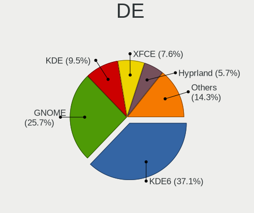
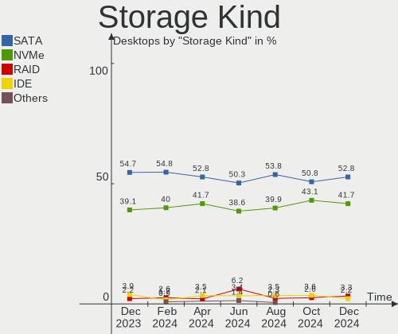
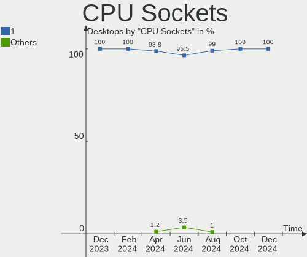

Arch Hardware Trends (Desktop)
------------------------------

A project to identify most popular hardware characteristics and track their change
over time based on data collected by Arch users at https://Linux-Hardware.org.

Anyone can contribute to the study by uploading probes of their computers by
the [hw-probe](https://github.com/linuxhw/hw-probe) tool:

    sudo -E hw-probe -all -upload

Full-feature report is available here: https://linux-hardware.org/?view=trends&formfactor=desktop

Period: May, 2020.

Contents
--------

- [ OS                       ](#os)
- [ OS Family                ](#os-family)
- [ Kernel                   ](#kernel)
- [ Kernel Family            ](#kernel-family)
- [ Kernel Major Ver.        ](#kernel-major-ver)
- [ Arch                     ](#arch)
- [ DE                       ](#de)
- [ Display Server           ](#display-server)
- [ Display Manager          ](#display-manager)
- [ OS Lang                  ](#os-lang)
- [ Boot Mode                ](#boot-mode)
- [ Filesystem               ](#filesystem)
- [ Part. scheme             ](#part-scheme)
- [ Dual Boot with Linux/BSD ](#dual-boot-with-linux/bsd)
- [ Dual Boot (Win)          ](#dual-boot-win)
- [ Country                  ](#country)
- [ City                     ](#city)
- [ Vendor                   ](#vendor)
- [ Model                    ](#model)
- [ Model Family             ](#model-family)
- [ MFG Year                 ](#mfg-year)
- [ Form Factor              ](#form-factor)
- [ Secure Boot              ](#secure-boot)
- [ Coreboot                 ](#coreboot)
- [ RAM Size                 ](#ram-size)
- [ RAM Used                 ](#ram-used)
- [ Drive Vendor             ](#drive-vendor)
- [ Drive Model              ](#drive-model)
- [ Drive Kind               ](#drive-kind)
- [ Drive Connector          ](#drive-connector)
- [ Drive Size               ](#drive-size)
- [ Space Total              ](#space-total)
- [ Space Used               ](#space-used)
- [ Malfunc. Drives          ](#malfunc-drives)
- [ Malfunc. Drive Vendor    ](#malfunc-drive-vendor)
- [ Malfunc. HDD Vendor      ](#malfunc-hdd-vendor)
- [ Malfunc. Drive Kind      ](#malfunc-drive-kind)
- [ Failed Drives            ](#failed-drives)
- [ Failed Drive Vendor      ](#failed-drive-vendor)
- [ Drive Status             ](#drive-status)
- [ Storage Vendor           ](#storage-vendor)
- [ Storage Model            ](#storage-model)
- [ Storage Kind             ](#storage-kind)
- [ CPU Vendor               ](#cpu-vendor)
- [ CPU Model                ](#cpu-model)
- [ CPU Model Family         ](#cpu-model-family)
- [ CPU Cores                ](#cpu-cores)
- [ CPU Sockets              ](#cpu-sockets)
- [ CPU Threads              ](#cpu-threads)
- [ CPU Op-Modes             ](#cpu-op-modes)
- [ CPU Microcode            ](#cpu-microcode)
- [ CPU Microarch            ](#cpu-microarch)
- [ GPU Vendor               ](#gpu-vendor)
- [ GPU Model                ](#gpu-model)
- [ GPU Combo                ](#gpu-combo)
- [ GPU Driver               ](#gpu-driver)
- [ GPU Memory               ](#gpu-memory)
- [ Monitor Vendor           ](#monitor-vendor)
- [ Monitor Model            ](#monitor-model)
- [ Monitor Resolution       ](#monitor-resolution)
- [ Monitor Diagonal         ](#monitor-diagonal)
- [ Monitor Width            ](#monitor-width)
- [ Aspect Ratio             ](#aspect-ratio)
- [ Monitor Area             ](#monitor-area)
- [ Pixel Density            ](#pixel-density)
- [ Multiple Monitors        ](#multiple-monitors)
- [ Net Controller Vendor    ](#net-controller-vendor)
- [ Net Controller Model     ](#net-controller-model)
- [ Wireless Vendor          ](#wireless-vendor)
- [ Wireless Model           ](#wireless-model)
- [ Ethernet Vendor          ](#ethernet-vendor)
- [ Ethernet Model           ](#ethernet-model)
- [ Net Controller Kind      ](#net-controller-kind)
- [ Used Controller          ](#used-controller)
- [ NICs                     ](#nics)
- [ Bluetooth Vendor         ](#bluetooth-vendor)
- [ Bluetooth Model          ](#bluetooth-model)
- [ Unsupported Devices      ](#unsupported-devices)
- [ Unsupported Device Types ](#unsupported-device-types)

OS
--

Installed operating systems

| Name         | Computers | Percent |
|--------------|-----------|---------|
| Arch         | 39        | 72.22%  |
| Arch Rolling | 14        | 25.93%  |
| Arch V20.3.4 | 1         | 1.85%   |

OS Family
---------

OS without a version

| Name | Computers | Percent |
|------|-----------|---------|
| Arch | 54        | 100%    |

Kernel
------

Version of the Linux kernel

| Version             | Computers | Percent |
|---------------------|-----------|---------|
| 5.6.13-arch1-1      | 11        | 20.37%  |
| 5.6.11-arch1-1      | 8         | 14.81%  |
| 5.6.14-arch1-1      | 5         | 9.26%   |
| 5.6.10-arch1-1      | 4         | 7.41%   |
| 5.6.6-arch1-1       | 3         | 5.56%   |
| 5.6.15-arch1-1      | 3         | 5.56%   |
| 5.6.8-zen1-1-zen    | 2         | 3.7%    |
| 5.6.7-arch1-1       | 2         | 3.7%    |
| 5.6.13-zen1-1-zen   | 2         | 3.7%    |
| 5.6.12-arch1-1      | 2         | 3.7%    |
| 5.6.8-arch1-1       | 1         | 1.85%   |
| 5.6.7-arch1-1-vfio  | 1         | 1.85%   |
| 5.6.3-arch1-1       | 1         | 1.85%   |
| 5.6.14-zen1-1-zen   | 1         | 1.85%   |
| 5.6.14-nitrous+     | 1         | 1.85%   |
| 5.6.13-1-ck-nehalem | 1         | 1.85%   |
| 5.6.12-zen1-1-zen   | 1         | 1.85%   |
| 5.6.11-zen1-1-zen   | 1         | 1.85%   |
| 5.6.0-pf8-pf+       | 1         | 1.85%   |
| 5.5.7-zen1-1-zen    | 1         | 1.85%   |
| 5.4.42-1-lts        | 1         | 1.85%   |
| 5.4.41-1-lts        | 1         | 1.85%   |

Kernel Family
-------------

Linux kernel without a distro release

| Version | Computers | Percent |
|---------|-----------|---------|
| 5.6.13  | 14        | 25.93%  |
| 5.6.11  | 9         | 16.67%  |
| 5.6.14  | 7         | 12.96%  |
| 5.6.10  | 4         | 7.41%   |
| 5.6.8   | 3         | 5.56%   |
| 5.6.7   | 3         | 5.56%   |
| 5.6.6   | 3         | 5.56%   |
| 5.6.15  | 3         | 5.56%   |
| 5.6.12  | 3         | 5.56%   |
| 5.6.3   | 1         | 1.85%   |
| 5.6.0   | 1         | 1.85%   |
| 5.5.7   | 1         | 1.85%   |
| 5.4.42  | 1         | 1.85%   |
| 5.4.41  | 1         | 1.85%   |

Kernel Major Ver.
-----------------

Linux kernel major version

| Version | Computers | Percent |
|---------|-----------|---------|
| 5.6     | 51        | 94.44%  |
| 5.4     | 2         | 3.7%    |
| 5.5     | 1         | 1.85%   |

Arch
----

OS architecture (x86_64, i586, etc.)

| Name   | Computers | Percent |
|--------|-----------|---------|
| x86_64 | 54        | 100%    |

DE
--

Desktop Environment

| Name            | Computers | Percent |
|-----------------|-----------|---------|
| GNOME           | 27        | 50%     |
| KDE5            | 9         | 16.67%  |
| XFCE            | 4         | 7.41%   |
| KDE             | 3         | 5.56%   |
| Unknown         | 3         | 5.56%   |
| Budgie          | 2         | 3.7%    |
| X-Cinnamon      | 1         | 1.85%   |
| MATE            | 1         | 1.85%   |
| LXQt            | 1         | 1.85%   |
| GNOME Flashback | 1         | 1.85%   |
| Deepin          | 1         | 1.85%   |
| Cinnamon        | 1         | 1.85%   |

Display Server
--------------

X11 or Wayland

| Name    | Computers | Percent |
|---------|-----------|---------|
| X11     | 40        | 74.07%  |
| Wayland | 10        | 18.52%  |
| Tty     | 3         | 5.56%   |
| Unknown | 1         | 1.85%   |

Display Manager
---------------

SDDM, LightDM, etc.

| Name    | Computers | Percent |
|---------|-----------|---------|
| Unknown | 35        | 64.81%  |
| SDDM    | 8         | 14.81%  |
| GDM     | 7         | 12.96%  |
| LightDM | 3         | 5.56%   |
| LXDM    | 1         | 1.85%   |

OS Lang
-------

Language

| Lang       | Computers | Percent |
|------------|-----------|---------|
| en_US      | 27        | 50%     |
| C          | 4         | 7.41%   |
| ru_RU      | 3         | 5.56%   |
| de_DE      | 3         | 5.56%   |
| Unknown    | 3         | 5.56%   |
| pt_BR      | 2         | 3.7%    |
| en_US.utf8 | 2         | 3.7%    |
| it_IT.utf8 | 1         | 1.85%   |
| it_IT      | 1         | 1.85%   |
| fr_FR      | 1         | 1.85%   |
| es_ES.utf8 | 1         | 1.85%   |
| es_CR.utf8 | 1         | 1.85%   |
| en_NZ      | 1         | 1.85%   |
| en_IN      | 1         | 1.85%   |
| en_GB      | 1         | 1.85%   |
| en_AU      | 1         | 1.85%   |
| de_AT      | 1         | 1.85%   |

Boot Mode
---------

EFI or BIOS

| Mode | Computers | Percent |
|------|-----------|---------|
| EFI  | 31        | 57.41%  |
| BIOS | 23        | 42.59%  |

Filesystem
----------

Type of filesystem

| Type  | Computers | Percent |
|-------|-----------|---------|
| Ext4  | 44        | 81.48%  |
| Btrfs | 9         | 16.67%  |
| F2fs  | 1         | 1.85%   |

Part. scheme
------------

Scheme of partitioning

| Type    | Computers | Percent |
|---------|-----------|---------|
| Unknown | 37        | 68.52%  |
| GPT     | 15        | 27.78%  |
| MBR     | 2         | 3.7%    |

Dual Boot with Linux/BSD
------------------------

Hosting more than one Linux/BSD

| Dual boot | Computers | Percent |
|-----------|-----------|---------|
| No        | 47        | 87.04%  |
| Yes       | 7         | 12.96%  |

Dual Boot (Win)
---------------

Hosting Linux and Windows

| Dual boot | Computers | Percent |
|-----------|-----------|---------|
| No        | 39        | 72.22%  |
| Yes       | 15        | 27.78%  |

Country
-------

Geographic location (country)

| Country             | Computers | Percent |
|---------------------|-----------|---------|
| USA                 | 17        | 31.48%  |
| Germany             | 7         | 12.96%  |
| Brazil              | 5         | 9.26%   |
| Russia              | 4         | 7.41%   |
| Ukraine             | 2         | 3.7%    |
| Italy               | 2         | 3.7%    |
| France              | 2         | 3.7%    |
| Finland             | 2         | 3.7%    |
| Canada              | 2         | 3.7%    |
| UK                  | 1         | 1.85%   |
| Trinidad and Tobago | 1         | 1.85%   |
| Switzerland         | 1         | 1.85%   |
| Spain               | 1         | 1.85%   |
| Poland              | 1         | 1.85%   |
| New Zealand         | 1         | 1.85%   |
| Korea, Republic of  | 1         | 1.85%   |
| Costa Rica          | 1         | 1.85%   |
| Bulgaria            | 1         | 1.85%   |
| Austria             | 1         | 1.85%   |
| Australia           | 1         | 1.85%   |

City
----

Geographic location (city)

| City               | Computers | Percent |
|--------------------|-----------|---------|
| Helsinki           | 2         | 3.7%    |
| Zurich             | 1         | 1.85%   |
| Wrocław           | 1         | 1.85%   |
| Vienna             | 1         | 1.85%   |
| Topeka             | 1         | 1.85%   |
| Thalfingen         | 1         | 1.85%   |
| São Paulo         | 1         | 1.85%   |
| Sydney             | 1         | 1.85%   |
| Sesto San Giovanni | 1         | 1.85%   |
| Seoul              | 1         | 1.85%   |
| San Antonio        | 1         | 1.85%   |
| Salvador           | 1         | 1.85%   |
| Saint Paul         | 1         | 1.85%   |
| Rostov-on-Don      | 1         | 1.85%   |
| Raleigh            | 1         | 1.85%   |
| Porto Alegre       | 1         | 1.85%   |
| Port of Spain      | 1         | 1.85%   |
| Port Allen         | 1         | 1.85%   |
| Plettenberg        | 1         | 1.85%   |
| Petrozavodsk       | 1         | 1.85%   |
| Oak Harbor         | 1         | 1.85%   |
| Nice               | 1         | 1.85%   |
| Neckarsulm         | 1         | 1.85%   |
| Murcia             | 1         | 1.85%   |
| Moscow             | 1         | 1.85%   |
| Montgomery         | 1         | 1.85%   |
| Mitchell           | 1         | 1.85%   |
| Minneapolis        | 1         | 1.85%   |
| Mesquite           | 1         | 1.85%   |
| Mannheim           | 1         | 1.85%   |
| Lourdes            | 1         | 1.85%   |
| Las Cruces         | 1         | 1.85%   |
| Kyiv               | 1         | 1.85%   |
| Korosten           | 1         | 1.85%   |
| Karlsruhe          | 1         | 1.85%   |
| Heredia            | 1         | 1.85%   |
| Gainesville        | 1         | 1.85%   |
| Fredericksburg     | 1         | 1.85%   |
| Frankfurt am Main  | 1         | 1.85%   |
| Edmonton           | 1         | 1.85%   |
| Desnogorsk         | 1         | 1.85%   |
| Derby              | 1         | 1.85%   |
| Chula Vista        | 1         | 1.85%   |
| Christchurch       | 1         | 1.85%   |
| Chico              | 1         | 1.85%   |
| Chesapeake         | 1         | 1.85%   |
| Boulder            | 1         | 1.85%   |
| Bisignano          | 1         | 1.85%   |
| Bielefeld          | 1         | 1.85%   |
| Belo Horizonte     | 1         | 1.85%   |
| Ashburn            | 1         | 1.85%   |
| Asenovgrad         | 1         | 1.85%   |
| Anápolis          | 1         | 1.85%   |

Vendor
------

Motherboard manufacturer

| Name                | Computers | Percent |
|---------------------|-----------|---------|
| ASUSTek Computer    | 20        | 37.04%  |
| Gigabyte Technology | 11        | 20.37%  |
| MSI                 | 8         | 14.81%  |
| Intel               | 4         | 7.41%   |
| ASRock              | 4         | 7.41%   |
| Hewlett-Packard     | 2         | 3.7%    |
| Lenovo              | 1         | 1.85%   |
| Foxconn             | 1         | 1.85%   |
| Dell                | 1         | 1.85%   |
| Apple               | 1         | 1.85%   |
| Unknown             | 1         | 1.85%   |

Model
-----

Motherboard model

| Name                                    | Computers | Percent |
|-----------------------------------------|-----------|---------|
| Gigabyte Z390 AORUS PRO                 | 2         | 3.7%    |
| ASUS TUF GAMING X570-PLUS               | 2         | 3.7%    |
| ASUS ROG STRIX B450-F GAMING            | 2         | 3.7%    |
| MSI MS-7C37                             | 1         | 1.85%   |
| MSI MS-7C02                             | 1         | 1.85%   |
| MSI MS-7B86                             | 1         | 1.85%   |
| MSI MS-7A74                             | 1         | 1.85%   |
| MSI MS-7A34                             | 1         | 1.85%   |
| MSI MS-7850                             | 1         | 1.85%   |
| MSI MS-7693                             | 1         | 1.85%   |
| MSI MS-7592                             | 1         | 1.85%   |
| Lenovo IdeaCentre 510S-08ISH 90FN007MGF | 1         | 1.85%   |
| Intel H55                               | 1         | 1.85%   |
| Intel DX79SR AAG57199-200               | 1         | 1.85%   |
| Intel DH87RL AAG74240-401               | 1         | 1.85%   |
| Intel D53427RKE G87971-402              | 1         | 1.85%   |
| HP Z240 SFF Workstation                 | 1         | 1.85%   |
| HP Compaq Elite 8300 CMT                | 1         | 1.85%   |
| Gigabyte Z170XP-SLI                     | 1         | 1.85%   |
| Gigabyte X79-UD3                        | 1         | 1.85%   |
| Gigabyte X58A-UD3R                      | 1         | 1.85%   |
| Gigabyte X470 AORUS ULTRA GAMING        | 1         | 1.85%   |
| Gigabyte H97-Gaming 3                   | 1         | 1.85%   |
| Gigabyte H110M-S2V                      | 1         | 1.85%   |
| Gigabyte GA-970A-UD3                    | 1         | 1.85%   |
| Gigabyte B450 AORUS ELITE               | 1         | 1.85%   |
| Gigabyte AB350M-DS3H V2                 | 1         | 1.85%   |
| Foxconn p6813w                          | 1         | 1.85%   |
| Dell OptiPlex 7010                      | 1         | 1.85%   |
| ASUS Z170-A                             | 1         | 1.85%   |
| ASUS TUF Z390M-PRO GAMING               | 1         | 1.85%   |
| ASUS TUF Z370-PLUS GAMING               | 1         | 1.85%   |
| ASUS ROG ZENITH EXTREME                 | 1         | 1.85%   |
| ASUS ROG STRIX Z390-I GAMING            | 1         | 1.85%   |
| ASUS ROG STRIX Z370-E GAMING            | 1         | 1.85%   |
| ASUS PRIME Z390-A                       | 1         | 1.85%   |
| ASUS PRIME X570-PRO                     | 1         | 1.85%   |
| ASUS PRIME B350M-A                      | 1         | 1.85%   |
| ASUS PRIME B250M-PLUS                   | 1         | 1.85%   |
| ASUS P8Z77-V LX                         | 1         | 1.85%   |
| ASUS P7P55D-E LX                        | 1         | 1.85%   |
| ASUS P5B-Premium                        | 1         | 1.85%   |
| ASUS Maximus VIII HERO                  | 1         | 1.85%   |
| ASUS Maximus V GENE                     | 1         | 1.85%   |
| ASUS All Series                         | 1         | 1.85%   |
| ASRock X570 Taichi                      | 1         | 1.85%   |
| ASRock X470 Taichi                      | 1         | 1.85%   |
| ASRock H81M-VG4 R3.0                    | 1         | 1.85%   |
| ASRock B450M Steel Legend               | 1         | 1.85%   |
| Apple MacPro5,1                         | 1         | 1.85%   |
| Unknown                                 | 1         | 1.85%   |

Model Family
------------

Motherboard model prefix

| Name                 | Computers | Percent |
|----------------------|-----------|---------|
| ASUS ROG             | 5         | 9.26%   |
| ASUS TUF             | 4         | 7.41%   |
| ASUS PRIME           | 4         | 7.41%   |
| Gigabyte Z390        | 2         | 3.7%    |
| ASUS Maximus         | 2         | 3.7%    |
| MSI MS-7C37          | 1         | 1.85%   |
| MSI MS-7C02          | 1         | 1.85%   |
| MSI MS-7B86          | 1         | 1.85%   |
| MSI MS-7A74          | 1         | 1.85%   |
| MSI MS-7A34          | 1         | 1.85%   |
| MSI MS-7850          | 1         | 1.85%   |
| MSI MS-7693          | 1         | 1.85%   |
| MSI MS-7592          | 1         | 1.85%   |
| Lenovo IdeaCentre    | 1         | 1.85%   |
| Intel H55            | 1         | 1.85%   |
| Intel DX79SR         | 1         | 1.85%   |
| Intel DH87RL         | 1         | 1.85%   |
| Intel D53427RKE      | 1         | 1.85%   |
| HP Z240              | 1         | 1.85%   |
| HP Compaq            | 1         | 1.85%   |
| Gigabyte Z170XP-SLI  | 1         | 1.85%   |
| Gigabyte X79-UD3     | 1         | 1.85%   |
| Gigabyte X58A-UD3R   | 1         | 1.85%   |
| Gigabyte X470        | 1         | 1.85%   |
| Gigabyte H97-Gaming  | 1         | 1.85%   |
| Gigabyte H110M-S2V   | 1         | 1.85%   |
| Gigabyte GA-970A-UD3 | 1         | 1.85%   |
| Gigabyte B450        | 1         | 1.85%   |
| Gigabyte AB350M-DS3H | 1         | 1.85%   |
| Foxconn p6813w       | 1         | 1.85%   |
| Dell OptiPlex        | 1         | 1.85%   |
| ASUS Z170-A          | 1         | 1.85%   |
| ASUS P8Z77-V         | 1         | 1.85%   |
| ASUS P7P55D-E        | 1         | 1.85%   |
| ASUS P5B-Premium     | 1         | 1.85%   |
| ASUS All             | 1         | 1.85%   |
| ASRock X570          | 1         | 1.85%   |
| ASRock X470          | 1         | 1.85%   |
| ASRock H81M-VG4      | 1         | 1.85%   |
| ASRock B450M         | 1         | 1.85%   |
| Apple MacPro5        | 1         | 1.85%   |
| Unknown              | 1         | 1.85%   |

MFG Year
--------

Motherboard manufacture year

| Year | Computers | Percent |
|------|-----------|---------|
| 2019 | 25        | 46.3%   |
| 2018 | 8         | 14.81%  |
| 2016 | 3         | 5.56%   |
| 2015 | 3         | 5.56%   |
| 2013 | 3         | 5.56%   |
| 2012 | 3         | 5.56%   |
| 2017 | 2         | 3.7%    |
| 2014 | 2         | 3.7%    |
| 2011 | 2         | 3.7%    |
| 2010 | 1         | 1.85%   |
| 2009 | 1         | 1.85%   |
| 2008 | 1         | 1.85%   |

Form Factor
-----------

Physical design of the computer

| Name    | Computers | Percent |
|---------|-----------|---------|
| Desktop | 54        | 100%    |

Secure Boot
-----------

Enabled or disabled

| State    | Computers | Percent |
|----------|-----------|---------|
| Disabled | 54        | 100%    |

Coreboot
--------

Have coreboot on board

| Used | Computers | Percent |
|------|-----------|---------|
| No   | 54        | 100%    |

RAM Size
--------

Total RAM memory

| Size in GB  | Computers | Percent |
|-------------|-----------|---------|
| 16.01-24.0  | 18        | 33.33%  |
| 32.01-64.0  | 12        | 22.22%  |
| 8.01-16.0   | 8         | 14.81%  |
| 4.01-8.0    | 6         | 11.11%  |
| 24.01-32.0  | 4         | 7.41%   |
| 3.01-4.0    | 3         | 5.56%   |
| 64.01-256.0 | 3         | 5.56%   |

RAM Used
--------

Used RAM memory

| Used GB    | Computers | Percent |
|------------|-----------|---------|
| 2.01-3.0   | 15        | 27.78%  |
| 1.01-2.0   | 14        | 25.93%  |
| 4.01-8.0   | 11        | 20.37%  |
| 3.01-4.0   | 7         | 12.96%  |
| 8.01-16.0  | 4         | 7.41%   |
| 0.01-1.0   | 2         | 3.7%    |
| 16.01-24.0 | 1         | 1.85%   |

Drive Vendor
------------

Hard drive vendors

| Vendor              | Computers | Drives | Percent |
|---------------------|-----------|--------|---------|
| WDC                 | 24        | 29     | 22.43%  |
| Seagate             | 13        | 21     | 12.15%  |
| Samsung Electronics | 13        | 19     | 12.15%  |
| Toshiba             | 11        | 11     | 10.28%  |
| Crucial             | 9         | 9      | 8.41%   |
| SanDisk             | 5         | 6      | 4.67%   |
| Kingston            | 5         | 5      | 4.67%   |
| Transcend           | 3         | 3      | 2.8%    |
| Intel               | 3         | 3      | 2.8%    |
| Hitachi             | 3         | 3      | 2.8%    |
| A-DATA Technology   | 3         | 3      | 2.8%    |
| OCZ                 | 2         | 2      | 1.87%   |
| Corsair             | 2         | 2      | 1.87%   |
| China               | 2         | 3      | 1.87%   |
| ZOTAC               | 1         | 1      | 0.93%   |
| XPG                 | 1         | 1      | 0.93%   |
| USB30               | 1         | 2      | 0.93%   |
| Unknown             | 1         | 1      | 0.93%   |
| Mushkin             | 1         | 1      | 0.93%   |
| MGS                 | 1         | 1      | 0.93%   |
| KingDian            | 1         | 1      | 0.93%   |
| HGST                | 1         | 2      | 0.93%   |
| Fujitsu             | 1         | 1      | 0.93%   |

Drive Model
-----------

Hard drive models

| Model                        | Computers | Percent |
|------------------------------|-----------|---------|
| SSD 850 EVO 500GB            | 3         | 2.34%   |
| HDWD110 1TB                  | 3         | 2.34%   |
| WD6400AAKS-22A7B2 640GB      | 2         | 1.56%   |
| WD10EZEX-08WN4A0 1TB         | 2         | 1.56%   |
| TS256GSSD370S 256GB          | 2         | 1.56%   |
| ST2000DM006-2DM164 2TB       | 2         | 1.56%   |
| ST2000DM001-1CH164 2TB       | 2         | 1.56%   |
| ST1000DM003-9YN162 1TB       | 2         | 1.56%   |
| SSD 970 EVO Plus 500GB       | 2         | 1.56%   |
| SSD 860 EVO 1TB              | 2         | 1.56%   |
| SSD 850 EVO 120GB            | 2         | 1.56%   |
| SSD 840 EVO 250GB            | 2         | 1.56%   |
| SA400S37240G 240GB SSD       | 2         | 1.56%   |
| CT1000MX500SSD1 1TB          | 2         | 1.56%   |
| ZTSSD-S11-120G-MD 120GB      | 1         | 0.78%   |
| WDS100T2B0B-00YS70 1TB SSD   | 1         | 0.78%   |
| WDBNCE5000PNC 500GB SSD      | 1         | 0.78%   |
| WDBNCE2500PNC-WRSN 250GB SSD | 1         | 0.78%   |
| WDBNCE2500PNC 250GB SSD      | 1         | 0.78%   |
| WD6001FZWX-00A2VA0 6TB       | 1         | 0.78%   |
| WD5001AALS-00E3A0 500GB      | 1         | 0.78%   |
| WD5000LPVX-00V0TT0 500GB     | 1         | 0.78%   |
| WD5000AAKX-60U6AA0 500GB     | 1         | 0.78%   |
| WD5000AAKS-65A7B0 500GB      | 1         | 0.78%   |
| WD5000AAKS-00YGA0 500GB      | 1         | 0.78%   |
| WD40EFRX-68WT0N0 4TB         | 1         | 0.78%   |
| WD4003FZEX-00Z4SA0 4TB       | 1         | 0.78%   |
| WD3200BEVT-11ZCT0 320GB      | 1         | 0.78%   |
| WD30EZRZ-00GXCB0 3TB         | 1         | 0.78%   |
| WD2500BEVT-22A23T0 250GB     | 1         | 0.78%   |
| WD10EZRZ-00HTKB0 1TB         | 1         | 0.78%   |
| WD10EZEX-75M2NA0 1TB         | 1         | 0.78%   |
| WD10EZEX-22BN5A0 1TB         | 1         | 0.78%   |
| WD10EZEX-00ZF5A0 1TB         | 1         | 0.78%   |
| WD10EZEX-00BN5A0 1TB         | 1         | 0.78%   |
| WD10EALX-009BA0 1TB          | 1         | 0.78%   |
| WD10EACS-00ZJB0 1TB          | 1         | 0.78%   |
| WD1003FZEX-00MK2A0 1TB       | 1         | 0.78%   |
| WD1002FBYS-02A6B0 1TB        | 1         | 0.78%   |
| WD1002FAEX-00Y9A0 1TB        | 1         | 0.78%   |
| VERTEX3 240GB SSD            | 1         | 0.78%   |
| Ultra II 500GB SSD           | 1         | 0.78%   |
| TS1TSSD230S 1024GB           | 1         | 0.78%   |
| TR200 480GB SSD              | 1         | 0.78%   |
| SX8200PNP 512GB              | 1         | 0.78%   |
| SUV500480G 480GB SSD         | 1         | 0.78%   |
| SU900 256GB SSD              | 1         | 0.78%   |
| SU800 1024GB SSD             | 1         | 0.78%   |
| ST8000AS0002 8TB             | 1         | 0.78%   |
| ST500DM002-1SB10A 500GB      | 1         | 0.78%   |
| ST4000DM004-2CV104 4TB       | 1         | 0.78%   |
| ST4000DM000-1F2168 4TB       | 1         | 0.78%   |
| ST3750528AS 752GB            | 1         | 0.78%   |
| ST3500418AS 500GB            | 1         | 0.78%   |
| ST3160815AS 160GB            | 1         | 0.78%   |
| ST31000528AS 1TB             | 1         | 0.78%   |
| ST3000DM001-1ER166 3TB       | 1         | 0.78%   |
| ST2000DM001-9YN164 2TB       | 1         | 0.78%   |
| ST1000DM010-2EP102 1TB       | 1         | 0.78%   |
| ST1000DM003-1ER162 1TB       | 1         | 0.78%   |

Drive Kind
----------

HDD or SSD

| Kind | Computers | Drives | Percent |
|------|-----------|--------|---------|
| SSD  | 37        | 58     | 46.25%  |
| HDD  | 37        | 65     | 46.25%  |
| NVMe | 6         | 7      | 7.5%    |

Drive Connector
---------------

SATA, SAS, NVMe, etc.

| Type | Computers | Drives | Percent |
|------|-----------|--------|---------|
| SATA | 50        | 119    | 86.21%  |
| NVMe | 6         | 7      | 10.34%  |
| SAS  | 2         | 4      | 3.45%   |

Drive Size
----------

Size of hard drive

| Size in TB | Computers | Drives | Percent |
|------------|-----------|--------|---------|
| 0.01-0.5   | 40        | 61     | 44.94%  |
| 0.51-1.0   | 26        | 38     | 29.21%  |
| 1.01-2.0   | 12        | 17     | 13.48%  |
| 3.01-4.0   | 4         | 6      | 4.49%   |
| 2.01-3.0   | 4         | 4      | 4.49%   |
| 4.01-10.0  | 3         | 4      | 3.37%   |

Space Total
-----------

Amount of disk space available on the file system

| Size in GB     | Computers | Percent |
|----------------|-----------|---------|
| 251-500        | 14        | 25.93%  |
| 501-1000       | 10        | 18.52%  |
| More than 3000 | 9         | 16.67%  |
| 101-250        | 7         | 12.96%  |
| 1001-2000      | 6         | 11.11%  |
| Unknown        | 3         | 5.56%   |
| 2001-3000      | 2         | 3.7%    |
| 21-50          | 1         | 1.85%   |
| 1-20           | 1         | 1.85%   |
| 51-100         | 1         | 1.85%   |

Space Used
----------

Amount of used disk space

| Used GB        | Computers | Percent |
|----------------|-----------|---------|
| 1-20           | 12        | 22.22%  |
| 21-50          | 8         | 14.81%  |
| 251-500        | 7         | 12.96%  |
| 501-1000       | 6         | 11.11%  |
| 101-250        | 5         | 9.26%   |
| 1001-2000      | 4         | 7.41%   |
| 51-100         | 4         | 7.41%   |
| More than 3000 | 3         | 5.56%   |
| Unknown        | 3         | 5.56%   |
| 2001-3000      | 2         | 3.7%    |

Malfunc. Drives
---------------

Drive models with a malfunction

| Model                  | Computers | Drives | Percent |
|------------------------|-----------|--------|---------|
| WD1002FAEX-00Y9A0 1TB  | 1         | 1      | 20%     |
| ST31000528AS 1TB       | 1         | 1      | 20%     |
| ST2000DM001-1CH164 2TB | 1         | 1      | 20%     |
| ST1000DM003-9YN162 1TB | 1         | 1      | 20%     |
| MG03ACA300 3TB         | 1         | 1      | 20%     |

Malfunc. Drive Vendor
---------------------

Vendors of faulty drives

| Vendor  | Computers | Drives | Percent |
|---------|-----------|--------|---------|
| Seagate | 2         | 3      | 50%     |
| WDC     | 1         | 1      | 25%     |
| Toshiba | 1         | 1      | 25%     |

Malfunc. HDD Vendor
-------------------

Vendors of faulty HDD drives

| Vendor  | Computers | Drives | Percent |
|---------|-----------|--------|---------|
| Seagate | 2         | 3      | 50%     |
| WDC     | 1         | 1      | 25%     |
| Toshiba | 1         | 1      | 25%     |

Malfunc. Drive Kind
-------------------

Kinds of faulty drives

| Kind | Computers | Drives | Percent |
|------|-----------|--------|---------|
| HDD  | 3         | 5      | 100%    |

Failed Drives
-------------

Failed drive models

Zero info for selected period =(

Failed Drive Vendor
-------------------

Failed drive vendors

Zero info for selected period =(

Drive Status
------------

Number of failed and malfunc. drives

| Status   | Computers | Drives | Percent |
|----------|-----------|--------|---------|
| Detected | 33        | 70     | 58.93%  |
| Works    | 20        | 55     | 35.71%  |
| Malfunc  | 3         | 5      | 5.36%   |

Storage Vendor
--------------

Storage controller vendors

| Vendor                      | Computers | Percent |
|-----------------------------|-----------|---------|
| Intel                       | 35        | 40.7%   |
| AMD                         | 21        | 24.42%  |
| Samsung Electronics         | 10        | 11.63%  |
| Marvell Technology Group    | 4         | 4.65%   |
| ASMedia Technology          | 4         | 4.65%   |
| JMicron Technology          | 3         | 3.49%   |
| ADATA Technology            | 2         | 2.33%   |
| Silicon Motion              | 1         | 1.16%   |
| Seagate Technology          | 1         | 1.16%   |
| Sandisk                     | 1         | 1.16%   |
| Realtek Semiconductor       | 1         | 1.16%   |
| Phison Electronics          | 1         | 1.16%   |
| Micron/Crucial Technology   | 1         | 1.16%   |
| Kingston Technology Company | 1         | 1.16%   |

Storage Model
-------------

Storage controller models

| Model                                                                    | Computers | Percent |
|--------------------------------------------------------------------------|-----------|---------|
| FCH SATA Controller [AHCI mode]                                          | 17        | 16.83%  |
| NVMe SSD Controller SM981/PM981/PM983                                    | 9         | 8.91%   |
| 400 Series Chipset SATA Controller                                       | 8         | 7.92%   |
| Q170/Q150/B150/H170/H110/Z170/CM236 Chipset SATA Controller [AHCI Mode]  | 6         | 5.94%   |
| SB7x0/SB8x0/SB9x0 SATA Controller [AHCI mode]                            | 4         | 3.96%   |
| Cannon Lake PCH SATA AHCI Controller                                     | 4         | 3.96%   |
| ASM1062 Serial ATA Controller                                            | 4         | 3.96%   |
| 7 Series/C210 Series Chipset Family 6-port SATA Controller [AHCI mode]   | 4         | 3.96%   |
| 200 Series PCH SATA controller [AHCI mode]                               | 4         | 3.96%   |
| Non-Volatile memory controller                                           | 3         | 2.97%   |
| 9 Series Chipset Family SATA Controller [AHCI Mode]                      | 3         | 2.97%   |
| 300 Series Chipset SATA Controller                                       | 3         | 2.97%   |
| XPG SX8200 Pro PCIe Gen3x4 M.2 2280 Solid State Drive                    | 2         | 1.98%   |
| NVMe SSD Controller SM961/PM961                                          | 2         | 1.98%   |
| JMB363 SATA/IDE Controller                                               | 2         | 1.98%   |
| 82801JI (ICH10 Family) SATA AHCI Controller                              | 2         | 1.98%   |
| 8 Series/C220 Series Chipset Family 6-port SATA Controller 1 [AHCI mode] | 2         | 1.98%   |
| X399 Series Chipset SATA Controller                                      | 1         | 0.99%   |
| WD Black 2018/PC SN720 NVMe SSD                                          | 1         | 0.99%   |
| SSD Pro 7600p/760p/E 6100p Series                                        | 1         | 0.99%   |
| SSD 660P Series                                                          | 1         | 0.99%   |
| SB7x0/SB8x0/SB9x0 IDE Controller                                         | 1         | 0.99%   |
| SATA Controller [RAID mode]                                              | 1         | 0.99%   |
| Realtek Non-Volatile memory controller                                   | 1         | 0.99%   |
| P1 NVMe PCIe SSD                                                         | 1         | 0.99%   |
| NM10/ICH7 Family SATA Controller [IDE mode]                              | 1         | 0.99%   |
| JMB361 AHCI/IDE                                                          | 1         | 0.99%   |
| E12 NVMe Controller                                                      | 1         | 0.99%   |
| C600/X79 series chipset 6-Port SATA AHCI Controller                      | 1         | 0.99%   |
| C600/X79 series chipset 4-Port SATA IDE Controller                       | 1         | 0.99%   |
| C600/X79 series chipset 2-Port SATA IDE Controller                       | 1         | 0.99%   |
| 88SE9172 SATA 6Gb/s Controller                                           | 1         | 0.99%   |
| 88SE912x SATA 6Gb/s Controller [IDE mode]                                | 1         | 0.99%   |
| 88SE9128 PCIe SATA 6 Gb/s RAID controller with HyperDuo                  | 1         | 0.99%   |
| 88SE9128 PCIe SATA 6 Gb/s RAID controller                                | 1         | 0.99%   |
| 82801HR/HO/HH (ICH8R/DO/DH) 6 port SATA Controller [AHCI mode]           | 1         | 0.99%   |
| 7 Series Chipset Family 6-port SATA Controller [AHCI mode]               | 1         | 0.99%   |
| 5 Series/3400 Series Chipset 6 port SATA AHCI Controller                 | 1         | 0.99%   |
| 5 Series/3400 Series Chipset 4 port SATA AHCI Controller                 | 1         | 0.99%   |

Storage Kind
------------

Kind of storage controller (IDE, SATA, NVMe, SAS, ...)

| Kind | Computers | Percent |
|------|-----------|---------|
| SATA | 52        | 65%     |
| NVMe | 21        | 26.25%  |
| IDE  | 6         | 7.5%    |
| RAID | 1         | 1.25%   |

CPU Vendor
----------

Processor vendors

| Vendor | Computers | Percent |
|--------|-----------|---------|
| Intel  | 33        | 61.11%  |
| AMD    | 21        | 38.89%  |

CPU Model
---------

Processor models

| Model                                          | Computers | Percent |
|------------------------------------------------|-----------|---------|
| Intel Core i7-9700K CPU @ 3.60GHz              | 3         | 5.56%   |
| AMD Ryzen 7 3800X 8-Core Processor             | 3         | 5.56%   |
| AMD Ryzen 7 2700X Eight-Core Processor         | 3         | 5.56%   |
| Intel Core i7-8700K CPU @ 3.70GHz              | 2         | 3.7%    |
| Intel Core i5-9600K CPU @ 3.70GHz              | 2         | 3.7%    |
| AMD Ryzen 7 3700X 8-Core Processor             | 2         | 3.7%    |
| AMD Ryzen 5 1600 Six-Core Processor            | 2         | 3.7%    |
| Intel Xeon CPU X5690 @ 3.47GHz                 | 1         | 1.85%   |
| Intel Xeon CPU E3-1240 v3 @ 3.40GHz            | 1         | 1.85%   |
| Intel Xeon CPU E3-1225 v5 @ 3.30GHz            | 1         | 1.85%   |
| Intel Core i7-7700K CPU @ 4.20GHz              | 1         | 1.85%   |
| Intel Core i7-7700 CPU @ 3.60GHz               | 1         | 1.85%   |
| Intel Core i7-6700K CPU @ 4.00GHz              | 1         | 1.85%   |
| Intel Core i7-4930K CPU @ 3.40GHz              | 1         | 1.85%   |
| Intel Core i7-4770 CPU @ 3.40GHz               | 1         | 1.85%   |
| Intel Core i7-3820 CPU @ 3.60GHz               | 1         | 1.85%   |
| Intel Core i7-3770S CPU @ 3.10GHz              | 1         | 1.85%   |
| Intel Core i7-3770 CPU @ 3.40GHz               | 1         | 1.85%   |
| Intel Core i7 CPU 930 @ 2.80GHz                | 1         | 1.85%   |
| Intel Core i5-7400 CPU @ 3.00GHz               | 1         | 1.85%   |
| Intel Core i5-6600K CPU @ 3.50GHz              | 1         | 1.85%   |
| Intel Core i5-4690K CPU @ 3.50GHz              | 1         | 1.85%   |
| Intel Core i5-4690 CPU @ 3.50GHz               | 1         | 1.85%   |
| Intel Core i5-4570 CPU @ 3.20GHz               | 1         | 1.85%   |
| Intel Core i5-3570K CPU @ 3.40GHz              | 1         | 1.85%   |
| Intel Core i5-3427U CPU @ 1.80GHz              | 1         | 1.85%   |
| Intel Core i5-3350P CPU @ 3.10GHz              | 1         | 1.85%   |
| Intel Core i5 CPU 650 @ 3.20GHz                | 1         | 1.85%   |
| Intel Core i3-7100 CPU @ 3.90GHz               | 1         | 1.85%   |
| Intel Core i3 CPU 540 @ 3.07GHz                | 1         | 1.85%   |
| Intel Core 2 Quad CPU Q6700 @ 2.66GHz          | 1         | 1.85%   |
| Intel Core 2 Quad CPU Q6600 @ 2.40GHz          | 1         | 1.85%   |
| Intel Celeron CPU G3900 @ 2.80GHz              | 1         | 1.85%   |
| AMD Ryzen Threadripper 1920X 12-Core Processor | 1         | 1.85%   |
| AMD Ryzen 9 3900 12-Core Processor             | 1         | 1.85%   |
| AMD Ryzen 7 2700 Eight-Core Processor          | 1         | 1.85%   |
| AMD Ryzen 5 3600 6-Core Processor              | 1         | 1.85%   |
| AMD Ryzen 5 2600X Six-Core Processor           | 1         | 1.85%   |
| AMD Ryzen 5 2600 Six-Core Processor            | 1         | 1.85%   |
| AMD Ryzen 5 2400G with Radeon Vega Graphics    | 1         | 1.85%   |
| AMD Phenom 8450 Triple-Core Processor          | 1         | 1.85%   |
| AMD FX-8350 Eight-Core Processor               | 1         | 1.85%   |
| AMD FX-8320 Eight-Core Processor               | 1         | 1.85%   |
| AMD Athlon II X4 645 Processor                 | 1         | 1.85%   |

CPU Model Family
----------------

Processor model prefix

| Model                  | Computers | Percent |
|------------------------|-----------|---------|
| Intel Core i7          | 14        | 25.93%  |
| Intel Core i5          | 11        | 20.37%  |
| AMD Ryzen 7            | 9         | 16.67%  |
| AMD Ryzen 5            | 6         | 11.11%  |
| Intel Xeon             | 3         | 5.56%   |
| Intel Core i3          | 2         | 3.7%    |
| Intel Core 2 Quad      | 2         | 3.7%    |
| AMD FX                 | 2         | 3.7%    |
| Intel Celeron          | 1         | 1.85%   |
| AMD Ryzen Threadripper | 1         | 1.85%   |
| AMD Ryzen 9            | 1         | 1.85%   |
| AMD Phenom             | 1         | 1.85%   |
| AMD Athlon II X4       | 1         | 1.85%   |

CPU Cores
---------

Number of processor cores

| Number | Computers | Percent |
|--------|-----------|---------|
| 4      | 23        | 42.59%  |
| 8      | 12        | 22.22%  |
| 6      | 11        | 20.37%  |
| 2      | 5         | 9.26%   |
| 12     | 2         | 3.7%    |
| 3      | 1         | 1.85%   |

CPU Sockets
-----------

Number of sockets

| Number | Computers | Percent |
|--------|-----------|---------|
| 1      | 54        | 100%    |

CPU Threads
-----------

Threads per core (Hyper-Threading)

| Number | Computers | Percent |
|--------|-----------|---------|
| 2      | 35        | 64.81%  |
| 1      | 19        | 35.19%  |

CPU Op-Modes
------------

CPU Operation Modes (32-bit, 64-bit)

| Op mode        | Computers | Percent |
|----------------|-----------|---------|
| 32-bit, 64-bit | 54        | 100%    |

CPU Microcode
-------------

Microcode number

| Number     | Computers | Percent |
|------------|-----------|---------|
| Unknown    | 8         | 14.81%  |
| 0x0800820d | 7         | 12.96%  |
| 0x08701013 | 6         | 11.11%  |
| 0x906ec    | 4         | 7.41%   |
| 0x906e9    | 4         | 7.41%   |
| 0x306a9    | 4         | 7.41%   |
| 0x506e3    | 3         | 5.56%   |
| 0x306c3    | 3         | 5.56%   |
| 0x906ea    | 2         | 3.7%    |
| 0x6fb      | 2         | 3.7%    |
| 0x20655    | 2         | 3.7%    |
| 0x206d7    | 1         | 1.85%   |
| 0x206c2    | 1         | 1.85%   |
| 0x106a5    | 1         | 1.85%   |
| 0x08701011 | 1         | 1.85%   |
| 0x08101016 | 1         | 1.85%   |
| 0x08001137 | 1         | 1.85%   |
| 0x06000852 | 1         | 1.85%   |
| 0x010000c8 | 1         | 1.85%   |
| 0x01000065 | 1         | 1.85%   |

CPU Microarch
-------------

Microarchitecture

| Name        | Computers | Percent |
|-------------|-----------|---------|
| Skylake     | 12        | 22.22%  |
| Zen+        | 7         | 12.96%  |
| Zen 2       | 7         | 12.96%  |
| IvyBridge   | 6         | 11.11%  |
| Haswell     | 5         | 9.26%   |
| Zen         | 3         | 5.56%   |
| Westmere    | 3         | 5.56%   |
| KabyLake    | 3         | 5.56%   |
| Piledriver  | 2         | 3.7%    |
| K10         | 2         | 3.7%    |
| Core        | 2         | 3.7%    |
| SandyBridge | 1         | 1.85%   |
| Nehalem     | 1         | 1.85%   |

GPU Vendor
----------

Vendors of graphics cards

| Vendor | Computers | Percent |
|--------|-----------|---------|
| Nvidia | 26        | 44.07%  |
| AMD    | 22        | 37.29%  |
| Intel  | 11        | 18.64%  |

GPU Model
---------

Graphics card models

| Model                                                                 | Computers | Percent |
|-----------------------------------------------------------------------|-----------|---------|
| Ellesmere [Radeon RX 470/480/570/570X/580/580X/590]                   | 8         | 12.9%   |
| GP107 [GeForce GTX 1050 Ti]                                           | 5         | 8.06%   |
| UHD Graphics 630 (Desktop 9 Series)                                   | 3         | 4.84%   |
| Xeon E3-1200 v2/3rd Gen Core processor Graphics Controller            | 2         | 3.23%   |
| TU104 [GeForce RTX 2080 Rev. A]                                       | 2         | 3.23%   |
| TU104 [GeForce RTX 2070 SUPER]                                        | 2         | 3.23%   |
| Tahiti PRO [Radeon HD 7950/8950 OEM / R9 280]                         | 2         | 3.23%   |
| Navi 10 [Radeon RX 5600 OEM/5600 XT / 5700/5700 XT]                   | 2         | 3.23%   |
| GM204 [GeForce GTX 970]                                               | 2         | 3.23%   |
| Xeon E3-1200 v3/4th Gen Core Processor Integrated Graphics Controller | 1         | 1.61%   |
| Vega 10 XL/XT [Radeon RX Vega 56/64]                                  | 1         | 1.61%   |
| TU116 [GeForce GTX 1660]                                              | 1         | 1.61%   |
| TU106 [GeForce RTX 2070 Rev. A]                                       | 1         | 1.61%   |
| Tahiti XT [Radeon HD 7970/8970 OEM / R9 280X]                         | 1         | 1.61%   |
| RV730 XT [Radeon HD 4670]                                             | 1         | 1.61%   |
| RS880 [Radeon HD 4200]                                                | 1         | 1.61%   |
| RS780 [Radeon HD 3200]                                                | 1         | 1.61%   |
| Redwood PRO [Radeon HD 5550/5570/5630/6510/6610/7570]                 | 1         | 1.61%   |
| Raven Ridge [Radeon Vega Series / Radeon Vega Mobile Series]          | 1         | 1.61%   |
| Juniper XT [Radeon HD 5770]                                           | 1         | 1.61%   |
| HD Graphics P530                                                      | 1         | 1.61%   |
| HD Graphics 630                                                       | 1         | 1.61%   |
| HD Graphics 510                                                       | 1         | 1.61%   |
| GP107GL [Quadro P400]                                                 | 1         | 1.61%   |
| GP107 [GeForce GTX 1050]                                              | 1         | 1.61%   |
| GP106 [GeForce GTX 1060 6GB]                                          | 1         | 1.61%   |
| GP104 [GeForce GTX 1080]                                              | 1         | 1.61%   |
| GP104 [GeForce GTX 1060 6GB]                                          | 1         | 1.61%   |
| GP102 [GeForce GTX 1080 Ti]                                           | 1         | 1.61%   |
| GM204 [GeForce GTX 980]                                               | 1         | 1.61%   |
| GM107 [GeForce GTX 750 Ti]                                            | 1         | 1.61%   |
| GK208B [GeForce GT 730]                                               | 1         | 1.61%   |
| GK107 [GeForce GTX 650]                                               | 1         | 1.61%   |
| GK107 [GeForce GT 740]                                                | 1         | 1.61%   |
| GK104 [GeForce GTX 670]                                               | 1         | 1.61%   |
| GK104 [GeForce GTX 660 OEM]                                           | 1         | 1.61%   |
| GF119 [GeForce GT 610]                                                | 1         | 1.61%   |
| G92 [GeForce GTS 250]                                                 | 1         | 1.61%   |
| Core Processor Integrated Graphics Controller                         | 1         | 1.61%   |
| Cedar [Radeon HD 5000/6000/7350/8350 Series]                          | 1         | 1.61%   |
| Cape Verde PRO [Radeon HD 7750/8740 / R7 250E]                        | 1         | 1.61%   |
| Baffin [Radeon RX 460/560D / Pro 450/455/460/555/555X/560/560X]       | 1         | 1.61%   |
| 3rd Gen Core processor Graphics Controller                            | 1         | 1.61%   |

GPU Combo
---------

Combinations of graphics cards

| Name         | Computers | Percent |
|--------------|-----------|---------|
| 1 x Nvidia   | 22        | 40.74%  |
| 1 x AMD      | 18        | 33.33%  |
| 1 x Intel    | 9         | 16.67%  |
| AMD + Nvidia | 3         | 5.56%   |
| 2 x Nvidia   | 1         | 1.85%   |
| 2 x AMD      | 1         | 1.85%   |

GPU Driver
----------

Free vs proprietary

| Driver      | Computers | Percent |
|-------------|-----------|---------|
| Free        | 33        | 61.11%  |
| Proprietary | 21        | 38.89%  |

GPU Memory
----------

Total video memory

| Size in GB | Computers | Percent |
|------------|-----------|---------|
| Unknown    | 13        | 24.07%  |
| 7.01-8.0   | 12        | 22.22%  |
| 3.01-4.0   | 7         | 12.96%  |
| 1.01-2.0   | 7         | 12.96%  |
| 0.51-1.0   | 6         | 11.11%  |
| 5.01-6.0   | 3         | 5.56%   |
| 0.01-0.5   | 3         | 5.56%   |
| 2.01-3.0   | 2         | 3.7%    |
| 8.01-16.0  | 1         | 1.85%   |

Monitor Vendor
--------------

Monitor vendors

| Vendor               | Computers | Percent |
|----------------------|-----------|---------|
| Samsung Electronics  | 9         | 14.29%  |
| AOC                  | 6         | 9.52%   |
| Acer                 | 6         | 9.52%   |
| LG Electronics       | 5         | 7.94%   |
| Hewlett-Packard      | 5         | 7.94%   |
| Ancor Communications | 5         | 7.94%   |
| Goldstar             | 4         | 6.35%   |
| Dell                 | 4         | 6.35%   |
| BenQ                 | 4         | 6.35%   |
| NEC Computers        | 3         | 4.76%   |
| ViewSonic            | 2         | 3.17%   |
| Vizio                | 1         | 1.59%   |
| Unknown              | 1         | 1.59%   |
| Sony                 | 1         | 1.59%   |
| Philips              | 1         | 1.59%   |
| ONN                  | 1         | 1.59%   |
| Lenovo Group Limited | 1         | 1.59%   |
| Hitachi              | 1         | 1.59%   |
| HannStar             | 1         | 1.59%   |
| FQV                  | 1         | 1.59%   |
| Apple                | 1         | 1.59%   |

Monitor Model
-------------

Monitor models

| Model                                               | Computers | Percent |
|-----------------------------------------------------|-----------|---------|
| LCD Monitor LG IPS FULLHD 1920x1080                 | 2         | 3.13%   |
| XF270H B ACR064D 1920x1080 598x336mm 27.0-inch      | 1         | 1.56%   |
| W240D DVI HIT7D03 1920x1200 520x320mm 24.0-inch     | 1         | 1.56%   |
| W2353 GSM56F0 1920x1080 510x290mm 23.1-inch         | 1         | 1.56%   |
| W1943 GSM4BAD 1024x768 410x230mm 18.5-inch          | 1         | 1.56%   |
| VX2433wm VSC3822 1920x1080 520x290mm 23.4-inch      | 1         | 1.56%   |
| VW2430 BNQ7B2E 1920x1080 530x300mm 24.0-inch        | 1         | 1.56%   |
| VH226 ACI22F2 1920x1080 477x268mm 21.5-inch         | 1         | 1.56%   |
| VE228 ACI22FA 1920x1080 477x268mm 21.5-inch         | 1         | 1.56%   |
| V505-G9 VIZ1033 3840x2160 1096x616mm 49.5-inch      | 1         | 1.56%   |
| V246HL ACR0336 1920x1080 531x299mm 24.0-inch        | 1         | 1.56%   |
| V2400Eco BNQ7D02 1920x1080 531x299mm 24.0-inch      | 1         | 1.56%   |
| V22b HPN353A 1920x1080 476x268mm 21.5-inch          | 1         | 1.56%   |
| U28E590 SAM0C4D 3840x2160 607x345mm 27.5-inch       | 1         | 1.56%   |
| U2719D DEL415A 2560x1440 597x336mm 27.0-inch        | 1         | 1.56%   |
| U2713HM DEL407E 2560x1440 597x336mm 27.0-inch       | 1         | 1.56%   |
| U2415 DELA0BA 1920x1080 518x324mm 24.1-inch         | 1         | 1.56%   |
| SMEX2220 SAM0686 1920x1080 477x268mm 21.5-inch      | 1         | 1.56%   |
| SDM-HS74P SNY3170 1280x1024 338x270mm 17.0-inch     | 1         | 1.56%   |
| SA300/SA350 SAM0793 1920x1080 531x299mm 24.0-inch   | 1         | 1.56%   |
| S27E390 SAM0C1C 1920x1080 598x336mm 27.0-inch       | 1         | 1.56%   |
| S2719DGF DELD0E6 2560x1440 597x336mm 27.0-inch      | 1         | 1.56%   |
| S24F350 SAM0D20 1920x1080 521x293mm 23.5-inch       | 1         | 1.56%   |
| S240HL ACR0289 1920x1080 531x299mm 24.0-inch        | 1         | 1.56%   |
| S2331 HWP2907 1920x1080 509x286mm 23.0-inch         | 1         | 1.56%   |
| S220HQL ACR0347 1920x1080 477x268mm 21.5-inch       | 1         | 1.56%   |
| ROG PG27AQ ACI27B3 3840x2160 598x336mm 27.0-inch    | 1         | 1.56%   |
| ROG PG279Q ACI27EC 2560x1440 598x336mm 27.0-inch    | 1         | 1.56%   |
| PHL 243V7 PHLC155 1920x1080 530x300mm 24.0-inch     | 1         | 1.56%   |
| P221 HWP3058 1920x1080 476x268mm 21.5-inch          | 1         | 1.56%   |
| ONA18HO015 ONN0101 1920x1080 698x393mm 31.5-inch    | 1         | 1.56%   |
| LP2475w HWP26F7 1920x1200 546x352mm 25.6-inch       | 1         | 1.56%   |
| LED Cinema APP9226 2560x1440 600x340mm 27.2-inch    | 1         | 1.56%   |
| LCD Monitor VX2458-mhd 3286x1080                    | 1         | 1.56%   |
| LCD Monitor SMBX2250 1920x1080                      | 1         | 1.56%   |
| LCD Monitor SAM0A7E 1920x1080 1060x626mm 48.5-inch  | 1         | 1.56%   |
| LCD Monitor SAM07BC 1360x768                        | 1         | 1.56%   |
| LCD Monitor S24B300 1920x1080                       | 1         | 1.56%   |
| LCD Monitor ROG PG278Q 2560x1440                    | 1         | 1.56%   |
| LCD Monitor LG FULL HD 1920x1080                    | 1         | 1.56%   |
| LCD Monitor LEN P27h-10                             | 1         | 1.56%   |
| LCD Monitor L246WP 1920x1200                        | 1         | 1.56%   |
| LCD Monitor INN ULTRON 3479UC 4880x2560             | 1         | 1.56%   |
| LCD Monitor Digital Projection Limited DP           | 1         | 1.56%   |
| LCD Monitor 2D FHD LG TV 1920x1080                  | 1         | 1.56%   |
| LCD Monitor 1970W                                   | 1         | 1.56%   |
| L1752T GSM4433 1280x1024 338x270mm 17.0-inch        | 1         | 1.56%   |
| KG241 ACR0699 1920x1080 531x299mm 24.0-inch         | 1         | 1.56%   |
| K242HQL ACR042E 1920x1080 521x293mm 23.5-inch       | 1         | 1.56%   |
| Hanns.G Hi221 HSD2469 1680x1050 474x297mm 22.0-inch | 1         | 1.56%   |
| GW2780 BNQ78E6 1920x1080 598x336mm 27.0-inch        | 1         | 1.56%   |
| GW2255 BNQ78CD 1920x1080 480x270mm 21.7-inch        | 1         | 1.56%   |
| EA244WMi NEC68D7 1920x1200 519x324mm 24.1-inch      | 1         | 1.56%   |
| e2752Vq AOC2752 1920x1080 598x336mm 27.0-inch       | 1         | 1.56%   |
| E245WMi NEC2C63 1920x1200 519x324mm 24.1-inch       | 1         | 1.56%   |
| 936W AOC1936 1366x768 410x230mm 18.5-inch           | 1         | 1.56%   |
| 2778G5 AOC2778 1920x1080 598x336mm 27.0-inch        | 1         | 1.56%   |
| 25mx HPN359B 1920x1080 544x303mm 24.5-inch          | 1         | 1.56%   |
| 24V2W1G5 AOC2402 1920x1080 527x296mm 23.8-inch      | 1         | 1.56%   |
| 24EB23 GSM59B4 1920x1080 520x330mm 24.2-inch        | 1         | 1.56%   |

Monitor Resolution
------------------

Monitor screen resolution

| Resolution         | Computers | Percent |
|--------------------|-----------|---------|
| 1920x1080 (FHD)    | 32        | 54.24%  |
| 2560x1440 (QHD)    | 7         | 11.86%  |
| 1920x1200 (WUXGA)  | 5         | 8.47%   |
| 3840x2160 (4K)     | 3         | 5.08%   |
| Unknown            | 3         | 5.08%   |
| 1680x1050 (WSXGA+) | 2         | 3.39%   |
| 1360x768           | 2         | 3.39%   |
| 1280x1024 (SXGA)   | 2         | 3.39%   |
| 4880x2560          | 1         | 1.69%   |
| 3286x1080          | 1         | 1.69%   |
| 1366x768 (WXGA)    | 1         | 1.69%   |

Monitor Diagonal
----------------

Diagonal size in inches

| Inches  | Computers | Percent |
|---------|-----------|---------|
| 24      | 12        | 20.34%  |
| Unknown | 11        | 18.64%  |
| 27      | 10        | 16.95%  |
| 23      | 8         | 13.56%  |
| 21      | 6         | 10.17%  |
| 31      | 2         | 3.39%   |
| 18      | 2         | 3.39%   |
| 17      | 2         | 3.39%   |
| 49      | 1         | 1.69%   |
| 48      | 1         | 1.69%   |
| 26      | 1         | 1.69%   |
| 25      | 1         | 1.69%   |
| 22      | 1         | 1.69%   |
| 20      | 1         | 1.69%   |

Monitor Width
-------------

Physical width

| Width in mm | Computers | Percent |
|-------------|-----------|---------|
| 501-600     | 27        | 49.09%  |
| Unknown     | 11        | 20%     |
| 401-500     | 10        | 18.18%  |
| 601-700     | 3         | 5.45%   |
| 301-350     | 2         | 3.64%   |
| 1001-1500   | 2         | 3.64%   |

Aspect Ratio
------------

Proportional relationship between the width and the height

| Ratio   | Computers | Percent |
|---------|-----------|---------|
| 16/9    | 33        | 62.26%  |
| Unknown | 11        | 20.75%  |
| 16/10   | 7         | 13.21%  |
| 5/4     | 2         | 3.77%   |

Monitor Area
------------

Area in inch²

| Area in inch² | Computers | Percent |
|----------------|-----------|---------|
| 201-250        | 16        | 28.07%  |
| Unknown        | 11        | 19.3%   |
| 301-350        | 10        | 17.54%  |
| 251-300        | 6         | 10.53%  |
| 151-200        | 6         | 10.53%  |
| 141-150        | 4         | 7.02%   |
| More than 1000 | 2         | 3.51%   |
| 351-500        | 2         | 3.51%   |

Pixel Density
-------------

Pixels per inch

| Density | Computers | Percent |
|---------|-----------|---------|
| 51-100  | 30        | 52.63%  |
| 101-120 | 12        | 21.05%  |
| Unknown | 11        | 19.3%   |
| 1-50    | 2         | 3.51%   |
| 161-240 | 2         | 3.51%   |

Multiple Monitors
-----------------

Total monitors connected

| Total | Computers | Percent |
|-------|-----------|---------|
| 1     | 41        | 75.93%  |
| 2     | 13        | 24.07%  |

Net Controller Vendor
---------------------

Controller vendors

| Vendor                          | Computers | Percent |
|---------------------------------|-----------|---------|
| Intel                           | 30        | 40%     |
| Realtek Semiconductor           | 26        | 34.67%  |
| Qualcomm Atheros                | 8         | 10.67%  |
| NetGear                         | 2         | 2.67%   |
| Wilocity                        | 1         | 1.33%   |
| TP-Link                         | 1         | 1.33%   |
| Realtek                         | 1         | 1.33%   |
| Qualcomm Atheros Communications | 1         | 1.33%   |
| Netchip Technology              | 1         | 1.33%   |
| Marvell Technology Group        | 1         | 1.33%   |
| Edimax Technology               | 1         | 1.33%   |
| Broadcom Inc. and subsidiaries  | 1         | 1.33%   |
| Belkin Components               | 1         | 1.33%   |

Net Controller Model
--------------------

Controller models

| Model                                                     | Computers | Percent |
|-----------------------------------------------------------|-----------|---------|
| RTL8111/8168/8411 PCI Express Gigabit Ethernet Controller | 19        | 21.84%  |
| I211 Gigabit Network Connection                           | 7         | 8.05%   |
| Ethernet Connection (2) I219-V                            | 6         | 6.9%    |
| Ethernet Connection (7) I219-V                            | 5         | 5.75%   |
| 82579LM Gigabit Network Connection (Lewisville)           | 4         | 4.6%    |
| Wireless-AC 9560 [Jefferson Peak]                         | 2         | 2.3%    |
| Wireless 8260                                             | 2         | 2.3%    |
| Wi-Fi 6 AX200                                             | 2         | 2.3%    |
| RTL810xE PCI Express Fast Ethernet controller             | 2         | 2.3%    |
| Killer E220x Gigabit Ethernet Controller                  | 2         | 2.3%    |
| AR93xx Wireless Network Adapter                           | 2         | 2.3%    |
| A6100 AC600 DB Wireless Adapter [Realtek RTL8811AU]       | 2         | 2.3%    |
| 82579V Gigabit Network Connection                         | 2         | 2.3%    |
| 82574L Gigabit Network Connection                         | 2         | 2.3%    |
| Wireless-AC 9260                                          | 1         | 1.15%   |
| Wil6200 802.11ad Wireless Network Adapter                 | 1         | 1.15%   |
| USB3.0 802.11ac 1200M Adapter                             | 1         | 1.15%   |
| RTL8822BE 802.11a/b/g/n/ac WiFi adapter                   | 1         | 1.15%   |
| RTL8821AE 802.11ac PCIe Wireless Network Adapter          | 1         | 1.15%   |
| RTL8812AE 802.11ac PCIe Wireless Network Adapter          | 1         | 1.15%   |
| RTL8192EE PCIe Wireless Network Adapter                   | 1         | 1.15%   |
| RTL8188SU 802.11n WLAN Adapter                            | 1         | 1.15%   |
| RTL8153 Gigabit Ethernet Adapter                          | 1         | 1.15%   |
| RTL-8100/8101L/8139 PCI Fast Ethernet Adapter             | 1         | 1.15%   |
| QCA6174 802.11ac Wireless Network Adapter                 | 1         | 1.15%   |
| Linux-USB CDC Composite Gadge (Ethernet and ACM)          | 1         | 1.15%   |
| I210 Gigabit Network Connection                           | 1         | 1.15%   |
| F5D7050 Wireless G Adapter v3000 [Ralink RT2571W]         | 1         | 1.15%   |
| Ethernet Connection I217-V                                | 1         | 1.15%   |
| Ethernet Connection (2) I219-LM                           | 1         | 1.15%   |
| Ethernet Connection (2) I218-V                            | 1         | 1.15%   |
| Dual Band Wireless-AC 3168NGW [Stone Peak]                | 1         | 1.15%   |
| BCM4322 802.11a/b/g/n Wireless LAN Controller             | 1         | 1.15%   |
| AR9485 Wireless Network Adapter                           | 1         | 1.15%   |
| AR9287 Wireless Network Adapter (PCI-Express)             | 1         | 1.15%   |
| AR9271 802.11n                                            | 1         | 1.15%   |
| AR8131 Gigabit Ethernet                                   | 1         | 1.15%   |
| AC1750 USB                                                | 1         | 1.15%   |
| 88E8056 PCI-E Gigabit Ethernet Controller                 | 1         | 1.15%   |
| 88E8001 Gigabit Ethernet Controller                       | 1         | 1.15%   |
| 802.11n NIC                                               | 1         | 1.15%   |
| 802.11ac WLAN Adapter                                     | 1         | 1.15%   |

Wireless Vendor
---------------

Wireless vendors

| Vendor                          | Computers | Percent |
|---------------------------------|-----------|---------|
| Intel                           | 8         | 28.57%  |
| Realtek Semiconductor           | 6         | 21.43%  |
| Qualcomm Atheros                | 5         | 17.86%  |
| NetGear                         | 2         | 7.14%   |
| Wilocity                        | 1         | 3.57%   |
| TP-Link                         | 1         | 3.57%   |
| Realtek                         | 1         | 3.57%   |
| Qualcomm Atheros Communications | 1         | 3.57%   |
| Edimax Technology               | 1         | 3.57%   |
| Broadcom Inc. and subsidiaries  | 1         | 3.57%   |
| Belkin Components               | 1         | 3.57%   |

Wireless Model
--------------

Wireless models

| Model                                               | Computers | Percent |
|-----------------------------------------------------|-----------|---------|
| Wireless-AC 9560 [Jefferson Peak]                   | 2         | 7.14%   |
| Wireless 8260                                       | 2         | 7.14%   |
| Wi-Fi 6 AX200                                       | 2         | 7.14%   |
| AR93xx Wireless Network Adapter                     | 2         | 7.14%   |
| A6100 AC600 DB Wireless Adapter [Realtek RTL8811AU] | 2         | 7.14%   |
| Wireless-AC 9260                                    | 1         | 3.57%   |
| Wil6200 802.11ad Wireless Network Adapter           | 1         | 3.57%   |
| USB3.0 802.11ac 1200M Adapter                       | 1         | 3.57%   |
| RTL8822BE 802.11a/b/g/n/ac WiFi adapter             | 1         | 3.57%   |
| RTL8821AE 802.11ac PCIe Wireless Network Adapter    | 1         | 3.57%   |
| RTL8812AE 802.11ac PCIe Wireless Network Adapter    | 1         | 3.57%   |
| RTL8192EE PCIe Wireless Network Adapter             | 1         | 3.57%   |
| RTL8188SU 802.11n WLAN Adapter                      | 1         | 3.57%   |
| QCA6174 802.11ac Wireless Network Adapter           | 1         | 3.57%   |
| F5D7050 Wireless G Adapter v3000 [Ralink RT2571W]   | 1         | 3.57%   |
| Dual Band Wireless-AC 3168NGW [Stone Peak]          | 1         | 3.57%   |
| BCM4322 802.11a/b/g/n Wireless LAN Controller       | 1         | 3.57%   |
| AR9485 Wireless Network Adapter                     | 1         | 3.57%   |
| AR9287 Wireless Network Adapter (PCI-Express)       | 1         | 3.57%   |
| AR9271 802.11n                                      | 1         | 3.57%   |
| AC1750 USB                                          | 1         | 3.57%   |
| 802.11n NIC                                         | 1         | 3.57%   |
| 802.11ac WLAN Adapter                               | 1         | 3.57%   |

Ethernet Vendor
---------------

Ethernet vendors

| Vendor                   | Computers | Percent |
|--------------------------|-----------|---------|
| Intel                    | 28        | 50.91%  |
| Realtek Semiconductor    | 23        | 41.82%  |
| Qualcomm Atheros         | 3         | 5.45%   |
| Marvell Technology Group | 1         | 1.82%   |

Ethernet Model
--------------

Ethernet models

| Model                                                     | Computers | Percent |
|-----------------------------------------------------------|-----------|---------|
| RTL8111/8168/8411 PCI Express Gigabit Ethernet Controller | 19        | 32.76%  |
| I211 Gigabit Network Connection                           | 7         | 12.07%  |
| Ethernet Connection (2) I219-V                            | 6         | 10.34%  |
| Ethernet Connection (7) I219-V                            | 5         | 8.62%   |
| 82579LM Gigabit Network Connection (Lewisville)           | 4         | 6.9%    |
| RTL810xE PCI Express Fast Ethernet controller             | 2         | 3.45%   |
| Killer E220x Gigabit Ethernet Controller                  | 2         | 3.45%   |
| 82579V Gigabit Network Connection                         | 2         | 3.45%   |
| 82574L Gigabit Network Connection                         | 2         | 3.45%   |
| RTL8153 Gigabit Ethernet Adapter                          | 1         | 1.72%   |
| RTL-8100/8101L/8139 PCI Fast Ethernet Adapter             | 1         | 1.72%   |
| I210 Gigabit Network Connection                           | 1         | 1.72%   |
| Ethernet Connection I217-V                                | 1         | 1.72%   |
| Ethernet Connection (2) I219-LM                           | 1         | 1.72%   |
| Ethernet Connection (2) I218-V                            | 1         | 1.72%   |
| AR8131 Gigabit Ethernet                                   | 1         | 1.72%   |
| 88E8056 PCI-E Gigabit Ethernet Controller                 | 1         | 1.72%   |
| 88E8001 Gigabit Ethernet Controller                       | 1         | 1.72%   |

Net Controller Kind
-------------------

Ethernet, WiFi or modem

| Kind     | Computers | Percent |
|----------|-----------|---------|
| Ethernet | 54        | 67.5%   |
| WiFi     | 25        | 31.25%  |
| Modem    | 1         | 1.25%   |

Used Controller
---------------

Currently used network controller

| Kind     | Computers | Percent |
|----------|-----------|---------|
| Ethernet | 46        | 79.31%  |
| WiFi     | 12        | 20.69%  |

NICs
----

Total network controllers on board

| Total | Computers | Percent |
|-------|-----------|---------|
| 1     | 35        | 64.81%  |
| 2     | 16        | 29.63%  |
| 3     | 3         | 5.56%   |

Bluetooth Vendor
----------------

Controller vendors

| Vendor                     | Computers | Percent |
|----------------------------|-----------|---------|
| Intel                      | 8         | 32%     |
| Cambridge Silicon Radio    | 7         | 28%     |
| ASUSTek Computer           | 6         | 24%     |
| Realtek Semiconductor      | 1         | 4%      |
| Integrated System Solution | 1         | 4%      |
| Broadcom                   | 1         | 4%      |
| Apple                      | 1         | 4%      |

Bluetooth Model
---------------

Controller models

| Model                          | Computers | Percent |
|--------------------------------|-----------|---------|
| Bluetooth Device               | 9         | 36%     |
| Bluetooth Dongle (HCI mode)    | 7         | 28%     |
| Broadcom BCM20702A0 Bluetooth  | 4         | 16%     |
| Bluetooth Radio                | 2         | 8%      |
| KY-BT100 Bluetooth Adapter     | 1         | 4%      |
| Built-in Bluetooth 2.0+EDR HCI | 1         | 4%      |
| BCM20702A0 Bluetooth 4.0       | 1         | 4%      |

Unsupported Devices
-------------------

Total unsupported devices on board

| Total | Computers | Percent |
|-------|-----------|---------|
| 0     | 44        | 81.48%  |
| 1     | 8         | 14.81%  |
| 2     | 2         | 3.7%    |

Unsupported Device Types
------------------------

Types of unsupported devices

| Type                  | Computers | Percent |
|-----------------------|-----------|---------|
| Net/wireless          | 5         | 50%     |
| Graphics card         | 2         | 20%     |
| Network               | 1         | 10%     |
| Multimedia controller | 1         | 10%     |
| Chipcard              | 1         | 10%     |

