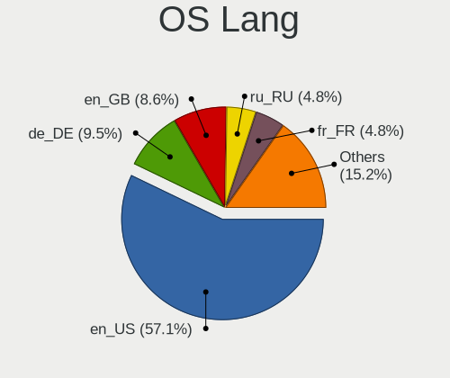
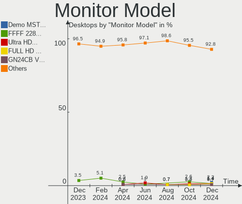
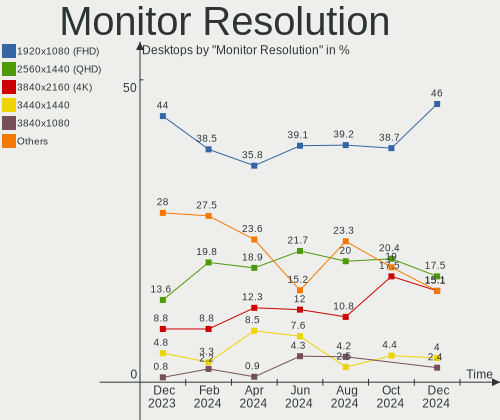
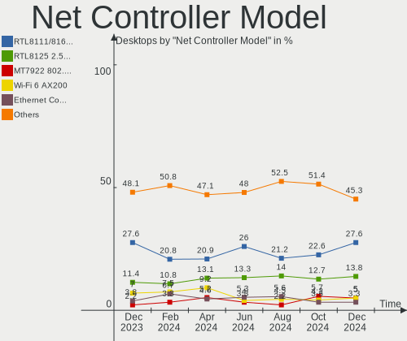
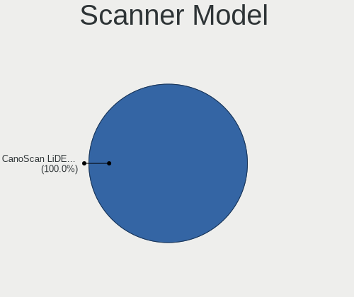

Arch - Hardware Trends (Desktops)
---------------------------------

A project to identify most popular hardware characteristics and track their change
over time based on data collected by Linux users at https://Linux-Hardware.org.

Anyone can contribute to this report by the [hw-probe](https://github.com/linuxhw/hw-probe) tool:

    sudo -E hw-probe -all -upload

This report is for one last month. Overall report since the beginning of time: [TestDays](https://github.com/linuxhw/TestDays)

Period: Feb, 2023.

Contents
--------

* [ System ](#system)
  - [ OS                       ](#os)
  - [ OS Family                ](#os-family)
  - [ Kernel                   ](#kernel)
  - [ Kernel Family            ](#kernel-family)
  - [ Kernel Major Ver.        ](#kernel-major-ver)
  - [ Arch                     ](#arch)
  - [ DE                       ](#de)
  - [ Display Server           ](#display-server)
  - [ Display Manager          ](#display-manager)
  - [ OS Lang                  ](#os-lang)
  - [ Boot Mode                ](#boot-mode)
  - [ Filesystem               ](#filesystem)
  - [ Part. scheme             ](#part-scheme)
  - [ Dual Boot with Linux/BSD ](#dual-boot-with-linuxbsd)
  - [ Dual Boot (Win)          ](#dual-boot-win)

* [ Board ](#board)
  - [ Vendor                   ](#vendor)
  - [ Model                    ](#model)
  - [ Model Family             ](#model-family)
  - [ MFG Year                 ](#mfg-year)
  - [ Form Factor              ](#form-factor)
  - [ Secure Boot              ](#secure-boot)
  - [ Coreboot                 ](#coreboot)
  - [ RAM Size                 ](#ram-size)
  - [ RAM Used                 ](#ram-used)
  - [ Total Drives             ](#total-drives)
  - [ Has CD-ROM               ](#has-cd-rom)
  - [ Has Ethernet             ](#has-ethernet)
  - [ Has WiFi                 ](#has-wifi)
  - [ Has Bluetooth            ](#has-bluetooth)

* [ Location ](#location)
  - [ Country                  ](#country)
  - [ City                     ](#city)

* [ Drives ](#drives)
  - [ Drive Vendor             ](#drive-vendor)
  - [ Drive Model              ](#drive-model)
  - [ HDD Vendor               ](#hdd-vendor)
  - [ SSD Vendor               ](#ssd-vendor)
  - [ Drive Kind               ](#drive-kind)
  - [ Drive Connector          ](#drive-connector)
  - [ Drive Size               ](#drive-size)
  - [ Space Total              ](#space-total)
  - [ Space Used               ](#space-used)
  - [ Malfunc. Drives          ](#malfunc-drives)
  - [ Malfunc. Drive Vendor    ](#malfunc-drive-vendor)
  - [ Malfunc. HDD Vendor      ](#malfunc-hdd-vendor)
  - [ Malfunc. Drive Kind      ](#malfunc-drive-kind)
  - [ Failed Drives            ](#failed-drives)
  - [ Failed Drive Vendor      ](#failed-drive-vendor)
  - [ Drive Status             ](#drive-status)

* [ Storage controller ](#storage-controller)
  - [ Storage Vendor           ](#storage-vendor)
  - [ Storage Model            ](#storage-model)
  - [ Storage Kind             ](#storage-kind)

* [ Processor ](#processor)
  - [ CPU Vendor               ](#cpu-vendor)
  - [ CPU Model                ](#cpu-model)
  - [ CPU Model Family         ](#cpu-model-family)
  - [ CPU Cores                ](#cpu-cores)
  - [ CPU Sockets              ](#cpu-sockets)
  - [ CPU Threads              ](#cpu-threads)
  - [ CPU Op-Modes             ](#cpu-op-modes)
  - [ CPU Microcode            ](#cpu-microcode)
  - [ CPU Microarch            ](#cpu-microarch)

* [ Graphics ](#graphics)
  - [ GPU Vendor               ](#gpu-vendor)
  - [ GPU Model                ](#gpu-model)
  - [ GPU Combo                ](#gpu-combo)
  - [ GPU Driver               ](#gpu-driver)
  - [ GPU Memory               ](#gpu-memory)

* [ Monitor ](#monitor)
  - [ Monitor Vendor           ](#monitor-vendor)
  - [ Monitor Model            ](#monitor-model)
  - [ Monitor Resolution       ](#monitor-resolution)
  - [ Monitor Diagonal         ](#monitor-diagonal)
  - [ Monitor Width            ](#monitor-width)
  - [ Aspect Ratio             ](#aspect-ratio)
  - [ Monitor Area             ](#monitor-area)
  - [ Pixel Density            ](#pixel-density)
  - [ Multiple Monitors        ](#multiple-monitors)

* [ Network ](#network)
  - [ Net Controller Vendor    ](#net-controller-vendor)
  - [ Net Controller Model     ](#net-controller-model)
  - [ Wireless Vendor          ](#wireless-vendor)
  - [ Wireless Model           ](#wireless-model)
  - [ Ethernet Vendor          ](#ethernet-vendor)
  - [ Ethernet Model           ](#ethernet-model)
  - [ Net Controller Kind      ](#net-controller-kind)
  - [ Used Controller          ](#used-controller)
  - [ NICs                     ](#nics)
  - [ IPv6                     ](#ipv6)

* [ Bluetooth ](#bluetooth)
  - [ Bluetooth Vendor         ](#bluetooth-vendor)
  - [ Bluetooth Model          ](#bluetooth-model)

* [ Sound ](#sound)
  - [ Sound Vendor             ](#sound-vendor)
  - [ Sound Model              ](#sound-model)

* [ Memory ](#memory)
  - [ Memory Vendor            ](#memory-vendor)
  - [ Memory Model             ](#memory-model)
  - [ Memory Kind              ](#memory-kind)
  - [ Memory Form Factor       ](#memory-form-factor)
  - [ Memory Size              ](#memory-size)
  - [ Memory Speed             ](#memory-speed)

* [ Printers & scanners ](#printers--scanners)
  - [ Printer Vendor           ](#printer-vendor)
  - [ Printer Model            ](#printer-model)
  - [ Scanner Vendor           ](#scanner-vendor)
  - [ Scanner Model            ](#scanner-model)

* [ Camera ](#camera)
  - [ Camera Vendor            ](#camera-vendor)
  - [ Camera Model             ](#camera-model)

* [ Security ](#security)
  - [ Fingerprint Vendor       ](#fingerprint-vendor)
  - [ Fingerprint Model        ](#fingerprint-model)
  - [ Chipcard Vendor          ](#chipcard-vendor)
  - [ Chipcard Model           ](#chipcard-model)

* [ Unsupported ](#unsupported)
  - [ Unsupported Devices      ](#unsupported-devices)
  - [ Unsupported Device Types ](#unsupported-device-types)

System
------

OS
--

Installed operating systems

| Name         | Desktops | Percent |
|--------------|----------|---------|
| Arch Rolling | 81       | 100%    |

OS Family
---------

OS without a version

| Name | Desktops | Percent |
|------|----------|---------|
| Arch | 81       | 100%    |

Kernel
------

Version of the Linux kernel

| Version                               | Desktops | Percent |
|---------------------------------------|----------|---------|
| 6.1.12-arch1-1                        | 17       | 20.99%  |
| 6.1.9-arch1-1                         | 12       | 14.81%  |
| 6.1.11-arch1-1                        | 6        | 7.41%   |
| 6.1.8-arch1-1                         | 5        | 6.17%   |
| 6.1.11-zen1-1-zen                     | 5        | 6.17%   |
| 6.1.9-arch1-2                         | 4        | 4.94%   |
| 6.1.12-zen1-1-zen                     | 3        | 3.7%    |
| 6.1.10-arch1-1                        | 3        | 3.7%    |
| 6.2.1-arch1-1                         | 2        | 2.47%   |
| 6.1.8-zen1-1-zen                      | 2        | 2.47%   |
| 6.1.13-1-lts                          | 2        | 2.47%   |
| 5.15.94-1-lts                         | 2        | 2.47%   |
| 6.2.0-273-tkg-cfs                     | 1        | 1.23%   |
| 6.1.9-zen1-1-zen                      | 1        | 1.23%   |
| 6.1.9-arch1-1.1                       | 1        | 1.23%   |
| 6.1.8-x64v1-xanmod1-1                 | 1        | 1.23%   |
| 6.1.8-1-1000hz                        | 1        | 1.23%   |
| 6.1.7-1-clear                         | 1        | 1.23%   |
| 6.1.4-arch1-1                         | 1        | 1.23%   |
| 6.1.14-1-lts                          | 1        | 1.23%   |
| 6.1.12-lqx4-1-lqx                     | 1        | 1.23%   |
| 6.1.11-x64v1-xanmod1-1                | 1        | 1.23%   |
| 6.1.10-1-clear-llvm                   | 1        | 1.23%   |
| 6.0.9-arch1-1                         | 1        | 1.23%   |
| 6.0.6-arch1-1                         | 1        | 1.23%   |
| 6.0.11-rt14-xanmod1-linux-xanmod-rt60 | 1        | 1.23%   |
| 5.15.91-4-lts                         | 1        | 1.23%   |
| 5.15.91-1-lts                         | 1        | 1.23%   |
| 5.15.90-1-lts                         | 1        | 1.23%   |
| 5.10.34-1-lts                         | 1        | 1.23%   |

Kernel Family
-------------

Linux kernel without a distro release

| Version | Desktops | Percent |
|---------|----------|---------|
| 6.1.12  | 21       | 25.93%  |
| 6.1.9   | 18       | 22.22%  |
| 6.1.11  | 12       | 14.81%  |
| 6.1.8   | 9        | 11.11%  |
| 6.1.10  | 4        | 4.94%   |
| 6.2.1   | 2        | 2.47%   |
| 6.1.13  | 2        | 2.47%   |
| 5.15.94 | 2        | 2.47%   |
| 5.15.91 | 2        | 2.47%   |
| 6.2.0   | 1        | 1.23%   |
| 6.1.7   | 1        | 1.23%   |
| 6.1.4   | 1        | 1.23%   |
| 6.1.14  | 1        | 1.23%   |
| 6.0.9   | 1        | 1.23%   |
| 6.0.6   | 1        | 1.23%   |
| 6.0.11  | 1        | 1.23%   |
| 5.15.90 | 1        | 1.23%   |
| 5.10.34 | 1        | 1.23%   |

Kernel Major Ver.
-----------------

Linux kernel major version

| Version | Desktops | Percent |
|---------|----------|---------|
| 6.1     | 69       | 85.19%  |
| 5.15    | 5        | 6.17%   |
| 6.2     | 3        | 3.7%    |
| 6.0     | 3        | 3.7%    |
| 5.10    | 1        | 1.23%   |

Arch
----

OS architecture (x86_64, i586, etc.)

| Name   | Desktops | Percent |
|--------|----------|---------|
| x86_64 | 81       | 100%    |

DE
--

Desktop Environment

| Name       | Desktops | Percent |
|------------|----------|---------|
| KDE5       | 32       | 39.51%  |
| GNOME      | 23       | 28.4%   |
| Unknown    | 5        | 6.17%   |
| XFCE       | 4        | 4.94%   |
| i3         | 3        | 3.7%    |
| X-Cinnamon | 2        | 2.47%   |
| Hyprland   | 2        | 2.47%   |
| xmonad     | 1        | 1.23%   |
| qtile      | 1        | 1.23%   |
| Openbox    | 1        | 1.23%   |
| LXQt       | 1        | 1.23%   |
| LeftWM     | 1        | 1.23%   |
| DWM        | 1        | 1.23%   |
| Deepin     | 1        | 1.23%   |
| chadwm     | 1        | 1.23%   |
| Budgie     | 1        | 1.23%   |
| awesome    | 1        | 1.23%   |

Display Server
--------------

X11 or Wayland

| Name    | Desktops | Percent |
|---------|----------|---------|
| X11     | 42       | 51.85%  |
| Wayland | 25       | 30.86%  |
| Tty     | 8        | 9.88%   |
| Unknown | 6        | 7.41%   |

Display Manager
---------------

SDDM, LightDM, etc.

| Name    | Desktops | Percent |
|---------|----------|---------|
| Unknown | 32       | 39.51%  |
| SDDM    | 23       | 28.4%   |
| GDM     | 12       | 14.81%  |
| LightDM | 10       | 12.35%  |
| Ly      | 2        | 2.47%   |
| LXDM    | 2        | 2.47%   |

OS Lang
-------

Language

| Lang       | Desktops | Percent |
|------------|----------|---------|
| en_US      | 40       | 49.38%  |
| de_DE      | 6        | 7.41%   |
| Unknown    | 6        | 7.41%   |
| en_GB      | 4        | 4.94%   |
| pt_BR      | 3        | 3.7%    |
| en_IE      | 3        | 3.7%    |
| C          | 3        | 3.7%    |
| it_IT      | 2        | 2.47%   |
| fr_FR      | 2        | 2.47%   |
| en_DK      | 2        | 2.47%   |
| zh_CN      | 1        | 1.23%   |
| sv_SE      | 1        | 1.23%   |
| pl_PL      | 1        | 1.23%   |
| ko_KR      | 1        | 1.23%   |
| es_ES      | 1        | 1.23%   |
| es_CO      | 1        | 1.23%   |
| en_IN      | 1        | 1.23%   |
| en_CA      | 1        | 1.23%   |
| en-US.UTF8 | 1        | 1.23%   |
| de_AT      | 1        | 1.23%   |

Boot Mode
---------

EFI or BIOS

| Mode | Desktops | Percent |
|------|----------|---------|
| EFI  | 53       | 65.43%  |
| BIOS | 28       | 34.57%  |

Filesystem
----------

Type of filesystem

| Type    | Desktops | Percent |
|---------|----------|---------|
| Ext4    | 50       | 61.73%  |
| Btrfs   | 25       | 30.86%  |
| Xfs     | 2        | 2.47%   |
| Zfs     | 1        | 1.23%   |
| Overlay | 1        | 1.23%   |
| F2fs    | 1        | 1.23%   |
| Unknown | 1        | 1.23%   |

Part. scheme
------------

Scheme of partitioning

| Type    | Desktops | Percent |
|---------|----------|---------|
| GPT     | 58       | 71.6%   |
| Unknown | 20       | 24.69%  |
| MBR     | 3        | 3.7%    |

Dual Boot with Linux/BSD
------------------------

Hosting more than one Linux/BSD

| Dual boot | Desktops | Percent |
|-----------|----------|---------|
| No        | 63       | 77.78%  |
| Yes       | 18       | 22.22%  |

Dual Boot (Win)
---------------

Hosting Linux and Windows

| Dual boot | Desktops | Percent |
|-----------|----------|---------|
| No        | 54       | 66.67%  |
| Yes       | 27       | 33.33%  |

Board
-----

Vendor
------

Motherboard manufacturer

| Name                | Desktops | Percent |
|---------------------|----------|---------|
| ASUSTek Computer    | 26       | 32.1%   |
| Gigabyte Technology | 17       | 20.99%  |
| MSI                 | 16       | 19.75%  |
| ASRock              | 10       | 12.35%  |
| Dell                | 4        | 4.94%   |
| Hewlett-Packard     | 3        | 3.7%    |
| Lenovo              | 1        | 1.23%   |
| Gateway             | 1        | 1.23%   |
| Fujitsu             | 1        | 1.23%   |
| AZW                 | 1        | 1.23%   |
| Unknown             | 1        | 1.23%   |

Model
-----

Motherboard model

| Name                                 | Desktops | Percent |
|--------------------------------------|----------|---------|
| MSI MS-7C52                          | 2        | 2.47%   |
| MSI MS-7B79                          | 2        | 2.47%   |
| Gigabyte X570 AORUS ELITE            | 2        | 2.47%   |
| ASUS ROG STRIX B550-F GAMING         | 2        | 2.47%   |
| ASUS ROG STRIX B450-F GAMING         | 2        | 2.47%   |
| MSI MS-7D23                          | 1        | 1.23%   |
| MSI MS-7C96                          | 1        | 1.23%   |
| MSI MS-7C94                          | 1        | 1.23%   |
| MSI MS-7C75                          | 1        | 1.23%   |
| MSI MS-7C56                          | 1        | 1.23%   |
| MSI MS-7C35                          | 1        | 1.23%   |
| MSI MS-7C02                          | 1        | 1.23%   |
| MSI MS-7B98                          | 1        | 1.23%   |
| MSI MS-7A70                          | 1        | 1.23%   |
| MSI MS-7A34                          | 1        | 1.23%   |
| MSI MS-7641                          | 1        | 1.23%   |
| MSI ESPRIMO P1510                    | 1        | 1.23%   |
| Lenovo ThinkCentre M93p 10A8S1K403   | 1        | 1.23%   |
| HP ProDesk 600 G1 SFF                | 1        | 1.23%   |
| HP Pavilion Gaming Desktop TG01-2xxx | 1        | 1.23%   |
| HP Compaq Elite 8300 SFF             | 1        | 1.23%   |
| Gigabyte Z790 AORUS ELITE AX         | 1        | 1.23%   |
| Gigabyte Z170XP-SLI                  | 1        | 1.23%   |
| Gigabyte H61M-S2V-B3                 | 1        | 1.23%   |
| Gigabyte G31M-ES2C                   | 1        | 1.23%   |
| Gigabyte B85M-D3V-A-SI               | 1        | 1.23%   |
| Gigabyte B660 GAMING X DDR4          | 1        | 1.23%   |
| Gigabyte B650M DS3H                  | 1        | 1.23%   |
| Gigabyte B650M AORUS ELITE AX        | 1        | 1.23%   |
| Gigabyte B550 GAMING X V2            | 1        | 1.23%   |
| Gigabyte B550 AORUS PRO AC           | 1        | 1.23%   |
| Gigabyte B450M H                     | 1        | 1.23%   |
| Gigabyte B450M DS3H WIFI             | 1        | 1.23%   |
| Gigabyte B450M DS3H V2               | 1        | 1.23%   |
| Gigabyte B450 AORUS PRO WIFI         | 1        | 1.23%   |
| Gigabyte AX370-Gaming K7             | 1        | 1.23%   |
| Gateway SX2803                       | 1        | 1.23%   |
| Fujitsu ESPRIMO PH320                | 1        | 1.23%   |
| Dell Studio 540                      | 1        | 1.23%   |
| Dell OptiPlex 5000                   | 1        | 1.23%   |

Model Family
------------

Motherboard model prefix

| Name                   | Desktops | Percent |
|------------------------|----------|---------|
| ASUS ROG               | 12       | 14.81%  |
| ASUS PRIME             | 7        | 8.64%   |
| Gigabyte B450M         | 3        | 3.7%    |
| MSI MS-7C52            | 2        | 2.47%   |
| MSI MS-7B79            | 2        | 2.47%   |
| Gigabyte X570          | 2        | 2.47%   |
| Gigabyte B650M         | 2        | 2.47%   |
| Gigabyte B550          | 2        | 2.47%   |
| Dell OptiPlex          | 2        | 2.47%   |
| ASUS TUF               | 2        | 2.47%   |
| ASRock B450M           | 2        | 2.47%   |
| ASRock B450            | 2        | 2.47%   |
| MSI MS-7D23            | 1        | 1.23%   |
| MSI MS-7C96            | 1        | 1.23%   |
| MSI MS-7C94            | 1        | 1.23%   |
| MSI MS-7C75            | 1        | 1.23%   |
| MSI MS-7C56            | 1        | 1.23%   |
| MSI MS-7C35            | 1        | 1.23%   |
| MSI MS-7C02            | 1        | 1.23%   |
| MSI MS-7B98            | 1        | 1.23%   |
| MSI MS-7A70            | 1        | 1.23%   |
| MSI MS-7A34            | 1        | 1.23%   |
| MSI MS-7641            | 1        | 1.23%   |
| MSI ESPRIMO            | 1        | 1.23%   |
| Lenovo ThinkCentre     | 1        | 1.23%   |
| HP ProDesk             | 1        | 1.23%   |
| HP Pavilion            | 1        | 1.23%   |
| HP Compaq              | 1        | 1.23%   |
| Gigabyte Z790          | 1        | 1.23%   |
| Gigabyte Z170XP-SLI    | 1        | 1.23%   |
| Gigabyte H61M-S2V-B3   | 1        | 1.23%   |
| Gigabyte G31M-ES2C     | 1        | 1.23%   |
| Gigabyte B85M-D3V-A-SI | 1        | 1.23%   |
| Gigabyte B660          | 1        | 1.23%   |
| Gigabyte B450          | 1        | 1.23%   |
| Gigabyte AX370-Gaming  | 1        | 1.23%   |
| Gateway SX2803         | 1        | 1.23%   |
| Fujitsu ESPRIMO        | 1        | 1.23%   |
| Dell Studio            | 1        | 1.23%   |
| Dell Inspiron          | 1        | 1.23%   |

MFG Year
--------

Motherboard manufacture year

| Year | Desktops | Percent |
|------|----------|---------|
| 2019 | 15       | 18.52%  |
| 2020 | 14       | 17.28%  |
| 2018 | 13       | 16.05%  |
| 2022 | 8        | 9.88%   |
| 2021 | 7        | 8.64%   |
| 2017 | 4        | 4.94%   |
| 2014 | 3        | 3.7%    |
| 2013 | 3        | 3.7%    |
| 2011 | 3        | 3.7%    |
| 2016 | 2        | 2.47%   |
| 2015 | 2        | 2.47%   |
| 2012 | 2        | 2.47%   |
| 2010 | 2        | 2.47%   |
| 2008 | 2        | 2.47%   |
| 2023 | 1        | 1.23%   |

Form Factor
-----------

Physical design of the computer

| Name    | Desktops | Percent |
|---------|----------|---------|
| Desktop | 81       | 100%    |

Secure Boot
-----------

Enabled or disabled

| State    | Desktops | Percent |
|----------|----------|---------|
| Disabled | 75       | 92.59%  |
| Enabled  | 6        | 7.41%   |

Coreboot
--------

Have coreboot on board

| Used | Desktops | Percent |
|------|----------|---------|
| No   | 81       | 100%    |

RAM Size
--------

Total RAM memory

| Size in GB  | Desktops | Percent |
|-------------|----------|---------|
| 32.01-64.0  | 22       | 27.16%  |
| 16.01-24.0  | 21       | 25.93%  |
| 8.01-16.0   | 16       | 19.75%  |
| 64.01-256.0 | 12       | 14.81%  |
| 4.01-8.0    | 6        | 7.41%   |
| 24.01-32.0  | 3        | 3.7%    |
| 3.01-4.0    | 1        | 1.23%   |

RAM Used
--------

Used RAM memory

| Used GB    | Desktops | Percent |
|------------|----------|---------|
| 4.01-8.0   | 29       | 35.8%   |
| 2.01-3.0   | 23       | 28.4%   |
| 1.01-2.0   | 9        | 11.11%  |
| 3.01-4.0   | 8        | 9.88%   |
| 8.01-16.0  | 5        | 6.17%   |
| 16.01-24.0 | 4        | 4.94%   |
| 32.01-64.0 | 2        | 2.47%   |
| 0.51-1.0   | 1        | 1.23%   |

Total Drives
------------

Number of drives on board

| Drives | Desktops | Percent |
|--------|----------|---------|
| 1      | 23       | 28.4%   |
| 2      | 20       | 24.69%  |
| 3      | 14       | 17.28%  |
| 5      | 7        | 8.64%   |
| 4      | 7        | 8.64%   |
| 6      | 5        | 6.17%   |
| 7      | 2        | 2.47%   |
| 13     | 1        | 1.23%   |
| 12     | 1        | 1.23%   |
| 11     | 1        | 1.23%   |

Has CD-ROM
----------

Has CD-ROM on board

| Presented | Desktops | Percent |
|-----------|----------|---------|
| No        | 62       | 76.54%  |
| Yes       | 19       | 23.46%  |

Has Ethernet
------------

Has Ethernet on board

| Presented | Desktops | Percent |
|-----------|----------|---------|
| Yes       | 81       | 100%    |

Has WiFi
--------

Has WiFi module

| Presented | Desktops | Percent |
|-----------|----------|---------|
| No        | 41       | 50.62%  |
| Yes       | 40       | 49.38%  |

Has Bluetooth
-------------

Has Bluetooth module

| Presented | Desktops | Percent |
|-----------|----------|---------|
| Yes       | 41       | 50.62%  |
| No        | 40       | 49.38%  |

Location
--------

Country
-------

Geographic location (country)

| Country     | Desktops | Percent |
|-------------|----------|---------|
| USA         | 21       | 25.93%  |
| Germany     | 9        | 11.11%  |
| Russia      | 5        | 6.17%   |
| Poland      | 3        | 3.7%    |
| France      | 3        | 3.7%    |
| Denmark     | 3        | 3.7%    |
| Brazil      | 3        | 3.7%    |
| UK          | 2        | 2.47%   |
| Sweden      | 2        | 2.47%   |
| Netherlands | 2        | 2.47%   |
| Italy       | 2        | 2.47%   |
| Greece      | 2        | 2.47%   |
| Finland     | 2        | 2.47%   |
| Chile       | 2        | 2.47%   |
| Bulgaria    | 2        | 2.47%   |
| Uzbekistan  | 1        | 1.23%   |
| Turkey      | 1        | 1.23%   |
| Switzerland | 1        | 1.23%   |
| Spain       | 1        | 1.23%   |
| South Korea | 1        | 1.23%   |
| Romania     | 1        | 1.23%   |
| Philippines | 1        | 1.23%   |
| New Zealand | 1        | 1.23%   |
| Ireland     | 1        | 1.23%   |
| India       | 1        | 1.23%   |
| Hong Kong   | 1        | 1.23%   |
| Colombia    | 1        | 1.23%   |
| China       | 1        | 1.23%   |
| Canada      | 1        | 1.23%   |
| Bangladesh  | 1        | 1.23%   |
| Austria     | 1        | 1.23%   |
| Australia   | 1        | 1.23%   |
| Argentina   | 1        | 1.23%   |

City
----

Geographic location (city)

| City              | Desktops | Percent |
|-------------------|----------|---------|
| Copenhagen        | 3        | 3.7%    |
| Paris             | 2        | 2.47%   |
| Escondido         | 2        | 2.47%   |
| Zurich            | 1        | 1.23%   |
| Worms             | 1        | 1.23%   |
| Wonju             | 1        | 1.23%   |
| Whitehall         | 1        | 1.23%   |
| Weiterstadt       | 1        | 1.23%   |
| Warsaw            | 1        | 1.23%   |
| Villeneuve-d'Ascq | 1        | 1.23%   |
| Tulsa             | 1        | 1.23%   |
| Tomball           | 1        | 1.23%   |
| The Bronx         | 1        | 1.23%   |
| Tashkent          | 1        | 1.23%   |
| Tarlac City       | 1        | 1.23%   |
| Tampere           | 1        | 1.23%   |
| Tampa             | 1        | 1.23%   |
| Straubing         | 1        | 1.23%   |
| St Petersburg     | 1        | 1.23%   |
| Solingen          | 1        | 1.23%   |
| Shumen            | 1        | 1.23%   |
| Seattle           | 1        | 1.23%   |
| Schwarzenbek      | 1        | 1.23%   |
| Santona           | 1        | 1.23%   |
| Santiago          | 1        | 1.23%   |
| Rybnik            | 1        | 1.23%   |
| Riverside         | 1        | 1.23%   |
| Prattville        | 1        | 1.23%   |
| Phoenix           | 1        | 1.23%   |
| Perth             | 1        | 1.23%   |
| Pereira           | 1        | 1.23%   |
| Para de Minas     | 1        | 1.23%   |
| Ormskirk          | 1        | 1.23%   |
| Oklahoma City     | 1        | 1.23%   |
| New York          | 1        | 1.23%   |
| Montana           | 1        | 1.23%   |
| Mondragone        | 1        | 1.23%   |
| Milan             | 1        | 1.23%   |
| Manhattan         | 1        | 1.23%   |
| Los Surgentes     | 1        | 1.23%   |

Drives
------

Drive Vendor
------------

Hard drive vendors

| Vendor                      | Desktops | Drives | Percent |
|-----------------------------|----------|--------|---------|
| WDC                         | 30       | 48     | 17.34%  |
| Samsung Electronics         | 28       | 46     | 16.18%  |
| Seagate                     | 25       | 35     | 14.45%  |
| SanDisk                     | 18       | 23     | 10.4%   |
| Kingston                    | 11       | 11     | 6.36%   |
| Crucial                     | 11       | 12     | 6.36%   |
| Toshiba                     | 8        | 11     | 4.62%   |
| Phison Electronics          | 5        | 5      | 2.89%   |
| Micron/Crucial Technology   | 4        | 4      | 2.31%   |
| China                       | 4        | 4      | 2.31%   |
| Patriot                     | 3        | 3      | 1.73%   |
| Team                        | 2        | 2      | 1.16%   |
| Realtek Semiconductor       | 2        | 2      | 1.16%   |
| Hitachi                     | 2        | 2      | 1.16%   |
| USB30                       | 1        | 3      | 0.58%   |
| Unknown                     | 1        | 2      | 0.58%   |
| Transcend                   | 1        | 1      | 0.58%   |
| SPCC                        | 1        | 1      | 0.58%   |
| Silicon Motion              | 1        | 2      | 0.58%   |
| Realtek                     | 1        | 1      | 0.58%   |
| QNAP                        | 1        | 7      | 0.58%   |
| Phison                      | 1        | 1      | 0.58%   |
| Micron Technology           | 1        | 1      | 0.58%   |
| KIOXIA                      | 1        | 1      | 0.58%   |
| Kingston Technology Company | 1        | 1      | 0.58%   |
| JMicron Technology          | 1        | 8      | 0.58%   |
| Intenso                     | 1        | 1      | 0.58%   |
| Intel                       | 1        | 1      | 0.58%   |
| HS-SSD-C100                 | 1        | 1      | 0.58%   |
| HGST                        | 1        | 1      | 0.58%   |
| Fujitsu                     | 1        | 1      | 0.58%   |
| ADATA Technology            | 1        | 1      | 0.58%   |
| A-DATA Technology           | 1        | 1      | 0.58%   |
| Unknown                     | 1        | 1      | 0.58%   |

Drive Model
-----------

Hard drive models

| Model                                                | Desktops | Percent |
|------------------------------------------------------|----------|---------|
| Samsung NVMe SSD Controller SM981/PM981/PM983 250GB  | 10       | 4.76%   |
| Samsung NVMe SSD Controller PM9A1/PM9A3/980PRO 960GB | 6        | 2.86%   |
| Crucial CT1000MX500SSD1 1TB                          | 5        | 2.38%   |
| Sandisk WD Blue SN550 NVMe SSD 1TB                   | 4        | 1.9%    |
| Samsung SSD 860 EVO 500GB                            | 4        | 1.9%    |
| Seagate ST2000DM008-2FR102 2TB                       | 3        | 1.43%   |
| Sandisk WD Blue SN570 1TB                            | 3        | 1.43%   |
| Samsung SSD 850 EVO 500GB                            | 3        | 1.43%   |
| WDC WDS120G2G0A-00JH30 120GB SSD                     | 2        | 0.95%   |
| WDC WD20EZRZ-00Z5HB0 2TB                             | 2        | 0.95%   |
| WDC WD20EZRX-00D8PB0 2TB                             | 2        | 0.95%   |
| WDC WD20EARS-00MVWB0 2TB                             | 2        | 0.95%   |
| WDC WD10EARS-00Y5B1 1TB                              | 2        | 0.95%   |
| Toshiba XG6 NVMe SSD Controller 512GB                | 2        | 0.95%   |
| Toshiba DT01ACA100 1TB                               | 2        | 0.95%   |
| Seagate ST4000DM004-2CV104 4TB                       | 2        | 0.95%   |
| Seagate ST1000LM048-2E7172 1TB                       | 2        | 0.95%   |
| Sandisk WD_BLACK SN770 1TB                           | 2        | 0.95%   |
| Samsung SSD 860 EVO 1TB                              | 2        | 0.95%   |
| Samsung SSD 850 EVO 250GB                            | 2        | 0.95%   |
| Phison E12 NVMe Controller 1024GB                    | 2        | 0.95%   |
| Patriot Burst 480GB SSD                              | 2        | 0.95%   |
| Micron/Crucial P2 NVMe PCIe SSD 1TB                  | 2        | 0.95%   |
| Kingston SA400S37240G 240GB SSD                      | 2        | 0.95%   |
| Kingston SA400S37120G 120GB SSD                      | 2        | 0.95%   |
| WDC WDS500G2B0A-00SM50 500GB SSD                     | 1        | 0.48%   |
| WDC WDS240G2G0A-00JH30 240GB SSD                     | 1        | 0.48%   |
| WDC WDS100T2B0A-00SM50 1TB SSD                       | 1        | 0.48%   |
| WDC WDBNCE0010PNC 1TB SSD                            | 1        | 0.48%   |
| WDC WD80EAZZ-00BKLB0 8TB                             | 1        | 0.48%   |
| WDC WD800JD-75MSA3 80GB                              | 1        | 0.48%   |
| WDC WD5000LPZX-22Z10T0 500GB                         | 1        | 0.48%   |
| WDC WD5000HHTZ-04N21V0 500GB                         | 1        | 0.48%   |
| WDC WD5000AAKX-60U6AA0 500GB                         | 1        | 0.48%   |
| WDC WD40EZRZ-00GXCB0 4TB                             | 1        | 0.48%   |
| WDC WD40EFRX-68WT0N0 4TB                             | 1        | 0.48%   |
| WDC WD4005FZBX-00K5WB0 4TB                           | 1        | 0.48%   |
| WDC WD3200AAJS-00L7A0 320GB                          | 1        | 0.48%   |
| WDC WD30EZRZ-00GXCB0 3TB                             | 1        | 0.48%   |
| WDC WD30EFRX-68EUZN0 3TB                             | 1        | 0.48%   |

HDD Vendor
----------

Hard disk drive vendors

| Vendor              | Desktops | Drives | Percent |
|---------------------|----------|--------|---------|
| WDC                 | 26       | 42     | 43.33%  |
| Seagate             | 22       | 32     | 36.67%  |
| Toshiba             | 4        | 5      | 6.67%   |
| Samsung Electronics | 2        | 2      | 3.33%   |
| Hitachi             | 2        | 2      | 3.33%   |
| QNAP                | 1        | 7      | 1.67%   |
| JMicron Technology  | 1        | 6      | 1.67%   |
| HGST                | 1        | 1      | 1.67%   |
| Fujitsu             | 1        | 1      | 1.67%   |

SSD Vendor
----------

Solid state drive vendors

| Vendor              | Desktops | Drives | Percent |
|---------------------|----------|--------|---------|
| Samsung Electronics | 16       | 21     | 24.62%  |
| Crucial             | 11       | 12     | 16.92%  |
| Kingston            | 9        | 9      | 13.85%  |
| WDC                 | 6        | 6      | 9.23%   |
| SanDisk             | 4        | 8      | 6.15%   |
| China               | 4        | 4      | 6.15%   |
| Patriot             | 3        | 3      | 4.62%   |
| Toshiba             | 2        | 4      | 3.08%   |
| Team                | 2        | 2      | 3.08%   |
| USB30               | 1        | 3      | 1.54%   |
| Transcend           | 1        | 1      | 1.54%   |
| SPCC                | 1        | 1      | 1.54%   |
| Micron Technology   | 1        | 1      | 1.54%   |
| Intenso             | 1        | 1      | 1.54%   |
| HS-SSD-C100         | 1        | 1      | 1.54%   |
| A-DATA Technology   | 1        | 1      | 1.54%   |
| Unknown             | 1        | 1      | 1.54%   |

Drive Kind
----------

HDD or SSD

| Kind    | Desktops | Drives | Percent |
|---------|----------|--------|---------|
| SSD     | 50       | 79     | 33.78%  |
| HDD     | 48       | 98     | 32.43%  |
| NVMe    | 47       | 63     | 31.76%  |
| Unknown | 3        | 5      | 2.03%   |

Drive Connector
---------------

SATA, SAS, NVMe, etc.

| Type | Desktops | Drives | Percent |
|------|----------|--------|---------|
| SATA | 66       | 165    | 55%     |
| NVMe | 47       | 62     | 39.17%  |
| SAS  | 7        | 18     | 5.83%   |

Drive Size
----------

Size of hard drive

| Size in TB | Desktops | Drives | Percent |
|------------|----------|--------|---------|
| 0.01-0.5   | 41       | 71     | 36.94%  |
| 0.51-1.0   | 39       | 53     | 35.14%  |
| 1.01-2.0   | 16       | 26     | 14.41%  |
| 3.01-4.0   | 6        | 15     | 5.41%   |
| 2.01-3.0   | 5        | 7      | 4.5%    |
| 4.01-10.0  | 4        | 5      | 3.6%    |

Space Total
-----------

Amount of disk space available on the file system

| Size in GB     | Desktops | Percent |
|----------------|----------|---------|
| 501-1000       | 20       | 24.69%  |
| More than 3000 | 18       | 22.22%  |
| 1001-2000      | 16       | 19.75%  |
| 101-250        | 10       | 12.35%  |
| 251-500        | 9        | 11.11%  |
| 2001-3000      | 4        | 4.94%   |
| Unknown        | 2        | 2.47%   |
| 21-50          | 1        | 1.23%   |
| 1-20           | 1        | 1.23%   |

Space Used
----------

Amount of used disk space

| Used GB        | Desktops | Percent |
|----------------|----------|---------|
| 101-250        | 12       | 14.81%  |
| 501-1000       | 12       | 14.81%  |
| 1-20           | 11       | 13.58%  |
| 251-500        | 9        | 11.11%  |
| 51-100         | 9        | 11.11%  |
| More than 3000 | 8        | 9.88%   |
| 21-50          | 8        | 9.88%   |
| 1001-2000      | 7        | 8.64%   |
| 2001-3000      | 3        | 3.7%    |
| Unknown        | 2        | 2.47%   |

Malfunc. Drives
---------------

Drive models with a malfunction

| Model                                                            | Desktops | Drives | Percent |
|------------------------------------------------------------------|----------|--------|---------|
| WDC WD5000HHTZ-04N21V0 500GB                                     | 1        | 1      | 4.55%   |
| WDC WD40EFRX-68WT0N0 4TB                                         | 1        | 2      | 4.55%   |
| WDC WD3200AAJS-00L7A0 320GB                                      | 1        | 1      | 4.55%   |
| WDC WD30EFRX-68EUZN0 3TB                                         | 1        | 1      | 4.55%   |
| WDC WD20EARS-00MVWB0 2TB                                         | 1        | 1      | 4.55%   |
| WDC WD10EZEX-00MFCA0 1TB                                         | 1        | 1      | 4.55%   |
| WDC WD10EZEX-00BN5A0 1TB                                         | 1        | 1      | 4.55%   |
| WDC WD10EARS-00Y5B1 1TB                                          | 1        | 1      | 4.55%   |
| WDC WD10EADX-22TDHB0 1TB                                         | 1        | 1      | 4.55%   |
| Transcend TS1TSSD230S 1TB                                        | 1        | 1      | 4.55%   |
| Seagate ST500LT012-1DG142 500GB                                  | 1        | 1      | 4.55%   |
| Seagate ST500DM002-1BD142 500GB                                  | 1        | 1      | 4.55%   |
| Seagate ST3500413AS 500GB                                        | 1        | 2      | 4.55%   |
| Seagate ST3120026AS 120GB                                        | 1        | 1      | 4.55%   |
| Seagate ST2000DM001-9YN164 2TB                                   | 1        | 1      | 4.55%   |
| Seagate ST2000DL003-9VT166 2TB                                   | 1        | 1      | 4.55%   |
| Seagate ST1000DX001-1CM162 1TB                                   | 1        | 1      | 4.55%   |
| SanDisk SDSSDA240G 240GB                                         | 1        | 1      | 4.55%   |
| Samsung Electronics NVMe SSD Controller PM9A1/PM9A3/980PRO 960GB | 1        | 1      | 4.55%   |
| Kingston SKC400S371T 1TB SSD                                     | 1        | 1      | 4.55%   |
| Kingston SA400S37240G 240GB SSD                                  | 1        | 1      | 4.55%   |
| Crucial CT525MX300SSD4 528GB                                     | 1        | 1      | 4.55%   |

Malfunc. Drive Vendor
---------------------

Vendors of faulty drives

| Vendor              | Desktops | Drives | Percent |
|---------------------|----------|--------|---------|
| WDC                 | 9        | 10     | 45%     |
| Seagate             | 5        | 8      | 25%     |
| Kingston            | 2        | 2      | 10%     |
| Transcend           | 1        | 1      | 5%      |
| SanDisk             | 1        | 1      | 5%      |
| Samsung Electronics | 1        | 1      | 5%      |
| Crucial             | 1        | 1      | 5%      |

Malfunc. HDD Vendor
-------------------

Vendors of faulty HDD drives

| Vendor  | Desktops | Drives | Percent |
|---------|----------|--------|---------|
| WDC     | 9        | 10     | 64.29%  |
| Seagate | 5        | 8      | 35.71%  |

Malfunc. Drive Kind
-------------------

Kinds of faulty drives

| Kind | Desktops | Drives | Percent |
|------|----------|--------|---------|
| HDD  | 14       | 18     | 70%     |
| SSD  | 5        | 5      | 25%     |
| NVMe | 1        | 1      | 5%      |

Failed Drives
-------------

Failed drive models

Zero info for selected period =(

Failed Drive Vendor
-------------------

Failed drive vendors

Zero info for selected period =(

Drive Status
------------

Number of failed and malfunc. drives

| Status   | Desktops | Drives | Percent |
|----------|----------|--------|---------|
| Works    | 48       | 127    | 47.52%  |
| Detected | 35       | 94     | 34.65%  |
| Malfunc  | 18       | 24     | 17.82%  |

Storage controller
------------------

Storage Vendor
--------------

Storage controller vendors

| Vendor                       | Desktops | Percent |
|------------------------------|----------|---------|
| AMD                          | 45       | 31.69%  |
| Intel                        | 36       | 25.35%  |
| Samsung Electronics          | 18       | 12.68%  |
| SanDisk                      | 14       | 9.86%   |
| Phison Electronics           | 6        | 4.23%   |
| ASMedia Technology           | 5        | 3.52%   |
| Micron/Crucial Technology    | 4        | 2.82%   |
| Kingston Technology Company  | 3        | 2.11%   |
| Toshiba America Info Systems | 2        | 1.41%   |
| Seagate Technology           | 2        | 1.41%   |
| Realtek Semiconductor        | 2        | 1.41%   |
| Silicon Motion               | 1        | 0.7%    |
| Marvell Technology Group     | 1        | 0.7%    |
| KIOXIA                       | 1        | 0.7%    |
| JMicron Technology           | 1        | 0.7%    |
| ADATA Technology             | 1        | 0.7%    |

Storage Model
-------------

Storage controller models

| Model                                                                          | Desktops | Percent |
|--------------------------------------------------------------------------------|----------|---------|
| AMD FCH SATA Controller [AHCI mode]                                            | 25       | 15.06%  |
| AMD 400 Series Chipset SATA Controller                                         | 16       | 9.64%   |
| Samsung NVMe SSD Controller SM981/PM981/PM983                                  | 10       | 6.02%   |
| AMD 500 Series Chipset SATA Controller                                         | 10       | 6.02%   |
| Samsung NVMe SSD Controller PM9A1/PM9A3/980PRO                                 | 6        | 3.61%   |
| SanDisk Non-Volatile memory controller                                         | 5        | 3.01%   |
| Intel Cannon Lake PCH SATA AHCI Controller                                     | 5        | 3.01%   |
| Intel Alder Lake-S PCH SATA Controller [AHCI Mode]                             | 5        | 3.01%   |
| AMD SATA controller                                                            | 5        | 3.01%   |
| SanDisk WD Blue SN570 NVMe SSD                                                 | 4        | 2.41%   |
| SanDisk WD Blue SN550 NVMe SSD                                                 | 4        | 2.41%   |
| Intel 8 Series/C220 Series Chipset Family 6-port SATA Controller 1 [AHCI mode] | 4        | 2.41%   |
| Intel 6 Series/C200 Series Chipset Family 6 port Desktop SATA AHCI Controller  | 4        | 2.41%   |
| ASMedia ASM1062 Serial ATA Controller                                          | 4        | 2.41%   |
| Intel Volume Management Device NVMe RAID Controller                            | 3        | 1.81%   |
| AMD FCH SATA Controller D                                                      | 3        | 1.81%   |
| Toshiba America Info Systems XG6 NVMe SSD Controller                           | 2        | 1.2%    |
| Seagate FireCuda 530 SSD                                                       | 2        | 1.2%    |
| Realtek Realtek Non-Volatile memory controller                                 | 2        | 1.2%    |
| Phison E12 NVMe Controller                                                     | 2        | 1.2%    |
| Micron/Crucial P2 NVMe PCIe SSD                                                | 2        | 1.2%    |
| Kingston Company Company Non-Volatile memory controller                        | 2        | 1.2%    |
| Intel SATA controller                                                          | 2        | 1.2%    |
| Intel Q170/Q150/B150/H170/H110/Z170/CM236 Chipset SATA Controller [AHCI Mode]  | 2        | 1.2%    |
| Intel 500 Series Chipset Family SATA AHCI Controller                           | 2        | 1.2%    |
| Intel 200 Series PCH SATA controller [AHCI mode]                               | 2        | 1.2%    |
| AMD 300 Series Chipset SATA Controller                                         | 2        | 1.2%    |
| Silicon Motion SM2263EN/SM2263XT SSD Controller                                | 1        | 0.6%    |
| SanDisk WD Black SN750 / PC SN730 NVMe SSD                                     | 1        | 0.6%    |
| Samsung NVMe SSD Controller SM951/PM951                                        | 1        | 0.6%    |
| Samsung NVMe SSD Controller 980                                                | 1        | 0.6%    |
| Phison PS5013 E13 NVMe Controller                                              | 1        | 0.6%    |
| Phison Electronics Non-Volatile memory controller                              | 1        | 0.6%    |
| Phison E18 PCIe4 NVMe Controller                                               | 1        | 0.6%    |
| Phison E16 PCIe4 NVMe Controller                                               | 1        | 0.6%    |
| Micron/Crucial P1 NVMe PCIe SSD                                                | 1        | 0.6%    |
| Micron/Crucial NVMe Controller                                                 | 1        | 0.6%    |
| Marvell Group 88SE9172 SATA 6Gb/s Controller                                   | 1        | 0.6%    |
| KIOXIA NVMe SSD                                                                | 1        | 0.6%    |
| Kingston Company A2000 NVMe SSD                                                | 1        | 0.6%    |

Storage Kind
------------

Kind of storage controller (IDE, SATA, NVMe, SAS, ...)

| Kind | Desktops | Percent |
|------|----------|---------|
| SATA | 77       | 58.78%  |
| NVMe | 47       | 35.88%  |
| IDE  | 4        | 3.05%   |
| RAID | 3        | 2.29%   |

Processor
---------

CPU Vendor
----------

Processor vendors

| Vendor | Desktops | Percent |
|--------|----------|---------|
| AMD    | 46       | 56.79%  |
| Intel  | 35       | 43.21%  |

CPU Model
---------

Processor models

| Model                                       | Desktops | Percent |
|---------------------------------------------|----------|---------|
| AMD Ryzen 7 3700X 8-Core Processor          | 6        | 7.41%   |
| AMD Ryzen 9 5950X 16-Core Processor         | 3        | 3.7%    |
| AMD Ryzen 7 2700X Eight-Core Processor      | 3        | 3.7%    |
| AMD Ryzen 5 5600G with Radeon Graphics      | 3        | 3.7%    |
| AMD Ryzen 5 3600 6-Core Processor           | 3        | 3.7%    |
| AMD Ryzen 5 1600 Six-Core Processor         | 3        | 3.7%    |
| Intel Core i9-9900K CPU @ 3.60GHz           | 2        | 2.47%   |
| Intel Core i7-10700 CPU @ 2.90GHz           | 2        | 2.47%   |
| Intel Core i5-4670 CPU @ 3.40GHz            | 2        | 2.47%   |
| AMD Ryzen 9 7950X 16-Core Processor         | 2        | 2.47%   |
| AMD Ryzen 9 5900X 12-Core Processor         | 2        | 2.47%   |
| AMD Ryzen 7 5700G with Radeon Graphics      | 2        | 2.47%   |
| Intel Xeon CPU E5-2450 0 @ 2.10GHz          | 1        | 1.23%   |
| Intel Xeon CPU E31240 @ 3.30GHz             | 1        | 1.23%   |
| Intel Xeon CPU E31220 @ 3.10GHz             | 1        | 1.23%   |
| Intel Pentium Dual-Core CPU E6700 @ 3.20GHz | 1        | 1.23%   |
| Intel Pentium CPU G4560 @ 3.50GHz           | 1        | 1.23%   |
| Intel Core i7-9700K CPU @ 3.60GHz           | 1        | 1.23%   |
| Intel Core i7-9700 CPU @ 3.00GHz            | 1        | 1.23%   |
| Intel Core i7-4770 CPU @ 3.40GHz            | 1        | 1.23%   |
| Intel Core i7-3770 CPU @ 3.40GHz            | 1        | 1.23%   |
| Intel Core i7-2600K CPU @ 3.40GHz           | 1        | 1.23%   |
| Intel Core i7 CPU 870 @ 2.93GHz             | 1        | 1.23%   |
| Intel Core i5-9400F CPU @ 2.90GHz           | 1        | 1.23%   |
| Intel Core i5-8600K CPU @ 3.60GHz           | 1        | 1.23%   |
| Intel Core i5-6600K CPU @ 3.50GHz           | 1        | 1.23%   |
| Intel Core i5-6400 CPU @ 2.70GHz            | 1        | 1.23%   |
| Intel Core i5-3470 CPU @ 3.20GHz            | 1        | 1.23%   |
| Intel Core i5-2320 CPU @ 3.00GHz            | 1        | 1.23%   |
| Intel Core i3-4130 CPU @ 3.40GHz            | 1        | 1.23%   |
| Intel Core 2 Quad CPU Q6600 @ 2.40GHz       | 1        | 1.23%   |
| Intel Core 2 Duo CPU E7500 @ 2.93GHz        | 1        | 1.23%   |
| Intel Celeron J4125 CPU @ 2.00GHz           | 1        | 1.23%   |
| Intel 13th Gen Core i9-13900                | 1        | 1.23%   |
| Intel 13th Gen Core i7-13700K               | 1        | 1.23%   |
| Intel 12th Gen Core i7-12700KF              | 1        | 1.23%   |
| Intel 12th Gen Core i7-12700                | 1        | 1.23%   |
| Intel 12th Gen Core i5-12600K               | 1        | 1.23%   |
| Intel 12th Gen Core i5-12400F               | 1        | 1.23%   |
| Intel 12th Gen Core i3-12100                | 1        | 1.23%   |

CPU Model Family
----------------

Processor model prefix

| Model                   | Desktops | Percent |
|-------------------------|----------|---------|
| AMD Ryzen 7             | 17       | 20.99%  |
| AMD Ryzen 5             | 14       | 17.28%  |
| AMD Ryzen 9             | 9        | 11.11%  |
| Other                   | 8        | 9.88%   |
| Intel Core i7           | 8        | 9.88%   |
| Intel Core i5           | 8        | 9.88%   |
| Intel Xeon              | 3        | 3.7%    |
| AMD Ryzen 3             | 3        | 3.7%    |
| Intel Core i9           | 2        | 2.47%   |
| Intel Pentium Dual-Core | 1        | 1.23%   |
| Intel Pentium           | 1        | 1.23%   |
| Intel Core i3           | 1        | 1.23%   |
| Intel Core 2 Quad       | 1        | 1.23%   |
| Intel Core 2 Duo        | 1        | 1.23%   |
| Intel Celeron           | 1        | 1.23%   |
| AMD FX                  | 1        | 1.23%   |
| AMD Athlon X4           | 1        | 1.23%   |
| AMD A8                  | 1        | 1.23%   |

CPU Cores
---------

Number of processor cores

| Number | Desktops | Percent |
|--------|----------|---------|
| 8      | 24       | 29.63%  |
| 4      | 19       | 23.46%  |
| 6      | 17       | 20.99%  |
| 16     | 6        | 7.41%   |
| 12     | 6        | 7.41%   |
| 2      | 6        | 7.41%   |
| 24     | 1        | 1.23%   |
| 10     | 1        | 1.23%   |
| 3      | 1        | 1.23%   |

CPU Sockets
-----------

Number of sockets

| Number | Desktops | Percent |
|--------|----------|---------|
| 1      | 81       | 100%    |

CPU Threads
-----------

Threads per core (Hyper-Threading)

| Number | Desktops | Percent |
|--------|----------|---------|
| 2      | 62       | 76.54%  |
| 1      | 19       | 23.46%  |

CPU Op-Modes
------------

CPU Operation Modes (32-bit, 64-bit)

| Op mode        | Desktops | Percent |
|----------------|----------|---------|
| 32-bit, 64-bit | 81       | 100%    |

CPU Microcode
-------------

Microcode number

| Number     | Desktops | Percent |
|------------|----------|---------|
| Unknown    | 26       | 32.1%   |
| 0x08701021 | 7        | 8.64%   |
| 0x0a201016 | 5        | 6.17%   |
| 0x0800820d | 5        | 6.17%   |
| 0x306c3    | 4        | 4.94%   |
| 0x206a7    | 3        | 3.7%    |
| 0x0a601203 | 3        | 3.7%    |
| 0x0a20120a | 3        | 3.7%    |
| 0xa0655    | 2        | 2.47%   |
| 0x906ec    | 2        | 2.47%   |
| 0x90672    | 2        | 2.47%   |
| 0x506e3    | 2        | 2.47%   |
| 0x0600611a | 2        | 2.47%   |
| 0xb0671    | 1        | 1.23%   |
| 0x906ed    | 1        | 1.23%   |
| 0x906ea    | 1        | 1.23%   |
| 0x906e9    | 1        | 1.23%   |
| 0x706a8    | 1        | 1.23%   |
| 0x6fb      | 1        | 1.23%   |
| 0x306a9    | 1        | 1.23%   |
| 0x206d7    | 1        | 1.23%   |
| 0x1067a    | 1        | 1.23%   |
| 0x0a50000d | 1        | 1.23%   |
| 0x0a50000c | 1        | 1.23%   |
| 0x08701013 | 1        | 1.23%   |
| 0x08108109 | 1        | 1.23%   |
| 0x08101016 | 1        | 1.23%   |
| 0x08001138 | 1        | 1.23%   |

CPU Microarch
-------------

Microarchitecture

| Name             | Desktops | Percent |
|------------------|----------|---------|
| Zen 3            | 13       | 16.05%  |
| Zen 2            | 13       | 16.05%  |
| Unknown          | 10       | 12.35%  |
| Zen+             | 9        | 11.11%  |
| KabyLake         | 7        | 8.64%   |
| SandyBridge      | 5        | 6.17%   |
| Haswell          | 4        | 4.94%   |
| Zen              | 3        | 3.7%    |
| Alderlake Hybrid | 3        | 3.7%    |
| Skylake          | 2        | 2.47%   |
| Penryn           | 2        | 2.47%   |
| IvyBridge        | 2        | 2.47%   |
| Excavator        | 2        | 2.47%   |
| CometLake        | 2        | 2.47%   |
| Piledriver       | 1        | 1.23%   |
| Nehalem          | 1        | 1.23%   |
| Goldmont plus    | 1        | 1.23%   |
| Core             | 1        | 1.23%   |

Graphics
--------

GPU Vendor
----------

Vendors of graphics cards

| Vendor | Desktops | Percent |
|--------|----------|---------|
| AMD    | 38       | 43.68%  |
| Nvidia | 34       | 39.08%  |
| Intel  | 15       | 17.24%  |

GPU Model
---------

Graphics card models

| Model                                                                       | Desktops | Percent |
|-----------------------------------------------------------------------------|----------|---------|
| AMD Navi 10 [Radeon RX 5600 OEM/5600 XT / 5700/5700 XT]                     | 6        | 6.67%   |
| AMD Navi 31 [Radeon RX 7900 XT/7900 XTX]                                    | 5        | 5.56%   |
| AMD Navi 22 [Radeon RX 6700/6700 XT/6750 XT / 6800M/6850M XT]               | 5        | 5.56%   |
| AMD Ellesmere [Radeon RX 470/480/570/570X/580/580X/590]                     | 5        | 5.56%   |
| AMD Raphael                                                                 | 4        | 4.44%   |
| AMD Navi 23 [Radeon RX 6600/6600 XT/6600M]                                  | 4        | 4.44%   |
| Nvidia GP107 [GeForce GTX 1050 Ti]                                          | 3        | 3.33%   |
| AMD Cezanne [Radeon Vega Series / Radeon Vega Mobile Series]                | 3        | 3.33%   |
| Nvidia TU117 [GeForce GTX 1650]                                             | 2        | 2.22%   |
| Nvidia TU106 [GeForce RTX 2070 Rev. A]                                      | 2        | 2.22%   |
| Nvidia GP106 [GeForce GTX 1060 3GB]                                         | 2        | 2.22%   |
| Nvidia GM206 [GeForce GTX 960]                                              | 2        | 2.22%   |
| Nvidia GA106 [GeForce RTX 3060 Lite Hash Rate]                              | 2        | 2.22%   |
| Nvidia GA102 [GeForce RTX 3080]                                             | 2        | 2.22%   |
| Intel Xeon E3-1200 v3/4th Gen Core Processor Integrated Graphics Controller | 2        | 2.22%   |
| Intel Raptor Lake-S GT1 [UHD Graphics 770]                                  | 2        | 2.22%   |
| Intel 4 Series Chipset Integrated Graphics Controller                       | 2        | 2.22%   |
| Nvidia TU116 [GeForce GTX 1660 SUPER]                                       | 1        | 1.11%   |
| Nvidia TU106 [GeForce RTX 2060 Rev. A]                                      | 1        | 1.11%   |
| Nvidia TU104 [GeForce RTX 2080]                                             | 1        | 1.11%   |
| Nvidia TU104 [GeForce RTX 2080 SUPER]                                       | 1        | 1.11%   |
| Nvidia TU104 [GeForce RTX 2080 Rev. A]                                      | 1        | 1.11%   |
| Nvidia TU104 [GeForce RTX 2070 SUPER]                                       | 1        | 1.11%   |
| Nvidia GP108 [GeForce GT 1030]                                              | 1        | 1.11%   |
| Nvidia GP106 [GeForce GTX 1060 6GB]                                         | 1        | 1.11%   |
| Nvidia GP104 [GeForce GTX 1070]                                             | 1        | 1.11%   |
| Nvidia GM107 [GeForce GTX 750 Ti]                                           | 1        | 1.11%   |
| Nvidia GK208B [GeForce GT 710]                                              | 1        | 1.11%   |
| Nvidia GK110B [GeForce GTX 780 Ti]                                          | 1        | 1.11%   |
| Nvidia GK107 [NVS 510]                                                      | 1        | 1.11%   |
| Nvidia GK107 [GeForce GTX 650]                                              | 1        | 1.11%   |
| Nvidia GK107 [GeForce GT 630 OEM]                                           | 1        | 1.11%   |
| Nvidia GF108 [GeForce GT 730]                                               | 1        | 1.11%   |
| Nvidia GF108 [GeForce GT 530]                                               | 1        | 1.11%   |
| Nvidia GA104 [GeForce RTX 3060 Ti Lite Hash Rate]                           | 1        | 1.11%   |
| Nvidia AD103 [GeForce RTX 4080]                                             | 1        | 1.11%   |
| Intel HD Graphics 610                                                       | 1        | 1.11%   |
| Intel GeminiLake [UHD Graphics 600]                                         | 1        | 1.11%   |
| Intel DG2 [Arc A770]                                                        | 1        | 1.11%   |
| Intel DG2 [Arc A750]                                                        | 1        | 1.11%   |

GPU Combo
---------

Combinations of graphics cards

| Name           | Desktops | Percent |
|----------------|----------|---------|
| 1 x Nvidia     | 30       | 37.04%  |
| 1 x AMD        | 30       | 37.04%  |
| 1 x Intel      | 11       | 13.58%  |
| 2 x AMD        | 4        | 4.94%   |
| Intel + Nvidia | 2        | 2.47%   |
| Intel + AMD    | 2        | 2.47%   |
| AMD + Nvidia   | 2        | 2.47%   |

GPU Driver
----------

Free vs proprietary

| Driver      | Desktops | Percent |
|-------------|----------|---------|
| Free        | 51       | 62.96%  |
| Proprietary | 28       | 34.57%  |
| Unknown     | 2        | 2.47%   |

GPU Memory
----------

Total video memory

| Size in GB | Desktops | Percent |
|------------|----------|---------|
| Unknown    | 29       | 35.8%   |
| 7.01-8.0   | 15       | 18.52%  |
| 3.01-4.0   | 11       | 13.58%  |
| 8.01-16.0  | 7        | 8.64%   |
| 1.01-2.0   | 6        | 7.41%   |
| 5.01-6.0   | 4        | 4.94%   |
| 16.01-24.0 | 3        | 3.7%    |
| 0.51-1.0   | 3        | 3.7%    |
| 2.01-3.0   | 2        | 2.47%   |
| 0.01-0.5   | 1        | 1.23%   |

Monitor
-------

Monitor Vendor
--------------

Monitor vendors

| Vendor               | Desktops | Percent |
|----------------------|----------|---------|
| Samsung Electronics  | 16       | 16.49%  |
| Goldstar             | 15       | 15.46%  |
| Dell                 | 11       | 11.34%  |
| AOC                  | 7        | 7.22%   |
| MSI                  | 6        | 6.19%   |
| Hewlett-Packard      | 6        | 6.19%   |
| Acer                 | 5        | 5.15%   |
| BenQ                 | 4        | 4.12%   |
| Ancor Communications | 4        | 4.12%   |
| Unknown              | 3        | 3.09%   |
| LG Electronics       | 3        | 3.09%   |
| ASUSTek Computer     | 3        | 3.09%   |
| ViewSonic            | 2        | 2.06%   |
| Philips              | 2        | 2.06%   |
| HUAWEI               | 2        | 2.06%   |
| Unknown              | 2        | 2.06%   |
| Vizio                | 1        | 1.03%   |
| Sony                 | 1        | 1.03%   |
| Mi                   | 1        | 1.03%   |
| Idek Iiyama          | 1        | 1.03%   |
| HPN                  | 1        | 1.03%   |
| Eizo                 | 1        | 1.03%   |

Monitor Model
-------------

Monitor models

| Model                                                                | Desktops | Percent |
|----------------------------------------------------------------------|----------|---------|
| HUAWEI ZQE-CBA HWV6A25 3440x1440 797x334mm 34.0-inch                 | 2        | 1.9%    |
| Ancor Communications VG248 ACI24A4 1920x1080 531x299mm 24.0-inch     | 2        | 1.9%    |
| Unknown                                                              | 2        | 1.9%    |
| Vizio E421VO VIZ0070 1920x1080 930x523mm 42.0-inch                   | 1        | 0.95%   |
| ViewSonic VX2758-Series VSCA738 2560x1440 598x336mm 27.0-inch        | 1        | 0.95%   |
| ViewSonic VA2248 SERIES VSC0E28 1920x1080 477x268mm 21.5-inch        | 1        | 0.95%   |
| Unknown LCDTV16 9000 1360x768 1600x900mm 72.3-inch                   | 1        | 0.95%   |
| Unknown LCD TV 9000 1360x768 1600x900mm 72.3-inch                    | 1        | 0.95%   |
| Unknown LCD Monitor OOO LED MONITOR 2560x1440                        | 1        | 0.95%   |
| Sony TV SNY1B02 1360x768                                             | 1        | 0.95%   |
| Samsung Electronics U28E590 SAM0C4D 3840x2160 607x345mm 27.5-inch    | 1        | 0.95%   |
| Samsung Electronics SyncMaster SAM0384 1280x1024 376x301mm 19.0-inch | 1        | 0.95%   |
| Samsung Electronics SyncMaster SAM0194 1280x1024 376x301mm 19.0-inch | 1        | 0.95%   |
| Samsung Electronics SMT24A550 SAM07B5 1920x1080 531x299mm 24.0-inch  | 1        | 0.95%   |
| Samsung Electronics S24F350 SAM0D20 1920x1080 521x293mm 23.5-inch    | 1        | 0.95%   |
| Samsung Electronics S24B300 SAM08B4 1920x1080 521x293mm 23.5-inch    | 1        | 0.95%   |
| Samsung Electronics LCD Monitor U28E590 3840x2160                    | 1        | 0.95%   |
| Samsung Electronics LCD Monitor SA300/SA350 3840x1080                | 1        | 0.95%   |
| Samsung Electronics LCD Monitor S24C450                              | 1        | 0.95%   |
| Samsung Electronics LCD Monitor S19F350 1366x768                     | 1        | 0.95%   |
| Samsung Electronics LCD Monitor LF24T35 1920x1080                    | 1        | 0.95%   |
| Samsung Electronics LCD Monitor LC27RG50                             | 1        | 0.95%   |
| Samsung Electronics LCD Monitor C24F390 1920x1080                    | 1        | 0.95%   |
| Samsung Electronics LC32G5xT SAM7080 2560x1440 698x393mm 31.5-inch   | 1        | 0.95%   |
| Samsung Electronics LC27RG50 SAM1009 1920x1080 532x304mm 24.1-inch   | 1        | 0.95%   |
| Samsung Electronics LC27G5xT SAM707A 2560x1440 698x393mm 31.5-inch   | 1        | 0.95%   |
| Samsung Electronics LC27G5xT SAM7079 2560x1440 597x336mm 27.0-inch   | 1        | 0.95%   |
| Samsung Electronics C34H89x SAM0E26 3440x1440 797x333mm 34.0-inch    | 1        | 0.95%   |
| Samsung Electronics C27FG7x SAM0E42 1920x1080 598x337mm 27.0-inch    | 1        | 0.95%   |
| Philips PHL 272B8Q PHL0918 2560x1440 597x336mm 27.0-inch             | 1        | 0.95%   |
| Philips 220WS PHL0851 1680x1050 434x270mm 20.1-inch                  | 1        | 0.95%   |
| MSI MAG341CQ MSI1462 3440x1440 797x334mm 34.0-inch                   | 1        | 0.95%   |
| MSI MAG322CQRV MSI3DA4 2560x1440 700x390mm 31.5-inch                 | 1        | 0.95%   |
| MSI MAG301CR2 MSI3CB4 2560x1080 690x291mm 29.5-inch                  | 1        | 0.95%   |
| MSI MAG274QRF MSI3CA8 2560x1440 597x336mm 27.0-inch                  | 1        | 0.95%   |
| MSI G27C5 MSI3CA9 1920x1080 598x336mm 27.0-inch                      | 1        | 0.95%   |
| MSI G271CQP MSI4CC3 2560x1440 600x330mm 27.0-inch                    | 1        | 0.95%   |
| Mi Monitor XMI23C3 1920x1080 527x293mm 23.7-inch                     | 1        | 0.95%   |
| LG Electronics LCD Monitor LG Ultra HD 3840x2160                     | 1        | 0.95%   |
| LG Electronics LCD Monitor LG IPS FULLHD 1920x1080                   | 1        | 0.95%   |

Monitor Resolution
------------------

Monitor screen resolution

| Resolution         | Desktops | Percent |
|--------------------|----------|---------|
| 1920x1080 (FHD)    | 34       | 35.05%  |
| 2560x1440 (QHD)    | 17       | 17.53%  |
| 3840x2160 (4K)     | 9        | 9.28%   |
| 3440x1440          | 7        | 7.22%   |
| Unknown            | 5        | 5.15%   |
| 3840x1080          | 3        | 3.09%   |
| 1680x1050 (WSXGA+) | 3        | 3.09%   |
| 1366x768 (WXGA)    | 3        | 3.09%   |
| 1360x768           | 3        | 3.09%   |
| 1280x1024 (SXGA)   | 3        | 3.09%   |
| 5760x1080          | 2        | 2.06%   |
| 2560x1080          | 2        | 2.06%   |
| 1920x1200 (WUXGA)  | 2        | 2.06%   |
| 1600x900 (HD+)     | 2        | 2.06%   |
| 3840x1600          | 1        | 1.03%   |
| 1600x1200          | 1        | 1.03%   |

Monitor Diagonal
----------------

Diagonal size in inches

| Inches  | Desktops | Percent |
|---------|----------|---------|
| 27      | 18       | 19.15%  |
| Unknown | 16       | 17.02%  |
| 23      | 13       | 13.83%  |
| 24      | 9        | 9.57%   |
| 21      | 7        | 7.45%   |
| 34      | 6        | 6.38%   |
| 31      | 5        | 5.32%   |
| 72      | 4        | 4.26%   |
| 22      | 3        | 3.19%   |
| 20      | 2        | 2.13%   |
| 19      | 2        | 2.13%   |
| 18      | 2        | 2.13%   |
| 42      | 1        | 1.06%   |
| 40      | 1        | 1.06%   |
| 37      | 1        | 1.06%   |
| 35      | 1        | 1.06%   |
| 32      | 1        | 1.06%   |
| 29      | 1        | 1.06%   |
| 17      | 1        | 1.06%   |

Monitor Width
-------------

Physical width

| Width in mm | Desktops | Percent |
|-------------|----------|---------|
| 501-600     | 31       | 35.63%  |
| Unknown     | 16       | 18.39%  |
| 401-500     | 15       | 17.24%  |
| 701-800     | 7        | 8.05%   |
| 601-700     | 7        | 8.05%   |
| 1501-2000   | 4        | 4.6%    |
| 801-900     | 3        | 3.45%   |
| 351-400     | 2        | 2.3%    |
| 301-350     | 1        | 1.15%   |
| 901-1000    | 1        | 1.15%   |

Aspect Ratio
------------

Proportional relationship between the width and the height

| Ratio   | Desktops | Percent |
|---------|----------|---------|
| 16/9    | 47       | 58.02%  |
| Unknown | 16       | 19.75%  |
| 21/9    | 9        | 11.11%  |
| 16/10   | 6        | 7.41%   |
| 5/4     | 3        | 3.7%    |

Monitor Area
------------

Area in inch

| Area in inch | Desktops | Percent |
|----------------|----------|---------|
| 201-250        | 23       | 25.56%  |
| 301-350        | 19       | 21.11%  |
| Unknown        | 16       | 17.78%  |
| 351-500        | 13       | 14.44%  |
| 151-200        | 7        | 7.78%   |
| More than 1000 | 4        | 4.44%   |
| 251-300        | 3        | 3.33%   |
| 141-150        | 3        | 3.33%   |
| 501-1000       | 2        | 2.22%   |

Pixel Density
-------------

Pixels per inch

| Density | Desktops | Percent |
|---------|----------|---------|
| 51-100  | 42       | 49.41%  |
| 101-120 | 21       | 24.71%  |
| Unknown | 16       | 18.82%  |
| 1-50    | 3        | 3.53%   |
| 121-160 | 2        | 2.35%   |
| 161-240 | 1        | 1.18%   |

Multiple Monitors
-----------------

Total monitors connected

| Total | Desktops | Percent |
|-------|----------|---------|
| 1     | 52       | 64.2%   |
| 2     | 21       | 25.93%  |
| 0     | 5        | 6.17%   |
| 3     | 2        | 2.47%   |
| 4     | 1        | 1.23%   |

Network
-------

Net Controller Vendor
---------------------

Controller vendors

| Vendor                                 | Desktops | Percent |
|----------------------------------------|----------|---------|
| Realtek Semiconductor                  | 48       | 41.74%  |
| Intel                                  | 43       | 37.39%  |
| TP-Link                                | 5        | 4.35%   |
| Qualcomm Atheros                       | 4        | 3.48%   |
| MediaTek                               | 4        | 3.48%   |
| Microsoft                              | 3        | 2.61%   |
| Qualcomm Atheros Communications        | 2        | 1.74%   |
| Sony Ericsson Mobile Communications AB | 1        | 0.87%   |
| Ralink Technology                      | 1        | 0.87%   |
| NetGear                                | 1        | 0.87%   |
| Mellanox Technologies                  | 1        | 0.87%   |
| Broadcom                               | 1        | 0.87%   |
| ADMtek                                 | 1        | 0.87%   |

Net Controller Model
--------------------

Controller models

| Model                                                                                         | Desktops | Percent |
|-----------------------------------------------------------------------------------------------|----------|---------|
| Realtek RTL8111/8168/8411 PCI Express Gigabit Ethernet Controller                             | 38       | 28.79%  |
| Intel I211 Gigabit Network Connection                                                         | 10       | 7.58%   |
| Realtek RTL8125 2.5GbE Controller                                                             | 8        | 6.06%   |
| Intel Ethernet Controller I225-V                                                              | 8        | 6.06%   |
| Intel Wi-Fi 6 AX200                                                                           | 5        | 3.79%   |
| Intel Wi-Fi 6 AX210/AX211/AX411 160MHz                                                        | 4        | 3.03%   |
| Intel Ethernet Connection (7) I219-V                                                          | 4        | 3.03%   |
| Intel Dual Band Wireless-AC 3168NGW [Stone Peak]                                              | 4        | 3.03%   |
| TP-Link TL-WN823N v2/v3 [Realtek RTL8192EU]                                                   | 3        | 2.27%   |
| MediaTek MT7922 802.11ax PCI Express Wireless Network Adapter                                 | 3        | 2.27%   |
| Microsoft Xbox 360 Wireless Adapter                                                           | 2        | 1.52%   |
| Intel WLAN controller                                                                         | 2        | 1.52%   |
| Intel Ethernet Connection I217-LM                                                             | 2        | 1.52%   |
| Intel Ethernet Connection (2) I219-V                                                          | 2        | 1.52%   |
| TP-Link TL-WN821N v5/v6 [RTL8192EU]                                                           | 1        | 0.76%   |
| TP-Link AC600 wireless Realtek RTL8811AU [Archer T2U Nano]                                    | 1        | 0.76%   |
| Sony Ericsson Mobile AB XQ-CC72                                                               | 1        | 0.76%   |
| Realtek RTL8821CE 802.11ac PCIe Wireless Network Adapter                                      | 1        | 0.76%   |
| Realtek RTL8821AE 802.11ac PCIe Wireless Network Adapter                                      | 1        | 0.76%   |
| Realtek RTL8723BU 802.11b/g/n WLAN Adapter                                                    | 1        | 0.76%   |
| Realtek RTL8188EUS 802.11n Wireless Network Adapter                                           | 1        | 0.76%   |
| Realtek RTL810xE PCI Express Fast Ethernet controller                                         | 1        | 0.76%   |
| Realtek RTL-8110SC/8169SC Gigabit Ethernet                                                    | 1        | 0.76%   |
| Realtek Realtek 8812AU/8821AU 802.11ac WLAN Adapter [USB Wireless Dual-Band Adapter 2.4/5Ghz] | 1        | 0.76%   |
| Realtek 802.11ac NIC                                                                          | 1        | 0.76%   |
| Ralink MT7601U Wireless Adapter                                                               | 1        | 0.76%   |
| Qualcomm Atheros Killer E2500 Gigabit Ethernet Controller                                     | 1        | 0.76%   |
| Qualcomm Atheros TP-Link TL-WN322G v3 / TL-WN422G v2 802.11g [Atheros AR9271]                 | 1        | 0.76%   |
| Qualcomm Atheros AR9271 802.11n                                                               | 1        | 0.76%   |
| Qualcomm Atheros AR928X Wireless Network Adapter (PCI-Express)                                | 1        | 0.76%   |
| Qualcomm Atheros AR9287 Wireless Network Adapter (PCI-Express)                                | 1        | 0.76%   |
| Qualcomm Atheros AR9285 Wireless Network Adapter (PCI-Express)                                | 1        | 0.76%   |
| NetGear A6100 AC600 DB Wireless Adapter [Realtek RTL8811AU]                                   | 1        | 0.76%   |
| Microsoft XBOX ACC                                                                            | 1        | 0.76%   |
| Mellanox MT27500 Family [ConnectX-3]                                                          | 1        | 0.76%   |
| MediaTek MT7612U 802.11a/b/g/n/ac Wireless Adapter                                            | 1        | 0.76%   |
| Intel Wireless-AC 9260                                                                        | 1        | 0.76%   |
| Intel Wireless 3165                                                                           | 1        | 0.76%   |
| Intel Ethernet Controller I226-V                                                              | 1        | 0.76%   |
| Intel Ethernet controller                                                                     | 1        | 0.76%   |

Wireless Vendor
---------------

Wireless vendors

| Vendor                          | Desktops | Percent |
|---------------------------------|----------|---------|
| Intel                           | 19       | 42.22%  |
| Realtek Semiconductor           | 6        | 13.33%  |
| TP-Link                         | 5        | 11.11%  |
| MediaTek                        | 4        | 8.89%   |
| Qualcomm Atheros                | 3        | 6.67%   |
| Microsoft                       | 3        | 6.67%   |
| Qualcomm Atheros Communications | 2        | 4.44%   |
| Ralink Technology               | 1        | 2.22%   |
| NetGear                         | 1        | 2.22%   |
| Broadcom                        | 1        | 2.22%   |

Wireless Model
--------------

Wireless models

| Model                                                                                         | Desktops | Percent |
|-----------------------------------------------------------------------------------------------|----------|---------|
| Intel Wi-Fi 6 AX200                                                                           | 5        | 11.11%  |
| Intel Wi-Fi 6 AX210/AX211/AX411 160MHz                                                        | 4        | 8.89%   |
| Intel Dual Band Wireless-AC 3168NGW [Stone Peak]                                              | 4        | 8.89%   |
| TP-Link TL-WN823N v2/v3 [Realtek RTL8192EU]                                                   | 3        | 6.67%   |
| MediaTek MT7922 802.11ax PCI Express Wireless Network Adapter                                 | 3        | 6.67%   |
| Microsoft Xbox 360 Wireless Adapter                                                           | 2        | 4.44%   |
| Intel WLAN controller                                                                         | 2        | 4.44%   |
| TP-Link TL-WN821N v5/v6 [RTL8192EU]                                                           | 1        | 2.22%   |
| TP-Link AC600 wireless Realtek RTL8811AU [Archer T2U Nano]                                    | 1        | 2.22%   |
| Realtek RTL8821CE 802.11ac PCIe Wireless Network Adapter                                      | 1        | 2.22%   |
| Realtek RTL8821AE 802.11ac PCIe Wireless Network Adapter                                      | 1        | 2.22%   |
| Realtek RTL8723BU 802.11b/g/n WLAN Adapter                                                    | 1        | 2.22%   |
| Realtek RTL8188EUS 802.11n Wireless Network Adapter                                           | 1        | 2.22%   |
| Realtek Realtek 8812AU/8821AU 802.11ac WLAN Adapter [USB Wireless Dual-Band Adapter 2.4/5Ghz] | 1        | 2.22%   |
| Realtek 802.11ac NIC                                                                          | 1        | 2.22%   |
| Ralink MT7601U Wireless Adapter                                                               | 1        | 2.22%   |
| Qualcomm Atheros TP-Link TL-WN322G v3 / TL-WN422G v2 802.11g [Atheros AR9271]                 | 1        | 2.22%   |
| Qualcomm Atheros AR9271 802.11n                                                               | 1        | 2.22%   |
| Qualcomm Atheros AR928X Wireless Network Adapter (PCI-Express)                                | 1        | 2.22%   |
| Qualcomm Atheros AR9287 Wireless Network Adapter (PCI-Express)                                | 1        | 2.22%   |
| Qualcomm Atheros AR9285 Wireless Network Adapter (PCI-Express)                                | 1        | 2.22%   |
| NetGear A6100 AC600 DB Wireless Adapter [Realtek RTL8811AU]                                   | 1        | 2.22%   |
| Microsoft XBOX ACC                                                                            | 1        | 2.22%   |
| MediaTek MT7612U 802.11a/b/g/n/ac Wireless Adapter                                            | 1        | 2.22%   |
| Intel Wireless-AC 9260                                                                        | 1        | 2.22%   |
| Intel Wireless 3165                                                                           | 1        | 2.22%   |
| Intel Cannon Lake PCH CNVi WiFi                                                               | 1        | 2.22%   |
| Intel Alder Lake-S PCH CNVi WiFi                                                              | 1        | 2.22%   |
| Broadcom BCM4360 802.11ac Wireless Network Adapter                                            | 1        | 2.22%   |

Ethernet Vendor
---------------

Ethernet vendors

| Vendor                                 | Desktops | Percent |
|----------------------------------------|----------|---------|
| Realtek Semiconductor                  | 48       | 55.81%  |
| Intel                                  | 34       | 39.53%  |
| Sony Ericsson Mobile Communications AB | 1        | 1.16%   |
| Qualcomm Atheros                       | 1        | 1.16%   |
| Mellanox Technologies                  | 1        | 1.16%   |
| ADMtek                                 | 1        | 1.16%   |

Ethernet Model
--------------

Ethernet models

| Model                                                             | Desktops | Percent |
|-------------------------------------------------------------------|----------|---------|
| Realtek RTL8111/8168/8411 PCI Express Gigabit Ethernet Controller | 38       | 43.68%  |
| Intel I211 Gigabit Network Connection                             | 10       | 11.49%  |
| Realtek RTL8125 2.5GbE Controller                                 | 8        | 9.2%    |
| Intel Ethernet Controller I225-V                                  | 8        | 9.2%    |
| Intel Ethernet Connection (7) I219-V                              | 4        | 4.6%    |
| Intel Ethernet Connection I217-LM                                 | 2        | 2.3%    |
| Intel Ethernet Connection (2) I219-V                              | 2        | 2.3%    |
| Sony Ericsson Mobile AB XQ-CC72                                   | 1        | 1.15%   |
| Realtek RTL810xE PCI Express Fast Ethernet controller             | 1        | 1.15%   |
| Realtek RTL-8110SC/8169SC Gigabit Ethernet                        | 1        | 1.15%   |
| Qualcomm Atheros Killer E2500 Gigabit Ethernet Controller         | 1        | 1.15%   |
| Mellanox MT27500 Family [ConnectX-3]                              | 1        | 1.15%   |
| Intel Ethernet Controller I226-V                                  | 1        | 1.15%   |
| Intel Ethernet controller                                         | 1        | 1.15%   |
| Intel Ethernet Connection (17) I219-V                             | 1        | 1.15%   |
| Intel Ethernet Connection (17) I219-LM                            | 1        | 1.15%   |
| Intel 82599ES 10-Gigabit SFI/SFP+ Network Connection              | 1        | 1.15%   |
| Intel 82579V Gigabit Network Connection                           | 1        | 1.15%   |
| Intel 82579LM Gigabit Network Connection (Lewisville)             | 1        | 1.15%   |
| Intel 82574L Gigabit Network Connection                           | 1        | 1.15%   |
| Intel 82567V-2 Gigabit Network Connection                         | 1        | 1.15%   |
| ADMtek NC100 Network Everywhere Fast Ethernet 10/100              | 1        | 1.15%   |

Net Controller Kind
-------------------

Ethernet, WiFi or modem

| Kind     | Desktops | Percent |
|----------|----------|---------|
| Ethernet | 81       | 66.94%  |
| WiFi     | 40       | 33.06%  |

Used Controller
---------------

Currently used network controller

| Kind     | Desktops | Percent |
|----------|----------|---------|
| Ethernet | 69       | 80.23%  |
| WiFi     | 17       | 19.77%  |

NICs
----

Total network controllers on board

| Total | Desktops | Percent |
|-------|----------|---------|
| 1     | 51       | 62.96%  |
| 2     | 24       | 29.63%  |
| 3     | 5        | 6.17%   |
| 4     | 1        | 1.23%   |

IPv6
----

IPv6 vs IPv4

| Used | Desktops | Percent |
|------|----------|---------|
| No   | 60       | 74.07%  |
| Yes  | 21       | 25.93%  |

Bluetooth
---------

Bluetooth Vendor
----------------

Controller vendors

| Vendor                  | Desktops | Percent |
|-------------------------|----------|---------|
| Intel                   | 20       | 48.78%  |
| Cambridge Silicon Radio | 6        | 14.63%  |
| TP-Link                 | 3        | 7.32%   |
| Broadcom                | 3        | 7.32%   |
| Realtek Semiconductor   | 2        | 4.88%   |
| Foxconn / Hon Hai       | 2        | 4.88%   |
| ASUSTek Computer        | 2        | 4.88%   |
| MediaTek                | 1        | 2.44%   |
| IMC Networks            | 1        | 2.44%   |
| Cypress Semiconductor   | 1        | 2.44%   |

Bluetooth Model
---------------

Controller models

| Model                                               | Desktops | Percent |
|-----------------------------------------------------|----------|---------|
| Intel AX200 Bluetooth                               | 6        | 14.63%  |
| Cambridge Silicon Radio Bluetooth Dongle (HCI mode) | 6        | 14.63%  |
| Intel Wireless-AC 3168 Bluetooth                    | 4        | 9.76%   |
| Intel AX210 Bluetooth                               | 4        | 9.76%   |
| TP-Link TPuLink UB500 Adapter                       | 3        | 7.32%   |
| Realtek Bluetooth Radio                             | 2        | 4.88%   |
| Intel Bluetooth Device                              | 2        | 4.88%   |
| Foxconn / Hon Hai Wireless_Device                   | 2        | 4.88%   |
| Broadcom BCM20702A0 Bluetooth 4.0                   | 2        | 4.88%   |
| MediaTek Wireless_Device                            | 1        | 2.44%   |
| Intel Wireless-AC 9260 Bluetooth Adapter            | 1        | 2.44%   |
| Intel Bluetooth wireless interface                  | 1        | 2.44%   |
| Intel Bluetooth 9460/9560 Jefferson Peak (JfP)      | 1        | 2.44%   |
| Intel AX201 Bluetooth                               | 1        | 2.44%   |
| IMC Networks Bluetooth Radio                        | 1        | 2.44%   |
| Cypress CYW20704A2                                  | 1        | 2.44%   |
| Broadcom Bluetooth 3.0 Device                       | 1        | 2.44%   |
| ASUS Broadcom BCM20702A0 Bluetooth                  | 1        | 2.44%   |
| ASUS ASUS USB-BT500                                 | 1        | 2.44%   |

Sound
-----

Sound Vendor
------------

Sound card vendors

| Vendor                      | Desktops | Percent |
|-----------------------------|----------|---------|
| AMD                         | 54       | 34.18%  |
| Intel                       | 36       | 22.78%  |
| Nvidia                      | 34       | 21.52%  |
| SteelSeries ApS             | 3        | 1.9%    |
| Razer USA                   | 3        | 1.9%    |
| ASUSTek Computer            | 3        | 1.9%    |
| Logitech                    | 2        | 1.27%   |
| Kingston Technology         | 2        | 1.27%   |
| GN Netcom                   | 2        | 1.27%   |
| C-Media Electronics         | 2        | 1.27%   |
| Trust                       | 1        | 0.63%   |
| Texas Instruments           | 1        | 0.63%   |
| Samson Technologies         | 1        | 0.63%   |
| Musical Fidelity            | 1        | 0.63%   |
| Mackie Designs              | 1        | 0.63%   |
| Jieli Technology            | 1        | 0.63%   |
| Hewlett-Packard             | 1        | 0.63%   |
| GYROCOM C&C                 | 1        | 0.63%   |
| Generalplus Technology      | 1        | 0.63%   |
| Focusrite-Novation          | 1        | 0.63%   |
| FiiO Electronics Technology | 1        | 0.63%   |
| Drop                        | 1        | 0.63%   |
| Creative Labs               | 1        | 0.63%   |
| Corsair                     | 1        | 0.63%   |
| Blue Microphones            | 1        | 0.63%   |
| Audio-Technica              | 1        | 0.63%   |
| AOKEO                       | 1        | 0.63%   |

Sound Model
-----------

Sound card models

| Model                                                                      | Desktops | Percent |
|----------------------------------------------------------------------------|----------|---------|
| AMD Starship/Matisse HD Audio Controller                                   | 20       | 10.53%  |
| AMD Navi 21/23 HDMI/DP Audio Controller                                    | 10       | 5.26%   |
| AMD Family 17h/19h HD Audio Controller                                     | 10       | 5.26%   |
| AMD Family 17h (Models 00h-0fh) HD Audio Controller                        | 9        | 4.74%   |
| AMD Navi 10 HDMI Audio                                                     | 6        | 3.16%   |
| Intel Alder Lake-S HD Audio Controller                                     | 5        | 2.63%   |
| Intel 6 Series/C200 Series Chipset Family High Definition Audio Controller | 5        | 2.63%   |
| AMD Renoir Radeon High Definition Audio Controller                         | 5        | 2.63%   |
| AMD Ellesmere HDMI Audio [Radeon RX 470/480 / 570/580/590]                 | 5        | 2.63%   |
| AMD Audio device                                                           | 5        | 2.63%   |
| Nvidia TU104 HD Audio Controller                                           | 4        | 2.11%   |
| Intel Cannon Lake PCH cAVS                                                 | 4        | 2.11%   |
| Intel 8 Series/C220 Series Chipset High Definition Audio Controller        | 4        | 2.11%   |
| AMD Rembrandt Radeon High Definition Audio Controller                      | 4        | 2.11%   |
| Nvidia TU106 High Definition Audio Controller                              | 3        | 1.58%   |
| Nvidia GP107GL High Definition Audio Controller                            | 3        | 1.58%   |
| Nvidia GP106 High Definition Audio Controller                              | 3        | 1.58%   |
| Nvidia GK107 HDMI Audio Controller                                         | 3        | 1.58%   |
| Intel Audio device                                                         | 3        | 1.58%   |
| AMD Baffin HDMI/DP Audio [Radeon RX 550 640SP / RX 560/560X]               | 3        | 1.58%   |
| SteelSeries ApS Arctis Pro Wireless                                        | 2        | 1.05%   |
| Nvidia TU107 GeForce GTX 1650 High Definition Audio Controller             | 2        | 1.05%   |
| Nvidia GM206 High Definition Audio Controller                              | 2        | 1.05%   |
| Nvidia GF108 High Definition Audio Controller                              | 2        | 1.05%   |
| Nvidia GA106 High Definition Audio Controller                              | 2        | 1.05%   |
| Nvidia GA102 High Definition Audio Controller                              | 2        | 1.05%   |
| Logitech Blue Microphones                                                  | 2        | 1.05%   |
| Intel Xeon E3-1200 v3/4th Gen Core Processor HD Audio Controller           | 2        | 1.05%   |
| Intel DG2 Audio Controller                                                 | 2        | 1.05%   |
| Intel 82801JI (ICH10 Family) HD Audio Controller                           | 2        | 1.05%   |
| Intel 7 Series/C216 Chipset Family High Definition Audio Controller        | 2        | 1.05%   |
| Intel 200 Series PCH HD Audio                                              | 2        | 1.05%   |
| Intel 100 Series/C230 Series Chipset Family HD Audio Controller            | 2        | 1.05%   |
| ASUSTek Computer USB Audio                                                 | 2        | 1.05%   |
| AMD Raven/Raven2/Fenghuang HDMI/DP Audio Controller                        | 2        | 1.05%   |
| Trust USB microphone                                                       | 1        | 0.53%   |
| Texas Instruments PCM2900C Audio CODEC                                     | 1        | 0.53%   |
| SteelSeries ApS SteelSeries Arctis 1 Wireless                              | 1        | 0.53%   |
| Samson Technologies GoMic compact condenser mic                            | 1        | 0.53%   |
| Razer USA Razer USB Sound Card                                             | 1        | 0.53%   |

Memory
------

Memory Vendor
-------------

Memory module vendors

| Vendor              | Desktops | Percent |
|---------------------|----------|---------|
| Corsair             | 19       | 26.03%  |
| Crucial             | 10       | 13.7%   |
| Kingston            | 9        | 12.33%  |
| Unknown             | 5        | 6.85%   |
| G.Skill             | 5        | 6.85%   |
| A-DATA Technology   | 5        | 6.85%   |
| Micron Technology   | 4        | 5.48%   |
| SK hynix            | 3        | 4.11%   |
| Samsung Electronics | 3        | 4.11%   |
| Team                | 2        | 2.74%   |
| Unknown             | 2        | 2.74%   |
| Unknown (ABCD)      | 1        | 1.37%   |
| Patriot             | 1        | 1.37%   |
| Netac               | 1        | 1.37%   |
| Lexar               | 1        | 1.37%   |
| GOODRAM             | 1        | 1.37%   |
| ASint Technology    | 1        | 1.37%   |

Memory Model
------------

Memory module models

| Model                                                          | Desktops | Percent |
|----------------------------------------------------------------|----------|---------|
| Corsair RAM CMK16GX4M2B3200C16 8GB DIMM DDR4 3600MT/s          | 4        | 5.19%   |
| G.Skill RAM F4-3200C16-8GVKB 8GB DIMM DDR4 3866MT/s            | 3        | 3.9%    |
| Kingston RAM KF552C40-16 16GB DIMM DDR5 5200MT/s               | 2        | 2.6%    |
| Kingston RAM KF3200C16D4/32GX 32GB DIMM DDR4 3266MT/s          | 2        | 2.6%    |
| Corsair RAM CMK16GX4M2D3000C16 8GB DIMM DDR4 3200MT/s          | 2        | 2.6%    |
| Corsair RAM CMK16GX4M2B3000C15 8GB DIMM DDR4 3200MT/s          | 2        | 2.6%    |
| A-DATA RAM DDR4 3200 8GB DIMM DDR4 3400MT/s                    | 2        | 2.6%    |
| Unknown                                                        | 2        | 2.6%    |
| Unknown RAM Module 8GB DIMM DDR4 3200MT/s                      | 1        | 1.3%    |
| Unknown RAM Module 8GB DIMM 1600MT/s                           | 1        | 1.3%    |
| Unknown RAM Module 4GB DIMM 1333MT/s                           | 1        | 1.3%    |
| Unknown RAM 4400 C19 Series 8GB DIMM DDR4 2133MT/s             | 1        | 1.3%    |
| Unknown RAM 3600 C20 Series 32GB DIMM DDR4 3666MT/s            | 1        | 1.3%    |
| Unknown (ABCD) RAM 123456789012345678 2GB DIMM LPDDR4 2400MT/s | 1        | 1.3%    |
| Team RAM TEAMGROUP-UD4-3200 8GB DIMM DDR4 3800MT/s             | 1        | 1.3%    |
| Team RAM TEAMGROUP-UD4-3200 16384MB DIMM DDR4 3733MT/s         | 1        | 1.3%    |
| SK hynix RAM HYMP125U64CP8-S6 2048MB DIMM DDR2 49926MT/s       | 1        | 1.3%    |
| SK hynix RAM HMT451U7AFR8A-PB 4GB DIMM DDR3 1600MT/s           | 1        | 1.3%    |
| SK hynix RAM HMT351U6CFR8C-PB 4GB DIMM DDR3 1800MT/s           | 1        | 1.3%    |
| Samsung RAM Module 1GB DIMM DDR3 1066MT/s                      | 1        | 1.3%    |
| Samsung RAM M378B5673EH1-CH9 2GB DIMM 1333MT/s                 | 1        | 1.3%    |
| Samsung RAM M378B5173EB0-YK0 4GB DIMM DDR3 1600MT/s            | 1        | 1.3%    |
| Patriot RAM PSD48G320081 8GB DIMM DDR4 2933MT/s                | 1        | 1.3%    |
| Netac RAM Module 16GB DIMM DDR4 3200MT/s                       | 1        | 1.3%    |
| Micron RAM Module 4GB DIMM DDR3 1333MT/s                       | 1        | 1.3%    |
| Micron RAM 8ATF2G64AZ-3G2E1 16GB DIMM DDR4 3200MT/s            | 1        | 1.3%    |
| Micron RAM 36JSZF51272PZ 4GB DIMM DDR3 1600MT/s                | 1        | 1.3%    |
| Micron RAM 16JTF1G64AZ-1G6E1 8GB DIMM DDR3 1600MT/s            | 1        | 1.3%    |
| Lexar RAM LD4AU016G-3200ST 16GB DIMM DDR4 3200MT/s             | 1        | 1.3%    |
| Kingston RAM Module 2GB DIMM DDR3 1333MT/s                     | 1        | 1.3%    |
| Kingston RAM KHX3466C17D4/16GX 16GB DIMM DDR4 3466MT/s         | 1        | 1.3%    |
| Kingston RAM KHX3200C16D4/32GX 32GB DIMM DDR4 3200MT/s         | 1        | 1.3%    |
| Kingston RAM KHX3200C16D4/16GX 16GB DIMM DDR4 3600MT/s         | 1        | 1.3%    |
| Kingston RAM KF3200C20S4/32GX 32GB SODIMM DDR4 3200MT/s        | 1        | 1.3%    |
| Kingston RAM 9905403-400.A00LF 4GB DIMM DDR3 1600MT/s          | 1        | 1.3%    |
| GOODRAM RAM GR1600D364L11/8G 8GB DIMM DDR3 1600MT/s            | 1        | 1.3%    |
| G.Skill RAM F4-3200C16-16GVK 16GB DIMM DDR4 3600MT/s           | 1        | 1.3%    |
| G.Skill RAM F4-3200C16-16GTZR 16GB DIMM DDR4 3333MT/s          | 1        | 1.3%    |
| Crucial RAM CT8G4DFS8266.M8FD 8192MB DIMM DDR4 3600MT/s        | 1        | 1.3%    |
| Crucial RAM CT8G4DFS824A.C8FHD1 8GB DIMM DDR4 3200MT/s         | 1        | 1.3%    |

Memory Kind
-----------

Memory module kinds

| Kind    | Desktops | Percent |
|---------|----------|---------|
| DDR4    | 43       | 68.25%  |
| DDR3    | 9        | 14.29%  |
| DDR5    | 5        | 7.94%   |
| SDRAM   | 2        | 3.17%   |
| Unknown | 2        | 3.17%   |
| LPDDR4  | 1        | 1.59%   |
| DDR2    | 1        | 1.59%   |

Memory Form Factor
------------------

Physical design of the memory module

| Name   | Desktops | Percent |
|--------|----------|---------|
| DIMM   | 62       | 98.41%  |
| SODIMM | 1        | 1.59%   |

Memory Size
-----------

Memory module size

| Size  | Desktops | Percent |
|-------|----------|---------|
| 8192  | 29       | 42.65%  |
| 16384 | 14       | 20.59%  |
| 32768 | 13       | 19.12%  |
| 4096  | 8        | 11.76%  |
| 2048  | 3        | 4.41%   |
| 1024  | 1        | 1.47%   |

Memory Speed
------------

Memory module speed

| Speed | Desktops | Percent |
|-------|----------|---------|
| 3200  | 13       | 18.31%  |
| 3600  | 10       | 14.08%  |
| 1600  | 7        | 9.86%   |
| 1333  | 4        | 5.63%   |
| 3866  | 3        | 4.23%   |
| 3733  | 3        | 4.23%   |
| 3666  | 3        | 4.23%   |
| 3466  | 3        | 4.23%   |
| 5200  | 2        | 2.82%   |
| 4800  | 2        | 2.82%   |
| 3800  | 2        | 2.82%   |
| 3400  | 2        | 2.82%   |
| 3266  | 2        | 2.82%   |
| 3000  | 2        | 2.82%   |
| 2667  | 2        | 2.82%   |
| 2400  | 2        | 2.82%   |
| 49926 | 1        | 1.41%   |
| 5600  | 1        | 1.41%   |
| 4266  | 1        | 1.41%   |
| 3333  | 1        | 1.41%   |
| 3100  | 1        | 1.41%   |
| 2933  | 1        | 1.41%   |
| 2800  | 1        | 1.41%   |
| 1800  | 1        | 1.41%   |
| 1066  | 1        | 1.41%   |

Printers & scanners
-------------------

Printer Vendor
--------------

Printer device vendors

| Vendor              | Desktops | Percent |
|---------------------|----------|---------|
| Seiko Epson         | 1        | 50%     |
| Prolific Technology | 1        | 50%     |

Printer Model
-------------

Printer device models

| Model                         | Desktops | Percent |
|-------------------------------|----------|---------|
| Seiko Epson L3110 Series      | 1        | 50%     |
| Prolific PL2305 Parallel Port | 1        | 50%     |

Scanner Vendor
--------------

Scanner device vendors

| Vendor | Desktops | Percent |
|--------|----------|---------|
| Canon  | 1        | 100%    |

Scanner Model
-------------

Scanner device models

| Model                   | Desktops | Percent |
|-------------------------|----------|---------|
| Canon CanoScan LiDE 120 | 1        | 100%    |

Camera
------

Camera Vendor
-------------

Camera device vendors

| Vendor                        | Desktops | Percent |
|-------------------------------|----------|---------|
| Logitech                      | 8        | 50%     |
| WaveRider Communications      | 1        | 6.25%   |
| Unknown                       | 1        | 6.25%   |
| Sunplus Innovation Technology | 1        | 6.25%   |
| Sonix Technology              | 1        | 6.25%   |
| Microsoft                     | 1        | 6.25%   |
| Lenovo                        | 1        | 6.25%   |
| Apple                         | 1        | 6.25%   |
| 2M UVC CAMERA                 | 1        | 6.25%   |

Camera Model
------------

Camera device models

| Model                                | Desktops | Percent |
|--------------------------------------|----------|---------|
| Logitech C920 PRO HD Webcam          | 2        | 12.5%   |
| WaveRider USB 2.0 Camera             | 1        | 6.25%   |
| Unknown HD camera                    | 1        | 6.25%   |
| Sunplus Full HD webcam               | 1        | 6.25%   |
| Sonix FHD Webcam                     | 1        | 6.25%   |
| Microsoft LifeCam Cinema             | 1        | 6.25%   |
| Logitech StreamCam                   | 1        | 6.25%   |
| Logitech QuickCam Pro 9000           | 1        | 6.25%   |
| Logitech HD Webcam C615              | 1        | 6.25%   |
| Logitech HD Webcam C525              | 1        | 6.25%   |
| Logitech BRIO Ultra HD Webcam        | 1        | 6.25%   |
| Logitech B525 HD Webcam              | 1        | 6.25%   |
| Lenovo 500 RGB Camera                | 1        | 6.25%   |
| Apple iPhone 5/5C/5S/6/SE            | 1        | 6.25%   |
| 2M UVC CAMERA NexiGo N660 FHD Webcam | 1        | 6.25%   |

Security
--------

Fingerprint Vendor
------------------

Fingerprint sensor vendors

| Vendor    | Desktops | Percent |
|-----------|----------|---------|
| AuthenTec | 1        | 100%    |

Fingerprint Model
-----------------

Fingerprint sensor models

| Model                        | Desktops | Percent |
|------------------------------|----------|---------|
| AuthenTec Fingerprint Sensor | 1        | 100%    |

Chipcard Vendor
---------------

Chipcard module vendors

Zero info for selected period =(

Chipcard Model
--------------

Chipcard module models

Zero info for selected period =(

Unsupported
-----------

Unsupported Devices
-------------------

Total unsupported devices on board

| Total | Desktops | Percent |
|-------|----------|---------|
| 0     | 71       | 87.65%  |
| 1     | 9        | 11.11%  |
| 2     | 1        | 1.23%   |

Unsupported Device Types
------------------------

Types of unsupported devices

| Type                     | Desktops | Percent |
|--------------------------|----------|---------|
| Graphics card            | 4        | 36.36%  |
| Net/wireless             | 3        | 27.27%  |
| Unassigned class         | 1        | 9.09%   |
| Sound                    | 1        | 9.09%   |
| Fingerprint reader       | 1        | 9.09%   |
| Communication controller | 1        | 9.09%   |

