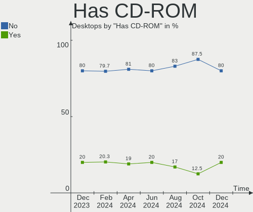
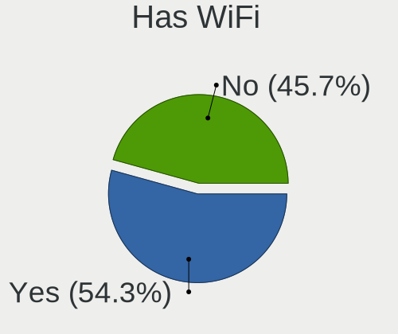
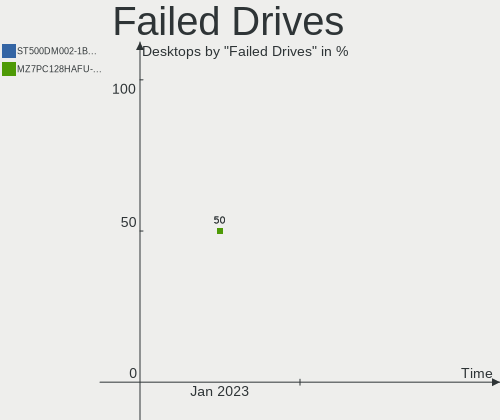

Arch Hardware Trends (Desktops)
-------------------------------

A project to identify most popular hardware characteristics and track their change
over time based on data collected by Arch users at https://Linux-Hardware.org.

Anyone can contribute to this report by the [hw-probe](https://github.com/linuxhw/hw-probe) tool:

    sudo -E hw-probe -all -upload

Full-feature report is available here: https://linux-hardware.org/?view=trends&formfactor=desktop

Period: Aug, 2021.

Contents
--------

* [ System ](#system)
  - [ OS                       ](#os)
  - [ OS Family                ](#os-family)
  - [ Kernel                   ](#kernel)
  - [ Kernel Family            ](#kernel-family)
  - [ Kernel Major Ver.        ](#kernel-major-ver)
  - [ Arch                     ](#arch)
  - [ DE                       ](#de)
  - [ Display Server           ](#display-server)
  - [ Display Manager          ](#display-manager)
  - [ OS Lang                  ](#os-lang)
  - [ Boot Mode                ](#boot-mode)
  - [ Filesystem               ](#filesystem)
  - [ Part. scheme             ](#part-scheme)
  - [ Dual Boot with Linux/BSD ](#dual-boot-with-linuxbsd)
  - [ Dual Boot (Win)          ](#dual-boot-win)

* [ Board ](#board)
  - [ Vendor                   ](#vendor)
  - [ Model                    ](#model)
  - [ Model Family             ](#model-family)
  - [ MFG Year                 ](#mfg-year)
  - [ Form Factor              ](#form-factor)
  - [ Secure Boot              ](#secure-boot)
  - [ Coreboot                 ](#coreboot)
  - [ RAM Size                 ](#ram-size)
  - [ RAM Used                 ](#ram-used)
  - [ Total Drives             ](#total-drives)
  - [ Has CD-ROM               ](#has-cd-rom)
  - [ Has Ethernet             ](#has-ethernet)
  - [ Has WiFi                 ](#has-wifi)
  - [ Has Bluetooth            ](#has-bluetooth)

* [ Location ](#location)
  - [ Country                  ](#country)
  - [ City                     ](#city)

* [ Drives ](#drives)
  - [ Drive Vendor             ](#drive-vendor)
  - [ Drive Model              ](#drive-model)
  - [ HDD Vendor               ](#hdd-vendor)
  - [ SSD Vendor               ](#ssd-vendor)
  - [ Drive Kind               ](#drive-kind)
  - [ Drive Connector          ](#drive-connector)
  - [ Drive Size               ](#drive-size)
  - [ Space Total              ](#space-total)
  - [ Space Used               ](#space-used)
  - [ Malfunc. Drives          ](#malfunc-drives)
  - [ Malfunc. Drive Vendor    ](#malfunc-drive-vendor)
  - [ Malfunc. HDD Vendor      ](#malfunc-hdd-vendor)
  - [ Malfunc. Drive Kind      ](#malfunc-drive-kind)
  - [ Failed Drives            ](#failed-drives)
  - [ Failed Drive Vendor      ](#failed-drive-vendor)
  - [ Drive Status             ](#drive-status)

* [ Storage controller ](#storage-controller)
  - [ Storage Vendor           ](#storage-vendor)
  - [ Storage Model            ](#storage-model)
  - [ Storage Kind             ](#storage-kind)

* [ Processor ](#processor)
  - [ CPU Vendor               ](#cpu-vendor)
  - [ CPU Model                ](#cpu-model)
  - [ CPU Model Family         ](#cpu-model-family)
  - [ CPU Cores                ](#cpu-cores)
  - [ CPU Sockets              ](#cpu-sockets)
  - [ CPU Threads              ](#cpu-threads)
  - [ CPU Op-Modes             ](#cpu-op-modes)
  - [ CPU Microcode            ](#cpu-microcode)
  - [ CPU Microarch            ](#cpu-microarch)

* [ Graphics ](#graphics)
  - [ GPU Vendor               ](#gpu-vendor)
  - [ GPU Model                ](#gpu-model)
  - [ GPU Combo                ](#gpu-combo)
  - [ GPU Driver               ](#gpu-driver)
  - [ GPU Memory               ](#gpu-memory)

* [ Monitor ](#monitor)
  - [ Monitor Vendor           ](#monitor-vendor)
  - [ Monitor Model            ](#monitor-model)
  - [ Monitor Resolution       ](#monitor-resolution)
  - [ Monitor Diagonal         ](#monitor-diagonal)
  - [ Monitor Width            ](#monitor-width)
  - [ Aspect Ratio             ](#aspect-ratio)
  - [ Monitor Area             ](#monitor-area)
  - [ Pixel Density            ](#pixel-density)
  - [ Multiple Monitors        ](#multiple-monitors)

* [ Network ](#network)
  - [ Net Controller Vendor    ](#net-controller-vendor)
  - [ Net Controller Model     ](#net-controller-model)
  - [ Wireless Vendor          ](#wireless-vendor)
  - [ Wireless Model           ](#wireless-model)
  - [ Ethernet Vendor          ](#ethernet-vendor)
  - [ Ethernet Model           ](#ethernet-model)
  - [ Net Controller Kind      ](#net-controller-kind)
  - [ Used Controller          ](#used-controller)
  - [ NICs                     ](#nics)
  - [ IPv6                     ](#ipv6)

* [ Bluetooth ](#bluetooth)
  - [ Bluetooth Vendor         ](#bluetooth-vendor)
  - [ Bluetooth Model          ](#bluetooth-model)

* [ Sound ](#sound)
  - [ Sound Vendor             ](#sound-vendor)
  - [ Sound Model              ](#sound-model)

* [ Memory ](#memory)
  - [ Memory Vendor            ](#memory-vendor)
  - [ Memory Model             ](#memory-model)
  - [ Memory Kind              ](#memory-kind)
  - [ Memory Form Factor       ](#memory-form-factor)
  - [ Memory Size              ](#memory-size)
  - [ Memory Speed             ](#memory-speed)

* [ Printers & scanners ](#printers--scanners)
  - [ Printer Vendor           ](#printer-vendor)
  - [ Printer Model            ](#printer-model)
  - [ Scanner Vendor           ](#scanner-vendor)
  - [ Scanner Model            ](#scanner-model)

* [ Camera ](#camera)
  - [ Camera Vendor            ](#camera-vendor)
  - [ Camera Model             ](#camera-model)

* [ Security ](#security)
  - [ Fingerprint Vendor       ](#fingerprint-vendor)
  - [ Fingerprint Model        ](#fingerprint-model)
  - [ Chipcard Vendor          ](#chipcard-vendor)
  - [ Chipcard Model           ](#chipcard-model)

* [ Unsupported ](#unsupported)
  - [ Unsupported Devices      ](#unsupported-devices)
  - [ Unsupported Device Types ](#unsupported-device-types)

System
------

OS
--

Installed operating systems

| Name         | Desktops | Percent |
|--------------|----------|---------|
| Arch         | 25       | 51.02%  |
| Arch Rolling | 24       | 48.98%  |

OS Family
---------

OS without a version

| Name | Desktops | Percent |
|------|----------|---------|
| Arch | 49       | 100%    |

Kernel
------

Version of the Linux kernel

| Version                      | Desktops | Percent |
|------------------------------|----------|---------|
| 5.13.10-arch1-1              | 7        | 14.29%  |
| 5.13.13-arch1-1              | 6        | 12.24%  |
| 5.13.9-arch1-1               | 5        | 10.2%   |
| 5.13.8-arch1-1               | 4        | 8.16%   |
| 5.13.7-arch1-1               | 4        | 8.16%   |
| 5.13.6-arch1-1               | 4        | 8.16%   |
| 5.13.7-zen1-1-zen            | 2        | 4.08%   |
| 5.13.12-zen1-1-zen           | 2        | 4.08%   |
| 5.13.12-arch1-1              | 2        | 4.08%   |
| 5.13.10-zen1-1-zen           | 2        | 4.08%   |
| 5.12.15-arch1-1              | 2        | 4.08%   |
| 5.2.20-1-ck-kx               | 1        | 2.04%   |
| 5.13.9-zen1-1-zen            | 1        | 2.04%   |
| 5.13.5-zen1-1-zen            | 1        | 2.04%   |
| 5.13.4-arch1-1               | 1        | 2.04%   |
| 5.13.13-hardened1-1-hardened | 1        | 2.04%   |
| 5.13.13-arch1-1-51313-02     | 1        | 2.04%   |
| 5.12.19-190-tkg-muqss        | 1        | 2.04%   |
| 5.10.60-1-lts                | 1        | 2.04%   |
| 5.10.56-1-lts                | 1        | 2.04%   |

Kernel Family
-------------

Linux kernel without a distro release

| Version | Desktops | Percent |
|---------|----------|---------|
| 5.13.10 | 9        | 18.37%  |
| 5.13.13 | 8        | 16.33%  |
| 5.13.9  | 6        | 12.24%  |
| 5.13.7  | 6        | 12.24%  |
| 5.13.8  | 4        | 8.16%   |
| 5.13.6  | 4        | 8.16%   |
| 5.13.12 | 4        | 8.16%   |
| 5.12.15 | 2        | 4.08%   |
| 5.2.20  | 1        | 2.04%   |
| 5.13.5  | 1        | 2.04%   |
| 5.13.4  | 1        | 2.04%   |
| 5.12.19 | 1        | 2.04%   |
| 5.10.60 | 1        | 2.04%   |
| 5.10.56 | 1        | 2.04%   |

Kernel Major Ver.
-----------------

Linux kernel major version

| Version | Desktops | Percent |
|---------|----------|---------|
| 5.13    | 43       | 87.76%  |
| 5.12    | 3        | 6.12%   |
| 5.10    | 2        | 4.08%   |
| 5.2     | 1        | 2.04%   |

Arch
----

OS architecture (x86_64, i586, etc.)

| Name   | Desktops | Percent |
|--------|----------|---------|
| x86_64 | 49       | 100%    |

DE
--

Desktop Environment

| Name       | Desktops | Percent |
|------------|----------|---------|
| GNOME      | 12       | 24.49%  |
| KDE5       | 9        | 18.37%  |
| Unknown    | 6        | 12.24%  |
| XFCE       | 4        | 8.16%   |
| i3         | 4        | 8.16%   |
| X-Cinnamon | 3        | 6.12%   |
| MATE       | 3        | 6.12%   |
| Openbox    | 2        | 4.08%   |
| KDE        | 2        | 4.08%   |
| sway       | 1        | 2.04%   |
| LXQt       | 1        | 2.04%   |
| jwm        | 1        | 2.04%   |
| Budgie     | 1        | 2.04%   |

Display Server
--------------

X11 or Wayland

| Name    | Desktops | Percent |
|---------|----------|---------|
| X11     | 31       | 63.27%  |
| Tty     | 8        | 16.33%  |
| Wayland | 6        | 12.24%  |
| Unknown | 4        | 8.16%   |

Display Manager
---------------

SDDM, LightDM, etc.

| Name    | Desktops | Percent |
|---------|----------|---------|
| Unknown | 22       | 44.9%   |
| SDDM    | 11       | 22.45%  |
| GDM     | 7        | 14.29%  |
| LightDM | 4        | 8.16%   |
| TDM     | 3        | 6.12%   |
| LXDM    | 2        | 4.08%   |

OS Lang
-------

Language

| Lang       | Desktops | Percent |
|------------|----------|---------|
| en_US      | 25       | 51.02%  |
| ru_RU      | 3        | 6.12%   |
| en_GB      | 3        | 6.12%   |
| C          | 3        | 6.12%   |
| es_ES      | 2        | 4.08%   |
| en_DK      | 2        | 4.08%   |
| de_DE      | 2        | 4.08%   |
| ru_UA      | 1        | 2.04%   |
| nl_NL      | 1        | 2.04%   |
| it_IT      | 1        | 2.04%   |
| hu_HU      | 1        | 2.04%   |
| fi_FI      | 1        | 2.04%   |
| es_ES.UTF8 | 1        | 2.04%   |
| es_CL      | 1        | 2.04%   |
| en_CA      | 1        | 2.04%   |
| en_AU      | 1        | 2.04%   |

Boot Mode
---------

EFI or BIOS

| Mode | Desktops | Percent |
|------|----------|---------|
| BIOS | 25       | 51.02%  |
| EFI  | 24       | 48.98%  |

Filesystem
----------

Type of filesystem

| Type  | Desktops | Percent |
|-------|----------|---------|
| Ext4  | 35       | 71.43%  |
| Btrfs | 13       | 26.53%  |
| Zfs   | 1        | 2.04%   |

Part. scheme
------------

Scheme of partitioning

| Type    | Desktops | Percent |
|---------|----------|---------|
| GPT     | 34       | 69.39%  |
| Unknown | 12       | 24.49%  |
| MBR     | 3        | 6.12%   |

Dual Boot with Linux/BSD
------------------------

Hosting more than one Linux/BSD

| Dual boot | Desktops | Percent |
|-----------|----------|---------|
| No        | 41       | 83.67%  |
| Yes       | 8        | 16.33%  |

Dual Boot (Win)
---------------

Hosting Linux and Windows

| Dual boot | Desktops | Percent |
|-----------|----------|---------|
| Yes       | 26       | 53.06%  |
| No        | 23       | 46.94%  |

Board
-----

Vendor
------

Motherboard manufacturer

| Name                | Desktops | Percent |
|---------------------|----------|---------|
| Gigabyte Technology | 16       | 32.65%  |
| ASUSTek Computer    | 12       | 24.49%  |
| MSI                 | 9        | 18.37%  |
| ASRock              | 5        | 10.2%   |
| Hewlett-Packard     | 3        | 6.12%   |
| Dell                | 2        | 4.08%   |
| Lenovo              | 1        | 2.04%   |
| Acer                | 1        | 2.04%   |

Model
-----

Motherboard model

| Name                                | Desktops | Percent |
|-------------------------------------|----------|---------|
| ASUS All Series                     | 4        | 8.16%   |
| MSI MS-7C91                         | 2        | 4.08%   |
| Gigabyte B550I AORUS PRO AX         | 2        | 4.08%   |
| MSI MS-7C84                         | 1        | 2.04%   |
| MSI MS-7C35                         | 1        | 2.04%   |
| MSI MS-7B48                         | 1        | 2.04%   |
| MSI MS-7B17                         | 1        | 2.04%   |
| MSI MS-7A37                         | 1        | 2.04%   |
| MSI MS-7A34                         | 1        | 2.04%   |
| MSI MS-7851                         | 1        | 2.04%   |
| Lenovo ThinkStation P330 30CY006WGE | 1        | 2.04%   |
| HP Z210 Workstation                 | 1        | 2.04%   |
| HP ProLiant MicroServer Gen8        | 1        | 2.04%   |
| HP ProDesk 600 G1 SFF               | 1        | 2.04%   |
| Gigabyte X570 AORUS ELITE WIFI      | 1        | 2.04%   |
| Gigabyte X570 AORUS ELITE           | 1        | 2.04%   |
| Gigabyte X470 AORUS ULTRA GAMING    | 1        | 2.04%   |
| Gigabyte M57SLI-S4                  | 1        | 2.04%   |
| Gigabyte H97M-D3H                   | 1        | 2.04%   |
| Gigabyte B85-HD3                    | 1        | 2.04%   |
| Gigabyte B550 AORUS PRO             | 1        | 2.04%   |
| Gigabyte B450M DS3H V2              | 1        | 2.04%   |
| Gigabyte B450M DS3H                 | 1        | 2.04%   |
| Gigabyte B365 HD3                   | 1        | 2.04%   |
| Gigabyte B360 HD3P-LM               | 1        | 2.04%   |
| Gigabyte AX370M-DS3H                | 1        | 2.04%   |
| Gigabyte AX370-Gaming 5             | 1        | 2.04%   |
| Gigabyte A320M-S2H                  | 1        | 2.04%   |
| Dell Precision WorkStation T5500    | 1        | 2.04%   |
| Dell OptiPlex 990                   | 1        | 2.04%   |
| ASUS TUF GAMING X570-PRO            | 1        | 2.04%   |
| ASUS TUF GAMING B550-PLUS           | 1        | 2.04%   |
| ASUS TUF GAMING B450M-PLUS II       | 1        | 2.04%   |
| ASUS TUF GAMING B450-PLUS II        | 1        | 2.04%   |
| ASUS PRIME Z590-A                   | 1        | 2.04%   |
| ASUS PRIME Z390-A                   | 1        | 2.04%   |
| ASUS PRIME B550M-A                  | 1        | 2.04%   |
| ASUS P8P67 DELUXE                   | 1        | 2.04%   |
| ASRock Z170A-X1                     | 1        | 2.04%   |
| ASRock X370 Pro4                    | 1        | 2.04%   |
| ASRock H61M-HVGS                    | 1        | 2.04%   |
| ASRock B450M-HDV R4.0               | 1        | 2.04%   |
| ASRock B450M Pro4                   | 1        | 2.04%   |
| Acer Aspire TC-885                  | 1        | 2.04%   |

Model Family
------------

Motherboard model prefix

| Name                  | Desktops | Percent |
|-----------------------|----------|---------|
| ASUS TUF              | 4        | 8.16%   |
| ASUS All              | 4        | 8.16%   |
| ASUS PRIME            | 3        | 6.12%   |
| MSI MS-7C91           | 2        | 4.08%   |
| Gigabyte X570         | 2        | 4.08%   |
| Gigabyte B550I        | 2        | 4.08%   |
| Gigabyte B450M        | 2        | 4.08%   |
| MSI MS-7C84           | 1        | 2.04%   |
| MSI MS-7C35           | 1        | 2.04%   |
| MSI MS-7B48           | 1        | 2.04%   |
| MSI MS-7B17           | 1        | 2.04%   |
| MSI MS-7A37           | 1        | 2.04%   |
| MSI MS-7A34           | 1        | 2.04%   |
| MSI MS-7851           | 1        | 2.04%   |
| Lenovo ThinkStation   | 1        | 2.04%   |
| HP Z210               | 1        | 2.04%   |
| HP ProLiant           | 1        | 2.04%   |
| HP ProDesk            | 1        | 2.04%   |
| Gigabyte X470         | 1        | 2.04%   |
| Gigabyte M57SLI-S4    | 1        | 2.04%   |
| Gigabyte H97M-D3H     | 1        | 2.04%   |
| Gigabyte B85-HD3      | 1        | 2.04%   |
| Gigabyte B550         | 1        | 2.04%   |
| Gigabyte B365         | 1        | 2.04%   |
| Gigabyte B360         | 1        | 2.04%   |
| Gigabyte AX370M-DS3H  | 1        | 2.04%   |
| Gigabyte AX370-Gaming | 1        | 2.04%   |
| Gigabyte A320M-S2H    | 1        | 2.04%   |
| Dell Precision        | 1        | 2.04%   |
| Dell OptiPlex         | 1        | 2.04%   |
| ASUS P8P67            | 1        | 2.04%   |
| ASRock Z170A-X1       | 1        | 2.04%   |
| ASRock X370           | 1        | 2.04%   |
| ASRock H61M-HVGS      | 1        | 2.04%   |
| ASRock B450M-HDV      | 1        | 2.04%   |
| ASRock B450M          | 1        | 2.04%   |
| Acer Aspire           | 1        | 2.04%   |

MFG Year
--------

Motherboard manufacture year

| Year | Desktops | Percent |
|------|----------|---------|
| 2021 | 14       | 28.57%  |
| 2020 | 14       | 28.57%  |
| 2019 | 4        | 8.16%   |
| 2018 | 3        | 6.12%   |
| 2016 | 3        | 6.12%   |
| 2014 | 3        | 6.12%   |
| 2015 | 2        | 4.08%   |
| 2012 | 2        | 4.08%   |
| 2017 | 1        | 2.04%   |
| 2013 | 1        | 2.04%   |
| 2011 | 1        | 2.04%   |
| 2008 | 1        | 2.04%   |

Form Factor
-----------

Physical design of the computer

| Name    | Desktops | Percent |
|---------|----------|---------|
| Desktop | 49       | 100%    |

Secure Boot
-----------

Enabled or disabled

| State    | Desktops | Percent |
|----------|----------|---------|
| Disabled | 49       | 100%    |

Coreboot
--------

Have coreboot on board

| Used | Desktops | Percent |
|------|----------|---------|
| No   | 49       | 100%    |

RAM Size
--------

Total RAM memory

| Size in GB  | Desktops | Percent |
|-------------|----------|---------|
| 16.01-24.0  | 21       | 42.86%  |
| 32.01-64.0  | 11       | 22.45%  |
| 64.01-256.0 | 8        | 16.33%  |
| 8.01-16.0   | 4        | 8.16%   |
| 24.01-32.0  | 2        | 4.08%   |
| 4.01-8.0    | 1        | 2.04%   |
| 3.01-4.0    | 1        | 2.04%   |
| 1.01-2.0    | 1        | 2.04%   |

RAM Used
--------

Used RAM memory

| Used GB    | Desktops | Percent |
|------------|----------|---------|
| 4.01-8.0   | 14       | 28.57%  |
| 1.01-2.0   | 11       | 22.45%  |
| 3.01-4.0   | 7        | 14.29%  |
| 2.01-3.0   | 7        | 14.29%  |
| 8.01-16.0  | 7        | 14.29%  |
| 32.01-64.0 | 1        | 2.04%   |
| 24.01-32.0 | 1        | 2.04%   |
| 0.51-1.0   | 1        | 2.04%   |

Total Drives
------------

Number of drives on board

| Drives | Desktops | Percent |
|--------|----------|---------|
| 2      | 17       | 34.69%  |
| 3      | 11       | 22.45%  |
| 5      | 7        | 14.29%  |
| 4      | 7        | 14.29%  |
| 1      | 4        | 8.16%   |
| 7      | 2        | 4.08%   |
| 6      | 1        | 2.04%   |

Has CD-ROM
----------

Has CD-ROM on board

| Presented | Desktops | Percent |
|-----------|----------|---------|
| No        | 29       | 59.18%  |
| Yes       | 20       | 40.82%  |

Has Ethernet
------------

Has Ethernet on board

| Presented | Desktops | Percent |
|-----------|----------|---------|
| Yes       | 49       | 100%    |

Has WiFi
--------

Has WiFi module

| Presented | Desktops | Percent |
|-----------|----------|---------|
| Yes       | 25       | 51.02%  |
| No        | 24       | 48.98%  |

Has Bluetooth
-------------

Has Bluetooth module

| Presented | Desktops | Percent |
|-----------|----------|---------|
| Yes       | 25       | 51.02%  |
| No        | 24       | 48.98%  |

Location
--------

Country
-------

Geographic location (country)

| Country         | Desktops | Percent |
|-----------------|----------|---------|
| USA             | 11       | 22.45%  |
| Germany         | 6        | 12.24%  |
| Spain           | 4        | 8.16%   |
| Australia       | 4        | 8.16%   |
| UK              | 3        | 6.12%   |
| Russia          | 3        | 6.12%   |
| Chile           | 3        | 6.12%   |
| Finland         | 2        | 4.08%   |
| Ukraine         | 1        | 2.04%   |
| Sweden          | 1        | 2.04%   |
| North Macedonia | 1        | 2.04%   |
| Netherlands     | 1        | 2.04%   |
| Kosovo          | 1        | 2.04%   |
| Italy           | 1        | 2.04%   |
| Indonesia       | 1        | 2.04%   |
| India           | 1        | 2.04%   |
| Hungary         | 1        | 2.04%   |
| France          | 1        | 2.04%   |
| Denmark         | 1        | 2.04%   |
| Canada          | 1        | 2.04%   |
| Brazil          | 1        | 2.04%   |

City
----

Geographic location (city)

| City                       | Desktops | Percent |
|----------------------------|----------|---------|
| Seattle                    | 2        | 4.08%   |
| Ormiston                   | 2        | 4.08%   |
| Moscow                     | 2        | 4.08%   |
| Zhukovskiy                 | 1        | 2.04%   |
| Zaragoza                   | 1        | 2.04%   |
| West Valley City           | 1        | 2.04%   |
| Villanueva de la Torre     | 1        | 2.04%   |
| Valencia                   | 1        | 2.04%   |
| Tuusula                    | 1        | 2.04%   |
| Trois-Rivi??res            | 1        | 2.04%   |
| Sz?©kesfeh?©rv??r          | 1        | 2.04%   |
| Santiago                   | 1        | 2.04%   |
| Rimpar                     | 1        | 2.04%   |
| Richmond                   | 1        | 2.04%   |
| Reading                    | 1        | 2.04%   |
| Pristina                   | 1        | 2.04%   |
| Pirassununga               | 1        | 2.04%   |
| Parkdale                   | 1        | 2.04%   |
| Paris                      | 1        | 2.04%   |
| Ovalle                     | 1        | 2.04%   |
| Oulu                       | 1        | 2.04%   |
| New York                   | 1        | 2.04%   |
| Munich                     | 1        | 2.04%   |
| Makassar                   | 1        | 2.04%   |
| Madrid                     | 1        | 2.04%   |
| London                     | 1        | 2.04%   |
| Las Palmas de Gran Canaria | 1        | 2.04%   |
| Las Condes                 | 1        | 2.04%   |
| Kolhapur                   | 1        | 2.04%   |
| Kilsyth                    | 1        | 2.04%   |
| K??ge                      | 1        | 2.04%   |
| Hildesheim                 | 1        | 2.04%   |
| Hermitage                  | 1        | 2.04%   |
| F??rth                     | 1        | 2.04%   |
| Eker?¶                     | 1        | 2.04%   |
| Dortmund                   | 1        | 2.04%   |
| Dnipropetrovsk             | 1        | 2.04%   |
| Davidovo                   | 1        | 2.04%   |
| Dallas                     | 1        | 2.04%   |
| Converse                   | 1        | 2.04%   |
| Cologne                    | 1        | 2.04%   |
| Bristol                    | 1        | 2.04%   |
| Boston                     | 1        | 2.04%   |
| Bologna                    | 1        | 2.04%   |
| Ayr                        | 1        | 2.04%   |
| Amsterdam                  | 1        | 2.04%   |

Drives
------

Drive Vendor
------------

Hard drive vendors

| Vendor              | Desktops | Drives | Percent |
|---------------------|----------|--------|---------|
| Samsung Electronics | 26       | 40     | 22.22%  |
| Seagate             | 19       | 27     | 16.24%  |
| WDC                 | 15       | 22     | 12.82%  |
| Toshiba             | 10       | 12     | 8.55%   |
| Crucial             | 7        | 8      | 5.98%   |
| Kingston            | 6        | 7      | 5.13%   |
| Sandisk             | 5        | 6      | 4.27%   |
| Silicon Motion      | 3        | 3      | 2.56%   |
| Phison              | 3        | 3      | 2.56%   |
| Hitachi             | 3        | 3      | 2.56%   |
| PNY                 | 2        | 2      | 1.71%   |
| Patriot             | 2        | 2      | 1.71%   |
| Hewlett-Packard     | 2        | 2      | 1.71%   |
| A-DATA Technology   | 2        | 4      | 1.71%   |
| Transcend           | 1        | 1      | 0.85%   |
| StoreJet            | 1        | 1      | 0.85%   |
| SK Hynix            | 1        | 1      | 0.85%   |
| OCZ                 | 1        | 1      | 0.85%   |
| MyDigitalSSD        | 1        | 1      | 0.85%   |
| Micron Technology   | 1        | 1      | 0.85%   |
| LITEON              | 1        | 1      | 0.85%   |
| KIOXIA              | 1        | 1      | 0.85%   |
| Intel               | 1        | 1      | 0.85%   |
| HGST                | 1        | 1      | 0.85%   |
| Fujitsu             | 1        | 1      | 0.85%   |
| CT1000BX            | 1        | 1      | 0.85%   |

Drive Model
-----------

Hard drive models

| Model                                       | Desktops | Percent |
|---------------------------------------------|----------|---------|
| Samsung SSD 860 EVO 1TB                     | 5        | 3.62%   |
| Toshiba DT01ACA100 1TB                      | 3        | 2.17%   |
| Samsung SSD 970 EVO Plus 500GB              | 3        | 2.17%   |
| Samsung NVMe SSD Drive 1TB                  | 3        | 2.17%   |
| Crucial CT1000MX500SSD1 1TB                 | 3        | 2.17%   |
| WDC WD40EFRX-68N32N0 4TB                    | 2        | 1.45%   |
| Seagate ST2000DX002-2DV164 2TB              | 2        | 1.45%   |
| Sandisk NVMe SSD Drive 1TB                  | 2        | 1.45%   |
| Samsung SSD 860 EVO 250GB                   | 2        | 1.45%   |
| Samsung SSD 850 EVO 250GB                   | 2        | 1.45%   |
| Samsung SSD 840 PRO Series 512GB            | 2        | 1.45%   |
| PNY CS900 120GB SSD                         | 2        | 1.45%   |
| Crucial CT480BX500SSD1 480GB                | 2        | 1.45%   |
| WDC WDS240G2G0A-00JH30 240GB SSD            | 1        | 0.72%   |
| WDC WDS100T2B0B-00YS70 1TB SSD              | 1        | 0.72%   |
| WDC WDS100T1X0E-00AFY0 1TB                  | 1        | 0.72%   |
| WDC WD80EFAX-68KNBN0 8TB                    | 1        | 0.72%   |
| WDC WD6001FZWX-00A2VA0 6TB                  | 1        | 0.72%   |
| WDC WD5000AAKX-08U6AA0 500GB                | 1        | 0.72%   |
| WDC WD40EZRZ-00GXCB0 4TB                    | 1        | 0.72%   |
| WDC WD40EFRX-68WT0N0 4TB                    | 1        | 0.72%   |
| WDC WD30EFRX-68AX9N0 3TB                    | 1        | 0.72%   |
| WDC WD30EFAX-68JH4N0 3TB                    | 1        | 0.72%   |
| WDC WD20EFRX-68EUZN0 2TB                    | 1        | 0.72%   |
| WDC WD20EFRX-68AX9N0 2TB                    | 1        | 0.72%   |
| WDC WD10EZEX-08Y20A0 1TB                    | 1        | 0.72%   |
| WDC WD10EZEX-08M2NA0 1TB                    | 1        | 0.72%   |
| WDC WD10EARX-22N0YB0 1TB                    | 1        | 0.72%   |
| WDC WD easystore 240GB                      | 1        | 0.72%   |
| Transcend TS1TSSD230S 1TB                   | 1        | 0.72%   |
| Toshiba TR200 480GB SSD                     | 1        | 0.72%   |
| Toshiba MQ01ABD100 1TB                      | 1        | 0.72%   |
| Toshiba MK2576GSX 250GB                     | 1        | 0.72%   |
| Toshiba MG04ACA400N 4TB                     | 1        | 0.72%   |
| Toshiba HDWD130 3TB                         | 1        | 0.72%   |
| Toshiba HDWD110 1TB                         | 1        | 0.72%   |
| Toshiba DT01ACA050 500GB                    | 1        | 0.72%   |
| StoreJet Transcend 500GB                    | 1        | 0.72%   |
| SK Hynix HFM128GDJTNG-8310A 128GB           | 1        | 0.72%   |
| Silicon Motion NVMe SSD Drive 480GB         | 1        | 0.72%   |
| Silicon Motion NVMe SSD Drive 250GB         | 1        | 0.72%   |
| Silicon Motion NE-256 256GB                 | 1        | 0.72%   |
| Seagate STM3500418AS 500GB                  | 1        | 0.72%   |
| Seagate ST9640320AS 640GB                   | 1        | 0.72%   |
| Seagate ST8000VN0022-2EL112 8TB             | 1        | 0.72%   |
| Seagate ST500DM002-1BD142 500GB             | 1        | 0.72%   |
| Seagate ST4000VN008-2DR166 4TB              | 1        | 0.72%   |
| Seagate ST4000NM0033-9ZM170 4TB             | 1        | 0.72%   |
| Seagate ST4000DM004-2CV104 4TB              | 1        | 0.72%   |
| Seagate ST4000DM000-1F2168 4TB              | 1        | 0.72%   |
| Seagate ST3500413AS 500GB                   | 1        | 0.72%   |
| Seagate ST3500312CS 500GB                   | 1        | 0.72%   |
| Seagate ST3160815AS 160GB                   | 1        | 0.72%   |
| Seagate ST31000340NS EIT 1TB                | 1        | 0.72%   |
| Seagate ST3000DM001-1ER166 3TB              | 1        | 0.72%   |
| Seagate ST2000NM0011 99Y1166 59Y1813XIV 2TB | 1        | 0.72%   |
| Seagate ST2000DM008-2FR102 2TB              | 1        | 0.72%   |
| Seagate ST2000DM006-2DM164 2TB              | 1        | 0.72%   |
| Seagate ST1000LX015-1U7172 1TB              | 1        | 0.72%   |
| Seagate ST1000LM024 HN-M101MBB 1TB          | 1        | 0.72%   |

HDD Vendor
----------

Hard disk drive vendors

| Vendor              | Desktops | Drives | Percent |
|---------------------|----------|--------|---------|
| Seagate             | 19       | 27     | 43.18%  |
| WDC                 | 11       | 17     | 25%     |
| Toshiba             | 9        | 9      | 20.45%  |
| Hitachi             | 3        | 3      | 6.82%   |
| Samsung Electronics | 1        | 1      | 2.27%   |
| HGST                | 1        | 1      | 2.27%   |

SSD Vendor
----------

Solid state drive vendors

| Vendor              | Desktops | Drives | Percent |
|---------------------|----------|--------|---------|
| Samsung Electronics | 16       | 22     | 32.65%  |
| Crucial             | 7        | 8      | 14.29%  |
| Kingston            | 5        | 5      | 10.2%   |
| WDC                 | 3        | 4      | 6.12%   |
| SanDisk             | 3        | 3      | 6.12%   |
| PNY                 | 2        | 2      | 4.08%   |
| Patriot             | 2        | 2      | 4.08%   |
| Transcend           | 1        | 1      | 2.04%   |
| Toshiba             | 1        | 3      | 2.04%   |
| StoreJet            | 1        | 1      | 2.04%   |
| OCZ                 | 1        | 1      | 2.04%   |
| MyDigitalSSD        | 1        | 1      | 2.04%   |
| LITEON              | 1        | 1      | 2.04%   |
| Intel               | 1        | 1      | 2.04%   |
| Hewlett-Packard     | 1        | 1      | 2.04%   |
| Fujitsu             | 1        | 1      | 2.04%   |
| CT1000BX            | 1        | 1      | 2.04%   |
| A-DATA Technology   | 1        | 1      | 2.04%   |

Drive Kind
----------

HDD or SSD

| Kind | Desktops | Drives | Percent |
|------|----------|--------|---------|
| SSD  | 33       | 59     | 36.67%  |
| HDD  | 32       | 58     | 35.56%  |
| NVMe | 25       | 36     | 27.78%  |

Drive Connector
---------------

SATA, SAS, NVMe, etc.

| Type | Desktops | Drives | Percent |
|------|----------|--------|---------|
| SATA | 44       | 113    | 61.11%  |
| NVMe | 25       | 36     | 34.72%  |
| SAS  | 3        | 4      | 4.17%   |

Drive Size
----------

Size of hard drive

| Size in TB | Desktops | Drives | Percent |
|------------|----------|--------|---------|
| 0.01-0.5   | 31       | 53     | 39.24%  |
| 0.51-1.0   | 24       | 32     | 30.38%  |
| 3.01-4.0   | 9        | 14     | 11.39%  |
| 1.01-2.0   | 7        | 9      | 8.86%   |
| 2.01-3.0   | 4        | 4      | 5.06%   |
| 4.01-10.0  | 4        | 5      | 5.06%   |

Space Total
-----------

Amount of disk space available on the file system

| Size in GB     | Desktops | Percent |
|----------------|----------|---------|
| More than 3000 | 12       | 24.49%  |
| 501-1000       | 11       | 22.45%  |
| 1001-2000      | 8        | 16.33%  |
| 2001-3000      | 6        | 12.24%  |
| 251-500        | 5        | 10.2%   |
| 101-250        | 5        | 10.2%   |
| 1-20           | 1        | 2.04%   |
| 51-100         | 1        | 2.04%   |

Space Used
----------

Amount of used disk space

| Used GB        | Desktops | Percent |
|----------------|----------|---------|
| 101-250        | 9        | 18.37%  |
| More than 3000 | 7        | 14.29%  |
| 501-1000       | 7        | 14.29%  |
| 251-500        | 5        | 10.2%   |
| 21-50          | 5        | 10.2%   |
| 1-20           | 5        | 10.2%   |
| 51-100         | 5        | 10.2%   |
| 1001-2000      | 4        | 8.16%   |
| 2001-3000      | 2        | 4.08%   |

Malfunc. Drives
---------------

Drive models with a malfunction

| Model                                 | Desktops | Drives | Percent |
|---------------------------------------|----------|--------|---------|
| Transcend TS1TSSD230S 1TB             | 1        | 1      | 11.11%  |
| Toshiba MK2576GSX 250GB               | 1        | 1      | 11.11%  |
| Seagate ST3500413AS 500GB             | 1        | 1      | 11.11%  |
| Seagate ST31000340NS EIT 1TB          | 1        | 2      | 11.11%  |
| Seagate ST1000LX015-1U7172 1TB        | 1        | 1      | 11.11%  |
| Samsung Electronics SSD 840 EVO 500GB | 1        | 1      | 11.11%  |
| Samsung Electronics SP2504C 250GB     | 1        | 1      | 11.11%  |
| OCZ INTREPID 3700 240GB SSD           | 1        | 1      | 11.11%  |
| Kingston SHPM2280P2H 480G SSD         | 1        | 1      | 11.11%  |

Malfunc. Drive Vendor
---------------------

Vendors of faulty drives

| Vendor              | Desktops | Drives | Percent |
|---------------------|----------|--------|---------|
| Seagate             | 3        | 4      | 33.33%  |
| Samsung Electronics | 2        | 2      | 22.22%  |
| Transcend           | 1        | 1      | 11.11%  |
| Toshiba             | 1        | 1      | 11.11%  |
| OCZ                 | 1        | 1      | 11.11%  |
| Kingston            | 1        | 1      | 11.11%  |

Malfunc. HDD Vendor
-------------------

Vendors of faulty HDD drives

| Vendor              | Desktops | Drives | Percent |
|---------------------|----------|--------|---------|
| Seagate             | 3        | 4      | 60%     |
| Toshiba             | 1        | 1      | 20%     |
| Samsung Electronics | 1        | 1      | 20%     |

Malfunc. Drive Kind
-------------------

Kinds of faulty drives

| Kind | Desktops | Drives | Percent |
|------|----------|--------|---------|
| SSD  | 4        | 4      | 50%     |
| HDD  | 4        | 6      | 50%     |

Failed Drives
-------------

Failed drive models

| Model                            | Desktops | Drives | Percent |
|----------------------------------|----------|--------|---------|
| Kingston SV300S37A120G 120GB SSD | 1        | 1      | 100%    |

Failed Drive Vendor
-------------------

Failed drive vendors

| Vendor   | Desktops | Drives | Percent |
|----------|----------|--------|---------|
| Kingston | 1        | 1      | 100%    |

Drive Status
------------

Number of failed and malfunc. drives

| Status   | Desktops | Drives | Percent |
|----------|----------|--------|---------|
| Works    | 26       | 81     | 44.07%  |
| Detected | 25       | 61     | 42.37%  |
| Malfunc  | 7        | 10     | 11.86%  |
| Failed   | 1        | 1      | 1.69%   |

Storage controller
------------------

Storage Vendor
--------------

Storage controller vendors

| Vendor                      | Desktops | Percent |
|-----------------------------|----------|---------|
| AMD                         | 25       | 29.41%  |
| Intel                       | 23       | 27.06%  |
| Samsung Electronics         | 12       | 14.12%  |
| Silicon Motion              | 4        | 4.71%   |
| Sandisk                     | 3        | 3.53%   |
| Phison Electronics          | 3        | 3.53%   |
| Kingston Technology Company | 3        | 3.53%   |
| Hewlett-Packard             | 3        | 3.53%   |
| SK Hynix                    | 1        | 1.18%   |
| Realtek Semiconductor       | 1        | 1.18%   |
| Nvidia                      | 1        | 1.18%   |
| Micron Technology           | 1        | 1.18%   |
| Marvell Technology Group    | 1        | 1.18%   |
| LSI Logic / Symbios Logic   | 1        | 1.18%   |
| JMicron Technology          | 1        | 1.18%   |
| ASMedia Technology          | 1        | 1.18%   |
| Adaptec                     | 1        | 1.18%   |

Storage Model
-------------

Storage controller models

| Model                                                                          | Desktops | Percent |
|--------------------------------------------------------------------------------|----------|---------|
| AMD FCH SATA Controller [AHCI mode]                                            | 18       | 17.65%  |
| Samsung NVMe SSD Controller SM981/PM981/PM983                                  | 8        | 7.84%   |
| AMD Starship/Matisse Chipset SATA Controller [AHCI mode]                       | 7        | 6.86%   |
| AMD 400 Series Chipset SATA Controller                                         | 7        | 6.86%   |
| Intel Cannon Lake PCH SATA AHCI Controller                                     | 5        | 4.9%    |
| Intel 9 Series Chipset Family SATA Controller [AHCI Mode]                      | 5        | 4.9%    |
| Sandisk WD Black SN850                                                         | 3        | 2.94%   |
| AMD X370 Series Chipset SATA Controller                                        | 3        | 2.94%   |
| Silicon Motion SM2263EN/SM2263XT SSD Controller                                | 2        | 1.96%   |
| Silicon Motion SM2262/SM2262EN SSD Controller                                  | 2        | 1.96%   |
| Samsung NVMe SSD Controller SM961/PM961/SM963                                  | 2        | 1.96%   |
| Samsung NVMe SSD Controller PM9A1/PM9A3/980PRO                                 | 2        | 1.96%   |
| Phison E12 NVMe Controller                                                     | 2        | 1.96%   |
| Kingston Company A2000 NVMe SSD                                                | 2        | 1.96%   |
| Intel SATA Controller [RAID mode]                                              | 2        | 1.96%   |
| Intel 8 Series/C220 Series Chipset Family 6-port SATA Controller 1 [AHCI mode] | 2        | 1.96%   |
| Intel 6 Series/C200 Series Chipset Family 6 port Desktop SATA AHCI Controller  | 2        | 1.96%   |
| Intel 200 Series PCH SATA controller [AHCI mode]                               | 2        | 1.96%   |
| HP Smart Array Gen9 Controllers                                                | 2        | 1.96%   |
| AMD 300 Series Chipset SATA Controller                                         | 2        | 1.96%   |
| SK Hynix BC501 NVMe Solid State Drive                                          | 1        | 0.98%   |
| Samsung NVMe Controller                                                        | 1        | 0.98%   |
| Realtek RTS5763DL NVMe SSD Controller                                          | 1        | 0.98%   |
| Phison E16 PCIe4 NVMe Controller                                               | 1        | 0.98%   |
| Nvidia MCP55 SATA Controller                                                   | 1        | 0.98%   |
| Nvidia MCP55 IDE                                                               | 1        | 0.98%   |
| Micron 9200 MAX NVMe SSD                                                       | 1        | 0.98%   |
| Marvell Group 88SE9128 PCIe SATA 6 Gb/s RAID controller with HyperDuo          | 1        | 0.98%   |
| LSI Logic / Symbios Logic MegaRAID SAS 2108 [Liberator]                        | 1        | 0.98%   |
| Kingston Company HyperX Predator PCIe AHCI SSD                                 | 1        | 0.98%   |
| JMicron JMB362 SATA Controller                                                 | 1        | 0.98%   |
| Intel Q170/Q150/B150/H170/H110/Z170/CM236 Chipset SATA Controller [AHCI Mode]  | 1        | 0.98%   |
| Intel C610/X99 series chipset sSATA Controller [AHCI mode]                     | 1        | 0.98%   |
| Intel C610/X99 series chipset 6-Port SATA Controller [AHCI mode]               | 1        | 0.98%   |
| Intel 82801JI (ICH10 Family) SATA AHCI Controller                              | 1        | 0.98%   |
| Intel 6 Series/C200 Series Desktop SATA RAID Controller                        | 1        | 0.98%   |
| Intel 6 Series/C200 Series Chipset Family IDE-r Controller                     | 1        | 0.98%   |
| Intel 500 Series Chipset Family SATA AHCI Controller                           | 1        | 0.98%   |
| HP Smart Array G6 controllers                                                  | 1        | 0.98%   |
| ASMedia ASM1062 Serial ATA Controller                                          | 1        | 0.98%   |
| AMD FCH SATA Controller D                                                      | 1        | 0.98%   |
| Adaptec AIC-7892A U160/m                                                       | 1        | 0.98%   |

Storage Kind
------------

Kind of storage controller (IDE, SATA, NVMe, SAS, ...)

| Kind | Desktops | Percent |
|------|----------|---------|
| SATA | 45       | 57.69%  |
| NVMe | 24       | 30.77%  |
| RAID | 4        | 5.13%   |
| SAS  | 2        | 2.56%   |
| IDE  | 2        | 2.56%   |
| SCSI | 1        | 1.28%   |

Processor
---------

CPU Vendor
----------

Processor vendors

| Vendor | Desktops | Percent |
|--------|----------|---------|
| AMD    | 26       | 53.06%  |
| Intel  | 23       | 46.94%  |

CPU Model
---------

Processor models

| Model                                       | Desktops | Percent |
|---------------------------------------------|----------|---------|
| AMD Ryzen 9 5900X 12-Core Processor         | 4        | 8.16%   |
| Intel Core i9-9900K CPU @ 3.60GHz           | 2        | 4.08%   |
| Intel Core i7-8700 CPU @ 3.20GHz            | 2        | 4.08%   |
| Intel Core i7-4790 CPU @ 3.60GHz            | 2        | 4.08%   |
| AMD Ryzen 9 5950X 16-Core Processor         | 2        | 4.08%   |
| AMD Ryzen 7 5800X 8-Core Processor          | 2        | 4.08%   |
| AMD Ryzen 7 2700X Eight-Core Processor      | 2        | 4.08%   |
| AMD Ryzen 5 3600 6-Core Processor           | 2        | 4.08%   |
| AMD Ryzen 5 2400G with Radeon Vega Graphics | 2        | 4.08%   |
| Intel Xeon CPU X5650 @ 2.67GHz              | 1        | 2.04%   |
| Intel Xeon CPU E31260L @ 2.40GHz            | 1        | 2.04%   |
| Intel Xeon CPU E31230 @ 3.20GHz             | 1        | 2.04%   |
| Intel Core i7-9700K CPU @ 3.60GHz           | 1        | 2.04%   |
| Intel Core i7-6900K CPU @ 3.20GHz           | 1        | 2.04%   |
| Intel Core i7-4790K CPU @ 4.00GHz           | 1        | 2.04%   |
| Intel Core i7-2600K CPU @ 3.40GHz           | 1        | 2.04%   |
| Intel Core i7-2600 CPU @ 3.40GHz            | 1        | 2.04%   |
| Intel Core i5-9600K CPU @ 3.70GHz           | 1        | 2.04%   |
| Intel Core i5-8400 CPU @ 2.80GHz            | 1        | 2.04%   |
| Intel Core i5-6500 CPU @ 3.20GHz            | 1        | 2.04%   |
| Intel Core i5-4690T CPU @ 2.50GHz           | 1        | 2.04%   |
| Intel Core i5-4690K CPU @ 3.50GHz           | 1        | 2.04%   |
| Intel Core i5-4460 CPU @ 3.20GHz            | 1        | 2.04%   |
| Intel Core i3-4370 CPU @ 3.80GHz            | 1        | 2.04%   |
| Intel Celeron CPU G540 @ 2.50GHz            | 1        | 2.04%   |
| Intel 11th Gen Core i5-11600KF @ 3.90GHz    | 1        | 2.04%   |
| AMD Ryzen 9 3950X 16-Core Processor         | 1        | 2.04%   |
| AMD Ryzen 7 3800X 8-Core Processor          | 1        | 2.04%   |
| AMD Ryzen 7 3700X 8-Core Processor          | 1        | 2.04%   |
| AMD Ryzen 7 1700X Eight-Core Processor      | 1        | 2.04%   |
| AMD Ryzen 5 5600X 6-Core Processor          | 1        | 2.04%   |
| AMD Ryzen 5 3600X 6-Core Processor          | 1        | 2.04%   |
| AMD Ryzen 5 3400G with Radeon Vega Graphics | 1        | 2.04%   |
| AMD Ryzen 5 2600 Six-Core Processor         | 1        | 2.04%   |
| AMD Ryzen 5 1600X Six-Core Processor        | 1        | 2.04%   |
| AMD Ryzen 3 1200 Quad-Core Processor        | 1        | 2.04%   |
| AMD Athlon 64 X2 Dual Core Processor 5000+  | 1        | 2.04%   |
| AMD Athlon 3000G with Radeon Vega Graphics  | 1        | 2.04%   |

CPU Model Family
----------------

Processor model prefix

| Model            | Desktops | Percent |
|------------------|----------|---------|
| Intel Core i7    | 9        | 18.37%  |
| AMD Ryzen 5      | 9        | 18.37%  |
| AMD Ryzen 9      | 7        | 14.29%  |
| AMD Ryzen 7      | 7        | 14.29%  |
| Intel Core i5    | 6        | 12.24%  |
| Intel Xeon       | 3        | 6.12%   |
| Intel Core i9    | 2        | 4.08%   |
| Other            | 1        | 2.04%   |
| Intel Core i3    | 1        | 2.04%   |
| Intel Celeron    | 1        | 2.04%   |
| AMD Ryzen 3      | 1        | 2.04%   |
| AMD Athlon 64 X2 | 1        | 2.04%   |
| AMD Athlon       | 1        | 2.04%   |

CPU Cores
---------

Number of processor cores

| Number | Desktops | Percent |
|--------|----------|---------|
| 4      | 15       | 30.61%  |
| 6      | 12       | 24.49%  |
| 8      | 11       | 22.45%  |
| 12     | 4        | 8.16%   |
| 2      | 4        | 8.16%   |
| 16     | 3        | 6.12%   |

CPU Sockets
-----------

Number of sockets

| Number | Desktops | Percent |
|--------|----------|---------|
| 1      | 49       | 100%    |

CPU Threads
-----------

Threads per core (Hyper-Threading)

| Number | Desktops | Percent |
|--------|----------|---------|
| 2      | 38       | 77.55%  |
| 1      | 11       | 22.45%  |

CPU Op-Modes
------------

CPU Operation Modes (32-bit, 64-bit)

| Op mode        | Desktops | Percent |
|----------------|----------|---------|
| 32-bit, 64-bit | 49       | 100%    |

CPU Microcode
-------------

Microcode number

| Number     | Desktops | Percent |
|------------|----------|---------|
| Unknown    | 21       | 42.86%  |
| 0x08701021 | 5        | 10.2%   |
| 0x0a201009 | 4        | 8.16%   |
| 0x0a201016 | 3        | 6.12%   |
| 0x906ea    | 2        | 4.08%   |
| 0x306c3    | 2        | 4.08%   |
| 0x206a7    | 2        | 4.08%   |
| 0x08108109 | 2        | 4.08%   |
| 0x0800820d | 2        | 4.08%   |
| 0x08001138 | 2        | 4.08%   |
| 0x906ed    | 1        | 2.04%   |
| 0x406f1    | 1        | 2.04%   |
| 0x08101013 | 1        | 2.04%   |
| 0x08001129 | 1        | 2.04%   |

CPU Microarch
-------------

Microarchitecture

| Name        | Desktops | Percent |
|-------------|----------|---------|
| Zen 3       | 9        | 18.37%  |
| KabyLake    | 7        | 14.29%  |
| Haswell     | 7        | 14.29%  |
| Zen 2       | 6        | 12.24%  |
| Zen+        | 5        | 10.2%   |
| Zen         | 5        | 10.2%   |
| SandyBridge | 5        | 10.2%   |
| Westmere    | 1        | 2.04%   |
| Skylake     | 1        | 2.04%   |
| K8 Hammer   | 1        | 2.04%   |
| Broadwell   | 1        | 2.04%   |
| Unknown     | 1        | 2.04%   |

Graphics
--------

GPU Vendor
----------

Vendors of graphics cards

| Vendor                     | Desktops | Percent |
|----------------------------|----------|---------|
| Nvidia                     | 24       | 48%     |
| AMD                        | 17       | 34%     |
| Intel                      | 8        | 16%     |
| Matrox Electronics Systems | 1        | 2%      |

GPU Model
---------

Graphics card models

| Model                                                                       | Desktops | Percent |
|-----------------------------------------------------------------------------|----------|---------|
| Intel Xeon E3-1200 v3/4th Gen Core Processor Integrated Graphics Controller | 4        | 8%      |
| AMD Ellesmere [Radeon RX 470/480/570/570X/580/580X/590]                     | 4        | 8%      |
| Nvidia GP107 [GeForce GTX 1050 Ti]                                          | 3        | 6%      |
| Nvidia GP106 [GeForce GTX 1060 6GB]                                         | 3        | 6%      |
| AMD Vega 10 XL/XT [Radeon RX Vega 56/64]                                    | 3        | 6%      |
| AMD Navi 21 [Radeon RX 6800/6800 XT / 6900 XT]                              | 3        | 6%      |
| AMD Navi 10 [Radeon RX 5600 OEM/5600 XT / 5700/5700 XT]                     | 3        | 6%      |
| Nvidia TU104 [GeForce RTX 2080 Rev. A]                                      | 2        | 4%      |
| Nvidia GP108 [GeForce GT 1030]                                              | 2        | 4%      |
| Intel CoffeeLake-S GT2 [UHD Graphics 630]                                   | 2        | 4%      |
| Intel 2nd Generation Core Processor Family Integrated Graphics Controller   | 2        | 4%      |
| Nvidia TU116 [GeForce GTX 1660 Ti]                                          | 1        | 2%      |
| Nvidia TU116 [GeForce GTX 1660 SUPER]                                       | 1        | 2%      |
| Nvidia TU104 [GeForce RTX 2070 SUPER]                                       | 1        | 2%      |
| Nvidia GP106GL [Quadro P2000]                                               | 1        | 2%      |
| Nvidia GP104 [GeForce GTX 1080]                                             | 1        | 2%      |
| Nvidia GM206GL [Quadro M2000]                                               | 1        | 2%      |
| Nvidia GM204 [GeForce GTX 970]                                              | 1        | 2%      |
| Nvidia GM107 [GeForce GTX 750 Ti]                                           | 1        | 2%      |
| Nvidia GK208B [GeForce GT 710]                                              | 1        | 2%      |
| Nvidia GF108GL [Quadro 600]                                                 | 1        | 2%      |
| Nvidia GA104 [GeForce RTX 3070]                                             | 1        | 2%      |
| Nvidia GA102 [GeForce RTX 3090]                                             | 1        | 2%      |
| Nvidia GA102 [GeForce RTX 3080 Ti]                                          | 1        | 2%      |
| Nvidia G84 [GeForce 8600 GT]                                                | 1        | 2%      |
| Matrox Electronics Systems MGA G200EH                                       | 1        | 2%      |
| AMD Tonga PRO [Radeon R9 285/380]                                           | 1        | 2%      |
| AMD Picasso                                                                 | 1        | 2%      |
| AMD Oland [Radeon HD 8570 / R5 430 OEM / R7 240/340 / Radeon 520 OEM]       | 1        | 2%      |
| AMD Navi 22 [Radeon RX 6700/6700 XT / 6800M]                                | 1        | 2%      |

GPU Combo
---------

Combinations of graphics cards

| Name       | Desktops | Percent |
|------------|----------|---------|
| 1 x Nvidia | 24       | 48.98%  |
| 1 x AMD    | 16       | 32.65%  |
| 1 x Intel  | 8        | 16.33%  |
| 1 x Matrox | 1        | 2.04%   |

GPU Driver
----------

Free vs proprietary

| Driver      | Desktops | Percent |
|-------------|----------|---------|
| Free        | 25       | 51.02%  |
| Proprietary | 23       | 46.94%  |
| Unknown     | 1        | 2.04%   |

GPU Memory
----------

Total video memory

| Size in GB | Desktops | Percent |
|------------|----------|---------|
| Unknown    | 15       | 30.61%  |
| 7.01-8.0   | 11       | 22.45%  |
| 5.01-6.0   | 5        | 10.2%   |
| 1.01-2.0   | 5        | 10.2%   |
| 3.01-4.0   | 4        | 8.16%   |
| 8.01-16.0  | 4        | 8.16%   |
| 0.51-1.0   | 2        | 4.08%   |
| 4.01-5.0   | 1        | 2.04%   |
| 16.01-24.0 | 1        | 2.04%   |
| 0.01-0.5   | 1        | 2.04%   |

Monitor
-------

Monitor Vendor
--------------

Monitor vendors

| Vendor               | Desktops | Percent |
|----------------------|----------|---------|
| Acer                 | 7        | 10.77%  |
| Samsung Electronics  | 6        | 9.23%   |
| Goldstar             | 6        | 9.23%   |
| Dell                 | 6        | 9.23%   |
| Ancor Communications | 6        | 9.23%   |
| BenQ                 | 4        | 6.15%   |
| AOC                  | 4        | 6.15%   |
| MSI                  | 3        | 4.62%   |
| Hewlett-Packard      | 3        | 4.62%   |
| ASUSTek Computer     | 3        | 4.62%   |
| Sony                 | 2        | 3.08%   |
| Philips              | 2        | 3.08%   |
| NEC Computers        | 2        | 3.08%   |
| LG Electronics       | 2        | 3.08%   |
| ViewSonic            | 1        | 1.54%   |
| Unknown              | 1        | 1.54%   |
| Planar               | 1        | 1.54%   |
| Packard Bell         | 1        | 1.54%   |
| KTC                  | 1        | 1.54%   |
| Gigabyte Technology  | 1        | 1.54%   |
| Fujitsu Siemens      | 1        | 1.54%   |
| DZX                  | 1        | 1.54%   |
| DPL                  | 1        | 1.54%   |

Monitor Model
-------------

Monitor models

| Model                                                                 | Desktops | Percent |
|-----------------------------------------------------------------------|----------|---------|
| Goldstar HDR 4K GSM7707 3840x2160 600x340mm 27.2-inch                 | 2        | 2.7%    |
| ViewSonic VA2248 SERIES VSC0E28 1920x1080 477x268mm 21.5-inch         | 1        | 1.35%   |
| Unknown LCD Monitor Digital Projection Limited HDMI                   | 1        | 1.35%   |
| Unknown LCD Monitor Digital Projection Limited DVI 5120x1440          | 1        | 1.35%   |
| Sony TV *02 SNYC403 1920x1080 1218x685mm 55.0-inch                    | 1        | 1.35%   |
| Sony TV *00 SNY7C04 3840x2160 1218x685mm 55.0-inch                    | 1        | 1.35%   |
| Samsung Electronics U32H85x SAM0E3C 3840x2160 697x392mm 31.5-inch     | 1        | 1.35%   |
| Samsung Electronics S24D340 SAM0BBB 1920x1080 531x299mm 24.0-inch     | 1        | 1.35%   |
| Samsung Electronics S22C450 SAM09C7 1680x1050 473x291mm 21.9-inch     | 1        | 1.35%   |
| Samsung Electronics S22C301 SAM0B9F 1920x1080 477x268mm 21.5-inch     | 1        | 1.35%   |
| Samsung Electronics LS28AG700N SAM7177 3840x2160 632x360mm 28.6-inch  | 1        | 1.35%   |
| Samsung Electronics CF791 SAM0DC4 3440x1440 797x333mm 34.0-inch       | 1        | 1.35%   |
| Planar PLL2210W PLN2210 1920x1080 476x268mm 21.5-inch                 | 1        | 1.35%   |
| Philips PHL 277E6 PHLC0E6 1920x1080 598x336mm 27.0-inch               | 1        | 1.35%   |
| Philips LCD Monitor PHL 243V5 3840x1080                               | 1        | 1.35%   |
| Philips LCD Monitor PHL 243V5                                         | 1        | 1.35%   |
| Packard Bell PKB VIS220WS PKB5064 1680x1050 460x290mm 21.4-inch       | 1        | 1.35%   |
| NEC Computers LCD1970NXp NEC668E 1280x1024 376x301mm 19.0-inch        | 1        | 1.35%   |
| NEC Computers LCD1770NX NEC6665 1280x1024 338x270mm 17.0-inch         | 1        | 1.35%   |
| MSI Optix AG32C MSI1462 1920x1080 700x390mm 31.5-inch                 | 1        | 1.35%   |
| MSI MAG274QRF-QD MSI3CA8 2560x1440 600x340mm 27.2-inch                | 1        | 1.35%   |
| MSI G271 MSI3CB5 1920x1080 600x340mm 27.2-inch                        | 1        | 1.35%   |
| LG Electronics LCD Monitor LG Ultra HD 5760x2160                      | 1        | 1.35%   |
| LG Electronics LCD Monitor LG HDR 4K 5760x2160                        | 1        | 1.35%   |
| LG Electronics LCD Monitor 32inch LG FHD                              | 1        | 1.35%   |
| KTC W9009S KTC1992 1440x900 410x256mm 19.0-inch                       | 1        | 1.35%   |
| Hewlett-Packard w2007 HWP26A7 1680x1050 433x271mm 20.1-inch           | 1        | 1.35%   |
| Hewlett-Packard LP2475w HWP26F7 1920x1200 546x352mm 25.6-inch         | 1        | 1.35%   |
| Hewlett-Packard L1940 HWP262F 1280x1024 338x270mm 17.0-inch           | 1        | 1.35%   |
| Goldstar W1942 GSM4B6F 1440x900 408x255mm 18.9-inch                   | 1        | 1.35%   |
| Goldstar ULTRAWIDE GSM76FA 2560x1080 798x334mm 34.1-inch              | 1        | 1.35%   |
| Goldstar TV SSCR GSMC0C8 3840x2160 1600x900mm 72.3-inch               | 1        | 1.35%   |
| Goldstar L1953TR GSM4B44 1280x1024 376x301mm 19.0-inch                | 1        | 1.35%   |
| Goldstar IPS FULLHD GSM5AB7 1920x1080 480x270mm 21.7-inch             | 1        | 1.35%   |
| Goldstar 32inch FHD GSM76F5 1920x1080 698x392mm 31.5-inch             | 1        | 1.35%   |
| Goldstar 22M45 GSM5A36 1920x1080 480x270mm 21.7-inch                  | 1        | 1.35%   |
| Gigabyte Technology AORUS FI32U GBT3202 3840x2160 700x410mm 31.9-inch | 1        | 1.35%   |
| Fujitsu Siemens L22T-3 LED FUS080A 1920x1080 478x268mm 21.6-inch      | 1        | 1.35%   |
| DZX Z1 DZX1560 1920x1080 350x190mm 15.7-inch                          | 1        | 1.35%   |
| DPL DVI DPL2700 2560x1440 480x270mm 21.7-inch                         | 1        | 1.35%   |
| Dell U2520DR DELA155 2560x1440 550x310mm 24.9-inch                    | 1        | 1.35%   |
| Dell U2414H DELA0B2 1920x1080 530x300mm 24.0-inch                     | 1        | 1.35%   |
| Dell U2414H DELA0A4 1920x1080 530x300mm 24.0-inch                     | 1        | 1.35%   |
| Dell U2414H DELA0A3 1920x1080 530x300mm 24.0-inch                     | 1        | 1.35%   |
| Dell U2412M DELA07A 1920x1200 518x324mm 24.1-inch                     | 1        | 1.35%   |
| Dell S2440L DELA08B 1920x1080 530x300mm 24.0-inch                     | 1        | 1.35%   |
| Dell P2314H DEL4099 1920x1080 510x290mm 23.1-inch                     | 1        | 1.35%   |
| Dell LCD Monitor P2219H                                               | 1        | 1.35%   |
| BenQ ZOWIE XL LCD BNQ7F31 1920x1080 531x298mm 24.0-inch               | 1        | 1.35%   |
| BenQ LCD Monitor LCD 2560x1440                                        | 1        | 1.35%   |
| BenQ LCD BNQ801E 1920x1080 600x340mm 27.2-inch                        | 1        | 1.35%   |
| BenQ FP91GX BNQ76BD 1280x1024 376x301mm 19.0-inch                     | 1        | 1.35%   |
| ASUSTek Computer VP249 AUS24AF 1920x1080 527x296mm 23.8-inch          | 1        | 1.35%   |
| ASUSTek Computer VG289 AUS28BA 3840x2160 620x340mm 27.8-inch          | 1        | 1.35%   |
| ASUSTek Computer VG258 AUS25A4 1920x1080 544x303mm 24.5-inch          | 1        | 1.35%   |
| AOC U2879G6 AOC2879 3840x2160 620x340mm 27.8-inch                     | 1        | 1.35%   |
| AOC 27G1G4 AOC2701 1920x1080 600x340mm 27.2-inch                      | 1        | 1.35%   |
| AOC 24V2W1G5 AOC2402 1920x1080 530x300mm 24.0-inch                    | 1        | 1.35%   |
| AOC 2270W AOC2270 1920x1080 477x268mm 21.5-inch                       | 1        | 1.35%   |
| Ancor Communications VC279 ACI27C4 1920x1080 598x336mm 27.0-inch      | 1        | 1.35%   |

Monitor Resolution
------------------

Monitor screen resolution

| Resolution         | Desktops | Percent |
|--------------------|----------|---------|
| 1920x1080 (FHD)    | 25       | 39.68%  |
| 3840x2160 (4K)     | 9        | 14.29%  |
| 2560x1440 (QHD)    | 6        | 9.52%   |
| 1280x1024 (SXGA)   | 5        | 7.94%   |
| 1680x1050 (WSXGA+) | 4        | 6.35%   |
| Unknown            | 4        | 6.35%   |
| 5760x2160          | 2        | 3.17%   |
| 3440x1440          | 2        | 3.17%   |
| 1920x1200 (WUXGA)  | 2        | 3.17%   |
| 5120x1440          | 1        | 1.59%   |
| 3840x1080          | 1        | 1.59%   |
| 2560x1080          | 1        | 1.59%   |
| 1440x900 (WXGA+)   | 1        | 1.59%   |

Monitor Diagonal
----------------

Diagonal size in inches

| Inches  | Desktops | Percent |
|---------|----------|---------|
| 27      | 13       | 20.31%  |
| 21      | 11       | 17.19%  |
| 24      | 10       | 15.63%  |
| Unknown | 7        | 10.94%  |
| 19      | 5        | 7.81%   |
| 34      | 3        | 4.69%   |
| 31      | 3        | 4.69%   |
| 23      | 2        | 3.13%   |
| 72      | 1        | 1.56%   |
| 65      | 1        | 1.56%   |
| 55      | 1        | 1.56%   |
| 32      | 1        | 1.56%   |
| 28      | 1        | 1.56%   |
| 25      | 1        | 1.56%   |
| 22      | 1        | 1.56%   |
| 20      | 1        | 1.56%   |
| 17      | 1        | 1.56%   |
| 15      | 1        | 1.56%   |

Monitor Width
-------------

Physical width

| Width in mm | Desktops | Percent |
|-------------|----------|---------|
| 501-600     | 23       | 37.7%   |
| 401-500     | 13       | 21.31%  |
| Unknown     | 7        | 11.48%  |
| 601-700     | 5        | 8.2%    |
| 701-800     | 4        | 6.56%   |
| 351-400     | 4        | 6.56%   |
| 301-350     | 2        | 3.28%   |
| 1001-1500   | 2        | 3.28%   |
| 1501-2000   | 1        | 1.64%   |

Aspect Ratio
------------

Proportional relationship between the width and the height

| Ratio   | Desktops | Percent |
|---------|----------|---------|
| 16/9    | 34       | 60.71%  |
| 16/10   | 7        | 12.5%   |
| Unknown | 7        | 12.5%   |
| 5/4     | 5        | 8.93%   |
| 21/9    | 3        | 5.36%   |

Monitor Area
------------

Area in inch²

| Area in inch² | Desktops | Percent |
|----------------|----------|---------|
| 201-250        | 18       | 28.57%  |
| 301-350        | 13       | 20.63%  |
| 351-500        | 8        | 12.7%   |
| 151-200        | 8        | 12.7%   |
| Unknown        | 7        | 11.11%  |
| 251-300        | 4        | 6.35%   |
| More than 1000 | 3        | 4.76%   |
| 141-150        | 1        | 1.59%   |
| 101-110        | 1        | 1.59%   |

Pixel Density
-------------

Pixels per inch

| Density | Desktops | Percent |
|---------|----------|---------|
| 51-100  | 30       | 49.18%  |
| 101-120 | 13       | 21.31%  |
| 121-160 | 7        | 11.48%  |
| Unknown | 7        | 11.48%  |
| 161-240 | 3        | 4.92%   |
| 1-50    | 1        | 1.64%   |

Multiple Monitors
-----------------

Total monitors connected

| Total | Desktops | Percent |
|-------|----------|---------|
| 1     | 27       | 55.1%   |
| 2     | 15       | 30.61%  |
| 3     | 3        | 6.12%   |
| 0     | 3        | 6.12%   |
| 5     | 1        | 2.04%   |

Network
-------

Net Controller Vendor
---------------------

Controller vendors

| Vendor                          | Desktops | Percent |
|---------------------------------|----------|---------|
| Realtek Semiconductor           | 29       | 39.73%  |
| Intel                           | 26       | 35.62%  |
| Broadcom                        | 4        | 5.48%   |
| Ralink Technology               | 3        | 4.11%   |
| TP-Link                         | 2        | 2.74%   |
| Qualcomm Atheros                | 2        | 2.74%   |
| Mellanox Technologies           | 2        | 2.74%   |
| Qualcomm Atheros Communications | 1        | 1.37%   |
| OPPO                            | 1        | 1.37%   |
| Nvidia                          | 1        | 1.37%   |
| IMC Networks                    | 1        | 1.37%   |
| D-Link                          | 1        | 1.37%   |

Net Controller Model
--------------------

Controller models

| Model                                                                                | Desktops | Percent |
|--------------------------------------------------------------------------------------|----------|---------|
| Realtek RTL8111/8168/8411 PCI Express Gigabit Ethernet Controller                    | 22       | 27.16%  |
| Intel Wi-Fi 6 AX200                                                                  | 9        | 11.11%  |
| Realtek RTL8125 2.5GbE Controller                                                    | 7        | 8.64%   |
| Intel I211 Gigabit Network Connection                                                | 4        | 4.94%   |
| Intel Ethernet Connection (2) I218-V                                                 | 3        | 3.7%    |
| Mellanox MT27500 Family [ConnectX-3]                                                 | 2        | 2.47%   |
| Intel Ethernet Controller I225-V                                                     | 2        | 2.47%   |
| Intel Ethernet Connection (7) I219-V                                                 | 2        | 2.47%   |
| Intel Ethernet Connection (7) I219-LM                                                | 2        | 2.47%   |
| Intel Cannon Lake PCH CNVi WiFi                                                      | 2        | 2.47%   |
| Intel 82579LM Gigabit Network Connection (Lewisville)                                | 2        | 2.47%   |
| TP-Link TL-WN823N v2/v3 [Realtek RTL8192EU]                                          | 1        | 1.23%   |
| TP-Link Archer T1U 802.11a/n/ac Wireless Adapter [MediaTek MT7610U]                  | 1        | 1.23%   |
| Realtek USB 10/100/1G/2.5G LAN                                                       | 1        | 1.23%   |
| Realtek RTL8188FTV 802.11b/g/n 1T1R 2.4G WLAN Adapter                                | 1        | 1.23%   |
| Realtek 802.11ac NIC                                                                 | 1        | 1.23%   |
| Ralink RT3572 Wireless Adapter                                                       | 1        | 1.23%   |
| Ralink RT2870/RT3070 Wireless Adapter                                                | 1        | 1.23%   |
| Ralink MT7601U Wireless Adapter                                                      | 1        | 1.23%   |
| Qualcomm Atheros QCA6174 802.11ac Wireless Network Adapter                           | 1        | 1.23%   |
| Qualcomm Atheros Killer E2500 Gigabit Ethernet Controller                            | 1        | 1.23%   |
| Qualcomm Atheros TP-Link TL-WN821N v3 / TL-WN822N v2 802.11n [Atheros AR7010+AR9287] | 1        | 1.23%   |
| OPPO Find X2 Pro                                                                     | 1        | 1.23%   |
| Nvidia MCP55 Ethernet                                                                | 1        | 1.23%   |
| Intel Wireless-AC 9260                                                               | 1        | 1.23%   |
| Intel Wireless 7260                                                                  | 1        | 1.23%   |
| Intel Ethernet Connection I217-LM                                                    | 1        | 1.23%   |
| Intel Ethernet Connection (2) I219-V                                                 | 1        | 1.23%   |
| Intel 82579V Gigabit Network Connection                                              | 1        | 1.23%   |
| IMC Networks AW-NU137 802.11bgn Wireless Module [Atheros AR9271]                     | 1        | 1.23%   |
| D-Link 802.11ac NIC                                                                  | 1        | 1.23%   |
| Broadcom NetXtreme BCM5761 Gigabit Ethernet PCIe                                     | 1        | 1.23%   |
| Broadcom NetXtreme BCM5720 Gigabit Ethernet PCIe                                     | 1        | 1.23%   |
| Broadcom BCM4360 802.11ac Wireless Network Adapter                                   | 1        | 1.23%   |
| Broadcom BCM4352 802.11ac Wireless Network Adapter                                   | 1        | 1.23%   |

Wireless Vendor
---------------

Wireless vendors

| Vendor                          | Desktops | Percent |
|---------------------------------|----------|---------|
| Intel                           | 13       | 50%     |
| Ralink Technology               | 3        | 11.54%  |
| TP-Link                         | 2        | 7.69%   |
| Realtek Semiconductor           | 2        | 7.69%   |
| Broadcom                        | 2        | 7.69%   |
| Qualcomm Atheros Communications | 1        | 3.85%   |
| Qualcomm Atheros                | 1        | 3.85%   |
| IMC Networks                    | 1        | 3.85%   |
| D-Link                          | 1        | 3.85%   |

Wireless Model
--------------

Wireless models

| Model                                                                                | Desktops | Percent |
|--------------------------------------------------------------------------------------|----------|---------|
| Intel Wi-Fi 6 AX200                                                                  | 9        | 34.62%  |
| Intel Cannon Lake PCH CNVi WiFi                                                      | 2        | 7.69%   |
| TP-Link TL-WN823N v2/v3 [Realtek RTL8192EU]                                          | 1        | 3.85%   |
| TP-Link Archer T1U 802.11a/n/ac Wireless Adapter [MediaTek MT7610U]                  | 1        | 3.85%   |
| Realtek RTL8188FTV 802.11b/g/n 1T1R 2.4G WLAN Adapter                                | 1        | 3.85%   |
| Realtek 802.11ac NIC                                                                 | 1        | 3.85%   |
| Ralink RT3572 Wireless Adapter                                                       | 1        | 3.85%   |
| Ralink RT2870/RT3070 Wireless Adapter                                                | 1        | 3.85%   |
| Ralink MT7601U Wireless Adapter                                                      | 1        | 3.85%   |
| Qualcomm Atheros QCA6174 802.11ac Wireless Network Adapter                           | 1        | 3.85%   |
| Qualcomm Atheros TP-Link TL-WN821N v3 / TL-WN822N v2 802.11n [Atheros AR7010+AR9287] | 1        | 3.85%   |
| Intel Wireless-AC 9260                                                               | 1        | 3.85%   |
| Intel Wireless 7260                                                                  | 1        | 3.85%   |
| IMC Networks AW-NU137 802.11bgn Wireless Module [Atheros AR9271]                     | 1        | 3.85%   |
| D-Link 802.11ac NIC                                                                  | 1        | 3.85%   |
| Broadcom BCM4360 802.11ac Wireless Network Adapter                                   | 1        | 3.85%   |
| Broadcom BCM4352 802.11ac Wireless Network Adapter                                   | 1        | 3.85%   |

Ethernet Vendor
---------------

Ethernet vendors

| Vendor                | Desktops | Percent |
|-----------------------|----------|---------|
| Realtek Semiconductor | 28       | 52.83%  |
| Intel                 | 18       | 33.96%  |
| Mellanox Technologies | 2        | 3.77%   |
| Broadcom              | 2        | 3.77%   |
| Qualcomm Atheros      | 1        | 1.89%   |
| OPPO                  | 1        | 1.89%   |
| Nvidia                | 1        | 1.89%   |

Ethernet Model
--------------

Ethernet models

| Model                                                             | Desktops | Percent |
|-------------------------------------------------------------------|----------|---------|
| Realtek RTL8111/8168/8411 PCI Express Gigabit Ethernet Controller | 22       | 40%     |
| Realtek RTL8125 2.5GbE Controller                                 | 7        | 12.73%  |
| Intel I211 Gigabit Network Connection                             | 4        | 7.27%   |
| Intel Ethernet Connection (2) I218-V                              | 3        | 5.45%   |
| Mellanox MT27500 Family [ConnectX-3]                              | 2        | 3.64%   |
| Intel Ethernet Controller I225-V                                  | 2        | 3.64%   |
| Intel Ethernet Connection (7) I219-V                              | 2        | 3.64%   |
| Intel Ethernet Connection (7) I219-LM                             | 2        | 3.64%   |
| Intel 82579LM Gigabit Network Connection (Lewisville)             | 2        | 3.64%   |
| Realtek USB 10/100/1G/2.5G LAN                                    | 1        | 1.82%   |
| Qualcomm Atheros Killer E2500 Gigabit Ethernet Controller         | 1        | 1.82%   |
| OPPO Find X2 Pro                                                  | 1        | 1.82%   |
| Nvidia MCP55 Ethernet                                             | 1        | 1.82%   |
| Intel Ethernet Connection I217-LM                                 | 1        | 1.82%   |
| Intel Ethernet Connection (2) I219-V                              | 1        | 1.82%   |
| Intel 82579V Gigabit Network Connection                           | 1        | 1.82%   |
| Broadcom NetXtreme BCM5761 Gigabit Ethernet PCIe                  | 1        | 1.82%   |
| Broadcom NetXtreme BCM5720 Gigabit Ethernet PCIe                  | 1        | 1.82%   |

Net Controller Kind
-------------------

Ethernet, WiFi or modem

| Kind     | Desktops | Percent |
|----------|----------|---------|
| Ethernet | 49       | 66.22%  |
| WiFi     | 25       | 33.78%  |

Used Controller
---------------

Currently used network controller

| Kind     | Desktops | Percent |
|----------|----------|---------|
| Ethernet | 43       | 74.14%  |
| WiFi     | 15       | 25.86%  |

NICs
----

Total network controllers on board

| Total | Desktops | Percent |
|-------|----------|---------|
| 1     | 31       | 63.27%  |
| 2     | 15       | 30.61%  |
| 3     | 2        | 4.08%   |
| 4     | 1        | 2.04%   |

IPv6
----

IPv6 vs IPv4

| Used | Desktops | Percent |
|------|----------|---------|
| No   | 33       | 67.35%  |
| Yes  | 16       | 32.65%  |

Bluetooth
---------

Bluetooth Vendor
----------------

Controller vendors

| Vendor                  | Desktops | Percent |
|-------------------------|----------|---------|
| Intel                   | 12       | 46.15%  |
| Cambridge Silicon Radio | 10       | 38.46%  |
| ASUSTek Computer        | 2        | 7.69%   |
| Realtek Semiconductor   | 1        | 3.85%   |
| Broadcom                | 1        | 3.85%   |

Bluetooth Model
---------------

Controller models

| Model                                               | Desktops | Percent |
|-----------------------------------------------------|----------|---------|
| Cambridge Silicon Radio Bluetooth Dongle (HCI mode) | 10       | 38.46%  |
| Intel AX200 Bluetooth                               | 8        | 30.77%  |
| Intel Bluetooth 9460/9560 Jefferson Peak (JfP)      | 2        | 7.69%   |
| Realtek Bluetooth Radio                             | 1        | 3.85%   |
| Intel Bluetooth wireless interface                  | 1        | 3.85%   |
| Intel Bluetooth Device                              | 1        | 3.85%   |
| Broadcom BCM20702A0 Bluetooth 4.0                   | 1        | 3.85%   |
| ASUS Bluetooth Device                               | 1        | 3.85%   |
| ASUS BCM20702A0                                     | 1        | 3.85%   |

Sound
-----

Sound Vendor
------------

Sound card vendors

| Vendor                                        | Desktops | Percent |
|-----------------------------------------------|----------|---------|
| AMD                                           | 26       | 28.57%  |
| Nvidia                                        | 23       | 25.27%  |
| Intel                                         | 20       | 21.98%  |
| Focusrite-Novation                            | 4        | 4.4%    |
| C-Media Electronics                           | 4        | 4.4%    |
| Logitech                                      | 3        | 3.3%    |
| Texas Instruments                             | 1        | 1.1%    |
| SteelSeries ApS                               | 1        | 1.1%    |
| Sony                                          | 1        | 1.1%    |
| Plantronics                                   | 1        | 1.1%    |
| JMTek                                         | 1        | 1.1%    |
| GYROCOM C&C                                   | 1        | 1.1%    |
| Giga-Byte Technology                          | 1        | 1.1%    |
| Creative Technology                           | 1        | 1.1%    |
| Creative Labs                                 | 1        | 1.1%    |
| Cambridge Silicon Radio                       | 1        | 1.1%    |
| Beijing Chushifengmang Technology Development | 1        | 1.1%    |

Sound Model
-----------

Sound card models

| Model                                                                      | Desktops | Percent |
|----------------------------------------------------------------------------|----------|---------|
| AMD Starship/Matisse HD Audio Controller                                   | 15       | 13.64%  |
| AMD Family 17h (Models 00h-0fh) HD Audio Controller                        | 6        | 5.45%   |
| Intel 9 Series Chipset Family HD Audio Controller                          | 5        | 4.55%   |
| Nvidia GP106 High Definition Audio Controller                              | 4        | 3.64%   |
| Intel Xeon E3-1200 v3/4th Gen Core Processor HD Audio Controller           | 4        | 3.64%   |
| Intel Cannon Lake PCH cAVS                                                 | 4        | 3.64%   |
| Intel 6 Series/C200 Series Chipset Family High Definition Audio Controller | 4        | 3.64%   |
| AMD Navi 21 HDMI Audio [Radeon RX 6800/6800 XT / 6900 XT]                  | 4        | 3.64%   |
| AMD Ellesmere HDMI Audio [Radeon RX 470/480 / 570/580/590]                 | 4        | 3.64%   |
| Nvidia TU104 HD Audio Controller                                           | 3        | 2.73%   |
| Nvidia GP107GL High Definition Audio Controller                            | 3        | 2.73%   |
| AMD Vega 10 HDMI Audio [Radeon Vega 56/64]                                 | 3        | 2.73%   |
| AMD Navi 10 HDMI Audio                                                     | 3        | 2.73%   |
| Nvidia TU116 High Definition Audio Controller                              | 2        | 1.82%   |
| Nvidia GP108 High Definition Audio Controller                              | 2        | 1.82%   |
| Nvidia GA102 High Definition Audio Controller                              | 2        | 1.82%   |
| Intel 8 Series/C220 Series Chipset High Definition Audio Controller        | 2        | 1.82%   |
| Intel 200 Series PCH HD Audio                                              | 2        | 1.82%   |
| Focusrite-Novation Scarlett Solo USB                                       | 2        | 1.82%   |
| Focusrite-Novation Focusrite Scarlett 2i2 2nd Gen                          | 2        | 1.82%   |
| C-Media Electronics TONOR TC-777 Audio Device                              | 2        | 1.82%   |
| AMD Family 17h (Models 10h-1fh) HD Audio Controller                        | 2        | 1.82%   |
| Texas Instruments PCM2704C stereo audio DAC                                | 1        | 0.91%   |
| SteelSeries ApS SteelSeries Arctis 5                                       | 1        | 0.91%   |
| Sony DualShock 4 [CUH-ZCT2x]                                               | 1        | 0.91%   |
| Plantronics Blackwire C220 M                                               | 1        | 0.91%   |
| Nvidia GP104 High Definition Audio Controller                              | 1        | 0.91%   |
| Nvidia GM206 High Definition Audio Controller                              | 1        | 0.91%   |
| Nvidia GM204 High Definition Audio Controller                              | 1        | 0.91%   |
| Nvidia GM107 High Definition Audio Controller [GeForce 940MX]              | 1        | 0.91%   |
| Nvidia GK208 HDMI/DP Audio Controller                                      | 1        | 0.91%   |
| Nvidia GF108 High Definition Audio Controller                              | 1        | 0.91%   |
| Nvidia GA104 High Definition Audio Controller                              | 1        | 0.91%   |
| Logitech Headset H390                                                      | 1        | 0.91%   |
| Logitech G433 Gaming Headset                                               | 1        | 0.91%   |
| Logitech Blue Microphones                                                  | 1        | 0.91%   |
| JMTek USB PnP Audio Device(EEPROM)                                         | 1        | 0.91%   |
| Intel Tiger Lake-H HD Audio Controller                                     | 1        | 0.91%   |
| Intel 82801JI (ICH10 Family) HD Audio Controller                           | 1        | 0.91%   |
| Intel 100 Series/C230 Series Chipset Family HD Audio Controller            | 1        | 0.91%   |
| GYROCOM C&C UAC1 DAC                                                       | 1        | 0.91%   |
| Giga-Byte Technology USB Audio                                             | 1        | 0.91%   |
| Giga-Byte Technology ESS SABRE HiFi USB Audio Device                       | 1        | 0.91%   |
| Creative Technology Sound BlasterX G6                                      | 1        | 0.91%   |
| Creative Labs EMU20k2 [Sound Blaster X-Fi Titanium Series]                 | 1        | 0.91%   |
| Cambridge Silicon Radio CSR8645                                            | 1        | 0.91%   |
| C-Media Electronics CMI8788 [Oxygen HD Audio]                              | 1        | 0.91%   |
| C-Media Electronics Blue Snowball                                          | 1        | 0.91%   |
| Beijing Chushifengmang Technology Development                              | 1        | 0.91%   |
| AMD Tonga HDMI Audio [Radeon R9 285/380]                                   | 1        | 0.91%   |
| AMD Raven/Raven2/Fenghuang HDMI/DP Audio Controller                        | 1        | 0.91%   |
| AMD Oland/Hainan/Cape Verde/Pitcairn HDMI Audio [Radeon HD 7000 Series]    | 1        | 0.91%   |

Memory
------

Memory Vendor
-------------

Memory module vendors

| Vendor              | Desktops | Percent |
|---------------------|----------|---------|
| Corsair             | 12       | 30.77%  |
| Crucial             | 9        | 23.08%  |
| Kingston            | 6        | 15.38%  |
| Unknown             | 3        | 7.69%   |
| Samsung Electronics | 3        | 7.69%   |
| G.Skill             | 3        | 7.69%   |
| Micron Technology   | 2        | 5.13%   |
| SK Hynix            | 1        | 2.56%   |

Memory Model
------------

Memory module models

| Model                                                      | Desktops | Percent |
|------------------------------------------------------------|----------|---------|
| Corsair RAM CMK16GX4M2B3200C16 8GB DIMM DDR4 3600MT/s      | 3        | 6.82%   |
| Unknown RAM Module 8GB DIMM DDR3 1333MT/s                  | 2        | 4.55%   |
| Corsair RAM CMK16GX4M2B3000C15 8GB DIMM DDR4 3466MT/s      | 2        | 4.55%   |
| Unknown RAM Module 4GB DIMM DDR3 1333MT/s                  | 1        | 2.27%   |
| Unknown RAM Module 1GB DIMM 800MT/s                        | 1        | 2.27%   |
| SK Hynix RAM HMT31GR7CFR4C-PB 8GB DIMM DDR3 1600MT/s       | 1        | 2.27%   |
| Samsung RAM M378B5273DH0-CH9 4GB DIMM DDR3 2133MT/s        | 1        | 2.27%   |
| Samsung RAM M378A4G43AB2-CWE 32GB DIMM DDR4 3200MT/s       | 1        | 2.27%   |
| Samsung RAM M378A4G43AB2-CVF 32GB DIMM DDR4 2933MT/s       | 1        | 2.27%   |
| Micron RAM 8ATF1G64AZ-2G6E1 8192MB DIMM DDR4 2667MT/s      | 1        | 2.27%   |
| Micron RAM 16ATF2G64AZ-3G2E1 16GB DIMM DDR4 3200MT/s       | 1        | 2.27%   |
| Kingston RAM KHX3466C17D4/16GX 16384MB DIMM DDR4 3466MT/s  | 1        | 2.27%   |
| Kingston RAM KHX2666C16/8G 8GB DIMM DDR4 3200MT/s          | 1        | 2.27%   |
| Kingston RAM KHX2400C15/8G 8GB DIMM DDR4 2933MT/s          | 1        | 2.27%   |
| Kingston RAM KHX2133C14D4/4G 4GB DIMM DDR4 2933MT/s        | 1        | 2.27%   |
| Kingston RAM 99U5584-007.A00LF 4GB DIMM DDR3 1333MT/s      | 1        | 2.27%   |
| Kingston RAM 9965669-023.A00G 8192MB DIMM DDR4 2133MT/s    | 1        | 2.27%   |
| Kingston RAM 9905403-038.A00G 4GB DIMM DDR3 1333MT/s       | 1        | 2.27%   |
| G.Skill RAM F4-3600C16-16GTZN 16384MB DIMM DDR4 3733MT/s   | 1        | 2.27%   |
| G.Skill RAM F4-3200C16-16GIS 16384MB DIMM DDR4 3200MT/s    | 1        | 2.27%   |
| G.Skill RAM F4-3000C16-8GISB 8192MB DIMM DDR4 3200MT/s     | 1        | 2.27%   |
| Crucial RAM CT8G4DFS8266.C8FN 8GB DIMM DDR4 2666MT/s       | 1        | 2.27%   |
| Crucial RAM CT8G4DFS8266.C8FJ 8GB DIMM DDR4 2666MT/s       | 1        | 2.27%   |
| Crucial RAM CT4G4DFS824A.C8FBD2 4GB DIMM DDR4 2733MT/s     | 1        | 2.27%   |
| Crucial RAM CT102472BD1339.M18 8GB DIMM DDR3 1333MT/s      | 1        | 2.27%   |
| Crucial RAM BLS8G4D26BFSCK.8FD 8GB DIMM DDR4 3000MT/s      | 1        | 2.27%   |
| Crucial RAM BLS8G3D1609ES2LX0. 8GB DIMM DDR3 1600MT/s      | 1        | 2.27%   |
| Crucial RAM BL8G32C16U4W.M8FE 8GB DIMM DDR4 3600MT/s       | 1        | 2.27%   |
| Crucial RAM BL8G32C16U4B.8FE 8GB DIMM DDR4 3200MT/s        | 1        | 2.27%   |
| Crucial RAM BL32G32C16U4R.M16FB1 32GB DIMM DDR4 3200MT/s   | 1        | 2.27%   |
| Crucial RAM BL16G36C16U4B.M8FB1 16GB DIMM DDR4 3800MT/s    | 1        | 2.27%   |
| Crucial RAM BL16G32C16U4W.M8FB1 16384MB DIMM DDR4 2800MT/s | 1        | 2.27%   |
| Corsair RAM CMW16GX4M2C3200C16 8GB DIMM DDR4 3266MT/s      | 1        | 2.27%   |
| Corsair RAM CMV4GX3M1A1600C11 4GB DIMM DDR3 1600MT/s       | 1        | 2.27%   |
| Corsair RAM CMK64GX4M2D3600C18 32GB DIMM DDR4 3600MT/s     | 1        | 2.27%   |
| Corsair RAM CMK32GX4M4K4000C19 8GB DIMM DDR4 4000MT/s      | 1        | 2.27%   |
| Corsair RAM CMK32GX4M2Z3200C16 16GB DIMM DDR4 3200MT/s     | 1        | 2.27%   |
| Corsair RAM CMK32GX4M2E3200C16 16GB DIMM DDR4 3200MT/s     | 1        | 2.27%   |
| Corsair RAM CMK16GX4M2Z3200C16 8GB DIMM DDR4 3200MT/s      | 1        | 2.27%   |
| Corsair RAM CMK16GX4M2A2400C16 8GB DIMM DDR4 2933MT/s      | 1        | 2.27%   |

Memory Kind
-----------

Memory module kinds

| Kind    | Desktops | Percent |
|---------|----------|---------|
| DDR4    | 29       | 78.38%  |
| DDR3    | 7        | 18.92%  |
| Unknown | 1        | 2.7%    |

Memory Form Factor
------------------

Physical design of the memory module

| Name | Desktops | Percent |
|------|----------|---------|
| DIMM | 37       | 100%    |

Memory Size
-----------

Memory module size

| Size  | Desktops | Percent |
|-------|----------|---------|
| 8192  | 22       | 53.66%  |
| 16384 | 8        | 19.51%  |
| 4096  | 6        | 14.63%  |
| 32768 | 4        | 9.76%   |
| 1024  | 1        | 2.44%   |

Memory Speed
------------

Memory module speed

| Speed | Desktops | Percent |
|-------|----------|---------|
| 3200  | 10       | 24.39%  |
| 3600  | 5        | 12.2%   |
| 1333  | 4        | 9.76%   |
| 3466  | 3        | 7.32%   |
| 2933  | 3        | 7.32%   |
| 1600  | 3        | 7.32%   |
| 2666  | 2        | 4.88%   |
| 2133  | 2        | 4.88%   |
| 4000  | 1        | 2.44%   |
| 3800  | 1        | 2.44%   |
| 3733  | 1        | 2.44%   |
| 3266  | 1        | 2.44%   |
| 3000  | 1        | 2.44%   |
| 2800  | 1        | 2.44%   |
| 2733  | 1        | 2.44%   |
| 2667  | 1        | 2.44%   |
| 800   | 1        | 2.44%   |

Printers & scanners
-------------------

Printer Vendor
--------------

Printer device vendors

| Vendor              | Desktops | Percent |
|---------------------|----------|---------|
| Samsung Electronics | 1        | 33.33%  |
| Hewlett-Packard     | 1        | 33.33%  |
| Brother Industries  | 1        | 33.33%  |

Printer Model
-------------

Printer device models

| Model                              | Desktops | Percent |
|------------------------------------|----------|---------|
| Samsung ML-1610 Mono Laser Printer | 1        | 33.33%  |
| HP DeskJet 2600 series             | 1        | 33.33%  |
| Brother HL-2240D series            | 1        | 33.33%  |

Scanner Vendor
--------------

Scanner device vendors

Zero info for selected period =(

Scanner Model
-------------

Scanner device models

Zero info for selected period =(

Camera
------

Camera Vendor
-------------

Camera device vendors

| Vendor                 | Desktops | Percent |
|------------------------|----------|---------|
| Logitech               | 6        | 46.15%  |
| Microsoft              | 2        | 15.38%  |
| Samsung Electronics    | 1        | 7.69%   |
| Huawei Technologies    | 1        | 7.69%   |
| Google                 | 1        | 7.69%   |
| Generalplus Technology | 1        | 7.69%   |
| Apple                  | 1        | 7.69%   |

Camera Model
------------

Camera device models

| Model                                   | Desktops | Percent |
|-----------------------------------------|----------|---------|
| Samsung Galaxy series, misc. (MTP mode) | 1        | 7.69%   |
| Microsoft LifeCam VX-2000               | 1        | 7.69%   |
| Microsoft LifeCam Cinema                | 1        | 7.69%   |
| Logitech StreamCam                      | 1        | 7.69%   |
| Logitech HD Webcam C615                 | 1        | 7.69%   |
| Logitech HD Webcam C525                 | 1        | 7.69%   |
| Logitech HD Pro Webcam C920             | 1        | 7.69%   |
| Logitech C922 Pro Stream Webcam         | 1        | 7.69%   |
| Logitech BRIO 4K Stream Edition         | 1        | 7.69%   |
| Huawei HiCamera                         | 1        | 7.69%   |
| Google Nexus Device (debug)             | 1        | 7.69%   |
| Generalplus GENERAL WEBCAM              | 1        | 7.69%   |
| Apple iPhone 5/5C/5S/6/SE               | 1        | 7.69%   |

Security
--------

Fingerprint Vendor
------------------

Fingerprint sensor vendors

Zero info for selected period =(

Fingerprint Model
-----------------

Fingerprint sensor models

Zero info for selected period =(

Chipcard Vendor
---------------

Chipcard module vendors

| Vendor                    | Desktops | Percent |
|---------------------------|----------|---------|
| Fujitsu Siemens Computers | 1        | 100%    |

Chipcard Model
--------------

Chipcard module models

| Model                                             | Desktops | Percent |
|---------------------------------------------------|----------|---------|
| Fujitsu Siemens Computers Keyboard KB100 SCR eSIG | 1        | 100%    |

Unsupported
-----------

Unsupported Devices
-------------------

Total unsupported devices on board

| Total | Desktops | Percent |
|-------|----------|---------|
| 0     | 41       | 83.67%  |
| 1     | 7        | 14.29%  |
| 3     | 1        | 2.04%   |

Unsupported Device Types
------------------------

Types of unsupported devices

| Type                     | Desktops | Percent |
|--------------------------|----------|---------|
| Net/wireless             | 3        | 30%     |
| Unassigned class         | 1        | 10%     |
| Tv card                  | 1        | 10%     |
| Net/ethernet             | 1        | 10%     |
| Graphics card            | 1        | 10%     |
| Communication controller | 1        | 10%     |
| Camera                   | 1        | 10%     |
| Bluetooth                | 1        | 10%     |

