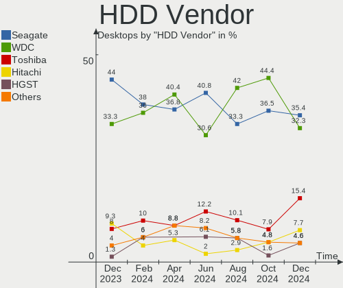
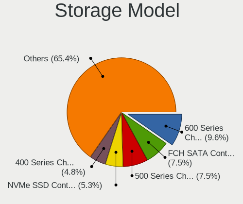

Arch Hardware Trends (Desktops)
-------------------------------

A project to identify most popular hardware characteristics and track their change
over time based on data collected by Arch users at https://Linux-Hardware.org.

Anyone can contribute to this report by the [hw-probe](https://github.com/linuxhw/hw-probe) tool:

    sudo -E hw-probe -all -upload

Full-feature report is available here: https://linux-hardware.org/?view=trends&formfactor=desktop

Period: Sep, 2021.

Contents
--------

* [ System ](#system)
  - [ OS                       ](#os)
  - [ OS Family                ](#os-family)
  - [ Kernel                   ](#kernel)
  - [ Kernel Family            ](#kernel-family)
  - [ Kernel Major Ver.        ](#kernel-major-ver)
  - [ Arch                     ](#arch)
  - [ DE                       ](#de)
  - [ Display Server           ](#display-server)
  - [ Display Manager          ](#display-manager)
  - [ OS Lang                  ](#os-lang)
  - [ Boot Mode                ](#boot-mode)
  - [ Filesystem               ](#filesystem)
  - [ Part. scheme             ](#part-scheme)
  - [ Dual Boot with Linux/BSD ](#dual-boot-with-linuxbsd)
  - [ Dual Boot (Win)          ](#dual-boot-win)

* [ Board ](#board)
  - [ Vendor                   ](#vendor)
  - [ Model                    ](#model)
  - [ Model Family             ](#model-family)
  - [ MFG Year                 ](#mfg-year)
  - [ Form Factor              ](#form-factor)
  - [ Secure Boot              ](#secure-boot)
  - [ Coreboot                 ](#coreboot)
  - [ RAM Size                 ](#ram-size)
  - [ RAM Used                 ](#ram-used)
  - [ Total Drives             ](#total-drives)
  - [ Has CD-ROM               ](#has-cd-rom)
  - [ Has Ethernet             ](#has-ethernet)
  - [ Has WiFi                 ](#has-wifi)
  - [ Has Bluetooth            ](#has-bluetooth)

* [ Location ](#location)
  - [ Country                  ](#country)
  - [ City                     ](#city)

* [ Drives ](#drives)
  - [ Drive Vendor             ](#drive-vendor)
  - [ Drive Model              ](#drive-model)
  - [ HDD Vendor               ](#hdd-vendor)
  - [ SSD Vendor               ](#ssd-vendor)
  - [ Drive Kind               ](#drive-kind)
  - [ Drive Connector          ](#drive-connector)
  - [ Drive Size               ](#drive-size)
  - [ Space Total              ](#space-total)
  - [ Space Used               ](#space-used)
  - [ Malfunc. Drives          ](#malfunc-drives)
  - [ Malfunc. Drive Vendor    ](#malfunc-drive-vendor)
  - [ Malfunc. HDD Vendor      ](#malfunc-hdd-vendor)
  - [ Malfunc. Drive Kind      ](#malfunc-drive-kind)
  - [ Failed Drives            ](#failed-drives)
  - [ Failed Drive Vendor      ](#failed-drive-vendor)
  - [ Drive Status             ](#drive-status)

* [ Storage controller ](#storage-controller)
  - [ Storage Vendor           ](#storage-vendor)
  - [ Storage Model            ](#storage-model)
  - [ Storage Kind             ](#storage-kind)

* [ Processor ](#processor)
  - [ CPU Vendor               ](#cpu-vendor)
  - [ CPU Model                ](#cpu-model)
  - [ CPU Model Family         ](#cpu-model-family)
  - [ CPU Cores                ](#cpu-cores)
  - [ CPU Sockets              ](#cpu-sockets)
  - [ CPU Threads              ](#cpu-threads)
  - [ CPU Op-Modes             ](#cpu-op-modes)
  - [ CPU Microcode            ](#cpu-microcode)
  - [ CPU Microarch            ](#cpu-microarch)

* [ Graphics ](#graphics)
  - [ GPU Vendor               ](#gpu-vendor)
  - [ GPU Model                ](#gpu-model)
  - [ GPU Combo                ](#gpu-combo)
  - [ GPU Driver               ](#gpu-driver)
  - [ GPU Memory               ](#gpu-memory)

* [ Monitor ](#monitor)
  - [ Monitor Vendor           ](#monitor-vendor)
  - [ Monitor Model            ](#monitor-model)
  - [ Monitor Resolution       ](#monitor-resolution)
  - [ Monitor Diagonal         ](#monitor-diagonal)
  - [ Monitor Width            ](#monitor-width)
  - [ Aspect Ratio             ](#aspect-ratio)
  - [ Monitor Area             ](#monitor-area)
  - [ Pixel Density            ](#pixel-density)
  - [ Multiple Monitors        ](#multiple-monitors)

* [ Network ](#network)
  - [ Net Controller Vendor    ](#net-controller-vendor)
  - [ Net Controller Model     ](#net-controller-model)
  - [ Wireless Vendor          ](#wireless-vendor)
  - [ Wireless Model           ](#wireless-model)
  - [ Ethernet Vendor          ](#ethernet-vendor)
  - [ Ethernet Model           ](#ethernet-model)
  - [ Net Controller Kind      ](#net-controller-kind)
  - [ Used Controller          ](#used-controller)
  - [ NICs                     ](#nics)
  - [ IPv6                     ](#ipv6)

* [ Bluetooth ](#bluetooth)
  - [ Bluetooth Vendor         ](#bluetooth-vendor)
  - [ Bluetooth Model          ](#bluetooth-model)

* [ Sound ](#sound)
  - [ Sound Vendor             ](#sound-vendor)
  - [ Sound Model              ](#sound-model)

* [ Memory ](#memory)
  - [ Memory Vendor            ](#memory-vendor)
  - [ Memory Model             ](#memory-model)
  - [ Memory Kind              ](#memory-kind)
  - [ Memory Form Factor       ](#memory-form-factor)
  - [ Memory Size              ](#memory-size)
  - [ Memory Speed             ](#memory-speed)

* [ Printers & scanners ](#printers--scanners)
  - [ Printer Vendor           ](#printer-vendor)
  - [ Printer Model            ](#printer-model)
  - [ Scanner Vendor           ](#scanner-vendor)
  - [ Scanner Model            ](#scanner-model)

* [ Camera ](#camera)
  - [ Camera Vendor            ](#camera-vendor)
  - [ Camera Model             ](#camera-model)

* [ Security ](#security)
  - [ Fingerprint Vendor       ](#fingerprint-vendor)
  - [ Fingerprint Model        ](#fingerprint-model)
  - [ Chipcard Vendor          ](#chipcard-vendor)
  - [ Chipcard Model           ](#chipcard-model)

* [ Unsupported ](#unsupported)
  - [ Unsupported Devices      ](#unsupported-devices)
  - [ Unsupported Device Types ](#unsupported-device-types)

System
------

OS
--

Installed operating systems

| Name         | Desktops | Percent |
|--------------|----------|---------|
| Arch         | 37       | 62.71%  |
| Arch Rolling | 22       | 37.29%  |

OS Family
---------

OS without a version

| Name | Desktops | Percent |
|------|----------|---------|
| Arch | 59       | 100%    |

Kernel
------

Version of the Linux kernel

| Version                     | Desktops | Percent |
|-----------------------------|----------|---------|
| 5.13.13-arch1-1             | 14       | 23.73%  |
| 5.14.6-arch1-1              | 11       | 18.64%  |
| 5.14.7-arch1-1              | 4        | 6.78%   |
| 5.14.3-arch1-1              | 4        | 6.78%   |
| 5.14.6-zen1-1-zen           | 3        | 5.08%   |
| 5.14.2-zen1-2-zen           | 3        | 5.08%   |
| 5.14.2-arch1-2              | 3        | 5.08%   |
| 5.13.12-arch1-1             | 2        | 3.39%   |
| 5.10.69-1-lts               | 2        | 3.39%   |
| 5.10.63-1-lts               | 2        | 3.39%   |
| 5.14.6-lqx1-2-lqx           | 1        | 1.69%   |
| 5.14.5-zen1-1-zen           | 1        | 1.69%   |
| 5.14.5-hardened1-1-hardened | 1        | 1.69%   |
| 5.13.15-lqx1-1-lqx          | 1        | 1.69%   |
| 5.13.13-zen1-1-zen          | 1        | 1.69%   |
| 5.13.13-arch1-1-51400p-04   | 1        | 1.69%   |
| 5.10.67-1-lts               | 1        | 1.69%   |
| 5.10.64-1-lts               | 1        | 1.69%   |
| 5.10.62-1-lts               | 1        | 1.69%   |
| 5.10.61-1-lts               | 1        | 1.69%   |
| 5.10.52-1-lts               | 1        | 1.69%   |

Kernel Family
-------------

Linux kernel without a distro release

| Version | Desktops | Percent |
|---------|----------|---------|
| 5.13.13 | 16       | 27.12%  |
| 5.14.6  | 15       | 25.42%  |
| 5.14.2  | 6        | 10.17%  |
| 5.14.7  | 4        | 6.78%   |
| 5.14.3  | 4        | 6.78%   |
| 5.14.5  | 2        | 3.39%   |
| 5.13.12 | 2        | 3.39%   |
| 5.10.69 | 2        | 3.39%   |
| 5.10.63 | 2        | 3.39%   |
| 5.13.15 | 1        | 1.69%   |
| 5.10.67 | 1        | 1.69%   |
| 5.10.64 | 1        | 1.69%   |
| 5.10.62 | 1        | 1.69%   |
| 5.10.61 | 1        | 1.69%   |
| 5.10.52 | 1        | 1.69%   |

Kernel Major Ver.
-----------------

Linux kernel major version

| Version | Desktops | Percent |
|---------|----------|---------|
| 5.14    | 31       | 52.54%  |
| 5.13    | 19       | 32.2%   |
| 5.10    | 9        | 15.25%  |

Arch
----

OS architecture (x86_64, i586, etc.)

| Name   | Desktops | Percent |
|--------|----------|---------|
| x86_64 | 59       | 100%    |

DE
--

Desktop Environment

| Name       | Desktops | Percent |
|------------|----------|---------|
| GNOME      | 15       | 25.42%  |
| KDE5       | 12       | 20.34%  |
| Unknown    | 7        | 11.86%  |
| i3         | 6        | 10.17%  |
| XFCE       | 4        | 6.78%   |
| MATE       | 3        | 5.08%   |
| KDE        | 3        | 5.08%   |
| Openbox    | 2        | 3.39%   |
| xmonad     | 1        | 1.69%   |
| X-Cinnamon | 1        | 1.69%   |
| LXDE       | 1        | 1.69%   |
| leftwm     | 1        | 1.69%   |
| Deepin     | 1        | 1.69%   |
| Budgie     | 1        | 1.69%   |
| awesome    | 1        | 1.69%   |

Display Server
--------------

X11 or Wayland

| Name    | Desktops | Percent |
|---------|----------|---------|
| X11     | 40       | 67.8%   |
| Wayland | 7        | 11.86%  |
| Tty     | 6        | 10.17%  |
| Unknown | 6        | 10.17%  |

Display Manager
---------------

SDDM, LightDM, etc.

| Name    | Desktops | Percent |
|---------|----------|---------|
| Unknown | 26       | 44.07%  |
| LightDM | 13       | 22.03%  |
| SDDM    | 9        | 15.25%  |
| GDM     | 5        | 8.47%   |
| LXDM    | 3        | 5.08%   |
| SLiM    | 1        | 1.69%   |
| Ly      | 1        | 1.69%   |
| GREETD  | 1        | 1.69%   |

OS Lang
-------

Language

| Lang       | Desktops | Percent |
|------------|----------|---------|
| en_US      | 31       | 52.54%  |
| C          | 5        | 8.47%   |
| pt_BR      | 3        | 5.08%   |
| en_GB      | 3        | 5.08%   |
| de_DE      | 3        | 5.08%   |
| hu_HU      | 2        | 3.39%   |
| en_AU      | 2        | 3.39%   |
| tr_TR      | 1        | 1.69%   |
| ru_RU      | 1        | 1.69%   |
| es_ES.UTF8 | 1        | 1.69%   |
| es_ES      | 1        | 1.69%   |
| es_CL      | 1        | 1.69%   |
| en_ZA      | 1        | 1.69%   |
| en_US.UTF8 | 1        | 1.69%   |
| en_IE      | 1        | 1.69%   |
| en_CA      | 1        | 1.69%   |
| Unknown    | 1        | 1.69%   |

Boot Mode
---------

EFI or BIOS

| Mode | Desktops | Percent |
|------|----------|---------|
| EFI  | 35       | 59.32%  |
| BIOS | 24       | 40.68%  |

Filesystem
----------

Type of filesystem

| Type    | Desktops | Percent |
|---------|----------|---------|
| Ext4    | 43       | 72.88%  |
| Btrfs   | 15       | 25.42%  |
| Overlay | 1        | 1.69%   |

Part. scheme
------------

Scheme of partitioning

| Type    | Desktops | Percent |
|---------|----------|---------|
| GPT     | 42       | 71.19%  |
| Unknown | 16       | 27.12%  |
| MBR     | 1        | 1.69%   |

Dual Boot with Linux/BSD
------------------------

Hosting more than one Linux/BSD

| Dual boot | Desktops | Percent |
|-----------|----------|---------|
| No        | 49       | 83.05%  |
| Yes       | 10       | 16.95%  |

Dual Boot (Win)
---------------

Hosting Linux and Windows

| Dual boot | Desktops | Percent |
|-----------|----------|---------|
| No        | 40       | 67.8%   |
| Yes       | 19       | 32.2%   |

Board
-----

Vendor
------

Motherboard manufacturer

| Name                | Desktops | Percent |
|---------------------|----------|---------|
| ASUSTek Computer    | 23       | 38.98%  |
| Gigabyte Technology | 9        | 15.25%  |
| MSI                 | 8        | 13.56%  |
| ASRock              | 7        | 11.86%  |
| Hewlett-Packard     | 3        | 5.08%   |
| Shuttle             | 2        | 3.39%   |
| Pegatron            | 1        | 1.69%   |
| Lenovo              | 1        | 1.69%   |
| Intel               | 1        | 1.69%   |
| HC                  | 1        | 1.69%   |
| Dell                | 1        | 1.69%   |
| Biostar             | 1        | 1.69%   |
| Unknown             | 1        | 1.69%   |

Model
-----

Motherboard model

| Name                             | Desktops | Percent |
|----------------------------------|----------|---------|
| ASUS TUF GAMING X570-PLUS        | 3        | 5.08%   |
| ASUS All Series                  | 3        | 5.08%   |
| MSI MS-7B98                      | 2        | 3.39%   |
| ASUS TUF GAMING B450-PLUS II     | 2        | 3.39%   |
| Shuttle SH67H                    | 1        | 1.69%   |
| Shuttle DH110                    | 1        | 1.69%   |
| Pegatron AY138AA-ABA CQ5320Y     | 1        | 1.69%   |
| MSI MS-7C91                      | 1        | 1.69%   |
| MSI MS-7C37                      | 1        | 1.69%   |
| MSI MS-7C35                      | 1        | 1.69%   |
| MSI MS-7A34                      | 1        | 1.69%   |
| MSI MS-7971                      | 1        | 1.69%   |
| MSI EG194AA-ABA A1250N           | 1        | 1.69%   |
| Lenovo ThinkStation D20 4158E93  | 1        | 1.69%   |
| Intel X79 V2.72B                 | 1        | 1.69%   |
| HP Z820 Workstation              | 1        | 1.69%   |
| HP Z4 G4 Workstation             | 1        | 1.69%   |
| HP Z240 SFF Workstation          | 1        | 1.69%   |
| HC HCAR357-MI                    | 1        | 1.69%   |
| Gigabyte X570 I AORUS PRO WIFI   | 1        | 1.69%   |
| Gigabyte X570 AORUS PRO WIFI     | 1        | 1.69%   |
| Gigabyte X570 AORUS ELITE        | 1        | 1.69%   |
| Gigabyte X470 AORUS ULTRA GAMING | 1        | 1.69%   |
| Gigabyte B450 AORUS PRO WIFI     | 1        | 1.69%   |
| Gigabyte B450 AORUS PRO          | 1        | 1.69%   |
| Gigabyte B450 AORUS M            | 1        | 1.69%   |
| Gigabyte A520 AORUS ELITE        | 1        | 1.69%   |
| Gigabyte A320M-S2H               | 1        | 1.69%   |
| Dell OptiPlex 3060               | 1        | 1.69%   |
| Biostar X370GT7                  | 1        | 1.69%   |
| ASUS Z170-PRO                    | 1        | 1.69%   |
| ASUS Z170-DELUXE                 | 1        | 1.69%   |
| ASUS Z170-A                      | 1        | 1.69%   |
| ASUS TUF GAMING B550-PRO         | 1        | 1.69%   |
| ASUS ROG STRIX X570-E GAMING     | 1        | 1.69%   |
| ASUS ROG STRIX X470-F GAMING     | 1        | 1.69%   |
| ASUS ROG STRIX B550-F GAMING     | 1        | 1.69%   |
| ASUS ROG STRIX B350-F GAMING     | 1        | 1.69%   |
| ASUS PRIME Z390-A                | 1        | 1.69%   |
| ASUS PRIME X470-PRO              | 1        | 1.69%   |
| ASUS PRIME B550M-A               | 1        | 1.69%   |
| ASUS P8H61-M LX                  | 1        | 1.69%   |
| ASUS Maximus VIII RANGER         | 1        | 1.69%   |
| ASUS M5A88-M                     | 1        | 1.69%   |
| ASUS 970 PRO GAMING/AURA         | 1        | 1.69%   |
| ASRock Z490 Phantom Gaming 4G    | 1        | 1.69%   |
| ASRock Z390M Pro4                | 1        | 1.69%   |
| ASRock Z170 Pro4                 | 1        | 1.69%   |
| ASRock X570M Pro4                | 1        | 1.69%   |
| ASRock B560M-HDV                 | 1        | 1.69%   |
| ASRock B550M-HDV                 | 1        | 1.69%   |
| ASRock 970 Pro3 R2.0             | 1        | 1.69%   |
| Unknown                          | 1        | 1.69%   |

Model Family
------------

Motherboard model prefix

| Name                 | Desktops | Percent |
|----------------------|----------|---------|
| ASUS TUF             | 6        | 10.17%  |
| ASUS ROG             | 4        | 6.78%   |
| Gigabyte X570        | 3        | 5.08%   |
| Gigabyte B450        | 3        | 5.08%   |
| ASUS PRIME           | 3        | 5.08%   |
| ASUS All             | 3        | 5.08%   |
| MSI MS-7B98          | 2        | 3.39%   |
| Shuttle SH67H        | 1        | 1.69%   |
| Shuttle DH110        | 1        | 1.69%   |
| Pegatron AY138AA-ABA | 1        | 1.69%   |
| MSI MS-7C91          | 1        | 1.69%   |
| MSI MS-7C37          | 1        | 1.69%   |
| MSI MS-7C35          | 1        | 1.69%   |
| MSI MS-7A34          | 1        | 1.69%   |
| MSI MS-7971          | 1        | 1.69%   |
| MSI EG194AA-ABA      | 1        | 1.69%   |
| Lenovo ThinkStation  | 1        | 1.69%   |
| Intel X79            | 1        | 1.69%   |
| HP Z820              | 1        | 1.69%   |
| HP Z4                | 1        | 1.69%   |
| HP Z240              | 1        | 1.69%   |
| HC HCAR357-MI        | 1        | 1.69%   |
| Gigabyte X470        | 1        | 1.69%   |
| Gigabyte A520        | 1        | 1.69%   |
| Gigabyte A320M-S2H   | 1        | 1.69%   |
| Dell OptiPlex        | 1        | 1.69%   |
| Biostar X370GT7      | 1        | 1.69%   |
| ASUS Z170-PRO        | 1        | 1.69%   |
| ASUS Z170-DELUXE     | 1        | 1.69%   |
| ASUS Z170-A          | 1        | 1.69%   |
| ASUS P8H61-M         | 1        | 1.69%   |
| ASUS Maximus         | 1        | 1.69%   |
| ASUS M5A88-M         | 1        | 1.69%   |
| ASUS 970             | 1        | 1.69%   |
| ASRock Z490          | 1        | 1.69%   |
| ASRock Z390M         | 1        | 1.69%   |
| ASRock Z170          | 1        | 1.69%   |
| ASRock X570M         | 1        | 1.69%   |
| ASRock B560M-HDV     | 1        | 1.69%   |
| ASRock B550M-HDV     | 1        | 1.69%   |
| ASRock 970           | 1        | 1.69%   |
| Unknown              | 1        | 1.69%   |

MFG Year
--------

Motherboard manufacture year

| Year    | Desktops | Percent |
|---------|----------|---------|
| 2020    | 16       | 27.12%  |
| 2021    | 12       | 20.34%  |
| 2018    | 10       | 16.95%  |
| 2019    | 8        | 13.56%  |
| 2016    | 3        | 5.08%   |
| 2013    | 3        | 5.08%   |
| 2017    | 1        | 1.69%   |
| 2015    | 1        | 1.69%   |
| 2012    | 1        | 1.69%   |
| 2011    | 1        | 1.69%   |
| 2009    | 1        | 1.69%   |
| 2005    | 1        | 1.69%   |
| Unknown | 1        | 1.69%   |

Form Factor
-----------

Physical design of the computer

| Name    | Desktops | Percent |
|---------|----------|---------|
| Desktop | 59       | 100%    |

Secure Boot
-----------

Enabled or disabled

| State    | Desktops | Percent |
|----------|----------|---------|
| Disabled | 59       | 100%    |

Coreboot
--------

Have coreboot on board

| Used | Desktops | Percent |
|------|----------|---------|
| No   | 59       | 100%    |

RAM Size
--------

Total RAM memory

| Size in GB  | Desktops | Percent |
|-------------|----------|---------|
| 32.01-64.0  | 26       | 44.07%  |
| 16.01-24.0  | 21       | 35.59%  |
| 64.01-256.0 | 5        | 8.47%   |
| 8.01-16.0   | 3        | 5.08%   |
| 24.01-32.0  | 2        | 3.39%   |
| 4.01-8.0    | 1        | 1.69%   |
| 2.01-3.0    | 1        | 1.69%   |

RAM Used
--------

Used RAM memory

| Used GB    | Desktops | Percent |
|------------|----------|---------|
| 2.01-3.0   | 15       | 25.42%  |
| 4.01-8.0   | 13       | 22.03%  |
| 1.01-2.0   | 13       | 22.03%  |
| 3.01-4.0   | 7        | 11.86%  |
| 8.01-16.0  | 7        | 11.86%  |
| 16.01-24.0 | 2        | 3.39%   |
| 0.51-1.0   | 2        | 3.39%   |

Total Drives
------------

Number of drives on board

| Drives | Desktops | Percent |
|--------|----------|---------|
| 2      | 18       | 30.51%  |
| 3      | 14       | 23.73%  |
| 4      | 11       | 18.64%  |
| 1      | 8        | 13.56%  |
| 5      | 7        | 11.86%  |
| 7      | 1        | 1.69%   |

Has CD-ROM
----------

Has CD-ROM on board

| Presented | Desktops | Percent |
|-----------|----------|---------|
| No        | 42       | 71.19%  |
| Yes       | 17       | 28.81%  |

Has Ethernet
------------

Has Ethernet on board

| Presented | Desktops | Percent |
|-----------|----------|---------|
| Yes       | 59       | 100%    |

Has WiFi
--------

Has WiFi module

| Presented | Desktops | Percent |
|-----------|----------|---------|
| Yes       | 30       | 50.85%  |
| No        | 29       | 49.15%  |

Has Bluetooth
-------------

Has Bluetooth module

| Presented | Desktops | Percent |
|-----------|----------|---------|
| No        | 39       | 66.1%   |
| Yes       | 20       | 33.9%   |

Location
--------

Country
-------

Geographic location (country)

| Country      | Desktops | Percent |
|--------------|----------|---------|
| USA          | 17       | 28.81%  |
| Germany      | 7        | 11.86%  |
| Brazil       | 6        | 10.17%  |
| Russia       | 3        | 5.08%   |
| Canada       | 3        | 5.08%   |
| Sweden       | 2        | 3.39%   |
| Spain        | 2        | 3.39%   |
| Pakistan     | 2        | 3.39%   |
| Hungary      | 2        | 3.39%   |
| Chile        | 2        | 3.39%   |
| Australia    | 2        | 3.39%   |
| UK           | 1        | 1.69%   |
| Turkey       | 1        | 1.69%   |
| South Africa | 1        | 1.69%   |
| Nepal        | 1        | 1.69%   |
| Lithuania    | 1        | 1.69%   |
| France       | 1        | 1.69%   |
| Croatia      | 1        | 1.69%   |
| China        | 1        | 1.69%   |
| Bulgaria     | 1        | 1.69%   |
| Azerbaijan   | 1        | 1.69%   |
| Austria      | 1        | 1.69%   |

City
----

Geographic location (city)

| City                    | Desktops | Percent |
|-------------------------|----------|---------|
| Zaragoza                | 1        | 1.69%   |
| Victoria                | 1        | 1.69%   |
| Valpara?­so             | 1        | 1.69%   |
| Valencia                | 1        | 1.69%   |
| Sz?©kesfeh?©rv??r       | 1        | 1.69%   |
| Suzano                  | 1        | 1.69%   |
| Stockholm               | 1        | 1.69%   |
| St. Petersburg          | 1        | 1.69%   |
| St Petersburg           | 1        | 1.69%   |
| Sile                    | 1        | 1.69%   |
| Siegen                  | 1        | 1.69%   |
| Seattle                 | 1        | 1.69%   |
| Schrobenhausen          | 1        | 1.69%   |
| Santiago                | 1        | 1.69%   |
| Sankt P?¶lten           | 1        | 1.69%   |
| San Francisco           | 1        | 1.69%   |
| Saint John              | 1        | 1.69%   |
| Rio de Janeiro          | 1        | 1.69%   |
| Rimpar                  | 1        | 1.69%   |
| Recife                  | 1        | 1.69%   |
| Pompano Beach           | 1        | 1.69%   |
| Pfaffenhofen an der Ilm | 1        | 1.69%   |
| Paris                   | 1        | 1.69%   |
| Osasco                  | 1        | 1.69%   |
| Novosibirsk             | 1        | 1.69%   |
| Novocherkassk           | 1        | 1.69%   |
| Munich                  | 1        | 1.69%   |
| Mosonmagyar??v??r       | 1        | 1.69%   |
| Morgantown              | 1        | 1.69%   |
| Montes Claros           | 1        | 1.69%   |
| Melbourne               | 1        | 1.69%   |
| Massillon               | 1        | 1.69%   |
| Logro?±o                | 1        | 1.69%   |
| Liverpool               | 1        | 1.69%   |
| Lahore                  | 1        | 1.69%   |
| Kutina                  | 1        | 1.69%   |
| Kilsyth                 | 1        | 1.69%   |
| Kaunas                  | 1        | 1.69%   |
| Kathmandu               | 1        | 1.69%   |
| Karachi                 | 1        | 1.69%   |
| Jinan                   | 1        | 1.69%   |
| Hurricane               | 1        | 1.69%   |
| Fresno                  | 1        | 1.69%   |
| F??rth                  | 1        | 1.69%   |
| Dallas                  | 1        | 1.69%   |
| Converse                | 1        | 1.69%   |
| City of Saint Peters    | 1        | 1.69%   |
| Chicago                 | 1        | 1.69%   |
| Charlotte               | 1        | 1.69%   |
| Cape Town               | 1        | 1.69%   |
| Campinas                | 1        | 1.69%   |
| Burnaby                 | 1        | 1.69%   |
| Bromma                  | 1        | 1.69%   |
| Bochum                  | 1        | 1.69%   |
| Bellefontaine           | 1        | 1.69%   |
| Baton Rouge             | 1        | 1.69%   |
| Baltimore               | 1        | 1.69%   |
| Baku                    | 1        | 1.69%   |
| Asenovgrad              | 1        | 1.69%   |

Drives
------

Drive Vendor
------------

Hard drive vendors

| Vendor                | Desktops | Drives | Percent |
|-----------------------|----------|--------|---------|
| Samsung Electronics   | 26       | 40     | 20%     |
| Seagate               | 20       | 24     | 15.38%  |
| WDC                   | 19       | 29     | 14.62%  |
| Toshiba               | 11       | 11     | 8.46%   |
| Crucial               | 11       | 12     | 8.46%   |
| Kingston              | 10       | 14     | 7.69%   |
| Sandisk               | 9        | 11     | 6.92%   |
| Silicon Motion        | 4        | 4      | 3.08%   |
| A-DATA Technology     | 4        | 4      | 3.08%   |
| Phison                | 2        | 3      | 1.54%   |
| Intel                 | 2        | 2      | 1.54%   |
| TO Exter              | 1        | 1      | 0.77%   |
| STM                   | 1        | 1      | 0.77%   |
| SK Hynix              | 1        | 1      | 0.77%   |
| Realtek Semiconductor | 1        | 1      | 0.77%   |
| Patriot               | 1        | 1      | 0.77%   |
| MaxDigital            | 1        | 1      | 0.77%   |
| Hitachi               | 1        | 1      | 0.77%   |
| HGST                  | 1        | 1      | 0.77%   |
| External              | 1        | 1      | 0.77%   |
| Corsair               | 1        | 1      | 0.77%   |
| BRAVEEAGLE            | 1        | 1      | 0.77%   |
| ASMT109x              | 1        | 1      | 0.77%   |

Drive Model
-----------

Hard drive models

| Model                               | Desktops | Percent |
|-------------------------------------|----------|---------|
| Toshiba DT01ACA100 1TB              | 4        | 2.55%   |
| Samsung SSD 860 EVO 1TB             | 4        | 2.55%   |
| Samsung SSD 970 EVO Plus 500GB      | 3        | 1.91%   |
| Samsung SSD 970 EVO Plus 1TB        | 3        | 1.91%   |
| Toshiba DT01ACA200 2TB              | 2        | 1.27%   |
| Seagate ST4000DM004-2CV104 4TB      | 2        | 1.27%   |
| Seagate ST3500418AS 500GB           | 2        | 1.27%   |
| Seagate ST2000DM008-2FR102 2TB      | 2        | 1.27%   |
| Seagate ST2000DM006-2DM164 2TB      | 2        | 1.27%   |
| Seagate ST1000DM003-1CH162 1TB      | 2        | 1.27%   |
| SanDisk SDSSDA240G 240GB            | 2        | 1.27%   |
| Sandisk NVMe SSD Drive 1TB          | 2        | 1.27%   |
| Samsung SSD 860 EVO 500GB           | 2        | 1.27%   |
| Samsung SSD 850 EVO 250GB           | 2        | 1.27%   |
| Samsung NVMe SSD Drive 256GB        | 2        | 1.27%   |
| Kingston SV300S37A120G 120GB SSD    | 2        | 1.27%   |
| Kingston SA400S37240G 240GB SSD     | 2        | 1.27%   |
| Intel SSDPEKNW010T8 1TB             | 2        | 1.27%   |
| Crucial CT480BX500SSD1 480GB        | 2        | 1.27%   |
| WDC WDS500G3X0C-00SJG0 500GB        | 1        | 0.64%   |
| WDC WDS500G2B0B-00YS70 500GB SSD    | 1        | 0.64%   |
| WDC WDS120G2G0B-00EPW0 120GB SSD    | 1        | 0.64%   |
| WDC WDS120G1G0A-00SS50 120GB SSD    | 1        | 0.64%   |
| WDC WDS100T2B0B-00YS70 1TB SSD      | 1        | 0.64%   |
| WDC WD5000BEKT-00KA9T0 500GB        | 1        | 0.64%   |
| WDC WD40EZRZ-00GXCB0 4TB            | 1        | 0.64%   |
| WDC WD40EFRX-68N32N0 4TB            | 1        | 0.64%   |
| WDC WD4002FYYZ-01B7CB1 4TB          | 1        | 0.64%   |
| WDC WD3200AAJS-56M0A0 320GB         | 1        | 0.64%   |
| WDC WD20EZAZ-00GGJB0 2TB            | 1        | 0.64%   |
| WDC WD20EFRX-68EUZN0 2TB            | 1        | 0.64%   |
| WDC WD20EARS-00MVWB0 2TB            | 1        | 0.64%   |
| WDC WD20EARS-00J2GB0 2TB            | 1        | 0.64%   |
| WDC WD2003FZEX-00Z4SA0 2TB          | 1        | 0.64%   |
| WDC WD2003FZEX-00SRLA0 2TB          | 1        | 0.64%   |
| WDC WD10SPZX-75Z10T3 1TB            | 1        | 0.64%   |
| WDC WD10EZEX-60WN4A0 1TB            | 1        | 0.64%   |
| WDC WD10EZEX-08WN4A0 1TB            | 1        | 0.64%   |
| WDC WD10EZEX-00BN5A0 1TB            | 1        | 0.64%   |
| WDC WD10EARS-00Y5B1 1TB             | 1        | 0.64%   |
| WDC WD10EARS-003BB1 1TB             | 1        | 0.64%   |
| WDC WD10EADS-65L5B1 1TB             | 1        | 0.64%   |
| WDC WD1002FAEX-00Z3A0 1TB           | 1        | 0.64%   |
| WDC WD My Passport 25F3 1TB         | 1        | 0.64%   |
| Toshiba MQ01ABD100 1TB              | 1        | 0.64%   |
| Toshiba MG04ACA400N 4TB             | 1        | 0.64%   |
| Toshiba HDWE140 4TB                 | 1        | 0.64%   |
| Toshiba HDWD110 1TB                 | 1        | 0.64%   |
| Toshiba DT01ABA100V 1TB             | 1        | 0.64%   |
| TO Exter nal USB 3.0 4TB            | 1        | 0.64%   |
| STM STLINK 3MB                      | 1        | 0.64%   |
| SK Hynix NVMe SSD Drive 1024GB      | 1        | 0.64%   |
| Silicon Motion NVMe SSD Drive 256GB | 1        | 0.64%   |
| Silicon Motion NVMe SSD Drive 250GB | 1        | 0.64%   |
| Silicon Motion NE-128 128GB         | 1        | 0.64%   |
| Silicon Motion GV1TB                | 1        | 0.64%   |
| Seagate ST500DM002-1BD142 500GB     | 1        | 0.64%   |
| Seagate ST4000DM000-1F2168 4TB      | 1        | 0.64%   |
| Seagate ST320LM010-1KJ15C 320GB     | 1        | 0.64%   |
| Seagate ST31000524AS 1TB            | 1        | 0.64%   |

HDD Vendor
----------

Hard disk drive vendors

| Vendor              | Desktops | Drives | Percent |
|---------------------|----------|--------|---------|
| Seagate             | 20       | 24     | 40%     |
| WDC                 | 14       | 23     | 28%     |
| Toshiba             | 11       | 11     | 22%     |
| TO Exter            | 1        | 1      | 2%      |
| Samsung Electronics | 1        | 1      | 2%      |
| MaxDigital          | 1        | 1      | 2%      |
| Hitachi             | 1        | 1      | 2%      |
| HGST                | 1        | 1      | 2%      |

SSD Vendor
----------

Solid state drive vendors

| Vendor              | Desktops | Drives | Percent |
|---------------------|----------|--------|---------|
| Samsung Electronics | 17       | 21     | 34.69%  |
| Kingston            | 9        | 11     | 18.37%  |
| Crucial             | 8        | 9      | 16.33%  |
| SanDisk             | 6        | 7      | 12.24%  |
| WDC                 | 4        | 4      | 8.16%   |
| A-DATA Technology   | 2        | 2      | 4.08%   |
| Patriot             | 1        | 1      | 2.04%   |
| BRAVEEAGLE          | 1        | 1      | 2.04%   |
| ASMT109x            | 1        | 1      | 2.04%   |

Drive Kind
----------

HDD or SSD

| Kind    | Desktops | Drives | Percent |
|---------|----------|--------|---------|
| SSD     | 41       | 57     | 35.34%  |
| HDD     | 39       | 63     | 33.62%  |
| NVMe    | 34       | 44     | 29.31%  |
| Unknown | 2        | 2      | 1.72%   |

Drive Connector
---------------

SATA, SAS, NVMe, etc.

| Type | Desktops | Drives | Percent |
|------|----------|--------|---------|
| SATA | 52       | 117    | 57.78%  |
| NVMe | 33       | 43     | 36.67%  |
| SAS  | 5        | 6      | 5.56%   |

Drive Size
----------

Size of hard drive

| Size in TB | Desktops | Drives | Percent |
|------------|----------|--------|---------|
| 0.01-0.5   | 33       | 45     | 37.93%  |
| 0.51-1.0   | 30       | 41     | 34.48%  |
| 1.01-2.0   | 17       | 22     | 19.54%  |
| 3.01-4.0   | 7        | 12     | 8.05%   |

Space Total
-----------

Amount of disk space available on the file system

| Size in GB     | Desktops | Percent |
|----------------|----------|---------|
| 501-1000       | 15       | 25.42%  |
| 1001-2000      | 12       | 20.34%  |
| More than 3000 | 10       | 16.95%  |
| 251-500        | 8        | 13.56%  |
| 2001-3000      | 7        | 11.86%  |
| 101-250        | 3        | 5.08%   |
| Unknown        | 3        | 5.08%   |
| 51-100         | 1        | 1.69%   |

Space Used
----------

Amount of used disk space

| Used GB        | Desktops | Percent |
|----------------|----------|---------|
| 501-1000       | 13       | 22.03%  |
| 251-500        | 10       | 16.95%  |
| 1001-2000      | 10       | 16.95%  |
| 101-250        | 9        | 15.25%  |
| More than 3000 | 5        | 8.47%   |
| 1-20           | 4        | 6.78%   |
| 21-50          | 3        | 5.08%   |
| Unknown        | 3        | 5.08%   |
| 2001-3000      | 2        | 3.39%   |

Malfunc. Drives
---------------

Drive models with a malfunction

| Model                           | Desktops | Drives | Percent |
|---------------------------------|----------|--------|---------|
| WDC WD20EARS-00J2GB0 2TB        | 1        | 1      | 20%     |
| WDC WD1002FAEX-00Z3A0 1TB       | 1        | 2      | 20%     |
| Toshiba DT01ABA100V 1TB         | 1        | 1      | 20%     |
| Seagate ST320LM010-1KJ15C 320GB | 1        | 1      | 20%     |
| Intel SSDPEKNW010T8 1TB         | 1        | 1      | 20%     |

Malfunc. Drive Vendor
---------------------

Vendors of faulty drives

| Vendor  | Desktops | Drives | Percent |
|---------|----------|--------|---------|
| WDC     | 2        | 3      | 40%     |
| Toshiba | 1        | 1      | 20%     |
| Seagate | 1        | 1      | 20%     |
| Intel   | 1        | 1      | 20%     |

Malfunc. HDD Vendor
-------------------

Vendors of faulty HDD drives

| Vendor  | Desktops | Drives | Percent |
|---------|----------|--------|---------|
| WDC     | 2        | 3      | 50%     |
| Toshiba | 1        | 1      | 25%     |
| Seagate | 1        | 1      | 25%     |

Malfunc. Drive Kind
-------------------

Kinds of faulty drives

| Kind | Desktops | Drives | Percent |
|------|----------|--------|---------|
| HDD  | 4        | 5      | 80%     |
| NVMe | 1        | 1      | 20%     |

Failed Drives
-------------

Failed drive models

Zero info for selected period =(

Failed Drive Vendor
-------------------

Failed drive vendors

Zero info for selected period =(

Drive Status
------------

Number of failed and malfunc. drives

| Status   | Desktops | Drives | Percent |
|----------|----------|--------|---------|
| Works    | 33       | 86     | 52.38%  |
| Detected | 25       | 74     | 39.68%  |
| Malfunc  | 5        | 6      | 7.94%   |

Storage controller
------------------

Storage Vendor
--------------

Storage controller vendors

| Vendor                      | Desktops | Percent |
|-----------------------------|----------|---------|
| AMD                         | 33       | 33%     |
| Intel                       | 26       | 26%     |
| Samsung Electronics         | 15       | 15%     |
| Silicon Motion              | 4        | 4%      |
| Sandisk                     | 4        | 4%      |
| Phison Electronics          | 3        | 3%      |
| Micron/Crucial Technology   | 3        | 3%      |
| Kingston Technology Company | 3        | 3%      |
| ASMedia Technology          | 2        | 2%      |
| ADATA Technology            | 2        | 2%      |
| SK Hynix                    | 1        | 1%      |
| Realtek Semiconductor       | 1        | 1%      |
| Nvidia                      | 1        | 1%      |
| LSI Logic / Symbios Logic   | 1        | 1%      |
| Broadcom / LSI              | 1        | 1%      |

Storage Model
-------------

Storage controller models

| Model                                                                                   | Desktops | Percent |
|-----------------------------------------------------------------------------------------|----------|---------|
| AMD FCH SATA Controller [AHCI mode]                                                     | 24       | 20%     |
| Samsung NVMe SSD Controller SM981/PM981/PM983                                           | 9        | 7.5%    |
| AMD 400 Series Chipset SATA Controller                                                  | 8        | 6.67%   |
| Intel Q170/Q150/B150/H170/H110/Z170/CM236 Chipset SATA Controller [AHCI Mode]           | 7        | 5.83%   |
| AMD Starship/Matisse Chipset SATA Controller [AHCI mode]                                | 6        | 5%      |
| Intel Cannon Lake PCH SATA AHCI Controller                                              | 4        | 3.33%   |
| Silicon Motion SM2263EN/SM2263XT SSD Controller                                         | 3        | 2.5%    |
| Phison E12 NVMe Controller                                                              | 3        | 2.5%    |
| Kingston Company A2000 NVMe SSD                                                         | 3        | 2.5%    |
| Intel SATA Controller [RAID mode]                                                       | 3        | 2.5%    |
| AMD SB7x0/SB8x0/SB9x0 SATA Controller [AHCI mode]                                       | 3        | 2.5%    |
| Sandisk WD Black 2018/SN750 / PC SN720 NVMe SSD                                         | 2        | 1.67%   |
| Samsung NVMe SSD Controller SM961/PM961/SM963                                           | 2        | 1.67%   |
| Samsung NVMe SSD Controller SM951/PM951                                                 | 2        | 1.67%   |
| Samsung NVMe SSD Controller PM9A1/PM9A3/980PRO                                          | 2        | 1.67%   |
| Micron/Crucial P1 NVMe PCIe SSD                                                         | 2        | 1.67%   |
| Intel SSD 660P Series                                                                   | 2        | 1.67%   |
| Intel C600/X79 series chipset SATA RAID Controller                                      | 2        | 1.67%   |
| Intel 8 Series/C220 Series Chipset Family 6-port SATA Controller 1 [AHCI mode]          | 2        | 1.67%   |
| ASMedia ASM1062 Serial ATA Controller                                                   | 2        | 1.67%   |
| AMD 300 Series Chipset SATA Controller                                                  | 2        | 1.67%   |
| ADATA XPG SX8200 Pro PCIe Gen3x4 M.2 2280 Solid State Drive                             | 2        | 1.67%   |
| SK Hynix Non-Volatile memory controller                                                 | 1        | 0.83%   |
| Silicon Motion SM2262/SM2262EN SSD Controller                                           | 1        | 0.83%   |
| Sandisk WD Black SN850                                                                  | 1        | 0.83%   |
| Sandisk WD Black SN750 / PC SN730 NVMe SSD                                              | 1        | 0.83%   |
| Realtek RTS5763DL NVMe SSD Controller                                                   | 1        | 0.83%   |
| Nvidia MCP61 SATA Controller                                                            | 1        | 0.83%   |
| Micron/Crucial NVMe Controller                                                          | 1        | 0.83%   |
| LSI Logic / Symbios Logic SAS1068E PCI-Express Fusion-MPT SAS                           | 1        | 0.83%   |
| Intel Comet Lake SATA AHCI Controller                                                   | 1        | 0.83%   |
| Intel C610/X99 series chipset sSATA Controller [AHCI mode]                              | 1        | 0.83%   |
| Intel C610/X99 series chipset 6-Port SATA Controller [AHCI mode]                        | 1        | 0.83%   |
| Intel C602 chipset 4-Port SATA Storage Control Unit                                     | 1        | 0.83%   |
| Intel C600/X79 series chipset IDE-r Controller                                          | 1        | 0.83%   |
| Intel C600/X79 series chipset 6-Port SATA AHCI Controller                               | 1        | 0.83%   |
| Intel 82801JI (ICH10 Family) SATA AHCI Controller                                       | 1        | 0.83%   |
| Intel 6 Series/C200 Series Chipset Family Desktop SATA Controller (IDE mode, ports 4-5) | 1        | 0.83%   |
| Intel 6 Series/C200 Series Chipset Family Desktop SATA Controller (IDE mode, ports 0-3) | 1        | 0.83%   |
| Intel 6 Series/C200 Series Chipset Family 6 port Desktop SATA AHCI Controller           | 1        | 0.83%   |
| Intel 500 Series Chipset Family SATA AHCI Controller                                    | 1        | 0.83%   |
| Broadcom / LSI SAS2308 PCI-Express Fusion-MPT SAS-2                                     | 1        | 0.83%   |
| AMD X370 Series Chipset SATA Controller                                                 | 1        | 0.83%   |
| AMD SB7x0/SB8x0/SB9x0 IDE Controller                                                    | 1        | 0.83%   |
| AMD IXP SB4x0 Serial ATA Controller                                                     | 1        | 0.83%   |
| AMD IXP SB4x0 IDE Controller                                                            | 1        | 0.83%   |
| AMD FCH SATA Controller D                                                               | 1        | 0.83%   |

Storage Kind
------------

Kind of storage controller (IDE, SATA, NVMe, SAS, ...)

| Kind | Desktops | Percent |
|------|----------|---------|
| SATA | 51       | 53.13%  |
| NVMe | 33       | 34.38%  |
| RAID | 5        | 5.21%   |
| IDE  | 5        | 5.21%   |
| SAS  | 1        | 1.04%   |
| SCSI | 1        | 1.04%   |

Processor
---------

CPU Vendor
----------

Processor vendors

| Vendor | Desktops | Percent |
|--------|----------|---------|
| AMD    | 34       | 57.63%  |
| Intel  | 25       | 42.37%  |

CPU Model
---------

Processor models

| Model                                         | Desktops | Percent |
|-----------------------------------------------|----------|---------|
| AMD Ryzen 7 3700X 8-Core Processor            | 5        | 8.47%   |
| Intel Core i7-6700K CPU @ 4.00GHz             | 4        | 6.78%   |
| AMD Ryzen 5 3600 6-Core Processor             | 4        | 6.78%   |
| AMD Ryzen 7 2700 Eight-Core Processor         | 3        | 5.08%   |
| Intel Core i5-6600K CPU @ 3.50GHz             | 2        | 3.39%   |
| AMD Ryzen 9 3900X 12-Core Processor           | 2        | 3.39%   |
| AMD Ryzen 7 2700X Eight-Core Processor        | 2        | 3.39%   |
| AMD Ryzen 5 5600X 6-Core Processor            | 2        | 3.39%   |
| AMD Ryzen 5 3600X 6-Core Processor            | 2        | 3.39%   |
| AMD FX-8350 Eight-Core Processor              | 2        | 3.39%   |
| Intel Xeon W-2123 CPU @ 3.60GHz               | 1        | 1.69%   |
| Intel Xeon CPU X5660 @ 2.80GHz                | 1        | 1.69%   |
| Intel Xeon CPU X5650 @ 2.67GHz                | 1        | 1.69%   |
| Intel Xeon CPU E5-2670 0 @ 2.60GHz            | 1        | 1.69%   |
| Intel Xeon CPU E5-2640 0 @ 2.50GHz            | 1        | 1.69%   |
| Intel Core i9-9900KF CPU @ 3.60GHz            | 1        | 1.69%   |
| Intel Core i7-9700K CPU @ 3.60GHz             | 1        | 1.69%   |
| Intel Core i7-9700 CPU @ 3.00GHz              | 1        | 1.69%   |
| Intel Core i7-6900K CPU @ 3.20GHz             | 1        | 1.69%   |
| Intel Core i7-6700 CPU @ 3.40GHz              | 1        | 1.69%   |
| Intel Core i7-4790K CPU @ 4.00GHz             | 1        | 1.69%   |
| Intel Core i7-4770 CPU @ 3.40GHz              | 1        | 1.69%   |
| Intel Core i7-3770 CPU @ 3.40GHz              | 1        | 1.69%   |
| Intel Core i7-2600K CPU @ 3.40GHz             | 1        | 1.69%   |
| Intel Core i7-10700 CPU @ 2.90GHz             | 1        | 1.69%   |
| Intel Core i5-9400F CPU @ 2.90GHz             | 1        | 1.69%   |
| Intel Core i5-8400 CPU @ 2.80GHz              | 1        | 1.69%   |
| Intel Core i5-6400 CPU @ 2.70GHz              | 1        | 1.69%   |
| Intel Core i3-10105 CPU @ 3.70GHz             | 1        | 1.69%   |
| AMD Ryzen 9 5950X 16-Core Processor           | 1        | 1.69%   |
| AMD Ryzen 7 5800X 8-Core Processor            | 1        | 1.69%   |
| AMD Ryzen 7 3800X 8-Core Processor            | 1        | 1.69%   |
| AMD Ryzen 7 1700 Eight-Core Processor         | 1        | 1.69%   |
| AMD Ryzen 5 5600G with Radeon Graphics        | 1        | 1.69%   |
| AMD Ryzen 5 3550H with Radeon Vega Mobile Gfx | 1        | 1.69%   |
| AMD Ryzen 5 1600X Six-Core Processor          | 1        | 1.69%   |
| AMD Ryzen 3 3100 4-Core Processor             | 1        | 1.69%   |
| AMD Ryzen 3 2200G with Radeon Vega Graphics   | 1        | 1.69%   |
| AMD FX-6300 Six-Core Processor                | 1        | 1.69%   |
| AMD Athlon II X2 240 Processor                | 1        | 1.69%   |
| AMD Athlon 64 X2 Dual Core Processor 3800+    | 1        | 1.69%   |

CPU Model Family
----------------

Processor model prefix

| Model            | Desktops | Percent |
|------------------|----------|---------|
| Intel Core i7    | 13       | 22.03%  |
| AMD Ryzen 7      | 13       | 22.03%  |
| AMD Ryzen 5      | 11       | 18.64%  |
| Intel Xeon       | 5        | 8.47%   |
| Intel Core i5    | 5        | 8.47%   |
| AMD Ryzen 9      | 3        | 5.08%   |
| AMD FX           | 3        | 5.08%   |
| AMD Ryzen 3      | 2        | 3.39%   |
| Intel Core i9    | 1        | 1.69%   |
| Intel Core i3    | 1        | 1.69%   |
| AMD Athlon II X2 | 1        | 1.69%   |
| AMD Athlon 64 X2 | 1        | 1.69%   |

CPU Cores
---------

Number of processor cores

| Number | Desktops | Percent |
|--------|----------|---------|
| 4      | 19       | 32.2%   |
| 8      | 18       | 30.51%  |
| 6      | 13       | 22.03%  |
| 12     | 4        | 6.78%   |
| 16     | 2        | 3.39%   |
| 2      | 2        | 3.39%   |
| 3      | 1        | 1.69%   |

CPU Sockets
-----------

Number of sockets

| Number | Desktops | Percent |
|--------|----------|---------|
| 1      | 56       | 94.92%  |
| 2      | 3        | 5.08%   |

CPU Threads
-----------

Threads per core (Hyper-Threading)

| Number | Desktops | Percent |
|--------|----------|---------|
| 2      | 49       | 83.05%  |
| 1      | 10       | 16.95%  |

CPU Op-Modes
------------

CPU Operation Modes (32-bit, 64-bit)

| Op mode        | Desktops | Percent |
|----------------|----------|---------|
| 32-bit, 64-bit | 59       | 100%    |

CPU Microcode
-------------

Microcode number

| Number     | Desktops | Percent |
|------------|----------|---------|
| Unknown    | 21       | 35.59%  |
| 0x08701021 | 8        | 13.56%  |
| 0x506e3    | 6        | 10.17%  |
| 0x206d7    | 2        | 3.39%   |
| 0x0800820d | 2        | 3.39%   |
| 0x06000852 | 2        | 3.39%   |
| 0xa0655    | 1        | 1.69%   |
| 0xa0653    | 1        | 1.69%   |
| 0x906ed    | 1        | 1.69%   |
| 0x906ec    | 1        | 1.69%   |
| 0x906ea    | 1        | 1.69%   |
| 0x406f1    | 1        | 1.69%   |
| 0x306c3    | 1        | 1.69%   |
| 0x206a7    | 1        | 1.69%   |
| 0x0a50000c | 1        | 1.69%   |
| 0x0a201016 | 1        | 1.69%   |
| 0x0a201009 | 1        | 1.69%   |
| 0x08701013 | 1        | 1.69%   |
| 0x08108102 | 1        | 1.69%   |
| 0x0810100b | 1        | 1.69%   |
| 0x08008206 | 1        | 1.69%   |
| 0x08001138 | 1        | 1.69%   |
| 0x08001137 | 1        | 1.69%   |
| 0x06000822 | 1        | 1.69%   |

CPU Microarch
-------------

Microarchitecture

| Name        | Desktops | Percent |
|-------------|----------|---------|
| Zen 2       | 15       | 25.42%  |
| Skylake     | 9        | 15.25%  |
| Zen+        | 6        | 10.17%  |
| Zen 3       | 5        | 8.47%   |
| KabyLake    | 5        | 8.47%   |
| Zen         | 3        | 5.08%   |
| SandyBridge | 3        | 5.08%   |
| Piledriver  | 3        | 5.08%   |
| Westmere    | 2        | 3.39%   |
| Haswell     | 2        | 3.39%   |
| CometLake   | 2        | 3.39%   |
| K8 Hammer   | 1        | 1.69%   |
| K10         | 1        | 1.69%   |
| IvyBridge   | 1        | 1.69%   |
| Broadwell   | 1        | 1.69%   |

Graphics
--------

GPU Vendor
----------

Vendors of graphics cards

| Vendor | Desktops | Percent |
|--------|----------|---------|
| Nvidia | 32       | 53.33%  |
| AMD    | 19       | 31.67%  |
| Intel  | 9        | 15%     |

GPU Model
---------

Graphics card models

| Model                                                                       | Desktops | Percent |
|-----------------------------------------------------------------------------|----------|---------|
| AMD Ellesmere [Radeon RX 470/480/570/570X/580/580X/590]                     | 5        | 8.2%    |
| Intel HD Graphics 530                                                       | 4        | 6.56%   |
| Nvidia TU116 [GeForce GTX 1660 SUPER]                                       | 3        | 4.92%   |
| Nvidia TU106 [GeForce RTX 2060 SUPER]                                       | 3        | 4.92%   |
| Nvidia GP104 [GeForce GTX 1080]                                             | 3        | 4.92%   |
| AMD Navi 10 [Radeon RX 5600 OEM/5600 XT / 5700/5700 XT]                     | 3        | 4.92%   |
| Nvidia GP104 [GeForce GTX 1070]                                             | 2        | 3.28%   |
| Nvidia GM204 [GeForce GTX 970]                                              | 2        | 3.28%   |
| Nvidia GM107 [GeForce GTX 750 Ti]                                           | 2        | 3.28%   |
| Nvidia GK208B [GeForce GT 730]                                              | 2        | 3.28%   |
| Intel CometLake-S GT2 [UHD Graphics 630]                                    | 2        | 3.28%   |
| AMD Navi 22 [Radeon RX 6700/6700 XT / 6800M]                                | 2        | 3.28%   |
| Nvidia TU116 [GeForce GTX 1650 SUPER]                                       | 1        | 1.64%   |
| Nvidia TU106 [GeForce RTX 2070]                                             | 1        | 1.64%   |
| Nvidia TU106 [GeForce RTX 2060 Rev. A]                                      | 1        | 1.64%   |
| Nvidia TU104 [GeForce RTX 2080 SUPER]                                       | 1        | 1.64%   |
| Nvidia TU104 [GeForce RTX 2080 Rev. A]                                      | 1        | 1.64%   |
| Nvidia TU104 [GeForce RTX 2070 SUPER]                                       | 1        | 1.64%   |
| Nvidia GT200GL [Quadro FX 4800]                                             | 1        | 1.64%   |
| Nvidia GP107 [GeForce GTX 1050]                                             | 1        | 1.64%   |
| Nvidia GP107 [GeForce GTX 1050 Ti]                                          | 1        | 1.64%   |
| Nvidia GP106GL [Quadro P2000]                                               | 1        | 1.64%   |
| Nvidia GP102 [GeForce GTX 1080 Ti]                                          | 1        | 1.64%   |
| Nvidia GM206 [GeForce GTX 960]                                              | 1        | 1.64%   |
| Nvidia GM107 [GeForce GTX 750]                                              | 1        | 1.64%   |
| Nvidia GK107 [GeForce GTX 650]                                              | 1        | 1.64%   |
| Nvidia GF106GL [Quadro 2000]                                                | 1        | 1.64%   |
| Nvidia GA106 [GeForce RTX 3060 Lite Hash Rate]                              | 1        | 1.64%   |
| Intel Xeon E3-1200 v3/4th Gen Core Processor Integrated Graphics Controller | 1        | 1.64%   |
| Intel CoffeeLake-S GT2 [UHD Graphics 630]                                   | 1        | 1.64%   |
| Intel 2nd Generation Core Processor Family Integrated Graphics Controller   | 1        | 1.64%   |
| AMD Turks XT [Radeon HD 6670/7670]                                          | 1        | 1.64%   |
| AMD RS480 [Radeon Xpress 200 Series]                                        | 1        | 1.64%   |
| AMD Redwood XT GL [FirePro V4800]                                           | 1        | 1.64%   |
| AMD Picasso                                                                 | 1        | 1.64%   |
| AMD Lexa PRO [Radeon 540/540X/550/550X / RX 540X/550/550X]                  | 1        | 1.64%   |
| AMD Hawaii PRO [Radeon R9 290/390]                                          | 1        | 1.64%   |
| AMD Cezanne                                                                 | 1        | 1.64%   |
| AMD Bonaire [FirePro W5100]                                                 | 1        | 1.64%   |
| AMD Baffin [Radeon RX 550 640SP / RX 560/560X]                              | 1        | 1.64%   |

GPU Combo
---------

Combinations of graphics cards

| Name       | Desktops | Percent |
|------------|----------|---------|
| 1 x Nvidia | 31       | 52.54%  |
| 1 x AMD    | 19       | 32.2%   |
| 1 x Intel  | 8        | 13.56%  |
| 2 x Nvidia | 1        | 1.69%   |

GPU Driver
----------

Free vs proprietary

| Driver      | Desktops | Percent |
|-------------|----------|---------|
| Free        | 30       | 50.85%  |
| Proprietary | 28       | 47.46%  |
| Unknown     | 1        | 1.69%   |

GPU Memory
----------

Total video memory

| Size in GB | Desktops | Percent |
|------------|----------|---------|
| Unknown    | 15       | 25.42%  |
| 7.01-8.0   | 14       | 23.73%  |
| 3.01-4.0   | 9        | 15.25%  |
| 1.01-2.0   | 8        | 13.56%  |
| 5.01-6.0   | 4        | 6.78%   |
| 8.01-16.0  | 3        | 5.08%   |
| 0.51-1.0   | 3        | 5.08%   |
| 0.01-0.5   | 2        | 3.39%   |
| 4.01-5.0   | 1        | 1.69%   |

Monitor
-------

Monitor Vendor
--------------

Monitor vendors

| Vendor               | Desktops | Percent |
|----------------------|----------|---------|
| Acer                 | 13       | 16.46%  |
| Samsung Electronics  | 9        | 11.39%  |
| Dell                 | 8        | 10.13%  |
| Goldstar             | 7        | 8.86%   |
| AOC                  | 7        | 8.86%   |
| Ancor Communications | 6        | 7.59%   |
| BenQ                 | 3        | 3.8%    |
| Valve                | 2        | 2.53%   |
| Sceptre Tech         | 2        | 2.53%   |
| Philips              | 2        | 2.53%   |
| NEC Computers        | 2        | 2.53%   |
| Hewlett-Packard      | 2        | 2.53%   |
| Denver               | 2        | 2.53%   |
| ASUSTek Computer     | 2        | 2.53%   |
| ViewSonic            | 1        | 1.27%   |
| Vestel Elektronik    | 1        | 1.27%   |
| Unknown              | 1        | 1.27%   |
| Toshiba              | 1        | 1.27%   |
| Planar               | 1        | 1.27%   |
| Onkyo                | 1        | 1.27%   |
| MSI                  | 1        | 1.27%   |
| Lenovo Group Limited | 1        | 1.27%   |
| Gigabyte Technology  | 1        | 1.27%   |
| Element              | 1        | 1.27%   |
| DPL                  | 1        | 1.27%   |
| AGO                  | 1        | 1.27%   |

Monitor Model
-------------

Monitor models

| Model                                                                  | Desktops | Percent |
|------------------------------------------------------------------------|----------|---------|
| Valve Index HMD VLV91A8                                                | 2        | 2.38%   |
| Samsung Electronics LU28R55 SAM1017 3840x2160 630x360mm 28.6-inch      | 2        | 2.38%   |
| Goldstar FULL HD GSM5B55 1920x1080 480x270mm 21.7-inch                 | 2        | 2.38%   |
| AOC 24B1W AOC2401 1920x1080 521x293mm 23.5-inch                        | 2        | 2.38%   |
| Ancor Communications ASUS VS247 ACI249A 1920x1080 521x293mm 23.5-inch  | 2        | 2.38%   |
| ViewSonic VX2250 SERIES VSCCB25 1920x1080 477x268mm 21.5-inch          | 1        | 1.19%   |
| Vestel Elektronik 50UHD_LCD_TV VES3700 3840x2160 1872x1053mm 84.6-inch | 1        | 1.19%   |
| Unknown LCD Monitor HYO DUAL-DVI 2560x1440                             | 1        | 1.19%   |
| Toshiba TV TSB0206 1920x1080 886x498mm 40.0-inch                       | 1        | 1.19%   |
| Sceptre Tech E248W-1920 SPT099D 1920x1080 443x249mm 20.0-inch          | 1        | 1.19%   |
| Sceptre Tech E205W-1600 SPT080D 1600x900 477x268mm 21.5-inch           | 1        | 1.19%   |
| Samsung Electronics SyncMaster SAM05CD 1920x1080                       | 1        | 1.19%   |
| Samsung Electronics SyncMaster SAM04E5 1920x1080 480x270mm 21.7-inch   | 1        | 1.19%   |
| Samsung Electronics S27F358 SAM0D72 1920x1080 598x336mm 27.0-inch      | 1        | 1.19%   |
| Samsung Electronics S27D590 SAM0B49 1920x1080 598x336mm 27.0-inch      | 1        | 1.19%   |
| Samsung Electronics S22B310 SAM0914 1920x1080 477x268mm 21.5-inch      | 1        | 1.19%   |
| Samsung Electronics LCD Monitor SyncMaster 1680x1050                   | 1        | 1.19%   |
| Samsung Electronics LCD Monitor C32HG7x 2560x1440                      | 1        | 1.19%   |
| Samsung Electronics C49RG9x SAM0F99 3840x1080 1193x336mm 48.8-inch     | 1        | 1.19%   |
| Samsung Electronics C24F390 SAM0D2C 1920x1080 520x290mm 23.4-inch      | 1        | 1.19%   |
| Planar PLL2210W PLN2210 1920x1080 476x268mm 21.5-inch                  | 1        | 1.19%   |
| Philips PHL 273V5 PHLC0D2 1920x1080 600x340mm 27.2-inch                | 1        | 1.19%   |
| Philips LCD Monitor PHL 273V7 1920x1080                                | 1        | 1.19%   |
| Onkyo AV Receiver ONK1130 1920x1080 890x500mm 40.2-inch                | 1        | 1.19%   |
| NEC Computers LCD1770NX NEC6665 1280x1024 338x270mm 17.0-inch          | 1        | 1.19%   |
| NEC Computers EA234WMi NEC6920 1920x1080 510x290mm 23.1-inch           | 1        | 1.19%   |
| MSI MAG274R MSI3CA7 1920x1080 590x330mm 26.6-inch                      | 1        | 1.19%   |
| Lenovo Group Limited LCD Monitor LEN LT2452pwC 3840x1200               | 1        | 1.19%   |
| Hewlett-Packard L200hx HWP298F 1600x900 443x249mm 20.0-inch            | 1        | 1.19%   |
| Hewlett-Packard E221 HWP3060 1920x1080 496x292mm 22.7-inch             | 1        | 1.19%   |
| Goldstar W1942 GSM4B6F 1440x900 408x255mm 18.9-inch                    | 1        | 1.19%   |
| Goldstar ULTRAWIDE GSM5AFB 2560x1080 798x334mm 34.1-inch               | 1        | 1.19%   |
| Goldstar Ultra HD GSM5B09 3840x2160 600x340mm 27.2-inch                | 1        | 1.19%   |
| Goldstar HDR 4K GSM7706 3840x2160 600x340mm 27.2-inch                  | 1        | 1.19%   |
| Goldstar 34GL750 GSM773B 2560x1080 798x334mm 34.1-inch                 | 1        | 1.19%   |
| Gigabyte Technology G32QC A GBT3206 2560x1440 697x392mm 31.5-inch      | 1        | 1.19%   |
| Element ElEFW248 ELE3393 1366x768 520x300mm 23.6-inch                  | 1        | 1.19%   |
| DPL DVI DPL2700 2560x1440 480x270mm 21.7-inch                          | 1        | 1.19%   |
| Denver V3L6W LHC0035 3440x1440 820x350mm 35.1-inch                     | 1        | 1.19%   |
| Denver PGM315 V2 LHC0315 2560x1440 697x392mm 31.5-inch                 | 1        | 1.19%   |
| Dell U2720Q DEL41B3 3840x2160 597x336mm 27.0-inch                      | 1        | 1.19%   |
| Dell ST2010 DELF019 1600x900 443x249mm 20.0-inch                       | 1        | 1.19%   |
| Dell S2421HN DEL41F1 1920x1080 527x296mm 23.8-inch                     | 1        | 1.19%   |
| Dell P2719H DEL4184 1920x1080 598x336mm 27.0-inch                      | 1        | 1.19%   |
| Dell P2217H DELA0D8 1920x1080 476x267mm 21.5-inch                      | 1        | 1.19%   |
| Dell E2414H DEL4091 1920x1080 530x300mm 24.0-inch                      | 1        | 1.19%   |
| Dell E2015HV DELF05E 1600x900 434x236mm 19.4-inch                      | 1        | 1.19%   |
| Dell E1916H DELF065 1366x768 410x230mm 18.5-inch                       | 1        | 1.19%   |
| BenQ LCD Monitor LCD                                                   | 1        | 1.19%   |
| BenQ LCD BNQ8024 2560x1440 597x336mm 27.0-inch                         | 1        | 1.19%   |
| BenQ LCD BNQ801E 1920x1080 600x340mm 27.2-inch                         | 1        | 1.19%   |
| ASUSTek Computer VP247 AUS24CA 1920x1080 521x293mm 23.5-inch           | 1        | 1.19%   |
| ASUSTek Computer VG245 AUS24A1 1920x1080 531x299mm 24.0-inch           | 1        | 1.19%   |
| AOC U34G2G4R3 AOC3402 3440x1440 797x334mm 34.0-inch                    | 1        | 1.19%   |
| AOC Q3279WG5B AOC3279 2560x1440 725x428mm 33.1-inch                    | 1        | 1.19%   |
| AOC LCD Monitor Q3279WG5B 6400x2160                                    | 1        | 1.19%   |
| AOC LCD Monitor 27G2G4 1920x1080                                       | 1        | 1.19%   |
| AOC 2460G5 AOC0001 1920x1080 530x300mm 24.0-inch                       | 1        | 1.19%   |
| Ancor Communications VS248 ACI2498 1920x1080 531x299mm 24.0-inch       | 1        | 1.19%   |
| Ancor Communications PA329 ACI32A9 3840x2160 708x399mm 32.0-inch       | 1        | 1.19%   |

Monitor Resolution
------------------

Monitor screen resolution

| Resolution         | Desktops | Percent |
|--------------------|----------|---------|
| 1920x1080 (FHD)    | 26       | 35.62%  |
| 2560x1440 (QHD)    | 10       | 13.7%   |
| 3840x2160 (4K)     | 9        | 12.33%  |
| 1600x900 (HD+)     | 5        | 6.85%   |
| Unknown            | 5        | 6.85%   |
| 1680x1050 (WSXGA+) | 4        | 5.48%   |
| 1366x768 (WXGA)    | 3        | 4.11%   |
| 3440x1440          | 2        | 2.74%   |
| 2560x1080          | 2        | 2.74%   |
| 7680x2160          | 1        | 1.37%   |
| 6400x2160          | 1        | 1.37%   |
| 5120x1440          | 1        | 1.37%   |
| 3840x1200          | 1        | 1.37%   |
| 3840x1080          | 1        | 1.37%   |
| 1920x1200 (WUXGA)  | 1        | 1.37%   |
| 1280x1024 (SXGA)   | 1        | 1.37%   |

Monitor Diagonal
----------------

Diagonal size in inches

| Inches  | Desktops | Percent |
|---------|----------|---------|
| 24      | 12       | 15.38%  |
| Unknown | 12       | 15.38%  |
| 27      | 10       | 12.82%  |
| 21      | 9        | 11.54%  |
| 23      | 6        | 7.69%   |
| 22      | 4        | 5.13%   |
| 34      | 3        | 3.85%   |
| 31      | 2        | 2.56%   |
| 28      | 2        | 2.56%   |
| 20      | 2        | 2.56%   |
| 19      | 2        | 2.56%   |
| 18      | 2        | 2.56%   |
| 84      | 1        | 1.28%   |
| 74      | 1        | 1.28%   |
| 48      | 1        | 1.28%   |
| 40      | 1        | 1.28%   |
| 38      | 1        | 1.28%   |
| 35      | 1        | 1.28%   |
| 33      | 1        | 1.28%   |
| 32      | 1        | 1.28%   |
| 26      | 1        | 1.28%   |
| 25      | 1        | 1.28%   |
| 17      | 1        | 1.28%   |
| 12      | 1        | 1.28%   |

Monitor Width
-------------

Physical width

| Width in mm | Desktops | Percent |
|-------------|----------|---------|
| 501-600     | 27       | 37.5%   |
| 401-500     | 16       | 22.22%  |
| Unknown     | 12       | 16.67%  |
| 701-800     | 5        | 6.94%   |
| 601-700     | 4        | 5.56%   |
| 801-900     | 3        | 4.17%   |
| 1501-2000   | 2        | 2.78%   |
| 301-350     | 1        | 1.39%   |
| 201-300     | 1        | 1.39%   |
| 1001-1500   | 1        | 1.39%   |

Aspect Ratio
------------

Proportional relationship between the width and the height

| Ratio   | Desktops | Percent |
|---------|----------|---------|
| 16/9    | 42       | 63.64%  |
| Unknown | 11       | 16.67%  |
| 16/10   | 6        | 9.09%   |
| 21/9    | 4        | 6.06%   |
| 5/4     | 1        | 1.52%   |
| 4/3     | 1        | 1.52%   |
| 32/9    | 1        | 1.52%   |

Monitor Area
------------

Area in inch²

| Area in inch² | Desktops | Percent |
|----------------|----------|---------|
| 201-250        | 24       | 32%     |
| Unknown        | 12       | 16%     |
| 301-350        | 11       | 14.67%  |
| 351-500        | 10       | 13.33%  |
| 151-200        | 6        | 8%      |
| 251-300        | 3        | 4%      |
| 141-150        | 3        | 4%      |
| 501-1000       | 3        | 4%      |
| More than 1000 | 2        | 2.67%   |
| 71-80          | 1        | 1.33%   |

Pixel Density
-------------

Pixels per inch

| Density | Desktops | Percent |
|---------|----------|---------|
| 51-100  | 36       | 52.94%  |
| Unknown | 12       | 17.65%  |
| 101-120 | 11       | 16.18%  |
| 161-240 | 4        | 5.88%   |
| 121-160 | 4        | 5.88%   |
| 1-50    | 1        | 1.47%   |

Multiple Monitors
-----------------

Total monitors connected

| Total | Desktops | Percent |
|-------|----------|---------|
| 1     | 35       | 59.32%  |
| 2     | 21       | 35.59%  |
| 3     | 3        | 5.08%   |

Network
-------

Net Controller Vendor
---------------------

Controller vendors

| Vendor                          | Desktops | Percent |
|---------------------------------|----------|---------|
| Intel                           | 34       | 40.48%  |
| Realtek Semiconductor           | 31       | 36.9%   |
| Broadcom                        | 5        | 5.95%   |
| Ralink Technology               | 4        | 4.76%   |
| Qualcomm Atheros                | 2        | 2.38%   |
| Ralink                          | 1        | 1.19%   |
| Qualcomm Atheros Communications | 1        | 1.19%   |
| Padix (Rockfire)                | 1        | 1.19%   |
| Oculus VR                       | 1        | 1.19%   |
| Nvidia                          | 1        | 1.19%   |
| Microsoft                       | 1        | 1.19%   |
| MediaTek                        | 1        | 1.19%   |
| Broadcom Limited                | 1        | 1.19%   |

Net Controller Model
--------------------

Controller models

| Model                                                             | Desktops | Percent |
|-------------------------------------------------------------------|----------|---------|
| Realtek RTL8111/8168/8411 PCI Express Gigabit Ethernet Controller | 23       | 22.77%  |
| Intel I211 Gigabit Network Connection                             | 14       | 13.86%  |
| Intel Wi-Fi 6 AX200                                               | 10       | 9.9%    |
| Realtek RTL8125 2.5GbE Controller                                 | 5        | 4.95%   |
| Intel Ethernet Connection (2) I219-V                              | 5        | 4.95%   |
| Intel Ethernet Connection (7) I219-V                              | 4        | 3.96%   |
| Intel Ethernet Connection (2) I219-LM                             | 3        | 2.97%   |
| Ralink RT2870/RT3070 Wireless Adapter                             | 2        | 1.98%   |
| Intel Ethernet Connection (2) I218-V                              | 2        | 1.98%   |
| Intel Dual Band Wireless-AC 3168NGW [Stone Peak]                  | 2        | 1.98%   |
| Broadcom BCM4360 802.11ac Wireless Network Adapter                | 2        | 1.98%   |
| Realtek RTL88x2bu [AC1200 Techkey]                                | 1        | 0.99%   |
| Realtek RTL8821CE 802.11ac PCIe Wireless Network Adapter          | 1        | 0.99%   |
| Realtek RTL8812AU 802.11a/b/g/n/ac 2T2R DB WLAN Adapter           | 1        | 0.99%   |
| Realtek RTL8812AE 802.11ac PCIe Wireless Network Adapter          | 1        | 0.99%   |
| Realtek RTL8192EU 802.11b/g/n WLAN Adapter                        | 1        | 0.99%   |
| Realtek RTL8192CE PCIe Wireless Network Adapter                   | 1        | 0.99%   |
| Realtek RTL-8100/8101L/8139 PCI Fast Ethernet Adapter             | 1        | 0.99%   |
| Ralink RT3572 Wireless Adapter                                    | 1        | 0.99%   |
| Ralink MT7601U Wireless Adapter                                   | 1        | 0.99%   |
| Ralink RT2760 Wireless 802.11n 1T/2R                              | 1        | 0.99%   |
| Qualcomm Atheros AR9271 802.11n                                   | 1        | 0.99%   |
| Qualcomm Atheros AR93xx Wireless Network Adapter                  | 1        | 0.99%   |
| Qualcomm Atheros AR922X Wireless Network Adapter                  | 1        | 0.99%   |
| Padix (Rockfire) 2-axis 8-button gamepad                          | 1        | 0.99%   |
| Oculus VR Rift S                                                  | 1        | 0.99%   |
| Nvidia MCP61 Ethernet                                             | 1        | 0.99%   |
| Microsoft XBOX ACC                                                | 1        | 0.99%   |
| MediaTek Titan                                                    | 1        | 0.99%   |
| Intel Wireless-AC 9260                                            | 1        | 0.99%   |
| Intel Wireless 8260                                               | 1        | 0.99%   |
| Intel I210 Gigabit Network Connection                             | 1        | 0.99%   |
| Intel Ethernet Controller I225-V                                  | 1        | 0.99%   |
| Intel Ethernet Connection (14) I219-V                             | 1        | 0.99%   |
| Intel 82579LM Gigabit Network Connection (Lewisville)             | 1        | 0.99%   |
| Intel 82574L Gigabit Network Connection                           | 1        | 0.99%   |
| Broadcom NetXtreme II BCM5706 Gigabit Ethernet                    | 1        | 0.99%   |
| Broadcom NetXtreme BCM5764M Gigabit Ethernet PCIe                 | 1        | 0.99%   |
| Broadcom NetXtreme BCM5754 Gigabit Ethernet PCI Express           | 1        | 0.99%   |
| Broadcom Limited NetXtreme BCM5755 Gigabit Ethernet PCI Express   | 1        | 0.99%   |

Wireless Vendor
---------------

Wireless vendors

| Vendor                          | Desktops | Percent |
|---------------------------------|----------|---------|
| Intel                           | 14       | 45.16%  |
| Realtek Semiconductor           | 6        | 19.35%  |
| Ralink Technology               | 4        | 12.9%   |
| Qualcomm Atheros                | 2        | 6.45%   |
| Broadcom                        | 2        | 6.45%   |
| Ralink                          | 1        | 3.23%   |
| Qualcomm Atheros Communications | 1        | 3.23%   |
| Microsoft                       | 1        | 3.23%   |

Wireless Model
--------------

Wireless models

| Model                                                    | Desktops | Percent |
|----------------------------------------------------------|----------|---------|
| Intel Wi-Fi 6 AX200                                      | 10       | 32.26%  |
| Ralink RT2870/RT3070 Wireless Adapter                    | 2        | 6.45%   |
| Intel Dual Band Wireless-AC 3168NGW [Stone Peak]         | 2        | 6.45%   |
| Broadcom BCM4360 802.11ac Wireless Network Adapter       | 2        | 6.45%   |
| Realtek RTL88x2bu [AC1200 Techkey]                       | 1        | 3.23%   |
| Realtek RTL8821CE 802.11ac PCIe Wireless Network Adapter | 1        | 3.23%   |
| Realtek RTL8812AU 802.11a/b/g/n/ac 2T2R DB WLAN Adapter  | 1        | 3.23%   |
| Realtek RTL8812AE 802.11ac PCIe Wireless Network Adapter | 1        | 3.23%   |
| Realtek RTL8192EU 802.11b/g/n WLAN Adapter               | 1        | 3.23%   |
| Realtek RTL8192CE PCIe Wireless Network Adapter          | 1        | 3.23%   |
| Ralink RT3572 Wireless Adapter                           | 1        | 3.23%   |
| Ralink MT7601U Wireless Adapter                          | 1        | 3.23%   |
| Ralink RT2760 Wireless 802.11n 1T/2R                     | 1        | 3.23%   |
| Qualcomm Atheros AR9271 802.11n                          | 1        | 3.23%   |
| Qualcomm Atheros AR93xx Wireless Network Adapter         | 1        | 3.23%   |
| Qualcomm Atheros AR922X Wireless Network Adapter         | 1        | 3.23%   |
| Microsoft XBOX ACC                                       | 1        | 3.23%   |
| Intel Wireless-AC 9260                                   | 1        | 3.23%   |
| Intel Wireless 8260                                      | 1        | 3.23%   |

Ethernet Vendor
---------------

Ethernet vendors

| Vendor                | Desktops | Percent |
|-----------------------|----------|---------|
| Intel                 | 29       | 46.03%  |
| Realtek Semiconductor | 28       | 44.44%  |
| Broadcom              | 3        | 4.76%   |
| Nvidia                | 1        | 1.59%   |
| MediaTek              | 1        | 1.59%   |
| Broadcom Limited      | 1        | 1.59%   |

Ethernet Model
--------------

Ethernet models

| Model                                                             | Desktops | Percent |
|-------------------------------------------------------------------|----------|---------|
| Realtek RTL8111/8168/8411 PCI Express Gigabit Ethernet Controller | 23       | 33.82%  |
| Intel I211 Gigabit Network Connection                             | 14       | 20.59%  |
| Realtek RTL8125 2.5GbE Controller                                 | 5        | 7.35%   |
| Intel Ethernet Connection (2) I219-V                              | 5        | 7.35%   |
| Intel Ethernet Connection (7) I219-V                              | 4        | 5.88%   |
| Intel Ethernet Connection (2) I219-LM                             | 3        | 4.41%   |
| Intel Ethernet Connection (2) I218-V                              | 2        | 2.94%   |
| Realtek RTL-8100/8101L/8139 PCI Fast Ethernet Adapter             | 1        | 1.47%   |
| Nvidia MCP61 Ethernet                                             | 1        | 1.47%   |
| MediaTek Titan                                                    | 1        | 1.47%   |
| Intel I210 Gigabit Network Connection                             | 1        | 1.47%   |
| Intel Ethernet Controller I225-V                                  | 1        | 1.47%   |
| Intel Ethernet Connection (14) I219-V                             | 1        | 1.47%   |
| Intel 82579LM Gigabit Network Connection (Lewisville)             | 1        | 1.47%   |
| Intel 82574L Gigabit Network Connection                           | 1        | 1.47%   |
| Broadcom NetXtreme II BCM5706 Gigabit Ethernet                    | 1        | 1.47%   |
| Broadcom NetXtreme BCM5764M Gigabit Ethernet PCIe                 | 1        | 1.47%   |
| Broadcom NetXtreme BCM5754 Gigabit Ethernet PCI Express           | 1        | 1.47%   |
| Broadcom Limited NetXtreme BCM5755 Gigabit Ethernet PCI Express   | 1        | 1.47%   |

Net Controller Kind
-------------------

Ethernet, WiFi or modem

| Kind     | Desktops | Percent |
|----------|----------|---------|
| Ethernet | 59       | 64.84%  |
| WiFi     | 30       | 32.97%  |
| Modem    | 1        | 1.1%    |
| Unknown  | 1        | 1.1%    |

Used Controller
---------------

Currently used network controller

| Kind     | Desktops | Percent |
|----------|----------|---------|
| Ethernet | 49       | 74.24%  |
| WiFi     | 17       | 25.76%  |

NICs
----

Total network controllers on board

| Total | Desktops | Percent |
|-------|----------|---------|
| 1     | 31       | 52.54%  |
| 2     | 25       | 42.37%  |
| 3     | 2        | 3.39%   |
| 4     | 1        | 1.69%   |

IPv6
----

IPv6 vs IPv4

| Used | Desktops | Percent |
|------|----------|---------|
| No   | 45       | 76.27%  |
| Yes  | 14       | 23.73%  |

Bluetooth
---------

Bluetooth Vendor
----------------

Controller vendors

| Vendor                  | Desktops | Percent |
|-------------------------|----------|---------|
| Intel                   | 13       | 65%     |
| Cambridge Silicon Radio | 4        | 20%     |
| ASUSTek Computer        | 2        | 10%     |
| Realtek Semiconductor   | 1        | 5%      |

Bluetooth Model
---------------

Controller models

| Model                                                 | Desktops | Percent |
|-------------------------------------------------------|----------|---------|
| Intel AX200 Bluetooth                                 | 9        | 45%     |
| Cambridge Silicon Radio Bluetooth Dongle (HCI mode)   | 4        | 20%     |
| Intel Bluetooth Device                                | 3        | 15%     |
| Realtek Bluetooth Radio                               | 1        | 5%      |
| Intel Bluetooth wireless interface                    | 1        | 5%      |
| ASUS Broadcom BCM20702A0 Bluetooth                    | 1        | 5%      |
| ASUS Broadcom BCM20702 Single-Chip Bluetooth 4.0 + LE | 1        | 5%      |

Sound
-----

Sound Vendor
------------

Sound card vendors

| Vendor                    | Desktops | Percent |
|---------------------------|----------|---------|
| AMD                       | 37       | 31.09%  |
| Nvidia                    | 31       | 26.05%  |
| Intel                     | 25       | 21.01%  |
| Logitech                  | 3        | 2.52%   |
| Valve Software            | 2        | 1.68%   |
| Razer USA                 | 2        | 1.68%   |
| Kingston Technology       | 2        | 1.68%   |
| Focusrite-Novation        | 2        | 1.68%   |
| Corsair                   | 2        | 1.68%   |
| WOER                      | 1        | 0.84%   |
| Shenzhen Rapoo Technology | 1        | 0.84%   |
| Sennheiser Communications | 1        | 0.84%   |
| Samson Technologies       | 1        | 0.84%   |
| OPPO Electronics          | 1        | 0.84%   |
| MAG Technology            | 1        | 0.84%   |
| JOUNIVO                   | 1        | 0.84%   |
| Goldvish                  | 1        | 0.84%   |
| Cooler Master             | 1        | 0.84%   |
| Cambridge Silicon Radio   | 1        | 0.84%   |
| C-Media Electronics       | 1        | 0.84%   |
| Antlion Audio             | 1        | 0.84%   |
| AKAI Professional M.I.    | 1        | 0.84%   |

Sound Model
-----------

Sound card models

| Model                                                                      | Desktops | Percent |
|----------------------------------------------------------------------------|----------|---------|
| AMD Starship/Matisse HD Audio Controller                                   | 19       | 13.97%  |
| Intel 100 Series/C230 Series Chipset Family HD Audio Controller            | 8        | 5.88%   |
| AMD Family 17h (Models 00h-0fh) HD Audio Controller                        | 7        | 5.15%   |
| Nvidia TU106 High Definition Audio Controller                              | 5        | 3.68%   |
| Nvidia GP104 High Definition Audio Controller                              | 5        | 3.68%   |
| Intel Cannon Lake PCH cAVS                                                 | 5        | 3.68%   |
| AMD Ellesmere HDMI Audio [Radeon RX 470/480 / 570/580/590]                 | 5        | 3.68%   |
| Nvidia TU116 High Definition Audio Controller                              | 4        | 2.94%   |
| Nvidia TU104 HD Audio Controller                                           | 3        | 2.21%   |
| Nvidia GM107 High Definition Audio Controller [GeForce 940MX]              | 3        | 2.21%   |
| AMD SBx00 Azalia (Intel HDA)                                               | 3        | 2.21%   |
| AMD Navi 10 HDMI Audio                                                     | 3        | 2.21%   |
| AMD Family 17h (Models 10h-1fh) HD Audio Controller                        | 3        | 2.21%   |
| Valve Software Valve VR Radio & HMD Mic                                    | 2        | 1.47%   |
| Nvidia GP107GL High Definition Audio Controller                            | 2        | 1.47%   |
| Nvidia GM204 High Definition Audio Controller                              | 2        | 1.47%   |
| Nvidia GK208 HDMI/DP Audio Controller                                      | 2        | 1.47%   |
| Intel C600/X79 series chipset High Definition Audio Controller             | 2        | 1.47%   |
| Intel 82801JI (ICH10 Family) HD Audio Controller                           | 2        | 1.47%   |
| Intel 8 Series/C220 Series Chipset High Definition Audio Controller        | 2        | 1.47%   |
| Intel 6 Series/C200 Series Chipset Family High Definition Audio Controller | 2        | 1.47%   |
| AMD Navi 21 HDMI Audio [Radeon RX 6800/6800 XT / 6900 XT]                  | 2        | 1.47%   |
| AMD Baffin HDMI/DP Audio [Radeon RX 550 640SP / RX 560/560X]               | 2        | 1.47%   |
| WOER WOER                                                                  | 1        | 0.74%   |
| Shenzhen Rapoo Technology Rapoo Gaming Headset                             | 1        | 0.74%   |
| Sennheiser Communications GSP 370                                          | 1        | 0.74%   |
| Samson Technologies GoMic compact condenser mic                            | 1        | 0.74%   |
| Razer USA RZ19-0229 Gaming Microphone                                      | 1        | 0.74%   |
| Razer USA Kraken Tournament Edition                                        | 1        | 0.74%   |
| OPPO Electronics CPH1979                                                   | 1        | 0.74%   |
| Nvidia MCP61 High Definition Audio                                         | 1        | 0.74%   |
| Nvidia GP106 High Definition Audio Controller                              | 1        | 0.74%   |
| Nvidia GP102 HDMI Audio Controller                                         | 1        | 0.74%   |
| Nvidia GM206 High Definition Audio Controller                              | 1        | 0.74%   |
| Nvidia GK107 HDMI Audio Controller                                         | 1        | 0.74%   |
| Nvidia GF106 High Definition Audio Controller                              | 1        | 0.74%   |
| Nvidia Audio device                                                        | 1        | 0.74%   |
| MAG Technology ARC AMP DAC                                                 | 1        | 0.74%   |
| Logitech PRO X Wireless Gaming Headset                                     | 1        | 0.74%   |
| Logitech PRO X                                                             | 1        | 0.74%   |
| Logitech 960 Headset                                                       | 1        | 0.74%   |
| Kingston Technology HyperX Virtual Surround Sound                          | 1        | 0.74%   |
| Kingston Technology HyperX Cloud Flight Wireless Headset                   | 1        | 0.74%   |
| JOUNIVO JV601                                                              | 1        | 0.74%   |
| Intel Xeon E3-1200 v3/4th Gen Core Processor HD Audio Controller           | 1        | 0.74%   |
| Intel Comet Lake PCH cAVS                                                  | 1        | 0.74%   |
| Intel C610/X99 series chipset HD Audio Controller                          | 1        | 0.74%   |
| Intel Audio device                                                         | 1        | 0.74%   |
| Intel 200 Series PCH HD Audio                                              | 1        | 0.74%   |
| Goldvish H210                                                              | 1        | 0.74%   |
| Focusrite-Novation Scarlett 2i4 USB                                        | 1        | 0.74%   |
| Focusrite-Novation Scarlett 2i2 USB                                        | 1        | 0.74%   |
| Corsair VOID ELITE Wireless Gaming Dongle                                  | 1        | 0.74%   |
| Corsair HS70 Pro Wireless Gaming Headset                                   | 1        | 0.74%   |
| Cooler Master MH752                                                        | 1        | 0.74%   |
| Cambridge Silicon Radio Audioengine 2+                                     | 1        | 0.74%   |
| C-Media Electronics CMI8788 [Oxygen HD Audio]                              | 1        | 0.74%   |
| Antlion Audio Antlion Wireless Microphone                                  | 1        | 0.74%   |
| AMD Turks HDMI Audio [Radeon HD 6500/6600 / 6700M Series]                  | 1        | 0.74%   |
| AMD Tobago HDMI Audio [Radeon R7 360 / R9 360 OEM]                         | 1        | 0.74%   |

Memory
------

Memory Vendor
-------------

Memory module vendors

| Vendor              | Desktops | Percent |
|---------------------|----------|---------|
| Corsair             | 14       | 29.17%  |
| Kingston            | 10       | 20.83%  |
| Crucial             | 7        | 14.58%  |
| G.Skill             | 5        | 10.42%  |
| Samsung Electronics | 4        | 8.33%   |
| Unknown             | 2        | 4.17%   |
| Patriot             | 2        | 4.17%   |
| Micron Technology   | 2        | 4.17%   |
| GEIL                | 1        | 2.08%   |
| A-DATA Technology   | 1        | 2.08%   |

Memory Model
------------

Memory module models

| Model                                                      | Desktops | Percent |
|------------------------------------------------------------|----------|---------|
| Corsair RAM CMK16GX4M2B3200C16 8192MB DIMM DDR4 3600MT/s   | 3        | 5.77%   |
| Corsair RAM CMK16GX4M2B3000C15 8192MB DIMM DDR4 3466MT/s   | 2        | 3.85%   |
| Unknown RAM Module 8GB DIMM 1600MT/s                       | 1        | 1.92%   |
| Unknown RAM Module 512MB DIMM DDR 400MT/s                  | 1        | 1.92%   |
| Unknown RAM Module 1GB DIMM DDR 400MT/s                    | 1        | 1.92%   |
| Samsung RAM Module 8GB DIMM DDR4 2133MT/s                  | 1        | 1.92%   |
| Samsung RAM M393B5170FH0 4GB DIMM DDR3 1333MT/s            | 1        | 1.92%   |
| Samsung RAM M393B1G70QH0-CMA 8GB DIMM DDR3 1867MT/s        | 1        | 1.92%   |
| Samsung RAM M393A1K43BB1-CTD 8GB DIMM DDR4 2667MT/s        | 1        | 1.92%   |
| Patriot RAM PSD44G213382 4GB DIMM DDR4 2133MT/s            | 1        | 1.92%   |
| Patriot RAM 2666 C16 Series 4096MB DIMM DDR4 2667MT/s      | 1        | 1.92%   |
| Micron RAM M471A3243BB0-CP50 16GB SODIMM DDR4 2667MT/s     | 1        | 1.92%   |
| Micron RAM 36KSF1G72PZ-1G4M1 8GB DIMM DDR3 1333MT/s        | 1        | 1.92%   |
| Kingston RAM KHX3200C16D4/8GX 8GB DIMM DDR4 3533MT/s       | 1        | 1.92%   |
| Kingston RAM KHX3200C16D4/32GX 32GB DIMM DDR4 3200MT/s     | 1        | 1.92%   |
| Kingston RAM KHX2933C15D4/8GX 8192MB DIMM DDR4 2933MT/s    | 1        | 1.92%   |
| Kingston RAM KHX2666C16/8G 8GB DIMM DDR4 3200MT/s          | 1        | 1.92%   |
| Kingston RAM KHX2666C15D4/8G 8GB DIMM DDR4 2667MT/s        | 1        | 1.92%   |
| Kingston RAM KHX2400C15/8G 8GB DIMM DDR4 2933MT/s          | 1        | 1.92%   |
| Kingston RAM KHX2400C15/16G 16384MB DIMM DDR4 3334MT/s     | 1        | 1.92%   |
| Kingston RAM KHX1866C10D3/8G 8192MB DIMM DDR3 1867MT/s     | 1        | 1.92%   |
| Kingston RAM 99U5471-054.A00LF 8192MB DIMM DDR3 1600MT/s   | 1        | 1.92%   |
| Kingston RAM 9965516-099.A00LF 8GB DIMM DDR3 1333MT/s      | 1        | 1.92%   |
| Kingston RAM 9965447-056.A 4GB DIMM DDR3 1333MT/s          | 1        | 1.92%   |
| Kingston RAM 9965447-044.A 4GB DIMM DDR3 1333MT/s          | 1        | 1.92%   |
| GEIL RAM CL15-15-15 D4-2133 8GB DIMM DDR4 2666MT/s         | 1        | 1.92%   |
| G.Skill RAM F4-3600C18-8GTZR 8GB DIMM DDR4 3600MT/s        | 1        | 1.92%   |
| G.Skill RAM F4-3600C18-16GVK 16GB DIMM DDR4 3733MT/s       | 1        | 1.92%   |
| G.Skill RAM F4-3600C16-16GVKC 16GB DIMM DDR4 3866MT/s      | 1        | 1.92%   |
| G.Skill RAM F4-3200C16-8GTZR 8GB DIMM DDR4 3200MT/s        | 1        | 1.92%   |
| G.Skill RAM F4-2400C15-16GVR 16GB DIMM DDR4 2400MT/s       | 1        | 1.92%   |
| G.Skill RAM F4-2133C15-4GNT 4GB DIMM DDR4 2400MT/s         | 1        | 1.92%   |
| Crucial RAM CT8G4DFS824A.M8FE 8192MB DIMM DDR4 2933MT/s    | 1        | 1.92%   |
| Crucial RAM CT102464BD160B.C16 8GB DIMM DDR3 1600MT/s      | 1        | 1.92%   |
| Crucial RAM CT102464BA1339.C16 8GB DIMM DDR3 1333MT/s      | 1        | 1.92%   |
| Crucial RAM BLS8G4D30AESBK.M8FE 8192MB DIMM DDR4 3600MT/s  | 1        | 1.92%   |
| Crucial RAM BLS8G4D26BFSCK.8FD 8GB DIMM DDR4               | 1        | 1.92%   |
| Crucial RAM BLS16G4D240FSC.16FAD 16GB DIMM DDR4 2400MT/s   | 1        | 1.92%   |
| Crucial RAM BL16G36C16U4R.M8FB1 16GB DIMM DDR4 3600MT/s    | 1        | 1.92%   |
| Corsair RAM CMW32GX4M2C3200C16 16384MB DIMM DDR4 3200MT/s  | 1        | 1.92%   |
| Corsair RAM CMW16GX4M2C3200C16 8192MB DIMM DDR4 3266MT/s   | 1        | 1.92%   |
| Corsair RAM CMSX16GX3M2B1600C9 8192MB SODIMM DDR3 1600MT/s | 1        | 1.92%   |
| Corsair RAM CML16GX3M2A1600C10 8192MB DIMM DDR3 1600MT/s   | 1        | 1.92%   |
| Corsair RAM CMK8GX4M1A2666C16 8192MB DIMM DDR4 3000MT/s    | 1        | 1.92%   |
| Corsair RAM CMK32GX4M2A2666C16 16GB DIMM DDR4 3100MT/s     | 1        | 1.92%   |
| Corsair RAM CMK16GX4M4A2133C13 4GB DIMM DDR4 2133MT/s      | 1        | 1.92%   |
| Corsair RAM CMK16GX4M2A2400C16 8GB DIMM DDR4 2933MT/s      | 1        | 1.92%   |
| Corsair RAM CMK16GX4M2A2400C14 8192MB DIMM DDR4 2800MT/s   | 1        | 1.92%   |
| A-DATA RAM DDR4 3000 2OZ 16384MB DIMM DDR4 3000MT/s        | 1        | 1.92%   |

Memory Kind
-----------

Memory module kinds

| Kind    | Desktops | Percent |
|---------|----------|---------|
| DDR4    | 32       | 76.19%  |
| DDR3    | 8        | 19.05%  |
| DDR     | 1        | 2.38%   |
| Unknown | 1        | 2.38%   |

Memory Form Factor
------------------

Physical design of the memory module

| Name   | Desktops | Percent |
|--------|----------|---------|
| DIMM   | 40       | 95.24%  |
| SODIMM | 2        | 4.76%   |

Memory Size
-----------

Memory module size

| Size  | Desktops | Percent |
|-------|----------|---------|
| 8192  | 28       | 62.22%  |
| 16384 | 11       | 24.44%  |
| 4096  | 3        | 6.67%   |
| 32768 | 1        | 2.22%   |
| 1024  | 1        | 2.22%   |
| 512   | 1        | 2.22%   |

Memory Speed
------------

Memory module speed

| Speed | Desktops | Percent |
|-------|----------|---------|
| 3600  | 6        | 13.04%  |
| 1600  | 5        | 10.87%  |
| 2667  | 4        | 8.7%    |
| 2133  | 4        | 8.7%    |
| 3200  | 3        | 6.52%   |
| 3000  | 3        | 6.52%   |
| 2933  | 3        | 6.52%   |
| 2400  | 3        | 6.52%   |
| 1333  | 3        | 6.52%   |
| 3466  | 2        | 4.35%   |
| 3866  | 1        | 2.17%   |
| 3733  | 1        | 2.17%   |
| 3533  | 1        | 2.17%   |
| 3334  | 1        | 2.17%   |
| 3266  | 1        | 2.17%   |
| 3100  | 1        | 2.17%   |
| 2800  | 1        | 2.17%   |
| 2666  | 1        | 2.17%   |
| 1867  | 1        | 2.17%   |
| 400   | 1        | 2.17%   |

Printers & scanners
-------------------

Printer Vendor
--------------

Printer device vendors

| Vendor          | Desktops | Percent |
|-----------------|----------|---------|
| Hewlett-Packard | 1        | 50%     |
| Canon           | 1        | 50%     |

Printer Model
-------------

Printer device models

| Model                  | Desktops | Percent |
|------------------------|----------|---------|
| HP DeskJet 2130 series | 1        | 50%     |
| Canon TS6300 series    | 1        | 50%     |

Scanner Vendor
--------------

Scanner device vendors

| Vendor | Desktops | Percent |
|--------|----------|---------|
| Canon  | 1        | 100%    |

Scanner Model
-------------

Scanner device models

| Model                   | Desktops | Percent |
|-------------------------|----------|---------|
| Canon CanoScan LiDE 210 | 1        | 100%    |

Camera
------

Camera Vendor
-------------

Camera device vendors

| Vendor                  | Desktops | Percent |
|-------------------------|----------|---------|
| Logitech                | 5        | 41.67%  |
| Valve Software          | 2        | 16.67%  |
| Z-Star Microelectronics | 1        | 8.33%   |
| Samsung Electronics     | 1        | 8.33%   |
| Microdia                | 1        | 8.33%   |
| Generalplus Technology  | 1        | 8.33%   |
| Apple                   | 1        | 8.33%   |

Camera Model
------------

Camera device models

| Model                       | Desktops | Percent |
|-----------------------------|----------|---------|
| Valve Software 3D Camera    | 2        | 16.67%  |
| Logitech Webcam C270        | 2        | 16.67%  |
| Z-Star Venus USB2.0 Camera  | 1        | 8.33%   |
| Samsung Galaxy A5 (MTP)     | 1        | 8.33%   |
| Microdia ACR010 USB Webcam  | 1        | 8.33%   |
| Logitech Webcam C310        | 1        | 8.33%   |
| Logitech HD Webcam C615     | 1        | 8.33%   |
| Logitech HD Pro Webcam C920 | 1        | 8.33%   |
| Generalplus WEB CAM         | 1        | 8.33%   |
| Apple iPhone5/5C/5S/6       | 1        | 8.33%   |

Security
--------

Fingerprint Vendor
------------------

Fingerprint sensor vendors

Zero info for selected period =(

Fingerprint Model
-----------------

Fingerprint sensor models

Zero info for selected period =(

Chipcard Vendor
---------------

Chipcard module vendors

Zero info for selected period =(

Chipcard Model
--------------

Chipcard module models

Zero info for selected period =(

Unsupported
-----------

Unsupported Devices
-------------------

Total unsupported devices on board

| Total | Desktops | Percent |
|-------|----------|---------|
| 0     | 55       | 93.22%  |
| 2     | 2        | 3.39%   |
| 1     | 2        | 3.39%   |

Unsupported Device Types
------------------------

Types of unsupported devices

| Type             | Desktops | Percent |
|------------------|----------|---------|
| Unassigned class | 1        | 20%     |
| Tv card          | 1        | 20%     |
| Sound            | 1        | 20%     |
| Net/wireless     | 1        | 20%     |
| Graphics card    | 1        | 20%     |

