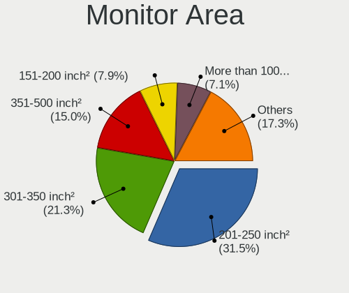
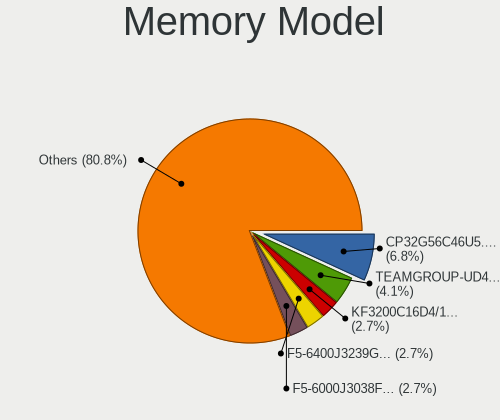
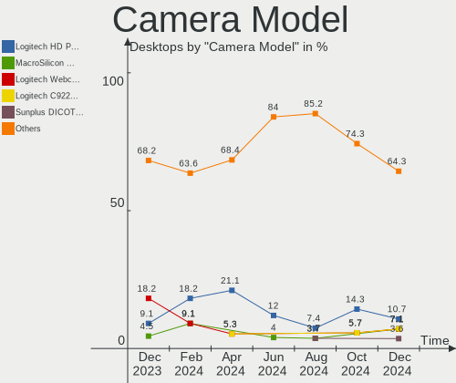

Arch - Hardware Trends (Desktops)
---------------------------------

A project to identify most popular hardware characteristics and track their change
over time based on data collected by Linux users at https://Linux-Hardware.org.

Anyone can contribute to this report by the [hw-probe](https://github.com/linuxhw/hw-probe) tool:

    sudo -E hw-probe -all -upload

This report is for one last month. Overall report since the beginning of time: [TestCoverage](https://github.com/linuxhw/TestCoverage)

Period: Jan, 2023.

Contents
--------

* [ System ](#system)
  - [ OS                       ](#os)
  - [ OS Family                ](#os-family)
  - [ Kernel                   ](#kernel)
  - [ Kernel Family            ](#kernel-family)
  - [ Kernel Major Ver.        ](#kernel-major-ver)
  - [ Arch                     ](#arch)
  - [ DE                       ](#de)
  - [ Display Server           ](#display-server)
  - [ Display Manager          ](#display-manager)
  - [ OS Lang                  ](#os-lang)
  - [ Boot Mode                ](#boot-mode)
  - [ Filesystem               ](#filesystem)
  - [ Part. scheme             ](#part-scheme)
  - [ Dual Boot with Linux/BSD ](#dual-boot-with-linuxbsd)
  - [ Dual Boot (Win)          ](#dual-boot-win)

* [ Board ](#board)
  - [ Vendor                   ](#vendor)
  - [ Model                    ](#model)
  - [ Model Family             ](#model-family)
  - [ MFG Year                 ](#mfg-year)
  - [ Form Factor              ](#form-factor)
  - [ Secure Boot              ](#secure-boot)
  - [ Coreboot                 ](#coreboot)
  - [ RAM Size                 ](#ram-size)
  - [ RAM Used                 ](#ram-used)
  - [ Total Drives             ](#total-drives)
  - [ Has CD-ROM               ](#has-cd-rom)
  - [ Has Ethernet             ](#has-ethernet)
  - [ Has WiFi                 ](#has-wifi)
  - [ Has Bluetooth            ](#has-bluetooth)

* [ Location ](#location)
  - [ Country                  ](#country)
  - [ City                     ](#city)

* [ Drives ](#drives)
  - [ Drive Vendor             ](#drive-vendor)
  - [ Drive Model              ](#drive-model)
  - [ HDD Vendor               ](#hdd-vendor)
  - [ SSD Vendor               ](#ssd-vendor)
  - [ Drive Kind               ](#drive-kind)
  - [ Drive Connector          ](#drive-connector)
  - [ Drive Size               ](#drive-size)
  - [ Space Total              ](#space-total)
  - [ Space Used               ](#space-used)
  - [ Malfunc. Drives          ](#malfunc-drives)
  - [ Malfunc. Drive Vendor    ](#malfunc-drive-vendor)
  - [ Malfunc. HDD Vendor      ](#malfunc-hdd-vendor)
  - [ Malfunc. Drive Kind      ](#malfunc-drive-kind)
  - [ Failed Drives            ](#failed-drives)
  - [ Failed Drive Vendor      ](#failed-drive-vendor)
  - [ Drive Status             ](#drive-status)

* [ Storage controller ](#storage-controller)
  - [ Storage Vendor           ](#storage-vendor)
  - [ Storage Model            ](#storage-model)
  - [ Storage Kind             ](#storage-kind)

* [ Processor ](#processor)
  - [ CPU Vendor               ](#cpu-vendor)
  - [ CPU Model                ](#cpu-model)
  - [ CPU Model Family         ](#cpu-model-family)
  - [ CPU Cores                ](#cpu-cores)
  - [ CPU Sockets              ](#cpu-sockets)
  - [ CPU Threads              ](#cpu-threads)
  - [ CPU Op-Modes             ](#cpu-op-modes)
  - [ CPU Microcode            ](#cpu-microcode)
  - [ CPU Microarch            ](#cpu-microarch)

* [ Graphics ](#graphics)
  - [ GPU Vendor               ](#gpu-vendor)
  - [ GPU Model                ](#gpu-model)
  - [ GPU Combo                ](#gpu-combo)
  - [ GPU Driver               ](#gpu-driver)
  - [ GPU Memory               ](#gpu-memory)

* [ Monitor ](#monitor)
  - [ Monitor Vendor           ](#monitor-vendor)
  - [ Monitor Model            ](#monitor-model)
  - [ Monitor Resolution       ](#monitor-resolution)
  - [ Monitor Diagonal         ](#monitor-diagonal)
  - [ Monitor Width            ](#monitor-width)
  - [ Aspect Ratio             ](#aspect-ratio)
  - [ Monitor Area             ](#monitor-area)
  - [ Pixel Density            ](#pixel-density)
  - [ Multiple Monitors        ](#multiple-monitors)

* [ Network ](#network)
  - [ Net Controller Vendor    ](#net-controller-vendor)
  - [ Net Controller Model     ](#net-controller-model)
  - [ Wireless Vendor          ](#wireless-vendor)
  - [ Wireless Model           ](#wireless-model)
  - [ Ethernet Vendor          ](#ethernet-vendor)
  - [ Ethernet Model           ](#ethernet-model)
  - [ Net Controller Kind      ](#net-controller-kind)
  - [ Used Controller          ](#used-controller)
  - [ NICs                     ](#nics)
  - [ IPv6                     ](#ipv6)

* [ Bluetooth ](#bluetooth)
  - [ Bluetooth Vendor         ](#bluetooth-vendor)
  - [ Bluetooth Model          ](#bluetooth-model)

* [ Sound ](#sound)
  - [ Sound Vendor             ](#sound-vendor)
  - [ Sound Model              ](#sound-model)

* [ Memory ](#memory)
  - [ Memory Vendor            ](#memory-vendor)
  - [ Memory Model             ](#memory-model)
  - [ Memory Kind              ](#memory-kind)
  - [ Memory Form Factor       ](#memory-form-factor)
  - [ Memory Size              ](#memory-size)
  - [ Memory Speed             ](#memory-speed)

* [ Printers & scanners ](#printers--scanners)
  - [ Printer Vendor           ](#printer-vendor)
  - [ Printer Model            ](#printer-model)
  - [ Scanner Vendor           ](#scanner-vendor)
  - [ Scanner Model            ](#scanner-model)

* [ Camera ](#camera)
  - [ Camera Vendor            ](#camera-vendor)
  - [ Camera Model             ](#camera-model)

* [ Security ](#security)
  - [ Fingerprint Vendor       ](#fingerprint-vendor)
  - [ Fingerprint Model        ](#fingerprint-model)
  - [ Chipcard Vendor          ](#chipcard-vendor)
  - [ Chipcard Model           ](#chipcard-model)

* [ Unsupported ](#unsupported)
  - [ Unsupported Devices      ](#unsupported-devices)
  - [ Unsupported Device Types ](#unsupported-device-types)

System
------

OS
--

Installed operating systems

| Name         | Desktops | Percent |
|--------------|----------|---------|
| Arch Rolling | 72       | 100%    |

OS Family
---------

OS without a version

| Name | Desktops | Percent |
|------|----------|---------|
| Arch | 72       | 100%    |

Kernel
------

Version of the Linux kernel

| Version                    | Desktops | Percent |
|----------------------------|----------|---------|
| 6.1.4-arch1-1              | 11       | 15.28%  |
| 6.1.8-arch1-1              | 9        | 12.5%   |
| 6.1.7-arch1-1              | 9        | 12.5%   |
| 6.1.6-arch1-1              | 6        | 8.33%   |
| 6.1.3-arch1-1              | 5        | 6.94%   |
| 6.1.1-arch1-1              | 5        | 6.94%   |
| 6.1.6-zen1-2-zen           | 3        | 4.17%   |
| 6.1.2-arch1-1              | 3        | 4.17%   |
| 6.1.6-arch1-3              | 2        | 2.78%   |
| 6.1.4-zen2-1-zen           | 2        | 2.78%   |
| 6.1.8-zen1-1-zen           | 1        | 1.39%   |
| 6.1.8-lqx3-1-lqx           | 1        | 1.39%   |
| 6.1.7-zen1-1-zen           | 1        | 1.39%   |
| 6.1.6-zen1-1-zen           | 1        | 1.39%   |
| 6.1.5-zen2-1-zen           | 1        | 1.39%   |
| 6.1.5-arch2-1              | 1        | 1.39%   |
| 6.1.5-273-tkg-pds          | 1        | 1.39%   |
| 6.1.4-native_amd-xanmod1-1 | 1        | 1.39%   |
| 6.1.4-arch1-1.1            | 1        | 1.39%   |
| 6.1.2-zen1-1-zen           | 1        | 1.39%   |
| 6.1.1-zen1-1.1-zen         | 1        | 1.39%   |
| 6.1.1-zen1-1-zen           | 1        | 1.39%   |
| 6.1.1-x64v1-xanmod1-1      | 1        | 1.39%   |
| 6.1.1-273-tkg-tt-llvm      | 1        | 1.39%   |
| 6.0.11-arch1-1             | 1        | 1.39%   |
| 5.15.89-1-lts              | 1        | 1.39%   |
| 5.15.88-2-lts              | 1        | 1.39%   |

Kernel Family
-------------

Linux kernel without a distro release

| Version | Desktops | Percent |
|---------|----------|---------|
| 6.1.4   | 15       | 20.83%  |
| 6.1.6   | 12       | 16.67%  |
| 6.1.8   | 11       | 15.28%  |
| 6.1.7   | 10       | 13.89%  |
| 6.1.1   | 9        | 12.5%   |
| 6.1.3   | 5        | 6.94%   |
| 6.1.2   | 4        | 5.56%   |
| 6.1.5   | 3        | 4.17%   |
| 6.0.11  | 1        | 1.39%   |
| 5.15.89 | 1        | 1.39%   |
| 5.15.88 | 1        | 1.39%   |

Kernel Major Ver.
-----------------

Linux kernel major version

| Version | Desktops | Percent |
|---------|----------|---------|
| 6.1     | 69       | 95.83%  |
| 5.15    | 2        | 2.78%   |
| 6.0     | 1        | 1.39%   |

Arch
----

OS architecture (x86_64, i586, etc.)

| Name   | Desktops | Percent |
|--------|----------|---------|
| x86_64 | 72       | 100%    |

DE
--

Desktop Environment

| Name       | Desktops | Percent |
|------------|----------|---------|
| KDE5       | 27       | 37.5%   |
| GNOME      | 20       | 27.78%  |
| Unknown    | 7        | 9.72%   |
| XFCE       | 3        | 4.17%   |
| i3         | 3        | 4.17%   |
| X-Cinnamon | 2        | 2.78%   |
| sway       | 2        | 2.78%   |
| qtile      | 1        | 1.39%   |
| openbox    | 1        | 1.39%   |
| LeftWM     | 1        | 1.39%   |
| Hyprland   | 1        | 1.39%   |
| DWM        | 1        | 1.39%   |
| Budgie     | 1        | 1.39%   |
| bspwm      | 1        | 1.39%   |
| awesome    | 1        | 1.39%   |

Display Server
--------------

X11 or Wayland

| Name    | Desktops | Percent |
|---------|----------|---------|
| X11     | 43       | 59.72%  |
| Wayland | 20       | 27.78%  |
| Tty     | 8        | 11.11%  |
| Unknown | 1        | 1.39%   |

Display Manager
---------------

SDDM, LightDM, etc.

| Name    | Desktops | Percent |
|---------|----------|---------|
| Unknown | 33       | 45.83%  |
| SDDM    | 20       | 27.78%  |
| LightDM | 13       | 18.06%  |
| GDM     | 5        | 6.94%   |
| XDM     | 1        | 1.39%   |

OS Lang
-------

Language

| Lang    | Desktops | Percent |
|---------|----------|---------|
| en_US   | 41       | 56.94%  |
| ru_RU   | 6        | 8.33%   |
| de_DE   | 4        | 5.56%   |
| C       | 3        | 4.17%   |
| pt_BR   | 2        | 2.78%   |
| en_NZ   | 2        | 2.78%   |
| en_GB   | 2        | 2.78%   |
| pl_PL   | 1        | 1.39%   |
| it_IT   | 1        | 1.39%   |
| fr_FR   | 1        | 1.39%   |
| fi_FI   | 1        | 1.39%   |
| et_EE   | 1        | 1.39%   |
| es_CL   | 1        | 1.39%   |
| en_IE   | 1        | 1.39%   |
| en_DK   | 1        | 1.39%   |
| en_CA   | 1        | 1.39%   |
| en_AU   | 1        | 1.39%   |
| ce_RU   | 1        | 1.39%   |
| Unknown | 1        | 1.39%   |

Boot Mode
---------

EFI or BIOS

| Mode | Desktops | Percent |
|------|----------|---------|
| EFI  | 41       | 56.94%  |
| BIOS | 31       | 43.06%  |

Filesystem
----------

Type of filesystem

| Type  | Desktops | Percent |
|-------|----------|---------|
| Ext4  | 47       | 65.28%  |
| Btrfs | 24       | 33.33%  |
| Xfs   | 1        | 1.39%   |

Part. scheme
------------

Scheme of partitioning

| Type    | Desktops | Percent |
|---------|----------|---------|
| GPT     | 45       | 62.5%   |
| Unknown | 23       | 31.94%  |
| MBR     | 4        | 5.56%   |

Dual Boot with Linux/BSD
------------------------

Hosting more than one Linux/BSD

| Dual boot | Desktops | Percent |
|-----------|----------|---------|
| No        | 64       | 88.89%  |
| Yes       | 8        | 11.11%  |

Dual Boot (Win)
---------------

Hosting Linux and Windows

| Dual boot | Desktops | Percent |
|-----------|----------|---------|
| No        | 52       | 72.22%  |
| Yes       | 20       | 27.78%  |

Board
-----

Vendor
------

Motherboard manufacturer

| Name                | Desktops | Percent |
|---------------------|----------|---------|
| ASUSTek Computer    | 23       | 31.94%  |
| Gigabyte Technology | 16       | 22.22%  |
| MSI                 | 13       | 18.06%  |
| ASRock              | 7        | 9.72%   |
| Hewlett-Packard     | 3        | 4.17%   |
| Dell                | 3        | 4.17%   |
| T-bao               | 1        | 1.39%   |
| Semp Toshiba        | 1        | 1.39%   |
| PCWare              | 1        | 1.39%   |
| Nvidia              | 1        | 1.39%   |
| MACHINIST           | 1        | 1.39%   |
| Lenovo              | 1        | 1.39%   |
| Foxconn             | 1        | 1.39%   |

Model
-----

Motherboard model

| Name                                 | Desktops | Percent |
|--------------------------------------|----------|---------|
| Gigabyte B550M DS3H                  | 3        | 4.17%   |
| MSI MS-7693                          | 2        | 2.78%   |
| ASUS TUF Gaming X570-PLUS            | 2        | 2.78%   |
| ASUS PRIME A320M-K                   | 2        | 2.78%   |
| T-bao MINI PC                        | 1        | 1.39%   |
| Semp Toshiba STI                     | 1        | 1.39%   |
| PCWare IPMH110G                      | 1        | 1.39%   |
| Nvidia AN-M2                         | 1        | 1.39%   |
| MSI MS-7D77                          | 1        | 1.39%   |
| MSI MS-7C94                          | 1        | 1.39%   |
| MSI MS-7C91                          | 1        | 1.39%   |
| MSI MS-7C75                          | 1        | 1.39%   |
| MSI MS-7C56                          | 1        | 1.39%   |
| MSI MS-7C02                          | 1        | 1.39%   |
| MSI MS-7B93                          | 1        | 1.39%   |
| MSI MS-7B85                          | 1        | 1.39%   |
| MSI MS-7A72                          | 1        | 1.39%   |
| MSI MS-7996                          | 1        | 1.39%   |
| MSI MS-7971                          | 1        | 1.39%   |
| MACHINIST X99Z V1.02                 | 1        | 1.39%   |
| Lenovo ThinkCentre Edge 92Z 3426EZG  | 1        | 1.39%   |
| HP Pavilion Gaming Desktop TG01-1xxx | 1        | 1.39%   |
| HP EliteDesk 800 G2 SFF              | 1        | 1.39%   |
| HP 550-153w                          | 1        | 1.39%   |
| Gigabyte Z490M GAMING X              | 1        | 1.39%   |
| Gigabyte Z390 AORUS ULTRA            | 1        | 1.39%   |
| Gigabyte Z370 HD3                    | 1        | 1.39%   |
| Gigabyte Z170XP-SLI                  | 1        | 1.39%   |
| Gigabyte X570 I AORUS PRO WIFI       | 1        | 1.39%   |
| Gigabyte X570 AORUS ELITE            | 1        | 1.39%   |
| Gigabyte J3455N-D3H                  | 1        | 1.39%   |
| Gigabyte H87-D3H                     | 1        | 1.39%   |
| Gigabyte H410M S2H V3                | 1        | 1.39%   |
| Gigabyte GB-BRR7H-4800               | 1        | 1.39%   |
| Gigabyte B560M AORUS PRO AX          | 1        | 1.39%   |
| Gigabyte B550M AORUS PRO             | 1        | 1.39%   |
| Gigabyte A320M-H                     | 1        | 1.39%   |
| Foxconn nT-i2000 Series              | 1        | 1.39%   |
| Dell XPS 8940                        | 1        | 1.39%   |
| Dell OptiPlex 790                    | 1        | 1.39%   |

Model Family
------------

Motherboard model prefix

| Name                   | Desktops | Percent |
|------------------------|----------|---------|
| ASUS ROG               | 6        | 8.33%   |
| ASUS PRIME             | 6        | 8.33%   |
| Gigabyte B550M         | 4        | 5.56%   |
| ASUS TUF               | 4        | 5.56%   |
| ASRock X570            | 3        | 4.17%   |
| MSI MS-7693            | 2        | 2.78%   |
| Gigabyte X570          | 2        | 2.78%   |
| ASRock B450            | 2        | 2.78%   |
| T-bao MINI             | 1        | 1.39%   |
| Semp Toshiba STI       | 1        | 1.39%   |
| PCWare IPMH110G        | 1        | 1.39%   |
| Nvidia AN-M2           | 1        | 1.39%   |
| MSI MS-7D77            | 1        | 1.39%   |
| MSI MS-7C94            | 1        | 1.39%   |
| MSI MS-7C91            | 1        | 1.39%   |
| MSI MS-7C75            | 1        | 1.39%   |
| MSI MS-7C56            | 1        | 1.39%   |
| MSI MS-7C02            | 1        | 1.39%   |
| MSI MS-7B93            | 1        | 1.39%   |
| MSI MS-7B85            | 1        | 1.39%   |
| MSI MS-7A72            | 1        | 1.39%   |
| MSI MS-7996            | 1        | 1.39%   |
| MSI MS-7971            | 1        | 1.39%   |
| MACHINIST X99Z         | 1        | 1.39%   |
| Lenovo ThinkCentre     | 1        | 1.39%   |
| HP Pavilion            | 1        | 1.39%   |
| HP EliteDesk           | 1        | 1.39%   |
| HP 550-153w            | 1        | 1.39%   |
| Gigabyte Z490M         | 1        | 1.39%   |
| Gigabyte Z390          | 1        | 1.39%   |
| Gigabyte Z370          | 1        | 1.39%   |
| Gigabyte Z170XP-SLI    | 1        | 1.39%   |
| Gigabyte J3455N-D3H    | 1        | 1.39%   |
| Gigabyte H87-D3H       | 1        | 1.39%   |
| Gigabyte H410M         | 1        | 1.39%   |
| Gigabyte GB-BRR7H-4800 | 1        | 1.39%   |
| Gigabyte B560M         | 1        | 1.39%   |
| Gigabyte A320M-H       | 1        | 1.39%   |
| Foxconn nT-i2000       | 1        | 1.39%   |
| Dell XPS               | 1        | 1.39%   |

MFG Year
--------

Motherboard manufacture year

| Year | Desktops | Percent |
|------|----------|---------|
| 2020 | 16       | 22.22%  |
| 2018 | 11       | 15.28%  |
| 2019 | 10       | 13.89%  |
| 2022 | 6        | 8.33%   |
| 2017 | 6        | 8.33%   |
| 2015 | 5        | 6.94%   |
| 2012 | 5        | 6.94%   |
| 2021 | 4        | 5.56%   |
| 2016 | 4        | 5.56%   |
| 2011 | 2        | 2.78%   |
| 2014 | 1        | 1.39%   |
| 2013 | 1        | 1.39%   |
| 2007 | 1        | 1.39%   |

Form Factor
-----------

Physical design of the computer

| Name    | Desktops | Percent |
|---------|----------|---------|
| Desktop | 72       | 100%    |

Secure Boot
-----------

Enabled or disabled

| State    | Desktops | Percent |
|----------|----------|---------|
| Disabled | 72       | 100%    |

Coreboot
--------

Have coreboot on board

| Used | Desktops | Percent |
|------|----------|---------|
| No   | 72       | 100%    |

RAM Size
--------

Total RAM memory

| Size in GB  | Desktops | Percent |
|-------------|----------|---------|
| 16.01-24.0  | 29       | 40.28%  |
| 32.01-64.0  | 21       | 29.17%  |
| 4.01-8.0    | 7        | 9.72%   |
| 3.01-4.0    | 4        | 5.56%   |
| 64.01-256.0 | 4        | 5.56%   |
| 8.01-16.0   | 4        | 5.56%   |
| 24.01-32.0  | 3        | 4.17%   |

RAM Used
--------

Used RAM memory

| Used GB   | Desktops | Percent |
|-----------|----------|---------|
| 4.01-8.0  | 22       | 30.56%  |
| 2.01-3.0  | 14       | 19.44%  |
| 3.01-4.0  | 12       | 16.67%  |
| 8.01-16.0 | 12       | 16.67%  |
| 1.01-2.0  | 10       | 13.89%  |
| 0.51-1.0  | 1        | 1.39%   |
| 0.01-0.5  | 1        | 1.39%   |

Total Drives
------------

Number of drives on board

| Drives | Desktops | Percent |
|--------|----------|---------|
| 2      | 24       | 33.33%  |
| 1      | 21       | 29.17%  |
| 4      | 12       | 16.67%  |
| 3      | 9        | 12.5%   |
| 5      | 3        | 4.17%   |
| 9      | 1        | 1.39%   |
| 7      | 1        | 1.39%   |
| 6      | 1        | 1.39%   |

Has CD-ROM
----------

Has CD-ROM on board

| Presented | Desktops | Percent |
|-----------|----------|---------|
| No        | 56       | 77.78%  |
| Yes       | 16       | 22.22%  |

Has Ethernet
------------

Has Ethernet on board

| Presented | Desktops | Percent |
|-----------|----------|---------|
| Yes       | 72       | 100%    |

Has WiFi
--------

Has WiFi module

| Presented | Desktops | Percent |
|-----------|----------|---------|
| Yes       | 38       | 52.78%  |
| No        | 34       | 47.22%  |

Has Bluetooth
-------------

Has Bluetooth module

| Presented | Desktops | Percent |
|-----------|----------|---------|
| Yes       | 38       | 52.78%  |
| No        | 34       | 47.22%  |

Location
--------

Country
-------

Geographic location (country)

| Country         | Desktops | Percent |
|-----------------|----------|---------|
| USA             | 16       | 22.22%  |
| Germany         | 8        | 11.11%  |
| Russia          | 7        | 9.72%   |
| Brazil          | 6        | 8.33%   |
| New Zealand     | 4        | 5.56%   |
| Poland          | 3        | 4.17%   |
| France          | 3        | 4.17%   |
| Italy           | 2        | 2.78%   |
| Denmark         | 2        | 2.78%   |
| Chile           | 2        | 2.78%   |
| Turkey          | 1        | 1.39%   |
| Switzerland     | 1        | 1.39%   |
| Sweden          | 1        | 1.39%   |
| Spain           | 1        | 1.39%   |
| North Macedonia | 1        | 1.39%   |
| Netherlands     | 1        | 1.39%   |
| Moldova         | 1        | 1.39%   |
| Latvia          | 1        | 1.39%   |
| Indonesia       | 1        | 1.39%   |
| Hungary         | 1        | 1.39%   |
| Hong Kong       | 1        | 1.39%   |
| Estonia         | 1        | 1.39%   |
| Egypt           | 1        | 1.39%   |
| Czechia         | 1        | 1.39%   |
| Canada          | 1        | 1.39%   |
| Bulgaria        | 1        | 1.39%   |
| Belarus         | 1        | 1.39%   |
| Australia       | 1        | 1.39%   |
| Armenia         | 1        | 1.39%   |

City
----

Geographic location (city)

| City                 | Desktops | Percent |
|----------------------|----------|---------|
| Dublin               | 3        | 4.17%   |
| Sao Paulo            | 2        | 2.78%   |
| Santiago             | 2        | 2.78%   |
| Moscow               | 2        | 2.78%   |
| Düsseldorf          | 2        | 2.78%   |
| Christchurch         | 2        | 2.78%   |
| Auckland             | 2        | 2.78%   |
| Zarow                | 1        | 1.39%   |
| York                 | 1        | 1.39%   |
| Yerevan              | 1        | 1.39%   |
| Winter Springs       | 1        | 1.39%   |
| Villeneuve-d'Ascq    | 1        | 1.39%   |
| Verdun               | 1        | 1.39%   |
| Tyler                | 1        | 1.39%   |
| Tsuen Wan            | 1        | 1.39%   |
| Tallinn              | 1        | 1.39%   |
| Swampscott           | 1        | 1.39%   |
| Sundsvall            | 1        | 1.39%   |
| Stavropol            | 1        | 1.39%   |
| St Petersburg        | 1        | 1.39%   |
| Spanish Fork         | 1        | 1.39%   |
| Southport            | 1        | 1.39%   |
| Serpukhov            | 1        | 1.39%   |
| Semarang             | 1        | 1.39%   |
| Scottsdale           | 1        | 1.39%   |
| Sao Caetano do Sul   | 1        | 1.39%   |
| Santo André         | 1        | 1.39%   |
| Riga                 | 1        | 1.39%   |
| Plovdiv              | 1        | 1.39%   |
| Perm                 | 1        | 1.39%   |
| Paris                | 1        | 1.39%   |
| Ostrava              | 1        | 1.39%   |
| Osterholz-Scharmbeck | 1        | 1.39%   |
| Osseo                | 1        | 1.39%   |
| New York             | 1        | 1.39%   |
| Montreal             | 1        | 1.39%   |
| Milan                | 1        | 1.39%   |
| Middleville          | 1        | 1.39%   |
| Marabá              | 1        | 1.39%   |
| Langenfeld           | 1        | 1.39%   |

Drives
------

Drive Vendor
------------

Hard drive vendors

| Vendor                      | Desktops | Drives | Percent |
|-----------------------------|----------|--------|---------|
| Samsung Electronics         | 25       | 36     | 16.13%  |
| Seagate                     | 23       | 28     | 14.84%  |
| WDC                         | 19       | 24     | 12.26%  |
| Kingston                    | 17       | 21     | 10.97%  |
| Sandisk                     | 12       | 12     | 7.74%   |
| Crucial                     | 10       | 11     | 6.45%   |
| Micron/Crucial Technology   | 6        | 6      | 3.87%   |
| Intel                       | 4        | 4      | 2.58%   |
| HGST                        | 4        | 4      | 2.58%   |
| Toshiba                     | 3        | 3      | 1.94%   |
| Silicon Motion              | 3        | 3      | 1.94%   |
| China                       | 3        | 3      | 1.94%   |
| Patriot                     | 2        | 2      | 1.29%   |
| Kingston Technology Company | 2        | 2      | 1.29%   |
| Hitachi                     | 2        | 2      | 1.29%   |
| Apple                       | 2        | 2      | 1.29%   |
| ADATA Technology            | 2        | 2      | 1.29%   |
| XrayDisk                    | 1        | 1      | 0.65%   |
| Team                        | 1        | 1      | 0.65%   |
| SPCC                        | 1        | 1      | 0.65%   |
| Realtek Semiconductor       | 1        | 1      | 0.65%   |
| PNY                         | 1        | 1      | 0.65%   |
| Phison Electronics          | 1        | 1      | 0.65%   |
| OYUNKEY                     | 1        | 1      | 0.65%   |
| OCZ                         | 1        | 1      | 0.65%   |
| MAXIO Technology (Hangzhou) | 1        | 1      | 0.65%   |
| Lite-On Technology          | 1        | 1      | 0.65%   |
| Lenovo                      | 1        | 1      | 0.65%   |
| JMicron Technology          | 1        | 1      | 0.65%   |
| HS-SSD-E100N                | 1        | 1      | 0.65%   |
| GOODRAM                     | 1        | 1      | 0.65%   |
| Apacer                      | 1        | 1      | 0.65%   |
| Unknown                     | 1        | 1      | 0.65%   |

Drive Model
-----------

Hard drive models

| Model                                                | Desktops | Percent |
|------------------------------------------------------|----------|---------|
| Samsung NVMe SSD Controller SM981/PM981/PM983 500GB  | 9        | 5.11%   |
| Samsung NVMe SSD Controller PM9A1/PM9A3/980PRO 512GB | 5        | 2.84%   |
| Kingston SA400S37240G 240GB SSD                      | 4        | 2.27%   |
| Seagate ST1000DM003-1ER162 1TB                       | 3        | 1.7%    |
| Sandisk WD Black SN850 2TB                           | 3        | 1.7%    |
| Samsung SSD 850 EVO 500GB                            | 3        | 1.7%    |
| Samsung NVMe SSD Controller SM961/PM961/SM963 256GB  | 3        | 1.7%    |
| Micron/Crucial P2 NVMe PCIe SSD 500GB                | 3        | 1.7%    |
| Kingston SA400S37480G 480GB SSD                      | 3        | 1.7%    |
| WDC WD20EARX-00PASB0 2TB                             | 2        | 1.14%   |
| WDC WD10EZEX-08WN4A0 1TB                             | 2        | 1.14%   |
| WDC WD10EZEX-00WN4A0 1TB                             | 2        | 1.14%   |
| Toshiba HDWD110 1TB                                  | 2        | 1.14%   |
| Seagate ST2000VX008-2E3164 2TB                       | 2        | 1.14%   |
| Seagate ST2000DM008-2FR102 2TB                       | 2        | 1.14%   |
| Seagate ST1000LM024 HN-M101MBB 1TB                   | 2        | 1.14%   |
| Seagate ST1000DM010-2EP102 1TB                       | 2        | 1.14%   |
| Sandisk WDC WDS200T2B0C-00PXH0 2TB                   | 2        | 1.14%   |
| Sandisk WD Blue SN550 NVMe SSD 1TB                   | 2        | 1.14%   |
| Samsung SSD 980 1TB                                  | 2        | 1.14%   |
| Samsung SSD 870 EVO 1TB                              | 2        | 1.14%   |
| Samsung SSD 860 EVO 500GB                            | 2        | 1.14%   |
| Kingston Company A2000 NVMe SSD 1TB                  | 2        | 1.14%   |
| Kingston SUV400S37240G 240GB SSD                     | 2        | 1.14%   |
| Kingston SNVS500G 500GB                              | 2        | 1.14%   |
| Kingston SA400S37120G 120GB SSD                      | 2        | 1.14%   |
| Intel SSD 660P Series 512GB                          | 2        | 1.14%   |
| HGST HUS726040ALA614 4TB                             | 2        | 1.14%   |
| Crucial CT500MX500SSD1 500GB                         | 2        | 1.14%   |
| Crucial CT480BX500SSD1 480GB                         | 2        | 1.14%   |
| Crucial CT1000MX500SSD1 1TB                          | 2        | 1.14%   |
| China SATA SSD 120GB                                 | 2        | 1.14%   |
| Apple HDD ST2000DM001 2TB                            | 2        | 1.14%   |
| XrayDisk SSD 128GB                                   | 1        | 0.57%   |
| WDC WDS500G2B0A-00SM50 500GB SSD                     | 1        | 0.57%   |
| WDC WDS120G2G0A-00JH30 120GB SSD                     | 1        | 0.57%   |
| WDC WDBNCE0010PNC 1TB SSD                            | 1        | 0.57%   |
| WDC WD5001FZWX-00ZHUA0 5TB                           | 1        | 0.57%   |
| WDC WD5000AAKS-75V0A0 500GB                          | 1        | 0.57%   |
| WDC WD5000AAKS-00V1A0 500GB                          | 1        | 0.57%   |

HDD Vendor
----------

Hard disk drive vendors

| Vendor  | Desktops | Drives | Percent |
|---------|----------|--------|---------|
| Seagate | 22       | 27     | 45.83%  |
| WDC     | 15       | 20     | 31.25%  |
| HGST    | 4        | 4      | 8.33%   |
| Toshiba | 3        | 3      | 6.25%   |
| Hitachi | 2        | 2      | 4.17%   |
| Apple   | 2        | 2      | 4.17%   |

SSD Vendor
----------

Solid state drive vendors

| Vendor              | Desktops | Drives | Percent |
|---------------------|----------|--------|---------|
| Kingston            | 14       | 17     | 25%     |
| Samsung Electronics | 11       | 16     | 19.64%  |
| Crucial             | 10       | 11     | 17.86%  |
| WDC                 | 4        | 4      | 7.14%   |
| SanDisk             | 3        | 3      | 5.36%   |
| China               | 3        | 3      | 5.36%   |
| Patriot             | 2        | 2      | 3.57%   |
| XrayDisk            | 1        | 1      | 1.79%   |
| Team                | 1        | 1      | 1.79%   |
| SPCC                | 1        | 1      | 1.79%   |
| PNY                 | 1        | 1      | 1.79%   |
| OCZ                 | 1        | 1      | 1.79%   |
| JMicron Technology  | 1        | 1      | 1.79%   |
| GOODRAM             | 1        | 1      | 1.79%   |
| Apacer              | 1        | 1      | 1.79%   |
| Unknown             | 1        | 1      | 1.79%   |

Drive Kind
----------

HDD or SSD

| Kind    | Desktops | Drives | Percent |
|---------|----------|--------|---------|
| SSD     | 45       | 65     | 34.62%  |
| NVMe    | 42       | 55     | 32.31%  |
| HDD     | 40       | 58     | 30.77%  |
| Unknown | 3        | 3      | 2.31%   |

Drive Connector
---------------

SATA, SAS, NVMe, etc.

| Type | Desktops | Drives | Percent |
|------|----------|--------|---------|
| SATA | 60       | 124    | 57.69%  |
| NVMe | 42       | 55     | 40.38%  |
| SAS  | 2        | 2      | 1.92%   |

Drive Size
----------

Size of hard drive

| Size in TB | Desktops | Drives | Percent |
|------------|----------|--------|---------|
| 0.01-0.5   | 38       | 57     | 40.86%  |
| 0.51-1.0   | 32       | 40     | 34.41%  |
| 1.01-2.0   | 17       | 20     | 18.28%  |
| 3.01-4.0   | 3        | 3      | 3.23%   |
| 4.01-10.0  | 2        | 2      | 2.15%   |
| 10.01-20.0 | 1        | 1      | 1.08%   |

Space Total
-----------

Amount of disk space available on the file system

| Size in GB     | Desktops | Percent |
|----------------|----------|---------|
| More than 3000 | 21       | 29.17%  |
| 251-500        | 13       | 18.06%  |
| 1001-2000      | 13       | 18.06%  |
| 501-1000       | 12       | 16.67%  |
| 101-250        | 6        | 8.33%   |
| 2001-3000      | 5        | 6.94%   |
| 21-50          | 1        | 1.39%   |
| Unknown        | 1        | 1.39%   |

Space Used
----------

Amount of used disk space

| Used GB        | Desktops | Percent |
|----------------|----------|---------|
| 101-250        | 12       | 16.67%  |
| 1-20           | 12       | 16.67%  |
| 251-500        | 11       | 15.28%  |
| 1001-2000      | 11       | 15.28%  |
| 2001-3000      | 7        | 9.72%   |
| 501-1000       | 7        | 9.72%   |
| 21-50          | 5        | 6.94%   |
| More than 3000 | 4        | 5.56%   |
| 51-100         | 2        | 2.78%   |
| Unknown        | 1        | 1.39%   |

Malfunc. Drives
---------------

Drive models with a malfunction

| Model                              | Desktops | Drives | Percent |
|------------------------------------|----------|--------|---------|
| XrayDisk SSD 128GB                 | 1        | 1      | 11.11%  |
| WDC WD20EARS-00MVWB0 2TB           | 1        | 1      | 11.11%  |
| Seagate ST2000DM001-1ER164 2TB     | 1        | 1      | 11.11%  |
| Seagate ST1000LM024 HN-M101MBB 1TB | 1        | 1      | 11.11%  |
| Seagate ST1000DM003-1CH162 1TB     | 1        | 1      | 11.11%  |
| Samsung Electronics SSD 980 1TB    | 1        | 1      | 11.11%  |
| Hitachi HDS721616PLA380 160GB      | 1        | 1      | 11.11%  |
| Crucial CT1000BX500SSD1 1TB        | 1        | 1      | 11.11%  |
| Apple HDD ST2000DM001 2TB          | 1        | 1      | 11.11%  |

Malfunc. Drive Vendor
---------------------

Vendors of faulty drives

| Vendor              | Desktops | Drives | Percent |
|---------------------|----------|--------|---------|
| Seagate             | 2        | 3      | 25%     |
| XrayDisk            | 1        | 1      | 12.5%   |
| WDC                 | 1        | 1      | 12.5%   |
| Samsung Electronics | 1        | 1      | 12.5%   |
| Hitachi             | 1        | 1      | 12.5%   |
| Crucial             | 1        | 1      | 12.5%   |
| Apple               | 1        | 1      | 12.5%   |

Malfunc. HDD Vendor
-------------------

Vendors of faulty HDD drives

| Vendor  | Desktops | Drives | Percent |
|---------|----------|--------|---------|
| Seagate | 2        | 3      | 40%     |
| WDC     | 1        | 1      | 20%     |
| Hitachi | 1        | 1      | 20%     |
| Apple   | 1        | 1      | 20%     |

Malfunc. Drive Kind
-------------------

Kinds of faulty drives

| Kind | Desktops | Drives | Percent |
|------|----------|--------|---------|
| HDD  | 5        | 6      | 62.5%   |
| SSD  | 2        | 2      | 25%     |
| NVMe | 1        | 1      | 12.5%   |

Failed Drives
-------------

Failed drive models

| Model                                            | Desktops | Drives | Percent |
|--------------------------------------------------|----------|--------|---------|
| Seagate ST500DM002-1BD142 500GB                  | 1        | 1      | 50%     |
| Samsung Electronics MZ7PC128HAFU-000H1 128GB SSD | 1        | 1      | 50%     |

Failed Drive Vendor
-------------------

Failed drive vendors

| Vendor              | Desktops | Drives | Percent |
|---------------------|----------|--------|---------|
| Seagate             | 1        | 1      | 50%     |
| Samsung Electronics | 1        | 1      | 50%     |

Drive Status
------------

Number of failed and malfunc. drives

| Status   | Desktops | Drives | Percent |
|----------|----------|--------|---------|
| Works    | 39       | 102    | 48.15%  |
| Detected | 33       | 68     | 40.74%  |
| Malfunc  | 7        | 9      | 8.64%   |
| Failed   | 2        | 2      | 2.47%   |

Storage controller
------------------

Storage Vendor
--------------

Storage controller vendors

| Vendor                      | Desktops | Percent |
|-----------------------------|----------|---------|
| AMD                         | 36       | 28.57%  |
| Intel                       | 34       | 26.98%  |
| Samsung Electronics         | 18       | 14.29%  |
| SanDisk                     | 9        | 7.14%   |
| Micron/Crucial Technology   | 6        | 4.76%   |
| Kingston Technology Company | 6        | 4.76%   |
| ASMedia Technology          | 5        | 3.97%   |
| Silicon Motion              | 3        | 2.38%   |
| ADATA Technology            | 2        | 1.59%   |
| Realtek Semiconductor       | 1        | 0.79%   |
| Phison Electronics          | 1        | 0.79%   |
| Nvidia                      | 1        | 0.79%   |
| MAXIO Technology (Hangzhou) | 1        | 0.79%   |
| Lite-On Technology          | 1        | 0.79%   |
| Lenovo                      | 1        | 0.79%   |
| Broadcom / LSI              | 1        | 0.79%   |

Storage Model
-------------

Storage controller models

| Model                                                                          | Desktops | Percent |
|--------------------------------------------------------------------------------|----------|---------|
| AMD FCH SATA Controller [AHCI mode]                                            | 20       | 14.08%  |
| Samsung NVMe SSD Controller SM981/PM981/PM983                                  | 9        | 6.34%   |
| AMD 500 Series Chipset SATA Controller                                         | 9        | 6.34%   |
| Intel Q170/Q150/B150/H170/H110/Z170/CM236 Chipset SATA Controller [AHCI Mode]  | 8        | 5.63%   |
| Intel Cannon Lake PCH SATA AHCI Controller                                     | 6        | 4.23%   |
| Samsung NVMe SSD Controller PM9A1/PM9A3/980PRO                                 | 5        | 3.52%   |
| ASMedia ASM1062 Serial ATA Controller                                          | 5        | 3.52%   |
| AMD 400 Series Chipset SATA Controller                                         | 5        | 3.52%   |
| AMD SATA controller                                                            | 4        | 2.82%   |
| SanDisk WD PC SN810 / Black SN850 NVMe SSD                                     | 3        | 2.11%   |
| Samsung NVMe SSD Controller SM961/PM961/SM963                                  | 3        | 2.11%   |
| Micron/Crucial P2 NVMe PCIe SSD                                                | 3        | 2.11%   |
| Kingston Company Company Non-Volatile memory controller                        | 3        | 2.11%   |
| Intel SSD 660P Series                                                          | 3        | 2.11%   |
| Intel SATA Controller [RAID mode]                                              | 3        | 2.11%   |
| Intel 8 Series/C220 Series Chipset Family 6-port SATA Controller 1 [AHCI mode] | 3        | 2.11%   |
| AMD SB7x0/SB8x0/SB9x0 SATA Controller [AHCI mode]                              | 3        | 2.11%   |
| AMD FCH SATA Controller D                                                      | 3        | 2.11%   |
| SanDisk WD Blue SN550 NVMe SSD                                                 | 2        | 1.41%   |
| SanDisk Non-Volatile memory controller                                         | 2        | 1.41%   |
| Samsung NVMe SSD Controller 980                                                | 2        | 1.41%   |
| Micron/Crucial P5 Plus NVMe PCIe SSD                                           | 2        | 1.41%   |
| Kingston Company A2000 NVMe SSD                                                | 2        | 1.41%   |
| Intel Comet Lake SATA AHCI Controller                                          | 2        | 1.41%   |
| Intel 6 Series/C200 Series Chipset Family 6 port Desktop SATA AHCI Controller  | 2        | 1.41%   |
| Intel 500 Series Chipset Family SATA AHCI Controller                           | 2        | 1.41%   |
| Intel 200 Series PCH SATA controller [AHCI mode]                               | 2        | 1.41%   |
| Silicon Motion SM2263EN/SM2263XT SSD Controller                                | 1        | 0.7%    |
| Silicon Motion SM2262/SM2262EN SSD Controller                                  | 1        | 0.7%    |
| Silicon Motion Non-Volatile memory controller                                  | 1        | 0.7%    |
| SanDisk WD Blue SN570 NVMe SSD                                                 | 1        | 0.7%    |
| SanDisk PC SN520 NVMe SSD                                                      | 1        | 0.7%    |
| Realtek Realtek Non-Volatile memory controller                                 | 1        | 0.7%    |
| Phison PS5013 E13 NVMe Controller                                              | 1        | 0.7%    |
| Nvidia MCP67 IDE Controller                                                    | 1        | 0.7%    |
| Nvidia MCP67 AHCI Controller                                                   | 1        | 0.7%    |
| Micron/Crucial Non-Volatile memory controller                                  | 1        | 0.7%    |
| MAXIO (Hangzhou) NVMe SSD Controller MAP1202                                   | 1        | 0.7%    |
| Lite-On Non-Volatile memory controller                                         | 1        | 0.7%    |
| Lenovo Non-Volatile memory controller                                          | 1        | 0.7%    |

Storage Kind
------------

Kind of storage controller (IDE, SATA, NVMe, SAS, ...)

| Kind | Desktops | Percent |
|------|----------|---------|
| SATA | 66       | 57.89%  |
| NVMe | 42       | 36.84%  |
| RAID | 4        | 3.51%   |
| SAS  | 1        | 0.88%   |
| IDE  | 1        | 0.88%   |

Processor
---------

CPU Vendor
----------

Processor vendors

| Vendor | Desktops | Percent |
|--------|----------|---------|
| AMD    | 38       | 52.78%  |
| Intel  | 34       | 47.22%  |

CPU Model
---------

Processor models

| Model                                  | Desktops | Percent |
|----------------------------------------|----------|---------|
| AMD Ryzen 5 3600 6-Core Processor      | 4        | 5.56%   |
| AMD Ryzen 7 5800X 8-Core Processor     | 3        | 4.17%   |
| AMD Ryzen 7 3700X 8-Core Processor     | 3        | 4.17%   |
| AMD Ryzen 5 5600X 6-Core Processor     | 3        | 4.17%   |
| Intel Core i7-7700K CPU @ 4.20GHz      | 2        | 2.78%   |
| Intel Core i5-7400 CPU @ 3.00GHz       | 2        | 2.78%   |
| Intel Core i5-6600K CPU @ 3.50GHz      | 2        | 2.78%   |
| Intel Core i3-4170 CPU @ 3.70GHz       | 2        | 2.78%   |
| AMD Ryzen 7 7700X 8-Core Processor     | 2        | 2.78%   |
| AMD Ryzen 5 3600X 6-Core Processor     | 2        | 2.78%   |
| AMD Ryzen 5 2600 Six-Core Processor    | 2        | 2.78%   |
| AMD FX-4300 Quad-Core Processor        | 2        | 2.78%   |
| Intel Xeon CPU E5-2640 v3 @ 2.60GHz    | 1        | 1.39%   |
| Intel Genuine CPU 0000 @ 2.10GHz       | 1        | 1.39%   |
| Intel Core i9-10900 CPU @ 2.80GHz      | 1        | 1.39%   |
| Intel Core i7-9700K CPU @ 3.60GHz      | 1        | 1.39%   |
| Intel Core i7-9700 CPU @ 3.00GHz       | 1        | 1.39%   |
| Intel Core i7-8700K CPU @ 3.70GHz      | 1        | 1.39%   |
| Intel Core i7-8700 CPU @ 3.20GHz       | 1        | 1.39%   |
| Intel Core i7-6700 CPU @ 3.40GHz       | 1        | 1.39%   |
| Intel Core i7-4790K CPU @ 4.00GHz      | 1        | 1.39%   |
| Intel Core i7-10700F CPU @ 2.90GHz     | 1        | 1.39%   |
| Intel Core i5-9400F CPU @ 2.90GHz      | 1        | 1.39%   |
| Intel Core i5-8600K CPU @ 3.60GHz      | 1        | 1.39%   |
| Intel Core i5-4440 CPU @ 3.10GHz       | 1        | 1.39%   |
| Intel Core i5-3470S CPU @ 2.90GHz      | 1        | 1.39%   |
| Intel Core i5-2400 CPU @ 3.10GHz       | 1        | 1.39%   |
| Intel Core i5-10600KF CPU @ 4.10GHz    | 1        | 1.39%   |
| Intel Core i5-10400 CPU @ 2.90GHz      | 1        | 1.39%   |
| Intel Core i3-8100 CPU @ 3.60GHz       | 1        | 1.39%   |
| Intel Core i3-7100 CPU @ 3.90GHz       | 1        | 1.39%   |
| Intel Core i3-6100 CPU @ 3.70GHz       | 1        | 1.39%   |
| Intel Core i3-2100 CPU @ 3.10GHz       | 1        | 1.39%   |
| Intel Core i3-10105F CPU @ 3.70GHz     | 1        | 1.39%   |
| Intel Celeron CPU J3455 @ 1.50GHz      | 1        | 1.39%   |
| Intel Celeron CPU 847 @ 1.10GHz        | 1        | 1.39%   |
| Intel 13th Gen Core i5-13600KF         | 1        | 1.39%   |
| Intel 11th Gen Core i7-11700 @ 2.50GHz | 1        | 1.39%   |
| AMD Ryzen 9 7950X 16-Core Processor    | 1        | 1.39%   |
| AMD Ryzen 9 7900X 12-Core Processor    | 1        | 1.39%   |

CPU Model Family
----------------

Processor model prefix

| Model           | Desktops | Percent |
|-----------------|----------|---------|
| AMD Ryzen 5     | 13       | 18.06%  |
| Intel Core i5   | 11       | 15.28%  |
| AMD Ryzen 7     | 11       | 15.28%  |
| Intel Core i7   | 9        | 12.5%   |
| Intel Core i3   | 7        | 9.72%   |
| AMD Ryzen 9     | 4        | 5.56%   |
| Other           | 3        | 4.17%   |
| AMD Ryzen 3     | 3        | 4.17%   |
| AMD FX          | 3        | 4.17%   |
| Intel Celeron   | 2        | 2.78%   |
| Intel Xeon      | 1        | 1.39%   |
| Intel Genuine   | 1        | 1.39%   |
| Intel Core i9   | 1        | 1.39%   |
| AMD Ryzen 5 PRO | 1        | 1.39%   |
| AMD Athlon      | 1        | 1.39%   |
| AMD A10         | 1        | 1.39%   |

CPU Cores
---------

Number of processor cores

| Number | Desktops | Percent |
|--------|----------|---------|
| 6      | 20       | 27.78%  |
| 8      | 17       | 23.61%  |
| 4      | 16       | 22.22%  |
| 2      | 13       | 18.06%  |
| 12     | 3        | 4.17%   |
| 16     | 1        | 1.39%   |
| 14     | 1        | 1.39%   |
| 10     | 1        | 1.39%   |

CPU Sockets
-----------

Number of sockets

| Number | Desktops | Percent |
|--------|----------|---------|
| 1      | 72       | 100%    |

CPU Threads
-----------

Threads per core (Hyper-Threading)

| Number | Desktops | Percent |
|--------|----------|---------|
| 2      | 55       | 76.39%  |
| 1      | 17       | 23.61%  |

CPU Op-Modes
------------

CPU Operation Modes (32-bit, 64-bit)

| Op mode        | Desktops | Percent |
|----------------|----------|---------|
| 32-bit, 64-bit | 72       | 100%    |

CPU Microcode
-------------

Microcode number

| Number     | Desktops | Percent |
|------------|----------|---------|
| Unknown    | 30       | 41.67%  |
| 0x08701021 | 6        | 8.33%   |
| 0xa0655    | 3        | 4.17%   |
| 0x506e3    | 3        | 4.17%   |
| 0x0a601203 | 3        | 4.17%   |
| 0x08701013 | 3        | 4.17%   |
| 0xa0653    | 2        | 2.78%   |
| 0x206a7    | 2        | 2.78%   |
| 0x0a201016 | 2        | 2.78%   |
| 0x0800820d | 2        | 2.78%   |
| 0x06000822 | 2        | 2.78%   |
| 0x906ed    | 1        | 1.39%   |
| 0x906ec    | 1        | 1.39%   |
| 0x906e9    | 1        | 1.39%   |
| 0x506c9    | 1        | 1.39%   |
| 0x306f2    | 1        | 1.39%   |
| 0x306c3    | 1        | 1.39%   |
| 0x306a9    | 1        | 1.39%   |
| 0x0a50000c | 1        | 1.39%   |
| 0x0a201205 | 1        | 1.39%   |
| 0x08600103 | 1        | 1.39%   |
| 0x08101016 | 1        | 1.39%   |
| 0x08001138 | 1        | 1.39%   |
| 0x06006118 | 1        | 1.39%   |
| 0x00000000 | 1        | 1.39%   |

CPU Microarch
-------------

Microarchitecture

| Name        | Desktops | Percent |
|-------------|----------|---------|
| KabyLake    | 13       | 18.06%  |
| Zen 2       | 12       | 16.67%  |
| Zen 3       | 9        | 12.5%   |
| Unknown     | 6        | 8.33%   |
| Haswell     | 5        | 6.94%   |
| CometLake   | 5        | 6.94%   |
| Zen+        | 4        | 5.56%   |
| Zen         | 4        | 5.56%   |
| Skylake     | 4        | 5.56%   |
| SandyBridge | 3        | 4.17%   |
| Piledriver  | 3        | 4.17%   |
| K8 Hammer   | 1        | 1.39%   |
| IvyBridge   | 1        | 1.39%   |
| Goldmont    | 1        | 1.39%   |
| Excavator   | 1        | 1.39%   |

Graphics
--------

GPU Vendor
----------

Vendors of graphics cards

| Vendor           | Desktops | Percent |
|------------------|----------|---------|
| Nvidia           | 33       | 43.42%  |
| AMD              | 32       | 42.11%  |
| Intel            | 10       | 13.16%  |
| ATI Technologies | 1        | 1.32%   |

GPU Model
---------

Graphics card models

| Model                                                                       | Desktops | Percent |
|-----------------------------------------------------------------------------|----------|---------|
| AMD Ellesmere [Radeon RX 470/480/570/570X/580/580X/590]                     | 8        | 10.13%  |
| AMD Navi 23 [Radeon RX 6600/6600 XT/6600M]                                  | 5        | 6.33%   |
| Nvidia GP107 [GeForce GTX 1050 Ti]                                          | 4        | 5.06%   |
| Nvidia TU116 [GeForce GTX 1660 SUPER]                                       | 3        | 3.8%    |
| AMD Navi 21 [Radeon RX 6800/6800 XT / 6900 XT]                              | 3        | 3.8%    |
| AMD Lexa PRO [Radeon 540/540X/550/550X / RX 540X/550/550X]                  | 3        | 3.8%    |
| Nvidia TU106 [GeForce RTX 2070 Rev. A]                                      | 2        | 2.53%   |
| Nvidia TU106 [GeForce RTX 2060 Rev. A]                                      | 2        | 2.53%   |
| Nvidia TU104 [GeForce RTX 2080]                                             | 2        | 2.53%   |
| Nvidia GP106 [GeForce GTX 1060 3GB]                                         | 2        | 2.53%   |
| Nvidia GM206 [GeForce GTX 960]                                              | 2        | 2.53%   |
| Nvidia GA104 [GeForce RTX 3060 Ti Lite Hash Rate]                           | 2        | 2.53%   |
| Intel HD Graphics 530                                                       | 2        | 2.53%   |
| Intel CoffeeLake-S GT2 [UHD Graphics 630]                                   | 2        | 2.53%   |
| AMD Raven Ridge [Radeon Vega Series / Radeon Vega Mobile Series]            | 2        | 2.53%   |
| AMD Raphael                                                                 | 2        | 2.53%   |
| AMD Navi 31 [Radeon RX 7900 XT/7900 XTX]                                    | 2        | 2.53%   |
| AMD Navi 22 [Radeon RX 6700/6700 XT/6750 XT / 6800M]                        | 2        | 2.53%   |
| AMD Cezanne [Radeon Vega Series / Radeon Vega Mobile Series]                | 2        | 2.53%   |
| Nvidia TU104 [GeForce RTX 2070 SUPER]                                       | 1        | 1.27%   |
| Nvidia TU104 [GeForce RTX 2060]                                             | 1        | 1.27%   |
| Nvidia GP104 [GeForce GTX 1080]                                             | 1        | 1.27%   |
| Nvidia GP104 [GeForce GTX 1070]                                             | 1        | 1.27%   |
| Nvidia GP104 [GeForce GTX 1060 3GB]                                         | 1        | 1.27%   |
| Nvidia GM206 [GeForce GTX 950]                                              | 1        | 1.27%   |
| Nvidia GM204 [GeForce GTX 970]                                              | 1        | 1.27%   |
| Nvidia GM107 [GeForce GTX 750 Ti]                                           | 1        | 1.27%   |
| Nvidia GK107 [GeForce GTX 650]                                              | 1        | 1.27%   |
| Nvidia GK106 [GeForce GTX 650 Ti Boost]                                     | 1        | 1.27%   |
| Nvidia GK104 [GeForce GTX 770]                                              | 1        | 1.27%   |
| Nvidia GF119 [NVS 315]                                                      | 1        | 1.27%   |
| Nvidia GA106 [Geforce RTX 3050]                                             | 1        | 1.27%   |
| Nvidia GA104 [GeForce RTX 3070 Ti]                                          | 1        | 1.27%   |
| Nvidia GA102 [GeForce RTX 3080 12GB]                                        | 1        | 1.27%   |
| Intel Xeon E3-1200 v3/4th Gen Core Processor Integrated Graphics Controller | 1        | 1.27%   |
| Intel RocketLake-S GT1 [UHD Graphics 750]                                   | 1        | 1.27%   |
| Intel HD Graphics 630                                                       | 1        | 1.27%   |
| Intel HD Graphics 500                                                       | 1        | 1.27%   |
| Intel CometLake-S GT2 [UHD Graphics 630]                                    | 1        | 1.27%   |
| Intel 2nd Generation Core Processor Family Integrated Graphics Controller   | 1        | 1.27%   |

GPU Combo
---------

Combinations of graphics cards

| Name           | Desktops | Percent |
|----------------|----------|---------|
| 1 x Nvidia     | 30       | 41.67%  |
| 1 x AMD        | 28       | 38.89%  |
| 1 x Intel      | 7        | 9.72%   |
| 2 x AMD        | 2        | 2.78%   |
| Intel + AMD    | 2        | 2.78%   |
| 2 x Nvidia     | 1        | 1.39%   |
| Intel + Nvidia | 1        | 1.39%   |
| AMD + Nvidia   | 1        | 1.39%   |

GPU Driver
----------

Free vs proprietary

| Driver      | Desktops | Percent |
|-------------|----------|---------|
| Free        | 46       | 63.89%  |
| Proprietary | 25       | 34.72%  |
| Unknown     | 1        | 1.39%   |

GPU Memory
----------

Total video memory

| Size in GB | Desktops | Percent |
|------------|----------|---------|
| Unknown    | 31       | 43.06%  |
| 7.01-8.0   | 14       | 19.44%  |
| 3.01-4.0   | 6        | 8.33%   |
| 5.01-6.0   | 5        | 6.94%   |
| 1.01-2.0   | 4        | 5.56%   |
| 8.01-16.0  | 4        | 5.56%   |
| 2.01-3.0   | 3        | 4.17%   |
| 16.01-24.0 | 2        | 2.78%   |
| 0.01-0.5   | 2        | 2.78%   |
| 0.51-1.0   | 1        | 1.39%   |

Monitor
-------

Monitor Vendor
--------------

Monitor vendors

| Vendor               | Desktops | Percent |
|----------------------|----------|---------|
| Samsung Electronics  | 14       | 16.28%  |
| Goldstar             | 11       | 12.79%  |
| Hewlett-Packard      | 8        | 9.3%    |
| Dell                 | 8        | 9.3%    |
| AOC                  | 6        | 6.98%   |
| BenQ                 | 4        | 4.65%   |
| Acer                 | 4        | 4.65%   |
| Philips              | 3        | 3.49%   |
| HUAWEI               | 3        | 3.49%   |
| ASUSTek Computer     | 3        | 3.49%   |
| Ancor Communications | 3        | 3.49%   |
| ViewSonic            | 2        | 2.33%   |
| Sony                 | 2        | 2.33%   |
| Sceptre Tech         | 2        | 2.33%   |
| Panasonic            | 2        | 2.33%   |
| Lenovo               | 2        | 2.33%   |
| Iiyama               | 2        | 2.33%   |
| Gigabyte Technology  | 2        | 2.33%   |
| Vestel Elektronik    | 1        | 1.16%   |
| ONN                  | 1        | 1.16%   |
| NCS                  | 1        | 1.16%   |
| Denver               | 1        | 1.16%   |
| BOE                  | 1        | 1.16%   |

Monitor Model
-------------

Monitor models

| Model                                                                 | Desktops | Percent |
|-----------------------------------------------------------------------|----------|---------|
| Sceptre Tech Sceptre N55 SPT15BC 3840x2160 575x323mm 26.0-inch        | 2        | 2.17%   |
| Samsung Electronics U28E590 SAM0C4E 3840x2160 608x345mm 27.5-inch     | 2        | 2.17%   |
| Panasonic TV MEIA296 1920x1080 1280x720mm 57.8-inch                   | 2        | 2.17%   |
| HUAWEI ZQE-CBA HWV6A25 3440x1440 797x334mm 34.0-inch                  | 2        | 2.17%   |
| Goldstar HD GSM5ACB 1366x768 410x230mm 18.5-inch                      | 2        | 2.17%   |
| ViewSonic VX2758-Series VSCA738 2560x1440 598x336mm 27.0-inch         | 1        | 1.09%   |
| ViewSonic VA2719-2K VSC6B34 2560x1440 597x336mm 27.0-inch             | 1        | 1.09%   |
| Vestel Elektronik 50FHD_LCD_TV VES3700 1920x1080 1280x720mm 57.8-inch | 1        | 1.09%   |
| Sony TV SNYEE01 1920x1080                                             | 1        | 1.09%   |
| Sony TV SNY2A03 1920x1080                                             | 1        | 1.09%   |
| Samsung Electronics U28E590 SAM0C4D 3840x2160 607x345mm 27.5-inch     | 1        | 1.09%   |
| Samsung Electronics T24D391 SAM0B73 1920x1080 521x293mm 23.5-inch     | 1        | 1.09%   |
| Samsung Electronics T24B530 SAM0947 1920x1080 531x299mm 24.0-inch     | 1        | 1.09%   |
| Samsung Electronics SyncMaster SAM05B0 1920x1080                      | 1        | 1.09%   |
| Samsung Electronics SMS27A850 SAM083D 2560x1440 518x324mm 24.1-inch   | 1        | 1.09%   |
| Samsung Electronics S24R65x SAM1023 1920x1080 527x296mm 23.8-inch     | 1        | 1.09%   |
| Samsung Electronics S24F350 SAM0D20 1920x1080 521x293mm 23.5-inch     | 1        | 1.09%   |
| Samsung Electronics LF24T35 SAM707D 1920x1080 528x297mm 23.9-inch     | 1        | 1.09%   |
| Samsung Electronics LCD Monitor S24E390 1920x1080                     | 1        | 1.09%   |
| Samsung Electronics LCD Monitor LS24AG30x 3840x1080                   | 1        | 1.09%   |
| Samsung Electronics C27JG5x SAM0FDD 2560x1440 597x336mm 27.0-inch     | 1        | 1.09%   |
| Samsung Electronics C24F390 SAM0D2C 1920x1080 521x293mm 23.5-inch     | 1        | 1.09%   |
| Philips PHL 223V5 PHLC0CF 1920x1080 477x268mm 21.5-inch               | 1        | 1.09%   |
| Philips LCD Monitor PHL 276E8V 3840x2160                              | 1        | 1.09%   |
| Philips 190S PHL0859 1280x1024 376x301mm 19.0-inch                    | 1        | 1.09%   |
| ONN 100002480 ONN0101 1920x1080 470x290mm 21.7-inch                   | 1        | 1.09%   |
| NCS LCD Monitor NCS2275 1920x1080 300x230mm 14.9-inch                 | 1        | 1.09%   |
| Lenovo P24h-10 LEN61AE 2560x1440 527x296mm 23.8-inch                  | 1        | 1.09%   |
| Lenovo LEN-M93z-B LEN0093 1920x1080 510x290mm 23.1-inch               | 1        | 1.09%   |
| Iiyama X2483_2480-DP IVM6129 1920x1080 527x296mm 23.8-inch            | 1        | 1.09%   |
| Iiyama PL3493WQ IVM7612 3440x1440 800x345mm 34.3-inch                 | 1        | 1.09%   |
| HUAWEI AD80HW HWV2402 1920x1080 527x296mm 23.8-inch                   | 1        | 1.09%   |
| Hewlett-Packard X27q HPN375B 2560x1440 597x336mm 27.0-inch            | 1        | 1.09%   |
| Hewlett-Packard X24ih HPN36D9 1920x1080 527x297mm 23.8-inch           | 1        | 1.09%   |
| Hewlett-Packard LCD Monitor Inc. HP 27mx 3840x1080                    | 1        | 1.09%   |
| Hewlett-Packard LA2405 HWP284C 1920x1200 518x324mm 24.1-inch          | 1        | 1.09%   |
| Hewlett-Packard LA2205 HWP2848 1680x1050 473x296mm 22.0-inch          | 1        | 1.09%   |
| Hewlett-Packard E242 HWP326F 1920x1200 518x324mm 24.1-inch            | 1        | 1.09%   |
| Hewlett-Packard E242 HWP326E 1920x1200 518x324mm 24.1-inch            | 1        | 1.09%   |
| Hewlett-Packard 22w HPN342E 1920x1080 476x268mm 21.5-inch             | 1        | 1.09%   |

Monitor Resolution
------------------

Monitor screen resolution

| Resolution         | Desktops | Percent |
|--------------------|----------|---------|
| 1920x1080 (FHD)    | 38       | 46.91%  |
| 2560x1440 (QHD)    | 15       | 18.52%  |
| 3840x2160 (4K)     | 13       | 16.05%  |
| 3440x1440          | 5        | 6.17%   |
| 1366x768 (WXGA)    | 3        | 3.7%    |
| 3840x1080          | 1        | 1.23%   |
| 2560x1080          | 1        | 1.23%   |
| 1920x1200 (WUXGA)  | 1        | 1.23%   |
| 1680x1050 (WSXGA+) | 1        | 1.23%   |
| 1600x900 (HD+)     | 1        | 1.23%   |
| 1360x768           | 1        | 1.23%   |
| 1280x1024 (SXGA)   | 1        | 1.23%   |

Monitor Diagonal
----------------

Diagonal size in inches

| Inches  | Desktops | Percent |
|---------|----------|---------|
| 27      | 17       | 20.48%  |
| 24      | 17       | 20.48%  |
| 23      | 11       | 13.25%  |
| 21      | 8        | 9.64%   |
| 34      | 6        | 7.23%   |
| Unknown | 6        | 7.23%   |
| 84      | 3        | 3.61%   |
| 32      | 3        | 3.61%   |
| 31      | 3        | 3.61%   |
| 18      | 3        | 3.61%   |
| 72      | 2        | 2.41%   |
| 22      | 1        | 1.2%    |
| 20      | 1        | 1.2%    |
| 19      | 1        | 1.2%    |
| 14      | 1        | 1.2%    |

Monitor Width
-------------

Physical width

| Width in mm | Desktops | Percent |
|-------------|----------|---------|
| 501-600     | 37       | 48.05%  |
| 401-500     | 13       | 16.88%  |
| 701-800     | 9        | 11.69%  |
| 601-700     | 6        | 7.79%   |
| Unknown     | 6        | 7.79%   |
| 1501-2000   | 4        | 5.19%   |
| 351-400     | 1        | 1.3%    |
| 201-300     | 1        | 1.3%    |

Aspect Ratio
------------

Proportional relationship between the width and the height

| Ratio   | Desktops | Percent |
|---------|----------|---------|
| 16/9    | 52       | 74.29%  |
| 21/9    | 6        | 8.57%   |
| 16/10   | 6        | 8.57%   |
| Unknown | 4        | 5.71%   |
| 5/4     | 1        | 1.43%   |
| 4/3     | 1        | 1.43%   |

Monitor Area
------------

Area in inch²

| Area in inch² | Desktops | Percent |
|----------------|----------|---------|
| 201-250        | 27       | 33.75%  |
| 301-350        | 17       | 21.25%  |
| 351-500        | 12       | 15%     |
| 251-300        | 7        | 8.75%   |
| Unknown        | 6        | 7.5%    |
| More than 1000 | 4        | 5%      |
| 151-200        | 3        | 3.75%   |
| 141-150        | 3        | 3.75%   |
| 101-110        | 1        | 1.25%   |

Pixel Density
-------------

Pixels per inch

| Density | Desktops | Percent |
|---------|----------|---------|
| 51-100  | 42       | 52.5%   |
| 101-120 | 22       | 27.5%   |
| 121-160 | 8        | 10%     |
| Unknown | 6        | 7.5%    |
| 1-50    | 2        | 2.5%    |

Multiple Monitors
-----------------

Total monitors connected

| Total | Desktops | Percent |
|-------|----------|---------|
| 1     | 45       | 62.5%   |
| 2     | 19       | 26.39%  |
| 3     | 4        | 5.56%   |
| 0     | 4        | 5.56%   |

Network
-------

Net Controller Vendor
---------------------

Controller vendors

| Vendor                          | Desktops | Percent |
|---------------------------------|----------|---------|
| Realtek Semiconductor           | 44       | 41.51%  |
| Intel                           | 36       | 33.96%  |
| Qualcomm Atheros                | 6        | 5.66%   |
| TP-Link                         | 4        | 3.77%   |
| Samsung Electronics             | 2        | 1.89%   |
| MediaTek                        | 2        | 1.89%   |
| Broadcom                        | 2        | 1.89%   |
| Ralink Technology               | 1        | 0.94%   |
| Qualcomm Atheros Communications | 1        | 0.94%   |
| Oculus VR                       | 1        | 0.94%   |
| Nvidia                          | 1        | 0.94%   |
| Motorola PCS                    | 1        | 0.94%   |
| Microsoft                       | 1        | 0.94%   |
| Mellanox Technologies           | 1        | 0.94%   |
| Huawei Technologies             | 1        | 0.94%   |
| ASUSTek Computer                | 1        | 0.94%   |
| Apple                           | 1        | 0.94%   |

Net Controller Model
--------------------

Controller models

| Model                                                                         | Desktops | Percent |
|-------------------------------------------------------------------------------|----------|---------|
| Realtek RTL8111/8168/8411 PCI Express Gigabit Ethernet Controller             | 33       | 26.83%  |
| Intel I211 Gigabit Network Connection                                         | 10       | 8.13%   |
| Realtek RTL8125 2.5GbE Controller                                             | 6        | 4.88%   |
| Intel Wi-Fi 6 AX200                                                           | 6        | 4.88%   |
| Intel Ethernet Controller I225-V                                              | 5        | 4.07%   |
| Intel Wi-Fi 6 AX210/AX211/AX411 160MHz                                        | 4        | 3.25%   |
| Intel Ethernet Connection (2) I219-V                                          | 4        | 3.25%   |
| Intel Ethernet Connection (7) I219-V                                          | 3        | 2.44%   |
| Realtek RTL8821CE 802.11ac PCIe Wireless Network Adapter                      | 2        | 1.63%   |
| Realtek RTL8188FTV 802.11b/g/n 1T1R 2.4G WLAN Adapter                         | 2        | 1.63%   |
| Intel 82579LM Gigabit Network Connection (Lewisville)                         | 2        | 1.63%   |
| TP-Link TL-WN823N v2/v3 [Realtek RTL8192EU]                                   | 1        | 0.81%   |
| TP-Link TL-WN722N v2/v3 [Realtek RTL8188EUS]                                  | 1        | 0.81%   |
| TP-Link AC600 wireless Realtek RTL8811AU [Archer T2U Nano]                    | 1        | 0.81%   |
| TP-Link 802.11ac WLAN Adapter                                                 | 1        | 0.81%   |
| Samsung GT-I9070 (network tethering, USB debugging enabled)                   | 1        | 0.81%   |
| Samsung Galaxy series, misc. (tethering mode)                                 | 1        | 0.81%   |
| Realtek RTL88x2bu [AC1200 Techkey]                                            | 1        | 0.81%   |
| Realtek RTL8812AE 802.11ac PCIe Wireless Network Adapter                      | 1        | 0.81%   |
| Realtek RTL8192EU 802.11b/g/n WLAN Adapter                                    | 1        | 0.81%   |
| Realtek RTL8192EE PCIe Wireless Network Adapter                               | 1        | 0.81%   |
| Realtek RTL8192CE PCIe Wireless Network Adapter                               | 1        | 0.81%   |
| Realtek Killer E2600 Gigabit Ethernet Controller                              | 1        | 0.81%   |
| Realtek Killer E2500 Gigabit Ethernet Controller                              | 1        | 0.81%   |
| Ralink RT2870/RT3070 Wireless Adapter                                         | 1        | 0.81%   |
| Qualcomm Atheros QCA9377 802.11ac Wireless Network Adapter                    | 1        | 0.81%   |
| Qualcomm Atheros QCA6174 802.11ac Wireless Network Adapter                    | 1        | 0.81%   |
| Qualcomm Atheros AR9271 802.11n                                               | 1        | 0.81%   |
| Qualcomm Atheros AR9462 Wireless Network Adapter                              | 1        | 0.81%   |
| Qualcomm Atheros AR9287 Wireless Network Adapter (PCI-Express)                | 1        | 0.81%   |
| Qualcomm Atheros AR8151 v2.0 Gigabit Ethernet                                 | 1        | 0.81%   |
| Qualcomm Atheros AR2413/AR2414 Wireless Network Adapter [AR5005G(S) 802.11bg] | 1        | 0.81%   |
| Oculus VR Rift S                                                              | 1        | 0.81%   |
| Nvidia MCP67 Ethernet                                                         | 1        | 0.81%   |
| Motorola PCS moto g power (2021)                                              | 1        | 0.81%   |
| Microsoft XBOX ACC                                                            | 1        | 0.81%   |
| Mellanox MT27500 Family [ConnectX-3]                                          | 1        | 0.81%   |
| MediaTek MT7922 802.11ax PCI Express Wireless Network Adapter                 | 1        | 0.81%   |
| MediaTek MT7921K (RZ608) Wi-Fi 6E 80MHz                                       | 1        | 0.81%   |
| Intel Wireless-AC 9260                                                        | 1        | 0.81%   |

Wireless Vendor
---------------

Wireless vendors

| Vendor                          | Desktops | Percent |
|---------------------------------|----------|---------|
| Intel                           | 16       | 38.1%   |
| Realtek Semiconductor           | 9        | 21.43%  |
| Qualcomm Atheros                | 5        | 11.9%   |
| TP-Link                         | 4        | 9.52%   |
| MediaTek                        | 2        | 4.76%   |
| Broadcom                        | 2        | 4.76%   |
| Ralink Technology               | 1        | 2.38%   |
| Qualcomm Atheros Communications | 1        | 2.38%   |
| Microsoft                       | 1        | 2.38%   |
| ASUSTek Computer                | 1        | 2.38%   |

Wireless Model
--------------

Wireless models

| Model                                                                         | Desktops | Percent |
|-------------------------------------------------------------------------------|----------|---------|
| Intel Wi-Fi 6 AX200                                                           | 6        | 14.29%  |
| Intel Wi-Fi 6 AX210/AX211/AX411 160MHz                                        | 4        | 9.52%   |
| Realtek RTL8821CE 802.11ac PCIe Wireless Network Adapter                      | 2        | 4.76%   |
| Realtek RTL8188FTV 802.11b/g/n 1T1R 2.4G WLAN Adapter                         | 2        | 4.76%   |
| TP-Link TL-WN823N v2/v3 [Realtek RTL8192EU]                                   | 1        | 2.38%   |
| TP-Link TL-WN722N v2/v3 [Realtek RTL8188EUS]                                  | 1        | 2.38%   |
| TP-Link AC600 wireless Realtek RTL8811AU [Archer T2U Nano]                    | 1        | 2.38%   |
| TP-Link 802.11ac WLAN Adapter                                                 | 1        | 2.38%   |
| Realtek RTL88x2bu [AC1200 Techkey]                                            | 1        | 2.38%   |
| Realtek RTL8812AE 802.11ac PCIe Wireless Network Adapter                      | 1        | 2.38%   |
| Realtek RTL8192EU 802.11b/g/n WLAN Adapter                                    | 1        | 2.38%   |
| Realtek RTL8192EE PCIe Wireless Network Adapter                               | 1        | 2.38%   |
| Realtek RTL8192CE PCIe Wireless Network Adapter                               | 1        | 2.38%   |
| Ralink RT2870/RT3070 Wireless Adapter                                         | 1        | 2.38%   |
| Qualcomm Atheros QCA9377 802.11ac Wireless Network Adapter                    | 1        | 2.38%   |
| Qualcomm Atheros QCA6174 802.11ac Wireless Network Adapter                    | 1        | 2.38%   |
| Qualcomm Atheros AR9271 802.11n                                               | 1        | 2.38%   |
| Qualcomm Atheros AR9462 Wireless Network Adapter                              | 1        | 2.38%   |
| Qualcomm Atheros AR9287 Wireless Network Adapter (PCI-Express)                | 1        | 2.38%   |
| Qualcomm Atheros AR2413/AR2414 Wireless Network Adapter [AR5005G(S) 802.11bg] | 1        | 2.38%   |
| Microsoft XBOX ACC                                                            | 1        | 2.38%   |
| MediaTek MT7922 802.11ax PCI Express Wireless Network Adapter                 | 1        | 2.38%   |
| MediaTek MT7921K (RZ608) Wi-Fi 6E 80MHz                                       | 1        | 2.38%   |
| Intel Wireless-AC 9260                                                        | 1        | 2.38%   |
| Intel Wireless 8260                                                           | 1        | 2.38%   |
| Intel Dual Band Wireless-AC 3168NGW [Stone Peak]                              | 1        | 2.38%   |
| Intel Centrino Wireless-N 2230                                                | 1        | 2.38%   |
| Intel Centrino Wireless-N 2200                                                | 1        | 2.38%   |
| Intel Cannon Lake PCH CNVi WiFi                                               | 1        | 2.38%   |
| Broadcom BCM4360 802.11ac Wireless Network Adapter                            | 1        | 2.38%   |
| Broadcom BCM43142 802.11b/g/n                                                 | 1        | 2.38%   |
| ASUS AC51 802.11a/b/g/n/ac Wireless Adapter [Mediatek MT7610U]                | 1        | 2.38%   |

Ethernet Vendor
---------------

Ethernet vendors

| Vendor                | Desktops | Percent |
|-----------------------|----------|---------|
| Realtek Semiconductor | 40       | 51.95%  |
| Intel                 | 31       | 40.26%  |
| Samsung Electronics   | 2        | 2.6%    |
| Qualcomm Atheros      | 1        | 1.3%    |
| Nvidia                | 1        | 1.3%    |
| Mellanox Technologies | 1        | 1.3%    |
| Apple                 | 1        | 1.3%    |

Ethernet Model
--------------

Ethernet models

| Model                                                                         | Desktops | Percent |
|-------------------------------------------------------------------------------|----------|---------|
| Realtek RTL8111/8168/8411 PCI Express Gigabit Ethernet Controller             | 33       | 42.31%  |
| Intel I211 Gigabit Network Connection                                         | 10       | 12.82%  |
| Realtek RTL8125 2.5GbE Controller                                             | 6        | 7.69%   |
| Intel Ethernet Controller I225-V                                              | 5        | 6.41%   |
| Intel Ethernet Connection (2) I219-V                                          | 4        | 5.13%   |
| Intel Ethernet Connection (7) I219-V                                          | 3        | 3.85%   |
| Intel 82579LM Gigabit Network Connection (Lewisville)                         | 2        | 2.56%   |
| Samsung GT-I9070 (network tethering, USB debugging enabled)                   | 1        | 1.28%   |
| Samsung Galaxy series, misc. (tethering mode)                                 | 1        | 1.28%   |
| Realtek Killer E2600 Gigabit Ethernet Controller                              | 1        | 1.28%   |
| Realtek Killer E2500 Gigabit Ethernet Controller                              | 1        | 1.28%   |
| Qualcomm Atheros AR8151 v2.0 Gigabit Ethernet                                 | 1        | 1.28%   |
| Nvidia MCP67 Ethernet                                                         | 1        | 1.28%   |
| Mellanox MT27500 Family [ConnectX-3]                                          | 1        | 1.28%   |
| Intel Ethernet Connection I217-V                                              | 1        | 1.28%   |
| Intel Ethernet Connection (2) I219-LM                                         | 1        | 1.28%   |
| Intel Ethernet Connection (2) I218-V                                          | 1        | 1.28%   |
| Intel Ethernet Connection (17) I219-V                                         | 1        | 1.28%   |
| Intel Ethernet Connection (14) I219-V                                         | 1        | 1.28%   |
| Intel Ethernet Connection (11) I219-V                                         | 1        | 1.28%   |
| Intel 82571EB/82571GB Gigabit Ethernet Controller D0/D1 (copper applications) | 1        | 1.28%   |
| Apple Ethernet Adapter [A1277]                                                | 1        | 1.28%   |

Net Controller Kind
-------------------

Ethernet, WiFi or modem

| Kind     | Desktops | Percent |
|----------|----------|---------|
| Ethernet | 72       | 63.72%  |
| WiFi     | 38       | 33.63%  |
| Modem    | 2        | 1.77%   |
| Unknown  | 1        | 0.88%   |

Used Controller
---------------

Currently used network controller

| Kind     | Desktops | Percent |
|----------|----------|---------|
| Ethernet | 58       | 79.45%  |
| WiFi     | 15       | 20.55%  |

NICs
----

Total network controllers on board

| Total | Desktops | Percent |
|-------|----------|---------|
| 1     | 39       | 54.17%  |
| 2     | 31       | 43.06%  |
| 3     | 2        | 2.78%   |

IPv6
----

IPv6 vs IPv4

| Used | Desktops | Percent |
|------|----------|---------|
| No   | 48       | 66.67%  |
| Yes  | 24       | 33.33%  |

Bluetooth
---------

Bluetooth Vendor
----------------

Controller vendors

| Vendor                          | Desktops | Percent |
|---------------------------------|----------|---------|
| Intel                           | 17       | 43.59%  |
| Cambridge Silicon Radio         | 9        | 23.08%  |
| Realtek Semiconductor           | 4        | 10.26%  |
| MediaTek                        | 2        | 5.13%   |
| ASUSTek Computer                | 2        | 5.13%   |
| TP-Link                         | 1        | 2.56%   |
| Qualcomm Atheros Communications | 1        | 2.56%   |
| Foxconn / Hon Hai               | 1        | 2.56%   |
| Edimax Technology               | 1        | 2.56%   |
| Broadcom                        | 1        | 2.56%   |

Bluetooth Model
---------------

Controller models

| Model                                               | Desktops | Percent |
|-----------------------------------------------------|----------|---------|
| Cambridge Silicon Radio Bluetooth Dongle (HCI mode) | 9        | 23.08%  |
| Intel AX200 Bluetooth                               | 6        | 15.38%  |
| Intel AX210 Bluetooth                               | 5        | 12.82%  |
| Realtek Bluetooth Radio                             | 3        | 7.69%   |
| MediaTek Wireless_Device                            | 2        | 5.13%   |
| TP-Link TPuLink UB500 Adapter                       | 1        | 2.56%   |
| Realtek  Bluetooth 4.2 Adapter                      | 1        | 2.56%   |
| Qualcomm Atheros  Bluetooth Device                  | 1        | 2.56%   |
| Intel Wireless-AC 9260 Bluetooth Adapter            | 1        | 2.56%   |
| Intel Wireless-AC 3168 Bluetooth                    | 1        | 2.56%   |
| Intel Centrino Bluetooth Wireless Transceiver       | 1        | 2.56%   |
| Intel Bluetooth wireless interface                  | 1        | 2.56%   |
| Intel Bluetooth Device                              | 1        | 2.56%   |
| Intel Bluetooth 9460/9560 Jefferson Peak (JfP)      | 1        | 2.56%   |
| Foxconn / Hon Hai Bluetooth Device                  | 1        | 2.56%   |
| Edimax Bluetooth Adapter                            | 1        | 2.56%   |
| Broadcom BCM43142A0 Bluetooth Device                | 1        | 2.56%   |
| ASUS Qualcomm Bluetooth 4.1                         | 1        | 2.56%   |
| ASUS Broadcom BCM20702A0 Bluetooth                  | 1        | 2.56%   |

Sound
-----

Sound Vendor
------------

Sound card vendors

| Vendor                                          | Desktops | Percent |
|-------------------------------------------------|----------|---------|
| AMD                                             | 44       | 28.39%  |
| Nvidia                                          | 34       | 21.94%  |
| Intel                                           | 32       | 20.65%  |
| Razer USA                                       | 5        | 3.23%   |
| C-Media Electronics                             | 5        | 3.23%   |
| Kingston Technology                             | 4        | 2.58%   |
| JMTek                                           | 4        | 2.58%   |
| Texas Instruments                               | 2        | 1.29%   |
| SteelSeries ApS                                 | 2        | 1.29%   |
| Sony                                            | 2        | 1.29%   |
| Logitech                                        | 2        | 1.29%   |
| Licensed by Sony Computer Entertainment America | 2        | 1.29%   |
| GN Netcom                                       | 2        | 1.29%   |
| Corsair                                         | 2        | 1.29%   |
| ASUSTek Computer                                | 2        | 1.29%   |
| Yamaha                                          | 1        | 0.65%   |
| Unknown (ABC)                                   | 1        | 0.65%   |
| Thesycon Systemsoftware & Consulting            | 1        | 0.65%   |
| Synaptics                                       | 1        | 0.65%   |
| Focusrite-Novation                              | 1        | 0.65%   |
| Elgato Systems                                  | 1        | 0.65%   |
| EDFIER                                          | 1        | 0.65%   |
| Dell                                            | 1        | 0.65%   |
| Creative Technology                             | 1        | 0.65%   |
| Audio-Technica                                  | 1        | 0.65%   |
| ATI Technologies                                | 1        | 0.65%   |

Sound Model
-----------

Sound card models

| Model                                                                      | Desktops | Percent |
|----------------------------------------------------------------------------|----------|---------|
| AMD Starship/Matisse HD Audio Controller                                   | 16       | 8.89%   |
| AMD Navi 21/23 HDMI/DP Audio Controller                                    | 11       | 6.11%   |
| AMD Family 17h/19h HD Audio Controller                                     | 9        | 5%      |
| Intel 100 Series/C230 Series Chipset Family HD Audio Controller            | 8        | 4.44%   |
| AMD Ellesmere HDMI Audio [Radeon RX 470/480 / 570/580/590]                 | 8        | 4.44%   |
| Intel Cannon Lake PCH cAVS                                                 | 5        | 2.78%   |
| AMD Family 17h (Models 00h-0fh) HD Audio Controller                        | 5        | 2.78%   |
| Nvidia TU106 High Definition Audio Controller                              | 4        | 2.22%   |
| Nvidia TU104 HD Audio Controller                                           | 4        | 2.22%   |
| Nvidia GP107GL High Definition Audio Controller                            | 4        | 2.22%   |
| AMD Renoir Radeon High Definition Audio Controller                         | 4        | 2.22%   |
| Nvidia TU116 High Definition Audio Controller                              | 3        | 1.67%   |
| Nvidia GP104 High Definition Audio Controller                              | 3        | 1.67%   |
| Nvidia GM206 High Definition Audio Controller                              | 3        | 1.67%   |
| Nvidia GA104 High Definition Audio Controller                              | 3        | 1.67%   |
| JMTek USB PnP Audio Device                                                 | 3        | 1.67%   |
| Intel Comet Lake PCH cAVS                                                  | 3        | 1.67%   |
| Intel 8 Series/C220 Series Chipset High Definition Audio Controller        | 3        | 1.67%   |
| Intel 200 Series PCH HD Audio                                              | 3        | 1.67%   |
| AMD Baffin HDMI/DP Audio [Radeon RX 550 640SP / RX 560/560X]               | 3        | 1.67%   |
| Texas Instruments PCM2902 Audio Codec                                      | 2        | 1.11%   |
| Sony DualSense wireless controller (PS5)                                   | 2        | 1.11%   |
| Razer USA Razer Barracuda X                                                | 2        | 1.11%   |
| Nvidia GP106 High Definition Audio Controller                              | 2        | 1.11%   |
| Intel Audio device                                                         | 2        | 1.11%   |
| Intel 7 Series/C216 Chipset Family High Definition Audio Controller        | 2        | 1.11%   |
| Intel 6 Series/C200 Series Chipset Family High Definition Audio Controller | 2        | 1.11%   |
| C-Media Electronics USB Audio Device                                       | 2        | 1.11%   |
| C-Media Electronics CMI8738/CMI8768 PCI Audio                              | 2        | 1.11%   |
| ASUSTek Computer USB Audio                                                 | 2        | 1.11%   |
| AMD Rembrandt Radeon High Definition Audio Controller                      | 2        | 1.11%   |
| AMD Raven/Raven2/Fenghuang HDMI/DP Audio Controller                        | 2        | 1.11%   |
| AMD Audio device                                                           | 2        | 1.11%   |
| Yamaha AG06/AG03                                                           | 1        | 0.56%   |
| Unknown (ABC) MIC_TEST                                                     | 1        | 0.56%   |
| Thesycon Systemsoftware & Consulting D30 Pro                               | 1        | 0.56%   |
| Synaptics CX31993 384Khz HIFI AUDIO                                        | 1        | 0.56%   |
| SteelSeries ApS SteelSeries H Wireless                                     | 1        | 0.56%   |
| SteelSeries ApS SteelSeries Arctis 7                                       | 1        | 0.56%   |
| Razer USA RZ04-0318 Gaming Headset [Kraken Ultimate]                       | 1        | 0.56%   |

Memory
------

Memory Vendor
-------------

Memory module vendors

| Vendor                       | Desktops | Percent |
|------------------------------|----------|---------|
| G.Skill                      | 11       | 21.15%  |
| Kingston                     | 10       | 19.23%  |
| Corsair                      | 7        | 13.46%  |
| Unknown                      | 5        | 9.62%   |
| Crucial                      | 4        | 7.69%   |
| Smart                        | 2        | 3.85%   |
| Samsung Electronics          | 2        | 3.85%   |
| GOODRAM                      | 2        | 3.85%   |
| Unknown                      | 2        | 3.85%   |
| Team                         | 1        | 1.92%   |
| SK hynix                     | 1        | 1.92%   |
| Patriot Memory (PDP Systems) | 1        | 1.92%   |
| Micron Technology            | 1        | 1.92%   |
| CSX                          | 1        | 1.92%   |
| Apacer                       | 1        | 1.92%   |
| >386                         | 1        | 1.92%   |

Memory Model
------------

Memory module models

| Model                                                                | Desktops | Percent |
|----------------------------------------------------------------------|----------|---------|
| Unknown RAM 1866 CL10 Series 8192MB DIMM DDR3 933MT/s                | 2        | 3.45%   |
| Kingston RAM KHX3200C16D4/32GX 32GB DIMM DDR4 3200MT/s               | 2        | 3.45%   |
| Kingston RAM KF3200C16D4/8GX 8GB DIMM DDR4 3600MT/s                  | 2        | 3.45%   |
| G.Skill RAM F4-3200C16-16GVK 16GB DIMM DDR4 3600MT/s                 | 2        | 3.45%   |
| G.Skill RAM F3-12800CL7-2GBRM 2GB DIMM DDR3 1600MT/s                 | 2        | 3.45%   |
| Unknown                                                              | 2        | 3.45%   |
| Unknown RAM Module 8GB DIMM DDR4 2667MT/s                            | 1        | 1.72%   |
| Unknown RAM Module 2GB DIMM                                          | 1        | 1.72%   |
| Unknown RAM 4000 C19 Series 8192MB DIMM DDR4 4000MT/s                | 1        | 1.72%   |
| Team RAM TEAMGROUP-UD4-3200 16GB DIMM DDR4 3800MT/s                  | 1        | 1.72%   |
| Smart RAM SH564568FH8N0QHSCR 2GB DIMM DDR3 1333MT/s                  | 1        | 1.72%   |
| Smart RAM SH564128FH8N0QNSCG 4GB DIMM DDR3 1600MT/s                  | 1        | 1.72%   |
| SK hynix RAM HMA81GU6CJR8N-VK 8GB DIMM DDR4 2667MT/s                 | 1        | 1.72%   |
| Samsung RAM Module 16GB DIMM DDR4 3200MT/s                           | 1        | 1.72%   |
| Samsung RAM M323R2GA3BB0-CQKOL 16GB DIMM DDR5 4800MT/s               | 1        | 1.72%   |
| Patriot Memory (PDP Systems) RAM PSD48G320081 8GB DIMM DDR4 3200MT/s | 1        | 1.72%   |
| Micron RAM 16KTF1G64HZ-1G6N1 8GB SODIMM DDR3 1600MT/s                | 1        | 1.72%   |
| Kingston RAM KHX3733C19D4/8GX 8GB DIMM DDR4 3600MT/s                 | 1        | 1.72%   |
| Kingston RAM KHX3600C18D4/16GX 16GB DIMM DDR4 3600MT/s               | 1        | 1.72%   |
| Kingston RAM KHX3200C16D4/8GX 8GB DIMM DDR4 3600MT/s                 | 1        | 1.72%   |
| Kingston RAM KHX1866C10D3/8G 8192MB DIMM DDR3 2133MT/s               | 1        | 1.72%   |
| Kingston RAM KF3200C16D4/32GX 32GB DIMM DDR4 3200MT/s                | 1        | 1.72%   |
| Kingston RAM KF2666C16D4/8G 8GB DIMM DDR4 2667MT/s                   | 1        | 1.72%   |
| Kingston RAM 99U5471-040.A00LF 8GB DIMM DDR3 1333MT/s                | 1        | 1.72%   |
| Kingston RAM 99U5469-046.A00LF 4GB SODIMM DDR3 1333MT/s              | 1        | 1.72%   |
| Kingston RAM 9905702-017.A00G 8GB DIMM DDR4 2933MT/s                 | 1        | 1.72%   |
| Kingston RAM 9905471-001.A01LF 2GB DIMM DDR3 1600MT/s                | 1        | 1.72%   |
| GOODRAM RAM IRX2666D464L16S/8G 8GB DIMM DDR4 3400MT/s                | 1        | 1.72%   |
| GOODRAM RAM IR2400D464L17S/4G 4GB DIMM DDR4 2400MT/s                 | 1        | 1.72%   |
| G.Skill RAM F4-4000C18-8GTZKW 8GB DIMM DDR4 2133MT/s                 | 1        | 1.72%   |
| G.Skill RAM F4-3600C18-8GTRS 8GB DIMM DDR4 3600MT/s                  | 1        | 1.72%   |
| G.Skill RAM F4-3600C18-16GTZR 16GB DIMM DDR4 3600MT/s                | 1        | 1.72%   |
| G.Skill RAM F4-3600C16-16GVKC 16GB DIMM DDR4 3866MT/s                | 1        | 1.72%   |
| G.Skill RAM F4-3600C16-16GTZNC 16GB DIMM DDR4 3600MT/s               | 1        | 1.72%   |
| G.Skill RAM F4-3200C16-8GVKB 8GB DIMM DDR4 3866MT/s                  | 1        | 1.72%   |
| G.Skill RAM F4-3200C16-8GIS 8GB DIMM DDR4 3200MT/s                   | 1        | 1.72%   |
| CSX RAM V01D3LF4GB26826813 4GB DIMM DDR3 1333MT/s                    | 1        | 1.72%   |
| Crucial RAM CT8G4DFS824A.C8FBR1 8GB DIMM DDR4 2667MT/s               | 1        | 1.72%   |
| Crucial RAM CT8G4DFD824A.C16FHP 8GB DIMM DDR4 2400MT/s               | 1        | 1.72%   |
| Crucial RAM CT8G4DFD824A.C16FBR2 8GB DIMM DDR4 2400MT/s              | 1        | 1.72%   |

Memory Kind
-----------

Memory module kinds

| Kind    | Desktops | Percent |
|---------|----------|---------|
| DDR4    | 34       | 72.34%  |
| DDR3    | 9        | 19.15%  |
| DDR5    | 3        | 6.38%   |
| Unknown | 1        | 2.13%   |

Memory Form Factor
------------------

Physical design of the memory module

| Name   | Desktops | Percent |
|--------|----------|---------|
| DIMM   | 43       | 91.49%  |
| SODIMM | 4        | 8.51%   |

Memory Size
-----------

Memory module size

| Size  | Desktops | Percent |
|-------|----------|---------|
| 8192  | 26       | 50.98%  |
| 16384 | 11       | 21.57%  |
| 32768 | 5        | 9.8%    |
| 4096  | 5        | 9.8%    |
| 2048  | 4        | 7.84%   |

Memory Speed
------------

Memory module speed

| Speed   | Desktops | Percent |
|---------|----------|---------|
| 3600    | 10       | 18.87%  |
| 3200    | 6        | 11.32%  |
| 1600    | 6        | 11.32%  |
| 2667    | 4        | 7.55%   |
| 2400    | 3        | 5.66%   |
| 2133    | 3        | 5.66%   |
| 1333    | 3        | 5.66%   |
| 4800    | 2        | 3.77%   |
| 3866    | 2        | 3.77%   |
| 2666    | 2        | 3.77%   |
| 1866    | 2        | 3.77%   |
| 6000    | 1        | 1.89%   |
| 4000    | 1        | 1.89%   |
| 3800    | 1        | 1.89%   |
| 3733    | 1        | 1.89%   |
| 3466    | 1        | 1.89%   |
| 3400    | 1        | 1.89%   |
| 3000    | 1        | 1.89%   |
| 2933    | 1        | 1.89%   |
| 2800    | 1        | 1.89%   |
| Unknown | 1        | 1.89%   |

Printers & scanners
-------------------

Printer Vendor
--------------

Printer device vendors

| Vendor              | Desktops | Percent |
|---------------------|----------|---------|
| QinHeng Electronics | 1        | 50%     |
| Canon               | 1        | 50%     |

Printer Model
-------------

Printer device models

| Model                    | Desktops | Percent |
|--------------------------|----------|---------|
| QinHeng CH340S           | 1        | 50%     |
| Canon PIXMA MX490 Series | 1        | 50%     |

Scanner Vendor
--------------

Scanner device vendors

| Vendor      | Desktops | Percent |
|-------------|----------|---------|
| Seiko Epson | 1        | 100%    |

Scanner Model
-------------

Scanner device models

| Model                                            | Desktops | Percent |
|--------------------------------------------------|----------|---------|
| Seiko Epson GT-X900 [Perfection V700/V750 Photo] | 1        | 100%    |

Camera
------

Camera Vendor
-------------

Camera device vendors

| Vendor                        | Desktops | Percent |
|-------------------------------|----------|---------|
| Logitech                      | 9        | 47.37%  |
| Sunplus Innovation Technology | 2        | 10.53%  |
| Microsoft                     | 2        | 10.53%  |
| Z-Star Microelectronics       | 1        | 5.26%   |
| Microdia                      | 1        | 5.26%   |
| Lenovo                        | 1        | 5.26%   |
| KYE Systems (Mouse Systems)   | 1        | 5.26%   |
| ARC International             | 1        | 5.26%   |
| A4Tech                        | 1        | 5.26%   |

Camera Model
------------

Camera device models

| Model                                     | Desktops | Percent |
|-------------------------------------------|----------|---------|
| Logitech BRIO Ultra HD Webcam             | 2        | 10.53%  |
| Z-Star Integrated Camera                  | 1        | 5.26%   |
| Sunplus HD 720P webcam                    | 1        | 5.26%   |
| Sunplus Full HD webcam                    | 1        | 5.26%   |
| Microsoft LifeCam Studio                  | 1        | 5.26%   |
| Microsoft LifeCam Cinema                  | 1        | 5.26%   |
| Microdia Webcam Vitade AF                 | 1        | 5.26%   |
| Logitech Webcam C930e                     | 1        | 5.26%   |
| Logitech Webcam C925e                     | 1        | 5.26%   |
| Logitech Webcam C270                      | 1        | 5.26%   |
| Logitech HD Webcam C615                   | 1        | 5.26%   |
| Logitech HD Pro Webcam C920               | 1        | 5.26%   |
| Logitech C922 Pro Stream Webcam           | 1        | 5.26%   |
| Logitech Brio 500                         | 1        | 5.26%   |
| Lenovo 500 RGB Camera                     | 1        | 5.26%   |
| KYE Systems (Mouse Systems) FaceCam 1000X | 1        | 5.26%   |
| ARC International Camera                  | 1        | 5.26%   |
| A4Tech FHD 1080P PC Camera                | 1        | 5.26%   |

Security
--------

Fingerprint Vendor
------------------

Fingerprint sensor vendors

| Vendor    | Desktops | Percent |
|-----------|----------|---------|
| Microsoft | 1        | 100%    |

Fingerprint Model
-----------------

Fingerprint sensor models

| Model                        | Desktops | Percent |
|------------------------------|----------|---------|
| Microsoft Fingerprint Reader | 1        | 100%    |

Chipcard Vendor
---------------

Chipcard module vendors

| Vendor                | Desktops | Percent |
|-----------------------|----------|---------|
| OmniKey               | 1        | 33.33%  |
| Gemalto (was Gemplus) | 1        | 33.33%  |
| Clay Logic            | 1        | 33.33%  |

Chipcard Model
--------------

Chipcard module models

| Model                                             | Desktops | Percent |
|---------------------------------------------------|----------|---------|
| OmniKey 5022 Smart Card Reader                    | 1        | 33.33%  |
| Gemalto (was Gemplus) GemPC Twin SmartCard Reader | 1        | 33.33%  |
| Clay Logic Nitrokey Start                         | 1        | 33.33%  |

Unsupported
-----------

Unsupported Devices
-------------------

Total unsupported devices on board

| Total | Desktops | Percent |
|-------|----------|---------|
| 0     | 58       | 80.56%  |
| 1     | 11       | 15.28%  |
| 2     | 2        | 2.78%   |
| 3     | 1        | 1.39%   |

Unsupported Device Types
------------------------

Types of unsupported devices

| Type                     | Desktops | Percent |
|--------------------------|----------|---------|
| Net/wireless             | 8        | 44.44%  |
| Sound                    | 2        | 11.11%  |
| Communication controller | 2        | 11.11%  |
| Unassigned class         | 1        | 5.56%   |
| Modem                    | 1        | 5.56%   |
| Graphics card            | 1        | 5.56%   |
| Fingerprint reader       | 1        | 5.56%   |
| Chipcard                 | 1        | 5.56%   |
| Bluetooth                | 1        | 5.56%   |

