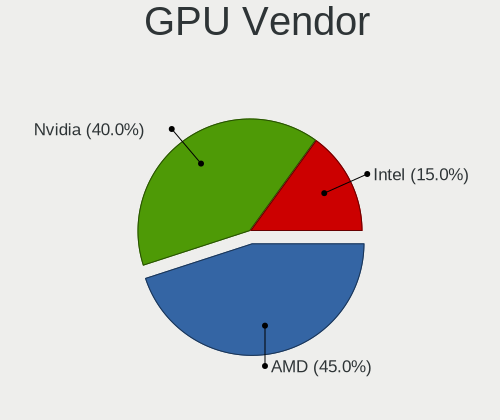

Arch Hardware Trends (Desktop)
------------------------------

A project to identify most popular hardware characteristics and track their change
over time based on data collected by Arch users at https://Linux-Hardware.org.

Anyone can contribute to the study by uploading probes of their computers by
the [hw-probe](https://github.com/linuxhw/hw-probe) tool:

    sudo -E hw-probe -all -upload

Full-feature report is available here: https://linux-hardware.org/?view=trends&formfactor=desktop

Period: Oct, 2020.

Contents
--------

- [ OS                       ](#os)
- [ OS Family                ](#os-family)
- [ Kernel                   ](#kernel)
- [ Kernel Family            ](#kernel-family)
- [ Kernel Major Ver.        ](#kernel-major-ver)
- [ Arch                     ](#arch)
- [ DE                       ](#de)
- [ Display Server           ](#display-server)
- [ Display Manager          ](#display-manager)
- [ OS Lang                  ](#os-lang)
- [ Boot Mode                ](#boot-mode)
- [ Filesystem               ](#filesystem)
- [ Part. scheme             ](#part-scheme)
- [ Dual Boot with Linux/BSD ](#dual-boot-with-linux/bsd)
- [ Dual Boot (Win)          ](#dual-boot-win)
- [ Country                  ](#country)
- [ City                     ](#city)
- [ Vendor                   ](#vendor)
- [ Model                    ](#model)
- [ Model Family             ](#model-family)
- [ MFG Year                 ](#mfg-year)
- [ Form Factor              ](#form-factor)
- [ Secure Boot              ](#secure-boot)
- [ Coreboot                 ](#coreboot)
- [ RAM Size                 ](#ram-size)
- [ RAM Used                 ](#ram-used)
- [ Has CD-ROM               ](#has-cd-rom)
- [ Total Drives             ](#total-drives)
- [ Has Ethernet             ](#has-ethernet)
- [ Drive Vendor             ](#drive-vendor)
- [ HDD Vendor               ](#hdd-vendor)
- [ SSD Vendor               ](#ssd-vendor)
- [ Drive Model              ](#drive-model)
- [ Drive Kind               ](#drive-kind)
- [ Drive Connector          ](#drive-connector)
- [ Drive Size               ](#drive-size)
- [ Space Total              ](#space-total)
- [ Space Used               ](#space-used)
- [ Malfunc. Drives          ](#malfunc-drives)
- [ Malfunc. Drive Vendor    ](#malfunc-drive-vendor)
- [ Malfunc. HDD Vendor      ](#malfunc-hdd-vendor)
- [ Malfunc. Drive Kind      ](#malfunc-drive-kind)
- [ Failed Drives            ](#failed-drives)
- [ Failed Drive Vendor      ](#failed-drive-vendor)
- [ Drive Status             ](#drive-status)
- [ Storage Vendor           ](#storage-vendor)
- [ Storage Model            ](#storage-model)
- [ Storage Kind             ](#storage-kind)
- [ CPU Vendor               ](#cpu-vendor)
- [ CPU Model                ](#cpu-model)
- [ CPU Model Family         ](#cpu-model-family)
- [ CPU Cores                ](#cpu-cores)
- [ CPU Sockets              ](#cpu-sockets)
- [ CPU Threads              ](#cpu-threads)
- [ CPU Op-Modes             ](#cpu-op-modes)
- [ CPU Microcode            ](#cpu-microcode)
- [ CPU Microarch            ](#cpu-microarch)
- [ GPU Vendor               ](#gpu-vendor)
- [ GPU Model                ](#gpu-model)
- [ GPU Combo                ](#gpu-combo)
- [ GPU Driver               ](#gpu-driver)
- [ GPU Memory               ](#gpu-memory)
- [ Monitor Vendor           ](#monitor-vendor)
- [ Monitor Model            ](#monitor-model)
- [ Monitor Resolution       ](#monitor-resolution)
- [ Monitor Diagonal         ](#monitor-diagonal)
- [ Monitor Width            ](#monitor-width)
- [ Aspect Ratio             ](#aspect-ratio)
- [ Monitor Area             ](#monitor-area)
- [ Pixel Density            ](#pixel-density)
- [ Multiple Monitors        ](#multiple-monitors)
- [ Net Controller Vendor    ](#net-controller-vendor)
- [ Net Controller Model     ](#net-controller-model)
- [ Wireless Vendor          ](#wireless-vendor)
- [ Wireless Model           ](#wireless-model)
- [ Ethernet Vendor          ](#ethernet-vendor)
- [ Ethernet Model           ](#ethernet-model)
- [ Net Controller Kind      ](#net-controller-kind)
- [ Used Controller          ](#used-controller)
- [ NICs                     ](#nics)
- [ Memory Vendor            ](#memory-vendor)
- [ Memory Model             ](#memory-model)
- [ Memory Kind              ](#memory-kind)
- [ Memory Form Factor       ](#memory-form-factor)
- [ Memory Size              ](#memory-size)
- [ Memory Speed             ](#memory-speed)
- [ Sound Vendor             ](#sound-vendor)
- [ Sound Model              ](#sound-model)
- [ Camera Vendor            ](#camera-vendor)
- [ Camera Model             ](#camera-model)
- [ Fingerprint Vendor       ](#fingerprint-vendor)
- [ Fingerprint Model        ](#fingerprint-model)
- [ Chipcard Vendor          ](#chipcard-vendor)
- [ Chipcard Model           ](#chipcard-model)
- [ Printer Vendor           ](#printer-vendor)
- [ Printer Model            ](#printer-model)
- [ Scanner Vendor           ](#scanner-vendor)
- [ Scanner Model            ](#scanner-model)
- [ Bluetooth Vendor         ](#bluetooth-vendor)
- [ Bluetooth Model          ](#bluetooth-model)
- [ Unsupported Devices      ](#unsupported-devices)
- [ Unsupported Device Types ](#unsupported-device-types)

OS
--

Installed operating systems

| Name            | Desktops | Percent |
|-----------------|----------|---------|
| Arch Rolling    | 57       | 53.77%  |
| Arch            | 48       | 45.28%  |
| Arch 2020.09.05 | 1        | 0.94%   |

OS Family
---------

OS without a version

| Name | Desktops | Percent |
|------|----------|---------|
| Arch | 106      | 100%    |

Kernel
------

Version of the Linux kernel

| Version             | Desktops | Percent |
|---------------------|----------|---------|
| 5.9.1-arch1-1       | 26       | 24.53%  |
| 5.8.14-arch1-1      | 21       | 19.81%  |
| 5.8.12-arch1-1      | 13       | 12.26%  |
| 5.8.13-arch1-1      | 8        | 7.55%   |
| 5.9.1-zen2-1-zen    | 6        | 5.66%   |
| 5.4.72-1-lts        | 4        | 3.77%   |
| 5.8.13-zen1-2-zen   | 2        | 1.89%   |
| 5.8.13-21-tkg-pds   | 2        | 1.89%   |
| 5.8.12-zen1-1-zen   | 2        | 1.89%   |
| 5.4.68-1-lts        | 2        | 1.89%   |
| 5.9.2-arch1-1       | 1        | 0.94%   |
| 5.9.1-zen1-1-zen    | 1        | 0.94%   |
| 5.9.1-xanmod1-1     | 1        | 0.94%   |
| 5.9.0               | 1        | 0.94%   |
| 5.8.15-xanmod1-1    | 1        | 0.94%   |
| 5.8.14.a-1-hardened | 1        | 0.94%   |
| 5.8.14-zen1-1-zen   | 1        | 0.94%   |
| 5.8.14-23-tkg-upds  | 1        | 0.94%   |
| 5.8.14-22-tkg-upds  | 1        | 0.94%   |
| 5.8.13-21-tkg-upds  | 1        | 0.94%   |
| 5.8.13              | 1        | 0.94%   |
| 5.8.12-arch1-1-pds  | 1        | 0.94%   |
| 5.8.12-20-tkg-upds  | 1        | 0.94%   |
| 5.8.10-zen1-1-zen   | 1        | 0.94%   |
| 5.8.10-arch1-1-vfio | 1        | 0.94%   |
| 5.5.3-arch1-1       | 1        | 0.94%   |
| 5.4.71-1-lts        | 1        | 0.94%   |
| 5.4.70-1-lts        | 1        | 0.94%   |
| 5.4.66-1-lts        | 1        | 0.94%   |
| Unknown             | 1        | 0.94%   |

Kernel Family
-------------

Linux kernel without a distro release

| Version | Desktops | Percent |
|---------|----------|---------|
| 5.9.1   | 34       | 32.08%  |
| 5.8.14  | 25       | 23.58%  |
| 5.8.12  | 17       | 16.04%  |
| 5.8.13  | 14       | 13.21%  |
| 5.4.72  | 4        | 3.77%   |
| 5.8.10  | 2        | 1.89%   |
| 5.4.68  | 2        | 1.89%   |
| 5.9.2   | 1        | 0.94%   |
| 5.9.0   | 1        | 0.94%   |
| 5.8.15  | 1        | 0.94%   |
| 5.5.3   | 1        | 0.94%   |
| 5.4.71  | 1        | 0.94%   |
| 5.4.70  | 1        | 0.94%   |
| 5.4.66  | 1        | 0.94%   |
| Unknown | 1        | 0.94%   |

Kernel Major Ver.
-----------------

Linux kernel major version

| Version | Desktops | Percent |
|---------|----------|---------|
| 5.8     | 59       | 55.66%  |
| 5.9     | 36       | 33.96%  |
| 5.4     | 9        | 8.49%   |
| 5.5     | 1        | 0.94%   |
| Unknown | 1        | 0.94%   |

Arch
----

OS architecture (x86_64, i586, etc.)

| Name   | Desktops | Percent |
|--------|----------|---------|
| x86_64 | 106      | 100%    |

DE
--

Desktop Environment

| Name     | Desktops | Percent |
|----------|----------|---------|
| GNOME    | 48       | 45.28%  |
| KDE5     | 19       | 17.92%  |
| XFCE     | 15       | 14.15%  |
| KDE      | 8        | 7.55%   |
| Unknown  | 8        | 7.55%   |
| Deepin   | 3        | 2.83%   |
| Cinnamon | 3        | 2.83%   |
| Budgie   | 2        | 1.89%   |

Display Server
--------------

X11 or Wayland

| Name    | Desktops | Percent |
|---------|----------|---------|
| X11     | 80       | 75.47%  |
| Wayland | 17       | 16.04%  |
| Tty     | 7        | 6.6%    |
| Unknown | 2        | 1.89%   |

Display Manager
---------------

SDDM, LightDM, etc.

| Name    | Desktops | Percent |
|---------|----------|---------|
| Unknown | 41       | 38.68%  |
| TDM     | 22       | 20.75%  |
| SDDM    | 20       | 18.87%  |
| GDM     | 18       | 16.98%  |
| Ly      | 3        | 2.83%   |
| LXDM    | 1        | 0.94%   |
| LightDM | 1        | 0.94%   |

OS Lang
-------

Language

| Lang       | Desktops | Percent |
|------------|----------|---------|
| en_US      | 52       | 49.06%  |
| en_GB      | 10       | 9.43%   |
| C          | 7        | 6.6%    |
| de_DE      | 6        | 5.66%   |
| en_US.utf8 | 5        | 4.72%   |
| Unknown    | 4        | 3.77%   |
| de_DE.utf8 | 3        | 2.83%   |
| pt_BR      | 2        | 1.89%   |
| fr_FR      | 2        | 1.89%   |
| ru_UA      | 1        | 0.94%   |
| ru_RU      | 1        | 0.94%   |
| pl_PL      | 1        | 0.94%   |
| nl_NL      | 1        | 0.94%   |
| it_IT.utf8 | 1        | 0.94%   |
| it_IT      | 1        | 0.94%   |
| fr_CH      | 1        | 0.94%   |
| es_ES.utf8 | 1        | 0.94%   |
| en_FI      | 1        | 0.94%   |
| en_CA.utf8 | 1        | 0.94%   |
| en_CA      | 1        | 0.94%   |
| en_AU      | 1        | 0.94%   |
| en_AG      | 1        | 0.94%   |
| de_AT      | 1        | 0.94%   |
| da_DK      | 1        | 0.94%   |

Boot Mode
---------

EFI or BIOS

| Mode | Desktops | Percent |
|------|----------|---------|
| EFI  | 69       | 65.09%  |
| BIOS | 37       | 34.91%  |

Filesystem
----------

Type of filesystem

| Type     | Desktops | Percent |
|----------|----------|---------|
| Ext4     | 75       | 70.75%  |
| Btrfs    | 23       | 21.7%   |
| Xfs      | 4        | 3.77%   |
| F2fs     | 3        | 2.83%   |
| Reiserfs | 1        | 0.94%   |

Part. scheme
------------

Scheme of partitioning

| Type    | Desktops | Percent |
|---------|----------|---------|
| GPT     | 64       | 60.38%  |
| Unknown | 31       | 29.25%  |
| MBR     | 11       | 10.38%  |

Dual Boot with Linux/BSD
------------------------

Hosting more than one Linux/BSD

| Dual boot | Desktops | Percent |
|-----------|----------|---------|
| No        | 86       | 81.13%  |
| Yes       | 20       | 18.87%  |

Dual Boot (Win)
---------------

Hosting Linux and Windows

| Dual boot | Desktops | Percent |
|-----------|----------|---------|
| No        | 54       | 50.94%  |
| Yes       | 52       | 49.06%  |

Country
-------

Geographic location (country)

| Country     | Desktops | Percent |
|-------------|----------|---------|
| USA         | 25       | 23.58%  |
| Germany     | 11       | 10.38%  |
| Russia      | 8        | 7.55%   |
| UK          | 5        | 4.72%   |
| Brazil      | 5        | 4.72%   |
| Italy       | 4        | 3.77%   |
| France      | 4        | 3.77%   |
| Switzerland | 3        | 2.83%   |
| Sweden      | 3        | 2.83%   |
| Spain       | 3        | 2.83%   |
| Netherlands | 3        | 2.83%   |
| Finland     | 3        | 2.83%   |
| Canada      | 3        | 2.83%   |
| Austria     | 3        | 2.83%   |
| Australia   | 3        | 2.83%   |
| Poland      | 2        | 1.89%   |
| Greece      | 2        | 1.89%   |
| Egypt       | 2        | 1.89%   |
| Denmark     | 2        | 1.89%   |
| Ukraine     | 1        | 0.94%   |
| Tunisia     | 1        | 0.94%   |
| Portugal    | 1        | 0.94%   |
| Norway      | 1        | 0.94%   |
| Nicaragua   | 1        | 0.94%   |
| Nepal       | 1        | 0.94%   |
| Myanmar     | 1        | 0.94%   |
| Kazakhstan  | 1        | 0.94%   |
| Japan       | 1        | 0.94%   |
| India       | 1        | 0.94%   |
| Hungary     | 1        | 0.94%   |
| Argentina   | 1        | 0.94%   |

City
----

Geographic location (city)

| City                        | Desktops | Percent |
|-----------------------------|----------|---------|
| Paris                       | 3        | 2.83%   |
| Moscow                      | 3        | 2.83%   |
| Vienna                      | 2        | 1.89%   |
| Salt Lake City              | 2        | 1.89%   |
| Paducah                     | 2        | 1.89%   |
| Athens                      | 2        | 1.89%   |
| Zwolle                      | 1        | 0.94%   |
| Zurich                      | 1        | 0.94%   |
| Yangon                      | 1        | 0.94%   |
| Warsaw                      | 1        | 0.94%   |
| Vologda                     | 1        | 0.94%   |
| Viersen                     | 1        | 0.94%   |
| Vancouver                   | 1        | 0.94%   |
| Vaesterhankmo               | 1        | 0.94%   |
| Uberaba                     | 1        | 0.94%   |
| Tuusula                     | 1        | 0.94%   |
| Tunis                       | 1        | 0.94%   |
| Trollhättan                | 1        | 0.94%   |
| Taranto                     | 1        | 0.94%   |
| Stuttgart                   | 1        | 0.94%   |
| Stockholm                   | 1        | 0.94%   |
| St Petersburg               | 1        | 0.94%   |
| Skanderborg                 | 1        | 0.94%   |
| Sintra                      | 1        | 0.94%   |
| Seattle                     | 1        | 0.94%   |
| Scotts Valley               | 1        | 0.94%   |
| Sanford                     | 1        | 0.94%   |
| San Sebastián de La Gomera | 1        | 0.94%   |
| Samara                      | 1        | 0.94%   |
| Rudolstadt                  | 1        | 0.94%   |
| Rio de Janeiro              | 1        | 0.94%   |
| Reichenbach                 | 1        | 0.94%   |
| Reggio Emilia               | 1        | 0.94%   |
| Otwock                      | 1        | 0.94%   |
| Ottawa                      | 1        | 0.94%   |
| Obersulm                    | 1        | 0.94%   |
| Oakman                      | 1        | 0.94%   |
| Nuremberg                   | 1        | 0.94%   |
| Nagoya                      | 1        | 0.94%   |
| Midland                     | 1        | 0.94%   |
| Miami                       | 1        | 0.94%   |
| Melbourne                   | 1        | 0.94%   |
| Marslev                     | 1        | 0.94%   |
| March                       | 1        | 0.94%   |
| Managua                     | 1        | 0.94%   |
| Malmo                       | 1        | 0.94%   |
| Mainz                       | 1        | 0.94%   |
| Madrid                      | 1        | 0.94%   |
| Ludwigshafen am Rhein       | 1        | 0.94%   |
| Lubbock                     | 1        | 0.94%   |
| London                      | 1        | 0.94%   |
| Logroño                    | 1        | 0.94%   |
| Lexington                   | 1        | 0.94%   |
| Leverano                    | 1        | 0.94%   |
| Lesnoy                      | 1        | 0.94%   |
| Le Grand-Saconnex           | 1        | 0.94%   |
| Landivisiau                 | 1        | 0.94%   |
| Krefeld                     | 1        | 0.94%   |
| Krasnogorsk                 | 1        | 0.94%   |
| Kitchener                   | 1        | 0.94%   |

Vendor
------

Motherboard manufacturer

| Name                | Desktops | Percent |
|---------------------|----------|---------|
| ASUSTek Computer    | 32       | 30.19%  |
| Gigabyte Technology | 24       | 22.64%  |
| MSI                 | 22       | 20.75%  |
| ASRock              | 19       | 17.92%  |
| Dell                | 4        | 3.77%   |
| Lenovo              | 1        | 0.94%   |
| Intel               | 1        | 0.94%   |
| ELSA                | 1        | 0.94%   |
| Biostar             | 1        | 0.94%   |
| ASRockRack          | 1        | 0.94%   |

Model
-----

Motherboard model

| Name                                    | Desktops | Percent |
|-----------------------------------------|----------|---------|
| Gigabyte B450M DS3H                     | 3        | 2.83%   |
| MSI MS-7C35                             | 2        | 1.89%   |
| MSI MS-7C02                             | 2        | 1.89%   |
| MSI MS-7B85                             | 2        | 1.89%   |
| ASUS TUF GAMING X570-PLUS               | 2        | 1.89%   |
| ASUS STRIX Z270E GAMING                 | 2        | 1.89%   |
| ASUS PRIME Z370-A                       | 2        | 1.89%   |
| ASUS All Series                         | 2        | 1.89%   |
| ASRock X570 Taichi                      | 2        | 1.89%   |
| ASRock B450M Pro4                       | 2        | 1.89%   |
| MSI MS-7C95                             | 1        | 0.94%   |
| MSI MS-7C92                             | 1        | 0.94%   |
| MSI MS-7B98                             | 1        | 0.94%   |
| MSI MS-7B89                             | 1        | 0.94%   |
| MSI MS-7B86                             | 1        | 0.94%   |
| MSI MS-7B58                             | 1        | 0.94%   |
| MSI MS-7A38                             | 1        | 0.94%   |
| MSI MS-7A34                             | 1        | 0.94%   |
| MSI MS-7971                             | 1        | 0.94%   |
| MSI MS-7850                             | 1        | 0.94%   |
| MSI MS-7821                             | 1        | 0.94%   |
| MSI MS-7818                             | 1        | 0.94%   |
| MSI MS-7815                             | 1        | 0.94%   |
| MSI MS-7693                             | 1        | 0.94%   |
| MSI MS-7676                             | 1        | 0.94%   |
| MSI MS-7576                             | 1        | 0.94%   |
| Lenovo IdeaCentre 510S-08ISH 90FN007MGF | 1        | 0.94%   |
| Intel DH57JG AAE70930-302               | 1        | 0.94%   |
| Gigabyte Z97P-D3                        | 1        | 0.94%   |
| Gigabyte Z97-HD3                        | 1        | 0.94%   |
| Gigabyte Z77X-UD3H                      | 1        | 0.94%   |
| Gigabyte Z77X-D3H                       | 1        | 0.94%   |
| Gigabyte Z390 I AORUS PRO WIFI          | 1        | 0.94%   |
| Gigabyte Z370 HD3                       | 1        | 0.94%   |
| Gigabyte Z170X-Gaming 7                 | 1        | 0.94%   |
| Gigabyte Z170-Gaming K3                 | 1        | 0.94%   |
| Gigabyte X570 UD                        | 1        | 0.94%   |
| Gigabyte X570 I AORUS PRO WIFI          | 1        | 0.94%   |
| Gigabyte X570 AORUS PRO WIFI            | 1        | 0.94%   |
| Gigabyte X399 DESIGNARE EX              | 1        | 0.94%   |
| Gigabyte P55A-UD3R                      | 1        | 0.94%   |
| Gigabyte H110M-S2H                      | 1        | 0.94%   |
| Gigabyte GA-970A-D3                     | 1        | 0.94%   |
| Gigabyte G41MT-S2PT                     | 1        | 0.94%   |
| Gigabyte G41M-Combo                     | 1        | 0.94%   |
| Gigabyte AX370-Gaming K7                | 1        | 0.94%   |
| Gigabyte AX370-Gaming K5                | 1        | 0.94%   |
| Gigabyte AX370-Gaming 5                 | 1        | 0.94%   |
| Gigabyte A320M-S2H                      | 1        | 0.94%   |
| ELSA P45IA-R2 1048                      | 1        | 0.94%   |
| Dell XPS 8930                           | 1        | 0.94%   |
| Dell Precision 3630 Tower               | 1        | 0.94%   |
| Dell PowerEdge T30                      | 1        | 0.94%   |
| Dell OptiPlex 3040                      | 1        | 0.94%   |
| Biostar Hi-Fi B85S3+                    | 1        | 0.94%   |
| ASUS Z170-PRO                           | 1        | 0.94%   |
| ASUS TUF B360M-PLUS GAMING/BR           | 1        | 0.94%   |
| ASUS STRIX H270F GAMING                 | 1        | 0.94%   |
| ASUS ROG STRIX Z370-H GAMING            | 1        | 0.94%   |
| ASUS PRIME Z490M-PLUS                   | 1        | 0.94%   |

Model Family
------------

Motherboard model prefix

| Name                  | Desktops | Percent |
|-----------------------|----------|---------|
| ASUS PRIME            | 12       | 11.32%  |
| Gigabyte X570         | 3        | 2.83%   |
| Gigabyte B450M        | 3        | 2.83%   |
| Gigabyte AX370-Gaming | 3        | 2.83%   |
| ASUS TUF              | 3        | 2.83%   |
| ASUS STRIX            | 3        | 2.83%   |
| ASRock X570           | 3        | 2.83%   |
| MSI MS-7C35           | 2        | 1.89%   |
| MSI MS-7C02           | 2        | 1.89%   |
| MSI MS-7B85           | 2        | 1.89%   |
| ASUS P8H61-M          | 2        | 1.89%   |
| ASUS Crosshair        | 2        | 1.89%   |
| ASUS All              | 2        | 1.89%   |
| ASRock Z87            | 2        | 1.89%   |
| ASRock B450M          | 2        | 1.89%   |
| MSI MS-7C95           | 1        | 0.94%   |
| MSI MS-7C92           | 1        | 0.94%   |
| MSI MS-7B98           | 1        | 0.94%   |
| MSI MS-7B89           | 1        | 0.94%   |
| MSI MS-7B86           | 1        | 0.94%   |
| MSI MS-7B58           | 1        | 0.94%   |
| MSI MS-7A38           | 1        | 0.94%   |
| MSI MS-7A34           | 1        | 0.94%   |
| MSI MS-7971           | 1        | 0.94%   |
| MSI MS-7850           | 1        | 0.94%   |
| MSI MS-7821           | 1        | 0.94%   |
| MSI MS-7818           | 1        | 0.94%   |
| MSI MS-7815           | 1        | 0.94%   |
| MSI MS-7693           | 1        | 0.94%   |
| MSI MS-7676           | 1        | 0.94%   |
| MSI MS-7576           | 1        | 0.94%   |
| Lenovo IdeaCentre     | 1        | 0.94%   |
| Intel DH57JG          | 1        | 0.94%   |
| Gigabyte Z97P-D3      | 1        | 0.94%   |
| Gigabyte Z97-HD3      | 1        | 0.94%   |
| Gigabyte Z77X-UD3H    | 1        | 0.94%   |
| Gigabyte Z77X-D3H     | 1        | 0.94%   |
| Gigabyte Z390         | 1        | 0.94%   |
| Gigabyte Z370         | 1        | 0.94%   |
| Gigabyte Z170X-Gaming | 1        | 0.94%   |
| Gigabyte Z170-Gaming  | 1        | 0.94%   |
| Gigabyte X399         | 1        | 0.94%   |
| Gigabyte P55A-UD3R    | 1        | 0.94%   |
| Gigabyte H110M-S2H    | 1        | 0.94%   |
| Gigabyte GA-970A-D3   | 1        | 0.94%   |
| Gigabyte G41MT-S2PT   | 1        | 0.94%   |
| Gigabyte G41M-Combo   | 1        | 0.94%   |
| Gigabyte A320M-S2H    | 1        | 0.94%   |
| ELSA P45IA-R2         | 1        | 0.94%   |
| Dell XPS              | 1        | 0.94%   |
| Dell Precision        | 1        | 0.94%   |
| Dell PowerEdge        | 1        | 0.94%   |
| Dell OptiPlex         | 1        | 0.94%   |
| Biostar Hi-Fi         | 1        | 0.94%   |
| ASUS Z170-PRO         | 1        | 0.94%   |
| ASUS ROG              | 1        | 0.94%   |
| ASUS P8H61            | 1        | 0.94%   |
| ASUS P6T              | 1        | 0.94%   |
| ASUS M5A99X           | 1        | 0.94%   |
| ASUS M3A78            | 1        | 0.94%   |

MFG Year
--------

Motherboard manufacture year

| Year | Desktops | Percent |
|------|----------|---------|
| 2020 | 26       | 24.53%  |
| 2019 | 25       | 23.58%  |
| 2018 | 12       | 11.32%  |
| 2014 | 10       | 9.43%   |
| 2017 | 6        | 5.66%   |
| 2016 | 6        | 5.66%   |
| 2015 | 5        | 4.72%   |
| 2011 | 5        | 4.72%   |
| 2010 | 4        | 3.77%   |
| 2013 | 3        | 2.83%   |
| 2012 | 3        | 2.83%   |
| 2009 | 1        | 0.94%   |

Form Factor
-----------

Physical design of the computer

| Name    | Desktops | Percent |
|---------|----------|---------|
| Desktop | 106      | 100%    |

Secure Boot
-----------

Enabled or disabled

| State    | Desktops | Percent |
|----------|----------|---------|
| Disabled | 105      | 99.06%  |
| Enabled  | 1        | 0.94%   |

Coreboot
--------

Have coreboot on board

| Used | Desktops | Percent |
|------|----------|---------|
| No   | 106      | 100%    |

RAM Size
--------

Total RAM memory

| Size in GB      | Desktops | Percent |
|-----------------|----------|---------|
| 16.01-24.0      | 42       | 39.62%  |
| 32.01-64.0      | 30       | 28.3%   |
| 8.01-16.0       | 12       | 11.32%  |
| 4.01-8.0        | 8        | 7.55%   |
| 64.01-256.0     | 5        | 4.72%   |
| 3.01-4.0        | 4        | 3.77%   |
| 24.01-32.0      | 4        | 3.77%   |
| More than 256.0 | 1        | 0.94%   |

RAM Used
--------

Used RAM memory

| Used GB    | Desktops | Percent |
|------------|----------|---------|
| 4.01-8.0   | 32       | 30.19%  |
| 2.01-3.0   | 21       | 19.81%  |
| 1.01-2.0   | 19       | 17.92%  |
| 3.01-4.0   | 14       | 13.21%  |
| 8.01-16.0  | 13       | 12.26%  |
| 16.01-24.0 | 3        | 2.83%   |
| 0.01-1.0   | 3        | 2.83%   |
| 24.01-32.0 | 1        | 0.94%   |

Has CD-ROM
----------

Has CD-ROM on board

| Presented | Desktops | Percent |
|-----------|----------|---------|
| No        | 81       | 76.42%  |
| Yes       | 25       | 23.58%  |

Total Drives
------------

Number of drives on board

| Drives | Desktops | Percent |
|--------|----------|---------|
| 2      | 38       | 35.85%  |
| 3      | 24       | 22.64%  |
| 1      | 19       | 17.92%  |
| 4      | 12       | 11.32%  |
| 5      | 9        | 8.49%   |
| 7      | 2        | 1.89%   |
| 8      | 1        | 0.94%   |
| 6      | 1        | 0.94%   |

Has Ethernet
------------

Has Ethernet on board

| Presented | Desktops | Percent |
|-----------|----------|---------|
| Yes       | 103      | 97.17%  |
| No        | 3        | 2.83%   |

Drive Vendor
------------

Hard drive vendors

| Vendor                | Desktops | Drives | Percent |
|-----------------------|----------|--------|---------|
| Samsung Electronics   | 51       | 76     | 22.27%  |
| Seagate               | 46       | 58     | 20.09%  |
| WDC                   | 33       | 45     | 14.41%  |
| Toshiba               | 16       | 22     | 6.99%   |
| Kingston              | 15       | 17     | 6.55%   |
| Crucial               | 11       | 11     | 4.8%    |
| SanDisk               | 9        | 10     | 3.93%   |
| Phison                | 7        | 8      | 3.06%   |
| A-DATA Technology     | 4        | 4      | 1.75%   |
| PNY                   | 3        | 3      | 1.31%   |
| Patriot               | 3        | 3      | 1.31%   |
| Intel                 | 3        | 3      | 1.31%   |
| Hitachi               | 3        | 3      | 1.31%   |
| HGST                  | 3        | 4      | 1.31%   |
| SPCC                  | 2        | 2      | 0.87%   |
| Lexar                 | 2        | 2      | 0.87%   |
| XPG                   | 1        | 1      | 0.44%   |
| Transcend             | 1        | 1      | 0.44%   |
| Team                  | 1        | 3      | 0.44%   |
| SK Hynix              | 1        | 1      | 0.44%   |
| Silicon Motion        | 1        | 1      | 0.44%   |
| SABRENT               | 1        | 1      | 0.44%   |
| Realtek Semiconductor | 1        | 1      | 0.44%   |
| PLEXTOR               | 1        | 1      | 0.44%   |
| OCZ                   | 1        | 1      | 0.44%   |
| Mushkin               | 1        | 1      | 0.44%   |
| KingSpec              | 1        | 1      | 0.44%   |
| KingDian              | 1        | 1      | 0.44%   |
| Intenso               | 1        | 1      | 0.44%   |
| HS-SSD-C100           | 1        | 1      | 0.44%   |
| Dogfish               | 1        | 1      | 0.44%   |
| Corsair               | 1        | 1      | 0.44%   |
| China                 | 1        | 1      | 0.44%   |
| Apple                 | 1        | 1      | 0.44%   |

HDD Vendor
----------

Hard disk drive vendors

| Vendor              | Desktops | Drives | Percent |
|---------------------|----------|--------|---------|
| Seagate             | 46       | 58     | 45.54%  |
| WDC                 | 30       | 42     | 29.7%   |
| Toshiba             | 13       | 18     | 12.87%  |
| Samsung Electronics | 5        | 5      | 4.95%   |
| Hitachi             | 3        | 3      | 2.97%   |
| HGST                | 3        | 4      | 2.97%   |
| Intenso             | 1        | 1      | 0.99%   |

SSD Vendor
----------

Solid state drive vendors

| Vendor              | Desktops | Drives | Percent |
|---------------------|----------|--------|---------|
| Samsung Electronics | 33       | 43     | 37.08%  |
| Kingston            | 13       | 14     | 14.61%  |
| Crucial             | 10       | 10     | 11.24%  |
| SanDisk             | 6        | 7      | 6.74%   |
| PNY                 | 3        | 3      | 3.37%   |
| Patriot             | 3        | 3      | 3.37%   |
| WDC                 | 2        | 2      | 2.25%   |
| SPCC                | 2        | 2      | 2.25%   |
| Lexar               | 2        | 2      | 2.25%   |
| Intel               | 2        | 2      | 2.25%   |
| A-DATA Technology   | 2        | 2      | 2.25%   |
| Transcend           | 1        | 1      | 1.12%   |
| Toshiba             | 1        | 1      | 1.12%   |
| SABRENT             | 1        | 1      | 1.12%   |
| OCZ                 | 1        | 1      | 1.12%   |
| Mushkin             | 1        | 1      | 1.12%   |
| KingSpec            | 1        | 1      | 1.12%   |
| KingDian            | 1        | 1      | 1.12%   |
| HS-SSD-C100         | 1        | 1      | 1.12%   |
| Dogfish             | 1        | 1      | 1.12%   |
| China               | 1        | 1      | 1.12%   |
| Apple               | 1        | 1      | 1.12%   |

Drive Model
-----------

Hard drive models

| Model                        | Desktops | Percent |
|------------------------------|----------|---------|
| SSD 850 EVO 500GB            | 6        | 2.15%   |
| ST2000DM008-2FR102 2TB       | 5        | 1.79%   |
| NVMe SSD Drive 1TB           | 5        | 1.79%   |
| ST1000DM010-2EP102 1TB       | 4        | 1.43%   |
| ST1000DM003-1ER162 1TB       | 4        | 1.43%   |
| SSD 970 EVO Plus 500GB       | 4        | 1.43%   |
| SSD 860 QVO 1TB              | 4        | 1.43%   |
| SA400S37120G 120GB SSD       | 4        | 1.43%   |
| ST2000DM006-2DM164 2TB       | 3        | 1.08%   |
| ST1000DM003-1SB102 1TB       | 3        | 1.08%   |
| SSD 970 EVO Plus 1TB         | 3        | 1.08%   |
| SSD 970 EVO 500GB            | 3        | 1.08%   |
| SSD 960 EVO 250GB            | 3        | 1.08%   |
| SSD 860 EVO 500GB            | 3        | 1.08%   |
| SSD 860 EVO 1TB              | 3        | 1.08%   |
| SSD 850 PRO 256GB            | 3        | 1.08%   |
| NVMe SSD Drive 500GB         | 3        | 1.08%   |
| DT01ACA100 1TB               | 3        | 1.08%   |
| WD40EFRX-68WT0N0 4TB         | 2        | 0.72%   |
| WD40EFRX-68N32N0 4TB         | 2        | 0.72%   |
| WD20EZRZ-00Z5HB0 2TB         | 2        | 0.72%   |
| WD10EZRX-00L4HB0 1TB         | 2        | 0.72%   |
| WD10EZEX-08WN4A0 1TB         | 2        | 0.72%   |
| SV300S37A240G 240GB SSD      | 2        | 0.72%   |
| ST500DM002-1SB10A 500GB      | 2        | 0.72%   |
| ST500DM002-1BD142 500GB      | 2        | 0.72%   |
| ST2000LX001-1RG174 2TB       | 2        | 0.72%   |
| ST2000DX002-2DV164 2TB       | 2        | 0.72%   |
| ST2000DM001-1ER164 2TB       | 2        | 0.72%   |
| ST1000DM003-1CH162 1TB       | 2        | 0.72%   |
| ST1000DL002-9TT153 1TB       | 2        | 0.72%   |
| SSD 970 PRO 512GB            | 2        | 0.72%   |
| SSD 970 EVO 250GB            | 2        | 0.72%   |
| SSD 860 EVO M.2 500GB        | 2        | 0.72%   |
| SSD 850 PRO 512GB            | 2        | 0.72%   |
| SSD 840 EVO 250GB            | 2        | 0.72%   |
| SSD 840 EVO 120GB            | 2        | 0.72%   |
| SSD 750 EVO 250GB            | 2        | 0.72%   |
| SHFS37A120G 120GB SSD        | 2        | 0.72%   |
| NVMe SSD Drive 512GB         | 2        | 0.72%   |
| NVMe SSD Drive 480GB         | 2        | 0.72%   |
| NVMe SSD Drive 250GB         | 2        | 0.72%   |
| HDWD130 3TB                  | 2        | 0.72%   |
| HDWD120 2TB                  | 2        | 0.72%   |
| HD502HJ 500GB                | 2        | 0.72%   |
| HD103SJ 1TB                  | 2        | 0.72%   |
| DT01ACA300 3TB               | 2        | 0.72%   |
| DT01ACA200 2TB               | 2        | 0.72%   |
| WDS500G3X0C-00SJG0 500GB     | 1        | 0.36%   |
| WDS500G2B0A-00SM50 500GB SSD | 1        | 0.36%   |
| WDS500G1B0B-00AS40 500GB SSD | 1        | 0.36%   |
| WD740GD-00FLC0 74GB          | 1        | 0.36%   |
| WD60EZRZ-00GZ5B1 6TB         | 1        | 0.36%   |
| WD5000LPLX-75ZNTT0 500GB     | 1        | 0.36%   |
| WD5000AAKX-221CA1 500GB      | 1        | 0.36%   |
| WD5000AAKX-001CA0 500GB      | 1        | 0.36%   |
| WD5000AAKX-0 500GB           | 1        | 0.36%   |
| WD5000AAKS-22YGA0 500GB      | 1        | 0.36%   |
| WD4003FZEX-00Z4SA0 4TB       | 1        | 0.36%   |
| WD3200BPVT-22JJ5T0 320GB     | 1        | 0.36%   |

Drive Kind
----------

HDD or SSD

| Kind | Desktops | Drives | Percent |
|------|----------|--------|---------|
| HDD  | 83       | 131    | 41.71%  |
| SSD  | 72       | 101    | 36.18%  |
| NVMe | 44       | 59     | 22.11%  |

Drive Connector
---------------

SATA, SAS, NVMe, etc.

| Type | Desktops | Drives | Percent |
|------|----------|--------|---------|
| SATA | 99       | 229    | 67.81%  |
| NVMe | 44       | 59     | 30.14%  |
| SAS  | 3        | 3      | 2.05%   |

Drive Size
----------

Size of hard drive

| Size in TB | Desktops | Drives | Percent |
|------------|----------|--------|---------|
| 0.01-0.5   | 70       | 104    | 40.94%  |
| 0.51-1.0   | 55       | 72     | 32.16%  |
| 1.01-2.0   | 26       | 28     | 15.2%   |
| 2.01-3.0   | 10       | 11     | 5.85%   |
| 4.01-10.0  | 6        | 11     | 3.51%   |
| 3.01-4.0   | 4        | 6      | 2.34%   |

Space Total
-----------

Amount of disk space available on the file system

| Size in GB     | Desktops | Percent |
|----------------|----------|---------|
| More than 3000 | 20       | 18.87%  |
| 1001-2000      | 20       | 18.87%  |
| 501-1000       | 17       | 16.04%  |
| 101-250        | 16       | 15.09%  |
| 251-500        | 14       | 13.21%  |
| 2001-3000      | 14       | 13.21%  |
| Unknown        | 4        | 3.77%   |
| 51-100         | 1        | 0.94%   |

Space Used
----------

Amount of used disk space

| Used GB        | Desktops | Percent |
|----------------|----------|---------|
| 501-1000       | 20       | 18.87%  |
| 251-500        | 15       | 14.15%  |
| 101-250        | 12       | 11.32%  |
| 1001-2000      | 12       | 11.32%  |
| 1-20           | 11       | 10.38%  |
| 51-100         | 11       | 10.38%  |
| 21-50          | 9        | 8.49%   |
| 2001-3000      | 8        | 7.55%   |
| More than 3000 | 4        | 3.77%   |
| Unknown        | 4        | 3.77%   |

Malfunc. Drives
---------------

Drive models with a malfunction

| Model                     | Desktops | Drives | Percent |
|---------------------------|----------|--------|---------|
| SSD 960 EVO 250GB         | 2        | 2      | 8.33%   |
| WD740GD-00FLC0 74GB       | 1        | 1      | 4.17%   |
| WD5000AAKX-001CA0 500GB   | 1        | 1      | 4.17%   |
| WD40EFRX-68N32N0 4TB      | 1        | 1      | 4.17%   |
| WD1600AVVS-63L2B0 160GB   | 1        | 1      | 4.17%   |
| WD15EARS-00MVWB0 1TB      | 1        | 1      | 4.17%   |
| WD10EADS-65M2B1 1TB       | 1        | 1      | 4.17%   |
| SV300S37A120G 120GB SSD   | 1        | 1      | 4.17%   |
| ST9640320AS 640GB         | 1        | 1      | 4.17%   |
| ST500LT012-9WS142 500GB   | 1        | 1      | 4.17%   |
| ST500DM002-1BD142 500GB   | 1        | 1      | 4.17%   |
| ST3000DM001-1CH166 3TB    | 1        | 1      | 4.17%   |
| ST2000DX002-2DV164 2TB    | 1        | 1      | 4.17%   |
| ST2000DM006-2DM164 2TB    | 1        | 1      | 4.17%   |
| ST1000DM010-2EP102 1TB    | 1        | 1      | 4.17%   |
| ST1000DM003-1ER162 1TB    | 1        | 1      | 4.17%   |
| SSD2SC240GC2DH16T-T 240GB | 1        | 1      | 4.17%   |
| SSD PLUS 480GB            | 1        | 1      | 4.17%   |
| Solid State Disk 512GB    | 1        | 1      | 4.17%   |
| PX-1TM8SeG 1TB            | 1        | 1      | 4.17%   |
| P200 1TB SSD              | 1        | 1      | 4.17%   |
| HDWF180 8TB               | 1        | 1      | 4.17%   |
| CT128MX100SSD1 128GB      | 1        | 1      | 4.17%   |

Malfunc. Drive Vendor
---------------------

Vendors of faulty drives

| Vendor              | Desktops | Drives | Percent |
|---------------------|----------|--------|---------|
| Seagate             | 7        | 8      | 30.43%  |
| WDC                 | 6        | 6      | 26.09%  |
| Samsung Electronics | 2        | 2      | 8.7%    |
| Toshiba             | 1        | 1      | 4.35%   |
| SPCC                | 1        | 1      | 4.35%   |
| SanDisk             | 1        | 1      | 4.35%   |
| PNY                 | 1        | 1      | 4.35%   |
| PLEXTOR             | 1        | 1      | 4.35%   |
| Patriot             | 1        | 1      | 4.35%   |
| Kingston            | 1        | 1      | 4.35%   |
| Crucial             | 1        | 1      | 4.35%   |

Malfunc. HDD Vendor
-------------------

Vendors of faulty HDD drives

| Vendor  | Desktops | Drives | Percent |
|---------|----------|--------|---------|
| Seagate | 7        | 8      | 50%     |
| WDC     | 6        | 6      | 42.86%  |
| Toshiba | 1        | 1      | 7.14%   |

Malfunc. Drive Kind
-------------------

Kinds of faulty drives

| Kind | Desktops | Drives | Percent |
|------|----------|--------|---------|
| HDD  | 13       | 15     | 59.09%  |
| SSD  | 6        | 6      | 27.27%  |
| NVMe | 3        | 3      | 13.64%  |

Failed Drives
-------------

Failed drive models

Zero info for selected period =(

Failed Drive Vendor
-------------------

Failed drive vendors

Zero info for selected period =(

Drive Status
------------

Number of failed and malfunc. drives

| Status   | Desktops | Drives | Percent |
|----------|----------|--------|---------|
| Works    | 58       | 148    | 43.28%  |
| Detected | 55       | 119    | 41.04%  |
| Malfunc  | 21       | 24     | 15.67%  |

Storage Vendor
--------------

Storage controller vendors

| Vendor                        | Desktops | Percent |
|-------------------------------|----------|---------|
| Intel                         | 58       | 33.53%  |
| AMD                           | 49       | 28.32%  |
| Samsung Electronics           | 22       | 12.72%  |
| Phison Electronics            | 10       | 5.78%   |
| ASMedia Technology            | 7        | 4.05%   |
| Marvell Technology Group      | 6        | 3.47%   |
| Sandisk                       | 4        | 2.31%   |
| JMicron Technology            | 3        | 1.73%   |
| Toshiba America Info Systems  | 2        | 1.16%   |
| Realtek Semiconductor         | 2        | 1.16%   |
| Kingston Technology Company   | 2        | 1.16%   |
| Integrated Technology Express | 2        | 1.16%   |
| ADATA Technology              | 2        | 1.16%   |
| SK Hynix                      | 1        | 0.58%   |
| Silicon Motion                | 1        | 0.58%   |
| Micron/Crucial Technology     | 1        | 0.58%   |
| Lite-On Technology            | 1        | 0.58%   |

Storage Model
-------------

Storage controller models

| Model                                                                             | Desktops | Percent |
|-----------------------------------------------------------------------------------|----------|---------|
| FCH SATA Controller [AHCI mode]                                                   | 38       | 17.43%  |
| NVMe SSD Controller SM981/PM981/PM983                                             | 18       | 8.26%   |
| 400 Series Chipset SATA Controller                                                | 17       | 7.8%    |
| 200 Series PCH SATA controller [AHCI mode]                                        | 11       | 5.05%   |
| Q170/Q150/B150/H170/H110/Z170/CM236 Chipset SATA Controller [AHCI Mode]           | 10       | 4.59%   |
| E12 NVMe Controller                                                               | 7        | 3.21%   |
| ASM1062 Serial ATA Controller                                                     | 7        | 3.21%   |
| 8 Series/C220 Series Chipset Family 6-port SATA Controller 1 [AHCI mode]          | 7        | 3.21%   |
| X370 Series Chipset SATA Controller                                               | 5        | 2.29%   |
| NVMe SSD Controller SM961/PM961                                                   | 5        | 2.29%   |
| 9 Series Chipset Family SATA Controller [AHCI Mode]                               | 5        | 2.29%   |
| SB7x0/SB8x0/SB9x0 SATA Controller [AHCI mode]                                     | 4        | 1.83%   |
| SB7x0/SB8x0/SB9x0 IDE Controller                                                  | 4        | 1.83%   |
| Cannon Lake PCH SATA AHCI Controller                                              | 4        | 1.83%   |
| 6 Series/C200 Series Chipset Family Desktop SATA Controller (IDE mode, ports 4-5) | 4        | 1.83%   |
| 6 Series/C200 Series Chipset Family Desktop SATA Controller (IDE mode, ports 0-3) | 4        | 1.83%   |
| SB7x0/SB8x0/SB9x0 SATA Controller [IDE mode]                                      | 3        | 1.38%   |
| SATA Controller [RAID mode]                                                       | 3        | 1.38%   |
| Non-Volatile memory controller                                                    | 3        | 1.38%   |
| JMB363 SATA/IDE Controller                                                        | 3        | 1.38%   |
| 7 Series/C210 Series Chipset Family 6-port SATA Controller [AHCI mode]            | 3        | 1.38%   |
| 400 Series Chipset Family SATA AHCI Controller                                    | 3        | 1.38%   |
| XPG SX8200 Pro PCIe Gen3x4 M.2 2280 Solid State Drive                             | 2        | 0.92%   |
| X399 Series Chipset SATA Controller                                               | 2        | 0.92%   |
| WD Black 2019/PC SN750 NVMe SSD                                                   | 2        | 0.92%   |
| WD Black 2018 / PC SN720 NVMe SSD                                                 | 2        | 0.92%   |
| SATA controller                                                                   | 2        | 0.92%   |
| Realtek Non-Volatile memory controller                                            | 2        | 0.92%   |
| NM10/ICH7 Family SATA Controller [IDE mode]                                       | 2        | 0.92%   |
| FCH SATA Controller D                                                             | 2        | 0.92%   |
| E16 PCIe4 NVMe Controller                                                         | 2        | 0.92%   |
| A2000, M.2, 500GB                                                                 | 2        | 0.92%   |
| 88SE91A3 SATA-600 Controller                                                      | 2        | 0.92%   |
| 88SE9172 SATA 6Gb/s Controller                                                    | 2        | 0.92%   |
| 88SE912x IDE Controller                                                           | 2        | 0.92%   |
| 82801JI (ICH10 Family) 4 port SATA IDE Controller #1                              | 2        | 0.92%   |
| 82801JI (ICH10 Family) 2 port SATA IDE Controller #2                              | 2        | 0.92%   |
| 300 Series Chipset SATA Controller                                                | 2        | 0.92%   |
| Toshiba America Info Non-Volatile memory controller                               | 1        | 0.46%   |
| SSD Pro 7600p/760p/E 6100p Series                                                 | 1        | 0.46%   |
| SM2262/SM2262EN SSD Controller                                                    | 1        | 0.46%   |
| SB600 Non-Raid-5 SATA                                                             | 1        | 0.46%   |
| SB600 IDE                                                                         | 1        | 0.46%   |
| NVMe Storage Controller                                                           | 1        | 0.46%   |
| NVMe Controller                                                                   | 1        | 0.46%   |
| IT8213 IDE Controller                                                             | 1        | 0.46%   |
| IT8212 Dual channel ATA RAID controller                                           | 1        | 0.46%   |
| Electronics Non-Volatile memory controller                                        | 1        | 0.46%   |
| C610/X99 series chipset sSATA Controller [AHCI mode]                              | 1        | 0.46%   |
| C610/X99 series chipset 6-Port SATA Controller [AHCI mode]                        | 1        | 0.46%   |
| 88SE9128 PCIe SATA 6 Gb/s RAID controller with HyperDuo                           | 1        | 0.46%   |
| 88SE9120 SATA 6Gb/s Controller                                                    | 1        | 0.46%   |
| 5 Series/3400 Series Chipset PT IDER Controller                                   | 1        | 0.46%   |
| 5 Series/3400 Series Chipset 6 port SATA AHCI Controller                          | 1        | 0.46%   |
| 5 Series/3400 Series Chipset 4 port SATA IDE Controller                           | 1        | 0.46%   |
| 5 Series/3400 Series Chipset 2 port SATA IDE Controller                           | 1        | 0.46%   |

Storage Kind
------------

Kind of storage controller (IDE, SATA, NVMe, SAS, ...)

| Kind | Desktops | Percent |
|------|----------|---------|
| SATA | 94       | 58.75%  |
| NVMe | 45       | 28.13%  |
| IDE  | 17       | 10.63%  |
| RAID | 4        | 2.5%    |

CPU Vendor
----------

Processor vendors

| Vendor | Desktops | Percent |
|--------|----------|---------|
| Intel  | 57       | 53.77%  |
| AMD    | 49       | 46.23%  |

CPU Model
---------

Processor models

| Model                                          | Desktops | Percent |
|------------------------------------------------|----------|---------|
| AMD Ryzen 5 3600 6-Core Processor              | 11       | 10.38%  |
| Intel Core i7-8700K CPU @ 3.70GHz              | 4        | 3.77%   |
| Intel Core i7-7700K CPU @ 4.20GHz              | 4        | 3.77%   |
| AMD Ryzen 7 3700X 8-Core Processor             | 4        | 3.77%   |
| Intel Core i7-6700K CPU @ 4.00GHz              | 3        | 2.83%   |
| Intel Core i7-6700 CPU @ 3.40GHz               | 3        | 2.83%   |
| AMD Ryzen 7 2700X Eight-Core Processor         | 3        | 2.83%   |
| AMD Ryzen 5 2600 Six-Core Processor            | 3        | 2.83%   |
| Intel Core i7-4790K CPU @ 4.00GHz              | 2        | 1.89%   |
| Intel Core i7-4790 CPU @ 3.60GHz               | 2        | 1.89%   |
| Intel Core i7-4770K CPU @ 3.50GHz              | 2        | 1.89%   |
| Intel Core i5-3570K CPU @ 3.40GHz              | 2        | 1.89%   |
| AMD Ryzen 9 3900X 12-Core Processor            | 2        | 1.89%   |
| AMD Ryzen 7 3800X 8-Core Processor             | 2        | 1.89%   |
| AMD Ryzen 7 1700X Eight-Core Processor         | 2        | 1.89%   |
| AMD Ryzen 5 2600X Six-Core Processor           | 2        | 1.89%   |
| AMD Ryzen 5 1600 Six-Core Processor            | 2        | 1.89%   |
| AMD FX-6300 Six-Core Processor                 | 2        | 1.89%   |
| Intel Xeon E-2174G CPU @ 3.80GHz               | 1        | 0.94%   |
| Intel Xeon CPU X3440 @ 2.53GHz                 | 1        | 0.94%   |
| Intel Xeon CPU E3-1225 v5 @ 3.30GHz            | 1        | 0.94%   |
| Intel Pentium Gold G5400 CPU @ 3.70GHz         | 1        | 0.94%   |
| Intel Pentium Dual-Core CPU E6500 @ 2.93GHz    | 1        | 0.94%   |
| Intel Core i7-9700 CPU @ 3.00GHz               | 1        | 0.94%   |
| Intel Core i7-8086K CPU @ 4.00GHz              | 1        | 0.94%   |
| Intel Core i7-5820K CPU @ 3.30GHz              | 1        | 0.94%   |
| Intel Core i7-4770 CPU @ 3.40GHz               | 1        | 0.94%   |
| Intel Core i7-3770 CPU @ 3.40GHz               | 1        | 0.94%   |
| Intel Core i7-10700K CPU @ 3.80GHz             | 1        | 0.94%   |
| Intel Core i7-10700F CPU @ 2.90GHz             | 1        | 0.94%   |
| Intel Core i7 CPU 920 @ 2.67GHz                | 1        | 0.94%   |
| Intel Core i5-9600K CPU @ 3.70GHz              | 1        | 0.94%   |
| Intel Core i5-8600K CPU @ 3.60GHz              | 1        | 0.94%   |
| Intel Core i5-8400 CPU @ 2.80GHz               | 1        | 0.94%   |
| Intel Core i5-6600K CPU @ 3.50GHz              | 1        | 0.94%   |
| Intel Core i5-6500 CPU @ 3.20GHz               | 1        | 0.94%   |
| Intel Core i5-6400 CPU @ 2.70GHz               | 1        | 0.94%   |
| Intel Core i5-4690K CPU @ 3.50GHz              | 1        | 0.94%   |
| Intel Core i5-4670K CPU @ 3.40GHz              | 1        | 0.94%   |
| Intel Core i5-4590 CPU @ 3.30GHz               | 1        | 0.94%   |
| Intel Core i5-4440 CPU @ 3.10GHz               | 1        | 0.94%   |
| Intel Core i5-3470 CPU @ 3.20GHz               | 1        | 0.94%   |
| Intel Core i5-3330 CPU @ 3.00GHz               | 1        | 0.94%   |
| Intel Core i5-2400 CPU @ 3.10GHz               | 1        | 0.94%   |
| Intel Core i5-10600 CPU @ 3.30GHz              | 1        | 0.94%   |
| Intel Core i5 CPU 650 @ 3.20GHz                | 1        | 0.94%   |
| Intel Core i3-9100F CPU @ 3.60GHz              | 1        | 0.94%   |
| Intel Core i3-7300 CPU @ 4.00GHz               | 1        | 0.94%   |
| Intel Core i3-4160 CPU @ 3.60GHz               | 1        | 0.94%   |
| Intel Core i3-2120 CPU @ 3.30GHz               | 1        | 0.94%   |
| Intel Core 2 Quad CPU Q9550 @ 2.83GHz          | 1        | 0.94%   |
| Intel Core 2 Duo CPU E6750 @ 2.66GHz           | 1        | 0.94%   |
| Intel Celeron CPU G3900 @ 2.80GHz              | 1        | 0.94%   |
| AMD Ryzen Threadripper 3990X 64-Core Processor | 1        | 0.94%   |
| AMD Ryzen Threadripper 2950X 16-Core Processor | 1        | 0.94%   |
| AMD Ryzen Threadripper 1950X 16-Core Processor | 1        | 0.94%   |
| AMD Ryzen 9 3950X 16-Core Processor            | 1        | 0.94%   |
| AMD Ryzen 7 1800X Eight-Core Processor         | 1        | 0.94%   |
| AMD Ryzen 5 3500X 6-Core Processor             | 1        | 0.94%   |
| AMD Ryzen 5 1600X Six-Core Processor           | 1        | 0.94%   |

CPU Model Family
----------------

Processor model prefix

| Model                   | Desktops | Percent |
|-------------------------|----------|---------|
| Intel Core i7           | 28       | 26.42%  |
| AMD Ryzen 5             | 20       | 18.87%  |
| Intel Core i5           | 17       | 16.04%  |
| AMD Ryzen 7             | 12       | 11.32%  |
| Intel Core i3           | 4        | 3.77%   |
| AMD FX                  | 4        | 3.77%   |
| Intel Xeon              | 3        | 2.83%   |
| AMD Ryzen Threadripper  | 3        | 2.83%   |
| AMD Ryzen 9             | 3        | 2.83%   |
| AMD Ryzen 3             | 2        | 1.89%   |
| AMD Phenom II X4        | 2        | 1.89%   |
| Intel Pentium Gold      | 1        | 0.94%   |
| Intel Pentium Dual-Core | 1        | 0.94%   |
| Intel Core 2 Quad       | 1        | 0.94%   |
| Intel Core 2 Duo        | 1        | 0.94%   |
| Intel Celeron           | 1        | 0.94%   |
| AMD Phenom              | 1        | 0.94%   |
| AMD Athlon II X4        | 1        | 0.94%   |
| AMD A8                  | 1        | 0.94%   |

CPU Cores
---------

Number of processor cores

| Number | Desktops | Percent |
|--------|----------|---------|
| 4      | 43       | 40.57%  |
| 6      | 30       | 28.3%   |
| 8      | 15       | 14.15%  |
| 2      | 10       | 9.43%   |
| 16     | 3        | 2.83%   |
| 12     | 2        | 1.89%   |
| 3      | 2        | 1.89%   |
| 64     | 1        | 0.94%   |

CPU Sockets
-----------

Number of sockets

| Number | Desktops | Percent |
|--------|----------|---------|
| 1      | 106      | 100%    |

CPU Threads
-----------

Threads per core (Hyper-Threading)

| Number | Desktops | Percent |
|--------|----------|---------|
| 2      | 77       | 72.64%  |
| 1      | 29       | 27.36%  |

CPU Op-Modes
------------

CPU Operation Modes (32-bit, 64-bit)

| Op mode        | Desktops | Percent |
|----------------|----------|---------|
| 32-bit, 64-bit | 106      | 100%    |

CPU Microcode
-------------

Microcode number

| Number     | Desktops | Percent |
|------------|----------|---------|
| Unknown    | 20       | 18.87%  |
| 0x306c3    | 11       | 10.38%  |
| 0x08701013 | 9        | 8.49%   |
| 0x506e3    | 8        | 7.55%   |
| 0x08701021 | 8        | 7.55%   |
| 0x0800820d | 8        | 7.55%   |
| 0x906ea    | 7        | 6.6%    |
| 0x08001138 | 5        | 4.72%   |
| 0x906e9    | 3        | 2.83%   |
| 0xa0655    | 2        | 1.89%   |
| 0x306a9    | 2        | 1.89%   |
| 0x206a7    | 2        | 1.89%   |
| 0x1067a    | 2        | 1.89%   |
| 0xa0653    | 1        | 0.94%   |
| 0x6fb      | 1        | 0.94%   |
| 0x306f2    | 1        | 0.94%   |
| 0x20652    | 1        | 0.94%   |
| 0x106e5    | 1        | 0.94%   |
| 0x106a5    | 1        | 0.94%   |
| 0x08301039 | 1        | 0.94%   |
| 0x08108109 | 1        | 0.94%   |
| 0x0800820b | 1        | 0.94%   |
| 0x08008206 | 1        | 0.94%   |
| 0x08001137 | 1        | 0.94%   |
| 0x08001129 | 1        | 0.94%   |
| 0x0600611a | 1        | 0.94%   |
| 0x06000852 | 1        | 0.94%   |
| 0x06000822 | 1        | 0.94%   |
| 0x010000c8 | 1        | 0.94%   |
| 0x010000c6 | 1        | 0.94%   |
| 0x010000b6 | 1        | 0.94%   |
| 0x01000095 | 1        | 0.94%   |

CPU Microarch
-------------

Microarchitecture

| Name        | Desktops | Percent |
|-------------|----------|---------|
| Zen 2       | 22       | 20.75%  |
| KabyLake    | 17       | 16.04%  |
| Haswell     | 13       | 12.26%  |
| Zen+        | 11       | 10.38%  |
| Skylake     | 11       | 10.38%  |
| Zen         | 7        | 6.6%    |
| IvyBridge   | 5        | 4.72%   |
| Piledriver  | 4        | 3.77%   |
| K10         | 4        | 3.77%   |
| CometLake   | 3        | 2.83%   |
| SandyBridge | 2        | 1.89%   |
| Penryn      | 2        | 1.89%   |
| Nehalem     | 2        | 1.89%   |
| Westmere    | 1        | 0.94%   |
| Excavator   | 1        | 0.94%   |
| Core        | 1        | 0.94%   |

GPU Vendor
----------

Vendors of graphics cards

| Vendor            | Desktops | Percent |
|-------------------|----------|---------|
| Nvidia            | 53       | 44.92%  |
| AMD               | 43       | 36.44%  |
| Intel             | 20       | 16.95%  |
| ATI Technologies  | 1        | 0.85%   |
| ASPEED Technology | 1        | 0.85%   |

GPU Model
---------

Graphics card models

| Model                                                                 | Desktops | Percent |
|-----------------------------------------------------------------------|----------|---------|
| Ellesmere [Radeon RX 470/480/570/570X/580/580X/590]                   | 15       | 12%     |
| Navi 10 [Radeon RX 5600 OEM/5600 XT / 5700/5700 XT]                   | 11       | 8.8%    |
| GP106 [GeForce GTX 1060 6GB]                                          | 7        | 5.6%    |
| GP107 [GeForce GTX 1050 Ti]                                           | 6        | 4.8%    |
| GP104 [GeForce GTX 1080]                                              | 6        | 4.8%    |
| TU106 [GeForce RTX 2060 Rev. A]                                       | 4        | 3.2%    |
| GM206 [GeForce GTX 960]                                               | 4        | 3.2%    |
| GM204 [GeForce GTX 970]                                               | 4        | 3.2%    |
| Vega 10 XL/XT [Radeon RX Vega 56/64]                                  | 3        | 2.4%    |
| Baffin [Radeon RX 550 640SP / RX 560/560X]                            | 3        | 2.4%    |
| Xeon E3-1200 v3/4th Gen Core Processor Integrated Graphics Controller | 2        | 1.6%    |
| Xeon E3-1200 v2/3rd Gen Core processor Graphics Controller            | 2        | 1.6%    |
| UHD Graphics 630 (Desktop 9 Series)                                   | 2        | 1.6%    |
| Navi 14 [Radeon RX 5500/5500M / Pro 5500M]                            | 2        | 1.6%    |
| HD Graphics 630                                                       | 2        | 1.6%    |
| GP108 [GeForce GT 1030]                                               | 2        | 1.6%    |
| GP102 [GeForce GTX 1080 Ti]                                           | 2        | 1.6%    |
| GM200 [GeForce GTX 980 Ti]                                            | 2        | 1.6%    |
| Fiji [Radeon R9 FURY / NANO Series]                                   | 2        | 1.6%    |
| 4 Series Chipset Integrated Graphics Controller                       | 2        | 1.6%    |
| Wani [Radeon R5/R6/R7 Graphics]                                       | 1        | 0.8%    |
| UHD Graphics 630 (Desktop)                                            | 1        | 0.8%    |
| UHD Graphics 630                                                      | 1        | 0.8%    |
| TU117 [GeForce GTX 1650]                                              | 1        | 0.8%    |
| TU116 [GeForce GTX 1660]                                              | 1        | 0.8%    |
| TU116 [GeForce GTX 1660 Ti]                                           | 1        | 0.8%    |
| TU116 [GeForce GTX 1660 SUPER]                                        | 1        | 0.8%    |
| TU106 [GeForce RTX 2060 SUPER]                                        | 1        | 0.8%    |
| TU104 [GeForce RTX 2080 SUPER]                                        | 1        | 0.8%    |
| TU104 [GeForce RTX 2080 Rev. A]                                       | 1        | 0.8%    |
| TU104 [GeForce RTX 2070 SUPER]                                        | 1        | 0.8%    |
| TU104 [GeForce RTX 2060]                                              | 1        | 0.8%    |
| RV370 [Radeon X300]                                                   | 1        | 0.8%    |
| RV370 [Radeon X300 SE]                                                | 1        | 0.8%    |
| Picasso                                                               | 1        | 0.8%    |
| Juniper XT [Radeon HD 5770]                                           | 1        | 0.8%    |
| HD Graphics P630                                                      | 1        | 0.8%    |
| HD Graphics P530                                                      | 1        | 0.8%    |
| HD Graphics 530                                                       | 1        | 0.8%    |
| HD Graphics 510                                                       | 1        | 0.8%    |
| Hawaii XT / Grenada XT [Radeon R9 290X/390X]                          | 1        | 0.8%    |
| GT218 [GeForce 210]                                                   | 1        | 0.8%    |
| GT200 [GeForce GTX 260]                                               | 1        | 0.8%    |
| GP106 [GeForce GTX 1060 3GB]                                          | 1        | 0.8%    |
| GM206 [GeForce GTX 950]                                               | 1        | 0.8%    |
| GM204 [GeForce GTX 980]                                               | 1        | 0.8%    |
| GK110 [GeForce GTX 780]                                               | 1        | 0.8%    |
| GK107 [GeForce GT 740]                                                | 1        | 0.8%    |
| GK104 [GeForce GTX 760]                                               | 1        | 0.8%    |
| GF108 [GeForce GT 520]                                                | 1        | 0.8%    |
| GA102 [GeForce RTX 3090]                                              | 1        | 0.8%    |
| Cypress PRO [Radeon HD 5850]                                          | 1        | 0.8%    |
| Core Processor Integrated Graphics Controller                         | 1        | 0.8%    |
| Coffee Lake UHD Graphics 610                                          | 1        | 0.8%    |
| Cedar [Radeon HD 5000/6000/7350/8350 Series]                          | 1        | 0.8%    |
| Cape Verde PRO [Radeon HD 7750/8740 / R7 250E]                        | 1        | 0.8%    |
| Caicos [Radeon HD 6450/7450/8450 / R5 230 OEM]                        | 1        | 0.8%    |
| Caicos PRO [Radeon HD 7450]                                           | 1        | 0.8%    |
| Baffin [Radeon RX 460/560D / Pro 450/455/460/555/555X/560/560X]       | 1        | 0.8%    |
| ASPEED Graphics Family                                                | 1        | 0.8%    |

GPU Combo
---------

Combinations of graphics cards

| Name                 | Desktops | Percent |
|----------------------|----------|---------|
| 1 x Nvidia           | 43       | 40.57%  |
| 1 x AMD              | 37       | 34.91%  |
| 1 x Intel            | 11       | 10.38%  |
| Intel + Nvidia       | 4        | 3.77%   |
| 2 x Nvidia           | 3        | 2.83%   |
| 2 x AMD              | 3        | 2.83%   |
| AMD + Nvidia         | 2        | 1.89%   |
| 2 x AMD + 1 x Nvidia | 1        | 0.94%   |
| Intel + AMD          | 1        | 0.94%   |
| 1 x ASPEED           | 1        | 0.94%   |

GPU Driver
----------

Free vs proprietary

| Driver      | Desktops | Percent |
|-------------|----------|---------|
| Free        | 62       | 58.49%  |
| Proprietary | 43       | 40.57%  |
| Unknown     | 1        | 0.94%   |

GPU Memory
----------

Total video memory

| Size in GB | Desktops | Percent |
|------------|----------|---------|
| 7.01-8.0   | 29       | 27.36%  |
| Unknown    | 24       | 22.64%  |
| 3.01-4.0   | 19       | 17.92%  |
| 5.01-6.0   | 14       | 13.21%  |
| 1.01-2.0   | 9        | 8.49%   |
| 0.51-1.0   | 3        | 2.83%   |
| 0.01-0.5   | 3        | 2.83%   |
| 2.01-3.0   | 2        | 1.89%   |
| 8.01-16.0  | 2        | 1.89%   |
| 16.01-24.0 | 1        | 0.94%   |

Monitor Vendor
--------------

Monitor vendors

| Vendor               | Desktops | Percent |
|----------------------|----------|---------|
| Samsung Electronics  | 20       | 14.81%  |
| Goldstar             | 18       | 13.33%  |
| Acer                 | 16       | 11.85%  |
| Dell                 | 12       | 8.89%   |
| Ancor Communications | 11       | 8.15%   |
| BenQ                 | 9        | 6.67%   |
| AOC                  | 8        | 5.93%   |
| Philips              | 6        | 4.44%   |
| ViewSonic            | 4        | 2.96%   |
| LG Electronics       | 4        | 2.96%   |
| Hewlett-Packard      | 4        | 2.96%   |
| Iiyama               | 3        | 2.22%   |
| ASUSTek Computer     | 3        | 2.22%   |
| Unknown              | 2        | 1.48%   |
| HPN                  | 2        | 1.48%   |
| Fujitsu Siemens      | 2        | 1.48%   |
| YSP                  | 1        | 0.74%   |
| Vizio                | 1        | 0.74%   |
| Viotek               | 1        | 0.74%   |
| Vestel Elektronik    | 1        | 0.74%   |
| Sony                 | 1        | 0.74%   |
| Sceptre Tech         | 1        | 0.74%   |
| Pixio                | 1        | 0.74%   |
| Panasonic            | 1        | 0.74%   |
| Insignia             | 1        | 0.74%   |
| HannStar Display     | 1        | 0.74%   |
| Gigabyte Technology  | 1        | 0.74%   |

Monitor Model
-------------

Monitor models

| Model                                               | Desktops | Percent |
|-----------------------------------------------------|----------|---------|
| S24F350 SAM0D20 1920x1080 521x293mm 23.5-inch       | 3        | 2.04%   |
| ASUS VC239 ACI23C4 1920x1080 510x290mm 23.1-inch    | 2        | 1.36%   |
| 24f HPN3545 1920x1080 527x296mm 23.8-inch           | 2        | 1.36%   |
| ZR2440w HWP2956 1920x1200 518x324mm 24.1-inch       | 1        | 0.68%   |
| XV272U ACR06C1 2560x1440 597x336mm 27.0-inch        | 1        | 0.68%   |
| XL2720T BNQ7F15 1920x1080 600x340mm 27.2-inch       | 1        | 0.68%   |
| X2483_2481 IVM6128 1920x1080 527x296mm 23.8-inch    | 1        | 0.68%   |
| X223W ACR0011 1680x1050 473x296mm 22.0-inch         | 1        | 0.68%   |
| X223HQ ACR0098 1920x1080 470x270mm 21.3-inch        | 1        | 0.68%   |
| W3000H GSM75EA 2560x1600 641x401mm 29.8-inch        | 1        | 0.68%   |
| W2253 GSM56DC 1920x1080 477x268mm 21.5-inch         | 1        | 0.68%   |
| W2042 GSM4E7E 1680x1050 434x270mm 20.1-inch         | 1        | 0.68%   |
| VX279 AUS27E4 1920x1080 598x336mm 27.0-inch         | 1        | 0.68%   |
| VX238 ACI23C1 1920x1080 510x290mm 23.1-inch         | 1        | 0.68%   |
| VX2263 Series VSC692F 1920x1080 476x268mm 21.5-inch | 1        | 0.68%   |
| VX2260WM VSCFC21 1920x1080 477x268mm 21.5-inch      | 1        | 0.68%   |
| VS278 ACI27A1 1920x1080 598x336mm 27.0-inch         | 1        | 0.68%   |
| VP247 AUS24CA 1920x1080 521x293mm 23.5-inch         | 1        | 0.68%   |
| VP2458 VSC5337 1920x1080 527x296mm 23.8-inch        | 1        | 0.68%   |
| VIOTEKNB32C VTK3200 1920x1080 698x393mm 31.5-inch   | 1        | 0.68%   |
| VG27WQ AUS272B 2560x1440 597x336mm 27.0-inch        | 1        | 0.68%   |
| VG272 P ACR0767 1920x1080 597x336mm 27.0-inch       | 1        | 0.68%   |
| VG271U ACR06D7 2560x1440 597x336mm 27.0-inch        | 1        | 0.68%   |
| VG248 ACI24A4 1920x1080 530x300mm 24.0-inch         | 1        | 0.68%   |
| VG240Y ACR0673 1920x1080 527x296mm 23.8-inch        | 1        | 0.68%   |
| VA1903a VSC8A31 1280x720 410x230mm 18.5-inch        | 1        | 0.68%   |
| V246HL ACR0336 1920x1080 531x299mm 24.0-inch        | 1        | 0.68%   |
| V226HQL ACR03F3 1920x1080 480x270mm 21.7-inch       | 1        | 0.68%   |
| ULTRAWIDE GSM76F9 2560x1080 531x298mm 24.0-inch     | 1        | 0.68%   |
| ULTRAWIDE GSM76E3 3440x1440 800x335mm 34.1-inch     | 1        | 0.68%   |
| U3417W DELA0DE 3440x1440 800x330mm 34.1-inch        | 1        | 0.68%   |
| U2715H DELD066 1920x1080 600x340mm 27.2-inch        | 1        | 0.68%   |
| U2715H DELD065 2560x1440 597x336mm 27.0-inch        | 1        | 0.68%   |
| U2414H DELA0B2 1920x1080 530x300mm 24.0-inch        | 1        | 0.68%   |
| U2412M DELA07A 1920x1200 518x324mm 24.1-inch        | 1        | 0.68%   |
| TV SNY8200 1920x1080 560x420mm 27.6-inch            | 1        | 0.68%   |
| TV MEIA296 1920x1080 1280x720mm 57.8-inch           | 1        | 0.68%   |
| SyncMaster SAM060D 1920x1080 531x299mm 24.0-inch    | 1        | 0.68%   |
| SyncMaster SAM043F 1920x1200 518x324mm 24.1-inch    | 1        | 0.68%   |
| SyncMaster SAM03E5 1680x1050 470x300mm 22.0-inch    | 1        | 0.68%   |
| SyncMaster SAM03C2 1680x1050 459x296mm 21.5-inch    | 1        | 0.68%   |
| SyncMaster SAM01DF 1280x1024 376x301mm 19.0-inch    | 1        | 0.68%   |
| SW240 BNQ7F67 1920x1200 518x324mm 24.1-inch         | 1        | 0.68%   |
| SP2309W DELD01D 2048x1152 510x290mm 23.1-inch       | 1        | 0.68%   |
| SMT24A550 SAM07B5 1920x1080 531x299mm 24.0-inch     | 1        | 0.68%   |
| SMBX2031 SAM076A 1600x900 443x249mm 20.0-inch       | 1        | 0.68%   |
| SL3260W FUS07CC 1920x1200 550x344mm 25.5-inch       | 1        | 0.68%   |
| SE790C SAM0C63 2560x1080 700x310mm 30.1-inch        | 1        | 0.68%   |
| SA300/350/360 SAM07D5 1920x1080 531x299mm 24.0-inch | 1        | 0.68%   |
| S3220DGF DELD0F4 2560x1440 697x392mm 31.5-inch      | 1        | 0.68%   |
| S2716DG DELA0D1 2560x1440 598x336mm 27.0-inch       | 1        | 0.68%   |
| S2340L DELD058 1920x1080 510x290mm 23.1-inch        | 1        | 0.68%   |
| S22C300 SAM0A1E 1920x1080 477x268mm 21.5-inch       | 1        | 0.68%   |
| S20D300 SAM0BDB 1366x768 432x240mm 19.5-inch        | 1        | 0.68%   |
| R240HY ACR046F 1920x1080 530x300mm 24.0-inch        | 1        | 0.68%   |
| QHD GSM772A 2560x1440 697x392mm 31.5-inch           | 1        | 0.68%   |
| QG241Y ACR06F9 1920x1080 527x296mm 23.8-inch        | 1        | 0.68%   |
| Q3279WG5B AOC3279 2560x1440 725x428mm 33.1-inch     | 1        | 0.68%   |
| Q2790 AOC2790 2560x1440 600x340mm 27.2-inch         | 1        | 0.68%   |
| PX275h WAM2700 2560x1440 600x330mm 27.0-inch        | 1        | 0.68%   |

Monitor Resolution
------------------

Monitor screen resolution

| Resolution         | Desktops | Percent |
|--------------------|----------|---------|
| 1920x1080 (FHD)    | 58       | 44.27%  |
| 2560x1440 (QHD)    | 21       | 16.03%  |
| 3840x2160 (4K)     | 14       | 10.69%  |
| 1680x1050 (WSXGA+) | 5        | 3.82%   |
| 1280x1024 (SXGA)   | 5        | 3.82%   |
| 3440x1440          | 4        | 3.05%   |
| 2560x1080          | 4        | 3.05%   |
| 1920x1200 (WUXGA)  | 4        | 3.05%   |
| Unknown            | 4        | 3.05%   |
| 1366x768 (WXGA)    | 3        | 2.29%   |
| 3840x1080          | 2        | 1.53%   |
| 7680x2160          | 1        | 0.76%   |
| 6400x2160          | 1        | 0.76%   |
| 4480x1080          | 1        | 0.76%   |
| 2560x1600          | 1        | 0.76%   |
| 2048x1152          | 1        | 0.76%   |
| 1600x900 (HD+)     | 1        | 0.76%   |
| 1440x900 (WXGA+)   | 1        | 0.76%   |

Monitor Diagonal
----------------

Diagonal size in inches

| Inches  | Desktops | Percent |
|---------|----------|---------|
| 24      | 25       | 17.99%  |
| 27      | 24       | 17.27%  |
| 23      | 20       | 14.39%  |
| 21      | 14       | 10.07%  |
| Unknown | 11       | 7.91%   |
| 31      | 9        | 6.47%   |
| 34      | 8        | 5.76%   |
| 22      | 5        | 3.6%    |
| 19      | 5        | 3.6%    |
| 84      | 3        | 2.16%   |
| 25      | 2        | 1.44%   |
| 20      | 2        | 1.44%   |
| 18      | 2        | 1.44%   |
| 17      | 2        | 1.44%   |
| 49      | 1        | 0.72%   |
| 43      | 1        | 0.72%   |
| 42      | 1        | 0.72%   |
| 33      | 1        | 0.72%   |
| 30      | 1        | 0.72%   |
| 29      | 1        | 0.72%   |
| 26      | 1        | 0.72%   |

Monitor Width
-------------

Physical width

| Width in mm | Desktops | Percent |
|-------------|----------|---------|
| 501-600     | 61       | 48.03%  |
| 401-500     | 24       | 18.9%   |
| 601-700     | 11       | 8.66%   |
| Unknown     | 11       | 8.66%   |
| 701-800     | 9        | 7.09%   |
| 351-400     | 3        | 2.36%   |
| 1501-2000   | 3        | 2.36%   |
| 301-350     | 2        | 1.57%   |
| 901-1000    | 2        | 1.57%   |
| 1001-1500   | 1        | 0.79%   |

Aspect Ratio
------------

Proportional relationship between the width and the height

| Ratio   | Desktops | Percent |
|---------|----------|---------|
| 16/9    | 78       | 66.67%  |
| 16/10   | 15       | 12.82%  |
| Unknown | 11       | 9.4%    |
| 21/9    | 7        | 5.98%   |
| 5/4     | 5        | 4.27%   |
| 4/3     | 1        | 0.85%   |

Monitor Area
------------

Area in inch²

| Area in inch² | Desktops | Percent |
|----------------|----------|---------|
| 201-250        | 46       | 34.85%  |
| 301-350        | 26       | 19.7%   |
| 351-500        | 18       | 13.64%  |
| 151-200        | 11       | 8.33%   |
| Unknown        | 11       | 8.33%   |
| 251-300        | 9        | 6.82%   |
| More than 1000 | 4        | 3.03%   |
| 141-150        | 4        | 3.03%   |
| 501-1000       | 3        | 2.27%   |

Pixel Density
-------------

Pixels per inch

| Density | Desktops | Percent |
|---------|----------|---------|
| 51-100  | 70       | 59.32%  |
| 101-120 | 31       | 26.27%  |
| Unknown | 11       | 9.32%   |
| 121-160 | 4        | 3.39%   |
| 1-50    | 1        | 0.85%   |
| 161-240 | 1        | 0.85%   |

Multiple Monitors
-----------------

Total monitors connected

| Total | Desktops | Percent |
|-------|----------|---------|
| 1     | 64       | 60.38%  |
| 2     | 34       | 32.08%  |
| 3     | 4        | 3.77%   |
| 0     | 3        | 2.83%   |
| 4     | 1        | 0.94%   |

Net Controller Vendor
---------------------

Controller vendors

| Vendor                         | Desktops | Percent |
|--------------------------------|----------|---------|
| Realtek Semiconductor          | 56       | 40.88%  |
| Intel                          | 51       | 37.23%  |
| Qualcomm Atheros               | 16       | 11.68%  |
| TP-Link                        | 3        | 2.19%   |
| Microsoft                      | 3        | 2.19%   |
| Ralink Technology              | 2        | 1.46%   |
| Aquantia                       | 2        | 1.46%   |
| Zoom Telephonics               | 1        | 0.73%   |
| Ralink                         | 1        | 0.73%   |
| NetGear                        | 1        | 0.73%   |
| Broadcom Inc. and subsidiaries | 1        | 0.73%   |

Net Controller Model
--------------------

Controller models

| Model                                                        | Desktops | Percent |
|--------------------------------------------------------------|----------|---------|
| RTL8111/8168/8411 PCI Express Gigabit Ethernet Controller    | 45       | 28.3%   |
| I211 Gigabit Network Connection                              | 19       | 11.95%  |
| Ethernet Connection (2) I219-V                               | 13       | 8.18%   |
| Wi-Fi 6 AX200                                                | 11       | 6.92%   |
| RTL8125 2.5GbE Controller                                    | 5        | 3.14%   |
| Killer E220x Gigabit Ethernet Controller                     | 5        | 3.14%   |
| Dual Band Wireless-AC 3168NGW [Stone Peak]                   | 4        | 2.52%   |
| RTL8192CE PCIe Wireless Network Adapter                      | 3        | 1.89%   |
| Killer E2500 Gigabit Ethernet Controller                     | 3        | 1.89%   |
| Killer E2400 Gigabit Ethernet Controller                     | 3        | 1.89%   |
| Ethernet Connection (7) I219-V                               | 3        | 1.89%   |
| AR8151 v2.0 Gigabit Ethernet                                 | 3        | 1.89%   |
| Xbox 360 Wireless Adapter                                    | 2        | 1.26%   |
| Wireless 7260                                                | 2        | 1.26%   |
| QCA6174 802.11ac Wireless Network Adapter                    | 2        | 1.26%   |
| Ethernet Connection (11) I219-V                              | 2        | 1.26%   |
| AQC107 NBase-T/IEEE 802.3bz Ethernet Controller [AQtion]     | 2        | 1.26%   |
| 802.11ac NIC                                                 | 2        | 1.26%   |
| Wireless-AC 9560 [Jefferson Peak]                            | 1        | 0.63%   |
| Wireless-AC 9260                                             | 1        | 0.63%   |
| Wireless XBox Controller Dongle                              | 1        | 0.63%   |
| Wireless 8265 / 8275                                         | 1        | 0.63%   |
| V.92 56K Mini External Modem Model 3095                      | 1        | 0.63%   |
| UE300 10/100/1000 LAN (ethernet mode) [Realtek RTL8153]      | 1        | 0.63%   |
| TL-WN821N v5/v6 [RTL8192EU]                                  | 1        | 0.63%   |
| RTL8812AE 802.11ac PCIe Wireless Network Adapter             | 1        | 0.63%   |
| RTL8192EU 802.11b/g/n WLAN Adapter                           | 1        | 0.63%   |
| RTL8192EE PCIe Wireless Network Adapter                      | 1        | 0.63%   |
| RTL8192CU 802.11n WLAN Adapter                               | 1        | 0.63%   |
| RTL8188CUS 802.11n WLAN Adapter                              | 1        | 0.63%   |
| RTL-8100/8101L/8139 PCI Fast Ethernet Adapter                | 1        | 0.63%   |
| RT3090 Wireless 802.11n 1T/1R PCIe                           | 1        | 0.63%   |
| Network controller                                           | 1        | 0.63%   |
| MT7610U ("Archer T2U" 2.4G+5G WLAN Adapter                   | 1        | 0.63%   |
| MT7601U Wireless Adapter                                     | 1        | 0.63%   |
| I210 Gigabit Network Connection                              | 1        | 0.63%   |
| Ethernet Connection I217-V                                   | 1        | 0.63%   |
| Ethernet Connection (7) I219-LM                              | 1        | 0.63%   |
| Ethernet Connection (2) I219-LM                              | 1        | 0.63%   |
| Ethernet Connection (2) I218-V                               | 1        | 0.63%   |
| Centrino Wireless-N 2230                                     | 1        | 0.63%   |
| AR9485 Wireless Network Adapter                              | 1        | 0.63%   |
| AR2413/AR2414 Wireless Network Adapter [AR5005G(S) 802.11bg] | 1        | 0.63%   |
| A6150                                                        | 1        | 0.63%   |
| 82583V Gigabit Network Connection                            | 1        | 0.63%   |
| 82578DC Gigabit Network Connection                           | 1        | 0.63%   |
| 82567V-2 Gigabit Network Connection                          | 1        | 0.63%   |
| 802.11ac WLAN Adapter                                        | 1        | 0.63%   |

Wireless Vendor
---------------

Wireless vendors

| Vendor                         | Desktops | Percent |
|--------------------------------|----------|---------|
| Intel                          | 21       | 46.67%  |
| Realtek Semiconductor          | 10       | 22.22%  |
| Qualcomm Atheros               | 4        | 8.89%   |
| Microsoft                      | 3        | 6.67%   |
| TP-Link                        | 2        | 4.44%   |
| Ralink Technology              | 2        | 4.44%   |
| Ralink                         | 1        | 2.22%   |
| NetGear                        | 1        | 2.22%   |
| Broadcom Inc. and subsidiaries | 1        | 2.22%   |

Wireless Model
--------------

Wireless models

| Model                                                        | Desktops | Percent |
|--------------------------------------------------------------|----------|---------|
| Wi-Fi 6 AX200                                                | 11       | 24.44%  |
| Dual Band Wireless-AC 3168NGW [Stone Peak]                   | 4        | 8.89%   |
| RTL8192CE PCIe Wireless Network Adapter                      | 3        | 6.67%   |
| Xbox 360 Wireless Adapter                                    | 2        | 4.44%   |
| Wireless 7260                                                | 2        | 4.44%   |
| QCA6174 802.11ac Wireless Network Adapter                    | 2        | 4.44%   |
| 802.11ac NIC                                                 | 2        | 4.44%   |
| Wireless-AC 9560 [Jefferson Peak]                            | 1        | 2.22%   |
| Wireless-AC 9260                                             | 1        | 2.22%   |
| Wireless XBox Controller Dongle                              | 1        | 2.22%   |
| Wireless 8265 / 8275                                         | 1        | 2.22%   |
| TL-WN821N v5/v6 [RTL8192EU]                                  | 1        | 2.22%   |
| RTL8812AE 802.11ac PCIe Wireless Network Adapter             | 1        | 2.22%   |
| RTL8192EU 802.11b/g/n WLAN Adapter                           | 1        | 2.22%   |
| RTL8192EE PCIe Wireless Network Adapter                      | 1        | 2.22%   |
| RTL8192CU 802.11n WLAN Adapter                               | 1        | 2.22%   |
| RTL8188CUS 802.11n WLAN Adapter                              | 1        | 2.22%   |
| RT3090 Wireless 802.11n 1T/1R PCIe                           | 1        | 2.22%   |
| Network controller                                           | 1        | 2.22%   |
| MT7610U ("Archer T2U" 2.4G+5G WLAN Adapter                   | 1        | 2.22%   |
| MT7601U Wireless Adapter                                     | 1        | 2.22%   |
| Centrino Wireless-N 2230                                     | 1        | 2.22%   |
| AR9485 Wireless Network Adapter                              | 1        | 2.22%   |
| AR2413/AR2414 Wireless Network Adapter [AR5005G(S) 802.11bg] | 1        | 2.22%   |
| A6150                                                        | 1        | 2.22%   |
| 802.11ac WLAN Adapter                                        | 1        | 2.22%   |

Ethernet Vendor
---------------

Ethernet vendors

| Vendor                | Desktops | Percent |
|-----------------------|----------|---------|
| Realtek Semiconductor | 50       | 45.05%  |
| Intel                 | 44       | 39.64%  |
| Qualcomm Atheros      | 14       | 12.61%  |
| Aquantia              | 2        | 1.8%    |
| TP-Link               | 1        | 0.9%    |

Ethernet Model
--------------

Ethernet models

| Model                                                     | Desktops | Percent |
|-----------------------------------------------------------|----------|---------|
| RTL8111/8168/8411 PCI Express Gigabit Ethernet Controller | 45       | 39.82%  |
| I211 Gigabit Network Connection                           | 19       | 16.81%  |
| Ethernet Connection (2) I219-V                            | 13       | 11.5%   |
| RTL8125 2.5GbE Controller                                 | 5        | 4.42%   |
| Killer E220x Gigabit Ethernet Controller                  | 5        | 4.42%   |
| Killer E2500 Gigabit Ethernet Controller                  | 3        | 2.65%   |
| Killer E2400 Gigabit Ethernet Controller                  | 3        | 2.65%   |
| Ethernet Connection (7) I219-V                            | 3        | 2.65%   |
| AR8151 v2.0 Gigabit Ethernet                              | 3        | 2.65%   |
| Ethernet Connection (11) I219-V                           | 2        | 1.77%   |
| AQC107 NBase-T/IEEE 802.3bz Ethernet Controller [AQtion]  | 2        | 1.77%   |
| UE300 10/100/1000 LAN (ethernet mode) [Realtek RTL8153]   | 1        | 0.88%   |
| RTL-8100/8101L/8139 PCI Fast Ethernet Adapter             | 1        | 0.88%   |
| I210 Gigabit Network Connection                           | 1        | 0.88%   |
| Ethernet Connection I217-V                                | 1        | 0.88%   |
| Ethernet Connection (7) I219-LM                           | 1        | 0.88%   |
| Ethernet Connection (2) I219-LM                           | 1        | 0.88%   |
| Ethernet Connection (2) I218-V                            | 1        | 0.88%   |
| 82583V Gigabit Network Connection                         | 1        | 0.88%   |
| 82578DC Gigabit Network Connection                        | 1        | 0.88%   |
| 82567V-2 Gigabit Network Connection                       | 1        | 0.88%   |

Net Controller Kind
-------------------

Ethernet, WiFi or modem

| Kind     | Desktops | Percent |
|----------|----------|---------|
| Ethernet | 103      | 69.13%  |
| WiFi     | 45       | 30.2%   |
| Modem    | 1        | 0.67%   |

Used Controller
---------------

Currently used network controller

| Kind     | Desktops | Percent |
|----------|----------|---------|
| Ethernet | 93       | 72.66%  |
| WiFi     | 35       | 27.34%  |

NICs
----

Total network controllers on board

| Total | Desktops | Percent |
|-------|----------|---------|
| 1     | 65       | 61.32%  |
| 2     | 33       | 31.13%  |
| 3     | 5        | 4.72%   |
| 0     | 3        | 2.83%   |

Memory Vendor
-------------

Memory module vendors

| Vendor              | Desktops | Percent |
|---------------------|----------|---------|
| Corsair             | 22       | 26.19%  |
| Kingston            | 14       | 16.67%  |
| G.Skill             | 13       | 15.48%  |
| Unknown             | 10       | 11.9%   |
| Crucial             | 8        | 9.52%   |
| Samsung Electronics | 3        | 3.57%   |
| Patriot             | 3        | 3.57%   |
| Micron Technology   | 3        | 3.57%   |
| Team                | 2        | 2.38%   |
| SK Hynix            | 2        | 2.38%   |
| Nanya Technology    | 1        | 1.19%   |
| Klevv               | 1        | 1.19%   |
| Golden Empire       | 1        | 1.19%   |
| A-DATA Technology   | 1        | 1.19%   |

Memory Model
------------

Memory module models

| Model                                              | Desktops | Percent |
|----------------------------------------------------|----------|---------|
| RAM CMK16GX4M2B3000C15 8GB DIMM DDR4 3466MT/s      | 3        | 3.33%   |
| RAM KHX2666C16/8G 8192MB DIMM DDR4 2800MT/s        | 2        | 2.22%   |
| RAM KHX2400C15/8G 8192MB DIMM DDR4 2933MT/s        | 2        | 2.22%   |
| RAM CMK8GX4M1D3000C16 8192MB DIMM DDR4 3200MT/s    | 2        | 2.22%   |
| RAM CMK16GX4M2B3200C16 8192MB DIMM DDR4 3266MT/s   | 2        | 2.22%   |
| RAM V02D4LF8GB5285282400 8192MB DIMM DDR4 2400MT/s | 1        | 1.11%   |
| RAM TEAMGROUP-UD4-3000 8192MB DIMM DDR4 3000MT/s   | 1        | 1.11%   |
| RAM PSD44G240081 4GB DIMM DDR4 2400MT/s            | 1        | 1.11%   |
| RAM PSD44G240041 4096MB DIMM DDR4 2400MT/s         | 1        | 1.11%   |
| RAM Module 8GB DIMM SDRAM 1333MT/s                 | 1        | 1.11%   |
| RAM Module 8192MB DIMM DDR4 2400MT/s               | 1        | 1.11%   |
| RAM Module 8192MB DIMM DDR3 1600MT/s               | 1        | 1.11%   |
| RAM Module 8192MB DIMM 1066MT/s                    | 1        | 1.11%   |
| RAM Module 4096MB DIMM DDR3 1333MT/s               | 1        | 1.11%   |
| RAM Module 4096MB DIMM 400MT/s                     | 1        | 1.11%   |
| RAM Module 4096MB DIMM 2020MT/s                    | 1        | 1.11%   |
| RAM Module 4096MB DIMM 1333MT/s                    | 1        | 1.11%   |
| RAM Module 4096MB DIMM 1066MT/s                    | 1        | 1.11%   |
| RAM Module 2GB DIMM DDR2 667MT/s                   | 1        | 1.11%   |
| RAM Module 2GB DIMM 400MT/s                        | 1        | 1.11%   |
| RAM Module 2048MB DIMM DDR2 800MT/s                | 1        | 1.11%   |
| RAM M378A5244CB0-CRC 4096MB DIMM DDR4 2400MT/s     | 1        | 1.11%   |
| RAM M378A4G43MB1-CTD 32GB DIMM DDR4 2667MT/s       | 1        | 1.11%   |
| RAM M2F4GH64CB8HB6N-CG 4GB DIMM 1333MT/s           | 1        | 1.11%   |
| RAM KHX2933C15D4/8GX 8192MB DIMM DDR4 2933MT/s     | 1        | 1.11%   |
| RAM KHX2400C15D4/4G 4096MB DIMM DDR4 2400MT/s      | 1        | 1.11%   |
| RAM KHX2133C14/16G 16GB DIMM DDR4 2133MT/s         | 1        | 1.11%   |
| RAM KHX2133C13D4/8GX 8192MB DIMM DDR4 2133MT/s     | 1        | 1.11%   |
| RAM KHX1866C10D3/8G 8GB DIMM DDR3 1904MT/s         | 1        | 1.11%   |
| RAM KHX1600C10D3/8G 8192MB DIMM 1867MT/s           | 1        | 1.11%   |
| RAM KD4AGU880-36A180U 16384MB DIMM DDR4 3600MT/s   | 1        | 1.11%   |
| RAM HMA81GU6JJR8N-VK 8GB DIMM DDR4 2666MT/s        | 1        | 1.11%   |
| RAM HMA41GU6AFR8N-TF 8GB DIMM DDR4 2465MT/s        | 1        | 1.11%   |
| RAM F4-3600C18-8GTZRX 8192MB DIMM DDR4 3600MT/s    | 1        | 1.11%   |
| RAM F4-3600C18-32GVK 32GB DIMM DDR4 3600MT/s       | 1        | 1.11%   |
| RAM F4-3600C16-8GTZN 8GB DIMM DDR4 3600MT/s        | 1        | 1.11%   |
| RAM F4-3200C16-8GTZR 8GB DIMM DDR4 2133MT/s        | 1        | 1.11%   |
| RAM F4-3200C16-8GTRG 8GB DIMM DDR4 3200MT/s        | 1        | 1.11%   |
| RAM F4-3200C16-16GVK 16384MB DIMM DDR4 3600MT/s    | 1        | 1.11%   |
| RAM F4-3200C14-8GFX 8192MB DIMM DDR4 3733MT/s      | 1        | 1.11%   |
| RAM F4-3200C14-16GTZR 16384MB DIMM DDR4 3533MT/s   | 1        | 1.11%   |
| RAM F4-3000C15-8GVRB 8192MB DIMM DDR4 2133MT/s     | 1        | 1.11%   |
| RAM F4-3000C15-8GVKB 8192MB DIMM DDR4 3000MT/s     | 1        | 1.11%   |
| RAM F4-3000C15-8GTZB 8192MB DIMM DDR4 2666MT/s     | 1        | 1.11%   |
| RAM F3-12800CL9-4GBXL 4096MB DIMM DDR3 1600MT/s    | 1        | 1.11%   |
| RAM F3-12800CL9-4GBRL 4096MB DIMM DDR3 1600MT/s    | 1        | 1.11%   |
| RAM F3-12800CL10-8GBXL 8GB DIMM DDR3 1600MT/s      | 1        | 1.11%   |
| RAM Elite-1333 4GB DIMM DDR3 1333MT/s              | 1        | 1.11%   |
| RAM CT8G4DFS8266.C8FE 8GB DIMM DDR4 2667MT/s       | 1        | 1.11%   |
| RAM CT8G4DFS824A.C8FHD1 8GB DIMM DDR4 2667MT/s     | 1        | 1.11%   |
| RAM CT8G4DFS824A.C8FE 8GB DIMM DDR4 2667MT/s       | 1        | 1.11%   |
| RAM CT8G4DFS824A.C8FAD1 8GB DIMM DDR4 2667MT/s     | 1        | 1.11%   |
| RAM CMZ8GX3M2A1600C9 4GB DIMM DDR3 1600MT/s        | 1        | 1.11%   |
| RAM CMZ16GX3M2A1600C10 8GB DIMM DDR3 1600MT/s      | 1        | 1.11%   |
| RAM CMX16GX3M4A1333C9 4096MB DIMM DDR3 1333MT/s    | 1        | 1.11%   |
| RAM CMW32GX4M4C3200C16 8192MB DIMM DDR4 3200MT/s   | 1        | 1.11%   |
| RAM CMW32GX4M2C3200C16 16384MB DIMM DDR4 3200MT/s  | 1        | 1.11%   |
| RAM CMV8GX4M1A2133C15 8192MB DIMM DDR4 2133MT/s    | 1        | 1.11%   |
| RAM CMV8GX3M1A1600C11 8192MB DIMM DDR3 1600MT/s    | 1        | 1.11%   |
| RAM CMV4GX3M1A1600C11 4096MB DIMM DDR3 1600MT/s    | 1        | 1.11%   |

Memory Kind
-----------

Memory module kinds

| Kind    | Desktops | Percent |
|---------|----------|---------|
| DDR4    | 50       | 68.49%  |
| DDR3    | 15       | 20.55%  |
| Unknown | 5        | 6.85%   |
| DDR2    | 2        | 2.74%   |
| SDRAM   | 1        | 1.37%   |

Memory Form Factor
------------------

Physical design of the memory module

| Name | Desktops | Percent |
|------|----------|---------|
| DIMM | 73       | 100%    |

Memory Size
-----------

Memory module size

| Size  | Desktops | Percent |
|-------|----------|---------|
| 8192  | 42       | 53.85%  |
| 4096  | 19       | 24.36%  |
| 16384 | 12       | 15.38%  |
| 2048  | 3        | 3.85%   |
| 32768 | 2        | 2.56%   |

Memory Speed
------------

Memory module speed

| Speed | Desktops | Percent |
|-------|----------|---------|
| 3200  | 10       | 12.5%   |
| 1600  | 8        | 10%     |
| 1333  | 8        | 10%     |
| 3600  | 6        | 7.5%    |
| 2667  | 6        | 7.5%    |
| 2400  | 6        | 7.5%    |
| 2933  | 4        | 5%      |
| 2133  | 4        | 5%      |
| 3466  | 3        | 3.75%   |
| 3000  | 3        | 3.75%   |
| 2800  | 3        | 3.75%   |
| 2666  | 3        | 3.75%   |
| 3266  | 2        | 2.5%    |
| 400   | 2        | 2.5%    |
| 4000  | 1        | 1.25%   |
| 3733  | 1        | 1.25%   |
| 3533  | 1        | 1.25%   |
| 3400  | 1        | 1.25%   |
| 3333  | 1        | 1.25%   |
| 2465  | 1        | 1.25%   |
| 2020  | 1        | 1.25%   |
| 1867  | 1        | 1.25%   |
| 1866  | 1        | 1.25%   |
| 1066  | 1        | 1.25%   |
| 800   | 1        | 1.25%   |
| 667   | 1        | 1.25%   |

Sound Vendor
------------

Sound card vendors

| Vendor              | Desktops | Percent |
|---------------------|----------|---------|
| AMD                 | 63       | 28.51%  |
| Intel               | 56       | 25.34%  |
| Nvidia              | 52       | 23.53%  |
| C-Media Electronics | 11       | 4.98%   |
| Kingston Technology | 7        | 3.17%   |
| Logitech            | 4        | 1.81%   |
| Focusrite-Novation  | 3        | 1.36%   |
| Corsair             | 3        | 1.36%   |
| Texas Instruments   | 2        | 0.9%    |
| SteelSeries ApS     | 2        | 0.9%    |
| Sony                | 2        | 0.9%    |
| Razer USA           | 2        | 0.9%    |
| JMTek               | 2        | 0.9%    |
| Creative Technology | 2        | 0.9%    |
| Blue Microphones    | 2        | 0.9%    |
| Unknown             | 1        | 0.45%   |
| RODE Microphones    | 1        | 0.45%   |
| Native Instruments  | 1        | 0.45%   |
| GYROCOM C&C         | 1        | 0.45%   |
| FiiO                | 1        | 0.45%   |
| Creative Labs       | 1        | 0.45%   |
| ATI Technologies    | 1        | 0.45%   |
| Astro Gaming        | 1        | 0.45%   |

Sound Model
-----------

Sound card models

| Model                                                                         | Desktops | Percent |
|-------------------------------------------------------------------------------|----------|---------|
| Starship/Matisse HD Audio Controller                                          | 21       | 8.2%    |
| Family 17h (Models 00h-0fh) HD Audio Controller                               | 16       | 6.25%   |
| Ellesmere HDMI Audio [Radeon RX 470/480 / 570/580/590]                        | 15       | 5.86%   |
| 200 Series PCH HD Audio                                                       | 14       | 5.47%   |
| Navi 10 HDMI Audio                                                            | 13       | 5.08%   |
| 100 Series/C230 Series Chipset Family HD Audio Controller                     | 10       | 3.91%   |
| SBx00 Azalia (Intel HDA)                                                      | 8        | 3.13%   |
| GP106 High Definition Audio Controller                                        | 8        | 3.13%   |
| GP107GL High Definition Audio Controller                                      | 6        | 2.34%   |
| GP104 High Definition Audio Controller                                        | 6        | 2.34%   |
| Blue Snowball                                                                 | 6        | 2.34%   |
| 8 Series/C220 Series Chipset High Definition Audio Controller                 | 6        | 2.34%   |
| TU106 High Definition Audio Controller                                        | 5        | 1.95%   |
| GM206 High Definition Audio Controller                                        | 5        | 1.95%   |
| GM204 High Definition Audio Controller                                        | 5        | 1.95%   |
| 9 Series Chipset Family HD Audio Controller                                   | 5        | 1.95%   |
| TU104 HD Audio Controller                                                     | 4        | 1.56%   |
| Cannon Lake PCH cAVS                                                          | 4        | 1.56%   |
| Baffin HDMI/DP Audio [Radeon RX 550 640SP / RX 560/560X]                      | 4        | 1.56%   |
| 6 Series/C200 Series Chipset Family High Definition Audio Controller          | 4        | 1.56%   |
| Vega 10 HDMI Audio [Radeon Vega 56/64]                                        | 3        | 1.17%   |
| TU116 High Definition Audio Controller                                        | 3        | 1.17%   |
| 7 Series/C216 Chipset Family High Definition Audio Controller                 | 3        | 1.17%   |
| Yeti Stereo Microphone                                                        | 2        | 0.78%   |
| Xeon E3-1200 v3/4th Gen Core Processor HD Audio Controller                    | 2        | 0.78%   |
| VOID PRO Wireless Gaming Headset                                              | 2        | 0.78%   |
| USB Audio Device                                                              | 2        | 0.78%   |
| PCM2902 Audio Codec                                                           | 2        | 0.78%   |
| NM10/ICH7 Family High Definition Audio Controller                             | 2        | 0.78%   |
| HyperX Cloud Flight Wireless Headset                                          | 2        | 0.78%   |
| GP108 High Definition Audio Controller                                        | 2        | 0.78%   |
| GP102 HDMI Audio Controller                                                   | 2        | 0.78%   |
| GM200 High Definition Audio                                                   | 2        | 0.78%   |
| Fiji HDMI/DP Audio [Radeon R9 Nano / FURY/FURY X]                             | 2        | 0.78%   |
| DualShock 4 [CUH-ZCT2x]                                                       | 2        | 0.78%   |
| Comet Lake PCH cAVS                                                           | 2        | 0.78%   |
| CMI8788 [Oxygen HD Audio]                                                     | 2        | 0.78%   |
| Caicos HDMI Audio [Radeon HD 6450 / 7450/8450/8490 OEM / R5 230/235/235X OEM] | 2        | 0.78%   |
| Audio device                                                                  | 2        | 0.78%   |
| Audio Adapter (Unitek Y-247A)                                                 | 2        | 0.78%   |
| 82801JI (ICH10 Family) HD Audio Controller                                    | 2        | 0.78%   |
| 5 Series/3400 Series Chipset High Definition Audio                            | 2        | 0.78%   |
| VOID ELITE Wireless Gaming Dongle                                             | 1        | 0.39%   |
| USB Audio                                                                     | 1        | 0.39%   |
| USB Advanced Audio Device                                                     | 1        | 0.39%   |
| TU107 GeForce GTX 1650 High Definition Audio Controller                       | 1        | 0.39%   |
| SteelSeries Arctis 5                                                          | 1        | 0.39%   |
| Sound Core3D [Sound Blaster Recon3D / Z-Series]                               | 1        | 0.39%   |
| Sound Blaster Play! 3                                                         | 1        | 0.39%   |
| Scarlett Solo USB                                                             | 1        | 0.39%   |
| Scarlett 2i4 USB                                                              | 1        | 0.39%   |
| RODE NT-USB                                                                   | 1        | 0.39%   |
| Razer Kraken X USB                                                            | 1        | 0.39%   |
| Raven/Raven2/Fenghuang HDMI/DP Audio Controller                               | 1        | 0.39%   |
| Oland/Hainan/Cape Verde/Pitcairn HDMI Audio [Radeon HD 7000 Series]           | 1        | 0.39%   |
| LCS USB Audio                                                                 | 1        | 0.39%   |
| Kraken 7.1 V2                                                                 | 1        | 0.39%   |
| Komplete Audio 2                                                              | 1        | 0.39%   |
| Kabini HDMI/DP Audio                                                          | 1        | 0.39%   |
| K3                                                                            | 1        | 0.39%   |

Camera Vendor
-------------

Camera device vendors

| Vendor              | Desktops | Percent |
|---------------------|----------|---------|
| Logitech            | 11       | 57.89%  |
| Samsung Electronics | 2        | 10.53%  |
| Huawei Technologies | 2        | 10.53%  |
| TerraTec Electronic | 1        | 5.26%   |
| Quanta              | 1        | 5.26%   |
| Microsoft           | 1        | 5.26%   |
| Microdia            | 1        | 5.26%   |

Camera Model
------------

Camera device models

| Model                           | Desktops | Percent |
|---------------------------------|----------|---------|
| HD Webcam C525                  | 4        | 21.05%  |
| HD Pro Webcam C920              | 3        | 15.79%  |
| Webcam C270                     | 2        | 10.53%  |
| UVC Camera                      | 2        | 10.53%  |
| Galaxy series, misc. (MTP mode) | 2        | 10.53%  |
| Webcam C310                     | 1        | 5.26%   |
| TerraCam X2                     | 1        | 5.26%   |
| RGB-IR Camera                   | 1        | 5.26%   |
| LifeCam Cinema                  | 1        | 5.26%   |
| Camera                          | 1        | 5.26%   |
| C922 Pro Stream Webcam          | 1        | 5.26%   |

Fingerprint Vendor
------------------

Fingerprint sensor vendors

| Vendor    | Desktops | Percent |
|-----------|----------|---------|
| Synaptics | 1        | 100%    |

Fingerprint Model
-----------------

Fingerprint sensor models

| Model                                       | Desktops | Percent |
|---------------------------------------------|----------|---------|
| Synaptics WBDI Fingerprint Reader - USB 052 | 1        | 100%    |

Chipcard Vendor
---------------

Chipcard module vendors

| Vendor                | Desktops | Percent |
|-----------------------|----------|---------|
| OmniKey               | 1        | 33.33%  |
| Clay Logic            | 1        | 33.33%  |
| Advanced Card Systems | 1        | 33.33%  |

Chipcard Model
--------------

Chipcard module models

| Model                 | Desktops | Percent |
|-----------------------|----------|---------|
| Smart Card Reader USB | 1        | 33.33%  |
| Nitrokey Pro          | 1        | 33.33%  |
| ACR39U                | 1        | 33.33%  |

Printer Vendor
--------------

Printer device vendors

| Vendor             | Desktops | Percent |
|--------------------|----------|---------|
| Hewlett-Packard    | 1        | 33.33%  |
| Canon              | 1        | 33.33%  |
| Brother Industries | 1        | 33.33%  |

Printer Model
-------------

Printer device models

| Model             | Desktops | Percent |
|-------------------|----------|---------|
| MFC-9142CDN       | 1        | 33.33%  |
| LBP151            | 1        | 33.33%  |
| Deskjet 2050 J510 | 1        | 33.33%  |

Scanner Vendor
--------------

Scanner device vendors

Zero info for selected period =(

Scanner Model
-------------

Scanner device models

Zero info for selected period =(

Bluetooth Vendor
----------------

Controller vendors

| Vendor                          | Desktops | Percent |
|---------------------------------|----------|---------|
| Intel                           | 22       | 53.66%  |
| Cambridge Silicon Radio         | 10       | 24.39%  |
| ASUSTek Computer                | 3        | 7.32%   |
| Realtek Semiconductor           | 2        | 4.88%   |
| Broadcom                        | 2        | 4.88%   |
| Qualcomm Atheros Communications | 1        | 2.44%   |
| Edimax Technology               | 1        | 2.44%   |

Bluetooth Model
---------------

Controller models

| Model                                            | Desktops | Percent |
|--------------------------------------------------|----------|---------|
| AX200 Bluetooth                                  | 12       | 29.27%  |
| Bluetooth Dongle (HCI mode)                      | 10       | 24.39%  |
| Wireless-AC 3168 Bluetooth                       | 3        | 7.32%   |
| Bluetooth wireless interface                     | 3        | 7.32%   |
| Qualcomm Bluetooth 4.1                           | 2        | 4.88%   |
| Bluetooth Radio                                  | 2        | 4.88%   |
| Bluetooth Device                                 | 2        | 4.88%   |
| BCM20702A0 Bluetooth 4.0                         | 2        | 4.88%   |
| QCA61x4 Bluetooth 4.0                            | 1        | 2.44%   |
| EW-7611ULB 802.11b/g/n and Bluetooth 4.0 Adapter | 1        | 2.44%   |
| Centrino Bluetooth Wireless Transceiver          | 1        | 2.44%   |
| Broadcom BCM20702A0 Bluetooth                    | 1        | 2.44%   |
| Bluetooth 9460/9560 Jefferson Peak (JfP)         | 1        | 2.44%   |

Unsupported Devices
-------------------

Total unsupported devices on board

| Total | Desktops | Percent |
|-------|----------|---------|
| 0     | 98       | 92.45%  |
| 1     | 7        | 6.6%    |
| 2     | 1        | 0.94%   |

Unsupported Device Types
------------------------

Types of unsupported devices

| Type               | Desktops | Percent |
|--------------------|----------|---------|
| Graphics card      | 3        | 33.33%  |
| Unassigned class   | 1        | 11.11%  |
| Storage/nvme       | 1        | 11.11%  |
| Net/wireless       | 1        | 11.11%  |
| Fingerprint reader | 1        | 11.11%  |
| Chipcard           | 1        | 11.11%  |
| Camera             | 1        | 11.11%  |

