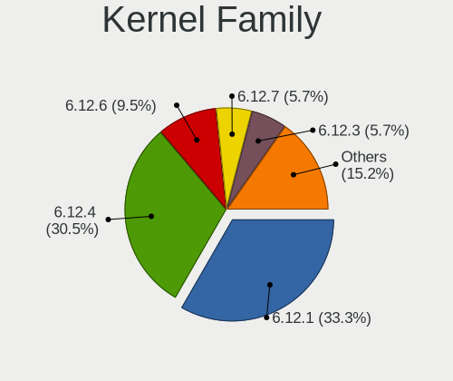
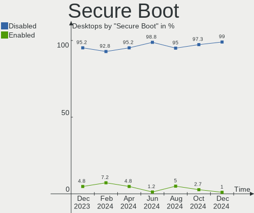
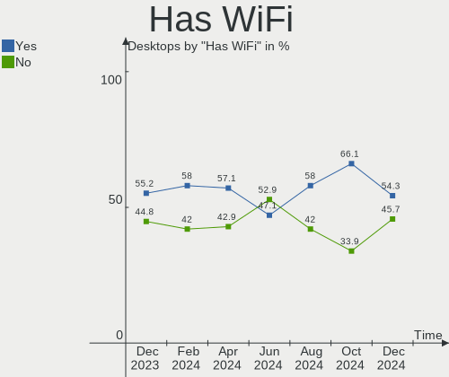
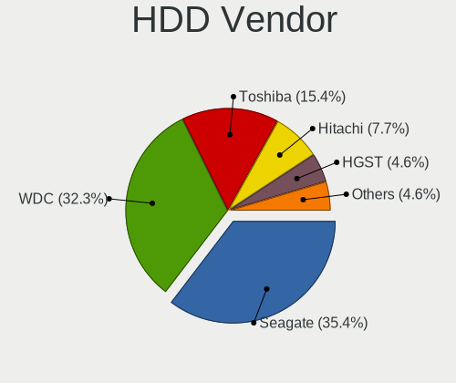
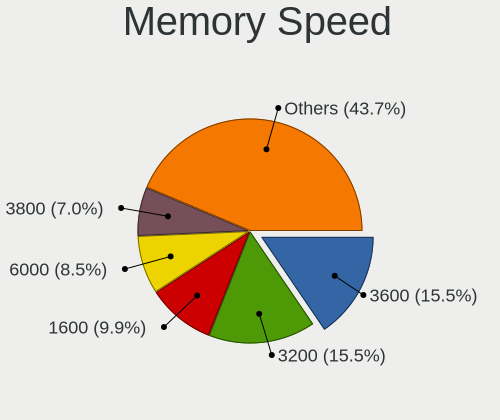

Arch - Hardware Trends (Desktops)
---------------------------------

A project to identify most popular hardware characteristics and track their change
over time based on data collected by Linux users at https://Linux-Hardware.org.

Anyone can contribute to this report by the [hw-probe](https://github.com/linuxhw/hw-probe) tool:

    sudo -E hw-probe -all -upload

This report is for one last month. Overall report since the beginning of time: [TestDays](https://github.com/linuxhw/TestDays)

Period: Oct, 2023.

Contents
--------

* [ System ](#system)
  - [ OS                       ](#os)
  - [ OS Family                ](#os-family)
  - [ Kernel                   ](#kernel)
  - [ Kernel Family            ](#kernel-family)
  - [ Kernel Major Ver.        ](#kernel-major-ver)
  - [ Arch                     ](#arch)
  - [ DE                       ](#de)
  - [ Display Server           ](#display-server)
  - [ Display Manager          ](#display-manager)
  - [ OS Lang                  ](#os-lang)
  - [ Boot Mode                ](#boot-mode)
  - [ Filesystem               ](#filesystem)
  - [ Part. scheme             ](#part-scheme)
  - [ Dual Boot with Linux/BSD ](#dual-boot-with-linuxbsd)
  - [ Dual Boot (Win)          ](#dual-boot-win)

* [ Board ](#board)
  - [ Vendor                   ](#vendor)
  - [ Model                    ](#model)
  - [ Model Family             ](#model-family)
  - [ MFG Year                 ](#mfg-year)
  - [ Form Factor              ](#form-factor)
  - [ Secure Boot              ](#secure-boot)
  - [ Coreboot                 ](#coreboot)
  - [ RAM Size                 ](#ram-size)
  - [ RAM Used                 ](#ram-used)
  - [ Total Drives             ](#total-drives)
  - [ Has CD-ROM               ](#has-cd-rom)
  - [ Has Ethernet             ](#has-ethernet)
  - [ Has WiFi                 ](#has-wifi)
  - [ Has Bluetooth            ](#has-bluetooth)

* [ Location ](#location)
  - [ Country                  ](#country)
  - [ City                     ](#city)

* [ Drives ](#drives)
  - [ Drive Vendor             ](#drive-vendor)
  - [ Drive Model              ](#drive-model)
  - [ HDD Vendor               ](#hdd-vendor)
  - [ SSD Vendor               ](#ssd-vendor)
  - [ Drive Kind               ](#drive-kind)
  - [ Drive Connector          ](#drive-connector)
  - [ Drive Size               ](#drive-size)
  - [ Space Total              ](#space-total)
  - [ Space Used               ](#space-used)
  - [ Malfunc. Drives          ](#malfunc-drives)
  - [ Malfunc. Drive Vendor    ](#malfunc-drive-vendor)
  - [ Malfunc. HDD Vendor      ](#malfunc-hdd-vendor)
  - [ Malfunc. Drive Kind      ](#malfunc-drive-kind)
  - [ Failed Drives            ](#failed-drives)
  - [ Failed Drive Vendor      ](#failed-drive-vendor)
  - [ Drive Status             ](#drive-status)

* [ Storage controller ](#storage-controller)
  - [ Storage Vendor           ](#storage-vendor)
  - [ Storage Model            ](#storage-model)
  - [ Storage Kind             ](#storage-kind)

* [ Processor ](#processor)
  - [ CPU Vendor               ](#cpu-vendor)
  - [ CPU Model                ](#cpu-model)
  - [ CPU Model Family         ](#cpu-model-family)
  - [ CPU Cores                ](#cpu-cores)
  - [ CPU Sockets              ](#cpu-sockets)
  - [ CPU Threads              ](#cpu-threads)
  - [ CPU Op-Modes             ](#cpu-op-modes)
  - [ CPU Microcode            ](#cpu-microcode)
  - [ CPU Microarch            ](#cpu-microarch)

* [ Graphics ](#graphics)
  - [ GPU Vendor               ](#gpu-vendor)
  - [ GPU Model                ](#gpu-model)
  - [ GPU Combo                ](#gpu-combo)
  - [ GPU Driver               ](#gpu-driver)
  - [ GPU Memory               ](#gpu-memory)

* [ Monitor ](#monitor)
  - [ Monitor Vendor           ](#monitor-vendor)
  - [ Monitor Model            ](#monitor-model)
  - [ Monitor Resolution       ](#monitor-resolution)
  - [ Monitor Diagonal         ](#monitor-diagonal)
  - [ Monitor Width            ](#monitor-width)
  - [ Aspect Ratio             ](#aspect-ratio)
  - [ Monitor Area             ](#monitor-area)
  - [ Pixel Density            ](#pixel-density)
  - [ Multiple Monitors        ](#multiple-monitors)

* [ Network ](#network)
  - [ Net Controller Vendor    ](#net-controller-vendor)
  - [ Net Controller Model     ](#net-controller-model)
  - [ Wireless Vendor          ](#wireless-vendor)
  - [ Wireless Model           ](#wireless-model)
  - [ Ethernet Vendor          ](#ethernet-vendor)
  - [ Ethernet Model           ](#ethernet-model)
  - [ Net Controller Kind      ](#net-controller-kind)
  - [ Used Controller          ](#used-controller)
  - [ NICs                     ](#nics)
  - [ IPv6                     ](#ipv6)

* [ Bluetooth ](#bluetooth)
  - [ Bluetooth Vendor         ](#bluetooth-vendor)
  - [ Bluetooth Model          ](#bluetooth-model)

* [ Sound ](#sound)
  - [ Sound Vendor             ](#sound-vendor)
  - [ Sound Model              ](#sound-model)

* [ Memory ](#memory)
  - [ Memory Vendor            ](#memory-vendor)
  - [ Memory Model             ](#memory-model)
  - [ Memory Kind              ](#memory-kind)
  - [ Memory Form Factor       ](#memory-form-factor)
  - [ Memory Size              ](#memory-size)
  - [ Memory Speed             ](#memory-speed)

* [ Printers & scanners ](#printers--scanners)
  - [ Printer Vendor           ](#printer-vendor)
  - [ Printer Model            ](#printer-model)
  - [ Scanner Vendor           ](#scanner-vendor)
  - [ Scanner Model            ](#scanner-model)

* [ Camera ](#camera)
  - [ Camera Vendor            ](#camera-vendor)
  - [ Camera Model             ](#camera-model)

* [ Security ](#security)
  - [ Fingerprint Vendor       ](#fingerprint-vendor)
  - [ Fingerprint Model        ](#fingerprint-model)
  - [ Chipcard Vendor          ](#chipcard-vendor)
  - [ Chipcard Model           ](#chipcard-model)

* [ Unsupported ](#unsupported)
  - [ Unsupported Devices      ](#unsupported-devices)
  - [ Unsupported Device Types ](#unsupported-device-types)

System
------

OS
--

Installed operating systems

| Name         | Desktops | Percent |
|--------------|----------|---------|
| Arch Rolling | 87       | 100%    |

OS Family
---------

OS without a version

| Name | Desktops | Percent |
|------|----------|---------|
| Arch | 87       | 100%    |

Kernel
------

Version of the Linux kernel

| Version                       | Desktops | Percent |
|-------------------------------|----------|---------|
| 6.5.5-arch1-1                 | 14       | 16.09%  |
| 6.5.9-arch2-1                 | 13       | 14.94%  |
| 6.5.8-arch1-1                 | 12       | 13.79%  |
| 6.5.7-arch1-1                 | 11       | 12.64%  |
| 6.5.6-arch2-1                 | 5        | 5.75%   |
| 6.5.5-zen1-1-zen              | 5        | 5.75%   |
| 6.5.8-zen1-1-zen              | 4        | 4.6%    |
| 6.5.9-zen2-1-zen              | 3        | 3.45%   |
| 6.5.7-zen2-1-zen              | 3        | 3.45%   |
| 6.5.3-arch1-1                 | 2        | 2.3%    |
| 6.5.9-x64v2-xanmod1-1         | 1        | 1.15%   |
| 6.5.7-zen1-1-zen              | 1        | 1.15%   |
| 6.5.7-hardened1-1-hardened    | 1        | 1.15%   |
| 6.5.7-2-cachyos               | 1        | 1.15%   |
| 6.5.7-1-cachyos-z2            | 1        | 1.15%   |
| 6.5.6-zen2-1-zen              | 1        | 1.15%   |
| 6.5.6-273-tkg-pds             | 1        | 1.15%   |
| 6.5.6-273-tkg-bore-eevdf-llvm | 1        | 1.15%   |
| 6.5.4-arch2-1                 | 1        | 1.15%   |
| 6.4.12-arch1-1                | 1        | 1.15%   |
| 6.3.5-arch1-1                 | 1        | 1.15%   |
| 6.1.60-1-lts                  | 1        | 1.15%   |
| 6.1.55-1-lts                  | 1        | 1.15%   |
| 5.4.247-DFAUS                 | 1        | 1.15%   |
| 4.15.0-213-generic            | 1        | 1.15%   |

Kernel Family
-------------

Linux kernel without a distro release

| Version | Desktops | Percent |
|---------|----------|---------|
| 6.5.5   | 19       | 21.84%  |
| 6.5.7   | 18       | 20.69%  |
| 6.5.9   | 17       | 19.54%  |
| 6.5.8   | 16       | 18.39%  |
| 6.5.6   | 8        | 9.2%    |
| 6.5.3   | 2        | 2.3%    |
| 6.5.4   | 1        | 1.15%   |
| 6.4.12  | 1        | 1.15%   |
| 6.3.5   | 1        | 1.15%   |
| 6.1.60  | 1        | 1.15%   |
| 6.1.55  | 1        | 1.15%   |
| 5.4.247 | 1        | 1.15%   |
| 4.15.0  | 1        | 1.15%   |

Kernel Major Ver.
-----------------

Linux kernel major version

| Version | Desktops | Percent |
|---------|----------|---------|
| 6.5     | 81       | 93.1%   |
| 6.1     | 2        | 2.3%    |
| 6.4     | 1        | 1.15%   |
| 6.3     | 1        | 1.15%   |
| 5.4     | 1        | 1.15%   |
| 4.15    | 1        | 1.15%   |

Arch
----

OS architecture (x86_64, i586, etc.)

| Name   | Desktops | Percent |
|--------|----------|---------|
| x86_64 | 87       | 100%    |

DE
--

Desktop Environment

| Name                    | Desktops | Percent |
|-------------------------|----------|---------|
| KDE5                    | 38       | 43.68%  |
| GNOME                   | 23       | 26.44%  |
| Hyprland                | 6        | 6.9%    |
| Unknown                 | 6        | 6.9%    |
| XFCE                    | 5        | 5.75%   |
| i3                      | 4        | 4.6%    |
| LXQt                    | 2        | 2.3%    |
| Wayfire:wayfire:wlroots | 1        | 1.15%   |
| KDE                     | 1        | 1.15%   |
| awesome                 | 1        | 1.15%   |

Display Server
--------------

X11 or Wayland

| Name    | Desktops | Percent |
|---------|----------|---------|
| X11     | 47       | 54.02%  |
| Wayland | 30       | 34.48%  |
| Tty     | 6        | 6.9%    |
| Unknown | 4        | 4.6%    |

Display Manager
---------------

SDDM, LightDM, etc.

| Name    | Desktops | Percent |
|---------|----------|---------|
| SDDM    | 36       | 41.38%  |
| Unknown | 29       | 33.33%  |
| LightDM | 9        | 10.34%  |
| GDM     | 9        | 10.34%  |
| LY-DM   | 2        | 2.3%    |
| NODM    | 1        | 1.15%   |
| GREETD  | 1        | 1.15%   |

OS Lang
-------

Language

| Lang        | Desktops | Percent |
|-------------|----------|---------|
| en_US       | 37       | 42.53%  |
| en_GB       | 9        | 10.34%  |
| C           | 8        | 9.2%    |
| it_IT       | 7        | 8.05%   |
| de_DE       | 5        | 5.75%   |
| en_AU       | 3        | 3.45%   |
| ru_RU       | 2        | 2.3%    |
| es_ES       | 2        | 2.3%    |
| zh_TW       | 1        | 1.15%   |
| zh_CN       | 1        | 1.15%   |
| pt_BR       | 1        | 1.15%   |
| nl_NL       | 1        | 1.15%   |
| hu_HU       | 1        | 1.15%   |
| fr_FR       | 1        | 1.15%   |
| es_MX       | 1        | 1.15%   |
| es_DO       | 1        | 1.15%   |
| es_CO       | 1        | 1.15%   |
| en_US.utf-8 | 1        | 1.15%   |
| en_PT       | 1        | 1.15%   |
| en_IE       | 1        | 1.15%   |
| en_CA       | 1        | 1.15%   |
| Unknown     | 1        | 1.15%   |

Boot Mode
---------

EFI or BIOS

| Mode | Desktops | Percent |
|------|----------|---------|
| EFI  | 59       | 67.82%  |
| BIOS | 28       | 32.18%  |

Filesystem
----------

Type of filesystem

| Type    | Desktops | Percent |
|---------|----------|---------|
| Ext4    | 55       | 63.22%  |
| Btrfs   | 27       | 31.03%  |
| Overlay | 4        | 4.6%    |
| Xfs     | 1        | 1.15%   |

Part. scheme
------------

Scheme of partitioning

| Type    | Desktops | Percent |
|---------|----------|---------|
| GPT     | 64       | 73.56%  |
| Unknown | 19       | 21.84%  |
| MBR     | 4        | 4.6%    |

Dual Boot with Linux/BSD
------------------------

Hosting more than one Linux/BSD

| Dual boot | Desktops | Percent |
|-----------|----------|---------|
| No        | 69       | 79.31%  |
| Yes       | 18       | 20.69%  |

Dual Boot (Win)
---------------

Hosting Linux and Windows

| Dual boot | Desktops | Percent |
|-----------|----------|---------|
| No        | 53       | 60.92%  |
| Yes       | 34       | 39.08%  |

Board
-----

Vendor
------

Motherboard manufacturer

| Name                | Desktops | Percent |
|---------------------|----------|---------|
| ASUSTek Computer    | 23       | 26.44%  |
| Gigabyte Technology | 21       | 24.14%  |
| MSI                 | 19       | 21.84%  |
| Dell                | 5        | 5.75%   |
| ASRock              | 4        | 4.6%    |
| Hewlett-Packard     | 3        | 3.45%   |
| Lenovo              | 2        | 2.3%    |
| Acer                | 2        | 2.3%    |
| IP3 Tech            | 1        | 1.15%   |
| Fujitsu             | 1        | 1.15%   |
| Foxconn             | 1        | 1.15%   |
| ECS                 | 1        | 1.15%   |
| BY OEM              | 1        | 1.15%   |
| AZW                 | 1        | 1.15%   |
| Acidanthera         | 1        | 1.15%   |
| Unknown             | 1        | 1.15%   |

Model
-----

Motherboard model

| Name                                    | Desktops | Percent |
|-----------------------------------------|----------|---------|
| MSI MS-7D75                             | 2        | 2.3%    |
| MSI MS-7C95                             | 2        | 2.3%    |
| MSI MS-7C02                             | 2        | 2.3%    |
| MSI MS-7B89                             | 2        | 2.3%    |
| Gigabyte X570S AORUS PRO AX             | 2        | 2.3%    |
| Gigabyte B550M AORUS PRO-P              | 2        | 2.3%    |
| ASUS TUF Gaming X570-PLUS               | 2        | 2.3%    |
| ASUS All Series                         | 2        | 2.3%    |
| MSI MS-7E06                             | 1        | 1.15%   |
| MSI MS-7D78                             | 1        | 1.15%   |
| MSI MS-7D73                             | 1        | 1.15%   |
| MSI MS-7D20                             | 1        | 1.15%   |
| MSI MS-7C94                             | 1        | 1.15%   |
| MSI MS-7C80                             | 1        | 1.15%   |
| MSI MS-7C37                             | 1        | 1.15%   |
| MSI MS-7B79                             | 1        | 1.15%   |
| MSI MS-7A78                             | 1        | 1.15%   |
| MSI MS-7850                             | 1        | 1.15%   |
| MSI MS-7758                             | 1        | 1.15%   |
| Lenovo ThinkCentre M93p 10A8CTO1WW      | 1        | 1.15%   |
| Lenovo IdeaCentre G5 14IMB05 90N900G1ES | 1        | 1.15%   |
| IP3 Tech IB8                            | 1        | 1.15%   |
| HP Z240 SFF Workstation                 | 1        | 1.15%   |
| HP t620 Quad Core TC                    | 1        | 1.15%   |
| HP Pavilion Desktop TP01-0xxx           | 1        | 1.15%   |
| Gigabyte X570S AORUS ELITE AX           | 1        | 1.15%   |
| Gigabyte X570 GAMING X                  | 1        | 1.15%   |
| Gigabyte X570 AORUS ELITE               | 1        | 1.15%   |
| Gigabyte X470 AORUS ULTRA GAMING        | 1        | 1.15%   |
| Gigabyte H87-D3H                        | 1        | 1.15%   |
| Gigabyte H81M-DS2                       | 1        | 1.15%   |
| Gigabyte B660 AORUS MASTER DDR4         | 1        | 1.15%   |
| Gigabyte B650M AORUS ELITE AX           | 1        | 1.15%   |
| Gigabyte B650I AORUS ULTRA              | 1        | 1.15%   |
| Gigabyte B550I AORUS PRO AX             | 1        | 1.15%   |
| Gigabyte B550 AORUS ELITE AX V2         | 1        | 1.15%   |
| Gigabyte B450M DS3H V2                  | 1        | 1.15%   |
| Gigabyte B450M DS3H                     | 1        | 1.15%   |
| Gigabyte AX370M-Gaming 3                | 1        | 1.15%   |
| Gigabyte 970A-D3P                       | 1        | 1.15%   |

Model Family
------------

Motherboard model prefix

| Name                   | Desktops | Percent |
|------------------------|----------|---------|
| ASUS ROG               | 8        | 9.2%    |
| ASUS TUF               | 4        | 4.6%    |
| ASUS PRIME             | 4        | 4.6%    |
| Gigabyte X570S         | 3        | 3.45%   |
| MSI MS-7D75            | 2        | 2.3%    |
| MSI MS-7C95            | 2        | 2.3%    |
| MSI MS-7C02            | 2        | 2.3%    |
| MSI MS-7B89            | 2        | 2.3%    |
| Gigabyte X570          | 2        | 2.3%    |
| Gigabyte B550M         | 2        | 2.3%    |
| Gigabyte B450M         | 2        | 2.3%    |
| Dell Precision         | 2        | 2.3%    |
| Dell OptiPlex          | 2        | 2.3%    |
| ASUS All               | 2        | 2.3%    |
| MSI MS-7E06            | 1        | 1.15%   |
| MSI MS-7D78            | 1        | 1.15%   |
| MSI MS-7D73            | 1        | 1.15%   |
| MSI MS-7D20            | 1        | 1.15%   |
| MSI MS-7C94            | 1        | 1.15%   |
| MSI MS-7C80            | 1        | 1.15%   |
| MSI MS-7C37            | 1        | 1.15%   |
| MSI MS-7B79            | 1        | 1.15%   |
| MSI MS-7A78            | 1        | 1.15%   |
| MSI MS-7850            | 1        | 1.15%   |
| MSI MS-7758            | 1        | 1.15%   |
| Lenovo ThinkCentre     | 1        | 1.15%   |
| Lenovo IdeaCentre      | 1        | 1.15%   |
| IP3 Tech IB8           | 1        | 1.15%   |
| HP Z240                | 1        | 1.15%   |
| HP t620                | 1        | 1.15%   |
| HP Pavilion            | 1        | 1.15%   |
| Gigabyte X470          | 1        | 1.15%   |
| Gigabyte H87-D3H       | 1        | 1.15%   |
| Gigabyte H81M-DS2      | 1        | 1.15%   |
| Gigabyte B660          | 1        | 1.15%   |
| Gigabyte B650M         | 1        | 1.15%   |
| Gigabyte B650I         | 1        | 1.15%   |
| Gigabyte B550I         | 1        | 1.15%   |
| Gigabyte B550          | 1        | 1.15%   |
| Gigabyte AX370M-Gaming | 1        | 1.15%   |

MFG Year
--------

Motherboard manufacture year

| Year | Desktops | Percent |
|------|----------|---------|
| 2022 | 15       | 17.24%  |
| 2020 | 14       | 16.09%  |
| 2018 | 11       | 12.64%  |
| 2021 | 10       | 11.49%  |
| 2019 | 8        | 9.2%    |
| 2013 | 5        | 5.75%   |
| 2012 | 5        | 5.75%   |
| 2016 | 4        | 4.6%    |
| 2014 | 4        | 4.6%    |
| 2023 | 3        | 3.45%   |
| 2017 | 2        | 2.3%    |
| 2015 | 2        | 2.3%    |
| 2011 | 1        | 1.15%   |
| 2009 | 1        | 1.15%   |
| 2008 | 1        | 1.15%   |
| 2007 | 1        | 1.15%   |

Form Factor
-----------

Physical design of the computer

| Name    | Desktops | Percent |
|---------|----------|---------|
| Desktop | 87       | 100%    |

Secure Boot
-----------

Enabled or disabled

| State    | Desktops | Percent |
|----------|----------|---------|
| Disabled | 84       | 96.55%  |
| Enabled  | 3        | 3.45%   |

Coreboot
--------

Have coreboot on board

| Used | Desktops | Percent |
|------|----------|---------|
| No   | 86       | 98.85%  |
| Yes  | 1        | 1.15%   |

RAM Size
--------

Total RAM memory

| Size in GB  | Desktops | Percent |
|-------------|----------|---------|
| 16.01-24.0  | 33       | 37.93%  |
| 32.01-64.0  | 26       | 29.89%  |
| 64.01-256.0 | 8        | 9.2%    |
| 24.01-32.0  | 7        | 8.05%   |
| 4.01-8.0    | 6        | 6.9%    |
| 8.01-16.0   | 4        | 4.6%    |
| 3.01-4.0    | 2        | 2.3%    |
| 2.01-3.0    | 1        | 1.15%   |

RAM Used
--------

Used RAM memory

| Used GB    | Desktops | Percent |
|------------|----------|---------|
| 4.01-8.0   | 23       | 26.44%  |
| 3.01-4.0   | 17       | 19.54%  |
| 8.01-16.0  | 17       | 19.54%  |
| 2.01-3.0   | 12       | 13.79%  |
| 1.01-2.0   | 8        | 9.2%    |
| 16.01-24.0 | 4        | 4.6%    |
| 0.51-1.0   | 4        | 4.6%    |
| 24.01-32.0 | 1        | 1.15%   |
| 0.01-0.5   | 1        | 1.15%   |

Total Drives
------------

Number of drives on board

| Drives | Desktops | Percent |
|--------|----------|---------|
| 1      | 28       | 32.18%  |
| 3      | 22       | 25.29%  |
| 2      | 18       | 20.69%  |
| 4      | 9        | 10.34%  |
| 5      | 6        | 6.9%    |
| 0      | 2        | 2.3%    |
| 10     | 1        | 1.15%   |
| 8      | 1        | 1.15%   |

Has CD-ROM
----------

Has CD-ROM on board

| Presented | Desktops | Percent |
|-----------|----------|---------|
| No        | 69       | 79.31%  |
| Yes       | 18       | 20.69%  |

Has Ethernet
------------

Has Ethernet on board

| Presented | Desktops | Percent |
|-----------|----------|---------|
| Yes       | 86       | 98.85%  |
| No        | 1        | 1.15%   |

Has WiFi
--------

Has WiFi module

| Presented | Desktops | Percent |
|-----------|----------|---------|
| Yes       | 51       | 58.62%  |
| No        | 36       | 41.38%  |

Has Bluetooth
-------------

Has Bluetooth module

| Presented | Desktops | Percent |
|-----------|----------|---------|
| Yes       | 49       | 56.32%  |
| No        | 38       | 43.68%  |

Location
--------

Country
-------

Geographic location (country)

| Country            | Desktops | Percent |
|--------------------|----------|---------|
| USA                | 14       | 16.09%  |
| Italy              | 14       | 16.09%  |
| UK                 | 7        | 8.05%   |
| Germany            | 7        | 8.05%   |
| Spain              | 4        | 4.6%    |
| Russia             | 4        | 4.6%    |
| Brazil             | 4        | 4.6%    |
| Vietnam            | 3        | 3.45%   |
| Switzerland        | 2        | 2.3%    |
| Portugal           | 2        | 2.3%    |
| Netherlands        | 2        | 2.3%    |
| Australia          | 2        | 2.3%    |
| Argentina          | 2        | 2.3%    |
| Turkey             | 1        | 1.15%   |
| Taiwan             | 1        | 1.15%   |
| South Korea        | 1        | 1.15%   |
| New Zealand        | 1        | 1.15%   |
| Nepal              | 1        | 1.15%   |
| Mexico             | 1        | 1.15%   |
| Malaysia           | 1        | 1.15%   |
| Japan              | 1        | 1.15%   |
| Israel             | 1        | 1.15%   |
| Ireland            | 1        | 1.15%   |
| India              | 1        | 1.15%   |
| Hungary            | 1        | 1.15%   |
| France             | 1        | 1.15%   |
| Dominican Republic | 1        | 1.15%   |
| Colombia           | 1        | 1.15%   |
| China              | 1        | 1.15%   |
| Chile              | 1        | 1.15%   |
| Canada             | 1        | 1.15%   |
| Bulgaria           | 1        | 1.15%   |
| Brunei             | 1        | 1.15%   |

City
----

Geographic location (city)

| City                 | Desktops | Percent |
|----------------------|----------|---------|
| Ho Chi Minh City     | 3        | 3.45%   |
| Milan                | 2        | 2.3%    |
| Zurich               | 1        | 1.15%   |
| Zhongli District     | 1        | 1.15%   |
| Yukarikaraman        | 1        | 1.15%   |
| Yakima               | 1        | 1.15%   |
| Villata              | 1        | 1.15%   |
| Villa San Giovanni   | 1        | 1.15%   |
| Urk                  | 1        | 1.15%   |
| Turin                | 1        | 1.15%   |
| Tokyo                | 1        | 1.15%   |
| Tel Aviv             | 1        | 1.15%   |
| Sofia                | 1        | 1.15%   |
| Soemmerda            | 1        | 1.15%   |
| Scandolara Ravara    | 1        | 1.15%   |
| Sao Paulo            | 1        | 1.15%   |
| San Dimas            | 1        | 1.15%   |
| San Antonio de Areco | 1        | 1.15%   |
| Saalfeld             | 1        | 1.15%   |
| Roosendaal           | 1        | 1.15%   |
| Riverside            | 1        | 1.15%   |
| Renfrew              | 1        | 1.15%   |
| Redhill              | 1        | 1.15%   |
| Quilmes              | 1        | 1.15%   |
| Penza                | 1        | 1.15%   |
| Paris                | 1        | 1.15%   |
| Oeiras               | 1        | 1.15%   |
| Ocean Springs        | 1        | 1.15%   |
| Nettuno              | 1        | 1.15%   |
| Nagua                | 1        | 1.15%   |
| Mostoles             | 1        | 1.15%   |
| Moscow               | 1        | 1.15%   |
| Modugno              | 1        | 1.15%   |
| Milton               | 1        | 1.15%   |
| Melbourne            | 1        | 1.15%   |
| Manduria             | 1        | 1.15%   |
| Málaga              | 1        | 1.15%   |
| Madrid               | 1        | 1.15%   |
| Los Angeles          | 1        | 1.15%   |
| London               | 1        | 1.15%   |

Drives
------

Drive Vendor
------------

Hard drive vendors

| Vendor                       | Desktops | Drives | Percent |
|------------------------------|----------|--------|---------|
| Samsung Electronics          | 37       | 45     | 20.44%  |
| Seagate                      | 28       | 36     | 15.47%  |
| Sandisk                      | 19       | 21     | 10.5%   |
| WDC                          | 18       | 24     | 9.94%   |
| Micron/Crucial Technology    | 9        | 10     | 4.97%   |
| Crucial                      | 7        | 8      | 3.87%   |
| Phison Electronics           | 5        | 6      | 2.76%   |
| Kingston                     | 5        | 5      | 2.76%   |
| Toshiba                      | 4        | 5      | 2.21%   |
| Kingston Technology Company  | 4        | 4      | 2.21%   |
| Unknown                      | 3        | 3      | 1.66%   |
| SPCC                         | 3        | 4      | 1.66%   |
| Silicon Motion               | 3        | 3      | 1.66%   |
| Intel                        | 3        | 3      | 1.66%   |
| China                        | 3        | 3      | 1.66%   |
| Realtek Semiconductor        | 2        | 2      | 1.1%    |
| Micron Technology            | 2        | 2      | 1.1%    |
| ADATA Technology             | 2        | 2      | 1.1%    |
| A-DATA Technology            | 2        | 2      | 1.1%    |
| Unknown                      | 2        | 2      | 1.1%    |
| ZTC                          | 1        | 1      | 0.55%   |
| XrayDisk                     | 1        | 1      | 0.55%   |
| Verbatim                     | 1        | 1      | 0.55%   |
| Team                         | 1        | 1      | 0.55%   |
| SK hynix                     | 1        | 1      | 0.55%   |
| Shenzhen Longsys Electronics | 1        | 1      | 0.55%   |
| QNAP                         | 1        | 6      | 0.55%   |
| Phison                       | 1        | 1      | 0.55%   |
| OCZ-VERTEX3                  | 1        | 1      | 0.55%   |
| KingSpec                     | 1        | 1      | 0.55%   |
| Intenso                      | 1        | 1      | 0.55%   |
| Hitachi                      | 1        | 1      | 0.55%   |
| HGST                         | 1        | 1      | 0.55%   |
| GK                           | 1        | 1      | 0.55%   |
| General                      | 1        | 1      | 0.55%   |
| Corsair                      | 1        | 2      | 0.55%   |
| Beijing Starblaze Technology | 1        | 1      | 0.55%   |
| ASMedia                      | 1        | 1      | 0.55%   |
| AOSENKE                      | 1        | 1      | 0.55%   |
| Acer                         | 1        | 1      | 0.55%   |

Drive Model
-----------

Hard drive models

| Model                                                             | Desktops | Percent |
|-------------------------------------------------------------------|----------|---------|
| Samsung NVMe SSD Controller SM981/PM981/PM983 1TB                 | 10       | 4.88%   |
| Micron/Crucial P2 NVMe PCIe SSD 500GB                             | 7        | 3.41%   |
| Seagate ST1000DM010-2EP102 1TB                                    | 5        | 2.44%   |
| Samsung SSD 980 1TB                                               | 5        | 2.44%   |
| Samsung SSD 860 EVO 500GB                                         | 4        | 1.95%   |
| Samsung NVMe SSD Controller PM9A1/PM9A3/980PRO 1TB                | 4        | 1.95%   |
| Toshiba DT01ACA100 1TB                                            | 3        | 1.46%   |
| Phison E16 PCIe4 NVMe Controller 500GB                            | 3        | 1.46%   |
| Kingston SA400S37240G 240GB SSD                                   | 3        | 1.46%   |
| Intel SSD 660P Series 1024GB                                      | 3        | 1.46%   |
| SPCC Solid State Disk 512GB                                       | 2        | 0.98%   |
| Silicon Motion SM2263EN/SM2263XT SSD Controller 256GB             | 2        | 0.98%   |
| Seagate ST4000DM004-2CV104 4TB                                    | 2        | 0.98%   |
| Seagate ST2000LM003 HN-M201RAD 2TB                                | 2        | 0.98%   |
| Seagate ST2000DM001-1ER164 2TB                                    | 2        | 0.98%   |
| Sandisk WD_BLACK SN770 1TB                                        | 2        | 0.98%   |
| Sandisk WD Black SN850 1TB                                        | 2        | 0.98%   |
| Sandisk WD Black SN750 / PC SN730 NVMe SSD 1024GB                 | 2        | 0.98%   |
| SanDisk SDSSDP128G 128GB                                          | 2        | 0.98%   |
| Samsung SSD 980 500GB                                             | 2        | 0.98%   |
| Samsung SSD 850 EVO 500GB                                         | 2        | 0.98%   |
| Samsung SSD 850 EVO 250GB                                         | 2        | 0.98%   |
| Realtek ADATA SX6000LNP 512GB                                     | 2        | 0.98%   |
| Kingston Company SNV2S2000G 2TB                                   | 2        | 0.98%   |
| Kingston Company A2000 NVMe SSD 250GB                             | 2        | 0.98%   |
| Crucial CT4000MX500SSD1 4TB                                       | 2        | 0.98%   |
| Crucial CT1000BX500SSD1 1TB                                       | 2        | 0.98%   |
| ADATA XPG SX8200 Pro PCIe Gen3x4 M.2 2280 Solid State Drive 512GB | 2        | 0.98%   |
| Unknown                                                           | 2        | 0.98%   |
| ZTC SSD 128GB                                                     | 1        | 0.49%   |
| XrayDisk SSD 128GB                                                | 1        | 0.49%   |
| WDC WDS500G2B0A-00SM50 500GB SSD                                  | 1        | 0.49%   |
| WDC WDS480G2G0B-00EPW0 480GB SSD                                  | 1        | 0.49%   |
| WDC WDS200T2B0A-00SM50 2TB SSD                                    | 1        | 0.49%   |
| WDC WDS120G1G0A-00SS50 120GB SSD                                  | 1        | 0.49%   |
| WDC WD80EMAZ-00WJTA0 8TB                                          | 1        | 0.49%   |
| WDC WD60EDAZ-11U78B0 6TB                                          | 1        | 0.49%   |
| WDC WD5000LPVX-22V0TT0 500GB                                      | 1        | 0.49%   |
| WDC WD5000HHTZ-04N21V0 500GB                                      | 1        | 0.49%   |
| WDC WD40EZRZ-00GXCB0 4TB                                          | 1        | 0.49%   |

HDD Vendor
----------

Hard disk drive vendors

| Vendor  | Desktops | Drives | Percent |
|---------|----------|--------|---------|
| Seagate | 28       | 36     | 56%     |
| WDC     | 15       | 19     | 30%     |
| Toshiba | 4        | 5      | 8%      |
| QNAP    | 1        | 6      | 2%      |
| Hitachi | 1        | 1      | 2%      |
| HGST    | 1        | 1      | 2%      |

SSD Vendor
----------

Solid state drive vendors

| Vendor              | Desktops | Drives | Percent |
|---------------------|----------|--------|---------|
| Samsung Electronics | 19       | 20     | 31.15%  |
| SanDisk             | 7        | 8      | 11.48%  |
| Crucial             | 6        | 6      | 9.84%   |
| WDC                 | 5        | 5      | 8.2%    |
| Kingston            | 5        | 5      | 8.2%    |
| SPCC                | 3        | 4      | 4.92%   |
| China               | 3        | 3      | 4.92%   |
| A-DATA Technology   | 2        | 2      | 3.28%   |
| ZTC                 | 1        | 1      | 1.64%   |
| XrayDisk            | 1        | 1      | 1.64%   |
| Verbatim            | 1        | 1      | 1.64%   |
| Team                | 1        | 1      | 1.64%   |
| OCZ-VERTEX3         | 1        | 1      | 1.64%   |
| KingSpec            | 1        | 1      | 1.64%   |
| Intenso             | 1        | 1      | 1.64%   |
| Corsair             | 1        | 2      | 1.64%   |
| AOSENKE             | 1        | 1      | 1.64%   |
| Acer                | 1        | 1      | 1.64%   |
| Unknown             | 1        | 1      | 1.64%   |

Drive Kind
----------

HDD or SSD

| Kind    | Desktops | Drives | Percent |
|---------|----------|--------|---------|
| NVMe    | 56       | 79     | 38.36%  |
| SSD     | 46       | 65     | 31.51%  |
| HDD     | 40       | 68     | 27.4%   |
| Unknown | 3        | 3      | 2.05%   |
| MMC     | 1        | 1      | 0.68%   |

Drive Connector
---------------

SATA, SAS, NVMe, etc.

| Type | Desktops | Drives | Percent |
|------|----------|--------|---------|
| SATA | 63       | 130    | 50%     |
| NVMe | 56       | 79     | 44.44%  |
| SAS  | 6        | 6      | 4.76%   |
| MMC  | 1        | 1      | 0.79%   |

Drive Size
----------

Size of hard drive

| Size in TB | Desktops | Drives | Percent |
|------------|----------|--------|---------|
| 0.01-0.5   | 36       | 50     | 36.36%  |
| 0.51-1.0   | 29       | 43     | 29.29%  |
| 1.01-2.0   | 15       | 17     | 15.15%  |
| 3.01-4.0   | 9        | 12     | 9.09%   |
| 4.01-10.0  | 5        | 5      | 5.05%   |
| 10.01-20.0 | 3        | 4      | 3.03%   |
| 2.01-3.0   | 2        | 2      | 2.02%   |

Space Total
-----------

Amount of disk space available on the file system

| Size in GB     | Desktops | Percent |
|----------------|----------|---------|
| More than 3000 | 23       | 26.44%  |
| 501-1000       | 15       | 17.24%  |
| 251-500        | 13       | 14.94%  |
| 1001-2000      | 13       | 14.94%  |
| 101-250        | 10       | 11.49%  |
| 2001-3000      | 7        | 8.05%   |
| Unknown        | 5        | 5.75%   |
| 51-100         | 1        | 1.15%   |

Space Used
----------

Amount of used disk space

| Used GB        | Desktops | Percent |
|----------------|----------|---------|
| 1-20           | 14       | 16.09%  |
| 501-1000       | 13       | 14.94%  |
| More than 3000 | 11       | 12.64%  |
| 1001-2000      | 10       | 11.49%  |
| 51-100         | 10       | 11.49%  |
| 251-500        | 9        | 10.34%  |
| 101-250        | 8        | 9.2%    |
| Unknown        | 5        | 5.75%   |
| 2001-3000      | 4        | 4.6%    |
| 21-50          | 3        | 3.45%   |

Malfunc. Drives
---------------

Drive models with a malfunction

| Model                                                          | Desktops | Drives | Percent |
|----------------------------------------------------------------|----------|--------|---------|
| XrayDisk SSD 128GB                                             | 1        | 1      | 7.69%   |
| WDC WD60EDAZ-11U78B0 6TB                                       | 1        | 1      | 7.69%   |
| WDC WD5000HHTZ-04N21V0 500GB                                   | 1        | 1      | 7.69%   |
| Toshiba DT01ACA100 1TB                                         | 1        | 1      | 7.69%   |
| Seagate ST8000DM004-2CX188 8TB                                 | 1        | 1      | 7.69%   |
| Seagate ST3000DM008-2DM166 3TB                                 | 1        | 1      | 7.69%   |
| Seagate ST1000LM024 HN-M101MBB 1TB                             | 1        | 1      | 7.69%   |
| Seagate ST1000DM010-2EP102 1TB                                 | 1        | 1      | 7.69%   |
| Samsung Electronics SSD 980 1TB                                | 1        | 1      | 7.69%   |
| Samsung Electronics SSD 870 EVO 2TB                            | 1        | 1      | 7.69%   |
| Samsung Electronics NVMe SSD Controller PM9A1/PM9A3/980PRO 1TB | 1        | 1      | 7.69%   |
| Kingston SKC400S371T 1TB SSD                                   | 1        | 1      | 7.69%   |
| China SATA3 2TB SSD                                            | 1        | 1      | 7.69%   |

Malfunc. Drive Vendor
---------------------

Vendors of faulty drives

| Vendor              | Desktops | Drives | Percent |
|---------------------|----------|--------|---------|
| Seagate             | 4        | 4      | 30.77%  |
| Samsung Electronics | 3        | 3      | 23.08%  |
| WDC                 | 2        | 2      | 15.38%  |
| XrayDisk            | 1        | 1      | 7.69%   |
| Toshiba             | 1        | 1      | 7.69%   |
| Kingston            | 1        | 1      | 7.69%   |
| China               | 1        | 1      | 7.69%   |

Malfunc. HDD Vendor
-------------------

Vendors of faulty HDD drives

| Vendor  | Desktops | Drives | Percent |
|---------|----------|--------|---------|
| Seagate | 4        | 4      | 57.14%  |
| WDC     | 2        | 2      | 28.57%  |
| Toshiba | 1        | 1      | 14.29%  |

Malfunc. Drive Kind
-------------------

Kinds of faulty drives

| Kind | Desktops | Drives | Percent |
|------|----------|--------|---------|
| HDD  | 6        | 7      | 50%     |
| SSD  | 4        | 4      | 33.33%  |
| NVMe | 2        | 2      | 16.67%  |

Failed Drives
-------------

Failed drive models

Zero info for selected period =(

Failed Drive Vendor
-------------------

Failed drive vendors

Zero info for selected period =(

Drive Status
------------

Number of failed and malfunc. drives

| Status   | Desktops | Drives | Percent |
|----------|----------|--------|---------|
| Works    | 59       | 135    | 57.84%  |
| Detected | 33       | 68     | 32.35%  |
| Malfunc  | 10       | 13     | 9.8%    |

Storage controller
------------------

Storage Vendor
--------------

Storage controller vendors

| Vendor                       | Desktops | Percent |
|------------------------------|----------|---------|
| AMD                          | 44       | 26.83%  |
| Intel                        | 42       | 25.61%  |
| Samsung Electronics          | 23       | 14.02%  |
| SanDisk                      | 12       | 7.32%   |
| Micron/Crucial Technology    | 10       | 6.1%    |
| ASMedia Technology           | 8        | 4.88%   |
| Phison Electronics           | 6        | 3.66%   |
| Kingston Technology Company  | 4        | 2.44%   |
| Silicon Motion               | 2        | 1.22%   |
| Realtek Semiconductor        | 2        | 1.22%   |
| Micron Technology            | 2        | 1.22%   |
| INNOGRIT                     | 2        | 1.22%   |
| ADATA Technology             | 2        | 1.22%   |
| Transcend                    | 1        | 0.61%   |
| SK hynix                     | 1        | 0.61%   |
| Shenzhen Longsys Electronics | 1        | 0.61%   |
| JMicron Technology           | 1        | 0.61%   |
| Beijing Starblaze Technology | 1        | 0.61%   |

Storage Model
-------------

Storage controller models

| Model                                                                          | Desktops | Percent |
|--------------------------------------------------------------------------------|----------|---------|
| AMD FCH SATA Controller [AHCI mode]                                            | 26       | 14.05%  |
| AMD 500 Series Chipset SATA Controller                                         | 13       | 7.03%   |
| Samsung NVMe SSD Controller SM981/PM981/PM983                                  | 10       | 5.41%   |
| AMD 400 Series Chipset SATA Controller                                         | 10       | 5.41%   |
| Samsung NVMe SSD Controller 980 (DRAM-less)                                    | 8        | 4.32%   |
| Micron/Crucial P2 [Nick P2] / P3 / P3 Plus NVMe PCIe SSD (DRAM-less)           | 7        | 3.78%   |
| ASMedia ASM1062 Serial ATA Controller                                          | 6        | 3.24%   |
| Intel 8 Series/C220 Series Chipset Family 6-port SATA Controller 1 [AHCI mode] | 5        | 2.7%    |
| Samsung NVMe SSD Controller PM9A1/PM9A3/980PRO                                 | 4        | 2.16%   |
| Intel Q170/Q150/B150/H170/H110/Z170/CM236 Chipset SATA Controller [AHCI Mode]  | 4        | 2.16%   |
| Intel 700 Series Chipset Family SATA AHCI Controller                           | 4        | 2.16%   |
| SanDisk WD Black SN770 / PC SN740 256GB / PC SN560 (DRAM-less) NVMe SSD        | 3        | 1.62%   |
| Phison E16 PCIe4 NVMe Controller                                               | 3        | 1.62%   |
| Intel SSD 660P Series                                                          | 3        | 1.62%   |
| Intel 7 Series/C210 Series Chipset Family 6-port SATA Controller [AHCI mode]   | 3        | 1.62%   |
| Intel 500 Series Chipset Family SATA AHCI Controller                           | 3        | 1.62%   |
| Intel 200 Series PCH SATA controller [AHCI mode]                               | 3        | 1.62%   |
| Silicon Motion SM2263EN/SM2263XT (DRAM-less) NVMe SSD Controllers              | 2        | 1.08%   |
| SanDisk WD PC SN810 / Black SN850 NVMe SSD                                     | 2        | 1.08%   |
| SanDisk WD Green SN350 240GB (DRAM-less) / SN560E NVMe SSD                     | 2        | 1.08%   |
| SanDisk Ultra 3D / WD Blue SN570 NVMe SSD (DRAM-less)                          | 2        | 1.08%   |
| SanDisk Extreme Pro / WD Black SN750 / PC SN730 / Red SN700 NVMe SSD           | 2        | 1.08%   |
| Micron/Crucial P1 NVMe PCIe SSD[Frampton]                                      | 2        | 1.08%   |
| Kingston Company NV2 NVMe SSD SM2267XT                                         | 2        | 1.08%   |
| Kingston Company A2000 NVMe SSD SM2263EN                                       | 2        | 1.08%   |
| Intel Volume Management Device NVMe RAID Controller Intel Corporation          | 2        | 1.08%   |
| Intel SATA Controller [RAID mode]                                              | 2        | 1.08%   |
| Intel NM10/ICH7 Family SATA Controller [IDE mode]                              | 2        | 1.08%   |
| Intel Cannon Lake PCH SATA AHCI Controller                                     | 2        | 1.08%   |
| Intel Alder Lake-S PCH SATA Controller [AHCI Mode]                             | 2        | 1.08%   |
| Intel 6 Series/C200 Series Chipset Family 6 port Desktop SATA AHCI Controller  | 2        | 1.08%   |
| INNOGRIT NVMe SSD Controller IG5236                                            | 2        | 1.08%   |
| ASMedia 1064 SATA Controller                                                   | 2        | 1.08%   |
| AMD X370 Series Chipset SATA Controller                                        | 2        | 1.08%   |
| AMD SB7x0/SB8x0/SB9x0 SATA Controller [AHCI mode]                              | 2        | 1.08%   |
| ADATA XPG SX8200 Pro PCIe Gen3x4 M.2 2280 Solid State Drive                    | 2        | 1.08%   |
| Transcend NVMe PCIe SSD 110S/112S/120S/MTE300S/MTE400S/MTE652T2 (DRAM-less)    | 1        | 0.54%   |
| SK hynix Platinum P41/PC801 NVMe Solid State Drive                             | 1        | 0.54%   |
| Shenzhen Longsys Lexar NM610 PRO NVME SSD (DRAM-less)                          | 1        | 0.54%   |
| SanDisk Ultra 3D / WD Blue SN550 NVMe SSD                                      | 1        | 0.54%   |

Storage Kind
------------

Kind of storage controller (IDE, SATA, NVMe, SAS, ...)

| Kind | Desktops | Percent |
|------|----------|---------|
| SATA | 78       | 54.17%  |
| NVMe | 55       | 38.19%  |
| RAID | 6        | 4.17%   |
| IDE  | 5        | 3.47%   |

Processor
---------

CPU Vendor
----------

Processor vendors

| Vendor | Desktops | Percent |
|--------|----------|---------|
| AMD    | 46       | 52.87%  |
| Intel  | 41       | 47.13%  |

CPU Model
---------

Processor models

| Model                                       | Desktops | Percent |
|---------------------------------------------|----------|---------|
| AMD Ryzen 5 5600X 6-Core Processor          | 7        | 8.05%   |
| AMD Ryzen 5 3600 6-Core Processor           | 5        | 5.75%   |
| AMD Ryzen 7 3700X 8-Core Processor          | 4        | 4.6%    |
| AMD Ryzen 7 5800X 8-Core Processor          | 3        | 3.45%   |
| AMD Ryzen 5 5600G with Radeon Graphics      | 3        | 3.45%   |
| Intel Core i5-6400 CPU @ 2.70GHz            | 2        | 2.3%    |
| Intel Core i5-10400F CPU @ 2.90GHz          | 2        | 2.3%    |
| Intel Core i5-10400 CPU @ 2.90GHz           | 2        | 2.3%    |
| Intel 13th Gen Core i9-13900K               | 2        | 2.3%    |
| AMD Ryzen 9 7900X 12-Core Processor         | 2        | 2.3%    |
| AMD Ryzen 7 7800X3D 8-Core Processor        | 2        | 2.3%    |
| AMD Ryzen 7 5800X3D 8-Core Processor        | 2        | 2.3%    |
| AMD Ryzen 7 2700X Eight-Core Processor      | 2        | 2.3%    |
| Intel Xeon CPU X3480 @ 3.07GHz              | 1        | 1.15%   |
| Intel Xeon CPU E5-2690 v3 @ 2.60GHz         | 1        | 1.15%   |
| Intel Xeon CPU E3-1270 v3 @ 3.50GHz         | 1        | 1.15%   |
| Intel Xeon CPU E3-1246 v3 @ 3.50GHz         | 1        | 1.15%   |
| Intel Xeon CPU E3-1245 v5 @ 3.50GHz         | 1        | 1.15%   |
| Intel Xeon CPU E3-1225 v5 @ 3.30GHz         | 1        | 1.15%   |
| Intel Pentium Dual-Core CPU E5400 @ 2.70GHz | 1        | 1.15%   |
| Intel Pentium Dual CPU E2200 @ 2.20GHz      | 1        | 1.15%   |
| Intel Pentium CPU G3250 @ 3.20GHz           | 1        | 1.15%   |
| Intel Pentium CPU G3220 @ 3.00GHz           | 1        | 1.15%   |
| Intel N100                                  | 1        | 1.15%   |
| Intel Core i9-9900X CPU @ 3.50GHz           | 1        | 1.15%   |
| Intel Core i9-10850K CPU @ 3.60GHz          | 1        | 1.15%   |
| Intel Core i7-9700F CPU @ 3.00GHz           | 1        | 1.15%   |
| Intel Core i7-8700 CPU @ 3.20GHz            | 1        | 1.15%   |
| Intel Core i7-7700K CPU @ 4.20GHz           | 1        | 1.15%   |
| Intel Core i7-7700 CPU @ 3.60GHz            | 1        | 1.15%   |
| Intel Core i7-4770 CPU @ 3.40GHz            | 1        | 1.15%   |
| Intel Core i7-3770K CPU @ 3.50GHz           | 1        | 1.15%   |
| Intel Core i7-3770 CPU @ 3.40GHz            | 1        | 1.15%   |
| Intel Core i7-1065G7 CPU @ 1.30GHz          | 1        | 1.15%   |
| Intel Core i5-9400F CPU @ 2.90GHz           | 1        | 1.15%   |
| Intel Core i5-6600K CPU @ 3.50GHz           | 1        | 1.15%   |
| Intel Core i5-4440 CPU @ 3.10GHz            | 1        | 1.15%   |
| Intel Core i5-3570 CPU @ 3.40GHz            | 1        | 1.15%   |
| Intel Core i5-3350P CPU @ 3.10GHz           | 1        | 1.15%   |
| Intel Core i5-2400 CPU @ 3.10GHz            | 1        | 1.15%   |

CPU Model Family
----------------

Processor model prefix

| Model                   | Desktops | Percent |
|-------------------------|----------|---------|
| AMD Ryzen 5             | 20       | 22.99%  |
| AMD Ryzen 7             | 17       | 19.54%  |
| Intel Core i5           | 12       | 13.79%  |
| Other                   | 9        | 10.34%  |
| Intel Core i7           | 8        | 9.2%    |
| Intel Xeon              | 6        | 6.9%    |
| AMD Ryzen 9             | 4        | 4.6%    |
| Intel Pentium           | 2        | 2.3%    |
| Intel Core i9           | 2        | 2.3%    |
| AMD FX                  | 2        | 2.3%    |
| Intel Pentium Dual-Core | 1        | 1.15%   |
| Intel Pentium Dual      | 1        | 1.15%   |
| Intel Core i3           | 1        | 1.15%   |
| AMD Ryzen 3             | 1        | 1.15%   |
| AMD GX                  | 1        | 1.15%   |

CPU Cores
---------

Number of processor cores

| Number | Desktops | Percent |
|--------|----------|---------|
| 6      | 26       | 29.89%  |
| 4      | 22       | 25.29%  |
| 8      | 21       | 24.14%  |
| 2      | 6        | 6.9%    |
| 12     | 4        | 4.6%    |
| 24     | 3        | 3.45%   |
| 16     | 2        | 2.3%    |
| 10     | 2        | 2.3%    |
| 14     | 1        | 1.15%   |

CPU Sockets
-----------

Number of sockets

| Number | Desktops | Percent |
|--------|----------|---------|
| 1      | 87       | 100%    |

CPU Threads
-----------

Threads per core (Hyper-Threading)

| Number | Desktops | Percent |
|--------|----------|---------|
| 2      | 69       | 79.31%  |
| 1      | 18       | 20.69%  |

CPU Op-Modes
------------

CPU Operation Modes (32-bit, 64-bit)

| Op mode        | Desktops | Percent |
|----------------|----------|---------|
| 32-bit, 64-bit | 87       | 100%    |

CPU Microcode
-------------

Microcode number

| Number     | Desktops | Percent |
|------------|----------|---------|
| Unknown    | 51       | 58.62%  |
| 0x0a601203 | 7        | 8.05%   |
| 0x0a20120a | 4        | 4.6%    |
| 0x08701030 | 4        | 4.6%    |
| 0x0a50000d | 2        | 2.3%    |
| 0x0a201025 | 2        | 2.3%    |
| 0x0a201009 | 2        | 2.3%    |
| 0x08701021 | 2        | 2.3%    |
| 0x08701013 | 2        | 2.3%    |
| 0x0800820d | 2        | 2.3%    |
| 0x06000852 | 2        | 2.3%    |
| 0x906ea    | 1        | 1.15%   |
| 0x306c3    | 1        | 1.15%   |
| 0x0a20120e | 1        | 1.15%   |
| 0x0a201016 | 1        | 1.15%   |
| 0x08108109 | 1        | 1.15%   |
| 0x08001138 | 1        | 1.15%   |
| 0x0701a001 | 1        | 1.15%   |

CPU Microarch
-------------

Microarchitecture

| Name             | Desktops | Percent |
|------------------|----------|---------|
| Zen 3            | 18       | 20.69%  |
| Unknown          | 11       | 12.64%  |
| Zen 2            | 10       | 11.49%  |
| Haswell          | 7        | 8.05%   |
| Skylake          | 6        | 6.9%    |
| Zen+             | 5        | 5.75%   |
| KabyLake         | 5        | 5.75%   |
| CometLake        | 5        | 5.75%   |
| IvyBridge        | 4        | 4.6%    |
| Alderlake Hybrid | 4        | 4.6%    |
| SandyBridge      | 2        | 2.3%    |
| Piledriver       | 2        | 2.3%    |
| IceLake          | 2        | 2.3%    |
| Zen              | 1        | 1.15%   |
| Penryn           | 1        | 1.15%   |
| Nehalem          | 1        | 1.15%   |
| Jaguar           | 1        | 1.15%   |
| Gracemont        | 1        | 1.15%   |
| Core             | 1        | 1.15%   |

Graphics
--------

GPU Vendor
----------

Vendors of graphics cards

| Vendor | Desktops | Percent |
|--------|----------|---------|
| Nvidia | 43       | 43.88%  |
| AMD    | 35       | 35.71%  |
| Intel  | 20       | 20.41%  |

GPU Model
---------

Graphics card models

| Model                                                                       | Desktops | Percent |
|-----------------------------------------------------------------------------|----------|---------|
| Nvidia GP108 [GeForce GT 1030]                                              | 5        | 4.81%   |
| AMD Raphael                                                                 | 5        | 4.81%   |
| AMD Ellesmere [Radeon RX 470/480/570/570X/580/580X/590]                     | 5        | 4.81%   |
| AMD Navi 23 [Radeon RX 6650 XT / 6700S / 6800S]                             | 4        | 3.85%   |
| AMD Navi 22 [Radeon RX 6700/6700 XT/6750 XT / 6800M/6850M XT]               | 4        | 3.85%   |
| Nvidia TU117 [GeForce GTX 1650]                                             | 3        | 2.88%   |
| Nvidia GA104 [GeForce RTX 3070]                                             | 3        | 2.88%   |
| Nvidia GA104 [GeForce RTX 3070 Ti]                                          | 3        | 2.88%   |
| Intel Xeon E3-1200 v3/4th Gen Core Processor Integrated Graphics Controller | 3        | 2.88%   |
| AMD Navi 31 [Radeon RX 7900 XT/7900 XTX]                                    | 3        | 2.88%   |
| AMD Navi 24 [Radeon RX 6400/6500 XT/6500M]                                  | 3        | 2.88%   |
| AMD Navi 21 [Radeon RX 6800/6800 XT / 6900 XT]                              | 3        | 2.88%   |
| AMD Cezanne [Radeon Vega Series / Radeon Vega Mobile Series]                | 3        | 2.88%   |
| Nvidia TU116 [GeForce GTX 1660 Ti]                                          | 2        | 1.92%   |
| Nvidia GP107 [GeForce GTX 1050 Ti]                                          | 2        | 1.92%   |
| Nvidia GP104 [GeForce GTX 1080]                                             | 2        | 1.92%   |
| Nvidia GP104 [GeForce GTX 1070]                                             | 2        | 1.92%   |
| Nvidia GM107 [GeForce GTX 750 Ti]                                           | 2        | 1.92%   |
| Nvidia GA106 [GeForce RTX 3060]                                             | 2        | 1.92%   |
| Nvidia AD104 [GeForce RTX 4070]                                             | 2        | 1.92%   |
| Nvidia AD102 [GeForce RTX 4090]                                             | 2        | 1.92%   |
| Intel Raptor Lake-S GT1 [UHD Graphics 770]                                  | 2        | 1.92%   |
| Intel CometLake-S GT2 [UHD Graphics 630]                                    | 2        | 1.92%   |
| Intel 2nd Generation Core Processor Family Integrated Graphics Controller   | 2        | 1.92%   |
| AMD Navi 23 [Radeon RX 6600/6600 XT/6600M]                                  | 2        | 1.92%   |
| AMD Navi 21 [Radeon RX 6950 XT]                                             | 2        | 1.92%   |
| Nvidia TU116 [GeForce GTX 1660 SUPER]                                       | 1        | 0.96%   |
| Nvidia TU116 [GeForce GTX 1650 SUPER]                                       | 1        | 0.96%   |
| Nvidia TU106 [GeForce RTX 2060 Rev. A]                                      | 1        | 0.96%   |
| Nvidia TU104GL [Quadro RTX 5000]                                            | 1        | 0.96%   |
| Nvidia TU104 [GeForce RTX 2070 SUPER]                                       | 1        | 0.96%   |
| Nvidia GP107 [GeForce GTX 1050]                                             | 1        | 0.96%   |
| Nvidia GM206 [GeForce GTX 960]                                              | 1        | 0.96%   |
| Nvidia GM204GL [Quadro M4000]                                               | 1        | 0.96%   |
| Nvidia GM200 [GeForce GTX TITAN X]                                          | 1        | 0.96%   |
| Nvidia GK106 [GeForce GTX 660]                                              | 1        | 0.96%   |
| Nvidia GF119 [GeForce GT 620 OEM]                                           | 1        | 0.96%   |
| Nvidia GF108 [GeForce GT 440]                                               | 1        | 0.96%   |
| Nvidia GA106 [GeForce RTX 3060 Lite Hash Rate]                              | 1        | 0.96%   |
| Nvidia GA104 [GeForce RTX 3060 Ti]                                          | 1        | 0.96%   |

GPU Combo
---------

Combinations of graphics cards

| Name           | Desktops | Percent |
|----------------|----------|---------|
| 1 x Nvidia     | 36       | 41.38%  |
| 1 x AMD        | 23       | 26.44%  |
| 1 x Intel      | 13       | 14.94%  |
| 2 x AMD        | 5        | 5.75%   |
| AMD + Nvidia   | 4        | 4.6%    |
| Intel + AMD    | 3        | 3.45%   |
| Intel + Nvidia | 2        | 2.3%    |
| 2 x Nvidia     | 1        | 1.15%   |

GPU Driver
----------

Free vs proprietary

| Driver      | Desktops | Percent |
|-------------|----------|---------|
| Free        | 49       | 56.32%  |
| Proprietary | 34       | 39.08%  |
| Unknown     | 4        | 4.6%    |

GPU Memory
----------

Total video memory

| Size in GB | Desktops | Percent |
|------------|----------|---------|
| Unknown    | 29       | 33.33%  |
| 7.01-8.0   | 19       | 21.84%  |
| 8.01-16.0  | 12       | 13.79%  |
| 3.01-4.0   | 11       | 12.64%  |
| 1.01-2.0   | 8        | 9.2%    |
| 16.01-24.0 | 3        | 3.45%   |
| 5.01-6.0   | 2        | 2.3%    |
| 0.51-1.0   | 2        | 2.3%    |
| 2.01-3.0   | 1        | 1.15%   |

Monitor
-------

Monitor Vendor
--------------

Monitor vendors

| Vendor               | Desktops | Percent |
|----------------------|----------|---------|
| Goldstar             | 14       | 13.59%  |
| Dell                 | 14       | 13.59%  |
| Samsung Electronics  | 10       | 9.71%   |
| Philips              | 8        | 7.77%   |
| Acer                 | 7        | 6.8%    |
| Hewlett-Packard      | 5        | 4.85%   |
| BenQ                 | 5        | 4.85%   |
| AOC                  | 4        | 3.88%   |
| ViewSonic            | 3        | 2.91%   |
| MSI                  | 3        | 2.91%   |
| Lenovo               | 3        | 2.91%   |
| Ancor Communications | 3        | 2.91%   |
| Unknown              | 2        | 1.94%   |
| Sony                 | 2        | 1.94%   |
| Iiyama               | 2        | 1.94%   |
| HUAWEI               | 2        | 1.94%   |
| ASUSTek Computer     | 2        | 1.94%   |
| ___                  | 1        | 0.97%   |
| UGD                  | 1        | 0.97%   |
| Toshiba              | 1        | 0.97%   |
| SKG                  | 1        | 0.97%   |
| Sceptre Tech         | 1        | 0.97%   |
| Mi                   | 1        | 0.97%   |
| KTC                  | 1        | 0.97%   |
| ITE                  | 1        | 0.97%   |
| Insignia             | 1        | 0.97%   |
| HKC                  | 1        | 0.97%   |
| Gigabyte Technology  | 1        | 0.97%   |
| ASRock               | 1        | 0.97%   |
| AGO                  | 1        | 0.97%   |
| Unknown              | 1        | 0.97%   |

Monitor Model
-------------

Monitor models

| Model                                                             | Desktops | Percent |
|-------------------------------------------------------------------|----------|---------|
| Dell SE198WFP DELF004 1440x900 408x255mm 18.9-inch                | 3        | 2.8%    |
| Goldstar ULTRAGEAR GSM5B7F 2560x1440 597x336mm 27.0-inch          | 2        | 1.87%   |
| Goldstar LG IPS FULLHD GSM5AB8 1920x1080 480x270mm 21.7-inch      | 2        | 1.87%   |
| Goldstar HDR 4K GSM7707 3840x2160 600x340mm 27.2-inch             | 2        | 1.87%   |
| ___ LCD TV ___9000 1360x768                                       | 1        | 0.93%   |
| ViewSonic VX2476 Series VSCD332 1920x1080 527x296mm 23.8-inch     | 1        | 0.93%   |
| ViewSonic VP3881 VSCE234 3840x1600 880x367mm 37.5-inch            | 1        | 0.93%   |
| ViewSonic VA2465 SERIES VSCB730 1920x1080 521x293mm 23.5-inch     | 1        | 0.93%   |
| Unknown LCDTV16 9000 1360x768 1600x900mm 72.3-inch                | 1        | 0.93%   |
| Unknown LCD Monitor XXX Union TV 1920x1080                        | 1        | 0.93%   |
| UGD Artist 12 UGD1106 1920x1080 256x144mm 11.6-inch               | 1        | 0.93%   |
| Toshiba TV TSB0106 1366x768                                       | 1        | 0.93%   |
| Sony TV XV SNY8300 1920x1080                                      | 1        | 0.93%   |
| Sony TV SNYE903 1920x1080                                         | 1        | 0.93%   |
| SKG AF27H1 SKG2722 1920x1080 600x330mm 27.0-inch                  | 1        | 0.93%   |
| Sceptre Tech E225W-1920 SPT08D5 1920x1080 443x249mm 20.0-inch     | 1        | 0.93%   |
| Samsung Electronics U28E590 SAM0C4C 3840x2160 608x345mm 27.5-inch | 1        | 0.93%   |
| Samsung Electronics T24B530 SAM0947 1920x1080 531x299mm 24.0-inch | 1        | 0.93%   |
| Samsung Electronics T22B300 SAM092D 1920x1080 477x268mm 21.5-inch | 1        | 0.93%   |
| Samsung Electronics S24D330 SAM0D92 1920x1080 530x300mm 24.0-inch | 1        | 0.93%   |
| Samsung Electronics S24C450 SAM09CF 1920x1200 518x324mm 24.1-inch | 1        | 0.93%   |
| Samsung Electronics S23B550 SAM0919 1920x1080 510x290mm 23.1-inch | 1        | 0.93%   |
| Samsung Electronics LF22T35 SAM707B 1920x1080 477x268mm 21.5-inch | 1        | 0.93%   |
| Samsung Electronics LCD Monitor LS27AG32x 1920x1080               | 1        | 0.93%   |
| Samsung Electronics C27HG7x SAM0E16 2560x1440 598x336mm 27.0-inch | 1        | 0.93%   |
| Samsung Electronics C27F390 SAM0D32 1920x1080 598x336mm 27.0-inch | 1        | 0.93%   |
| Philips PHL 345B1C PHL093D 3440x1440 797x334mm 34.0-inch          | 1        | 0.93%   |
| Philips PHL 288E2 PHLC231 3840x2160 621x341mm 27.9-inch           | 1        | 0.93%   |
| Philips PHL 246V5 PHLC0C5 1920x1080 531x299mm 24.0-inch           | 1        | 0.93%   |
| Philips PHL 245E1 PHLC20B 1920x1080 527x296mm 23.8-inch           | 1        | 0.93%   |
| Philips PHL 242M8 PHLC253 1920x1080 527x296mm 23.8-inch           | 1        | 0.93%   |
| Philips PHL 223V5 PHLC0CF 1920x1080 477x268mm 21.5-inch           | 1        | 0.93%   |
| Philips 222E PHLC051 1920x1080 476x268mm 21.5-inch                | 1        | 0.93%   |
| Philips 221V PHL0888 1920x1080 477x268mm 21.5-inch                | 1        | 0.93%   |
| Philips 190X5 PHLC00E 1280x1024 376x301mm 19.0-inch               | 1        | 0.93%   |
| MSI MAG322CQRV MSI3DA4 2560x1440 700x390mm 31.5-inch              | 1        | 0.93%   |
| MSI MAG241C MSI3EA2 1920x1080 520x290mm 23.4-inch                 | 1        | 0.93%   |
| MSI G241V E2 MSI3BA7 1920x1080 527x296mm 23.8-inch                | 1        | 0.93%   |
| Mi Monitor XMI23C3 1920x1080 527x293mm 23.7-inch                  | 1        | 0.93%   |
| Lenovo LEN T24i-20 LEN61F7 1920x1080 527x296mm 23.8-inch          | 1        | 0.93%   |

Monitor Resolution
------------------

Monitor screen resolution

| Resolution        | Desktops | Percent |
|-------------------|----------|---------|
| 1920x1080 (FHD)   | 49       | 52.13%  |
| 2560x1440 (QHD)   | 16       | 17.02%  |
| 3840x2160 (4K)    | 11       | 11.7%   |
| 1440x900 (WXGA+)  | 4        | 4.26%   |
| 3440x1440         | 3        | 3.19%   |
| 1280x1024 (SXGA)  | 3        | 3.19%   |
| 3840x1600         | 2        | 2.13%   |
| 2560x1080         | 1        | 1.06%   |
| 1920x540          | 1        | 1.06%   |
| 1920x1200 (WUXGA) | 1        | 1.06%   |
| 1600x900 (HD+)    | 1        | 1.06%   |
| 1366x768 (WXGA)   | 1        | 1.06%   |
| 1360x768          | 1        | 1.06%   |

Monitor Diagonal
----------------

Diagonal size in inches

| Inches  | Desktops | Percent |
|---------|----------|---------|
| 27      | 21       | 21.43%  |
| 24      | 19       | 19.39%  |
| 23      | 12       | 12.24%  |
| 21      | 12       | 12.24%  |
| 19      | 6        | 6.12%   |
| Unknown | 4        | 4.08%   |
| 72      | 3        | 3.06%   |
| 34      | 3        | 3.06%   |
| 31      | 3        | 3.06%   |
| 40      | 2        | 2.04%   |
| 37      | 2        | 2.04%   |
| 32      | 2        | 2.04%   |
| 28      | 2        | 2.04%   |
| 84      | 1        | 1.02%   |
| 49      | 1        | 1.02%   |
| 47      | 1        | 1.02%   |
| 20      | 1        | 1.02%   |
| 18      | 1        | 1.02%   |
| 12      | 1        | 1.02%   |
| 11      | 1        | 1.02%   |

Monitor Width
-------------

Physical width

| Width in mm | Desktops | Percent |
|-------------|----------|---------|
| 501-600     | 44       | 47.31%  |
| 401-500     | 17       | 18.28%  |
| 601-700     | 8        | 8.6%    |
| 701-800     | 5        | 5.38%   |
| 801-900     | 4        | 4.3%    |
| 1501-2000   | 4        | 4.3%    |
| Unknown     | 4        | 4.3%    |
| 351-400     | 3        | 3.23%   |
| 201-300     | 2        | 2.15%   |
| 1001-1500   | 2        | 2.15%   |

Aspect Ratio
------------

Proportional relationship between the width and the height

| Ratio   | Desktops | Percent |
|---------|----------|---------|
| 16/9    | 63       | 76.83%  |
| 21/9    | 6        | 7.32%   |
| 16/10   | 6        | 7.32%   |
| 5/4     | 3        | 3.66%   |
| Unknown | 3        | 3.66%   |
| 4/3     | 1        | 1.22%   |

Monitor Area
------------

Area in inch²

| Area in inch² | Desktops | Percent |
|----------------|----------|---------|
| 201-250        | 36       | 36.73%  |
| 301-350        | 21       | 21.43%  |
| 351-500        | 9        | 9.18%   |
| 151-200        | 9        | 9.18%   |
| 251-300        | 6        | 6.12%   |
| More than 1000 | 5        | 5.1%    |
| 501-1000       | 5        | 5.1%    |
| Unknown        | 4        | 4.08%   |
| 71-80          | 1        | 1.02%   |
| 51-60          | 1        | 1.02%   |
| 141-150        | 1        | 1.02%   |

Pixel Density
-------------

Pixels per inch

| Density | Desktops | Percent |
|---------|----------|---------|
| 51-100  | 44       | 49.44%  |
| 101-120 | 28       | 31.46%  |
| 161-240 | 5        | 5.62%   |
| 1-50    | 4        | 4.49%   |
| 121-160 | 4        | 4.49%   |
| Unknown | 4        | 4.49%   |

Multiple Monitors
-----------------

Total monitors connected

| Total | Desktops | Percent |
|-------|----------|---------|
| 1     | 57       | 65.52%  |
| 2     | 20       | 22.99%  |
| 3     | 6        | 6.9%    |
| 0     | 4        | 4.6%    |

Network
-------

Net Controller Vendor
---------------------

Controller vendors

| Vendor                | Desktops | Percent |
|-----------------------|----------|---------|
| Realtek Semiconductor | 58       | 45.67%  |
| Intel                 | 41       | 32.28%  |
| MediaTek              | 13       | 10.24%  |
| Qualcomm Atheros      | 5        | 3.94%   |
| Microsoft             | 2        | 1.57%   |
| Broadcom              | 2        | 1.57%   |
| TP-Link               | 1        | 0.79%   |
| Sitecom Europe        | 1        | 0.79%   |
| Motorola PCS          | 1        | 0.79%   |
| Microchip Technology  | 1        | 0.79%   |
| ICS Advent            | 1        | 0.79%   |
| Emulex                | 1        | 0.79%   |

Net Controller Model
--------------------

Controller models

| Model                                                             | Desktops | Percent |
|-------------------------------------------------------------------|----------|---------|
| Realtek RTL8111/8168/8411 PCI Express Gigabit Ethernet Controller | 38       | 25.5%   |
| Realtek RTL8125 2.5GbE Controller                                 | 15       | 10.07%  |
| Intel Ethernet Controller I225-V                                  | 11       | 7.38%   |
| MediaTek MT7921K (RZ608) Wi-Fi 6E 80MHz                           | 8        | 5.37%   |
| Intel Wi-Fi 6 AX200                                               | 5        | 3.36%   |
| MediaTek MT7922 802.11ax PCI Express Wireless Network Adapter     | 4        | 2.68%   |
| Intel I211 Gigabit Network Connection                             | 4        | 2.68%   |
| Intel 700 Series Chipset Family Wi-Fi                             | 4        | 2.68%   |
| Intel Wireless-AC 9260                                            | 3        | 2.01%   |
| Intel Ethernet Controller I226-V                                  | 3        | 2.01%   |
| Realtek RTL8822CE 802.11ac PCIe Wireless Network Adapter          | 2        | 1.34%   |
| Realtek RTL8192EE PCIe Wireless Network Adapter                   | 2        | 1.34%   |
| Realtek 802.11ac NIC                                              | 2        | 1.34%   |
| Qualcomm Atheros Killer E2400 Gigabit Ethernet Controller         | 2        | 1.34%   |
| Microsoft Xbox Wireless Adapter for Windows                       | 2        | 1.34%   |
| Intel Ethernet Connection I217-LM                                 | 2        | 1.34%   |
| Intel Ethernet Connection (2) I219-V                              | 2        | 1.34%   |
| Intel Ethernet Connection (2) I219-LM                             | 2        | 1.34%   |
| Intel Dual Band Wireless-AC 3168NGW [Stone Peak]                  | 2        | 1.34%   |
| TP-Link Archer T2U PLUS [RTL8821AU]                               | 1        | 0.67%   |
| Sitecom Europe WL-608 Wireless USB Adapter 54g                    | 1        | 0.67%   |
| Realtek RTL88x2bu [AC1200 Techkey]                                | 1        | 0.67%   |
| Realtek RTL8821CE 802.11ac PCIe Wireless Network Adapter          | 1        | 0.67%   |
| Realtek RTL8821AE 802.11ac PCIe Wireless Network Adapter          | 1        | 0.67%   |
| Realtek RTL8812AE 802.11ac PCIe Wireless Network Adapter          | 1        | 0.67%   |
| Realtek RTL8192CE PCIe Wireless Network Adapter                   | 1        | 0.67%   |
| Realtek RTL8153 Gigabit Ethernet Adapter                          | 1        | 0.67%   |
| Realtek RTL810xE PCI Express Fast Ethernet controller             | 1        | 0.67%   |
| Realtek RTL-8110SC/8169SC Gigabit Ethernet                        | 1        | 0.67%   |
| Qualcomm Atheros QCA9377 802.11ac Wireless Network Adapter        | 1        | 0.67%   |
| Qualcomm Atheros Killer E2500 Gigabit Ethernet Controller         | 1        | 0.67%   |
| Qualcomm Atheros Attansic L2 Fast Ethernet                        | 1        | 0.67%   |
| Qualcomm Atheros AR93xx Wireless Network Adapter                  | 1        | 0.67%   |
| Motorola PCS motorola one macro                                   | 1        | 0.67%   |
| Microchip HTC Hub Controller                                      | 1        | 0.67%   |
| MediaTek MT7921 802.11ax PCI Express Wireless Network Adapter     | 1        | 0.67%   |
| Intel Wireless 7265                                               | 1        | 0.67%   |
| Intel Wi-Fi 6 AX210/AX211/AX411 160MHz                            | 1        | 0.67%   |
| Intel Ice Lake-LP PCH CNVi WiFi                                   | 1        | 0.67%   |
| Intel I350 Gigabit Network Connection                             | 1        | 0.67%   |

Wireless Vendor
---------------

Wireless vendors

| Vendor                | Desktops | Percent |
|-----------------------|----------|---------|
| Intel                 | 19       | 37.25%  |
| MediaTek              | 13       | 25.49%  |
| Realtek Semiconductor | 11       | 21.57%  |
| Qualcomm Atheros      | 2        | 3.92%   |
| Microsoft             | 2        | 3.92%   |
| Broadcom              | 2        | 3.92%   |
| TP-Link               | 1        | 1.96%   |
| Sitecom Europe        | 1        | 1.96%   |

Wireless Model
--------------

Wireless models

| Model                                                         | Desktops | Percent |
|---------------------------------------------------------------|----------|---------|
| MediaTek MT7921K (RZ608) Wi-Fi 6E 80MHz                       | 8        | 15.69%  |
| Intel Wi-Fi 6 AX200                                           | 5        | 9.8%    |
| MediaTek MT7922 802.11ax PCI Express Wireless Network Adapter | 4        | 7.84%   |
| Intel 700 Series Chipset Family Wi-Fi                         | 4        | 7.84%   |
| Intel Wireless-AC 9260                                        | 3        | 5.88%   |
| Realtek RTL8822CE 802.11ac PCIe Wireless Network Adapter      | 2        | 3.92%   |
| Realtek RTL8192EE PCIe Wireless Network Adapter               | 2        | 3.92%   |
| Realtek 802.11ac NIC                                          | 2        | 3.92%   |
| Microsoft Xbox Wireless Adapter for Windows                   | 2        | 3.92%   |
| Intel Dual Band Wireless-AC 3168NGW [Stone Peak]              | 2        | 3.92%   |
| TP-Link Archer T2U PLUS [RTL8821AU]                           | 1        | 1.96%   |
| Sitecom Europe WL-608 Wireless USB Adapter 54g                | 1        | 1.96%   |
| Realtek RTL88x2bu [AC1200 Techkey]                            | 1        | 1.96%   |
| Realtek RTL8821CE 802.11ac PCIe Wireless Network Adapter      | 1        | 1.96%   |
| Realtek RTL8821AE 802.11ac PCIe Wireless Network Adapter      | 1        | 1.96%   |
| Realtek RTL8812AE 802.11ac PCIe Wireless Network Adapter      | 1        | 1.96%   |
| Realtek RTL8192CE PCIe Wireless Network Adapter               | 1        | 1.96%   |
| Qualcomm Atheros QCA9377 802.11ac Wireless Network Adapter    | 1        | 1.96%   |
| Qualcomm Atheros AR93xx Wireless Network Adapter              | 1        | 1.96%   |
| MediaTek MT7921 802.11ax PCI Express Wireless Network Adapter | 1        | 1.96%   |
| Intel Wireless 7265                                           | 1        | 1.96%   |
| Intel Wi-Fi 6 AX210/AX211/AX411 160MHz                        | 1        | 1.96%   |
| Intel Ice Lake-LP PCH CNVi WiFi                               | 1        | 1.96%   |
| Intel Comet Lake PCH CNVi WiFi                                | 1        | 1.96%   |
| Intel Alder Lake-S PCH CNVi WiFi                              | 1        | 1.96%   |
| Broadcom BCM4360 802.11ac Dual Band Wireless Network Adapter  | 1        | 1.96%   |
| Broadcom BCM43228 802.11a/b/g/n                               | 1        | 1.96%   |

Ethernet Vendor
---------------

Ethernet vendors

| Vendor                | Desktops | Percent |
|-----------------------|----------|---------|
| Realtek Semiconductor | 55       | 59.14%  |
| Intel                 | 31       | 33.33%  |
| Qualcomm Atheros      | 4        | 4.3%    |
| Motorola PCS          | 1        | 1.08%   |
| ICS Advent            | 1        | 1.08%   |
| Emulex                | 1        | 1.08%   |

Ethernet Model
--------------

Ethernet models

| Model                                                             | Desktops | Percent |
|-------------------------------------------------------------------|----------|---------|
| Realtek RTL8111/8168/8411 PCI Express Gigabit Ethernet Controller | 38       | 39.18%  |
| Realtek RTL8125 2.5GbE Controller                                 | 15       | 15.46%  |
| Intel Ethernet Controller I225-V                                  | 11       | 11.34%  |
| Intel I211 Gigabit Network Connection                             | 4        | 4.12%   |
| Intel Ethernet Controller I226-V                                  | 3        | 3.09%   |
| Qualcomm Atheros Killer E2400 Gigabit Ethernet Controller         | 2        | 2.06%   |
| Intel Ethernet Connection I217-LM                                 | 2        | 2.06%   |
| Intel Ethernet Connection (2) I219-V                              | 2        | 2.06%   |
| Intel Ethernet Connection (2) I219-LM                             | 2        | 2.06%   |
| Realtek RTL8153 Gigabit Ethernet Adapter                          | 1        | 1.03%   |
| Realtek RTL810xE PCI Express Fast Ethernet controller             | 1        | 1.03%   |
| Realtek RTL-8110SC/8169SC Gigabit Ethernet                        | 1        | 1.03%   |
| Qualcomm Atheros Killer E2500 Gigabit Ethernet Controller         | 1        | 1.03%   |
| Qualcomm Atheros Attansic L2 Fast Ethernet                        | 1        | 1.03%   |
| Motorola PCS motorola one macro                                   | 1        | 1.03%   |
| Intel I350 Gigabit Network Connection                             | 1        | 1.03%   |
| Intel Ethernet Connection I217-V                                  | 1        | 1.03%   |
| Intel Ethernet Connection (7) I219-V                              | 1        | 1.03%   |
| Intel Ethernet Connection (5) I219-LM                             | 1        | 1.03%   |
| Intel Ethernet Connection (17) I219-V                             | 1        | 1.03%   |
| Intel Ethernet Connection (14) I219-V                             | 1        | 1.03%   |
| Intel 82599ES 10-Gigabit SFI/SFP+ Network Connection              | 1        | 1.03%   |
| Intel 82580 Gigabit Network Connection                            | 1        | 1.03%   |
| Intel 82579V Gigabit Network Connection                           | 1        | 1.03%   |
| Intel 82579LM Gigabit Network Connection (Lewisville)             | 1        | 1.03%   |
| ICS Advent 10/100M LAN                                            | 1        | 1.03%   |
| Emulex OneConnect 10Gb NIC (be3)                                  | 1        | 1.03%   |

Net Controller Kind
-------------------

Ethernet, WiFi or modem

| Kind     | Desktops | Percent |
|----------|----------|---------|
| Ethernet | 86       | 63.7%   |
| WiFi     | 48       | 35.56%  |
| Modem    | 1        | 0.74%   |

Used Controller
---------------

Currently used network controller

| Kind     | Desktops | Percent |
|----------|----------|---------|
| Ethernet | 67       | 77.01%  |
| WiFi     | 20       | 22.99%  |

NICs
----

Total network controllers on board

| Total | Desktops | Percent |
|-------|----------|---------|
| 2     | 39       | 44.83%  |
| 1     | 39       | 44.83%  |
| 3     | 4        | 4.6%    |
| 4     | 3        | 3.45%   |
| 5     | 1        | 1.15%   |
| 0     | 1        | 1.15%   |

IPv6
----

IPv6 vs IPv4

| Used | Desktops | Percent |
|------|----------|---------|
| No   | 73       | 83.91%  |
| Yes  | 14       | 16.09%  |

Bluetooth
---------

Bluetooth Vendor
----------------

Controller vendors

| Vendor                          | Desktops | Percent |
|---------------------------------|----------|---------|
| Intel                           | 20       | 40%     |
| MediaTek                        | 13       | 26%     |
| Realtek Semiconductor           | 6        | 12%     |
| Cambridge Silicon Radio         | 5        | 10%     |
| IMC Networks                    | 2        | 4%      |
| Qualcomm Atheros Communications | 1        | 2%      |
| Lite-On Technology              | 1        | 2%      |
| HTC (High Tech Computer)        | 1        | 2%      |
| Broadcom                        | 1        | 2%      |

Bluetooth Model
---------------

Controller models

| Model                                                                | Desktops | Percent |
|----------------------------------------------------------------------|----------|---------|
| MediaTek Wireless_Device                                             | 13       | 26%     |
| Realtek Bluetooth Radio                                              | 5        | 10%     |
| Intel AX200 Bluetooth                                                | 5        | 10%     |
| Cambridge Silicon Radio Bluetooth Dongle (HCI mode)                  | 5        | 10%     |
| Intel AX201 Bluetooth                                                | 4        | 8%      |
| Intel Wireless-AC 9260 Bluetooth Adapter                             | 3        | 6%      |
| Intel Bluetooth Device                                               | 3        | 6%      |
| Intel Wireless-AC 3168 Bluetooth                                     | 2        | 4%      |
| Intel AX210 Bluetooth                                                | 2        | 4%      |
| Realtek  Bluetooth 4.2 Adapter                                       | 1        | 2%      |
| Qualcomm Atheros  Bluetooth Device                                   | 1        | 2%      |
| Lite-On Bluetooth Radio                                              | 1        | 2%      |
| Intel Bluetooth wireless interface                                   | 1        | 2%      |
| IMC Networks Wireless_Device                                         | 1        | 2%      |
| IMC Networks Bluetooth Radio                                         | 1        | 2%      |
| HTC (High Tech Computer) Vive Hub Bluetooth 4.1 (Broadcom BCM920703) | 1        | 2%      |
| Broadcom HP Portable Bumble Bee                                      | 1        | 2%      |

Sound
-----

Sound Vendor
------------

Sound card vendors

| Vendor                                          | Desktops | Percent |
|-------------------------------------------------|----------|---------|
| AMD                                             | 51       | 26.98%  |
| Nvidia                                          | 43       | 22.75%  |
| Intel                                           | 39       | 20.63%  |
| Texas Instruments                               | 5        | 2.65%   |
| Logitech                                        | 5        | 2.65%   |
| ASUSTek Computer                                | 4        | 2.12%   |
| Micro Star International                        | 3        | 1.59%   |
| Focusrite-Novation                              | 3        | 1.59%   |
| C-Media Electronics                             | 3        | 1.59%   |
| Blue Microphones                                | 3        | 1.59%   |
| SteelSeries ApS                                 | 2        | 1.06%   |
| Samson Technologies                             | 2        | 1.06%   |
| RODE Microphones                                | 2        | 1.06%   |
| Razer USA                                       | 2        | 1.06%   |
| Kingston Technology                             | 2        | 1.06%   |
| GYROCOM C&C                                     | 2        | 1.06%   |
| Generalplus Technology                          | 2        | 1.06%   |
| Creative Technology                             | 2        | 1.06%   |
| Trust                                           | 1        | 0.53%   |
| Thesycon Systemsoftware & Consulting            | 1        | 0.53%   |
| Ploopy                                          | 1        | 0.53%   |
| Licensed by Sony Computer Entertainment America | 1        | 0.53%   |
| JMTek                                           | 1        | 0.53%   |
| Honda Tsushin Kogyo                             | 1        | 0.53%   |
| GN Netcom                                       | 1        | 0.53%   |
| Giga-Byte Technology                            | 1        | 0.53%   |
| FiiO Electronics Technology                     | 1        | 0.53%   |
| DSEA A/S                                        | 1        | 0.53%   |
| Dell                                            | 1        | 0.53%   |
| Creative Labs                                   | 1        | 0.53%   |
| Astro Gaming                                    | 1        | 0.53%   |
| AKAI Professional M.I.                          | 1        | 0.53%   |

Sound Model
-----------

Sound card models

| Model                                                                      | Desktops | Percent |
|----------------------------------------------------------------------------|----------|---------|
| AMD Starship/Matisse HD Audio Controller                                   | 25       | 11.06%  |
| AMD Navi 21/23 HDMI/DP Audio Controller                                    | 18       | 7.96%   |
| AMD Family 17h/19h HD Audio Controller                                     | 10       | 4.42%   |
| Nvidia GA104 High Definition Audio Controller                              | 7        | 3.1%    |
| AMD Rembrandt Radeon High Definition Audio Controller                      | 6        | 2.65%   |
| Nvidia GP108 High Definition Audio Controller                              | 5        | 2.21%   |
| Intel 100 Series/C230 Series Chipset Family HD Audio Controller            | 5        | 2.21%   |
| AMD Family 17h (Models 00h-0fh) HD Audio Controller                        | 5        | 2.21%   |
| AMD Ellesmere HDMI Audio [Radeon RX 470/480 / 570/580/590]                 | 5        | 2.21%   |
| Texas Instruments PCM2902 Audio Codec                                      | 4        | 1.77%   |
| Nvidia TU116 High Definition Audio Controller                              | 4        | 1.77%   |
| Nvidia GP104 High Definition Audio Controller                              | 4        | 1.77%   |
| Intel Xeon E3-1200 v3/4th Gen Core Processor HD Audio Controller           | 4        | 1.77%   |
| Intel 8 Series/C220 Series Chipset High Definition Audio Controller        | 4        | 1.77%   |
| Intel 700 Series Chipset Family Precise Touch and Stylus Port #1           | 4        | 1.77%   |
| Intel 200 Series PCH HD Audio                                              | 4        | 1.77%   |
| Nvidia TU107 GeForce GTX 1650 High Definition Audio Controller             | 3        | 1.33%   |
| Nvidia GP107GL High Definition Audio Controller                            | 3        | 1.33%   |
| Nvidia GA106 High Definition Audio Controller                              | 3        | 1.33%   |
| Micro Star International USB Audio                                         | 3        | 1.33%   |
| Intel 7 Series/C216 Chipset Family High Definition Audio Controller        | 3        | 1.33%   |
| Blue Microphones Yeti Stereo Microphone                                    | 3        | 1.33%   |
| ASUSTek Computer USB Audio                                                 | 3        | 1.33%   |
| AMD Renoir Radeon High Definition Audio Controller                         | 3        | 1.33%   |
| AMD Navi 31 HDMI/DP Audio                                                  | 3        | 1.33%   |
| RODE Microphones RODE NT-USB Mini                                          | 2        | 0.88%   |
| Razer USA Razer USB Sound Card                                             | 2        | 0.88%   |
| Nvidia TU104 HD Audio Controller                                           | 2        | 0.88%   |
| Nvidia GM107 High Definition Audio Controller [GeForce 940MX]              | 2        | 0.88%   |
| Nvidia Audio device                                                        | 2        | 0.88%   |
| Nvidia AD102 High Definition Audio Controller                              | 2        | 0.88%   |
| Intel Smart Sound Technology (SST) Audio Controller                        | 2        | 0.88%   |
| Intel NM10/ICH7 Family High Definition Audio Controller                    | 2        | 0.88%   |
| Intel Comet Lake PCH cAVS                                                  | 2        | 0.88%   |
| Intel Cannon Lake PCH cAVS                                                 | 2        | 0.88%   |
| Intel Alder Lake-S HD Audio Controller                                     | 2        | 0.88%   |
| Intel 6 Series/C200 Series Chipset Family High Definition Audio Controller | 2        | 0.88%   |
| Generalplus Technology USB Audio Device                                    | 2        | 0.88%   |
| Focusrite-Novation Scarlett Solo (3rd Gen.)                                | 2        | 0.88%   |
| AMD SBx00 Azalia (Intel HDA)                                               | 2        | 0.88%   |

Memory
------

Memory Vendor
-------------

Memory module vendors

| Vendor              | Desktops | Percent |
|---------------------|----------|---------|
| Corsair             | 24       | 30.38%  |
| Kingston            | 17       | 21.52%  |
| Crucial             | 9        | 11.39%  |
| Samsung Electronics | 6        | 7.59%   |
| G.Skill             | 6        | 7.59%   |
| Unknown             | 4        | 5.06%   |
| Unknown             | 3        | 3.8%    |
| SK hynix            | 2        | 2.53%   |
| Timetec             | 1        | 1.27%   |
| Smart               | 1        | 1.27%   |
| Micron Technology   | 1        | 1.27%   |
| Lexar               | 1        | 1.27%   |
| Kllisre             | 1        | 1.27%   |
| Kingmax             | 1        | 1.27%   |
| CSX                 | 1        | 1.27%   |
| A-DATA Technology   | 1        | 1.27%   |

Memory Model
------------

Memory module models

| Model                                                  | Desktops | Percent |
|--------------------------------------------------------|----------|---------|
| Corsair RAM CMK16GX4M2B3200C16 8GB DIMM DDR4 3600MT/s  | 5        | 5.95%   |
| Unknown                                                | 4        | 4.76%   |
| Kingston RAM Module 16GB DIMM DDR4 2133MT/s            | 2        | 2.38%   |
| Kingston RAM 99U5702-095.A00G 8GB DIMM DDR4 2667MT/s   | 2        | 2.38%   |
| Corsair RAM CMK32GX4M2D3600C18 16GB DIMM DDR4 3800MT/s | 2        | 2.38%   |
| Corsair RAM CMK16GX4M2B3000C15 8GB DIMM DDR4 3533MT/s  | 2        | 2.38%   |
| Unknown RAM Module 8GB DIMM DDR4 3200MT/s              | 1        | 1.19%   |
| Unknown RAM Module 4GB DIMM DDR 1333MT/s               | 1        | 1.19%   |
| Unknown RAM Module 2GB DIMM SDRAM                      | 1        | 1.19%   |
| Timetec RAM U8G-1333 8GB DIMM DDR3 1333MT/s            | 1        | 1.19%   |
| Smart RAM SH564568FH8N0QHSCR 2GB DIMM DDR3 1333MT/s    | 1        | 1.19%   |
| SK hynix RAM SNOAMOO Ltd:016M00 4GB DIMM DDR3 1600MT/s | 1        | 1.19%   |
| SK hynix RAM HMA41GR7AFR8N-TF 8GB RIMM DDR4 2133MT/s   | 1        | 1.19%   |
| Samsung RAM Module 8GB DIMM DDR4 2666MT/s              | 1        | 1.19%   |
| Samsung RAM M378B5773CH0-CH9 2GB DIMM DDR3 1867MT/s    | 1        | 1.19%   |
| Samsung RAM M378B5173QH0-CK0 4GB DIMM DDR3 1600MT/s    | 1        | 1.19%   |
| Samsung RAM M378B5173CB0-CK0 4GB DIMM DDR3 2000MT/s    | 1        | 1.19%   |
| Samsung RAM M378A5244BB0-CRC 4GB DIMM DDR4 2400MT/s    | 1        | 1.19%   |
| Samsung RAM M378A1K43CB2-CRC 8GB DIMM DDR4 3500MT/s    | 1        | 1.19%   |
| Micron RAM 16ATF2G64AZ-3G2E1 16GB DIMM DDR4 3200MT/s   | 1        | 1.19%   |
| Lexar RAM LD4AU016G-H3200GST 16GB DIMM DDR4 3200MT/s   | 1        | 1.19%   |
| Kllisre RAM DDR3 8GB DIMM DDR3 800MT/s                 | 1        | 1.19%   |
| Kingston RAM Module 4GB DIMM DDR3 1333MT/s             | 1        | 1.19%   |
| Kingston RAM KHX3200C16D4/16GX 16GB DIMM DDR4 3600MT/s | 1        | 1.19%   |
| Kingston RAM KHX2666C16/8G 8GB DIMM DDR4 3466MT/s      | 1        | 1.19%   |
| Kingston RAM KF560C40-16 16GB DIMM DDR5 6000MT/s       | 1        | 1.19%   |
| Kingston RAM KF560C36-16 16GB DIMM DDR5 6000MT/s       | 1        | 1.19%   |
| Kingston RAM KF3600C18D4/32GX 32GB DIMM DDR4 3600MT/s  | 1        | 1.19%   |
| Kingston RAM KF3600C16D4/16GX 16GB DIMM DDR4 3600MT/s  | 1        | 1.19%   |
| Kingston RAM KF3200C16D4/8GX 8GB DIMM DDR4 3600MT/s    | 1        | 1.19%   |
| Kingston RAM HX432C16FB3/16 16GB DIMM DDR4 3200MT/s    | 1        | 1.19%   |
| Kingston RAM 99U5471-054.A00LF 8GB DIMM DDR3 1600MT/s  | 1        | 1.19%   |
| Kingston RAM 99U5471-040.A00LF 8GB DIMM DDR3 1333MT/s  | 1        | 1.19%   |
| Kingston RAM 99U5403-003.A00LF 2GB DIMM DDR3 1333MT/s  | 1        | 1.19%   |
| Kingston RAM 9905701-132.A00G 16GB DIMM DDR4 2667MT/s  | 1        | 1.19%   |
| Kingston RAM 9905471-035.A00LF 8GB DIMM DDR3 1600MT/s  | 1        | 1.19%   |
| Kingston RAM 9905471-001.A01LF 2GB DIMM DDR3 1600MT/s  | 1        | 1.19%   |
| Kingmax RAM FLGF65F-D8KMB 4GB DIMM DDR3 1600MT/s       | 1        | 1.19%   |
| Kingmax RAM FLGF65F-C8KJB 4GB DIMM DDR3 1600MT/s       | 1        | 1.19%   |
| G.Skill RAM F5-6000J3040G32G 32GB DIMM DDR5 6000MT/s   | 1        | 1.19%   |

Memory Kind
-----------

Memory module kinds

| Kind    | Desktops | Percent |
|---------|----------|---------|
| DDR4    | 44       | 63.77%  |
| DDR3    | 11       | 15.94%  |
| DDR5    | 10       | 14.49%  |
| SDRAM   | 2        | 2.9%    |
| DDR     | 1        | 1.45%   |
| Unknown | 1        | 1.45%   |

Memory Form Factor
------------------

Physical design of the memory module

| Name    | Desktops | Percent |
|---------|----------|---------|
| DIMM    | 64       | 94.12%  |
| SODIMM  | 2        | 2.94%   |
| RIMM    | 1        | 1.47%   |
| Unknown | 1        | 1.47%   |

Memory Size
-----------

Memory module size

| Size  | Desktops | Percent |
|-------|----------|---------|
| 8192  | 32       | 43.24%  |
| 16384 | 22       | 29.73%  |
| 4096  | 9        | 12.16%  |
| 32768 | 8        | 10.81%  |
| 2048  | 3        | 4.05%   |

Memory Speed
------------

Memory module speed

| Speed   | Desktops | Percent |
|---------|----------|---------|
| 3600    | 14       | 18.92%  |
| 3200    | 11       | 14.86%  |
| 6000    | 6        | 8.11%   |
| 2667    | 5        | 6.76%   |
| 1333    | 5        | 6.76%   |
| 1600    | 4        | 5.41%   |
| 5600    | 3        | 4.05%   |
| 2133    | 3        | 4.05%   |
| 3800    | 2        | 2.7%    |
| 3533    | 2        | 2.7%    |
| 2800    | 2        | 2.7%    |
| 2400    | 2        | 2.7%    |
| 1867    | 2        | 2.7%    |
| Unknown | 2        | 2.7%    |
| 4800    | 1        | 1.35%   |
| 3866    | 1        | 1.35%   |
| 3733    | 1        | 1.35%   |
| 3666    | 1        | 1.35%   |
| 3500    | 1        | 1.35%   |
| 3466    | 1        | 1.35%   |
| 3000    | 1        | 1.35%   |
| 2666    | 1        | 1.35%   |
| 2000    | 1        | 1.35%   |
| 1866    | 1        | 1.35%   |
| 800     | 1        | 1.35%   |

Printers & scanners
-------------------

Printer Vendor
--------------

Printer device vendors

| Vendor          | Desktops | Percent |
|-----------------|----------|---------|
| XiaoMi          | 1        | 33.33%  |
| Xerox           | 1        | 33.33%  |
| Hewlett-Packard | 1        | 33.33%  |

Printer Model
-------------

Printer device models

| Model                   | Desktops | Percent |
|-------------------------|----------|---------|
| XiaoMi MIIIW MECH-KBPro | 1        | 33.33%  |
| Xerox Phaser 3010       | 1        | 33.33%  |
| HP DeskJet F4200 series | 1        | 33.33%  |

Scanner Vendor
--------------

Scanner device vendors

Zero info for selected period =(

Scanner Model
-------------

Scanner device models

Zero info for selected period =(

Camera
------

Camera Vendor
-------------

Camera device vendors

| Vendor                        | Desktops | Percent |
|-------------------------------|----------|---------|
| Logitech                      | 15       | 60%     |
| Sunplus Innovation Technology | 3        | 12%     |
| Generalplus Technology        | 2        | 8%      |
| Samsung Electronics           | 1        | 4%      |
| Microdia                      | 1        | 4%      |
| MacroSilicon                  | 1        | 4%      |
| Lenovo                        | 1        | 4%      |
| Apple                         | 1        | 4%      |

Camera Model
------------

Camera device models

| Model                                   | Desktops | Percent |
|-----------------------------------------|----------|---------|
| Logitech HD Pro Webcam C920             | 6        | 24%     |
| Sunplus SPCA2281 Web Camera             | 2        | 8%      |
| Logitech Webcam C270                    | 2        | 8%      |
| Sunplus Aukey-PC-LM1E Camera            | 1        | 4%      |
| Samsung Galaxy series, misc. (MTP mode) | 1        | 4%      |
| Microdia Webcam Vitade AF               | 1        | 4%      |
| MacroSilicon USB Video                  | 1        | 4%      |
| Logitech Webcam C925e                   | 1        | 4%      |
| Logitech Webcam C310                    | 1        | 4%      |
| Logitech StreamCam                      | 1        | 4%      |
| Logitech QuickCam Ultra Vision          | 1        | 4%      |
| Logitech HD Webcam C615                 | 1        | 4%      |
| Logitech C922 Pro Stream Webcam         | 1        | 4%      |
| Logitech Brio 500                       | 1        | 4%      |
| Lenovo 500 RGB Camera                   | 1        | 4%      |
| Generalplus WEB CAM                     | 1        | 4%      |
| Generalplus GENERAL WEBCAM              | 1        | 4%      |
| Apple iPhone 5/5C/5S/6/SE/7/8/X         | 1        | 4%      |

Security
--------

Fingerprint Vendor
------------------

Fingerprint sensor vendors

| Vendor                | Desktops | Percent |
|-----------------------|----------|---------|
| LighTuning Technology | 1        | 100%    |

Fingerprint Model
-----------------

Fingerprint sensor models

| Model                         | Desktops | Percent |
|-------------------------------|----------|---------|
| LighTuning Fingerprint Sensor | 1        | 100%    |

Chipcard Vendor
---------------

Chipcard module vendors

Zero info for selected period =(

Chipcard Model
--------------

Chipcard module models

Zero info for selected period =(

Unsupported
-----------

Unsupported Devices
-------------------

Total unsupported devices on board

| Total | Desktops | Percent |
|-------|----------|---------|
| 0     | 76       | 87.36%  |
| 1     | 10       | 11.49%  |
| 2     | 1        | 1.15%   |

Unsupported Device Types
------------------------

Types of unsupported devices

| Type                  | Desktops | Percent |
|-----------------------|----------|---------|
| Graphics card         | 4        | 33.33%  |
| Camera                | 2        | 16.67%  |
| Unassigned class      | 1        | 8.33%   |
| Tv card               | 1        | 8.33%   |
| Net/wireless          | 1        | 8.33%   |
| Net/ethernet          | 1        | 8.33%   |
| Multimedia controller | 1        | 8.33%   |
| Fingerprint reader    | 1        | 8.33%   |

