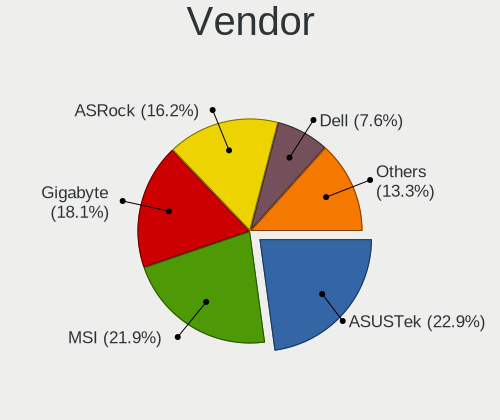
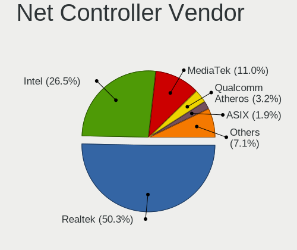
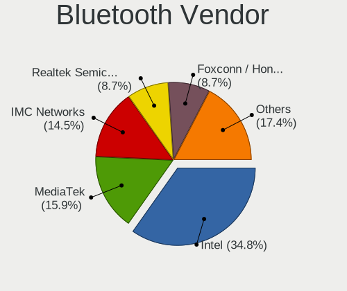
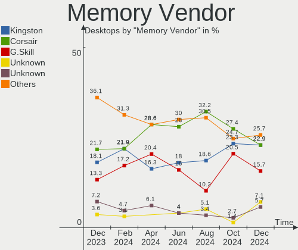

Arch Hardware Trends (Desktops)
-------------------------------

A project to identify most popular hardware characteristics and track their change
over time based on data collected by Arch users at https://Linux-Hardware.org.

Anyone can contribute to this report by the [hw-probe](https://github.com/linuxhw/hw-probe) tool:

    sudo -E hw-probe -all -upload

Full-feature report is available here: https://linux-hardware.org/?view=trends

Period: Mar, 2022.

Contents
--------

* [ System ](#system)
  - [ OS                       ](#os)
  - [ OS Family                ](#os-family)
  - [ Kernel                   ](#kernel)
  - [ Kernel Family            ](#kernel-family)
  - [ Kernel Major Ver.        ](#kernel-major-ver)
  - [ Arch                     ](#arch)
  - [ DE                       ](#de)
  - [ Display Server           ](#display-server)
  - [ Display Manager          ](#display-manager)
  - [ OS Lang                  ](#os-lang)
  - [ Boot Mode                ](#boot-mode)
  - [ Filesystem               ](#filesystem)
  - [ Part. scheme             ](#part-scheme)
  - [ Dual Boot with Linux/BSD ](#dual-boot-with-linuxbsd)
  - [ Dual Boot (Win)          ](#dual-boot-win)

* [ Board ](#board)
  - [ Vendor                   ](#vendor)
  - [ Model                    ](#model)
  - [ Model Family             ](#model-family)
  - [ MFG Year                 ](#mfg-year)
  - [ Form Factor              ](#form-factor)
  - [ Secure Boot              ](#secure-boot)
  - [ Coreboot                 ](#coreboot)
  - [ RAM Size                 ](#ram-size)
  - [ RAM Used                 ](#ram-used)
  - [ Total Drives             ](#total-drives)
  - [ Has CD-ROM               ](#has-cd-rom)
  - [ Has Ethernet             ](#has-ethernet)
  - [ Has WiFi                 ](#has-wifi)
  - [ Has Bluetooth            ](#has-bluetooth)

* [ Location ](#location)
  - [ Country                  ](#country)
  - [ City                     ](#city)

* [ Drives ](#drives)
  - [ Drive Vendor             ](#drive-vendor)
  - [ Drive Model              ](#drive-model)
  - [ HDD Vendor               ](#hdd-vendor)
  - [ SSD Vendor               ](#ssd-vendor)
  - [ Drive Kind               ](#drive-kind)
  - [ Drive Connector          ](#drive-connector)
  - [ Drive Size               ](#drive-size)
  - [ Space Total              ](#space-total)
  - [ Space Used               ](#space-used)
  - [ Malfunc. Drives          ](#malfunc-drives)
  - [ Malfunc. Drive Vendor    ](#malfunc-drive-vendor)
  - [ Malfunc. HDD Vendor      ](#malfunc-hdd-vendor)
  - [ Malfunc. Drive Kind      ](#malfunc-drive-kind)
  - [ Failed Drives            ](#failed-drives)
  - [ Failed Drive Vendor      ](#failed-drive-vendor)
  - [ Drive Status             ](#drive-status)

* [ Storage controller ](#storage-controller)
  - [ Storage Vendor           ](#storage-vendor)
  - [ Storage Model            ](#storage-model)
  - [ Storage Kind             ](#storage-kind)

* [ Processor ](#processor)
  - [ CPU Vendor               ](#cpu-vendor)
  - [ CPU Model                ](#cpu-model)
  - [ CPU Model Family         ](#cpu-model-family)
  - [ CPU Cores                ](#cpu-cores)
  - [ CPU Sockets              ](#cpu-sockets)
  - [ CPU Threads              ](#cpu-threads)
  - [ CPU Op-Modes             ](#cpu-op-modes)
  - [ CPU Microcode            ](#cpu-microcode)
  - [ CPU Microarch            ](#cpu-microarch)

* [ Graphics ](#graphics)
  - [ GPU Vendor               ](#gpu-vendor)
  - [ GPU Model                ](#gpu-model)
  - [ GPU Combo                ](#gpu-combo)
  - [ GPU Driver               ](#gpu-driver)
  - [ GPU Memory               ](#gpu-memory)

* [ Monitor ](#monitor)
  - [ Monitor Vendor           ](#monitor-vendor)
  - [ Monitor Model            ](#monitor-model)
  - [ Monitor Resolution       ](#monitor-resolution)
  - [ Monitor Diagonal         ](#monitor-diagonal)
  - [ Monitor Width            ](#monitor-width)
  - [ Aspect Ratio             ](#aspect-ratio)
  - [ Monitor Area             ](#monitor-area)
  - [ Pixel Density            ](#pixel-density)
  - [ Multiple Monitors        ](#multiple-monitors)

* [ Network ](#network)
  - [ Net Controller Vendor    ](#net-controller-vendor)
  - [ Net Controller Model     ](#net-controller-model)
  - [ Wireless Vendor          ](#wireless-vendor)
  - [ Wireless Model           ](#wireless-model)
  - [ Ethernet Vendor          ](#ethernet-vendor)
  - [ Ethernet Model           ](#ethernet-model)
  - [ Net Controller Kind      ](#net-controller-kind)
  - [ Used Controller          ](#used-controller)
  - [ NICs                     ](#nics)
  - [ IPv6                     ](#ipv6)

* [ Bluetooth ](#bluetooth)
  - [ Bluetooth Vendor         ](#bluetooth-vendor)
  - [ Bluetooth Model          ](#bluetooth-model)

* [ Sound ](#sound)
  - [ Sound Vendor             ](#sound-vendor)
  - [ Sound Model              ](#sound-model)

* [ Memory ](#memory)
  - [ Memory Vendor            ](#memory-vendor)
  - [ Memory Model             ](#memory-model)
  - [ Memory Kind              ](#memory-kind)
  - [ Memory Form Factor       ](#memory-form-factor)
  - [ Memory Size              ](#memory-size)
  - [ Memory Speed             ](#memory-speed)

* [ Printers & scanners ](#printers--scanners)
  - [ Printer Vendor           ](#printer-vendor)
  - [ Printer Model            ](#printer-model)
  - [ Scanner Vendor           ](#scanner-vendor)
  - [ Scanner Model            ](#scanner-model)

* [ Camera ](#camera)
  - [ Camera Vendor            ](#camera-vendor)
  - [ Camera Model             ](#camera-model)

* [ Security ](#security)
  - [ Fingerprint Vendor       ](#fingerprint-vendor)
  - [ Fingerprint Model        ](#fingerprint-model)
  - [ Chipcard Vendor          ](#chipcard-vendor)
  - [ Chipcard Model           ](#chipcard-model)

* [ Unsupported ](#unsupported)
  - [ Unsupported Devices      ](#unsupported-devices)
  - [ Unsupported Device Types ](#unsupported-device-types)

System
------

OS
--

Installed operating systems

| Name             | Desktops | Percent |
|------------------|----------|---------|
| Arch Rolling     | 25       | 62.5%   |
| Arch             | 14       | 35%     |
| Arch Workstation | 1        | 2.5%    |

OS Family
---------

OS without a version

| Name | Desktops | Percent |
|------|----------|---------|
| Arch | 40       | 100%    |

Kernel
------

Version of the Linux kernel

| Version                         | Desktops | Percent |
|---------------------------------|----------|---------|
| 5.16.16-arch1-1                 | 5        | 12.5%   |
| 5.16.16-zen1-1-zen              | 3        | 7.5%    |
| 5.16.14-arch1-1                 | 3        | 7.5%    |
| 5.16.13-arch1-1                 | 3        | 7.5%    |
| 5.16.12-arch1-1                 | 3        | 7.5%    |
| 5.16.15-zen1-1-zen              | 2        | 5%      |
| 5.16.14-zen1-1-zen              | 2        | 5%      |
| 5.16.12-zen1-1-zen              | 2        | 5%      |
| 5.16.11-arch1-2                 | 2        | 5%      |
| 5.15.26-1-lts                   | 2        | 5%      |
| 5.17.0-next-20220322-1-next-git | 1        | 2.5%    |
| 5.16.9-arch1-1                  | 1        | 2.5%    |
| 5.16.18-1-ck-generic-v3         | 1        | 2.5%    |
| 5.16.16-247-tkg-bmq             | 1        | 2.5%    |
| 5.16.15-arch1-1                 | 1        | 2.5%    |
| 5.16.12-xanmod1-1               | 1        | 2.5%    |
| 5.16.11-nitrous-fire+           | 1        | 2.5%    |
| 5.16.11-arch1-1                 | 1        | 2.5%    |
| 5.16.11-1-cachyos-bmq-lto       | 1        | 2.5%    |
| 5.16.10-arch1-1                 | 1        | 2.5%    |
| 5.15.27-xanmod1-1               | 1        | 2.5%    |
| 5.15.13-arch1-1                 | 1        | 2.5%    |
| 5.15.11-zen1-1-zen              | 1        | 2.5%    |

Kernel Family
-------------

Linux kernel without a distro release

| Version | Desktops | Percent |
|---------|----------|---------|
| 5.16.16 | 9        | 22.5%   |
| 5.16.12 | 6        | 15%     |
| 5.16.14 | 5        | 12.5%   |
| 5.16.11 | 5        | 12.5%   |
| 5.16.15 | 3        | 7.5%    |
| 5.16.13 | 3        | 7.5%    |
| 5.15.26 | 2        | 5%      |
| 5.17.0  | 1        | 2.5%    |
| 5.16.9  | 1        | 2.5%    |
| 5.16.18 | 1        | 2.5%    |
| 5.16.10 | 1        | 2.5%    |
| 5.15.27 | 1        | 2.5%    |
| 5.15.13 | 1        | 2.5%    |
| 5.15.11 | 1        | 2.5%    |

Kernel Major Ver.
-----------------

Linux kernel major version

| Version | Desktops | Percent |
|---------|----------|---------|
| 5.16    | 34       | 85%     |
| 5.15    | 5        | 12.5%   |
| 5.17    | 1        | 2.5%    |

Arch
----

OS architecture (x86_64, i586, etc.)

| Name   | Desktops | Percent |
|--------|----------|---------|
| x86_64 | 40       | 100%    |

DE
--

Desktop Environment

| Name       | Desktops | Percent |
|------------|----------|---------|
| KDE5       | 15       | 37.5%   |
| GNOME      | 10       | 25%     |
| XFCE       | 3        | 7.5%    |
| i3         | 3        | 7.5%    |
| Unknown    | 2        | 5%      |
| X-Cinnamon | 1        | 2.5%    |
| sway       | 1        | 2.5%    |
| qtile      | 1        | 2.5%    |
| MATE       | 1        | 2.5%    |
| kde        | 1        | 2.5%    |
| Deepin     | 1        | 2.5%    |
| Budgie     | 1        | 2.5%    |

Display Server
--------------

X11 or Wayland

| Name    | Desktops | Percent |
|---------|----------|---------|
| X11     | 27       | 67.5%   |
| Wayland | 6        | 15%     |
| Unknown | 5        | 12.5%   |
| Tty     | 2        | 5%      |

Display Manager
---------------

SDDM, LightDM, etc.

| Name    | Desktops | Percent |
|---------|----------|---------|
| Unknown | 14       | 35%     |
| LightDM | 10       | 25%     |
| GDM     | 10       | 25%     |
| SDDM    | 6        | 15%     |

OS Lang
-------

Language

| Lang  | Desktops | Percent |
|-------|----------|---------|
| en_US | 26       | 65%     |
| zh_CN | 2        | 5%      |
| en_CA | 2        | 5%      |
| en_AU | 2        | 5%      |
| pt_BR | 1        | 2.5%    |
| pl_PL | 1        | 2.5%    |
| es_MX | 1        | 2.5%    |
| es_ES | 1        | 2.5%    |
| es_AR | 1        | 2.5%    |
| en_IN | 1        | 2.5%    |
| en_GB | 1        | 2.5%    |
| de_DE | 1        | 2.5%    |

Boot Mode
---------

EFI or BIOS

| Mode | Desktops | Percent |
|------|----------|---------|
| EFI  | 27       | 67.5%   |
| BIOS | 13       | 32.5%   |

Filesystem
----------

Type of filesystem

| Type  | Desktops | Percent |
|-------|----------|---------|
| Ext4  | 24       | 60%     |
| Btrfs | 15       | 37.5%   |
| Xfs   | 1        | 2.5%    |

Part. scheme
------------

Scheme of partitioning

| Type    | Desktops | Percent |
|---------|----------|---------|
| GPT     | 28       | 70%     |
| Unknown | 10       | 25%     |
| MBR     | 2        | 5%      |

Dual Boot with Linux/BSD
------------------------

Hosting more than one Linux/BSD

| Dual boot | Desktops | Percent |
|-----------|----------|---------|
| No        | 33       | 82.5%   |
| Yes       | 7        | 17.5%   |

Dual Boot (Win)
---------------

Hosting Linux and Windows

| Dual boot | Desktops | Percent |
|-----------|----------|---------|
| No        | 22       | 55%     |
| Yes       | 18       | 45%     |

Board
-----

Vendor
------

Motherboard manufacturer

| Name                | Desktops | Percent |
|---------------------|----------|---------|
| ASUSTek Computer    | 12       | 30%     |
| MSI                 | 10       | 25%     |
| ASRock              | 8        | 20%     |
| Gigabyte Technology | 7        | 17.5%   |
| Lenovo              | 1        | 2.5%    |
| Inspur              | 1        | 2.5%    |
| Dell                | 1        | 2.5%    |

Model
-----

Motherboard model

| Name                             | Desktops | Percent |
|----------------------------------|----------|---------|
| ASRock B450M-HDV R4.0            | 3        | 7.5%    |
| MSI MS-7A38                      | 2        | 5%      |
| Gigabyte B450M DS3H              | 2        | 5%      |
| MSI MS-7D32                      | 1        | 2.5%    |
| MSI MS-7C02                      | 1        | 2.5%    |
| MSI MS-7B89                      | 1        | 2.5%    |
| MSI MS-7B86                      | 1        | 2.5%    |
| MSI MS-7B78                      | 1        | 2.5%    |
| MSI MS-7A34                      | 1        | 2.5%    |
| MSI MS-7971                      | 1        | 2.5%    |
| MSI MS-7798                      | 1        | 2.5%    |
| Lenovo ThinkStation K 11KMA07PCD | 1        | 2.5%    |
| Inspur                           | 1        | 2.5%    |
| Gigabyte Z270X-Gaming 7          | 1        | 2.5%    |
| Gigabyte X570 I AORUS PRO WIFI   | 1        | 2.5%    |
| Gigabyte H310M H                 | 1        | 2.5%    |
| Gigabyte B550I AORUS PRO AX      | 1        | 2.5%    |
| Gigabyte A520M H                 | 1        | 2.5%    |
| Dell Precision Tower 5810        | 1        | 2.5%    |
| ASUS TUF B450M-PLUS GAMING       | 1        | 2.5%    |
| ASUS TUF B450-PLUS GAMING        | 1        | 2.5%    |
| ASUS SABERTOOTH X79              | 1        | 2.5%    |
| ASUS SABERTOOTH P67              | 1        | 2.5%    |
| ASUS ROG STRIX X570-E GAMING     | 1        | 2.5%    |
| ASUS ROG STRIX B550-E GAMING     | 1        | 2.5%    |
| ASUS PRIME Z590-A                | 1        | 2.5%    |
| ASUS PRIME X399-A                | 1        | 2.5%    |
| ASUS PRIME H310M-E R2.0          | 1        | 2.5%    |
| ASUS PRIME B550M-K               | 1        | 2.5%    |
| ASUS PRIME B550M-A               | 1        | 2.5%    |
| ASUS PRIME B450M-A               | 1        | 2.5%    |
| ASRock X99 Extreme4              | 1        | 2.5%    |
| ASRock H670M-ITX/ax              | 1        | 2.5%    |
| ASRock B450M Pro4                | 1        | 2.5%    |
| ASRock B450 Pro4                 | 1        | 2.5%    |
| ASRock AB350M-HDV                | 1        | 2.5%    |

Model Family
------------

Motherboard model prefix

| Name                  | Desktops | Percent |
|-----------------------|----------|---------|
| ASUS PRIME            | 6        | 15%     |
| ASRock B450M-HDV      | 3        | 7.5%    |
| MSI MS-7A38           | 2        | 5%      |
| Gigabyte B450M        | 2        | 5%      |
| ASUS TUF              | 2        | 5%      |
| ASUS SABERTOOTH       | 2        | 5%      |
| ASUS ROG              | 2        | 5%      |
| MSI MS-7D32           | 1        | 2.5%    |
| MSI MS-7C02           | 1        | 2.5%    |
| MSI MS-7B89           | 1        | 2.5%    |
| MSI MS-7B86           | 1        | 2.5%    |
| MSI MS-7B78           | 1        | 2.5%    |
| MSI MS-7A34           | 1        | 2.5%    |
| MSI MS-7971           | 1        | 2.5%    |
| MSI MS-7798           | 1        | 2.5%    |
| Lenovo ThinkStation   | 1        | 2.5%    |
| Inspur                | 1        | 2.5%    |
| Gigabyte Z270X-Gaming | 1        | 2.5%    |
| Gigabyte X570         | 1        | 2.5%    |
| Gigabyte H310M        | 1        | 2.5%    |
| Gigabyte B550I        | 1        | 2.5%    |
| Gigabyte A520M        | 1        | 2.5%    |
| Dell Precision        | 1        | 2.5%    |
| ASRock X99            | 1        | 2.5%    |
| ASRock H670M-ITX      | 1        | 2.5%    |
| ASRock B450M          | 1        | 2.5%    |
| ASRock B450           | 1        | 2.5%    |
| ASRock AB350M-HDV     | 1        | 2.5%    |

MFG Year
--------

Motherboard manufacture year

| Year | Desktops | Percent |
|------|----------|---------|
| 2018 | 15       | 37.5%   |
| 2020 | 5        | 12.5%   |
| 2019 | 5        | 12.5%   |
| 2017 | 4        | 10%     |
| 2021 | 3        | 7.5%    |
| 2014 | 2        | 5%      |
| 2012 | 2        | 5%      |
| 2022 | 1        | 2.5%    |
| 2016 | 1        | 2.5%    |
| 2015 | 1        | 2.5%    |
| 2011 | 1        | 2.5%    |

Form Factor
-----------

Physical design of the computer

| Name    | Desktops | Percent |
|---------|----------|---------|
| Desktop | 40       | 100%    |

Secure Boot
-----------

Enabled or disabled

| State    | Desktops | Percent |
|----------|----------|---------|
| Disabled | 39       | 97.5%   |
| Enabled  | 1        | 2.5%    |

Coreboot
--------

Have coreboot on board

| Used | Desktops | Percent |
|------|----------|---------|
| No   | 40       | 100%    |

RAM Size
--------

Total RAM memory

| Size in GB  | Desktops | Percent |
|-------------|----------|---------|
| 16.01-24.0  | 21       | 52.5%   |
| 32.01-64.0  | 13       | 32.5%   |
| 64.01-256.0 | 2        | 5%      |
| 4.01-8.0    | 1        | 2.5%    |
| 3.01-4.0    | 1        | 2.5%    |
| 24.01-32.0  | 1        | 2.5%    |
| 8.01-16.0   | 1        | 2.5%    |

RAM Used
--------

Used RAM memory

| Used GB    | Desktops | Percent |
|------------|----------|---------|
| 2.01-3.0   | 13       | 32.5%   |
| 4.01-8.0   | 8        | 20%     |
| 1.01-2.0   | 8        | 20%     |
| 3.01-4.0   | 6        | 15%     |
| 8.01-16.0  | 3        | 7.5%    |
| 24.01-32.0 | 1        | 2.5%    |
| 16.01-24.0 | 1        | 2.5%    |

Total Drives
------------

Number of drives on board

| Drives | Desktops | Percent |
|--------|----------|---------|
| 3      | 16       | 40%     |
| 2      | 14       | 35%     |
| 4      | 4        | 10%     |
| 1      | 3        | 7.5%    |
| 5      | 2        | 5%      |
| 9      | 1        | 2.5%    |

Has CD-ROM
----------

Has CD-ROM on board

| Presented | Desktops | Percent |
|-----------|----------|---------|
| No        | 31       | 77.5%   |
| Yes       | 9        | 22.5%   |

Has Ethernet
------------

Has Ethernet on board

| Presented | Desktops | Percent |
|-----------|----------|---------|
| Yes       | 40       | 100%    |

Has WiFi
--------

Has WiFi module

| Presented | Desktops | Percent |
|-----------|----------|---------|
| Yes       | 21       | 52.5%   |
| No        | 19       | 47.5%   |

Has Bluetooth
-------------

Has Bluetooth module

| Presented | Desktops | Percent |
|-----------|----------|---------|
| No        | 25       | 62.5%   |
| Yes       | 15       | 37.5%   |

Location
--------

Country
-------

Geographic location (country)

| Country   | Desktops | Percent |
|-----------|----------|---------|
| USA       | 12       | 30%     |
| Germany   | 4        | 10%     |
| Canada    | 3        | 7.5%    |
| Romania   | 2        | 5%      |
| Poland    | 2        | 5%      |
| France    | 2        | 5%      |
| China     | 2        | 5%      |
| Australia | 2        | 5%      |
| Venezuela | 1        | 2.5%    |
| Turkey    | 1        | 2.5%    |
| Spain     | 1        | 2.5%    |
| Russia    | 1        | 2.5%    |
| Norway    | 1        | 2.5%    |
| Mexico    | 1        | 2.5%    |
| India     | 1        | 2.5%    |
| Finland   | 1        | 2.5%    |
| Bulgaria  | 1        | 2.5%    |
| Brazil    | 1        | 2.5%    |
| Argentina | 1        | 2.5%    |

City
----

Geographic location (city)

| City                 | Desktops | Percent |
|----------------------|----------|---------|
| Alpharetta           | 2        | 5%      |
| Vantaa               | 1        | 2.5%    |
| Urbandale            | 1        | 2.5%    |
| Trivandrum           | 1        | 2.5%    |
| Solingen             | 1        | 2.5%    |
| Sighetu Marmaţiei   | 1        | 2.5%    |
| Shanghai             | 1        | 2.5%    |
| Seattle              | 1        | 2.5%    |
| San Francisco        | 1        | 2.5%    |
| Saint-Cyr-l'École   | 1        | 2.5%    |
| Recife               | 1        | 2.5%    |
| Plovdiv              | 1        | 2.5%    |
| Paraná              | 1        | 2.5%    |
| Oslo                 | 1        | 2.5%    |
| Nowy Dwor Mazowiecki | 1        | 2.5%    |
| Norwalk              | 1        | 2.5%    |
| New York             | 1        | 2.5%    |
| Moscow               | 1        | 2.5%    |
| Montreal             | 1        | 2.5%    |
| Mielec               | 1        | 2.5%    |
| Melbourne            | 1        | 2.5%    |
| Marcilla             | 1        | 2.5%    |
| Lille                | 1        | 2.5%    |
| Leipzig              | 1        | 2.5%    |
| League City          | 1        | 2.5%    |
| Langley              | 1        | 2.5%    |
| Istanbul             | 1        | 2.5%    |
| Gardner              | 1        | 2.5%    |
| Dentlein am Forst    | 1        | 2.5%    |
| Dallas               | 1        | 2.5%    |
| Culiacán            | 1        | 2.5%    |
| Chengdu              | 1        | 2.5%    |
| Brisbane             | 1        | 2.5%    |
| Bloomington          | 1        | 2.5%    |
| Binbrook             | 1        | 2.5%    |
| Berlin               | 1        | 2.5%    |
| Baruta               | 1        | 2.5%    |
| Arlington            | 1        | 2.5%    |
| Arad                 | 1        | 2.5%    |

Drives
------

Drive Vendor
------------

Hard drive vendors

| Vendor                    | Desktops | Drives | Percent |
|---------------------------|----------|--------|---------|
| Samsung Electronics       | 21       | 31     | 22.58%  |
| Seagate                   | 19       | 22     | 20.43%  |
| WDC                       | 14       | 20     | 15.05%  |
| Kingston                  | 6        | 6      | 6.45%   |
| Crucial                   | 5        | 5      | 5.38%   |
| Intel                     | 4        | 4      | 4.3%    |
| Toshiba                   | 3        | 5      | 3.23%   |
| Sandisk                   | 3        | 3      | 3.23%   |
| A-DATA Technology         | 3        | 3      | 3.23%   |
| SK Hynix                  | 2        | 2      | 2.15%   |
| Phison                    | 2        | 2      | 2.15%   |
| Micron/Crucial Technology | 2        | 2      | 2.15%   |
| ZHITAI                    | 1        | 1      | 1.08%   |
| Transcend                 | 1        | 1      | 1.08%   |
| SPCC                      | 1        | 1      | 1.08%   |
| Silicon Motion            | 1        | 1      | 1.08%   |
| Intenso                   | 1        | 1      | 1.08%   |
| Hitachi                   | 1        | 1      | 1.08%   |
| HGST                      | 1        | 1      | 1.08%   |
| GOODRAM                   | 1        | 1      | 1.08%   |
| Corsair                   | 1        | 1      | 1.08%   |

Drive Model
-----------

Hard drive models

| Model                                     | Desktops | Percent |
|-------------------------------------------|----------|---------|
| Seagate ST2000DM008-2FR102 2TB            | 6        | 5.45%   |
| Seagate ST2000DM006-2DM164 2TB            | 3        | 2.73%   |
| Samsung SSD 970 EVO Plus 1TB              | 3        | 2.73%   |
| Samsung SSD 860 EVO 1TB                   | 3        | 2.73%   |
| Kingston SA400S37480G 480GB SSD           | 3        | 2.73%   |
| WDC WDS250G2B0B-00YS70 250GB SSD          | 2        | 1.82%   |
| Sandisk NVMe SSD Drive 500GB              | 2        | 1.82%   |
| Samsung SSD 970 EVO Plus 500GB            | 2        | 1.82%   |
| Samsung SSD 870 EVO 500GB                 | 2        | 1.82%   |
| Samsung SSD 850 EVO 1TB                   | 2        | 1.82%   |
| Micron/Crucial NVMe SSD Drive 1TB         | 2        | 1.82%   |
| Intel SSDPEKNW010T8 1TB                   | 2        | 1.82%   |
| ZHITAI PC005 Active 1TB                   | 1        | 0.91%   |
| WDC WDS480G2G0A-00JH30 480GB SSD          | 1        | 0.91%   |
| WDC WDS100T3X0C-00SJG0 1TB                | 1        | 0.91%   |
| WDC WDS100T2B0B 1TB SSD                   | 1        | 0.91%   |
| WDC WDS100T2B0A 1TB SSD                   | 1        | 0.91%   |
| WDC WDBRPG5000ANC-WRSN 500GB              | 1        | 0.91%   |
| WDC WD7501AALS-00J7B0 752GB               | 1        | 0.91%   |
| WDC WD5001AALS-00L3B2 500GB               | 1        | 0.91%   |
| WDC WD5000KS-00MNB0 500GB                 | 1        | 0.91%   |
| WDC WD5000AAKX-22ERMA0 500GB              | 1        | 0.91%   |
| WDC WD20EZBX-08AYR 2TB                    | 1        | 0.91%   |
| WDC WD2003FZEX-00SRLA0 2TB                | 1        | 0.91%   |
| WDC WD1600BEVT-22ZCT0 160GB               | 1        | 0.91%   |
| WDC WD10EZEX-60M2NA0 1TB                  | 1        | 0.91%   |
| WDC WD10EZEX-22RKKA0 1TB                  | 1        | 0.91%   |
| WDC WD10EZEX-22MFCA0 1TB                  | 1        | 0.91%   |
| WDC WD10EARX-32N0YB0 1TB                  | 1        | 0.91%   |
| WDC WD10EARS-00Y5B1 1TB                   | 1        | 0.91%   |
| WDC WD1002FAEX-00Y9A0 1TB                 | 1        | 0.91%   |
| Transcend TS1TSSD230S 1TB                 | 1        | 0.91%   |
| Toshiba TR200 480GB SSD                   | 1        | 0.91%   |
| Toshiba Q200 EX M.2 240GB SSD             | 1        | 0.91%   |
| Toshiba KBG40ZMT128G MEMORY 128GB         | 1        | 0.91%   |
| SPCC Solid State Disk 256GB               | 1        | 0.91%   |
| SK Hynix SKHynix_HFS256GD9TNI-L2B0B 256GB | 1        | 0.91%   |
| SK Hynix SHGP31-1000GM 1TB                | 1        | 0.91%   |
| Silicon Motion NVMe SSD Drive 1024GB      | 1        | 0.91%   |
| Seagate ST500DM002-1BD142 500GB           | 1        | 0.91%   |
| Seagate ST4000DM005-2DP166 4TB            | 1        | 0.91%   |
| Seagate ST4000DM004-2CV104 4TB            | 1        | 0.91%   |
| Seagate ST3320620AS 320GB                 | 1        | 0.91%   |
| Seagate ST3200826AS 200GB                 | 1        | 0.91%   |
| Seagate ST2000VM003-1ET164 2TB            | 1        | 0.91%   |
| Seagate ST2000DM001-1ER164 2TB            | 1        | 0.91%   |
| Seagate ST2000DL003-9VT166 2TB            | 1        | 0.91%   |
| Seagate ST1000LM035-1RK172 1TB            | 1        | 0.91%   |
| Seagate ST1000DM003-1CH162 1TB            | 1        | 0.91%   |
| Seagate Expansion Desk 4TB                | 1        | 0.91%   |
| Seagate Expansion 320GB                   | 1        | 0.91%   |
| Seagate BUP Slim BL 1TB                   | 1        | 0.91%   |
| SanDisk SSD G5 BICS4 500GB                | 1        | 0.91%   |
| Samsung SSD PM851 mSATA 256GB             | 1        | 0.91%   |
| Samsung SSD 980 500GB                     | 1        | 0.91%   |
| Samsung SSD 980 1TB                       | 1        | 0.91%   |
| Samsung SSD 970 EVO Plus 250GB            | 1        | 0.91%   |
| Samsung SSD 960 PRO 1TB                   | 1        | 0.91%   |
| Samsung SSD 870 EVO 2TB                   | 1        | 0.91%   |
| Samsung SSD 860 EVO 500GB                 | 1        | 0.91%   |

HDD Vendor
----------

Hard disk drive vendors

| Vendor              | Desktops | Drives | Percent |
|---------------------|----------|--------|---------|
| Seagate             | 19       | 22     | 61.29%  |
| WDC                 | 9        | 13     | 29.03%  |
| Samsung Electronics | 1        | 1      | 3.23%   |
| Hitachi             | 1        | 1      | 3.23%   |
| HGST                | 1        | 1      | 3.23%   |

SSD Vendor
----------

Solid state drive vendors

| Vendor              | Desktops | Drives | Percent |
|---------------------|----------|--------|---------|
| Samsung Electronics | 15       | 17     | 35.71%  |
| WDC                 | 5        | 5      | 11.9%   |
| Kingston            | 5        | 5      | 11.9%   |
| Crucial             | 5        | 5      | 11.9%   |
| A-DATA Technology   | 3        | 3      | 7.14%   |
| Toshiba             | 2        | 4      | 4.76%   |
| Intel               | 2        | 2      | 4.76%   |
| Transcend           | 1        | 1      | 2.38%   |
| SPCC                | 1        | 1      | 2.38%   |
| SanDisk             | 1        | 1      | 2.38%   |
| Intenso             | 1        | 1      | 2.38%   |
| GOODRAM             | 1        | 1      | 2.38%   |

Drive Kind
----------

HDD or SSD

| Kind | Desktops | Drives | Percent |
|------|----------|--------|---------|
| SSD  | 29       | 46     | 36.71%  |
| HDD  | 27       | 38     | 34.18%  |
| NVMe | 23       | 30     | 29.11%  |

Drive Connector
---------------

SATA, SAS, NVMe, etc.

| Type | Desktops | Drives | Percent |
|------|----------|--------|---------|
| SATA | 37       | 80     | 57.81%  |
| NVMe | 23       | 30     | 35.94%  |
| SAS  | 4        | 4      | 6.25%   |

Drive Size
----------

Size of hard drive

| Size in TB | Desktops | Drives | Percent |
|------------|----------|--------|---------|
| 0.01-0.5   | 27       | 42     | 44.26%  |
| 0.51-1.0   | 17       | 23     | 27.87%  |
| 1.01-2.0   | 13       | 15     | 21.31%  |
| 3.01-4.0   | 4        | 4      | 6.56%   |

Space Total
-----------

Amount of disk space available on the file system

| Size in GB     | Desktops | Percent |
|----------------|----------|---------|
| 2001-3000      | 10       | 25%     |
| 1001-2000      | 8        | 20%     |
| More than 3000 | 7        | 17.5%   |
| 501-1000       | 6        | 15%     |
| 101-250        | 5        | 12.5%   |
| 251-500        | 2        | 5%      |
| 51-100         | 1        | 2.5%    |
| Unknown        | 1        | 2.5%    |

Space Used
----------

Amount of used disk space

| Used GB        | Desktops | Percent |
|----------------|----------|---------|
| 1001-2000      | 13       | 32.5%   |
| 501-1000       | 8        | 20%     |
| 101-250        | 5        | 12.5%   |
| 21-50          | 4        | 10%     |
| 1-20           | 3        | 7.5%    |
| 51-100         | 3        | 7.5%    |
| More than 3000 | 2        | 5%      |
| 2001-3000      | 1        | 2.5%    |
| Unknown        | 1        | 2.5%    |

Malfunc. Drives
---------------

Drive models with a malfunction

| Model                                    | Desktops | Drives | Percent |
|------------------------------------------|----------|--------|---------|
| WDC WD7501AALS-00J7B0 752GB              | 1        | 1      | 9.09%   |
| WDC WD5000AAKX-22ERMA0 500GB             | 1        | 1      | 9.09%   |
| WDC WD10EZEX-60M2NA0 1TB                 | 1        | 1      | 9.09%   |
| WDC WD10EZEX-22RKKA0 1TB                 | 1        | 1      | 9.09%   |
| WDC WD10EARS-00Y5B1 1TB                  | 1        | 1      | 9.09%   |
| Transcend TS1TSSD230S 1TB                | 1        | 1      | 9.09%   |
| Seagate ST4000DM004-2CV104 4TB           | 1        | 1      | 9.09%   |
| Seagate ST2000DM008-2FR102 2TB           | 1        | 1      | 9.09%   |
| Seagate ST2000DM006-2DM164 2TB           | 1        | 1      | 9.09%   |
| Samsung Electronics SSD 840 Series 250GB | 1        | 1      | 9.09%   |
| Samsung Electronics HD200HJ 200GB        | 1        | 1      | 9.09%   |

Malfunc. Drive Vendor
---------------------

Vendors of faulty drives

| Vendor              | Desktops | Drives | Percent |
|---------------------|----------|--------|---------|
| WDC                 | 4        | 5      | 40%     |
| Seagate             | 3        | 3      | 30%     |
| Samsung Electronics | 2        | 2      | 20%     |
| Transcend           | 1        | 1      | 10%     |

Malfunc. HDD Vendor
-------------------

Vendors of faulty HDD drives

| Vendor              | Desktops | Drives | Percent |
|---------------------|----------|--------|---------|
| WDC                 | 4        | 5      | 50%     |
| Seagate             | 3        | 3      | 37.5%   |
| Samsung Electronics | 1        | 1      | 12.5%   |

Malfunc. Drive Kind
-------------------

Kinds of faulty drives

| Kind | Desktops | Drives | Percent |
|------|----------|--------|---------|
| HDD  | 8        | 9      | 80%     |
| SSD  | 2        | 2      | 20%     |

Failed Drives
-------------

Failed drive models

Zero info for selected period =(

Failed Drive Vendor
-------------------

Failed drive vendors

Zero info for selected period =(

Drive Status
------------

Number of failed and malfunc. drives

| Status   | Desktops | Drives | Percent |
|----------|----------|--------|---------|
| Works    | 28       | 78     | 56%     |
| Detected | 12       | 25     | 24%     |
| Malfunc  | 10       | 11     | 20%     |

Storage controller
------------------

Storage Vendor
--------------

Storage controller vendors

| Vendor                      | Desktops | Percent |
|-----------------------------|----------|---------|
| AMD                         | 26       | 36.62%  |
| Intel                       | 15       | 21.13%  |
| Samsung Electronics         | 9        | 12.68%  |
| Sandisk                     | 4        | 5.63%   |
| Phison Electronics          | 3        | 4.23%   |
| SK Hynix                    | 2        | 2.82%   |
| Micron/Crucial Technology   | 2        | 2.82%   |
| Marvell Technology Group    | 2        | 2.82%   |
| ASMedia Technology          | 2        | 2.82%   |
| Yangtze Memory Technologies | 1        | 1.41%   |
| Silicon Motion              | 1        | 1.41%   |
| LSI Logic / Symbios Logic   | 1        | 1.41%   |
| KIOXIA                      | 1        | 1.41%   |
| Kingston Technology Company | 1        | 1.41%   |
| JMicron Technology          | 1        | 1.41%   |

Storage Model
-------------

Storage controller models

| Model                                                                          | Desktops | Percent |
|--------------------------------------------------------------------------------|----------|---------|
| AMD 400 Series Chipset SATA Controller                                         | 16       | 18.18%  |
| AMD FCH SATA Controller [AHCI mode]                                            | 15       | 17.05%  |
| Samsung NVMe SSD Controller SM981/PM981/PM983                                  | 6        | 6.82%   |
| AMD 500 Series Chipset SATA Controller                                         | 5        | 5.68%   |
| Samsung NVMe SSD Controller SM961/PM961/SM963                                  | 2        | 2.27%   |
| Samsung NVMe SSD Controller 980                                                | 2        | 2.27%   |
| Phison E12 NVMe Controller                                                     | 2        | 2.27%   |
| Micron/Crucial P1 NVMe PCIe SSD                                                | 2        | 2.27%   |
| Intel SSD 660P Series                                                          | 2        | 2.27%   |
| Intel C610/X99 series chipset sSATA Controller [AHCI mode]                     | 2        | 2.27%   |
| Intel Alder Lake-S PCH SATA Controller [AHCI Mode]                             | 2        | 2.27%   |
| Intel 200 Series PCH SATA controller [AHCI mode]                               | 2        | 2.27%   |
| ASMedia ASM1062 Serial ATA Controller                                          | 2        | 2.27%   |
| AMD 300 Series Chipset SATA Controller                                         | 2        | 2.27%   |
| Yangtze Memory Non-Volatile memory controller                                  | 1        | 1.14%   |
| SK Hynix Non-Volatile memory controller                                        | 1        | 1.14%   |
| SK Hynix Gold P31 SSD                                                          | 1        | 1.14%   |
| Silicon Motion SM2263EN/SM2263XT SSD Controller                                | 1        | 1.14%   |
| Sandisk WD Blue SN550 NVMe SSD                                                 | 1        | 1.14%   |
| Sandisk WD Blue SN500 / PC SN520 NVMe SSD                                      | 1        | 1.14%   |
| Sandisk WD Black SN750 / PC SN730 NVMe SSD                                     | 1        | 1.14%   |
| Sandisk WD Black 2018/SN750 / PC SN720 NVMe SSD                                | 1        | 1.14%   |
| Samsung NVMe SSD Controller SM951/PM951                                        | 1        | 1.14%   |
| Phison PS5013 E13 NVMe Controller                                              | 1        | 1.14%   |
| Marvell Group 88SE9172 SATA 6Gb/s Controller                                   | 1        | 1.14%   |
| Marvell Group 88SE9128 PCIe SATA 6 Gb/s RAID controller with HyperDuo          | 1        | 1.14%   |
| LSI Logic / Symbios Logic SAS2004 PCI-Express Fusion-MPT SAS-2 [Spitfire]      | 1        | 1.14%   |
| KIOXIA Non-Volatile memory controller                                          | 1        | 1.14%   |
| Kingston Company A2000 NVMe SSD                                                | 1        | 1.14%   |
| JMicron JMB362 SATA Controller                                                 | 1        | 1.14%   |
| Intel Q170/Q150/B150/H170/H110/Z170/CM236 Chipset SATA Controller [AHCI Mode]  | 1        | 1.14%   |
| Intel Cannon Lake PCH SATA AHCI Controller                                     | 1        | 1.14%   |
| Intel C610/X99 series chipset 6-Port SATA Controller [AHCI mode]               | 1        | 1.14%   |
| Intel C600/X79 series chipset 6-Port SATA AHCI Controller                      | 1        | 1.14%   |
| Intel 8 Series/C220 Series Chipset Family 6-port SATA Controller 1 [AHCI mode] | 1        | 1.14%   |
| Intel 7 Series/C210 Series Chipset Family 6-port SATA Controller [AHCI mode]   | 1        | 1.14%   |
| Intel 6 Series/C200 Series Chipset Family 6 port Desktop SATA AHCI Controller  | 1        | 1.14%   |
| Intel 500 Series Chipset Family SATA AHCI Controller                           | 1        | 1.14%   |
| Intel 400 Series Chipset Family SATA AHCI Controller                           | 1        | 1.14%   |
| AMD X399 Series Chipset SATA Controller                                        | 1        | 1.14%   |

Storage Kind
------------

Kind of storage controller (IDE, SATA, NVMe, SAS, ...)

| Kind | Desktops | Percent |
|------|----------|---------|
| SATA | 40       | 62.5%   |
| NVMe | 23       | 35.94%  |
| SAS  | 1        | 1.56%   |

Processor
---------

CPU Vendor
----------

Processor vendors

| Vendor | Desktops | Percent |
|--------|----------|---------|
| AMD    | 26       | 65%     |
| Intel  | 14       | 35%     |

CPU Model
---------

Processor models

| Model                                          | Desktops | Percent |
|------------------------------------------------|----------|---------|
| AMD Ryzen 7 3700X 8-Core Processor             | 4        | 10%     |
| AMD Ryzen 5 3600 6-Core Processor              | 4        | 10%     |
| AMD Ryzen 5 2600 Six-Core Processor            | 4        | 10%     |
| AMD Ryzen 5 5600X 6-Core Processor             | 2        | 5%      |
| AMD Ryzen 5 3600X 6-Core Processor             | 2        | 5%      |
| AMD Ryzen 5 2600X Six-Core Processor           | 2        | 5%      |
| AMD Ryzen 3 3300X 4-Core Processor             | 2        | 5%      |
| Intel Xeon CPU E5-1650 v4 @ 3.60GHz            | 1        | 2.5%    |
| Intel Pentium CPU G3250 @ 3.20GHz              | 1        | 2.5%    |
| Intel Core i7-9700F CPU @ 3.00GHz              | 1        | 2.5%    |
| Intel Core i7-7700K CPU @ 4.20GHz              | 1        | 2.5%    |
| Intel Core i7-6850K CPU @ 3.60GHz              | 1        | 2.5%    |
| Intel Core i7-6700 CPU @ 3.40GHz               | 1        | 2.5%    |
| Intel Core i7-3930K CPU @ 3.20GHz              | 1        | 2.5%    |
| Intel Core i7-3770 CPU @ 3.40GHz               | 1        | 2.5%    |
| Intel Core i7-2600K CPU @ 3.40GHz              | 1        | 2.5%    |
| Intel Core i7-10700 CPU @ 2.90GHz              | 1        | 2.5%    |
| Intel Core i3-8100 CPU @ 3.60GHz               | 1        | 2.5%    |
| Intel 12th Gen Core i7-12700K                  | 1        | 2.5%    |
| Intel 12th Gen Core i5-12400                   | 1        | 2.5%    |
| Intel 11th Gen Core i5-11600KF @ 3.90GHz       | 1        | 2.5%    |
| AMD Ryzen Threadripper 1950X 16-Core Processor | 1        | 2.5%    |
| AMD Ryzen 9 5900X 12-Core Processor            | 1        | 2.5%    |
| AMD Ryzen 7 2700X Eight-Core Processor         | 1        | 2.5%    |
| AMD Ryzen 5 3400G with Radeon Vega Graphics    | 1        | 2.5%    |
| AMD Ryzen 5 1600 Six-Core Processor            | 1        | 2.5%    |
| AMD Ryzen 5 1500X Quad-Core Processor          | 1        | 2.5%    |

CPU Model Family
----------------

Processor model prefix

| Model                  | Desktops | Percent |
|------------------------|----------|---------|
| AMD Ryzen 5            | 17       | 42.5%   |
| Intel Core i7          | 8        | 20%     |
| AMD Ryzen 7            | 5        | 12.5%   |
| Other                  | 3        | 7.5%    |
| AMD Ryzen 3            | 2        | 5%      |
| Intel Xeon             | 1        | 2.5%    |
| Intel Pentium          | 1        | 2.5%    |
| Intel Core i3          | 1        | 2.5%    |
| AMD Ryzen Threadripper | 1        | 2.5%    |
| AMD Ryzen 9            | 1        | 2.5%    |

CPU Cores
---------

Number of processor cores

| Number | Desktops | Percent |
|--------|----------|---------|
| 6      | 20       | 50%     |
| 4      | 9        | 22.5%   |
| 8      | 7        | 17.5%   |
| 12     | 2        | 5%      |
| 16     | 1        | 2.5%    |
| 2      | 1        | 2.5%    |

CPU Sockets
-----------

Number of sockets

| Number | Desktops | Percent |
|--------|----------|---------|
| 1      | 40       | 100%    |

CPU Threads
-----------

Threads per core (Hyper-Threading)

| Number | Desktops | Percent |
|--------|----------|---------|
| 2      | 37       | 92.5%   |
| 1      | 3        | 7.5%    |

CPU Op-Modes
------------

CPU Operation Modes (32-bit, 64-bit)

| Op mode        | Desktops | Percent |
|----------------|----------|---------|
| 32-bit, 64-bit | 40       | 100%    |

CPU Microcode
-------------

Microcode number

| Number     | Desktops | Percent |
|------------|----------|---------|
| Unknown    | 14       | 35%     |
| 0x0800820d | 6        | 15%     |
| 0x08701021 | 5        | 12.5%   |
| 0x0a201016 | 2        | 5%      |
| 0x906ed    | 1        | 2.5%    |
| 0x906e9    | 1        | 2.5%    |
| 0x90675    | 1        | 2.5%    |
| 0x90672    | 1        | 2.5%    |
| 0x406f1    | 1        | 2.5%    |
| 0x306c3    | 1        | 2.5%    |
| 0x206d7    | 1        | 2.5%    |
| 0x206a7    | 1        | 2.5%    |
| 0x08701013 | 1        | 2.5%    |
| 0x08108109 | 1        | 2.5%    |
| 0x08001138 | 1        | 2.5%    |
| 0x08001137 | 1        | 2.5%    |
| 0x00000000 | 1        | 2.5%    |

CPU Microarch
-------------

Microarchitecture

| Name             | Desktops | Percent |
|------------------|----------|---------|
| Zen 2            | 12       | 30%     |
| Zen+             | 9        | 22.5%   |
| Zen 3            | 3        | 7.5%    |
| KabyLake         | 3        | 7.5%    |
| Zen              | 2        | 5%      |
| SandyBridge      | 2        | 5%      |
| Broadwell        | 2        | 5%      |
| Alderlake Hybrid | 2        | 5%      |
| Skylake          | 1        | 2.5%    |
| IvyBridge        | 1        | 2.5%    |
| Haswell          | 1        | 2.5%    |
| CometLake        | 1        | 2.5%    |
| Unknown          | 1        | 2.5%    |

Graphics
--------

GPU Vendor
----------

Vendors of graphics cards

| Vendor | Desktops | Percent |
|--------|----------|---------|
| Nvidia | 22       | 53.66%  |
| AMD    | 13       | 31.71%  |
| Intel  | 6        | 14.63%  |

GPU Model
---------

Graphics card models

| Model                                                                       | Desktops | Percent |
|-----------------------------------------------------------------------------|----------|---------|
| AMD Ellesmere [Radeon RX 470/480/570/570X/580/580X/590]                     | 6        | 13.95%  |
| Nvidia TU116 [GeForce GTX 1660]                                             | 2        | 4.65%   |
| Nvidia TU116 [GeForce GTX 1650 SUPER]                                       | 2        | 4.65%   |
| Nvidia TU104 [GeForce RTX 2080 Rev. A]                                      | 2        | 4.65%   |
| Nvidia GP106 [GeForce GTX 1060 6GB]                                         | 2        | 4.65%   |
| Nvidia GA104 [GeForce RTX 3070 Ti]                                          | 2        | 4.65%   |
| AMD Navi 10 [Radeon RX 5600 OEM/5600 XT / 5700/5700 XT]                     | 2        | 4.65%   |
| Nvidia TU116 [GeForce GTX 1660 SUPER]                                       | 1        | 2.33%   |
| Nvidia TU104 [GeForce RTX 2080 SUPER]                                       | 1        | 2.33%   |
| Nvidia TU104 [GeForce RTX 2070 SUPER]                                       | 1        | 2.33%   |
| Nvidia TU104 [GeForce RTX 2060]                                             | 1        | 2.33%   |
| Nvidia GP108 [GeForce GT 1030]                                              | 1        | 2.33%   |
| Nvidia GP106 [GeForce GTX 1060 6GB Rev. 2]                                  | 1        | 2.33%   |
| Nvidia GP106 [GeForce GTX 1060 3GB]                                         | 1        | 2.33%   |
| Nvidia GP104 [GeForce GTX 1070]                                             | 1        | 2.33%   |
| Nvidia GP104 [GeForce GTX 1070 Ti]                                          | 1        | 2.33%   |
| Nvidia GM206 [GeForce GTX 960]                                              | 1        | 2.33%   |
| Nvidia GM204 [GeForce GTX 970]                                              | 1        | 2.33%   |
| Nvidia GM107 [GeForce GTX 750 Ti]                                           | 1        | 2.33%   |
| Nvidia GA102 [GeForce RTX 3080]                                             | 1        | 2.33%   |
| Intel Xeon E3-1200 v3/4th Gen Core Processor Integrated Graphics Controller | 1        | 2.33%   |
| Intel VGA compatible controller                                             | 1        | 2.33%   |
| Intel IvyBridge GT2 [HD Graphics 4000]                                      | 1        | 2.33%   |
| Intel CometLake-S GT2 [UHD Graphics 630]                                    | 1        | 2.33%   |
| Intel CoffeeLake-S GT2 [UHD Graphics 630]                                   | 1        | 2.33%   |
| Intel AlderLake-S GT1                                                       | 1        | 2.33%   |
| AMD Tahiti PRO [Radeon HD 7950/8950 OEM / R9 280]                           | 1        | 2.33%   |
| AMD Oland XT [Radeon HD 8670 / R5 340X OEM / R7 250/350/350X OEM]           | 1        | 2.33%   |
| AMD Navi 21 [Radeon RX 6800/6800 XT / 6900 XT]                              | 1        | 2.33%   |
| AMD Lexa PRO [Radeon 540/540X/550/550X / RX 540X/550/550X]                  | 1        | 2.33%   |
| AMD Caicos XT [Radeon HD 7470/8470 / R5 235/310 OEM]                        | 1        | 2.33%   |
| AMD Baffin [Radeon RX 460/560D / Pro 450/455/460/555/555X/560/560X]         | 1        | 2.33%   |

GPU Combo
---------

Combinations of graphics cards

| Name           | Desktops | Percent |
|----------------|----------|---------|
| 1 x Nvidia     | 20       | 50%     |
| 1 x AMD        | 13       | 32.5%   |
| 1 x Intel      | 5        | 12.5%   |
| 2 x Nvidia     | 1        | 2.5%    |
| Intel + Nvidia | 1        | 2.5%    |

GPU Driver
----------

Free vs proprietary

| Driver      | Desktops | Percent |
|-------------|----------|---------|
| Proprietary | 20       | 50%     |
| Free        | 20       | 50%     |

GPU Memory
----------

Total video memory

| Size in GB | Desktops | Percent |
|------------|----------|---------|
| Unknown    | 14       | 35%     |
| 7.01-8.0   | 11       | 27.5%   |
| 5.01-6.0   | 6        | 15%     |
| 3.01-4.0   | 3        | 7.5%    |
| 1.01-2.0   | 3        | 7.5%    |
| 2.01-3.0   | 2        | 5%      |
| 8.01-16.0  | 1        | 2.5%    |

Monitor
-------

Monitor Vendor
--------------

Monitor vendors

| Vendor               | Desktops | Percent |
|----------------------|----------|---------|
| Dell                 | 9        | 18.75%  |
| Samsung Electronics  | 7        | 14.58%  |
| Ancor Communications | 6        | 12.5%   |
| Acer                 | 5        | 10.42%  |
| Goldstar             | 3        | 6.25%   |
| ASUSTek Computer     | 3        | 6.25%   |
| Philips              | 2        | 4.17%   |
| AOC                  | 2        | 4.17%   |
| Vita                 | 1        | 2.08%   |
| ViewSonic            | 1        | 2.08%   |
| Sceptre Tech         | 1        | 2.08%   |
| RTK                  | 1        | 2.08%   |
| RSR                  | 1        | 2.08%   |
| Lenovo               | 1        | 2.08%   |
| Kogan                | 1        | 2.08%   |
| Hewlett-Packard      | 1        | 2.08%   |
| Gigabyte Technology  | 1        | 2.08%   |
| BenQ                 | 1        | 2.08%   |
| Unknown              | 1        | 2.08%   |

Monitor Model
-------------

Monitor models

| Model                                                                 | Desktops | Percent |
|-----------------------------------------------------------------------|----------|---------|
| Dell S2716DG DELA0D1 2560x1440 598x336mm 27.0-inch                    | 3        | 5.66%   |
| Ancor Communications ASUS PB277 ACI27B5 2560x1440 597x336mm 27.0-inch | 2        | 3.77%   |
| Vita V195EW-W VIT1950 1600x900 432x240mm 19.5-inch                    | 1        | 1.89%   |
| ViewSonic XG2705 VSC0E39 1920x1080 598x336mm 27.0-inch                | 1        | 1.89%   |
| Sceptre Tech Sceptre C27 SPT0AD7 1920x1080 600x340mm 27.2-inch        | 1        | 1.89%   |
| Samsung Electronics SyncMaster SAM058B 1920x1080 530x300mm 24.0-inch  | 1        | 1.89%   |
| Samsung Electronics S24D330 SAM0D92 1920x1080 531x299mm 24.0-inch     | 1        | 1.89%   |
| Samsung Electronics LS27A70 SAM71A0 3840x2160 597x336mm 27.0-inch     | 1        | 1.89%   |
| Samsung Electronics LCD Monitor SAM0902 1920x1080 890x500mm 40.2-inch | 1        | 1.89%   |
| Samsung Electronics LCD Monitor LC27G5xT 2560x1440                    | 1        | 1.89%   |
| Samsung Electronics LC32G7xT SAM7058 2560x1440 698x393mm 31.5-inch    | 1        | 1.89%   |
| Samsung Electronics C24F390 SAM0D2C 1920x1080 521x293mm 23.5-inch     | 1        | 1.89%   |
| RTK FHD HDR RTKBC32 1920x1080 597x336mm 27.0-inch                     | 1        | 1.89%   |
| RSR LCD Monitor RSR0100 1920x1080 1872x1053mm 84.6-inch               | 1        | 1.89%   |
| Philips PHL 272B8Q PHL0918 2560x1440 597x336mm 27.0-inch              | 1        | 1.89%   |
| Philips PHL 243V7 PHLC155 1920x1080 527x296mm 23.8-inch               | 1        | 1.89%   |
| Lenovo LEN LT1913pA LEN60AA 1280x1024 376x301mm 19.0-inch             | 1        | 1.89%   |
| Kogan KAMN34FXQULA KGN3400 3440x1440 797x334mm 34.0-inch              | 1        | 1.89%   |
| Hewlett-Packard S2031 HWP2903 1600x900 443x249mm 20.0-inch            | 1        | 1.89%   |
| Goldstar ULTRAGEAR GSM773B 2560x1080 798x334mm 34.1-inch              | 1        | 1.89%   |
| Goldstar HD GSM5ACB 1366x768 410x230mm 18.5-inch                      | 1        | 1.89%   |
| Goldstar E2342 GSM58C3 1920x1080 510x290mm 23.1-inch                  | 1        | 1.89%   |
| Gigabyte Technology M27Q GBT270D 2560x1440 596x335mm 26.9-inch        | 1        | 1.89%   |
| Dell U2715H DELD066 2560x1440 597x336mm 27.0-inch                     | 1        | 1.89%   |
| Dell U2713H DELA091 2560x1440 597x336mm 27.0-inch                     | 1        | 1.89%   |
| Dell U2412M DELA07A 1920x1200 518x324mm 24.1-inch                     | 1        | 1.89%   |
| Dell S3422DW DELD104 3440x1440 797x334mm 34.0-inch                    | 1        | 1.89%   |
| Dell P2422H DELA1C5 1920x1080 527x296mm 23.8-inch                     | 1        | 1.89%   |
| Dell P2419H DELD0D9 1920x1080 530x300mm 24.0-inch                     | 1        | 1.89%   |
| Dell P2219H DELA114 1920x1080 476x267mm 21.5-inch                     | 1        | 1.89%   |
| Dell P2214H DELA097 1920x1080 480x270mm 21.7-inch                     | 1        | 1.89%   |
| BenQ LCD BNQ8024 2560x1440 597x336mm 27.0-inch                        | 1        | 1.89%   |
| BenQ GW2765 BNQ78D6 2560x1440 597x336mm 27.0-inch                     | 1        | 1.89%   |
| ASUSTek Computer XG32VQR AUS32B2 2560x1440 697x393mm 31.5-inch        | 1        | 1.89%   |
| ASUSTek Computer VG27A AUS2722 2560x1440 597x336mm 27.0-inch          | 1        | 1.89%   |
| ASUSTek Computer VG245 AUS24A1 1920x1080 531x299mm 24.0-inch          | 1        | 1.89%   |
| AOC 24B2W1 AOC2402 1920x1080 527x296mm 23.8-inch                      | 1        | 1.89%   |
| AOC 2475W AOC2475 1920x1080 530x300mm 24.0-inch                       | 1        | 1.89%   |
| Ancor Communications VG248 ACI24E1 1920x1080 531x299mm 24.0-inch      | 1        | 1.89%   |
| Ancor Communications VG248 ACI24A4 1920x1080 531x299mm 24.0-inch      | 1        | 1.89%   |
| Ancor Communications VE248 ACI2494 1920x1080 531x299mm 24.0-inch      | 1        | 1.89%   |
| Ancor Communications ROG PG27AQ ACI27B3 3840x2160 600x340mm 27.2-inch | 1        | 1.89%   |
| Ancor Communications ASUS VS239 ACI23D2 1920x1080 509x286mm 23.0-inch | 1        | 1.89%   |
| Ancor Communications ASUS PA238 ACI23B1 1920x1080 510x290mm 23.1-inch | 1        | 1.89%   |
| Acer SA240Y ACR057F 1920x1080 527x296mm 23.8-inch                     | 1        | 1.89%   |
| Acer SA230 ACR057E 1920x1080 509x286mm 23.0-inch                      | 1        | 1.89%   |
| Acer SA220Q ACR057D 1920x1080 476x268mm 21.5-inch                     | 1        | 1.89%   |
| Acer KA272 ACR0744 1920x1080 598x336mm 27.0-inch                      | 1        | 1.89%   |
| Acer G235H ACR0113 1920x1080 510x287mm 23.0-inch                      | 1        | 1.89%   |
| Unknown                                                               | 1        | 1.89%   |

Monitor Resolution
------------------

Monitor screen resolution

| Resolution        | Desktops | Percent |
|-------------------|----------|---------|
| 1920x1080 (FHD)   | 19       | 43.18%  |
| 2560x1440 (QHD)   | 11       | 25%     |
| 3840x2160 (4K)    | 4        | 9.09%   |
| 3440x1440         | 2        | 4.55%   |
| 1600x900 (HD+)    | 2        | 4.55%   |
| 5120x1440         | 1        | 2.27%   |
| 2560x1080         | 1        | 2.27%   |
| 1920x1200 (WUXGA) | 1        | 2.27%   |
| 1366x768 (WXGA)   | 1        | 2.27%   |
| 1280x1024 (SXGA)  | 1        | 2.27%   |
| Unknown           | 1        | 2.27%   |

Monitor Diagonal
----------------

Diagonal size in inches

| Inches  | Desktops | Percent |
|---------|----------|---------|
| 27      | 14       | 30.43%  |
| 24      | 9        | 19.57%  |
| 23      | 6        | 13.04%  |
| 34      | 3        | 6.52%   |
| 31      | 3        | 6.52%   |
| 21      | 2        | 4.35%   |
| 19      | 2        | 4.35%   |
| Unknown | 2        | 4.35%   |
| 84      | 1        | 2.17%   |
| 54      | 1        | 2.17%   |
| 30      | 1        | 2.17%   |
| 20      | 1        | 2.17%   |
| 18      | 1        | 2.17%   |

Monitor Width
-------------

Physical width

| Width in mm | Desktops | Percent |
|-------------|----------|---------|
| 501-600     | 26       | 60.47%  |
| 401-500     | 5        | 11.63%  |
| 601-700     | 4        | 9.3%    |
| 701-800     | 3        | 6.98%   |
| Unknown     | 2        | 4.65%   |
| 351-400     | 1        | 2.33%   |
| 1501-2000   | 1        | 2.33%   |
| 1001-1500   | 1        | 2.33%   |

Aspect Ratio
------------

Proportional relationship between the width and the height

| Ratio   | Desktops | Percent |
|---------|----------|---------|
| 16/9    | 34       | 82.93%  |
| 21/9    | 3        | 7.32%   |
| Unknown | 2        | 4.88%   |
| 5/4     | 1        | 2.44%   |
| 16/10   | 1        | 2.44%   |

Monitor Area
------------

Area in inch²

| Area in inch² | Desktops | Percent |
|----------------|----------|---------|
| 301-350        | 14       | 31.82%  |
| 201-250        | 13       | 29.55%  |
| 351-500        | 7        | 15.91%  |
| 151-200        | 4        | 9.09%   |
| More than 1000 | 2        | 4.55%   |
| Unknown        | 2        | 4.55%   |
| 251-300        | 1        | 2.27%   |
| 141-150        | 1        | 2.27%   |

Pixel Density
-------------

Pixels per inch

| Density | Desktops | Percent |
|---------|----------|---------|
| 51-100  | 25       | 60.98%  |
| 101-120 | 11       | 26.83%  |
| 161-240 | 2        | 4.88%   |
| Unknown | 2        | 4.88%   |
| 1-50    | 1        | 2.44%   |

Multiple Monitors
-----------------

Total monitors connected

| Total | Desktops | Percent |
|-------|----------|---------|
| 1     | 25       | 62.5%   |
| 2     | 14       | 35%     |
| 3     | 1        | 2.5%    |

Network
-------

Net Controller Vendor
---------------------

Controller vendors

| Vendor                | Desktops | Percent |
|-----------------------|----------|---------|
| Realtek Semiconductor | 29       | 51.79%  |
| Intel                 | 17       | 30.36%  |
| Qualcomm Atheros      | 3        | 5.36%   |
| Broadcom              | 2        | 3.57%   |
| TP-Link               | 1        | 1.79%   |
| Ralink Technology     | 1        | 1.79%   |
| Ralink                | 1        | 1.79%   |
| Microsoft             | 1        | 1.79%   |
| Linksys               | 1        | 1.79%   |

Net Controller Model
--------------------

Controller models

| Model                                                             | Desktops | Percent |
|-------------------------------------------------------------------|----------|---------|
| Realtek RTL8111/8168/8411 PCI Express Gigabit Ethernet Controller | 26       | 40%     |
| Intel Wi-Fi 6 AX200                                               | 7        | 10.77%  |
| Intel I211 Gigabit Network Connection                             | 4        | 6.15%   |
| Realtek RTL8125 2.5GbE Controller                                 | 3        | 4.62%   |
| Intel Ethernet Controller I225-V                                  | 3        | 4.62%   |
| Intel Alder Lake-S PCH CNVi WiFi                                  | 2        | 3.08%   |
| Intel 82579V Gigabit Network Connection                           | 2        | 3.08%   |
| Broadcom BCM4360 802.11ac Wireless Network Adapter                | 2        | 3.08%   |
| TP-Link 802.11ac NIC                                              | 1        | 1.54%   |
| Realtek RTL8822CE 802.11ac PCIe Wireless Network Adapter          | 1        | 1.54%   |
| Realtek RTL8188EE Wireless Network Adapter                        | 1        | 1.54%   |
| Ralink RT5370 Wireless Adapter                                    | 1        | 1.54%   |
| Ralink RT2790 Wireless 802.11n 1T/2R PCIe                         | 1        | 1.54%   |
| Qualcomm Atheros Killer E2500 Gigabit Ethernet Controller         | 1        | 1.54%   |
| Qualcomm Atheros AR9485 Wireless Network Adapter                  | 1        | 1.54%   |
| Qualcomm Atheros AR93xx Wireless Network Adapter                  | 1        | 1.54%   |
| Microsoft XBOX ACC                                                | 1        | 1.54%   |
| Linksys WUSB6300 V2                                               | 1        | 1.54%   |
| Intel Wireless 8260                                               | 1        | 1.54%   |
| Intel Wi-Fi 6 AX210/AX211/AX411 160MHz                            | 1        | 1.54%   |
| Intel Ethernet Connection I217-LM                                 | 1        | 1.54%   |
| Intel Ethernet Connection (2) I219-V                              | 1        | 1.54%   |
| Intel Ethernet Connection (2) I218-V                              | 1        | 1.54%   |
| Intel Ethernet Connection (17) I219-V                             | 1        | 1.54%   |

Wireless Vendor
---------------

Wireless vendors

| Vendor                | Desktops | Percent |
|-----------------------|----------|---------|
| Intel                 | 11       | 50%     |
| Realtek Semiconductor | 2        | 9.09%   |
| Qualcomm Atheros      | 2        | 9.09%   |
| Broadcom              | 2        | 9.09%   |
| TP-Link               | 1        | 4.55%   |
| Ralink Technology     | 1        | 4.55%   |
| Ralink                | 1        | 4.55%   |
| Microsoft             | 1        | 4.55%   |
| Linksys               | 1        | 4.55%   |

Wireless Model
--------------

Wireless models

| Model                                                    | Desktops | Percent |
|----------------------------------------------------------|----------|---------|
| Intel Wi-Fi 6 AX200                                      | 7        | 31.82%  |
| Intel Alder Lake-S PCH CNVi WiFi                         | 2        | 9.09%   |
| Broadcom BCM4360 802.11ac Wireless Network Adapter       | 2        | 9.09%   |
| TP-Link 802.11ac NIC                                     | 1        | 4.55%   |
| Realtek RTL8822CE 802.11ac PCIe Wireless Network Adapter | 1        | 4.55%   |
| Realtek RTL8188EE Wireless Network Adapter               | 1        | 4.55%   |
| Ralink RT5370 Wireless Adapter                           | 1        | 4.55%   |
| Ralink RT2790 Wireless 802.11n 1T/2R PCIe                | 1        | 4.55%   |
| Qualcomm Atheros AR9485 Wireless Network Adapter         | 1        | 4.55%   |
| Qualcomm Atheros AR93xx Wireless Network Adapter         | 1        | 4.55%   |
| Microsoft XBOX ACC                                       | 1        | 4.55%   |
| Linksys WUSB6300 V2                                      | 1        | 4.55%   |
| Intel Wireless 8260                                      | 1        | 4.55%   |
| Intel Wi-Fi 6 AX210/AX211/AX411 160MHz                   | 1        | 4.55%   |

Ethernet Vendor
---------------

Ethernet vendors

| Vendor                | Desktops | Percent |
|-----------------------|----------|---------|
| Realtek Semiconductor | 29       | 67.44%  |
| Intel                 | 13       | 30.23%  |
| Qualcomm Atheros      | 1        | 2.33%   |

Ethernet Model
--------------

Ethernet models

| Model                                                             | Desktops | Percent |
|-------------------------------------------------------------------|----------|---------|
| Realtek RTL8111/8168/8411 PCI Express Gigabit Ethernet Controller | 26       | 60.47%  |
| Intel I211 Gigabit Network Connection                             | 4        | 9.3%    |
| Realtek RTL8125 2.5GbE Controller                                 | 3        | 6.98%   |
| Intel Ethernet Controller I225-V                                  | 3        | 6.98%   |
| Intel 82579V Gigabit Network Connection                           | 2        | 4.65%   |
| Qualcomm Atheros Killer E2500 Gigabit Ethernet Controller         | 1        | 2.33%   |
| Intel Ethernet Connection I217-LM                                 | 1        | 2.33%   |
| Intel Ethernet Connection (2) I219-V                              | 1        | 2.33%   |
| Intel Ethernet Connection (2) I218-V                              | 1        | 2.33%   |
| Intel Ethernet Connection (17) I219-V                             | 1        | 2.33%   |

Net Controller Kind
-------------------

Ethernet, WiFi or modem

| Kind     | Desktops | Percent |
|----------|----------|---------|
| Ethernet | 40       | 65.57%  |
| WiFi     | 21       | 34.43%  |

Used Controller
---------------

Currently used network controller

| Kind     | Desktops | Percent |
|----------|----------|---------|
| Ethernet | 30       | 68.18%  |
| WiFi     | 14       | 31.82%  |

NICs
----

Total network controllers on board

| Total | Desktops | Percent |
|-------|----------|---------|
| 1     | 22       | 55%     |
| 2     | 15       | 37.5%   |
| 3     | 3        | 7.5%    |

IPv6
----

IPv6 vs IPv4

| Used | Desktops | Percent |
|------|----------|---------|
| No   | 32       | 80%     |
| Yes  | 8        | 20%     |

Bluetooth
---------

Bluetooth Vendor
----------------

Controller vendors

| Vendor                  | Desktops | Percent |
|-------------------------|----------|---------|
| Intel                   | 8        | 53.33%  |
| Cambridge Silicon Radio | 4        | 26.67%  |
| Realtek Semiconductor   | 2        | 13.33%  |
| Hewlett-Packard         | 1        | 6.67%   |

Bluetooth Model
---------------

Controller models

| Model                                               | Desktops | Percent |
|-----------------------------------------------------|----------|---------|
| Intel AX200 Bluetooth                               | 5        | 33.33%  |
| Cambridge Silicon Radio Bluetooth Dongle (HCI mode) | 4        | 26.67%  |
| Realtek Bluetooth Radio                             | 2        | 13.33%  |
| Intel Bluetooth Device                              | 1        | 6.67%   |
| Intel AX210 Bluetooth                               | 1        | 6.67%   |
| Intel AX201 Bluetooth                               | 1        | 6.67%   |
| HP Bluetooth Adapter                                | 1        | 6.67%   |

Sound
-----

Sound Vendor
------------

Sound card vendors

| Vendor                    | Desktops | Percent |
|---------------------------|----------|---------|
| AMD                       | 27       | 32.93%  |
| Nvidia                    | 22       | 26.83%  |
| Intel                     | 14       | 17.07%  |
| Logitech                  | 4        | 4.88%   |
| C-Media Electronics       | 4        | 4.88%   |
| Kingston Technology       | 2        | 2.44%   |
| SteelSeries ApS           | 1        | 1.22%   |
| Sony                      | 1        | 1.22%   |
| Sennheiser Communications | 1        | 1.22%   |
| RODE Microphones          | 1        | 1.22%   |
| Micro Star International  | 1        | 1.22%   |
| Creative Labs             | 1        | 1.22%   |
| Corsair                   | 1        | 1.22%   |
| Comtrue                   | 1        | 1.22%   |
| Audio-Technica            | 1        | 1.22%   |

Sound Model
-----------

Sound card models

| Model                                                                             | Desktops | Percent |
|-----------------------------------------------------------------------------------|----------|---------|
| AMD Starship/Matisse HD Audio Controller                                          | 15       | 15.31%  |
| AMD Family 17h (Models 00h-0fh) HD Audio Controller                               | 10       | 10.2%   |
| AMD Ellesmere HDMI Audio [Radeon RX 470/480 / 570/580/590]                        | 6        | 6.12%   |
| Nvidia TU116 High Definition Audio Controller                                     | 5        | 5.1%    |
| Nvidia TU104 HD Audio Controller                                                  | 5        | 5.1%    |
| Nvidia GP106 High Definition Audio Controller                                     | 4        | 4.08%   |
| Nvidia GP104 High Definition Audio Controller                                     | 2        | 2.04%   |
| Nvidia GA104 High Definition Audio Controller                                     | 2        | 2.04%   |
| Logitech Blue Microphones                                                         | 2        | 2.04%   |
| Intel C610/X99 series chipset HD Audio Controller                                 | 2        | 2.04%   |
| Intel Alder Lake-S HD Audio Controller                                            | 2        | 2.04%   |
| Intel 200 Series PCH HD Audio                                                     | 2        | 2.04%   |
| AMD Navi 10 HDMI Audio                                                            | 2        | 2.04%   |
| AMD Baffin HDMI/DP Audio [Radeon RX 550 640SP / RX 560/560X]                      | 2        | 2.04%   |
| SteelSeries ApS Arctis 7 wireless adapter                                         | 1        | 1.02%   |
| Sony Wireless Controller                                                          | 1        | 1.02%   |
| Sennheiser Communications GSP 370                                                 | 1        | 1.02%   |
| RODE Microphones RODE NT-USB                                                      | 1        | 1.02%   |
| Nvidia GP108 High Definition Audio Controller                                     | 1        | 1.02%   |
| Nvidia GM206 High Definition Audio Controller                                     | 1        | 1.02%   |
| Nvidia GM204 High Definition Audio Controller                                     | 1        | 1.02%   |
| Nvidia GM107 High Definition Audio Controller [GeForce 940MX]                     | 1        | 1.02%   |
| Nvidia GA102 High Definition Audio Controller                                     | 1        | 1.02%   |
| Micro Star International USB Audio                                                | 1        | 1.02%   |
| Logitech [G533 Wireless Headset Dongle]                                           | 1        | 1.02%   |
| Logitech G733 Gaming Headset                                                      | 1        | 1.02%   |
| Kingston Technology HyperX Cloud Stinger Core + 7.1                               | 1        | 1.02%   |
| Kingston Technology HyperX Cloud II Wireless                                      | 1        | 1.02%   |
| Intel Xeon E3-1200 v3/4th Gen Core Processor HD Audio Controller                  | 1        | 1.02%   |
| Intel USB PnP Sound Device                                                        | 1        | 1.02%   |
| Intel Tiger Lake-H HD Audio Controller                                            | 1        | 1.02%   |
| Intel Comet Lake PCH-V cAVS                                                       | 1        | 1.02%   |
| Intel Cannon Lake PCH cAVS                                                        | 1        | 1.02%   |
| Intel C600/X79 series chipset High Definition Audio Controller                    | 1        | 1.02%   |
| Intel 8 Series/C220 Series Chipset High Definition Audio Controller               | 1        | 1.02%   |
| Intel 7 Series/C216 Chipset Family High Definition Audio Controller               | 1        | 1.02%   |
| Intel 6 Series/C200 Series Chipset Family High Definition Audio Controller        | 1        | 1.02%   |
| Intel 100 Series/C230 Series Chipset Family HD Audio Controller                   | 1        | 1.02%   |
| Creative Labs Creative Audio device                                               | 1        | 1.02%   |
| Corsair VOID PRO Wireless Gaming Headset                                          | 1        | 1.02%   |
| Comtrue E1DA PowerDAC V2.1 PCM24/192                                              | 1        | 1.02%   |
| C-Media Electronics USB Modi Device                                               | 1        | 1.02%   |
| C-Media Electronics CM108 Audio Controller                                        | 1        | 1.02%   |
| C-Media Electronics Blue Snowball                                                 | 1        | 1.02%   |
| C-Media Electronics Audio Adapter                                                 | 1        | 1.02%   |
| Audio-Technica ATR2100x-USB Microphone                                            | 1        | 1.02%   |
| AMD Tahiti HDMI Audio [Radeon HD 7870 XT / 7950/7970]                             | 1        | 1.02%   |
| AMD Oland/Hainan/Cape Verde/Pitcairn HDMI Audio [Radeon HD 7000 Series]           | 1        | 1.02%   |
| AMD Navi 21/23 HDMI/DP Audio Controller                                           | 1        | 1.02%   |
| AMD Family 17h/19h HD Audio Controller                                            | 1        | 1.02%   |
| AMD Caicos HDMI Audio [Radeon HD 6450 / 7450/8450/8490 OEM / R5 230/235/235X OEM] | 1        | 1.02%   |

Memory
------

Memory Vendor
-------------

Memory module vendors

| Vendor             | Desktops | Percent |
|--------------------|----------|---------|
| Corsair            | 13       | 39.39%  |
| G.Skill            | 7        | 21.21%  |
| Team               | 2        | 6.06%   |
| Micron Technology  | 2        | 6.06%   |
| Crucial            | 2        | 6.06%   |
| Apacer             | 2        | 6.06%   |
| SK Hynix           | 1        | 3.03%   |
| Ramaxel Technology | 1        | 3.03%   |
| Patriot            | 1        | 3.03%   |
| Kingston           | 1        | 3.03%   |
| Unknown            | 1        | 3.03%   |

Memory Model
------------

Memory module models

| Model                                                     | Desktops | Percent |
|-----------------------------------------------------------|----------|---------|
| G.Skill RAM F4-3200C16-16GTZR 16GB DIMM DDR4 3333MT/s     | 3        | 9.09%   |
| Corsair RAM CMK16GX4M2B3000C15 8GB DIMM DDR4 3000MT/s     | 3        | 9.09%   |
| Team RAM TEAMGROUP-UD4-3200 8GB DIMM DDR4 3200MT/s        | 2        | 6.06%   |
| G.Skill RAM F4-3200C16-8GVKB 8GB DIMM DDR4 3200MT/s       | 2        | 6.06%   |
| Corsair RAM CMW16GX4M2C3200C16 8GB DIMM DDR4 3266MT/s     | 2        | 6.06%   |
| Corsair RAM CMK32GX4M2B3200C16 16384MB DIMM DDR4 3400MT/s | 2        | 6.06%   |
| SK Hynix RAM HMA81GR7AFR8N-VK 8GB RIMM DDR4 2667MT/s      | 1        | 3.03%   |
| Ramaxel RAM RMR5030ME68F9F1600 4GB DIMM DDR3 1600MT/s     | 1        | 3.03%   |
| Patriot RAM PSD48G266681 8GB DIMM DDR4 2934MT/s           | 1        | 3.03%   |
| Micron RAM TEAMGROUP-UD4-2400 16GB DIMM DDR4 2400MT/s     | 1        | 3.03%   |
| Micron RAM 18ASF1G72PZ-2G1A2 8GB RIMM DDR4 2133MT/s       | 1        | 3.03%   |
| Kingston RAM KHX2400C15/8G 8GB DIMM DDR4 2933MT/s         | 1        | 3.03%   |
| G.Skill RAM F4-2400C15-4GIS 4GB DIMM DDR4 3000MT/s        | 1        | 3.03%   |
| G.Skill RAM F3-12800CL10-8GBX 8GB DIMM DDR3 1333MT/s      | 1        | 3.03%   |
| Crucial RAM BL8G32C16U4B.M8FE1 8192MB DIMM DDR4 3600MT/s  | 1        | 3.03%   |
| Crucial RAM BL8G32C16U4B.8FE 8GB DIMM DDR4 3200MT/s       | 1        | 3.03%   |
| Corsair RAM CMZ16GX3M4A1600C9 4GB DIMM DDR3 1600MT/s      | 1        | 3.03%   |
| Corsair RAM CMW16GX4M2C3600C18 8GB DIMM DDR4 3600MT/s     | 1        | 3.03%   |
| Corsair RAM CMT32GX4M4C3200C16 8GB DIMM DDR4 3200MT/s     | 1        | 3.03%   |
| Corsair RAM CMR16GX4M2C3000C15 8GB DIMM DDR4 3066MT/s     | 1        | 3.03%   |
| Corsair RAM CMK8GX4M1A2400C14 8GB DIMM DDR4 2667MT/s      | 1        | 3.03%   |
| Corsair RAM CMK16GX4M2Z3200C16 8GB DIMM DDR4 3200MT/s     | 1        | 3.03%   |
| Apacer RAM D13.2355BS.004 16GB DIMM DDR4 2667MT/s         | 1        | 3.03%   |
| Apacer RAM 78.C1GMM.AUW0C 8GB DIMM DDR4 2666MT/s          | 1        | 3.03%   |
| Unknown                                                   | 1        | 3.03%   |

Memory Kind
-----------

Memory module kinds

| Kind | Desktops | Percent |
|------|----------|---------|
| DDR4 | 28       | 90.32%  |
| DDR3 | 3        | 9.68%   |

Memory Form Factor
------------------

Physical design of the memory module

| Name | Desktops | Percent |
|------|----------|---------|
| DIMM | 30       | 96.77%  |
| RIMM | 1        | 3.23%   |

Memory Size
-----------

Memory module size

| Size  | Desktops | Percent |
|-------|----------|---------|
| 8192  | 20       | 62.5%   |
| 16384 | 7        | 21.88%  |
| 4096  | 3        | 9.38%   |
| 32768 | 2        | 6.25%   |

Memory Speed
------------

Memory module speed

| Speed | Desktops | Percent |
|-------|----------|---------|
| 3200  | 6        | 18.18%  |
| 3466  | 5        | 15.15%  |
| 3333  | 3        | 9.09%   |
| 2667  | 3        | 9.09%   |
| 3600  | 2        | 6.06%   |
| 3400  | 2        | 6.06%   |
| 3266  | 2        | 6.06%   |
| 1600  | 2        | 6.06%   |
| 3066  | 1        | 3.03%   |
| 3000  | 1        | 3.03%   |
| 2934  | 1        | 3.03%   |
| 2933  | 1        | 3.03%   |
| 2666  | 1        | 3.03%   |
| 2400  | 1        | 3.03%   |
| 2133  | 1        | 3.03%   |
| 1333  | 1        | 3.03%   |

Printers & scanners
-------------------

Printer Vendor
--------------

Printer device vendors

| Vendor             | Desktops | Percent |
|--------------------|----------|---------|
| Brother Industries | 2        | 100%    |

Printer Model
-------------

Printer device models

| Model                    | Desktops | Percent |
|--------------------------|----------|---------|
| Brother Printer          | 1        | 50%     |
| Brother HL-L2320D series | 1        | 50%     |

Scanner Vendor
--------------

Scanner device vendors

Zero info for selected period =(

Scanner Model
-------------

Scanner device models

Zero info for selected period =(

Camera
------

Camera Vendor
-------------

Camera device vendors

| Vendor              | Desktops | Percent |
|---------------------|----------|---------|
| Logitech            | 3        | 33.33%  |
| Samsung Electronics | 2        | 22.22%  |
| Microsoft           | 1        | 11.11%  |
| Microdia            | 1        | 11.11%  |
| MacroSilicon        | 1        | 11.11%  |
| Jieli Technology    | 1        | 11.11%  |

Camera Model
------------

Camera device models

| Model                                   | Desktops | Percent |
|-----------------------------------------|----------|---------|
| Samsung Galaxy series, misc. (MTP mode) | 2        | 22.22%  |
| Microsoft Microsoft LifeCam Studio    | 1        | 11.11%  |
| Microdia Integrated_Webcam_FHD          | 1        | 11.11%  |
| MacroSilicon MiraBox Capture            | 1        | 11.11%  |
| Logitech QuickCam Communicate MP/S5500  | 1        | 11.11%  |
| Logitech Logi Webcam C920e              | 1        | 11.11%  |
| Logitech HD Pro Webcam C920             | 1        | 11.11%  |
| Jieli USB PHY 2.0                       | 1        | 11.11%  |

Security
--------

Fingerprint Vendor
------------------

Fingerprint sensor vendors

Zero info for selected period =(

Fingerprint Model
-----------------

Fingerprint sensor models

Zero info for selected period =(

Chipcard Vendor
---------------

Chipcard module vendors

Zero info for selected period =(

Chipcard Model
--------------

Chipcard module models

Zero info for selected period =(

Unsupported
-----------

Unsupported Devices
-------------------

Total unsupported devices on board

| Total | Desktops | Percent |
|-------|----------|---------|
| 0     | 33       | 82.5%   |
| 1     | 6        | 15%     |
| 2     | 1        | 2.5%    |

Unsupported Device Types
------------------------

Types of unsupported devices

| Type                     | Desktops | Percent |
|--------------------------|----------|---------|
| Unassigned class         | 2        | 28.57%  |
| Camera                   | 2        | 28.57%  |
| Sound                    | 1        | 14.29%  |
| Net/wireless             | 1        | 14.29%  |
| Communication controller | 1        | 14.29%  |

