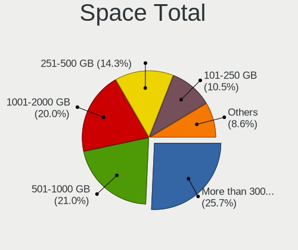
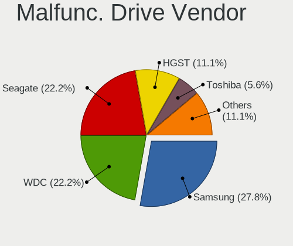
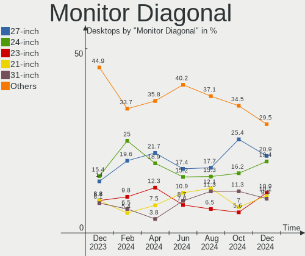
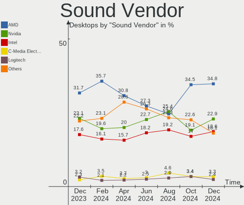

Arch Hardware Trends (Desktop)
------------------------------

A project to identify most popular hardware characteristics and track their change
over time based on data collected by Arch users at https://Linux-Hardware.org.

Anyone can contribute to the study by uploading probes of their computers by
the [hw-probe](https://github.com/linuxhw/hw-probe) tool:

    sudo -E hw-probe -all -upload

Full-feature report is available here: https://linux-hardware.org/?view=trends&formfactor=desktop

Period: Apr, 2021.

Contents
--------

- [ OS                       ](#os)
- [ OS Family                ](#os-family)
- [ Kernel                   ](#kernel)
- [ Kernel Family            ](#kernel-family)
- [ Kernel Major Ver.        ](#kernel-major-ver)
- [ Arch                     ](#arch)
- [ DE                       ](#de)
- [ Display Server           ](#display-server)
- [ Display Manager          ](#display-manager)
- [ OS Lang                  ](#os-lang)
- [ Boot Mode                ](#boot-mode)
- [ Filesystem               ](#filesystem)
- [ Part. scheme             ](#part-scheme)
- [ Dual Boot with Linux/BSD ](#dual-boot-with-linux/bsd)
- [ Dual Boot (Win)          ](#dual-boot-win)
- [ Country                  ](#country)
- [ City                     ](#city)
- [ Vendor                   ](#vendor)
- [ Model                    ](#model)
- [ Model Family             ](#model-family)
- [ MFG Year                 ](#mfg-year)
- [ Form Factor              ](#form-factor)
- [ Secure Boot              ](#secure-boot)
- [ Coreboot                 ](#coreboot)
- [ RAM Size                 ](#ram-size)
- [ RAM Used                 ](#ram-used)
- [ Has CD-ROM               ](#has-cd-rom)
- [ Total Drives             ](#total-drives)
- [ Has Ethernet             ](#has-ethernet)
- [ Has WiFi                 ](#has-wifi)
- [ Has Bluetooth            ](#has-bluetooth)
- [ Drive Vendor             ](#drive-vendor)
- [ Drive Model              ](#drive-model)
- [ HDD Vendor               ](#hdd-vendor)
- [ SSD Vendor               ](#ssd-vendor)
- [ Drive Kind               ](#drive-kind)
- [ Drive Connector          ](#drive-connector)
- [ Drive Size               ](#drive-size)
- [ Space Total              ](#space-total)
- [ Space Used               ](#space-used)
- [ Malfunc. Drives          ](#malfunc-drives)
- [ Malfunc. Drive Vendor    ](#malfunc-drive-vendor)
- [ Malfunc. HDD Vendor      ](#malfunc-hdd-vendor)
- [ Malfunc. Drive Kind      ](#malfunc-drive-kind)
- [ Failed Drives            ](#failed-drives)
- [ Failed Drive Vendor      ](#failed-drive-vendor)
- [ Drive Status             ](#drive-status)
- [ Storage Vendor           ](#storage-vendor)
- [ Storage Model            ](#storage-model)
- [ Storage Kind             ](#storage-kind)
- [ CPU Vendor               ](#cpu-vendor)
- [ CPU Model                ](#cpu-model)
- [ CPU Model Family         ](#cpu-model-family)
- [ CPU Cores                ](#cpu-cores)
- [ CPU Sockets              ](#cpu-sockets)
- [ CPU Threads              ](#cpu-threads)
- [ CPU Op-Modes             ](#cpu-op-modes)
- [ CPU Microcode            ](#cpu-microcode)
- [ CPU Microarch            ](#cpu-microarch)
- [ GPU Vendor               ](#gpu-vendor)
- [ GPU Model                ](#gpu-model)
- [ GPU Combo                ](#gpu-combo)
- [ GPU Driver               ](#gpu-driver)
- [ GPU Memory               ](#gpu-memory)
- [ Monitor Vendor           ](#monitor-vendor)
- [ Monitor Model            ](#monitor-model)
- [ Monitor Resolution       ](#monitor-resolution)
- [ Monitor Diagonal         ](#monitor-diagonal)
- [ Monitor Width            ](#monitor-width)
- [ Aspect Ratio             ](#aspect-ratio)
- [ Monitor Area             ](#monitor-area)
- [ Pixel Density            ](#pixel-density)
- [ Multiple Monitors        ](#multiple-monitors)
- [ Net Controller Vendor    ](#net-controller-vendor)
- [ Net Controller Model     ](#net-controller-model)
- [ Wireless Vendor          ](#wireless-vendor)
- [ Wireless Model           ](#wireless-model)
- [ Ethernet Vendor          ](#ethernet-vendor)
- [ Ethernet Model           ](#ethernet-model)
- [ Net Controller Kind      ](#net-controller-kind)
- [ Used Controller          ](#used-controller)
- [ NICs                     ](#nics)
- [ IPv6                     ](#ipv6)
- [ Memory Vendor            ](#memory-vendor)
- [ Memory Model             ](#memory-model)
- [ Memory Kind              ](#memory-kind)
- [ Memory Form Factor       ](#memory-form-factor)
- [ Memory Size              ](#memory-size)
- [ Memory Speed             ](#memory-speed)
- [ Sound Vendor             ](#sound-vendor)
- [ Sound Model              ](#sound-model)
- [ Camera Vendor            ](#camera-vendor)
- [ Camera Model             ](#camera-model)
- [ Fingerprint Vendor       ](#fingerprint-vendor)
- [ Fingerprint Model        ](#fingerprint-model)
- [ Chipcard Vendor          ](#chipcard-vendor)
- [ Chipcard Model           ](#chipcard-model)
- [ Printer Vendor           ](#printer-vendor)
- [ Printer Model            ](#printer-model)
- [ Scanner Vendor           ](#scanner-vendor)
- [ Scanner Model            ](#scanner-model)
- [ Bluetooth Vendor         ](#bluetooth-vendor)
- [ Bluetooth Model          ](#bluetooth-model)
- [ Unsupported Devices      ](#unsupported-devices)
- [ Unsupported Device Types ](#unsupported-device-types)

OS
--

Installed operating systems

| Name         | Desktops | Percent |
|--------------|----------|---------|
| Arch         | 36       | 59.02%  |
| Arch Rolling | 25       | 40.98%  |

OS Family
---------

OS without a version

| Name | Desktops | Percent |
|------|----------|---------|
| Arch | 61       | 100%    |

Kernel
------

Version of the Linux kernel

| Version                         | Desktops | Percent |
|---------------------------------|----------|---------|
| 5.11.15-arch1-2                 | 12       | 19.67%  |
| 5.11.11-arch1-1                 | 10       | 16.39%  |
| 5.11.16-arch1-1                 | 6        | 9.84%   |
| 5.11.13-arch1-1                 | 4        | 6.56%   |
| 5.11.12-arch1-1                 | 4        | 6.56%   |
| 5.10.27-1-lts                   | 4        | 6.56%   |
| 5.11.16-zen1-1-zen              | 2        | 3.28%   |
| 5.11.14-arch1-1                 | 2        | 3.28%   |
| 5.11.11-zen1-1-zen              | 2        | 3.28%   |
| 5.9.12-arch1-1                  | 1        | 1.64%   |
| 5.11.15-148-tkg-bmq             | 1        | 1.64%   |
| 5.11.14-zen1-1-zen              | 1        | 1.64%   |
| 5.11.14-147-tkg-bmq             | 1        | 1.64%   |
| 5.11.13-zen2-1-zen              | 1        | 1.64%   |
| 5.11.12-xanmod1-cacule-1-cacule | 1        | 1.64%   |
| 5.11.12-1-ck                    | 1        | 1.64%   |
| 5.11.11-144-tkg-upds            | 1        | 1.64%   |
| 5.11.11-144-tkg-bmq             | 1        | 1.64%   |
| 5.11.10-arch1-1                 | 1        | 1.64%   |
| 5.10.31-1-lts                   | 1        | 1.64%   |
| 5.10.30-1-lts                   | 1        | 1.64%   |
| 5.10.29-1-lts                   | 1        | 1.64%   |
| 5.10.28-1-lts                   | 1        | 1.64%   |
| 5.10.19-1-lts                   | 1        | 1.64%   |

Kernel Family
-------------

Linux kernel without a distro release

| Version | Desktops | Percent |
|---------|----------|---------|
| 5.11.11 | 14       | 22.95%  |
| 5.11.15 | 13       | 21.31%  |
| 5.11.16 | 8        | 13.11%  |
| 5.11.12 | 6        | 9.84%   |
| 5.11.13 | 5        | 8.2%    |
| 5.11.14 | 4        | 6.56%   |
| 5.10.27 | 4        | 6.56%   |
| 5.9.12  | 1        | 1.64%   |
| 5.11.10 | 1        | 1.64%   |
| 5.10.31 | 1        | 1.64%   |
| 5.10.30 | 1        | 1.64%   |
| 5.10.29 | 1        | 1.64%   |
| 5.10.28 | 1        | 1.64%   |
| 5.10.19 | 1        | 1.64%   |

Kernel Major Ver.
-----------------

Linux kernel major version

| Version | Desktops | Percent |
|---------|----------|---------|
| 5.11    | 51       | 83.61%  |
| 5.10    | 9        | 14.75%  |
| 5.9     | 1        | 1.64%   |

Arch
----

OS architecture (x86_64, i586, etc.)

| Name   | Desktops | Percent |
|--------|----------|---------|
| x86_64 | 61       | 100%    |

DE
--

Desktop Environment

| Name     | Desktops | Percent |
|----------|----------|---------|
| GNOME    | 24       | 39.34%  |
| KDE5     | 17       | 27.87%  |
| KDE      | 8        | 13.11%  |
| i3       | 3        | 4.92%   |
| Unknown  | 3        | 4.92%   |
| XFCE     | 2        | 3.28%   |
| sway     | 1        | 1.64%   |
| MATE     | 1        | 1.64%   |
| ICEWM    | 1        | 1.64%   |
| Cinnamon | 1        | 1.64%   |

Display Server
--------------

X11 or Wayland

| Name    | Desktops | Percent |
|---------|----------|---------|
| X11     | 44       | 72.13%  |
| Wayland | 9        | 14.75%  |
| Tty     | 5        | 8.2%    |
| Unknown | 3        | 4.92%   |

Display Manager
---------------

SDDM, LightDM, etc.

| Name    | Desktops | Percent |
|---------|----------|---------|
| Unknown | 27       | 44.26%  |
| SDDM    | 17       | 27.87%  |
| GDM     | 10       | 16.39%  |
| TDM     | 4        | 6.56%   |
| Ly      | 1        | 1.64%   |
| LXDM    | 1        | 1.64%   |
| LightDM | 1        | 1.64%   |

OS Lang
-------

Language

| Lang  | Desktops | Percent |
|-------|----------|---------|
| en_US | 33       | 54.1%   |
| en_GB | 6        | 9.84%   |
| ru_RU | 3        | 4.92%   |
| it_IT | 3        | 4.92%   |
| C     | 3        | 4.92%   |
| en_IE | 2        | 3.28%   |
| en_CA | 2        | 3.28%   |
| de_DE | 2        | 3.28%   |
| sv_SE | 1        | 1.64%   |
| pt_BR | 1        | 1.64%   |
| fr_FR | 1        | 1.64%   |
| et_EE | 1        | 1.64%   |
| es_VE | 1        | 1.64%   |
| en_DE | 1        | 1.64%   |
| en_AU | 1        | 1.64%   |

Boot Mode
---------

EFI or BIOS

| Mode | Desktops | Percent |
|------|----------|---------|
| EFI  | 34       | 55.74%  |
| BIOS | 27       | 44.26%  |

Filesystem
----------

Type of filesystem

| Type  | Desktops | Percent |
|-------|----------|---------|
| Ext4  | 49       | 80.33%  |
| Btrfs | 11       | 18.03%  |
| Xfs   | 1        | 1.64%   |

Part. scheme
------------

Scheme of partitioning

| Type    | Desktops | Percent |
|---------|----------|---------|
| GPT     | 40       | 65.57%  |
| Unknown | 20       | 32.79%  |
| MBR     | 1        | 1.64%   |

Dual Boot with Linux/BSD
------------------------

Hosting more than one Linux/BSD

| Dual boot | Desktops | Percent |
|-----------|----------|---------|
| No        | 50       | 81.97%  |
| Yes       | 11       | 18.03%  |

Dual Boot (Win)
---------------

Hosting Linux and Windows

| Dual boot | Desktops | Percent |
|-----------|----------|---------|
| No        | 39       | 63.93%  |
| Yes       | 22       | 36.07%  |

Country
-------

Geographic location (country)

| Country     | Desktops | Percent |
|-------------|----------|---------|
| USA         | 10       | 16.39%  |
| Germany     | 8        | 13.11%  |
| Russia      | 4        | 6.56%   |
| Italy       | 4        | 6.56%   |
| UK          | 3        | 4.92%   |
| Netherlands | 3        | 4.92%   |
| France      | 3        | 4.92%   |
| Canada      | 3        | 4.92%   |
| Sweden      | 2        | 3.28%   |
| Spain       | 2        | 3.28%   |
| Austria     | 2        | 3.28%   |
| Ukraine     | 1        | 1.64%   |
| Slovenia    | 1        | 1.64%   |
| Qatar       | 1        | 1.64%   |
| Poland      | 1        | 1.64%   |
| Norway      | 1        | 1.64%   |
| Lithuania   | 1        | 1.64%   |
| Latvia      | 1        | 1.64%   |
| Kuwait      | 1        | 1.64%   |
| Ireland     | 1        | 1.64%   |
| Iran        | 1        | 1.64%   |
| India       | 1        | 1.64%   |
| Greece      | 1        | 1.64%   |
| Estonia     | 1        | 1.64%   |
| Costa Rica  | 1        | 1.64%   |
| Brazil      | 1        | 1.64%   |
| Belgium     | 1        | 1.64%   |
| Australia   | 1        | 1.64%   |

City
----

Geographic location (city)

| City                           | Desktops | Percent |
|--------------------------------|----------|---------|
| Moscow                         | 3        | 4.92%   |
| Vienna                         | 2        | 3.28%   |
| Ludwigshafen am Rhein          | 2        | 3.28%   |
| Wroclaw                        | 1        | 1.64%   |
| Villeurbanne                   | 1        | 1.64%   |
| Umeå                          | 1        | 1.64%   |
| Tallinn                        | 1        | 1.64%   |
| Stockholm                      | 1        | 1.64%   |
| Stavanger                      | 1        | 1.64%   |
| State College                  | 1        | 1.64%   |
| St. Petersburg                 | 1        | 1.64%   |
| Springfield                    | 1        | 1.64%   |
| Scott Depot                    | 1        | 1.64%   |
| Sceaux                         | 1        | 1.64%   |
| Sangruda                       | 1        | 1.64%   |
| Rostov-on-Don                  | 1        | 1.64%   |
| Rome                           | 1        | 1.64%   |
| Riga                           | 1        | 1.64%   |
| Pomezia                        | 1        | 1.64%   |
| Pesnica                        | 1        | 1.64%   |
| Palermo                        | 1        | 1.64%   |
| Oxted                          | 1        | 1.64%   |
| Ottawa                         | 1        | 1.64%   |
| Ocean Springs                  | 1        | 1.64%   |
| North Richland Hills           | 1        | 1.64%   |
| Newark on Trent                | 1        | 1.64%   |
| Marine Corps Base Camp Lejeune | 1        | 1.64%   |
| Logroño                       | 1        | 1.64%   |
| Leipzig                        | 1        | 1.64%   |
| Kuwait City                    | 1        | 1.64%   |
| Khmilnyk                       | 1        | 1.64%   |
| Kellyville                     | 1        | 1.64%   |
| Kearney                        | 1        | 1.64%   |
| Kaslo                          | 1        | 1.64%   |
| Jackson                        | 1        | 1.64%   |
| Ixelles-Elsene                 | 1        | 1.64%   |
| Igensdorf                      | 1        | 1.64%   |
| Horn                           | 1        | 1.64%   |
| Hoogeveen                      | 1        | 1.64%   |
| Hamburg                        | 1        | 1.64%   |
| Gütersloh                     | 1        | 1.64%   |
| Faenza                         | 1        | 1.64%   |
| Evansville                     | 1        | 1.64%   |
| Dublin                         | 1        | 1.64%   |
| Doha                           | 1        | 1.64%   |
| Cricklewood                    | 1        | 1.64%   |
| Chennai                        | 1        | 1.64%   |
| Burriana                       | 1        | 1.64%   |
| Brampton                       | 1        | 1.64%   |
| Berlin                         | 1        | 1.64%   |
| Belém                         | 1        | 1.64%   |
| Athens                         | 1        | 1.64%   |
| Annweiler am Trifels           | 1        | 1.64%   |
| Amsterdam                      | 1        | 1.64%   |
| Alès                          | 1        | 1.64%   |
| Alajuelita                     | 1        | 1.64%   |
| Ahvaz                          | 1        | 1.64%   |

Vendor
------

Motherboard manufacturer

| Name                | Desktops | Percent |
|---------------------|----------|---------|
| ASUSTek Computer    | 19       | 31.15%  |
| MSI                 | 16       | 26.23%  |
| Gigabyte Technology | 12       | 19.67%  |
| ASRock              | 8        | 13.11%  |
| Hewlett-Packard     | 2        | 3.28%   |
| Supermicro          | 1        | 1.64%   |
| Pegatron            | 1        | 1.64%   |
| Packard Bell        | 1        | 1.64%   |
| Intel               | 1        | 1.64%   |

Model
-----

Motherboard model

| Name                                        | Desktops | Percent |
|---------------------------------------------|----------|---------|
| MSI MS-7C91                                 | 2        | 3.28%   |
| MSI MS-7C37                                 | 2        | 3.28%   |
| Gigabyte B450 I AORUS PRO WIFI              | 2        | 3.28%   |
| Supermicro SYS-6027AX-72RF-HFT3             | 1        | 1.64%   |
| Pegatron p2-1113w                           | 1        | 1.64%   |
| Packard Bell ixtreme M5740                  | 1        | 1.64%   |
| MSI MS-7C88                                 | 1        | 1.64%   |
| MSI MS-7C84                                 | 1        | 1.64%   |
| MSI MS-7C52                                 | 1        | 1.64%   |
| MSI MS-7B89                                 | 1        | 1.64%   |
| MSI MS-7B86                                 | 1        | 1.64%   |
| MSI MS-7B79                                 | 1        | 1.64%   |
| MSI MS-7B50                                 | 1        | 1.64%   |
| MSI MS-7A74                                 | 1        | 1.64%   |
| MSI MS-7A39                                 | 1        | 1.64%   |
| MSI MS-7A38                                 | 1        | 1.64%   |
| MSI MS-7922                                 | 1        | 1.64%   |
| MSI MS-7681                                 | 1        | 1.64%   |
| Intel H81                                   | 1        | 1.64%   |
| HP Z620 Workstation                         | 1        | 1.64%   |
| HP Z230 Tower Workstation                   | 1        | 1.64%   |
| Gigabyte X570 AORUS PRO WIFI                | 1        | 1.64%   |
| Gigabyte X570 AORUS PRO                     | 1        | 1.64%   |
| Gigabyte X399 DESIGNARE EX                  | 1        | 1.64%   |
| Gigabyte TRX40 DESIGNARE                    | 1        | 1.64%   |
| Gigabyte P41T-D3                            | 1        | 1.64%   |
| Gigabyte H81M-S2PV                          | 1        | 1.64%   |
| Gigabyte H81M-S1                            | 1        | 1.64%   |
| Gigabyte AX370-Gaming K5                    | 1        | 1.64%   |
| Gigabyte AX370-Gaming K3                    | 1        | 1.64%   |
| Gigabyte 970A-UD3                           | 1        | 1.64%   |
| ASUS Z170 PRO GAMING                        | 1        | 1.64%   |
| ASUS TUF GAMING X570-PRO                    | 1        | 1.64%   |
| ASUS TUF GAMING B550M-PLUS                  | 1        | 1.64%   |
| ASUS TUF B360-PRO GAMING                    | 1        | 1.64%   |
| ASUS ROG STRIX B550-I GAMING                | 1        | 1.64%   |
| ASUS ROG STRIX B550-A GAMING                | 1        | 1.64%   |
| ASUS ROG STRIX B450-I GAMING                | 1        | 1.64%   |
| ASUS ROG STRIX B450-F GAMING                | 1        | 1.64%   |
| ASUS PRIME X299-DELUXE                      | 1        | 1.64%   |
| ASUS PRIME H570-PLUS                        | 1        | 1.64%   |
| ASUS PRIME B450M-K                          | 1        | 1.64%   |
| ASUS PRIME B360M-K                          | 1        | 1.64%   |
| ASUS PRIME A320M-K                          | 1        | 1.64%   |
| ASUS P8Z77-V PRO                            | 1        | 1.64%   |
| ASUS P8H61-M LX                             | 1        | 1.64%   |
| ASUS P5G41T-M LX                            | 1        | 1.64%   |
| ASUS H61M-C                                 | 1        | 1.64%   |
| ASUS CCL Advantage Ryzen Motherboard Bundle | 1        | 1.64%   |
| ASUS All Series                             | 1        | 1.64%   |
| ASRock Z370 Extreme4                        | 1        | 1.64%   |
| ASRock Z170 Pro4                            | 1        | 1.64%   |
| ASRock X470 Master SLI/ac                   | 1        | 1.64%   |
| ASRock X370 Taichi                          | 1        | 1.64%   |
| ASRock H81M                                 | 1        | 1.64%   |
| ASRock FM2A68M-HD+                          | 1        | 1.64%   |
| ASRock B460M Pro4                           | 1        | 1.64%   |
| ASRock 990FX Extreme9                       | 1        | 1.64%   |

Model Family
------------

Motherboard model prefix

| Name                            | Desktops | Percent |
|---------------------------------|----------|---------|
| ASUS PRIME                      | 5        | 8.2%    |
| ASUS ROG                        | 4        | 6.56%   |
| ASUS TUF                        | 3        | 4.92%   |
| MSI MS-7C91                     | 2        | 3.28%   |
| MSI MS-7C37                     | 2        | 3.28%   |
| Gigabyte X570                   | 2        | 3.28%   |
| Gigabyte B450                   | 2        | 3.28%   |
| Gigabyte AX370-Gaming           | 2        | 3.28%   |
| Supermicro SYS-6027AX-72RF-HFT3 | 1        | 1.64%   |
| Pegatron p2-1113w               | 1        | 1.64%   |
| Packard Bell ixtreme            | 1        | 1.64%   |
| MSI MS-7C88                     | 1        | 1.64%   |
| MSI MS-7C84                     | 1        | 1.64%   |
| MSI MS-7C52                     | 1        | 1.64%   |
| MSI MS-7B89                     | 1        | 1.64%   |
| MSI MS-7B86                     | 1        | 1.64%   |
| MSI MS-7B79                     | 1        | 1.64%   |
| MSI MS-7B50                     | 1        | 1.64%   |
| MSI MS-7A74                     | 1        | 1.64%   |
| MSI MS-7A39                     | 1        | 1.64%   |
| MSI MS-7A38                     | 1        | 1.64%   |
| MSI MS-7922                     | 1        | 1.64%   |
| MSI MS-7681                     | 1        | 1.64%   |
| Intel H81                       | 1        | 1.64%   |
| HP Z620                         | 1        | 1.64%   |
| HP Z230                         | 1        | 1.64%   |
| Gigabyte X399                   | 1        | 1.64%   |
| Gigabyte TRX40                  | 1        | 1.64%   |
| Gigabyte P41T-D3                | 1        | 1.64%   |
| Gigabyte H81M-S2PV              | 1        | 1.64%   |
| Gigabyte H81M-S1                | 1        | 1.64%   |
| Gigabyte 970A-UD3               | 1        | 1.64%   |
| ASUS Z170                       | 1        | 1.64%   |
| ASUS P8Z77-V                    | 1        | 1.64%   |
| ASUS P8H61-M                    | 1        | 1.64%   |
| ASUS P5G41T-M                   | 1        | 1.64%   |
| ASUS H61M-C                     | 1        | 1.64%   |
| ASUS CCL                        | 1        | 1.64%   |
| ASUS All                        | 1        | 1.64%   |
| ASRock Z370                     | 1        | 1.64%   |
| ASRock Z170                     | 1        | 1.64%   |
| ASRock X470                     | 1        | 1.64%   |
| ASRock X370                     | 1        | 1.64%   |
| ASRock H81M                     | 1        | 1.64%   |
| ASRock FM2A68M-HD+              | 1        | 1.64%   |
| ASRock B460M                    | 1        | 1.64%   |
| ASRock 990FX                    | 1        | 1.64%   |

MFG Year
--------

Motherboard manufacture year

| Year | Desktops | Percent |
|------|----------|---------|
| 2020 | 21       | 34.43%  |
| 2021 | 11       | 18.03%  |
| 2019 | 9        | 14.75%  |
| 2013 | 5        | 8.2%    |
| 2016 | 4        | 6.56%   |
| 2015 | 4        | 6.56%   |
| 2018 | 2        | 3.28%   |
| 2012 | 2        | 3.28%   |
| 2010 | 2        | 3.28%   |
| 2011 | 1        | 1.64%   |

Form Factor
-----------

Physical design of the computer

| Name    | Desktops | Percent |
|---------|----------|---------|
| Desktop | 61       | 100%    |

Secure Boot
-----------

Enabled or disabled

| State    | Desktops | Percent |
|----------|----------|---------|
| Disabled | 61       | 100%    |

Coreboot
--------

Have coreboot on board

| Used | Desktops | Percent |
|------|----------|---------|
| No   | 61       | 100%    |

RAM Size
--------

Total RAM memory

| Size in GB  | Desktops | Percent |
|-------------|----------|---------|
| 16.01-24.0  | 29       | 47.54%  |
| 32.01-64.0  | 18       | 29.51%  |
| 8.01-16.0   | 8        | 13.11%  |
| 3.01-4.0    | 2        | 3.28%   |
| 24.01-32.0  | 2        | 3.28%   |
| 64.01-256.0 | 2        | 3.28%   |

RAM Used
--------

Used RAM memory

| Used GB   | Desktops | Percent |
|-----------|----------|---------|
| 2.01-3.0  | 16       | 26.23%  |
| 4.01-8.0  | 15       | 24.59%  |
| 3.01-4.0  | 12       | 19.67%  |
| 8.01-16.0 | 9        | 14.75%  |
| 1.01-2.0  | 8        | 13.11%  |
| 0.51-1.0  | 1        | 1.64%   |

Has CD-ROM
----------

Has CD-ROM on board

| Presented | Desktops | Percent |
|-----------|----------|---------|
| No        | 49       | 80.33%  |
| Yes       | 12       | 19.67%  |

Total Drives
------------

Number of drives on board

| Drives | Desktops | Percent |
|--------|----------|---------|
| 2      | 21       | 34.43%  |
| 3      | 20       | 32.79%  |
| 1      | 9        | 14.75%  |
| 4      | 5        | 8.2%    |
| 6      | 2        | 3.28%   |
| 5      | 2        | 3.28%   |
| 8      | 1        | 1.64%   |
| 7      | 1        | 1.64%   |

Has Ethernet
------------

Has Ethernet on board

| Presented | Desktops | Percent |
|-----------|----------|---------|
| Yes       | 60       | 98.36%  |
| No        | 1        | 1.64%   |

Has WiFi
--------

Has WiFi module

| Presented | Desktops | Percent |
|-----------|----------|---------|
| No        | 35       | 57.38%  |
| Yes       | 26       | 42.62%  |

Has Bluetooth
-------------

Has Bluetooth module

| Presented | Desktops | Percent |
|-----------|----------|---------|
| No        | 36       | 59.02%  |
| Yes       | 25       | 40.98%  |

Drive Vendor
------------

Hard drive vendors

| Vendor                    | Desktops | Drives | Percent |
|---------------------------|----------|--------|---------|
| Samsung Electronics       | 29       | 44     | 23.2%   |
| WDC                       | 25       | 36     | 20%     |
| Seagate                   | 14       | 18     | 11.2%   |
| Toshiba                   | 9        | 9      | 7.2%    |
| Sandisk                   | 8        | 8      | 6.4%    |
| Kingston                  | 7        | 8      | 5.6%    |
| Crucial                   | 7        | 8      | 5.6%    |
| Phison                    | 4        | 11     | 3.2%    |
| Micron/Crucial Technology | 3        | 3      | 2.4%    |
| Hitachi                   | 3        | 3      | 2.4%    |
| XPG                       | 2        | 2      | 1.6%    |
| Intel                     | 2        | 3      | 1.6%    |
| HGST                      | 2        | 2      | 1.6%    |
| USB30                     | 1        | 1      | 0.8%    |
| Smartbuy                  | 1        | 1      | 0.8%    |
| SK Hynix                  | 1        | 1      | 0.8%    |
| Silicon Motion            | 1        | 1      | 0.8%    |
| OCZ                       | 1        | 4      | 0.8%    |
| Mushkin                   | 1        | 1      | 0.8%    |
| JMicron                   | 1        | 1      | 0.8%    |
| Hewlett-Packard           | 1        | 1      | 0.8%    |
| GOODRAM                   | 1        | 1      | 0.8%    |
| A-DATA Technology         | 1        | 1      | 0.8%    |

Drive Model
-----------

Hard drive models

| Model                             | Desktops | Percent |
|-----------------------------------|----------|---------|
| Samsung SSD 970 EVO 1TB           | 4        | 2.61%   |
| Samsung SSD 850 EVO 500GB         | 4        | 2.61%   |
| WDC WD10EZEX-08WN4A0 1TB          | 3        | 1.96%   |
| Toshiba DT01ACA100 1TB            | 3        | 1.96%   |
| Samsung SSD 970 EVO Plus 1TB      | 3        | 1.96%   |
| Samsung SSD 860 EVO M.2 1TB       | 3        | 1.96%   |
| Kingston SA400S37480G 480GB SSD   | 3        | 1.96%   |
| XPG GAMMIX S11 Pro 2TB            | 2        | 1.31%   |
| WDC WD10EZRX-00L4HB0 1TB          | 2        | 1.31%   |
| WDC WD10EZEX-22MFCA0 1TB          | 2        | 1.31%   |
| Seagate ST8000DM004-2CX188 8TB    | 2        | 1.31%   |
| Seagate ST4000DM004-2CV104 4TB    | 2        | 1.31%   |
| Seagate ST2000DM006-2DM164 2TB    | 2        | 1.31%   |
| SanDisk SDSSDA120G 120GB          | 2        | 1.31%   |
| Sandisk NVMe SSD Drive 1TB        | 2        | 1.31%   |
| Samsung SSD 860 EVO 500GB         | 2        | 1.31%   |
| Samsung SSD 860 EVO 1TB           | 2        | 1.31%   |
| Samsung HD160JJ 160GB             | 2        | 1.31%   |
| Phison NVMe SSD Drive 1TB         | 2        | 1.31%   |
| Micron/Crucial NVMe SSD Drive 1TB | 2        | 1.31%   |
| Crucial CT1000MX500SSD1 1TB       | 2        | 1.31%   |
| WDC WDS500G3X0C-00SJG0 500GB      | 1        | 0.65%   |
| WDC WDS500G2X0C-00L350 500GB      | 1        | 0.65%   |
| WDC WDS500G2B0A-00SM50 500GB SSD  | 1        | 0.65%   |
| WDC WDS250G1B0A-00H9H0 250GB SSD  | 1        | 0.65%   |
| WDC WDS120G2G0A-00JH30 120GB SSD  | 1        | 0.65%   |
| WDC WDS100T2X0C-00L350 1TB        | 1        | 0.65%   |
| WDC WD8003FRYZ-01JPDB1 8TB        | 1        | 0.65%   |
| WDC WD60EZAZ-00ZGHB0 6TB          | 1        | 0.65%   |
| WDC WD5002AALX-00J37A0 500GB      | 1        | 0.65%   |
| WDC WD5000AZLX-00K4KA0 500GB      | 1        | 0.65%   |
| WDC WD5000AVVS-63H0B1 500GB       | 1        | 0.65%   |
| WDC WD5000AAKX-00ERMA0 500GB      | 1        | 0.65%   |
| WDC WD40EZRZ-19GXCB0 4TB          | 1        | 0.65%   |
| WDC WD40EFRX-68N32N0 4TB          | 1        | 0.65%   |
| WDC WD30EFRX-68AX9N0 3TB          | 1        | 0.65%   |
| WDC WD20EZRZ-00Z5HB0 2TB          | 1        | 0.65%   |
| WDC WD20EFRX-68EUZN0 2TB          | 1        | 0.65%   |
| WDC WD20EFRX-68AX9N0 2TB          | 1        | 0.65%   |
| WDC WD20EARX-00PASB0 2TB          | 1        | 0.65%   |
| WDC WD10EZRZ-00HTKB0 1TB          | 1        | 0.65%   |
| WDC WD10EZEX-75WN4A1 1TB          | 1        | 0.65%   |
| WDC WD10EZEX-60WN4A0 1TB          | 1        | 0.65%   |
| WDC WD10EZEX-21M2NA0 1TB          | 1        | 0.65%   |
| WDC WD10EZEX-00WN4A0 1TB          | 1        | 0.65%   |
| WDC WD10EZEX-00UD2A0 1TB          | 1        | 0.65%   |
| WDC WD10EZEX-00BN5A0 1TB          | 1        | 0.65%   |
| WDC WD10EADS-22M2B0 1TB           | 1        | 0.65%   |
| WDC WD1002FAEX-00Y9A0 1TB         | 1        | 0.65%   |
| USB30 Disk 500GB                  | 1        | 0.65%   |
| Toshiba TR200 480GB SSD           | 1        | 0.65%   |
| Toshiba TL100 240GB SSD           | 1        | 0.65%   |
| Toshiba MK8034GSX 80GB            | 1        | 0.65%   |
| Toshiba HDWD240 4TB               | 1        | 0.65%   |
| Toshiba HDWD130 3TB               | 1        | 0.65%   |
| Toshiba DT01ACA200 2TB            | 1        | 0.65%   |
| Smartbuy SSD 240GB                | 1        | 0.65%   |
| SK Hynix NVMe SSD Drive 1024GB    | 1        | 0.65%   |
| Silicon Motion NVMe SSD Drive 2TB | 1        | 0.65%   |
| Seagate ST8000VN004-2M2101 8TB    | 1        | 0.65%   |

HDD Vendor
----------

Hard disk drive vendors

| Vendor              | Desktops | Drives | Percent |
|---------------------|----------|--------|---------|
| WDC                 | 24       | 30     | 45.28%  |
| Seagate             | 14       | 18     | 26.42%  |
| Toshiba             | 7        | 7      | 13.21%  |
| Samsung Electronics | 3        | 3      | 5.66%   |
| Hitachi             | 3        | 3      | 5.66%   |
| HGST                | 2        | 2      | 3.77%   |

SSD Vendor
----------

Solid state drive vendors

| Vendor              | Desktops | Drives | Percent |
|---------------------|----------|--------|---------|
| Samsung Electronics | 18       | 22     | 35.29%  |
| Crucial             | 7        | 8      | 13.73%  |
| SanDisk             | 6        | 6      | 11.76%  |
| Kingston            | 6        | 7      | 11.76%  |
| WDC                 | 3        | 3      | 5.88%   |
| Toshiba             | 2        | 2      | 3.92%   |
| Intel               | 2        | 3      | 3.92%   |
| USB30               | 1        | 1      | 1.96%   |
| Smartbuy            | 1        | 1      | 1.96%   |
| OCZ                 | 1        | 4      | 1.96%   |
| Mushkin             | 1        | 1      | 1.96%   |
| JMicron             | 1        | 1      | 1.96%   |
| GOODRAM             | 1        | 1      | 1.96%   |
| A-DATA Technology   | 1        | 1      | 1.96%   |

Drive Kind
----------

HDD or SSD

| Kind | Desktops | Drives | Percent |
|------|----------|--------|---------|
| SSD  | 43       | 61     | 39.09%  |
| HDD  | 40       | 63     | 36.36%  |
| NVMe | 27       | 44     | 24.55%  |

Drive Connector
---------------

SATA, SAS, NVMe, etc.

| Type | Desktops | Drives | Percent |
|------|----------|--------|---------|
| SATA | 54       | 122    | 65.06%  |
| NVMe | 27       | 44     | 32.53%  |
| SAS  | 2        | 2      | 2.41%   |

Drive Size
----------

Size of hard drive

| Size in TB | Desktops | Drives | Percent |
|------------|----------|--------|---------|
| 0.01-0.5   | 40       | 61     | 43.48%  |
| 0.51-1.0   | 27       | 35     | 29.35%  |
| 1.01-2.0   | 10       | 12     | 10.87%  |
| 4.01-10.0  | 7        | 8      | 7.61%   |
| 3.01-4.0   | 5        | 5      | 5.43%   |
| 2.01-3.0   | 3        | 3      | 3.26%   |

Space Total
-----------

Amount of disk space available on the file system

| Size in GB     | Desktops | Percent |
|----------------|----------|---------|
| 501-1000       | 17       | 27.87%  |
| More than 3000 | 10       | 16.39%  |
| 1001-2000      | 10       | 16.39%  |
| 251-500        | 8        | 13.11%  |
| 2001-3000      | 8        | 13.11%  |
| 101-250        | 7        | 11.48%  |
| 51-100         | 1        | 1.64%   |

Space Used
----------

Amount of used disk space

| Used GB        | Desktops | Percent |
|----------------|----------|---------|
| 1001-2000      | 12       | 19.67%  |
| 101-250        | 9        | 14.75%  |
| 1-20           | 9        | 14.75%  |
| 251-500        | 8        | 13.11%  |
| 51-100         | 8        | 13.11%  |
| 501-1000       | 5        | 8.2%    |
| More than 3000 | 4        | 6.56%   |
| 21-50          | 4        | 6.56%   |
| 2001-3000      | 2        | 3.28%   |

Malfunc. Drives
---------------

Drive models with a malfunction

| Model                             | Desktops | Drives | Percent |
|-----------------------------------|----------|--------|---------|
| WDC WDS250G1B0A-00H9H0 250GB SSD  | 1        | 1      | 7.69%   |
| WDC WD5000AAKX-00ERMA0 500GB      | 1        | 1      | 7.69%   |
| WDC WD40EFRX-68N32N0 4TB          | 1        | 1      | 7.69%   |
| WDC WD20EFRX-68EUZN0 2TB          | 1        | 1      | 7.69%   |
| WDC WD20EARX-00PASB0 2TB          | 1        | 1      | 7.69%   |
| WDC WD10EZEX-21M2NA0 1TB          | 1        | 1      | 7.69%   |
| WDC WD10EADS-22M2B0 1TB           | 1        | 1      | 7.69%   |
| Toshiba DT01ACA200 2TB            | 1        | 1      | 7.69%   |
| Seagate ST2000DM006-2DM164 2TB    | 1        | 1      | 7.69%   |
| Samsung Electronics SP1614C 160GB | 1        | 1      | 7.69%   |
| Samsung Electronics HD160JJ 160GB | 1        | 1      | 7.69%   |
| Hitachi HDT721064SLA360 640GB     | 1        | 1      | 7.69%   |
| HGST HTS541010A9E680 1TB          | 1        | 1      | 7.69%   |

Malfunc. Drive Vendor
---------------------

Vendors of faulty drives

| Vendor              | Desktops | Drives | Percent |
|---------------------|----------|--------|---------|
| WDC                 | 5        | 7      | 45.45%  |
| Samsung Electronics | 2        | 2      | 18.18%  |
| Toshiba             | 1        | 1      | 9.09%   |
| Seagate             | 1        | 1      | 9.09%   |
| Hitachi             | 1        | 1      | 9.09%   |
| HGST                | 1        | 1      | 9.09%   |

Malfunc. HDD Vendor
-------------------

Vendors of faulty HDD drives

| Vendor              | Desktops | Drives | Percent |
|---------------------|----------|--------|---------|
| WDC                 | 4        | 6      | 40%     |
| Samsung Electronics | 2        | 2      | 20%     |
| Toshiba             | 1        | 1      | 10%     |
| Seagate             | 1        | 1      | 10%     |
| Hitachi             | 1        | 1      | 10%     |
| HGST                | 1        | 1      | 10%     |

Malfunc. Drive Kind
-------------------

Kinds of faulty drives

| Kind | Desktops | Drives | Percent |
|------|----------|--------|---------|
| HDD  | 8        | 12     | 88.89%  |
| SSD  | 1        | 1      | 11.11%  |

Failed Drives
-------------

Failed drive models

Zero info for selected period =(

Failed Drive Vendor
-------------------

Failed drive vendors

Zero info for selected period =(

Drive Status
------------

Number of failed and malfunc. drives

| Status   | Desktops | Drives | Percent |
|----------|----------|--------|---------|
| Works    | 32       | 82     | 46.38%  |
| Detected | 29       | 73     | 42.03%  |
| Malfunc  | 8        | 13     | 11.59%  |

Storage Vendor
--------------

Storage controller vendors

| Vendor                      | Desktops | Percent |
|-----------------------------|----------|---------|
| AMD                         | 34       | 33.33%  |
| Intel                       | 27       | 26.47%  |
| Samsung Electronics         | 14       | 13.73%  |
| ASMedia Technology          | 6        | 5.88%   |
| Sandisk                     | 4        | 3.92%   |
| Phison Electronics          | 4        | 3.92%   |
| Micron/Crucial Technology   | 3        | 2.94%   |
| Silicon Motion              | 2        | 1.96%   |
| JMicron Technology          | 2        | 1.96%   |
| ADATA Technology            | 2        | 1.96%   |
| VIA Technologies            | 1        | 0.98%   |
| SK Hynix                    | 1        | 0.98%   |
| OCZ Technology Group        | 1        | 0.98%   |
| Kingston Technology Company | 1        | 0.98%   |

Storage Model
-------------

Storage controller models

| Model                                                                                   | Desktops | Percent |
|-----------------------------------------------------------------------------------------|----------|---------|
| AMD FCH SATA Controller [AHCI mode]                                                     | 22       | 17.89%  |
| AMD 400 Series Chipset SATA Controller                                                  | 10       | 8.13%   |
| Samsung NVMe SSD Controller SM981/PM981/PM983                                           | 9        | 7.32%   |
| ASMedia ASM1062 Serial ATA Controller                                                   | 6        | 4.88%   |
| AMD Starship/Matisse Chipset SATA Controller [AHCI mode]                                | 6        | 4.88%   |
| Intel 8 Series/C220 Series Chipset Family 6-port SATA Controller 1 [AHCI mode]          | 5        | 4.07%   |
| Sandisk WD Black 2018/SN750 / PC SN720 NVMe SSD                                         | 3        | 2.44%   |
| Samsung NVMe SSD Controller SM961/PM961/SM963                                           | 3        | 2.44%   |
| Samsung NVMe SSD Controller PM9A1/980PRO                                                | 3        | 2.44%   |
| Phison E12 NVMe Controller                                                              | 3        | 2.44%   |
| AMD X370 Series Chipset SATA Controller                                                 | 3        | 2.44%   |
| AMD SB7x0/SB8x0/SB9x0 SATA Controller [AHCI mode]                                       | 3        | 2.44%   |
| Micron/Crucial P1 NVMe PCIe SSD                                                         | 2        | 1.63%   |
| Intel SATA Controller [RAID mode]                                                       | 2        | 1.63%   |
| Intel Q170/Q150/B150/H170/H110/Z170/CM236 Chipset SATA Controller [AHCI Mode]           | 2        | 1.63%   |
| Intel NM10/ICH7 Family SATA Controller [IDE mode]                                       | 2        | 1.63%   |
| Intel Cannon Lake PCH SATA AHCI Controller                                              | 2        | 1.63%   |
| Intel C600/X79 series chipset 6-Port SATA AHCI Controller                               | 2        | 1.63%   |
| Intel 9 Series Chipset Family SATA Controller [AHCI Mode]                               | 2        | 1.63%   |
| Intel 6 Series/C200 Series Chipset Family Desktop SATA Controller (IDE mode, ports 4-5) | 2        | 1.63%   |
| Intel 6 Series/C200 Series Chipset Family Desktop SATA Controller (IDE mode, ports 0-3) | 2        | 1.63%   |
| Intel 400 Series Chipset Family SATA AHCI Controller                                    | 2        | 1.63%   |
| Intel 200 Series PCH SATA controller [AHCI mode]                                        | 2        | 1.63%   |
| AMD 300 Series Chipset SATA Controller                                                  | 2        | 1.63%   |
| ADATA XPG SX8200 Pro PCIe Gen3x4 M.2 2280 Solid State Drive                             | 2        | 1.63%   |
| VIA VT6421 IDE/SATA Controller                                                          | 1        | 0.81%   |
| SK Hynix Non-Volatile memory controller                                                 | 1        | 0.81%   |
| Silicon Motion SM2263EN/SM2263XT SSD Controller                                         | 1        | 0.81%   |
| Silicon Motion SM2262/SM2262EN SSD Controller                                           | 1        | 0.81%   |
| Sandisk WD Black SN750 / PC SN730 NVMe SSD                                              | 1        | 0.81%   |
| Samsung NVMe SSD Controller SM951/PM951                                                 | 1        | 0.81%   |
| Phison E16 PCIe4 NVMe Controller                                                        | 1        | 0.81%   |
| OCZ Group RevoDrive 3 X2 PCI-Express SSD 240 GB (Marvell Controller)                    | 1        | 0.81%   |
| Micron/Crucial Non-Volatile memory controller                                           | 1        | 0.81%   |
| Kingston Company A2000 NVMe SSD                                                         | 1        | 0.81%   |
| JMicron JMB363 SATA/IDE Controller                                                      | 1        | 0.81%   |
| JMicron JMB362 SATA Controller                                                          | 1        | 0.81%   |
| Intel C602 chipset 4-Port SATA Storage Control Unit                                     | 1        | 0.81%   |
| Intel 82801G (ICH7 Family) IDE Controller                                               | 1        | 0.81%   |
| Intel 7 Series/C210 Series Chipset Family 6-port SATA Controller [AHCI mode]            | 1        | 0.81%   |
| Intel 6 Series/C200 Series Chipset Family 6 port Desktop SATA AHCI Controller           | 1        | 0.81%   |
| Intel 500 Series Chipset Family SATA AHCI Controller                                    | 1        | 0.81%   |
| Intel 5 Series/3400 Series Chipset 6 port SATA AHCI Controller                          | 1        | 0.81%   |
| AMD X399 Series Chipset SATA Controller                                                 | 1        | 0.81%   |
| AMD SB7x0/SB8x0/SB9x0 IDE Controller                                                    | 1        | 0.81%   |
| AMD FCH SATA Controller D                                                               | 1        | 0.81%   |

Storage Kind
------------

Kind of storage controller (IDE, SATA, NVMe, SAS, ...)

| Kind | Desktops | Percent |
|------|----------|---------|
| SATA | 56       | 59.57%  |
| NVMe | 27       | 28.72%  |
| IDE  | 6        | 6.38%   |
| RAID | 3        | 3.19%   |
| SAS  | 1        | 1.06%   |
| SCSI | 1        | 1.06%   |

CPU Vendor
----------

Processor vendors

| Vendor | Desktops | Percent |
|--------|----------|---------|
| AMD    | 34       | 55.74%  |
| Intel  | 27       | 44.26%  |

CPU Model
---------

Processor models

| Model                                          | Desktops | Percent |
|------------------------------------------------|----------|---------|
| AMD Ryzen 5 5600X 6-Core Processor             | 4        | 6.56%   |
| AMD Ryzen 9 5900X 12-Core Processor            | 3        | 4.92%   |
| AMD Ryzen 5 3600 6-Core Processor              | 3        | 4.92%   |
| AMD Ryzen 5 2600X Six-Core Processor           | 3        | 4.92%   |
| Intel Core i7-4790K CPU @ 4.00GHz              | 2        | 3.28%   |
| Intel Core i5-3450 CPU @ 3.10GHz               | 2        | 3.28%   |
| AMD Ryzen 9 3900X 12-Core Processor            | 2        | 3.28%   |
| AMD Ryzen 7 5800X 8-Core Processor             | 2        | 3.28%   |
| AMD Ryzen 7 3700X 8-Core Processor             | 2        | 3.28%   |
| AMD Ryzen 7 2700X Eight-Core Processor         | 2        | 3.28%   |
| AMD Ryzen 5 1600 Six-Core Processor            | 2        | 3.28%   |
| Intel Xeon CPU E5450 @ 3.00GHz                 | 1        | 1.64%   |
| Intel Xeon CPU E5-2670 0 @ 2.60GHz             | 1        | 1.64%   |
| Intel Xeon CPU E5-2667 v2 @ 3.30GHz            | 1        | 1.64%   |
| Intel Xeon CPU E3-1225 v3 @ 3.20GHz            | 1        | 1.64%   |
| Intel Core i9-9900K CPU @ 3.60GHz              | 1        | 1.64%   |
| Intel Core i7-9800X CPU @ 3.80GHz              | 1        | 1.64%   |
| Intel Core i7-9700 CPU @ 3.00GHz               | 1        | 1.64%   |
| Intel Core i7-8700K CPU @ 3.70GHz              | 1        | 1.64%   |
| Intel Core i7-7700 CPU @ 3.60GHz               | 1        | 1.64%   |
| Intel Core i7-6700 CPU @ 3.40GHz               | 1        | 1.64%   |
| Intel Core i7-4790 CPU @ 3.60GHz               | 1        | 1.64%   |
| Intel Core i7-3770 CPU @ 3.40GHz               | 1        | 1.64%   |
| Intel Core i5-8400 CPU @ 2.80GHz               | 1        | 1.64%   |
| Intel Core i5-6600K CPU @ 3.50GHz              | 1        | 1.64%   |
| Intel Core i5-4590 CPU @ 3.30GHz               | 1        | 1.64%   |
| Intel Core i5-4440 CPU @ 3.10GHz               | 1        | 1.64%   |
| Intel Core i5-10500 CPU @ 3.10GHz              | 1        | 1.64%   |
| Intel Core i5 CPU 650 @ 3.20GHz                | 1        | 1.64%   |
| Intel Core i3-4170 CPU @ 3.70GHz               | 1        | 1.64%   |
| Intel Core i3-10100F CPU @ 3.60GHz             | 1        | 1.64%   |
| Intel Core 2 Duo CPU E7600 @ 3.06GHz           | 1        | 1.64%   |
| Intel Celeron CPU G1620 @ 2.70GHz              | 1        | 1.64%   |
| Intel 11th Gen Core i5-11600K @ 3.90GHz        | 1        | 1.64%   |
| AMD Ryzen Threadripper 3970X 32-Core Processor | 1        | 1.64%   |
| AMD Ryzen Threadripper 2950X 16-Core Processor | 1        | 1.64%   |
| AMD Ryzen 9 3900XT 12-Core Processor           | 1        | 1.64%   |
| AMD Ryzen 7 2700 Eight-Core Processor          | 1        | 1.64%   |
| AMD Ryzen 7 1700X Eight-Core Processor         | 1        | 1.64%   |
| AMD Ryzen 5 2600 Six-Core Processor            | 1        | 1.64%   |
| AMD Ryzen 3 2200G with Radeon Vega Graphics    | 1        | 1.64%   |
| AMD FX-9590 Eight-Core Processor               | 1        | 1.64%   |
| AMD FX-6300 Six-Core Processor                 | 1        | 1.64%   |
| AMD E-300 APU with Radeon HD Graphics          | 1        | 1.64%   |
| AMD A8-5600K APU with Radeon HD Graphics       | 1        | 1.64%   |

CPU Model Family
----------------

Processor model prefix

| Model                  | Desktops | Percent |
|------------------------|----------|---------|
| AMD Ryzen 5            | 13       | 21.31%  |
| Intel Core i7          | 9        | 14.75%  |
| Intel Core i5          | 8        | 13.11%  |
| AMD Ryzen 7            | 8        | 13.11%  |
| AMD Ryzen 9            | 6        | 9.84%   |
| Intel Xeon             | 4        | 6.56%   |
| Intel Core i3          | 2        | 3.28%   |
| AMD Ryzen Threadripper | 2        | 3.28%   |
| AMD FX                 | 2        | 3.28%   |
| Other                  | 1        | 1.64%   |
| Intel Core i9          | 1        | 1.64%   |
| Intel Core 2 Duo       | 1        | 1.64%   |
| Intel Celeron          | 1        | 1.64%   |
| AMD Ryzen 3            | 1        | 1.64%   |
| AMD E                  | 1        | 1.64%   |
| AMD A8                 | 1        | 1.64%   |

CPU Cores
---------

Number of processor cores

| Number | Desktops | Percent |
|--------|----------|---------|
| 6      | 17       | 27.87%  |
| 4      | 16       | 26.23%  |
| 8      | 11       | 18.03%  |
| 12     | 6        | 9.84%   |
| 2      | 6        | 9.84%   |
| 16     | 3        | 4.92%   |
| 32     | 1        | 1.64%   |
| 3      | 1        | 1.64%   |

CPU Sockets
-----------

Number of sockets

| Number | Desktops | Percent |
|--------|----------|---------|
| 1      | 59       | 96.72%  |
| 2      | 2        | 3.28%   |

CPU Threads
-----------

Threads per core (Hyper-Threading)

| Number | Desktops | Percent |
|--------|----------|---------|
| 2      | 48       | 78.69%  |
| 1      | 13       | 21.31%  |

CPU Op-Modes
------------

CPU Operation Modes (32-bit, 64-bit)

| Op mode        | Desktops | Percent |
|----------------|----------|---------|
| 32-bit, 64-bit | 61       | 100%    |

CPU Microcode
-------------

Microcode number

| Number     | Desktops | Percent |
|------------|----------|---------|
| Unknown    | 23       | 37.7%   |
| 0x0a201009 | 6        | 9.84%   |
| 0x08701021 | 5        | 8.2%    |
| 0x306c3    | 4        | 6.56%   |
| 0x306a9    | 3        | 4.92%   |
| 0xa0653    | 2        | 3.28%   |
| 0x906ed    | 2        | 3.28%   |
| 0x506e3    | 2        | 3.28%   |
| 0x1067a    | 2        | 3.28%   |
| 0x906ea    | 1        | 1.64%   |
| 0x906e9    | 1        | 1.64%   |
| 0x306e4    | 1        | 1.64%   |
| 0x20652    | 1        | 1.64%   |
| 0x0a201006 | 1        | 1.64%   |
| 0x08301039 | 1        | 1.64%   |
| 0x08101016 | 1        | 1.64%   |
| 0x0800820d | 1        | 1.64%   |
| 0x0800820b | 1        | 1.64%   |
| 0x08001138 | 1        | 1.64%   |
| 0x06001119 | 1        | 1.64%   |
| 0x06000803 | 1        | 1.64%   |

CPU Microarch
-------------

Microarchitecture

| Name        | Desktops | Percent |
|-------------|----------|---------|
| Zen 3       | 9        | 14.75%  |
| Zen 2       | 9        | 14.75%  |
| Zen+        | 8        | 13.11%  |
| Haswell     | 7        | 11.48%  |
| KabyLake    | 5        | 8.2%    |
| IvyBridge   | 5        | 8.2%    |
| Zen         | 4        | 6.56%   |
| Skylake     | 3        | 4.92%   |
| Piledriver  | 3        | 4.92%   |
| Penryn      | 2        | 3.28%   |
| CometLake   | 2        | 3.28%   |
| Westmere    | 1        | 1.64%   |
| SandyBridge | 1        | 1.64%   |
| Bobcat      | 1        | 1.64%   |
| Unknown     | 1        | 1.64%   |

GPU Vendor
----------

Vendors of graphics cards

| Vendor                     | Desktops | Percent |
|----------------------------|----------|---------|
| Nvidia                     | 33       | 47.14%  |
| AMD                        | 27       | 38.57%  |
| Intel                      | 9        | 12.86%  |
| Matrox Electronics Systems | 1        | 1.43%   |

GPU Model
---------

Graphics card models

| Model                                                                       | Desktops | Percent |
|-----------------------------------------------------------------------------|----------|---------|
| AMD Ellesmere [Radeon RX 470/480/570/570X/580/580X/590]                     | 8        | 11.43%  |
| Nvidia GP104 [GeForce GTX 1070]                                             | 6        | 8.57%   |
| AMD Navi 10 [Radeon RX 5600 OEM/5600 XT / 5700/5700 XT]                     | 5        | 7.14%   |
| Nvidia GM206 [GeForce GTX 960]                                              | 3        | 4.29%   |
| Nvidia TU106 [GeForce RTX 2060 Rev. A]                                      | 2        | 2.86%   |
| Nvidia GP107 [GeForce GTX 1050]                                             | 2        | 2.86%   |
| Nvidia GP107 [GeForce GTX 1050 Ti]                                          | 2        | 2.86%   |
| Nvidia GP106 [GeForce GTX 1060 6GB]                                         | 2        | 2.86%   |
| Nvidia GP104 [GeForce GTX 1080]                                             | 2        | 2.86%   |
| Nvidia GK208B [GeForce GT 710]                                              | 2        | 2.86%   |
| Nvidia GA102 [GeForce RTX 3080]                                             | 2        | 2.86%   |
| Intel Xeon E3-1200 v3/4th Gen Core Processor Integrated Graphics Controller | 2        | 2.86%   |
| Intel CometLake-S GT2 [UHD Graphics 630]                                    | 2        | 2.86%   |
| AMD Navi 21 [Radeon RX 6800/6800 XT / 6900 XT]                              | 2        | 2.86%   |
| AMD Cedar [Radeon HD 5000/6000/7350/8350 Series]                            | 2        | 2.86%   |
| Nvidia TU116 [GeForce GTX 1660]                                             | 1        | 1.43%   |
| Nvidia TU104 [GeForce RTX 2070 SUPER]                                       | 1        | 1.43%   |
| Nvidia GP106GL [Quadro P2000]                                               | 1        | 1.43%   |
| Nvidia GP106 [GeForce GTX 1060 3GB]                                         | 1        | 1.43%   |
| Nvidia GP102 [GeForce GTX 1080 Ti]                                          | 1        | 1.43%   |
| Nvidia GM107GL [Quadro K1200]                                               | 1        | 1.43%   |
| Nvidia GM107 [GeForce GTX 750 Ti]                                           | 1        | 1.43%   |
| Nvidia GK208B [GeForce GT 730]                                              | 1        | 1.43%   |
| Nvidia GK104 [GeForce GTX 660 Ti]                                           | 1        | 1.43%   |
| Nvidia GF108 [GeForce GT 630]                                               | 1        | 1.43%   |
| Matrox Electronics Systems MGA G200eW WPCM450                               | 1        | 1.43%   |
| Intel Xeon E3-1200 v2/3rd Gen Core processor Graphics Controller            | 1        | 1.43%   |
| Intel RocketLake-S GT1 [UHD Graphics 750]                                   | 1        | 1.43%   |
| Intel HD Graphics 630                                                       | 1        | 1.43%   |
| Intel HD Graphics 530                                                       | 1        | 1.43%   |
| Intel 4th Generation Core Processor Family Integrated Graphics Controller   | 1        | 1.43%   |
| AMD Wrestler [Radeon HD 6310]                                               | 1        | 1.43%   |
| AMD Vega 10 XTX [Radeon Vega Frontier Edition]                              | 1        | 1.43%   |
| AMD RV730 PRO [Radeon HD 4650]                                              | 1        | 1.43%   |
| AMD Raven Ridge [Radeon Vega Series / Radeon Vega Mobile Series]            | 1        | 1.43%   |
| AMD Navi 14 [Radeon RX 5500/5500M / Pro 5500M]                              | 1        | 1.43%   |
| AMD Lexa PRO [Radeon 540/540X/550/550X / RX 540X/550/550X]                  | 1        | 1.43%   |
| AMD Fiji [Radeon R9 FURY / NANO Series]                                     | 1        | 1.43%   |
| AMD Curacao PRO [Radeon R7 370 / R9 270/370 OEM]                            | 1        | 1.43%   |
| AMD Cape Verde XT [Radeon HD 7770/8760 / R7 250X]                           | 1        | 1.43%   |
| AMD Baffin [Radeon RX 550 640SP / RX 560/560X]                              | 1        | 1.43%   |

GPU Combo
---------

Combinations of graphics cards

| Name           | Desktops | Percent |
|----------------|----------|---------|
| 1 x Nvidia     | 30       | 49.18%  |
| 1 x AMD        | 24       | 39.34%  |
| Intel + Nvidia | 2        | 3.28%   |
| 1 x Intel      | 2        | 3.28%   |
| Intel + AMD    | 1        | 1.64%   |
| AMD + Nvidia   | 1        | 1.64%   |
| AMD + Matrox   | 1        | 1.64%   |

GPU Driver
----------

Free vs proprietary

| Driver      | Desktops | Percent |
|-------------|----------|---------|
| Free        | 34       | 55.74%  |
| Proprietary | 27       | 44.26%  |

GPU Memory
----------

Total video memory

| Size in GB | Desktops | Percent |
|------------|----------|---------|
| Unknown    | 17       | 27.87%  |
| 1.01-2.0   | 12       | 19.67%  |
| 7.01-8.0   | 11       | 18.03%  |
| 8.01-16.0  | 6        | 9.84%   |
| 5.01-6.0   | 5        | 8.2%    |
| 3.01-4.0   | 5        | 8.2%    |
| 0.51-1.0   | 3        | 4.92%   |
| 4.01-5.0   | 1        | 1.64%   |
| 2.01-3.0   | 1        | 1.64%   |

Monitor Vendor
--------------

Monitor vendors

| Vendor               | Desktops | Percent |
|----------------------|----------|---------|
| Dell                 | 14       | 17.5%   |
| Goldstar             | 12       | 15%     |
| Samsung Electronics  | 7        | 8.75%   |
| BenQ                 | 7        | 8.75%   |
| Ancor Communications | 7        | 8.75%   |
| Philips              | 5        | 6.25%   |
| Hewlett-Packard      | 4        | 5%      |
| AOC                  | 4        | 5%      |
| Acer                 | 4        | 5%      |
| ViewSonic            | 2        | 2.5%    |
| Unknown              | 2        | 2.5%    |
| Iiyama               | 2        | 2.5%    |
| Valve                | 1        | 1.25%   |
| Sceptre Tech         | 1        | 1.25%   |
| NEC Computers        | 1        | 1.25%   |
| Lenovo               | 1        | 1.25%   |
| Idek Iiyama          | 1        | 1.25%   |
| HVR                  | 1        | 1.25%   |
| HannStar             | 1        | 1.25%   |
| Gigabyte Technology  | 1        | 1.25%   |
| AUS                  | 1        | 1.25%   |
| ASUSTek Computer     | 1        | 1.25%   |

Monitor Model
-------------

Monitor models

| Model                                                                  | Desktops | Percent |
|------------------------------------------------------------------------|----------|---------|
| Goldstar IPS FULLHD GSM5AB8 1920x1080 480x270mm 21.7-inch              | 2        | 2.35%   |
| Goldstar HDR 4K GSM7707 3840x2160 600x340mm 27.2-inch                  | 2        | 2.35%   |
| Goldstar E2360 GSM57E3 1920x1080 510x290mm 23.1-inch                   | 2        | 2.35%   |
| Goldstar 27GL850 GSM5B7F 2560x1440 597x336mm 27.0-inch                 | 2        | 2.35%   |
| Dell U2718Q DELA0EC 3840x2160 609x349mm 27.6-inch                      | 2        | 2.35%   |
| Dell S2417DG DELA0E7 2560x1440 527x296mm 23.8-inch                     | 2        | 2.35%   |
| Ancor Communications VG248 ACI24E1 1680x1050 530x300mm 24.0-inch       | 2        | 2.35%   |
| ViewSonic XG2401 SERIES VSCBB31 1920x1080 531x299mm 24.0-inch          | 1        | 1.18%   |
| ViewSonic VX2758-Series VSCA738 2560x1440 598x336mm 27.0-inch          | 1        | 1.18%   |
| Valve Index HMD VLV91A8                                                | 1        | 1.18%   |
| Unknown LCD Monitor LHC V3L6W 5360x1440                                | 1        | 1.18%   |
| Unknown LCD Monitor Dell S2418H/HX 1920x1080                           | 1        | 1.18%   |
| Sceptre Tech E248W-1920 SPT099D 1920x1080 443x249mm 20.0-inch          | 1        | 1.18%   |
| Samsung Electronics SyncMaster SAM0423 1920x1080                       | 1        | 1.18%   |
| Samsung Electronics SMS22A100 SAM0868 1920x1080 477x268mm 21.5-inch    | 1        | 1.18%   |
| Samsung Electronics S24F350 SAM0D20 1920x1080 521x293mm 23.5-inch      | 1        | 1.18%   |
| Samsung Electronics S24C450 SAM09CE 1920x1200 518x324mm 24.1-inch      | 1        | 1.18%   |
| Samsung Electronics LCD Monitor SAM0B30 1920x1080 890x500mm 40.2-inch  | 1        | 1.18%   |
| Samsung Electronics LCD Monitor SAM07C3 1920x1080 1210x680mm 54.6-inch | 1        | 1.18%   |
| Samsung Electronics C32HG7x SAM0E14 2560x1440 700x390mm 31.5-inch      | 1        | 1.18%   |
| Philips PHL 276E9Q PHLC17B 1920x1080 598x336mm 27.0-inch               | 1        | 1.18%   |
| Philips PHL 272B7QPJ PHL0900 2560x1440 597x336mm 27.0-inch             | 1        | 1.18%   |
| Philips PHL 246V5 PHLC0C5 1920x1080 530x300mm 24.0-inch                | 1        | 1.18%   |
| Philips PHL 223V7 PHLC154 1920x1080 476x268mm 21.5-inch                | 1        | 1.18%   |
| Philips PHL 223V5LH PHLC114 1920x1080 477x268mm 21.5-inch              | 1        | 1.18%   |
| NEC Computers E245WMi NEC2C63 1920x1200 519x324mm 24.1-inch            | 1        | 1.18%   |
| Lenovo L24i-10 LEN65D6 1920x1080 527x296mm 23.8-inch                   | 1        | 1.18%   |
| Iiyama PLB2403WS IVM5601 1920x1200 519x324mm 24.1-inch                 | 1        | 1.18%   |
| Iiyama PL2283H IVM562E 1920x1080 496x292mm 22.7-inch                   | 1        | 1.18%   |
| Idek Iiyama LCD Monitor PL2760Q 2560x1440                              | 1        | 1.18%   |
| HVR HTC-VIVE HVRAA01 2160x1200                                         | 1        | 1.18%   |
| Hewlett-Packard S2031 HWP2904 1600x900 443x249mm 20.0-inch             | 1        | 1.18%   |
| Hewlett-Packard 24xw HWP3255 1920x1080 530x300mm 24.0-inch             | 1        | 1.18%   |
| Hewlett-Packard 24w HPN3431 1920x1080 527x296mm 23.8-inch              | 1        | 1.18%   |
| Hewlett-Packard 24f HPN3546 1920x1080 527x296mm 23.8-inch              | 1        | 1.18%   |
| Hewlett-Packard 24f HPN3545 1920x1080 527x296mm 23.8-inch              | 1        | 1.18%   |
| HannStar HK241DPB HSD2E41 1920x1080 521x293mm 23.5-inch                | 1        | 1.18%   |
| Goldstar Ultra HD GSM5B09 3840x2160 600x340mm 27.2-inch                | 1        | 1.18%   |
| Goldstar IPS WSXGA GSM5B20 1440x900 419x262mm 19.5-inch                | 1        | 1.18%   |
| Goldstar HDR WFHD GSM5B9F 2560x1080 798x334mm 34.1-inch                | 1        | 1.18%   |
| Goldstar 34GL750 GSM773B 2560x1080 798x334mm 34.1-inch                 | 1        | 1.18%   |
| Goldstar 22EA53 GSM59A5 1680x1050 480x270mm 21.7-inch                  | 1        | 1.18%   |
| Gigabyte Technology G34WQC GBT3400 3440x1440 797x334mm 34.0-inch       | 1        | 1.18%   |
| Dell U3818DW DELA0F3 3840x1600 880x370mm 37.6-inch                     | 1        | 1.18%   |
| Dell U3421WE DELA18D 3440x1440 800x335mm 34.1-inch                     | 1        | 1.18%   |
| Dell U2720Q DEL41B3 3840x2160 597x336mm 27.0-inch                      | 1        | 1.18%   |
| Dell U2715H DELD067 2560x1440 597x336mm 27.0-inch                      | 1        | 1.18%   |
| Dell U2312HM DEL4071 1920x1080 510x287mm 23.0-inch                     | 1        | 1.18%   |
| Dell U2311H DELA05E 1920x1080 509x286mm 23.0-inch                      | 1        | 1.18%   |
| Dell S2721DS DELA19D 2560x1440 597x336mm 27.0-inch                     | 1        | 1.18%   |
| Dell S2721DS DELA19C 2560x1440 597x336mm 27.0-inch                     | 1        | 1.18%   |
| Dell S2721DGF DEL41D9 2560x1440 597x336mm 27.0-inch                    | 1        | 1.18%   |
| Dell P2720D DELD101 2560x1440 597x336mm 27.0-inch                      | 1        | 1.18%   |
| Dell P2314H DEL4098 1920x1080 509x286mm 23.0-inch                      | 1        | 1.18%   |
| Dell E2215HV DELF05F 1920x1080 476x268mm 21.5-inch                     | 1        | 1.18%   |
| BenQ ZOWIE XL LCD BNQ7F31 1920x1080 531x298mm 24.0-inch                | 1        | 1.18%   |
| BenQ PD3200U BNQ8025 3840x2160 708x399mm 32.0-inch                     | 1        | 1.18%   |
| BenQ LCD Monitor LCD                                                   | 1        | 1.18%   |
| BenQ LCD BNQ8024 2560x1440 597x336mm 27.0-inch                         | 1        | 1.18%   |
| BenQ GW2270 BNQ78DB 1920x1080 476x268mm 21.5-inch                      | 1        | 1.18%   |

Monitor Resolution
------------------

Monitor screen resolution

| Resolution         | Desktops | Percent |
|--------------------|----------|---------|
| 1920x1080 (FHD)    | 34       | 46.58%  |
| 2560x1440 (QHD)    | 13       | 17.81%  |
| 3840x2160 (4K)     | 6        | 8.22%   |
| Unknown            | 4        | 5.48%   |
| 1920x1200 (WUXGA)  | 3        | 4.11%   |
| 3440x1440          | 2        | 2.74%   |
| 2560x1080          | 2        | 2.74%   |
| 7680x2160          | 1        | 1.37%   |
| 6400x2160          | 1        | 1.37%   |
| 5360x1440          | 1        | 1.37%   |
| 3840x1600          | 1        | 1.37%   |
| 2160x1200          | 1        | 1.37%   |
| 1680x1050 (WSXGA+) | 1        | 1.37%   |
| 1600x900 (HD+)     | 1        | 1.37%   |
| 1440x900 (WXGA+)   | 1        | 1.37%   |
| 1366x768 (WXGA)    | 1        | 1.37%   |

Monitor Diagonal
----------------

Diagonal size in inches

| Inches  | Desktops | Percent |
|---------|----------|---------|
| 24      | 19       | 25.33%  |
| 27      | 16       | 21.33%  |
| 23      | 10       | 13.33%  |
| Unknown | 9        | 12%     |
| 21      | 8        | 10.67%  |
| 34      | 4        | 5.33%   |
| 54      | 1        | 1.33%   |
| 40      | 1        | 1.33%   |
| 37      | 1        | 1.33%   |
| 32      | 1        | 1.33%   |
| 31      | 1        | 1.33%   |
| 22      | 1        | 1.33%   |
| 20      | 1        | 1.33%   |
| 19      | 1        | 1.33%   |
| 18      | 1        | 1.33%   |

Monitor Width
-------------

Physical width

| Width in mm | Desktops | Percent |
|-------------|----------|---------|
| 501-600     | 38       | 55.07%  |
| 401-500     | 11       | 15.94%  |
| Unknown     | 9        | 13.04%  |
| 701-800     | 5        | 7.25%   |
| 601-700     | 3        | 4.35%   |
| 801-900     | 2        | 2.9%    |
| 1001-1500   | 1        | 1.45%   |

Aspect Ratio
------------

Proportional relationship between the width and the height

| Ratio   | Desktops | Percent |
|---------|----------|---------|
| 16/9    | 47       | 73.44%  |
| Unknown | 7        | 10.94%  |
| 21/9    | 5        | 7.81%   |
| 16/10   | 5        | 7.81%   |

Monitor Area
------------

Area in inch²

| Area in inch² | Desktops | Percent |
|----------------|----------|---------|
| 201-250        | 30       | 42.25%  |
| 301-350        | 16       | 22.54%  |
| Unknown        | 9        | 12.68%  |
| 351-500        | 6        | 8.45%   |
| 251-300        | 3        | 4.23%   |
| 151-200        | 3        | 4.23%   |
| 501-1000       | 2        | 2.82%   |
| More than 1000 | 1        | 1.41%   |
| 141-150        | 1        | 1.41%   |

Pixel Density
-------------

Pixels per inch

| Density | Desktops | Percent |
|---------|----------|---------|
| 51-100  | 34       | 48.57%  |
| 101-120 | 19       | 27.14%  |
| Unknown | 9        | 12.86%  |
| 121-160 | 4        | 5.71%   |
| 161-240 | 3        | 4.29%   |
| 1-50    | 1        | 1.43%   |

Multiple Monitors
-----------------

Total monitors connected

| Total | Desktops | Percent |
|-------|----------|---------|
| 1     | 36       | 59.02%  |
| 2     | 20       | 32.79%  |
| 3     | 4        | 6.56%   |
| 0     | 1        | 1.64%   |

Net Controller Vendor
---------------------

Controller vendors

| Vendor                | Desktops | Percent |
|-----------------------|----------|---------|
| Intel                 | 32       | 39.02%  |
| Realtek Semiconductor | 29       | 35.37%  |
| Qualcomm Atheros      | 7        | 8.54%   |
| Ralink Technology     | 2        | 2.44%   |
| Microsoft             | 2        | 2.44%   |
| Wilocity              | 1        | 1.22%   |
| TP-Link               | 1        | 1.22%   |
| Ralink                | 1        | 1.22%   |
| Oculus VR             | 1        | 1.22%   |
| Microchip Technology  | 1        | 1.22%   |
| Dresden Elektronik    | 1        | 1.22%   |
| D-Link System         | 1        | 1.22%   |
| Broadcom              | 1        | 1.22%   |
| Belkin Components     | 1        | 1.22%   |
| Apple                 | 1        | 1.22%   |

Net Controller Model
--------------------

Controller models

| Model                                                                                     | Desktops | Percent |
|-------------------------------------------------------------------------------------------|----------|---------|
| Realtek RTL8111/8168/8411 PCI Express Gigabit Ethernet Controller                         | 24       | 24%     |
| Intel I211 Gigabit Network Connection                                                     | 10       | 10%     |
| Intel Wi-Fi 6 AX200                                                                       | 8        | 8%      |
| Realtek RTL8125 2.5GbE Controller                                                         | 4        | 4%      |
| Intel Ethernet Controller I225-V                                                          | 4        | 4%      |
| Intel Ethernet Connection (2) I219-V                                                      | 3        | 3%      |
| Realtek RTL8153 Gigabit Ethernet Adapter                                                  | 2        | 2%      |
| Qualcomm Atheros AR9485 Wireless Network Adapter                                          | 2        | 2%      |
| Microsoft Xbox 360 Wireless Adapter                                                       | 2        | 2%      |
| Intel Wireless-AC 9560 [Jefferson Peak]                                                   | 2        | 2%      |
| Intel Wireless-AC 9260                                                                    | 2        | 2%      |
| Intel Ethernet Connection (7) I219-V                                                      | 2        | 2%      |
| Intel Dual Band Wireless-AC 3168NGW [Stone Peak]                                          | 2        | 2%      |
| Wilocity Wil6200 802.11ad Wireless Network Adapter                                        | 1        | 1%      |
| TP-Link TL-WN823N v2/v3 [Realtek RTL8192EU]                                               | 1        | 1%      |
| Realtek RTL810xE PCI Express Fast Ethernet controller                                     | 1        | 1%      |
| Realtek RTL-8185 IEEE 802.11a/b/g Wireless LAN Controller                                 | 1        | 1%      |
| Realtek RTL-8100/8101L/8139 PCI Fast Ethernet Adapter                                     | 1        | 1%      |
| Ralink RT5572 Wireless Adapter                                                            | 1        | 1%      |
| Ralink MT7610U ("Archer T2U" 2.4G+5G WLAN Adapter                                         | 1        | 1%      |
| Ralink RT3090 Wireless 802.11n 1T/1R PCIe                                                 | 1        | 1%      |
| Qualcomm Atheros QCA8171 Gigabit Ethernet                                                 | 1        | 1%      |
| Qualcomm Atheros QCA6174 802.11ac Wireless Network Adapter                                | 1        | 1%      |
| Qualcomm Atheros Killer E2500 Gigabit Ethernet Controller                                 | 1        | 1%      |
| Qualcomm Atheros AR8152 v2.0 Fast Ethernet                                                | 1        | 1%      |
| Qualcomm Atheros AR8131 Gigabit Ethernet                                                  | 1        | 1%      |
| Oculus VR Rift S                                                                          | 1        | 1%      |
| Microchip HTC Hub Controller                                                              | 1        | 1%      |
| Intel Wireless 8265 / 8275                                                                | 1        | 1%      |
| Intel I350 Gigabit Network Connection                                                     | 1        | 1%      |
| Intel I210 Gigabit Network Connection                                                     | 1        | 1%      |
| Intel Ethernet Connection I217-LM                                                         | 1        | 1%      |
| Intel Ethernet Connection (2) I218-V                                                      | 1        | 1%      |
| Intel Ethernet Connection (14) I219-V                                                     | 1        | 1%      |
| Intel Ethernet Connection (12) I219-V                                                     | 1        | 1%      |
| Intel Centrino Ultimate-N 6300                                                            | 1        | 1%      |
| Intel 82583V Gigabit Network Connection                                                   | 1        | 1%      |
| Intel 82579V Gigabit Network Connection                                                   | 1        | 1%      |
| Intel 82579LM Gigabit Network Connection (Lewisville)                                     | 1        | 1%      |
| Intel 82578DC Gigabit Network Connection                                                  | 1        | 1%      |
| Intel 82574L Gigabit Network Connection                                                   | 1        | 1%      |
| Dresden Elektronik ZigBee gateway [ConBee II]                                             | 1        | 1%      |
| D-Link System DGE-530T Gigabit Ethernet Adapter (rev 11)                                  | 1        | 1%      |
| Broadcom BCM4360 802.11ac Wireless Network Adapter                                        | 1        | 1%      |
| Belkin Components F7D2101 802.11n Surf & Share Wireless Adapter v1000 [Realtek RTL8192SU] | 1        | 1%      |
| Apple iPad 4/Mini1                                                                        | 1        | 1%      |

Wireless Vendor
---------------

Wireless vendors

| Vendor                | Desktops | Percent |
|-----------------------|----------|---------|
| Intel                 | 15       | 53.57%  |
| Qualcomm Atheros      | 3        | 10.71%  |
| Ralink Technology     | 2        | 7.14%   |
| Microsoft             | 2        | 7.14%   |
| Wilocity              | 1        | 3.57%   |
| TP-Link               | 1        | 3.57%   |
| Realtek Semiconductor | 1        | 3.57%   |
| Ralink                | 1        | 3.57%   |
| Broadcom              | 1        | 3.57%   |
| Belkin Components     | 1        | 3.57%   |

Wireless Model
--------------

Wireless models

| Model                                                                                     | Desktops | Percent |
|-------------------------------------------------------------------------------------------|----------|---------|
| Intel Wi-Fi 6 AX200                                                                       | 8        | 27.59%  |
| Qualcomm Atheros AR9485 Wireless Network Adapter                                          | 2        | 6.9%    |
| Microsoft Xbox 360 Wireless Adapter                                                       | 2        | 6.9%    |
| Intel Wireless-AC 9560 [Jefferson Peak]                                                   | 2        | 6.9%    |
| Intel Wireless-AC 9260                                                                    | 2        | 6.9%    |
| Intel Dual Band Wireless-AC 3168NGW [Stone Peak]                                          | 2        | 6.9%    |
| Wilocity Wil6200 802.11ad Wireless Network Adapter                                        | 1        | 3.45%   |
| TP-Link TL-WN823N v2/v3 [Realtek RTL8192EU]                                               | 1        | 3.45%   |
| Realtek RTL-8185 IEEE 802.11a/b/g Wireless LAN Controller                                 | 1        | 3.45%   |
| Ralink RT5572 Wireless Adapter                                                            | 1        | 3.45%   |
| Ralink MT7610U ("Archer T2U" 2.4G+5G WLAN Adapter                                         | 1        | 3.45%   |
| Ralink RT3090 Wireless 802.11n 1T/1R PCIe                                                 | 1        | 3.45%   |
| Qualcomm Atheros QCA6174 802.11ac Wireless Network Adapter                                | 1        | 3.45%   |
| Intel Wireless 8265 / 8275                                                                | 1        | 3.45%   |
| Intel Centrino Ultimate-N 6300                                                            | 1        | 3.45%   |
| Broadcom BCM4360 802.11ac Wireless Network Adapter                                        | 1        | 3.45%   |
| Belkin Components F7D2101 802.11n Surf & Share Wireless Adapter v1000 [Realtek RTL8192SU] | 1        | 3.45%   |

Ethernet Vendor
---------------

Ethernet vendors

| Vendor                | Desktops | Percent |
|-----------------------|----------|---------|
| Realtek Semiconductor | 29       | 45.31%  |
| Intel                 | 29       | 45.31%  |
| Qualcomm Atheros      | 4        | 6.25%   |
| D-Link System         | 1        | 1.56%   |
| Apple                 | 1        | 1.56%   |

Ethernet Model
--------------

Ethernet models

| Model                                                             | Desktops | Percent |
|-------------------------------------------------------------------|----------|---------|
| Realtek RTL8111/8168/8411 PCI Express Gigabit Ethernet Controller | 24       | 35.29%  |
| Intel I211 Gigabit Network Connection                             | 10       | 14.71%  |
| Realtek RTL8125 2.5GbE Controller                                 | 4        | 5.88%   |
| Intel Ethernet Controller I225-V                                  | 4        | 5.88%   |
| Intel Ethernet Connection (2) I219-V                              | 3        | 4.41%   |
| Realtek RTL8153 Gigabit Ethernet Adapter                          | 2        | 2.94%   |
| Intel Ethernet Connection (7) I219-V                              | 2        | 2.94%   |
| Realtek RTL810xE PCI Express Fast Ethernet controller             | 1        | 1.47%   |
| Realtek RTL-8100/8101L/8139 PCI Fast Ethernet Adapter             | 1        | 1.47%   |
| Qualcomm Atheros QCA8171 Gigabit Ethernet                         | 1        | 1.47%   |
| Qualcomm Atheros Killer E2500 Gigabit Ethernet Controller         | 1        | 1.47%   |
| Qualcomm Atheros AR8152 v2.0 Fast Ethernet                        | 1        | 1.47%   |
| Qualcomm Atheros AR8131 Gigabit Ethernet                          | 1        | 1.47%   |
| Intel I350 Gigabit Network Connection                             | 1        | 1.47%   |
| Intel I210 Gigabit Network Connection                             | 1        | 1.47%   |
| Intel Ethernet Connection I217-LM                                 | 1        | 1.47%   |
| Intel Ethernet Connection (2) I218-V                              | 1        | 1.47%   |
| Intel Ethernet Connection (14) I219-V                             | 1        | 1.47%   |
| Intel Ethernet Connection (12) I219-V                             | 1        | 1.47%   |
| Intel 82583V Gigabit Network Connection                           | 1        | 1.47%   |
| Intel 82579V Gigabit Network Connection                           | 1        | 1.47%   |
| Intel 82579LM Gigabit Network Connection (Lewisville)             | 1        | 1.47%   |
| Intel 82578DC Gigabit Network Connection                          | 1        | 1.47%   |
| Intel 82574L Gigabit Network Connection                           | 1        | 1.47%   |
| D-Link System DGE-530T Gigabit Ethernet Adapter (rev 11)          | 1        | 1.47%   |
| Apple iPad 4/Mini1                                                | 1        | 1.47%   |

Net Controller Kind
-------------------

Ethernet, WiFi or modem

| Kind     | Desktops | Percent |
|----------|----------|---------|
| Ethernet | 60       | 67.42%  |
| WiFi     | 26       | 29.21%  |
| Modem    | 3        | 3.37%   |

Used Controller
---------------

Currently used network controller

| Kind     | Desktops | Percent |
|----------|----------|---------|
| Ethernet | 53       | 73.61%  |
| WiFi     | 19       | 26.39%  |

NICs
----

Total network controllers on board

| Total | Desktops | Percent |
|-------|----------|---------|
| 1     | 35       | 57.38%  |
| 2     | 23       | 37.7%   |
| 3     | 3        | 4.92%   |

IPv6
----

IPv6 vs IPv4

| Used | Desktops | Percent |
|------|----------|---------|
| No   | 49       | 80.33%  |
| Yes  | 12       | 19.67%  |

Memory Vendor
-------------

Memory module vendors

| Vendor              | Desktops | Percent |
|---------------------|----------|---------|
| Corsair             | 10       | 21.74%  |
| Kingston            | 8        | 17.39%  |
| G.Skill             | 6        | 13.04%  |
| Crucial             | 6        | 13.04%  |
| Unknown             | 3        | 6.52%   |
| A-DATA Technology   | 3        | 6.52%   |
| SK Hynix            | 2        | 4.35%   |
| Patriot             | 2        | 4.35%   |
| Toshiba             | 1        | 2.17%   |
| Team                | 1        | 2.17%   |
| Silicon Power       | 1        | 2.17%   |
| Samsung Electronics | 1        | 2.17%   |
| Micron Technology   | 1        | 2.17%   |
| GOODRAM             | 1        | 2.17%   |

Memory Model
------------

Memory module models

| Model                                                      | Desktops | Percent |
|------------------------------------------------------------|----------|---------|
| Corsair RAM CMK16GX4M2B3200C16 8GB DIMM DDR4 3266MT/s      | 3        | 6.12%   |
| Kingston RAM KHX1600C10D3/8G 4096MB DIMM DDR3 1867MT/s     | 2        | 4.08%   |
| Corsair RAM CMK32GX4M2Z3600C18 16GB DIMM DDR4 3800MT/s     | 2        | 4.08%   |
| Unknown RAM Module 8GB DIMM DDR3 1333MT/s                  | 1        | 2.04%   |
| Unknown RAM Module 4GB DIMM 400MT/s                        | 1        | 2.04%   |
| Unknown RAM Module 4GB DIMM                                | 1        | 2.04%   |
| Toshiba RAM 9905403-125.A01LF 2GB DIMM DDR3 1333MT/s       | 1        | 2.04%   |
| Team RAM TEAMGROUP-UD4-3200 8GB DIMM DDR4 3200MT/s         | 1        | 2.04%   |
| SK Hynix RAM HMT41GU7BFR8A-PB 8GB DIMM DDR3 1600MT/s       | 1        | 2.04%   |
| SK Hynix RAM HMT351U6EFR8C-PB 4096MB DIMM DDR3 1800MT/s    | 1        | 2.04%   |
| Silicon Power RAM DCLT4GN128O 4GB DIMM DDR3 1600MT/s       | 1        | 2.04%   |
| Samsung RAM M393B5173QH0 4GB DIMM DDR3 1866MT/s            | 1        | 2.04%   |
| Samsung RAM M393B1G70QH0 8GB DIMM DDR3 1866MT/s            | 1        | 2.04%   |
| Patriot RAM 3200 C16 Series 8GB DIMM DDR4 3200MT/s         | 1        | 2.04%   |
| Patriot RAM 2666 C16 Series 8GB DIMM DDR4 2667MT/s         | 1        | 2.04%   |
| Micron RAM 9JSF51272PZ-1 4GB DIMM DDR3 1866MT/s            | 1        | 2.04%   |
| Kingston RAM KHX3200C16D4/8GX 8GB DIMM DDR4 3533MT/s       | 1        | 2.04%   |
| Kingston RAM KHX2666C16/8G 8GB DIMM DDR4 3200MT/s          | 1        | 2.04%   |
| Kingston RAM KHX2666C15/16G 16GB DIMM DDR4 2666MT/s        | 1        | 2.04%   |
| Kingston RAM KHX1866C10D3/8G 8GB DIMM DDR3 2133MT/s        | 1        | 2.04%   |
| Kingston RAM KHX1600C10D3/8GX 8192MB DIMM DDR3 1600MT/s    | 1        | 2.04%   |
| Kingston RAM 99U5471-054.A00LF 8GB DIMM DDR3 1600MT/s      | 1        | 2.04%   |
| Kingston RAM 9905471-084.A00LF 8GB DIMM DDR3 1600MT/s      | 1        | 2.04%   |
| GOODRAM RAM IRX3000D464L16/16G 16384MB DIMM DDR4 3000MT/s  | 1        | 2.04%   |
| G.Skill RAM F4-4000C18-8GTZRB 8GB DIMM DDR4 4000MT/s       | 1        | 2.04%   |
| G.Skill RAM F4-3600C16-16GVKC 16384MB DIMM DDR4 3600MT/s   | 1        | 2.04%   |
| G.Skill RAM F4-3200C16-8GVGB 8GB DIMM DDR4 3200MT/s        | 1        | 2.04%   |
| G.Skill RAM F4-3200C16-8GTZR 8GB DIMM DDR4 3200MT/s        | 1        | 2.04%   |
| G.Skill RAM F4-3000C15-8GTZB 8GB DIMM DDR4 3007MT/s        | 1        | 2.04%   |
| G.Skill RAM F4-2400C17-8GVR 8192MB DIMM DDR4 2400MT/s      | 1        | 2.04%   |
| Crucial RAM CT16G4DFD8266.C16FJ 16384MB DIMM DDR4 2400MT/s | 1        | 2.04%   |
| Crucial RAM CT102464BD160B.C16 8GB DIMM DDR3 1600MT/s      | 1        | 2.04%   |
| Crucial RAM CT102464BA133 8GB DIMM DDR3 667MT/s            | 1        | 2.04%   |
| Crucial RAM BLS8G4D240FSB.16FBR2 8GB DIMM DDR4 2400MT/s    | 1        | 2.04%   |
| Crucial RAM BLS16G4D32AESB.M16FE 16GB DIMM DDR4 3200MT/s   | 1        | 2.04%   |
| Crucial RAM BL8G32C16U4B.M8FE 8GB DIMM DDR4 3600MT/s       | 1        | 2.04%   |
| Corsair RAM CMW32GX4M2E3200C16 16GB DIMM DDR4 3200MT/s     | 1        | 2.04%   |
| Corsair RAM CMW32GX4M2A2666C16 16GB DIMM DDR4 2667MT/s     | 1        | 2.04%   |
| Corsair RAM CMK8GX4M1A2400C16 8192MB DIMM DDR4 2800MT/s    | 1        | 2.04%   |
| Corsair RAM CMK64GX4M4B3600C18 16GB DIMM DDR4 3600MT/s     | 1        | 2.04%   |
| Corsair RAM CMK16GX4M2B3000C15 8192MB DIMM DDR4 3466MT/s   | 1        | 2.04%   |
| Corsair RAM CMK16GX4M2A2400C14 8GB DIMM DDR4 2800MT/s      | 1        | 2.04%   |
| A-DATA RAM DDR4 3200 8192MB DIMM DDR4 3200MT/s             | 1        | 2.04%   |
| A-DATA RAM DDR4 3000 8192MB DIMM DDR4 3200MT/s             | 1        | 2.04%   |
| A-DATA RAM DDR3 1600G 4GB DIMM DDR3 1600MT/s               | 1        | 2.04%   |

Memory Kind
-----------

Memory module kinds

| Kind    | Desktops | Percent |
|---------|----------|---------|
| DDR4    | 27       | 65.85%  |
| DDR3    | 12       | 29.27%  |
| Unknown | 2        | 4.88%   |

Memory Form Factor
------------------

Physical design of the memory module

| Name | Desktops | Percent |
|------|----------|---------|
| DIMM | 41       | 100%    |

Memory Size
-----------

Memory module size

| Size  | Desktops | Percent |
|-------|----------|---------|
| 8192  | 24       | 54.55%  |
| 16384 | 10       | 22.73%  |
| 4096  | 6        | 13.64%  |
| 32768 | 3        | 6.82%   |
| 2048  | 1        | 2.27%   |

Memory Speed
------------

Memory module speed

| Speed   | Desktops | Percent |
|---------|----------|---------|
| 3200    | 8        | 17.39%  |
| 1600    | 6        | 13.04%  |
| 3600    | 4        | 8.7%    |
| 3266    | 3        | 6.52%   |
| 2667    | 3        | 6.52%   |
| 3800    | 2        | 4.35%   |
| 2800    | 2        | 4.35%   |
| 2400    | 2        | 4.35%   |
| 1867    | 2        | 4.35%   |
| 1333    | 2        | 4.35%   |
| 4000    | 1        | 2.17%   |
| 3533    | 1        | 2.17%   |
| 3466    | 1        | 2.17%   |
| 3007    | 1        | 2.17%   |
| 3000    | 1        | 2.17%   |
| 2666    | 1        | 2.17%   |
| 2133    | 1        | 2.17%   |
| 1866    | 1        | 2.17%   |
| 1800    | 1        | 2.17%   |
| 667     | 1        | 2.17%   |
| 400     | 1        | 2.17%   |
| Unknown | 1        | 2.17%   |

Sound Vendor
------------

Sound card vendors

| Vendor                    | Desktops | Percent |
|---------------------------|----------|---------|
| AMD                       | 43       | 31.39%  |
| Nvidia                    | 33       | 24.09%  |
| Intel                     | 25       | 18.25%  |
| C-Media Electronics       | 8        | 5.84%   |
| Logitech                  | 4        | 2.92%   |
| Kingston Technology       | 4        | 2.92%   |
| Valve Software            | 2        | 1.46%   |
| Samson Technologies       | 2        | 1.46%   |
| Corsair                   | 2        | 1.46%   |
| Yamaha                    | 1        | 0.73%   |
| Unknown                   | 1        | 0.73%   |
| Sennheiser Communications | 1        | 0.73%   |
| RODE Microphones          | 1        | 0.73%   |
| M-Audio                   | 1        | 0.73%   |
| JOUNIVO JV603             | 1        | 0.73%   |
| JMTek                     | 1        | 0.73%   |
| Giga-Byte Technology      | 1        | 0.73%   |
| Focusrite-Novation        | 1        | 0.73%   |
| Creative Technology       | 1        | 0.73%   |
| Creative Labs             | 1        | 0.73%   |
| Cambridge Silicon Radio   | 1        | 0.73%   |
| Asahi Kasei Microsystems  | 1        | 0.73%   |
| A4Tech                    | 1        | 0.73%   |

Sound Model
-----------

Sound card models

| Model                                                                      | Desktops | Percent |
|----------------------------------------------------------------------------|----------|---------|
| AMD Starship/Matisse HD Audio Controller                                   | 18       | 11.32%  |
| AMD Family 17h (Models 00h-0fh) HD Audio Controller                        | 11       | 6.92%   |
| Nvidia GP104 High Definition Audio Controller                              | 8        | 5.03%   |
| AMD Ellesmere HDMI Audio [Radeon RX 470/480 / 570/580/590]                 | 8        | 5.03%   |
| AMD Navi 10 HDMI Audio                                                     | 6        | 3.77%   |
| Nvidia GP107GL High Definition Audio Controller                            | 4        | 2.52%   |
| Nvidia GP106 High Definition Audio Controller                              | 4        | 2.52%   |
| Kingston Technology HyperX 7.1 Audio                                       | 4        | 2.52%   |
| Intel 8 Series/C220 Series Chipset High Definition Audio Controller        | 4        | 2.52%   |
| Nvidia GM206 High Definition Audio Controller                              | 3        | 1.89%   |
| Nvidia GK208 HDMI/DP Audio Controller                                      | 3        | 1.89%   |
| Intel Xeon E3-1200 v3/4th Gen Core Processor HD Audio Controller           | 3        | 1.89%   |
| Intel Cannon Lake PCH cAVS                                                 | 3        | 1.89%   |
| Intel 6 Series/C200 Series Chipset Family High Definition Audio Controller | 3        | 1.89%   |
| Intel 200 Series PCH HD Audio                                              | 3        | 1.89%   |
| C-Media Electronics Blue Snowball                                          | 3        | 1.89%   |
| AMD SBx00 Azalia (Intel HDA)                                               | 3        | 1.89%   |
| Valve Software Valve VR Radio & HMD Mic                                    | 2        | 1.26%   |
| Nvidia TU106 High Definition Audio Controller                              | 2        | 1.26%   |
| Nvidia GM107 High Definition Audio Controller [GeForce 940MX]              | 2        | 1.26%   |
| Nvidia GA102 High Definition Audio Controller                              | 2        | 1.26%   |
| Intel NM10/ICH7 Family High Definition Audio Controller                    | 2        | 1.26%   |
| Intel C600/X79 series chipset High Definition Audio Controller             | 2        | 1.26%   |
| Intel 9 Series Chipset Family HD Audio Controller                          | 2        | 1.26%   |
| Intel 100 Series/C230 Series Chipset Family HD Audio Controller            | 2        | 1.26%   |
| Corsair VOID ELITE Surround USB Adapter                                    | 2        | 1.26%   |
| AMD Oland/Hainan/Cape Verde/Pitcairn HDMI Audio [Radeon HD 7000 Series]    | 2        | 1.26%   |
| AMD Navi 21 HDMI Audio [Radeon RX 6800/6800 XT / 6900 XT]                  | 2        | 1.26%   |
| AMD Cedar HDMI Audio [Radeon HD 5400/6300/7300 Series]                     | 2        | 1.26%   |
| AMD Baffin HDMI/DP Audio [Radeon RX 550 640SP / RX 560/560X]               | 2        | 1.26%   |
| Yamaha Steinberg UR22mkII                                                  | 1        | 0.63%   |
| Unknown Konftel Ego                                                        | 1        | 0.63%   |
| Sennheiser Communications GSP 370                                          | 1        | 0.63%   |
| Samson Technologies Q2U handheld mic with XLR                              | 1        | 0.63%   |
| Samson Technologies GoMic compact condenser mic                            | 1        | 0.63%   |
| RODE Microphones RODE NT-USB                                               | 1        | 0.63%   |
| Nvidia TU116 High Definition Audio Controller                              | 1        | 0.63%   |
| Nvidia TU104 HD Audio Controller                                           | 1        | 0.63%   |
| Nvidia GP102 HDMI Audio Controller                                         | 1        | 0.63%   |
| Nvidia GK104 HDMI Audio Controller                                         | 1        | 0.63%   |
| Nvidia GF108 High Definition Audio Controller                              | 1        | 0.63%   |
| M-Audio M-Track                                                            | 1        | 0.63%   |
| Logitech Yeti X                                                            | 1        | 0.63%   |
| Logitech G733 Gaming Headset                                               | 1        | 0.63%   |
| Logitech G635 Gaming Headset                                               | 1        | 0.63%   |
| Logitech G633 Gaming Headset                                               | 1        | 0.63%   |
| Logitech G430 Surround Sound Gaming Headset                                | 1        | 0.63%   |
| JOUNIVO JV603                                                              | 1        | 0.63%   |
| JMTek USB PnP Audio Device                                                 | 1        | 0.63%   |
| Intel USB PnP Sound Device                                                 | 1        | 0.63%   |
| Intel Tiger Lake-H HD Audio Controller                                     | 1        | 0.63%   |
| Intel Comet Lake PCH-V Smart Sound Technology Audio Controller             | 1        | 0.63%   |
| Intel 7 Series/C216 Chipset Family High Definition Audio Controller        | 1        | 0.63%   |
| Intel 5 Series/3400 Series Chipset High Definition Audio                   | 1        | 0.63%   |
| Giga-Byte Technology USB Audio                                             | 1        | 0.63%   |
| Focusrite-Novation Focusrite Scarlett 6i6                                  | 1        | 0.63%   |
| Creative Technology Sound Blaster Play! 3                                  | 1        | 0.63%   |
| Creative Labs Sound Core3D [Sound Blaster Recon3D / Z-Series]              | 1        | 0.63%   |
| Cambridge Silicon Radio CSRA64110 USB Audio                                | 1        | 0.63%   |
| C-Media Electronics USB PnP Audio Device                                   | 1        | 0.63%   |

Camera Vendor
-------------

Camera device vendors

| Vendor                  | Desktops | Percent |
|-------------------------|----------|---------|
| Logitech                | 9        | 40.91%  |
| Z-Star Microelectronics | 2        | 9.09%   |
| Valve Software          | 2        | 9.09%   |
| ARC International       | 2        | 9.09%   |
| Suyin                   | 1        | 4.55%   |
| Samsung Electronics     | 1        | 4.55%   |
| Microsoft               | 1        | 4.55%   |
| MacroSilicon            | 1        | 4.55%   |
| Jieli Technology        | 1        | 4.55%   |
| Huawei Technologies     | 1        | 4.55%   |
| Apple                   | 1        | 4.55%   |

Camera Model
------------

Camera device models

| Model                           | Desktops | Percent |
|---------------------------------|----------|---------|
| Logitech HD Pro Webcam C920     | 3        | 13.64%  |
| Z-Star A4 TECH HD PC Camera     | 2        | 9.09%   |
| Valve Software 3D Camera        | 2        | 9.09%   |
| Logitech Webcam C270            | 2        | 9.09%   |
| ARC International Camera        | 2        | 9.09%   |
| Suyin AOC Webcam                | 1        | 4.55%   |
| Samsung Galaxy A5 (MTP)         | 1        | 4.55%   |
| Microsoft LifeCam Cinema        | 1        | 4.55%   |
| MacroSilicon USB Video          | 1        | 4.55%   |
| Logitech Webcam C920-C          | 1        | 4.55%   |
| Logitech HD Webcam C525         | 1        | 4.55%   |
| Logitech C922 Pro Stream Webcam | 1        | 4.55%   |
| Logitech BRIO                   | 1        | 4.55%   |
| Jieli USB PHY 2.0               | 1        | 4.55%   |
| Huawei HiCamera                 | 1        | 4.55%   |
| Apple iPhone 5/5C/5S/6/SE       | 1        | 4.55%   |

Fingerprint Vendor
------------------

Fingerprint sensor vendors

Zero info for selected period =(

Fingerprint Model
-----------------

Fingerprint sensor models

Zero info for selected period =(

Chipcard Vendor
---------------

Chipcard module vendors

| Vendor                    | Desktops | Percent |
|---------------------------|----------|---------|
| Gemalto (was Gemplus)     | 1        | 50%     |
| Aladdin Knowledge Systems | 1        | 50%     |

Chipcard Model
--------------

Chipcard module models

| Model                                             | Desktops | Percent |
|---------------------------------------------------|----------|---------|
| Gemalto (was Gemplus) GemPC Twin SmartCard Reader | 1        | 50%     |
| Aladdin Knowledge Systems Token JC                | 1        | 50%     |

Printer Vendor
--------------

Printer device vendors

| Vendor          | Desktops | Percent |
|-----------------|----------|---------|
| Hewlett-Packard | 1        | 100%    |

Printer Model
-------------

Printer device models

| Model            | Desktops | Percent |
|------------------|----------|---------|
| HP LaserJet 1020 | 1        | 100%    |

Scanner Vendor
--------------

Scanner device vendors

Zero info for selected period =(

Scanner Model
-------------

Scanner device models

Zero info for selected period =(

Bluetooth Vendor
----------------

Controller vendors

| Vendor                   | Desktops | Percent |
|--------------------------|----------|---------|
| Intel                    | 14       | 51.85%  |
| Cambridge Silicon Radio  | 7        | 25.93%  |
| ASUSTek Computer         | 4        | 14.81%  |
| HTC (High Tech Computer) | 1        | 3.7%    |
| Broadcom                 | 1        | 3.7%    |

Bluetooth Model
---------------

Controller models

| Model                                                                | Desktops | Percent |
|----------------------------------------------------------------------|----------|---------|
| Intel Bluetooth Device                                               | 7        | 25.93%  |
| Cambridge Silicon Radio Bluetooth Dongle (HCI mode)                  | 7        | 25.93%  |
| Intel Wireless-AC 9260 Bluetooth Adapter                             | 3        | 11.11%  |
| Intel Wireless-AC 3168 Bluetooth                                     | 2        | 7.41%   |
| Intel Bluetooth 9460/9560 Jefferson Peak (JfP)                       | 2        | 7.41%   |
| ASUS Broadcom BCM20702A0 Bluetooth                                   | 2        | 7.41%   |
| HTC (High Tech Computer) Vive Hub Bluetooth 4.1 (Broadcom BCM920703) | 1        | 3.7%    |
| Broadcom BCM20702A0 Bluetooth 4.0                                    | 1        | 3.7%    |
| ASUS Bluetooth Radio                                                 | 1        | 3.7%    |
| ASUS Bluetooth Device                                                | 1        | 3.7%    |

Unsupported Devices
-------------------

Total unsupported devices on board

| Total | Desktops | Percent |
|-------|----------|---------|
| 0     | 57       | 93.44%  |
| 1     | 3        | 4.92%   |
| 2     | 1        | 1.64%   |

Unsupported Device Types
------------------------

Types of unsupported devices

| Type                     | Desktops | Percent |
|--------------------------|----------|---------|
| Graphics card            | 3        | 60%     |
| Communication controller | 1        | 20%     |
| Chipcard                 | 1        | 20%     |

