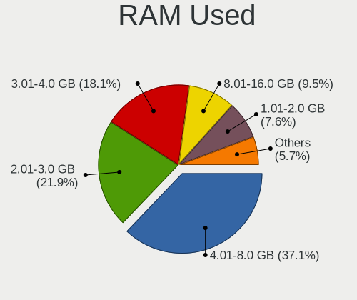
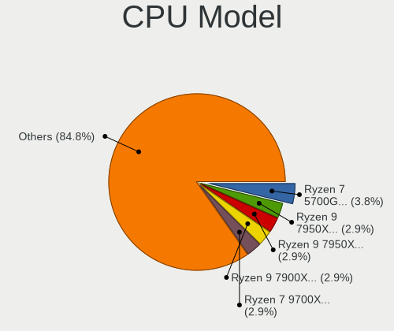
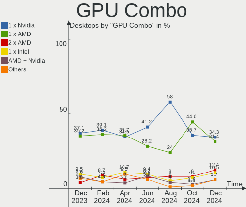

Arch - Hardware Trends (Desktops)
---------------------------------

A project to identify most popular hardware characteristics and track their change
over time based on data collected by Linux users at https://Linux-Hardware.org.

Anyone can contribute to this report by the [hw-probe](https://github.com/linuxhw/hw-probe) tool:

    sudo -E hw-probe -all -upload

This report is for one last month. Overall report since the beginning of time: [TestCoverage](https://github.com/linuxhw/TestCoverage)

Period: Oct, 2022.

Contents
--------

* [ System ](#system)
  - [ OS                       ](#os)
  - [ OS Family                ](#os-family)
  - [ Kernel                   ](#kernel)
  - [ Kernel Family            ](#kernel-family)
  - [ Kernel Major Ver.        ](#kernel-major-ver)
  - [ Arch                     ](#arch)
  - [ DE                       ](#de)
  - [ Display Server           ](#display-server)
  - [ Display Manager          ](#display-manager)
  - [ OS Lang                  ](#os-lang)
  - [ Boot Mode                ](#boot-mode)
  - [ Filesystem               ](#filesystem)
  - [ Part. scheme             ](#part-scheme)
  - [ Dual Boot with Linux/BSD ](#dual-boot-with-linuxbsd)
  - [ Dual Boot (Win)          ](#dual-boot-win)

* [ Board ](#board)
  - [ Vendor                   ](#vendor)
  - [ Model                    ](#model)
  - [ Model Family             ](#model-family)
  - [ MFG Year                 ](#mfg-year)
  - [ Form Factor              ](#form-factor)
  - [ Secure Boot              ](#secure-boot)
  - [ Coreboot                 ](#coreboot)
  - [ RAM Size                 ](#ram-size)
  - [ RAM Used                 ](#ram-used)
  - [ Total Drives             ](#total-drives)
  - [ Has CD-ROM               ](#has-cd-rom)
  - [ Has Ethernet             ](#has-ethernet)
  - [ Has WiFi                 ](#has-wifi)
  - [ Has Bluetooth            ](#has-bluetooth)

* [ Location ](#location)
  - [ Country                  ](#country)
  - [ City                     ](#city)

* [ Drives ](#drives)
  - [ Drive Vendor             ](#drive-vendor)
  - [ Drive Model              ](#drive-model)
  - [ HDD Vendor               ](#hdd-vendor)
  - [ SSD Vendor               ](#ssd-vendor)
  - [ Drive Kind               ](#drive-kind)
  - [ Drive Connector          ](#drive-connector)
  - [ Drive Size               ](#drive-size)
  - [ Space Total              ](#space-total)
  - [ Space Used               ](#space-used)
  - [ Malfunc. Drives          ](#malfunc-drives)
  - [ Malfunc. Drive Vendor    ](#malfunc-drive-vendor)
  - [ Malfunc. HDD Vendor      ](#malfunc-hdd-vendor)
  - [ Malfunc. Drive Kind      ](#malfunc-drive-kind)
  - [ Failed Drives            ](#failed-drives)
  - [ Failed Drive Vendor      ](#failed-drive-vendor)
  - [ Drive Status             ](#drive-status)

* [ Storage controller ](#storage-controller)
  - [ Storage Vendor           ](#storage-vendor)
  - [ Storage Model            ](#storage-model)
  - [ Storage Kind             ](#storage-kind)

* [ Processor ](#processor)
  - [ CPU Vendor               ](#cpu-vendor)
  - [ CPU Model                ](#cpu-model)
  - [ CPU Model Family         ](#cpu-model-family)
  - [ CPU Cores                ](#cpu-cores)
  - [ CPU Sockets              ](#cpu-sockets)
  - [ CPU Threads              ](#cpu-threads)
  - [ CPU Op-Modes             ](#cpu-op-modes)
  - [ CPU Microcode            ](#cpu-microcode)
  - [ CPU Microarch            ](#cpu-microarch)

* [ Graphics ](#graphics)
  - [ GPU Vendor               ](#gpu-vendor)
  - [ GPU Model                ](#gpu-model)
  - [ GPU Combo                ](#gpu-combo)
  - [ GPU Driver               ](#gpu-driver)
  - [ GPU Memory               ](#gpu-memory)

* [ Monitor ](#monitor)
  - [ Monitor Vendor           ](#monitor-vendor)
  - [ Monitor Model            ](#monitor-model)
  - [ Monitor Resolution       ](#monitor-resolution)
  - [ Monitor Diagonal         ](#monitor-diagonal)
  - [ Monitor Width            ](#monitor-width)
  - [ Aspect Ratio             ](#aspect-ratio)
  - [ Monitor Area             ](#monitor-area)
  - [ Pixel Density            ](#pixel-density)
  - [ Multiple Monitors        ](#multiple-monitors)

* [ Network ](#network)
  - [ Net Controller Vendor    ](#net-controller-vendor)
  - [ Net Controller Model     ](#net-controller-model)
  - [ Wireless Vendor          ](#wireless-vendor)
  - [ Wireless Model           ](#wireless-model)
  - [ Ethernet Vendor          ](#ethernet-vendor)
  - [ Ethernet Model           ](#ethernet-model)
  - [ Net Controller Kind      ](#net-controller-kind)
  - [ Used Controller          ](#used-controller)
  - [ NICs                     ](#nics)
  - [ IPv6                     ](#ipv6)

* [ Bluetooth ](#bluetooth)
  - [ Bluetooth Vendor         ](#bluetooth-vendor)
  - [ Bluetooth Model          ](#bluetooth-model)

* [ Sound ](#sound)
  - [ Sound Vendor             ](#sound-vendor)
  - [ Sound Model              ](#sound-model)

* [ Memory ](#memory)
  - [ Memory Vendor            ](#memory-vendor)
  - [ Memory Model             ](#memory-model)
  - [ Memory Kind              ](#memory-kind)
  - [ Memory Form Factor       ](#memory-form-factor)
  - [ Memory Size              ](#memory-size)
  - [ Memory Speed             ](#memory-speed)

* [ Printers & scanners ](#printers--scanners)
  - [ Printer Vendor           ](#printer-vendor)
  - [ Printer Model            ](#printer-model)
  - [ Scanner Vendor           ](#scanner-vendor)
  - [ Scanner Model            ](#scanner-model)

* [ Camera ](#camera)
  - [ Camera Vendor            ](#camera-vendor)
  - [ Camera Model             ](#camera-model)

* [ Security ](#security)
  - [ Fingerprint Vendor       ](#fingerprint-vendor)
  - [ Fingerprint Model        ](#fingerprint-model)
  - [ Chipcard Vendor          ](#chipcard-vendor)
  - [ Chipcard Model           ](#chipcard-model)

* [ Unsupported ](#unsupported)
  - [ Unsupported Devices      ](#unsupported-devices)
  - [ Unsupported Device Types ](#unsupported-device-types)

System
------

OS
--

Installed operating systems

| Name         | Desktops | Percent |
|--------------|----------|---------|
| Arch Rolling | 86       | 100%    |

OS Family
---------

OS without a version

| Name | Desktops | Percent |
|------|----------|---------|
| Arch | 86       | 100%    |

Kernel
------

Version of the Linux kernel

| Version                            | Desktops | Percent |
|------------------------------------|----------|---------|
| 6.0.2-arch1-1                      | 12       | 13.95%  |
| 5.19.13-arch1-1                    | 10       | 11.63%  |
| 6.0.1-arch2-1                      | 9        | 10.47%  |
| 5.19.12-arch1-1                    | 7        | 8.14%   |
| 6.0.2-zen1-1-zen                   | 6        | 6.98%   |
| 6.0.5-arch1-1                      | 5        | 5.81%   |
| 5.15.74-1-lts                      | 5        | 5.81%   |
| 5.19.14-hardened1-1-hardened       | 3        | 3.49%   |
| 6.0.6-arch1-1                      | 2        | 2.33%   |
| 5.19.9-zen1-1-zen                  | 2        | 2.33%   |
| 5.19.13-zen1-1-zen                 | 2        | 2.33%   |
| 5.18.12-arch1-1                    | 2        | 2.33%   |
| 5.15.75-1-lts                      | 2        | 2.33%   |
| 5.15.72-1-lts                      | 2        | 2.33%   |
| 5.15.71-1-lts                      | 2        | 2.33%   |
| 6.1.0-rc1-next-20221021-1-next-git | 1        | 1.16%   |
| 6.0.2-2-MANJARO                    | 1        | 1.16%   |
| 6.0.1-zen2-1-zen                   | 1        | 1.16%   |
| 6.0.1-270-tkg-pds                  | 1        | 1.16%   |
| 5.19.8-arch1-1                     | 1        | 1.16%   |
| 5.19.4-arch1-1                     | 1        | 1.16%   |
| 5.19.2-arch1-1                     | 1        | 1.16%   |
| 5.19.16-lqx2-1-lqx                 | 1        | 1.16%   |
| 5.19.12-zen1-1-zen                 | 1        | 1.16%   |
| 5.19.12-1-clear                    | 1        | 1.16%   |
| 5.19.11-arch1-1                    | 1        | 1.16%   |
| 5.19.10-arch1-1                    | 1        | 1.16%   |
| 5.18.6-arch1-1                     | 1        | 1.16%   |
| 5.18.14-arch1-1                    | 1        | 1.16%   |
| 5.17.9-arch1-1                     | 1        | 1.16%   |

Kernel Family
-------------

Linux kernel without a distro release

| Version | Desktops | Percent |
|---------|----------|---------|
| 6.0.2   | 19       | 22.09%  |
| 5.19.13 | 12       | 13.95%  |
| 6.0.1   | 11       | 12.79%  |
| 5.19.12 | 9        | 10.47%  |
| 6.0.5   | 5        | 5.81%   |
| 5.15.74 | 5        | 5.81%   |
| 5.19.14 | 3        | 3.49%   |
| 6.0.6   | 2        | 2.33%   |
| 5.19.9  | 2        | 2.33%   |
| 5.18.12 | 2        | 2.33%   |
| 5.15.75 | 2        | 2.33%   |
| 5.15.72 | 2        | 2.33%   |
| 5.15.71 | 2        | 2.33%   |
| 6.1.0   | 1        | 1.16%   |
| 5.19.8  | 1        | 1.16%   |
| 5.19.4  | 1        | 1.16%   |
| 5.19.2  | 1        | 1.16%   |
| 5.19.16 | 1        | 1.16%   |
| 5.19.11 | 1        | 1.16%   |
| 5.19.10 | 1        | 1.16%   |
| 5.18.6  | 1        | 1.16%   |
| 5.18.14 | 1        | 1.16%   |
| 5.17.9  | 1        | 1.16%   |

Kernel Major Ver.
-----------------

Linux kernel major version

| Version | Desktops | Percent |
|---------|----------|---------|
| 6.0     | 37       | 43.02%  |
| 5.19    | 32       | 37.21%  |
| 5.15    | 11       | 12.79%  |
| 5.18    | 4        | 4.65%   |
| 6.1     | 1        | 1.16%   |
| 5.17    | 1        | 1.16%   |

Arch
----

OS architecture (x86_64, i586, etc.)

| Name   | Desktops | Percent |
|--------|----------|---------|
| x86_64 | 86       | 100%    |

DE
--

Desktop Environment

| Name       | Desktops | Percent |
|------------|----------|---------|
| KDE5       | 31       | 36.05%  |
| GNOME      | 30       | 34.88%  |
| Unknown    | 8        | 9.3%    |
| i3         | 3        | 3.49%   |
| XFCE       | 2        | 2.33%   |
| sway       | 2        | 2.33%   |
| Deepin     | 2        | 2.33%   |
| X-Cinnamon | 1        | 1.16%   |
| qtile      | 1        | 1.16%   |
| MATE       | 1        | 1.16%   |
| LXQt       | 1        | 1.16%   |
| LXDE       | 1        | 1.16%   |
| KDE        | 1        | 1.16%   |
| dwm        | 1        | 1.16%   |
| Cinnamon   | 1        | 1.16%   |

Display Server
--------------

X11 or Wayland

| Name    | Desktops | Percent |
|---------|----------|---------|
| X11     | 48       | 55.81%  |
| Wayland | 22       | 25.58%  |
| Tty     | 10       | 11.63%  |
| Unknown | 6        | 6.98%   |

Display Manager
---------------

SDDM, LightDM, etc.

| Name    | Desktops | Percent |
|---------|----------|---------|
| Unknown | 43       | 50%     |
| SDDM    | 22       | 25.58%  |
| LightDM | 12       | 13.95%  |
| GDM     | 7        | 8.14%   |
| Ly      | 2        | 2.33%   |

OS Lang
-------

Language

| Lang        | Desktops | Percent |
|-------------|----------|---------|
| en_US       | 37       | 43.02%  |
| it_IT       | 11       | 12.79%  |
| en_GB       | 7        | 8.14%   |
| C           | 5        | 5.81%   |
| pt_BR       | 4        | 4.65%   |
| de_DE       | 3        | 3.49%   |
| zh_CN       | 2        | 2.33%   |
| pl_PL       | 2        | 2.33%   |
| fr_FR       | 2        | 2.33%   |
| Unknown     | 2        | 2.33%   |
| sv_SE       | 1        | 1.16%   |
| ru_RU       | 1        | 1.16%   |
| pt_PT       | 1        | 1.16%   |
| mt_MT       | 1        | 1.16%   |
| fr_FR.utf-8 | 1        | 1.16%   |
| es_CO       | 1        | 1.16%   |
| en_IN       | 1        | 1.16%   |
| en_IE       | 1        | 1.16%   |
| en_CA       | 1        | 1.16%   |
| en_AU       | 1        | 1.16%   |
| Default     | 1        | 1.16%   |

Boot Mode
---------

EFI or BIOS

| Mode | Desktops | Percent |
|------|----------|---------|
| EFI  | 44       | 51.16%  |
| BIOS | 42       | 48.84%  |

Filesystem
----------

Type of filesystem

| Type  | Desktops | Percent |
|-------|----------|---------|
| Ext4  | 55       | 63.95%  |
| Btrfs | 27       | 31.4%   |
| Xfs   | 3        | 3.49%   |
| F2fs  | 1        | 1.16%   |

Part. scheme
------------

Scheme of partitioning

| Type    | Desktops | Percent |
|---------|----------|---------|
| GPT     | 52       | 60.47%  |
| Unknown | 26       | 30.23%  |
| MBR     | 8        | 9.3%    |

Dual Boot with Linux/BSD
------------------------

Hosting more than one Linux/BSD

| Dual boot | Desktops | Percent |
|-----------|----------|---------|
| No        | 69       | 80.23%  |
| Yes       | 17       | 19.77%  |

Dual Boot (Win)
---------------

Hosting Linux and Windows

| Dual boot | Desktops | Percent |
|-----------|----------|---------|
| No        | 51       | 59.3%   |
| Yes       | 35       | 40.7%   |

Board
-----

Vendor
------

Motherboard manufacturer

| Name                | Desktops | Percent |
|---------------------|----------|---------|
| ASUSTek Computer    | 26       | 30.23%  |
| MSI                 | 18       | 20.93%  |
| Gigabyte Technology | 18       | 20.93%  |
| ASRock              | 7        | 8.14%   |
| Intel               | 4        | 4.65%   |
| Hewlett-Packard     | 4        | 4.65%   |
| Lenovo              | 3        | 3.49%   |
| Dell                | 2        | 2.33%   |
| PCWare              | 1        | 1.16%   |
| MACHINIST           | 1        | 1.16%   |
| Fujitsu             | 1        | 1.16%   |
| Acer                | 1        | 1.16%   |

Model
-----

Motherboard model

| Name                            | Desktops | Percent |
|---------------------------------|----------|---------|
| MSI MS-7C56                     | 3        | 3.49%   |
| ASUS PRIME B550M-A              | 3        | 3.49%   |
| MSI MS-7C02                     | 2        | 2.33%   |
| MSI MS-7B79                     | 2        | 2.33%   |
| Gigabyte X570 AORUS ELITE       | 2        | 2.33%   |
| Gigabyte B550 AORUS ELITE       | 2        | 2.33%   |
| Gigabyte B450 AORUS ELITE       | 2        | 2.33%   |
| ASUS PRIME X370-PRO             | 2        | 2.33%   |
| PCWare IPMH110G                 | 1        | 1.16%   |
| MSI MS-7C95                     | 1        | 1.16%   |
| MSI MS-7C94                     | 1        | 1.16%   |
| MSI MS-7C80                     | 1        | 1.16%   |
| MSI MS-7C79                     | 1        | 1.16%   |
| MSI MS-7C37                     | 1        | 1.16%   |
| MSI MS-7B89                     | 1        | 1.16%   |
| MSI MS-7B86                     | 1        | 1.16%   |
| MSI MS-7A71                     | 1        | 1.16%   |
| MSI MS-7A32                     | 1        | 1.16%   |
| MSI MS-7976                     | 1        | 1.16%   |
| MSI MS-7758                     | 1        | 1.16%   |
| MACHINIST X99-RS9 V2.0          | 1        | 1.16%   |
| Lenovo V520S-08IKL 10NN0016LS   | 1        | 1.16%   |
| Lenovo ThinkStation S30 4352G9U | 1        | 1.16%   |
| Lenovo ThinkStation C20 4263BA7 | 1        | 1.16%   |
| Intel H55                       | 1        | 1.16%   |
| Intel DH87RL AAG74240-400       | 1        | 1.16%   |
| Intel DH55TC AAE70932-302       | 1        | 1.16%   |
| Intel D955XBK AAC96732-501      | 1        | 1.16%   |
| HP EliteDesk 800 G2 DM 65W      | 1        | 1.16%   |
| HP Compaq Pro 6305 SFF          | 1        | 1.16%   |
| HP 870-115ng                    | 1        | 1.16%   |
| HP 200-5120br                   | 1        | 1.16%   |
| Gigabyte X99-UD7 WIFI-CF        | 1        | 1.16%   |
| Gigabyte G1.Sniper B5           | 1        | 1.16%   |
| Gigabyte EX58-UD3R              | 1        | 1.16%   |
| Gigabyte B85M-DS3H-A            | 1        | 1.16%   |
| Gigabyte B550M DS3H             | 1        | 1.16%   |
| Gigabyte B550 AORUS PRO         | 1        | 1.16%   |
| Gigabyte B460MDS3HV2            | 1        | 1.16%   |
| Gigabyte B450M DS3H V2          | 1        | 1.16%   |

Model Family
------------

Motherboard model prefix

| Name                 | Desktops | Percent |
|----------------------|----------|---------|
| ASUS PRIME           | 12       | 13.95%  |
| ASUS ROG             | 5        | 5.81%   |
| ASUS TUF             | 4        | 4.65%   |
| MSI MS-7C56          | 3        | 3.49%   |
| Gigabyte B550        | 3        | 3.49%   |
| MSI MS-7C02          | 2        | 2.33%   |
| MSI MS-7B79          | 2        | 2.33%   |
| Lenovo ThinkStation  | 2        | 2.33%   |
| Gigabyte X570        | 2        | 2.33%   |
| Gigabyte B450M       | 2        | 2.33%   |
| Gigabyte B450        | 2        | 2.33%   |
| PCWare IPMH110G      | 1        | 1.16%   |
| MSI MS-7C95          | 1        | 1.16%   |
| MSI MS-7C94          | 1        | 1.16%   |
| MSI MS-7C80          | 1        | 1.16%   |
| MSI MS-7C79          | 1        | 1.16%   |
| MSI MS-7C37          | 1        | 1.16%   |
| MSI MS-7B89          | 1        | 1.16%   |
| MSI MS-7B86          | 1        | 1.16%   |
| MSI MS-7A71          | 1        | 1.16%   |
| MSI MS-7A32          | 1        | 1.16%   |
| MSI MS-7976          | 1        | 1.16%   |
| MSI MS-7758          | 1        | 1.16%   |
| MACHINIST X99-RS9    | 1        | 1.16%   |
| Lenovo V520S-08IKL   | 1        | 1.16%   |
| Intel H55            | 1        | 1.16%   |
| Intel DH87RL         | 1        | 1.16%   |
| Intel DH55TC         | 1        | 1.16%   |
| Intel D955XBK        | 1        | 1.16%   |
| HP EliteDesk         | 1        | 1.16%   |
| HP Compaq            | 1        | 1.16%   |
| HP 870-115ng         | 1        | 1.16%   |
| HP 200-5120br        | 1        | 1.16%   |
| Gigabyte X99-UD7     | 1        | 1.16%   |
| Gigabyte G1.Sniper   | 1        | 1.16%   |
| Gigabyte EX58-UD3R   | 1        | 1.16%   |
| Gigabyte B85M-DS3H-A | 1        | 1.16%   |
| Gigabyte B550M       | 1        | 1.16%   |
| Gigabyte B460MDS3HV2 | 1        | 1.16%   |
| Gigabyte B360M-D2V   | 1        | 1.16%   |

MFG Year
--------

Motherboard manufacture year

| Year | Desktops | Percent |
|------|----------|---------|
| 2020 | 25       | 29.07%  |
| 2018 | 13       | 15.12%  |
| 2019 | 11       | 12.79%  |
| 2017 | 5        | 5.81%   |
| 2016 | 5        | 5.81%   |
| 2021 | 4        | 4.65%   |
| 2014 | 4        | 4.65%   |
| 2012 | 4        | 4.65%   |
| 2022 | 3        | 3.49%   |
| 2015 | 3        | 3.49%   |
| 2010 | 3        | 3.49%   |
| 2013 | 2        | 2.33%   |
| 2011 | 1        | 1.16%   |
| 2009 | 1        | 1.16%   |
| 2008 | 1        | 1.16%   |
| 2007 | 1        | 1.16%   |

Form Factor
-----------

Physical design of the computer

| Name    | Desktops | Percent |
|---------|----------|---------|
| Desktop | 86       | 100%    |

Secure Boot
-----------

Enabled or disabled

| State    | Desktops | Percent |
|----------|----------|---------|
| Disabled | 84       | 97.67%  |
| Enabled  | 2        | 2.33%   |

Coreboot
--------

Have coreboot on board

| Used | Desktops | Percent |
|------|----------|---------|
| No   | 86       | 100%    |

RAM Size
--------

Total RAM memory

| Size in GB  | Desktops | Percent |
|-------------|----------|---------|
| 16.01-24.0  | 30       | 34.88%  |
| 32.01-64.0  | 29       | 33.72%  |
| 8.01-16.0   | 17       | 19.77%  |
| 4.01-8.0    | 5        | 5.81%   |
| 64.01-256.0 | 3        | 3.49%   |
| 24.01-32.0  | 2        | 2.33%   |

RAM Used
--------

Used RAM memory

| Used GB   | Desktops | Percent |
|-----------|----------|---------|
| 4.01-8.0  | 31       | 36.05%  |
| 8.01-16.0 | 19       | 22.09%  |
| 2.01-3.0  | 16       | 18.6%   |
| 3.01-4.0  | 11       | 12.79%  |
| 1.01-2.0  | 8        | 9.3%    |
| 0.51-1.0  | 1        | 1.16%   |

Total Drives
------------

Number of drives on board

| Drives | Desktops | Percent |
|--------|----------|---------|
| 2      | 23       | 26.74%  |
| 3      | 21       | 24.42%  |
| 1      | 19       | 22.09%  |
| 4      | 12       | 13.95%  |
| 5      | 5        | 5.81%   |
| 6      | 4        | 4.65%   |
| 7      | 2        | 2.33%   |

Has CD-ROM
----------

Has CD-ROM on board

| Presented | Desktops | Percent |
|-----------|----------|---------|
| No        | 62       | 72.09%  |
| Yes       | 24       | 27.91%  |

Has Ethernet
------------

Has Ethernet on board

| Presented | Desktops | Percent |
|-----------|----------|---------|
| Yes       | 86       | 100%    |

Has WiFi
--------

Has WiFi module

| Presented | Desktops | Percent |
|-----------|----------|---------|
| No        | 47       | 54.65%  |
| Yes       | 39       | 45.35%  |

Has Bluetooth
-------------

Has Bluetooth module

| Presented | Desktops | Percent |
|-----------|----------|---------|
| Yes       | 47       | 54.65%  |
| No        | 39       | 45.35%  |

Location
--------

Country
-------

Geographic location (country)

| Country     | Desktops | Percent |
|-------------|----------|---------|
| USA         | 17       | 19.77%  |
| Italy       | 16       | 18.6%   |
| Poland      | 6        | 6.98%   |
| Germany     | 6        | 6.98%   |
| Brazil      | 4        | 4.65%   |
| UK          | 3        | 3.49%   |
| Sweden      | 3        | 3.49%   |
| Russia      | 3        | 3.49%   |
| France      | 3        | 3.49%   |
| Turkey      | 2        | 2.33%   |
| Norway      | 2        | 2.33%   |
| Hong Kong   | 2        | 2.33%   |
| Egypt       | 2        | 2.33%   |
| Canada      | 2        | 2.33%   |
| Australia   | 2        | 2.33%   |
| Spain       | 1        | 1.16%   |
| Portugal    | 1        | 1.16%   |
| Netherlands | 1        | 1.16%   |
| Malta       | 1        | 1.16%   |
| Ireland     | 1        | 1.16%   |
| Indonesia   | 1        | 1.16%   |
| India       | 1        | 1.16%   |
| Hungary     | 1        | 1.16%   |
| Finland     | 1        | 1.16%   |
| Estonia     | 1        | 1.16%   |
| Czechia     | 1        | 1.16%   |
| Colombia    | 1        | 1.16%   |
| Argentina   | 1        | 1.16%   |

City
----

Geographic location (city)

| City           | Desktops | Percent |
|----------------|----------|---------|
| Rome           | 3        | 3.49%   |
| Turin          | 2        | 2.33%   |
| Seattle        | 2        | 2.33%   |
| Los Angeles    | 2        | 2.33%   |
| Krakow         | 2        | 2.33%   |
| Istanbul       | 2        | 2.33%   |
| Hong Kong      | 2        | 2.33%   |
| Zoetermeer     | 1        | 1.16%   |
| Zagazig        | 1        | 1.16%   |
| Zabrze         | 1        | 1.16%   |
| Woustviller    | 1        | 1.16%   |
| Warsaw         | 1        | 1.16%   |
| Vestland       | 1        | 1.16%   |
| Turku          | 1        | 1.16%   |
| Trivandrum     | 1        | 1.16%   |
| Toronto        | 1        | 1.16%   |
| Tampa          | 1        | 1.16%   |
| Tallinn        | 1        | 1.16%   |
| Szeged         | 1        | 1.16%   |
| Stezyca        | 1        | 1.16%   |
| Staten Island  | 1        | 1.16%   |
| Sorocaba       | 1        | 1.16%   |
| Sao Paulo      | 1        | 1.16%   |
| Santo André   | 1        | 1.16%   |
| San Marcos     | 1        | 1.16%   |
| San Jose       | 1        | 1.16%   |
| San Francisco  | 1        | 1.16%   |
| Rostov-on-Don  | 1        | 1.16%   |
| Rho            | 1        | 1.16%   |
| Rancho Cordova | 1        | 1.16%   |
| Quilmes        | 1        | 1.16%   |
| Prague         | 1        | 1.16%   |
| Pilot Mound    | 1        | 1.16%   |
| Perth          | 1        | 1.16%   |
| Paris          | 1        | 1.16%   |
| Paladina       | 1        | 1.16%   |
| Örebro        | 1        | 1.16%   |
| Nurtingen      | 1        | 1.16%   |
| Novokuznetsk   | 1        | 1.16%   |
| Northampton    | 1        | 1.16%   |

Drives
------

Drive Vendor
------------

Hard drive vendors

| Vendor                      | Desktops | Drives | Percent |
|-----------------------------|----------|--------|---------|
| Samsung Electronics         | 43       | 53     | 20.77%  |
| WDC                         | 37       | 48     | 17.87%  |
| Seagate                     | 28       | 32     | 13.53%  |
| Sandisk                     | 14       | 16     | 6.76%   |
| Crucial                     | 11       | 15     | 5.31%   |
| Kingston                    | 9        | 11     | 4.35%   |
| Toshiba                     | 8        | 8      | 3.86%   |
| Hitachi                     | 7        | 8      | 3.38%   |
| Micron/Crucial Technology   | 6        | 6      | 2.9%    |
| Phison Electronics          | 5        | 5      | 2.42%   |
| ADATA Technology            | 5        | 6      | 2.42%   |
| Kingston Technology Company | 4        | 4      | 1.93%   |
| Intel                       | 4        | 5      | 1.93%   |
| SK hynix                    | 2        | 2      | 0.97%   |
| Silicon Motion              | 2        | 2      | 0.97%   |
| OCZ                         | 2        | 2      | 0.97%   |
| LITEON                      | 2        | 2      | 0.97%   |
| HGST                        | 2        | 2      | 0.97%   |
| Yangtze Memory              | 1        | 1      | 0.48%   |
| Unknown                     | 1        | 1      | 0.48%   |
| Transcend                   | 1        | 1      | 0.48%   |
| Team                        | 1        | 1      | 0.48%   |
| PNY                         | 1        | 2      | 0.48%   |
| Plextor                     | 1        | 1      | 0.48%   |
| Phison                      | 1        | 1      | 0.48%   |
| Micron Technology           | 1        | 1      | 0.48%   |
| MAXIO Technology (Hangzhou) | 1        | 1      | 0.48%   |
| LIO-ORG                     | 1        | 1      | 0.48%   |
| KingSpec                    | 1        | 1      | 0.48%   |
| HGST HTS                    | 1        | 1      | 0.48%   |
| Fujitsu                     | 1        | 1      | 0.48%   |
| Corsair                     | 1        | 1      | 0.48%   |
| BAITITON                    | 1        | 1      | 0.48%   |
| A-DATA Technology           | 1        | 1      | 0.48%   |

Drive Model
-----------

Hard drive models

| Model                                                           | Desktops | Percent |
|-----------------------------------------------------------------|----------|---------|
| Samsung NVMe SSD Controller SM981/PM981/PM983 500GB             | 8        | 3.45%   |
| Samsung SSD 860 EVO 500GB                                       | 7        | 3.02%   |
| Seagate ST2000DM008-2FR102 2TB                                  | 5        | 2.16%   |
| ADATA XPG SX8200 Pro PCIe Gen3x4 M.2 2280 Solid State Drive 1TB | 5        | 2.16%   |
| Sandisk WD Blue SN550 NVMe SSD 1TB                              | 4        | 1.72%   |
| Samsung SSD 980 1TB                                             | 4        | 1.72%   |
| Samsung SSD 850 EVO 250GB                                       | 4        | 1.72%   |
| Samsung NVMe SSD Controller PM9A1/PM9A3/980PRO 250GB            | 4        | 1.72%   |
| Samsung SSD 860 EVO 1TB                                         | 3        | 1.29%   |
| Kingston Company A2000 NVMe SSD 1TB                             | 3        | 1.29%   |
| Kingston SA400S37240G 240GB SSD                                 | 3        | 1.29%   |
| Crucial CT500MX500SSD1 500GB                                    | 3        | 1.29%   |
| Crucial CT1000MX500SSD1 1TB                                     | 3        | 1.29%   |
| WDC WD10EZEX-22MFCA0 1TB                                        | 2        | 0.86%   |
| WDC WD10EZEX-21WN4A0 1TB                                        | 2        | 0.86%   |
| WDC WD10EZEX-08WN4A0 1TB                                        | 2        | 0.86%   |
| Toshiba DT01ACA200 2TB                                          | 2        | 0.86%   |
| Seagate ST3500418AS 500GB                                       | 2        | 0.86%   |
| Seagate ST1000DM010-2EP102 1TB                                  | 2        | 0.86%   |
| Seagate ST1000DM003-1CH162 1TB                                  | 2        | 0.86%   |
| Samsung SSD 980 500GB                                           | 2        | 0.86%   |
| Samsung SSD 860 EVO 250GB                                       | 2        | 0.86%   |
| Samsung SSD 850 EVO 500GB                                       | 2        | 0.86%   |
| Samsung NVMe SSD Controller SM961/PM961/SM963 250GB             | 2        | 0.86%   |
| Samsung HD502HJ 500GB                                           | 2        | 0.86%   |
| Phison PS5013 E13 NVMe Controller 256GB                         | 2        | 0.86%   |
| Micron/Crucial P1 NVMe PCIe SSD 1TB                             | 2        | 0.86%   |
| Kingston SV300S37A240G 240GB SSD                                | 2        | 0.86%   |
| Kingston SV300S37A120G 120GB SSD                                | 2        | 0.86%   |
| Intel SSD 660P Series 1024GB                                    | 2        | 0.86%   |
| Hitachi HUA723020ALA641 2TB                                     | 2        | 0.86%   |
| Crucial CT240BX500SSD1 240GB                                    | 2        | 0.86%   |
| Yangtze Memory ZHITAI PC005 Active 1TB                          | 1        | 0.43%   |
| WDC WDS500G2B0A-00SM50 500GB SSD                                | 1        | 0.43%   |
| WDC WDS250G2B0A-00SM50 250GB SSD                                | 1        | 0.43%   |
| WDC WDS240G2G0A-00JH30 240GB SSD                                | 1        | 0.43%   |
| WDC WDS200T2B0A-00SM50 2TB SSD                                  | 1        | 0.43%   |
| WDC WDS200T2B0A 2TB SSD                                         | 1        | 0.43%   |
| WDC WDS100T2B0B 1TB SSD                                         | 1        | 0.43%   |
| WDC WDBNCE0010PNC 1TB SSD                                       | 1        | 0.43%   |

HDD Vendor
----------

Hard disk drive vendors

| Vendor              | Desktops | Drives | Percent |
|---------------------|----------|--------|---------|
| WDC                 | 31       | 41     | 36.9%   |
| Seagate             | 27       | 31     | 32.14%  |
| Toshiba             | 7        | 7      | 8.33%   |
| Hitachi             | 7        | 8      | 8.33%   |
| Samsung Electronics | 6        | 6      | 7.14%   |
| HGST                | 2        | 2      | 2.38%   |
| Unknown             | 1        | 1      | 1.19%   |
| LIO-ORG             | 1        | 1      | 1.19%   |
| HGST HTS            | 1        | 1      | 1.19%   |
| Fujitsu             | 1        | 1      | 1.19%   |

SSD Vendor
----------

Solid state drive vendors

| Vendor              | Desktops | Drives | Percent |
|---------------------|----------|--------|---------|
| Samsung Electronics | 21       | 23     | 32.31%  |
| Crucial             | 10       | 14     | 15.38%  |
| Kingston            | 8        | 10     | 12.31%  |
| WDC                 | 7        | 7      | 10.77%  |
| SanDisk             | 6        | 6      | 9.23%   |
| OCZ                 | 2        | 2      | 3.08%   |
| LITEON              | 2        | 2      | 3.08%   |
| Intel               | 2        | 3      | 3.08%   |
| Transcend           | 1        | 1      | 1.54%   |
| Team                | 1        | 1      | 1.54%   |
| PNY                 | 1        | 2      | 1.54%   |
| Plextor             | 1        | 1      | 1.54%   |
| KingSpec            | 1        | 1      | 1.54%   |
| BAITITON            | 1        | 1      | 1.54%   |
| A-DATA Technology   | 1        | 1      | 1.54%   |

Drive Kind
----------

HDD or SSD

| Kind | Desktops | Drives | Percent |
|------|----------|--------|---------|
| HDD  | 58       | 99     | 36.02%  |
| SSD  | 52       | 75     | 32.3%   |
| NVMe | 51       | 70     | 31.68%  |

Drive Connector
---------------

SATA, SAS, NVMe, etc.

| Type | Desktops | Drives | Percent |
|------|----------|--------|---------|
| SATA | 72       | 171    | 57.14%  |
| NVMe | 51       | 70     | 40.48%  |
| SAS  | 3        | 3      | 2.38%   |

Drive Size
----------

Size of hard drive

| Size in TB | Desktops | Drives | Percent |
|------------|----------|--------|---------|
| 0.01-0.5   | 50       | 78     | 40%     |
| 0.51-1.0   | 41       | 52     | 32.8%   |
| 1.01-2.0   | 26       | 33     | 20.8%   |
| 3.01-4.0   | 3        | 4      | 2.4%    |
| 4.01-10.0  | 3        | 5      | 2.4%    |
| 2.01-3.0   | 2        | 2      | 1.6%    |

Space Total
-----------

Amount of disk space available on the file system

| Size in GB     | Desktops | Percent |
|----------------|----------|---------|
| More than 3000 | 22       | 25.58%  |
| 1001-2000      | 17       | 19.77%  |
| 501-1000       | 14       | 16.28%  |
| 251-500        | 10       | 11.63%  |
| 2001-3000      | 10       | 11.63%  |
| 101-250        | 9        | 10.47%  |
| Unknown        | 2        | 2.33%   |
| 21-50          | 1        | 1.16%   |
| 51-100         | 1        | 1.16%   |

Space Used
----------

Amount of used disk space

| Used GB        | Desktops | Percent |
|----------------|----------|---------|
| 251-500        | 14       | 16.28%  |
| 1001-2000      | 14       | 16.28%  |
| 101-250        | 13       | 15.12%  |
| 501-1000       | 13       | 15.12%  |
| 1-20           | 9        | 10.47%  |
| More than 3000 | 7        | 8.14%   |
| 51-100         | 7        | 8.14%   |
| 2001-3000      | 4        | 4.65%   |
| 21-50          | 3        | 3.49%   |
| Unknown        | 2        | 2.33%   |

Malfunc. Drives
---------------

Drive models with a malfunction

| Model                              | Desktops | Drives | Percent |
|------------------------------------|----------|--------|---------|
| Seagate ST2000DM008-2FR102 2TB     | 2        | 2      | 10%     |
| WDC WD5000LPVX-00V0TT0 500GB       | 1        | 1      | 5%      |
| WDC WD40EFRX-68WT0N0 4TB           | 1        | 1      | 5%      |
| WDC WD2500AAKS-00B3A0 250GB        | 1        | 1      | 5%      |
| WDC WD20EARX-008FB0 2TB            | 1        | 1      | 5%      |
| WDC WD10EZEX-08M2NA0 1TB           | 1        | 1      | 5%      |
| WDC WD10EAVS-00D7B0 1TB            | 1        | 1      | 5%      |
| Seagate ST980811AS 80GB            | 1        | 1      | 5%      |
| Seagate ST2000DM001-1CH164 2TB     | 1        | 1      | 5%      |
| Seagate ST1000LM024 HN-M101MBB 1TB | 1        | 1      | 5%      |
| Seagate ST1000DM003-9YN162 1TB     | 1        | 1      | 5%      |
| SanDisk SSD PLUS 240 GB            | 1        | 1      | 5%      |
| PNY SSD2SC120GB1DA16T-T            | 1        | 1      | 5%      |
| Kingston SA400S37240G 240GB SSD    | 1        | 1      | 5%      |
| Intel SSDSC2CT240A4 240GB          | 1        | 1      | 5%      |
| Intel SSDSC2BW480A4 480GB          | 1        | 2      | 5%      |
| Hitachi HDS728080PLA380 82GB       | 1        | 1      | 5%      |
| Hitachi HDS721064CLA332 640GB      | 1        | 1      | 5%      |
| BAITITON BT58SSD09S 240GB          | 1        | 1      | 5%      |

Malfunc. Drive Vendor
---------------------

Vendors of faulty drives

| Vendor   | Desktops | Drives | Percent |
|----------|----------|--------|---------|
| Seagate  | 6        | 6      | 31.58%  |
| WDC      | 5        | 6      | 26.32%  |
| Intel    | 2        | 3      | 10.53%  |
| Hitachi  | 2        | 2      | 10.53%  |
| SanDisk  | 1        | 1      | 5.26%   |
| PNY      | 1        | 1      | 5.26%   |
| Kingston | 1        | 1      | 5.26%   |
| BAITITON | 1        | 1      | 5.26%   |

Malfunc. HDD Vendor
-------------------

Vendors of faulty HDD drives

| Vendor  | Desktops | Drives | Percent |
|---------|----------|--------|---------|
| Seagate | 6        | 6      | 46.15%  |
| WDC     | 5        | 6      | 38.46%  |
| Hitachi | 2        | 2      | 15.38%  |

Malfunc. Drive Kind
-------------------

Kinds of faulty drives

| Kind | Desktops | Drives | Percent |
|------|----------|--------|---------|
| HDD  | 11       | 14     | 64.71%  |
| SSD  | 6        | 7      | 35.29%  |

Failed Drives
-------------

Failed drive models

Zero info for selected period =(

Failed Drive Vendor
-------------------

Failed drive vendors

Zero info for selected period =(

Drive Status
------------

Number of failed and malfunc. drives

| Status   | Desktops | Drives | Percent |
|----------|----------|--------|---------|
| Works    | 49       | 131    | 47.12%  |
| Detected | 39       | 92     | 37.5%   |
| Malfunc  | 16       | 21     | 15.38%  |

Storage controller
------------------

Storage Vendor
--------------

Storage controller vendors

| Vendor                       | Desktops | Percent |
|------------------------------|----------|---------|
| AMD                          | 49       | 32.24%  |
| Intel                        | 37       | 24.34%  |
| Samsung Electronics          | 19       | 12.5%   |
| SanDisk                      | 8        | 5.26%   |
| Phison Electronics           | 7        | 4.61%   |
| Micron/Crucial Technology    | 7        | 4.61%   |
| Kingston Technology Company  | 5        | 3.29%   |
| ADATA Technology             | 5        | 3.29%   |
| ASMedia Technology           | 3        | 1.97%   |
| SK hynix                     | 2        | 1.32%   |
| Silicon Motion               | 2        | 1.32%   |
| JMicron Technology           | 2        | 1.32%   |
| Yangtze Memory Technologies  | 1        | 0.66%   |
| Toshiba America Info Systems | 1        | 0.66%   |
| Seagate Technology           | 1        | 0.66%   |
| Micron Technology            | 1        | 0.66%   |
| MAXIO Technology (Hangzhou)  | 1        | 0.66%   |
| LSI Logic / Symbios Logic    | 1        | 0.66%   |

Storage Model
-------------

Storage controller models

| Model                                                                            | Desktops | Percent |
|----------------------------------------------------------------------------------|----------|---------|
| AMD FCH SATA Controller [AHCI mode]                                              | 25       | 13.97%  |
| AMD 500 Series Chipset SATA Controller                                           | 17       | 9.5%    |
| AMD 400 Series Chipset SATA Controller                                           | 13       | 7.26%   |
| Samsung NVMe SSD Controller SM981/PM981/PM983                                    | 9        | 5.03%   |
| Samsung NVMe SSD Controller 980                                                  | 6        | 3.35%   |
| Intel 82801JI (ICH10 Family) SATA AHCI Controller                                | 5        | 2.79%   |
| ADATA XPG SX8200 Pro PCIe Gen3x4 M.2 2280 Solid State Drive                      | 5        | 2.79%   |
| SanDisk WD Blue SN550 NVMe SSD                                                   | 4        | 2.23%   |
| Samsung NVMe SSD Controller PM9A1/PM9A3/980PRO                                   | 4        | 2.23%   |
| Intel Q170/Q150/B150/H170/H110/Z170/CM236 Chipset SATA Controller [AHCI Mode]    | 4        | 2.23%   |
| Intel 8 Series/C220 Series Chipset Family 6-port SATA Controller 1 [AHCI mode]   | 4        | 2.23%   |
| Phison E12 NVMe Controller                                                       | 3        | 1.68%   |
| Micron/Crucial Non-Volatile memory controller                                    | 3        | 1.68%   |
| Kingston Company A2000 NVMe SSD                                                  | 3        | 1.68%   |
| Intel Comet Lake SATA AHCI Controller                                            | 3        | 1.68%   |
| Intel Cannon Lake PCH SATA AHCI Controller                                       | 3        | 1.68%   |
| Intel 200 Series PCH SATA controller [AHCI mode]                                 | 3        | 1.68%   |
| ASMedia ASM1062 Serial ATA Controller                                            | 3        | 1.68%   |
| AMD X370 Series Chipset SATA Controller                                          | 3        | 1.68%   |
| AMD 300 Series Chipset SATA Controller                                           | 3        | 1.68%   |
| Samsung NVMe SSD Controller SM961/PM961/SM963                                    | 2        | 1.12%   |
| Phison PS5013 E13 NVMe Controller                                                | 2        | 1.12%   |
| Micron/Crucial P1 NVMe PCIe SSD                                                  | 2        | 1.12%   |
| JMicron JMB363 SATA/IDE Controller                                               | 2        | 1.12%   |
| Intel SSD 660P Series                                                            | 2        | 1.12%   |
| Intel SATA Controller [RAID mode]                                                | 2        | 1.12%   |
| Intel C610/X99 series chipset sSATA Controller [AHCI mode]                       | 2        | 1.12%   |
| AMD SATA controller                                                              | 2        | 1.12%   |
| Yangtze Memory Non-Volatile memory controller                                    | 1        | 0.56%   |
| Toshiba America Info Systems Toshiba America Info Non-Volatile memory controller | 1        | 0.56%   |
| SK hynix Non-Volatile memory controller                                          | 1        | 0.56%   |
| SK hynix Gold P31 SSD                                                            | 1        | 0.56%   |
| Silicon Motion SM2263EN/SM2263XT SSD Controller                                  | 1        | 0.56%   |
| Silicon Motion SM2262/SM2262EN SSD Controller                                    | 1        | 0.56%   |
| Seagate FireCuda 530 SSD                                                         | 1        | 0.56%   |
| SanDisk WD PC SN810 / Black SN850 NVMe SSD                                       | 1        | 0.56%   |
| SanDisk WD Blue SN500 / PC SN520 NVMe SSD                                        | 1        | 0.56%   |
| SanDisk WD Black SN750 / PC SN730 NVMe SSD                                       | 1        | 0.56%   |
| SanDisk Non-Volatile memory controller                                           | 1        | 0.56%   |
| Phison E7 NVMe Controller                                                        | 1        | 0.56%   |

Storage Kind
------------

Kind of storage controller (IDE, SATA, NVMe, SAS, ...)

| Kind | Desktops | Percent |
|------|----------|---------|
| SATA | 80       | 55.56%  |
| NVMe | 51       | 35.42%  |
| IDE  | 7        | 4.86%   |
| RAID | 4        | 2.78%   |
| SAS  | 2        | 1.39%   |

Processor
---------

CPU Vendor
----------

Processor vendors

| Vendor | Desktops | Percent |
|--------|----------|---------|
| AMD    | 49       | 56.98%  |
| Intel  | 37       | 43.02%  |

CPU Model
---------

Processor models

| Model                                   | Desktops | Percent |
|-----------------------------------------|----------|---------|
| AMD Ryzen 7 5800X 8-Core Processor      | 9        | 10.47%  |
| AMD Ryzen 5 5600X 6-Core Processor      | 5        | 5.81%   |
| AMD Ryzen 5 5600G with Radeon Graphics  | 5        | 5.81%   |
| AMD Ryzen 7 3700X 8-Core Processor      | 4        | 4.65%   |
| AMD Ryzen 5 2600 Six-Core Processor     | 3        | 3.49%   |
| Intel Core i9-10850K CPU @ 3.60GHz      | 2        | 2.33%   |
| Intel Core i7-7700 CPU @ 3.60GHz        | 2        | 2.33%   |
| Intel Core i7-3770 CPU @ 3.40GHz        | 2        | 2.33%   |
| Intel Core i7 CPU 920 @ 2.67GHz         | 2        | 2.33%   |
| Intel Core i7 CPU 860 @ 2.80GHz         | 2        | 2.33%   |
| Intel Core i5-9400F CPU @ 2.90GHz       | 2        | 2.33%   |
| AMD Ryzen 5 3600 6-Core Processor       | 2        | 2.33%   |
| AMD Ryzen 5 2600X Six-Core Processor    | 2        | 2.33%   |
| Intel Xeon CPU W3690 @ 3.47GHz          | 1        | 1.16%   |
| Intel Xeon CPU E5620 @ 2.40GHz          | 1        | 1.16%   |
| Intel Xeon CPU E5-2690 v2 @ 3.00GHz     | 1        | 1.16%   |
| Intel Xeon CPU E5-2667 v4 @ 3.20GHz     | 1        | 1.16%   |
| Intel Xeon CPU E5-2666 v3 @ 2.90GHz     | 1        | 1.16%   |
| Intel Pentium D CPU 3.20GHz             | 1        | 1.16%   |
| Intel Core i7-6700K CPU @ 4.00GHz       | 1        | 1.16%   |
| Intel Core i7-6700 CPU @ 3.40GHz        | 1        | 1.16%   |
| Intel Core i7-5820K CPU @ 3.30GHz       | 1        | 1.16%   |
| Intel Core i7-4790K CPU @ 4.00GHz       | 1        | 1.16%   |
| Intel Core i7-4770K CPU @ 3.50GHz       | 1        | 1.16%   |
| Intel Core i7-10700K CPU @ 3.80GHz      | 1        | 1.16%   |
| Intel Core i5-8600K CPU @ 3.60GHz       | 1        | 1.16%   |
| Intel Core i5-8500 CPU @ 3.00GHz        | 1        | 1.16%   |
| Intel Core i5-7400 CPU @ 3.00GHz        | 1        | 1.16%   |
| Intel Core i5-6500 CPU @ 3.20GHz        | 1        | 1.16%   |
| Intel Core i5-4670 CPU @ 3.40GHz        | 1        | 1.16%   |
| Intel Core i5-4460 CPU @ 3.20GHz        | 1        | 1.16%   |
| Intel Core i5-10400F CPU @ 2.90GHz      | 1        | 1.16%   |
| Intel Core i3-7100 CPU @ 3.90GHz        | 1        | 1.16%   |
| Intel Core i3-2120 CPU @ 3.30GHz        | 1        | 1.16%   |
| Intel Core i3-10100F CPU @ 3.60GHz      | 1        | 1.16%   |
| Intel Core 2 Duo CPU E8400 @ 3.00GHz    | 1        | 1.16%   |
| Intel 12th Gen Core i9-12900KF          | 1        | 1.16%   |
| Intel 11th Gen Core i7-11700F @ 2.50GHz | 1        | 1.16%   |
| AMD Ryzen 9 7950X 16-Core Processor     | 1        | 1.16%   |
| AMD Ryzen 9 7900X 12-Core Processor     | 1        | 1.16%   |

CPU Model Family
----------------

Processor model prefix

| Model            | Desktops | Percent |
|------------------|----------|---------|
| AMD Ryzen 5      | 23       | 26.74%  |
| AMD Ryzen 7      | 17       | 19.77%  |
| Intel Core i7    | 14       | 16.28%  |
| Intel Core i5    | 9        | 10.47%  |
| AMD Ryzen 9      | 6        | 6.98%   |
| Intel Xeon       | 5        | 5.81%   |
| Intel Core i3    | 3        | 3.49%   |
| Other            | 2        | 2.33%   |
| Intel Core i9    | 2        | 2.33%   |
| Intel Pentium D  | 1        | 1.16%   |
| Intel Core 2 Duo | 1        | 1.16%   |
| AMD Ryzen 5 PRO  | 1        | 1.16%   |
| AMD FX           | 1        | 1.16%   |
| AMD A4           | 1        | 1.16%   |

CPU Cores
---------

Number of processor cores

| Number | Desktops | Percent |
|--------|----------|---------|
| 6      | 29       | 33.72%  |
| 8      | 21       | 24.42%  |
| 4      | 20       | 23.26%  |
| 12     | 4        | 4.65%   |
| 10     | 4        | 4.65%   |
| 2      | 4        | 4.65%   |
| 16     | 3        | 3.49%   |
| 1      | 1        | 1.16%   |

CPU Sockets
-----------

Number of sockets

| Number | Desktops | Percent |
|--------|----------|---------|
| 1      | 85       | 98.84%  |
| 2      | 1        | 1.16%   |

CPU Threads
-----------

Threads per core (Hyper-Threading)

| Number | Desktops | Percent |
|--------|----------|---------|
| 2      | 73       | 84.88%  |
| 1      | 13       | 15.12%  |

CPU Op-Modes
------------

CPU Operation Modes (32-bit, 64-bit)

| Op mode        | Desktops | Percent |
|----------------|----------|---------|
| 32-bit, 64-bit | 86       | 100%    |

CPU Microcode
-------------

Microcode number

| Number     | Desktops | Percent |
|------------|----------|---------|
| Unknown    | 32       | 37.21%  |
| 0x0a201016 | 7        | 8.14%   |
| 0x08701021 | 7        | 8.14%   |
| 0x0800820d | 5        | 5.81%   |
| 0x906e9    | 3        | 3.49%   |
| 0x0a50000c | 3        | 3.49%   |
| 0x0a201009 | 3        | 3.49%   |
| 0x906ea    | 2        | 2.33%   |
| 0x306c3    | 2        | 2.33%   |
| 0x206c2    | 2        | 2.33%   |
| 0x0a601201 | 2        | 2.33%   |
| 0x0a50000d | 2        | 2.33%   |
| 0x0a20120a | 2        | 2.33%   |
| 0xa0655    | 1        | 1.16%   |
| 0xa0653    | 1        | 1.16%   |
| 0x506e3    | 1        | 1.16%   |
| 0x406f1    | 1        | 1.16%   |
| 0x306e4    | 1        | 1.16%   |
| 0x306a9    | 1        | 1.16%   |
| 0x206a7    | 1        | 1.16%   |
| 0x106e5    | 1        | 1.16%   |
| 0x106a5    | 1        | 1.16%   |
| 0x0a201204 | 1        | 1.16%   |
| 0x08701013 | 1        | 1.16%   |
| 0x08001129 | 1        | 1.16%   |
| 0x08001126 | 1        | 1.16%   |
| 0x06000822 | 1        | 1.16%   |

CPU Microarch
-------------

Microarchitecture

| Name        | Desktops | Percent |
|-------------|----------|---------|
| Zen 3       | 22       | 25.58%  |
| Zen 2       | 13       | 15.12%  |
| KabyLake    | 8        | 9.3%    |
| Zen+        | 7        | 8.14%   |
| Haswell     | 6        | 6.98%   |
| CometLake   | 5        | 5.81%   |
| Nehalem     | 4        | 4.65%   |
| Unknown     | 4        | 4.65%   |
| Zen         | 3        | 3.49%   |
| Skylake     | 3        | 3.49%   |
| IvyBridge   | 3        | 3.49%   |
| Westmere    | 2        | 2.33%   |
| Piledriver  | 2        | 2.33%   |
| SandyBridge | 1        | 1.16%   |
| Penryn      | 1        | 1.16%   |
| NetBurst    | 1        | 1.16%   |
| Broadwell   | 1        | 1.16%   |

Graphics
--------

GPU Vendor
----------

Vendors of graphics cards

| Vendor | Desktops | Percent |
|--------|----------|---------|
| Nvidia | 42       | 46.15%  |
| AMD    | 38       | 41.76%  |
| Intel  | 11       | 12.09%  |

GPU Model
---------

Graphics card models

| Model                                                                       | Desktops | Percent |
|-----------------------------------------------------------------------------|----------|---------|
| AMD Navi 10 [Radeon RX 5600 OEM/5600 XT / 5700/5700 XT]                     | 8        | 8.51%   |
| Nvidia GP106 [GeForce GTX 1060 6GB]                                         | 5        | 5.32%   |
| AMD Cezanne                                                                 | 5        | 5.32%   |
| Nvidia GP107 [GeForce GTX 1050 Ti]                                          | 4        | 4.26%   |
| Nvidia GP104 [GeForce GTX 1070]                                             | 4        | 4.26%   |
| Nvidia GA104 [GeForce RTX 3070]                                             | 4        | 4.26%   |
| AMD Ellesmere [Radeon RX 470/480/570/570X/580/580X/590]                     | 4        | 4.26%   |
| Nvidia GP108 [GeForce GT 1030]                                              | 3        | 3.19%   |
| Intel HD Graphics 630                                                       | 3        | 3.19%   |
| AMD Navi 23 [Radeon RX 6600/6600 XT/6600M]                                  | 3        | 3.19%   |
| AMD Navi 22 [Radeon RX 6700/6700 XT/6750 XT / 6800M]                        | 3        | 3.19%   |
| Nvidia TU104 [GeForce RTX 2070 SUPER]                                       | 2        | 2.13%   |
| Nvidia GP104 [GeForce GTX 1080]                                             | 2        | 2.13%   |
| Nvidia GM204 [GeForce GTX 970]                                              | 2        | 2.13%   |
| Nvidia GK208B [GeForce GT 710]                                              | 2        | 2.13%   |
| Intel Xeon E3-1200 v3/4th Gen Core Processor Integrated Graphics Controller | 2        | 2.13%   |
| Intel CometLake-S GT2 [UHD Graphics 630]                                    | 2        | 2.13%   |
| AMD Raphael                                                                 | 2        | 2.13%   |
| AMD Hawaii PRO [Radeon R9 290/390]                                          | 2        | 2.13%   |
| Nvidia TU116 [GeForce GTX 1660]                                             | 1        | 1.06%   |
| Nvidia TU116 [GeForce GTX 1660 SUPER]                                       | 1        | 1.06%   |
| Nvidia TU106 [GeForce RTX 2060 Rev. A]                                      | 1        | 1.06%   |
| Nvidia TU104 [GeForce RTX 2060]                                             | 1        | 1.06%   |
| Nvidia TU102 [GeForce RTX 2080 Ti]                                          | 1        | 1.06%   |
| Nvidia GP107 [GeForce GTX 1050]                                             | 1        | 1.06%   |
| Nvidia GM200 [GeForce GTX 980 Ti]                                           | 1        | 1.06%   |
| Nvidia GM107 [GeForce GTX 750 Ti]                                           | 1        | 1.06%   |
| Nvidia GF119 [GeForce GT 610]                                               | 1        | 1.06%   |
| Nvidia GF106 [GeForce GTS 450]                                              | 1        | 1.06%   |
| Nvidia GA104 [GeForce RTX 3070 Ti]                                          | 1        | 1.06%   |
| Nvidia GA104 [GeForce RTX 3070 Lite Hash Rate]                              | 1        | 1.06%   |
| Nvidia GA104 [GeForce RTX 3060]                                             | 1        | 1.06%   |
| Nvidia GA104 [GeForce RTX 3060 Ti Lite Hash Rate]                           | 1        | 1.06%   |
| Nvidia GA102 [GeForce RTX 3080 Lite Hash Rate]                              | 1        | 1.06%   |
| Intel HD Graphics 530                                                       | 1        | 1.06%   |
| Intel DG2 [Arc A750]                                                        | 1        | 1.06%   |
| Intel 4 Series Chipset Integrated Graphics Controller                       | 1        | 1.06%   |
| Intel 2nd Generation Core Processor Family Integrated Graphics Controller   | 1        | 1.06%   |
| AMD Trinity 2 [Radeon HD 7480D]                                             | 1        | 1.06%   |
| AMD Tobago PRO [Radeon R7 360 / R9 360 OEM]                                 | 1        | 1.06%   |

GPU Combo
---------

Combinations of graphics cards

| Name           | Desktops | Percent |
|----------------|----------|---------|
| 1 x Nvidia     | 39       | 45.35%  |
| 1 x AMD        | 32       | 37.21%  |
| 1 x Intel      | 8        | 9.3%    |
| 2 x AMD        | 3        | 3.49%   |
| 2 x Nvidia     | 1        | 1.16%   |
| Intel + Nvidia | 1        | 1.16%   |
| Intel + AMD    | 1        | 1.16%   |
| AMD + Nvidia   | 1        | 1.16%   |

GPU Driver
----------

Free vs proprietary

| Driver      | Desktops | Percent |
|-------------|----------|---------|
| Free        | 49       | 56.98%  |
| Proprietary | 36       | 41.86%  |
| Unknown     | 1        | 1.16%   |

GPU Memory
----------

Total video memory

| Size in GB | Desktops | Percent |
|------------|----------|---------|
| Unknown    | 27       | 31.4%   |
| 7.01-8.0   | 19       | 22.09%  |
| 5.01-6.0   | 10       | 11.63%  |
| 3.01-4.0   | 9        | 10.47%  |
| 1.01-2.0   | 9        | 10.47%  |
| 8.01-16.0  | 6        | 6.98%   |
| 0.51-1.0   | 3        | 3.49%   |
| 0.01-0.5   | 2        | 2.33%   |
| 2.01-3.0   | 1        | 1.16%   |

Monitor
-------

Monitor Vendor
--------------

Monitor vendors

| Vendor               | Desktops | Percent |
|----------------------|----------|---------|
| Samsung Electronics  | 21       | 18.26%  |
| Goldstar             | 15       | 13.04%  |
| Dell                 | 15       | 13.04%  |
| Acer                 | 9        | 7.83%   |
| Hewlett-Packard      | 7        | 6.09%   |
| Iiyama               | 4        | 3.48%   |
| BenQ                 | 4        | 3.48%   |
| AOC                  | 4        | 3.48%   |
| Philips              | 3        | 2.61%   |
| MSI                  | 3        | 2.61%   |
| Ancor Communications | 3        | 2.61%   |
| ViewSonic            | 2        | 1.74%   |
| RTK                  | 2        | 1.74%   |
| Lenovo               | 2        | 1.74%   |
| ___                  | 1        | 0.87%   |
| Unknown              | 1        | 0.87%   |
| UGD                  | 1        | 0.87%   |
| SKG                  | 1        | 0.87%   |
| Plain Tree Systems   | 1        | 0.87%   |
| Panasonic            | 1        | 0.87%   |
| OPD                  | 1        | 0.87%   |
| NEC Computers        | 1        | 0.87%   |
| Medion               | 1        | 0.87%   |
| IPS                  | 1        | 0.87%   |
| HUAWEI               | 1        | 0.87%   |
| HSO                  | 1        | 0.87%   |
| HPN                  | 1        | 0.87%   |
| Gigabyte Technology  | 1        | 0.87%   |
| Fujitsu Siemens      | 1        | 0.87%   |
| DZX                  | 1        | 0.87%   |
| Denver               | 1        | 0.87%   |
| AUS                  | 1        | 0.87%   |
| ASUSTek Computer     | 1        | 0.87%   |
| Arnos Instruments    | 1        | 0.87%   |
| AGO                  | 1        | 0.87%   |

Monitor Model
-------------

Monitor models

| Model                                                                | Desktops | Percent |
|----------------------------------------------------------------------|----------|---------|
| Samsung Electronics S24D330 SAM0D92 1920x1080 531x299mm 24.0-inch    | 2        | 1.63%   |
| Samsung Electronics C27F591 SAM0D36 1920x1080 600x340mm 27.2-inch    | 2        | 1.63%   |
| Iiyama PL2470H IVM615C 1920x1080 530x300mm 24.0-inch                 | 2        | 1.63%   |
| Goldstar LG HDR 4K GSM7707 3840x2160 600x340mm 27.2-inch             | 2        | 1.63%   |
| Dell U2715H DELD066 2560x1440 600x340mm 27.2-inch                    | 2        | 1.63%   |
| ___ LCD TV ___9000 1360x768                                          | 1        | 0.81%   |
| ViewSonic VA2431 Series VSCD824 1920x1080 521x293mm 23.5-inch        | 1        | 0.81%   |
| ViewSonic VA2212 Series VSCBD2B 1920x1080 477x268mm 21.5-inch        | 1        | 0.81%   |
| Unknown LCD TV 9000 1360x768 1600x900mm 72.3-inch                    | 1        | 0.81%   |
| UGD LCD Monitor UGD1503 1920x1080 340x190mm 15.3-inch                | 1        | 0.81%   |
| SKG M27P20P SKG2712 3840x2160 600x330mm 27.0-inch                    | 1        | 0.81%   |
| Samsung Electronics U28E590 SAM0C4E 3840x2160 608x345mm 27.5-inch    | 1        | 0.81%   |
| Samsung Electronics U28E590 SAM0C4D 3840x2160 607x345mm 27.5-inch    | 1        | 0.81%   |
| Samsung Electronics U28D590 SAM0B80 3840x2160 607x345mm 27.5-inch    | 1        | 0.81%   |
| Samsung Electronics T23C350 SAM0ABC 1920x1080 510x287mm 23.0-inch    | 1        | 0.81%   |
| Samsung Electronics SyncMaster SAM04D5 1920x540                      | 1        | 0.81%   |
| Samsung Electronics SyncMaster SAM01B7 1280x1024 340x270mm 17.1-inch | 1        | 0.81%   |
| Samsung Electronics S24R35xFZ SAM71A8 1920x1080 527x296mm 23.8-inch  | 1        | 0.81%   |
| Samsung Electronics S24F350 SAM0D20 1920x1080 521x293mm 23.5-inch    | 1        | 0.81%   |
| Samsung Electronics S24D332 SAM0F5E 1920x1080 531x299mm 24.0-inch    | 1        | 0.81%   |
| Samsung Electronics S22F350 SAM0D1B 1920x1080 477x268mm 21.5-inch    | 1        | 0.81%   |
| Samsung Electronics LF27T35 SAM707F 1920x1080 598x337mm 27.0-inch    | 1        | 0.81%   |
| Samsung Electronics LCD Monitor SyncMaster 1280x1024                 | 1        | 0.81%   |
| Samsung Electronics LCD Monitor SAM0678 1360x768                     | 1        | 0.81%   |
| Samsung Electronics LCD Monitor C49HG9x 5760x1080                    | 1        | 0.81%   |
| Samsung Electronics LC49G95T SAM7053 3840x1080 1193x336mm 48.8-inch  | 1        | 0.81%   |
| Samsung Electronics LC32G7xT SAM7058 2560x1440 698x393mm 31.5-inch   | 1        | 0.81%   |
| Samsung Electronics LC24RG50 SAM0F91 1920x1080 532x304mm 24.1-inch   | 1        | 0.81%   |
| Samsung Electronics C27JG5x SAM0F58 2560x1440 597x336mm 27.0-inch    | 1        | 0.81%   |
| Samsung Electronics C27F591 SAM0D37 1920x1080 598x336mm 27.0-inch    | 1        | 0.81%   |
| Samsung Electronics C24F390 SAM0D2C 1920x1080 520x290mm 23.4-inch    | 1        | 0.81%   |
| RTK QHD RTK6410 2560x1440 597x336mm 27.0-inch                        | 1        | 0.81%   |
| RTK LCD Monitor RTK1D1A 1920x1080 1020x570mm 46.0-inch               | 1        | 0.81%   |
| Plain Tree Systems Monitor PTS06A5 1280x1024 337x270mm 17.0-inch     | 1        | 0.81%   |
| Philips PHL BDM4350 PHL08FA 3840x2160 953x543mm 43.2-inch            | 1        | 0.81%   |
| Philips PHL 288P6L PHL08F2 3840x2160 621x341mm 27.9-inch             | 1        | 0.81%   |
| Philips PHL 221B8L PHL091D 1920x1080 477x268mm 21.5-inch             | 1        | 0.81%   |
| Panasonic TV MEIC328 1920x1080 698x392mm 31.5-inch                   | 1        | 0.81%   |
| OPD GS27QHR DP OPD2700 2560x1440 641x401mm 29.8-inch                 | 1        | 0.81%   |
| NEC Computers EA234WMi NEC6921 1920x1080 509x286mm 23.0-inch         | 1        | 0.81%   |

Monitor Resolution
------------------

Monitor screen resolution

| Resolution        | Desktops | Percent |
|-------------------|----------|---------|
| 1920x1080 (FHD)   | 49       | 48.51%  |
| 2560x1440 (QHD)   | 17       | 16.83%  |
| 3840x2160 (4K)    | 11       | 10.89%  |
| 1280x1024 (SXGA)  | 4        | 3.96%   |
| 1920x1200 (WUXGA) | 3        | 2.97%   |
| 1440x900 (WXGA+)  | 3        | 2.97%   |
| 3840x1080         | 2        | 1.98%   |
| 3440x1440         | 2        | 1.98%   |
| 2560x1080         | 2        | 1.98%   |
| 1366x768 (WXGA)   | 2        | 1.98%   |
| 1360x768          | 2        | 1.98%   |
| Unknown           | 2        | 1.98%   |
| 5760x1080         | 1        | 0.99%   |
| 1920x540          | 1        | 0.99%   |

Monitor Diagonal
----------------

Diagonal size in inches

| Inches  | Desktops | Percent |
|---------|----------|---------|
| 27      | 29       | 26.61%  |
| 24      | 20       | 18.35%  |
| 23      | 16       | 14.68%  |
| 21      | 9        | 8.26%   |
| Unknown | 8        | 7.34%   |
| 31      | 7        | 6.42%   |
| 34      | 4        | 3.67%   |
| 18      | 4        | 3.67%   |
| 72      | 2        | 1.83%   |
| 17      | 2        | 1.83%   |
| 48      | 1        | 0.92%   |
| 46      | 1        | 0.92%   |
| 43      | 1        | 0.92%   |
| 29      | 1        | 0.92%   |
| 28      | 1        | 0.92%   |
| 19      | 1        | 0.92%   |
| 15      | 1        | 0.92%   |
| 12      | 1        | 0.92%   |

Monitor Width
-------------

Physical width

| Width in mm | Desktops | Percent |
|-------------|----------|---------|
| 501-600     | 55       | 53.4%   |
| 601-700     | 13       | 12.62%  |
| 401-500     | 13       | 12.62%  |
| Unknown     | 8        | 7.77%   |
| 701-800     | 4        | 3.88%   |
| 301-350     | 3        | 2.91%   |
| 1501-2000   | 2        | 1.94%   |
| 1001-1500   | 2        | 1.94%   |
| 351-400     | 1        | 0.97%   |
| 201-300     | 1        | 0.97%   |
| 901-1000    | 1        | 0.97%   |

Aspect Ratio
------------

Proportional relationship between the width and the height

| Ratio   | Desktops | Percent |
|---------|----------|---------|
| 16/9    | 67       | 76.14%  |
| 16/10   | 6        | 6.82%   |
| Unknown | 5        | 5.68%   |
| 21/9    | 4        | 4.55%   |
| 5/4     | 3        | 3.41%   |
| 32/9    | 2        | 2.27%   |
| 4/3     | 1        | 1.14%   |

Monitor Area
------------

Area in inch²

| Area in inch² | Desktops | Percent |
|----------------|----------|---------|
| 201-250        | 34       | 32.08%  |
| 301-350        | 29       | 27.36%  |
| 351-500        | 13       | 12.26%  |
| Unknown        | 8        | 7.55%   |
| 151-200        | 6        | 5.66%   |
| 251-300        | 5        | 4.72%   |
| 141-150        | 4        | 3.77%   |
| 501-1000       | 3        | 2.83%   |
| More than 1000 | 2        | 1.89%   |
| 71-80          | 1        | 0.94%   |
| 91-100         | 1        | 0.94%   |

Pixel Density
-------------

Pixels per inch

| Density | Desktops | Percent |
|---------|----------|---------|
| 51-100  | 57       | 56.44%  |
| 101-120 | 20       | 19.8%   |
| Unknown | 8        | 7.92%   |
| 161-240 | 7        | 6.93%   |
| 121-160 | 7        | 6.93%   |
| 1-50    | 2        | 1.98%   |

Multiple Monitors
-----------------

Total monitors connected

| Total | Desktops | Percent |
|-------|----------|---------|
| 1     | 53       | 61.63%  |
| 2     | 26       | 30.23%  |
| 3     | 5        | 5.81%   |
| 4     | 1        | 1.16%   |
| 0     | 1        | 1.16%   |

Network
-------

Net Controller Vendor
---------------------

Controller vendors

| Vendor                          | Desktops | Percent |
|---------------------------------|----------|---------|
| Realtek Semiconductor           | 59       | 49.58%  |
| Intel                           | 44       | 36.97%  |
| Microsoft                       | 3        | 2.52%   |
| Qualcomm Atheros                | 2        | 1.68%   |
| Broadcom Limited                | 2        | 1.68%   |
| Xiaomi                          | 1        | 0.84%   |
| STMicroelectronics              | 1        | 0.84%   |
| Ralink Technology               | 1        | 0.84%   |
| Ralink                          | 1        | 0.84%   |
| Qualcomm Atheros Communications | 1        | 0.84%   |
| Motorola PCS                    | 1        | 0.84%   |
| Mellanox Technologies           | 1        | 0.84%   |
| MediaTek                        | 1        | 0.84%   |
| Marvell Technology Group        | 1        | 0.84%   |

Net Controller Model
--------------------

Controller models

| Model                                                             | Desktops | Percent |
|-------------------------------------------------------------------|----------|---------|
| Realtek RTL8111/8168/8411 PCI Express Gigabit Ethernet Controller | 47       | 34.81%  |
| Intel Wi-Fi 6 AX200                                               | 12       | 8.89%   |
| Realtek RTL8125 2.5GbE Controller                                 | 9        | 6.67%   |
| Intel I211 Gigabit Network Connection                             | 9        | 6.67%   |
| Intel Ethernet Controller I225-V                                  | 5        | 3.7%    |
| Intel Dual Band Wireless-AC 3168NGW [Stone Peak]                  | 5        | 3.7%    |
| Intel Wi-Fi 6 AX210/AX211/AX411 160MHz                            | 3        | 2.22%   |
| Intel Ethernet Connection I217-V                                  | 3        | 2.22%   |
| Intel 82579LM Gigabit Network Connection (Lewisville)             | 3        | 2.22%   |
| Realtek RTL8188EUS 802.11n Wireless Network Adapter               | 2        | 1.48%   |
| Microsoft Xbox 360 Wireless Adapter                               | 2        | 1.48%   |
| Intel Wireless 7265                                               | 2        | 1.48%   |
| Xiaomi Mi/Redmi series (RNDIS)                                    | 1        | 0.74%   |
| STMicroelectronics Virtual COM Port                               | 1        | 0.74%   |
| Realtek RTL88x2bu [AC1200 Techkey]                                | 1        | 0.74%   |
| Realtek RTL8812AE 802.11ac PCIe Wireless Network Adapter          | 1        | 0.74%   |
| Realtek RTL8188CUS 802.11n WLAN Adapter                           | 1        | 0.74%   |
| Realtek RTL8188CE 802.11b/g/n WiFi Adapter                        | 1        | 0.74%   |
| Realtek RTL810xE PCI Express Fast Ethernet controller             | 1        | 0.74%   |
| Realtek Realtek Network controller                                | 1        | 0.74%   |
| Realtek Killer E2600 Gigabit Ethernet Controller                  | 1        | 0.74%   |
| Ralink RT5370 Wireless Adapter                                    | 1        | 0.74%   |
| Ralink RT2561/RT61 802.11g PCI                                    | 1        | 0.74%   |
| Qualcomm Atheros Killer E2400 Gigabit Ethernet Controller         | 1        | 0.74%   |
| Qualcomm Atheros AR9271 802.11n                                   | 1        | 0.74%   |
| Qualcomm Atheros AR928X Wireless Network Adapter (PCI-Express)    | 1        | 0.74%   |
| Motorola PCS moto g(6) plus                                       | 1        | 0.74%   |
| Microsoft XBOX ACC                                                | 1        | 0.74%   |
| Mellanox MT27500 Family [ConnectX-3]                              | 1        | 0.74%   |
| MediaTek MT7922 802.11ax PCI Express Wireless Network Adapter     | 1        | 0.74%   |
| Marvell Group 88E8056 PCI-E Gigabit Ethernet Controller           | 1        | 0.74%   |
| Intel Wireless 7260                                               | 1        | 0.74%   |
| Intel Tiger Lake PCH CNVi WiFi                                    | 1        | 0.74%   |
| Intel I210 Gigabit Network Connection                             | 1        | 0.74%   |
| Intel Ethernet Connection I217-LM                                 | 1        | 0.74%   |
| Intel Ethernet Connection (7) I219-V                              | 1        | 0.74%   |
| Intel Ethernet Connection (2) I219-V                              | 1        | 0.74%   |
| Intel Ethernet Connection (2) I219-LM                             | 1        | 0.74%   |
| Intel Ethernet Connection (2) I218-V                              | 1        | 0.74%   |
| Intel Ethernet Connection (11) I219-V                             | 1        | 0.74%   |

Wireless Vendor
---------------

Wireless vendors

| Vendor                          | Desktops | Percent |
|---------------------------------|----------|---------|
| Intel                           | 25       | 64.1%   |
| Realtek Semiconductor           | 6        | 15.38%  |
| Microsoft                       | 3        | 7.69%   |
| Ralink Technology               | 1        | 2.56%   |
| Ralink                          | 1        | 2.56%   |
| Qualcomm Atheros Communications | 1        | 2.56%   |
| Qualcomm Atheros                | 1        | 2.56%   |
| MediaTek                        | 1        | 2.56%   |

Wireless Model
--------------

Wireless models

| Model                                                          | Desktops | Percent |
|----------------------------------------------------------------|----------|---------|
| Intel Wi-Fi 6 AX200                                            | 12       | 30.77%  |
| Intel Dual Band Wireless-AC 3168NGW [Stone Peak]               | 5        | 12.82%  |
| Intel Wi-Fi 6 AX210/AX211/AX411 160MHz                         | 3        | 7.69%   |
| Realtek RTL8188EUS 802.11n Wireless Network Adapter            | 2        | 5.13%   |
| Microsoft Xbox 360 Wireless Adapter                            | 2        | 5.13%   |
| Intel Wireless 7265                                            | 2        | 5.13%   |
| Realtek RTL88x2bu [AC1200 Techkey]                             | 1        | 2.56%   |
| Realtek RTL8812AE 802.11ac PCIe Wireless Network Adapter       | 1        | 2.56%   |
| Realtek RTL8188CUS 802.11n WLAN Adapter                        | 1        | 2.56%   |
| Realtek RTL8188CE 802.11b/g/n WiFi Adapter                     | 1        | 2.56%   |
| Ralink RT5370 Wireless Adapter                                 | 1        | 2.56%   |
| Ralink RT2561/RT61 802.11g PCI                                 | 1        | 2.56%   |
| Qualcomm Atheros AR9271 802.11n                                | 1        | 2.56%   |
| Qualcomm Atheros AR928X Wireless Network Adapter (PCI-Express) | 1        | 2.56%   |
| Microsoft XBOX ACC                                             | 1        | 2.56%   |
| MediaTek MT7922 802.11ax PCI Express Wireless Network Adapter  | 1        | 2.56%   |
| Intel Wireless 7260                                            | 1        | 2.56%   |
| Intel Tiger Lake PCH CNVi WiFi                                 | 1        | 2.56%   |
| Intel Comet Lake PCH CNVi WiFi                                 | 1        | 2.56%   |

Ethernet Vendor
---------------

Ethernet vendors

| Vendor                   | Desktops | Percent |
|--------------------------|----------|---------|
| Realtek Semiconductor    | 58       | 62.37%  |
| Intel                    | 28       | 30.11%  |
| Broadcom Limited         | 2        | 2.15%   |
| Xiaomi                   | 1        | 1.08%   |
| Qualcomm Atheros         | 1        | 1.08%   |
| Motorola PCS             | 1        | 1.08%   |
| Mellanox Technologies    | 1        | 1.08%   |
| Marvell Technology Group | 1        | 1.08%   |

Ethernet Model
--------------

Ethernet models

| Model                                                             | Desktops | Percent |
|-------------------------------------------------------------------|----------|---------|
| Realtek RTL8111/8168/8411 PCI Express Gigabit Ethernet Controller | 47       | 50%     |
| Realtek RTL8125 2.5GbE Controller                                 | 9        | 9.57%   |
| Intel I211 Gigabit Network Connection                             | 9        | 9.57%   |
| Intel Ethernet Controller I225-V                                  | 5        | 5.32%   |
| Intel Ethernet Connection I217-V                                  | 3        | 3.19%   |
| Intel 82579LM Gigabit Network Connection (Lewisville)             | 3        | 3.19%   |
| Xiaomi Mi/Redmi series (RNDIS)                                    | 1        | 1.06%   |
| Realtek RTL810xE PCI Express Fast Ethernet controller             | 1        | 1.06%   |
| Realtek Killer E2600 Gigabit Ethernet Controller                  | 1        | 1.06%   |
| Qualcomm Atheros Killer E2400 Gigabit Ethernet Controller         | 1        | 1.06%   |
| Motorola PCS moto g(6) plus                                       | 1        | 1.06%   |
| Mellanox MT27500 Family [ConnectX-3]                              | 1        | 1.06%   |
| Marvell Group 88E8056 PCI-E Gigabit Ethernet Controller           | 1        | 1.06%   |
| Intel I210 Gigabit Network Connection                             | 1        | 1.06%   |
| Intel Ethernet Connection I217-LM                                 | 1        | 1.06%   |
| Intel Ethernet Connection (7) I219-V                              | 1        | 1.06%   |
| Intel Ethernet Connection (2) I219-V                              | 1        | 1.06%   |
| Intel Ethernet Connection (2) I219-LM                             | 1        | 1.06%   |
| Intel Ethernet Connection (2) I218-V                              | 1        | 1.06%   |
| Intel Ethernet Connection (11) I219-V                             | 1        | 1.06%   |
| Intel 82578DC Gigabit Network Connection                          | 1        | 1.06%   |
| Intel 82573L Gigabit Ethernet Controller                          | 1        | 1.06%   |
| Broadcom Limited NetXtreme BCM5761 Gigabit Ethernet PCIe          | 1        | 1.06%   |
| Broadcom Limited NetXtreme BCM5755 Gigabit Ethernet PCI Express   | 1        | 1.06%   |

Net Controller Kind
-------------------

Ethernet, WiFi or modem

| Kind     | Desktops | Percent |
|----------|----------|---------|
| Ethernet | 86       | 67.72%  |
| WiFi     | 39       | 30.71%  |
| Modem    | 1        | 0.79%   |
| Unknown  | 1        | 0.79%   |

Used Controller
---------------

Currently used network controller

| Kind     | Desktops | Percent |
|----------|----------|---------|
| Ethernet | 72       | 81.82%  |
| WiFi     | 16       | 18.18%  |

NICs
----

Total network controllers on board

| Total | Desktops | Percent |
|-------|----------|---------|
| 1     | 50       | 58.14%  |
| 2     | 34       | 39.53%  |
| 3     | 2        | 2.33%   |

IPv6
----

IPv6 vs IPv4

| Used | Desktops | Percent |
|------|----------|---------|
| No   | 64       | 74.42%  |
| Yes  | 22       | 25.58%  |

Bluetooth
---------

Bluetooth Vendor
----------------

Controller vendors

| Vendor                  | Desktops | Percent |
|-------------------------|----------|---------|
| Intel                   | 25       | 52.08%  |
| Cambridge Silicon Radio | 12       | 25%     |
| Realtek Semiconductor   | 4        | 8.33%   |
| ASUSTek Computer        | 3        | 6.25%   |
| TP-Link                 | 1        | 2.08%   |
| MediaTek                | 1        | 2.08%   |
| IMC Networks            | 1        | 2.08%   |
| Dynex                   | 1        | 2.08%   |

Bluetooth Model
---------------

Controller models

| Model                                                    | Desktops | Percent |
|----------------------------------------------------------|----------|---------|
| Intel AX200 Bluetooth                                    | 12       | 25%     |
| Cambridge Silicon Radio Bluetooth Dongle (HCI mode)      | 12       | 25%     |
| Intel Wireless-AC 3168 Bluetooth                         | 5        | 10.42%  |
| Realtek Bluetooth Radio                                  | 4        | 8.33%   |
| Intel Bluetooth wireless interface                       | 3        | 6.25%   |
| Intel AX210 Bluetooth                                    | 3        | 6.25%   |
| Intel AX201 Bluetooth                                    | 2        | 4.17%   |
| ASUS ASUS USB-BT500                                      | 2        | 4.17%   |
| TP-Link TPuLink UB500 Adapter                            | 1        | 2.08%   |
| MediaTek Wireless_Device                                 | 1        | 2.08%   |
| IMC Networks Bluetooth Radio                             | 1        | 2.08%   |
| Dynex Bluetooth 4.0 Adapter [Broadcom, 1.12, BCM20702A0] | 1        | 2.08%   |
| ASUS Broadcom BCM20702A0 Bluetooth                       | 1        | 2.08%   |

Sound
-----

Sound Vendor
------------

Sound card vendors

| Vendor                      | Desktops | Percent |
|-----------------------------|----------|---------|
| AMD                         | 57       | 33.14%  |
| Nvidia                      | 42       | 24.42%  |
| Intel                       | 37       | 21.51%  |
| Kingston Technology         | 6        | 3.49%   |
| C-Media Electronics         | 5        | 2.91%   |
| Logitech                    | 4        | 2.33%   |
| Texas Instruments           | 3        | 1.74%   |
| Razer USA                   | 3        | 1.74%   |
| Focusrite-Novation          | 2        | 1.16%   |
| Yamaha                      | 1        | 0.58%   |
| XMOS                        | 1        | 0.58%   |
| Trust                       | 1        | 0.58%   |
| SteelSeries ApS             | 1        | 0.58%   |
| ROCCAT                      | 1        | 0.58%   |
| JMTek                       | 1        | 0.58%   |
| Generalplus Technology      | 1        | 0.58%   |
| FiiO Electronics Technology | 1        | 0.58%   |
| Creative Technology         | 1        | 0.58%   |
| Creative Labs               | 1        | 0.58%   |
| Comtrue                     | 1        | 0.58%   |
| Club Mac                    | 1        | 0.58%   |
| Cambridge Silicon Radio     | 1        | 0.58%   |

Sound Model
-----------

Sound card models

| Model                                                                             | Desktops | Percent |
|-----------------------------------------------------------------------------------|----------|---------|
| AMD Starship/Matisse HD Audio Controller                                          | 28       | 13.46%  |
| AMD Family 17h/19h HD Audio Controller                                            | 10       | 4.81%   |
| AMD Navi 10 HDMI Audio                                                            | 9        | 4.33%   |
| AMD Family 17h (Models 00h-0fh) HD Audio Controller                               | 9        | 4.33%   |
| Nvidia GA104 High Definition Audio Controller                                     | 8        | 3.85%   |
| AMD Renoir Radeon High Definition Audio Controller                                | 7        | 3.37%   |
| AMD Navi 21/23 HDMI/DP Audio Controller                                           | 7        | 3.37%   |
| Nvidia GP104 High Definition Audio Controller                                     | 6        | 2.88%   |
| Nvidia GP107GL High Definition Audio Controller                                   | 5        | 2.4%    |
| Nvidia GP106 High Definition Audio Controller                                     | 5        | 2.4%    |
| Intel 82801JI (ICH10 Family) HD Audio Controller                                  | 5        | 2.4%    |
| Intel 8 Series/C220 Series Chipset High Definition Audio Controller               | 5        | 2.4%    |
| Intel 100 Series/C230 Series Chipset Family HD Audio Controller                   | 5        | 2.4%    |
| C-Media Electronics Blue Snowball                                                 | 4        | 1.92%   |
| AMD Ellesmere HDMI Audio [Radeon RX 470/480 / 570/580/590]                        | 4        | 1.92%   |
| Nvidia TU104 HD Audio Controller                                                  | 3        | 1.44%   |
| Nvidia GP108 High Definition Audio Controller                                     | 3        | 1.44%   |
| Kingston Technology HyperX 7.1 Audio                                              | 3        | 1.44%   |
| Intel Comet Lake PCH cAVS                                                         | 3        | 1.44%   |
| Intel Cannon Lake PCH cAVS                                                        | 3        | 1.44%   |
| Intel 200 Series PCH HD Audio                                                     | 3        | 1.44%   |
| Texas Instruments PCM2902 Audio Codec                                             | 2        | 0.96%   |
| Nvidia TU116 High Definition Audio Controller                                     | 2        | 0.96%   |
| Nvidia GM204 High Definition Audio Controller                                     | 2        | 0.96%   |
| Nvidia GK208 HDMI/DP Audio Controller                                             | 2        | 0.96%   |
| Intel Xeon E3-1200 v3/4th Gen Core Processor HD Audio Controller                  | 2        | 0.96%   |
| Intel C610/X99 series chipset HD Audio Controller                                 | 2        | 0.96%   |
| Intel 7 Series/C216 Chipset Family High Definition Audio Controller               | 2        | 0.96%   |
| Intel 5 Series/3400 Series Chipset High Definition Audio                          | 2        | 0.96%   |
| AMD Rembrandt Radeon High Definition Audio Controller                             | 2        | 0.96%   |
| AMD Hawaii HDMI Audio [Radeon R9 290/290X / 390/390X]                             | 2        | 0.96%   |
| AMD Caicos HDMI Audio [Radeon HD 6450 / 7450/8450/8490 OEM / R5 230/235/235X OEM] | 2        | 0.96%   |
| Yamaha Steinberg UR22mkII                                                         | 1        | 0.48%   |
| XMOS X1S USB DAC                                                                  | 1        | 0.48%   |
| Trust GXT 232 Microphone                                                          | 1        | 0.48%   |
| Texas Instruments PCM2900 Audio Codec                                             | 1        | 0.48%   |
| SteelSeries ApS SteelSeries Arctis 7                                              | 1        | 0.48%   |
| ROCCAT Elo 7.1 Air                                                                | 1        | 0.48%   |
| Razer USA RZ19-0229 Gaming Microphone                                             | 1        | 0.48%   |
| Razer USA Razer Seiren Mini                                                       | 1        | 0.48%   |

Memory
------

Memory Vendor
-------------

Memory module vendors

| Vendor              | Desktops | Percent |
|---------------------|----------|---------|
| Corsair             | 17       | 24.64%  |
| Kingston            | 13       | 18.84%  |
| Crucial             | 12       | 17.39%  |
| G.Skill             | 10       | 14.49%  |
| Unknown             | 4        | 5.8%    |
| Samsung Electronics | 4        | 5.8%    |
| SK hynix            | 2        | 2.9%    |
| Micron Technology   | 2        | 2.9%    |
| Wilk Elektronik     | 1        | 1.45%   |
| Team                | 1        | 1.45%   |
| Patriot             | 1        | 1.45%   |
| GOODRAM             | 1        | 1.45%   |
| AMD                 | 1        | 1.45%   |

Memory Model
------------

Memory module models

| Model                                                           | Desktops | Percent |
|-----------------------------------------------------------------|----------|---------|
| Kingston RAM KHX3200C16D4/8GX 8GB DIMM DDR4 3600MT/s            | 3        | 4.11%   |
| Corsair RAM CMK16GX4M2D3600C18 8GB DIMM DDR4 3600MT/s           | 3        | 4.11%   |
| Unknown RAM Module 2GB DIMM 1066MT/s                            | 2        | 2.74%   |
| Crucial RAM BL8G36C16U4B.M8FE1 8GB DIMM DDR4 3733MT/s           | 2        | 2.74%   |
| Corsair RAM CMK32GX4M2D3600C18 16GB DIMM DDR4 3600MT/s          | 2        | 2.74%   |
| Corsair RAM CMK16GX4M2Z3600C18 8GB DIMM DDR4 3600MT/s           | 2        | 2.74%   |
| Wilk Elektronik RAM IRP3600D4V64L18/16G 16GB DIMM DDR4 3600MT/s | 1        | 1.37%   |
| Unknown RAM Module 4GB DIMM SDRAM                               | 1        | 1.37%   |
| Unknown RAM Module 4GB DIMM 800MT/s                             | 1        | 1.37%   |
| Team RAM TEAMGROUP-UD4-3200 8GB DIMM DDR4 3800MT/s              | 1        | 1.37%   |
| SK hynix RAM HMA82GU6AFR8N-UH 16GB DIMM DDR4 2400MT/s           | 1        | 1.37%   |
| SK hynix RAM HMA81GR7AFR8N-VK 8GB RIMM DDR4 2667MT/s            | 1        | 1.37%   |
| SK hynix RAM HMA41GR7MFR8N-TF 8192MB RIMM DDR4 2133MT/s         | 1        | 1.37%   |
| Samsung RAM Module 8GB SODIMM DDR4 2133MT/s                     | 1        | 1.37%   |
| Samsung RAM M393B1K70QB0 8GB DIMM DDR3 1866MT/s                 | 1        | 1.37%   |
| Samsung RAM M391B5673FH0-CH9 2GB DIMM DDR3 1333MT/s             | 1        | 1.37%   |
| Samsung RAM M378A5244CB0-CRC 4GB DIMM DDR4 3066MT/s             | 1        | 1.37%   |
| Patriot RAM 1600 CL9 Series 4GB DIMM DDR3 1600MT/s              | 1        | 1.37%   |
| Micron RAM 18ASF1G72PZ-2G1A2 8GB RIMM DDR4 2133MT/s             | 1        | 1.37%   |
| Micron RAM 18ASF1G72PDZ-2G1A1 8GB RIMM DDR4 2133MT/s            | 1        | 1.37%   |
| Micron RAM 16ATF1G64AZ-2G1A2 8GB DIMM DDR4 2400MT/s             | 1        | 1.37%   |
| Kingston RAM KHX2666C16D4/16GX 16GB DIMM DDR4 2667MT/s          | 1        | 1.37%   |
| Kingston RAM KHX2400C15/8G 8GB DIMM DDR4 3400MT/s               | 1        | 1.37%   |
| Kingston RAM KHX2133C14D4/8G 8GB DIMM 2667MT/s                  | 1        | 1.37%   |
| Kingston RAM KHX2133C14/8G 8GB DIMM DDR4 2400MT/s               | 1        | 1.37%   |
| Kingston RAM KHX1866C10D3/8G 8GB DIMM DDR3 2133MT/s             | 1        | 1.37%   |
| Kingston RAM KF552C40-16 16GB DIMM DDR5 5200MT/s                | 1        | 1.37%   |
| Kingston RAM CL16-20-20 D4-3200 16GB DIMM DDR4 3200MT/s         | 1        | 1.37%   |
| Kingston RAM 99P5471-068.A00LF 8GB DIMM DDR3 1600MT/s           | 1        | 1.37%   |
| Kingston RAM 9905701-132.A00G 16GB DIMM DDR4 2667MT/s           | 1        | 1.37%   |
| Kingston RAM 9905678-012.A00G 8GB DIMM DDR4 2400MT/s            | 1        | 1.37%   |
| GOODRAM RAM IRX3200D464L16SA/8G 8GB DIMM DDR4 3600MT/s          | 1        | 1.37%   |
| G.Skill RAM F4-3600C18-16GTZR 16GB DIMM DDR4 3600MT/s           | 1        | 1.37%   |
| G.Skill RAM F4-3600C18-16GTZN 16384MB DIMM DDR4 3666MT/s        | 1        | 1.37%   |
| G.Skill RAM F4-3600C16-16GVKC 16GB DIMM DDR4 3866MT/s           | 1        | 1.37%   |
| G.Skill RAM F4-3200C16-8GVKB 8GB DIMM DDR4 3866MT/s             | 1        | 1.37%   |
| G.Skill RAM F4-3200C16-8GTZKW 8GB DIMM DDR4 3200MT/s            | 1        | 1.37%   |
| G.Skill RAM F4-3200C16-8GTZB 8GB DIMM DDR4 3200MT/s             | 1        | 1.37%   |
| G.Skill RAM F4-3200C16-8GSXWB 8GB DIMM DDR4 4133MT/s            | 1        | 1.37%   |
| G.Skill RAM F4-3200C16-8GIS 8GB DIMM DDR4 3200MT/s              | 1        | 1.37%   |

Memory Kind
-----------

Memory module kinds

| Kind    | Desktops | Percent |
|---------|----------|---------|
| DDR4    | 47       | 78.33%  |
| DDR3    | 7        | 11.67%  |
| Unknown | 3        | 5%      |
| DDR5    | 2        | 3.33%   |
| SDRAM   | 1        | 1.67%   |

Memory Form Factor
------------------

Physical design of the memory module

| Name   | Desktops | Percent |
|--------|----------|---------|
| DIMM   | 58       | 96.67%  |
| SODIMM | 1        | 1.67%   |
| RIMM   | 1        | 1.67%   |

Memory Size
-----------

Memory module size

| Size  | Desktops | Percent |
|-------|----------|---------|
| 8192  | 38       | 61.29%  |
| 16384 | 15       | 24.19%  |
| 4096  | 5        | 8.06%   |
| 2048  | 3        | 4.84%   |
| 32768 | 1        | 1.61%   |

Memory Speed
------------

Memory module speed

| Speed   | Desktops | Percent |
|---------|----------|---------|
| 3600    | 16       | 23.53%  |
| 3200    | 9        | 13.24%  |
| 2400    | 7        | 10.29%  |
| 2667    | 4        | 5.88%   |
| 3000    | 3        | 4.41%   |
| 2133    | 3        | 4.41%   |
| 1600    | 3        | 4.41%   |
| 3866    | 2        | 2.94%   |
| 3800    | 2        | 2.94%   |
| 3733    | 2        | 2.94%   |
| 3666    | 2        | 2.94%   |
| 3400    | 2        | 2.94%   |
| 1333    | 2        | 2.94%   |
| 1066    | 2        | 2.94%   |
| 5200    | 1        | 1.47%   |
| 4800    | 1        | 1.47%   |
| 4133    | 1        | 1.47%   |
| 3466    | 1        | 1.47%   |
| 3066    | 1        | 1.47%   |
| 2933    | 1        | 1.47%   |
| 1866    | 1        | 1.47%   |
| 800     | 1        | 1.47%   |
| Unknown | 1        | 1.47%   |

Printers & scanners
-------------------

Printer Vendor
--------------

Printer device vendors

| Vendor          | Desktops | Percent |
|-----------------|----------|---------|
| Hewlett-Packard | 2        | 100%    |

Printer Model
-------------

Printer device models

| Model                     | Desktops | Percent |
|---------------------------|----------|---------|
| HP Ink Tank 310 series    | 1        | 50%     |
| HP ENVY Photo 6200 series | 1        | 50%     |

Scanner Vendor
--------------

Scanner device vendors

| Vendor      | Desktops | Percent |
|-------------|----------|---------|
| Seiko Epson | 1        | 100%    |

Scanner Model
-------------

Scanner device models

| Model                                 | Desktops | Percent |
|---------------------------------------|----------|---------|
| Seiko Epson GT-F700 [Perfection V350] | 1        | 100%    |

Camera
------

Camera Vendor
-------------

Camera device vendors

| Vendor                        | Desktops | Percent |
|-------------------------------|----------|---------|
| Logitech                      | 10       | 43.48%  |
| Sunplus Innovation Technology | 1        | 4.35%   |
| Samsung Electronics           | 1        | 4.35%   |
| Philips (or NXP)              | 1        | 4.35%   |
| Oculus VR                     | 1        | 4.35%   |
| Microdia                      | 1        | 4.35%   |
| MacroSilicon                  | 1        | 4.35%   |
| Lenovo                        | 1        | 4.35%   |
| Generalplus Technology        | 1        | 4.35%   |
| Creative Technology           | 1        | 4.35%   |
| Chicony Electronics           | 1        | 4.35%   |
| AVerMedia Technologies        | 1        | 4.35%   |
| ARC International             | 1        | 4.35%   |
| Alcor Micro                   | 1        | 4.35%   |

Camera Model
------------

Camera device models

| Model                                   | Desktops | Percent |
|-----------------------------------------|----------|---------|
| Logitech Webcam C270                    | 4        | 17.39%  |
| Logitech C922 Pro Stream Webcam         | 2        | 8.7%    |
| Sunplus HD 720P webcam                  | 1        | 4.35%   |
| Samsung Galaxy series, misc. (MTP mode) | 1        | 4.35%   |
| Philips (or NXP) SPZ2500                | 1        | 4.35%   |
| Oculus VR Quest 2                       | 1        | 4.35%   |
| Microdia Webcam Vitade AF               | 1        | 4.35%   |
| MacroSilicon USB Video                  | 1        | 4.35%   |
| Logitech Webcam C170                    | 1        | 4.35%   |
| Logitech StreamCam                      | 1        | 4.35%   |
| Logitech HD Webcam C615                 | 1        | 4.35%   |
| Logitech HD Pro Webcam C920             | 1        | 4.35%   |
| Lenovo 500 RGB Camera                   | 1        | 4.35%   |
| Generalplus 808 Camera                  | 1        | 4.35%   |
| Creative Live! Cam Chat HD [VF0700]     | 1        | 4.35%   |
| Chicony HP Webcam                       | 1        | 4.35%   |
| AVerMedia USB Device                    | 1        | 4.35%   |
| ARC International Camera                | 1        | 4.35%   |
| Alcor Micro USB 2.0 PC Camera           | 1        | 4.35%   |

Security
--------

Fingerprint Vendor
------------------

Fingerprint sensor vendors

| Vendor                | Desktops | Percent |
|-----------------------|----------|---------|
| Elan Microelectronics | 1        | 100%    |

Fingerprint Model
-----------------

Fingerprint sensor models

| Model                                       | Desktops | Percent |
|---------------------------------------------|----------|---------|
| Elan fingerprint sensor [FeinTech FPS00200] | 1        | 100%    |

Chipcard Vendor
---------------

Chipcard module vendors

| Vendor                | Desktops | Percent |
|-----------------------|----------|---------|
| Advanced Card Systems | 1        | 100%    |

Chipcard Model
--------------

Chipcard module models

| Model                                     | Desktops | Percent |
|-------------------------------------------|----------|---------|
| Advanced Card Systems ACR1252 Dual Reader | 1        | 100%    |

Unsupported
-----------

Unsupported Devices
-------------------

Total unsupported devices on board

| Total | Desktops | Percent |
|-------|----------|---------|
| 0     | 75       | 87.21%  |
| 1     | 10       | 11.63%  |
| 2     | 1        | 1.16%   |

Unsupported Device Types
------------------------

Types of unsupported devices

| Type               | Desktops | Percent |
|--------------------|----------|---------|
| Unassigned class   | 3        | 27.27%  |
| Graphics card      | 3        | 27.27%  |
| Camera             | 2        | 18.18%  |
| Network            | 1        | 9.09%   |
| Net/wireless       | 1        | 9.09%   |
| Fingerprint reader | 1        | 9.09%   |

