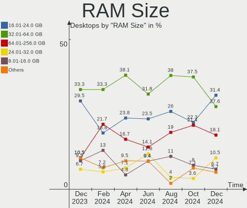
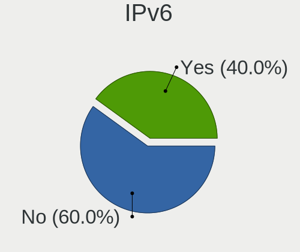
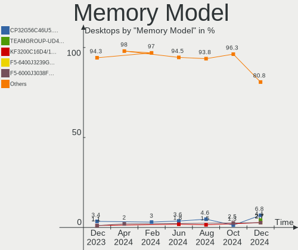

Arch Hardware Trends (Desktops)
-------------------------------

A project to identify most popular hardware characteristics and track their change
over time based on data collected by Arch users at https://Linux-Hardware.org.

Anyone can contribute to this report by the [hw-probe](https://github.com/linuxhw/hw-probe) tool:

    sudo -E hw-probe -all -upload

Full-feature report is available here: https://linux-hardware.org/?view=trends

Period: Feb, 2022.

Contents
--------

* [ System ](#system)
  - [ OS                       ](#os)
  - [ OS Family                ](#os-family)
  - [ Kernel                   ](#kernel)
  - [ Kernel Family            ](#kernel-family)
  - [ Kernel Major Ver.        ](#kernel-major-ver)
  - [ Arch                     ](#arch)
  - [ DE                       ](#de)
  - [ Display Server           ](#display-server)
  - [ Display Manager          ](#display-manager)
  - [ OS Lang                  ](#os-lang)
  - [ Boot Mode                ](#boot-mode)
  - [ Filesystem               ](#filesystem)
  - [ Part. scheme             ](#part-scheme)
  - [ Dual Boot with Linux/BSD ](#dual-boot-with-linuxbsd)
  - [ Dual Boot (Win)          ](#dual-boot-win)

* [ Board ](#board)
  - [ Vendor                   ](#vendor)
  - [ Model                    ](#model)
  - [ Model Family             ](#model-family)
  - [ MFG Year                 ](#mfg-year)
  - [ Form Factor              ](#form-factor)
  - [ Secure Boot              ](#secure-boot)
  - [ Coreboot                 ](#coreboot)
  - [ RAM Size                 ](#ram-size)
  - [ RAM Used                 ](#ram-used)
  - [ Total Drives             ](#total-drives)
  - [ Has CD-ROM               ](#has-cd-rom)
  - [ Has Ethernet             ](#has-ethernet)
  - [ Has WiFi                 ](#has-wifi)
  - [ Has Bluetooth            ](#has-bluetooth)

* [ Location ](#location)
  - [ Country                  ](#country)
  - [ City                     ](#city)

* [ Drives ](#drives)
  - [ Drive Vendor             ](#drive-vendor)
  - [ Drive Model              ](#drive-model)
  - [ HDD Vendor               ](#hdd-vendor)
  - [ SSD Vendor               ](#ssd-vendor)
  - [ Drive Kind               ](#drive-kind)
  - [ Drive Connector          ](#drive-connector)
  - [ Drive Size               ](#drive-size)
  - [ Space Total              ](#space-total)
  - [ Space Used               ](#space-used)
  - [ Malfunc. Drives          ](#malfunc-drives)
  - [ Malfunc. Drive Vendor    ](#malfunc-drive-vendor)
  - [ Malfunc. HDD Vendor      ](#malfunc-hdd-vendor)
  - [ Malfunc. Drive Kind      ](#malfunc-drive-kind)
  - [ Failed Drives            ](#failed-drives)
  - [ Failed Drive Vendor      ](#failed-drive-vendor)
  - [ Drive Status             ](#drive-status)

* [ Storage controller ](#storage-controller)
  - [ Storage Vendor           ](#storage-vendor)
  - [ Storage Model            ](#storage-model)
  - [ Storage Kind             ](#storage-kind)

* [ Processor ](#processor)
  - [ CPU Vendor               ](#cpu-vendor)
  - [ CPU Model                ](#cpu-model)
  - [ CPU Model Family         ](#cpu-model-family)
  - [ CPU Cores                ](#cpu-cores)
  - [ CPU Sockets              ](#cpu-sockets)
  - [ CPU Threads              ](#cpu-threads)
  - [ CPU Op-Modes             ](#cpu-op-modes)
  - [ CPU Microcode            ](#cpu-microcode)
  - [ CPU Microarch            ](#cpu-microarch)

* [ Graphics ](#graphics)
  - [ GPU Vendor               ](#gpu-vendor)
  - [ GPU Model                ](#gpu-model)
  - [ GPU Combo                ](#gpu-combo)
  - [ GPU Driver               ](#gpu-driver)
  - [ GPU Memory               ](#gpu-memory)

* [ Monitor ](#monitor)
  - [ Monitor Vendor           ](#monitor-vendor)
  - [ Monitor Model            ](#monitor-model)
  - [ Monitor Resolution       ](#monitor-resolution)
  - [ Monitor Diagonal         ](#monitor-diagonal)
  - [ Monitor Width            ](#monitor-width)
  - [ Aspect Ratio             ](#aspect-ratio)
  - [ Monitor Area             ](#monitor-area)
  - [ Pixel Density            ](#pixel-density)
  - [ Multiple Monitors        ](#multiple-monitors)

* [ Network ](#network)
  - [ Net Controller Vendor    ](#net-controller-vendor)
  - [ Net Controller Model     ](#net-controller-model)
  - [ Wireless Vendor          ](#wireless-vendor)
  - [ Wireless Model           ](#wireless-model)
  - [ Ethernet Vendor          ](#ethernet-vendor)
  - [ Ethernet Model           ](#ethernet-model)
  - [ Net Controller Kind      ](#net-controller-kind)
  - [ Used Controller          ](#used-controller)
  - [ NICs                     ](#nics)
  - [ IPv6                     ](#ipv6)

* [ Bluetooth ](#bluetooth)
  - [ Bluetooth Vendor         ](#bluetooth-vendor)
  - [ Bluetooth Model          ](#bluetooth-model)

* [ Sound ](#sound)
  - [ Sound Vendor             ](#sound-vendor)
  - [ Sound Model              ](#sound-model)

* [ Memory ](#memory)
  - [ Memory Vendor            ](#memory-vendor)
  - [ Memory Model             ](#memory-model)
  - [ Memory Kind              ](#memory-kind)
  - [ Memory Form Factor       ](#memory-form-factor)
  - [ Memory Size              ](#memory-size)
  - [ Memory Speed             ](#memory-speed)

* [ Printers & scanners ](#printers--scanners)
  - [ Printer Vendor           ](#printer-vendor)
  - [ Printer Model            ](#printer-model)
  - [ Scanner Vendor           ](#scanner-vendor)
  - [ Scanner Model            ](#scanner-model)

* [ Camera ](#camera)
  - [ Camera Vendor            ](#camera-vendor)
  - [ Camera Model             ](#camera-model)

* [ Security ](#security)
  - [ Fingerprint Vendor       ](#fingerprint-vendor)
  - [ Fingerprint Model        ](#fingerprint-model)
  - [ Chipcard Vendor          ](#chipcard-vendor)
  - [ Chipcard Model           ](#chipcard-model)

* [ Unsupported ](#unsupported)
  - [ Unsupported Devices      ](#unsupported-devices)
  - [ Unsupported Device Types ](#unsupported-device-types)

System
------

OS
--

Installed operating systems

| Name         | Desktops | Percent |
|--------------|----------|---------|
| Arch         | 33       | 63.46%  |
| Arch Rolling | 19       | 36.54%  |

OS Family
---------

OS without a version

| Name | Desktops | Percent |
|------|----------|---------|
| Arch | 52       | 100%    |

Kernel
------

Version of the Linux kernel

| Version                     | Desktops | Percent |
|-----------------------------|----------|---------|
| 5.16.8-arch1-1              | 6        | 11.54%  |
| 5.16.5-arch1-1              | 4        | 7.69%   |
| 5.16.10-arch1-1             | 4        | 7.69%   |
| 5.16.9-arch1-1              | 3        | 5.77%   |
| 5.16.8-zen1-1-zen           | 3        | 5.77%   |
| 5.16.4-arch1-1              | 2        | 3.85%   |
| 5.16.3-arch1-1              | 2        | 3.85%   |
| 5.16.11-arch1-1             | 2        | 3.85%   |
| 5.16.10-zen1-1-zen          | 2        | 3.85%   |
| 5.15.23-2-lts               | 2        | 3.85%   |
| 5.15.21-1-lts               | 2        | 3.85%   |
| 5.3.7-gentoo-gb08f327-dirty | 1        | 1.92%   |
| 5.17.0-rc5-246-tkg-pds      | 1        | 1.92%   |
| 5.16.9-zen1-1-zen           | 1        | 1.92%   |
| 5.16.9-247-tkg-bmq          | 1        | 1.92%   |
| 5.16.7-arch1-1              | 1        | 1.92%   |
| 5.16.5-zen1-1-zen           | 1        | 1.92%   |
| 5.16.4-zen1-1-zen           | 1        | 1.92%   |
| 5.16.4-242-tkg-pds          | 1        | 1.92%   |
| 5.16.3-zen1-1-zen           | 1        | 1.92%   |
| 5.16.2-arch1-1              | 1        | 1.92%   |
| 5.16.11-zen1-1-zen          | 1        | 1.92%   |
| 5.16.11-1-cachyos-bmq-lto   | 1        | 1.92%   |
| 5.15.24-1-lts               | 1        | 1.92%   |
| 5.15.22-xanmod1-tt-1        | 1        | 1.92%   |
| 5.15.22-xanmod1-1           | 1        | 1.92%   |
| 5.15.22-1-lts               | 1        | 1.92%   |
| 5.15.10-arch1-1             | 1        | 1.92%   |
| 5.14.16-arch1-1             | 1        | 1.92%   |
| 5.13.2-180-tkg-pds          | 1        | 1.92%   |
| 4.19.226-1-lts419           | 1        | 1.92%   |

Kernel Family
-------------

Linux kernel without a distro release

| Version  | Desktops | Percent |
|----------|----------|---------|
| 5.16.8   | 9        | 17.31%  |
| 5.16.10  | 6        | 11.54%  |
| 5.16.9   | 5        | 9.62%   |
| 5.16.5   | 5        | 9.62%   |
| 5.16.4   | 4        | 7.69%   |
| 5.16.11  | 4        | 7.69%   |
| 5.16.3   | 3        | 5.77%   |
| 5.15.22  | 3        | 5.77%   |
| 5.15.23  | 2        | 3.85%   |
| 5.15.21  | 2        | 3.85%   |
| 5.3.7    | 1        | 1.92%   |
| 5.17.0   | 1        | 1.92%   |
| 5.16.7   | 1        | 1.92%   |
| 5.16.2   | 1        | 1.92%   |
| 5.15.24  | 1        | 1.92%   |
| 5.15.10  | 1        | 1.92%   |
| 5.14.16  | 1        | 1.92%   |
| 5.13.2   | 1        | 1.92%   |
| 4.19.226 | 1        | 1.92%   |

Kernel Major Ver.
-----------------

Linux kernel major version

| Version | Desktops | Percent |
|---------|----------|---------|
| 5.16    | 38       | 73.08%  |
| 5.15    | 9        | 17.31%  |
| 5.3     | 1        | 1.92%   |
| 5.17    | 1        | 1.92%   |
| 5.14    | 1        | 1.92%   |
| 5.13    | 1        | 1.92%   |
| 4.19    | 1        | 1.92%   |

Arch
----

OS architecture (x86_64, i586, etc.)

| Name   | Desktops | Percent |
|--------|----------|---------|
| x86_64 | 52       | 100%    |

DE
--

Desktop Environment

| Name       | Desktops | Percent |
|------------|----------|---------|
| KDE5       | 17       | 32.69%  |
| GNOME      | 15       | 28.85%  |
| XFCE       | 7        | 13.46%  |
| Unknown    | 5        | 9.62%   |
| i3         | 3        | 5.77%   |
| X-Cinnamon | 1        | 1.92%   |
| openbox    | 1        | 1.92%   |
| LXDE       | 1        | 1.92%   |
| Cinnamon   | 1        | 1.92%   |
| awesome    | 1        | 1.92%   |

Display Server
--------------

X11 or Wayland

| Name    | Desktops | Percent |
|---------|----------|---------|
| X11     | 36       | 69.23%  |
| Wayland | 6        | 11.54%  |
| Unknown | 6        | 11.54%  |
| Tty     | 4        | 7.69%   |

Display Manager
---------------

SDDM, LightDM, etc.

| Name    | Desktops | Percent |
|---------|----------|---------|
| Unknown | 18       | 34.62%  |
| SDDM    | 11       | 21.15%  |
| GDM     | 9        | 17.31%  |
| LightDM | 8        | 15.38%  |
| Ly      | 3        | 5.77%   |
| LXDM    | 3        | 5.77%   |

OS Lang
-------

Language

| Lang    | Desktops | Percent |
|---------|----------|---------|
| en_US   | 30       | 57.69%  |
| de_DE   | 8        | 15.38%  |
| pl_PL   | 2        | 3.85%   |
| it_IT   | 2        | 3.85%   |
| en_IN   | 2        | 3.85%   |
| en_GB   | 2        | 3.85%   |
| Unknown | 2        | 3.85%   |
| tr_TR   | 1        | 1.92%   |
| ru_RU   | 1        | 1.92%   |
| de_AT   | 1        | 1.92%   |
| C       | 1        | 1.92%   |

Boot Mode
---------

EFI or BIOS

| Mode | Desktops | Percent |
|------|----------|---------|
| EFI  | 33       | 63.46%  |
| BIOS | 19       | 36.54%  |

Filesystem
----------

Type of filesystem

| Type    | Desktops | Percent |
|---------|----------|---------|
| Ext4    | 31       | 59.62%  |
| Btrfs   | 18       | 34.62%  |
| Overlay | 2        | 3.85%   |
| Zfs     | 1        | 1.92%   |

Part. scheme
------------

Scheme of partitioning

| Type    | Desktops | Percent |
|---------|----------|---------|
| GPT     | 33       | 63.46%  |
| Unknown | 14       | 26.92%  |
| MBR     | 5        | 9.62%   |

Dual Boot with Linux/BSD
------------------------

Hosting more than one Linux/BSD

| Dual boot | Desktops | Percent |
|-----------|----------|---------|
| No        | 45       | 86.54%  |
| Yes       | 7        | 13.46%  |

Dual Boot (Win)
---------------

Hosting Linux and Windows

| Dual boot | Desktops | Percent |
|-----------|----------|---------|
| No        | 32       | 61.54%  |
| Yes       | 20       | 38.46%  |

Board
-----

Vendor
------

Motherboard manufacturer

| Name                | Desktops | Percent |
|---------------------|----------|---------|
| ASUSTek Computer    | 11       | 21.15%  |
| Gigabyte Technology | 10       | 19.23%  |
| ASRock              | 10       | 19.23%  |
| MSI                 | 9        | 17.31%  |
| Hewlett-Packard     | 5        | 9.62%   |
| Dell                | 4        | 7.69%   |
| Unknown             | 2        | 3.85%   |
| Notebook            | 1        | 1.92%   |

Model
-----

Motherboard model

| Name                                 | Desktops | Percent |
|--------------------------------------|----------|---------|
| ASRock B450M-HDV R4.0                | 2        | 3.85%   |
| Unknown                              | 2        | 3.85%   |
| Notebook P15SM-A                     | 1        | 1.92%   |
| MSI MS-7D14                          | 1        | 1.92%   |
| MSI MS-7D08                          | 1        | 1.92%   |
| MSI MS-7C91                          | 1        | 1.92%   |
| MSI MS-7C82                          | 1        | 1.92%   |
| MSI MS-7C56                          | 1        | 1.92%   |
| MSI MS-7B89                          | 1        | 1.92%   |
| MSI MS-7B86                          | 1        | 1.92%   |
| MSI MS-7A38                          | 1        | 1.92%   |
| MSI MS-7721                          | 1        | 1.92%   |
| HP Z840 Workstation                  | 1        | 1.92%   |
| HP Pavilion Gaming Desktop TG01-2xxx | 1        | 1.92%   |
| HP EliteDesk 800 G1 TWR              | 1        | 1.92%   |
| HP Desktop M01-F1xxx                 | 1        | 1.92%   |
| HP 500-305nr                         | 1        | 1.92%   |
| Gigabyte Z97-HD3                     | 1        | 1.92%   |
| Gigabyte Z87X-UD3H                   | 1        | 1.92%   |
| Gigabyte Z77M-D3H                    | 1        | 1.92%   |
| Gigabyte P31-ES3G                    | 1        | 1.92%   |
| Gigabyte H270-Gaming 3               | 1        | 1.92%   |
| Gigabyte GB-BACE-3160                | 1        | 1.92%   |
| Gigabyte B550M AORUS PRO-P           | 1        | 1.92%   |
| Gigabyte B450M DS3H V2               | 1        | 1.92%   |
| Gigabyte B450 AORUS M                | 1        | 1.92%   |
| Gigabyte B360M-D2V                   | 1        | 1.92%   |
| Dell OptiPlex 9020                   | 1        | 1.92%   |
| Dell OptiPlex 7010                   | 1        | 1.92%   |
| Dell OptiPlex 5050                   | 1        | 1.92%   |
| Dell Inspiron 3268                   | 1        | 1.92%   |
| ASUS TUF Z390M-PRO GAMING            | 1        | 1.92%   |
| ASUS ROG STRIX Z590-E GAMING WIFI    | 1        | 1.92%   |
| ASUS ROG STRIX B450-F GAMING         | 1        | 1.92%   |
| ASUS ROG CROSSHAIR VIII DARK HERO    | 1        | 1.92%   |
| ASUS PRIME H510M-E                   | 1        | 1.92%   |
| ASUS PRIME B550M-A                   | 1        | 1.92%   |
| ASUS PRIME B460-PLUS                 | 1        | 1.92%   |
| ASUS PRIME B450M-A                   | 1        | 1.92%   |
| ASUS P8H61-M LX3 R2.0                | 1        | 1.92%   |
| ASUS H110M-R                         | 1        | 1.92%   |
| ASUS All Series                      | 1        | 1.92%   |
| ASRock X99 Taichi                    | 1        | 1.92%   |
| ASRock X370 Gaming X                 | 1        | 1.92%   |
| ASRock QC5000M-ITX/PH                | 1        | 1.92%   |
| ASRock J4205-ITX                     | 1        | 1.92%   |
| ASRock B450 Gaming K4                | 1        | 1.92%   |
| ASRock AB350M-HDV                    | 1        | 1.92%   |
| ASRock A75 Extreme6                  | 1        | 1.92%   |
| ASRock A300M-STX                     | 1        | 1.92%   |

Model Family
------------

Motherboard model prefix

| Name                  | Desktops | Percent |
|-----------------------|----------|---------|
| ASUS PRIME            | 4        | 7.69%   |
| Dell OptiPlex         | 3        | 5.77%   |
| ASUS ROG              | 3        | 5.77%   |
| ASRock B450M-HDV      | 2        | 3.85%   |
| Unknown               | 2        | 3.85%   |
| Notebook P15SM-A      | 1        | 1.92%   |
| MSI MS-7D14           | 1        | 1.92%   |
| MSI MS-7D08           | 1        | 1.92%   |
| MSI MS-7C91           | 1        | 1.92%   |
| MSI MS-7C82           | 1        | 1.92%   |
| MSI MS-7C56           | 1        | 1.92%   |
| MSI MS-7B89           | 1        | 1.92%   |
| MSI MS-7B86           | 1        | 1.92%   |
| MSI MS-7A38           | 1        | 1.92%   |
| MSI MS-7721           | 1        | 1.92%   |
| HP Z840               | 1        | 1.92%   |
| HP Pavilion           | 1        | 1.92%   |
| HP EliteDesk          | 1        | 1.92%   |
| HP Desktop            | 1        | 1.92%   |
| HP 500-305nr          | 1        | 1.92%   |
| Gigabyte Z97-HD3      | 1        | 1.92%   |
| Gigabyte Z87X-UD3H    | 1        | 1.92%   |
| Gigabyte Z77M-D3H     | 1        | 1.92%   |
| Gigabyte P31-ES3G     | 1        | 1.92%   |
| Gigabyte H270-Gaming  | 1        | 1.92%   |
| Gigabyte GB-BACE-3160 | 1        | 1.92%   |
| Gigabyte B550M        | 1        | 1.92%   |
| Gigabyte B450M        | 1        | 1.92%   |
| Gigabyte B450         | 1        | 1.92%   |
| Gigabyte B360M-D2V    | 1        | 1.92%   |
| Dell Inspiron         | 1        | 1.92%   |
| ASUS TUF              | 1        | 1.92%   |
| ASUS P8H61-M          | 1        | 1.92%   |
| ASUS H110M-R          | 1        | 1.92%   |
| ASUS All              | 1        | 1.92%   |
| ASRock X99            | 1        | 1.92%   |
| ASRock X370           | 1        | 1.92%   |
| ASRock QC5000M-ITX    | 1        | 1.92%   |
| ASRock J4205-ITX      | 1        | 1.92%   |
| ASRock B450           | 1        | 1.92%   |
| ASRock AB350M-HDV     | 1        | 1.92%   |
| ASRock A75            | 1        | 1.92%   |
| ASRock A300M-STX      | 1        | 1.92%   |

MFG Year
--------

Motherboard manufacture year

| Year | Desktops | Percent |
|------|----------|---------|
| 2018 | 11       | 21.15%  |
| 2020 | 8        | 15.38%  |
| 2021 | 6        | 11.54%  |
| 2019 | 5        | 9.62%   |
| 2016 | 5        | 9.62%   |
| 2013 | 5        | 9.62%   |
| 2017 | 3        | 5.77%   |
| 2014 | 3        | 5.77%   |
| 2012 | 3        | 5.77%   |
| 2015 | 2        | 3.85%   |
| 2008 | 1        | 1.92%   |

Form Factor
-----------

Physical design of the computer

| Name    | Desktops | Percent |
|---------|----------|---------|
| Desktop | 52       | 100%    |

Secure Boot
-----------

Enabled or disabled

| State    | Desktops | Percent |
|----------|----------|---------|
| Disabled | 51       | 98.08%  |
| Enabled  | 1        | 1.92%   |

Coreboot
--------

Have coreboot on board

| Used | Desktops | Percent |
|------|----------|---------|
| No   | 52       | 100%    |

RAM Size
--------

Total RAM memory

| Size in GB      | Desktops | Percent |
|-----------------|----------|---------|
| 16.01-24.0      | 22       | 42.31%  |
| 32.01-64.0      | 10       | 19.23%  |
| 4.01-8.0        | 8        | 15.38%  |
| 8.01-16.0       | 6        | 11.54%  |
| 3.01-4.0        | 2        | 3.85%   |
| 24.01-32.0      | 2        | 3.85%   |
| More than 256.0 | 1        | 1.92%   |
| 64.01-256.0     | 1        | 1.92%   |

RAM Used
--------

Used RAM memory

| Used GB   | Desktops | Percent |
|-----------|----------|---------|
| 1.01-2.0  | 12       | 23.08%  |
| 2.01-3.0  | 11       | 21.15%  |
| 4.01-8.0  | 10       | 19.23%  |
| 3.01-4.0  | 10       | 19.23%  |
| 8.01-16.0 | 7        | 13.46%  |
| 0.51-1.0  | 2        | 3.85%   |

Total Drives
------------

Number of drives on board

| Drives | Desktops | Percent |
|--------|----------|---------|
| 1      | 16       | 30.77%  |
| 2      | 14       | 26.92%  |
| 3      | 10       | 19.23%  |
| 4      | 4        | 7.69%   |
| 7      | 2        | 3.85%   |
| 6      | 2        | 3.85%   |
| 5      | 2        | 3.85%   |
| 11     | 1        | 1.92%   |
| 9      | 1        | 1.92%   |

Has CD-ROM
----------

Has CD-ROM on board

| Presented | Desktops | Percent |
|-----------|----------|---------|
| No        | 36       | 69.23%  |
| Yes       | 16       | 30.77%  |

Has Ethernet
------------

Has Ethernet on board

| Presented | Desktops | Percent |
|-----------|----------|---------|
| Yes       | 51       | 98.08%  |
| No        | 1        | 1.92%   |

Has WiFi
--------

Has WiFi module

| Presented | Desktops | Percent |
|-----------|----------|---------|
| No        | 29       | 55.77%  |
| Yes       | 23       | 44.23%  |

Has Bluetooth
-------------

Has Bluetooth module

| Presented | Desktops | Percent |
|-----------|----------|---------|
| Yes       | 28       | 53.85%  |
| No        | 24       | 46.15%  |

Location
--------

Country
-------

Geographic location (country)

| Country      | Desktops | Percent |
|--------------|----------|---------|
| USA          | 8        | 15.38%  |
| Germany      | 8        | 15.38%  |
| Russia       | 4        | 7.69%   |
| Poland       | 4        | 7.69%   |
| UK           | 3        | 5.77%   |
| Italy        | 3        | 5.77%   |
| Lithuania    | 2        | 3.85%   |
| India        | 2        | 3.85%   |
| Brazil       | 2        | 3.85%   |
| Belgium      | 2        | 3.85%   |
| Bangladesh   | 2        | 3.85%   |
| Ukraine      | 1        | 1.92%   |
| Turkey       | 1        | 1.92%   |
| Slovakia     | 1        | 1.92%   |
| Saudi Arabia | 1        | 1.92%   |
| Netherlands  | 1        | 1.92%   |
| Iran         | 1        | 1.92%   |
| Greece       | 1        | 1.92%   |
| France       | 1        | 1.92%   |
| Finland      | 1        | 1.92%   |
| Chile        | 1        | 1.92%   |
| Canada       | 1        | 1.92%   |
| Austria      | 1        | 1.92%   |

City
----

Geographic location (city)

| City          | Desktops | Percent |
|---------------|----------|---------|
| Berlin        | 3        | 5.77%   |
| Kaunas        | 2        | 3.85%   |
| Dhaka         | 2        | 3.85%   |
| Valencia      | 1        | 1.92%   |
| Turtleford    | 1        | 1.92%   |
| South Bank    | 1        | 1.92%   |
| Seattle       | 1        | 1.92%   |
| São Paulo  | 1        | 1.92%   |
| Santiago      | 1        | 1.92%   |
| Rzeszów    | 1        | 1.92%   |
| Roeselare     | 1        | 1.92%   |
| Riyadh        | 1        | 1.92%   |
| Orenburg      | 1        | 1.92%   |
| Oldham        | 1        | 1.92%   |
| Oklahoma City | 1        | 1.92%   |
| Oakland       | 1        | 1.92%   |
| Nowogard      | 1        | 1.92%   |
| Niagara Falls | 1        | 1.92%   |
| Naples        | 1        | 1.92%   |
| Mumbai        | 1        | 1.92%   |
| Moscow        | 1        | 1.92%   |
| Mococa        | 1        | 1.92%   |
| Milan         | 1        | 1.92%   |
| Mielec        | 1        | 1.92%   |
| Menden        | 1        | 1.92%   |
| Martin        | 1        | 1.92%   |
| Mansfield     | 1        | 1.92%   |
| Lyon          | 1        | 1.92%   |
| Lochristi     | 1        | 1.92%   |
| Lekkerkerk    | 1        | 1.92%   |
| Krasnodar     | 1        | 1.92%   |
| Karlsruhe     | 1        | 1.92%   |
| Istanbul      | 1        | 1.92%   |
| Ioannina      | 1        | 1.92%   |
| Hanover       | 1        | 1.92%   |
| Griesheim     | 1        | 1.92%   |
| Genoa         | 1        | 1.92%   |
| Feldkirch     | 1        | 1.92%   |
| Essen         | 1        | 1.92%   |
| Espoo         | 1        | 1.92%   |
| Dublin        | 1        | 1.92%   |
| Delhi         | 1        | 1.92%   |
| Czapury       | 1        | 1.92%   |
| Chervonohrad  | 1        | 1.92%   |
| Bratsk        | 1        | 1.92%   |
| Bloomington   | 1        | 1.92%   |
| Arak          | 1        | 1.92%   |
| Anaheim       | 1        | 1.92%   |

Drives
------

Drive Vendor
------------

Hard drive vendors

| Vendor                | Desktops | Drives | Percent |
|-----------------------|----------|--------|---------|
| Samsung Electronics   | 25       | 33     | 22.52%  |
| Seagate               | 23       | 38     | 20.72%  |
| WDC                   | 18       | 21     | 16.22%  |
| Kingston              | 7        | 7      | 6.31%   |
| Crucial               | 6        | 6      | 5.41%   |
| A-DATA Technology     | 6        | 6      | 5.41%   |
| Toshiba               | 5        | 5      | 4.5%    |
| SanDisk               | 4        | 10     | 3.6%    |
| Intel                 | 3        | 3      | 2.7%    |
| Transcend             | 1        | 1      | 0.9%    |
| TEUTONS               | 1        | 1      | 0.9%    |
| Realtek Semiconductor | 1        | 1      | 0.9%    |
| PNY                   | 1        | 1      | 0.9%    |
| PLEXTOR               | 1        | 1      | 0.9%    |
| Phison                | 1        | 1      | 0.9%    |
| Micron Technology     | 1        | 1      | 0.9%    |
| Lexar                 | 1        | 1      | 0.9%    |
| KIOXIA                | 1        | 1      | 0.9%    |
| Intenso               | 1        | 1      | 0.9%    |
| Hitachi               | 1        | 1      | 0.9%    |
| HGST                  | 1        | 2      | 0.9%    |
| GOODRAM               | 1        | 1      | 0.9%    |
| Corsair               | 1        | 1      | 0.9%    |

Drive Model
-----------

Hard drive models

| Model                                   | Desktops | Percent |
|-----------------------------------------|----------|---------|
| Seagate ST2000DM008-2FR102 2TB          | 4        | 3.1%    |
| Seagate ST1000DM010-2EP102 1TB          | 4        | 3.1%    |
| Seagate ST500DM002-1BD142 500GB         | 3        | 2.33%   |
| WDC WD20EFRX-68EUZN0 2TB                | 2        | 1.55%   |
| WDC WD10EZEX-08WN4A0 1TB                | 2        | 1.55%   |
| WDC WD10EARS-00Y5B1 1TB                 | 2        | 1.55%   |
| WDC WD10EADS-00M2B0 1TB                 | 2        | 1.55%   |
| Toshiba HDWD110 1TB                     | 2        | 1.55%   |
| Seagate ST1000DM003-1CH162 1TB          | 2        | 1.55%   |
| Samsung SSD 980 1TB                     | 2        | 1.55%   |
| Samsung SSD 970 EVO Plus 1TB            | 2        | 1.55%   |
| Samsung SSD 860 EVO 1TB                 | 2        | 1.55%   |
| Samsung HD502HJ 500GB                   | 2        | 1.55%   |
| Kingston SV300S37A120G 120GB SSD        | 2        | 1.55%   |
| WDC WDS500G3X0C-00SJG0 500GB            | 1        | 0.78%   |
| WDC WDS500G2B0A-00SM50 500GB SSD        | 1        | 0.78%   |
| WDC WDS100T2B0B-00YS70 1TB SSD          | 1        | 0.78%   |
| WDC WD60EZAZ-00SF3B0 6TB                | 1        | 0.78%   |
| WDC WD5000AZLX-75K2TA0 500GB            | 1        | 0.78%   |
| WDC WD5000AAKX-75U6AA0 500GB            | 1        | 0.78%   |
| WDC WD40EZRZ-00WN9B0 4TB                | 1        | 0.78%   |
| WDC WD20EZRX-19D8PB0 2TB                | 1        | 0.78%   |
| WDC WD20EZRX-00D8PB0 2TB                | 1        | 0.78%   |
| WDC WD20EZAZ-00L9GB0 2TB                | 1        | 0.78%   |
| WDC WD20EURS-63S48Y0 2TB                | 1        | 0.78%   |
| WDC WD10EZEX-08M2NA0 1TB                | 1        | 0.78%   |
| Transcend TS256GMSA230S 256GB SSD       | 1        | 0.78%   |
| Toshiba HDWF180 8TB                     | 1        | 0.78%   |
| Toshiba DT01ACA200 2TB                  | 1        | 0.78%   |
| Toshiba DT01ACA100 1TB                  | 1        | 0.78%   |
| TEUTONS SSD 256GB                       | 1        | 0.78%   |
| Seagate ST9640320AS 640GB               | 1        | 0.78%   |
| Seagate ST8000VX004-2M1101 8TB          | 1        | 0.78%   |
| Seagate ST750LX003-1AC154 752GB         | 1        | 0.78%   |
| Seagate ST4000DM004-2CV104 4TB          | 1        | 0.78%   |
| Seagate ST3500418AS 500GB               | 1        | 0.78%   |
| Seagate ST3000VN000-1HJ166 3TB          | 1        | 0.78%   |
| Seagate ST3000NM0023 3TB                | 1        | 0.78%   |
| Seagate ST2000NM0023 2TB                | 1        | 0.78%   |
| Seagate ST2000LX001-1RG174 2TB          | 1        | 0.78%   |
| Seagate ST2000LM007-1R8174 2TB          | 1        | 0.78%   |
| Seagate ST2000DM006-2DM164 2TB          | 1        | 0.78%   |
| Seagate ST2000DM001-1CH164 2TB          | 1        | 0.78%   |
| Seagate ST16000NM001G-2KK103 16TB       | 1        | 0.78%   |
| Seagate ST1000VM002-1ET162 1TB          | 1        | 0.78%   |
| Seagate ST1000DM003-1SB10C 1TB          | 1        | 0.78%   |
| Seagate ST1000DL002-9TT153 1TB          | 1        | 0.78%   |
| Seagate One Touch SSD 500GB             | 1        | 0.78%   |
| Seagate FireCuda 530 ZP500GM30013 500GB | 1        | 0.78%   |
| Seagate Backup+ Hub BK 8TB              | 1        | 0.78%   |
| SanDisk SDSSDXPS240G 240GB              | 1        | 0.78%   |
| SanDisk SDSSDP064G 64GB                 | 1        | 0.78%   |
| SanDisk SDSSDHP256G 256GB               | 1        | 0.78%   |
| SanDisk SD7UB2Q512G1122 512GB SSD       | 1        | 0.78%   |
| SanDisk SD6SB2M512G1022I 512GB SSD      | 1        | 0.78%   |
| Sandisk NVMe SSD Drive 1TB              | 1        | 0.78%   |
| Samsung SSD 980 PRO 1TB                 | 1        | 0.78%   |
| Samsung SSD 980 500GB                   | 1        | 0.78%   |
| Samsung SSD 970 EVO Plus 500GB          | 1        | 0.78%   |
| Samsung SSD 970 EVO Plus 2TB            | 1        | 0.78%   |

HDD Vendor
----------

Hard disk drive vendors

| Vendor              | Desktops | Drives | Percent |
|---------------------|----------|--------|---------|
| Seagate             | 23       | 36     | 45.1%   |
| WDC                 | 15       | 18     | 29.41%  |
| Samsung Electronics | 6        | 7      | 11.76%  |
| Toshiba             | 5        | 5      | 9.8%    |
| Hitachi             | 1        | 1      | 1.96%   |
| HGST                | 1        | 2      | 1.96%   |

SSD Vendor
----------

Solid state drive vendors

| Vendor              | Desktops | Drives | Percent |
|---------------------|----------|--------|---------|
| Samsung Electronics | 11       | 13     | 26.83%  |
| Kingston            | 6        | 6      | 14.63%  |
| Crucial             | 5        | 5      | 12.2%   |
| A-DATA Technology   | 5        | 5      | 12.2%   |
| SanDisk             | 3        | 9      | 7.32%   |
| WDC                 | 2        | 2      | 4.88%   |
| Intel               | 2        | 2      | 4.88%   |
| Transcend           | 1        | 1      | 2.44%   |
| TEUTONS             | 1        | 1      | 2.44%   |
| Seagate             | 1        | 1      | 2.44%   |
| PNY                 | 1        | 1      | 2.44%   |
| Lexar               | 1        | 1      | 2.44%   |
| Intenso             | 1        | 1      | 2.44%   |
| Corsair             | 1        | 1      | 2.44%   |

Drive Kind
----------

HDD or SSD

| Kind | Desktops | Drives | Percent |
|------|----------|--------|---------|
| HDD  | 39       | 69     | 41.94%  |
| SSD  | 33       | 49     | 35.48%  |
| NVMe | 21       | 26     | 22.58%  |

Drive Connector
---------------

SATA, SAS, NVMe, etc.

| Type | Desktops | Drives | Percent |
|------|----------|--------|---------|
| SATA | 50       | 114    | 66.67%  |
| NVMe | 21       | 26     | 28%     |
| SAS  | 4        | 4      | 5.33%   |

Drive Size
----------

Size of hard drive

| Size in TB | Desktops | Drives | Percent |
|------------|----------|--------|---------|
| 0.01-0.5   | 32       | 46     | 39.02%  |
| 0.51-1.0   | 26       | 37     | 31.71%  |
| 1.01-2.0   | 15       | 20     | 18.29%  |
| 4.01-10.0  | 5        | 9      | 6.1%    |
| 3.01-4.0   | 2        | 2      | 2.44%   |
| 2.01-3.0   | 1        | 3      | 1.22%   |
| 10.01-20.0 | 1        | 1      | 1.22%   |

Space Total
-----------

Amount of disk space available on the file system

| Size in GB     | Desktops | Percent |
|----------------|----------|---------|
| 1001-2000      | 13       | 25%     |
| 501-1000       | 8        | 15.38%  |
| 2001-3000      | 7        | 13.46%  |
| More than 3000 | 6        | 11.54%  |
| 251-500        | 6        | 11.54%  |
| 101-250        | 6        | 11.54%  |
| Unknown        | 3        | 5.77%   |
| 51-100         | 2        | 3.85%   |
| 1-20           | 1        | 1.92%   |

Space Used
----------

Amount of used disk space

| Used GB        | Desktops | Percent |
|----------------|----------|---------|
| 501-1000       | 10       | 19.23%  |
| 251-500        | 7        | 13.46%  |
| 21-50          | 7        | 13.46%  |
| 101-250        | 7        | 13.46%  |
| 51-100         | 6        | 11.54%  |
| 1001-2000      | 4        | 7.69%   |
| More than 3000 | 3        | 5.77%   |
| 1-20           | 3        | 5.77%   |
| Unknown        | 3        | 5.77%   |
| 2001-3000      | 2        | 3.85%   |

Malfunc. Drives
---------------

Drive models with a malfunction

| Model                             | Desktops | Drives | Percent |
|-----------------------------------|----------|--------|---------|
| WDC WD20EFRX-68EUZN0 2TB          | 1        | 2      | 16.67%  |
| WDC WD10EADS-00M2B0 1TB           | 1        | 1      | 16.67%  |
| Seagate ST3500418AS 500GB         | 1        | 2      | 16.67%  |
| Seagate ST2000LM007-1R8174 2TB    | 1        | 1      | 16.67%  |
| Samsung Electronics HD502HI 500GB | 1        | 1      | 16.67%  |
| PLEXTOR PX-1TM8SeG 1TB            | 1        | 1      | 16.67%  |

Malfunc. Drive Vendor
---------------------

Vendors of faulty drives

| Vendor              | Desktops | Drives | Percent |
|---------------------|----------|--------|---------|
| WDC                 | 2        | 3      | 33.33%  |
| Seagate             | 2        | 3      | 33.33%  |
| Samsung Electronics | 1        | 1      | 16.67%  |
| PLEXTOR             | 1        | 1      | 16.67%  |

Malfunc. HDD Vendor
-------------------

Vendors of faulty HDD drives

| Vendor              | Desktops | Drives | Percent |
|---------------------|----------|--------|---------|
| WDC                 | 2        | 3      | 40%     |
| Seagate             | 2        | 3      | 40%     |
| Samsung Electronics | 1        | 1      | 20%     |

Malfunc. Drive Kind
-------------------

Kinds of faulty drives

| Kind | Desktops | Drives | Percent |
|------|----------|--------|---------|
| HDD  | 4        | 7      | 80%     |
| NVMe | 1        | 1      | 20%     |

Failed Drives
-------------

Failed drive models

Zero info for selected period =(

Failed Drive Vendor
-------------------

Failed drive vendors

Zero info for selected period =(

Drive Status
------------

Number of failed and malfunc. drives

| Status   | Desktops | Drives | Percent |
|----------|----------|--------|---------|
| Works    | 28       | 77     | 49.12%  |
| Detected | 24       | 59     | 42.11%  |
| Malfunc  | 5        | 8      | 8.77%   |

Storage controller
------------------

Storage Vendor
--------------

Storage controller vendors

| Vendor                       | Desktops | Percent |
|------------------------------|----------|---------|
| Intel                        | 28       | 32.94%  |
| AMD                          | 24       | 28.24%  |
| Samsung Electronics          | 11       | 12.94%  |
| Marvell Technology Group     | 4        | 4.71%   |
| ASMedia Technology           | 4        | 4.71%   |
| Sandisk                      | 2        | 2.35%   |
| Realtek Semiconductor        | 2        | 2.35%   |
| Broadcom / LSI               | 2        | 2.35%   |
| Toshiba America Info Systems | 1        | 1.18%   |
| Shenzhen Longsys Electronics | 1        | 1.18%   |
| Seagate Technology           | 1        | 1.18%   |
| Phison Electronics           | 1        | 1.18%   |
| Micron/Crucial Technology    | 1        | 1.18%   |
| Micron Technology            | 1        | 1.18%   |
| Lite-On Technology           | 1        | 1.18%   |
| Kingston Technology Company  | 1        | 1.18%   |

Storage Model
-------------

Storage controller models

| Model                                                                            | Desktops | Percent |
|----------------------------------------------------------------------------------|----------|---------|
| AMD FCH SATA Controller [AHCI mode]                                              | 12       | 12.37%  |
| AMD 400 Series Chipset SATA Controller                                           | 12       | 12.37%  |
| Samsung NVMe SSD Controller SM981/PM981/PM983                                    | 6        | 6.19%   |
| Intel 8 Series/C220 Series Chipset Family 6-port SATA Controller 1 [AHCI mode]   | 5        | 5.15%   |
| AMD Starship/Matisse Chipset SATA Controller [AHCI mode]                         | 5        | 5.15%   |
| Samsung NVMe SSD Controller 980                                                  | 4        | 4.12%   |
| Intel 500 Series Chipset Family SATA AHCI Controller                             | 3        | 3.09%   |
| ASMedia ASM1062 Serial ATA Controller                                            | 3        | 3.09%   |
| Realtek RTS5763DL NVMe SSD Controller                                            | 2        | 2.06%   |
| Intel Q170/Q150/B150/H170/H110/Z170/CM236 Chipset SATA Controller [AHCI Mode]    | 2        | 2.06%   |
| Intel Cannon Lake PCH SATA AHCI Controller                                       | 2        | 2.06%   |
| Intel 9 Series Chipset Family SATA Controller [AHCI Mode]                        | 2        | 2.06%   |
| Intel 7 Series/C210 Series Chipset Family 6-port SATA Controller [AHCI mode]     | 2        | 2.06%   |
| Intel 400 Series Chipset Family SATA AHCI Controller                             | 2        | 2.06%   |
| Intel 200 Series PCH SATA controller [AHCI mode]                                 | 2        | 2.06%   |
| Toshiba America Info Systems BG3 NVMe SSD Controller                             | 1        | 1.03%   |
| Shenzhen Longsys SM2263EN/SM2263XT-based OEM SSD                                 | 1        | 1.03%   |
| Seagate FireCuda 530 SSD                                                         | 1        | 1.03%   |
| Sandisk WD Blue SN550 NVMe SSD                                                   | 1        | 1.03%   |
| Sandisk WD Black 2018/SN750 / PC SN720 NVMe SSD                                  | 1        | 1.03%   |
| Samsung NVMe SSD Controller SM961/PM961/SM963                                    | 1        | 1.03%   |
| Samsung NVMe SSD Controller SM951/PM951                                          | 1        | 1.03%   |
| Samsung NVMe SSD Controller PM9A1/PM9A3/980PRO                                   | 1        | 1.03%   |
| Phison PS5013 E13 NVMe Controller                                                | 1        | 1.03%   |
| Micron/Crucial P2 NVMe PCIe SSD                                                  | 1        | 1.03%   |
| Micron Non-Volatile memory controller                                            | 1        | 1.03%   |
| Marvell Group 88SE9230 PCIe 2.0 x2 4-port SATA 6 Gb/s RAID Controller            | 1        | 1.03%   |
| Marvell Group 88SE9172 SATA 6Gb/s Controller                                     | 1        | 1.03%   |
| Marvell Group 88SE9128 PCIe SATA 6 Gb/s RAID controller with HyperDuo            | 1        | 1.03%   |
| Marvell Group 88SE9128 PCIe SATA 6 Gb/s RAID controller                          | 1        | 1.03%   |
| Lite-On Non-Volatile memory controller                                           | 1        | 1.03%   |
| Kingston Company A2000 NVMe SSD                                                  | 1        | 1.03%   |
| Intel SSD 660P Series                                                            | 1        | 1.03%   |
| Intel NM10/ICH7 Family SATA Controller [IDE mode]                                | 1        | 1.03%   |
| Intel Celeron N3350/Pentium N4200/Atom E3900 Series SATA AHCI Controller         | 1        | 1.03%   |
| Intel C610/X99 series chipset sSATA Controller [RAID mode]                       | 1        | 1.03%   |
| Intel C610/X99 series chipset 6-Port SATA Controller [AHCI mode]                 | 1        | 1.03%   |
| Intel C600/X79 series chipset SATA RAID Controller                               | 1        | 1.03%   |
| Intel C600/X79 series chipset 6-Port SATA AHCI Controller                        | 1        | 1.03%   |
| Intel Atom/Celeron/Pentium Processor x5-E8000/J3xxx/N3xxx Series SATA Controller | 1        | 1.03%   |
| Intel 6 Series/C200 Series Chipset Family 6 port Desktop SATA AHCI Controller    | 1        | 1.03%   |
| Broadcom / LSI SAS2308 PCI-Express Fusion-MPT SAS-2                              | 1        | 1.03%   |
| Broadcom / LSI MegaRAID SAS 2108 [Liberator]                                     | 1        | 1.03%   |
| ASMedia ASM1061 SATA IDE Controller                                              | 1        | 1.03%   |
| AMD X370 Series Chipset SATA Controller                                          | 1        | 1.03%   |
| AMD FCH SATA Controller [IDE mode]                                               | 1        | 1.03%   |
| AMD FCH IDE Controller                                                           | 1        | 1.03%   |
| AMD 300 Series Chipset SATA Controller                                           | 1        | 1.03%   |

Storage Kind
------------

Kind of storage controller (IDE, SATA, NVMe, SAS, ...)

| Kind | Desktops | Percent |
|------|----------|---------|
| SATA | 49       | 65.33%  |
| NVMe | 21       | 28%     |
| RAID | 2        | 2.67%   |
| IDE  | 2        | 2.67%   |
| SAS  | 1        | 1.33%   |

Processor
---------

CPU Vendor
----------

Processor vendors

| Vendor | Desktops | Percent |
|--------|----------|---------|
| Intel  | 27       | 51.92%  |
| AMD    | 25       | 48.08%  |

CPU Model
---------

Processor models

| Model                                       | Desktops | Percent |
|---------------------------------------------|----------|---------|
| AMD Ryzen 5 3600 6-Core Processor           | 5        | 9.62%   |
| AMD Ryzen 5 5600X 6-Core Processor          | 4        | 7.69%   |
| AMD Ryzen 7 3700X 8-Core Processor          | 2        | 3.85%   |
| Intel Xeon CPU E5-2699 v3 @ 2.30GHz         | 1        | 1.92%   |
| Intel Xeon CPU E5-2683 v4 @ 2.10GHz         | 1        | 1.92%   |
| Intel Xeon CPU E5-1650 0 @ 3.20GHz          | 1        | 1.92%   |
| Intel Pentium CPU J4205 @ 1.50GHz           | 1        | 1.92%   |
| Intel Pentium CPU G4560 @ 3.50GHz           | 1        | 1.92%   |
| Intel Core i9-10850K CPU @ 3.60GHz          | 1        | 1.92%   |
| Intel Core i7-7700 CPU @ 3.60GHz            | 1        | 1.92%   |
| Intel Core i7-4790K CPU @ 4.00GHz           | 1        | 1.92%   |
| Intel Core i7-4770 CPU @ 3.40GHz            | 1        | 1.92%   |
| Intel Core i7-4710MQ CPU @ 2.50GHz          | 1        | 1.92%   |
| Intel Core i7-3770 CPU @ 3.40GHz            | 1        | 1.92%   |
| Intel Core i7-10700 CPU @ 2.90GHz           | 1        | 1.92%   |
| Intel Core i5-9600K CPU @ 3.70GHz           | 1        | 1.92%   |
| Intel Core i5-8500 CPU @ 3.00GHz            | 1        | 1.92%   |
| Intel Core i5-7500 CPU @ 3.40GHz            | 1        | 1.92%   |
| Intel Core i5-7400 CPU @ 3.00GHz            | 1        | 1.92%   |
| Intel Core i5-4590 CPU @ 3.30GHz            | 1        | 1.92%   |
| Intel Core i5-4570 CPU @ 3.20GHz            | 1        | 1.92%   |
| Intel Core i5-4460S CPU @ 2.90GHz           | 1        | 1.92%   |
| Intel Core i5-4460 CPU @ 3.20GHz            | 1        | 1.92%   |
| Intel Core i5-2500K CPU @ 3.30GHz           | 1        | 1.92%   |
| Intel Core i3-2100 CPU @ 3.10GHz            | 1        | 1.92%   |
| Intel Core i3-10100 CPU @ 3.60GHz           | 1        | 1.92%   |
| Intel Core 2 Quad CPU Q9550 @ 2.83GHz       | 1        | 1.92%   |
| Intel Celeron CPU J3160 @ 1.60GHz           | 1        | 1.92%   |
| Intel 11th Gen Core i5-11600K @ 3.90GHz     | 1        | 1.92%   |
| Intel 11th Gen Core i5-11400 @ 2.60GHz      | 1        | 1.92%   |
| AMD Ryzen 9 5950X 16-Core Processor         | 1        | 1.92%   |
| AMD Ryzen 9 5900X 12-Core Processor         | 1        | 1.92%   |
| AMD Ryzen 7 5700G with Radeon Graphics      | 1        | 1.92%   |
| AMD Ryzen 7 4700G with Radeon Graphics      | 1        | 1.92%   |
| AMD Ryzen 7 3800X 8-Core Processor          | 1        | 1.92%   |
| AMD Ryzen 7 1700X Eight-Core Processor      | 1        | 1.92%   |
| AMD Ryzen 5 3400G with Radeon Vega Graphics | 1        | 1.92%   |
| AMD Ryzen 5 2600 Six-Core Processor         | 1        | 1.92%   |
| AMD Ryzen 3 2200G with Radeon Vega Graphics | 1        | 1.92%   |
| AMD DG1501SML87LB                           | 1        | 1.92%   |
| AMD Athlon 3000G with Radeon Vega Graphics  | 1        | 1.92%   |
| AMD A8-6600K APU with Radeon HD Graphics    | 1        | 1.92%   |
| AMD A8-3870 APU with Radeon HD Graphics     | 1        | 1.92%   |
| AMD A4-5050 APU with Radeon HD Graphics     | 1        | 1.92%   |

CPU Model Family
----------------

Processor model prefix

| Model             | Desktops | Percent |
|-------------------|----------|---------|
| AMD Ryzen 5       | 11       | 21.15%  |
| Intel Core i5     | 9        | 17.31%  |
| Intel Core i7     | 6        | 11.54%  |
| AMD Ryzen 7       | 6        | 11.54%  |
| Other             | 3        | 5.77%   |
| Intel Xeon        | 3        | 5.77%   |
| Intel Pentium     | 2        | 3.85%   |
| Intel Core i3     | 2        | 3.85%   |
| AMD Ryzen 9       | 2        | 3.85%   |
| AMD A8            | 2        | 3.85%   |
| Intel Core i9     | 1        | 1.92%   |
| Intel Core 2 Quad | 1        | 1.92%   |
| Intel Celeron     | 1        | 1.92%   |
| AMD Ryzen 3       | 1        | 1.92%   |
| AMD Athlon        | 1        | 1.92%   |
| AMD A4            | 1        | 1.92%   |

CPU Cores
---------

Number of processor cores

| Number | Desktops | Percent |
|--------|----------|---------|
| 4      | 20       | 38.46%  |
| 6      | 15       | 28.85%  |
| 8      | 8        | 15.38%  |
| 2      | 4        | 7.69%   |
| 32     | 1        | 1.92%   |
| 18     | 1        | 1.92%   |
| 16     | 1        | 1.92%   |
| 12     | 1        | 1.92%   |
| 10     | 1        | 1.92%   |

CPU Sockets
-----------

Number of sockets

| Number | Desktops | Percent |
|--------|----------|---------|
| 1      | 51       | 98.08%  |
| 2      | 1        | 1.92%   |

CPU Threads
-----------

Threads per core (Hyper-Threading)

| Number | Desktops | Percent |
|--------|----------|---------|
| 2      | 36       | 69.23%  |
| 1      | 16       | 30.77%  |

CPU Op-Modes
------------

CPU Operation Modes (32-bit, 64-bit)

| Op mode        | Desktops | Percent |
|----------------|----------|---------|
| 32-bit, 64-bit | 52       | 100%    |

CPU Microcode
-------------

Microcode number

| Number     | Desktops | Percent |
|------------|----------|---------|
| Unknown    | 17       | 32.69%  |
| 0x306c3    | 4        | 7.69%   |
| 0x906e9    | 3        | 5.77%   |
| 0x0a201016 | 3        | 5.77%   |
| 0xa0671    | 2        | 3.85%   |
| 0x206a7    | 2        | 3.85%   |
| 0x08701021 | 2        | 3.85%   |
| 0x08701013 | 2        | 3.85%   |
| 0xa0655    | 1        | 1.92%   |
| 0xa0653    | 1        | 1.92%   |
| 0x906ea    | 1        | 1.92%   |
| 0x406f1    | 1        | 1.92%   |
| 0x406c4    | 1        | 1.92%   |
| 0x306f2    | 1        | 1.92%   |
| 0x1067a    | 1        | 1.92%   |
| 0x0a50000b | 1        | 1.92%   |
| 0x0a201009 | 1        | 1.92%   |
| 0x0a201006 | 1        | 1.92%   |
| 0x08108109 | 1        | 1.92%   |
| 0x08108102 | 1        | 1.92%   |
| 0x08101016 | 1        | 1.92%   |
| 0x0800820d | 1        | 1.92%   |
| 0x08001138 | 1        | 1.92%   |
| 0x07043001 | 1        | 1.92%   |
| 0x0700010f | 1        | 1.92%   |

CPU Microarch
-------------

Microarchitecture

| Name        | Desktops | Percent |
|-------------|----------|---------|
| Zen 2       | 9        | 17.31%  |
| Haswell     | 8        | 15.38%  |
| Zen 3       | 7        | 13.46%  |
| KabyLake    | 6        | 11.54%  |
| Zen+        | 3        | 5.77%   |
| SandyBridge | 3        | 5.77%   |
| CometLake   | 3        | 5.77%   |
| Zen         | 2        | 3.85%   |
| Icelake     | 2        | 3.85%   |
| Silvermont  | 1        | 1.92%   |
| Piledriver  | 1        | 1.92%   |
| Penryn      | 1        | 1.92%   |
| K10 Llano   | 1        | 1.92%   |
| Jaguar      | 1        | 1.92%   |
| IvyBridge   | 1        | 1.92%   |
| Goldmont    | 1        | 1.92%   |
| Broadwell   | 1        | 1.92%   |
| Unknown     | 1        | 1.92%   |

Graphics
--------

GPU Vendor
----------

Vendors of graphics cards

| Vendor | Desktops | Percent |
|--------|----------|---------|
| AMD    | 24       | 40%     |
| Nvidia | 21       | 35%     |
| Intel  | 15       | 25%     |

GPU Model
---------

Graphics card models

| Model                                                                                    | Desktops | Percent |
|------------------------------------------------------------------------------------------|----------|---------|
| AMD Navi 10 [Radeon RX 5600 OEM/5600 XT / 5700/5700 XT]                                  | 4        | 6.56%   |
| AMD Ellesmere [Radeon RX 470/480/570/570X/580/580X/590]                                  | 4        | 6.56%   |
| Intel CometLake-S GT2 [UHD Graphics 630]                                                 | 3        | 4.92%   |
| Nvidia GP108 [GeForce GT 1030]                                                           | 2        | 3.28%   |
| Nvidia GP107 [GeForce GTX 1050 Ti]                                                       | 2        | 3.28%   |
| Nvidia GK106 [GeForce GTX 660]                                                           | 2        | 3.28%   |
| Intel Xeon E3-1200 v3/4th Gen Core Processor Integrated Graphics Controller              | 2        | 3.28%   |
| AMD Vega 10 XL/XT [Radeon RX Vega 56/64]                                                 | 2        | 3.28%   |
| AMD Caicos XT [Radeon HD 7470/8470 / R5 235/310 OEM]                                     | 2        | 3.28%   |
| Nvidia TU116 [GeForce GTX 1660]                                                          | 1        | 1.64%   |
| Nvidia TU116 [GeForce GTX 1660 SUPER]                                                    | 1        | 1.64%   |
| Nvidia TU106 [GeForce RTX 2060 SUPER]                                                    | 1        | 1.64%   |
| Nvidia TU104 [GeForce RTX 2060]                                                          | 1        | 1.64%   |
| Nvidia GP107 [GeForce GTX 1050]                                                          | 1        | 1.64%   |
| Nvidia GP104 [GeForce GTX 1070]                                                          | 1        | 1.64%   |
| Nvidia GP104 [GeForce GTX 1070 Ti]                                                       | 1        | 1.64%   |
| Nvidia GM206 [GeForce GTX 960]                                                           | 1        | 1.64%   |
| Nvidia GM200GL [Quadro M6000]                                                            | 1        | 1.64%   |
| Nvidia GM107 [GeForce GTX 750 Ti]                                                        | 1        | 1.64%   |
| Nvidia GK107GL [Quadro K2000]                                                            | 1        | 1.64%   |
| Nvidia GK104M [GeForce GTX 870M]                                                         | 1        | 1.64%   |
| Nvidia GF108GL [Quadro 600]                                                              | 1        | 1.64%   |
| Nvidia GF104 [GeForce GTX 460]                                                           | 1        | 1.64%   |
| Nvidia GA106 [GeForce RTX 3060]                                                          | 1        | 1.64%   |
| Intel RocketLake-S GT1 [UHD Graphics 750]                                                | 1        | 1.64%   |
| Intel RocketLake-S GT1 [UHD Graphics 730]                                                | 1        | 1.64%   |
| Intel IvyBridge GT2 [HD Graphics 4000]                                                   | 1        | 1.64%   |
| Intel HD Graphics 630                                                                    | 1        | 1.64%   |
| Intel HD Graphics 610                                                                    | 1        | 1.64%   |
| Intel CoffeeLake-S GT2 [UHD Graphics 630]                                                | 1        | 1.64%   |
| Intel Celeron N3350/Pentium N4200/Atom E3900 Series Integrated Graphics Controller       | 1        | 1.64%   |
| Intel Atom/Celeron/Pentium Processor x5-E8000/J3xxx/N3xxx Integrated Graphics Controller | 1        | 1.64%   |
| Intel 4th Gen Core Processor Integrated Graphics Controller                              | 1        | 1.64%   |
| Intel 2nd Generation Core Processor Family Integrated Graphics Controller                | 1        | 1.64%   |
| AMD Turks XT [Radeon HD 6670/7670]                                                       | 1        | 1.64%   |
| AMD Richland [Radeon HD 8570D]                                                           | 1        | 1.64%   |
| AMD Renoir                                                                               | 1        | 1.64%   |
| AMD Raven Ridge [Radeon Vega Series / Radeon Vega Mobile Series]                         | 1        | 1.64%   |
| AMD Picasso/Raven 2 [Radeon Vega Series / Radeon Vega Mobile Series]                     | 1        | 1.64%   |
| AMD Navi 23 [Radeon RX 6600/6600 XT/6600M]                                               | 1        | 1.64%   |
| AMD Navi 21 [Radeon RX 6900 XT]                                                          | 1        | 1.64%   |
| AMD Kabini [Radeon HD 8330]                                                              | 1        | 1.64%   |
| AMD Hawaii PRO [Radeon R9 290/390]                                                       | 1        | 1.64%   |
| AMD Gladius                                                                              | 1        | 1.64%   |
| AMD Curacao PRO [Radeon R7 370 / R9 270/370 OEM]                                         | 1        | 1.64%   |
| AMD Cezanne                                                                              | 1        | 1.64%   |
| AMD Cedar [Radeon HD 5000/6000/7350/8350 Series]                                         | 1        | 1.64%   |

GPU Combo
---------

Combinations of graphics cards

| Name           | Desktops | Percent |
|----------------|----------|---------|
| 1 x AMD        | 18       | 34.62%  |
| 1 x Nvidia     | 17       | 32.69%  |
| 1 x Intel      | 9        | 17.31%  |
| Intel + AMD    | 3        | 5.77%   |
| Intel + Nvidia | 2        | 3.85%   |
| AMD + Nvidia   | 2        | 3.85%   |
| 2 x AMD        | 1        | 1.92%   |

GPU Driver
----------

Free vs proprietary

| Driver      | Desktops | Percent |
|-------------|----------|---------|
| Free        | 33       | 63.46%  |
| Proprietary | 18       | 34.62%  |
| Unknown     | 1        | 1.92%   |

GPU Memory
----------

Total video memory

| Size in GB | Desktops | Percent |
|------------|----------|---------|
| Unknown    | 18       | 34.62%  |
| 1.01-2.0   | 11       | 21.15%  |
| 7.01-8.0   | 10       | 19.23%  |
| 5.01-6.0   | 4        | 7.69%   |
| 3.01-4.0   | 3        | 5.77%   |
| 8.01-16.0  | 2        | 3.85%   |
| 0.51-1.0   | 2        | 3.85%   |
| 2.01-3.0   | 1        | 1.92%   |
| 0.01-0.5   | 1        | 1.92%   |

Monitor
-------

Monitor Vendor
--------------

Monitor vendors

| Vendor              | Desktops | Percent |
|---------------------|----------|---------|
| Goldstar            | 14       | 22.95%  |
| Samsung Electronics | 8        | 13.11%  |
| Dell                | 7        | 11.48%  |
| BenQ                | 4        | 6.56%   |
| Philips             | 3        | 4.92%   |
| Acer                | 3        | 4.92%   |
| Hewlett-Packard     | 2        | 3.28%   |
| ASUSTek Computer    | 2        | 3.28%   |
| AOC                 | 2        | 3.28%   |
| ViewSonic           | 1        | 1.64%   |
| Toshiba             | 1        | 1.64%   |
| Sony                | 1        | 1.64%   |
| SGT                 | 1        | 1.64%   |
| Princeton           | 1        | 1.64%   |
| Optoma              | 1        | 1.64%   |
| OEM                 | 1        | 1.64%   |
| MSI                 | 1        | 1.64%   |
| Medion              | 1        | 1.64%   |
| LOS                 | 1        | 1.64%   |
| LG Electronics      | 1        | 1.64%   |
| HJW                 | 1        | 1.64%   |
| HannStar Display    | 1        | 1.64%   |
| Gigabyte Technology | 1        | 1.64%   |
| Gateway             | 1        | 1.64%   |
| AGO                 | 1        | 1.64%   |

Monitor Model
-------------

Monitor models

| Model                                                                | Desktops | Percent |
|----------------------------------------------------------------------|----------|---------|
| Goldstar Ultra HD GSM5B09 3840x2160 600x340mm 27.2-inch              | 2        | 3.28%   |
| ViewSonic VX2363 Series VSC6B2F 1920x1080 509x286mm 23.0-inch        | 1        | 1.64%   |
| Toshiba TV TSB0108 1920x1080 700x390mm 31.5-inch                     | 1        | 1.64%   |
| Sony TV SNY4B03 1920x1080 1107x623mm 50.0-inch                       | 1        | 1.64%   |
| SGT HDMI SGT2383 1280x1024 360x250mm 17.3-inch                       | 1        | 1.64%   |
| Samsung Electronics SyncMaster SAM05EC 1920x1080 597x336mm 27.0-inch | 1        | 1.64%   |
| Samsung Electronics S27D590 SAM0BE9 1920x1080 598x336mm 27.0-inch    | 1        | 1.64%   |
| Samsung Electronics S24H85x SAM0E0C 2560x1440 527x296mm 23.8-inch    | 1        | 1.64%   |
| Samsung Electronics S24D332 SAM0F5E 1920x1080 530x300mm 24.0-inch    | 1        | 1.64%   |
| Samsung Electronics S24D330 SAM0D92 1920x1080 531x299mm 24.0-inch    | 1        | 1.64%   |
| Samsung Electronics LCD Monitor LU28R55 640x480                      | 1        | 1.64%   |
| Samsung Electronics LC32G7xT SAM7058 2560x1440 700x400mm 31.7-inch   | 1        | 1.64%   |
| Samsung Electronics C27F390 SAM0D32 1920x1080 598x336mm 27.0-inch    | 1        | 1.64%   |
| Princeton VL 1716 PGS030C 1280x1024 338x270mm 17.0-inch              | 1        | 1.64%   |
| Philips PHL 275E1 PHLC20C 2560x1440 597x336mm 27.0-inch              | 1        | 1.64%   |
| Philips PHL 246E9Q PHLC17C 1920x1080 527x296mm 23.8-inch             | 1        | 1.64%   |
| Philips LCD Monitor PHL 243V5 1920x1080                              | 1        | 1.64%   |
| Optoma UHD OTM0076 3840x2160 1220x680mm 55.0-inch                    | 1        | 1.64%   |
| OEM 22_LCD_TV OEM3700 1920x540                                       | 1        | 1.64%   |
| MSI G241V E2 MSI3BA7 1920x1080 527x296mm 23.8-inch                   | 1        | 1.64%   |
| Medion MD20830 MEA5104 1920x1080 527x296mm 23.8-inch                 | 1        | 1.64%   |
| LOS DP1-2714UD LOS0027 3840x2160 600x330mm 27.0-inch                 | 1        | 1.64%   |
| LG Electronics LCD Monitor LG IPS FULLHD 1920x1080                   | 1        | 1.64%   |
| HJW MACROSILICON HJW1836 1680x1050 530x290mm 23.8-inch               | 1        | 1.64%   |
| Hewlett-Packard V194 HWP3346 1366x768 410x230mm 18.5-inch            | 1        | 1.64%   |
| Hewlett-Packard 22cwa HWP3183 1920x1080 476x268mm 21.5-inch          | 1        | 1.64%   |
| HannStar Display LCD Monitor HE225DPB                                | 1        | 1.64%   |
| Goldstar W2043 GSM4E9D 1600x900 443x249mm 20.0-inch                  | 1        | 1.64%   |
| Goldstar ULTRAGEAR GSM774B 3440x1440 800x335mm 34.1-inch             | 1        | 1.64%   |
| Goldstar ULTRAGEAR GSM5BB4 2560x1440 597x336mm 27.0-inch             | 1        | 1.64%   |
| Goldstar LG HDR 4K GSM7706 3840x2160 600x340mm 27.2-inch             | 1        | 1.64%   |
| Goldstar LG FULL HD GSM5B55 1920x1080 480x270mm 21.7-inch            | 1        | 1.64%   |
| Goldstar LCD Monitor GSM5AB7 1920x1080 480x270mm 21.7-inch           | 1        | 1.64%   |
| Goldstar IPS WSXGA GSM5B20 1440x900 419x262mm 19.5-inch              | 1        | 1.64%   |
| Goldstar E2050 GSM4EAE 1600x900 443x249mm 20.0-inch                  | 1        | 1.64%   |
| Goldstar BK550Y GSM5B42 1920x1080 600x340mm 27.2-inch                | 1        | 1.64%   |
| Goldstar BK550Y GSM5B41 1920x1080 480x270mm 21.7-inch                | 1        | 1.64%   |
| Goldstar 24EB23 GSM59B4 1920x1200 520x330mm 24.2-inch                | 1        | 1.64%   |
| Goldstar 22MP55 GSM5A24 1920x1080 477x268mm 21.5-inch                | 1        | 1.64%   |
| Gigabyte Technology M27Q GBT270D 2560x1440 596x335mm 26.9-inch       | 1        | 1.64%   |
| Gateway FPD1760 GWY06D7 1280x1024 337x270mm 17.0-inch                | 1        | 1.64%   |
| Dell U2419HC DEL417A 1920x1080 527x296mm 23.8-inch                   | 1        | 1.64%   |
| Dell SE2216H DELF071 1920x1080 476x268mm 21.5-inch                   | 1        | 1.64%   |
| Dell S2817Q DEL40EE 3840x2160 621x341mm 27.9-inch                    | 1        | 1.64%   |
| Dell P2421 DELA171 1920x1200 518x324mm 24.1-inch                     | 1        | 1.64%   |
| Dell P2219H DELA114 1920x1080 476x267mm 21.5-inch                    | 1        | 1.64%   |
| Dell LCD Monitor DELA103 1920x1080 540x300mm 24.3-inch               | 1        | 1.64%   |
| Dell E1916He DELF067 1366x768 410x230mm 18.5-inch                    | 1        | 1.64%   |
| BenQ ZOWIE XL LCD BNQ7F33 1920x1080 530x300mm 24.0-inch              | 1        | 1.64%   |
| BenQ VW2430 BNQ7B2E 1920x1080 531x299mm 24.0-inch                    | 1        | 1.64%   |
| BenQ LCD Monitor GW2255 3840x1080                                    | 1        | 1.64%   |
| BenQ LCD BNQ8024 2560x1440 600x340mm 27.2-inch                       | 1        | 1.64%   |
| ASUSTek Computer VG259QM AUS25A9 1920x1080 544x303mm 24.5-inch       | 1        | 1.64%   |
| ASUSTek Computer VG245 AUS24A1 1920x1080 531x299mm 24.0-inch         | 1        | 1.64%   |
| AOC 24G2W1G5 AOC2402 1920x1080 527x296mm 23.8-inch                   | 1        | 1.64%   |
| AOC 2369M AOC2369 1920x1080 509x286mm 23.0-inch                      | 1        | 1.64%   |
| AGO LCD Monitor AGO6201 1920x1080 256x192mm 12.6-inch                | 1        | 1.64%   |
| Acer VG272 P ACR0767 1920x1080 597x336mm 27.0-inch                   | 1        | 1.64%   |
| Acer VG270U ACR06C9 2560x1440 597x336mm 27.0-inch                    | 1        | 1.64%   |
| Acer FHX2201QV ACR02A3 1920x1080 477x268mm 21.5-inch                 | 1        | 1.64%   |

Monitor Resolution
------------------

Monitor screen resolution

| Resolution        | Desktops | Percent |
|-------------------|----------|---------|
| 1920x1080 (FHD)   | 26       | 47.27%  |
| 2560x1440 (QHD)   | 7        | 12.73%  |
| 3840x2160 (4K)    | 6        | 10.91%  |
| 1920x540          | 2        | 3.64%   |
| 1600x900 (HD+)    | 2        | 3.64%   |
| 1366x768 (WXGA)   | 2        | 3.64%   |
| 1280x1024 (SXGA)  | 2        | 3.64%   |
| 640x480           | 1        | 1.82%   |
| 3840x1080         | 1        | 1.82%   |
| 3440x1440         | 1        | 1.82%   |
| 1920x1200 (WUXGA) | 1        | 1.82%   |
| 1440x900 (WXGA+)  | 1        | 1.82%   |
| 1400x1050         | 1        | 1.82%   |
| 1280x960          | 1        | 1.82%   |
| Unknown           | 1        | 1.82%   |

Monitor Diagonal
----------------

Diagonal size in inches

| Inches  | Desktops | Percent |
|---------|----------|---------|
| 27      | 14       | 25%     |
| 24      | 11       | 19.64%  |
| 21      | 7        | 12.5%   |
| 23      | 6        | 10.71%  |
| Unknown | 4        | 7.14%   |
| 72      | 2        | 3.57%   |
| 31      | 2        | 3.57%   |
| 20      | 2        | 3.57%   |
| 18      | 2        | 3.57%   |
| 17      | 2        | 3.57%   |
| 50      | 1        | 1.79%   |
| 34      | 1        | 1.79%   |
| 19      | 1        | 1.79%   |
| 12      | 1        | 1.79%   |

Monitor Width
-------------

Physical width

| Width in mm | Desktops | Percent |
|-------------|----------|---------|
| 501-600     | 27       | 50.94%  |
| 401-500     | 12       | 22.64%  |
| Unknown     | 4        | 7.55%   |
| 601-700     | 3        | 5.66%   |
| 1501-2000   | 2        | 3.77%   |
| 701-800     | 1        | 1.89%   |
| 351-400     | 1        | 1.89%   |
| 301-350     | 1        | 1.89%   |
| 201-300     | 1        | 1.89%   |
| 1001-1500   | 1        | 1.89%   |

Aspect Ratio
------------

Proportional relationship between the width and the height

| Ratio   | Desktops | Percent |
|---------|----------|---------|
| 16/9    | 41       | 78.85%  |
| Unknown | 4        | 7.69%   |
| 16/10   | 3        | 5.77%   |
| 4/3     | 2        | 3.85%   |
| 5/4     | 1        | 1.92%   |
| 21/9    | 1        | 1.92%   |

Monitor Area
------------

Area in inch²

| Area in inch² | Desktops | Percent |
|----------------|----------|---------|
| 201-250        | 20       | 35.09%  |
| 301-350        | 14       | 24.56%  |
| 251-300        | 4        | 7.02%   |
| 151-200        | 4        | 7.02%   |
| Unknown        | 4        | 7.02%   |
| More than 1000 | 3        | 5.26%   |
| 351-500        | 3        | 5.26%   |
| 141-150        | 3        | 5.26%   |
| 71-80          | 1        | 1.75%   |
| 131-140        | 1        | 1.75%   |

Pixel Density
-------------

Pixels per inch

| Density | Desktops | Percent |
|---------|----------|---------|
| 51-100  | 29       | 53.7%   |
| 101-120 | 12       | 22.22%  |
| 161-240 | 5        | 9.26%   |
| Unknown | 4        | 7.41%   |
| 1-50    | 2        | 3.7%    |
| 121-160 | 2        | 3.7%    |

Multiple Monitors
-----------------

Total monitors connected

| Total | Desktops | Percent |
|-------|----------|---------|
| 1     | 38       | 73.08%  |
| 2     | 11       | 21.15%  |
| 3     | 2        | 3.85%   |
| 0     | 1        | 1.92%   |

Network
-------

Net Controller Vendor
---------------------

Controller vendors

| Vendor                | Desktops | Percent |
|-----------------------|----------|---------|
| Realtek Semiconductor | 36       | 53.73%  |
| Intel                 | 20       | 29.85%  |
| Qualcomm Atheros      | 4        | 5.97%   |
| Ralink Technology     | 3        | 4.48%   |
| Microsoft             | 1        | 1.49%   |
| MEDIATEK              | 1        | 1.49%   |
| HMD Global            | 1        | 1.49%   |
| AVM                   | 1        | 1.49%   |

Net Controller Model
--------------------

Controller models

| Model                                                             | Desktops | Percent |
|-------------------------------------------------------------------|----------|---------|
| Realtek RTL8111/8168/8411 PCI Express Gigabit Ethernet Controller | 31       | 38.75%  |
| Intel Wi-Fi 6 AX200                                               | 5        | 6.25%   |
| Realtek RTL8125 2.5GbE Controller                                 | 4        | 5%      |
| Intel I211 Gigabit Network Connection                             | 4        | 5%      |
| Realtek RTL8821CE 802.11ac PCIe Wireless Network Adapter          | 2        | 2.5%    |
| Realtek RTL8188EE Wireless Network Adapter                        | 2        | 2.5%    |
| Ralink MT7601U Wireless Adapter                                   | 2        | 2.5%    |
| Intel Wireless 3160                                               | 2        | 2.5%    |
| Intel Wi-Fi 6 AX210/AX211/AX411 160MHz                            | 2        | 2.5%    |
| Intel Ethernet Controller I225-V                                  | 2        | 2.5%    |
| Intel Ethernet Connection I217-LM                                 | 2        | 2.5%    |
| Intel Ethernet Connection (2) I218-V                              | 2        | 2.5%    |
| Realtek RTL8188EUS 802.11n Wireless Network Adapter               | 1        | 1.25%   |
| Realtek RTL8153 Gigabit Ethernet Adapter                          | 1        | 1.25%   |
| Ralink RT5372 Wireless Adapter                                    | 1        | 1.25%   |
| Qualcomm Atheros QCA9565 / AR9565 Wireless Network Adapter        | 1        | 1.25%   |
| Qualcomm Atheros Killer E2500 Gigabit Ethernet Controller         | 1        | 1.25%   |
| Qualcomm Atheros AR93xx Wireless Network Adapter                  | 1        | 1.25%   |
| Qualcomm Atheros AR8151 v2.0 Gigabit Ethernet                     | 1        | 1.25%   |
| Microsoft XBOX ACC                                                | 1        | 1.25%   |
| MEDIATEK Network controller                                       | 1        | 1.25%   |
| Intel Wireless-AC 9260                                            | 1        | 1.25%   |
| Intel I210 Gigabit Network Connection                             | 1        | 1.25%   |
| Intel Ethernet Connection (7) I219-V                              | 1        | 1.25%   |
| Intel Ethernet Connection (5) I219-V                              | 1        | 1.25%   |
| Intel Ethernet Connection (2) I218-LM                             | 1        | 1.25%   |
| Intel Ethernet Connection (14) I219-V                             | 1        | 1.25%   |
| Intel Cannon Lake PCH CNVi WiFi                                   | 1        | 1.25%   |
| Intel 82599ES 10-Gigabit SFI/SFP+ Network Connection              | 1        | 1.25%   |
| Intel 82579LM Gigabit Network Connection (Lewisville)             | 1        | 1.25%   |
| HMD Global SDM439-QRD _SN:13A316C0                                | 1        | 1.25%   |
| AVM FRITZ!WLAN AC 860                                             | 1        | 1.25%   |

Wireless Vendor
---------------

Wireless vendors

| Vendor                | Desktops | Percent |
|-----------------------|----------|---------|
| Intel                 | 11       | 45.83%  |
| Realtek Semiconductor | 5        | 20.83%  |
| Ralink Technology     | 3        | 12.5%   |
| Qualcomm Atheros      | 2        | 8.33%   |
| Microsoft             | 1        | 4.17%   |
| MEDIATEK              | 1        | 4.17%   |
| AVM                   | 1        | 4.17%   |

Wireless Model
--------------

Wireless models

| Model                                                      | Desktops | Percent |
|------------------------------------------------------------|----------|---------|
| Intel Wi-Fi 6 AX200                                        | 5        | 20.83%  |
| Realtek RTL8821CE 802.11ac PCIe Wireless Network Adapter   | 2        | 8.33%   |
| Realtek RTL8188EE Wireless Network Adapter                 | 2        | 8.33%   |
| Ralink MT7601U Wireless Adapter                            | 2        | 8.33%   |
| Intel Wireless 3160                                        | 2        | 8.33%   |
| Intel Wi-Fi 6 AX210/AX211/AX411 160MHz                     | 2        | 8.33%   |
| Realtek RTL8188EUS 802.11n Wireless Network Adapter        | 1        | 4.17%   |
| Ralink RT5372 Wireless Adapter                             | 1        | 4.17%   |
| Qualcomm Atheros QCA9565 / AR9565 Wireless Network Adapter | 1        | 4.17%   |
| Qualcomm Atheros AR93xx Wireless Network Adapter           | 1        | 4.17%   |
| Microsoft XBOX ACC                                         | 1        | 4.17%   |
| MEDIATEK Network controller                                | 1        | 4.17%   |
| Intel Wireless-AC 9260                                     | 1        | 4.17%   |
| Intel Cannon Lake PCH CNVi WiFi                            | 1        | 4.17%   |
| AVM FRITZ!WLAN AC 860                                      | 1        | 4.17%   |

Ethernet Vendor
---------------

Ethernet vendors

| Vendor                | Desktops | Percent |
|-----------------------|----------|---------|
| Realtek Semiconductor | 35       | 66.04%  |
| Intel                 | 15       | 28.3%   |
| Qualcomm Atheros      | 2        | 3.77%   |
| HMD Global            | 1        | 1.89%   |

Ethernet Model
--------------

Ethernet models

| Model                                                             | Desktops | Percent |
|-------------------------------------------------------------------|----------|---------|
| Realtek RTL8111/8168/8411 PCI Express Gigabit Ethernet Controller | 31       | 55.36%  |
| Realtek RTL8125 2.5GbE Controller                                 | 4        | 7.14%   |
| Intel I211 Gigabit Network Connection                             | 4        | 7.14%   |
| Intel Ethernet Controller I225-V                                  | 2        | 3.57%   |
| Intel Ethernet Connection I217-LM                                 | 2        | 3.57%   |
| Intel Ethernet Connection (2) I218-V                              | 2        | 3.57%   |
| Realtek RTL8153 Gigabit Ethernet Adapter                          | 1        | 1.79%   |
| Qualcomm Atheros Killer E2500 Gigabit Ethernet Controller         | 1        | 1.79%   |
| Qualcomm Atheros AR8151 v2.0 Gigabit Ethernet                     | 1        | 1.79%   |
| Intel I210 Gigabit Network Connection                             | 1        | 1.79%   |
| Intel Ethernet Connection (7) I219-V                              | 1        | 1.79%   |
| Intel Ethernet Connection (5) I219-V                              | 1        | 1.79%   |
| Intel Ethernet Connection (2) I218-LM                             | 1        | 1.79%   |
| Intel Ethernet Connection (14) I219-V                             | 1        | 1.79%   |
| Intel 82599ES 10-Gigabit SFI/SFP+ Network Connection              | 1        | 1.79%   |
| Intel 82579LM Gigabit Network Connection (Lewisville)             | 1        | 1.79%   |
| HMD Global SDM439-QRD _SN:13A316C0                                | 1        | 1.79%   |

Net Controller Kind
-------------------

Ethernet, WiFi or modem

| Kind     | Desktops | Percent |
|----------|----------|---------|
| Ethernet | 51       | 68.92%  |
| WiFi     | 23       | 31.08%  |

Used Controller
---------------

Currently used network controller

| Kind     | Desktops | Percent |
|----------|----------|---------|
| Ethernet | 47       | 77.05%  |
| WiFi     | 14       | 22.95%  |

NICs
----

Total network controllers on board

| Total | Desktops | Percent |
|-------|----------|---------|
| 1     | 29       | 55.77%  |
| 2     | 18       | 34.62%  |
| 3     | 3        | 5.77%   |
| 0     | 2        | 3.85%   |

IPv6
----

IPv6 vs IPv4

| Used | Desktops | Percent |
|------|----------|---------|
| No   | 40       | 76.92%  |
| Yes  | 12       | 23.08%  |

Bluetooth
---------

Bluetooth Vendor
----------------

Controller vendors

| Vendor                          | Desktops | Percent |
|---------------------------------|----------|---------|
| Intel                           | 10       | 35.71%  |
| Cambridge Silicon Radio         | 8        | 28.57%  |
| Realtek Semiconductor           | 5        | 17.86%  |
| Broadcom                        | 3        | 10.71%  |
| Qualcomm Atheros Communications | 1        | 3.57%   |
| MediaTek                        | 1        | 3.57%   |

Bluetooth Model
---------------

Controller models

| Model                                               | Desktops | Percent |
|-----------------------------------------------------|----------|---------|
| Cambridge Silicon Radio Bluetooth Dongle (HCI mode) | 8        | 28.57%  |
| Realtek Bluetooth Radio                             | 4        | 14.29%  |
| Intel AX200 Bluetooth                               | 4        | 14.29%  |
| Intel Bluetooth Device                              | 3        | 10.71%  |
| Intel Bluetooth wireless interface                  | 2        | 7.14%   |
| Broadcom BCM20702A0 Bluetooth 4.0                   | 2        | 7.14%   |
| Realtek  Bluetooth 4.2 Adapter                      | 1        | 3.57%   |
| Qualcomm Atheros  Bluetooth Device                  | 1        | 3.57%   |
| MediaTek Wireless_Device                            | 1        | 3.57%   |
| Intel Wireless-AC 9260 Bluetooth Adapter            | 1        | 3.57%   |
| Broadcom BCM92045B3 ROM                             | 1        | 3.57%   |

Sound
-----

Sound Vendor
------------

Sound card vendors

| Vendor                   | Desktops | Percent |
|--------------------------|----------|---------|
| AMD                      | 29       | 30.85%  |
| Intel                    | 25       | 26.6%   |
| Nvidia                   | 21       | 22.34%  |
| C-Media Electronics      | 4        | 4.26%   |
| BEHRINGER International  | 3        | 3.19%   |
| Generalplus Technology   | 2        | 2.13%   |
| Texas Instruments        | 1        | 1.06%   |
| Sony                     | 1        | 1.06%   |
| Razer USA                | 1        | 1.06%   |
| Micro Star International | 1        | 1.06%   |
| Logitech                 | 1        | 1.06%   |
| Creative Labs            | 1        | 1.06%   |
| Corsair                  | 1        | 1.06%   |
| Audio-Technica           | 1        | 1.06%   |
| Audient                  | 1        | 1.06%   |
| ASUSTek Computer         | 1        | 1.06%   |

Sound Model
-----------

Sound card models

| Model                                                                                             | Desktops | Percent |
|---------------------------------------------------------------------------------------------------|----------|---------|
| AMD Starship/Matisse HD Audio Controller                                                          | 12       | 10.62%  |
| Intel 8 Series/C220 Series Chipset High Definition Audio Controller                               | 5        | 4.42%   |
| AMD Family 17h/19h HD Audio Controller                                                            | 5        | 4.42%   |
| AMD Navi 10 HDMI Audio                                                                            | 4        | 3.54%   |
| AMD Ellesmere HDMI Audio [Radeon RX 470/480 / 570/580/590]                                        | 4        | 3.54%   |
| Nvidia GP107GL High Definition Audio Controller                                                   | 3        | 2.65%   |
| Intel Xeon E3-1200 v3/4th Gen Core Processor HD Audio Controller                                  | 3        | 2.65%   |
| Nvidia TU116 High Definition Audio Controller                                                     | 2        | 1.77%   |
| Nvidia GP108 High Definition Audio Controller                                                     | 2        | 1.77%   |
| Nvidia GP104 High Definition Audio Controller                                                     | 2        | 1.77%   |
| Nvidia GK106 HDMI Audio Controller                                                                | 2        | 1.77%   |
| Intel Tiger Lake-H HD Audio Controller                                                            | 2        | 1.77%   |
| Intel Comet Lake PCH-V cAVS                                                                       | 2        | 1.77%   |
| Intel Cannon Lake PCH cAVS                                                                        | 2        | 1.77%   |
| Intel 7 Series/C216 Chipset Family High Definition Audio Controller                               | 2        | 1.77%   |
| Intel 200 Series PCH HD Audio                                                                     | 2        | 1.77%   |
| Intel 100 Series/C230 Series Chipset Family HD Audio Controller                                   | 2        | 1.77%   |
| Generalplus Technology USB Audio Device                                                           | 2        | 1.77%   |
| BEHRINGER International UMC202HD 192k                                                             | 2        | 1.77%   |
| AMD Vega 10 HDMI Audio [Radeon Vega 56/64]                                                        | 2        | 1.77%   |
| AMD Renoir Radeon High Definition Audio Controller                                                | 2        | 1.77%   |
| AMD Raven/Raven2/Fenghuang HDMI/DP Audio Controller                                               | 2        | 1.77%   |
| AMD Navi 21 HDMI Audio [Radeon RX 6800/6800 XT / 6900 XT]                                         | 2        | 1.77%   |
| AMD FCH Azalia Controller                                                                         | 2        | 1.77%   |
| AMD Family 17h (Models 00h-0fh) HD Audio Controller                                               | 2        | 1.77%   |
| AMD Caicos HDMI Audio [Radeon HD 6450 / 7450/8450/8490 OEM / R5 230/235/235X OEM]                 | 2        | 1.77%   |
| Texas Instruments PCM2902 Audio Codec                                                             | 1        | 0.88%   |
| Sony DualSense wireless controller (PS5)                                                          | 1        | 0.88%   |
| Razer USA Kraken 7.1 V2                                                                           | 1        | 0.88%   |
| Nvidia TU106 High Definition Audio Controller                                                     | 1        | 0.88%   |
| Nvidia TU104 HD Audio Controller                                                                  | 1        | 0.88%   |
| Nvidia GM206 High Definition Audio Controller                                                     | 1        | 0.88%   |
| Nvidia GM200 High Definition Audio                                                                | 1        | 0.88%   |
| Nvidia GM107 High Definition Audio Controller [GeForce 940MX]                                     | 1        | 0.88%   |
| Nvidia GK107 HDMI Audio Controller                                                                | 1        | 0.88%   |
| Nvidia GK104 HDMI Audio Controller                                                                | 1        | 0.88%   |
| Nvidia GF108 High Definition Audio Controller                                                     | 1        | 0.88%   |
| Nvidia GF104 High Definition Audio Controller                                                     | 1        | 0.88%   |
| Nvidia Audio device                                                                               | 1        | 0.88%   |
| Micro Star International USB Audio                                                                | 1        | 0.88%   |
| Logitech Yeti X                                                                                   | 1        | 0.88%   |
| Intel NM10/ICH7 Family High Definition Audio Controller                                           | 1        | 0.88%   |
| Intel Celeron N3350/Pentium N4200/Atom E3900 Series Audio Cluster                                 | 1        | 0.88%   |
| Intel C610/X99 series chipset HD Audio Controller                                                 | 1        | 0.88%   |
| Intel C600/X79 series chipset High Definition Audio Controller                                    | 1        | 0.88%   |
| Intel Audio device                                                                                | 1        | 0.88%   |
| Intel Atom/Celeron/Pentium Processor x5-E8000/J3xxx/N3xxx Series High Definition Audio Controller | 1        | 0.88%   |
| Intel 9 Series Chipset Family HD Audio Controller                                                 | 1        | 0.88%   |
| Intel 6 Series/C200 Series Chipset Family High Definition Audio Controller                        | 1        | 0.88%   |
| Creative Labs Sound Core3D [Sound Blaster Recon3D / Z-Series]                                     | 1        | 0.88%   |
| Corsair Corsair Gaming H1500 Headset                                                              | 1        | 0.88%   |
| C-Media Electronics USB-LCS Audio                                                                 | 1        | 0.88%   |
| C-Media Electronics TONOR TC30 Audio Device                                                       | 1        | 0.88%   |
| C-Media Electronics CMI8788 [Oxygen HD Audio]                                                     | 1        | 0.88%   |
| C-Media Electronics CM108 Audio Controller                                                        | 1        | 0.88%   |
| BEHRINGER International UMC404HD 192k                                                             | 1        | 0.88%   |
| Audio-Technica AT2020USB+                                                                         | 1        | 0.88%   |
| Audient EVO4                                                                                      | 1        | 0.88%   |
| ASUSTek Computer USB Audio                                                                        | 1        | 0.88%   |
| AMD Turks HDMI Audio [Radeon HD 6500/6600 / 6700M Series]                                         | 1        | 0.88%   |

Memory
------

Memory Vendor
-------------

Memory module vendors

| Vendor              | Desktops | Percent |
|---------------------|----------|---------|
| Corsair             | 10       | 21.74%  |
| Kingston            | 7        | 15.22%  |
| Crucial             | 6        | 13.04%  |
| G.Skill             | 5        | 10.87%  |
| Samsung Electronics | 4        | 8.7%    |
| Team                | 3        | 6.52%   |
| SK Hynix            | 3        | 6.52%   |
| Unknown             | 2        | 4.35%   |
| Patriot             | 2        | 4.35%   |
| Micron Technology   | 1        | 2.17%   |
| Atermiter           | 1        | 2.17%   |
| Apacer              | 1        | 2.17%   |
| A-DATA Technology   | 1        | 2.17%   |

Memory Model
------------

Memory module models

| Model                                                     | Desktops | Percent |
|-----------------------------------------------------------|----------|---------|
| Corsair RAM CMK8GX4M1E3200C16 8GB DIMM DDR4 3200MT/s      | 2        | 3.7%    |
| Unknown RAM Module 4GB DIMM DDR3 1333MT/s                 | 1        | 1.85%   |
| Unknown RAM Module 2048MB DIMM 800MT/s                    | 1        | 1.85%   |
| Team RAM TEAMGROUP-UD4-3200 16GB DIMM DDR4 3200MT/s       | 1        | 1.85%   |
| Team RAM TEAMGROUP-UD4-3000 8GB DIMM DDR4 3067MT/s        | 1        | 1.85%   |
| Team RAM TEAMGROUP-SD3-1600 8GB DIMM DDR3 1600MT/s        | 1        | 1.85%   |
| SK Hynix RAM HMT41GU6BFR8C-PB 8GB DIMM DDR3 1600MT/s      | 1        | 1.85%   |
| SK Hynix RAM HMT351U6BFR8C-H9 4GB DIMM DDR3 1333MT/s      | 1        | 1.85%   |
| SK Hynix RAM HMA851U6AFR6N-UH 4GB DIMM DDR4 2400MT/s      | 1        | 1.85%   |
| Samsung RAM M393A4K40CB1-CRC 32GB DIMM DDR4 2400MT/s      | 1        | 1.85%   |
| Samsung RAM M393A4K40BB1-CRC 32GB DIMM DDR4 2400MT/s      | 1        | 1.85%   |
| Samsung RAM M378B5273DH0-CH9 4096MB DIMM DDR3 2133MT/s    | 1        | 1.85%   |
| Samsung RAM M378B5273CH0-CH9 4GB DIMM DDR3 1867MT/s       | 1        | 1.85%   |
| Samsung RAM M378B1G73EB0-CK0 8GB DIMM DDR3 1600MT/s       | 1        | 1.85%   |
| Samsung RAM M378A5244CB0-CRC 4GB DIMM DDR4 2400MT/s       | 1        | 1.85%   |
| Patriot RAM 3200 C16 Series 8GB DIMM DDR4 3200MT/s        | 1        | 1.85%   |
| Patriot RAM 2400 C15 Series 4GB DIMM DDR4 2400MT/s        | 1        | 1.85%   |
| Micron RAM 8ATF2G64AZ-3G2E1 16GB DIMM DDR4 3200MT/s       | 1        | 1.85%   |
| Kingston RAM KHX3466C17D4/16GX 16384MB DIMM DDR4 3466MT/s | 1        | 1.85%   |
| Kingston RAM KHX3200C16D4/8GX 8GB DIMM DDR4 3533MT/s      | 1        | 1.85%   |
| Kingston RAM KHX3200C16D4/16GX 16GB DIMM DDR4 3600MT/s    | 1        | 1.85%   |
| Kingston RAM KHX2133C14/8G 8GB DIMM DDR4 2400MT/s         | 1        | 1.85%   |
| Kingston RAM KHX1866C10D3/8G 8GB DIMM DDR3 1867MT/s       | 1        | 1.85%   |
| Kingston RAM KHX1600C10D3/4G 4GB DIMM DDR3 1866MT/s       | 1        | 1.85%   |
| Kingston RAM 99U5474-028.A00LF 4GB DIMM DDR3 1600MT/s     | 1        | 1.85%   |
| G.Skill RAM F4-3000C16-8GISB 8GB DIMM DDR4 3200MT/s       | 1        | 1.85%   |
| G.Skill RAM F4-3000C16-16GRS 16GB SODIMM DDR4 2400MT/s    | 1        | 1.85%   |
| G.Skill RAM F4-3000C15-8GVKB 8GB DIMM DDR4 3066MT/s       | 1        | 1.85%   |
| G.Skill RAM F4-3000C15-8GVGB 8GB DIMM DDR4 3066MT/s       | 1        | 1.85%   |
| G.Skill RAM F4-2400C15-8GFX 8GB DIMM DDR4 3000MT/s        | 1        | 1.85%   |
| G.Skill RAM F4-2400C15-4GIS 4GB DIMM DDR4 3000MT/s        | 1        | 1.85%   |
| Crucial RAM CT8G4DFS824A.C8FP 8GB DIMM DDR4 2400MT/s      | 1        | 1.85%   |
| Crucial RAM CT8G4DFS824A.C8FHD1 8GB DIMM DDR4 2667MT/s    | 1        | 1.85%   |
| Crucial RAM CT8G4DFS824A.C8FE 8GB DIMM DDR4 3000MT/s      | 1        | 1.85%   |
| Crucial RAM CT8G4DFS824A.C8FBD1 8GB DIMM DDR4 3000MT/s    | 1        | 1.85%   |
| Crucial RAM CT8G4DFS824A.C8FAD1 8GB DIMM DDR4 2667MT/s    | 1        | 1.85%   |
| Crucial RAM CT4G4DFS824A.M8FB 4GB DIMM DDR4 2400MT/s      | 1        | 1.85%   |
| Crucial RAM CT16G4DFRA32A.C8FE 16384MB DIMM DDR4 3200MT/s | 1        | 1.85%   |
| Crucial RAM BLS8G4D240FSB.16FARG 8GB DIMM DDR4 2600MT/s   | 1        | 1.85%   |
| Crucial RAM BL8G32C16U4R.M8FE 8GB DIMM DDR4 2400MT/s      | 1        | 1.85%   |
| Corsair RAM CMY16GX3M2A1866C9 8GB DIMM DDR3 2400MT/s      | 1        | 1.85%   |
| Corsair RAM CMX8GX3M2A1600C9 4GB DIMM DDR3 1800MT/s       | 1        | 1.85%   |
| Corsair RAM CMX8GX3M2A1333C9 4GB DIMM DDR3 1333MT/s       | 1        | 1.85%   |
| Corsair RAM CMT64GX4M4Z3600C16 16GB DIMM DDR4 3600MT/s    | 1        | 1.85%   |
| Corsair RAM CMSX4GX3M1A1600C9 4GB SODIMM DDR3 1600MT/s    | 1        | 1.85%   |
| Corsair RAM CMSX16GX3M2B1866C1 8GB SODIMM DDR3 1867MT/s   | 1        | 1.85%   |
| Corsair RAM CMK8GX4M1A2400C14 8GB DIMM DDR4 2667MT/s      | 1        | 1.85%   |
| Corsair RAM CMK32GX4M2A2666C16 16GB DIMM DDR4 3100MT/s    | 1        | 1.85%   |
| Corsair RAM CMK16GX4M2E3200C16 8GB DIMM DDR4 3200MT/s     | 1        | 1.85%   |
| Corsair RAM CMK16GX4M2D3000C16 8GB DIMM DDR4 3200MT/s     | 1        | 1.85%   |
| Atermiter RAM Module 8GB DIMM DDR3 800MT/s                | 1        | 1.85%   |
| Apacer RAM 78.C1GMM.AUW0C 8GB DIMM DDR4 2666MT/s          | 1        | 1.85%   |
| A-DATA RAM Module 4GB DIMM DDR4 2667MT/s                  | 1        | 1.85%   |

Memory Kind
-----------

Memory module kinds

| Kind    | Desktops | Percent |
|---------|----------|---------|
| DDR4    | 27       | 71.05%  |
| DDR3    | 10       | 26.32%  |
| Unknown | 1        | 2.63%   |

Memory Form Factor
------------------

Physical design of the memory module

| Name   | Desktops | Percent |
|--------|----------|---------|
| DIMM   | 36       | 94.74%  |
| SODIMM | 2        | 5.26%   |

Memory Size
-----------

Memory module size

| Size  | Desktops | Percent |
|-------|----------|---------|
| 8192  | 22       | 51.16%  |
| 4096  | 9        | 20.93%  |
| 16384 | 8        | 18.6%   |
| 32768 | 3        | 6.98%   |
| 2048  | 1        | 2.33%   |

Memory Speed
------------

Memory module speed

| Speed | Desktops | Percent |
|-------|----------|---------|
| 2400  | 10       | 20.41%  |
| 3200  | 7        | 14.29%  |
| 1600  | 5        | 10.2%   |
| 3000  | 4        | 8.16%   |
| 2667  | 3        | 6.12%   |
| 1333  | 3        | 6.12%   |
| 3600  | 2        | 4.08%   |
| 2133  | 2        | 4.08%   |
| 1867  | 2        | 4.08%   |
| 800   | 2        | 4.08%   |
| 3533  | 1        | 2.04%   |
| 3466  | 1        | 2.04%   |
| 3100  | 1        | 2.04%   |
| 3067  | 1        | 2.04%   |
| 3066  | 1        | 2.04%   |
| 2666  | 1        | 2.04%   |
| 2600  | 1        | 2.04%   |
| 1866  | 1        | 2.04%   |
| 1800  | 1        | 2.04%   |

Printers & scanners
-------------------

Printer Vendor
--------------

Printer device vendors

| Vendor              | Desktops | Percent |
|---------------------|----------|---------|
| Prolific Technology | 1        | 50%     |
| Hewlett-Packard     | 1        | 50%     |

Printer Model
-------------

Printer device models

| Model                         | Desktops | Percent |
|-------------------------------|----------|---------|
| Prolific PL2305 Parallel Port | 1        | 50%     |
| HP LaserJet P2015 series      | 1        | 50%     |

Scanner Vendor
--------------

Scanner device vendors

Zero info for selected period =(

Scanner Model
-------------

Scanner device models

Zero info for selected period =(

Camera
------

Camera Vendor
-------------

Camera device vendors

| Vendor                 | Desktops | Percent |
|------------------------|----------|---------|
| Logitech               | 5        | 33.33%  |
| Microsoft              | 3        | 20%     |
| Trust                  | 1        | 6.67%   |
| Samsung Electronics    | 1        | 6.67%   |
| Microdia               | 1        | 6.67%   |
| MacroSilicon           | 1        | 6.67%   |
| Leap Motion            | 1        | 6.67%   |
| Generalplus Technology | 1        | 6.67%   |
| Arkmicro Technologies  | 1        | 6.67%   |

Camera Model
------------

Camera device models

| Model                                       | Desktops | Percent |
|---------------------------------------------|----------|---------|
| Microsoft LifeCam HD-3000                   | 2        | 13.33%  |
| Trust 17676 Webcam                          | 1        | 6.67%   |
| Samsung Galaxy A5 (MTP)                     | 1        | 6.67%   |
| Microsoft LifeCam Cinema                    | 1        | 6.67%   |
| Microdia Defender G-Lens 2577 HD720p Camera | 1        | 6.67%   |
| MacroSilicon USB Video                      | 1        | 6.67%   |
| Logitech Webcam C930e                       | 1        | 6.67%   |
| Logitech Webcam C270                        | 1        | 6.67%   |
| Logitech Webcam C170                        | 1        | 6.67%   |
| Logitech HD Webcam C525                     | 1        | 6.67%   |
| Logitech BRIO Ultra HD Webcam               | 1        | 6.67%   |
| Leap Motion Controller                      | 1        | 6.67%   |
| Generalplus GENERAL WEBCAM                  | 1        | 6.67%   |
| Arkmicro USB2.0 PC CAMERA                   | 1        | 6.67%   |

Security
--------

Fingerprint Vendor
------------------

Fingerprint sensor vendors

Zero info for selected period =(

Fingerprint Model
-----------------

Fingerprint sensor models

Zero info for selected period =(

Chipcard Vendor
---------------

Chipcard module vendors

Zero info for selected period =(

Chipcard Model
--------------

Chipcard module models

Zero info for selected period =(

Unsupported
-----------

Unsupported Devices
-------------------

Total unsupported devices on board

| Total | Desktops | Percent |
|-------|----------|---------|
| 0     | 45       | 86.54%  |
| 1     | 7        | 13.46%  |

Unsupported Device Types
------------------------

Types of unsupported devices

| Type             | Desktops | Percent |
|------------------|----------|---------|
| Unassigned class | 2        | 28.57%  |
| Graphics card    | 2        | 28.57%  |
| Camera           | 2        | 28.57%  |
| Net/wireless     | 1        | 14.29%  |

