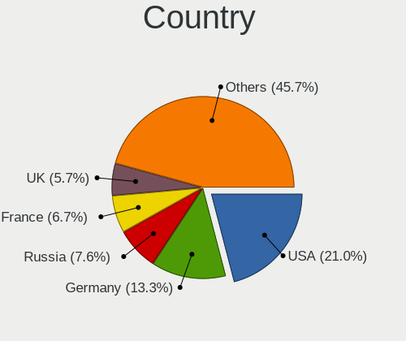
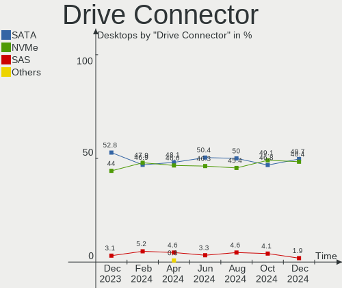
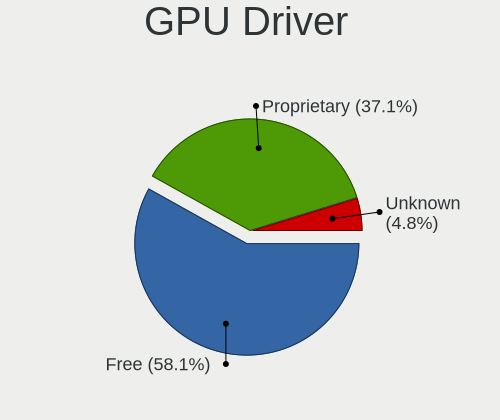
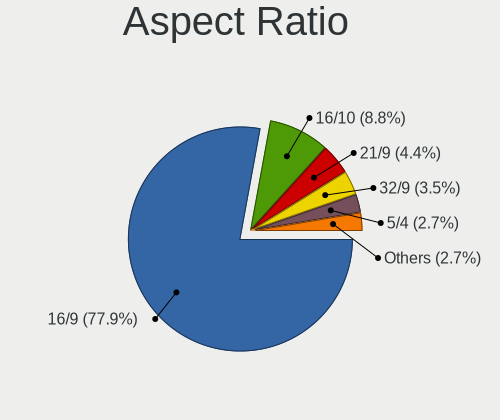

Arch - Hardware Trends (Desktops)
---------------------------------

A project to identify most popular hardware characteristics and track their change
over time based on data collected by Linux users at https://Linux-Hardware.org.

Anyone can contribute to this report by the [hw-probe](https://github.com/linuxhw/hw-probe) tool:

    sudo -E hw-probe -all -upload

This report is for one last month. Overall report since the beginning of time: [TestDays](https://github.com/linuxhw/TestDays)

Period: Jun, 2023.

Contents
--------

* [ System ](#system)
  - [ OS                       ](#os)
  - [ OS Family                ](#os-family)
  - [ Kernel                   ](#kernel)
  - [ Kernel Family            ](#kernel-family)
  - [ Kernel Major Ver.        ](#kernel-major-ver)
  - [ Arch                     ](#arch)
  - [ DE                       ](#de)
  - [ Display Server           ](#display-server)
  - [ Display Manager          ](#display-manager)
  - [ OS Lang                  ](#os-lang)
  - [ Boot Mode                ](#boot-mode)
  - [ Filesystem               ](#filesystem)
  - [ Part. scheme             ](#part-scheme)
  - [ Dual Boot with Linux/BSD ](#dual-boot-with-linuxbsd)
  - [ Dual Boot (Win)          ](#dual-boot-win)

* [ Board ](#board)
  - [ Vendor                   ](#vendor)
  - [ Model                    ](#model)
  - [ Model Family             ](#model-family)
  - [ MFG Year                 ](#mfg-year)
  - [ Form Factor              ](#form-factor)
  - [ Secure Boot              ](#secure-boot)
  - [ Coreboot                 ](#coreboot)
  - [ RAM Size                 ](#ram-size)
  - [ RAM Used                 ](#ram-used)
  - [ Total Drives             ](#total-drives)
  - [ Has CD-ROM               ](#has-cd-rom)
  - [ Has Ethernet             ](#has-ethernet)
  - [ Has WiFi                 ](#has-wifi)
  - [ Has Bluetooth            ](#has-bluetooth)

* [ Location ](#location)
  - [ Country                  ](#country)
  - [ City                     ](#city)

* [ Drives ](#drives)
  - [ Drive Vendor             ](#drive-vendor)
  - [ Drive Model              ](#drive-model)
  - [ HDD Vendor               ](#hdd-vendor)
  - [ SSD Vendor               ](#ssd-vendor)
  - [ Drive Kind               ](#drive-kind)
  - [ Drive Connector          ](#drive-connector)
  - [ Drive Size               ](#drive-size)
  - [ Space Total              ](#space-total)
  - [ Space Used               ](#space-used)
  - [ Malfunc. Drives          ](#malfunc-drives)
  - [ Malfunc. Drive Vendor    ](#malfunc-drive-vendor)
  - [ Malfunc. HDD Vendor      ](#malfunc-hdd-vendor)
  - [ Malfunc. Drive Kind      ](#malfunc-drive-kind)
  - [ Failed Drives            ](#failed-drives)
  - [ Failed Drive Vendor      ](#failed-drive-vendor)
  - [ Drive Status             ](#drive-status)

* [ Storage controller ](#storage-controller)
  - [ Storage Vendor           ](#storage-vendor)
  - [ Storage Model            ](#storage-model)
  - [ Storage Kind             ](#storage-kind)

* [ Processor ](#processor)
  - [ CPU Vendor               ](#cpu-vendor)
  - [ CPU Model                ](#cpu-model)
  - [ CPU Model Family         ](#cpu-model-family)
  - [ CPU Cores                ](#cpu-cores)
  - [ CPU Sockets              ](#cpu-sockets)
  - [ CPU Threads              ](#cpu-threads)
  - [ CPU Op-Modes             ](#cpu-op-modes)
  - [ CPU Microcode            ](#cpu-microcode)
  - [ CPU Microarch            ](#cpu-microarch)

* [ Graphics ](#graphics)
  - [ GPU Vendor               ](#gpu-vendor)
  - [ GPU Model                ](#gpu-model)
  - [ GPU Combo                ](#gpu-combo)
  - [ GPU Driver               ](#gpu-driver)
  - [ GPU Memory               ](#gpu-memory)

* [ Monitor ](#monitor)
  - [ Monitor Vendor           ](#monitor-vendor)
  - [ Monitor Model            ](#monitor-model)
  - [ Monitor Resolution       ](#monitor-resolution)
  - [ Monitor Diagonal         ](#monitor-diagonal)
  - [ Monitor Width            ](#monitor-width)
  - [ Aspect Ratio             ](#aspect-ratio)
  - [ Monitor Area             ](#monitor-area)
  - [ Pixel Density            ](#pixel-density)
  - [ Multiple Monitors        ](#multiple-monitors)

* [ Network ](#network)
  - [ Net Controller Vendor    ](#net-controller-vendor)
  - [ Net Controller Model     ](#net-controller-model)
  - [ Wireless Vendor          ](#wireless-vendor)
  - [ Wireless Model           ](#wireless-model)
  - [ Ethernet Vendor          ](#ethernet-vendor)
  - [ Ethernet Model           ](#ethernet-model)
  - [ Net Controller Kind      ](#net-controller-kind)
  - [ Used Controller          ](#used-controller)
  - [ NICs                     ](#nics)
  - [ IPv6                     ](#ipv6)

* [ Bluetooth ](#bluetooth)
  - [ Bluetooth Vendor         ](#bluetooth-vendor)
  - [ Bluetooth Model          ](#bluetooth-model)

* [ Sound ](#sound)
  - [ Sound Vendor             ](#sound-vendor)
  - [ Sound Model              ](#sound-model)

* [ Memory ](#memory)
  - [ Memory Vendor            ](#memory-vendor)
  - [ Memory Model             ](#memory-model)
  - [ Memory Kind              ](#memory-kind)
  - [ Memory Form Factor       ](#memory-form-factor)
  - [ Memory Size              ](#memory-size)
  - [ Memory Speed             ](#memory-speed)

* [ Printers & scanners ](#printers--scanners)
  - [ Printer Vendor           ](#printer-vendor)
  - [ Printer Model            ](#printer-model)
  - [ Scanner Vendor           ](#scanner-vendor)
  - [ Scanner Model            ](#scanner-model)

* [ Camera ](#camera)
  - [ Camera Vendor            ](#camera-vendor)
  - [ Camera Model             ](#camera-model)

* [ Security ](#security)
  - [ Fingerprint Vendor       ](#fingerprint-vendor)
  - [ Fingerprint Model        ](#fingerprint-model)
  - [ Chipcard Vendor          ](#chipcard-vendor)
  - [ Chipcard Model           ](#chipcard-model)

* [ Unsupported ](#unsupported)
  - [ Unsupported Devices      ](#unsupported-devices)
  - [ Unsupported Device Types ](#unsupported-device-types)

System
------

OS
--

Installed operating systems

| Name         | Desktops | Percent |
|--------------|----------|---------|
| Arch Rolling | 70       | 100%    |

OS Family
---------

OS without a version

| Name | Desktops | Percent |
|------|----------|---------|
| Arch | 70       | 100%    |

Kernel
------

Version of the Linux kernel

| Version                     | Desktops | Percent |
|-----------------------------|----------|---------|
| 6.3.8-arch1-1               | 9        | 12.86%  |
| 6.3.5-arch1-1               | 9        | 12.86%  |
| 6.3.6-arch1-1               | 8        | 11.43%  |
| 6.3.9-arch1-1               | 7        | 10%     |
| 6.3.7-arch1-1               | 6        | 8.57%   |
| 6.3.9-zen1-1-zen            | 5        | 7.14%   |
| 6.3.5-zen1-1-zen            | 3        | 4.29%   |
| 6.3.2-arch1-1               | 3        | 4.29%   |
| 6.3.7-zen1-1-zen            | 2        | 2.86%   |
| 6.3.6-zen1-1-zen            | 2        | 2.86%   |
| 6.1.34-1-lts                | 2        | 2.86%   |
| 6.1.31-1-lts                | 2        | 2.86%   |
| 6.4.0-rc7-273-tkg-cfs-llvm  | 1        | 1.43%   |
| 6.3.8-zen1-1-zen            | 1        | 1.43%   |
| 6.3.7-zen4-xanmod1-1        | 1        | 1.43%   |
| 6.3.5-zen2-1-zen            | 1        | 1.43%   |
| 6.3.5-arch1-1-lily          | 1        | 1.43%   |
| 6.3.1-zen2-1-zen            | 1        | 1.43%   |
| 6.3.0.11.realtime1-1-rt     | 1        | 1.43%   |
| 6.1.35-1-lts                | 1        | 1.43%   |
| 6.1.33-1-lts                | 1        | 1.43%   |
| 6.1.31-hardened1-1-hardened | 1        | 1.43%   |
| 6.1.30-1-lts                | 1        | 1.43%   |
| 5.17.8-zen1-1-zen           | 1        | 1.43%   |

Kernel Family
-------------

Linux kernel without a distro release

| Version  | Desktops | Percent |
|----------|----------|---------|
| 6.3.5    | 14       | 20%     |
| 6.3.9    | 12       | 17.14%  |
| 6.3.8    | 10       | 14.29%  |
| 6.3.6    | 10       | 14.29%  |
| 6.3.7    | 9        | 12.86%  |
| 6.3.2    | 3        | 4.29%   |
| 6.1.31   | 3        | 4.29%   |
| 6.1.34   | 2        | 2.86%   |
| 6.4.0    | 1        | 1.43%   |
| 6.3.1    | 1        | 1.43%   |
| 6.3.0.11 | 1        | 1.43%   |
| 6.1.35   | 1        | 1.43%   |
| 6.1.33   | 1        | 1.43%   |
| 6.1.30   | 1        | 1.43%   |
| 5.17.8   | 1        | 1.43%   |

Kernel Major Ver.
-----------------

Linux kernel major version

| Version | Desktops | Percent |
|---------|----------|---------|
| 6.3     | 59       | 84.29%  |
| 6.1     | 8        | 11.43%  |
| 6.4     | 1        | 1.43%   |
| 6.3.0   | 1        | 1.43%   |
| 5.17    | 1        | 1.43%   |

Arch
----

OS architecture (x86_64, i586, etc.)

| Name   | Desktops | Percent |
|--------|----------|---------|
| x86_64 | 70       | 100%    |

DE
--

Desktop Environment

| Name          | Desktops | Percent |
|---------------|----------|---------|
| KDE5          | 26       | 37.14%  |
| GNOME         | 23       | 32.86%  |
| Unknown       | 5        | 7.14%   |
| XFCE          | 4        | 5.71%   |
| X-Cinnamon    | 3        | 4.29%   |
| i3            | 3        | 4.29%   |
| KDE           | 2        | 2.86%   |
| Wayfire       | 1        | 1.43%   |
| MATE          | 1        | 1.43%   |
| GNOME Classic | 1        | 1.43%   |
| chadwm        | 1        | 1.43%   |

Display Server
--------------

X11 or Wayland

| Name    | Desktops | Percent |
|---------|----------|---------|
| X11     | 42       | 60%     |
| Wayland | 20       | 28.57%  |
| Tty     | 6        | 8.57%   |
| Unknown | 2        | 2.86%   |

Display Manager
---------------

SDDM, LightDM, etc.

| Name    | Desktops | Percent |
|---------|----------|---------|
| Unknown | 32       | 45.71%  |
| LightDM | 14       | 20%     |
| SDDM    | 12       | 17.14%  |
| GDM     | 10       | 14.29%  |
| LXDM    | 1        | 1.43%   |
| GREETD  | 1        | 1.43%   |

OS Lang
-------

Language

| Lang    | Desktops | Percent |
|---------|----------|---------|
| en_US   | 38       | 54.29%  |
| C       | 6        | 8.57%   |
| es_ES   | 5        | 7.14%   |
| zh_CN   | 4        | 5.71%   |
| pt_BR   | 3        | 4.29%   |
| de_DE   | 3        | 4.29%   |
| en_GB   | 2        | 2.86%   |
| Unknown | 2        | 2.86%   |
| tr_TR   | 1        | 1.43%   |
| sv_SE   | 1        | 1.43%   |
| ru_RU   | 1        | 1.43%   |
| pt_PT   | 1        | 1.43%   |
| es_GT   | 1        | 1.43%   |
| en_SG   | 1        | 1.43%   |
| en_IN   | 1        | 1.43%   |

Boot Mode
---------

EFI or BIOS

| Mode | Desktops | Percent |
|------|----------|---------|
| EFI  | 40       | 57.14%  |
| BIOS | 30       | 42.86%  |

Filesystem
----------

Type of filesystem

| Type  | Desktops | Percent |
|-------|----------|---------|
| Ext4  | 46       | 65.71%  |
| Btrfs | 24       | 34.29%  |

Part. scheme
------------

Scheme of partitioning

| Type    | Desktops | Percent |
|---------|----------|---------|
| GPT     | 44       | 62.86%  |
| Unknown | 23       | 32.86%  |
| MBR     | 3        | 4.29%   |

Dual Boot with Linux/BSD
------------------------

Hosting more than one Linux/BSD

| Dual boot | Desktops | Percent |
|-----------|----------|---------|
| No        | 55       | 78.57%  |
| Yes       | 15       | 21.43%  |

Dual Boot (Win)
---------------

Hosting Linux and Windows

| Dual boot | Desktops | Percent |
|-----------|----------|---------|
| No        | 43       | 61.43%  |
| Yes       | 27       | 38.57%  |

Board
-----

Vendor
------

Motherboard manufacturer

| Name                | Desktops | Percent |
|---------------------|----------|---------|
| ASUSTek Computer    | 22       | 31.43%  |
| MSI                 | 14       | 20%     |
| Gigabyte Technology | 14       | 20%     |
| ASRock              | 6        | 8.57%   |
| Lenovo              | 4        | 5.71%   |
| Hewlett-Packard     | 3        | 4.29%   |
| Acer                | 2        | 2.86%   |
| Unknown             | 2        | 2.86%   |
| Pegatron            | 1        | 1.43%   |
| Huanan              | 1        | 1.43%   |
| Dell                | 1        | 1.43%   |

Model
-----

Motherboard model

| Name                                | Desktops | Percent |
|-------------------------------------|----------|---------|
| MSI MS-7E06                         | 2        | 2.86%   |
| MSI MS-7C56                         | 2        | 2.86%   |
| MSI MS-7B89                         | 2        | 2.86%   |
| ASUS ROG CROSSHAIR VIII DARK HERO   | 2        | 2.86%   |
| ASUS All Series                     | 2        | 2.86%   |
| Unknown                             | 2        | 2.86%   |
| Pegatron 320-1030                   | 1        | 1.43%   |
| MSI MS-7D09                         | 1        | 1.43%   |
| MSI MS-7C95                         | 1        | 1.43%   |
| MSI MS-7C79                         | 1        | 1.43%   |
| MSI MS-7C37                         | 1        | 1.43%   |
| MSI MS-7C02                         | 1        | 1.43%   |
| MSI MS-7B79                         | 1        | 1.43%   |
| MSI MS-7A70                         | 1        | 1.43%   |
| MSI MS-7821                         | 1        | 1.43%   |
| Lenovo ThinkStation P310 30AVCTO1WW | 1        | 1.43%   |
| Lenovo ThinkStation P300 30AH001GUK | 1        | 1.43%   |
| Lenovo ThinkCentre M83 10AM000UUS   | 1        | 1.43%   |
| Lenovo Legion T5 28IMB05 90NC00P9GE | 1        | 1.43%   |
| Huanan X99-F8 GAMING V5.0           | 1        | 1.43%   |
| HP t520 Flexible Series TC          | 1        | 1.43%   |
| HP ProDesk 600 G1 TWR               | 1        | 1.43%   |
| HP Compaq Elite 8300 CMT            | 1        | 1.43%   |
| Gigabyte Z690 GAMING X DDR4         | 1        | 1.43%   |
| Gigabyte Z590 AORUS ULTRA           | 1        | 1.43%   |
| Gigabyte X79-UD3                    | 1        | 1.43%   |
| Gigabyte X670 GAMING X AX           | 1        | 1.43%   |
| Gigabyte H81M-S2H                   | 1        | 1.43%   |
| Gigabyte H67MA-USB3-B3              | 1        | 1.43%   |
| Gigabyte H61M-DS2                   | 1        | 1.43%   |
| Gigabyte H610M H DDR4               | 1        | 1.43%   |
| Gigabyte H410M S2H V3               | 1        | 1.43%   |
| Gigabyte G1.Sniper Z87              | 1        | 1.43%   |
| Gigabyte B550 AORUS PRO             | 1        | 1.43%   |
| Gigabyte B550 AORUS ELITE V2        | 1        | 1.43%   |
| Gigabyte B460MDS3H                  | 1        | 1.43%   |
| Gigabyte B450 AORUS ELITE           | 1        | 1.43%   |
| Dell OptiPlex 9020                  | 1        | 1.43%   |
| ASUS Z170-A                         | 1        | 1.43%   |
| ASUS TUF Z370-PLUS GAMING           | 1        | 1.43%   |

Model Family
------------

Motherboard model prefix

| Name                   | Desktops | Percent |
|------------------------|----------|---------|
| ASUS TUF               | 7        | 10%     |
| ASUS PRIME             | 6        | 8.57%   |
| ASUS ROG               | 4        | 5.71%   |
| MSI MS-7E06            | 2        | 2.86%   |
| MSI MS-7C56            | 2        | 2.86%   |
| MSI MS-7B89            | 2        | 2.86%   |
| Lenovo ThinkStation    | 2        | 2.86%   |
| Gigabyte B550          | 2        | 2.86%   |
| ASUS All               | 2        | 2.86%   |
| Unknown                | 2        | 2.86%   |
| Pegatron 320-1030      | 1        | 1.43%   |
| MSI MS-7D09            | 1        | 1.43%   |
| MSI MS-7C95            | 1        | 1.43%   |
| MSI MS-7C79            | 1        | 1.43%   |
| MSI MS-7C37            | 1        | 1.43%   |
| MSI MS-7C02            | 1        | 1.43%   |
| MSI MS-7B79            | 1        | 1.43%   |
| MSI MS-7A70            | 1        | 1.43%   |
| MSI MS-7821            | 1        | 1.43%   |
| Lenovo ThinkCentre     | 1        | 1.43%   |
| Lenovo Legion          | 1        | 1.43%   |
| Huanan X99-F8          | 1        | 1.43%   |
| HP t520                | 1        | 1.43%   |
| HP ProDesk             | 1        | 1.43%   |
| HP Compaq              | 1        | 1.43%   |
| Gigabyte Z690          | 1        | 1.43%   |
| Gigabyte Z590          | 1        | 1.43%   |
| Gigabyte X79-UD3       | 1        | 1.43%   |
| Gigabyte X670          | 1        | 1.43%   |
| Gigabyte H81M-S2H      | 1        | 1.43%   |
| Gigabyte H67MA-USB3-B3 | 1        | 1.43%   |
| Gigabyte H61M-DS2      | 1        | 1.43%   |
| Gigabyte H610M         | 1        | 1.43%   |
| Gigabyte H410M         | 1        | 1.43%   |
| Gigabyte G1.Sniper     | 1        | 1.43%   |
| Gigabyte B460MDS3H     | 1        | 1.43%   |
| Gigabyte B450          | 1        | 1.43%   |
| Dell OptiPlex          | 1        | 1.43%   |
| ASUS Z170-A            | 1        | 1.43%   |
| ASUS P8Z77-V           | 1        | 1.43%   |

MFG Year
--------

Motherboard manufacture year

| Year | Desktops | Percent |
|------|----------|---------|
| 2020 | 12       | 17.14%  |
| 2022 | 8        | 11.43%  |
| 2019 | 8        | 11.43%  |
| 2021 | 7        | 10%     |
| 2018 | 6        | 8.57%   |
| 2013 | 6        | 8.57%   |
| 2014 | 4        | 5.71%   |
| 2012 | 4        | 5.71%   |
| 2011 | 4        | 5.71%   |
| 2017 | 3        | 4.29%   |
| 2015 | 3        | 4.29%   |
| 2016 | 2        | 2.86%   |
| 2010 | 2        | 2.86%   |
| 2023 | 1        | 1.43%   |

Form Factor
-----------

Physical design of the computer

| Name    | Desktops | Percent |
|---------|----------|---------|
| Desktop | 70       | 100%    |

Secure Boot
-----------

Enabled or disabled

| State    | Desktops | Percent |
|----------|----------|---------|
| Disabled | 67       | 95.71%  |
| Enabled  | 3        | 4.29%   |

Coreboot
--------

Have coreboot on board

| Used | Desktops | Percent |
|------|----------|---------|
| No   | 70       | 100%    |

RAM Size
--------

Total RAM memory

| Size in GB  | Desktops | Percent |
|-------------|----------|---------|
| 16.01-24.0  | 25       | 35.71%  |
| 32.01-64.0  | 22       | 31.43%  |
| 64.01-256.0 | 9        | 12.86%  |
| 8.01-16.0   | 8        | 11.43%  |
| 4.01-8.0    | 4        | 5.71%   |
| 3.01-4.0    | 2        | 2.86%   |

RAM Used
--------

Used RAM memory

| Used GB    | Desktops | Percent |
|------------|----------|---------|
| 4.01-8.0   | 21       | 30%     |
| 3.01-4.0   | 14       | 20%     |
| 2.01-3.0   | 11       | 15.71%  |
| 8.01-16.0  | 10       | 14.29%  |
| 1.01-2.0   | 9        | 12.86%  |
| 16.01-24.0 | 2        | 2.86%   |
| 32.01-64.0 | 1        | 1.43%   |
| 24.01-32.0 | 1        | 1.43%   |
| 0.51-1.0   | 1        | 1.43%   |

Total Drives
------------

Number of drives on board

| Drives | Desktops | Percent |
|--------|----------|---------|
| 2      | 23       | 32.86%  |
| 3      | 17       | 24.29%  |
| 4      | 11       | 15.71%  |
| 1      | 11       | 15.71%  |
| 5      | 4        | 5.71%   |
| 6      | 3        | 4.29%   |
| 7      | 1        | 1.43%   |

Has CD-ROM
----------

Has CD-ROM on board

| Presented | Desktops | Percent |
|-----------|----------|---------|
| No        | 55       | 78.57%  |
| Yes       | 15       | 21.43%  |

Has Ethernet
------------

Has Ethernet on board

| Presented | Desktops | Percent |
|-----------|----------|---------|
| Yes       | 69       | 98.57%  |
| No        | 1        | 1.43%   |

Has WiFi
--------

Has WiFi module

| Presented | Desktops | Percent |
|-----------|----------|---------|
| No        | 39       | 55.71%  |
| Yes       | 31       | 44.29%  |

Has Bluetooth
-------------

Has Bluetooth module

| Presented | Desktops | Percent |
|-----------|----------|---------|
| Yes       | 38       | 54.29%  |
| No        | 32       | 45.71%  |

Location
--------

Country
-------

Geographic location (country)

| Country            | Desktops | Percent |
|--------------------|----------|---------|
| USA                | 9        | 12.86%  |
| Germany            | 9        | 12.86%  |
| Spain              | 5        | 7.14%   |
| Brazil             | 5        | 7.14%   |
| UK                 | 3        | 4.29%   |
| Lithuania          | 3        | 4.29%   |
| Canada             | 3        | 4.29%   |
| Turkey             | 2        | 2.86%   |
| Sweden             | 2        | 2.86%   |
| Singapore          | 2        | 2.86%   |
| Poland             | 2        | 2.86%   |
| Netherlands        | 2        | 2.86%   |
| India              | 2        | 2.86%   |
| Egypt              | 2        | 2.86%   |
| China              | 2        | 2.86%   |
| Vietnam            | 1        | 1.43%   |
| Thailand           | 1        | 1.43%   |
| Switzerland        | 1        | 1.43%   |
| Russia             | 1        | 1.43%   |
| Portugal           | 1        | 1.43%   |
| North Macedonia    | 1        | 1.43%   |
| Moldova            | 1        | 1.43%   |
| Mexico             | 1        | 1.43%   |
| Italy              | 1        | 1.43%   |
| Israel             | 1        | 1.43%   |
| Ireland            | 1        | 1.43%   |
| Guatemala          | 1        | 1.43%   |
| Greece             | 1        | 1.43%   |
| Dominican Republic | 1        | 1.43%   |
| Czechia            | 1        | 1.43%   |
| Colombia           | 1        | 1.43%   |
| Chile              | 1        | 1.43%   |

City
----

Geographic location (city)

| City               | Desktops | Percent |
|--------------------|----------|---------|
| Singapore          | 2        | 2.86%   |
| Kaunas             | 2        | 2.86%   |
| Zaragoza           | 1        | 1.43%   |
| York               | 1        | 1.43%   |
| West Lebanon       | 1        | 1.43%   |
| Waterloo           | 1        | 1.43%   |
| Warsaw             | 1        | 1.43%   |
| Vitória           | 1        | 1.43%   |
| Vilnius            | 1        | 1.43%   |
| Vila Nova de Gaia  | 1        | 1.43%   |
| Tel Aviv           | 1        | 1.43%   |
| Stockholm          | 1        | 1.43%   |
| Shenzhen           | 1        | 1.43%   |
| Santo Domingo Este | 1        | 1.43%   |
| Salvador           | 1        | 1.43%   |
| Sabadell           | 1        | 1.43%   |
| Rostov-on-Don      | 1        | 1.43%   |
| Riverside          | 1        | 1.43%   |
| Rio de Janeiro     | 1        | 1.43%   |
| Richmond           | 1        | 1.43%   |
| Pilsen             | 1        | 1.43%   |
| Middleboro         | 1        | 1.43%   |
| Mexico City        | 1        | 1.43%   |
| Medellín          | 1        | 1.43%   |
| Mannheim           | 1        | 1.43%   |
| Lenoir             | 1        | 1.43%   |
| Kochi              | 1        | 1.43%   |
| Kalamazoo          | 1        | 1.43%   |
| Jacksonville       | 1        | 1.43%   |
| Izmir              | 1        | 1.43%   |
| Itapevi            | 1        | 1.43%   |
| Istanbul           | 1        | 1.43%   |
| Hung Yen           | 1        | 1.43%   |
| Helmstedt          | 1        | 1.43%   |
| Haarlem            | 1        | 1.43%   |
| Guatemala City     | 1        | 1.43%   |
| Grand Rapids       | 1        | 1.43%   |
| Granada            | 1        | 1.43%   |
| Göttingen         | 1        | 1.43%   |
| Goiânia           | 1        | 1.43%   |

Drives
------

Drive Vendor
------------

Hard drive vendors

| Vendor                      | Desktops | Drives | Percent |
|-----------------------------|----------|--------|---------|
| Samsung Electronics         | 29       | 37     | 17.9%   |
| WDC                         | 27       | 33     | 16.67%  |
| Seagate                     | 24       | 33     | 14.81%  |
| Sandisk                     | 14       | 15     | 8.64%   |
| Kingston                    | 11       | 12     | 6.79%   |
| Crucial                     | 10       | 11     | 6.17%   |
| Toshiba                     | 4        | 4      | 2.47%   |
| Kingston Technology Company | 3        | 3      | 1.85%   |
| Hitachi                     | 3        | 4      | 1.85%   |
| Netac                       | 2        | 2      | 1.23%   |
| Micron/Crucial Technology   | 2        | 3      | 1.23%   |
| MAXIO Technology (Hangzhou) | 2        | 2      | 1.23%   |
| JMicron Technology          | 2        | 2      | 1.23%   |
| HGST                        | 2        | 3      | 1.23%   |
| Yangtze Memory Technologies | 1        | 1      | 0.62%   |
| XrayDisk                    | 1        | 1      | 0.62%   |
| WALRAM                      | 1        | 1      | 0.62%   |
| VUCCAN                      | 1        | 1      | 0.62%   |
| V7                          | 1        | 1      | 0.62%   |
| Unknown (690)               | 1        | 1      | 0.62%   |
| Unknown                     | 1        | 2      | 0.62%   |
| Team                        | 1        | 2      | 0.62%   |
| SSK                         | 1        | 1      | 0.62%   |
| SK hynix                    | 1        | 1      | 0.62%   |
| Silicon Motion              | 1        | 1      | 0.62%   |
| SABRENT                     | 1        | 1      | 0.62%   |
| Realtek Semiconductor       | 1        | 1      | 0.62%   |
| PNY                         | 1        | 1      | 0.62%   |
| Phison Electronics          | 1        | 2      | 0.62%   |
| Patriot                     | 1        | 1      | 0.62%   |
| OCZ                         | 1        | 1      | 0.62%   |
| Micron Technology           | 1        | 1      | 0.62%   |
| Intenso                     | 1        | 1      | 0.62%   |
| Intel                       | 1        | 1      | 0.62%   |
| Hikvision                   | 1        | 1      | 0.62%   |
| GOODRAM                     | 1        | 1      | 0.62%   |
| Gigabyte Technology         | 1        | 1      | 0.62%   |
| Emtec                       | 1        | 1      | 0.62%   |
| China                       | 1        | 1      | 0.62%   |
| ADATA Technology            | 1        | 1      | 0.62%   |

Drive Model
-----------

Hard drive models

| Model                                                 | Desktops | Percent |
|-------------------------------------------------------|----------|---------|
| Samsung NVMe SSD Controller SM981/PM981/PM983 250GB   | 9        | 4.92%   |
| Samsung NVMe SSD Controller PM9A1/PM9A3/980PRO 2TB    | 6        | 3.28%   |
| Seagate ST2000DM008-2FR102 2TB                        | 5        | 2.73%   |
| Samsung SSD 980 500GB                                 | 4        | 2.19%   |
| Seagate ST1000DM010-2EP102 1TB                        | 3        | 1.64%   |
| Sandisk WD Black SN750 / PC SN730 NVMe SSD 500GB      | 3        | 1.64%   |
| Kingston SA400S37240G 240GB SSD                       | 3        | 1.64%   |
| Crucial CT500MX500SSD1 500GB                          | 3        | 1.64%   |
| WDC WD10EZEX-00WN4A0 1TB                              | 2        | 1.09%   |
| WDC WD10EFRX-68FYTN0 1TB                              | 2        | 1.09%   |
| Seagate BUP Portable 4TB                              | 2        | 1.09%   |
| Sandisk WD Black 2018/SN750 / PC SN720 NVMe SSD 500GB | 2        | 1.09%   |
| Samsung SSD 860 EVO 1TB                               | 2        | 1.09%   |
| Samsung SSD 850 EVO 250GB                             | 2        | 1.09%   |
| MAXIO (Hangzhou) NVMe SSD Controller MAP1202 512GB    | 2        | 1.09%   |
| JMicron Generic 240GB                                 | 2        | 1.09%   |
| Crucial CT480BX500SSD1 480GB                          | 2        | 1.09%   |
| Crucial CT1000MX500SSD1 1TB                           | 2        | 1.09%   |
| Yangtze Memory ZHITAI TiPlus7100 1TB                  | 1        | 0.55%   |
| XrayDisk 256GB SSD                                    | 1        | 0.55%   |
| WDC WDS240G2G0A-00JH30 240GB SSD                      | 1        | 0.55%   |
| WDC WDS200T2B0A-00SM50 2TB SSD                        | 1        | 0.55%   |
| WDC WD5003ABYX-01WERA1 500GB                          | 1        | 0.55%   |
| WDC WD5000LPVX-28V0TT0 500GB                          | 1        | 0.55%   |
| WDC WD5000AVDS-73U7B1 500GB                           | 1        | 0.55%   |
| WDC WD5000AAKX-75U6AA0 500GB                          | 1        | 0.55%   |
| WDC WD40EZRZ-22GXCB0 4TB                              | 1        | 0.55%   |
| WDC WD40EZAZ-00SF3B0 4TB                              | 1        | 0.55%   |
| WDC WD3200AVJS-63B6A0 320GB                           | 1        | 0.55%   |
| WDC WD3200AAJS-60Z0A0 320GB                           | 1        | 0.55%   |
| WDC WD2500AAJS-00VTA0 250GB                           | 1        | 0.55%   |
| WDC WD20EZRZ-00Z5HB0 2TB                              | 1        | 0.55%   |
| WDC WD20EZBX-00AYRA0 2TB                              | 1        | 0.55%   |
| WDC WD20EFRX-68EUZN0 2TB                              | 1        | 0.55%   |
| WDC WD20EARX-00PASB0 2TB                              | 1        | 0.55%   |
| WDC WD20EARS-00J2GB0 2TB                              | 1        | 0.55%   |
| WDC WD2004FBYZ-01YCBB0 2TB                            | 1        | 0.55%   |
| WDC WD2003FYPS-27W9B0 2TB                             | 1        | 0.55%   |
| WDC WD2000FYYZ-01UL1B1 2TB                            | 1        | 0.55%   |
| WDC WD2000FYYZ-01UL1B0 2TB                            | 1        | 0.55%   |

HDD Vendor
----------

Hard disk drive vendors

| Vendor              | Desktops | Drives | Percent |
|---------------------|----------|--------|---------|
| WDC                 | 26       | 31     | 42.62%  |
| Seagate             | 24       | 33     | 39.34%  |
| Toshiba             | 4        | 4      | 6.56%   |
| Hitachi             | 3        | 4      | 4.92%   |
| HGST                | 2        | 3      | 3.28%   |
| SSK                 | 1        | 1      | 1.64%   |
| Samsung Electronics | 1        | 1      | 1.64%   |

SSD Vendor
----------

Solid state drive vendors

| Vendor              | Desktops | Drives | Percent |
|---------------------|----------|--------|---------|
| Samsung Electronics | 13       | 13     | 24.07%  |
| Crucial             | 10       | 11     | 18.52%  |
| Kingston            | 9        | 10     | 16.67%  |
| SanDisk             | 5        | 6      | 9.26%   |
| WDC                 | 2        | 2      | 3.7%    |
| XrayDisk            | 1        | 1      | 1.85%   |
| V7                  | 1        | 1      | 1.85%   |
| Unknown (690)       | 1        | 1      | 1.85%   |
| Team                | 1        | 2      | 1.85%   |
| PNY                 | 1        | 1      | 1.85%   |
| Patriot             | 1        | 1      | 1.85%   |
| OCZ                 | 1        | 1      | 1.85%   |
| Micron Technology   | 1        | 1      | 1.85%   |
| Intenso             | 1        | 1      | 1.85%   |
| Hikvision           | 1        | 1      | 1.85%   |
| GOODRAM             | 1        | 1      | 1.85%   |
| Gigabyte Technology | 1        | 1      | 1.85%   |
| Emtec               | 1        | 1      | 1.85%   |
| China               | 1        | 1      | 1.85%   |
| A-DATA Technology   | 1        | 1      | 1.85%   |

Drive Kind
----------

HDD or SSD

| Kind    | Desktops | Drives | Percent |
|---------|----------|--------|---------|
| HDD     | 50       | 77     | 35.46%  |
| SSD     | 47       | 58     | 33.33%  |
| NVMe    | 41       | 55     | 29.08%  |
| Unknown | 3        | 4      | 2.13%   |

Drive Connector
---------------

SATA, SAS, NVMe, etc.

| Type | Desktops | Drives | Percent |
|------|----------|--------|---------|
| SATA | 67       | 134    | 59.29%  |
| NVMe | 39       | 52     | 34.51%  |
| SAS  | 7        | 8      | 6.19%   |

Drive Size
----------

Size of hard drive

| Size in TB | Desktops | Drives | Percent |
|------------|----------|--------|---------|
| 0.01-0.5   | 37       | 49     | 36.27%  |
| 0.51-1.0   | 30       | 40     | 29.41%  |
| 1.01-2.0   | 19       | 28     | 18.63%  |
| 3.01-4.0   | 7        | 7      | 6.86%   |
| 2.01-3.0   | 3        | 4      | 2.94%   |
| 10.01-20.0 | 3        | 4      | 2.94%   |
| 4.01-10.0  | 3        | 3      | 2.94%   |

Space Total
-----------

Amount of disk space available on the file system

| Size in GB     | Desktops | Percent |
|----------------|----------|---------|
| More than 3000 | 22       | 31.43%  |
| 1001-2000      | 14       | 20%     |
| 251-500        | 10       | 14.29%  |
| 501-1000       | 9        | 12.86%  |
| 101-250        | 8        | 11.43%  |
| 2001-3000      | 4        | 5.71%   |
| 51-100         | 2        | 2.86%   |
| Unknown        | 1        | 1.43%   |

Space Used
----------

Amount of used disk space

| Used GB        | Desktops | Percent |
|----------------|----------|---------|
| 1001-2000      | 16       | 22.86%  |
| 251-500        | 10       | 14.29%  |
| 101-250        | 9        | 12.86%  |
| More than 3000 | 8        | 11.43%  |
| 21-50          | 8        | 11.43%  |
| 1-20           | 6        | 8.57%   |
| 51-100         | 6        | 8.57%   |
| 501-1000       | 5        | 7.14%   |
| 2001-3000      | 1        | 1.43%   |
| Unknown        | 1        | 1.43%   |

Malfunc. Drives
---------------

Drive models with a malfunction

| Model                                                          | Desktops | Drives | Percent |
|----------------------------------------------------------------|----------|--------|---------|
| WDC WD5000AAKX-75U6AA0 500GB                                   | 1        | 1      | 5.56%   |
| WDC WD20EFRX-68EUZN0 2TB                                       | 1        | 2      | 5.56%   |
| WDC WD10EZEX-00WN4A0 1TB                                       | 1        | 1      | 5.56%   |
| WDC WD10EARS-00Y5B1 1TB                                        | 1        | 1      | 5.56%   |
| WDC WD10EALX-759BA1 1TB                                        | 1        | 1      | 5.56%   |
| Silicon Motion SM2263EN/SM2263XT SSD Controller 256GB          | 1        | 1      | 5.56%   |
| Seagate ST4000DM005-2DP166 4TB                                 | 1        | 1      | 5.56%   |
| Seagate ST3320311CS 320GB                                      | 1        | 1      | 5.56%   |
| Seagate ST2000DM008-2FR102 2TB                                 | 1        | 1      | 5.56%   |
| Seagate ST2000DM006-2DM164 2TB                                 | 1        | 1      | 5.56%   |
| Seagate ST2000DM001-1CH164 2TB                                 | 1        | 1      | 5.56%   |
| Seagate ST1000DM010-2EP102 1TB                                 | 1        | 1      | 5.56%   |
| Samsung Electronics SSD 980 500GB                              | 1        | 1      | 5.56%   |
| Samsung Electronics NVMe SSD Controller PM9A1/PM9A3/980PRO 2TB | 1        | 1      | 5.56%   |
| Samsung Electronics MZ7TD128HAFV-000L1 128GB SSD               | 1        | 1      | 5.56%   |
| Kingston SKC400S371T 1TB SSD                                   | 1        | 1      | 5.56%   |
| Hitachi HUS724030ALE641 3TB                                    | 1        | 2      | 5.56%   |
| Crucial CT525MX300SSD1 528GB                                   | 1        | 1      | 5.56%   |

Malfunc. Drive Vendor
---------------------

Vendors of faulty drives

| Vendor              | Desktops | Drives | Percent |
|---------------------|----------|--------|---------|
| Seagate             | 6        | 6      | 33.33%  |
| WDC                 | 5        | 6      | 27.78%  |
| Samsung Electronics | 3        | 3      | 16.67%  |
| Silicon Motion      | 1        | 1      | 5.56%   |
| Kingston            | 1        | 1      | 5.56%   |
| Hitachi             | 1        | 2      | 5.56%   |
| Crucial             | 1        | 1      | 5.56%   |

Malfunc. HDD Vendor
-------------------

Vendors of faulty HDD drives

| Vendor  | Desktops | Drives | Percent |
|---------|----------|--------|---------|
| Seagate | 6        | 6      | 50%     |
| WDC     | 5        | 6      | 41.67%  |
| Hitachi | 1        | 2      | 8.33%   |

Malfunc. Drive Kind
-------------------

Kinds of faulty drives

| Kind | Desktops | Drives | Percent |
|------|----------|--------|---------|
| HDD  | 12       | 14     | 66.67%  |
| NVMe | 3        | 3      | 16.67%  |
| SSD  | 3        | 3      | 16.67%  |

Failed Drives
-------------

Failed drive models

Zero info for selected period =(

Failed Drive Vendor
-------------------

Failed drive vendors

Zero info for selected period =(

Drive Status
------------

Number of failed and malfunc. drives

| Status   | Desktops | Drives | Percent |
|----------|----------|--------|---------|
| Detected | 37       | 95     | 41.57%  |
| Works    | 37       | 79     | 41.57%  |
| Malfunc  | 15       | 20     | 16.85%  |

Storage controller
------------------

Storage Vendor
--------------

Storage controller vendors

| Vendor                      | Desktops | Percent |
|-----------------------------|----------|---------|
| Intel                       | 39       | 31.97%  |
| AMD                         | 32       | 26.23%  |
| Samsung Electronics         | 18       | 14.75%  |
| SanDisk                     | 9        | 7.38%   |
| Marvell Technology Group    | 4        | 3.28%   |
| Kingston Technology Company | 4        | 3.28%   |
| ASMedia Technology          | 4        | 3.28%   |
| Netac Technology            | 2        | 1.64%   |
| Micron/Crucial Technology   | 2        | 1.64%   |
| MAXIO Technology (Hangzhou) | 2        | 1.64%   |
| Yangtze Memory Technologies | 1        | 0.82%   |
| SK hynix                    | 1        | 0.82%   |
| Silicon Motion              | 1        | 0.82%   |
| Realtek Semiconductor       | 1        | 0.82%   |
| Phison Electronics          | 1        | 0.82%   |
| ADATA Technology            | 1        | 0.82%   |

Storage Model
-------------

Storage controller models

| Model                                                                          | Desktops | Percent |
|--------------------------------------------------------------------------------|----------|---------|
| AMD FCH SATA Controller [AHCI mode]                                            | 18       | 12.77%  |
| AMD 500 Series Chipset SATA Controller                                         | 10       | 7.09%   |
| Samsung NVMe SSD Controller SM981/PM981/PM983                                  | 9        | 6.38%   |
| Intel 8 Series/C220 Series Chipset Family 6-port SATA Controller 1 [AHCI mode] | 9        | 6.38%   |
| AMD 400 Series Chipset SATA Controller                                         | 8        | 5.67%   |
| Samsung NVMe SSD Controller PM9A1/PM9A3/980PRO                                 | 7        | 4.96%   |
| Samsung NVMe SSD Controller 980                                                | 4        | 2.84%   |
| ASMedia ASM1062 Serial ATA Controller                                          | 4        | 2.84%   |
| SanDisk WD Black SN750 / PC SN730 NVMe SSD                                     | 3        | 2.13%   |
| Intel SATA Controller [RAID mode]                                              | 3        | 2.13%   |
| Intel Alder Lake-S PCH SATA Controller [AHCI Mode]                             | 3        | 2.13%   |
| Intel 700 Series Chipset Family SATA AHCI Controller                           | 3        | 2.13%   |
| Intel 7 Series/C210 Series Chipset Family 6-port SATA Controller [AHCI mode]   | 3        | 2.13%   |
| Intel 500 Series Chipset Family SATA AHCI Controller                           | 3        | 2.13%   |
| SanDisk WD Black 2018/SN750 / PC SN720 NVMe SSD                                | 2        | 1.42%   |
| Netac Non-Volatile memory controller                                           | 2        | 1.42%   |
| MAXIO (Hangzhou) NVMe SSD Controller MAP1202                                   | 2        | 1.42%   |
| Kingston Company NVMe Controller                                               | 2        | 1.42%   |
| Intel Q170/Q150/B150/H170/H110/Z170/CM236 Chipset SATA Controller [AHCI Mode]  | 2        | 1.42%   |
| Intel C610/X99 series chipset 6-Port SATA Controller [AHCI mode]               | 2        | 1.42%   |
| AMD 300 Series Chipset SATA Controller                                         | 2        | 1.42%   |
| Yangtze Memory Non-Volatile memory controller                                  | 1        | 0.71%   |
| SK hynix Gold P31/BC711/PC711 NVMe Solid State Drive                           | 1        | 0.71%   |
| Silicon Motion SM2263EN/SM2263XT SSD Controller                                | 1        | 0.71%   |
| SanDisk WD Blue SN570 NVMe SSD 1TB                                             | 1        | 0.71%   |
| SanDisk WD Blue SN550 NVMe SSD                                                 | 1        | 0.71%   |
| SanDisk WD Black SN770 NVMe SSD                                                | 1        | 0.71%   |
| SanDisk Non-Volatile memory controller                                         | 1        | 0.71%   |
| Samsung NVMe SSD Controller SM961/PM961/SM963                                  | 1        | 0.71%   |
| Realtek RTS5763DL NVMe SSD Controller                                          | 1        | 0.71%   |
| Phison PS5013 E13 NVMe Controller                                              | 1        | 0.71%   |
| Micron/Crucial P2 NVMe PCIe SSD                                                | 1        | 0.71%   |
| Micron/Crucial NVMe Storage Controller                                         | 1        | 0.71%   |
| Marvell Group 88SE9215 PCIe 2.0 x1 4-port SATA 6 Gb/s Controller               | 1        | 0.71%   |
| Marvell Group 88SE9172 SATA 6Gb/s Controller                                   | 1        | 0.71%   |
| Marvell Group 88SE9128 PCIe SATA 6 Gb/s RAID controller                        | 1        | 0.71%   |
| Marvell Group 88SE9120 SATA 6Gb/s Controller                                   | 1        | 0.71%   |
| Kingston Company U-SNS8154P3 NVMe SSD                                          | 1        | 0.71%   |
| Kingston Company Company Non-Volatile memory controller                        | 1        | 0.71%   |
| Kingston Company A2000 NVMe SSD                                                | 1        | 0.71%   |

Storage Kind
------------

Kind of storage controller (IDE, SATA, NVMe, SAS, ...)

| Kind | Desktops | Percent |
|------|----------|---------|
| SATA | 64       | 56.64%  |
| NVMe | 39       | 34.51%  |
| RAID | 5        | 4.42%   |
| IDE  | 5        | 4.42%   |

Processor
---------

CPU Vendor
----------

Processor vendors

| Vendor | Desktops | Percent |
|--------|----------|---------|
| Intel  | 38       | 54.29%  |
| AMD    | 32       | 45.71%  |

CPU Model
---------

Processor models

| Model                                  | Desktops | Percent |
|----------------------------------------|----------|---------|
| Intel Core i7-4790 CPU @ 3.60GHz       | 4        | 5.71%   |
| AMD Ryzen 9 5950X 16-Core Processor    | 3        | 4.29%   |
| AMD Ryzen 5 5600X 6-Core Processor     | 3        | 4.29%   |
| Intel Core i5-4670 CPU @ 3.40GHz       | 2        | 2.86%   |
| Intel 12th Gen Core i7-12700K          | 2        | 2.86%   |
| AMD Ryzen 9 3900X 12-Core Processor    | 2        | 2.86%   |
| AMD Ryzen 7 5800X 8-Core Processor     | 2        | 2.86%   |
| AMD Ryzen 7 5700G with Radeon Graphics | 2        | 2.86%   |
| AMD Ryzen 5 5600 6-Core Processor      | 2        | 2.86%   |
| AMD Ryzen 5 3600 6-Core Processor      | 2        | 2.86%   |
| Intel Xeon CPU E5-2697 v2 @ 2.70GHz    | 1        | 1.43%   |
| Intel Xeon CPU E5-2696 v4 @ 2.20GHz    | 1        | 1.43%   |
| Intel Xeon CPU E5-2670 0 @ 2.60GHz     | 1        | 1.43%   |
| Intel Xeon CPU E3-1280 v5 @ 3.70GHz    | 1        | 1.43%   |
| Intel Core i9-10900K CPU @ 3.70GHz     | 1        | 1.43%   |
| Intel Core i9-10900 CPU @ 2.80GHz      | 1        | 1.43%   |
| Intel Core i7-8700 CPU @ 3.20GHz       | 1        | 1.43%   |
| Intel Core i7-5820K CPU @ 3.30GHz      | 1        | 1.43%   |
| Intel Core i7-10700K CPU @ 3.80GHz     | 1        | 1.43%   |
| Intel Core i7-10700F CPU @ 2.90GHz     | 1        | 1.43%   |
| Intel Core i7 CPU 870 @ 2.93GHz        | 1        | 1.43%   |
| Intel Core i5-7500 CPU @ 3.40GHz       | 1        | 1.43%   |
| Intel Core i5-6600K CPU @ 3.50GHz      | 1        | 1.43%   |
| Intel Core i5-4590 CPU @ 3.30GHz       | 1        | 1.43%   |
| Intel Core i5-4570 CPU @ 3.20GHz       | 1        | 1.43%   |
| Intel Core i5-4460 CPU @ 3.20GHz       | 1        | 1.43%   |
| Intel Core i5-3570 CPU @ 3.40GHz       | 1        | 1.43%   |
| Intel Core i5-3470 CPU @ 3.20GHz       | 1        | 1.43%   |
| Intel Core i5-2300 CPU @ 2.80GHz       | 1        | 1.43%   |
| Intel Core i5-10400F CPU @ 2.90GHz     | 1        | 1.43%   |
| Intel Core i5 CPU 650 @ 3.20GHz        | 1        | 1.43%   |
| Intel Core i3-4150 CPU @ 3.50GHz       | 1        | 1.43%   |
| Intel Core i3-2100 CPU @ 3.10GHz       | 1        | 1.43%   |
| Intel Core i3-10105F CPU @ 3.70GHz     | 1        | 1.43%   |
| Intel Core 2 Duo CPU E6550 @ 2.33GHz   | 1        | 1.43%   |
| Intel Celeron J4125 CPU @ 2.00GHz      | 1        | 1.43%   |
| Intel 13th Gen Core i7-13700KF         | 1        | 1.43%   |
| Intel 13th Gen Core i7-13700K          | 1        | 1.43%   |
| Intel 13th Gen Core i5-13600KF         | 1        | 1.43%   |
| Intel 12th Gen Core i3-12100F          | 1        | 1.43%   |

CPU Model Family
----------------

Processor model prefix

| Model            | Desktops | Percent |
|------------------|----------|---------|
| Intel Core i5    | 12       | 17.14%  |
| AMD Ryzen 5      | 10       | 14.29%  |
| Intel Core i7    | 9        | 12.86%  |
| AMD Ryzen 9      | 9        | 12.86%  |
| AMD Ryzen 7      | 8        | 11.43%  |
| Other            | 6        | 8.57%   |
| Intel Xeon       | 4        | 5.71%   |
| Intel Core i3    | 3        | 4.29%   |
| Intel Core i9    | 2        | 2.86%   |
| Intel Core 2 Duo | 1        | 1.43%   |
| Intel Celeron    | 1        | 1.43%   |
| AMD Ryzen 3      | 1        | 1.43%   |
| AMD GX           | 1        | 1.43%   |
| AMD FX           | 1        | 1.43%   |
| AMD A6           | 1        | 1.43%   |
| AMD A4           | 1        | 1.43%   |

CPU Cores
---------

Number of processor cores

| Number | Desktops | Percent |
|--------|----------|---------|
| 4      | 22       | 31.43%  |
| 6      | 13       | 18.57%  |
| 8      | 11       | 15.71%  |
| 12     | 8        | 11.43%  |
| 16     | 6        | 8.57%   |
| 2      | 5        | 7.14%   |
| 10     | 2        | 2.86%   |
| 22     | 1        | 1.43%   |
| 14     | 1        | 1.43%   |
| 3      | 1        | 1.43%   |

CPU Sockets
-----------

Number of sockets

| Number | Desktops | Percent |
|--------|----------|---------|
| 1      | 70       | 100%    |

CPU Threads
-----------

Threads per core (Hyper-Threading)

| Number | Desktops | Percent |
|--------|----------|---------|
| 2      | 54       | 77.14%  |
| 1      | 16       | 22.86%  |

CPU Op-Modes
------------

CPU Operation Modes (32-bit, 64-bit)

| Op mode        | Desktops | Percent |
|----------------|----------|---------|
| 32-bit, 64-bit | 70       | 100%    |

CPU Microcode
-------------

Microcode number

| Number     | Desktops | Percent |
|------------|----------|---------|
| Unknown    | 48       | 68.57%  |
| 0x0a20120a | 4        | 5.71%   |
| 0x0a201016 | 4        | 5.71%   |
| 0x08701021 | 3        | 4.29%   |
| 0x0800820d | 3        | 4.29%   |
| 0x0a601203 | 2        | 2.86%   |
| 0x08001138 | 2        | 2.86%   |
| 0x306a9    | 1        | 1.43%   |
| 0x0a50000d | 1        | 1.43%   |
| 0x08701013 | 1        | 1.43%   |
| 0x0700010f | 1        | 1.43%   |

CPU Microarch
-------------

Microarchitecture

| Name             | Desktops | Percent |
|------------------|----------|---------|
| Zen 3            | 14       | 20%     |
| Haswell          | 11       | 15.71%  |
| Zen 2            | 7        | 10%     |
| CometLake        | 6        | 8.57%   |
| Alderlake Hybrid | 5        | 7.14%   |
| Zen+             | 3        | 4.29%   |
| SandyBridge      | 3        | 4.29%   |
| IvyBridge        | 3        | 4.29%   |
| Unknown          | 3        | 4.29%   |
| Zen              | 2        | 2.86%   |
| Skylake          | 2        | 2.86%   |
| KabyLake         | 2        | 2.86%   |
| Westmere         | 1        | 1.43%   |
| Puma             | 1        | 1.43%   |
| Nehalem          | 1        | 1.43%   |
| K10 Llano        | 1        | 1.43%   |
| Jaguar           | 1        | 1.43%   |
| Goldmont plus    | 1        | 1.43%   |
| Core             | 1        | 1.43%   |
| Bulldozer        | 1        | 1.43%   |
| Broadwell        | 1        | 1.43%   |

Graphics
--------

GPU Vendor
----------

Vendors of graphics cards

| Vendor | Desktops | Percent |
|--------|----------|---------|
| Nvidia | 36       | 49.32%  |
| AMD    | 24       | 32.88%  |
| Intel  | 13       | 17.81%  |

GPU Model
---------

Graphics card models

| Model                                                                       | Desktops | Percent |
|-----------------------------------------------------------------------------|----------|---------|
| Nvidia GP107 [GeForce GTX 1050 Ti]                                          | 6        | 7.89%   |
| Nvidia GA106 [GeForce RTX 3060 Lite Hash Rate]                              | 5        | 6.58%   |
| Intel Xeon E3-1200 v3/4th Gen Core Processor Integrated Graphics Controller | 5        | 6.58%   |
| Nvidia GP104 [GeForce GTX 1070]                                             | 4        | 5.26%   |
| AMD Navi 23 [Radeon RX 6600/6600 XT/6600M]                                  | 4        | 5.26%   |
| AMD Ellesmere [Radeon RX 470/480/570/570X/580/580X/590]                     | 3        | 3.95%   |
| Nvidia TU116 [GeForce GTX 1660 SUPER]                                       | 2        | 2.63%   |
| Nvidia GA106 [GeForce RTX 3060]                                             | 2        | 2.63%   |
| Intel DG2 [Arc A770]                                                        | 2        | 2.63%   |
| Intel AlderLake-S GT1                                                       | 2        | 2.63%   |
| AMD Navi 23 [Radeon RX 6650 XT / 6700S / 6800S]                             | 2        | 2.63%   |
| AMD Navi 21 [Radeon RX 6800/6800 XT / 6900 XT]                              | 2        | 2.63%   |
| Nvidia TU116 [GeForce GTX 1660]                                             | 1        | 1.32%   |
| Nvidia TU116 [GeForce GTX 1660 Ti]                                          | 1        | 1.32%   |
| Nvidia TU116 [GeForce GTX 1650]                                             | 1        | 1.32%   |
| Nvidia TU106 [GeForce RTX 2060 SUPER]                                       | 1        | 1.32%   |
| Nvidia TU104 [GeForce RTX 2070 SUPER]                                       | 1        | 1.32%   |
| Nvidia TU102 [GeForce RTX 2080 Ti Rev. A]                                   | 1        | 1.32%   |
| Nvidia GT218 [GeForce 8400 GS Rev. 3]                                       | 1        | 1.32%   |
| Nvidia GP106 [GeForce GTX 1060 6GB]                                         | 1        | 1.32%   |
| Nvidia GP106 [GeForce GTX 1060 3GB]                                         | 1        | 1.32%   |
| Nvidia GM206 [GeForce GTX 960]                                              | 1        | 1.32%   |
| Nvidia GM206 [GeForce GTX 950]                                              | 1        | 1.32%   |
| Nvidia GM200 [GeForce GTX 980 Ti]                                           | 1        | 1.32%   |
| Nvidia GM107 [GeForce GTX 750]                                              | 1        | 1.32%   |
| Nvidia GK208B [GeForce GT 730]                                              | 1        | 1.32%   |
| Nvidia GF108 [GeForce GT 430]                                               | 1        | 1.32%   |
| Nvidia GA104 [GeForce RTX 3070]                                             | 1        | 1.32%   |
| Nvidia GA104 [GeForce RTX 3060 Ti Lite Hash Rate]                           | 1        | 1.32%   |
| Nvidia G98 [GeForce 8400 GS Rev. 2]                                         | 1        | 1.32%   |
| Nvidia AD102 [GeForce RTX 4090]                                             | 1        | 1.32%   |
| Intel Raptor Lake-S GT1 [UHD Graphics 770]                                  | 1        | 1.32%   |
| Intel GeminiLake [UHD Graphics 600]                                         | 1        | 1.32%   |
| Intel DG2 [Arc A380]                                                        | 1        | 1.32%   |
| Intel Core Processor Integrated Graphics Controller                         | 1        | 1.32%   |
| Intel 82G33/G31 Express Integrated Graphics Controller                      | 1        | 1.32%   |
| AMD Turks [Radeon HD 7600 Series]                                           | 1        | 1.32%   |
| AMD Sumo [Radeon HD 6530D]                                                  | 1        | 1.32%   |
| AMD Raphael                                                                 | 1        | 1.32%   |
| AMD Navi 24 [Radeon RX 6400/6500 XT/6500M]                                  | 1        | 1.32%   |

GPU Combo
---------

Combinations of graphics cards

| Name           | Desktops | Percent |
|----------------|----------|---------|
| 1 x Nvidia     | 32       | 45.71%  |
| 1 x AMD        | 21       | 30%     |
| 1 x Intel      | 9        | 12.86%  |
| 2 x Nvidia     | 2        | 2.86%   |
| Intel + AMD    | 2        | 2.86%   |
| Other          | 1        | 1.43%   |
| 2 x Intel      | 1        | 1.43%   |
| Intel + Nvidia | 1        | 1.43%   |
| AMD + Nvidia   | 1        | 1.43%   |

GPU Driver
----------

Free vs proprietary

| Driver      | Desktops | Percent |
|-------------|----------|---------|
| Free        | 35       | 50%     |
| Proprietary | 32       | 45.71%  |
| Unknown     | 3        | 4.29%   |

GPU Memory
----------

Total video memory

| Size in GB | Desktops | Percent |
|------------|----------|---------|
| Unknown    | 27       | 38.57%  |
| 7.01-8.0   | 12       | 17.14%  |
| 8.01-16.0  | 10       | 14.29%  |
| 3.01-4.0   | 7        | 10%     |
| 5.01-6.0   | 6        | 8.57%   |
| 1.01-2.0   | 4        | 5.71%   |
| 0.01-0.5   | 2        | 2.86%   |
| 2.01-3.0   | 1        | 1.43%   |
| 16.01-24.0 | 1        | 1.43%   |

Monitor
-------

Monitor Vendor
--------------

Monitor vendors

| Vendor               | Desktops | Percent |
|----------------------|----------|---------|
| Samsung Electronics  | 18       | 19.35%  |
| Goldstar             | 11       | 11.83%  |
| AOC                  | 10       | 10.75%  |
| Hewlett-Packard      | 9        | 9.68%   |
| Dell                 | 9        | 9.68%   |
| Lenovo               | 4        | 4.3%    |
| BenQ                 | 4        | 4.3%    |
| Acer                 | 4        | 4.3%    |
| ViewSonic            | 2        | 2.15%   |
| HKC                  | 2        | 2.15%   |
| ASUSTek Computer     | 2        | 2.15%   |
| Ancor Communications | 2        | 2.15%   |
| Unknown              | 2        | 2.15%   |
| ___                  | 1        | 1.08%   |
| Wacom                | 1        | 1.08%   |
| Unknown              | 1        | 1.08%   |
| Sharp                | 1        | 1.08%   |
| Sceptre Tech         | 1        | 1.08%   |
| Philips              | 1        | 1.08%   |
| HUAWEI               | 1        | 1.08%   |
| Gigabyte Technology  | 1        | 1.08%   |
| FUS                  | 1        | 1.08%   |
| Estecom              | 1        | 1.08%   |
| Envision             | 1        | 1.08%   |
| Eizo                 | 1        | 1.08%   |
| DSGR                 | 1        | 1.08%   |
| Denver               | 1        | 1.08%   |

Monitor Model
-------------

Monitor models

| Model                                                                 | Desktops | Percent |
|-----------------------------------------------------------------------|----------|---------|
| Samsung Electronics SMB1930N SAM0632 1366x768 410x230mm 18.5-inch     | 2        | 1.98%   |
| Lenovo P24h-10 LEN61AE 2560x1440 530x300mm 24.0-inch                  | 2        | 1.98%   |
| Goldstar LG IPS FULLHD GSM5AB8 1920x1080 480x270mm 21.7-inch          | 2        | 1.98%   |
| AOC LCD Monitor 27G2G4                                                | 2        | 1.98%   |
| Unknown                                                               | 2        | 1.98%   |
| ___ LCDTV16 ___9000 1360x768                                          | 1        | 0.99%   |
| Wacom One 13 WAC1070 1920x1080 294x166mm 13.3-inch                    | 1        | 0.99%   |
| ViewSonic VX2478-4K-HD VSC7338 3840x2160 522x294mm 23.6-inch          | 1        | 0.99%   |
| ViewSonic LCD Monitor VA2732-FHD                                      | 1        | 0.99%   |
| Unknown LCDTV16 9000 1360x768 1600x900mm 72.3-inch                    | 1        | 0.99%   |
| Sharp HDMI SHP0FFC 1920x1080 640x360mm 28.9-inch                      | 1        | 0.99%   |
| Sceptre Tech T32 SPT0CB3 1920x1080 544x303mm 24.5-inch                | 1        | 0.99%   |
| Sceptre Tech Sceptre Q32 SPT0CC6 2560x1440 708x398mm 32.0-inch        | 1        | 0.99%   |
| Samsung Electronics SyncMaster SAM037B 1680x1050 474x296mm 22.0-inch  | 1        | 0.99%   |
| Samsung Electronics SMB2430H SAM064E 1920x1080                        | 1        | 0.99%   |
| Samsung Electronics S24R35xFZ SAM71A8 1920x1080 527x296mm 23.8-inch   | 1        | 0.99%   |
| Samsung Electronics S24F350 SAM0D20 1920x1080 521x293mm 23.5-inch     | 1        | 0.99%   |
| Samsung Electronics S24D330 SAM0D92 1920x1080 531x299mm 24.0-inch     | 1        | 0.99%   |
| Samsung Electronics LS27AG55x SAM71E1 2560x1440 597x336mm 27.0-inch   | 1        | 0.99%   |
| Samsung Electronics LF24T40 SAM703D 1920x1080 521x293mm 23.5-inch     | 1        | 0.99%   |
| Samsung Electronics LF22T35 SAM707B 1920x1080 477x268mm 21.5-inch     | 1        | 0.99%   |
| Samsung Electronics LCD Monitor U28E590 7280x2160                     | 1        | 0.99%   |
| Samsung Electronics LCD Monitor U28E590 5560x2160                     | 1        | 0.99%   |
| Samsung Electronics LCD Monitor SAM0E35 1920x1080 700x390mm 31.5-inch | 1        | 0.99%   |
| Samsung Electronics LCD Monitor SAM0A7A 1920x1080 890x500mm 40.2-inch | 1        | 0.99%   |
| Samsung Electronics LCD Monitor SAM07BC 1360x768 700x390mm 31.5-inch  | 1        | 0.99%   |
| Samsung Electronics LCD Monitor S22D300 5760x1080                     | 1        | 0.99%   |
| Samsung Electronics LCD Monitor F24G3xTF 1920x1080                    | 1        | 0.99%   |
| Samsung Electronics LC49G95T SAM7053 2560x1440 1193x336mm 48.8-inch   | 1        | 0.99%   |
| Samsung Electronics C32F391 SAM0D34 1920x1080 698x393mm 31.5-inch     | 1        | 0.99%   |
| Samsung Electronics C27F390 SAM0D32 1920x1080 598x336mm 27.0-inch     | 1        | 0.99%   |
| Philips PHL 242V8 PHLC219 1920x1080 527x296mm 23.8-inch               | 1        | 0.99%   |
| Lenovo T22i-20 LEN61FE 1920x1080 476x268mm 21.5-inch                  | 1        | 0.99%   |
| Lenovo P27h-20 LEN61E9 2560x1440 600x340mm 27.2-inch                  | 1        | 0.99%   |
| Lenovo L24i-30 LEN66BD 1920x1080 527x296mm 23.8-inch                  | 1        | 0.99%   |
| HUAWEI ZQE-CBA HWV6A25 3440x1440 797x334mm 34.0-inch                  | 1        | 0.99%   |
| HKC T2752Q HKC2773 2560x1440 597x336mm 27.0-inch                      | 1        | 0.99%   |
| HKC 24E3 HKC2431 1920x1080 530x290mm 23.8-inch                        | 1        | 0.99%   |
| Hewlett-Packard Zhan D9 HPN359F 1920x1080 527x296mm 23.8-inch         | 1        | 0.99%   |
| Hewlett-Packard W2071d HWP299C 1600x900 443x249mm 20.0-inch           | 1        | 0.99%   |

Monitor Resolution
------------------

Monitor screen resolution

| Resolution         | Desktops | Percent |
|--------------------|----------|---------|
| 1920x1080 (FHD)    | 36       | 40.45%  |
| 2560x1440 (QHD)    | 12       | 13.48%  |
| Unknown            | 9        | 10.11%  |
| 3840x2160 (4K)     | 6        | 6.74%   |
| 1680x1050 (WSXGA+) | 5        | 5.62%   |
| 3840x1080          | 3        | 3.37%   |
| 5760x1080          | 2        | 2.25%   |
| 3440x1440          | 2        | 2.25%   |
| 2560x1080          | 2        | 2.25%   |
| 1600x900 (HD+)     | 2        | 2.25%   |
| 1440x900 (WXGA+)   | 2        | 2.25%   |
| 1366x768 (WXGA)    | 2        | 2.25%   |
| 1360x768           | 2        | 2.25%   |
| 7280x2160          | 1        | 1.12%   |
| 6400x2160          | 1        | 1.12%   |
| 5560x2160          | 1        | 1.12%   |
| 3840x1200          | 1        | 1.12%   |

Monitor Diagonal
----------------

Diagonal size in inches

| Inches  | Desktops | Percent |
|---------|----------|---------|
| Unknown | 15       | 16.67%  |
| 23      | 13       | 14.44%  |
| 27      | 12       | 13.33%  |
| 24      | 10       | 11.11%  |
| 21      | 9        | 10%     |
| 31      | 5        | 5.56%   |
| 22      | 5        | 5.56%   |
| 34      | 3        | 3.33%   |
| 48      | 2        | 2.22%   |
| 32      | 2        | 2.22%   |
| 20      | 2        | 2.22%   |
| 18      | 2        | 2.22%   |
| 72      | 1        | 1.11%   |
| 57      | 1        | 1.11%   |
| 54      | 1        | 1.11%   |
| 40      | 1        | 1.11%   |
| 35      | 1        | 1.11%   |
| 33      | 1        | 1.11%   |
| 29      | 1        | 1.11%   |
| 28      | 1        | 1.11%   |
| 19      | 1        | 1.11%   |
| 13      | 1        | 1.11%   |

Monitor Width
-------------

Physical width

| Width in mm | Desktops | Percent |
|-------------|----------|---------|
| 501-600     | 29       | 33.72%  |
| 401-500     | 18       | 20.93%  |
| Unknown     | 15       | 17.44%  |
| 601-700     | 10       | 11.63%  |
| 701-800     | 6        | 6.98%   |
| 1001-1500   | 4        | 4.65%   |
| 801-900     | 2        | 2.33%   |
| 201-300     | 1        | 1.16%   |
| 1501-2000   | 1        | 1.16%   |

Aspect Ratio
------------

Proportional relationship between the width and the height

| Ratio   | Desktops | Percent |
|---------|----------|---------|
| 16/9    | 46       | 63.01%  |
| Unknown | 13       | 17.81%  |
| 16/10   | 8        | 10.96%  |
| 21/9    | 5        | 6.85%   |
| 32/9    | 1        | 1.37%   |

Monitor Area
------------

Area in inch²

| Area in inch² | Desktops | Percent |
|----------------|----------|---------|
| 201-250        | 28       | 33.73%  |
| Unknown        | 15       | 18.07%  |
| 301-350        | 13       | 15.66%  |
| 351-500        | 12       | 14.46%  |
| 151-200        | 5        | 6.02%   |
| More than 1000 | 4        | 4.82%   |
| 141-150        | 2        | 2.41%   |
| 501-1000       | 2        | 2.41%   |
| 71-80          | 1        | 1.2%    |
| 251-300        | 1        | 1.2%    |

Pixel Density
-------------

Pixels per inch

| Density | Desktops | Percent |
|---------|----------|---------|
| 51-100  | 37       | 45.12%  |
| 101-120 | 17       | 20.73%  |
| Unknown | 15       | 18.29%  |
| 121-160 | 6        | 7.32%   |
| 1-50    | 5        | 6.1%    |
| 161-240 | 2        | 2.44%   |

Multiple Monitors
-----------------

Total monitors connected

| Total | Desktops | Percent |
|-------|----------|---------|
| 1     | 42       | 60%     |
| 2     | 20       | 28.57%  |
| 3     | 6        | 8.57%   |
| 0     | 2        | 2.86%   |

Network
-------

Net Controller Vendor
---------------------

Controller vendors

| Vendor                | Desktops | Percent |
|-----------------------|----------|---------|
| Realtek Semiconductor | 48       | 48.48%  |
| Intel                 | 32       | 32.32%  |
| Qualcomm Atheros      | 6        | 6.06%   |
| MediaTek              | 4        | 4.04%   |
| Ralink Technology     | 2        | 2.02%   |
| Microsoft             | 2        | 2.02%   |
| U-Blox                | 1        | 1.01%   |
| TP-Link               | 1        | 1.01%   |
| Qualcomm              | 1        | 1.01%   |
| D-Link System         | 1        | 1.01%   |
| Broadcom Limited      | 1        | 1.01%   |

Net Controller Model
--------------------

Controller models

| Model                                                                      | Desktops | Percent |
|----------------------------------------------------------------------------|----------|---------|
| Realtek RTL8111/8168/8411 PCI Express Gigabit Ethernet Controller          | 36       | 33.33%  |
| Realtek RTL8125 2.5GbE Controller                                          | 9        | 8.33%   |
| Intel Wi-Fi 6 AX200                                                        | 9        | 8.33%   |
| Intel I211 Gigabit Network Connection                                      | 5        | 4.63%   |
| Intel Ethernet Controller I225-V                                           | 4        | 3.7%    |
| Intel Ethernet Connection I217-LM                                          | 4        | 3.7%    |
| MediaTek MT7921K (RZ608) Wi-Fi 6E 80MHz                                    | 3        | 2.78%   |
| Intel 700 Series Chipset Family Wi-Fi                                      | 3        | 2.78%   |
| Realtek 802.11ac NIC                                                       | 2        | 1.85%   |
| Qualcomm Atheros Killer E220x Gigabit Ethernet Controller                  | 2        | 1.85%   |
| Microsoft Xbox 360 Wireless Adapter                                        | 2        | 1.85%   |
| Intel Ethernet Connection I217-V                                           | 2        | 1.85%   |
| Intel Ethernet Connection (2) I219-V                                       | 2        | 1.85%   |
| U-Blox [u-blox 7]                                                          | 1        | 0.93%   |
| TP-Link TL-WN823N v2/v3 [Realtek RTL8192EU]                                | 1        | 0.93%   |
| Realtek RTL8814AU 802.11a/b/g/n/ac Wireless Adapter                        | 1        | 0.93%   |
| Realtek RTL8723BU 802.11b/g/n WLAN Adapter                                 | 1        | 0.93%   |
| Realtek RTL8192CU 802.11n WLAN Adapter                                     | 1        | 0.93%   |
| Realtek RTL810xE PCI Express Fast Ethernet controller                      | 1        | 0.93%   |
| Ralink MT7610U ("Archer T2U" 2.4G+5G WLAN Adapter                          | 1        | 0.93%   |
| Ralink MT7601U Wireless Adapter                                            | 1        | 0.93%   |
| Qualcomm Atheros QCA9565 / AR9565 Wireless Network Adapter                 | 1        | 0.93%   |
| Qualcomm Atheros QCA9377 802.11ac Wireless Network Adapter                 | 1        | 0.93%   |
| Qualcomm Atheros AR9485 Wireless Network Adapter                           | 1        | 0.93%   |
| Qualcomm Atheros AR93xx Wireless Network Adapter                           | 1        | 0.93%   |
| Qualcomm Android                                                           | 1        | 0.93%   |
| MediaTek MT7922 802.11ax PCI Express Wireless Network Adapter              | 1        | 0.93%   |
| Intel Wireless 7265                                                        | 1        | 0.93%   |
| Intel Ethernet Controller I226-V                                           | 1        | 0.93%   |
| Intel Ethernet Connection (2) I219-LM                                      | 1        | 0.93%   |
| Intel Ethernet Connection (2) I218-V                                       | 1        | 0.93%   |
| Intel Ethernet Connection (14) I219-V                                      | 1        | 0.93%   |
| Intel Comet Lake PCH CNVi WiFi                                             | 1        | 0.93%   |
| Intel 82579V Gigabit Network Connection                                    | 1        | 0.93%   |
| Intel 82579LM Gigabit Network Connection (Lewisville)                      | 1        | 0.93%   |
| Intel 82578DC Gigabit Network Connection                                   | 1        | 0.93%   |
| D-Link System AirPlus G DWL-G122 Wireless Adapter(rev.C1) [Ralink RT2571W] | 1        | 0.93%   |
| Broadcom Limited BCM4360 802.11ac Wireless Network Adapter                 | 1        | 0.93%   |

Wireless Vendor
---------------

Wireless vendors

| Vendor                | Desktops | Percent |
|-----------------------|----------|---------|
| Intel                 | 14       | 41.18%  |
| Realtek Semiconductor | 5        | 14.71%  |
| Qualcomm Atheros      | 4        | 11.76%  |
| MediaTek              | 4        | 11.76%  |
| Ralink Technology     | 2        | 5.88%   |
| Microsoft             | 2        | 5.88%   |
| TP-Link               | 1        | 2.94%   |
| D-Link System         | 1        | 2.94%   |
| Broadcom Limited      | 1        | 2.94%   |

Wireless Model
--------------

Wireless models

| Model                                                                      | Desktops | Percent |
|----------------------------------------------------------------------------|----------|---------|
| Intel Wi-Fi 6 AX200                                                        | 9        | 26.47%  |
| MediaTek MT7921K (RZ608) Wi-Fi 6E 80MHz                                    | 3        | 8.82%   |
| Intel 700 Series Chipset Family Wi-Fi                                      | 3        | 8.82%   |
| Realtek 802.11ac NIC                                                       | 2        | 5.88%   |
| Microsoft Xbox 360 Wireless Adapter                                        | 2        | 5.88%   |
| TP-Link TL-WN823N v2/v3 [Realtek RTL8192EU]                                | 1        | 2.94%   |
| Realtek RTL8814AU 802.11a/b/g/n/ac Wireless Adapter                        | 1        | 2.94%   |
| Realtek RTL8723BU 802.11b/g/n WLAN Adapter                                 | 1        | 2.94%   |
| Realtek RTL8192CU 802.11n WLAN Adapter                                     | 1        | 2.94%   |
| Ralink MT7610U ("Archer T2U" 2.4G+5G WLAN Adapter                          | 1        | 2.94%   |
| Ralink MT7601U Wireless Adapter                                            | 1        | 2.94%   |
| Qualcomm Atheros QCA9565 / AR9565 Wireless Network Adapter                 | 1        | 2.94%   |
| Qualcomm Atheros QCA9377 802.11ac Wireless Network Adapter                 | 1        | 2.94%   |
| Qualcomm Atheros AR9485 Wireless Network Adapter                           | 1        | 2.94%   |
| Qualcomm Atheros AR93xx Wireless Network Adapter                           | 1        | 2.94%   |
| MediaTek MT7922 802.11ax PCI Express Wireless Network Adapter              | 1        | 2.94%   |
| Intel Wireless 7265                                                        | 1        | 2.94%   |
| Intel Comet Lake PCH CNVi WiFi                                             | 1        | 2.94%   |
| D-Link System AirPlus G DWL-G122 Wireless Adapter(rev.C1) [Ralink RT2571W] | 1        | 2.94%   |
| Broadcom Limited BCM4360 802.11ac Wireless Network Adapter                 | 1        | 2.94%   |

Ethernet Vendor
---------------

Ethernet vendors

| Vendor                | Desktops | Percent |
|-----------------------|----------|---------|
| Realtek Semiconductor | 46       | 63.89%  |
| Intel                 | 23       | 31.94%  |
| Qualcomm Atheros      | 2        | 2.78%   |
| Qualcomm              | 1        | 1.39%   |

Ethernet Model
--------------

Ethernet models

| Model                                                             | Desktops | Percent |
|-------------------------------------------------------------------|----------|---------|
| Realtek RTL8111/8168/8411 PCI Express Gigabit Ethernet Controller | 36       | 49.32%  |
| Realtek RTL8125 2.5GbE Controller                                 | 9        | 12.33%  |
| Intel I211 Gigabit Network Connection                             | 5        | 6.85%   |
| Intel Ethernet Controller I225-V                                  | 4        | 5.48%   |
| Intel Ethernet Connection I217-LM                                 | 4        | 5.48%   |
| Qualcomm Atheros Killer E220x Gigabit Ethernet Controller         | 2        | 2.74%   |
| Intel Ethernet Connection I217-V                                  | 2        | 2.74%   |
| Intel Ethernet Connection (2) I219-V                              | 2        | 2.74%   |
| Realtek RTL810xE PCI Express Fast Ethernet controller             | 1        | 1.37%   |
| Qualcomm Android                                                  | 1        | 1.37%   |
| Intel Ethernet Controller I226-V                                  | 1        | 1.37%   |
| Intel Ethernet Connection (2) I219-LM                             | 1        | 1.37%   |
| Intel Ethernet Connection (2) I218-V                              | 1        | 1.37%   |
| Intel Ethernet Connection (14) I219-V                             | 1        | 1.37%   |
| Intel 82579V Gigabit Network Connection                           | 1        | 1.37%   |
| Intel 82579LM Gigabit Network Connection (Lewisville)             | 1        | 1.37%   |
| Intel 82578DC Gigabit Network Connection                          | 1        | 1.37%   |

Net Controller Kind
-------------------

Ethernet, WiFi or modem

| Kind     | Desktops | Percent |
|----------|----------|---------|
| Ethernet | 69       | 68.32%  |
| WiFi     | 31       | 30.69%  |
| Modem    | 1        | 0.99%   |

Used Controller
---------------

Currently used network controller

| Kind     | Desktops | Percent |
|----------|----------|---------|
| Ethernet | 61       | 82.43%  |
| WiFi     | 13       | 17.57%  |

NICs
----

Total network controllers on board

| Total | Desktops | Percent |
|-------|----------|---------|
| 1     | 46       | 65.71%  |
| 2     | 22       | 31.43%  |
| 3     | 2        | 2.86%   |

IPv6
----

IPv6 vs IPv4

| Used | Desktops | Percent |
|------|----------|---------|
| No   | 47       | 67.14%  |
| Yes  | 23       | 32.86%  |

Bluetooth
---------

Bluetooth Vendor
----------------

Controller vendors

| Vendor                          | Desktops | Percent |
|---------------------------------|----------|---------|
| Intel                           | 14       | 35%     |
| Cambridge Silicon Radio         | 9        | 22.5%   |
| MediaTek                        | 4        | 10%     |
| Realtek Semiconductor           | 3        | 7.5%    |
| ASUSTek Computer                | 2        | 5%      |
| TP-Link                         | 1        | 2.5%    |
| Realtek                         | 1        | 2.5%    |
| Qualcomm Atheros Communications | 1        | 2.5%    |
| Lite-On Technology              | 1        | 2.5%    |
| HTC (High Tech Computer)        | 1        | 2.5%    |
| Broadcom                        | 1        | 2.5%    |
| Apple                           | 1        | 2.5%    |
| Actions                         | 1        | 2.5%    |

Bluetooth Model
---------------

Controller models

| Model                                                                | Desktops | Percent |
|----------------------------------------------------------------------|----------|---------|
| Intel AX200 Bluetooth                                                | 9        | 22.5%   |
| Cambridge Silicon Radio Bluetooth Dongle (HCI mode)                  | 9        | 22.5%   |
| MediaTek Wireless_Device                                             | 4        | 10%     |
| Realtek Bluetooth Radio                                              | 3        | 7.5%    |
| Intel Bluetooth Device                                               | 2        | 5%      |
| Intel AX201 Bluetooth                                                | 2        | 5%      |
| TP-Link UB500 Adapter                                                | 1        | 2.5%    |
| Realtek Bluetooth Radio                                              | 1        | 2.5%    |
| Qualcomm Atheros AR9462 Bluetooth                                    | 1        | 2.5%    |
| Lite-On Qualcomm Atheros QCA9377 Bluetooth                           | 1        | 2.5%    |
| Intel Bluetooth wireless interface                                   | 1        | 2.5%    |
| HTC (High Tech Computer) Vive Hub Bluetooth 4.1 (Broadcom BCM920703) | 1        | 2.5%    |
| Broadcom BCM20702A0 Bluetooth 4.0                                    | 1        | 2.5%    |
| ASUS Broadcom BCM20702A0 Bluetooth                                   | 1        | 2.5%    |
| ASUS Broadcom BCM20702 Single-Chip Bluetooth 4.0 + LE                | 1        | 2.5%    |
| Apple Bluetooth USB Host Controller                                  | 1        | 2.5%    |
| Actions general adapter                                              | 1        | 2.5%    |

Sound
-----

Sound Vendor
------------

Sound card vendors

| Vendor                   | Desktops | Percent |
|--------------------------|----------|---------|
| Intel                    | 40       | 28.37%  |
| AMD                      | 36       | 25.53%  |
| Nvidia                   | 35       | 24.82%  |
| C-Media Electronics      | 3        | 2.13%   |
| Texas Instruments        | 2        | 1.42%   |
| Razer USA                | 2        | 1.42%   |
| Logitech                 | 2        | 1.42%   |
| JMTek                    | 2        | 1.42%   |
| XMOS                     | 1        | 0.71%   |
| VIA Technologies         | 1        | 0.71%   |
| Schiit Audio             | 1        | 0.71%   |
| RODE Microphones         | 1        | 0.71%   |
| QinHeng Electronics      | 1        | 0.71%   |
| HTC (High Tech Computer) | 1        | 0.71%   |
| Goldvish                 | 1        | 0.71%   |
| GN Netcom                | 1        | 0.71%   |
| Giga-Byte Technology     | 1        | 0.71%   |
| Generalplus Technology   | 1        | 0.71%   |
| Focusrite-Novation       | 1        | 0.71%   |
| Fifine Microphones       | 1        | 0.71%   |
| Creative Technology      | 1        | 0.71%   |
| Creative Labs            | 1        | 0.71%   |
| Cambridge Silicon Radio  | 1        | 0.71%   |
| BEHRINGER International  | 1        | 0.71%   |
| Audio-Technica           | 1        | 0.71%   |
| Asahi Kasei Microsystems | 1        | 0.71%   |
| Apple                    | 1        | 0.71%   |

Sound Model
-----------

Sound card models

| Model                                                                      | Desktops | Percent |
|----------------------------------------------------------------------------|----------|---------|
| AMD Starship/Matisse HD Audio Controller                                   | 17       | 10.18%  |
| AMD Navi 21/23 HDMI/DP Audio Controller                                    | 11       | 6.59%   |
| Intel 8 Series/C220 Series Chipset High Definition Audio Controller        | 9        | 5.39%   |
| Nvidia GA106 High Definition Audio Controller                              | 7        | 4.19%   |
| Nvidia GP107GL High Definition Audio Controller                            | 6        | 3.59%   |
| Nvidia TU116 High Definition Audio Controller                              | 5        | 2.99%   |
| Intel Xeon E3-1200 v3/4th Gen Core Processor HD Audio Controller           | 5        | 2.99%   |
| AMD Family 17h (Models 00h-0fh) HD Audio Controller                        | 5        | 2.99%   |
| Nvidia GP104 High Definition Audio Controller                              | 4        | 2.4%    |
| AMD Family 17h/19h HD Audio Controller                                     | 4        | 2.4%    |
| Intel Smart Sound Technology (SST) Audio Controller                        | 3        | 1.8%    |
| Intel DG2 Audio Controller                                                 | 3        | 1.8%    |
| Intel Alder Lake-S HD Audio Controller                                     | 3        | 1.8%    |
| Intel 700 Series Chipset Family Precise Touch and Stylus Port #1           | 3        | 1.8%    |
| Intel 7 Series/C216 Chipset Family High Definition Audio Controller        | 3        | 1.8%    |
| AMD Renoir Radeon High Definition Audio Controller                         | 3        | 1.8%    |
| AMD Ellesmere HDMI Audio [Radeon RX 470/480 / 570/580/590]                 | 3        | 1.8%    |
| Texas Instruments PCM2902 Audio Codec                                      | 2        | 1.2%    |
| Nvidia GP106 High Definition Audio Controller                              | 2        | 1.2%    |
| Nvidia GM206 High Definition Audio Controller                              | 2        | 1.2%    |
| Nvidia GA104 High Definition Audio Controller                              | 2        | 1.2%    |
| Intel Comet Lake PCH-V cAVS                                                | 2        | 1.2%    |
| Intel C610/X99 series chipset HD Audio Controller                          | 2        | 1.2%    |
| Intel 6 Series/C200 Series Chipset Family High Definition Audio Controller | 2        | 1.2%    |
| Intel 5 Series/3400 Series Chipset High Definition Audio                   | 2        | 1.2%    |
| Intel 200 Series PCH HD Audio                                              | 2        | 1.2%    |
| Intel 100 Series/C230 Series Chipset Family HD Audio Controller            | 2        | 1.2%    |
| AMD Navi 10 HDMI Audio                                                     | 2        | 1.2%    |
| AMD FCH Azalia Controller                                                  | 2        | 1.2%    |
| XMOS JLsounds Hi-Rez Audio 2.0                                             | 1        | 0.6%    |
| VIA Technologies Audinst HUD-mx2                                           | 1        | 0.6%    |
| Schiit Audio Schiit Hel 2e                                                 | 1        | 0.6%    |
| RODE Microphones RODE NT-USB                                               | 1        | 0.6%    |
| Razer USA Razer USB Sound Card                                             | 1        | 0.6%    |
| Razer USA Razer Seiren Mini                                                | 1        | 0.6%    |
| QinHeng Electronics CH345 MIDI adapter                                     | 1        | 0.6%    |
| Nvidia TU106 High Definition Audio Controller                              | 1        | 0.6%    |
| Nvidia TU104 HD Audio Controller                                           | 1        | 0.6%    |
| Nvidia TU102 High Definition Audio Controller                              | 1        | 0.6%    |
| Nvidia High Definition Audio Controller                                    | 1        | 0.6%    |

Memory
------

Memory Vendor
-------------

Memory module vendors

| Vendor              | Desktops | Percent |
|---------------------|----------|---------|
| Corsair             | 11       | 18.97%  |
| Kingston            | 8        | 13.79%  |
| G.Skill             | 8        | 13.79%  |
| Crucial             | 6        | 10.34%  |
| A-DATA Technology   | 3        | 5.17%   |
| Unknown             | 2        | 3.45%   |
| Team                | 2        | 3.45%   |
| SK hynix            | 2        | 3.45%   |
| Samsung Electronics | 2        | 3.45%   |
| Patriot             | 2        | 3.45%   |
| Nanya Technology    | 2        | 3.45%   |
| Micron Technology   | 2        | 3.45%   |
| Unknown             | 2        | 3.45%   |
| V-Color             | 1        | 1.72%   |
| Unknown (0x0B92)    | 1        | 1.72%   |
| GOODRAM             | 1        | 1.72%   |
| Atermiter           | 1        | 1.72%   |
| AMD                 | 1        | 1.72%   |
| A Force             | 1        | 1.72%   |

Memory Model
------------

Memory module models

| Model                                                  | Desktops | Percent |
|--------------------------------------------------------|----------|---------|
| Corsair RAM CMK16GX4M2B3000C15 8GB DIMM DDR4 3533MT/s  | 2        | 3.17%   |
| Unknown                                                | 2        | 3.17%   |
| V-Color RAM TD48G26S819-VC 8GB DIMM DDR4 2667MT/s      | 1        | 1.59%   |
| Unknown RAM Module 2GB DIMM SDRAM                      | 1        | 1.59%   |
| Unknown RAM Module 2GB DIMM 1333MT/s                   | 1        | 1.59%   |
| Unknown (0x0B92) RAM Module 16GB DIMM DDR4 3200MT/s    | 1        | 1.59%   |
| Team RAM TEAMGROUP-UD4-3000 8GB DIMM DDR4 3200MT/s     | 1        | 1.59%   |
| Team RAM TEAMGROUP-UD4-2400 4GB DIMM DDR4 2400MT/s     | 1        | 1.59%   |
| SK hynix RAM HMT351U6EFR8C-PB 4GB DIMM DDR3 1800MT/s   | 1        | 1.59%   |
| SK hynix RAM HMA41GU6AFR8N-TF 8GB DIMM DDR4 2465MT/s   | 1        | 1.59%   |
| Samsung RAM M378B5173QH0-CK0 4GB DIMM DDR3 1600MT/s    | 1        | 1.59%   |
| Samsung RAM M378B5173EB0-YK0 4GB DIMM DDR3 1600MT/s    | 1        | 1.59%   |
| Patriot RAM PSD48G320081 8GB DIMM DDR4 3200MT/s        | 1        | 1.59%   |
| Patriot RAM 3200 C16 Series 8GB DIMM DDR4 3266MT/s     | 1        | 1.59%   |
| Nanya RAM NT4GC64B8HG0NS-CG 4GB DIMM DDR3 1333MT/s     | 1        | 1.59%   |
| Nanya RAM FRC4AF6B2Z1ABZZ01 8GB DIMM DDR4 2666MT/s     | 1        | 1.59%   |
| Micron RAM 8JTF51264AZ-1G6E1 4GB DIMM DDR3 1600MT/s    | 1        | 1.59%   |
| Micron RAM 8JTF25664AZ-1G6M1 2GB DIMM DDR3 1600MT/s    | 1        | 1.59%   |
| Micron RAM 16JTF51264AZ-1G6M1 4GB DIMM DDR3 1600MT/s   | 1        | 1.59%   |
| Kingston RAM KHX3200C16D4/8GX 8GB DIMM DDR4 3600MT/s   | 1        | 1.59%   |
| Kingston RAM KHX3200C16D4/16GX 16GB DIMM DDR4 3600MT/s | 1        | 1.59%   |
| Kingston RAM KHX3000C15D4/8GX 8GB DIMM DDR4 3400MT/s   | 1        | 1.59%   |
| Kingston RAM KHX2133C14D4/8G 8GB DIMM DDR4 2667MT/s    | 1        | 1.59%   |
| Kingston RAM KHX1866C9D3/4GX 4GB DIMM DDR3 1867MT/s    | 1        | 1.59%   |
| Kingston RAM KHX1600C10D3/8G 8GB DIMM DDR3 1600MT/s    | 1        | 1.59%   |
| Kingston RAM KF3200C16D4/8GX 8GB DIMM DDR4 3600MT/s    | 1        | 1.59%   |
| Kingston RAM KF2666C16D4/8G 8GB DIMM DDR4 2667MT/s     | 1        | 1.59%   |
| Kingston RAM HP24D4U7S8MBP-8 8GB DIMM DDR4 2400MT/s    | 1        | 1.59%   |
| Kingston RAM 99U5469-046.A00LF 8GB DIMM DDR3 1600MT/s  | 1        | 1.59%   |
| GOODRAM RAM GR2666D464L19/16G 16GB DIMM DDR4 2667MT/s  | 1        | 1.59%   |
| G.Skill RAM F5-6000J3636F16G 16GB DIMM DDR5 6400MT/s   | 1        | 1.59%   |
| G.Skill RAM F4-3600C18-16GTZN 16GB DIMM DDR4 3666MT/s  | 1        | 1.59%   |
| G.Skill RAM F4-3200C16-32GTZR 32GB DIMM DDR4 3200MT/s  | 1        | 1.59%   |
| G.Skill RAM F4-3200C16-16GTZR 16GB DIMM DDR4 3333MT/s  | 1        | 1.59%   |
| G.Skill RAM F4-3200C14-8GFX 8GB DIMM DDR4 3733MT/s     | 1        | 1.59%   |
| G.Skill RAM F3-1866C9-8GXM 8GB DIMM DDR3 1866MT/s      | 1        | 1.59%   |
| G.Skill RAM F3-1600C11-8G 8GB DIMM DDR3 1600MT/s       | 1        | 1.59%   |
| G.Skill RAM F3-14900CL9-4GBXL 4GB DIMM DDR3 1866MT/s   | 1        | 1.59%   |
| Crucial RAM CT8G4DFS8266.C8FN 8GB DIMM DDR4 2667MT/s   | 1        | 1.59%   |
| Crucial RAM CT8G4DFS8266.C8FD1 8GB DIMM DDR4 2667MT/s  | 1        | 1.59%   |

Memory Kind
-----------

Memory module kinds

| Kind    | Desktops | Percent |
|---------|----------|---------|
| DDR4    | 31       | 65.96%  |
| DDR3    | 11       | 23.4%   |
| DDR5    | 3        | 6.38%   |
| SDRAM   | 1        | 2.13%   |
| Unknown | 1        | 2.13%   |

Memory Form Factor
------------------

Physical design of the memory module

| Name | Desktops | Percent |
|------|----------|---------|
| DIMM | 47       | 100%    |

Memory Size
-----------

Memory module size

| Size  | Desktops | Percent |
|-------|----------|---------|
| 8192  | 22       | 41.51%  |
| 16384 | 17       | 32.08%  |
| 32768 | 6        | 11.32%  |
| 4096  | 6        | 11.32%  |
| 2048  | 2        | 3.77%   |

Memory Speed
------------

Memory module speed

| Speed   | Desktops | Percent |
|---------|----------|---------|
| 3600    | 8        | 14.29%  |
| 1600    | 7        | 12.5%   |
| 3200    | 6        | 10.71%  |
| 2667    | 5        | 8.93%   |
| 2400    | 3        | 5.36%   |
| 3800    | 2        | 3.57%   |
| 3666    | 2        | 3.57%   |
| 3533    | 2        | 3.57%   |
| 2933    | 2        | 3.57%   |
| 1867    | 2        | 3.57%   |
| 1866    | 2        | 3.57%   |
| 1333    | 2        | 3.57%   |
| 6400    | 1        | 1.79%   |
| 5800    | 1        | 1.79%   |
| 4800    | 1        | 1.79%   |
| 4133    | 1        | 1.79%   |
| 3733    | 1        | 1.79%   |
| 3400    | 1        | 1.79%   |
| 3333    | 1        | 1.79%   |
| 3266    | 1        | 1.79%   |
| 2666    | 1        | 1.79%   |
| 2465    | 1        | 1.79%   |
| 1800    | 1        | 1.79%   |
| 800     | 1        | 1.79%   |
| Unknown | 1        | 1.79%   |

Printers & scanners
-------------------

Printer Vendor
--------------

Printer device vendors

| Vendor             | Desktops | Percent |
|--------------------|----------|---------|
| Philips (or NXP)   | 1        | 33.33%  |
| Hewlett-Packard    | 1        | 33.33%  |
| Brother Industries | 1        | 33.33%  |

Printer Model
-------------

Printer device models

| Model                                 | Desktops | Percent |
|---------------------------------------|----------|---------|
| Philips (or NXP) Gprinter USB Printer | 1        | 33.33%  |
| HP PSC-1315/PSC-1317                  | 1        | 33.33%  |
| Brother HL-L2320D series              | 1        | 33.33%  |

Scanner Vendor
--------------

Scanner device vendors

Zero info for selected period =(

Scanner Model
-------------

Scanner device models

Zero info for selected period =(

Camera
------

Camera Vendor
-------------

Camera device vendors

| Vendor                        | Desktops | Percent |
|-------------------------------|----------|---------|
| Logitech                      | 14       | 43.75%  |
| Microdia                      | 3        | 9.38%   |
| Sunplus Innovation Technology | 2        | 6.25%   |
| Creative Technology           | 2        | 6.25%   |
| Unknown                       | 1        | 3.13%   |
| Tobii Technology AB           | 1        | 3.13%   |
| Oculus VR                     | 1        | 3.13%   |
| Microsoft                     | 1        | 3.13%   |
| MacroSilicon                  | 1        | 3.13%   |
| Lenovo                        | 1        | 3.13%   |
| HTC (High Tech Computer)      | 1        | 3.13%   |
| Chicony Electronics           | 1        | 3.13%   |
| Allwinner Technology          | 1        | 3.13%   |
| Alcor Micro                   | 1        | 3.13%   |
| 2M UVC CAMERA                 | 1        | 3.13%   |

Camera Model
------------

Camera device models

| Model                                               | Desktops | Percent |
|-----------------------------------------------------|----------|---------|
| Logitech HD Pro Webcam C920                         | 4        | 12.5%   |
| Logitech Webcam C930e                               | 3        | 9.38%   |
| Logitech Webcam C270                                | 2        | 6.25%   |
| Unknown HD camera                                   | 1        | 3.13%   |
| Tobii AB EyeChip                                    | 1        | 3.13%   |
| Sunplus Full HD webcam                              | 1        | 3.13%   |
| Sunplus FHD Camera Microphone                       | 1        | 3.13%   |
| Oculus VR Quest 2                                   | 1        | 3.13%   |
| Microsoft Xbox NUI Camera                           | 1        | 3.13%   |
| Microdia USB 2.0 Camera                             | 1        | 3.13%   |
| Microdia Integrated Camera                          | 1        | 3.13%   |
| Microdia Defender G-Lens 2577 HD720p Camera         | 1        | 3.13%   |
| MacroSilicon USB Video                              | 1        | 3.13%   |
| Logitech Webcam C310                                | 1        | 3.13%   |
| Logitech QuickCam Pro 9000                          | 1        | 3.13%   |
| Logitech HD Webcam C615                             | 1        | 3.13%   |
| Logitech C922 Pro Stream Webcam                     | 1        | 3.13%   |
| Logitech C920 PRO HD Webcam                         | 1        | 3.13%   |
| Lenovo 500 RGB Camera                               | 1        | 3.13%   |
| HTC (High Tech Computer) VIVE Pro Multimedia Camera | 1        | 3.13%   |
| Creative Live! Cam Sync HD [VF0770]                 | 1        | 3.13%   |
| Creative Live! Cam Sync 1080p V2                    | 1        | 3.13%   |
| Chicony HP High Definition 1MP Webcam               | 1        | 3.13%   |
| Allwinner TP1005                                    | 1        | 3.13%   |
| Alcor Micro USB 2.0 PC Camera                       | 1        | 3.13%   |
| 2M UVC CAMERA NexiGo N660 FHD Webcam                | 1        | 3.13%   |

Security
--------

Fingerprint Vendor
------------------

Fingerprint sensor vendors

Zero info for selected period =(

Fingerprint Model
-----------------

Fingerprint sensor models

Zero info for selected period =(

Chipcard Vendor
---------------

Chipcard module vendors

| Vendor | Desktops | Percent |
|--------|----------|---------|
| C3PO   | 1        | 100%    |

Chipcard Model
--------------

Chipcard module models

| Model        | Desktops | Percent |
|--------------|----------|---------|
| C3PO LTC31v2 | 1        | 100%    |

Unsupported
-----------

Unsupported Devices
-------------------

Total unsupported devices on board

| Total | Desktops | Percent |
|-------|----------|---------|
| 0     | 63       | 90%     |
| 1     | 6        | 8.57%   |
| 6     | 1        | 1.43%   |

Unsupported Device Types
------------------------

Types of unsupported devices

| Type                  | Desktops | Percent |
|-----------------------|----------|---------|
| Graphics card         | 3        | 37.5%   |
| Unassigned class      | 2        | 25%     |
| Multimedia controller | 1        | 12.5%   |
| Dvb card              | 1        | 12.5%   |
| Chipcard              | 1        | 12.5%   |

