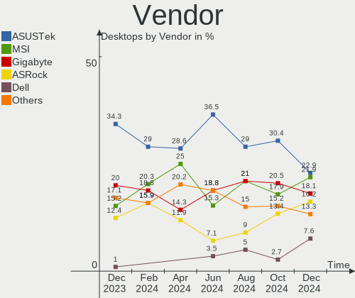
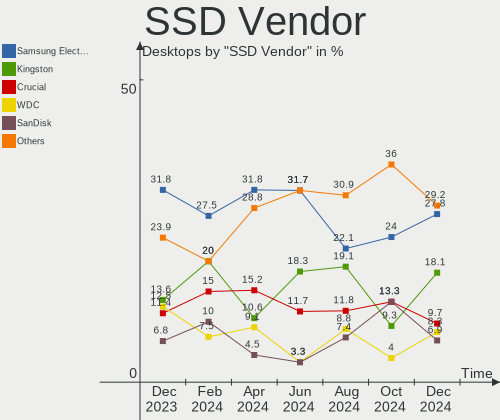
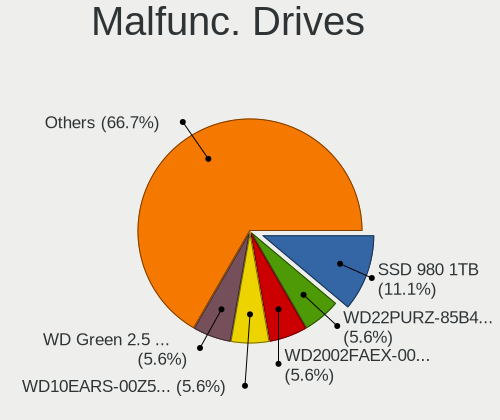
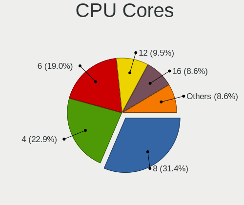
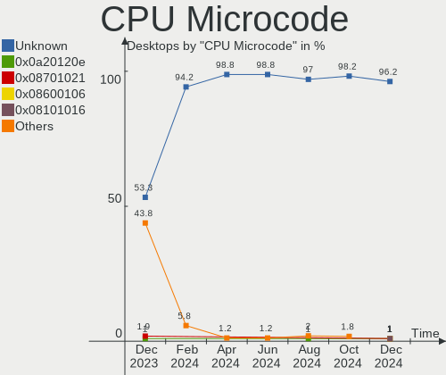
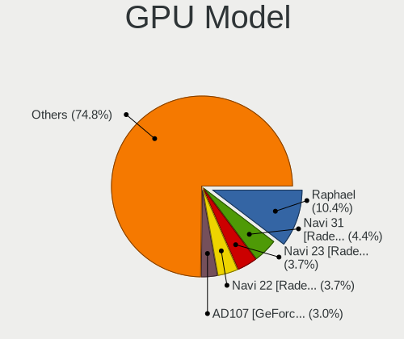
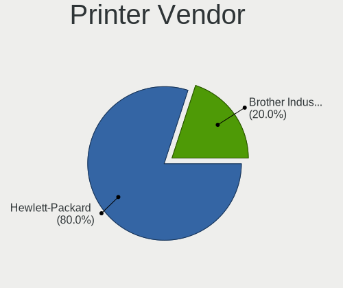

Arch - Hardware Trends (Desktops)
---------------------------------

A project to identify most popular hardware characteristics and track their change
over time based on data collected by Linux users at https://Linux-Hardware.org.

Anyone can contribute to this report by the [hw-probe](https://github.com/linuxhw/hw-probe) tool:

    sudo -E hw-probe -all -upload

This report is for one last month. Overall report since the beginning of time: [TestCoverage](https://github.com/linuxhw/TestCoverage)

Period: Jun, 2022.

Contents
--------

* [ System ](#system)
  - [ OS                       ](#os)
  - [ OS Family                ](#os-family)
  - [ Kernel                   ](#kernel)
  - [ Kernel Family            ](#kernel-family)
  - [ Kernel Major Ver.        ](#kernel-major-ver)
  - [ Arch                     ](#arch)
  - [ DE                       ](#de)
  - [ Display Server           ](#display-server)
  - [ Display Manager          ](#display-manager)
  - [ OS Lang                  ](#os-lang)
  - [ Boot Mode                ](#boot-mode)
  - [ Filesystem               ](#filesystem)
  - [ Part. scheme             ](#part-scheme)
  - [ Dual Boot with Linux/BSD ](#dual-boot-with-linuxbsd)
  - [ Dual Boot (Win)          ](#dual-boot-win)

* [ Board ](#board)
  - [ Vendor                   ](#vendor)
  - [ Model                    ](#model)
  - [ Model Family             ](#model-family)
  - [ MFG Year                 ](#mfg-year)
  - [ Form Factor              ](#form-factor)
  - [ Secure Boot              ](#secure-boot)
  - [ Coreboot                 ](#coreboot)
  - [ RAM Size                 ](#ram-size)
  - [ RAM Used                 ](#ram-used)
  - [ Total Drives             ](#total-drives)
  - [ Has CD-ROM               ](#has-cd-rom)
  - [ Has Ethernet             ](#has-ethernet)
  - [ Has WiFi                 ](#has-wifi)
  - [ Has Bluetooth            ](#has-bluetooth)

* [ Location ](#location)
  - [ Country                  ](#country)
  - [ City                     ](#city)

* [ Drives ](#drives)
  - [ Drive Vendor             ](#drive-vendor)
  - [ Drive Model              ](#drive-model)
  - [ HDD Vendor               ](#hdd-vendor)
  - [ SSD Vendor               ](#ssd-vendor)
  - [ Drive Kind               ](#drive-kind)
  - [ Drive Connector          ](#drive-connector)
  - [ Drive Size               ](#drive-size)
  - [ Space Total              ](#space-total)
  - [ Space Used               ](#space-used)
  - [ Malfunc. Drives          ](#malfunc-drives)
  - [ Malfunc. Drive Vendor    ](#malfunc-drive-vendor)
  - [ Malfunc. HDD Vendor      ](#malfunc-hdd-vendor)
  - [ Malfunc. Drive Kind      ](#malfunc-drive-kind)
  - [ Failed Drives            ](#failed-drives)
  - [ Failed Drive Vendor      ](#failed-drive-vendor)
  - [ Drive Status             ](#drive-status)

* [ Storage controller ](#storage-controller)
  - [ Storage Vendor           ](#storage-vendor)
  - [ Storage Model            ](#storage-model)
  - [ Storage Kind             ](#storage-kind)

* [ Processor ](#processor)
  - [ CPU Vendor               ](#cpu-vendor)
  - [ CPU Model                ](#cpu-model)
  - [ CPU Model Family         ](#cpu-model-family)
  - [ CPU Cores                ](#cpu-cores)
  - [ CPU Sockets              ](#cpu-sockets)
  - [ CPU Threads              ](#cpu-threads)
  - [ CPU Op-Modes             ](#cpu-op-modes)
  - [ CPU Microcode            ](#cpu-microcode)
  - [ CPU Microarch            ](#cpu-microarch)

* [ Graphics ](#graphics)
  - [ GPU Vendor               ](#gpu-vendor)
  - [ GPU Model                ](#gpu-model)
  - [ GPU Combo                ](#gpu-combo)
  - [ GPU Driver               ](#gpu-driver)
  - [ GPU Memory               ](#gpu-memory)

* [ Monitor ](#monitor)
  - [ Monitor Vendor           ](#monitor-vendor)
  - [ Monitor Model            ](#monitor-model)
  - [ Monitor Resolution       ](#monitor-resolution)
  - [ Monitor Diagonal         ](#monitor-diagonal)
  - [ Monitor Width            ](#monitor-width)
  - [ Aspect Ratio             ](#aspect-ratio)
  - [ Monitor Area             ](#monitor-area)
  - [ Pixel Density            ](#pixel-density)
  - [ Multiple Monitors        ](#multiple-monitors)

* [ Network ](#network)
  - [ Net Controller Vendor    ](#net-controller-vendor)
  - [ Net Controller Model     ](#net-controller-model)
  - [ Wireless Vendor          ](#wireless-vendor)
  - [ Wireless Model           ](#wireless-model)
  - [ Ethernet Vendor          ](#ethernet-vendor)
  - [ Ethernet Model           ](#ethernet-model)
  - [ Net Controller Kind      ](#net-controller-kind)
  - [ Used Controller          ](#used-controller)
  - [ NICs                     ](#nics)
  - [ IPv6                     ](#ipv6)

* [ Bluetooth ](#bluetooth)
  - [ Bluetooth Vendor         ](#bluetooth-vendor)
  - [ Bluetooth Model          ](#bluetooth-model)

* [ Sound ](#sound)
  - [ Sound Vendor             ](#sound-vendor)
  - [ Sound Model              ](#sound-model)

* [ Memory ](#memory)
  - [ Memory Vendor            ](#memory-vendor)
  - [ Memory Model             ](#memory-model)
  - [ Memory Kind              ](#memory-kind)
  - [ Memory Form Factor       ](#memory-form-factor)
  - [ Memory Size              ](#memory-size)
  - [ Memory Speed             ](#memory-speed)

* [ Printers & scanners ](#printers--scanners)
  - [ Printer Vendor           ](#printer-vendor)
  - [ Printer Model            ](#printer-model)
  - [ Scanner Vendor           ](#scanner-vendor)
  - [ Scanner Model            ](#scanner-model)

* [ Camera ](#camera)
  - [ Camera Vendor            ](#camera-vendor)
  - [ Camera Model             ](#camera-model)

* [ Security ](#security)
  - [ Fingerprint Vendor       ](#fingerprint-vendor)
  - [ Fingerprint Model        ](#fingerprint-model)
  - [ Chipcard Vendor          ](#chipcard-vendor)
  - [ Chipcard Model           ](#chipcard-model)

* [ Unsupported ](#unsupported)
  - [ Unsupported Devices      ](#unsupported-devices)
  - [ Unsupported Device Types ](#unsupported-device-types)

System
------

OS
--

Installed operating systems

| Name         | Desktops | Percent |
|--------------|----------|---------|
| Arch         | 32       | 54.24%  |
| Arch Rolling | 27       | 45.76%  |

OS Family
---------

OS without a version

| Name | Desktops | Percent |
|------|----------|---------|
| Arch | 59       | 100%    |

Kernel
------

Version of the Linux kernel

| Version             | Desktops | Percent |
|---------------------|----------|---------|
| 5.18.5-arch1-1      | 11       | 18.64%  |
| 5.18.1-arch1-1      | 9        | 15.25%  |
| 5.18.7-arch1-1      | 5        | 8.47%   |
| 5.18.3-arch1-1      | 5        | 8.47%   |
| 5.18.2-arch1-1      | 5        | 8.47%   |
| 5.17.9-arch1-1      | 5        | 8.47%   |
| 5.18.3-zen1-1-zen   | 3        | 5.08%   |
| 5.15.48-1-lts       | 3        | 5.08%   |
| 5.18.6-arch1-1      | 2        | 3.39%   |
| 5.18.1-zen1-1-zen   | 2        | 3.39%   |
| 5.15.43-1-lts       | 2        | 3.39%   |
| 5.18.5-zen1-1-zen   | 1        | 1.69%   |
| 5.18.3-261-tkg-bmq  | 1        | 1.69%   |
| 5.17.8-zen1-1-zen   | 1        | 1.69%   |
| 5.17.4-arch1-1-vfio | 1        | 1.69%   |
| 5.17.13-lqx1-1-lqx  | 1        | 1.69%   |
| 5.15.46-1-lts       | 1        | 1.69%   |
| 5.15.44-1-lts       | 1        | 1.69%   |

Kernel Family
-------------

Linux kernel without a distro release

| Version | Desktops | Percent |
|---------|----------|---------|
| 5.18.5  | 12       | 20.34%  |
| 5.18.1  | 11       | 18.64%  |
| 5.18.3  | 9        | 15.25%  |
| 5.18.7  | 5        | 8.47%   |
| 5.18.2  | 5        | 8.47%   |
| 5.17.9  | 5        | 8.47%   |
| 5.15.48 | 3        | 5.08%   |
| 5.18.6  | 2        | 3.39%   |
| 5.15.43 | 2        | 3.39%   |
| 5.17.8  | 1        | 1.69%   |
| 5.17.4  | 1        | 1.69%   |
| 5.17.13 | 1        | 1.69%   |
| 5.15.46 | 1        | 1.69%   |
| 5.15.44 | 1        | 1.69%   |

Kernel Major Ver.
-----------------

Linux kernel major version

| Version | Desktops | Percent |
|---------|----------|---------|
| 5.18    | 44       | 74.58%  |
| 5.17    | 8        | 13.56%  |
| 5.15    | 7        | 11.86%  |

Arch
----

OS architecture (x86_64, i586, etc.)

| Name   | Desktops | Percent |
|--------|----------|---------|
| x86_64 | 59       | 100%    |

DE
--

Desktop Environment

| Name           | Desktops | Percent |
|----------------|----------|---------|
| KDE5           | 19       | 32.2%   |
| GNOME          | 13       | 22.03%  |
| Unknown        | 9        | 15.25%  |
| sway           | 4        | 6.78%   |
| i3             | 3        | 5.08%   |
| bspwm          | 2        | 3.39%   |
| XFCE           | 1        | 1.69%   |
| X-Cinnamon     | 1        | 1.69%   |
| river          | 1        | 1.69%   |
| MATE           | 1        | 1.69%   |
| LXQt           | 1        | 1.69%   |
| i3-with-shmlog | 1        | 1.69%   |
| hyprland       | 1        | 1.69%   |
| Cinnamon       | 1        | 1.69%   |
| Budgie         | 1        | 1.69%   |

Display Server
--------------

X11 or Wayland

| Name    | Desktops | Percent |
|---------|----------|---------|
| X11     | 33       | 55.93%  |
| Wayland | 14       | 23.73%  |
| Tty     | 6        | 10.17%  |
| Unknown | 6        | 10.17%  |

Display Manager
---------------

SDDM, LightDM, etc.

| Name    | Desktops | Percent |
|---------|----------|---------|
| Unknown | 30       | 50.85%  |
| SDDM    | 12       | 20.34%  |
| LightDM | 11       | 18.64%  |
| Ly      | 3        | 5.08%   |
| GDM     | 2        | 3.39%   |
| GREETD  | 1        | 1.69%   |

OS Lang
-------

Language

| Lang     | Desktops | Percent |
|----------|----------|---------|
| en_US    | 36       | 61.02%  |
| fr_FR    | 4        | 6.78%   |
| Unknown  | 4        | 6.78%   |
| pt_BR    | 3        | 5.08%   |
| it_IT    | 2        | 3.39%   |
| en_GB    | 2        | 3.39%   |
| de_DE    | 2        | 3.39%   |
| ru_RU    | 1        | 1.69%   |
| es_ES    | 1        | 1.69%   |
| en_UTF-8 | 1        | 1.69%   |
| en_AU    | 1        | 1.69%   |
| de_AT    | 1        | 1.69%   |
| C        | 1        | 1.69%   |

Boot Mode
---------

EFI or BIOS

| Mode | Desktops | Percent |
|------|----------|---------|
| EFI  | 30       | 50.85%  |
| BIOS | 29       | 49.15%  |

Filesystem
----------

Type of filesystem

| Type  | Desktops | Percent |
|-------|----------|---------|
| Ext4  | 33       | 55.93%  |
| Btrfs | 22       | 37.29%  |
| Zfs   | 2        | 3.39%   |
| Xfs   | 1        | 1.69%   |
| F2fs  | 1        | 1.69%   |

Part. scheme
------------

Scheme of partitioning

| Type    | Desktops | Percent |
|---------|----------|---------|
| GPT     | 36       | 61.02%  |
| Unknown | 19       | 32.2%   |
| MBR     | 4        | 6.78%   |

Dual Boot with Linux/BSD
------------------------

Hosting more than one Linux/BSD

| Dual boot | Desktops | Percent |
|-----------|----------|---------|
| No        | 48       | 81.36%  |
| Yes       | 11       | 18.64%  |

Dual Boot (Win)
---------------

Hosting Linux and Windows

| Dual boot | Desktops | Percent |
|-----------|----------|---------|
| No        | 42       | 71.19%  |
| Yes       | 17       | 28.81%  |

Board
-----

Vendor
------

Motherboard manufacturer

| Name                | Desktops | Percent |
|---------------------|----------|---------|
| ASUSTek Computer    | 22       | 37.29%  |
| Gigabyte Technology | 10       | 16.95%  |
| ASRock              | 9        | 15.25%  |
| MSI                 | 5        | 8.47%   |
| Dell                | 3        | 5.08%   |
| Lenovo              | 2        | 3.39%   |
| Huanan              | 2        | 3.39%   |
| Hewlett-Packard     | 2        | 3.39%   |
| Acer                | 2        | 3.39%   |
| OEM                 | 1        | 1.69%   |
| BESSTAR Tech        | 1        | 1.69%   |

Model
-----

Motherboard model

| Name                                 | Desktops | Percent |
|--------------------------------------|----------|---------|
| Dell OptiPlex 7010                   | 2        | 3.39%   |
| OEM G41 775 ICH7 8712                | 1        | 1.69%   |
| MSI MS-7C56                          | 1        | 1.69%   |
| MSI MS-7C37                          | 1        | 1.69%   |
| MSI MS-7B85                          | 1        | 1.69%   |
| MSI MS-7A31                          | 1        | 1.69%   |
| MSI MS-7A20                          | 1        | 1.69%   |
| Lenovo ThinkCentre M93p 10A7000LIX   | 1        | 1.69%   |
| Lenovo ThinkCentre M83 10AGS03F00    | 1        | 1.69%   |
| Huanan X79-ZD3                       | 1        | 1.69%   |
| Huanan X79-8D VAA31                  | 1        | 1.69%   |
| HP Pavilion Gaming Desktop TG01-2xxx | 1        | 1.69%   |
| HP 870-115ng                         | 1        | 1.69%   |
| Gigabyte Z87P-D3                     | 1        | 1.69%   |
| Gigabyte Z390 AORUS PRO              | 1        | 1.69%   |
| Gigabyte X570S AORUS ELITE AX        | 1        | 1.69%   |
| Gigabyte X570 I AORUS PRO WIFI       | 1        | 1.69%   |
| Gigabyte H81M-S1                     | 1        | 1.69%   |
| Gigabyte B550 AORUS ELITE            | 1        | 1.69%   |
| Gigabyte B450 AORUS ELITE            | 1        | 1.69%   |
| Gigabyte B360M-D3H                   | 1        | 1.69%   |
| Gigabyte AX370-Gaming 5              | 1        | 1.69%   |
| Gigabyte 970A-UD3                    | 1        | 1.69%   |
| Dell OptiPlex 9020M                  | 1        | 1.69%   |
| BESSTAR Tech DMAF5                   | 1        | 1.69%   |
| ASUS TUF Gaming X570-PRO             | 1        | 1.69%   |
| ASUS TUF Gaming X570-PLUS            | 1        | 1.69%   |
| ASUS TUF Gaming B550M-PLUS           | 1        | 1.69%   |
| ASUS TUF Gaming B550M-E WIFI         | 1        | 1.69%   |
| ASUS TUF Gaming B450-PLUS II         | 1        | 1.69%   |
| ASUS ROG STRIX Z390-E GAMING         | 1        | 1.69%   |
| ASUS ROG STRIX B350-F GAMING         | 1        | 1.69%   |
| ASUS ROG CROSSHAIR VIII HERO         | 1        | 1.69%   |
| ASUS PRIME Z370-P                    | 1        | 1.69%   |
| ASUS PRIME Z270-A                    | 1        | 1.69%   |
| ASUS PRIME X470-PRO                  | 1        | 1.69%   |
| ASUS PRIME X370-PRO                  | 1        | 1.69%   |
| ASUS PRIME H510M-E                   | 1        | 1.69%   |
| ASUS PRIME B550M-A                   | 1        | 1.69%   |
| ASUS PRIME B550-PLUS                 | 1        | 1.69%   |
| ASUS PRIME B450M-K                   | 1        | 1.69%   |
| ASUS PRIME B450M-A II                | 1        | 1.69%   |
| ASUS PRIME B450M-A                   | 1        | 1.69%   |
| ASUS PRIME A520M-K                   | 1        | 1.69%   |
| ASUS P6T DELUXE V2                   | 1        | 1.69%   |
| ASUS M4A785TD-V EVO                  | 1        | 1.69%   |
| ASUS All Series                      | 1        | 1.69%   |
| ASRock Z97M Anniversary              | 1        | 1.69%   |
| ASRock X570 Taichi                   | 1        | 1.69%   |
| ASRock X570 Steel Legend             | 1        | 1.69%   |
| ASRock X470 Master SLI               | 1        | 1.69%   |
| ASRock X370 Taichi                   | 1        | 1.69%   |
| ASRock X370 Pro4                     | 1        | 1.69%   |
| ASRock B550 Taichi                   | 1        | 1.69%   |
| ASRock B450 Gaming-ITX/ac            | 1        | 1.69%   |
| ASRock A520M Pro4                    | 1        | 1.69%   |
| Acer Veriton M200-H110               | 1        | 1.69%   |
| Acer Aspire X3910                    | 1        | 1.69%   |

Model Family
------------

Motherboard model prefix

| Name                  | Desktops | Percent |
|-----------------------|----------|---------|
| ASUS PRIME            | 11       | 18.64%  |
| ASUS TUF              | 5        | 8.47%   |
| Dell OptiPlex         | 3        | 5.08%   |
| ASUS ROG              | 3        | 5.08%   |
| Lenovo ThinkCentre    | 2        | 3.39%   |
| ASRock X570           | 2        | 3.39%   |
| ASRock X370           | 2        | 3.39%   |
| OEM G41               | 1        | 1.69%   |
| MSI MS-7C56           | 1        | 1.69%   |
| MSI MS-7C37           | 1        | 1.69%   |
| MSI MS-7B85           | 1        | 1.69%   |
| MSI MS-7A31           | 1        | 1.69%   |
| MSI MS-7A20           | 1        | 1.69%   |
| Huanan X79-ZD3        | 1        | 1.69%   |
| Huanan X79-8D         | 1        | 1.69%   |
| HP Pavilion           | 1        | 1.69%   |
| HP 870-115ng          | 1        | 1.69%   |
| Gigabyte Z87P-D3      | 1        | 1.69%   |
| Gigabyte Z390         | 1        | 1.69%   |
| Gigabyte X570S        | 1        | 1.69%   |
| Gigabyte X570         | 1        | 1.69%   |
| Gigabyte H81M-S1      | 1        | 1.69%   |
| Gigabyte B550         | 1        | 1.69%   |
| Gigabyte B450         | 1        | 1.69%   |
| Gigabyte B360M-D3H    | 1        | 1.69%   |
| Gigabyte AX370-Gaming | 1        | 1.69%   |
| Gigabyte 970A-UD3     | 1        | 1.69%   |
| BESSTAR Tech DMAF5    | 1        | 1.69%   |
| ASUS P6T              | 1        | 1.69%   |
| ASUS M4A785TD-V       | 1        | 1.69%   |
| ASUS All              | 1        | 1.69%   |
| ASRock Z97M           | 1        | 1.69%   |
| ASRock X470           | 1        | 1.69%   |
| ASRock B550           | 1        | 1.69%   |
| ASRock B450           | 1        | 1.69%   |
| ASRock A520M          | 1        | 1.69%   |
| Acer Veriton          | 1        | 1.69%   |
| Acer Aspire           | 1        | 1.69%   |

MFG Year
--------

Motherboard manufacture year

| Year | Desktops | Percent |
|------|----------|---------|
| 2020 | 12       | 20.34%  |
| 2018 | 11       | 18.64%  |
| 2019 | 7        | 11.86%  |
| 2017 | 6        | 10.17%  |
| 2013 | 6        | 10.17%  |
| 2021 | 4        | 6.78%   |
| 2016 | 4        | 6.78%   |
| 2022 | 3        | 5.08%   |
| 2014 | 2        | 3.39%   |
| 2009 | 2        | 3.39%   |
| 2015 | 1        | 1.69%   |
| 2008 | 1        | 1.69%   |

Form Factor
-----------

Physical design of the computer

| Name    | Desktops | Percent |
|---------|----------|---------|
| Desktop | 59       | 100%    |

Secure Boot
-----------

Enabled or disabled

| State    | Desktops | Percent |
|----------|----------|---------|
| Disabled | 59       | 100%    |

Coreboot
--------

Have coreboot on board

| Used | Desktops | Percent |
|------|----------|---------|
| No   | 59       | 100%    |

RAM Size
--------

Total RAM memory

| Size in GB  | Desktops | Percent |
|-------------|----------|---------|
| 32.01-64.0  | 20       | 33.9%   |
| 16.01-24.0  | 16       | 27.12%  |
| 8.01-16.0   | 8        | 13.56%  |
| 64.01-256.0 | 7        | 11.86%  |
| 24.01-32.0  | 5        | 8.47%   |
| 4.01-8.0    | 2        | 3.39%   |
| 3.01-4.0    | 1        | 1.69%   |

RAM Used
--------

Used RAM memory

| Used GB    | Desktops | Percent |
|------------|----------|---------|
| 4.01-8.0   | 18       | 30.51%  |
| 3.01-4.0   | 12       | 20.34%  |
| 8.01-16.0  | 11       | 18.64%  |
| 1.01-2.0   | 9        | 15.25%  |
| 2.01-3.0   | 3        | 5.08%   |
| 16.01-24.0 | 3        | 5.08%   |
| 24.01-32.0 | 2        | 3.39%   |
| 32.01-64.0 | 1        | 1.69%   |

Total Drives
------------

Number of drives on board

| Drives | Desktops | Percent |
|--------|----------|---------|
| 2      | 20       | 33.9%   |
| 3      | 13       | 22.03%  |
| 1      | 10       | 16.95%  |
| 4      | 6        | 10.17%  |
| 5      | 4        | 6.78%   |
| 7      | 3        | 5.08%   |
| 9      | 1        | 1.69%   |
| 8      | 1        | 1.69%   |
| 6      | 1        | 1.69%   |

Has CD-ROM
----------

Has CD-ROM on board

| Presented | Desktops | Percent |
|-----------|----------|---------|
| No        | 51       | 86.44%  |
| Yes       | 8        | 13.56%  |

Has Ethernet
------------

Has Ethernet on board

| Presented | Desktops | Percent |
|-----------|----------|---------|
| Yes       | 59       | 100%    |

Has WiFi
--------

Has WiFi module

| Presented | Desktops | Percent |
|-----------|----------|---------|
| No        | 33       | 55.93%  |
| Yes       | 26       | 44.07%  |

Has Bluetooth
-------------

Has Bluetooth module

| Presented | Desktops | Percent |
|-----------|----------|---------|
| Yes       | 32       | 54.24%  |
| No        | 27       | 45.76%  |

Location
--------

Country
-------

Geographic location (country)

| Country     | Desktops | Percent |
|-------------|----------|---------|
| USA         | 8        | 13.56%  |
| France      | 6        | 10.17%  |
| Germany     | 5        | 8.47%   |
| Russia      | 4        | 6.78%   |
| Italy       | 4        | 6.78%   |
| Australia   | 4        | 6.78%   |
| UK          | 3        | 5.08%   |
| Poland      | 3        | 5.08%   |
| Canada      | 3        | 5.08%   |
| Brazil      | 3        | 5.08%   |
| Austria     | 3        | 5.08%   |
| Romania     | 2        | 3.39%   |
| India       | 2        | 3.39%   |
| Argentina   | 2        | 3.39%   |
| Spain       | 1        | 1.69%   |
| Panama      | 1        | 1.69%   |
| New Zealand | 1        | 1.69%   |
| Netherlands | 1        | 1.69%   |
| Moldova     | 1        | 1.69%   |
| Japan       | 1        | 1.69%   |
| China       | 1        | 1.69%   |

City
----

Geographic location (city)

| City                 | Desktops | Percent |
|----------------------|----------|---------|
| Vienna               | 2        | 3.39%   |
| Melbourne            | 2        | 3.39%   |
| Krakow               | 2        | 3.39%   |
| Berlin               | 2        | 3.39%   |
| Yerba Buena          | 1        | 1.69%   |
| Yekaterinburg        | 1        | 1.69%   |
| Xicheng District     | 1        | 1.69%   |
| Wellington           | 1        | 1.69%   |
| Villa Bosch          | 1        | 1.69%   |
| Vigo                 | 1        | 1.69%   |
| Varennes             | 1        | 1.69%   |
| Trivandrum           | 1        | 1.69%   |
| Tourcoing            | 1        | 1.69%   |
| Thornhill            | 1        | 1.69%   |
| Teghra               | 1        | 1.69%   |
| St Petersburg        | 1        | 1.69%   |
| Sovata               | 1        | 1.69%   |
| Setagaya-ku          | 1        | 1.69%   |
| Sesto San Giovanni   | 1        | 1.69%   |
| Seattle              | 1        | 1.69%   |
| Sartrouville         | 1        | 1.69%   |
| Sao Paulo            | 1        | 1.69%   |
| Santos               | 1        | 1.69%   |
| Saluzzo              | 1        | 1.69%   |
| Saint-Lambert        | 1        | 1.69%   |
| Reading              | 1        | 1.69%   |
| Portsmouth           | 1        | 1.69%   |
| Perpignan            | 1        | 1.69%   |
| Panama City          | 1        | 1.69%   |
| Neusass              | 1        | 1.69%   |
| Moscow               | 1        | 1.69%   |
| Montes Claros        | 1        | 1.69%   |
| Miercurea-Ciuc       | 1        | 1.69%   |
| Martigues            | 1        | 1.69%   |
| Lesna                | 1        | 1.69%   |
| Lancaster            | 1        | 1.69%   |
| King                 | 1        | 1.69%   |
| Inzer                | 1        | 1.69%   |
| Hoppers Crossing     | 1        | 1.69%   |
| Gorlago              | 1        | 1.69%   |
| Giessen              | 1        | 1.69%   |
| Fort Gibson          | 1        | 1.69%   |
| Dowagiac             | 1        | 1.69%   |
| Dornbirn             | 1        | 1.69%   |
| Deidesheim           | 1        | 1.69%   |
| Chisinau             | 1        | 1.69%   |
| Brisbane             | 1        | 1.69%   |
| Brescia              | 1        | 1.69%   |
| Boulogne-Billancourt | 1        | 1.69%   |
| Belmont              | 1        | 1.69%   |
| Austin               | 1        | 1.69%   |
| Aulnay-sous-Bois     | 1        | 1.69%   |
| Augusta              | 1        | 1.69%   |
| Atlanta              | 1        | 1.69%   |
| Amsterdam            | 1        | 1.69%   |

Drives
------

Drive Vendor
------------

Hard drive vendors

| Vendor                    | Desktops | Drives | Percent |
|---------------------------|----------|--------|---------|
| Samsung Electronics       | 27       | 41     | 21.09%  |
| WDC                       | 23       | 39     | 17.97%  |
| Seagate                   | 22       | 29     | 17.19%  |
| Crucial                   | 8        | 10     | 6.25%   |
| SanDisk                   | 7        | 8      | 5.47%   |
| Toshiba                   | 4        | 4      | 3.13%   |
| Kingston                  | 4        | 4      | 3.13%   |
| Gigabyte Technology       | 4        | 4      | 3.13%   |
| A-DATA Technology         | 3        | 3      | 2.34%   |
| SPCC                      | 2        | 2      | 1.56%   |
| Silicon Motion            | 2        | 2      | 1.56%   |
| Corsair                   | 2        | 2      | 1.56%   |
| China                     | 2        | 2      | 1.56%   |
| Unknown                   | 1        | 1      | 0.78%   |
| Timetec                   | 1        | 1      | 0.78%   |
| Smart                     | 1        | 2      | 0.78%   |
| SK hynix                  | 1        | 1      | 0.78%   |
| SABRENT                   | 1        | 1      | 0.78%   |
| Phison                    | 1        | 1      | 0.78%   |
| Patriot                   | 1        | 1      | 0.78%   |
| OCZ                       | 1        | 1      | 0.78%   |
| Netac                     | 1        | 1      | 0.78%   |
| Micron/Crucial Technology | 1        | 1      | 0.78%   |
| Maxtor                    | 1        | 1      | 0.78%   |
| LDLC                      | 1        | 1      | 0.78%   |
| Jz                        | 1        | 1      | 0.78%   |
| Intel                     | 1        | 1      | 0.78%   |
| HGST                      | 1        | 1      | 0.78%   |
| Goodram                   | 1        | 1      | 0.78%   |
| EMTEC                     | 1        | 1      | 0.78%   |
| EDGE                      | 1        | 1      | 0.78%   |

Drive Model
-----------

Hard drive models

| Model                                  | Desktops | Percent |
|----------------------------------------|----------|---------|
| WDC WD40EFRX-68N32N0 4TB               | 3        | 1.95%   |
| Seagate ST2000DM006-2DM164 2TB         | 3        | 1.95%   |
| Samsung SSD 970 EVO Plus 1TB           | 3        | 1.95%   |
| Samsung SM963 2.5" NVMe PCIe SSD 500GB | 3        | 1.95%   |
| WDC WDS500G3X0C-00SJG0 500GB           | 2        | 1.3%    |
| WDC WD30EFRX-68EUZN0 3TB               | 2        | 1.3%    |
| WDC WD20EZRZ-00Z5HB0 2TB               | 2        | 1.3%    |
| Seagate ST8000DM004-2CX188 8TB         | 2        | 1.3%    |
| Seagate ST500DM002-1BD142 500GB        | 2        | 1.3%    |
| Seagate ST2000DM001-1ER164 2TB         | 2        | 1.3%    |
| Seagate ST1000DM010-2EP102 1TB         | 2        | 1.3%    |
| Samsung SSD 970 EVO Plus 500GB         | 2        | 1.3%    |
| Samsung SSD 970 EVO Plus 2TB           | 2        | 1.3%    |
| Samsung SSD 970 EVO 1TB                | 2        | 1.3%    |
| Samsung SSD 860 EVO 250GB              | 2        | 1.3%    |
| Samsung SSD 860 EVO 1TB                | 2        | 1.3%    |
| Samsung SSD 850 PRO 512GB              | 2        | 1.3%    |
| Samsung NVMe SSD Drive 2TB             | 2        | 1.3%    |
| Gigabyte GP-GSM2NE3512GNTD 512GB       | 2        | 1.3%    |
| Crucial CT250BX100SSD1 250GB           | 2        | 1.3%    |
| Crucial CT1000P1SSD8 1TB               | 2        | 1.3%    |
| Crucial CT1000MX500SSD1 1TB            | 2        | 1.3%    |
| WDC WDS500G2B0A-00SM50 500GB SSD       | 1        | 0.65%   |
| WDC WDS250G2B0B-00YS70 250GB SSD       | 1        | 0.65%   |
| WDC WDS250G2B0A-00SM50 250GB SSD       | 1        | 0.65%   |
| WDC WDS240G2G0B-00EPW0 240GB SSD       | 1        | 0.65%   |
| WDC WDS120G2G0A-00JH30 120GB SSD       | 1        | 0.65%   |
| WDC WDS100T2G0A-00JH30 1TB SSD         | 1        | 0.65%   |
| WDC WDS100T2B0C-00PXH0 1TB             | 1        | 0.65%   |
| WDC WD8004FRYZ-01VAEB0 8TB             | 1        | 0.65%   |
| WDC WD6400AAKS-65A7B2 640GB            | 1        | 0.65%   |
| WDC WD62PURZ-85B3AY0 6TB               | 1        | 0.65%   |
| WDC WD60EZAZ-00SF3B0 6TB               | 1        | 0.65%   |
| WDC WD60EFAX-68JH4N1 6TB               | 1        | 0.65%   |
| WDC WD5000BEKT-00KA9T0 500GB           | 1        | 0.65%   |
| WDC WD5000AZLX-00K2TA0 500GB           | 1        | 0.65%   |
| WDC WD5000AAKX-221CA1 500GB            | 1        | 0.65%   |
| WDC WD40EZRZ-00GXCB0 4TB               | 1        | 0.65%   |
| WDC WD40EFZX-68AWUN0 4TB               | 1        | 0.65%   |
| WDC WD3200AVVS-56L2B0 320GB            | 1        | 0.65%   |
| WDC WD3200AAKS-00UU3A0 320GB           | 1        | 0.65%   |
| WDC WD10EZRZ-22HTKB0 1TB               | 1        | 0.65%   |
| WDC WD10EZEX-60ZF5A0 1TB               | 1        | 0.65%   |
| WDC WD10EZEX-60WN4A0 1TB               | 1        | 0.65%   |
| WDC WD10EZEX-00WN4A0 1TB               | 1        | 0.65%   |
| WDC WD10EZEX-00BN5A0 1TB               | 1        | 0.65%   |
| WDC WD10EADS-00M2B0 1TB                | 1        | 0.65%   |
| Unknown SD/MMC/MS PRO 128GB            | 1        | 0.65%   |
| Toshiba MQ01ABD100 1TB                 | 1        | 0.65%   |
| Toshiba HDWD260 6TB                    | 1        | 0.65%   |
| Toshiba HDWD110 1TB                    | 1        | 0.65%   |
| Toshiba DT01ACA300 3TB                 | 1        | 0.65%   |
| Timetec 30TT253X2-256GB SSD            | 1        | 0.65%   |
| SPCC Solid State Disk 256GB            | 1        | 0.65%   |
| SPCC M.2 PCIe SSD 512GB                | 1        | 0.65%   |
| Smart SSD SZ9STE 2.5 7mm 256GB         | 1        | 0.65%   |
| SK hynix NVMe SSD Drive 500GB          | 1        | 0.65%   |
| Silicon Motion NVMe SSD Drive 500GB    | 1        | 0.65%   |
| Silicon Motion NVME SSD 1TB            | 1        | 0.65%   |
| Seagate ST6000NM0034 6TB               | 1        | 0.65%   |

HDD Vendor
----------

Hard disk drive vendors

| Vendor              | Desktops | Drives | Percent |
|---------------------|----------|--------|---------|
| Seagate             | 21       | 28     | 42.86%  |
| WDC                 | 20       | 30     | 40.82%  |
| Toshiba             | 4        | 4      | 8.16%   |
| Unknown             | 1        | 1      | 2.04%   |
| Samsung Electronics | 1        | 1      | 2.04%   |
| Maxtor              | 1        | 1      | 2.04%   |
| HGST                | 1        | 1      | 2.04%   |

SSD Vendor
----------

Solid state drive vendors

| Vendor              | Desktops | Drives | Percent |
|---------------------|----------|--------|---------|
| Samsung Electronics | 12       | 16     | 25.53%  |
| Crucial             | 6        | 7      | 12.77%  |
| WDC                 | 5        | 6      | 10.64%  |
| SanDisk             | 4        | 4      | 8.51%   |
| Kingston            | 3        | 3      | 6.38%   |
| A-DATA Technology   | 3        | 3      | 6.38%   |
| China               | 2        | 2      | 4.26%   |
| Timetec             | 1        | 1      | 2.13%   |
| SPCC                | 1        | 1      | 2.13%   |
| Smart               | 1        | 2      | 2.13%   |
| Seagate             | 1        | 1      | 2.13%   |
| Patriot             | 1        | 1      | 2.13%   |
| OCZ                 | 1        | 1      | 2.13%   |
| Netac               | 1        | 1      | 2.13%   |
| LDLC                | 1        | 1      | 2.13%   |
| Jz                  | 1        | 1      | 2.13%   |
| Goodram             | 1        | 1      | 2.13%   |
| EMTEC               | 1        | 1      | 2.13%   |
| EDGE                | 1        | 1      | 2.13%   |

Drive Kind
----------

HDD or SSD

| Kind | Desktops | Drives | Percent |
|------|----------|--------|---------|
| SSD  | 40       | 54     | 34.78%  |
| HDD  | 38       | 66     | 33.04%  |
| NVMe | 37       | 49     | 32.17%  |

Drive Connector
---------------

SATA, SAS, NVMe, etc.

| Type | Desktops | Drives | Percent |
|------|----------|--------|---------|
| SATA | 49       | 115    | 53.85%  |
| NVMe | 36       | 48     | 39.56%  |
| SAS  | 6        | 6      | 6.59%   |

Drive Size
----------

Size of hard drive

| Size in TB | Desktops | Drives | Percent |
|------------|----------|--------|---------|
| 0.01-0.5   | 32       | 45     | 37.65%  |
| 0.51-1.0   | 22       | 29     | 25.88%  |
| 1.01-2.0   | 12       | 15     | 14.12%  |
| 4.01-10.0  | 9        | 17     | 10.59%  |
| 3.01-4.0   | 7        | 9      | 8.24%   |
| 2.01-3.0   | 3        | 5      | 3.53%   |

Space Total
-----------

Amount of disk space available on the file system

| Size in GB     | Desktops | Percent |
|----------------|----------|---------|
| More than 3000 | 17       | 28.81%  |
| 1001-2000      | 12       | 20.34%  |
| 501-1000       | 10       | 16.95%  |
| 251-500        | 8        | 13.56%  |
| 2001-3000      | 4        | 6.78%   |
| 101-250        | 3        | 5.08%   |
| 1-20           | 2        | 3.39%   |
| Unknown        | 2        | 3.39%   |
| 51-100         | 1        | 1.69%   |

Space Used
----------

Amount of used disk space

| Used GB        | Desktops | Percent |
|----------------|----------|---------|
| 501-1000       | 10       | 16.95%  |
| 251-500        | 9        | 15.25%  |
| More than 3000 | 7        | 11.86%  |
| 51-100         | 7        | 11.86%  |
| 101-250        | 6        | 10.17%  |
| 1-20           | 6        | 10.17%  |
| 21-50          | 5        | 8.47%   |
| 1001-2000      | 4        | 6.78%   |
| 2001-3000      | 3        | 5.08%   |
| Unknown        | 2        | 3.39%   |

Malfunc. Drives
---------------

Drive models with a malfunction

| Model                                   | Desktops | Drives | Percent |
|-----------------------------------------|----------|--------|---------|
| Seagate ST500DM002-1BD142 500GB         | 2        | 2      | 33.33%  |
| Seagate ST2000DM001-1ER164 2TB          | 1        | 1      | 16.67%  |
| Samsung Electronics SSD 850 EVO 1TB     | 1        | 1      | 16.67%  |
| OCZ VERTEX4 256GB SSD                   | 1        | 1      | 16.67%  |
| Gigabyte Technology GP-GM30512G-G 512GB | 1        | 1      | 16.67%  |

Malfunc. Drive Vendor
---------------------

Vendors of faulty drives

| Vendor              | Desktops | Drives | Percent |
|---------------------|----------|--------|---------|
| Seagate             | 3        | 3      | 50%     |
| Samsung Electronics | 1        | 1      | 16.67%  |
| OCZ                 | 1        | 1      | 16.67%  |
| Gigabyte Technology | 1        | 1      | 16.67%  |

Malfunc. HDD Vendor
-------------------

Vendors of faulty HDD drives

| Vendor  | Desktops | Drives | Percent |
|---------|----------|--------|---------|
| Seagate | 3        | 3      | 100%    |

Malfunc. Drive Kind
-------------------

Kinds of faulty drives

| Kind | Desktops | Drives | Percent |
|------|----------|--------|---------|
| HDD  | 3        | 3      | 50%     |
| SSD  | 2        | 2      | 33.33%  |
| NVMe | 1        | 1      | 16.67%  |

Failed Drives
-------------

Failed drive models

Zero info for selected period =(

Failed Drive Vendor
-------------------

Failed drive vendors

Zero info for selected period =(

Drive Status
------------

Number of failed and malfunc. drives

| Status   | Desktops | Drives | Percent |
|----------|----------|--------|---------|
| Works    | 31       | 83     | 46.97%  |
| Detected | 29       | 80     | 43.94%  |
| Malfunc  | 6        | 6      | 9.09%   |

Storage controller
------------------

Storage Vendor
--------------

Storage controller vendors

| Vendor                      | Desktops | Percent |
|-----------------------------|----------|---------|
| AMD                         | 36       | 33.03%  |
| Intel                       | 23       | 21.1%   |
| Samsung Electronics         | 21       | 19.27%  |
| Phison Electronics          | 7        | 6.42%   |
| SanDisk                     | 6        | 5.5%    |
| ASMedia Technology          | 4        | 3.67%   |
| Silicon Motion              | 2        | 1.83%   |
| Micron/Crucial Technology   | 2        | 1.83%   |
| Marvell Technology Group    | 2        | 1.83%   |
| Broadcom / LSI              | 2        | 1.83%   |
| SK hynix                    | 1        | 0.92%   |
| Realtek Semiconductor       | 1        | 0.92%   |
| Kingston Technology Company | 1        | 0.92%   |
| Adaptec                     | 1        | 0.92%   |

Storage Model
-------------

Storage controller models

| Model                                                                          | Desktops | Percent |
|--------------------------------------------------------------------------------|----------|---------|
| AMD FCH SATA Controller [AHCI mode]                                            | 21       | 16.28%  |
| Samsung NVMe SSD Controller SM981/PM981/PM983                                  | 14       | 10.85%  |
| AMD 400 Series Chipset SATA Controller                                         | 10       | 7.75%   |
| AMD 500 Series Chipset SATA Controller                                         | 9        | 6.98%   |
| Intel 8 Series/C220 Series Chipset Family 6-port SATA Controller 1 [AHCI mode] | 5        | 3.88%   |
| AMD X370 Series Chipset SATA Controller                                        | 5        | 3.88%   |
| ASMedia ASM1062 Serial ATA Controller                                          | 4        | 3.1%    |
| Samsung NVMe SSD Controller SM961/PM961/SM963                                  | 3        | 2.33%   |
| Samsung NVMe SSD Controller PM9A1/PM9A3/980PRO                                 | 3        | 2.33%   |
| Phison E16 PCIe4 NVMe Controller                                               | 3        | 2.33%   |
| Intel Cannon Lake PCH SATA AHCI Controller                                     | 3        | 2.33%   |
| Silicon Motion SM2263EN/SM2263XT SSD Controller                                | 2        | 1.55%   |
| SanDisk WD PC SN810 / Black SN850 NVMe SSD                                     | 2        | 1.55%   |
| SanDisk WD Black SN750 / PC SN730 NVMe SSD                                     | 2        | 1.55%   |
| Samsung NVMe SSD Controller SM951/PM951                                        | 2        | 1.55%   |
| Phison PS5013 E13 NVMe Controller                                              | 2        | 1.55%   |
| Phison E12 NVMe Controller                                                     | 2        | 1.55%   |
| Micron/Crucial NVMe Controller                                                 | 2        | 1.55%   |
| Intel Q170/Q150/B150/H170/H110/Z170/CM236 Chipset SATA Controller [AHCI Mode]  | 2        | 1.55%   |
| Intel C600/X79 series chipset 6-Port SATA AHCI Controller                      | 2        | 1.55%   |
| Intel 82801JI (ICH10 Family) 4 port SATA IDE Controller #1                     | 2        | 1.55%   |
| Intel 82801JI (ICH10 Family) 2 port SATA IDE Controller #2                     | 2        | 1.55%   |
| Intel 7 Series/C210 Series Chipset Family 6-port SATA Controller [AHCI mode]   | 2        | 1.55%   |
| SK hynix Gold P31 SSD                                                          | 1        | 0.78%   |
| SanDisk WD Blue SN550 NVMe SSD                                                 | 1        | 0.78%   |
| SanDisk WD Black 2018/SN750 / PC SN720 NVMe SSD                                | 1        | 0.78%   |
| SanDisk Non-Volatile memory controller                                         | 1        | 0.78%   |
| Samsung NVMe SSD Controller 980                                                | 1        | 0.78%   |
| Realtek RTS5763DL NVMe SSD Controller                                          | 1        | 0.78%   |
| Marvell Group 88SE9215 PCIe 2.0 x1 4-port SATA 6 Gb/s Controller               | 1        | 0.78%   |
| Marvell Group 88SE6111/6121 SATA II / PATA Controller                          | 1        | 0.78%   |
| Kingston Company A2000 NVMe SSD                                                | 1        | 0.78%   |
| Intel SSD 600P Series                                                          | 1        | 0.78%   |
| Intel SATA Controller [RAID mode]                                              | 1        | 0.78%   |
| Intel NM10/ICH7 Family SATA Controller [IDE mode]                              | 1        | 0.78%   |
| Intel C610/X99 series chipset sSATA Controller [AHCI mode]                     | 1        | 0.78%   |
| Intel C610/X99 series chipset 6-Port SATA Controller [AHCI mode]               | 1        | 0.78%   |
| Intel 9 Series Chipset Family SATA Controller [AHCI Mode]                      | 1        | 0.78%   |
| Intel 82801G (ICH7 Family) IDE Controller                                      | 1        | 0.78%   |
| Intel 500 Series Chipset Family SATA AHCI Controller                           | 1        | 0.78%   |
| Intel 200 Series PCH SATA controller [AHCI mode]                               | 1        | 0.78%   |
| Broadcom / LSI SAS1068E PCI-Express Fusion-MPT SAS                             | 1        | 0.78%   |
| Broadcom / LSI MegaRAID SAS 2108 [Liberator]                                   | 1        | 0.78%   |
| AMD SB7x0/SB8x0/SB9x0 SATA Controller [IDE mode]                               | 1        | 0.78%   |
| AMD SB7x0/SB8x0/SB9x0 SATA Controller [AHCI mode]                              | 1        | 0.78%   |
| AMD SB7x0/SB8x0/SB9x0 IDE Controller                                           | 1        | 0.78%   |
| AMD 300 Series Chipset SATA Controller                                         | 1        | 0.78%   |
| Adaptec AAC-RAID                                                               | 1        | 0.78%   |

Storage Kind
------------

Kind of storage controller (IDE, SATA, NVMe, SAS, ...)

| Kind | Desktops | Percent |
|------|----------|---------|
| SATA | 54       | 55.1%   |
| NVMe | 36       | 36.73%  |
| IDE  | 4        | 4.08%   |
| RAID | 3        | 3.06%   |
| SCSI | 1        | 1.02%   |

Processor
---------

CPU Vendor
----------

Processor vendors

| Vendor | Desktops | Percent |
|--------|----------|---------|
| AMD    | 36       | 61.02%  |
| Intel  | 23       | 38.98%  |

CPU Model
---------

Processor models

| Model                                         | Desktops | Percent |
|-----------------------------------------------|----------|---------|
| AMD Ryzen 5 5600X 6-Core Processor            | 4        | 6.78%   |
| AMD Ryzen 9 5950X 16-Core Processor           | 3        | 5.08%   |
| AMD Ryzen 7 5800X 8-Core Processor            | 3        | 5.08%   |
| AMD Ryzen 9 5900X 12-Core Processor           | 2        | 3.39%   |
| AMD Ryzen 9 3900X 12-Core Processor           | 2        | 3.39%   |
| AMD Ryzen 7 5700G with Radeon Graphics        | 2        | 3.39%   |
| AMD Ryzen 7 3700X 8-Core Processor            | 2        | 3.39%   |
| AMD Ryzen 7 1700 Eight-Core Processor         | 2        | 3.39%   |
| AMD Ryzen 5 3600X 6-Core Processor            | 2        | 3.39%   |
| AMD Ryzen 5 2600 Six-Core Processor           | 2        | 3.39%   |
| Intel Xeon CPU E5-2695 v2 @ 2.40GHz           | 1        | 1.69%   |
| Intel Xeon CPU E5-1650 0 @ 3.20GHz            | 1        | 1.69%   |
| Intel Pentium Dual-Core CPU E5700 @ 3.00GHz   | 1        | 1.69%   |
| Intel Pentium Dual-Core CPU E5500 @ 2.80GHz   | 1        | 1.69%   |
| Intel Pentium CPU G3260 @ 3.30GHz             | 1        | 1.69%   |
| Intel Pentium CPU G3220 @ 3.00GHz             | 1        | 1.69%   |
| Intel Core i7-9700K CPU @ 3.60GHz             | 1        | 1.69%   |
| Intel Core i7-8700 CPU @ 3.20GHz              | 1        | 1.69%   |
| Intel Core i7-7700K CPU @ 4.20GHz             | 1        | 1.69%   |
| Intel Core i7-6850K CPU @ 3.60GHz             | 1        | 1.69%   |
| Intel Core i7-6700 CPU @ 3.40GHz              | 1        | 1.69%   |
| Intel Core i7-5820K CPU @ 3.30GHz             | 1        | 1.69%   |
| Intel Core i7-4770K CPU @ 3.50GHz             | 1        | 1.69%   |
| Intel Core i7-4770 CPU @ 3.40GHz              | 1        | 1.69%   |
| Intel Core i7 CPU 920 @ 2.67GHz               | 1        | 1.69%   |
| Intel Core i5-9600K CPU @ 3.70GHz             | 1        | 1.69%   |
| Intel Core i5-8400 CPU @ 2.80GHz              | 1        | 1.69%   |
| Intel Core i5-4670T CPU @ 2.30GHz             | 1        | 1.69%   |
| Intel Core i5-4590T CPU @ 2.00GHz             | 1        | 1.69%   |
| Intel Core i5-3570 CPU @ 3.40GHz              | 1        | 1.69%   |
| Intel Core i5-3470 CPU @ 3.20GHz              | 1        | 1.69%   |
| Intel Core i5-10400F CPU @ 2.90GHz            | 1        | 1.69%   |
| Intel Celeron CPU G3930 @ 2.90GHz             | 1        | 1.69%   |
| AMD Ryzen 9 3950X 16-Core Processor           | 1        | 1.69%   |
| AMD Ryzen 7 2700X Eight-Core Processor        | 1        | 1.69%   |
| AMD Ryzen 7 1800X Eight-Core Processor        | 1        | 1.69%   |
| AMD Ryzen 7 1700X Eight-Core Processor        | 1        | 1.69%   |
| AMD Ryzen 5 5600G with Radeon Graphics        | 1        | 1.69%   |
| AMD Ryzen 5 3550H with Radeon Vega Mobile Gfx | 1        | 1.69%   |
| AMD Ryzen 5 3500 6-Core Processor             | 1        | 1.69%   |
| AMD Ryzen 5 1600X Six-Core Processor          | 1        | 1.69%   |
| AMD Ryzen 5 1600 Six-Core Processor           | 1        | 1.69%   |
| AMD Ryzen 3 4300G with Radeon Graphics        | 1        | 1.69%   |
| AMD Phenom II X4 945 Processor                | 1        | 1.69%   |
| AMD FX-6300 Six-Core Processor                | 1        | 1.69%   |

CPU Model Family
----------------

Processor model prefix

| Model                   | Desktops | Percent |
|-------------------------|----------|---------|
| AMD Ryzen 5             | 13       | 22.03%  |
| AMD Ryzen 7             | 12       | 20.34%  |
| Intel Core i7           | 9        | 15.25%  |
| AMD Ryzen 9             | 8        | 13.56%  |
| Intel Core i5           | 7        | 11.86%  |
| Intel Xeon              | 2        | 3.39%   |
| Intel Pentium Dual-Core | 2        | 3.39%   |
| Intel Pentium           | 2        | 3.39%   |
| Intel Celeron           | 1        | 1.69%   |
| AMD Ryzen 3             | 1        | 1.69%   |
| AMD Phenom II X4        | 1        | 1.69%   |
| AMD FX                  | 1        | 1.69%   |

CPU Cores
---------

Number of processor cores

| Number | Desktops | Percent |
|--------|----------|---------|
| 6      | 19       | 32.2%   |
| 8      | 13       | 22.03%  |
| 4      | 12       | 20.34%  |
| 16     | 4        | 6.78%   |
| 12     | 4        | 6.78%   |
| 2      | 4        | 6.78%   |
| 24     | 1        | 1.69%   |
| 3      | 1        | 1.69%   |
| 1      | 1        | 1.69%   |

CPU Sockets
-----------

Number of sockets

| Number | Desktops | Percent |
|--------|----------|---------|
| 1      | 58       | 98.31%  |
| 2      | 1        | 1.69%   |

CPU Threads
-----------

Threads per core (Hyper-Threading)

| Number | Desktops | Percent |
|--------|----------|---------|
| 2      | 45       | 76.27%  |
| 1      | 14       | 23.73%  |

CPU Op-Modes
------------

CPU Operation Modes (32-bit, 64-bit)

| Op mode        | Desktops | Percent |
|----------------|----------|---------|
| 32-bit, 64-bit | 59       | 100%    |

CPU Microcode
-------------

Microcode number

| Number     | Desktops | Percent |
|------------|----------|---------|
| Unknown    | 21       | 35.59%  |
| 0x0a201016 | 5        | 8.47%   |
| 0x08701021 | 4        | 6.78%   |
| 0x306c3    | 3        | 5.08%   |
| 0x306a9    | 2        | 3.39%   |
| 0x1067a    | 2        | 3.39%   |
| 0x0a50000c | 2        | 3.39%   |
| 0x0a201204 | 2        | 3.39%   |
| 0x0800820d | 2        | 3.39%   |
| 0x08001138 | 2        | 3.39%   |
| 0x906ec    | 1        | 1.69%   |
| 0x906ea    | 1        | 1.69%   |
| 0x906e9    | 1        | 1.69%   |
| 0x406f1    | 1        | 1.69%   |
| 0x306f2    | 1        | 1.69%   |
| 0x306e4    | 1        | 1.69%   |
| 0x206d7    | 1        | 1.69%   |
| 0x0a201205 | 1        | 1.69%   |
| 0x0a201009 | 1        | 1.69%   |
| 0x08600106 | 1        | 1.69%   |
| 0x08108102 | 1        | 1.69%   |
| 0x08001137 | 1        | 1.69%   |
| 0x08001105 | 1        | 1.69%   |
| 0x010000b6 | 1        | 1.69%   |

CPU Microarch
-------------

Microarchitecture

| Name        | Desktops | Percent |
|-------------|----------|---------|
| Zen 3       | 15       | 25.42%  |
| Zen 2       | 9        | 15.25%  |
| Haswell     | 7        | 11.86%  |
| Zen         | 6        | 10.17%  |
| KabyLake    | 6        | 10.17%  |
| Zen+        | 4        | 6.78%   |
| IvyBridge   | 3        | 5.08%   |
| Penryn      | 2        | 3.39%   |
| Skylake     | 1        | 1.69%   |
| SandyBridge | 1        | 1.69%   |
| Piledriver  | 1        | 1.69%   |
| Nehalem     | 1        | 1.69%   |
| K10         | 1        | 1.69%   |
| CometLake   | 1        | 1.69%   |
| Broadwell   | 1        | 1.69%   |

Graphics
--------

GPU Vendor
----------

Vendors of graphics cards

| Vendor | Desktops | Percent |
|--------|----------|---------|
| Nvidia | 33       | 51.56%  |
| AMD    | 23       | 35.94%  |
| Intel  | 8        | 12.5%   |

GPU Model
---------

Graphics card models

| Model                                                                       | Desktops | Percent |
|-----------------------------------------------------------------------------|----------|---------|
| AMD Ellesmere [Radeon RX 470/480/570/570X/580/580X/590]                     | 6        | 9.09%   |
| Nvidia GK208B [GeForce GT 710]                                              | 5        | 7.58%   |
| Nvidia GP106 [GeForce GTX 1060 6GB]                                         | 4        | 6.06%   |
| Intel Xeon E3-1200 v3/4th Gen Core Processor Integrated Graphics Controller | 4        | 6.06%   |
| Nvidia GA104 [GeForce RTX 3060 Ti Lite Hash Rate]                           | 3        | 4.55%   |
| AMD Cezanne                                                                 | 3        | 4.55%   |
| Nvidia TU117 [GeForce GTX 1650]                                             | 2        | 3.03%   |
| Nvidia GP104 [GeForce GTX 1080]                                             | 2        | 3.03%   |
| Nvidia GM204 [GeForce GTX 970]                                              | 2        | 3.03%   |
| Nvidia GK208B [GeForce GT 730]                                              | 2        | 3.03%   |
| Nvidia GA104 [GeForce RTX 3070]                                             | 2        | 3.03%   |
| Intel 4 Series Chipset Integrated Graphics Controller                       | 2        | 3.03%   |
| AMD Navi 23 [Radeon RX 6600/6600 XT/6600M]                                  | 2        | 3.03%   |
| AMD Navi 21 [Radeon RX 6800/6800 XT / 6900 XT]                              | 2        | 3.03%   |
| AMD Navi 10 [Radeon RX 5600 OEM/5600 XT / 5700/5700 XT]                     | 2        | 3.03%   |
| Nvidia TU116 [GeForce GTX 1660 SUPER]                                       | 1        | 1.52%   |
| Nvidia TU106 [GeForce RTX 2070 Rev. A]                                      | 1        | 1.52%   |
| Nvidia TU104 [GeForce RTX 2070 SUPER]                                       | 1        | 1.52%   |
| Nvidia TU102 [GeForce RTX 2080 Ti]                                          | 1        | 1.52%   |
| Nvidia GP104 [GeForce GTX 1070]                                             | 1        | 1.52%   |
| Nvidia GP102 [GeForce GTX 1080 Ti]                                          | 1        | 1.52%   |
| Nvidia GM107 [GeForce GTX 750 Ti]                                           | 1        | 1.52%   |
| Nvidia GA106 [GeForce RTX 3060 Lite Hash Rate]                              | 1        | 1.52%   |
| Nvidia GA104 [GeForce RTX 3070 Ti]                                          | 1        | 1.52%   |
| Nvidia GA102 [GeForce RTX 3090]                                             | 1        | 1.52%   |
| Nvidia GA102 [GeForce RTX 3080 Ti]                                          | 1        | 1.52%   |
| Nvidia G96C [GeForce 9500 GT]                                               | 1        | 1.52%   |
| Intel HD Graphics 630                                                       | 1        | 1.52%   |
| Intel CoffeeLake-S GT2 [UHD Graphics 630]                                   | 1        | 1.52%   |
| AMD Vega 10 XL/XT [Radeon RX Vega 56/64]                                    | 1        | 1.52%   |
| AMD Turks PRO [Radeon HD 6570/7570/8550 / R5 230]                           | 1        | 1.52%   |
| AMD RS880 [Radeon HD 4200]                                                  | 1        | 1.52%   |
| AMD Renoir                                                                  | 1        | 1.52%   |
| AMD Picasso/Raven 2 [Radeon Vega Series / Radeon Vega Mobile Series]        | 1        | 1.52%   |
| AMD Navi 14 [Radeon RX 5500/5500M / Pro 5500M]                              | 1        | 1.52%   |
| AMD Curacao XT / Trinidad XT [Radeon R7 370 / R9 270X/370X]                 | 1        | 1.52%   |
| AMD Cedar [Radeon HD 5000/6000/7350/8350 Series]                            | 1        | 1.52%   |
| AMD Caicos [Radeon HD 6450/7450/8450 / R5 230 OEM]                          | 1        | 1.52%   |

GPU Combo
---------

Combinations of graphics cards

| Name           | Desktops | Percent |
|----------------|----------|---------|
| 1 x Nvidia     | 26       | 44.07%  |
| 1 x AMD        | 19       | 32.2%   |
| 1 x Intel      | 5        | 8.47%   |
| AMD + Nvidia   | 3        | 5.08%   |
| 2 x Nvidia     | 2        | 3.39%   |
| Intel + Nvidia | 2        | 3.39%   |
| 2 x Intel      | 1        | 1.69%   |
| 2 x AMD        | 1        | 1.69%   |

GPU Driver
----------

Free vs proprietary

| Driver      | Desktops | Percent |
|-------------|----------|---------|
| Free        | 32       | 54.24%  |
| Proprietary | 25       | 42.37%  |
| Unknown     | 2        | 3.39%   |

GPU Memory
----------

Total video memory

| Size in GB | Desktops | Percent |
|------------|----------|---------|
| Unknown    | 16       | 27.12%  |
| 7.01-8.0   | 15       | 25.42%  |
| 1.01-2.0   | 7        | 11.86%  |
| 5.01-6.0   | 5        | 8.47%   |
| 3.01-4.0   | 5        | 8.47%   |
| 8.01-16.0  | 5        | 8.47%   |
| 0.01-0.5   | 3        | 5.08%   |
| 0.51-1.0   | 2        | 3.39%   |
| 16.01-24.0 | 1        | 1.69%   |

Monitor
-------

Monitor Vendor
--------------

Monitor vendors

| Vendor               | Desktops | Percent |
|----------------------|----------|---------|
| Samsung Electronics  | 11       | 13.1%   |
| Goldstar             | 8        | 9.52%   |
| Dell                 | 8        | 9.52%   |
| Philips              | 6        | 7.14%   |
| AOC                  | 6        | 7.14%   |
| Acer                 | 5        | 5.95%   |
| BenQ                 | 3        | 3.57%   |
| ASUSTek Computer     | 3        | 3.57%   |
| Ancor Communications | 3        | 3.57%   |
| ViewSonic            | 2        | 2.38%   |
| Valve                | 2        | 2.38%   |
| MSI                  | 2        | 2.38%   |
| LG Electronics       | 2        | 2.38%   |
| Hewlett-Packard      | 2        | 2.38%   |
| Fujitsu Siemens      | 2        | 2.38%   |
| Vizio                | 1        | 1.19%   |
| Unknown (ACE)        | 1        | 1.19%   |
| UGD                  | 1        | 1.19%   |
| Tech Concepts        | 1        | 1.19%   |
| Sony                 | 1        | 1.19%   |
| SGT                  | 1        | 1.19%   |
| SAC                  | 1        | 1.19%   |
| Panasonic            | 1        | 1.19%   |
| Onkyo                | 1        | 1.19%   |
| NEC Computers        | 1        | 1.19%   |
| LRX                  | 1        | 1.19%   |
| Lenovo               | 1        | 1.19%   |
| KLX                  | 1        | 1.19%   |
| Iiyama               | 1        | 1.19%   |
| HPN                  | 1        | 1.19%   |
| Gigabyte Technology  | 1        | 1.19%   |
| AUS                  | 1        | 1.19%   |
| ADI                  | 1        | 1.19%   |
| Unknown              | 1        | 1.19%   |

Monitor Model
-------------

Monitor models

| Model                                                                   | Desktops | Percent |
|-------------------------------------------------------------------------|----------|---------|
| Valve Index HMD VLV91A8                                                 | 2        | 2.2%    |
| Goldstar LG TV SSCR2 GSMC0C8 3840x2160                                  | 2        | 2.2%    |
| Vizio M3D470KD VIZ0078 1920x1080 1039x584mm 46.9-inch                   | 1        | 1.1%    |
| ViewSonic VX3276-QHD VSCE635 2560x1440 698x393mm 31.5-inch              | 1        | 1.1%    |
| ViewSonic VX2263 Series VSC692F 1920x1080 476x268mm 21.5-inch           | 1        | 1.1%    |
| Unknown (ACE) E1973WA ACE1960 1366x768 430x240mm 19.4-inch              | 1        | 1.1%    |
| UGD LCD Monitor UGD1503 1920x1080 340x190mm 15.3-inch                   | 1        | 1.1%    |
| Tech Concepts LCD Monitor 32S331 7680x2160                              | 1        | 1.1%    |
| Sony TV SNYE903 1920x1080                                               | 1        | 1.1%    |
| SGT Monitor SGT2380 1920x1080 527x296mm 23.8-inch                       | 1        | 1.1%    |
| Samsung Electronics U28E590 SAM0C4D 3840x2160 607x345mm 27.5-inch       | 1        | 1.1%    |
| Samsung Electronics SyncMaster SAM044C 1680x1050 474x296mm 22.0-inch    | 1        | 1.1%    |
| Samsung Electronics SMB2440 SAM06AF 1920x1080 531x299mm 24.0-inch       | 1        | 1.1%    |
| Samsung Electronics SMB2240W SAM0699 1680x1050 459x296mm 21.5-inch      | 1        | 1.1%    |
| Samsung Electronics SMB1940W SAM0695 1440x900 408x255mm 18.9-inch       | 1        | 1.1%    |
| Samsung Electronics S24D330 SAM0D92 1920x1080 531x299mm 24.0-inch       | 1        | 1.1%    |
| Samsung Electronics S22B350 SAM08D4 1920x1080 477x268mm 21.5-inch       | 1        | 1.1%    |
| Samsung Electronics LCD Monitor SAM0C44 3840x2160 1872x1053mm 84.6-inch | 1        | 1.1%    |
| Samsung Electronics LCD Monitor S27E450 4480x1440                       | 1        | 1.1%    |
| Samsung Electronics LCD Monitor S24F350 5760x1080                       | 1        | 1.1%    |
| Samsung Electronics LCD Monitor S24F350                                 | 1        | 1.1%    |
| Samsung Electronics LC24RG50 SAM0F90 1920x1080 532x304mm 24.1-inch      | 1        | 1.1%    |
| SAC DP_FREESYNC SAC2700 2560x1440 597x336mm 27.0-inch                   | 1        | 1.1%    |
| Philips PHL 243V5 PHLC0D1 1920x1080 521x293mm 23.5-inch                 | 1        | 1.1%    |
| Philips PHL 233V5 PHLC0D0 1920x1080 509x286mm 23.0-inch                 | 1        | 1.1%    |
| Philips PHL 223V5 PHLC0CF 1920x1080 477x268mm 21.5-inch                 | 1        | 1.1%    |
| Philips 236V4 PHLC0B3 1920x1080 510x287mm 23.0-inch                     | 1        | 1.1%    |
| Philips 227E4LH PHLC0AC 1920x1080 480x270mm 21.7-inch                   | 1        | 1.1%    |
| Philips 200V4 PHLC0BF 1600x900 432x240mm 19.5-inch                      | 1        | 1.1%    |
| Philips 170C4 PHLC005 1280x1024 338x270mm 17.0-inch                     | 1        | 1.1%    |
| Panasonic TV MEIC328 1920x1080 698x392mm 31.5-inch                      | 1        | 1.1%    |
| Onkyo LCD Monitor AV Receiver                                           | 1        | 1.1%    |
| NEC Computers EA244WMi NEC68D6 1920x1200 519x324mm 24.1-inch            | 1        | 1.1%    |
| MSI Optix MAG27C MSI1462 1920x1080 598x336mm 27.0-inch                  | 1        | 1.1%    |
| MSI G273Q MSI3CA8 2560x1440 600x340mm 27.2-inch                         | 1        | 1.1%    |
| LRX IPS0133 HDR LRX2556 2560x1440 294x165mm 13.3-inch                   | 1        | 1.1%    |
| LG Electronics LCD Monitor LG ULTRAWIDE 2560x1080                       | 1        | 1.1%    |
| LG Electronics LCD Monitor LG HDR QHD 5120x1440                         | 1        | 1.1%    |
| LG Electronics LCD Monitor LG HDR QHD                                   | 1        | 1.1%    |
| Lenovo LEN S24e-10 LEN61CA 1920x1080 527x296mm 23.8-inch                | 1        | 1.1%    |
| KLX 215BX KLX2150 1920x1080 480x260mm 21.5-inch                         | 1        | 1.1%    |
| Iiyama PL2488H IVM612E 1920x1080 531x299mm 24.0-inch                    | 1        | 1.1%    |
| HPN LCD Monitor HP 25x 1920x1080                                        | 1        | 1.1%    |
| Hewlett-Packard Z24i HWP309E 1920x1200 518x324mm 24.1-inch              | 1        | 1.1%    |
| Hewlett-Packard LCD Monitor f2105 1680x1050                             | 1        | 1.1%    |
| Goldstar ULTRAWIDE GSM76E4 3440x1440 800x335mm 34.1-inch                | 1        | 1.1%    |
| Goldstar ULTRAWIDE GSM5AFB 2560x1080 798x334mm 34.1-inch                | 1        | 1.1%    |
| Goldstar Ultra HD GSM5B08 3840x2160 600x340mm 27.2-inch                 | 1        | 1.1%    |
| Goldstar HDR WFHD GSM7714 2560x1080 798x334mm 34.1-inch                 | 1        | 1.1%    |
| Goldstar FHD GSM5BCA 1920x1080 480x270mm 21.7-inch                      | 1        | 1.1%    |
| Goldstar E2041 GSM4EC9 1600x900 443x249mm 20.0-inch                     | 1        | 1.1%    |
| Gigabyte Technology M27Q GBT270D 2560x1440 596x335mm 26.9-inch          | 1        | 1.1%    |
| Fujitsu Siemens P24W-6 LED FUS080F 1920x1200 518x324mm 24.1-inch        | 1        | 1.1%    |
| Fujitsu Siemens B19-6 LED FUS07F2 1280x1024 376x301mm 19.0-inch         | 1        | 1.1%    |
| Dell U2412M DELA07A 1920x1200 518x324mm 24.1-inch                       | 1        | 1.1%    |
| Dell S3221QS DELD105 3840x2160 697x392mm 31.5-inch                      | 1        | 1.1%    |
| Dell S2721DGF DEL41D9 2560x1440 597x336mm 27.0-inch                     | 1        | 1.1%    |
| Dell S2421HGF DELA16C 1920x1080 527x296mm 23.8-inch                     | 1        | 1.1%    |
| Dell P2719H DEL4185 1920x1080 598x336mm 27.0-inch                       | 1        | 1.1%    |
| Dell P2719H DEL4184 1920x1080 598x336mm 27.0-inch                       | 1        | 1.1%    |

Monitor Resolution
------------------

Monitor screen resolution

| Resolution         | Desktops | Percent |
|--------------------|----------|---------|
| 1920x1080 (FHD)    | 26       | 31.71%  |
| 2560x1440 (QHD)    | 12       | 14.63%  |
| Unknown            | 9        | 10.98%  |
| 3840x2160 (4K)     | 7        | 8.54%   |
| 1920x1200 (WUXGA)  | 4        | 4.88%   |
| 3440x1440          | 3        | 3.66%   |
| 2560x1080          | 3        | 3.66%   |
| 1680x1050 (WSXGA+) | 3        | 3.66%   |
| 1280x1024 (SXGA)   | 3        | 3.66%   |
| 4480x1440          | 2        | 2.44%   |
| 3840x1080          | 2        | 2.44%   |
| 1600x900 (HD+)     | 2        | 2.44%   |
| 1366x768 (WXGA)    | 2        | 2.44%   |
| 7680x2160          | 1        | 1.22%   |
| 5760x1080          | 1        | 1.22%   |
| 5120x1440          | 1        | 1.22%   |
| 1440x900 (WXGA+)   | 1        | 1.22%   |

Monitor Diagonal
----------------

Diagonal size in inches

| Inches  | Desktops | Percent |
|---------|----------|---------|
| 24      | 15       | 19.48%  |
| Unknown | 12       | 15.58%  |
| 27      | 11       | 14.29%  |
| 23      | 6        | 7.79%   |
| 21      | 6        | 7.79%   |
| 34      | 5        | 6.49%   |
| 31      | 5        | 6.49%   |
| 72      | 3        | 3.9%    |
| 19      | 3        | 3.9%    |
| 22      | 2        | 2.6%    |
| 17      | 2        | 2.6%    |
| 84      | 1        | 1.3%    |
| 46      | 1        | 1.3%    |
| 26      | 1        | 1.3%    |
| 20      | 1        | 1.3%    |
| 18      | 1        | 1.3%    |
| 15      | 1        | 1.3%    |
| 13      | 1        | 1.3%    |

Monitor Width
-------------

Physical width

| Width in mm | Desktops | Percent |
|-------------|----------|---------|
| 501-600     | 27       | 37.5%   |
| 401-500     | 12       | 16.67%  |
| Unknown     | 12       | 16.67%  |
| 601-700     | 6        | 8.33%   |
| 701-800     | 5        | 6.94%   |
| 1501-2000   | 4        | 5.56%   |
| 301-350     | 3        | 4.17%   |
| 351-400     | 1        | 1.39%   |
| 201-300     | 1        | 1.39%   |
| 1001-1500   | 1        | 1.39%   |

Aspect Ratio
------------

Proportional relationship between the width and the height

| Ratio   | Desktops | Percent |
|---------|----------|---------|
| 16/9    | 41       | 59.42%  |
| Unknown | 12       | 17.39%  |
| 16/10   | 7        | 10.14%  |
| 21/9    | 5        | 7.25%   |
| 5/4     | 3        | 4.35%   |
| 4/3     | 1        | 1.45%   |

Monitor Area
------------

Area in inch

| Area in inch | Desktops | Percent |
|----------------|----------|---------|
| 201-250        | 19       | 25.33%  |
| 301-350        | 12       | 16%     |
| Unknown        | 12       | 16%     |
| 351-500        | 10       | 13.33%  |
| 251-300        | 7        | 9.33%   |
| 151-200        | 5        | 6.67%   |
| More than 1000 | 4        | 5.33%   |
| 141-150        | 3        | 4%      |
| 71-80          | 1        | 1.33%   |
| 501-1000       | 1        | 1.33%   |
| 91-100         | 1        | 1.33%   |

Pixel Density
-------------

Pixels per inch

| Density | Desktops | Percent |
|---------|----------|---------|
| 51-100  | 34       | 48.57%  |
| 101-120 | 15       | 21.43%  |
| Unknown | 12       | 17.14%  |
| 161-240 | 4        | 5.71%   |
| 121-160 | 3        | 4.29%   |
| 1-50    | 2        | 2.86%   |

Multiple Monitors
-----------------

Total monitors connected

| Total | Desktops | Percent |
|-------|----------|---------|
| 1     | 33       | 55.93%  |
| 2     | 15       | 25.42%  |
| 3     | 9        | 15.25%  |
| 0     | 2        | 3.39%   |

Network
-------

Net Controller Vendor
---------------------

Controller vendors

| Vendor                   | Desktops | Percent |
|--------------------------|----------|---------|
| Intel                    | 35       | 43.75%  |
| Realtek Semiconductor    | 33       | 41.25%  |
| Qualcomm Atheros         | 3        | 3.75%   |
| Microsoft                | 3        | 3.75%   |
| TP-Link                  | 2        | 2.5%    |
| Samsung Electronics      | 2        | 2.5%    |
| MediaTek                 | 1        | 1.25%   |
| Marvell Technology Group | 1        | 1.25%   |

Net Controller Model
--------------------

Controller models

| Model                                                             | Desktops | Percent |
|-------------------------------------------------------------------|----------|---------|
| Realtek RTL8111/8168/8411 PCI Express Gigabit Ethernet Controller | 28       | 29.47%  |
| Intel I211 Gigabit Network Connection                             | 13       | 13.68%  |
| Intel Wi-Fi 6 AX200                                               | 10       | 10.53%  |
| Realtek RTL8125 2.5GbE Controller                                 | 4        | 4.21%   |
| Intel Ethernet Connection I217-LM                                 | 3        | 3.16%   |
| Intel Ethernet Connection (7) I219-V                              | 3        | 3.16%   |
| Intel Dual Band Wireless-AC 3168NGW [Stone Peak]                  | 3        | 3.16%   |
| Microsoft Xbox 360 Wireless Adapter                               | 2        | 2.11%   |
| Microsoft Wireless XBox Controller Dongle                         | 2        | 2.11%   |
| Intel Wireless-AC 9260                                            | 2        | 2.11%   |
| Intel Ethernet Controller I225-V                                  | 2        | 2.11%   |
| Intel Ethernet Connection (2) I218-V                              | 2        | 2.11%   |
| Intel 82579LM Gigabit Network Connection (Lewisville)             | 2        | 2.11%   |
| TP-Link UE300 10/100/1000 LAN (ethernet mode) [Realtek RTL8153]   | 1        | 1.05%   |
| TP-Link 802.11ac NIC                                              | 1        | 1.05%   |
| Samsung GT-I9070 (network tethering, USB debugging enabled)       | 1        | 1.05%   |
| Samsung Galaxy series, misc. (tethering mode)                     | 1        | 1.05%   |
| Realtek RTL8821CE 802.11ac PCIe Wireless Network Adapter          | 1        | 1.05%   |
| Realtek RTL8811AU 802.11a/b/g/n/ac WLAN Adapter                   | 1        | 1.05%   |
| Realtek RTL8192EE PCIe Wireless Network Adapter                   | 1        | 1.05%   |
| Realtek RTL8188FTV 802.11b/g/n 1T1R 2.4G WLAN Adapter             | 1        | 1.05%   |
| Realtek RTL810xE PCI Express Fast Ethernet controller             | 1        | 1.05%   |
| Qualcomm Atheros Killer E2500 Gigabit Ethernet Controller         | 1        | 1.05%   |
| Qualcomm Atheros AR93xx Wireless Network Adapter                  | 1        | 1.05%   |
| Qualcomm Atheros AR5212/5213/2414 Wireless Network Adapter        | 1        | 1.05%   |
| MediaTek MT7921K (RZ608) Wi-Fi 6E 80MHz                           | 1        | 1.05%   |
| Marvell Group 88E8056 PCI-E Gigabit Ethernet Controller           | 1        | 1.05%   |
| Intel Wireless 7265                                               | 1        | 1.05%   |
| Intel Ethernet Connection (2) I219-V                              | 1        | 1.05%   |
| Intel Ethernet Connection (14) I219-V                             | 1        | 1.05%   |
| Intel Cannon Lake PCH CNVi WiFi                                   | 1        | 1.05%   |
| Intel 82567V-2 Gigabit Network Connection                         | 1        | 1.05%   |

Wireless Vendor
---------------

Wireless vendors

| Vendor                | Desktops | Percent |
|-----------------------|----------|---------|
| Intel                 | 16       | 59.26%  |
| Realtek Semiconductor | 4        | 14.81%  |
| Microsoft             | 3        | 11.11%  |
| Qualcomm Atheros      | 2        | 7.41%   |
| TP-Link               | 1        | 3.7%    |
| MediaTek              | 1        | 3.7%    |

Wireless Model
--------------

Wireless models

| Model                                                      | Desktops | Percent |
|------------------------------------------------------------|----------|---------|
| Intel Wi-Fi 6 AX200                                        | 10       | 34.48%  |
| Intel Dual Band Wireless-AC 3168NGW [Stone Peak]           | 3        | 10.34%  |
| Microsoft Xbox 360 Wireless Adapter                        | 2        | 6.9%    |
| Microsoft Wireless XBox Controller Dongle                  | 2        | 6.9%    |
| Intel Wireless-AC 9260                                     | 2        | 6.9%    |
| TP-Link 802.11ac NIC                                       | 1        | 3.45%   |
| Realtek RTL8821CE 802.11ac PCIe Wireless Network Adapter   | 1        | 3.45%   |
| Realtek RTL8811AU 802.11a/b/g/n/ac WLAN Adapter            | 1        | 3.45%   |
| Realtek RTL8192EE PCIe Wireless Network Adapter            | 1        | 3.45%   |
| Realtek RTL8188FTV 802.11b/g/n 1T1R 2.4G WLAN Adapter      | 1        | 3.45%   |
| Qualcomm Atheros AR93xx Wireless Network Adapter           | 1        | 3.45%   |
| Qualcomm Atheros AR5212/5213/2414 Wireless Network Adapter | 1        | 3.45%   |
| MediaTek MT7921K (RZ608) Wi-Fi 6E 80MHz                    | 1        | 3.45%   |
| Intel Wireless 7265                                        | 1        | 3.45%   |
| Intel Cannon Lake PCH CNVi WiFi                            | 1        | 3.45%   |

Ethernet Vendor
---------------

Ethernet vendors

| Vendor                   | Desktops | Percent |
|--------------------------|----------|---------|
| Realtek Semiconductor    | 33       | 50%     |
| Intel                    | 28       | 42.42%  |
| Samsung Electronics      | 2        | 3.03%   |
| TP-Link                  | 1        | 1.52%   |
| Qualcomm Atheros         | 1        | 1.52%   |
| Marvell Technology Group | 1        | 1.52%   |

Ethernet Model
--------------

Ethernet models

| Model                                                             | Desktops | Percent |
|-------------------------------------------------------------------|----------|---------|
| Realtek RTL8111/8168/8411 PCI Express Gigabit Ethernet Controller | 28       | 42.42%  |
| Intel I211 Gigabit Network Connection                             | 13       | 19.7%   |
| Realtek RTL8125 2.5GbE Controller                                 | 4        | 6.06%   |
| Intel Ethernet Connection I217-LM                                 | 3        | 4.55%   |
| Intel Ethernet Connection (7) I219-V                              | 3        | 4.55%   |
| Intel Ethernet Controller I225-V                                  | 2        | 3.03%   |
| Intel Ethernet Connection (2) I218-V                              | 2        | 3.03%   |
| Intel 82579LM Gigabit Network Connection (Lewisville)             | 2        | 3.03%   |
| TP-Link UE300 10/100/1000 LAN (ethernet mode) [Realtek RTL8153]   | 1        | 1.52%   |
| Samsung GT-I9070 (network tethering, USB debugging enabled)       | 1        | 1.52%   |
| Samsung Galaxy series, misc. (tethering mode)                     | 1        | 1.52%   |
| Realtek RTL810xE PCI Express Fast Ethernet controller             | 1        | 1.52%   |
| Qualcomm Atheros Killer E2500 Gigabit Ethernet Controller         | 1        | 1.52%   |
| Marvell Group 88E8056 PCI-E Gigabit Ethernet Controller           | 1        | 1.52%   |
| Intel Ethernet Connection (2) I219-V                              | 1        | 1.52%   |
| Intel Ethernet Connection (14) I219-V                             | 1        | 1.52%   |
| Intel 82567V-2 Gigabit Network Connection                         | 1        | 1.52%   |

Net Controller Kind
-------------------

Ethernet, WiFi or modem

| Kind     | Desktops | Percent |
|----------|----------|---------|
| Ethernet | 59       | 70.24%  |
| WiFi     | 25       | 29.76%  |

Used Controller
---------------

Currently used network controller

| Kind     | Desktops | Percent |
|----------|----------|---------|
| Ethernet | 51       | 82.26%  |
| WiFi     | 11       | 17.74%  |

NICs
----

Total network controllers on board

| Total | Desktops | Percent |
|-------|----------|---------|
| 1     | 31       | 52.54%  |
| 2     | 26       | 44.07%  |
| 3     | 2        | 3.39%   |

IPv6
----

IPv6 vs IPv4

| Used | Desktops | Percent |
|------|----------|---------|
| No   | 41       | 69.49%  |
| Yes  | 18       | 30.51%  |

Bluetooth
---------

Bluetooth Vendor
----------------

Controller vendors

| Vendor                  | Desktops | Percent |
|-------------------------|----------|---------|
| Intel                   | 15       | 46.88%  |
| Cambridge Silicon Radio | 9        | 28.13%  |
| Realtek Semiconductor   | 2        | 6.25%   |
| Broadcom                | 2        | 6.25%   |
| TP-Link                 | 1        | 3.13%   |
| MediaTek                | 1        | 3.13%   |
| Edimax Technology       | 1        | 3.13%   |
| ASUSTek Computer        | 1        | 3.13%   |

Bluetooth Model
---------------

Controller models

| Model                                                   | Desktops | Percent |
|---------------------------------------------------------|----------|---------|
| Intel AX200 Bluetooth                                   | 9        | 27.27%  |
| Cambridge Silicon Radio Bluetooth Dongle (HCI mode)     | 9        | 27.27%  |
| Intel Wireless-AC 3168 Bluetooth                        | 3        | 9.09%   |
| Realtek Bluetooth Radio                                 | 2        | 6.06%   |
| Intel Wireless-AC 9260 Bluetooth Adapter                | 2        | 6.06%   |
| Broadcom BCM20702A0 Bluetooth 4.0                       | 2        | 6.06%   |
| TP-Link UB500 Adapter                                   | 1        | 3.03%   |
| MediaTek Wireless_Device                                | 1        | 3.03%   |
| Intel Bluetooth wireless interface                      | 1        | 3.03%   |
| Intel Bluetooth 9460/9560 Jefferson Peak (JfP)          | 1        | 3.03%   |
| Edimax EW-7611ULB 802.11b/g/n and Bluetooth 4.0 Adapter | 1        | 3.03%   |
| ASUS ASUS USB-BT500                                     | 1        | 3.03%   |

Sound
-----

Sound Vendor
------------

Sound card vendors

| Vendor                      | Desktops | Percent |
|-----------------------------|----------|---------|
| AMD                         | 43       | 33.86%  |
| Nvidia                      | 32       | 25.2%   |
| Intel                       | 22       | 17.32%  |
| Logitech                    | 4        | 3.15%   |
| XMOS                        | 2        | 1.57%   |
| Samson Technologies         | 2        | 1.57%   |
| JMTek                       | 2        | 1.57%   |
| FiiO Electronics Technology | 2        | 1.57%   |
| Corsair                     | 2        | 1.57%   |
| C-Media Electronics         | 2        | 1.57%   |
| Audio-Technica              | 2        | 1.57%   |
| Valve Software              | 1        | 0.79%   |
| Unknown                     | 1        | 0.79%   |
| SteelSeries ApS             | 1        | 0.79%   |
| SAVITECH                    | 1        | 0.79%   |
| Razer USA                   | 1        | 0.79%   |
| PreSonus Audio Electronics  | 1        | 0.79%   |
| OLKB                        | 1        | 0.79%   |
| Lenovo                      | 1        | 0.79%   |
| Generalplus Technology      | 1        | 0.79%   |
| Focusrite-Novation          | 1        | 0.79%   |
| BY EDIFIER                  | 1        | 0.79%   |
| Arturia                     | 1        | 0.79%   |

Sound Model
-----------

Sound card models

| Model                                                               | Desktops | Percent |
|---------------------------------------------------------------------|----------|---------|
| AMD Starship/Matisse HD Audio Controller                            | 20       | 13.61%  |
| AMD Family 17h (Models 00h-0fh) HD Audio Controller                 | 9        | 6.12%   |
| Nvidia GK208 HDMI/DP Audio Controller                               | 6        | 4.08%   |
| Nvidia GA104 High Definition Audio Controller                       | 6        | 4.08%   |
| AMD Ellesmere HDMI Audio [Radeon RX 470/480 / 570/580/590]          | 6        | 4.08%   |
| Nvidia GP106 High Definition Audio Controller                       | 4        | 2.72%   |
| Intel Xeon E3-1200 v3/4th Gen Core Processor HD Audio Controller    | 4        | 2.72%   |
| Intel 8 Series/C220 Series Chipset High Definition Audio Controller | 4        | 2.72%   |
| AMD Renoir Radeon High Definition Audio Controller                  | 4        | 2.72%   |
| AMD Navi 21/23 HDMI/DP Audio Controller                             | 4        | 2.72%   |
| AMD Family 17h/19h HD Audio Controller                              | 4        | 2.72%   |
| Nvidia GP104 High Definition Audio Controller                       | 3        | 2.04%   |
| Intel Cannon Lake PCH cAVS                                          | 3        | 2.04%   |
| AMD Navi 10 HDMI Audio                                              | 3        | 2.04%   |
| XMOS JDS Labs Atom DAC                                              | 2        | 1.36%   |
| Nvidia TU107 GeForce GTX 1650 High Definition Audio Controller      | 2        | 1.36%   |
| Nvidia GM204 High Definition Audio Controller                       | 2        | 1.36%   |
| Nvidia GA102 High Definition Audio Controller                       | 2        | 1.36%   |
| Logitech Yeti X                                                     | 2        | 1.36%   |
| JMTek USB PnP Audio Device                                          | 2        | 1.36%   |
| Intel C610/X99 series chipset HD Audio Controller                   | 2        | 1.36%   |
| Intel C600/X79 series chipset High Definition Audio Controller      | 2        | 1.36%   |
| Intel 82801JI (ICH10 Family) HD Audio Controller                    | 2        | 1.36%   |
| Intel 7 Series/C216 Chipset Family High Definition Audio Controller | 2        | 1.36%   |
| Intel 200 Series PCH HD Audio                                       | 2        | 1.36%   |
| Intel 100 Series/C230 Series Chipset Family HD Audio Controller     | 2        | 1.36%   |
| FiiO Electronics Technology K3                                      | 2        | 1.36%   |
| Audio-Technica AT2020USB+                                           | 2        | 1.36%   |
| AMD SBx00 Azalia (Intel HDA)                                        | 2        | 1.36%   |
| Valve Software Valve VR Radio & HMD Mic                             | 1        | 0.68%   |
| Unknown USB MIDI Interface                                          | 1        | 0.68%   |
| SteelSeries ApS SteelSeries Arctis 7                                | 1        | 0.68%   |
| SAVITECH ODAC-revB                                                  | 1        | 0.68%   |
| Samson Technologies G-Track Pro microphone                          | 1        | 0.68%   |
| Samson Technologies C01U Pro condenser microphone                   | 1        | 0.68%   |
| Razer USA Razer Ripsaw HD-Game Capture Card                         | 1        | 0.68%   |
| PreSonus Audio Electronics AudioBox USB 96                          | 1        | 0.68%   |
| OLKB Planck                                                         | 1        | 0.68%   |
| Nvidia TU116 High Definition Audio Controller                       | 1        | 0.68%   |
| Nvidia TU106 High Definition Audio Controller                       | 1        | 0.68%   |
| Nvidia TU104 HD Audio Controller                                    | 1        | 0.68%   |
| Nvidia TU102 High Definition Audio Controller                       | 1        | 0.68%   |
| Nvidia GP102 HDMI Audio Controller                                  | 1        | 0.68%   |
| Nvidia GM107 High Definition Audio Controller [GeForce 940MX]       | 1        | 0.68%   |
| Nvidia Audio device                                                 | 1        | 0.68%   |
| Logitech PRO X Wireless Gaming Headset                              | 1        | 0.68%   |
| Logitech Logitech G PRO X Gaming Headset                            | 1        | 0.68%   |
| Lenovo ThinkPad USB-C Dock Gen2 USB Audio                           | 1        | 0.68%   |
| Intel NM10/ICH7 Family High Definition Audio Controller             | 1        | 0.68%   |
| Intel Audio device                                                  | 1        | 0.68%   |
| Intel 9 Series Chipset Family HD Audio Controller                   | 1        | 0.68%   |
| Generalplus Technology IMYB 7.1 Channel                             | 1        | 0.68%   |
| Focusrite-Novation Scarlett Solo USB                                | 1        | 0.68%   |
| Corsair VOID PRO Wireless Gaming Headset                            | 1        | 0.68%   |
| Corsair CORSAIR HS60 PRO SURROUND                                   | 1        | 0.68%   |
| C-Media Electronics SKP PODCAST-300U                                | 1        | 0.68%   |
| C-Media Electronics Blue Snowball                                   | 1        | 0.68%   |
| BY EDIFIER EDIFIER G2 II GAMING HEADSET                             | 1        | 0.68%   |
| Arturia BeatStep                                                    | 1        | 0.68%   |
| AMD Vega 10 HDMI Audio [Radeon Vega 56/64]                          | 1        | 0.68%   |

Memory
------

Memory Vendor
-------------

Memory module vendors

| Vendor              | Desktops | Percent |
|---------------------|----------|---------|
| Corsair             | 13       | 26%     |
| Kingston            | 9        | 18%     |
| G.Skill             | 7        | 14%     |
| Crucial             | 6        | 12%     |
| Unknown             | 3        | 6%      |
| SK hynix            | 3        | 6%      |
| Samsung Electronics | 2        | 4%      |
| Micron Technology   | 2        | 4%      |
| A-DATA Technology   | 2        | 4%      |
| Wilk Elektronik     | 1        | 2%      |
| Smart               | 1        | 2%      |
| Goodram             | 1        | 2%      |

Memory Model
------------

Memory module models

| Model                                                           | Desktops | Percent |
|-----------------------------------------------------------------|----------|---------|
| Corsair RAM CMK16GX4M2B3200C16 8GB DIMM DDR4 3600MT/s           | 3        | 5.56%   |
| Unknown RAM Module 2GB DIMM 1333MT/s                            | 2        | 3.7%    |
| Corsair RAM CMK16GX4M2B3000C15 8192MB DIMM DDR4 3000MT/s        | 2        | 3.7%    |
| Wilk Elektronik RAM IRP3600D4V64L18/16G 16GB DIMM DDR4 3600MT/s | 1        | 1.85%   |
| Unknown RAM Module 8GB DIMM DDR3 1600MT/s                       | 1        | 1.85%   |
| Smart RAM SH564128FH8N6TNSQG 4GB DIMM DDR3                      | 1        | 1.85%   |
| SK hynix RAM HMT84GL7AMR4C 32GB DIMM DDR3 1866MT/s              | 1        | 1.85%   |
| SK hynix RAM HMT451U6AFR8C-PB 4GB DIMM DDR3 1600MT/s            | 1        | 1.85%   |
| SK hynix RAM HMT351U6BFR8C-H9 4GB DIMM DDR3 1333MT/s            | 1        | 1.85%   |
| Samsung RAM M393B5170GB0 4GB DIMM DDR3 1866MT/s                 | 1        | 1.85%   |
| Samsung RAM M378B5273DH0-CK0 4GB DIMM DDR3 2200MT/s             | 1        | 1.85%   |
| Micron RAM 8ATF2G64AZ-3G2E1 16GB DIMM DDR4 3200MT/s             | 1        | 1.85%   |
| Micron RAM 18KSF1G72AZ-1G6E1 8GB DIMM DDR3 1600MT/s             | 1        | 1.85%   |
| Kingston RAM Module 8GB DIMM DDR3 1600MT/s                      | 1        | 1.85%   |
| Kingston RAM Module 2GB DIMM 1333MT/s                           | 1        | 1.85%   |
| Kingston RAM KHX3600C17D4/8GX 8GB DIMM DDR4 3600MT/s            | 1        | 1.85%   |
| Kingston RAM KHX3200C16D4/8GX 8192MB DIMM DDR4 3533MT/s         | 1        | 1.85%   |
| Kingston RAM KHX1866C10D3/ 8GB DIMM DDR3 1866MT/s               | 1        | 1.85%   |
| Kingston RAM KHX1600C10D3/8G 8GB DIMM DDR3 1600MT/s             | 1        | 1.85%   |
| Kingston RAM KF3000C15D4/8GX 8GB DIMM DDR4 3000MT/s             | 1        | 1.85%   |
| Kingston RAM CBD26D4S9S1ME-8 8GB SODIMM DDR4 2667MT/s           | 1        | 1.85%   |
| Kingston RAM 99U5584-003.A00LF 4GB DIMM DDR3 1600MT/s           | 1        | 1.85%   |
| Kingston RAM 99U5471-054.A00LF 8GB DIMM DDR3 1600MT/s           | 1        | 1.85%   |
| Kingston RAM 9905702-017.A00G 8GB DIMM DDR4 2933MT/s            | 1        | 1.85%   |
| Goodram RAM IRX3200D464L16SA/8G 8GB DIMM DDR4 3600MT/s          | 1        | 1.85%   |
| G.Skill RAM F4-3733C17-16GTZSW 16GB DIMM DDR4 2133MT/s          | 1        | 1.85%   |
| G.Skill RAM F4-3600C16-16GTZNC 16GB DIMM DDR4 3600MT/s          | 1        | 1.85%   |
| G.Skill RAM F4-3200C16-8GVKB 8GB DIMM DDR4 3200MT/s             | 1        | 1.85%   |
| G.Skill RAM F4-3200C16-8GTZSK 8GB DIMM DDR4 1866MT/s            | 1        | 1.85%   |
| G.Skill RAM F4-3200C16-16GVK 16GB DIMM DDR4 3600MT/s            | 1        | 1.85%   |
| G.Skill RAM F4-3200C14-32GTZR 32GB DIMM DDR4 3200MT/s           | 1        | 1.85%   |
| G.Skill RAM F4-3000C15-8GTZR 8GB DIMM DDR4 3000MT/s             | 1        | 1.85%   |
| Crucial RAM ST51264BA1339 4GB DIMM DDR3 667MT/s                 | 1        | 1.85%   |
| Crucial RAM CT16G4DFRA32A.C8FE 16GB DIMM DDR4 3200MT/s          | 1        | 1.85%   |
| Crucial RAM CT16G4DFD832A.M16FJ 16GB DIMM DDR4 3200MT/s         | 1        | 1.85%   |
| Crucial RAM BLS4G4D240FSB.8FBD 4GB DIMM DDR4 2400MT/s           | 1        | 1.85%   |
| Crucial RAM BL8G32C16U4B.M8FE1 8GB DIMM DDR4 3600MT/s           | 1        | 1.85%   |
| Crucial RAM BL32G32C16U4BL.M16FB 32GB DIMM DDR4 3200MT/s        | 1        | 1.85%   |
| Crucial RAM BL16G32C16U4B.M16FE1 16GB DIMM DDR4 3200MT/s        | 1        | 1.85%   |
| Corsair RAM CMW32GX4M2Z3200C16 16GB DIMM DDR4 3200MT/s          | 1        | 1.85%   |
| Corsair RAM CMW32GX4M2D3600C18 16384MB DIMM DDR4 3600MT/s       | 1        | 1.85%   |
| Corsair RAM CMW16GX4M2C3200C16 8GB DIMM DDR4 3266MT/s           | 1        | 1.85%   |
| Corsair RAM CMV4GX3M1A1600C11 4GB DIMM DDR3 1600MT/s            | 1        | 1.85%   |
| Corsair RAM CMV4GX3M1A1333C9 4096MB DIMM DDR3 1600MT/s          | 1        | 1.85%   |
| Corsair RAM CMU32GX4M2C3200C16 16GB DIMM DDR4 3200MT/s          | 1        | 1.85%   |
| Corsair RAM CMK8GX4M1A2400C16 8GB DIMM DDR4 2800MT/s            | 1        | 1.85%   |
| Corsair RAM CMK32GX4M2D3600C18 16GB DIMM DDR4 3600MT/s          | 1        | 1.85%   |
| Corsair RAM CMD16GX4 8GB DIMM DDR4 2133MT/s                     | 1        | 1.85%   |
| A-DATA RAM Module 4GB DIMM DDR4 2400MT/s                        | 1        | 1.85%   |
| A-DATA RAM DDR4 3200 8GB DIMM DDR4 3400MT/s                     | 1        | 1.85%   |

Memory Kind
-----------

Memory module kinds

| Kind    | Desktops | Percent |
|---------|----------|---------|
| DDR4    | 30       | 73.17%  |
| DDR3    | 8        | 19.51%  |
| Unknown | 2        | 4.88%   |
| SDRAM   | 1        | 2.44%   |

Memory Form Factor
------------------

Physical design of the memory module

| Name   | Desktops | Percent |
|--------|----------|---------|
| DIMM   | 40       | 97.56%  |
| SODIMM | 1        | 2.44%   |

Memory Size
-----------

Memory module size

| Size  | Desktops | Percent |
|-------|----------|---------|
| 8192  | 21       | 47.73%  |
| 16384 | 9        | 20.45%  |
| 4096  | 8        | 18.18%  |
| 32768 | 4        | 9.09%   |
| 2048  | 2        | 4.55%   |

Memory Speed
------------

Memory module speed

| Speed | Desktops | Percent |
|-------|----------|---------|
| 3600  | 11       | 23.4%   |
| 1600  | 6        | 12.77%  |
| 3200  | 5        | 10.64%  |
| 1866  | 4        | 8.51%   |
| 3466  | 3        | 6.38%   |
| 1333  | 3        | 6.38%   |
| 3000  | 2        | 4.26%   |
| 2400  | 2        | 4.26%   |
| 2133  | 2        | 4.26%   |
| 3533  | 1        | 2.13%   |
| 3400  | 1        | 2.13%   |
| 3266  | 1        | 2.13%   |
| 2933  | 1        | 2.13%   |
| 2800  | 1        | 2.13%   |
| 2667  | 1        | 2.13%   |
| 2200  | 1        | 2.13%   |
| 1867  | 1        | 2.13%   |
| 667   | 1        | 2.13%   |

Printers & scanners
-------------------

Printer Vendor
--------------

Printer device vendors

| Vendor              | Desktops | Percent |
|---------------------|----------|---------|
| Prolific Technology | 1        | 50%     |
| Hewlett-Packard     | 1        | 50%     |

Printer Model
-------------

Printer device models

| Model                         | Desktops | Percent |
|-------------------------------|----------|---------|
| Prolific PL2305 Parallel Port | 1        | 50%     |
| HP LaserJet 1018              | 1        | 50%     |

Scanner Vendor
--------------

Scanner device vendors

| Vendor | Desktops | Percent |
|--------|----------|---------|
| Canon  | 1        | 100%    |

Scanner Model
-------------

Scanner device models

| Model                      | Desktops | Percent |
|----------------------------|----------|---------|
| Canon CanoScan N650U/N656U | 1        | 100%    |

Camera
------

Camera Vendor
-------------

Camera device vendors

| Vendor                   | Desktops | Percent |
|--------------------------|----------|---------|
| Logitech                 | 7        | 33.33%  |
| Microsoft                | 2        | 9.52%   |
| Microdia                 | 2        | 9.52%   |
| WaveRider Communications | 1        | 4.76%   |
| Valve Software           | 1        | 4.76%   |
| Samsung Electronics      | 1        | 4.76%   |
| Realtek Semiconductor    | 1        | 4.76%   |
| MacroSilicon             | 1        | 4.76%   |
| LG Electronics           | 1        | 4.76%   |
| Hewlett-Packard          | 1        | 4.76%   |
| Generalplus Technology   | 1        | 4.76%   |
| ARC International        | 1        | 4.76%   |
| Unknown                  | 1        | 4.76%   |

Camera Model
------------

Camera device models

| Model                                                 | Desktops | Percent |
|-------------------------------------------------------|----------|---------|
| Logitech HD Pro Webcam C920                           | 2        | 9.52%   |
| Logitech C920 PRO HD Webcam                           | 2        | 9.52%   |
| WaveRider USB 2.0 Camera                              | 1        | 4.76%   |
| Valve Software 3D Camera                              | 1        | 4.76%   |
| Samsung Galaxy series, misc. (MTP mode)               | 1        | 4.76%   |
| Realtek FULL HD 1080P Webcam                          | 1        | 4.76%   |
| Microsoft LifeCam HD-5000                             | 1        | 4.76%   |
| Microsoft LifeCam HD-3000                             | 1        | 4.76%   |
| Microdia JOYACCESS JA-Webcam                          | 1        | 4.76%   |
| Microdia Camera                                       | 1        | 4.76%   |
| MacroSilicon ShadowCast                               | 1        | 4.76%   |
| Logitech HD Webcam C525                               | 1        | 4.76%   |
| Logitech C922 Pro Stream Webcam                       | 1        | 4.76%   |
| Logitech BRIO Ultra HD Webcam                         | 1        | 4.76%   |
| LG LM-X420xxx/G2/G3 Android Phone (MTP/download mode) | 1        | 4.76%   |
| HP Webcam HD 2300                                     | 1        | 4.76%   |
| Generalplus GENERAL WEBCAM                            | 1        | 4.76%   |
| ARC International Camera                              | 1        | 4.76%   |
| Unknown                                               | 1        | 4.76%   |

Security
--------

Fingerprint Vendor
------------------

Fingerprint sensor vendors

| Vendor                | Desktops | Percent |
|-----------------------|----------|---------|
| Elan Microelectronics | 1        | 100%    |

Fingerprint Model
-----------------

Fingerprint sensor models

| Model                 | Desktops | Percent |
|-----------------------|----------|---------|
| Elan ELAN:Fingerprint | 1        | 100%    |

Chipcard Vendor
---------------

Chipcard module vendors

Zero info for selected period =(

Chipcard Model
--------------

Chipcard module models

Zero info for selected period =(

Unsupported
-----------

Unsupported Devices
-------------------

Total unsupported devices on board

| Total | Desktops | Percent |
|-------|----------|---------|
| 0     | 45       | 76.27%  |
| 1     | 13       | 22.03%  |
| 2     | 1        | 1.69%   |

Unsupported Device Types
------------------------

Types of unsupported devices

| Type               | Desktops | Percent |
|--------------------|----------|---------|
| Graphics card      | 6        | 40%     |
| Unassigned class   | 3        | 20%     |
| Camera             | 2        | 13.33%  |
| Sound              | 1        | 6.67%   |
| Network            | 1        | 6.67%   |
| Net/wireless       | 1        | 6.67%   |
| Fingerprint reader | 1        | 6.67%   |

