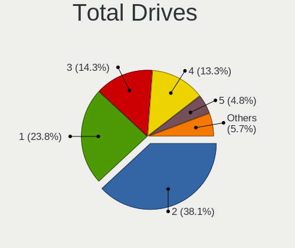
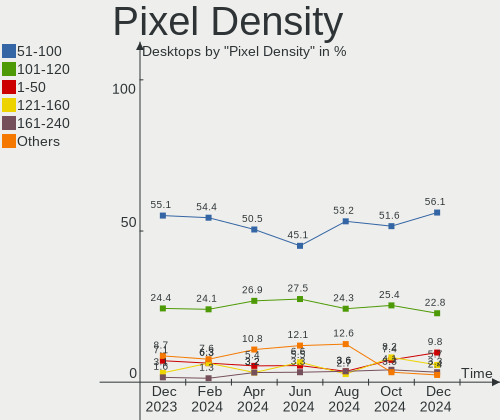
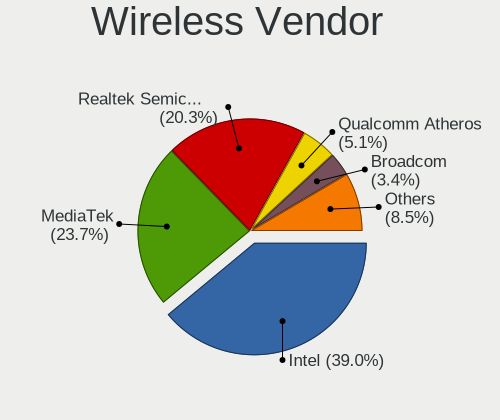
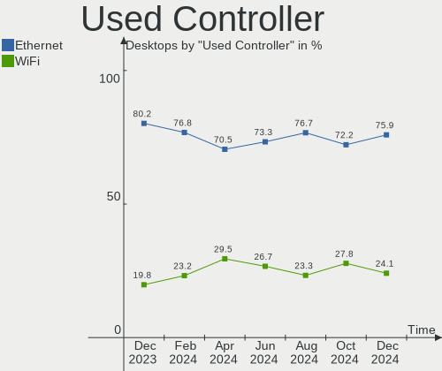
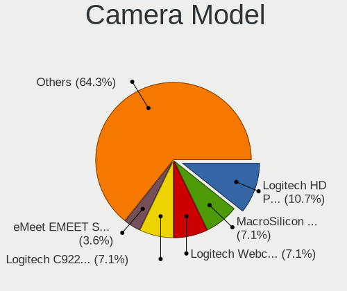

Arch - Hardware Trends (Desktops)
---------------------------------

A project to identify most popular hardware characteristics and track their change
over time based on data collected by Linux users at https://Linux-Hardware.org.

Anyone can contribute to this report by the [hw-probe](https://github.com/linuxhw/hw-probe) tool:

    sudo -E hw-probe -all -upload

This report is for one last month. Overall report since the beginning of time: [TestDays](https://github.com/linuxhw/TestDays)

Period: Dec, 2023.

Contents
--------

* [ System ](#system)
  - [ OS                       ](#os)
  - [ OS Family                ](#os-family)
  - [ Kernel                   ](#kernel)
  - [ Kernel Family            ](#kernel-family)
  - [ Kernel Major Ver.        ](#kernel-major-ver)
  - [ Arch                     ](#arch)
  - [ DE                       ](#de)
  - [ Display Server           ](#display-server)
  - [ Display Manager          ](#display-manager)
  - [ OS Lang                  ](#os-lang)
  - [ Boot Mode                ](#boot-mode)
  - [ Filesystem               ](#filesystem)
  - [ Part. scheme             ](#part-scheme)
  - [ Dual Boot with Linux/BSD ](#dual-boot-with-linuxbsd)
  - [ Dual Boot (Win)          ](#dual-boot-win)

* [ Board ](#board)
  - [ Vendor                   ](#vendor)
  - [ Model                    ](#model)
  - [ Model Family             ](#model-family)
  - [ MFG Year                 ](#mfg-year)
  - [ Form Factor              ](#form-factor)
  - [ Secure Boot              ](#secure-boot)
  - [ Coreboot                 ](#coreboot)
  - [ RAM Size                 ](#ram-size)
  - [ RAM Used                 ](#ram-used)
  - [ Total Drives             ](#total-drives)
  - [ Has CD-ROM               ](#has-cd-rom)
  - [ Has Ethernet             ](#has-ethernet)
  - [ Has WiFi                 ](#has-wifi)
  - [ Has Bluetooth            ](#has-bluetooth)

* [ Location ](#location)
  - [ Country                  ](#country)
  - [ City                     ](#city)

* [ Drives ](#drives)
  - [ Drive Vendor             ](#drive-vendor)
  - [ Drive Model              ](#drive-model)
  - [ HDD Vendor               ](#hdd-vendor)
  - [ SSD Vendor               ](#ssd-vendor)
  - [ Drive Kind               ](#drive-kind)
  - [ Drive Connector          ](#drive-connector)
  - [ Drive Size               ](#drive-size)
  - [ Space Total              ](#space-total)
  - [ Space Used               ](#space-used)
  - [ Malfunc. Drives          ](#malfunc-drives)
  - [ Malfunc. Drive Vendor    ](#malfunc-drive-vendor)
  - [ Malfunc. HDD Vendor      ](#malfunc-hdd-vendor)
  - [ Malfunc. Drive Kind      ](#malfunc-drive-kind)
  - [ Failed Drives            ](#failed-drives)
  - [ Failed Drive Vendor      ](#failed-drive-vendor)
  - [ Drive Status             ](#drive-status)

* [ Storage controller ](#storage-controller)
  - [ Storage Vendor           ](#storage-vendor)
  - [ Storage Model            ](#storage-model)
  - [ Storage Kind             ](#storage-kind)

* [ Processor ](#processor)
  - [ CPU Vendor               ](#cpu-vendor)
  - [ CPU Model                ](#cpu-model)
  - [ CPU Model Family         ](#cpu-model-family)
  - [ CPU Cores                ](#cpu-cores)
  - [ CPU Sockets              ](#cpu-sockets)
  - [ CPU Threads              ](#cpu-threads)
  - [ CPU Op-Modes             ](#cpu-op-modes)
  - [ CPU Microcode            ](#cpu-microcode)
  - [ CPU Microarch            ](#cpu-microarch)

* [ Graphics ](#graphics)
  - [ GPU Vendor               ](#gpu-vendor)
  - [ GPU Model                ](#gpu-model)
  - [ GPU Combo                ](#gpu-combo)
  - [ GPU Driver               ](#gpu-driver)
  - [ GPU Memory               ](#gpu-memory)

* [ Monitor ](#monitor)
  - [ Monitor Vendor           ](#monitor-vendor)
  - [ Monitor Model            ](#monitor-model)
  - [ Monitor Resolution       ](#monitor-resolution)
  - [ Monitor Diagonal         ](#monitor-diagonal)
  - [ Monitor Width            ](#monitor-width)
  - [ Aspect Ratio             ](#aspect-ratio)
  - [ Monitor Area             ](#monitor-area)
  - [ Pixel Density            ](#pixel-density)
  - [ Multiple Monitors        ](#multiple-monitors)

* [ Network ](#network)
  - [ Net Controller Vendor    ](#net-controller-vendor)
  - [ Net Controller Model     ](#net-controller-model)
  - [ Wireless Vendor          ](#wireless-vendor)
  - [ Wireless Model           ](#wireless-model)
  - [ Ethernet Vendor          ](#ethernet-vendor)
  - [ Ethernet Model           ](#ethernet-model)
  - [ Net Controller Kind      ](#net-controller-kind)
  - [ Used Controller          ](#used-controller)
  - [ NICs                     ](#nics)
  - [ IPv6                     ](#ipv6)

* [ Bluetooth ](#bluetooth)
  - [ Bluetooth Vendor         ](#bluetooth-vendor)
  - [ Bluetooth Model          ](#bluetooth-model)

* [ Sound ](#sound)
  - [ Sound Vendor             ](#sound-vendor)
  - [ Sound Model              ](#sound-model)

* [ Memory ](#memory)
  - [ Memory Vendor            ](#memory-vendor)
  - [ Memory Model             ](#memory-model)
  - [ Memory Kind              ](#memory-kind)
  - [ Memory Form Factor       ](#memory-form-factor)
  - [ Memory Size              ](#memory-size)
  - [ Memory Speed             ](#memory-speed)

* [ Printers & scanners ](#printers--scanners)
  - [ Printer Vendor           ](#printer-vendor)
  - [ Printer Model            ](#printer-model)
  - [ Scanner Vendor           ](#scanner-vendor)
  - [ Scanner Model            ](#scanner-model)

* [ Camera ](#camera)
  - [ Camera Vendor            ](#camera-vendor)
  - [ Camera Model             ](#camera-model)

* [ Security ](#security)
  - [ Fingerprint Vendor       ](#fingerprint-vendor)
  - [ Fingerprint Model        ](#fingerprint-model)
  - [ Chipcard Vendor          ](#chipcard-vendor)
  - [ Chipcard Model           ](#chipcard-model)

* [ Unsupported ](#unsupported)
  - [ Unsupported Devices      ](#unsupported-devices)
  - [ Unsupported Device Types ](#unsupported-device-types)

System
------

OS
--

Installed operating systems

| Name         | Desktops | Percent |
|--------------|----------|---------|
| Arch Rolling | 105      | 100%    |

OS Family
---------

OS without a version

| Name | Desktops | Percent |
|------|----------|---------|
| Arch | 105      | 100%    |

Kernel
------

Version of the Linux kernel

| Version                          | Desktops | Percent |
|----------------------------------|----------|---------|
| 6.6.7-arch1-1                    | 20       | 19.05%  |
| 6.6.3-arch1-1                    | 16       | 15.24%  |
| 6.6.8-arch1-1                    | 15       | 14.29%  |
| 6.6.4-arch1-1                    | 10       | 9.52%   |
| 6.6.7-zen1-1-zen                 | 6        | 5.71%   |
| 6.6.4-zen1-1-zen                 | 5        | 4.76%   |
| 6.6.3-zen1-1-zen                 | 4        | 3.81%   |
| 6.6.6-arch1-1                    | 3        | 2.86%   |
| 6.6.5-arch1-1                    | 3        | 2.86%   |
| 6.6.2-arch1-1                    | 3        | 2.86%   |
| 6.1.68-1-lts                     | 3        | 2.86%   |
| 6.6.8-zen1-1-zen                 | 2        | 1.9%    |
| 6.6.6-zen1-1-zen                 | 2        | 1.9%    |
| 6.1.65-1-lts                     | 2        | 1.9%    |
| 6.7.0-rc6-1-ml                   | 1        | 0.95%   |
| 6.6.8-273-tkg-bore-llvm          | 1        | 0.95%   |
| 6.6.7-273-tkg-linux-tkg-pds-llvm | 1        | 0.95%   |
| 6.6.6-2-cachyos                  | 1        | 0.95%   |
| 6.6.5-zen1-1-zen                 | 1        | 0.95%   |
| 6.6.1-arch1-1                    | 1        | 0.95%   |
| 6.5.9-arch2-1                    | 1        | 0.95%   |
| 6.4.9-arch1-1                    | 1        | 0.95%   |
| 6.1.4-arch1-1                    | 1        | 0.95%   |
| 5.18.12-arch1-1                  | 1        | 0.95%   |
| 5.15.90-1.0-lts                  | 1        | 0.95%   |

Kernel Family
-------------

Linux kernel without a distro release

| Version | Desktops | Percent |
|---------|----------|---------|
| 6.6.7   | 27       | 25.71%  |
| 6.6.3   | 20       | 19.05%  |
| 6.6.8   | 18       | 17.14%  |
| 6.6.4   | 15       | 14.29%  |
| 6.6.6   | 6        | 5.71%   |
| 6.6.5   | 4        | 3.81%   |
| 6.6.2   | 3        | 2.86%   |
| 6.1.68  | 3        | 2.86%   |
| 6.1.65  | 2        | 1.9%    |
| 6.7.0   | 1        | 0.95%   |
| 6.6.1   | 1        | 0.95%   |
| 6.5.9   | 1        | 0.95%   |
| 6.4.9   | 1        | 0.95%   |
| 6.1.4   | 1        | 0.95%   |
| 5.18.12 | 1        | 0.95%   |
| 5.15.90 | 1        | 0.95%   |

Kernel Major Ver.
-----------------

Linux kernel major version

| Version | Desktops | Percent |
|---------|----------|---------|
| 6.6     | 94       | 89.52%  |
| 6.1     | 6        | 5.71%   |
| 6.7     | 1        | 0.95%   |
| 6.5     | 1        | 0.95%   |
| 6.4     | 1        | 0.95%   |
| 5.18    | 1        | 0.95%   |
| 5.15    | 1        | 0.95%   |

Arch
----

OS architecture (x86_64, i586, etc.)

| Name   | Desktops | Percent |
|--------|----------|---------|
| x86_64 | 104      | 99.05%  |
| i686   | 1        | 0.95%   |

DE
--

Desktop Environment

| Name       | Desktops | Percent |
|------------|----------|---------|
| KDE5       | 39       | 37.14%  |
| GNOME      | 29       | 27.62%  |
| XFCE       | 7        | 6.67%   |
| i3         | 7        | 6.67%   |
| Hyprland   | 7        | 6.67%   |
| Unknown    | 5        | 4.76%   |
| X-Cinnamon | 3        | 2.86%   |
| Budgie     | 2        | 1.9%    |
| sway       | 1        | 0.95%   |
| qtile      | 1        | 0.95%   |
| MATE       | 1        | 0.95%   |
| KDE6       | 1        | 0.95%   |
| KDE        | 1        | 0.95%   |
| bspwm      | 1        | 0.95%   |

Display Server
--------------

X11 or Wayland

| Name    | Desktops | Percent |
|---------|----------|---------|
| X11     | 54       | 51.43%  |
| Wayland | 39       | 37.14%  |
| Unknown | 8        | 7.62%   |
| Tty     | 4        | 3.81%   |

Display Manager
---------------

SDDM, LightDM, etc.

| Name    | Desktops | Percent |
|---------|----------|---------|
| Unknown | 43       | 40.95%  |
| SDDM    | 23       | 21.9%   |
| LightDM | 19       | 18.1%   |
| GDM     | 13       | 12.38%  |
| LY-DM   | 4        | 3.81%   |
| SLiM    | 1        | 0.95%   |
| LEMURS  | 1        | 0.95%   |
| EMPTTY  | 1        | 0.95%   |

OS Lang
-------

Language

| Lang        | Desktops | Percent |
|-------------|----------|---------|
| en_US       | 61       | 58.1%   |
| en_GB       | 10       | 9.52%   |
| ru_RU       | 6        | 5.71%   |
| C           | 5        | 4.76%   |
| pt_BR       | 4        | 3.81%   |
| Unknown     | 4        | 3.81%   |
| fr_FR       | 3        | 2.86%   |
| de_DE       | 3        | 2.86%   |
| it_IT       | 2        | 1.9%    |
| pl_PL       | 1        | 0.95%   |
| es_AR       | 1        | 0.95%   |
| en_US_UTF-8 | 1        | 0.95%   |
| en_US.UTF=8 | 1        | 0.95%   |
| en_AU       | 1        | 0.95%   |
| de_AT       | 1        | 0.95%   |
| bg_BG       | 1        | 0.95%   |

Boot Mode
---------

EFI or BIOS

| Mode | Desktops | Percent |
|------|----------|---------|
| EFI  | 65       | 61.9%   |
| BIOS | 40       | 38.1%   |

Filesystem
----------

Type of filesystem

| Type    | Desktops | Percent |
|---------|----------|---------|
| Ext4    | 65       | 61.9%   |
| Btrfs   | 35       | 33.33%  |
| Xfs     | 3        | 2.86%   |
| Overlay | 1        | 0.95%   |
| Unknown | 1        | 0.95%   |

Part. scheme
------------

Scheme of partitioning

| Type    | Desktops | Percent |
|---------|----------|---------|
| GPT     | 69       | 65.71%  |
| Unknown | 29       | 27.62%  |
| MBR     | 7        | 6.67%   |

Dual Boot with Linux/BSD
------------------------

Hosting more than one Linux/BSD

| Dual boot | Desktops | Percent |
|-----------|----------|---------|
| No        | 86       | 81.9%   |
| Yes       | 19       | 18.1%   |

Dual Boot (Win)
---------------

Hosting Linux and Windows

| Dual boot | Desktops | Percent |
|-----------|----------|---------|
| No        | 70       | 66.67%  |
| Yes       | 35       | 33.33%  |

Board
-----

Vendor
------

Motherboard manufacturer

| Name                | Desktops | Percent |
|---------------------|----------|---------|
| ASUSTek Computer    | 36       | 34.29%  |
| Gigabyte Technology | 21       | 20%     |
| MSI                 | 16       | 15.24%  |
| ASRock              | 13       | 12.38%  |
| Hewlett-Packard     | 5        | 4.76%   |
| Lenovo              | 2        | 1.9%    |
| Intel               | 2        | 1.9%    |
| Acer                | 2        | 1.9%    |
| Unknown             | 2        | 1.9%    |
| Medion              | 1        | 0.95%   |
| Fujitsu             | 1        | 0.95%   |
| Dell                | 1        | 0.95%   |
| Canyon              | 1        | 0.95%   |
| Biostar             | 1        | 0.95%   |
| Alienware           | 1        | 0.95%   |

Model
-----

Motherboard model

| Name                                      | Desktops | Percent |
|-------------------------------------------|----------|---------|
| ASUS TUF Gaming X670E-PLUS WIFI           | 3        | 2.86%   |
| ASUS PRIME B450-PLUS                      | 3        | 2.86%   |
| ASRock B450M Pro4                         | 3        | 2.86%   |
| MSI MS-7C95                               | 2        | 1.9%    |
| MSI MS-7C91                               | 2        | 1.9%    |
| MSI MS-7C56                               | 2        | 1.9%    |
| MSI MS-7B89                               | 2        | 1.9%    |
| Gigabyte B550M DS3H                       | 2        | 1.9%    |
| Gigabyte A320M-S2H V2                     | 2        | 1.9%    |
| ASUS TUF Gaming B550M-PLUS                | 2        | 1.9%    |
| ASUS PRIME X470-PRO                       | 2        | 1.9%    |
| Unknown                                   | 2        | 1.9%    |
| MSI MS-7E12                               | 1        | 0.95%   |
| MSI MS-7D75                               | 1        | 0.95%   |
| MSI MS-7D09                               | 1        | 0.95%   |
| MSI MS-7C94                               | 1        | 0.95%   |
| MSI MS-7C52                               | 1        | 0.95%   |
| MSI MS-7B86                               | 1        | 0.95%   |
| MSI MS-7B79                               | 1        | 0.95%   |
| MSI MS-7970                               | 1        | 0.95%   |
| Medion MD34898                            | 1        | 0.95%   |
| Lenovo ThinkStation P320 Tiny 30C2001DUS  | 1        | 0.95%   |
| Lenovo IdeaCentre 710-25ISH 90FB001EUS    | 1        | 0.95%   |
| Intel DG31PR AAD97573-205                 | 1        | 0.95%   |
| Intel ChiefRiver                          | 1        | 0.95%   |
| HP Z240 SFF Workstation                   | 1        | 0.95%   |
| HP Victus by 15L Gaming Desktop TG02-0xxx | 1        | 0.95%   |
| HP ProDesk 600 G1 TWR                     | 1        | 0.95%   |
| HP OMEN by Desktop PC 870-2XX             | 1        | 0.95%   |
| HP 110-303na                              | 1        | 0.95%   |
| Gigabyte Z790 UD AC                       | 1        | 0.95%   |
| Gigabyte Z790 D DDR4                      | 1        | 0.95%   |
| Gigabyte Z390 UD                          | 1        | 0.95%   |
| Gigabyte X570 AORUS MASTER                | 1        | 0.95%   |
| Gigabyte X570 AORUS ELITE                 | 1        | 0.95%   |
| Gigabyte X399 AORUS PRO                   | 1        | 0.95%   |
| Gigabyte H81M-S2PH                        | 1        | 0.95%   |
| Gigabyte Gaming                           | 1        | 0.95%   |
| Gigabyte GA-970A-D3                       | 1        | 0.95%   |
| Gigabyte B660I AORUS PRO DDR4             | 1        | 0.95%   |

Model Family
------------

Motherboard model prefix

| Name                | Desktops | Percent |
|---------------------|----------|---------|
| ASUS PRIME          | 16       | 15.24%  |
| ASUS TUF            | 7        | 6.67%   |
| ASUS ROG            | 6        | 5.71%   |
| Gigabyte A320M-S2H  | 3        | 2.86%   |
| ASRock B450M        | 3        | 2.86%   |
| MSI MS-7C95         | 2        | 1.9%    |
| MSI MS-7C91         | 2        | 1.9%    |
| MSI MS-7C56         | 2        | 1.9%    |
| MSI MS-7B89         | 2        | 1.9%    |
| Gigabyte Z790       | 2        | 1.9%    |
| Gigabyte X570       | 2        | 1.9%    |
| Gigabyte B550M      | 2        | 1.9%    |
| Gigabyte B550       | 2        | 1.9%    |
| ASRock B760M        | 2        | 1.9%    |
| Acer Aspire         | 2        | 1.9%    |
| Unknown             | 2        | 1.9%    |
| MSI MS-7E12         | 1        | 0.95%   |
| MSI MS-7D75         | 1        | 0.95%   |
| MSI MS-7D09         | 1        | 0.95%   |
| MSI MS-7C94         | 1        | 0.95%   |
| MSI MS-7C52         | 1        | 0.95%   |
| MSI MS-7B86         | 1        | 0.95%   |
| MSI MS-7B79         | 1        | 0.95%   |
| MSI MS-7970         | 1        | 0.95%   |
| Medion MD34898      | 1        | 0.95%   |
| Lenovo ThinkStation | 1        | 0.95%   |
| Lenovo IdeaCentre   | 1        | 0.95%   |
| Intel DG31PR        | 1        | 0.95%   |
| Intel ChiefRiver    | 1        | 0.95%   |
| HP Z240             | 1        | 0.95%   |
| HP Victus           | 1        | 0.95%   |
| HP ProDesk          | 1        | 0.95%   |
| HP OMEN             | 1        | 0.95%   |
| HP 110-303na        | 1        | 0.95%   |
| Gigabyte Z390       | 1        | 0.95%   |
| Gigabyte X399       | 1        | 0.95%   |
| Gigabyte H81M-S2PH  | 1        | 0.95%   |
| Gigabyte Gaming     | 1        | 0.95%   |
| Gigabyte GA-970A-D3 | 1        | 0.95%   |
| Gigabyte B660I      | 1        | 0.95%   |

MFG Year
--------

Motherboard manufacture year

| Year | Desktops | Percent |
|------|----------|---------|
| 2020 | 21       | 20%     |
| 2018 | 19       | 18.1%   |
| 2022 | 13       | 12.38%  |
| 2019 | 9        | 8.57%   |
| 2023 | 7        | 6.67%   |
| 2021 | 7        | 6.67%   |
| 2016 | 7        | 6.67%   |
| 2013 | 5        | 4.76%   |
| 2017 | 4        | 3.81%   |
| 2014 | 3        | 2.86%   |
| 2010 | 3        | 2.86%   |
| 2015 | 1        | 0.95%   |
| 2012 | 1        | 0.95%   |
| 2011 | 1        | 0.95%   |
| 2009 | 1        | 0.95%   |
| 2008 | 1        | 0.95%   |
| 2007 | 1        | 0.95%   |
| 2003 | 1        | 0.95%   |

Form Factor
-----------

Physical design of the computer

| Name    | Desktops | Percent |
|---------|----------|---------|
| Desktop | 105      | 100%    |

Secure Boot
-----------

Enabled or disabled

| State    | Desktops | Percent |
|----------|----------|---------|
| Disabled | 100      | 95.24%  |
| Enabled  | 5        | 4.76%   |

Coreboot
--------

Have coreboot on board

| Used | Desktops | Percent |
|------|----------|---------|
| No   | 105      | 100%    |

RAM Size
--------

Total RAM memory

| Size in GB  | Desktops | Percent |
|-------------|----------|---------|
| 32.01-64.0  | 35       | 33.33%  |
| 16.01-24.0  | 31       | 29.52%  |
| 64.01-256.0 | 11       | 10.48%  |
| 8.01-16.0   | 10       | 9.52%   |
| 4.01-8.0    | 7        | 6.67%   |
| 24.01-32.0  | 7        | 6.67%   |
| 1.01-2.0    | 2        | 1.9%    |
| 3.01-4.0    | 1        | 0.95%   |
| 2.01-3.0    | 1        | 0.95%   |

RAM Used
--------

Used RAM memory

| Used GB    | Desktops | Percent |
|------------|----------|---------|
| 4.01-8.0   | 32       | 30.48%  |
| 2.01-3.0   | 20       | 19.05%  |
| 8.01-16.0  | 18       | 17.14%  |
| 3.01-4.0   | 14       | 13.33%  |
| 1.01-2.0   | 14       | 13.33%  |
| 0.51-1.0   | 2        | 1.9%    |
| 0.01-0.5   | 2        | 1.9%    |
| 32.01-64.0 | 1        | 0.95%   |
| 24.01-32.0 | 1        | 0.95%   |
| 16.01-24.0 | 1        | 0.95%   |

Total Drives
------------

Number of drives on board

| Drives | Desktops | Percent |
|--------|----------|---------|
| 2      | 36       | 34.29%  |
| 1      | 23       | 21.9%   |
| 3      | 19       | 18.1%   |
| 4      | 11       | 10.48%  |
| 5      | 10       | 9.52%   |
| 6      | 6        | 5.71%   |

Has CD-ROM
----------

Has CD-ROM on board

| Presented | Desktops | Percent |
|-----------|----------|---------|
| No        | 84       | 80%     |
| Yes       | 21       | 20%     |

Has Ethernet
------------

Has Ethernet on board

| Presented | Desktops | Percent |
|-----------|----------|---------|
| Yes       | 105      | 100%    |

Has WiFi
--------

Has WiFi module

| Presented | Desktops | Percent |
|-----------|----------|---------|
| Yes       | 61       | 58.1%   |
| No        | 44       | 41.9%   |

Has Bluetooth
-------------

Has Bluetooth module

| Presented | Desktops | Percent |
|-----------|----------|---------|
| Yes       | 60       | 57.14%  |
| No        | 45       | 42.86%  |

Location
--------

Country
-------

Geographic location (country)

| Country         | Desktops | Percent |
|-----------------|----------|---------|
| USA             | 16       | 15.24%  |
| Russia          | 8        | 7.62%   |
| Germany         | 7        | 6.67%   |
| Brazil          | 6        | 5.71%   |
| UK              | 5        | 4.76%   |
| France          | 4        | 3.81%   |
| Belgium         | 4        | 3.81%   |
| Italy           | 3        | 2.86%   |
| Israel          | 3        | 2.86%   |
| Austria         | 3        | 2.86%   |
| Vietnam         | 2        | 1.9%    |
| Sweden          | 2        | 1.9%    |
| Poland          | 2        | 1.9%    |
| Netherlands     | 2        | 1.9%    |
| Mexico          | 2        | 1.9%    |
| Kazakhstan      | 2        | 1.9%    |
| India           | 2        | 1.9%    |
| Estonia         | 2        | 1.9%    |
| Colombia        | 2        | 1.9%    |
| China           | 2        | 1.9%    |
| Chile           | 2        | 1.9%    |
| Canada          | 2        | 1.9%    |
| Uruguay         | 1        | 0.95%   |
| The Netherlands | 1        | 0.95%   |
| Thailand        | 1        | 0.95%   |
| Taiwan          | 1        | 0.95%   |
| Spain           | 1        | 0.95%   |
| Slovenia        | 1        | 0.95%   |
| Romania         | 1        | 0.95%   |
| Portugal        | 1        | 0.95%   |
| Philippines     | 1        | 0.95%   |
| Norway          | 1        | 0.95%   |
| New Zealand     | 1        | 0.95%   |
| Nepal           | 1        | 0.95%   |
| Morocco         | 1        | 0.95%   |
| Luxembourg      | 1        | 0.95%   |
| Lithuania       | 1        | 0.95%   |
| Latvia          | 1        | 0.95%   |
| Finland         | 1        | 0.95%   |
| Ecuador         | 1        | 0.95%   |

City
----

Geographic location (city)

| City             | Desktops | Percent |
|------------------|----------|---------|
| Southwark        | 2        | 1.9%    |
| Ho Chi Minh City | 2        | 1.9%    |
| Graz             | 2        | 1.9%    |
| Brussels         | 2        | 1.9%    |
| Bogotá          | 2        | 1.9%    |
| Zapopan          | 1        | 0.95%   |
| West Lebanon     | 1        | 0.95%   |
| Warsaw           | 1        | 0.95%   |
| Vilnius          | 1        | 0.95%   |
| Vienna           | 1        | 0.95%   |
| Valga            | 1        | 0.95%   |
| Tallinn          | 1        | 0.95%   |
| Talladega        | 1        | 0.95%   |
| Taipei           | 1        | 0.95%   |
| Sochi            | 1        | 0.95%   |
| Sindelfingen     | 1        | 0.95%   |
| Shepherdsville   | 1        | 0.95%   |
| Shenyang         | 1        | 0.95%   |
| Saratov          | 1        | 0.95%   |
| Sao Paulo        | 1        | 0.95%   |
| Sao Carlos       | 1        | 0.95%   |
| Santiago         | 1        | 0.95%   |
| Sandston         | 1        | 0.95%   |
| Saalfeld         | 1        | 0.95%   |
| Rosemead         | 1        | 0.95%   |
| Rodez            | 1        | 0.95%   |
| Riga             | 1        | 0.95%   |
| Ramat Gan        | 1        | 0.95%   |
| Quito            | 1        | 0.95%   |
| Prebold          | 1        | 0.95%   |
| Prague           | 1        | 0.95%   |
| Portsmouth       | 1        | 0.95%   |
| Poland           | 1        | 0.95%   |
| Pleven           | 1        | 0.95%   |
| Perenchies       | 1        | 0.95%   |
| Pavlodar         | 1        | 0.95%   |
| Oulmes           | 1        | 0.95%   |
| Oslo             | 1        | 0.95%   |
| Oral             | 1        | 0.95%   |
| Olyphant         | 1        | 0.95%   |

Drives
------

Drive Vendor
------------

Hard drive vendors

| Vendor                      | Desktops | Drives | Percent |
|-----------------------------|----------|--------|---------|
| Samsung Electronics         | 42       | 66     | 18.58%  |
| Seagate                     | 33       | 42     | 14.6%   |
| WDC                         | 32       | 46     | 14.16%  |
| Sandisk                     | 16       | 19     | 7.08%   |
| Kingston                    | 14       | 16     | 6.19%   |
| Crucial                     | 10       | 11     | 4.42%   |
| Toshiba                     | 8        | 8      | 3.54%   |
| Micron/Crucial Technology   | 7        | 7      | 3.1%    |
| Hitachi                     | 7        | 7      | 3.1%    |
| Phison Electronics          | 6        | 6      | 2.65%   |
| ADATA Technology            | 6        | 7      | 2.65%   |
| Silicon Motion              | 5        | 5      | 2.21%   |
| PNY                         | 4        | 4      | 1.77%   |
| MAXIO Technology (Hangzhou) | 4        | 4      | 1.77%   |
| Kingston Technology Company | 4        | 4      | 1.77%   |
| Intel                       | 4        | 5      | 1.77%   |
| A-DATA Technology           | 4        | 4      | 1.77%   |
| Verbatim                    | 1        | 1      | 0.44%   |
| Unknown                     | 1        | 1      | 0.44%   |
| Transcend                   | 1        | 1      | 0.44%   |
| SPCC                        | 1        | 1      | 0.44%   |
| SK hynix                    | 1        | 1      | 0.44%   |
| Realtek Semiconductor       | 1        | 1      | 0.44%   |
| OCZ                         | 1        | 1      | 0.44%   |
| O2 Micro                    | 1        | 1      | 0.44%   |
| Micron Technology           | 1        | 1      | 0.44%   |
| Maxtor                      | 1        | 1      | 0.44%   |
| Leven                       | 1        | 1      | 0.44%   |
| KIOXIA-EXCERIA              | 1        | 1      | 0.44%   |
| KingDian                    | 1        | 1      | 0.44%   |
| HGST                        | 1        | 1      | 0.44%   |
| Gigabyte Technology         | 1        | 1      | 0.44%   |
| DEXP                        | 1        | 1      | 0.44%   |
| Corsair                     | 1        | 1      | 0.44%   |
| China                       | 1        | 1      | 0.44%   |
| AMD                         | 1        | 1      | 0.44%   |
| Acer                        | 1        | 1      | 0.44%   |

Drive Model
-----------

Hard drive models

| Model                                                             | Desktops | Percent |
|-------------------------------------------------------------------|----------|---------|
| Samsung NVMe SSD Controller PM9A1/PM9A3/980PRO 2TB                | 11       | 4.09%   |
| Seagate ST1000DM010-2EP102 1TB                                    | 9        | 3.35%   |
| Samsung NVMe SSD Controller SM981/PM981/PM983 512GB               | 7        | 2.6%    |
| Samsung SSD 860 EVO 1TB                                           | 4        | 1.49%   |
| Samsung SSD 850 EVO 500GB                                         | 4        | 1.49%   |
| Samsung SSD 850 EVO 250GB                                         | 4        | 1.49%   |
| Phison E12 NVMe Controller 1TB                                    | 4        | 1.49%   |
| Micron/Crucial P2 NVMe PCIe SSD 4TB                               | 4        | 1.49%   |
| MAXIO (Hangzhou) NVMe SSD Controller MAP1202 256GB                | 4        | 1.49%   |
| Kingston SA400S37240G 240GB SSD                                   | 4        | 1.49%   |
| ADATA XPG SX8200 Pro PCIe Gen3x4 M.2 2280 Solid State Drive 512GB | 4        | 1.49%   |
| Samsung SSD 990 PRO 2TB                                           | 3        | 1.12%   |
| Samsung SSD 840 EVO 250GB                                         | 3        | 1.12%   |
| Crucial CT1000MX500SSD1 1TB                                       | 3        | 1.12%   |
| WDC WDS100T2B0A-00SM50 1TB SSD                                    | 2        | 0.74%   |
| WDC WD5000AAKX-001CA0 500GB                                       | 2        | 0.74%   |
| WDC WD10EZEX-08M2NA0 1TB                                          | 2        | 0.74%   |
| WDC WD10EZEX-00WN4A0 1TB                                          | 2        | 0.74%   |
| WDC WD10EZEX-00BN5A0 1TB                                          | 2        | 0.74%   |
| Toshiba DT01ACA100 1TB                                            | 2        | 0.74%   |
| Silicon Motion SM2263EN/SM2263XT SSD Controller 500GB             | 2        | 0.74%   |
| Silicon Motion SM2262/SM2262EN SSD Controller 1TB                 | 2        | 0.74%   |
| Seagate ST8000DM004-2U9188 8TB                                    | 2        | 0.74%   |
| Seagate ST8000DM004-2CX188 8TB                                    | 2        | 0.74%   |
| Seagate ST4000DM004-2CV104 4TB                                    | 2        | 0.74%   |
| Seagate ST2000DM008-2FR102 2TB                                    | 2        | 0.74%   |
| Seagate ST1000DM003-1ER162 1TB                                    | 2        | 0.74%   |
| Sandisk WD_BLACK SN850X 1000GB                                    | 2        | 0.74%   |
| Sandisk WD Blue SN570 1TB                                         | 2        | 0.74%   |
| Sandisk WD Blue SN550 NVMe SSD 1TB                                | 2        | 0.74%   |
| Samsung SSD 980 1TB                                               | 2        | 0.74%   |
| Samsung SSD 870 QVO 1TB                                           | 2        | 0.74%   |
| Samsung SSD 870 EVO 1TB                                           | 2        | 0.74%   |
| Samsung SSD 840 EVO 500GB                                         | 2        | 0.74%   |
| Samsung NVMe SSD Controller SM961/PM961/SM963 250GB               | 2        | 0.74%   |
| Kingston Company SNV2S1000G 1TB                                   | 2        | 0.74%   |
| Kingston SUV400S37480G 480GB SSD                                  | 2        | 0.74%   |
| Kingston SA400S37480G 480GB SSD                                   | 2        | 0.74%   |
| Kingston SA400M8120G 120GB SSD                                    | 2        | 0.74%   |
| Crucial CT480BX500SSD1 480GB                                      | 2        | 0.74%   |

HDD Vendor
----------

Hard disk drive vendors

| Vendor              | Desktops | Drives | Percent |
|---------------------|----------|--------|---------|
| Seagate             | 33       | 42     | 44%     |
| WDC                 | 25       | 35     | 33.33%  |
| Hitachi             | 7        | 7      | 9.33%   |
| Toshiba             | 6        | 6      | 8%      |
| Samsung Electronics | 2        | 2      | 2.67%   |
| Unknown             | 1        | 1      | 1.33%   |
| HGST                | 1        | 1      | 1.33%   |

SSD Vendor
----------

Solid state drive vendors

| Vendor              | Desktops | Drives | Percent |
|---------------------|----------|--------|---------|
| Samsung Electronics | 28       | 33     | 31.82%  |
| Kingston            | 12       | 14     | 13.64%  |
| WDC                 | 11       | 11     | 12.5%   |
| Crucial             | 10       | 11     | 11.36%  |
| SanDisk             | 6        | 6      | 6.82%   |
| PNY                 | 4        | 4      | 4.55%   |
| A-DATA Technology   | 3        | 3      | 3.41%   |
| Verbatim            | 1        | 1      | 1.14%   |
| Transcend           | 1        | 1      | 1.14%   |
| SPCC                | 1        | 1      | 1.14%   |
| OCZ                 | 1        | 1      | 1.14%   |
| Maxtor              | 1        | 1      | 1.14%   |
| Leven               | 1        | 1      | 1.14%   |
| KingDian            | 1        | 1      | 1.14%   |
| Intel               | 1        | 2      | 1.14%   |
| Gigabyte Technology | 1        | 1      | 1.14%   |
| DEXP                | 1        | 1      | 1.14%   |
| Corsair             | 1        | 1      | 1.14%   |
| China               | 1        | 1      | 1.14%   |
| AMD                 | 1        | 1      | 1.14%   |
| Acer                | 1        | 1      | 1.14%   |

Drive Kind
----------

HDD or SSD

| Kind | Desktops | Drives | Percent |
|------|----------|--------|---------|
| NVMe | 70       | 90     | 36.08%  |
| SSD  | 66       | 97     | 34.02%  |
| HDD  | 58       | 94     | 29.9%   |

Drive Connector
---------------

SATA, SAS, NVMe, etc.

| Type | Desktops | Drives | Percent |
|------|----------|--------|---------|
| SATA | 84       | 187    | 52.83%  |
| NVMe | 70       | 89     | 44.03%  |
| SAS  | 5        | 5      | 3.14%   |

Drive Size
----------

Size of hard drive

| Size in TB | Desktops | Drives | Percent |
|------------|----------|--------|---------|
| 0.01-0.5   | 58       | 84     | 40%     |
| 0.51-1.0   | 50       | 65     | 34.48%  |
| 1.01-2.0   | 16       | 17     | 11.03%  |
| 3.01-4.0   | 8        | 8      | 5.52%   |
| 4.01-10.0  | 8        | 9      | 5.52%   |
| 2.01-3.0   | 3        | 3      | 2.07%   |
| 10.01-20.0 | 2        | 5      | 1.38%   |

Space Total
-----------

Amount of disk space available on the file system

| Size in GB     | Desktops | Percent |
|----------------|----------|---------|
| More than 3000 | 26       | 24.76%  |
| 1001-2000      | 21       | 20%     |
| 501-1000       | 20       | 19.05%  |
| 101-250        | 12       | 11.43%  |
| 251-500        | 11       | 10.48%  |
| 2001-3000      | 8        | 7.62%   |
| 51-100         | 4        | 3.81%   |
| Unknown        | 3        | 2.86%   |

Space Used
----------

Amount of used disk space

| Used GB        | Desktops | Percent |
|----------------|----------|---------|
| 1-20           | 16       | 15.24%  |
| 251-500        | 15       | 14.29%  |
| 1001-2000      | 14       | 13.33%  |
| 101-250        | 13       | 12.38%  |
| 51-100         | 13       | 12.38%  |
| 501-1000       | 12       | 11.43%  |
| 21-50          | 9        | 8.57%   |
| More than 3000 | 7        | 6.67%   |
| 2001-3000      | 3        | 2.86%   |
| Unknown        | 3        | 2.86%   |

Malfunc. Drives
---------------

Drive models with a malfunction

| Model                                                           | Desktops | Drives | Percent |
|-----------------------------------------------------------------|----------|--------|---------|
| WDC WD5000AAKX-001CA0 500GB                                     | 2        | 2      | 7.69%   |
| WDC WD60EDAZ-11U78B0 6TB                                        | 1        | 1      | 3.85%   |
| WDC WD5000LPVX-00V0TT0 500GB                                    | 1        | 1      | 3.85%   |
| WDC WD40EFRX-68N32N0 4TB                                        | 1        | 1      | 3.85%   |
| WDC WD1600AAJS-00B4A0 160GB                                     | 1        | 1      | 3.85%   |
| WDC WD10EZEX-08WN4A0 1TB                                        | 1        | 1      | 3.85%   |
| WDC WD10EADS-00P8B0 1TB                                         | 1        | 1      | 3.85%   |
| WDC WD Green 2.5 1000GB                                         | 1        | 1      | 3.85%   |
| Seagate ST8000VN004-3CP101 8TB                                  | 1        | 2      | 3.85%   |
| Seagate ST31000528AS 1TB                                        | 1        | 1      | 3.85%   |
| Seagate ST2000LM007-1R8174 2TB                                  | 1        | 1      | 3.85%   |
| Seagate ST2000DM006-2DM164 2TB                                  | 1        | 1      | 3.85%   |
| Seagate ST12000VN0007-2GS116 12TB                               | 1        | 1      | 3.85%   |
| Seagate ST1000DM010-2EP102 1TB                                  | 1        | 1      | 3.85%   |
| SanDisk SSD PLUS 240GB                                          | 1        | 1      | 3.85%   |
| Samsung Electronics SSD 870 EVO 1TB                             | 1        | 1      | 3.85%   |
| Samsung Electronics NVMe SSD Controller SM981/PM981/PM983 512GB | 1        | 1      | 3.85%   |
| Samsung Electronics NVMe SSD Controller PM9A1/PM9A3/980PRO 2TB  | 1        | 1      | 3.85%   |
| Samsung Electronics HD154UI 1TB                                 | 1        | 1      | 3.85%   |
| Realtek Semiconductor RTS5763DL NVMe SSD Controller 256GB       | 1        | 1      | 3.85%   |
| Kingston SKC400S371T 1TB SSD                                    | 1        | 1      | 3.85%   |
| Hitachi HUA721010KLA330 1TB                                     | 1        | 1      | 3.85%   |
| Hitachi HTS545050B9A300 500GB                                   | 1        | 1      | 3.85%   |
| Hitachi HDS721016CLA382 160GB                                   | 1        | 1      | 3.85%   |
| Hitachi HDS721010KLA330 1TB                                     | 1        | 1      | 3.85%   |

Malfunc. Drive Vendor
---------------------

Vendors of faulty drives

| Vendor                | Desktops | Drives | Percent |
|-----------------------|----------|--------|---------|
| WDC                   | 8        | 9      | 32%     |
| Seagate               | 6        | 7      | 24%     |
| Samsung Electronics   | 4        | 4      | 16%     |
| Hitachi               | 4        | 4      | 16%     |
| SanDisk               | 1        | 1      | 4%      |
| Realtek Semiconductor | 1        | 1      | 4%      |
| Kingston              | 1        | 1      | 4%      |

Malfunc. HDD Vendor
-------------------

Vendors of faulty HDD drives

| Vendor              | Desktops | Drives | Percent |
|---------------------|----------|--------|---------|
| WDC                 | 8        | 8      | 42.11%  |
| Seagate             | 6        | 7      | 31.58%  |
| Hitachi             | 4        | 4      | 21.05%  |
| Samsung Electronics | 1        | 1      | 5.26%   |

Malfunc. Drive Kind
-------------------

Kinds of faulty drives

| Kind | Desktops | Drives | Percent |
|------|----------|--------|---------|
| HDD  | 14       | 20     | 66.67%  |
| SSD  | 4        | 4      | 19.05%  |
| NVMe | 3        | 3      | 14.29%  |

Failed Drives
-------------

Failed drive models

Zero info for selected period =(

Failed Drive Vendor
-------------------

Failed drive vendors

Zero info for selected period =(

Drive Status
------------

Number of failed and malfunc. drives

| Status   | Desktops | Drives | Percent |
|----------|----------|--------|---------|
| Works    | 59       | 148    | 47.97%  |
| Detected | 47       | 106    | 38.21%  |
| Malfunc  | 17       | 27     | 13.82%  |

Storage controller
------------------

Storage Vendor
--------------

Storage controller vendors

| Vendor                       | Desktops | Percent |
|------------------------------|----------|---------|
| AMD                          | 66       | 34.74%  |
| Intel                        | 41       | 21.58%  |
| Samsung Electronics          | 23       | 12.11%  |
| Sandisk                      | 11       | 5.79%   |
| Micron/Crucial Technology    | 7        | 3.68%   |
| ADATA Technology             | 7        | 3.68%   |
| Phison Electronics           | 6        | 3.16%   |
| Kingston Technology Company  | 6        | 3.16%   |
| Silicon Motion               | 5        | 2.63%   |
| ASMedia Technology           | 5        | 2.63%   |
| MAXIO Technology (Hangzhou)  | 4        | 2.11%   |
| Toshiba America Info Systems | 2        | 1.05%   |
| SK hynix                     | 1        | 0.53%   |
| Realtek Semiconductor        | 1        | 0.53%   |
| O2 Micro                     | 1        | 0.53%   |
| Micron Technology            | 1        | 0.53%   |
| Marvell Technology Group     | 1        | 0.53%   |
| KIOXIA                       | 1        | 0.53%   |
| JMicron Technology           | 1        | 0.53%   |

Storage Model
-------------

Storage controller models

| Model                                                                          | Desktops | Percent |
|--------------------------------------------------------------------------------|----------|---------|
| AMD FCH SATA Controller [AHCI mode]                                            | 32       | 14.55%  |
| AMD 500 Series Chipset SATA Controller                                         | 21       | 9.55%   |
| AMD 400 Series Chipset SATA Controller                                         | 17       | 7.73%   |
| Samsung NVMe SSD Controller PM9A1/PM9A3/980PRO                                 | 11       | 5%      |
| Samsung NVMe SSD Controller SM981/PM981/PM983                                  | 7        | 3.18%   |
| Intel Q170/Q150/B150/H170/H110/Z170/CM236 Chipset SATA Controller [AHCI Mode]  | 5        | 2.27%   |
| Intel 700 Series Chipset Family SATA AHCI Controller                           | 5        | 2.27%   |
| ASMedia ASM1062 Serial ATA Controller                                          | 5        | 2.27%   |
| Sandisk WD Black SN850X NVMe SSD                                               | 4        | 1.82%   |
| Samsung NVMe SSD Controller 980 (DRAM-less)                                    | 4        | 1.82%   |
| Phison E12 NVMe Controller                                                     | 4        | 1.82%   |
| Micron/Crucial P2 [Nick P2] / P3 / P3 Plus NVMe PCIe SSD (DRAM-less)           | 4        | 1.82%   |
| MAXIO (Hangzhou) NVMe SSD Controller MAP1202                                   | 4        | 1.82%   |
| Intel SATA Controller [RAID mode]                                              | 4        | 1.82%   |
| Intel 8 Series/C220 Series Chipset Family 6-port SATA Controller 1 [AHCI mode] | 4        | 1.82%   |
| Intel 200 Series PCH SATA controller [AHCI mode]                               | 4        | 1.82%   |
| AMD FCH SATA Controller D                                                      | 4        | 1.82%   |
| ADATA XPG SX8200 Pro PCIe Gen3x4 M.2 2280 Solid State Drive                    | 4        | 1.82%   |
| Samsung NVMe SSD Controller S4LV008[Pascal]                                    | 3        | 1.36%   |
| Intel 6 Series/C200 Series Chipset Family 6 port Desktop SATA AHCI Controller  | 3        | 1.36%   |
| Intel 500 Series Chipset Family SATA AHCI Controller                           | 3        | 1.36%   |
| AMD SB7x0/SB8x0/SB9x0 SATA Controller [AHCI mode]                              | 3        | 1.36%   |
| AMD SB7x0/SB8x0/SB9x0 IDE Controller                                           | 3        | 1.36%   |
| Silicon Motion SM2263EN/SM2263XT (DRAM-less) NVMe SSD Controllers              | 2        | 0.91%   |
| Silicon Motion SM2262/SM2262EN SSD Controller                                  | 2        | 0.91%   |
| SanDisk WD Black SN770 / PC SN740 256GB / PC SN560 (DRAM-less) NVMe SSD        | 2        | 0.91%   |
| SanDisk Ultra 3D / WD Blue SN570 NVMe SSD (DRAM-less)                          | 2        | 0.91%   |
| SanDisk Ultra 3D / WD Blue SN550 NVMe SSD                                      | 2        | 0.91%   |
| Samsung NVMe SSD Controller SM961/PM961/SM963                                  | 2        | 0.91%   |
| Micron/Crucial P5 Plus NVMe PCIe SSD                                           | 2        | 0.91%   |
| Kingston Company NV2 NVMe SSD SM2267XT                                         | 2        | 0.91%   |
| Kingston Company KC3000/FURY Renegade NVMe SSD E18                             | 2        | 0.91%   |
| Intel SSD 660P Series                                                          | 2        | 0.91%   |
| Intel NM10/ICH7 Family SATA Controller [IDE mode]                              | 2        | 0.91%   |
| Intel Alder Lake-S PCH SATA Controller [AHCI Mode]                             | 2        | 0.91%   |
| AMD SB7x0/SB8x0/SB9x0 SATA Controller [IDE mode]                               | 2        | 0.91%   |
| AMD 300 Series Chipset SATA Controller                                         | 2        | 0.91%   |
| Toshiba America Info Systems XG4 NVMe SSD Controller                           | 1        | 0.45%   |
| Toshiba America Info Systems XG3 NVMe SSD Controller                           | 1        | 0.45%   |
| SK hynix Gold P31/BC711/PC711 NVMe Solid State Drive                           | 1        | 0.45%   |

Storage Kind
------------

Kind of storage controller (IDE, SATA, NVMe, SAS, ...)

| Kind | Desktops | Percent |
|------|----------|---------|
| SATA | 98       | 54.75%  |
| NVMe | 70       | 39.11%  |
| IDE  | 7        | 3.91%   |
| RAID | 4        | 2.23%   |

Processor
---------

CPU Vendor
----------

Processor vendors

| Vendor | Desktops | Percent |
|--------|----------|---------|
| AMD    | 66       | 62.86%  |
| Intel  | 39       | 37.14%  |

CPU Model
---------

Processor models

| Model                                       | Desktops | Percent |
|---------------------------------------------|----------|---------|
| AMD Ryzen 5 3600 6-Core Processor           | 9        | 8.57%   |
| AMD Ryzen 7 5700G with Radeon Graphics      | 5        | 4.76%   |
| AMD Ryzen 7 3700X 8-Core Processor          | 5        | 4.76%   |
| AMD Ryzen 5 5600X 6-Core Processor          | 5        | 4.76%   |
| AMD Ryzen 7 5800X 8-Core Processor          | 4        | 3.81%   |
| Intel Core i7-6700 CPU @ 3.40GHz            | 3        | 2.86%   |
| AMD Ryzen 9 7950X3D 16-Core Processor       | 3        | 2.86%   |
| AMD Ryzen 7 5700X 8-Core Processor          | 3        | 2.86%   |
| AMD Ryzen 5 5600G with Radeon Graphics      | 3        | 2.86%   |
| Intel Core i7-8700 CPU @ 3.20GHz            | 2        | 1.9%    |
| Intel Core i7-6700K CPU @ 4.00GHz           | 2        | 1.9%    |
| Intel Core i5-3470 CPU @ 3.20GHz            | 2        | 1.9%    |
| Intel 13th Gen Core i5-13600KF              | 2        | 1.9%    |
| AMD Ryzen 9 7950X 16-Core Processor         | 2        | 1.9%    |
| AMD Ryzen 9 5950X 16-Core Processor         | 2        | 1.9%    |
| AMD Ryzen 7 7800X3D 8-Core Processor        | 2        | 1.9%    |
| AMD Ryzen 7 2700X Eight-Core Processor      | 2        | 1.9%    |
| AMD Ryzen 7 2700 Eight-Core Processor       | 2        | 1.9%    |
| AMD Ryzen 3 3200G with Radeon Vega Graphics | 2        | 1.9%    |
| Intel Xeon CPU E5-2670 v3 @ 2.30GHz         | 1        | 0.95%   |
| Intel Xeon CPU E3-1230 v6 @ 3.50GHz         | 1        | 0.95%   |
| Intel Pentium Dual CPU E2220 @ 2.40GHz      | 1        | 0.95%   |
| Intel Pentium CPU G2030T @ 2.60GHz          | 1        | 0.95%   |
| Intel N100                                  | 1        | 0.95%   |
| Intel Core i7-9700K CPU @ 3.60GHz           | 1        | 0.95%   |
| Intel Core i7-7700K CPU @ 4.20GHz           | 1        | 0.95%   |
| Intel Core i7-6700T CPU @ 2.80GHz           | 1        | 0.95%   |
| Intel Core i7-4820K CPU @ 3.70GHz           | 1        | 0.95%   |
| Intel Core i7-4790K CPU @ 4.00GHz           | 1        | 0.95%   |
| Intel Core i5-7600K CPU @ 3.80GHz           | 1        | 0.95%   |
| Intel Core i5-7400 CPU @ 3.00GHz            | 1        | 0.95%   |
| Intel Core i5-4590 CPU @ 3.30GHz            | 1        | 0.95%   |
| Intel Core i5-4570 CPU @ 3.20GHz            | 1        | 0.95%   |
| Intel Core i5-2300 CPU @ 2.80GHz            | 1        | 0.95%   |
| Intel Core i5-10400F CPU @ 2.90GHz          | 1        | 0.95%   |
| Intel Core i5-10400 CPU @ 2.90GHz           | 1        | 0.95%   |
| Intel Core i3-4170 CPU @ 3.70GHz            | 1        | 0.95%   |
| Intel Core i3-3227U CPU @ 1.90GHz           | 1        | 0.95%   |
| Intel Core 2 Duo CPU E7200 @ 2.53GHz        | 1        | 0.95%   |
| Intel Celeron CPU 2.40GHz                   | 1        | 0.95%   |

CPU Model Family
----------------

Processor model prefix

| Model                  | Desktops | Percent |
|------------------------|----------|---------|
| AMD Ryzen 7            | 25       | 23.81%  |
| AMD Ryzen 5            | 21       | 20%     |
| Intel Core i7          | 12       | 11.43%  |
| Other                  | 10       | 9.52%   |
| Intel Core i5          | 9        | 8.57%   |
| AMD Ryzen 9            | 9        | 8.57%   |
| AMD FX                 | 4        | 3.81%   |
| Intel Xeon             | 2        | 1.9%    |
| Intel Core i3          | 2        | 1.9%    |
| AMD Ryzen 3            | 2        | 1.9%    |
| AMD Phenom II X4       | 2        | 1.9%    |
| Intel Pentium Dual     | 1        | 0.95%   |
| Intel Pentium          | 1        | 0.95%   |
| Intel Core 2 Duo       | 1        | 0.95%   |
| Intel Celeron          | 1        | 0.95%   |
| AMD Ryzen Threadripper | 1        | 0.95%   |
| AMD Ryzen 7 PRO        | 1        | 0.95%   |
| AMD Athlon             | 1        | 0.95%   |

CPU Cores
---------

Number of processor cores

| Number | Desktops | Percent |
|--------|----------|---------|
| 8      | 27       | 25.71%  |
| 6      | 26       | 24.76%  |
| 4      | 25       | 23.81%  |
| 16     | 8        | 7.62%   |
| 2      | 7        | 6.67%   |
| 12     | 5        | 4.76%   |
| 14     | 3        | 2.86%   |
| 24     | 1        | 0.95%   |
| 10     | 1        | 0.95%   |
| 3      | 1        | 0.95%   |
| 1      | 1        | 0.95%   |

CPU Sockets
-----------

Number of sockets

| Number | Desktops | Percent |
|--------|----------|---------|
| 1      | 105      | 100%    |

CPU Threads
-----------

Threads per core (Hyper-Threading)

| Number | Desktops | Percent |
|--------|----------|---------|
| 2      | 87       | 82.86%  |
| 1      | 18       | 17.14%  |

CPU Op-Modes
------------

CPU Operation Modes (32-bit, 64-bit)

| Op mode        | Desktops | Percent |
|----------------|----------|---------|
| 32-bit, 64-bit | 104      | 99.05%  |
| 32-bit         | 1        | 0.95%   |

CPU Microcode
-------------

Microcode number

| Number     | Desktops | Percent |
|------------|----------|---------|
| Unknown    | 56       | 53.33%  |
| 0x0a601203 | 5        | 4.76%   |
| 0x0a601206 | 4        | 3.81%   |
| 0x08701030 | 4        | 3.81%   |
| 0x0a50000f | 3        | 2.86%   |
| 0x0a201025 | 3        | 2.86%   |
| 0x08108109 | 3        | 2.86%   |
| 0x0800820d | 3        | 2.86%   |
| 0x0a20120a | 2        | 1.9%    |
| 0x08701021 | 2        | 1.9%    |
| 0x08701013 | 2        | 1.9%    |
| 0x06000852 | 2        | 1.9%    |
| 0xf29      | 1        | 0.95%   |
| 0xa0653    | 1        | 0.95%   |
| 0x906e9    | 1        | 0.95%   |
| 0x0a50000d | 1        | 0.95%   |
| 0x0a50000c | 1        | 0.95%   |
| 0x0a20120e | 1        | 0.95%   |
| 0x0a201204 | 1        | 0.95%   |
| 0x0a20102b | 1        | 0.95%   |
| 0x0a201009 | 1        | 0.95%   |
| 0x08600109 | 1        | 0.95%   |
| 0x08008206 | 1        | 0.95%   |
| 0x08001137 | 1        | 0.95%   |
| 0x06000822 | 1        | 0.95%   |
| 0x0600063e | 1        | 0.95%   |
| 0x010000b6 | 1        | 0.95%   |
| 0x00000000 | 1        | 0.95%   |

CPU Microarch
-------------

Microarchitecture

| Name             | Desktops | Percent |
|------------------|----------|---------|
| Zen 3            | 23       | 21.9%   |
| Zen 2            | 16       | 15.24%  |
| Unknown          | 12       | 11.43%  |
| Zen+             | 9        | 8.57%   |
| KabyLake         | 7        | 6.67%   |
| Skylake          | 6        | 5.71%   |
| IvyBridge        | 5        | 4.76%   |
| Haswell          | 5        | 4.76%   |
| Alderlake Hybrid | 5        | 4.76%   |
| Piledriver       | 3        | 2.86%   |
| Zen              | 2        | 1.9%    |
| K10              | 2        | 1.9%    |
| Icelake          | 2        | 1.9%    |
| CometLake        | 2        | 1.9%    |
| SandyBridge      | 1        | 0.95%   |
| Penryn           | 1        | 0.95%   |
| NetBurst         | 1        | 0.95%   |
| Gracemont        | 1        | 0.95%   |
| Core             | 1        | 0.95%   |
| Bulldozer        | 1        | 0.95%   |

Graphics
--------

GPU Vendor
----------

Vendors of graphics cards

| Vendor | Desktops | Percent |
|--------|----------|---------|
| Nvidia | 52       | 42.62%  |
| AMD    | 51       | 41.8%   |
| Intel  | 19       | 15.57%  |

GPU Model
---------

Graphics card models

| Model                                                                       | Desktops | Percent |
|-----------------------------------------------------------------------------|----------|---------|
| AMD Raphael                                                                 | 8        | 6.3%    |
| AMD Ellesmere [Radeon RX 470/480/570/570X/580/580X/590]                     | 7        | 5.51%   |
| AMD Cezanne [Radeon Vega Series / Radeon Vega Mobile Series]                | 7        | 5.51%   |
| AMD Navi 23 [Radeon RX 6600/6600 XT/6600M]                                  | 5        | 3.94%   |
| AMD Navi 21 [Radeon RX 6800/6800 XT / 6900 XT]                              | 5        | 3.94%   |
| Nvidia GA106 [GeForce RTX 3060 Lite Hash Rate]                              | 4        | 3.15%   |
| AMD Navi 22 [Radeon RX 6700/6700 XT/6750 XT / 6800M/6850M XT]               | 4        | 3.15%   |
| Nvidia GP107 [GeForce GTX 1050 Ti]                                          | 3        | 2.36%   |
| Nvidia GP106 [GeForce GTX 1060 3GB]                                         | 3        | 2.36%   |
| Nvidia GP104 [GeForce GTX 1080]                                             | 3        | 2.36%   |
| Nvidia GM206 [GeForce GTX 960]                                              | 3        | 2.36%   |
| Nvidia AD102 [GeForce RTX 4090]                                             | 3        | 2.36%   |
| AMD Navi 24 [Radeon RX 6400/6500 XT/6500M]                                  | 3        | 2.36%   |
| Nvidia TU116 [GeForce GTX 1660]                                             | 2        | 1.57%   |
| Nvidia TU116 [GeForce GTX 1660 SUPER]                                       | 2        | 1.57%   |
| Nvidia GP104 [GeForce GTX 1070]                                             | 2        | 1.57%   |
| Nvidia GP102 [GeForce GTX 1080 Ti]                                          | 2        | 1.57%   |
| Nvidia GM107 [GeForce GTX 750]                                              | 2        | 1.57%   |
| Nvidia GA106 [Geforce RTX 3050]                                             | 2        | 1.57%   |
| Intel Xeon E3-1200 v3/4th Gen Core Processor Integrated Graphics Controller | 2        | 1.57%   |
| Intel Raptor Lake-S GT1 [UHD Graphics 770]                                  | 2        | 1.57%   |
| Intel HD Graphics 530                                                       | 2        | 1.57%   |
| Intel CoffeeLake-S GT2 [UHD Graphics 630]                                   | 2        | 1.57%   |
| Intel 82G33/G31 Express Integrated Graphics Controller                      | 2        | 1.57%   |
| AMD Picasso/Raven 2 [Radeon Vega Series / Radeon Vega Mobile Series]        | 2        | 1.57%   |
| AMD Navi 33 [Radeon RX 7700S/7600/7600S/7600M XT/PRO W7600]                 | 2        | 1.57%   |
| Nvidia TU117 [GeForce GTX 1650]                                             | 1        | 0.79%   |
| Nvidia TU106 [GeForce RTX 2070]                                             | 1        | 0.79%   |
| Nvidia TU106 [GeForce RTX 2060 SUPER]                                       | 1        | 0.79%   |
| Nvidia TU106 [GeForce RTX 2060 Rev. A]                                      | 1        | 0.79%   |
| Nvidia TU104GL [Quadro RTX 4000]                                            | 1        | 0.79%   |
| Nvidia TU104 [GeForce RTX 2070 SUPER]                                       | 1        | 0.79%   |
| Nvidia TU104 [GeForce RTX 2060]                                             | 1        | 0.79%   |
| Nvidia NV31 [GeForce FX 5600XT]                                             | 1        | 0.79%   |
| Nvidia GP108 [GeForce GT 1030]                                              | 1        | 0.79%   |
| Nvidia GP107GL [Quadro P600]                                                | 1        | 0.79%   |
| Nvidia GM200 [GeForce GTX 980 Ti]                                           | 1        | 0.79%   |
| Nvidia GK208B [GeForce GT 730]                                              | 1        | 0.79%   |
| Nvidia GK208B [GeForce GT 710]                                              | 1        | 0.79%   |
| Nvidia GK107 [GeForce GT 740]                                               | 1        | 0.79%   |

GPU Combo
---------

Combinations of graphics cards

| Name           | Desktops | Percent |
|----------------|----------|---------|
| 1 x Nvidia     | 39       | 37.14%  |
| 1 x AMD        | 37       | 35.24%  |
| 1 x Intel      | 10       | 9.52%   |
| AMD + Nvidia   | 8        | 7.62%   |
| 2 x AMD        | 4        | 3.81%   |
| Intel + Nvidia | 4        | 3.81%   |
| Intel + AMD    | 2        | 1.9%    |
| 2 x Nvidia     | 1        | 0.95%   |

GPU Driver
----------

Free vs proprietary

| Driver      | Desktops | Percent |
|-------------|----------|---------|
| Free        | 68       | 64.76%  |
| Proprietary | 36       | 34.29%  |
| Unknown     | 1        | 0.95%   |

GPU Memory
----------

Total video memory

| Size in GB | Desktops | Percent |
|------------|----------|---------|
| Unknown    | 36       | 34.29%  |
| 7.01-8.0   | 21       | 20%     |
| 8.01-16.0  | 14       | 13.33%  |
| 1.01-2.0   | 8        | 7.62%   |
| 3.01-4.0   | 7        | 6.67%   |
| 5.01-6.0   | 6        | 5.71%   |
| 0.01-0.5   | 6        | 5.71%   |
| 2.01-3.0   | 3        | 2.86%   |
| 16.01-24.0 | 3        | 2.86%   |
| 0.51-1.0   | 1        | 0.95%   |

Monitor
-------

Monitor Vendor
--------------

Monitor vendors

| Vendor               | Desktops | Percent |
|----------------------|----------|---------|
| Samsung Electronics  | 17       | 12.5%   |
| Dell                 | 16       | 11.76%  |
| Goldstar             | 14       | 10.29%  |
| Acer                 | 11       | 8.09%   |
| AOC                  | 8        | 5.88%   |
| Unknown              | 6        | 4.41%   |
| Philips              | 6        | 4.41%   |
| Hewlett-Packard      | 5        | 3.68%   |
| ViewSonic            | 4        | 2.94%   |
| Lenovo               | 4        | 2.94%   |
| Gigabyte Technology  | 4        | 2.94%   |
| BenQ                 | 4        | 2.94%   |
| ASUSTek Computer     | 4        | 2.94%   |
| Ancor Communications | 4        | 2.94%   |
| Vizio                | 3        | 2.21%   |
| MSI                  | 3        | 2.21%   |
| Lenovo Group Limited | 2        | 1.47%   |
| ___                  | 1        | 0.74%   |
| Sony                 | 1        | 0.74%   |
| SGT                  | 1        | 0.74%   |
| Sceptre Tech         | 1        | 0.74%   |
| SAC                  | 1        | 0.74%   |
| RGT                  | 1        | 0.74%   |
| PZG                  | 1        | 0.74%   |
| Panasonic            | 1        | 0.74%   |
| LG Electronics       | 1        | 0.74%   |
| KTC                  | 1        | 0.74%   |
| IPS                  | 1        | 0.74%   |
| Iiyama               | 1        | 0.74%   |
| HUAWEI               | 1        | 0.74%   |
| HKC                  | 1        | 0.74%   |
| HannStar             | 1        | 0.74%   |
| Fujitsu Siemens      | 1        | 0.74%   |
| Elo Touch            | 1        | 0.74%   |
| Denver               | 1        | 0.74%   |
| Corsair              | 1        | 0.74%   |
| AU Optronics         | 1        | 0.74%   |
| Unknown              | 1        | 0.74%   |

Monitor Model
-------------

Monitor models

| Model                                                                 | Desktops | Percent |
|-----------------------------------------------------------------------|----------|---------|
| Unknown LCD Monitor FFFF 2288x1287 2550x2550mm 142.0-inch             | 5        | 3.52%   |
| Goldstar ULTRAGEAR GSM5BD3 2560x1440 697x392mm 31.5-inch              | 3        | 2.11%   |
| Goldstar LG IPS FULLHD GSM5AB8 1920x1080 480x270mm 21.7-inch          | 3        | 2.11%   |
| Goldstar HDR WFHD GSM5B9F 2560x1080 798x334mm 34.1-inch               | 2        | 1.41%   |
| Ancor Communications VX229 ACI22E5 1920x1080 476x268mm 21.5-inch      | 2        | 1.41%   |
| ___ LCDTV16 ___9000 1360x768                                          | 1        | 0.7%    |
| Vizio V505-H1 VIZ1039 3840x2160 941x529mm 42.5-inch                   | 1        | 0.7%    |
| Vizio M220MV VIZ0062 1920x1080 480x270mm 21.7-inch                    | 1        | 0.7%    |
| Vizio E480i-C2 VIZ1004 1920x1080 477x268mm 21.5-inch                  | 1        | 0.7%    |
| ViewSonic VP3881 VSCE234 3840x1600 880x367mm 37.5-inch                | 1        | 0.7%    |
| ViewSonic VA2261 Series VSC0F30 1920x1080 477x268mm 21.5-inch         | 1        | 0.7%    |
| ViewSonic VA2216w-2 VSC2920 1680x1050 495x291mm 22.6-inch             | 1        | 0.7%    |
| ViewSonic LCD Monitor XG320Q 2560x1440                                | 1        | 0.7%    |
| Unknown LCDTV16 9000 1360x768 1600x900mm 72.3-inch                    | 1        | 0.7%    |
| Sony TV SNY4803 1920x1080 930x523mm 42.0-inch                         | 1        | 0.7%    |
| SGT HDMI SGT2383 1280x768 360x250mm 17.3-inch                         | 1        | 0.7%    |
| Sceptre Tech Sceptre F27 SPT0AD7 1920x1080 600x330mm 27.0-inch        | 1        | 0.7%    |
| Samsung Electronics SMB2240W SAM0699 1680x1050 459x296mm 21.5-inch    | 1        | 0.7%    |
| Samsung Electronics SMB1930N SAM0632 1366x768 410x230mm 18.5-inch     | 1        | 0.7%    |
| Samsung Electronics SA300/SA350 SAM07D2 1920x1080 477x268mm 21.5-inch | 1        | 0.7%    |
| Samsung Electronics S34J55x SAM0F72 3440x1440 797x333mm 34.0-inch     | 1        | 0.7%    |
| Samsung Electronics S32D850 SAM0BCB 2560x1440 708x398mm 32.0-inch     | 1        | 0.7%    |
| Samsung Electronics S27F350 SAM0D22 1920x1080 598x336mm 27.0-inch     | 1        | 0.7%    |
| Samsung Electronics S24E650 SAM0CC2 1920x1200 518x324mm 24.1-inch     | 1        | 0.7%    |
| Samsung Electronics LS28AG700N SAM7177 3840x2160 632x360mm 28.6-inch  | 1        | 0.7%    |
| Samsung Electronics LS24AG32x SAM71DA 1920x1080 527x296mm 23.8-inch   | 1        | 0.7%    |
| Samsung Electronics LCD Monitor SMXL2270HD 1920x1080                  | 1        | 0.7%    |
| Samsung Electronics LCD Monitor SAM0FEF 3840x2160 950x540mm 43.0-inch | 1        | 0.7%    |
| Samsung Electronics LCD Monitor SAM0FEE 3840x2160 950x540mm 43.0-inch | 1        | 0.7%    |
| Samsung Electronics LC34G55T SAM711A 3440x1440 798x334mm 34.1-inch    | 1        | 0.7%    |
| Samsung Electronics LC27G5xT SAM707A 2560x1440 698x393mm 31.5-inch    | 1        | 0.7%    |
| Samsung Electronics LC24RG50 SAM0F90 1920x1080 530x300mm 24.0-inch    | 1        | 0.7%    |
| Samsung Electronics C49RG9x SAM0F9C 3840x1080 1193x336mm 48.8-inch    | 1        | 0.7%    |
| Samsung Electronics C32R50x SAM7000 1920x1080 698x393mm 31.5-inch     | 1        | 0.7%    |
| Samsung Electronics C32F391 SAM0D34 1920x1080 698x393mm 31.5-inch     | 1        | 0.7%    |
| SAC DP SAC2942 2560x1080 680x280mm 29.0-inch                          | 1        | 0.7%    |
| RGT LCD Monitor RGT1352 1920x1080 480x270mm 21.7-inch                 | 1        | 0.7%    |
| PZG DP PZG2700 1920x1080 600x330mm 27.0-inch                          | 1        | 0.7%    |
| Philips PHL BDM3270 PHL08E7 2560x1440 708x398mm 32.0-inch             | 1        | 0.7%    |
| Philips PHL 279M1RV PHLC254 3840x2160 598x336mm 27.0-inch             | 1        | 0.7%    |

Monitor Resolution
------------------

Monitor screen resolution

| Resolution         | Desktops | Percent |
|--------------------|----------|---------|
| 1920x1080 (FHD)    | 54       | 42.86%  |
| 2560x1440 (QHD)    | 17       | 13.49%  |
| 3840x2160 (4K)     | 10       | 7.94%   |
| 3440x1440          | 7        | 5.56%   |
| 2288x1287          | 5        | 3.97%   |
| 2560x1080          | 4        | 3.17%   |
| 1920x1200 (WUXGA)  | 4        | 3.17%   |
| 1680x1050 (WSXGA+) | 4        | 3.17%   |
| 1366x768 (WXGA)    | 4        | 3.17%   |
| 1280x1024 (SXGA)   | 4        | 3.17%   |
| 1440x900 (WXGA+)   | 2        | 1.59%   |
| Unknown            | 2        | 1.59%   |
| 6400x2560          | 1        | 0.79%   |
| 5760x2160          | 1        | 0.79%   |
| 3840x1600          | 1        | 0.79%   |
| 3840x1080          | 1        | 0.79%   |
| 1600x900 (HD+)     | 1        | 0.79%   |
| 1600x1200          | 1        | 0.79%   |
| 1360x768           | 1        | 0.79%   |
| 1280x720 (HD)      | 1        | 0.79%   |
| 1024x768 (XGA)     | 1        | 0.79%   |

Monitor Diagonal
----------------

Diagonal size in inches

| Inches  | Desktops | Percent |
|---------|----------|---------|
| 27      | 19       | 13.97%  |
| 24      | 19       | 13.97%  |
| 23      | 14       | 10.29%  |
| 21      | 12       | 8.82%   |
| 31      | 11       | 8.09%   |
| Unknown | 11       | 8.09%   |
| 34      | 9        | 6.62%   |
| 142     | 5        | 3.68%   |
| 26      | 5        | 3.68%   |
| 22      | 4        | 2.94%   |
| 18      | 4        | 2.94%   |
| 19      | 3        | 2.21%   |
| 32      | 2        | 1.47%   |
| 20      | 2        | 1.47%   |
| 17      | 2        | 1.47%   |
| 84      | 1        | 0.74%   |
| 72      | 1        | 0.74%   |
| 69      | 1        | 0.74%   |
| 60      | 1        | 0.74%   |
| 54      | 1        | 0.74%   |
| 48      | 1        | 0.74%   |
| 41      | 1        | 0.74%   |
| 40      | 1        | 0.74%   |
| 37      | 1        | 0.74%   |
| 33      | 1        | 0.74%   |
| 29      | 1        | 0.74%   |
| 28      | 1        | 0.74%   |
| 15      | 1        | 0.74%   |
| 14      | 1        | 0.74%   |

Monitor Width
-------------

Physical width

| Width in mm    | Desktops | Percent |
|----------------|----------|---------|
| 501-600        | 51       | 40.16%  |
| 401-500        | 19       | 14.96%  |
| 601-700        | 13       | 10.24%  |
| 701-800        | 12       | 9.45%   |
| Unknown        | 11       | 8.66%   |
| More than 2000 | 5        | 3.94%   |
| 301-350        | 4        | 3.15%   |
| 351-400        | 3        | 2.36%   |
| 1501-2000      | 3        | 2.36%   |
| 1001-1500      | 3        | 2.36%   |
| 801-900        | 2        | 1.57%   |
| 901-1000       | 1        | 0.79%   |

Aspect Ratio
------------

Proportional relationship between the width and the height

| Ratio   | Desktops | Percent |
|---------|----------|---------|
| 16/9    | 71       | 61.21%  |
| 21/9    | 12       | 10.34%  |
| 16/10   | 10       | 8.62%   |
| Unknown | 10       | 8.62%   |
| 1.00    | 5        | 4.31%   |
| 5/4     | 4        | 3.45%   |
| 4/3     | 2        | 1.72%   |
| 32/9    | 1        | 0.86%   |
| 2.00    | 1        | 0.86%   |

Monitor Area
------------

Area in inch²

| Area in inch² | Desktops | Percent |
|----------------|----------|---------|
| 201-250        | 37       | 28.03%  |
| 351-500        | 24       | 18.18%  |
| 301-350        | 20       | 15.15%  |
| 251-300        | 13       | 9.85%   |
| Unknown        | 11       | 8.33%   |
| More than 1000 | 10       | 7.58%   |
| 151-200        | 6        | 4.55%   |
| 141-150        | 5        | 3.79%   |
| 501-1000       | 4        | 3.03%   |
| 81-90          | 1        | 0.76%   |
| 101-110        | 1        | 0.76%   |

Pixel Density
-------------

Pixels per inch

| Density | Desktops | Percent |
|---------|----------|---------|
| 51-100  | 70       | 55.12%  |
| 101-120 | 31       | 24.41%  |
| Unknown | 11       | 8.66%   |
| 1-50    | 9        | 7.09%   |
| 121-160 | 4        | 3.15%   |
| 161-240 | 2        | 1.57%   |

Multiple Monitors
-----------------

Total monitors connected

| Total | Desktops | Percent |
|-------|----------|---------|
| 1     | 71       | 67.62%  |
| 2     | 23       | 21.9%   |
| 3     | 8        | 7.62%   |
| 0     | 3        | 2.86%   |

Network
-------

Net Controller Vendor
---------------------

Controller vendors

| Vendor                | Desktops | Percent |
|-----------------------|----------|---------|
| Realtek Semiconductor | 79       | 48.77%  |
| Intel                 | 46       | 28.4%   |
| MediaTek              | 11       | 6.79%   |
| Microsoft             | 4        | 2.47%   |
| Qualcomm Atheros      | 3        | 1.85%   |
| TP-Link               | 2        | 1.23%   |
| Ralink Technology     | 2        | 1.23%   |
| Qualcomm              | 2        | 1.23%   |
| ZyDAS                 | 1        | 0.62%   |
| Xiaomi                | 1        | 0.62%   |
| Wacom                 | 1        | 0.62%   |
| vivo                  | 1        | 0.62%   |
| Tenda                 | 1        | 0.62%   |
| Ralink                | 1        | 0.62%   |
| NetGear               | 1        | 0.62%   |
| Microchip Technology  | 1        | 0.62%   |
| Linksys               | 1        | 0.62%   |
| D-Link System         | 1        | 0.62%   |
| D-Link                | 1        | 0.62%   |
| Broadcom              | 1        | 0.62%   |
| Aquantia              | 1        | 0.62%   |

Net Controller Model
--------------------

Controller models

| Model                                                             | Desktops | Percent |
|-------------------------------------------------------------------|----------|---------|
| Realtek RTL8111/8168/8411 PCI Express Gigabit Ethernet Controller | 52       | 28.11%  |
| Realtek RTL8125 2.5GbE Controller                                 | 21       | 11.35%  |
| Intel Wi-Fi 6 AX200                                               | 13       | 7.03%   |
| Intel I211 Gigabit Network Connection                             | 9        | 4.86%   |
| Intel Ethernet Controller I225-V                                  | 7        | 3.78%   |
| MediaTek MT7921K (RZ608) Wi-Fi 6E 80MHz                           | 6        | 3.24%   |
| MediaTek MT7922 802.11ax PCI Express Wireless Network Adapter     | 4        | 2.16%   |
| Intel Ethernet Connection (2) I219-LM                             | 4        | 2.16%   |
| Realtek RTL88x2bu [AC1200 Techkey]                                | 3        | 1.62%   |
| Intel Ethernet Connection (2) I219-V                              | 3        | 1.62%   |
| Realtek RTL810xE PCI Express Fast Ethernet controller             | 2        | 1.08%   |
| Qualcomm FP3                                                      | 2        | 1.08%   |
| Qualcomm Atheros AR9485 Wireless Network Adapter                  | 2        | 1.08%   |
| Microsoft Xbox Wireless Adapter for Windows                       | 2        | 1.08%   |
| Intel Wireless-AC 9260                                            | 2        | 1.08%   |
| Intel Wireless 7265                                               | 2        | 1.08%   |
| Intel Wi-Fi 6 AX210/AX211/AX411 160MHz                            | 2        | 1.08%   |
| Intel Ethernet Controller I226-V                                  | 2        | 1.08%   |
| Intel Ethernet Connection (14) I219-V                             | 2        | 1.08%   |
| Intel Dual Band Wireless-AC 3168NGW [Stone Peak]                  | 2        | 1.08%   |
| Intel Alder Lake-S PCH CNVi WiFi                                  | 2        | 1.08%   |
| Intel 82579V Gigabit Network Connection                           | 2        | 1.08%   |
| Intel 700 Series Chipset Family Wi-Fi                             | 2        | 1.08%   |
| ZyDAS ZD1211B 802.11g                                             | 1        | 0.54%   |
| Xiaomi Mi/Redmi series (RNDIS + ADB)                              | 1        | 0.54%   |
| Wacom ACK-40401 [Wireless Accessory Kit]                          | 1        | 0.54%   |
| vivo iQOO Neo7 竞速版                                 | 1        | 0.54%   |
| TP-Link TL-WN823N v2/v3 [Realtek RTL8192EU]                       | 1        | 0.54%   |
| TP-Link TL-WN821N Version 5 RTL8192EU                             | 1        | 0.54%   |
| Tenda U12                                                         | 1        | 0.54%   |
| Realtek RTL8852BE PCIe 802.11ax Wireless Network Controller       | 1        | 0.54%   |
| Realtek RTL8821CE 802.11ac PCIe Wireless Network Adapter          | 1        | 0.54%   |
| Realtek RTL8192EE PCIe Wireless Network Adapter                   | 1        | 0.54%   |
| Realtek RTL8192CE PCIe Wireless Network Adapter                   | 1        | 0.54%   |
| Realtek RTL8188FTV 802.11b/g/n 1T1R 2.4G WLAN Adapter             | 1        | 0.54%   |
| Realtek RTL8188ETV Wireless LAN 802.11n Network Adapter           | 1        | 0.54%   |
| Realtek RTL-8100/8101L/8139 PCI Fast Ethernet Adapter             | 1        | 0.54%   |
| Realtek Killer E3000 2.5GbE Controller                            | 1        | 0.54%   |
| Realtek 802.11ac NIC                                              | 1        | 0.54%   |
| Ralink RT2870/RT3070 Wireless Adapter                             | 1        | 0.54%   |

Wireless Vendor
---------------

Wireless vendors

| Vendor                | Desktops | Percent |
|-----------------------|----------|---------|
| Intel                 | 28       | 40.58%  |
| MediaTek              | 11       | 15.94%  |
| Realtek Semiconductor | 10       | 14.49%  |
| Microsoft             | 4        | 5.8%    |
| Qualcomm Atheros      | 3        | 4.35%   |
| TP-Link               | 2        | 2.9%    |
| Ralink Technology     | 2        | 2.9%    |
| ZyDAS                 | 1        | 1.45%   |
| Wacom                 | 1        | 1.45%   |
| Tenda                 | 1        | 1.45%   |
| Ralink                | 1        | 1.45%   |
| NetGear               | 1        | 1.45%   |
| Linksys               | 1        | 1.45%   |
| D-Link System         | 1        | 1.45%   |
| D-Link                | 1        | 1.45%   |
| Broadcom              | 1        | 1.45%   |

Wireless Model
--------------

Wireless models

| Model                                                                             | Desktops | Percent |
|-----------------------------------------------------------------------------------|----------|---------|
| Intel Wi-Fi 6 AX200                                                               | 13       | 18.84%  |
| MediaTek MT7921K (RZ608) Wi-Fi 6E 80MHz                                           | 6        | 8.7%    |
| MediaTek MT7922 802.11ax PCI Express Wireless Network Adapter                     | 4        | 5.8%    |
| Realtek RTL88x2bu [AC1200 Techkey]                                                | 3        | 4.35%   |
| Qualcomm Atheros AR9485 Wireless Network Adapter                                  | 2        | 2.9%    |
| Microsoft Xbox Wireless Adapter for Windows                                       | 2        | 2.9%    |
| Intel Wireless-AC 9260                                                            | 2        | 2.9%    |
| Intel Wireless 7265                                                               | 2        | 2.9%    |
| Intel Wi-Fi 6 AX210/AX211/AX411 160MHz                                            | 2        | 2.9%    |
| Intel Dual Band Wireless-AC 3168NGW [Stone Peak]                                  | 2        | 2.9%    |
| Intel Alder Lake-S PCH CNVi WiFi                                                  | 2        | 2.9%    |
| Intel 700 Series Chipset Family Wi-Fi                                             | 2        | 2.9%    |
| ZyDAS ZD1211B 802.11g                                                             | 1        | 1.45%   |
| Wacom ACK-40401 [Wireless Accessory Kit]                                          | 1        | 1.45%   |
| TP-Link TL-WN823N v2/v3 [Realtek RTL8192EU]                                       | 1        | 1.45%   |
| TP-Link TL-WN821N Version 5 RTL8192EU                                             | 1        | 1.45%   |
| Tenda U12                                                                         | 1        | 1.45%   |
| Realtek RTL8852BE PCIe 802.11ax Wireless Network Controller                       | 1        | 1.45%   |
| Realtek RTL8821CE 802.11ac PCIe Wireless Network Adapter                          | 1        | 1.45%   |
| Realtek RTL8192EE PCIe Wireless Network Adapter                                   | 1        | 1.45%   |
| Realtek RTL8192CE PCIe Wireless Network Adapter                                   | 1        | 1.45%   |
| Realtek RTL8188FTV 802.11b/g/n 1T1R 2.4G WLAN Adapter                             | 1        | 1.45%   |
| Realtek RTL8188ETV Wireless LAN 802.11n Network Adapter                           | 1        | 1.45%   |
| Realtek 802.11ac NIC                                                              | 1        | 1.45%   |
| Ralink RT2870/RT3070 Wireless Adapter                                             | 1        | 1.45%   |
| Ralink MT7601U Wireless Adapter                                                   | 1        | 1.45%   |
| Ralink RT5392 PCIe Wireless Network Adapter                                       | 1        | 1.45%   |
| Qualcomm Atheros QCA9377 802.11ac Wireless Network Adapter                        | 1        | 1.45%   |
| NetGear WNDA4100 802.11abgn 3x3:3 [Ralink RT3573]                                 | 1        | 1.45%   |
| Microsoft Xbox 360 Wireless Adapter                                               | 1        | 1.45%   |
| Microsoft Wireless XBox Controller Dongle                                         | 1        | 1.45%   |
| MediaTek Wi-Fi 6E MT7902 Wireless Network Adapter                                 | 1        | 1.45%   |
| Linksys AE1200 802.11bgn Wireless Adapter [Broadcom BCM43235]                     | 1        | 1.45%   |
| Intel Wireless Gigabit 17265                                                      | 1        | 1.45%   |
| Intel Wireless 8265 / 8275                                                        | 1        | 1.45%   |
| Intel Wireless 8260                                                               | 1        | 1.45%   |
| D-Link System DWA-131 802.11n Wireless N Nano Adapter(rev.A1) [Realtek RTL8192SU] | 1        | 1.45%   |
| D-Link 802.11 n WLAN                                                              | 1        | 1.45%   |
| Broadcom BCM4360 802.11ac Dual Band Wireless Network Adapter                      | 1        | 1.45%   |

Ethernet Vendor
---------------

Ethernet vendors

| Vendor                | Desktops | Percent |
|-----------------------|----------|---------|
| Realtek Semiconductor | 75       | 66.96%  |
| Intel                 | 32       | 28.57%  |
| Qualcomm              | 2        | 1.79%   |
| Xiaomi                | 1        | 0.89%   |
| Qualcomm Atheros      | 1        | 0.89%   |
| Aquantia              | 1        | 0.89%   |

Ethernet Model
--------------

Ethernet models

| Model                                                             | Desktops | Percent |
|-------------------------------------------------------------------|----------|---------|
| Realtek RTL8111/8168/8411 PCI Express Gigabit Ethernet Controller | 52       | 45.61%  |
| Realtek RTL8125 2.5GbE Controller                                 | 21       | 18.42%  |
| Intel I211 Gigabit Network Connection                             | 9        | 7.89%   |
| Intel Ethernet Controller I225-V                                  | 7        | 6.14%   |
| Intel Ethernet Connection (2) I219-LM                             | 4        | 3.51%   |
| Intel Ethernet Connection (2) I219-V                              | 3        | 2.63%   |
| Realtek RTL810xE PCI Express Fast Ethernet controller             | 2        | 1.75%   |
| Qualcomm FP3                                                      | 2        | 1.75%   |
| Intel Ethernet Controller I226-V                                  | 2        | 1.75%   |
| Intel Ethernet Connection (14) I219-V                             | 2        | 1.75%   |
| Intel 82579V Gigabit Network Connection                           | 2        | 1.75%   |
| Xiaomi Mi/Redmi series (RNDIS + ADB)                              | 1        | 0.88%   |
| Realtek RTL-8100/8101L/8139 PCI Fast Ethernet Adapter             | 1        | 0.88%   |
| Realtek Killer E3000 2.5GbE Controller                            | 1        | 0.88%   |
| Qualcomm Atheros Killer E2500 Gigabit Ethernet Controller         | 1        | 0.88%   |
| Intel Ethernet Connection I217-LM                                 | 1        | 0.88%   |
| Intel Ethernet Connection (2) I218-V                              | 1        | 0.88%   |
| Intel 82576 Gigabit Network Connection                            | 1        | 0.88%   |
| Aquantia AQC100 10G Ethernet MAC controller [AQtion]              | 1        | 0.88%   |

Net Controller Kind
-------------------

Ethernet, WiFi or modem

| Kind     | Desktops | Percent |
|----------|----------|---------|
| Ethernet | 105      | 62.5%   |
| WiFi     | 61       | 36.31%  |
| Modem    | 1        | 0.6%    |
| Unknown  | 1        | 0.6%    |

Used Controller
---------------

Currently used network controller

| Kind     | Desktops | Percent |
|----------|----------|---------|
| Ethernet | 85       | 79.44%  |
| WiFi     | 22       | 20.56%  |

NICs
----

Total network controllers on board

| Total | Desktops | Percent |
|-------|----------|---------|
| 1     | 53       | 50.48%  |
| 2     | 45       | 42.86%  |
| 4     | 3        | 2.86%   |
| 3     | 3        | 2.86%   |
| 0     | 1        | 0.95%   |

IPv6
----

IPv6 vs IPv4

| Used | Desktops | Percent |
|------|----------|---------|
| No   | 73       | 69.52%  |
| Yes  | 32       | 30.48%  |

Bluetooth
---------

Bluetooth Vendor
----------------

Controller vendors

| Vendor                          | Desktops | Percent |
|---------------------------------|----------|---------|
| Intel                           | 25       | 39.68%  |
| Realtek Semiconductor           | 9        | 14.29%  |
| Cambridge Silicon Radio         | 8        | 12.7%   |
| MediaTek                        | 7        | 11.11%  |
| ASUSTek Computer                | 4        | 6.35%   |
| IMC Networks                    | 3        | 4.76%   |
| Broadcom                        | 3        | 4.76%   |
| Foxconn / Hon Hai               | 2        | 3.17%   |
| Qualcomm Atheros Communications | 1        | 1.59%   |
| HTC (High Tech Computer)        | 1        | 1.59%   |

Bluetooth Model
---------------

Controller models

| Model                                                                | Desktops | Percent |
|----------------------------------------------------------------------|----------|---------|
| Intel AX200 Bluetooth                                                | 12       | 19.05%  |
| Realtek Bluetooth Radio                                              | 9        | 14.29%  |
| Cambridge Silicon Radio Bluetooth Dongle (HCI mode)                  | 8        | 12.7%   |
| MediaTek Wireless_Device                                             | 7        | 11.11%  |
| Intel Bluetooth Device                                               | 4        | 6.35%   |
| Intel Bluetooth wireless interface                                   | 3        | 4.76%   |
| Broadcom BCM20702A0 Bluetooth 4.0                                    | 3        | 4.76%   |
| Intel Wireless-AC 9260 Bluetooth Adapter                             | 2        | 3.17%   |
| Intel Wireless-AC 3168 Bluetooth                                     | 2        | 3.17%   |
| Intel AX210 Bluetooth                                                | 2        | 3.17%   |
| IMC Networks Bluetooth Radio                                         | 2        | 3.17%   |
| Foxconn / Hon Hai Wireless_Device                                    | 2        | 3.17%   |
| ASUS Broadcom BCM20702A0 Bluetooth                                   | 2        | 3.17%   |
| ASUS Bluetooth Device                                                | 2        | 3.17%   |
| Qualcomm Atheros  Bluetooth Device                                   | 1        | 1.59%   |
| IMC Networks Wireless_Device                                         | 1        | 1.59%   |
| HTC (High Tech Computer) Vive Hub Bluetooth 4.1 (Broadcom BCM920703) | 1        | 1.59%   |

Sound
-----

Sound Vendor
------------

Sound card vendors

| Vendor                   | Desktops | Percent |
|--------------------------|----------|---------|
| AMD                      | 70       | 31.67%  |
| Nvidia                   | 51       | 23.08%  |
| Intel                    | 39       | 17.65%  |
| Logitech                 | 7        | 3.17%   |
| C-Media Electronics      | 5        | 2.26%   |
| Texas Instruments        | 4        | 1.81%   |
| Kingston Technology      | 4        | 1.81%   |
| SteelSeries ApS          | 3        | 1.36%   |
| Razer USA                | 3        | 1.36%   |
| JMTek                    | 3        | 1.36%   |
| DCMT Technology          | 3        | 1.36%   |
| Sony                     | 2        | 0.9%    |
| Generalplus Technology   | 2        | 0.9%    |
| Focusrite-Novation       | 2        | 0.9%    |
| Creative Technology      | 2        | 0.9%    |
| XMOS                     | 1        | 0.45%   |
| Shure                    | 1        | 0.45%   |
| Schiit Audio             | 1        | 0.45%   |
| RODE Microphones         | 1        | 0.45%   |
| RME                      | 1        | 0.45%   |
| OPPO Electronics         | 1        | 0.45%   |
| Microsoft                | 1        | 0.45%   |
| Micro Star International | 1        | 0.45%   |
| Medeli Electronics       | 1        | 0.45%   |
| Hewlett-Packard          | 1        | 0.45%   |
| GN Netcom                | 1        | 0.45%   |
| Genesis Radium 600       | 1        | 0.45%   |
| fifine Microphones       | 1        | 0.45%   |
| Elan Microelectronics    | 1        | 0.45%   |
| Corsair                  | 1        | 0.45%   |
| BR23                     | 1        | 0.45%   |
| ASUSTek Computer         | 1        | 0.45%   |
| ASRock                   | 1        | 0.45%   |
| Apogee Electronics       | 1        | 0.45%   |
| Actions Semiconductor    | 1        | 0.45%   |
| Unknown                  | 1        | 0.45%   |

Sound Model
-----------

Sound card models

| Model                                                                      | Desktops | Percent |
|----------------------------------------------------------------------------|----------|---------|
| AMD Starship/Matisse HD Audio Controller                                   | 28       | 10.22%  |
| AMD Family 17h/19h HD Audio Controller                                     | 22       | 8.03%   |
| AMD Navi 21/23 HDMI/DP Audio Controller                                    | 18       | 6.57%   |
| AMD Renoir Radeon High Definition Audio Controller                         | 9        | 3.28%   |
| AMD Rembrandt Radeon High Definition Audio Controller                      | 8        | 2.92%   |
| AMD Ellesmere HDMI Audio [Radeon RX 470/480 / 570/580/590]                 | 8        | 2.92%   |
| Nvidia GA106 High Definition Audio Controller                              | 7        | 2.55%   |
| Intel 100 Series/C230 Series Chipset Family HD Audio Controller            | 7        | 2.55%   |
| AMD Family 17h (Models 00h-0fh) HD Audio Controller                        | 7        | 2.55%   |
| AMD SBx00 Azalia (Intel HDA)                                               | 6        | 2.19%   |
| Nvidia GP104 High Definition Audio Controller                              | 5        | 1.82%   |
| Intel 700 Series Chipset Family Precise Touch and Stylus Port #1           | 5        | 1.82%   |
| Nvidia TU116 High Definition Audio Controller                              | 4        | 1.46%   |
| Nvidia GP107GL High Definition Audio Controller                            | 4        | 1.46%   |
| Intel 8 Series/C220 Series Chipset High Definition Audio Controller        | 4        | 1.46%   |
| Intel 6 Series/C200 Series Chipset Family High Definition Audio Controller | 4        | 1.46%   |
| Intel 200 Series PCH HD Audio                                              | 4        | 1.46%   |
| AMD Navi 31 HDMI/DP Audio                                                  | 4        | 1.46%   |
| Texas Instruments PCM2902 Audio Codec                                      | 3        | 1.09%   |
| Nvidia TU106 High Definition Audio Controller                              | 3        | 1.09%   |
| Nvidia TU104 HD Audio Controller                                           | 3        | 1.09%   |
| Nvidia GP106 High Definition Audio Controller                              | 3        | 1.09%   |
| Nvidia GM206 High Definition Audio Controller                              | 3        | 1.09%   |
| Nvidia GA104 High Definition Audio Controller                              | 3        | 1.09%   |
| Nvidia AD102 High Definition Audio Controller                              | 3        | 1.09%   |
| JMTek USB PnP Audio Device                                                 | 3        | 1.09%   |
| Intel Xeon E3-1200 v3/4th Gen Core Processor HD Audio Controller           | 3        | 1.09%   |
| DCMT Technology USB Condenser Microphone                                   | 3        | 1.09%   |
| Nvidia GP102 HDMI Audio Controller                                         | 2        | 0.73%   |
| Nvidia GM107 High Definition Audio Controller [GeForce 940MX]              | 2        | 0.73%   |
| Nvidia GK208 HDMI/DP Audio Controller                                      | 2        | 0.73%   |
| Nvidia Audio device                                                        | 2        | 0.73%   |
| Logitech Blue Snowball iCE                                                 | 2        | 0.73%   |
| Kingston Technology HyperX 7.1 Audio                                       | 2        | 0.73%   |
| Intel Tiger Lake-H HD Audio Controller                                     | 2        | 0.73%   |
| Intel NM10/ICH7 Family High Definition Audio Controller                    | 2        | 0.73%   |
| Intel Alder Lake-S HD Audio Controller                                     | 2        | 0.73%   |
| Generalplus Technology USB Audio Device                                    | 2        | 0.73%   |
| AMD Raven/Raven2/Fenghuang HDMI/DP Audio Controller                        | 2        | 0.73%   |
| AMD Navi 10 HDMI Audio                                                     | 2        | 0.73%   |

Memory
------

Memory Vendor
-------------

Memory module vendors

| Vendor                                  | Desktops | Percent |
|-----------------------------------------|----------|---------|
| Corsair                                 | 18       | 21.69%  |
| Kingston                                | 15       | 18.07%  |
| G.Skill                                 | 11       | 13.25%  |
| Crucial                                 | 8        | 9.64%   |
| Unknown                                 | 6        | 7.23%   |
| A-DATA Technology                       | 4        | 4.82%   |
| Unknown                                 | 3        | 3.61%   |
| Team                                    | 2        | 2.41%   |
| SK hynix                                | 2        | 2.41%   |
| Samsung Electronics                     | 2        | 2.41%   |
| Patriot                                 | 2        | 2.41%   |
| TEXTORM                                 | 1        | 1.2%    |
| Silicon Power Computer & Communications | 1        | 1.2%    |
| Silicon Power                           | 1        | 1.2%    |
| Patriot Memory (PDP Systems)            | 1        | 1.2%    |
| Patriot Memory                          | 1        | 1.2%    |
| Nanya Technology                        | 1        | 1.2%    |
| Micron Technology                       | 1        | 1.2%    |
| Goldkey                                 | 1        | 1.2%    |
| Asgard                                  | 1        | 1.2%    |
| Apacer                                  | 1        | 1.2%    |

Memory Model
------------

Memory module models

| Model                                                                    | Desktops | Percent |
|--------------------------------------------------------------------------|----------|---------|
| Unknown                                                                  | 3        | 3.45%   |
| Patriot RAM 3200 C16 Series 8GB DIMM DDR4 3600MT/s                       | 2        | 2.3%    |
| G.Skill RAM F4-3200C16-8GVKB 8GB DIMM DDR4 3866MT/s                      | 2        | 2.3%    |
| Corsair RAM CMK16GX4M2B3200C16 8GB DIMM DDR4 3600MT/s                    | 2        | 2.3%    |
| A-DATA RAM DDR4 3200 8GB DIMM DDR4 3600MT/s                              | 2        | 2.3%    |
| Unknown RAM Module 8GB DIMM 1600MT/s                                     | 1        | 1.15%   |
| Unknown RAM Module 512MB DIMM SDRAM                                      | 1        | 1.15%   |
| Unknown RAM Module 4GB DIMM 1600MT/s                                     | 1        | 1.15%   |
| Unknown RAM Module 4GB DIMM 1333MT/s                                     | 1        | 1.15%   |
| Unknown RAM Module 2GB DIMM 1333MT/s                                     | 1        | 1.15%   |
| Unknown RAM Module 1GB DIMM DDR 800MT/s                                  | 1        | 1.15%   |
| Unknown RAM 2400 C16 Series 8192MB DIMM DDR4 1200MT/s                    | 1        | 1.15%   |
| Unknown RAM 1600 CL9 Series 8192MB DIMM DDR3 1066MT/s                    | 1        | 1.15%   |
| TEXTORM RAM TXU16G2M2666C19 16GB DIMM DDR4 2666MT/s                      | 1        | 1.15%   |
| Team RAM TEAMGROUP-UD4-3600 8GB DIMM DDR4 3600MT/s                       | 1        | 1.15%   |
| Team RAM TEAMGROUP-UD4-3200 8GB DIMM DDR4 3733MT/s                       | 1        | 1.15%   |
| SK hynix RAM HMT351U6EFR8C-PB 4GB DIMM DDR3 1600MT/s                     | 1        | 1.15%   |
| SK hynix RAM HMA82GU7AFR8N-UH 16GB DIMM DDR4 2934MT/s                    | 1        | 1.15%   |
| Silicon Power RAM Module 16GB DIMM DDR4 3333MT/s                         | 1        | 1.15%   |
| Silicon Power & RAM Module 16GB DIMM DDR4 3200MT/s                       | 1        | 1.15%   |
| Samsung RAM M378B5273DH0-CK0 4GB DIMM DDR3 2200MT/s                      | 1        | 1.15%   |
| Samsung RAM M378B1G73EB0-CK0 8GB DIMM DDR3 1600MT/s                      | 1        | 1.15%   |
| Patriot Memory RAM 5200 C40 Series 32GB DIMM DDR5 4800MT/s               | 1        | 1.15%   |
| Patriot Memory (PDP Systems) RAM 3600 C18 Series 32GB DIMM DDR4 3600MT/s | 1        | 1.15%   |
| Nanya RAM Module 2GB DIMM DDR3 1333MT/s                                  | 1        | 1.15%   |
| Micron RAM MTC4C10163S1SC56BG1 8GB SODIMM DDR5 5600MT/s                  | 1        | 1.15%   |
| Kingston RAM Module 16GB DIMM DDR4 2400MT/s                              | 1        | 1.15%   |
| Kingston RAM KHX3600C17D4/16GX 16GB DIMM DDR4 3800MT/s                   | 1        | 1.15%   |
| Kingston RAM KHX3200C16D4/16GX 16GB DIMM DDR4 3600MT/s                   | 1        | 1.15%   |
| Kingston RAM KHX3000C15D4/8GX 8GB DIMM DDR4 3400MT/s                     | 1        | 1.15%   |
| Kingston RAM KHX2666C16/8G 8GB DIMM DDR4 3466MT/s                        | 1        | 1.15%   |
| Kingston RAM KHX2400C15D4/4G 4GB DIMM DDR4 3151MT/s                      | 1        | 1.15%   |
| Kingston RAM KHX1600C10D3/8GX 8GB DIMM DDR3 1600MT/s                     | 1        | 1.15%   |
| Kingston RAM KF560C36-16 16GB DIMM DDR5 6000MT/s                         | 1        | 1.15%   |
| Kingston RAM KF560C32-32 32GB DIMM DDR5 5600MT/s                         | 1        | 1.15%   |
| Kingston RAM KF556C40-16 16GB DIMM DDR5 6800MT/s                         | 1        | 1.15%   |
| Kingston RAM KF556C36-16 16GB DIMM DDR5 6400MT/s                         | 1        | 1.15%   |
| Kingston RAM KF3600C18D4/16GX 16GB DIMM DDR4 3733MT/s                    | 1        | 1.15%   |
| Kingston RAM KF3600C17D4/8GX 8GB DIMM DDR4 3600MT/s                      | 1        | 1.15%   |
| Kingston RAM KF3200C16D4/8GX 8192MB DIMM DDR4 3600MT/s                   | 1        | 1.15%   |

Memory Kind
-----------

Memory module kinds

| Kind    | Desktops | Percent |
|---------|----------|---------|
| DDR4    | 49       | 64.47%  |
| DDR5    | 13       | 17.11%  |
| DDR3    | 10       | 13.16%  |
| Unknown | 2        | 2.63%   |
| SDRAM   | 1        | 1.32%   |
| DDR     | 1        | 1.32%   |

Memory Form Factor
------------------

Physical design of the memory module

| Name   | Desktops | Percent |
|--------|----------|---------|
| DIMM   | 74       | 97.37%  |
| SODIMM | 2        | 2.63%   |

Memory Size
-----------

Memory module size

| Size  | Desktops | Percent |
|-------|----------|---------|
| 8192  | 29       | 35.37%  |
| 16384 | 27       | 32.93%  |
| 32768 | 14       | 17.07%  |
| 4096  | 8        | 9.76%   |
| 2048  | 2        | 2.44%   |
| 1024  | 1        | 1.22%   |
| 512   | 1        | 1.22%   |

Memory Speed
------------

Memory module speed

| Speed   | Desktops | Percent |
|---------|----------|---------|
| 3600    | 12       | 15%     |
| 3200    | 8        | 10%     |
| 1600    | 8        | 10%     |
| 3000    | 6        | 7.5%    |
| 3733    | 5        | 6.25%   |
| 3800    | 4        | 5%      |
| 5600    | 3        | 3.75%   |
| 4800    | 3        | 3.75%   |
| 3866    | 3        | 3.75%   |
| 3666    | 3        | 3.75%   |
| 6400    | 2        | 2.5%    |
| 6000    | 2        | 2.5%    |
| 2800    | 2        | 2.5%    |
| 2400    | 2        | 2.5%    |
| 1333    | 2        | 2.5%    |
| 6800    | 1        | 1.25%   |
| 5800    | 1        | 1.25%   |
| 5200    | 1        | 1.25%   |
| 3533    | 1        | 1.25%   |
| 3466    | 1        | 1.25%   |
| 3400    | 1        | 1.25%   |
| 3333    | 1        | 1.25%   |
| 3151    | 1        | 1.25%   |
| 2934    | 1        | 1.25%   |
| 2666    | 1        | 1.25%   |
| 2200    | 1        | 1.25%   |
| 2133    | 1        | 1.25%   |
| 1334    | 1        | 1.25%   |
| 800     | 1        | 1.25%   |
| Unknown | 1        | 1.25%   |

Printers & scanners
-------------------

Printer Vendor
--------------

Printer device vendors

| Vendor             | Desktops | Percent |
|--------------------|----------|---------|
| Brother Industries | 1        | 100%    |

Printer Model
-------------

Printer device models

| Model                      | Desktops | Percent |
|----------------------------|----------|---------|
| Brother HL-L3270CDW series | 1        | 100%    |

Scanner Vendor
--------------

Scanner device vendors

Zero info for selected period =(

Scanner Model
-------------

Scanner device models

Zero info for selected period =(

Camera
------

Camera Vendor
-------------

Camera device vendors

| Vendor                        | Desktops | Percent |
|-------------------------------|----------|---------|
| Logitech                      | 11       | 50%     |
| YGTek                         | 1        | 4.55%   |
| WaveRider Communications      | 1        | 4.55%   |
| Tobii Technology AB           | 1        | 4.55%   |
| Sunplus Innovation Technology | 1        | 4.55%   |
| Samsung Electronics           | 1        | 4.55%   |
| Novatek Microelectronics      | 1        | 4.55%   |
| Microdia                      | 1        | 4.55%   |
| MacroSilicon                  | 1        | 4.55%   |
| Lenovo                        | 1        | 4.55%   |
| Jieli Technology              | 1        | 4.55%   |
| Arkmicro Technologies         | 1        | 4.55%   |

Camera Model
------------

Camera device models

| Model                                   | Desktops | Percent |
|-----------------------------------------|----------|---------|
| Logitech Webcam C270                    | 4        | 18.18%  |
| Logitech Webcam C930e                   | 2        | 9.09%   |
| Logitech Webcam C310                    | 2        | 9.09%   |
| YGTek Webcam                            | 1        | 4.55%   |
| WaveRider USB 2.0 Camera                | 1        | 4.55%   |
| Tobii AB EyeChip                        | 1        | 4.55%   |
| Sunplus USB Camera                      | 1        | 4.55%   |
| Samsung Galaxy series, misc. (MTP mode) | 1        | 4.55%   |
| Novatek DEMO1                           | 1        | 4.55%   |
| Microdia USB 2.0 Camera                 | 1        | 4.55%   |
| MacroSilicon USB3. 0 capture            | 1        | 4.55%   |
| Logitech Webcam C925e                   | 1        | 4.55%   |
| Logitech HD Pro Webcam C920             | 1        | 4.55%   |
| Logitech C920 PRO HD Webcam             | 1        | 4.55%   |
| Lenovo Lenovo 500 RGB Camera            | 1        | 4.55%   |
| Jieli USB PHY 2.0                       | 1        | 4.55%   |
| Arkmicro Webcam Carrefour               | 1        | 4.55%   |

Security
--------

Fingerprint Vendor
------------------

Fingerprint sensor vendors

Zero info for selected period =(

Fingerprint Model
-----------------

Fingerprint sensor models

Zero info for selected period =(

Chipcard Vendor
---------------

Chipcard module vendors

Zero info for selected period =(

Chipcard Model
--------------

Chipcard module models

Zero info for selected period =(

Unsupported
-----------

Unsupported Devices
-------------------

Total unsupported devices on board

| Total | Desktops | Percent |
|-------|----------|---------|
| 0     | 89       | 84.76%  |
| 1     | 13       | 12.38%  |
| 2     | 3        | 2.86%   |

Unsupported Device Types
------------------------

Types of unsupported devices

| Type                     | Desktops | Percent |
|--------------------------|----------|---------|
| Net/wireless             | 5        | 29.41%  |
| Graphics card            | 5        | 29.41%  |
| Sound                    | 3        | 17.65%  |
| Communication controller | 3        | 17.65%  |
| Camera                   | 1        | 5.88%   |

