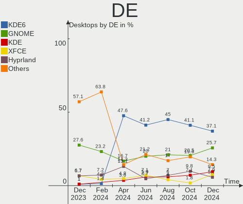
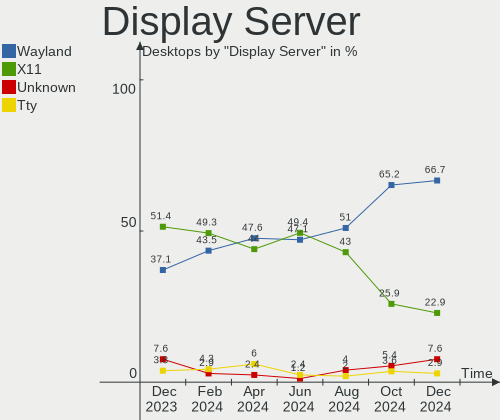
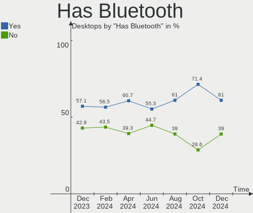
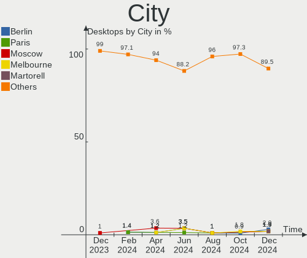
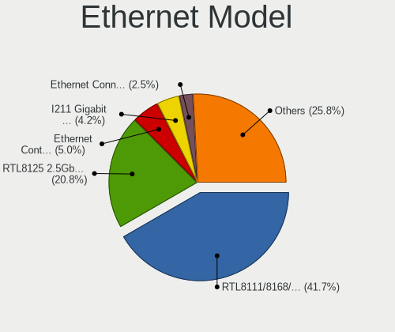
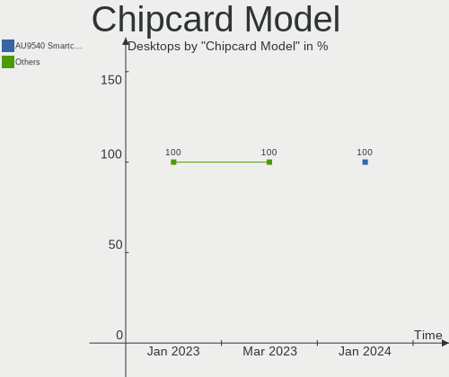

Arch Hardware Trends (Desktops)
-------------------------------

A project to identify most popular hardware characteristics and track their change
over time based on data collected by Arch users at https://Linux-Hardware.org.

Anyone can contribute to this report by the [hw-probe](https://github.com/linuxhw/hw-probe) tool:

    sudo -E hw-probe -all -upload

This report is for one last month. Overall report since the beginning of time: [TestCoverage](https://github.com/linuxhw/TestCoverage)

Period: Apr, 2022.

Contents
--------

* [ System ](#system)
  - [ OS                       ](#os)
  - [ OS Family                ](#os-family)
  - [ Kernel                   ](#kernel)
  - [ Kernel Family            ](#kernel-family)
  - [ Kernel Major Ver.        ](#kernel-major-ver)
  - [ Arch                     ](#arch)
  - [ DE                       ](#de)
  - [ Display Server           ](#display-server)
  - [ Display Manager          ](#display-manager)
  - [ OS Lang                  ](#os-lang)
  - [ Boot Mode                ](#boot-mode)
  - [ Filesystem               ](#filesystem)
  - [ Part. scheme             ](#part-scheme)
  - [ Dual Boot with Linux/BSD ](#dual-boot-with-linuxbsd)
  - [ Dual Boot (Win)          ](#dual-boot-win)

* [ Board ](#board)
  - [ Vendor                   ](#vendor)
  - [ Model                    ](#model)
  - [ Model Family             ](#model-family)
  - [ MFG Year                 ](#mfg-year)
  - [ Form Factor              ](#form-factor)
  - [ Secure Boot              ](#secure-boot)
  - [ Coreboot                 ](#coreboot)
  - [ RAM Size                 ](#ram-size)
  - [ RAM Used                 ](#ram-used)
  - [ Total Drives             ](#total-drives)
  - [ Has CD-ROM               ](#has-cd-rom)
  - [ Has Ethernet             ](#has-ethernet)
  - [ Has WiFi                 ](#has-wifi)
  - [ Has Bluetooth            ](#has-bluetooth)

* [ Location ](#location)
  - [ Country                  ](#country)
  - [ City                     ](#city)

* [ Drives ](#drives)
  - [ Drive Vendor             ](#drive-vendor)
  - [ Drive Model              ](#drive-model)
  - [ HDD Vendor               ](#hdd-vendor)
  - [ SSD Vendor               ](#ssd-vendor)
  - [ Drive Kind               ](#drive-kind)
  - [ Drive Connector          ](#drive-connector)
  - [ Drive Size               ](#drive-size)
  - [ Space Total              ](#space-total)
  - [ Space Used               ](#space-used)
  - [ Malfunc. Drives          ](#malfunc-drives)
  - [ Malfunc. Drive Vendor    ](#malfunc-drive-vendor)
  - [ Malfunc. HDD Vendor      ](#malfunc-hdd-vendor)
  - [ Malfunc. Drive Kind      ](#malfunc-drive-kind)
  - [ Failed Drives            ](#failed-drives)
  - [ Failed Drive Vendor      ](#failed-drive-vendor)
  - [ Drive Status             ](#drive-status)

* [ Storage controller ](#storage-controller)
  - [ Storage Vendor           ](#storage-vendor)
  - [ Storage Model            ](#storage-model)
  - [ Storage Kind             ](#storage-kind)

* [ Processor ](#processor)
  - [ CPU Vendor               ](#cpu-vendor)
  - [ CPU Model                ](#cpu-model)
  - [ CPU Model Family         ](#cpu-model-family)
  - [ CPU Cores                ](#cpu-cores)
  - [ CPU Sockets              ](#cpu-sockets)
  - [ CPU Threads              ](#cpu-threads)
  - [ CPU Op-Modes             ](#cpu-op-modes)
  - [ CPU Microcode            ](#cpu-microcode)
  - [ CPU Microarch            ](#cpu-microarch)

* [ Graphics ](#graphics)
  - [ GPU Vendor               ](#gpu-vendor)
  - [ GPU Model                ](#gpu-model)
  - [ GPU Combo                ](#gpu-combo)
  - [ GPU Driver               ](#gpu-driver)
  - [ GPU Memory               ](#gpu-memory)

* [ Monitor ](#monitor)
  - [ Monitor Vendor           ](#monitor-vendor)
  - [ Monitor Model            ](#monitor-model)
  - [ Monitor Resolution       ](#monitor-resolution)
  - [ Monitor Diagonal         ](#monitor-diagonal)
  - [ Monitor Width            ](#monitor-width)
  - [ Aspect Ratio             ](#aspect-ratio)
  - [ Monitor Area             ](#monitor-area)
  - [ Pixel Density            ](#pixel-density)
  - [ Multiple Monitors        ](#multiple-monitors)

* [ Network ](#network)
  - [ Net Controller Vendor    ](#net-controller-vendor)
  - [ Net Controller Model     ](#net-controller-model)
  - [ Wireless Vendor          ](#wireless-vendor)
  - [ Wireless Model           ](#wireless-model)
  - [ Ethernet Vendor          ](#ethernet-vendor)
  - [ Ethernet Model           ](#ethernet-model)
  - [ Net Controller Kind      ](#net-controller-kind)
  - [ Used Controller          ](#used-controller)
  - [ NICs                     ](#nics)
  - [ IPv6                     ](#ipv6)

* [ Bluetooth ](#bluetooth)
  - [ Bluetooth Vendor         ](#bluetooth-vendor)
  - [ Bluetooth Model          ](#bluetooth-model)

* [ Sound ](#sound)
  - [ Sound Vendor             ](#sound-vendor)
  - [ Sound Model              ](#sound-model)

* [ Memory ](#memory)
  - [ Memory Vendor            ](#memory-vendor)
  - [ Memory Model             ](#memory-model)
  - [ Memory Kind              ](#memory-kind)
  - [ Memory Form Factor       ](#memory-form-factor)
  - [ Memory Size              ](#memory-size)
  - [ Memory Speed             ](#memory-speed)

* [ Printers & scanners ](#printers--scanners)
  - [ Printer Vendor           ](#printer-vendor)
  - [ Printer Model            ](#printer-model)
  - [ Scanner Vendor           ](#scanner-vendor)
  - [ Scanner Model            ](#scanner-model)

* [ Camera ](#camera)
  - [ Camera Vendor            ](#camera-vendor)
  - [ Camera Model             ](#camera-model)

* [ Security ](#security)
  - [ Fingerprint Vendor       ](#fingerprint-vendor)
  - [ Fingerprint Model        ](#fingerprint-model)
  - [ Chipcard Vendor          ](#chipcard-vendor)
  - [ Chipcard Model           ](#chipcard-model)

* [ Unsupported ](#unsupported)
  - [ Unsupported Devices      ](#unsupported-devices)
  - [ Unsupported Device Types ](#unsupported-device-types)

System
------

OS
--

Installed operating systems

| Name         | Desktops | Percent |
|--------------|----------|---------|
| Arch         | 40       | 53.33%  |
| Arch Rolling | 35       | 46.67%  |

OS Family
---------

OS without a version

| Name | Desktops | Percent |
|------|----------|---------|
| Arch | 75       | 100%    |

Kernel
------

Version of the Linux kernel

| Version                      | Desktops | Percent |
|------------------------------|----------|---------|
| 5.17.1-arch1-1               | 28       | 37.33%  |
| 5.17.1-zen1-1-zen            | 7        | 9.33%   |
| 5.17.5-arch1-1               | 6        | 8%      |
| 5.17.2-arch3-1               | 6        | 8%      |
| 5.17.4-arch1-1               | 4        | 5.33%   |
| 5.17.3-arch1-1               | 3        | 4%      |
| 5.16.16-arch1-1              | 3        | 4%      |
| 5.15.32-1-lts                | 3        | 4%      |
| 5.17.4-zen1-1-zen            | 2        | 2.67%   |
| 5.15.33-1-lts                | 2        | 2.67%   |
| 5.18.0-rc2-1-mainline        | 1        | 1.33%   |
| 5.17.5-lqx1-1-lqx            | 1        | 1.33%   |
| 5.17.3-zen1-1-zen            | 1        | 1.33%   |
| 5.17.3-lqx2-1-lqx            | 1        | 1.33%   |
| 5.16.18-hardened1-1-hardened | 1        | 1.33%   |
| 5.16.18-1-ck-generic-v3      | 1        | 1.33%   |
| 5.16.15-arch1-1              | 1        | 1.33%   |
| 5.16.14-arch1-1              | 1        | 1.33%   |
| 5.16.13-arch1-1              | 1        | 1.33%   |
| 5.15.36-1-lts                | 1        | 1.33%   |
| 5.15.35-1-lts                | 1        | 1.33%   |

Kernel Family
-------------

Linux kernel without a distro release

| Version | Desktops | Percent |
|---------|----------|---------|
| 5.17.1  | 35       | 46.67%  |
| 5.17.5  | 7        | 9.33%   |
| 5.17.4  | 6        | 8%      |
| 5.17.2  | 6        | 8%      |
| 5.17.3  | 5        | 6.67%   |
| 5.16.16 | 3        | 4%      |
| 5.15.32 | 3        | 4%      |
| 5.16.18 | 2        | 2.67%   |
| 5.15.33 | 2        | 2.67%   |
| 5.18.0  | 1        | 1.33%   |
| 5.16.15 | 1        | 1.33%   |
| 5.16.14 | 1        | 1.33%   |
| 5.16.13 | 1        | 1.33%   |
| 5.15.36 | 1        | 1.33%   |
| 5.15.35 | 1        | 1.33%   |

Kernel Major Ver.
-----------------

Linux kernel major version

| Version | Desktops | Percent |
|---------|----------|---------|
| 5.17    | 59       | 78.67%  |
| 5.16    | 8        | 10.67%  |
| 5.15    | 7        | 9.33%   |
| 5.18    | 1        | 1.33%   |

Arch
----

OS architecture (x86_64, i586, etc.)

| Name   | Desktops | Percent |
|--------|----------|---------|
| x86_64 | 75       | 100%    |

DE
--

Desktop Environment

| Name            | Desktops | Percent |
|-----------------|----------|---------|
| KDE5            | 29       | 38.67%  |
| GNOME           | 14       | 18.67%  |
| Unknown         | 11       | 14.67%  |
| i3              | 6        | 8%      |
| XFCE            | 4        | 5.33%   |
| X-Cinnamon      | 3        | 4%      |
| xmonad          | 1        | 1.33%   |
| sway            | 1        | 1.33%   |
| MATE            | 1        | 1.33%   |
| GNOME Flashback | 1        | 1.33%   |
| Deepin          | 1        | 1.33%   |
| Budgie          | 1        | 1.33%   |
| bspwm           | 1        | 1.33%   |
| awesome         | 1        | 1.33%   |

Display Server
--------------

X11 or Wayland

| Name    | Desktops | Percent |
|---------|----------|---------|
| X11     | 45       | 60%     |
| Wayland | 12       | 16%     |
| Tty     | 10       | 13.33%  |
| Unknown | 8        | 10.67%  |

Display Manager
---------------

SDDM, LightDM, etc.

| Name    | Desktops | Percent |
|---------|----------|---------|
| Unknown | 29       | 38.67%  |
| SDDM    | 19       | 25.33%  |
| LightDM | 18       | 24%     |
| GDM     | 6        | 8%      |
| LXDM    | 2        | 2.67%   |
| Ly      | 1        | 1.33%   |

OS Lang
-------

Language

| Lang    | Desktops | Percent |
|---------|----------|---------|
| en_US   | 44       | 58.67%  |
| en_GB   | 7        | 9.33%   |
| de_DE   | 6        | 8%      |
| Unknown | 3        | 4%      |
| pl_PL   | 2        | 2.67%   |
| it_IT   | 2        | 2.67%   |
| en_NZ   | 2        | 2.67%   |
| en_IN   | 2        | 2.67%   |
| zh_CN   | 1        | 1.33%   |
| ru_RU   | 1        | 1.33%   |
| pt_BR   | 1        | 1.33%   |
| fr_FR   | 1        | 1.33%   |
| es_CL   | 1        | 1.33%   |
| cs_CZ   | 1        | 1.33%   |
| C       | 1        | 1.33%   |

Boot Mode
---------

EFI or BIOS

| Mode | Desktops | Percent |
|------|----------|---------|
| EFI  | 45       | 60%     |
| BIOS | 30       | 40%     |

Filesystem
----------

Type of filesystem

| Type  | Desktops | Percent |
|-------|----------|---------|
| Ext4  | 51       | 68%     |
| Btrfs | 17       | 22.67%  |
| Xfs   | 4        | 5.33%   |
| F2fs  | 3        | 4%      |

Part. scheme
------------

Scheme of partitioning

| Type    | Desktops | Percent |
|---------|----------|---------|
| GPT     | 52       | 69.33%  |
| Unknown | 15       | 20%     |
| MBR     | 8        | 10.67%  |

Dual Boot with Linux/BSD
------------------------

Hosting more than one Linux/BSD

| Dual boot | Desktops | Percent |
|-----------|----------|---------|
| No        | 65       | 86.67%  |
| Yes       | 10       | 13.33%  |

Dual Boot (Win)
---------------

Hosting Linux and Windows

| Dual boot | Desktops | Percent |
|-----------|----------|---------|
| No        | 46       | 61.33%  |
| Yes       | 29       | 38.67%  |

Board
-----

Vendor
------

Motherboard manufacturer

| Name                | Desktops | Percent |
|---------------------|----------|---------|
| ASUSTek Computer    | 25       | 33.33%  |
| MSI                 | 13       | 17.33%  |
| Gigabyte Technology | 13       | 17.33%  |
| ASRock              | 7        | 9.33%   |
| Intel               | 4        | 5.33%   |
| Dell                | 4        | 5.33%   |
| Hewlett-Packard     | 3        | 4%      |
| OEM                 | 1        | 1.33%   |
| Lenovo              | 1        | 1.33%   |
| Jetway              | 1        | 1.33%   |
| Fujitsu             | 1        | 1.33%   |
| Foxconn             | 1        | 1.33%   |
| EVGA                | 1        | 1.33%   |

Model
-----

Motherboard model

| Name                                 | Desktops | Percent |
|--------------------------------------|----------|---------|
| ASUS All Series                      | 4        | 5.33%   |
| MSI MS-7C37                          | 2        | 2.67%   |
| ASUS TUF Gaming X570-PLUS            | 2        | 2.67%   |
| OEM V1.0                             | 1        | 1.33%   |
| MSI MS-7C94                          | 1        | 1.33%   |
| MSI MS-7C91                          | 1        | 1.33%   |
| MSI MS-7C90                          | 1        | 1.33%   |
| MSI MS-7C83                          | 1        | 1.33%   |
| MSI MS-7C75                          | 1        | 1.33%   |
| MSI MS-7B85                          | 1        | 1.33%   |
| MSI MS-7B79                          | 1        | 1.33%   |
| MSI MS-7A38                          | 1        | 1.33%   |
| MSI MS-7A34                          | 1        | 1.33%   |
| MSI MS-7A33                          | 1        | 1.33%   |
| MSI MS-7721                          | 1        | 1.33%   |
| Lenovo ThinkCentre M82 2929AC4       | 1        | 1.33%   |
| Jetway 1.0                           | 1        | 1.33%   |
| Intel STK2MV64CC                     | 1        | 1.33%   |
| Intel H81                            | 1        | 1.33%   |
| Intel H61                            | 1        | 1.33%   |
| Intel DQ67EP AAG12529-307            | 1        | 1.33%   |
| HP Pavilion Gaming Desktop TG01-1xxx | 1        | 1.33%   |
| HP EliteDesk 800 G3 TWR              | 1        | 1.33%   |
| HP Compaq 8200 Elite CMT PC          | 1        | 1.33%   |
| Gigabyte Z77X-D3H                    | 1        | 1.33%   |
| Gigabyte Z690 AORUS MASTER           | 1        | 1.33%   |
| Gigabyte Z390 DESIGNARE              | 1        | 1.33%   |
| Gigabyte Z170X-UD3                   | 1        | 1.33%   |
| Gigabyte X570 I AORUS PRO WIFI       | 1        | 1.33%   |
| Gigabyte X570 AORUS PRO              | 1        | 1.33%   |
| Gigabyte X570 AORUS MASTER           | 1        | 1.33%   |
| Gigabyte B550I AORUS PRO AX          | 1        | 1.33%   |
| Gigabyte B450M S2H                   | 1        | 1.33%   |
| Gigabyte B450M DS3H                  | 1        | 1.33%   |
| Gigabyte B360M-D2V                   | 1        | 1.33%   |
| Gigabyte AB350M-Gaming 3             | 1        | 1.33%   |
| Gigabyte 970A-UD3P                   | 1        | 1.33%   |
| Fujitsu D3434-S2 S26361-D3434-S2     | 1        | 1.33%   |
| Foxconn H61MD/H61MD-V                | 1        | 1.33%   |
| EVGA 140-SS-E177                     | 1        | 1.33%   |
| Dell Studio 540                      | 1        | 1.33%   |
| Dell Precision Tower 5810            | 1        | 1.33%   |
| Dell OptiPlex 3080                   | 1        | 1.33%   |
| Dell Inspiron 3252                   | 1        | 1.33%   |
| ASUS ROG STRIX X570-E GAMING         | 1        | 1.33%   |
| ASUS ROG STRIX X470-F GAMING         | 1        | 1.33%   |
| ASUS ROG STRIX B550-F GAMING         | 1        | 1.33%   |
| ASUS ROG STRIX B450-F GAMING II      | 1        | 1.33%   |
| ASUS ROG CROSSHAIR VIII HERO         | 1        | 1.33%   |
| ASUS ROG CROSSHAIR VIII DARK HERO    | 1        | 1.33%   |
| ASUS ROG CROSSHAIR VII HERO          | 1        | 1.33%   |
| ASUS Pro WS X570-ACE                 | 1        | 1.33%   |
| ASUS PRIME Z590M-PLUS                | 1        | 1.33%   |
| ASUS PRIME X570-PRO                  | 1        | 1.33%   |
| ASUS PRIME X370-PRO                  | 1        | 1.33%   |
| ASUS PRIME X299-DELUXE II            | 1        | 1.33%   |
| ASUS PRIME H570-PLUS                 | 1        | 1.33%   |
| ASUS PRIME B550M-A                   | 1        | 1.33%   |
| ASUS PRIME B550-PLUS                 | 1        | 1.33%   |
| ASUS PRIME B450M-A                   | 1        | 1.33%   |

Model Family
------------

Motherboard model prefix

| Name                   | Desktops | Percent |
|------------------------|----------|---------|
| ASUS PRIME             | 8        | 10.67%  |
| ASUS ROG               | 7        | 9.33%   |
| ASUS All               | 4        | 5.33%   |
| Gigabyte X570          | 3        | 4%      |
| MSI MS-7C37            | 2        | 2.67%   |
| Gigabyte B450M         | 2        | 2.67%   |
| ASUS TUF               | 2        | 2.67%   |
| ASRock X470            | 2        | 2.67%   |
| OEM V1.0               | 1        | 1.33%   |
| MSI MS-7C94            | 1        | 1.33%   |
| MSI MS-7C91            | 1        | 1.33%   |
| MSI MS-7C90            | 1        | 1.33%   |
| MSI MS-7C83            | 1        | 1.33%   |
| MSI MS-7C75            | 1        | 1.33%   |
| MSI MS-7B85            | 1        | 1.33%   |
| MSI MS-7B79            | 1        | 1.33%   |
| MSI MS-7A38            | 1        | 1.33%   |
| MSI MS-7A34            | 1        | 1.33%   |
| MSI MS-7A33            | 1        | 1.33%   |
| MSI MS-7721            | 1        | 1.33%   |
| Lenovo ThinkCentre     | 1        | 1.33%   |
| Jetway 1.0             | 1        | 1.33%   |
| Intel STK2MV64CC       | 1        | 1.33%   |
| Intel H81              | 1        | 1.33%   |
| Intel H61              | 1        | 1.33%   |
| Intel DQ67EP           | 1        | 1.33%   |
| HP Pavilion            | 1        | 1.33%   |
| HP EliteDesk           | 1        | 1.33%   |
| HP Compaq              | 1        | 1.33%   |
| Gigabyte Z77X-D3H      | 1        | 1.33%   |
| Gigabyte Z690          | 1        | 1.33%   |
| Gigabyte Z390          | 1        | 1.33%   |
| Gigabyte Z170X-UD3     | 1        | 1.33%   |
| Gigabyte B550I         | 1        | 1.33%   |
| Gigabyte B360M-D2V     | 1        | 1.33%   |
| Gigabyte AB350M-Gaming | 1        | 1.33%   |
| Gigabyte 970A-UD3P     | 1        | 1.33%   |
| Fujitsu D3434-S2       | 1        | 1.33%   |
| Foxconn H61MD          | 1        | 1.33%   |
| EVGA 140-SS-E177       | 1        | 1.33%   |
| Dell Studio            | 1        | 1.33%   |
| Dell Precision         | 1        | 1.33%   |
| Dell OptiPlex          | 1        | 1.33%   |
| Dell Inspiron          | 1        | 1.33%   |
| ASUS Pro               | 1        | 1.33%   |
| ASUS P8Z77-V           | 1        | 1.33%   |
| ASUS M4A87TD           | 1        | 1.33%   |
| ASUS B150              | 1        | 1.33%   |
| ASRock Z68             | 1        | 1.33%   |
| ASRock X370            | 1        | 1.33%   |
| ASRock B560M           | 1        | 1.33%   |
| ASRock B550            | 1        | 1.33%   |
| ASRock B450M           | 1        | 1.33%   |

MFG Year
--------

Motherboard manufacture year

| Year | Desktops | Percent |
|------|----------|---------|
| 2020 | 16       | 21.33%  |
| 2018 | 14       | 18.67%  |
| 2019 | 13       | 17.33%  |
| 2017 | 7        | 9.33%   |
| 2021 | 5        | 6.67%   |
| 2013 | 5        | 6.67%   |
| 2015 | 4        | 5.33%   |
| 2016 | 3        | 4%      |
| 2012 | 2        | 2.67%   |
| 2011 | 2        | 2.67%   |
| 2022 | 1        | 1.33%   |
| 2014 | 1        | 1.33%   |
| 2010 | 1        | 1.33%   |
| 2008 | 1        | 1.33%   |

Form Factor
-----------

Physical design of the computer

| Name    | Desktops | Percent |
|---------|----------|---------|
| Desktop | 75       | 100%    |

Secure Boot
-----------

Enabled or disabled

| State    | Desktops | Percent |
|----------|----------|---------|
| Disabled | 74       | 98.67%  |
| Enabled  | 1        | 1.33%   |

Coreboot
--------

Have coreboot on board

| Used | Desktops | Percent |
|------|----------|---------|
| No   | 75       | 100%    |

RAM Size
--------

Total RAM memory

| Size in GB  | Desktops | Percent |
|-------------|----------|---------|
| 32.01-64.0  | 22       | 29.33%  |
| 16.01-24.0  | 20       | 26.67%  |
| 64.01-256.0 | 11       | 14.67%  |
| 8.01-16.0   | 11       | 14.67%  |
| 4.01-8.0    | 4        | 5.33%   |
| 24.01-32.0  | 4        | 5.33%   |
| 3.01-4.0    | 2        | 2.67%   |
| 2.01-3.0    | 1        | 1.33%   |

RAM Used
--------

Used RAM memory

| Used GB    | Desktops | Percent |
|------------|----------|---------|
| 4.01-8.0   | 22       | 29.33%  |
| 1.01-2.0   | 14       | 18.67%  |
| 3.01-4.0   | 13       | 17.33%  |
| 8.01-16.0  | 12       | 16%     |
| 16.01-24.0 | 5        | 6.67%   |
| 2.01-3.0   | 4        | 5.33%   |
| 0.01-0.5   | 2        | 2.67%   |
| 32.01-64.0 | 1        | 1.33%   |
| 24.01-32.0 | 1        | 1.33%   |
| 0.51-1.0   | 1        | 1.33%   |

Total Drives
------------

Number of drives on board

| Drives | Desktops | Percent |
|--------|----------|---------|
| 2      | 22       | 29.33%  |
| 1      | 17       | 22.67%  |
| 3      | 14       | 18.67%  |
| 4      | 9        | 12%     |
| 5      | 5        | 6.67%   |
| 6      | 3        | 4%      |
| 7      | 2        | 2.67%   |
| 15     | 1        | 1.33%   |
| 12     | 1        | 1.33%   |
| 8      | 1        | 1.33%   |

Has CD-ROM
----------

Has CD-ROM on board

| Presented | Desktops | Percent |
|-----------|----------|---------|
| No        | 57       | 76%     |
| Yes       | 18       | 24%     |

Has Ethernet
------------

Has Ethernet on board

| Presented | Desktops | Percent |
|-----------|----------|---------|
| Yes       | 74       | 98.67%  |
| No        | 1        | 1.33%   |

Has WiFi
--------

Has WiFi module

| Presented | Desktops | Percent |
|-----------|----------|---------|
| No        | 38       | 50.67%  |
| Yes       | 37       | 49.33%  |

Has Bluetooth
-------------

Has Bluetooth module

| Presented | Desktops | Percent |
|-----------|----------|---------|
| Yes       | 38       | 50.67%  |
| No        | 37       | 49.33%  |

Location
--------

Country
-------

Geographic location (country)

| Country      | Desktops | Percent |
|--------------|----------|---------|
| Germany      | 12       | 16%     |
| USA          | 11       | 14.67%  |
| UK           | 6        | 8%      |
| Italy        | 5        | 6.67%   |
| Brazil       | 4        | 5.33%   |
| Sweden       | 3        | 4%      |
| Poland       | 3        | 4%      |
| France       | 3        | 4%      |
| Switzerland  | 2        | 2.67%   |
| Russia       | 2        | 2.67%   |
| Romania      | 2        | 2.67%   |
| New Zealand  | 2        | 2.67%   |
| Netherlands  | 2        | 2.67%   |
| Finland      | 2        | 2.67%   |
| Canada       | 2        | 2.67%   |
| Vietnam      | 1        | 1.33%   |
| Thailand     | 1        | 1.33%   |
| South Africa | 1        | 1.33%   |
| Pakistan     | 1        | 1.33%   |
| Jersey       | 1        | 1.33%   |
| Japan        | 1        | 1.33%   |
| Israel       | 1        | 1.33%   |
| India        | 1        | 1.33%   |
| Greece       | 1        | 1.33%   |
| Czechia      | 1        | 1.33%   |
| China        | 1        | 1.33%   |
| Chile        | 1        | 1.33%   |
| Bulgaria     | 1        | 1.33%   |
| Austria      | 1        | 1.33%   |

City
----

Geographic location (city)

| City              | Desktops | Percent |
|-------------------|----------|---------|
| Berlin            | 3        | 4%      |
| Pipe Creek        | 2        | 2.67%   |
| Milan             | 2        | 2.67%   |
| London            | 2        | 2.67%   |
| Zug               | 1        | 1.33%   |
| Zhanjiang         | 1        | 1.33%   |
| Yekaterinburg     | 1        | 1.33%   |
| Xanthi            | 1        | 1.33%   |
| Wroclaw           | 1        | 1.33%   |
| Wellington        | 1        | 1.33%   |
| Wasilla           | 1        | 1.33%   |
| Vinkeveen         | 1        | 1.33%   |
| Villeneuve-d'Ascq | 1        | 1.33%   |
| Vienna            | 1        | 1.33%   |
| Vedevag           | 1        | 1.33%   |
| Vancouver         | 1        | 1.33%   |
| Vaajakoski        | 1        | 1.33%   |
| Uppsala           | 1        | 1.33%   |
| Trier             | 1        | 1.33%   |
| Trento            | 1        | 1.33%   |
| Toronto           | 1        | 1.33%   |
| Tornesch          | 1        | 1.33%   |
| Terni             | 1        | 1.33%   |
| Temuco            | 1        | 1.33%   |
| Tel Aviv          | 1        | 1.33%   |
| Sundsvall         | 1        | 1.33%   |
| Singen            | 1        | 1.33%   |
| Shumen            | 1        | 1.33%   |
| Shinjuku          | 1        | 1.33%   |
| Seattle           | 1        | 1.33%   |
| Schaffhausen      | 1        | 1.33%   |
| San Francisco     | 1        | 1.33%   |
| Salvador          | 1        | 1.33%   |
| Saint Helier      | 1        | 1.33%   |
| Recklinghausen    | 1        | 1.33%   |
| Recife            | 1        | 1.33%   |
| Pretoria          | 1        | 1.33%   |
| Poznan            | 1        | 1.33%   |
| Post Falls        | 1        | 1.33%   |
| Portsmouth        | 1        | 1.33%   |
| Passo Fundo       | 1        | 1.33%   |
| Munich            | 1        | 1.33%   |
| Moscow            | 1        | 1.33%   |
| Miercurea-Ciuc    | 1        | 1.33%   |
| Meridian          | 1        | 1.33%   |
| Mandeville        | 1        | 1.33%   |
| Kolín            | 1        | 1.33%   |
| Katwijk aan Zee   | 1        | 1.33%   |
| Itatinga          | 1        | 1.33%   |
| Islamabad         | 1        | 1.33%   |
| Iasi              | 1        | 1.33%   |
| Ho Chi Minh City  | 1        | 1.33%   |
| Hermeskeil        | 1        | 1.33%   |
| Helsinki          | 1        | 1.33%   |
| Hamburg           | 1        | 1.33%   |
| Hallstadt         | 1        | 1.33%   |
| Guerville         | 1        | 1.33%   |
| Frankfurt am Main | 1        | 1.33%   |
| Deptford          | 1        | 1.33%   |
| Denver            | 1        | 1.33%   |

Drives
------

Drive Vendor
------------

Hard drive vendors

| Vendor                    | Desktops | Drives | Percent |
|---------------------------|----------|--------|---------|
| Samsung Electronics       | 44       | 67     | 27.67%  |
| WDC                       | 31       | 58     | 19.5%   |
| Seagate                   | 19       | 28     | 11.95%  |
| Crucial                   | 14       | 19     | 8.81%   |
| Sandisk                   | 9        | 10     | 5.66%   |
| Toshiba                   | 7        | 11     | 4.4%    |
| Kingston                  | 6        | 6      | 3.77%   |
| SK Hynix                  | 3        | 3      | 1.89%   |
| Phison                    | 3        | 4      | 1.89%   |
| Corsair                   | 3        | 3      | 1.89%   |
| OCZ                       | 2        | 2      | 1.26%   |
| Netac                     | 2        | 2      | 1.26%   |
| Lexar                     | 2        | 2      | 1.26%   |
| Intel                     | 2        | 3      | 1.26%   |
| ZHITAI                    | 1        | 1      | 0.63%   |
| XrayDisk                  | 1        | 1      | 0.63%   |
| XPG                       | 1        | 1      | 0.63%   |
| Unknown                   | 1        | 1      | 0.63%   |
| TrueNAS                   | 1        | 1      | 0.63%   |
| Micron/Crucial Technology | 1        | 1      | 0.63%   |
| MAXTOR                    | 1        | 1      | 0.63%   |
| Inateck                   | 1        | 1      | 0.63%   |
| Hitachi                   | 1        | 1      | 0.63%   |
| HGST                      | 1        | 1      | 0.63%   |
| Apple                     | 1        | 1      | 0.63%   |
| A-DATA Technology         | 1        | 2      | 0.63%   |

Drive Model
-----------

Hard drive models

| Model                              | Desktops | Percent |
|------------------------------------|----------|---------|
| Samsung SSD 970 EVO Plus 1TB       | 6        | 3.03%   |
| Samsung SSD 850 EVO 250GB          | 5        | 2.53%   |
| WDC WD10EZEX-00BN5A0 1TB           | 4        | 2.02%   |
| Samsung SSD 970 EVO Plus 2TB       | 4        | 2.02%   |
| Samsung SSD 970 EVO 1TB            | 4        | 2.02%   |
| Samsung SSD 960 EVO 250GB          | 3        | 1.52%   |
| Samsung SSD 860 EVO 500GB          | 3        | 1.52%   |
| Samsung SSD 850 EVO 500GB          | 3        | 1.52%   |
| Crucial CT500MX500SSD1 500GB       | 3        | 1.52%   |
| Crucial CT240BX500SSD1 240GB       | 3        | 1.52%   |
| WDC WD6003FZBX-00K5WB0 6TB         | 2        | 1.01%   |
| WDC WD10EZEX-08WN4A0 1TB           | 2        | 1.01%   |
| Toshiba MQ01ABD100 1TB             | 2        | 1.01%   |
| Seagate ST4000DM004-2CV104 4TB     | 2        | 1.01%   |
| Seagate ST3500418AS 500GB          | 2        | 1.01%   |
| Seagate ST2000DM008-2FR102 2TB     | 2        | 1.01%   |
| Seagate ST2000DM001-1ER164 2TB     | 2        | 1.01%   |
| Seagate ST1000LM024 HN-M101MBB 1TB | 2        | 1.01%   |
| Seagate ST1000DM010-2EP102 1TB     | 2        | 1.01%   |
| SanDisk SSD PLUS 1000GB            | 2        | 1.01%   |
| SanDisk SDSSDHP256G 256GB          | 2        | 1.01%   |
| Sandisk NVMe SSD Drive 1TB         | 2        | 1.01%   |
| Samsung SSD 980 PRO 1TB            | 2        | 1.01%   |
| Samsung SSD 970 EVO 500GB          | 2        | 1.01%   |
| Samsung SSD 870 QVO 2TB            | 2        | 1.01%   |
| Samsung SSD 870 QVO 1TB            | 2        | 1.01%   |
| Samsung SSD 860 QVO 1TB            | 2        | 1.01%   |
| Samsung SSD 860 EVO 250GB          | 2        | 1.01%   |
| Samsung SSD 830 Series 128GB       | 2        | 1.01%   |
| Samsung NVMe SSD Drive 250GB       | 2        | 1.01%   |
| Samsung NVMe SSD Drive 1TB         | 2        | 1.01%   |
| Lexar 128GB SSD                    | 2        | 1.01%   |
| Kingston SA400S37480G 480GB SSD    | 2        | 1.01%   |
| Kingston SA400S37120G 120GB SSD    | 2        | 1.01%   |
| Crucial M4-CT256M4SSD2 256GB       | 2        | 1.01%   |
| Crucial CT525MX300SSD4 528GB       | 2        | 1.01%   |
| Corsair Force MP600 1TB            | 2        | 1.01%   |
| ZHITAI PC005 Active 1TB            | 1        | 0.51%   |
| XrayDisk SSD 256GB                 | 1        | 0.51%   |
| XPG NVMe SSD Drive 256GB           | 1        | 0.51%   |
| WDC WDS512G1X0C-00ENX0 512GB       | 1        | 0.51%   |
| WDC WDS500G3X0C-00SJG0 500GB       | 1        | 0.51%   |
| WDC WDS500G2B0A-00SM50 500GB SSD   | 1        | 0.51%   |
| WDC WDS240G2G0A-00JH30 240GB SSD   | 1        | 0.51%   |
| WDC WDS200T2B0C-00PXH0 2TB         | 1        | 0.51%   |
| WDC WDS100T2B0B 1TB SSD            | 1        | 0.51%   |
| WDC WDS100T2B0A-00SM50 1TB SSD     | 1        | 0.51%   |
| WDC WDS100T1X0E-00AFY0 1TB         | 1        | 0.51%   |
| WDC WDS100T1B0A-00H9H0 1TB SSD     | 1        | 0.51%   |
| WDC WD80EZAZ-11TDBA0 8TB           | 1        | 0.51%   |
| WDC WD80EMAZ-00WJTA0 8TB           | 1        | 0.51%   |
| WDC WD80EFAX-68LHPN0 8TB           | 1        | 0.51%   |
| WDC WD800JD-75MSA3 80GB            | 1        | 0.51%   |
| WDC WD8004FRYZ-01VAEB0 8TB         | 1        | 0.51%   |
| WDC WD7500AAKS-00RBA0 752GB        | 1        | 0.51%   |
| WDC WD6002FZWX-00GBGB0 6TB         | 1        | 0.51%   |
| WDC WD6001FZWX-00A2VA0 6TB         | 1        | 0.51%   |
| WDC WD5000LPCX-24VHAT0 500GB       | 1        | 0.51%   |
| WDC WD5000AZLX-75K2TA0 500GB       | 1        | 0.51%   |
| WDC WD5000AZLX-21K2TA0 500GB       | 1        | 0.51%   |

HDD Vendor
----------

Hard disk drive vendors

| Vendor              | Desktops | Drives | Percent |
|---------------------|----------|--------|---------|
| WDC                 | 26       | 44     | 44.83%  |
| Seagate             | 18       | 27     | 31.03%  |
| Toshiba             | 7        | 11     | 12.07%  |
| Samsung Electronics | 3        | 3      | 5.17%   |
| TrueNAS             | 1        | 1      | 1.72%   |
| MAXTOR              | 1        | 1      | 1.72%   |
| Hitachi             | 1        | 1      | 1.72%   |
| HGST                | 1        | 1      | 1.72%   |

SSD Vendor
----------

Solid state drive vendors

| Vendor              | Desktops | Drives | Percent |
|---------------------|----------|--------|---------|
| Samsung Electronics | 19       | 28     | 34.55%  |
| Crucial             | 13       | 18     | 23.64%  |
| SanDisk             | 6        | 7      | 10.91%  |
| Kingston            | 5        | 5      | 9.09%   |
| WDC                 | 3        | 7      | 5.45%   |
| OCZ                 | 2        | 2      | 3.64%   |
| Lexar               | 2        | 2      | 3.64%   |
| XrayDisk            | 1        | 1      | 1.82%   |
| SK Hynix            | 1        | 1      | 1.82%   |
| Netac               | 1        | 1      | 1.82%   |
| Inateck             | 1        | 1      | 1.82%   |
| Apple               | 1        | 1      | 1.82%   |

Drive Kind
----------

HDD or SSD

| Kind | Desktops | Drives | Percent |
|------|----------|--------|---------|
| NVMe | 45       | 67     | 34.09%  |
| HDD  | 44       | 89     | 33.33%  |
| SSD  | 42       | 74     | 31.82%  |
| MMC  | 1        | 1      | 0.76%   |

Drive Connector
---------------

SATA, SAS, NVMe, etc.

| Type | Desktops | Drives | Percent |
|------|----------|--------|---------|
| SATA | 60       | 162    | 56.07%  |
| NVMe | 45       | 67     | 42.06%  |
| SAS  | 1        | 1      | 0.93%   |
| MMC  | 1        | 1      | 0.93%   |

Drive Size
----------

Size of hard drive

| Size in TB | Desktops | Drives | Percent |
|------------|----------|--------|---------|
| 0.01-0.5   | 44       | 74     | 45.83%  |
| 0.51-1.0   | 29       | 40     | 30.21%  |
| 1.01-2.0   | 12       | 14     | 12.5%   |
| 4.01-10.0  | 4        | 20     | 4.17%   |
| 3.01-4.0   | 3        | 8      | 3.13%   |
| 2.01-3.0   | 3        | 5      | 3.13%   |
| 10.01-20.0 | 1        | 2      | 1.04%   |

Space Total
-----------

Amount of disk space available on the file system

| Size in GB     | Desktops | Percent |
|----------------|----------|---------|
| More than 3000 | 20       | 26.67%  |
| 501-1000       | 18       | 24%     |
| 1001-2000      | 12       | 16%     |
| 251-500        | 9        | 12%     |
| 101-250        | 7        | 9.33%   |
| 2001-3000      | 3        | 4%      |
| 51-100         | 2        | 2.67%   |
| Unknown        | 2        | 2.67%   |
| 21-50          | 1        | 1.33%   |
| 1-20           | 1        | 1.33%   |

Space Used
----------

Amount of used disk space

| Used GB        | Desktops | Percent |
|----------------|----------|---------|
| 501-1000       | 14       | 18.67%  |
| More than 3000 | 9        | 12%     |
| 1001-2000      | 9        | 12%     |
| 1-20           | 8        | 10.67%  |
| 51-100         | 8        | 10.67%  |
| 251-500        | 7        | 9.33%   |
| 101-250        | 7        | 9.33%   |
| 2001-3000      | 6        | 8%      |
| 21-50          | 5        | 6.67%   |
| Unknown        | 2        | 2.67%   |

Malfunc. Drives
---------------

Drive models with a malfunction

| Model                                 | Desktops | Drives | Percent |
|---------------------------------------|----------|--------|---------|
| XrayDisk SSD 256GB                    | 1        | 1      | 6.67%   |
| WDC WD5000AAKS-22V1A0 500GB           | 1        | 1      | 6.67%   |
| WDC WD10EZEX-08WN4A0 1TB              | 1        | 1      | 6.67%   |
| WDC WD10EARS-003BB1 1TB               | 1        | 1      | 6.67%   |
| Toshiba HDWQ140 4TB                   | 1        | 4      | 6.67%   |
| Toshiba HDWL110 1TB                   | 1        | 1      | 6.67%   |
| Seagate ST500LT012-1DG142 500GB       | 1        | 1      | 6.67%   |
| Seagate ST3500418AS 500GB             | 1        | 1      | 6.67%   |
| Seagate ST3500320NS 500GB             | 1        | 1      | 6.67%   |
| Seagate ST1000DX001-1NS162 1TB        | 1        | 1      | 6.67%   |
| Seagate ST1000DM003-1ER162 1TB        | 1        | 1      | 6.67%   |
| Samsung Electronics SSD 970 EVO 500GB | 1        | 1      | 6.67%   |
| Samsung Electronics SSD 960 EVO 250GB | 1        | 1      | 6.67%   |
| HGST HTS725050A7E630 500GB            | 1        | 1      | 6.67%   |
| Crucial M4-CT256M4SSD2 256GB          | 1        | 1      | 6.67%   |

Malfunc. Drive Vendor
---------------------

Vendors of faulty drives

| Vendor              | Desktops | Drives | Percent |
|---------------------|----------|--------|---------|
| Seagate             | 5        | 5      | 33.33%  |
| WDC                 | 3        | 3      | 20%     |
| Toshiba             | 2        | 5      | 13.33%  |
| Samsung Electronics | 2        | 2      | 13.33%  |
| XrayDisk            | 1        | 1      | 6.67%   |
| HGST                | 1        | 1      | 6.67%   |
| Crucial             | 1        | 1      | 6.67%   |

Malfunc. HDD Vendor
-------------------

Vendors of faulty HDD drives

| Vendor  | Desktops | Drives | Percent |
|---------|----------|--------|---------|
| Seagate | 5        | 5      | 45.45%  |
| WDC     | 3        | 3      | 27.27%  |
| Toshiba | 2        | 5      | 18.18%  |
| HGST    | 1        | 1      | 9.09%   |

Malfunc. Drive Kind
-------------------

Kinds of faulty drives

| Kind | Desktops | Drives | Percent |
|------|----------|--------|---------|
| HDD  | 9        | 14     | 69.23%  |
| NVMe | 2        | 2      | 15.38%  |
| SSD  | 2        | 2      | 15.38%  |

Failed Drives
-------------

Failed drive models

Zero info for selected period =(

Failed Drive Vendor
-------------------

Failed drive vendors

Zero info for selected period =(

Drive Status
------------

Number of failed and malfunc. drives

| Status   | Desktops | Drives | Percent |
|----------|----------|--------|---------|
| Works    | 46       | 145    | 53.49%  |
| Detected | 28       | 68     | 32.56%  |
| Malfunc  | 12       | 18     | 13.95%  |

Storage controller
------------------

Storage Vendor
--------------

Storage controller vendors

| Vendor                      | Desktops | Percent |
|-----------------------------|----------|---------|
| AMD                         | 41       | 28.67%  |
| Intel                       | 34       | 23.78%  |
| Samsung Electronics         | 33       | 23.08%  |
| ASMedia Technology          | 8        | 5.59%   |
| Sandisk                     | 7        | 4.9%    |
| Phison Electronics          | 6        | 4.2%    |
| SK Hynix                    | 2        | 1.4%    |
| Marvell Technology Group    | 2        | 1.4%    |
| LSI Logic / Symbios Logic   | 2        | 1.4%    |
| ADATA Technology            | 2        | 1.4%    |
| Yangtze Memory Technologies | 1        | 0.7%    |
| Silicon Motion              | 1        | 0.7%    |
| Seagate Technology          | 1        | 0.7%    |
| Micron/Crucial Technology   | 1        | 0.7%    |
| Micron Technology           | 1        | 0.7%    |
| Kingston Technology Company | 1        | 0.7%    |

Storage Model
-------------

Storage controller models

| Model                                                                                   | Desktops | Percent |
|-----------------------------------------------------------------------------------------|----------|---------|
| AMD FCH SATA Controller [AHCI mode]                                                     | 28       | 16.57%  |
| Samsung NVMe SSD Controller SM981/PM981/PM983                                           | 19       | 11.24%  |
| AMD 400 Series Chipset SATA Controller                                                  | 13       | 7.69%   |
| AMD 500 Series Chipset SATA Controller                                                  | 8        | 4.73%   |
| Samsung NVMe SSD Controller SM961/PM961/SM963                                           | 7        | 4.14%   |
| ASMedia ASM1062 Serial ATA Controller                                                   | 6        | 3.55%   |
| Samsung NVMe SSD Controller PM9A1/PM9A3/980PRO                                          | 5        | 2.96%   |
| Intel 8 Series/C220 Series Chipset Family 6-port SATA Controller 1 [AHCI mode]          | 5        | 2.96%   |
| Intel Q170/Q150/B150/H170/H110/Z170/CM236 Chipset SATA Controller [AHCI Mode]           | 4        | 2.37%   |
| Intel 6 Series/C200 Series Chipset Family 6 port Desktop SATA AHCI Controller           | 4        | 2.37%   |
| Phison E16 PCIe4 NVMe Controller                                                        | 3        | 1.78%   |
| Phison E12 NVMe Controller                                                              | 3        | 1.78%   |
| Intel 7 Series/C210 Series Chipset Family 6-port SATA Controller [AHCI mode]            | 3        | 1.78%   |
| Intel 500 Series Chipset Family SATA AHCI Controller                                    | 3        | 1.78%   |
| AMD X370 Series Chipset SATA Controller                                                 | 3        | 1.78%   |
| Sandisk WD PC SN810 / Black SN850 NVMe SSD                                              | 2        | 1.18%   |
| Sandisk WD Black 2018/SN750 / PC SN720 NVMe SSD                                         | 2        | 1.18%   |
| Intel Cannon Lake PCH SATA AHCI Controller                                              | 2        | 1.18%   |
| Intel C610/X99 series chipset sSATA Controller [AHCI mode]                              | 2        | 1.18%   |
| Intel 6 Series/C200 Series Chipset Family IDE-r Controller                              | 2        | 1.18%   |
| Intel 400 Series Chipset Family SATA AHCI Controller                                    | 2        | 1.18%   |
| Intel 200 Series PCH SATA controller [AHCI mode]                                        | 2        | 1.18%   |
| AMD SB7x0/SB8x0/SB9x0 IDE Controller                                                    | 2        | 1.18%   |
| AMD 300 Series Chipset SATA Controller                                                  | 2        | 1.18%   |
| ADATA XPG SX8200 Pro PCIe Gen3x4 M.2 2280 Solid State Drive                             | 2        | 1.18%   |
| Yangtze Memory Non-Volatile memory controller                                           | 1        | 0.59%   |
| SK Hynix Non-Volatile memory controller                                                 | 1        | 0.59%   |
| SK Hynix BC511                                                                          | 1        | 0.59%   |
| Silicon Motion SM2263EN/SM2263XT SSD Controller                                         | 1        | 0.59%   |
| Seagate FireCuda 520 SSD                                                                | 1        | 0.59%   |
| Sandisk WD Blue SN550 NVMe SSD                                                          | 1        | 0.59%   |
| Sandisk WD Black SN750 / PC SN730 NVMe SSD                                              | 1        | 0.59%   |
| Sandisk WD Black NVMe SSD                                                               | 1        | 0.59%   |
| Sandisk Non-Volatile memory controller                                                  | 1        | 0.59%   |
| Samsung NVMe SSD Controller SM951/PM951                                                 | 1        | 0.59%   |
| Samsung NVMe SSD Controller 980                                                         | 1        | 0.59%   |
| Samsung Electronics SATA controller                                                     | 1        | 0.59%   |
| Micron/Crucial P2 NVMe PCIe SSD                                                         | 1        | 0.59%   |
| Micron Non-Volatile memory controller                                                   | 1        | 0.59%   |
| Marvell Group 88SE9172 SATA 6Gb/s Controller                                            | 1        | 0.59%   |
| Marvell Group 88SE9120 SATA 6Gb/s Controller                                            | 1        | 0.59%   |
| LSI Logic / Symbios Logic SAS2008 PCI-Express Fusion-MPT SAS-2 [Falcon]                 | 1        | 0.59%   |
| LSI Logic / Symbios Logic SAS2004 PCI-Express Fusion-MPT SAS-2 [Spitfire]               | 1        | 0.59%   |
| Kingston Company A2000 NVMe SSD                                                         | 1        | 0.59%   |
| Intel SSD Pro 7600p/760p/E 6100p Series                                                 | 1        | 0.59%   |
| Intel SSD 660P Series                                                                   | 1        | 0.59%   |
| Intel PCIe Data Center SSD                                                              | 1        | 0.59%   |
| Intel Comet Lake SATA AHCI Controller                                                   | 1        | 0.59%   |
| Intel Atom/Celeron/Pentium Processor x5-E8000/J3xxx/N3xxx Series SATA Controller        | 1        | 0.59%   |
| Intel Alder Lake-S PCH SATA Controller [AHCI Mode]                                      | 1        | 0.59%   |
| Intel 82801JI (ICH10 Family) 4 port SATA IDE Controller #1                              | 1        | 0.59%   |
| Intel 82801JI (ICH10 Family) 2 port SATA IDE Controller #2                              | 1        | 0.59%   |
| Intel 6 Series/C200 Series Chipset Family Mobile SATA Controller (IDE mode, ports 4-5)  | 1        | 0.59%   |
| Intel 6 Series/C200 Series Chipset Family Mobile SATA Controller (IDE mode, ports 0-3)  | 1        | 0.59%   |
| Intel 6 Series/C200 Series Chipset Family Desktop SATA Controller (IDE mode, ports 4-5) | 1        | 0.59%   |
| Intel 6 Series/C200 Series Chipset Family Desktop SATA Controller (IDE mode, ports 0-3) | 1        | 0.59%   |
| ASMedia SATA controller                                                                 | 1        | 0.59%   |
| ASMedia ASM1166 Serial ATA Controller                                                   | 1        | 0.59%   |
| AMD SB7x0/SB8x0/SB9x0 SATA Controller [IDE mode]                                        | 1        | 0.59%   |
| AMD SB7x0/SB8x0/SB9x0 SATA Controller [AHCI mode]                                       | 1        | 0.59%   |

Storage Kind
------------

Kind of storage controller (IDE, SATA, NVMe, SAS, ...)

| Kind | Desktops | Percent |
|------|----------|---------|
| SATA | 71       | 57.26%  |
| NVMe | 45       | 36.29%  |
| IDE  | 6        | 4.84%   |
| SAS  | 2        | 1.61%   |

Processor
---------

CPU Vendor
----------

Processor vendors

| Vendor | Desktops | Percent |
|--------|----------|---------|
| AMD    | 41       | 54.67%  |
| Intel  | 34       | 45.33%  |

CPU Model
---------

Processor models

| Model                                       | Desktops | Percent |
|---------------------------------------------|----------|---------|
| AMD Ryzen 7 2700X Eight-Core Processor      | 5        | 6.67%   |
| AMD Ryzen 9 5900X 12-Core Processor         | 4        | 5.33%   |
| AMD Ryzen 7 3700X 8-Core Processor          | 4        | 5.33%   |
| AMD Ryzen 9 5950X 16-Core Processor         | 3        | 4%      |
| Intel Core i7-6700K CPU @ 4.00GHz           | 2        | 2.67%   |
| Intel Core i7-3770 CPU @ 3.40GHz            | 2        | 2.67%   |
| Intel Core i5-2500 CPU @ 3.30GHz            | 2        | 2.67%   |
| Intel 11th Gen Core i7-11700K @ 3.60GHz     | 2        | 2.67%   |
| AMD Ryzen 9 3900X 12-Core Processor         | 2        | 2.67%   |
| AMD Ryzen 5 5600X 6-Core Processor          | 2        | 2.67%   |
| AMD Ryzen 5 3600 6-Core Processor           | 2        | 2.67%   |
| AMD Ryzen 5 2600 Six-Core Processor         | 2        | 2.67%   |
| Intel Xeon CPU E5-1650 v4 @ 3.60GHz         | 1        | 1.33%   |
| Intel Xeon CPU E3-1231 v3 @ 3.40GHz         | 1        | 1.33%   |
| Intel Xeon CPU E3-1230 v3 @ 3.30GHz         | 1        | 1.33%   |
| Intel Pentium CPU N3700 @ 1.60GHz           | 1        | 1.33%   |
| Intel Pentium CPU G3240 @ 3.10GHz           | 1        | 1.33%   |
| Intel Core m5-6Y57 CPU @ 1.10GHz            | 1        | 1.33%   |
| Intel Core i9-9900K CPU @ 3.60GHz           | 1        | 1.33%   |
| Intel Core i9-10980XE CPU @ 3.00GHz         | 1        | 1.33%   |
| Intel Core i7-7700 CPU @ 3.60GHz            | 1        | 1.33%   |
| Intel Core i7-6800K CPU @ 3.40GHz           | 1        | 1.33%   |
| Intel Core i7-4770 CPU @ 3.40GHz            | 1        | 1.33%   |
| Intel Core i5-8500 CPU @ 3.00GHz            | 1        | 1.33%   |
| Intel Core i5-7600T CPU @ 2.80GHz           | 1        | 1.33%   |
| Intel Core i5-6500 CPU @ 3.20GHz            | 1        | 1.33%   |
| Intel Core i5-4460 CPU @ 3.20GHz            | 1        | 1.33%   |
| Intel Core i5-3550 CPU @ 3.30GHz            | 1        | 1.33%   |
| Intel Core i5-2500K CPU @ 3.30GHz           | 1        | 1.33%   |
| Intel Core i5-10505 CPU @ 3.20GHz           | 1        | 1.33%   |
| Intel Core i5-10400F CPU @ 2.90GHz          | 1        | 1.33%   |
| Intel Core i5-10400 CPU @ 2.90GHz           | 1        | 1.33%   |
| Intel Core i3-2330M CPU @ 2.20GHz           | 1        | 1.33%   |
| Intel Core i3-2120 CPU @ 3.30GHz            | 1        | 1.33%   |
| Intel Core i3-2100 CPU @ 3.10GHz            | 1        | 1.33%   |
| Intel Core 2 Quad CPU Q9650 @ 3.00GHz       | 1        | 1.33%   |
| Intel 12th Gen Core i9-12900K               | 1        | 1.33%   |
| Intel 11th Gen Core i5-11600K @ 3.90GHz     | 1        | 1.33%   |
| AMD Ryzen 9 3950X 16-Core Processor         | 1        | 1.33%   |
| AMD Ryzen 7 5800X 8-Core Processor          | 1        | 1.33%   |
| AMD Ryzen 7 5700G with Radeon Graphics      | 1        | 1.33%   |
| AMD Ryzen 7 4700G with Radeon Graphics      | 1        | 1.33%   |
| AMD Ryzen 7 3800X 8-Core Processor          | 1        | 1.33%   |
| AMD Ryzen 7 2700 Eight-Core Processor       | 1        | 1.33%   |
| AMD Ryzen 7 1800X Eight-Core Processor      | 1        | 1.33%   |
| AMD Ryzen 7 1700 Eight-Core Processor       | 1        | 1.33%   |
| AMD Ryzen 5 3600XT 6-Core Processor         | 1        | 1.33%   |
| AMD Ryzen 5 3400G with Radeon Vega Graphics | 1        | 1.33%   |
| AMD Ryzen 5 2600X Six-Core Processor        | 1        | 1.33%   |
| AMD Ryzen 5 2400G with Radeon Vega Graphics | 1        | 1.33%   |
| AMD Ryzen 5 1600 Six-Core Processor         | 1        | 1.33%   |
| AMD Ryzen 3 2200G with Radeon Vega Graphics | 1        | 1.33%   |
| AMD Phenom II X6 1055T Processor            | 1        | 1.33%   |
| AMD FX-8320 Eight-Core Processor            | 1        | 1.33%   |
| AMD Athlon X4 750K Quad Core Processor      | 1        | 1.33%   |

CPU Model Family
----------------

Processor model prefix

| Model             | Desktops | Percent |
|-------------------|----------|---------|
| AMD Ryzen 7       | 16       | 21.33%  |
| Intel Core i5     | 11       | 14.67%  |
| AMD Ryzen 5       | 11       | 14.67%  |
| AMD Ryzen 9       | 10       | 13.33%  |
| Intel Core i7     | 7        | 9.33%   |
| Other             | 4        | 5.33%   |
| Intel Xeon        | 3        | 4%      |
| Intel Core i3     | 3        | 4%      |
| Intel Pentium     | 2        | 2.67%   |
| Intel Core i9     | 2        | 2.67%   |
| Intel Core m5     | 1        | 1.33%   |
| Intel Core 2 Quad | 1        | 1.33%   |
| AMD Ryzen 3       | 1        | 1.33%   |
| AMD Phenom II X6  | 1        | 1.33%   |
| AMD FX            | 1        | 1.33%   |
| AMD Athlon X4     | 1        | 1.33%   |

CPU Cores
---------

Number of processor cores

| Number | Desktops | Percent |
|--------|----------|---------|
| 4      | 21       | 28%     |
| 8      | 19       | 25.33%  |
| 6      | 17       | 22.67%  |
| 12     | 6        | 8%      |
| 2      | 6        | 8%      |
| 16     | 5        | 6.67%   |
| 18     | 1        | 1.33%   |

CPU Sockets
-----------

Number of sockets

| Number | Desktops | Percent |
|--------|----------|---------|
| 1      | 75       | 100%    |

CPU Threads
-----------

Threads per core (Hyper-Threading)

| Number | Desktops | Percent |
|--------|----------|---------|
| 2      | 60       | 80%     |
| 1      | 15       | 20%     |

CPU Op-Modes
------------

CPU Operation Modes (32-bit, 64-bit)

| Op mode        | Desktops | Percent |
|----------------|----------|---------|
| 32-bit, 64-bit | 75       | 100%    |

CPU Microcode
-------------

Microcode number

| Number     | Desktops | Percent |
|------------|----------|---------|
| Unknown    | 24       | 32%     |
| 0x08701021 | 8        | 10.67%  |
| 0x0800820d | 7        | 9.33%   |
| 0x206a7    | 4        | 5.33%   |
| 0x306c3    | 3        | 4%      |
| 0x0a201016 | 3        | 4%      |
| 0x0a201009 | 3        | 4%      |
| 0x506e3    | 2        | 2.67%   |
| 0x306a9    | 2        | 2.67%   |
| 0x0a201204 | 2        | 2.67%   |
| 0xa0671    | 1        | 1.33%   |
| 0xa0655    | 1        | 1.33%   |
| 0xa0653    | 1        | 1.33%   |
| 0x906ec    | 1        | 1.33%   |
| 0x906ea    | 1        | 1.33%   |
| 0x906e9    | 1        | 1.33%   |
| 0x90672    | 1        | 1.33%   |
| 0x50657    | 1        | 1.33%   |
| 0x406f1    | 1        | 1.33%   |
| 0x406e3    | 1        | 1.33%   |
| 0x406c3    | 1        | 1.33%   |
| 0x0a50000c | 1        | 1.33%   |
| 0x08108109 | 1        | 1.33%   |
| 0x0800820b | 1        | 1.33%   |
| 0x08001138 | 1        | 1.33%   |
| 0x08001126 | 1        | 1.33%   |
| 0x06001119 | 1        | 1.33%   |

CPU Microarch
-------------

Microarchitecture

| Name             | Desktops | Percent |
|------------------|----------|---------|
| Zen 2            | 12       | 16%     |
| Zen+             | 11       | 14.67%  |
| Zen 3            | 11       | 14.67%  |
| SandyBridge      | 6        | 8%      |
| Skylake          | 5        | 6.67%   |
| Haswell          | 5        | 6.67%   |
| Zen              | 4        | 5.33%   |
| KabyLake         | 4        | 5.33%   |
| IvyBridge        | 3        | 4%      |
| CometLake        | 3        | 4%      |
| Piledriver       | 2        | 2.67%   |
| Broadwell        | 2        | 2.67%   |
| Unknown          | 2        | 2.67%   |
| Silvermont       | 1        | 1.33%   |
| Penryn           | 1        | 1.33%   |
| K10              | 1        | 1.33%   |
| Icelake          | 1        | 1.33%   |
| Alderlake Hybrid | 1        | 1.33%   |

Graphics
--------

GPU Vendor
----------

Vendors of graphics cards

| Vendor | Desktops | Percent |
|--------|----------|---------|
| AMD    | 34       | 41.46%  |
| Nvidia | 31       | 37.8%   |
| Intel  | 17       | 20.73%  |

GPU Model
---------

Graphics card models

| Model                                                                                    | Desktops | Percent |
|------------------------------------------------------------------------------------------|----------|---------|
| AMD Ellesmere [Radeon RX 470/480/570/570X/580/580X/590]                                  | 11       | 13.25%  |
| Nvidia GP104 [GeForce GTX 1080]                                                          | 4        | 4.82%   |
| Intel 2nd Generation Core Processor Family Integrated Graphics Controller                | 4        | 4.82%   |
| AMD Navi 22 [Radeon RX 6700/6700 XT/6750 XT / 6800M]                                     | 4        | 4.82%   |
| AMD Navi 10 [Radeon RX 5600 OEM/5600 XT / 5700/5700 XT]                                  | 4        | 4.82%   |
| Nvidia GP108 [GeForce GT 1030]                                                           | 3        | 3.61%   |
| Intel RocketLake-S GT1 [UHD Graphics 750]                                                | 3        | 3.61%   |
| Nvidia TU116 [GeForce GTX 1660]                                                          | 2        | 2.41%   |
| Nvidia TU116 [GeForce GTX 1660 SUPER]                                                    | 2        | 2.41%   |
| Nvidia GM107 [GeForce GTX 750 Ti]                                                        | 2        | 2.41%   |
| Nvidia GA104 [GeForce RTX 3070]                                                          | 2        | 2.41%   |
| Intel Xeon E3-1200 v3/4th Gen Core Processor Integrated Graphics Controller              | 2        | 2.41%   |
| Intel HD Graphics 630                                                                    | 2        | 2.41%   |
| AMD Tonga PRO [Radeon R9 285/380]                                                        | 2        | 2.41%   |
| AMD Navi 21 [Radeon RX 6800/6800 XT / 6900 XT]                                           | 2        | 2.41%   |
| AMD Lexa PRO [Radeon 540/540X/550/550X / RX 540X/550/550X]                               | 2        | 2.41%   |
| Nvidia TU116 [GeForce GTX 1650]                                                          | 1        | 1.2%    |
| Nvidia TU106 [GeForce RTX 2070]                                                          | 1        | 1.2%    |
| Nvidia TU106 [GeForce RTX 2060 Rev. A]                                                   | 1        | 1.2%    |
| Nvidia TU104 [GeForce RTX 2080]                                                          | 1        | 1.2%    |
| Nvidia TU104 [GeForce RTX 2070 SUPER]                                                    | 1        | 1.2%    |
| Nvidia TU102 [GeForce RTX 2080 Ti Rev. A]                                                | 1        | 1.2%    |
| Nvidia GP107 [GeForce GTX 1050]                                                          | 1        | 1.2%    |
| Nvidia GP107 [GeForce GTX 1050 Ti]                                                       | 1        | 1.2%    |
| Nvidia GP104 [GeForce GTX 1070]                                                          | 1        | 1.2%    |
| Nvidia GP104 [GeForce GTX 1070 Ti]                                                       | 1        | 1.2%    |
| Nvidia GM206 [GeForce GTX 960]                                                           | 1        | 1.2%    |
| Nvidia GM204 [GeForce GTX 980]                                                           | 1        | 1.2%    |
| Nvidia GK208B [GeForce GT 710]                                                           | 1        | 1.2%    |
| Nvidia GA106 [GeForce RTX 3060 Lite Hash Rate]                                           | 1        | 1.2%    |
| Nvidia GA102 [GeForce RTX 3080]                                                          | 1        | 1.2%    |
| Nvidia GA102 [GeForce RTX 3080 Ti]                                                       | 1        | 1.2%    |
| Intel IvyBridge GT2 [HD Graphics 4000]                                                   | 1        | 1.2%    |
| Intel HD Graphics 530                                                                    | 1        | 1.2%    |
| Intel HD Graphics 515                                                                    | 1        | 1.2%    |
| Intel CometLake-S GT2 [UHD Graphics 630]                                                 | 1        | 1.2%    |
| Intel CoffeeLake-S GT2 [UHD Graphics 630]                                                | 1        | 1.2%    |
| Intel Atom/Celeron/Pentium Processor x5-E8000/J3xxx/N3xxx Integrated Graphics Controller | 1        | 1.2%    |
| AMD Renoir                                                                               | 1        | 1.2%    |
| AMD Raven Ridge [Radeon Vega Series / Radeon Vega Mobile Series]                         | 1        | 1.2%    |
| AMD Picasso/Raven 2 [Radeon Vega Series / Radeon Vega Mobile Series]                     | 1        | 1.2%    |
| AMD Oland [Radeon HD 8570 / R5 430 OEM / R7 240/340 / Radeon 520 OEM]                    | 1        | 1.2%    |
| AMD Navi 23 [Radeon RX 6600/6600 XT/6600M]                                               | 1        | 1.2%    |
| AMD Curacao XT / Trinidad XT [Radeon R7 370 / R9 270X/370X]                              | 1        | 1.2%    |
| AMD Cezanne                                                                              | 1        | 1.2%    |
| AMD Cape Verde PRO / Venus LE / Tropo PRO-L [Radeon HD 8830M / R7 250 / R7 M465X]        | 1        | 1.2%    |
| AMD Cape Verde LE [Radeon HD 7730/8730]                                                  | 1        | 1.2%    |
| AMD Baffin [Radeon RX 550 640SP / RX 560/560X]                                           | 1        | 1.2%    |

GPU Combo
---------

Combinations of graphics cards

| Name           | Desktops | Percent |
|----------------|----------|---------|
| 1 x AMD        | 29       | 38.67%  |
| 1 x Nvidia     | 25       | 33.33%  |
| 1 x Intel      | 13       | 17.33%  |
| Intel + Nvidia | 3        | 4%      |
| AMD + Nvidia   | 3        | 4%      |
| 2 x AMD        | 1        | 1.33%   |
| Intel + AMD    | 1        | 1.33%   |

GPU Driver
----------

Free vs proprietary

| Driver      | Desktops | Percent |
|-------------|----------|---------|
| Free        | 49       | 65.33%  |
| Proprietary | 25       | 33.33%  |
| Unknown     | 1        | 1.33%   |

GPU Memory
----------

Total video memory

| Size in GB | Desktops | Percent |
|------------|----------|---------|
| Unknown    | 29       | 38.67%  |
| 7.01-8.0   | 15       | 20%     |
| 3.01-4.0   | 10       | 13.33%  |
| 1.01-2.0   | 8        | 10.67%  |
| 8.01-16.0  | 8        | 10.67%  |
| 5.01-6.0   | 5        | 6.67%   |

Monitor
-------

Monitor Vendor
--------------

Monitor vendors

| Vendor               | Desktops | Percent |
|----------------------|----------|---------|
| Dell                 | 23       | 24.21%  |
| Samsung Electronics  | 12       | 12.63%  |
| Goldstar             | 12       | 12.63%  |
| Ancor Communications | 8        | 8.42%   |
| BenQ                 | 5        | 5.26%   |
| AOC                  | 5        | 5.26%   |
| Philips              | 4        | 4.21%   |
| NEC Computers        | 3        | 3.16%   |
| Lenovo               | 3        | 3.16%   |
| Gigabyte Technology  | 3        | 3.16%   |
| ASUSTek Computer     | 3        | 3.16%   |
| Iiyama               | 2        | 2.11%   |
| Hewlett-Packard      | 2        | 2.11%   |
| Acer                 | 2        | 2.11%   |
| Valve                | 1        | 1.05%   |
| RTK                  | 1        | 1.05%   |
| Pixio                | 1        | 1.05%   |
| HUAWEI               | 1        | 1.05%   |
| HannStar             | 1        | 1.05%   |
| Fujitsu Siemens      | 1        | 1.05%   |
| Eizo                 | 1        | 1.05%   |
| Belinea              | 1        | 1.05%   |

Monitor Model
-------------

Monitor models

| Model                                                                 | Desktops | Percent |
|-----------------------------------------------------------------------|----------|---------|
| Gigabyte Technology M27Q GBT270D 2560x1440 596x335mm 26.9-inch        | 3        | 2.88%   |
| Samsung Electronics S24F350 SAM0D20 1920x1080 520x290mm 23.4-inch     | 2        | 1.92%   |
| Philips PHL 273V7 PHLC156 1920x1080 598x336mm 27.0-inch               | 2        | 1.92%   |
| Valve Index HMD VLV91A8                                               | 1        | 0.96%   |
| Samsung Electronics SyncMaster SAM03E5 1680x1050 474x296mm 22.0-inch  | 1        | 0.96%   |
| Samsung Electronics SyncMaster SAM0364 1360x768 344x194mm 15.5-inch   | 1        | 0.96%   |
| Samsung Electronics S22D390 SAM0B63 1920x1080 477x268mm 21.5-inch     | 1        | 0.96%   |
| Samsung Electronics LU28R55 SAM1018 3840x2160 632x360mm 28.6-inch     | 1        | 0.96%   |
| Samsung Electronics LU28R55 SAM1017 3840x2160 632x360mm 28.6-inch     | 1        | 0.96%   |
| Samsung Electronics LCD Monitor SAM7106 1920x1080 600x340mm 27.2-inch | 1        | 0.96%   |
| Samsung Electronics LCD Monitor S27D590 1920x1080                     | 1        | 0.96%   |
| Samsung Electronics LC49G95T SAM7053 3840x1080 1193x336mm 48.8-inch   | 1        | 0.96%   |
| Samsung Electronics C32HG7x SAM0E13 2560x1440 697x392mm 31.5-inch     | 1        | 0.96%   |
| Samsung Electronics C24F390 SAM0D2C 1920x1080 521x293mm 23.5-inch     | 1        | 0.96%   |
| RTK FHD HDR RTKBC32 1920x1080 597x336mm 27.0-inch                     | 1        | 0.96%   |
| Pixio PX279P PNS0279 1920x1080 698x393mm 31.5-inch                    | 1        | 0.96%   |
| Philips PHL 276E8V PHLC18F 1920x1080 597x336mm 27.0-inch              | 1        | 0.96%   |
| Philips LCD Monitor PHL 345B1C 3440x1440                              | 1        | 0.96%   |
| NEC Computers LCD172VXM NEC67C5 1280x1024 338x270mm 17.0-inch         | 1        | 0.96%   |
| NEC Computers EA244WMi NEC68D6 1920x1200 519x324mm 24.1-inch          | 1        | 0.96%   |
| NEC Computers E231W NEC67EA 1920x1080 510x287mm 23.0-inch             | 1        | 0.96%   |
| Lenovo P24h-10 LEN61AE 2560x1440 527x296mm 23.8-inch                  | 1        | 0.96%   |
| Lenovo LEN S28u-10 LEN61E6 3840x2160 621x341mm 27.9-inch              | 1        | 0.96%   |
| Lenovo LEN G34w-10 LEN66A1 3440x1440 797x334mm 34.0-inch              | 1        | 0.96%   |
| Iiyama X2483_2480-DP IVM6129 1920x1080 527x296mm 23.8-inch            | 1        | 0.96%   |
| Iiyama PL2760Q IVM663D 2560x1440 600x340mm 27.2-inch                  | 1        | 0.96%   |
| HUAWEI ZQE-CAA HWV6A25 3440x1440 797x334mm 34.0-inch                  | 1        | 0.96%   |
| Hewlett-Packard ZR2440w HWP2956 1920x1200 518x324mm 24.1-inch         | 1        | 0.96%   |
| Hewlett-Packard E241i HWP3123 1920x1200 518x324mm 24.1-inch           | 1        | 0.96%   |
| HannStar JC198D HSD0CC6 1280x1024 376x301mm 19.0-inch                 | 1        | 0.96%   |
| Goldstar ULTRAWIDE GSM59F1 2560x1080 677x290mm 29.0-inch              | 1        | 0.96%   |
| Goldstar ULTRAGEAR GSM5BD2 2560x1440 697x392mm 31.5-inch              | 1        | 0.96%   |
| Goldstar ULTRAGEAR GSM5B80 2560x1440 597x336mm 27.0-inch              | 1        | 0.96%   |
| Goldstar TV GSMC0A0 3840x2160                                         | 1        | 0.96%   |
| Goldstar MP59G GSM5B35 1920x1080 480x270mm 21.7-inch                  | 1        | 0.96%   |
| Goldstar LG ULTRAGEAR GSM5BB8 1920x1080 600x340mm 27.2-inch           | 1        | 0.96%   |
| Goldstar LG HDR 4K GSM7707 3840x2160 600x340mm 27.2-inch              | 1        | 0.96%   |
| Goldstar HDR 4K GSM7706 3840x2160 600x340mm 27.2-inch                 | 1        | 0.96%   |
| Goldstar E2251 GSM586F 1920x1080 477x268mm 21.5-inch                  | 1        | 0.96%   |
| Goldstar E2251 GSM586E 1920x1080 477x268mm 21.5-inch                  | 1        | 0.96%   |
| Goldstar 34GL750 GSM773B 2560x1080 798x334mm 34.1-inch                | 1        | 0.96%   |
| Goldstar 27GL850 GSM5B7F 2560x1440 597x336mm 27.0-inch                | 1        | 0.96%   |
| Goldstar 24MP76 GSM5A28 1920x1080 530x300mm 24.0-inch                 | 1        | 0.96%   |
| Goldstar 24GL600F GSM5B73 1920x1080 531x298mm 24.0-inch               | 1        | 0.96%   |
| Fujitsu Siemens B19-6 LED FUS07F2 1280x1024 376x301mm 19.0-inch       | 1        | 0.96%   |
| Eizo CS2420 ENC2956 1920x1200 519x324mm 24.1-inch                     | 1        | 0.96%   |
| Dell U3818DW DELA0F3 3840x1600 880x370mm 37.6-inch                    | 1        | 0.96%   |
| Dell U3014 DEL4082 2560x1600 641x401mm 29.8-inch                      | 1        | 0.96%   |
| Dell U2720Q DEL41B4 3840x2160 597x336mm 27.0-inch                     | 1        | 0.96%   |
| Dell U2715H DELD069 2560x1440 597x336mm 27.0-inch                     | 1        | 0.96%   |
| Dell U2419HC DEL417A 1920x1080 527x296mm 23.8-inch                    | 1        | 0.96%   |
| Dell U2414H DELA0A3 1920x1080 527x296mm 23.8-inch                     | 1        | 0.96%   |
| Dell U2412M DELA07B 1920x1200 518x324mm 24.1-inch                     | 1        | 0.96%   |
| Dell U2412M DELA07A 1920x1200 518x324mm 24.1-inch                     | 1        | 0.96%   |
| Dell U2410 DELF015 1920x1200 520x320mm 24.0-inch                      | 1        | 0.96%   |
| Dell U2312HM DEL4072 1920x1080 510x287mm 23.0-inch                    | 1        | 0.96%   |
| Dell SE2417HG DELD08D 1920x1080 521x293mm 23.5-inch                   | 1        | 0.96%   |
| Dell SE2219H DELF10F 1920x1080 476x268mm 21.5-inch                    | 1        | 0.96%   |
| Dell SE2216H DELF071 1920x1080 480x270mm 21.7-inch                    | 1        | 0.96%   |
| Dell S2721QS DELA198 3840x2160 597x336mm 27.0-inch                    | 1        | 0.96%   |

Monitor Resolution
------------------

Monitor screen resolution

| Resolution         | Desktops | Percent |
|--------------------|----------|---------|
| 1920x1080 (FHD)    | 39       | 42.86%  |
| 2560x1440 (QHD)    | 17       | 18.68%  |
| 3840x2160 (4K)     | 10       | 10.99%  |
| 3440x1440          | 5        | 5.49%   |
| 1680x1050 (WSXGA+) | 4        | 4.4%    |
| 1280x1024 (SXGA)   | 4        | 4.4%    |
| 1920x1200 (WUXGA)  | 3        | 3.3%    |
| 2560x1080          | 2        | 2.2%    |
| 3840x1600          | 1        | 1.1%    |
| 3840x1080          | 1        | 1.1%    |
| 2560x1600          | 1        | 1.1%    |
| 1600x900 (HD+)     | 1        | 1.1%    |
| 1366x768 (WXGA)    | 1        | 1.1%    |
| 1360x768           | 1        | 1.1%    |
| Unknown            | 1        | 1.1%    |

Monitor Diagonal
----------------

Diagonal size in inches

| Inches  | Desktops | Percent |
|---------|----------|---------|
| 27      | 23       | 24.21%  |
| 24      | 23       | 24.21%  |
| 23      | 8        | 8.42%   |
| 31      | 7        | 7.37%   |
| 21      | 6        | 6.32%   |
| 34      | 5        | 5.26%   |
| Unknown | 4        | 4.21%   |
| 20      | 3        | 3.16%   |
| 19      | 3        | 3.16%   |
| 28      | 2        | 2.11%   |
| 22      | 2        | 2.11%   |
| 72      | 1        | 1.05%   |
| 54      | 1        | 1.05%   |
| 48      | 1        | 1.05%   |
| 37      | 1        | 1.05%   |
| 35      | 1        | 1.05%   |
| 32      | 1        | 1.05%   |
| 29      | 1        | 1.05%   |
| 17      | 1        | 1.05%   |
| 15      | 1        | 1.05%   |

Monitor Width
-------------

Physical width

| Width in mm | Desktops | Percent |
|-------------|----------|---------|
| 501-600     | 43       | 50%     |
| 601-700     | 12       | 13.95%  |
| 401-500     | 11       | 12.79%  |
| 701-800     | 6        | 6.98%   |
| Unknown     | 4        | 4.65%   |
| 351-400     | 3        | 3.49%   |
| 801-900     | 2        | 2.33%   |
| 301-350     | 2        | 2.33%   |
| 1001-1500   | 2        | 2.33%   |
| 1501-2000   | 1        | 1.16%   |

Aspect Ratio
------------

Proportional relationship between the width and the height

| Ratio   | Desktops | Percent |
|---------|----------|---------|
| 16/9    | 52       | 65.82%  |
| 16/10   | 11       | 13.92%  |
| 21/9    | 7        | 8.86%   |
| 5/4     | 4        | 5.06%   |
| Unknown | 4        | 5.06%   |
| 32/9    | 1        | 1.27%   |

Monitor Area
------------

Area in inch²

| Area in inch² | Desktops | Percent |
|----------------|----------|---------|
| 201-250        | 28       | 30.77%  |
| 301-350        | 23       | 25.27%  |
| 351-500        | 17       | 18.68%  |
| 151-200        | 7        | 7.69%   |
| 251-300        | 6        | 6.59%   |
| Unknown        | 4        | 4.4%    |
| More than 1000 | 2        | 2.2%    |
| 501-1000       | 2        | 2.2%    |
| 141-150        | 1        | 1.1%    |
| 101-110        | 1        | 1.1%    |

Pixel Density
-------------

Pixels per inch

| Density | Desktops | Percent |
|---------|----------|---------|
| 51-100  | 50       | 58.14%  |
| 101-120 | 21       | 24.42%  |
| 161-240 | 5        | 5.81%   |
| 121-160 | 5        | 5.81%   |
| Unknown | 4        | 4.65%   |
| 1-50    | 1        | 1.16%   |

Multiple Monitors
-----------------

Total monitors connected

| Total | Desktops | Percent |
|-------|----------|---------|
| 1     | 44       | 58.67%  |
| 2     | 24       | 32%     |
| 3     | 3        | 4%      |
| 0     | 3        | 4%      |
| 4     | 1        | 1.33%   |

Network
-------

Net Controller Vendor
---------------------

Controller vendors

| Vendor                | Desktops | Percent |
|-----------------------|----------|---------|
| Intel                 | 45       | 41.28%  |
| Realtek Semiconductor | 44       | 40.37%  |
| Qualcomm Atheros      | 5        | 4.59%   |
| Microsoft             | 3        | 2.75%   |
| Broadcom              | 2        | 1.83%   |
| Aquantia              | 2        | 1.83%   |
| Ralink Technology     | 1        | 0.92%   |
| Ralink                | 1        | 0.92%   |
| Mellanox Technologies | 1        | 0.92%   |
| Huawei Technologies   | 1        | 0.92%   |
| Foxconn / Hon Hai     | 1        | 0.92%   |
| D-Link                | 1        | 0.92%   |
| ASIX Electronics      | 1        | 0.92%   |
| Arduino SA            | 1        | 0.92%   |

Net Controller Model
--------------------

Controller models

| Model                                                                | Desktops | Percent |
|----------------------------------------------------------------------|----------|---------|
| Realtek RTL8111/8168/8411 PCI Express Gigabit Ethernet Controller    | 28       | 21.37%  |
| Intel I211 Gigabit Network Connection                                | 18       | 13.74%  |
| Intel Wi-Fi 6 AX200                                                  | 12       | 9.16%   |
| Realtek RTL8125 2.5GbE Controller                                    | 9        | 6.87%   |
| Intel Ethernet Connection (2) I219-V                                 | 4        | 3.05%   |
| Realtek RTL810xE PCI Express Fast Ethernet controller                | 3        | 2.29%   |
| Intel Wi-Fi 6 AX210/AX211/AX411 160MHz                               | 3        | 2.29%   |
| Intel 82579LM Gigabit Network Connection (Lewisville)                | 3        | 2.29%   |
| Realtek RTL8153 Gigabit Ethernet Adapter                             | 2        | 1.53%   |
| Realtek 802.11ac NIC                                                 | 2        | 1.53%   |
| Microsoft Wireless XBox Controller Dongle                            | 2        | 1.53%   |
| Intel Wireless-AC 9260                                               | 2        | 1.53%   |
| Intel Wireless 8260                                                  | 2        | 1.53%   |
| Intel Ethernet Controller I225-V                                     | 2        | 1.53%   |
| Intel Ethernet Connection I217-V                                     | 2        | 1.53%   |
| Intel Ethernet Connection I217-LM                                    | 2        | 1.53%   |
| Intel Ethernet Connection (14) I219-V                                | 2        | 1.53%   |
| Intel Dual Band Wireless-AC 3168NGW [Stone Peak]                     | 2        | 1.53%   |
| Realtek RTL8821CE 802.11ac PCIe Wireless Network Adapter             | 1        | 0.76%   |
| Realtek RTL8192EE PCIe Wireless Network Adapter                      | 1        | 0.76%   |
| Realtek RTL8188EUS 802.11n Wireless Network Adapter                  | 1        | 0.76%   |
| Realtek RTL8188EE Wireless Network Adapter                           | 1        | 0.76%   |
| Realtek 802.11n NIC                                                  | 1        | 0.76%   |
| Ralink RT2070 Wireless Adapter                                       | 1        | 0.76%   |
| Ralink RT2561/RT61 rev B 802.11g                                     | 1        | 0.76%   |
| Qualcomm Atheros QCA6174 802.11ac Wireless Network Adapter           | 1        | 0.76%   |
| Qualcomm Atheros AR9485 Wireless Network Adapter                     | 1        | 0.76%   |
| Qualcomm Atheros AR9462 Wireless Network Adapter                     | 1        | 0.76%   |
| Qualcomm Atheros AR9287 Wireless Network Adapter (PCI-Express)       | 1        | 0.76%   |
| Qualcomm Atheros AR8161 Gigabit Ethernet                             | 1        | 0.76%   |
| Microsoft Xbox 360 Wireless Adapter                                  | 1        | 0.76%   |
| Mellanox MT27500 Family [ConnectX-3]                                 | 1        | 0.76%   |
| Intel I210 Gigabit Network Connection                                | 1        | 0.76%   |
| Intel Ethernet Controller 10-Gigabit X540-AT2                        | 1        | 0.76%   |
| Intel Ethernet Connection (7) I219-V                                 | 1        | 0.76%   |
| Intel Ethernet Connection (5) I219-LM                                | 1        | 0.76%   |
| Intel Ethernet Connection (2) I219-LM                                | 1        | 0.76%   |
| Intel Ethernet Connection (2) I218-V                                 | 1        | 0.76%   |
| Intel Ethernet Connection (11) I219-V                                | 1        | 0.76%   |
| Intel Cannon Lake PCH CNVi WiFi                                      | 1        | 0.76%   |
| Huawei JNY-LX1                                                       | 1        | 0.76%   |
| Foxconn / Hon Hai Nokia 7.1                                          | 1        | 0.76%   |
| D-Link DWA-171 AC600 DB Wireless Adapter(rev.A1) [Realtek RTL8811AU] | 1        | 0.76%   |
| Broadcom NetLink BCM57781 Gigabit Ethernet PCIe                      | 1        | 0.76%   |
| Broadcom BCM4360 802.11ac Wireless Network Adapter                   | 1        | 0.76%   |
| ASIX AX88179 Gigabit Ethernet                                        | 1        | 0.76%   |
| Arduino SA Uno R3 (CDC ACM)                                          | 1        | 0.76%   |
| Aquantia Ethernet controller                                         | 1        | 0.76%   |
| Aquantia AQC111 NBase-T/IEEE 802.3bz Ethernet Controller [AQtion]    | 1        | 0.76%   |

Wireless Vendor
---------------

Wireless vendors

| Vendor                | Desktops | Percent |
|-----------------------|----------|---------|
| Intel                 | 22       | 55%     |
| Realtek Semiconductor | 7        | 17.5%   |
| Qualcomm Atheros      | 4        | 10%     |
| Microsoft             | 3        | 7.5%    |
| Ralink Technology     | 1        | 2.5%    |
| Ralink                | 1        | 2.5%    |
| D-Link                | 1        | 2.5%    |
| Broadcom              | 1        | 2.5%    |

Wireless Model
--------------

Wireless models

| Model                                                                | Desktops | Percent |
|----------------------------------------------------------------------|----------|---------|
| Intel Wi-Fi 6 AX200                                                  | 12       | 30%     |
| Intel Wi-Fi 6 AX210/AX211/AX411 160MHz                               | 3        | 7.5%    |
| Realtek 802.11ac NIC                                                 | 2        | 5%      |
| Microsoft Wireless XBox Controller Dongle                            | 2        | 5%      |
| Intel Wireless-AC 9260                                               | 2        | 5%      |
| Intel Wireless 8260                                                  | 2        | 5%      |
| Intel Dual Band Wireless-AC 3168NGW [Stone Peak]                     | 2        | 5%      |
| Realtek RTL8821CE 802.11ac PCIe Wireless Network Adapter             | 1        | 2.5%    |
| Realtek RTL8192EE PCIe Wireless Network Adapter                      | 1        | 2.5%    |
| Realtek RTL8188EUS 802.11n Wireless Network Adapter                  | 1        | 2.5%    |
| Realtek RTL8188EE Wireless Network Adapter                           | 1        | 2.5%    |
| Realtek 802.11n NIC                                                  | 1        | 2.5%    |
| Ralink RT2070 Wireless Adapter                                       | 1        | 2.5%    |
| Ralink RT2561/RT61 rev B 802.11g                                     | 1        | 2.5%    |
| Qualcomm Atheros QCA6174 802.11ac Wireless Network Adapter           | 1        | 2.5%    |
| Qualcomm Atheros AR9485 Wireless Network Adapter                     | 1        | 2.5%    |
| Qualcomm Atheros AR9462 Wireless Network Adapter                     | 1        | 2.5%    |
| Qualcomm Atheros AR9287 Wireless Network Adapter (PCI-Express)       | 1        | 2.5%    |
| Microsoft Xbox 360 Wireless Adapter                                  | 1        | 2.5%    |
| Intel Cannon Lake PCH CNVi WiFi                                      | 1        | 2.5%    |
| D-Link DWA-171 AC600 DB Wireless Adapter(rev.A1) [Realtek RTL8811AU] | 1        | 2.5%    |
| Broadcom BCM4360 802.11ac Wireless Network Adapter                   | 1        | 2.5%    |

Ethernet Vendor
---------------

Ethernet vendors

| Vendor                | Desktops | Percent |
|-----------------------|----------|---------|
| Realtek Semiconductor | 41       | 48.24%  |
| Intel                 | 36       | 42.35%  |
| Aquantia              | 2        | 2.35%   |
| Qualcomm Atheros      | 1        | 1.18%   |
| Mellanox Technologies | 1        | 1.18%   |
| Huawei Technologies   | 1        | 1.18%   |
| Foxconn / Hon Hai     | 1        | 1.18%   |
| Broadcom              | 1        | 1.18%   |
| ASIX Electronics      | 1        | 1.18%   |

Ethernet Model
--------------

Ethernet models

| Model                                                             | Desktops | Percent |
|-------------------------------------------------------------------|----------|---------|
| Realtek RTL8111/8168/8411 PCI Express Gigabit Ethernet Controller | 28       | 31.11%  |
| Intel I211 Gigabit Network Connection                             | 18       | 20%     |
| Realtek RTL8125 2.5GbE Controller                                 | 9        | 10%     |
| Intel Ethernet Connection (2) I219-V                              | 4        | 4.44%   |
| Realtek RTL810xE PCI Express Fast Ethernet controller             | 3        | 3.33%   |
| Intel 82579LM Gigabit Network Connection (Lewisville)             | 3        | 3.33%   |
| Realtek RTL8153 Gigabit Ethernet Adapter                          | 2        | 2.22%   |
| Intel Ethernet Controller I225-V                                  | 2        | 2.22%   |
| Intel Ethernet Connection I217-V                                  | 2        | 2.22%   |
| Intel Ethernet Connection I217-LM                                 | 2        | 2.22%   |
| Intel Ethernet Connection (14) I219-V                             | 2        | 2.22%   |
| Qualcomm Atheros AR8161 Gigabit Ethernet                          | 1        | 1.11%   |
| Mellanox MT27500 Family [ConnectX-3]                              | 1        | 1.11%   |
| Intel I210 Gigabit Network Connection                             | 1        | 1.11%   |
| Intel Ethernet Controller 10-Gigabit X540-AT2                     | 1        | 1.11%   |
| Intel Ethernet Connection (7) I219-V                              | 1        | 1.11%   |
| Intel Ethernet Connection (5) I219-LM                             | 1        | 1.11%   |
| Intel Ethernet Connection (2) I219-LM                             | 1        | 1.11%   |
| Intel Ethernet Connection (2) I218-V                              | 1        | 1.11%   |
| Intel Ethernet Connection (11) I219-V                             | 1        | 1.11%   |
| Huawei JNY-LX1                                                    | 1        | 1.11%   |
| Foxconn / Hon Hai Nokia 7.1                                       | 1        | 1.11%   |
| Broadcom NetLink BCM57781 Gigabit Ethernet PCIe                   | 1        | 1.11%   |
| ASIX AX88179 Gigabit Ethernet                                     | 1        | 1.11%   |
| Aquantia Ethernet controller                                      | 1        | 1.11%   |
| Aquantia AQC111 NBase-T/IEEE 802.3bz Ethernet Controller [AQtion] | 1        | 1.11%   |

Net Controller Kind
-------------------

Ethernet, WiFi or modem

| Kind     | Desktops | Percent |
|----------|----------|---------|
| Ethernet | 74       | 66.07%  |
| WiFi     | 37       | 33.04%  |
| Modem    | 1        | 0.89%   |

Used Controller
---------------

Currently used network controller

| Kind     | Desktops | Percent |
|----------|----------|---------|
| Ethernet | 58       | 74.36%  |
| WiFi     | 20       | 25.64%  |

NICs
----

Total network controllers on board

| Total | Desktops | Percent |
|-------|----------|---------|
| 1     | 41       | 54.67%  |
| 2     | 26       | 34.67%  |
| 3     | 8        | 10.67%  |

IPv6
----

IPv6 vs IPv4

| Used | Desktops | Percent |
|------|----------|---------|
| No   | 59       | 78.67%  |
| Yes  | 16       | 21.33%  |

Bluetooth
---------

Bluetooth Vendor
----------------

Controller vendors

| Vendor                   | Desktops | Percent |
|--------------------------|----------|---------|
| Intel                    | 20       | 50%     |
| Cambridge Silicon Radio  | 11       | 27.5%   |
| Realtek Semiconductor    | 3        | 7.5%    |
| ASUSTek Computer         | 3        | 7.5%    |
| Lite-On Technology       | 1        | 2.5%    |
| HTC (High Tech Computer) | 1        | 2.5%    |
| Broadcom                 | 1        | 2.5%    |

Bluetooth Model
---------------

Controller models

| Model                                                                | Desktops | Percent |
|----------------------------------------------------------------------|----------|---------|
| Intel AX200 Bluetooth                                                | 11       | 27.5%   |
| Cambridge Silicon Radio Bluetooth Dongle (HCI mode)                  | 11       | 27.5%   |
| Realtek Bluetooth Radio                                              | 3        | 7.5%    |
| Intel AX210 Bluetooth                                                | 3        | 7.5%    |
| Intel Wireless-AC 9260 Bluetooth Adapter                             | 2        | 5%      |
| Intel Wireless-AC 3168 Bluetooth                                     | 2        | 5%      |
| ASUS Broadcom BCM20702A0 Bluetooth                                   | 2        | 5%      |
| Lite-On Bluetooth Device                                             | 1        | 2.5%    |
| Intel Bluetooth wireless interface                                   | 1        | 2.5%    |
| Intel Bluetooth 9460/9560 Jefferson Peak (JfP)                       | 1        | 2.5%    |
| HTC (High Tech Computer) Vive Hub Bluetooth 4.1 (Broadcom BCM920703) | 1        | 2.5%    |
| Broadcom BCM20702A0 Bluetooth 4.0                                    | 1        | 2.5%    |
| ASUS Broadcom BCM20702 Single-Chip Bluetooth 4.0 + LE                | 1        | 2.5%    |

Sound
-----

Sound Vendor
------------

Sound card vendors

| Vendor                      | Desktops | Percent |
|-----------------------------|----------|---------|
| AMD                         | 46       | 28.75%  |
| Intel                       | 33       | 20.63%  |
| Nvidia                      | 31       | 19.38%  |
| C-Media Electronics         | 7        | 4.38%   |
| SteelSeries ApS             | 5        | 3.13%   |
| Logitech                    | 4        | 2.5%    |
| Yamaha                      | 3        | 1.88%   |
| Blue Microphones            | 3        | 1.88%   |
| XMOS                        | 2        | 1.25%   |
| Texas Instruments           | 2        | 1.25%   |
| Sennheiser Communications   | 2        | 1.25%   |
| Samson Technologies         | 2        | 1.25%   |
| Realtek Semiconductor       | 2        | 1.25%   |
| Razer USA                   | 2        | 1.25%   |
| Kingston Technology         | 2        | 1.25%   |
| GN Netcom                   | 2        | 1.25%   |
| Valve Software              | 1        | 0.63%   |
| USB MICROPHONE              | 1        | 0.63%   |
| Superlux digit              | 1        | 0.63%   |
| Shure                       | 1        | 0.63%   |
| Generalplus Technology      | 1        | 0.63%   |
| Focusrite-Novation          | 1        | 0.63%   |
| FiiO Electronics Technology | 1        | 0.63%   |
| Creative Labs               | 1        | 0.63%   |
| Cooler Master               | 1        | 0.63%   |
| Comtrue                     | 1        | 0.63%   |
| Arturia                     | 1        | 0.63%   |
| Unknown                     | 1        | 0.63%   |

Sound Model
-----------

Sound card models

| Model                                                                      | Desktops | Percent |
|----------------------------------------------------------------------------|----------|---------|
| AMD Starship/Matisse HD Audio Controller                                   | 18       | 9.42%   |
| AMD Family 17h (Models 00h-0fh) HD Audio Controller                        | 12       | 6.28%   |
| AMD Ellesmere HDMI Audio [Radeon RX 470/480 / 570/580/590]                 | 11       | 5.76%   |
| AMD Navi 21/23 HDMI/DP Audio Controller                                    | 7        | 3.66%   |
| Nvidia GP104 High Definition Audio Controller                              | 6        | 3.14%   |
| Intel 6 Series/C200 Series Chipset Family High Definition Audio Controller | 6        | 3.14%   |
| Nvidia TU116 High Definition Audio Controller                              | 5        | 2.62%   |
| Intel 8 Series/C220 Series Chipset High Definition Audio Controller        | 5        | 2.62%   |
| AMD Family 17h/19h HD Audio Controller                                     | 5        | 2.62%   |
| Intel 100 Series/C230 Series Chipset Family HD Audio Controller            | 4        | 2.09%   |
| AMD Oland/Hainan/Cape Verde/Pitcairn HDMI Audio [Radeon HD 7000 Series]    | 4        | 2.09%   |
| AMD Navi 10 HDMI Audio                                                     | 4        | 2.09%   |
| Nvidia GP108 High Definition Audio Controller                              | 3        | 1.57%   |
| Intel 7 Series/C216 Chipset Family High Definition Audio Controller        | 3        | 1.57%   |
| AMD Baffin HDMI/DP Audio [Radeon RX 550 640SP / RX 560/560X]               | 3        | 1.57%   |
| Yamaha AG06/AG03                                                           | 2        | 1.05%   |
| SteelSeries ApS Arctis Pro Wireless                                        | 2        | 1.05%   |
| Nvidia TU106 High Definition Audio Controller                              | 2        | 1.05%   |
| Nvidia TU104 HD Audio Controller                                           | 2        | 1.05%   |
| Nvidia GP107GL High Definition Audio Controller                            | 2        | 1.05%   |
| Nvidia GM107 High Definition Audio Controller [GeForce 940MX]              | 2        | 1.05%   |
| Nvidia GA104 High Definition Audio Controller                              | 2        | 1.05%   |
| Nvidia GA102 High Definition Audio Controller                              | 2        | 1.05%   |
| Logitech Blue Microphones                                                  | 2        | 1.05%   |
| Intel Xeon E3-1200 v3/4th Gen Core Processor HD Audio Controller           | 2        | 1.05%   |
| Intel Tiger Lake-H HD Audio Controller                                     | 2        | 1.05%   |
| Intel Comet Lake PCH-V cAVS                                                | 2        | 1.05%   |
| Intel Cannon Lake PCH cAVS                                                 | 2        | 1.05%   |
| Intel C610/X99 series chipset HD Audio Controller                          | 2        | 1.05%   |
| Intel Audio device                                                         | 2        | 1.05%   |
| C-Media Electronics CMI8788 [Oxygen HD Audio]                              | 2        | 1.05%   |
| C-Media Electronics Blue Snowball                                          | 2        | 1.05%   |
| Blue Microphones Yeti Stereo Microphone                                    | 2        | 1.05%   |
| AMD Tonga HDMI Audio [Radeon R9 285/380]                                   | 2        | 1.05%   |
| AMD SBx00 Azalia (Intel HDA)                                               | 2        | 1.05%   |
| AMD Renoir Radeon High Definition Audio Controller                         | 2        | 1.05%   |
| AMD Raven/Raven2/Fenghuang HDMI/DP Audio Controller                        | 2        | 1.05%   |
| Yamaha Steinberg UR22C                                                     | 1        | 0.52%   |
| XMOS T1 USB DAC                                                            | 1        | 0.52%   |
| XMOS iFi (by AMR) HD USB Audio                                             | 1        | 0.52%   |
| Valve Software Valve VR Radio & HMD Mic                                    | 1        | 0.52%   |
| USB MICROPHONE USB MICROPHONE                                              | 1        | 0.52%   |
| Texas Instruments PCM2902 Audio Codec                                      | 1        | 0.52%   |
| Texas Instruments PCM2704 16-bit stereo audio DAC                          | 1        | 0.52%   |
| Superlux digit Superlux E205U                                              | 1        | 0.52%   |
| SteelSeries ApS SteelSeries Arctis 7                                       | 1        | 0.52%   |
| SteelSeries ApS SteelSeries Arctis 5                                       | 1        | 0.52%   |
| SteelSeries ApS SteelSeries Arctis 1 Wireless                              | 1        | 0.52%   |
| Shure MV7                                                                  | 1        | 0.52%   |
| Sennheiser Communications EPOS GSX 300                                     | 1        | 0.52%   |
| Sennheiser Communications EPOS GSA 70                                      | 1        | 0.52%   |
| Samson Technologies Meteorite condenser microphone                         | 1        | 0.52%   |
| Samson Technologies Meteor condenser microphone                            | 1        | 0.52%   |
| Realtek Semiconductor USB2.0 Microphone                                    | 1        | 0.52%   |
| Realtek Semiconductor USB Audio                                            | 1        | 0.52%   |
| Razer USA Razer USB Sound Card                                             | 1        | 0.52%   |
| Razer USA Razer Kraken USB                                                 | 1        | 0.52%   |
| Nvidia TU102 High Definition Audio Controller                              | 1        | 0.52%   |
| Nvidia GM206 High Definition Audio Controller                              | 1        | 0.52%   |
| Nvidia GM204 High Definition Audio Controller                              | 1        | 0.52%   |

Memory
------

Memory Vendor
-------------

Memory module vendors

| Vendor              | Desktops | Percent |
|---------------------|----------|---------|
| G.Skill             | 15       | 22.39%  |
| Corsair             | 14       | 20.9%   |
| Kingston            | 10       | 14.93%  |
| Crucial             | 8        | 11.94%  |
| SK Hynix            | 4        | 5.97%   |
| Team                | 3        | 4.48%   |
| Samsung Electronics | 3        | 4.48%   |
| Micron Technology   | 3        | 4.48%   |
| A-DATA Technology   | 2        | 2.99%   |
| Unknown             | 1        | 1.49%   |
| Silicon Power       | 1        | 1.49%   |
| Patriot             | 1        | 1.49%   |
| Kingmax             | 1        | 1.49%   |
| GOODRAM             | 1        | 1.49%   |

Memory Model
------------

Memory module models

| Model                                                     | Desktops | Percent |
|-----------------------------------------------------------|----------|---------|
| Corsair RAM CMK16GX4M2B3200C16 8GB DIMM DDR4 3600MT/s     | 3        | 4.17%   |
| G.Skill RAM F4-3200C16-16GVK 16GB DIMM DDR4 3600MT/s      | 2        | 2.78%   |
| Corsair RAM CMK32GX4M2B3200C16 16GB DIMM DDR4 3400MT/s    | 2        | 2.78%   |
| Corsair RAM CMK16GX4M2B3000C15 8GB DIMM DDR4 3000MT/s     | 2        | 2.78%   |
| Unknown RAM Module 8GB DIMM DDR4 2400MT/s                 | 1        | 1.39%   |
| Team RAM TEAMGROUP-UD4-4000 8GB DIMM DDR4 2400MT/s        | 1        | 1.39%   |
| Team RAM TEAMGROUP-UD4-3200 8GB DIMM DDR4 3200MT/s        | 1        | 1.39%   |
| Team RAM Elite-1600 8GB DIMM DDR3 1600MT/s                | 1        | 1.39%   |
| SK Hynix RAM HMT351U6CFR8C-H9 4GB DIMM DDR3 1600MT/s      | 1        | 1.39%   |
| SK Hynix RAM HMA851U6AFR6N-UH 4GB DIMM DDR4 2400MT/s      | 1        | 1.39%   |
| SK Hynix RAM HMA82GU6CJR8N-VK 16GB DIMM DDR4 2667MT/s     | 1        | 1.39%   |
| SK Hynix RAM HMA81GR7AFR8N-VK 8GB RIMM DDR4 2667MT/s      | 1        | 1.39%   |
| Silicon Power RAM SP008GBLTU160N02 8GB DIMM DDR3 1600MT/s | 1        | 1.39%   |
| Samsung RAM Module 2GB SODIMM LPDDR3 1867MT/s             | 1        | 1.39%   |
| Samsung RAM M471B5173QH0-YK0 4GB SODIMM DDR3 1600MT/s     | 1        | 1.39%   |
| Samsung RAM M471B1G73EB0-YK0 8GB DIMM DDR3 1600MT/s       | 1        | 1.39%   |
| Patriot RAM PSD38G16002 8192MB DIMM DDR3 1600MT/s         | 1        | 1.39%   |
| Micron RAM 4ATF1G64AZ-3G2E1 8GB DIMM DDR4 3200MT/s        | 1        | 1.39%   |
| Micron RAM 18ASF1G72PZ-2G1A2 8GB RIMM DDR4 2133MT/s       | 1        | 1.39%   |
| Micron RAM 16ATF2G64AZ-2G6E1 16GB DIMM DDR4 2667MT/s      | 1        | 1.39%   |
| Kingston RAM Module 8GB DIMM DDR4 2400MT/s                | 1        | 1.39%   |
| Kingston RAM KHX3600C18D4/16GX 16GB DIMM DDR4 3600MT/s    | 1        | 1.39%   |
| Kingston RAM KHX3200C16D4/8GX 8GB DIMM DDR4 3533MT/s      | 1        | 1.39%   |
| Kingston RAM KHX3200C16D4/16GX 16GB DIMM DDR4 3600MT/s    | 1        | 1.39%   |
| Kingston RAM KHX2666C16D4/4G 4096MB DIMM DDR4 2667MT/s    | 1        | 1.39%   |
| Kingston RAM KHX2666C16/8G 8GB DIMM DDR4 3466MT/s         | 1        | 1.39%   |
| Kingston RAM KHX2666C15D4/4G 4096MB DIMM DDR4 3200MT/s    | 1        | 1.39%   |
| Kingston RAM KHX1600C9D3/4GX 4GB DIMM DDR3 2400MT/s       | 1        | 1.39%   |
| Kingston RAM KHX1600C10D3L/8G 8GB DIMM DDR3 1600MT/s      | 1        | 1.39%   |
| Kingston RAM KHX1600C10D3/8GX 8GB DIMM DDR3 1600MT/s      | 1        | 1.39%   |
| Kingston RAM KHX1600C10D3/8G 8GB DIMM DDR3 1600MT/s       | 1        | 1.39%   |
| Kingston RAM KF3600C18D4/16GX 16GB DIMM DDR4 3600MT/s     | 1        | 1.39%   |
| Kingston RAM 99U5469-045.A00LF 4GB SODIMM DDR3 1600MT/s   | 1        | 1.39%   |
| Kingmax RAM FLGF65F-D8KM 4GB DIMM DDR3 1333MT/s           | 1        | 1.39%   |
| Kingmax RAM FLFF65F-C8KL 4GB DIMM DDR3 1333MT/s           | 1        | 1.39%   |
| GOODRAM RAM IRX3200D464L16A/16G 16GB DIMM DDR4 3200MT/s   | 1        | 1.39%   |
| G.Skill RAM F4-4000C18-16GTRS 16GB DIMM DDR4 2667MT/s     | 1        | 1.39%   |
| G.Skill RAM F4-3600C18-32GVK 32GB DIMM DDR4 3600MT/s      | 1        | 1.39%   |
| G.Skill RAM F4-3600C18-32GTZN 32GB DIMM DDR4 3600MT/s     | 1        | 1.39%   |
| G.Skill RAM F4-3600C17-16GTZSW 16GB DIMM DDR4 3600MT/s    | 1        | 1.39%   |
| G.Skill RAM F4-3600C16-16GTZRC 16GB DIMM DDR4 4400MT/s    | 1        | 1.39%   |
| G.Skill RAM F4-3600C16-16GTZN 16384MB DIMM DDR4 3733MT/s  | 1        | 1.39%   |
| G.Skill RAM F4-3400C16-8GSXW 8GB DIMM DDR4 3200MT/s       | 1        | 1.39%   |
| G.Skill RAM F4-3200C16-8GSXWB 8GB DIMM DDR4 4133MT/s      | 1        | 1.39%   |
| G.Skill RAM F4-3200C16-8GIS 8GB DIMM DDR4 3200MT/s        | 1        | 1.39%   |
| G.Skill RAM F4-3200C14-16GVK 16GB DIMM DDR4 3200MT/s      | 1        | 1.39%   |
| G.Skill RAM F4-3000C16-16GISB 16GB DIMM DDR4 3000MT/s     | 1        | 1.39%   |
| G.Skill RAM F3-10666CL9-8GBNT 8GB DIMM DDR3 1333MT/s      | 1        | 1.39%   |
| G.Skill RAM F3-10666CL9-4GBNT 4GB DIMM DDR3 1400MT/s      | 1        | 1.39%   |
| Crucial RAM CT4G4DFS824A.M8FB 4GB DIMM DDR4 2400MT/s      | 1        | 1.39%   |
| Crucial RAM CT102464BD160B.M16 8GB DIMM DDR3 1600MT/s     | 1        | 1.39%   |
| Crucial RAM BLT8G3D1608DT2TXOB 8GB DIMM DDR3 1600MT/s     | 1        | 1.39%   |
| Crucial RAM BLS8G4D30CESTK.8FD 8GB DIMM DDR4 3134MT/s     | 1        | 1.39%   |
| Crucial RAM BLS4G4D26BFSE.8FB 4GB DIMM DDR4 2667MT/s      | 1        | 1.39%   |
| Crucial RAM BLS16G4D32AESB.M16FE 16GB DIMM DDR4 3800MT/s  | 1        | 1.39%   |
| Crucial RAM BLS16G4D240FSC.16FBD 16GB DIMM DDR4 2400MT/s  | 1        | 1.39%   |
| Crucial RAM BL8G32C16U4B.M8FE1 8GB DIMM DDR4 3600MT/s     | 1        | 1.39%   |
| Crucial RAM BL8G32C16U4B.8FE 8GB DIMM DDR4 3466MT/s       | 1        | 1.39%   |
| Corsair RAM Module 16GB DIMM DDR4 2666MT/s                | 1        | 1.39%   |
| Corsair RAM CMX8GX3M2A1333C9 4096MB DIMM DDR3 1333MT/s    | 1        | 1.39%   |

Memory Kind
-----------

Memory module kinds

| Kind    | Desktops | Percent |
|---------|----------|---------|
| DDR4    | 45       | 76.27%  |
| DDR3    | 12       | 20.34%  |
| LPDDR3  | 1        | 1.69%   |
| Unknown | 1        | 1.69%   |

Memory Form Factor
------------------

Physical design of the memory module

| Name   | Desktops | Percent |
|--------|----------|---------|
| DIMM   | 55       | 93.22%  |
| SODIMM | 3        | 5.08%   |
| RIMM   | 1        | 1.69%   |

Memory Size
-----------

Memory module size

| Size  | Desktops | Percent |
|-------|----------|---------|
| 8192  | 26       | 41.27%  |
| 16384 | 21       | 33.33%  |
| 4096  | 11       | 17.46%  |
| 32768 | 4        | 6.35%   |
| 2048  | 1        | 1.59%   |

Memory Speed
------------

Memory module speed

| Speed | Desktops | Percent |
|-------|----------|---------|
| 3600  | 12       | 18.46%  |
| 3200  | 9        | 13.85%  |
| 2400  | 7        | 10.77%  |
| 1600  | 7        | 10.77%  |
| 2667  | 5        | 7.69%   |
| 3466  | 4        | 6.15%   |
| 1867  | 3        | 4.62%   |
| 1333  | 3        | 4.62%   |
| 3733  | 2        | 3.08%   |
| 3400  | 2        | 3.08%   |
| 3000  | 2        | 3.08%   |
| 4800  | 1        | 1.54%   |
| 4400  | 1        | 1.54%   |
| 4133  | 1        | 1.54%   |
| 3800  | 1        | 1.54%   |
| 3533  | 1        | 1.54%   |
| 3134  | 1        | 1.54%   |
| 2666  | 1        | 1.54%   |
| 2133  | 1        | 1.54%   |
| 1400  | 1        | 1.54%   |

Printers & scanners
-------------------

Printer Vendor
--------------

Printer device vendors

| Vendor             | Desktops | Percent |
|--------------------|----------|---------|
| Brother Industries | 1        | 100%    |

Printer Model
-------------

Printer device models

| Model            | Desktops | Percent |
|------------------|----------|---------|
| Brother DCP-7040 | 1        | 100%    |

Scanner Vendor
--------------

Scanner device vendors

Zero info for selected period =(

Scanner Model
-------------

Scanner device models

Zero info for selected period =(

Camera
------

Camera Vendor
-------------

Camera device vendors

| Vendor                        | Desktops | Percent |
|-------------------------------|----------|---------|
| Logitech                      | 15       | 57.69%  |
| MacroSilicon                  | 2        | 7.69%   |
| Valve Software                | 1        | 3.85%   |
| Sunplus Innovation Technology | 1        | 3.85%   |
| Razer USA                     | 1        | 3.85%   |
| Microsoft                     | 1        | 3.85%   |
| Microdia                      | 1        | 3.85%   |
| KYE Systems (Mouse Systems)   | 1        | 3.85%   |
| Creative Technology           | 1        | 3.85%   |
| ARC International             | 1        | 3.85%   |
| Alcor Micro                   | 1        | 3.85%   |

Camera Model
------------

Camera device models

| Model                                     | Desktops | Percent |
|-------------------------------------------|----------|---------|
| Logitech Webcam C270                      | 4        | 14.81%  |
| Logitech HD Pro Webcam C920               | 3        | 11.11%  |
| MacroSilicon USB Video                    | 2        | 7.41%   |
| Logitech StreamCam                        | 2        | 7.41%   |
| Valve Software 3D Camera                  | 1        | 3.7%    |
| Sunplus SPCA2281 Web Camera               | 1        | 3.7%    |
| Razer USA Razer Kiyo Pro                  | 1        | 3.7%    |
| Microsoft LifeCam Cinema                  | 1        | 3.7%    |
| Microdia USB 2.0 Camera                   | 1        | 3.7%    |
| Logitech Webcam C310                      | 1        | 3.7%    |
| Logitech Webcam C170                      | 1        | 3.7%    |
| Logitech HD Webcam C615                   | 1        | 3.7%    |
| Logitech HD Webcam C525                   | 1        | 3.7%    |
| Logitech C922 Pro Stream Webcam           | 1        | 3.7%    |
| Logitech C920 PRO HD Webcam               | 1        | 3.7%    |
| Logitech BRIO Ultra HD Webcam             | 1        | 3.7%    |
| KYE Systems (Mouse Systems) Genius Webcam | 1        | 3.7%    |
| Creative VF0610 Live! Cam Socialize HD    | 1        | 3.7%    |
| ARC International Camera                  | 1        | 3.7%    |
| Alcor Micro USB 2.0 Web Camera            | 1        | 3.7%    |

Security
--------

Fingerprint Vendor
------------------

Fingerprint sensor vendors

Zero info for selected period =(

Fingerprint Model
-----------------

Fingerprint sensor models

Zero info for selected period =(

Chipcard Vendor
---------------

Chipcard module vendors

| Vendor     | Desktops | Percent |
|------------|----------|---------|
| Clay Logic | 1        | 100%    |

Chipcard Model
--------------

Chipcard module models

| Model                   | Desktops | Percent |
|-------------------------|----------|---------|
| Clay Logic Nitrokey HSM | 1        | 100%    |

Unsupported
-----------

Unsupported Devices
-------------------

Total unsupported devices on board

| Total | Desktops | Percent |
|-------|----------|---------|
| 0     | 64       | 85.33%  |
| 1     | 10       | 13.33%  |
| 2     | 1        | 1.33%   |

Unsupported Device Types
------------------------

Types of unsupported devices

| Type             | Desktops | Percent |
|------------------|----------|---------|
| Unassigned class | 3        | 25%     |
| Sound            | 2        | 16.67%  |
| Net/wireless     | 2        | 16.67%  |
| Network          | 1        | 8.33%   |
| Net/ethernet     | 1        | 8.33%   |
| Graphics card    | 1        | 8.33%   |
| Camera           | 1        | 8.33%   |
| Bluetooth        | 1        | 8.33%   |

