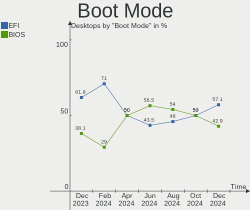
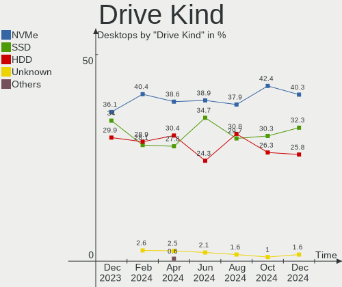
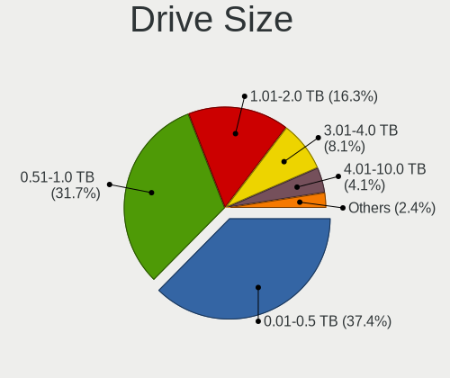

Arch Hardware Trends (Desktop)
------------------------------

A project to identify most popular hardware characteristics and track their change
over time based on data collected by Arch users at https://Linux-Hardware.org.

Anyone can contribute to the study by uploading probes of their computers by
the [hw-probe](https://github.com/linuxhw/hw-probe) tool:

    sudo hw-probe -all -upload

Full-feature report is available here: https://linux-hardware.org/?view=trends&formfactor=desktop

Period: Feb, 2020.

Contents
--------

- [ OS                       ](#os)
- [ OS Family                ](#os-family)
- [ Kernel                   ](#kernel)
- [ Kernel Family            ](#kernel-family)
- [ Kernel Major Ver.        ](#kernel-major-ver)
- [ Arch                     ](#arch)
- [ DE                       ](#de)
- [ Display Server           ](#display-server)
- [ OS Lang                  ](#os-lang)
- [ Boot Mode                ](#boot-mode)
- [ Filesystem               ](#filesystem)
- [ Dual Boot with Linux     ](#dual-boot-with-linux)
- [ Dual Boot (Win)          ](#dual-boot-win)
- [ Country                  ](#country)
- [ City                     ](#city)
- [ Vendor                   ](#vendor)
- [ Model                    ](#model)
- [ Model Family             ](#model-family)
- [ MFG Year                 ](#mfg-year)
- [ Form Factor              ](#form-factor)
- [ Secure Boot              ](#secure-boot)
- [ Coreboot                 ](#coreboot)
- [ RAM Size                 ](#ram-size)
- [ RAM Used                 ](#ram-used)
- [ Drive Vendor             ](#drive-vendor)
- [ Drive Model              ](#drive-model)
- [ Drive Kind               ](#drive-kind)
- [ Drive Connector          ](#drive-connector)
- [ Drive Size               ](#drive-size)
- [ Space Total              ](#space-total)
- [ Space Used               ](#space-used)
- [ Malfunc. Drives          ](#malfunc-drives)
- [ Malfunc. Drive Vendor    ](#malfunc-drive-vendor)
- [ Malfunc. Drive Kind      ](#malfunc-drive-kind)
- [ Failed Drives            ](#failed-drives)
- [ Failed Drive Vendor      ](#failed-drive-vendor)
- [ Drive Status             ](#drive-status)
- [ Storage Vendor           ](#storage-vendor)
- [ Storage Model            ](#storage-model)
- [ Storage Kind             ](#storage-kind)
- [ CPU Vendor               ](#cpu-vendor)
- [ CPU Model                ](#cpu-model)
- [ CPU Model Family         ](#cpu-model-family)
- [ CPU Cores                ](#cpu-cores)
- [ CPU Sockets              ](#cpu-sockets)
- [ CPU Threads              ](#cpu-threads)
- [ CPU Op-Modes             ](#cpu-op-modes)
- [ CPU Microarch            ](#cpu-microarch)
- [ CPU Microcode            ](#cpu-microcode)
- [ GPU Vendor               ](#gpu-vendor)
- [ GPU Model                ](#gpu-model)
- [ GPU Combo                ](#gpu-combo)
- [ GPU Driver               ](#gpu-driver)
- [ GPU Memory               ](#gpu-memory)
- [ Monitor Vendor           ](#monitor-vendor)
- [ Monitor Model            ](#monitor-model)
- [ Monitor Resolution       ](#monitor-resolution)
- [ Monitor Diagonal         ](#monitor-diagonal)
- [ Monitor Width            ](#monitor-width)
- [ Aspect Ratio             ](#aspect-ratio)
- [ Monitor Area             ](#monitor-area)
- [ Pixel Density            ](#pixel-density)
- [ Multiple Monitors        ](#multiple-monitors)
- [ Net Controller Vendor    ](#net-controller-vendor)
- [ Net Controller Model     ](#net-controller-model)
- [ Net Controller Kind      ](#net-controller-kind)
- [ Used Controller          ](#used-controller)
- [ NICs                     ](#nics)
- [ Unsupported Devices      ](#unsupported-devices)
- [ Unsupported Device Types ](#unsupported-device-types)

OS
--

Installed operating systems

| Name         | Computers | Percent |
|--------------|-----------|---------|
| Arch         | 16        | 64%     |
| Arch Rolling | 9         | 36%     |

OS Family
---------

OS without a version

| Name | Computers | Percent |
|------|-----------|---------|
| Arch | 25        | 100%    |

Kernel
------

Version of the Linux kernel

| Version                  | Computers | Percent |
|--------------------------|-----------|---------|
| 5.4.15-arch1-1           | 5         | 20%     |
| 5.5.4-arch1-1            | 3         | 12%     |
| 5.5.3-arch1-1            | 3         | 12%     |
| 5.5.2-arch1-1            | 3         | 12%     |
| 5.5.5-arch1-1            | 2         | 8%      |
| 5.6.0-rc1-2-nycko-rc1    | 1         | 4%      |
| 5.5.1-arch1-1            | 1         | 4%      |
| 5.4.19-1-lts             | 1         | 4%      |
| 5.4.15-1-ck-zen2         | 1         | 4%      |
| 5.4.12-arch1-1           | 1         | 4%      |
| 5.3.7-arch1-1-ARCH       | 1         | 4%      |
| 4.19.99-1-lts            | 1         | 4%      |
| 4.19.97-1-lts            | 1         | 4%      |
| 4.19.78-xxxx-std-ipv6-64 | 1         | 4%      |

Kernel Family
-------------

Linux kernel without a distro release

| Version | Computers | Percent |
|---------|-----------|---------|
| 5.4.15  | 6         | 24%     |
| 5.5.4   | 3         | 12%     |
| 5.5.3   | 3         | 12%     |
| 5.5.2   | 3         | 12%     |
| 5.5.5   | 2         | 8%      |
| 5.6.0   | 1         | 4%      |
| 5.5.1   | 1         | 4%      |
| 5.4.19  | 1         | 4%      |
| 5.4.12  | 1         | 4%      |
| 5.3.7   | 1         | 4%      |
| 4.19.99 | 1         | 4%      |
| 4.19.97 | 1         | 4%      |
| 4.19.78 | 1         | 4%      |

Kernel Major Ver.
-----------------

Linux kernel major version

| Version | Computers | Percent |
|---------|-----------|---------|
| 5.5     | 12        | 48%     |
| 5.4     | 8         | 32%     |
| 4.19    | 3         | 12%     |
| 5.6     | 1         | 4%      |
| 5.3     | 1         | 4%      |

Arch
----

OS architecture (x86_64, i586, etc.)

| Name   | Computers | Percent |
|--------|-----------|---------|
| x86_64 | 25        | 100%    |

DE
--

Desktop Environment

| Name          | Computers | Percent |
|---------------|-----------|---------|
| GNOME         | 7         | 28%     |
| Unknown       | 5         | 20%     |
| KDE           | 4         | 16%     |
| KDE5          | 3         | 12%     |
| XFCE          | 1         | 4%      |
| X-Cinnamon    | 1         | 4%      |
| LXDE          | 1         | 4%      |
| GNUstep       | 1         | 4%      |
| Enlightenment | 1         | 4%      |
| Budgie        | 1         | 4%      |

Display Server
--------------

X11 or Wayland

| Name    | Computers | Percent |
|---------|-----------|---------|
| X11     | 20        | 80%     |
| Unknown | 3         | 12%     |
| Wayland | 1         | 4%      |
| Tty     | 1         | 4%      |

OS Lang
-------

Language

| Lang       | Computers | Percent |
|------------|-----------|---------|
| en_US      | 11        | 44%     |
| en_GB      | 3         | 12%     |
| pl_PL      | 2         | 8%      |
| de_DE      | 2         | 8%      |
| ru_RU.utf8 | 1         | 4%      |
| ru_RU      | 1         | 4%      |
| pt_BR      | 1         | 4%      |
| ja_JP      | 1         | 4%      |
| fr_CA      | 1         | 4%      |
| en_CA      | 1         | 4%      |
| Unknown    | 1         | 4%      |

Boot Mode
---------

EFI or BIOS

| Mode | Computers | Percent |
|------|-----------|---------|
| BIOS | 14        | 56%     |
| EFI  | 11        | 44%     |

Filesystem
----------

Type of filesystem

| Type  | Computers | Percent |
|-------|-----------|---------|
| Ext4  | 17        | 68%     |
| Btrfs | 5         | 20%     |
| Xfs   | 2         | 8%      |
| F2fs  | 1         | 4%      |

Dual Boot with Linux
--------------------

Hosting more than one Linux

| Dual boot | Computers | Percent |
|-----------|-----------|---------|
| No        | 23        | 92%     |
| Yes       | 2         | 8%      |

Dual Boot (Win)
---------------

Hosting Linux and Windows

| Dual boot | Computers | Percent |
|-----------|-----------|---------|
| No        | 19        | 76%     |
| Yes       | 6         | 24%     |

Country
-------

Geographic location (country)

| Country        | Computers | Percent |
|----------------|-----------|---------|
| USA            | 4         | 16%     |
| Germany        | 4         | 16%     |
| UK             | 2         | 8%      |
| Russia         | 2         | 8%      |
| Poland         | 2         | 8%      |
| Canada         | 2         | 8%      |
| Brazil         | 2         | 8%      |
| Romania        | 1         | 4%      |
| Mexico         | 1         | 4%      |
| Japan          | 1         | 4%      |
| Greece         | 1         | 4%      |
| France         | 1         | 4%      |
| Czech Republic | 1         | 4%      |
| China          | 1         | 4%      |

City
----

Geographic location (city)

| City              | Computers | Percent |
|-------------------|-----------|---------|
| Łódź           | 1         | 4%      |
| Wejherowo         | 1         | 4%      |
| Tuttlingen        | 1         | 4%      |
| Taubate           | 1         | 4%      |
| São Luís        | 1         | 4%      |
| Shanghai          | 1         | 4%      |
| San Diego         | 1         | 4%      |
| Prague            | 1         | 4%      |
| Powder Springs    | 1         | 4%      |
| Playa del Carmen  | 1         | 4%      |
| Nyazepetrovskaya  | 1         | 4%      |
| Norderstedt       | 1         | 4%      |
| Nizhneudinsk      | 1         | 4%      |
| Mytilene          | 1         | 4%      |
| Montreal          | 1         | 4%      |
| Millinocket       | 1         | 4%      |
| Gravelines        | 1         | 4%      |
| Frankfurt am Main | 1         | 4%      |
| Ellesmere         | 1         | 4%      |
| Dartford          | 1         | 4%      |
| Cologne           | 1         | 4%      |
| Cluj-Napoca       | 1         | 4%      |
| Chiyoda           | 1         | 4%      |
| Calgary           | 1         | 4%      |
| Aurora            | 1         | 4%      |

Vendor
------

Motherboard manufacturer

| Name                | Computers | Percent |
|---------------------|-----------|---------|
| ASUSTek Computer    | 9         | 36%     |
| MSI                 | 4         | 16%     |
| Gigabyte Technology | 4         | 16%     |
| ASRock              | 4         | 16%     |
| Lenovo              | 1         | 4%      |
| Intel               | 1         | 4%      |
| Dell                | 1         | 4%      |
| Unknown             | 1         | 4%      |

Model
-----

Motherboard model

| Name                              | Computers | Percent |
|-----------------------------------|-----------|---------|
| MSI MS-7C35                       | 1         | 4%      |
| MSI MS-7B89                       | 1         | 4%      |
| MSI MS-7B38                       | 1         | 4%      |
| MSI MS-7808                       | 1         | 4%      |
| Lenovo ThinkCentre E73 10AU003BMX | 1         | 4%      |
| Intel DN2800MT AAG23738-804       | 1         | 4%      |
| Gigabyte H77-DS3H                 | 1         | 4%      |
| Gigabyte H61M-S2PV                | 1         | 4%      |
| Gigabyte B450M DS3H               | 1         | 4%      |
| Gigabyte AB350-Gaming 3           | 1         | 4%      |
| Dell OptiPlex 7050                | 1         | 4%      |
| ASUS Z170-A                       | 1         | 4%      |
| ASUS TUF B450M-PLUS GAMING        | 1         | 4%      |
| ASUS STRIX Z270G GAMING           | 1         | 4%      |
| ASUS SABERTOOTH 990FX R2.0        | 1         | 4%      |
| ASUS PRIME B360-PLUS              | 1         | 4%      |
| ASUS PRIME B350-PLUS              | 1         | 4%      |
| ASUS P8H61-MX USB3                | 1         | 4%      |
| ASUS Maximus VIII RANGER          | 1         | 4%      |
| ASUS M5A99FX PRO R2.0             | 1         | 4%      |
| ASRock Z77 Extreme4               | 1         | 4%      |
| ASRock Q1900M Pro3                | 1         | 4%      |
| ASRock H87M Pro4                  | 1         | 4%      |
| ASRock 970 Extreme4               | 1         | 4%      |
| Unknown                           | 1         | 4%      |

Model Family
------------

Motherboard model prefix

| Name                  | Computers | Percent |
|-----------------------|-----------|---------|
| ASUS PRIME            | 2         | 8%      |
| MSI MS-7C35           | 1         | 4%      |
| MSI MS-7B89           | 1         | 4%      |
| MSI MS-7B38           | 1         | 4%      |
| MSI MS-7808           | 1         | 4%      |
| Lenovo ThinkCentre    | 1         | 4%      |
| Intel DN2800MT        | 1         | 4%      |
| Gigabyte H77-DS3H     | 1         | 4%      |
| Gigabyte H61M-S2PV    | 1         | 4%      |
| Gigabyte B450M        | 1         | 4%      |
| Gigabyte AB350-Gaming | 1         | 4%      |
| Dell OptiPlex         | 1         | 4%      |
| ASUS Z170-A           | 1         | 4%      |
| ASUS TUF              | 1         | 4%      |
| ASUS STRIX            | 1         | 4%      |
| ASUS SABERTOOTH       | 1         | 4%      |
| ASUS P8H61-MX         | 1         | 4%      |
| ASUS Maximus          | 1         | 4%      |
| ASUS M5A99FX          | 1         | 4%      |
| ASRock Z77            | 1         | 4%      |
| ASRock Q1900M         | 1         | 4%      |
| ASRock H87M           | 1         | 4%      |
| ASRock 970            | 1         | 4%      |
| Unknown               | 1         | 4%      |

MFG Year
--------

Motherboard manufacture year

| Year    | Computers | Percent |
|---------|-----------|---------|
| 2013    | 7         | 28%     |
| 2019    | 5         | 20%     |
| 2018    | 3         | 12%     |
| 2016    | 3         | 12%     |
| 2014    | 3         | 12%     |
| 2017    | 2         | 8%      |
| 2015    | 1         | 4%      |
| Unknown | 1         | 4%      |

Form Factor
-----------

Physical design of the computer

| Name    | Computers | Percent |
|---------|-----------|---------|
| Desktop | 25        | 100%    |

Secure Boot
-----------

Enabled or disabled

| State    | Computers | Percent |
|----------|-----------|---------|
| Disabled | 25        | 100%    |

Coreboot
--------

Have coreboot on board

| Used | Computers | Percent |
|------|-----------|---------|
| No   | 25        | 100%    |

RAM Size
--------

Total RAM memory

| Size in GB  | Computers | Percent |
|-------------|-----------|---------|
| 16.01-24.0  | 11        | 44%     |
| 32.01-64.0  | 4         | 16%     |
| 8.01-16.0   | 4         | 16%     |
| 4.01-8.0    | 2         | 8%      |
| 3.01-4.0    | 2         | 8%      |
| 64.01-256.0 | 1         | 4%      |
| 1.01-2.0    | 1         | 4%      |

RAM Used
--------

Used RAM memory

| Used GB   | Computers | Percent |
|-----------|-----------|---------|
| 4.01-8.0  | 7         | 28%     |
| 2.01-3.0  | 6         | 24%     |
| 1.01-2.0  | 4         | 16%     |
| 3.01-4.0  | 3         | 12%     |
| 8.01-16.0 | 3         | 12%     |
| 0.01-1.0  | 2         | 8%      |

Drive Vendor
------------

Hard drive vendors

| Vendor              | Computers | Drives | Percent |
|---------------------|-----------|--------|---------|
| WDC                 | 13        | 26     | 23.21%  |
| Seagate             | 12        | 16     | 21.43%  |
| SanDisk             | 5         | 6      | 8.93%   |
| Samsung Electronics | 5         | 5      | 8.93%   |
| Intel               | 5         | 6      | 8.93%   |
| Toshiba             | 4         | 4      | 7.14%   |
| Kingston            | 2         | 3      | 3.57%   |
| Crucial             | 2         | 2      | 3.57%   |
| VMware              | 1         | 1      | 1.79%   |
| Unknown             | 1         | 1      | 1.79%   |
| SPCC                | 1         | 1      | 1.79%   |
| PLEXTOR             | 1         | 1      | 1.79%   |
| Patriot             | 1         | 1      | 1.79%   |
| LITEON              | 1         | 1      | 1.79%   |
| HGST                | 1         | 1      | 1.79%   |
| asmedia             | 1         | 1      | 1.79%   |

Drive Model
-----------

Hard drive models

| Model                        | Computers | Percent |
|------------------------------|-----------|---------|
| Ultra II 480GB SSD           | 2         | 2.99%   |
| ST4000DM000-1F2168 4TB       | 2         | 2.99%   |
| ST1000DM010-2EP102 1TB       | 2         | 2.99%   |
| ST1000DM003-9YN162 1TB       | 2         | 2.99%   |
| WDS480G2G0A-00JH30 480GB SSD | 1         | 1.49%   |
| WDS250G2B0A-00SM50 250GB SSD | 1         | 1.49%   |
| WDS240G2G0A-00JH30 240GB SSD | 1         | 1.49%   |
| WD80EZAZ-11TDBA0 8TB         | 1         | 1.49%   |
| WD80EMAZ-00WJTA0 8TB         | 1         | 1.49%   |
| WD7500BPVT-80HXZT1 752GB     | 1         | 1.49%   |
| WD6400AAKS-65Z7B0 640GB      | 1         | 1.49%   |
| WD6400AAKS-22A7B0 640GB      | 1         | 1.49%   |
| WD50EFRX-68MYMN1 5TB         | 1         | 1.49%   |
| WD40EFRX-68WT0N0 4TB         | 1         | 1.49%   |
| WD3200AAKS-00V1A0 320GB      | 1         | 1.49%   |
| WD2500JS-75NCB3 250GB        | 1         | 1.49%   |
| WD20PURZ-85GU6Y0 2TB         | 1         | 1.49%   |
| WD20EZRZ-00Z5HB0 2TB         | 1         | 1.49%   |
| WD140EMFZ-11A0WA0 14TB       | 1         | 1.49%   |
| WD120EMAZ-11BLFA0 12TB       | 1         | 1.49%   |
| WD10JPCX-24UE4T0 1TB         | 1         | 1.49%   |
| WD10EZEX-00BN5A0 1TB         | 1         | 1.49%   |
| WD100EZAZ-11TDBA0 10TB       | 1         | 1.49%   |
| WD1003FZEX-00K3CA0 1TB       | 1         | 1.49%   |
| Virtual S 55GB               | 1         | 1.49%   |
| TL100 240GB SSD              | 1         | 1.49%   |
| THNSNJ128G8NU 128GB SSD      | 1         | 1.49%   |
| SV300S37A120G 120GB SSD      | 1         | 1.49%   |
| SUV400S37240G 240GB SSD      | 1         | 1.49%   |
| ST8000DM004-2CX188 8TB       | 1         | 1.49%   |
| ST500LT012-1DG142 500GB      | 1         | 1.49%   |
| ST250DM000-1BD141 250GB      | 1         | 1.49%   |
| ST2000VX008-2E3164 2TB       | 1         | 1.49%   |
| ST2000DM001-1CH164 2TB       | 1         | 1.49%   |
| ST1000DM003-1CH162 1TB       | 1         | 1.49%   |
| ST10000VN0004-1ZD101 10TB    | 1         | 1.49%   |
| SSDSC2KW512G8 512GB          | 1         | 1.49%   |
| SSDSC2KW480H6 480GB          | 1         | 1.49%   |
| SSDSC2CW240A3 240GB          | 1         | 1.49%   |
| SSDSC2CT120A3 120GB          | 1         | 1.49%   |
| SSDSC2BW360H6 360GB          | 1         | 1.49%   |
| SSDSC2BW120A4 120GB          | 1         | 1.49%   |
| SSD 970 EVO Plus 1TB         | 1         | 1.49%   |
| SSD 850 EVO M.2 120GB        | 1         | 1.49%   |
| SSD 850 EVO 500GB            | 1         | 1.49%   |
| Solid State Disk 1024GB      | 1         | 1.49%   |
| SHGS31-500GS-2 500GB         | 1         | 1.49%   |
| SDSSDHII480G 480GB           | 1         | 1.49%   |
| SDSSDA240G 240GB             | 1         | 1.49%   |
| SDSSDA120G 120GB             | 1         | 1.49%   |
| SD8SNAT256G1122 256GB SSD    | 1         | 1.49%   |
| SA400S37480G 480GB SSD       | 1         | 1.49%   |
| PX-256M6S 256GB SSD          | 1         | 1.49%   |
| MG03ACA400 4TB               | 1         | 1.49%   |
| M3 Portable 1TB              | 1         | 1.49%   |
| HTS721010A9E630 1TB          | 1         | 1.49%   |
| HD103SI 1TB                  | 1         | 1.49%   |
| DT01ACA050 500GB             | 1         | 1.49%   |
| CV3-8D256-11 SATA 256GB SSD  | 1         | 1.49%   |
| CT250MX200SSD1 250GB         | 1         | 1.49%   |

Drive Kind
----------

HDD or SSD

| Kind    | Computers | Drives | Percent |
|---------|-----------|--------|---------|
| HDD     | 21        | 43     | 47.73%  |
| SSD     | 19        | 29     | 43.18%  |
| Unknown | 3         | 3      | 6.82%   |
| NVMe    | 1         | 1      | 2.27%   |

Drive Connector
---------------

SATA, SAS, NVMe, etc.

| Type | Computers | Drives | Percent |
|------|-----------|--------|---------|
| SATA | 24        | 72     | 85.71%  |
| SAS  | 3         | 3      | 10.71%  |
| NVMe | 1         | 1      | 3.57%   |

Drive Size
----------

Size of hard drive

| Size in TB | Computers | Drives | Percent |
|------------|-----------|--------|---------|
| 0.01-0.5   | 22        | 34     | 45.83%  |
| 0.51-1.0   | 13        | 17     | 27.08%  |
| 1.01-2.0   | 5         | 6      | 10.42%  |
| 3.01-4.0   | 4         | 5      | 8.33%   |
| 4.01-10.0  | 3         | 12     | 6.25%   |
| 10.01-20.0 | 1         | 2      | 2.08%   |

Space Total
-----------

Amount of disk space available on the file system

| Size in GB     | Computers | Percent |
|----------------|-----------|---------|
| More than 3000 | 8         | 32%     |
| 101-250        | 6         | 24%     |
| 251-500        | 4         | 16%     |
| 2001-3000      | 4         | 16%     |
| 1001-2000      | 2         | 8%      |
| 21-50          | 1         | 4%      |

Space Used
----------

Amount of used disk space

| Used GB        | Computers | Percent |
|----------------|-----------|---------|
| More than 3000 | 6         | 24%     |
| 21-50          | 4         | 16%     |
| 101-250        | 4         | 16%     |
| 501-1000       | 4         | 16%     |
| 1001-2000      | 3         | 12%     |
| 251-500        | 1         | 4%      |
| 2001-3000      | 1         | 4%      |
| 1-20           | 1         | 4%      |
| 51-100         | 1         | 4%      |

Malfunc. Drives
---------------

Drive models with a malfunction

| Model                  | Computers | Drives | Percent |
|------------------------|-----------|--------|---------|
| ST1000DM003-9YN162 1TB | 1         | 1      | 25%     |
| SSDSC2CT120A3 120GB    | 1         | 1      | 25%     |
| SSDSC2BW360H6 360GB    | 1         | 1      | 25%     |
| PX-256M6S 256GB SSD    | 1         | 1      | 25%     |

Malfunc. Drive Vendor
---------------------

Vendors of faulty drives

| Vendor  | Computers | Drives | Percent |
|---------|-----------|--------|---------|
| Intel   | 2         | 2      | 50%     |
| Seagate | 1         | 1      | 25%     |
| PLEXTOR | 1         | 1      | 25%     |

Malfunc. Drive Kind
-------------------

Kinds of faulty drives

| Kind | Computers | Drives | Percent |
|------|-----------|--------|---------|
| SSD  | 2         | 3      | 66.67%  |
| HDD  | 1         | 1      | 33.33%  |

Failed Drives
-------------

Failed drive models

Zero info for selected period =(

Failed Drive Vendor
-------------------

Failed drive vendors

Zero info for selected period =(

Drive Status
------------

Number of failed and malfunc. drives

| Status   | Computers | Drives | Percent |
|----------|-----------|--------|---------|
| Detected | 14        | 36     | 50%     |
| Works    | 11        | 36     | 39.29%  |
| Malfunc  | 3         | 4      | 10.71%  |

Storage Vendor
--------------

Storage controller vendors

| Vendor                    | Computers | Percent |
|---------------------------|-----------|---------|
| Intel                     | 15        | 42.86%  |
| AMD                       | 10        | 28.57%  |
| ASMedia Technology        | 3         | 8.57%   |
| Samsung Electronics       | 2         | 5.71%   |
| LSI Logic / Symbios Logic | 2         | 5.71%   |
| VMware                    | 1         | 2.86%   |
| Silicon Image             | 1         | 2.86%   |
| Phison Electronics        | 1         | 2.86%   |

Storage Model
-------------

Storage controller models

| Model                                                                             | Computers | Percent |
|-----------------------------------------------------------------------------------|-----------|---------|
| FCH SATA Controller [AHCI mode]                                                   | 7         | 15.22%  |
| ASM1062 Serial ATA Controller                                                     | 3         | 6.52%   |
| 400 Series Chipset SATA Controller                                                | 3         | 6.52%   |
| SB7x0/SB8x0/SB9x0 SATA Controller [AHCI mode]                                     | 2         | 4.35%   |
| Q170/Q150/B150/H170/H110/Z170/CM236 Chipset SATA Controller [AHCI Mode]           | 2         | 4.35%   |
| NVMe SSD Controller SM981/PM981/PM983                                             | 2         | 4.35%   |
| 8 Series/C220 Series Chipset Family 6-port SATA Controller 1 [AHCI mode]          | 2         | 4.35%   |
| 7 Series/C210 Series Chipset Family 6-port SATA Controller [AHCI mode]            | 2         | 4.35%   |
| 300 Series Chipset SATA Controller                                                | 2         | 4.35%   |
| SSD 660P Series                                                                   | 1         | 2.17%   |
| SiI 3114 [SATALink/SATARaid] Serial ATA Controller                                | 1         | 2.17%   |
| SB7x0/SB8x0/SB9x0 SATA Controller [IDE mode]                                      | 1         | 2.17%   |
| SB7x0/SB8x0/SB9x0 IDE Controller                                                  | 1         | 2.17%   |
| SATA Controller [RAID mode]                                                       | 1         | 2.17%   |
| SATA AHCI controller                                                              | 1         | 2.17%   |
| SAS2008 PCI-Express Fusion-MPT SAS-2 [Falcon]                                     | 1         | 2.17%   |
| NVMe SSD Optane Series Controller                                                 | 1         | 2.17%   |
| NM10/ICH7 Family SATA Controller [AHCI mode]                                      | 1         | 2.17%   |
| FCH SATA Controller D                                                             | 1         | 2.17%   |
| E7 NVMe Controller                                                                | 1         | 2.17%   |
| Cannon Lake PCH SATA AHCI Controller                                              | 1         | 2.17%   |
| Atom Processor E3800 Series SATA AHCI Controller                                  | 1         | 2.17%   |
| 82371AB/EB/MB PIIX4 IDE                                                           | 1         | 2.17%   |
| 7 Series/C210 Series Chipset Family 4-port SATA Controller [IDE mode]             | 1         | 2.17%   |
| 7 Series/C210 Series Chipset Family 2-port SATA Controller [IDE mode]             | 1         | 2.17%   |
| 6 Series/C200 Series Chipset Family Desktop SATA Controller (IDE mode, ports 4-5) | 1         | 2.17%   |
| 6 Series/C200 Series Chipset Family Desktop SATA Controller (IDE mode, ports 0-3) | 1         | 2.17%   |
| 6 Series/C200 Series Chipset Family 6 port Desktop SATA AHCI Controller           | 1         | 2.17%   |
| 53c1030 PCI-X Fusion-MPT Dual Ultra320 SCSI                                       | 1         | 2.17%   |
| 200 Series PCH SATA controller [AHCI mode]                                        | 1         | 2.17%   |

Storage Kind
------------

Kind of storage controller (IDE, SATA, NVMe, SAS, ...)

| Kind | Computers | Percent |
|------|-----------|---------|
| SATA | 22        | 62.86%  |
| NVMe | 5         | 14.29%  |
| IDE  | 4         | 11.43%  |
| RAID | 2         | 5.71%   |
| SAS  | 1         | 2.86%   |
| SCSI | 1         | 2.86%   |

CPU Vendor
----------

Processor vendors

| Vendor | Computers | Percent |
|--------|-----------|---------|
| Intel  | 15        | 60%     |
| AMD    | 10        | 40%     |

CPU Model
---------

Processor models

| Model                                         | Computers | Percent |
|-----------------------------------------------|-----------|---------|
| Intel Core i7-6700K CPU @ 4.00GHz             | 2         | 8%      |
| Intel Xeon CPU E3-1230 V2 @ 3.30GHz           | 1         | 4%      |
| Intel Core i7-7700T CPU @ 2.90GHz             | 1         | 4%      |
| Intel Core i7-7700K CPU @ 4.20GHz             | 1         | 4%      |
| Intel Core i7-4770S CPU @ 3.10GHz             | 1         | 4%      |
| Intel Core i7-3770K CPU @ 3.50GHz             | 1         | 4%      |
| Intel Core i7 CPU 930 @ 2.80GHz               | 1         | 4%      |
| Intel Core i5-9400F CPU @ 2.90GHz             | 1         | 4%      |
| Intel Core i5-3470 CPU @ 3.20GHz              | 1         | 4%      |
| Intel Core i5-3450 CPU @ 3.10GHz              | 1         | 4%      |
| Intel Core i5-2400 CPU @ 3.10GHz              | 1         | 4%      |
| Intel Core i3-4160 CPU @ 3.60GHz              | 1         | 4%      |
| Intel Celeron CPU J1900 @ 1.99GHz             | 1         | 4%      |
| Intel Atom CPU N2800 @ 1.86GHz                | 1         | 4%      |
| AMD Ryzen 9 3950X 16-Core Processor           | 1         | 4%      |
| AMD Ryzen 7 2700 Eight-Core Processor         | 1         | 4%      |
| AMD Ryzen 7 1700 Eight-Core Processor         | 1         | 4%      |
| AMD Ryzen 5 3600 6-Core Processor             | 1         | 4%      |
| AMD Ryzen 5 2400G with Radeon Vega Graphics   | 1         | 4%      |
| AMD Ryzen 3 1300X Quad-Core Processor         | 1         | 4%      |
| AMD FX-8350 Eight-Core Processor              | 1         | 4%      |
| AMD FX-8320 Eight-Core Processor              | 1         | 4%      |
| AMD FX-4300 Quad-Core Processor               | 1         | 4%      |
| AMD A8-9600 RADEON R7, 10 COMPUTE CORES 4C+6G | 1         | 4%      |

CPU Model Family
----------------

Processor model prefix

| Model         | Computers | Percent |
|---------------|-----------|---------|
| Intel Core i7 | 7         | 28%     |
| Intel Core i5 | 4         | 16%     |
| AMD FX        | 3         | 12%     |
| AMD Ryzen 7   | 2         | 8%      |
| AMD Ryzen 5   | 2         | 8%      |
| Intel Xeon    | 1         | 4%      |
| Intel Core i3 | 1         | 4%      |
| Intel Celeron | 1         | 4%      |
| Intel Atom    | 1         | 4%      |
| AMD Ryzen 9   | 1         | 4%      |
| AMD Ryzen 3   | 1         | 4%      |
| AMD A8        | 1         | 4%      |

CPU Cores
---------

Number of processor cores

| Number | Computers | Percent |
|--------|-----------|---------|
| 4      | 16        | 64%     |
| 2      | 4         | 16%     |
| 8      | 2         | 8%      |
| 6      | 2         | 8%      |
| 16     | 1         | 4%      |

CPU Sockets
-----------

Number of sockets

| Number | Computers | Percent |
|--------|-----------|---------|
| 1      | 24        | 96%     |
| 2      | 1         | 4%      |

CPU Threads
-----------

Threads per core (Hyper-Threading)

| Number | Computers | Percent |
|--------|-----------|---------|
| 2      | 18        | 72%     |
| 1      | 7         | 28%     |

CPU Op-Modes
------------

CPU Operation Modes (32-bit, 64-bit)

| Op mode        | Computers | Percent |
|----------------|-----------|---------|
| 32-bit, 64-bit | 24        | 96%     |
| Unknown        | 1         | 4%      |

CPU Microarch
-------------

Microarchitecture

| Name        | Computers | Percent |
|-------------|-----------|---------|
| IvyBridge   | 4         | 16%     |
| Zen         | 3         | 12%     |
| Skylake     | 3         | 12%     |
| Piledriver  | 3         | 12%     |
| Zen 2       | 2         | 8%      |
| KabyLake    | 2         | 8%      |
| Haswell     | 2         | 8%      |
| Zen+        | 1         | 4%      |
| Silvermont  | 1         | 4%      |
| SandyBridge | 1         | 4%      |
| Nehalem     | 1         | 4%      |
| Excavator   | 1         | 4%      |
| Bonnell     | 1         | 4%      |

CPU Microcode
-------------

Microcode number

| Number     | Computers | Percent |
|------------|-----------|---------|
| Unknown    | 7         | 28%     |
| 0x306a9    | 4         | 16%     |
| 0x506e3    | 2         | 8%      |
| 0x306c3    | 2         | 8%      |
| 0x06000822 | 2         | 8%      |
| 0x906ea    | 1         | 4%      |
| 0x206a7    | 1         | 4%      |
| 0x08101016 | 1         | 4%      |
| 0x0800820d | 1         | 4%      |
| 0x08001138 | 1         | 4%      |
| 0x08001126 | 1         | 4%      |
| 0x06006118 | 1         | 4%      |
| 0x06000817 | 1         | 4%      |

GPU Vendor
----------

Vendors of graphics cards

| Vendor | Computers | Percent |
|--------|-----------|---------|
| Nvidia | 9         | 36%     |
| AMD    | 9         | 36%     |
| Intel  | 6         | 24%     |
| VMware | 1         | 4%      |

GPU Model
---------

Graphics card models

| Model                                                                 | Computers | Percent |
|-----------------------------------------------------------------------|-----------|---------|
| Ellesmere [Radeon RX 470/480/570/570X/580/580X/590]                   | 3         | 12%     |
| Hawaii PRO [Radeon R9 290/390]                                        | 2         | 8%      |
| GP104 [GeForce GTX 1070]                                              | 2         | 8%      |
| Xeon E3-1200 v3/4th Gen Core Processor Integrated Graphics Controller | 1         | 4%      |
| Xeon E3-1200 v2/3rd Gen Core processor Graphics Controller            | 1         | 4%      |
| Turks XT [Radeon HD 6670/7670]                                        | 1         | 4%      |
| SVGA II Adapter                                                       | 1         | 4%      |
| Oland PRO [Radeon R7 240/340]                                         | 1         | 4%      |
| HD Graphics 630                                                       | 1         | 4%      |
| HD Graphics 530                                                       | 1         | 4%      |
| GP107 [GeForce GTX 1050 Ti]                                           | 1         | 4%      |
| GP106 [GeForce GTX 1060 6GB]                                          | 1         | 4%      |
| GP102 [GeForce GTX 1080 Ti]                                           | 1         | 4%      |
| GM204 [GeForce GTX 980]                                               | 1         | 4%      |
| GK107 [GeForce GT 740]                                                | 1         | 4%      |
| GK107 [GeForce GT 640]                                                | 1         | 4%      |
| GK106 [GeForce GTX 660]                                               | 1         | 4%      |
| Cedar [Radeon HD 5000/6000/7350/8350 Series]                          | 1         | 4%      |
| Baffin [Radeon RX 460/560D / Pro 450/455/460/555/555X/560/560X]       | 1         | 4%      |
| Atom Processor Z36xxx/Z37xxx Series Graphics & Display                | 1         | 4%      |
| Atom Processor D2xxx/N2xxx Integrated Graphics Controller             | 1         | 4%      |

GPU Combo
---------

Combinations of graphics cards

| Name       | Computers | Percent |
|------------|-----------|---------|
| 1 x Nvidia | 9         | 36%     |
| 1 x AMD    | 9         | 36%     |
| 1 x Intel  | 5         | 20%     |
| Other      | 1         | 4%      |
| 1 x VMware | 1         | 4%      |

GPU Driver
----------

Free vs proprietary

| Driver      | Computers | Percent |
|-------------|-----------|---------|
| Free        | 13        | 52%     |
| Proprietary | 8         | 32%     |
| Unknown     | 4         | 16%     |

GPU Memory
----------

Total video memory

| Size in GB | Computers | Percent |
|------------|-----------|---------|
| Unknown    | 8         | 32%     |
| 3.01-4.0   | 5         | 20%     |
| 7.01-8.0   | 4         | 16%     |
| 1.01-2.0   | 3         | 12%     |
| 0.51-1.0   | 2         | 8%      |
| 5.01-6.0   | 1         | 4%      |
| 8.01-16.0  | 1         | 4%      |
| 0.01-0.5   | 1         | 4%      |

Monitor Vendor
--------------

Monitor vendors

| Vendor               | Computers | Percent |
|----------------------|-----------|---------|
| Dell                 | 5         | 20%     |
| Ancor Communications | 3         | 12%     |
| Samsung Electronics  | 2         | 8%      |
| Philips              | 2         | 8%      |
| Goldstar             | 2         | 8%      |
| Acer                 | 2         | 8%      |
| Vestel Elektronik    | 1         | 4%      |
| Unknown              | 1         | 4%      |
| RAT                  | 1         | 4%      |
| Medion               | 1         | 4%      |
| LG Electronics       | 1         | 4%      |
| Lenovo               | 1         | 4%      |
| Hewlett-Packard      | 1         | 4%      |
| DSC                  | 1         | 4%      |
| BenQ                 | 1         | 4%      |

Monitor Model
-------------

Monitor models

| Model                                                | Computers | Percent |
|------------------------------------------------------|-----------|---------|
| Z24i HWP309E 1920x1200 518x324mm 24.1-inch           | 1         | 4%      |
| XL2720T BNQ7F13 1920x1080 600x340mm 27.2-inch        | 1         | 4%      |
| Ultra HD GSM5B09 3840x2160 600x340mm 27.2-inch       | 1         | 4%      |
| U2518D DEL413A 2560x1440 553x311mm 25.0-inch         | 1         | 4%      |
| U2413 DELF046 1920x1080 520x320mm 24.0-inch          | 1         | 4%      |
| SyncMaster SAM0594 1680x1050 459x296mm 21.5-inch     | 1         | 4%      |
| SyncMaster SAM037C 1680x1050 474x296mm 22.0-inch     | 1         | 4%      |
| PHL BDM4065 PHL08E1 1920x1080 880x490mm 39.7-inch    | 1         | 4%      |
| Paperlike H D DSC0001 2200x1650 200x150mm 9.8-inch   | 1         | 4%      |
| P2419H DELD0D9 1920x1080 527x296mm 23.8-inch         | 1         | 4%      |
| P2317H DEL40F3 1920x1080 509x286mm 23.0-inch         | 1         | 4%      |
| MONITOR-DP RAT2700 2560x1440 597x336mm 27.0-inch     | 1         | 4%      |
| MD41887FO MEDD7A8 1280x1024 338x270mm 17.0-inch      | 1         | 4%      |
| LT1952p Wide LEN0990 1440x900 408x255mm 18.9-inch    | 1         | 4%      |
| LCD Monitor PHL 276E8V                               | 1         | 4%      |
| LCD Monitor P2418HT 1920x1080                        | 1         | 4%      |
| LCD Monitor Kingston Technology 55'TV                | 1         | 4%      |
| LCD Monitor E2442 1920x1080                          | 1         | 4%      |
| KA270H ACR0522 1920x1080 598x336mm 27.0-inch         | 1         | 4%      |
| K242HL ACR03E3 1920x1080 531x299mm 24.0-inch         | 1         | 4%      |
| ASUS VH242H ACI24F3 1920x1080 521x293mm 23.5-inch    | 1         | 4%      |
| ASUS VH236H ACI23F2 1920x1080 520x290mm 23.4-inch    | 1         | 4%      |
| ASUS PB278 ACI27A3 2560x1440 597x336mm 27.0-inch     | 1         | 4%      |
| 50UHD_LCD_TV VES3700 3840x2160 1872x1053mm 84.6-inch | 1         | 4%      |
| 22M35 GSM5A32 1920x1080 480x270mm 21.7-inch          | 1         | 4%      |

Monitor Resolution
------------------

Monitor screen resolution

| Resolution         | Computers | Percent |
|--------------------|-----------|---------|
| 1920x1080 (FHD)    | 10        | 43.48%  |
| 2560x1440 (QHD)    | 3         | 13.04%  |
| 3840x2160 (4K)     | 2         | 8.7%    |
| 1920x1200 (WUXGA)  | 2         | 8.7%    |
| 1680x1050 (WSXGA+) | 2         | 8.7%    |
| 2200x1650          | 1         | 4.35%   |
| 1440x900 (WXGA+)   | 1         | 4.35%   |
| 1280x1024 (SXGA)   | 1         | 4.35%   |
| Unknown            | 1         | 4.35%   |

Monitor Diagonal
----------------

Diagonal size in inches

| Inches  | Computers | Percent |
|---------|-----------|---------|
| 27      | 5         | 20.83%  |
| 24      | 4         | 16.67%  |
| 23      | 3         | 12.5%   |
| Unknown | 3         | 12.5%   |
| 21      | 2         | 8.33%   |
| 39      | 1         | 4.17%   |
| 32      | 1         | 4.17%   |
| 25      | 1         | 4.17%   |
| 22      | 1         | 4.17%   |
| 18      | 1         | 4.17%   |
| 17      | 1         | 4.17%   |
| 9       | 1         | 4.17%   |

Monitor Width
-------------

Physical width

| Width in mm | Computers | Percent |
|-------------|-----------|---------|
| 501-600     | 12        | 54.55%  |
| 401-500     | 3         | 13.64%  |
| Unknown     | 3         | 13.64%  |
| 801-900     | 1         | 4.55%   |
| 701-800     | 1         | 4.55%   |
| 301-350     | 1         | 4.55%   |
| 101-200     | 1         | 4.55%   |

Aspect Ratio
------------

Proportional relationship between the width and the height

| Ratio   | Computers | Percent |
|---------|-----------|---------|
| 16/9    | 12        | 57.14%  |
| 16/10   | 4         | 19.05%  |
| Unknown | 3         | 14.29%  |
| 5/4     | 1         | 4.76%   |
| 4/3     | 1         | 4.76%   |

Monitor Area
------------

Area in inch²

| Area in inch² | Computers | Percent |
|----------------|-----------|---------|
| 201-250        | 7         | 30.43%  |
| 301-350        | 5         | 21.74%  |
| 251-300        | 3         | 13.04%  |
| Unknown        | 3         | 13.04%  |
| 351-500        | 1         | 4.35%   |
| 41-50          | 1         | 4.35%   |
| 151-200        | 1         | 4.35%   |
| 141-150        | 1         | 4.35%   |
| 501-1000       | 1         | 4.35%   |

Pixel Density
-------------

Pixels per inch

| Density       | Computers | Percent |
|---------------|-----------|---------|
| 51-100        | 13        | 56.52%  |
| 101-120       | 5         | 21.74%  |
| Unknown       | 3         | 13.04%  |
| More than 240 | 1         | 4.35%   |
| 161-240       | 1         | 4.35%   |

Multiple Monitors
-----------------

Total monitors connected

| Total | Computers | Percent |
|-------|-----------|---------|
| 1     | 15        | 60%     |
| 0     | 4         | 16%     |
| 3     | 3         | 12%     |
| 2     | 3         | 12%     |

Net Controller Vendor
---------------------

Controller vendors

| Vendor                | Computers | Percent |
|-----------------------|-----------|---------|
| Intel                 | 2         | 66.67%  |
| Realtek Semiconductor | 1         | 33.33%  |

Net Controller Model
--------------------

Controller models

| Model                             | Computers | Percent |
|-----------------------------------|-----------|---------|
| Wi-Fi 6 AX200                     | 1         | 33.33%  |
| RTL8125 2.5GbE Controller         | 1         | 33.33%  |
| 82574L Gigabit Network Connection | 1         | 33.33%  |

Net Controller Kind
-------------------

Ethernet, WiFi or modem

| Kind     | Computers | Percent |
|----------|-----------|---------|
| Ethernet | 2         | 66.67%  |
| WiFi     | 1         | 33.33%  |

Used Controller
---------------

Currently used network controller

| Kind     | Computers | Percent |
|----------|-----------|---------|
| Ethernet | 2         | 100%    |

NICs
----

Total network controllers on board

| Total | Computers | Percent |
|-------|-----------|---------|
| 1     | 20        | 80%     |
| 2     | 5         | 20%     |

Unsupported Devices
-------------------

Total unsupported devices on board

| Total | Computers | Percent |
|-------|-----------|---------|
| 0     | 23        | 92%     |
| 1     | 2         | 8%      |

Unsupported Device Types
------------------------

Types of unsupported devices

| Type          | Computers | Percent |
|---------------|-----------|---------|
| Graphics card | 2         | 66.67%  |
| Net/wireless  | 1         | 33.33%  |

