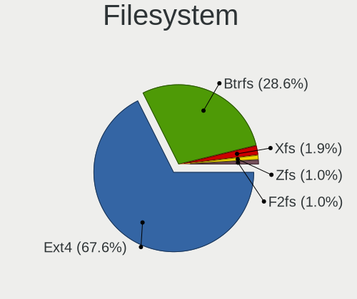
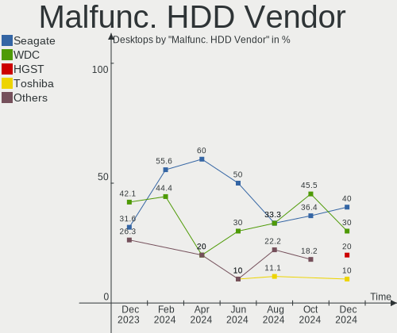
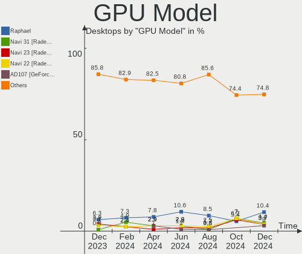
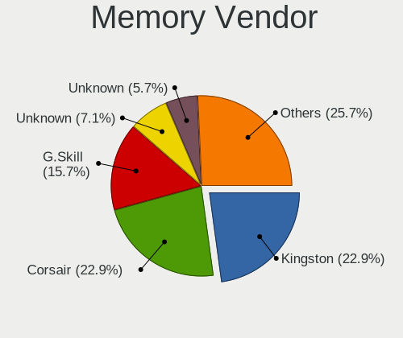

Arch Hardware Trends (Desktops)
-------------------------------

A project to identify most popular hardware characteristics and track their change
over time based on data collected by Arch users at https://Linux-Hardware.org.

Anyone can contribute to this report by the [hw-probe](https://github.com/linuxhw/hw-probe) tool:

    sudo -E hw-probe -all -upload

Full-feature report is available here: https://linux-hardware.org/?view=trends&formfactor=desktop

Period: Jul, 2021.

Contents
--------

* [ System ](#system)
  - [ OS                       ](#os)
  - [ OS Family                ](#os-family)
  - [ Kernel                   ](#kernel)
  - [ Kernel Family            ](#kernel-family)
  - [ Kernel Major Ver.        ](#kernel-major-ver)
  - [ Arch                     ](#arch)
  - [ DE                       ](#de)
  - [ Display Server           ](#display-server)
  - [ Display Manager          ](#display-manager)
  - [ OS Lang                  ](#os-lang)
  - [ Boot Mode                ](#boot-mode)
  - [ Filesystem               ](#filesystem)
  - [ Part. scheme             ](#part-scheme)
  - [ Dual Boot with Linux/BSD ](#dual-boot-with-linuxbsd)
  - [ Dual Boot (Win)          ](#dual-boot-win)

* [ Board ](#board)
  - [ Vendor                   ](#vendor)
  - [ Model                    ](#model)
  - [ Model Family             ](#model-family)
  - [ MFG Year                 ](#mfg-year)
  - [ Form Factor              ](#form-factor)
  - [ Secure Boot              ](#secure-boot)
  - [ Coreboot                 ](#coreboot)
  - [ RAM Size                 ](#ram-size)
  - [ RAM Used                 ](#ram-used)
  - [ Total Drives             ](#total-drives)
  - [ Has CD-ROM               ](#has-cd-rom)
  - [ Has Ethernet             ](#has-ethernet)
  - [ Has WiFi                 ](#has-wifi)
  - [ Has Bluetooth            ](#has-bluetooth)

* [ Location ](#location)
  - [ Country                  ](#country)
  - [ City                     ](#city)

* [ Drives ](#drives)
  - [ Drive Vendor             ](#drive-vendor)
  - [ Drive Model              ](#drive-model)
  - [ HDD Vendor               ](#hdd-vendor)
  - [ SSD Vendor               ](#ssd-vendor)
  - [ Drive Kind               ](#drive-kind)
  - [ Drive Connector          ](#drive-connector)
  - [ Drive Size               ](#drive-size)
  - [ Space Total              ](#space-total)
  - [ Space Used               ](#space-used)
  - [ Malfunc. Drives          ](#malfunc-drives)
  - [ Malfunc. Drive Vendor    ](#malfunc-drive-vendor)
  - [ Malfunc. HDD Vendor      ](#malfunc-hdd-vendor)
  - [ Malfunc. Drive Kind      ](#malfunc-drive-kind)
  - [ Failed Drives            ](#failed-drives)
  - [ Failed Drive Vendor      ](#failed-drive-vendor)
  - [ Drive Status             ](#drive-status)

* [ Storage controller ](#storage-controller)
  - [ Storage Vendor           ](#storage-vendor)
  - [ Storage Model            ](#storage-model)
  - [ Storage Kind             ](#storage-kind)

* [ Processor ](#processor)
  - [ CPU Vendor               ](#cpu-vendor)
  - [ CPU Model                ](#cpu-model)
  - [ CPU Model Family         ](#cpu-model-family)
  - [ CPU Cores                ](#cpu-cores)
  - [ CPU Sockets              ](#cpu-sockets)
  - [ CPU Threads              ](#cpu-threads)
  - [ CPU Op-Modes             ](#cpu-op-modes)
  - [ CPU Microcode            ](#cpu-microcode)
  - [ CPU Microarch            ](#cpu-microarch)

* [ Graphics ](#graphics)
  - [ GPU Vendor               ](#gpu-vendor)
  - [ GPU Model                ](#gpu-model)
  - [ GPU Combo                ](#gpu-combo)
  - [ GPU Driver               ](#gpu-driver)
  - [ GPU Memory               ](#gpu-memory)

* [ Monitor ](#monitor)
  - [ Monitor Vendor           ](#monitor-vendor)
  - [ Monitor Model            ](#monitor-model)
  - [ Monitor Resolution       ](#monitor-resolution)
  - [ Monitor Diagonal         ](#monitor-diagonal)
  - [ Monitor Width            ](#monitor-width)
  - [ Aspect Ratio             ](#aspect-ratio)
  - [ Monitor Area             ](#monitor-area)
  - [ Pixel Density            ](#pixel-density)
  - [ Multiple Monitors        ](#multiple-monitors)

* [ Network ](#network)
  - [ Net Controller Vendor    ](#net-controller-vendor)
  - [ Net Controller Model     ](#net-controller-model)
  - [ Wireless Vendor          ](#wireless-vendor)
  - [ Wireless Model           ](#wireless-model)
  - [ Ethernet Vendor          ](#ethernet-vendor)
  - [ Ethernet Model           ](#ethernet-model)
  - [ Net Controller Kind      ](#net-controller-kind)
  - [ Used Controller          ](#used-controller)
  - [ NICs                     ](#nics)
  - [ IPv6                     ](#ipv6)

* [ Bluetooth ](#bluetooth)
  - [ Bluetooth Vendor         ](#bluetooth-vendor)
  - [ Bluetooth Model          ](#bluetooth-model)

* [ Sound ](#sound)
  - [ Sound Vendor             ](#sound-vendor)
  - [ Sound Model              ](#sound-model)

* [ Memory ](#memory)
  - [ Memory Vendor            ](#memory-vendor)
  - [ Memory Model             ](#memory-model)
  - [ Memory Kind              ](#memory-kind)
  - [ Memory Form Factor       ](#memory-form-factor)
  - [ Memory Size              ](#memory-size)
  - [ Memory Speed             ](#memory-speed)

* [ Printers & scanners ](#printers-&-scanners)
  - [ Printer Vendor           ](#printer-vendor)
  - [ Printer Model            ](#printer-model)
  - [ Scanner Vendor           ](#scanner-vendor)
  - [ Scanner Model            ](#scanner-model)

* [ Camera ](#camera)
  - [ Camera Vendor            ](#camera-vendor)
  - [ Camera Model             ](#camera-model)

* [ Security ](#security)
  - [ Fingerprint Vendor       ](#fingerprint-vendor)
  - [ Fingerprint Model        ](#fingerprint-model)
  - [ Chipcard Vendor          ](#chipcard-vendor)
  - [ Chipcard Model           ](#chipcard-model)

* [ Unsupported ](#unsupported)
  - [ Unsupported Devices      ](#unsupported-devices)
  - [ Unsupported Device Types ](#unsupported-device-types)

System
------

OS
--

Installed operating systems

| Name         | Desktops | Percent |
|--------------|----------|---------|
| Arch         | 36       | 52.94%  |
| Arch Rolling | 32       | 47.06%  |

OS Family
---------

OS without a version

| Name | Desktops | Percent |
|------|----------|---------|
| Arch | 68       | 100%    |

Kernel
------

Version of the Linux kernel

| Version                    | Desktops | Percent |
|----------------------------|----------|---------|
| 5.12.14-arch1-1            | 13       | 19.12%  |
| 5.12.15-arch1-1            | 12       | 17.65%  |
| 5.13.5-arch1-1             | 4        | 5.88%   |
| 5.12.14-zen1-1-zen         | 4        | 5.88%   |
| 5.12.13-arch1-2            | 4        | 5.88%   |
| 5.13.4-arch2-1             | 3        | 4.41%   |
| 5.12.15-zen1-1-zen         | 3        | 4.41%   |
| 5.12.12-arch1-1            | 3        | 4.41%   |
| 5.13.6-arch1-1             | 2        | 2.94%   |
| 5.13.4-arch1-1             | 2        | 2.94%   |
| 5.10.52-1-lts              | 2        | 2.94%   |
| 5.13.5-zen1-1-zen          | 1        | 1.47%   |
| 5.13.4-xanmod1-1           | 1        | 1.47%   |
| 5.13.2-180-tkg-cacule      | 1        | 1.47%   |
| 5.13.1-zen1-1-zen          | 1        | 1.47%   |
| 5.13.1-xanmod1-cacule-1    | 1        | 1.47%   |
| 5.13.1-178-tkg-pds         | 1        | 1.47%   |
| 5.13.0-172-tkg-pds         | 1        | 1.47%   |
| 5.12.15-hardened1-2-stable | 1        | 1.47%   |
| 5.12.14-xanmod1-1-edge     | 1        | 1.47%   |
| 5.12.13-zen1-2-zen         | 1        | 1.47%   |
| 5.12.12-zen1-1-zen         | 1        | 1.47%   |
| 5.12.10-arch1-1            | 1        | 1.47%   |
| 5.12.1-xanmod2-2           | 1        | 1.47%   |
| 5.10.53-183-tkg-upds       | 1        | 1.47%   |
| 5.10.49-1-lts              | 1        | 1.47%   |
| 5.10.47-1-lts              | 1        | 1.47%   |

Kernel Family
-------------

Linux kernel without a distro release

| Version | Desktops | Percent |
|---------|----------|---------|
| 5.12.14 | 18       | 26.47%  |
| 5.12.15 | 16       | 23.53%  |
| 5.13.4  | 6        | 8.82%   |
| 5.13.5  | 5        | 7.35%   |
| 5.12.13 | 5        | 7.35%   |
| 5.12.12 | 4        | 5.88%   |
| 5.13.1  | 3        | 4.41%   |
| 5.13.6  | 2        | 2.94%   |
| 5.10.52 | 2        | 2.94%   |
| 5.13.2  | 1        | 1.47%   |
| 5.13.0  | 1        | 1.47%   |
| 5.12.10 | 1        | 1.47%   |
| 5.12.1  | 1        | 1.47%   |
| 5.10.53 | 1        | 1.47%   |
| 5.10.49 | 1        | 1.47%   |
| 5.10.47 | 1        | 1.47%   |

Kernel Major Ver.
-----------------

Linux kernel major version

| Version | Desktops | Percent |
|---------|----------|---------|
| 5.12    | 45       | 66.18%  |
| 5.13    | 18       | 26.47%  |
| 5.10    | 5        | 7.35%   |

Arch
----

OS architecture (x86_64, i586, etc.)

| Name   | Desktops | Percent |
|--------|----------|---------|
| x86_64 | 68       | 100%    |

DE
--

Desktop Environment

| Name       | Desktops | Percent |
|------------|----------|---------|
| GNOME      | 22       | 32.35%  |
| KDE5       | 21       | 30.88%  |
| Unknown    | 7        | 10.29%  |
| XFCE       | 6        | 8.82%   |
| KDE        | 4        | 5.88%   |
| i3         | 4        | 5.88%   |
| Budgie     | 2        | 2.94%   |
| X-Cinnamon | 1        | 1.47%   |
| qtile      | 1        | 1.47%   |

Display Server
--------------

X11 or Wayland

| Name    | Desktops | Percent |
|---------|----------|---------|
| X11     | 48       | 70.59%  |
| Wayland | 12       | 17.65%  |
| Tty     | 5        | 7.35%   |
| Unknown | 3        | 4.41%   |

Display Manager
---------------

SDDM, LightDM, etc.

| Name    | Desktops | Percent |
|---------|----------|---------|
| Unknown | 25       | 36.76%  |
| SDDM    | 20       | 29.41%  |
| TDM     | 11       | 16.18%  |
| GDM     | 8        | 11.76%  |
| XDM     | 2        | 2.94%   |
| Ly      | 2        | 2.94%   |

OS Lang
-------

Language

| Lang       | Desktops | Percent |
|------------|----------|---------|
| en_US      | 37       | 54.41%  |
| en_GB      | 6        | 8.82%   |
| de_DE      | 5        | 7.35%   |
| ru_RU      | 4        | 5.88%   |
| Unknown    | 3        | 4.41%   |
| pt_BR      | 2        | 2.94%   |
| es_ES      | 2        | 2.94%   |
| ru_RU.UTF8 | 1        | 1.47%   |
| pl_PL      | 1        | 1.47%   |
| nb_NO      | 1        | 1.47%   |
| it_IT      | 1        | 1.47%   |
| hu_HU      | 1        | 1.47%   |
| fr_FR      | 1        | 1.47%   |
| es_UY      | 1        | 1.47%   |
| en_AU      | 1        | 1.47%   |
| de_DE.UTF8 | 1        | 1.47%   |

Boot Mode
---------

EFI or BIOS

| Mode | Desktops | Percent |
|------|----------|---------|
| EFI  | 39       | 57.35%  |
| BIOS | 29       | 42.65%  |

Filesystem
----------

Type of filesystem

| Type  | Desktops | Percent |
|-------|----------|---------|
| Ext4  | 45       | 66.18%  |
| Btrfs | 18       | 26.47%  |
| Xfs   | 2        | 2.94%   |
| Zfs   | 1        | 1.47%   |
| XXXXX | 1        | 1.47%   |
| F2fs  | 1        | 1.47%   |

Part. scheme
------------

Scheme of partitioning

| Type    | Desktops | Percent |
|---------|----------|---------|
| GPT     | 47       | 69.12%  |
| Unknown | 17       | 25%     |
| MBR     | 4        | 5.88%   |

Dual Boot with Linux/BSD
------------------------

Hosting more than one Linux/BSD

| Dual boot | Desktops | Percent |
|-----------|----------|---------|
| No        | 59       | 86.76%  |
| Yes       | 9        | 13.24%  |

Dual Boot (Win)
---------------

Hosting Linux and Windows

| Dual boot | Desktops | Percent |
|-----------|----------|---------|
| No        | 40       | 58.82%  |
| Yes       | 28       | 41.18%  |

Board
-----

Vendor
------

Motherboard manufacturer

| Name                | Desktops | Percent |
|---------------------|----------|---------|
| ASUSTek Computer    | 25       | 36.76%  |
| MSI                 | 13       | 19.12%  |
| Gigabyte Technology | 12       | 17.65%  |
| ASRock              | 7        | 10.29%  |
| Hewlett-Packard     | 5        | 7.35%   |
| Huanan              | 2        | 2.94%   |
| Acer                | 2        | 2.94%   |
| Biostar             | 1        | 1.47%   |
| Unknown             | 1        | 1.47%   |

Model
-----

Motherboard model

| Name                                 | Desktops | Percent |
|--------------------------------------|----------|---------|
| ASUS All Series                      | 4        | 5.88%   |
| MSI MS-7B86                          | 2        | 2.94%   |
| Gigabyte X570 AORUS ELITE            | 2        | 2.94%   |
| ASUS TUF GAMING X570-PLUS            | 2        | 2.94%   |
| ASUS ROG STRIX B550-I GAMING         | 2        | 2.94%   |
| ASUS ROG STRIX B550-F GAMING         | 2        | 2.94%   |
| ASRock X470 Taichi                   | 2        | 2.94%   |
| ASRock B450 Gaming K4                | 2        | 2.94%   |
| MSI MS-7C75                          | 1        | 1.47%   |
| MSI MS-7C37                          | 1        | 1.47%   |
| MSI MS-7C35                          | 1        | 1.47%   |
| MSI MS-7C02                          | 1        | 1.47%   |
| MSI MS-7B93                          | 1        | 1.47%   |
| MSI MS-7B48                          | 1        | 1.47%   |
| MSI MS-7B07                          | 1        | 1.47%   |
| MSI MS-7A32                          | 1        | 1.47%   |
| MSI MS-7996                          | 1        | 1.47%   |
| MSI MS-7918                          | 1        | 1.47%   |
| MSI MS-7721                          | 1        | 1.47%   |
| Huanan X79 249PC V2.3                | 1        | 1.47%   |
| Huanan Board                         | 1        | 1.47%   |
| HP Z620 Workstation                  | 1        | 1.47%   |
| HP Z600 Workstation                  | 1        | 1.47%   |
| HP ProDesk 600 G4 SFF                | 1        | 1.47%   |
| HP Pavilion Gaming Desktop TG01-1xxx | 1        | 1.47%   |
| HP Pavilion Desktop PC 570-p0xx      | 1        | 1.47%   |
| Gigabyte Z97X-UD5H                   | 1        | 1.47%   |
| Gigabyte X58A-UD3R                   | 1        | 1.47%   |
| Gigabyte X570 GAMING X               | 1        | 1.47%   |
| Gigabyte GA-MA78LMT-US2H             | 1        | 1.47%   |
| Gigabyte GA-78LMT-S2P                | 1        | 1.47%   |
| Gigabyte B550I AORUS PRO AX          | 1        | 1.47%   |
| Gigabyte B450 AORUS PRO              | 1        | 1.47%   |
| Gigabyte B450 AORUS M                | 1        | 1.47%   |
| Gigabyte A320M-S2H                   | 1        | 1.47%   |
| Gigabyte 970A-DS3P                   | 1        | 1.47%   |
| Biostar H61MHV2                      | 1        | 1.47%   |
| ASUS TUF Z390-PLUS GAMING            | 1        | 1.47%   |
| ASUS TUF B450M-PLUS GAMING           | 1        | 1.47%   |
| ASUS ROG STRIX X470-F GAMING         | 1        | 1.47%   |
| ASUS ROG STRIX B550-E GAMING         | 1        | 1.47%   |
| ASUS ROG STRIX B450-I GAMING         | 1        | 1.47%   |
| ASUS ROG STRIX B350-F GAMING         | 1        | 1.47%   |
| ASUS ROG CROSSHAIR VI EXTREME        | 1        | 1.47%   |
| ASUS PRIME Z370M-PLUS II             | 1        | 1.47%   |
| ASUS PRIME H410M-K                   | 1        | 1.47%   |
| ASUS PRIME B550M-A                   | 1        | 1.47%   |
| ASUS PRIME B250M-A                   | 1        | 1.47%   |
| ASUS P8P67 DELUXE                    | 1        | 1.47%   |
| ASUS M5A99X EVO R2.0                 | 1        | 1.47%   |
| ASUS M5A97 LE R2.0                   | 1        | 1.47%   |
| ASUS H170-PRO/USB                    | 1        | 1.47%   |
| ASRock Z390 Pro4                     | 1        | 1.47%   |
| ASRock X99 Taichi                    | 1        | 1.47%   |
| ASRock TRX40 Taichi                  | 1        | 1.47%   |
| Acer Veriton L4630G                  | 1        | 1.47%   |
| Acer Aspire M1200/3200/5200          | 1        | 1.47%   |
| Unknown                              | 1        | 1.47%   |

Model Family
------------

Motherboard model prefix

| Name                     | Desktops | Percent |
|--------------------------|----------|---------|
| ASUS ROG                 | 9        | 13.24%  |
| ASUS TUF                 | 4        | 5.88%   |
| ASUS PRIME               | 4        | 5.88%   |
| ASUS All                 | 4        | 5.88%   |
| Gigabyte X570            | 3        | 4.41%   |
| MSI MS-7B86              | 2        | 2.94%   |
| HP Pavilion              | 2        | 2.94%   |
| Gigabyte B450            | 2        | 2.94%   |
| ASRock X470              | 2        | 2.94%   |
| ASRock B450              | 2        | 2.94%   |
| MSI MS-7C75              | 1        | 1.47%   |
| MSI MS-7C37              | 1        | 1.47%   |
| MSI MS-7C35              | 1        | 1.47%   |
| MSI MS-7C02              | 1        | 1.47%   |
| MSI MS-7B93              | 1        | 1.47%   |
| MSI MS-7B48              | 1        | 1.47%   |
| MSI MS-7B07              | 1        | 1.47%   |
| MSI MS-7A32              | 1        | 1.47%   |
| MSI MS-7996              | 1        | 1.47%   |
| MSI MS-7918              | 1        | 1.47%   |
| MSI MS-7721              | 1        | 1.47%   |
| Huanan X79               | 1        | 1.47%   |
| Huanan Board             | 1        | 1.47%   |
| HP Z620                  | 1        | 1.47%   |
| HP Z600                  | 1        | 1.47%   |
| HP ProDesk               | 1        | 1.47%   |
| Gigabyte Z97X-UD5H       | 1        | 1.47%   |
| Gigabyte X58A-UD3R       | 1        | 1.47%   |
| Gigabyte GA-MA78LMT-US2H | 1        | 1.47%   |
| Gigabyte GA-78LMT-S2P    | 1        | 1.47%   |
| Gigabyte B550I           | 1        | 1.47%   |
| Gigabyte A320M-S2H       | 1        | 1.47%   |
| Gigabyte 970A-DS3P       | 1        | 1.47%   |
| Biostar H61MHV2          | 1        | 1.47%   |
| ASUS P8P67               | 1        | 1.47%   |
| ASUS M5A99X              | 1        | 1.47%   |
| ASUS M5A97               | 1        | 1.47%   |
| ASUS H170-PRO            | 1        | 1.47%   |
| ASRock Z390              | 1        | 1.47%   |
| ASRock X99               | 1        | 1.47%   |
| ASRock TRX40             | 1        | 1.47%   |
| Acer Veriton             | 1        | 1.47%   |
| Acer Aspire              | 1        | 1.47%   |
| Unknown                  | 1        | 1.47%   |

MFG Year
--------

Motherboard manufacture year

| Year | Desktops | Percent |
|------|----------|---------|
| 2019 | 17       | 25%     |
| 2021 | 15       | 22.06%  |
| 2020 | 12       | 17.65%  |
| 2018 | 7        | 10.29%  |
| 2016 | 5        | 7.35%   |
| 2012 | 3        | 4.41%   |
| 2017 | 2        | 2.94%   |
| 2015 | 2        | 2.94%   |
| 2014 | 2        | 2.94%   |
| 2013 | 1        | 1.47%   |
| 2010 | 1        | 1.47%   |
| 2009 | 1        | 1.47%   |

Form Factor
-----------

Physical design of the computer

| Name    | Desktops | Percent |
|---------|----------|---------|
| Desktop | 68       | 100%    |

Secure Boot
-----------

Enabled or disabled

| State    | Desktops | Percent |
|----------|----------|---------|
| Disabled | 68       | 100%    |

Coreboot
--------

Have coreboot on board

| Used | Desktops | Percent |
|------|----------|---------|
| No   | 68       | 100%    |

RAM Size
--------

Total RAM memory

| Size in GB  | Desktops | Percent |
|-------------|----------|---------|
| 16.01-24.0  | 29       | 42.65%  |
| 32.01-64.0  | 22       | 32.35%  |
| 8.01-16.0   | 6        | 8.82%   |
| 4.01-8.0    | 5        | 7.35%   |
| 64.01-256.0 | 3        | 4.41%   |
| 3.01-4.0    | 2        | 2.94%   |
| 24.01-32.0  | 1        | 1.47%   |

RAM Used
--------

Used RAM memory

| Used GB    | Desktops | Percent |
|------------|----------|---------|
| 4.01-8.0   | 17       | 25%     |
| 2.01-3.0   | 15       | 22.06%  |
| 3.01-4.0   | 14       | 20.59%  |
| 1.01-2.0   | 10       | 14.71%  |
| 8.01-16.0  | 9        | 13.24%  |
| 24.01-32.0 | 1        | 1.47%   |
| 16.01-24.0 | 1        | 1.47%   |
| 0.01-0.5   | 1        | 1.47%   |

Total Drives
------------

Number of drives on board

| Drives | Desktops | Percent |
|--------|----------|---------|
| 2      | 20       | 29.41%  |
| 3      | 17       | 25%     |
| 1      | 12       | 17.65%  |
| 5      | 10       | 14.71%  |
| 4      | 5        | 7.35%   |
| 9      | 2        | 2.94%   |
| 8      | 1        | 1.47%   |
| 6      | 1        | 1.47%   |

Has CD-ROM
----------

Has CD-ROM on board

| Presented | Desktops | Percent |
|-----------|----------|---------|
| No        | 57       | 83.82%  |
| Yes       | 11       | 16.18%  |

Has Ethernet
------------

Has Ethernet on board

| Presented | Desktops | Percent |
|-----------|----------|---------|
| Yes       | 68       | 100%    |

Has WiFi
--------

Has WiFi module

| Presented | Desktops | Percent |
|-----------|----------|---------|
| Yes       | 36       | 52.94%  |
| No        | 32       | 47.06%  |

Has Bluetooth
-------------

Has Bluetooth module

| Presented | Desktops | Percent |
|-----------|----------|---------|
| Yes       | 36       | 52.94%  |
| No        | 32       | 47.06%  |

Location
--------

Country
-------

Geographic location (country)

| Country            | Desktops | Percent |
|--------------------|----------|---------|
| USA                | 15       | 22.06%  |
| Germany            | 11       | 16.18%  |
| Russia             | 4        | 5.88%   |
| France             | 4        | 5.88%   |
| Brazil             | 4        | 5.88%   |
| Ukraine            | 3        | 4.41%   |
| UK                 | 3        | 4.41%   |
| Poland             | 3        | 4.41%   |
| Netherlands        | 3        | 4.41%   |
| Spain              | 2        | 2.94%   |
| Norway             | 2        | 2.94%   |
| Italy              | 2        | 2.94%   |
| Uruguay            | 1        | 1.47%   |
| Turkey             | 1        | 1.47%   |
| Slovakia           | 1        | 1.47%   |
| Kosovo             | 1        | 1.47%   |
| Indonesia          | 1        | 1.47%   |
| Hungary            | 1        | 1.47%   |
| Greece             | 1        | 1.47%   |
| Finland            | 1        | 1.47%   |
| Dominican Republic | 1        | 1.47%   |
| Canada             | 1        | 1.47%   |
| Belgium            | 1        | 1.47%   |
| Australia          | 1        | 1.47%   |

City
----

Geographic location (city)

| City                     | Desktops | Percent |
|--------------------------|----------|---------|
| Munich                   | 2        | 2.94%   |
| Luhansk                  | 2        | 2.94%   |
| Viechtach                | 1        | 1.47%   |
| Vero Beach               | 1        | 1.47%   |
| Valencia                 | 1        | 1.47%   |
| Toulouse                 | 1        | 1.47%   |
| Sulistrowice             | 1        | 1.47%   |
| Stavanger                | 1        | 1.47%   |
| Staraya Yurga            | 1        | 1.47%   |
| Seville                  | 1        | 1.47%   |
| Seattle                  | 1        | 1.47%   |
| Sceaux                   | 1        | 1.47%   |
| Santo Domingo Este       | 1        | 1.47%   |
| Santa Cruz               | 1        | 1.47%   |
| Rotherham                | 1        | 1.47%   |
| Rostock                  | 1        | 1.47%   |
| Rincon de la Victoria    | 1        | 1.47%   |
| Pristina                 | 1        | 1.47%   |
| Porto Seguro             | 1        | 1.47%   |
| Portland                 | 1        | 1.47%   |
| Poprad                   | 1        | 1.47%   |
| Petropavlovsk-Kamchatsky | 1        | 1.47%   |
| Pacifica                 | 1        | 1.47%   |
| Oslo                     | 1        | 1.47%   |
| Niel                     | 1        | 1.47%   |
| Newport                  | 1        | 1.47%   |
| New York                 | 1        | 1.47%   |
| Naaldwijk                | 1        | 1.47%   |
| Miami                    | 1        | 1.47%   |
| Melbourne                | 1        | 1.47%   |
| Marlborough              | 1        | 1.47%   |
| Lewiston                 | 1        | 1.47%   |
| Landau                   | 1        | 1.47%   |
| Koblenz                  | 1        | 1.47%   |
| Khimki                   | 1        | 1.47%   |
| Jozefoslaw               | 1        | 1.47%   |
| Januaria                 | 1        | 1.47%   |
| Izmail                   | 1        | 1.47%   |
| Istanbul                 | 1        | 1.47%   |
| Ingelheim am Rhein       | 1        | 1.47%   |
| Helsinki                 | 1        | 1.47%   |
| Hamburg                  | 1        | 1.47%   |
| Gus'-Khrustal'nyy        | 1        | 1.47%   |
| Fort St. John            | 1        | 1.47%   |
| F??rth                   | 1        | 1.47%   |
| Fargo                    | 1        | 1.47%   |
| Enumclaw                 | 1        | 1.47%   |
| Enfield                  | 1        | 1.47%   |
| Dortmund                 | 1        | 1.47%   |
| Dallas                   | 1        | 1.47%   |
| Czekanow                 | 1        | 1.47%   |
| Cottbus                  | 1        | 1.47%   |
| Chesapeake               | 1        | 1.47%   |
| Carrasco                 | 1        | 1.47%   |
| Carquefou                | 1        | 1.47%   |
| Budapest                 | 1        | 1.47%   |
| Brooklyn                 | 1        | 1.47%   |
| Bras?­lia                | 1        | 1.47%   |
| Bom Jesus do Norte       | 1        | 1.47%   |
| Bologna                  | 1        | 1.47%   |

Drives
------

Drive Vendor
------------

Hard drive vendors

| Vendor              | Desktops | Drives | Percent |
|---------------------|----------|--------|---------|
| Samsung Electronics | 37       | 52     | 24.34%  |
| WDC                 | 29       | 43     | 19.08%  |
| Seagate             | 20       | 35     | 13.16%  |
| Kingston            | 13       | 15     | 8.55%   |
| Toshiba             | 9        | 9      | 5.92%   |
| Sandisk             | 8        | 10     | 5.26%   |
| Crucial             | 6        | 7      | 3.95%   |
| Hitachi             | 4        | 5      | 2.63%   |
| Intel               | 3        | 3      | 1.97%   |
| China               | 3        | 3      | 1.97%   |
| Silicon Motion      | 2        | 2      | 1.32%   |
| PNY                 | 2        | 2      | 1.32%   |
| OCZ                 | 2        | 2      | 1.32%   |
| Corsair             | 2        | 2      | 1.32%   |
| A-DATA Technology   | 2        | 2      | 1.32%   |
| Unknown             | 1        | 1      | 0.66%   |
| SPCC                | 1        | 1      | 0.66%   |
| Phison              | 1        | 1      | 0.66%   |
| Patriot             | 1        | 1      | 0.66%   |
| Netac               | 1        | 1      | 0.66%   |
| Mushkin             | 1        | 1      | 0.66%   |
| Marvell             | 1        | 1      | 0.66%   |
| HGST HUS            | 1        | 1      | 0.66%   |
| Hewlett-Packard     | 1        | 2      | 0.66%   |
| Fujitsu             | 1        | 1      | 0.66%   |

Drive Model
-----------

Hard drive models

| Model                                | Desktops | Percent |
|--------------------------------------|----------|---------|
| Seagate ST2000DM006-2DM164 2TB       | 4        | 2.03%   |
| Samsung SSD 860 EVO 1TB              | 4        | 2.03%   |
| Samsung SSD 850 EVO 250GB            | 4        | 2.03%   |
| Kingston SA400S37120G 120GB SSD      | 4        | 2.03%   |
| Seagate ST1000DM003-1ER162 1TB       | 3        | 1.52%   |
| Samsung SSD 970 EVO Plus 1TB         | 3        | 1.52%   |
| Samsung NVMe SSD Drive 1TB           | 3        | 1.52%   |
| WDC WD40EFRX-68N32N0 4TB             | 2        | 1.02%   |
| Toshiba HDWD240 4TB                  | 2        | 1.02%   |
| Seagate ST3000VN000-1HJ166 3TB       | 2        | 1.02%   |
| Seagate ST1000LM035-1RK172 1TB       | 2        | 1.02%   |
| SanDisk SDSSDA240G 240GB             | 2        | 1.02%   |
| Samsung SSD 960 EVO 250GB            | 2        | 1.02%   |
| Samsung SSD 860 EVO M.2 250GB        | 2        | 1.02%   |
| Samsung SSD 850 EVO 1TB              | 2        | 1.02%   |
| Samsung NVMe SSD Drive 500GB         | 2        | 1.02%   |
| Samsung NVMe SSD Drive 256GB         | 2        | 1.02%   |
| Kingston SA2000M8500G 500GB          | 2        | 1.02%   |
| China SSD 120GB                      | 2        | 1.02%   |
| WDC WDS500G2X0C-00L350 500GB         | 1        | 0.51%   |
| WDC WDS480G2G0A-00JH30 480GB SSD     | 1        | 0.51%   |
| WDC WDS250G2B0A-00SM50 250GB SSD     | 1        | 0.51%   |
| WDC WDS250G1B0C-00S6U0 250GB         | 1        | 0.51%   |
| WDC WDS240G2G0B-00EPW0 240GB SSD     | 1        | 0.51%   |
| WDC WDS240G2G0A-00JH30 240GB SSD     | 1        | 0.51%   |
| WDC WDS120G2G0A-00JH30 120GB SSD     | 1        | 0.51%   |
| WDC WDS100T3X0C-00SJG0 1TB           | 1        | 0.51%   |
| WDC WD80EFZX-68UW8N0 8TB             | 1        | 0.51%   |
| WDC WD8003FRYZ-01JPDB1 8TB           | 1        | 0.51%   |
| WDC WD5000BEKT-00KA9T0 500GB         | 1        | 0.51%   |
| WDC WD5000AZLX-00CL5A0 500GB         | 1        | 0.51%   |
| WDC WD5000AAKX-75U6AA0 500GB         | 1        | 0.51%   |
| WDC WD5000AAKX-22ERMA0 500GB         | 1        | 0.51%   |
| WDC WD5000AAKX-08U6AA0 500GB         | 1        | 0.51%   |
| WDC WD5000AAKX-001CA0 500GB          | 1        | 0.51%   |
| WDC WD5000AAKS-00A7B2 500GB          | 1        | 0.51%   |
| WDC WD40EZRZ-22GXCB0 4TB             | 1        | 0.51%   |
| WDC WD40EZRZ-00GXCB0 4TB             | 1        | 0.51%   |
| WDC WD40EFRX-68WT0N0 4TB             | 1        | 0.51%   |
| WDC WD4003FZEX-00Z4SA0 4TB           | 1        | 0.51%   |
| WDC WD30EZRX-00D8PB0 3TB             | 1        | 0.51%   |
| WDC WD30EFRX-68EUZN0 3TB             | 1        | 0.51%   |
| WDC WD2500JS-58NCB1 250GB            | 1        | 0.51%   |
| WDC WD20EZRZ-00Z5HB0 2TB             | 1        | 0.51%   |
| WDC WD20EFRX-68EUZN0 2TB             | 1        | 0.51%   |
| WDC WD20EFRX-68AX9N0 2TB             | 1        | 0.51%   |
| WDC WD2003FZEX-00SRLA0 2TB           | 1        | 0.51%   |
| WDC WD10EZRX-00L4HB0 1TB             | 1        | 0.51%   |
| WDC WD10EZEX-75WN4A0 1TB             | 1        | 0.51%   |
| WDC WD10EZEX-75M2NA0 1TB             | 1        | 0.51%   |
| WDC WD10EZEX-21WN4A0 1TB             | 1        | 0.51%   |
| WDC WD10EZEX-00WN4A0 1TB             | 1        | 0.51%   |
| WDC WD10EZEX-00BN5A0 1TB             | 1        | 0.51%   |
| WDC WD10EARX-00N0YB0 1TB             | 1        | 0.51%   |
| WDC WD10EARS-00Y5B1 1TB              | 1        | 0.51%   |
| WDC WD1003FZEX-00MK2A0 1TB           | 1        | 0.51%   |
| WDC PC SN520 SDAPNUW-512G-1032 512GB | 1        | 0.51%   |
| WDC PC SN520 SDAPNUW-256G-1006 256GB | 1        | 0.51%   |
| Unknown SD/MMC/MS PRO 128GB          | 1        | 0.51%   |
| Toshiba MK5055GSX 500GB              | 1        | 0.51%   |

HDD Vendor
----------

Hard disk drive vendors

| Vendor              | Desktops | Drives | Percent |
|---------------------|----------|--------|---------|
| WDC                 | 26       | 33     | 40.63%  |
| Seagate             | 20       | 34     | 31.25%  |
| Toshiba             | 9        | 9      | 14.06%  |
| Samsung Electronics | 5        | 6      | 7.81%   |
| Hitachi             | 4        | 5      | 6.25%   |

SSD Vendor
----------

Solid state drive vendors

| Vendor              | Desktops | Drives | Percent |
|---------------------|----------|--------|---------|
| Samsung Electronics | 23       | 26     | 38.33%  |
| Kingston            | 9        | 9      | 15%     |
| SanDisk             | 6        | 7      | 10%     |
| Crucial             | 5        | 6      | 8.33%   |
| WDC                 | 4        | 5      | 6.67%   |
| China               | 3        | 3      | 5%      |
| OCZ                 | 2        | 2      | 3.33%   |
| PNY                 | 1        | 1      | 1.67%   |
| Patriot             | 1        | 1      | 1.67%   |
| Netac               | 1        | 1      | 1.67%   |
| Mushkin             | 1        | 1      | 1.67%   |
| Intel               | 1        | 1      | 1.67%   |
| Fujitsu             | 1        | 1      | 1.67%   |
| Corsair             | 1        | 1      | 1.67%   |
| A-DATA Technology   | 1        | 1      | 1.67%   |

Drive Kind
----------

HDD or SSD

| Kind    | Desktops | Drives | Percent |
|---------|----------|--------|---------|
| SSD     | 47       | 66     | 35.61%  |
| HDD     | 47       | 87     | 35.61%  |
| NVMe    | 35       | 47     | 26.52%  |
| Unknown | 3        | 3      | 2.27%   |

Drive Connector
---------------

SATA, SAS, NVMe, etc.

| Type | Desktops | Drives | Percent |
|------|----------|--------|---------|
| SATA | 61       | 150    | 61%     |
| NVMe | 35       | 47     | 35%     |
| SAS  | 4        | 6      | 4%      |

Drive Size
----------

Size of hard drive

| Size in TB | Desktops | Drives | Percent |
|------------|----------|--------|---------|
| 0.01-0.5   | 42       | 69     | 39.62%  |
| 0.51-1.0   | 28       | 36     | 26.42%  |
| 1.01-2.0   | 14       | 19     | 13.21%  |
| 3.01-4.0   | 12       | 14     | 11.32%  |
| 2.01-3.0   | 5        | 10     | 4.72%   |
| 4.01-10.0  | 5        | 5      | 4.72%   |

Space Total
-----------

Amount of disk space available on the file system

| Size in GB     | Desktops | Percent |
|----------------|----------|---------|
| More than 3000 | 22       | 32.35%  |
| 1001-2000      | 15       | 22.06%  |
| 101-250        | 12       | 17.65%  |
| 251-500        | 7        | 10.29%  |
| 501-1000       | 6        | 8.82%   |
| Unknown        | 3        | 4.41%   |
| 2001-3000      | 1        | 1.47%   |
| 1-20           | 1        | 1.47%   |
| 51-100         | 1        | 1.47%   |

Space Used
----------

Amount of used disk space

| Used GB        | Desktops | Percent |
|----------------|----------|---------|
| 501-1000       | 12       | 17.65%  |
| More than 3000 | 10       | 14.71%  |
| 51-100         | 10       | 14.71%  |
| 1001-2000      | 7        | 10.29%  |
| 1-20           | 7        | 10.29%  |
| 101-250        | 6        | 8.82%   |
| 251-500        | 5        | 7.35%   |
| 2001-3000      | 5        | 7.35%   |
| 21-50          | 3        | 4.41%   |
| Unknown        | 3        | 4.41%   |

Malfunc. Drives
---------------

Drive models with a malfunction

| Model                                 | Desktops | Drives | Percent |
|---------------------------------------|----------|--------|---------|
| WDC WDS240G2G0A-00JH30 240GB SSD      | 1        | 1      | 7.69%   |
| WDC WD10EZEX-00WN4A0 1TB              | 1        | 1      | 7.69%   |
| WDC WD10EARS-00Y5B1 1TB               | 1        | 1      | 7.69%   |
| WDC WD1003FZEX-00MK2A0 1TB            | 1        | 1      | 7.69%   |
| Seagate ST500DM002-1BD142 500GB       | 1        | 2      | 7.69%   |
| Seagate ST3500320AS 500GB             | 1        | 1      | 7.69%   |
| Seagate ST2000DM006-2DM164 2TB        | 1        | 1      | 7.69%   |
| Seagate ST1000LM035-1RK172 1TB        | 1        | 1      | 7.69%   |
| Seagate ST1000DM003-1ER162 1TB        | 1        | 1      | 7.69%   |
| Samsung Electronics SSD 960 EVO 250GB | 1        | 1      | 7.69%   |
| Intel SSDSCKKW120H6 120GB             | 1        | 1      | 7.69%   |
| Hitachi HDS721032CLA362 320GB         | 1        | 1      | 7.69%   |
| Crucial CT525MX300SSD4 528GB          | 1        | 1      | 7.69%   |

Malfunc. Drive Vendor
---------------------

Vendors of faulty drives

| Vendor              | Desktops | Drives | Percent |
|---------------------|----------|--------|---------|
| Seagate             | 5        | 6      | 38.46%  |
| WDC                 | 4        | 4      | 30.77%  |
| Samsung Electronics | 1        | 1      | 7.69%   |
| Intel               | 1        | 1      | 7.69%   |
| Hitachi             | 1        | 1      | 7.69%   |
| Crucial             | 1        | 1      | 7.69%   |

Malfunc. HDD Vendor
-------------------

Vendors of faulty HDD drives

| Vendor  | Desktops | Drives | Percent |
|---------|----------|--------|---------|
| Seagate | 5        | 6      | 55.56%  |
| WDC     | 3        | 3      | 33.33%  |
| Hitachi | 1        | 1      | 11.11%  |

Malfunc. Drive Kind
-------------------

Kinds of faulty drives

| Kind | Desktops | Drives | Percent |
|------|----------|--------|---------|
| HDD  | 8        | 10     | 66.67%  |
| SSD  | 3        | 3      | 25%     |
| NVMe | 1        | 1      | 8.33%   |

Failed Drives
-------------

Failed drive models

Zero info for selected period =(

Failed Drive Vendor
-------------------

Failed drive vendors

Zero info for selected period =(

Drive Status
------------

Number of failed and malfunc. drives

| Status   | Desktops | Drives | Percent |
|----------|----------|--------|---------|
| Works    | 41       | 115    | 49.4%   |
| Detected | 30       | 74     | 36.14%  |
| Malfunc  | 12       | 14     | 14.46%  |

Storage controller
------------------

Storage Vendor
--------------

Storage controller vendors

| Vendor                      | Desktops | Percent |
|-----------------------------|----------|---------|
| AMD                         | 40       | 33.06%  |
| Intel                       | 28       | 23.14%  |
| Samsung Electronics         | 17       | 14.05%  |
| ASMedia Technology          | 7        | 5.79%   |
| Sandisk                     | 6        | 4.96%   |
| Kingston Technology Company | 6        | 4.96%   |
| Silicon Motion              | 4        | 3.31%   |
| Phison Electronics          | 3        | 2.48%   |
| Marvell Technology Group    | 3        | 2.48%   |
| JMicron Technology          | 2        | 1.65%   |
| Silicon Image               | 1        | 0.83%   |
| Micron Technology           | 1        | 0.83%   |
| Broadcom / LSI              | 1        | 0.83%   |
| ATTO Technology             | 1        | 0.83%   |
| ADATA Technology            | 1        | 0.83%   |

Storage Model
-------------

Storage controller models

| Model                                                                                   | Desktops | Percent |
|-----------------------------------------------------------------------------------------|----------|---------|
| AMD FCH SATA Controller [AHCI mode]                                                     | 26       | 17.45%  |
| Samsung NVMe SSD Controller SM981/PM981/PM983                                           | 14       | 9.4%    |
| AMD 400 Series Chipset SATA Controller                                                  | 13       | 8.72%   |
| ASMedia ASM1062 Serial ATA Controller                                                   | 7        | 4.7%    |
| AMD Starship/Matisse Chipset SATA Controller [AHCI mode]                                | 7        | 4.7%    |
| Kingston Company A2000 NVMe SSD                                                         | 6        | 4.03%   |
| Intel 9 Series Chipset Family SATA Controller [AHCI Mode]                               | 4        | 2.68%   |
| Intel 200 Series PCH SATA controller [AHCI mode]                                        | 4        | 2.68%   |
| AMD SB7x0/SB8x0/SB9x0 SATA Controller [AHCI mode]                                       | 4        | 2.68%   |
| Sandisk WD Blue SN500 / PC SN520 NVMe SSD                                               | 3        | 2.01%   |
| Intel Cannon Lake PCH SATA AHCI Controller                                              | 3        | 2.01%   |
| Intel C600/X79 series chipset 6-Port SATA AHCI Controller                               | 3        | 2.01%   |
| AMD SB7x0/SB8x0/SB9x0 IDE Controller                                                    | 3        | 2.01%   |
| Silicon Motion SM2263EN/SM2263XT SSD Controller                                         | 2        | 1.34%   |
| Silicon Motion SM2262/SM2262EN SSD Controller                                           | 2        | 1.34%   |
| Sandisk WD Black 2018/SN750 / PC SN720 NVMe SSD                                         | 2        | 1.34%   |
| Samsung NVMe SSD Controller SM961/PM961/SM963                                           | 2        | 1.34%   |
| Phison E16 PCIe4 NVMe Controller                                                        | 2        | 1.34%   |
| Intel Q170/Q150/B150/H170/H110/Z170/CM236 Chipset SATA Controller [AHCI Mode]           | 2        | 1.34%   |
| Intel C610/X99 series chipset 6-Port SATA Controller [AHCI mode]                        | 2        | 1.34%   |
| Intel 8 Series/C220 Series Chipset Family 6-port SATA Controller 1 [AHCI mode]          | 2        | 1.34%   |
| AMD X370 Series Chipset SATA Controller                                                 | 2        | 1.34%   |
| AMD SB7x0/SB8x0/SB9x0 SATA Controller [IDE mode]                                        | 2        | 1.34%   |
| AMD 300 Series Chipset SATA Controller                                                  | 2        | 1.34%   |
| Silicon Image PCI0680 Ultra ATA-133 Host Controller                                     | 1        | 0.67%   |
| Sandisk WD Black SN850                                                                  | 1        | 0.67%   |
| Sandisk WD Black SN750 / PC SN730 NVMe SSD                                              | 1        | 0.67%   |
| Samsung NVMe SSD Controller SM951/PM951                                                 | 1        | 0.67%   |
| Samsung NVMe SSD Controller PM9A1/PM9A3/980PRO                                          | 1        | 0.67%   |
| Samsung NVMe Controller                                                                 | 1        | 0.67%   |
| Phison E12 NVMe Controller                                                              | 1        | 0.67%   |
| Micron Non-Volatile memory controller                                                   | 1        | 0.67%   |
| Marvell Group Marvell Non-Volatile memory controller                                    | 1        | 0.67%   |
| Marvell Group 88SE91A3 SATA-600 Controller                                              | 1        | 0.67%   |
| Marvell Group 88SE9128 PCIe SATA 6 Gb/s RAID controller with HyperDuo                   | 1        | 0.67%   |
| JMicron JMB363 SATA/IDE Controller                                                      | 1        | 0.67%   |
| JMicron JMB362 SATA Controller                                                          | 1        | 0.67%   |
| Intel Sunrise Point-LP SATA Controller [AHCI mode]                                      | 1        | 0.67%   |
| Intel SSD Pro 7600p/760p/E 6100p Series                                                 | 1        | 0.67%   |
| Intel SSD 600P Series                                                                   | 1        | 0.67%   |
| Intel SATA Controller [RAID mode]                                                       | 1        | 0.67%   |
| Intel Comet Lake SATA AHCI Controller                                                   | 1        | 0.67%   |
| Intel C610/X99 series chipset sSATA Controller [AHCI mode]                              | 1        | 0.67%   |
| Intel C602 chipset 4-Port SATA Storage Control Unit                                     | 1        | 0.67%   |
| Intel 82801JI (ICH10 Family) 4 port SATA IDE Controller #1                              | 1        | 0.67%   |
| Intel 82801JI (ICH10 Family) 2 port SATA IDE Controller #2                              | 1        | 0.67%   |
| Intel 6 Series/C200 Series Chipset Family Desktop SATA Controller (IDE mode, ports 4-5) | 1        | 0.67%   |
| Intel 6 Series/C200 Series Chipset Family Desktop SATA Controller (IDE mode, ports 0-3) | 1        | 0.67%   |
| Intel 6 Series/C200 Series Chipset Family 6 port Desktop SATA AHCI Controller           | 1        | 0.67%   |
| Intel 400 Series Chipset Family SATA AHCI Controller                                    | 1        | 0.67%   |
| Broadcom / LSI MegaRAID SAS 2108 [Liberator]                                            | 1        | 0.67%   |
| ATTO ExpressSAS 6Gb/s SAS/SATA HBA                                                      | 1        | 0.67%   |
| AMD FCH SATA Controller D                                                               | 1        | 0.67%   |
| ADATA XPG SX8200 Pro PCIe Gen3x4 M.2 2280 Solid State Drive                             | 1        | 0.67%   |

Storage Kind
------------

Kind of storage controller (IDE, SATA, NVMe, SAS, ...)

| Kind | Desktops | Percent |
|------|----------|---------|
| SATA | 64       | 58.72%  |
| NVMe | 35       | 32.11%  |
| IDE  | 5        | 4.59%   |
| RAID | 3        | 2.75%   |
| SAS  | 2        | 1.83%   |

Processor
---------

CPU Vendor
----------

Processor vendors

| Vendor | Desktops | Percent |
|--------|----------|---------|
| AMD    | 41       | 60.29%  |
| Intel  | 27       | 39.71%  |

CPU Model
---------

Processor models

| Model                                          | Desktops | Percent |
|------------------------------------------------|----------|---------|
| AMD Ryzen 7 3700X 8-Core Processor             | 7        | 10.29%  |
| AMD Ryzen 5 2600 Six-Core Processor            | 5        | 7.35%   |
| AMD Ryzen 7 2700 Eight-Core Processor          | 3        | 4.41%   |
| AMD Ryzen 5 3600 6-Core Processor              | 3        | 4.41%   |
| AMD Ryzen 5 2600X Six-Core Processor           | 3        | 4.41%   |
| Intel Core i7-4790 CPU @ 3.60GHz               | 2        | 2.94%   |
| Intel Core i5-7400 CPU @ 3.00GHz               | 2        | 2.94%   |
| AMD Ryzen 9 3900X 12-Core Processor            | 2        | 2.94%   |
| AMD Ryzen 3 3100 4-Core Processor              | 2        | 2.94%   |
| Intel Xeon CPU X5670 @ 2.93GHz                 | 1        | 1.47%   |
| Intel Xeon CPU E5-2699 v3 @ 2.30GHz            | 1        | 1.47%   |
| Intel Xeon CPU E5-2690 0 @ 2.90GHz             | 1        | 1.47%   |
| Intel Xeon CPU E5-2680 0 @ 2.70GHz             | 1        | 1.47%   |
| Intel Xeon CPU E5-2670 0 @ 2.60GHz             | 1        | 1.47%   |
| Intel Pentium CPU G3220 @ 3.00GHz              | 1        | 1.47%   |
| Intel Core i7-8700K CPU @ 3.70GHz              | 1        | 1.47%   |
| Intel Core i7-8700 CPU @ 3.20GHz               | 1        | 1.47%   |
| Intel Core i7-7700 CPU @ 3.60GHz               | 1        | 1.47%   |
| Intel Core i7-5820K CPU @ 3.30GHz              | 1        | 1.47%   |
| Intel Core i7-4790K CPU @ 4.00GHz              | 1        | 1.47%   |
| Intel Core i7-2600K CPU @ 3.40GHz              | 1        | 1.47%   |
| Intel Core i7-10700K CPU @ 3.80GHz             | 1        | 1.47%   |
| Intel Core i7 CPU 930 @ 2.80GHz                | 1        | 1.47%   |
| Intel Core i5-9600K CPU @ 3.70GHz              | 1        | 1.47%   |
| Intel Core i5-8600K CPU @ 3.60GHz              | 1        | 1.47%   |
| Intel Core i5-8250U CPU @ 1.60GHz              | 1        | 1.47%   |
| Intel Core i5-4690 CPU @ 3.50GHz               | 1        | 1.47%   |
| Intel Core i5-4670 CPU @ 3.40GHz               | 1        | 1.47%   |
| Intel Core i5-3570 CPU @ 3.40GHz               | 1        | 1.47%   |
| Intel Core i3-9100 CPU @ 3.60GHz               | 1        | 1.47%   |
| Intel Core i3-6100 CPU @ 3.70GHz               | 1        | 1.47%   |
| Intel Core i3-10100 CPU @ 3.60GHz              | 1        | 1.47%   |
| AMD Ryzen Threadripper 3960X 24-Core Processor | 1        | 1.47%   |
| AMD Ryzen 9 5950X 16-Core Processor            | 1        | 1.47%   |
| AMD Ryzen 9 5900X 12-Core Processor            | 1        | 1.47%   |
| AMD Ryzen 7 5800X 8-Core Processor             | 1        | 1.47%   |
| AMD Ryzen 7 3800X 8-Core Processor             | 1        | 1.47%   |
| AMD Ryzen 7 2700X Eight-Core Processor         | 1        | 1.47%   |
| AMD Ryzen 5 5600X 6-Core Processor             | 1        | 1.47%   |
| AMD Ryzen 5 4600G with Radeon Graphics         | 1        | 1.47%   |
| AMD Ryzen 5 2400G with Radeon Vega Graphics    | 1        | 1.47%   |
| AMD Phenom II X2 555 Processor                 | 1        | 1.47%   |
| AMD FX-8350 Eight-Core Processor               | 1        | 1.47%   |
| AMD FX-8320E Eight-Core Processor              | 1        | 1.47%   |
| AMD FX-8320 Eight-Core Processor               | 1        | 1.47%   |
| AMD FX-4100 Quad-Core Processor                | 1        | 1.47%   |
| AMD Athlon 64 X2 Dual Core Processor 4800+     | 1        | 1.47%   |
| AMD A10-5800K APU with Radeon HD Graphics      | 1        | 1.47%   |

CPU Model Family
----------------

Processor model prefix

| Model                  | Desktops | Percent |
|------------------------|----------|---------|
| AMD Ryzen 5            | 14       | 20.59%  |
| AMD Ryzen 7            | 13       | 19.12%  |
| Intel Core i7          | 10       | 14.71%  |
| Intel Core i5          | 8        | 11.76%  |
| Intel Xeon             | 5        | 7.35%   |
| AMD Ryzen 9            | 4        | 5.88%   |
| AMD FX                 | 4        | 5.88%   |
| Intel Core i3          | 3        | 4.41%   |
| AMD Ryzen 3            | 2        | 2.94%   |
| Intel Pentium          | 1        | 1.47%   |
| AMD Ryzen Threadripper | 1        | 1.47%   |
| AMD Phenom II X2       | 1        | 1.47%   |
| AMD Athlon 64 X2       | 1        | 1.47%   |
| AMD A10                | 1        | 1.47%   |

CPU Cores
---------

Number of processor cores

| Number | Desktops | Percent |
|--------|----------|---------|
| 4      | 20       | 29.41%  |
| 6      | 18       | 26.47%  |
| 8      | 15       | 22.06%  |
| 2      | 6        | 8.82%   |
| 12     | 4        | 5.88%   |
| 16     | 3        | 4.41%   |
| 24     | 1        | 1.47%   |
| 18     | 1        | 1.47%   |

CPU Sockets
-----------

Number of sockets

| Number | Desktops | Percent |
|--------|----------|---------|
| 1      | 65       | 95.59%  |
| 2      | 3        | 4.41%   |

CPU Threads
-----------

Threads per core (Hyper-Threading)

| Number | Desktops | Percent |
|--------|----------|---------|
| 2      | 56       | 82.35%  |
| 1      | 12       | 17.65%  |

CPU Op-Modes
------------

CPU Operation Modes (32-bit, 64-bit)

| Op mode        | Desktops | Percent |
|----------------|----------|---------|
| 32-bit, 64-bit | 68       | 100%    |

CPU Microcode
-------------

Microcode number

| Number     | Desktops | Percent |
|------------|----------|---------|
| Unknown    | 27       | 39.71%  |
| 0x08701021 | 9        | 13.24%  |
| 0x0800820d | 8        | 11.76%  |
| 0x306c3    | 5        | 7.35%   |
| 0x06000852 | 3        | 4.41%   |
| 0x906ea    | 2        | 2.94%   |
| 0x906e9    | 2        | 2.94%   |
| 0x306f2    | 2        | 2.94%   |
| 0x0a201009 | 2        | 2.94%   |
| 0xa0655    | 1        | 1.47%   |
| 0x906eb    | 1        | 1.47%   |
| 0x306a9    | 1        | 1.47%   |
| 0x206c2    | 1        | 1.47%   |
| 0x106a5    | 1        | 1.47%   |
| 0x0a201016 | 1        | 1.47%   |
| 0x08701013 | 1        | 1.47%   |
| 0x010000c8 | 1        | 1.47%   |

CPU Microarch
-------------

Microarchitecture

| Name        | Desktops | Percent |
|-------------|----------|---------|
| Zen 2       | 17       | 25%     |
| Zen+        | 12       | 17.65%  |
| KabyLake    | 9        | 13.24%  |
| Haswell     | 8        | 11.76%  |
| Zen 3       | 4        | 5.88%   |
| SandyBridge | 4        | 5.88%   |
| Piledriver  | 4        | 5.88%   |
| CometLake   | 2        | 2.94%   |
| Zen         | 1        | 1.47%   |
| Westmere    | 1        | 1.47%   |
| Skylake     | 1        | 1.47%   |
| Nehalem     | 1        | 1.47%   |
| K8 Hammer   | 1        | 1.47%   |
| K10         | 1        | 1.47%   |
| IvyBridge   | 1        | 1.47%   |
| Bulldozer   | 1        | 1.47%   |

Graphics
--------

GPU Vendor
----------

Vendors of graphics cards

| Vendor | Desktops | Percent |
|--------|----------|---------|
| Nvidia | 33       | 45.83%  |
| AMD    | 29       | 40.28%  |
| Intel  | 10       | 13.89%  |

GPU Model
---------

Graphics card models

| Model                                                                       | Desktops | Percent |
|-----------------------------------------------------------------------------|----------|---------|
| AMD Ellesmere [Radeon RX 470/480/570/570X/580/580X/590]                     | 8        | 10.81%  |
| AMD Navi 10 [Radeon RX 5600 OEM/5600 XT / 5700/5700 XT]                     | 6        | 8.11%   |
| Nvidia GK208B [GeForce GT 710]                                              | 4        | 5.41%   |
| Nvidia TU104 [GeForce RTX 2070 SUPER]                                       | 3        | 4.05%   |
| Nvidia GP107 [GeForce GTX 1050 Ti]                                          | 3        | 4.05%   |
| Nvidia GP106 [GeForce GTX 1060 6GB]                                         | 3        | 4.05%   |
| AMD Navi 21 [Radeon RX 6800/6800 XT / 6900 XT]                              | 3        | 4.05%   |
| AMD Baffin [Radeon RX 550 640SP / RX 560/560X]                              | 3        | 4.05%   |
| Nvidia GP104 [GeForce GTX 1080]                                             | 2        | 2.7%    |
| Nvidia GP104 [GeForce GTX 1070]                                             | 2        | 2.7%    |
| Nvidia GM204 [GeForce GTX 970]                                              | 2        | 2.7%    |
| Intel Xeon E3-1200 v3/4th Gen Core Processor Integrated Graphics Controller | 2        | 2.7%    |
| Intel HD Graphics 630                                                       | 2        | 2.7%    |
| Intel CometLake-S GT2 [UHD Graphics 630]                                    | 2        | 2.7%    |
| Nvidia TU117 [GeForce GTX 1650]                                             | 1        | 1.35%   |
| Nvidia TU106 [GeForce RTX 2070]                                             | 1        | 1.35%   |
| Nvidia TU102 [GeForce RTX 2080 Ti]                                          | 1        | 1.35%   |
| Nvidia TU102 [GeForce RTX 2080 Ti Rev. A]                                   | 1        | 1.35%   |
| Nvidia GT200GL [Quadro FX 4800]                                             | 1        | 1.35%   |
| Nvidia GP107 [GeForce GTX 1050]                                             | 1        | 1.35%   |
| Nvidia GP106GL [Quadro P2000]                                               | 1        | 1.35%   |
| Nvidia GP102 [GeForce GTX 1080 Ti]                                          | 1        | 1.35%   |
| Nvidia GM206GL [Quadro M2000]                                               | 1        | 1.35%   |
| Nvidia GM206 [GeForce GTX 960]                                              | 1        | 1.35%   |
| Nvidia GM200 [GeForce GTX 980 Ti]                                           | 1        | 1.35%   |
| Nvidia GM107 [GeForce GTX 750 Ti]                                           | 1        | 1.35%   |
| Nvidia GK208B [GeForce GT 730]                                              | 1        | 1.35%   |
| Nvidia GF110 [GeForce GTX 590]                                              | 1        | 1.35%   |
| Nvidia GA102 [GeForce RTX 3090]                                             | 1        | 1.35%   |
| Nvidia GA102 [GeForce RTX 3080 Ti]                                          | 1        | 1.35%   |
| Intel Xeon E3-1200 v2/3rd Gen Core processor Graphics Controller            | 1        | 1.35%   |
| Intel UHD Graphics 620                                                      | 1        | 1.35%   |
| Intel HD Graphics 530                                                       | 1        | 1.35%   |
| Intel CoffeeLake-S GT2 [UHD Graphics 630]                                   | 1        | 1.35%   |
| AMD Vega 10 XL/XT [Radeon RX Vega 56/64]                                    | 1        | 1.35%   |
| AMD Trinity [Radeon HD 7660D]                                               | 1        | 1.35%   |
| AMD RS780L [Radeon 3000]                                                    | 1        | 1.35%   |
| AMD Renoir                                                                  | 1        | 1.35%   |
| AMD Redwood XT [Radeon HD 5670/5690/5730]                                   | 1        | 1.35%   |
| AMD Pitcairn XT [Radeon HD 7870 GHz Edition]                                | 1        | 1.35%   |
| AMD Navi 22 [Radeon RX 6700/6700 XT / 6800M]                                | 1        | 1.35%   |
| AMD Lexa PRO [Radeon 540/540X/550/550X / RX 540X/550/550X]                  | 1        | 1.35%   |
| AMD Jet PRO [Radeon R5 M230 / R7 M260DX / Radeon 520 Mobile]                | 1        | 1.35%   |

GPU Combo
---------

Combinations of graphics cards

| Name         | Desktops | Percent |
|--------------|----------|---------|
| 1 x Nvidia   | 30       | 44.12%  |
| 1 x AMD      | 26       | 38.24%  |
| 1 x Intel    | 7        | 10.29%  |
| 2 x Nvidia   | 2        | 2.94%   |
| Intel + AMD  | 2        | 2.94%   |
| AMD + Nvidia | 1        | 1.47%   |

GPU Driver
----------

Free vs proprietary

| Driver      | Desktops | Percent |
|-------------|----------|---------|
| Free        | 43       | 63.24%  |
| Proprietary | 24       | 35.29%  |
| Unknown     | 1        | 1.47%   |

GPU Memory
----------

Total video memory

| Size in GB | Desktops | Percent |
|------------|----------|---------|
| Unknown    | 24       | 35.29%  |
| 7.01-8.0   | 15       | 22.06%  |
| 1.01-2.0   | 8        | 11.76%  |
| 3.01-4.0   | 7        | 10.29%  |
| 8.01-16.0  | 7        | 10.29%  |
| 5.01-6.0   | 4        | 5.88%   |
| 0.51-1.0   | 2        | 2.94%   |
| 4.01-5.0   | 1        | 1.47%   |

Monitor
-------

Monitor Vendor
--------------

Monitor vendors

| Vendor               | Desktops | Percent |
|----------------------|----------|---------|
| Samsung Electronics  | 16       | 18.39%  |
| Acer                 | 9        | 10.34%  |
| Goldstar             | 8        | 9.2%    |
| AOC                  | 8        | 9.2%    |
| Philips              | 7        | 8.05%   |
| Dell                 | 6        | 6.9%    |
| BenQ                 | 5        | 5.75%   |
| ViewSonic            | 4        | 4.6%    |
| Iiyama               | 4        | 4.6%    |
| Ancor Communications | 4        | 4.6%    |
| Sony                 | 2        | 2.3%    |
| Hewlett-Packard      | 2        | 2.3%    |
| Eizo                 | 2        | 2.3%    |
| Vestel Elektronik    | 1        | 1.15%   |
| Toshiba              | 1        | 1.15%   |
| RTK                  | 1        | 1.15%   |
| NEC Computers        | 1        | 1.15%   |
| Medion               | 1        | 1.15%   |
| LOS                  | 1        | 1.15%   |
| Lenovo               | 1        | 1.15%   |
| Huion                | 1        | 1.15%   |
| Hitachi              | 1        | 1.15%   |
| ASUSTek Computer     | 1        | 1.15%   |

Monitor Model
-------------

Monitor models

| Model                                                                  | Desktops | Percent |
|------------------------------------------------------------------------|----------|---------|
| AOC 27G2G4 AOC2702 1920x1080 598x336mm 27.0-inch                       | 2        | 2.2%    |
| Ancor Communications VG248 ACI24A4 1920x1080 530x300mm 24.0-inch       | 2        | 2.2%    |
| ViewSonic VX2235wm-3 VSCBA1E 1680x1050 474x296mm 22.0-inch             | 1        | 1.1%    |
| ViewSonic VA2418-FHD VSCD739 1920x1080 527x296mm 23.8-inch             | 1        | 1.1%    |
| ViewSonic LCD Monitor VSCDE2E 1920x1080 520x290mm 23.4-inch            | 1        | 1.1%    |
| ViewSonic LCD Monitor VA2418-FHD 1920x1080                             | 1        | 1.1%    |
| Vestel Elektronik 50UHD_LCD_TV VES3700 3840x2160 1872x1053mm 84.6-inch | 1        | 1.1%    |
| Toshiba LCD-MONITOR LCD1560 1366x768 344x194mm 15.5-inch               | 1        | 1.1%    |
| Sony TV SNY3102 1920x1080 886x498mm 40.0-inch                          | 1        | 1.1%    |
| Sony TV *00 SNY7C04 3840x2160 1218x685mm 55.0-inch                     | 1        | 1.1%    |
| Samsung Electronics SyncMaster SAM05CD 1920x1080                       | 1        | 1.1%    |
| Samsung Electronics SyncMaster SAM0375 1680x1050 494x320mm 23.2-inch   | 1        | 1.1%    |
| Samsung Electronics SyncMaster SAM0161 1280x1024 338x270mm 17.0-inch   | 1        | 1.1%    |
| Samsung Electronics S27E500 SAM0D0D 1920x1080 600x340mm 27.2-inch      | 1        | 1.1%    |
| Samsung Electronics S27D390 SAM0B67 1920x1080 600x340mm 27.2-inch      | 1        | 1.1%    |
| Samsung Electronics S24D300 SAM0B45 1920x1080 521x293mm 23.5-inch      | 1        | 1.1%    |
| Samsung Electronics S22D300 SAM0B3F 1920x1080 477x268mm 21.5-inch      | 1        | 1.1%    |
| Samsung Electronics LU28R55 SAM1015 3840x2160 632x360mm 28.6-inch      | 1        | 1.1%    |
| Samsung Electronics LCD Monitor SMBX2250                               | 1        | 1.1%    |
| Samsung Electronics LCD Monitor SAM0FBE 3840x2160 950x540mm 43.0-inch  | 1        | 1.1%    |
| Samsung Electronics LCD Monitor SAM0DFA 3840x2160 890x500mm 40.2-inch  | 1        | 1.1%    |
| Samsung Electronics LCD Monitor SAM0DF6 3840x2160 890x500mm 40.2-inch  | 1        | 1.1%    |
| Samsung Electronics LCD Monitor SAM0C39 1920x1080 1050x590mm 47.4-inch | 1        | 1.1%    |
| Samsung Electronics LC49G95T SAM7053 3840x1080 1193x336mm 48.8-inch    | 1        | 1.1%    |
| Samsung Electronics C32HG7x SAM0E14 2560x1440 700x390mm 31.5-inch      | 1        | 1.1%    |
| Samsung Electronics C24F390 SAM0D2C 1920x1080 520x290mm 23.4-inch      | 1        | 1.1%    |
| RTK LCD Monitor RTK1D1A 1920x1080 1020x570mm 46.0-inch                 | 1        | 1.1%    |
| Philips PHL 328E1 PHLC204 3840x2160 697x392mm 31.5-inch                | 1        | 1.1%    |
| Philips PHL 276E7 PHLC108 1920x1080 598x336mm 27.0-inch                | 1        | 1.1%    |
| Philips PHL 273V7 PHLC156 1920x1080 598x336mm 27.0-inch                | 1        | 1.1%    |
| Philips PHL 271E1 PHLC208 1920x1080 598x336mm 27.0-inch                | 1        | 1.1%    |
| Philips PHL 245E1 PHLC20B 2560x1440 527x296mm 23.8-inch                | 1        | 1.1%    |
| Philips PHL 243V5 PHLC0D1 1920x1080 521x293mm 23.5-inch                | 1        | 1.1%    |
| Philips LCD Monitor PHL 273V7 1920x1080                                | 1        | 1.1%    |
| Philips 241E PHLC035 1920x1080 520x290mm 23.4-inch                     | 1        | 1.1%    |
| NEC Computers LCD1970GX NEC6685 1280x1024 376x301mm 19.0-inch          | 1        | 1.1%    |
| Medion MD 20999 MED3693 1920x1080 509x286mm 23.0-inch                  | 1        | 1.1%    |
| LOS DP1-2714UD LOS0027 3840x2160 600x330mm 27.0-inch                   | 1        | 1.1%    |
| Lenovo LEN L27q-30 LEN65FC 2560x1440 597x336mm 27.0-inch               | 1        | 1.1%    |
| Iiyama PL2740QS IVM6665 2560x1440 597x336mm 27.0-inch                  | 1        | 1.1%    |
| Iiyama PL2288H IVM5633 1920x1080 480x270mm 21.7-inch                   | 1        | 1.1%    |
| Iiyama PL2271HD IVM5617 1920x1080 477x268mm 21.5-inch                  | 1        | 1.1%    |
| Iiyama PL2206W IVM560F 1680x1050 478x300mm 22.2-inch                   | 1        | 1.1%    |
| Huion GT-191 HUN1953 1920x1080 400x270mm 19.0-inch                     | 1        | 1.1%    |
| Hitachi HDMI HEC0030 4096x2160 1150x650mm 52.0-inch                    | 1        | 1.1%    |
| Hewlett-Packard x2301 HWP2973 1920x1080 509x286mm 23.0-inch            | 1        | 1.1%    |
| Hewlett-Packard w1858 HWP281A 1366x768 413x234mm 18.7-inch             | 1        | 1.1%    |
| Goldstar ULTRAWIDE GSM5AFB 2560x1080 798x334mm 34.1-inch               | 1        | 1.1%    |
| Goldstar M2794DP GSM5703 1920x1080 600x340mm 27.2-inch                 | 1        | 1.1%    |
| Goldstar LG ULTRAWIDE GSM59F1 1920x1080 580x240mm 24.7-inch            | 1        | 1.1%    |
| Goldstar LG HDR WFHD GSM5BA0 2560x1080 800x340mm 34.2-inch             | 1        | 1.1%    |
| Goldstar FULL HD GSM5B54 1920x1080 480x270mm 21.7-inch                 | 1        | 1.1%    |
| Goldstar 34GK950F GSM7727 3440x1440 800x335mm 34.1-inch                | 1        | 1.1%    |
| Goldstar 27GL850 GSM5B7F 2560x1440 597x336mm 27.0-inch                 | 1        | 1.1%    |
| Goldstar 22M45 GSM5A36 1920x1080 480x270mm 21.7-inch                   | 1        | 1.1%    |
| Eizo S1931 ENC1833 1280x1024 376x301mm 19.0-inch                       | 1        | 1.1%    |
| Eizo EV2456 ENC2798 1920x1200 520x330mm 24.2-inch                      | 1        | 1.1%    |
| Dell U3421WE DELA18D 3440x1440 800x335mm 34.1-inch                     | 1        | 1.1%    |
| Dell U2413 DELF046 1920x1080 520x320mm 24.0-inch                       | 1        | 1.1%    |
| Dell S2719DM DEL4167 2560x1440 597x336mm 27.0-inch                     | 1        | 1.1%    |

Monitor Resolution
------------------

Monitor screen resolution

| Resolution         | Desktops | Percent |
|--------------------|----------|---------|
| 1920x1080 (FHD)    | 36       | 45%     |
| 3840x2160 (4K)     | 13       | 16.25%  |
| 2560x1440 (QHD)    | 9        | 11.25%  |
| 3440x1440          | 4        | 5%      |
| 2560x1080          | 3        | 3.75%   |
| 1680x1050 (WSXGA+) | 3        | 3.75%   |
| 1280x1024 (SXGA)   | 3        | 3.75%   |
| 1920x1200 (WUXGA)  | 2        | 2.5%    |
| 1440x900 (WXGA+)   | 2        | 2.5%    |
| 1366x768 (WXGA)    | 2        | 2.5%    |
| 5760x1080          | 1        | 1.25%   |
| 3840x1080          | 1        | 1.25%   |
| Unknown            | 1        | 1.25%   |

Monitor Diagonal
----------------

Diagonal size in inches

| Inches  | Desktops | Percent |
|---------|----------|---------|
| 27      | 17       | 20%     |
| 24      | 15       | 17.65%  |
| 23      | 9        | 10.59%  |
| 21      | 8        | 9.41%   |
| 34      | 7        | 8.24%   |
| 19      | 5        | 5.88%   |
| Unknown | 5        | 5.88%   |
| 84      | 4        | 4.71%   |
| 46      | 2        | 2.35%   |
| 31      | 2        | 2.35%   |
| 22      | 2        | 2.35%   |
| 65      | 1        | 1.18%   |
| 48      | 1        | 1.18%   |
| 47      | 1        | 1.18%   |
| 43      | 1        | 1.18%   |
| 32      | 1        | 1.18%   |
| 28      | 1        | 1.18%   |
| 18      | 1        | 1.18%   |
| 17      | 1        | 1.18%   |
| 15      | 1        | 1.18%   |

Monitor Width
-------------

Physical width

| Width in mm | Desktops | Percent |
|-------------|----------|---------|
| 501-600     | 34       | 44.16%  |
| 401-500     | 13       | 16.88%  |
| 701-800     | 8        | 10.39%  |
| 1001-1500   | 5        | 6.49%   |
| Unknown     | 5        | 6.49%   |
| 1501-2000   | 4        | 5.19%   |
| 601-700     | 3        | 3.9%    |
| 351-400     | 2        | 2.6%    |
| 301-350     | 2        | 2.6%    |
| 901-1000    | 1        | 1.3%    |

Aspect Ratio
------------

Proportional relationship between the width and the height

| Ratio   | Desktops | Percent |
|---------|----------|---------|
| 16/9    | 51       | 68%     |
| 16/10   | 8        | 10.67%  |
| 21/9    | 7        | 9.33%   |
| Unknown | 4        | 5.33%   |
| 5/4     | 3        | 4%      |
| 32/9    | 1        | 1.33%   |
| 3/2     | 1        | 1.33%   |

Monitor Area
------------

Area in inch²

| Area in inch² | Desktops | Percent |
|----------------|----------|---------|
| 201-250        | 25       | 29.76%  |
| 301-350        | 17       | 20.24%  |
| 351-500        | 11       | 13.1%   |
| 151-200        | 7        | 8.33%   |
| 251-300        | 6        | 7.14%   |
| More than 1000 | 5        | 5.95%   |
| 501-1000       | 5        | 5.95%   |
| Unknown        | 5        | 5.95%   |
| 141-150        | 2        | 2.38%   |
| 101-110        | 1        | 1.19%   |

Pixel Density
-------------

Pixels per inch

| Density | Desktops | Percent |
|---------|----------|---------|
| 51-100  | 39       | 52.7%   |
| 101-120 | 20       | 27.03%  |
| 121-160 | 6        | 8.11%   |
| Unknown | 5        | 6.76%   |
| 1-50    | 3        | 4.05%   |
| 161-240 | 1        | 1.35%   |

Multiple Monitors
-----------------

Total monitors connected

| Total | Desktops | Percent |
|-------|----------|---------|
| 1     | 40       | 58.82%  |
| 2     | 24       | 35.29%  |
| 3     | 2        | 2.94%   |
| 0     | 2        | 2.94%   |

Network
-------

Net Controller Vendor
---------------------

Controller vendors

| Vendor                   | Desktops | Percent |
|--------------------------|----------|---------|
| Intel                    | 40       | 39.6%   |
| Realtek Semiconductor    | 38       | 37.62%  |
| Qualcomm Atheros         | 6        | 5.94%   |
| Broadcom                 | 3        | 2.97%   |
| TP-Link                  | 2        | 1.98%   |
| Ralink Technology        | 2        | 1.98%   |
| Ralink                   | 2        | 1.98%   |
| Microsoft                | 2        | 1.98%   |
| ULi Electronics          | 1        | 0.99%   |
| Marvell Technology Group | 1        | 0.99%   |
| IMC Networks             | 1        | 0.99%   |
| ICS Advent               | 1        | 0.99%   |
| D-Link System            | 1        | 0.99%   |
| D-Link                   | 1        | 0.99%   |

Net Controller Model
--------------------

Controller models

| Model                                                                                         | Desktops | Percent |
|-----------------------------------------------------------------------------------------------|----------|---------|
| Realtek RTL8111/8168/8411 PCI Express Gigabit Ethernet Controller                             | 32       | 27.35%  |
| Intel I211 Gigabit Network Connection                                                         | 16       | 13.68%  |
| Intel Wi-Fi 6 AX200                                                                           | 8        | 6.84%   |
| Intel Ethernet Controller I225-V                                                              | 5        | 4.27%   |
| Realtek RTL8125 2.5GbE Controller                                                             | 4        | 3.42%   |
| Intel Ethernet Connection (2) I218-V                                                          | 4        | 3.42%   |
| Intel Dual Band Wireless-AC 3168NGW [Stone Peak]                                              | 4        | 3.42%   |
| Qualcomm Atheros Killer E220x Gigabit Ethernet Controller                                     | 2        | 1.71%   |
| Microsoft Xbox 360 Wireless Adapter                                                           | 2        | 1.71%   |
| Intel Wireless-AC 9260                                                                        | 2        | 1.71%   |
| Intel Ethernet Connection (7) I219-V                                                          | 2        | 1.71%   |
| Intel Ethernet Connection (2) I219-V                                                          | 2        | 1.71%   |
| Intel 82574L Gigabit Network Connection                                                       | 2        | 1.71%   |
| Broadcom BCM4360 802.11ac Wireless Network Adapter                                            | 2        | 1.71%   |
| ULi SmartLink SmartPCI563 56K Modem                                                           | 1        | 0.85%   |
| TP-Link RTL8812AU Archer T4U 802.11ac                                                         | 1        | 0.85%   |
| TP-Link 802.11ac NIC                                                                          | 1        | 0.85%   |
| Realtek RTL8822BE 802.11a/b/g/n/ac WiFi adapter                                               | 1        | 0.85%   |
| Realtek RTL8821CE 802.11ac PCIe Wireless Network Adapter                                      | 1        | 0.85%   |
| Realtek RTL8812AE 802.11ac PCIe Wireless Network Adapter                                      | 1        | 0.85%   |
| Realtek RTL8153 Gigabit Ethernet Adapter                                                      | 1        | 0.85%   |
| Realtek Realtek 8812AU/8821AU 802.11ac WLAN Adapter [USB Wireless Dual-Band Adapter 2.4/5Ghz] | 1        | 0.85%   |
| Ralink RT5370 Wireless Adapter                                                                | 1        | 0.85%   |
| Ralink MT7601U Wireless Adapter                                                               | 1        | 0.85%   |
| Ralink RT3060 Wireless 802.11n 1T/1R                                                          | 1        | 0.85%   |
| Ralink RT2760 Wireless 802.11n 1T/2R                                                          | 1        | 0.85%   |
| Qualcomm Atheros AR93xx Wireless Network Adapter                                              | 1        | 0.85%   |
| Qualcomm Atheros AR9285 Wireless Network Adapter (PCI-Express)                                | 1        | 0.85%   |
| Qualcomm Atheros AR9227 Wireless Network Adapter                                              | 1        | 0.85%   |
| Qualcomm Atheros AR8151 v2.0 Gigabit Ethernet                                                 | 1        | 0.85%   |
| Marvell Group 88E8071 PCI-E Gigabit Ethernet Controller                                       | 1        | 0.85%   |
| Intel Wireless 8265 / 8275                                                                    | 1        | 0.85%   |
| Intel Wireless 3160                                                                           | 1        | 0.85%   |
| Intel Ethernet Connection I217-V                                                              | 1        | 0.85%   |
| Intel Ethernet Connection (7) I219-LM                                                         | 1        | 0.85%   |
| Intel Centrino Advanced-N 6200                                                                | 1        | 0.85%   |
| Intel Cannon Lake PCH CNVi WiFi                                                               | 1        | 0.85%   |
| Intel 82579V Gigabit Network Connection                                                       | 1        | 0.85%   |
| Intel 82579LM Gigabit Network Connection (Lewisville)                                         | 1        | 0.85%   |
| IMC Networks AW-NU137 802.11bgn Wireless Module [Atheros AR9271]                              | 1        | 0.85%   |
| ICS Advent DM9601 Fast Ethernet Adapter                                                       | 1        | 0.85%   |
| D-Link System DWA-125 Wireless N 150 Adapter(rev.A1) [Ralink RT3070]                          | 1        | 0.85%   |
| D-Link DWA-182 Wireless AC Dualband Adapter(rev.C) [Realtek RTL8812AU]                        | 1        | 0.85%   |
| Broadcom NetXtreme BCM5764M Gigabit Ethernet PCIe                                             | 1        | 0.85%   |

Wireless Vendor
---------------

Wireless vendors

| Vendor                | Desktops | Percent |
|-----------------------|----------|---------|
| Intel                 | 18       | 47.37%  |
| Realtek Semiconductor | 4        | 10.53%  |
| Qualcomm Atheros      | 3        | 7.89%   |
| TP-Link               | 2        | 5.26%   |
| Ralink Technology     | 2        | 5.26%   |
| Ralink                | 2        | 5.26%   |
| Microsoft             | 2        | 5.26%   |
| Broadcom              | 2        | 5.26%   |
| IMC Networks          | 1        | 2.63%   |
| D-Link System         | 1        | 2.63%   |
| D-Link                | 1        | 2.63%   |

Wireless Model
--------------

Wireless models

| Model                                                                                         | Desktops | Percent |
|-----------------------------------------------------------------------------------------------|----------|---------|
| Intel Wi-Fi 6 AX200                                                                           | 8        | 21.05%  |
| Intel Dual Band Wireless-AC 3168NGW [Stone Peak]                                              | 4        | 10.53%  |
| Microsoft Xbox 360 Wireless Adapter                                                           | 2        | 5.26%   |
| Intel Wireless-AC 9260                                                                        | 2        | 5.26%   |
| Broadcom BCM4360 802.11ac Wireless Network Adapter                                            | 2        | 5.26%   |
| TP-Link RTL8812AU Archer T4U 802.11ac                                                         | 1        | 2.63%   |
| TP-Link 802.11ac NIC                                                                          | 1        | 2.63%   |
| Realtek RTL8822BE 802.11a/b/g/n/ac WiFi adapter                                               | 1        | 2.63%   |
| Realtek RTL8821CE 802.11ac PCIe Wireless Network Adapter                                      | 1        | 2.63%   |
| Realtek RTL8812AE 802.11ac PCIe Wireless Network Adapter                                      | 1        | 2.63%   |
| Realtek Realtek 8812AU/8821AU 802.11ac WLAN Adapter [USB Wireless Dual-Band Adapter 2.4/5Ghz] | 1        | 2.63%   |
| Ralink RT5370 Wireless Adapter                                                                | 1        | 2.63%   |
| Ralink MT7601U Wireless Adapter                                                               | 1        | 2.63%   |
| Ralink RT3060 Wireless 802.11n 1T/1R                                                          | 1        | 2.63%   |
| Ralink RT2760 Wireless 802.11n 1T/2R                                                          | 1        | 2.63%   |
| Qualcomm Atheros AR93xx Wireless Network Adapter                                              | 1        | 2.63%   |
| Qualcomm Atheros AR9285 Wireless Network Adapter (PCI-Express)                                | 1        | 2.63%   |
| Qualcomm Atheros AR9227 Wireless Network Adapter                                              | 1        | 2.63%   |
| Intel Wireless 8265 / 8275                                                                    | 1        | 2.63%   |
| Intel Wireless 3160                                                                           | 1        | 2.63%   |
| Intel Centrino Advanced-N 6200                                                                | 1        | 2.63%   |
| Intel Cannon Lake PCH CNVi WiFi                                                               | 1        | 2.63%   |
| IMC Networks AW-NU137 802.11bgn Wireless Module [Atheros AR9271]                              | 1        | 2.63%   |
| D-Link System DWA-125 Wireless N 150 Adapter(rev.A1) [Ralink RT3070]                          | 1        | 2.63%   |
| D-Link DWA-182 Wireless AC Dualband Adapter(rev.C) [Realtek RTL8812AU]                        | 1        | 2.63%   |

Ethernet Vendor
---------------

Ethernet vendors

| Vendor                   | Desktops | Percent |
|--------------------------|----------|---------|
| Realtek Semiconductor    | 37       | 49.33%  |
| Intel                    | 32       | 42.67%  |
| Qualcomm Atheros         | 3        | 4%      |
| Marvell Technology Group | 1        | 1.33%   |
| ICS Advent               | 1        | 1.33%   |
| Broadcom                 | 1        | 1.33%   |

Ethernet Model
--------------

Ethernet models

| Model                                                             | Desktops | Percent |
|-------------------------------------------------------------------|----------|---------|
| Realtek RTL8111/8168/8411 PCI Express Gigabit Ethernet Controller | 32       | 41.03%  |
| Intel I211 Gigabit Network Connection                             | 16       | 20.51%  |
| Intel Ethernet Controller I225-V                                  | 5        | 6.41%   |
| Realtek RTL8125 2.5GbE Controller                                 | 4        | 5.13%   |
| Intel Ethernet Connection (2) I218-V                              | 4        | 5.13%   |
| Qualcomm Atheros Killer E220x Gigabit Ethernet Controller         | 2        | 2.56%   |
| Intel Ethernet Connection (7) I219-V                              | 2        | 2.56%   |
| Intel Ethernet Connection (2) I219-V                              | 2        | 2.56%   |
| Intel 82574L Gigabit Network Connection                           | 2        | 2.56%   |
| Realtek RTL8153 Gigabit Ethernet Adapter                          | 1        | 1.28%   |
| Qualcomm Atheros AR8151 v2.0 Gigabit Ethernet                     | 1        | 1.28%   |
| Marvell Group 88E8071 PCI-E Gigabit Ethernet Controller           | 1        | 1.28%   |
| Intel Ethernet Connection I217-V                                  | 1        | 1.28%   |
| Intel Ethernet Connection (7) I219-LM                             | 1        | 1.28%   |
| Intel 82579V Gigabit Network Connection                           | 1        | 1.28%   |
| Intel 82579LM Gigabit Network Connection (Lewisville)             | 1        | 1.28%   |
| ICS Advent DM9601 Fast Ethernet Adapter                           | 1        | 1.28%   |
| Broadcom NetXtreme BCM5764M Gigabit Ethernet PCIe                 | 1        | 1.28%   |

Net Controller Kind
-------------------

Ethernet, WiFi or modem

| Kind     | Desktops | Percent |
|----------|----------|---------|
| Ethernet | 68       | 64.76%  |
| WiFi     | 36       | 34.29%  |
| Modem    | 1        | 0.95%   |

Used Controller
---------------

Currently used network controller

| Kind     | Desktops | Percent |
|----------|----------|---------|
| Ethernet | 60       | 71.43%  |
| WiFi     | 24       | 28.57%  |

NICs
----

Total network controllers on board

| Total | Desktops | Percent |
|-------|----------|---------|
| 1     | 33       | 48.53%  |
| 2     | 32       | 47.06%  |
| 3     | 3        | 4.41%   |

IPv6
----

IPv6 vs IPv4

| Used | Desktops | Percent |
|------|----------|---------|
| No   | 53       | 77.94%  |
| Yes  | 15       | 22.06%  |

Bluetooth
---------

Bluetooth Vendor
----------------

Controller vendors

| Vendor                   | Desktops | Percent |
|--------------------------|----------|---------|
| Intel                    | 17       | 47.22%  |
| Cambridge Silicon Radio  | 8        | 22.22%  |
| ASUSTek Computer         | 6        | 16.67%  |
| Realtek Semiconductor    | 2        | 5.56%   |
| HTC (High Tech Computer) | 1        | 2.78%   |
| Broadcom                 | 1        | 2.78%   |
| Apple                    | 1        | 2.78%   |

Bluetooth Model
---------------

Controller models

| Model                                                                | Desktops | Percent |
|----------------------------------------------------------------------|----------|---------|
| Intel AX200 Bluetooth                                                | 9        | 25%     |
| Cambridge Silicon Radio Bluetooth Dongle (HCI mode)                  | 8        | 22.22%  |
| Intel Wireless-AC 3168 Bluetooth                                     | 4        | 11.11%  |
| Realtek Bluetooth Radio                                              | 2        | 5.56%   |
| Intel Wireless-AC 9260 Bluetooth Adapter                             | 2        | 5.56%   |
| ASUS Broadcom BCM20702A0 Bluetooth                                   | 2        | 5.56%   |
| ASUS Bluetooth Radio                                                 | 2        | 5.56%   |
| Intel Bluetooth wireless interface                                   | 1        | 2.78%   |
| Intel Bluetooth 9460/9560 Jefferson Peak (JfP)                       | 1        | 2.78%   |
| HTC (High Tech Computer) Vive Hub Bluetooth 4.1 (Broadcom BCM920703) | 1        | 2.78%   |
| Broadcom BCM20702A0 Bluetooth 4.0                                    | 1        | 2.78%   |
| ASUS Broadcom BCM20702 Single-Chip Bluetooth 4.0 + LE                | 1        | 2.78%   |
| ASUS Bluetooth Adapter                                               | 1        | 2.78%   |
| Apple Bluetooth USB Host Controller                                  | 1        | 2.78%   |

Sound
-----

Sound Vendor
------------

Sound card vendors

| Vendor                      | Desktops | Percent |
|-----------------------------|----------|---------|
| AMD                         | 42       | 31.82%  |
| Nvidia                      | 32       | 24.24%  |
| Intel                       | 27       | 20.45%  |
| C-Media Electronics         | 10       | 7.58%   |
| Kingston Technology         | 3        | 2.27%   |
| Focusrite-Novation          | 3        | 2.27%   |
| GYROCOM C&C                 | 2        | 1.52%   |
| Creative Labs               | 2        | 1.52%   |
| Unknown                     | 1        | 0.76%   |
| Texas Instruments           | 1        | 0.76%   |
| SteelSeries ApS             | 1        | 0.76%   |
| Samson Technologies         | 1        | 0.76%   |
| Logitech                    | 1        | 0.76%   |
| FiiO Electronics Technology | 1        | 0.76%   |
| Corsair                     | 1        | 0.76%   |
| Cambridge Silicon Radio     | 1        | 0.76%   |
| Blue Microphones            | 1        | 0.76%   |
| BEHRINGER International     | 1        | 0.76%   |
| ASUSTek Computer            | 1        | 0.76%   |

Sound Model
-----------

Sound card models

| Model                                                                      | Desktops | Percent |
|----------------------------------------------------------------------------|----------|---------|
| AMD Starship/Matisse HD Audio Controller                                   | 20       | 12.5%   |
| AMD Family 17h (Models 00h-0fh) HD Audio Controller                        | 10       | 6.25%   |
| AMD Ellesmere HDMI Audio [Radeon RX 470/480 / 570/580/590]                 | 8        | 5%      |
| AMD SBx00 Azalia (Intel HDA)                                               | 6        | 3.75%   |
| AMD Navi 10 HDMI Audio                                                     | 6        | 3.75%   |
| Nvidia GK208 HDMI/DP Audio Controller                                      | 5        | 3.13%   |
| Nvidia GP107GL High Definition Audio Controller                            | 4        | 2.5%    |
| Nvidia GP106 High Definition Audio Controller                              | 4        | 2.5%    |
| Nvidia GP104 High Definition Audio Controller                              | 4        | 2.5%    |
| Intel 9 Series Chipset Family HD Audio Controller                          | 4        | 2.5%    |
| Intel 200 Series PCH HD Audio                                              | 4        | 2.5%    |
| AMD Navi 21 HDMI Audio [Radeon RX 6800/6800 XT / 6900 XT]                  | 4        | 2.5%    |
| AMD Baffin HDMI/DP Audio [Radeon RX 550 640SP / RX 560/560X]               | 4        | 2.5%    |
| Nvidia TU104 HD Audio Controller                                           | 3        | 1.88%   |
| Kingston Technology HyperX 7.1 Audio                                       | 3        | 1.88%   |
| Intel Cannon Lake PCH cAVS                                                 | 3        | 1.88%   |
| Intel C600/X79 series chipset High Definition Audio Controller             | 3        | 1.88%   |
| Nvidia TU102 High Definition Audio Controller                              | 2        | 1.25%   |
| Nvidia GM206 High Definition Audio Controller                              | 2        | 1.25%   |
| Nvidia GM204 High Definition Audio Controller                              | 2        | 1.25%   |
| Nvidia GA102 High Definition Audio Controller                              | 2        | 1.25%   |
| Intel Xeon E3-1200 v3/4th Gen Core Processor HD Audio Controller           | 2        | 1.25%   |
| Intel 82801JI (ICH10 Family) HD Audio Controller                           | 2        | 1.25%   |
| Intel 8 Series/C220 Series Chipset High Definition Audio Controller        | 2        | 1.25%   |
| Intel 6 Series/C200 Series Chipset Family High Definition Audio Controller | 2        | 1.25%   |
| Intel 100 Series/C230 Series Chipset Family HD Audio Controller            | 2        | 1.25%   |
| GYROCOM C&C Fiio E10                                                       | 2        | 1.25%   |
| Creative Labs Sound Core3D [Sound Blaster Recon3D / Z-Series]              | 2        | 1.25%   |
| C-Media Electronics USB Audio Device                                       | 2        | 1.25%   |
| C-Media Electronics Blue Snowball                                          | 2        | 1.25%   |
| C-Media Electronics Audio Adapter (Unitek Y-247A)                          | 2        | 1.25%   |
| AMD Family 17h (Models 10h-1fh) HD Audio Controller                        | 2        | 1.25%   |
| Unknown USB Audio                                                          | 1        | 0.63%   |
| Texas Instruments PCM2704C stereo audio DAC                                | 1        | 0.63%   |
| SteelSeries ApS SteelSeries Arctis 7                                       | 1        | 0.63%   |
| Samson Technologies Meteor condenser microphone                            | 1        | 0.63%   |
| Nvidia TU107 GeForce GTX 1650 High Definition Audio Controller             | 1        | 0.63%   |
| Nvidia TU106 High Definition Audio Controller                              | 1        | 0.63%   |
| Nvidia GP102 HDMI Audio Controller                                         | 1        | 0.63%   |
| Nvidia GM200 High Definition Audio                                         | 1        | 0.63%   |
| Nvidia GM107 High Definition Audio Controller [GeForce 940MX]              | 1        | 0.63%   |
| Nvidia GF110 High Definition Audio Controller                              | 1        | 0.63%   |
| Logitech Stereo H650e                                                      | 1        | 0.63%   |
| Intel USB PnP Sound Device                                                 | 1        | 0.63%   |
| Intel Sunrise Point-LP HD Audio                                            | 1        | 0.63%   |
| Intel Comet Lake PCH-V Smart Sound Technology Audio Controller             | 1        | 0.63%   |
| Intel Comet Lake PCH cAVS                                                  | 1        | 0.63%   |
| Intel C610/X99 series chipset HD Audio Controller                          | 1        | 0.63%   |
| Focusrite-Novation Scarlett Solo (3rd Gen.)                                | 1        | 0.63%   |
| Focusrite-Novation Scarlett 2i2 Camera                                     | 1        | 0.63%   |
| Focusrite-Novation Focusrite Scarlett 2i2 2nd Gen                          | 1        | 0.63%   |
| FiiO Electronics Technology FiiO K5 Pro                                    | 1        | 0.63%   |
| Corsair Corsair Gaming H1500 Headset                                       | 1        | 0.63%   |
| Cambridge Silicon Radio Audioengine 2+                                     | 1        | 0.63%   |
| C-Media Electronics USB Advanced Audio Device                              | 1        | 0.63%   |
| C-Media Electronics TONOR TC30 Audio Device                                | 1        | 0.63%   |
| C-Media Electronics GameFactor MCG700                                      | 1        | 0.63%   |
| C-Media Electronics CM108 Audio Controller                                 | 1        | 0.63%   |
| Blue Microphones Yeti Stereo Microphone                                    | 1        | 0.63%   |
| BEHRINGER International C-1U                                               | 1        | 0.63%   |

Memory
------

Memory Vendor
-------------

Memory module vendors

| Vendor              | Desktops | Percent |
|---------------------|----------|---------|
| G.Skill             | 13       | 23.64%  |
| Corsair             | 11       | 20%     |
| Kingston            | 9        | 16.36%  |
| Samsung Electronics | 4        | 7.27%   |
| Crucial             | 4        | 7.27%   |
| Unknown             | 2        | 3.64%   |
| Team                | 2        | 3.64%   |
| Micron Technology   | 2        | 3.64%   |
| Wilk Elektronik     | 1        | 1.82%   |
| PNY                 | 1        | 1.82%   |
| Patriot             | 1        | 1.82%   |
| Nanya Technology    | 1        | 1.82%   |
| Kllisre             | 1        | 1.82%   |
| GOODRAM             | 1        | 1.82%   |
| Goldkey             | 1        | 1.82%   |
| GEIL                | 1        | 1.82%   |

Memory Model
------------

Memory module models

| Model                                                           | Desktops | Percent |
|-----------------------------------------------------------------|----------|---------|
| Corsair RAM CMK16GX4M2B3200C16 8GB DIMM DDR4 3600MT/s           | 4        | 6.56%   |
| Kingston RAM KHX3200C16D4/8GX 8GB DIMM DDR4 3533MT/s            | 2        | 3.28%   |
| G.Skill RAM F4-3200C16-8GVKB 8GB DIMM DDR4 3200MT/s             | 2        | 3.28%   |
| Wilk Elektronik RAM IRP3600D4V64L17/16G 16GB DIMM DDR4 3600MT/s | 1        | 1.64%   |
| Unknown RAM Module 4GB DIMM 400MT/s                             | 1        | 1.64%   |
| Unknown RAM Module 4096MB DIMM 1333MT/s                         | 1        | 1.64%   |
| Unknown RAM Module 2048MB DIMM 1333MT/s                         | 1        | 1.64%   |
| Team RAM TEAMGROUP-UD4-3200 16GB DIMM DDR4 3200MT/s             | 1        | 1.64%   |
| Team RAM TEAMGROUP-UD4-3000 8GB DIMM DDR4 3000MT/s              | 1        | 1.64%   |
| Samsung RAM M393B5170GB0 4GB DIMM DDR3 1866MT/s                 | 1        | 1.64%   |
| Samsung RAM M393B1K70DH0-CH9 8GB DIMM DDR3 1333MT/s             | 1        | 1.64%   |
| Samsung RAM M378B5173QH0-CK0 4096MB DIMM DDR3 1866MT/s          | 1        | 1.64%   |
| Samsung RAM M378A1K43BB2-CRC 8GB DIMM DDR4 3400MT/s             | 1        | 1.64%   |
| PNY RAM 8GBF1X08JEEE36-12-K 8GB DIMM DDR4 2400MT/s              | 1        | 1.64%   |
| Patriot RAM PSD48G240081 8GB DIMM DDR4 2400MT/s                 | 1        | 1.64%   |
| Nanya RAM M2F4G64CB88C7N-DI 4GB DIMM DDR3 1600MT/s              | 1        | 1.64%   |
| Micron RAM 8JTF51264AZ-1G6E1 4GB DIMM DDR3 1600MT/s             | 1        | 1.64%   |
| Micron RAM 8ATF1G64AZ-2G6E1 8GB DIMM DDR4 2667MT/s              | 1        | 1.64%   |
| Kllisre RAM KRE-D3U1600M/8G 8GB DIMM DDR3 1600MT/s              | 1        | 1.64%   |
| Kingston RAM Module 8GB DIMM DDR4 2667MT/s                      | 1        | 1.64%   |
| Kingston RAM Module 8GB DIMM DDR4 2400MT/s                      | 1        | 1.64%   |
| Kingston RAM Module 4096MB SODIMM DDR3 1600MT/s                 | 1        | 1.64%   |
| Kingston RAM KHX3600C17D4/16GX 16GB DIMM DDR4 3800MT/s          | 1        | 1.64%   |
| Kingston RAM KHX3200C16D4/16GX 16384MB DIMM DDR4 3600MT/s       | 1        | 1.64%   |
| Kingston RAM KHX2666C16/8G 8GB DIMM DDR4 3200MT/s               | 1        | 1.64%   |
| Kingston RAM KHX2133C14/8G 8GB DIMM DDR4 2400MT/s               | 1        | 1.64%   |
| Kingston RAM KHX1866C10D3/ 8GB DIMM DDR3 1866MT/s               | 1        | 1.64%   |
| GOODRAM RAM IRX3000D464L16S/8G 8GB DIMM DDR4 3000MT/s           | 1        | 1.64%   |
| Goldkey RAM GKE800UD102408-2666 8192MB DIMM DDR4 2667MT/s       | 1        | 1.64%   |
| GEIL RAM CL16-18-18 D4-3000 8GB DIMM DDR4 3000MT/s              | 1        | 1.64%   |
| G.Skill RAM F4-4000C16-8GVK 8GB DIMM DDR4 3800MT/s              | 1        | 1.64%   |
| G.Skill RAM F4-3600C19-16GVRB 16GB DIMM DDR4 3600MT/s           | 1        | 1.64%   |
| G.Skill RAM F4-3600C18-16GTZN 16GB DIMM DDR4 3666MT/s           | 1        | 1.64%   |
| G.Skill RAM F4-3600C16-16GVKC 16GB DIMM DDR4 3866MT/s           | 1        | 1.64%   |
| G.Skill RAM F4-3200C16-8GTZR 8192MB DIMM DDR4 3200MT/s          | 1        | 1.64%   |
| G.Skill RAM F4-3200C16-16GVK 16GB DIMM DDR4 3600MT/s            | 1        | 1.64%   |
| G.Skill RAM F4-3000C15-8GVKB 8GB DIMM DDR4 3066MT/s             | 1        | 1.64%   |
| G.Skill RAM F4-3000C15-8GVGB 8192MB DIMM DDR4 3066MT/s          | 1        | 1.64%   |
| G.Skill RAM F4-2666C15-4GVR 4GB DIMM DDR4 2933MT/s              | 1        | 1.64%   |
| G.Skill RAM F4-2400C15-8GFT 8GB DIMM DDR4 2400MT/s              | 1        | 1.64%   |
| G.Skill RAM F4-2400C15-4GVR 4GB DIMM DDR4 2133MT/s              | 1        | 1.64%   |
| G.Skill RAM F4-2400C15-4GIS 4GB DIMM DDR4 3000MT/s              | 1        | 1.64%   |
| G.Skill RAM F3-2400C11-4GXM 4GB DIMM DDR3 1600MT/s              | 1        | 1.64%   |
| Crucial RAM BLS8G4D240FSB.16FBD 8GB DIMM DDR4 2933MT/s          | 1        | 1.64%   |
| Crucial RAM BLS8G3D1609DS1S00. 8192MB DIMM DDR3 1600MT/s        | 1        | 1.64%   |
| Crucial RAM BLS4G4D26BFSB.8FE 4GB DIMM DDR4 2667MT/s            | 1        | 1.64%   |
| Crucial RAM BL8G32C16U4B.M8FE1 8GB DIMM DDR4 3200MT/s           | 1        | 1.64%   |
| Crucial RAM BL16G36C16U4R.M8FB1 16GB DIMM DDR4 3600MT/s         | 1        | 1.64%   |
| Corsair RAM CMZ8GX3M2A1600C9 4096MB DIMM DDR3 1600MT/s          | 1        | 1.64%   |
| Corsair RAM CMZ8GX3M1A1600C10 8GB DIMM DDR3 1600MT/s            | 1        | 1.64%   |
| Corsair RAM CMV8GX3M1A1600C11 8192MB DIMM DDR3 1600MT/s         | 1        | 1.64%   |
| Corsair RAM CML16GX3M2A1600C10 8GB DIMM DDR3 1600MT/s           | 1        | 1.64%   |
| Corsair RAM CMK64GX4M4B3200C16 16GB DIMM DDR4 3200MT/s          | 1        | 1.64%   |
| Corsair RAM CMK32GX4M4A2400C14 8192MB DIMM DDR4 2666MT/s        | 1        | 1.64%   |
| Corsair RAM CMK16GX4M2B3000C15 8GB DIMM DDR4 3466MT/s           | 1        | 1.64%   |
| Corsair RAM CMH32GX4M2Z3600C18 16GB DIMM DDR4 3600MT/s          | 1        | 1.64%   |

Memory Kind
-----------

Memory module kinds

| Kind    | Desktops | Percent |
|---------|----------|---------|
| DDR4    | 38       | 74.51%  |
| DDR3    | 11       | 21.57%  |
| Unknown | 2        | 3.92%   |

Memory Form Factor
------------------

Physical design of the memory module

| Name   | Desktops | Percent |
|--------|----------|---------|
| DIMM   | 50       | 98.04%  |
| SODIMM | 1        | 1.96%   |

Memory Size
-----------

Memory module size

| Size  | Desktops | Percent |
|-------|----------|---------|
| 8192  | 31       | 56.36%  |
| 16384 | 13       | 23.64%  |
| 4096  | 10       | 18.18%  |
| 2048  | 1        | 1.82%   |

Memory Speed
------------

Memory module speed

| Speed | Desktops | Percent |
|-------|----------|---------|
| 3600  | 11       | 19.3%   |
| 1600  | 8        | 14.04%  |
| 3200  | 6        | 10.53%  |
| 2400  | 6        | 10.53%  |
| 3000  | 4        | 7.02%   |
| 2667  | 4        | 7.02%   |
| 1866  | 3        | 5.26%   |
| 3800  | 2        | 3.51%   |
| 3533  | 2        | 3.51%   |
| 2933  | 2        | 3.51%   |
| 1333  | 2        | 3.51%   |
| 3866  | 1        | 1.75%   |
| 3666  | 1        | 1.75%   |
| 3466  | 1        | 1.75%   |
| 3400  | 1        | 1.75%   |
| 3066  | 1        | 1.75%   |
| 2666  | 1        | 1.75%   |
| 400   | 1        | 1.75%   |

Printers & scanners
-------------------

Printer Vendor
--------------

Printer device vendors

| Vendor      | Desktops | Percent |
|-------------|----------|---------|
| Seiko Epson | 1        | 100%    |

Printer Model
-------------

Printer device models

| Model                      | Desktops | Percent |
|----------------------------|----------|---------|
| Seiko Epson XP-7100 Series | 1        | 100%    |

Scanner Vendor
--------------

Scanner device vendors

Zero info for selected period =(

Scanner Model
-------------

Scanner device models

Zero info for selected period =(

Camera
------

Camera Vendor
-------------

Camera device vendors

| Vendor                 | Desktops | Percent |
|------------------------|----------|---------|
| Logitech               | 8        | 53.33%  |
| Microdia               | 2        | 13.33%  |
| Realtek Semiconductor  | 1        | 6.67%   |
| Novatel Wireless       | 1        | 6.67%   |
| Generalplus Technology | 1        | 6.67%   |
| Aveo Technology        | 1        | 6.67%   |
| Alcor Micro            | 1        | 6.67%   |

Camera Model
------------

Camera device models

| Model                                       | Desktops | Percent |
|---------------------------------------------|----------|---------|
| Microdia Webcam Vitade AF                   | 2        | 13.33%  |
| Logitech C922 Pro Stream Webcam             | 2        | 13.33%  |
| Realtek USB Camera                          | 1        | 6.67%   |
| Novatel Wireless Merlin U740 (non-Vodafone) | 1        | 6.67%   |
| Logitech Webcam C930e                       | 1        | 6.67%   |
| Logitech Webcam C310                        | 1        | 6.67%   |
| Logitech Webcam C270                        | 1        | 6.67%   |
| Logitech HD Webcam C910                     | 1        | 6.67%   |
| Logitech HD Webcam C510                     | 1        | 6.67%   |
| Logitech HD Pro Webcam C920                 | 1        | 6.67%   |
| Generalplus GENERAL WEBCAM                  | 1        | 6.67%   |
| Aveo USB2.0 Camera                          | 1        | 6.67%   |
| Alcor Micro USB 2.0 PC Camera               | 1        | 6.67%   |

Security
--------

Fingerprint Vendor
------------------

Fingerprint sensor vendors

Zero info for selected period =(

Fingerprint Model
-----------------

Fingerprint sensor models

Zero info for selected period =(

Chipcard Vendor
---------------

Chipcard module vendors

| Vendor                   | Desktops | Percent |
|--------------------------|----------|---------|
| Reiner SCT Kartensysteme | 1        | 100%    |

Chipcard Model
--------------

Chipcard module models

| Model                                                                      | Desktops | Percent |
|----------------------------------------------------------------------------|----------|---------|
| Reiner SCT Kartensysteme cyberJack RFID basis contactless smartcard reader | 1        | 100%    |

Unsupported
-----------

Unsupported Devices
-------------------

Total unsupported devices on board

| Total | Desktops | Percent |
|-------|----------|---------|
| 0     | 59       | 86.76%  |
| 1     | 9        | 13.24%  |

Unsupported Device Types
------------------------

Types of unsupported devices

| Type                     | Desktops | Percent |
|--------------------------|----------|---------|
| Net/wireless             | 4        | 44.44%  |
| Unassigned class         | 2        | 22.22%  |
| Multimedia controller    | 1        | 11.11%  |
| Graphics card            | 1        | 11.11%  |
| Communication controller | 1        | 11.11%  |

