Arch - Hardware Trends (Notebooks)
----------------------------------

A project to identify most popular hardware characteristics and track their change
over time based on data collected by Linux users at https://Linux-Hardware.org.

Anyone can contribute to this report by the [hw-probe](https://github.com/linuxhw/hw-probe) tool:

    sudo -E hw-probe -all -upload

This report is for one last month. Overall report since the beginning of time: [TestDays](https://github.com/linuxhw/TestDays)

Period: Dec, 2025.

Contents
--------

* [ System ](#system)
  - [ OS                       ](#os)
  - [ OS Family                ](#os-family)
  - [ Kernel                   ](#kernel)
  - [ Kernel Family            ](#kernel-family)
  - [ Kernel Major Ver.        ](#kernel-major-ver)
  - [ Arch                     ](#arch)
  - [ DE                       ](#de)
  - [ Display Server           ](#display-server)
  - [ Display Manager          ](#display-manager)
  - [ OS Lang                  ](#os-lang)
  - [ Boot Mode                ](#boot-mode)
  - [ Filesystem               ](#filesystem)
  - [ Part. scheme             ](#part-scheme)
  - [ Dual Boot with Linux/BSD ](#dual-boot-with-linuxbsd)
  - [ Dual Boot (Win)          ](#dual-boot-win)

* [ Board ](#board)
  - [ Vendor                   ](#vendor)
  - [ Model                    ](#model)
  - [ Model Family             ](#model-family)
  - [ MFG Year                 ](#mfg-year)
  - [ Form Factor              ](#form-factor)
  - [ Secure Boot              ](#secure-boot)
  - [ Coreboot                 ](#coreboot)
  - [ RAM Size                 ](#ram-size)
  - [ RAM Used                 ](#ram-used)
  - [ Total Drives             ](#total-drives)
  - [ Has CD-ROM               ](#has-cd-rom)
  - [ Has Ethernet             ](#has-ethernet)
  - [ Has WiFi                 ](#has-wifi)
  - [ Has Bluetooth            ](#has-bluetooth)

* [ Location ](#location)
  - [ Country                  ](#country)
  - [ City                     ](#city)

* [ Drives ](#drives)
  - [ Drive Vendor             ](#drive-vendor)
  - [ Drive Model              ](#drive-model)
  - [ HDD Vendor               ](#hdd-vendor)
  - [ SSD Vendor               ](#ssd-vendor)
  - [ Drive Kind               ](#drive-kind)
  - [ Drive Connector          ](#drive-connector)
  - [ Drive Size               ](#drive-size)
  - [ Space Total              ](#space-total)
  - [ Space Used               ](#space-used)
  - [ Malfunc. Drives          ](#malfunc-drives)
  - [ Malfunc. Drive Vendor    ](#malfunc-drive-vendor)
  - [ Malfunc. HDD Vendor      ](#malfunc-hdd-vendor)
  - [ Malfunc. Drive Kind      ](#malfunc-drive-kind)
  - [ Failed Drives            ](#failed-drives)
  - [ Failed Drive Vendor      ](#failed-drive-vendor)
  - [ Drive Status             ](#drive-status)

* [ Storage controller ](#storage-controller)
  - [ Storage Vendor           ](#storage-vendor)
  - [ Storage Model            ](#storage-model)
  - [ Storage Kind             ](#storage-kind)

* [ Processor ](#processor)
  - [ CPU Vendor               ](#cpu-vendor)
  - [ CPU Model                ](#cpu-model)
  - [ CPU Model Family         ](#cpu-model-family)
  - [ CPU Cores                ](#cpu-cores)
  - [ CPU Sockets              ](#cpu-sockets)
  - [ CPU Threads              ](#cpu-threads)
  - [ CPU Op-Modes             ](#cpu-op-modes)
  - [ CPU Microcode            ](#cpu-microcode)
  - [ CPU Microarch            ](#cpu-microarch)

* [ Graphics ](#graphics)
  - [ GPU Vendor               ](#gpu-vendor)
  - [ GPU Model                ](#gpu-model)
  - [ GPU Combo                ](#gpu-combo)
  - [ GPU Driver               ](#gpu-driver)
  - [ GPU Memory               ](#gpu-memory)

* [ Monitor ](#monitor)
  - [ Monitor Vendor           ](#monitor-vendor)
  - [ Monitor Model            ](#monitor-model)
  - [ Monitor Resolution       ](#monitor-resolution)
  - [ Monitor Diagonal         ](#monitor-diagonal)
  - [ Monitor Width            ](#monitor-width)
  - [ Aspect Ratio             ](#aspect-ratio)
  - [ Monitor Area             ](#monitor-area)
  - [ Pixel Density            ](#pixel-density)
  - [ Multiple Monitors        ](#multiple-monitors)

* [ Network ](#network)
  - [ Net Controller Vendor    ](#net-controller-vendor)
  - [ Net Controller Model     ](#net-controller-model)
  - [ Wireless Vendor          ](#wireless-vendor)
  - [ Wireless Model           ](#wireless-model)
  - [ Ethernet Vendor          ](#ethernet-vendor)
  - [ Ethernet Model           ](#ethernet-model)
  - [ Net Controller Kind      ](#net-controller-kind)
  - [ Used Controller          ](#used-controller)
  - [ NICs                     ](#nics)
  - [ IPv6                     ](#ipv6)

* [ Bluetooth ](#bluetooth)
  - [ Bluetooth Vendor         ](#bluetooth-vendor)
  - [ Bluetooth Model          ](#bluetooth-model)

* [ Sound ](#sound)
  - [ Sound Vendor             ](#sound-vendor)
  - [ Sound Model              ](#sound-model)

* [ Memory ](#memory)
  - [ Memory Vendor            ](#memory-vendor)
  - [ Memory Model             ](#memory-model)
  - [ Memory Kind              ](#memory-kind)
  - [ Memory Form Factor       ](#memory-form-factor)
  - [ Memory Size              ](#memory-size)
  - [ Memory Speed             ](#memory-speed)

* [ Printers & scanners ](#printers--scanners)
  - [ Printer Vendor           ](#printer-vendor)
  - [ Printer Model            ](#printer-model)
  - [ Scanner Vendor           ](#scanner-vendor)
  - [ Scanner Model            ](#scanner-model)

* [ Camera ](#camera)
  - [ Camera Vendor            ](#camera-vendor)
  - [ Camera Model             ](#camera-model)

* [ Security ](#security)
  - [ Fingerprint Vendor       ](#fingerprint-vendor)
  - [ Fingerprint Model        ](#fingerprint-model)
  - [ Chipcard Vendor          ](#chipcard-vendor)
  - [ Chipcard Model           ](#chipcard-model)

* [ Unsupported ](#unsupported)
  - [ Unsupported Devices      ](#unsupported-devices)
  - [ Unsupported Device Types ](#unsupported-device-types)

System
------

OS
--

Installed operating systems

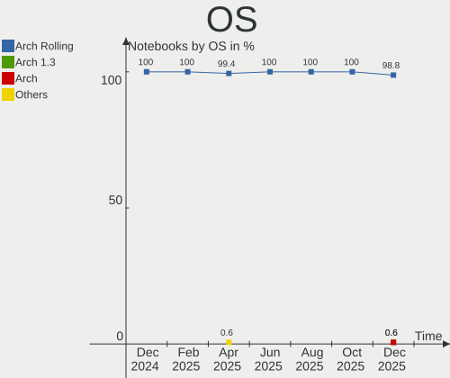

| Name         | Notebooks | Percent |
|--------------|-----------|---------|
| Arch Rolling | 169       | 98.83%  |
| Arch 1.3     | 1         | 0.58%   |
| Arch         | 1         | 0.58%   |

OS Family
---------

OS without a version

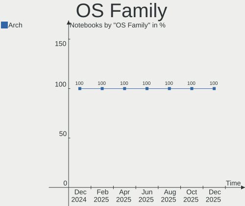

| Name | Notebooks | Percent |
|------|-----------|---------|
| Arch | 171       | 100%    |

Kernel
------

Version of the Linux kernel

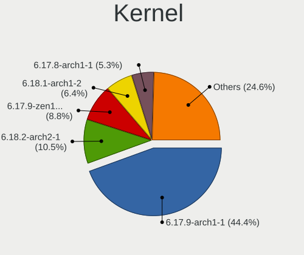

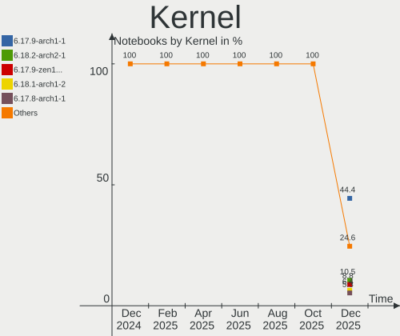

| Version                      | Notebooks | Percent |
|------------------------------|-----------|---------|
| 6.17.9-arch1-1               | 76        | 44.44%  |
| 6.18.2-arch2-1               | 18        | 10.53%  |
| 6.17.9-zen1-1-zen            | 15        | 8.77%   |
| 6.18.1-arch1-2               | 11        | 6.43%   |
| 6.17.8-arch1-1               | 9         | 5.26%   |
| 6.18.2-zen2-1-zen            | 5         | 2.92%   |
| 6.12.61-1-lts                | 5         | 2.92%   |
| 6.12.63-1-lts                | 3         | 1.75%   |
| 6.18.1-arch1-2.1-g14         | 2         | 1.17%   |
| 6.18.0-arch1-1               | 2         | 1.17%   |
| 6.18.2-zen2-1.1-zen          | 1         | 0.58%   |
| 6.18.1-2-cachyos             | 1         | 0.58%   |
| 6.18.0-zen1-1-zen            | 1         | 0.58%   |
| 6.18.0-3-cachyos             | 1         | 0.58%   |
| 6.18.0-273-tkg-eevdf         | 1         | 0.58%   |
| 6.18.0-1-mainline            | 1         | 0.58%   |
| 6.18.0-1-cachyos-bore-lto    | 1         | 0.58%   |
| 6.18.0-1-cachyos             | 1         | 0.58%   |
| 6.17.9-2-cachyos             | 1         | 0.58%   |
| 6.17.9-1-cachyos             | 1         | 0.58%   |
| 6.17.8-1-cachyos             | 1         | 0.58%   |
| 6.17.6-arch1-1               | 1         | 0.58%   |
| 6.17.6-1-cachyos             | 1         | 0.58%   |
| 6.17.5-zen1-1-zen            | 1         | 0.58%   |
| 6.17.4-arch2-1               | 1         | 0.58%   |
| 6.17.10-xanmod1-1-edge-x64v3 | 1         | 0.58%   |
| 6.17.1-arch1-1               | 1         | 0.58%   |
| 6.15.8-arch1-2               | 1         | 0.58%   |
| 6.15.2-arch1-1               | 1         | 0.58%   |
| 6.14.2-zen1-1-zen            | 1         | 0.58%   |
| 6.12.63-x64v-xanmod1-1-lts   | 1         | 0.58%   |
| 6.12.62-1-lts                | 1         | 0.58%   |
| 6.12.61-YuruYuri-T2-1-lts-t2 | 1         | 0.58%   |
| 6.12.59-1-lts                | 1         | 0.58%   |
| 6.12.57-1-lts                | 1         | 0.58%   |

Kernel Family
-------------

Linux kernel without a distro release

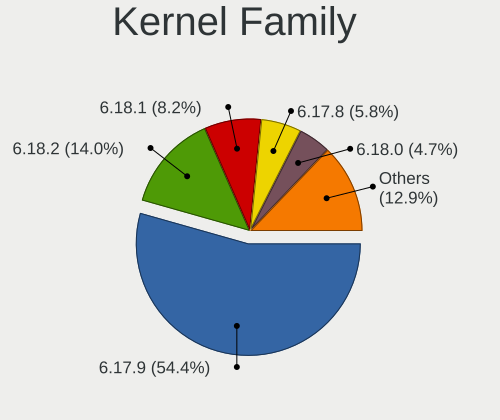

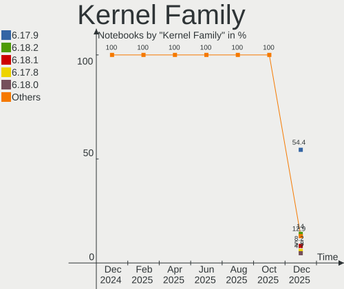

| Version | Notebooks | Percent |
|---------|-----------|---------|
| 6.17.9  | 93        | 54.39%  |
| 6.18.2  | 24        | 14.04%  |
| 6.18.1  | 14        | 8.19%   |
| 6.17.8  | 10        | 5.85%   |
| 6.18.0  | 8         | 4.68%   |
| 6.12.61 | 6         | 3.51%   |
| 6.12.63 | 4         | 2.34%   |
| 6.17.6  | 2         | 1.17%   |
| 6.17.5  | 1         | 0.58%   |
| 6.17.4  | 1         | 0.58%   |
| 6.17.10 | 1         | 0.58%   |
| 6.17.1  | 1         | 0.58%   |
| 6.15.8  | 1         | 0.58%   |
| 6.15.2  | 1         | 0.58%   |
| 6.14.2  | 1         | 0.58%   |
| 6.12.62 | 1         | 0.58%   |
| 6.12.59 | 1         | 0.58%   |
| 6.12.57 | 1         | 0.58%   |

Kernel Major Ver.
-----------------

Linux kernel major version

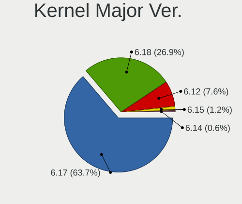

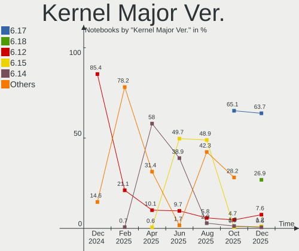

| Version | Notebooks | Percent |
|---------|-----------|---------|
| 6.17    | 109       | 63.74%  |
| 6.18    | 46        | 26.9%   |
| 6.12    | 13        | 7.6%    |
| 6.15    | 2         | 1.17%   |
| 6.14    | 1         | 0.58%   |

Arch
----

OS architecture (x86_64, i586, etc.)

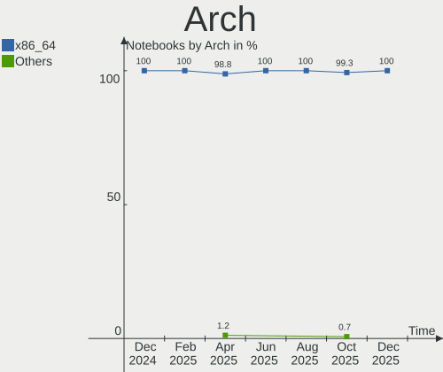

| Name   | Notebooks | Percent |
|--------|-----------|---------|
| x86_64 | 171       | 100%    |

DE
--

Desktop Environment

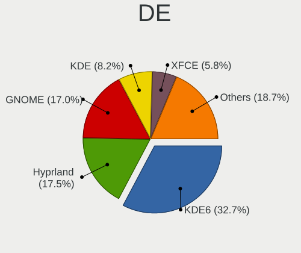

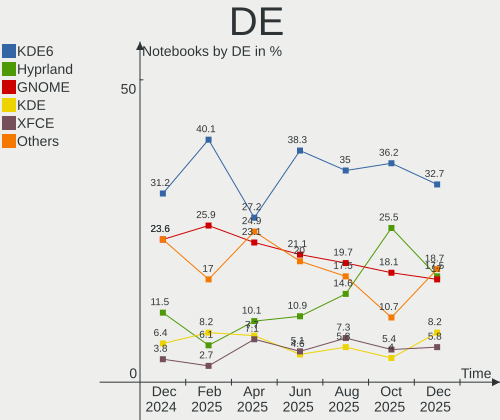

| Name         | Notebooks | Percent |
|--------------|-----------|---------|
| KDE6         | 56        | 32.75%  |
| Hyprland     | 30        | 17.54%  |
| GNOME        | 29        | 16.96%  |
| KDE          | 14        | 8.19%   |
| XFCE         | 10        | 5.85%   |
| niri         | 9         | 5.26%   |
| Unknown      | 8         | 4.68%   |
| i3           | 6         | 3.51%   |
| sway         | 5         | 2.92%   |
| sway:wlroots | 1         | 0.58%   |
| LeftWM       | 1         | 0.58%   |
| Deepin       | 1         | 0.58%   |
| COSMIC       | 1         | 0.58%   |

Display Server
--------------

X11 or Wayland

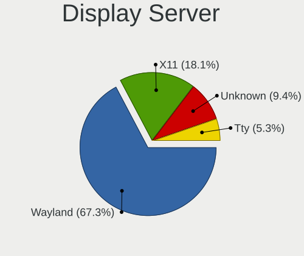

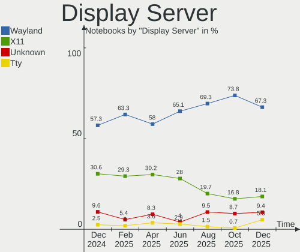

| Name    | Notebooks | Percent |
|---------|-----------|---------|
| Wayland | 115       | 67.25%  |
| X11     | 31        | 18.13%  |
| Unknown | 16        | 9.36%   |
| Tty     | 9         | 5.26%   |

Display Manager
---------------

SDDM, LightDM, etc.

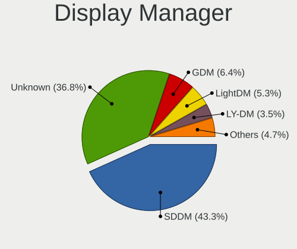

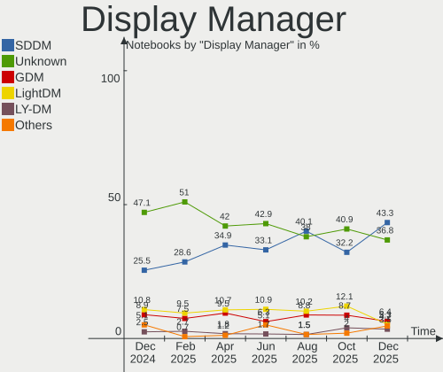

| Name        | Notebooks | Percent |
|-------------|-----------|---------|
| SDDM        | 74        | 43.27%  |
| Unknown     | 63        | 36.84%  |
| GDM         | 11        | 6.43%   |
| LightDM     | 9         | 5.26%   |
| LY-DM       | 6         | 3.51%   |
| GREETD      | 6         | 3.51%   |
| PLASMALOGIN | 1         | 0.58%   |
| Ly          | 1         | 0.58%   |

OS Lang
-------

Language

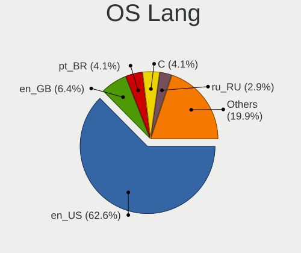

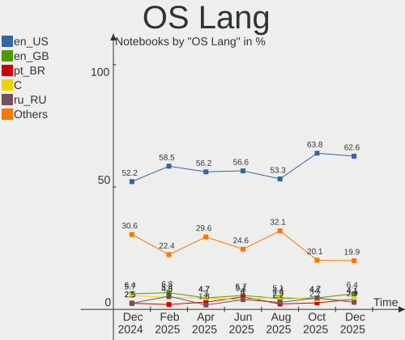

| Lang       | Notebooks | Percent |
|------------|-----------|---------|
| en_US      | 107       | 62.57%  |
| en_GB      | 11        | 6.43%   |
| pt_BR      | 7         | 4.09%   |
| C          | 7         | 4.09%   |
| ru_RU      | 5         | 2.92%   |
| pl_PL      | 4         | 2.34%   |
| zh_CN      | 3         | 1.75%   |
| en_CA      | 3         | 1.75%   |
| tr_TR      | 2         | 1.17%   |
| it_IT      | 2         | 1.17%   |
| es_CL      | 2         | 1.17%   |
| en_DK      | 2         | 1.17%   |
| uk_UA      | 1         | 0.58%   |
| ko_KR      | 1         | 0.58%   |
| hu_HU      | 1         | 0.58%   |
| fr_FR      | 1         | 0.58%   |
| fi_FI.UTF8 | 1         | 0.58%   |
| es_VE      | 1         | 0.58%   |
| es_MX      | 1         | 0.58%   |
| es_ES      | 1         | 0.58%   |
| en_ZA      | 1         | 0.58%   |
| en_US.UTF8 | 1         | 0.58%   |
| en_IN      | 1         | 0.58%   |
| en_AU      | 1         | 0.58%   |
| enUS       | 1         | 0.58%   |
| el_GR      | 1         | 0.58%   |
| de_DE      | 1         | 0.58%   |
| Unknown    | 1         | 0.58%   |

Boot Mode
---------

EFI or BIOS

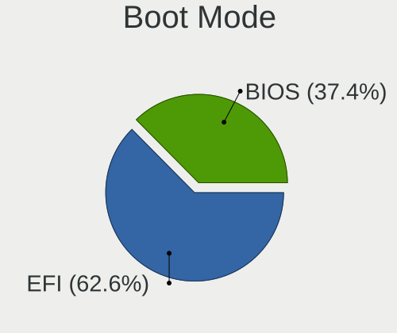

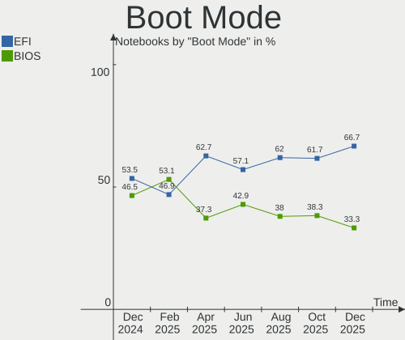

| Mode | Notebooks | Percent |
|------|-----------|---------|
| EFI  | 114       | 66.67%  |
| BIOS | 57        | 33.33%  |

Filesystem
----------

Type of filesystem

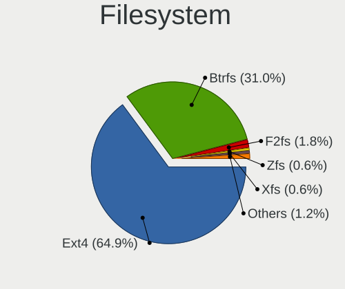

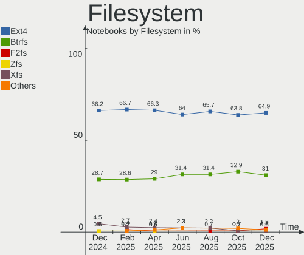

| Type    | Notebooks | Percent |
|---------|-----------|---------|
| Ext4    | 111       | 64.91%  |
| Btrfs   | 53        | 30.99%  |
| F2fs    | 3         | 1.75%   |
| Zfs     | 1         | 0.58%   |
| Xfs     | 1         | 0.58%   |
| Tmpfs   | 1         | 0.58%   |
| Overlay | 1         | 0.58%   |

Part. scheme
------------

Scheme of partitioning

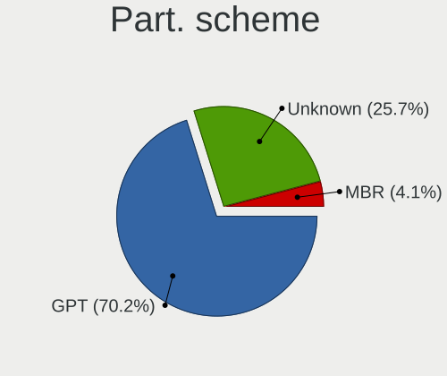

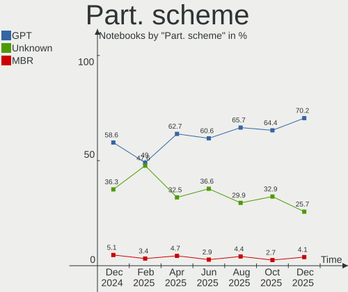

| Type    | Notebooks | Percent |
|---------|-----------|---------|
| GPT     | 120       | 70.18%  |
| Unknown | 44        | 25.73%  |
| MBR     | 7         | 4.09%   |

Dual Boot with Linux/BSD
------------------------

Hosting more than one Linux/BSD

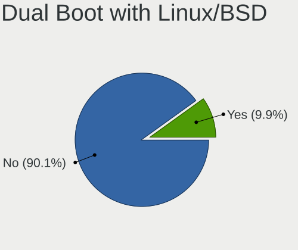

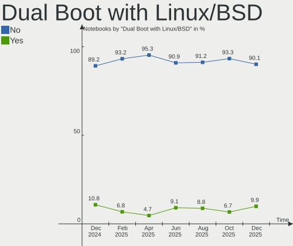

| Dual boot | Notebooks | Percent |
|-----------|-----------|---------|
| No        | 154       | 90.06%  |
| Yes       | 17        | 9.94%   |

Dual Boot (Win)
---------------

Hosting Linux and Windows

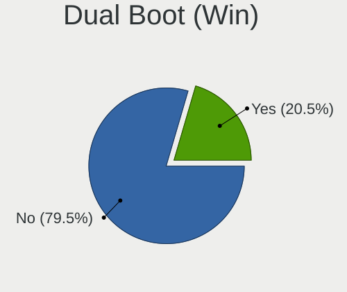

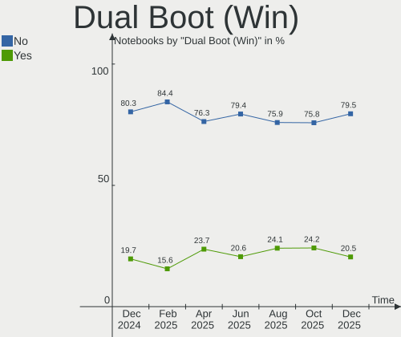

| Dual boot | Notebooks | Percent |
|-----------|-----------|---------|
| No        | 136       | 79.53%  |
| Yes       | 35        | 20.47%  |

Board
-----

Vendor
------

Motherboard manufacturer

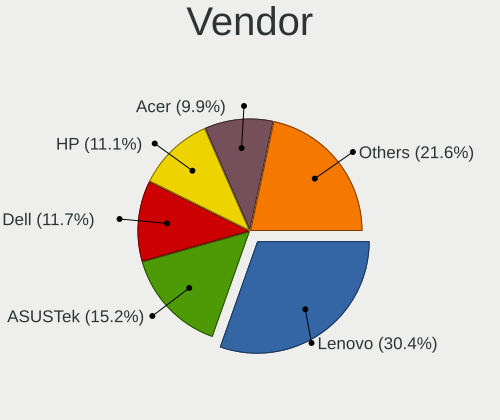

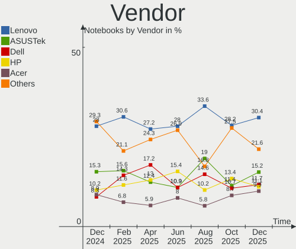

| Name                | Notebooks | Percent |
|---------------------|-----------|---------|
| Lenovo              | 52        | 30.41%  |
| ASUSTek Computer    | 26        | 15.2%   |
| Dell                | 20        | 11.7%   |
| Hewlett-Packard     | 19        | 11.11%  |
| Acer                | 17        | 9.94%   |
| MSI                 | 7         | 4.09%   |
| Framework           | 6         | 3.51%   |
| HUAWEI              | 4         | 2.34%   |
| HONOR               | 3         | 1.75%   |
| Apple               | 3         | 1.75%   |
| Samsung Electronics | 2         | 1.17%   |
| XIAOMI              | 1         | 0.58%   |
| Toshiba             | 1         | 0.58%   |
| Packard Bell        | 1         | 0.58%   |
| MACHINIST           | 1         | 0.58%   |
| Google              | 1         | 0.58%   |
| Gateway             | 1         | 0.58%   |
| Chuwi               | 1         | 0.58%   |
| Avell               | 1         | 0.58%   |
| ARDOR GAMING        | 1         | 0.58%   |
| AMD                 | 1         | 0.58%   |
| Alienware           | 1         | 0.58%   |
| Acidanthera         | 1         | 0.58%   |

Model
-----

Motherboard model

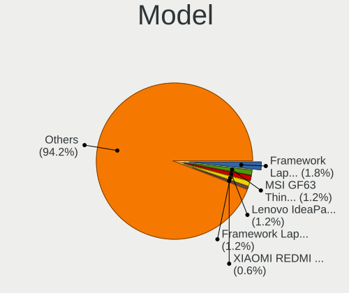

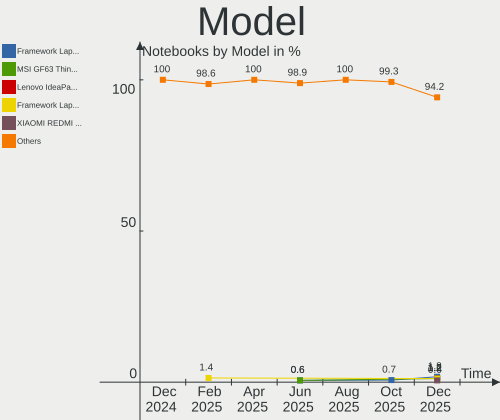

| Name                                        | Notebooks | Percent |
|---------------------------------------------|-----------|---------|
| Framework Laptop 13 (AMD Ryzen 7040Series)  | 3         | 1.75%   |
| MSI GF63 Thin 11UC                          | 2         | 1.17%   |
| Lenovo IdeaPad Slim 3 14AHP10 83K9          | 2         | 1.17%   |
| Framework Laptop 16 (AMD Ryzen 7040 Series) | 2         | 1.17%   |
| XIAOMI REDMI Book Pro 16 2025               | 1         | 0.58%   |
| Toshiba Satellite C50-A-1HF                 | 1         | 0.58%   |
| Samsung 750XDA                              | 1         | 0.58%   |
| Samsung 530XBB                              | 1         | 0.58%   |
| Packard Bell ENNS44HR                       | 1         | 0.58%   |
| MSI Modern 15 F13MG                         | 1         | 0.58%   |
| MSI Modern 15 B12M                          | 1         | 0.58%   |
| MSI Katana A17 AI B8VG                      | 1         | 0.58%   |
| MSI Katana 15 B12VFK                        | 1         | 0.58%   |
| MSI GL65 9SDK                               | 1         | 0.58%   |
| MACHINIST X99-RS9 V3.1                      | 1         | 0.58%   |
| Lenovo Yoga Pro 7 14APH8 82Y8               | 1         | 0.58%   |
| Lenovo ThinkStation P500 30A6S1FR00         | 1         | 0.58%   |
| Lenovo ThinkPad X9-15 Gen 1 21Q6CTO1WW      | 1         | 0.58%   |
| Lenovo ThinkPad X9-15 Gen 1 21Q60029US      | 1         | 0.58%   |
| Lenovo ThinkPad X230 2333AZ2                | 1         | 0.58%   |
| Lenovo ThinkPad X220 4293AF4                | 1         | 0.58%   |
| Lenovo ThinkPad X1 Carbon Gen 13 21NS0014US | 1         | 0.58%   |
| Lenovo ThinkPad X1 Carbon Gen 11 21HNS1QP0F | 1         | 0.58%   |
| Lenovo ThinkPad X1 Carbon 7th 20QDCTO1WW    | 1         | 0.58%   |
| Lenovo ThinkPad X1 Carbon 5th 20HQS08X00    | 1         | 0.58%   |
| Lenovo ThinkPad W520 428423U                | 1         | 0.58%   |
| Lenovo ThinkPad T530 239238G                | 1         | 0.58%   |
| Lenovo ThinkPad T420 4177Q5U                | 1         | 0.58%   |
| Lenovo ThinkPad T14p Gen 3 21RUA001CD       | 1         | 0.58%   |
| Lenovo ThinkPad T14 Gen 6 21QCCTO1WW        | 1         | 0.58%   |
| Lenovo ThinkPad T14 Gen 2i 20W0004KGE       | 1         | 0.58%   |
| Lenovo ThinkPad T14 Gen 2a 20XLS10Q00       | 1         | 0.58%   |
| Lenovo ThinkPad S3-S431 20AX000ACD          | 1         | 0.58%   |
| Lenovo ThinkPad P50 20EQS29A00              | 1         | 0.58%   |
| Lenovo ThinkPad P16s Gen 4 AMD 21RXCTO1WW   | 1         | 0.58%   |
| Lenovo ThinkPad P14s Gen 6 AMD 21RVCTO1WW   | 1         | 0.58%   |
| Lenovo ThinkPad P1 Gen 8 21Q8S02900         | 1         | 0.58%   |
| Lenovo ThinkPad L450 20DSS1G63R             | 1         | 0.58%   |
| Lenovo ThinkPad L15 Gen 2 20X30058SP        | 1         | 0.58%   |
| Lenovo ThinkPad E490 20N8000RIV             | 1         | 0.58%   |

Model Family
------------

Motherboard model prefix

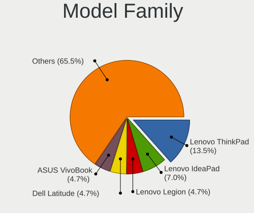

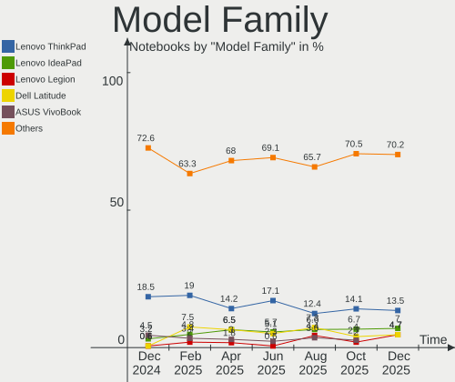

| Name                  | Notebooks | Percent |
|-----------------------|-----------|---------|
| Lenovo ThinkPad       | 23        | 13.45%  |
| Lenovo IdeaPad        | 12        | 7.02%   |
| Lenovo Legion         | 8         | 4.68%   |
| Dell Latitude         | 8         | 4.68%   |
| ASUS VivoBook         | 8         | 4.68%   |
| ASUS ASUS             | 8         | 4.68%   |
| Acer Aspire           | 7         | 4.09%   |
| Framework Laptop      | 6         | 3.51%   |
| HP ProBook            | 4         | 2.34%   |
| Dell Inspiron         | 4         | 2.34%   |
| Acer Nitro            | 4         | 2.34%   |
| HP Victus             | 3         | 1.75%   |
| HP Laptop             | 3         | 1.75%   |
| HP EliteBook          | 3         | 1.75%   |
| Dell Vostro           | 3         | 1.75%   |
| Dell Precision        | 3         | 1.75%   |
| ASUS ROG              | 3         | 1.75%   |
| Acer Swift            | 3         | 1.75%   |
| Acer Predator         | 3         | 1.75%   |
| MSI Modern            | 2         | 1.17%   |
| MSI Katana            | 2         | 1.17%   |
| MSI GF63              | 2         | 1.17%   |
| HP OMEN               | 2         | 1.17%   |
| XIAOMI REDMI          | 1         | 0.58%   |
| Toshiba Satellite     | 1         | 0.58%   |
| Samsung 750XDA        | 1         | 0.58%   |
| Samsung 530XBB        | 1         | 0.58%   |
| Packard Bell ENNS44HR | 1         | 0.58%   |
| MSI GL65              | 1         | 0.58%   |
| MACHINIST X99-RS9     | 1         | 0.58%   |
| Lenovo Yoga           | 1         | 0.58%   |
| Lenovo ThinkStation   | 1         | 0.58%   |
| Lenovo ThinkBook      | 1         | 0.58%   |
| Lenovo LOQ            | 1         | 0.58%   |
| Lenovo G550           | 1         | 0.58%   |
| Lenovo G500           | 1         | 0.58%   |
| Lenovo Flex           | 1         | 0.58%   |
| Lenovo B590           | 1         | 0.58%   |
| Lenovo 14w            | 1         | 0.58%   |
| HUAWEI VGHH-XX        | 1         | 0.58%   |

MFG Year
--------

Motherboard manufacture year

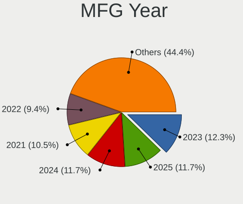

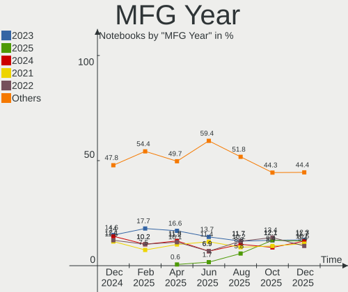

| Year    | Notebooks | Percent |
|---------|-----------|---------|
| 2023    | 21        | 12.28%  |
| 2025    | 20        | 11.7%   |
| 2024    | 20        | 11.7%   |
| 2021    | 18        | 10.53%  |
| 2022    | 16        | 9.36%   |
| 2020    | 13        | 7.6%    |
| 2019    | 13        | 7.6%    |
| 2017    | 9         | 5.26%   |
| 2015    | 7         | 4.09%   |
| 2012    | 7         | 4.09%   |
| 2011    | 6         | 3.51%   |
| 2018    | 5         | 2.92%   |
| 2016    | 4         | 2.34%   |
| 2014    | 4         | 2.34%   |
| 2013    | 4         | 2.34%   |
| 2009    | 1         | 0.58%   |
| 2008    | 1         | 0.58%   |
| 2006    | 1         | 0.58%   |
| Unknown | 1         | 0.58%   |

Form Factor
-----------

Physical design of the computer

| Name     | Notebooks | Percent |
|----------|-----------|---------|
| Notebook | 171       | 100%    |

Secure Boot
-----------

Enabled or disabled

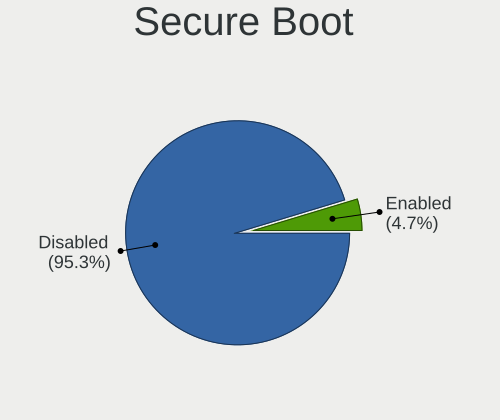

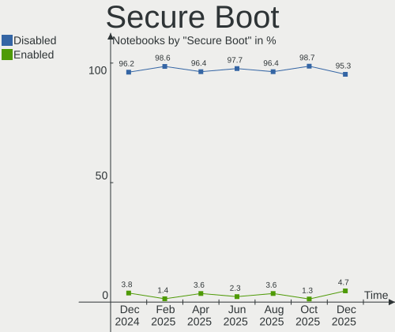

| State    | Notebooks | Percent |
|----------|-----------|---------|
| Disabled | 163       | 95.32%  |
| Enabled  | 8         | 4.68%   |

Coreboot
--------

Have coreboot on board

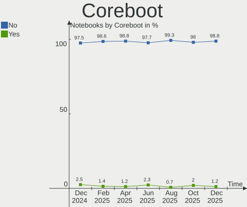

| Used | Notebooks | Percent |
|------|-----------|---------|
| No   | 169       | 98.83%  |
| Yes  | 2         | 1.17%   |

RAM Size
--------

Total RAM memory

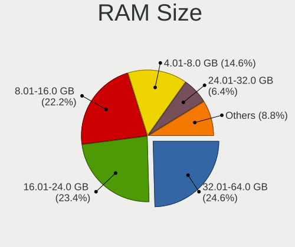

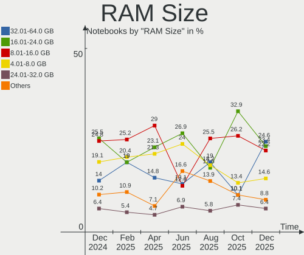

| Size in GB  | Notebooks | Percent |
|-------------|-----------|---------|
| 32.01-64.0  | 42        | 24.56%  |
| 16.01-24.0  | 40        | 23.39%  |
| 8.01-16.0   | 38        | 22.22%  |
| 4.01-8.0    | 25        | 14.62%  |
| 24.01-32.0  | 11        | 6.43%   |
| 3.01-4.0    | 7         | 4.09%   |
| 64.01-256.0 | 6         | 3.51%   |
| 1.01-2.0    | 1         | 0.58%   |
| 0.51-1.0    | 1         | 0.58%   |

RAM Used
--------

Used RAM memory

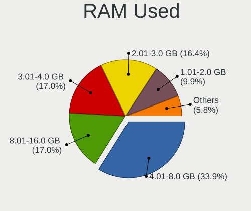

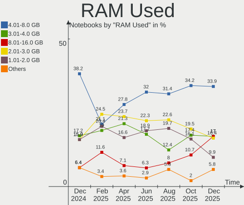

| Used GB    | Notebooks | Percent |
|------------|-----------|---------|
| 4.01-8.0   | 58        | 33.92%  |
| 3.01-4.0   | 29        | 16.96%  |
| 8.01-16.0  | 29        | 16.96%  |
| 2.01-3.0   | 28        | 16.37%  |
| 1.01-2.0   | 17        | 9.94%   |
| 16.01-24.0 | 5         | 2.92%   |
| 0.51-1.0   | 2         | 1.17%   |
| 32.01-64.0 | 1         | 0.58%   |
| 24.01-32.0 | 1         | 0.58%   |
| 0.01-0.5   | 1         | 0.58%   |

Total Drives
------------

Number of drives on board

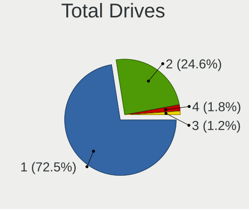

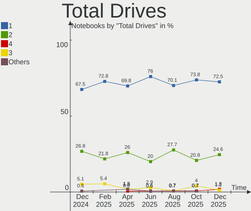

| Drives | Notebooks | Percent |
|--------|-----------|---------|
| 1      | 124       | 72.51%  |
| 2      | 42        | 24.56%  |
| 4      | 3         | 1.75%   |
| 3      | 2         | 1.17%   |

Has CD-ROM
----------

Has CD-ROM on board

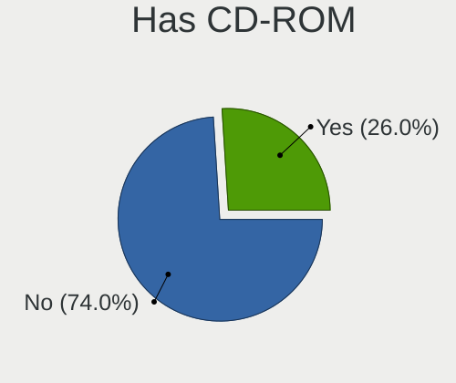

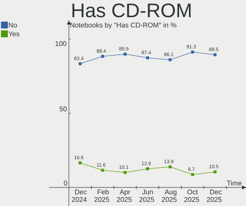

| Presented | Notebooks | Percent |
|-----------|-----------|---------|
| No        | 153       | 89.47%  |
| Yes       | 18        | 10.53%  |

Has Ethernet
------------

Has Ethernet on board

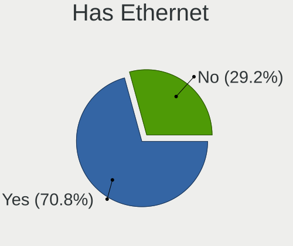

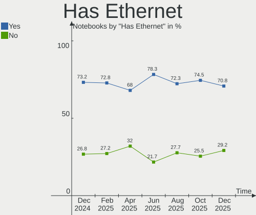

| Presented | Notebooks | Percent |
|-----------|-----------|---------|
| Yes       | 121       | 70.76%  |
| No        | 50        | 29.24%  |

Has WiFi
--------

Has WiFi module

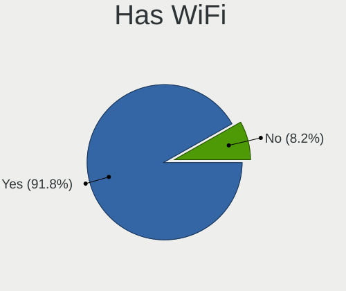

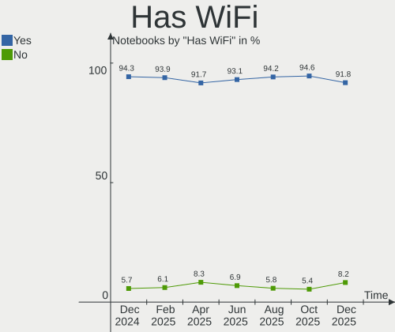

| Presented | Notebooks | Percent |
|-----------|-----------|---------|
| Yes       | 157       | 91.81%  |
| No        | 14        | 8.19%   |

Has Bluetooth
-------------

Has Bluetooth module

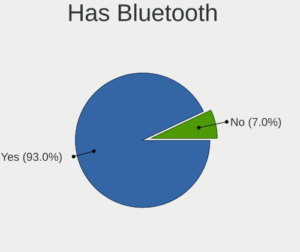

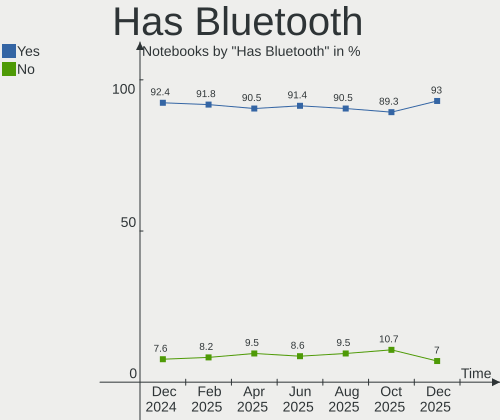

| Presented | Notebooks | Percent |
|-----------|-----------|---------|
| Yes       | 159       | 92.98%  |
| No        | 12        | 7.02%   |

Location
--------

Country
-------

Geographic location (country)

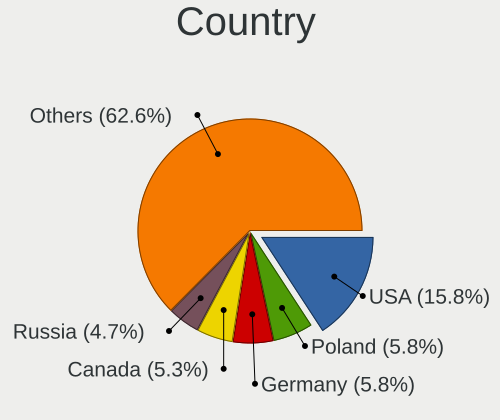

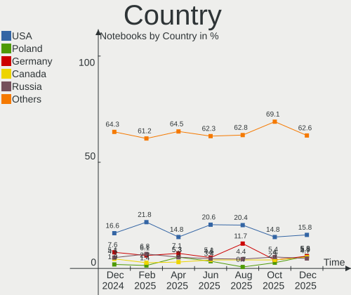

| Country             | Notebooks | Percent |
|---------------------|-----------|---------|
| USA                 | 27        | 15.79%  |
| Poland              | 10        | 5.85%   |
| Germany             | 10        | 5.85%   |
| Canada              | 9         | 5.26%   |
| Russia              | 8         | 4.68%   |
| Brazil              | 8         | 4.68%   |
| UK                  | 7         | 4.09%   |
| Netherlands         | 6         | 3.51%   |
| Italy               | 6         | 3.51%   |
| Turkey              | 5         | 2.92%   |
| Romania             | 5         | 2.92%   |
| India               | 5         | 2.92%   |
| France              | 4         | 2.34%   |
| Finland             | 4         | 2.34%   |
| China               | 4         | 2.34%   |
| Spain               | 3         | 1.75%   |
| Norway              | 3         | 1.75%   |
| Indonesia           | 3         | 1.75%   |
| Hungary             | 3         | 1.75%   |
| Chile               | 3         | 1.75%   |
| Vietnam             | 2         | 1.17%   |
| Slovakia            | 2         | 1.17%   |
| Mexico              | 2         | 1.17%   |
| Greece              | 2         | 1.17%   |
| Austria             | 2         | 1.17%   |
| Australia           | 2         | 1.17%   |
| Argentina           | 2         | 1.17%   |
| Zambia              | 1         | 0.58%   |
| Venezuela           | 1         | 0.58%   |
| Uzbekistan          | 1         | 0.58%   |
| Trinidad and Tobago | 1         | 0.58%   |
| The Netherlands     | 1         | 0.58%   |
| Sweden              | 1         | 0.58%   |
| South Korea         | 1         | 0.58%   |
| South Africa        | 1         | 0.58%   |
| Singapore           | 1         | 0.58%   |
| Serbia              | 1         | 0.58%   |
| Saudi Arabia        | 1         | 0.58%   |
| Philippines         | 1         | 0.58%   |
| Morocco             | 1         | 0.58%   |

City
----

Geographic location (city)

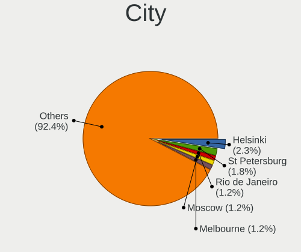

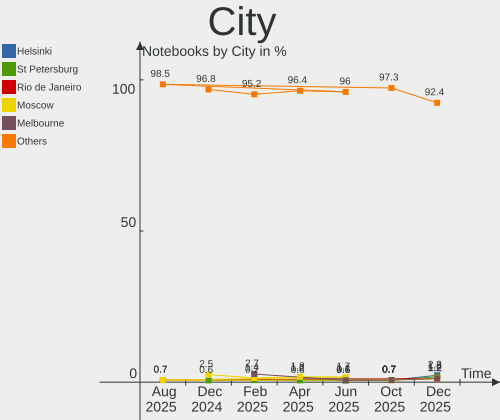

| City              | Notebooks | Percent |
|-------------------|-----------|---------|
| Helsinki          | 4         | 2.34%   |
| St Petersburg     | 3         | 1.75%   |
| Rio de Janeiro    | 2         | 1.17%   |
| Moscow            | 2         | 1.17%   |
| Melbourne         | 2         | 1.17%   |
| Langley           | 2         | 1.17%   |
| Istanbul          | 2         | 1.17%   |
| Huizen            | 2         | 1.17%   |
| Frankfurt am Main | 2         | 1.17%   |
| Chennai           | 2         | 1.17%   |
| Đakovo           | 1         | 0.58%   |
| Zwolle            | 1         | 0.58%   |
| Yoshkar-Ola       | 1         | 0.58%   |
| York              | 1         | 0.58%   |
| Yeongdeungpo-gu   | 1         | 0.58%   |
| Xochimilco        | 1         | 0.58%   |
| Woudrichem        | 1         | 0.58%   |
| Winston-Salem     | 1         | 0.58%   |
| Winnipeg          | 1         | 0.58%   |
| West Jordan       | 1         | 0.58%   |
| Warsaw            | 1         | 0.58%   |
| Vienna            | 1         | 0.58%   |
| Verdun            | 1         | 0.58%   |
| Valladolid        | 1         | 0.58%   |
| Valencia          | 1         | 0.58%   |
| Tulcea            | 1         | 0.58%   |
| Topeka            | 1         | 0.58%   |
| Tomsk             | 1         | 0.58%   |
| Tokyo             | 1         | 0.58%   |
| Timișoara        | 1         | 0.58%   |
| The Hague         | 1         | 0.58%   |
| Teramo            | 1         | 0.58%   |
| Tashkent          | 1         | 0.58%   |
| Tampa             | 1         | 0.58%   |
| Surabaya          | 1         | 0.58%   |
| Sterling          | 1         | 0.58%   |
| Sosnowiec         | 1         | 0.58%   |
| Sorocaba          | 1         | 0.58%   |
| Sobral            | 1         | 0.58%   |
| Skaerholmen       | 1         | 0.58%   |

Drives
------

Drive Vendor
------------

Hard drive vendors

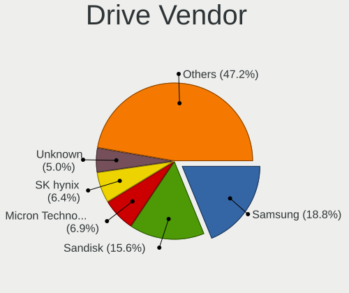

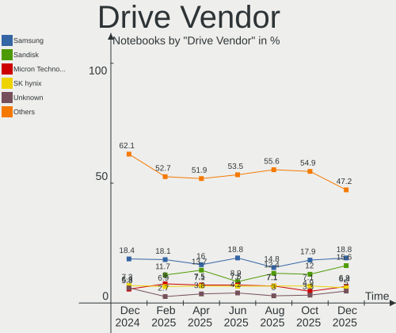

| Vendor                                  | Notebooks | Drives | Percent |
|-----------------------------------------|-----------|--------|---------|
| Samsung Electronics                     | 41        | 42     | 18.81%  |
| Sandisk                                 | 34        | 36     | 15.6%   |
| Micron Technology                       | 15        | 15     | 6.88%   |
| SK hynix                                | 14        | 15     | 6.42%   |
| Unknown                                 | 11        | 12     | 5.05%   |
| Kingston Technology Company             | 8         | 8      | 3.67%   |
| Kingston                                | 8         | 8      | 3.67%   |
| Intel                                   | 8         | 8      | 3.67%   |
| WDC                                     | 7         | 8      | 3.21%   |
| Toshiba                                 | 7         | 7      | 3.21%   |
| Seagate                                 | 7         | 10     | 3.21%   |
| Crucial                                 | 7         | 7      | 3.21%   |
| Micron/Crucial Technology               | 6         | 7      | 2.75%   |
| KIOXIA                                  | 6         | 7      | 2.75%   |
| A-DATA Technology                       | 4         | 4      | 1.83%   |
| Yangtze Memory Technologies             | 3         | 3      | 1.38%   |
| MAXIO Technology (Hangzhou)             | 3         | 3      | 1.38%   |
| Transcend                               | 2         | 2      | 0.92%   |
| Shenzhen Longsys Electronics            | 2         | 2      | 0.92%   |
| Phison Electronics                      | 2         | 2      | 0.92%   |
| LITEON                                  | 2         | 2      | 0.92%   |
| HGST                                    | 2         | 2      | 0.92%   |
| Apple                                   | 2         | 2      | 0.92%   |
| XrayDisk                                | 1         | 1      | 0.46%   |
| Verbatim                                | 1         | 1      | 0.46%   |
| Union Memory (Shenzhen)                 | 1         | 1      | 0.46%   |
| Timetec                                 | 1         | 1      | 0.46%   |
| SPCC                                    | 1         | 1      | 0.46%   |
| Silicon Motion                          | 1         | 1      | 0.46%   |
| Shenzhen Unionmemory Information System | 1         | 1      | 0.46%   |
| SATADOM-SH                              | 1         | 1      | 0.46%   |
| SABRENT                                 | 1         | 1      | 0.46%   |
| Netac                                   | 1         | 1      | 0.46%   |
| JMicron Technology                      | 1         | 1      | 0.46%   |
| Intenso                                 | 1         | 1      | 0.46%   |
| HS-SSD-C100                             | 1         | 1      | 0.46%   |
| GOODRAM                                 | 1         | 1      | 0.46%   |
| Fujitsu                                 | 1         | 1      | 0.46%   |
| ASMT                                    | 1         | 1      | 0.46%   |
| ADATA Technology                        | 1         | 1      | 0.46%   |

Drive Model
-----------

Hard drive models

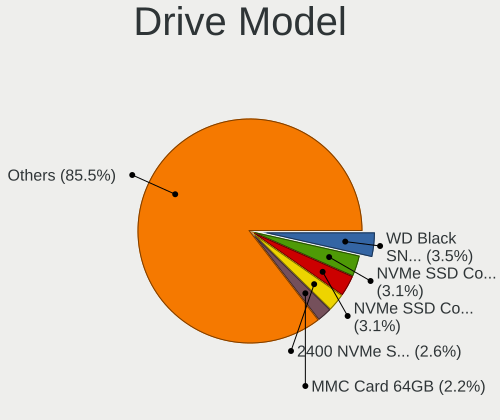

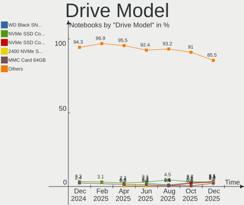

| Model                                                                           | Notebooks | Percent |
|---------------------------------------------------------------------------------|-----------|---------|
| Sandisk WD Black SN770 / PC SN740 256GB / PC SN560 (DRAM-less) NVMe SSD         | 8         | 3.52%   |
| Samsung NVMe SSD Controller SM981/PM981/PM983 1TB                               | 7         | 3.08%   |
| Samsung NVMe SSD Controller PM9C1a (DRAM-less) 1TB                              | 7         | 3.08%   |
| Micron 2400 NVMe SSD (DRAM-less) 512GB                                          | 6         | 2.64%   |
| Unknown MMC Card  64GB                                                          | 5         | 2.2%    |
| SK hynix Platinum P41/PC801 NVMe Solid State Drive 1TB                          | 5         | 2.2%    |
| Samsung NVMe SSD Controller PM9B1 (DRAM-less) 512GB                             | 5         | 2.2%    |
| Sandisk WD PC SN5000S M.2 2280 NVMe SSD (DRAM-less) 1TB                         | 4         | 1.76%   |
| Samsung NVMe SSD Controller S4LV008[Pascal] 4TB                                 | 4         | 1.76%   |
| Samsung NVMe SSD Controller 980 (DRAM-less) 256GB                               | 4         | 1.76%   |
| Micron/Crucial P310 NVMe PCIe SSD (DRAM-less) 500GB                             | 4         | 1.76%   |
| Intel SSD 670p Series [Keystone Harbor] 1TB                                     | 4         | 1.76%   |
| Sandisk Ultra 3D / WD PC SN530, IX SN530, Blue SN550 NVMe SSD (DRAM-less) 256GB | 3         | 1.32%   |
| Micron 2500 NVMe SSD (DRAM-less) 512GB                                          | 3         | 1.32%   |
| KIOXIA NVMe SSD Controller BG4 (DRAM-less) 256GB                                | 3         | 1.32%   |
| Crucial CT500MX500SSD1 500GB                                                    | 3         | 1.32%   |
| Unknown MMC Card  16GB                                                          | 2         | 0.88%   |
| Toshiba XG6 NVMe SSD Controller 1024GB                                          | 2         | 0.88%   |
| Seagate ST1000LM035-1RK172 1TB                                                  | 2         | 0.88%   |
| Sandisk WD_BLACK SN770 2TB                                                      | 2         | 0.88%   |
| Sandisk IX SN530 NVMe SSD (DRAM-less) 256GB                                     | 2         | 0.88%   |
| Samsung NVMe SSD Controller PM9A1/PM9A3/980PRO 1TB                              | 2         | 0.88%   |
| MAXIO (Hangzhou) NVMe SSD Controller MAP1202 (DRAM-less) 512GB                  | 2         | 0.88%   |
| Kingston Company OM8PCP Design-In PCIe 3 NVMe SSD (DRAM-less) 512GB             | 2         | 0.88%   |
| Kingston Company NV3 NVMe SSD [TC2201] (DRAM-less) 4TB                          | 2         | 0.88%   |
| Kingston SA400S37480G 480GB SSD                                                 | 2         | 0.88%   |
| Kingston SA400S37240G 240GB SSD                                                 | 2         | 0.88%   |
| Intel SSD DC P4101/Pro 7600p/760p/E 6100p Series 512GB                          | 2         | 0.88%   |
| Yangtze Memory YMTC YMSS2CD08D25MC 1TB                                          | 1         | 0.44%   |
| Yangtze Memory PC411 M.2 2242 NVMe SSD (DRAM-less) 1TB                          | 1         | 0.44%   |
| Yangtze Memory PC300 M.2 2280 NVMe SSD (DRAM-less) 512GB                        | 1         | 0.44%   |
| XrayDisk SSD 1TB                                                                | 1         | 0.44%   |
| WDC WDS500G2B0A-00SM50 500GB                                                    | 1         | 0.44%   |
| WDC WD5000LUCT-63RC2Y0 500GB                                                    | 1         | 0.44%   |
| WDC WD30PURX-64P6ZY0 3TB                                                        | 1         | 0.44%   |
| WDC WD10SPCX-24HWST1 1TB                                                        | 1         | 0.44%   |
| WDC WD10JPVX-60JC3T0 1TB                                                        | 1         | 0.44%   |
| WDC WD10JPVT-60A1YT0 1TB                                                        | 1         | 0.44%   |
| WDC WD10JPCX-24UE4T0 1TB                                                        | 1         | 0.44%   |
| Verbatim Vi550 S3 1024GB                                                        | 1         | 0.44%   |

HDD Vendor
----------

Hard disk drive vendors

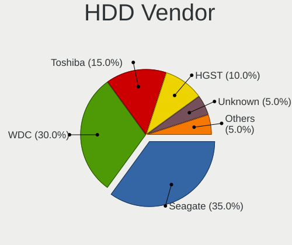

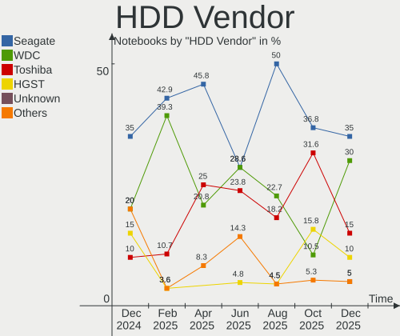

| Vendor  | Notebooks | Drives | Percent |
|---------|-----------|--------|---------|
| Seagate | 7         | 10     | 35%     |
| WDC     | 6         | 7      | 30%     |
| Toshiba | 3         | 3      | 15%     |
| HGST    | 2         | 2      | 10%     |
| Unknown | 1         | 1      | 5%      |
| Fujitsu | 1         | 1      | 5%      |

SSD Vendor
----------

Solid state drive vendors

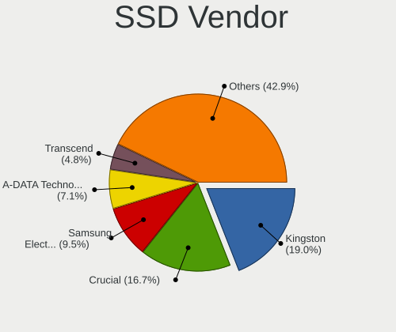

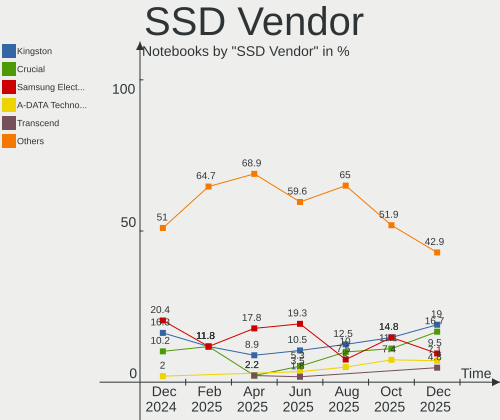

| Vendor              | Notebooks | Drives | Percent |
|---------------------|-----------|--------|---------|
| Kingston            | 8         | 8      | 19.05%  |
| Crucial             | 7         | 7      | 16.67%  |
| Samsung Electronics | 4         | 5      | 9.52%   |
| A-DATA Technology   | 3         | 3      | 7.14%   |
| Transcend           | 2         | 2      | 4.76%   |
| SanDisk             | 2         | 3      | 4.76%   |
| LITEON              | 2         | 2      | 4.76%   |
| XrayDisk            | 1         | 1      | 2.38%   |
| WDC                 | 1         | 1      | 2.38%   |
| Verbatim            | 1         | 1      | 2.38%   |
| Timetec             | 1         | 1      | 2.38%   |
| SPCC                | 1         | 1      | 2.38%   |
| SATADOM-SH          | 1         | 1      | 2.38%   |
| SABRENT             | 1         | 1      | 2.38%   |
| Netac               | 1         | 1      | 2.38%   |
| Intenso             | 1         | 1      | 2.38%   |
| Intel               | 1         | 1      | 2.38%   |
| HS-SSD-C100         | 1         | 1      | 2.38%   |
| GOODRAM             | 1         | 1      | 2.38%   |
| ASMT                | 1         | 1      | 2.38%   |
| Apple               | 1         | 1      | 2.38%   |

Drive Kind
----------

HDD or SSD

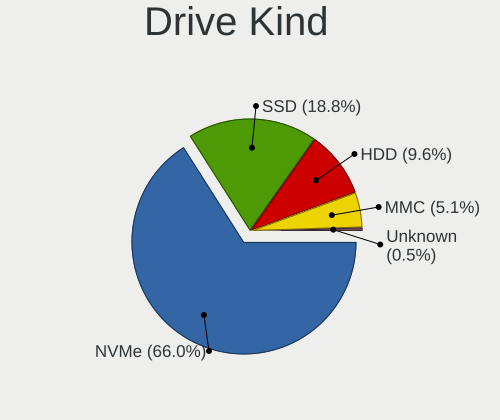

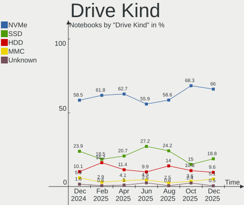

| Kind    | Notebooks | Drives | Percent |
|---------|-----------|--------|---------|
| NVMe    | 130       | 149    | 65.99%  |
| SSD     | 37        | 44     | 18.78%  |
| HDD     | 19        | 24     | 9.64%   |
| MMC     | 10        | 11     | 5.08%   |
| Unknown | 1         | 1      | 0.51%   |

Drive Connector
---------------

SATA, SAS, NVMe, etc.

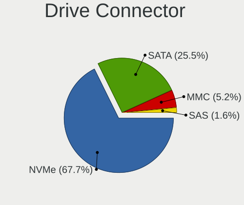

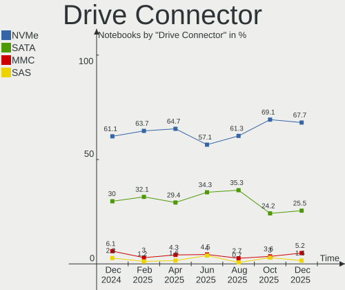

| Type | Notebooks | Drives | Percent |
|------|-----------|--------|---------|
| NVMe | 130       | 149    | 67.71%  |
| SATA | 49        | 65     | 25.52%  |
| MMC  | 10        | 11     | 5.21%   |
| SAS  | 3         | 4      | 1.56%   |

Drive Size
----------

Size of hard drive

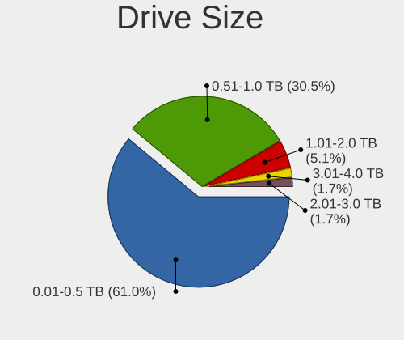

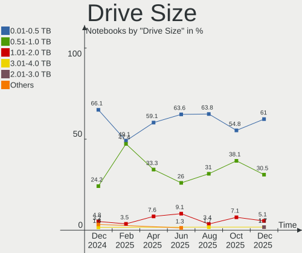

| Size in TB | Notebooks | Drives | Percent |
|------------|-----------|--------|---------|
| 0.01-0.5   | 36        | 42     | 61.02%  |
| 0.51-1.0   | 18        | 19     | 30.51%  |
| 1.01-2.0   | 3         | 3      | 5.08%   |
| 3.01-4.0   | 1         | 1      | 1.69%   |
| 2.01-3.0   | 1         | 3      | 1.69%   |

Space Total
-----------

Amount of disk space available on the file system

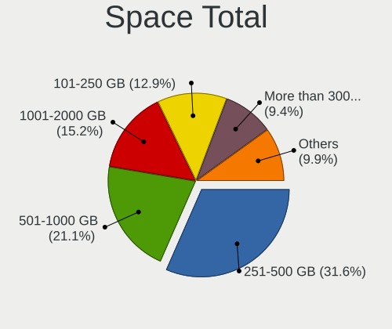

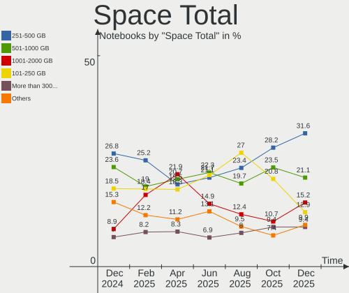

| Size in GB     | Notebooks | Percent |
|----------------|-----------|---------|
| 251-500        | 54        | 31.58%  |
| 501-1000       | 36        | 21.05%  |
| 1001-2000      | 26        | 15.2%   |
| 101-250        | 22        | 12.87%  |
| More than 3000 | 16        | 9.36%   |
| 2001-3000      | 12        | 7.02%   |
| 21-50          | 2         | 1.17%   |
| 1-20           | 2         | 1.17%   |
| 51-100         | 1         | 0.58%   |

Space Used
----------

Amount of used disk space

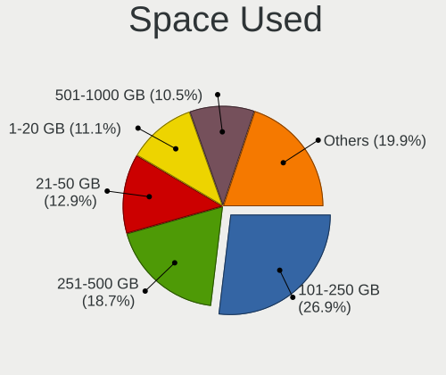

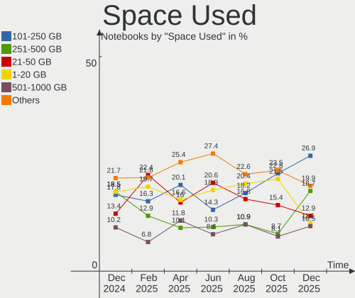

| Used GB        | Notebooks | Percent |
|----------------|-----------|---------|
| 101-250        | 46        | 26.9%   |
| 251-500        | 32        | 18.71%  |
| 21-50          | 22        | 12.87%  |
| 1-20           | 19        | 11.11%  |
| 501-1000       | 18        | 10.53%  |
| 51-100         | 15        | 8.77%   |
| 1001-2000      | 13        | 7.6%    |
| More than 3000 | 4         | 2.34%   |
| 2001-3000      | 2         | 1.17%   |

Malfunc. Drives
---------------

Drive models with a malfunction

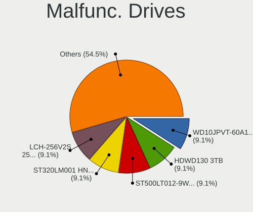

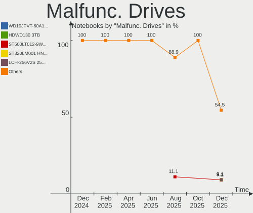

| Model                               | Notebooks | Drives | Percent |
|-------------------------------------|-----------|--------|---------|
| WDC WD10JPVT-60A1YT0 1TB            | 1         | 1      | 9.09%   |
| Toshiba HDWD130 3TB                 | 1         | 1      | 9.09%   |
| Seagate ST500LT012-9WS142 500GB     | 1         | 1      | 9.09%   |
| Seagate ST320LM001 HN-M320MBB 320GB | 1         | 1      | 9.09%   |
| LITEON LCH-256V2S 256GB SSD         | 1         | 1      | 9.09%   |
| LITEON CV8-8E128-HP 128GB SSD       | 1         | 1      | 9.09%   |
| HGST HTS545050A7E680 500GB          | 1         | 1      | 9.09%   |
| Fujitsu MHZ2160BH G2 160GB          | 1         | 1      | 9.09%   |
| Crucial CT525MX300SSD1 528GB        | 1         | 1      | 9.09%   |
| A-DATA Technology SX900 256GB SSD   | 1         | 1      | 9.09%   |
| A-DATA Technology SU800 128GB SSD   | 1         | 1      | 9.09%   |

Malfunc. Drive Vendor
---------------------

Vendors of faulty drives

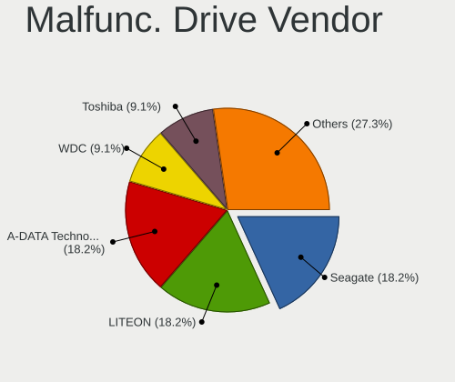

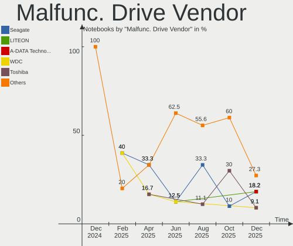

| Vendor            | Notebooks | Drives | Percent |
|-------------------|-----------|--------|---------|
| Seagate           | 2         | 2      | 18.18%  |
| LITEON            | 2         | 2      | 18.18%  |
| A-DATA Technology | 2         | 2      | 18.18%  |
| WDC               | 1         | 1      | 9.09%   |
| Toshiba           | 1         | 1      | 9.09%   |
| HGST              | 1         | 1      | 9.09%   |
| Fujitsu           | 1         | 1      | 9.09%   |
| Crucial           | 1         | 1      | 9.09%   |

Malfunc. HDD Vendor
-------------------

Vendors of faulty HDD drives

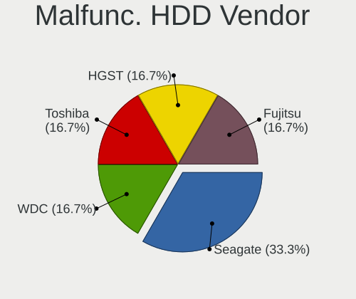

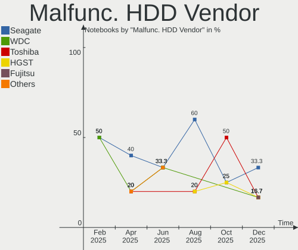

| Vendor  | Notebooks | Drives | Percent |
|---------|-----------|--------|---------|
| Seagate | 2         | 2      | 33.33%  |
| WDC     | 1         | 1      | 16.67%  |
| Toshiba | 1         | 1      | 16.67%  |
| HGST    | 1         | 1      | 16.67%  |
| Fujitsu | 1         | 1      | 16.67%  |

Malfunc. Drive Kind
-------------------

Kinds of faulty drives

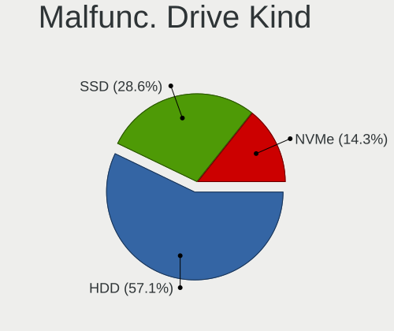

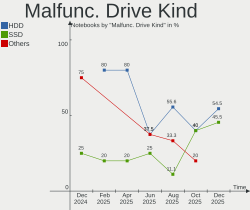

| Kind | Notebooks | Drives | Percent |
|------|-----------|--------|---------|
| HDD  | 6         | 6      | 54.55%  |
| SSD  | 5         | 5      | 45.45%  |

Failed Drives
-------------

Failed drive models

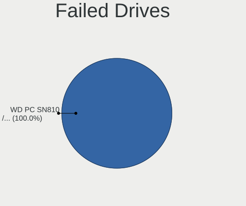

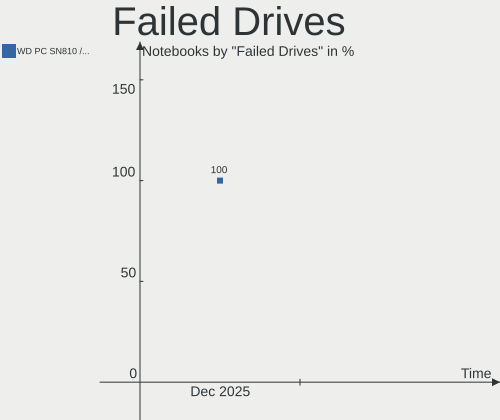

| Model                                            | Notebooks | Drives | Percent |
|--------------------------------------------------|-----------|--------|---------|
| Sandisk WD PC SN810 / Black SN850 NVMe SSD 500GB | 1         | 1      | 100%    |

Failed Drive Vendor
-------------------

Failed drive vendors

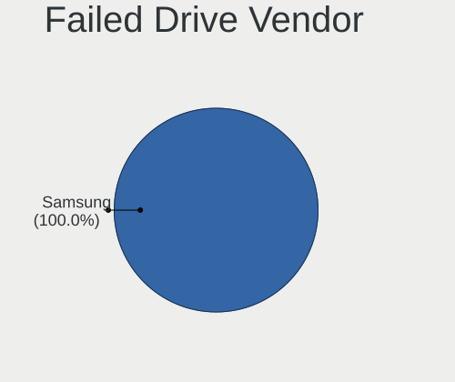

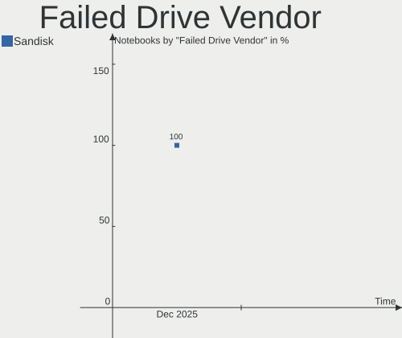

| Vendor  | Notebooks | Drives | Percent |
|---------|-----------|--------|---------|
| Sandisk | 1         | 1      | 100%    |

Drive Status
------------

Number of failed and malfunc. drives

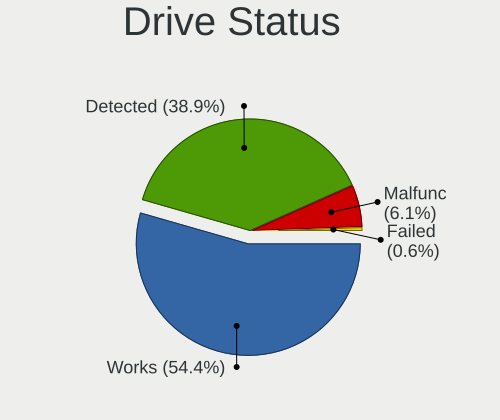

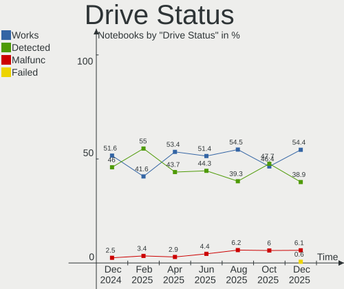

| Status   | Notebooks | Drives | Percent |
|----------|-----------|--------|---------|
| Works    | 98        | 120    | 54.44%  |
| Detected | 70        | 97     | 38.89%  |
| Malfunc  | 11        | 11     | 6.11%   |
| Failed   | 1         | 1      | 0.56%   |

Storage controller
------------------

Storage Vendor
--------------

Storage controller vendors

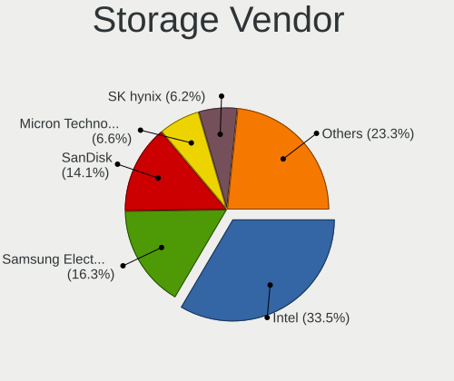

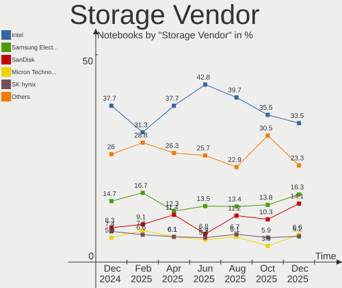

| Vendor                                  | Notebooks | Percent |
|-----------------------------------------|-----------|---------|
| Intel                                   | 76        | 33.48%  |
| Samsung Electronics                     | 37        | 16.3%   |
| SanDisk                                 | 32        | 14.1%   |
| Micron Technology                       | 15        | 6.61%   |
| SK hynix                                | 14        | 6.17%   |
| AMD                                     | 13        | 5.73%   |
| Kingston Technology Company             | 8         | 3.52%   |
| Micron/Crucial Technology               | 6         | 2.64%   |
| KIOXIA                                  | 6         | 2.64%   |
| Toshiba America Info Systems            | 4         | 1.76%   |
| Yangtze Memory Technologies             | 3         | 1.32%   |
| MAXIO Technology (Hangzhou)             | 3         | 1.32%   |
| Shenzhen Unionmemory Information System | 2         | 0.88%   |
| Shenzhen Longsys Electronics            | 2         | 0.88%   |
| Phison Electronics                      | 2         | 0.88%   |
| ADATA Technology                        | 2         | 0.88%   |
| Silicon Motion                          | 1         | 0.44%   |
| Apple                                   | 1         | 0.44%   |

Storage Model
-------------

Storage controller models

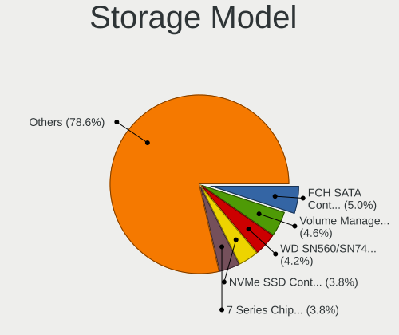

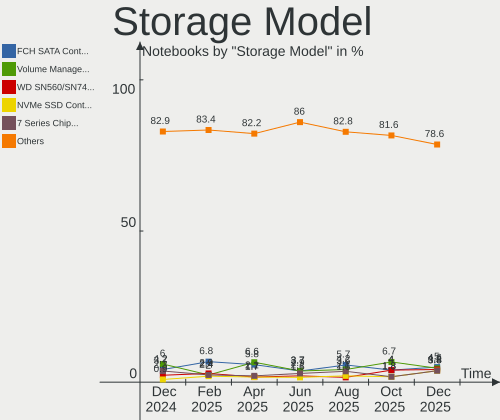

| Model                                                                        | Notebooks | Percent |
|------------------------------------------------------------------------------|-----------|---------|
| AMD FCH SATA Controller [AHCI mode]                                          | 12        | 5.04%   |
| Intel Volume Management Device NVMe RAID Controller                          | 11        | 4.62%   |
| SanDisk WD SN560/SN740/SN770/SN5000 NVMe SSD                                 | 10        | 4.2%    |
| Samsung NVMe SSD Controller PM9C1a (DRAM-less)                               | 9         | 3.78%   |
| Intel 7 Series Chipset Family 6-port SATA Controller [AHCI mode]             | 9         | 3.78%   |
| Samsung NVMe SSD Controller SM981/PM981/PM983                                | 7         | 2.94%   |
| Micron 2400 NVMe SSD (DRAM-less)                                             | 7         | 2.94%   |
| Intel 6 Series/C200 Series Chipset Family 6 port Mobile SATA AHCI Controller | 7         | 2.94%   |
| Samsung NVMe SSD Controller 980 (DRAM-less)                                  | 6         | 2.52%   |
| Intel Sunrise Point-LP SATA Controller [AHCI mode]                           | 6         | 2.52%   |
| Intel Cannon Lake Mobile PCH SATA AHCI Controller                            | 6         | 2.52%   |
| SK hynix Platinum P41/PC801 NVMe Solid State Drive                           | 5         | 2.1%    |
| Sandisk WD PC SN5000S M.2 2280 NVMe SSD (DRAM-less)                          | 5         | 2.1%    |
| Samsung NVMe SSD Controller PM9B1 (DRAM-less)                                | 5         | 2.1%    |
| SanDisk Ultra 3D / WD PC SN530, IX SN530, Blue SN550 NVMe SSD (DRAM-less)    | 4         | 1.68%   |
| Samsung NVMe SSD Controller S4LV008[Pascal]                                  | 4         | 1.68%   |
| Micron/Crucial P310 NVMe PCIe SSD (DRAM-less)                                | 4         | 1.68%   |
| Intel SSD 670p Series [Keystone Harbor]                                      | 4         | 1.68%   |
| Intel 82801 Mobile SATA Controller [RAID mode]                               | 4         | 1.68%   |
| SK hynix Gold P31/BC711/PC711 NVMe Solid State Drive                         | 3         | 1.26%   |
| Micron 2500 NVMe SSD (DRAM-less)                                             | 3         | 1.26%   |
| KIOXIA NVMe SSD Controller BG4 (DRAM-less)                                   | 3         | 1.26%   |
| Kingston Company NV3 NVMe SSD [TC2201] (DRAM-less)                           | 3         | 1.26%   |
| Intel Tiger Lake-LP SATA Controller                                          | 3         | 1.26%   |
| Intel Tiger Lake SATA AHCI Controller                                        | 3         | 1.26%   |
| Intel RST Volume Management Device Controller                                | 3         | 1.26%   |
| Intel Cannon Point-LP SATA Controller [AHCI Mode]                            | 3         | 1.26%   |
| Intel Alder Lake-P SATA AHCI Controller                                      | 3         | 1.26%   |
| Intel 8 Series SATA Controller 1 [AHCI mode]                                 | 3         | 1.26%   |
| Yangtze Memory PC411 M.2 2242 NVMe SSD (DRAM-less)                           | 2         | 0.84%   |
| Toshiba America Info Systems XG6 NVMe SSD Controller                         | 2         | 0.84%   |
| Toshiba America Info Systems XG5 NVMe SSD Controller                         | 2         | 0.84%   |
| SK hynix PVC10 NVMe Solid State Drive (DRAM-less)                            | 2         | 0.84%   |
| SK hynix BC511 NVMe SSD                                                      | 2         | 0.84%   |
| SanDisk WD PC SN810 / Black SN850 NVMe SSD                                   | 2         | 0.84%   |
| SanDisk IX SN530 NVMe SSD / microSD Express Card (DRAM-less)                 | 2         | 0.84%   |
| Samsung NVMe SSD Controller PM9A1/PM9A3/980PRO                               | 2         | 0.84%   |
| Samsung NVMe SSD 9100 PRO [PM9E1]                                            | 2         | 0.84%   |
| MAXIO (Hangzhou) NVMe SSD Controller MAP1202 (DRAM-less)                     | 2         | 0.84%   |
| KIOXIA NVMe SSD Controller BG6 (DRAM-less)                                   | 2         | 0.84%   |

Storage Kind
------------

Kind of storage controller (IDE, SATA, NVMe, SAS, ...)

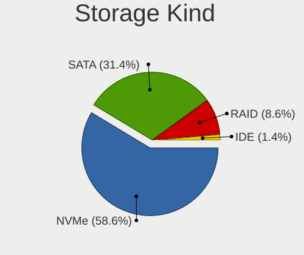

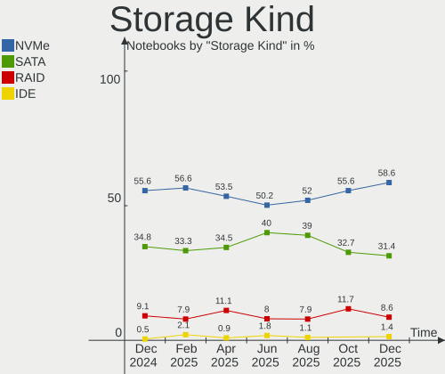

| Kind | Notebooks | Percent |
|------|-----------|---------|
| NVMe | 129       | 58.64%  |
| SATA | 69        | 31.36%  |
| RAID | 19        | 8.64%   |
| IDE  | 3         | 1.36%   |

Processor
---------

CPU Vendor
----------

Processor vendors

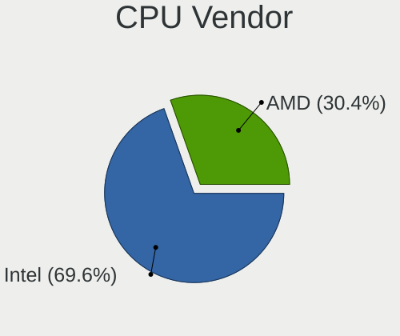

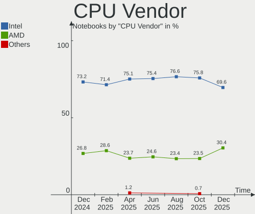

| Vendor | Notebooks | Percent |
|--------|-----------|---------|
| Intel  | 119       | 69.59%  |
| AMD    | 52        | 30.41%  |

CPU Model
---------

Processor models

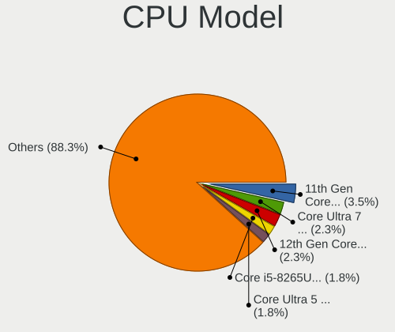

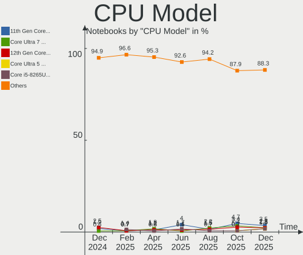

| Model                                      | Notebooks | Percent |
|--------------------------------------------|-----------|---------|
| Intel 11th Gen Core i5-1135G7 @ 2.40GHz    | 6         | 3.51%   |
| Intel Core Ultra 7 155H                    | 4         | 2.34%   |
| Intel 12th Gen Core i7-12700H              | 4         | 2.34%   |
| Intel Core Ultra 5 225H                    | 3         | 1.75%   |
| Intel Core i5-8265U CPU @ 1.60GHz          | 3         | 1.75%   |
| Intel 11th Gen Core i5-11400H @ 2.70GHz    | 3         | 1.75%   |
| AMD Ryzen 7 7730U with Radeon Graphics     | 3         | 1.75%   |
| AMD Ryzen 7 260 w/ Radeon 780M Graphics    | 3         | 1.75%   |
| AMD Ryzen 5 7640U w/ Radeon 760M Graphics  | 3         | 1.75%   |
| AMD Ryzen 5 5600H with Radeon Graphics     | 3         | 1.75%   |
| Intel Core Ultra 7 258V                    | 2         | 1.17%   |
| Intel Core i9-14900HX                      | 2         | 1.17%   |
| Intel Core i7-6700HQ CPU @ 2.60GHz         | 2         | 1.17%   |
| Intel Core i7-10750H CPU @ 2.60GHz         | 2         | 1.17%   |
| Intel Core i7-10510U CPU @ 1.80GHz         | 2         | 1.17%   |
| Intel Core i5-8250U CPU @ 1.60GHz          | 2         | 1.17%   |
| Intel Core i5-7300U CPU @ 2.60GHz          | 2         | 1.17%   |
| Intel Core i5-3230M CPU @ 2.60GHz          | 2         | 1.17%   |
| Intel Core i5-1035G1 CPU @ 1.00GHz         | 2         | 1.17%   |
| Intel 13th Gen Core i5-13420H              | 2         | 1.17%   |
| Intel 12th Gen Core i7-12650H              | 2         | 1.17%   |
| Intel 11th Gen Core i7-11370H @ 3.30GHz    | 2         | 1.17%   |
| AMD Ryzen AI 9 HX PRO 370 w/ Radeon 890M   | 2         | 1.17%   |
| AMD Ryzen AI 9 HX 370 w/ Radeon 890M       | 2         | 1.17%   |
| AMD Ryzen 9 7940HS w/ Radeon 780M Graphics | 2         | 1.17%   |
| AMD Ryzen 7 8840HS w/ Radeon 780M Graphics | 2         | 1.17%   |
| AMD Ryzen 7 7840HS w/ Radeon 780M Graphics | 2         | 1.17%   |
| AMD Ryzen 3 3250U with Radeon Graphics     | 2         | 1.17%   |
| Intel Xeon CPU E5-2699 v3 @ 2.30GHz        | 1         | 0.58%   |
| Intel Xeon CPU E5-2667 v4 @ 3.20GHz        | 1         | 0.58%   |
| Intel N150                                 | 1         | 0.58%   |
| Intel Core Ultra 9 275HX                   | 1         | 0.58%   |
| Intel Core Ultra 7 268V                    | 1         | 0.58%   |
| Intel Core Ultra 7 265H                    | 1         | 0.58%   |
| Intel Core Ultra 7 255HX                   | 1         | 0.58%   |
| Intel Core Ultra 5 226V                    | 1         | 0.58%   |
| Intel Core Ultra 5 125H                    | 1         | 0.58%   |
| Intel Core i9-9980HK CPU @ 2.40GHz         | 1         | 0.58%   |
| Intel Core i7-9750H CPU @ 2.60GHz          | 1         | 0.58%   |
| Intel Core i7-8850H CPU @ 2.60GHz          | 1         | 0.58%   |

CPU Model Family
----------------

Processor model prefix

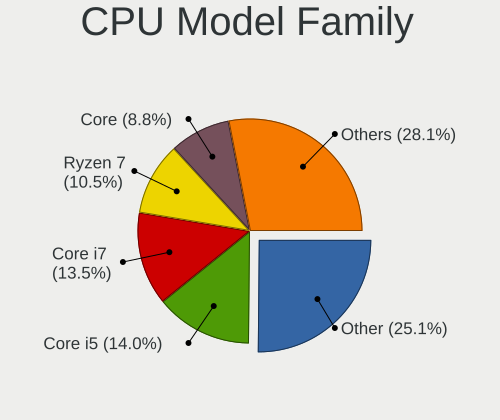

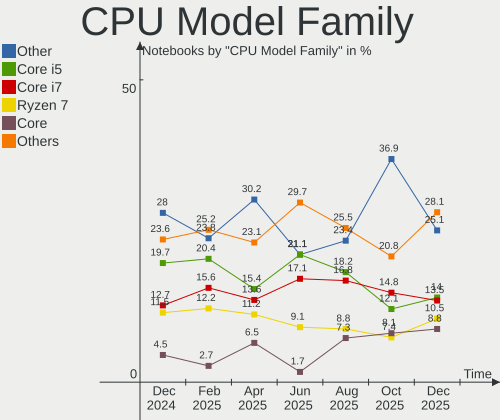

| Model                | Notebooks | Percent |
|----------------------|-----------|---------|
| Other                | 43        | 25.15%  |
| Intel Core i5        | 24        | 14.04%  |
| Intel Core i7        | 23        | 13.45%  |
| AMD Ryzen 7          | 18        | 10.53%  |
| Intel Core           | 15        | 8.77%   |
| AMD Ryzen 5          | 15        | 8.77%   |
| Intel Core i3        | 7         | 4.09%   |
| Intel Celeron        | 6         | 3.51%   |
| AMD Ryzen 9          | 4         | 2.34%   |
| Intel Core i9        | 3         | 1.75%   |
| AMD Ryzen 3          | 3         | 1.75%   |
| Intel Xeon           | 2         | 1.17%   |
| Intel Core 2 Duo     | 1         | 0.58%   |
| Intel Atom           | 1         | 0.58%   |
| AMD Turion 64 Mobile | 1         | 0.58%   |
| AMD Ryzen 7 PRO      | 1         | 0.58%   |
| AMD GX               | 1         | 0.58%   |
| AMD E2               | 1         | 0.58%   |
| AMD A6               | 1         | 0.58%   |
| AMD A12              | 1         | 0.58%   |

CPU Cores
---------

Number of processor cores

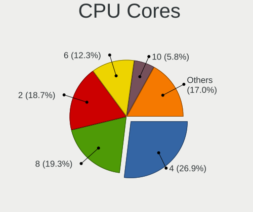

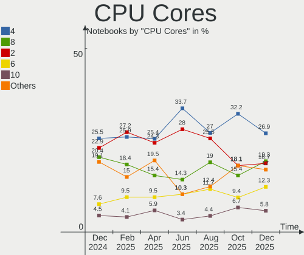

| Number | Notebooks | Percent |
|--------|-----------|---------|
| 4      | 46        | 26.9%   |
| 8      | 33        | 19.3%   |
| 2      | 32        | 18.71%  |
| 6      | 21        | 12.28%  |
| 10     | 10        | 5.85%   |
| 14     | 9         | 5.26%   |
| 12     | 8         | 4.68%   |
| 16     | 6         | 3.51%   |
| 24     | 3         | 1.75%   |
| 20     | 1         | 0.58%   |
| 18     | 1         | 0.58%   |
| 1      | 1         | 0.58%   |

CPU Sockets
-----------

Number of sockets

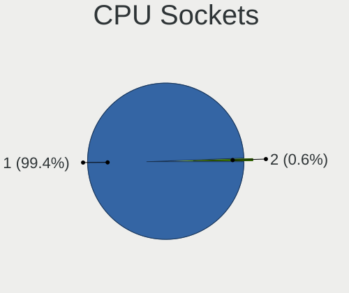

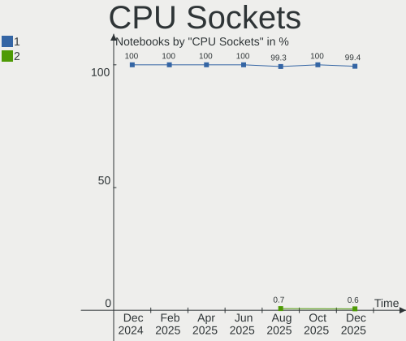

| Number | Notebooks | Percent |
|--------|-----------|---------|
| 1      | 170       | 99.42%  |
| 2      | 1         | 0.58%   |

CPU Threads
-----------

Threads per core (Hyper-Threading)

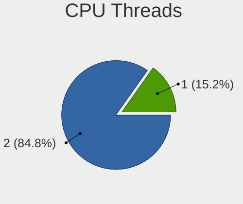

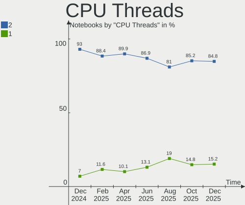

| Number | Notebooks | Percent |
|--------|-----------|---------|
| 2      | 145       | 84.8%   |
| 1      | 26        | 15.2%   |

CPU Op-Modes
------------

CPU Operation Modes (32-bit, 64-bit)

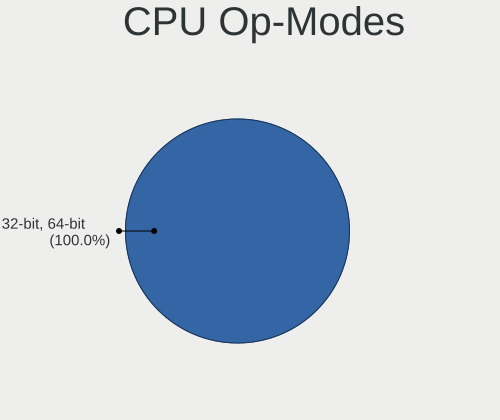

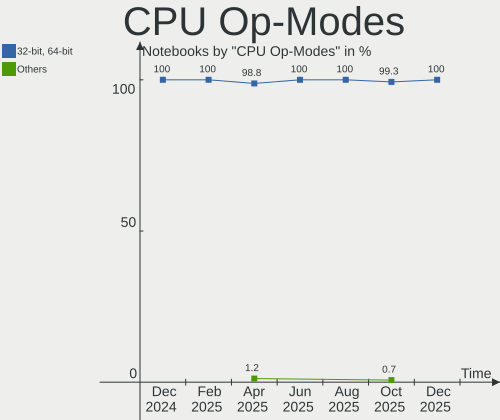

| Op mode        | Notebooks | Percent |
|----------------|-----------|---------|
| 32-bit, 64-bit | 171       | 100%    |

CPU Microcode
-------------

Microcode number

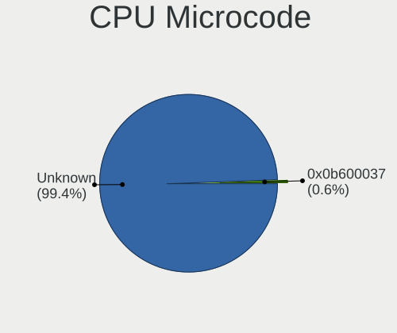

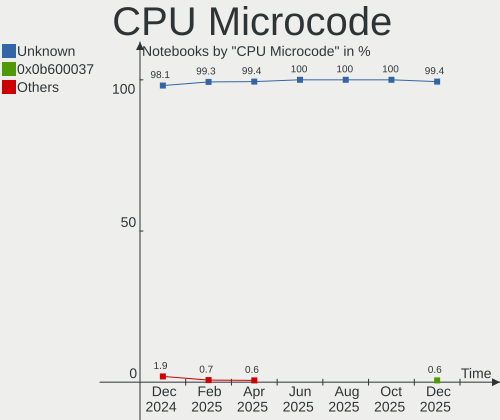

| Number     | Notebooks | Percent |
|------------|-----------|---------|
| Unknown    | 170       | 99.42%  |
| 0x0b600037 | 1         | 0.58%   |

CPU Microarch
-------------

Microarchitecture

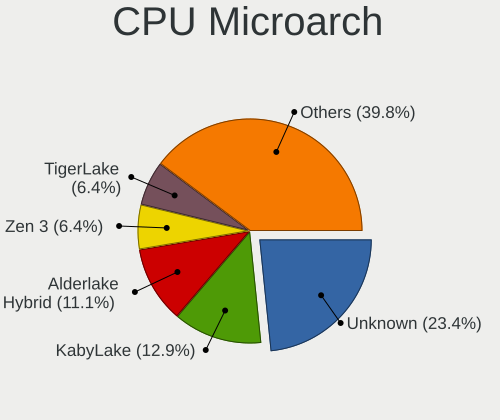

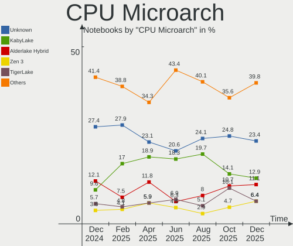

| Name               | Notebooks | Percent |
|--------------------|-----------|---------|
| Unknown            | 40        | 23.39%  |
| KabyLake           | 22        | 12.87%  |
| Alderlake Hybrid   | 19        | 11.11%  |
| Zen 3              | 11        | 6.43%   |
| TigerLake          | 11        | 6.43%   |
| IvyBridge          | 10        | 5.85%   |
| SandyBridge        | 8         | 4.68%   |
| Haswell            | 7         | 4.09%   |
| IceLake            | 6         | 3.51%   |
| Lunarlake Hybrid   | 5         | 2.92%   |
| Zen+               | 4         | 2.34%   |
| Skylake            | 4         | 2.34%   |
| Meteorlake Hybrid  | 4         | 2.34%   |
| Silvermont         | 3         | 1.75%   |
| CometLake          | 3         | 1.75%   |
| Zen 2              | 2         | 1.17%   |
| Puma               | 2         | 1.17%   |
| Goldmont plus      | 2         | 1.17%   |
| Excavator          | 2         | 1.17%   |
| ArrowLake-H Hybrid | 2         | 1.17%   |
| Penryn             | 1         | 0.58%   |
| K8 Hammer          | 1         | 0.58%   |
| Gracemont          | 1         | 0.58%   |
| Broadwell          | 1         | 0.58%   |

Graphics
--------

GPU Vendor
----------

Vendors of graphics cards

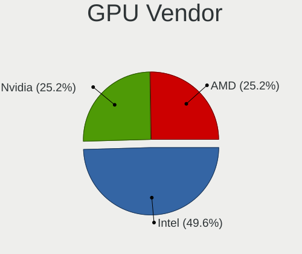

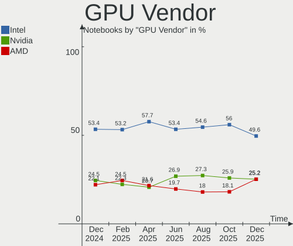

| Vendor | Notebooks | Percent |
|--------|-----------|---------|
| Intel  | 112       | 49.56%  |
| Nvidia | 57        | 25.22%  |
| AMD    | 57        | 25.22%  |

GPU Model
---------

Graphics card models

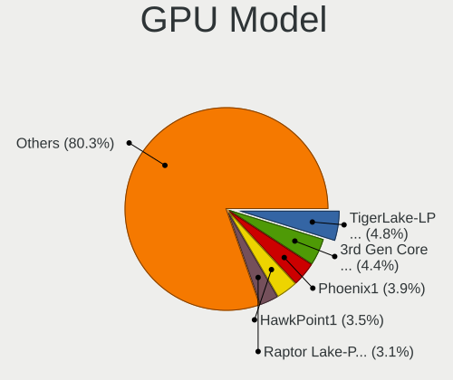

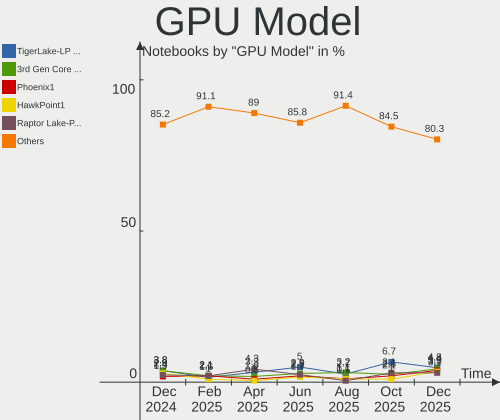

| Model                                                                                    | Notebooks | Percent |
|------------------------------------------------------------------------------------------|-----------|---------|
| Intel TigerLake-LP GT2 [Iris Xe Graphics]                                                | 11        | 4.8%    |
| Intel 3rd Gen Core processor Graphics Controller                                         | 10        | 4.37%   |
| AMD Phoenix1                                                                             | 9         | 3.93%   |
| AMD HawkPoint1                                                                           | 8         | 3.49%   |
| Intel Raptor Lake-P [Iris Xe Graphics]                                                   | 7         | 3.06%   |
| Intel CoffeeLake-H GT2 [UHD Graphics 630]                                                | 6         | 2.62%   |
| Intel Alder Lake-P GT2 [Iris Xe Graphics]                                                | 6         | 2.62%   |
| Intel 2nd Generation Core Processor Family Integrated Graphics Controller                | 6         | 2.62%   |
| AMD Cezanne [Radeon Vega Series / Radeon Vega Mobile Series]                             | 6         | 2.62%   |
| Nvidia GB206M [GeForce RTX 5060 Max-Q / Mobile]                                          | 5         | 2.18%   |
| Nvidia GA107M [GeForce RTX 3050 Mobile]                                                  | 5         | 2.18%   |
| Nvidia GA106M [GeForce RTX 3060 Mobile / Max-Q]                                          | 5         | 2.18%   |
| Nvidia AD106M [GeForce RTX 4070 Max-Q / Mobile]                                          | 5         | 2.18%   |
| Intel WhiskeyLake-U GT2 [UHD Graphics 620]                                               | 5         | 2.18%   |
| Intel Meteor Lake-P [Intel Arc Graphics]                                                 | 5         | 2.18%   |
| Intel Kaby Lake-U GT2 [HD Graphics 620]                                                  | 5         | 2.18%   |
| AMD Strix [Radeon 880M / 890M]                                                           | 5         | 2.18%   |
| Intel Lunar Lake [Intel Arc Graphics 130V / 140V]                                        | 4         | 1.75%   |
| Intel Haswell-ULT Integrated Graphics Controller                                         | 4         | 1.75%   |
| Intel Arrow Lake-P [Arc Pro 130T/140T]                                                   | 4         | 1.75%   |
| AMD Picasso/Raven 2 [Radeon Vega Series / Radeon Vega Mobile Series]                     | 4         | 1.75%   |
| AMD Barcelo                                                                              | 4         | 1.75%   |
| Nvidia TU117M [GeForce GTX 1650 Mobile / Max-Q]                                          | 3         | 1.31%   |
| Nvidia AD107M [GeForce RTX 4060 Max-Q / Mobile]                                          | 3         | 1.31%   |
| Intel TigerLake-H GT1 [UHD Graphics]                                                     | 3         | 1.31%   |
| Intel Kaby Lake-R GT2 [UHD Graphics 620]                                                 | 3         | 1.31%   |
| Intel Iris Plus Graphics G1 (Ice Lake)                                                   | 3         | 1.31%   |
| Intel CometLake-H GT2 [UHD Graphics]                                                     | 3         | 1.31%   |
| Intel Alder Lake-P GT1 [UHD Graphics]                                                    | 3         | 1.31%   |
| AMD Rembrandt [Radeon 680M]                                                              | 3         | 1.31%   |
| Nvidia TU116M [GeForce GTX 1660 Ti Mobile]                                               | 2         | 0.87%   |
| Nvidia TU106M [GeForce RTX 2060 Mobile]                                                  | 2         | 0.87%   |
| Nvidia GP107M [GeForce GTX 1050 Mobile]                                                  | 2         | 0.87%   |
| Nvidia GM107M [GeForce GTX 950M]                                                         | 2         | 0.87%   |
| Nvidia GF106GLM [Quadro 2000M]                                                           | 2         | 0.87%   |
| Intel Skylake-H GT2 [HD Graphics 530]                                                    | 2         | 0.87%   |
| Intel Raptor Lake-P [UHD Graphics]                                                       | 2         | 0.87%   |
| Intel GeminiLake [UHD Graphics 600]                                                      | 2         | 0.87%   |
| Intel CometLake-U GT2 [UHD Graphics]                                                     | 2         | 0.87%   |
| Intel Atom/Celeron/Pentium Processor x5-E8000/J3xxx/N3xxx Integrated Graphics Controller | 2         | 0.87%   |

GPU Combo
---------

Combinations of graphics cards

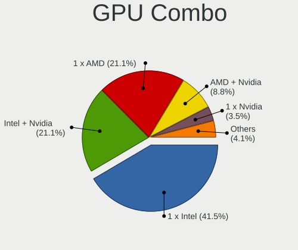

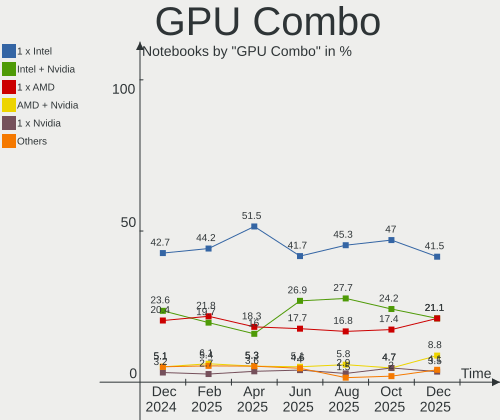

| Name           | Notebooks | Percent |
|----------------|-----------|---------|
| 1 x Intel      | 71        | 41.52%  |
| Intel + Nvidia | 36        | 21.05%  |
| 1 x AMD        | 36        | 21.05%  |
| AMD + Nvidia   | 15        | 8.77%   |
| 1 x Nvidia     | 6         | 3.51%   |
| Intel + AMD    | 4         | 2.34%   |
| 2 x AMD        | 2         | 1.17%   |
| 2 x Intel      | 1         | 0.58%   |

GPU Driver
----------

Free vs proprietary

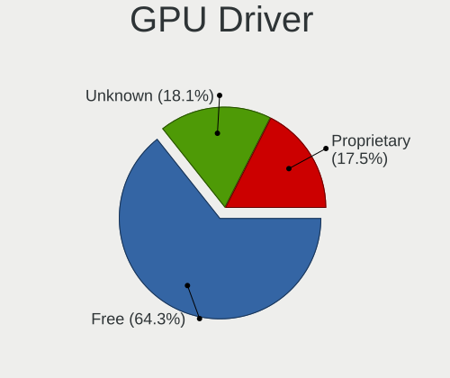

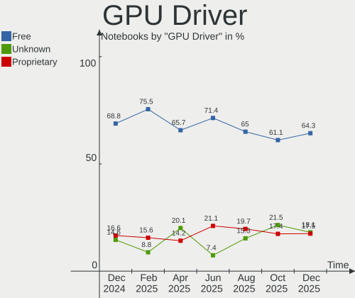

| Driver      | Notebooks | Percent |
|-------------|-----------|---------|
| Free        | 110       | 64.33%  |
| Unknown     | 31        | 18.13%  |
| Proprietary | 30        | 17.54%  |

GPU Memory
----------

Total video memory

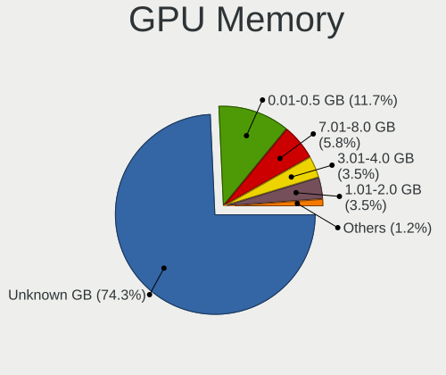

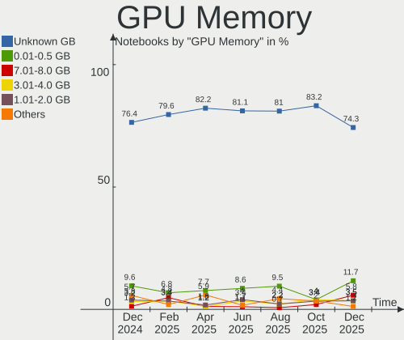

| Size in GB | Notebooks | Percent |
|------------|-----------|---------|
| Unknown    | 127       | 74.27%  |
| 0.01-0.5   | 20        | 11.7%   |
| 7.01-8.0   | 10        | 5.85%   |
| 3.01-4.0   | 6         | 3.51%   |
| 1.01-2.0   | 6         | 3.51%   |
| 5.01-6.0   | 1         | 0.58%   |
| 0.51-1.0   | 1         | 0.58%   |

Monitor
-------

Monitor Vendor
--------------

Monitor vendors

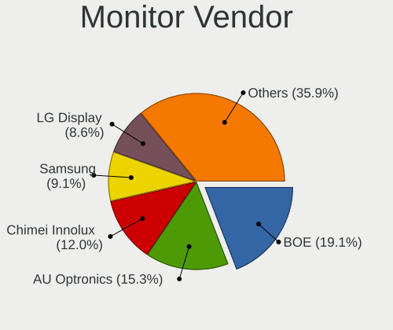

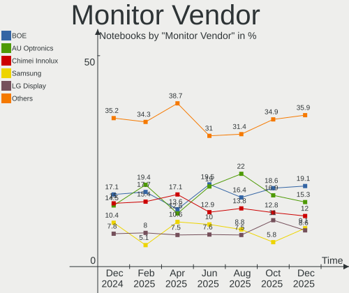

| Vendor                  | Notebooks | Percent |
|-------------------------|-----------|---------|
| BOE                     | 40        | 19.14%  |
| AU Optronics            | 32        | 15.31%  |
| Chimei Innolux          | 25        | 11.96%  |
| Samsung Electronics     | 19        | 9.09%   |
| LG Display              | 18        | 8.61%   |
| Lenovo                  | 12        | 5.74%   |
| Goldstar                | 6         | 2.87%   |
| Acer                    | 5         | 2.39%   |
| Dell                    | 4         | 1.91%   |
| Chi Mei Optoelectronics | 4         | 1.91%   |
| PANDA                   | 3         | 1.44%   |
| MSI                     | 3         | 1.44%   |
| CSW                     | 3         | 1.44%   |
| CSOT                    | 3         | 1.44%   |
| BenQ                    | 3         | 1.44%   |
| AOC                     | 3         | 1.44%   |
| ViewSonic               | 2         | 0.96%   |
| TMX                     | 2         | 0.96%   |
| TMA                     | 2         | 0.96%   |
| Philips                 | 2         | 0.96%   |
| Hewlett-Packard         | 2         | 0.96%   |
| Apple                   | 2         | 0.96%   |
| Ancor Communications    | 2         | 0.96%   |
| VXN                     | 1         | 0.48%   |
| Toshiba                 | 1         | 0.48%   |
| Skyworth                | 1         | 0.48%   |
| Sharp                   | 1         | 0.48%   |
| LG Philips              | 1         | 0.48%   |
| JDI                     | 1         | 0.48%   |
| InfoVision              | 1         | 0.48%   |
| HKC                     | 1         | 0.48%   |
| EDO                     | 1         | 0.48%   |
| Compaq Computer         | 1         | 0.48%   |
| CHO                     | 1         | 0.48%   |
| ASUSTek Computer        | 1         | 0.48%   |

Monitor Model
-------------

Monitor models

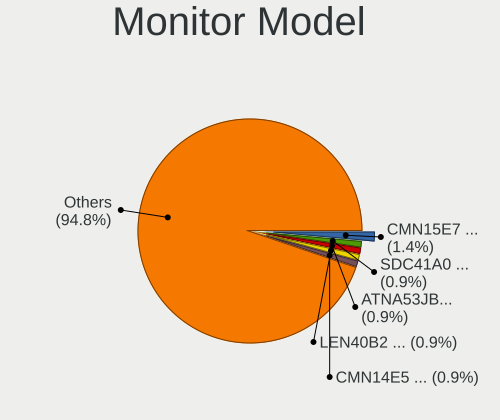

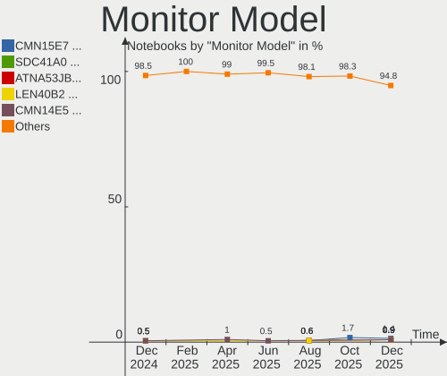

| Model                                                                    | Notebooks | Percent |
|--------------------------------------------------------------------------|-----------|---------|
| Chimei Innolux LCD Monitor CMN15E7 1920x1080 344x193mm 15.5-inch         | 3         | 1.42%   |
| Samsung Electronics LCD Monitor SDC41A0 1920x1200 302x189mm 14.0-inch    | 2         | 0.95%   |
| Samsung Electronics ATNA53JB01-0  SDC4206                                | 2         | 0.95%   |
| Lenovo LCD Monitor LEN40B2 1920x1080 344x193mm 15.5-inch                 | 2         | 0.95%   |
| Chimei Innolux LCD Monitor CMN14E5 1920x1080 309x173mm 13.9-inch         | 2         | 0.95%   |
| Chi Mei Optoelectronics LCD Monitor CMO15A1 1366x768 344x193mm 15.5-inch | 2         | 0.95%   |
| BOE NE135A1M-NY1 BOE0CB4 2880x1920 285x190mm 13.5-inch                   | 2         | 0.95%   |
| BOE LCD Monitor BOE0BCA 2256x1504 285x190mm 13.5-inch                    | 2         | 0.95%   |
| BOE LCD Monitor BOE0BC9 2560x1600 345x215mm 16.0-inch                    | 2         | 0.95%   |
| BOE LCD Monitor BOE0819 1920x1080 344x194mm 15.5-inch                    | 2         | 0.95%   |
| AU Optronics LCD Monitor AUOD0ED 1920x1080 344x193mm 15.5-inch           | 2         | 0.95%   |
| AU Optronics LCD Monitor AUOAF90 1920x1080 344x193mm 15.5-inch           | 2         | 0.95%   |
| VXN VisN236HUZ15 VXN1421                                                 | 1         | 0.47%   |
| ViewSonic XG2431 VSC3B3B 1920x1080 527x296mm 23.8-inch                   | 1         | 0.47%   |
| ViewSonic VX2758-2K-PRO VSC1F3F 2560x1440 600x330mm 27.0-inch            | 1         | 0.47%   |
| Toshiba ScreenXpert TSB8888 1080x2160                                    | 1         | 0.47%   |
| TMX TL140BDXP01-0 TMX1400 2560x1440 310x174mm 14.0-inch                  | 1         | 0.47%   |
| TMX LCD Monitor TMX1350 2520x1680 284x189mm 13.4-inch                    | 1         | 0.47%   |
| TMX LCD Monitor TMX1350 2520x1680 280x190mm 13.3-inch                    | 1         | 0.47%   |
| TMA TL160MDMP03-0 TMA2022 3072x1920 345x215mm 16.0-inch                  | 1         | 0.47%   |
| TMA TL160ADMP20 TMA2039 2560x1600 345x215mm 16.0-inch                    | 1         | 0.47%   |
| Skyworth F24B40Q SKY0001 2560x1440 532x298mm 24.0-inch                   | 1         | 0.47%   |
| Sharp LQ140M1JW49 SHP1523 1920x1080 309x174mm 14.0-inch                  | 1         | 0.47%   |
| Samsung Electronics U28E590 SAM0C4E 3840x2160 608x345mm 27.5-inch        | 1         | 0.47%   |
| Samsung Electronics S34C65xU SAM73FB 3440x1440 800x340mm 34.2-inch       | 1         | 0.47%   |
| Samsung Electronics S24R35xFZ SAM71A8 1920x1080 521x293mm 23.5-inch      | 1         | 0.47%   |
| Samsung Electronics S23B350 SAM08D6 1920x1080 510x287mm 23.0-inch        | 1         | 0.47%   |
| Samsung Electronics Odyssey G95NC SAM73D0 3840x1080 1400x400mm 57.3-inch | 1         | 0.47%   |
| Samsung Electronics LCD Monitor SDCA029 3840x2160 344x194mm 15.5-inch    | 1         | 0.47%   |
| Samsung Electronics LCD Monitor SDC4C51 1366x768 344x194mm 15.5-inch     | 1         | 0.47%   |
| Samsung Electronics LCD Monitor SDC4752 1366x768 344x194mm 15.5-inch     | 1         | 0.47%   |
| Samsung Electronics LCD Monitor SDC419F 2880x1800 302x189mm 14.0-inch    | 1         | 0.47%   |
| Samsung Electronics LCD Monitor SDC419D 2880x1800 302x189mm 14.0-inch    | 1         | 0.47%   |
| Samsung Electronics LCD Monitor SDC4161 1920x1080 344x194mm 15.5-inch    | 1         | 0.47%   |
| Samsung Electronics LCD Monitor SDC415D 3840x2400 344x215mm 16.0-inch    | 1         | 0.47%   |
| Samsung Electronics LCD Monitor SDC4143 3840x2160 344x194mm 15.5-inch    | 1         | 0.47%   |
| Samsung Electronics LC24RG50 SAM0F90 1920x1080 532x304mm 24.1-inch       | 1         | 0.47%   |
| Samsung Electronics ATNA60KA02-0  SDC421F                                | 1         | 0.47%   |
| Samsung Electronics ATNA60CL10-0 SDC41AF 2880x1800 344x215mm 16.0-inch   | 1         | 0.47%   |
| Philips PHL 242G5 PHLC0C4 1920x1080 531x299mm 24.0-inch                  | 1         | 0.47%   |

Monitor Resolution
------------------

Monitor screen resolution

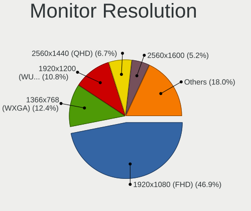

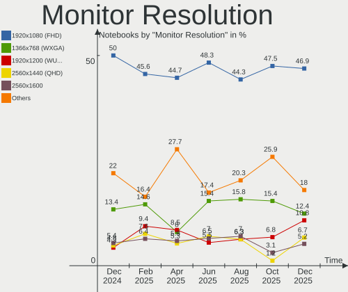

| Resolution         | Notebooks | Percent |
|--------------------|-----------|---------|
| 1920x1080 (FHD)    | 91        | 46.91%  |
| 1366x768 (WXGA)    | 24        | 12.37%  |
| 1920x1200 (WUXGA)  | 21        | 10.82%  |
| 2560x1440 (QHD)    | 13        | 6.7%    |
| 2560x1600          | 10        | 5.15%   |
| Unknown            | 6         | 3.09%   |
| 3840x2160 (4K)     | 5         | 2.58%   |
| 2880x1800          | 4         | 2.06%   |
| 3072x1920          | 2         | 1.03%   |
| 2880x1920          | 2         | 1.03%   |
| 2256x1504          | 2         | 1.03%   |
| 1680x1050 (WSXGA+) | 2         | 1.03%   |
| 3840x2400          | 1         | 0.52%   |
| 3840x1080          | 1         | 0.52%   |
| 3440x1440          | 1         | 0.52%   |
| 3000x2000          | 1         | 0.52%   |
| 2560x1080          | 1         | 0.52%   |
| 2520x1680          | 1         | 0.52%   |
| 2240x1400          | 1         | 0.52%   |
| 2160x1440          | 1         | 0.52%   |
| 2048x1152          | 1         | 0.52%   |
| 1600x900 (HD+)     | 1         | 0.52%   |
| 1280x800 (WXGA)    | 1         | 0.52%   |
| 1024x768 (XGA)     | 1         | 0.52%   |

Monitor Diagonal
----------------

Diagonal size in inches

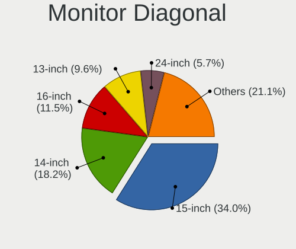

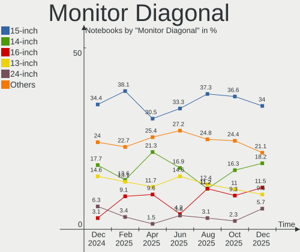

| Inches  | Notebooks | Percent |
|---------|-----------|---------|
| 15      | 71        | 33.97%  |
| 14      | 38        | 18.18%  |
| 16      | 24        | 11.48%  |
| 13      | 20        | 9.57%   |
| 24      | 12        | 5.74%   |
| 27      | 10        | 4.78%   |
| 23      | 8         | 3.83%   |
| Unknown | 6         | 2.87%   |
| 17      | 5         | 2.39%   |
| 21      | 4         | 1.91%   |
| 34      | 2         | 0.96%   |
| 12      | 2         | 0.96%   |
| 86      | 1         | 0.48%   |
| 57      | 1         | 0.48%   |
| 40      | 1         | 0.48%   |
| 31      | 1         | 0.48%   |
| 22      | 1         | 0.48%   |
| 18      | 1         | 0.48%   |
| 11      | 1         | 0.48%   |

Monitor Width
-------------

Physical width

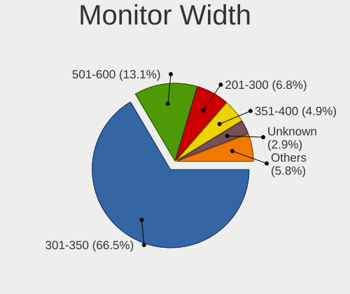

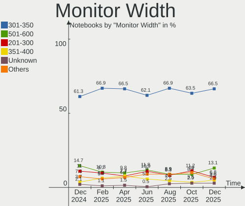

| Width in mm | Notebooks | Percent |
|-------------|-----------|---------|
| 301-350     | 137       | 66.5%   |
| 501-600     | 27        | 13.11%  |
| 201-300     | 14        | 6.8%    |
| 351-400     | 10        | 4.85%   |
| Unknown     | 6         | 2.91%   |
| 401-500     | 5         | 2.43%   |
| 701-800     | 2         | 0.97%   |
| 601-700     | 2         | 0.97%   |
| 1001-1500   | 2         | 0.97%   |
| 801-900     | 1         | 0.49%   |

Aspect Ratio
------------

Proportional relationship between the width and the height

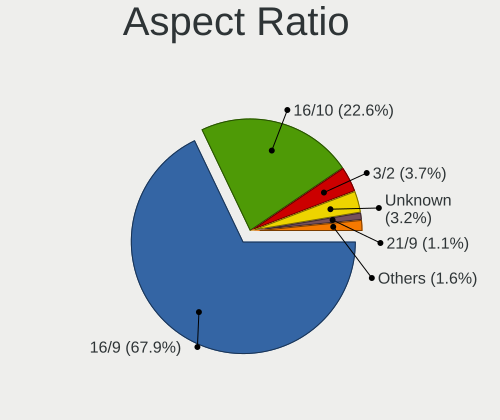

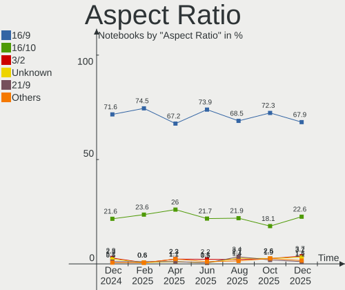

| Ratio   | Notebooks | Percent |
|---------|-----------|---------|
| 16/9    | 129       | 67.89%  |
| 16/10   | 43        | 22.63%  |
| 3/2     | 7         | 3.68%   |
| Unknown | 6         | 3.16%   |
| 21/9    | 2         | 1.05%   |
| 4/3     | 1         | 0.53%   |
| 32/9    | 1         | 0.53%   |
| 0.56    | 1         | 0.53%   |

Monitor Area
------------

Area in inch²

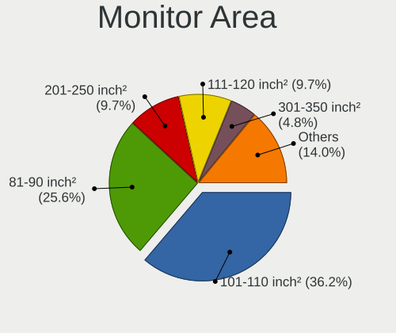

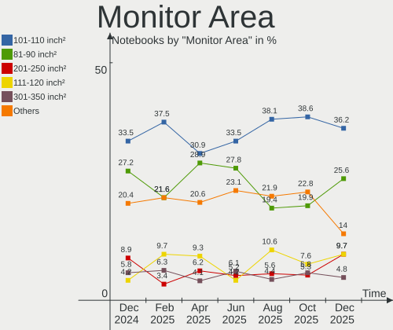

| Area in inch² | Notebooks | Percent |
|----------------|-----------|---------|
| 101-110        | 75        | 36.23%  |
| 81-90          | 53        | 25.6%   |
| 201-250        | 20        | 9.66%   |
| 111-120        | 20        | 9.66%   |
| 301-350        | 10        | 4.83%   |
| Unknown        | 6         | 2.9%    |
| 121-130        | 5         | 2.42%   |
| 351-500        | 3         | 1.45%   |
| 251-300        | 3         | 1.45%   |
| 71-80          | 2         | 0.97%   |
| 61-70          | 2         | 0.97%   |
| 501-1000       | 2         | 0.97%   |
| 91-100         | 2         | 0.97%   |
| More than 1000 | 1         | 0.48%   |
| 51-60          | 1         | 0.48%   |
| 151-200        | 1         | 0.48%   |
| 141-150        | 1         | 0.48%   |

Pixel Density
-------------

Pixels per inch

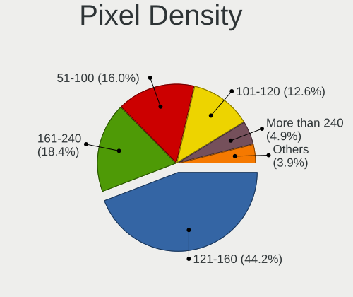

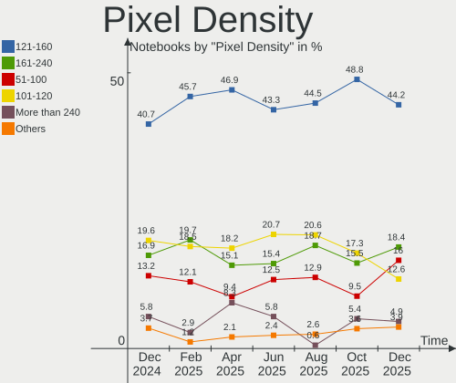

| Density       | Notebooks | Percent |
|---------------|-----------|---------|
| 121-160       | 91        | 44.17%  |
| 161-240       | 38        | 18.45%  |
| 51-100        | 33        | 16.02%  |
| 101-120       | 26        | 12.62%  |
| More than 240 | 10        | 4.85%   |
| Unknown       | 6         | 2.91%   |
| 1-50          | 2         | 0.97%   |

Multiple Monitors
-----------------

Total monitors connected

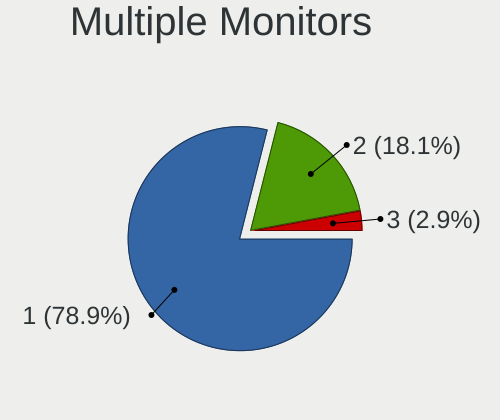

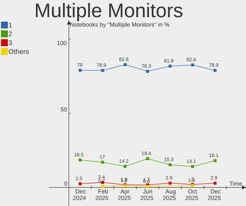

| Total | Notebooks | Percent |
|-------|-----------|---------|
| 1     | 135       | 78.95%  |
| 2     | 31        | 18.13%  |
| 3     | 5         | 2.92%   |

Network
-------

Net Controller Vendor
---------------------

Controller vendors

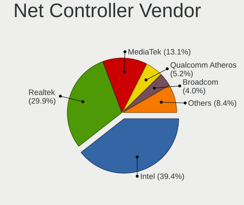

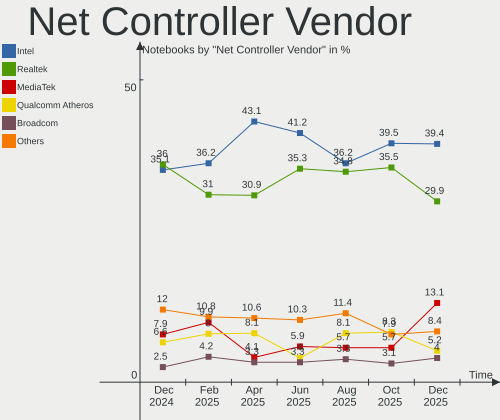

| Vendor                          | Notebooks | Percent |
|---------------------------------|-----------|---------|
| Intel                           | 99        | 39.44%  |
| Realtek Semiconductor           | 75        | 29.88%  |
| MediaTek                        | 33        | 13.15%  |
| Qualcomm Atheros                | 13        | 5.18%   |
| Broadcom                        | 10        | 3.98%   |
| Qualcomm                        | 3         | 1.2%    |
| Sierra Wireless                 | 2         | 0.8%    |
| Samsung Electronics             | 2         | 0.8%    |
| QinHeng Electronics             | 2         | 0.8%    |
| ASIX Electronics                | 2         | 0.8%    |
| Xiaomi                          | 1         | 0.4%    |
| Shenzhen Goodix Technology      | 1         | 0.4%    |
| Qualcomm Atheros Communications | 1         | 0.4%    |
| NetGear                         | 1         | 0.4%    |
| Motorcomm Microelectronics.     | 1         | 0.4%    |
| Mercucys                        | 1         | 0.4%    |
| Lenovo                          | 1         | 0.4%    |
| DisplayLink                     | 1         | 0.4%    |
| Broadcom Limited                | 1         | 0.4%    |
| Apple                           | 1         | 0.4%    |

Net Controller Model
--------------------

Controller models

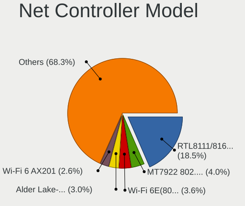

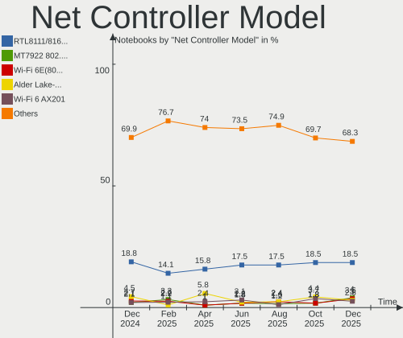

| Model                                                                           | Notebooks | Percent |
|---------------------------------------------------------------------------------|-----------|---------|
| Realtek RTL8111/8168/8211/8411 PCI Express Gigabit Ethernet Controller          | 56        | 18.48%  |
| MediaTek MT7922 802.11ax PCI Express Wireless Network Adapter                   | 12        | 3.96%   |
| Intel Wi-Fi 6E(802.11ax) AX210/AX1675* 2x2 [Typhoon Peak]                       | 11        | 3.63%   |
| Intel Alder Lake-P PCH CNVi WiFi                                                | 9         | 2.97%   |
| Intel Wi-Fi 6 AX201                                                             | 8         | 2.64%   |
| Intel 82579LM Gigabit Network Connection (Lewisville)                           | 8         | 2.64%   |
| Realtek RTL8153 Gigabit Ethernet Adapter                                        | 7         | 2.31%   |
| MediaTek MT7925 802.11be 160MHz 2x2 PCIe Wireless Network Adapter [Filogic 360] | 7         | 2.31%   |
| MediaTek MT7921 802.11ax PCIe Wireless Network Adapter [Filogic 330]            | 7         | 2.31%   |
| Intel Wireless 8265 / 8275                                                      | 7         | 2.31%   |
| Intel Wireless 8260                                                             | 5         | 1.65%   |
| Intel Meteor Lake PCH CNVi WiFi                                                 | 5         | 1.65%   |
| Realtek RTL8821CE 802.11ac PCIe Wireless Network Adapter                        | 4         | 1.32%   |
| Realtek Killer E2600 GbE Controller                                             | 4         | 1.32%   |
| Qualcomm Atheros QCA6174 802.11ac Wireless Network Adapter                      | 4         | 1.32%   |
| Qualcomm Atheros AR9485 Wireless Network Adapter                                | 4         | 1.32%   |
| MediaTek MT7902 802.11ax PCIe Wireless Network Adapter [Filogic 310]            | 4         | 1.32%   |
| Intel Raptor Lake PCH CNVi WiFi                                                 | 4         | 1.32%   |
| Intel Ethernet Connection (4) I219-LM                                           | 4         | 1.32%   |
| Intel Centrino Advanced-N 6205 [Taylor Peak]                                    | 4         | 1.32%   |
| Intel BE201 320MHz                                                              | 4         | 1.32%   |
| Intel Arrow Lake CNVi WiFi                                                      | 4         | 1.32%   |
| Realtek RTL8852CE PCIe 802.11ax Wireless Network Controller                     | 3         | 0.99%   |
| Realtek RTL8852BE PCIe 802.11ax Wireless Network Controller                     | 3         | 0.99%   |
| Realtek RTL810xE PCI Express Fast Ethernet controller                           | 3         | 0.99%   |
| MediaTek Wi-Fi 6 MT7920 Wireless Network Adapter                                | 3         | 0.99%   |
| Intel Wireless 7265                                                             | 3         | 0.99%   |
| Intel Wi-Fi 6 AX200                                                             | 3         | 0.99%   |
| Intel Tiger Lake PCH CNVi WiFi                                                  | 3         | 0.99%   |
| Intel Comet Lake PCH CNVi WiFi                                                  | 3         | 0.99%   |
| Intel Centrino Ultimate-N 6300                                                  | 3         | 0.99%   |
| Broadcom BCM43142 802.11b/g/n                                                   | 3         | 0.99%   |
| Realtek USB 10/100/1G/2.5 LAN                                                   | 2         | 0.66%   |
| Realtek RTL8852AE 802.11ax PCIe Wireless Network Adapter                        | 2         | 0.66%   |
| Realtek RTL8822CE 802.11ac PCIe Wireless Network Adapter                        | 2         | 0.66%   |
| Realtek RTL8723BE PCIe Wireless Network Adapter                                 | 2         | 0.66%   |
| Qualcomm QCNFA765 Wireless Network Adapter                                      | 2         | 0.66%   |
| Qualcomm Atheros QCA9377 802.11ac Wireless Network Adapter                      | 2         | 0.66%   |
| QinHeng USB 10/100 LAN                                                          | 2         | 0.66%   |
| Intel Wireless 7260                                                             | 2         | 0.66%   |

Wireless Vendor
---------------

Wireless vendors

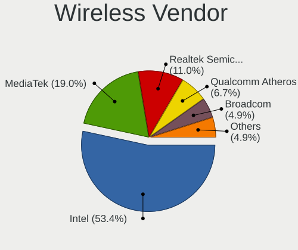

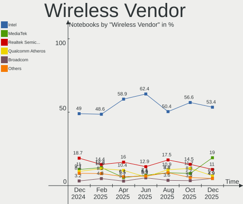

| Vendor                          | Notebooks | Percent |
|---------------------------------|-----------|---------|
| Intel                           | 87        | 53.37%  |
| MediaTek                        | 31        | 19.02%  |
| Realtek Semiconductor           | 18        | 11.04%  |
| Qualcomm Atheros                | 11        | 6.75%   |
| Broadcom                        | 8         | 4.91%   |
| Sierra Wireless                 | 2         | 1.23%   |
| Qualcomm                        | 2         | 1.23%   |
| Qualcomm Atheros Communications | 1         | 0.61%   |
| NetGear                         | 1         | 0.61%   |
| Mercucys                        | 1         | 0.61%   |
| Broadcom Limited                | 1         | 0.61%   |

Wireless Model
--------------

Wireless models

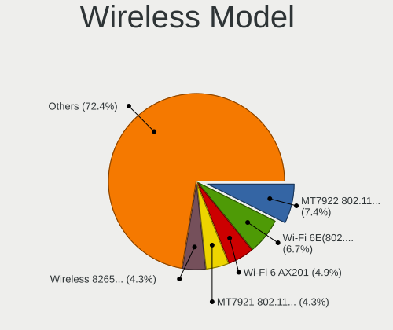

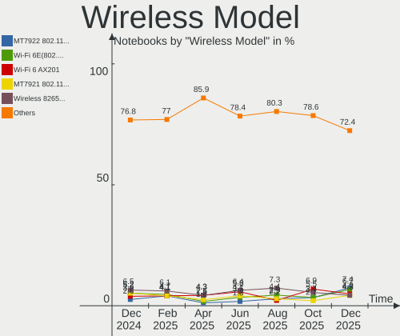

| Model                                                                           | Notebooks | Percent |
|---------------------------------------------------------------------------------|-----------|---------|
| MediaTek MT7922 802.11ax PCI Express Wireless Network Adapter                   | 12        | 7.36%   |
| Intel Wi-Fi 6E(802.11ax) AX210/AX1675* 2x2 [Typhoon Peak]                       | 11        | 6.75%   |
| Intel Wi-Fi 6 AX201                                                             | 8         | 4.91%   |
| MediaTek MT7921 802.11ax PCIe Wireless Network Adapter [Filogic 330]            | 7         | 4.29%   |
| Intel Wireless 8265 / 8275                                                      | 7         | 4.29%   |
| Intel Alder Lake-P PCH CNVi WiFi                                                | 6         | 3.68%   |
| MediaTek MT7925 802.11be 160MHz 2x2 PCIe Wireless Network Adapter [Filogic 360] | 5         | 3.07%   |
| Intel Wireless 8260                                                             | 5         | 3.07%   |
| Intel Meteor Lake PCH CNVi WiFi                                                 | 5         | 3.07%   |
| Realtek RTL8821CE 802.11ac PCIe Wireless Network Adapter                        | 4         | 2.45%   |
| Qualcomm Atheros QCA6174 802.11ac Wireless Network Adapter                      | 4         | 2.45%   |
| Qualcomm Atheros AR9485 Wireless Network Adapter                                | 4         | 2.45%   |
| MediaTek MT7902 802.11ax PCIe Wireless Network Adapter [Filogic 310]            | 4         | 2.45%   |
| Intel Raptor Lake PCH CNVi WiFi                                                 | 4         | 2.45%   |
| Intel Centrino Advanced-N 6205 [Taylor Peak]                                    | 4         | 2.45%   |
| Realtek RTL8852BE PCIe 802.11ax Wireless Network Controller                     | 3         | 1.84%   |
| MediaTek Wi-Fi 6 MT7920 Wireless Network Adapter                                | 3         | 1.84%   |
| Intel Wireless 7265                                                             | 3         | 1.84%   |
| Intel Wi-Fi 6 AX200                                                             | 3         | 1.84%   |
| Intel Tiger Lake PCH CNVi WiFi                                                  | 3         | 1.84%   |
| Intel Comet Lake PCH CNVi WiFi                                                  | 3         | 1.84%   |
| Intel Centrino Ultimate-N 6300                                                  | 3         | 1.84%   |
| Broadcom BCM43142 802.11b/g/n                                                   | 3         | 1.84%   |
| Realtek RTL8852AE 802.11ax PCIe Wireless Network Adapter                        | 2         | 1.23%   |
| Realtek RTL8822CE 802.11ac PCIe Wireless Network Adapter                        | 2         | 1.23%   |
| Realtek RTL8723BE PCIe Wireless Network Adapter                                 | 2         | 1.23%   |
| Qualcomm QCNFA765 Wireless Network Adapter                                      | 2         | 1.23%   |
| Qualcomm Atheros QCA9377 802.11ac Wireless Network Adapter                      | 2         | 1.23%   |
| Intel Wireless 7260                                                             | 2         | 1.23%   |
| Intel Comet Lake PCH-LP CNVi WiFi                                               | 2         | 1.23%   |
| Intel Cannon Point-LP CNVi [Wireless-AC]                                        | 2         | 1.23%   |
| Intel Cannon Lake PCH CNVi WiFi                                                 | 2         | 1.23%   |
| Intel BE201 320MHz                                                              | 2         | 1.23%   |
| Sierra Wireless EM7455                                                          | 1         | 0.61%   |
| Sierra Wireless AirPrime MC7455 3G/4G LTE Modem                                 | 1         | 0.61%   |
| Realtek RTL8852CE PCIe 802.11ax Wireless Network Controller                     | 1         | 0.61%   |
| Realtek RTL8851BE PCIe 802.11ax Wireless Network Controller                     | 1         | 0.61%   |
| Realtek RTL8822BE 802.11a/b/g/n/ac WiFi adapter                                 | 1         | 0.61%   |
| Realtek RTL8188FTV 802.11b/g/n 1T1R 2.4G WLAN Adapter                           | 1         | 0.61%   |
| Realtek 802.11ac NIC                                                            | 1         | 0.61%   |

Ethernet Vendor
---------------

Ethernet vendors

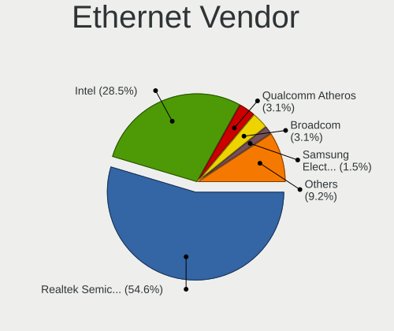

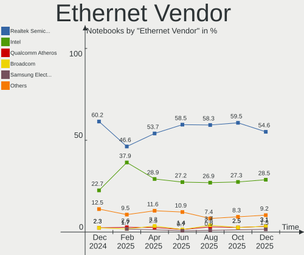

| Vendor                      | Notebooks | Percent |
|-----------------------------|-----------|---------|
| Realtek Semiconductor       | 71        | 54.62%  |
| Intel                       | 37        | 28.46%  |
| Qualcomm Atheros            | 4         | 3.08%   |
| Broadcom                    | 4         | 3.08%   |
| Samsung Electronics         | 2         | 1.54%   |
| QinHeng Electronics         | 2         | 1.54%   |
| MediaTek                    | 2         | 1.54%   |
| ASIX Electronics            | 2         | 1.54%   |
| Xiaomi                      | 1         | 0.77%   |
| Qualcomm                    | 1         | 0.77%   |
| Motorcomm Microelectronics. | 1         | 0.77%   |
| Lenovo                      | 1         | 0.77%   |
| DisplayLink                 | 1         | 0.77%   |
| Apple                       | 1         | 0.77%   |

Ethernet Model
--------------

Ethernet models

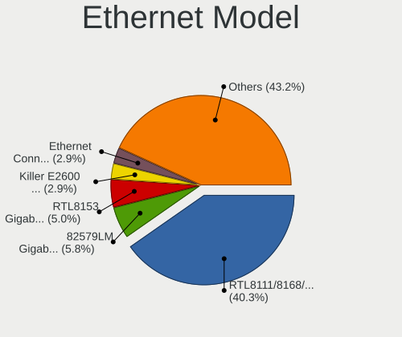

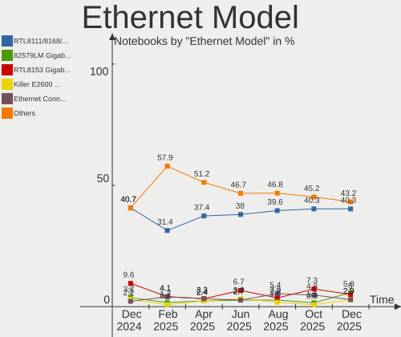

| Model                                                                           | Notebooks | Percent |
|---------------------------------------------------------------------------------|-----------|---------|
| Realtek RTL8111/8168/8211/8411 PCI Express Gigabit Ethernet Controller          | 56        | 40.29%  |
| Intel 82579LM Gigabit Network Connection (Lewisville)                           | 8         | 5.76%   |
| Realtek RTL8153 Gigabit Ethernet Adapter                                        | 7         | 5.04%   |
| Realtek Killer E2600 GbE Controller                                             | 4         | 2.88%   |
| Intel Ethernet Connection (4) I219-LM                                           | 4         | 2.88%   |
| Realtek RTL810xE PCI Express Fast Ethernet controller                           | 3         | 2.16%   |
| Intel Arrow Lake CNVi WiFi                                                      | 3         | 2.16%   |
| Intel Alder Lake-P PCH CNVi WiFi                                                | 3         | 2.16%   |
| Realtek USB 10/100/1G/2.5 LAN                                                   | 2         | 1.44%   |
| Realtek RTL8852CE PCIe 802.11ax Wireless Network Controller                     | 2         | 1.44%   |
| QinHeng USB 10/100 LAN                                                          | 2         | 1.44%   |
| MediaTek MT7925 802.11be 160MHz 2x2 PCIe Wireless Network Adapter [Filogic 360] | 2         | 1.44%   |
| Intel Ethernet Connection I218-LM                                               | 2         | 1.44%   |
| Intel Ethernet Connection (24) I219-V                                           | 2         | 1.44%   |
| Intel Ethernet Connection (18) I219-LM                                          | 2         | 1.44%   |
| Intel Ethernet Connection (13) I219-V                                           | 2         | 1.44%   |
| Intel BE201 320MHz                                                              | 2         | 1.44%   |
| Broadcom NetLink BCM57785 Gigabit Ethernet PCIe                                 | 2         | 1.44%   |
| ASIX AX88179 Gigabit Ethernet                                                   | 2         | 1.44%   |
| Xiaomi Mi/Redmi series (RNDIS)                                                  | 1         | 0.72%   |
| Samsung GT-I9070 (network tethering, USB debugging enabled)                     | 1         | 0.72%   |
| Samsung Galaxy series, misc. (tethering mode)                                   | 1         | 0.72%   |
| Realtek RTL8125 2.5GbE Controller                                               | 1         | 0.72%   |
| Realtek RTL-8100/8101L/8139 PCI Fast Ethernet Adapter                           | 1         | 0.72%   |
| Realtek Killer E5000 5GbE Controller                                            | 1         | 0.72%   |
| Realtek Killer E3000 2.5GbE Controller                                          | 1         | 0.72%   |
| Qualcomm YUPIK-QRD _SN:AC1D5909                                                 | 1         | 0.72%   |
| Qualcomm Atheros QCA8172 Fast Ethernet                                          | 1         | 0.72%   |
| Qualcomm Atheros QCA8171 Gigabit Ethernet                                       | 1         | 0.72%   |
| Qualcomm Atheros Killer E2500 Gigabit Ethernet Controller                       | 1         | 0.72%   |
| Qualcomm Atheros AR8161 Gigabit Ethernet                                        | 1         | 0.72%   |
| Motorcomm Microelectronics. YT6801 Gigabit Ethernet Controller                  | 1         | 0.72%   |
| Lenovo ThinkPad TBT 3 Dock                                                      | 1         | 0.72%   |
| Intel I210 Gigabit Network Connection                                           | 1         | 0.72%   |
| Intel Ethernet Controller I225-V                                                | 1         | 0.72%   |
| Intel Ethernet Connection (7) I219-LM                                           | 1         | 0.72%   |
| Intel Ethernet Connection (6) I219-LM                                           | 1         | 0.72%   |
| Intel Ethernet Connection (23) I219-V                                           | 1         | 0.72%   |
| Intel Ethernet Connection (23) I219-LM                                          | 1         | 0.72%   |
| Intel Ethernet Connection (2) I219-LM                                           | 1         | 0.72%   |

Net Controller Kind
-------------------

Ethernet, WiFi or modem

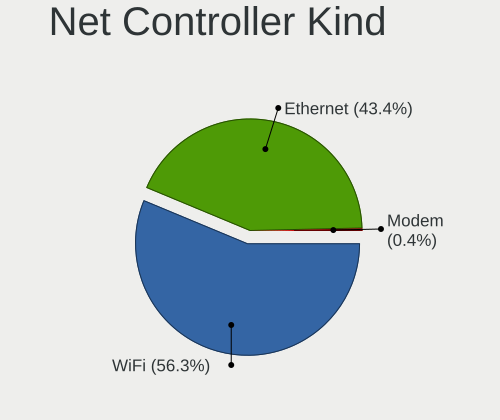

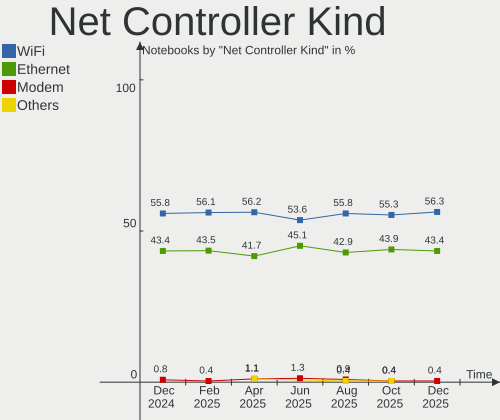

| Kind     | Notebooks | Percent |
|----------|-----------|---------|
| WiFi     | 157       | 56.27%  |
| Ethernet | 121       | 43.37%  |
| Modem    | 1         | 0.36%   |

Used Controller
---------------

Currently used network controller

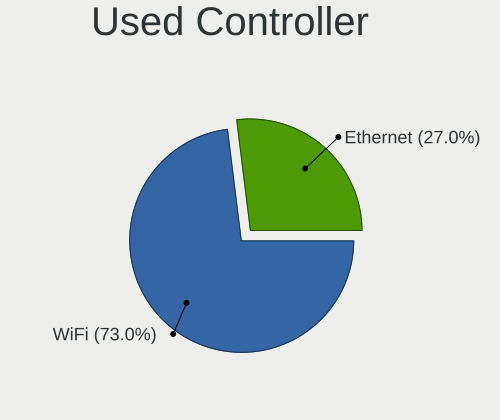

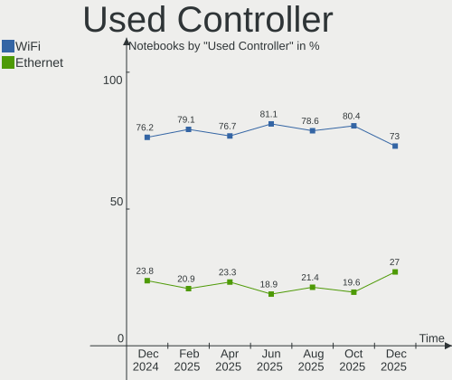

| Kind     | Notebooks | Percent |
|----------|-----------|---------|
| WiFi     | 130       | 73.03%  |
| Ethernet | 48        | 26.97%  |

NICs
----

Total network controllers on board

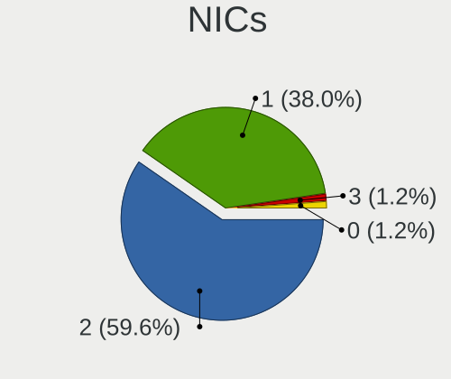

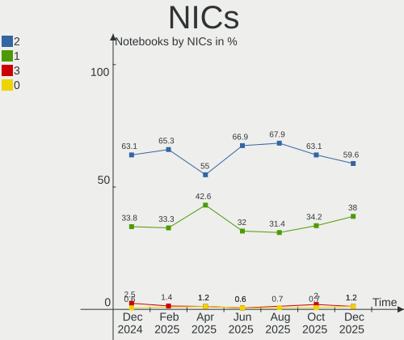

| Total | Notebooks | Percent |
|-------|-----------|---------|
| 2     | 102       | 59.65%  |
| 1     | 65        | 38.01%  |
| 3     | 2         | 1.17%   |
| 0     | 2         | 1.17%   |

IPv6
----

IPv6 vs IPv4

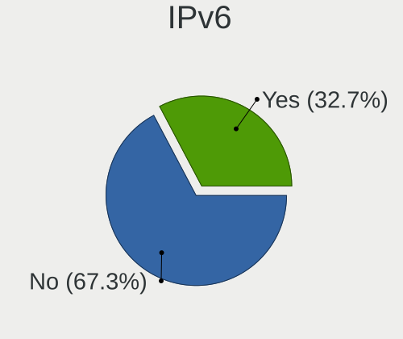

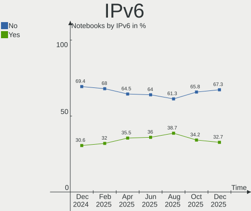

| Used | Notebooks | Percent |
|------|-----------|---------|
| No   | 115       | 67.25%  |
| Yes  | 56        | 32.75%  |

Bluetooth
---------

Bluetooth Vendor
----------------

Controller vendors

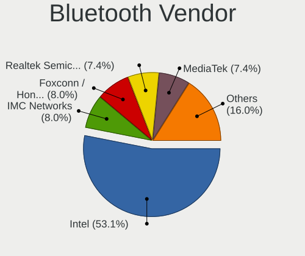

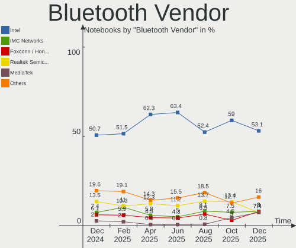

| Vendor                          | Notebooks | Percent |
|---------------------------------|-----------|---------|
| Intel                           | 86        | 53.09%  |
| IMC Networks                    | 13        | 8.02%   |
| Foxconn / Hon Hai               | 13        | 8.02%   |
| Realtek Semiconductor           | 12        | 7.41%   |
| MediaTek                        | 12        | 7.41%   |
| Qualcomm Atheros Communications | 7         | 4.32%   |
| Broadcom                        | 4         | 2.47%   |
| Lite-On Technology              | 3         | 1.85%   |
| Hewlett-Packard                 | 3         | 1.85%   |
| Apple                           | 2         | 1.23%   |
| TP-Link                         | 1         | 0.62%   |
| Toshiba                         | 1         | 0.62%   |
| Realtek                         | 1         | 0.62%   |
| Foxconn International           | 1         | 0.62%   |
| Dell                            | 1         | 0.62%   |
| Chicony Electronics             | 1         | 0.62%   |
| Cambridge Silicon Radio         | 1         | 0.62%   |

Bluetooth Model
---------------

Controller models

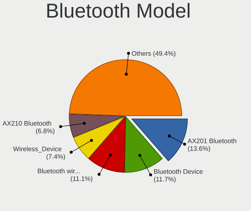

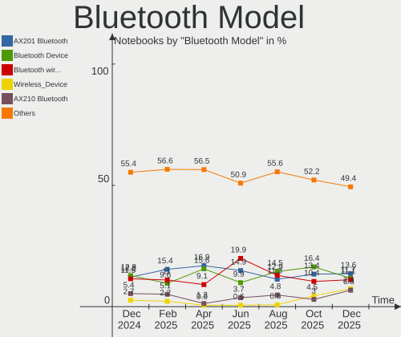

| Model                                               | Notebooks | Percent |
|-----------------------------------------------------|-----------|---------|
| Intel AX201 Bluetooth                               | 22        | 13.58%  |
| Intel Bluetooth Device                              | 19        | 11.73%  |
| Intel Bluetooth wireless interface                  | 18        | 11.11%  |
| MediaTek Wireless_Device                            | 12        | 7.41%   |
| Intel AX210 Bluetooth                               | 11        | 6.79%   |
| Realtek Bluetooth Radio                             | 9         | 5.56%   |
| IMC Networks Wireless_Device                        | 9         | 5.56%   |
| Intel Bluetooth 9460/9560 Jefferson Peak (JfP)      | 8         | 4.94%   |
| Foxconn / Hon Hai Wireless_Device                   | 7         | 4.32%   |
| Qualcomm Atheros  Bluetooth Device                  | 4         | 2.47%   |
| IMC Networks Bluetooth Radio                        | 4         | 2.47%   |
| Foxconn / Hon Hai MediaTek Bluetooth Adapter        | 4         | 2.47%   |
| Intel AX200 Bluetooth                               | 3         | 1.85%   |
| HP Broadcom 2070 Bluetooth Combo                    | 3         | 1.85%   |
| Realtek  Bluetooth 4.2 Adapter                      | 2         | 1.23%   |
| Intel Centrino Bluetooth Wireless Transceiver       | 2         | 1.23%   |
| Intel Bluetooth                                     | 2         | 1.23%   |
| Foxconn / Hon Hai Bluetooth Device                  | 2         | 1.23%   |
| Apple Bluetooth Host Controller                     | 2         | 1.23%   |
| TP-Link TP-T@- UB500 Adapter                        | 1         | 0.62%   |
| Toshiba Bluetooth Device                            | 1         | 0.62%   |
| Realtek RTL8822BE Bluetooth 4.2 Adapter             | 1         | 0.62%   |
| Realtek Bluetooth Radio                             | 1         | 0.62%   |
| Qualcomm Atheros QCA61x4 Bluetooth 4.0              | 1         | 0.62%   |
| Qualcomm Atheros Bluetooth USB Host Controller      | 1         | 0.62%   |
| Qualcomm Atheros Bluetooth                          | 1         | 0.62%   |
| Lite-On Wireless_Device                             | 1         | 0.62%   |
| Lite-On Qualcomm Atheros QCA9377 Bluetooth          | 1         | 0.62%   |
| Lite-On Broadcom BCM43142A0 Bluetooth Device        | 1         | 0.62%   |
| Intel Wireless-AC 9260 Bluetooth Adapter            | 1         | 0.62%   |
| Foxconn International BCM43142A0 Bluetooth module   | 1         | 0.62%   |
| Dell BCM20702A0 Bluetooth Module                    | 1         | 0.62%   |
| Chicony Bluetooth (RTL8723BE)                       | 1         | 0.62%   |
| Cambridge Silicon Radio Bluetooth Dongle (HCI mode) | 1         | 0.62%   |
| Broadcom BCM43142A0 Bluetooth 4.0                   | 1         | 0.62%   |
| Broadcom BCM20702 Bluetooth 4.0 [ThinkPad]          | 1         | 0.62%   |
| Broadcom BCM2046 Bluetooth Device                   | 1         | 0.62%   |
| Broadcom BCM2045B (BDC-2.1)                         | 1         | 0.62%   |

Sound
-----

Sound Vendor
------------

Sound card vendors

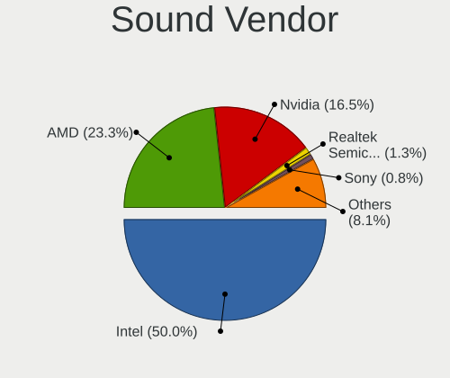

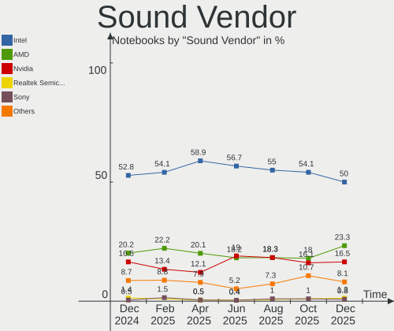

| Vendor                               | Notebooks | Percent |
|--------------------------------------|-----------|---------|
| Intel                                | 118       | 50%     |
| AMD                                  | 55        | 23.31%  |
| Nvidia                               | 39        | 16.53%  |
| Realtek Semiconductor                | 3         | 1.27%   |
| Sony                                 | 2         | 0.85%   |
| KTMicro                              | 2         | 0.85%   |
| Hewlett-Packard                      | 2         | 0.85%   |
| Thesycon Systemsoftware & Consulting | 1         | 0.42%   |
| SteelSeries ApS                      | 1         | 0.42%   |
| ShenZhen Maono Technology            | 1         | 0.42%   |
| Razer USA                            | 1         | 0.42%   |
| Logitech                             | 1         | 0.42%   |
| Lenovo                               | 1         | 0.42%   |
| Lautsprecher Teufel                  | 1         | 0.42%   |
| Generalplus Technology               | 1         | 0.42%   |
| ESI Audiotechnik                     | 1         | 0.42%   |
| Drop                                 | 1         | 0.42%   |
| Compx                                | 1         | 0.42%   |
| Compal Electronics                   | 1         | 0.42%   |
| Blue Microphones                     | 1         | 0.42%   |
| ASUSTek Computer                     | 1         | 0.42%   |
| Apple                                | 1         | 0.42%   |

Sound Model
-----------

Sound card models

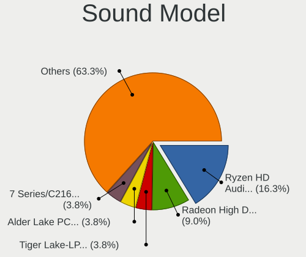

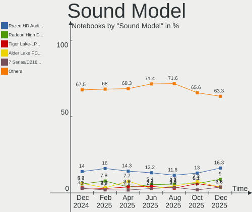

| Model                                                                                             | Notebooks | Percent |
|---------------------------------------------------------------------------------------------------|-----------|---------|
| AMD Ryzen HD Audio Controller                                                                     | 47        | 16.26%  |
| AMD Radeon High Definition Audio Controller                                                       | 26        | 9%      |
| Intel Tiger Lake-LP Smart Sound Technology Audio Controller                                       | 11        | 3.81%   |
| Intel Alder Lake PCH-P High Definition Audio Controller                                           | 11        | 3.81%   |
| Intel 7 Series/C216 Chipset Family High Definition Audio Controller                               | 11        | 3.81%   |
| AMD Renoir/Cezanne HDMI/DP Audio Controller                                                       | 11        | 3.81%   |
| Intel Sunrise Point-LP HD Audio                                                                   | 10        | 3.46%   |
| Intel Raptor Lake-P/U/H cAVS                                                                      | 9         | 3.11%   |
| Intel 6 Series/C200 Series Chipset Family High Definition Audio Controller                        | 7         | 2.42%   |
| Intel Cannon Lake PCH cAVS                                                                        | 6         | 2.08%   |
| Nvidia GB206 High Definition Audio Controller                                                     | 5         | 1.73%   |
| Nvidia AD106M High Definition Audio Controller                                                    | 5         | 1.73%   |
| Intel Meteor Lake-P HD Audio Controller                                                           | 5         | 1.73%   |
| Intel Cannon Point-LP High Definition Audio Controller                                            | 5         | 1.73%   |
| Nvidia GA106 High Definition Audio Controller                                                     | 4         | 1.38%   |
| Nvidia AD107 High Definition Audio Controller                                                     | 4         | 1.38%   |
| Intel Lunar Lake-M HD Audio Controller                                                            | 4         | 1.38%   |
| Intel Haswell-ULT HD Audio Controller                                                             | 4         | 1.38%   |
| Intel Arrow Lake cAVS                                                                             | 4         | 1.38%   |
| Intel 8 Series HD Audio Controller                                                                | 4         | 1.38%   |
| Realtek Semiconductor USB Audio                                                                   | 3         | 1.04%   |
| Nvidia GP107GL High Definition Audio Controller                                                   | 3         | 1.04%   |
| Nvidia GA107 High Definition Audio Controller                                                     | 3         | 1.04%   |
| Nvidia GA104 High Definition Audio Controller                                                     | 3         | 1.04%   |
| Intel Tiger Lake-H HD Audio Controller                                                            | 3         | 1.04%   |
| Intel Ice Lake-LP Smart Sound Technology Audio Controller                                         | 3         | 1.04%   |
| Intel Comet Lake PCH cAVS                                                                         | 3         | 1.04%   |
| Intel 8 Series/C220 Series Chipset High Definition Audio Controller                               | 3         | 1.04%   |
| Intel 100 Series/C230 Series Chipset Family HD Audio Controller                                   | 3         | 1.04%   |
| AMD Raven/Raven2/Fenghuang HDMI/DP Audio Controller                                               | 3         | 1.04%   |
| AMD Kabini HDMI/DP Audio                                                                          | 3         | 1.04%   |
| Nvidia TU116 High Definition Audio Controller                                                     | 2         | 0.69%   |
| Nvidia TU106 High Definition Audio Controller                                                     | 2         | 0.69%   |
| Nvidia GK107 HDMI Audio Controller                                                                | 2         | 0.69%   |
| Nvidia GF106 High Definition Audio Controller                                                     | 2         | 0.69%   |
| Intel Raptor Lake High Definition Audio Controller                                                | 2         | 0.69%   |
| Intel Comet Lake PCH-LP cAVS                                                                      | 2         | 0.69%   |
| Intel Celeron/Pentium Silver Processor High Definition Audio                                      | 2         | 0.69%   |
| Intel Atom/Celeron/Pentium Processor x5-E8000/J3xxx/N3xxx Series High Definition Audio Controller | 2         | 0.69%   |
| Intel Alder Lake-S HD Audio Controller                                                            | 2         | 0.69%   |

Memory
------

Memory Vendor
-------------

Memory module vendors

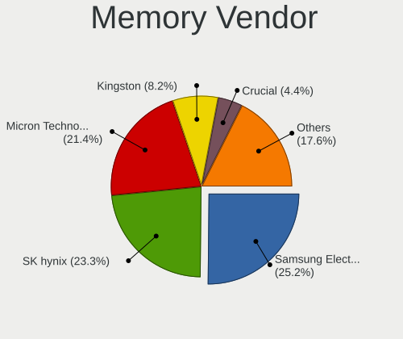

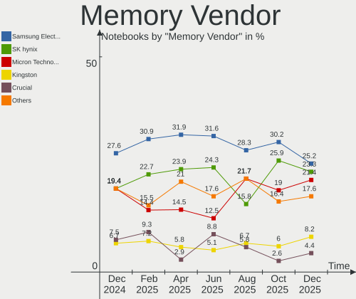

| Vendor                       | Notebooks | Percent |
|------------------------------|-----------|---------|
| Samsung Electronics          | 40        | 25.16%  |
| SK hynix                     | 37        | 23.27%  |
| Micron Technology            | 34        | 21.38%  |
| Kingston                     | 13        | 8.18%   |
| Crucial                      | 7         | 4.4%    |
| Ramaxel Technology           | 5         | 3.14%   |
| A-DATA Technology            | 5         | 3.14%   |
| Unknown                      | 5         | 3.14%   |
| Unknown                      | 3         | 1.89%   |
| Unknown (0x0B5E)             | 1         | 0.63%   |
| Timetec                      | 1         | 0.63%   |
| Team                         | 1         | 0.63%   |
| Smart                        | 1         | 0.63%   |
| PNY                          | 1         | 0.63%   |
| Patriot Memory (PDP Systems) | 1         | 0.63%   |
| GOODRAM                      | 1         | 0.63%   |
| Elpida                       | 1         | 0.63%   |
| Corsair                      | 1         | 0.63%   |
| ACPI Digital                 | 1         | 0.63%   |

Memory Model
------------

Memory module models

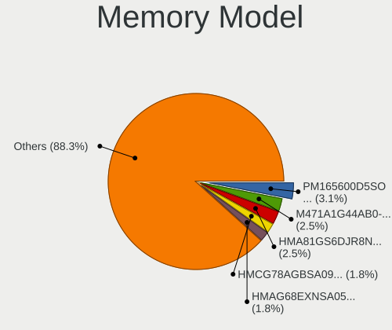

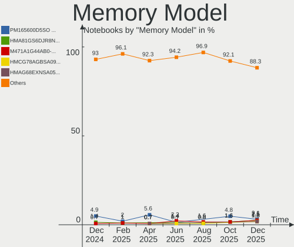

| Model                                                            | Notebooks | Percent |
|------------------------------------------------------------------|-----------|---------|
| Unknown                                                          | 5         | 3.07%   |
| SK hynix RAM HMA81GS6DJR8N-XN 8GB SODIMM DDR4 3200MT/s           | 4         | 2.45%   |
| Samsung RAM M471A1G44AB0-CWE 8GiB SODIMM DDR4 3200MT/s           | 4         | 2.45%   |
| SK hynix RAM HMCG78AGBSA095N 16GB SODIMM DDR5 5600MT/s           | 3         | 1.84%   |
| SK hynix RAM HMAG68EXNSA051N 8GB SODIMM DDR4 3200MT/s            | 3         | 1.84%   |
| Micron RAM 4ATF1G64HZ-3G2E1 8GB SODIMM DDR4 3200MT/s             | 3         | 1.84%   |
| SK hynix RAM HMCG88AGBSA095N 32GB SODIMM DDR5 5600MT/s           | 2         | 1.23%   |
| SK hynix RAM HMCG66MEBSA095N 8GiB SODIMM DDR5 4800MT/s           | 2         | 1.23%   |
| Samsung RAM M471B5173DB0-YK0 4GB SODIMM DDR3 1600MT/s            | 2         | 1.23%   |
| Samsung RAM M471A1K43EB1-CWE 8GB SODIMM DDR4 3200MT/s            | 2         | 1.23%   |
| Samsung RAM M471A1K43BB1-CRC 8GB SODIMM DDR4 2667MT/s            | 2         | 1.23%   |
| Samsung RAM M471A1G44BB0-CWE 8GB SODIMM DDR4 3200MT/s            | 2         | 1.23%   |
| Samsung RAM M471A1G44AB0-CWE 8GB Row Of Chips DDR4 3200MT/s      | 2         | 1.23%   |
| Samsung RAM M425R2GA3EB0-CWMOL 16GB SODIMM DDR5 5600MT/s         | 2         | 1.23%   |
| Ramaxel RAM RMT3170EB68E9W1600 4GB SODIMM DDR3 1600MT/s          | 2         | 1.23%   |
| Micron RAM MTC4C10163S1SC56BD1 8GB SODIMM DDR5 5600MT/s          | 2         | 1.23%   |
| Micron RAM Module 4GB Row Of Chips LPDDR5 8533MT/s               | 2         | 1.23%   |
| Micron RAM 8ATF1G64HZ-3G2R1 8GB SODIMM DDR4 3200MT/s             | 2         | 1.23%   |
| Unknown RAM Module 8GB SODIMM DDR3 1333MT/s                      | 1         | 0.61%   |
| Unknown RAM Module 512MB SODIMM DDR2                             | 1         | 0.61%   |
| Unknown RAM Module 2GB Row Of Chips LPDDR4 4267MT/s              | 1         | 0.61%   |
| Unknown (0x0B5E) RAM HEHMCG78AGBSBA0BN 16GB SODIMM DDR5 5600MT/s | 1         | 0.61%   |
| Timetec RAM S8G-1333 8GB SODIMM DDR3 1333MT/s                    | 1         | 0.61%   |
| Team RAM UD5-5200 16GB DIMM DDR5 5200MT/s                        | 1         | 0.61%   |
| Smart RAM SF464128CKHIWDFSEG 4GB SODIMM DDR4 2133MT/s            | 1         | 0.61%   |
| SK hynix RAM Module 8GB Row Of Chips LPDDR3 2133MT/s             | 1         | 0.61%   |
| SK hynix RAM Module 4GB SODIMM DDR4 2133MT/s                     | 1         | 0.61%   |
| SK hynix RAM Module 16GiB SODIMM DDR4 2667MT/s                   | 1         | 0.61%   |
| SK hynix RAM HMT451S6BFR8A-PB 4GB SODIMM DDR3 1600MT/s           | 1         | 0.61%   |
| SK hynix RAM HMT451S6AFR8A-PB 4GB SODIMM DDR3 1600MT/s           | 1         | 0.61%   |
| SK hynix RAM HMT41GS6BFR8C-PB 8GiB SODIMM DDR3 1600MT/s          | 1         | 0.61%   |
| SK hynix RAM HMT41GS6BFR8A-PB 8GB SODIMM DDR3 2667MT/s           | 1         | 0.61%   |
| SK hynix RAM HMT351S6EFR8C-PB 4GB SODIMM DDR3 1600MT/s           | 1         | 0.61%   |
| SK hynix RAM HMCG88AGBSA092N 32GB SODIMM DDR5 5600MT/s           | 1         | 0.61%   |
| SK hynix RAM HMCG78AGBSA092N 16GB SODIMM DDR5 5600MT/s           | 1         | 0.61%   |
| SK hynix RAM HMCG66AGBSA095N 8GiB SODIMM DDR5 5600MT/s           | 1         | 0.61%   |
| SK hynix RAM HMAB2GS6AMR6N-XN 16GB SODIMM DDR4 3200MT/s          | 1         | 0.61%   |
| SK hynix RAM HMAA4GS6MJR8N-VK 32GB SODIMM DDR4 2667MT/s          | 1         | 0.61%   |
| SK hynix RAM HMAA2GS6CJR8N-XN 16GB SODIMM DDR4 3200MT/s          | 1         | 0.61%   |
| SK hynix RAM HMAA1GS6CJR6N-XN 8GB SODIMM DDR4 3200MT/s           | 1         | 0.61%   |

Memory Kind
-----------

Memory module kinds

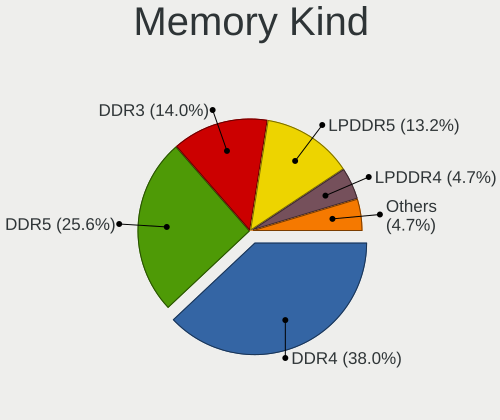

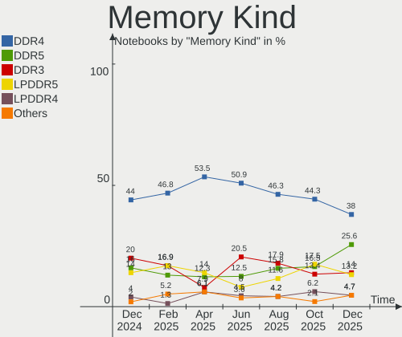

| Kind   | Notebooks | Percent |
|--------|-----------|---------|
| DDR4   | 49        | 37.98%  |
| DDR5   | 33        | 25.58%  |
| DDR3   | 18        | 13.95%  |
| LPDDR5 | 17        | 13.18%  |
| LPDDR4 | 6         | 4.65%   |
| LPDDR3 | 4         | 3.1%    |
| SDRAM  | 1         | 0.78%   |
| DDR2   | 1         | 0.78%   |

Memory Form Factor
------------------

Physical design of the memory module

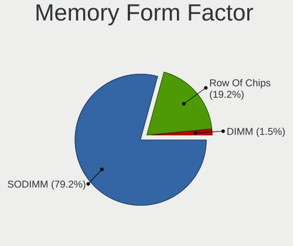

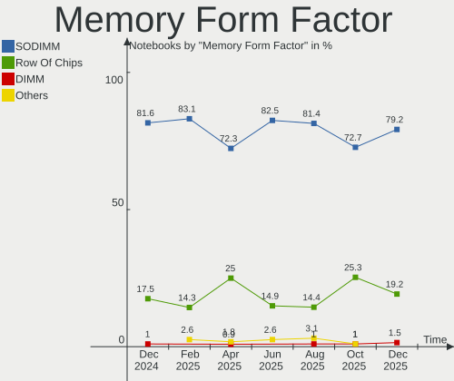

| Name         | Notebooks | Percent |
|--------------|-----------|---------|
| SODIMM       | 103       | 79.23%  |
| Row Of Chips | 25        | 19.23%  |
| DIMM         | 2         | 1.54%   |

Memory Size
-----------

Memory module size

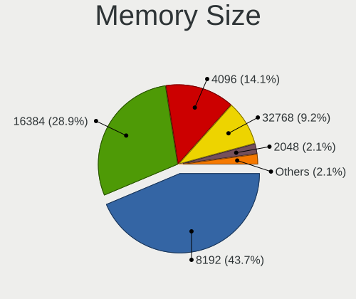

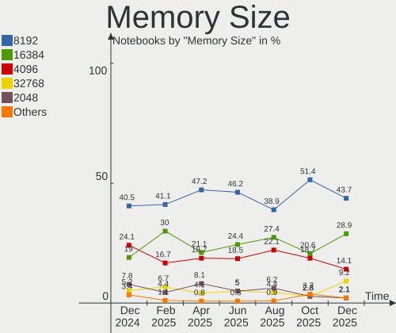

| Size  | Notebooks | Percent |
|-------|-----------|---------|
| 8192  | 62        | 43.66%  |
| 16384 | 41        | 28.87%  |
| 4096  | 20        | 14.08%  |
| 32768 | 13        | 9.15%   |
| 2048  | 3         | 2.11%   |
| 12288 | 1         | 0.7%    |
| 3072  | 1         | 0.7%    |
| 512   | 1         | 0.7%    |

Memory Speed
------------

Memory module speed

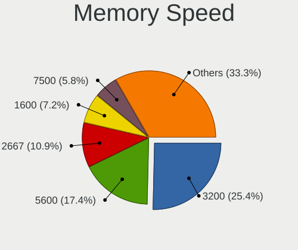

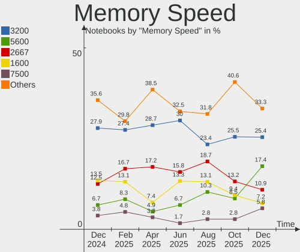

| Speed   | Notebooks | Percent |
|---------|-----------|---------|
| 3200    | 35        | 25.36%  |
| 5600    | 24        | 17.39%  |
| 2667    | 15        | 10.87%  |
| 1600    | 10        | 7.25%   |
| 7500    | 8         | 5.8%    |
| 4800    | 7         | 5.07%   |
| 2133    | 6         | 4.35%   |
| 8533    | 5         | 3.62%   |
| 4267    | 4         | 2.9%    |
| 2400    | 4         | 2.9%    |
| 1333    | 4         | 2.9%    |
| 1334    | 3         | 2.17%   |
| 7467    | 2         | 1.45%   |
| 6400    | 2         | 1.45%   |
| 4266    | 2         | 1.45%   |
| 800     | 2         | 1.45%   |
| 8000    | 1         | 0.72%   |
| 5200    | 1         | 0.72%   |
| 4199    | 1         | 0.72%   |
| 3266    | 1         | 0.72%   |
| Unknown | 1         | 0.72%   |

Printers & scanners
-------------------

Printer Vendor
--------------

Printer device vendors

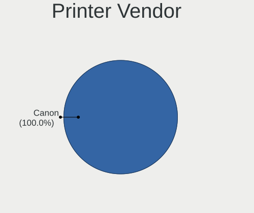

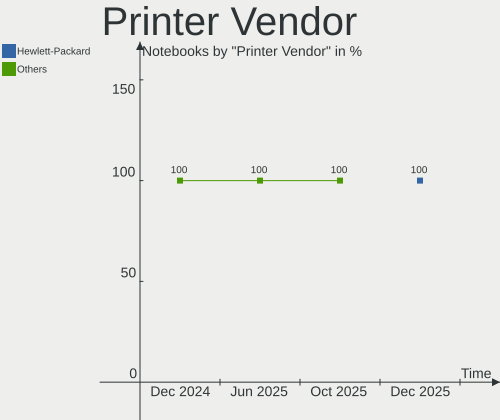

| Vendor          | Notebooks | Percent |
|-----------------|-----------|---------|
| Hewlett-Packard | 1         | 100%    |

Printer Model
-------------

Printer device models

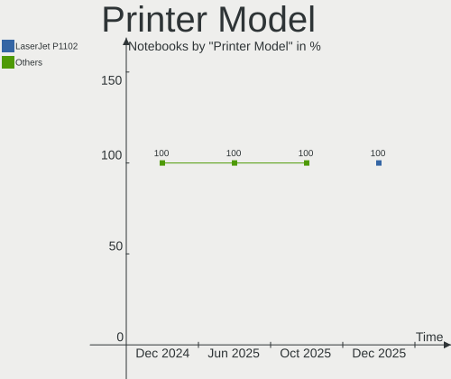

| Model             | Notebooks | Percent |
|-------------------|-----------|---------|
| HP LaserJet P1102 | 1         | 100%    |

Scanner Vendor
--------------

Scanner device vendors

Zero info for selected period =(

Scanner Model
-------------

Scanner device models

Zero info for selected period =(

Camera
------

Camera Vendor
-------------

Camera device vendors

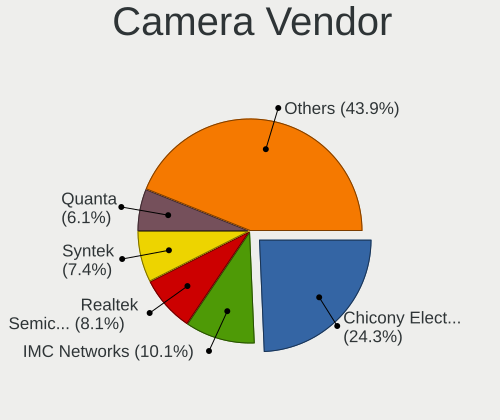

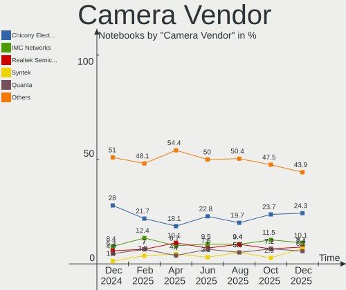

| Vendor                                 | Notebooks | Percent |
|----------------------------------------|-----------|---------|
| Chicony Electronics                    | 36        | 24.32%  |
| IMC Networks                           | 15        | 10.14%  |
| Realtek Semiconductor                  | 12        | 8.11%   |
| Syntek                                 | 11        | 7.43%   |
| Quanta                                 | 9         | 6.08%   |
| Microdia                               | 9         | 6.08%   |
| Bison Electronics                      | 9         | 6.08%   |
| Luxvisions Innotech Limited            | 8         | 5.41%   |
| Cheng Uei Precision Industry (Foxlink) | 8         | 5.41%   |
| Shinetech                              | 7         | 4.73%   |
| Sunplus Innovation Technology          | 4         | 2.7%    |
| SunplusIT                              | 2         | 1.35%   |
| Sonix Technology                       | 2         | 1.35%   |
| ShineOptics                            | 2         | 1.35%   |
| Framework                              | 2         | 1.35%   |
| BillionPixels                          | 2         | 1.35%   |
| Apple                                  | 2         | 1.35%   |
| Sunwingroup                            | 1         | 0.68%   |
| Shine-optics                           | 1         | 0.68%   |
| Primax Electronics                     | 1         | 0.68%   |
| Logitech                               | 1         | 0.68%   |
| Lite-On Technology                     | 1         | 0.68%   |
| kingcome                               | 1         | 0.68%   |
| Anker Innovations Limited              | 1         | 0.68%   |
| Alcor Micro                            | 1         | 0.68%   |

Camera Model
------------

Camera device models

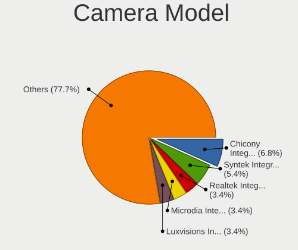

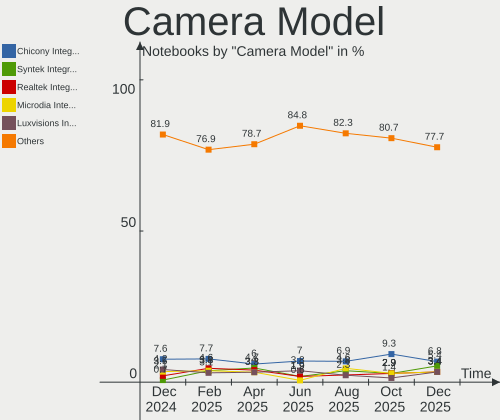

| Model                                                                      | Notebooks | Percent |
|----------------------------------------------------------------------------|-----------|---------|
| Chicony Integrated Camera                                                  | 10        | 6.76%   |
| Syntek Integrated Camera                                                   | 8         | 5.41%   |
| Realtek Integrated_Webcam_HD                                               | 5         | 3.38%   |
| Microdia Integrated_Webcam_HD                                              | 5         | 3.38%   |
| Luxvisions Innotech Limited Integrated Camera                              | 5         | 3.38%   |
| IMC Networks USB2.0 HD UVC WebCam                                          | 5         | 3.38%   |
| Shinetech ASUS FHD webcam                                                  | 4         | 2.7%    |
| IMC Networks Integrated Camera                                             | 4         | 2.7%    |
| Shinetech USB2.0 FHD UVC WebCam                                            | 3         | 2.03%   |
| Chicony HD WebCam                                                          | 3         | 2.03%   |
| Bison Integrated Camera                                                    | 3         | 2.03%   |
| Syntek Lenovo EasyCamera                                                   | 2         | 1.35%   |
| ShineOptics HD Camera                                                      | 2         | 1.35%   |
| Realtek Integrated_Webcam_FHD                                              | 2         | 1.35%   |
| Realtek Bluetooth Radio                                                    | 2         | 1.35%   |
| Quanta HP Wide Vision HD Camera                                            | 2         | 1.35%   |
| Quanta HD Webcam                                                           | 2         | 1.35%   |
| Quanta HD User Facing                                                      | 2         | 1.35%   |
| Microdia Integrated_Webcam_FHD                                             | 2         | 1.35%   |
| IMC Networks USB2.0 VGA UVC WebCam                                         | 2         | 1.35%   |
| IMC Networks HD Camera                                                     | 2         | 1.35%   |
| Framework Laptop Webcam Module (2nd Gen)                                   | 2         | 1.35%   |
| Chicony Lenovo Integrated Camera (0.3MP)                                   | 2         | 1.35%   |
| Chicony Lenovo EasyCamera                                                  | 2         | 1.35%   |
| Chicony Integrated Camera [ThinkPad]                                       | 2         | 1.35%   |
| Chicony Integrated Camera (1280x720@30)                                    | 2         | 1.35%   |
| Chicony ACER HD User Facing                                                | 2         | 1.35%   |
| Chicony ACER FHD User Facing                                               | 2         | 1.35%   |
| Cheng Uei Precision Industry (Foxlink) Webcam                              | 2         | 1.35%   |
| Cheng Uei Precision Industry (Foxlink) HP Wide Vision HD Integrated Webcam | 2         | 1.35%   |
| Bison Lenovo EasyCamera                                                    | 2         | 1.35%   |
| Bison HD Webcam                                                            | 2         | 1.35%   |
| Syntek Integrated RGB Camera                                               | 1         | 0.68%   |
| Sunwingroup HD Camera                                                      | 1         | 0.68%   |
| SunplusIT XiaoMi WebCam                                                    | 1         | 0.68%   |
| SunplusIT HD Camera                                                        | 1         | 0.68%   |
| Sunplus Integrated_Webcam_HD                                               | 1         | 0.68%   |
| Sunplus Integrated_Webcam_FHD                                              | 1         | 0.68%   |
| Sunplus HP HD Webcam [Fixed]                                               | 1         | 0.68%   |
| Sunplus Full HD webcam                                                     | 1         | 0.68%   |

Security
--------

Fingerprint Vendor
------------------

Fingerprint sensor vendors

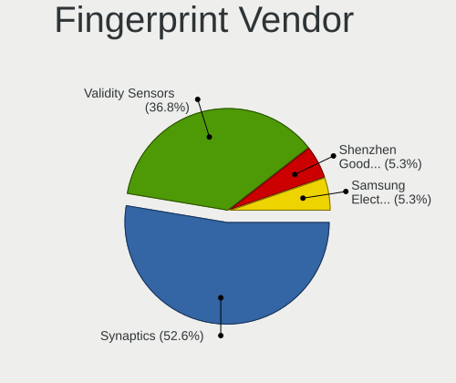

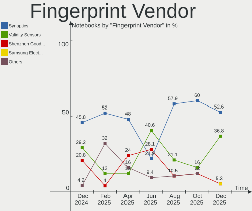

| Vendor                     | Notebooks | Percent |
|----------------------------|-----------|---------|
| Synaptics                  | 10        | 52.63%  |
| Validity Sensors           | 7         | 36.84%  |
| Shenzhen Goodix Technology | 1         | 5.26%   |
| Samsung Electronics        | 1         | 5.26%   |

Fingerprint Model
-----------------

Fingerprint sensor models

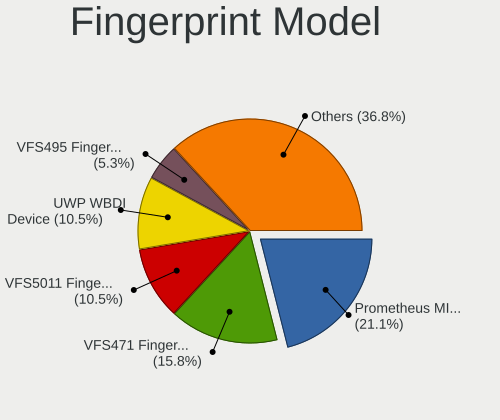

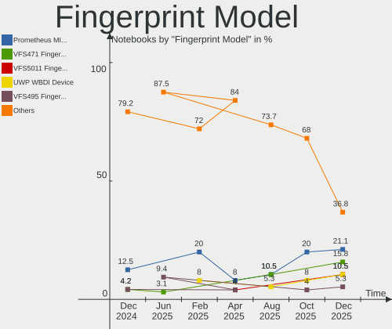

| Model                                                    | Notebooks | Percent |
|----------------------------------------------------------|-----------|---------|
| Synaptics Prometheus MIS Touch Fingerprint Reader        | 4         | 21.05%  |
| Validity Sensors VFS471 Fingerprint Reader               | 3         | 15.79%  |
| Validity Sensors VFS5011 Fingerprint Reader              | 2         | 10.53%  |
| Synaptics UWP WBDI Device                                | 2         | 10.53%  |
| Validity Sensors VFS495 Fingerprint Reader               | 1         | 5.26%   |
| Validity Sensors Synaptics WBDI                          | 1         | 5.26%   |
| Synaptics Prometheus Fingerprint Reader                  | 1         | 5.26%   |
| Synaptics Metallica MOH Touch Fingerprint Reader         | 1         | 5.26%   |
| Synaptics FS7604 Touch Fingerprint Sensor with PurePrint | 1         | 5.26%   |
| Synaptics Fingerprint reader [HP G6]                     | 1         | 5.26%   |
| Shenzhen Goodix  Fingerprint Device                      | 1         | 5.26%   |
| Samsung Fingerprint Device                               | 1         | 5.26%   |

Chipcard Vendor
---------------

Chipcard module vendors

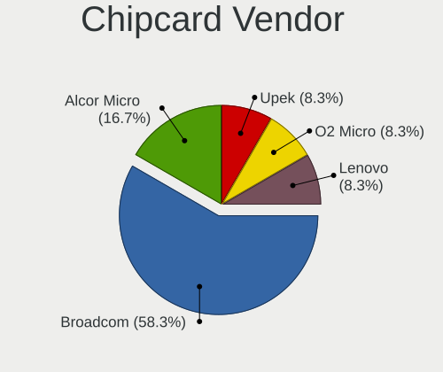

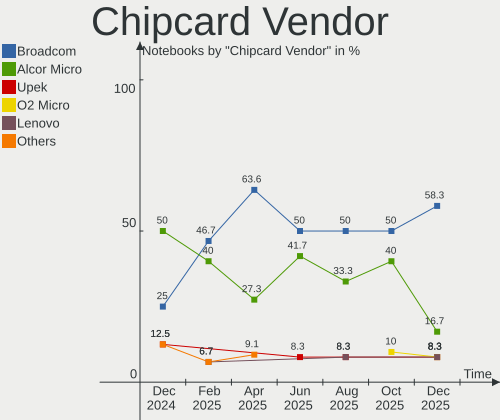

| Vendor      | Notebooks | Percent |
|-------------|-----------|---------|
| Broadcom    | 7         | 58.33%  |
| Alcor Micro | 2         | 16.67%  |
| Upek        | 1         | 8.33%   |
| O2 Micro    | 1         | 8.33%   |
| Lenovo      | 1         | 8.33%   |

Chipcard Model
--------------

Chipcard module models

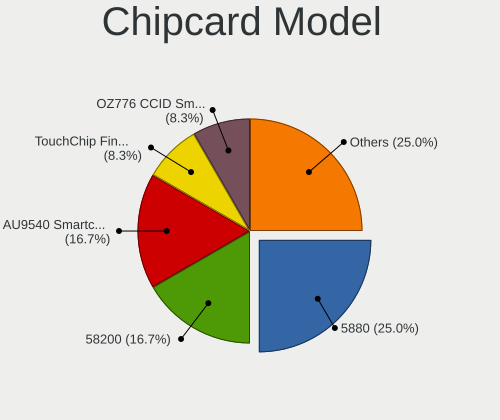

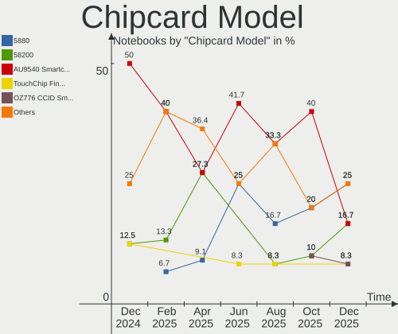

| Model                                                                        | Notebooks | Percent |
|------------------------------------------------------------------------------|-----------|---------|
| Broadcom 5880                                                                | 3         | 25%     |
| Broadcom 58200                                                               | 2         | 16.67%  |
| Alcor Micro AU9540 Smartcard Reader                                          | 2         | 16.67%  |
| Upek TouchChip Fingerprint Coprocessor (WBF advanced mode)                   | 1         | 8.33%   |
| O2 Micro OZ776 CCID Smartcard Reader                                         | 1         | 8.33%   |
| Lenovo Integrated Smart Card Reader                                          | 1         | 8.33%   |
| Broadcom BCM5880 Secure Applications Processor with fingerprint swipe sensor | 1         | 8.33%   |
| Broadcom BCM58200 ControlVault 3 (FingerPrint sensor + Contacted SmartCard)  | 1         | 8.33%   |

Unsupported
-----------

Unsupported Devices
-------------------

Total unsupported devices on board

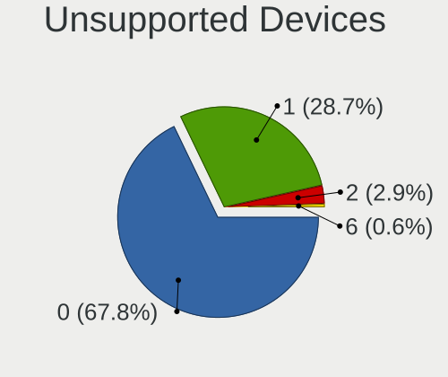

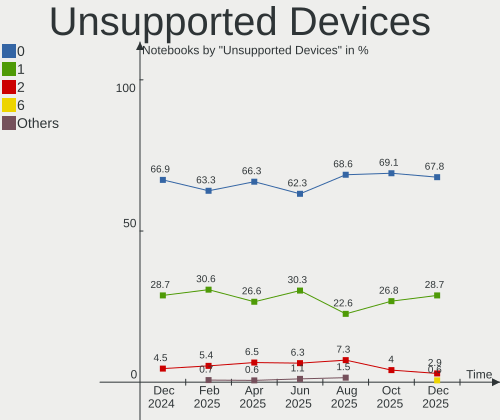

| Total | Notebooks | Percent |
|-------|-----------|---------|
| 0     | 116       | 67.84%  |
| 1     | 49        | 28.65%  |
| 2     | 5         | 2.92%   |
| 6     | 1         | 0.58%   |

Unsupported Device Types
------------------------

Types of unsupported devices

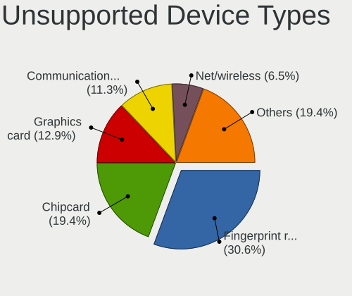

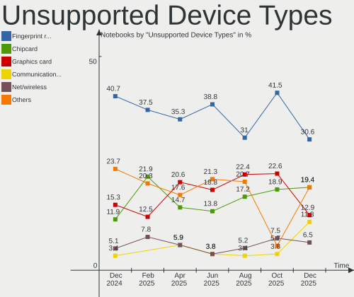

| Type                     | Notebooks | Percent |
|--------------------------|-----------|---------|
| Fingerprint reader       | 19        | 30.65%  |
| Chipcard                 | 12        | 19.35%  |
| Graphics card            | 8         | 12.9%   |
| Communication controller | 7         | 11.29%  |
| Net/wireless             | 4         | 6.45%   |
| Multimedia controller    | 3         | 4.84%   |
| Sound                    | 2         | 3.23%   |
| Camera                   | 2         | 3.23%   |
| Unassigned class         | 1         | 1.61%   |
| Modem                    | 1         | 1.61%   |
| Flash memory             | 1         | 1.61%   |
| Card reader              | 1         | 1.61%   |
| Bluetooth                | 1         | 1.61%   |

