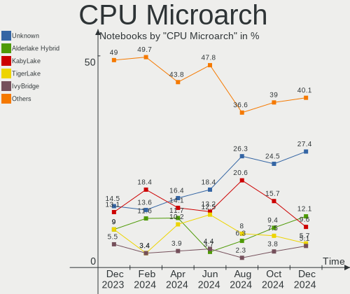

Arch Hardware Trends (Notebook)
-------------------------------

A project to identify most popular hardware characteristics and track their change
over time based on data collected by Arch users at https://Linux-Hardware.org.

Anyone can contribute to the study by uploading probes of their computers by
the [hw-probe](https://github.com/linuxhw/hw-probe) tool:

    sudo -E hw-probe -all -upload

Full-feature report is available here: https://linux-hardware.org/?view=trends&formfactor=notebook

Period: May, 2020.

Contents
--------

- [ OS                       ](#os)
- [ OS Family                ](#os-family)
- [ Kernel                   ](#kernel)
- [ Kernel Family            ](#kernel-family)
- [ Kernel Major Ver.        ](#kernel-major-ver)
- [ Arch                     ](#arch)
- [ DE                       ](#de)
- [ Display Server           ](#display-server)
- [ Display Manager          ](#display-manager)
- [ OS Lang                  ](#os-lang)
- [ Boot Mode                ](#boot-mode)
- [ Filesystem               ](#filesystem)
- [ Part. scheme             ](#part-scheme)
- [ Dual Boot with Linux/BSD ](#dual-boot-with-linux/bsd)
- [ Dual Boot (Win)          ](#dual-boot-win)
- [ Country                  ](#country)
- [ City                     ](#city)
- [ Vendor                   ](#vendor)
- [ Model                    ](#model)
- [ Model Family             ](#model-family)
- [ MFG Year                 ](#mfg-year)
- [ Form Factor              ](#form-factor)
- [ Secure Boot              ](#secure-boot)
- [ Coreboot                 ](#coreboot)
- [ RAM Size                 ](#ram-size)
- [ RAM Used                 ](#ram-used)
- [ Drive Vendor             ](#drive-vendor)
- [ Drive Model              ](#drive-model)
- [ Drive Kind               ](#drive-kind)
- [ Drive Connector          ](#drive-connector)
- [ Drive Size               ](#drive-size)
- [ Space Total              ](#space-total)
- [ Space Used               ](#space-used)
- [ Malfunc. Drives          ](#malfunc-drives)
- [ Malfunc. Drive Vendor    ](#malfunc-drive-vendor)
- [ Malfunc. HDD Vendor      ](#malfunc-hdd-vendor)
- [ Malfunc. Drive Kind      ](#malfunc-drive-kind)
- [ Failed Drives            ](#failed-drives)
- [ Failed Drive Vendor      ](#failed-drive-vendor)
- [ Drive Status             ](#drive-status)
- [ Storage Vendor           ](#storage-vendor)
- [ Storage Model            ](#storage-model)
- [ Storage Kind             ](#storage-kind)
- [ CPU Vendor               ](#cpu-vendor)
- [ CPU Model                ](#cpu-model)
- [ CPU Model Family         ](#cpu-model-family)
- [ CPU Cores                ](#cpu-cores)
- [ CPU Sockets              ](#cpu-sockets)
- [ CPU Threads              ](#cpu-threads)
- [ CPU Op-Modes             ](#cpu-op-modes)
- [ CPU Microcode            ](#cpu-microcode)
- [ CPU Microarch            ](#cpu-microarch)
- [ GPU Vendor               ](#gpu-vendor)
- [ GPU Model                ](#gpu-model)
- [ GPU Combo                ](#gpu-combo)
- [ GPU Driver               ](#gpu-driver)
- [ GPU Memory               ](#gpu-memory)
- [ Monitor Vendor           ](#monitor-vendor)
- [ Monitor Model            ](#monitor-model)
- [ Monitor Resolution       ](#monitor-resolution)
- [ Monitor Diagonal         ](#monitor-diagonal)
- [ Monitor Width            ](#monitor-width)
- [ Aspect Ratio             ](#aspect-ratio)
- [ Monitor Area             ](#monitor-area)
- [ Pixel Density            ](#pixel-density)
- [ Multiple Monitors        ](#multiple-monitors)
- [ Net Controller Vendor    ](#net-controller-vendor)
- [ Net Controller Model     ](#net-controller-model)
- [ Wireless Vendor          ](#wireless-vendor)
- [ Wireless Model           ](#wireless-model)
- [ Ethernet Vendor          ](#ethernet-vendor)
- [ Ethernet Model           ](#ethernet-model)
- [ Net Controller Kind      ](#net-controller-kind)
- [ Used Controller          ](#used-controller)
- [ NICs                     ](#nics)
- [ Bluetooth Vendor         ](#bluetooth-vendor)
- [ Bluetooth Model          ](#bluetooth-model)
- [ Unsupported Devices      ](#unsupported-devices)
- [ Unsupported Device Types ](#unsupported-device-types)

OS
--

Installed operating systems

| Name         | Computers | Percent |
|--------------|-----------|---------|
| Arch         | 65        | 85.53%  |
| Arch Rolling | 11        | 14.47%  |

OS Family
---------

OS without a version

| Name | Computers | Percent |
|------|-----------|---------|
| Arch | 76        | 100%    |

Kernel
------

Version of the Linux kernel

| Version                | Computers | Percent |
|------------------------|-----------|---------|
| 5.6.13-arch1-1         | 16        | 21.05%  |
| 5.6.11-arch1-1         | 15        | 19.74%  |
| 5.6.14-arch1-1         | 10        | 13.16%  |
| 5.6.8-arch1-1          | 8         | 10.53%  |
| 5.6.10-arch1-1         | 4         | 5.26%   |
| 5.6.12-arch1-1         | 3         | 3.95%   |
| 5.6.14-zen1-1-zen      | 2         | 2.63%   |
| 5.4.38-1-lts           | 2         | 2.63%   |
| 5.4.36-1-lts           | 2         | 2.63%   |
| 5.7.0-rc3-paulyx       | 1         | 1.32%   |
| 5.6.7-arch1-1          | 1         | 1.32%   |
| 5.6.6-arch1-1          | 1         | 1.32%   |
| 5.6.14.a-1-hardened    | 1         | 1.32%   |
| 5.6.13-zen1-1-zencjk   | 1         | 1.32%   |
| 5.6.13-zen1-1-zen      | 1         | 1.32%   |
| 5.6.12-zen1-1-zen      | 1         | 1.32%   |
| 5.6.11.ll32-1-lingruby | 1         | 1.32%   |
| 5.6.11-zen1-1-zen      | 1         | 1.32%   |
| 5.6.11-1-ck-haswell    | 1         | 1.32%   |
| 5.6.10-zen1-1-zen      | 1         | 1.32%   |
| 5.4.39-1-lts           | 1         | 1.32%   |
| 5.4.32-1-lts           | 1         | 1.32%   |
| 5.4.15-arch1-1         | 1         | 1.32%   |

Kernel Family
-------------

Linux kernel without a distro release

| Version | Computers | Percent |
|---------|-----------|---------|
| 5.6.13  | 18        | 23.68%  |
| 5.6.11  | 18        | 23.68%  |
| 5.6.14  | 13        | 17.11%  |
| 5.6.8   | 8         | 10.53%  |
| 5.6.10  | 5         | 6.58%   |
| 5.6.12  | 4         | 5.26%   |
| 5.4.38  | 2         | 2.63%   |
| 5.4.36  | 2         | 2.63%   |
| 5.7.0   | 1         | 1.32%   |
| 5.6.7   | 1         | 1.32%   |
| 5.6.6   | 1         | 1.32%   |
| 5.4.39  | 1         | 1.32%   |
| 5.4.32  | 1         | 1.32%   |
| 5.4.15  | 1         | 1.32%   |

Kernel Major Ver.
-----------------

Linux kernel major version

| Version | Computers | Percent |
|---------|-----------|---------|
| 5.6     | 68        | 89.47%  |
| 5.4     | 7         | 9.21%   |
| 5.7     | 1         | 1.32%   |

Arch
----

OS architecture (x86_64, i586, etc.)

| Name   | Computers | Percent |
|--------|-----------|---------|
| x86_64 | 76        | 100%    |

DE
--

Desktop Environment

| Name          | Computers | Percent |
|---------------|-----------|---------|
| GNOME         | 40        | 52.63%  |
| KDE           | 10        | 13.16%  |
| Unknown       | 7         | 9.21%   |
| KDE5          | 6         | 7.89%   |
| i3            | 6         | 7.89%   |
| XFCE          | 3         | 3.95%   |
| MATE          | 2         | 2.63%   |
| GNOME Classic | 1         | 1.32%   |
| Budgie        | 1         | 1.32%   |

Display Server
--------------

X11 or Wayland

| Name    | Computers | Percent |
|---------|-----------|---------|
| X11     | 41        | 53.95%  |
| Wayland | 24        | 31.58%  |
| Tty     | 8         | 10.53%  |
| Unknown | 3         | 3.95%   |

Display Manager
---------------

SDDM, LightDM, etc.

| Name    | Computers | Percent |
|---------|-----------|---------|
| Unknown | 57        | 75%     |
| LightDM | 7         | 9.21%   |
| SDDM    | 5         | 6.58%   |
| GDM     | 5         | 6.58%   |
| XDM     | 1         | 1.32%   |
| Ly      | 1         | 1.32%   |

OS Lang
-------

Language

| Lang       | Computers | Percent |
|------------|-----------|---------|
| en_US      | 35        | 46.05%  |
| C          | 5         | 6.58%   |
| fr_FR      | 4         | 5.26%   |
| pl_PL      | 3         | 3.95%   |
| en_GB      | 3         | 3.95%   |
| de_DE      | 3         | 3.95%   |
| pt_BR      | 2         | 2.63%   |
| it_IT      | 2         | 2.63%   |
| en_IN      | 2         | 2.63%   |
| Unknown    | 2         | 2.63%   |
| zh_CN      | 1         | 1.32%   |
| ru_UA      | 1         | 1.32%   |
| ru_RU      | 1         | 1.32%   |
| pl_PL.utf8 | 1         | 1.32%   |
| osa_US     | 1         | 1.32%   |
| hu_HU      | 1         | 1.32%   |
| es_US      | 1         | 1.32%   |
| es_CL      | 1         | 1.32%   |
| en_US.utf8 | 1         | 1.32%   |
| en_IL      | 1         | 1.32%   |
| en_CA      | 1         | 1.32%   |
| en_BE      | 1         | 1.32%   |
| en_AU      | 1         | 1.32%   |
| de_CH      | 1         | 1.32%   |
| bg_BG      | 1         | 1.32%   |

Boot Mode
---------

EFI or BIOS

| Mode | Computers | Percent |
|------|-----------|---------|
| EFI  | 42        | 55.26%  |
| BIOS | 34        | 44.74%  |

Filesystem
----------

Type of filesystem

| Type    | Computers | Percent |
|---------|-----------|---------|
| Ext4    | 67        | 88.16%  |
| Xfs     | 4         | 5.26%   |
| Btrfs   | 3         | 3.95%   |
| Zfs     | 1         | 1.32%   |
| Overlay | 1         | 1.32%   |

Part. scheme
------------

Scheme of partitioning

| Type    | Computers | Percent |
|---------|-----------|---------|
| Unknown | 61        | 80.26%  |
| GPT     | 13        | 17.11%  |
| MBR     | 2         | 2.63%   |

Dual Boot with Linux/BSD
------------------------

Hosting more than one Linux/BSD

| Dual boot | Computers | Percent |
|-----------|-----------|---------|
| No        | 68        | 89.47%  |
| Yes       | 8         | 10.53%  |

Dual Boot (Win)
---------------

Hosting Linux and Windows

| Dual boot | Computers | Percent |
|-----------|-----------|---------|
| No        | 57        | 75%     |
| Yes       | 19        | 25%     |

Country
-------

Geographic location (country)

| Country        | Computers | Percent |
|----------------|-----------|---------|
| USA            | 17        | 22.37%  |
| Ukraine        | 5         | 6.58%   |
| UK             | 5         | 6.58%   |
| Poland         | 5         | 6.58%   |
| Germany        | 4         | 5.26%   |
| France         | 4         | 5.26%   |
| Canada         | 4         | 5.26%   |
| Russia         | 3         | 3.95%   |
| India          | 3         | 3.95%   |
| Brazil         | 3         | 3.95%   |
| Switzerland    | 2         | 2.63%   |
| Sweden         | 2         | 2.63%   |
| Italy          | 2         | 2.63%   |
| Hungary        | 2         | 2.63%   |
| Chile          | 2         | 2.63%   |
| Turkey         | 1         | 1.32%   |
| Sri Lanka      | 1         | 1.32%   |
| South Africa   | 1         | 1.32%   |
| New Zealand    | 1         | 1.32%   |
| Nepal          | 1         | 1.32%   |
| Lithuania      | 1         | 1.32%   |
| Indonesia      | 1         | 1.32%   |
| Greece         | 1         | 1.32%   |
| Ghana          | 1         | 1.32%   |
| Czech Republic | 1         | 1.32%   |
| China          | 1         | 1.32%   |
| Bulgaria       | 1         | 1.32%   |
| Belgium        | 1         | 1.32%   |

City
----

Geographic location (city)

| City              | Computers | Percent |
|-------------------|-----------|---------|
| Kyiv              | 4         | 5.26%   |
| Warrington        | 2         | 2.63%   |
| San Antonio       | 2         | 2.63%   |
| Moscow            | 2         | 2.63%   |
| Germantown        | 2         | 2.63%   |
| Zurich            | 1         | 1.32%   |
| Wilmslow          | 1         | 1.32%   |
| Weiden            | 1         | 1.32%   |
| Wattala           | 1         | 1.32%   |
| Warsaw            | 1         | 1.32%   |
| Vilnius           | 1         | 1.32%   |
| Victoria          | 1         | 1.32%   |
| Titahari          | 1         | 1.32%   |
| Stockholm         | 1         | 1.32%   |
| Springs           | 1         | 1.32%   |
| Saumur            | 1         | 1.32%   |
| Santos            | 1         | 1.32%   |
| San Jose          | 1         | 1.32%   |
| Salamanca         | 1         | 1.32%   |
| Poznan            | 1         | 1.32%   |
| Portishead        | 1         | 1.32%   |
| Palestro          | 1         | 1.32%   |
| Overijse          | 1         | 1.32%   |
| Ottawa            | 1         | 1.32%   |
| Oakman            | 1         | 1.32%   |
| Oak Harbor        | 1         | 1.32%   |
| North Fort Myers  | 1         | 1.32%   |
| Nanning           | 1         | 1.32%   |
| Nacka             | 1         | 1.32%   |
| Münster          | 1         | 1.32%   |
| Mumbai            | 1         | 1.32%   |
| Montreal          | 1         | 1.32%   |
| Mannheim          | 1         | 1.32%   |
| Los Angeles       | 1         | 1.32%   |
| Liverpool         | 1         | 1.32%   |
| Lisichansk        | 1         | 1.32%   |
| Leonberg          | 1         | 1.32%   |
| Las Vegas         | 1         | 1.32%   |
| Las Condes        | 1         | 1.32%   |
| Kilmarnock        | 1         | 1.32%   |
| Katowice          | 1         | 1.32%   |
| Jakarta           | 1         | 1.32%   |
| Hot Springs       | 1         | 1.32%   |
| Guaratingueta     | 1         | 1.32%   |
| Gmina Jędrzejów | 1         | 1.32%   |
| Franca            | 1         | 1.32%   |
| Fort Worth        | 1         | 1.32%   |
| Fort Lee          | 1         | 1.32%   |
| Erdokertes        | 1         | 1.32%   |
| Columbia          | 1         | 1.32%   |
| Clichy-sous-Bois  | 1         | 1.32%   |
| Chennai           | 1         | 1.32%   |
| Chelyabinsk       | 1         | 1.32%   |
| Carmel            | 1         | 1.32%   |
| Budapest          | 1         | 1.32%   |
| Brno              | 1         | 1.32%   |
| Bristow           | 1         | 1.32%   |
| Brampton          | 1         | 1.32%   |
| Bondy             | 1         | 1.32%   |
| Bialystok         | 1         | 1.32%   |

Vendor
------

Motherboard manufacturer

| Name                | Computers | Percent |
|---------------------|-----------|---------|
| Lenovo              | 25        | 32.89%  |
| Dell                | 13        | 17.11%  |
| Hewlett-Packard     | 8         | 10.53%  |
| ASUSTek Computer    | 6         | 7.89%   |
| Acer                | 5         | 6.58%   |
| Apple               | 4         | 5.26%   |
| Toshiba             | 3         | 3.95%   |
| Sony                | 2         | 2.63%   |
| Samsung Electronics | 2         | 2.63%   |
| Timi                | 1         | 1.32%   |
| Positivo            | 1         | 1.32%   |
| Notebook            | 1         | 1.32%   |
| MSI                 | 1         | 1.32%   |
| HUAWEI              | 1         | 1.32%   |
| HIGRADED            | 1         | 1.32%   |
| Dream Machines      | 1         | 1.32%   |
| Alienware           | 1         | 1.32%   |

Model
-----

Motherboard model

| Name                                     | Computers | Percent |
|------------------------------------------|-----------|---------|
| Lenovo ThinkPad X1 Carbon 6th 20KG0022US | 2         | 2.63%   |
| Lenovo Legion Y530-15ICH 81FV            | 2         | 2.63%   |
| HP Pavilion Gaming Laptop 15-cx0xxx      | 2         | 2.63%   |
| Dell XPS 15 9570                         | 2         | 2.63%   |
| Apple MacBookPro8,1                      | 2         | 2.63%   |
| Acer Aspire E5-571                       | 2         | 2.63%   |
| Toshiba Satellite L875D                  | 1         | 1.32%   |
| Toshiba Satellite L750D                  | 1         | 1.32%   |
| Toshiba Satellite C50-B                  | 1         | 1.32%   |
| Timi TM1613                              | 1         | 1.32%   |
| Sony VPCEH28FG                           | 1         | 1.32%   |
| Sony VGN-CR590E                          | 1         | 1.32%   |
| Samsung Electronics RC530/RC730          | 1         | 1.32%   |
| Samsung Electronics 700Z3C/700Z5C        | 1         | 1.32%   |
| Positivo MOBILE                          | 1         | 1.32%   |
| Notebook NJ50GU                          | 1         | 1.32%   |
| MSI GP62 7QF                             | 1         | 1.32%   |
| Lenovo ThinkPad X131e 3368A77            | 1         | 1.32%   |
| Lenovo ThinkPad X1 Carbon 4th 20FB006BGE | 1         | 1.32%   |
| Lenovo ThinkPad X1 Carbon 2nd 20A8S0ET00 | 1         | 1.32%   |
| Lenovo ThinkPad T60 2623KEU              | 1         | 1.32%   |
| Lenovo ThinkPad T495s 20QKA008CL         | 1         | 1.32%   |
| Lenovo ThinkPad T495 20NJ000XIX          | 1         | 1.32%   |
| Lenovo ThinkPad T480s 20L8S2SD00         | 1         | 1.32%   |
| Lenovo ThinkPad T440p 20AWS0Y800         | 1         | 1.32%   |
| Lenovo ThinkPad T430 2349K63             | 1         | 1.32%   |
| Lenovo ThinkPad T430 2347H76             | 1         | 1.32%   |
| Lenovo ThinkPad T420 4180WA4             | 1         | 1.32%   |
| Lenovo ThinkPad L470 20J5S00C00          | 1         | 1.32%   |
| Lenovo ThinkPad E490 20N8S0WY00          | 1         | 1.32%   |
| Lenovo ThinkPad E490 20N8CTO1WW          | 1         | 1.32%   |
| Lenovo IdeaPad Y510P 20217               | 1         | 1.32%   |
| Lenovo IdeaPad S400 Touch 20283          | 1         | 1.32%   |
| Lenovo IdeaPad L340-17API 81LY           | 1         | 1.32%   |
| Lenovo IdeaPad 720-15IKB 81C7            | 1         | 1.32%   |
| Lenovo IdeaPad 310-14ISK 80SL            | 1         | 1.32%   |
| Lenovo G40-80 80JE                       | 1         | 1.32%   |
| Lenovo Flex 2-14 20404                   | 1         | 1.32%   |
| HUAWEI BOHK-WAX9X                        | 1         | 1.32%   |
| HIGRADED M7x0S                           | 1         | 1.32%   |
| HP Pavilion Notebook                     | 1         | 1.32%   |
| HP OMEN by HP Laptop                     | 1         | 1.32%   |
| HP ENVY Notebook                         | 1         | 1.32%   |
| HP ENVY 15                               | 1         | 1.32%   |
| HP EliteBook 8470p                       | 1         | 1.32%   |
| HP Compaq 615                            | 1         | 1.32%   |
| Dream Machines N85_N87,HJ,HJ1,HK1        | 1         | 1.32%   |
| Dell XPS 15 7590                         | 1         | 1.32%   |
| Dell XPS 13 9370                         | 1         | 1.32%   |
| Dell Vostro 5468                         | 1         | 1.32%   |
| Dell Precision 7740                      | 1         | 1.32%   |
| Dell Latitude E6440                      | 1         | 1.32%   |
| Dell Latitude E6410                      | 1         | 1.32%   |
| Dell Inspiron 7348                       | 1         | 1.32%   |
| Dell Inspiron 7347                       | 1         | 1.32%   |
| Dell Inspiron 5570                       | 1         | 1.32%   |
| Dell Inspiron 15 7000 Gaming             | 1         | 1.32%   |
| Dell G3 3590                             | 1         | 1.32%   |
| ASUS X556UQK                             | 1         | 1.32%   |
| ASUS TUF GAMING FX504GE_FX80GE           | 1         | 1.32%   |

Model Family
------------

Motherboard model prefix

| Name                       | Computers | Percent |
|----------------------------|-----------|---------|
| Lenovo ThinkPad            | 16        | 21.05%  |
| Lenovo IdeaPad             | 5         | 6.58%   |
| Dell XPS                   | 4         | 5.26%   |
| Dell Inspiron              | 4         | 5.26%   |
| Toshiba Satellite          | 3         | 3.95%   |
| HP Pavilion                | 3         | 3.95%   |
| Acer Aspire                | 3         | 3.95%   |
| Lenovo Legion              | 2         | 2.63%   |
| HP ENVY                    | 2         | 2.63%   |
| Dell Latitude              | 2         | 2.63%   |
| ASUS Strix                 | 2         | 2.63%   |
| Apple MacBookPro8          | 2         | 2.63%   |
| Acer Swift                 | 2         | 2.63%   |
| Timi TM1613                | 1         | 1.32%   |
| Sony VPCEH28FG             | 1         | 1.32%   |
| Sony VGN-CR590E            | 1         | 1.32%   |
| Samsung Electronics RC530  | 1         | 1.32%   |
| Samsung Electronics 700Z3C | 1         | 1.32%   |
| Positivo MOBILE            | 1         | 1.32%   |
| Notebook NJ50GU            | 1         | 1.32%   |
| MSI GP62                   | 1         | 1.32%   |
| Lenovo G40-80              | 1         | 1.32%   |
| Lenovo Flex                | 1         | 1.32%   |
| HUAWEI BOHK-WAX9X          | 1         | 1.32%   |
| HIGRADED M7x0S             | 1         | 1.32%   |
| HP OMEN                    | 1         | 1.32%   |
| HP EliteBook               | 1         | 1.32%   |
| HP Compaq                  | 1         | 1.32%   |
| Dream Machines N85         | 1         | 1.32%   |
| Dell Vostro                | 1         | 1.32%   |
| Dell Precision             | 1         | 1.32%   |
| Dell G3                    | 1         | 1.32%   |
| ASUS X556UQK               | 1         | 1.32%   |
| ASUS TUF                   | 1         | 1.32%   |
| ASUS Q502LA                | 1         | 1.32%   |
| ASUS GL752VW               | 1         | 1.32%   |
| Apple MacBookPro12         | 1         | 1.32%   |
| Apple MacBookPro10         | 1         | 1.32%   |
| Alienware 17               | 1         | 1.32%   |

MFG Year
--------

Motherboard manufacture year

| Year    | Computers | Percent |
|---------|-----------|---------|
| 2019    | 24        | 31.58%  |
| 2020    | 11        | 14.47%  |
| 2018    | 8         | 10.53%  |
| 2017    | 8         | 10.53%  |
| 2016    | 4         | 5.26%   |
| 2012    | 4         | 5.26%   |
| 2015    | 3         | 3.95%   |
| 2014    | 3         | 3.95%   |
| 2013    | 3         | 3.95%   |
| 2011    | 3         | 3.95%   |
| 2010    | 1         | 1.32%   |
| 2009    | 1         | 1.32%   |
| 2008    | 1         | 1.32%   |
| 2006    | 1         | 1.32%   |
| Unknown | 1         | 1.32%   |

Form Factor
-----------

Physical design of the computer

| Name     | Computers | Percent |
|----------|-----------|---------|
| Notebook | 76        | 100%    |

Secure Boot
-----------

Enabled or disabled

| State    | Computers | Percent |
|----------|-----------|---------|
| Disabled | 76        | 100%    |

Coreboot
--------

Have coreboot on board

| Used | Computers | Percent |
|------|-----------|---------|
| No   | 76        | 100%    |

RAM Size
--------

Total RAM memory

| Size in GB  | Computers | Percent |
|-------------|-----------|---------|
| 4.01-8.0    | 25        | 32.89%  |
| 8.01-16.0   | 19        | 25%     |
| 16.01-24.0  | 16        | 21.05%  |
| 3.01-4.0    | 8         | 10.53%  |
| 32.01-64.0  | 5         | 6.58%   |
| 24.01-32.0  | 1         | 1.32%   |
| 64.01-256.0 | 1         | 1.32%   |
| 1.01-2.0    | 1         | 1.32%   |

RAM Used
--------

Used RAM memory

| Used GB    | Computers | Percent |
|------------|-----------|---------|
| 1.01-2.0   | 27        | 35.53%  |
| 2.01-3.0   | 22        | 28.95%  |
| 4.01-8.0   | 15        | 19.74%  |
| 3.01-4.0   | 8         | 10.53%  |
| 0.01-1.0   | 3         | 3.95%   |
| 16.01-24.0 | 1         | 1.32%   |

Drive Vendor
------------

Hard drive vendors

| Vendor              | Computers | Drives  | Percent |
|---------------------|-----------|---------|---------|
| Seagate             | 13        | 13      | 14.61%  |
| Samsung Electronics | 13        | 13      | 14.61%  |
| WDC                 | 9         | 9       | 10.11%  |
| Toshiba             | 8         | 8       | 8.99%   |
| SanDisk             | 8         | 8       | 8.99%   |
| Unknown             | 6         | 6       | 6.74%   |
| Kingston            | 4         | 5       | 4.49%   |
| Crucial             | 4         | 4       | 4.49%   |
| Intel               | 3         | 3       | 3.37%   |
| HGST                | 3         | 3       | 3.37%   |
| SPCC                | 2         | 2       | 2.25%   |
| Hitachi             | 2         | 2       | 2.25%   |
| Apple               | 2         | 2       | 2.25%   |
| A-DATA Technology   | 2         | 2       | 2.25%   |
| WDC WD50            | 1         | 1       | 1.12%   |
| SK Hynix            | 1         | 1       | 1.12%   |
| SABRENT             | 1         | 1       | 1.12%   |
| PNY                 | 1         | 1       | 1.12%   |
| PLEXTOR             | 1         | 1       | 1.12%   |
| Phison              | 1         | 1       | 1.12%   |
| OCZ-AGIL            | 1         | 1       | 1.12%   |
| Micron Technology   | 1         | 1       | 1.12%   |
| HL-DT-ST            | 1         | Unknown | 1.12%   |
| ASMT                | 1         | 2       | 1.12%   |

Drive Model
-----------

Hard drive models

| Model                            | Computers | Percent |
|----------------------------------|-----------|---------|
| ST1000LM035-1RK172 1TB           | 4         | 4.4%    |
| SSD 850 EVO 500GB                | 3         | 3.3%    |
| WDS100T2B0A-00SM50 1TB SSD       | 2         | 2.2%    |
| ST500LT012-1DG142 500GB          | 2         | 2.2%    |
| ST1000LX015-1U7172 1TB           | 2         | 2.2%    |
| SSDSC2KW256G8 256GB              | 2         | 2.2%    |
| SDSSDHP128G 128GB                | 2         | 2.2%    |
| HTS721010A9E630 1TB              | 2         | 2.2%    |
| X400 M.2 2280 256GB SSD          | 1         | 1.1%    |
| WDS100T2X0C-00L350 1TB           | 1         | 1.1%    |
| WD7500BPKX-75HPJT0 752GB         | 1         | 1.1%    |
| WD5000LPVX-22V0TT0 500GB         | 1         | 1.1%    |
| WD3200BEKX-75B7WT0 320GB         | 1         | 1.1%    |
| WD10SPZX-24Z10 1TB               | 1         | 1.1%    |
| WD10JPVX-22JC3T0 1TB             | 1         | 1.1%    |
| TR200 480GB SSD                  | 1         | 1.1%    |
| SV300S37A60G 64GB SSD            | 1         | 1.1%    |
| SUV500480G 480GB SSD             | 1         | 1.1%    |
| SU800NS38 512GB SSD              | 1         | 1.1%    |
| SU800 256GB SSD                  | 1         | 1.1%    |
| SU32G  32GB                      | 1         | 1.1%    |
| ST9500325AS 500GB                | 1         | 1.1%    |
| ST320LT012-1DG14C 320GB          | 1         | 1.1%    |
| ST2000LM003 HN-M201RAD 2TB       | 1         | 1.1%    |
| ST1000LM014-1EJ164-SSHD 1TB      | 1         | 1.1%    |
| SSDSA2M080G2GC 80GB              | 1         | 1.1%    |
| SSD SM256E 256GB                 | 1         | 1.1%    |
| SSD SM0512G 500GB                | 1         | 1.1%    |
| SSD PLUS 1000GB                  | 1         | 1.1%    |
| SSD i100 8GB                     | 1         | 1.1%    |
| SSD 970 EVO Plus 250GB           | 1         | 1.1%    |
| SSD 860 EVO 500GB                | 1         | 1.1%    |
| SSD 860 EVO 250GB                | 1         | 1.1%    |
| SSD 840 EVO 1TB                  | 1         | 1.1%    |
| SSD 750 EVO 500GB                | 1         | 1.1%    |
| Solid State Disk 256GB           | 1         | 1.1%    |
| SHFS37A120G 120GB SSD            | 1         | 1.1%    |
| SDSSDA240G 240GB                 | 1         | 1.1%    |
| SDSSDA120G 120GB                 | 1         | 1.1%    |
| SD02G  2GB                       | 1         | 1.1%    |
| SC128  128GB                     | 1         | 1.1%    |
| Sabrent 512GB                    | 1         | 1.1%    |
| SA400S37480G 480GB SSD           | 1         | 1.1%    |
| SA400S37120G 120GB SSD           | 1         | 1.1%    |
| PX-128S2G 128GB SSD              | 1         | 1.1%    |
| PC SN520 SDAPNUW-128G-1006 128GB | 1         | 1.1%    |
| MZVLW128HEGR-000L2 128GB         | 1         | 1.1%    |
| MZVKW512HMJP-000L7 512GB         | 1         | 1.1%    |
| MZNTY128HDHP-000H1 128GB SSD     | 1         | 1.1%    |
| MZNLN512HCJH-000L1 512GB SSD     | 1         | 1.1%    |
| MZ7TE256HMHP-000L2 256GB SSD     | 1         | 1.1%    |
| MQ04ABF100 1TB                   | 1         | 1.1%    |
| MQ02ABD100H 1TB                  | 1         | 1.1%    |
| MQ01ABD100 1TB                   | 1         | 1.1%    |
| MQ01ABD075 752GB                 | 1         | 1.1%    |
| MMC Card  7GB                    | 1         | 1.1%    |
| MMC Card  64GB                   | 1         | 1.1%    |
| MMC Card  128GB                  | 1         | 1.1%    |
| MK8034GSX 80GB                   | 1         | 1.1%    |
| MK3265GSX 320GB                  | 1         | 1.1%    |

Drive Kind
----------

HDD or SSD

| Kind    | Computers | Drives  | Percent |
|---------|-----------|---------|---------|
| SSD     | 40        | 45      | 47.06%  |
| HDD     | 31        | 32      | 36.47%  |
| NVMe    | 7         | 7       | 8.24%   |
| MMC     | 6         | 6       | 7.06%   |
| Unknown | 1         | Unknown | 1.18%   |

Drive Connector
---------------

SATA, SAS, NVMe, etc.

| Type | Computers | Drives | Percent |
|------|-----------|--------|---------|
| SATA | 59        | 70     | 74.68%  |
| SAS  | 7         | 7      | 8.86%   |
| NVMe | 7         | 7      | 8.86%   |
| MMC  | 6         | 6      | 7.59%   |

Drive Size
----------

Size of hard drive

| Size in TB | Computers | Drives | Percent |
|------------|-----------|--------|---------|
| 0.01-0.5   | 46        | 58     | 61.33%  |
| 0.51-1.0   | 26        | 29     | 34.67%  |
| 1.01-2.0   | 2         | 2      | 2.67%   |
| 2.01-3.0   | 1         | 1      | 1.33%   |

Space Total
-----------

Amount of disk space available on the file system

| Size in GB | Computers | Percent |
|------------|-----------|---------|
| 251-500    | 31        | 40.79%  |
| 101-250    | 20        | 26.32%  |
| 501-1000   | 15        | 19.74%  |
| Unknown    | 4         | 5.26%   |
| 51-100     | 3         | 3.95%   |
| 21-50      | 1         | 1.32%   |
| 2001-3000  | 1         | 1.32%   |
| 1001-2000  | 1         | 1.32%   |

Space Used
----------

Amount of used disk space

| Used GB  | Computers | Percent |
|----------|-----------|---------|
| 1-20     | 16        | 21.05%  |
| 51-100   | 16        | 21.05%  |
| 21-50    | 14        | 18.42%  |
| 251-500  | 12        | 15.79%  |
| 101-250  | 10        | 13.16%  |
| 501-1000 | 4         | 5.26%   |
| Unknown  | 4         | 5.26%   |

Malfunc. Drives
---------------

Drive models with a malfunction

| Model                  | Computers | Drives | Percent |
|------------------------|-----------|--------|---------|
| ST1000LM035-1RK172 1TB | 1         | 1      | 20%     |
| SSDSA2M080G2GC 80GB    | 1         | 1      | 20%     |
| HTS721010A9E630 1TB    | 1         | 1      | 20%     |
| CT512MX100SSD1 512GB   | 1         | 1      | 20%     |
| ASM1156-PM 3TB         | 1         | 1      | 20%     |

Malfunc. Drive Vendor
---------------------

Vendors of faulty drives

| Vendor  | Computers | Drives | Percent |
|---------|-----------|--------|---------|
| Seagate | 1         | 1      | 20%     |
| Intel   | 1         | 1      | 20%     |
| HGST    | 1         | 1      | 20%     |
| Crucial | 1         | 1      | 20%     |
| ASMT    | 1         | 1      | 20%     |

Malfunc. HDD Vendor
-------------------

Vendors of faulty HDD drives

| Vendor  | Computers | Drives | Percent |
|---------|-----------|--------|---------|
| Seagate | 1         | 1      | 33.33%  |
| HGST    | 1         | 1      | 33.33%  |
| ASMT    | 1         | 1      | 33.33%  |

Malfunc. Drive Kind
-------------------

Kinds of faulty drives

| Kind | Computers | Drives | Percent |
|------|-----------|--------|---------|
| HDD  | 3         | 3      | 60%     |
| SSD  | 2         | 2      | 40%     |

Failed Drives
-------------

Failed drive models

Zero info for selected period =(

Failed Drive Vendor
-------------------

Failed drive vendors

Zero info for selected period =(

Drive Status
------------

Number of failed and malfunc. drives

| Status   | Computers | Drives | Percent |
|----------|-----------|--------|---------|
| Detected | 43        | 55     | 59.72%  |
| Works    | 24        | 30     | 33.33%  |
| Malfunc  | 5         | 5      | 6.94%   |

Storage Vendor
--------------

Storage controller vendors

| Vendor                           | Computers | Percent |
|----------------------------------|-----------|---------|
| Intel                            | 57        | 66.28%  |
| Samsung Electronics              | 11        | 12.79%  |
| AMD                              | 6         | 6.98%   |
| SK Hynix                         | 3         | 3.49%   |
| Sandisk                          | 3         | 3.49%   |
| Toshiba America Info Systems     | 2         | 2.33%   |
| Union Memory (Shenzhen)          | 1         | 1.16%   |
| Silicon Integrated Systems [SiS] | 1         | 1.16%   |
| Phison Electronics               | 1         | 1.16%   |
| Lenovo                           | 1         | 1.16%   |

Storage Model
-------------

Storage controller models

| Model                                                                    | Computers | Percent |
|--------------------------------------------------------------------------|-----------|---------|
| Cannon Lake Mobile PCH SATA AHCI Controller                              | 10        | 11.11%  |
| Sunrise Point-LP SATA Controller [AHCI mode]                             | 8         | 8.89%   |
| 8 Series SATA Controller 1 [AHCI mode]                                   | 7         | 7.78%   |
| 7 Series Chipset Family 6-port SATA Controller [AHCI mode]               | 7         | 7.78%   |
| NVMe SSD Controller SM981/PM981/PM983                                    | 6         | 6.67%   |
| Non-Volatile memory controller                                           | 6         | 6.67%   |
| FCH SATA Controller [AHCI mode]                                          | 5         | 5.56%   |
| 6 Series/C200 Series Chipset Family 6 port Mobile SATA AHCI Controller   | 5         | 5.56%   |
| NVMe SSD Controller SM961/PM961                                          | 4         | 4.44%   |
| HM170/QM170 Chipset SATA Controller [AHCI Mode]                          | 4         | 4.44%   |
| 82801 Mobile SATA Controller [RAID mode]                                 | 4         | 4.44%   |
| 8 Series/C220 Series Chipset Family 6-port SATA Controller 1 [AHCI mode] | 4         | 4.44%   |
| Wildcat Point-LP SATA Controller [AHCI Mode]                             | 3         | 3.33%   |
| WD Black 2018/PC SN720 NVMe SSD                                          | 1         | 1.11%   |
| WD Black 2018/PC SN520 NVMe SSD                                          | 1         | 1.11%   |
| Toshiba America Info Non-Volatile memory controller                      | 1         | 1.11%   |
| SB7x0/SB8x0/SB9x0 SATA Controller [AHCI mode]                            | 1         | 1.11%   |
| SATA Controller / IDE mode                                               | 1         | 1.11%   |
| SATA controller                                                          | 1         | 1.11%   |
| Electronics SATA controller                                              | 1         | 1.11%   |
| E12 NVMe Controller                                                      | 1         | 1.11%   |
| BG3 NVMe SSD Controller                                                  | 1         | 1.11%   |
| 82801HM/HEM (ICH8M/ICH8M-E) SATA Controller [IDE mode]                   | 1         | 1.11%   |
| 82801GBM/GHM (ICH7-M Family) SATA Controller [AHCI mode]                 | 1         | 1.11%   |
| 82801G (ICH7 Family) IDE Controller                                      | 1         | 1.11%   |
| 5513 IDE Controller                                                      | 1         | 1.11%   |
| 5 Series/3400 Series Chipset 6 port SATA AHCI Controller                 | 1         | 1.11%   |
| 5 Series/3400 Series Chipset 4 port SATA IDE Controller                  | 1         | 1.11%   |
| 5 Series/3400 Series Chipset 4 port SATA AHCI Controller                 | 1         | 1.11%   |
| 5 Series/3400 Series Chipset 2 port SATA IDE Controller                  | 1         | 1.11%   |

Storage Kind
------------

Kind of storage controller (IDE, SATA, NVMe, SAS, ...)

| Kind | Computers | Percent |
|------|-----------|---------|
| SATA | 59        | 67.05%  |
| NVMe | 21        | 23.86%  |
| RAID | 4         | 4.55%   |
| IDE  | 4         | 4.55%   |

CPU Vendor
----------

Processor vendors

| Vendor | Computers | Percent |
|--------|-----------|---------|
| Intel  | 67        | 88.16%  |
| AMD    | 9         | 11.84%  |

CPU Model
---------

Processor models

| Model                                           | Computers | Percent |
|-------------------------------------------------|-----------|---------|
| Intel Core i7-8550U CPU @ 1.80GHz               | 5         | 6.58%   |
| Intel Core i5-8300H CPU @ 2.30GHz               | 5         | 6.58%   |
| Intel Core i7-8750H CPU @ 2.20GHz               | 4         | 5.26%   |
| Intel Core i5-7200U CPU @ 2.50GHz               | 3         | 3.95%   |
| Intel Core i3-4005U CPU @ 1.70GHz               | 3         | 3.95%   |
| Intel Core i7-9750H CPU @ 2.60GHz               | 2         | 2.63%   |
| Intel Core i7-7700HQ CPU @ 2.80GHz              | 2         | 2.63%   |
| Intel Core i7-6500U CPU @ 2.50GHz               | 2         | 2.63%   |
| Intel Core i7-4700MQ CPU @ 2.40GHz              | 2         | 2.63%   |
| Intel Core i5-7300HQ CPU @ 2.50GHz              | 2         | 2.63%   |
| Intel Core i5-5200U CPU @ 2.20GHz               | 2         | 2.63%   |
| Intel Core i5-4210U CPU @ 1.70GHz               | 2         | 2.63%   |
| Intel Core i5-3320M CPU @ 2.60GHz               | 2         | 2.63%   |
| Intel Core i5-2430M CPU @ 2.40GHz               | 2         | 2.63%   |
| Intel Core i3-3227U CPU @ 1.90GHz               | 2         | 2.63%   |
| AMD Ryzen 5 3500U with Radeon Vega Mobile Gfx   | 2         | 2.63%   |
| Intel Pentium Silver N5000 CPU @ 1.10GHz        | 1         | 1.32%   |
| Intel Core i7-8650U CPU @ 1.90GHz               | 1         | 1.32%   |
| Intel Core i7-8565U CPU @ 1.80GHz               | 1         | 1.32%   |
| Intel Core i7-6600U CPU @ 2.60GHz               | 1         | 1.32%   |
| Intel Core i7-5557U CPU @ 3.10GHz               | 1         | 1.32%   |
| Intel Core i7-5500U CPU @ 2.40GHz               | 1         | 1.32%   |
| Intel Core i7-4600U CPU @ 2.10GHz               | 1         | 1.32%   |
| Intel Core i7-4600M CPU @ 2.90GHz               | 1         | 1.32%   |
| Intel Core i7-4510U CPU @ 2.00GHz               | 1         | 1.32%   |
| Intel Core i7-3635QM CPU @ 2.40GHz              | 1         | 1.32%   |
| Intel Core i7-3520M CPU @ 2.90GHz               | 1         | 1.32%   |
| Intel Core i5-9300H CPU @ 2.40GHz               | 1         | 1.32%   |
| Intel Core i5-8265U CPU @ 1.60GHz               | 1         | 1.32%   |
| Intel Core i5-6300HQ CPU @ 2.30GHz              | 1         | 1.32%   |
| Intel Core i5-6200U CPU @ 2.30GHz               | 1         | 1.32%   |
| Intel Core i5-4310M CPU @ 2.70GHz               | 1         | 1.32%   |
| Intel Core i5-3230M CPU @ 2.60GHz               | 1         | 1.32%   |
| Intel Core i5-2520M CPU @ 2.50GHz               | 1         | 1.32%   |
| Intel Core i5-2435M CPU @ 2.40GHz               | 1         | 1.32%   |
| Intel Core i5-2415M CPU @ 2.30GHz               | 1         | 1.32%   |
| Intel Core i5 CPU M 520 @ 2.40GHz               | 1         | 1.32%   |
| Intel Core i5 CPU M 480 @ 2.67GHz               | 1         | 1.32%   |
| Intel Core i3-6006U CPU @ 2.00GHz               | 1         | 1.32%   |
| Intel Core i3 CPU M 380 @ 2.53GHz               | 1         | 1.32%   |
| Intel Core 2 Duo CPU T9300 @ 2.50GHz            | 1         | 1.32%   |
| Intel Core 2 Duo CPU T8300 @ 2.40GHz            | 1         | 1.32%   |
| Intel Core 2 CPU T5600 @ 1.83GHz                | 1         | 1.32%   |
| AMD Ryzen 7 PRO 3700U w/ Radeon Vega Mobile Gfx | 1         | 1.32%   |
| AMD Ryzen 7 4700U with Radeon Graphics          | 1         | 1.32%   |
| AMD Ryzen 5 PRO 3500U w/ Radeon Vega Mobile Gfx | 1         | 1.32%   |
| AMD Ryzen 5 2500U with Radeon Vega Mobile Gfx   | 1         | 1.32%   |
| AMD Athlon X2 DualCore QL-66                    | 1         | 1.32%   |
| AMD A6-4400M APU with Radeon HD Graphics        | 1         | 1.32%   |
| AMD A6-3420M APU with Radeon HD Graphics        | 1         | 1.32%   |

CPU Model Family
----------------

Processor model prefix

| Model                | Computers | Percent |
|----------------------|-----------|---------|
| Intel Core i5        | 29        | 38.16%  |
| Intel Core i7        | 27        | 35.53%  |
| Intel Core i3        | 7         | 9.21%   |
| AMD Ryzen 5          | 3         | 3.95%   |
| Intel Core 2 Duo     | 2         | 2.63%   |
| AMD A6               | 2         | 2.63%   |
| Intel Pentium Silver | 1         | 1.32%   |
| Intel Core 2         | 1         | 1.32%   |
| AMD Ryzen 7 PRO      | 1         | 1.32%   |
| AMD Ryzen 7          | 1         | 1.32%   |
| AMD Ryzen 5 PRO      | 1         | 1.32%   |
| AMD Athlon X2        | 1         | 1.32%   |

CPU Cores
---------

Number of processor cores

| Number | Computers | Percent |
|--------|-----------|---------|
| 2      | 39        | 51.32%  |
| 4      | 29        | 38.16%  |
| 6      | 6         | 7.89%   |
| 8      | 1         | 1.32%   |
| 1      | 1         | 1.32%   |

CPU Sockets
-----------

Number of sockets

| Number | Computers | Percent |
|--------|-----------|---------|
| 1      | 76        | 100%    |

CPU Threads
-----------

Threads per core (Hyper-Threading)

| Number | Computers | Percent |
|--------|-----------|---------|
| 2      | 65        | 85.53%  |
| 1      | 11        | 14.47%  |

CPU Op-Modes
------------

CPU Operation Modes (32-bit, 64-bit)

| Op mode        | Computers | Percent |
|----------------|-----------|---------|
| 32-bit, 64-bit | 76        | 100%    |

CPU Microcode
-------------

Microcode number

| Number     | Computers | Percent |
|------------|-----------|---------|
| Unknown    | 13        | 17.11%  |
| 0x906ea    | 11        | 14.47%  |
| 0x40651    | 6         | 7.89%   |
| 0x406e3    | 5         | 6.58%   |
| 0x206a7    | 5         | 6.58%   |
| 0x906e9    | 4         | 5.26%   |
| 0x306c3    | 4         | 5.26%   |
| 0x306a9    | 4         | 5.26%   |
| 0x806ea    | 3         | 3.95%   |
| 0x306d4    | 3         | 3.95%   |
| 0x08108102 | 3         | 3.95%   |
| 0x806e9    | 2         | 2.63%   |
| 0x20655    | 2         | 2.63%   |
| 0x10676    | 2         | 2.63%   |
| 0x806ec    | 1         | 1.32%   |
| 0x706a1    | 1         | 1.32%   |
| 0x20652    | 1         | 1.32%   |
| 0x08600102 | 1         | 1.32%   |
| 0x08108109 | 1         | 1.32%   |
| 0x08101007 | 1         | 1.32%   |
| 0x06001116 | 1         | 1.32%   |
| 0x03000027 | 1         | 1.32%   |
| 0x02000057 | 1         | 1.32%   |

CPU Microarch
-------------

Microarchitecture

| Name            | Computers | Percent |
|-----------------|-----------|---------|
| Skylake         | 22        | 28.95%  |
| KabyLake        | 11        | 14.47%  |
| Haswell         | 11        | 14.47%  |
| IvyBridge       | 7         | 9.21%   |
| SandyBridge     | 5         | 6.58%   |
| Zen+            | 4         | 5.26%   |
| Broadwell       | 4         | 5.26%   |
| Westmere        | 3         | 3.95%   |
| Core            | 3         | 3.95%   |
| Zen             | 1         | 1.32%   |
| Piledriver      | 1         | 1.32%   |
| K8 & K10 hybrid | 1         | 1.32%   |
| K10 Llano       | 1         | 1.32%   |
| Goldmont plus   | 1         | 1.32%   |
| Unknown         | 1         | 1.32%   |

GPU Vendor
----------

Vendors of graphics cards

| Vendor                           | Computers | Percent |
|----------------------------------|-----------|---------|
| Intel                            | 63        | 58.88%  |
| Nvidia                           | 29        | 27.1%   |
| AMD                              | 14        | 13.08%  |
| Silicon Integrated Systems [SiS] | 1         | 0.93%   |

GPU Model
---------

Graphics card models

| Model                                                                     | Computers | Percent |
|---------------------------------------------------------------------------|-----------|---------|
| UHD Graphics 630 (Mobile)                                                 | 11        | 10.09%  |
| GP107M [GeForce GTX 1050 Ti Mobile]                                       | 8         | 7.34%   |
| Haswell-ULT Integrated Graphics Controller                                | 7         | 6.42%   |
| 3rd Gen Core processor Graphics Controller                                | 7         | 6.42%   |
| UHD Graphics 620                                                          | 6         | 5.5%    |
| Skylake GT2 [HD Graphics 520]                                             | 4         | 3.67%   |
| Picasso                                                                   | 4         | 3.67%   |
| HD Graphics 630                                                           | 4         | 3.67%   |
| 4th Gen Core Processor Integrated Graphics Controller                     | 4         | 3.67%   |
| 2nd Generation Core Processor Family Integrated Graphics Controller       | 4         | 3.67%   |
| HD Graphics 620                                                           | 3         | 2.75%   |
| HD Graphics 5500                                                          | 3         | 2.75%   |
| GP107M [GeForce GTX 1050 Mobile]                                          | 3         | 2.75%   |
| Core Processor Integrated Graphics Controller                             | 3         | 2.75%   |
| UHD Graphics 620 (Whiskey Lake)                                           | 2         | 1.83%   |
| GM108M [GeForce 940M]                                                     | 2         | 1.83%   |
| GM108M [GeForce 940MX]                                                    | 2         | 1.83%   |
| GM107M [GeForce GTX 960M]                                                 | 2         | 1.83%   |
| GF108M [GeForce GT 540M]                                                  | 2         | 1.83%   |
| UHD Graphics 605                                                          | 1         | 0.92%   |
| TU117M [GeForce GTX 1650 Mobile / Max-Q]                                  | 1         | 0.92%   |
| Trinity 2 [Radeon HD 7520G]                                               | 1         | 0.92%   |
| Sun XT [Radeon HD 8670A/8670M/8690M / R5 M330 / M430 / Radeon 520 Mobile] | 1         | 0.92%   |
| Sumo [Radeon HD 6520G]                                                    | 1         | 0.92%   |
| Seymour [Radeon HD 6400M/7400M Series]                                    | 1         | 0.92%   |
| RV515/M52 [Mobility Radeon X1300]                                         | 1         | 0.92%   |
| RS780M [Mobility Radeon HD 3200]                                          | 1         | 0.92%   |
| Renoir                                                                    | 1         | 0.92%   |
| Raven Ridge [Radeon Vega Series / Radeon Vega Mobile Series]              | 1         | 0.92%   |
| Mobile GM965/GL960 Integrated Graphics Controller (secondary)             | 1         | 0.92%   |
| Mobile GM965/GL960 Integrated Graphics Controller (primary)               | 1         | 0.92%   |
| Lexa XT [Radeon PRO WX 3200]                                              | 1         | 0.92%   |
| Lexa PRO [Radeon 540/540X/550/550X / RX 540X/550/550X]                    | 1         | 0.92%   |
| Iris Graphics 6100                                                        | 1         | 0.92%   |
| HD Graphics 530                                                           | 1         | 0.92%   |
| HD Graphics 520                                                           | 1         | 0.92%   |
| GP107M [GeForce GTX 1050 3 GB Max-Q]                                      | 1         | 0.92%   |
| GP104M [GeForce GTX 1070 Mobile]                                          | 1         | 0.92%   |
| GM107M [GeForce GTX 850M]                                                 | 1         | 0.92%   |
| GK208M [GeForce GT 730M]                                                  | 1         | 0.92%   |
| GK107M [GeForce GT 750M]                                                  | 1         | 0.92%   |
| GK107M [GeForce GT 640M]                                                  | 1         | 0.92%   |
| GK104M [GeForce GTX 780M]                                                 | 1         | 0.92%   |
| GF119M [GeForce 410M]                                                     | 1         | 0.92%   |
| GF108M [NVS 5400M]                                                        | 1         | 0.92%   |
| Baffin [Radeon RX 460/560D / Pro 450/455/460/555/555X/560/560X]           | 1         | 0.92%   |
| 771/671 PCIE VGA Display Adapter                                          | 1         | 0.92%   |

GPU Combo
---------

Combinations of graphics cards

| Name           | Computers | Percent |
|----------------|-----------|---------|
| 1 x Intel      | 32        | 42.11%  |
| Intel + Nvidia | 27        | 35.53%  |
| 1 x AMD        | 9         | 11.84%  |
| Intel + AMD    | 4         | 5.26%   |
| 1 x Nvidia     | 2         | 2.63%   |
| 2 x AMD        | 1         | 1.32%   |
| 1 x SiS        | 1         | 1.32%   |

GPU Driver
----------

Free vs proprietary

| Driver      | Computers | Percent |
|-------------|-----------|---------|
| Free        | 58        | 76.32%  |
| Proprietary | 17        | 22.37%  |
| Unknown     | 1         | 1.32%   |

GPU Memory
----------

Total video memory

| Size in GB | Computers | Percent |
|------------|-----------|---------|
| Unknown    | 50        | 65.79%  |
| 1.01-2.0   | 10        | 13.16%  |
| 3.01-4.0   | 6         | 7.89%   |
| 0.51-1.0   | 5         | 6.58%   |
| 0.01-0.5   | 4         | 5.26%   |
| 7.01-8.0   | 1         | 1.32%   |

Monitor Vendor
--------------

Monitor vendors

| Vendor               | Computers | Percent |
|----------------------|-----------|---------|
| AU Optronics         | 18        | 20.45%  |
| BOE                  | 14        | 15.91%  |
| Samsung Electronics  | 11        | 12.5%   |
| LG Display           | 11        | 12.5%   |
| Chimei Innolux       | 10        | 11.36%  |
| Sharp                | 6         | 6.82%   |
| Apple                | 4         | 4.55%   |
| Dell                 | 2         | 2.27%   |
| CPT                  | 2         | 2.27%   |
| Ancor Communications | 2         | 2.27%   |
| XMI                  | 1         | 1.14%   |
| Toshiba              | 1         | 1.14%   |
| Panasonic            | 1         | 1.14%   |
| NEC Computers        | 1         | 1.14%   |
| Lenovo               | 1         | 1.14%   |
| Hewlett-Packard      | 1         | 1.14%   |
| Goldstar             | 1         | 1.14%   |
| Acer                 | 1         | 1.14%   |

Monitor Model
-------------

Monitor models

| Model                                              | Computers | Percent |
|----------------------------------------------------|-----------|---------|
| LCD Monitor SHP148D 3840x2160 344x194mm 15.5-inch  | 2         | 2.25%   |
| LCD Monitor LGD05E5 1920x1080 344x194mm 15.5-inch  | 2         | 2.25%   |
| LCD Monitor CMN15BF 1366x768 344x193mm 15.5-inch   | 2         | 2.25%   |
| LCD Monitor BOE0742 1920x1080 309x173mm 13.9-inch  | 2         | 2.25%   |
| LCD Monitor BOE06DF 1920x1080 309x173mm 13.9-inch  | 2         | 2.25%   |
| LCD Monitor AUO61ED 1920x1080 340x190mm 15.3-inch  | 2         | 2.25%   |
| LCD Monitor AUO403D 1920x1080 309x173mm 13.9-inch  | 2         | 2.25%   |
| LCD Monitor AUO21ED 1920x1080 344x194mm 15.5-inch  | 2         | 2.25%   |
| VVX13F009G00 MEI96A2 1920x1080 290x170mm 13.2-inch | 1         | 1.12%   |
| VE228 ACI22FA 1920x1080 477x268mm 21.5-inch        | 1         | 1.12%   |
| U28E850 SAM0CCB 3840x2160 607x345mm 27.5-inch      | 1         | 1.12%   |
| TV TSB0206 1920x1080 886x498mm 40.0-inch           | 1         | 1.12%   |
| SyncMaster SAM04D5 1920x540                        | 1         | 1.12%   |
| SyncMaster SAM021D 1680x1050 433x271mm 20.1-inch   | 1         | 1.12%   |
| RG240Y ACR061D 1920x1080 527x296mm 23.8-inch       | 1         | 1.12%   |
| P2719H DEL4185 1920x1080 598x336mm 27.0-inch       | 1         | 1.12%   |
| P2415Q DELA0BE 2048x1280 530x300mm 24.0-inch       | 1         | 1.12%   |
| P201 HWP3055 1600x900 443x249mm 20.0-inch          | 1         | 1.12%   |
| Mi Monitor XMI3444 3440x1440 797x334mm 34.0-inch   | 1         | 1.12%   |
| LG FULL HD GSM5AB9 1680x1050 480x270mm 21.7-inch   | 1         | 1.12%   |
| LCD Monitor SHP14BA 1920x1080 344x194mm 15.5-inch  | 1         | 1.12%   |
| LCD Monitor SHP1484 1920x1080 294x165mm 13.3-inch  | 1         | 1.12%   |
| LCD Monitor SHP1447 1920x1080 290x170mm 13.2-inch  | 1         | 1.12%   |
| LCD Monitor SHP1446 3840x2160 382x215mm 17.3-inch  | 1         | 1.12%   |
| LCD Monitor SEC544B 1600x900 382x214mm 17.2-inch   | 1         | 1.12%   |
| LCD Monitor SEC5441 1366x768 344x194mm 15.5-inch   | 1         | 1.12%   |
| LCD Monitor SEC3651 1366x768 344x194mm 15.5-inch   | 1         | 1.12%   |
| LCD Monitor SEC314B 1680x945 409x230mm 18.5-inch   | 1         | 1.12%   |
| LCD Monitor SEC304C 1920x1080 353x198mm 15.9-inch  | 1         | 1.12%   |
| LCD Monitor SDC4C48 1920x1080 409x230mm 18.5-inch  | 1         | 1.12%   |
| LCD Monitor SDC4347 1366x768 340x190mm 15.3-inch   | 1         | 1.12%   |
| LCD Monitor SAM0A7D 1920x1080 1060x626mm 48.5-inch | 1         | 1.12%   |
| LCD Monitor SAM07D0 1920x1080 700x390mm 31.5-inch  | 1         | 1.12%   |
| LCD Monitor LGD05FA 1920x1080 309x174mm 14.0-inch  | 1         | 1.12%   |
| LCD Monitor LGD058B 2560x1440 309x174mm 14.0-inch  | 1         | 1.12%   |
| LCD Monitor LGD0533 1920x1080 344x194mm 15.5-inch  | 1         | 1.12%   |
| LCD Monitor LGD04F0 2560x1440 310x174mm 14.0-inch  | 1         | 1.12%   |
| LCD Monitor LGD0464 1366x768 290x160mm 13.0-inch   | 1         | 1.12%   |
| LCD Monitor LGD0446 1920x1080 309x174mm 14.0-inch  | 1         | 1.12%   |
| LCD Monitor LGD0306 1600x900 310x174mm 14.0-inch   | 1         | 1.12%   |
| LCD Monitor LGD02DA 1920x1080 380x220mm 17.3-inch  | 1         | 1.12%   |
| LCD Monitor LGD0250 1366x768 345x194mm 15.6-inch   | 1         | 1.12%   |
| LCD Monitor LEN4022 1400x1050 287x215mm 14.1-inch  | 1         | 1.12%   |
| LCD Monitor CPT14C8 1366x768 344x194mm 15.5-inch   | 1         | 1.12%   |
| LCD Monitor CPT14C7 1366x768 344x194mm 15.5-inch   | 1         | 1.12%   |
| LCD Monitor CMN1735 1920x1080 382x215mm 17.3-inch  | 1         | 1.12%   |
| LCD Monitor CMN15F4 1920x1080 344x193mm 15.5-inch  | 1         | 1.12%   |
| LCD Monitor CMN15E7 1920x1080 344x193mm 15.5-inch  | 1         | 1.12%   |
| LCD Monitor CMN15D2 1920x1080 340x190mm 15.3-inch  | 1         | 1.12%   |
| LCD Monitor CMN15B9 1920x1080 340x190mm 15.3-inch  | 1         | 1.12%   |
| LCD Monitor CMN1481 1600x900 309x174mm 14.0-inch   | 1         | 1.12%   |
| LCD Monitor CMN1471 1366x768 309x174mm 14.0-inch   | 1         | 1.12%   |
| LCD Monitor CMN1118 1366x768 256x144mm 11.6-inch   | 1         | 1.12%   |
| LCD Monitor BOE0872 1920x1080 344x194mm 15.5-inch  | 1         | 1.12%   |
| LCD Monitor BOE0819 1920x1080 344x194mm 15.5-inch  | 1         | 1.12%   |
| LCD Monitor BOE07A1 1920x1080 344x193mm 15.5-inch  | 1         | 1.12%   |
| LCD Monitor BOE0700 1920x1080 344x194mm 15.5-inch  | 1         | 1.12%   |
| LCD Monitor BOE06ED 1920x1080 344x193mm 15.5-inch  | 1         | 1.12%   |
| LCD Monitor BOE06B3 1366x768 309x173mm 13.9-inch   | 1         | 1.12%   |
| LCD Monitor BOE069C 1920x1080 344x193mm 15.5-inch  | 1         | 1.12%   |

Monitor Resolution
------------------

Monitor screen resolution

| Resolution         | Computers | Percent |
|--------------------|-----------|---------|
| 1920x1080 (FHD)    | 43        | 50%     |
| 1366x768 (WXGA)    | 16        | 18.6%   |
| 1600x900 (HD+)     | 8         | 9.3%    |
| 3840x2160 (4K)     | 5         | 5.81%   |
| 2560x1600          | 2         | 2.33%   |
| 2560x1440 (QHD)    | 2         | 2.33%   |
| 1360x768           | 2         | 2.33%   |
| 1280x800 (WXGA)    | 2         | 2.33%   |
| 3440x1440          | 1         | 1.16%   |
| 3000x2000          | 1         | 1.16%   |
| 1920x540           | 1         | 1.16%   |
| 1680x945           | 1         | 1.16%   |
| 1680x1050 (WSXGA+) | 1         | 1.16%   |
| 1400x1050          | 1         | 1.16%   |

Monitor Diagonal
----------------

Diagonal size in inches

| Inches  | Computers | Percent |
|---------|-----------|---------|
| 15      | 33        | 37.08%  |
| 13      | 20        | 22.47%  |
| 14      | 12        | 13.48%  |
| 17      | 7         | 7.87%   |
| 27      | 2         | 2.25%   |
| 24      | 2         | 2.25%   |
| 23      | 2         | 2.25%   |
| 21      | 2         | 2.25%   |
| 20      | 2         | 2.25%   |
| 74      | 1         | 1.12%   |
| 48      | 1         | 1.12%   |
| 34      | 1         | 1.12%   |
| 31      | 1         | 1.12%   |
| 18      | 1         | 1.12%   |
| 11      | 1         | 1.12%   |
| Unknown | 1         | 1.12%   |

Monitor Width
-------------

Physical width

| Width in mm | Computers | Percent |
|-------------|-----------|---------|
| 301-350     | 56        | 62.92%  |
| 201-300     | 10        | 11.24%  |
| 351-400     | 7         | 7.87%   |
| 501-600     | 5         | 5.62%   |
| 401-500     | 5         | 5.62%   |
| 601-700     | 2         | 2.25%   |
| 701-800     | 1         | 1.12%   |
| 1501-2000   | 1         | 1.12%   |
| 1001-1500   | 1         | 1.12%   |
| Unknown     | 1         | 1.12%   |

Aspect Ratio
------------

Proportional relationship between the width and the height

| Ratio | Computers | Percent |
|-------|-----------|---------|
| 16/9  | 70        | 87.5%   |
| 16/10 | 6         | 7.5%    |
| 4/3   | 1         | 1.25%   |
| 32/9  | 1         | 1.25%   |
| 3/2   | 1         | 1.25%   |
| 21/9  | 1         | 1.25%   |

Monitor Area
------------

Area in inch²

| Area in inch² | Computers | Percent |
|----------------|-----------|---------|
| 101-110        | 33        | 37.08%  |
| 81-90          | 24        | 26.97%  |
| 71-80          | 7         | 7.87%   |
| 121-130        | 7         | 7.87%   |
| 201-250        | 5         | 5.62%   |
| 151-200        | 3         | 3.37%   |
| More than 1000 | 2         | 2.25%   |
| 351-500        | 2         | 2.25%   |
| 301-350        | 2         | 2.25%   |
| 51-60          | 1         | 1.12%   |
| 141-150        | 1         | 1.12%   |
| 91-100         | 1         | 1.12%   |
| Unknown        | 1         | 1.12%   |

Pixel Density
-------------

Pixels per inch

| Density       | Computers | Percent |
|---------------|-----------|---------|
| 121-160       | 42        | 48.28%  |
| 101-120       | 24        | 27.59%  |
| 161-240       | 7         | 8.05%   |
| 51-100        | 6         | 6.9%    |
| More than 240 | 4         | 4.6%    |
| 1-50          | 3         | 3.45%   |
| Unknown       | 1         | 1.15%   |

Multiple Monitors
-----------------

Total monitors connected

| Total | Computers | Percent |
|-------|-----------|---------|
| 1     | 62        | 81.58%  |
| 2     | 13        | 17.11%  |
| 0     | 1         | 1.32%   |

Net Controller Vendor
---------------------

Controller vendors

| Vendor                            | Computers | Percent |
|-----------------------------------|-----------|---------|
| Intel                             | 48        | 37.21%  |
| Realtek Semiconductor             | 42        | 32.56%  |
| Qualcomm Atheros                  | 18        | 13.95%  |
| Broadcom Inc. and subsidiaries    | 5         | 3.88%   |
| TP-Link                           | 3         | 2.33%   |
| Silicon Integrated Systems [SiS]  | 1         | 0.78%   |
| Sierra Wireless                   | 1         | 0.78%   |
| Ralink Technology                 | 1         | 0.78%   |
| Ralink                            | 1         | 0.78%   |
| Qualcomm Atheros Communications   | 1         | 0.78%   |
| Microsoft                         | 1         | 0.78%   |
| Marvell Technology Group          | 1         | 0.78%   |
| Lenovo                            | 1         | 0.78%   |
| JMicron Technology                | 1         | 0.78%   |
| Ericsson Business Mobile Networks | 1         | 0.78%   |
| DisplayLink                       | 1         | 0.78%   |
| Dell                              | 1         | 0.78%   |
| Broadcom Limited                  | 1         | 0.78%   |

Net Controller Model
--------------------

Controller models

| Model                                                     | Computers | Percent |
|-----------------------------------------------------------|-----------|---------|
| RTL8111/8168/8411 PCI Express Gigabit Ethernet Controller | 32        | 20.78%  |
| RTL810xE PCI Express Fast Ethernet controller             | 7         | 4.55%   |
| Wireless-AC 9260                                          | 5         | 3.25%   |
| Wireless 8265 / 8275                                      | 5         | 3.25%   |
| Wireless 3165                                             | 5         | 3.25%   |
| QCA9565 / AR9565 Wireless Network Adapter                 | 4         | 2.6%    |
| QCA9377 802.11ac Wireless Network Adapter                 | 4         | 2.6%    |
| 82579LM Gigabit Network Connection (Lewisville)           | 4         | 2.6%    |
| Wireless-AC 9560 [Jefferson Peak]                         | 3         | 1.95%   |
| Wireless 7265                                             | 3         | 1.95%   |
| Wireless 7260                                             | 3         | 1.95%   |
| Wi-Fi 6 AX200                                             | 3         | 1.95%   |
| QCA6174 802.11ac Wireless Network Adapter                 | 3         | 1.95%   |
| Ethernet Connection (4) I219-V                            | 3         | 1.95%   |
| Dual Band Wireless-AC 3165 Plus Bluetooth                 | 3         | 1.95%   |
| Centrino Advanced-N 6205 [Taylor Peak]                    | 3         | 1.95%   |
| BCM4331 802.11a/b/g/n                                     | 3         | 1.95%   |
| Wireless 8260                                             | 2         | 1.3%    |
| Wireless 3160                                             | 2         | 1.3%    |
| RTL8822BE 802.11a/b/g/n/ac WiFi adapter                   | 2         | 1.3%    |
| NetXtreme BCM57765 Gigabit Ethernet PCIe                  | 2         | 1.3%    |
| Ethernet Connection I217-LM                               | 2         | 1.3%    |
| Centrino Wireless-N 2230                                  | 2         | 1.3%    |
| Centrino Advanced-N 6235                                  | 2         | 1.3%    |
| AR9285 Wireless Network Adapter (PCI-Express)             | 2         | 1.3%    |
| Wireless-AC 1550i Wireless Network Adapter (9560NGW)      | 1         | 0.65%   |
| TL-WN722N v2                                              | 1         | 0.65%   |
| RTL8822CE 802.11ac PCIe Wireless Network Adapter          | 1         | 0.65%   |
| RTL8821CE 802.11ac PCIe Wireless Network Adapter          | 1         | 0.65%   |
| RTL8191SEvB Wireless LAN Controller                       | 1         | 0.65%   |
| RTL8188CE 802.11b/g/n WiFi Adapter                        | 1         | 0.65%   |
| RTL8187B Wireless 802.11g 54Mbps Network Adapter          | 1         | 0.65%   |
| RT3290 Wireless 802.11n 1T/1R PCIe                        | 1         | 0.65%   |
| RT2870/RT3070 Wireless Adapter                            | 1         | 0.65%   |
| QCA8171 Gigabit Ethernet                                  | 1         | 0.65%   |
| PRO/Wireless 4965 AG or AGN [Kedron] Network Connection   | 1         | 0.65%   |
| PRO/Wireless 3945ABG [Golan] Network Connection           | 1         | 0.65%   |
| OneLink+ Giga                                             | 1         | 0.65%   |
| NetXtreme BCM57786 Gigabit Ethernet PCIe                  | 1         | 0.65%   |
| NetXtreme BCM57762 Gigabit Ethernet PCIe                  | 1         | 0.65%   |
| NetLink BCM57780 Gigabit Ethernet PCIe                    | 1         | 0.65%   |
| N5321 gw                                                  | 1         | 0.65%   |
| LAPDOCK                                                   | 1         | 0.65%   |
| Killer E2500 Gigabit Ethernet Controller                  | 1         | 0.65%   |
| Killer E220x Gigabit Ethernet Controller                  | 1         | 0.65%   |
| JMC250 PCI Express Gigabit Ethernet Controller            | 1         | 0.65%   |
| I210 Gigabit Network Connection                           | 1         | 0.65%   |
| F3607gw v2 Mobile Broadband Module                        | 1         | 0.65%   |
| Ethernet Connection I219-LM                               | 1         | 0.65%   |
| Ethernet Connection I218-LM                               | 1         | 0.65%   |
| Ethernet Connection (7) I219-LM                           | 1         | 0.65%   |
| Ethernet Connection (4) I219-LM                           | 1         | 0.65%   |
| Ethernet Adapter                                          | 1         | 0.65%   |
| EM7455 Qualcomm Snapdragon X7 LTE-A                       | 1         | 0.65%   |
| Dual Band Wireless-AC 3168NGW [Stone Peak]                | 1         | 0.65%   |
| Centrino Wireless-N 130                                   | 1         | 0.65%   |
| Centrino Ultimate-N 6300                                  | 1         | 0.65%   |
| Centrino Advanced-N 6200                                  | 1         | 0.65%   |
| BCM43602 802.11ac Wireless LAN SoC                        | 1         | 0.65%   |
| BCM4312 802.11b/g LP-PHY                                  | 1         | 0.65%   |

Wireless Vendor
---------------

Wireless vendors

| Vendor                          | Computers | Percent |
|---------------------------------|-----------|---------|
| Intel                           | 48        | 58.54%  |
| Qualcomm Atheros                | 15        | 18.29%  |
| Realtek Semiconductor           | 7         | 8.54%   |
| Broadcom Inc. and subsidiaries  | 5         | 6.1%    |
| TP-Link                         | 3         | 3.66%   |
| Sierra Wireless                 | 1         | 1.22%   |
| Ralink Technology               | 1         | 1.22%   |
| Ralink                          | 1         | 1.22%   |
| Qualcomm Atheros Communications | 1         | 1.22%   |

Wireless Model
--------------

Wireless models

| Model                                                   | Computers | Percent |
|---------------------------------------------------------|-----------|---------|
| Wireless-AC 9260                                        | 5         | 6.1%    |
| Wireless 8265 / 8275                                    | 5         | 6.1%    |
| Wireless 3165                                           | 5         | 6.1%    |
| QCA9565 / AR9565 Wireless Network Adapter               | 4         | 4.88%   |
| QCA9377 802.11ac Wireless Network Adapter               | 4         | 4.88%   |
| Wireless-AC 9560 [Jefferson Peak]                       | 3         | 3.66%   |
| Wireless 7265                                           | 3         | 3.66%   |
| Wireless 7260                                           | 3         | 3.66%   |
| Wi-Fi 6 AX200                                           | 3         | 3.66%   |
| QCA6174 802.11ac Wireless Network Adapter               | 3         | 3.66%   |
| Dual Band Wireless-AC 3165 Plus Bluetooth               | 3         | 3.66%   |
| Centrino Advanced-N 6205 [Taylor Peak]                  | 3         | 3.66%   |
| BCM4331 802.11a/b/g/n                                   | 3         | 3.66%   |
| Wireless 8260                                           | 2         | 2.44%   |
| Wireless 3160                                           | 2         | 2.44%   |
| RTL8822BE 802.11a/b/g/n/ac WiFi adapter                 | 2         | 2.44%   |
| Centrino Wireless-N 2230                                | 2         | 2.44%   |
| Centrino Advanced-N 6235                                | 2         | 2.44%   |
| AR9285 Wireless Network Adapter (PCI-Express)           | 2         | 2.44%   |
| Wireless-AC 1550i Wireless Network Adapter (9560NGW)    | 1         | 1.22%   |
| TL-WN722N v2                                            | 1         | 1.22%   |
| RTL8822CE 802.11ac PCIe Wireless Network Adapter        | 1         | 1.22%   |
| RTL8821CE 802.11ac PCIe Wireless Network Adapter        | 1         | 1.22%   |
| RTL8191SEvB Wireless LAN Controller                     | 1         | 1.22%   |
| RTL8188CE 802.11b/g/n WiFi Adapter                      | 1         | 1.22%   |
| RTL8187B Wireless 802.11g 54Mbps Network Adapter        | 1         | 1.22%   |
| RT3290 Wireless 802.11n 1T/1R PCIe                      | 1         | 1.22%   |
| RT2870/RT3070 Wireless Adapter                          | 1         | 1.22%   |
| PRO/Wireless 4965 AG or AGN [Kedron] Network Connection | 1         | 1.22%   |
| PRO/Wireless 3945ABG [Golan] Network Connection         | 1         | 1.22%   |
| EM7455 Qualcomm Snapdragon X7 LTE-A                     | 1         | 1.22%   |
| Dual Band Wireless-AC 3168NGW [Stone Peak]              | 1         | 1.22%   |
| Centrino Wireless-N 130                                 | 1         | 1.22%   |
| Centrino Ultimate-N 6300                                | 1         | 1.22%   |
| Centrino Advanced-N 6200                                | 1         | 1.22%   |
| BCM43602 802.11ac Wireless LAN SoC                      | 1         | 1.22%   |
| BCM4312 802.11b/g LP-PHY                                | 1         | 1.22%   |
| AR9485 Wireless Network Adapter                         | 1         | 1.22%   |
| AR9287 Wireless Network Adapter (PCI-Express)           | 1         | 1.22%   |
| AR9271 802.11n                                          | 1         | 1.22%   |
| 802.11ac WLAN Adapter                                   | 1         | 1.22%   |
| 802.11ac NIC                                            | 1         | 1.22%   |

Ethernet Vendor
---------------

Ethernet vendors

| Vendor                           | Computers | Percent |
|----------------------------------|-----------|---------|
| Realtek Semiconductor            | 39        | 58.21%  |
| Intel                            | 15        | 22.39%  |
| Qualcomm Atheros                 | 4         | 5.97%   |
| Broadcom Inc. and subsidiaries   | 3         | 4.48%   |
| Silicon Integrated Systems [SiS] | 1         | 1.49%   |
| Marvell Technology Group         | 1         | 1.49%   |
| Lenovo                           | 1         | 1.49%   |
| JMicron Technology               | 1         | 1.49%   |
| DisplayLink                      | 1         | 1.49%   |
| Broadcom Limited                 | 1         | 1.49%   |

Ethernet Model
--------------

Ethernet models

| Model                                                     | Computers | Percent |
|-----------------------------------------------------------|-----------|---------|
| RTL8111/8168/8411 PCI Express Gigabit Ethernet Controller | 32        | 47.06%  |
| RTL810xE PCI Express Fast Ethernet controller             | 7         | 10.29%  |
| 82579LM Gigabit Network Connection (Lewisville)           | 4         | 5.88%   |
| Ethernet Connection (4) I219-V                            | 3         | 4.41%   |
| NetXtreme BCM57765 Gigabit Ethernet PCIe                  | 2         | 2.94%   |
| Ethernet Connection I217-LM                               | 2         | 2.94%   |
| QCA8171 Gigabit Ethernet                                  | 1         | 1.47%   |
| OneLink+ Giga                                             | 1         | 1.47%   |
| NetXtreme BCM57762 Gigabit Ethernet PCIe                  | 1         | 1.47%   |
| NetLink BCM57780 Gigabit Ethernet PCIe                    | 1         | 1.47%   |
| LAPDOCK                                                   | 1         | 1.47%   |
| Killer E2500 Gigabit Ethernet Controller                  | 1         | 1.47%   |
| Killer E220x Gigabit Ethernet Controller                  | 1         | 1.47%   |
| JMC250 PCI Express Gigabit Ethernet Controller            | 1         | 1.47%   |
| I210 Gigabit Network Connection                           | 1         | 1.47%   |
| Ethernet Connection I219-LM                               | 1         | 1.47%   |
| Ethernet Connection I218-LM                               | 1         | 1.47%   |
| Ethernet Connection (7) I219-LM                           | 1         | 1.47%   |
| Ethernet Connection (4) I219-LM                           | 1         | 1.47%   |
| AR8152 v2.0 Fast Ethernet                                 | 1         | 1.47%   |
| 88E8042 PCI-E Fast Ethernet Controller                    | 1         | 1.47%   |
| 82577LM Gigabit Network Connection                        | 1         | 1.47%   |
| 82573L Gigabit Ethernet Controller                        | 1         | 1.47%   |
| 191 Gigabit Ethernet Adapter                              | 1         | 1.47%   |

Net Controller Kind
-------------------

Ethernet, WiFi or modem

| Kind     | Computers | Percent |
|----------|-----------|---------|
| WiFi     | 76        | 52.41%  |
| Ethernet | 65        | 44.83%  |
| Modem    | 2         | 1.38%   |
| Unknown  | 2         | 1.38%   |

Used Controller
---------------

Currently used network controller

| Kind     | Computers | Percent |
|----------|-----------|---------|
| WiFi     | 66        | 85.71%  |
| Ethernet | 11        | 14.29%  |

NICs
----

Total network controllers on board

| Total | Computers | Percent |
|-------|-----------|---------|
| 2     | 61        | 80.26%  |
| 1     | 12        | 15.79%  |
| 3     | 3         | 3.95%   |

Bluetooth Vendor
----------------

Controller vendors

| Vendor                          | Computers | Percent |
|---------------------------------|-----------|---------|
| Intel                           | 38        | 56.72%  |
| Qualcomm Atheros Communications | 6         | 8.96%   |
| Lite-On Technology              | 4         | 5.97%   |
| Apple                           | 4         | 5.97%   |
| Realtek Semiconductor           | 3         | 4.48%   |
| Broadcom                        | 2         | 2.99%   |
| Toshiba                         | 1         | 1.49%   |
| Realtek                         | 1         | 1.49%   |
| Ralink                          | 1         | 1.49%   |
| IMC Networks                    | 1         | 1.49%   |
| Hewlett-Packard                 | 1         | 1.49%   |
| Dynex                           | 1         | 1.49%   |
| Dell                            | 1         | 1.49%   |
| Cambridge Silicon Radio         | 1         | 1.49%   |
| ASUSTek Computer                | 1         | 1.49%   |
| Alps Electric                   | 1         | 1.49%   |

Bluetooth Model
---------------

Controller models

| Model                             | Computers | Percent |
|-----------------------------------|-----------|---------|
| Bluetooth Device                  | 42        | 62.69%  |
| Bluetooth Radio                   | 4         | 5.97%   |
| Bluetooth Host Controller         | 4         | 5.97%   |
| Qualcomm Atheros Bluetooth Device | 3         | 4.48%   |
| Atheros AR3012 Bluetooth          | 2         | 2.99%   |
| AR3011 Bluetooth                  | 2         | 2.99%   |
| RT3290 Bluetooth                  | 1         | 1.49%   |
| HP Portable SoftSailing           | 1         | 1.49%   |
| DW375 Bluetooth Module            | 1         | 1.49%   |
| Broadcom BCM20702A0 Bluetooth     | 1         | 1.49%   |
| Broadcom 2070 Bluetooth Combo     | 1         | 1.49%   |
| Bluetooth Dongle (HCI mode)       | 1         | 1.49%   |
| Bluetooth Adapter                 | 1         | 1.49%   |
| BCM20702A0                        | 1         | 1.49%   |
| BCM20702 Bluetooth 4.0 [ThinkPad] | 1         | 1.49%   |
| AR3012 Bluetooth 4.0              | 1         | 1.49%   |

Unsupported Devices
-------------------

Total unsupported devices on board

| Total | Computers | Percent |
|-------|-----------|---------|
| 0     | 47        | 61.84%  |
| 1     | 23        | 30.26%  |
| 2     | 5         | 6.58%   |
| 3     | 1         | 1.32%   |

Unsupported Device Types
------------------------

Types of unsupported devices

| Type                     | Computers | Percent |
|--------------------------|-----------|---------|
| Fingerprint reader       | 15        | 41.67%  |
| Graphics card            | 5         | 13.89%  |
| Chipcard                 | 5         | 13.89%  |
| Net/wireless             | 4         | 11.11%  |
| Multimedia controller    | 3         | 8.33%   |
| Net/ethernet             | 2         | 5.56%   |
| Flash memory             | 1         | 2.78%   |
| Communication controller | 1         | 2.78%   |

