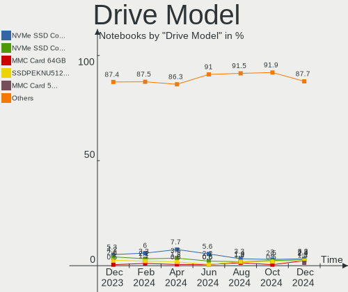
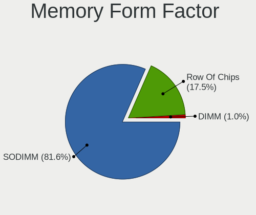

Arch Hardware Trends (Notebooks)
--------------------------------

A project to identify most popular hardware characteristics and track their change
over time based on data collected by Arch users at https://Linux-Hardware.org.

Anyone can contribute to this report by the [hw-probe](https://github.com/linuxhw/hw-probe) tool:

    sudo -E hw-probe -all -upload

Full-feature report is available here: https://linux-hardware.org/?view=trends

Period: Feb, 2022.

Contents
--------

* [ System ](#system)
  - [ OS                       ](#os)
  - [ OS Family                ](#os-family)
  - [ Kernel                   ](#kernel)
  - [ Kernel Family            ](#kernel-family)
  - [ Kernel Major Ver.        ](#kernel-major-ver)
  - [ Arch                     ](#arch)
  - [ DE                       ](#de)
  - [ Display Server           ](#display-server)
  - [ Display Manager          ](#display-manager)
  - [ OS Lang                  ](#os-lang)
  - [ Boot Mode                ](#boot-mode)
  - [ Filesystem               ](#filesystem)
  - [ Part. scheme             ](#part-scheme)
  - [ Dual Boot with Linux/BSD ](#dual-boot-with-linuxbsd)
  - [ Dual Boot (Win)          ](#dual-boot-win)

* [ Board ](#board)
  - [ Vendor                   ](#vendor)
  - [ Model                    ](#model)
  - [ Model Family             ](#model-family)
  - [ MFG Year                 ](#mfg-year)
  - [ Form Factor              ](#form-factor)
  - [ Secure Boot              ](#secure-boot)
  - [ Coreboot                 ](#coreboot)
  - [ RAM Size                 ](#ram-size)
  - [ RAM Used                 ](#ram-used)
  - [ Total Drives             ](#total-drives)
  - [ Has CD-ROM               ](#has-cd-rom)
  - [ Has Ethernet             ](#has-ethernet)
  - [ Has WiFi                 ](#has-wifi)
  - [ Has Bluetooth            ](#has-bluetooth)

* [ Location ](#location)
  - [ Country                  ](#country)
  - [ City                     ](#city)

* [ Drives ](#drives)
  - [ Drive Vendor             ](#drive-vendor)
  - [ Drive Model              ](#drive-model)
  - [ HDD Vendor               ](#hdd-vendor)
  - [ SSD Vendor               ](#ssd-vendor)
  - [ Drive Kind               ](#drive-kind)
  - [ Drive Connector          ](#drive-connector)
  - [ Drive Size               ](#drive-size)
  - [ Space Total              ](#space-total)
  - [ Space Used               ](#space-used)
  - [ Malfunc. Drives          ](#malfunc-drives)
  - [ Malfunc. Drive Vendor    ](#malfunc-drive-vendor)
  - [ Malfunc. HDD Vendor      ](#malfunc-hdd-vendor)
  - [ Malfunc. Drive Kind      ](#malfunc-drive-kind)
  - [ Failed Drives            ](#failed-drives)
  - [ Failed Drive Vendor      ](#failed-drive-vendor)
  - [ Drive Status             ](#drive-status)

* [ Storage controller ](#storage-controller)
  - [ Storage Vendor           ](#storage-vendor)
  - [ Storage Model            ](#storage-model)
  - [ Storage Kind             ](#storage-kind)

* [ Processor ](#processor)
  - [ CPU Vendor               ](#cpu-vendor)
  - [ CPU Model                ](#cpu-model)
  - [ CPU Model Family         ](#cpu-model-family)
  - [ CPU Cores                ](#cpu-cores)
  - [ CPU Sockets              ](#cpu-sockets)
  - [ CPU Threads              ](#cpu-threads)
  - [ CPU Op-Modes             ](#cpu-op-modes)
  - [ CPU Microcode            ](#cpu-microcode)
  - [ CPU Microarch            ](#cpu-microarch)

* [ Graphics ](#graphics)
  - [ GPU Vendor               ](#gpu-vendor)
  - [ GPU Model                ](#gpu-model)
  - [ GPU Combo                ](#gpu-combo)
  - [ GPU Driver               ](#gpu-driver)
  - [ GPU Memory               ](#gpu-memory)

* [ Monitor ](#monitor)
  - [ Monitor Vendor           ](#monitor-vendor)
  - [ Monitor Model            ](#monitor-model)
  - [ Monitor Resolution       ](#monitor-resolution)
  - [ Monitor Diagonal         ](#monitor-diagonal)
  - [ Monitor Width            ](#monitor-width)
  - [ Aspect Ratio             ](#aspect-ratio)
  - [ Monitor Area             ](#monitor-area)
  - [ Pixel Density            ](#pixel-density)
  - [ Multiple Monitors        ](#multiple-monitors)

* [ Network ](#network)
  - [ Net Controller Vendor    ](#net-controller-vendor)
  - [ Net Controller Model     ](#net-controller-model)
  - [ Wireless Vendor          ](#wireless-vendor)
  - [ Wireless Model           ](#wireless-model)
  - [ Ethernet Vendor          ](#ethernet-vendor)
  - [ Ethernet Model           ](#ethernet-model)
  - [ Net Controller Kind      ](#net-controller-kind)
  - [ Used Controller          ](#used-controller)
  - [ NICs                     ](#nics)
  - [ IPv6                     ](#ipv6)

* [ Bluetooth ](#bluetooth)
  - [ Bluetooth Vendor         ](#bluetooth-vendor)
  - [ Bluetooth Model          ](#bluetooth-model)

* [ Sound ](#sound)
  - [ Sound Vendor             ](#sound-vendor)
  - [ Sound Model              ](#sound-model)

* [ Memory ](#memory)
  - [ Memory Vendor            ](#memory-vendor)
  - [ Memory Model             ](#memory-model)
  - [ Memory Kind              ](#memory-kind)
  - [ Memory Form Factor       ](#memory-form-factor)
  - [ Memory Size              ](#memory-size)
  - [ Memory Speed             ](#memory-speed)

* [ Printers & scanners ](#printers--scanners)
  - [ Printer Vendor           ](#printer-vendor)
  - [ Printer Model            ](#printer-model)
  - [ Scanner Vendor           ](#scanner-vendor)
  - [ Scanner Model            ](#scanner-model)

* [ Camera ](#camera)
  - [ Camera Vendor            ](#camera-vendor)
  - [ Camera Model             ](#camera-model)

* [ Security ](#security)
  - [ Fingerprint Vendor       ](#fingerprint-vendor)
  - [ Fingerprint Model        ](#fingerprint-model)
  - [ Chipcard Vendor          ](#chipcard-vendor)
  - [ Chipcard Model           ](#chipcard-model)

* [ Unsupported ](#unsupported)
  - [ Unsupported Devices      ](#unsupported-devices)
  - [ Unsupported Device Types ](#unsupported-device-types)

System
------

OS
--

Installed operating systems

| Name         | Notebooks | Percent |
|--------------|-----------|---------|
| Arch         | 49        | 56.98%  |
| Arch Rolling | 37        | 43.02%  |

OS Family
---------

OS without a version

| Name | Notebooks | Percent |
|------|-----------|---------|
| Arch | 86        | 100%    |

Kernel
------

Version of the Linux kernel

| Version                      | Notebooks | Percent |
|------------------------------|-----------|---------|
| 5.16.5-arch1-1               | 10        | 11.63%  |
| 5.16.4-arch1-1               | 9         | 10.47%  |
| 5.16.10-arch1-1              | 9         | 10.47%  |
| 5.16.8-arch1-1               | 8         | 9.3%    |
| 5.16.7-arch1-1               | 5         | 5.81%   |
| 5.16.11-arch1-1              | 5         | 5.81%   |
| 5.16.10-zen1-1-zen           | 4         | 4.65%   |
| 5.16.9-arch1-1               | 3         | 3.49%   |
| 5.16.8-zen1-1-zen            | 3         | 3.49%   |
| 5.15.22-1-lts                | 3         | 3.49%   |
| 5.16.4-zen1-1-zen            | 2         | 2.33%   |
| 5.16.2-arch1-1               | 2         | 2.33%   |
| 5.15.7-arch1-1               | 2         | 2.33%   |
| 5.15.21-1-lts                | 2         | 2.33%   |
| 5.15.19-1-lts                | 2         | 2.33%   |
| 5.16.9-zen1-1-zen            | 1         | 1.16%   |
| 5.16.9-246-tkg-bmq           | 1         | 1.16%   |
| 5.16.9-1-blueperil           | 1         | 1.16%   |
| 5.16.7-zen1-1-zen            | 1         | 1.16%   |
| 5.16.5-zen1-1-zen            | 1         | 1.16%   |
| 5.16.3-arch1-1               | 1         | 1.16%   |
| 5.16.11-zen1-1-zen           | 1         | 1.16%   |
| 5.16.10-xanmod1-1            | 1         | 1.16%   |
| 5.15.25-1-lts                | 1         | 1.16%   |
| 5.15.24-2-lts                | 1         | 1.16%   |
| 5.15.21-hardened1-1-hardened | 1         | 1.16%   |
| 5.15.18-1-lts                | 1         | 1.16%   |
| 5.15.13-zen1-1-zen           | 1         | 1.16%   |
| 5.15.13-arch1-1              | 1         | 1.16%   |
| 5.15.11                      | 1         | 1.16%   |
| 5.15.10-arch1-1              | 1         | 1.16%   |
| 5.14.16-arch1-1              | 1         | 1.16%   |

Kernel Family
-------------

Linux kernel without a distro release

| Version | Notebooks | Percent |
|---------|-----------|---------|
| 5.16.10 | 14        | 16.28%  |
| 5.16.8  | 11        | 12.79%  |
| 5.16.5  | 11        | 12.79%  |
| 5.16.4  | 11        | 12.79%  |
| 5.16.9  | 6         | 6.98%   |
| 5.16.7  | 6         | 6.98%   |
| 5.16.11 | 6         | 6.98%   |
| 5.15.22 | 3         | 3.49%   |
| 5.15.21 | 3         | 3.49%   |
| 5.16.2  | 2         | 2.33%   |
| 5.15.7  | 2         | 2.33%   |
| 5.15.19 | 2         | 2.33%   |
| 5.15.13 | 2         | 2.33%   |
| 5.16.3  | 1         | 1.16%   |
| 5.15.25 | 1         | 1.16%   |
| 5.15.24 | 1         | 1.16%   |
| 5.15.18 | 1         | 1.16%   |
| 5.15.11 | 1         | 1.16%   |
| 5.15.10 | 1         | 1.16%   |
| 5.14.16 | 1         | 1.16%   |

Kernel Major Ver.
-----------------

Linux kernel major version

| Version | Notebooks | Percent |
|---------|-----------|---------|
| 5.16    | 68        | 79.07%  |
| 5.15    | 17        | 19.77%  |
| 5.14    | 1         | 1.16%   |

Arch
----

OS architecture (x86_64, i586, etc.)

| Name   | Notebooks | Percent |
|--------|-----------|---------|
| x86_64 | 86        | 100%    |

DE
--

Desktop Environment

| Name          | Notebooks | Percent |
|---------------|-----------|---------|
| KDE5          | 33        | 38.37%  |
| GNOME         | 21        | 24.42%  |
| XFCE          | 8         | 9.3%    |
| Unknown       | 8         | 9.3%    |
| i3            | 6         | 6.98%   |
| X-Cinnamon    | 2         | 2.33%   |
| Budgie        | 2         | 2.33%   |
| sway          | 1         | 1.16%   |
| LXQt          | 1         | 1.16%   |
| Enlightenment | 1         | 1.16%   |
| Cinnamon      | 1         | 1.16%   |
| bspwm         | 1         | 1.16%   |
| awesome       | 1         | 1.16%   |

Display Server
--------------

X11 or Wayland

| Name    | Notebooks | Percent |
|---------|-----------|---------|
| X11     | 53        | 61.63%  |
| Wayland | 18        | 20.93%  |
| Tty     | 11        | 12.79%  |
| Unknown | 4         | 4.65%   |

Display Manager
---------------

SDDM, LightDM, etc.

| Name    | Notebooks | Percent |
|---------|-----------|---------|
| Unknown | 27        | 31.4%   |
| SDDM    | 24        | 27.91%  |
| LightDM | 19        | 22.09%  |
| GDM     | 12        | 13.95%  |
| Ly      | 4         | 4.65%   |

OS Lang
-------

Language

| Lang         | Notebooks | Percent |
|--------------|-----------|---------|
| en_US        | 49        | 56.98%  |
| pt_BR        | 5         | 5.81%   |
| de_DE        | 5         | 5.81%   |
| C            | 5         | 5.81%   |
| Unknown      | 3         | 3.49%   |
| it_IT        | 2         | 2.33%   |
| fr_FR        | 2         | 2.33%   |
| es_MX        | 2         | 2.33%   |
| en_IN        | 2         | 2.33%   |
| en_AU        | 2         | 2.33%   |
| zh_TW        | 1         | 1.16%   |
| ru_RU        | 1         | 1.16%   |
| nb_NO        | 1         | 1.16%   |
| it_IT.UTF -8 | 1         | 1.16%   |
| es_ES        | 1         | 1.16%   |
| en_ZA        | 1         | 1.16%   |
| en_SG        | 1         | 1.16%   |
| en_GB        | 1         | 1.16%   |
| en_DE        | 1         | 1.16%   |

Boot Mode
---------

EFI or BIOS

| Mode | Notebooks | Percent |
|------|-----------|---------|
| EFI  | 56        | 65.12%  |
| BIOS | 30        | 34.88%  |

Filesystem
----------

Type of filesystem

| Type  | Notebooks | Percent |
|-------|-----------|---------|
| Ext4  | 63        | 73.26%  |
| Btrfs | 19        | 22.09%  |
| Xfs   | 4         | 4.65%   |

Part. scheme
------------

Scheme of partitioning

| Type    | Notebooks | Percent |
|---------|-----------|---------|
| GPT     | 60        | 69.77%  |
| Unknown | 17        | 19.77%  |
| MBR     | 9         | 10.47%  |

Dual Boot with Linux/BSD
------------------------

Hosting more than one Linux/BSD

| Dual boot | Notebooks | Percent |
|-----------|-----------|---------|
| No        | 76        | 88.37%  |
| Yes       | 10        | 11.63%  |

Dual Boot (Win)
---------------

Hosting Linux and Windows

| Dual boot | Notebooks | Percent |
|-----------|-----------|---------|
| No        | 55        | 63.95%  |
| Yes       | 31        | 36.05%  |

Board
-----

Vendor
------

Motherboard manufacturer

| Name                   | Notebooks | Percent |
|------------------------|-----------|---------|
| Lenovo                 | 20        | 23.26%  |
| Dell                   | 16        | 18.6%   |
| ASUSTek Computer       | 11        | 12.79%  |
| Hewlett-Packard        | 6         | 6.98%   |
| Acer                   | 6         | 6.98%   |
| Samsung Electronics    | 5         | 5.81%   |
| Toshiba                | 2         | 2.33%   |
| Razer                  | 2         | 2.33%   |
| MSI                    | 2         | 2.33%   |
| LG Electronics         | 2         | 2.33%   |
| Avell High Performance | 2         | 2.33%   |
| Timi                   | 1         | 1.16%   |
| Teclast                | 1         | 1.16%   |
| System76               | 1         | 1.16%   |
| Star Labs              | 1         | 1.16%   |
| IT Channel Pty         | 1         | 1.16%   |
| HUAWEI                 | 1         | 1.16%   |
| HONOR                  | 1         | 1.16%   |
| GPD                    | 1         | 1.16%   |
| Google                 | 1         | 1.16%   |
| Fujitsu                | 1         | 1.16%   |
| Framework              | 1         | 1.16%   |
| CJSCOPE                | 1         | 1.16%   |

Model
-----

Motherboard model

| Name                                       | Notebooks | Percent |
|--------------------------------------------|-----------|---------|
| Samsung RV415/RV515                        | 2         | 2.33%   |
| Razer Blade                                | 2         | 2.33%   |
| Lenovo IdeaPad 5 14ALC05 82LM              | 2         | 2.33%   |
| Avell High Performance B.ON                | 2         | 2.33%   |
| Acer Swift SF314-43                        | 2         | 2.33%   |
| Toshiba Satellite P500                     | 1         | 1.16%   |
| Toshiba Satellite C870-19R                 | 1         | 1.16%   |
| Timi TM1701                                | 1         | 1.16%   |
| Teclast F15 Plus                           | 1         | 1.16%   |
| System76 Oryx Pro                          | 1         | 1.16%   |
| Star Labs StarBook                         | 1         | 1.16%   |
| Samsung R530/R730                          | 1         | 1.16%   |
| Samsung 550XDA                             | 1         | 1.16%   |
| Samsung 300E4A/300E5A/300E7A/3430EA/3530EA | 1         | 1.16%   |
| MSI GP73 Leopard 8RE                       | 1         | 1.16%   |
| MSI GL75 Leopard 10SDK                     | 1         | 1.16%   |
| LG S425-G.BC31P1                           | 1         | 1.16%   |
| LG 17UD70P-PX76K                           | 1         | 1.16%   |
| Lenovo Yoga Slim 7 14ARE05 82A2            | 1         | 1.16%   |
| Lenovo Yoga Creator 7 15IMH05 82DS         | 1         | 1.16%   |
| Lenovo XiaoXinPro 14IHU 2021 82NC          | 1         | 1.16%   |
| Lenovo ThinkPad X220 42912WU               | 1         | 1.16%   |
| Lenovo ThinkPad W500 40624DG               | 1         | 1.16%   |
| Lenovo ThinkPad T460 20FMS2TG0D            | 1         | 1.16%   |
| Lenovo ThinkPad T15 Gen 2i 20W4002KUS      | 1         | 1.16%   |
| Lenovo ThinkPad P15v Gen 2i 21A9003WGE     | 1         | 1.16%   |
| Lenovo ThinkPad P14s Gen 1 20Y10038RT      | 1         | 1.16%   |
| Lenovo ThinkPad P1 Gen 3 20TJS2KM00        | 1         | 1.16%   |
| Lenovo ThinkPad Mini10 3507A31             | 1         | 1.16%   |
| Lenovo ThinkPad L420 7829BH2               | 1         | 1.16%   |
| Lenovo ThinkPad L15 Gen 2a 20X7CTO1WW      | 1         | 1.16%   |
| Lenovo ThinkBook 14-IIL 20SL               | 1         | 1.16%   |
| Lenovo ThinkBook 13s G2 ITL 20V9           | 1         | 1.16%   |
| Lenovo Legion 5 15ARH05H 82B1              | 1         | 1.16%   |
| Lenovo G40-80 80JE                         | 1         | 1.16%   |
| Lenovo B50-30 80ES                         | 1         | 1.16%   |
| IT Channel Pty P95xER                      | 1         | 1.16%   |
| HUAWEI BOHB-WAX9                           | 1         | 1.16%   |
| HONOR NMH-WCX9                             | 1         | 1.16%   |
| HP OMEN by Laptop 15-dh1xxx                | 1         | 1.16%   |
| HP Notebook                                | 1         | 1.16%   |
| HP Laptop 15s-fq0xxx                       | 1         | 1.16%   |
| HP Laptop 15-da0xxx                        | 1         | 1.16%   |
| HP EliteBook x360 1040 G5                  | 1         | 1.16%   |
| HP 650                                     | 1         | 1.16%   |
| GPD G1621-02                               | 1         | 1.16%   |
| Google Ampton                              | 1         | 1.16%   |
| Fujitsu LIFEBOOK E556                      | 1         | 1.16%   |
| Framework Laptop                           | 1         | 1.16%   |
| Dell XPS 15 7590                           | 1         | 1.16%   |
| Dell XPS 13 9305                           | 1         | 1.16%   |
| Dell Vostro 3558                           | 1         | 1.16%   |
| Dell Precision 7560                        | 1         | 1.16%   |
| Dell Precision 3530                        | 1         | 1.16%   |
| Dell Precision 3520                        | 1         | 1.16%   |
| Dell Latitude E6420                        | 1         | 1.16%   |
| Dell Latitude 9420                         | 1         | 1.16%   |
| Dell Latitude 7480                         | 1         | 1.16%   |
| Dell Latitude 5480                         | 1         | 1.16%   |
| Dell Inspiron N4050                        | 1         | 1.16%   |

Model Family
------------

Motherboard model prefix

| Name                        | Notebooks | Percent |
|-----------------------------|-----------|---------|
| Lenovo ThinkPad             | 10        | 11.63%  |
| Dell Inspiron               | 5         | 5.81%   |
| ASUS ASUS                   | 5         | 5.81%   |
| Dell Latitude               | 4         | 4.65%   |
| Dell Precision              | 3         | 3.49%   |
| Toshiba Satellite           | 2         | 2.33%   |
| Samsung RV415               | 2         | 2.33%   |
| Razer Blade                 | 2         | 2.33%   |
| Lenovo Yoga                 | 2         | 2.33%   |
| Lenovo ThinkBook            | 2         | 2.33%   |
| Lenovo IdeaPad              | 2         | 2.33%   |
| HP Laptop                   | 2         | 2.33%   |
| Dell XPS                    | 2         | 2.33%   |
| Avell High Performance B.ON | 2         | 2.33%   |
| Acer Swift                  | 2         | 2.33%   |
| Acer Aspire                 | 2         | 2.33%   |
| Timi TM1701                 | 1         | 1.16%   |
| Teclast F15                 | 1         | 1.16%   |
| System76 Oryx               | 1         | 1.16%   |
| Star Labs StarBook          | 1         | 1.16%   |
| Samsung R530                | 1         | 1.16%   |
| Samsung 550XDA              | 1         | 1.16%   |
| Samsung 300E4A              | 1         | 1.16%   |
| MSI GP73                    | 1         | 1.16%   |
| MSI GL75                    | 1         | 1.16%   |
| LG S425-G.BC31P1            | 1         | 1.16%   |
| LG 17UD70P-PX76K            | 1         | 1.16%   |
| Lenovo XiaoXinPro           | 1         | 1.16%   |
| Lenovo Legion               | 1         | 1.16%   |
| Lenovo G40-80               | 1         | 1.16%   |
| Lenovo B50-30               | 1         | 1.16%   |
| IT Channel Pty P95xER       | 1         | 1.16%   |
| HUAWEI BOHB-WAX9            | 1         | 1.16%   |
| HONOR NMH-WCX9              | 1         | 1.16%   |
| HP OMEN                     | 1         | 1.16%   |
| HP Notebook                 | 1         | 1.16%   |
| HP EliteBook                | 1         | 1.16%   |
| HP 650                      | 1         | 1.16%   |
| GPD G1621-02                | 1         | 1.16%   |
| Google Ampton               | 1         | 1.16%   |
| Fujitsu LIFEBOOK            | 1         | 1.16%   |
| Framework Laptop            | 1         | 1.16%   |
| Dell Vostro                 | 1         | 1.16%   |
| Dell G3                     | 1         | 1.16%   |
| CJSCOPE Z                   | 1         | 1.16%   |
| ASUS X751LD                 | 1         | 1.16%   |
| ASUS X510UNR                | 1         | 1.16%   |
| ASUS VivoBook               | 1         | 1.16%   |
| ASUS S550CM                 | 1         | 1.16%   |
| ASUS K55VJ                  | 1         | 1.16%   |
| ASUS K42F                   | 1         | 1.16%   |
| Acer Predator               | 1         | 1.16%   |
| Acer Nitro                  | 1         | 1.16%   |

MFG Year
--------

Motherboard manufacture year

| Year | Notebooks | Percent |
|------|-----------|---------|
| 2021 | 29        | 33.72%  |
| 2020 | 10        | 11.63%  |
| 2019 | 9         | 10.47%  |
| 2018 | 8         | 9.3%    |
| 2011 | 8         | 9.3%    |
| 2017 | 7         | 8.14%   |
| 2012 | 4         | 4.65%   |
| 2010 | 3         | 3.49%   |
| 2015 | 2         | 2.33%   |
| 2014 | 2         | 2.33%   |
| 2009 | 2         | 2.33%   |
| 2016 | 1         | 1.16%   |
| 2013 | 1         | 1.16%   |

Form Factor
-----------

Physical design of the computer

| Name     | Notebooks | Percent |
|----------|-----------|---------|
| Notebook | 86        | 100%    |

Secure Boot
-----------

Enabled or disabled

| State    | Notebooks | Percent |
|----------|-----------|---------|
| Disabled | 85        | 98.84%  |
| Enabled  | 1         | 1.16%   |

Coreboot
--------

Have coreboot on board

| Used | Notebooks | Percent |
|------|-----------|---------|
| No   | 83        | 96.51%  |
| Yes  | 3         | 3.49%   |

RAM Size
--------

Total RAM memory

| Size in GB  | Notebooks | Percent |
|-------------|-----------|---------|
| 4.01-8.0    | 21        | 24.42%  |
| 16.01-24.0  | 18        | 20.93%  |
| 8.01-16.0   | 17        | 19.77%  |
| 3.01-4.0    | 11        | 12.79%  |
| 32.01-64.0  | 10        | 11.63%  |
| 64.01-256.0 | 4         | 4.65%   |
| 1.01-2.0    | 3         | 3.49%   |
| 24.01-32.0  | 2         | 2.33%   |

RAM Used
--------

Used RAM memory

| Used GB    | Notebooks | Percent |
|------------|-----------|---------|
| 2.01-3.0   | 22        | 25.58%  |
| 1.01-2.0   | 21        | 24.42%  |
| 4.01-8.0   | 19        | 22.09%  |
| 3.01-4.0   | 12        | 13.95%  |
| 8.01-16.0  | 5         | 5.81%   |
| 0.51-1.0   | 3         | 3.49%   |
| 0.01-0.5   | 2         | 2.33%   |
| 24.01-32.0 | 1         | 1.16%   |
| 16.01-24.0 | 1         | 1.16%   |

Total Drives
------------

Number of drives on board

| Drives | Notebooks | Percent |
|--------|-----------|---------|
| 1      | 56        | 65.12%  |
| 2      | 26        | 30.23%  |
| 3      | 4         | 4.65%   |

Has CD-ROM
----------

Has CD-ROM on board

| Presented | Notebooks | Percent |
|-----------|-----------|---------|
| No        | 72        | 83.72%  |
| Yes       | 14        | 16.28%  |

Has Ethernet
------------

Has Ethernet on board

| Presented | Notebooks | Percent |
|-----------|-----------|---------|
| Yes       | 61        | 70.93%  |
| No        | 25        | 29.07%  |

Has WiFi
--------

Has WiFi module

| Presented | Notebooks | Percent |
|-----------|-----------|---------|
| Yes       | 85        | 98.84%  |
| No        | 1         | 1.16%   |

Has Bluetooth
-------------

Has Bluetooth module

| Presented | Notebooks | Percent |
|-----------|-----------|---------|
| Yes       | 75        | 87.21%  |
| No        | 11        | 12.79%  |

Location
--------

Country
-------

Geographic location (country)

| Country      | Notebooks | Percent |
|--------------|-----------|---------|
| USA          | 14        | 16.28%  |
| Germany      | 9         | 10.47%  |
| Brazil       | 9         | 10.47%  |
| Russia       | 5         | 5.81%   |
| Italy        | 5         | 5.81%   |
| Australia    | 4         | 4.65%   |
| Vietnam      | 2         | 2.33%   |
| Turkey       | 2         | 2.33%   |
| Sweden       | 2         | 2.33%   |
| Spain        | 2         | 2.33%   |
| South Korea  | 2         | 2.33%   |
| South Africa | 2         | 2.33%   |
| Mexico       | 2         | 2.33%   |
| Iran         | 2         | 2.33%   |
| India        | 2         | 2.33%   |
| France       | 2         | 2.33%   |
| Cyprus       | 2         | 2.33%   |
| Canada       | 2         | 2.33%   |
| Ukraine      | 1         | 1.16%   |
| UK           | 1         | 1.16%   |
| Thailand     | 1         | 1.16%   |
| Taiwan       | 1         | 1.16%   |
| Singapore    | 1         | 1.16%   |
| Serbia       | 1         | 1.16%   |
| Romania      | 1         | 1.16%   |
| Poland       | 1         | 1.16%   |
| Norway       | 1         | 1.16%   |
| Myanmar      | 1         | 1.16%   |
| Lithuania    | 1         | 1.16%   |
| Kazakhstan   | 1         | 1.16%   |
| Hungary      | 1         | 1.16%   |
| China        | 1         | 1.16%   |
| Bulgaria     | 1         | 1.16%   |
| Belgium      | 1         | 1.16%   |

City
----

Geographic location (city)

| City                 | Notebooks | Percent |
|----------------------|-----------|---------|
| Vinh Phuc            | 2         | 2.33%   |
| Uberlândia        | 2         | 2.33%   |
| Tehran               | 2         | 2.33%   |
| Seoul                | 2         | 2.33%   |
| Praia Grande         | 2         | 2.33%   |
| Perth                | 2         | 2.33%   |
| Munster              | 2         | 2.33%   |
| Zaragoza             | 1         | 1.16%   |
| Zapopan              | 1         | 1.16%   |
| Yekaterinburg        | 1         | 1.16%   |
| Yangon               | 1         | 1.16%   |
| Wiesbaden            | 1         | 1.16%   |
| Volgograd            | 1         | 1.16%   |
| Vadodara             | 1         | 1.16%   |
| Sydney               | 1         | 1.16%   |
| Surgut               | 1         | 1.16%   |
| Somerville           | 1         | 1.16%   |
| Sofia                | 1         | 1.16%   |
| Skellefteå        | 1         | 1.16%   |
| Sioux City           | 1         | 1.16%   |
| Singapore            | 1         | 1.16%   |
| Sheffield            | 1         | 1.16%   |
| Sesto San Giovanni   | 1         | 1.16%   |
| Sao Joaquim da Barra | 1         | 1.16%   |
| Santo André       | 1         | 1.16%   |
| San Diego            | 1         | 1.16%   |
| Ryazan               | 1         | 1.16%   |
| Rome                 | 1         | 1.16%   |
| Ris-Orangis          | 1         | 1.16%   |
| Raipur               | 1         | 1.16%   |
| Pretoria             | 1         | 1.16%   |
| Phoenix              | 1         | 1.16%   |
| Penzberg             | 1         | 1.16%   |
| Pattaya              | 1         | 1.16%   |
| Oslo                 | 1         | 1.16%   |
| Orlando              | 1         | 1.16%   |
| Olympia              | 1         | 1.16%   |
| Oerlinghausen        | 1         | 1.16%   |
| Nicosia              | 1         | 1.16%   |
| Murcia               | 1         | 1.16%   |
| Mouscron             | 1         | 1.16%   |
| Moscow               | 1         | 1.16%   |
| Mococa               | 1         | 1.16%   |
| Milan                | 1         | 1.16%   |
| Mielec               | 1         | 1.16%   |
| Mexico City          | 1         | 1.16%   |
| Melbourne            | 1         | 1.16%   |
| Louisville           | 1         | 1.16%   |
| Limassol             | 1         | 1.16%   |
| Lille                | 1         | 1.16%   |
| Laguna Hills         | 1         | 1.16%   |
| Lagoa Santa          | 1         | 1.16%   |
| Kista                | 1         | 1.16%   |
| Kherson              | 1         | 1.16%   |
| Kaunas               | 1         | 1.16%   |
| Kaohsiung City       | 1         | 1.16%   |
| Istanbul             | 1         | 1.16%   |
| Hayden               | 1         | 1.16%   |
| Hartbeespoort        | 1         | 1.16%   |
| Hamburg              | 1         | 1.16%   |

Drives
------

Drive Vendor
------------

Hard drive vendors

| Vendor              | Notebooks | Drives | Percent |
|---------------------|-----------|--------|---------|
| Samsung Electronics | 23        | 27     | 20.18%  |
| Seagate             | 13        | 14     | 11.4%   |
| SK Hynix            | 10        | 11     | 8.77%   |
| SanDisk             | 10        | 10     | 8.77%   |
| WDC                 | 9         | 10     | 7.89%   |
| Kingston            | 9         | 9      | 7.89%   |
| Toshiba             | 6         | 6      | 5.26%   |
| Unknown             | 5         | 5      | 4.39%   |
| Micron Technology   | 5         | 5      | 4.39%   |
| Intel               | 4         | 4      | 3.51%   |
| Crucial             | 4         | 4      | 3.51%   |
| Phison              | 2         | 2      | 1.75%   |
| Hitachi             | 2         | 2      | 1.75%   |
| XPG                 | 1         | 1      | 0.88%   |
| Teclast             | 1         | 1      | 0.88%   |
| Star Drive          | 1         | 1      | 0.88%   |
| KIOXIA              | 1         | 1      | 0.88%   |
| KingSpec            | 1         | 1      | 0.88%   |
| Intenso             | 1         | 1      | 0.88%   |
| GOODRAM             | 1         | 1      | 0.88%   |
| Fujitsu             | 1         | 1      | 0.88%   |
| Corsair             | 1         | 1      | 0.88%   |
| Biwin               | 1         | 1      | 0.88%   |
| ADATA Technology    | 1         | 1      | 0.88%   |
| A-DATA Technology   | 1         | 1      | 0.88%   |

Drive Model
-----------

Hard drive models

| Model                                     | Notebooks | Percent |
|-------------------------------------------|-----------|---------|
| SK Hynix NVMe SSD Drive 512GB             | 4         | 3.33%   |
| Sandisk NVMe SSD Drive 512GB              | 4         | 3.33%   |
| Kingston SA400S37120G 120GB SSD           | 3         | 2.5%    |
| SK Hynix HFM512GD3JX013N 512GB            | 2         | 1.67%   |
| Seagate ST9500325AS 500GB                 | 2         | 1.67%   |
| Seagate ST1000LM035-1RK172 1TB            | 2         | 1.67%   |
| Seagate ST1000LM024 HN-M101MBB 1TB        | 2         | 1.67%   |
| Samsung SSD 970 EVO Plus 2TB              | 2         | 1.67%   |
| Samsung SM963 2.5" NVMe PCIe SSD 256GB    | 2         | 1.67%   |
| XPG GAMMIX S11 Pro 1TB                    | 1         | 0.83%   |
| WDC WDS500G2X0C-00L350 500GB              | 1         | 0.83%   |
| WDC WDS120G2G0A-00JH30 120GB SSD          | 1         | 0.83%   |
| WDC WDS100T2X0C-00L350 1TB                | 1         | 0.83%   |
| WDC WD6400BEVT-22A0RT0 640GB              | 1         | 0.83%   |
| WDC WD10SPZX-35Z10T0 1TB                  | 1         | 0.83%   |
| WDC WD10SPZX-17Z10T1 1TB                  | 1         | 0.83%   |
| WDC WD10JPVX-75JC3T0 1TB                  | 1         | 0.83%   |
| WDC PC SN730 SDBQNTY-512G-1001 512GB      | 1         | 0.83%   |
| WDC PC SN730 SDBPNTY-512G-1101 512GB      | 1         | 0.83%   |
| WDC PC SN720 SDAPNTW-512G-1006 512GB      | 1         | 0.83%   |
| Unknown SU16G  16GB                       | 1         | 0.83%   |
| Unknown MMC Card  256GB                   | 1         | 0.83%   |
| Unknown MMC Card  16GB                    | 1         | 0.83%   |
| Unknown DA4064  64GB                      | 1         | 0.83%   |
| Unknown 5MKJR  256GB                      | 1         | 0.83%   |
| Toshiba THNSNK128GVN8 128GB SSD           | 1         | 0.83%   |
| Toshiba NVMe SSD Drive 1024GB             | 1         | 0.83%   |
| Toshiba MQ01ACF032 320GB                  | 1         | 0.83%   |
| Toshiba MK5055GSX 500GB                   | 1         | 0.83%   |
| Toshiba MK3265GSX 320GB                   | 1         | 0.83%   |
| Toshiba KXG6AZNV1T02 1TB                  | 1         | 0.83%   |
| Teclast BD256GB SHCB-2280 SSD             | 1         | 0.83%   |
| Star Drive PCIe SSD 480GB                 | 1         | 0.83%   |
| SK Hynix SKHynix_HFS512GD9TNI-L2A0B 512GB | 1         | 0.83%   |
| SK Hynix NVMe SSD Drive 256GB             | 1         | 0.83%   |
| SK Hynix HFM256GDJTNG-8310A 256GB         | 1         | 0.83%   |
| SK Hynix HFM001TD3JX013N 1TB              | 1         | 0.83%   |
| SK Hynix BC511 NVMe 512GB                 | 1         | 0.83%   |
| Seagate ST9320325AS 320GB                 | 1         | 0.83%   |
| Seagate ST9160821AS 160GB                 | 1         | 0.83%   |
| Seagate ST500LM012 HN-M500MBB 500GB       | 1         | 0.83%   |
| Seagate ST500LM000-1EJ162 500GB           | 1         | 0.83%   |
| Seagate ST2000LX001-1RG174 2TB            | 1         | 0.83%   |
| Seagate ST2000LM015-2E8174 2TB            | 1         | 0.83%   |
| Seagate ST1000LX015-1U7172 1TB            | 1         | 0.83%   |
| Seagate One Touch w/PW 2TB                | 1         | 0.83%   |
| SanDisk Ultra II 240GB SSD                | 1         | 0.83%   |
| SanDisk SSD PLUS 240GB                    | 1         | 0.83%   |
| SanDisk SDSSDA240G 240GB                  | 1         | 0.83%   |
| SanDisk SD8TB8U256G1001 256GB SSD         | 1         | 0.83%   |
| Sandisk NVMe SSD Drive 500GB              | 1         | 0.83%   |
| Sandisk NVMe SSD Drive 1TB                | 1         | 0.83%   |
| Samsung SSD 980 500GB                     | 1         | 0.83%   |
| Samsung SSD 970 PRO 512GB                 | 1         | 0.83%   |
| Samsung SSD 970 PRO 1TB                   | 1         | 0.83%   |
| Samsung SSD 970 EVO Plus 250GB            | 1         | 0.83%   |
| Samsung SSD 970 EVO Plus 1TB              | 1         | 0.83%   |
| Samsung SSD 970 EVO 500GB                 | 1         | 0.83%   |
| Samsung SSD 870 EVO 500GB                 | 1         | 0.83%   |
| Samsung SSD 860 EVO M.2 500GB             | 1         | 0.83%   |

HDD Vendor
----------

Hard disk drive vendors

| Vendor  | Notebooks | Drives | Percent |
|---------|-----------|--------|---------|
| Seagate | 12        | 13     | 54.55%  |
| WDC     | 4         | 4      | 18.18%  |
| Toshiba | 3         | 3      | 13.64%  |
| Hitachi | 2         | 2      | 9.09%   |
| Fujitsu | 1         | 1      | 4.55%   |

SSD Vendor
----------

Solid state drive vendors

| Vendor              | Notebooks | Drives | Percent |
|---------------------|-----------|--------|---------|
| Samsung Electronics | 7         | 7      | 25%     |
| Kingston            | 7         | 7      | 25%     |
| SanDisk             | 4         | 4      | 14.29%  |
| Crucial             | 3         | 3      | 10.71%  |
| WDC                 | 1         | 1      | 3.57%   |
| Toshiba             | 1         | 1      | 3.57%   |
| Teclast             | 1         | 1      | 3.57%   |
| Micron Technology   | 1         | 1      | 3.57%   |
| Intenso             | 1         | 1      | 3.57%   |
| Intel               | 1         | 1      | 3.57%   |
| GOODRAM             | 1         | 1      | 3.57%   |

Drive Kind
----------

HDD or SSD

| Kind    | Notebooks | Drives | Percent |
|---------|-----------|--------|---------|
| NVMe    | 53        | 63     | 50%     |
| SSD     | 26        | 28     | 24.53%  |
| HDD     | 20        | 23     | 18.87%  |
| MMC     | 5         | 5      | 4.72%   |
| Unknown | 2         | 2      | 1.89%   |

Drive Connector
---------------

SATA, SAS, NVMe, etc.

| Type | Notebooks | Drives | Percent |
|------|-----------|--------|---------|
| NVMe | 53        | 63     | 54.08%  |
| SATA | 39        | 52     | 39.8%   |
| MMC  | 5         | 5      | 5.1%    |
| SAS  | 1         | 1      | 1.02%   |

Drive Size
----------

Size of hard drive

| Size in TB | Notebooks | Drives | Percent |
|------------|-----------|--------|---------|
| 0.01-0.5   | 30        | 38     | 71.43%  |
| 0.51-1.0   | 10        | 11     | 23.81%  |
| 1.01-2.0   | 2         | 2      | 4.76%   |

Space Total
-----------

Amount of disk space available on the file system

| Size in GB     | Notebooks | Percent |
|----------------|-----------|---------|
| 251-500        | 24        | 27.91%  |
| 101-250        | 24        | 27.91%  |
| 501-1000       | 17        | 19.77%  |
| 1001-2000      | 9         | 10.47%  |
| More than 3000 | 5         | 5.81%   |
| 51-100         | 4         | 4.65%   |
| Unknown        | 2         | 2.33%   |
| 2001-3000      | 1         | 1.16%   |

Space Used
----------

Amount of used disk space

| Used GB        | Notebooks | Percent |
|----------------|-----------|---------|
| 101-250        | 21        | 24.42%  |
| 1-20           | 15        | 17.44%  |
| 251-500        | 13        | 15.12%  |
| 51-100         | 13        | 15.12%  |
| 21-50          | 11        | 12.79%  |
| 501-1000       | 8         | 9.3%    |
| 1001-2000      | 2         | 2.33%   |
| Unknown        | 2         | 2.33%   |
| More than 3000 | 1         | 1.16%   |

Malfunc. Drives
---------------

Drive models with a malfunction

| Model                        | Notebooks | Drives | Percent |
|------------------------------|-----------|--------|---------|
| Toshiba MK5055GSX 500GB      | 1         | 1      | 25%     |
| Seagate ST9500325AS 500GB    | 1         | 1      | 25%     |
| Seagate ST9160821AS 160GB    | 1         | 1      | 25%     |
| Hitachi HTS541680J9SA00 80GB | 1         | 1      | 25%     |

Malfunc. Drive Vendor
---------------------

Vendors of faulty drives

| Vendor  | Notebooks | Drives | Percent |
|---------|-----------|--------|---------|
| Seagate | 2         | 2      | 50%     |
| Toshiba | 1         | 1      | 25%     |
| Hitachi | 1         | 1      | 25%     |

Malfunc. HDD Vendor
-------------------

Vendors of faulty HDD drives

| Vendor  | Notebooks | Drives | Percent |
|---------|-----------|--------|---------|
| Seagate | 2         | 2      | 50%     |
| Toshiba | 1         | 1      | 25%     |
| Hitachi | 1         | 1      | 25%     |

Malfunc. Drive Kind
-------------------

Kinds of faulty drives

| Kind | Notebooks | Drives | Percent |
|------|-----------|--------|---------|
| HDD  | 3         | 4      | 100%    |

Failed Drives
-------------

Failed drive models

Zero info for selected period =(

Failed Drive Vendor
-------------------

Failed drive vendors

Zero info for selected period =(

Drive Status
------------

Number of failed and malfunc. drives

| Status   | Notebooks | Drives | Percent |
|----------|-----------|--------|---------|
| Works    | 51        | 69     | 54.84%  |
| Detected | 39        | 48     | 41.94%  |
| Malfunc  | 3         | 4      | 3.23%   |

Storage controller
------------------

Storage Vendor
--------------

Storage controller vendors

| Vendor                       | Notebooks | Percent |
|------------------------------|-----------|---------|
| Intel                        | 53        | 45.3%   |
| Samsung Electronics          | 16        | 13.68%  |
| AMD                          | 11        | 9.4%    |
| Sandisk                      | 10        | 8.55%   |
| SK Hynix                     | 9         | 7.69%   |
| Micron Technology            | 5         | 4.27%   |
| Phison Electronics           | 4         | 3.42%   |
| ADATA Technology             | 3         | 2.56%   |
| Toshiba America Info Systems | 2         | 1.71%   |
| Kingston Technology Company  | 2         | 1.71%   |
| KIOXIA                       | 1         | 0.85%   |
| Biwin Storage Technology     | 1         | 0.85%   |

Storage Model
-------------

Storage controller models

| Model                                                                         | Notebooks | Percent |
|-------------------------------------------------------------------------------|-----------|---------|
| Samsung NVMe SSD Controller SM981/PM981/PM983                                 | 11        | 9.17%   |
| AMD FCH SATA Controller [AHCI mode]                                           | 9         | 7.5%    |
| Intel Sunrise Point-LP SATA Controller [AHCI mode]                            | 7         | 5.83%   |
| Intel 6 Series/C200 Series Chipset Family 6 port Mobile SATA AHCI Controller  | 6         | 5%      |
| Micron Non-Volatile memory controller                                         | 5         | 4.17%   |
| Intel Cannon Lake Mobile PCH SATA AHCI Controller                             | 5         | 4.17%   |
| Intel 7 Series Chipset Family 6-port SATA Controller [AHCI mode]              | 5         | 4.17%   |
| SK Hynix Gold P31 SSD                                                         | 4         | 3.33%   |
| Sandisk WD Black SN750 / PC SN730 NVMe SSD                                    | 4         | 3.33%   |
| Samsung NVMe SSD Controller 980                                               | 4         | 3.33%   |
| Phison E12 NVMe Controller                                                    | 4         | 3.33%   |
| Intel 400 Series Chipset Family SATA AHCI Controller                          | 4         | 3.33%   |
| Sandisk Non-Volatile memory controller                                        | 3         | 2.5%    |
| Intel Wildcat Point-LP SATA Controller [AHCI Mode]                            | 3         | 2.5%    |
| Intel Volume Management Device NVMe RAID Controller                           | 3         | 2.5%    |
| Intel SSD 660P Series                                                         | 3         | 2.5%    |
| Intel Ice Lake-LP SATA Controller [AHCI mode]                                 | 3         | 2.5%    |
| Toshiba America Info Systems XG6 NVMe SSD Controller                          | 2         | 1.67%   |
| SK Hynix Non-Volatile memory controller                                       | 2         | 1.67%   |
| SK Hynix BC511                                                                | 2         | 1.67%   |
| Sandisk WD Black 2018/SN750 / PC SN720 NVMe SSD                               | 2         | 1.67%   |
| Samsung NVMe SSD Controller SM961/PM961/SM963                                 | 2         | 1.67%   |
| Intel Celeron/Pentium Silver Processor SATA Controller                        | 2         | 1.67%   |
| Intel 82801IBM/IEM (ICH9M/ICH9M-E) 4 port SATA Controller [AHCI mode]         | 2         | 1.67%   |
| Intel 82801 Mobile SATA Controller [RAID mode]                                | 2         | 1.67%   |
| Intel 5 Series/3400 Series Chipset 4 port SATA AHCI Controller                | 2         | 1.67%   |
| AMD SB7x0/SB8x0/SB9x0 SATA Controller [AHCI mode]                             | 2         | 1.67%   |
| ADATA Non-Volatile memory controller                                          | 2         | 1.67%   |
| SK Hynix BC501 NVMe Solid State Drive                                         | 1         | 0.83%   |
| Sandisk WD Blue SN550 NVMe SSD                                                | 1         | 0.83%   |
| KIOXIA Non-Volatile memory controller                                         | 1         | 0.83%   |
| Kingston Company Company Non-Volatile memory controller                       | 1         | 0.83%   |
| Kingston Company OM3PDP3 NVMe SSD                                             | 1         | 0.83%   |
| Intel Tiger Lake-LP SATA Controller [AHCI mode]                               | 1         | 0.83%   |
| Intel Q170/Q150/B150/H170/H110/Z170/CM236 Chipset SATA Controller [AHCI Mode] | 1         | 0.83%   |
| Intel NM10/ICH7 Family SATA Controller [AHCI mode]                            | 1         | 0.83%   |
| Intel HM170/QM170 Chipset SATA Controller [AHCI Mode]                         | 1         | 0.83%   |
| Intel Comet Lake SATA AHCI Controller                                         | 1         | 0.83%   |
| Intel Atom Processor E3800 Series SATA AHCI Controller                        | 1         | 0.83%   |
| Intel 8 Series SATA Controller 1 [AHCI mode]                                  | 1         | 0.83%   |
| Biwin Storage Non-Volatile memory controller                                  | 1         | 0.83%   |
| AMD 400 Series Chipset SATA Controller                                        | 1         | 0.83%   |
| ADATA XPG SX8200 Pro PCIe Gen3x4 M.2 2280 Solid State Drive                   | 1         | 0.83%   |

Storage Kind
------------

Kind of storage controller (IDE, SATA, NVMe, SAS, ...)

| Kind | Notebooks | Percent |
|------|-----------|---------|
| SATA | 57        | 50%     |
| NVMe | 52        | 45.61%  |
| RAID | 5         | 4.39%   |

Processor
---------

CPU Vendor
----------

Processor vendors

| Vendor | Notebooks | Percent |
|--------|-----------|---------|
| Intel  | 70        | 81.4%   |
| AMD    | 16        | 18.6%   |

CPU Model
---------

Processor models

| Model                                      | Notebooks | Percent |
|--------------------------------------------|-----------|---------|
| Intel 11th Gen Core i7-1165G7 @ 2.80GHz    | 7         | 8.14%   |
| Intel Core i7-8750H CPU @ 2.20GHz          | 4         | 4.65%   |
| Intel Core i7-10750H CPU @ 2.60GHz         | 4         | 4.65%   |
| Intel Core i7-8550U CPU @ 1.80GHz          | 3         | 3.49%   |
| Intel Core i5-6300U CPU @ 2.40GHz          | 3         | 3.49%   |
| AMD Ryzen 7 5700U with Radeon Graphics     | 3         | 3.49%   |
| Intel Core i7-9750H CPU @ 2.60GHz          | 2         | 2.33%   |
| Intel Core i7-7500U CPU @ 2.70GHz          | 2         | 2.33%   |
| Intel Core i5-8250U CPU @ 1.60GHz          | 2         | 2.33%   |
| Intel Core i5-3210M CPU @ 2.50GHz          | 2         | 2.33%   |
| Intel Core i5-1035G1 CPU @ 1.00GHz         | 2         | 2.33%   |
| Intel Core i3-5005U CPU @ 2.00GHz          | 2         | 2.33%   |
| Intel Core i3-2350M CPU @ 2.30GHz          | 2         | 2.33%   |
| AMD Ryzen 7 4800H with Radeon Graphics     | 2         | 2.33%   |
| AMD Ryzen 5 5500U with Radeon Graphics     | 2         | 2.33%   |
| AMD E-300 APU with Radeon HD Graphics      | 2         | 2.33%   |
| Intel Xeon W-11955M CPU @ 2.60GHz          | 1         | 1.16%   |
| Intel Pentium Silver N6000 @ 1.10GHz       | 1         | 1.16%   |
| Intel Pentium CPU B980 @ 2.40GHz           | 1         | 1.16%   |
| Intel Core i9-10885H CPU @ 2.40GHz         | 1         | 1.16%   |
| Intel Core i7-2640M CPU @ 2.80GHz          | 1         | 1.16%   |
| Intel Core i7-10875H CPU @ 2.30GHz         | 1         | 1.16%   |
| Intel Core i7-10870H CPU @ 2.20GHz         | 1         | 1.16%   |
| Intel Core i7-1065G7 CPU @ 1.30GHz         | 1         | 1.16%   |
| Intel Core i7 CPU Q 720 @ 1.60GHz          | 1         | 1.16%   |
| Intel Core i5-8300H CPU @ 2.30GHz          | 1         | 1.16%   |
| Intel Core i5-7440HQ CPU @ 2.80GHz         | 1         | 1.16%   |
| Intel Core i5-7300HQ CPU @ 2.50GHz         | 1         | 1.16%   |
| Intel Core i5-6200U CPU @ 2.30GHz          | 1         | 1.16%   |
| Intel Core i5-5200U CPU @ 2.20GHz          | 1         | 1.16%   |
| Intel Core i5-4210U CPU @ 1.70GHz          | 1         | 1.16%   |
| Intel Core i5-3317U CPU @ 1.70GHz          | 1         | 1.16%   |
| Intel Core i5-2540M CPU @ 2.60GHz          | 1         | 1.16%   |
| Intel Core i5-2520M CPU @ 2.50GHz          | 1         | 1.16%   |
| Intel Core i5 CPU M 460 @ 2.53GHz          | 1         | 1.16%   |
| Intel Core i3-3110M CPU @ 2.40GHz          | 1         | 1.16%   |
| Intel Core i3-2330M CPU @ 2.20GHz          | 1         | 1.16%   |
| Intel Core i3-10110U CPU @ 2.10GHz         | 1         | 1.16%   |
| Intel Core 2 Duo CPU T9600 @ 2.80GHz       | 1         | 1.16%   |
| Intel Core 2 Duo CPU T6600 @ 2.20GHz       | 1         | 1.16%   |
| Intel Celeron N4120 CPU @ 1.10GHz          | 1         | 1.16%   |
| Intel Celeron N4020 CPU @ 1.10GHz          | 1         | 1.16%   |
| Intel Celeron N4000 CPU @ 1.10GHz          | 1         | 1.16%   |
| Intel Celeron CPU N2815 @ 1.86GHz          | 1         | 1.16%   |
| Intel Atom CPU N450 @ 1.66GHz              | 1         | 1.16%   |
| Intel 11th Gen Core i7-1185G7 @ 3.00GHz    | 1         | 1.16%   |
| Intel 11th Gen Core i7-11800H @ 2.30GHz    | 1         | 1.16%   |
| Intel 11th Gen Core i7-11370H @ 3.30GHz    | 1         | 1.16%   |
| Intel 11th Gen Core i5-1135G7 @ 2.40GHz    | 1         | 1.16%   |
| Intel 11th Gen Core i5-11320H @ 3.20GHz    | 1         | 1.16%   |
| Intel 11th Gen Core i3-1115G4 @ 3.00GHz    | 1         | 1.16%   |
| AMD Ryzen 9 4900H with Radeon Graphics     | 1         | 1.16%   |
| AMD Ryzen 7 PRO 5850U with Radeon Graphics | 1         | 1.16%   |
| AMD Ryzen 7 PRO 4750U with Radeon Graphics | 1         | 1.16%   |
| AMD Ryzen 7 5800H with Radeon Graphics     | 1         | 1.16%   |
| AMD Ryzen 7 4700U with Radeon Graphics     | 1         | 1.16%   |
| AMD Ryzen 7 2700 Eight-Core Processor      | 1         | 1.16%   |
| AMD Ryzen 5 4500U with Radeon Graphics     | 1         | 1.16%   |

CPU Model Family
----------------

Processor model prefix

| Model                | Notebooks | Percent |
|----------------------|-----------|---------|
| Intel Core i7        | 20        | 23.26%  |
| Intel Core i5        | 19        | 22.09%  |
| Other                | 13        | 15.12%  |
| AMD Ryzen 7          | 8         | 9.3%    |
| Intel Core i3        | 7         | 8.14%   |
| Intel Celeron        | 4         | 4.65%   |
| AMD Ryzen 5          | 3         | 3.49%   |
| Intel Core 2 Duo     | 2         | 2.33%   |
| AMD Ryzen 7 PRO      | 2         | 2.33%   |
| AMD E                | 2         | 2.33%   |
| Intel Xeon           | 1         | 1.16%   |
| Intel Pentium Silver | 1         | 1.16%   |
| Intel Pentium        | 1         | 1.16%   |
| Intel Core i9        | 1         | 1.16%   |
| Intel Atom           | 1         | 1.16%   |
| AMD Ryzen 9          | 1         | 1.16%   |

CPU Cores
---------

Number of processor cores

| Number | Notebooks | Percent |
|--------|-----------|---------|
| 2      | 31        | 36.05%  |
| 4      | 25        | 29.07%  |
| 8      | 16        | 18.6%   |
| 6      | 13        | 15.12%  |
| 1      | 1         | 1.16%   |

CPU Sockets
-----------

Number of sockets

| Number | Notebooks | Percent |
|--------|-----------|---------|
| 1      | 86        | 100%    |

CPU Threads
-----------

Threads per core (Hyper-Threading)

| Number | Notebooks | Percent |
|--------|-----------|---------|
| 2      | 71        | 82.56%  |
| 1      | 15        | 17.44%  |

CPU Op-Modes
------------

CPU Operation Modes (32-bit, 64-bit)

| Op mode        | Notebooks | Percent |
|----------------|-----------|---------|
| 32-bit, 64-bit | 86        | 100%    |

CPU Microcode
-------------

Microcode number

| Number     | Notebooks | Percent |
|------------|-----------|---------|
| Unknown    | 25        | 29.07%  |
| 0x806c1    | 8         | 9.3%    |
| 0x906ea    | 6         | 6.98%   |
| 0x206a7    | 5         | 5.81%   |
| 0xa0652    | 4         | 4.65%   |
| 0x806ea    | 4         | 4.65%   |
| 0x08600106 | 3         | 3.49%   |
| 0x08600104 | 3         | 3.49%   |
| 0x906e9    | 2         | 2.33%   |
| 0x706e5    | 2         | 2.33%   |
| 0x706a8    | 2         | 2.33%   |
| 0x406e3    | 2         | 2.33%   |
| 0x306d4    | 2         | 2.33%   |
| 0x306a9    | 2         | 2.33%   |
| 0x0a50000c | 2         | 2.33%   |
| 0x05000119 | 2         | 2.33%   |
| 0x906c0    | 1         | 1.16%   |
| 0x806e9    | 1         | 1.16%   |
| 0x806d1    | 1         | 1.16%   |
| 0x806c2    | 1         | 1.16%   |
| 0x706a1    | 1         | 1.16%   |
| 0x20655    | 1         | 1.16%   |
| 0x106e5    | 1         | 1.16%   |
| 0x106ca    | 1         | 1.16%   |
| 0x10676    | 1         | 1.16%   |
| 0x08608103 | 1         | 1.16%   |
| 0x08608102 | 1         | 1.16%   |
| 0x0800820d | 1         | 1.16%   |

CPU Microarch
-------------

Microarchitecture

| Name          | Notebooks | Percent |
|---------------|-----------|---------|
| KabyLake      | 17        | 19.77%  |
| TigerLake     | 12        | 13.95%  |
| SandyBridge   | 7         | 8.14%   |
| CometLake     | 7         | 8.14%   |
| Zen 2         | 6         | 6.98%   |
| Unknown       | 6         | 6.98%   |
| Skylake       | 4         | 4.65%   |
| IvyBridge     | 4         | 4.65%   |
| IceLake       | 4         | 4.65%   |
| Goldmont plus | 3         | 3.49%   |
| Broadwell     | 3         | 3.49%   |
| Zen 3         | 2         | 2.33%   |
| Penryn        | 2         | 2.33%   |
| Bobcat        | 2         | 2.33%   |
| Zen+          | 1         | 1.16%   |
| Westmere      | 1         | 1.16%   |
| Tremont       | 1         | 1.16%   |
| Silvermont    | 1         | 1.16%   |
| Nehalem       | 1         | 1.16%   |
| Haswell       | 1         | 1.16%   |
| Bonnell       | 1         | 1.16%   |

Graphics
--------

GPU Vendor
----------

Vendors of graphics cards

| Vendor | Notebooks | Percent |
|--------|-----------|---------|
| Intel  | 65        | 55.56%  |
| Nvidia | 31        | 26.5%   |
| AMD    | 21        | 17.95%  |

GPU Model
---------

Graphics card models

| Model                                                                         | Notebooks | Percent |
|-------------------------------------------------------------------------------|-----------|---------|
| Intel TigerLake-LP GT2 [Iris Xe Graphics]                                     | 11        | 9.4%    |
| Intel CoffeeLake-H GT2 [UHD Graphics 630]                                     | 7         | 5.98%   |
| Intel 2nd Generation Core Processor Family Integrated Graphics Controller     | 7         | 5.98%   |
| Intel CometLake-H GT2 [UHD Graphics]                                          | 6         | 5.13%   |
| AMD Renoir                                                                    | 6         | 5.13%   |
| Intel UHD Graphics 620                                                        | 5         | 4.27%   |
| AMD Lucienne                                                                  | 5         | 4.27%   |
| Intel Skylake GT2 [HD Graphics 520]                                           | 4         | 3.42%   |
| Intel 3rd Gen Core processor Graphics Controller                              | 4         | 3.42%   |
| Nvidia TU116M [GeForce GTX 1660 Ti Mobile]                                    | 3         | 2.56%   |
| Nvidia TU106M [GeForce RTX 2060 Mobile]                                       | 3         | 2.56%   |
| Intel HD Graphics 5500                                                        | 3         | 2.56%   |
| Intel GeminiLake [UHD Graphics 600]                                           | 3         | 2.56%   |
| Nvidia TU117M                                                                 | 2         | 1.71%   |
| Nvidia GP108M [GeForce MX150]                                                 | 2         | 1.71%   |
| Nvidia GP104M [GeForce GTX 1070 Mobile]                                       | 2         | 1.71%   |
| Nvidia GF108M [GeForce GT 635M]                                               | 2         | 1.71%   |
| Nvidia GA104M [GeForce RTX 3070 Mobile / Max-Q]                               | 2         | 1.71%   |
| Intel Iris Plus Graphics G1 (Ice Lake)                                        | 2         | 1.71%   |
| Intel HD Graphics 630                                                         | 2         | 1.71%   |
| Intel HD Graphics 620                                                         | 2         | 1.71%   |
| AMD Wrestler [Radeon HD 6310]                                                 | 2         | 1.71%   |
| AMD Cezanne                                                                   | 2         | 1.71%   |
| Nvidia TU117M [GeForce GTX 1650 Ti Mobile]                                    | 1         | 0.85%   |
| Nvidia TU117M [GeForce GTX 1650 Mobile / Max-Q]                               | 1         | 0.85%   |
| Nvidia TU117GLM [Quadro T2000 Mobile / Max-Q]                                 | 1         | 0.85%   |
| Nvidia TU104M [GeForce RTX 2080 SUPER Mobile / Max-Q]                         | 1         | 0.85%   |
| Nvidia TU104M [GeForce RTX 2080 Mobile]                                       | 1         | 0.85%   |
| Nvidia GT218M [GeForce 310M]                                                  | 1         | 0.85%   |
| Nvidia GT216M [GeForce GT 330M]                                               | 1         | 0.85%   |
| Nvidia GP108M [GeForce MX230]                                                 | 1         | 0.85%   |
| Nvidia GP107M [GeForce GTX 1050 Mobile]                                       | 1         | 0.85%   |
| Nvidia GP107M [GeForce GTX 1050 3 GB Max-Q]                                   | 1         | 0.85%   |
| Nvidia GP107GLM [Quadro P600 Mobile]                                          | 1         | 0.85%   |
| Nvidia GP106M [GeForce GTX 1060 Mobile]                                       | 1         | 0.85%   |
| Nvidia GM107GLM [Quadro M620 Mobile]                                          | 1         | 0.85%   |
| Nvidia GF117M [GeForce 610M/710M/810M/820M / GT 620M/625M/630M/720M]          | 1         | 0.85%   |
| Nvidia GA104GLM [RTX A4000 Mobile]                                            | 1         | 0.85%   |
| Intel TigerLake-H GT1 [UHD Graphics]                                          | 1         | 0.85%   |
| Intel Tiger Lake UHD Graphics                                                 | 1         | 0.85%   |
| Intel JasperLake [UHD Graphics]                                               | 1         | 0.85%   |
| Intel Iris Plus Graphics G7                                                   | 1         | 0.85%   |
| Intel Haswell-ULT Integrated Graphics Controller                              | 1         | 0.85%   |
| Intel Core Processor Integrated Graphics Controller                           | 1         | 0.85%   |
| Intel CometLake-U GT2 [UHD Graphics]                                          | 1         | 0.85%   |
| Intel Atom Processor Z36xxx/Z37xxx Series Graphics & Display                  | 1         | 0.85%   |
| Intel Atom Processor D4xx/D5xx/N4xx/N5xx Integrated Graphics Controller       | 1         | 0.85%   |
| AMD Vega 10 XL/XT [Radeon RX Vega 56/64]                                      | 1         | 0.85%   |
| AMD Thames [Radeon HD 7500M/7600M Series]                                     | 1         | 0.85%   |
| AMD Sun XT [Radeon HD 8670A/8670M/8690M / R5 M330 / M430 / Radeon 520 Mobile] | 1         | 0.85%   |
| AMD Seymour [Radeon HD 6400M/7400M Series]                                    | 1         | 0.85%   |
| AMD RV635/M86 [Mobility Radeon HD 3650]                                       | 1         | 0.85%   |
| AMD Jet PRO [Radeon R5 M230 / R7 M260DX / Radeon 520 Mobile]                  | 1         | 0.85%   |

GPU Combo
---------

Combinations of graphics cards

| Name           | Notebooks | Percent |
|----------------|-----------|---------|
| 1 x Intel      | 38        | 44.19%  |
| Intel + Nvidia | 23        | 26.74%  |
| 1 x AMD        | 13        | 15.12%  |
| 1 x Nvidia     | 4         | 4.65%   |
| Intel + AMD    | 4         | 4.65%   |
| AMD + Nvidia   | 4         | 4.65%   |

GPU Driver
----------

Free vs proprietary

| Driver      | Notebooks | Percent |
|-------------|-----------|---------|
| Free        | 64        | 74.42%  |
| Proprietary | 22        | 25.58%  |

GPU Memory
----------

Total video memory

| Size in GB | Notebooks | Percent |
|------------|-----------|---------|
| Unknown    | 59        | 68.6%   |
| 0.01-0.5   | 9         | 10.47%  |
| 1.01-2.0   | 6         | 6.98%   |
| 5.01-6.0   | 4         | 4.65%   |
| 7.01-8.0   | 3         | 3.49%   |
| 3.01-4.0   | 2         | 2.33%   |
| 0.51-1.0   | 2         | 2.33%   |
| 2.01-3.0   | 1         | 1.16%   |

Monitor
-------

Monitor Vendor
--------------

Monitor vendors

| Vendor                  | Notebooks | Percent |
|-------------------------|-----------|---------|
| AU Optronics            | 24        | 23.08%  |
| BOE                     | 19        | 18.27%  |
| Samsung Electronics     | 11        | 10.58%  |
| LG Display              | 11        | 10.58%  |
| Chimei Innolux          | 7         | 6.73%   |
| PANDA                   | 5         | 4.81%   |
| Goldstar                | 5         | 4.81%   |
| Dell                    | 3         | 2.88%   |
| Chi Mei Optoelectronics | 3         | 2.88%   |
| Sharp                   | 2         | 1.92%   |
| Lenovo                  | 2         | 1.92%   |
| CSO                     | 2         | 1.92%   |
| Ancor Communications    | 2         | 1.92%   |
| SKY                     | 1         | 0.96%   |
| Olevia                  | 1         | 0.96%   |
| MIT                     | 1         | 0.96%   |
| InfoVision              | 1         | 0.96%   |
| Hewlett-Packard         | 1         | 0.96%   |
| Element                 | 1         | 0.96%   |
| BenQ                    | 1         | 0.96%   |
| Acer                    | 1         | 0.96%   |

Monitor Model
-------------

Monitor models

| Model                                                                    | Notebooks | Percent |
|--------------------------------------------------------------------------|-----------|---------|
| PANDA LCD Monitor NCP004D 1920x1080 344x194mm 15.5-inch                  | 3         | 2.88%   |
| AU Optronics LCD Monitor AUO403D 1920x1080 309x174mm 14.0-inch           | 3         | 2.88%   |
| Goldstar ULTRAWIDE GSM59F1 2560x1080 673x284mm 28.8-inch                 | 2         | 1.92%   |
| BOE LCD Monitor BOE08F5 1920x1080 344x194mm 15.5-inch                    | 2         | 1.92%   |
| AU Optronics LCD Monitor AUO21ED 1920x1080 344x194mm 15.5-inch           | 2         | 1.92%   |
| SKY TV-monitor SKY1601 1920x1080 885x498mm 40.0-inch                     | 1         | 0.96%   |
| Sharp LQ156M1JW26 SHP1532 1920x1080 344x194mm 15.5-inch                  | 1         | 0.96%   |
| Sharp LQ156M1JW08 SHP14D4 1920x1080 344x194mm 15.5-inch                  | 1         | 0.96%   |
| Samsung Electronics U28E590 SAM0C4C 3840x2160 608x345mm 27.5-inch        | 1         | 0.96%   |
| Samsung Electronics SMXL2270HD SAM072B 1920x1080 476x268mm 21.5-inch     | 1         | 0.96%   |
| Samsung Electronics S27H85x SAM0E0F 2560x1440 597x336mm 27.0-inch        | 1         | 0.96%   |
| Samsung Electronics LCD Monitor SEC4449 1366x768 309x174mm 14.0-inch     | 1         | 0.96%   |
| Samsung Electronics LCD Monitor SEC4249 1366x768 309x174mm 14.0-inch     | 1         | 0.96%   |
| Samsung Electronics LCD Monitor SEC324B 1680x945 409x230mm 18.5-inch     | 1         | 0.96%   |
| Samsung Electronics LCD Monitor SDCA029 3840x2160 344x194mm 15.5-inch    | 1         | 0.96%   |
| Samsung Electronics LCD Monitor SDC5A58 3840x2160 344x194mm 15.5-inch    | 1         | 0.96%   |
| Samsung Electronics LCD Monitor SDC4141 3840x2160 344x194mm 15.5-inch    | 1         | 0.96%   |
| Samsung Electronics LCD Monitor SDC3652 1366x768 344x194mm 15.5-inch     | 1         | 0.96%   |
| Samsung Electronics LCD Monitor SAM0E83 3840x2160 1872x1053mm 84.6-inch  | 1         | 0.96%   |
| PANDA LCD Monitor NCP005F 1920x1080 344x194mm 15.5-inch                  | 1         | 0.96%   |
| PANDA LCD Monitor NCP004B 1920x1080 344x194mm 15.5-inch                  | 1         | 0.96%   |
| Olevia Non-PnP SYN3000 1920x1080 530x290mm 23.8-inch                     | 1         | 0.96%   |
| MIT LCD Monitor MIT2501 1920x1080 300x200mm 14.2-inch                    | 1         | 0.96%   |
| LG Display LCD Monitor LGD0615 1920x1080 382x215mm 17.3-inch             | 1         | 0.96%   |
| LG Display LCD Monitor LGD05F8 2560x1600 366x229mm 17.0-inch             | 1         | 0.96%   |
| LG Display LCD Monitor LGD0550 1920x1080 344x194mm 15.5-inch             | 1         | 0.96%   |
| LG Display LCD Monitor LGD0540 1920x1080 344x194mm 15.5-inch             | 1         | 0.96%   |
| LG Display LCD Monitor LGD0521 1920x1080 309x174mm 14.0-inch             | 1         | 0.96%   |
| LG Display LCD Monitor LGD048F 1366x768 344x194mm 15.5-inch              | 1         | 0.96%   |
| LG Display LCD Monitor LGD0396 1600x900 382x215mm 17.3-inch              | 1         | 0.96%   |
| LG Display LCD Monitor LGD033C 1366x768 309x174mm 14.0-inch              | 1         | 0.96%   |
| LG Display LCD Monitor LGD033A 1366x768 344x194mm 15.5-inch              | 1         | 0.96%   |
| LG Display LCD Monitor LGD02EB 1366x768 309x174mm 14.0-inch              | 1         | 0.96%   |
| LG Display LCD Monitor LGD02D8 1366x768 277x156mm 12.5-inch              | 1         | 0.96%   |
| Lenovo LCD Monitor LEN40C1 1280x720 222x125mm 10.0-inch                  | 1         | 0.96%   |
| Lenovo LCD Monitor LEN4055 1920x1200 331x207mm 15.4-inch                 | 1         | 0.96%   |
| InfoVision LCD Monitor IVO061F 1920x1080 344x194mm 15.5-inch             | 1         | 0.96%   |
| Hewlett-Packard 24ec HPN3500 1920x1080 527x296mm 23.8-inch               | 1         | 0.96%   |
| Goldstar IPS FULLHD GSM5AB8 1920x1080 480x270mm 21.7-inch                | 1         | 0.96%   |
| Goldstar IPS FULLHD GSM5AB6 1920x1080 480x270mm 21.7-inch                | 1         | 0.96%   |
| Goldstar 27GL850 GSM5B7F 2560x1440 600x340mm 27.2-inch                   | 1         | 0.96%   |
| Element ELDFT501J ELE3391 1920x1080                                      | 1         | 0.96%   |
| Dell U3219Q DELA125 3840x2160 697x392mm 31.5-inch                        | 1         | 0.96%   |
| Dell S2418H/HX DEL4120 1920x1080 527x296mm 23.8-inch                     | 1         | 0.96%   |
| Dell P2717H DEL40F7 1920x1080 598x336mm 27.0-inch                        | 1         | 0.96%   |
| CSO LCD Monitor CSO1402 2880x1800 302x188mm 14.0-inch                    | 1         | 0.96%   |
| CSO LCD Monitor CSO076D 2560x1600 286x179mm 13.3-inch                    | 1         | 0.96%   |
| Chimei Innolux LCD Monitor CMN1747 1920x1080 381x214mm 17.2-inch         | 1         | 0.96%   |
| Chimei Innolux LCD Monitor CMN1728 1600x900 382x215mm 17.3-inch          | 1         | 0.96%   |
| Chimei Innolux LCD Monitor CMN15D5 1920x1080 344x193mm 15.5-inch         | 1         | 0.96%   |
| Chimei Innolux LCD Monitor CMN151A 1920x1080 344x193mm 15.5-inch         | 1         | 0.96%   |
| Chimei Innolux LCD Monitor CMN14F2 1920x1080 309x173mm 13.9-inch         | 1         | 0.96%   |
| Chimei Innolux LCD Monitor CMN14D4 1920x1080 309x173mm 13.9-inch         | 1         | 0.96%   |
| Chimei Innolux LCD Monitor CMN1375 1920x1080 293x165mm 13.2-inch         | 1         | 0.96%   |
| Chi Mei Optoelectronics LCD Monitor CMO1711 1600x900 382x215mm 17.3-inch | 1         | 0.96%   |
| Chi Mei Optoelectronics LCD Monitor CMO15A7 1366x768 344x193mm 15.5-inch | 1         | 0.96%   |
| Chi Mei Optoelectronics LCD Monitor CMO1465 1366x768 309x174mm 14.0-inch | 1         | 0.96%   |
| BOE LCD Monitor BOE0991 1920x1080 344x194mm 15.5-inch                    | 1         | 0.96%   |
| BOE LCD Monitor BOE095F 2256x1504 285x190mm 13.5-inch                    | 1         | 0.96%   |
| BOE LCD Monitor BOE092E 1920x1080 310x173mm 14.0-inch                    | 1         | 0.96%   |

Monitor Resolution
------------------

Monitor screen resolution

| Resolution        | Notebooks | Percent |
|-------------------|-----------|---------|
| 1920x1080 (FHD)   | 51        | 54.84%  |
| 1366x768 (WXGA)   | 20        | 21.51%  |
| 3840x2160 (4K)    | 5         | 5.38%   |
| 2560x1440 (QHD)   | 3         | 3.23%   |
| 1600x900 (HD+)    | 3         | 3.23%   |
| 2560x1600         | 2         | 2.15%   |
| 2560x1080         | 2         | 2.15%   |
| 1920x1200 (WUXGA) | 2         | 2.15%   |
| 2880x1800         | 1         | 1.08%   |
| 2256x1504         | 1         | 1.08%   |
| 1680x945          | 1         | 1.08%   |
| 1360x768          | 1         | 1.08%   |
| 1280x720 (HD)     | 1         | 1.08%   |

Monitor Diagonal
----------------

Diagonal size in inches

| Inches  | Notebooks | Percent |
|---------|-----------|---------|
| 15      | 40        | 38.46%  |
| 14      | 19        | 18.27%  |
| 13      | 12        | 11.54%  |
| 17      | 9         | 8.65%   |
| 23      | 6         | 5.77%   |
| 27      | 5         | 4.81%   |
| 34      | 2         | 1.92%   |
| 21      | 2         | 1.92%   |
| 84      | 1         | 0.96%   |
| 40      | 1         | 0.96%   |
| 31      | 1         | 0.96%   |
| 24      | 1         | 0.96%   |
| 18      | 1         | 0.96%   |
| 12      | 1         | 0.96%   |
| 11      | 1         | 0.96%   |
| 10      | 1         | 0.96%   |
| Unknown | 1         | 0.96%   |

Monitor Width
-------------

Physical width

| Width in mm | Notebooks | Percent |
|-------------|-----------|---------|
| 301-350     | 66        | 63.46%  |
| 501-600     | 11        | 10.58%  |
| 351-400     | 9         | 8.65%   |
| 201-300     | 8         | 7.69%   |
| 401-500     | 3         | 2.88%   |
| 701-800     | 2         | 1.92%   |
| 601-700     | 2         | 1.92%   |
| 801-900     | 1         | 0.96%   |
| 1501-2000   | 1         | 0.96%   |
| Unknown     | 1         | 0.96%   |

Aspect Ratio
------------

Proportional relationship between the width and the height

| Ratio | Notebooks | Percent |
|-------|-----------|---------|
| 16/9  | 79        | 89.77%  |
| 16/10 | 5         | 5.68%   |
| 3/2   | 2         | 2.27%   |
| 21/9  | 2         | 2.27%   |

Monitor Area
------------

Area in inch²

| Area in inch² | Notebooks | Percent |
|----------------|-----------|---------|
| 101-110        | 40        | 38.46%  |
| 81-90          | 27        | 25.96%  |
| 201-250        | 9         | 8.65%   |
| 121-130        | 7         | 6.73%   |
| 301-350        | 5         | 4.81%   |
| 71-80          | 3         | 2.88%   |
| 351-500        | 3         | 2.88%   |
| 131-140        | 2         | 1.92%   |
| More than 1000 | 1         | 0.96%   |
| 61-70          | 1         | 0.96%   |
| 51-60          | 1         | 0.96%   |
| 41-50          | 1         | 0.96%   |
| 141-150        | 1         | 0.96%   |
| 501-1000       | 1         | 0.96%   |
| 91-100         | 1         | 0.96%   |
| Unknown        | 1         | 0.96%   |

Pixel Density
-------------

Pixels per inch

| Density       | Notebooks | Percent |
|---------------|-----------|---------|
| 121-160       | 53        | 52.48%  |
| 101-120       | 25        | 24.75%  |
| 51-100        | 11        | 10.89%  |
| 161-240       | 6         | 5.94%   |
| More than 240 | 4         | 3.96%   |
| 1-50          | 1         | 0.99%   |
| Unknown       | 1         | 0.99%   |

Multiple Monitors
-----------------

Total monitors connected

| Total | Notebooks | Percent |
|-------|-----------|---------|
| 1     | 69        | 80.23%  |
| 2     | 15        | 17.44%  |
| 4     | 1         | 1.16%   |
| 3     | 1         | 1.16%   |

Network
-------

Net Controller Vendor
---------------------

Controller vendors

| Vendor                            | Notebooks | Percent |
|-----------------------------------|-----------|---------|
| Intel                             | 53        | 39.26%  |
| Realtek Semiconductor             | 47        | 34.81%  |
| Qualcomm Atheros                  | 18        | 13.33%  |
| MEDIATEK                          | 5         | 3.7%    |
| ASIX Electronics                  | 2         | 1.48%   |
| TP-Link                           | 1         | 0.74%   |
| Samsung Electronics               | 1         | 0.74%   |
| Qualcomm                          | 1         | 0.74%   |
| Marvell Technology Group          | 1         | 0.74%   |
| Lenovo                            | 1         | 0.74%   |
| JMicron Technology                | 1         | 0.74%   |
| ICS Advent                        | 1         | 0.74%   |
| Ericsson Business Mobile Networks | 1         | 0.74%   |
| Broadcom Limited                  | 1         | 0.74%   |
| Broadcom                          | 1         | 0.74%   |

Net Controller Model
--------------------

Controller models

| Model                                                             | Notebooks | Percent |
|-------------------------------------------------------------------|-----------|---------|
| Realtek RTL8111/8168/8411 PCI Express Gigabit Ethernet Controller | 29        | 18.95%  |
| Intel Wi-Fi 6 AX201                                               | 8         | 5.23%   |
| Realtek RTL810xE PCI Express Fast Ethernet controller             | 7         | 4.58%   |
| Intel Wi-Fi 6 AX200                                               | 6         | 3.92%   |
| Intel Comet Lake PCH CNVi WiFi                                    | 6         | 3.92%   |
| Qualcomm Atheros QCA9565 / AR9565 Wireless Network Adapter        | 5         | 3.27%   |
| Qualcomm Atheros AR9285 Wireless Network Adapter (PCI-Express)    | 5         | 3.27%   |
| Intel Wireless 8265 / 8275                                        | 5         | 3.27%   |
| Intel Wi-Fi 6 AX210/AX211/AX411 160MHz                            | 5         | 3.27%   |
| Realtek RTL8822CE 802.11ac PCIe Wireless Network Adapter          | 4         | 2.61%   |
| Realtek RTL8821CE 802.11ac PCIe Wireless Network Adapter          | 4         | 2.61%   |
| MEDIATEK MT7921 802.11ax PCI Express Wireless Network Adapter     | 4         | 2.61%   |
| Intel Wireless-AC 9260                                            | 3         | 1.96%   |
| Realtek RTL8852AE 802.11ax PCIe Wireless Network Adapter          | 2         | 1.31%   |
| Qualcomm Atheros QCA9377 802.11ac Wireless Network Adapter        | 2         | 1.31%   |
| Qualcomm Atheros AR9485 Wireless Network Adapter                  | 2         | 1.31%   |
| Intel Wireless 8260                                               | 2         | 1.31%   |
| Intel Wireless 3165                                               | 2         | 1.31%   |
| Intel Ethernet Connection (4) I219-LM                             | 2         | 1.31%   |
| Intel Centrino Advanced-N 6205 [Taylor Peak]                      | 2         | 1.31%   |
| Intel Cannon Lake PCH CNVi WiFi                                   | 2         | 1.31%   |
| Intel 82579LM Gigabit Network Connection (Lewisville)             | 2         | 1.31%   |
| ASIX AX88179 Gigabit Ethernet                                     | 2         | 1.31%   |
| TP-Link UE300 10/100/1000 LAN (ethernet mode) [Realtek RTL8153]   | 1         | 0.65%   |
| Samsung Galaxy series, misc. (tethering mode)                     | 1         | 0.65%   |
| Realtek RTL8814AU 802.11a/b/g/n/ac Wireless Adapter               | 1         | 0.65%   |
| Realtek RTL8723BE PCIe Wireless Network Adapter                   | 1         | 0.65%   |
| Realtek RTL8723AE PCIe Wireless Network Adapter                   | 1         | 0.65%   |
| Realtek RTL8191SEvB Wireless LAN Controller                       | 1         | 0.65%   |
| Realtek RTL8188EE Wireless Network Adapter                        | 1         | 0.65%   |
| Realtek RTL8153 Gigabit Ethernet Adapter                          | 1         | 0.65%   |
| Realtek RTL8125 2.5GbE Controller                                 | 1         | 0.65%   |
| Realtek Killer E2500 Gigabit Ethernet Controller                  | 1         | 0.65%   |
| Realtek 802.11ac NIC                                              | 1         | 0.65%   |
| Qualcomm FP3                                                      | 1         | 0.65%   |
| Qualcomm Atheros Killer E2500 Gigabit Ethernet Controller         | 1         | 0.65%   |
| Qualcomm Atheros Killer E2400 Gigabit Ethernet Controller         | 1         | 0.65%   |
| Qualcomm Atheros AR8151 v2.0 Gigabit Ethernet                     | 1         | 0.65%   |
| Qualcomm Atheros AR8131 Gigabit Ethernet                          | 1         | 0.65%   |
| MediaTek Wiko U316AT                                              | 1         | 0.65%   |
| Marvell Group 88E8040 PCI-E Fast Ethernet Controller              | 1         | 0.65%   |
| Lenovo ThinkPad Lan                                               | 1         | 0.65%   |
| JMicron JMC250 PCI Express Gigabit Ethernet Controller            | 1         | 0.65%   |
| Intel Wireless 7265                                               | 1         | 0.65%   |
| Intel Wireless 3160                                               | 1         | 0.65%   |
| Intel Wi-Fi 6 AX201 160MHz                                        | 1         | 0.65%   |
| Intel Ultimate N WiFi Link 5300                                   | 1         | 0.65%   |
| Intel Tiger Lake PCH CNVi WiFi                                    | 1         | 0.65%   |
| Intel PRO/Wireless 5100 AGN [Shiloh] Network Connection           | 1         | 0.65%   |
| Intel Ice Lake-LP PCH CNVi WiFi                                   | 1         | 0.65%   |
| Intel Gemini Lake PCH CNVi WiFi                                   | 1         | 0.65%   |
| Intel Ethernet Connection I219-V                                  | 1         | 0.65%   |
| Intel Ethernet Connection I219-LM                                 | 1         | 0.65%   |
| Intel Ethernet Connection (7) I219-LM                             | 1         | 0.65%   |
| Intel Ethernet Connection (5) I219-LM                             | 1         | 0.65%   |
| Intel Ethernet Connection (14) I219-V                             | 1         | 0.65%   |
| Intel Ethernet Connection (14) I219-LM                            | 1         | 0.65%   |
| Intel Ethernet Connection (13) I219-V                             | 1         | 0.65%   |
| Intel Dual Band Wireless-AC 3168NGW [Stone Peak]                  | 1         | 0.65%   |
| Intel Comet Lake PCH-LP CNVi WiFi                                 | 1         | 0.65%   |

Wireless Vendor
---------------

Wireless vendors

| Vendor                | Notebooks | Percent |
|-----------------------|-----------|---------|
| Intel                 | 51        | 58.62%  |
| Realtek Semiconductor | 16        | 18.39%  |
| Qualcomm Atheros      | 14        | 16.09%  |
| MEDIATEK              | 4         | 4.6%    |
| Broadcom Limited      | 1         | 1.15%   |
| Broadcom              | 1         | 1.15%   |

Wireless Model
--------------

Wireless models

| Model                                                          | Notebooks | Percent |
|----------------------------------------------------------------|-----------|---------|
| Intel Wi-Fi 6 AX201                                            | 8         | 9.2%    |
| Intel Wi-Fi 6 AX200                                            | 6         | 6.9%    |
| Intel Comet Lake PCH CNVi WiFi                                 | 6         | 6.9%    |
| Qualcomm Atheros QCA9565 / AR9565 Wireless Network Adapter     | 5         | 5.75%   |
| Qualcomm Atheros AR9285 Wireless Network Adapter (PCI-Express) | 5         | 5.75%   |
| Intel Wireless 8265 / 8275                                     | 5         | 5.75%   |
| Intel Wi-Fi 6 AX210/AX211/AX411 160MHz                         | 5         | 5.75%   |
| Realtek RTL8822CE 802.11ac PCIe Wireless Network Adapter       | 4         | 4.6%    |
| Realtek RTL8821CE 802.11ac PCIe Wireless Network Adapter       | 4         | 4.6%    |
| MEDIATEK MT7921 802.11ax PCI Express Wireless Network Adapter  | 4         | 4.6%    |
| Intel Wireless-AC 9260                                         | 3         | 3.45%   |
| Realtek RTL8852AE 802.11ax PCIe Wireless Network Adapter       | 2         | 2.3%    |
| Qualcomm Atheros QCA9377 802.11ac Wireless Network Adapter     | 2         | 2.3%    |
| Qualcomm Atheros AR9485 Wireless Network Adapter               | 2         | 2.3%    |
| Intel Wireless 8260                                            | 2         | 2.3%    |
| Intel Wireless 3165                                            | 2         | 2.3%    |
| Intel Centrino Advanced-N 6205 [Taylor Peak]                   | 2         | 2.3%    |
| Intel Cannon Lake PCH CNVi WiFi                                | 2         | 2.3%    |
| Realtek RTL8814AU 802.11a/b/g/n/ac Wireless Adapter            | 1         | 1.15%   |
| Realtek RTL8723BE PCIe Wireless Network Adapter                | 1         | 1.15%   |
| Realtek RTL8723AE PCIe Wireless Network Adapter                | 1         | 1.15%   |
| Realtek RTL8191SEvB Wireless LAN Controller                    | 1         | 1.15%   |
| Realtek RTL8188EE Wireless Network Adapter                     | 1         | 1.15%   |
| Realtek 802.11ac NIC                                           | 1         | 1.15%   |
| Intel Wireless 7265                                            | 1         | 1.15%   |
| Intel Wireless 3160                                            | 1         | 1.15%   |
| Intel Wi-Fi 6 AX201 160MHz                                     | 1         | 1.15%   |
| Intel Ultimate N WiFi Link 5300                                | 1         | 1.15%   |
| Intel Tiger Lake PCH CNVi WiFi                                 | 1         | 1.15%   |
| Intel PRO/Wireless 5100 AGN [Shiloh] Network Connection        | 1         | 1.15%   |
| Intel Ice Lake-LP PCH CNVi WiFi                                | 1         | 1.15%   |
| Intel Gemini Lake PCH CNVi WiFi                                | 1         | 1.15%   |
| Intel Dual Band Wireless-AC 3168NGW [Stone Peak]               | 1         | 1.15%   |
| Intel Comet Lake PCH-LP CNVi WiFi                              | 1         | 1.15%   |
| Broadcom Limited BCM4313 802.11bgn Wireless Network Adapter    | 1         | 1.15%   |
| Broadcom BCM43142 802.11b/g/n                                  | 1         | 1.15%   |

Ethernet Vendor
---------------

Ethernet vendors

| Vendor                   | Notebooks | Percent |
|--------------------------|-----------|---------|
| Realtek Semiconductor    | 38        | 59.38%  |
| Intel                    | 12        | 18.75%  |
| Qualcomm Atheros         | 4         | 6.25%   |
| ASIX Electronics         | 2         | 3.13%   |
| TP-Link                  | 1         | 1.56%   |
| Samsung Electronics      | 1         | 1.56%   |
| Qualcomm                 | 1         | 1.56%   |
| MediaTek                 | 1         | 1.56%   |
| Marvell Technology Group | 1         | 1.56%   |
| Lenovo                   | 1         | 1.56%   |
| JMicron Technology       | 1         | 1.56%   |
| ICS Advent               | 1         | 1.56%   |

Ethernet Model
--------------

Ethernet models

| Model                                                             | Notebooks | Percent |
|-------------------------------------------------------------------|-----------|---------|
| Realtek RTL8111/8168/8411 PCI Express Gigabit Ethernet Controller | 29        | 44.62%  |
| Realtek RTL810xE PCI Express Fast Ethernet controller             | 7         | 10.77%  |
| Intel Ethernet Connection (4) I219-LM                             | 2         | 3.08%   |
| Intel 82579LM Gigabit Network Connection (Lewisville)             | 2         | 3.08%   |
| ASIX AX88179 Gigabit Ethernet                                     | 2         | 3.08%   |
| TP-Link UE300 10/100/1000 LAN (ethernet mode) [Realtek RTL8153]   | 1         | 1.54%   |
| Samsung Galaxy series, misc. (tethering mode)                     | 1         | 1.54%   |
| Realtek RTL8153 Gigabit Ethernet Adapter                          | 1         | 1.54%   |
| Realtek RTL8125 2.5GbE Controller                                 | 1         | 1.54%   |
| Realtek Killer E2500 Gigabit Ethernet Controller                  | 1         | 1.54%   |
| Qualcomm FP3                                                      | 1         | 1.54%   |
| Qualcomm Atheros Killer E2500 Gigabit Ethernet Controller         | 1         | 1.54%   |
| Qualcomm Atheros Killer E2400 Gigabit Ethernet Controller         | 1         | 1.54%   |
| Qualcomm Atheros AR8151 v2.0 Gigabit Ethernet                     | 1         | 1.54%   |
| Qualcomm Atheros AR8131 Gigabit Ethernet                          | 1         | 1.54%   |
| MediaTek Wiko U316AT                                              | 1         | 1.54%   |
| Marvell Group 88E8040 PCI-E Fast Ethernet Controller              | 1         | 1.54%   |
| Lenovo ThinkPad Lan                                               | 1         | 1.54%   |
| JMicron JMC250 PCI Express Gigabit Ethernet Controller            | 1         | 1.54%   |
| Intel Ethernet Connection I219-V                                  | 1         | 1.54%   |
| Intel Ethernet Connection I219-LM                                 | 1         | 1.54%   |
| Intel Ethernet Connection (7) I219-LM                             | 1         | 1.54%   |
| Intel Ethernet Connection (5) I219-LM                             | 1         | 1.54%   |
| Intel Ethernet Connection (14) I219-V                             | 1         | 1.54%   |
| Intel Ethernet Connection (14) I219-LM                            | 1         | 1.54%   |
| Intel Ethernet Connection (13) I219-V                             | 1         | 1.54%   |
| Intel 82567LF Gigabit Network Connection                          | 1         | 1.54%   |
| ICS Advent DM9601 Fast Ethernet Adapter                           | 1         | 1.54%   |

Net Controller Kind
-------------------

Ethernet, WiFi or modem

| Kind     | Notebooks | Percent |
|----------|-----------|---------|
| WiFi     | 85        | 58.22%  |
| Ethernet | 60        | 41.1%   |
| Modem    | 1         | 0.68%   |

Used Controller
---------------

Currently used network controller

| Kind     | Notebooks | Percent |
|----------|-----------|---------|
| WiFi     | 80        | 70.18%  |
| Ethernet | 33        | 28.95%  |
| Modem    | 1         | 0.88%   |

NICs
----

Total network controllers on board

| Total | Notebooks | Percent |
|-------|-----------|---------|
| 2     | 54        | 62.79%  |
| 1     | 31        | 36.05%  |
| 3     | 1         | 1.16%   |

IPv6
----

IPv6 vs IPv4

| Used | Notebooks | Percent |
|------|-----------|---------|
| No   | 63        | 73.26%  |
| Yes  | 23        | 26.74%  |

Bluetooth
---------

Bluetooth Vendor
----------------

Controller vendors

| Vendor                          | Notebooks | Percent |
|---------------------------------|-----------|---------|
| Intel                           | 44        | 58.67%  |
| Realtek Semiconductor           | 8         | 10.67%  |
| IMC Networks                    | 7         | 9.33%   |
| Broadcom                        | 4         | 5.33%   |
| Lite-On Technology              | 3         | 4%      |
| Toshiba                         | 2         | 2.67%   |
| Qualcomm Atheros Communications | 2         | 2.67%   |
| Qualcomm Atheros                | 2         | 2.67%   |
| Foxconn / Hon Hai               | 1         | 1.33%   |
| Dell                            | 1         | 1.33%   |
| Belkin Components               | 1         | 1.33%   |

Bluetooth Model
---------------

Controller models

| Model                                                 | Notebooks | Percent |
|-------------------------------------------------------|-----------|---------|
| Intel Bluetooth Device                                | 16        | 21.33%  |
| Intel AX201 Bluetooth                                 | 14        | 18.67%  |
| Realtek Bluetooth Radio                               | 6         | 8%      |
| Intel AX200 Bluetooth                                 | 6         | 8%      |
| Intel Bluetooth wireless interface                    | 4         | 5.33%   |
| Intel Wireless-AC 9260 Bluetooth Adapter              | 3         | 4%      |
| IMC Networks Bluetooth Radio                          | 3         | 4%      |
| Realtek  Bluetooth 4.2 Adapter                        | 2         | 2.67%   |
| Qualcomm Atheros AR3012 Bluetooth 4.0                 | 2         | 2.67%   |
| Lite-On Wireless_Device                               | 2         | 2.67%   |
| IMC Networks Wireless_Device                          | 2         | 2.67%   |
| Broadcom BCM2045B (BDC-2.1)                           | 2         | 2.67%   |
| Toshiba RT Bluetooth Radio                            | 1         | 1.33%   |
| Toshiba Integrated Bluetooth HCI                      | 1         | 1.33%   |
| Qualcomm Atheros  Bluetooth Device                    | 1         | 1.33%   |
| Qualcomm Atheros AR3012 Bluetooth                     | 1         | 1.33%   |
| Lite-On Bluetooth Device                              | 1         | 1.33%   |
| Intel Wireless-AC 3168 Bluetooth                      | 1         | 1.33%   |
| IMC Networks Bluetooth Device                         | 1         | 1.33%   |
| IMC Networks Atheros AR3012 Bluetooth 4.0 Adapter     | 1         | 1.33%   |
| Foxconn / Hon Hai Bluetooth Device                    | 1         | 1.33%   |
| Dell DW375 Bluetooth Module                           | 1         | 1.33%   |
| Broadcom BCM43142 Bluetooth 4.0                       | 1         | 1.33%   |
| Broadcom BCM2045B (BDC-2.1) [Bluetooth Controller]    | 1         | 1.33%   |
| Belkin Components F8T065BF Mini Bluetooth 4.0 Adapter | 1         | 1.33%   |

Sound
-----

Sound Vendor
------------

Sound card vendors

| Vendor                 | Notebooks | Percent |
|------------------------|-----------|---------|
| Intel                  | 70        | 57.85%  |
| Nvidia                 | 22        | 18.18%  |
| AMD                    | 16        | 13.22%  |
| JMTek                  | 3         | 2.48%   |
| Logitech               | 2         | 1.65%   |
| Thermaltake            | 1         | 0.83%   |
| Samson Technologies    | 1         | 0.83%   |
| Razer USA              | 1         | 0.83%   |
| Kingston Technology    | 1         | 0.83%   |
| Generalplus Technology | 1         | 0.83%   |
| Focusrite-Novation     | 1         | 0.83%   |
| C-Media Electronics    | 1         | 0.83%   |
| Apple                  | 1         | 0.83%   |

Sound Model
-----------

Sound card models

| Model                                                                      | Notebooks | Percent |
|----------------------------------------------------------------------------|-----------|---------|
| AMD Family 17h/19h HD Audio Controller                                     | 13        | 9.29%   |
| Intel Tiger Lake-LP Smart Sound Technology Audio Controller                | 12        | 8.57%   |
| AMD Renoir Radeon High Definition Audio Controller                         | 12        | 8.57%   |
| Intel Sunrise Point-LP HD Audio                                            | 11        | 7.86%   |
| Intel Comet Lake PCH cAVS                                                  | 7         | 5%      |
| Intel Cannon Lake PCH cAVS                                                 | 7         | 5%      |
| Intel 6 Series/C200 Series Chipset Family High Definition Audio Controller | 6         | 4.29%   |
| Intel 7 Series/C216 Chipset Family High Definition Audio Controller        | 5         | 3.57%   |
| Nvidia TU116 High Definition Audio Controller                              | 3         | 2.14%   |
| Nvidia TU107 GeForce GTX 1650 High Definition Audio Controller             | 3         | 2.14%   |
| Nvidia TU106 High Definition Audio Controller                              | 3         | 2.14%   |
| Nvidia GA104 High Definition Audio Controller                              | 3         | 2.14%   |
| JMTek USB PnP Audio Device                                                 | 3         | 2.14%   |
| Intel Wildcat Point-LP High Definition Audio Controller                    | 3         | 2.14%   |
| Intel Ice Lake-LP Smart Sound Technology Audio Controller                  | 3         | 2.14%   |
| Intel Celeron/Pentium Silver Processor High Definition Audio               | 3         | 2.14%   |
| Intel Broadwell-U Audio Controller                                         | 3         | 2.14%   |
| Nvidia TU104 HD Audio Controller                                           | 2         | 1.43%   |
| Nvidia GP104 High Definition Audio Controller                              | 2         | 1.43%   |
| Nvidia GF108 High Definition Audio Controller                              | 2         | 1.43%   |
| Intel Tiger Lake-H HD Audio Controller                                     | 2         | 1.43%   |
| Intel CM238 HD Audio Controller                                            | 2         | 1.43%   |
| Intel 82801I (ICH9 Family) HD Audio Controller                             | 2         | 1.43%   |
| Intel 5 Series/3400 Series Chipset High Definition Audio                   | 2         | 1.43%   |
| AMD Wrestler HDMI Audio                                                    | 2         | 1.43%   |
| AMD SBx00 Azalia (Intel HDA)                                               | 2         | 1.43%   |
| Thermaltake Tt eSPORTS CRONOS Riing RGB 7.1                                | 1         | 0.71%   |
| Samson Technologies GoMic compact condenser mic                            | 1         | 0.71%   |
| Razer USA Nari Ultimate                                                    | 1         | 0.71%   |
| Nvidia High Definition Audio Controller                                    | 1         | 0.71%   |
| Nvidia GT216 HDMI Audio Controller                                         | 1         | 0.71%   |
| Nvidia GP107GL High Definition Audio Controller                            | 1         | 0.71%   |
| Nvidia GP106 High Definition Audio Controller                              | 1         | 0.71%   |
| Logitech Logitech G PRO X Gaming Headset                                   | 1         | 0.71%   |
| Logitech Blue Microphones                                                  | 1         | 0.71%   |
| Kingston Technology HyperX Cloud Stinger Core + 7.1                        | 1         | 0.71%   |
| Intel NM10/ICH7 Family High Definition Audio Controller                    | 1         | 0.71%   |
| Intel Jasper Lake HD Audio                                                 | 1         | 0.71%   |
| Intel Haswell-ULT HD Audio Controller                                      | 1         | 0.71%   |
| Intel Comet Lake PCH-LP cAVS                                               | 1         | 0.71%   |
| Intel Atom Processor Z36xxx/Z37xxx Series High Definition Audio Controller | 1         | 0.71%   |
| Intel 8 Series HD Audio Controller                                         | 1         | 0.71%   |
| Generalplus Technology USB Audio Device                                    | 1         | 0.71%   |
| Focusrite-Novation Scarlett Solo USB                                       | 1         | 0.71%   |
| C-Media Electronics USB Advanced Audio Device                              | 1         | 0.71%   |
| Apple USB-C to 3.5mm Headphone Jack Adapter                                | 1         | 0.71%   |
| AMD Vega 10 HDMI Audio [Radeon Vega 56/64]                                 | 1         | 0.71%   |
| AMD Family 17h (Models 00h-0fh) HD Audio Controller                        | 1         | 0.71%   |

Memory
------

Memory Vendor
-------------

Memory module vendors

| Vendor              | Notebooks | Percent |
|---------------------|-----------|---------|
| Samsung Electronics | 25        | 29.76%  |
| SK Hynix            | 18        | 21.43%  |
| Micron Technology   | 11        | 13.1%   |
| Kingston            | 8         | 9.52%   |
| Crucial             | 4         | 4.76%   |
| Unknown             | 3         | 3.57%   |
| A-DATA Technology   | 3         | 3.57%   |
| Smart               | 2         | 2.38%   |
| High Bridge         | 2         | 2.38%   |
| G.Skill             | 2         | 2.38%   |
| Unknown (ABCD)      | 1         | 1.19%   |
| Patriot             | 1         | 1.19%   |
| Neo Forza           | 1         | 1.19%   |
| Lexar Co Limited    | 1         | 1.19%   |
| GSkill              | 1         | 1.19%   |
| Goldkey             | 1         | 1.19%   |

Memory Model
------------

Memory module models

| Model                                                             | Notebooks | Percent |
|-------------------------------------------------------------------|-----------|---------|
| Micron RAM 8ATF1G64HZ-2G3B1 8192MB SODIMM DDR4 2400MT/s           | 3         | 3.49%   |
| SK Hynix RAM HMT351S6CFR8C-PB 4GB SODIMM DDR3 1600MT/s            | 2         | 2.33%   |
| SK Hynix RAM HMT325S6BFR8C-H9 2GB SODIMM DDR3 1600MT/s            | 2         | 2.33%   |
| Samsung RAM UBE3D4AA-MGCR 2GB Row Of Chips LPDDR4 4267MT/s        | 2         | 2.33%   |
| Samsung RAM M471B5273CH0-CH9 4GB SODIMM DDR3 1334MT/s             | 2         | 2.33%   |
| Samsung RAM M471A2K43DB1-CWE 16GB SODIMM DDR4 3200MT/s            | 2         | 2.33%   |
| Samsung RAM M471A1K43CB1-CTD 8192MB SODIMM DDR4 2667MT/s          | 2         | 2.33%   |
| Micron RAM 53E1G32D4NQ-046 2GB Row Of Chips LPDDR4 4267MT/s       | 2         | 2.33%   |
| Unknown RAM Module 8GB SODIMM DDR3 1333MT/s                       | 1         | 1.16%   |
| Unknown RAM Module 8GB Row Of Chips LPDDR4 4266MT/s               | 1         | 1.16%   |
| Unknown RAM Module 2GB Row Of Chips LPDDR4 4267MT/s               | 1         | 1.16%   |
| Unknown (ABCD) RAM 123456789012345678 2GB SODIMM LPDDR4 2400MT/s  | 1         | 1.16%   |
| Smart RAM SH564568FH8NZPHSCR 2GB SODIMM DDR3 1333MT/s             | 1         | 1.16%   |
| Smart RAM SH564128FJ8NZRNSDG 4096MB SODIMM DDR3 1600MT/s          | 1         | 1.16%   |
| SK Hynix RAM Module 8GB SODIMM DDR4 2400MT/s                      | 1         | 1.16%   |
| SK Hynix RAM HMT425S6AFR6A-PB 2GB SODIMM DDR3 1600MT/s            | 1         | 1.16%   |
| SK Hynix RAM HMAB2GS6AMR6N-XN 16GB SODIMM DDR4 3200MT/s           | 1         | 1.16%   |
| SK Hynix RAM HMA851S6CJR6N-XN 4GB SODIMM DDR4 3200MT/s            | 1         | 1.16%   |
| SK Hynix RAM HMA851S6AFR6N-UH 4GB SODIMM DDR4 2667MT/s            | 1         | 1.16%   |
| SK Hynix RAM HMA82GS6JJR8N-VK 16GB SODIMM DDR4 2667MT/s           | 1         | 1.16%   |
| SK Hynix RAM HMA82GS6DJR8N-VK 16GB SODIMM DDR4 2667MT/s           | 1         | 1.16%   |
| SK Hynix RAM HMA81GS6MFR8N-UH 8GB SODIMM DDR4 2400MT/s            | 1         | 1.16%   |
| SK Hynix RAM HMA81GS6DJR8N-VK 8GB SODIMM DDR4 2667MT/s            | 1         | 1.16%   |
| SK Hynix RAM HMA81GS6AFR8N-UH 8GB SODIMM DDR4 2400MT/s            | 1         | 1.16%   |
| SK Hynix RAM HMA81GS6AFR8N-UH 8192MB SODIMM DDR4 2667MT/s         | 1         | 1.16%   |
| SK Hynix RAM HMA451S6AFR8N-TF 4GB SODIMM DDR4 2133MT/s            | 1         | 1.16%   |
| SK Hynix RAM HCNNNCPMMLXR-NEE 2GB Row Of Chips LPDDR4 4267MT/s    | 1         | 1.16%   |
| SK Hynix RAM 53D512M64D4RQ-046 4GB Row Of Chips LPDDR4 4267MT/s   | 1         | 1.16%   |
| Samsung RAM Module 4GB SODIMM DDR3 1600MT/s                       | 1         | 1.16%   |
| Samsung RAM Module 2GB SODIMM 667MT/s                             | 1         | 1.16%   |
| Samsung RAM M471B5773DH0-CH9 2GB SODIMM DDR3 1600MT/s             | 1         | 1.16%   |
| Samsung RAM M471B5773CHS-CH9 2GB SODIMM DDR3 4199MT/s             | 1         | 1.16%   |
| Samsung RAM M471B5673EH1-CF8 2048MB SODIMM DDR3 4199MT/s          | 1         | 1.16%   |
| Samsung RAM M471B5273DH0-CK0 4GB SODIMM DDR3 1600MT/s             | 1         | 1.16%   |
| Samsung RAM M471B5273DH0-CH9 4GB SODIMM DDR3 1334MT/s             | 1         | 1.16%   |
| Samsung RAM M471B5173EB0-YK0 4GB SODIMM DDR3 1600MT/s             | 1         | 1.16%   |
| Samsung RAM M471B1G73EB0-YK0 8192MB SODIMM DDR3 1600MT/s          | 1         | 1.16%   |
| Samsung RAM M471A5244CB0-CWE 4GB SODIMM DDR4 3200MT/s             | 1         | 1.16%   |
| Samsung RAM M471A4G43AB1-CWE 32GB SODIMM DDR4 3200MT/s            | 1         | 1.16%   |
| Samsung RAM M471A2K43EB1-CWE 16GB SODIMM DDR4 3200MT/s            | 1         | 1.16%   |
| Samsung RAM M471A1K43DB1-CWE 8GB SODIMM DDR4 3200MT/s             | 1         | 1.16%   |
| Samsung RAM M471A1K43CB1-CRC 8192MB SODIMM DDR4 2667MT/s          | 1         | 1.16%   |
| Samsung RAM M471A1G44AB0-CWE 8GB SODIMM DDR4 3200MT/s             | 1         | 1.16%   |
| Samsung RAM K4F8E304HB-MGCJ 1024MB 2400MT/s                       | 1         | 1.16%   |
| Samsung RAM K4AAG165WA-BCWE 8GB Row Of Chips DDR4 3200MT/s        | 1         | 1.16%   |
| Patriot RAM 2666 C18 Series 8GB SODIMM DDR4 2667MT/s              | 1         | 1.16%   |
| Neo Forza RAM NMSO432F82-3200E 32GB SODIMM DDR4 3200MT/s          | 1         | 1.16%   |
| Micron RAM MT53E1G32D2NP-046 8GB SODIMM LPDDR4 4266MT/s           | 1         | 1.16%   |
| Micron RAM 8ATF2G64HZ-3G2E2 16GB SODIMM DDR4 3200MT/s             | 1         | 1.16%   |
| Micron RAM 8ATF1G64HZ-2G3E1 8GB SODIMM DDR4 2400MT/s              | 1         | 1.16%   |
| Micron RAM 4ATS2G64HZ-3G2B1 16GB SODIMM DDR4 3200MT/s             | 1         | 1.16%   |
| Micron RAM 4ATF51264HZ-3G2J1 4GB Row Of Chips DDR4 3200MT/s       | 1         | 1.16%   |
| Micron RAM 4ATF51264HZ-2G3B1 4GB SODIMM DDR4 2400MT/s             | 1         | 1.16%   |
| Micron RAM 4ATF1G64HZ-3G2E1 8192MB SODIMM DDR4 3200MT/s           | 1         | 1.16%   |
| Micron RAM 16JSF25664HZ-1G1F1 2GB SODIMM DDR3 1067MT/s            | 1         | 1.16%   |
| Lexar Co Limited RAM LD4AS016G-H3200GST 16GB SODIMM DDR4 3200MT/s | 1         | 1.16%   |
| Kingston RAM KMKYF9-MID 8GB SODIMM DDR4 2400MT/s                  | 1         | 1.16%   |
| Kingston RAM KKRVFX-MIE 8GB SODIMM DDR4 3200MT/s                  | 1         | 1.16%   |
| Kingston RAM KHX3200C20S4/16GX 16GB SODIMM DDR4 3200MT/s          | 1         | 1.16%   |
| Kingston RAM KHX2666C16S4/32G 32GB SODIMM DDR4 2667MT/s           | 1         | 1.16%   |

Memory Kind
-----------

Memory module kinds

| Kind    | Notebooks | Percent |
|---------|-----------|---------|
| DDR4    | 42        | 58.33%  |
| DDR3    | 15        | 20.83%  |
| LPDDR4  | 12        | 16.67%  |
| SDRAM   | 2         | 2.78%   |
| Unknown | 1         | 1.39%   |

Memory Form Factor
------------------

Physical design of the memory module

| Name         | Notebooks | Percent |
|--------------|-----------|---------|
| SODIMM       | 60        | 84.51%  |
| Row Of Chips | 10        | 14.08%  |
| Unknown      | 1         | 1.41%   |

Memory Size
-----------

Memory module size

| Size  | Notebooks | Percent |
|-------|-----------|---------|
| 8192  | 27        | 34.18%  |
| 4096  | 18        | 22.78%  |
| 16384 | 16        | 20.25%  |
| 2048  | 12        | 15.19%  |
| 32768 | 5         | 6.33%   |
| 1024  | 1         | 1.27%   |

Memory Speed
------------

Memory module speed

| Speed | Notebooks | Percent |
|-------|-----------|---------|
| 3200  | 20        | 25.97%  |
| 2667  | 14        | 18.18%  |
| 2400  | 12        | 15.58%  |
| 1600  | 10        | 12.99%  |
| 4267  | 7         | 9.09%   |
| 1334  | 5         | 6.49%   |
| 4266  | 2         | 2.6%    |
| 4199  | 2         | 2.6%    |
| 1067  | 2         | 2.6%    |
| 2133  | 1         | 1.3%    |
| 1333  | 1         | 1.3%    |
| 667   | 1         | 1.3%    |

Printers & scanners
-------------------

Printer Vendor
--------------

Printer device vendors

Zero info for selected period =(

Printer Model
-------------

Printer device models

Zero info for selected period =(

Scanner Vendor
--------------

Scanner device vendors

Zero info for selected period =(

Scanner Model
-------------

Scanner device models

Zero info for selected period =(

Camera
------

Camera Vendor
-------------

Camera device vendors

| Vendor                                 | Notebooks | Percent |
|----------------------------------------|-----------|---------|
| IMC Networks                           | 13        | 16.25%  |
| Chicony Electronics                    | 11        | 13.75%  |
| Acer                                   | 10        | 12.5%   |
| Microdia                               | 8         | 10%     |
| Quanta                                 | 7         | 8.75%   |
| Realtek Semiconductor                  | 6         | 7.5%    |
| Sunplus Innovation Technology          | 5         | 6.25%   |
| Silicon Motion                         | 3         | 3.75%   |
| Cheng Uei Precision Industry (Foxlink) | 3         | 3.75%   |
| Suyin                                  | 2         | 2.5%    |
| Syntek                                 | 1         | 1.25%   |
| Sony Ericsson Mobile Communications AB | 1         | 1.25%   |
| Sonix Technology                       | 1         | 1.25%   |
| Samsung Electronics                    | 1         | 1.25%   |
| Logitech                               | 1         | 1.25%   |
| Lite-On Technology                     | 1         | 1.25%   |
| Lenovo                                 | 1         | 1.25%   |
| icSpring                               | 1         | 1.25%   |
| Goodong Industry                       | 1         | 1.25%   |
| DigiTech                               | 1         | 1.25%   |
| Apple                                  | 1         | 1.25%   |
| Alcor Micro                            | 1         | 1.25%   |

Camera Model
------------

Camera device models

| Model                                                          | Notebooks | Percent |
|----------------------------------------------------------------|-----------|---------|
| IMC Networks Integrated Camera                                 | 6         | 7.41%   |
| Microdia Integrated_Webcam_HD                                  | 5         | 6.17%   |
| Sunplus Integrated_Webcam_HD                                   | 4         | 4.94%   |
| IMC Networks USB2.0 HD UVC WebCam                              | 4         | 4.94%   |
| Chicony Integrated Camera                                      | 4         | 4.94%   |
| Acer Integrated Camera                                         | 4         | 4.94%   |
| Quanta HD User Facing                                          | 3         | 3.7%    |
| Silicon Motion WebCam SC-0311139N                              | 2         | 2.47%   |
| Realtek Integrated_Webcam_HD                                   | 2         | 2.47%   |
| Realtek Integrated Webcam                                      | 2         | 2.47%   |
| Acer Lenovo EasyCamera                                         | 2         | 2.47%   |
| Acer HD Webcam                                                 | 2         | 2.47%   |
| Syntek Integrated Camera                                       | 1         | 1.23%   |
| Suyin Lenovo Integrated Webcam                                 | 1         | 1.23%   |
| Suyin HP TrueVision HD Integrated Webcam                       | 1         | 1.23%   |
| Sunplus Laptop Integrated Webcam FHD                           | 1         | 1.23%   |
| Sony Ericsson Mobile AB XQ-BQ72                                | 1         | 1.23%   |
| Sonix USB2.0 HD UVC WebCam                                     | 1         | 1.23%   |
| Silicon Motion WebCam SCB-1100N                                | 1         | 1.23%   |
| Samsung Galaxy A5 (MTP)                                        | 1         | 1.23%   |
| Realtek USB Camera                                             | 1         | 1.23%   |
| Realtek HD WebCam                                              | 1         | 1.23%   |
| Quanta VGA WebCam                                              | 1         | 1.23%   |
| Quanta HP Wide Vision HD Camera                                | 1         | 1.23%   |
| Quanta HP TrueVision HD Camera                                 | 1         | 1.23%   |
| Quanta HD Camera                                               | 1         | 1.23%   |
| Microdia Webcam Vitade AF                                      | 1         | 1.23%   |
| Microdia Laptop_Integrated_Webcam_E4HD                         | 1         | 1.23%   |
| Microdia HP Webcam                                             | 1         | 1.23%   |
| Logitech Webcam C310                                           | 1         | 1.23%   |
| Lite-On HP Full-HD Camera                                      | 1         | 1.23%   |
| Lenovo UVC Camera                                              | 1         | 1.23%   |
| IMC Networks USB2.0 VGA UVC WebCam                             | 1         | 1.23%   |
| IMC Networks USB2.0 5M AF UVC WebCam                           | 1         | 1.23%   |
| IMC Networks LG HD WebCam                                      | 1         | 1.23%   |
| IMC Networks HD Camera                                         | 1         | 1.23%   |
| icSpring camera                                                | 1         | 1.23%   |
| Goodong Industry USB2.0 HD UVC WebCam                          | 1         | 1.23%   |
| DigiTech USB 2.0 PC Camera                                     | 1         | 1.23%   |
| Chicony USB2.0 UVC WebCam                                      | 1         | 1.23%   |
| Chicony USB2.0 Camera                                          | 1         | 1.23%   |
| Chicony USB 2.0 Camera                                         | 1         | 1.23%   |
| Chicony TOSHIBA Web Camera - HD                                | 1         | 1.23%   |
| Chicony Lenovo Integrated Camera (0.3MP)                       | 1         | 1.23%   |
| Chicony HD WebCam                                              | 1         | 1.23%   |
| Chicony FJ Camera                                              | 1         | 1.23%   |
| Cheng Uei Precision Industry (Foxlink) XiaoMi USB 2.0 Webcam   | 1         | 1.23%   |
| Cheng Uei Precision Industry (Foxlink) VGA Camera              | 1         | 1.23%   |
| Cheng Uei Precision Industry (Foxlink) HP TrueVision HD Camera | 1         | 1.23%   |
| Apple iPhone 5/5C/5S/6/SE                                      | 1         | 1.23%   |
| Alcor Micro USB 2.0 Camera                                     | 1         | 1.23%   |
| Acer ThinkPad P50 Integrated Camera                            | 1         | 1.23%   |
| Acer BisonCam,NB Pro                                           | 1         | 1.23%   |

Security
--------

Fingerprint Vendor
------------------

Fingerprint sensor vendors

| Vendor                     | Notebooks | Percent |
|----------------------------|-----------|---------|
| Synaptics                  | 6         | 35.29%  |
| Shenzhen Goodix Technology | 4         | 23.53%  |
| Validity Sensors           | 2         | 11.76%  |
| Upek                       | 2         | 11.76%  |
| AuthenTec                  | 2         | 11.76%  |
| Elan Microelectronics      | 1         | 5.88%   |

Fingerprint Model
-----------------

Fingerprint sensor models

| Model                                                                      | Notebooks | Percent |
|----------------------------------------------------------------------------|-----------|---------|
| Synaptics Prometheus MIS Touch Fingerprint Reader                          | 5         | 29.41%  |
| Shenzhen Goodix  FingerPrint Device                                        | 3         | 17.65%  |
| Upek Biometric Touchchip/Touchstrip Fingerprint Sensor                     | 2         | 11.76%  |
| Validity Sensors Synaptics VFS7552 Touch Fingerprint Sensor with PurePrint | 1         | 5.88%   |
| Validity Sensors Swipe Fingerprint Sensor                                  | 1         | 5.88%   |
| Synaptics WBDI Device                                                      | 1         | 5.88%   |
| Shenzhen Goodix Fingerprint Reader                                         | 1         | 5.88%   |
| Elan ELAN:Fingerprint                                                      | 1         | 5.88%   |
| AuthenTec AES2810                                                          | 1         | 5.88%   |
| AuthenTec AES2550 Fingerprint Sensor                                       | 1         | 5.88%   |

Chipcard Vendor
---------------

Chipcard module vendors

| Vendor      | Notebooks | Percent |
|-------------|-----------|---------|
| Broadcom    | 7         | 70%     |
| Alcor Micro | 3         | 30%     |

Chipcard Model
--------------

Chipcard module models

| Model                                          | Notebooks | Percent |
|------------------------------------------------|-----------|---------|
| Broadcom 5880                                  | 4         | 40%     |
| Alcor Micro AU9540 Smartcard Reader            | 3         | 30%     |
| Broadcom 58200                                 | 2         | 20%     |
| Broadcom BCM5880 Secure Applications Processor | 1         | 10%     |

Unsupported
-----------

Unsupported Devices
-------------------

Total unsupported devices on board

| Total | Notebooks | Percent |
|-------|-----------|---------|
| 0     | 52        | 60.47%  |
| 1     | 25        | 29.07%  |
| 2     | 9         | 10.47%  |

Unsupported Device Types
------------------------

Types of unsupported devices

| Type                  | Notebooks | Percent |
|-----------------------|-----------|---------|
| Fingerprint reader    | 16        | 37.21%  |
| Chipcard              | 8         | 18.6%   |
| Multimedia controller | 6         | 13.95%  |
| Camera                | 6         | 13.95%  |
| Graphics card         | 3         | 6.98%   |
| Storage               | 2         | 4.65%   |
| Net/wireless          | 1         | 2.33%   |
| Bluetooth             | 1         | 2.33%   |

