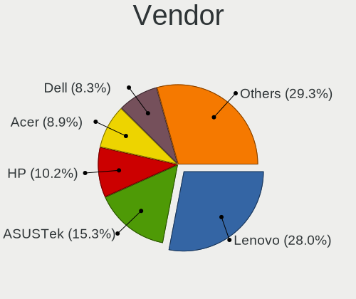
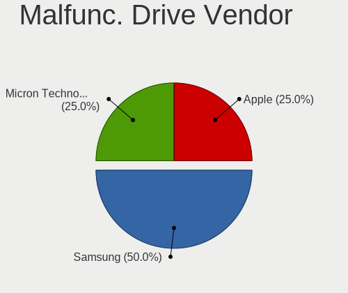

Arch Hardware Trends (Notebooks)
--------------------------------

A project to identify most popular hardware characteristics and track their change
over time based on data collected by Arch users at https://Linux-Hardware.org.

Anyone can contribute to this report by the [hw-probe](https://github.com/linuxhw/hw-probe) tool:

    sudo -E hw-probe -all -upload

Full-feature report is available here: https://linux-hardware.org/?view=trends

Period: Mar, 2022.

Contents
--------

* [ System ](#system)
  - [ OS                       ](#os)
  - [ OS Family                ](#os-family)
  - [ Kernel                   ](#kernel)
  - [ Kernel Family            ](#kernel-family)
  - [ Kernel Major Ver.        ](#kernel-major-ver)
  - [ Arch                     ](#arch)
  - [ DE                       ](#de)
  - [ Display Server           ](#display-server)
  - [ Display Manager          ](#display-manager)
  - [ OS Lang                  ](#os-lang)
  - [ Boot Mode                ](#boot-mode)
  - [ Filesystem               ](#filesystem)
  - [ Part. scheme             ](#part-scheme)
  - [ Dual Boot with Linux/BSD ](#dual-boot-with-linuxbsd)
  - [ Dual Boot (Win)          ](#dual-boot-win)

* [ Board ](#board)
  - [ Vendor                   ](#vendor)
  - [ Model                    ](#model)
  - [ Model Family             ](#model-family)
  - [ MFG Year                 ](#mfg-year)
  - [ Form Factor              ](#form-factor)
  - [ Secure Boot              ](#secure-boot)
  - [ Coreboot                 ](#coreboot)
  - [ RAM Size                 ](#ram-size)
  - [ RAM Used                 ](#ram-used)
  - [ Total Drives             ](#total-drives)
  - [ Has CD-ROM               ](#has-cd-rom)
  - [ Has Ethernet             ](#has-ethernet)
  - [ Has WiFi                 ](#has-wifi)
  - [ Has Bluetooth            ](#has-bluetooth)

* [ Location ](#location)
  - [ Country                  ](#country)
  - [ City                     ](#city)

* [ Drives ](#drives)
  - [ Drive Vendor             ](#drive-vendor)
  - [ Drive Model              ](#drive-model)
  - [ HDD Vendor               ](#hdd-vendor)
  - [ SSD Vendor               ](#ssd-vendor)
  - [ Drive Kind               ](#drive-kind)
  - [ Drive Connector          ](#drive-connector)
  - [ Drive Size               ](#drive-size)
  - [ Space Total              ](#space-total)
  - [ Space Used               ](#space-used)
  - [ Malfunc. Drives          ](#malfunc-drives)
  - [ Malfunc. Drive Vendor    ](#malfunc-drive-vendor)
  - [ Malfunc. HDD Vendor      ](#malfunc-hdd-vendor)
  - [ Malfunc. Drive Kind      ](#malfunc-drive-kind)
  - [ Failed Drives            ](#failed-drives)
  - [ Failed Drive Vendor      ](#failed-drive-vendor)
  - [ Drive Status             ](#drive-status)

* [ Storage controller ](#storage-controller)
  - [ Storage Vendor           ](#storage-vendor)
  - [ Storage Model            ](#storage-model)
  - [ Storage Kind             ](#storage-kind)

* [ Processor ](#processor)
  - [ CPU Vendor               ](#cpu-vendor)
  - [ CPU Model                ](#cpu-model)
  - [ CPU Model Family         ](#cpu-model-family)
  - [ CPU Cores                ](#cpu-cores)
  - [ CPU Sockets              ](#cpu-sockets)
  - [ CPU Threads              ](#cpu-threads)
  - [ CPU Op-Modes             ](#cpu-op-modes)
  - [ CPU Microcode            ](#cpu-microcode)
  - [ CPU Microarch            ](#cpu-microarch)

* [ Graphics ](#graphics)
  - [ GPU Vendor               ](#gpu-vendor)
  - [ GPU Model                ](#gpu-model)
  - [ GPU Combo                ](#gpu-combo)
  - [ GPU Driver               ](#gpu-driver)
  - [ GPU Memory               ](#gpu-memory)

* [ Monitor ](#monitor)
  - [ Monitor Vendor           ](#monitor-vendor)
  - [ Monitor Model            ](#monitor-model)
  - [ Monitor Resolution       ](#monitor-resolution)
  - [ Monitor Diagonal         ](#monitor-diagonal)
  - [ Monitor Width            ](#monitor-width)
  - [ Aspect Ratio             ](#aspect-ratio)
  - [ Monitor Area             ](#monitor-area)
  - [ Pixel Density            ](#pixel-density)
  - [ Multiple Monitors        ](#multiple-monitors)

* [ Network ](#network)
  - [ Net Controller Vendor    ](#net-controller-vendor)
  - [ Net Controller Model     ](#net-controller-model)
  - [ Wireless Vendor          ](#wireless-vendor)
  - [ Wireless Model           ](#wireless-model)
  - [ Ethernet Vendor          ](#ethernet-vendor)
  - [ Ethernet Model           ](#ethernet-model)
  - [ Net Controller Kind      ](#net-controller-kind)
  - [ Used Controller          ](#used-controller)
  - [ NICs                     ](#nics)
  - [ IPv6                     ](#ipv6)

* [ Bluetooth ](#bluetooth)
  - [ Bluetooth Vendor         ](#bluetooth-vendor)
  - [ Bluetooth Model          ](#bluetooth-model)

* [ Sound ](#sound)
  - [ Sound Vendor             ](#sound-vendor)
  - [ Sound Model              ](#sound-model)

* [ Memory ](#memory)
  - [ Memory Vendor            ](#memory-vendor)
  - [ Memory Model             ](#memory-model)
  - [ Memory Kind              ](#memory-kind)
  - [ Memory Form Factor       ](#memory-form-factor)
  - [ Memory Size              ](#memory-size)
  - [ Memory Speed             ](#memory-speed)

* [ Printers & scanners ](#printers--scanners)
  - [ Printer Vendor           ](#printer-vendor)
  - [ Printer Model            ](#printer-model)
  - [ Scanner Vendor           ](#scanner-vendor)
  - [ Scanner Model            ](#scanner-model)

* [ Camera ](#camera)
  - [ Camera Vendor            ](#camera-vendor)
  - [ Camera Model             ](#camera-model)

* [ Security ](#security)
  - [ Fingerprint Vendor       ](#fingerprint-vendor)
  - [ Fingerprint Model        ](#fingerprint-model)
  - [ Chipcard Vendor          ](#chipcard-vendor)
  - [ Chipcard Model           ](#chipcard-model)

* [ Unsupported ](#unsupported)
  - [ Unsupported Devices      ](#unsupported-devices)
  - [ Unsupported Device Types ](#unsupported-device-types)

System
------

OS
--

Installed operating systems

| Name         | Notebooks | Percent |
|--------------|-----------|---------|
| Arch         | 54        | 68.35%  |
| Arch Rolling | 25        | 31.65%  |

OS Family
---------

OS without a version

| Name | Notebooks | Percent |
|------|-----------|---------|
| Arch | 79        | 100%    |

Kernel
------

Version of the Linux kernel

| Version                  | Notebooks | Percent |
|--------------------------|-----------|---------|
| 5.16.16-arch1-1          | 18        | 22.78%  |
| 5.16.15-arch1-1          | 11        | 13.92%  |
| 5.16.13-arch1-1          | 7         | 8.86%   |
| 5.16.14-arch1-1          | 6         | 7.59%   |
| 5.17.1-arch1-1           | 4         | 5.06%   |
| 5.16.16-zen1-1-zen       | 4         | 5.06%   |
| 5.16.12-zen1-1-zen       | 4         | 5.06%   |
| 5.16.12-arch1-1          | 3         | 3.8%    |
| 5.16.11-arch1-2          | 3         | 3.8%    |
| 5.16.11-arch1-1          | 3         | 3.8%    |
| 5.15.31-1-lts            | 3         | 3.8%    |
| 5.16.15-zen1-1-zen       | 2         | 2.53%   |
| 5.16.14-zen1-1-zen       | 2         | 2.53%   |
| 5.16.7-zen1-1-zen        | 1         | 1.27%   |
| 5.16.5-arch1-1           | 1         | 1.27%   |
| 5.16.14-247-tkg-cfs-llvm | 1         | 1.27%   |
| 5.16.11-246-tkg-pds      | 1         | 1.27%   |
| 5.16.10-arch1-1          | 1         | 1.27%   |
| 5.15.30-1-lts            | 1         | 1.27%   |
| 5.15.27-xanmod1-1        | 1         | 1.27%   |
| 5.15.26-1-lts            | 1         | 1.27%   |
| 5.15.25-1-lts            | 1         | 1.27%   |

Kernel Family
-------------

Linux kernel without a distro release

| Version | Notebooks | Percent |
|---------|-----------|---------|
| 5.16.16 | 22        | 27.85%  |
| 5.16.15 | 13        | 16.46%  |
| 5.16.14 | 9         | 11.39%  |
| 5.16.13 | 7         | 8.86%   |
| 5.16.12 | 7         | 8.86%   |
| 5.16.11 | 7         | 8.86%   |
| 5.17.1  | 4         | 5.06%   |
| 5.15.31 | 3         | 3.8%    |
| 5.16.7  | 1         | 1.27%   |
| 5.16.5  | 1         | 1.27%   |
| 5.16.10 | 1         | 1.27%   |
| 5.15.30 | 1         | 1.27%   |
| 5.15.27 | 1         | 1.27%   |
| 5.15.26 | 1         | 1.27%   |
| 5.15.25 | 1         | 1.27%   |

Kernel Major Ver.
-----------------

Linux kernel major version

| Version | Notebooks | Percent |
|---------|-----------|---------|
| 5.16    | 68        | 86.08%  |
| 5.15    | 7         | 8.86%   |
| 5.17    | 4         | 5.06%   |

Arch
----

OS architecture (x86_64, i586, etc.)

| Name   | Notebooks | Percent |
|--------|-----------|---------|
| x86_64 | 79        | 100%    |

DE
--

Desktop Environment

| Name       | Notebooks | Percent |
|------------|-----------|---------|
| GNOME      | 29        | 36.71%  |
| KDE5       | 24        | 30.38%  |
| Unknown    | 7         | 8.86%   |
| XFCE       | 5         | 6.33%   |
| i3         | 3         | 3.8%    |
| awesome    | 3         | 3.8%    |
| X-Cinnamon | 2         | 2.53%   |
| sway       | 1         | 1.27%   |
| Pantheon   | 1         | 1.27%   |
| MATE       | 1         | 1.27%   |
| LXQt       | 1         | 1.27%   |
| dwm        | 1         | 1.27%   |
| Cinnamon   | 1         | 1.27%   |

Display Server
--------------

X11 or Wayland

| Name    | Notebooks | Percent |
|---------|-----------|---------|
| X11     | 48        | 60.76%  |
| Wayland | 24        | 30.38%  |
| Tty     | 5         | 6.33%   |
| Unknown | 2         | 2.53%   |

Display Manager
---------------

SDDM, LightDM, etc.

| Name    | Notebooks | Percent |
|---------|-----------|---------|
| Unknown | 35        | 44.3%   |
| SDDM    | 19        | 24.05%  |
| LightDM | 14        | 17.72%  |
| GDM     | 10        | 12.66%  |
| LXDM    | 1         | 1.27%   |

OS Lang
-------

Language

| Lang       | Notebooks | Percent |
|------------|-----------|---------|
| en_US      | 48        | 60.76%  |
| en_GB      | 6         | 7.59%   |
| pt_BR      | 3         | 3.8%    |
| it_IT      | 3         | 3.8%    |
| de_DE      | 3         | 3.8%    |
| C          | 3         | 3.8%    |
| ru_RU      | 2         | 2.53%   |
| szl_PL     | 1         | 1.27%   |
| hu_HU      | 1         | 1.27%   |
| fr_FR      | 1         | 1.27%   |
| es_MX.UTF8 | 1         | 1.27%   |
| es_ES      | 1         | 1.27%   |
| en_ZA      | 1         | 1.27%   |
| en_NZ      | 1         | 1.27%   |
| en_IN      | 1         | 1.27%   |
| en_DK      | 1         | 1.27%   |
| en_AU      | 1         | 1.27%   |
| Unknown    | 1         | 1.27%   |

Boot Mode
---------

EFI or BIOS

| Mode | Notebooks | Percent |
|------|-----------|---------|
| EFI  | 46        | 58.23%  |
| BIOS | 33        | 41.77%  |

Filesystem
----------

Type of filesystem

| Type  | Notebooks | Percent |
|-------|-----------|---------|
| Ext4  | 54        | 68.35%  |
| Btrfs | 20        | 25.32%  |
| Zfs   | 2         | 2.53%   |
| F2fs  | 2         | 2.53%   |
| Xfs   | 1         | 1.27%   |

Part. scheme
------------

Scheme of partitioning

| Type    | Notebooks | Percent |
|---------|-----------|---------|
| GPT     | 50        | 63.29%  |
| Unknown | 25        | 31.65%  |
| MBR     | 4         | 5.06%   |

Dual Boot with Linux/BSD
------------------------

Hosting more than one Linux/BSD

| Dual boot | Notebooks | Percent |
|-----------|-----------|---------|
| No        | 73        | 92.41%  |
| Yes       | 6         | 7.59%   |

Dual Boot (Win)
---------------

Hosting Linux and Windows

| Dual boot | Notebooks | Percent |
|-----------|-----------|---------|
| No        | 59        | 74.68%  |
| Yes       | 20        | 25.32%  |

Board
-----

Vendor
------

Motherboard manufacturer

| Name                   | Notebooks | Percent |
|------------------------|-----------|---------|
| Lenovo                 | 14        | 17.72%  |
| Hewlett-Packard        | 13        | 16.46%  |
| ASUSTek Computer       | 12        | 15.19%  |
| Dell                   | 9         | 11.39%  |
| Acer                   | 6         | 7.59%   |
| MSI                    | 5         | 6.33%   |
| HUAWEI                 | 4         | 5.06%   |
| Samsung Electronics    | 3         | 3.8%    |
| Toshiba                | 2         | 2.53%   |
| Notebook               | 2         | 2.53%   |
| Avell High Performance | 2         | 2.53%   |
| Timi                   | 1         | 1.27%   |
| System76               | 1         | 1.27%   |
| Packard Bell           | 1         | 1.27%   |
| HONOR                  | 1         | 1.27%   |
| Eluktronics            | 1         | 1.27%   |
| Apple                  | 1         | 1.27%   |
| Alienware              | 1         | 1.27%   |

Model
-----

Motherboard model

| Name                                   | Notebooks | Percent |
|----------------------------------------|-----------|---------|
| HP Laptop 14-dq0xxx                    | 2         | 2.53%   |
| ASUS ROG Strix G513QY_G513QY           | 2         | 2.53%   |
| Toshiba Satellite L655                 | 1         | 1.27%   |
| Toshiba Satellite C50-A                | 1         | 1.27%   |
| Timi TM1701                            | 1         | 1.27%   |
| System76 Lemur Pro                     | 1         | 1.27%   |
| Samsung R530/R730                      | 1         | 1.27%   |
| Samsung 767XCL                         | 1         | 1.27%   |
| Samsung 670Z5E                         | 1         | 1.27%   |
| Packard Bell DOT S                     | 1         | 1.27%   |
| Notebook NV4XMB,ME,MZ                  | 1         | 1.27%   |
| Notebook N85_N87,HJ,HJ1,HK1            | 1         | 1.27%   |
| MSI Stealth GS66 12UGS                 | 1         | 1.27%   |
| MSI Modern 14 B4MW                     | 1         | 1.27%   |
| MSI GP66 Leopard 11UG                  | 1         | 1.27%   |
| MSI GP62 7QF                           | 1         | 1.27%   |
| MSI GL63 9SD                           | 1         | 1.27%   |
| Lenovo V15 G2 ITL 82ME                 | 1         | 1.27%   |
| Lenovo ThinkPad X270 W10DG 20K5S14F00  | 1         | 1.27%   |
| Lenovo ThinkPad X220 4290LL3           | 1         | 1.27%   |
| Lenovo ThinkPad T490 20N2000KRT        | 1         | 1.27%   |
| Lenovo ThinkPad T14s Gen 1 20UHS0QT00  | 1         | 1.27%   |
| Lenovo ThinkPad P14s Gen 2a 21A00000FR | 1         | 1.27%   |
| Lenovo ThinkPad E15 Gen 2 20TD0003RA   | 1         | 1.27%   |
| Lenovo Legion 5 Pro 16ACH6H 82JQ       | 1         | 1.27%   |
| Lenovo Legion 5 15ARH05 82B5           | 1         | 1.27%   |
| Lenovo IdeaPad S145-15IWL 81S9         | 1         | 1.27%   |
| Lenovo IdeaPad 5 Pro 14ACN6 82L7       | 1         | 1.27%   |
| Lenovo IdeaPad 5 15ITL05 82FG          | 1         | 1.27%   |
| Lenovo IdeaPad 320-15ABR 80XS          | 1         | 1.27%   |
| Lenovo G565 20071                      | 1         | 1.27%   |
| HUAWEI NBLK-WAX9X                      | 1         | 1.27%   |
| HUAWEI KLVL-WXX9                       | 1         | 1.27%   |
| HUAWEI HVY-WXX9                        | 1         | 1.27%   |
| HUAWEI BOHB-WAX9                       | 1         | 1.27%   |
| HONOR NMH-WCX9                         | 1         | 1.27%   |
| HP ZBook 17 G2                         | 1         | 1.27%   |
| HP ProBook 455 G7                      | 1         | 1.27%   |
| HP ProBook 450 G4                      | 1         | 1.27%   |
| HP Pavilion Gaming Laptop 17-cd0xxx    | 1         | 1.27%   |
| HP Pavilion Gaming Laptop 15-dk1064TX  | 1         | 1.27%   |
| HP Laptop 14-fq1xxx                    | 1         | 1.27%   |
| HP Laptop 14-cm0xxx                    | 1         | 1.27%   |
| HP ENVY Laptop 13-ah0xxx               | 1         | 1.27%   |
| HP ENVY dv6                            | 1         | 1.27%   |
| HP EliteBook 840 G2                    | 1         | 1.27%   |
| HP EliteBook 820 G2                    | 1         | 1.27%   |
| Eluktronics Mech-15 G2                 | 1         | 1.27%   |
| Dell XPS 15 9550                       | 1         | 1.27%   |
| Dell XPS 15 9510                       | 1         | 1.27%   |
| Dell XPS 15 7590                       | 1         | 1.27%   |
| Dell Precision 5560                    | 1         | 1.27%   |
| Dell Latitude 9420                     | 1         | 1.27%   |
| Dell Latitude 7480                     | 1         | 1.27%   |
| Dell Inspiron 5566                     | 1         | 1.27%   |
| Dell Inspiron 3793                     | 1         | 1.27%   |
| Dell Inspiron 3185                     | 1         | 1.27%   |
| Avell High Performance B.ON            | 1         | 1.27%   |
| Avell High Performance 1513            | 1         | 1.27%   |
| ASUS X751LD                            | 1         | 1.27%   |

Model Family
------------

Motherboard model prefix

| Name                        | Notebooks | Percent |
|-----------------------------|-----------|---------|
| Lenovo ThinkPad             | 6         | 7.59%   |
| Lenovo IdeaPad              | 4         | 5.06%   |
| HP Laptop                   | 4         | 5.06%   |
| Dell XPS                    | 3         | 3.8%    |
| Dell Inspiron               | 3         | 3.8%    |
| ASUS ROG                    | 3         | 3.8%    |
| Acer Aspire                 | 3         | 3.8%    |
| Toshiba Satellite           | 2         | 2.53%   |
| Lenovo Legion               | 2         | 2.53%   |
| HP ProBook                  | 2         | 2.53%   |
| HP Pavilion                 | 2         | 2.53%   |
| HP ENVY                     | 2         | 2.53%   |
| HP EliteBook                | 2         | 2.53%   |
| Dell Latitude               | 2         | 2.53%   |
| ASUS VivoBook               | 2         | 2.53%   |
| Acer Nitro                  | 2         | 2.53%   |
| Timi TM1701                 | 1         | 1.27%   |
| System76 Lemur              | 1         | 1.27%   |
| Samsung R530                | 1         | 1.27%   |
| Samsung 767XCL              | 1         | 1.27%   |
| Samsung 670Z5E              | 1         | 1.27%   |
| Packard Bell DOT            | 1         | 1.27%   |
| Notebook NV4XMB             | 1         | 1.27%   |
| Notebook N85                | 1         | 1.27%   |
| MSI Stealth                 | 1         | 1.27%   |
| MSI Modern                  | 1         | 1.27%   |
| MSI GP66                    | 1         | 1.27%   |
| MSI GP62                    | 1         | 1.27%   |
| MSI GL63                    | 1         | 1.27%   |
| Lenovo V15                  | 1         | 1.27%   |
| Lenovo G565                 | 1         | 1.27%   |
| HUAWEI NBLK-WAX9X           | 1         | 1.27%   |
| HUAWEI KLVL-WXX9            | 1         | 1.27%   |
| HUAWEI HVY-WXX9             | 1         | 1.27%   |
| HUAWEI BOHB-WAX9            | 1         | 1.27%   |
| HONOR NMH-WCX9              | 1         | 1.27%   |
| HP ZBook                    | 1         | 1.27%   |
| Eluktronics Mech-15         | 1         | 1.27%   |
| Dell Precision              | 1         | 1.27%   |
| Avell High Performance B.ON | 1         | 1.27%   |
| Avell High Performance 1513 | 1         | 1.27%   |
| ASUS X751LD                 | 1         | 1.27%   |
| ASUS X550VX                 | 1         | 1.27%   |
| ASUS X510UNR                | 1         | 1.27%   |
| ASUS X510UAR                | 1         | 1.27%   |
| ASUS GL752VW                | 1         | 1.27%   |
| ASUS GL552VW                | 1         | 1.27%   |
| ASUS ASUS                   | 1         | 1.27%   |
| Apple MacBookPro10          | 1         | 1.27%   |
| Alienware 15                | 1         | 1.27%   |
| Acer E1-510                 | 1         | 1.27%   |

MFG Year
--------

Motherboard manufacture year

| Year | Notebooks | Percent |
|------|-----------|---------|
| 2021 | 19        | 24.05%  |
| 2020 | 13        | 16.46%  |
| 2019 | 10        | 12.66%  |
| 2017 | 8         | 10.13%  |
| 2015 | 7         | 8.86%   |
| 2018 | 5         | 6.33%   |
| 2016 | 5         | 6.33%   |
| 2013 | 3         | 3.8%    |
| 2010 | 3         | 3.8%    |
| 2014 | 2         | 2.53%   |
| 2012 | 2         | 2.53%   |
| 2011 | 2         | 2.53%   |

Form Factor
-----------

Physical design of the computer

| Name     | Notebooks | Percent |
|----------|-----------|---------|
| Notebook | 79        | 100%    |

Secure Boot
-----------

Enabled or disabled

| State    | Notebooks | Percent |
|----------|-----------|---------|
| Disabled | 79        | 100%    |

Coreboot
--------

Have coreboot on board

| Used | Notebooks | Percent |
|------|-----------|---------|
| No   | 78        | 98.73%  |
| Yes  | 1         | 1.27%   |

RAM Size
--------

Total RAM memory

| Size in GB  | Notebooks | Percent |
|-------------|-----------|---------|
| 16.01-24.0  | 22        | 27.85%  |
| 4.01-8.0    | 18        | 22.78%  |
| 32.01-64.0  | 13        | 16.46%  |
| 8.01-16.0   | 13        | 16.46%  |
| 3.01-4.0    | 10        | 12.66%  |
| 2.01-3.0    | 1         | 1.27%   |
| 64.01-256.0 | 1         | 1.27%   |
| 1.01-2.0    | 1         | 1.27%   |

RAM Used
--------

Used RAM memory

| Used GB   | Notebooks | Percent |
|-----------|-----------|---------|
| 2.01-3.0  | 21        | 26.58%  |
| 1.01-2.0  | 21        | 26.58%  |
| 4.01-8.0  | 19        | 24.05%  |
| 3.01-4.0  | 12        | 15.19%  |
| 8.01-16.0 | 4         | 5.06%   |
| 0.51-1.0  | 1         | 1.27%   |
| 0.01-0.5  | 1         | 1.27%   |

Total Drives
------------

Number of drives on board

| Drives | Notebooks | Percent |
|--------|-----------|---------|
| 1      | 50        | 63.29%  |
| 2      | 25        | 31.65%  |
| 3      | 4         | 5.06%   |

Has CD-ROM
----------

Has CD-ROM on board

| Presented | Notebooks | Percent |
|-----------|-----------|---------|
| No        | 64        | 81.01%  |
| Yes       | 15        | 18.99%  |

Has Ethernet
------------

Has Ethernet on board

| Presented | Notebooks | Percent |
|-----------|-----------|---------|
| Yes       | 56        | 70.89%  |
| No        | 23        | 29.11%  |

Has WiFi
--------

Has WiFi module

| Presented | Notebooks | Percent |
|-----------|-----------|---------|
| Yes       | 77        | 97.47%  |
| No        | 2         | 2.53%   |

Has Bluetooth
-------------

Has Bluetooth module

| Presented | Notebooks | Percent |
|-----------|-----------|---------|
| Yes       | 74        | 93.67%  |
| No        | 5         | 6.33%   |

Location
--------

Country
-------

Geographic location (country)

| Country         | Notebooks | Percent |
|-----------------|-----------|---------|
| USA             | 14        | 17.72%  |
| Brazil          | 9         | 11.39%  |
| Poland          | 6         | 7.59%   |
| France          | 5         | 6.33%   |
| UK              | 4         | 5.06%   |
| Russia          | 4         | 5.06%   |
| Portugal        | 3         | 3.8%    |
| Italy           | 3         | 3.8%    |
| Germany         | 3         | 3.8%    |
| Spain           | 2         | 2.53%   |
| Canada          | 2         | 2.53%   |
| Bangladesh      | 2         | 2.53%   |
| Australia       | 2         | 2.53%   |
| Ukraine         | 1         | 1.27%   |
| Turkey          | 1         | 1.27%   |
| Sri Lanka       | 1         | 1.27%   |
| South Africa    | 1         | 1.27%   |
| Slovenia        | 1         | 1.27%   |
| North Macedonia | 1         | 1.27%   |
| New Zealand     | 1         | 1.27%   |
| Netherlands     | 1         | 1.27%   |
| Mexico          | 1         | 1.27%   |
| Ireland         | 1         | 1.27%   |
| Iran            | 1         | 1.27%   |
| Indonesia       | 1         | 1.27%   |
| India           | 1         | 1.27%   |
| Hungary         | 1         | 1.27%   |
| Georgia         | 1         | 1.27%   |
| Finland         | 1         | 1.27%   |
| Estonia         | 1         | 1.27%   |
| Chile           | 1         | 1.27%   |
| Austria         | 1         | 1.27%   |
| Algeria         | 1         | 1.27%   |

City
----

Geographic location (city)

| City                      | Notebooks | Percent |
|---------------------------|-----------|---------|
| Warsaw                    | 3         | 3.8%    |
| St Petersburg             | 2         | 2.53%   |
| Sao Paulo                 | 2         | 2.53%   |
| Paris                     | 2         | 2.53%   |
| Munich                    | 2         | 2.53%   |
| Madrid                    | 2         | 2.53%   |
| Dhaka                     | 2         | 2.53%   |
| Baton Rouge               | 2         | 2.53%   |
| Wroclaw                   | 1         | 1.27%   |
| Whangarei                 | 1         | 1.27%   |
| Webster                   | 1         | 1.27%   |
| Viña del Mar             | 1         | 1.27%   |
| Valencia                  | 1         | 1.27%   |
| Uberlândia               | 1         | 1.27%   |
| Taubate                   | 1         | 1.27%   |
| Tampere                   | 1         | 1.27%   |
| Tallinn                   | 1         | 1.27%   |
| Sydney                    | 1         | 1.27%   |
| Southend-on-Sea           | 1         | 1.27%   |
| Skopje                    | 1         | 1.27%   |
| Sheffield                 | 1         | 1.27%   |
| Setúbal                  | 1         | 1.27%   |
| San Luis Potosí City     | 1         | 1.27%   |
| Saint-Mathieu-de-Treviers | 1         | 1.27%   |
| Sacramento                | 1         | 1.27%   |
| Ryazan                    | 1         | 1.27%   |
| Roseville                 | 1         | 1.27%   |
| Riverside                 | 1         | 1.27%   |
| Rho                       | 1         | 1.27%   |
| Rexburg                   | 1         | 1.27%   |
| Recife                    | 1         | 1.27%   |
| Reading                   | 1         | 1.27%   |
| Rasht                     | 1         | 1.27%   |
| Queens                    | 1         | 1.27%   |
| Poznan                    | 1         | 1.27%   |
| Porto                     | 1         | 1.27%   |
| Perpignan                 | 1         | 1.27%   |
| Pannipitiya               | 1         | 1.27%   |
| Moscow                    | 1         | 1.27%   |
| Montreal                  | 1         | 1.27%   |
| Minneapolis               | 1         | 1.27%   |
| Melbourne                 | 1         | 1.27%   |
| Maua                      | 1         | 1.27%   |
| Los Angeles               | 1         | 1.27%   |
| Lille                     | 1         | 1.27%   |
| Leyton                    | 1         | 1.27%   |
| Kyiv                      | 1         | 1.27%   |
| Krasnystaw                | 1         | 1.27%   |
| Kirchberg                 | 1         | 1.27%   |
| Kamnik                    | 1         | 1.27%   |
| K'alak'i T'bilisi         | 1         | 1.27%   |
| Januaria                  | 1         | 1.27%   |
| Istanbul                  | 1         | 1.27%   |
| Ijui                      | 1         | 1.27%   |
| Iesi                      | 1         | 1.27%   |
| Forney                    | 1         | 1.27%   |
| Faro                      | 1         | 1.27%   |
| Erode                     | 1         | 1.27%   |
| Eger                      | 1         | 1.27%   |
| East Wenatchee            | 1         | 1.27%   |

Drives
------

Drive Vendor
------------

Hard drive vendors

| Vendor              | Notebooks | Drives | Percent |
|---------------------|-----------|--------|---------|
| Samsung Electronics | 23        | 26     | 21.5%   |
| WDC                 | 12        | 12     | 11.21%  |
| Seagate             | 8         | 8      | 7.48%   |
| Sandisk             | 8         | 9      | 7.48%   |
| Kingston            | 7         | 7      | 6.54%   |
| Toshiba             | 6         | 6      | 5.61%   |
| SK Hynix            | 6         | 6      | 5.61%   |
| Crucial             | 6         | 7      | 5.61%   |
| Unknown             | 4         | 4      | 3.74%   |
| LITEON              | 3         | 3      | 2.8%    |
| Intel               | 3         | 3      | 2.8%    |
| HGST                | 3         | 3      | 2.8%    |
| Phison              | 2         | 2      | 1.87%   |
| Micron Technology   | 2         | 2      | 1.87%   |
| A-DATA Technology   | 2         | 2      | 1.87%   |
| YMTC                | 1         | 1      | 0.93%   |
| UMIS                | 1         | 1      | 0.93%   |
| SSSTC               | 1         | 1      | 0.93%   |
| Netac               | 1         | 1      | 0.93%   |
| Lexar               | 1         | 1      | 0.93%   |
| KingSpec            | 1         | 1      | 0.93%   |
| Intenso             | 1         | 1      | 0.93%   |
| Hitachi             | 1         | 1      | 0.93%   |
| Dell                | 1         | 1      | 0.93%   |
| BHT                 | 1         | 1      | 0.93%   |
| Apple               | 1         | 1      | 0.93%   |
| Unknown             | 1         | 1      | 0.93%   |

Drive Model
-----------

Hard drive models

| Model                                     | Notebooks | Percent |
|-------------------------------------------|-----------|---------|
| Samsung NVMe SSD Drive 512GB              | 4         | 3.57%   |
| Samsung NVMe SSD Drive 256GB              | 3         | 2.68%   |
| HGST HTS721010A9E630 1TB                  | 3         | 2.68%   |
| Seagate ST1000LM024 HN-M101MBB 1TB        | 2         | 1.79%   |
| Sandisk NVMe SSD Drive 1TB                | 2         | 1.79%   |
| Samsung NVMe SSD Drive 500GB              | 2         | 1.79%   |
| LITEON CV8-8E128-HP 128GB SSD             | 2         | 1.79%   |
| YMTC PC005 512GB                          | 1         | 0.89%   |
| WDC WDS500G2B0B-00YS70 500GB SSD          | 1         | 0.89%   |
| WDC WD5000LPCX-21VHAT0 500GB              | 1         | 0.89%   |
| WDC WD3200BPVT-22JJ5T0 320GB              | 1         | 0.89%   |
| WDC WD10SPZX-75Z10T1 1TB                  | 1         | 0.89%   |
| WDC WD10SPZX-22Z10T1 1TB                  | 1         | 0.89%   |
| WDC WD10SPZX-21Z10T0 1TB                  | 1         | 0.89%   |
| WDC WD10SPSX-08A6W 1TB                    | 1         | 0.89%   |
| WDC WD10JPVX-60JC3T0 1TB                  | 1         | 0.89%   |
| WDC WD10JPVX-22JC3T0 1TB                  | 1         | 0.89%   |
| WDC PC SN730 SDBPNTY-512G-1027 512GB      | 1         | 0.89%   |
| WDC PC SN530 NVMe 512GB                   | 1         | 0.89%   |
| WDC PC SN520 NVMe 512GB                   | 1         | 0.89%   |
| Unknown xD/SD/M.S.                        | 1         | 0.89%   |
| Unknown SD/MMC/MS PRO 32GB                | 1         | 0.89%   |
| Unknown MMC Card  64GB                    | 1         | 0.89%   |
| Unknown MMC Card  32GB                    | 1         | 0.89%   |
| UMIS RPETJ512MGE2QDQ 512GB                | 1         | 0.89%   |
| Toshiba MQ04ABF100 1TB                    | 1         | 0.89%   |
| Toshiba MQ02ABD100H 1TB                   | 1         | 0.89%   |
| Toshiba MQ01ABF050 500GB                  | 1         | 0.89%   |
| Toshiba MQ01ABD100 1TB                    | 1         | 0.89%   |
| Toshiba MK5065GSXN 500GB                  | 1         | 0.89%   |
| Toshiba KBG30ZMV256G 256GB                | 1         | 0.89%   |
| SSSTC CL1-4D256 256GB                     | 1         | 0.89%   |
| SK Hynix SKHynix_HFS512GD9TNG-L5B0B 512GB | 1         | 0.89%   |
| SK Hynix PC601 SED NVMe 512GB             | 1         | 0.89%   |
| SK Hynix NVMe SSD Drive 512GB             | 1         | 0.89%   |
| SK Hynix NVMe SSD Drive 1TB               | 1         | 0.89%   |
| SK Hynix HFM512GDJTNG-8310A 512GB         | 1         | 0.89%   |
| SK Hynix BC511 HFM256GDJTNI-82A0A 256GB   | 1         | 0.89%   |
| Seagate ST9500325AS 500GB                 | 1         | 0.89%   |
| Seagate ST500LM012 HN-M500MBB 500GB       | 1         | 0.89%   |
| Seagate ST2000LX001-1RG174 2TB            | 1         | 0.89%   |
| Seagate ST1000LM049-2GH172 1TB            | 1         | 0.89%   |
| Seagate ST1000LM048-2E7172 1TB            | 1         | 0.89%   |
| Seagate ST1000LM035-1RK172 1TB            | 1         | 0.89%   |
| SanDisk SD8SN8U256G1002 256GB SSD         | 1         | 0.89%   |
| Sandisk NVMe SSD Drive 512GB              | 1         | 0.89%   |
| Sandisk NVMe SSD Drive 500GB              | 1         | 0.89%   |
| Sandisk NVMe SSD Drive 2TB                | 1         | 0.89%   |
| Sandisk NVMe SSD Drive 256GB              | 1         | 0.89%   |
| Sandisk NVMe SSD Drive 1024GB             | 1         | 0.89%   |
| SanDisk Extreme SSD 2TB                   | 1         | 0.89%   |
| Samsung SSD 980 PRO 2TB                   | 1         | 0.89%   |
| Samsung SSD 970 EVO Plus 2TB              | 1         | 0.89%   |
| Samsung SSD 970 EVO Plus 250GB            | 1         | 0.89%   |
| Samsung SSD 970 EVO Plus 1TB              | 1         | 0.89%   |
| Samsung SSD 970 EVO 250GB                 | 1         | 0.89%   |
| Samsung SSD 860 EVO M.2 250GB             | 1         | 0.89%   |
| Samsung SSD 860 EVO 500GB                 | 1         | 0.89%   |
| Samsung SSD 830 Series 64GB               | 1         | 0.89%   |
| Samsung PM9A1 NVMe 1024GB                 | 1         | 0.89%   |

HDD Vendor
----------

Hard disk drive vendors

| Vendor  | Notebooks | Drives | Percent |
|---------|-----------|--------|---------|
| WDC     | 8         | 8      | 30.77%  |
| Seagate | 8         | 8      | 30.77%  |
| Toshiba | 5         | 5      | 19.23%  |
| HGST    | 3         | 3      | 11.54%  |
| Unknown | 1         | 1      | 3.85%   |
| Hitachi | 1         | 1      | 3.85%   |

SSD Vendor
----------

Solid state drive vendors

| Vendor              | Notebooks | Drives | Percent |
|---------------------|-----------|--------|---------|
| Samsung Electronics | 5         | 5      | 20%     |
| Crucial             | 5         | 6      | 20%     |
| SanDisk             | 2         | 2      | 8%      |
| LITEON              | 2         | 2      | 8%      |
| Kingston            | 2         | 2      | 8%      |
| WDC                 | 1         | 1      | 4%      |
| Netac               | 1         | 1      | 4%      |
| Lexar               | 1         | 1      | 4%      |
| KingSpec            | 1         | 1      | 4%      |
| Intenso             | 1         | 1      | 4%      |
| Dell                | 1         | 1      | 4%      |
| BHT                 | 1         | 1      | 4%      |
| Apple               | 1         | 1      | 4%      |
| A-DATA Technology   | 1         | 1      | 4%      |

Drive Kind
----------

HDD or SSD

| Kind    | Notebooks | Drives | Percent |
|---------|-----------|--------|---------|
| NVMe    | 48        | 56     | 47.52%  |
| HDD     | 26        | 26     | 25.74%  |
| SSD     | 23        | 26     | 22.77%  |
| MMC     | 3         | 3      | 2.97%   |
| Unknown | 1         | 1      | 0.99%   |

Drive Connector
---------------

SATA, SAS, NVMe, etc.

| Type | Notebooks | Drives | Percent |
|------|-----------|--------|---------|
| NVMe | 48        | 56     | 49.48%  |
| SATA | 42        | 49     | 43.3%   |
| SAS  | 4         | 4      | 4.12%   |
| MMC  | 3         | 3      | 3.09%   |

Drive Size
----------

Size of hard drive

| Size in TB | Notebooks | Drives | Percent |
|------------|-----------|--------|---------|
| 0.01-0.5   | 26        | 28     | 52%     |
| 0.51-1.0   | 21        | 21     | 42%     |
| 1.01-2.0   | 3         | 3      | 6%      |

Space Total
-----------

Amount of disk space available on the file system

| Size in GB     | Notebooks | Percent |
|----------------|-----------|---------|
| 251-500        | 22        | 27.85%  |
| 101-250        | 20        | 25.32%  |
| 501-1000       | 12        | 15.19%  |
| 1001-2000      | 7         | 8.86%   |
| 2001-3000      | 5         | 6.33%   |
| 51-100         | 4         | 5.06%   |
| Unknown        | 4         | 5.06%   |
| More than 3000 | 3         | 3.8%    |
| 1-20           | 2         | 2.53%   |

Space Used
----------

Amount of used disk space

| Used GB        | Notebooks | Percent |
|----------------|-----------|---------|
| 101-250        | 18        | 22.78%  |
| 1-20           | 16        | 20.25%  |
| 51-100         | 14        | 17.72%  |
| 21-50          | 12        | 15.19%  |
| 251-500        | 9         | 11.39%  |
| Unknown        | 4         | 5.06%   |
| 501-1000       | 3         | 3.8%    |
| 1001-2000      | 2         | 2.53%   |
| More than 3000 | 1         | 1.27%   |

Malfunc. Drives
---------------

Drive models with a malfunction

| Model                               | Notebooks | Drives | Percent |
|-------------------------------------|-----------|--------|---------|
| WDC WD3200BPVT-22JJ5T0 320GB        | 1         | 1      | 25%     |
| Seagate ST500LM012 HN-M500MBB 500GB | 1         | 1      | 25%     |
| LITEON CV8-8E128-HP 128GB SSD       | 1         | 1      | 25%     |
| Kingston SNS4151S316GD 16GB SSD     | 1         | 1      | 25%     |

Malfunc. Drive Vendor
---------------------

Vendors of faulty drives

| Vendor   | Notebooks | Drives | Percent |
|----------|-----------|--------|---------|
| WDC      | 1         | 1      | 25%     |
| Seagate  | 1         | 1      | 25%     |
| LITEON   | 1         | 1      | 25%     |
| Kingston | 1         | 1      | 25%     |

Malfunc. HDD Vendor
-------------------

Vendors of faulty HDD drives

| Vendor  | Notebooks | Drives | Percent |
|---------|-----------|--------|---------|
| WDC     | 1         | 1      | 50%     |
| Seagate | 1         | 1      | 50%     |

Malfunc. Drive Kind
-------------------

Kinds of faulty drives

| Kind | Notebooks | Drives | Percent |
|------|-----------|--------|---------|
| SSD  | 2         | 2      | 50%     |
| HDD  | 2         | 2      | 50%     |

Failed Drives
-------------

Failed drive models

Zero info for selected period =(

Failed Drive Vendor
-------------------

Failed drive vendors

Zero info for selected period =(

Drive Status
------------

Number of failed and malfunc. drives

| Status   | Notebooks | Drives | Percent |
|----------|-----------|--------|---------|
| Works    | 41        | 51     | 48.81%  |
| Detected | 39        | 57     | 46.43%  |
| Malfunc  | 4         | 4      | 4.76%   |

Storage controller
------------------

Storage Vendor
--------------

Storage controller vendors

| Vendor                         | Notebooks | Percent |
|--------------------------------|-----------|---------|
| Intel                          | 45        | 42.86%  |
| Samsung Electronics            | 18        | 17.14%  |
| AMD                            | 11        | 10.48%  |
| Sandisk                        | 9         | 8.57%   |
| SK Hynix                       | 6         | 5.71%   |
| Kingston Technology Company    | 5         | 4.76%   |
| Phison Electronics             | 2         | 1.9%    |
| Micron Technology              | 2         | 1.9%    |
| Yangtze Memory Technologies    | 1         | 0.95%   |
| Union Memory (Shenzhen)        | 1         | 0.95%   |
| Toshiba America Info Systems   | 1         | 0.95%   |
| Solid State Storage Technology | 1         | 0.95%   |
| Micron/Crucial Technology      | 1         | 0.95%   |
| Lite-On Technology             | 1         | 0.95%   |
| ADATA Technology               | 1         | 0.95%   |

Storage Model
-------------

Storage controller models

| Model                                                                          | Notebooks | Percent |
|--------------------------------------------------------------------------------|-----------|---------|
| Samsung NVMe SSD Controller SM981/PM981/PM983                                  | 10        | 8.93%   |
| AMD FCH SATA Controller [AHCI mode]                                            | 10        | 8.93%   |
| Intel Sunrise Point-LP SATA Controller [AHCI mode]                             | 8         | 7.14%   |
| Samsung NVMe SSD Controller 980                                                | 7         | 6.25%   |
| Intel HM170/QM170 Chipset SATA Controller [AHCI Mode]                          | 7         | 6.25%   |
| Intel 82801 Mobile SATA Controller [RAID mode]                                 | 5         | 4.46%   |
| Sandisk WD Blue SN550 NVMe SSD                                                 | 4         | 3.57%   |
| Intel Volume Management Device NVMe RAID Controller                            | 4         | 3.57%   |
| Intel Cannon Lake Mobile PCH SATA AHCI Controller                              | 4         | 3.57%   |
| Sandisk Non-Volatile memory controller                                         | 3         | 2.68%   |
| Intel 7 Series Chipset Family 6-port SATA Controller [AHCI mode]               | 3         | 2.68%   |
| SK Hynix Non-Volatile memory controller                                        | 2         | 1.79%   |
| SK Hynix BC501 NVMe Solid State Drive                                          | 2         | 1.79%   |
| Samsung NVMe SSD Controller PM9A1/PM9A3/980PRO                                 | 2         | 1.79%   |
| Micron Non-Volatile memory controller                                          | 2         | 1.79%   |
| Kingston Company Company Non-Volatile memory controller                        | 2         | 1.79%   |
| Kingston Company A2000 NVMe SSD                                                | 2         | 1.79%   |
| Intel Tiger Lake-LP SATA Controller [AHCI mode]                                | 2         | 1.79%   |
| Intel SSD 660P Series                                                          | 2         | 1.79%   |
| Intel 8 Series SATA Controller 1 [AHCI mode]                                   | 2         | 1.79%   |
| Intel 6 Series/C200 Series Chipset Family 6 port Mobile SATA AHCI Controller   | 2         | 1.79%   |
| Yangtze Memory Non-Volatile memory controller                                  | 1         | 0.89%   |
| Union Memory (Shenzhen) AM630 PCIe 4.0 x4 NVMe SSD Controller                  | 1         | 0.89%   |
| Toshiba America Info Systems BG3 NVMe SSD Controller                           | 1         | 0.89%   |
| Solid State Storage Non-Volatile memory controller                             | 1         | 0.89%   |
| SK Hynix Gold P31 SSD                                                          | 1         | 0.89%   |
| SK Hynix BC511                                                                 | 1         | 0.89%   |
| Sandisk WD Black SN750 / PC SN730 NVMe SSD                                     | 1         | 0.89%   |
| Sandisk PC SN520 NVMe SSD                                                      | 1         | 0.89%   |
| Samsung NVMe SSD Controller SM961/PM961/SM963                                  | 1         | 0.89%   |
| Phison PS5013 E13 NVMe Controller                                              | 1         | 0.89%   |
| Phison NVMe Storage Controller                                                 | 1         | 0.89%   |
| Micron/Crucial P1 NVMe PCIe SSD                                                | 1         | 0.89%   |
| Lite-On Non-Volatile memory controller                                         | 1         | 0.89%   |
| Kingston Company OM3PDP3 NVMe SSD                                              | 1         | 0.89%   |
| Intel Wildcat Point-LP SATA Controller [AHCI Mode]                             | 1         | 0.89%   |
| Intel Non-Volatile memory controller                                           | 1         | 0.89%   |
| Intel NM10/ICH7 Family SATA Controller [AHCI mode]                             | 1         | 0.89%   |
| Intel Ice Lake-LP SATA Controller [AHCI mode]                                  | 1         | 0.89%   |
| Intel Comet Lake SATA AHCI Controller                                          | 1         | 0.89%   |
| Intel Cannon Point-LP SATA Controller [AHCI Mode]                              | 1         | 0.89%   |
| Intel Atom Processor E3800 Series SATA AHCI Controller                         | 1         | 0.89%   |
| Intel 82801IBM/IEM (ICH9M/ICH9M-E) 4 port SATA Controller [AHCI mode]          | 1         | 0.89%   |
| Intel 8 Series/C220 Series Chipset Family 6-port SATA Controller 1 [AHCI mode] | 1         | 0.89%   |
| Intel 5 Series/3400 Series Chipset 4 port SATA AHCI Controller                 | 1         | 0.89%   |
| AMD SB7x0/SB8x0/SB9x0 SATA Controller [AHCI mode]                              | 1         | 0.89%   |
| AMD SB7x0/SB8x0/SB9x0 IDE Controller                                           | 1         | 0.89%   |
| ADATA Non-Volatile memory controller                                           | 1         | 0.89%   |

Storage Kind
------------

Kind of storage controller (IDE, SATA, NVMe, SAS, ...)

| Kind | Notebooks | Percent |
|------|-----------|---------|
| NVMe | 48        | 45.28%  |
| SATA | 48        | 45.28%  |
| RAID | 9         | 8.49%   |
| IDE  | 1         | 0.94%   |

Processor
---------

CPU Vendor
----------

Processor vendors

| Vendor | Notebooks | Percent |
|--------|-----------|---------|
| Intel  | 58        | 73.42%  |
| AMD    | 21        | 26.58%  |

CPU Model
---------

Processor models

| Model                                           | Notebooks | Percent |
|-------------------------------------------------|-----------|---------|
| Intel Core i7-8550U CPU @ 1.80GHz               | 4         | 5.06%   |
| Intel Core i7-6700HQ CPU @ 2.60GHz              | 4         | 5.06%   |
| Intel 11th Gen Core i7-1165G7 @ 2.80GHz         | 4         | 5.06%   |
| Intel 11th Gen Core i5-1135G7 @ 2.40GHz         | 3         | 3.8%    |
| Intel Core i7-8750H CPU @ 2.20GHz               | 2         | 2.53%   |
| Intel Core i7-8565U CPU @ 1.80GHz               | 2         | 2.53%   |
| Intel Core i7-7700HQ CPU @ 2.80GHz              | 2         | 2.53%   |
| Intel Core i5-6300U CPU @ 2.40GHz               | 2         | 2.53%   |
| Intel Core i5-5300U CPU @ 2.30GHz               | 2         | 2.53%   |
| Intel Core i3-8145U CPU @ 2.10GHz               | 2         | 2.53%   |
| Intel 11th Gen Core i7-11800H @ 2.30GHz         | 2         | 2.53%   |
| AMD Ryzen 9 5900HX with Radeon Graphics         | 2         | 2.53%   |
| AMD Ryzen 7 5800H with Radeon Graphics          | 2         | 2.53%   |
| AMD Ryzen 7 4700U with Radeon Graphics          | 2         | 2.53%   |
| AMD Ryzen 5 5500U with Radeon Graphics          | 2         | 2.53%   |
| AMD Ryzen 5 4600H with Radeon Graphics          | 2         | 2.53%   |
| Intel Pentium CPU P6200 @ 2.13GHz               | 1         | 1.27%   |
| Intel Pentium CPU B960 @ 2.20GHz                | 1         | 1.27%   |
| Intel Core i9-9980HK CPU @ 2.40GHz              | 1         | 1.27%   |
| Intel Core i7-9750H CPU @ 2.60GHz               | 1         | 1.27%   |
| Intel Core i7-4810MQ CPU @ 2.80GHz              | 1         | 1.27%   |
| Intel Core i7-3820QM CPU @ 2.70GHz              | 1         | 1.27%   |
| Intel Core i7-10750H CPU @ 2.60GHz              | 1         | 1.27%   |
| Intel Core i7-1065G7 CPU @ 1.30GHz              | 1         | 1.27%   |
| Intel Core i5-L16G7 CPU @ 1.40GHz               | 1         | 1.27%   |
| Intel Core i5-9300H CPU @ 2.40GHz               | 1         | 1.27%   |
| Intel Core i5-8265U CPU @ 1.60GHz               | 1         | 1.27%   |
| Intel Core i5-8250U CPU @ 1.60GHz               | 1         | 1.27%   |
| Intel Core i5-7300HQ CPU @ 2.50GHz              | 1         | 1.27%   |
| Intel Core i5-4210U CPU @ 1.70GHz               | 1         | 1.27%   |
| Intel Core i5-4200U CPU @ 1.60GHz               | 1         | 1.27%   |
| Intel Core i5-3230M CPU @ 2.60GHz               | 1         | 1.27%   |
| Intel Core i5-2520M CPU @ 2.50GHz               | 1         | 1.27%   |
| Intel Core i5-10300H CPU @ 2.50GHz              | 1         | 1.27%   |
| Intel Core i3-7100U CPU @ 2.40GHz               | 1         | 1.27%   |
| Intel Core i3-6006U CPU @ 2.00GHz               | 1         | 1.27%   |
| Intel Core i3-3110M CPU @ 2.40GHz               | 1         | 1.27%   |
| Intel Core i3-10110U CPU @ 2.10GHz              | 1         | 1.27%   |
| Intel Core 2 Duo CPU T6600 @ 2.20GHz            | 1         | 1.27%   |
| Intel Celeron CPU N2920 @ 1.86GHz               | 1         | 1.27%   |
| Intel Atom CPU N2800 @ 1.86GHz                  | 1         | 1.27%   |
| Intel 12th Gen Core i7-12700H                   | 1         | 1.27%   |
| Intel 11th Gen Core i9-11950H @ 2.60GHz         | 1         | 1.27%   |
| Intel 11th Gen Core i7-1185G7 @ 3.00GHz         | 1         | 1.27%   |
| Intel 11th Gen Core i5-11300H @ 3.10GHz         | 1         | 1.27%   |
| AMD Turion II P540 Dual-Core Processor          | 1         | 1.27%   |
| AMD Ryzen 7 PRO 5850U with Radeon Graphics      | 1         | 1.27%   |
| AMD Ryzen 7 5800U with Radeon Graphics          | 1         | 1.27%   |
| AMD Ryzen 7 4800H with Radeon Graphics          | 1         | 1.27%   |
| AMD Ryzen 7 3750H with Radeon Vega Mobile Gfx   | 1         | 1.27%   |
| AMD Ryzen 5 PRO 4650U with Radeon Graphics      | 1         | 1.27%   |
| AMD Ryzen 5 3500U with Radeon Vega Mobile Gfx   | 1         | 1.27%   |
| AMD A6-9220e RADEON R4, 5 COMPUTE CORES 2C+3G   | 1         | 1.27%   |
| AMD A4-9125 RADEON R3, 4 COMPUTE CORES 2C+2G    | 1         | 1.27%   |
| AMD A4-4300M APU with Radeon HD Graphics        | 1         | 1.27%   |
| AMD A12-9720P RADEON R7, 12 COMPUTE CORES 4C+8G | 1         | 1.27%   |

CPU Model Family
----------------

Processor model prefix

| Model            | Notebooks | Percent |
|------------------|-----------|---------|
| Intel Core i7    | 19        | 24.05%  |
| Intel Core i5    | 14        | 17.72%  |
| Other            | 13        | 16.46%  |
| AMD Ryzen 7      | 7         | 8.86%   |
| Intel Core i3    | 6         | 7.59%   |
| AMD Ryzen 5      | 5         | 6.33%   |
| Intel Pentium    | 2         | 2.53%   |
| AMD Ryzen 9      | 2         | 2.53%   |
| AMD A4           | 2         | 2.53%   |
| Intel Core i9    | 1         | 1.27%   |
| Intel Core 2 Duo | 1         | 1.27%   |
| Intel Celeron    | 1         | 1.27%   |
| Intel Atom       | 1         | 1.27%   |
| AMD Turion II    | 1         | 1.27%   |
| AMD Ryzen 7 PRO  | 1         | 1.27%   |
| AMD Ryzen 5 PRO  | 1         | 1.27%   |
| AMD A6           | 1         | 1.27%   |
| AMD A12          | 1         | 1.27%   |

CPU Cores
---------

Number of processor cores

| Number | Notebooks | Percent |
|--------|-----------|---------|
| 4      | 32        | 40.51%  |
| 2      | 22        | 27.85%  |
| 8      | 13        | 16.46%  |
| 6      | 9         | 11.39%  |
| 14     | 1         | 1.27%   |
| 5      | 1         | 1.27%   |
| 1      | 1         | 1.27%   |

CPU Sockets
-----------

Number of sockets

| Number | Notebooks | Percent |
|--------|-----------|---------|
| 1      | 79        | 100%    |

CPU Threads
-----------

Threads per core (Hyper-Threading)

| Number | Notebooks | Percent |
|--------|-----------|---------|
| 2      | 67        | 84.81%  |
| 1      | 12        | 15.19%  |

CPU Op-Modes
------------

CPU Operation Modes (32-bit, 64-bit)

| Op mode        | Notebooks | Percent |
|----------------|-----------|---------|
| 32-bit, 64-bit | 79        | 100%    |

CPU Microcode
-------------

Microcode number

| Number     | Notebooks | Percent |
|------------|-----------|---------|
| Unknown    | 27        | 34.18%  |
| 0x806c1    | 9         | 11.39%  |
| 0x0a50000c | 5         | 6.33%   |
| 0x08600106 | 5         | 6.33%   |
| 0x806ec    | 3         | 3.8%    |
| 0x806ea    | 3         | 3.8%    |
| 0x806d1    | 3         | 3.8%    |
| 0x406e3    | 2         | 2.53%   |
| 0x08108109 | 2         | 2.53%   |
| 0x906ed    | 1         | 1.27%   |
| 0x906ea    | 1         | 1.27%   |
| 0x906e9    | 1         | 1.27%   |
| 0x906a3    | 1         | 1.27%   |
| 0x806eb    | 1         | 1.27%   |
| 0x806a1    | 1         | 1.27%   |
| 0x706e5    | 1         | 1.27%   |
| 0x506e3    | 1         | 1.27%   |
| 0x40651    | 1         | 1.27%   |
| 0x306d4    | 1         | 1.27%   |
| 0x306a9    | 1         | 1.27%   |
| 0x30673    | 1         | 1.27%   |
| 0x30661    | 1         | 1.27%   |
| 0x206a7    | 1         | 1.27%   |
| 0x08600104 | 1         | 1.27%   |
| 0x06006705 | 1         | 1.27%   |
| 0x06006704 | 1         | 1.27%   |
| 0x06006118 | 1         | 1.27%   |
| 0x06001119 | 1         | 1.27%   |
| 0x010000b6 | 1         | 1.27%   |

CPU Microarch
-------------

Microarchitecture

| Name             | Notebooks | Percent |
|------------------|-----------|---------|
| KabyLake         | 20        | 25.32%  |
| TigerLake        | 9         | 11.39%  |
| Skylake          | 7         | 8.86%   |
| Zen 3            | 6         | 7.59%   |
| Zen 2            | 6         | 7.59%   |
| IceLake          | 4         | 5.06%   |
| IvyBridge        | 3         | 3.8%    |
| Haswell          | 3         | 3.8%    |
| Excavator        | 3         | 3.8%    |
| Unknown          | 3         | 3.8%    |
| Zen+             | 2         | 2.53%   |
| SandyBridge      | 2         | 2.53%   |
| CometLake        | 2         | 2.53%   |
| Broadwell        | 2         | 2.53%   |
| Westmere         | 1         | 1.27%   |
| Silvermont       | 1         | 1.27%   |
| Piledriver       | 1         | 1.27%   |
| Penryn           | 1         | 1.27%   |
| K10              | 1         | 1.27%   |
| Bonnell          | 1         | 1.27%   |
| Alderlake Hybrid | 1         | 1.27%   |

Graphics
--------

GPU Vendor
----------

Vendors of graphics cards

| Vendor | Notebooks | Percent |
|--------|-----------|---------|
| Intel  | 56        | 50%     |
| Nvidia | 34        | 30.36%  |
| AMD    | 22        | 19.64%  |

GPU Model
---------

Graphics card models

| Model                                                                     | Notebooks | Percent |
|---------------------------------------------------------------------------|-----------|---------|
| Intel TigerLake-LP GT2 [Iris Xe Graphics]                                 | 9         | 7.89%   |
| AMD Renoir                                                                | 6         | 5.26%   |
| AMD Cezanne                                                               | 6         | 5.26%   |
| Intel WhiskeyLake-U GT2 [UHD Graphics 620]                                | 5         | 4.39%   |
| Intel UHD Graphics 620                                                    | 5         | 4.39%   |
| Intel CoffeeLake-H GT2 [UHD Graphics 630]                                 | 5         | 4.39%   |
| Nvidia GM107M [GeForce GTX 960M]                                          | 4         | 3.51%   |
| Intel HD Graphics 530                                                     | 4         | 3.51%   |
| Nvidia GP108M [GeForce MX150]                                             | 3         | 2.63%   |
| Nvidia GA106M [GeForce RTX 3060 Mobile / Max-Q]                           | 3         | 2.63%   |
| Intel TigerLake-H GT1 [UHD Graphics]                                      | 3         | 2.63%   |
| Intel Skylake GT2 [HD Graphics 520]                                       | 3         | 2.63%   |
| Intel HD Graphics 630                                                     | 3         | 2.63%   |
| Nvidia TU117M [GeForce GTX 1650 Mobile / Max-Q]                           | 2         | 1.75%   |
| Nvidia GP107M [GeForce GTX 1050 Mobile]                                   | 2         | 1.75%   |
| Nvidia GM108M [GeForce MX130]                                             | 2         | 1.75%   |
| Intel HD Graphics 5500                                                    | 2         | 1.75%   |
| Intel Haswell-ULT Integrated Graphics Controller                          | 2         | 1.75%   |
| Intel CometLake-H GT2 [UHD Graphics]                                      | 2         | 1.75%   |
| Intel 3rd Gen Core processor Graphics Controller                          | 2         | 1.75%   |
| Intel 2nd Generation Core Processor Family Integrated Graphics Controller | 2         | 1.75%   |
| AMD Stoney [Radeon R2/R3/R4/R5 Graphics]                                  | 2         | 1.75%   |
| AMD Picasso/Raven 2 [Radeon Vega Series / Radeon Vega Mobile Series]      | 2         | 1.75%   |
| AMD Navi 22 [Radeon RX 6700/6700 XT/6750 XT / 6800M]                      | 2         | 1.75%   |
| AMD Lucienne                                                              | 2         | 1.75%   |
| Nvidia TU117M [GeForce GTX 1650 Ti Mobile]                                | 1         | 0.88%   |
| Nvidia TU116M [GeForce GTX 1660 Ti Mobile]                                | 1         | 0.88%   |
| Nvidia TU106M [GeForce RTX 2070 Mobile / Max-Q Refresh]                   | 1         | 0.88%   |
| Nvidia TU106M [GeForce RTX 2060 Max-Q]                                    | 1         | 0.88%   |
| Nvidia GT218M [GeForce 310M]                                              | 1         | 0.88%   |
| Nvidia GP107M [GeForce GTX 1050 3 GB Max-Q]                               | 1         | 0.88%   |
| Nvidia GP106M [GeForce GTX 1060 Mobile]                                   | 1         | 0.88%   |
| Nvidia GP106BM [GeForce GTX 1060 Mobile 6GB]                              | 1         | 0.88%   |
| Nvidia GM108M [GeForce MX110]                                             | 1         | 0.88%   |
| Nvidia GM107M [GeForce GTX 950M]                                          | 1         | 0.88%   |
| Nvidia GK208BM [GeForce 920M]                                             | 1         | 0.88%   |
| Nvidia GK107M [GeForce GT 650M Mac Edition]                               | 1         | 0.88%   |
| Nvidia GK104GLM [Quadro K3100M]                                           | 1         | 0.88%   |
| Nvidia GF117M [GeForce 610M/710M/810M/820M / GT 620M/625M/630M/720M]      | 1         | 0.88%   |
| Nvidia GA107M [GeForce RTX 3050 Ti Mobile]                                | 1         | 0.88%   |
| Nvidia GA107GLM [RTX A2000 Mobile]                                        | 1         | 0.88%   |
| Nvidia GA104M [GeForce RTX 3070 Mobile / Max-Q]                           | 1         | 0.88%   |
| Nvidia GA104 [Geforce RTX 3070 Ti Laptop GPU]                             | 1         | 0.88%   |
| Intel UHD Graphics, LKF                                                   | 1         | 0.88%   |
| Intel Iris Plus Graphics G7                                               | 1         | 0.88%   |
| Intel HD Graphics 620                                                     | 1         | 0.88%   |
| Intel Core Processor Integrated Graphics Controller                       | 1         | 0.88%   |
| Intel CometLake-U GT2 [UHD Graphics]                                      | 1         | 0.88%   |
| Intel Atom Processor Z36xxx/Z37xxx Series Graphics & Display              | 1         | 0.88%   |
| Intel Atom Processor D2xxx/N2xxx Integrated Graphics Controller           | 1         | 0.88%   |
| Intel Alder Lake-P Integrated Graphics Controller                         | 1         | 0.88%   |
| Intel 4th Gen Core Processor Integrated Graphics Controller               | 1         | 0.88%   |
| AMD Wani [Radeon R5/R6/R7 Graphics]                                       | 1         | 0.88%   |
| AMD Venus XT [Radeon HD 8870M / R9 M270X/M370X]                           | 1         | 0.88%   |
| AMD Trinity 2 [Radeon HD 7420G]                                           | 1         | 0.88%   |
| AMD Park [Mobility Radeon HD 5430/5450/5470]                              | 1         | 0.88%   |

GPU Combo
---------

Combinations of graphics cards

| Name           | Notebooks | Percent |
|----------------|-----------|---------|
| Intel + Nvidia | 27        | 34.18%  |
| 1 x Intel      | 27        | 34.18%  |
| 1 x AMD        | 15        | 18.99%  |
| AMD + Nvidia   | 4         | 5.06%   |
| 1 x Nvidia     | 3         | 3.8%    |
| 2 x AMD        | 2         | 2.53%   |
| Intel + AMD    | 1         | 1.27%   |

GPU Driver
----------

Free vs proprietary

| Driver      | Notebooks | Percent |
|-------------|-----------|---------|
| Free        | 54        | 68.35%  |
| Proprietary | 24        | 30.38%  |
| Unknown     | 1         | 1.27%   |

GPU Memory
----------

Total video memory

| Size in GB | Notebooks | Percent |
|------------|-----------|---------|
| Unknown    | 59        | 74.68%  |
| 0.01-0.5   | 9         | 11.39%  |
| 1.01-2.0   | 5         | 6.33%   |
| 3.01-4.0   | 2         | 2.53%   |
| 7.01-8.0   | 1         | 1.27%   |
| 5.01-6.0   | 1         | 1.27%   |
| 8.01-16.0  | 1         | 1.27%   |
| 0.51-1.0   | 1         | 1.27%   |

Monitor
-------

Monitor Vendor
--------------

Monitor vendors

| Vendor                  | Notebooks | Percent |
|-------------------------|-----------|---------|
| AU Optronics            | 21        | 22.11%  |
| Chimei Innolux          | 17        | 17.89%  |
| BOE                     | 17        | 17.89%  |
| LG Display              | 9         | 9.47%   |
| Samsung Electronics     | 6         | 6.32%   |
| Goldstar                | 5         | 5.26%   |
| Sharp                   | 4         | 4.21%   |
| PANDA                   | 3         | 3.16%   |
| Dell                    | 3         | 3.16%   |
| Hewlett-Packard         | 2         | 2.11%   |
| Lenovo                  | 1         | 1.05%   |
| Iiyama                  | 1         | 1.05%   |
| HannStar                | 1         | 1.05%   |
| Chi Mei Optoelectronics | 1         | 1.05%   |
| Apple                   | 1         | 1.05%   |
| AOC                     | 1         | 1.05%   |
| AGO                     | 1         | 1.05%   |
| Acer                    | 1         | 1.05%   |

Monitor Model
-------------

Monitor models

| Model                                                                    | Notebooks | Percent |
|--------------------------------------------------------------------------|-----------|---------|
| BOE LCD Monitor BOE0973 2560x1440 344x194mm 15.5-inch                    | 2         | 2.11%   |
| AU Optronics LCD Monitor AUO203C 1366x768 309x173mm 13.9-inch            | 2         | 2.11%   |
| Sharp LQ156M1JW09 SHP14D3 1920x1080 344x194mm 15.5-inch                  | 1         | 1.05%   |
| Sharp LQ156M1JW03 SHP155D 1920x1080 344x194mm 15.5-inch                  | 1         | 1.05%   |
| Sharp LCD Monitor SHP14D0 3840x2400 336x210mm 15.6-inch                  | 1         | 1.05%   |
| Sharp LCD Monitor SHP143E 3840x2160 346x194mm 15.6-inch                  | 1         | 1.05%   |
| Samsung Electronics S23B350 SAM08D6 1920x1080 510x287mm 23.0-inch        | 1         | 1.05%   |
| Samsung Electronics LF24T35 SAM707D 1920x1080 528x297mm 23.9-inch        | 1         | 1.05%   |
| Samsung Electronics LCD Monitor SEC3959 1366x768 344x194mm 15.5-inch     | 1         | 1.05%   |
| Samsung Electronics LCD Monitor SDCA029 3840x2160 344x194mm 15.5-inch    | 1         | 1.05%   |
| Samsung Electronics LCD Monitor SDC4347 1366x768 344x193mm 15.5-inch     | 1         | 1.05%   |
| Samsung Electronics LCD Monitor SAM0B30 1920x1080 1210x680mm 54.6-inch   | 1         | 1.05%   |
| PANDA LCD Monitor NCP0058 1920x1080 344x194mm 15.5-inch                  | 1         | 1.05%   |
| PANDA LCD Monitor NCP004D 1920x1080 344x194mm 15.5-inch                  | 1         | 1.05%   |
| PANDA LCD Monitor NCP0035 1920x1080 309x174mm 14.0-inch                  | 1         | 1.05%   |
| LG Display LP156WH2-TLAA LGD0230 1366x768 344x194mm 15.5-inch            | 1         | 1.05%   |
| LG Display LCD Monitor LGD06B3 1920x1200 336x210mm 15.6-inch             | 1         | 1.05%   |
| LG Display LCD Monitor LGD062E 1920x1080 344x194mm 15.5-inch             | 1         | 1.05%   |
| LG Display LCD Monitor LGD0608 1920x1080 309x174mm 14.0-inch             | 1         | 1.05%   |
| LG Display LCD Monitor LGD05C0 1920x1080 344x194mm 15.5-inch             | 1         | 1.05%   |
| LG Display LCD Monitor LGD0573 1920x1080 344x194mm 15.5-inch             | 1         | 1.05%   |
| LG Display LCD Monitor LGD0533 1920x1080 344x194mm 15.5-inch             | 1         | 1.05%   |
| LG Display LCD Monitor LGD046F 1920x1080 345x194mm 15.6-inch             | 1         | 1.05%   |
| LG Display LCD Monitor LGD02D3 1366x768 277x156mm 12.5-inch              | 1         | 1.05%   |
| Lenovo LCD Monitor LEN40BA 1920x1080 344x194mm 15.5-inch                 | 1         | 1.05%   |
| Iiyama PL2470H IVM615B 1920x1080 527x296mm 23.8-inch                     | 1         | 1.05%   |
| Hewlett-Packard 24fw HPN3545 1920x1080 527x296mm 23.8-inch               | 1         | 1.05%   |
| Hewlett-Packard 2311 HWP293A 1920x1080 509x286mm 23.0-inch               | 1         | 1.05%   |
| HannStar HZ281H HSD6735 1920x1200 590x370mm 27.4-inch                    | 1         | 1.05%   |
| Goldstar ULTRAWIDE GSM777A 3440x1440 800x334mm 34.1-inch                 | 1         | 1.05%   |
| Goldstar IPS FULLHD GSM5AB6 1920x1080 480x270mm 21.7-inch                | 1         | 1.05%   |
| Goldstar HDR 4K GSM7706 3840x2160 600x340mm 27.2-inch                    | 1         | 1.05%   |
| Goldstar 2D FHD TV GSM59C6 1920x1080 509x286mm 23.0-inch                 | 1         | 1.05%   |
| Goldstar 27GL850 GSM5B80 2560x1440 697x392mm 31.5-inch                   | 1         | 1.05%   |
| Dell S2240L DELD054 1920x1080 476x267mm 21.5-inch                        | 1         | 1.05%   |
| Dell P2421D DELD0FF 2560x1440 527x296mm 23.8-inch                        | 1         | 1.05%   |
| Dell P2417H DELA0DC 1920x1080 527x296mm 23.8-inch                        | 1         | 1.05%   |
| Chimei Innolux P140ZKA-BZ1 CMN8C03 2160x1440 296x197mm 14.0-inch         | 1         | 1.05%   |
| Chimei Innolux LCD Monitor CMN1738 1920x1080 381x214mm 17.2-inch         | 1         | 1.05%   |
| Chimei Innolux LCD Monitor CMN1735 1920x1080 382x215mm 17.3-inch         | 1         | 1.05%   |
| Chimei Innolux LCD Monitor CMN1728 1600x900 382x215mm 17.3-inch          | 1         | 1.05%   |
| Chimei Innolux LCD Monitor CMN15F4 1920x1080 344x193mm 15.5-inch         | 1         | 1.05%   |
| Chimei Innolux LCD Monitor CMN15E6 1366x768 344x193mm 15.5-inch          | 1         | 1.05%   |
| Chimei Innolux LCD Monitor CMN15DC 1366x768 344x193mm 15.5-inch          | 1         | 1.05%   |
| Chimei Innolux LCD Monitor CMN15D2 1920x1080 344x193mm 15.5-inch         | 1         | 1.05%   |
| Chimei Innolux LCD Monitor CMN15C9 1366x768 344x193mm 15.5-inch          | 1         | 1.05%   |
| Chimei Innolux LCD Monitor CMN15C6 1366x768 344x193mm 15.5-inch          | 1         | 1.05%   |
| Chimei Innolux LCD Monitor CMN15C5 1366x768 344x193mm 15.5-inch          | 1         | 1.05%   |
| Chimei Innolux LCD Monitor CMN15C4 1920x1080 344x193mm 15.5-inch         | 1         | 1.05%   |
| Chimei Innolux LCD Monitor CMN1521 1920x1080 344x193mm 15.5-inch         | 1         | 1.05%   |
| Chimei Innolux LCD Monitor CMN14FF 1920x1080 309x173mm 13.9-inch         | 1         | 1.05%   |
| Chimei Innolux LCD Monitor CMN14F2 1920x1080 309x173mm 13.9-inch         | 1         | 1.05%   |
| Chimei Innolux LCD Monitor CMN1408 1920x1080 309x173mm 13.9-inch         | 1         | 1.05%   |
| Chimei Innolux LCD Monitor CMN1404 1920x1080 309x173mm 13.9-inch         | 1         | 1.05%   |
| Chi Mei Optoelectronics LCD Monitor CMO1711 1600x900 382x215mm 17.3-inch | 1         | 1.05%   |
| BOE LCD Monitor BOE0A40 2560x1600 344x215mm 16.0-inch                    | 1         | 1.05%   |
| BOE LCD Monitor BOE09DE 1920x1080 309x174mm 14.0-inch                    | 1         | 1.05%   |
| BOE LCD Monitor BOE09B9 1920x1080 344x194mm 15.5-inch                    | 1         | 1.05%   |
| BOE LCD Monitor BOE0931 2240x1400 302x189mm 14.0-inch                    | 1         | 1.05%   |
| BOE LCD Monitor BOE092E 1920x1080 310x173mm 14.0-inch                    | 1         | 1.05%   |

Monitor Resolution
------------------

Monitor screen resolution

| Resolution        | Notebooks | Percent |
|-------------------|-----------|---------|
| 1920x1080 (FHD)   | 49        | 56.32%  |
| 1366x768 (WXGA)   | 19        | 21.84%  |
| 2560x1440 (QHD)   | 4         | 4.6%    |
| 3840x2160 (4K)    | 3         | 3.45%   |
| 1920x1200 (WUXGA) | 3         | 3.45%   |
| 1600x900 (HD+)    | 2         | 2.3%    |
| 3840x2400         | 1         | 1.15%   |
| 3440x1440         | 1         | 1.15%   |
| 2880x1800         | 1         | 1.15%   |
| 2560x1600         | 1         | 1.15%   |
| 2240x1400         | 1         | 1.15%   |
| 2160x1440         | 1         | 1.15%   |
| 1024x600          | 1         | 1.15%   |

Monitor Diagonal
----------------

Diagonal size in inches

| Inches | Notebooks | Percent |
|--------|-----------|---------|
| 15     | 45        | 47.37%  |
| 14     | 10        | 10.53%  |
| 13     | 9         | 9.47%   |
| 17     | 6         | 6.32%   |
| 23     | 5         | 5.26%   |
| 27     | 4         | 4.21%   |
| 12     | 4         | 4.21%   |
| 24     | 3         | 3.16%   |
| 21     | 2         | 2.11%   |
| 16     | 2         | 2.11%   |
| 54     | 1         | 1.05%   |
| 34     | 1         | 1.05%   |
| 31     | 1         | 1.05%   |
| 11     | 1         | 1.05%   |
| 10     | 1         | 1.05%   |

Monitor Width
-------------

Physical width

| Width in mm | Notebooks | Percent |
|-------------|-----------|---------|
| 301-350     | 63        | 66.32%  |
| 501-600     | 12        | 12.63%  |
| 201-300     | 8         | 8.42%   |
| 351-400     | 7         | 7.37%   |
| 401-500     | 2         | 2.11%   |
| 701-800     | 1         | 1.05%   |
| 601-700     | 1         | 1.05%   |
| 1001-1500   | 1         | 1.05%   |

Aspect Ratio
------------

Proportional relationship between the width and the height

| Ratio | Notebooks | Percent |
|-------|-----------|---------|
| 16/9  | 71        | 87.65%  |
| 16/10 | 7         | 8.64%   |
| 4/3   | 1         | 1.23%   |
| 3/2   | 1         | 1.23%   |
| 21/9  | 1         | 1.23%   |

Monitor Area
------------

Area in inch²

| Area in inch² | Notebooks | Percent |
|----------------|-----------|---------|
| 101-110        | 46        | 48.42%  |
| 81-90          | 18        | 18.95%  |
| 201-250        | 10        | 10.53%  |
| 301-350        | 4         | 4.21%   |
| 121-130        | 4         | 4.21%   |
| 61-70          | 3         | 3.16%   |
| 71-80          | 2         | 2.11%   |
| 351-500        | 2         | 2.11%   |
| 131-140        | 2         | 2.11%   |
| More than 1000 | 1         | 1.05%   |
| 51-60          | 1         | 1.05%   |
| 41-50          | 1         | 1.05%   |
| 111-120        | 1         | 1.05%   |

Pixel Density
-------------

Pixels per inch

| Density       | Notebooks | Percent |
|---------------|-----------|---------|
| 121-160       | 48        | 51.61%  |
| 101-120       | 20        | 21.51%  |
| 51-100        | 11        | 11.83%  |
| 161-240       | 10        | 10.75%  |
| More than 240 | 3         | 3.23%   |
| 1-50          | 1         | 1.08%   |

Multiple Monitors
-----------------

Total monitors connected

| Total | Notebooks | Percent |
|-------|-----------|---------|
| 1     | 59        | 74.68%  |
| 2     | 19        | 24.05%  |
| 0     | 1         | 1.27%   |

Network
-------

Net Controller Vendor
---------------------

Controller vendors

| Vendor                            | Notebooks | Percent |
|-----------------------------------|-----------|---------|
| Intel                             | 49        | 37.98%  |
| Realtek Semiconductor             | 44        | 34.11%  |
| Qualcomm Atheros                  | 17        | 13.18%  |
| MediaTek                          | 6         | 4.65%   |
| Broadcom                          | 3         | 2.33%   |
| Samsung Electronics               | 2         | 1.55%   |
| Marvell Technology Group          | 1         | 0.78%   |
| Huawei Technologies               | 1         | 0.78%   |
| Hewlett-Packard                   | 1         | 0.78%   |
| Google                            | 1         | 0.78%   |
| FIBOCOM                           | 1         | 0.78%   |
| Ericsson Business Mobile Networks | 1         | 0.78%   |
| Broadcom Limited                  | 1         | 0.78%   |
| Arduino SA                        | 1         | 0.78%   |

Net Controller Model
--------------------

Controller models

| Model                                                             | Notebooks | Percent |
|-------------------------------------------------------------------|-----------|---------|
| Realtek RTL8111/8168/8411 PCI Express Gigabit Ethernet Controller | 28        | 19.72%  |
| Intel Wi-Fi 6 AX200                                               | 8         | 5.63%   |
| Intel Wireless 8265 / 8275                                        | 7         | 4.93%   |
| Intel Wi-Fi 6 AX201                                               | 7         | 4.93%   |
| Realtek RTL8153 Gigabit Ethernet Adapter                          | 5         | 3.52%   |
| MEDIATEK MT7921 802.11ax PCI Express Wireless Network Adapter     | 5         | 3.52%   |
| Qualcomm Atheros QCA9565 / AR9565 Wireless Network Adapter        | 4         | 2.82%   |
| Qualcomm Atheros QCA9377 802.11ac Wireless Network Adapter        | 4         | 2.82%   |
| Intel Wireless 7265                                               | 4         | 2.82%   |
| Realtek RTL8822CE 802.11ac PCIe Wireless Network Adapter          | 3         | 2.11%   |
| Realtek RTL810xE PCI Express Fast Ethernet controller             | 3         | 2.11%   |
| Intel Wi-Fi 6 AX210/AX211/AX411 160MHz                            | 3         | 2.11%   |
| Intel Dual Band Wireless-AC 3168NGW [Stone Peak]                  | 3         | 2.11%   |
| Intel Cannon Lake PCH CNVi WiFi                                   | 3         | 2.11%   |
| Samsung Galaxy series, misc. (tethering mode)                     | 2         | 1.41%   |
| Qualcomm Atheros QCA6174 802.11ac Wireless Network Adapter        | 2         | 1.41%   |
| Qualcomm Atheros Killer E2500 Gigabit Ethernet Controller         | 2         | 1.41%   |
| Qualcomm Atheros AR9485 Wireless Network Adapter                  | 2         | 1.41%   |
| Qualcomm Atheros AR8152 v1.1 Fast Ethernet                        | 2         | 1.41%   |
| Intel Wireless 8260                                               | 2         | 1.41%   |
| Intel Tiger Lake PCH CNVi WiFi                                    | 2         | 1.41%   |
| Intel Ethernet Connection (3) I218-LM                             | 2         | 1.41%   |
| Intel Dual Band Wireless-AC 3165 Plus Bluetooth                   | 2         | 1.41%   |
| Intel Comet Lake PCH CNVi WiFi                                    | 2         | 1.41%   |
| Realtek RTL8852AE 802.11ax PCIe Wireless Network Adapter          | 1         | 0.7%    |
| Realtek RTL8821AE 802.11ac PCIe Wireless Network Adapter          | 1         | 0.7%    |
| Realtek RTL8723DE Wireless Network Adapter                        | 1         | 0.7%    |
| Realtek RTL8188CE 802.11b/g/n WiFi Adapter                        | 1         | 0.7%    |
| Realtek RTL8152 Fast Ethernet Adapter                             | 1         | 0.7%    |
| Realtek RTL8125 2.5GbE Controller                                 | 1         | 0.7%    |
| Realtek Realtek Network controller                                | 1         | 0.7%    |
| Realtek Killer E3000 2.5GbE Controller                            | 1         | 0.7%    |
| Realtek Killer E2600 Gigabit Ethernet Controller                  | 1         | 0.7%    |
| Qualcomm Atheros Killer E2400 Gigabit Ethernet Controller         | 1         | 0.7%    |
| Qualcomm Atheros AR9285 Wireless Network Adapter (PCI-Express)    | 1         | 0.7%    |
| Qualcomm Atheros AR8162 Fast Ethernet                             | 1         | 0.7%    |
| MediaTek U FEEL                                                   | 1         | 0.7%    |
| Marvell Group 88E8040 PCI-E Fast Ethernet Controller              | 1         | 0.7%    |
| Intel Wireless 7260                                               | 1         | 0.7%    |
| Intel Ethernet Connection I219-LM                                 | 1         | 0.7%    |
| Intel Ethernet Connection I217-LM                                 | 1         | 0.7%    |
| Intel Ethernet Connection (6) I219-V                              | 1         | 0.7%    |
| Intel Comet Lake PCH-LP CNVi WiFi                                 | 1         | 0.7%    |
| Intel Centrino Advanced-N 6235                                    | 1         | 0.7%    |
| Intel Centrino Advanced-N 6205 [Taylor Peak]                      | 1         | 0.7%    |
| Intel Cannon Point-LP CNVi [Wireless-AC]                          | 1         | 0.7%    |
| Intel Alder Lake-P PCH CNVi WiFi                                  | 1         | 0.7%    |
| Intel 82579LM Gigabit Network Connection (Lewisville)             | 1         | 0.7%    |
| Huawei E353/E3131                                                 | 1         | 0.7%    |
| HP lt4112 Gobi 4G Module Network Device                           | 1         | 0.7%    |
| Google Pixel 6 Pro                                                | 1         | 0.7%    |
| FIBOCOM L830-EB                                                   | 1         | 0.7%    |
| Ericsson Business Mobile Networks F5521gw                         | 1         | 0.7%    |
| Broadcom NetXtreme BCM57786 Gigabit Ethernet PCIe                 | 1         | 0.7%    |
| Broadcom NetLink BCM57785 Gigabit Ethernet PCIe                   | 1         | 0.7%    |
| Broadcom Limited BCM4331 802.11a/b/g/n                            | 1         | 0.7%    |
| Broadcom BCM43227 802.11b/g/n                                     | 1         | 0.7%    |
| Broadcom BCM4313 802.11bgn Wireless Network Adapter               | 1         | 0.7%    |
| Arduino SA Uno R3 (CDC ACM)                                       | 1         | 0.7%    |

Wireless Vendor
---------------

Wireless vendors

| Vendor                | Notebooks | Percent |
|-----------------------|-----------|---------|
| Intel                 | 48        | 60.76%  |
| Qualcomm Atheros      | 13        | 16.46%  |
| Realtek Semiconductor | 8         | 10.13%  |
| MEDIATEK              | 5         | 6.33%   |
| Broadcom              | 2         | 2.53%   |
| Hewlett-Packard       | 1         | 1.27%   |
| FIBOCOM               | 1         | 1.27%   |
| Broadcom Limited      | 1         | 1.27%   |

Wireless Model
--------------

Wireless models

| Model                                                          | Notebooks | Percent |
|----------------------------------------------------------------|-----------|---------|
| Intel Wi-Fi 6 AX200                                            | 8         | 10.13%  |
| Intel Wireless 8265 / 8275                                     | 7         | 8.86%   |
| Intel Wi-Fi 6 AX201                                            | 7         | 8.86%   |
| MEDIATEK MT7921 802.11ax PCI Express Wireless Network Adapter  | 5         | 6.33%   |
| Qualcomm Atheros QCA9565 / AR9565 Wireless Network Adapter     | 4         | 5.06%   |
| Qualcomm Atheros QCA9377 802.11ac Wireless Network Adapter     | 4         | 5.06%   |
| Intel Wireless 7265                                            | 4         | 5.06%   |
| Realtek RTL8822CE 802.11ac PCIe Wireless Network Adapter       | 3         | 3.8%    |
| Intel Dual Band Wireless-AC 3168NGW [Stone Peak]               | 3         | 3.8%    |
| Intel Cannon Lake PCH CNVi WiFi                                | 3         | 3.8%    |
| Qualcomm Atheros QCA6174 802.11ac Wireless Network Adapter     | 2         | 2.53%   |
| Qualcomm Atheros AR9485 Wireless Network Adapter               | 2         | 2.53%   |
| Intel Wireless 8260                                            | 2         | 2.53%   |
| Intel Wi-Fi 6 AX210/AX211/AX411 160MHz                         | 2         | 2.53%   |
| Intel Tiger Lake PCH CNVi WiFi                                 | 2         | 2.53%   |
| Intel Dual Band Wireless-AC 3165 Plus Bluetooth                | 2         | 2.53%   |
| Intel Comet Lake PCH CNVi WiFi                                 | 2         | 2.53%   |
| Realtek RTL8852AE 802.11ax PCIe Wireless Network Adapter       | 1         | 1.27%   |
| Realtek RTL8821AE 802.11ac PCIe Wireless Network Adapter       | 1         | 1.27%   |
| Realtek RTL8723DE Wireless Network Adapter                     | 1         | 1.27%   |
| Realtek RTL8188CE 802.11b/g/n WiFi Adapter                     | 1         | 1.27%   |
| Realtek Realtek Network controller                             | 1         | 1.27%   |
| Qualcomm Atheros AR9285 Wireless Network Adapter (PCI-Express) | 1         | 1.27%   |
| Intel Wireless 7260                                            | 1         | 1.27%   |
| Intel Comet Lake PCH-LP CNVi WiFi                              | 1         | 1.27%   |
| Intel Centrino Advanced-N 6235                                 | 1         | 1.27%   |
| Intel Centrino Advanced-N 6205 [Taylor Peak]                   | 1         | 1.27%   |
| Intel Cannon Point-LP CNVi [Wireless-AC]                       | 1         | 1.27%   |
| Intel Alder Lake-P PCH CNVi WiFi                               | 1         | 1.27%   |
| HP lt4112 Gobi 4G Module Network Device                        | 1         | 1.27%   |
| FIBOCOM L830-EB                                                | 1         | 1.27%   |
| Broadcom Limited BCM4331 802.11a/b/g/n                         | 1         | 1.27%   |
| Broadcom BCM43227 802.11b/g/n                                  | 1         | 1.27%   |
| Broadcom BCM4313 802.11bgn Wireless Network Adapter            | 1         | 1.27%   |

Ethernet Vendor
---------------

Ethernet vendors

| Vendor                   | Notebooks | Percent |
|--------------------------|-----------|---------|
| Realtek Semiconductor    | 39        | 65%     |
| Intel                    | 7         | 11.67%  |
| Qualcomm Atheros         | 6         | 10%     |
| Samsung Electronics      | 2         | 3.33%   |
| Broadcom                 | 2         | 3.33%   |
| MediaTek                 | 1         | 1.67%   |
| Marvell Technology Group | 1         | 1.67%   |
| Huawei Technologies      | 1         | 1.67%   |
| Google                   | 1         | 1.67%   |

Ethernet Model
--------------

Ethernet models

| Model                                                             | Notebooks | Percent |
|-------------------------------------------------------------------|-----------|---------|
| Realtek RTL8111/8168/8411 PCI Express Gigabit Ethernet Controller | 28        | 45.9%   |
| Realtek RTL8153 Gigabit Ethernet Adapter                          | 5         | 8.2%    |
| Realtek RTL810xE PCI Express Fast Ethernet controller             | 3         | 4.92%   |
| Samsung Galaxy series, misc. (tethering mode)                     | 2         | 3.28%   |
| Qualcomm Atheros Killer E2500 Gigabit Ethernet Controller         | 2         | 3.28%   |
| Qualcomm Atheros AR8152 v1.1 Fast Ethernet                        | 2         | 3.28%   |
| Intel Ethernet Connection (3) I218-LM                             | 2         | 3.28%   |
| Realtek RTL8152 Fast Ethernet Adapter                             | 1         | 1.64%   |
| Realtek RTL8125 2.5GbE Controller                                 | 1         | 1.64%   |
| Realtek Killer E3000 2.5GbE Controller                            | 1         | 1.64%   |
| Realtek Killer E2600 Gigabit Ethernet Controller                  | 1         | 1.64%   |
| Qualcomm Atheros Killer E2400 Gigabit Ethernet Controller         | 1         | 1.64%   |
| Qualcomm Atheros AR8162 Fast Ethernet                             | 1         | 1.64%   |
| MediaTek U FEEL                                                   | 1         | 1.64%   |
| Marvell Group 88E8040 PCI-E Fast Ethernet Controller              | 1         | 1.64%   |
| Intel Wi-Fi 6 AX210/AX211/AX411 160MHz                            | 1         | 1.64%   |
| Intel Ethernet Connection I219-LM                                 | 1         | 1.64%   |
| Intel Ethernet Connection I217-LM                                 | 1         | 1.64%   |
| Intel Ethernet Connection (6) I219-V                              | 1         | 1.64%   |
| Intel 82579LM Gigabit Network Connection (Lewisville)             | 1         | 1.64%   |
| Huawei E353/E3131                                                 | 1         | 1.64%   |
| Google Pixel 6 Pro                                                | 1         | 1.64%   |
| Broadcom NetXtreme BCM57786 Gigabit Ethernet PCIe                 | 1         | 1.64%   |
| Broadcom NetLink BCM57785 Gigabit Ethernet PCIe                   | 1         | 1.64%   |

Net Controller Kind
-------------------

Ethernet, WiFi or modem

| Kind     | Notebooks | Percent |
|----------|-----------|---------|
| WiFi     | 77        | 57.04%  |
| Ethernet | 56        | 41.48%  |
| Modem    | 2         | 1.48%   |

Used Controller
---------------

Currently used network controller

| Kind     | Notebooks | Percent |
|----------|-----------|---------|
| WiFi     | 66        | 72.53%  |
| Ethernet | 25        | 27.47%  |

NICs
----

Total network controllers on board

| Total | Notebooks | Percent |
|-------|-----------|---------|
| 2     | 47        | 59.49%  |
| 1     | 31        | 39.24%  |
| 3     | 1         | 1.27%   |

IPv6
----

IPv6 vs IPv4

| Used | Notebooks | Percent |
|------|-----------|---------|
| No   | 63        | 79.75%  |
| Yes  | 16        | 20.25%  |

Bluetooth
---------

Bluetooth Vendor
----------------

Controller vendors

| Vendor                          | Notebooks | Percent |
|---------------------------------|-----------|---------|
| Intel                           | 46        | 62.16%  |
| Lite-On Technology              | 5         | 6.76%   |
| Qualcomm Atheros Communications | 4         | 5.41%   |
| IMC Networks                    | 4         | 5.41%   |
| Foxconn / Hon Hai               | 4         | 5.41%   |
| Realtek Semiconductor           | 3         | 4.05%   |
| Realtek                         | 3         | 4.05%   |
| Broadcom                        | 2         | 2.7%    |
| Toshiba                         | 1         | 1.35%   |
| Belkin Components               | 1         | 1.35%   |
| Apple                           | 1         | 1.35%   |

Bluetooth Model
---------------

Controller models

| Model                                                 | Notebooks | Percent |
|-------------------------------------------------------|-----------|---------|
| Intel Bluetooth wireless interface                    | 16        | 21.62%  |
| Intel AX201 Bluetooth                                 | 10        | 13.51%  |
| Intel AX200 Bluetooth                                 | 7         | 9.46%   |
| Intel Bluetooth 9460/9560 Jefferson Peak (JfP)        | 5         | 6.76%   |
| Qualcomm Atheros  Bluetooth Device                    | 4         | 5.41%   |
| Realtek Bluetooth Radio                               | 3         | 4.05%   |
| Intel Wireless-AC 3168 Bluetooth                      | 3         | 4.05%   |
| Intel AX210 Bluetooth                                 | 3         | 4.05%   |
| Realtek Bluetooth Radio                               | 2         | 2.7%    |
| Lite-On Qualcomm Atheros QCA9377 Bluetooth            | 2         | 2.7%    |
| IMC Networks Wireless_Device                          | 2         | 2.7%    |
| Foxconn / Hon Hai Wireless_Device                     | 2         | 2.7%    |
| Toshiba Bluetooth Device                              | 1         | 1.35%   |
| Realtek  Bluetooth 4.2 Adapter                        | 1         | 1.35%   |
| Lite-On Wireless_Device                               | 1         | 1.35%   |
| Lite-On Bluetooth Device                              | 1         | 1.35%   |
| Lite-On Atheros AR3012 Bluetooth                      | 1         | 1.35%   |
| Intel Centrino Bluetooth Wireless Transceiver         | 1         | 1.35%   |
| Intel Bluetooth Device                                | 1         | 1.35%   |
| IMC Networks Bluetooth Radio                          | 1         | 1.35%   |
| IMC Networks Bluetooth Device                         | 1         | 1.35%   |
| Foxconn / Hon Hai Broadcom Bluetooth 2.1 Device       | 1         | 1.35%   |
| Foxconn / Hon Hai Acer Module                         | 1         | 1.35%   |
| Broadcom BCM20702A0 Bluetooth 4.0                     | 1         | 1.35%   |
| Broadcom BCM2045B (BDC-2.1)                           | 1         | 1.35%   |
| Belkin Components F8T065BF Mini Bluetooth 4.0 Adapter | 1         | 1.35%   |
| Apple Bluetooth Host Controller                       | 1         | 1.35%   |

Sound
-----

Sound Vendor
------------

Sound card vendors

| Vendor              | Notebooks | Percent |
|---------------------|-----------|---------|
| Intel               | 58        | 52.73%  |
| AMD                 | 21        | 19.09%  |
| Nvidia              | 18        | 16.36%  |
| JMTek               | 3         | 2.73%   |
| SteelSeries ApS     | 2         | 1.82%   |
| C-Media Electronics | 2         | 1.82%   |
| Valve Software      | 1         | 0.91%   |
| Texas Instruments   | 1         | 0.91%   |
| Plantronics         | 1         | 0.91%   |
| Logitech            | 1         | 0.91%   |
| GN Netcom           | 1         | 0.91%   |
| CMX Systems         | 1         | 0.91%   |

Sound Model
-----------

Sound card models

| Model                                                                      | Notebooks | Percent |
|----------------------------------------------------------------------------|-----------|---------|
| AMD Family 17h/19h HD Audio Controller                                     | 14        | 10.69%  |
| AMD Renoir Radeon High Definition Audio Controller                         | 11        | 8.4%    |
| Intel Tiger Lake-LP Smart Sound Technology Audio Controller                | 9         | 6.87%   |
| Intel Sunrise Point-LP HD Audio                                            | 9         | 6.87%   |
| Intel Cannon Point-LP High Definition Audio Controller                     | 5         | 3.82%   |
| Intel Cannon Lake PCH cAVS                                                 | 5         | 3.82%   |
| Intel 100 Series/C230 Series Chipset Family HD Audio Controller            | 4         | 3.05%   |
| Nvidia GP107GL High Definition Audio Controller                            | 3         | 2.29%   |
| Nvidia Audio device                                                        | 3         | 2.29%   |
| Intel Tiger Lake-H HD Audio Controller                                     | 3         | 2.29%   |
| Intel CM238 HD Audio Controller                                            | 3         | 2.29%   |
| Intel 7 Series/C216 Chipset Family High Definition Audio Controller        | 3         | 2.29%   |
| AMD Family 15h (Models 60h-6fh) Audio Controller                           | 3         | 2.29%   |
| Nvidia TU106 High Definition Audio Controller                              | 2         | 1.53%   |
| Nvidia GP106 High Definition Audio Controller                              | 2         | 1.53%   |
| Nvidia GA104 High Definition Audio Controller                              | 2         | 1.53%   |
| JMTek USB PnP Audio Device                                                 | 2         | 1.53%   |
| Intel Wildcat Point-LP High Definition Audio Controller                    | 2         | 1.53%   |
| Intel Haswell-ULT HD Audio Controller                                      | 2         | 1.53%   |
| Intel Comet Lake PCH cAVS                                                  | 2         | 1.53%   |
| Intel Broadwell-U Audio Controller                                         | 2         | 1.53%   |
| Intel 8 Series HD Audio Controller                                         | 2         | 1.53%   |
| Intel 6 Series/C200 Series Chipset Family High Definition Audio Controller | 2         | 1.53%   |
| C-Media Electronics Blue Snowball                                          | 2         | 1.53%   |
| AMD Raven/Raven2/Fenghuang HDMI/DP Audio Controller                        | 2         | 1.53%   |
| AMD Navi 21/23 HDMI/DP Audio Controller                                    | 2         | 1.53%   |
| AMD High Definition Audio Controller                                       | 2         | 1.53%   |
| Valve Software Valve VR Radio & HMD Mic                                    | 1         | 0.76%   |
| Texas Instruments PCM2902 Audio Codec                                      | 1         | 0.76%   |
| SteelSeries ApS Arctis Pro Wireless                                        | 1         | 0.76%   |
| SteelSeries ApS Arctis 7 wireless adapter                                  | 1         | 0.76%   |
| Plantronics Blackwire 5220 Series                                          | 1         | 0.76%   |
| Nvidia TU116 High Definition Audio Controller                              | 1         | 0.76%   |
| Nvidia TU107 GeForce GTX 1650 High Definition Audio Controller             | 1         | 0.76%   |
| Nvidia High Definition Audio Controller                                    | 1         | 0.76%   |
| Nvidia GK208 HDMI/DP Audio Controller                                      | 1         | 0.76%   |
| Nvidia GK107 HDMI Audio Controller                                         | 1         | 0.76%   |
| Nvidia GK104 HDMI Audio Controller                                         | 1         | 0.76%   |
| Logitech G432 Gaming Headset                                               | 1         | 0.76%   |
| JMTek Fantech Leviosa                                                      | 1         | 0.76%   |
| Intel NM10/ICH7 Family High Definition Audio Controller                    | 1         | 0.76%   |
| Intel Ice Lake-LP Smart Sound Technology Audio Controller                  | 1         | 0.76%   |
| Intel HD Graphics SGPC                                                     | 1         | 0.76%   |
| Intel Comet Lake PCH-LP cAVS                                               | 1         | 0.76%   |
| Intel Atom Processor Z36xxx/Z37xxx Series High Definition Audio Controller | 1         | 0.76%   |
| Intel Alder Lake PCH-P High Definition Audio Controller                    | 1         | 0.76%   |
| Intel 82801I (ICH9 Family) HD Audio Controller                             | 1         | 0.76%   |
| Intel 8 Series/C220 Series Chipset High Definition Audio Controller        | 1         | 0.76%   |
| Intel 5 Series/3400 Series Chipset High Definition Audio                   | 1         | 0.76%   |
| GN Netcom DELL PRO STEREO HEADSET UC350                                    | 1         | 0.76%   |
| CMX Systems USB Audio Device                                               | 1         | 0.76%   |
| AMD Trinity HDMI Audio Controller                                          | 1         | 0.76%   |
| AMD SBx00 Azalia (Intel HDA)                                               | 1         | 0.76%   |
| AMD Kabini HDMI/DP Audio                                                   | 1         | 0.76%   |
| AMD FCH Azalia Controller                                                  | 1         | 0.76%   |

Memory
------

Memory Vendor
-------------

Memory module vendors

| Vendor              | Notebooks | Percent |
|---------------------|-----------|---------|
| Samsung Electronics | 18        | 27.69%  |
| SK Hynix            | 17        | 26.15%  |
| Micron Technology   | 9         | 13.85%  |
| Kingston            | 6         | 9.23%   |
| Crucial             | 6         | 9.23%   |
| Elpida              | 2         | 3.08%   |
| Corsair             | 2         | 3.08%   |
| A-DATA Technology   | 2         | 3.08%   |
| Unknown             | 1         | 1.54%   |
| Ramaxel Technology  | 1         | 1.54%   |
| G.Skill             | 1         | 1.54%   |

Memory Model
------------

Memory module models

| Model                                                          | Notebooks | Percent |
|----------------------------------------------------------------|-----------|---------|
| Samsung RAM M471A1G44AB0-CWE 8GB SODIMM DDR4 3200MT/s          | 4         | 5.97%   |
| SK Hynix RAM HMAA2GS6CJR8N-XN 16GB SODIMM DDR4 3200MT/s        | 2         | 2.99%   |
| SK Hynix RAM HMA81GS6JJR8N-VK 8GB SODIMM DDR4 2667MT/s         | 2         | 2.99%   |
| SK Hynix RAM HMA81GS6AFR8N-UH 8GB SODIMM DDR4 2667MT/s         | 2         | 2.99%   |
| Samsung RAM M471A5244CB0-CRC 4GB SODIMM DDR4 2667MT/s          | 2         | 2.99%   |
| Samsung RAM M471A1K43CB1-CRC 8GB SODIMM DDR4 2667MT/s          | 2         | 2.99%   |
| Samsung RAM M471A1G44AB0-CWE 8GB Row Of Chips DDR4 3200MT/s    | 2         | 2.99%   |
| Micron RAM 4ATF51264HZ-2G6E1 4GB SODIMM DDR4 2667MT/s          | 2         | 2.99%   |
| Unknown RAM Module 8GB SODIMM DDR4 3200MT/s                    | 1         | 1.49%   |
| SK Hynix RAM Module 8GB SODIMM DDR4 3200MT/s                   | 1         | 1.49%   |
| SK Hynix RAM Module 4GB Row Of Chips LPDDR4 4267MT/s           | 1         | 1.49%   |
| SK Hynix RAM HMT425S6AFR6A-PB 2GB SODIMM DDR3 1600MT/s         | 1         | 1.49%   |
| SK Hynix RAM HMT351S6CFR8C-PB 4096MB SODIMM DDR3 1600MT/s      | 1         | 1.49%   |
| SK Hynix RAM HMCG78MEBSA092N 16GB SODIMM 4800MT/s              | 1         | 1.49%   |
| SK Hynix RAM HMAA1GS6CJR6N-XN 8GB Row Of Chips DDR4 3200MT/s   | 1         | 1.49%   |
| SK Hynix RAM HMA851S6JJR6N-VK 4GB SODIMM DDR4 2400MT/s         | 1         | 1.49%   |
| SK Hynix RAM HMA851S6CJR6N-VK 4GB Row Of Chips DDR4 2667MT/s   | 1         | 1.49%   |
| SK Hynix RAM HMA82GS6DJR8N-XN 16GB SODIMM DDR4 3200MT/s        | 1         | 1.49%   |
| SK Hynix RAM HMA81GS6AFR8N-VK 8GB SODIMM DDR4 2667MT/s         | 1         | 1.49%   |
| SK Hynix RAM HCNNNCPMMLXR-NEE 2GB Row Of Chips LPDDR4 4267MT/s | 1         | 1.49%   |
| Samsung RAM Module 4GB SODIMM DDR3 1600MT/s                    | 1         | 1.49%   |
| Samsung RAM M471B5273DH0-CH9 4096MB SODIMM DDR3 1334MT/s       | 1         | 1.49%   |
| Samsung RAM M471B5173QH0-YK0 4096MB SODIMM DDR3 1600MT/s       | 1         | 1.49%   |
| Samsung RAM M471B5173EB0-YK0 4GB SODIMM DDR3 1600MT/s          | 1         | 1.49%   |
| Samsung RAM M471A2K43BB1-CRC 16GB SODIMM DDR4 2400MT/s         | 1         | 1.49%   |
| Samsung RAM M471A2K43BB1-CPB 16GB SODIMM DDR4 2133MT/s         | 1         | 1.49%   |
| Samsung RAM M471A1K43DB1-CWE 8192MB SODIMM DDR4 3200MT/s       | 1         | 1.49%   |
| Samsung RAM M471A1K43CB1-CTD 8192MB SODIMM DDR4 2667MT/s       | 1         | 1.49%   |
| Samsung RAM M471A1K43BB1-CTD 8GB SODIMM DDR4 2667MT/s          | 1         | 1.49%   |
| Ramaxel RAM RMT3160ED58E9W1600 4GB SODIMM DDR3 1600MT/s        | 1         | 1.49%   |
| Micron RAM 8ATF1G64HZ-3G2J1 8GB SODIMM DDR4 3200MT/s           | 1         | 1.49%   |
| Micron RAM 8ATF1G64HZ-2G3H1 8GB SODIMM DDR4 2400MT/s           | 1         | 1.49%   |
| Micron RAM 53E1G32D4NQ-046 2GB Row Of Chips LPDDR4 4267MT/s    | 1         | 1.49%   |
| Micron RAM 4ATS2G64HZ-3G2B1 16GB SODIMM DDR4 3200MT/s          | 1         | 1.49%   |
| Micron RAM 4ATF1G64HZ-3G2E1 8GB SODIMM DDR4 3200MT/s           | 1         | 1.49%   |
| Micron RAM 4ATF1G64HZ-3G2E1 8GB Row Of Chips DDR4 3200MT/s     | 1         | 1.49%   |
| Micron RAM 4ATF1G64HZ-3G2B2 8GB SODIMM DDR4 3200MT/s           | 1         | 1.49%   |
| Kingston RAM LV32D4S2S8HD-8 8GB SODIMM DDR4 3200MT/s           | 1         | 1.49%   |
| Kingston RAM KHX2400C14S4/8G 8GB SODIMM DDR4 2400MT/s          | 1         | 1.49%   |
| Kingston RAM ACR26D4S9S8ME-8 8GB SODIMM DDR4 2667MT/s          | 1         | 1.49%   |
| Kingston RAM ACR16D3LS1KBG/4G 4GB SODIMM DDR3 1600MT/s         | 1         | 1.49%   |
| Kingston RAM 9905711-039.A00G 8GB SODIMM DDR4 3200MT/s         | 1         | 1.49%   |
| Kingston RAM 9905700-012.A00G 8GB SODIMM DDR4 2667MT/s         | 1         | 1.49%   |
| G.Skill RAM F4-3200C22-32GRS 32GB SODIMM DDR4 3200MT/s         | 1         | 1.49%   |
| Elpida RAM EBJ21UE8BDS0-AE-F 2GB SODIMM DDR3 1067MT/s          | 1         | 1.49%   |
| Elpida RAM EBJ20UF8BCS0-DJ-F 2GB SODIMM DDR3 1334MT/s          | 1         | 1.49%   |
| Elpida RAM EBJ10UE8BDS0-AE-F 1GB SODIMM DDR3 1067MT/s          | 1         | 1.49%   |
| Crucial RAM CT8G4SFD8213.C16FBD2 8GB SODIMM DDR4 2133MT/s      | 1         | 1.49%   |
| Crucial RAM CT32G4SFD832A.M16FB 32GB SODIMM DDR4 3200MT/s      | 1         | 1.49%   |
| Crucial RAM CT32G4SFD832A.C16FE 32GB SODIMM DDR4 3200MT/s      | 1         | 1.49%   |
| Crucial RAM CT32G4SFD8266.C16FE 32GB SODIMM DDR4 2667MT/s      | 1         | 1.49%   |
| Crucial RAM CT16G4SFD8266.C16FD1 16GB SODIMM DDR4 2667MT/s     | 1         | 1.49%   |
| Crucial RAM CT16G4SFD824A.C16FBD 16GB SODIMM DDR4 2667MT/s     | 1         | 1.49%   |
| Corsair RAM CMSX32GX4M2A2666C18 16GB SODIMM DDR4 2667MT/s      | 1         | 1.49%   |
| Corsair RAM CM4X16GF3200C22S2 16GB SODIMM DDR4 3200MT/s        | 1         | 1.49%   |
| A-DATA RAM Module 32GB SODIMM DDR4 2667MT/s                    | 1         | 1.49%   |
| A-DATA RAM AE4S240038G17-BHYA 8GB SODIMM DDR4 2400MT/s         | 1         | 1.49%   |

Memory Kind
-----------

Memory module kinds

| Kind    | Notebooks | Percent |
|---------|-----------|---------|
| DDR4    | 44        | 78.57%  |
| DDR3    | 8         | 14.29%  |
| LPDDR4  | 3         | 5.36%   |
| Unknown | 1         | 1.79%   |

Memory Form Factor
------------------

Physical design of the memory module

| Name         | Notebooks | Percent |
|--------------|-----------|---------|
| SODIMM       | 49        | 85.96%  |
| Row Of Chips | 8         | 14.04%  |

Memory Size
-----------

Memory module size

| Size  | Notebooks | Percent |
|-------|-----------|---------|
| 8192  | 28        | 45.9%   |
| 4096  | 13        | 21.31%  |
| 16384 | 10        | 16.39%  |
| 32768 | 5         | 8.2%    |
| 2048  | 4         | 6.56%   |
| 1024  | 1         | 1.64%   |

Memory Speed
------------

Memory module speed

| Speed | Notebooks | Percent |
|-------|-----------|---------|
| 3200  | 20        | 34.48%  |
| 2667  | 19        | 32.76%  |
| 2400  | 5         | 8.62%   |
| 1600  | 5         | 8.62%   |
| 4267  | 3         | 5.17%   |
| 2133  | 2         | 3.45%   |
| 1334  | 2         | 3.45%   |
| 4800  | 1         | 1.72%   |
| 1067  | 1         | 1.72%   |

Printers & scanners
-------------------

Printer Vendor
--------------

Printer device vendors

Zero info for selected period =(

Printer Model
-------------

Printer device models

Zero info for selected period =(

Scanner Vendor
--------------

Scanner device vendors

Zero info for selected period =(

Scanner Model
-------------

Scanner device models

Zero info for selected period =(

Camera
------

Camera Vendor
-------------

Camera device vendors

| Vendor                                 | Notebooks | Percent |
|----------------------------------------|-----------|---------|
| Chicony Electronics                    | 21        | 27.63%  |
| IMC Networks                           | 11        | 14.47%  |
| Acer                                   | 7         | 9.21%   |
| Cheng Uei Precision Industry (Foxlink) | 6         | 7.89%   |
| Realtek Semiconductor                  | 4         | 5.26%   |
| Microdia                               | 4         | 5.26%   |
| Logitech                               | 4         | 5.26%   |
| Syntek                                 | 3         | 3.95%   |
| Quanta                                 | 3         | 3.95%   |
| Lite-On Technology                     | 3         | 3.95%   |
| Sunplus Innovation Technology          | 2         | 2.63%   |
| Valve Software                         | 1         | 1.32%   |
| Silicon Motion                         | 1         | 1.32%   |
| Samsung Electronics                    | 1         | 1.32%   |
| Ruision                                | 1         | 1.32%   |
| Luxvisions Innotech Limited            | 1         | 1.32%   |
| Importek                               | 1         | 1.32%   |
| DigiTech                               | 1         | 1.32%   |
| Apple                                  | 1         | 1.32%   |

Camera Model
------------

Camera device models

| Model                                                                      | Notebooks | Percent |
|----------------------------------------------------------------------------|-----------|---------|
| Chicony Integrated Camera                                                  | 5         | 6.58%   |
| Acer HD Webcam                                                             | 4         | 5.26%   |
| Microdia Integrated_Webcam_HD                                              | 3         | 3.95%   |
| IMC Networks VGA UVC WebCam                                                | 3         | 3.95%   |
| Chicony HP Wide Vision HD Camera                                           | 3         | 3.95%   |
| Syntek Integrated Camera                                                   | 2         | 2.63%   |
| Realtek USB Camera                                                         | 2         | 2.63%   |
| Quanta HD User Facing                                                      | 2         | 2.63%   |
| Logitech Webcam C270                                                       | 2         | 2.63%   |
| Lite-On HP HD Webcam                                                       | 2         | 2.63%   |
| IMC Networks Integrated Camera                                             | 2         | 2.63%   |
| IMC Networks HP TrueVision HD Camera                                       | 2         | 2.63%   |
| IMC Networks HD Camera                                                     | 2         | 2.63%   |
| Chicony USB2.0 HD UVC WebCam                                               | 2         | 2.63%   |
| Chicony USB2.0 Camera                                                      | 2         | 2.63%   |
| Chicony HD WebCam                                                          | 2         | 2.63%   |
| Valve Software 3D Camera                                                   | 1         | 1.32%   |
| Syntek EasyCamera                                                          | 1         | 1.32%   |
| Sunplus Laptop Integrated Webcam FHD                                       | 1         | 1.32%   |
| Sunplus Integrated_Webcam_HD                                               | 1         | 1.32%   |
| Silicon Motion WebCam SC-10HDP12631N                                       | 1         | 1.32%   |
| Samsung Galaxy series, misc. (MTP mode)                                    | 1         | 1.32%   |
| Ruision UVC Camera                                                         | 1         | 1.32%   |
| Realtek Integrated_Webcam_HD                                               | 1         | 1.32%   |
| Realtek Integrated Webcam HD                                               | 1         | 1.32%   |
| Quanta HD Camera                                                           | 1         | 1.32%   |
| Microdia Webcam Vitade AF                                                  | 1         | 1.32%   |
| Luxvisions Innotech Limited HP TrueVision HD Camera                        | 1         | 1.32%   |
| Logitech C922 Pro Stream Webcam                                            | 1         | 1.32%   |
| Logitech BRIO                                                              | 1         | 1.32%   |
| Lite-On HP HD Camera                                                       | 1         | 1.32%   |
| Importek TOSHIBA Web Camera - HD                                           | 1         | 1.32%   |
| IMC Networks USB2.0 HD UVC WebCam                                          | 1         | 1.32%   |
| IMC Networks ov9734_azurewave_camera                                       | 1         | 1.32%   |
| DigiTech USB 2.0 PC Camera                                                 | 1         | 1.32%   |
| Chicony WebCam                                                             | 1         | 1.32%   |
| Chicony USB2.0 VGA UVC WebCam                                              | 1         | 1.32%   |
| Chicony USB 2.0 Camera                                                     | 1         | 1.32%   |
| Chicony Lenovo EasyCamera                                                  | 1         | 1.32%   |
| Chicony HD WebCam (Acer)                                                   | 1         | 1.32%   |
| Chicony HD User Facing                                                     | 1         | 1.32%   |
| Chicony 1.3M HD WebCam                                                     | 1         | 1.32%   |
| Cheng Uei Precision Industry (Foxlink) XiaoMi USB 2.0 Webcam               | 1         | 1.32%   |
| Cheng Uei Precision Industry (Foxlink) HP Wide Vision HD Integrated Webcam | 1         | 1.32%   |
| Cheng Uei Precision Industry (Foxlink) HP TrueVision HD Camera             | 1         | 1.32%   |
| Cheng Uei Precision Industry (Foxlink) HP Truevision HD                    | 1         | 1.32%   |
| Cheng Uei Precision Industry (Foxlink) HP EliteBook integrated HD Webcam   | 1         | 1.32%   |
| Cheng Uei Precision Industry (Foxlink) HD Camera                           | 1         | 1.32%   |
| Apple FaceTime HD Camera (Built-in)                                        | 1         | 1.32%   |
| Acer Integrated Camera                                                     | 1         | 1.32%   |
| Acer HD Camera                                                             | 1         | 1.32%   |
| Acer BisonCam, NB Pro                                                      | 1         | 1.32%   |

Security
--------

Fingerprint Vendor
------------------

Fingerprint sensor vendors

| Vendor                     | Notebooks | Percent |
|----------------------------|-----------|---------|
| Validity Sensors           | 3         | 30%     |
| Shenzhen Goodix Technology | 3         | 30%     |
| Synaptics                  | 2         | 20%     |
| LighTuning Technology      | 1         | 10%     |
| Elan Microelectronics      | 1         | 10%     |

Fingerprint Model
-----------------

Fingerprint sensor models

| Model                                             | Notebooks | Percent |
|---------------------------------------------------|-----------|---------|
| Shenzhen Goodix  Fingerprint Device               | 3         | 30%     |
| Validity Sensors VFS495 Fingerprint Reader        | 2         | 20%     |
| Validity Sensors Fingerprint scanner              | 1         | 10%     |
| Synaptics Prometheus MIS Touch Fingerprint Reader | 1         | 10%     |
| LighTuning ES603 Swipe Fingerprint Sensor         | 1         | 10%     |
| Elan ELAN:Fingerprint                             | 1         | 10%     |
| Unknown                                           | 1         | 10%     |

Chipcard Vendor
---------------

Chipcard module vendors

| Vendor      | Notebooks | Percent |
|-------------|-----------|---------|
| Broadcom    | 2         | 50%     |
| Alcor Micro | 2         | 50%     |

Chipcard Model
--------------

Chipcard module models

| Model                               | Notebooks | Percent |
|-------------------------------------|-----------|---------|
| Alcor Micro AU9540 Smartcard Reader | 2         | 50%     |
| Broadcom 5880                       | 1         | 25%     |
| Broadcom 58200                      | 1         | 25%     |

Unsupported
-----------

Unsupported Devices
-------------------

Total unsupported devices on board

| Total | Notebooks | Percent |
|-------|-----------|---------|
| 0     | 56        | 70.89%  |
| 1     | 16        | 20.25%  |
| 2     | 4         | 5.06%   |
| 3     | 2         | 2.53%   |
| 7     | 1         | 1.27%   |

Unsupported Device Types
------------------------

Types of unsupported devices

| Type                     | Notebooks | Percent |
|--------------------------|-----------|---------|
| Fingerprint reader       | 10        | 30.3%   |
| Graphics card            | 6         | 18.18%  |
| Camera                   | 5         | 15.15%  |
| Multimedia controller    | 4         | 12.12%  |
| Chipcard                 | 4         | 12.12%  |
| Sound                    | 1         | 3.03%   |
| Net/ethernet             | 1         | 3.03%   |
| Modem                    | 1         | 3.03%   |
| Communication controller | 1         | 3.03%   |

