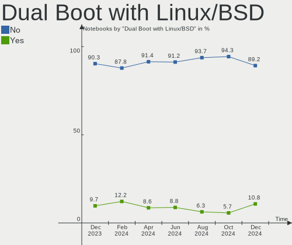
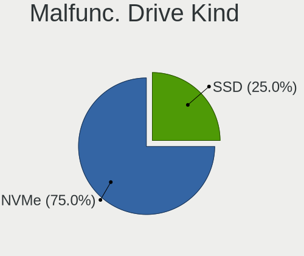
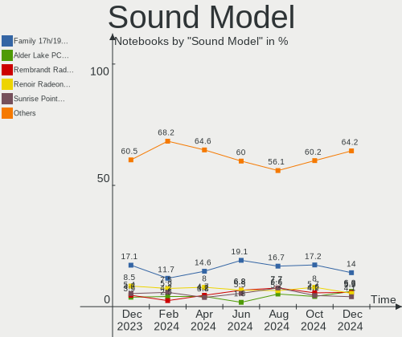
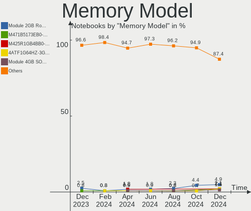
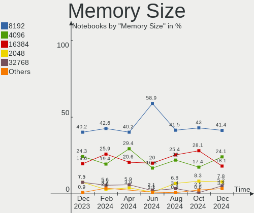

Arch - Hardware Trends (Notebooks)
----------------------------------

A project to identify most popular hardware characteristics and track their change
over time based on data collected by Linux users at https://Linux-Hardware.org.

Anyone can contribute to this report by the [hw-probe](https://github.com/linuxhw/hw-probe) tool:

    sudo -E hw-probe -all -upload

This report is for one last month. Overall report since the beginning of time: [TestCoverage](https://github.com/linuxhw/TestCoverage)

Period: Jul, 2022.

Contents
--------

* [ System ](#system)
  - [ OS                       ](#os)
  - [ OS Family                ](#os-family)
  - [ Kernel                   ](#kernel)
  - [ Kernel Family            ](#kernel-family)
  - [ Kernel Major Ver.        ](#kernel-major-ver)
  - [ Arch                     ](#arch)
  - [ DE                       ](#de)
  - [ Display Server           ](#display-server)
  - [ Display Manager          ](#display-manager)
  - [ OS Lang                  ](#os-lang)
  - [ Boot Mode                ](#boot-mode)
  - [ Filesystem               ](#filesystem)
  - [ Part. scheme             ](#part-scheme)
  - [ Dual Boot with Linux/BSD ](#dual-boot-with-linuxbsd)
  - [ Dual Boot (Win)          ](#dual-boot-win)

* [ Board ](#board)
  - [ Vendor                   ](#vendor)
  - [ Model                    ](#model)
  - [ Model Family             ](#model-family)
  - [ MFG Year                 ](#mfg-year)
  - [ Form Factor              ](#form-factor)
  - [ Secure Boot              ](#secure-boot)
  - [ Coreboot                 ](#coreboot)
  - [ RAM Size                 ](#ram-size)
  - [ RAM Used                 ](#ram-used)
  - [ Total Drives             ](#total-drives)
  - [ Has CD-ROM               ](#has-cd-rom)
  - [ Has Ethernet             ](#has-ethernet)
  - [ Has WiFi                 ](#has-wifi)
  - [ Has Bluetooth            ](#has-bluetooth)

* [ Location ](#location)
  - [ Country                  ](#country)
  - [ City                     ](#city)

* [ Drives ](#drives)
  - [ Drive Vendor             ](#drive-vendor)
  - [ Drive Model              ](#drive-model)
  - [ HDD Vendor               ](#hdd-vendor)
  - [ SSD Vendor               ](#ssd-vendor)
  - [ Drive Kind               ](#drive-kind)
  - [ Drive Connector          ](#drive-connector)
  - [ Drive Size               ](#drive-size)
  - [ Space Total              ](#space-total)
  - [ Space Used               ](#space-used)
  - [ Malfunc. Drives          ](#malfunc-drives)
  - [ Malfunc. Drive Vendor    ](#malfunc-drive-vendor)
  - [ Malfunc. HDD Vendor      ](#malfunc-hdd-vendor)
  - [ Malfunc. Drive Kind      ](#malfunc-drive-kind)
  - [ Failed Drives            ](#failed-drives)
  - [ Failed Drive Vendor      ](#failed-drive-vendor)
  - [ Drive Status             ](#drive-status)

* [ Storage controller ](#storage-controller)
  - [ Storage Vendor           ](#storage-vendor)
  - [ Storage Model            ](#storage-model)
  - [ Storage Kind             ](#storage-kind)

* [ Processor ](#processor)
  - [ CPU Vendor               ](#cpu-vendor)
  - [ CPU Model                ](#cpu-model)
  - [ CPU Model Family         ](#cpu-model-family)
  - [ CPU Cores                ](#cpu-cores)
  - [ CPU Sockets              ](#cpu-sockets)
  - [ CPU Threads              ](#cpu-threads)
  - [ CPU Op-Modes             ](#cpu-op-modes)
  - [ CPU Microcode            ](#cpu-microcode)
  - [ CPU Microarch            ](#cpu-microarch)

* [ Graphics ](#graphics)
  - [ GPU Vendor               ](#gpu-vendor)
  - [ GPU Model                ](#gpu-model)
  - [ GPU Combo                ](#gpu-combo)
  - [ GPU Driver               ](#gpu-driver)
  - [ GPU Memory               ](#gpu-memory)

* [ Monitor ](#monitor)
  - [ Monitor Vendor           ](#monitor-vendor)
  - [ Monitor Model            ](#monitor-model)
  - [ Monitor Resolution       ](#monitor-resolution)
  - [ Monitor Diagonal         ](#monitor-diagonal)
  - [ Monitor Width            ](#monitor-width)
  - [ Aspect Ratio             ](#aspect-ratio)
  - [ Monitor Area             ](#monitor-area)
  - [ Pixel Density            ](#pixel-density)
  - [ Multiple Monitors        ](#multiple-monitors)

* [ Network ](#network)
  - [ Net Controller Vendor    ](#net-controller-vendor)
  - [ Net Controller Model     ](#net-controller-model)
  - [ Wireless Vendor          ](#wireless-vendor)
  - [ Wireless Model           ](#wireless-model)
  - [ Ethernet Vendor          ](#ethernet-vendor)
  - [ Ethernet Model           ](#ethernet-model)
  - [ Net Controller Kind      ](#net-controller-kind)
  - [ Used Controller          ](#used-controller)
  - [ NICs                     ](#nics)
  - [ IPv6                     ](#ipv6)

* [ Bluetooth ](#bluetooth)
  - [ Bluetooth Vendor         ](#bluetooth-vendor)
  - [ Bluetooth Model          ](#bluetooth-model)

* [ Sound ](#sound)
  - [ Sound Vendor             ](#sound-vendor)
  - [ Sound Model              ](#sound-model)

* [ Memory ](#memory)
  - [ Memory Vendor            ](#memory-vendor)
  - [ Memory Model             ](#memory-model)
  - [ Memory Kind              ](#memory-kind)
  - [ Memory Form Factor       ](#memory-form-factor)
  - [ Memory Size              ](#memory-size)
  - [ Memory Speed             ](#memory-speed)

* [ Printers & scanners ](#printers--scanners)
  - [ Printer Vendor           ](#printer-vendor)
  - [ Printer Model            ](#printer-model)
  - [ Scanner Vendor           ](#scanner-vendor)
  - [ Scanner Model            ](#scanner-model)

* [ Camera ](#camera)
  - [ Camera Vendor            ](#camera-vendor)
  - [ Camera Model             ](#camera-model)

* [ Security ](#security)
  - [ Fingerprint Vendor       ](#fingerprint-vendor)
  - [ Fingerprint Model        ](#fingerprint-model)
  - [ Chipcard Vendor          ](#chipcard-vendor)
  - [ Chipcard Model           ](#chipcard-model)

* [ Unsupported ](#unsupported)
  - [ Unsupported Devices      ](#unsupported-devices)
  - [ Unsupported Device Types ](#unsupported-device-types)

System
------

OS
--

Installed operating systems

| Name         | Notebooks | Percent |
|--------------|-----------|---------|
| Arch         | 62        | 68.89%  |
| Arch Rolling | 28        | 31.11%  |

OS Family
---------

OS without a version

| Name | Notebooks | Percent |
|------|-----------|---------|
| Arch | 90        | 100%    |

Kernel
------

Version of the Linux kernel

| Version                        | Notebooks | Percent |
|--------------------------------|-----------|---------|
| 5.18.14-arch1-1                | 14        | 15.56%  |
| 5.18.12-arch1-1                | 13        | 14.44%  |
| 5.18.7-arch1-1                 | 8         | 8.89%   |
| 5.18.9-arch1-1                 | 7         | 7.78%   |
| 5.18.10-arch1-1                | 7         | 7.78%   |
| 5.18.13-arch1-1                | 6         | 6.67%   |
| 5.18.11-arch1-1                | 5         | 5.56%   |
| 5.18.8-arch1-1                 | 4         | 4.44%   |
| 5.15.53-2-lts                  | 3         | 3.33%   |
| 5.18.8-zen1-1-zen              | 2         | 2.22%   |
| 5.18.7-zen1-1-zen              | 2         | 2.22%   |
| 5.18.15-arch1-1                | 2         | 2.22%   |
| 5.18.10-zen1-1-zen             | 2         | 2.22%   |
| 5.15.55-2-lts                  | 2         | 2.22%   |
| 5.9.2-arch1-1                  | 1         | 1.11%   |
| 5.18.9-263-tkg-pds             | 1         | 1.11%   |
| 5.18.6-xanmod1-1-generic-x64v2 | 1         | 1.11%   |
| 5.18.6-arch1-1                 | 1         | 1.11%   |
| 5.18.5-arch1-1                 | 1         | 1.11%   |
| 5.18.3-zen1-1-zen              | 1         | 1.11%   |
| 5.18.14-zen1-1-zen             | 1         | 1.11%   |
| 5.18.14-xanmod1-1-v3-x64v3     | 1         | 1.11%   |
| 5.18.12-zen1-1-zen             | 1         | 1.11%   |
| 5.18.12-264-tkg-pds-llvm       | 1         | 1.11%   |
| 5.18.1-arch1-1                 | 1         | 1.11%   |
| 5.15.54-1-lts                  | 1         | 1.11%   |
| 5.15.46-1-lts                  | 1         | 1.11%   |

Kernel Family
-------------

Linux kernel without a distro release

| Version | Notebooks | Percent |
|---------|-----------|---------|
| 5.18.14 | 16        | 17.78%  |
| 5.18.12 | 15        | 16.67%  |
| 5.18.7  | 10        | 11.11%  |
| 5.18.10 | 9         | 10%     |
| 5.18.9  | 8         | 8.89%   |
| 5.18.8  | 6         | 6.67%   |
| 5.18.13 | 6         | 6.67%   |
| 5.18.11 | 5         | 5.56%   |
| 5.15.53 | 3         | 3.33%   |
| 5.18.6  | 2         | 2.22%   |
| 5.18.15 | 2         | 2.22%   |
| 5.15.55 | 2         | 2.22%   |
| 5.9.2   | 1         | 1.11%   |
| 5.18.5  | 1         | 1.11%   |
| 5.18.3  | 1         | 1.11%   |
| 5.18.1  | 1         | 1.11%   |
| 5.15.54 | 1         | 1.11%   |
| 5.15.46 | 1         | 1.11%   |

Kernel Major Ver.
-----------------

Linux kernel major version

| Version | Notebooks | Percent |
|---------|-----------|---------|
| 5.18    | 82        | 91.11%  |
| 5.15    | 7         | 7.78%   |
| 5.9     | 1         | 1.11%   |

Arch
----

OS architecture (x86_64, i586, etc.)

| Name   | Notebooks | Percent |
|--------|-----------|---------|
| x86_64 | 90        | 100%    |

DE
--

Desktop Environment

| Name     | Notebooks | Percent |
|----------|-----------|---------|
| GNOME    | 31        | 34.44%  |
| KDE5     | 29        | 32.22%  |
| Unknown  | 13        | 14.44%  |
| XFCE     | 7         | 7.78%   |
| qtile    | 2         | 2.22%   |
| i3       | 2         | 2.22%   |
| sway     | 1         | 1.11%   |
| ICEWM    | 1         | 1.11%   |
| hyprland | 1         | 1.11%   |
| Budgie   | 1         | 1.11%   |
| bspwm    | 1         | 1.11%   |
| awesome  | 1         | 1.11%   |

Display Server
--------------

X11 or Wayland

| Name    | Notebooks | Percent |
|---------|-----------|---------|
| X11     | 53        | 58.89%  |
| Wayland | 22        | 24.44%  |
| Unknown | 8         | 8.89%   |
| Tty     | 7         | 7.78%   |

Display Manager
---------------

SDDM, LightDM, etc.

| Name    | Notebooks | Percent |
|---------|-----------|---------|
| Unknown | 38        | 42.22%  |
| SDDM    | 21        | 23.33%  |
| GDM     | 15        | 16.67%  |
| LightDM | 11        | 12.22%  |
| LXDM    | 3         | 3.33%   |
| Ly      | 1         | 1.11%   |
| GREETD  | 1         | 1.11%   |

OS Lang
-------

Language

| Lang    | Notebooks | Percent |
|---------|-----------|---------|
| en_US   | 46        | 51.11%  |
| en_GB   | 8         | 8.89%   |
| Unknown | 7         | 7.78%   |
| zh_CN   | 4         | 4.44%   |
| ru_RU   | 4         | 4.44%   |
| en_IN   | 4         | 4.44%   |
| C       | 3         | 3.33%   |
| pt_BR   | 2         | 2.22%   |
| es_CO   | 2         | 2.22%   |
| tr_TR   | 1         | 1.11%   |
| ru_UA   | 1         | 1.11%   |
| it_IT   | 1         | 1.11%   |
| it_CH   | 1         | 1.11%   |
| es_ES   | 1         | 1.11%   |
| es_AR   | 1         | 1.11%   |
| en_IE   | 1         | 1.11%   |
| en_CA   | 1         | 1.11%   |
| en_AU   | 1         | 1.11%   |
| en_AG   | 1         | 1.11%   |

Boot Mode
---------

EFI or BIOS

| Mode | Notebooks | Percent |
|------|-----------|---------|
| EFI  | 50        | 55.56%  |
| BIOS | 40        | 44.44%  |

Filesystem
----------

Type of filesystem

| Type    | Notebooks | Percent |
|---------|-----------|---------|
| Ext4    | 63        | 70%     |
| Btrfs   | 22        | 24.44%  |
| F2fs    | 3         | 3.33%   |
| Zfs     | 1         | 1.11%   |
| Overlay | 1         | 1.11%   |

Part. scheme
------------

Scheme of partitioning

| Type    | Notebooks | Percent |
|---------|-----------|---------|
| GPT     | 56        | 62.22%  |
| Unknown | 27        | 30%     |
| MBR     | 7         | 7.78%   |

Dual Boot with Linux/BSD
------------------------

Hosting more than one Linux/BSD

| Dual boot | Notebooks | Percent |
|-----------|-----------|---------|
| No        | 80        | 88.89%  |
| Yes       | 10        | 11.11%  |

Dual Boot (Win)
---------------

Hosting Linux and Windows

| Dual boot | Notebooks | Percent |
|-----------|-----------|---------|
| No        | 64        | 71.11%  |
| Yes       | 26        | 28.89%  |

Board
-----

Vendor
------

Motherboard manufacturer

| Name                | Notebooks | Percent |
|---------------------|-----------|---------|
| Lenovo              | 22        | 24.44%  |
| Hewlett-Packard     | 15        | 16.67%  |
| Dell                | 9         | 10%     |
| Acer                | 8         | 8.89%   |
| ASUSTek Computer    | 7         | 7.78%   |
| MSI                 | 5         | 5.56%   |
| Apple               | 4         | 4.44%   |
| Toshiba             | 3         | 3.33%   |
| Timi                | 3         | 3.33%   |
| Samsung Electronics | 2         | 2.22%   |
| Razer               | 2         | 2.22%   |
| System76            | 1         | 1.11%   |
| Notebook            | 1         | 1.11%   |
| Intel               | 1         | 1.11%   |
| Infinix             | 1         | 1.11%   |
| Hyperbook           | 1         | 1.11%   |
| HUAWEI              | 1         | 1.11%   |
| Google              | 1         | 1.11%   |
| Framework           | 1         | 1.11%   |
| Clevo               | 1         | 1.11%   |
| Alienware           | 1         | 1.11%   |

Model
-----

Motherboard model

| Name                                               | Notebooks | Percent |
|----------------------------------------------------|-----------|---------|
| Toshiba Satellite M645                             | 1         | 1.11%   |
| Toshiba Satellite L70-B                            | 1         | 1.11%   |
| Toshiba dynabook Satellite B35/R                   | 1         | 1.11%   |
| Timi TM1703                                        | 1         | 1.11%   |
| Timi RedmiBook 14 II                               | 1         | 1.11%   |
| Timi Redmi Book Pro 15 2022                        | 1         | 1.11%   |
| System76 Lemur Pro                                 | 1         | 1.11%   |
| Samsung 935XDB                                     | 1         | 1.11%   |
| Samsung 3570R/370R/470R/450R/510R/4450RV           | 1         | 1.11%   |
| Razer Blade 15 Base Model (Early 2020) - RZ09-0328 | 1         | 1.11%   |
| Razer Blade 14 (2022) - RZ09-0427                  | 1         | 1.11%   |
| Notebook NL5xRU                                    | 1         | 1.11%   |
| MSI Stealth GS77 12UGS                             | 1         | 1.11%   |
| MSI GS75 Stealth 9SF                               | 1         | 1.11%   |
| MSI GP66 Leopard 11UG                              | 1         | 1.11%   |
| MSI GP66 Leopard 10UH                              | 1         | 1.11%   |
| MSI GF75 Thin 9SC                                  | 1         | 1.11%   |
| Lenovo V570 HuronRiver Platform                    | 1         | 1.11%   |
| Lenovo ThinkPad X280 20KES2SN00                    | 1         | 1.11%   |
| Lenovo ThinkPad X230 2325TXV                       | 1         | 1.11%   |
| Lenovo ThinkPad X13 Gen 2a 20XHCTO1WW              | 1         | 1.11%   |
| Lenovo ThinkPad W510 4318CTO                       | 1         | 1.11%   |
| Lenovo ThinkPad T430 2349CV8                       | 1         | 1.11%   |
| Lenovo ThinkPad T14s Gen 3 21CQ000GUS              | 1         | 1.11%   |
| Lenovo ThinkPad T14 Gen 1 20UES17D00               | 1         | 1.11%   |
| Lenovo ThinkPad T14 Gen 1 20S1S07X00               | 1         | 1.11%   |
| Lenovo ThinkPad P52 20M9CTO1WW                     | 1         | 1.11%   |
| Lenovo ThinkPad P17 Gen 2i 20YU005BUS              | 1         | 1.11%   |
| Lenovo ThinkPad P1 Gen 4i 20Y3004JUS               | 1         | 1.11%   |
| Lenovo ThinkPad L14 Gen 1 20U6S1JD00               | 1         | 1.11%   |
| Lenovo ThinkPad E480 20KN001QRT                    | 1         | 1.11%   |
| Lenovo ThinkPad E14 Gen 3 20YDS00G00               | 1         | 1.11%   |
| Lenovo ThinkBook 15 G2 ITL 20VE                    | 1         | 1.11%   |
| Lenovo Legion Y7000P 2019 81Q5                     | 1         | 1.11%   |
| Lenovo IdeaPad S145-15IWL 81S9                     | 1         | 1.11%   |
| Lenovo IdeaPad Gaming 3 15ARH05 82EY               | 1         | 1.11%   |
| Lenovo IdeaPad 3 15ADA05 81W1                      | 1         | 1.11%   |
| Lenovo IdeaPad 130-15IKB 81H7                      | 1         | 1.11%   |
| Lenovo IdeaPad 110-15ISK 80UD                      | 1         | 1.11%   |
| Intel HuronRiver Platform                          | 1         | 1.11%   |
| Infinix INBOOK X2                                  | 1         | 1.11%   |
| Hyperbook Z15 Zen                                  | 1         | 1.11%   |
| HUAWEI NBLK-WAX9X                                  | 1         | 1.11%   |
| HP ZHAN 99 Mobile Workstation G1                   | 1         | 1.11%   |
| HP ZBook 15v G5                                    | 1         | 1.11%   |
| HP Victus by Laptop 16-e0xxx                       | 1         | 1.11%   |
| HP ProBook 640 G5                                  | 1         | 1.11%   |
| HP ProBook 440 G6                                  | 1         | 1.11%   |
| HP Pavilion Laptop 13-an0xxx                       | 1         | 1.11%   |
| HP Pavilion Gaming Laptop 15-ec2xxx                | 1         | 1.11%   |
| HP Pavilion Gaming Laptop 15-dk0xxx                | 1         | 1.11%   |
| HP Pavilion Gaming Laptop 15-cx0xxx                | 1         | 1.11%   |
| HP Pavilion g4                                     | 1         | 1.11%   |
| HP Pavilion Aero Laptop 13-be0xxx                  | 1         | 1.11%   |
| HP EliteBook 8570w                                 | 1         | 1.11%   |
| HP EliteBook 845 G7 Notebook PC                    | 1         | 1.11%   |
| HP 255 G7 Notebook PC                              | 1         | 1.11%   |
| HP 250 G6 Notebook PC                              | 1         | 1.11%   |
| Google Wolf                                        | 1         | 1.11%   |
| Framework Laptop                                   | 1         | 1.11%   |

Model Family
------------

Motherboard model prefix

| Name               | Notebooks | Percent |
|--------------------|-----------|---------|
| Lenovo ThinkPad    | 14        | 15.56%  |
| HP Pavilion        | 6         | 6.67%   |
| Lenovo IdeaPad     | 5         | 5.56%   |
| Acer Aspire        | 4         | 4.44%   |
| Acer Nitro         | 3         | 3.33%   |
| Toshiba Satellite  | 2         | 2.22%   |
| Razer Blade        | 2         | 2.22%   |
| MSI GP66           | 2         | 2.22%   |
| HP ProBook         | 2         | 2.22%   |
| HP EliteBook       | 2         | 2.22%   |
| Dell Vostro        | 2         | 2.22%   |
| Dell Latitude      | 2         | 2.22%   |
| Dell Inspiron      | 2         | 2.22%   |
| Apple MacBookAir7  | 2         | 2.22%   |
| Toshiba dynabook   | 1         | 1.11%   |
| Timi TM1703        | 1         | 1.11%   |
| Timi RedmiBook     | 1         | 1.11%   |
| Timi Redmi         | 1         | 1.11%   |
| System76 Lemur     | 1         | 1.11%   |
| Samsung 935XDB     | 1         | 1.11%   |
| Samsung 3570R      | 1         | 1.11%   |
| Notebook NL5xRU    | 1         | 1.11%   |
| MSI Stealth        | 1         | 1.11%   |
| MSI GS75           | 1         | 1.11%   |
| MSI GF75           | 1         | 1.11%   |
| Lenovo V570        | 1         | 1.11%   |
| Lenovo ThinkBook   | 1         | 1.11%   |
| Lenovo Legion      | 1         | 1.11%   |
| Intel HuronRiver   | 1         | 1.11%   |
| Infinix INBOOK     | 1         | 1.11%   |
| Hyperbook Z15      | 1         | 1.11%   |
| HUAWEI NBLK-WAX9X  | 1         | 1.11%   |
| HP ZHAN            | 1         | 1.11%   |
| HP ZBook           | 1         | 1.11%   |
| HP Victus          | 1         | 1.11%   |
| HP 255             | 1         | 1.11%   |
| HP 250             | 1         | 1.11%   |
| Google Wolf        | 1         | 1.11%   |
| Framework Laptop   | 1         | 1.11%   |
| Dell XPS           | 1         | 1.11%   |
| Dell Precision     | 1         | 1.11%   |
| Dell G5            | 1         | 1.11%   |
| Clevo W150HNM      | 1         | 1.11%   |
| ASUS Zenbook       | 1         | 1.11%   |
| ASUS X555LD        | 1         | 1.11%   |
| ASUS U36SG         | 1         | 1.11%   |
| ASUS ROG           | 1         | 1.11%   |
| ASUS GL752VW       | 1         | 1.11%   |
| ASUS GL702VSK      | 1         | 1.11%   |
| ASUS ASUS          | 1         | 1.11%   |
| Apple MacBookPro14 | 1         | 1.11%   |
| Apple MacBookPro12 | 1         | 1.11%   |
| Alienware m15      | 1         | 1.11%   |
| Acer Swift         | 1         | 1.11%   |

MFG Year
--------

Motherboard manufacture year

| Year | Notebooks | Percent |
|------|-----------|---------|
| 2021 | 19        | 21.11%  |
| 2020 | 18        | 20%     |
| 2019 | 9         | 10%     |
| 2018 | 9         | 10%     |
| 2022 | 7         | 7.78%   |
| 2017 | 6         | 6.67%   |
| 2012 | 5         | 5.56%   |
| 2015 | 4         | 4.44%   |
| 2011 | 4         | 4.44%   |
| 2010 | 3         | 3.33%   |
| 2016 | 2         | 2.22%   |
| 2014 | 2         | 2.22%   |
| 2013 | 2         | 2.22%   |

Form Factor
-----------

Physical design of the computer

| Name     | Notebooks | Percent |
|----------|-----------|---------|
| Notebook | 90        | 100%    |

Secure Boot
-----------

Enabled or disabled

| State    | Notebooks | Percent |
|----------|-----------|---------|
| Disabled | 87        | 96.67%  |
| Enabled  | 3         | 3.33%   |

Coreboot
--------

Have coreboot on board

| Used | Notebooks | Percent |
|------|-----------|---------|
| No   | 88        | 97.78%  |
| Yes  | 2         | 2.22%   |

RAM Size
--------

Total RAM memory

| Size in GB  | Notebooks | Percent |
|-------------|-----------|---------|
| 4.01-8.0    | 23        | 25.56%  |
| 8.01-16.0   | 23        | 25.56%  |
| 16.01-24.0  | 17        | 18.89%  |
| 32.01-64.0  | 12        | 13.33%  |
| 3.01-4.0    | 7         | 7.78%   |
| 24.01-32.0  | 6         | 6.67%   |
| 64.01-256.0 | 2         | 2.22%   |

RAM Used
--------

Used RAM memory

| Used GB    | Notebooks | Percent |
|------------|-----------|---------|
| 2.01-3.0   | 27        | 30%     |
| 4.01-8.0   | 19        | 21.11%  |
| 1.01-2.0   | 16        | 17.78%  |
| 3.01-4.0   | 14        | 15.56%  |
| 8.01-16.0  | 9         | 10%     |
| 0.51-1.0   | 2         | 2.22%   |
| 24.01-32.0 | 1         | 1.11%   |
| 16.01-24.0 | 1         | 1.11%   |
| 0.01-0.5   | 1         | 1.11%   |

Total Drives
------------

Number of drives on board

| Drives | Notebooks | Percent |
|--------|-----------|---------|
| 1      | 57        | 63.33%  |
| 2      | 29        | 32.22%  |
| 3      | 3         | 3.33%   |
| 0      | 1         | 1.11%   |

Has CD-ROM
----------

Has CD-ROM on board

| Presented | Notebooks | Percent |
|-----------|-----------|---------|
| No        | 77        | 85.56%  |
| Yes       | 13        | 14.44%  |

Has Ethernet
------------

Has Ethernet on board

| Presented | Notebooks | Percent |
|-----------|-----------|---------|
| Yes       | 68        | 75.56%  |
| No        | 22        | 24.44%  |

Has WiFi
--------

Has WiFi module

| Presented | Notebooks | Percent |
|-----------|-----------|---------|
| Yes       | 90        | 100%    |

Has Bluetooth
-------------

Has Bluetooth module

| Presented | Notebooks | Percent |
|-----------|-----------|---------|
| Yes       | 80        | 88.89%  |
| No        | 10        | 11.11%  |

Location
--------

Country
-------

Geographic location (country)

| Country     | Notebooks | Percent |
|-------------|-----------|---------|
| USA         | 19        | 21.11%  |
| Russia      | 8         | 8.89%   |
| India       | 6         | 6.67%   |
| China       | 5         | 5.56%   |
| Brazil      | 5         | 5.56%   |
| Spain       | 3         | 3.33%   |
| Netherlands | 3         | 3.33%   |
| Germany     | 3         | 3.33%   |
| Canada      | 3         | 3.33%   |
| UK          | 2         | 2.22%   |
| Turkey      | 2         | 2.22%   |
| Thailand    | 2         | 2.22%   |
| Japan       | 2         | 2.22%   |
| Italy       | 2         | 2.22%   |
| Colombia    | 2         | 2.22%   |
| Vietnam     | 1         | 1.11%   |
| Ukraine     | 1         | 1.11%   |
| Switzerland | 1         | 1.11%   |
| Sweden      | 1         | 1.11%   |
| Singapore   | 1         | 1.11%   |
| Romania     | 1         | 1.11%   |
| Portugal    | 1         | 1.11%   |
| Poland      | 1         | 1.11%   |
| New Zealand | 1         | 1.11%   |
| Morocco     | 1         | 1.11%   |
| Jordan      | 1         | 1.11%   |
| Ireland     | 1         | 1.11%   |
| Iran        | 1         | 1.11%   |
| Hong Kong   | 1         | 1.11%   |
| France      | 1         | 1.11%   |
| Finland     | 1         | 1.11%   |
| Ethiopia    | 1         | 1.11%   |
| Denmark     | 1         | 1.11%   |
| Bulgaria    | 1         | 1.11%   |
| Belgium     | 1         | 1.11%   |
| Belarus     | 1         | 1.11%   |
| Austria     | 1         | 1.11%   |
| Australia   | 1         | 1.11%   |

City
----

Geographic location (city)

| City               | Notebooks | Percent |
|--------------------|-----------|---------|
| Valencia           | 3         | 3.33%   |
| St Petersburg      | 2         | 2.22%   |
| San Francisco      | 2         | 2.22%   |
| Moscow             | 2         | 2.22%   |
| Mesa               | 2         | 2.22%   |
| Beijing            | 2         | 2.22%   |
| Yartsevo           | 1         | 1.11%   |
| Xi'an              | 1         | 1.11%   |
| Wormer             | 1         | 1.11%   |
| Waterford          | 1         | 1.11%   |
| Warsaw             | 1         | 1.11%   |
| Wanchai            | 1         | 1.11%   |
| Villavicencio      | 1         | 1.11%   |
| Viana do Castelo   | 1         | 1.11%   |
| Valladolid         | 1         | 1.11%   |
| Uberlândia        | 1         | 1.11%   |
| Tra Vinh           | 1         | 1.11%   |
| Toronto            | 1         | 1.11%   |
| Thrissur           | 1         | 1.11%   |
| Surgut             | 1         | 1.11%   |
| Stuttgart          | 1         | 1.11%   |
| Stockholm          | 1         | 1.11%   |
| Sparta             | 1         | 1.11%   |
| Solingen           | 1         | 1.11%   |
| Sofia              | 1         | 1.11%   |
| Smolensk           | 1         | 1.11%   |
| Smithtown          | 1         | 1.11%   |
| Singapore          | 1         | 1.11%   |
| Sindal             | 1         | 1.11%   |
| Shanghai           | 1         | 1.11%   |
| Sesto San Giovanni | 1         | 1.11%   |
| Sattahip           | 1         | 1.11%   |
| Sao Cristovao      | 1         | 1.11%   |
| Santa Marta        | 1         | 1.11%   |
| Sanhe              | 1         | 1.11%   |
| Puducherry         | 1         | 1.11%   |
| Porto Alegre       | 1         | 1.11%   |
| Pontevedra         | 1         | 1.11%   |
| Pleasant Prairie   | 1         | 1.11%   |
| Philadelphia       | 1         | 1.11%   |
| Ottawa             | 1         | 1.11%   |
| Osaka              | 1         | 1.11%   |
| Omaha              | 1         | 1.11%   |
| Namps-Maisnil      | 1         | 1.11%   |
| Mumbai             | 1         | 1.11%   |
| Montreal           | 1         | 1.11%   |
| Minsk              | 1         | 1.11%   |
| Minato-ku          | 1         | 1.11%   |
| Miercurea-Ciuc     | 1         | 1.11%   |
| Miami              | 1         | 1.11%   |
| Maringá           | 1         | 1.11%   |
| Madrid             | 1         | 1.11%   |
| Lugano             | 1         | 1.11%   |
| Liège             | 1         | 1.11%   |
| Khorramshahr       | 1         | 1.11%   |
| Kharkiv            | 1         | 1.11%   |
| Kannur             | 1         | 1.11%   |
| Istanbul           | 1         | 1.11%   |
| Islington          | 1         | 1.11%   |
| Helsinki           | 1         | 1.11%   |

Drives
------

Drive Vendor
------------

Hard drive vendors

| Vendor                      | Notebooks | Drives | Percent |
|-----------------------------|-----------|--------|---------|
| Samsung Electronics         | 31        | 36     | 26.27%  |
| WDC                         | 12        | 12     | 10.17%  |
| SanDisk                     | 10        | 10     | 8.47%   |
| Toshiba                     | 8         | 8      | 6.78%   |
| Kingston                    | 7         | 8      | 5.93%   |
| Crucial                     | 6         | 6      | 5.08%   |
| Unknown                     | 5         | 5      | 4.24%   |
| SK hynix                    | 5         | 5      | 4.24%   |
| Seagate                     | 5         | 5      | 4.24%   |
| Micron Technology           | 4         | 4      | 3.39%   |
| A-DATA Technology           | 3         | 3      | 2.54%   |
| MAXIO Technology (Hangzhou) | 2         | 2      | 1.69%   |
| KIOXIA                      | 2         | 2      | 1.69%   |
| Intel                       | 2         | 2      | 1.69%   |
| Hitachi                     | 2         | 2      | 1.69%   |
| HGST                        | 2         | 2      | 1.69%   |
| XPG                         | 1         | 1      | 0.85%   |
| UMIS                        | 1         | 1      | 0.85%   |
| Silicon Motion              | 1         | 1      | 0.85%   |
| Phison                      | 1         | 1      | 0.85%   |
| MicroDream                  | 1         | 1      | 0.85%   |
| Lite-On                     | 1         | 1      | 0.85%   |
| JMicron Technology          | 1         | 1      | 0.85%   |
| Hewlett-Packard             | 1         | 1      | 0.85%   |
| Gigabyte Technology         | 1         | 1      | 0.85%   |
| Corsair                     | 1         | 1      | 0.85%   |
| Apple                       | 1         | 1      | 0.85%   |
| AEGO                        | 1         | 1      | 0.85%   |

Drive Model
-----------

Hard drive models

| Model                                   | Notebooks | Percent |
|-----------------------------------------|-----------|---------|
| WDC PC SN530 SDBPNPZ-512G-1114 512GB    | 2         | 1.63%   |
| Toshiba MQ01ABF050 500GB                | 2         | 1.63%   |
| Seagate ST1000LM049-2GH172 1TB          | 2         | 1.63%   |
| SanDisk NVMe SSD Drive 512GB            | 2         | 1.63%   |
| Samsung SSD 970 EVO Plus 1TB            | 2         | 1.63%   |
| Samsung NVMe SSD Drive 2TB              | 2         | 1.63%   |
| Samsung NVMe SSD Drive 250GB            | 2         | 1.63%   |
| Samsung NVMe SSD Drive 1TB              | 2         | 1.63%   |
| Samsung NVMe SSD Drive 1024GB           | 2         | 1.63%   |
| MAXIO (Hangzhou) NVMe SSD Drive 500GB   | 2         | 1.63%   |
| XPG NVMe SSD Drive 2TB                  | 1         | 0.81%   |
| WDC WD5000LPVX-80V0TT0 500GB            | 1         | 0.81%   |
| WDC WD5000LPVX-75V0TT0 500GB            | 1         | 0.81%   |
| WDC WD10SPZX-24Z10 1TB                  | 1         | 0.81%   |
| WDC WD10SPZX-21Z10T0 1TB                | 1         | 0.81%   |
| WDC WD10SPZX-08Z10 1TB                  | 1         | 0.81%   |
| WDC WD10SPCX-24HWST1 1TB                | 1         | 0.81%   |
| WDC WD10JPVX-22JC3T0 1TB                | 1         | 0.81%   |
| WDC PC SN730 SDBQNTY-1T00-1001 1TB      | 1         | 0.81%   |
| WDC PC SN730 SDBPNTY-512G-1027 512GB    | 1         | 0.81%   |
| WDC PC SN520 SDAPNUW-256G-1006 256GB    | 1         | 0.81%   |
| Unknown USB DISK 3.2 1TB                | 1         | 0.81%   |
| Unknown SR64G  64GB                     | 1         | 0.81%   |
| Unknown SL16G  16GB                     | 1         | 0.81%   |
| Unknown NVMe SSD Drive 2TB              | 1         | 0.81%   |
| Unknown MMC Card  256GB                 | 1         | 0.81%   |
| UMIS RPJTJ512MEE1OWX 512GB              | 1         | 0.81%   |
| Toshiba NVMe SSD Drive 512GB            | 1         | 0.81%   |
| Toshiba NVMe SSD Drive 256GB            | 1         | 0.81%   |
| Toshiba MQ01ACF032 320GB                | 1         | 0.81%   |
| Toshiba MK3261GSYN 320GB                | 1         | 0.81%   |
| Toshiba KXG50ZNV512G NVMe 512GB         | 1         | 0.81%   |
| Toshiba KBG40ZNT512G MEMORY 512GB       | 1         | 0.81%   |
| SK hynix SHGP31-500GM-2 500GB           | 1         | 0.81%   |
| SK hynix NVMe SSD Drive 512GB           | 1         | 0.81%   |
| SK hynix NVMe SSD Drive 256GB           | 1         | 0.81%   |
| SK hynix HFM512GD3JX013N 512GB          | 1         | 0.81%   |
| SK hynix BC511 HFM512GDJTNI-82A0A 512GB | 1         | 0.81%   |
| Silicon Motion NVMe SSD Drive 256GB     | 1         | 0.81%   |
| Seagate ST9750420AS 752GB               | 1         | 0.81%   |
| Seagate ST1000LM048-2E7172 1TB          | 1         | 0.81%   |
| Seagate ST1000LM035-1RK172 1TB          | 1         | 0.81%   |
| SanDisk Ultra II 480GB SSD              | 1         | 0.81%   |
| SanDisk SSD PLUS 120GB                  | 1         | 0.81%   |
| SanDisk SSD i110 16GB                   | 1         | 0.81%   |
| SanDisk SDSSDH3 500G                    | 1         | 0.81%   |
| SanDisk SD9SN8W-256G-1006 256GB SSD     | 1         | 0.81%   |
| SanDisk SD9SN8W-128G-1006 128GB SSD     | 1         | 0.81%   |
| SanDisk NVMe SSD Drive 240GB            | 1         | 0.81%   |
| SanDisk NVMe SSD Drive 1TB              | 1         | 0.81%   |
| Samsung SSD 980 500GB                   | 1         | 0.81%   |
| Samsung SSD 980 1TB                     | 1         | 0.81%   |
| Samsung SSD 970 EVO Plus 500GB          | 1         | 0.81%   |
| Samsung SSD 970 EVO 500GB               | 1         | 0.81%   |
| Samsung SSD 870 EVO 500GB               | 1         | 0.81%   |
| Samsung SSD 870 EVO 250GB               | 1         | 0.81%   |
| Samsung SSD 860 EVO 1TB                 | 1         | 0.81%   |
| Samsung SSD 850 EVO 500GB               | 1         | 0.81%   |
| Samsung SSD 850 EVO 250GB               | 1         | 0.81%   |
| Samsung SM963 2.5" NVMe PCIe SSD 121GB  | 1         | 0.81%   |

HDD Vendor
----------

Hard disk drive vendors

| Vendor  | Notebooks | Drives | Percent |
|---------|-----------|--------|---------|
| WDC     | 7         | 7      | 35%     |
| Seagate | 5         | 5      | 25%     |
| Toshiba | 4         | 4      | 20%     |
| Hitachi | 2         | 2      | 10%     |
| HGST    | 2         | 2      | 10%     |

SSD Vendor
----------

Solid state drive vendors

| Vendor              | Notebooks | Drives | Percent |
|---------------------|-----------|--------|---------|
| Samsung Electronics | 8         | 8      | 26.67%  |
| SanDisk             | 6         | 6      | 20%     |
| Crucial             | 6         | 6      | 20%     |
| Kingston            | 2         | 2      | 6.67%   |
| Micron Technology   | 1         | 1      | 3.33%   |
| MicroDream          | 1         | 1      | 3.33%   |
| Intel               | 1         | 1      | 3.33%   |
| Hewlett-Packard     | 1         | 1      | 3.33%   |
| Gigabyte Technology | 1         | 1      | 3.33%   |
| Corsair             | 1         | 1      | 3.33%   |
| Apple               | 1         | 1      | 3.33%   |
| AEGO                | 1         | 1      | 3.33%   |

Drive Kind
----------

HDD or SSD

| Kind    | Notebooks | Drives | Percent |
|---------|-----------|--------|---------|
| NVMe    | 61        | 70     | 53.04%  |
| SSD     | 30        | 30     | 26.09%  |
| HDD     | 20        | 20     | 17.39%  |
| MMC     | 3         | 3      | 2.61%   |
| Unknown | 1         | 1      | 0.87%   |

Drive Connector
---------------

SATA, SAS, NVMe, etc.

| Type | Notebooks | Drives | Percent |
|------|-----------|--------|---------|
| NVMe | 61        | 69     | 54.46%  |
| SATA | 45        | 49     | 40.18%  |
| SAS  | 3         | 3      | 2.68%   |
| MMC  | 3         | 3      | 2.68%   |

Drive Size
----------

Size of hard drive

| Size in TB | Notebooks | Drives | Percent |
|------------|-----------|--------|---------|
| 0.01-0.5   | 29        | 31     | 60.42%  |
| 0.51-1.0   | 18        | 18     | 37.5%   |
| 1.01-2.0   | 1         | 1      | 2.08%   |

Space Total
-----------

Amount of disk space available on the file system

| Size in GB     | Notebooks | Percent |
|----------------|-----------|---------|
| 251-500        | 26        | 28.89%  |
| 101-250        | 19        | 21.11%  |
| 501-1000       | 18        | 20%     |
| 1001-2000      | 11        | 12.22%  |
| 2001-3000      | 4         | 4.44%   |
| 1-20           | 4         | 4.44%   |
| Unknown        | 4         | 4.44%   |
| More than 3000 | 2         | 2.22%   |
| 21-50          | 1         | 1.11%   |
| 51-100         | 1         | 1.11%   |

Space Used
----------

Amount of used disk space

| Used GB   | Notebooks | Percent |
|-----------|-----------|---------|
| 1-20      | 26        | 28.89%  |
| 251-500   | 14        | 15.56%  |
| 101-250   | 13        | 14.44%  |
| 21-50     | 12        | 13.33%  |
| 501-1000  | 9         | 10%     |
| 51-100    | 9         | 10%     |
| Unknown   | 4         | 4.44%   |
| 1001-2000 | 3         | 3.33%   |

Malfunc. Drives
---------------

Drive models with a malfunction

| Model                                 | Notebooks | Drives | Percent |
|---------------------------------------|-----------|--------|---------|
| WDC WD5000LPVX-80V0TT0 500GB          | 1         | 1      | 33.33%  |
| Samsung Electronics SSD 970 EVO 500GB | 1         | 1      | 33.33%  |
| A-DATA Technology SX6000NP 512GB      | 1         | 1      | 33.33%  |

Malfunc. Drive Vendor
---------------------

Vendors of faulty drives

| Vendor              | Notebooks | Drives | Percent |
|---------------------|-----------|--------|---------|
| WDC                 | 1         | 1      | 33.33%  |
| Samsung Electronics | 1         | 1      | 33.33%  |
| A-DATA Technology   | 1         | 1      | 33.33%  |

Malfunc. HDD Vendor
-------------------

Vendors of faulty HDD drives

| Vendor | Notebooks | Drives | Percent |
|--------|-----------|--------|---------|
| WDC    | 1         | 1      | 100%    |

Malfunc. Drive Kind
-------------------

Kinds of faulty drives

| Kind | Notebooks | Drives | Percent |
|------|-----------|--------|---------|
| NVMe | 2         | 2      | 66.67%  |
| HDD  | 1         | 1      | 33.33%  |

Failed Drives
-------------

Failed drive models

Zero info for selected period =(

Failed Drive Vendor
-------------------

Failed drive vendors

Zero info for selected period =(

Drive Status
------------

Number of failed and malfunc. drives

| Status   | Notebooks | Drives | Percent |
|----------|-----------|--------|---------|
| Works    | 50        | 64     | 52.63%  |
| Detected | 42        | 57     | 44.21%  |
| Malfunc  | 3         | 3      | 3.16%   |

Storage controller
------------------

Storage Vendor
--------------

Storage controller vendors

| Vendor                         | Notebooks | Percent |
|--------------------------------|-----------|---------|
| Intel                          | 46        | 38.02%  |
| Samsung Electronics            | 26        | 21.49%  |
| AMD                            | 11        | 9.09%   |
| SanDisk                        | 9         | 7.44%   |
| SK hynix                       | 5         | 4.13%   |
| Kingston Technology Company    | 5         | 4.13%   |
| Toshiba America Info Systems   | 4         | 3.31%   |
| Micron Technology              | 3         | 2.48%   |
| MAXIO Technology (Hangzhou)    | 2         | 1.65%   |
| KIOXIA                         | 2         | 1.65%   |
| ADATA Technology               | 2         | 1.65%   |
| Unknown                        | 1         | 0.83%   |
| Union Memory (Shenzhen)        | 1         | 0.83%   |
| Solid State Storage Technology | 1         | 0.83%   |
| Silicon Motion                 | 1         | 0.83%   |
| Realtek Semiconductor          | 1         | 0.83%   |
| Phison Electronics             | 1         | 0.83%   |

Storage Model
-------------

Storage controller models

| Model                                                                            | Notebooks | Percent |
|----------------------------------------------------------------------------------|-----------|---------|
| Samsung NVMe SSD Controller SM981/PM981/PM983                                    | 13        | 10.57%  |
| AMD FCH SATA Controller [AHCI mode]                                              | 11        | 8.94%   |
| Intel Cannon Lake Mobile PCH SATA AHCI Controller                                | 8         | 6.5%    |
| Intel Sunrise Point-LP SATA Controller [AHCI mode]                               | 7         | 5.69%   |
| Samsung NVMe SSD Controller PM9A1/PM9A3/980PRO                                   | 6         | 4.88%   |
| Intel 6 Series/C200 Series Chipset Family 6 port Mobile SATA AHCI Controller     | 6         | 4.88%   |
| Samsung NVMe SSD Controller 980                                                  | 5         | 4.07%   |
| Intel 7 Series Chipset Family 6-port SATA Controller [AHCI mode]                 | 5         | 4.07%   |
| SanDisk WD Blue SN550 NVMe SSD                                                   | 4         | 3.25%   |
| Intel Cannon Point-LP SATA Controller [AHCI Mode]                                | 4         | 3.25%   |
| Toshiba America Info Systems XG6 NVMe SSD Controller                             | 3         | 2.44%   |
| SK hynix Gold P31 SSD                                                            | 3         | 2.44%   |
| Micron Non-Volatile memory controller                                            | 3         | 2.44%   |
| Kingston Company Company Non-Volatile memory controller                          | 3         | 2.44%   |
| Intel HM170/QM170 Chipset SATA Controller [AHCI Mode]                            | 3         | 2.44%   |
| Intel 82801 Mobile SATA Controller [RAID mode]                                   | 3         | 2.44%   |
| SK hynix BC511                                                                   | 2         | 1.63%   |
| SanDisk WD Black SN750 / PC SN730 NVMe SSD                                       | 2         | 1.63%   |
| SanDisk Non-Volatile memory controller                                           | 2         | 1.63%   |
| MAXIO (Hangzhou) NVMe SSD Controller MAP1001                                     | 2         | 1.63%   |
| KIOXIA NVMe SSD Controller BG4                                                   | 2         | 1.63%   |
| Intel Volume Management Device NVMe RAID Controller                              | 2         | 1.63%   |
| Intel 8 Series SATA Controller 1 [AHCI mode]                                     | 2         | 1.63%   |
| Intel 5 Series/3400 Series Chipset 6 port SATA AHCI Controller                   | 2         | 1.63%   |
| Unknown Non-Volatile memory controller                                           | 1         | 0.81%   |
| Union Memory (Shenzhen) Non-Volatile memory controller                           | 1         | 0.81%   |
| Toshiba America Info Systems Toshiba America Info Non-Volatile memory controller | 1         | 0.81%   |
| Solid State Storage Non-Volatile memory controller                               | 1         | 0.81%   |
| Silicon Motion SM2263EN/SM2263XT SSD Controller                                  | 1         | 0.81%   |
| SanDisk WD Blue SN500 / PC SN520 NVMe SSD                                        | 1         | 0.81%   |
| Samsung NVMe SSD Controller SM961/PM961/SM963                                    | 1         | 0.81%   |
| Samsung Electronics SATA controller                                              | 1         | 0.81%   |
| Realtek Realtek Non-Volatile memory controller                                   | 1         | 0.81%   |
| Phison PS5013 E13 NVMe Controller                                                | 1         | 0.81%   |
| Kingston Company SNVS2000G [NV1 NVMe PCIe SSD 2TB]                               | 1         | 0.81%   |
| Kingston Company OM3PDP3 NVMe SSD                                                | 1         | 0.81%   |
| Intel Wildcat Point-LP SATA Controller [AHCI Mode]                               | 1         | 0.81%   |
| Intel Tiger Lake-LP SATA Controller                                              | 1         | 0.81%   |
| Intel SSD 660P Series                                                            | 1         | 0.81%   |
| Intel Ice Lake-LP SATA Controller [AHCI mode]                                    | 1         | 0.81%   |
| Intel 8 Series/C220 Series Chipset Family 6-port SATA Controller 1 [AHCI mode]   | 1         | 0.81%   |
| Intel 400 Series Chipset Family SATA AHCI Controller                             | 1         | 0.81%   |
| ADATA XPG SX8200 Pro PCIe Gen3x4 M.2 2280 Solid State Drive                      | 1         | 0.81%   |
| ADATA Non-Volatile memory controller                                             | 1         | 0.81%   |

Storage Kind
------------

Kind of storage controller (IDE, SATA, NVMe, SAS, ...)

| Kind | Notebooks | Percent |
|------|-----------|---------|
| NVMe | 61        | 50.83%  |
| SATA | 54        | 45%     |
| RAID | 5         | 4.17%   |

Processor
---------

CPU Vendor
----------

Processor vendors

| Vendor | Notebooks | Percent |
|--------|-----------|---------|
| Intel  | 64        | 71.11%  |
| AMD    | 26        | 28.89%  |

CPU Model
---------

Processor models

| Model                                         | Notebooks | Percent |
|-----------------------------------------------|-----------|---------|
| Intel Core i7-9750H CPU @ 2.60GHz             | 4         | 4.44%   |
| Intel Core i7-8750H CPU @ 2.20GHz             | 2         | 2.22%   |
| Intel Core i5-8250U CPU @ 1.60GHz             | 2         | 2.22%   |
| Intel Core i5-5250U CPU @ 1.60GHz             | 2         | 2.22%   |
| Intel Core i5-3230M CPU @ 2.60GHz             | 2         | 2.22%   |
| Intel Core i5-2410M CPU @ 2.30GHz             | 2         | 2.22%   |
| Intel Core i5-1035G1 CPU @ 1.00GHz            | 2         | 2.22%   |
| Intel 12th Gen Core i7-12700H                 | 2         | 2.22%   |
| Intel 11th Gen Core i9-11950H @ 2.60GHz       | 2         | 2.22%   |
| Intel 11th Gen Core i7-11800H @ 2.30GHz       | 2         | 2.22%   |
| Intel 11th Gen Core i5-1135G7 @ 2.40GHz       | 2         | 2.22%   |
| AMD Ryzen 7 PRO 4750U with Radeon Graphics    | 2         | 2.22%   |
| AMD Ryzen 7 6800H with Radeon Graphics        | 2         | 2.22%   |
| AMD Ryzen 7 5800H with Radeon Graphics        | 2         | 2.22%   |
| AMD Ryzen 5 5600H with Radeon Graphics        | 2         | 2.22%   |
| AMD Ryzen 5 5500U with Radeon Graphics        | 2         | 2.22%   |
| AMD Ryzen 5 4600H with Radeon Graphics        | 2         | 2.22%   |
| AMD Ryzen 5 4500U with Radeon Graphics        | 2         | 2.22%   |
| AMD Ryzen 5 3500U with Radeon Vega Mobile Gfx | 2         | 2.22%   |
| Intel Core i9-10980HK CPU @ 2.40GHz           | 1         | 1.11%   |
| Intel Core i9-10885H CPU @ 2.40GHz            | 1         | 1.11%   |
| Intel Core i7-8850H CPU @ 2.60GHz             | 1         | 1.11%   |
| Intel Core i7-8565U CPU @ 1.80GHz             | 1         | 1.11%   |
| Intel Core i7-8550U CPU @ 1.80GHz             | 1         | 1.11%   |
| Intel Core i7-7700HQ CPU @ 2.80GHz            | 1         | 1.11%   |
| Intel Core i7-7600U CPU @ 2.80GHz             | 1         | 1.11%   |
| Intel Core i7-6700HQ CPU @ 2.60GHz            | 1         | 1.11%   |
| Intel Core i7-4800MQ CPU @ 2.70GHz            | 1         | 1.11%   |
| Intel Core i7-4710HQ CPU @ 2.50GHz            | 1         | 1.11%   |
| Intel Core i7-3720QM CPU @ 2.60GHz            | 1         | 1.11%   |
| Intel Core i7-2630QM CPU @ 2.00GHz            | 1         | 1.11%   |
| Intel Core i7-2620M CPU @ 2.70GHz             | 1         | 1.11%   |
| Intel Core i7-10870H CPU @ 2.20GHz            | 1         | 1.11%   |
| Intel Core i7-10750H CPU @ 2.60GHz            | 1         | 1.11%   |
| Intel Core i7 CPU X 920 @ 2.00GHz             | 1         | 1.11%   |
| Intel Core i5-9300H CPU @ 2.40GHz             | 1         | 1.11%   |
| Intel Core i5-8365U CPU @ 1.60GHz             | 1         | 1.11%   |
| Intel Core i5-8350U CPU @ 1.70GHz             | 1         | 1.11%   |
| Intel Core i5-8300H CPU @ 2.30GHz             | 1         | 1.11%   |
| Intel Core i5-8265U CPU @ 1.60GHz             | 1         | 1.11%   |
| Intel Core i5-7360U CPU @ 2.30GHz             | 1         | 1.11%   |
| Intel Core i5-7300HQ CPU @ 2.50GHz            | 1         | 1.11%   |
| Intel Core i5-5257U CPU @ 2.70GHz             | 1         | 1.11%   |
| Intel Core i5-4210U CPU @ 1.70GHz             | 1         | 1.11%   |
| Intel Core i5-3320M CPU @ 2.60GHz             | 1         | 1.11%   |
| Intel Core i5-2520M CPU @ 2.50GHz             | 1         | 1.11%   |
| Intel Core i5-2450M CPU @ 2.50GHz             | 1         | 1.11%   |
| Intel Core i5-10310U CPU @ 1.70GHz            | 1         | 1.11%   |
| Intel Core i5-10300H CPU @ 2.50GHz            | 1         | 1.11%   |
| Intel Core i3-8145U CPU @ 2.10GHz             | 1         | 1.11%   |
| Intel Core i3-7020U CPU @ 2.30GHz             | 1         | 1.11%   |
| Intel Core i3-6100U CPU @ 2.30GHz             | 1         | 1.11%   |
| Intel Core i3-6006U CPU @ 2.00GHz             | 1         | 1.11%   |
| Intel Core i3-5005U CPU @ 2.00GHz             | 1         | 1.11%   |
| Intel Core i3-3110M CPU @ 2.40GHz             | 1         | 1.11%   |
| Intel Core i3 CPU M 350 @ 2.27GHz             | 1         | 1.11%   |
| Intel Celeron 2955U @ 1.40GHz                 | 1         | 1.11%   |
| Intel 11th Gen Core i7-1165G7 @ 2.80GHz       | 1         | 1.11%   |
| Intel 11th Gen Core i5-1130G7 @ 1.10GHz       | 1         | 1.11%   |
| AMD Ryzen 9 6900HX with Radeon Graphics       | 1         | 1.11%   |

CPU Model Family
----------------

Processor model prefix

| Model           | Notebooks | Percent |
|-----------------|-----------|---------|
| Intel Core i5   | 24        | 26.67%  |
| Intel Core i7   | 20        | 22.22%  |
| AMD Ryzen 5     | 11        | 12.22%  |
| Other           | 10        | 11.11%  |
| AMD Ryzen 7     | 8         | 8.89%   |
| Intel Core i3   | 7         | 7.78%   |
| AMD Ryzen 7 PRO | 4         | 4.44%   |
| Intel Core i9   | 2         | 2.22%   |
| Intel Celeron   | 1         | 1.11%   |
| AMD Ryzen 9     | 1         | 1.11%   |
| AMD Ryzen 5 PRO | 1         | 1.11%   |
| AMD A8          | 1         | 1.11%   |

CPU Cores
---------

Number of processor cores

| Number | Notebooks | Percent |
|--------|-----------|---------|
| 4      | 29        | 32.22%  |
| 2      | 22        | 24.44%  |
| 8      | 20        | 22.22%  |
| 6      | 17        | 18.89%  |
| 14     | 2         | 2.22%   |

CPU Sockets
-----------

Number of sockets

| Number | Notebooks | Percent |
|--------|-----------|---------|
| 1      | 90        | 100%    |

CPU Threads
-----------

Threads per core (Hyper-Threading)

| Number | Notebooks | Percent |
|--------|-----------|---------|
| 2      | 84        | 93.33%  |
| 1      | 6         | 6.67%   |

CPU Op-Modes
------------

CPU Operation Modes (32-bit, 64-bit)

| Op mode        | Notebooks | Percent |
|----------------|-----------|---------|
| 32-bit, 64-bit | 90        | 100%    |

CPU Microcode
-------------

Microcode number

| Number     | Notebooks | Percent |
|------------|-----------|---------|
| Unknown    | 37        | 41.11%  |
| 0x906ea    | 5         | 5.56%   |
| 0x306a9    | 5         | 5.56%   |
| 0x08600106 | 5         | 5.56%   |
| 0x806ea    | 4         | 4.44%   |
| 0xa0652    | 3         | 3.33%   |
| 0x806ec    | 3         | 3.33%   |
| 0x806d1    | 3         | 3.33%   |
| 0x806c1    | 3         | 3.33%   |
| 0x0a50000c | 3         | 3.33%   |
| 0x40651    | 2         | 2.22%   |
| 0x306d4    | 2         | 2.22%   |
| 0x08600104 | 2         | 2.22%   |
| 0x906a3    | 1         | 1.11%   |
| 0x806eb    | 1         | 1.11%   |
| 0x706e5    | 1         | 1.11%   |
| 0x306c3    | 1         | 1.11%   |
| 0x206a7    | 1         | 1.11%   |
| 0x106e5    | 1         | 1.11%   |
| 0x0a404102 | 1         | 1.11%   |
| 0x0a404101 | 1         | 1.11%   |
| 0x08608103 | 1         | 1.11%   |
| 0x08608102 | 1         | 1.11%   |
| 0x08108109 | 1         | 1.11%   |
| 0x08101016 | 1         | 1.11%   |
| 0x07030105 | 1         | 1.11%   |

CPU Microarch
-------------

Microarchitecture

| Name             | Notebooks | Percent |
|------------------|-----------|---------|
| KabyLake         | 23        | 25.56%  |
| Unknown          | 10        | 11.11%  |
| Zen 2            | 9         | 10%     |
| Zen 3            | 6         | 6.67%   |
| SandyBridge      | 6         | 6.67%   |
| IvyBridge        | 5         | 5.56%   |
| CometLake        | 5         | 5.56%   |
| TigerLake        | 4         | 4.44%   |
| Icelake          | 4         | 4.44%   |
| Haswell          | 4         | 4.44%   |
| Broadwell        | 4         | 4.44%   |
| Skylake          | 3         | 3.33%   |
| Zen+             | 2         | 2.22%   |
| Zen              | 1         | 1.11%   |
| Westmere         | 1         | 1.11%   |
| Puma             | 1         | 1.11%   |
| Nehalem          | 1         | 1.11%   |
| Alderlake Hybrid | 1         | 1.11%   |

Graphics
--------

GPU Vendor
----------

Vendors of graphics cards

| Vendor | Notebooks | Percent |
|--------|-----------|---------|
| Intel  | 59        | 44.7%   |
| Nvidia | 43        | 32.58%  |
| AMD    | 30        | 22.73%  |

GPU Model
---------

Graphics card models

| Model                                                                     | Notebooks | Percent |
|---------------------------------------------------------------------------|-----------|---------|
| AMD Renoir                                                                | 9         | 6.82%   |
| Intel CoffeeLake-H GT2 [UHD Graphics 630]                                 | 7         | 5.3%    |
| Intel 2nd Generation Core Processor Family Integrated Graphics Controller | 6         | 4.55%   |
| AMD Cezanne                                                               | 6         | 4.55%   |
| Intel CometLake-H GT2 [UHD Graphics]                                      | 5         | 3.79%   |
| Intel WhiskeyLake-U GT2 [UHD Graphics 620]                                | 4         | 3.03%   |
| Intel UHD Graphics 620                                                    | 4         | 3.03%   |
| Intel TigerLake-H GT1 [UHD Graphics]                                      | 4         | 3.03%   |
| Intel 3rd Gen Core processor Graphics Controller                          | 4         | 3.03%   |
| AMD Rembrandt [Radeon 680M]                                               | 4         | 3.03%   |
| Nvidia TU117M [GeForce GTX 1650 Mobile / Max-Q]                           | 3         | 2.27%   |
| Nvidia TU106M [GeForce RTX 2060 Mobile]                                   | 3         | 2.27%   |
| Nvidia GA104M [GeForce RTX 3080 Mobile / Max-Q 8GB/16GB]                  | 3         | 2.27%   |
| Intel TigerLake-LP GT2 [Iris Xe Graphics]                                 | 3         | 2.27%   |
| AMD Lucienne                                                              | 3         | 2.27%   |
| Nvidia TU117M [GeForce GTX 1650 Ti Mobile]                                | 2         | 1.52%   |
| Nvidia TU117M                                                             | 2         | 1.52%   |
| Nvidia GP107GLM [Quadro P600 Mobile]                                      | 2         | 1.52%   |
| Nvidia GA107M [GeForce RTX 3050 Mobile]                                   | 2         | 1.52%   |
| Nvidia GA107GLM [RTX A2000 Mobile]                                        | 2         | 1.52%   |
| Nvidia GA106M [GeForce RTX 3060 Mobile / Max-Q]                           | 2         | 1.52%   |
| Nvidia GA104M [GeForce RTX 3070 Mobile / Max-Q]                           | 2         | 1.52%   |
| Nvidia GA104 [Geforce RTX 3070 Ti Laptop GPU]                             | 2         | 1.52%   |
| Intel Skylake GT2 [HD Graphics 520]                                       | 2         | 1.52%   |
| Intel Iris Plus Graphics G1 (Ice Lake)                                    | 2         | 1.52%   |
| Intel HD Graphics 620                                                     | 2         | 1.52%   |
| Intel HD Graphics 6000                                                    | 2         | 1.52%   |
| Intel Haswell-ULT Integrated Graphics Controller                          | 2         | 1.52%   |
| Intel Alder Lake-P Integrated Graphics Controller                         | 2         | 1.52%   |
| Intel 4th Gen Core Processor Integrated Graphics Controller               | 2         | 1.52%   |
| AMD Picasso/Raven 2 [Radeon Vega Series / Radeon Vega Mobile Series]      | 2         | 1.52%   |
| Nvidia TU117M [GeForce MX450]                                             | 1         | 0.76%   |
| Nvidia TU116M [GeForce GTX 1660 Ti Mobile]                                | 1         | 0.76%   |
| Nvidia TU106M [GeForce RTX 2070 Mobile]                                   | 1         | 0.76%   |
| Nvidia GT216GLM [Quadro FX 880M]                                          | 1         | 0.76%   |
| Nvidia GP108M [GeForce MX150]                                             | 1         | 0.76%   |
| Nvidia GP107M [GeForce GTX 1050 Ti Mobile]                                | 1         | 0.76%   |
| Nvidia GP107M [GeForce GTX 1050 Mobile]                                   | 1         | 0.76%   |
| Nvidia GP107GLM [Quadro P1000 Mobile]                                     | 1         | 0.76%   |
| Nvidia GP104BM [GeForce GTX 1070 Mobile]                                  | 1         | 0.76%   |
| Nvidia GM108M [GeForce MX130]                                             | 1         | 0.76%   |
| Nvidia GM108M [GeForce MX110]                                             | 1         | 0.76%   |
| Nvidia GM108M [GeForce 930MX]                                             | 1         | 0.76%   |
| Nvidia GM107M [GeForce GTX 960M]                                          | 1         | 0.76%   |
| Nvidia GF119M [GeForce 610M]                                              | 1         | 0.76%   |
| Nvidia GF117M [GeForce 610M/710M/810M/820M / GT 620M/625M/630M/720M]      | 1         | 0.76%   |
| Nvidia GF108M [GeForce GT 540M]                                           | 1         | 0.76%   |
| Nvidia GF108M [GeForce GT 525M]                                           | 1         | 0.76%   |
| Nvidia GA107M [GeForce RTX 2050]                                          | 1         | 0.76%   |
| Intel Tiger Lake Iris Xe Graphics                                         | 1         | 0.76%   |
| Intel Iris Plus Graphics 640                                              | 1         | 0.76%   |
| Intel Iris Graphics 6100                                                  | 1         | 0.76%   |
| Intel HD Graphics 630                                                     | 1         | 0.76%   |
| Intel HD Graphics 5500                                                    | 1         | 0.76%   |
| Intel HD Graphics 530                                                     | 1         | 0.76%   |
| Intel Core Processor Integrated Graphics Controller                       | 1         | 0.76%   |
| Intel CometLake-U GT2 [UHD Graphics]                                      | 1         | 0.76%   |
| AMD Venus XT [Radeon HD 8870M / R9 M270X/M370X]                           | 1         | 0.76%   |
| AMD Venus PRO [Radeon HD 8850M / R9 M265X]                                | 1         | 0.76%   |
| AMD Raven Ridge [Radeon Vega Series / Radeon Vega Mobile Series]          | 1         | 0.76%   |

GPU Combo
---------

Combinations of graphics cards

| Name           | Notebooks | Percent |
|----------------|-----------|---------|
| Intel + Nvidia | 28        | 31.11%  |
| 1 x Intel      | 28        | 31.11%  |
| 1 x AMD        | 16        | 17.78%  |
| AMD + Nvidia   | 11        | 12.22%  |
| 1 x Nvidia     | 4         | 4.44%   |
| Intel + AMD    | 3         | 3.33%   |

GPU Driver
----------

Free vs proprietary

| Driver      | Notebooks | Percent |
|-------------|-----------|---------|
| Free        | 62        | 68.89%  |
| Proprietary | 28        | 31.11%  |

GPU Memory
----------

Total video memory

| Size in GB | Notebooks | Percent |
|------------|-----------|---------|
| Unknown    | 58        | 64.44%  |
| 0.01-0.5   | 11        | 12.22%  |
| 3.01-4.0   | 5         | 5.56%   |
| 1.01-2.0   | 5         | 5.56%   |
| 5.01-6.0   | 4         | 4.44%   |
| 0.51-1.0   | 4         | 4.44%   |
| 7.01-8.0   | 3         | 3.33%   |

Monitor
-------

Monitor Vendor
--------------

Monitor vendors

| Vendor               | Notebooks | Percent |
|----------------------|-----------|---------|
| BOE                  | 22        | 18.8%   |
| AU Optronics         | 17        | 14.53%  |
| Chimei Innolux       | 15        | 12.82%  |
| LG Display           | 13        | 11.11%  |
| Samsung Electronics  | 7         | 5.98%   |
| Sharp                | 6         | 5.13%   |
| Dell                 | 5         | 4.27%   |
| Goldstar             | 4         | 3.42%   |
| Apple                | 4         | 3.42%   |
| Acer                 | 3         | 2.56%   |
| Pixio                | 2         | 1.71%   |
| Lenovo               | 2         | 1.71%   |
| Vizio                | 1         | 0.85%   |
| Vestel Elektronik    | 1         | 0.85%   |
| TMX                  | 1         | 0.85%   |
| Philips              | 1         | 0.85%   |
| PANDA                | 1         | 0.85%   |
| Panasonic            | 1         | 0.85%   |
| InnoLux Display      | 1         | 0.85%   |
| InfoVision           | 1         | 0.85%   |
| HJC                  | 1         | 0.85%   |
| Hitachi              | 1         | 0.85%   |
| Hewlett-Packard      | 1         | 0.85%   |
| Eizo                 | 1         | 0.85%   |
| CSO                  | 1         | 0.85%   |
| CPT                  | 1         | 0.85%   |
| BenQ                 | 1         | 0.85%   |
| AOC                  | 1         | 0.85%   |
| Ancor Communications | 1         | 0.85%   |

Monitor Model
-------------

Monitor models

| Model                                                                 | Notebooks | Percent |
|-----------------------------------------------------------------------|-----------|---------|
| Pixio U29I WAM2900 2560x1080 690x260mm 29.0-inch                      | 2         | 1.69%   |
| Chimei Innolux LCD Monitor CMN14FF 1920x1080 309x173mm 13.9-inch      | 2         | 1.69%   |
| Chimei Innolux LCD Monitor CMN14D5 1920x1080 309x173mm 13.9-inch      | 2         | 1.69%   |
| BOE LCD Monitor BOE08E8 1920x1080 344x194mm 15.5-inch                 | 2         | 1.69%   |
| BOE LCD Monitor BOE07A1 1920x1080 344x193mm 15.5-inch                 | 2         | 1.69%   |
| AU Optronics LCD Monitor AUO61ED 1920x1080 344x193mm 15.5-inch        | 2         | 1.69%   |
| AU Optronics LCD Monitor AUO106C 1366x768 277x156mm 12.5-inch         | 2         | 1.69%   |
| Vizio SV420XVT1A VIZ0044 1920x1080 930x520mm 41.9-inch                | 1         | 0.85%   |
| Vestel Elektronik 39FHD_LCD_TV VES3700 1920x1080 1280x720mm 57.8-inch | 1         | 0.85%   |
| TMX TL156MDMP11-0 TMX1560 3200x2000 336x210mm 15.6-inch               | 1         | 0.85%   |
| Sharp LQ156M1JW03 SHP155D 1920x1080 344x194mm 15.5-inch               | 1         | 0.85%   |
| Sharp LQ156M1JW03 SHP14C5 1920x1080 344x194mm 15.5-inch               | 1         | 0.85%   |
| Sharp LQ140M1JW49 SHP1523 1920x1080 309x174mm 14.0-inch               | 1         | 0.85%   |
| Sharp LCD Monitor SHP14D0 3840x2400 336x210mm 15.6-inch               | 1         | 0.85%   |
| Sharp LCD Monitor SHP1491 3840x2160 346x194mm 15.6-inch               | 1         | 0.85%   |
| Sharp LCD Monitor SHP1447 1920x1080 294x165mm 13.3-inch               | 1         | 0.85%   |
| Samsung Electronics S24B350 SAM08DA 1920x1080 531x299mm 24.0-inch     | 1         | 0.85%   |
| Samsung Electronics LCD Monitor SEC504B 1600x900 382x215mm 17.3-inch  | 1         | 0.85%   |
| Samsung Electronics LCD Monitor SEC3741 1366x768 309x174mm 14.0-inch  | 1         | 0.85%   |
| Samsung Electronics LCD Monitor SDC4156 1920x1080 294x165mm 13.3-inch | 1         | 0.85%   |
| Samsung Electronics LCD Monitor SDC4154 2880x1800 302x189mm 14.0-inch | 1         | 0.85%   |
| Samsung Electronics LCD Monitor SAM039B 1280x720                      | 1         | 0.85%   |
| Samsung Electronics EPSON PJ SECA51C 1920x1080                        | 1         | 0.85%   |
| Philips PHL 288B6L PHL0928 3840x2160 620x340mm 27.8-inch              | 1         | 0.85%   |
| PANDA LCD Monitor NCP004B 1920x1080 344x194mm 15.5-inch               | 1         | 0.85%   |
| Panasonic TV MEIA296 1280x1024 698x392mm 31.5-inch                    | 1         | 0.85%   |
| LG Display LCD Monitor LGD06AA 3840x2400 344x215mm 16.0-inch          | 1         | 0.85%   |
| LG Display LCD Monitor LGD066E 1920x1080 340x190mm 15.3-inch          | 1         | 0.85%   |
| LG Display LCD Monitor LGD05E5 1920x1080 344x194mm 15.5-inch          | 1         | 0.85%   |
| LG Display LCD Monitor LGD05BE 1920x1080 382x215mm 17.3-inch          | 1         | 0.85%   |
| LG Display LCD Monitor LGD0563 1920x1080 344x194mm 15.5-inch          | 1         | 0.85%   |
| LG Display LCD Monitor LGD0460 1366x768 344x194mm 15.5-inch           | 1         | 0.85%   |
| LG Display LCD Monitor LGD045C 1366x768 345x194mm 15.6-inch           | 1         | 0.85%   |
| LG Display LCD Monitor LGD03B8 1366x768 310x174mm 14.0-inch           | 1         | 0.85%   |
| LG Display LCD Monitor LGD033E 1366x768 309x174mm 14.0-inch           | 1         | 0.85%   |
| LG Display LCD Monitor LGD02E9 1366x768 309x174mm 14.0-inch           | 1         | 0.85%   |
| LG Display LCD Monitor LGD02DC 1366x768 344x194mm 15.5-inch           | 1         | 0.85%   |
| LG Display LCD Monitor LGD0291 1366x768 310x174mm 14.0-inch           | 1         | 0.85%   |
| LG Display LCD Monitor LGD020B 1920x1080 345x194mm 15.6-inch          | 1         | 0.85%   |
| Lenovo LEN T24d-10 LEN61B4 1920x1200 518x324mm 24.1-inch              | 1         | 0.85%   |
| Lenovo LCD Monitor LEN40B2 1920x1080 344x193mm 15.5-inch              | 1         | 0.85%   |
| InnoLux Display LCD Monitor INL0016 1366x768 309x174mm 14.0-inch      | 1         | 0.85%   |
| InfoVision LCD Monitor IVO8C78 1920x1080 309x174mm 14.0-inch          | 1         | 0.85%   |
| HJC LCD Monitor HJC003D 1920x1080 309x174mm 14.0-inch                 | 1         | 0.85%   |
| Hitachi HISENSE HEC0030 3840x2160 1210x680mm 54.6-inch                | 1         | 0.85%   |
| Hewlett-Packard 23bw HWP304C 1920x1080 509x286mm 23.0-inch            | 1         | 0.85%   |
| Goldstar W2452 GSM5694 1920x1200 518x324mm 24.1-inch                  | 1         | 0.85%   |
| Goldstar ULTRAWIDE GSM76F9 2560x1080 531x298mm 24.0-inch              | 1         | 0.85%   |
| Goldstar HDR WQHD GSM772E 3440x1440 800x335mm 34.1-inch               | 1         | 0.85%   |
| Goldstar FULL HD GSM5B55 1920x1080 480x270mm 21.7-inch                | 1         | 0.85%   |
| Goldstar FHD GSM5BCA 1920x1080 480x270mm 21.7-inch                    | 1         | 0.85%   |
| Eizo S2110W ENC1792 1680x1050 454x284mm 21.1-inch                     | 1         | 0.85%   |
| Dell U2720Q DEL41B5 3840x2160 597x336mm 27.0-inch                     | 1         | 0.85%   |
| Dell U2414H DELA0A2 1920x1080 527x296mm 23.8-inch                     | 1         | 0.85%   |
| Dell ST2421L DELA070 1920x1080 531x299mm 24.0-inch                    | 1         | 0.85%   |
| Dell SP2309W DELD01D 2048x1152 510x290mm 23.1-inch                    | 1         | 0.85%   |
| Dell P2419H DELD0DA 1920x1080 527x296mm 23.8-inch                     | 1         | 0.85%   |
| CSO LCD Monitor CSO1305 2560x1600 286x179mm 13.3-inch                 | 1         | 0.85%   |
| CPT LCD Monitor COR5244 1366x768 293x164mm 13.2-inch                  | 1         | 0.85%   |
| Chimei Innolux LCD Monitor CMN1760 1920x1080 381x214mm 17.2-inch      | 1         | 0.85%   |

Monitor Resolution
------------------

Monitor screen resolution

| Resolution         | Notebooks | Percent |
|--------------------|-----------|---------|
| 1920x1080 (FHD)    | 57        | 51.82%  |
| 1366x768 (WXGA)    | 19        | 17.27%  |
| 3840x2160 (4K)     | 8         | 7.27%   |
| 2560x1440 (QHD)    | 5         | 4.55%   |
| 2560x1600          | 3         | 2.73%   |
| 2560x1080          | 3         | 2.73%   |
| 3840x2400          | 2         | 1.82%   |
| 2880x1800          | 2         | 1.82%   |
| 1920x1200 (WUXGA)  | 2         | 1.82%   |
| 4480x1440          | 1         | 0.91%   |
| 3200x2000          | 1         | 0.91%   |
| 2256x1504          | 1         | 0.91%   |
| 2048x1152          | 1         | 0.91%   |
| 1680x1050 (WSXGA+) | 1         | 0.91%   |
| 1600x900 (HD+)     | 1         | 0.91%   |
| 1440x900 (WXGA+)   | 1         | 0.91%   |
| 1280x720 (HD)      | 1         | 0.91%   |
| Unknown            | 1         | 0.91%   |

Monitor Diagonal
----------------

Diagonal size in inches

| Inches  | Notebooks | Percent |
|---------|-----------|---------|
| 15      | 41        | 35.04%  |
| 13      | 18        | 15.38%  |
| 14      | 15        | 12.82%  |
| 24      | 8         | 6.84%   |
| 17      | 8         | 6.84%   |
| 27      | 4         | 3.42%   |
| 84      | 3         | 2.56%   |
| 21      | 3         | 2.56%   |
| Unknown | 3         | 2.56%   |
| 34      | 2         | 1.71%   |
| 29      | 2         | 1.71%   |
| 23      | 2         | 1.71%   |
| 16      | 2         | 1.71%   |
| 12      | 2         | 1.71%   |
| 11      | 2         | 1.71%   |
| 46      | 1         | 0.85%   |
| 18      | 1         | 0.85%   |

Monitor Width
-------------

Physical width

| Width in mm | Notebooks | Percent |
|-------------|-----------|---------|
| 301-350     | 65        | 56.52%  |
| 201-300     | 14        | 12.17%  |
| 501-600     | 11        | 9.57%   |
| 351-400     | 9         | 7.83%   |
| 401-500     | 4         | 3.48%   |
| 601-700     | 3         | 2.61%   |
| 1501-2000   | 3         | 2.61%   |
| Unknown     | 3         | 2.61%   |
| 701-800     | 2         | 1.74%   |
| 1001-1500   | 1         | 0.87%   |

Aspect Ratio
------------

Proportional relationship between the width and the height

| Ratio   | Notebooks | Percent |
|---------|-----------|---------|
| 16/9    | 77        | 80.21%  |
| 16/10   | 13        | 13.54%  |
| 21/9    | 2         | 2.08%   |
| 2.65    | 2         | 2.08%   |
| 3/2     | 1         | 1.04%   |
| Unknown | 1         | 1.04%   |

Monitor Area
------------

Area in inch²

| Area in inch² | Notebooks | Percent |
|----------------|-----------|---------|
| 101-110        | 41        | 35.34%  |
| 81-90          | 26        | 22.41%  |
| 201-250        | 10        | 8.62%   |
| 121-130        | 8         | 6.9%    |
| 71-80          | 7         | 6.03%   |
| 301-350        | 4         | 3.45%   |
| 251-300        | 4         | 3.45%   |
| More than 1000 | 3         | 2.59%   |
| Unknown        | 3         | 2.59%   |
| 61-70          | 2         | 1.72%   |
| 51-60          | 2         | 1.72%   |
| 351-500        | 2         | 1.72%   |
| 141-150        | 1         | 0.86%   |
| 111-120        | 1         | 0.86%   |
| 501-1000       | 1         | 0.86%   |
| 91-100         | 1         | 0.86%   |

Pixel Density
-------------

Pixels per inch

| Density       | Notebooks | Percent |
|---------------|-----------|---------|
| 121-160       | 57        | 49.57%  |
| 51-100        | 19        | 16.52%  |
| 101-120       | 18        | 15.65%  |
| 161-240       | 11        | 9.57%   |
| More than 240 | 6         | 5.22%   |
| Unknown       | 3         | 2.61%   |
| 1-50          | 1         | 0.87%   |

Multiple Monitors
-----------------

Total monitors connected

| Total | Notebooks | Percent |
|-------|-----------|---------|
| 1     | 65        | 72.22%  |
| 2     | 21        | 23.33%  |
| 3     | 4         | 4.44%   |

Network
-------

Net Controller Vendor
---------------------

Controller vendors

| Vendor                            | Notebooks | Percent |
|-----------------------------------|-----------|---------|
| Realtek Semiconductor             | 52        | 37.14%  |
| Intel                             | 52        | 37.14%  |
| Qualcomm Atheros                  | 10        | 7.14%   |
| MediaTek                          | 5         | 3.57%   |
| Broadcom                          | 5         | 3.57%   |
| Qualcomm                          | 4         | 2.86%   |
| Broadcom Limited                  | 3         | 2.14%   |
| Ralink Technology                 | 2         | 1.43%   |
| Cypress Semiconductor             | 2         | 1.43%   |
| TP-Link                           | 1         | 0.71%   |
| NetGear                           | 1         | 0.71%   |
| JMicron Technology                | 1         | 0.71%   |
| Ericsson Business Mobile Networks | 1         | 0.71%   |
| DisplayLink                       | 1         | 0.71%   |

Net Controller Model
--------------------

Controller models

| Model                                                             | Notebooks | Percent |
|-------------------------------------------------------------------|-----------|---------|
| Realtek RTL8111/8168/8411 PCI Express Gigabit Ethernet Controller | 31        | 18.34%  |
| Intel Wi-Fi 6 AX210/AX211/AX411 160MHz                            | 10        | 5.92%   |
| Intel Wi-Fi 6 AX200                                               | 8         | 4.73%   |
| Intel Cannon Lake PCH CNVi WiFi                                   | 6         | 3.55%   |
| Realtek RTL8822CE 802.11ac PCIe Wireless Network Adapter          | 5         | 2.96%   |
| Realtek RTL810xE PCI Express Fast Ethernet controller             | 5         | 2.96%   |
| Realtek RTL8822BE 802.11a/b/g/n/ac WiFi adapter                   | 4         | 2.37%   |
| MediaTek MT7921 802.11ax PCI Express Wireless Network Adapter     | 4         | 2.37%   |
| Intel Wireless 7265                                               | 4         | 2.37%   |
| Realtek RTL8852AE 802.11ax PCIe Wireless Network Adapter          | 3         | 1.78%   |
| Realtek RTL8153 Gigabit Ethernet Adapter                          | 3         | 1.78%   |
| Realtek Killer E2600 Gigabit Ethernet Controller                  | 3         | 1.78%   |
| Intel Wireless 8265 / 8275                                        | 3         | 1.78%   |
| Intel Ethernet Connection (7) I219-LM                             | 3         | 1.78%   |
| Intel Dual Band Wireless-AC 3165 Plus Bluetooth                   | 3         | 1.78%   |
| Intel Comet Lake PCH CNVi WiFi                                    | 3         | 1.78%   |
| Intel 82579LM Gigabit Network Connection (Lewisville)             | 3         | 1.78%   |
| Realtek RTL8821CE 802.11ac PCIe Wireless Network Adapter          | 2         | 1.18%   |
| Realtek RTL8188CE 802.11b/g/n WiFi Adapter                        | 2         | 1.18%   |
| Realtek RTL8125 2.5GbE Controller                                 | 2         | 1.18%   |
| Qualcomm QCNFA765 Wireless Network Adapter                        | 2         | 1.18%   |
| Qualcomm Atheros QCA9377 802.11ac Wireless Network Adapter        | 2         | 1.18%   |
| Qualcomm Atheros AR9285 Wireless Network Adapter (PCI-Express)    | 2         | 1.18%   |
| Intel Wi-Fi 6 AX201                                               | 2         | 1.18%   |
| Intel Ethernet Controller I225-V                                  | 2         | 1.18%   |
| Intel Ethernet Connection (4) I219-LM                             | 2         | 1.18%   |
| Cypress K38231_03                                                 | 2         | 1.18%   |
| Broadcom Limited BCM4360 802.11ac Wireless Network Adapter        | 2         | 1.18%   |
| Broadcom BCM4313 802.11bgn Wireless Network Adapter               | 2         | 1.18%   |
| TP-Link TL-WN722N v2/v3 [Realtek RTL8188EUS]                      | 1         | 0.59%   |
| Realtek RTL8152 Fast Ethernet Adapter                             | 1         | 0.59%   |
| Realtek Realtek Network controller                                | 1         | 0.59%   |
| Realtek Killer E3000 2.5GbE Controller                            | 1         | 0.59%   |
| Realtek Killer E2500 Gigabit Ethernet Controller                  | 1         | 0.59%   |
| Realtek 802.11ac NIC                                              | 1         | 0.59%   |
| Ralink RT5372 Wireless Adapter                                    | 1         | 0.59%   |
| Ralink RT3370 Wireless Adapter                                    | 1         | 0.59%   |
| Qualcomm QCA6390 Wireless Network Adapter                         | 1         | 0.59%   |
| Qualcomm BENGAL-QRD _SN:C5464635                                  | 1         | 0.59%   |
| Qualcomm Atheros QCA6174 802.11ac Wireless Network Adapter        | 1         | 0.59%   |
| Qualcomm Atheros Killer E2500 Gigabit Ethernet Controller         | 1         | 0.59%   |
| Qualcomm Atheros AR9485 Wireless Network Adapter                  | 1         | 0.59%   |
| Qualcomm Atheros AR9462 Wireless Network Adapter                  | 1         | 0.59%   |
| Qualcomm Atheros AR8152 v1.1 Fast Ethernet                        | 1         | 0.59%   |
| Qualcomm Atheros AR8151 v2.0 Gigabit Ethernet                     | 1         | 0.59%   |
| NetGear A6100 AC600 DB Wireless Adapter [Realtek RTL8811AU]       | 1         | 0.59%   |
| MediaTek WLAN controller                                          | 1         | 0.59%   |
| JMicron JMC250 PCI Express Gigabit Ethernet Controller            | 1         | 0.59%   |
| Intel Wireless 8260                                               | 1         | 0.59%   |
| Intel Wireless 3165                                               | 1         | 0.59%   |
| Intel Wireless 3160                                               | 1         | 0.59%   |
| Intel Ice Lake-LP PCH CNVi WiFi                                   | 1         | 0.59%   |
| Intel Ethernet controller                                         | 1         | 0.59%   |
| Intel Ethernet Connection I217-LM                                 | 1         | 0.59%   |
| Intel Ethernet Connection (6) I219-LM                             | 1         | 0.59%   |
| Intel Ethernet Connection (3) I218-V                              | 1         | 0.59%   |
| Intel Ethernet Connection (14) I219-LM                            | 1         | 0.59%   |
| Intel Ethernet Connection (10) I219-LM                            | 1         | 0.59%   |
| Intel Comet Lake PCH-LP CNVi WiFi                                 | 1         | 0.59%   |
| Intel Centrino Wireless-N 1030 [Rainbow Peak]                     | 1         | 0.59%   |

Wireless Vendor
---------------

Wireless vendors

| Vendor                | Notebooks | Percent |
|-----------------------|-----------|---------|
| Intel                 | 50        | 53.19%  |
| Realtek Semiconductor | 17        | 18.09%  |
| Qualcomm Atheros      | 7         | 7.45%   |
| MediaTek              | 5         | 5.32%   |
| Broadcom              | 5         | 5.32%   |
| Qualcomm              | 3         | 3.19%   |
| Broadcom Limited      | 3         | 3.19%   |
| Ralink Technology     | 2         | 2.13%   |
| TP-Link               | 1         | 1.06%   |
| NetGear               | 1         | 1.06%   |

Wireless Model
--------------

Wireless models

| Model                                                          | Notebooks | Percent |
|----------------------------------------------------------------|-----------|---------|
| Intel Wi-Fi 6 AX210/AX211/AX411 160MHz                         | 10        | 10.53%  |
| Intel Wi-Fi 6 AX200                                            | 8         | 8.42%   |
| Intel Cannon Lake PCH CNVi WiFi                                | 6         | 6.32%   |
| Realtek RTL8822CE 802.11ac PCIe Wireless Network Adapter       | 5         | 5.26%   |
| Realtek RTL8822BE 802.11a/b/g/n/ac WiFi adapter                | 4         | 4.21%   |
| MediaTek MT7921 802.11ax PCI Express Wireless Network Adapter  | 4         | 4.21%   |
| Intel Wireless 7265                                            | 4         | 4.21%   |
| Realtek RTL8852AE 802.11ax PCIe Wireless Network Adapter       | 3         | 3.16%   |
| Intel Wireless 8265 / 8275                                     | 3         | 3.16%   |
| Intel Dual Band Wireless-AC 3165 Plus Bluetooth                | 3         | 3.16%   |
| Intel Comet Lake PCH CNVi WiFi                                 | 3         | 3.16%   |
| Realtek RTL8821CE 802.11ac PCIe Wireless Network Adapter       | 2         | 2.11%   |
| Realtek RTL8188CE 802.11b/g/n WiFi Adapter                     | 2         | 2.11%   |
| Qualcomm QCNFA765 Wireless Network Adapter                     | 2         | 2.11%   |
| Qualcomm Atheros QCA9377 802.11ac Wireless Network Adapter     | 2         | 2.11%   |
| Qualcomm Atheros AR9285 Wireless Network Adapter (PCI-Express) | 2         | 2.11%   |
| Intel Wi-Fi 6 AX201                                            | 2         | 2.11%   |
| Broadcom Limited BCM4360 802.11ac Wireless Network Adapter     | 2         | 2.11%   |
| Broadcom BCM4313 802.11bgn Wireless Network Adapter            | 2         | 2.11%   |
| TP-Link TL-WN722N v2/v3 [Realtek RTL8188EUS]                   | 1         | 1.05%   |
| Realtek Realtek Network controller                             | 1         | 1.05%   |
| Realtek 802.11ac NIC                                           | 1         | 1.05%   |
| Ralink RT5372 Wireless Adapter                                 | 1         | 1.05%   |
| Ralink RT3370 Wireless Adapter                                 | 1         | 1.05%   |
| Qualcomm QCA6390 Wireless Network Adapter                      | 1         | 1.05%   |
| Qualcomm Atheros QCA6174 802.11ac Wireless Network Adapter     | 1         | 1.05%   |
| Qualcomm Atheros AR9485 Wireless Network Adapter               | 1         | 1.05%   |
| Qualcomm Atheros AR9462 Wireless Network Adapter               | 1         | 1.05%   |
| NetGear A6100 AC600 DB Wireless Adapter [Realtek RTL8811AU]    | 1         | 1.05%   |
| MediaTek WLAN controller                                       | 1         | 1.05%   |
| Intel Wireless 8260                                            | 1         | 1.05%   |
| Intel Wireless 3165                                            | 1         | 1.05%   |
| Intel Wireless 3160                                            | 1         | 1.05%   |
| Intel Ice Lake-LP PCH CNVi WiFi                                | 1         | 1.05%   |
| Intel Comet Lake PCH-LP CNVi WiFi                              | 1         | 1.05%   |
| Intel Centrino Wireless-N 1030 [Rainbow Peak]                  | 1         | 1.05%   |
| Intel Centrino Ultimate-N 6300                                 | 1         | 1.05%   |
| Intel Centrino Advanced-N 6235                                 | 1         | 1.05%   |
| Intel Centrino Advanced-N 6205 [Taylor Peak]                   | 1         | 1.05%   |
| Intel Centrino Advanced-N + WiMAX 6250 [Kilmer Peak]           | 1         | 1.05%   |
| Intel Alder Lake-P PCH CNVi WiFi                               | 1         | 1.05%   |
| Broadcom Limited BCM43142 802.11b/g/n                          | 1         | 1.05%   |
| Broadcom BCM43602 802.11ac Wireless LAN SoC                    | 1         | 1.05%   |
| Broadcom BCM4350 802.11ac Wireless Network Adapter             | 1         | 1.05%   |
| Broadcom BCM43142 802.11b/g/n                                  | 1         | 1.05%   |

Ethernet Vendor
---------------

Ethernet vendors

| Vendor                | Notebooks | Percent |
|-----------------------|-----------|---------|
| Realtek Semiconductor | 45        | 64.29%  |
| Intel                 | 17        | 24.29%  |
| Qualcomm Atheros      | 3         | 4.29%   |
| Cypress Semiconductor | 2         | 2.86%   |
| Qualcomm              | 1         | 1.43%   |
| JMicron Technology    | 1         | 1.43%   |
| DisplayLink           | 1         | 1.43%   |

Ethernet Model
--------------

Ethernet models

| Model                                                             | Notebooks | Percent |
|-------------------------------------------------------------------|-----------|---------|
| Realtek RTL8111/8168/8411 PCI Express Gigabit Ethernet Controller | 31        | 42.47%  |
| Realtek RTL810xE PCI Express Fast Ethernet controller             | 5         | 6.85%   |
| Realtek RTL8153 Gigabit Ethernet Adapter                          | 3         | 4.11%   |
| Realtek Killer E2600 Gigabit Ethernet Controller                  | 3         | 4.11%   |
| Intel Ethernet Connection (7) I219-LM                             | 3         | 4.11%   |
| Intel 82579LM Gigabit Network Connection (Lewisville)             | 3         | 4.11%   |
| Realtek RTL8125 2.5GbE Controller                                 | 2         | 2.74%   |
| Intel Ethernet Controller I225-V                                  | 2         | 2.74%   |
| Intel Ethernet Connection (4) I219-LM                             | 2         | 2.74%   |
| Cypress K38231_03                                                 | 2         | 2.74%   |
| Realtek RTL8152 Fast Ethernet Adapter                             | 1         | 1.37%   |
| Realtek Killer E3000 2.5GbE Controller                            | 1         | 1.37%   |
| Realtek Killer E2500 Gigabit Ethernet Controller                  | 1         | 1.37%   |
| Qualcomm BENGAL-QRD _SN:C5464635                                  | 1         | 1.37%   |
| Qualcomm Atheros Killer E2500 Gigabit Ethernet Controller         | 1         | 1.37%   |
| Qualcomm Atheros AR8152 v1.1 Fast Ethernet                        | 1         | 1.37%   |
| Qualcomm Atheros AR8151 v2.0 Gigabit Ethernet                     | 1         | 1.37%   |
| JMicron JMC250 PCI Express Gigabit Ethernet Controller            | 1         | 1.37%   |
| Intel Ethernet controller                                         | 1         | 1.37%   |
| Intel Ethernet Connection I217-LM                                 | 1         | 1.37%   |
| Intel Ethernet Connection (6) I219-LM                             | 1         | 1.37%   |
| Intel Ethernet Connection (3) I218-V                              | 1         | 1.37%   |
| Intel Ethernet Connection (14) I219-LM                            | 1         | 1.37%   |
| Intel Ethernet Connection (10) I219-LM                            | 1         | 1.37%   |
| Intel Centrino Advanced-N + WiMAX 6250                            | 1         | 1.37%   |
| Intel 82577LM Gigabit Network Connection                          | 1         | 1.37%   |
| DisplayLink ThinkPad USB 3.0 Dock                                 | 1         | 1.37%   |

Net Controller Kind
-------------------

Ethernet, WiFi or modem

| Kind     | Notebooks | Percent |
|----------|-----------|---------|
| WiFi     | 90        | 56.6%   |
| Ethernet | 68        | 42.77%  |
| Modem    | 1         | 0.63%   |

Used Controller
---------------

Currently used network controller

| Kind     | Notebooks | Percent |
|----------|-----------|---------|
| WiFi     | 73        | 79.35%  |
| Ethernet | 19        | 20.65%  |

NICs
----

Total network controllers on board

| Total | Notebooks | Percent |
|-------|-----------|---------|
| 2     | 63        | 70%     |
| 1     | 26        | 28.89%  |
| 3     | 1         | 1.11%   |

IPv6
----

IPv6 vs IPv4

| Used | Notebooks | Percent |
|------|-----------|---------|
| No   | 63        | 70%     |
| Yes  | 27        | 30%     |

Bluetooth
---------

Bluetooth Vendor
----------------

Controller vendors

| Vendor                          | Notebooks | Percent |
|---------------------------------|-----------|---------|
| Intel                           | 44        | 55%     |
| Realtek Semiconductor           | 13        | 16.25%  |
| Lite-On Technology              | 6         | 7.5%    |
| Qualcomm Atheros Communications | 4         | 5%      |
| Broadcom                        | 4         | 5%      |
| Apple                           | 3         | 3.75%   |
| Realtek                         | 2         | 2.5%    |
| IMC Networks                    | 2         | 2.5%    |
| USI                             | 1         | 1.25%   |
| Foxconn / Hon Hai               | 1         | 1.25%   |

Bluetooth Model
---------------

Controller models

| Model                                           | Notebooks | Percent |
|-------------------------------------------------|-----------|---------|
| Intel Bluetooth wireless interface              | 12        | 15%     |
| Intel AX210 Bluetooth                           | 10        | 12.5%   |
| Realtek Bluetooth Radio                         | 8         | 10%     |
| Intel AX200 Bluetooth                           | 8         | 10%     |
| Intel AX201 Bluetooth                           | 6         | 7.5%    |
| Realtek  Bluetooth 4.2 Adapter                  | 5         | 6.25%   |
| Intel Bluetooth 9460/9560 Jefferson Peak (JfP)  | 5         | 6.25%   |
| Qualcomm Atheros  Bluetooth Device              | 3         | 3.75%   |
| Lite-On Wireless_Device                         | 3         | 3.75%   |
| Realtek Bluetooth Radio                         | 2         | 2.5%    |
| Intel Bluetooth Device                          | 2         | 2.5%    |
| IMC Networks Wireless_Device                    | 2         | 2.5%    |
| Apple Bluetooth USB Host Controller             | 2         | 2.5%    |
| USI Bluetooth Device                            | 1         | 1.25%   |
| Qualcomm Atheros AR3011 Bluetooth               | 1         | 1.25%   |
| Lite-On Qualcomm Atheros QCA9377 Bluetooth      | 1         | 1.25%   |
| Lite-On Broadcom BCM43142A0 Bluetooth Device    | 1         | 1.25%   |
| Lite-On Bluetooth Device                        | 1         | 1.25%   |
| Intel Centrino Bluetooth Wireless Transceiver   | 1         | 1.25%   |
| Foxconn / Hon Hai Broadcom Bluetooth 2.1 Device | 1         | 1.25%   |
| Broadcom HP Portable Valentine                  | 1         | 1.25%   |
| Broadcom HP Portable SoftSailing                | 1         | 1.25%   |
| Broadcom BCM43142 Bluetooth 4.0                 | 1         | 1.25%   |
| Broadcom BCM20702 Bluetooth 4.0 [ThinkPad]      | 1         | 1.25%   |
| Apple Bluetooth Host Controller                 | 1         | 1.25%   |

Sound
-----

Sound Vendor
------------

Sound card vendors

| Vendor                | Notebooks | Percent |
|-----------------------|-----------|---------|
| Intel                 | 64        | 48.85%  |
| Nvidia                | 29        | 22.14%  |
| AMD                   | 27        | 20.61%  |
| Texas Instruments     | 2         | 1.53%   |
| C-Media Electronics   | 2         | 1.53%   |
| SteelSeries ApS       | 1         | 0.76%   |
| Samson Technologies   | 1         | 0.76%   |
| Realtek Semiconductor | 1         | 0.76%   |
| JMTek                 | 1         | 0.76%   |
| GYROCOM C&C           | 1         | 0.76%   |
| DSEA A/S              | 1         | 0.76%   |
| Blue Microphones      | 1         | 0.76%   |

Sound Model
-----------

Sound card models

| Model                                                                      | Notebooks | Percent |
|----------------------------------------------------------------------------|-----------|---------|
| AMD Family 17h/19h HD Audio Controller                                     | 25        | 15.82%  |
| AMD Renoir Radeon High Definition Audio Controller                         | 12        | 7.59%   |
| Intel Sunrise Point-LP HD Audio                                            | 9         | 5.7%    |
| Intel Cannon Lake PCH cAVS                                                 | 9         | 5.7%    |
| Nvidia GA104 High Definition Audio Controller                              | 7         | 4.43%   |
| Intel 6 Series/C200 Series Chipset Family High Definition Audio Controller | 6         | 3.8%    |
| Intel Comet Lake PCH cAVS                                                  | 5         | 3.16%   |
| Intel 7 Series/C216 Chipset Family High Definition Audio Controller        | 5         | 3.16%   |
| Nvidia TU106 High Definition Audio Controller                              | 4         | 2.53%   |
| Nvidia GP107GL High Definition Audio Controller                            | 4         | 2.53%   |
| Nvidia Audio device                                                        | 4         | 2.53%   |
| Intel Wildcat Point-LP High Definition Audio Controller                    | 4         | 2.53%   |
| Intel Tiger Lake-LP Smart Sound Technology Audio Controller                | 4         | 2.53%   |
| Intel Tiger Lake-H HD Audio Controller                                     | 4         | 2.53%   |
| Intel Cannon Point-LP High Definition Audio Controller                     | 4         | 2.53%   |
| Intel Broadwell-U Audio Controller                                         | 4         | 2.53%   |
| Nvidia TU107 GeForce GTX 1650 High Definition Audio Controller             | 3         | 1.9%    |
| AMD Rembrandt Radeon High Definition Audio Controller                      | 3         | 1.9%    |
| AMD Raven/Raven2/Fenghuang HDMI/DP Audio Controller                        | 3         | 1.9%    |
| Texas Instruments PCM2912A Audio Codec                                     | 2         | 1.27%   |
| Nvidia GF108 High Definition Audio Controller                              | 2         | 1.27%   |
| Nvidia GA106 High Definition Audio Controller                              | 2         | 1.27%   |
| Intel Xeon E3-1200 v3/4th Gen Core Processor HD Audio Controller           | 2         | 1.27%   |
| Intel Ice Lake-LP Smart Sound Technology Audio Controller                  | 2         | 1.27%   |
| Intel Haswell-ULT HD Audio Controller                                      | 2         | 1.27%   |
| Intel CM238 HD Audio Controller                                            | 2         | 1.27%   |
| Intel Alder Lake PCH-P High Definition Audio Controller                    | 2         | 1.27%   |
| Intel 8 Series/C220 Series Chipset High Definition Audio Controller        | 2         | 1.27%   |
| Intel 8 Series HD Audio Controller                                         | 2         | 1.27%   |
| Intel 5 Series/3400 Series Chipset High Definition Audio                   | 2         | 1.27%   |
| SteelSeries ApS Arctis 7 wireless adapter                                  | 1         | 0.63%   |
| Samson Technologies GoMic compact condenser mic                            | 1         | 0.63%   |
| Realtek Semiconductor USB Audio                                            | 1         | 0.63%   |
| Nvidia TU116 High Definition Audio Controller                              | 1         | 0.63%   |
| Nvidia GT216 HDMI Audio Controller                                         | 1         | 0.63%   |
| Nvidia GP104 High Definition Audio Controller                              | 1         | 0.63%   |
| JMTek USB PnP Audio Device                                                 | 1         | 0.63%   |
| Intel Comet Lake PCH-LP cAVS                                               | 1         | 0.63%   |
| Intel 100 Series/C230 Series Chipset Family HD Audio Controller            | 1         | 0.63%   |
| GYROCOM C&C Fiio E10                                                       | 1         | 0.63%   |
| DSEA A/S Sennheiser 3D G4ME1                                               | 1         | 0.63%   |
| C-Media Electronics USB Audio Device                                       | 1         | 0.63%   |
| C-Media Electronics BIRD UM1                                               | 1         | 0.63%   |
| Blue Microphones Yeti Nano                                                 | 1         | 0.63%   |
| AMD Oland/Hainan/Cape Verde/Pitcairn HDMI Audio [Radeon HD 7000 Series]    | 1         | 0.63%   |
| AMD Kabini HDMI/DP Audio                                                   | 1         | 0.63%   |
| AMD FCH Azalia Controller                                                  | 1         | 0.63%   |

Memory
------

Memory Vendor
-------------

Memory module vendors

| Vendor              | Notebooks | Percent |
|---------------------|-----------|---------|
| Samsung Electronics | 24        | 31.17%  |
| SK hynix            | 17        | 22.08%  |
| Micron Technology   | 8         | 10.39%  |
| Kingston            | 8         | 10.39%  |
| Crucial             | 6         | 7.79%   |
| Ramaxel Technology  | 3         | 3.9%    |
| Unknown             | 2         | 2.6%    |
| Smart Brazil        | 1         | 1.3%    |
| Patriot             | 1         | 1.3%    |
| Neo Forza           | 1         | 1.3%    |
| Elpida              | 1         | 1.3%    |
| Corsair             | 1         | 1.3%    |
| Avant               | 1         | 1.3%    |
| AMD                 | 1         | 1.3%    |
| A-DATA Technology   | 1         | 1.3%    |
| Unknown             | 1         | 1.3%    |

Memory Model
------------

Memory module models

| Model                                                          | Notebooks | Percent |
|----------------------------------------------------------------|-----------|---------|
| Samsung RAM M471B5173DB0-YK0 4GB SODIMM DDR3 1600MT/s          | 4         | 5.06%   |
| Samsung RAM M471A1G44AB0-CWE 8192MB SODIMM DDR4 3200MT/s       | 3         | 3.8%    |
| SK hynix RAM HMT351S6CFR8C-PB 4GB SODIMM DDR3 1600MT/s         | 2         | 2.53%   |
| SK hynix RAM HMAA1GS6CJR6N-XN 8GB SODIMM DDR4 3200MT/s         | 2         | 2.53%   |
| SK hynix RAM HMA82GS6JJR8N-VK 16GB SODIMM DDR4 2667MT/s        | 2         | 2.53%   |
| Samsung RAM M471A2G43AB2-CWE 16GB SODIMM DDR4 3200MT/s         | 2         | 2.53%   |
| Samsung RAM M471A1K43DB1-CWE 8GB SODIMM DDR4 3200MT/s          | 2         | 2.53%   |
| Unknown RAM Module 4GB SODIMM DDR4 2400MT/s                    | 1         | 1.27%   |
| Unknown RAM Module 4GB SODIMM DDR3 1333MT/s                    | 1         | 1.27%   |
| Smart Brazil RAM SMS4TDC3C0K0446SCG 4GB SODIMM DDR4 2667MT/s   | 1         | 1.27%   |
| SK hynix RAM Module 8GB SODIMM DDR4 3200MT/s                   | 1         | 1.27%   |
| SK hynix RAM Module 8GB SODIMM DDR4 2667MT/s                   | 1         | 1.27%   |
| SK hynix RAM Module 4GB SODIMM DDR3 1867MT/s                   | 1         | 1.27%   |
| SK hynix RAM HMT425S6AFR6A-PB 2GB SODIMM DDR3 1600MT/s         | 1         | 1.27%   |
| SK hynix RAM HMT351S6CFR8C-H9 4GB SODIMM DDR3 1333MT/s         | 1         | 1.27%   |
| SK hynix RAM HMAB2GS6AMR6N-XN 16GB Row Of Chips DDR4 3200MT/s  | 1         | 1.27%   |
| SK hynix RAM HMAA1GS6CMR6N-VK 8GB SODIMM DDR4 2667MT/s         | 1         | 1.27%   |
| SK hynix RAM HMAA1GS6CMR6N-VK 8GB Row Of Chips DDR4 2667MT/s   | 1         | 1.27%   |
| SK hynix RAM HMA82GS6AFR8N-UH 16GB SODIMM DDR4 2667MT/s        | 1         | 1.27%   |
| SK hynix RAM HMA81GS6JJR8N-VK 8GB SODIMM DDR4 2667MT/s         | 1         | 1.27%   |
| SK hynix RAM H9HCNNNCPMALHR-NEE 8GB SODIMM LPDDR4 4266MT/s     | 1         | 1.27%   |
| Samsung RAM U5H504AM-JGCR 1GB Row Of Chips LPDDR4 4267MT/s     | 1         | 1.27%   |
| Samsung RAM Module 2GB SODIMM DDR3 1600MT/s                    | 1         | 1.27%   |
| Samsung RAM M471B5273CH0-CH9 4GB SODIMM DDR3 1334MT/s          | 1         | 1.27%   |
| Samsung RAM M471B5173QH0-YK0 4GB SODIMM DDR3 1600MT/s          | 1         | 1.27%   |
| Samsung RAM M471B5173EB0-YK0 4GB SODIMM DDR3 1600MT/s          | 1         | 1.27%   |
| Samsung RAM M471A5244CB0-CTD 4096MB SODIMM DDR4 3266MT/s       | 1         | 1.27%   |
| Samsung RAM M471A2K43DB1-CWE 16GB SODIMM DDR4 3200MT/s         | 1         | 1.27%   |
| Samsung RAM M471A2K43DB1-CTD 16GB SODIMM DDR4 2667MT/s         | 1         | 1.27%   |
| Samsung RAM M471A2G44AM0-CWE 16GB SODIMM DDR4 3200MT/s         | 1         | 1.27%   |
| Samsung RAM M471A2G43BB2-CWE 16GB SODIMM DDR4 3200MT/s         | 1         | 1.27%   |
| Samsung RAM M471A1K43EB1-CWE 8192MB SODIMM DDR4 3200MT/s       | 1         | 1.27%   |
| Samsung RAM M471A1K43DB1-CTD 8192MB SODIMM DDR4 2667MT/s       | 1         | 1.27%   |
| Samsung RAM M471A1K43BB1-CRC 8GB SODIMM DDR4 2667MT/s          | 1         | 1.27%   |
| Samsung RAM M471A1G44AB0-CTD 8GB SODIMM DDR4 2667MT/s          | 1         | 1.27%   |
| Samsung RAM K4A8G165WC-BCTD 4GB Row Of Chips DDR4 2667MT/s     | 1         | 1.27%   |
| Ramaxel RAM RMT3170EB68E9W1600 4GB SODIMM DDR3 1600MT/s        | 1         | 1.27%   |
| Ramaxel RAM RMT3020EF48E8W1333 2GB SODIMM DDR3 1334MT/s        | 1         | 1.27%   |
| Ramaxel RAM RMSA3270ME86H9F-2666 4GB SODIMM DDR4 2667MT/s      | 1         | 1.27%   |
| Patriot RAM PSD48G240081S 8GB SODIMM DDR4 2400MT/s             | 1         | 1.27%   |
| Neo Forza RAM NMSO416E82-3200E 16GB SODIMM DDR4 3200MT/s       | 1         | 1.27%   |
| Micron RAM MT62F2G32D8DR-031 WT 8GB SODIMM 6400MT/s            | 1         | 1.27%   |
| Micron RAM MT62F1G32D4DR-031B 2GB Row Of Chips LPDDR5 6400MT/s | 1         | 1.27%   |
| Micron RAM Module 16GB SODIMM DDR4 2667MT/s                    | 1         | 1.27%   |
| Micron RAM 8KTF51264HZ-1G6E1 4GB SODIMM DDR3 1600MT/s          | 1         | 1.27%   |
| Micron RAM 8ATF2G64HZ-3G2E2 16GB SODIMM DDR4 3200MT/s          | 1         | 1.27%   |
| Micron RAM 8ATF1G64HZ-3G2J1 8GB SODIMM DDR4 3200MT/s           | 1         | 1.27%   |
| Micron RAM 8ATF1G64HZ-2G6E1 8GB SODIMM DDR4 2667MT/s           | 1         | 1.27%   |
| Micron RAM 4ATF1G64HZ-3G2B2 8GB SODIMM DDR4 3200MT/s           | 1         | 1.27%   |
| Kingston RAM MSI26D4S9S8ME-8 8GB SODIMM DDR4 2667MT/s          | 1         | 1.27%   |
| Kingston RAM LV32D4S2S8HD-8 8GB SODIMM DDR4 3200MT/s           | 1         | 1.27%   |
| Kingston RAM KHYXPX-MID 8GB SODIMM DDR4 2667MT/s               | 1         | 1.27%   |
| Kingston RAM KHX2666C15S4/16G 16GB SODIMM DDR4 2667MT/s        | 1         | 1.27%   |
| Kingston RAM KHX2400C14S4/8G 8GB SODIMM DDR4 2400MT/s          | 1         | 1.27%   |
| Kingston RAM KHX2400C14S4/16G 16GB SODIMM DDR4 2667MT/s        | 1         | 1.27%   |
| Kingston RAM 9905700-090.A00G 8GB SODIMM DDR4 3200MT/s         | 1         | 1.27%   |
| Kingston RAM 9905700-072.A01G 16GB SODIMM DDR4 3200MT/s        | 1         | 1.27%   |
| Elpida RAM EBJ81UG8EFU0-GN-F 8GB SODIMM DDR3 1600MT/s          | 1         | 1.27%   |
| Crucial RAM CT8G4SFRA32A.M8FRS 8GB SODIMM DDR4 3200MT/s        | 1         | 1.27%   |
| Crucial RAM CT8G3S1339M.M16FP 8GB SODIMM DDR3 1334MT/s         | 1         | 1.27%   |

Memory Kind
-----------

Memory module kinds

| Kind   | Notebooks | Percent |
|--------|-----------|---------|
| DDR4   | 42        | 66.67%  |
| DDR3   | 16        | 25.4%   |
| LPDDR5 | 3         | 4.76%   |
| LPDDR4 | 2         | 3.17%   |

Memory Form Factor
------------------

Physical design of the memory module

| Name         | Notebooks | Percent |
|--------------|-----------|---------|
| SODIMM       | 57        | 89.06%  |
| Row Of Chips | 7         | 10.94%  |

Memory Size
-----------

Memory module size

| Size  | Notebooks | Percent |
|-------|-----------|---------|
| 8192  | 31        | 43.06%  |
| 16384 | 18        | 25%     |
| 4096  | 18        | 25%     |
| 2048  | 4         | 5.56%   |
| 1024  | 1         | 1.39%   |

Memory Speed
------------

Memory module speed

| Speed | Notebooks | Percent |
|-------|-----------|---------|
| 3200  | 19        | 28.36%  |
| 2667  | 19        | 28.36%  |
| 1600  | 10        | 14.93%  |
| 2400  | 6         | 8.96%   |
| 1334  | 4         | 5.97%   |
| 6400  | 3         | 4.48%   |
| 4267  | 1         | 1.49%   |
| 4266  | 1         | 1.49%   |
| 3266  | 1         | 1.49%   |
| 2133  | 1         | 1.49%   |
| 1867  | 1         | 1.49%   |
| 1333  | 1         | 1.49%   |

Printers & scanners
-------------------

Printer Vendor
--------------

Printer device vendors

Zero info for selected period =(

Printer Model
-------------

Printer device models

Zero info for selected period =(

Scanner Vendor
--------------

Scanner device vendors

Zero info for selected period =(

Scanner Model
-------------

Scanner device models

Zero info for selected period =(

Camera
------

Camera Vendor
-------------

Camera device vendors

| Vendor                                 | Notebooks | Percent |
|----------------------------------------|-----------|---------|
| Chicony Electronics                    | 26        | 33.33%  |
| Microdia                               | 9         | 11.54%  |
| IMC Networks                           | 7         | 8.97%   |
| Acer                                   | 7         | 8.97%   |
| Realtek Semiconductor                  | 5         | 6.41%   |
| Cheng Uei Precision Industry (Foxlink) | 4         | 5.13%   |
| Quanta                                 | 3         | 3.85%   |
| Luxvisions Innotech Limited            | 3         | 3.85%   |
| Sunplus Innovation Technology          | 2         | 2.56%   |
| Unknown                                | 1         | 1.28%   |
| Syntek                                 | 1         | 1.28%   |
| SunplusIT                              | 1         | 1.28%   |
| Sonix Technology                       | 1         | 1.28%   |
| Samsung Electronics                    | 1         | 1.28%   |
| MacroSilicon                           | 1         | 1.28%   |
| Logitech                               | 1         | 1.28%   |
| Lite-On Technology                     | 1         | 1.28%   |
| Lenovo                                 | 1         | 1.28%   |
| Etron Technology                       | 1         | 1.28%   |
| Apple                                  | 1         | 1.28%   |
| 8SSC20F27142V1GZ17M2049                | 1         | 1.28%   |

Camera Model
------------

Camera device models

| Model                                                                      | Notebooks | Percent |
|----------------------------------------------------------------------------|-----------|---------|
| Chicony Integrated Camera                                                  | 6         | 7.69%   |
| Microdia Integrated_Webcam_HD                                              | 4         | 5.13%   |
| Chicony HD User Facing                                                     | 4         | 5.13%   |
| Acer HD Webcam                                                             | 4         | 5.13%   |
| Realtek Integrated_Webcam_HD                                               | 3         | 3.85%   |
| IMC Networks Integrated Camera                                             | 3         | 3.85%   |
| Chicony HP Wide Vision HD Camera                                           | 3         | 3.85%   |
| Cheng Uei Precision Industry (Foxlink) HP Wide Vision HD Integrated Webcam | 3         | 3.85%   |
| Quanta HD User Facing                                                      | 2         | 2.56%   |
| Luxvisions Innotech Limited HP Wide Vision HD Camera                       | 2         | 2.56%   |
| Chicony HP TrueVision HD Camera                                            | 2         | 2.56%   |
| Chicony HD Webcam                                                          | 2         | 2.56%   |
| Unknown 720p HD Camera                                                     | 1         | 1.28%   |
| Syntek EasyCamera                                                          | 1         | 1.28%   |
| SunplusIT XiaoMi USB 2.0 Webcam                                            | 1         | 1.28%   |
| Sunplus HP HD Webcam [Fixed]                                               | 1         | 1.28%   |
| Sunplus HD WebCam                                                          | 1         | 1.28%   |
| Sonix USB2.0 HD UVC WebCam                                                 | 1         | 1.28%   |
| Samsung Galaxy A5 (MTP)                                                    | 1         | 1.28%   |
| Realtek USB Camera                                                         | 1         | 1.28%   |
| Realtek Lenovo easy camera                                                 | 1         | 1.28%   |
| Quanta HP TrueVision HD Camera                                             | 1         | 1.28%   |
| Microdia Webcam SC-10HDD12636P                                             | 1         | 1.28%   |
| Microdia Laptop_Integrated_Webcam_HD                                       | 1         | 1.28%   |
| Microdia Integrated Camera                                                 | 1         | 1.28%   |
| Microdia HDP Webcam USB                                                    | 1         | 1.28%   |
| Microdia 1.3 MPixel Integrated Webcam                                      | 1         | 1.28%   |
| MacroSilicon USB3.0 HD VIDEO                                               | 1         | 1.28%   |
| Luxvisions Innotech Limited HP HD Camera                                   | 1         | 1.28%   |
| Logitech HD Pro Webcam C920                                                | 1         | 1.28%   |
| Lite-On Integrated Camera                                                  | 1         | 1.28%   |
| Lenovo Integrated Webcam [R5U877]                                          | 1         | 1.28%   |
| IMC Networks USB2.0 HD UVC WebCam                                          | 1         | 1.28%   |
| IMC Networks USB Camera                                                    | 1         | 1.28%   |
| IMC Networks ov9734_azurewave_camera                                       | 1         | 1.28%   |
| IMC Networks Integrated RGB Camera                                         | 1         | 1.28%   |
| Etron BUFFALO BSW32KM03 USB PC Camera                                      | 1         | 1.28%   |
| Chicony XiaoMi USB 2.0 Webcam                                              | 1         | 1.28%   |
| Chicony USB2.0 HD UVC WebCam                                               | 1         | 1.28%   |
| Chicony USB2.0 Camera                                                      | 1         | 1.28%   |
| Chicony TOSHIBA Web Camera - HD                                            | 1         | 1.28%   |
| Chicony thinkpad t430s camera                                              | 1         | 1.28%   |
| Chicony Integrated RGB Camera                                              | 1         | 1.28%   |
| Chicony Integrated Camera (1280x720@30)                                    | 1         | 1.28%   |
| Chicony HP HD Camera                                                       | 1         | 1.28%   |
| Chicony EasyCamera                                                         | 1         | 1.28%   |
| Cheng Uei Precision Industry (Foxlink) HP Webcam-101                       | 1         | 1.28%   |
| Apple iPhone 5/5C/5S/6/SE                                                  | 1         | 1.28%   |
| Acer SunplusIT Integrated Camera                                           | 1         | 1.28%   |
| Acer BisonCam,NB Pro                                                       | 1         | 1.28%   |
| Acer BisonCam, NB Pro                                                      | 1         | 1.28%   |
| 8SSC20F27142V1GZ17M2049 Integrated RGB Camera                              | 1         | 1.28%   |

Security
--------

Fingerprint Vendor
------------------

Fingerprint sensor vendors

| Vendor                     | Notebooks | Percent |
|----------------------------|-----------|---------|
| Synaptics                  | 4         | 26.67%  |
| Validity Sensors           | 3         | 20%     |
| Shenzhen Goodix Technology | 3         | 20%     |
| Upek                       | 2         | 13.33%  |
| Elan Microelectronics      | 2         | 13.33%  |
| LighTuning Technology      | 1         | 6.67%   |

Fingerprint Model
-----------------

Fingerprint sensor models

| Model                                                                      | Notebooks | Percent |
|----------------------------------------------------------------------------|-----------|---------|
| Validity Sensors Synaptics VFS7552 Touch Fingerprint Sensor with PurePrint | 2         | 13.33%  |
| Shenzhen Goodix  Fingerprint Device                                        | 2         | 13.33%  |
| Validity Sensors VFS491                                                    | 1         | 6.67%   |
| Upek TCS5B Fingerprint sensor                                              | 1         | 6.67%   |
| Upek Biometric Touchchip/Touchstrip Fingerprint Sensor                     | 1         | 6.67%   |
| Synaptics  VFS7552 Touch Fingerprint Sensor with PurePrint                 | 1         | 6.67%   |
| Synaptics  FS7604 Touch Fingerprint Sensor with PurePrint                  | 1         | 6.67%   |
| Synaptics Prometheus MIS Touch Fingerprint Reader                          | 1         | 6.67%   |
| Synaptics Metallica MOH Touch Fingerprint Reader                           | 1         | 6.67%   |
| Shenzhen Goodix FingerPrint                                                | 1         | 6.67%   |
| LighTuning ES603 Swipe Fingerprint Sensor                                  | 1         | 6.67%   |
| Elan ELAN:Fingerprint                                                      | 1         | 6.67%   |
| Elan ELAN:ARM-M4                                                           | 1         | 6.67%   |

Chipcard Vendor
---------------

Chipcard module vendors

| Vendor                | Notebooks | Percent |
|-----------------------|-----------|---------|
| Broadcom              | 2         | 50%     |
| Gemalto (was Gemplus) | 1         | 25%     |
| Alcor Micro           | 1         | 25%     |

Chipcard Model
--------------

Chipcard module models

| Model                                                  | Notebooks | Percent |
|--------------------------------------------------------|-----------|---------|
| Gemalto (was Gemplus) Compact Smart Card Reader Writer | 1         | 25%     |
| Broadcom 5880                                          | 1         | 25%     |
| Broadcom 58200                                         | 1         | 25%     |
| Alcor Micro AU9540 Smartcard Reader                    | 1         | 25%     |

Unsupported
-----------

Unsupported Devices
-------------------

Total unsupported devices on board

| Total | Notebooks | Percent |
|-------|-----------|---------|
| 0     | 54        | 60%     |
| 1     | 25        | 27.78%  |
| 2     | 10        | 11.11%  |
| 3     | 1         | 1.11%   |

Unsupported Device Types
------------------------

Types of unsupported devices

| Type                  | Notebooks | Percent |
|-----------------------|-----------|---------|
| Fingerprint reader    | 15        | 31.25%  |
| Graphics card         | 13        | 27.08%  |
| Multimedia controller | 7         | 14.58%  |
| Net/wireless          | 4         | 8.33%   |
| Chipcard              | 4         | 8.33%   |
| Bluetooth             | 2         | 4.17%   |
| Sound                 | 1         | 2.08%   |
| Net/ethernet          | 1         | 2.08%   |
| Camera                | 1         | 2.08%   |

