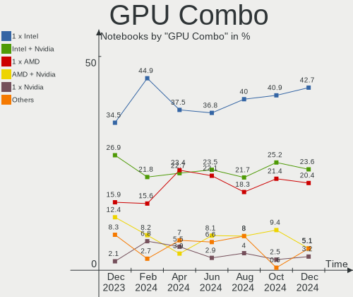
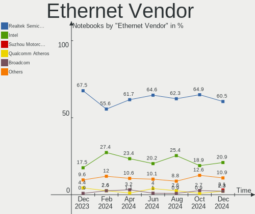
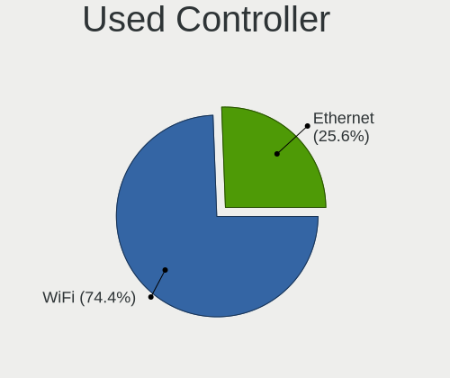

Arch Hardware Trends (Notebook)
-------------------------------

A project to identify most popular hardware characteristics and track their change
over time based on data collected by Arch users at https://Linux-Hardware.org.

Anyone can contribute to the study by uploading probes of their computers by
the [hw-probe](https://github.com/linuxhw/hw-probe) tool:

    sudo -E hw-probe -all -upload

Full-feature report is available here: https://linux-hardware.org/?view=trends&formfactor=notebook

Period: May, 2021.

Contents
--------

- [ OS                       ](#os)
- [ OS Family                ](#os-family)
- [ Kernel                   ](#kernel)
- [ Kernel Family            ](#kernel-family)
- [ Kernel Major Ver.        ](#kernel-major-ver)
- [ Arch                     ](#arch)
- [ DE                       ](#de)
- [ Display Server           ](#display-server)
- [ Display Manager          ](#display-manager)
- [ OS Lang                  ](#os-lang)
- [ Boot Mode                ](#boot-mode)
- [ Filesystem               ](#filesystem)
- [ Part. scheme             ](#part-scheme)
- [ Dual Boot with Linux/BSD ](#dual-boot-with-linux/bsd)
- [ Dual Boot (Win)          ](#dual-boot-win)
- [ Country                  ](#country)
- [ City                     ](#city)
- [ Vendor                   ](#vendor)
- [ Model                    ](#model)
- [ Model Family             ](#model-family)
- [ MFG Year                 ](#mfg-year)
- [ Form Factor              ](#form-factor)
- [ Secure Boot              ](#secure-boot)
- [ Coreboot                 ](#coreboot)
- [ RAM Size                 ](#ram-size)
- [ RAM Used                 ](#ram-used)
- [ Has CD-ROM               ](#has-cd-rom)
- [ Total Drives             ](#total-drives)
- [ Has Ethernet             ](#has-ethernet)
- [ Has WiFi                 ](#has-wifi)
- [ Has Bluetooth            ](#has-bluetooth)
- [ Drive Vendor             ](#drive-vendor)
- [ Drive Model              ](#drive-model)
- [ HDD Vendor               ](#hdd-vendor)
- [ SSD Vendor               ](#ssd-vendor)
- [ Drive Kind               ](#drive-kind)
- [ Drive Connector          ](#drive-connector)
- [ Drive Size               ](#drive-size)
- [ Space Total              ](#space-total)
- [ Space Used               ](#space-used)
- [ Malfunc. Drives          ](#malfunc-drives)
- [ Malfunc. Drive Vendor    ](#malfunc-drive-vendor)
- [ Malfunc. HDD Vendor      ](#malfunc-hdd-vendor)
- [ Malfunc. Drive Kind      ](#malfunc-drive-kind)
- [ Failed Drives            ](#failed-drives)
- [ Failed Drive Vendor      ](#failed-drive-vendor)
- [ Drive Status             ](#drive-status)
- [ Storage Vendor           ](#storage-vendor)
- [ Storage Model            ](#storage-model)
- [ Storage Kind             ](#storage-kind)
- [ CPU Vendor               ](#cpu-vendor)
- [ CPU Model                ](#cpu-model)
- [ CPU Model Family         ](#cpu-model-family)
- [ CPU Cores                ](#cpu-cores)
- [ CPU Sockets              ](#cpu-sockets)
- [ CPU Threads              ](#cpu-threads)
- [ CPU Op-Modes             ](#cpu-op-modes)
- [ CPU Microcode            ](#cpu-microcode)
- [ CPU Microarch            ](#cpu-microarch)
- [ GPU Vendor               ](#gpu-vendor)
- [ GPU Model                ](#gpu-model)
- [ GPU Combo                ](#gpu-combo)
- [ GPU Driver               ](#gpu-driver)
- [ GPU Memory               ](#gpu-memory)
- [ Monitor Vendor           ](#monitor-vendor)
- [ Monitor Model            ](#monitor-model)
- [ Monitor Resolution       ](#monitor-resolution)
- [ Monitor Diagonal         ](#monitor-diagonal)
- [ Monitor Width            ](#monitor-width)
- [ Aspect Ratio             ](#aspect-ratio)
- [ Monitor Area             ](#monitor-area)
- [ Pixel Density            ](#pixel-density)
- [ Multiple Monitors        ](#multiple-monitors)
- [ Net Controller Vendor    ](#net-controller-vendor)
- [ Net Controller Model     ](#net-controller-model)
- [ Wireless Vendor          ](#wireless-vendor)
- [ Wireless Model           ](#wireless-model)
- [ Ethernet Vendor          ](#ethernet-vendor)
- [ Ethernet Model           ](#ethernet-model)
- [ Net Controller Kind      ](#net-controller-kind)
- [ Used Controller          ](#used-controller)
- [ NICs                     ](#nics)
- [ IPv6                     ](#ipv6)
- [ Memory Vendor            ](#memory-vendor)
- [ Memory Model             ](#memory-model)
- [ Memory Kind              ](#memory-kind)
- [ Memory Form Factor       ](#memory-form-factor)
- [ Memory Size              ](#memory-size)
- [ Memory Speed             ](#memory-speed)
- [ Sound Vendor             ](#sound-vendor)
- [ Sound Model              ](#sound-model)
- [ Camera Vendor            ](#camera-vendor)
- [ Camera Model             ](#camera-model)
- [ Fingerprint Vendor       ](#fingerprint-vendor)
- [ Fingerprint Model        ](#fingerprint-model)
- [ Chipcard Vendor          ](#chipcard-vendor)
- [ Chipcard Model           ](#chipcard-model)
- [ Printer Vendor           ](#printer-vendor)
- [ Printer Model            ](#printer-model)
- [ Scanner Vendor           ](#scanner-vendor)
- [ Scanner Model            ](#scanner-model)
- [ Bluetooth Vendor         ](#bluetooth-vendor)
- [ Bluetooth Model          ](#bluetooth-model)
- [ Unsupported Devices      ](#unsupported-devices)
- [ Unsupported Device Types ](#unsupported-device-types)

OS
--

Installed operating systems

| Name         | Notebooks | Percent |
|--------------|-----------|---------|
| Arch         | 43        | 61.43%  |
| Arch Rolling | 27        | 38.57%  |

OS Family
---------

OS without a version

| Name | Notebooks | Percent |
|------|-----------|---------|
| Arch | 70        | 100%    |

Kernel
------

Version of the Linux kernel

| Version                      | Notebooks | Percent |
|------------------------------|-----------|---------|
| 5.11.16-arch1-1              | 11        | 15.71%  |
| 5.12.4-arch1-2               | 7         | 10%     |
| 5.12.3-arch1-1               | 7         | 10%     |
| 5.12.1-arch1-1               | 6         | 8.57%   |
| 5.10.34-1-lts                | 4         | 5.71%   |
| 5.12.7-arch1-1               | 3         | 4.29%   |
| 5.12.2-arch1-1               | 3         | 4.29%   |
| 5.12.1-zen2-1-zen            | 3         | 4.29%   |
| 5.12.8-arch1-1               | 2         | 2.86%   |
| 5.12.6-zen1-1-zen            | 2         | 2.86%   |
| 5.12.5-ck1-S                 | 2         | 2.86%   |
| 5.12.5-arch1-1               | 2         | 2.86%   |
| 5.11.16-zen1-1-zen           | 2         | 2.86%   |
| 5.10.33-1-lts                | 2         | 2.86%   |
| 5.9.3-1-MANJARO              | 1         | 1.43%   |
| 5.4.102-rt53-1-rt-lts        | 1         | 1.43%   |
| 5.12.6-arch1-1               | 1         | 1.43%   |
| 5.12.5-zen1-1-zen            | 1         | 1.43%   |
| 5.12.5-1mbp-16.1-linux-wifi  | 1         | 1.43%   |
| 5.12.4-zen1-2-zen            | 1         | 1.43%   |
| 5.12.2-1-ck-zen              | 1         | 1.43%   |
| 5.11.20-1-mbp                | 1         | 1.43%   |
| 5.11.18-hardened1-1-hardened | 1         | 1.43%   |
| 5.11.15-arch1-2              | 1         | 1.43%   |
| 5.10.41-1-lts                | 1         | 1.43%   |
| 5.10.39-1-lts                | 1         | 1.43%   |
| 5.10.37-1-lts                | 1         | 1.43%   |
| 5.10.35-1-lts                | 1         | 1.43%   |

Kernel Family
-------------

Linux kernel without a distro release

| Version | Notebooks | Percent |
|---------|-----------|---------|
| 5.11.16 | 13        | 18.57%  |
| 5.12.1  | 9         | 12.86%  |
| 5.12.4  | 8         | 11.43%  |
| 5.12.3  | 7         | 10%     |
| 5.12.5  | 6         | 8.57%   |
| 5.12.2  | 4         | 5.71%   |
| 5.10.34 | 4         | 5.71%   |
| 5.12.7  | 3         | 4.29%   |
| 5.12.6  | 3         | 4.29%   |
| 5.12.8  | 2         | 2.86%   |
| 5.10.33 | 2         | 2.86%   |
| 5.9.3   | 1         | 1.43%   |
| 5.4.102 | 1         | 1.43%   |
| 5.11.20 | 1         | 1.43%   |
| 5.11.18 | 1         | 1.43%   |
| 5.11.15 | 1         | 1.43%   |
| 5.10.41 | 1         | 1.43%   |
| 5.10.39 | 1         | 1.43%   |
| 5.10.37 | 1         | 1.43%   |
| 5.10.35 | 1         | 1.43%   |

Kernel Major Ver.
-----------------

Linux kernel major version

| Version | Notebooks | Percent |
|---------|-----------|---------|
| 5.12    | 42        | 60%     |
| 5.11    | 16        | 22.86%  |
| 5.10    | 10        | 14.29%  |
| 5.9     | 1         | 1.43%   |
| 5.4     | 1         | 1.43%   |

Arch
----

OS architecture (x86_64, i586, etc.)

| Name   | Notebooks | Percent |
|--------|-----------|---------|
| x86_64 | 70        | 100%    |

DE
--

Desktop Environment

| Name    | Notebooks | Percent |
|---------|-----------|---------|
| GNOME   | 26        | 37.14%  |
| KDE5    | 17        | 24.29%  |
| XFCE    | 6         | 8.57%   |
| KDE     | 6         | 8.57%   |
| i3      | 5         | 7.14%   |
| Budgie  | 3         | 4.29%   |
| Unknown | 3         | 4.29%   |
| MATE    | 2         | 2.86%   |
| Deepin  | 1         | 1.43%   |
| bspwm   | 1         | 1.43%   |

Display Server
--------------

X11 or Wayland

| Name    | Notebooks | Percent |
|---------|-----------|---------|
| X11     | 45        | 64.29%  |
| Wayland | 12        | 17.14%  |
| Unknown | 7         | 10%     |
| Tty     | 6         | 8.57%   |

Display Manager
---------------

SDDM, LightDM, etc.

| Name    | Notebooks | Percent |
|---------|-----------|---------|
| Unknown | 30        | 42.86%  |
| SDDM    | 20        | 28.57%  |
| GDM     | 8         | 11.43%  |
| TDM     | 7         | 10%     |
| LightDM | 3         | 4.29%   |
| XDM     | 2         | 2.86%   |

OS Lang
-------

Language

| Lang    | Notebooks | Percent |
|---------|-----------|---------|
| en_US   | 38        | 54.29%  |
| pt_BR   | 6         | 8.57%   |
| en_GB   | 6         | 8.57%   |
| Unknown | 5         | 7.14%   |
| fr_FR   | 3         | 4.29%   |
| hu_HU   | 2         | 2.86%   |
| de_DE   | 2         | 2.86%   |
| zh_CN   | 1         | 1.43%   |
| ru_RU   | 1         | 1.43%   |
| fr_CA   | 1         | 1.43%   |
| en_IN   | 1         | 1.43%   |
| en_DE   | 1         | 1.43%   |
| en_CA   | 1         | 1.43%   |
| en-US   | 1         | 1.43%   |
| C       | 1         | 1.43%   |

Boot Mode
---------

EFI or BIOS

| Mode | Notebooks | Percent |
|------|-----------|---------|
| EFI  | 39        | 55.71%  |
| BIOS | 31        | 44.29%  |

Filesystem
----------

Type of filesystem

| Type    | Notebooks | Percent |
|---------|-----------|---------|
| Ext4    | 49        | 70%     |
| Btrfs   | 13        | 18.57%  |
| Xfs     | 3         | 4.29%   |
| F2fs    | 3         | 4.29%   |
| Zfs     | 1         | 1.43%   |
| Unknown | 1         | 1.43%   |

Part. scheme
------------

Scheme of partitioning

| Type    | Notebooks | Percent |
|---------|-----------|---------|
| GPT     | 42        | 60%     |
| Unknown | 23        | 32.86%  |
| MBR     | 5         | 7.14%   |

Dual Boot with Linux/BSD
------------------------

Hosting more than one Linux/BSD

| Dual boot | Notebooks | Percent |
|-----------|-----------|---------|
| No        | 65        | 92.86%  |
| Yes       | 5         | 7.14%   |

Dual Boot (Win)
---------------

Hosting Linux and Windows

| Dual boot | Notebooks | Percent |
|-----------|-----------|---------|
| No        | 57        | 81.43%  |
| Yes       | 13        | 18.57%  |

Country
-------

Geographic location (country)

| Country                | Notebooks | Percent |
|------------------------|-----------|---------|
| USA                    | 10        | 14.29%  |
| Germany                | 6         | 8.57%   |
| Brazil                 | 6         | 8.57%   |
| Poland                 | 4         | 5.71%   |
| Italy                  | 4         | 5.71%   |
| Russia                 | 3         | 4.29%   |
| India                  | 3         | 4.29%   |
| France                 | 3         | 4.29%   |
| Hungary                | 2         | 2.86%   |
| Canada                 | 2         | 2.86%   |
| Bosnia and Herzegovina | 2         | 2.86%   |
| Belgium                | 2         | 2.86%   |
| Vietnam                | 1         | 1.43%   |
| Ukraine                | 1         | 1.43%   |
| UK                     | 1         | 1.43%   |
| Taiwan                 | 1         | 1.43%   |
| Switzerland            | 1         | 1.43%   |
| Sweden                 | 1         | 1.43%   |
| South Korea            | 1         | 1.43%   |
| South Africa           | 1         | 1.43%   |
| Serbia                 | 1         | 1.43%   |
| Réunion               | 1         | 1.43%   |
| Romania                | 1         | 1.43%   |
| Portugal               | 1         | 1.43%   |
| Philippines            | 1         | 1.43%   |
| New Zealand            | 1         | 1.43%   |
| Netherlands            | 1         | 1.43%   |
| Mauritius              | 1         | 1.43%   |
| Malta                  | 1         | 1.43%   |
| Lebanon                | 1         | 1.43%   |
| Latvia                 | 1         | 1.43%   |
| El Salvador            | 1         | 1.43%   |
| Colombia               | 1         | 1.43%   |
| Belarus                | 1         | 1.43%   |
| Azerbaijan             | 1         | 1.43%   |

City
----

Geographic location (city)

| City                   | Notebooks | Percent |
|------------------------|-----------|---------|
| Los Angeles            | 3         | 4.29%   |
| São Paulo             | 2         | 2.86%   |
| San Cesario di Lecce   | 2         | 2.86%   |
| Miskolc                | 2         | 2.86%   |
| Wellington             | 1         | 1.43%   |
| Warsaw                 | 1         | 1.43%   |
| Villingen-Schwenningen | 1         | 1.43%   |
| Vaterstetten           | 1         | 1.43%   |
| Tuzla                  | 1         | 1.43%   |
| The Hague              | 1         | 1.43%   |
| São José dos Campos  | 1         | 1.43%   |
| Szczecin               | 1         | 1.43%   |
| Sorrento               | 1         | 1.43%   |
| Schonenwerd            | 1         | 1.43%   |
| Saratov                | 1         | 1.43%   |
| Santa Mariana          | 1         | 1.43%   |
| Santa Ana              | 1         | 1.43%   |
| San Salvador           | 1         | 1.43%   |
| Saint-Pierre           | 1         | 1.43%   |
| Saint Neots            | 1         | 1.43%   |
| Sabaneta               | 1         | 1.43%   |
| Riga                   | 1         | 1.43%   |
| Quatre Bornes          | 1         | 1.43%   |
| Qormi                  | 1         | 1.43%   |
| Provo                  | 1         | 1.43%   |
| Panaon                 | 1         | 1.43%   |
| Ostfildern             | 1         | 1.43%   |
| Orenburg               | 1         | 1.43%   |
| Nîmes                 | 1         | 1.43%   |
| Novo Gama              | 1         | 1.43%   |
| Norrköping            | 1         | 1.43%   |
| Noida                  | 1         | 1.43%   |
| Mérignac              | 1         | 1.43%   |
| Montreal               | 1         | 1.43%   |
| Montelupo Fiorentino   | 1         | 1.43%   |
| Minsk                  | 1         | 1.43%   |
| McMinnville            | 1         | 1.43%   |
| Maringá               | 1         | 1.43%   |
| Manassas               | 1         | 1.43%   |
| Lubnjow                | 1         | 1.43%   |
| Krakow                 | 1         | 1.43%   |
| Khammam                | 1         | 1.43%   |
| Kazan’               | 1         | 1.43%   |
| Johannesburg           | 1         | 1.43%   |
| Hilden                 | 1         | 1.43%   |
| Hasselt                | 1         | 1.43%   |
| Hasnon                 | 1         | 1.43%   |
| Hanoi                  | 1         | 1.43%   |
| Halifax                | 1         | 1.43%   |
| Greeley                | 1         | 1.43%   |
| Frankfurt am Main      | 1         | 1.43%   |
| Daegu                  | 1         | 1.43%   |
| Coppell                | 1         | 1.43%   |
| Chiayi City            | 1         | 1.43%   |
| Cherkasy               | 1         | 1.43%   |
| Charneca de Caparica   | 1         | 1.43%   |
| Bucharest              | 1         | 1.43%   |
| Brescia                | 1         | 1.43%   |
| Bengaluru              | 1         | 1.43%   |
| Belgrade               | 1         | 1.43%   |

Vendor
------

Motherboard manufacturer

| Name                | Notebooks | Percent |
|---------------------|-----------|---------|
| Lenovo              | 19        | 27.14%  |
| Hewlett-Packard     | 13        | 18.57%  |
| ASUSTek Computer    | 10        | 14.29%  |
| Dell                | 7         | 10%     |
| Apple               | 5         | 7.14%   |
| Acer                | 4         | 5.71%   |
| Samsung Electronics | 3         | 4.29%   |
| HUAWEI              | 2         | 2.86%   |
| Toshiba             | 1         | 1.43%   |
| MSI                 | 1         | 1.43%   |
| Medion              | 1         | 1.43%   |
| Hyperbook           | 1         | 1.43%   |
| Eluktronics         | 1         | 1.43%   |
| 51nb                | 1         | 1.43%   |
| Unknown             | 1         | 1.43%   |

Model
-----

Motherboard model

| Name                                     | Notebooks | Percent |
|------------------------------------------|-----------|---------|
| HUAWEI NBLK-WAX9X                        | 2         | 2.86%   |
| Unknown                                  | 2         | 2.86%   |
| Toshiba Satellite L775-11K               | 1         | 1.43%   |
| Samsung RV411/RV511/E3511/S3511          | 1         | 1.43%   |
| Samsung 700Z3C/700Z5C                    | 1         | 1.43%   |
| Samsung 300E5M/300E5L                    | 1         | 1.43%   |
| MSI GL62 6QF                             | 1         | 1.43%   |
| Medion S4216                             | 1         | 1.43%   |
| Lenovo ThinkPad X270 W10DG 20K5S0HN01    | 1         | 1.43%   |
| Lenovo ThinkPad X1 Carbon 7th 20QDS3B600 | 1         | 1.43%   |
| Lenovo ThinkPad T490 20N2003NUS          | 1         | 1.43%   |
| Lenovo ThinkPad T480 20L5S01J00          | 1         | 1.43%   |
| Lenovo ThinkPad T460s 20F9003UPB         | 1         | 1.43%   |
| Lenovo ThinkPad T460p 20FW0005AU         | 1         | 1.43%   |
| Lenovo ThinkPad T440s 20ARS3B000         | 1         | 1.43%   |
| Lenovo ThinkPad T430 2349N7G             | 1         | 1.43%   |
| Lenovo ThinkPad T420 42363Y5             | 1         | 1.43%   |
| Lenovo ThinkPad L380 20M50013UK          | 1         | 1.43%   |
| Lenovo ThinkPad L14 Gen 1 20U5S02700     | 1         | 1.43%   |
| Lenovo ThinkPad E480 20KN000UCD          | 1         | 1.43%   |
| Lenovo ThinkPad E14 Gen 2 20T6S00D00     | 1         | 1.43%   |
| Lenovo ThinkBook 13s G2 ARE 20WC         | 1         | 1.43%   |
| Lenovo IdeaPad Gaming 3 15ARH05 82EY     | 1         | 1.43%   |
| Lenovo IdeaPad 720S-13ARR 81BR           | 1         | 1.43%   |
| Lenovo IdeaPad 320-15AST 80XV            | 1         | 1.43%   |
| Lenovo G710 20252                        | 1         | 1.43%   |
| Hyperbook Z15 Zen                        | 1         | 1.43%   |
| HP ProBook 470 G2                        | 1         | 1.43%   |
| HP Pavilion Sleekbook 15 PC              | 1         | 1.43%   |
| HP Pavilion Gaming Laptop 15-ec1xxx      | 1         | 1.43%   |
| HP Pavilion g6                           | 1         | 1.43%   |
| HP OMEN by HP Laptop 17-cb0xxx           | 1         | 1.43%   |
| HP OMEN by HP Laptop                     | 1         | 1.43%   |
| HP Laptop 17-ak0xx                       | 1         | 1.43%   |
| HP kip                                   | 1         | 1.43%   |
| HP ElitePad 1000 G2                      | 1         | 1.43%   |
| HP EliteBook Revolve 810 G3              | 1         | 1.43%   |
| HP EliteBook 855 G7 Notebook PC          | 1         | 1.43%   |
| HP 250 G6 Notebook PC                    | 1         | 1.43%   |
| HP 15 Notebook PC                        | 1         | 1.43%   |
| Eluktronics THINN-15                     | 1         | 1.43%   |
| Dell XPS 13 9310                         | 1         | 1.43%   |
| Dell Precision 7540                      | 1         | 1.43%   |
| Dell Latitude E5470                      | 1         | 1.43%   |
| Dell Inspiron N5110                      | 1         | 1.43%   |
| Dell Inspiron 5567                       | 1         | 1.43%   |
| Dell Inspiron 17-7778                    | 1         | 1.43%   |
| Dell Inspiron 15 7000 Gaming             | 1         | 1.43%   |
| ASUS X450MD                              | 1         | 1.43%   |
| ASUS VivoBook_ASUS Laptop X409UA         | 1         | 1.43%   |
| ASUS VivoBook 15_ASUS Laptop X560UD      | 1         | 1.43%   |
| ASUS UX430UAR                            | 1         | 1.43%   |
| ASUS TUF Gaming FX505DT_FX505DT          | 1         | 1.43%   |
| ASUS TP300LD                             | 1         | 1.43%   |
| ASUS Strix 17 GL703GE                    | 1         | 1.43%   |
| ASUS K501UX                              | 1         | 1.43%   |
| ASUS GL702VMK                            | 1         | 1.43%   |
| ASUS ASUS TUF Dash F15 FX516PM_FX516PM   | 1         | 1.43%   |
| Apple MacBookPro9,2                      | 1         | 1.43%   |
| Apple MacBookPro16,1                     | 1         | 1.43%   |

Model Family
------------

Motherboard model prefix

| Name                 | Notebooks | Percent |
|----------------------|-----------|---------|
| Lenovo ThinkPad      | 13        | 18.57%  |
| Dell Inspiron        | 4         | 5.71%   |
| Lenovo IdeaPad       | 3         | 4.29%   |
| HP Pavilion          | 3         | 4.29%   |
| Acer Aspire          | 3         | 4.29%   |
| HUAWEI NBLK-WAX9X    | 2         | 2.86%   |
| HP OMEN              | 2         | 2.86%   |
| HP EliteBook         | 2         | 2.86%   |
| ASUS VivoBook        | 2         | 2.86%   |
| Unknown              | 2         | 2.86%   |
| Toshiba Satellite    | 1         | 1.43%   |
| Samsung RV411        | 1         | 1.43%   |
| Samsung 700Z3C       | 1         | 1.43%   |
| Samsung 300E5M       | 1         | 1.43%   |
| MSI GL62             | 1         | 1.43%   |
| Medion S4216         | 1         | 1.43%   |
| Lenovo ThinkBook     | 1         | 1.43%   |
| Lenovo G710          | 1         | 1.43%   |
| Hyperbook Z15        | 1         | 1.43%   |
| HP ProBook           | 1         | 1.43%   |
| HP Laptop            | 1         | 1.43%   |
| HP kip               | 1         | 1.43%   |
| HP ElitePad          | 1         | 1.43%   |
| HP 250               | 1         | 1.43%   |
| HP 15                | 1         | 1.43%   |
| Eluktronics THINN-15 | 1         | 1.43%   |
| Dell XPS             | 1         | 1.43%   |
| Dell Precision       | 1         | 1.43%   |
| Dell Latitude        | 1         | 1.43%   |
| ASUS X450MD          | 1         | 1.43%   |
| ASUS UX430UAR        | 1         | 1.43%   |
| ASUS TUF             | 1         | 1.43%   |
| ASUS TP300LD         | 1         | 1.43%   |
| ASUS Strix           | 1         | 1.43%   |
| ASUS K501UX          | 1         | 1.43%   |
| ASUS GL702VMK        | 1         | 1.43%   |
| ASUS ASUS            | 1         | 1.43%   |
| Apple MacBookPro9    | 1         | 1.43%   |
| Apple MacBookPro16   | 1         | 1.43%   |
| Apple MacBookPro15   | 1         | 1.43%   |
| Apple MacBookAir7    | 1         | 1.43%   |
| Apple MacBook4       | 1         | 1.43%   |
| Acer Predator        | 1         | 1.43%   |
| 51nb X210            | 1         | 1.43%   |

MFG Year
--------

Motherboard manufacture year

| Year | Notebooks | Percent |
|------|-----------|---------|
| 2020 | 17        | 24.29%  |
| 2019 | 17        | 24.29%  |
| 2021 | 11        | 15.71%  |
| 2017 | 4         | 5.71%   |
| 2012 | 4         | 5.71%   |
| 2018 | 3         | 4.29%   |
| 2016 | 3         | 4.29%   |
| 2015 | 3         | 4.29%   |
| 2011 | 3         | 4.29%   |
| 2014 | 2         | 2.86%   |
| 2013 | 2         | 2.86%   |
| 2008 | 1         | 1.43%   |

Form Factor
-----------

Physical design of the computer

| Name     | Notebooks | Percent |
|----------|-----------|---------|
| Notebook | 70        | 100%    |

Secure Boot
-----------

Enabled or disabled

| State    | Notebooks | Percent |
|----------|-----------|---------|
| Disabled | 70        | 100%    |

Coreboot
--------

Have coreboot on board

| Used | Notebooks | Percent |
|------|-----------|---------|
| No   | 68        | 97.14%  |
| Yes  | 2         | 2.86%   |

RAM Size
--------

Total RAM memory

| Size in GB  | Notebooks | Percent |
|-------------|-----------|---------|
| 4.01-8.0    | 25        | 35.71%  |
| 8.01-16.0   | 16        | 22.86%  |
| 16.01-24.0  | 11        | 15.71%  |
| 32.01-64.0  | 10        | 14.29%  |
| 3.01-4.0    | 6         | 8.57%   |
| 64.01-256.0 | 2         | 2.86%   |

RAM Used
--------

Used RAM memory

| Used GB   | Notebooks | Percent |
|-----------|-----------|---------|
| 1.01-2.0  | 17        | 24.29%  |
| 4.01-8.0  | 15        | 21.43%  |
| 2.01-3.0  | 15        | 21.43%  |
| 3.01-4.0  | 12        | 17.14%  |
| 8.01-16.0 | 6         | 8.57%   |
| 0.51-1.0  | 5         | 7.14%   |

Has CD-ROM
----------

Has CD-ROM on board

| Presented | Notebooks | Percent |
|-----------|-----------|---------|
| No        | 56        | 80%     |
| Yes       | 14        | 20%     |

Total Drives
------------

Number of drives on board

| Drives | Notebooks | Percent |
|--------|-----------|---------|
| 1      | 47        | 67.14%  |
| 2      | 18        | 25.71%  |
| 3      | 5         | 7.14%   |

Has Ethernet
------------

Has Ethernet on board

| Presented | Notebooks | Percent |
|-----------|-----------|---------|
| Yes       | 54        | 77.14%  |
| No        | 16        | 22.86%  |

Has WiFi
--------

Has WiFi module

| Presented | Notebooks | Percent |
|-----------|-----------|---------|
| Yes       | 70        | 100%    |

Has Bluetooth
-------------

Has Bluetooth module

| Presented | Notebooks | Percent |
|-----------|-----------|---------|
| Yes       | 59        | 84.29%  |
| No        | 11        | 15.71%  |

Drive Vendor
------------

Hard drive vendors

| Vendor              | Notebooks | Drives | Percent |
|---------------------|-----------|--------|---------|
| Samsung Electronics | 15        | 18     | 16.3%   |
| Seagate             | 12        | 13     | 13.04%  |
| WDC                 | 9         | 9      | 9.78%   |
| Toshiba             | 9         | 10     | 9.78%   |
| Intel               | 8         | 8      | 8.7%    |
| Unknown             | 6         | 6      | 6.52%   |
| SK Hynix            | 5         | 5      | 5.43%   |
| Apple               | 4         | 4      | 4.35%   |
| Crucial             | 3         | 3      | 3.26%   |
| Transcend           | 2         | 2      | 2.17%   |
| SanDisk             | 2         | 2      | 2.17%   |
| Micron Technology   | 2         | 2      | 2.17%   |
| Kingston            | 2         | 2      | 2.17%   |
| A-DATA Technology   | 2         | 2      | 2.17%   |
| SPCC                | 1         | 1      | 1.09%   |
| SABRENT             | 1         | 1      | 1.09%   |
| Patriot             | 1         | 1      | 1.09%   |
| OCZ                 | 1         | 1      | 1.09%   |
| NeoTech             | 1         | 1      | 1.09%   |
| Lite-On             | 1         | 1      | 1.09%   |
| Lenovo              | 1         | 1      | 1.09%   |
| KingSpec            | 1         | 1      | 1.09%   |
| HS-SSD-E100         | 1         | 1      | 1.09%   |
| Hitachi             | 1         | 1      | 1.09%   |
| HGST                | 1         | 1      | 1.09%   |

Drive Model
-----------

Hard drive models

| Model                                     | Notebooks | Percent |
|-------------------------------------------|-----------|---------|
| Samsung NVMe SSD Drive 512GB              | 3         | 3.09%   |
| Intel NVMe SSD Drive 512GB                | 3         | 3.09%   |
| WDC WDS240G2G0B-00EPW0 240GB SSD          | 2         | 2.06%   |
| WDC WD10SPZX-21Z10T0 1TB                  | 2         | 2.06%   |
| Toshiba MQ01ABD100 1TB                    | 2         | 2.06%   |
| Seagate ST500LT012-1DG142 500GB           | 2         | 2.06%   |
| Seagate ST1000LM035-1RK172 1TB            | 2         | 2.06%   |
| Seagate ST1000LM024 HN-M101MBB 1TB        | 2         | 2.06%   |
| Samsung SSD 970 EVO 1TB                   | 2         | 2.06%   |
| WDC WDS100T2G0A-00JH30 1TB SSD            | 1         | 1.03%   |
| WDC WDS100T2B0B-00YS70 1TB SSD            | 1         | 1.03%   |
| WDC WD10SPCX-75KHST0 1TB                  | 1         | 1.03%   |
| WDC PC SN730 SDBQNTY-512G-1001 512GB      | 1         | 1.03%   |
| WDC PC SN730 SDBPNTY-256G-1027 256GB      | 1         | 1.03%   |
| Unknown SDW16G  16GB                      | 1         | 1.03%   |
| Unknown SD/MMC/MS PRO 8GB                 | 1         | 1.03%   |
| Unknown SC32G  32GB                       | 1         | 1.03%   |
| Unknown SC16G  16GB                       | 1         | 1.03%   |
| Unknown MMC Card  32GB                    | 1         | 1.03%   |
| Unknown 128G32  128GB                     | 1         | 1.03%   |
| Transcend TS256GSSD370 256GB              | 1         | 1.03%   |
| Transcend TS128GMTS800 128GB SSD          | 1         | 1.03%   |
| Toshiba THNSFJ256GDNU A 256GB SSD         | 1         | 1.03%   |
| Toshiba MQ04ABF100 1TB                    | 1         | 1.03%   |
| Toshiba MQ02ABD100H 1TB                   | 1         | 1.03%   |
| Toshiba KXG60ZNV512G NVMe 512GB           | 1         | 1.03%   |
| Toshiba KXG50PNV2T04 NVMe 2048GB          | 1         | 1.03%   |
| Toshiba KXG50PNV1T02 NVMe 1024GB          | 1         | 1.03%   |
| Toshiba KBG40ZNT512G MEMORY 512GB         | 1         | 1.03%   |
| Toshiba HDWJ110 1TB                       | 1         | 1.03%   |
| SPCC M.2 PCIE SSD 512GB                   | 1         | 1.03%   |
| SK Hynix SKHynix_HFS512GD9TNI-L2A0B 512GB | 1         | 1.03%   |
| SK Hynix SKHynix_HFM512GD3HX015N 512GB    | 1         | 1.03%   |
| SK Hynix SC300 M.2 2280 128GB SSD         | 1         | 1.03%   |
| SK Hynix NVMe SSD Drive 512GB             | 1         | 1.03%   |
| SK Hynix BC511 HFM256GDJTNI-82A0A 256GB   | 1         | 1.03%   |
| Seagate ST750LM022 HN-M750MBB 752GB       | 1         | 1.03%   |
| Seagate ST500LM000-1EJ162 500GB           | 1         | 1.03%   |
| Seagate ST2000LX001-1RG174 2TB            | 1         | 1.03%   |
| Seagate ST2000LM007-1R8174 2TB            | 1         | 1.03%   |
| Seagate ST1000LM049-2GH172 1TB            | 1         | 1.03%   |
| Seagate ST1000LM048-2E7172 1TB            | 1         | 1.03%   |
| Seagate Expansion 2TB                     | 1         | 1.03%   |
| SanDisk SSD i100 8GB                      | 1         | 1.03%   |
| SanDisk SD9SN8W512G1002 512GB SSD         | 1         | 1.03%   |
| Samsung SSD 980 500GB                     | 1         | 1.03%   |
| Samsung SSD 970 EVO Plus 2TB              | 1         | 1.03%   |
| Samsung SSD 970 EVO Plus 250GB            | 1         | 1.03%   |
| Samsung SSD 860 EVO M.2 500GB             | 1         | 1.03%   |
| Samsung SSD 860 EVO 500GB                 | 1         | 1.03%   |
| Samsung SSD 860 EVO 1TB                   | 1         | 1.03%   |
| Samsung SSD 850 EVO 500GB                 | 1         | 1.03%   |
| Samsung SSD 850 EVO 1TB                   | 1         | 1.03%   |
| Samsung NVMe SSD Drive 256GB              | 1         | 1.03%   |
| Samsung NVMe SSD Drive 250GB              | 1         | 1.03%   |
| Samsung MZVLB512HBJQ-00000 512GB          | 1         | 1.03%   |
| Samsung MZNLF128HCHP-00004 128GB SSD      | 1         | 1.03%   |
| Samsung MZMPC032HBCD-00000 32GB SSD       | 1         | 1.03%   |
| SABRENT Disk 240GB                        | 1         | 1.03%   |
| Patriot Burst 240GB SSD                   | 1         | 1.03%   |

HDD Vendor
----------

Hard disk drive vendors

| Vendor  | Notebooks | Drives | Percent |
|---------|-----------|--------|---------|
| Seagate | 12        | 13     | 50%     |
| Toshiba | 5         | 5      | 20.83%  |
| WDC     | 3         | 3      | 12.5%   |
| NeoTech | 1         | 1      | 4.17%   |
| Hitachi | 1         | 1      | 4.17%   |
| HGST    | 1         | 1      | 4.17%   |
| Apple   | 1         | 1      | 4.17%   |

SSD Vendor
----------

Solid state drive vendors

| Vendor              | Notebooks | Drives | Percent |
|---------------------|-----------|--------|---------|
| Samsung Electronics | 7         | 7      | 20.59%  |
| WDC                 | 4         | 4      | 11.76%  |
| Intel               | 4         | 4      | 11.76%  |
| Transcend           | 2         | 2      | 5.88%   |
| SanDisk             | 2         | 2      | 5.88%   |
| Kingston            | 2         | 2      | 5.88%   |
| Crucial             | 2         | 2      | 5.88%   |
| A-DATA Technology   | 2         | 2      | 5.88%   |
| Toshiba             | 1         | 1      | 2.94%   |
| SK Hynix            | 1         | 1      | 2.94%   |
| SABRENT             | 1         | 1      | 2.94%   |
| Patriot             | 1         | 1      | 2.94%   |
| OCZ                 | 1         | 1      | 2.94%   |
| Micron Technology   | 1         | 1      | 2.94%   |
| KingSpec            | 1         | 1      | 2.94%   |
| HS-SSD-E100         | 1         | 1      | 2.94%   |
| Apple               | 1         | 1      | 2.94%   |

Drive Kind
----------

HDD or SSD

| Kind    | Notebooks | Drives | Percent |
|---------|-----------|--------|---------|
| SSD     | 31        | 34     | 34.83%  |
| NVMe    | 28        | 32     | 31.46%  |
| HDD     | 24        | 25     | 26.97%  |
| MMC     | 5         | 5      | 5.62%   |
| Unknown | 1         | 1      | 1.12%   |

Drive Connector
---------------

SATA, SAS, NVMe, etc.

| Type | Notebooks | Drives | Percent |
|------|-----------|--------|---------|
| SATA | 45        | 56     | 54.88%  |
| NVMe | 28        | 32     | 34.15%  |
| MMC  | 5         | 5      | 6.1%    |
| SAS  | 4         | 4      | 4.88%   |

Drive Size
----------

Size of hard drive

| Size in TB | Notebooks | Drives | Percent |
|------------|-----------|--------|---------|
| 0.01-0.5   | 27        | 29     | 47.37%  |
| 0.51-1.0   | 26        | 26     | 45.61%  |
| 1.01-2.0   | 4         | 4      | 7.02%   |

Space Total
-----------

Amount of disk space available on the file system

| Size in GB     | Notebooks | Percent |
|----------------|-----------|---------|
| 251-500        | 19        | 27.14%  |
| 101-250        | 19        | 27.14%  |
| 501-1000       | 13        | 18.57%  |
| 1001-2000      | 7         | 10%     |
| 2001-3000      | 3         | 4.29%   |
| 1-20           | 3         | 4.29%   |
| 51-100         | 3         | 4.29%   |
| Unknown        | 2         | 2.86%   |
| More than 3000 | 1         | 1.43%   |

Space Used
----------

Amount of used disk space

| Used GB   | Notebooks | Percent |
|-----------|-----------|---------|
| 101-250   | 13        | 18.57%  |
| 501-1000  | 13        | 18.57%  |
| 51-100    | 13        | 18.57%  |
| 21-50     | 10        | 14.29%  |
| 1-20      | 10        | 14.29%  |
| 251-500   | 8         | 11.43%  |
| Unknown   | 2         | 2.86%   |
| 2001-3000 | 1         | 1.43%   |

Malfunc. Drives
---------------

Drive models with a malfunction

| Model                           | Notebooks | Drives | Percent |
|---------------------------------|-----------|--------|---------|
| Toshiba MQ02ABD100H 1TB         | 1         | 1      | 33.33%  |
| Intel SSDSCKJF180A5H RSED 180GB | 1         | 1      | 33.33%  |
| Apple HDD HTS545050A7E362 500GB | 1         | 1      | 33.33%  |

Malfunc. Drive Vendor
---------------------

Vendors of faulty drives

| Vendor  | Notebooks | Drives | Percent |
|---------|-----------|--------|---------|
| Toshiba | 1         | 1      | 33.33%  |
| Intel   | 1         | 1      | 33.33%  |
| Apple   | 1         | 1      | 33.33%  |

Malfunc. HDD Vendor
-------------------

Vendors of faulty HDD drives

| Vendor  | Notebooks | Drives | Percent |
|---------|-----------|--------|---------|
| Toshiba | 1         | 1      | 50%     |
| Apple   | 1         | 1      | 50%     |

Malfunc. Drive Kind
-------------------

Kinds of faulty drives

| Kind | Notebooks | Drives | Percent |
|------|-----------|--------|---------|
| HDD  | 2         | 2      | 66.67%  |
| SSD  | 1         | 1      | 33.33%  |

Failed Drives
-------------

Failed drive models

Zero info for selected period =(

Failed Drive Vendor
-------------------

Failed drive vendors

Zero info for selected period =(

Drive Status
------------

Number of failed and malfunc. drives

| Status   | Notebooks | Drives | Percent |
|----------|-----------|--------|---------|
| Works    | 37        | 48     | 48.68%  |
| Detected | 36        | 46     | 47.37%  |
| Malfunc  | 3         | 3      | 3.95%   |

Storage Vendor
--------------

Storage controller vendors

| Vendor                       | Notebooks | Percent |
|------------------------------|-----------|---------|
| Intel                        | 45        | 56.25%  |
| Samsung Electronics          | 10        | 12.5%   |
| AMD                          | 9         | 11.25%  |
| SK Hynix                     | 4         | 5%      |
| Toshiba America Info Systems | 2         | 2.5%    |
| Sandisk                      | 2         | 2.5%    |
| Apple                        | 2         | 2.5%    |
| Silicon Motion               | 1         | 1.25%   |
| Micron/Crucial Technology    | 1         | 1.25%   |
| Micron Technology            | 1         | 1.25%   |
| Lite-On Technology           | 1         | 1.25%   |
| Lenovo                       | 1         | 1.25%   |
| KIOXIA                       | 1         | 1.25%   |

Storage Model
-------------

Storage controller models

| Model                                                                            | Notebooks | Percent |
|----------------------------------------------------------------------------------|-----------|---------|
| Intel Sunrise Point-LP SATA Controller [AHCI mode]                               | 12        | 14.46%  |
| AMD FCH SATA Controller [AHCI mode]                                              | 9         | 10.84%  |
| Samsung NVMe SSD Controller SM981/PM981/PM983                                    | 7         | 8.43%   |
| Intel 82801 Mobile SATA Controller [RAID mode]                                   | 6         | 7.23%   |
| Intel HM170/QM170 Chipset SATA Controller [AHCI Mode]                            | 5         | 6.02%   |
| Intel SSD 660P Series                                                            | 4         | 4.82%   |
| Intel 7 Series Chipset Family 6-port SATA Controller [AHCI mode]                 | 4         | 4.82%   |
| Intel 6 Series/C200 Series Chipset Family 6 port Mobile SATA AHCI Controller     | 4         | 4.82%   |
| Intel 8 Series SATA Controller 1 [AHCI mode]                                     | 3         | 3.61%   |
| Toshiba America Info Systems Toshiba America Info Non-Volatile memory controller | 2         | 2.41%   |
| SK Hynix NVMe SSD Controller                                                     | 2         | 2.41%   |
| Sandisk WD Black SN750 / PC SN730 NVMe SSD                                       | 2         | 2.41%   |
| Intel Cannon Lake Mobile PCH SATA AHCI Controller                                | 2         | 2.41%   |
| Apple ANS2 NVMe Controller                                                       | 2         | 2.41%   |
| Toshiba America Info Systems XG6 NVMe SSD Controller                             | 1         | 1.2%    |
| SK Hynix Non-Volatile memory controller                                          | 1         | 1.2%    |
| SK Hynix BC511                                                                   | 1         | 1.2%    |
| Silicon Motion SM2263EN/SM2263XT SSD Controller                                  | 1         | 1.2%    |
| Samsung NVMe SSD Controller SM961/PM961/SM963                                    | 1         | 1.2%    |
| Samsung NVMe Controller                                                          | 1         | 1.2%    |
| Samsung Electronics SATA controller                                              | 1         | 1.2%    |
| Micron/Crucial P2 NVMe PCIe SSD                                                  | 1         | 1.2%    |
| Micron Non-Volatile memory controller                                            | 1         | 1.2%    |
| Lite-On Non-Volatile memory controller                                           | 1         | 1.2%    |
| Lenovo Non-Volatile memory controller                                            | 1         | 1.2%    |
| KIOXIA Non-Volatile memory controller                                            | 1         | 1.2%    |
| Intel Wildcat Point-LP SATA Controller [AHCI Mode]                               | 1         | 1.2%    |
| Intel Volume Management Device NVMe RAID Controller                              | 1         | 1.2%    |
| Intel Atom Processor E3800 Series SATA AHCI Controller                           | 1         | 1.2%    |
| Intel 82801HM/HEM (ICH8M/ICH8M-E) SATA Controller [AHCI mode]                    | 1         | 1.2%    |
| Intel 82801HM/HEM (ICH8M/ICH8M-E) IDE Controller                                 | 1         | 1.2%    |
| Intel 8 Series/C220 Series Chipset Family 6-port SATA Controller 1 [AHCI mode]   | 1         | 1.2%    |
| Intel 5 Series/3400 Series Chipset 4 port SATA AHCI Controller                   | 1         | 1.2%    |

Storage Kind
------------

Kind of storage controller (IDE, SATA, NVMe, SAS, ...)

| Kind | Notebooks | Percent |
|------|-----------|---------|
| SATA | 45        | 55.56%  |
| NVMe | 28        | 34.57%  |
| RAID | 7         | 8.64%   |
| IDE  | 1         | 1.23%   |

CPU Vendor
----------

Processor vendors

| Vendor | Notebooks | Percent |
|--------|-----------|---------|
| Intel  | 53        | 75.71%  |
| AMD    | 17        | 24.29%  |

CPU Model
---------

Processor models

| Model                                         | Notebooks | Percent |
|-----------------------------------------------|-----------|---------|
| Intel Core i5-8250U CPU @ 1.60GHz             | 4         | 5.71%   |
| Intel Core i5-7200U CPU @ 2.50GHz             | 4         | 5.71%   |
| Intel Core i5-6200U CPU @ 2.30GHz             | 3         | 4.29%   |
| AMD Ryzen 7 4800H with Radeon Graphics        | 3         | 4.29%   |
| Intel Core i7-9750H CPU @ 2.60GHz             | 2         | 2.86%   |
| Intel Core i7-8550U CPU @ 1.80GHz             | 2         | 2.86%   |
| Intel Core i7-7700HQ CPU @ 2.80GHz            | 2         | 2.86%   |
| Intel Core i5-3230M CPU @ 2.60GHz             | 2         | 2.86%   |
| Intel Core i5-2410M CPU @ 2.30GHz             | 2         | 2.86%   |
| AMD Ryzen 7 4800U with Radeon Graphics        | 2         | 2.86%   |
| AMD Ryzen 5 3500U with Radeon Vega Mobile Gfx | 2         | 2.86%   |
| AMD A9-9420 RADEON R5, 5 COMPUTE CORES 2C+3G  | 2         | 2.86%   |
| Intel Xeon E-2286M CPU @ 2.40GHz              | 1         | 1.43%   |
| Intel Pentium CPU N3530 @ 2.16GHz             | 1         | 1.43%   |
| Intel Core i9-9880H CPU @ 2.30GHz             | 1         | 1.43%   |
| Intel Core i7-8850H CPU @ 2.60GHz             | 1         | 1.43%   |
| Intel Core i7-8750H CPU @ 2.20GHz             | 1         | 1.43%   |
| Intel Core i7-8665U CPU @ 1.90GHz             | 1         | 1.43%   |
| Intel Core i7-6700HQ CPU @ 2.60GHz            | 1         | 1.43%   |
| Intel Core i7-6500U CPU @ 2.50GHz             | 1         | 1.43%   |
| Intel Core i7-4702MQ CPU @ 2.20GHz            | 1         | 1.43%   |
| Intel Core i7-4600U CPU @ 2.10GHz             | 1         | 1.43%   |
| Intel Core i7-3635QM CPU @ 2.40GHz            | 1         | 1.43%   |
| Intel Core i7-2630QM CPU @ 2.00GHz            | 1         | 1.43%   |
| Intel Core i5-8365U CPU @ 1.60GHz             | 1         | 1.43%   |
| Intel Core i5-7300HQ CPU @ 2.50GHz            | 1         | 1.43%   |
| Intel Core i5-6440HQ CPU @ 2.60GHz            | 1         | 1.43%   |
| Intel Core i5-6300U CPU @ 2.40GHz             | 1         | 1.43%   |
| Intel Core i5-5350U CPU @ 1.80GHz             | 1         | 1.43%   |
| Intel Core i5-5300U CPU @ 2.30GHz             | 1         | 1.43%   |
| Intel Core i5-4210U CPU @ 1.70GHz             | 1         | 1.43%   |
| Intel Core i5-3317U CPU @ 1.70GHz             | 1         | 1.43%   |
| Intel Core i5-3210M CPU @ 2.50GHz             | 1         | 1.43%   |
| Intel Core i5-2540M CPU @ 2.60GHz             | 1         | 1.43%   |
| Intel Core i3-7020U CPU @ 2.30GHz             | 1         | 1.43%   |
| Intel Core i3-6006U CPU @ 2.00GHz             | 1         | 1.43%   |
| Intel Core i3-4030U CPU @ 1.90GHz             | 1         | 1.43%   |
| Intel Core i3-3217U CPU @ 1.80GHz             | 1         | 1.43%   |
| Intel Core i3 CPU M 380 @ 2.53GHz             | 1         | 1.43%   |
| Intel Core 2 Duo CPU T8300 @ 2.40GHz          | 1         | 1.43%   |
| Intel Celeron CPU N2840 @ 2.16GHz             | 1         | 1.43%   |
| Intel Atom CPU Z3795 @ 1.60GHz                | 1         | 1.43%   |
| Intel 11th Gen Core i7-11370H @ 3.30GHz       | 1         | 1.43%   |
| Intel 11th Gen Core i5-1135G7 @ 2.40GHz       | 1         | 1.43%   |
| AMD Ryzen 7 PRO 4750U with Radeon Graphics    | 1         | 1.43%   |
| AMD Ryzen 7 4700U with Radeon Graphics        | 1         | 1.43%   |
| AMD Ryzen 7 3750H with Radeon Vega Mobile Gfx | 1         | 1.43%   |
| AMD Ryzen 5 4600H with Radeon Graphics        | 1         | 1.43%   |
| AMD Ryzen 5 4500U with Radeon Graphics        | 1         | 1.43%   |
| AMD Ryzen 5 2500U with Radeon Vega Mobile Gfx | 1         | 1.43%   |
| AMD A6-5200 APU with Radeon HD Graphics       | 1         | 1.43%   |
| AMD A4-5000 APU with Radeon HD Graphics       | 1         | 1.43%   |

CPU Model Family
----------------

Processor model prefix

| Model            | Notebooks | Percent |
|------------------|-----------|---------|
| Intel Core i5    | 25        | 35.71%  |
| Intel Core i7    | 15        | 21.43%  |
| AMD Ryzen 7      | 7         | 10%     |
| Intel Core i3    | 5         | 7.14%   |
| AMD Ryzen 5      | 5         | 7.14%   |
| Other            | 4         | 5.71%   |
| Intel Xeon       | 1         | 1.43%   |
| Intel Pentium    | 1         | 1.43%   |
| Intel Core i9    | 1         | 1.43%   |
| Intel Core 2 Duo | 1         | 1.43%   |
| Intel Celeron    | 1         | 1.43%   |
| Intel Atom       | 1         | 1.43%   |
| AMD Ryzen 7 PRO  | 1         | 1.43%   |
| AMD A6           | 1         | 1.43%   |
| AMD A4           | 1         | 1.43%   |

CPU Cores
---------

Number of processor cores

| Number | Notebooks | Percent |
|--------|-----------|---------|
| 2      | 29        | 41.43%  |
| 4      | 26        | 37.14%  |
| 8      | 9         | 12.86%  |
| 6      | 6         | 8.57%   |

CPU Sockets
-----------

Number of sockets

| Number | Notebooks | Percent |
|--------|-----------|---------|
| 1      | 70        | 100%    |

CPU Threads
-----------

Threads per core (Hyper-Threading)

| Number | Notebooks | Percent |
|--------|-----------|---------|
| 2      | 58        | 82.86%  |
| 1      | 12        | 17.14%  |

CPU Op-Modes
------------

CPU Operation Modes (32-bit, 64-bit)

| Op mode        | Notebooks | Percent |
|----------------|-----------|---------|
| 32-bit, 64-bit | 70        | 100%    |

CPU Microcode
-------------

Microcode number

| Number     | Notebooks | Percent |
|------------|-----------|---------|
| Unknown    | 29        | 41.43%  |
| 0x08600106 | 5         | 7.14%   |
| 0x906e9    | 3         | 4.29%   |
| 0x806ea    | 3         | 4.29%   |
| 0x806e9    | 3         | 4.29%   |
| 0x30678    | 3         | 4.29%   |
| 0x08600103 | 3         | 4.29%   |
| 0x806ec    | 2         | 2.86%   |
| 0x406e3    | 2         | 2.86%   |
| 0x306d4    | 2         | 2.86%   |
| 0x306a9    | 2         | 2.86%   |
| 0x206a7    | 2         | 2.86%   |
| 0x08108109 | 2         | 2.86%   |
| 0x906ed    | 1         | 1.43%   |
| 0x906ea    | 1         | 1.43%   |
| 0x806c1    | 1         | 1.43%   |
| 0x506e3    | 1         | 1.43%   |
| 0x40651    | 1         | 1.43%   |
| 0x306c3    | 1         | 1.43%   |
| 0x20655    | 1         | 1.43%   |
| 0x08101004 | 1         | 1.43%   |
| 0x06006705 | 1         | 1.43%   |

CPU Microarch
-------------

Microarchitecture

| Name        | Notebooks | Percent |
|-------------|-----------|---------|
| KabyLake    | 22        | 31.43%  |
| Zen 2       | 9         | 12.86%  |
| Skylake     | 8         | 11.43%  |
| IvyBridge   | 6         | 8.57%   |
| SandyBridge | 4         | 5.71%   |
| Haswell     | 4         | 5.71%   |
| Zen+        | 3         | 4.29%   |
| Silvermont  | 3         | 4.29%   |
| TigerLake   | 2         | 2.86%   |
| Jaguar      | 2         | 2.86%   |
| Excavator   | 2         | 2.86%   |
| Broadwell   | 2         | 2.86%   |
| Zen         | 1         | 1.43%   |
| Westmere    | 1         | 1.43%   |
| Penryn      | 1         | 1.43%   |

GPU Vendor
----------

Vendors of graphics cards

| Vendor | Notebooks | Percent |
|--------|-----------|---------|
| Intel  | 45        | 47.87%  |
| AMD    | 25        | 26.6%   |
| Nvidia | 24        | 25.53%  |

GPU Model
---------

Graphics card models

| Model                                                                                 | Notebooks | Percent |
|---------------------------------------------------------------------------------------|-----------|---------|
| AMD Renoir                                                                            | 9         | 9.38%   |
| Intel UHD Graphics 620                                                                | 6         | 6.25%   |
| Intel Skylake GT2 [HD Graphics 520]                                                   | 6         | 6.25%   |
| Intel 3rd Gen Core processor Graphics Controller                                      | 6         | 6.25%   |
| Nvidia GF117M [GeForce 610M/710M/810M/820M / GT 620M/625M/630M/720M]                  | 4         | 4.17%   |
| Intel HD Graphics 620                                                                 | 4         | 4.17%   |
| Intel Haswell-ULT Integrated Graphics Controller                                      | 3         | 3.13%   |
| Intel CoffeeLake-H GT2 [UHD Graphics 630]                                             | 3         | 3.13%   |
| Intel Atom Processor Z36xxx/Z37xxx Series Graphics & Display                          | 3         | 3.13%   |
| AMD Picasso                                                                           | 3         | 3.13%   |
| Nvidia TU116M [GeForce GTX 1660 Ti Mobile]                                            | 2         | 2.08%   |
| Nvidia GP107M [GeForce GTX 1050 Mobile]                                               | 2         | 2.08%   |
| Nvidia GM108M [GeForce 940MX]                                                         | 2         | 2.08%   |
| Intel WhiskeyLake-U GT2 [UHD Graphics 620]                                            | 2         | 2.08%   |
| Intel TigerLake-LP GT2 [Iris Xe Graphics]                                             | 2         | 2.08%   |
| Intel HD Graphics 530                                                                 | 2         | 2.08%   |
| Intel 2nd Generation Core Processor Family Integrated Graphics Controller             | 2         | 2.08%   |
| AMD Stoney [Radeon R2/R3/R4/R5 Graphics]                                              | 2         | 2.08%   |
| Nvidia TU117M [GeForce GTX 1650 Ti Mobile]                                            | 1         | 1.04%   |
| Nvidia TU117M [GeForce GTX 1650 Mobile / Max-Q]                                       | 1         | 1.04%   |
| Nvidia TU117M                                                                         | 1         | 1.04%   |
| Nvidia TU106M [GeForce RTX 2060 Mobile]                                               | 1         | 1.04%   |
| Nvidia GT218M [GeForce 315M]                                                          | 1         | 1.04%   |
| Nvidia GP107M [GeForce GTX 1050 Ti Mobile]                                            | 1         | 1.04%   |
| Nvidia GP106BM [GeForce GTX 1060 Mobile 6GB]                                          | 1         | 1.04%   |
| Nvidia GP104BM [GeForce GTX 1070 Mobile]                                              | 1         | 1.04%   |
| Nvidia GM107M [GeForce GTX 960M]                                                      | 1         | 1.04%   |
| Nvidia GM107M [GeForce GTX 950M]                                                      | 1         | 1.04%   |
| Nvidia GK107M [GeForce GT 640M]                                                       | 1         | 1.04%   |
| Nvidia GF119M [Quadro NVS 4200M]                                                      | 1         | 1.04%   |
| Nvidia GF108M [GeForce GT 525M]                                                       | 1         | 1.04%   |
| Nvidia GA106M [GeForce RTX 3060 Mobile / Max-Q]                                       | 1         | 1.04%   |
| Intel Mobile GM965/GL960 Integrated Graphics Controller (secondary)                   | 1         | 1.04%   |
| Intel Mobile GM965/GL960 Integrated Graphics Controller (primary)                     | 1         | 1.04%   |
| Intel Kaby Lake-U GT2f HD 620 Graphics Controller                                     | 1         | 1.04%   |
| Intel HD Graphics 630                                                                 | 1         | 1.04%   |
| Intel HD Graphics 6000                                                                | 1         | 1.04%   |
| Intel HD Graphics 5500                                                                | 1         | 1.04%   |
| Intel 4th Gen Core Processor Integrated Graphics Controller                           | 1         | 1.04%   |
| AMD Topaz XT [Radeon R7 M260/M265 / M340/M360 / M440/M445 / 530/535 / 620/625 Mobile] | 1         | 1.04%   |
| AMD Topaz PRO [Radeon R5 M255]                                                        | 1         | 1.04%   |
| AMD Thames [Radeon HD 7500M/7600M Series]                                             | 1         | 1.04%   |
| AMD Sun XT [Radeon HD 8670A/8670M/8690M / R5 M330 / M430 / Radeon 520 Mobile]         | 1         | 1.04%   |
| AMD Raven Ridge [Radeon Vega Series / Radeon Vega Mobile Series]                      | 1         | 1.04%   |
| AMD Navi 14 [Radeon RX 5500/5500M / Pro 5500M]                                        | 1         | 1.04%   |
| AMD Lexa XT [Radeon PRO WX 3200]                                                      | 1         | 1.04%   |
| AMD Lexa PRO [Radeon 540/540X/550/550X / RX 540X/550/550X]                            | 1         | 1.04%   |
| AMD Kabini [Radeon HD 8400 / R3 Series]                                               | 1         | 1.04%   |
| AMD Kabini [Radeon HD 8330]                                                           | 1         | 1.04%   |
| AMD Granville [Radeon HD 6850M/6870M]                                                 | 1         | 1.04%   |
| AMD Baffin [Radeon RX 460/560D / Pro 450/455/460/555/555X/560/560X]                   | 1         | 1.04%   |

GPU Combo
---------

Combinations of graphics cards

| Name           | Notebooks | Percent |
|----------------|-----------|---------|
| 1 x Intel      | 25        | 35.71%  |
| Intel + Nvidia | 15        | 21.43%  |
| 1 x AMD        | 15        | 21.43%  |
| 1 x Nvidia     | 5         | 7.14%   |
| Intel + AMD    | 5         | 7.14%   |
| AMD + Nvidia   | 4         | 5.71%   |
| 2 x AMD        | 1         | 1.43%   |

GPU Driver
----------

Free vs proprietary

| Driver      | Notebooks | Percent |
|-------------|-----------|---------|
| Free        | 55        | 78.57%  |
| Proprietary | 15        | 21.43%  |

GPU Memory
----------

Total video memory

| Size in GB | Notebooks | Percent |
|------------|-----------|---------|
| Unknown    | 45        | 64.29%  |
| 0.01-0.5   | 8         | 11.43%  |
| 0.51-1.0   | 7         | 10%     |
| 5.01-6.0   | 4         | 5.71%   |
| 3.01-4.0   | 3         | 4.29%   |
| 1.01-2.0   | 2         | 2.86%   |
| 7.01-8.0   | 1         | 1.43%   |

Monitor Vendor
--------------

Monitor vendors

| Vendor                  | Notebooks | Percent |
|-------------------------|-----------|---------|
| Chimei Innolux          | 16        | 17.78%  |
| AU Optronics            | 14        | 15.56%  |
| BOE                     | 13        | 14.44%  |
| LG Display              | 9         | 10%     |
| Samsung Electronics     | 8         | 8.89%   |
| Dell                    | 7         | 7.78%   |
| Apple                   | 5         | 5.56%   |
| Lenovo                  | 3         | 3.33%   |
| Hewlett-Packard         | 3         | 3.33%   |
| Sharp                   | 2         | 2.22%   |
| PANDA                   | 2         | 2.22%   |
| InfoVision              | 2         | 2.22%   |
| Vestel Elektronik       | 1         | 1.11%   |
| Philips                 | 1         | 1.11%   |
| NEC Computers           | 1         | 1.11%   |
| CHR                     | 1         | 1.11%   |
| Chi Mei Optoelectronics | 1         | 1.11%   |
| Ancor Communications    | 1         | 1.11%   |

Monitor Model
-------------

Monitor models

| Model                                                                     | Notebooks | Percent |
|---------------------------------------------------------------------------|-----------|---------|
| Dell U2412M DELA07A 1920x1200 518x324mm 24.1-inch                         | 2         | 2.17%   |
| Chimei Innolux LCD Monitor CMN14D4 1920x1080 309x173mm 13.9-inch          | 2         | 2.17%   |
| Vestel Elektronik 50UHD_LCD_TV VES3700 3840x2160 1872x1053mm 84.6-inch    | 1         | 1.09%   |
| Sharp LQ156M1JW01 SHP14C3 1920x1080 344x194mm 15.5-inch                   | 1         | 1.09%   |
| Sharp LCD Monitor SHP14F9 1920x1200 288x180mm 13.4-inch                   | 1         | 1.09%   |
| Samsung Electronics SyncMaster SAM01CF 1600x1200 432x324mm 21.3-inch      | 1         | 1.09%   |
| Samsung Electronics SyncMaster SAM01BB 1280x1024 376x301mm 19.0-inch      | 1         | 1.09%   |
| Samsung Electronics S24D330 SAM0D92 1920x1080 531x299mm 24.0-inch         | 1         | 1.09%   |
| Samsung Electronics LCD Monitor SEC5441 1366x768 344x194mm 15.5-inch      | 1         | 1.09%   |
| Samsung Electronics LCD Monitor SEC315A 1366x768 344x194mm 15.5-inch      | 1         | 1.09%   |
| Samsung Electronics LCD Monitor SEC314B 1680x945 409x230mm 18.5-inch      | 1         | 1.09%   |
| Samsung Electronics LCD Monitor SEC304C 1920x1080 353x198mm 15.9-inch     | 1         | 1.09%   |
| Samsung Electronics LCD Monitor SAM0902 1920x1080 1020x570mm 46.0-inch    | 1         | 1.09%   |
| Philips 236V4 PHLC0B3 1920x1080 510x287mm 23.0-inch                       | 1         | 1.09%   |
| PANDA LCD Monitor NCP004D 1920x1080 344x194mm 15.5-inch                   | 1         | 1.09%   |
| PANDA LCD Monitor NCP0036 1920x1080 344x194mm 15.5-inch                   | 1         | 1.09%   |
| NEC Computers LCD1770NX NEC6664 1280x1024 338x270mm 17.0-inch             | 1         | 1.09%   |
| LG Display LCD Monitor LGD0582 3000x2000 275x183mm 13.0-inch              | 1         | 1.09%   |
| LG Display LCD Monitor LGD053F 1920x1080 344x194mm 15.5-inch              | 1         | 1.09%   |
| LG Display LCD Monitor LGD04FF 1920x1080 309x174mm 14.0-inch              | 1         | 1.09%   |
| LG Display LCD Monitor LGD04EF 1920x1080 294x165mm 13.3-inch              | 1         | 1.09%   |
| LG Display LCD Monitor LGD04E8 1920x1080 382x215mm 17.3-inch              | 1         | 1.09%   |
| LG Display LCD Monitor LGD046E 1920x1080 380x210mm 17.1-inch              | 1         | 1.09%   |
| LG Display LCD Monitor LGD0396 1600x900 382x215mm 17.3-inch               | 1         | 1.09%   |
| LG Display LCD Monitor LGD02F7 1600x900 382x215mm 17.3-inch               | 1         | 1.09%   |
| LG Display LCD Monitor LGD02E2 1600x900 310x174mm 14.0-inch               | 1         | 1.09%   |
| Lenovo Q24h-10 LEN66A8 2560x1440 526x296mm 23.8-inch                      | 1         | 1.09%   |
| Lenovo LEN T2424pA LEN60C8 1920x1080 527x296mm 23.8-inch                  | 1         | 1.09%   |
| Lenovo LEN T2324pA LEN60C7 1920x1080 509x286mm 23.0-inch                  | 1         | 1.09%   |
| Lenovo LEN L24q-30 LEN65FB 2560x1440 527x296mm 23.8-inch                  | 1         | 1.09%   |
| InfoVision LCD Monitor IVO0533 1366x768 293x164mm 13.2-inch               | 1         | 1.09%   |
| InfoVision LCD Monitor IVO04E5 1366x768 276x155mm 12.5-inch               | 1         | 1.09%   |
| Hewlett-Packard w2216 HWP2819 1680x1050 465x291mm 21.6-inch               | 1         | 1.09%   |
| Hewlett-Packard E233 HPN3460 1920x1080 509x286mm 23.0-inch                | 1         | 1.09%   |
| Hewlett-Packard 27fw HPN354A 1920x1080 598x336mm 27.0-inch                | 1         | 1.09%   |
| Dell U3818DW DELA0F3 3840x1600 880x370mm 37.6-inch                        | 1         | 1.09%   |
| Dell U2719DC DEL417E 2560x1440 597x336mm 27.0-inch                        | 1         | 1.09%   |
| Dell S3220DGF DELD0F3 2560x1440 697x392mm 31.5-inch                       | 1         | 1.09%   |
| Dell P2417H DELA0DC 1920x1080 527x296mm 23.8-inch                         | 1         | 1.09%   |
| Dell P2414H DELA09B 1920x1080 530x300mm 24.0-inch                         | 1         | 1.09%   |
| Dell P2414H DELA09A 1920x1080 527x297mm 23.8-inch                         | 1         | 1.09%   |
| CHR AIO-21.5"-10 CHR7511 1920x1080 476x268mm 21.5-inch                    | 1         | 1.09%   |
| Chimei Innolux LCD Monitor CMN176C 1920x1080 381x214mm 17.2-inch          | 1         | 1.09%   |
| Chimei Innolux LCD Monitor CMN1747 1920x1080 381x214mm 17.2-inch          | 1         | 1.09%   |
| Chimei Innolux LCD Monitor CMN15E7 1920x1080 344x193mm 15.5-inch          | 1         | 1.09%   |
| Chimei Innolux LCD Monitor CMN15DC 1366x768 344x193mm 15.5-inch           | 1         | 1.09%   |
| Chimei Innolux LCD Monitor CMN15D5 1920x1080 340x190mm 15.3-inch          | 1         | 1.09%   |
| Chimei Innolux LCD Monitor CMN15D2 1920x1080 340x190mm 15.3-inch          | 1         | 1.09%   |
| Chimei Innolux LCD Monitor CMN15AB 1366x768 350x190mm 15.7-inch           | 1         | 1.09%   |
| Chimei Innolux LCD Monitor CMN150D 1920x1080 344x193mm 15.5-inch          | 1         | 1.09%   |
| Chimei Innolux LCD Monitor CMN14D2 1920x1080 309x173mm 13.9-inch          | 1         | 1.09%   |
| Chimei Innolux LCD Monitor CMN14C9 1920x1080 309x173mm 13.9-inch          | 1         | 1.09%   |
| Chimei Innolux LCD Monitor CMN14B1 1920x1080 308x173mm 13.9-inch          | 1         | 1.09%   |
| Chimei Innolux LCD Monitor CMN1480 1366x768 310x170mm 13.9-inch           | 1         | 1.09%   |
| Chimei Innolux LCD Monitor CMN1404 1920x1080 309x173mm 13.9-inch          | 1         | 1.09%   |
| Chimei Innolux LCD Monitor CMN13B0 2560x1600 286x178mm 13.3-inch          | 1         | 1.09%   |
| Chi Mei Optoelectronics LCD Monitor CMO1807 1920x1080 408x230mm 18.4-inch | 1         | 1.09%   |
| BOE LCD Monitor BOE08E8 1920x1080 344x194mm 15.5-inch                     | 1         | 1.09%   |
| BOE LCD Monitor BOE08B9 1920x1080 344x194mm 15.5-inch                     | 1         | 1.09%   |
| BOE LCD Monitor BOE0877 1920x1080 309x173mm 13.9-inch                     | 1         | 1.09%   |

Monitor Resolution
------------------

Monitor screen resolution

| Resolution         | Notebooks | Percent |
|--------------------|-----------|---------|
| 1920x1080 (FHD)    | 41        | 49.4%   |
| 1366x768 (WXGA)    | 15        | 18.07%  |
| 1600x900 (HD+)     | 5         | 6.02%   |
| 2560x1440 (QHD)    | 4         | 4.82%   |
| 1920x1200 (WUXGA)  | 4         | 4.82%   |
| 1280x800 (WXGA)    | 2         | 2.41%   |
| 1280x1024 (SXGA)   | 2         | 2.41%   |
| 3840x2160 (4K)     | 1         | 1.2%    |
| 3840x1600          | 1         | 1.2%    |
| 3072x1920          | 1         | 1.2%    |
| 3000x2000          | 1         | 1.2%    |
| 2880x1800          | 1         | 1.2%    |
| 2560x1600          | 1         | 1.2%    |
| 1680x945           | 1         | 1.2%    |
| 1680x1050 (WSXGA+) | 1         | 1.2%    |
| 1600x1200          | 1         | 1.2%    |
| 1440x900 (WXGA+)   | 1         | 1.2%    |

Monitor Diagonal
----------------

Diagonal size in inches

| Inches | Notebooks | Percent |
|--------|-----------|---------|
| 15     | 26        | 28.89%  |
| 13     | 20        | 22.22%  |
| 17     | 10        | 11.11%  |
| 24     | 7         | 7.78%   |
| 14     | 6         | 6.67%   |
| 23     | 5         | 5.56%   |
| 27     | 2         | 2.22%   |
| 21     | 2         | 2.22%   |
| 18     | 2         | 2.22%   |
| 11     | 2         | 2.22%   |
| 84     | 1         | 1.11%   |
| 46     | 1         | 1.11%   |
| 37     | 1         | 1.11%   |
| 31     | 1         | 1.11%   |
| 19     | 1         | 1.11%   |
| 16     | 1         | 1.11%   |
| 12     | 1         | 1.11%   |
| 10     | 1         | 1.11%   |

Monitor Width
-------------

Physical width

| Width in mm | Notebooks | Percent |
|-------------|-----------|---------|
| 301-350     | 43        | 48.31%  |
| 501-600     | 13        | 14.61%  |
| 201-300     | 13        | 14.61%  |
| 351-400     | 12        | 13.48%  |
| 401-500     | 4         | 4.49%   |
| 801-900     | 1         | 1.12%   |
| 601-700     | 1         | 1.12%   |
| 1501-2000   | 1         | 1.12%   |
| 1001-1500   | 1         | 1.12%   |

Aspect Ratio
------------

Proportional relationship between the width and the height

| Ratio | Notebooks | Percent |
|-------|-----------|---------|
| 16/9  | 62        | 78.48%  |
| 16/10 | 12        | 15.19%  |
| 5/4   | 2         | 2.53%   |
| 4/3   | 1         | 1.27%   |
| 3/2   | 1         | 1.27%   |
| 21/9  | 1         | 1.27%   |

Monitor Area
------------

Area in inch²

| Area in inch² | Notebooks | Percent |
|----------------|-----------|---------|
| 101-110        | 26        | 29.55%  |
| 81-90          | 19        | 21.59%  |
| 201-250        | 10        | 11.36%  |
| 121-130        | 9         | 10.23%  |
| 71-80          | 7         | 7.95%   |
| 251-300        | 3         | 3.41%   |
| 51-60          | 2         | 2.27%   |
| 301-350        | 2         | 2.27%   |
| 141-150        | 2         | 2.27%   |
| 501-1000       | 2         | 2.27%   |
| More than 1000 | 1         | 1.14%   |
| 61-70          | 1         | 1.14%   |
| 351-500        | 1         | 1.14%   |
| 41-50          | 1         | 1.14%   |
| 151-200        | 1         | 1.14%   |
| 111-120        | 1         | 1.14%   |

Pixel Density
-------------

Pixels per inch

| Density       | Notebooks | Percent |
|---------------|-----------|---------|
| 121-160       | 39        | 45.35%  |
| 101-120       | 20        | 23.26%  |
| 51-100        | 18        | 20.93%  |
| 161-240       | 7         | 8.14%   |
| More than 240 | 1         | 1.16%   |
| 1-50          | 1         | 1.16%   |

Multiple Monitors
-----------------

Total monitors connected

| Total | Notebooks | Percent |
|-------|-----------|---------|
| 1     | 48        | 68.57%  |
| 2     | 20        | 28.57%  |
| 3     | 1         | 1.43%   |
| 0     | 1         | 1.43%   |

Net Controller Vendor
---------------------

Controller vendors

| Vendor                   | Notebooks | Percent |
|--------------------------|-----------|---------|
| Realtek Semiconductor    | 40        | 37.04%  |
| Intel                    | 37        | 34.26%  |
| Qualcomm Atheros         | 15        | 13.89%  |
| Broadcom                 | 4         | 3.7%    |
| Hewlett-Packard          | 2         | 1.85%   |
| Apple                    | 2         | 1.85%   |
| TP-Link                  | 1         | 0.93%   |
| Sierra Wireless          | 1         | 0.93%   |
| Ralink                   | 1         | 0.93%   |
| Motorola PCS             | 1         | 0.93%   |
| Marvell Technology Group | 1         | 0.93%   |
| Lenovo                   | 1         | 0.93%   |
| Huawei Technologies      | 1         | 0.93%   |
| Broadcom Limited         | 1         | 0.93%   |

Net Controller Model
--------------------

Controller models

| Model                                                             | Notebooks | Percent |
|-------------------------------------------------------------------|-----------|---------|
| Realtek RTL8111/8168/8411 PCI Express Gigabit Ethernet Controller | 27        | 20.61%  |
| Intel Wi-Fi 6 AX200                                               | 9         | 6.87%   |
| Realtek RTL810xE PCI Express Fast Ethernet controller             | 8         | 6.11%   |
| Qualcomm Atheros QCA9377 802.11ac Wireless Network Adapter        | 5         | 3.82%   |
| Intel Wireless 8260                                               | 5         | 3.82%   |
| Realtek RTL8822CE 802.11ac PCIe Wireless Network Adapter          | 4         | 3.05%   |
| Intel Wireless 7260                                               | 3         | 2.29%   |
| Intel Wireless 3165                                               | 3         | 2.29%   |
| Realtek RTL8153 Gigabit Ethernet Adapter                          | 2         | 1.53%   |
| Qualcomm Atheros QCA6174 802.11ac Wireless Network Adapter        | 2         | 1.53%   |
| Qualcomm Atheros AR9285 Wireless Network Adapter (PCI-Express)    | 2         | 1.53%   |
| Intel Wireless 8265 / 8275                                        | 2         | 1.53%   |
| Intel Wireless 7265                                               | 2         | 1.53%   |
| Intel Wi-Fi 6 AX201                                               | 2         | 1.53%   |
| Intel Ethernet Connection I219-LM                                 | 2         | 1.53%   |
| Intel Ethernet Connection (6) I219-LM                             | 2         | 1.53%   |
| Intel Centrino Advanced-N 6205 [Taylor Peak]                      | 2         | 1.53%   |
| Intel Cannon Point-LP CNVi [Wireless-AC]                          | 2         | 1.53%   |
| Intel Cannon Lake PCH CNVi WiFi                                   | 2         | 1.53%   |
| Intel 82579LM Gigabit Network Connection (Lewisville)             | 2         | 1.53%   |
| Broadcom BCM4364 802.11ac Wireless Network Adapter                | 2         | 1.53%   |
| Apple T2 Controller                                               | 2         | 1.53%   |
| TP-Link 802.11ac NIC                                              | 1         | 0.76%   |
| Sierra Wireless EM7455                                            | 1         | 0.76%   |
| Realtek RTL8822BE 802.11a/b/g/n/ac WiFi adapter                   | 1         | 0.76%   |
| Realtek RTL8821CE 802.11ac PCIe Wireless Network Adapter          | 1         | 0.76%   |
| Realtek RTL8821AE 802.11ac PCIe Wireless Network Adapter          | 1         | 0.76%   |
| Realtek RTL8723DE Wireless Network Adapter                        | 1         | 0.76%   |
| Realtek RTL8723BE PCIe Wireless Network Adapter                   | 1         | 0.76%   |
| Realtek RTL8188EUS 802.11n Wireless Network Adapter               | 1         | 0.76%   |
| Realtek RTL8188EE Wireless Network Adapter                        | 1         | 0.76%   |
| Realtek RTL8187 Wireless Adapter                                  | 1         | 0.76%   |
| Ralink RT3290 Wireless 802.11n 1T/1R PCIe                         | 1         | 0.76%   |
| Qualcomm Atheros QCA9565 / AR9565 Wireless Network Adapter        | 1         | 0.76%   |
| Qualcomm Atheros QCA8172 Fast Ethernet                            | 1         | 0.76%   |
| Qualcomm Atheros QCA8171 Gigabit Ethernet                         | 1         | 0.76%   |
| Qualcomm Atheros Killer E2500 Gigabit Ethernet Controller         | 1         | 0.76%   |
| Qualcomm Atheros AR9485 Wireless Network Adapter                  | 1         | 0.76%   |
| Qualcomm Atheros AR9462 Wireless Network Adapter                  | 1         | 0.76%   |
| Qualcomm Atheros AR9287 Wireless Network Adapter (PCI-Express)    | 1         | 0.76%   |
| Motorola PCS MotoE2(4G-LTE)                                       | 1         | 0.76%   |
| Marvell Group 88E8058 PCI-E Gigabit Ethernet Controller           | 1         | 0.76%   |
| Lenovo ThinkPad Lan                                               | 1         | 0.76%   |
| Intel Wireless-AC 9260                                            | 1         | 0.76%   |
| Intel Ethernet Connection I219-V                                  | 1         | 0.76%   |
| Intel Ethernet Connection I218-LM                                 | 1         | 0.76%   |
| Intel Ethernet Connection (7) I219-LM                             | 1         | 0.76%   |
| Intel Ethernet Connection (4) I219-V                              | 1         | 0.76%   |
| Intel Ethernet Connection (3) I218-LM                             | 1         | 0.76%   |
| Intel Ethernet Connection (2) I219-LM                             | 1         | 0.76%   |
| Intel Dual Band Wireless-AC 3168NGW [Stone Peak]                  | 1         | 0.76%   |
| Intel Centrino Wireless-N 2230                                    | 1         | 0.76%   |
| Intel Centrino Wireless-N 1030 [Rainbow Peak]                     | 1         | 0.76%   |
| Intel Centrino Advanced-N 6235                                    | 1         | 0.76%   |
| Huawei Modem/Networkcard                                          | 1         | 0.76%   |
| HP lt4112 Gobi 4G Module Network Device                           | 1         | 0.76%   |
| HP lt4111 LTE/EV-DO/HSPA+ Gobi 4G Module                          | 1         | 0.76%   |
| Broadcom NetXtreme BCM57765 Gigabit Ethernet PCIe                 | 1         | 0.76%   |
| Broadcom Limited BCM4360 802.11ac Wireless Network Adapter        | 1         | 0.76%   |
| Broadcom BCM4331 802.11a/b/g/n                                    | 1         | 0.76%   |

Wireless Vendor
---------------

Wireless vendors

| Vendor                | Notebooks | Percent |
|-----------------------|-----------|---------|
| Intel                 | 37        | 51.39%  |
| Qualcomm Atheros      | 13        | 18.06%  |
| Realtek Semiconductor | 12        | 16.67%  |
| Broadcom              | 4         | 5.56%   |
| Hewlett-Packard       | 2         | 2.78%   |
| TP-Link               | 1         | 1.39%   |
| Sierra Wireless       | 1         | 1.39%   |
| Ralink                | 1         | 1.39%   |
| Broadcom Limited      | 1         | 1.39%   |

Wireless Model
--------------

Wireless models

| Model                                                          | Notebooks | Percent |
|----------------------------------------------------------------|-----------|---------|
| Intel Wi-Fi 6 AX200                                            | 9         | 12.5%   |
| Qualcomm Atheros QCA9377 802.11ac Wireless Network Adapter     | 5         | 6.94%   |
| Intel Wireless 8260                                            | 5         | 6.94%   |
| Realtek RTL8822CE 802.11ac PCIe Wireless Network Adapter       | 4         | 5.56%   |
| Intel Wireless 7260                                            | 3         | 4.17%   |
| Intel Wireless 3165                                            | 3         | 4.17%   |
| Qualcomm Atheros QCA6174 802.11ac Wireless Network Adapter     | 2         | 2.78%   |
| Qualcomm Atheros AR9285 Wireless Network Adapter (PCI-Express) | 2         | 2.78%   |
| Intel Wireless 8265 / 8275                                     | 2         | 2.78%   |
| Intel Wireless 7265                                            | 2         | 2.78%   |
| Intel Wi-Fi 6 AX201                                            | 2         | 2.78%   |
| Intel Centrino Advanced-N 6205 [Taylor Peak]                   | 2         | 2.78%   |
| Intel Cannon Point-LP CNVi [Wireless-AC]                       | 2         | 2.78%   |
| Intel Cannon Lake PCH CNVi WiFi                                | 2         | 2.78%   |
| Broadcom BCM4364 802.11ac Wireless Network Adapter             | 2         | 2.78%   |
| TP-Link 802.11ac NIC                                           | 1         | 1.39%   |
| Sierra Wireless EM7455                                         | 1         | 1.39%   |
| Realtek RTL8822BE 802.11a/b/g/n/ac WiFi adapter                | 1         | 1.39%   |
| Realtek RTL8821CE 802.11ac PCIe Wireless Network Adapter       | 1         | 1.39%   |
| Realtek RTL8821AE 802.11ac PCIe Wireless Network Adapter       | 1         | 1.39%   |
| Realtek RTL8723DE Wireless Network Adapter                     | 1         | 1.39%   |
| Realtek RTL8723BE PCIe Wireless Network Adapter                | 1         | 1.39%   |
| Realtek RTL8188EUS 802.11n Wireless Network Adapter            | 1         | 1.39%   |
| Realtek RTL8188EE Wireless Network Adapter                     | 1         | 1.39%   |
| Realtek RTL8187 Wireless Adapter                               | 1         | 1.39%   |
| Ralink RT3290 Wireless 802.11n 1T/1R PCIe                      | 1         | 1.39%   |
| Qualcomm Atheros QCA9565 / AR9565 Wireless Network Adapter     | 1         | 1.39%   |
| Qualcomm Atheros AR9485 Wireless Network Adapter               | 1         | 1.39%   |
| Qualcomm Atheros AR9462 Wireless Network Adapter               | 1         | 1.39%   |
| Qualcomm Atheros AR9287 Wireless Network Adapter (PCI-Express) | 1         | 1.39%   |
| Intel Wireless-AC 9260                                         | 1         | 1.39%   |
| Intel Dual Band Wireless-AC 3168NGW [Stone Peak]               | 1         | 1.39%   |
| Intel Centrino Wireless-N 2230                                 | 1         | 1.39%   |
| Intel Centrino Wireless-N 1030 [Rainbow Peak]                  | 1         | 1.39%   |
| Intel Centrino Advanced-N 6235                                 | 1         | 1.39%   |
| HP lt4112 Gobi 4G Module Network Device                        | 1         | 1.39%   |
| HP lt4111 LTE/EV-DO/HSPA+ Gobi 4G Module                       | 1         | 1.39%   |
| Broadcom Limited BCM4360 802.11ac Wireless Network Adapter     | 1         | 1.39%   |
| Broadcom BCM4331 802.11a/b/g/n                                 | 1         | 1.39%   |
| Broadcom BCM4321 802.11a/b/g/n                                 | 1         | 1.39%   |

Ethernet Vendor
---------------

Ethernet vendors

| Vendor                   | Notebooks | Percent |
|--------------------------|-----------|---------|
| Realtek Semiconductor    | 37        | 63.79%  |
| Intel                    | 12        | 20.69%  |
| Qualcomm Atheros         | 3         | 5.17%   |
| Apple                    | 2         | 3.45%   |
| Motorola PCS             | 1         | 1.72%   |
| Marvell Technology Group | 1         | 1.72%   |
| Lenovo                   | 1         | 1.72%   |
| Broadcom                 | 1         | 1.72%   |

Ethernet Model
--------------

Ethernet models

| Model                                                             | Notebooks | Percent |
|-------------------------------------------------------------------|-----------|---------|
| Realtek RTL8111/8168/8411 PCI Express Gigabit Ethernet Controller | 27        | 46.55%  |
| Realtek RTL810xE PCI Express Fast Ethernet controller             | 8         | 13.79%  |
| Realtek RTL8153 Gigabit Ethernet Adapter                          | 2         | 3.45%   |
| Intel Ethernet Connection I219-LM                                 | 2         | 3.45%   |
| Intel Ethernet Connection (6) I219-LM                             | 2         | 3.45%   |
| Intel 82579LM Gigabit Network Connection (Lewisville)             | 2         | 3.45%   |
| Apple T2 Controller                                               | 2         | 3.45%   |
| Qualcomm Atheros QCA8172 Fast Ethernet                            | 1         | 1.72%   |
| Qualcomm Atheros QCA8171 Gigabit Ethernet                         | 1         | 1.72%   |
| Qualcomm Atheros Killer E2500 Gigabit Ethernet Controller         | 1         | 1.72%   |
| Motorola PCS MotoE2(4G-LTE)                                       | 1         | 1.72%   |
| Marvell Group 88E8058 PCI-E Gigabit Ethernet Controller           | 1         | 1.72%   |
| Lenovo ThinkPad Lan                                               | 1         | 1.72%   |
| Intel Ethernet Connection I219-V                                  | 1         | 1.72%   |
| Intel Ethernet Connection I218-LM                                 | 1         | 1.72%   |
| Intel Ethernet Connection (7) I219-LM                             | 1         | 1.72%   |
| Intel Ethernet Connection (4) I219-V                              | 1         | 1.72%   |
| Intel Ethernet Connection (3) I218-LM                             | 1         | 1.72%   |
| Intel Ethernet Connection (2) I219-LM                             | 1         | 1.72%   |
| Broadcom NetXtreme BCM57765 Gigabit Ethernet PCIe                 | 1         | 1.72%   |

Net Controller Kind
-------------------

Ethernet, WiFi or modem

| Kind     | Notebooks | Percent |
|----------|-----------|---------|
| WiFi     | 70        | 56%     |
| Ethernet | 54        | 43.2%   |
| Modem    | 1         | 0.8%    |

Used Controller
---------------

Currently used network controller

| Kind     | Notebooks | Percent |
|----------|-----------|---------|
| WiFi     | 64        | 71.11%  |
| Ethernet | 26        | 28.89%  |

NICs
----

Total network controllers on board

| Total | Notebooks | Percent |
|-------|-----------|---------|
| 2     | 50        | 71.43%  |
| 1     | 18        | 25.71%  |
| 0     | 2         | 2.86%   |

IPv6
----

IPv6 vs IPv4

| Used | Notebooks | Percent |
|------|-----------|---------|
| No   | 51        | 72.86%  |
| Yes  | 19        | 27.14%  |

Memory Vendor
-------------

Memory module vendors

| Vendor              | Notebooks | Percent |
|---------------------|-----------|---------|
| SK Hynix            | 14        | 25.45%  |
| Samsung Electronics | 13        | 23.64%  |
| Micron Technology   | 7         | 12.73%  |
| Kingston            | 5         | 9.09%   |
| Unknown             | 3         | 5.45%   |
| Teikon              | 2         | 3.64%   |
| A-DATA Technology   | 2         | 3.64%   |
| Smart               | 1         | 1.82%   |
| Ramaxel Technology  | 1         | 1.82%   |
| PNY                 | 1         | 1.82%   |
| Patriot             | 1         | 1.82%   |
| Nanya Technology    | 1         | 1.82%   |
| GOODRAM             | 1         | 1.82%   |
| G.Skill             | 1         | 1.82%   |
| Elpida              | 1         | 1.82%   |
| Crucial             | 1         | 1.82%   |

Memory Model
------------

Memory module models

| Model                                                         | Notebooks | Percent |
|---------------------------------------------------------------|-----------|---------|
| Samsung RAM M471B5273CH0-CH9 4GB SODIMM DDR3 1334MT/s         | 3         | 5.08%   |
| SK Hynix RAM HMA851S6CJR6N-VK 4GB Row Of Chips DDR4 2667MT/s  | 2         | 3.39%   |
| SK Hynix RAM HMA81GS6AFR8N-UH 8GB SODIMM DDR4 2667MT/s        | 2         | 3.39%   |
| Samsung RAM M471A2K43CB1-CRC 16GB SODIMM DDR4 2667MT/s        | 2         | 3.39%   |
| Samsung RAM M471A1K43DB1-CWE 8192MB SODIMM DDR4 3200MT/s      | 2         | 3.39%   |
| Kingston RAM HX424S14R2/16 16GB SODIMM DDR4 2400MT/s          | 2         | 3.39%   |
| Unknown RAM Module 4GB Chip DDR4 2133MT/s                     | 1         | 1.69%   |
| Unknown RAM Module 2GB Row Of Chips LPDDR4 4267MT/s           | 1         | 1.69%   |
| Unknown RAM Module 16GB SODIMM DDR4 2133MT/s                  | 1         | 1.69%   |
| Teikon RAM TMA81GS6AFR8N-UHSC 8GB SODIMM DDR4 2400MT/s        | 1         | 1.69%   |
| Teikon RAM TMA451S6AFR8N-TFSC 4GB SODIMM DDR4 2133MT/s        | 1         | 1.69%   |
| Smart RAM SH564568FH8NZPHSCG 2GB SODIMM DDR3 1333MT/s         | 1         | 1.69%   |
| SK Hynix RAM Module 8GB Row Of Chips LPDDR3 2133MT/s          | 1         | 1.69%   |
| SK Hynix RAM Module 4GB SODIMM DDR3 1600MT/s                  | 1         | 1.69%   |
| SK Hynix RAM Module 2GB SODIMM DDR3 1066MT/s                  | 1         | 1.69%   |
| SK Hynix RAM Module 2048MB SODIMM DDR3 1600MT/s               | 1         | 1.69%   |
| SK Hynix RAM HMT451S6BFR8A-PB 4GB SODIMM DDR3 1600MT/s        | 1         | 1.69%   |
| SK Hynix RAM HMT451S6AFR8A-PB 4096MB SODIMM DDR3 1600MT/s     | 1         | 1.69%   |
| SK Hynix RAM HMT351S6EFR8C-PB 4096MB SODIMM DDR3 1600MT/s     | 1         | 1.69%   |
| SK Hynix RAM HMT351S6CFR8C-PB 4GB SODIMM DDR3 1600MT/s        | 1         | 1.69%   |
| SK Hynix RAM HMA851S6CJR6N-XN 4096MB SODIMM DDR4 3200MT/s     | 1         | 1.69%   |
| SK Hynix RAM HMA82GS6CJR8N-VK 16GB SODIMM DDR4 2667MT/s       | 1         | 1.69%   |
| SK Hynix RAM HMA81GS6CJR8N-VK 8GB SODIMM DDR4 2667MT/s        | 1         | 1.69%   |
| Samsung RAM Module 8GB SODIMM DDR4 3200MT/s                   | 1         | 1.69%   |
| Samsung RAM M471A5143EB0-CPB 4GB SODIMM DDR4 2133MT/s         | 1         | 1.69%   |
| Samsung RAM M471A4G43MB1-CTD 32GB SODIMM DDR4 2667MT/s        | 1         | 1.69%   |
| Samsung RAM M471A2K43BB1-CRC 16GB SODIMM DDR4 2400MT/s        | 1         | 1.69%   |
| Samsung RAM M471A1K43CB1-CRC 8192MB SODIMM DDR4 2667MT/s      | 1         | 1.69%   |
| Samsung RAM M471A1K43BB1-CTD 8192MB SODIMM DDR4 2667MT/s      | 1         | 1.69%   |
| Samsung RAM M471A1K43BB1-CRC 8GB SODIMM DDR4 2667MT/s         | 1         | 1.69%   |
| Samsung RAM M471A1G44AB0-CWE 8192MB SODIMM DDR4 3200MT/s      | 1         | 1.69%   |
| Ramaxel RAM RMT3170EB68F9W1600 4GB SODIMM DDR3 1600MT/s       | 1         | 1.69%   |
| PNY RAM 16GU2X08LIII43-12-K 16384MB SODIMM DDR4 2400MT/s      | 1         | 1.69%   |
| Patriot RAM PSD432G32002S 32GB SODIMM DDR4 3200MT/s           | 1         | 1.69%   |
| Nanya RAM NT4GC64B8HB0NS-CG 4GB SODIMM DDR3 1334MT/s          | 1         | 1.69%   |
| Micron RAM MT53E1G32D2NP-046 8GB Row Of Chips LPDDR4 4266MT/s | 1         | 1.69%   |
| Micron RAM 8KTF51264HZ-1G6E1 4096MB SODIMM DDR3 1600MT/s      | 1         | 1.69%   |
| Micron RAM 8ATF1G64HZ-2G6E1 8192MB SODIMM DDR4 2667MT/s       | 1         | 1.69%   |
| Micron RAM 4ATF51264HZ-2G3B1 4096MB SODIMM DDR4 2400MT/s      | 1         | 1.69%   |
| Micron RAM 4ATF1G64HZ-3G2E1 8192MB Row Of Chips DDR4 3200MT/s | 1         | 1.69%   |
| Micron RAM 16KTF51264HZ-1G4M1 4GB SODIMM DDR3 1333MT/s        | 1         | 1.69%   |
| Micron RAM 16ATF4G64HZ-2G6B2 32GB SODIMM DDR4 2667MT/s        | 1         | 1.69%   |
| Micron RAM 16ATF2G64HZ-2G3E1 16GB SODIMM DDR4 2667MT/s        | 1         | 1.69%   |
| Kingston RAM KHX2666C15S4/16G 16384MB SODIMM DDR4 2667MT/s    | 1         | 1.69%   |
| Kingston RAM 9905624-054.A00G 8GB SODIMM DDR4 2400MT/s        | 1         | 1.69%   |
| Kingston RAM 9905417-061.A00G 4GB SODIMM DDR3 1600MT/s        | 1         | 1.69%   |
| GOODRAM RAM GR2133S464L15S/4G 4GB SODIMM DDR4 2133MT/s        | 1         | 1.69%   |
| G.Skill RAM F4-3200C22-32GRS 32GB SODIMM DDR4 3200MT/s        | 1         | 1.69%   |
| Elpida RAM EBJ41UF8BDU0-GN-F 4096MB SODIMM DDR3 1600MT/s      | 1         | 1.69%   |
| Crucial RAM CT8G4SFRA266.C8FE 8192MB SODIMM DDR4 2667MT/s     | 1         | 1.69%   |
| A-DATA RAM AO1P24HC4U1-BQWS 4GB SODIMM DDR4 2133MT/s          | 1         | 1.69%   |
| A-DATA RAM 11111111 4GB SODIMM DDR4 2400MT/s                  | 1         | 1.69%   |

Memory Kind
-----------

Memory module kinds

| Kind   | Notebooks | Percent |
|--------|-----------|---------|
| DDR4   | 31        | 67.39%  |
| DDR3   | 12        | 26.09%  |
| LPDDR4 | 2         | 4.35%   |
| LPDDR3 | 1         | 2.17%   |

Memory Form Factor
------------------

Physical design of the memory module

| Name         | Notebooks | Percent |
|--------------|-----------|---------|
| SODIMM       | 40        | 85.11%  |
| Row Of Chips | 6         | 12.77%  |
| Chip         | 1         | 2.13%   |

Memory Size
-----------

Memory module size

| Size  | Notebooks | Percent |
|-------|-----------|---------|
| 4096  | 17        | 36.17%  |
| 8192  | 13        | 27.66%  |
| 16384 | 9         | 19.15%  |
| 32768 | 4         | 8.51%   |
| 2048  | 4         | 8.51%   |

Memory Speed
------------

Memory module speed

| Speed | Notebooks | Percent |
|-------|-----------|---------|
| 2667  | 15        | 29.41%  |
| 1600  | 8         | 15.69%  |
| 3200  | 7         | 13.73%  |
| 2400  | 7         | 13.73%  |
| 2133  | 5         | 9.8%    |
| 1334  | 4         | 7.84%   |
| 1333  | 2         | 3.92%   |
| 4267  | 1         | 1.96%   |
| 4266  | 1         | 1.96%   |
| 1066  | 1         | 1.96%   |

Sound Vendor
------------

Sound card vendors

| Vendor              | Notebooks | Percent |
|---------------------|-----------|---------|
| Intel               | 50        | 56.18%  |
| AMD                 | 21        | 23.6%   |
| Nvidia              | 13        | 14.61%  |
| Apple               | 2         | 2.25%   |
| Logitech            | 1         | 1.12%   |
| C-Media Electronics | 1         | 1.12%   |
| ASUSTek Computer    | 1         | 1.12%   |

Sound Model
-----------

Sound card models

| Model                                                                      | Notebooks | Percent |
|----------------------------------------------------------------------------|-----------|---------|
| Intel Sunrise Point-LP HD Audio                                            | 17        | 15.74%  |
| AMD Family 17h (Models 10h-1fh) HD Audio Controller                        | 13        | 12.04%  |
| Intel 7 Series/C216 Chipset Family High Definition Audio Controller        | 6         | 5.56%   |
| AMD Renoir Radeon High Definition Audio Controller                         | 6         | 5.56%   |
| Intel Cannon Lake PCH cAVS                                                 | 4         | 3.7%    |
| Intel 6 Series/C200 Series Chipset Family High Definition Audio Controller | 4         | 3.7%    |
| Nvidia TU107 GeForce GTX 1650 High Definition Audio Controller             | 3         | 2.78%   |
| Intel Haswell-ULT HD Audio Controller                                      | 3         | 2.78%   |
| Intel CM238 HD Audio Controller                                            | 3         | 2.78%   |
| Intel 8 Series HD Audio Controller                                         | 3         | 2.78%   |
| AMD Raven/Raven2/Fenghuang HDMI/DP Audio Controller                        | 3         | 2.78%   |
| Nvidia TU116 High Definition Audio Controller                              | 2         | 1.85%   |
| Intel Wildcat Point-LP High Definition Audio Controller                    | 2         | 1.85%   |
| Intel Tiger Lake-LP Smart Sound Technology Audio Controller                | 2         | 1.85%   |
| Intel Cannon Point-LP High Definition Audio Controller                     | 2         | 1.85%   |
| Intel Broadwell-U Audio Controller                                         | 2         | 1.85%   |
| Intel Atom Processor Z36xxx/Z37xxx Series High Definition Audio Controller | 2         | 1.85%   |
| Intel 100 Series/C230 Series Chipset Family HD Audio Controller            | 2         | 1.85%   |
| Apple Audio Device                                                         | 2         | 1.85%   |
| AMD Kabini HDMI/DP Audio                                                   | 2         | 1.85%   |
| AMD High Definition Audio Controller                                       | 2         | 1.85%   |
| AMD FCH Azalia Controller                                                  | 2         | 1.85%   |
| AMD Family 15h (Models 60h-6fh) Audio Controller                           | 2         | 1.85%   |
| AMD Baffin HDMI/DP Audio [Radeon RX 550 640SP / RX 560/560X]               | 2         | 1.85%   |
| Nvidia TU106 High Definition Audio Controller                              | 1         | 0.93%   |
| Nvidia High Definition Audio Controller                                    | 1         | 0.93%   |
| Nvidia GP107GL High Definition Audio Controller                            | 1         | 0.93%   |
| Nvidia GP106 High Definition Audio Controller                              | 1         | 0.93%   |
| Nvidia GP104 High Definition Audio Controller                              | 1         | 0.93%   |
| Nvidia GF119 HDMI Audio Controller                                         | 1         | 0.93%   |
| Nvidia GF108 High Definition Audio Controller                              | 1         | 0.93%   |
| Nvidia Audio device                                                        | 1         | 0.93%   |
| Logitech Headset H340                                                      | 1         | 0.93%   |
| Intel Xeon E3-1200 v3/4th Gen Core Processor HD Audio Controller           | 1         | 0.93%   |
| Intel 82801H (ICH8 Family) HD Audio Controller                             | 1         | 0.93%   |
| Intel 8 Series/C220 Series Chipset High Definition Audio Controller        | 1         | 0.93%   |
| Intel 5 Series/3400 Series Chipset High Definition Audio                   | 1         | 0.93%   |
| C-Media Electronics Blue Snowball                                          | 1         | 0.93%   |
| ASUSTek Computer Xonar U7 MKII                                             | 1         | 0.93%   |
| AMD Navi 10 HDMI Audio                                                     | 1         | 0.93%   |
| AMD Juniper HDMI Audio [Radeon HD 5700 Series]                             | 1         | 0.93%   |

Camera Vendor
-------------

Camera device vendors

| Vendor                                 | Notebooks | Percent |
|----------------------------------------|-----------|---------|
| Chicony Electronics                    | 14        | 22.22%  |
| IMC Networks                           | 12        | 19.05%  |
| Acer                                   | 7         | 11.11%  |
| Realtek Semiconductor                  | 5         | 7.94%   |
| Sunplus Innovation Technology          | 4         | 6.35%   |
| Quanta                                 | 4         | 6.35%   |
| Silicon Motion                         | 3         | 4.76%   |
| Cheng Uei Precision Industry (Foxlink) | 3         | 4.76%   |
| Apple                                  | 3         | 4.76%   |
| Suyin                                  | 2         | 3.17%   |
| Microdia                               | 2         | 3.17%   |
| MACROSILICON                           | 1         | 1.59%   |
| Luxvisions Innotech Limited            | 1         | 1.59%   |
| Lite-On Technology                     | 1         | 1.59%   |
| Holitech                               | 1         | 1.59%   |

Camera Model
------------

Camera device models

| Model                                                                      | Notebooks | Percent |
|----------------------------------------------------------------------------|-----------|---------|
| Acer Integrated Camera                                                     | 6         | 9.52%   |
| IMC Networks Integrated Camera                                             | 5         | 7.94%   |
| IMC Networks USB2.0 HD UVC WebCam                                          | 3         | 4.76%   |
| Chicony Integrated Camera                                                  | 3         | 4.76%   |
| Chicony HD Webcam                                                          | 3         | 4.76%   |
| Sunplus Integrated_Webcam_HD                                               | 2         | 3.17%   |
| IMC Networks USB2.0 VGA UVC WebCam                                         | 2         | 3.17%   |
| IMC Networks ov9734_azurewave_camera                                       | 2         | 3.17%   |
| Chicony EasyCamera                                                         | 2         | 3.17%   |
| Apple FaceTime HD Camera (Built-in)                                        | 2         | 3.17%   |
| Suyin Asus Integrated Webcam                                               | 1         | 1.59%   |
| Suyin 1.3M WebCam (notebook emachines E730, Acer sub-brand)                | 1         | 1.59%   |
| Sunplus USB2.0 Camera                                                      | 1         | 1.59%   |
| Sunplus Laptop_Integrated_Webcam_HD                                        | 1         | 1.59%   |
| Silicon Motion WebCam SCB-0385N                                            | 1         | 1.59%   |
| Silicon Motion WebCam SC-13HDL12131N                                       | 1         | 1.59%   |
| Silicon Motion Web Camera                                                  | 1         | 1.59%   |
| Realtek USB2.0 VGA UVC WebCam                                              | 1         | 1.59%   |
| Realtek Integrated_Webcam_HD                                               | 1         | 1.59%   |
| Realtek Integrated Webcam HD                                               | 1         | 1.59%   |
| Realtek HP Truevision HD                                                   | 1         | 1.59%   |
| Realtek HD WebCam                                                          | 1         | 1.59%   |
| Quanta HP TrueVision HD Webcam                                             | 1         | 1.59%   |
| Quanta HP TrueVision HD Camera                                             | 1         | 1.59%   |
| Quanta HP HD Camera                                                        | 1         | 1.59%   |
| Quanta HD User Facing                                                      | 1         | 1.59%   |
| Microdia Integrated_Webcam_HD                                              | 1         | 1.59%   |
| Microdia AQIRYS PHASE 1080p Webcam                                         | 1         | 1.59%   |
| MACROSILICON USB Video                                                     | 1         | 1.59%   |
| Luxvisions Innotech Limited HP TrueVision HD Camera                        | 1         | 1.59%   |
| Lite-On Integrated Camera                                                  | 1         | 1.59%   |
| Holitech USB2.0 HD UVC WebCam                                              | 1         | 1.59%   |
| Chicony USB 2.0 Webcam Device                                              | 1         | 1.59%   |
| Chicony HP Wide Vision HD Camera                                           | 1         | 1.59%   |
| Chicony HP TrueVision HD Camera                                            | 1         | 1.59%   |
| Chicony HP Truevision HD                                                   | 1         | 1.59%   |
| Chicony HP HD Webcam                                                       | 1         | 1.59%   |
| Chicony CNF9055 Toshiba Webcam                                             | 1         | 1.59%   |
| Cheng Uei Precision Industry (Foxlink) HP Wide Vision HD integrated webcam | 1         | 1.59%   |
| Cheng Uei Precision Industry (Foxlink) HP Webcam                           | 1         | 1.59%   |
| Cheng Uei Precision Industry (Foxlink) HP EliteBook integrated HD Webcam   | 1         | 1.59%   |
| Apple FaceTime HD Camera                                                   | 1         | 1.59%   |
| Acer SunplusIT Integrated Camera                                           | 1         | 1.59%   |

Fingerprint Vendor
------------------

Fingerprint sensor vendors

| Vendor                     | Notebooks | Percent |
|----------------------------|-----------|---------|
| Synaptics                  | 5         | 41.67%  |
| Validity Sensors           | 3         | 25%     |
| Shenzhen Goodix Technology | 2         | 16.67%  |
| LighTuning Technology      | 1         | 8.33%   |
| Elan Microelectronics      | 1         | 8.33%   |

Fingerprint Model
-----------------

Fingerprint sensor models

| Model                                                     | Notebooks | Percent |
|-----------------------------------------------------------|-----------|---------|
| Validity Sensors VFS7500 Touch Fingerprint Sensor         | 2         | 16.67%  |
| Synaptics Prometheus MIS Touch Fingerprint Reader         | 2         | 16.67%  |
| Shenzhen Goodix  Fingerprint Device                       | 2         | 16.67%  |
| Validity Sensors VFS495 Fingerprint Reader                | 1         | 8.33%   |
| Synaptics  WBDI                                           | 1         | 8.33%   |
| Synaptics  FS7604 Touch Fingerprint Sensor with PurePrint | 1         | 8.33%   |
| Synaptics Metallica MIS Touch Fingerprint Reader          | 1         | 8.33%   |
| LighTuning Fingerprint Reader                             | 1         | 8.33%   |
| Elan ELAN:Fingerprint                                     | 1         | 8.33%   |

Chipcard Vendor
---------------

Chipcard module vendors

| Vendor      | Notebooks | Percent |
|-------------|-----------|---------|
| Broadcom    | 2         | 40%     |
| Upek        | 1         | 20%     |
| Lenovo      | 1         | 20%     |
| Alcor Micro | 1         | 20%     |

Chipcard Model
--------------

Chipcard module models

| Model                                                      | Notebooks | Percent |
|------------------------------------------------------------|-----------|---------|
| Upek TouchChip Fingerprint Coprocessor (WBF advanced mode) | 1         | 20%     |
| Lenovo Integrated Smart Card Reader                        | 1         | 20%     |
| Broadcom 5880                                              | 1         | 20%     |
| Broadcom 58200                                             | 1         | 20%     |
| Alcor Micro AU9540 Smartcard Reader                        | 1         | 20%     |

Printer Vendor
--------------

Printer device vendors

| Vendor              | Notebooks | Percent |
|---------------------|-----------|---------|
| Prolific Technology | 1         | 100%    |

Printer Model
-------------

Printer device models

| Model                         | Notebooks | Percent |
|-------------------------------|-----------|---------|
| Prolific PL2305 Parallel Port | 1         | 100%    |

Scanner Vendor
--------------

Scanner device vendors

Zero info for selected period =(

Scanner Model
-------------

Scanner device models

Zero info for selected period =(

Bluetooth Vendor
----------------

Controller vendors

| Vendor                          | Notebooks | Percent |
|---------------------------------|-----------|---------|
| Intel                           | 33        | 55.93%  |
| Realtek Semiconductor           | 8         | 13.56%  |
| Qualcomm Atheros Communications | 6         | 10.17%  |
| IMC Networks                    | 4         | 6.78%   |
| Apple                           | 3         | 5.08%   |
| Realtek                         | 2         | 3.39%   |
| Lite-On Technology              | 2         | 3.39%   |
| Ralink                          | 1         | 1.69%   |

Bluetooth Model
---------------

Controller models

| Model                                          | Notebooks | Percent |
|------------------------------------------------|-----------|---------|
| Intel AX200 Bluetooth                          | 9         | 15.25%  |
| Intel Bluetooth wireless interface             | 8         | 13.56%  |
| Intel Bluetooth Device                         | 8         | 13.56%  |
| Realtek Bluetooth Radio                        | 6         | 10.17%  |
| Intel Bluetooth 9460/9560 Jefferson Peak (JfP) | 4         | 6.78%   |
| IMC Networks Bluetooth Device                  | 4         | 6.78%   |
| Qualcomm Atheros  Bluetooth Device             | 3         | 5.08%   |
| Realtek Bluetooth Radio                        | 2         | 3.39%   |
| Qualcomm Atheros AR3011 Bluetooth              | 2         | 3.39%   |
| Lite-On Qualcomm Atheros QCA9377 Bluetooth     | 2         | 3.39%   |
| Intel Centrino Bluetooth Wireless Transceiver  | 2         | 3.39%   |
| Apple Bluetooth USB Host Controller            | 2         | 3.39%   |
| Realtek RTL8821A Bluetooth                     | 1         | 1.69%   |
| Realtek  Bluetooth 4.2 Adapter                 | 1         | 1.69%   |
| Ralink RT3290 Bluetooth                        | 1         | 1.69%   |
| Qualcomm Atheros AR3012 Bluetooth 4.0          | 1         | 1.69%   |
| Intel Wireless-AC 9260 Bluetooth Adapter       | 1         | 1.69%   |
| Intel Wireless-AC 3168 Bluetooth               | 1         | 1.69%   |
| Apple Bluetooth HCI MacBookPro (HID mode)      | 1         | 1.69%   |

Unsupported Devices
-------------------

Total unsupported devices on board

| Total | Notebooks | Percent |
|-------|-----------|---------|
| 0     | 48        | 68.57%  |
| 1     | 19        | 27.14%  |
| 2     | 3         | 4.29%   |

Unsupported Device Types
------------------------

Types of unsupported devices

| Type                  | Notebooks | Percent |
|-----------------------|-----------|---------|
| Fingerprint reader    | 12        | 48%     |
| Graphics card         | 5         | 20%     |
| Chipcard              | 5         | 20%     |
| Multimedia controller | 2         | 8%      |
| Bluetooth             | 1         | 4%      |

