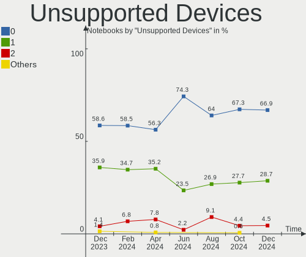
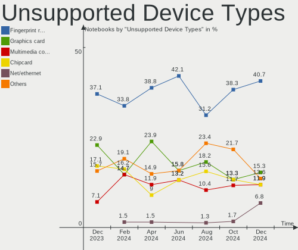

Arch - Hardware Trends (Notebooks)
----------------------------------

A project to identify most popular hardware characteristics and track their change
over time based on data collected by Linux users at https://Linux-Hardware.org.

Anyone can contribute to this report by the [hw-probe](https://github.com/linuxhw/hw-probe) tool:

    sudo -E hw-probe -all -upload

This report is for one last month. Overall report since the beginning of time: [TestCoverage](https://github.com/linuxhw/TestCoverage)

Period: Nov, 2022.

Contents
--------

* [ System ](#system)
  - [ OS                       ](#os)
  - [ OS Family                ](#os-family)
  - [ Kernel                   ](#kernel)
  - [ Kernel Family            ](#kernel-family)
  - [ Kernel Major Ver.        ](#kernel-major-ver)
  - [ Arch                     ](#arch)
  - [ DE                       ](#de)
  - [ Display Server           ](#display-server)
  - [ Display Manager          ](#display-manager)
  - [ OS Lang                  ](#os-lang)
  - [ Boot Mode                ](#boot-mode)
  - [ Filesystem               ](#filesystem)
  - [ Part. scheme             ](#part-scheme)
  - [ Dual Boot with Linux/BSD ](#dual-boot-with-linuxbsd)
  - [ Dual Boot (Win)          ](#dual-boot-win)

* [ Board ](#board)
  - [ Vendor                   ](#vendor)
  - [ Model                    ](#model)
  - [ Model Family             ](#model-family)
  - [ MFG Year                 ](#mfg-year)
  - [ Form Factor              ](#form-factor)
  - [ Secure Boot              ](#secure-boot)
  - [ Coreboot                 ](#coreboot)
  - [ RAM Size                 ](#ram-size)
  - [ RAM Used                 ](#ram-used)
  - [ Total Drives             ](#total-drives)
  - [ Has CD-ROM               ](#has-cd-rom)
  - [ Has Ethernet             ](#has-ethernet)
  - [ Has WiFi                 ](#has-wifi)
  - [ Has Bluetooth            ](#has-bluetooth)

* [ Location ](#location)
  - [ Country                  ](#country)
  - [ City                     ](#city)

* [ Drives ](#drives)
  - [ Drive Vendor             ](#drive-vendor)
  - [ Drive Model              ](#drive-model)
  - [ HDD Vendor               ](#hdd-vendor)
  - [ SSD Vendor               ](#ssd-vendor)
  - [ Drive Kind               ](#drive-kind)
  - [ Drive Connector          ](#drive-connector)
  - [ Drive Size               ](#drive-size)
  - [ Space Total              ](#space-total)
  - [ Space Used               ](#space-used)
  - [ Malfunc. Drives          ](#malfunc-drives)
  - [ Malfunc. Drive Vendor    ](#malfunc-drive-vendor)
  - [ Malfunc. HDD Vendor      ](#malfunc-hdd-vendor)
  - [ Malfunc. Drive Kind      ](#malfunc-drive-kind)
  - [ Failed Drives            ](#failed-drives)
  - [ Failed Drive Vendor      ](#failed-drive-vendor)
  - [ Drive Status             ](#drive-status)

* [ Storage controller ](#storage-controller)
  - [ Storage Vendor           ](#storage-vendor)
  - [ Storage Model            ](#storage-model)
  - [ Storage Kind             ](#storage-kind)

* [ Processor ](#processor)
  - [ CPU Vendor               ](#cpu-vendor)
  - [ CPU Model                ](#cpu-model)
  - [ CPU Model Family         ](#cpu-model-family)
  - [ CPU Cores                ](#cpu-cores)
  - [ CPU Sockets              ](#cpu-sockets)
  - [ CPU Threads              ](#cpu-threads)
  - [ CPU Op-Modes             ](#cpu-op-modes)
  - [ CPU Microcode            ](#cpu-microcode)
  - [ CPU Microarch            ](#cpu-microarch)

* [ Graphics ](#graphics)
  - [ GPU Vendor               ](#gpu-vendor)
  - [ GPU Model                ](#gpu-model)
  - [ GPU Combo                ](#gpu-combo)
  - [ GPU Driver               ](#gpu-driver)
  - [ GPU Memory               ](#gpu-memory)

* [ Monitor ](#monitor)
  - [ Monitor Vendor           ](#monitor-vendor)
  - [ Monitor Model            ](#monitor-model)
  - [ Monitor Resolution       ](#monitor-resolution)
  - [ Monitor Diagonal         ](#monitor-diagonal)
  - [ Monitor Width            ](#monitor-width)
  - [ Aspect Ratio             ](#aspect-ratio)
  - [ Monitor Area             ](#monitor-area)
  - [ Pixel Density            ](#pixel-density)
  - [ Multiple Monitors        ](#multiple-monitors)

* [ Network ](#network)
  - [ Net Controller Vendor    ](#net-controller-vendor)
  - [ Net Controller Model     ](#net-controller-model)
  - [ Wireless Vendor          ](#wireless-vendor)
  - [ Wireless Model           ](#wireless-model)
  - [ Ethernet Vendor          ](#ethernet-vendor)
  - [ Ethernet Model           ](#ethernet-model)
  - [ Net Controller Kind      ](#net-controller-kind)
  - [ Used Controller          ](#used-controller)
  - [ NICs                     ](#nics)
  - [ IPv6                     ](#ipv6)

* [ Bluetooth ](#bluetooth)
  - [ Bluetooth Vendor         ](#bluetooth-vendor)
  - [ Bluetooth Model          ](#bluetooth-model)

* [ Sound ](#sound)
  - [ Sound Vendor             ](#sound-vendor)
  - [ Sound Model              ](#sound-model)

* [ Memory ](#memory)
  - [ Memory Vendor            ](#memory-vendor)
  - [ Memory Model             ](#memory-model)
  - [ Memory Kind              ](#memory-kind)
  - [ Memory Form Factor       ](#memory-form-factor)
  - [ Memory Size              ](#memory-size)
  - [ Memory Speed             ](#memory-speed)

* [ Printers & scanners ](#printers--scanners)
  - [ Printer Vendor           ](#printer-vendor)
  - [ Printer Model            ](#printer-model)
  - [ Scanner Vendor           ](#scanner-vendor)
  - [ Scanner Model            ](#scanner-model)

* [ Camera ](#camera)
  - [ Camera Vendor            ](#camera-vendor)
  - [ Camera Model             ](#camera-model)

* [ Security ](#security)
  - [ Fingerprint Vendor       ](#fingerprint-vendor)
  - [ Fingerprint Model        ](#fingerprint-model)
  - [ Chipcard Vendor          ](#chipcard-vendor)
  - [ Chipcard Model           ](#chipcard-model)

* [ Unsupported ](#unsupported)
  - [ Unsupported Devices      ](#unsupported-devices)
  - [ Unsupported Device Types ](#unsupported-device-types)

System
------

OS
--

Installed operating systems

| Name         | Notebooks | Percent |
|--------------|-----------|---------|
| Arch Rolling | 113       | 100%    |

OS Family
---------

OS without a version

| Name | Notebooks | Percent |
|------|-----------|---------|
| Arch | 113       | 100%    |

Kernel
------

Version of the Linux kernel

| Version            | Notebooks | Percent |
|--------------------|-----------|---------|
| 6.0.9-arch1-1      | 22        | 19.47%  |
| 6.0.7-arch1-1      | 19        | 16.81%  |
| 6.0.8-arch1-1      | 15        | 13.27%  |
| 6.0.6-arch1-1      | 12        | 10.62%  |
| 6.0.8-zen1-1-zen   | 8         | 7.08%   |
| 6.0.10-arch2-1     | 7         | 6.19%   |
| 6.0.9-zen1-1-zen   | 5         | 4.42%   |
| 6.0.6-zen1-1-zen   | 4         | 3.54%   |
| 5.15.79-1-lts      | 3         | 2.65%   |
| 5.15.78-1-lts      | 3         | 2.65%   |
| 6.0.7-zen1-1-zen   | 2         | 1.77%   |
| 6.0.2-arch1-1      | 2         | 1.77%   |
| 5.15.76-1-lts      | 2         | 1.77%   |
| 6.0.9-zen1-1.1-zen | 1         | 0.88%   |
| 6.0.5-arch1-1      | 1         | 0.88%   |
| 6.0.10-zen2-1-zen  | 1         | 0.88%   |
| 6.0.10-1-cachyos   | 1         | 0.88%   |
| 5.19.5-arch1-1     | 1         | 0.88%   |
| 5.19.17-lqx2-1-lqx | 1         | 0.88%   |
| 5.19.13-arch1-1    | 1         | 0.88%   |
| 5.15.77-1-lts      | 1         | 0.88%   |
| 5.15.75-1-lts      | 1         | 0.88%   |

Kernel Family
-------------

Linux kernel without a distro release

| Version | Notebooks | Percent |
|---------|-----------|---------|
| 6.0.9   | 28        | 24.78%  |
| 6.0.8   | 23        | 20.35%  |
| 6.0.7   | 21        | 18.58%  |
| 6.0.6   | 16        | 14.16%  |
| 6.0.10  | 9         | 7.96%   |
| 5.15.79 | 3         | 2.65%   |
| 5.15.78 | 3         | 2.65%   |
| 6.0.2   | 2         | 1.77%   |
| 5.15.76 | 2         | 1.77%   |
| 6.0.5   | 1         | 0.88%   |
| 5.19.5  | 1         | 0.88%   |
| 5.19.17 | 1         | 0.88%   |
| 5.19.13 | 1         | 0.88%   |
| 5.15.77 | 1         | 0.88%   |
| 5.15.75 | 1         | 0.88%   |

Kernel Major Ver.
-----------------

Linux kernel major version

| Version | Notebooks | Percent |
|---------|-----------|---------|
| 6.0     | 100       | 88.5%   |
| 5.15    | 10        | 8.85%   |
| 5.19    | 3         | 2.65%   |

Arch
----

OS architecture (x86_64, i586, etc.)

| Name   | Notebooks | Percent |
|--------|-----------|---------|
| x86_64 | 113       | 100%    |

DE
--

Desktop Environment

| Name          | Notebooks | Percent |
|---------------|-----------|---------|
| KDE5          | 40        | 35.4%   |
| GNOME         | 30        | 26.55%  |
| i3            | 9         | 7.96%   |
| XFCE          | 7         | 6.19%   |
| sway          | 7         | 6.19%   |
| Unknown       | 6         | 5.31%   |
| awesome       | 3         | 2.65%   |
| X-Cinnamon    | 2         | 1.77%   |
| Hyprland      | 2         | 1.77%   |
| Unity         | 1         | 0.88%   |
| MATE          | 1         | 0.88%   |
| LXDE          | 1         | 0.88%   |
| KDE           | 1         | 0.88%   |
| GNOME Classic | 1         | 0.88%   |
| Deepin        | 1         | 0.88%   |
| Budgie        | 1         | 0.88%   |

Display Server
--------------

X11 or Wayland

| Name    | Notebooks | Percent |
|---------|-----------|---------|
| X11     | 69        | 61.06%  |
| Wayland | 36        | 31.86%  |
| Unknown | 5         | 4.42%   |
| Tty     | 3         | 2.65%   |

Display Manager
---------------

SDDM, LightDM, etc.

| Name    | Notebooks | Percent |
|---------|-----------|---------|
| Unknown | 37        | 32.74%  |
| SDDM    | 31        | 27.43%  |
| LightDM | 21        | 18.58%  |
| GDM     | 15        | 13.27%  |
| Ly      | 3         | 2.65%   |
| GREETD  | 3         | 2.65%   |
| XDM     | 1         | 0.88%   |
| LXDM    | 1         | 0.88%   |
| EMPTTY  | 1         | 0.88%   |

OS Lang
-------

Language

| Lang        | Notebooks | Percent |
|-------------|-----------|---------|
| en_US       | 56        | 49.56%  |
| it_IT       | 11        | 9.73%   |
| C           | 6         | 5.31%   |
| zh_CN       | 5         | 4.42%   |
| en_GB       | 5         | 4.42%   |
| Unknown     | 4         | 3.54%   |
| ru_RU       | 3         | 2.65%   |
| de_DE       | 3         | 2.65%   |
| pt_BR       | 2         | 1.77%   |
| ja_JP       | 2         | 1.77%   |
| en_IN       | 2         | 1.77%   |
| en_DK       | 2         | 1.77%   |
| en_AU       | 2         | 1.77%   |
| pl_PL       | 1         | 0.88%   |
| it_CH       | 1         | 0.88%   |
| hu_HU       | 1         | 0.88%   |
| fr_FR       | 1         | 0.88%   |
| es_PE       | 1         | 0.88%   |
| en_ZA       | 1         | 0.88%   |
| en_US,UTF-8 | 1         | 0.88%   |
| en_HK       | 1         | 0.88%   |
| en_CA       | 1         | 0.88%   |
| cs_CZ       | 1         | 0.88%   |

Boot Mode
---------

EFI or BIOS

| Mode | Notebooks | Percent |
|------|-----------|---------|
| EFI  | 72        | 63.72%  |
| BIOS | 41        | 36.28%  |

Filesystem
----------

Type of filesystem

| Type  | Notebooks | Percent |
|-------|-----------|---------|
| Ext4  | 78        | 69.03%  |
| Btrfs | 32        | 28.32%  |
| Xfs   | 2         | 1.77%   |
| Zfs   | 1         | 0.88%   |

Part. scheme
------------

Scheme of partitioning

| Type    | Notebooks | Percent |
|---------|-----------|---------|
| GPT     | 77        | 68.14%  |
| Unknown | 29        | 25.66%  |
| MBR     | 7         | 6.19%   |

Dual Boot with Linux/BSD
------------------------

Hosting more than one Linux/BSD

| Dual boot | Notebooks | Percent |
|-----------|-----------|---------|
| No        | 104       | 92.04%  |
| Yes       | 9         | 7.96%   |

Dual Boot (Win)
---------------

Hosting Linux and Windows

| Dual boot | Notebooks | Percent |
|-----------|-----------|---------|
| No        | 89        | 78.76%  |
| Yes       | 24        | 21.24%  |

Board
-----

Vendor
------

Motherboard manufacturer

| Name                   | Notebooks | Percent |
|------------------------|-----------|---------|
| Lenovo                 | 33        | 29.2%   |
| ASUSTek Computer       | 18        | 15.93%  |
| Hewlett-Packard        | 15        | 13.27%  |
| Dell                   | 13        | 11.5%   |
| MSI                    | 8         | 7.08%   |
| Acer                   | 5         | 4.42%   |
| Timi                   | 1         | 0.88%   |
| Teclast                | 1         | 0.88%   |
| Sony                   | 1         | 0.88%   |
| Positivo Bahia - VAIO  | 1         | 0.88%   |
| Panasonic              | 1         | 0.88%   |
| Packard Bell           | 1         | 0.88%   |
| Notebook               | 1         | 0.88%   |
| MECER                  | 1         | 0.88%   |
| Komplett               | 1         | 0.88%   |
| HUAWEI                 | 1         | 0.88%   |
| HONOR                  | 1         | 0.88%   |
| GPD                    | 1         | 0.88%   |
| Google                 | 1         | 0.88%   |
| Gigabyte Technology    | 1         | 0.88%   |
| Fujitsu                | 1         | 0.88%   |
| DERE                   | 1         | 0.88%   |
| COLORFUL               | 1         | 0.88%   |
| Clevo                  | 1         | 0.88%   |
| Avell High Performance | 1         | 0.88%   |
| Apple                  | 1         | 0.88%   |
| Alienware              | 1         | 0.88%   |

Model
-----

Motherboard model

| Name                                       | Notebooks | Percent |
|--------------------------------------------|-----------|---------|
| Lenovo ThinkBook 15 G2 ITL 20VE            | 2         | 1.77%   |
| HP ProBook 6570b                           | 2         | 1.77%   |
| HP EliteBook 850 G8 Notebook PC            | 2         | 1.77%   |
| ASUS ZenBook UX425UG_Q408UG                | 2         | 1.77%   |
| Timi TM1613                                | 1         | 0.88%   |
| Teclast F6 Pro                             | 1         | 0.88%   |
| Sony VPCEA45FG                             | 1         | 0.88%   |
| Positivo Bahia - VAIO S14SL03              | 1         | 0.88%   |
| Panasonic CF-R9KWCTDR                      | 1         | 0.88%   |
| Packard Bell EasyNote LJ65                 | 1         | 0.88%   |
| Notebook P65xHP                            | 1         | 0.88%   |
| MSI Modern 15 A5M                          | 1         | 0.88%   |
| MSI Modern 14 B5M                          | 1         | 0.88%   |
| MSI Modern 14 B10MW                        | 1         | 0.88%   |
| MSI GV62 8RC                               | 1         | 0.88%   |
| MSI GL63 8RD                               | 1         | 0.88%   |
| MSI GF75 Thin 9SC                          | 1         | 0.88%   |
| MSI Bravo 15 A4DDR                         | 1         | 0.88%   |
| MSI Alpha 17 B5EEK                         | 1         | 0.88%   |
| MECER YA13Q20-DP_PRO                       | 1         | 0.88%   |
| Lenovo Yoga Slim 7 ProX 14ARH7 82TL        | 1         | 0.88%   |
| Lenovo XiaoXinPro 14ACH 2021 82MS          | 1         | 0.88%   |
| Lenovo ThinkPad X220 Tablet 4299EE8        | 1         | 0.88%   |
| Lenovo ThinkPad X1 Extreme 20MF000BUS      | 1         | 0.88%   |
| Lenovo ThinkPad X1 Carbon Gen 9 20XW00GWCD | 1         | 0.88%   |
| Lenovo ThinkPad T490 20RYCTO1WW            | 1         | 0.88%   |
| Lenovo ThinkPad T480 20L50011US            | 1         | 0.88%   |
| Lenovo ThinkPad T440p 20AWS3RJ00           | 1         | 0.88%   |
| Lenovo ThinkPad T16 Gen 1 21CHCTO1WW       | 1         | 0.88%   |
| Lenovo ThinkPad T16 Gen 1 21CH000JUS       | 1         | 0.88%   |
| Lenovo ThinkPad T14s Gen 2a 20XF004AIX     | 1         | 0.88%   |
| Lenovo ThinkPad T14s Gen 1 20UJS22U00      | 1         | 0.88%   |
| Lenovo ThinkPad P52 20MAS70500             | 1         | 0.88%   |
| Lenovo ThinkPad P14s Gen 2a 21A0CTO1WW     | 1         | 0.88%   |
| Lenovo ThinkPad P1 Gen 4i 20Y3A000CD       | 1         | 0.88%   |
| Lenovo ThinkPad L13 Gen 2 20VH001ERT       | 1         | 0.88%   |
| Lenovo ThinkPad E15 Gen 4 21EES00100       | 1         | 0.88%   |
| Lenovo ThinkPad E15 Gen 2 20TES2MF00       | 1         | 0.88%   |
| Lenovo ThinkPad E14 Gen 3 20Y700BTCK       | 1         | 0.88%   |
| Lenovo ThinkPad E14 20RA004VPH             | 1         | 0.88%   |

Model Family
------------

Motherboard model prefix

| Name                          | Notebooks | Percent |
|-------------------------------|-----------|---------|
| Lenovo ThinkPad               | 18        | 15.93%  |
| Lenovo IdeaPad                | 7         | 6.19%   |
| Dell XPS                      | 7         | 6.19%   |
| ASUS ZenBook                  | 5         | 4.42%   |
| HP Pavilion                   | 4         | 3.54%   |
| MSI Modern                    | 3         | 2.65%   |
| Lenovo ThinkBook              | 3         | 2.65%   |
| Lenovo Legion                 | 3         | 2.65%   |
| HP ProBook                    | 3         | 2.65%   |
| HP Laptop                     | 3         | 2.65%   |
| HP EliteBook                  | 3         | 2.65%   |
| Dell Latitude                 | 3         | 2.65%   |
| Dell Inspiron                 | 2         | 1.77%   |
| ASUS ASUS                     | 2         | 1.77%   |
| Timi TM1613                   | 1         | 0.88%   |
| Teclast F6                    | 1         | 0.88%   |
| Sony VPCEA45FG                | 1         | 0.88%   |
| Positivo Bahia - VAIO S14SL03 | 1         | 0.88%   |
| Panasonic CF-R9KWCTDR         | 1         | 0.88%   |
| Packard Bell EasyNote         | 1         | 0.88%   |
| Notebook P65xHP               | 1         | 0.88%   |
| MSI GV62                      | 1         | 0.88%   |
| MSI GL63                      | 1         | 0.88%   |
| MSI GF75                      | 1         | 0.88%   |
| MSI Bravo                     | 1         | 0.88%   |
| MSI Alpha                     | 1         | 0.88%   |
| MECER YA13Q20-DP              | 1         | 0.88%   |
| Lenovo Yoga                   | 1         | 0.88%   |
| Lenovo XiaoXinPro             | 1         | 0.88%   |
| Komplett LAPQC71B             | 1         | 0.88%   |
| HUAWEI NBLK-WAX9X             | 1         | 0.88%   |
| HONOR BOD-WXX9                | 1         | 0.88%   |
| HP Notebook                   | 1         | 0.88%   |
| HP Elite                      | 1         | 0.88%   |
| GPD P3                        | 1         | 0.88%   |
| Google Blooglet               | 1         | 0.88%   |
| Gigabyte G5                   | 1         | 0.88%   |
| Fujitsu LIFEBOOK              | 1         | 0.88%   |
| DERE V14                      | 1         | 0.88%   |
| Dell G15                      | 1         | 0.88%   |

MFG Year
--------

Motherboard manufacture year

| Year | Notebooks | Percent |
|------|-----------|---------|
| 2021 | 27        | 23.89%  |
| 2020 | 18        | 15.93%  |
| 2022 | 14        | 12.39%  |
| 2019 | 13        | 11.5%   |
| 2018 | 11        | 9.73%   |
| 2016 | 7         | 6.19%   |
| 2017 | 4         | 3.54%   |
| 2015 | 4         | 3.54%   |
| 2013 | 4         | 3.54%   |
| 2011 | 4         | 3.54%   |
| 2010 | 3         | 2.65%   |
| 2012 | 2         | 1.77%   |
| 2009 | 2         | 1.77%   |

Form Factor
-----------

Physical design of the computer

| Name     | Notebooks | Percent |
|----------|-----------|---------|
| Notebook | 113       | 100%    |

Secure Boot
-----------

Enabled or disabled

| State    | Notebooks | Percent |
|----------|-----------|---------|
| Disabled | 110       | 97.35%  |
| Enabled  | 3         | 2.65%   |

Coreboot
--------

Have coreboot on board

| Used | Notebooks | Percent |
|------|-----------|---------|
| No   | 112       | 99.12%  |
| Yes  | 1         | 0.88%   |

RAM Size
--------

Total RAM memory

| Size in GB  | Notebooks | Percent |
|-------------|-----------|---------|
| 4.01-8.0    | 29        | 25.66%  |
| 16.01-24.0  | 26        | 23.01%  |
| 8.01-16.0   | 26        | 23.01%  |
| 3.01-4.0    | 14        | 12.39%  |
| 32.01-64.0  | 12        | 10.62%  |
| 24.01-32.0  | 5         | 4.42%   |
| 64.01-256.0 | 1         | 0.88%   |

RAM Used
--------

Used RAM memory

| Used GB   | Notebooks | Percent |
|-----------|-----------|---------|
| 4.01-8.0  | 34        | 30.09%  |
| 2.01-3.0  | 27        | 23.89%  |
| 1.01-2.0  | 22        | 19.47%  |
| 3.01-4.0  | 20        | 17.7%   |
| 8.01-16.0 | 8         | 7.08%   |
| 0.51-1.0  | 2         | 1.77%   |

Total Drives
------------

Number of drives on board

| Drives | Notebooks | Percent |
|--------|-----------|---------|
| 1      | 81        | 71.68%  |
| 2      | 27        | 23.89%  |
| 3      | 4         | 3.54%   |
| 4      | 1         | 0.88%   |

Has CD-ROM
----------

Has CD-ROM on board

| Presented | Notebooks | Percent |
|-----------|-----------|---------|
| No        | 97        | 85.84%  |
| Yes       | 16        | 14.16%  |

Has Ethernet
------------

Has Ethernet on board

| Presented | Notebooks | Percent |
|-----------|-----------|---------|
| Yes       | 74        | 65.49%  |
| No        | 39        | 34.51%  |

Has WiFi
--------

Has WiFi module

| Presented | Notebooks | Percent |
|-----------|-----------|---------|
| Yes       | 113       | 100%    |

Has Bluetooth
-------------

Has Bluetooth module

| Presented | Notebooks | Percent |
|-----------|-----------|---------|
| Yes       | 102       | 90.27%  |
| No        | 11        | 9.73%   |

Location
--------

Country
-------

Geographic location (country)

| Country                | Notebooks | Percent |
|------------------------|-----------|---------|
| Italy                  | 18        | 15.93%  |
| USA                    | 15        | 13.27%  |
| Russia                 | 9         | 7.96%   |
| Germany                | 9         | 7.96%   |
| India                  | 7         | 6.19%   |
| China                  | 6         | 5.31%   |
| Canada                 | 5         | 4.42%   |
| Poland                 | 4         | 3.54%   |
| Brazil                 | 4         | 3.54%   |
| Indonesia              | 3         | 2.65%   |
| UK                     | 2         | 1.77%   |
| Peru                   | 2         | 1.77%   |
| Netherlands            | 2         | 1.77%   |
| Japan                  | 2         | 1.77%   |
| Denmark                | 2         | 1.77%   |
| Australia              | 2         | 1.77%   |
| Vietnam                | 1         | 0.88%   |
| Switzerland            | 1         | 0.88%   |
| South Africa           | 1         | 0.88%   |
| Romania                | 1         | 0.88%   |
| Qatar                  | 1         | 0.88%   |
| Portugal               | 1         | 0.88%   |
| Philippines            | 1         | 0.88%   |
| Pakistan               | 1         | 0.88%   |
| Norway                 | 1         | 0.88%   |
| New Zealand            | 1         | 0.88%   |
| Mexico                 | 1         | 0.88%   |
| Lithuania              | 1         | 0.88%   |
| Kazakhstan             | 1         | 0.88%   |
| Hungary                | 1         | 0.88%   |
| France                 | 1         | 0.88%   |
| Finland                | 1         | 0.88%   |
| Czechia                | 1         | 0.88%   |
| Bosnia and Herzegovina | 1         | 0.88%   |
| Belarus                | 1         | 0.88%   |
| Bangladesh             | 1         | 0.88%   |
| Austria                | 1         | 0.88%   |

City
----

Geographic location (city)

| City           | Notebooks | Percent |
|----------------|-----------|---------|
| Moscow         | 4         | 3.54%   |
| Milan          | 4         | 3.54%   |
| Warsaw         | 2         | 1.77%   |
| Valencia       | 2         | 1.77%   |
| Surabaya       | 2         | 1.77%   |
| St Petersburg  | 2         | 1.77%   |
| Rio de Janeiro | 2         | 1.77%   |
| Pordenone      | 2         | 1.77%   |
| Phoenix        | 2         | 1.77%   |
| Nanjing        | 2         | 1.77%   |
| Lima           | 2         | 1.77%   |
| Kongens Lyngby | 2         | 1.77%   |
| Jinrongjie     | 2         | 1.77%   |
| Zielona Góra  | 1         | 0.88%   |
| Yamanashi      | 1         | 0.88%   |
| Witham         | 1         | 0.88%   |
| Vilnius        | 1         | 0.88%   |
| Venice         | 1         | 0.88%   |
| Turku          | 1         | 0.88%   |
| Turin          | 1         | 0.88%   |
| Troy           | 1         | 0.88%   |
| Timișoara     | 1         | 0.88%   |
| Tarnów        | 1         | 0.88%   |
| Sydney         | 1         | 0.88%   |
| Smyrna         | 1         | 0.88%   |
| Sherbrooke     | 1         | 0.88%   |
| Shenzhen       | 1         | 0.88%   |
| Santo André   | 1         | 0.88%   |
| Saitama        | 1         | 0.88%   |
| Roswell        | 1         | 0.88%   |
| Rong           | 1         | 0.88%   |
| Rome           | 1         | 0.88%   |
| Rocklin        | 1         | 0.88%   |
| Rocca di Botte | 1         | 0.88%   |
| Rho            | 1         | 0.88%   |
| Reston         | 1         | 0.88%   |
| Regina         | 1         | 0.88%   |
| Raleigh        | 1         | 0.88%   |
| Pisa           | 1         | 0.88%   |
| Philadelphia   | 1         | 0.88%   |

Drives
------

Drive Vendor
------------

Hard drive vendors

| Vendor                      | Notebooks | Drives | Percent |
|-----------------------------|-----------|--------|---------|
| Samsung Electronics         | 38        | 40     | 25.68%  |
| SanDisk                     | 19        | 20     | 12.84%  |
| WDC                         | 9         | 9      | 6.08%   |
| Seagate                     | 9         | 9      | 6.08%   |
| Micron Technology           | 8         | 8      | 5.41%   |
| Kingston                    | 7         | 7      | 4.73%   |
| Intel                       | 7         | 7      | 4.73%   |
| Unknown                     | 6         | 6      | 4.05%   |
| SK hynix                    | 5         | 5      | 3.38%   |
| Toshiba                     | 4         | 4      | 2.7%    |
| Phison Electronics          | 3         | 3      | 2.03%   |
| Kingston Technology Company | 3         | 3      | 2.03%   |
| HGST                        | 3         | 3      | 2.03%   |
| JMicron Technology          | 2         | 2      | 1.35%   |
| Hitachi                     | 2         | 2      | 1.35%   |
| Crucial                     | 2         | 2      | 1.35%   |
| A-DATA Technology           | 2         | 2      | 1.35%   |
| Yangtze Memory Technologies | 1         | 1      | 0.68%   |
| Union Memory (Shenzhen)     | 1         | 1      | 0.68%   |
| Transcend                   | 1         | 1      | 0.68%   |
| Solid State Storage         | 1         | 1      | 0.68%   |
| Silicon Motion              | 1         | 1      | 0.68%   |
| Realtek Semiconductor       | 1         | 1      | 0.68%   |
| Netac                       | 1         | 1      | 0.68%   |
| LITEONIT                    | 1         | 1      | 0.68%   |
| LITEON                      | 1         | 1      | 0.68%   |
| KIOXIA                      | 1         | 1      | 0.68%   |
| Intenso                     | 1         | 1      | 0.68%   |
| HGST HTS                    | 1         | 1      | 0.68%   |
| China                       | 1         | 1      | 0.68%   |
| Biwin Storage Technology    | 1         | 1      | 0.68%   |
| ASMT                        | 1         | 1      | 0.68%   |
| AGI                         | 1         | 1      | 0.68%   |
| ADATA Technology            | 1         | 1      | 0.68%   |
| ACASIS                      | 1         | 1      | 0.68%   |
| Unknown                     | 1         | 1      | 0.68%   |

Drive Model
-----------

Hard drive models

| Model                                                 | Notebooks | Percent |
|-------------------------------------------------------|-----------|---------|
| Samsung NVMe SSD Controller SM981/PM981/PM983 1TB     | 15        | 10.07%  |
| Sandisk WD Black SN750 / PC SN730 NVMe SSD 1024GB     | 8         | 5.37%   |
| Samsung NVMe SSD Controller PM9A1/PM9A3/980PRO 250GB  | 6         | 4.03%   |
| Unknown MMC Card  64GB                                | 3         | 2.01%   |
| Sandisk WD Blue SN550 NVMe SSD 1TB                    | 3         | 2.01%   |
| Samsung MZALQ512HBLU-00BL2 512GB                      | 3         | 2.01%   |
| Intel SSD 660P Series 512GB                           | 3         | 2.01%   |
| Unknown MMC Card  128GB                               | 2         | 1.34%   |
| Seagate ST1000LM048-2E7172 1TB                        | 2         | 1.34%   |
| Samsung MZVLQ256HAJD-00000 256GB                      | 2         | 1.34%   |
| Phison E12 NVMe Controller 2TB                        | 2         | 1.34%   |
| Kingston Company OM3PDP3 NVMe SSD 256GB               | 2         | 1.34%   |
| Kingston OM8PCP3512F-AI1 512GB                        | 2         | 1.34%   |
| HGST HTS721010A9E630 1TB                              | 2         | 1.34%   |
| Yangtze Memory ZHITAI TiPlus5000 1TB                  | 1         | 0.67%   |
| WDC WDS500G2B0A-00SM50 500GB SSD                      | 1         | 0.67%   |
| WDC WDS240G2G0A-00JH30 240GB SSD                      | 1         | 0.67%   |
| WDC WD5000BPKT-60PK4T0 500GB                          | 1         | 0.67%   |
| WDC WD5000BEVT-22ZAT0 500GB                           | 1         | 0.67%   |
| WDC WD10SPZX-60Z10T1 1TB                              | 1         | 0.67%   |
| WDC WD10SPZX-21Z10T0 1TB                              | 1         | 0.67%   |
| WDC WD10SPZX-17Z10T1 1TB                              | 1         | 0.67%   |
| WDC WD10SPZX-08Z10 1TB                                | 1         | 0.67%   |
| WDC WD10SPSX-21A6WT0 1TB                              | 1         | 0.67%   |
| Unknown MMC Card  32GB                                | 1         | 0.67%   |
| Union Memory (Shenzhen) UMIS RPJTJ512MGE1QDQ 512GB    | 1         | 0.67%   |
| Transcend TS240GMTS420S 240GB SSD                     | 1         | 0.67%   |
| Toshiba XG4 NVMe SSD Controller 256GB                 | 1         | 0.67%   |
| Toshiba MQ01ABF050 500GB                              | 1         | 0.67%   |
| Toshiba MK3265GSXN 320GB                              | 1         | 0.67%   |
| Toshiba BG3 NVMe SSD Controller 128GB                 | 1         | 0.67%   |
| Solid State Storage SSSTC CA5-8D512 512GB             | 1         | 0.67%   |
| SK hynix SKHynix_HFS256GDE9X081N 256GB                | 1         | 0.67%   |
| SK hynix PC401 NVMe Solid State Drive 256GB           | 1         | 0.67%   |
| SK hynix HFM512GD3JX016N 512GB                        | 1         | 0.67%   |
| SK hynix HFM001TD3JX013N 1024GB                       | 1         | 0.67%   |
| SK hynix BC511 512GB                                  | 1         | 0.67%   |
| Silicon Motion SM2263EN/SM2263XT SSD Controller 128GB | 1         | 0.67%   |
| Seagate ST9500325AS 500GB                             | 1         | 0.67%   |
| Seagate ST320LT020-9YG142 320GB                       | 1         | 0.67%   |

HDD Vendor
----------

Hard disk drive vendors

| Vendor   | Notebooks | Drives | Percent |
|----------|-----------|--------|---------|
| Seagate  | 9         | 9      | 34.62%  |
| WDC      | 7         | 7      | 26.92%  |
| HGST     | 3         | 3      | 11.54%  |
| Toshiba  | 2         | 2      | 7.69%   |
| Hitachi  | 2         | 2      | 7.69%   |
| HGST HTS | 1         | 1      | 3.85%   |
| ASMT     | 1         | 1      | 3.85%   |
| ACASIS   | 1         | 1      | 3.85%   |

SSD Vendor
----------

Solid state drive vendors

| Vendor              | Notebooks | Drives | Percent |
|---------------------|-----------|--------|---------|
| Samsung Electronics | 6         | 6      | 22.22%  |
| SanDisk             | 4         | 4      | 14.81%  |
| WDC                 | 2         | 2      | 7.41%   |
| Kingston            | 2         | 2      | 7.41%   |
| Intel               | 2         | 2      | 7.41%   |
| Crucial             | 2         | 2      | 7.41%   |
| Transcend           | 1         | 1      | 3.7%    |
| LITEONIT            | 1         | 1      | 3.7%    |
| LITEON              | 1         | 1      | 3.7%    |
| JMicron Technology  | 1         | 1      | 3.7%    |
| Intenso             | 1         | 1      | 3.7%    |
| China               | 1         | 1      | 3.7%    |
| AGI                 | 1         | 1      | 3.7%    |
| A-DATA Technology   | 1         | 1      | 3.7%    |
| Unknown             | 1         | 1      | 3.7%    |

Drive Kind
----------

HDD or SSD

| Kind    | Notebooks | Drives | Percent |
|---------|-----------|--------|---------|
| NVMe    | 79        | 91     | 58.52%  |
| HDD     | 25        | 26     | 18.52%  |
| SSD     | 24        | 27     | 17.78%  |
| MMC     | 6         | 6      | 4.44%   |
| Unknown | 1         | 1      | 0.74%   |

Drive Connector
---------------

SATA, SAS, NVMe, etc.

| Type | Notebooks | Drives | Percent |
|------|-----------|--------|---------|
| NVMe | 79        | 90     | 60.31%  |
| SATA | 41        | 47     | 31.3%   |
| MMC  | 6         | 6      | 4.58%   |
| SAS  | 5         | 8      | 3.82%   |

Drive Size
----------

Size of hard drive

| Size in TB | Notebooks | Drives | Percent |
|------------|-----------|--------|---------|
| 0.01-0.5   | 28        | 30     | 56%     |
| 0.51-1.0   | 19        | 20     | 38%     |
| 4.01-10.0  | 2         | 2      | 4%      |
| 1.01-2.0   | 1         | 1      | 2%      |

Space Total
-----------

Amount of disk space available on the file system

| Size in GB     | Notebooks | Percent |
|----------------|-----------|---------|
| 251-500        | 35        | 30.97%  |
| 101-250        | 25        | 22.12%  |
| 1001-2000      | 19        | 16.81%  |
| 501-1000       | 16        | 14.16%  |
| More than 3000 | 5         | 4.42%   |
| 2001-3000      | 5         | 4.42%   |
| Unknown        | 4         | 3.54%   |
| 51-100         | 3         | 2.65%   |
| 1-20           | 1         | 0.88%   |

Space Used
----------

Amount of used disk space

| Used GB        | Notebooks | Percent |
|----------------|-----------|---------|
| 251-500        | 22        | 19.47%  |
| 101-250        | 22        | 19.47%  |
| 1-20           | 21        | 18.58%  |
| 51-100         | 16        | 14.16%  |
| 21-50          | 14        | 12.39%  |
| 501-1000       | 7         | 6.19%   |
| Unknown        | 4         | 3.54%   |
| More than 3000 | 3         | 2.65%   |
| 2001-3000      | 2         | 1.77%   |
| 1001-2000      | 2         | 1.77%   |

Malfunc. Drives
---------------

Drive models with a malfunction

| Model                                         | Notebooks | Drives | Percent |
|-----------------------------------------------|-----------|--------|---------|
| Micron Technology MTFDHBA1T0TDV-1AZ15ABFA 1TB | 1         | 1      | 50%     |
| Intel SSDSCKKW240H6 240GB                     | 1         | 1      | 50%     |

Malfunc. Drive Vendor
---------------------

Vendors of faulty drives

| Vendor            | Notebooks | Drives | Percent |
|-------------------|-----------|--------|---------|
| Micron Technology | 1         | 1      | 50%     |
| Intel             | 1         | 1      | 50%     |

Malfunc. HDD Vendor
-------------------

Vendors of faulty HDD drives

Zero info for selected period =(

Malfunc. Drive Kind
-------------------

Kinds of faulty drives

| Kind | Notebooks | Drives | Percent |
|------|-----------|--------|---------|
| NVMe | 1         | 1      | 50%     |
| SSD  | 1         | 1      | 50%     |

Failed Drives
-------------

Failed drive models

Zero info for selected period =(

Failed Drive Vendor
-------------------

Failed drive vendors

Zero info for selected period =(

Drive Status
------------

Number of failed and malfunc. drives

| Status   | Notebooks | Drives | Percent |
|----------|-----------|--------|---------|
| Works    | 66        | 81     | 56.41%  |
| Detected | 49        | 68     | 41.88%  |
| Malfunc  | 2         | 2      | 1.71%   |

Storage controller
------------------

Storage Vendor
--------------

Storage controller vendors

| Vendor                         | Notebooks | Percent |
|--------------------------------|-----------|---------|
| Intel                          | 56        | 36.84%  |
| Samsung Electronics            | 32        | 21.05%  |
| SanDisk                        | 15        | 9.87%   |
| AMD                            | 13        | 8.55%   |
| Micron Technology              | 8         | 5.26%   |
| Kingston Technology Company    | 8         | 5.26%   |
| SK hynix                       | 5         | 3.29%   |
| Phison Electronics             | 3         | 1.97%   |
| Toshiba America Info Systems   | 2         | 1.32%   |
| ADATA Technology               | 2         | 1.32%   |
| Yangtze Memory Technologies    | 1         | 0.66%   |
| Union Memory (Shenzhen)        | 1         | 0.66%   |
| Solid State Storage Technology | 1         | 0.66%   |
| Silicon Motion                 | 1         | 0.66%   |
| Realtek Semiconductor          | 1         | 0.66%   |
| Netac Technology               | 1         | 0.66%   |
| KIOXIA                         | 1         | 0.66%   |
| Biwin Storage Technology       | 1         | 0.66%   |

Storage Model
-------------

Storage controller models

| Model                                                                        | Notebooks | Percent |
|------------------------------------------------------------------------------|-----------|---------|
| Samsung NVMe SSD Controller SM981/PM981/PM983                                | 16        | 10.19%  |
| AMD FCH SATA Controller [AHCI mode]                                          | 11        | 7.01%   |
| Samsung NVMe SSD Controller 980                                              | 9         | 5.73%   |
| Intel Volume Management Device NVMe RAID Controller                          | 9         | 5.73%   |
| SanDisk WD Black SN750 / PC SN730 NVMe SSD                                   | 8         | 5.1%    |
| Micron Non-Volatile memory controller                                        | 8         | 5.1%    |
| Intel Cannon Lake Mobile PCH SATA AHCI Controller                            | 8         | 5.1%    |
| Intel 82801 Mobile SATA Controller [RAID mode]                               | 7         | 4.46%   |
| Samsung NVMe SSD Controller PM9A1/PM9A3/980PRO                               | 6         | 3.82%   |
| Kingston Company Company Non-Volatile memory controller                      | 6         | 3.82%   |
| Intel Sunrise Point-LP SATA Controller [AHCI mode]                           | 6         | 3.82%   |
| SanDisk Non-Volatile memory controller                                       | 4         | 2.55%   |
| Intel Tiger Lake-LP SATA Controller                                          | 4         | 2.55%   |
| SK hynix Gold P31/PC711 NVMe Solid State Drive                               | 3         | 1.91%   |
| SanDisk WD Blue SN550 NVMe SSD                                               | 3         | 1.91%   |
| Intel SSD 660P Series                                                        | 3         | 1.91%   |
| Intel HM170/QM170 Chipset SATA Controller [AHCI Mode]                        | 3         | 1.91%   |
| Intel 6 Series/C200 Series Chipset Family 6 port Mobile SATA AHCI Controller | 3         | 1.91%   |
| Phison E12 NVMe Controller                                                   | 2         | 1.27%   |
| Kingston Company OM3PDP3 NVMe SSD                                            | 2         | 1.27%   |
| Intel Non-Volatile memory controller                                         | 2         | 1.27%   |
| Intel 8 Series SATA Controller 1 [AHCI mode]                                 | 2         | 1.27%   |
| Intel 7 Series Chipset Family 6-port SATA Controller [AHCI mode]             | 2         | 1.27%   |
| Intel 5 Series/3400 Series Chipset 4 port SATA AHCI Controller               | 2         | 1.27%   |
| Yangtze Memory ZHITAI TiPro5000 NVMe SSD                                     | 1         | 0.64%   |
| Union Memory (Shenzhen) AM630 PCIe 4.0 x4 NVMe SSD Controller                | 1         | 0.64%   |
| Toshiba America Info Systems XG4 NVMe SSD Controller                         | 1         | 0.64%   |
| Toshiba America Info Systems BG3 NVMe SSD Controller                         | 1         | 0.64%   |
| Solid State Storage Non-Volatile memory controller                           | 1         | 0.64%   |
| SK hynix PC401 NVMe Solid State Drive 256GB                                  | 1         | 0.64%   |
| SK hynix BC511                                                               | 1         | 0.64%   |
| Silicon Motion SM2263EN/SM2263XT SSD Controller                              | 1         | 0.64%   |
| Samsung NVMe SSD Controller SM951/PM951                                      | 1         | 0.64%   |
| Realtek RTS5763DL NVMe SSD Controller                                        | 1         | 0.64%   |
| Phison E16 PCIe4 NVMe Controller                                             | 1         | 0.64%   |
| Netac Non-Volatile memory controller                                         | 1         | 0.64%   |
| KIOXIA NVMe SSD Controller BG4                                               | 1         | 0.64%   |
| Intel Wildcat Point-LP SATA Controller [AHCI Mode]                           | 1         | 0.64%   |
| Intel Jasper Lake SATA AHCI Controller                                       | 1         | 0.64%   |
| Intel Comet Lake SATA AHCI Controller                                        | 1         | 0.64%   |

Storage Kind
------------

Kind of storage controller (IDE, SATA, NVMe, SAS, ...)

| Kind | Notebooks | Percent |
|------|-----------|---------|
| NVMe | 79        | 53.38%  |
| SATA | 53        | 35.81%  |
| RAID | 16        | 10.81%  |

Processor
---------

CPU Vendor
----------

Processor vendors

| Vendor | Notebooks | Percent |
|--------|-----------|---------|
| Intel  | 78        | 69.03%  |
| AMD    | 35        | 30.97%  |

CPU Model
---------

Processor models

| Model                                      | Notebooks | Percent |
|--------------------------------------------|-----------|---------|
| Intel 11th Gen Core i5-1135G7 @ 2.40GHz    | 5         | 4.42%   |
| AMD Ryzen 7 5700U with Radeon Graphics     | 5         | 4.42%   |
| Intel Core i7-8750H CPU @ 2.20GHz          | 4         | 3.54%   |
| AMD Ryzen 7 5800H with Radeon Graphics     | 4         | 3.54%   |
| Intel Core i5-8300H CPU @ 2.30GHz          | 3         | 2.65%   |
| Intel 11th Gen Core i7-1185G7 @ 3.00GHz    | 3         | 2.65%   |
| Intel 11th Gen Core i7-1165G7 @ 2.80GHz    | 3         | 2.65%   |
| AMD Ryzen 5 5500U with Radeon Graphics     | 3         | 2.65%   |
| Intel Core i7-9750H CPU @ 2.60GHz          | 2         | 1.77%   |
| Intel Core i7-7700HQ CPU @ 2.80GHz         | 2         | 1.77%   |
| Intel Core i7-6700HQ CPU @ 2.60GHz         | 2         | 1.77%   |
| Intel Core i5-7200U CPU @ 2.50GHz          | 2         | 1.77%   |
| Intel Core i5-6200U CPU @ 2.30GHz          | 2         | 1.77%   |
| Intel Core i5-4310U CPU @ 2.00GHz          | 2         | 1.77%   |
| Intel 12th Gen Core i7-12700H              | 2         | 1.77%   |
| Intel 12th Gen Core i5-12500H              | 2         | 1.77%   |
| Intel 11th Gen Core i7-11800H @ 2.30GHz    | 2         | 1.77%   |
| Intel 11th Gen Core i3-1115G4 @ 3.00GHz    | 2         | 1.77%   |
| AMD Ryzen 7 PRO 6850U with Radeon Graphics | 2         | 1.77%   |
| AMD Ryzen 5 5600H with Radeon Graphics     | 2         | 1.77%   |
| AMD Ryzen 5 4600H with Radeon Graphics     | 2         | 1.77%   |
| Intel Pentium Silver N6000 @ 1.10GHz       | 1         | 0.88%   |
| Intel Pentium CPU N3710 @ 1.60GHz          | 1         | 0.88%   |
| Intel Pentium CPU B960 @ 2.20GHz           | 1         | 0.88%   |
| Intel Core m5-6Y57 CPU @ 1.10GHz           | 1         | 0.88%   |
| Intel Core m3-7Y30 CPU @ 1.00GHz           | 1         | 0.88%   |
| Intel Core i7-8565U CPU @ 1.80GHz          | 1         | 0.88%   |
| Intel Core i7-8550U CPU @ 1.80GHz          | 1         | 0.88%   |
| Intel Core i7-7500U CPU @ 2.70GHz          | 1         | 0.88%   |
| Intel Core i7-4770HQ CPU @ 2.20GHz         | 1         | 0.88%   |
| Intel Core i7-4510U CPU @ 2.00GHz          | 1         | 0.88%   |
| Intel Core i7-2670QM CPU @ 2.20GHz         | 1         | 0.88%   |
| Intel Core i7-2620M CPU @ 2.70GHz          | 1         | 0.88%   |
| Intel Core i7-10510U CPU @ 1.80GHz         | 1         | 0.88%   |
| Intel Core i7 CPU U 640 @ 1.20GHz          | 1         | 0.88%   |
| Intel Core i5-8400 CPU @ 2.80GHz           | 1         | 0.88%   |
| Intel Core i5-8350U CPU @ 1.70GHz          | 1         | 0.88%   |
| Intel Core i5-8265U CPU @ 1.60GHz          | 1         | 0.88%   |
| Intel Core i5-8250U CPU @ 1.60GHz          | 1         | 0.88%   |
| Intel Core i5-5200U CPU @ 2.20GHz          | 1         | 0.88%   |

CPU Model Family
----------------

Processor model prefix

| Model                          | Notebooks | Percent |
|--------------------------------|-----------|---------|
| Other                          | 24        | 21.24%  |
| Intel Core i5                  | 22        | 19.47%  |
| Intel Core i7                  | 19        | 16.81%  |
| AMD Ryzen 7                    | 16        | 14.16%  |
| AMD Ryzen 5                    | 8         | 7.08%   |
| Intel Core i3                  | 4         | 3.54%   |
| AMD Ryzen 7 PRO                | 4         | 3.54%   |
| Intel Celeron                  | 3         | 2.65%   |
| Intel Pentium                  | 2         | 1.77%   |
| Intel Pentium Silver           | 1         | 0.88%   |
| Intel Core m5                  | 1         | 0.88%   |
| Intel Core m3                  | 1         | 0.88%   |
| Intel Core 2 Duo               | 1         | 0.88%   |
| AMD Turion X2 Dual-Core Mobile | 1         | 0.88%   |
| AMD Ryzen 9                    | 1         | 0.88%   |
| AMD Ryzen 5 PRO                | 1         | 0.88%   |
| AMD Ryzen 3                    | 1         | 0.88%   |
| AMD C-50                       | 1         | 0.88%   |
| AMD A8                         | 1         | 0.88%   |
| AMD A10                        | 1         | 0.88%   |

CPU Cores
---------

Number of processor cores

| Number | Notebooks | Percent |
|--------|-----------|---------|
| 4      | 41        | 36.28%  |
| 2      | 30        | 26.55%  |
| 8      | 21        | 18.58%  |
| 6      | 15        | 13.27%  |
| 12     | 4         | 3.54%   |
| 14     | 2         | 1.77%   |

CPU Sockets
-----------

Number of sockets

| Number | Notebooks | Percent |
|--------|-----------|---------|
| 1      | 113       | 100%    |

CPU Threads
-----------

Threads per core (Hyper-Threading)

| Number | Notebooks | Percent |
|--------|-----------|---------|
| 2      | 101       | 89.38%  |
| 1      | 12        | 10.62%  |

CPU Op-Modes
------------

CPU Operation Modes (32-bit, 64-bit)

| Op mode        | Notebooks | Percent |
|----------------|-----------|---------|
| 32-bit, 64-bit | 113       | 100%    |

CPU Microcode
-------------

Microcode number

| Number     | Notebooks | Percent |
|------------|-----------|---------|
| Unknown    | 47        | 41.59%  |
| 0x806c1    | 8         | 7.08%   |
| 0x0a50000c | 7         | 6.19%   |
| 0x906ea    | 6         | 5.31%   |
| 0x08608103 | 5         | 4.42%   |
| 0x406e3    | 3         | 2.65%   |
| 0x906c0    | 2         | 1.77%   |
| 0x906a3    | 2         | 1.77%   |
| 0x806eb    | 2         | 1.77%   |
| 0x806e9    | 2         | 1.77%   |
| 0x40651    | 2         | 1.77%   |
| 0x306a9    | 2         | 1.77%   |
| 0x206a7    | 2         | 1.77%   |
| 0x0a404102 | 2         | 1.77%   |
| 0x08108109 | 2         | 1.77%   |
| 0xa0652    | 1         | 0.88%   |
| 0x906e9    | 1         | 0.88%   |
| 0x806ec    | 1         | 0.88%   |
| 0x806d1    | 1         | 0.88%   |
| 0x706e5    | 1         | 0.88%   |
| 0x506e3    | 1         | 0.88%   |
| 0x406c4    | 1         | 0.88%   |
| 0x40661    | 1         | 0.88%   |
| 0x306d4    | 1         | 0.88%   |
| 0x20655    | 1         | 0.88%   |
| 0x20652    | 1         | 0.88%   |
| 0x0a50000b | 1         | 0.88%   |
| 0x08608102 | 1         | 0.88%   |
| 0x08600106 | 1         | 0.88%   |
| 0x08600104 | 1         | 0.88%   |
| 0x08600102 | 1         | 0.88%   |
| 0x08108102 | 1         | 0.88%   |
| 0x06006118 | 1         | 0.88%   |
| 0x05000029 | 1         | 0.88%   |

CPU Microarch
-------------

Microarchitecture

| Name             | Notebooks | Percent |
|------------------|-----------|---------|
| KabyLake         | 24        | 21.24%  |
| Unknown          | 17        | 15.04%  |
| TigerLake        | 16        | 14.16%  |
| Zen 3            | 11        | 9.73%   |
| Skylake          | 6         | 5.31%   |
| Haswell          | 5         | 4.42%   |
| Zen+             | 4         | 3.54%   |
| Zen 2            | 4         | 3.54%   |
| Icelake          | 4         | 3.54%   |
| Westmere         | 3         | 2.65%   |
| SandyBridge      | 3         | 2.65%   |
| Tremont          | 2         | 1.77%   |
| Silvermont       | 2         | 1.77%   |
| IvyBridge        | 2         | 1.77%   |
| Alderlake Hybrid | 2         | 1.77%   |
| Puma             | 1         | 0.88%   |
| Penryn           | 1         | 0.88%   |
| K8 & K10 hybrid  | 1         | 0.88%   |
| Goldmont plus    | 1         | 0.88%   |
| Excavator        | 1         | 0.88%   |
| CometLake        | 1         | 0.88%   |
| Broadwell        | 1         | 0.88%   |
| Bobcat           | 1         | 0.88%   |

Graphics
--------

GPU Vendor
----------

Vendors of graphics cards

| Vendor | Notebooks | Percent |
|--------|-----------|---------|
| Intel  | 71        | 48.63%  |
| AMD    | 39        | 26.71%  |
| Nvidia | 36        | 24.66%  |

GPU Model
---------

Graphics card models

| Model                                                                                    | Notebooks | Percent |
|------------------------------------------------------------------------------------------|-----------|---------|
| Intel TigerLake-LP GT2 [Iris Xe Graphics]                                                | 13        | 8.72%   |
| AMD Cezanne [Radeon Vega Series / Radeon Vega Mobile Series]                             | 10        | 6.71%   |
| Intel CoffeeLake-H GT2 [UHD Graphics 630]                                                | 8         | 5.37%   |
| AMD Lucienne                                                                             | 8         | 5.37%   |
| Intel Alder Lake-P Integrated Graphics Controller                                        | 6         | 4.03%   |
| AMD Renoir                                                                               | 4         | 2.68%   |
| AMD Rembrandt [Radeon 680M]                                                              | 4         | 2.68%   |
| AMD Picasso/Raven 2 [Radeon Vega Series / Radeon Vega Mobile Series]                     | 4         | 2.68%   |
| Nvidia GP107M [GeForce GTX 1050 Ti Mobile]                                               | 3         | 2.01%   |
| Nvidia GA106M [GeForce RTX 3060 Mobile / Max-Q]                                          | 3         | 2.01%   |
| Intel UHD Graphics 620                                                                   | 3         | 2.01%   |
| Intel Tiger Lake-LP GT2 [UHD Graphics G4]                                                | 3         | 2.01%   |
| Intel Skylake GT2 [HD Graphics 520]                                                      | 3         | 2.01%   |
| Intel HD Graphics 620                                                                    | 3         | 2.01%   |
| Intel Haswell-ULT Integrated Graphics Controller                                         | 3         | 2.01%   |
| Intel CometLake-U GT2 [UHD Graphics]                                                     | 3         | 2.01%   |
| Nvidia TU117M [GeForce MX450]                                                            | 2         | 1.34%   |
| Nvidia TU117M                                                                            | 2         | 1.34%   |
| Nvidia GP107M [GeForce GTX 1050 Mobile]                                                  | 2         | 1.34%   |
| Nvidia GA107M [GeForce RTX 3050 Mobile]                                                  | 2         | 1.34%   |
| Nvidia GA104M [GeForce RTX 3070 Mobile / Max-Q]                                          | 2         | 1.34%   |
| Intel WhiskeyLake-U GT2 [UHD Graphics 620]                                               | 2         | 1.34%   |
| Intel TigerLake-H GT1 [UHD Graphics]                                                     | 2         | 1.34%   |
| Intel JasperLake [UHD Graphics]                                                          | 2         | 1.34%   |
| Intel Iris Plus Graphics G1 (Ice Lake)                                                   | 2         | 1.34%   |
| Intel HD Graphics 530                                                                    | 2         | 1.34%   |
| Intel Core Processor Integrated Graphics Controller                                      | 2         | 1.34%   |
| Intel Atom/Celeron/Pentium Processor x5-E8000/J3xxx/N3xxx Integrated Graphics Controller | 2         | 1.34%   |
| Intel 3rd Gen Core processor Graphics Controller                                         | 2         | 1.34%   |
| Intel 2nd Generation Core Processor Family Integrated Graphics Controller                | 2         | 1.34%   |
| AMD RV710/M92 [Mobility Radeon HD 4530/4570/545v]                                        | 2         | 1.34%   |
| Nvidia TU117M [GeForce GTX 1650 Mobile / Max-Q]                                          | 1         | 0.67%   |
| Nvidia TU117GLM [T1200 Laptop GPU]                                                       | 1         | 0.67%   |
| Nvidia TU106M [GeForce RTX 2070 Mobile]                                                  | 1         | 0.67%   |
| Nvidia TU106M [GeForce RTX 2060 Mobile]                                                  | 1         | 0.67%   |
| Nvidia TU104M [GeForce RTX 2080 Mobile]                                                  | 1         | 0.67%   |
| Nvidia GP108M [GeForce MX150]                                                            | 1         | 0.67%   |
| Nvidia GP107GLM [Quadro P1000 Mobile]                                                    | 1         | 0.67%   |
| Nvidia GP106M [GeForce GTX 1060 Mobile]                                                  | 1         | 0.67%   |
| Nvidia GP104M [GeForce GTX 1070 Mobile]                                                  | 1         | 0.67%   |

GPU Combo
---------

Combinations of graphics cards

| Name           | Notebooks | Percent |
|----------------|-----------|---------|
| 1 x Intel      | 45        | 39.82%  |
| 1 x AMD        | 27        | 23.89%  |
| Intel + Nvidia | 24        | 21.24%  |
| AMD + Nvidia   | 8         | 7.08%   |
| 1 x Nvidia     | 4         | 3.54%   |
| 2 x AMD        | 3         | 2.65%   |
| Other          | 1         | 0.88%   |
| Intel + AMD    | 1         | 0.88%   |

GPU Driver
----------

Free vs proprietary

| Driver      | Notebooks | Percent |
|-------------|-----------|---------|
| Free        | 87        | 76.99%  |
| Proprietary | 26        | 23.01%  |

GPU Memory
----------

Total video memory

| Size in GB | Notebooks | Percent |
|------------|-----------|---------|
| Unknown    | 82        | 72.57%  |
| 0.01-0.5   | 10        | 8.85%   |
| 1.01-2.0   | 7         | 6.19%   |
| 3.01-4.0   | 5         | 4.42%   |
| 7.01-8.0   | 4         | 3.54%   |
| 0.51-1.0   | 4         | 3.54%   |
| 5.01-6.0   | 1         | 0.88%   |

Monitor
-------

Monitor Vendor
--------------

Monitor vendors

| Vendor               | Notebooks | Percent |
|----------------------|-----------|---------|
| BOE                  | 29        | 22.48%  |
| AU Optronics         | 21        | 16.28%  |
| Chimei Innolux       | 20        | 15.5%   |
| LG Display           | 13        | 10.08%  |
| Sharp                | 8         | 6.2%    |
| Samsung Electronics  | 7         | 5.43%   |
| PANDA                | 7         | 5.43%   |
| CSO                  | 4         | 3.1%    |
| Hewlett-Packard      | 3         | 2.33%   |
| Sony                 | 2         | 1.55%   |
| MSI                  | 2         | 1.55%   |
| Goldstar             | 2         | 1.55%   |
| Dell                 | 2         | 1.55%   |
| Ancor Communications | 2         | 1.55%   |
| RTK                  | 1         | 0.78%   |
| RIS                  | 1         | 0.78%   |
| LNV                  | 1         | 0.78%   |
| Fujitsu Siemens      | 1         | 0.78%   |
| BenQ                 | 1         | 0.78%   |
| Apple                | 1         | 0.78%   |
| Acer                 | 1         | 0.78%   |

Monitor Model
-------------

Monitor models

| Model                                                                  | Notebooks | Percent |
|------------------------------------------------------------------------|-----------|---------|
| PANDA LCD Monitor NCP0035 1920x1080 344x194mm 15.5-inch                | 3         | 2.27%   |
| AU Optronics LCD Monitor AUO403D 1920x1080 309x173mm 13.9-inch         | 3         | 2.27%   |
| LG Display LCD Monitor LGD060F 1920x1080 309x174mm 14.0-inch           | 2         | 1.52%   |
| CSO LCD Monitor CSO160E 2560x1600 344x215mm 16.0-inch                  | 2         | 1.52%   |
| Chimei Innolux LCD Monitor CMN15F5 1920x1080 344x193mm 15.5-inch       | 2         | 1.52%   |
| Chimei Innolux LCD Monitor CMN15D6 1920x1080 344x193mm 15.5-inch       | 2         | 1.52%   |
| Chimei Innolux LCD Monitor CMN15AB 1366x768 344x194mm 15.5-inch        | 2         | 1.52%   |
| Chimei Innolux LCD Monitor CMN1521 1920x1080 344x193mm 15.5-inch       | 2         | 1.52%   |
| Chimei Innolux LCD Monitor CMN1493 1366x768 309x173mm 13.9-inch        | 2         | 1.52%   |
| Chimei Innolux LCD Monitor CMN1490 1366x768 309x173mm 13.9-inch        | 2         | 1.52%   |
| BOE LCD Monitor BOE09D8 1920x1080 344x194mm 15.5-inch                  | 2         | 1.52%   |
| BOE LCD Monitor BOE08E2 1920x1080 344x194mm 15.5-inch                  | 2         | 1.52%   |
| Ancor Communications VS278 ACI27A1 1920x1080 598x336mm 27.0-inch       | 2         | 1.52%   |
| Sony LCD Monitor SNY05FA 1366x768 340x190mm 15.3-inch                  | 1         | 0.76%   |
| Sony JDI_8.9_LCD MS_0003 2560x1600 192x120mm 8.9-inch                  | 1         | 0.76%   |
| Sharp LQ156M1JW26 SHP1532 1920x1080 344x194mm 15.5-inch                | 1         | 0.76%   |
| Sharp LQ156M1JW24 SHP1534 1920x1080 344x194mm 15.5-inch                | 1         | 0.76%   |
| Sharp LCD Monitor SHP14F9 1920x1200 288x180mm 13.4-inch                | 1         | 0.76%   |
| Sharp LCD Monitor SHP14CB 1920x1200 288x180mm 13.4-inch                | 1         | 0.76%   |
| Sharp LCD Monitor SHP149A 1920x1080 344x194mm 15.5-inch                | 1         | 0.76%   |
| Sharp LCD Monitor SHP1449 1920x1080 294x165mm 13.3-inch                | 1         | 0.76%   |
| Sharp LCD Monitor SHP1447 1920x1080 294x165mm 13.3-inch                | 1         | 0.76%   |
| Sharp LCD Monitor SHP143E 3840x2160 346x194mm 15.6-inch                | 1         | 0.76%   |
| Samsung Electronics SMBX2450 SAM0722 1920x1080 531x299mm 24.0-inch     | 1         | 0.76%   |
| Samsung Electronics S24F350 SAM0D20 1920x1080 521x293mm 23.5-inch      | 1         | 0.76%   |
| Samsung Electronics LCD Monitor SDC5441 1366x768 344x194mm 15.5-inch   | 1         | 0.76%   |
| Samsung Electronics LCD Monitor SDC4255 1366x768 293x164mm 13.2-inch   | 1         | 0.76%   |
| Samsung Electronics LCD Monitor SDC416E 2880x1620 344x194mm 15.5-inch  | 1         | 0.76%   |
| Samsung Electronics LCD Monitor SDC4161 1920x1080 344x194mm 15.5-inch  | 1         | 0.76%   |
| Samsung Electronics LCD Monitor SDC4154 2880x1800 302x189mm 14.0-inch  | 1         | 0.76%   |
| Samsung Electronics LCD Monitor SAM0A7D 1920x1080 1060x626mm 48.5-inch | 1         | 0.76%   |
| RTK HDMI RTKBC32 2560x1600 347x215mm 16.1-inch                         | 1         | 0.76%   |
| RIS HD915L RIS0709 1360x768 410x230mm 18.5-inch                        | 1         | 0.76%   |
| PANDA LCD Monitor NCP005F 1920x1080 344x194mm 15.5-inch                | 1         | 0.76%   |
| PANDA LCD Monitor NCP002D 1920x1080 344x194mm 15.5-inch                | 1         | 0.76%   |
| PANDA LC133LF2L03 NCP0015 1920x1080 294x165mm 13.3-inch                | 1         | 0.76%   |
| PANDA LC133LF1L02 NCP0019 1920x1080 294x165mm 13.3-inch                | 1         | 0.76%   |
| MSI MP242 MSI30A1 1920x1080 527x296mm 23.8-inch                        | 1         | 0.76%   |
| MSI MAG241C MSI3EA2 1920x1080 521x293mm 23.5-inch                      | 1         | 0.76%   |
| LNV YOGA Pad Pro LNV060F 2160x1350 280x175mm 13.0-inch                 | 1         | 0.76%   |

Monitor Resolution
------------------

Monitor screen resolution

| Resolution        | Notebooks | Percent |
|-------------------|-----------|---------|
| 1920x1080 (FHD)   | 71        | 58.68%  |
| 1366x768 (WXGA)   | 19        | 15.7%   |
| 2560x1600         | 8         | 6.61%   |
| 2560x1440 (QHD)   | 5         | 4.13%   |
| 1920x1200 (WUXGA) | 4         | 3.31%   |
| 1600x900 (HD+)    | 4         | 3.31%   |
| 2880x1800         | 3         | 2.48%   |
| 2240x1400         | 2         | 1.65%   |
| 3840x2160 (4K)    | 1         | 0.83%   |
| 3072x1920         | 1         | 0.83%   |
| 2880x1620         | 1         | 0.83%   |
| 2160x1350         | 1         | 0.83%   |
| 1920x1280         | 1         | 0.83%   |

Monitor Diagonal
----------------

Diagonal size in inches

| Inches  | Notebooks | Percent |
|---------|-----------|---------|
| 15      | 54        | 41.22%  |
| 14      | 22        | 16.79%  |
| 13      | 20        | 15.27%  |
| 23      | 6         | 4.58%   |
| 16      | 6         | 4.58%   |
| 27      | 5         | 3.82%   |
| 17      | 5         | 3.82%   |
| 24      | 4         | 3.05%   |
| 21      | 2         | 1.53%   |
| 12      | 2         | 1.53%   |
| 48      | 1         | 0.76%   |
| 19      | 1         | 0.76%   |
| 18      | 1         | 0.76%   |
| 11      | 1         | 0.76%   |
| Unknown | 1         | 0.76%   |

Monitor Width
-------------

Physical width

| Width in mm | Notebooks | Percent |
|-------------|-----------|---------|
| 301-350     | 89        | 68.46%  |
| 201-300     | 16        | 12.31%  |
| 501-600     | 14        | 10.77%  |
| 351-400     | 5         | 3.85%   |
| 401-500     | 4         | 3.08%   |
| 1001-1500   | 1         | 0.77%   |
| Unknown     | 1         | 0.77%   |

Aspect Ratio
------------

Proportional relationship between the width and the height

| Ratio   | Notebooks | Percent |
|---------|-----------|---------|
| 16/9    | 95        | 82.61%  |
| 16/10   | 17        | 14.78%  |
| 4/3     | 1         | 0.87%   |
| 3/2     | 1         | 0.87%   |
| Unknown | 1         | 0.87%   |

Monitor Area
------------

Area in inch²

| Area in inch² | Notebooks | Percent |
|----------------|-----------|---------|
| 101-110        | 53        | 40.46%  |
| 81-90          | 30        | 22.9%   |
| 71-80          | 11        | 8.4%    |
| 201-250        | 11        | 8.4%    |
| 111-120        | 6         | 4.58%   |
| 301-350        | 5         | 3.82%   |
| 121-130        | 5         | 3.82%   |
| 61-70          | 2         | 1.53%   |
| 91-100         | 2         | 1.53%   |
| More than 1000 | 1         | 0.76%   |
| 51-60          | 1         | 0.76%   |
| 251-300        | 1         | 0.76%   |
| 151-200        | 1         | 0.76%   |
| 141-150        | 1         | 0.76%   |
| Unknown        | 1         | 0.76%   |

Pixel Density
-------------

Pixels per inch

| Density       | Notebooks | Percent |
|---------------|-----------|---------|
| 121-160       | 61        | 47.29%  |
| 161-240       | 25        | 19.38%  |
| 51-100        | 19        | 14.73%  |
| 101-120       | 18        | 13.95%  |
| More than 240 | 4         | 3.1%    |
| 1-50          | 1         | 0.78%   |
| Unknown       | 1         | 0.78%   |

Multiple Monitors
-----------------

Total monitors connected

| Total | Notebooks | Percent |
|-------|-----------|---------|
| 1     | 93        | 82.3%   |
| 2     | 18        | 15.93%  |
| 3     | 2         | 1.77%   |

Network
-------

Net Controller Vendor
---------------------

Controller vendors

| Vendor                            | Notebooks | Percent |
|-----------------------------------|-----------|---------|
| Intel                             | 66        | 38.82%  |
| Realtek Semiconductor             | 56        | 32.94%  |
| Qualcomm Atheros                  | 17        | 10%     |
| MediaTek                          | 13        | 7.65%   |
| Broadcom                          | 5         | 2.94%   |
| TP-Link                           | 4         | 2.35%   |
| Qualcomm                          | 2         | 1.18%   |
| Quectel Wireless Solutions        | 1         | 0.59%   |
| Marvell Technology Group          | 1         | 0.59%   |
| Linksys                           | 1         | 0.59%   |
| Hewlett-Packard                   | 1         | 0.59%   |
| Ericsson Business Mobile Networks | 1         | 0.59%   |
| DisplayLink                       | 1         | 0.59%   |
| Broadcom Limited                  | 1         | 0.59%   |

Net Controller Model
--------------------

Controller models

| Model                                                             | Notebooks | Percent |
|-------------------------------------------------------------------|-----------|---------|
| Realtek RTL8111/8168/8411 PCI Express Gigabit Ethernet Controller | 41        | 20.6%   |
| Intel Wi-Fi 6 AX201                                               | 14        | 7.04%   |
| MediaTek MT7921 802.11ax PCI Express Wireless Network Adapter     | 9         | 4.52%   |
| Realtek RTL8153 Gigabit Ethernet Adapter                          | 7         | 3.52%   |
| Intel Wi-Fi 6 AX200                                               | 7         | 3.52%   |
| Realtek RTL8822CE 802.11ac PCIe Wireless Network Adapter          | 6         | 3.02%   |
| Qualcomm Atheros QCA6174 802.11ac Wireless Network Adapter        | 6         | 3.02%   |
| Intel Cannon Lake PCH CNVi WiFi                                   | 6         | 3.02%   |
| Intel Alder Lake-P PCH CNVi WiFi                                  | 6         | 3.02%   |
| Realtek RTL8821CE 802.11ac PCIe Wireless Network Adapter          | 5         | 2.51%   |
| Qualcomm Atheros QCA9565 / AR9565 Wireless Network Adapter        | 4         | 2.01%   |
| Qualcomm Atheros AR9285 Wireless Network Adapter (PCI-Express)    | 4         | 2.01%   |
| Intel Wireless 7260                                               | 4         | 2.01%   |
| Intel Wi-Fi 6 AX210/AX211/AX411 160MHz                            | 4         | 2.01%   |
| Intel Wireless 8260                                               | 3         | 1.51%   |
| Intel Wireless 3165                                               | 3         | 1.51%   |
| Intel Comet Lake PCH-LP CNVi WiFi                                 | 3         | 1.51%   |
| Realtek RTL8852AE 802.11ax PCIe Wireless Network Adapter          | 2         | 1.01%   |
| Realtek RTL810xE PCI Express Fast Ethernet controller             | 2         | 1.01%   |
| Qualcomm QCNFA765 Wireless Network Adapter                        | 2         | 1.01%   |
| Qualcomm Atheros QCA8171 Gigabit Ethernet                         | 2         | 1.01%   |
| Qualcomm Atheros Killer E2500 Gigabit Ethernet Controller         | 2         | 1.01%   |
| MediaTek MT7922 802.11ax PCI Express Wireless Network Adapter     | 2         | 1.01%   |
| MediaTek MT7921K (RZ608) Wi-Fi 6E 80MHz                           | 2         | 1.01%   |
| Intel Wireless 8265 / 8275                                        | 2         | 1.01%   |
| Intel Ice Lake-LP PCH CNVi WiFi                                   | 2         | 1.01%   |
| Intel Ethernet Connection I218-LM                                 | 2         | 1.01%   |
| Intel Ethernet Connection (7) I219-V                              | 2         | 1.01%   |
| Intel Ethernet Connection (4) I219-LM                             | 2         | 1.01%   |
| Intel 82579V Gigabit Network Connection                           | 2         | 1.01%   |
| Intel 82579LM Gigabit Network Connection (Lewisville)             | 2         | 1.01%   |
| Broadcom BCM43602 802.11ac Wireless LAN SoC                       | 2         | 1.01%   |
| Broadcom BCM43228 802.11a/b/g/n                                   | 2         | 1.01%   |
| TP-Link UE300 10/100/1000 LAN (ethernet mode) [Realtek RTL8153]   | 1         | 0.5%    |
| TP-Link TL-WN823N v2/v3 [Realtek RTL8192EU]                       | 1         | 0.5%    |
| TP-Link 802.11ac WLAN Adapter                                     | 1         | 0.5%    |
| TP-Link 802.11ac NIC                                              | 1         | 0.5%    |
| Realtek RTL8723BU 802.11b/g/n WLAN Adapter                        | 1         | 0.5%    |
| Realtek RTL8723BE PCIe Wireless Network Adapter                   | 1         | 0.5%    |
| Realtek Realtek Network controller                                | 1         | 0.5%    |

Wireless Vendor
---------------

Wireless vendors

| Vendor                     | Notebooks | Percent |
|----------------------------|-----------|---------|
| Intel                      | 63        | 52.94%  |
| Realtek Semiconductor      | 16        | 13.45%  |
| Qualcomm Atheros           | 14        | 11.76%  |
| MediaTek                   | 13        | 10.92%  |
| Broadcom                   | 5         | 4.2%    |
| TP-Link                    | 3         | 2.52%   |
| Qualcomm                   | 2         | 1.68%   |
| Quectel Wireless Solutions | 1         | 0.84%   |
| Linksys                    | 1         | 0.84%   |
| Hewlett-Packard            | 1         | 0.84%   |

Wireless Model
--------------

Wireless models

| Model                                                          | Notebooks | Percent |
|----------------------------------------------------------------|-----------|---------|
| Intel Wi-Fi 6 AX201                                            | 14        | 11.76%  |
| MediaTek MT7921 802.11ax PCI Express Wireless Network Adapter  | 9         | 7.56%   |
| Intel Wi-Fi 6 AX200                                            | 7         | 5.88%   |
| Realtek RTL8822CE 802.11ac PCIe Wireless Network Adapter       | 6         | 5.04%   |
| Qualcomm Atheros QCA6174 802.11ac Wireless Network Adapter     | 6         | 5.04%   |
| Intel Cannon Lake PCH CNVi WiFi                                | 6         | 5.04%   |
| Intel Alder Lake-P PCH CNVi WiFi                               | 6         | 5.04%   |
| Realtek RTL8821CE 802.11ac PCIe Wireless Network Adapter       | 5         | 4.2%    |
| Qualcomm Atheros QCA9565 / AR9565 Wireless Network Adapter     | 4         | 3.36%   |
| Qualcomm Atheros AR9285 Wireless Network Adapter (PCI-Express) | 4         | 3.36%   |
| Intel Wireless 7260                                            | 4         | 3.36%   |
| Intel Wi-Fi 6 AX210/AX211/AX411 160MHz                         | 4         | 3.36%   |
| Intel Wireless 8260                                            | 3         | 2.52%   |
| Intel Wireless 3165                                            | 3         | 2.52%   |
| Intel Comet Lake PCH-LP CNVi WiFi                              | 3         | 2.52%   |
| Realtek RTL8852AE 802.11ax PCIe Wireless Network Adapter       | 2         | 1.68%   |
| Qualcomm QCNFA765 Wireless Network Adapter                     | 2         | 1.68%   |
| MediaTek MT7922 802.11ax PCI Express Wireless Network Adapter  | 2         | 1.68%   |
| MediaTek MT7921K (RZ608) Wi-Fi 6E 80MHz                        | 2         | 1.68%   |
| Intel Wireless 8265 / 8275                                     | 2         | 1.68%   |
| Intel Ice Lake-LP PCH CNVi WiFi                                | 2         | 1.68%   |
| Broadcom BCM43602 802.11ac Wireless LAN SoC                    | 2         | 1.68%   |
| Broadcom BCM43228 802.11a/b/g/n                                | 2         | 1.68%   |
| TP-Link TL-WN823N v2/v3 [Realtek RTL8192EU]                    | 1         | 0.84%   |
| TP-Link 802.11ac WLAN Adapter                                  | 1         | 0.84%   |
| TP-Link 802.11ac NIC                                           | 1         | 0.84%   |
| Realtek RTL8723BU 802.11b/g/n WLAN Adapter                     | 1         | 0.84%   |
| Realtek RTL8723BE PCIe Wireless Network Adapter                | 1         | 0.84%   |
| Realtek Realtek Network controller                             | 1         | 0.84%   |
| Quectel Wireless Solutions Quectel EM05-CE                     | 1         | 0.84%   |
| Linksys WUSB6100M 802.11a/b/g/n/ac Wireless Adapter            | 1         | 0.84%   |
| Intel Wireless-AC 9260                                         | 1         | 0.84%   |
| Intel Wireless 7265                                            | 1         | 0.84%   |
| Intel WiFi Link 5100                                           | 1         | 0.84%   |
| Intel Tiger Lake PCH CNVi WiFi                                 | 1         | 0.84%   |
| Intel Dual Band Wireless-AC 3165 Plus Bluetooth                | 1         | 0.84%   |
| Intel Comet Lake PCH CNVi WiFi                                 | 1         | 0.84%   |
| Intel Centrino Ultimate-N 6300                                 | 1         | 0.84%   |
| Intel Centrino Advanced-N 6205 [Taylor Peak]                   | 1         | 0.84%   |
| Intel Centrino Advanced-N 6200                                 | 1         | 0.84%   |

Ethernet Vendor
---------------

Ethernet vendors

| Vendor                   | Notebooks | Percent |
|--------------------------|-----------|---------|
| Realtek Semiconductor    | 48        | 63.16%  |
| Intel                    | 16        | 21.05%  |
| Qualcomm Atheros         | 8         | 10.53%  |
| TP-Link                  | 1         | 1.32%   |
| Marvell Technology Group | 1         | 1.32%   |
| DisplayLink              | 1         | 1.32%   |
| Broadcom Limited         | 1         | 1.32%   |

Ethernet Model
--------------

Ethernet models

| Model                                                                          | Notebooks | Percent |
|--------------------------------------------------------------------------------|-----------|---------|
| Realtek RTL8111/8168/8411 PCI Express Gigabit Ethernet Controller              | 41        | 51.9%   |
| Realtek RTL8153 Gigabit Ethernet Adapter                                       | 7         | 8.86%   |
| Realtek RTL810xE PCI Express Fast Ethernet controller                          | 2         | 2.53%   |
| Qualcomm Atheros QCA8171 Gigabit Ethernet                                      | 2         | 2.53%   |
| Qualcomm Atheros Killer E2500 Gigabit Ethernet Controller                      | 2         | 2.53%   |
| Intel Ethernet Connection I218-LM                                              | 2         | 2.53%   |
| Intel Ethernet Connection (7) I219-V                                           | 2         | 2.53%   |
| Intel Ethernet Connection (4) I219-LM                                          | 2         | 2.53%   |
| Intel 82579V Gigabit Network Connection                                        | 2         | 2.53%   |
| Intel 82579LM Gigabit Network Connection (Lewisville)                          | 2         | 2.53%   |
| TP-Link UE300 10/100/1000 LAN (ethernet mode) [Realtek RTL8153]                | 1         | 1.27%   |
| Realtek Killer E2600 Gigabit Ethernet Controller                               | 1         | 1.27%   |
| Qualcomm Atheros AR8152 v2.0 Fast Ethernet                                     | 1         | 1.27%   |
| Qualcomm Atheros AR8151 v2.0 Gigabit Ethernet                                  | 1         | 1.27%   |
| Qualcomm Atheros AR8131 Gigabit Ethernet                                       | 1         | 1.27%   |
| Qualcomm Atheros AR8121/AR8113/AR8114 Gigabit or Fast Ethernet                 | 1         | 1.27%   |
| Marvell Group Yukon Optima 88E8059 [PCIe Gigabit Ethernet Controller with AVB] | 1         | 1.27%   |
| Intel Ethernet Connection I217-LM                                              | 1         | 1.27%   |
| Intel Ethernet Connection (6) I219-V                                           | 1         | 1.27%   |
| Intel Ethernet Connection (16) I219-V                                          | 1         | 1.27%   |
| Intel Ethernet Connection (13) I219-V                                          | 1         | 1.27%   |
| Intel Ethernet Connection (13) I219-LM                                         | 1         | 1.27%   |
| Intel 82577LM Gigabit Network Connection                                       | 1         | 1.27%   |
| DisplayLink USB3.0 UHD Dual Video Dock                                         | 1         | 1.27%   |
| Broadcom Limited NetLink BCM5784M Gigabit Ethernet PCIe                        | 1         | 1.27%   |

Net Controller Kind
-------------------

Ethernet, WiFi or modem

| Kind     | Notebooks | Percent |
|----------|-----------|---------|
| WiFi     | 113       | 60.11%  |
| Ethernet | 74        | 39.36%  |
| Modem    | 1         | 0.53%   |

Used Controller
---------------

Currently used network controller

| Kind     | Notebooks | Percent |
|----------|-----------|---------|
| WiFi     | 98        | 82.35%  |
| Ethernet | 21        | 17.65%  |

NICs
----

Total network controllers on board

| Total | Notebooks | Percent |
|-------|-----------|---------|
| 2     | 69        | 61.06%  |
| 1     | 42        | 37.17%  |
| 3     | 1         | 0.88%   |
| 0     | 1         | 0.88%   |

IPv6
----

IPv6 vs IPv4

| Used | Notebooks | Percent |
|------|-----------|---------|
| No   | 84        | 74.34%  |
| Yes  | 29        | 25.66%  |

Bluetooth
---------

Bluetooth Vendor
----------------

Controller vendors

| Vendor                          | Notebooks | Percent |
|---------------------------------|-----------|---------|
| Intel                           | 57        | 55.34%  |
| Realtek Semiconductor           | 13        | 12.62%  |
| Foxconn / Hon Hai               | 11        | 10.68%  |
| Qualcomm Atheros Communications | 6         | 5.83%   |
| IMC Networks                    | 5         | 4.85%   |
| Broadcom                        | 3         | 2.91%   |
| MediaTek                        | 2         | 1.94%   |
| USI                             | 1         | 0.97%   |
| TP-Link                         | 1         | 0.97%   |
| Realtek                         | 1         | 0.97%   |
| Lite-On Technology              | 1         | 0.97%   |
| Hewlett-Packard                 | 1         | 0.97%   |
| Apple                           | 1         | 0.97%   |

Bluetooth Model
---------------

Controller models

| Model                                                                               | Notebooks | Percent |
|-------------------------------------------------------------------------------------|-----------|---------|
| Intel AX201 Bluetooth                                                               | 18        | 17.48%  |
| Intel Bluetooth wireless interface                                                  | 13        | 12.62%  |
| Realtek Bluetooth Radio                                                             | 9         | 8.74%   |
| Intel Bluetooth 9460/9560 Jefferson Peak (JfP)                                      | 9         | 8.74%   |
| Foxconn / Hon Hai Wireless_Device                                                   | 9         | 8.74%   |
| Intel AX200 Bluetooth                                                               | 7         | 6.8%    |
| Intel Bluetooth Device                                                              | 5         | 4.85%   |
| Realtek  Bluetooth 4.2 Adapter                                                      | 4         | 3.88%   |
| Intel AX210 Bluetooth                                                               | 4         | 3.88%   |
| Qualcomm Atheros  Bluetooth Device                                                  | 3         | 2.91%   |
| Qualcomm Atheros QCA61x4 Bluetooth 4.0                                              | 3         | 2.91%   |
| IMC Networks Bluetooth Device                                                       | 3         | 2.91%   |
| MediaTek Wireless_Device                                                            | 2         | 1.94%   |
| Broadcom HP Portable SoftSailing                                                    | 2         | 1.94%   |
| USI Bluetooth Device                                                                | 1         | 0.97%   |
| TP-Link UB500 Adapter                                                               | 1         | 0.97%   |
| Realtek Bluetooth Radio                                                             | 1         | 0.97%   |
| Lite-On Wireless_Device                                                             | 1         | 0.97%   |
| Intel Wireless-AC 9260 Bluetooth Adapter                                            | 1         | 0.97%   |
| IMC Networks Wireless_Device                                                        | 1         | 0.97%   |
| IMC Networks Bluetooth Radio                                                        | 1         | 0.97%   |
| HP Broadcom 2070 Bluetooth Combo                                                    | 1         | 0.97%   |
| Foxconn / Hon Hai Foxconn T77H114 BCM2070 [Single-Chip Bluetooth 2.1 + EDR Adapter] | 1         | 0.97%   |
| Foxconn / Hon Hai Bluetooth Device                                                  | 1         | 0.97%   |
| Broadcom BCM20703A1 Bluetooth 4.1 + LE                                              | 1         | 0.97%   |
| Apple Bluetooth Host Controller                                                     | 1         | 0.97%   |

Sound
-----

Sound Vendor
------------

Sound card vendors

| Vendor                                       | Notebooks | Percent |
|----------------------------------------------|-----------|---------|
| Intel                                        | 78        | 53.42%  |
| AMD                                          | 38        | 26.03%  |
| Nvidia                                       | 22        | 15.07%  |
| Focusrite-Novation                           | 2         | 1.37%   |
| Zoran Co. Personal Media Division (Nogatech) | 1         | 0.68%   |
| JMTek                                        | 1         | 0.68%   |
| Hewlett-Packard                              | 1         | 0.68%   |
| Conexant Systems                             | 1         | 0.68%   |
| C-Media Electronics                          | 1         | 0.68%   |
| BEHRINGER International                      | 1         | 0.68%   |

Sound Model
-----------

Sound card models

| Model                                                                                             | Notebooks | Percent |
|---------------------------------------------------------------------------------------------------|-----------|---------|
| AMD Family 17h/19h HD Audio Controller                                                            | 31        | 16.76%  |
| AMD Renoir Radeon High Definition Audio Controller                                                | 21        | 11.35%  |
| Intel Tiger Lake-LP Smart Sound Technology Audio Controller                                       | 16        | 8.65%   |
| Intel Sunrise Point-LP HD Audio                                                                   | 11        | 5.95%   |
| Intel Cannon Lake PCH cAVS                                                                        | 9         | 4.86%   |
| Intel Alder Lake PCH-P High Definition Audio Controller                                           | 6         | 3.24%   |
| Nvidia TU107 GeForce GTX 1650 High Definition Audio Controller                                    | 3         | 1.62%   |
| Nvidia GP107GL High Definition Audio Controller                                                   | 3         | 1.62%   |
| Nvidia GA106 High Definition Audio Controller                                                     | 3         | 1.62%   |
| Nvidia GA104 High Definition Audio Controller                                                     | 3         | 1.62%   |
| Intel Ice Lake-LP Smart Sound Technology Audio Controller                                         | 3         | 1.62%   |
| Intel Haswell-ULT HD Audio Controller                                                             | 3         | 1.62%   |
| Intel Comet Lake PCH-LP cAVS                                                                      | 3         | 1.62%   |
| Intel 8 Series HD Audio Controller                                                                | 3         | 1.62%   |
| Intel 6 Series/C200 Series Chipset Family High Definition Audio Controller                        | 3         | 1.62%   |
| Intel 5 Series/3400 Series Chipset High Definition Audio                                          | 3         | 1.62%   |
| AMD Rembrandt Radeon High Definition Audio Controller                                             | 3         | 1.62%   |
| AMD Raven/Raven2/Fenghuang HDMI/DP Audio Controller                                               | 3         | 1.62%   |
| Nvidia TU106 High Definition Audio Controller                                                     | 2         | 1.08%   |
| Nvidia GP104 High Definition Audio Controller                                                     | 2         | 1.08%   |
| Intel Tiger Lake-H HD Audio Controller                                                            | 2         | 1.08%   |
| Intel Jasper Lake HD Audio                                                                        | 2         | 1.08%   |
| Intel CM238 HD Audio Controller                                                                   | 2         | 1.08%   |
| Intel Cannon Point-LP High Definition Audio Controller                                            | 2         | 1.08%   |
| Intel Atom/Celeron/Pentium Processor x5-E8000/J3xxx/N3xxx Series High Definition Audio Controller | 2         | 1.08%   |
| Intel 8 Series/C220 Series Chipset High Definition Audio Controller                               | 2         | 1.08%   |
| Intel 7 Series/C216 Chipset Family High Definition Audio Controller                               | 2         | 1.08%   |
| Intel 100 Series/C230 Series Chipset Family HD Audio Controller                                   | 2         | 1.08%   |
| Focusrite-Novation Focusrite Scarlett 6i6                                                         | 2         | 1.08%   |
| AMD SBx00 Azalia (Intel HDA)                                                                      | 2         | 1.08%   |
| AMD RV710/730 HDMI Audio [Radeon HD 4000 series]                                                  | 2         | 1.08%   |
| AMD Kabini HDMI/DP Audio                                                                          | 2         | 1.08%   |
| Zoran Co. Personal Media Division (Nogatech) USB Audio and HID                                    | 1         | 0.54%   |
| Nvidia TU104 HD Audio Controller                                                                  | 1         | 0.54%   |
| Nvidia GP106 High Definition Audio Controller                                                     | 1         | 0.54%   |
| Nvidia GM107 High Definition Audio Controller [GeForce 940MX]                                     | 1         | 0.54%   |
| Nvidia GK208 HDMI/DP Audio Controller                                                             | 1         | 0.54%   |
| Nvidia GF108 High Definition Audio Controller                                                     | 1         | 0.54%   |
| Nvidia Audio device                                                                               | 1         | 0.54%   |
| JMTek USB PnP Audio Device                                                                        | 1         | 0.54%   |

Memory
------

Memory Vendor
-------------

Memory module vendors

| Vendor              | Notebooks | Percent |
|---------------------|-----------|---------|
| Samsung Electronics | 29        | 30.21%  |
| SK hynix            | 23        | 23.96%  |
| Micron Technology   | 18        | 18.75%  |
| Crucial             | 8         | 8.33%   |
| Kingston            | 7         | 7.29%   |
| Unknown             | 4         | 4.17%   |
| Transcend           | 1         | 1.04%   |
| Team                | 1         | 1.04%   |
| Ramaxel Technology  | 1         | 1.04%   |
| G.Skill             | 1         | 1.04%   |
| Corsair             | 1         | 1.04%   |
| AMD                 | 1         | 1.04%   |
| Unknown             | 1         | 1.04%   |

Memory Model
------------

Memory module models

| Model                                                            | Notebooks | Percent |
|------------------------------------------------------------------|-----------|---------|
| Samsung RAM M471B5173EB0-YK0 4GB SODIMM DDR3 1600MT/s            | 3         | 2.91%   |
| Samsung RAM M471A1G44AB0-CWE 8GB SODIMM DDR4 3200MT/s            | 3         | 2.91%   |
| SK hynix RAM Module 16GB SODIMM DDR4 3200MT/s                    | 2         | 1.94%   |
| SK hynix RAM HMA81GS6AFR8N-UH 8GB SODIMM DDR4 2667MT/s           | 2         | 1.94%   |
| SK hynix RAM HMA451S6AFR8N-TF 4GB SODIMM DDR4 2133MT/s           | 2         | 1.94%   |
| SK hynix RAM H9HCNNNCPMMLXR-NEE 8GB SODIMM LPDDR4 4266MT/s       | 2         | 1.94%   |
| Samsung RAM M471B5173DB0-YK0 4096MB SODIMM DDR3 1600MT/s         | 2         | 1.94%   |
| Samsung RAM M471A5244CB0-CWE 4GB Row Of Chips DDR4 3200MT/s      | 2         | 1.94%   |
| Samsung RAM M471A5244CB0-CWE 4096MB SODIMM DDR4 3200MT/s         | 2         | 1.94%   |
| Samsung RAM M471A1K43EB1-CWE 8GB SODIMM DDR4 3200MT/s            | 2         | 1.94%   |
| Samsung RAM M471A1G44BB0-CWE 8GB SODIMM DDR4 3200MT/s            | 2         | 1.94%   |
| Micron RAM MT62F2G32D8DR-031 WT 8GB SODIMM LPDDR5 6400MT/s       | 2         | 1.94%   |
| Micron RAM 16ATF2G64HZ-2G6E1 16GB SODIMM DDR4 2667MT/s           | 2         | 1.94%   |
| Kingston RAM MSI26D4S9S8ME-8 8GB SODIMM DDR4 2667MT/s            | 2         | 1.94%   |
| Unknown RAM Module 4GB SODIMM DDR3 800MT/s                       | 1         | 0.97%   |
| Unknown RAM Module 4GB SODIMM DDR3 1600MT/s                      | 1         | 0.97%   |
| Unknown RAM Module 2GB SODIMM DDR3 1600MT/s                      | 1         | 0.97%   |
| Unknown RAM Module 2GB Row Of Chips LPDDR4 4267MT/s              | 1         | 0.97%   |
| Transcend RAM JM3200HSB-16G 16GB SODIMM DDR4 3200MT/s            | 1         | 0.97%   |
| Team RAM TEAMGROUP-SD4-2666 8GB SODIMM DDR4 2667MT/s             | 1         | 0.97%   |
| SK hynix RAM Module 8GB SODIMM DDR3 1600MT/s                     | 1         | 0.97%   |
| SK hynix RAM Module 4GB SODIMM LPDDR3 1867MT/s                   | 1         | 0.97%   |
| SK hynix RAM Module 4GB SODIMM DDR3 1600MT/s                     | 1         | 0.97%   |
| SK hynix RAM HMT451S6BFR8A-PB 4GB SODIMM DDR3 1600MT/s           | 1         | 0.97%   |
| SK hynix RAM HMT451S6AFR8A-PB 4GB SODIMM DDR3 1600MT/s           | 1         | 0.97%   |
| SK hynix RAM HMT41GS6AFR8A-PB 8GB SODIMM DDR3 1600MT/s           | 1         | 0.97%   |
| SK hynix RAM HMAA1GS6CMR6N-XN 8GB Row Of Chips DDR4 3200MT/s     | 1         | 0.97%   |
| SK hynix RAM HMAA1GS6CJR6N-XN 8GB SODIMM DDR4 3200MT/s           | 1         | 0.97%   |
| SK hynix RAM HMA851S6CJR6N-XN 4GB Row Of Chips DDR4 3200MT/s     | 1         | 0.97%   |
| SK hynix RAM HMA851S6CJR6N-VK 4GB SODIMM DDR4 2667MT/s           | 1         | 0.97%   |
| SK hynix RAM HMA851S6CJR6N-VK 4GB Row Of Chips DDR4 2667MT/s     | 1         | 0.97%   |
| SK hynix RAM HMA81GS6JJR8N-VK 8GB SODIMM DDR4 2667MT/s           | 1         | 0.97%   |
| SK hynix RAM HMA81GS6DJR8N-XN 8GB SODIMM DDR4 3200MT/s           | 1         | 0.97%   |
| SK hynix RAM HMA81GS6CJR8N-UH 8GB SODIMM DDR4 2400MT/s           | 1         | 0.97%   |
| SK hynix RAM H9CCNNNCLGALAR-NVD 8GB Row Of Chips LPDDR3 2133MT/s | 1         | 0.97%   |
| SK hynix RAM 53D512M64D4RQ-046 4GB Row Of Chips LPDDR4 4267MT/s  | 1         | 0.97%   |
| Samsung RAM M471B5773DH0-CH9 2GB SODIMM DDR3 1600MT/s            | 1         | 0.97%   |
| Samsung RAM M471B5273DH0-CK0 4GB SODIMM DDR3 1600MT/s            | 1         | 0.97%   |
| Samsung RAM M471B5273DH0-CH9 4GB SODIMM DDR3 1334MT/s            | 1         | 0.97%   |
| Samsung RAM M471B5273CH0-CH9 4GB SODIMM DDR3 1334MT/s            | 1         | 0.97%   |

Memory Kind
-----------

Memory module kinds

| Kind   | Notebooks | Percent |
|--------|-----------|---------|
| DDR4   | 50        | 61.73%  |
| DDR3   | 16        | 19.75%  |
| LPDDR4 | 7         | 8.64%   |
| LPDDR3 | 4         | 4.94%   |
| LPDDR5 | 3         | 3.7%    |
| DDR5   | 1         | 1.23%   |

Memory Form Factor
------------------

Physical design of the memory module

| Name         | Notebooks | Percent |
|--------------|-----------|---------|
| SODIMM       | 67        | 81.71%  |
| Row Of Chips | 15        | 18.29%  |

Memory Size
-----------

Memory module size

| Size  | Notebooks | Percent |
|-------|-----------|---------|
| 8192  | 39        | 45.35%  |
| 4096  | 24        | 27.91%  |
| 16384 | 16        | 18.6%   |
| 2048  | 4         | 4.65%   |
| 32768 | 3         | 3.49%   |

Memory Speed
------------

Memory module speed

| Speed | Notebooks | Percent |
|-------|-----------|---------|
| 3200  | 32        | 35.96%  |
| 2667  | 12        | 13.48%  |
| 1600  | 12        | 13.48%  |
| 2400  | 7         | 7.87%   |
| 2133  | 5         | 5.62%   |
| 4267  | 4         | 4.49%   |
| 6400  | 3         | 3.37%   |
| 4266  | 3         | 3.37%   |
| 1867  | 3         | 3.37%   |
| 1334  | 2         | 2.25%   |
| 8400  | 1         | 1.12%   |
| 4800  | 1         | 1.12%   |
| 3266  | 1         | 1.12%   |
| 2933  | 1         | 1.12%   |
| 1333  | 1         | 1.12%   |
| 800   | 1         | 1.12%   |

Printers & scanners
-------------------

Printer Vendor
--------------

Printer device vendors

Zero info for selected period =(

Printer Model
-------------

Printer device models

Zero info for selected period =(

Scanner Vendor
--------------

Scanner device vendors

Zero info for selected period =(

Scanner Model
-------------

Scanner device models

Zero info for selected period =(

Camera
------

Camera Vendor
-------------

Camera device vendors

| Vendor                                 | Notebooks | Percent |
|----------------------------------------|-----------|---------|
| Chicony Electronics                    | 29        | 29.29%  |
| IMC Networks                           | 17        | 17.17%  |
| Microdia                               | 11        | 11.11%  |
| Acer                                   | 10        | 10.1%   |
| Luxvisions Innotech Limited            | 7         | 7.07%   |
| Realtek Semiconductor                  | 5         | 5.05%   |
| Quanta                                 | 5         | 5.05%   |
| Cheng Uei Precision Industry (Foxlink) | 4         | 4.04%   |
| Sunplus Innovation Technology          | 3         | 3.03%   |
| Syntek                                 | 2         | 2.02%   |
| USB Camera                             | 1         | 1.01%   |
| Suyin                                  | 1         | 1.01%   |
| Samsung Electronics                    | 1         | 1.01%   |
| Lite-On Technology                     | 1         | 1.01%   |
| ALi                                    | 1         | 1.01%   |
| Alcor Micro                            | 1         | 1.01%   |

Camera Model
------------

Camera device models

| Model                                                                      | Notebooks | Percent |
|----------------------------------------------------------------------------|-----------|---------|
| Chicony Integrated Camera                                                  | 10        | 10.1%   |
| IMC Networks USB2.0 HD UVC WebCam                                          | 9         | 9.09%   |
| Microdia Integrated_Webcam_HD                                              | 7         | 7.07%   |
| IMC Networks Integrated Camera                                             | 4         | 4.04%   |
| Acer HD Webcam                                                             | 4         | 4.04%   |
| Realtek USB Camera                                                         | 3         | 3.03%   |
| Chicony Integrated HP HD Webcam                                            | 3         | 3.03%   |
| Syntek Integrated Camera                                                   | 2         | 2.02%   |
| Quanta HP Wide Vision HD Camera                                            | 2         | 2.02%   |
| Quanta HD User Facing                                                      | 2         | 2.02%   |
| Luxvisions Innotech Limited Integrated RGB Camera                          | 2         | 2.02%   |
| Luxvisions Innotech Limited HP TrueVision HD Camera                        | 2         | 2.02%   |
| Luxvisions Innotech Limited HP HD Camera                                   | 2         | 2.02%   |
| Chicony USB2.0 VGA UVC WebCam                                              | 2         | 2.02%   |
| Chicony ThinkPad T490 Webcam                                               | 2         | 2.02%   |
| Cheng Uei Precision Industry (Foxlink) HP Wide Vision HD Integrated Webcam | 2         | 2.02%   |
| Acer Integrated RGB Camera                                                 | 2         | 2.02%   |
| Acer Integrated Camera                                                     | 2         | 2.02%   |
| USB Camera USB Camera                                                      | 1         | 1.01%   |
| Suyin USB 2.0 Camera                                                       | 1         | 1.01%   |
| Sunplus MYPIN HD Capture                                                   | 1         | 1.01%   |
| Sunplus Integrated_Webcam_HD                                               | 1         | 1.01%   |
| Sunplus Integrated_Webcam_FHD                                              | 1         | 1.01%   |
| Samsung Galaxy series, misc. (MTP mode)                                    | 1         | 1.01%   |
| Realtek USB2.0 VGA UVC WebCam                                              | 1         | 1.01%   |
| Realtek Integrated_Webcam_HD                                               | 1         | 1.01%   |
| Quanta HP TrueVision HD Camera                                             | 1         | 1.01%   |
| Microdia USB 2.0 Camera                                                    | 1         | 1.01%   |
| Microdia Sonix USB 2.0 Camera                                              | 1         | 1.01%   |
| Microdia Integrated Webcam HD                                              | 1         | 1.01%   |
| Microdia Integrated Webcam                                                 | 1         | 1.01%   |
| Luxvisions Innotech Limited Integrated Camera                              | 1         | 1.01%   |
| Lite-On Integrated Camera                                                  | 1         | 1.01%   |
| IMC Networks UVC VGA Webcam                                                | 1         | 1.01%   |
| IMC Networks USB 2.0 Camera                                                | 1         | 1.01%   |
| IMC Networks ov9734_azurewave_camera                                       | 1         | 1.01%   |
| IMC Networks HD Camera                                                     | 1         | 1.01%   |
| Chicony USB2.0 Camera                                                      | 1         | 1.01%   |
| Chicony USB 2.0 Camera                                                     | 1         | 1.01%   |
| Chicony Lenovo Integrated Camera (0.3MP)                                   | 1         | 1.01%   |

Security
--------

Fingerprint Vendor
------------------

Fingerprint sensor vendors

| Vendor                             | Notebooks | Percent |
|------------------------------------|-----------|---------|
| Synaptics                          | 9         | 36%     |
| Shenzhen Goodix Technology         | 8         | 32%     |
| Validity Sensors                   | 4         | 16%     |
| Upek                               | 1         | 4%      |
| Realtek USB2.0 Finger Print Bridge | 1         | 4%      |
| Focal-systems.Corp                 | 1         | 4%      |
| Elan Microelectronics              | 1         | 4%      |

Fingerprint Model
-----------------

Fingerprint sensor models

| Model                                                           | Notebooks | Percent |
|-----------------------------------------------------------------|-----------|---------|
| Shenzhen Goodix  FingerPrint Device                             | 6         | 24%     |
| Synaptics Prometheus MIS Touch Fingerprint Reader               | 3         | 12%     |
| Synaptics Metallica MIS Touch Fingerprint Reader                | 3         | 12%     |
| Validity Sensors VFS491                                         | 2         | 8%      |
| Shenzhen Goodix FingerPrint                                     | 2         | 8%      |
| Unknown                                                         | 2         | 8%      |
| Validity Sensors VFS495 Fingerprint Reader                      | 1         | 4%      |
| Validity Sensors VFS471 Fingerprint Reader                      | 1         | 4%      |
| Upek Biometric Touchchip/Touchstrip Fingerprint Sensor          | 1         | 4%      |
| Synaptics WBDI Device                                           | 1         | 4%      |
| Realtek USB2.0 Finger Print Bridge FocalTech Fingerprint Device | 1         | 4%      |
| Focal-systems.Corp FT9201Fingerprint.                           | 1         | 4%      |
| Elan ELAN:ARM-M4                                                | 1         | 4%      |

Chipcard Vendor
---------------

Chipcard module vendors

| Vendor      | Notebooks | Percent |
|-------------|-----------|---------|
| Alcor Micro | 4         | 66.67%  |
| Broadcom    | 2         | 33.33%  |

Chipcard Model
--------------

Chipcard module models

| Model                                                                        | Notebooks | Percent |
|------------------------------------------------------------------------------|-----------|---------|
| Alcor Micro AU9540 Smartcard Reader                                          | 4         | 66.67%  |
| Broadcom BCM5880 Secure Applications Processor with fingerprint swipe sensor | 1         | 16.67%  |
| Broadcom 5880                                                                | 1         | 16.67%  |

Unsupported
-----------

Unsupported Devices
-------------------

Total unsupported devices on board

| Total | Notebooks | Percent |
|-------|-----------|---------|
| 0     | 68        | 60.18%  |
| 1     | 38        | 33.63%  |
| 2     | 6         | 5.31%   |
| 4     | 1         | 0.88%   |

Unsupported Device Types
------------------------

Types of unsupported devices

| Type                  | Notebooks | Percent |
|-----------------------|-----------|---------|
| Fingerprint reader    | 23        | 44.23%  |
| Graphics card         | 12        | 23.08%  |
| Multimedia controller | 5         | 9.62%   |
| Chipcard              | 4         | 7.69%   |
| Net/wireless          | 3         | 5.77%   |
| Camera                | 2         | 3.85%   |
| Sound                 | 1         | 1.92%   |
| Network               | 1         | 1.92%   |
| Bluetooth             | 1         | 1.92%   |

