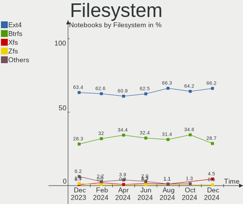
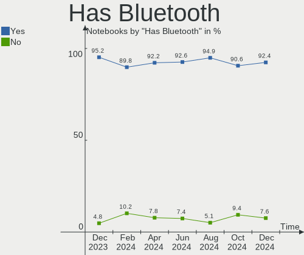
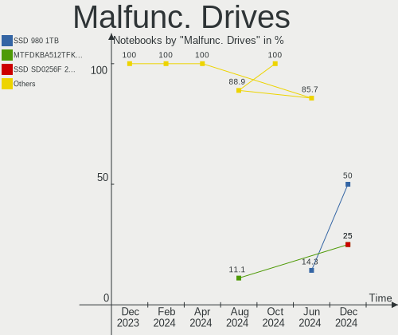
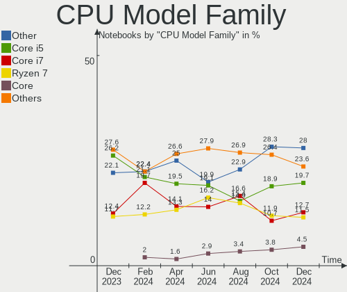
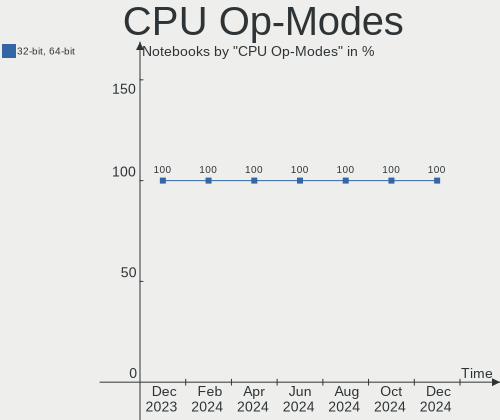
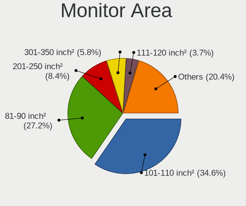
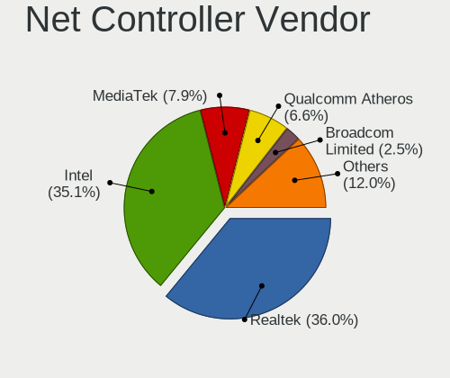

Arch Hardware Trends (Notebooks)
--------------------------------

A project to identify most popular hardware characteristics and track their change
over time based on data collected by Arch users at https://Linux-Hardware.org.

Anyone can contribute to this report by the [hw-probe](https://github.com/linuxhw/hw-probe) tool:

    sudo -E hw-probe -all -upload

Full-feature report is available here: https://linux-hardware.org/?view=trends&formfactor=notebook

Period: Aug, 2021.

Contents
--------

* [ System ](#system)
  - [ OS                       ](#os)
  - [ OS Family                ](#os-family)
  - [ Kernel                   ](#kernel)
  - [ Kernel Family            ](#kernel-family)
  - [ Kernel Major Ver.        ](#kernel-major-ver)
  - [ Arch                     ](#arch)
  - [ DE                       ](#de)
  - [ Display Server           ](#display-server)
  - [ Display Manager          ](#display-manager)
  - [ OS Lang                  ](#os-lang)
  - [ Boot Mode                ](#boot-mode)
  - [ Filesystem               ](#filesystem)
  - [ Part. scheme             ](#part-scheme)
  - [ Dual Boot with Linux/BSD ](#dual-boot-with-linuxbsd)
  - [ Dual Boot (Win)          ](#dual-boot-win)

* [ Board ](#board)
  - [ Vendor                   ](#vendor)
  - [ Model                    ](#model)
  - [ Model Family             ](#model-family)
  - [ MFG Year                 ](#mfg-year)
  - [ Form Factor              ](#form-factor)
  - [ Secure Boot              ](#secure-boot)
  - [ Coreboot                 ](#coreboot)
  - [ RAM Size                 ](#ram-size)
  - [ RAM Used                 ](#ram-used)
  - [ Total Drives             ](#total-drives)
  - [ Has CD-ROM               ](#has-cd-rom)
  - [ Has Ethernet             ](#has-ethernet)
  - [ Has WiFi                 ](#has-wifi)
  - [ Has Bluetooth            ](#has-bluetooth)

* [ Location ](#location)
  - [ Country                  ](#country)
  - [ City                     ](#city)

* [ Drives ](#drives)
  - [ Drive Vendor             ](#drive-vendor)
  - [ Drive Model              ](#drive-model)
  - [ HDD Vendor               ](#hdd-vendor)
  - [ SSD Vendor               ](#ssd-vendor)
  - [ Drive Kind               ](#drive-kind)
  - [ Drive Connector          ](#drive-connector)
  - [ Drive Size               ](#drive-size)
  - [ Space Total              ](#space-total)
  - [ Space Used               ](#space-used)
  - [ Malfunc. Drives          ](#malfunc-drives)
  - [ Malfunc. Drive Vendor    ](#malfunc-drive-vendor)
  - [ Malfunc. HDD Vendor      ](#malfunc-hdd-vendor)
  - [ Malfunc. Drive Kind      ](#malfunc-drive-kind)
  - [ Failed Drives            ](#failed-drives)
  - [ Failed Drive Vendor      ](#failed-drive-vendor)
  - [ Drive Status             ](#drive-status)

* [ Storage controller ](#storage-controller)
  - [ Storage Vendor           ](#storage-vendor)
  - [ Storage Model            ](#storage-model)
  - [ Storage Kind             ](#storage-kind)

* [ Processor ](#processor)
  - [ CPU Vendor               ](#cpu-vendor)
  - [ CPU Model                ](#cpu-model)
  - [ CPU Model Family         ](#cpu-model-family)
  - [ CPU Cores                ](#cpu-cores)
  - [ CPU Sockets              ](#cpu-sockets)
  - [ CPU Threads              ](#cpu-threads)
  - [ CPU Op-Modes             ](#cpu-op-modes)
  - [ CPU Microcode            ](#cpu-microcode)
  - [ CPU Microarch            ](#cpu-microarch)

* [ Graphics ](#graphics)
  - [ GPU Vendor               ](#gpu-vendor)
  - [ GPU Model                ](#gpu-model)
  - [ GPU Combo                ](#gpu-combo)
  - [ GPU Driver               ](#gpu-driver)
  - [ GPU Memory               ](#gpu-memory)

* [ Monitor ](#monitor)
  - [ Monitor Vendor           ](#monitor-vendor)
  - [ Monitor Model            ](#monitor-model)
  - [ Monitor Resolution       ](#monitor-resolution)
  - [ Monitor Diagonal         ](#monitor-diagonal)
  - [ Monitor Width            ](#monitor-width)
  - [ Aspect Ratio             ](#aspect-ratio)
  - [ Monitor Area             ](#monitor-area)
  - [ Pixel Density            ](#pixel-density)
  - [ Multiple Monitors        ](#multiple-monitors)

* [ Network ](#network)
  - [ Net Controller Vendor    ](#net-controller-vendor)
  - [ Net Controller Model     ](#net-controller-model)
  - [ Wireless Vendor          ](#wireless-vendor)
  - [ Wireless Model           ](#wireless-model)
  - [ Ethernet Vendor          ](#ethernet-vendor)
  - [ Ethernet Model           ](#ethernet-model)
  - [ Net Controller Kind      ](#net-controller-kind)
  - [ Used Controller          ](#used-controller)
  - [ NICs                     ](#nics)
  - [ IPv6                     ](#ipv6)

* [ Bluetooth ](#bluetooth)
  - [ Bluetooth Vendor         ](#bluetooth-vendor)
  - [ Bluetooth Model          ](#bluetooth-model)

* [ Sound ](#sound)
  - [ Sound Vendor             ](#sound-vendor)
  - [ Sound Model              ](#sound-model)

* [ Memory ](#memory)
  - [ Memory Vendor            ](#memory-vendor)
  - [ Memory Model             ](#memory-model)
  - [ Memory Kind              ](#memory-kind)
  - [ Memory Form Factor       ](#memory-form-factor)
  - [ Memory Size              ](#memory-size)
  - [ Memory Speed             ](#memory-speed)

* [ Printers & scanners ](#printers--scanners)
  - [ Printer Vendor           ](#printer-vendor)
  - [ Printer Model            ](#printer-model)
  - [ Scanner Vendor           ](#scanner-vendor)
  - [ Scanner Model            ](#scanner-model)

* [ Camera ](#camera)
  - [ Camera Vendor            ](#camera-vendor)
  - [ Camera Model             ](#camera-model)

* [ Security ](#security)
  - [ Fingerprint Vendor       ](#fingerprint-vendor)
  - [ Fingerprint Model        ](#fingerprint-model)
  - [ Chipcard Vendor          ](#chipcard-vendor)
  - [ Chipcard Model           ](#chipcard-model)

* [ Unsupported ](#unsupported)
  - [ Unsupported Devices      ](#unsupported-devices)
  - [ Unsupported Device Types ](#unsupported-device-types)

System
------

OS
--

Installed operating systems

| Name         | Notebooks | Percent |
|--------------|-----------|---------|
| Arch         | 50        | 53.76%  |
| Arch Rolling | 43        | 46.24%  |

OS Family
---------

OS without a version

| Name | Notebooks | Percent |
|------|-----------|---------|
| Arch | 93        | 100%    |

Kernel
------

Version of the Linux kernel

| Version                   | Notebooks | Percent |
|---------------------------|-----------|---------|
| 5.13.12-arch1-1           | 19        | 20.43%  |
| 5.13.10-arch1-1           | 14        | 15.05%  |
| 5.13.9-arch1-1            | 9         | 9.68%   |
| 5.13.8-arch1-1            | 8         | 8.6%    |
| 5.13.7-arch1-1            | 7         | 7.53%   |
| 5.13.13-arch1-1           | 5         | 5.38%   |
| 5.13.9-zen1-1-zen         | 3         | 3.23%   |
| 5.13.7-zen1-1-zen         | 3         | 3.23%   |
| 5.13.12-zen1-1-zen        | 3         | 3.23%   |
| 5.13.8-zen1-1-zen         | 2         | 2.15%   |
| 5.13.5-arch1-1            | 2         | 2.15%   |
| 5.13.13-zen1-1-zen        | 2         | 2.15%   |
| 5.10.56-1-lts             | 2         | 2.15%   |
| 5.13.7-186-tkg-bmq        | 1         | 1.08%   |
| 5.13.6-arch1-1            | 1         | 1.08%   |
| 5.13.6-amd-zen2           | 1         | 1.08%   |
| 5.13.4-arch1-1-custom     | 1         | 1.08%   |
| 5.13.13-arch1-1-51400p-01 | 1         | 1.08%   |
| 5.13.10-zen1-1-zen        | 1         | 1.08%   |
| 5.12.6-zen1-1-zen         | 1         | 1.08%   |
| 5.12.19-191-tkg-muqss     | 1         | 1.08%   |
| 5.12.18-1-ck-skylake      | 1         | 1.08%   |
| 5.12.18-1-ck-generic-v2   | 1         | 1.08%   |
| 5.12.18-1-ck              | 1         | 1.08%   |
| 5.12.14-arch1-1           | 1         | 1.08%   |
| 5.10.60-1-lts             | 1         | 1.08%   |
| 5.10.54-1-lts             | 1         | 1.08%   |

Kernel Family
-------------

Linux kernel without a distro release

| Version | Notebooks | Percent |
|---------|-----------|---------|
| 5.13.12 | 22        | 23.66%  |
| 5.13.10 | 15        | 16.13%  |
| 5.13.9  | 12        | 12.9%   |
| 5.13.7  | 11        | 11.83%  |
| 5.13.8  | 10        | 10.75%  |
| 5.13.13 | 8         | 8.6%    |
| 5.12.18 | 3         | 3.23%   |
| 5.13.6  | 2         | 2.15%   |
| 5.13.5  | 2         | 2.15%   |
| 5.10.56 | 2         | 2.15%   |
| 5.13.4  | 1         | 1.08%   |
| 5.12.6  | 1         | 1.08%   |
| 5.12.19 | 1         | 1.08%   |
| 5.12.14 | 1         | 1.08%   |
| 5.10.60 | 1         | 1.08%   |
| 5.10.54 | 1         | 1.08%   |

Kernel Major Ver.
-----------------

Linux kernel major version

| Version | Notebooks | Percent |
|---------|-----------|---------|
| 5.13    | 83        | 89.25%  |
| 5.12    | 6         | 6.45%   |
| 5.10    | 4         | 4.3%    |

Arch
----

OS architecture (x86_64, i586, etc.)

| Name   | Notebooks | Percent |
|--------|-----------|---------|
| x86_64 | 93        | 100%    |

DE
--

Desktop Environment

| Name       | Notebooks | Percent |
|------------|-----------|---------|
| GNOME      | 33        | 35.48%  |
| KDE5       | 25        | 26.88%  |
| XFCE       | 8         | 8.6%    |
| KDE        | 8         | 8.6%    |
| Unknown    | 8         | 8.6%    |
| i3         | 5         | 5.38%   |
| Budgie     | 2         | 2.15%   |
| X-Cinnamon | 1         | 1.08%   |
| sway       | 1         | 1.08%   |
| MATE       | 1         | 1.08%   |
| Deepin     | 1         | 1.08%   |

Display Server
--------------

X11 or Wayland

| Name    | Notebooks | Percent |
|---------|-----------|---------|
| X11     | 59        | 63.44%  |
| Wayland | 16        | 17.2%   |
| Tty     | 10        | 10.75%  |
| Unknown | 8         | 8.6%    |

Display Manager
---------------

SDDM, LightDM, etc.

| Name    | Notebooks | Percent |
|---------|-----------|---------|
| SDDM    | 27        | 29.03%  |
| Unknown | 27        | 29.03%  |
| GDM     | 24        | 25.81%  |
| LightDM | 6         | 6.45%   |
| TDM     | 5         | 5.38%   |
| LXDM    | 2         | 2.15%   |
| XDM     | 1         | 1.08%   |
| SLiM    | 1         | 1.08%   |

OS Lang
-------

Language

| Lang       | Notebooks | Percent |
|------------|-----------|---------|
| en_US      | 56        | 60.22%  |
| en_GB      | 6         | 6.45%   |
| Unknown    | 4         | 4.3%    |
| es_ES      | 3         | 3.23%   |
| C          | 3         | 3.23%   |
| zh_CN      | 2         | 2.15%   |
| it_IT      | 2         | 2.15%   |
| en_IN      | 2         | 2.15%   |
| en_AU      | 2         | 2.15%   |
| de_DE      | 2         | 2.15%   |
| tr_TR      | 1         | 1.08%   |
| sv_SE      | 1         | 1.08%   |
| sp_SP      | 1         | 1.08%   |
| ru_RU      | 1         | 1.08%   |
| pt_BR      | 1         | 1.08%   |
| pl_PL      | 1         | 1.08%   |
| is_IS      | 1         | 1.08%   |
| es_MX.UTF8 | 1         | 1.08%   |
| en_ZA      | 1         | 1.08%   |
| en_SG      | 1         | 1.08%   |
| en_CA      | 1         | 1.08%   |

Boot Mode
---------

EFI or BIOS

| Mode | Notebooks | Percent |
|------|-----------|---------|
| EFI  | 66        | 70.97%  |
| BIOS | 27        | 29.03%  |

Filesystem
----------

Type of filesystem

| Type  | Notebooks | Percent |
|-------|-----------|---------|
| Ext4  | 71        | 76.34%  |
| Btrfs | 21        | 22.58%  |
| Xfs   | 1         | 1.08%   |

Part. scheme
------------

Scheme of partitioning

| Type    | Notebooks | Percent |
|---------|-----------|---------|
| GPT     | 69        | 74.19%  |
| Unknown | 16        | 17.2%   |
| MBR     | 8         | 8.6%    |

Dual Boot with Linux/BSD
------------------------

Hosting more than one Linux/BSD

| Dual boot | Notebooks | Percent |
|-----------|-----------|---------|
| No        | 85        | 91.4%   |
| Yes       | 8         | 8.6%    |

Dual Boot (Win)
---------------

Hosting Linux and Windows

| Dual boot | Notebooks | Percent |
|-----------|-----------|---------|
| No        | 66        | 70.97%  |
| Yes       | 27        | 29.03%  |

Board
-----

Vendor
------

Motherboard manufacturer

| Name                | Notebooks | Percent |
|---------------------|-----------|---------|
| Lenovo              | 25        | 26.88%  |
| Dell                | 18        | 19.35%  |
| Hewlett-Packard     | 15        | 16.13%  |
| Acer                | 9         | 9.68%   |
| ASUSTek Computer    | 7         | 7.53%   |
| MSI                 | 6         | 6.45%   |
| HUAWEI              | 2         | 2.15%   |
| Apple               | 2         | 2.15%   |
| TUXEDO              | 1         | 1.08%   |
| Toshiba             | 1         | 1.08%   |
| Sony                | 1         | 1.08%   |
| Samsung Electronics | 1         | 1.08%   |
| PC Specialist       | 1         | 1.08%   |
| Notebook            | 1         | 1.08%   |
| Intel               | 1         | 1.08%   |
| GPD                 | 1         | 1.08%   |
| Eluktronics         | 1         | 1.08%   |

Model
-----

Motherboard model

| Name                                     | Notebooks | Percent |
|------------------------------------------|-----------|---------|
| HP Pavilion Gaming Laptop 15-ec1xxx      | 2         | 2.15%   |
| Dell XPS 15 7590                         | 2         | 2.15%   |
| TUXEDO InfinityBook Pro 14 Gen6          | 1         | 1.08%   |
| Toshiba Satellite L55-C                  | 1         | 1.08%   |
| Sony SVE1113M1EW                         | 1         | 1.08%   |
| Samsung 550XDA                           | 1         | 1.08%   |
| PC Specialist Standard                   | 1         | 1.08%   |
| Notebook N85_N87,HJ,HJ1,HK1              | 1         | 1.08%   |
| MSI Modern 14 B4MW                       | 1         | 1.08%   |
| MSI GP62 7RD                             | 1         | 1.08%   |
| MSI GL65 9SEK                            | 1         | 1.08%   |
| MSI GL63 8SE                             | 1         | 1.08%   |
| MSI GE66 Raider 10SFS                    | 1         | 1.08%   |
| MSI Bravo 17 A4DDK                       | 1         | 1.08%   |
| Lenovo V155-15API 81V5                   | 1         | 1.08%   |
| Lenovo ThinkPad X395 20NL0005US          | 1         | 1.08%   |
| Lenovo ThinkPad X230 Tablet 3438DS7      | 1         | 1.08%   |
| Lenovo ThinkPad X140e 20BL000BUS         | 1         | 1.08%   |
| Lenovo ThinkPad X1 Carbon 7th 20QD001TUS | 1         | 1.08%   |
| Lenovo ThinkPad T570 20JXS1S900          | 1         | 1.08%   |
| Lenovo ThinkPad T510 4314DEU             | 1         | 1.08%   |
| Lenovo ThinkPad T480s 20L8S3DK1L         | 1         | 1.08%   |
| Lenovo ThinkPad T480s 20L7CTO1WW         | 1         | 1.08%   |
| Lenovo ThinkPad T460p 20FW0005AU         | 1         | 1.08%   |
| Lenovo ThinkPad T440p 2000CT0            | 1         | 1.08%   |
| Lenovo ThinkPad T440 20B60061MD          | 1         | 1.08%   |
| Lenovo ThinkPad T14 Gen 2i 20W0004MSP    | 1         | 1.08%   |
| Lenovo ThinkPad P14s Gen 1 20Y1CTO1WW    | 1         | 1.08%   |
| Lenovo ThinkPad L390 20NR001LGE          | 1         | 1.08%   |
| Lenovo ThinkPad E14 Gen 2 20T6S00D00     | 1         | 1.08%   |
| Lenovo ThinkBook 14 G3 ACL 21A2          | 1         | 1.08%   |
| Lenovo Legion Y540-15IRH-PG0 81SY        | 1         | 1.08%   |
| Lenovo IdeaPad Y510P 20217               | 1         | 1.08%   |
| Lenovo IdeaPad Gaming 3 15ARH05 82EY     | 1         | 1.08%   |
| Lenovo IdeaPad 5 14ARE05 81YM            | 1         | 1.08%   |
| Lenovo IdeaPad 330S-15ARR 81FB           | 1         | 1.08%   |
| Lenovo IdeaPad 320S-14IKB 80X4           | 1         | 1.08%   |
| Lenovo IdeaPad 110-15ISK 80UD            | 1         | 1.08%   |
| Lenovo G400s VILG1                       | 1         | 1.08%   |
| Intel SandyBridge Platform               | 1         | 1.08%   |
| HUAWEI NBLL-WXX9                         | 1         | 1.08%   |
| HUAWEI NBLK-WAX9X                        | 1         | 1.08%   |
| HP ProBook 450 G3                        | 1         | 1.08%   |
| HP Pavilion Laptop 13-an0xxx             | 1         | 1.08%   |
| HP Notebook                              | 1         | 1.08%   |
| HP Laptop 14-df0xxx                      | 1         | 1.08%   |
| HP Laptop 14-bs1xx                       | 1         | 1.08%   |
| HP EliteBook 8740w                       | 1         | 1.08%   |
| HP EliteBook 8530p                       | 1         | 1.08%   |
| HP EliteBook 8470p                       | 1         | 1.08%   |
| HP EliteBook 840 G8 Notebook PC          | 1         | 1.08%   |
| HP EliteBook 840 G7 Notebook PC          | 1         | 1.08%   |
| HP EliteBook 840 G6                      | 1         | 1.08%   |
| HP EliteBook 820 G3                      | 1         | 1.08%   |
| HP EliteBook 745 G5                      | 1         | 1.08%   |
| GPD G1618-03                             | 1         | 1.08%   |
| Eluktronics THINN-15                     | 1         | 1.08%   |
| Dell XPS 15 9560                         | 1         | 1.08%   |
| Dell XPS 15 9500                         | 1         | 1.08%   |
| Dell Vostro1710                          | 1         | 1.08%   |

Model Family
------------

Motherboard model prefix

| Name                   | Notebooks | Percent |
|------------------------|-----------|---------|
| Lenovo ThinkPad        | 15        | 16.13%  |
| HP EliteBook           | 8         | 8.6%    |
| Acer Aspire            | 8         | 8.6%    |
| Lenovo IdeaPad         | 6         | 6.45%   |
| Dell Latitude          | 5         | 5.38%   |
| Dell Inspiron          | 5         | 5.38%   |
| Dell XPS               | 4         | 4.3%    |
| HP Pavilion            | 3         | 3.23%   |
| HP Laptop              | 2         | 2.15%   |
| TUXEDO InfinityBook    | 1         | 1.08%   |
| Toshiba Satellite      | 1         | 1.08%   |
| Sony SVE1113M1EW       | 1         | 1.08%   |
| Samsung 550XDA         | 1         | 1.08%   |
| PC Specialist Standard | 1         | 1.08%   |
| Notebook N85           | 1         | 1.08%   |
| MSI Modern             | 1         | 1.08%   |
| MSI GP62               | 1         | 1.08%   |
| MSI GL65               | 1         | 1.08%   |
| MSI GL63               | 1         | 1.08%   |
| MSI GE66               | 1         | 1.08%   |
| MSI Bravo              | 1         | 1.08%   |
| Lenovo V155-15API      | 1         | 1.08%   |
| Lenovo ThinkBook       | 1         | 1.08%   |
| Lenovo Legion          | 1         | 1.08%   |
| Lenovo G400s           | 1         | 1.08%   |
| Intel SandyBridge      | 1         | 1.08%   |
| HUAWEI NBLL-WXX9       | 1         | 1.08%   |
| HUAWEI NBLK-WAX9X      | 1         | 1.08%   |
| HP ProBook             | 1         | 1.08%   |
| HP Notebook            | 1         | 1.08%   |
| GPD G1618-03           | 1         | 1.08%   |
| Eluktronics THINN-15   | 1         | 1.08%   |
| Dell Vostro1710        | 1         | 1.08%   |
| Dell Studio            | 1         | 1.08%   |
| Dell Precision         | 1         | 1.08%   |
| Dell G5                | 1         | 1.08%   |
| ASUS ZenBook           | 1         | 1.08%   |
| ASUS X550LN            | 1         | 1.08%   |
| ASUS X550JX            | 1         | 1.08%   |
| ASUS X205TAW           | 1         | 1.08%   |
| ASUS VivoBook          | 1         | 1.08%   |
| ASUS N53SV             | 1         | 1.08%   |
| ASUS GL752VW           | 1         | 1.08%   |
| Apple MacBookPro15     | 1         | 1.08%   |
| Apple MacBookAir4      | 1         | 1.08%   |
| Acer Nitro             | 1         | 1.08%   |

MFG Year
--------

Motherboard manufacture year

| Year | Notebooks | Percent |
|------|-----------|---------|
| 2020 | 24        | 25.81%  |
| 2021 | 21        | 22.58%  |
| 2019 | 17        | 18.28%  |
| 2018 | 7         | 7.53%   |
| 2017 | 5         | 5.38%   |
| 2013 | 5         | 5.38%   |
| 2015 | 4         | 4.3%    |
| 2010 | 3         | 3.23%   |
| 2016 | 2         | 2.15%   |
| 2014 | 2         | 2.15%   |
| 2012 | 1         | 1.08%   |
| 2011 | 1         | 1.08%   |
| 2008 | 1         | 1.08%   |

Form Factor
-----------

Physical design of the computer

| Name     | Notebooks | Percent |
|----------|-----------|---------|
| Notebook | 93        | 100%    |

Secure Boot
-----------

Enabled or disabled

| State    | Notebooks | Percent |
|----------|-----------|---------|
| Disabled | 91        | 97.85%  |
| Enabled  | 2         | 2.15%   |

Coreboot
--------

Have coreboot on board

| Used | Notebooks | Percent |
|------|-----------|---------|
| No   | 93        | 100%    |

RAM Size
--------

Total RAM memory

| Size in GB  | Notebooks | Percent |
|-------------|-----------|---------|
| 4.01-8.0    | 25        | 26.88%  |
| 16.01-24.0  | 20        | 21.51%  |
| 8.01-16.0   | 18        | 19.35%  |
| 32.01-64.0  | 14        | 15.05%  |
| 3.01-4.0    | 12        | 12.9%   |
| 64.01-256.0 | 2         | 2.15%   |
| 24.01-32.0  | 1         | 1.08%   |
| 1.01-2.0    | 1         | 1.08%   |

RAM Used
--------

Used RAM memory

| Used GB    | Notebooks | Percent |
|------------|-----------|---------|
| 2.01-3.0   | 25        | 26.88%  |
| 1.01-2.0   | 21        | 22.58%  |
| 4.01-8.0   | 18        | 19.35%  |
| 3.01-4.0   | 16        | 17.2%   |
| 0.51-1.0   | 8         | 8.6%    |
| 8.01-16.0  | 3         | 3.23%   |
| 16.01-24.0 | 1         | 1.08%   |
| 0.01-0.5   | 1         | 1.08%   |

Total Drives
------------

Number of drives on board

| Drives | Notebooks | Percent |
|--------|-----------|---------|
| 1      | 62        | 66.67%  |
| 2      | 26        | 27.96%  |
| 3      | 5         | 5.38%   |

Has CD-ROM
----------

Has CD-ROM on board

| Presented | Notebooks | Percent |
|-----------|-----------|---------|
| No        | 75        | 80.65%  |
| Yes       | 18        | 19.35%  |

Has Ethernet
------------

Has Ethernet on board

| Presented | Notebooks | Percent |
|-----------|-----------|---------|
| Yes       | 73        | 78.49%  |
| No        | 20        | 21.51%  |

Has WiFi
--------

Has WiFi module

| Presented | Notebooks | Percent |
|-----------|-----------|---------|
| Yes       | 90        | 96.77%  |
| No        | 3         | 3.23%   |

Has Bluetooth
-------------

Has Bluetooth module

| Presented | Notebooks | Percent |
|-----------|-----------|---------|
| Yes       | 84        | 90.32%  |
| No        | 9         | 9.68%   |

Location
--------

Country
-------

Geographic location (country)

| Country      | Notebooks | Percent |
|--------------|-----------|---------|
| USA          | 22        | 23.66%  |
| India        | 5         | 5.38%   |
| Germany      | 5         | 5.38%   |
| Sweden       | 4         | 4.3%    |
| Spain        | 4         | 4.3%    |
| Russia       | 4         | 4.3%    |
| Brazil       | 4         | 4.3%    |
| Australia    | 4         | 4.3%    |
| Netherlands  | 3         | 3.23%   |
| France       | 3         | 3.23%   |
| Ukraine      | 2         | 2.15%   |
| UK           | 2         | 2.15%   |
| Turkey       | 2         | 2.15%   |
| Qatar        | 2         | 2.15%   |
| Canada       | 2         | 2.15%   |
| Uzbekistan   | 1         | 1.08%   |
| South Africa | 1         | 1.08%   |
| Singapore    | 1         | 1.08%   |
| Romania      | 1         | 1.08%   |
| Poland       | 1         | 1.08%   |
| Pakistan     | 1         | 1.08%   |
| Norway       | 1         | 1.08%   |
| New Zealand  | 1         | 1.08%   |
| Mexico       | 1         | 1.08%   |
| Malaysia     | 1         | 1.08%   |
| Latvia       | 1         | 1.08%   |
| Japan        | 1         | 1.08%   |
| Italy        | 1         | 1.08%   |
| Iran         | 1         | 1.08%   |
| Indonesia    | 1         | 1.08%   |
| Hungary      | 1         | 1.08%   |
| Guatemala    | 1         | 1.08%   |
| Finland      | 1         | 1.08%   |
| Estonia      | 1         | 1.08%   |
| China        | 1         | 1.08%   |
| Bulgaria     | 1         | 1.08%   |
| Belarus      | 1         | 1.08%   |
| Austria      | 1         | 1.08%   |
| Armenia      | 1         | 1.08%   |
| Argentina    | 1         | 1.08%   |

City
----

Geographic location (city)

| City                  | Notebooks | Percent |
|-----------------------|-----------|---------|
| Valencia              | 3         | 3.23%   |
| St Petersburg         | 2         | 2.15%   |
| Ormiston              | 2         | 2.15%   |
| Istanbul              | 2         | 2.15%   |
| Doha                  | 2         | 2.15%   |
| Zaragoza              | 1         | 1.08%   |
| Yerevan               | 1         | 1.08%   |
| Witten                | 1         | 1.08%   |
| Weymouth              | 1         | 1.08%   |
| Wellington            | 1         | 1.08%   |
| Washington            | 1         | 1.08%   |
| Warsaw                | 1         | 1.08%   |
| Villa Regina          | 1         | 1.08%   |
| Vancouver             | 1         | 1.08%   |
| Troy                  | 1         | 1.08%   |
| Tehran                | 1         | 1.08%   |
| Tashkent              | 1         | 1.08%   |
| Tallinn               | 1         | 1.08%   |
| Sistov                | 1         | 1.08%   |
| Singapore             | 1         | 1.08%   |
| Segny                 | 1         | 1.08%   |
| Sarasota              | 1         | 1.08%   |
| Sao Joaquim da Barra  | 1         | 1.08%   |
| San Luis Potos?­ City | 1         | 1.08%   |
| San Jose              | 1         | 1.08%   |
| San Fernando          | 1         | 1.08%   |
| San Antonio           | 1         | 1.08%   |
| Salzgitter            | 1         | 1.08%   |
| Salinas               | 1         | 1.08%   |
| Riga                  | 1         | 1.08%   |
| Rennes                | 1         | 1.08%   |
| Pune                  | 1         | 1.08%   |
| Ploie??ti             | 1         | 1.08%   |
| Plasencia             | 1         | 1.08%   |
| Pilisvorosvar         | 1         | 1.08%   |
| Phoenix               | 1         | 1.08%   |
| Pendleton             | 1         | 1.08%   |
| Palo Alto             | 1         | 1.08%   |
| Oslo                  | 1         | 1.08%   |
| Orem                  | 1         | 1.08%   |
| Odessa                | 1         | 1.08%   |
| Noida                 | 1         | 1.08%   |
| Nieuwegein            | 1         | 1.08%   |
| Nevinnomyssk          | 1         | 1.08%   |
| Nantes                | 1         | 1.08%   |
| Nagahama              | 1         | 1.08%   |
| Munich                | 1         | 1.08%   |
| Montreal              | 1         | 1.08%   |
| Monrovia              | 1         | 1.08%   |
| Minsk                 | 1         | 1.08%   |
| Mathura               | 1         | 1.08%   |
| Maranello             | 1         | 1.08%   |
| Manchester            | 1         | 1.08%   |
| Malmo                 | 1         | 1.08%   |
| Makassar              | 1         | 1.08%   |
| Mairena del Aljarafe  | 1         | 1.08%   |
| Los Angeles           | 1         | 1.08%   |
| Limoeiro do Norte     | 1         | 1.08%   |
| Lakeland              | 1         | 1.08%   |
| Lahore                | 1         | 1.08%   |

Drives
------

Drive Vendor
------------

Hard drive vendors

| Vendor              | Notebooks | Drives | Percent |
|---------------------|-----------|--------|---------|
| Samsung Electronics | 33        | 36     | 26.4%   |
| WDC                 | 17        | 19     | 13.6%   |
| Seagate             | 9         | 10     | 7.2%    |
| Unknown             | 8         | 9      | 6.4%    |
| Toshiba             | 8         | 8      | 6.4%    |
| SanDisk             | 6         | 7      | 4.8%    |
| Kingston            | 6         | 7      | 4.8%    |
| SK Hynix            | 4         | 4      | 3.2%    |
| Intel               | 4         | 4      | 3.2%    |
| HGST                | 4         | 4      | 3.2%    |
| Crucial             | 4         | 4      | 3.2%    |
| A-DATA Technology   | 3         | 3      | 2.4%    |
| Lexar               | 2         | 2      | 1.6%    |
| KIOXIA              | 2         | 2      | 1.6%    |
| Apple               | 2         | 2      | 1.6%    |
| SPCC                | 1         | 1      | 0.8%    |
| Solid State Storage | 1         | 1      | 0.8%    |
| PNY                 | 1         | 1      | 0.8%    |
| Phison              | 1         | 1      | 0.8%    |
| Patriot             | 1         | 1      | 0.8%    |
| Micron Technology   | 1         | 1      | 0.8%    |
| Micron 1            | 1         | 1      | 0.8%    |
| LITEON              | 1         | 1      | 0.8%    |
| HS-SSD-C100         | 1         | 1      | 0.8%    |
| Hitachi             | 1         | 1      | 0.8%    |
| Hewlett-Packard     | 1         | 1      | 0.8%    |
| Gigabyte Technology | 1         | 1      | 0.8%    |
| Apacer              | 1         | 1      | 0.8%    |

Drive Model
-----------

Hard drive models

| Model                                        | Notebooks | Percent |
|----------------------------------------------|-----------|---------|
| Samsung SSD 860 EVO 1TB                      | 3         | 2.26%   |
| Samsung SSD 970 EVO Plus 500GB               | 2         | 1.5%    |
| Samsung SSD 860 EVO 500GB                    | 2         | 1.5%    |
| Samsung SSD 850 EVO 500GB                    | 2         | 1.5%    |
| Samsung NVMe SSD Drive 256GB                 | 2         | 1.5%    |
| WDC WDS500G2X0C-00L350 500GB                 | 1         | 0.75%   |
| WDC WDS500G2B0C-00PXH0 500GB                 | 1         | 0.75%   |
| WDC WDS500G2B0A-00SM50 500GB SSD             | 1         | 0.75%   |
| WDC WDS100T2X0C-00L350 1TB                   | 1         | 0.75%   |
| WDC WDS100T2B0A-00SM50 1TB SSD               | 1         | 0.75%   |
| WDC WDBRPG0010BNC-WRSN 1TB                   | 1         | 0.75%   |
| WDC WD3200LPVT-22G33T0 320GB                 | 1         | 0.75%   |
| WDC WD20SPZX-08UA7 2TB                       | 1         | 0.75%   |
| WDC WD20 EZRZ-00Z5HB0 2TB                    | 1         | 0.75%   |
| WDC WD1600AAJS-62B4A0 160GB                  | 1         | 0.75%   |
| WDC WD10SPZX-35Z10T0 1TB                     | 1         | 0.75%   |
| WDC WD10SPZX-21Z10T0 1TB                     | 1         | 0.75%   |
| WDC WD10JPVX-22JC3T0 1TB                     | 1         | 0.75%   |
| WDC WD10JPCX-24UE4T0 1TB                     | 1         | 0.75%   |
| WDC PC SN730 SDBPNTY-1T00-1032 1TB           | 1         | 0.75%   |
| WDC PC SN530 SDBPMPZ-512G-1101 512GB         | 1         | 0.75%   |
| WDC PC SN520 SDAPNUW-256G-1006 256GB         | 1         | 0.75%   |
| WDC PC SN520 SDAPNUW-256G-1002 256GB         | 1         | 0.75%   |
| WDC PC SN520 SDAPMUW-256G-1101 256GB         | 1         | 0.75%   |
| Unknown SN128  128GB                         | 1         | 0.75%   |
| Unknown SE32G  32GB                          | 1         | 0.75%   |
| Unknown SD02G  2GB                           | 1         | 0.75%   |
| Unknown NVMe SSD Drive 256GB                 | 1         | 0.75%   |
| Unknown NVMe SSD Drive 1024GB                | 1         | 0.75%   |
| Unknown MMC Card  32GB                       | 1         | 0.75%   |
| Unknown MMC Card  128GB                      | 1         | 0.75%   |
| Unknown HCG4a2  64GB                         | 1         | 0.75%   |
| Unknown EC2QT  64GB                          | 1         | 0.75%   |
| Toshiba NVMe SSD Drive 512GB                 | 1         | 0.75%   |
| Toshiba NVMe SSD Drive 256GB                 | 1         | 0.75%   |
| Toshiba MQ04ABF100 1TB                       | 1         | 0.75%   |
| Toshiba MQ01ABF050 500GB                     | 1         | 0.75%   |
| Toshiba MQ01ABD100 1TB                       | 1         | 0.75%   |
| Toshiba MK5076GSX 500GB                      | 1         | 0.75%   |
| Toshiba KXG60ZNV512G NVMe 512GB              | 1         | 0.75%   |
| Toshiba KBG40ZNT512G MEMORY 512GB            | 1         | 0.75%   |
| SPCC Solid State Disk 128GB                  | 1         | 0.75%   |
| Solid State Storage SSSTC CL1-8D256-HP 256GB | 1         | 0.75%   |
| SK Hynix SKHynix_HFS256GD9TNG-L3A0B 256GB    | 1         | 0.75%   |
| SK Hynix SKHynix_HFS001TD9TNI-L2B0B 1TB      | 1         | 0.75%   |
| SK Hynix PC601 NVMe 256GB                    | 1         | 0.75%   |
| SK Hynix PC601 NVMe 1TB                      | 1         | 0.75%   |
| Seagate ST9500325AS 500GB                    | 1         | 0.75%   |
| Seagate ST500LT012-1DG142 500GB              | 1         | 0.75%   |
| Seagate ST2000LM007-1R8174 2TB               | 1         | 0.75%   |
| Seagate ST1000LM049-2GH172 1TB               | 1         | 0.75%   |
| Seagate ST1000LM048-2E7172 1TB               | 1         | 0.75%   |
| Seagate ST1000LM035-1RK172 1TB               | 1         | 0.75%   |
| Seagate ST1000LM024 HN-M101MBB 1TB           | 1         | 0.75%   |
| Seagate ST1000LM014-1EJ164 1TB               | 1         | 0.75%   |
| Seagate Expansion 2TB                        | 1         | 0.75%   |
| SanDisk SSD U110 16GB                        | 1         | 0.75%   |
| SanDisk SDSSDH2128G 128GB                    | 1         | 0.75%   |
| SanDisk SD8SN8U256G1002 256GB SSD            | 1         | 0.75%   |
| Sandisk NVMe SSD Drive 512GB                 | 1         | 0.75%   |

HDD Vendor
----------

Hard disk drive vendors

| Vendor  | Notebooks | Drives | Percent |
|---------|-----------|--------|---------|
| Seagate | 9         | 10     | 34.62%  |
| WDC     | 8         | 8      | 30.77%  |
| Toshiba | 4         | 4      | 15.38%  |
| HGST    | 4         | 4      | 15.38%  |
| Hitachi | 1         | 1      | 3.85%   |

SSD Vendor
----------

Solid state drive vendors

| Vendor              | Notebooks | Drives | Percent |
|---------------------|-----------|--------|---------|
| Samsung Electronics | 14        | 15     | 35%     |
| SanDisk             | 3         | 3      | 7.5%    |
| Kingston            | 3         | 3      | 7.5%    |
| Crucial             | 3         | 3      | 7.5%    |
| WDC                 | 2         | 2      | 5%      |
| Lexar               | 2         | 2      | 5%      |
| Intel               | 2         | 2      | 5%      |
| SPCC                | 1         | 1      | 2.5%    |
| PNY                 | 1         | 1      | 2.5%    |
| Patriot             | 1         | 1      | 2.5%    |
| Micron Technology   | 1         | 1      | 2.5%    |
| Micron 1            | 1         | 1      | 2.5%    |
| LITEON              | 1         | 1      | 2.5%    |
| HS-SSD-C100         | 1         | 1      | 2.5%    |
| Gigabyte Technology | 1         | 1      | 2.5%    |
| Apple               | 1         | 1      | 2.5%    |
| Apacer              | 1         | 1      | 2.5%    |
| A-DATA Technology   | 1         | 1      | 2.5%    |

Drive Kind
----------

HDD or SSD

| Kind | Notebooks | Drives | Percent |
|------|-----------|--------|---------|
| NVMe | 49        | 59     | 42.61%  |
| SSD  | 35        | 41     | 30.43%  |
| HDD  | 25        | 27     | 21.74%  |
| MMC  | 6         | 7      | 5.22%   |

Drive Connector
---------------

SATA, SAS, NVMe, etc.

| Type | Notebooks | Drives | Percent |
|------|-----------|--------|---------|
| SATA | 53        | 63     | 47.32%  |
| NVMe | 49        | 59     | 43.75%  |
| MMC  | 6         | 7      | 5.36%   |
| SAS  | 4         | 5      | 3.57%   |

Drive Size
----------

Size of hard drive

| Size in TB | Notebooks | Drives | Percent |
|------------|-----------|--------|---------|
| 0.01-0.5   | 36        | 41     | 58.06%  |
| 0.51-1.0   | 20        | 20     | 32.26%  |
| 1.01-2.0   | 6         | 7      | 9.68%   |

Space Total
-----------

Amount of disk space available on the file system

| Size in GB     | Notebooks | Percent |
|----------------|-----------|---------|
| 101-250        | 35        | 37.63%  |
| 251-500        | 25        | 26.88%  |
| 501-1000       | 11        | 11.83%  |
| 1001-2000      | 10        | 10.75%  |
| More than 3000 | 3         | 3.23%   |
| 2001-3000      | 3         | 3.23%   |
| 21-50          | 2         | 2.15%   |
| 51-100         | 2         | 2.15%   |
| 1-20           | 1         | 1.08%   |
| Unknown        | 1         | 1.08%   |

Space Used
----------

Amount of used disk space

| Used GB   | Notebooks | Percent |
|-----------|-----------|---------|
| 251-500   | 18        | 19.35%  |
| 1-20      | 18        | 19.35%  |
| 101-250   | 16        | 17.2%   |
| 51-100    | 16        | 17.2%   |
| 21-50     | 13        | 13.98%  |
| 1001-2000 | 6         | 6.45%   |
| 501-1000  | 4         | 4.3%    |
| 2001-3000 | 1         | 1.08%   |
| Unknown   | 1         | 1.08%   |

Malfunc. Drives
---------------

Drive models with a malfunction

| Model                            | Notebooks | Drives | Percent |
|----------------------------------|-----------|--------|---------|
| Seagate ST1000LM049-2GH172 1TB   | 1         | 1      | 14.29%  |
| Kingston SV300S37A240G 240GB SSD | 1         | 1      | 14.29%  |
| Intel SSDSC2BF240A4L 240GB       | 1         | 1      | 14.29%  |
| Hitachi HTS723232A7A364 320GB    | 1         | 1      | 14.29%  |
| HGST HTS725050A7E630 500GB       | 1         | 1      | 14.29%  |
| HGST HTS721010A9E630 1TB         | 1         | 1      | 14.29%  |
| HGST HTS545050A7E680 500GB       | 1         | 1      | 14.29%  |

Malfunc. Drive Vendor
---------------------

Vendors of faulty drives

| Vendor   | Notebooks | Drives | Percent |
|----------|-----------|--------|---------|
| HGST     | 3         | 3      | 42.86%  |
| Seagate  | 1         | 1      | 14.29%  |
| Kingston | 1         | 1      | 14.29%  |
| Intel    | 1         | 1      | 14.29%  |
| Hitachi  | 1         | 1      | 14.29%  |

Malfunc. HDD Vendor
-------------------

Vendors of faulty HDD drives

| Vendor  | Notebooks | Drives | Percent |
|---------|-----------|--------|---------|
| HGST    | 3         | 3      | 60%     |
| Seagate | 1         | 1      | 20%     |
| Hitachi | 1         | 1      | 20%     |

Malfunc. Drive Kind
-------------------

Kinds of faulty drives

| Kind | Notebooks | Drives | Percent |
|------|-----------|--------|---------|
| HDD  | 5         | 5      | 71.43%  |
| SSD  | 2         | 2      | 28.57%  |

Failed Drives
-------------

Failed drive models

Zero info for selected period =(

Failed Drive Vendor
-------------------

Failed drive vendors

Zero info for selected period =(

Drive Status
------------

Number of failed and malfunc. drives

| Status   | Notebooks | Drives | Percent |
|----------|-----------|--------|---------|
| Works    | 59        | 81     | 55.66%  |
| Detected | 40        | 46     | 37.74%  |
| Malfunc  | 7         | 7      | 6.6%    |

Storage controller
------------------

Storage Vendor
--------------

Storage controller vendors

| Vendor                         | Notebooks | Percent |
|--------------------------------|-----------|---------|
| Intel                          | 57        | 45.97%  |
| Samsung Electronics            | 20        | 16.13%  |
| AMD                            | 16        | 12.9%   |
| Sandisk                        | 10        | 8.06%   |
| SK Hynix                       | 4         | 3.23%   |
| Toshiba America Info Systems   | 3         | 2.42%   |
| KIOXIA                         | 3         | 2.42%   |
| Kingston Technology Company    | 3         | 2.42%   |
| Solid State Storage Technology | 1         | 0.81%   |
| Silicon Motion                 | 1         | 0.81%   |
| Realtek Semiconductor          | 1         | 0.81%   |
| Phison Electronics             | 1         | 0.81%   |
| Micron/Crucial Technology      | 1         | 0.81%   |
| Biwin Storage Technology       | 1         | 0.81%   |
| Apple                          | 1         | 0.81%   |
| ADATA Technology               | 1         | 0.81%   |

Storage Model
-------------

Storage controller models

| Model                                                                            | Notebooks | Percent |
|----------------------------------------------------------------------------------|-----------|---------|
| AMD FCH SATA Controller [AHCI mode]                                              | 16        | 12.7%   |
| Samsung NVMe SSD Controller SM981/PM981/PM983                                    | 12        | 9.52%   |
| Intel Sunrise Point-LP SATA Controller [AHCI mode]                               | 6         | 4.76%   |
| Intel Cannon Lake Mobile PCH SATA AHCI Controller                                | 6         | 4.76%   |
| Intel 7 Series Chipset Family 6-port SATA Controller [AHCI mode]                 | 6         | 4.76%   |
| Samsung NVMe Controller                                                          | 5         | 3.97%   |
| Intel HM170/QM170 Chipset SATA Controller [AHCI Mode]                            | 5         | 3.97%   |
| Intel Cannon Point-LP SATA Controller [AHCI Mode]                                | 5         | 3.97%   |
| SK Hynix Non-Volatile memory controller                                          | 4         | 3.17%   |
| Intel 82801 Mobile SATA Controller [RAID mode]                                   | 4         | 3.17%   |
| Sandisk WD Black SN750 / PC SN730 NVMe SSD                                       | 3         | 2.38%   |
| KIOXIA Non-Volatile memory controller                                            | 3         | 2.38%   |
| Intel 8 Series/C220 Series Chipset Family 6-port SATA Controller 1 [AHCI mode]   | 3         | 2.38%   |
| Intel 8 Series SATA Controller 1 [AHCI mode]                                     | 3         | 2.38%   |
| Intel 5 Series/3400 Series Chipset 6 port SATA AHCI Controller                   | 3         | 2.38%   |
| Toshiba America Info Systems XG6 NVMe SSD Controller                             | 2         | 1.59%   |
| Sandisk WD Blue SN550 NVMe SSD                                                   | 2         | 1.59%   |
| Sandisk WD Blue SN500 / PC SN520 NVMe SSD                                        | 2         | 1.59%   |
| Samsung NVMe SSD Controller PM9A1/PM9A3/980PRO                                   | 2         | 1.59%   |
| Intel Wildcat Point-LP SATA Controller [AHCI Mode]                               | 2         | 1.59%   |
| Intel SSD 660P Series                                                            | 2         | 1.59%   |
| Intel 82801IBM/IEM (ICH9M/ICH9M-E) 4 port SATA Controller [AHCI mode]            | 2         | 1.59%   |
| Intel 6 Series/C200 Series Chipset Family 6 port Mobile SATA AHCI Controller     | 2         | 1.59%   |
| Toshiba America Info Systems NVMe Controller                                     | 1         | 0.79%   |
| Solid State Storage Non-Volatile memory controller                               | 1         | 0.79%   |
| Silicon Motion SM2262/SM2262EN SSD Controller                                    | 1         | 0.79%   |
| Sandisk WD Black 2018/SN750 / PC SN720 NVMe SSD                                  | 1         | 0.79%   |
| Sandisk PC SN520 NVMe SSD                                                        | 1         | 0.79%   |
| Sandisk Non-Volatile memory controller                                           | 1         | 0.79%   |
| Samsung NVMe SSD Controller SM961/PM961/SM963                                    | 1         | 0.79%   |
| Samsung NVMe SSD Controller SM951/PM951                                          | 1         | 0.79%   |
| Realtek RTS5763DL NVMe SSD Controller                                            | 1         | 0.79%   |
| Phison E12 NVMe Controller                                                       | 1         | 0.79%   |
| Micron/Crucial P2 NVMe PCIe SSD                                                  | 1         | 0.79%   |
| Kingston Company U-SNS8154P3 NVMe SSD                                            | 1         | 0.79%   |
| Kingston Company Company Non-Volatile memory controller                          | 1         | 0.79%   |
| Kingston Company A2000 NVMe SSD                                                  | 1         | 0.79%   |
| Intel Volume Management Device NVMe RAID Controller                              | 1         | 0.79%   |
| Intel Tiger Lake-LP SATA Controller [AHCI mode]                                  | 1         | 0.79%   |
| Intel Ice Lake-LP SATA Controller [AHCI mode]                                    | 1         | 0.79%   |
| Intel Celeron N3350/Pentium N4200/Atom E3900 Series SATA AHCI Controller         | 1         | 0.79%   |
| Intel Atom/Celeron/Pentium Processor x5-E8000/J3xxx/N3xxx Series SATA Controller | 1         | 0.79%   |
| Intel 82801HM/HEM (ICH8M/ICH8M-E) SATA Controller [AHCI mode]                    | 1         | 0.79%   |
| Intel 82801HM/HEM (ICH8M/ICH8M-E) IDE Controller                                 | 1         | 0.79%   |
| Intel 6 Series/C200 Series Chipset Family 6 port Desktop SATA AHCI Controller    | 1         | 0.79%   |
| Intel 500 Series Chipset Family SATA AHCI Controller                             | 1         | 0.79%   |
| Biwin Storage Non-Volatile memory controller                                     | 1         | 0.79%   |
| Apple ANS2 NVMe Controller                                                       | 1         | 0.79%   |
| ADATA Non-Volatile memory controller                                             | 1         | 0.79%   |

Storage Kind
------------

Kind of storage controller (IDE, SATA, NVMe, SAS, ...)

| Kind | Notebooks | Percent |
|------|-----------|---------|
| SATA | 66        | 54.55%  |
| NVMe | 49        | 40.5%   |
| RAID | 5         | 4.13%   |
| IDE  | 1         | 0.83%   |

Processor
---------

CPU Vendor
----------

Processor vendors

| Vendor | Notebooks | Percent |
|--------|-----------|---------|
| Intel  | 71        | 76.34%  |
| AMD    | 22        | 23.66%  |

CPU Model
---------

Processor models

| Model                                           | Notebooks | Percent |
|-------------------------------------------------|-----------|---------|
| Intel Core i7-9750H CPU @ 2.60GHz               | 4         | 4.3%    |
| AMD Ryzen 5 4500U with Radeon Graphics          | 4         | 4.3%    |
| Intel Core i7-7700HQ CPU @ 2.80GHz              | 3         | 3.23%   |
| Intel Core i5-8265U CPU @ 1.60GHz               | 3         | 3.23%   |
| Intel Core i5-6200U CPU @ 2.30GHz               | 3         | 3.23%   |
| Intel 11th Gen Core i7-1165G7 @ 2.80GHz         | 3         | 3.23%   |
| AMD Ryzen 5 4600H with Radeon Graphics          | 3         | 3.23%   |
| Intel Core i7-8750H CPU @ 2.20GHz               | 2         | 2.15%   |
| Intel Core i7-8550U CPU @ 1.80GHz               | 2         | 2.15%   |
| Intel Core i5-8365U CPU @ 1.60GHz               | 2         | 2.15%   |
| Intel Core i5-8350U CPU @ 1.70GHz               | 2         | 2.15%   |
| Intel Core i5-4210U CPU @ 1.70GHz               | 2         | 2.15%   |
| Intel Core i5-3320M CPU @ 2.60GHz               | 2         | 2.15%   |
| Intel Core i5 CPU M 560 @ 2.67GHz               | 2         | 2.15%   |
| AMD Ryzen 7 4800H with Radeon Graphics          | 2         | 2.15%   |
| AMD Ryzen 5 3500U with Radeon Vega Mobile Gfx   | 2         | 2.15%   |
| Intel Xeon W-11955M CPU @ 2.60GHz               | 1         | 1.08%   |
| Intel Pentium CPU N4200 @ 1.10GHz               | 1         | 1.08%   |
| Intel Pentium CPU N3710 @ 1.60GHz               | 1         | 1.08%   |
| Intel Core i9-9980HK CPU @ 2.40GHz              | 1         | 1.08%   |
| Intel Core i7-8850H CPU @ 2.60GHz               | 1         | 1.08%   |
| Intel Core i7-8565U CPU @ 1.80GHz               | 1         | 1.08%   |
| Intel Core i7-6700HQ CPU @ 2.60GHz              | 1         | 1.08%   |
| Intel Core i7-6600U CPU @ 2.60GHz               | 1         | 1.08%   |
| Intel Core i7-5500U CPU @ 2.40GHz               | 1         | 1.08%   |
| Intel Core i7-4720HQ CPU @ 2.60GHz              | 1         | 1.08%   |
| Intel Core i7-4700MQ CPU @ 2.40GHz              | 1         | 1.08%   |
| Intel Core i7-4600U CPU @ 2.10GHz               | 1         | 1.08%   |
| Intel Core i7-2677M CPU @ 1.80GHz               | 1         | 1.08%   |
| Intel Core i7-2630QM CPU @ 2.00GHz              | 1         | 1.08%   |
| Intel Core i7-10875H CPU @ 2.30GHz              | 1         | 1.08%   |
| Intel Core i7-10750H CPU @ 2.60GHz              | 1         | 1.08%   |
| Intel Core i7 CPU M 620 @ 2.67GHz               | 1         | 1.08%   |
| Intel Core i5-7200U CPU @ 2.50GHz               | 1         | 1.08%   |
| Intel Core i5-6440HQ CPU @ 2.60GHz              | 1         | 1.08%   |
| Intel Core i5-5200U CPU @ 2.20GHz               | 1         | 1.08%   |
| Intel Core i5-4300M CPU @ 2.60GHz               | 1         | 1.08%   |
| Intel Core i5-4200U CPU @ 1.60GHz               | 1         | 1.08%   |
| Intel Core i5-3337U CPU @ 1.80GHz               | 1         | 1.08%   |
| Intel Core i5-3210M CPU @ 2.50GHz               | 1         | 1.08%   |
| Intel Core i5-1035G1 CPU @ 1.00GHz              | 1         | 1.08%   |
| Intel Core i5-10310U CPU @ 1.70GHz              | 1         | 1.08%   |
| Intel Core i3-8145U CPU @ 2.10GHz               | 1         | 1.08%   |
| Intel Core i3-8130U CPU @ 2.20GHz               | 1         | 1.08%   |
| Intel Core i3-7100U CPU @ 2.40GHz               | 1         | 1.08%   |
| Intel Core i3-6006U CPU @ 2.00GHz               | 1         | 1.08%   |
| Intel Core i3-3110M CPU @ 2.40GHz               | 1         | 1.08%   |
| Intel Core i3-2350M CPU @ 2.30GHz               | 1         | 1.08%   |
| Intel Core 2 Duo CPU T9400 @ 2.53GHz            | 1         | 1.08%   |
| Intel Core 2 Duo CPU T5670 @ 1.80GHz            | 1         | 1.08%   |
| Intel Core 2 Duo CPU P7450 @ 2.13GHz            | 1         | 1.08%   |
| Intel Celeron CPU N3350 @ 1.10GHz               | 1         | 1.08%   |
| Intel Celeron CPU G530 @ 2.40GHz                | 1         | 1.08%   |
| Intel Atom CPU Z3735F @ 1.33GHz                 | 1         | 1.08%   |
| Intel 11th Gen Core i7-11800H @ 2.30GHz         | 1         | 1.08%   |
| Intel 11th Gen Core i5-1145G7 @ 2.60GHz         | 1         | 1.08%   |
| Intel 11th Gen Core i3-1115G4 @ 3.00GHz         | 1         | 1.08%   |
| AMD Ryzen 7 PRO 4750U with Radeon Graphics      | 1         | 1.08%   |
| AMD Ryzen 7 PRO 2700U w/ Radeon Vega Mobile Gfx | 1         | 1.08%   |
| AMD Ryzen 7 5700U with Radeon Graphics          | 1         | 1.08%   |

CPU Model Family
----------------

Processor model prefix

| Model            | Notebooks | Percent |
|------------------|-----------|---------|
| Intel Core i5    | 25        | 26.88%  |
| Intel Core i7    | 24        | 25.81%  |
| AMD Ryzen 5      | 10        | 10.75%  |
| Other            | 6         | 6.45%   |
| Intel Core i3    | 6         | 6.45%   |
| AMD Ryzen 7      | 5         | 5.38%   |
| Intel Core 2 Duo | 3         | 3.23%   |
| Intel Pentium    | 2         | 2.15%   |
| Intel Celeron    | 2         | 2.15%   |
| AMD Ryzen 7 PRO  | 2         | 2.15%   |
| AMD A8           | 2         | 2.15%   |
| Intel Xeon       | 1         | 1.08%   |
| Intel Core i9    | 1         | 1.08%   |
| Intel Atom       | 1         | 1.08%   |
| AMD Ryzen 5 PRO  | 1         | 1.08%   |
| AMD E2           | 1         | 1.08%   |
| AMD A4           | 1         | 1.08%   |

CPU Cores
---------

Number of processor cores

| Number | Notebooks | Percent |
|--------|-----------|---------|
| 4      | 36        | 38.71%  |
| 2      | 33        | 35.48%  |
| 6      | 15        | 16.13%  |
| 8      | 9         | 9.68%   |

CPU Sockets
-----------

Number of sockets

| Number | Notebooks | Percent |
|--------|-----------|---------|
| 1      | 93        | 100%    |

CPU Threads
-----------

Threads per core (Hyper-Threading)

| Number | Notebooks | Percent |
|--------|-----------|---------|
| 2      | 74        | 79.57%  |
| 1      | 19        | 20.43%  |

CPU Op-Modes
------------

CPU Operation Modes (32-bit, 64-bit)

| Op mode        | Notebooks | Percent |
|----------------|-----------|---------|
| 32-bit, 64-bit | 93        | 100%    |

CPU Microcode
-------------

Microcode number

| Number     | Notebooks | Percent |
|------------|-----------|---------|
| Unknown    | 19        | 20.43%  |
| 0x806ec    | 7         | 7.53%   |
| 0x906ea    | 6         | 6.45%   |
| 0x806ea    | 4         | 4.3%    |
| 0x806c1    | 4         | 4.3%    |
| 0x08600104 | 4         | 4.3%    |
| 0x906e9    | 3         | 3.23%   |
| 0x206a7    | 3         | 3.23%   |
| 0x20655    | 3         | 3.23%   |
| 0x08600106 | 3         | 3.23%   |
| 0x08600103 | 3         | 3.23%   |
| 0x806e9    | 2         | 2.15%   |
| 0x806d1    | 2         | 2.15%   |
| 0x506c9    | 2         | 2.15%   |
| 0x406e3    | 2         | 2.15%   |
| 0x40651    | 2         | 2.15%   |
| 0x306d4    | 2         | 2.15%   |
| 0x306c3    | 2         | 2.15%   |
| 0x306a9    | 2         | 2.15%   |
| 0x10676    | 2         | 2.15%   |
| 0x08108109 | 2         | 2.15%   |
| 0x08108102 | 2         | 2.15%   |
| 0xa0652    | 1         | 1.08%   |
| 0x906ed    | 1         | 1.08%   |
| 0x806eb    | 1         | 1.08%   |
| 0x706e5    | 1         | 1.08%   |
| 0x6fd      | 1         | 1.08%   |
| 0x506e3    | 1         | 1.08%   |
| 0x406c4    | 1         | 1.08%   |
| 0x08608103 | 1         | 1.08%   |
| 0x08101016 | 1         | 1.08%   |
| 0x0810100b | 1         | 1.08%   |
| 0x07030106 | 1         | 1.08%   |
| 0x07030104 | 1         | 1.08%   |

CPU Microarch
-------------

Microarchitecture

| Name        | Notebooks | Percent |
|-------------|-----------|---------|
| KabyLake    | 26        | 27.96%  |
| Zen 2       | 11        | 11.83%  |
| Skylake     | 7         | 7.53%   |
| Haswell     | 7         | 7.53%   |
| TigerLake   | 5         | 5.38%   |
| IvyBridge   | 5         | 5.38%   |
| Zen+        | 4         | 4.3%    |
| SandyBridge | 4         | 4.3%    |
| Westmere    | 3         | 3.23%   |
| Zen         | 2         | 2.15%   |
| Silvermont  | 2         | 2.15%   |
| Puma        | 2         | 2.15%   |
| Penryn      | 2         | 2.15%   |
| IceLake     | 2         | 2.15%   |
| Goldmont    | 2         | 2.15%   |
| CometLake   | 2         | 2.15%   |
| Broadwell   | 2         | 2.15%   |
| Unknown     | 2         | 2.15%   |
| Jaguar      | 1         | 1.08%   |
| Core        | 1         | 1.08%   |
| Bobcat      | 1         | 1.08%   |

Graphics
--------

GPU Vendor
----------

Vendors of graphics cards

| Vendor | Notebooks | Percent |
|--------|-----------|---------|
| Intel  | 65        | 52%     |
| Nvidia | 31        | 24.8%   |
| AMD    | 29        | 23.2%   |

GPU Model
---------

Graphics card models

| Model                                                                                    | Notebooks | Percent |
|------------------------------------------------------------------------------------------|-----------|---------|
| AMD Renoir                                                                               | 11        | 8.59%   |
| Intel WhiskeyLake-U GT2 [UHD Graphics 620]                                               | 7         | 5.47%   |
| Intel CoffeeLake-H GT2 [UHD Graphics 630]                                                | 7         | 5.47%   |
| Nvidia TU117M [GeForce GTX 1650 Mobile / Max-Q]                                          | 5         | 3.91%   |
| Intel UHD Graphics 620                                                                   | 5         | 3.91%   |
| Intel Skylake GT2 [HD Graphics 520]                                                      | 5         | 3.91%   |
| Intel 3rd Gen Core processor Graphics Controller                                         | 5         | 3.91%   |
| Intel TigerLake-LP GT2 [Iris Xe Graphics]                                                | 4         | 3.13%   |
| Intel Haswell-ULT Integrated Graphics Controller                                         | 4         | 3.13%   |
| AMD Picasso                                                                              | 4         | 3.13%   |
| Intel HD Graphics 630                                                                    | 3         | 2.34%   |
| Intel 4th Gen Core Processor Integrated Graphics Controller                              | 3         | 2.34%   |
| Intel 2nd Generation Core Processor Family Integrated Graphics Controller                | 3         | 2.34%   |
| Nvidia TU117M [GeForce GTX 1650 Ti Mobile]                                               | 2         | 1.56%   |
| Nvidia TU117M                                                                            | 2         | 1.56%   |
| Nvidia TU106M [GeForce RTX 2060 Mobile]                                                  | 2         | 1.56%   |
| Nvidia GT218M [NVS 3100M]                                                                | 2         | 1.56%   |
| Nvidia GP107M [GeForce GTX 1050 Mobile]                                                  | 2         | 1.56%   |
| Nvidia GM108M [GeForce 940M]                                                             | 2         | 1.56%   |
| Intel HD Graphics 620                                                                    | 2         | 1.56%   |
| Intel HD Graphics 5500                                                                   | 2         | 1.56%   |
| Intel HD Graphics 530                                                                    | 2         | 1.56%   |
| Intel CometLake-H GT2 [UHD Graphics]                                                     | 2         | 1.56%   |
| AMD Raven Ridge [Radeon Vega Series / Radeon Vega Mobile Series]                         | 2         | 1.56%   |
| AMD Mullins [Radeon R4/R5 Graphics]                                                      | 2         | 1.56%   |
| Nvidia TU104M [GeForce RTX 2070 SUPER Mobile / Max-Q]                                    | 1         | 0.78%   |
| Nvidia GP108M [GeForce MX230]                                                            | 1         | 0.78%   |
| Nvidia GP107M [GeForce GTX 1050 Ti Mobile]                                               | 1         | 0.78%   |
| Nvidia GM108M [GeForce MX110]                                                            | 1         | 0.78%   |
| Nvidia GM108M [GeForce 920MX]                                                            | 1         | 0.78%   |
| Nvidia GM108M [GeForce 840M]                                                             | 1         | 0.78%   |
| Nvidia GM107M [GeForce GTX 960M]                                                         | 1         | 0.78%   |
| Nvidia GM107M [GeForce GTX 950M]                                                         | 1         | 0.78%   |
| Nvidia GK107M [GeForce GT 755M]                                                          | 1         | 0.78%   |
| Nvidia GF117M [GeForce 610M/710M/810M/820M / GT 620M/625M/630M/720M]                     | 1         | 0.78%   |
| Nvidia GF108M [GeForce GT 550M]                                                          | 1         | 0.78%   |
| Nvidia GA106M [GeForce RTX 3060 Mobile / Max-Q]                                          | 1         | 0.78%   |
| Nvidia GA104GLM [RTX A4000 Mobile]                                                       | 1         | 0.78%   |
| Nvidia G96GLM [Quadro FX 770M]                                                           | 1         | 0.78%   |
| Intel VGA compatible controller                                                          | 1         | 0.78%   |
| Intel TigerLake-H GT1 [UHD Graphics]                                                     | 1         | 0.78%   |
| Intel Tiger Lake UHD Graphics                                                            | 1         | 0.78%   |
| Intel Mobile GM965/GL960 Integrated Graphics Controller (secondary)                      | 1         | 0.78%   |
| Intel Mobile GM965/GL960 Integrated Graphics Controller (primary)                        | 1         | 0.78%   |
| Intel Iris Plus Graphics G1 (Ice Lake)                                                   | 1         | 0.78%   |
| Intel HD Graphics 500                                                                    | 1         | 0.78%   |
| Intel Core Processor Integrated Graphics Controller                                      | 1         | 0.78%   |
| Intel CometLake-U GT2 [UHD Graphics]                                                     | 1         | 0.78%   |
| Intel Celeron N3350/Pentium N4200/Atom E3900 Series Integrated Graphics Controller       | 1         | 0.78%   |
| Intel Atom/Celeron/Pentium Processor x5-E8000/J3xxx/N3xxx Integrated Graphics Controller | 1         | 0.78%   |
| Intel Atom Processor Z36xxx/Z37xxx Series Graphics & Display                             | 1         | 0.78%   |
| AMD Wrestler [Radeon HD 7340]                                                            | 1         | 0.78%   |
| AMD Topaz XT [Radeon R7 M260/M265 / M340/M360 / M440/M445 / 530/535 / 620/625 Mobile]    | 1         | 0.78%   |
| AMD Thames [Radeon HD 7500M/7600M Series]                                                | 1         | 0.78%   |
| AMD Sun XT [Radeon HD 8670A/8670M/8690M / R5 M330 / M430 / Radeon 520 Mobile]            | 1         | 0.78%   |
| AMD RV710/M92 [Mobility Radeon HD 4530/4570/545v]                                        | 1         | 0.78%   |
| AMD Navi 14 [Radeon RX 5500/5500M / Pro 5500M]                                           | 1         | 0.78%   |
| AMD Lucienne                                                                             | 1         | 0.78%   |
| AMD Kabini [Radeon HD 8330]                                                              | 1         | 0.78%   |
| AMD Jet PRO [Radeon R5 M230 / R7 M260DX / Radeon 520 Mobile]                             | 1         | 0.78%   |

GPU Combo
---------

Combinations of graphics cards

| Name           | Notebooks | Percent |
|----------------|-----------|---------|
| 1 x Intel      | 37        | 39.78%  |
| Intel + Nvidia | 25        | 26.88%  |
| 1 x AMD        | 20        | 21.51%  |
| AMD + Nvidia   | 4         | 4.3%    |
| Intel + AMD    | 3         | 3.23%   |
| 2 x AMD        | 2         | 2.15%   |
| 1 x Nvidia     | 2         | 2.15%   |

GPU Driver
----------

Free vs proprietary

| Driver      | Notebooks | Percent |
|-------------|-----------|---------|
| Free        | 79        | 84.95%  |
| Proprietary | 14        | 15.05%  |

GPU Memory
----------

Total video memory

| Size in GB | Notebooks | Percent |
|------------|-----------|---------|
| Unknown    | 56        | 60.22%  |
| 0.01-0.5   | 12        | 12.9%   |
| 3.01-4.0   | 9         | 9.68%   |
| 0.51-1.0   | 7         | 7.53%   |
| 1.01-2.0   | 6         | 6.45%   |
| 7.01-8.0   | 2         | 2.15%   |
| 5.01-6.0   | 1         | 1.08%   |

Monitor
-------

Monitor Vendor
--------------

Monitor vendors

| Vendor               | Notebooks | Percent |
|----------------------|-----------|---------|
| AU Optronics         | 30        | 28.85%  |
| Chimei Innolux       | 19        | 18.27%  |
| LG Display           | 15        | 14.42%  |
| BOE                  | 10        | 9.62%   |
| Sharp                | 6         | 5.77%   |
| Samsung Electronics  | 4         | 3.85%   |
| Lenovo               | 3         | 2.88%   |
| Dell                 | 3         | 2.88%   |
| Goldstar             | 2         | 1.92%   |
| BenQ                 | 2         | 1.92%   |
| Apple                | 2         | 1.92%   |
| PANDA                | 1         | 0.96%   |
| InfoVision           | 1         | 0.96%   |
| Hewlett-Packard      | 1         | 0.96%   |
| GDH                  | 1         | 0.96%   |
| CSO                  | 1         | 0.96%   |
| ASUSTek Computer     | 1         | 0.96%   |
| AOC                  | 1         | 0.96%   |
| Ancor Communications | 1         | 0.96%   |

Monitor Model
-------------

Monitor models

| Model                                                                 | Notebooks | Percent |
|-----------------------------------------------------------------------|-----------|---------|
| AU Optronics LCD Monitor AUO38ED 1920x1080 340x190mm 15.3-inch        | 4         | 3.85%   |
| LG Display LCD Monitor LGD065A 1920x1080 344x194mm 15.5-inch          | 2         | 1.92%   |
| Chimei Innolux LCD Monitor CMN15E7 1920x1080 344x193mm 15.5-inch      | 2         | 1.92%   |
| AU Optronics LCD Monitor AUO61ED 1920x1080 340x190mm 15.3-inch        | 2         | 1.92%   |
| Sharp LQ156M1JW03 SHP14C5 1920x1080 344x194mm 15.5-inch               | 1         | 0.96%   |
| Sharp LQ156M1JW01 SHP14C3 1920x1080 344x194mm 15.5-inch               | 1         | 0.96%   |
| Sharp LCD Monitor SHP14D0 3840x2400 336x210mm 15.6-inch               | 1         | 0.96%   |
| Sharp LCD Monitor SHP14BA 1920x1080 344x194mm 15.5-inch               | 1         | 0.96%   |
| Sharp LCD Monitor SHP14B9 3840x2160 344x194mm 15.5-inch               | 1         | 0.96%   |
| Sharp LCD Monitor SHP1453 1920x1080 346x194mm 15.6-inch               | 1         | 0.96%   |
| Samsung Electronics LCD Monitor SEC5441 1366x768 344x194mm 15.5-inch  | 1         | 0.96%   |
| Samsung Electronics LCD Monitor SEC4C47 1680x1050 367x229mm 17.0-inch | 1         | 0.96%   |
| Samsung Electronics LCD Monitor SDC4C51 1366x768 344x194mm 15.5-inch  | 1         | 0.96%   |
| Samsung Electronics LCD Monitor SDC4141 1366x768 340x190mm 15.3-inch  | 1         | 0.96%   |
| PANDA LCD Monitor NCP0040 1920x1080 344x194mm 15.5-inch               | 1         | 0.96%   |
| LG Display LCD Monitor LGD069C 1920x1080 309x174mm 14.0-inch          | 1         | 0.96%   |
| LG Display LCD Monitor LGD0608 1920x1080 309x174mm 14.0-inch          | 1         | 0.96%   |
| LG Display LCD Monitor LGD05F0 1920x1080 309x174mm 14.0-inch          | 1         | 0.96%   |
| LG Display LCD Monitor LGD05E5 1920x1080 344x194mm 15.5-inch          | 1         | 0.96%   |
| LG Display LCD Monitor LGD058B 2560x1440 309x174mm 14.0-inch          | 1         | 0.96%   |
| LG Display LCD Monitor LGD053B 1920x1080 294x165mm 13.3-inch          | 1         | 0.96%   |
| LG Display LCD Monitor LGD046E 1920x1080 380x210mm 17.1-inch          | 1         | 0.96%   |
| LG Display LCD Monitor LGD03DC 1366x768 277x156mm 12.5-inch           | 1         | 0.96%   |
| LG Display LCD Monitor LGD03B3 1366x768 309x174mm 14.0-inch           | 1         | 0.96%   |
| LG Display LCD Monitor LGD033A 1366x768 340x190mm 15.3-inch           | 1         | 0.96%   |
| LG Display LCD Monitor LGD0306 1600x900 310x174mm 14.0-inch           | 1         | 0.96%   |
| LG Display LCD Monitor LGD02D8 1366x768 277x156mm 12.5-inch           | 1         | 0.96%   |
| LG Display LCD Monitor LGD0208 1600x900 310x174mm 14.0-inch           | 1         | 0.96%   |
| Lenovo P24h-10 LEN61AE 2560x1440 527x296mm 23.8-inch                  | 1         | 0.96%   |
| Lenovo LEN L24q-30 LEN65FB 2560x1440 527x296mm 23.8-inch              | 1         | 0.96%   |
| Lenovo LCD Monitor LEN40B1 1600x900 344x194mm 15.5-inch               | 1         | 0.96%   |
| InfoVision LCD Monitor IVO057F 1920x1080 309x174mm 14.0-inch          | 1         | 0.96%   |
| Hewlett-Packard 27w HPN3494 1920x1080 598x336mm 27.0-inch             | 1         | 0.96%   |
| Goldstar Ultra HD GSM5B08 3840x2160 600x340mm 27.2-inch               | 1         | 0.96%   |
| Goldstar M228WA GSM563C 1680x1050 434x270mm 20.1-inch                 | 1         | 0.96%   |
| GDH Smart TV GDH0030 3840x2160 708x398mm 32.0-inch                    | 1         | 0.96%   |
| Dell U2715H DELD069 2560x1440 597x336mm 27.0-inch                     | 1         | 0.96%   |
| Dell P2414H DELA09B 1920x1080 530x300mm 24.0-inch                     | 1         | 0.96%   |
| Dell E1913 DELD051 1440x900 408x255mm 18.9-inch                       | 1         | 0.96%   |
| CSO LCD Monitor CSO1402 2880x1800 302x188mm 14.0-inch                 | 1         | 0.96%   |
| Chimei Innolux LCD Monitor CMN1735 1920x1080 382x215mm 17.3-inch      | 1         | 0.96%   |
| Chimei Innolux LCD Monitor CMN15F6 1920x1080 344x193mm 15.5-inch      | 1         | 0.96%   |
| Chimei Innolux LCD Monitor CMN15F4 1920x1080 344x193mm 15.5-inch      | 1         | 0.96%   |
| Chimei Innolux LCD Monitor CMN15E8 1920x1080 344x193mm 15.5-inch      | 1         | 0.96%   |
| Chimei Innolux LCD Monitor CMN15E5 1920x1080 344x193mm 15.5-inch      | 1         | 0.96%   |
| Chimei Innolux LCD Monitor CMN15DB 1366x768 344x193mm 15.5-inch       | 1         | 0.96%   |
| Chimei Innolux LCD Monitor CMN15D2 1920x1080 340x190mm 15.3-inch      | 1         | 0.96%   |
| Chimei Innolux LCD Monitor CMN15C4 1920x1080 344x193mm 15.5-inch      | 1         | 0.96%   |
| Chimei Innolux LCD Monitor CMN15BF 1366x768 344x193mm 15.5-inch       | 1         | 0.96%   |
| Chimei Innolux LCD Monitor CMN150D 1920x1080 344x193mm 15.5-inch      | 1         | 0.96%   |
| Chimei Innolux LCD Monitor CMN14FF 1920x1080 309x173mm 13.9-inch      | 1         | 0.96%   |
| Chimei Innolux LCD Monitor CMN14B1 1920x1080 308x173mm 13.9-inch      | 1         | 0.96%   |
| Chimei Innolux LCD Monitor CMN1482 1600x900 309x174mm 14.0-inch       | 1         | 0.96%   |
| Chimei Innolux LCD Monitor CMN140A 1920x1080 309x173mm 13.9-inch      | 1         | 0.96%   |
| Chimei Innolux LCD Monitor CMN1409 1920x1080 309x173mm 13.9-inch      | 1         | 0.96%   |
| Chimei Innolux LCD Monitor CMN1406 1920x1080 309x173mm 13.9-inch      | 1         | 0.96%   |
| Chimei Innolux LCD Monitor CMN1404 1920x1080 309x173mm 13.9-inch      | 1         | 0.96%   |
| BOE LCD Monitor BOE0974 2560x1440 344x194mm 15.5-inch                 | 1         | 0.96%   |
| BOE LCD Monitor BOE08D7 1920x1080 309x174mm 14.0-inch                 | 1         | 0.96%   |
| BOE LCD Monitor BOE08CF 1920x1080 344x194mm 15.5-inch                 | 1         | 0.96%   |

Monitor Resolution
------------------

Monitor screen resolution

| Resolution         | Notebooks | Percent |
|--------------------|-----------|---------|
| 1920x1080 (FHD)    | 56        | 56%     |
| 1366x768 (WXGA)    | 20        | 20%     |
| 2560x1440 (QHD)    | 6         | 6%      |
| 1600x900 (HD+)     | 5         | 5%      |
| 3840x2160 (4K)     | 4         | 4%      |
| 1680x1050 (WSXGA+) | 3         | 3%      |
| 2880x1800          | 2         | 2%      |
| 1440x900 (WXGA+)   | 2         | 2%      |
| 3840x2400          | 1         | 1%      |
| 1280x1024 (SXGA)   | 1         | 1%      |

Monitor Diagonal
----------------

Diagonal size in inches

| Inches | Notebooks | Percent |
|--------|-----------|---------|
| 15     | 45        | 43.27%  |
| 14     | 16        | 15.38%  |
| 13     | 15        | 14.42%  |
| 27     | 6         | 5.77%   |
| 17     | 5         | 4.81%   |
| 11     | 5         | 4.81%   |
| 12     | 4         | 3.85%   |
| 24     | 2         | 1.92%   |
| 18     | 2         | 1.92%   |
| 32     | 1         | 0.96%   |
| 23     | 1         | 0.96%   |
| 20     | 1         | 0.96%   |
| 19     | 1         | 0.96%   |

Monitor Width
-------------

Physical width

| Width in mm | Notebooks | Percent |
|-------------|-----------|---------|
| 301-350     | 70        | 67.31%  |
| 201-300     | 14        | 13.46%  |
| 501-600     | 9         | 8.65%   |
| 351-400     | 7         | 6.73%   |
| 401-500     | 3         | 2.88%   |
| 701-800     | 1         | 0.96%   |

Aspect Ratio
------------

Proportional relationship between the width and the height

| Ratio | Notebooks | Percent |
|-------|-----------|---------|
| 16/9  | 84        | 90.32%  |
| 16/10 | 8         | 8.6%    |
| 5/4   | 1         | 1.08%   |

Monitor Area
------------

Area in inch²

| Area in inch² | Notebooks | Percent |
|----------------|-----------|---------|
| 101-110        | 45        | 43.27%  |
| 81-90          | 26        | 25%     |
| 301-350        | 6         | 5.77%   |
| 71-80          | 5         | 4.81%   |
| 51-60          | 5         | 4.81%   |
| 61-70          | 4         | 3.85%   |
| 121-130        | 4         | 3.85%   |
| 201-250        | 3         | 2.88%   |
| 151-200        | 3         | 2.88%   |
| 351-500        | 1         | 0.96%   |
| 141-150        | 1         | 0.96%   |
| 131-140        | 1         | 0.96%   |

Pixel Density
-------------

Pixels per inch

| Density       | Notebooks | Percent |
|---------------|-----------|---------|
| 121-160       | 65        | 64.36%  |
| 101-120       | 14        | 13.86%  |
| 161-240       | 9         | 8.91%   |
| 51-100        | 9         | 8.91%   |
| More than 240 | 4         | 3.96%   |

Multiple Monitors
-----------------

Total monitors connected

| Total | Notebooks | Percent |
|-------|-----------|---------|
| 1     | 79        | 84.95%  |
| 2     | 14        | 15.05%  |

Network
-------

Net Controller Vendor
---------------------

Controller vendors

| Vendor                   | Notebooks | Percent |
|--------------------------|-----------|---------|
| Intel                    | 62        | 42.47%  |
| Realtek Semiconductor    | 48        | 32.88%  |
| Qualcomm Atheros         | 16        | 10.96%  |
| Broadcom                 | 11        | 7.53%   |
| MediaTek                 | 2         | 1.37%   |
| TP-Link                  | 1         | 0.68%   |
| Ralink Technology        | 1         | 0.68%   |
| Marvell Technology Group | 1         | 0.68%   |
| Lenovo                   | 1         | 0.68%   |
| Hewlett-Packard          | 1         | 0.68%   |
| DisplayLink              | 1         | 0.68%   |
| ASUSTek Computer         | 1         | 0.68%   |

Net Controller Model
--------------------

Controller models

| Model                                                             | Notebooks | Percent |
|-------------------------------------------------------------------|-----------|---------|
| Realtek RTL8111/8168/8411 PCI Express Gigabit Ethernet Controller | 34        | 19.21%  |
| Intel Wi-Fi 6 AX200                                               | 12        | 6.78%   |
| Realtek RTL810xE PCI Express Fast Ethernet controller             | 7         | 3.95%   |
| Realtek RTL8822CE 802.11ac PCIe Wireless Network Adapter          | 5         | 2.82%   |
| Qualcomm Atheros QCA9377 802.11ac Wireless Network Adapter        | 5         | 2.82%   |
| Intel Wireless 8265 / 8275                                        | 5         | 2.82%   |
| Intel Cannon Lake PCH CNVi WiFi                                   | 5         | 2.82%   |
| Intel Wi-Fi 6 AX210/AX211/AX411 160MHz                            | 4         | 2.26%   |
| Intel Cannon Point-LP CNVi [Wireless-AC]                          | 4         | 2.26%   |
| Intel 82579LM Gigabit Network Connection (Lewisville)             | 4         | 2.26%   |
| Broadcom BCM43142 802.11b/g/n                                     | 4         | 2.26%   |
| Realtek RTL8821CE 802.11ac PCIe Wireless Network Adapter          | 3         | 1.69%   |
| Qualcomm Atheros QCA9565 / AR9565 Wireless Network Adapter        | 3         | 1.69%   |
| Intel Wireless 8260                                               | 3         | 1.69%   |
| Intel Wireless 7260                                               | 3         | 1.69%   |
| Intel Wi-Fi 6 AX201                                               | 3         | 1.69%   |
| Intel 82577LM Gigabit Network Connection                          | 3         | 1.69%   |
| Qualcomm Atheros QCA6174 802.11ac Wireless Network Adapter        | 2         | 1.13%   |
| Qualcomm Atheros AR9485 Wireless Network Adapter                  | 2         | 1.13%   |
| Intel Wireless-AC 9260                                            | 2         | 1.13%   |
| Intel Wireless 7265                                               | 2         | 1.13%   |
| Intel Ethernet Connection (6) I219-V                              | 2         | 1.13%   |
| Intel Ethernet Connection (6) I219-LM                             | 2         | 1.13%   |
| Intel Ethernet Connection (4) I219-LM                             | 2         | 1.13%   |
| Intel Dual Band Wireless-AC 3168NGW [Stone Peak]                  | 2         | 1.13%   |
| Intel Comet Lake PCH CNVi WiFi                                    | 2         | 1.13%   |
| Intel Centrino Wireless-N 2230                                    | 2         | 1.13%   |
| Intel Centrino Ultimate-N 6300                                    | 2         | 1.13%   |
| TP-Link USB 10/100/1000 LAN                                       | 1         | 0.56%   |
| Realtek RTL88x2bu [AC1200 Techkey]                                | 1         | 0.56%   |
| Realtek RTL8822BE 802.11a/b/g/n/ac WiFi adapter                   | 1         | 0.56%   |
| Realtek RTL8153 Gigabit Ethernet Adapter                          | 1         | 0.56%   |
| Realtek RTL8152 Fast Ethernet Adapter                             | 1         | 0.56%   |
| Realtek RTL8125 2.5GbE Controller                                 | 1         | 0.56%   |
| Realtek 802.11ac NIC                                              | 1         | 0.56%   |
| Ralink RT5370 Wireless Adapter                                    | 1         | 0.56%   |
| Qualcomm Atheros QCA8172 Fast Ethernet                            | 1         | 0.56%   |
| Qualcomm Atheros QCA8171 Gigabit Ethernet                         | 1         | 0.56%   |
| Qualcomm Atheros Killer E2500 Gigabit Ethernet Controller         | 1         | 0.56%   |
| Qualcomm Atheros Killer E2400 Gigabit Ethernet Controller         | 1         | 0.56%   |
| MediaTek WiFi                                                     | 1         | 0.56%   |
| MediaTek Armor X5                                                 | 1         | 0.56%   |
| Marvell Group 88W8897 [AVASTAR] 802.11ac Wireless                 | 1         | 0.56%   |
| Lenovo ThinkPad Lan                                               | 1         | 0.56%   |
| Intel Wireless 3160                                               | 1         | 0.56%   |
| Intel WiMAX Connection 2400m                                      | 1         | 0.56%   |
| Intel WiFi Link 5100                                              | 1         | 0.56%   |
| Intel Ultimate N WiFi Link 5300                                   | 1         | 0.56%   |
| Intel MODEM + 2 CDC-ACM + 3 CDC-NCM + SS                          | 1         | 0.56%   |
| Intel Ethernet controller                                         | 1         | 0.56%   |
| Intel Ethernet Connection I219-V                                  | 1         | 0.56%   |
| Intel Ethernet Connection I219-LM                                 | 1         | 0.56%   |
| Intel Ethernet Connection I218-V                                  | 1         | 0.56%   |
| Intel Ethernet Connection I218-LM                                 | 1         | 0.56%   |
| Intel Ethernet Connection I217-LM                                 | 1         | 0.56%   |
| Intel Ethernet Connection (4) I219-V                              | 1         | 0.56%   |
| Intel Ethernet Connection (2) I219-LM                             | 1         | 0.56%   |
| Intel Ethernet Connection (14) I219-LM                            | 1         | 0.56%   |
| Intel Ethernet Connection (13) I219-V                             | 1         | 0.56%   |
| Intel Dual Band Wireless-AC 3165 Plus Bluetooth                   | 1         | 0.56%   |

Wireless Vendor
---------------

Wireless vendors

| Vendor                   | Notebooks | Percent |
|--------------------------|-----------|---------|
| Intel                    | 59        | 63.44%  |
| Qualcomm Atheros         | 12        | 12.9%   |
| Realtek Semiconductor    | 9         | 9.68%   |
| Broadcom                 | 9         | 9.68%   |
| Ralink Technology        | 1         | 1.08%   |
| MediaTek                 | 1         | 1.08%   |
| Marvell Technology Group | 1         | 1.08%   |
| ASUSTek Computer         | 1         | 1.08%   |

Wireless Model
--------------

Wireless models

| Model                                                      | Notebooks | Percent |
|------------------------------------------------------------|-----------|---------|
| Intel Wi-Fi 6 AX200                                        | 12        | 12.9%   |
| Qualcomm Atheros QCA9377 802.11ac Wireless Network Adapter | 5         | 5.38%   |
| Intel Wireless 8265 / 8275                                 | 5         | 5.38%   |
| Intel Cannon Lake PCH CNVi WiFi                            | 5         | 5.38%   |
| Intel Wi-Fi 6 AX210/AX211/AX411 160MHz                     | 4         | 4.3%    |
| Intel Cannon Point-LP CNVi [Wireless-AC]                   | 4         | 4.3%    |
| Broadcom BCM43142 802.11b/g/n                              | 4         | 4.3%    |
| Realtek RTL8822CE 802.11ac PCIe Wireless Network Adapter   | 3         | 3.23%   |
| Realtek RTL8821CE 802.11ac PCIe Wireless Network Adapter   | 3         | 3.23%   |
| Qualcomm Atheros QCA9565 / AR9565 Wireless Network Adapter | 3         | 3.23%   |
| Intel Wireless 8260                                        | 3         | 3.23%   |
| Intel Wireless 7260                                        | 3         | 3.23%   |
| Intel Wi-Fi 6 AX201                                        | 3         | 3.23%   |
| Qualcomm Atheros QCA6174 802.11ac Wireless Network Adapter | 2         | 2.15%   |
| Qualcomm Atheros AR9485 Wireless Network Adapter           | 2         | 2.15%   |
| Intel Wireless-AC 9260                                     | 2         | 2.15%   |
| Intel Wireless 7265                                        | 2         | 2.15%   |
| Intel Dual Band Wireless-AC 3168NGW [Stone Peak]           | 2         | 2.15%   |
| Intel Comet Lake PCH CNVi WiFi                             | 2         | 2.15%   |
| Intel Centrino Wireless-N 2230                             | 2         | 2.15%   |
| Intel Centrino Ultimate-N 6300                             | 2         | 2.15%   |
| Realtek RTL88x2bu [AC1200 Techkey]                         | 1         | 1.08%   |
| Realtek RTL8822BE 802.11a/b/g/n/ac WiFi adapter            | 1         | 1.08%   |
| Realtek 802.11ac NIC                                       | 1         | 1.08%   |
| Ralink RT5370 Wireless Adapter                             | 1         | 1.08%   |
| MediaTek WiFi                                              | 1         | 1.08%   |
| Marvell Group 88W8897 [AVASTAR] 802.11ac Wireless          | 1         | 1.08%   |
| Intel Wireless 3160                                        | 1         | 1.08%   |
| Intel WiFi Link 5100                                       | 1         | 1.08%   |
| Intel Ultimate N WiFi Link 5300                            | 1         | 1.08%   |
| Intel Dual Band Wireless-AC 3165 Plus Bluetooth            | 1         | 1.08%   |
| Intel Comet Lake PCH-LP CNVi WiFi                          | 1         | 1.08%   |
| Intel Centrino Advanced-N 6205 [Taylor Peak]               | 1         | 1.08%   |
| Intel Centrino Advanced-N 6200                             | 1         | 1.08%   |
| Intel Centrino Advanced-N + WiMAX 6250 [Kilmer Peak]       | 1         | 1.08%   |
| Broadcom BCM4364 802.11ac Wireless Network Adapter         | 1         | 1.08%   |
| Broadcom BCM4352 802.11ac Wireless Network Adapter         | 1         | 1.08%   |
| Broadcom BCM43228 802.11a/b/g/n                            | 1         | 1.08%   |
| Broadcom BCM43224 802.11a/b/g/n                            | 1         | 1.08%   |
| Broadcom BCM4312 802.11b/g LP-PHY                          | 1         | 1.08%   |
| ASUS 802.11ac NIC                                          | 1         | 1.08%   |

Ethernet Vendor
---------------

Ethernet vendors

| Vendor                | Notebooks | Percent |
|-----------------------|-----------|---------|
| Realtek Semiconductor | 43        | 54.43%  |
| Intel                 | 25        | 31.65%  |
| Qualcomm Atheros      | 4         | 5.06%   |
| Broadcom              | 2         | 2.53%   |
| TP-Link               | 1         | 1.27%   |
| MediaTek              | 1         | 1.27%   |
| Lenovo                | 1         | 1.27%   |
| Hewlett-Packard       | 1         | 1.27%   |
| DisplayLink           | 1         | 1.27%   |

Ethernet Model
--------------

Ethernet models

| Model                                                             | Notebooks | Percent |
|-------------------------------------------------------------------|-----------|---------|
| Realtek RTL8111/8168/8411 PCI Express Gigabit Ethernet Controller | 34        | 40.48%  |
| Realtek RTL810xE PCI Express Fast Ethernet controller             | 7         | 8.33%   |
| Intel 82579LM Gigabit Network Connection (Lewisville)             | 4         | 4.76%   |
| Intel 82577LM Gigabit Network Connection                          | 3         | 3.57%   |
| Realtek RTL8822CE 802.11ac PCIe Wireless Network Adapter          | 2         | 2.38%   |
| Intel Ethernet Connection (6) I219-V                              | 2         | 2.38%   |
| Intel Ethernet Connection (6) I219-LM                             | 2         | 2.38%   |
| Intel Ethernet Connection (4) I219-LM                             | 2         | 2.38%   |
| TP-Link USB 10/100/1000 LAN                                       | 1         | 1.19%   |
| Realtek RTL8153 Gigabit Ethernet Adapter                          | 1         | 1.19%   |
| Realtek RTL8152 Fast Ethernet Adapter                             | 1         | 1.19%   |
| Realtek RTL8125 2.5GbE Controller                                 | 1         | 1.19%   |
| Qualcomm Atheros QCA8172 Fast Ethernet                            | 1         | 1.19%   |
| Qualcomm Atheros QCA8171 Gigabit Ethernet                         | 1         | 1.19%   |
| Qualcomm Atheros Killer E2500 Gigabit Ethernet Controller         | 1         | 1.19%   |
| Qualcomm Atheros Killer E2400 Gigabit Ethernet Controller         | 1         | 1.19%   |
| MediaTek Armor X5                                                 | 1         | 1.19%   |
| Lenovo ThinkPad Lan                                               | 1         | 1.19%   |
| Intel WiMAX Connection 2400m                                      | 1         | 1.19%   |
| Intel MODEM + 2 CDC-ACM + 3 CDC-NCM + SS                          | 1         | 1.19%   |
| Intel Ethernet controller                                         | 1         | 1.19%   |
| Intel Ethernet Connection I219-V                                  | 1         | 1.19%   |
| Intel Ethernet Connection I219-LM                                 | 1         | 1.19%   |
| Intel Ethernet Connection I218-V                                  | 1         | 1.19%   |
| Intel Ethernet Connection I218-LM                                 | 1         | 1.19%   |
| Intel Ethernet Connection I217-LM                                 | 1         | 1.19%   |
| Intel Ethernet Connection (4) I219-V                              | 1         | 1.19%   |
| Intel Ethernet Connection (2) I219-LM                             | 1         | 1.19%   |
| Intel Ethernet Connection (14) I219-LM                            | 1         | 1.19%   |
| Intel Ethernet Connection (13) I219-V                             | 1         | 1.19%   |
| Intel 82574L Gigabit Network Connection                           | 1         | 1.19%   |
| Intel 82567LM Gigabit Network Connection                          | 1         | 1.19%   |
| HP lt4120 Snapdragon X5 LTE                                       | 1         | 1.19%   |
| DisplayLink Dell Universal Dock D6000                             | 1         | 1.19%   |
| Broadcom NetXtreme BCM57786 Gigabit Ethernet PCIe                 | 1         | 1.19%   |
| Broadcom NetLink BCM5784M Gigabit Ethernet PCIe                   | 1         | 1.19%   |

Net Controller Kind
-------------------

Ethernet, WiFi or modem

| Kind     | Notebooks | Percent |
|----------|-----------|---------|
| WiFi     | 90        | 55.21%  |
| Ethernet | 73        | 44.79%  |

Used Controller
---------------

Currently used network controller

| Kind     | Notebooks | Percent |
|----------|-----------|---------|
| WiFi     | 82        | 73.87%  |
| Ethernet | 29        | 26.13%  |

NICs
----

Total network controllers on board

| Total | Notebooks | Percent |
|-------|-----------|---------|
| 2     | 69        | 74.19%  |
| 1     | 21        | 22.58%  |
| 3     | 2         | 2.15%   |
| 0     | 1         | 1.08%   |

IPv6
----

IPv6 vs IPv4

| Used | Notebooks | Percent |
|------|-----------|---------|
| No   | 78        | 83.87%  |
| Yes  | 15        | 16.13%  |

Bluetooth
---------

Bluetooth Vendor
----------------

Controller vendors

| Vendor                          | Notebooks | Percent |
|---------------------------------|-----------|---------|
| Intel                           | 49        | 58.33%  |
| Realtek Semiconductor           | 6         | 7.14%   |
| Lite-On Technology              | 6         | 7.14%   |
| Broadcom                        | 5         | 5.95%   |
| Qualcomm Atheros Communications | 4         | 4.76%   |
| IMC Networks                    | 3         | 3.57%   |
| Hewlett-Packard                 | 2         | 2.38%   |
| Foxconn / Hon Hai               | 2         | 2.38%   |
| Dell                            | 2         | 2.38%   |
| Toshiba                         | 1         | 1.19%   |
| Realtek                         | 1         | 1.19%   |
| Marvell Semiconductor           | 1         | 1.19%   |
| Cambridge Silicon Radio         | 1         | 1.19%   |
| Apple                           | 1         | 1.19%   |

Bluetooth Model
---------------

Controller models

| Model                                               | Notebooks | Percent |
|-----------------------------------------------------|-----------|---------|
| Intel Bluetooth wireless interface                  | 14        | 16.67%  |
| Intel AX200 Bluetooth                               | 12        | 14.29%  |
| Intel Bluetooth Device                              | 10        | 11.9%   |
| Intel Bluetooth 9460/9560 Jefferson Peak (JfP)      | 9         | 10.71%  |
| Realtek Bluetooth Radio                             | 5         | 5.95%   |
| Qualcomm Atheros  Bluetooth Device                  | 4         | 4.76%   |
| Lite-On Qualcomm Atheros QCA9377 Bluetooth          | 2         | 2.38%   |
| Lite-On Bluetooth Device                            | 2         | 2.38%   |
| Intel Wireless-AC 3168 Bluetooth                    | 2         | 2.38%   |
| Intel Centrino Bluetooth Wireless Transceiver       | 2         | 2.38%   |
| IMC Networks Bluetooth Radio                        | 2         | 2.38%   |
| Broadcom BCM43142A0 Bluetooth 4.0                   | 2         | 2.38%   |
| Toshiba BCM43142A0                                  | 1         | 1.19%   |
| Realtek  Bluetooth 4.2 Adapter                      | 1         | 1.19%   |
| Realtek Bluetooth Radio                             | 1         | 1.19%   |
| Marvell Bluetooth and Wireless LAN Composite Device | 1         | 1.19%   |
| Lite-On BCM43142A0                                  | 1         | 1.19%   |
| Lite-On Atheros Bluetooth                           | 1         | 1.19%   |
| IMC Networks Bluetooth Device                       | 1         | 1.19%   |
| HP Broadcom 2070 Bluetooth Combo                    | 1         | 1.19%   |
| HP Bluetooth 2.0 Interface [Broadcom BCM2045]       | 1         | 1.19%   |
| Foxconn / Hon Hai Bluetooth USB Host Controller     | 1         | 1.19%   |
| Foxconn / Hon Hai Bluetooth Device                  | 1         | 1.19%   |
| Dell Wireless 360 Bluetooth                         | 1         | 1.19%   |
| Dell BCM20702A0 Bluetooth Module                    | 1         | 1.19%   |
| Cambridge Silicon Radio Bluetooth Dongle (HCI mode) | 1         | 1.19%   |
| Broadcom HP Portable SoftSailing                    | 1         | 1.19%   |
| Broadcom BCM20702 Bluetooth 4.0 [ThinkPad]          | 1         | 1.19%   |
| Broadcom BCM2045B (BDC-2.1)                         | 1         | 1.19%   |
| Apple Built-in Bluetooth 2.0+EDR HCI                | 1         | 1.19%   |

Sound
-----

Sound Vendor
------------

Sound card vendors

| Vendor                    | Notebooks | Percent |
|---------------------------|-----------|---------|
| Intel                     | 68        | 55.74%  |
| AMD                       | 26        | 21.31%  |
| Nvidia                    | 15        | 12.3%   |
| Realtek Semiconductor     | 2         | 1.64%   |
| Plantronics               | 2         | 1.64%   |
| Kingston Technology       | 2         | 1.64%   |
| Apple                     | 2         | 1.64%   |
| Sennheiser Communications | 1         | 0.82%   |
| Razer USA                 | 1         | 0.82%   |
| Cirrus Logic              | 1         | 0.82%   |
| C-Media Electronics       | 1         | 0.82%   |
| AlfaPlus Semiconductor    | 1         | 0.82%   |

Sound Model
-----------

Sound card models

| Model                                                                                             | Notebooks | Percent |
|---------------------------------------------------------------------------------------------------|-----------|---------|
| AMD Family 17h (Models 10h-1fh) HD Audio Controller                                               | 18        | 12%     |
| Intel Sunrise Point-LP HD Audio                                                                   | 12        | 8%      |
| AMD Renoir Radeon High Definition Audio Controller                                                | 8         | 5.33%   |
| Intel Cannon Point-LP High Definition Audio Controller                                            | 7         | 4.67%   |
| Intel Cannon Lake PCH cAVS                                                                        | 7         | 4.67%   |
| Intel 7 Series/C216 Chipset Family High Definition Audio Controller                               | 6         | 4%      |
| AMD Raven/Raven2/Fenghuang HDMI/DP Audio Controller                                               | 6         | 4%      |
| Nvidia TU107 GeForce GTX 1650 High Definition Audio Controller                                    | 5         | 3.33%   |
| Intel Tiger Lake-LP Smart Sound Technology Audio Controller                                       | 5         | 3.33%   |
| Intel Haswell-ULT HD Audio Controller                                                             | 4         | 2.67%   |
| Intel 8 Series HD Audio Controller                                                                | 4         | 2.67%   |
| AMD FCH Azalia Controller                                                                         | 4         | 2.67%   |
| Intel Xeon E3-1200 v3/4th Gen Core Processor HD Audio Controller                                  | 3         | 2%      |
| Intel CM238 HD Audio Controller                                                                   | 3         | 2%      |
| Intel 8 Series/C220 Series Chipset High Definition Audio Controller                               | 3         | 2%      |
| Intel 5 Series/3400 Series Chipset High Definition Audio                                          | 3         | 2%      |
| AMD Kabini HDMI/DP Audio                                                                          | 3         | 2%      |
| Nvidia High Definition Audio Controller                                                           | 2         | 1.33%   |
| Nvidia GP107GL High Definition Audio Controller                                                   | 2         | 1.33%   |
| Intel Wildcat Point-LP High Definition Audio Controller                                           | 2         | 1.33%   |
| Intel Tiger Lake-H HD Audio Controller                                                            | 2         | 1.33%   |
| Intel Comet Lake PCH cAVS                                                                         | 2         | 1.33%   |
| Intel Celeron N3350/Pentium N4200/Atom E3900 Series Audio Cluster                                 | 2         | 1.33%   |
| Intel Broadwell-U Audio Controller                                                                | 2         | 1.33%   |
| Intel 82801I (ICH9 Family) HD Audio Controller                                                    | 2         | 1.33%   |
| Intel 6 Series/C200 Series Chipset Family High Definition Audio Controller                        | 2         | 1.33%   |
| Intel 100 Series/C230 Series Chipset Family HD Audio Controller                                   | 2         | 1.33%   |
| Sennheiser Communications Sennheiser SC 660 ANC USB                                               | 1         | 0.67%   |
| Realtek Semiconductor USB Audio                                                                   | 1         | 0.67%   |
| Realtek Semiconductor Realtek USB2.0 Audio                                                        | 1         | 0.67%   |
| Razer USA Razer USB Audio Controller                                                              | 1         | 0.67%   |
| Plantronics Poly Blackwire 3320 Series                                                            | 1         | 0.67%   |
| Plantronics BT600                                                                                 | 1         | 0.67%   |
| Nvidia TU106 High Definition Audio Controller                                                     | 1         | 0.67%   |
| Nvidia TU104 HD Audio Controller                                                                  | 1         | 0.67%   |
| Nvidia GK107 HDMI Audio Controller                                                                | 1         | 0.67%   |
| Nvidia GF108 High Definition Audio Controller                                                     | 1         | 0.67%   |
| Nvidia GA104 High Definition Audio Controller                                                     | 1         | 0.67%   |
| Nvidia Audio device                                                                               | 1         | 0.67%   |
| Kingston Technology HyperX QuadCast                                                               | 1         | 0.67%   |
| Kingston Technology HyperX Cloud Flight Wireless Headset                                          | 1         | 0.67%   |
| Intel Ice Lake-LP Smart Sound Technology Audio Controller                                         | 1         | 0.67%   |
| Intel Comet Lake PCH-LP cAVS                                                                      | 1         | 0.67%   |
| Intel Atom/Celeron/Pentium Processor x5-E8000/J3xxx/N3xxx Series High Definition Audio Controller | 1         | 0.67%   |
| Intel 82801H (ICH8 Family) HD Audio Controller                                                    | 1         | 0.67%   |
| Cirrus Logic Crystal CS4281 PCI Audio                                                             | 1         | 0.67%   |
| C-Media Electronics ARCANO MARK-HI                                                                | 1         | 0.67%   |
| Apple USB-C to 3.5mm Headphone Jack Adapter                                                       | 1         | 0.67%   |
| Apple Audio Device                                                                                | 1         | 0.67%   |
| AMD Wrestler HDMI Audio                                                                           | 1         | 0.67%   |
| AMD RV710/730 HDMI Audio [Radeon HD 4000 series]                                                  | 1         | 0.67%   |
| AMD Navi 10 HDMI Audio                                                                            | 1         | 0.67%   |
| AMD Juniper HDMI Audio [Radeon HD 5700 Series]                                                    | 1         | 0.67%   |
| AMD Caicos HDMI Audio [Radeon HD 6450 / 7450/8450/8490 OEM / R5 230/235/235X OEM]                 | 1         | 0.67%   |
| AMD Baffin HDMI/DP Audio [Radeon RX 550 640SP / RX 560/560X]                                      | 1         | 0.67%   |
| AlfaPlus Semiconductor XIBERIA-G01                                                                | 1         | 0.67%   |

Memory
------

Memory Vendor
-------------

Memory module vendors

| Vendor              | Notebooks | Percent |
|---------------------|-----------|---------|
| SK Hynix            | 25        | 24.27%  |
| Samsung Electronics | 25        | 24.27%  |
| Kingston            | 17        | 16.5%   |
| Crucial             | 12        | 11.65%  |
| Micron Technology   | 9         | 8.74%   |
| Elpida              | 4         | 3.88%   |
| Unknown             | 2         | 1.94%   |
| Corsair             | 2         | 1.94%   |
| TIMETEC             | 1         | 0.97%   |
| Ramaxel Technology  | 1         | 0.97%   |
| PNY                 | 1         | 0.97%   |
| MLLSE               | 1         | 0.97%   |
| Kingmax             | 1         | 0.97%   |
| G.Skill             | 1         | 0.97%   |
| A-DATA Technology   | 1         | 0.97%   |

Memory Model
------------

Memory module models

| Model                                                           | Notebooks | Percent |
|-----------------------------------------------------------------|-----------|---------|
| Samsung RAM M471A5244CB0-CTD 4096MB SODIMM DDR4 2667MT/s        | 3         | 2.68%   |
| Samsung RAM M471A1K43DB1-CWE 8GB SODIMM DDR4 3200MT/s           | 3         | 2.68%   |
| SK Hynix RAM HMT451S6BFR8A-PB 4096MB SODIMM DDR3 1600MT/s       | 2         | 1.79%   |
| SK Hynix RAM HMT351S6CFR8C-PB 4GB SODIMM DDR3 1600MT/s          | 2         | 1.79%   |
| SK Hynix RAM HMA851S6CJR6N-VK 4GB Row Of Chips DDR4 2667MT/s    | 2         | 1.79%   |
| SK Hynix RAM HMA82GS6CJR8N-VK 16GB SODIMM DDR4 2667MT/s         | 2         | 1.79%   |
| Samsung RAM Module 16GB SODIMM DDR4 2667MT/s                    | 2         | 1.79%   |
| Samsung RAM M471A5244CB0-CWE 4GB SODIMM DDR4 3200MT/s           | 2         | 1.79%   |
| Samsung RAM M471A2K43CB1-CRC 16GB SODIMM DDR4 2667MT/s          | 2         | 1.79%   |
| Samsung RAM M471A1G44AB0-CWE 8GB SODIMM DDR4 3200MT/s           | 2         | 1.79%   |
| Kingston RAM 9905744-006.A00G 16GB SODIMM DDR4 2667MT/s         | 2         | 1.79%   |
| Unknown RAM Module 8GB SODIMM DDR3 1600MT/s                     | 1         | 0.89%   |
| Unknown RAM Module 8192MB SODIMM DDR3 1600MT/s                  | 1         | 0.89%   |
| Unknown RAM Module 4GB SODIMM DDR4 2667MT/s                     | 1         | 0.89%   |
| TIMETEC RAM SD4-2666 16GB SODIMM DDR4 2667MT/s                  | 1         | 0.89%   |
| SK Hynix RAM Module 4GB SODIMM DDR4 2133MT/s                    | 1         | 0.89%   |
| SK Hynix RAM Module 4GB Row Of Chips LPDDR3 2133MT/s            | 1         | 0.89%   |
| SK Hynix RAM Module 2GB SODIMM DDR3 1600MT/s                    | 1         | 0.89%   |
| SK Hynix RAM Module 16GB SODIMM DDR4 3200MT/s                   | 1         | 0.89%   |
| SK Hynix RAM HYMP125S64CP8-S6 2048MB SODIMM DDR 975MT/s         | 1         | 0.89%   |
| SK Hynix RAM HMT451S6AFR8A-PB 4GB SODIMM DDR3 1600MT/s          | 1         | 0.89%   |
| SK Hynix RAM HMT351S6BFR8C-H9 4096MB SODIMM DDR3 1333MT/s       | 1         | 0.89%   |
| SK Hynix RAM HMT325S6BFR8C-G7 2GB SODIMM DDR3 1067MT/s          | 1         | 0.89%   |
| SK Hynix RAM HMAB2GS6AMR6N-XN 16GB SODIMM DDR4 3200MT/s         | 1         | 0.89%   |
| SK Hynix RAM HMAA4GS6AJR8N-XN 32GB SODIMM DDR4 3200MT/s         | 1         | 0.89%   |
| SK Hynix RAM HMAA1GS6CJR6N-XN 8GB SODIMM DDR4 3200MT/s          | 1         | 0.89%   |
| SK Hynix RAM HMA851S6JJR6N-VK 4GB SODIMM DDR4 2667MT/s          | 1         | 0.89%   |
| SK Hynix RAM HMA851S6CJR6N-XN 4GB SODIMM DDR4 3200MT/s          | 1         | 0.89%   |
| SK Hynix RAM HMA851S6CJR6N-VK 4GB SODIMM DDR4 2400MT/s          | 1         | 0.89%   |
| SK Hynix RAM HMA851S6CJR6N-VK 4096MB SODIMM DDR4 2667MT/s       | 1         | 0.89%   |
| SK Hynix RAM HMA82GS6JJR8N-VK 16384MB SODIMM DDR4 2667MT/s      | 1         | 0.89%   |
| SK Hynix RAM HMA81GS6DJR8N-VK 8GB SODIMM DDR4 2667MT/s          | 1         | 0.89%   |
| SK Hynix RAM HMA81GS6AFR8N-UH 8GB SODIMM DDR4 2667MT/s          | 1         | 0.89%   |
| Samsung RAM Module 4GB SODIMM DDR4 2133MT/s                     | 1         | 0.89%   |
| Samsung RAM M471B5273EB0-CK0 4GB SODIMM DDR3 4199MT/s           | 1         | 0.89%   |
| Samsung RAM M471B5273CH0-CH9 4096MB SODIMM DDR3 1334MT/s        | 1         | 0.89%   |
| Samsung RAM M471B5173QH0-YK0 4GB SODIMM DDR3 1600MT/s           | 1         | 0.89%   |
| Samsung RAM M471B5173EB0-YK0 4096MB SODIMM DDR3 1600MT/s        | 1         | 0.89%   |
| Samsung RAM M471A2K43DB1-CWE 16GB SODIMM DDR4 3200MT/s          | 1         | 0.89%   |
| Samsung RAM M471A2K43CB1-CTD 16384MB SODIMM DDR4 2667MT/s       | 1         | 0.89%   |
| Samsung RAM M471A2K43BB1-CRC 16GB SODIMM DDR4 2400MT/s          | 1         | 0.89%   |
| Samsung RAM M471A2K43BB1-CPB 16GB SODIMM DDR4 2133MT/s          | 1         | 0.89%   |
| Samsung RAM M471A2G44AM0-CWE 16384MB SODIMM DDR4 3200MT/s       | 1         | 0.89%   |
| Samsung RAM M471A1K43CB1-CRC 8192MB SODIMM DDR4 2667MT/s        | 1         | 0.89%   |
| Samsung RAM M471A1K43BB1-CRC 8192MB SODIMM DDR4 2667MT/s        | 1         | 0.89%   |
| Samsung RAM M4 70T5663EH3-CF7 2GB SODIMM DDR2 2048MT/s          | 1         | 0.89%   |
| Samsung RAM M391B5673FH0-CH9 2GB SODIMM DDR3 1067MT/s           | 1         | 0.89%   |
| Ramaxel RAM RMSA3270ME86H9F-2666 4GB SODIMM DDR4 2667MT/s       | 1         | 0.89%   |
| PNY RAM 8GBU1X08JGGG39-12-K 8GB SODIMM DDR4 2400MT/s            | 1         | 0.89%   |
| MLLSE RAM 1600 8GB 8GB SODIMM DDR3 1600MT/s                     | 1         | 0.89%   |
| Micron RAM MT40A1G16KNR-075:E 8192MB Row Of Chips DDR4 2667MT/s | 1         | 0.89%   |
| Micron RAM 4ATS1G64HZ-2G3A1 8GB SODIMM DDR4 2400MT/s            | 1         | 0.89%   |
| Micron RAM 4ATF51264HZ-2G3E1 4GB SODIMM DDR4 2667MT/s           | 1         | 0.89%   |
| Micron RAM 4ATF51264HZ-2G3B1 4GB SODIMM DDR4 2400MT/s           | 1         | 0.89%   |
| Micron RAM 4ATF51264HZ-2G2AZ 4GB SODIMM DDR4 2133MT/s           | 1         | 0.89%   |
| Micron RAM 4ATF1G64HZ-3G2E2 8GB SODIMM DDR4 3200MT/s            | 1         | 0.89%   |
| Micron RAM 4ATF1G64HZ-3G2E1 8192MB SODIMM DDR4 3200MT/s         | 1         | 0.89%   |
| Micron RAM 16HTF25664HY-800G1 2GB SODIMM DDR2 2048MT/s          | 1         | 0.89%   |
| Micron RAM 16ATF2G64HZ-2G6H1 16GB SODIMM DDR4 2667MT/s          | 1         | 0.89%   |
| Kingston RAM MSI32D4S2S1ME-8 8GB SODIMM DDR4 3200MT/s           | 1         | 0.89%   |

Memory Kind
-----------

Memory module kinds

| Kind   | Notebooks | Percent |
|--------|-----------|---------|
| DDR4   | 55        | 66.27%  |
| DDR3   | 22        | 26.51%  |
| SDRAM  | 3         | 3.61%   |
| DDR2   | 2         | 2.41%   |
| LPDDR3 | 1         | 1.2%    |

Memory Form Factor
------------------

Physical design of the memory module

| Name         | Notebooks | Percent |
|--------------|-----------|---------|
| SODIMM       | 76        | 95%     |
| Row Of Chips | 4         | 5%      |

Memory Size
-----------

Memory module size

| Size  | Notebooks | Percent |
|-------|-----------|---------|
| 4096  | 31        | 34.44%  |
| 8192  | 26        | 28.89%  |
| 16384 | 23        | 25.56%  |
| 2048  | 7         | 7.78%   |
| 32768 | 3         | 3.33%   |

Memory Speed
------------

Memory module speed

| Speed | Notebooks | Percent |
|-------|-----------|---------|
| 2667  | 30        | 32.26%  |
| 1600  | 18        | 19.35%  |
| 3200  | 16        | 17.2%   |
| 2400  | 9         | 9.68%   |
| 2133  | 7         | 7.53%   |
| 1333  | 3         | 3.23%   |
| 1067  | 3         | 3.23%   |
| 2048  | 2         | 2.15%   |
| 1334  | 2         | 2.15%   |
| 975   | 2         | 2.15%   |
| 4199  | 1         | 1.08%   |

Printers & scanners
-------------------

Printer Vendor
--------------

Printer device vendors

Zero info for selected period =(

Printer Model
-------------

Printer device models

Zero info for selected period =(

Scanner Vendor
--------------

Scanner device vendors

Zero info for selected period =(

Scanner Model
-------------

Scanner device models

Zero info for selected period =(

Camera
------

Camera Vendor
-------------

Camera device vendors

| Vendor                                 | Notebooks | Percent |
|----------------------------------------|-----------|---------|
| Chicony Electronics                    | 24        | 29.27%  |
| Microdia                               | 10        | 12.2%   |
| IMC Networks                           | 10        | 12.2%   |
| Acer                                   | 8         | 9.76%   |
| Quanta                                 | 5         | 6.1%    |
| Cheng Uei Precision Industry (Foxlink) | 5         | 6.1%    |
| Syntek                                 | 4         | 4.88%   |
| Sunplus Innovation Technology          | 4         | 4.88%   |
| Realtek Semiconductor                  | 4         | 4.88%   |
| Lite-On Technology                     | 4         | 4.88%   |
| Luxvisions Innotech Limited            | 2         | 2.44%   |
| Suyin                                  | 1         | 1.22%   |
| Lenovo                                 | 1         | 1.22%   |

Camera Model
------------

Camera device models

| Model                                                                      | Notebooks | Percent |
|----------------------------------------------------------------------------|-----------|---------|
| Microdia Integrated_Webcam_HD                                              | 7         | 8.33%   |
| Chicony Integrated Camera                                                  | 7         | 8.33%   |
| Chicony HD Webcam                                                          | 7         | 8.33%   |
| IMC Networks Integrated Camera                                             | 5         | 5.95%   |
| Lite-On Integrated Camera                                                  | 4         | 4.76%   |
| Quanta HP HD Camera                                                        | 3         | 3.57%   |
| Acer Integrated Camera                                                     | 3         | 3.57%   |
| Acer HD Webcam                                                             | 3         | 3.57%   |
| Syntek Lenovo EasyCamera                                                   | 2         | 2.38%   |
| Sunplus Integrated_Webcam_HD                                               | 2         | 2.38%   |
| Realtek USB Camera                                                         | 2         | 2.38%   |
| Luxvisions Innotech Limited HP TrueVision HD Camera                        | 2         | 2.38%   |
| IMC Networks USB2.0 VGA UVC WebCam                                         | 2         | 2.38%   |
| IMC Networks ov9734_azurewave_camera                                       | 2         | 2.38%   |
| Chicony Integrated IR Camera                                               | 2         | 2.38%   |
| Cheng Uei Precision Industry (Foxlink) HP HD Camera                        | 2         | 2.38%   |
| Syntek USB Video Device                                                    | 1         | 1.19%   |
| Syntek Integrated Camera                                                   | 1         | 1.19%   |
| Suyin HP Truevision HD                                                     | 1         | 1.19%   |
| Sunplus Laptop Integrated WebCam HD                                        | 1         | 1.19%   |
| Sunplus HD WebCam                                                          | 1         | 1.19%   |
| Realtek Integrated_Webcam_HD                                               | 1         | 1.19%   |
| Realtek Integrated Webcam                                                  | 1         | 1.19%   |
| Quanta HP TrueVision HD Camera                                             | 1         | 1.19%   |
| Quanta HD User Facing                                                      | 1         | 1.19%   |
| Microdia Laptop_Integrated_Webcam_E4HD                                     | 1         | 1.19%   |
| Microdia Laptop_Integrated_Webcam_2M                                       | 1         | 1.19%   |
| Microdia Integrated Webcam                                                 | 1         | 1.19%   |
| Lenovo Integrated Webcam [R5U877]                                          | 1         | 1.19%   |
| IMC Networks EasyCamera                                                    | 1         | 1.19%   |
| Chicony USB2.0 VGA UVC WebCam                                              | 1         | 1.19%   |
| Chicony USB2.0 HD UVC WebCam                                               | 1         | 1.19%   |
| Chicony USB 2.0 Camera                                                     | 1         | 1.19%   |
| Chicony Integrated Camera (1280x720@30)                                    | 1         | 1.19%   |
| Chicony HP Webcam [2 MP Macro]                                             | 1         | 1.19%   |
| Chicony HP HD Webcam [Fixed]                                               | 1         | 1.19%   |
| Chicony HP HD Camera                                                       | 1         | 1.19%   |
| Chicony HD WebCam (Acer)                                                   | 1         | 1.19%   |
| Chicony HD User Facing                                                     | 1         | 1.19%   |
| Chicony EasyCamera                                                         | 1         | 1.19%   |
| Cheng Uei Precision Industry (Foxlink) VGA Camera                          | 1         | 1.19%   |
| Cheng Uei Precision Industry (Foxlink) HP Wide Vision HD Integrated Webcam | 1         | 1.19%   |
| Cheng Uei Precision Industry (Foxlink) HP TrueVision HD Camera             | 1         | 1.19%   |
| Acer USB2.0 Camera                                                         | 1         | 1.19%   |
| Acer BisonCam, NB Pro                                                      | 1         | 1.19%   |

Security
--------

Fingerprint Vendor
------------------

Fingerprint sensor vendors

| Vendor                     | Notebooks | Percent |
|----------------------------|-----------|---------|
| Synaptics                  | 8         | 44.44%  |
| Validity Sensors           | 5         | 27.78%  |
| Shenzhen Goodix Technology | 3         | 16.67%  |
| LighTuning Technology      | 1         | 5.56%   |
| AuthenTec                  | 1         | 5.56%   |

Fingerprint Model
-----------------

Fingerprint sensor models

| Model                                                      | Notebooks | Percent |
|------------------------------------------------------------|-----------|---------|
| Synaptics Prometheus MIS Touch Fingerprint Reader          | 4         | 22.22%  |
| Synaptics Metallica MIS Touch Fingerprint Reader           | 2         | 11.11%  |
| Shenzhen Goodix  Fingerprint Device                        | 2         | 11.11%  |
| Validity Sensors VFS7500 Touch Fingerprint Sensor          | 1         | 5.56%   |
| Validity Sensors VFS495 Fingerprint Reader                 | 1         | 5.56%   |
| Validity Sensors VFS491                                    | 1         | 5.56%   |
| Validity Sensors VFS451 Fingerprint Reader                 | 1         | 5.56%   |
| Validity Sensors VFS 5011 fingerprint sensor               | 1         | 5.56%   |
| Synaptics  VFS7552 Touch Fingerprint Sensor with PurePrint | 1         | 5.56%   |
| Synaptics Metallica MOH Touch Fingerprint Reader           | 1         | 5.56%   |
| Shenzhen Goodix FingerPrint                                | 1         | 5.56%   |
| LighTuning ES603 Swipe Fingerprint Sensor                  | 1         | 5.56%   |
| AuthenTec AES2810                                          | 1         | 5.56%   |

Chipcard Vendor
---------------

Chipcard module vendors

| Vendor      | Notebooks | Percent |
|-------------|-----------|---------|
| Broadcom    | 4         | 57.14%  |
| Alcor Micro | 2         | 28.57%  |
| Upek        | 1         | 14.29%  |

Chipcard Model
--------------

Chipcard module models

| Model                                                                        | Notebooks | Percent |
|------------------------------------------------------------------------------|-----------|---------|
| Broadcom 58200                                                               | 2         | 28.57%  |
| Alcor Micro AU9540 Smartcard Reader                                          | 2         | 28.57%  |
| Upek TouchChip Fingerprint Coprocessor (WBF advanced mode)                   | 1         | 14.29%  |
| Broadcom BCM5880 Secure Applications Processor with fingerprint swipe sensor | 1         | 14.29%  |
| Broadcom BCM5880 Secure Applications Processor                               | 1         | 14.29%  |

Unsupported
-----------

Unsupported Devices
-------------------

Total unsupported devices on board

| Total | Notebooks | Percent |
|-------|-----------|---------|
| 0     | 59        | 63.44%  |
| 1     | 28        | 30.11%  |
| 2     | 4         | 4.3%    |
| 3     | 2         | 2.15%   |

Unsupported Device Types
------------------------

Types of unsupported devices

| Type               | Notebooks | Percent |
|--------------------|-----------|---------|
| Fingerprint reader | 18        | 42.86%  |
| Chipcard           | 7         | 16.67%  |
| Graphics card      | 6         | 14.29%  |
| Net/wireless       | 5         | 11.9%   |
| Camera             | 3         | 7.14%   |
| Wireless           | 1         | 2.38%   |
| Storage            | 1         | 2.38%   |
| Sound              | 1         | 2.38%   |

