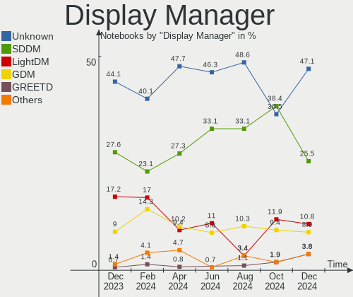
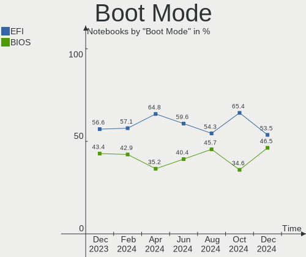
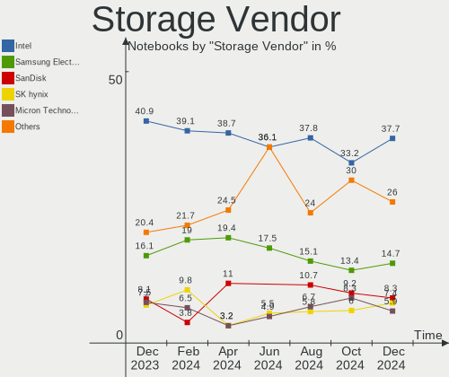

Arch Hardware Trends (Notebook)
-------------------------------

A project to identify most popular hardware characteristics and track their change
over time based on data collected by Arch users at https://Linux-Hardware.org.

Anyone can contribute to the study by uploading probes of their computers by
the [hw-probe](https://github.com/linuxhw/hw-probe) tool:

    sudo -E hw-probe -all -upload

Full-feature report is available here: https://linux-hardware.org/?view=trends&formfactor=notebook

Period: Apr, 2021.

Contents
--------

- [ OS                       ](#os)
- [ OS Family                ](#os-family)
- [ Kernel                   ](#kernel)
- [ Kernel Family            ](#kernel-family)
- [ Kernel Major Ver.        ](#kernel-major-ver)
- [ Arch                     ](#arch)
- [ DE                       ](#de)
- [ Display Server           ](#display-server)
- [ Display Manager          ](#display-manager)
- [ OS Lang                  ](#os-lang)
- [ Boot Mode                ](#boot-mode)
- [ Filesystem               ](#filesystem)
- [ Part. scheme             ](#part-scheme)
- [ Dual Boot with Linux/BSD ](#dual-boot-with-linux/bsd)
- [ Dual Boot (Win)          ](#dual-boot-win)
- [ Country                  ](#country)
- [ City                     ](#city)
- [ Vendor                   ](#vendor)
- [ Model                    ](#model)
- [ Model Family             ](#model-family)
- [ MFG Year                 ](#mfg-year)
- [ Form Factor              ](#form-factor)
- [ Secure Boot              ](#secure-boot)
- [ Coreboot                 ](#coreboot)
- [ RAM Size                 ](#ram-size)
- [ RAM Used                 ](#ram-used)
- [ Has CD-ROM               ](#has-cd-rom)
- [ Total Drives             ](#total-drives)
- [ Has Ethernet             ](#has-ethernet)
- [ Has WiFi                 ](#has-wifi)
- [ Has Bluetooth            ](#has-bluetooth)
- [ Drive Vendor             ](#drive-vendor)
- [ Drive Model              ](#drive-model)
- [ HDD Vendor               ](#hdd-vendor)
- [ SSD Vendor               ](#ssd-vendor)
- [ Drive Kind               ](#drive-kind)
- [ Drive Connector          ](#drive-connector)
- [ Drive Size               ](#drive-size)
- [ Space Total              ](#space-total)
- [ Space Used               ](#space-used)
- [ Malfunc. Drives          ](#malfunc-drives)
- [ Malfunc. Drive Vendor    ](#malfunc-drive-vendor)
- [ Malfunc. HDD Vendor      ](#malfunc-hdd-vendor)
- [ Malfunc. Drive Kind      ](#malfunc-drive-kind)
- [ Failed Drives            ](#failed-drives)
- [ Failed Drive Vendor      ](#failed-drive-vendor)
- [ Drive Status             ](#drive-status)
- [ Storage Vendor           ](#storage-vendor)
- [ Storage Model            ](#storage-model)
- [ Storage Kind             ](#storage-kind)
- [ CPU Vendor               ](#cpu-vendor)
- [ CPU Model                ](#cpu-model)
- [ CPU Model Family         ](#cpu-model-family)
- [ CPU Cores                ](#cpu-cores)
- [ CPU Sockets              ](#cpu-sockets)
- [ CPU Threads              ](#cpu-threads)
- [ CPU Op-Modes             ](#cpu-op-modes)
- [ CPU Microcode            ](#cpu-microcode)
- [ CPU Microarch            ](#cpu-microarch)
- [ GPU Vendor               ](#gpu-vendor)
- [ GPU Model                ](#gpu-model)
- [ GPU Combo                ](#gpu-combo)
- [ GPU Driver               ](#gpu-driver)
- [ GPU Memory               ](#gpu-memory)
- [ Monitor Vendor           ](#monitor-vendor)
- [ Monitor Model            ](#monitor-model)
- [ Monitor Resolution       ](#monitor-resolution)
- [ Monitor Diagonal         ](#monitor-diagonal)
- [ Monitor Width            ](#monitor-width)
- [ Aspect Ratio             ](#aspect-ratio)
- [ Monitor Area             ](#monitor-area)
- [ Pixel Density            ](#pixel-density)
- [ Multiple Monitors        ](#multiple-monitors)
- [ Net Controller Vendor    ](#net-controller-vendor)
- [ Net Controller Model     ](#net-controller-model)
- [ Wireless Vendor          ](#wireless-vendor)
- [ Wireless Model           ](#wireless-model)
- [ Ethernet Vendor          ](#ethernet-vendor)
- [ Ethernet Model           ](#ethernet-model)
- [ Net Controller Kind      ](#net-controller-kind)
- [ Used Controller          ](#used-controller)
- [ NICs                     ](#nics)
- [ IPv6                     ](#ipv6)
- [ Memory Vendor            ](#memory-vendor)
- [ Memory Model             ](#memory-model)
- [ Memory Kind              ](#memory-kind)
- [ Memory Form Factor       ](#memory-form-factor)
- [ Memory Size              ](#memory-size)
- [ Memory Speed             ](#memory-speed)
- [ Sound Vendor             ](#sound-vendor)
- [ Sound Model              ](#sound-model)
- [ Camera Vendor            ](#camera-vendor)
- [ Camera Model             ](#camera-model)
- [ Fingerprint Vendor       ](#fingerprint-vendor)
- [ Fingerprint Model        ](#fingerprint-model)
- [ Chipcard Vendor          ](#chipcard-vendor)
- [ Chipcard Model           ](#chipcard-model)
- [ Printer Vendor           ](#printer-vendor)
- [ Printer Model            ](#printer-model)
- [ Scanner Vendor           ](#scanner-vendor)
- [ Scanner Model            ](#scanner-model)
- [ Bluetooth Vendor         ](#bluetooth-vendor)
- [ Bluetooth Model          ](#bluetooth-model)
- [ Unsupported Devices      ](#unsupported-devices)
- [ Unsupported Device Types ](#unsupported-device-types)

OS
--

Installed operating systems

| Name         | Notebooks | Percent |
|--------------|-----------|---------|
| Arch         | 56        | 73.68%  |
| Arch Rolling | 20        | 26.32%  |

OS Family
---------

OS without a version

| Name | Notebooks | Percent |
|------|-----------|---------|
| Arch | 76        | 100%    |

Kernel
------

Version of the Linux kernel

| Version                  | Notebooks | Percent |
|--------------------------|-----------|---------|
| 5.11.11-arch1-1          | 20        | 26.32%  |
| 5.11.16-arch1-1          | 14        | 18.42%  |
| 5.11.15-arch1-2          | 10        | 13.16%  |
| 5.11.12-arch1-1          | 7         | 9.21%   |
| 5.11.14-arch1-1          | 5         | 6.58%   |
| 5.11.13-arch1-1          | 4         | 5.26%   |
| 5.11.10-arch1-1          | 2         | 2.63%   |
| 5.12.0-arch1-1-custom    | 1         | 1.32%   |
| 5.11.8-arch1-1           | 1         | 1.32%   |
| 5.11.7-arch1-1           | 1         | 1.32%   |
| 5.11.16-zen1-1-zen       | 1         | 1.32%   |
| 5.11.15-zen1-2-zen       | 1         | 1.32%   |
| 5.11.13-zen1-1-zen       | 1         | 1.32%   |
| 5.11.12-1-ck             | 1         | 1.32%   |
| 5.11.11.ll59-1-amd-git+  | 1         | 1.32%   |
| 5.11.11-2-ck-sandybridge | 1         | 1.32%   |
| 5.10.32-1-lts            | 1         | 1.32%   |
| 5.10.31-1033.native      | 1         | 1.32%   |
| 5.10.28-1-lts            | 1         | 1.32%   |
| 5.10.27-1-lts            | 1         | 1.32%   |
| 5.10.16-arch1-1          | 1         | 1.32%   |

Kernel Family
-------------

Linux kernel without a distro release

| Version | Notebooks | Percent |
|---------|-----------|---------|
| 5.11.11 | 22        | 28.95%  |
| 5.11.16 | 15        | 19.74%  |
| 5.11.15 | 11        | 14.47%  |
| 5.11.12 | 8         | 10.53%  |
| 5.11.14 | 5         | 6.58%   |
| 5.11.13 | 5         | 6.58%   |
| 5.11.10 | 2         | 2.63%   |
| 5.12.0  | 1         | 1.32%   |
| 5.11.8  | 1         | 1.32%   |
| 5.11.7  | 1         | 1.32%   |
| 5.10.32 | 1         | 1.32%   |
| 5.10.31 | 1         | 1.32%   |
| 5.10.28 | 1         | 1.32%   |
| 5.10.27 | 1         | 1.32%   |
| 5.10.16 | 1         | 1.32%   |

Kernel Major Ver.
-----------------

Linux kernel major version

| Version | Notebooks | Percent |
|---------|-----------|---------|
| 5.11    | 70        | 92.11%  |
| 5.10    | 5         | 6.58%   |
| 5.12    | 1         | 1.32%   |

Arch
----

OS architecture (x86_64, i586, etc.)

| Name   | Notebooks | Percent |
|--------|-----------|---------|
| x86_64 | 76        | 100%    |

DE
--

Desktop Environment

| Name       | Notebooks | Percent |
|------------|-----------|---------|
| GNOME      | 26        | 34.21%  |
| KDE5       | 9         | 11.84%  |
| XFCE       | 8         | 10.53%  |
| i3         | 8         | 10.53%  |
| Unknown    | 8         | 10.53%  |
| KDE        | 7         | 9.21%   |
| DWM        | 2         | 2.63%   |
| Budgie     | 2         | 2.63%   |
| bspwm      | 2         | 2.63%   |
| xmonad     | 1         | 1.32%   |
| X-Cinnamon | 1         | 1.32%   |
| MATE       | 1         | 1.32%   |
| LXQt       | 1         | 1.32%   |

Display Server
--------------

X11 or Wayland

| Name    | Notebooks | Percent |
|---------|-----------|---------|
| X11     | 43        | 56.58%  |
| Wayland | 16        | 21.05%  |
| Tty     | 9         | 11.84%  |
| Unknown | 8         | 10.53%  |

Display Manager
---------------

SDDM, LightDM, etc.

| Name    | Notebooks | Percent |
|---------|-----------|---------|
| Unknown | 38        | 50%     |
| SDDM    | 10        | 13.16%  |
| TDM     | 8         | 10.53%  |
| GDM     | 8         | 10.53%  |
| LightDM | 5         | 6.58%   |
| XDM     | 3         | 3.95%   |
| Ly      | 3         | 3.95%   |
| LXDM    | 1         | 1.32%   |

OS Lang
-------

Language

| Lang        | Notebooks | Percent |
|-------------|-----------|---------|
| en_US       | 38        | 50%     |
| en_GB       | 6         | 7.89%   |
| ru_RU       | 5         | 6.58%   |
| pt_BR       | 4         | 5.26%   |
| pl_PL       | 3         | 3.95%   |
| fr_FR       | 3         | 3.95%   |
| Unknown     | 3         | 3.95%   |
| it_IT       | 2         | 2.63%   |
| es_ES       | 2         | 2.63%   |
| C           | 2         | 2.63%   |
| zh_CN       | 1         | 1.32%   |
| sk_SK       | 1         | 1.32%   |
| pt_PT       | 1         | 1.32%   |
| fi_FI       | 1         | 1.32%   |
| es_AR.UtF-8 | 1         | 1.32%   |
| en_GB.utf-8 | 1         | 1.32%   |
| de_DE.utf-8 | 1         | 1.32%   |
| de_DE       | 1         | 1.32%   |

Boot Mode
---------

EFI or BIOS

| Mode | Notebooks | Percent |
|------|-----------|---------|
| EFI  | 43        | 56.58%  |
| BIOS | 33        | 43.42%  |

Filesystem
----------

Type of filesystem

| Type    | Notebooks | Percent |
|---------|-----------|---------|
| Ext4    | 61        | 80.26%  |
| Btrfs   | 10        | 13.16%  |
| F2fs    | 2         | 2.63%   |
| Zfs     | 1         | 1.32%   |
| Xfs     | 1         | 1.32%   |
| Unknown | 1         | 1.32%   |

Part. scheme
------------

Scheme of partitioning

| Type    | Notebooks | Percent |
|---------|-----------|---------|
| GPT     | 50        | 65.79%  |
| Unknown | 23        | 30.26%  |
| MBR     | 3         | 3.95%   |

Dual Boot with Linux/BSD
------------------------

Hosting more than one Linux/BSD

| Dual boot | Notebooks | Percent |
|-----------|-----------|---------|
| No        | 68        | 89.47%  |
| Yes       | 8         | 10.53%  |

Dual Boot (Win)
---------------

Hosting Linux and Windows

| Dual boot | Notebooks | Percent |
|-----------|-----------|---------|
| No        | 55        | 72.37%  |
| Yes       | 21        | 27.63%  |

Country
-------

Geographic location (country)

| Country            | Notebooks | Percent |
|--------------------|-----------|---------|
| USA                | 11        | 14.47%  |
| Russia             | 9         | 11.84%  |
| Poland             | 6         | 7.89%   |
| Italy              | 4         | 5.26%   |
| Germany            | 4         | 5.26%   |
| Brazil             | 4         | 5.26%   |
| Spain              | 3         | 3.95%   |
| France             | 3         | 3.95%   |
| Netherlands        | 2         | 2.63%   |
| Lithuania          | 2         | 2.63%   |
| Iran               | 2         | 2.63%   |
| Hungary            | 2         | 2.63%   |
| UK                 | 1         | 1.32%   |
| Turkey             | 1         | 1.32%   |
| Tunisia            | 1         | 1.32%   |
| Sweden             | 1         | 1.32%   |
| South Korea        | 1         | 1.32%   |
| Slovakia           | 1         | 1.32%   |
| Réunion           | 1         | 1.32%   |
| Qatar              | 1         | 1.32%   |
| Portugal           | 1         | 1.32%   |
| Philippines        | 1         | 1.32%   |
| Kazakhstan         | 1         | 1.32%   |
| India              | 1         | 1.32%   |
| Finland            | 1         | 1.32%   |
| Dominican Republic | 1         | 1.32%   |
| Denmark            | 1         | 1.32%   |
| Czechia            | 1         | 1.32%   |
| Croatia            | 1         | 1.32%   |
| Colombia           | 1         | 1.32%   |
| China              | 1         | 1.32%   |
| Chile              | 1         | 1.32%   |
| Canada             | 1         | 1.32%   |
| Belarus            | 1         | 1.32%   |
| Austria            | 1         | 1.32%   |
| Argentina          | 1         | 1.32%   |

City
----

Geographic location (city)

| City                    | Notebooks | Percent |
|-------------------------|-----------|---------|
| Vilnius                 | 2         | 2.63%   |
| Moscow                  | 2         | 2.63%   |
| Lodz                    | 2         | 2.63%   |
| Germantown              | 2         | 2.63%   |
| Berlin                  | 2         | 2.63%   |
| Zagreb                  | 1         | 1.32%   |
| Yingchuan               | 1         | 1.32%   |
| Yekaterinburg           | 1         | 1.32%   |
| Wroclaw                 | 1         | 1.32%   |
| Wichita                 | 1         | 1.32%   |
| West Lafayette          | 1         | 1.32%   |
| Warsaw                  | 1         | 1.32%   |
| Viña del Mar           | 1         | 1.32%   |
| Vienna                  | 1         | 1.32%   |
| Vaasa                   | 1         | 1.32%   |
| Tunis                   | 1         | 1.32%   |
| Tourcoing               | 1         | 1.32%   |
| Tomsk                   | 1         | 1.32%   |
| The Hague               | 1         | 1.32%   |
| Tehran                  | 1         | 1.32%   |
| São Paulo              | 1         | 1.32%   |
| Södermalm              | 1         | 1.32%   |
| Slonim                  | 1         | 1.32%   |
| Schwäbisch Gmünd      | 1         | 1.32%   |
| Santa Ana               | 1         | 1.32%   |
| Salt Lake City          | 1         | 1.32%   |
| Saint-Pierre            | 1         | 1.32%   |
| Prague                  | 1         | 1.32%   |
| Pilisvorosvar           | 1         | 1.32%   |
| Phoenix                 | 1         | 1.32%   |
| Pervouralsk             | 1         | 1.32%   |
| Perugia                 | 1         | 1.32%   |
| Perm                    | 1         | 1.32%   |
| Paulo Afonso            | 1         | 1.32%   |
| Olsztyn                 | 1         | 1.32%   |
| Noida                   | 1         | 1.32%   |
| Nice                    | 1         | 1.32%   |
| Montecavolo             | 1         | 1.32%   |
| Matosinhos Municipality | 1         | 1.32%   |
| Mashhad                 | 1         | 1.32%   |
| Madrid                  | 1         | 1.32%   |
| Los Angeles             | 1         | 1.32%   |
| Krakow                  | 1         | 1.32%   |
| Kenzingen               | 1         | 1.32%   |
| Izhevsk                 | 1         | 1.32%   |
| Ivanovo                 | 1         | 1.32%   |
| Irkutsk                 | 1         | 1.32%   |
| Helsinge                | 1         | 1.32%   |
| Hatvan                  | 1         | 1.32%   |
| Greenwich               | 1         | 1.32%   |
| Gaziantep               | 1         | 1.32%   |
| Fortaleza               | 1         | 1.32%   |
| Florence                | 1         | 1.32%   |
| Elburn                  | 1         | 1.32%   |
| Doha                    | 1         | 1.32%   |
| Daegu                   | 1         | 1.32%   |
| Cornwall                | 1         | 1.32%   |
| Charlotte               | 1         | 1.32%   |
| Chalon-sur-Saône       | 1         | 1.32%   |
| Caloocan City           | 1         | 1.32%   |

Vendor
------

Motherboard manufacturer

| Name                | Notebooks | Percent |
|---------------------|-----------|---------|
| Lenovo              | 21        | 27.63%  |
| Hewlett-Packard     | 16        | 21.05%  |
| Dell                | 11        | 14.47%  |
| ASUSTek Computer    | 9         | 11.84%  |
| Acer                | 7         | 9.21%   |
| Alienware           | 2         | 2.63%   |
| Toshiba             | 1         | 1.32%   |
| Timi                | 1         | 1.32%   |
| SLIMBOOK            | 1         | 1.32%   |
| Samsung Electronics | 1         | 1.32%   |
| Positivo            | 1         | 1.32%   |
| MAIBENBEN           | 1         | 1.32%   |
| HUAWEI              | 1         | 1.32%   |
| Google              | 1         | 1.32%   |
| GEO                 | 1         | 1.32%   |
| Unknown             | 1         | 1.32%   |

Model
-----

Motherboard model

| Name                                       | Notebooks | Percent |
|--------------------------------------------|-----------|---------|
| Dell XPS 15 9500                           | 2         | 2.63%   |
| Toshiba Satellite L55-C                    | 1         | 1.32%   |
| Timi TM1701                                | 1         | 1.32%   |
| SLIMBOOK PROX14-AMD                        | 1         | 1.32%   |
| Samsung 300E5M/300E5L                      | 1         | 1.32%   |
| Positivo CHT14B                            | 1         | 1.32%   |
| MAIBENBEN MaiBook M                        | 1         | 1.32%   |
| Lenovo V330-14IKB 81B0                     | 1         | 1.32%   |
| Lenovo ThinkPad X1 Carbon Gen 9 20XWCTO1WW | 1         | 1.32%   |
| Lenovo ThinkPad X1 Carbon 5th 20HR003GMX   | 1         | 1.32%   |
| Lenovo ThinkPad T530 2394BK7               | 1         | 1.32%   |
| Lenovo ThinkPad T495s 20QJ001MGE           | 1         | 1.32%   |
| Lenovo ThinkPad T490s 20NXCTO1WW           | 1         | 1.32%   |
| Lenovo ThinkPad T440p 20AWS0DU00           | 1         | 1.32%   |
| Lenovo ThinkPad T430 2351BL9               | 1         | 1.32%   |
| Lenovo ThinkPad T430 2349OB6               | 1         | 1.32%   |
| Lenovo ThinkPad T410s 2912B99              | 1         | 1.32%   |
| Lenovo ThinkPad T14 Gen 1 20UD0013CK       | 1         | 1.32%   |
| Lenovo ThinkPad P53 20QNCTO1WW             | 1         | 1.32%   |
| Lenovo ThinkPad P53 20QN0034MH             | 1         | 1.32%   |
| Lenovo ThinkPad P50 20EN0005PG             | 1         | 1.32%   |
| Lenovo ThinkPad E14 Gen 2 20T6S00D00       | 1         | 1.32%   |
| Lenovo ThinkPad 20QJ000DRT                 | 1         | 1.32%   |
| Lenovo Legion Y540-15IRH-PG0 81SY          | 1         | 1.32%   |
| Lenovo IdeaPad Y510P 20217                 | 1         | 1.32%   |
| Lenovo IdeaPad L340-15API 81LW             | 1         | 1.32%   |
| Lenovo IdeaPad 5 14ARE05 81YM              | 1         | 1.32%   |
| Lenovo G710 20252                          | 1         | 1.32%   |
| HUAWEI HN-WX9X                             | 1         | 1.32%   |
| HP ProBook 640 G2                          | 1         | 1.32%   |
| HP ProBook 445 G6                          | 1         | 1.32%   |
| HP ProBook 440 G7                          | 1         | 1.32%   |
| HP Pavilion Laptop 15-ck069tx              | 1         | 1.32%   |
| HP Pavilion Gaming Laptop 15-ec0xxx        | 1         | 1.32%   |
| HP Pavilion g6                             | 1         | 1.32%   |
| HP Pavilion dv6                            | 1         | 1.32%   |
| HP Laptop 15s-eq0xxx                       | 1         | 1.32%   |
| HP ENVY Notebook                           | 1         | 1.32%   |
| HP EliteBook 855 G7 Notebook PC            | 1         | 1.32%   |
| HP EliteBook 8470p                         | 1         | 1.32%   |
| HP EliteBook 845 G7 Notebook PC            | 1         | 1.32%   |
| HP EliteBook 840 G1                        | 1         | 1.32%   |
| HP EliteBook 835 G7 Notebook PC            | 1         | 1.32%   |
| HP EliteBook 820 G3                        | 1         | 1.32%   |
| HP Elite x2 1012 G1                        | 1         | 1.32%   |
| Google Lars                                | 1         | 1.32%   |
| GEO GeoBook3                               | 1         | 1.32%   |
| Dell XPS 15 9570                           | 1         | 1.32%   |
| Dell XPS 13 9370                           | 1         | 1.32%   |
| Dell XPS 13 9350                           | 1         | 1.32%   |
| Dell XPS 13 7390                           | 1         | 1.32%   |
| Dell Vostro 5568                           | 1         | 1.32%   |
| Dell Latitude E6540                        | 1         | 1.32%   |
| Dell Latitude 5401                         | 1         | 1.32%   |
| Dell Inspiron N5050                        | 1         | 1.32%   |
| Dell Inspiron 5448                         | 1         | 1.32%   |
| ASUS X555LF                                | 1         | 1.32%   |
| ASUS X542UQ                                | 1         | 1.32%   |
| ASUS VivoBook_ASUSLaptop X530FN_S530FN     | 1         | 1.32%   |
| ASUS UX32LN                                | 1         | 1.32%   |

Model Family
------------

Motherboard model prefix

| Name                | Notebooks | Percent |
|---------------------|-----------|---------|
| Lenovo ThinkPad     | 15        | 19.74%  |
| HP EliteBook        | 6         | 7.89%   |
| Dell XPS            | 6         | 7.89%   |
| HP Pavilion         | 4         | 5.26%   |
| Acer Aspire         | 4         | 5.26%   |
| Lenovo IdeaPad      | 3         | 3.95%   |
| HP ProBook          | 3         | 3.95%   |
| Dell Latitude       | 2         | 2.63%   |
| Dell Inspiron       | 2         | 2.63%   |
| ASUS TUF            | 2         | 2.63%   |
| Toshiba Satellite   | 1         | 1.32%   |
| Timi TM1701         | 1         | 1.32%   |
| SLIMBOOK PROX14-AMD | 1         | 1.32%   |
| Samsung 300E5M      | 1         | 1.32%   |
| Positivo CHT14B     | 1         | 1.32%   |
| MAIBENBEN MaiBook   | 1         | 1.32%   |
| Lenovo V330-14IKB   | 1         | 1.32%   |
| Lenovo Legion       | 1         | 1.32%   |
| Lenovo G710         | 1         | 1.32%   |
| HUAWEI HN-WX9X      | 1         | 1.32%   |
| HP Laptop           | 1         | 1.32%   |
| HP ENVY             | 1         | 1.32%   |
| HP Elite            | 1         | 1.32%   |
| Google Lars         | 1         | 1.32%   |
| GEO GeoBook3        | 1         | 1.32%   |
| Dell Vostro         | 1         | 1.32%   |
| ASUS X555LF         | 1         | 1.32%   |
| ASUS X542UQ         | 1         | 1.32%   |
| ASUS VivoBook       | 1         | 1.32%   |
| ASUS UX32LN         | 1         | 1.32%   |
| ASUS GL503VD        | 1         | 1.32%   |
| ASUS FX503VM        | 1         | 1.32%   |
| ASUS ASUS           | 1         | 1.32%   |
| Alienware m15       | 1         | 1.32%   |
| Alienware 17        | 1         | 1.32%   |
| Acer TravelMate     | 1         | 1.32%   |
| Acer Nitro          | 1         | 1.32%   |
| Acer AOD260         | 1         | 1.32%   |
| Unknown             | 1         | 1.32%   |

MFG Year
--------

Motherboard manufacture year

| Year | Notebooks | Percent |
|------|-----------|---------|
| 2020 | 27        | 35.53%  |
| 2019 | 15        | 19.74%  |
| 2021 | 7         | 9.21%   |
| 2017 | 6         | 7.89%   |
| 2018 | 5         | 6.58%   |
| 2015 | 4         | 5.26%   |
| 2016 | 3         | 3.95%   |
| 2012 | 3         | 3.95%   |
| 2011 | 3         | 3.95%   |
| 2014 | 1         | 1.32%   |
| 2013 | 1         | 1.32%   |
| 2009 | 1         | 1.32%   |

Form Factor
-----------

Physical design of the computer

| Name     | Notebooks | Percent |
|----------|-----------|---------|
| Notebook | 76        | 100%    |

Secure Boot
-----------

Enabled or disabled

| State    | Notebooks | Percent |
|----------|-----------|---------|
| Disabled | 76        | 100%    |

Coreboot
--------

Have coreboot on board

| Used | Notebooks | Percent |
|------|-----------|---------|
| No   | 75        | 98.68%  |
| Yes  | 1         | 1.32%   |

RAM Size
--------

Total RAM memory

| Size in GB  | Notebooks | Percent |
|-------------|-----------|---------|
| 16.01-24.0  | 23        | 30.26%  |
| 8.01-16.0   | 20        | 26.32%  |
| 4.01-8.0    | 13        | 17.11%  |
| 32.01-64.0  | 9         | 11.84%  |
| 3.01-4.0    | 7         | 9.21%   |
| 24.01-32.0  | 1         | 1.32%   |
| 64.01-256.0 | 1         | 1.32%   |
| 1.01-2.0    | 1         | 1.32%   |
| 0.51-1.0    | 1         | 1.32%   |

RAM Used
--------

Used RAM memory

| Used GB   | Notebooks | Percent |
|-----------|-----------|---------|
| 1.01-2.0  | 23        | 30.26%  |
| 4.01-8.0  | 18        | 23.68%  |
| 2.01-3.0  | 18        | 23.68%  |
| 3.01-4.0  | 12        | 15.79%  |
| 8.01-16.0 | 2         | 2.63%   |
| 0.51-1.0  | 2         | 2.63%   |
| 0.01-0.5  | 1         | 1.32%   |

Has CD-ROM
----------

Has CD-ROM on board

| Presented | Notebooks | Percent |
|-----------|-----------|---------|
| No        | 64        | 84.21%  |
| Yes       | 12        | 15.79%  |

Total Drives
------------

Number of drives on board

| Drives | Notebooks | Percent |
|--------|-----------|---------|
| 1      | 48        | 63.16%  |
| 2      | 17        | 22.37%  |
| 3      | 9         | 11.84%  |
| 5      | 1         | 1.32%   |
| 4      | 1         | 1.32%   |

Has Ethernet
------------

Has Ethernet on board

| Presented | Notebooks | Percent |
|-----------|-----------|---------|
| Yes       | 60        | 78.95%  |
| No        | 16        | 21.05%  |

Has WiFi
--------

Has WiFi module

| Presented | Notebooks | Percent |
|-----------|-----------|---------|
| Yes       | 74        | 97.37%  |
| No        | 2         | 2.63%   |

Has Bluetooth
-------------

Has Bluetooth module

| Presented | Notebooks | Percent |
|-----------|-----------|---------|
| Yes       | 65        | 85.53%  |
| No        | 11        | 14.47%  |

Drive Vendor
------------

Hard drive vendors

| Vendor                  | Notebooks | Drives | Percent |
|-------------------------|-----------|--------|---------|
| Samsung Electronics     | 17        | 25     | 15.74%  |
| SK Hynix                | 11        | 11     | 10.19%  |
| WDC                     | 10        | 11     | 9.26%   |
| Toshiba                 | 10        | 10     | 9.26%   |
| Seagate                 | 9         | 9      | 8.33%   |
| SanDisk                 | 9         | 9      | 8.33%   |
| Unknown                 | 7         | 8      | 6.48%   |
| Kingston                | 7         | 8      | 6.48%   |
| Micron Technology       | 4         | 4      | 3.7%    |
| JMicron                 | 3         | 3      | 2.78%   |
| Transcend               | 2         | 2      | 1.85%   |
| Intel                   | 2         | 2      | 1.85%   |
| Hitachi                 | 2         | 2      | 1.85%   |
| HGST                    | 2         | 2      | 1.85%   |
| Crucial                 | 2         | 2      | 1.85%   |
| XrayDisk                | 1         | 1      | 0.93%   |
| Union Memory (Shenzhen) | 1         | 1      | 0.93%   |
| UMAX                    | 1         | 1      | 0.93%   |
| Team                    | 1         | 1      | 0.93%   |
| SPCC                    | 1         | 1      | 0.93%   |
| Silicon Motion          | 1         | 1      | 0.93%   |
| Lenovo                  | 1         | 1      | 0.93%   |
| External                | 1         | 1      | 0.93%   |
| China                   | 1         | 1      | 0.93%   |
| ASMT109x                | 1         | 1      | 0.93%   |
| A-DATA Technology       | 1         | 1      | 0.93%   |

Drive Model
-----------

Hard drive models

| Model                                        | Notebooks | Percent |
|----------------------------------------------|-----------|---------|
| Toshiba MQ01ABD100 1TB                       | 5         | 4.31%   |
| Sandisk NVMe SSD Drive 512GB                 | 4         | 3.45%   |
| Seagate ST1000LM035-1RK172 1TB               | 3         | 2.59%   |
| WDC WDS120G1G0B-00RC30 120GB SSD             | 2         | 1.72%   |
| Toshiba NVMe SSD Drive 512GB                 | 2         | 1.72%   |
| SK Hynix NVMe SSD Drive 512GB                | 2         | 1.72%   |
| SK Hynix BC511 HFM512GDJTNI-82A0A 512GB      | 2         | 1.72%   |
| Seagate ST1000LX015-1U7172 1TB               | 2         | 1.72%   |
| Samsung SSD 860 EVO 1TB                      | 2         | 1.72%   |
| Kingston SA400S37480G 480GB SSD              | 2         | 1.72%   |
| Kingston SA400S37240G 240GB SSD              | 2         | 1.72%   |
| JMicron Generic 240GB                        | 2         | 1.72%   |
| XrayDisk 512GB                               | 1         | 0.86%   |
| WDC WDS240G2G0B-00EPW0 240GB SSD             | 1         | 0.86%   |
| WDC WDS120G2G0B-00EPW0 120GB SSD             | 1         | 0.86%   |
| WDC WDS100T2B0B-00YS70 1TB SSD               | 1         | 0.86%   |
| WDC WD5000LPVT-22G33T0 500GB                 | 1         | 0.86%   |
| WDC WD5000LPLX-60ZNTT1 500GB                 | 1         | 0.86%   |
| WDC WD10SPZX-22Z10T1 1TB                     | 1         | 0.86%   |
| WDC WD10SPCX-75KHST0 1TB                     | 1         | 0.86%   |
| WDC PC SN530 SDBPNPZ-512G-1006 512GB         | 1         | 0.86%   |
| WDC PC SN530 SDBPNPZ-256G-1006 256GB         | 1         | 0.86%   |
| Unknown SC64G  64GB                          | 1         | 0.86%   |
| Unknown SC128  128GB                         | 1         | 0.86%   |
| Unknown MMC Card  7GB                        | 1         | 0.86%   |
| Unknown MMC Card  64GB                       | 1         | 0.86%   |
| Unknown HCG4a2  64GB                         | 1         | 0.86%   |
| Unknown ED4QT  128GB                         | 1         | 0.86%   |
| Unknown Biwin  64GB                          | 1         | 0.86%   |
| Unknown 00000  4GB                           | 1         | 0.86%   |
| Union Memory (Shenzhen) NVMe SSD Drive 512GB | 1         | 0.86%   |
| UMAX 2242 512GB SSD                          | 1         | 0.86%   |
| Transcend TS256GSSD370 256GB                 | 1         | 0.86%   |
| Transcend TS256GSSD340 256GB                 | 1         | 0.86%   |
| Toshiba KXG6AZNV512G 512GB                   | 1         | 0.86%   |
| Toshiba KBG40ZNT512G MEMORY 512GB            | 1         | 0.86%   |
| Toshiba HDWJ110 1TB                          | 1         | 0.86%   |
| Team TM8FP4256G 256GB                        | 1         | 0.86%   |
| SPCC Solid State Disk 120GB                  | 1         | 0.86%   |
| SK Hynix SKHynix_HFS512GD9TNI-L2B0B 512GB    | 1         | 0.86%   |
| SK Hynix SKHynix_HFS256GD9TNG-L5B0B 256GB    | 1         | 0.86%   |
| SK Hynix NVMe SSD Drive 256GB                | 1         | 0.86%   |
| SK Hynix NVMe SSD Drive 1024GB               | 1         | 0.86%   |
| SK Hynix HFS128G3AMNB-2200A 128GB SSD        | 1         | 0.86%   |
| SK Hynix HBG4e  32GB                         | 1         | 0.86%   |
| SK Hynix BC511 HFM256GDJTNI-82A0A 256GB      | 1         | 0.86%   |
| Silicon Motion NVMe SSD Drive 512GB          | 1         | 0.86%   |
| Seagate ST9320325AS 320GB                    | 1         | 0.86%   |
| Seagate ST500LT012-1DG142 500GB              | 1         | 0.86%   |
| Seagate ST500LM021-1KJ152 500GB              | 1         | 0.86%   |
| Seagate Expansion 4TB                        | 1         | 0.86%   |
| SanDisk X110 2.5 7MM 256GB SSD               | 1         | 0.86%   |
| SanDisk SSD PLUS 120GB                       | 1         | 0.86%   |
| SanDisk SDSSDHP256G 256GB                    | 1         | 0.86%   |
| SanDisk SD9SN8W256G1102 256GB SSD            | 1         | 0.86%   |
| Sandisk NVMe SSD Drive 128GB                 | 1         | 0.86%   |
| Samsung SSD 980 500GB                        | 1         | 0.86%   |
| Samsung SSD 970 PRO 512GB                    | 1         | 0.86%   |
| Samsung SSD 970 EVO 500GB                    | 1         | 0.86%   |
| Samsung SSD 970 EVO 250GB                    | 1         | 0.86%   |

HDD Vendor
----------

Hard disk drive vendors

| Vendor  | Notebooks | Drives | Percent |
|---------|-----------|--------|---------|
| Seagate | 9         | 9      | 39.13%  |
| Toshiba | 6         | 6      | 26.09%  |
| WDC     | 4         | 4      | 17.39%  |
| Hitachi | 2         | 2      | 8.7%    |
| HGST    | 2         | 2      | 8.7%    |

SSD Vendor
----------

Solid state drive vendors

| Vendor              | Notebooks | Drives | Percent |
|---------------------|-----------|--------|---------|
| Samsung Electronics | 8         | 9      | 21.05%  |
| Kingston            | 7         | 8      | 18.42%  |
| WDC                 | 5         | 5      | 13.16%  |
| SanDisk             | 4         | 4      | 10.53%  |
| Transcend           | 2         | 2      | 5.26%   |
| JMicron             | 2         | 2      | 5.26%   |
| UMAX                | 1         | 1      | 2.63%   |
| SPCC                | 1         | 1      | 2.63%   |
| SK Hynix            | 1         | 1      | 2.63%   |
| Lenovo              | 1         | 1      | 2.63%   |
| Intel               | 1         | 1      | 2.63%   |
| External            | 1         | 1      | 2.63%   |
| Crucial             | 1         | 1      | 2.63%   |
| China               | 1         | 1      | 2.63%   |
| ASMT109x            | 1         | 1      | 2.63%   |
| A-DATA Technology   | 1         | 1      | 2.63%   |

Drive Kind
----------

HDD or SSD

| Kind    | Notebooks | Drives | Percent |
|---------|-----------|--------|---------|
| NVMe    | 38        | 46     | 38%     |
| SSD     | 32        | 40     | 32%     |
| HDD     | 21        | 23     | 21%     |
| MMC     | 8         | 9      | 8%      |
| Unknown | 1         | 1      | 1%      |

Drive Connector
---------------

SATA, SAS, NVMe, etc.

| Type | Notebooks | Drives | Percent |
|------|-----------|--------|---------|
| SATA | 45        | 59     | 46.88%  |
| NVMe | 38        | 46     | 39.58%  |
| MMC  | 8         | 9      | 8.33%   |
| SAS  | 5         | 5      | 5.21%   |

Drive Size
----------

Size of hard drive

| Size in TB | Notebooks | Drives | Percent |
|------------|-----------|--------|---------|
| 0.01-0.5   | 30        | 36     | 54.55%  |
| 0.51-1.0   | 23        | 24     | 41.82%  |
| 3.01-4.0   | 1         | 1      | 1.82%   |
| 1.01-2.0   | 1         | 2      | 1.82%   |

Space Total
-----------

Amount of disk space available on the file system

| Size in GB     | Notebooks | Percent |
|----------------|-----------|---------|
| 251-500        | 23        | 30.26%  |
| 101-250        | 22        | 28.95%  |
| 501-1000       | 11        | 14.47%  |
| 1001-2000      | 7         | 9.21%   |
| 51-100         | 3         | 3.95%   |
| Unknown        | 3         | 3.95%   |
| More than 3000 | 2         | 2.63%   |
| 21-50          | 2         | 2.63%   |
| 2001-3000      | 2         | 2.63%   |
| 1-20           | 1         | 1.32%   |

Space Used
----------

Amount of used disk space

| Used GB        | Notebooks | Percent |
|----------------|-----------|---------|
| 21-50          | 16        | 21.05%  |
| 1-20           | 16        | 21.05%  |
| 101-250        | 15        | 19.74%  |
| 501-1000       | 8         | 10.53%  |
| 51-100         | 8         | 10.53%  |
| 251-500        | 7         | 9.21%   |
| Unknown        | 3         | 3.95%   |
| 1001-2000      | 2         | 2.63%   |
| More than 3000 | 1         | 1.32%   |

Malfunc. Drives
---------------

Drive models with a malfunction

| Model                         | Notebooks | Drives | Percent |
|-------------------------------|-----------|--------|---------|
| Hitachi HTS545025B9A300 250GB | 1         | 1      | 50%     |
| HGST HTS721010A9E630 1TB      | 1         | 1      | 50%     |

Malfunc. Drive Vendor
---------------------

Vendors of faulty drives

| Vendor  | Notebooks | Drives | Percent |
|---------|-----------|--------|---------|
| Hitachi | 1         | 1      | 50%     |
| HGST    | 1         | 1      | 50%     |

Malfunc. HDD Vendor
-------------------

Vendors of faulty HDD drives

| Vendor  | Notebooks | Drives | Percent |
|---------|-----------|--------|---------|
| Hitachi | 1         | 1      | 50%     |
| HGST    | 1         | 1      | 50%     |

Malfunc. Drive Kind
-------------------

Kinds of faulty drives

| Kind | Notebooks | Drives | Percent |
|------|-----------|--------|---------|
| HDD  | 2         | 2      | 100%    |

Failed Drives
-------------

Failed drive models

Zero info for selected period =(

Failed Drive Vendor
-------------------

Failed drive vendors

Zero info for selected period =(

Drive Status
------------

Number of failed and malfunc. drives

| Status   | Notebooks | Drives | Percent |
|----------|-----------|--------|---------|
| Detected | 44        | 61     | 51.76%  |
| Works    | 39        | 56     | 45.88%  |
| Malfunc  | 2         | 2      | 2.35%   |

Storage Vendor
--------------

Storage controller vendors

| Vendor                       | Notebooks | Percent |
|------------------------------|-----------|---------|
| Intel                        | 44        | 48.35%  |
| Samsung Electronics          | 10        | 10.99%  |
| SK Hynix                     | 9         | 9.89%   |
| AMD                          | 9         | 9.89%   |
| Sandisk                      | 6         | 6.59%   |
| Micron Technology            | 4         | 4.4%    |
| Toshiba America Info Systems | 3         | 3.3%    |
| Silicon Motion               | 2         | 2.2%    |
| Union Memory (Shenzhen)      | 1         | 1.1%    |
| Phison Electronics           | 1         | 1.1%    |
| Micron/Crucial Technology    | 1         | 1.1%    |
| KIOXIA                       | 1         | 1.1%    |

Storage Model
-------------

Storage controller models

| Model                                                                            | Notebooks | Percent |
|----------------------------------------------------------------------------------|-----------|---------|
| Intel Sunrise Point-LP SATA Controller [AHCI mode]                               | 9         | 9.78%   |
| AMD FCH SATA Controller [AHCI mode]                                              | 8         | 8.7%    |
| Samsung NVMe SSD Controller SM981/PM981/PM983                                    | 7         | 7.61%   |
| Intel 82801 Mobile SATA Controller [RAID mode]                                   | 5         | 5.43%   |
| Intel 7 Series Chipset Family 6-port SATA Controller [AHCI mode]                 | 5         | 5.43%   |
| SK Hynix Non-Volatile memory controller                                          | 4         | 4.35%   |
| Micron Non-Volatile memory controller                                            | 4         | 4.35%   |
| Intel 8 Series/C220 Series Chipset Family 6-port SATA Controller 1 [AHCI mode]   | 4         | 4.35%   |
| SK Hynix BC511                                                                   | 3         | 3.26%   |
| Intel Wildcat Point-LP SATA Controller [AHCI Mode]                               | 3         | 3.26%   |
| Intel Cannon Lake Mobile PCH SATA AHCI Controller                                | 3         | 3.26%   |
| Intel 8 Series SATA Controller 1 [AHCI mode]                                     | 3         | 3.26%   |
| Silicon Motion SM2263EN/SM2263XT SSD Controller                                  | 2         | 2.17%   |
| Sandisk WD Blue SN550 NVMe SSD                                                   | 2         | 2.17%   |
| Sandisk WD Black SN750 / PC SN730 NVMe SSD                                       | 2         | 2.17%   |
| Samsung NVMe SSD Controller SM951/PM951                                          | 2         | 2.17%   |
| Intel Q170/Q150/B150/H170/H110/Z170/CM236 Chipset SATA Controller [AHCI Mode]    | 2         | 2.17%   |
| Intel Celeron/Pentium Silver Processor SATA Controller                           | 2         | 2.17%   |
| Intel 6 Series/C200 Series Chipset Family 6 port Mobile SATA AHCI Controller     | 2         | 2.17%   |
| Union Memory (Shenzhen) Non-Volatile memory controller                           | 1         | 1.09%   |
| Toshiba America Info Systems XG6 NVMe SSD Controller                             | 1         | 1.09%   |
| Toshiba America Info Systems Toshiba America Info Non-Volatile memory controller | 1         | 1.09%   |
| Toshiba America Info Systems NVMe Controller                                     | 1         | 1.09%   |
| SK Hynix PC401 NVMe Solid State Drive 256GB                                      | 1         | 1.09%   |
| SK Hynix NVMe SSD Controller                                                     | 1         | 1.09%   |
| Sandisk WD Blue SN500 / PC SN520 NVMe SSD                                        | 1         | 1.09%   |
| Sandisk WD Black 2018/SN750 / PC SN720 NVMe SSD                                  | 1         | 1.09%   |
| Samsung NVMe SSD Controller SM961/PM961/SM963                                    | 1         | 1.09%   |
| Samsung NVMe Controller                                                          | 1         | 1.09%   |
| Phison E12 NVMe Controller                                                       | 1         | 1.09%   |
| Micron/Crucial Non-Volatile memory controller                                    | 1         | 1.09%   |
| KIOXIA Non-Volatile memory controller                                            | 1         | 1.09%   |
| Intel Volume Management Device NVMe RAID Controller                              | 1         | 1.09%   |
| Intel SSD 600P Series                                                            | 1         | 1.09%   |
| Intel NM10/ICH7 Family SATA Controller [AHCI mode]                               | 1         | 1.09%   |
| Intel Comet Lake SATA AHCI Controller                                            | 1         | 1.09%   |
| Intel 82801IBM/IEM (ICH9M/ICH9M-E) 4 port SATA Controller [AHCI mode]            | 1         | 1.09%   |
| Intel 5 Series/3400 Series Chipset 6 port SATA AHCI Controller                   | 1         | 1.09%   |
| AMD SB7x0/SB8x0/SB9x0 SATA Controller [AHCI mode]                                | 1         | 1.09%   |

Storage Kind
------------

Kind of storage controller (IDE, SATA, NVMe, SAS, ...)

| Kind | Notebooks | Percent |
|------|-----------|---------|
| SATA | 46        | 51.11%  |
| NVMe | 38        | 42.22%  |
| RAID | 6         | 6.67%   |

CPU Vendor
----------

Processor vendors

| Vendor | Notebooks | Percent |
|--------|-----------|---------|
| Intel  | 57        | 75%     |
| AMD    | 19        | 25%     |

CPU Model
---------

Processor models

| Model                                           | Notebooks | Percent |
|-------------------------------------------------|-----------|---------|
| Intel Core i5-7200U CPU @ 2.50GHz               | 4         | 5.26%   |
| AMD Ryzen 7 PRO 4750U with Radeon Graphics      | 4         | 5.26%   |
| Intel Core i7-9850H CPU @ 2.60GHz               | 2         | 2.63%   |
| Intel Core i7-9750H CPU @ 2.60GHz               | 2         | 2.63%   |
| Intel Core i7-8550U CPU @ 1.80GHz               | 2         | 2.63%   |
| Intel Core i7-7700HQ CPU @ 2.80GHz              | 2         | 2.63%   |
| Intel Core i7-7500U CPU @ 2.70GHz               | 2         | 2.63%   |
| Intel Core i7-5500U CPU @ 2.40GHz               | 2         | 2.63%   |
| Intel Core i7-10510U CPU @ 1.80GHz              | 2         | 2.63%   |
| Intel Core i5-8250U CPU @ 1.60GHz               | 2         | 2.63%   |
| Intel Core i5-4300M CPU @ 2.60GHz               | 2         | 2.63%   |
| Intel Core i5-3320M CPU @ 2.60GHz               | 2         | 2.63%   |
| Intel Core i5-2450M CPU @ 2.50GHz               | 2         | 2.63%   |
| Intel 11th Gen Core i7-1165G7 @ 2.80GHz         | 2         | 2.63%   |
| AMD Ryzen 7 4800H with Radeon Graphics          | 2         | 2.63%   |
| AMD Ryzen 5 3500U with Radeon Vega Mobile Gfx   | 2         | 2.63%   |
| Intel Core m5-6Y57 CPU @ 1.10GHz                | 1         | 1.32%   |
| Intel Core i9-10885H CPU @ 2.40GHz              | 1         | 1.32%   |
| Intel Core i7-8750H CPU @ 2.20GHz               | 1         | 1.32%   |
| Intel Core i7-8665U CPU @ 1.90GHz               | 1         | 1.32%   |
| Intel Core i7-8565U CPU @ 1.80GHz               | 1         | 1.32%   |
| Intel Core i7-7820HK CPU @ 2.90GHz              | 1         | 1.32%   |
| Intel Core i7-6700HQ CPU @ 2.60GHz              | 1         | 1.32%   |
| Intel Core i7-6560U CPU @ 2.20GHz               | 1         | 1.32%   |
| Intel Core i7-4702MQ CPU @ 2.20GHz              | 1         | 1.32%   |
| Intel Core i7-4700MQ CPU @ 2.40GHz              | 1         | 1.32%   |
| Intel Core i7-10875H CPU @ 2.30GHz              | 1         | 1.32%   |
| Intel Core i7-10750H CPU @ 2.60GHz              | 1         | 1.32%   |
| Intel Core i5-8300H CPU @ 2.30GHz               | 1         | 1.32%   |
| Intel Core i5-6300U CPU @ 2.40GHz               | 1         | 1.32%   |
| Intel Core i5-6200U CPU @ 2.30GHz               | 1         | 1.32%   |
| Intel Core i5-5200U CPU @ 2.20GHz               | 1         | 1.32%   |
| Intel Core i5-4300U CPU @ 1.90GHz               | 1         | 1.32%   |
| Intel Core i5-4200U CPU @ 1.60GHz               | 1         | 1.32%   |
| Intel Core i5-3230M CPU @ 2.60GHz               | 1         | 1.32%   |
| Intel Core i5-3210M CPU @ 2.50GHz               | 1         | 1.32%   |
| Intel Core i5-2520M CPU @ 2.50GHz               | 1         | 1.32%   |
| Intel Core i5 CPU M 520 @ 2.40GHz               | 1         | 1.32%   |
| Intel Core i3-4005U CPU @ 1.70GHz               | 1         | 1.32%   |
| Intel Core 2 Duo CPU T6500 @ 2.10GHz            | 1         | 1.32%   |
| Intel Celeron N4020 CPU @ 1.10GHz               | 1         | 1.32%   |
| Intel Celeron N4000 CPU @ 1.10GHz               | 1         | 1.32%   |
| Intel Celeron CPU 3855U @ 1.60GHz               | 1         | 1.32%   |
| Intel Atom x5-Z8350 CPU @ 1.44GHz               | 1         | 1.32%   |
| Intel Atom CPU N450 @ 1.66GHz                   | 1         | 1.32%   |
| AMD Ryzen 7 PRO 3700U w/ Radeon Vega Mobile Gfx | 1         | 1.32%   |
| AMD Ryzen 7 PRO 2700U w/ Radeon Vega Mobile Gfx | 1         | 1.32%   |
| AMD Ryzen 7 4700U with Radeon Graphics          | 1         | 1.32%   |
| AMD Ryzen 7 3750H with Radeon Vega Mobile Gfx   | 1         | 1.32%   |
| AMD Ryzen 5 PRO 3500U w/ Radeon Vega Mobile Gfx | 1         | 1.32%   |
| AMD Ryzen 5 4500U with Radeon Graphics          | 1         | 1.32%   |
| AMD Ryzen 5 3550H with Radeon Vega Mobile Gfx   | 1         | 1.32%   |
| AMD Ryzen 3 4300U with Radeon Graphics          | 1         | 1.32%   |
| AMD Ryzen 3 3200U with Radeon Vega Mobile Gfx   | 1         | 1.32%   |
| AMD Phenom II N830 Triple-Core Processor        | 1         | 1.32%   |
| AMD A4-5000 APU with Radeon HD Graphics         | 1         | 1.32%   |

CPU Model Family
----------------

Processor model prefix

| Model            | Notebooks | Percent |
|------------------|-----------|---------|
| Intel Core i7    | 24        | 31.58%  |
| Intel Core i5    | 22        | 28.95%  |
| AMD Ryzen 7 PRO  | 6         | 7.89%   |
| AMD Ryzen 7      | 4         | 5.26%   |
| AMD Ryzen 5      | 4         | 5.26%   |
| Intel Celeron    | 3         | 3.95%   |
| Other            | 2         | 2.63%   |
| Intel Atom       | 2         | 2.63%   |
| AMD Ryzen 3      | 2         | 2.63%   |
| Intel Core m5    | 1         | 1.32%   |
| Intel Core i9    | 1         | 1.32%   |
| Intel Core i3    | 1         | 1.32%   |
| Intel Core 2 Duo | 1         | 1.32%   |
| AMD Ryzen 5 PRO  | 1         | 1.32%   |
| AMD Phenom II    | 1         | 1.32%   |
| AMD A4           | 1         | 1.32%   |

CPU Cores
---------

Number of processor cores

| Number | Notebooks | Percent |
|--------|-----------|---------|
| 2      | 31        | 40.79%  |
| 4      | 27        | 35.53%  |
| 8      | 9         | 11.84%  |
| 6      | 7         | 9.21%   |
| 3      | 1         | 1.32%   |
| 1      | 1         | 1.32%   |

CPU Sockets
-----------

Number of sockets

| Number | Notebooks | Percent |
|--------|-----------|---------|
| 1      | 76        | 100%    |

CPU Threads
-----------

Threads per core (Hyper-Threading)

| Number | Notebooks | Percent |
|--------|-----------|---------|
| 2      | 66        | 86.84%  |
| 1      | 10        | 13.16%  |

CPU Op-Modes
------------

CPU Operation Modes (32-bit, 64-bit)

| Op mode        | Notebooks | Percent |
|----------------|-----------|---------|
| 32-bit, 64-bit | 76        | 100%    |

CPU Microcode
-------------

Microcode number

| Number     | Notebooks | Percent |
|------------|-----------|---------|
| Unknown    | 32        | 42.11%  |
| 0x906ea    | 4         | 5.26%   |
| 0x08600106 | 4         | 5.26%   |
| 0x806e9    | 3         | 3.95%   |
| 0x406e3    | 3         | 3.95%   |
| 0x08108102 | 3         | 3.95%   |
| 0x906e9    | 2         | 2.63%   |
| 0x806ec    | 2         | 2.63%   |
| 0x806ea    | 2         | 2.63%   |
| 0x306d4    | 2         | 2.63%   |
| 0x306a9    | 2         | 2.63%   |
| 0x08600104 | 2         | 2.63%   |
| 0x08600103 | 2         | 2.63%   |
| 0xa0652    | 1         | 1.32%   |
| 0x906ed    | 1         | 1.32%   |
| 0x806eb    | 1         | 1.32%   |
| 0x806c1    | 1         | 1.32%   |
| 0x706a1    | 1         | 1.32%   |
| 0x506e3    | 1         | 1.32%   |
| 0x406c4    | 1         | 1.32%   |
| 0x40651    | 1         | 1.32%   |
| 0x306c3    | 1         | 1.32%   |
| 0x206a7    | 1         | 1.32%   |
| 0x106ca    | 1         | 1.32%   |
| 0x08108109 | 1         | 1.32%   |
| 0x010000c8 | 1         | 1.32%   |

CPU Microarch
-------------

Microarchitecture

| Name          | Notebooks | Percent |
|---------------|-----------|---------|
| KabyLake      | 23        | 30.26%  |
| Zen 2         | 9         | 11.84%  |
| Zen+          | 7         | 9.21%   |
| Haswell       | 7         | 9.21%   |
| Skylake       | 6         | 7.89%   |
| IvyBridge     | 4         | 5.26%   |
| SandyBridge   | 3         | 3.95%   |
| CometLake     | 3         | 3.95%   |
| Broadwell     | 3         | 3.95%   |
| TigerLake     | 2         | 2.63%   |
| Goldmont plus | 2         | 2.63%   |
| Zen           | 1         | 1.32%   |
| Westmere      | 1         | 1.32%   |
| Silvermont    | 1         | 1.32%   |
| Penryn        | 1         | 1.32%   |
| K10           | 1         | 1.32%   |
| Jaguar        | 1         | 1.32%   |
| Bonnell       | 1         | 1.32%   |

GPU Vendor
----------

Vendors of graphics cards

| Vendor | Notebooks | Percent |
|--------|-----------|---------|
| Intel  | 53        | 51.96%  |
| Nvidia | 27        | 26.47%  |
| AMD    | 22        | 21.57%  |

GPU Model
---------

Graphics card models

| Model                                                                                    | Notebooks | Percent |
|------------------------------------------------------------------------------------------|-----------|---------|
| AMD Renoir                                                                               | 9         | 8.65%   |
| AMD Picasso                                                                              | 7         | 6.73%   |
| Intel HD Graphics 620                                                                    | 6         | 5.77%   |
| Intel CoffeeLake-H GT2 [UHD Graphics 630]                                                | 5         | 4.81%   |
| Intel UHD Graphics 620                                                                   | 4         | 3.85%   |
| Intel 4th Gen Core Processor Integrated Graphics Controller                              | 4         | 3.85%   |
| Intel 3rd Gen Core processor Graphics Controller                                         | 4         | 3.85%   |
| Nvidia TU117M [GeForce GTX 1650 Ti Mobile]                                               | 3         | 2.88%   |
| Nvidia GP108M [GeForce MX150]                                                            | 3         | 2.88%   |
| Nvidia GM108M [GeForce 940MX]                                                            | 3         | 2.88%   |
| Intel HD Graphics 5500                                                                   | 3         | 2.88%   |
| Intel Haswell-ULT Integrated Graphics Controller                                         | 3         | 2.88%   |
| Intel CometLake-H GT2 [UHD Graphics]                                                     | 3         | 2.88%   |
| Nvidia TU117M [GeForce GTX 1650 Mobile / Max-Q]                                          | 2         | 1.92%   |
| Nvidia GP107M [GeForce GTX 1050 Ti Mobile]                                               | 2         | 1.92%   |
| Intel WhiskeyLake-U GT2 [UHD Graphics 620]                                               | 2         | 1.92%   |
| Intel TigerLake-LP GT2 [Iris Xe Graphics]                                                | 2         | 1.92%   |
| Intel Skylake GT2 [HD Graphics 520]                                                      | 2         | 1.92%   |
| Intel HD Graphics 630                                                                    | 2         | 1.92%   |
| Intel GeminiLake [UHD Graphics 600]                                                      | 2         | 1.92%   |
| Intel CometLake-U GT2 [UHD Graphics]                                                     | 2         | 1.92%   |
| Intel 2nd Generation Core Processor Family Integrated Graphics Controller                | 2         | 1.92%   |
| AMD Thames [Radeon HD 7500M/7600M Series]                                                | 2         | 1.92%   |
| Nvidia TU117GLM [Quadro T1000 Mobile]                                                    | 1         | 0.96%   |
| Nvidia TU106M [GeForce RTX 2070 Mobile / Max-Q Refresh]                                  | 1         | 0.96%   |
| Nvidia TU106GLM [Quadro RTX 3000 Mobile / Max-Q]                                         | 1         | 0.96%   |
| Nvidia GP107M [GeForce GTX 1050 Mobile]                                                  | 1         | 0.96%   |
| Nvidia GP106M [GeForce GTX 1060 Mobile]                                                  | 1         | 0.96%   |
| Nvidia GP104BM [GeForce GTX 1070 Mobile]                                                 | 1         | 0.96%   |
| Nvidia GM108M [GeForce MX130]                                                            | 1         | 0.96%   |
| Nvidia GM108M [GeForce 930M]                                                             | 1         | 0.96%   |
| Nvidia GM108M [GeForce 840M]                                                             | 1         | 0.96%   |
| Nvidia GM107GLM [Quadro M1000M]                                                          | 1         | 0.96%   |
| Nvidia GM107 [GeForce 940MX]                                                             | 1         | 0.96%   |
| Nvidia GK107M [GeForce GT 755M]                                                          | 1         | 0.96%   |
| Nvidia GF117M [GeForce 610M/710M/810M/820M / GT 620M/625M/630M/720M]                     | 1         | 0.96%   |
| Nvidia GF108M [NVS 5400M]                                                                | 1         | 0.96%   |
| Intel Mobile 4 Series Chipset Integrated Graphics Controller                             | 1         | 0.96%   |
| Intel Iris Graphics 540                                                                  | 1         | 0.96%   |
| Intel HD Graphics 515                                                                    | 1         | 0.96%   |
| Intel HD Graphics 510                                                                    | 1         | 0.96%   |
| Intel Core Processor Integrated Graphics Controller                                      | 1         | 0.96%   |
| Intel Atom/Celeron/Pentium Processor x5-E8000/J3xxx/N3xxx Integrated Graphics Controller | 1         | 0.96%   |
| Intel Atom Processor D4xx/D5xx/N4xx/N5xx Integrated Graphics Controller                  | 1         | 0.96%   |
| AMD Topaz XT [Radeon R7 M260/M265 / M340/M360 / M440/M445 / 530/535 / 620/625 Mobile]    | 1         | 0.96%   |
| AMD RS880M [Mobility Radeon HD 4225/4250]                                                | 1         | 0.96%   |
| AMD Raven Ridge [Radeon Vega Series / Radeon Vega Mobile Series]                         | 1         | 0.96%   |
| AMD Madison [Mobility Radeon HD 5650/5750 / 6530M/6550M]                                 | 1         | 0.96%   |
| AMD Kabini [Radeon HD 8330]                                                              | 1         | 0.96%   |
| AMD Baffin [Radeon RX 460/560D / Pro 450/455/460/555/555X/560/560X]                      | 1         | 0.96%   |

GPU Combo
---------

Combinations of graphics cards

| Name           | Notebooks | Percent |
|----------------|-----------|---------|
| 1 x Intel      | 29        | 38.16%  |
| Intel + Nvidia | 20        | 26.32%  |
| 1 x AMD        | 16        | 21.05%  |
| 1 x Nvidia     | 5         | 6.58%   |
| 2 x AMD        | 2         | 2.63%   |
| Intel + AMD    | 2         | 2.63%   |
| AMD + Nvidia   | 2         | 2.63%   |

GPU Driver
----------

Free vs proprietary

| Driver      | Notebooks | Percent |
|-------------|-----------|---------|
| Free        | 60        | 78.95%  |
| Proprietary | 16        | 21.05%  |

GPU Memory
----------

Total video memory

| Size in GB | Notebooks | Percent |
|------------|-----------|---------|
| Unknown    | 51        | 67.11%  |
| 1.01-2.0   | 9         | 11.84%  |
| 0.01-0.5   | 8         | 10.53%  |
| 3.01-4.0   | 4         | 5.26%   |
| 7.01-8.0   | 2         | 2.63%   |
| 5.01-6.0   | 1         | 1.32%   |
| 2.01-3.0   | 1         | 1.32%   |

Monitor Vendor
--------------

Monitor vendors

| Vendor               | Notebooks | Percent |
|----------------------|-----------|---------|
| AU Optronics         | 17        | 16.83%  |
| Chimei Innolux       | 16        | 15.84%  |
| BOE                  | 12        | 11.88%  |
| LG Display           | 9         | 8.91%   |
| Samsung Electronics  | 8         | 7.92%   |
| Dell                 | 6         | 5.94%   |
| Sharp                | 5         | 4.95%   |
| PANDA                | 4         | 3.96%   |
| Lenovo               | 4         | 3.96%   |
| Hewlett-Packard      | 3         | 2.97%   |
| InfoVision           | 2         | 1.98%   |
| Goldstar             | 2         | 1.98%   |
| AOC                  | 2         | 1.98%   |
| Vestel Elektronik    | 1         | 0.99%   |
| Philips              | 1         | 0.99%   |
| PAR                  | 1         | 0.99%   |
| MSI                  | 1         | 0.99%   |
| LGD                  | 1         | 0.99%   |
| HPN                  | 1         | 0.99%   |
| CSO                  | 1         | 0.99%   |
| CHR                  | 1         | 0.99%   |
| ASUSTek Computer     | 1         | 0.99%   |
| Ancor Communications | 1         | 0.99%   |
| Acer                 | 1         | 0.99%   |

Monitor Model
-------------

Monitor models

| Model                                                                  | Notebooks | Percent |
|------------------------------------------------------------------------|-----------|---------|
| LG Display LCD Monitor LGD045E 1366x768 309x174mm 14.0-inch            | 2         | 1.96%   |
| Chimei Innolux LCD Monitor CMN15F5 1920x1080 344x193mm 15.5-inch       | 2         | 1.96%   |
| Chimei Innolux LCD Monitor CMN150C 1920x1080 344x193mm 15.5-inch       | 2         | 1.96%   |
| BOE LCD Monitor BOE0700 1920x1080 344x194mm 15.5-inch                  | 2         | 1.96%   |
| AU Optronics LCD Monitor AUO573D 1920x1080 309x174mm 14.0-inch         | 2         | 1.96%   |
| Vestel Elektronik 50UHD_LCD_TV VES3700 3840x2160 1872x1053mm 84.6-inch | 1         | 0.98%   |
| Sharp LCD Monitor SHP14D1 1920x1200 336x210mm 15.6-inch                | 1         | 0.98%   |
| Sharp LCD Monitor SHP14D0 3840x2400 336x210mm 15.6-inch                | 1         | 0.98%   |
| Sharp LCD Monitor SHP149A 1920x1080 344x194mm 15.5-inch                | 1         | 0.98%   |
| Sharp LCD Monitor SHP148B 3840x2160 294x165mm 13.3-inch                | 1         | 0.98%   |
| Sharp LCD Monitor SHP144A 3200x1800 294x165mm 13.3-inch                | 1         | 0.98%   |
| Samsung Electronics T27B300 SAM0933 1920x1080 598x336mm 27.0-inch      | 1         | 0.98%   |
| Samsung Electronics S24D330 SAM0D92 1920x1080 531x299mm 24.0-inch      | 1         | 0.98%   |
| Samsung Electronics LCD Monitor SEC4256 1600x900 382x215mm 17.3-inch   | 1         | 0.98%   |
| Samsung Electronics LCD Monitor SEC354C 1366x768 353x198mm 15.9-inch   | 1         | 0.98%   |
| Samsung Electronics LCD Monitor SEC315A 1366x768 344x194mm 15.5-inch   | 1         | 0.98%   |
| Samsung Electronics LCD Monitor SEC304C 1920x1080 353x198mm 15.9-inch  | 1         | 0.98%   |
| Samsung Electronics LCD Monitor SDC4141 1366x768 340x190mm 15.3-inch   | 1         | 0.98%   |
| Samsung Electronics LCD Monitor SAM0A7E 1920x1080 1060x626mm 48.5-inch | 1         | 0.98%   |
| Philips PHL 272E1 PHLC210 1920x1080 598x336mm 27.0-inch                | 1         | 0.98%   |
| PAR 22T31-H-ES PAR2009 1680x1050 708x398mm 32.0-inch                   | 1         | 0.98%   |
| PANDA LCD Monitor NCP004D 1920x1080 344x194mm 15.5-inch                | 1         | 0.98%   |
| PANDA LCD Monitor NCP0040 1920x1080 344x194mm 15.5-inch                | 1         | 0.98%   |
| PANDA LCD Monitor NCP0036 1920x1080 344x194mm 15.5-inch                | 1         | 0.98%   |
| PANDA LCD Monitor NCP002D 1920x1080 344x194mm 15.5-inch                | 1         | 0.98%   |
| MSI MAG241C MSI3EA2 1920x1080 521x293mm 23.5-inch                      | 1         | 0.98%   |
| LGD LCD Monitor 3840x1080                                              | 1         | 0.98%   |
| LG Display LP156WH3-TLA2 LGD0210 1366x768 345x194mm 15.6-inch          | 1         | 0.98%   |
| LG Display LCD Monitor LGD054F 1920x1080 344x194mm 15.5-inch           | 1         | 0.98%   |
| LG Display LCD Monitor LGD04A5 1920x1280 253x169mm 12.0-inch           | 1         | 0.98%   |
| LG Display LCD Monitor LGD046F 1920x1080 344x194mm 15.5-inch           | 1         | 0.98%   |
| LG Display LCD Monitor LGD033A 1366x768 340x190mm 15.3-inch            | 1         | 0.98%   |
| LG Display LCD Monitor LGD0306 1600x900 310x174mm 14.0-inch            | 1         | 0.98%   |
| LG Display LCD Monitor LGD02DC 1366x768 344x194mm 15.5-inch            | 1         | 0.98%   |
| Lenovo LEN T23i-10 LEN61AB 1920x1080 509x286mm 23.0-inch               | 1         | 0.98%   |
| Lenovo LEN P27u-10 LEN61B0 3840x2160 597x336mm 27.0-inch               | 1         | 0.98%   |
| Lenovo LCD Monitor LEN40B1 1600x900 344x194mm 15.5-inch                | 1         | 0.98%   |
| Lenovo LCD Monitor LEN4036 1440x900 304x190mm 14.1-inch                | 1         | 0.98%   |
| InfoVision LCD Monitor IVO8C78 1920x1080 309x174mm 14.0-inch           | 1         | 0.98%   |
| InfoVision LCD Monitor IVO057D 1920x1080 309x174mm 14.0-inch           | 1         | 0.98%   |
| HPN LCD Monitor HP 32 QHD                                              | 1         | 0.98%   |
| Hewlett-Packard Z38c HPN3411 3840x1600 880x367mm 37.5-inch             | 1         | 0.98%   |
| Hewlett-Packard LCD Monitor Pavilion32                                 | 1         | 0.98%   |
| Hewlett-Packard 24f HPN3545 1920x1080 527x296mm 23.8-inch              | 1         | 0.98%   |
| Goldstar LG FULL HD GSM5AB9 1680x1050 480x270mm 21.7-inch              | 1         | 0.98%   |
| Goldstar DM2352 GSM58E8 1920x1080 509x286mm 23.0-inch                  | 1         | 0.98%   |
| Dell U2715H DELD067 2560x1440 597x336mm 27.0-inch                      | 1         | 0.98%   |
| Dell U2414H DELA0A3 1920x1080 530x300mm 24.0-inch                      | 1         | 0.98%   |
| Dell U2412M DELA07B 1920x1200 518x324mm 24.1-inch                      | 1         | 0.98%   |
| Dell P2719H DEL4184 1920x1080 598x336mm 27.0-inch                      | 1         | 0.98%   |
| Dell P2419H DELD0DA 1920x1080 527x296mm 23.8-inch                      | 1         | 0.98%   |
| Dell LCD Monitor E2421HN                                               | 1         | 0.98%   |
| Dell E2414H DEL4090 1920x1080 531x299mm 24.0-inch                      | 1         | 0.98%   |
| CSO LCD Monitor CSO1403 3840x2400 302x189mm 14.0-inch                  | 1         | 0.98%   |
| CHR AIO-21.5"-10 CHR7511 1920x1080 476x268mm 21.5-inch                 | 1         | 0.98%   |
| Chimei Innolux P130ZDZ-EF1 CMN8201 2160x1440 275x183mm 13.0-inch       | 1         | 0.98%   |
| Chimei Innolux LCD Monitor CMN1738 1920x1080 381x214mm 17.2-inch       | 1         | 0.98%   |
| Chimei Innolux LCD Monitor CMN15BF 1366x768 344x193mm 15.5-inch        | 1         | 0.98%   |
| Chimei Innolux LCD Monitor CMN15BA 1920x1080 344x194mm 15.5-inch       | 1         | 0.98%   |
| Chimei Innolux LCD Monitor CMN14F2 1920x1080 309x173mm 13.9-inch       | 1         | 0.98%   |

Monitor Resolution
------------------

Monitor screen resolution

| Resolution         | Notebooks | Percent |
|--------------------|-----------|---------|
| 1920x1080 (FHD)    | 50        | 56.18%  |
| 1366x768 (WXGA)    | 14        | 15.73%  |
| 1600x900 (HD+)     | 5         | 5.62%   |
| 3840x2160 (4K)     | 4         | 4.49%   |
| 3840x2400          | 2         | 2.25%   |
| 1920x1200 (WUXGA)  | 2         | 2.25%   |
| Unknown            | 2         | 2.25%   |
| 7680x1440          | 1         | 1.12%   |
| 3840x1600          | 1         | 1.12%   |
| 3840x1080          | 1         | 1.12%   |
| 3200x1800 (QHD+)   | 1         | 1.12%   |
| 2560x1440 (QHD)    | 1         | 1.12%   |
| 2160x1440          | 1         | 1.12%   |
| 1920x1280          | 1         | 1.12%   |
| 1680x1050 (WSXGA+) | 1         | 1.12%   |
| 1440x900 (WXGA+)   | 1         | 1.12%   |
| 1024x600           | 1         | 1.12%   |

Monitor Diagonal
----------------

Diagonal size in inches

| Inches  | Notebooks | Percent |
|---------|-----------|---------|
| 15      | 37        | 37.76%  |
| 14      | 17        | 17.35%  |
| 13      | 12        | 12.24%  |
| 24      | 8         | 8.16%   |
| 27      | 6         | 6.12%   |
| 23      | 5         | 5.1%    |
| 17      | 3         | 3.06%   |
| 12      | 2         | 2.04%   |
| Unknown | 2         | 2.04%   |
| 84      | 1         | 1.02%   |
| 54      | 1         | 1.02%   |
| 37      | 1         | 1.02%   |
| 32      | 1         | 1.02%   |
| 21      | 1         | 1.02%   |
| 10      | 1         | 1.02%   |

Monitor Width
-------------

Physical width

| Width in mm | Notebooks | Percent |
|-------------|-----------|---------|
| 301-350     | 58        | 60.42%  |
| 501-600     | 17        | 17.71%  |
| 201-300     | 9         | 9.38%   |
| 351-400     | 5         | 5.21%   |
| Unknown     | 2         | 2.08%   |
| 801-900     | 1         | 1.04%   |
| 701-800     | 1         | 1.04%   |
| 401-500     | 1         | 1.04%   |
| 1501-2000   | 1         | 1.04%   |
| 1001-1500   | 1         | 1.04%   |

Aspect Ratio
------------

Proportional relationship between the width and the height

| Ratio   | Notebooks | Percent |
|---------|-----------|---------|
| 16/9    | 70        | 86.42%  |
| 16/10   | 6         | 7.41%   |
| 3/2     | 2         | 2.47%   |
| Unknown | 2         | 2.47%   |
| 21/9    | 1         | 1.23%   |

Monitor Area
------------

Area in inch²

| Area in inch² | Notebooks | Percent |
|----------------|-----------|---------|
| 101-110        | 37        | 37.76%  |
| 81-90          | 23        | 23.47%  |
| 201-250        | 12        | 12.24%  |
| 71-80          | 6         | 6.12%   |
| 301-350        | 6         | 6.12%   |
| 121-130        | 3         | 3.06%   |
| More than 1000 | 2         | 2.04%   |
| 61-70          | 2         | 2.04%   |
| 251-300        | 2         | 2.04%   |
| Unknown        | 2         | 2.04%   |
| 351-500        | 1         | 1.02%   |
| 41-50          | 1         | 1.02%   |
| 501-1000       | 1         | 1.02%   |

Pixel Density
-------------

Pixels per inch

| Density       | Notebooks | Percent |
|---------------|-----------|---------|
| 121-160       | 44        | 46.81%  |
| 101-120       | 18        | 19.15%  |
| 51-100        | 18        | 19.15%  |
| 161-240       | 6         | 6.38%   |
| More than 240 | 5         | 5.32%   |
| Unknown       | 2         | 2.13%   |
| 1-50          | 1         | 1.06%   |

Multiple Monitors
-----------------

Total monitors connected

| Total | Notebooks | Percent |
|-------|-----------|---------|
| 1     | 53        | 69.74%  |
| 2     | 19        | 25%     |
| 3     | 4         | 5.26%   |

Net Controller Vendor
---------------------

Controller vendors

| Vendor                     | Notebooks | Percent |
|----------------------------|-----------|---------|
| Intel                      | 46        | 38.98%  |
| Realtek Semiconductor      | 39        | 33.05%  |
| Qualcomm Atheros           | 17        | 14.41%  |
| Broadcom                   | 5         | 4.24%   |
| Lenovo                     | 2         | 1.69%   |
| ZTE WCDMA Technologies MSM | 1         | 0.85%   |
| Sierra Wireless            | 1         | 0.85%   |
| Samsung Electronics        | 1         | 0.85%   |
| Ralink                     | 1         | 0.85%   |
| Qualcomm                   | 1         | 0.85%   |
| Hewlett-Packard            | 1         | 0.85%   |
| Fibocom                    | 1         | 0.85%   |
| DisplayLink                | 1         | 0.85%   |
| ASIX Electronics           | 1         | 0.85%   |

Net Controller Model
--------------------

Controller models

| Model                                                             | Notebooks | Percent |
|-------------------------------------------------------------------|-----------|---------|
| Realtek RTL8111/8168/8411 PCI Express Gigabit Ethernet Controller | 23        | 15.97%  |
| Intel Wi-Fi 6 AX200                                               | 11        | 7.64%   |
| Realtek RTL810xE PCI Express Fast Ethernet controller             | 7         | 4.86%   |
| Qualcomm Atheros QCA9377 802.11ac Wireless Network Adapter        | 5         | 3.47%   |
| Intel Wireless 8265 / 8275                                        | 5         | 3.47%   |
| Intel Wireless 8260                                               | 4         | 2.78%   |
| Intel Wireless 7265                                               | 4         | 2.78%   |
| Intel 82579LM Gigabit Network Connection (Lewisville)             | 4         | 2.78%   |
| Realtek RTL8822CE 802.11ac PCIe Wireless Network Adapter          | 3         | 2.08%   |
| Realtek RTL8821CE 802.11ac PCIe Wireless Network Adapter          | 3         | 2.08%   |
| Realtek RTL8153 Gigabit Ethernet Adapter                          | 3         | 2.08%   |
| Qualcomm Atheros QCA6174 802.11ac Wireless Network Adapter        | 3         | 2.08%   |
| Intel Wireless-AC 9560 [Jefferson Peak]                           | 3         | 2.08%   |
| Qualcomm Atheros QCA9565 / AR9565 Wireless Network Adapter        | 2         | 1.39%   |
| Qualcomm Atheros AR9285 Wireless Network Adapter (PCI-Express)    | 2         | 1.39%   |
| Intel Wireless-AC 9260                                            | 2         | 1.39%   |
| Intel Wireless 7260                                               | 2         | 1.39%   |
| Intel Wireless 3165                                               | 2         | 1.39%   |
| Intel Wi-Fi 6 AX201                                               | 2         | 1.39%   |
| Intel Ethernet Connection I217-LM                                 | 2         | 1.39%   |
| Intel Ethernet Connection (7) I219-LM                             | 2         | 1.39%   |
| Intel Centrino Advanced-N 6205 [Taylor Peak]                      | 2         | 1.39%   |
| ZTE WCDMA MSM ZXIC Mobile Boardband                               | 1         | 0.69%   |
| Sierra Wireless EM7455                                            | 1         | 0.69%   |
| Samsung GT-I9070 (network tethering, USB debugging enabled)       | 1         | 0.69%   |
| Realtek RTL8822BE 802.11a/b/g/n/ac WiFi adapter                   | 1         | 0.69%   |
| Realtek RTL8187 Wireless Adapter                                  | 1         | 0.69%   |
| Realtek Killer E3000 2.5GbE Controller                            | 1         | 0.69%   |
| Realtek Killer E2600 Gigabit Ethernet Controller                  | 1         | 0.69%   |
| Realtek 802.11ac NIC                                              | 1         | 0.69%   |
| Ralink RT3290 Wireless 802.11n 1T/1R PCIe                         | 1         | 0.69%   |
| Qualcomm QCA6390 Wireless Network Adapter [AX500-DBS (2x2)]       | 1         | 0.69%   |
| Qualcomm Atheros QCA8172 Fast Ethernet                            | 1         | 0.69%   |
| Qualcomm Atheros QCA8171 Gigabit Ethernet                         | 1         | 0.69%   |
| Qualcomm Atheros Killer E2500 Gigabit Ethernet Controller         | 1         | 0.69%   |
| Qualcomm Atheros AR9485 Wireless Network Adapter                  | 1         | 0.69%   |
| Qualcomm Atheros AR9462 Wireless Network Adapter                  | 1         | 0.69%   |
| Qualcomm Atheros AR8151 v2.0 Gigabit Ethernet                     | 1         | 0.69%   |
| Qualcomm Atheros AR8151 v1.0 Gigabit Ethernet                     | 1         | 0.69%   |
| Qualcomm Atheros AR8132 Fast Ethernet                             | 1         | 0.69%   |
| Lenovo USB-C Dock Ethernet                                        | 1         | 0.69%   |
| Lenovo ThinkPad Lan                                               | 1         | 0.69%   |
| Intel Wireless Gigabit 17265                                      | 1         | 0.69%   |
| Intel Ethernet Connection I219-V                                  | 1         | 0.69%   |
| Intel Ethernet Connection I219-LM                                 | 1         | 0.69%   |
| Intel Ethernet Connection I218-LM                                 | 1         | 0.69%   |
| Intel Ethernet Connection (7) I219-V                              | 1         | 0.69%   |
| Intel Ethernet Connection (6) I219-LM                             | 1         | 0.69%   |
| Intel Ethernet Connection (4) I219-V                              | 1         | 0.69%   |
| Intel Ethernet Connection (2) I219-V                              | 1         | 0.69%   |
| Intel Ethernet Connection (13) I219-V                             | 1         | 0.69%   |
| Intel Dual Band Wireless-AC 3168NGW [Stone Peak]                  | 1         | 0.69%   |
| Intel Comet Lake PCH-LP CNVi WiFi                                 | 1         | 0.69%   |
| Intel Comet Lake PCH CNVi WiFi                                    | 1         | 0.69%   |
| Intel Centrino Wireless-N 2230                                    | 1         | 0.69%   |
| Intel Centrino Wireless-N 2200                                    | 1         | 0.69%   |
| Intel Centrino Ultimate-N 6300                                    | 1         | 0.69%   |
| Intel Centrino Advanced-N 6235                                    | 1         | 0.69%   |
| Intel Centrino Advanced-N 6200                                    | 1         | 0.69%   |
| Intel Cannon Point-LP CNVi [Wireless-AC]                          | 1         | 0.69%   |

Wireless Vendor
---------------

Wireless vendors

| Vendor                | Notebooks | Percent |
|-----------------------|-----------|---------|
| Intel                 | 46        | 59.74%  |
| Qualcomm Atheros      | 14        | 18.18%  |
| Realtek Semiconductor | 9         | 11.69%  |
| Broadcom              | 5         | 6.49%   |
| Sierra Wireless       | 1         | 1.3%    |
| Ralink                | 1         | 1.3%    |
| Fibocom               | 1         | 1.3%    |

Wireless Model
--------------

Wireless models

| Model                                                          | Notebooks | Percent |
|----------------------------------------------------------------|-----------|---------|
| Intel Wi-Fi 6 AX200                                            | 11        | 14.1%   |
| Qualcomm Atheros QCA9377 802.11ac Wireless Network Adapter     | 5         | 6.41%   |
| Intel Wireless 8265 / 8275                                     | 5         | 6.41%   |
| Intel Wireless 8260                                            | 4         | 5.13%   |
| Intel Wireless 7265                                            | 4         | 5.13%   |
| Realtek RTL8822CE 802.11ac PCIe Wireless Network Adapter       | 3         | 3.85%   |
| Realtek RTL8821CE 802.11ac PCIe Wireless Network Adapter       | 3         | 3.85%   |
| Qualcomm Atheros QCA6174 802.11ac Wireless Network Adapter     | 3         | 3.85%   |
| Intel Wireless-AC 9560 [Jefferson Peak]                        | 3         | 3.85%   |
| Qualcomm Atheros QCA9565 / AR9565 Wireless Network Adapter     | 2         | 2.56%   |
| Qualcomm Atheros AR9285 Wireless Network Adapter (PCI-Express) | 2         | 2.56%   |
| Intel Wireless-AC 9260                                         | 2         | 2.56%   |
| Intel Wireless 7260                                            | 2         | 2.56%   |
| Intel Wireless 3165                                            | 2         | 2.56%   |
| Intel Wi-Fi 6 AX201                                            | 2         | 2.56%   |
| Intel Centrino Advanced-N 6205 [Taylor Peak]                   | 2         | 2.56%   |
| Sierra Wireless EM7455                                         | 1         | 1.28%   |
| Realtek RTL8822BE 802.11a/b/g/n/ac WiFi adapter                | 1         | 1.28%   |
| Realtek RTL8187 Wireless Adapter                               | 1         | 1.28%   |
| Realtek 802.11ac NIC                                           | 1         | 1.28%   |
| Ralink RT3290 Wireless 802.11n 1T/1R PCIe                      | 1         | 1.28%   |
| Qualcomm Atheros AR9485 Wireless Network Adapter               | 1         | 1.28%   |
| Qualcomm Atheros AR9462 Wireless Network Adapter               | 1         | 1.28%   |
| Intel Wireless Gigabit 17265                                   | 1         | 1.28%   |
| Intel Dual Band Wireless-AC 3168NGW [Stone Peak]               | 1         | 1.28%   |
| Intel Comet Lake PCH-LP CNVi WiFi                              | 1         | 1.28%   |
| Intel Comet Lake PCH CNVi WiFi                                 | 1         | 1.28%   |
| Intel Centrino Wireless-N 2230                                 | 1         | 1.28%   |
| Intel Centrino Wireless-N 2200                                 | 1         | 1.28%   |
| Intel Centrino Ultimate-N 6300                                 | 1         | 1.28%   |
| Intel Centrino Advanced-N 6235                                 | 1         | 1.28%   |
| Intel Centrino Advanced-N 6200                                 | 1         | 1.28%   |
| Intel Cannon Point-LP CNVi [Wireless-AC]                       | 1         | 1.28%   |
| Fibocom L830-EB-00 LTE WWAN Modem                              | 1         | 1.28%   |
| Broadcom BCM4350 802.11ac Wireless Network Adapter             | 1         | 1.28%   |
| Broadcom BCM43227 802.11b/g/n                                  | 1         | 1.28%   |
| Broadcom BCM43142 802.11b/g/n                                  | 1         | 1.28%   |
| Broadcom BCM4313 802.11bgn Wireless Network Adapter            | 1         | 1.28%   |
| Broadcom BCM4312 802.11b/g LP-PHY                              | 1         | 1.28%   |

Ethernet Vendor
---------------

Ethernet vendors

| Vendor                     | Notebooks | Percent |
|----------------------------|-----------|---------|
| Realtek Semiconductor      | 34        | 52.31%  |
| Intel                      | 17        | 26.15%  |
| Qualcomm Atheros           | 6         | 9.23%   |
| Lenovo                     | 2         | 3.08%   |
| ZTE WCDMA Technologies MSM | 1         | 1.54%   |
| Samsung Electronics        | 1         | 1.54%   |
| Qualcomm                   | 1         | 1.54%   |
| Hewlett-Packard            | 1         | 1.54%   |
| DisplayLink                | 1         | 1.54%   |
| ASIX Electronics           | 1         | 1.54%   |

Ethernet Model
--------------

Ethernet models

| Model                                                             | Notebooks | Percent |
|-------------------------------------------------------------------|-----------|---------|
| Realtek RTL8111/8168/8411 PCI Express Gigabit Ethernet Controller | 23        | 34.85%  |
| Realtek RTL810xE PCI Express Fast Ethernet controller             | 7         | 10.61%  |
| Intel 82579LM Gigabit Network Connection (Lewisville)             | 4         | 6.06%   |
| Realtek RTL8153 Gigabit Ethernet Adapter                          | 3         | 4.55%   |
| Intel Ethernet Connection I217-LM                                 | 2         | 3.03%   |
| Intel Ethernet Connection (7) I219-LM                             | 2         | 3.03%   |
| ZTE WCDMA MSM ZXIC Mobile Boardband                               | 1         | 1.52%   |
| Samsung GT-I9070 (network tethering, USB debugging enabled)       | 1         | 1.52%   |
| Realtek Killer E3000 2.5GbE Controller                            | 1         | 1.52%   |
| Realtek Killer E2600 Gigabit Ethernet Controller                  | 1         | 1.52%   |
| Qualcomm QCA6390 Wireless Network Adapter [AX500-DBS (2x2)]       | 1         | 1.52%   |
| Qualcomm Atheros QCA8172 Fast Ethernet                            | 1         | 1.52%   |
| Qualcomm Atheros QCA8171 Gigabit Ethernet                         | 1         | 1.52%   |
| Qualcomm Atheros Killer E2500 Gigabit Ethernet Controller         | 1         | 1.52%   |
| Qualcomm Atheros AR8151 v2.0 Gigabit Ethernet                     | 1         | 1.52%   |
| Qualcomm Atheros AR8151 v1.0 Gigabit Ethernet                     | 1         | 1.52%   |
| Qualcomm Atheros AR8132 Fast Ethernet                             | 1         | 1.52%   |
| Lenovo USB-C Dock Ethernet                                        | 1         | 1.52%   |
| Lenovo ThinkPad Lan                                               | 1         | 1.52%   |
| Intel Ethernet Connection I219-V                                  | 1         | 1.52%   |
| Intel Ethernet Connection I219-LM                                 | 1         | 1.52%   |
| Intel Ethernet Connection I218-LM                                 | 1         | 1.52%   |
| Intel Ethernet Connection (7) I219-V                              | 1         | 1.52%   |
| Intel Ethernet Connection (6) I219-LM                             | 1         | 1.52%   |
| Intel Ethernet Connection (4) I219-V                              | 1         | 1.52%   |
| Intel Ethernet Connection (2) I219-V                              | 1         | 1.52%   |
| Intel Ethernet Connection (13) I219-V                             | 1         | 1.52%   |
| Intel 82577LM Gigabit Network Connection                          | 1         | 1.52%   |
| HP lt4120 Snapdragon X5 LTE                                       | 1         | 1.52%   |
| DisplayLink Dell D3100 Docking Station                            | 1         | 1.52%   |
| ASIX AX88179 Gigabit Ethernet                                     | 1         | 1.52%   |

Net Controller Kind
-------------------

Ethernet, WiFi or modem

| Kind     | Notebooks | Percent |
|----------|-----------|---------|
| WiFi     | 75        | 55.56%  |
| Ethernet | 60        | 44.44%  |

Used Controller
---------------

Currently used network controller

| Kind     | Notebooks | Percent |
|----------|-----------|---------|
| WiFi     | 67        | 66.34%  |
| Ethernet | 34        | 33.66%  |

NICs
----

Total network controllers on board

| Total | Notebooks | Percent |
|-------|-----------|---------|
| 2     | 54        | 71.05%  |
| 1     | 20        | 26.32%  |
| 3     | 1         | 1.32%   |
| 0     | 1         | 1.32%   |

IPv6
----

IPv6 vs IPv4

| Used | Notebooks | Percent |
|------|-----------|---------|
| No   | 63        | 82.89%  |
| Yes  | 13        | 17.11%  |

Memory Vendor
-------------

Memory module vendors

| Vendor              | Notebooks | Percent |
|---------------------|-----------|---------|
| Samsung Electronics | 20        | 31.75%  |
| Kingston            | 11        | 17.46%  |
| SK Hynix            | 10        | 15.87%  |
| Micron Technology   | 7         | 11.11%  |
| Unknown             | 3         | 4.76%   |
| Crucial             | 3         | 4.76%   |
| A-DATA Technology   | 2         | 3.17%   |
| Unknown (ABCD)      | 1         | 1.59%   |
| Team                | 1         | 1.59%   |
| Patriot             | 1         | 1.59%   |
| Micron/Elpida       | 1         | 1.59%   |
| GOODRAM             | 1         | 1.59%   |
| Apacer              | 1         | 1.59%   |
| AMD                 | 1         | 1.59%   |

Memory Model
------------

Memory module models

| Model                                                                       | Notebooks | Percent |
|-----------------------------------------------------------------------------|-----------|---------|
| SK Hynix RAM HMA81GS6AFR8N-UH 8192MB SODIMM DDR4 2667MT/s                   | 2         | 3.03%   |
| Samsung RAM M471B5173QH0-YK0 4096MB SODIMM DDR3 1600MT/s                    | 2         | 3.03%   |
| Samsung RAM M471A1K43DB1-CTD 8GB SODIMM DDR4 2667MT/s                       | 2         | 3.03%   |
| Samsung RAM M471A1K43CB1-CTD 8192MB SODIMM DDR4 2667MT/s                    | 2         | 3.03%   |
| Unknown RAM Module 8GB SODIMM DDR3 1600MT/s                                 | 1         | 1.52%   |
| Unknown RAM Module 4GB SODIMM 667MT/s                                       | 1         | 1.52%   |
| Unknown RAM Module 2048MB SODIMM DDR3 1600MT/s                              | 1         | 1.52%   |
| Unknown (ABCD) RAM 123456789012345678 2GB SODIMM LPDDR4 2400MT/s            | 1         | 1.52%   |
| Team RAM TEAMGROUP-SD4-2666 8192MB SODIMM DDR4 2667MT/s                     | 1         | 1.52%   |
| SK Hynix RAM Module 8GB SODIMM DDR4 3200MT/s                                | 1         | 1.52%   |
| SK Hynix RAM Module 4GB SODIMM DDR3 1600MT/s                                | 1         | 1.52%   |
| SK Hynix RAM HMT351S6CFR8C-PB 4096MB SODIMM DDR3 1600MT/s                   | 1         | 1.52%   |
| SK Hynix RAM HMAB2GS6AMR6N-XN 16384MB SODIMM DDR4 3200MT/s                  | 1         | 1.52%   |
| SK Hynix RAM HMAA4GS6AJR8N-XN 32GB SODIMM DDR4 3200MT/s                     | 1         | 1.52%   |
| SK Hynix RAM HMAA1GS6CMR6N-VK 8GB SODIMM DDR4 2667MT/s                      | 1         | 1.52%   |
| SK Hynix RAM HMA82GS6JJR8N-VK 16384MB SODIMM DDR4 2667MT/s                  | 1         | 1.52%   |
| SK Hynix RAM H9CCNNN8JTBLAR-NUD 2GB SODIMM LPDDR3 1867MT/s                  | 1         | 1.52%   |
| Samsung RAM TEAMGROUP-SD4-2666 16GB SODIMM DDR4 2667MT/s                    | 1         | 1.52%   |
| Samsung RAM Module 8GB SODIMM DDR4 3200MT/s                                 | 1         | 1.52%   |
| Samsung RAM Module 4GB SODIMM DDR4 2133MT/s                                 | 1         | 1.52%   |
| Samsung RAM Module 16384MB SODIMM DDR4 2667MT/s                             | 1         | 1.52%   |
| Samsung RAM M471B5173DB0-YK0 4GB SODIMM DDR3 1600MT/s                       | 1         | 1.52%   |
| Samsung RAM M471B1G73EB0-YK0 8192MB SODIMM DDR3 1600MT/s                    | 1         | 1.52%   |
| Samsung RAM M471A5244CB0-CRC 4096MB SODIMM DDR4 2667MT/s                    | 1         | 1.52%   |
| Samsung RAM M471A2K43DB1-CTD 16384MB SODIMM DDR4 2667MT/s                   | 1         | 1.52%   |
| Samsung RAM M471A2K43CB1-CRC 16384MB SODIMM DDR4 2667MT/s                   | 1         | 1.52%   |
| Samsung RAM M471A2G44AM0-CTD 16GB SODIMM DDR4 2667MT/s                      | 1         | 1.52%   |
| Samsung RAM M471A1K43DB1-CWE 8192MB SODIMM DDR4 3200MT/s                    | 1         | 1.52%   |
| Samsung RAM M471A1K43CB1-CRC 8GB SODIMM DDR4 2667MT/s                       | 1         | 1.52%   |
| Samsung RAM M471A1G44AB0-CWE 8GB SODIMM DDR4 3200MT/s                       | 1         | 1.52%   |
| Samsung RAM K4EBE304EC-EGCG 8192MB Row Of Chips LPDDR3 2133MT/s             | 1         | 1.52%   |
| Samsung RAM 4D3420373054323836344548332D43463720 1024MB SODIMM DDR2 667MT/s | 1         | 1.52%   |
| Patriot RAM PSD416G21332S 16384MB SODIMM DDR4 2133MT/s                      | 1         | 1.52%   |
| Micron/Elpida RAM Module 4GB SODIMM LPDDR3 1867MT/s                         | 1         | 1.52%   |
| Micron RAM L1G32D4PG107WT:B 8GB Row Of Chips LPDDR3 1867MT/s                | 1         | 1.52%   |
| Micron RAM 8ATF1G64HZ-2G6H1 8GB SODIMM DDR4 2667MT/s                        | 1         | 1.52%   |
| Micron RAM 8ATF1G64HZ-2G3B1 8192MB SODIMM DDR4 2400MT/s                     | 1         | 1.52%   |
| Micron RAM 53E1G32D2NP-046 2GB Row Of Chips LPDDR4 4267MT/s                 | 1         | 1.52%   |
| Micron RAM 4ATS1G64HZ-2G6E1 8192MB SODIMM DDR4 2667MT/s                     | 1         | 1.52%   |
| Micron RAM 4ATF51264HZ-2G6E! 4GB SODIMM DDR4 2400MT/s                       | 1         | 1.52%   |
| Micron RAM 4ATF1G64HZ-3G2E1 8192MB SODIMM DDR4 3200MT/s                     | 1         | 1.52%   |
| Kingston RAM KHYXPX-MIE 8192MB SODIMM DDR4 2667MT/s                         | 1         | 1.52%   |
| Kingston RAM KHX2133C11S3L/8G 8GB SODIMM DDR3 2133MT/s                      | 1         | 1.52%   |
| Kingston RAM KHX1600C9S3L/8G 8GB SODIMM DDR3 1600MT/s                       | 1         | 1.52%   |
| Kingston RAM HP26D4S9S8HJ-8 8192MB SODIMM DDR4 2667MT/s                     | 1         | 1.52%   |
| Kingston RAM ACR256X64D3S1333C9 2048MB SODIMM DDR3 1334MT/s                 | 1         | 1.52%   |
| Kingston RAM 99U5428-018.A00LF 8GB SODIMM DDR3 1600MT/s                     | 1         | 1.52%   |
| Kingston RAM 9905700-053.A00G 8192MB SODIMM DDR4 3200MT/s                   | 1         | 1.52%   |
| Kingston RAM 9905700-025.A00G 8GB SODIMM DDR4 2400MT/s                      | 1         | 1.52%   |
| Kingston RAM 9905624-043.A00G 8GB SODIMM DDR4 2400MT/s                      | 1         | 1.52%   |
| Kingston RAM 9905624-008.A00G 8GB SODIMM DDR4 2133MT/s                      | 1         | 1.52%   |
| Kingston RAM 9905624-007.A00G 8GB SODIMM DDR4 2400MT/s                      | 1         | 1.52%   |
| Kingston RAM 9905428-416.A00LF 8GB SODIMM DDR3 1600MT/s                     | 1         | 1.52%   |
| GOODRAM RAM Module 16GB SODIMM DDR4 3200MT/s                                | 1         | 1.52%   |
| Crucial RAM CT8G4SFS824A.C8FHD1 8GB SODIMM DDR4 2400MT/s                    | 1         | 1.52%   |
| Crucial RAM CT8G4SFS6266.M4FE 8GB SODIMM DDR4 2667MT/s                      | 1         | 1.52%   |
| Crucial RAM CT2K102464BF186D 8192MB SODIMM DDR3 1867MT/s                    | 1         | 1.52%   |
| Apacer RAM 76.D305G.D390B 16GB SODIMM DDR4 2400MT/s                         | 1         | 1.52%   |
| AMD RAM R748G2400S2S-UO 8GB SODIMM DDR4 2400MT/s                            | 1         | 1.52%   |
| A-DATA RAM AO1P24HC8T1-BSFS 8GB SODIMM DDR4 2400MT/s                        | 1         | 1.52%   |

Memory Kind
-----------

Memory module kinds

| Kind    | Notebooks | Percent |
|---------|-----------|---------|
| DDR4    | 33        | 62.26%  |
| DDR3    | 12        | 22.64%  |
| LPDDR3  | 4         | 7.55%   |
| LPDDR4  | 2         | 3.77%   |
| DDR2    | 1         | 1.89%   |
| Unknown | 1         | 1.89%   |

Memory Form Factor
------------------

Physical design of the memory module

| Name         | Notebooks | Percent |
|--------------|-----------|---------|
| SODIMM       | 49        | 94.23%  |
| Row Of Chips | 3         | 5.77%   |

Memory Size
-----------

Memory module size

| Size  | Notebooks | Percent |
|-------|-----------|---------|
| 8192  | 31        | 51.67%  |
| 4096  | 12        | 20%     |
| 16384 | 10        | 16.67%  |
| 2048  | 4         | 6.67%   |
| 32768 | 2         | 3.33%   |
| 1024  | 1         | 1.67%   |

Memory Speed
------------

Memory module speed

| Speed | Notebooks | Percent |
|-------|-----------|---------|
| 2667  | 20        | 33.9%   |
| 2400  | 9         | 15.25%  |
| 1600  | 9         | 15.25%  |
| 3200  | 8         | 13.56%  |
| 2133  | 5         | 8.47%   |
| 1867  | 4         | 6.78%   |
| 667   | 2         | 3.39%   |
| 4267  | 1         | 1.69%   |
| 1334  | 1         | 1.69%   |

Sound Vendor
------------

Sound card vendors

| Vendor             | Notebooks | Percent |
|--------------------|-----------|---------|
| Intel              | 56        | 58.33%  |
| AMD                | 20        | 20.83%  |
| Nvidia             | 12        | 12.5%   |
| GN Netcom          | 2         | 2.08%   |
| Focusrite-Novation | 2         | 2.08%   |
| USB MICROPHONE     | 1         | 1.04%   |
| Lenovo             | 1         | 1.04%   |
| Hewlett-Packard    | 1         | 1.04%   |
| A4Tech             | 1         | 1.04%   |

Sound Model
-----------

Sound card models

| Model                                                                      | Notebooks | Percent |
|----------------------------------------------------------------------------|-----------|---------|
| AMD Family 17h (Models 10h-1fh) HD Audio Controller                        | 17        | 13.82%  |
| Intel Sunrise Point-LP HD Audio                                            | 15        | 12.2%   |
| AMD Renoir Radeon High Definition Audio Controller                         | 8         | 6.5%    |
| AMD Raven/Raven2/Fenghuang HDMI/DP Audio Controller                        | 7         | 5.69%   |
| Intel Cannon Lake PCH cAVS                                                 | 6         | 4.88%   |
| Intel 7 Series/C216 Chipset Family High Definition Audio Controller        | 5         | 4.07%   |
| Intel Xeon E3-1200 v3/4th Gen Core Processor HD Audio Controller           | 4         | 3.25%   |
| Intel 8 Series/C220 Series Chipset High Definition Audio Controller        | 4         | 3.25%   |
| Nvidia TU107 GeForce GTX 1650 High Definition Audio Controller             | 3         | 2.44%   |
| Intel Wildcat Point-LP High Definition Audio Controller                    | 3         | 2.44%   |
| Intel Haswell-ULT HD Audio Controller                                      | 3         | 2.44%   |
| Intel Comet Lake PCH cAVS                                                  | 3         | 2.44%   |
| Intel CM238 HD Audio Controller                                            | 3         | 2.44%   |
| Intel Broadwell-U Audio Controller                                         | 3         | 2.44%   |
| Intel 8 Series HD Audio Controller                                         | 3         | 2.44%   |
| Nvidia TU106 High Definition Audio Controller                              | 2         | 1.63%   |
| Nvidia GM107 High Definition Audio Controller [GeForce 940MX]              | 2         | 1.63%   |
| Intel Tiger Lake-LP Smart Sound Technology Audio Controller                | 2         | 1.63%   |
| Intel Comet Lake PCH-LP cAVS                                               | 2         | 1.63%   |
| Intel Celeron/Pentium Silver Processor High Definition Audio               | 2         | 1.63%   |
| Intel Cannon Point-LP High Definition Audio Controller                     | 2         | 1.63%   |
| Intel 6 Series/C200 Series Chipset Family High Definition Audio Controller | 2         | 1.63%   |
| GN Netcom Jabra EVOLVE Link MS                                             | 2         | 1.63%   |
| USB MICROPHONE USB MICROPHONE                                              | 1         | 0.81%   |
| Nvidia GP107GL High Definition Audio Controller                            | 1         | 0.81%   |
| Nvidia GP106 High Definition Audio Controller                              | 1         | 0.81%   |
| Nvidia GP104 High Definition Audio Controller                              | 1         | 0.81%   |
| Nvidia GK107 HDMI Audio Controller                                         | 1         | 0.81%   |
| Nvidia GF108 High Definition Audio Controller                              | 1         | 0.81%   |
| Lenovo ThinkPad USB-C Dock Gen2 USB Audio                                  | 1         | 0.81%   |
| Intel NM10/ICH7 Family High Definition Audio Controller                    | 1         | 0.81%   |
| Intel 82801I (ICH9 Family) HD Audio Controller                             | 1         | 0.81%   |
| Intel 5 Series/3400 Series Chipset High Definition Audio                   | 1         | 0.81%   |
| Intel 100 Series/C230 Series Chipset Family HD Audio Controller            | 1         | 0.81%   |
| Hewlett-Packard USB Audio                                                  | 1         | 0.81%   |
| Focusrite-Novation Scarlett Solo USB                                       | 1         | 0.81%   |
| Focusrite-Novation Scarlett Solo (3rd Gen.)                                | 1         | 0.81%   |
| AMD Turks HDMI Audio [Radeon HD 6500/6600 / 6700M Series]                  | 1         | 0.81%   |
| AMD SBx00 Azalia (Intel HDA)                                               | 1         | 0.81%   |
| AMD Redwood HDMI Audio [Radeon HD 5000 Series]                             | 1         | 0.81%   |
| AMD Kabini HDMI/DP Audio                                                   | 1         | 0.81%   |
| AMD FCH Azalia Controller                                                  | 1         | 0.81%   |
| A4Tech Bloody Gaming Audio Device                                          | 1         | 0.81%   |

Camera Vendor
-------------

Camera device vendors

| Vendor                                 | Notebooks | Percent |
|----------------------------------------|-----------|---------|
| Chicony Electronics                    | 21        | 27.27%  |
| Realtek Semiconductor                  | 10        | 12.99%  |
| IMC Networks                           | 10        | 12.99%  |
| Microdia                               | 7         | 9.09%   |
| Acer                                   | 5         | 6.49%   |
| Quanta                                 | 4         | 5.19%   |
| Luxvisions Innotech Limited            | 3         | 3.9%    |
| Silicon Motion                         | 2         | 2.6%    |
| Cheng Uei Precision Industry (Foxlink) | 2         | 2.6%    |
| ALi                                    | 2         | 2.6%    |
| Tobii Technology AB                    | 1         | 1.3%    |
| Syntek                                 | 1         | 1.3%    |
| Sunplus Innovation Technology          | 1         | 1.3%    |
| Samsung Electronics                    | 1         | 1.3%    |
| Pixart Imaging                         | 1         | 1.3%    |
| Logitech                               | 1         | 1.3%    |
| Linux Foundation                       | 1         | 1.3%    |
| Lenovo                                 | 1         | 1.3%    |
| Google                                 | 1         | 1.3%    |
| Apple                                  | 1         | 1.3%    |
| Alcor Micro                            | 1         | 1.3%    |

Camera Model
------------

Camera device models

| Model                                                        | Notebooks | Percent |
|--------------------------------------------------------------|-----------|---------|
| Chicony Integrated Camera                                    | 7         | 8.97%   |
| Realtek Integrated_Webcam_HD                                 | 5         | 6.41%   |
| IMC Networks USB2.0 HD UVC WebCam                            | 5         | 6.41%   |
| Microdia Integrated_Webcam_HD                                | 3         | 3.85%   |
| IMC Networks Integrated Camera                               | 3         | 3.85%   |
| Chicony ThinkPad T490 Webcam                                 | 3         | 3.85%   |
| Realtek HP Truevision HD                                     | 2         | 2.56%   |
| Quanta HP HD Camera                                          | 2         | 2.56%   |
| Luxvisions Innotech Limited HP HD Camera                     | 2         | 2.56%   |
| Chicony thinkpad t430s camera                                | 2         | 2.56%   |
| Chicony HP HD Camera                                         | 2         | 2.56%   |
| Chicony HD WebCam                                            | 2         | 2.56%   |
| ALi Gateway Webcam                                           | 2         | 2.56%   |
| Tobii AB EyeChip                                             | 1         | 1.28%   |
| Syntek Lenovo EasyCamera                                     | 1         | 1.28%   |
| Sunplus Integrated_Webcam_HD                                 | 1         | 1.28%   |
| Silicon Motion Web Camera                                    | 1         | 1.28%   |
| Silicon Motion 300k Pixel Camera                             | 1         | 1.28%   |
| Samsung Galaxy A5 (MTP)                                      | 1         | 1.28%   |
| Realtek USB Camera                                           | 1         | 1.28%   |
| Realtek Lenovo EasyCamera                                    | 1         | 1.28%   |
| Realtek HD WebCam                                            | 1         | 1.28%   |
| Quanta USB HD Webcam                                         | 1         | 1.28%   |
| Quanta HP TrueVision HD Camera                               | 1         | 1.28%   |
| Pixart Imaging VGA Webcam                                    | 1         | 1.28%   |
| Microdia Webcam Vitade AF                                    | 1         | 1.28%   |
| Microdia Laptop_Integrated_Webcam_0.3M                       | 1         | 1.28%   |
| Microdia Integrated_Webcam_FHD                               | 1         | 1.28%   |
| Microdia Integrated Webcam HD                                | 1         | 1.28%   |
| Microdia Integrated Webcam                                   | 1         | 1.28%   |
| Luxvisions Innotech Limited HP TrueVision HD Camera          | 1         | 1.28%   |
| Logitech HD Pro Webcam C920                                  | 1         | 1.28%   |
| Linux Foundation EEM Gadget                                  | 1         | 1.28%   |
| Lenovo Integrated Webcam [R5U877]                            | 1         | 1.28%   |
| IMC Networks USB2.0 VGA UVC WebCam                           | 1         | 1.28%   |
| IMC Networks HD Camera                                       | 1         | 1.28%   |
| Google Nexus Device (debug)                                  | 1         | 1.28%   |
| Chicony VGA WebCam                                           | 1         | 1.28%   |
| Chicony USB2.0 HD UVC WebCam                                 | 1         | 1.28%   |
| Chicony HP HD Webcam [Fixed]                                 | 1         | 1.28%   |
| Chicony HP Full HD Camera                                    | 1         | 1.28%   |
| Chicony HD User Facing                                       | 1         | 1.28%   |
| Cheng Uei Precision Industry (Foxlink) XiaoMi USB 2.0 Webcam | 1         | 1.28%   |
| Cheng Uei Precision Industry (Foxlink) HP HD Webcam          | 1         | 1.28%   |
| Apple iPhone 5/5C/5S/6/SE                                    | 1         | 1.28%   |
| Alcor Micro Acer Integrated Webcam                           | 1         | 1.28%   |
| Acer ThinkPad Integrated Camera                              | 1         | 1.28%   |
| Acer SunplusIT Integrated Camera                             | 1         | 1.28%   |
| Acer Lenovo EasyCamera                                       | 1         | 1.28%   |
| Acer Integrated Camera                                       | 1         | 1.28%   |
| Acer HP Webcam                                               | 1         | 1.28%   |

Fingerprint Vendor
------------------

Fingerprint sensor vendors

| Vendor                     | Notebooks | Percent |
|----------------------------|-----------|---------|
| Synaptics                  | 9         | 45%     |
| Validity Sensors           | 7         | 35%     |
| Shenzhen Goodix Technology | 3         | 15%     |
| Elan Microelectronics      | 1         | 5%      |

Fingerprint Model
-----------------

Fingerprint sensor models

| Model                                                     | Notebooks | Percent |
|-----------------------------------------------------------|-----------|---------|
| Synaptics Prometheus MIS Touch Fingerprint Reader         | 5         | 25%     |
| Synaptics  FS7604 Touch Fingerprint Sensor with PurePrint | 3         | 15%     |
| Validity Sensors VFS495 Fingerprint Reader                | 2         | 10%     |
| Shenzhen Goodix FingerPrint                               | 2         | 10%     |
| Validity Sensors VFS7500 Touch Fingerprint Sensor         | 1         | 5%      |
| Validity Sensors VFS5011 Fingerprint Reader               | 1         | 5%      |
| Validity Sensors VFS491                                   | 1         | 5%      |
| Validity Sensors VFS 5011 fingerprint sensor              | 1         | 5%      |
| Validity Sensors Synaptics WBDI                           | 1         | 5%      |
| Synaptics  WBDI                                           | 1         | 5%      |
| Shenzhen Goodix Fingerprint Reader                        | 1         | 5%      |
| Elan ELAN:Fingerprint                                     | 1         | 5%      |

Chipcard Vendor
---------------

Chipcard module vendors

| Vendor      | Notebooks | Percent |
|-------------|-----------|---------|
| Alcor Micro | 5         | 62.5%   |
| Broadcom    | 2         | 25%     |
| Lenovo      | 1         | 12.5%   |

Chipcard Model
--------------

Chipcard module models

| Model                                                                        | Notebooks | Percent |
|------------------------------------------------------------------------------|-----------|---------|
| Alcor Micro AU9540 Smartcard Reader                                          | 5         | 62.5%   |
| Lenovo Integrated Smart Card Reader                                          | 1         | 12.5%   |
| Broadcom BCM5880 Secure Applications Processor with fingerprint touch sensor | 1         | 12.5%   |
| Broadcom 58200                                                               | 1         | 12.5%   |

Printer Vendor
--------------

Printer device vendors

Zero info for selected period =(

Printer Model
-------------

Printer device models

Zero info for selected period =(

Scanner Vendor
--------------

Scanner device vendors

Zero info for selected period =(

Scanner Model
-------------

Scanner device models

Zero info for selected period =(

Bluetooth Vendor
----------------

Controller vendors

| Vendor                          | Notebooks | Percent |
|---------------------------------|-----------|---------|
| Intel                           | 38        | 58.46%  |
| Qualcomm Atheros Communications | 6         | 9.23%   |
| Realtek Semiconductor           | 4         | 6.15%   |
| IMC Networks                    | 4         | 6.15%   |
| Broadcom                        | 4         | 6.15%   |
| Lite-On Technology              | 3         | 4.62%   |
| Foxconn / Hon Hai               | 2         | 3.08%   |
| Toshiba                         | 1         | 1.54%   |
| Realtek                         | 1         | 1.54%   |
| Ralink                          | 1         | 1.54%   |
| Cambridge Silicon Radio         | 1         | 1.54%   |

Bluetooth Model
---------------

Controller models

| Model                                               | Notebooks | Percent |
|-----------------------------------------------------|-----------|---------|
| Intel Bluetooth Device                              | 25        | 38.46%  |
| Intel Bluetooth wireless interface                  | 6         | 9.23%   |
| Intel Bluetooth 9460/9560 Jefferson Peak (JfP)      | 4         | 6.15%   |
| Realtek Bluetooth Radio                             | 3         | 4.62%   |
| Qualcomm Atheros  Bluetooth Device                  | 3         | 4.62%   |
| IMC Networks Bluetooth Device                       | 3         | 4.62%   |
| Lite-On Qualcomm Atheros QCA9377 Bluetooth          | 2         | 3.08%   |
| Intel Wireless-AC 9260 Bluetooth Adapter            | 2         | 3.08%   |
| Broadcom BCM20702 Bluetooth 4.0 [ThinkPad]          | 2         | 3.08%   |
| Toshiba BCM43142A0                                  | 1         | 1.54%   |
| Realtek  Bluetooth 4.2 Adapter                      | 1         | 1.54%   |
| Realtek Bluetooth Radio                             | 1         | 1.54%   |
| Ralink RT3290 Bluetooth                             | 1         | 1.54%   |
| Qualcomm Atheros QCA61x4 Bluetooth 4.0              | 1         | 1.54%   |
| Qualcomm Atheros AR3012 Bluetooth 4.0               | 1         | 1.54%   |
| Qualcomm Atheros AR3011 Bluetooth                   | 1         | 1.54%   |
| Lite-On Atheros AR3012 Bluetooth                    | 1         | 1.54%   |
| Intel Wireless-AC 3168 Bluetooth                    | 1         | 1.54%   |
| IMC Networks Bluetooth Radio                        | 1         | 1.54%   |
| Foxconn / Hon Hai Bluetooth Device                  | 1         | 1.54%   |
| Foxconn / Hon Hai Acer Module                       | 1         | 1.54%   |
| Cambridge Silicon Radio Bluetooth Dongle (HCI mode) | 1         | 1.54%   |
| Broadcom HP Portable SoftSailing                    | 1         | 1.54%   |
| Broadcom BCM2045B (BDC-2.1)                         | 1         | 1.54%   |

Unsupported Devices
-------------------

Total unsupported devices on board

| Total | Notebooks | Percent |
|-------|-----------|---------|
| 0     | 41        | 53.95%  |
| 1     | 25        | 32.89%  |
| 2     | 9         | 11.84%  |
| 3     | 1         | 1.32%   |

Unsupported Device Types
------------------------

Types of unsupported devices

| Type                  | Notebooks | Percent |
|-----------------------|-----------|---------|
| Fingerprint reader    | 20        | 43.48%  |
| Chipcard              | 7         | 15.22%  |
| Graphics card         | 6         | 13.04%  |
| Net/wireless          | 4         | 8.7%    |
| Camera                | 4         | 8.7%    |
| Multimedia controller | 2         | 4.35%   |
| Sound                 | 1         | 2.17%   |
| Card reader           | 1         | 2.17%   |
| Bluetooth             | 1         | 2.17%   |

