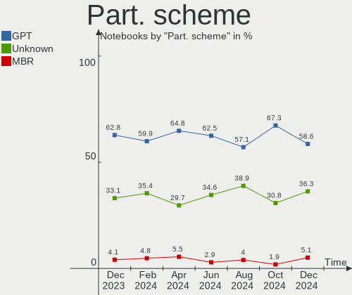
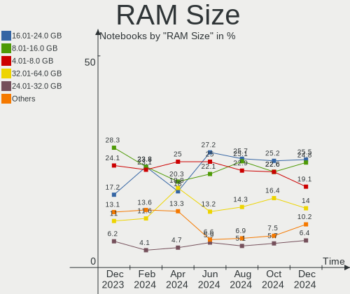
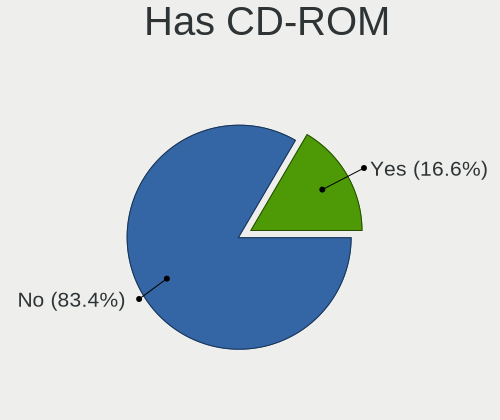
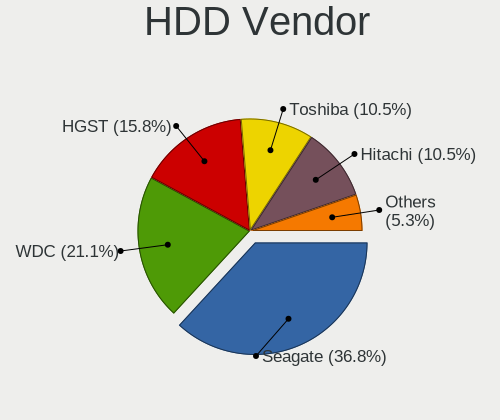

Arch - Hardware Trends (Notebooks)
----------------------------------

A project to identify most popular hardware characteristics and track their change
over time based on data collected by Linux users at https://Linux-Hardware.org.

Anyone can contribute to this report by the [hw-probe](https://github.com/linuxhw/hw-probe) tool:

    sudo -E hw-probe -all -upload

This report is for one last month. Overall report since the beginning of time: [TestDays](https://github.com/linuxhw/TestDays)

Period: Mar, 2023.

Contents
--------

* [ System ](#system)
  - [ OS                       ](#os)
  - [ OS Family                ](#os-family)
  - [ Kernel                   ](#kernel)
  - [ Kernel Family            ](#kernel-family)
  - [ Kernel Major Ver.        ](#kernel-major-ver)
  - [ Arch                     ](#arch)
  - [ DE                       ](#de)
  - [ Display Server           ](#display-server)
  - [ Display Manager          ](#display-manager)
  - [ OS Lang                  ](#os-lang)
  - [ Boot Mode                ](#boot-mode)
  - [ Filesystem               ](#filesystem)
  - [ Part. scheme             ](#part-scheme)
  - [ Dual Boot with Linux/BSD ](#dual-boot-with-linuxbsd)
  - [ Dual Boot (Win)          ](#dual-boot-win)

* [ Board ](#board)
  - [ Vendor                   ](#vendor)
  - [ Model                    ](#model)
  - [ Model Family             ](#model-family)
  - [ MFG Year                 ](#mfg-year)
  - [ Form Factor              ](#form-factor)
  - [ Secure Boot              ](#secure-boot)
  - [ Coreboot                 ](#coreboot)
  - [ RAM Size                 ](#ram-size)
  - [ RAM Used                 ](#ram-used)
  - [ Total Drives             ](#total-drives)
  - [ Has CD-ROM               ](#has-cd-rom)
  - [ Has Ethernet             ](#has-ethernet)
  - [ Has WiFi                 ](#has-wifi)
  - [ Has Bluetooth            ](#has-bluetooth)

* [ Location ](#location)
  - [ Country                  ](#country)
  - [ City                     ](#city)

* [ Drives ](#drives)
  - [ Drive Vendor             ](#drive-vendor)
  - [ Drive Model              ](#drive-model)
  - [ HDD Vendor               ](#hdd-vendor)
  - [ SSD Vendor               ](#ssd-vendor)
  - [ Drive Kind               ](#drive-kind)
  - [ Drive Connector          ](#drive-connector)
  - [ Drive Size               ](#drive-size)
  - [ Space Total              ](#space-total)
  - [ Space Used               ](#space-used)
  - [ Malfunc. Drives          ](#malfunc-drives)
  - [ Malfunc. Drive Vendor    ](#malfunc-drive-vendor)
  - [ Malfunc. HDD Vendor      ](#malfunc-hdd-vendor)
  - [ Malfunc. Drive Kind      ](#malfunc-drive-kind)
  - [ Failed Drives            ](#failed-drives)
  - [ Failed Drive Vendor      ](#failed-drive-vendor)
  - [ Drive Status             ](#drive-status)

* [ Storage controller ](#storage-controller)
  - [ Storage Vendor           ](#storage-vendor)
  - [ Storage Model            ](#storage-model)
  - [ Storage Kind             ](#storage-kind)

* [ Processor ](#processor)
  - [ CPU Vendor               ](#cpu-vendor)
  - [ CPU Model                ](#cpu-model)
  - [ CPU Model Family         ](#cpu-model-family)
  - [ CPU Cores                ](#cpu-cores)
  - [ CPU Sockets              ](#cpu-sockets)
  - [ CPU Threads              ](#cpu-threads)
  - [ CPU Op-Modes             ](#cpu-op-modes)
  - [ CPU Microcode            ](#cpu-microcode)
  - [ CPU Microarch            ](#cpu-microarch)

* [ Graphics ](#graphics)
  - [ GPU Vendor               ](#gpu-vendor)
  - [ GPU Model                ](#gpu-model)
  - [ GPU Combo                ](#gpu-combo)
  - [ GPU Driver               ](#gpu-driver)
  - [ GPU Memory               ](#gpu-memory)

* [ Monitor ](#monitor)
  - [ Monitor Vendor           ](#monitor-vendor)
  - [ Monitor Model            ](#monitor-model)
  - [ Monitor Resolution       ](#monitor-resolution)
  - [ Monitor Diagonal         ](#monitor-diagonal)
  - [ Monitor Width            ](#monitor-width)
  - [ Aspect Ratio             ](#aspect-ratio)
  - [ Monitor Area             ](#monitor-area)
  - [ Pixel Density            ](#pixel-density)
  - [ Multiple Monitors        ](#multiple-monitors)

* [ Network ](#network)
  - [ Net Controller Vendor    ](#net-controller-vendor)
  - [ Net Controller Model     ](#net-controller-model)
  - [ Wireless Vendor          ](#wireless-vendor)
  - [ Wireless Model           ](#wireless-model)
  - [ Ethernet Vendor          ](#ethernet-vendor)
  - [ Ethernet Model           ](#ethernet-model)
  - [ Net Controller Kind      ](#net-controller-kind)
  - [ Used Controller          ](#used-controller)
  - [ NICs                     ](#nics)
  - [ IPv6                     ](#ipv6)

* [ Bluetooth ](#bluetooth)
  - [ Bluetooth Vendor         ](#bluetooth-vendor)
  - [ Bluetooth Model          ](#bluetooth-model)

* [ Sound ](#sound)
  - [ Sound Vendor             ](#sound-vendor)
  - [ Sound Model              ](#sound-model)

* [ Memory ](#memory)
  - [ Memory Vendor            ](#memory-vendor)
  - [ Memory Model             ](#memory-model)
  - [ Memory Kind              ](#memory-kind)
  - [ Memory Form Factor       ](#memory-form-factor)
  - [ Memory Size              ](#memory-size)
  - [ Memory Speed             ](#memory-speed)

* [ Printers & scanners ](#printers--scanners)
  - [ Printer Vendor           ](#printer-vendor)
  - [ Printer Model            ](#printer-model)
  - [ Scanner Vendor           ](#scanner-vendor)
  - [ Scanner Model            ](#scanner-model)

* [ Camera ](#camera)
  - [ Camera Vendor            ](#camera-vendor)
  - [ Camera Model             ](#camera-model)

* [ Security ](#security)
  - [ Fingerprint Vendor       ](#fingerprint-vendor)
  - [ Fingerprint Model        ](#fingerprint-model)
  - [ Chipcard Vendor          ](#chipcard-vendor)
  - [ Chipcard Model           ](#chipcard-model)

* [ Unsupported ](#unsupported)
  - [ Unsupported Devices      ](#unsupported-devices)
  - [ Unsupported Device Types ](#unsupported-device-types)

System
------

OS
--

Installed operating systems

| Name         | Notebooks | Percent |
|--------------|-----------|---------|
| Arch Rolling | 117       | 100%    |

OS Family
---------

OS without a version

| Name | Notebooks | Percent |
|------|-----------|---------|
| Arch | 117       | 100%    |

Kernel
------

Version of the Linux kernel

| Version               | Notebooks | Percent |
|-----------------------|-----------|---------|
| 6.2.2-arch1-1         | 16        | 13.68%  |
| 6.2.8-arch1-1         | 15        | 12.82%  |
| 6.2.7-arch1-1         | 14        | 11.97%  |
| 6.2.6-arch1-1         | 12        | 10.26%  |
| 6.2.1-arch1-1         | 10        | 8.55%   |
| 6.2.5-arch1-1         | 7         | 5.98%   |
| 6.2.2-zen1-1-zen      | 4         | 3.42%   |
| 6.2.6-zen1-1-zen      | 3         | 2.56%   |
| 6.2.2-arch2-1         | 3         | 2.56%   |
| 6.2.8-zen1-1-zen      | 2         | 1.71%   |
| 6.2.7-zen1-1-zen      | 2         | 1.71%   |
| 6.2.6-273-tkg-pds     | 2         | 1.71%   |
| 6.2.5-zen1-1-zen      | 2         | 1.71%   |
| 6.1.20-1-lts          | 2         | 1.71%   |
| 6.1.19-1-lts          | 2         | 1.71%   |
| 6.1.15-1-lts          | 2         | 1.71%   |
| 6.1.12-zen1-1-zen     | 2         | 1.71%   |
| 6.1.12-arch1-1        | 2         | 1.71%   |
| 6.1.11-arch1-1        | 2         | 1.71%   |
| 6.3.0-rc1-273-tkg-cfs | 1         | 0.85%   |
| 6.2.8-zen1-1.1-zen    | 1         | 0.85%   |
| 6.2.8-lqx2-1-lqx      | 1         | 0.85%   |
| 6.2.6-arch1-g14-1     | 1         | 0.85%   |
| 6.2.6-AMD             | 1         | 0.85%   |
| 6.2.2-zen2-1-zen      | 1         | 0.85%   |
| 6.2.2-x64v1-xanmod1-1 | 1         | 0.85%   |
| 6.2.1-arch1-1.1       | 1         | 0.85%   |
| 6.1.9-arch1-1         | 1         | 0.85%   |
| 6.1.14-1-lts          | 1         | 0.85%   |
| 6.1.12-arch1-g14-1    | 1         | 0.85%   |
| 5.19.8-arch1-1        | 1         | 0.85%   |
| 5.15.94-1-lts         | 1         | 0.85%   |

Kernel Family
-------------

Linux kernel without a distro release

| Version | Notebooks | Percent |
|---------|-----------|---------|
| 6.2.2   | 25        | 21.37%  |
| 6.2.8   | 19        | 16.24%  |
| 6.2.6   | 19        | 16.24%  |
| 6.2.7   | 16        | 13.68%  |
| 6.2.1   | 11        | 9.4%    |
| 6.2.5   | 9         | 7.69%   |
| 6.1.12  | 5         | 4.27%   |
| 6.1.20  | 2         | 1.71%   |
| 6.1.19  | 2         | 1.71%   |
| 6.1.15  | 2         | 1.71%   |
| 6.1.11  | 2         | 1.71%   |
| 6.3.0   | 1         | 0.85%   |
| 6.1.9   | 1         | 0.85%   |
| 6.1.14  | 1         | 0.85%   |
| 5.19.8  | 1         | 0.85%   |
| 5.15.94 | 1         | 0.85%   |

Kernel Major Ver.
-----------------

Linux kernel major version

| Version | Notebooks | Percent |
|---------|-----------|---------|
| 6.2     | 99        | 84.62%  |
| 6.1     | 15        | 12.82%  |
| 6.3     | 1         | 0.85%   |
| 5.19    | 1         | 0.85%   |
| 5.15    | 1         | 0.85%   |

Arch
----

OS architecture (x86_64, i586, etc.)

| Name   | Notebooks | Percent |
|--------|-----------|---------|
| x86_64 | 117       | 100%    |

DE
--

Desktop Environment

| Name       | Notebooks | Percent |
|------------|-----------|---------|
| KDE5       | 49        | 41.88%  |
| GNOME      | 42        | 35.9%   |
| XFCE       | 7         | 5.98%   |
| X-Cinnamon | 4         | 3.42%   |
| LXQt       | 3         | 2.56%   |
| Hyprland   | 3         | 2.56%   |
| Unknown    | 3         | 2.56%   |
| i3         | 2         | 1.71%   |
| xmonad     | 1         | 0.85%   |
| KDE        | 1         | 0.85%   |
| Budgie     | 1         | 0.85%   |
| awesome    | 1         | 0.85%   |

Display Server
--------------

X11 or Wayland

| Name    | Notebooks | Percent |
|---------|-----------|---------|
| X11     | 56        | 47.86%  |
| Wayland | 49        | 41.88%  |
| Unknown | 7         | 5.98%   |
| Tty     | 5         | 4.27%   |

Display Manager
---------------

SDDM, LightDM, etc.

| Name    | Notebooks | Percent |
|---------|-----------|---------|
| Unknown | 47        | 40.17%  |
| SDDM    | 37        | 31.62%  |
| GDM     | 16        | 13.68%  |
| LightDM | 14        | 11.97%  |
| LXDM    | 1         | 0.85%   |
| GREETD  | 1         | 0.85%   |
| EMPTTY  | 1         | 0.85%   |

OS Lang
-------

Language

| Lang        | Notebooks | Percent |
|-------------|-----------|---------|
| en_US       | 58        | 49.57%  |
| en_GB       | 11        | 9.4%    |
| C           | 10        | 8.55%   |
| ru_RU       | 5         | 4.27%   |
| pl_PL       | 5         | 4.27%   |
| it_IT       | 4         | 3.42%   |
| Unknown     | 4         | 3.42%   |
| zh_CN       | 3         | 2.56%   |
| pt_BR       | 3         | 2.56%   |
| fr_FR       | 3         | 2.56%   |
| de_DE       | 3         | 2.56%   |
| es_PE       | 1         | 0.85%   |
| es_ES       | 1         | 0.85%   |
| en_DK       | 1         | 0.85%   |
| en_CA       | 1         | 0.85%   |
| en_AU.UFT-8 | 1         | 0.85%   |
| en_AU       | 1         | 0.85%   |
| de_DE.UTF8  | 1         | 0.85%   |
| de_AT       | 1         | 0.85%   |

Boot Mode
---------

EFI or BIOS

| Mode | Notebooks | Percent |
|------|-----------|---------|
| EFI  | 68        | 58.12%  |
| BIOS | 49        | 41.88%  |

Filesystem
----------

Type of filesystem

| Type    | Notebooks | Percent |
|---------|-----------|---------|
| Ext4    | 68        | 58.12%  |
| Btrfs   | 40        | 34.19%  |
| Xfs     | 5         | 4.27%   |
| Overlay | 2         | 1.71%   |
| F2fs    | 1         | 0.85%   |
| Unknown | 1         | 0.85%   |

Part. scheme
------------

Scheme of partitioning

| Type    | Notebooks | Percent |
|---------|-----------|---------|
| GPT     | 73        | 62.39%  |
| Unknown | 36        | 30.77%  |
| MBR     | 8         | 6.84%   |

Dual Boot with Linux/BSD
------------------------

Hosting more than one Linux/BSD

| Dual boot | Notebooks | Percent |
|-----------|-----------|---------|
| No        | 112       | 95.73%  |
| Yes       | 5         | 4.27%   |

Dual Boot (Win)
---------------

Hosting Linux and Windows

| Dual boot | Notebooks | Percent |
|-----------|-----------|---------|
| No        | 91        | 77.78%  |
| Yes       | 26        | 22.22%  |

Board
-----

Vendor
------

Motherboard manufacturer

| Name             | Notebooks | Percent |
|------------------|-----------|---------|
| Lenovo           | 35        | 29.91%  |
| Hewlett-Packard  | 18        | 15.38%  |
| Dell             | 18        | 15.38%  |
| ASUSTek Computer | 9         | 7.69%   |
| Acer             | 8         | 6.84%   |
| MSI              | 5         | 4.27%   |
| TUXEDO           | 3         | 2.56%   |
| Toshiba          | 3         | 2.56%   |
| HUAWEI           | 3         | 2.56%   |
| Timi             | 2         | 1.71%   |
| Monster          | 2         | 1.71%   |
| Apple            | 2         | 1.71%   |
| Star Labs        | 1         | 0.85%   |
| Razer            | 1         | 0.85%   |
| Panasonic        | 1         | 0.85%   |
| IGEL Technology  | 1         | 0.85%   |
| HONOR            | 1         | 0.85%   |
| GPD              | 1         | 0.85%   |
| Dynabook         | 1         | 0.85%   |
| DTRI             | 1         | 0.85%   |
| Unknown          | 1         | 0.85%   |

Model
-----

Motherboard model

| Name                                        | Notebooks | Percent |
|---------------------------------------------|-----------|---------|
| Dell XPS 15 9570                            | 2         | 1.71%   |
| Dell XPS 15 9500                            | 2         | 1.71%   |
| Unknown                                     | 2         | 1.71%   |
| TUXEDO Pulse 15 Gen1                        | 1         | 0.85%   |
| TUXEDO Polaris Intel Gen3 (TGL)             | 1         | 0.85%   |
| TUXEDO InfinityBook Pro 14 Gen6             | 1         | 0.85%   |
| Toshiba TECRA Z50-C                         | 1         | 0.85%   |
| Toshiba Satellite C850-140                  | 1         | 0.85%   |
| Toshiba Satellite C55D-B                    | 1         | 0.85%   |
| Timi RedmiBook 14                           | 1         | 0.85%   |
| Timi Redmi Book Pro 14 2022                 | 1         | 0.85%   |
| Star Labs StarBook                          | 1         | 0.85%   |
| Razer Blade 14 - RZ09-0370                  | 1         | 0.85%   |
| Panasonic FZ40-1                            | 1         | 0.85%   |
| MSI Pulse GL66 11UGKV                       | 1         | 0.85%   |
| MSI Modern 14 B10MW                         | 1         | 0.85%   |
| MSI GS63VR 7RF                              | 1         | 0.85%   |
| MSI GP66 Leopard 11UG                       | 1         | 0.85%   |
| MSI GF63 Thin 11UC                          | 1         | 0.85%   |
| Monster HUMA H4 V5.1                        | 1         | 0.85%   |
| Monster ABRA A7 V11.3                       | 1         | 0.85%   |
| Lenovo ThinkPad Z16 Gen 1 21D40010MX        | 1         | 0.85%   |
| Lenovo ThinkPad Z13 Gen 1 21D2CTO1WW        | 1         | 0.85%   |
| Lenovo ThinkPad Yoga 11e 20D9000QGE         | 1         | 0.85%   |
| Lenovo ThinkPad X250 20CLS2A100             | 1         | 0.85%   |
| Lenovo ThinkPad X240 20AMS1FW00             | 1         | 0.85%   |
| Lenovo ThinkPad X13 Gen 3 21BNCTO1WW        | 1         | 0.85%   |
| Lenovo ThinkPad X1 Carbon Gen 10 21CBCTO1WW | 1         | 0.85%   |
| Lenovo ThinkPad T510 4313CTO                | 1         | 0.85%   |
| Lenovo ThinkPad T480s 20L7S0YA00            | 1         | 0.85%   |
| Lenovo ThinkPad T480 20L5CTO1WW             | 1         | 0.85%   |
| Lenovo ThinkPad T470 20HD0001PG             | 1         | 0.85%   |
| Lenovo ThinkPad T460s 20FAS6PN00            | 1         | 0.85%   |
| Lenovo ThinkPad T450s 20BWS05G02            | 1         | 0.85%   |
| Lenovo ThinkPad T450 20BUA05K00             | 1         | 0.85%   |
| Lenovo ThinkPad T440p                       | 1         | 0.85%   |
| Lenovo ThinkPad T16 Gen 1 21CH000JUS        | 1         | 0.85%   |
| Lenovo ThinkPad T14 Gen 3 21CF001PHH        | 1         | 0.85%   |
| Lenovo ThinkPad T14 Gen 1 20UDS11900        | 1         | 0.85%   |
| Lenovo ThinkPad P52s 20LBS0FH00             | 1         | 0.85%   |

Model Family
------------

Motherboard model prefix

| Name                | Notebooks | Percent |
|---------------------|-----------|---------|
| Lenovo ThinkPad     | 22        | 18.8%   |
| Lenovo IdeaPad      | 9         | 7.69%   |
| Dell XPS            | 6         | 5.13%   |
| Acer Aspire         | 6         | 5.13%   |
| HP EliteBook        | 4         | 3.42%   |
| Dell Latitude       | 4         | 3.42%   |
| HP ENVY             | 3         | 2.56%   |
| Dell Inspiron       | 3         | 2.56%   |
| ASUS ASUS           | 3         | 2.56%   |
| Toshiba Satellite   | 2         | 1.71%   |
| Lenovo Legion       | 2         | 1.71%   |
| HP Victus           | 2         | 1.71%   |
| HP ProBook          | 2         | 1.71%   |
| HP Pavilion         | 2         | 1.71%   |
| Dell Precision      | 2         | 1.71%   |
| Apple MacBookPro11  | 2         | 1.71%   |
| Unknown             | 2         | 1.71%   |
| TUXEDO Pulse        | 1         | 0.85%   |
| TUXEDO Polaris      | 1         | 0.85%   |
| TUXEDO InfinityBook | 1         | 0.85%   |
| Toshiba TECRA       | 1         | 0.85%   |
| Timi RedmiBook      | 1         | 0.85%   |
| Timi Redmi          | 1         | 0.85%   |
| Star Labs StarBook  | 1         | 0.85%   |
| Razer Blade         | 1         | 0.85%   |
| Panasonic FZ40-1    | 1         | 0.85%   |
| MSI Pulse           | 1         | 0.85%   |
| MSI Modern          | 1         | 0.85%   |
| MSI GS63VR          | 1         | 0.85%   |
| MSI GP66            | 1         | 0.85%   |
| MSI GF63            | 1         | 0.85%   |
| Monster HUMA        | 1         | 0.85%   |
| Monster ABRA        | 1         | 0.85%   |
| Lenovo ThinkBook    | 1         | 0.85%   |
| IGEL H830C          | 1         | 0.85%   |
| HUAWEI NBD-WXX9     | 1         | 0.85%   |
| HUAWEI KLVL-WXXW    | 1         | 0.85%   |
| HUAWEI CREF-XX      | 1         | 0.85%   |
| HONOR BOD-WXX9      | 1         | 0.85%   |
| HP OMEN             | 1         | 0.85%   |

MFG Year
--------

Motherboard manufacture year

| Year | Notebooks | Percent |
|------|-----------|---------|
| 2022 | 26        | 22.22%  |
| 2021 | 18        | 15.38%  |
| 2020 | 13        | 11.11%  |
| 2018 | 11        | 9.4%    |
| 2019 | 9         | 7.69%   |
| 2014 | 9         | 7.69%   |
| 2017 | 8         | 6.84%   |
| 2015 | 5         | 4.27%   |
| 2012 | 4         | 3.42%   |
| 2016 | 3         | 2.56%   |
| 2013 | 3         | 2.56%   |
| 2023 | 2         | 1.71%   |
| 2009 | 2         | 1.71%   |
| 2008 | 2         | 1.71%   |
| 2011 | 1         | 0.85%   |
| 2010 | 1         | 0.85%   |

Form Factor
-----------

Physical design of the computer

| Name     | Notebooks | Percent |
|----------|-----------|---------|
| Notebook | 117       | 100%    |

Secure Boot
-----------

Enabled or disabled

| State    | Notebooks | Percent |
|----------|-----------|---------|
| Disabled | 112       | 95.73%  |
| Enabled  | 5         | 4.27%   |

Coreboot
--------

Have coreboot on board

| Used | Notebooks | Percent |
|------|-----------|---------|
| No   | 115       | 98.29%  |
| Yes  | 2         | 1.71%   |

RAM Size
--------

Total RAM memory

| Size in GB  | Notebooks | Percent |
|-------------|-----------|---------|
| 4.01-8.0    | 28        | 23.93%  |
| 16.01-24.0  | 25        | 21.37%  |
| 8.01-16.0   | 24        | 20.51%  |
| 32.01-64.0  | 18        | 15.38%  |
| 3.01-4.0    | 14        | 11.97%  |
| 24.01-32.0  | 4         | 3.42%   |
| 64.01-256.0 | 3         | 2.56%   |
| 1.01-2.0    | 1         | 0.85%   |

RAM Used
--------

Used RAM memory

| Used GB    | Notebooks | Percent |
|------------|-----------|---------|
| 2.01-3.0   | 33        | 28.21%  |
| 4.01-8.0   | 32        | 27.35%  |
| 1.01-2.0   | 21        | 17.95%  |
| 3.01-4.0   | 19        | 16.24%  |
| 8.01-16.0  | 7         | 5.98%   |
| 16.01-24.0 | 2         | 1.71%   |
| 24.01-32.0 | 1         | 0.85%   |
| 0.51-1.0   | 1         | 0.85%   |
| 0.01-0.5   | 1         | 0.85%   |

Total Drives
------------

Number of drives on board

| Drives | Notebooks | Percent |
|--------|-----------|---------|
| 1      | 84        | 71.79%  |
| 2      | 25        | 21.37%  |
| 3      | 8         | 6.84%   |

Has CD-ROM
----------

Has CD-ROM on board

| Presented | Notebooks | Percent |
|-----------|-----------|---------|
| No        | 103       | 88.03%  |
| Yes       | 14        | 11.97%  |

Has Ethernet
------------

Has Ethernet on board

| Presented | Notebooks | Percent |
|-----------|-----------|---------|
| Yes       | 83        | 70.94%  |
| No        | 34        | 29.06%  |

Has WiFi
--------

Has WiFi module

| Presented | Notebooks | Percent |
|-----------|-----------|---------|
| Yes       | 113       | 96.58%  |
| No        | 4         | 3.42%   |

Has Bluetooth
-------------

Has Bluetooth module

| Presented | Notebooks | Percent |
|-----------|-----------|---------|
| Yes       | 103       | 88.03%  |
| No        | 14        | 11.97%  |

Location
--------

Country
-------

Geographic location (country)

| Country                | Notebooks | Percent |
|------------------------|-----------|---------|
| USA                    | 23        | 19.66%  |
| Germany                | 11        | 9.4%    |
| Italy                  | 9         | 7.69%   |
| Russia                 | 7         | 5.98%   |
| Turkey                 | 5         | 4.27%   |
| Poland                 | 5         | 4.27%   |
| France                 | 5         | 4.27%   |
| Brazil                 | 5         | 4.27%   |
| UK                     | 4         | 3.42%   |
| Sweden                 | 3         | 2.56%   |
| India                  | 3         | 2.56%   |
| Canada                 | 3         | 2.56%   |
| Australia              | 3         | 2.56%   |
| Vietnam                | 2         | 1.71%   |
| Portugal               | 2         | 1.71%   |
| Netherlands            | 2         | 1.71%   |
| Nepal                  | 2         | 1.71%   |
| Indonesia              | 2         | 1.71%   |
| China                  | 2         | 1.71%   |
| Austria                | 2         | 1.71%   |
| Ukraine                | 1         | 0.85%   |
| Taiwan                 | 1         | 0.85%   |
| Spain                  | 1         | 0.85%   |
| Romania                | 1         | 0.85%   |
| Philippines            | 1         | 0.85%   |
| Peru                   | 1         | 0.85%   |
| Lithuania              | 1         | 0.85%   |
| Kazakhstan             | 1         | 0.85%   |
| Iran                   | 1         | 0.85%   |
| Hungary                | 1         | 0.85%   |
| Dominican Republic     | 1         | 0.85%   |
| Denmark                | 1         | 0.85%   |
| Croatia                | 1         | 0.85%   |
| Bulgaria               | 1         | 0.85%   |
| Bosnia and Herzegovina | 1         | 0.85%   |
| Bangladesh             | 1         | 0.85%   |
| Bahamas                | 1         | 0.85%   |

City
----

Geographic location (city)

| City             | Notebooks | Percent |
|------------------|-----------|---------|
| Moscow           | 4         | 3.42%   |
| Melbourne        | 3         | 2.56%   |
| Sao Paulo        | 2         | 1.71%   |
| Nuremberg        | 2         | 1.71%   |
| Munich           | 2         | 1.71%   |
| Milwaukee        | 2         | 1.71%   |
| Milan            | 2         | 1.71%   |
| Berlin           | 2         | 1.71%   |
| Antalya          | 2         | 1.71%   |
| Zagreb           | 1         | 0.85%   |
| Wroclaw          | 1         | 0.85%   |
| Wieliczka        | 1         | 0.85%   |
| Vladivostok      | 1         | 0.85%   |
| Vienna           | 1         | 0.85%   |
| Van              | 1         | 0.85%   |
| Upland           | 1         | 0.85%   |
| Uberlândia      | 1         | 0.85%   |
| Thuan An         | 1         | 0.85%   |
| Taoyuan District | 1         | 0.85%   |
| Swansea          | 1         | 0.85%   |
| Surgut           | 1         | 0.85%   |
| Sugar Grove      | 1         | 0.85%   |
| Stockholm        | 1         | 0.85%   |
| Staffanstorp     | 1         | 0.85%   |
| Shavertown       | 1         | 0.85%   |
| San Francisco    | 1         | 0.85%   |
| Saint-Hyacinthe  | 1         | 0.85%   |
| Roubaix          | 1         | 0.85%   |
| Rotterdam        | 1         | 0.85%   |
| Rochefort        | 1         | 0.85%   |
| Rennes           | 1         | 0.85%   |
| Pulupandan       | 1         | 0.85%   |
| Poznan           | 1         | 0.85%   |
| Pompano Beach    | 1         | 0.85%   |
| Poitiers         | 1         | 0.85%   |
| Palestrina       | 1         | 0.85%   |
| Overland Park    | 1         | 0.85%   |
| Oshawa           | 1         | 0.85%   |
| Noida            | 1         | 0.85%   |
| New York         | 1         | 0.85%   |

Drives
------

Drive Vendor
------------

Hard drive vendors

| Vendor                      | Notebooks | Drives | Percent |
|-----------------------------|-----------|--------|---------|
| Samsung Electronics         | 34        | 39     | 22.97%  |
| Toshiba                     | 11        | 11     | 7.43%   |
| Sandisk                     | 11        | 11     | 7.43%   |
| Micron Technology           | 11        | 11     | 7.43%   |
| Unknown                     | 8         | 9      | 5.41%   |
| Kingston                    | 8         | 9      | 5.41%   |
| Intel                       | 8         | 9      | 5.41%   |
| WDC                         | 7         | 7      | 4.73%   |
| Phison Electronics          | 7         | 7      | 4.73%   |
| SK hynix                    | 6         | 6      | 4.05%   |
| Seagate                     | 6         | 6      | 4.05%   |
| Crucial                     | 5         | 5      | 3.38%   |
| Silicon Motion              | 4         | 5      | 2.7%    |
| Solid State Storage         | 3         | 3      | 2.03%   |
| Phison                      | 2         | 2      | 1.35%   |
| Micron/Crucial Technology   | 2         | 2      | 1.35%   |
| KIOXIA                      | 2         | 2      | 1.35%   |
| Union Memory (Shenzhen)     | 1         | 1      | 0.68%   |
| Transcend                   | 1         | 1      | 0.68%   |
| SSK                         | 1         | 1      | 0.68%   |
| SPCC                        | 1         | 1      | 0.68%   |
| OWC                         | 1         | 1      | 0.68%   |
| Netac                       | 1         | 1      | 0.68%   |
| Kingston Technology Company | 1         | 1      | 0.68%   |
| JMicron Technology          | 1         | 1      | 0.68%   |
| HGST                        | 1         | 1      | 0.68%   |
| GOODRAM                     | 1         | 1      | 0.68%   |
| Generic-                    | 1         | 1      | 0.68%   |
| China                       | 1         | 1      | 0.68%   |
| Apacer                      | 1         | 1      | 0.68%   |

Drive Model
-----------

Hard drive models

| Model                                                  | Notebooks | Percent |
|--------------------------------------------------------|-----------|---------|
| Samsung NVMe SSD Controller SM981/PM981/PM983 250GB    | 11        | 7.14%   |
| Samsung NVMe SSD Controller PM9A1/PM9A3/980PRO 1TB     | 6         | 3.9%    |
| Unknown MMC Card  64GB                                 | 4         | 2.6%    |
| Toshiba MQ04ABF100 1TB                                 | 4         | 2.6%    |
| Silicon Motion SM2263EN/SM2263XT SSD Controller 1024GB | 3         | 1.95%   |
| Samsung NVMe SSD Controller SM961/PM961/SM963 256GB    | 3         | 1.95%   |
| Phison PS5013 E13 NVMe Controller 256GB                | 3         | 1.95%   |
| Phison E12 NVMe Controller 256GB                       | 3         | 1.95%   |
| Intel SSD 660P Series 512GB                            | 3         | 1.95%   |
| Unknown MMC Card  128GB                                | 2         | 1.3%    |
| SK hynix SC311 SATA 512GB SSD                          | 2         | 1.3%    |
| Sandisk WD Blue SN550 NVMe SSD 256GB                   | 2         | 1.3%    |
| Sandisk WD Black SN750 / PC SN730 NVMe SSD 1TB         | 2         | 1.3%    |
| Samsung SSD 870 QVO 1TB                                | 2         | 1.3%    |
| Micron/Crucial P2 NVMe PCIe SSD 1TB                    | 2         | 1.3%    |
| Micron 3400_MTFDKBA512TFH 512GB                        | 2         | 1.3%    |
| Kingston OM8PCP3512F-AI1 512GB                         | 2         | 1.3%    |
| Intel SSDPEKNU512GZ 512GB                              | 2         | 1.3%    |
| Crucial CT240BX500SSD1 240GB                           | 2         | 1.3%    |
| WDC WDS240G2G0A-00JH30 240GB SSD                       | 1         | 0.65%   |
| WDC WD5000LPVX-75V0TT0 500GB                           | 1         | 0.65%   |
| WDC WD5000LPVX-22V0TT0 500GB                           | 1         | 0.65%   |
| WDC WD5000LPCX-24VHAT0 500GB                           | 1         | 0.65%   |
| WDC WD3200BEKT-22F3T0 320GB                            | 1         | 0.65%   |
| WDC WD10SPZX-11Z10T0 1TB                               | 1         | 0.65%   |
| WDC WD10SPZX-08Z10 1TB                                 | 1         | 0.65%   |
| Unknown xD/SD/M.S.                                     | 1         | 0.65%   |
| Unknown MMC Card  32GB                                 | 1         | 0.65%   |
| Unknown MMC Card  256GB                                | 1         | 0.65%   |
| Union Memory (Shenzhen) UMIS RPJTJ512MGE1QDQ 512GB     | 1         | 0.65%   |
| Transcend TS480GMTS420S 480GB SSD                      | 1         | 0.65%   |
| Toshiba XG6 NVMe SSD Controller 512GB                  | 1         | 0.65%   |
| Toshiba XG4 NVMe SSD Controller 256GB                  | 1         | 0.65%   |
| Toshiba THNSNJ256G8NY 256GB SSD                        | 1         | 0.65%   |
| Toshiba MQ01ABF050 500GB                               | 1         | 0.65%   |
| Toshiba MQ01ABD050 500GB                               | 1         | 0.65%   |
| Toshiba MK2576GSX 250GB                                | 1         | 0.65%   |
| Toshiba KXG50ZNV512G NVMe 512GB                        | 1         | 0.65%   |
| SSK Disk 128GB                                         | 1         | 0.65%   |
| SPCC Solid State Disk 1TB                              | 1         | 0.65%   |

HDD Vendor
----------

Hard disk drive vendors

| Vendor              | Notebooks | Drives | Percent |
|---------------------|-----------|--------|---------|
| Toshiba             | 7         | 7      | 31.82%  |
| WDC                 | 6         | 6      | 27.27%  |
| Seagate             | 6         | 6      | 27.27%  |
| Samsung Electronics | 1         | 1      | 4.55%   |
| HGST                | 1         | 1      | 4.55%   |
| Generic-            | 1         | 1      | 4.55%   |

SSD Vendor
----------

Solid state drive vendors

| Vendor              | Notebooks | Drives | Percent |
|---------------------|-----------|--------|---------|
| Samsung Electronics | 8         | 8      | 25%     |
| Crucial             | 5         | 5      | 15.63%  |
| Kingston            | 4         | 5      | 12.5%   |
| SanDisk             | 3         | 3      | 9.38%   |
| SK hynix            | 2         | 2      | 6.25%   |
| WDC                 | 1         | 1      | 3.13%   |
| Transcend           | 1         | 1      | 3.13%   |
| Toshiba             | 1         | 1      | 3.13%   |
| SPCC                | 1         | 1      | 3.13%   |
| OWC                 | 1         | 1      | 3.13%   |
| JMicron Technology  | 1         | 1      | 3.13%   |
| Intel               | 1         | 1      | 3.13%   |
| GOODRAM             | 1         | 1      | 3.13%   |
| China               | 1         | 1      | 3.13%   |
| Apacer              | 1         | 1      | 3.13%   |

Drive Kind
----------

HDD or SSD

| Kind    | Notebooks | Drives | Percent |
|---------|-----------|--------|---------|
| NVMe    | 77        | 91     | 55.4%   |
| SSD     | 31        | 33     | 22.3%   |
| HDD     | 21        | 22     | 15.11%  |
| MMC     | 7         | 8      | 5.04%   |
| Unknown | 3         | 3      | 2.16%   |

Drive Connector
---------------

SATA, SAS, NVMe, etc.

| Type | Notebooks | Drives | Percent |
|------|-----------|--------|---------|
| NVMe | 77        | 91     | 57.46%  |
| SATA | 46        | 54     | 34.33%  |
| MMC  | 7         | 8      | 5.22%   |
| SAS  | 4         | 4      | 2.99%   |

Drive Size
----------

Size of hard drive

| Size in TB | Notebooks | Drives | Percent |
|------------|-----------|--------|---------|
| 0.01-0.5   | 34        | 39     | 68%     |
| 0.51-1.0   | 15        | 15     | 30%     |
| 1.01-2.0   | 1         | 1      | 2%      |

Space Total
-----------

Amount of disk space available on the file system

| Size in GB     | Notebooks | Percent |
|----------------|-----------|---------|
| 251-500        | 31        | 26.5%   |
| 101-250        | 23        | 19.66%  |
| 501-1000       | 19        | 16.24%  |
| 1001-2000      | 18        | 15.38%  |
| 2001-3000      | 9         | 7.69%   |
| More than 3000 | 7         | 5.98%   |
| 51-100         | 7         | 5.98%   |
| 21-50          | 1         | 0.85%   |
| 1-20           | 1         | 0.85%   |
| Unknown        | 1         | 0.85%   |

Space Used
----------

Amount of used disk space

| Used GB        | Notebooks | Percent |
|----------------|-----------|---------|
| 21-50          | 23        | 19.66%  |
| 101-250        | 22        | 18.8%   |
| 51-100         | 21        | 17.95%  |
| 1-20           | 18        | 15.38%  |
| 251-500        | 14        | 11.97%  |
| 501-1000       | 10        | 8.55%   |
| 1001-2000      | 7         | 5.98%   |
| More than 3000 | 1         | 0.85%   |
| Unknown        | 1         | 0.85%   |

Malfunc. Drives
---------------

Drive models with a malfunction

| Model                                                           | Notebooks | Drives | Percent |
|-----------------------------------------------------------------|-----------|--------|---------|
| Toshiba MQ01ABD050 500GB                                        | 1         | 1      | 25%     |
| Seagate ST9320325AS 320GB                                       | 1         | 1      | 25%     |
| Samsung Electronics NVMe SSD Controller SM981/PM981/PM983 250GB | 1         | 1      | 25%     |
| Samsung Electronics MZNLH128HBHQ-000H1 128GB SSD                | 1         | 1      | 25%     |

Malfunc. Drive Vendor
---------------------

Vendors of faulty drives

| Vendor              | Notebooks | Drives | Percent |
|---------------------|-----------|--------|---------|
| Samsung Electronics | 2         | 2      | 50%     |
| Toshiba             | 1         | 1      | 25%     |
| Seagate             | 1         | 1      | 25%     |

Malfunc. HDD Vendor
-------------------

Vendors of faulty HDD drives

| Vendor  | Notebooks | Drives | Percent |
|---------|-----------|--------|---------|
| Toshiba | 1         | 1      | 50%     |
| Seagate | 1         | 1      | 50%     |

Malfunc. Drive Kind
-------------------

Kinds of faulty drives

| Kind | Notebooks | Drives | Percent |
|------|-----------|--------|---------|
| HDD  | 2         | 2      | 50%     |
| NVMe | 1         | 1      | 25%     |
| SSD  | 1         | 1      | 25%     |

Failed Drives
-------------

Failed drive models

Zero info for selected period =(

Failed Drive Vendor
-------------------

Failed drive vendors

Zero info for selected period =(

Drive Status
------------

Number of failed and malfunc. drives

| Status   | Notebooks | Drives | Percent |
|----------|-----------|--------|---------|
| Works    | 65        | 82     | 52.42%  |
| Detected | 55        | 71     | 44.35%  |
| Malfunc  | 4         | 4      | 3.23%   |

Storage controller
------------------

Storage Vendor
--------------

Storage controller vendors

| Vendor                         | Notebooks | Percent |
|--------------------------------|-----------|---------|
| Intel                          | 66        | 42.31%  |
| Samsung Electronics            | 25        | 16.03%  |
| AMD                            | 12        | 7.69%   |
| Micron Technology              | 11        | 7.05%   |
| SanDisk                        | 8         | 5.13%   |
| Phison Electronics             | 8         | 5.13%   |
| Kingston Technology Company    | 5         | 3.21%   |
| SK hynix                       | 4         | 2.56%   |
| Silicon Motion                 | 4         | 2.56%   |
| Toshiba America Info Systems   | 3         | 1.92%   |
| Solid State Storage Technology | 3         | 1.92%   |
| Micron/Crucial Technology      | 2         | 1.28%   |
| KIOXIA                         | 2         | 1.28%   |
| Union Memory (Shenzhen)        | 1         | 0.64%   |
| Netac Technology               | 1         | 0.64%   |
| Marvell Technology Group       | 1         | 0.64%   |

Storage Model
-------------

Storage controller models

| Model                                                                          | Notebooks | Percent |
|--------------------------------------------------------------------------------|-----------|---------|
| AMD FCH SATA Controller [AHCI mode]                                            | 12        | 7.14%   |
| Samsung NVMe SSD Controller SM981/PM981/PM983                                  | 11        | 6.55%   |
| Micron NVMe Storage Controller                                                 | 10        | 5.95%   |
| Intel Volume Management Device NVMe RAID Controller                            | 9         | 5.36%   |
| Samsung NVMe SSD Controller PM9A1/PM9A3/980PRO                                 | 7         | 4.17%   |
| Samsung NVMe SSD Controller 980                                                | 6         | 3.57%   |
| Intel Sunrise Point-LP SATA Controller [AHCI mode]                             | 5         | 2.98%   |
| Intel 82801 Mobile SATA Controller [RAID mode]                                 | 5         | 2.98%   |
| Kingston Company Company Non-Volatile memory controller                        | 4         | 2.38%   |
| Intel Cannon Lake Mobile PCH SATA AHCI Controller                              | 4         | 2.38%   |
| Intel Alder Lake-P SATA AHCI Controller                                        | 4         | 2.38%   |
| Intel 8 Series SATA Controller 1 [AHCI mode]                                   | 4         | 2.38%   |
| Intel 500 Series Chipset Family SATA AHCI Controller                           | 4         | 2.38%   |
| Solid State Storage Non-Volatile memory controller                             | 3         | 1.79%   |
| Silicon Motion SM2263EN/SM2263XT SSD Controller                                | 3         | 1.79%   |
| Samsung NVMe SSD Controller SM961/PM961/SM963                                  | 3         | 1.79%   |
| Phison PS5013 E13 NVMe Controller                                              | 3         | 1.79%   |
| Phison E12 NVMe Controller                                                     | 3         | 1.79%   |
| Intel Wildcat Point-LP SATA Controller [AHCI Mode]                             | 3         | 1.79%   |
| Intel SSD 660P Series                                                          | 3         | 1.79%   |
| Intel Atom Processor E3800 Series SATA AHCI Controller                         | 3         | 1.79%   |
| Intel 82801IBM/IEM (ICH9M/ICH9M-E) 4 port SATA Controller [AHCI mode]          | 3         | 1.79%   |
| Intel 7 Series Chipset Family 6-port SATA Controller [AHCI mode]               | 3         | 1.79%   |
| Intel 400 Series Chipset Family SATA AHCI Controller                           | 3         | 1.79%   |
| SK hynix Gold P31/PC711 NVMe Solid State Drive                                 | 2         | 1.19%   |
| SanDisk WD Blue SN550 NVMe SSD                                                 | 2         | 1.19%   |
| SanDisk WD Black SN750 / PC SN730 NVMe SSD                                     | 2         | 1.19%   |
| SanDisk Non-Volatile memory controller                                         | 2         | 1.19%   |
| Micron/Crucial P2 NVMe PCIe SSD                                                | 2         | 1.19%   |
| Intel Tiger Lake-LP SATA Controller                                            | 2         | 1.19%   |
| Intel Q170/Q150/B150/H170/H110/Z170/CM236 Chipset SATA Controller [AHCI Mode]  | 2         | 1.19%   |
| Intel Non-Volatile memory controller                                           | 2         | 1.19%   |
| Intel HM170/QM170 Chipset SATA Controller [AHCI Mode]                          | 2         | 1.19%   |
| Intel 8 Series/C220 Series Chipset Family 6-port SATA Controller 1 [AHCI mode] | 2         | 1.19%   |
| Intel 5 Series/3400 Series Chipset 6 port SATA AHCI Controller                 | 2         | 1.19%   |
| Union Memory (Shenzhen) AM630 PCIe 4.0 x4 NVMe SSD Controller                  | 1         | 0.6%    |
| Toshiba America Info Systems XG6 NVMe SSD Controller                           | 1         | 0.6%    |
| Toshiba America Info Systems XG5 NVMe SSD Controller                           | 1         | 0.6%    |
| Toshiba America Info Systems XG4 NVMe SSD Controller                           | 1         | 0.6%    |
| SK hynix PC401 NVMe Solid State Drive 256GB                                    | 1         | 0.6%    |

Storage Kind
------------

Kind of storage controller (IDE, SATA, NVMe, SAS, ...)

| Kind | Notebooks | Percent |
|------|-----------|---------|
| NVMe | 76        | 48.41%  |
| SATA | 64        | 40.76%  |
| RAID | 17        | 10.83%  |

Processor
---------

CPU Vendor
----------

Processor vendors

| Vendor | Notebooks | Percent |
|--------|-----------|---------|
| Intel  | 92        | 78.63%  |
| AMD    | 25        | 21.37%  |

CPU Model
---------

Processor models

| Model                                      | Notebooks | Percent |
|--------------------------------------------|-----------|---------|
| Intel 11th Gen Core i5-1135G7 @ 2.40GHz    | 5         | 4.27%   |
| Intel 12th Gen Core i7-12700H              | 4         | 3.42%   |
| Intel 11th Gen Core i7-11800H @ 2.30GHz    | 4         | 3.42%   |
| Intel Core i7-10510U CPU @ 1.80GHz         | 3         | 2.56%   |
| AMD Ryzen 7 PRO 6850U with Radeon Graphics | 3         | 2.56%   |
| Intel Core i9-10885H CPU @ 2.40GHz         | 2         | 1.71%   |
| Intel Core i7-8750H CPU @ 2.20GHz          | 2         | 1.71%   |
| Intel Core i7-8650U CPU @ 1.90GHz          | 2         | 1.71%   |
| Intel Core i7-10750H CPU @ 2.60GHz         | 2         | 1.71%   |
| Intel Core i5-8350U CPU @ 1.70GHz          | 2         | 1.71%   |
| Intel Core i5-5300U CPU @ 2.30GHz          | 2         | 1.71%   |
| Intel Core i5-10300H CPU @ 2.50GHz         | 2         | 1.71%   |
| Intel Core i5 CPU M 520 @ 2.40GHz          | 2         | 1.71%   |
| Intel Core i3-4005U CPU @ 1.70GHz          | 2         | 1.71%   |
| Intel Core 2 Duo CPU T6600 @ 2.20GHz       | 2         | 1.71%   |
| Intel 12th Gen Core i7-1260P               | 2         | 1.71%   |
| Intel 11th Gen Core i5-11400H @ 2.70GHz    | 2         | 1.71%   |
| AMD Ryzen 7 PRO 6850H with Radeon Graphics | 2         | 1.71%   |
| AMD Ryzen 7 5800H with Radeon Graphics     | 2         | 1.71%   |
| Intel Pentium CPU B970 @ 2.30GHz           | 1         | 0.85%   |
| Intel Core m3-8100Y CPU @ 1.10GHz          | 1         | 0.85%   |
| Intel Core i7-9750H CPU @ 2.60GHz          | 1         | 0.85%   |
| Intel Core i7-8565U CPU @ 1.80GHz          | 1         | 0.85%   |
| Intel Core i7-7820HQ CPU @ 2.90GHz         | 1         | 0.85%   |
| Intel Core i7-7700HQ CPU @ 2.80GHz         | 1         | 0.85%   |
| Intel Core i7-6820HQ CPU @ 2.70GHz         | 1         | 0.85%   |
| Intel Core i7-6600U CPU @ 2.60GHz          | 1         | 0.85%   |
| Intel Core i7-6500U CPU @ 2.50GHz          | 1         | 0.85%   |
| Intel Core i7-5600U CPU @ 2.60GHz          | 1         | 0.85%   |
| Intel Core i7-4750HQ CPU @ 2.00GHz         | 1         | 0.85%   |
| Intel Core i7-4710HQ CPU @ 2.50GHz         | 1         | 0.85%   |
| Intel Core i7-4600U CPU @ 2.10GHz          | 1         | 0.85%   |
| Intel Core i7-3610QM CPU @ 2.30GHz         | 1         | 0.85%   |
| Intel Core i7-2620M CPU @ 2.70GHz          | 1         | 0.85%   |
| Intel Core i7-10875H CPU @ 2.30GHz         | 1         | 0.85%   |
| Intel Core i5-9300H CPU @ 2.40GHz          | 1         | 0.85%   |
| Intel Core i5-8265U CPU @ 1.60GHz          | 1         | 0.85%   |
| Intel Core i5-8250U CPU @ 1.60GHz          | 1         | 0.85%   |
| Intel Core i5-7440HQ CPU @ 2.80GHz         | 1         | 0.85%   |
| Intel Core i5-7300HQ CPU @ 2.50GHz         | 1         | 0.85%   |

CPU Model Family
----------------

Processor model prefix

| Model            | Notebooks | Percent |
|------------------|-----------|---------|
| Other            | 27        | 23.08%  |
| Intel Core i7    | 23        | 19.66%  |
| Intel Core i5    | 20        | 17.09%  |
| Intel Celeron    | 6         | 5.13%   |
| AMD Ryzen 7      | 6         | 5.13%   |
| Intel Core i3    | 5         | 4.27%   |
| AMD Ryzen 7 PRO  | 5         | 4.27%   |
| AMD Ryzen 5      | 5         | 4.27%   |
| Intel Atom       | 4         | 3.42%   |
| Intel Core 2 Duo | 3         | 2.56%   |
| AMD Ryzen 9      | 3         | 2.56%   |
| Intel Core i9    | 2         | 1.71%   |
| AMD Ryzen 3      | 2         | 1.71%   |
| Intel Pentium    | 1         | 0.85%   |
| Intel Core m3    | 1         | 0.85%   |
| AMD Ryzen 5 PRO  | 1         | 0.85%   |
| AMD Athlon       | 1         | 0.85%   |
| AMD A8           | 1         | 0.85%   |
| AMD A4           | 1         | 0.85%   |

CPU Cores
---------

Number of processor cores

| Number | Notebooks | Percent |
|--------|-----------|---------|
| 4      | 36        | 30.77%  |
| 2      | 33        | 28.21%  |
| 8      | 21        | 17.95%  |
| 6      | 13        | 11.11%  |
| 10     | 5         | 4.27%   |
| 14     | 4         | 3.42%   |
| 12     | 4         | 3.42%   |
| 1      | 1         | 0.85%   |

CPU Sockets
-----------

Number of sockets

| Number | Notebooks | Percent |
|--------|-----------|---------|
| 1      | 117       | 100%    |

CPU Threads
-----------

Threads per core (Hyper-Threading)

| Number | Notebooks | Percent |
|--------|-----------|---------|
| 2      | 97        | 82.91%  |
| 1      | 20        | 17.09%  |

CPU Op-Modes
------------

CPU Operation Modes (32-bit, 64-bit)

| Op mode        | Notebooks | Percent |
|----------------|-----------|---------|
| 32-bit, 64-bit | 117       | 100%    |

CPU Microcode
-------------

Microcode number

| Number     | Notebooks | Percent |
|------------|-----------|---------|
| Unknown    | 96        | 82.05%  |
| 0x0a50000c | 5         | 4.27%   |
| 0x0a404102 | 4         | 3.42%   |
| 0x08600106 | 2         | 1.71%   |
| 0x08108109 | 2         | 1.71%   |
| 0x906a3    | 1         | 0.85%   |
| 0x806c1    | 1         | 0.85%   |
| 0x506c9    | 1         | 0.85%   |
| 0x30678    | 1         | 0.85%   |
| 0x08608103 | 1         | 0.85%   |
| 0x08608102 | 1         | 0.85%   |
| 0x08600103 | 1         | 0.85%   |
| 0x08108102 | 1         | 0.85%   |

CPU Microarch
-------------

Microarchitecture

| Name             | Notebooks | Percent |
|------------------|-----------|---------|
| KabyLake         | 22        | 18.8%   |
| Unknown          | 14        | 11.97%  |
| Alderlake Hybrid | 10        | 8.55%   |
| Haswell          | 8         | 6.84%   |
| TigerLake        | 7         | 5.98%   |
| Silvermont       | 7         | 5.98%   |
| CometLake        | 7         | 5.98%   |
| Zen 3            | 6         | 5.13%   |
| Zen 2            | 6         | 5.13%   |
| Skylake          | 5         | 4.27%   |
| Icelake          | 4         | 3.42%   |
| Zen+             | 3         | 2.56%   |
| SandyBridge      | 3         | 2.56%   |
| Penryn           | 3         | 2.56%   |
| IvyBridge        | 3         | 2.56%   |
| Broadwell        | 3         | 2.56%   |
| Westmere         | 2         | 1.71%   |
| Puma             | 1         | 0.85%   |
| Goldmont plus    | 1         | 0.85%   |
| Goldmont         | 1         | 0.85%   |
| Excavator        | 1         | 0.85%   |

Graphics
--------

GPU Vendor
----------

Vendors of graphics cards

| Vendor | Notebooks | Percent |
|--------|-----------|---------|
| Intel  | 87        | 57.24%  |
| Nvidia | 39        | 25.66%  |
| AMD    | 26        | 17.11%  |

GPU Model
---------

Graphics card models

| Model                                                                                    | Notebooks | Percent |
|------------------------------------------------------------------------------------------|-----------|---------|
| Intel TigerLake-LP GT2 [Iris Xe Graphics]                                                | 7         | 4.58%   |
| Intel Alder Lake-P Integrated Graphics Controller                                        | 7         | 4.58%   |
| Intel UHD Graphics 620                                                                   | 6         | 3.92%   |
| Intel CometLake-H GT2 [UHD Graphics]                                                     | 6         | 3.92%   |
| AMD Renoir                                                                               | 6         | 3.92%   |
| AMD Rembrandt [Radeon 680M]                                                              | 6         | 3.92%   |
| Nvidia TU117M [GeForce GTX 1650 Ti Mobile]                                               | 5         | 3.27%   |
| Intel TigerLake-H GT1 [UHD Graphics]                                                     | 5         | 3.27%   |
| Intel Haswell-ULT Integrated Graphics Controller                                         | 5         | 3.27%   |
| Intel Atom Processor Z36xxx/Z37xxx Series Graphics & Display                             | 5         | 3.27%   |
| Nvidia GA106M [GeForce RTX 3060 Mobile / Max-Q]                                          | 4         | 2.61%   |
| Nvidia GA104M [GeForce RTX 3070 Mobile / Max-Q]                                          | 4         | 2.61%   |
| Intel Skylake GT2 [HD Graphics 520]                                                      | 4         | 2.61%   |
| Intel HD Graphics 630                                                                    | 4         | 2.61%   |
| Intel CometLake-U GT2 [UHD Graphics]                                                     | 4         | 2.61%   |
| Intel CoffeeLake-H GT2 [UHD Graphics 630]                                                | 4         | 2.61%   |
| AMD Cezanne [Radeon Vega Series / Radeon Vega Mobile Series]                             | 4         | 2.61%   |
| Nvidia GP108M [GeForce MX250]                                                            | 3         | 1.96%   |
| Intel HD Graphics 5500                                                                   | 3         | 1.96%   |
| Intel Alder Lake-UP3 GT2 [Iris Xe Graphics]                                              | 3         | 1.96%   |
| Intel 3rd Gen Core processor Graphics Controller                                         | 3         | 1.96%   |
| Intel 2nd Generation Core Processor Family Integrated Graphics Controller                | 3         | 1.96%   |
| AMD Picasso/Raven 2 [Radeon Vega Series / Radeon Vega Mobile Series]                     | 3         | 1.96%   |
| Nvidia TU116M [GeForce GTX 1660 Ti Mobile]                                               | 2         | 1.31%   |
| Nvidia GP107M [GeForce GTX 1050 Ti Mobile]                                               | 2         | 1.31%   |
| Nvidia GA107M [GeForce RTX 3050 Mobile]                                                  | 2         | 1.31%   |
| Intel WhiskeyLake-U GT2 [UHD Graphics 620]                                               | 2         | 1.31%   |
| Intel Core Processor Integrated Graphics Controller                                      | 2         | 1.31%   |
| Intel Atom/Celeron/Pentium Processor x5-E8000/J3xxx/N3xxx Integrated Graphics Controller | 2         | 1.31%   |
| Intel 4th Gen Core Processor Integrated Graphics Controller                              | 2         | 1.31%   |
| AMD Lucienne                                                                             | 2         | 1.31%   |
| AMD Barcelo                                                                              | 2         | 1.31%   |
| Nvidia TU117M [GeForce GTX 1650 Mobile / Max-Q]                                          | 1         | 0.65%   |
| Nvidia TU117M                                                                            | 1         | 0.65%   |
| Nvidia TU106M [GeForce RTX 2060 Mobile]                                                  | 1         | 0.65%   |
| Nvidia TU106M [GeForce RTX 2060 Max-Q]                                                   | 1         | 0.65%   |
| Nvidia GP108GLM [Quadro P500 Mobile]                                                     | 1         | 0.65%   |
| Nvidia GP107M [GeForce GTX 1050 Mobile]                                                  | 1         | 0.65%   |
| Nvidia GP106M [GeForce GTX 1060 Mobile]                                                  | 1         | 0.65%   |
| Nvidia GM108M [GeForce MX110]                                                            | 1         | 0.65%   |

GPU Combo
---------

Combinations of graphics cards

| Name           | Notebooks | Percent |
|----------------|-----------|---------|
| 1 x Intel      | 58        | 49.57%  |
| Intel + Nvidia | 29        | 24.79%  |
| 1 x AMD        | 19        | 16.24%  |
| AMD + Nvidia   | 6         | 5.13%   |
| 1 x Nvidia     | 4         | 3.42%   |
| 2 x AMD        | 1         | 0.85%   |

GPU Driver
----------

Free vs proprietary

| Driver      | Notebooks | Percent |
|-------------|-----------|---------|
| Free        | 91        | 77.78%  |
| Proprietary | 25        | 21.37%  |
| Unknown     | 1         | 0.85%   |

GPU Memory
----------

Total video memory

| Size in GB | Notebooks | Percent |
|------------|-----------|---------|
| Unknown    | 93        | 79.49%  |
| 0.01-0.5   | 10        | 8.55%   |
| 1.01-2.0   | 5         | 4.27%   |
| 0.51-1.0   | 3         | 2.56%   |
| 7.01-8.0   | 2         | 1.71%   |
| 5.01-6.0   | 2         | 1.71%   |
| 3.01-4.0   | 2         | 1.71%   |

Monitor
-------

Monitor Vendor
--------------

Monitor vendors

| Vendor               | Notebooks | Percent |
|----------------------|-----------|---------|
| BOE                  | 28        | 21.21%  |
| AU Optronics         | 21        | 15.91%  |
| Chimei Innolux       | 18        | 13.64%  |
| LG Display           | 17        | 12.88%  |
| Sharp                | 8         | 6.06%   |
| Samsung Electronics  | 5         | 3.79%   |
| AOC                  | 5         | 3.79%   |
| Dell                 | 4         | 3.03%   |
| CSO                  | 4         | 3.03%   |
| PANDA                | 3         | 2.27%   |
| Lenovo               | 3         | 2.27%   |
| InfoVision           | 3         | 2.27%   |
| BenQ                 | 2         | 1.52%   |
| Apple                | 2         | 1.52%   |
| Westinghouse         | 1         | 0.76%   |
| ViewSonic            | 1         | 0.76%   |
| Sceptre Tech         | 1         | 0.76%   |
| Hewlett-Packard      | 1         | 0.76%   |
| Goldstar             | 1         | 0.76%   |
| G-Story              | 1         | 0.76%   |
| BOE Technology Group | 1         | 0.76%   |
| ASUSTek Computer     | 1         | 0.76%   |
| Acer                 | 1         | 0.76%   |

Monitor Model
-------------

Monitor models

| Model                                                                 | Notebooks | Percent |
|-----------------------------------------------------------------------|-----------|---------|
| Sharp LCD Monitor SHP149A 1920x1080 344x194mm 15.5-inch               | 2         | 1.49%   |
| PANDA LCD Monitor NCP004D 1920x1080 344x194mm 15.5-inch               | 2         | 1.49%   |
| BOE LCD Monitor BOE08D7 1920x1080 309x174mm 14.0-inch                 | 2         | 1.49%   |
| AU Optronics LCD Monitor AUOAF90 1920x1080 344x193mm 15.5-inch        | 2         | 1.49%   |
| AU Optronics LCD Monitor AUO403D 1920x1080 309x173mm 13.9-inch        | 2         | 1.49%   |
| AU Optronics LCD Monitor AUO243D 1920x1080 309x173mm 13.9-inch        | 2         | 1.49%   |
| AOC 27B2G5 AOC2702 1920x1080 598x336mm 27.0-inch                      | 2         | 1.49%   |
| AOC 24G2W1G5 AOC2402 1920x1080 527x296mm 23.8-inch                    | 2         | 1.49%   |
| Westinghouse L2210NW WDE5520 1680x1050 473x296mm 22.0-inch            | 1         | 0.75%   |
| ViewSonic VP3881 VSCE234 3840x1600 880x367mm 37.5-inch                | 1         | 0.75%   |
| Sharp LQ156M1JW01 SHP14C3 1920x1080 344x194mm 15.5-inch               | 1         | 0.75%   |
| Sharp LQ140M1JW49 SHP1523 1920x1080 309x174mm 14.0-inch               | 1         | 0.75%   |
| Sharp LCD Monitor SHP14D6 3840x2400 366x229mm 17.0-inch               | 1         | 0.75%   |
| Sharp LCD Monitor SHP14D1 1920x1200 336x210mm 15.6-inch               | 1         | 0.75%   |
| Sharp LCD Monitor SHP14D0 3840x2400 336x210mm 15.6-inch               | 1         | 0.75%   |
| Sharp LCD Monitor SHP1453 1920x1080 346x194mm 15.6-inch               | 1         | 0.75%   |
| Sceptre Tech Sceptre F24 SPT09AB 1920x1080 520x320mm 24.0-inch        | 1         | 0.75%   |
| Sceptre Tech Sceptre F24 SPT09A8 1920x1080 530x290mm 23.8-inch        | 1         | 0.75%   |
| Samsung Electronics LCD Monitor SEC544B 1600x900 310x174mm 14.0-inch  | 1         | 0.75%   |
| Samsung Electronics LCD Monitor SEC454C 1366x768 309x174mm 14.0-inch  | 1         | 0.75%   |
| Samsung Electronics LCD Monitor SEC3848 1920x1200 367x230mm 17.1-inch | 1         | 0.75%   |
| Samsung Electronics LCD Monitor SEC3150 1366x768 344x193mm 15.5-inch  | 1         | 0.75%   |
| Samsung Electronics LCD Monitor SAM0B32 1366x768 607x345mm 27.5-inch  | 1         | 0.75%   |
| PANDA LCD Monitor NCP002D 1920x1080 344x194mm 15.5-inch               | 1         | 0.75%   |
| LG Display LP156WH2-TLQ1 LGD021B 1366x768 344x194mm 15.5-inch         | 1         | 0.75%   |
| LG Display LCD Monitor LGD40BA 1920x1080 344x194mm 15.5-inch          | 1         | 0.75%   |
| LG Display LCD Monitor LGD06F0 1920x1080 309x174mm 14.0-inch          | 1         | 0.75%   |
| LG Display LCD Monitor LGD06CE 1920x1200 288x180mm 13.4-inch          | 1         | 0.75%   |
| LG Display LCD Monitor LGD062E 1920x1080 344x194mm 15.5-inch          | 1         | 0.75%   |
| LG Display LCD Monitor LGD05E5 1920x1080 344x194mm 15.5-inch          | 1         | 0.75%   |
| LG Display LCD Monitor LGD04FF 1920x1080 309x174mm 14.0-inch          | 1         | 0.75%   |
| LG Display LCD Monitor LGD04D5 1920x1080 344x194mm 15.5-inch          | 1         | 0.75%   |
| LG Display LCD Monitor LGD0465 1366x768 344x194mm 15.5-inch           | 1         | 0.75%   |
| LG Display LCD Monitor LGD045E 1366x768 310x174mm 14.0-inch           | 1         | 0.75%   |
| LG Display LCD Monitor LGD0456 1366x768 344x194mm 15.5-inch           | 1         | 0.75%   |
| LG Display LCD Monitor LGD042C 1920x1080 345x194mm 15.6-inch          | 1         | 0.75%   |
| LG Display LCD Monitor LGD03ED 1366x768 277x156mm 12.5-inch           | 1         | 0.75%   |
| LG Display LCD Monitor LGD03E8 1366x768 309x174mm 14.0-inch           | 1         | 0.75%   |
| LG Display LCD Monitor LGD03CD 1366x768 277x156mm 12.5-inch           | 1         | 0.75%   |
| LG Display LCD Monitor LGD033E 1366x768 309x174mm 14.0-inch           | 1         | 0.75%   |

Monitor Resolution
------------------

Monitor screen resolution

| Resolution         | Notebooks | Percent |
|--------------------|-----------|---------|
| 1920x1080 (FHD)    | 65        | 51.59%  |
| 1366x768 (WXGA)    | 24        | 19.05%  |
| 1920x1200 (WUXGA)  | 12        | 9.52%   |
| 2560x1600          | 4         | 3.17%   |
| 3840x2160 (4K)     | 3         | 2.38%   |
| 1600x900 (HD+)     | 3         | 2.38%   |
| 3840x2400          | 2         | 1.59%   |
| 2880x1800          | 2         | 1.59%   |
| 2560x1440 (QHD)    | 2         | 1.59%   |
| 5120x1440          | 1         | 0.79%   |
| 3840x1600          | 1         | 0.79%   |
| 3440x1440          | 1         | 0.79%   |
| 3072x1920          | 1         | 0.79%   |
| 2520x1680          | 1         | 0.79%   |
| 2160x1440          | 1         | 0.79%   |
| 1680x1050 (WSXGA+) | 1         | 0.79%   |
| 1440x900 (WXGA+)   | 1         | 0.79%   |
| Unknown            | 1         | 0.79%   |

Monitor Diagonal
----------------

Diagonal size in inches

| Inches  | Notebooks | Percent |
|---------|-----------|---------|
| 15      | 51        | 38.35%  |
| 14      | 25        | 18.8%   |
| 13      | 16        | 12.03%  |
| 16      | 9         | 6.77%   |
| 24      | 6         | 4.51%   |
| 17      | 5         | 3.76%   |
| 27      | 3         | 2.26%   |
| 23      | 3         | 2.26%   |
| 21      | 2         | 1.5%    |
| 12      | 2         | 1.5%    |
| 11      | 2         | 1.5%    |
| 40      | 1         | 0.75%   |
| 37      | 1         | 0.75%   |
| 35      | 1         | 0.75%   |
| 32      | 1         | 0.75%   |
| 31      | 1         | 0.75%   |
| 22      | 1         | 0.75%   |
| 18      | 1         | 0.75%   |
| 10      | 1         | 0.75%   |
| Unknown | 1         | 0.75%   |

Monitor Width
-------------

Physical width

| Width in mm | Notebooks | Percent |
|-------------|-----------|---------|
| 301-350     | 91        | 68.42%  |
| 501-600     | 12        | 9.02%   |
| 201-300     | 12        | 9.02%   |
| 351-400     | 8         | 6.02%   |
| 401-500     | 4         | 3.01%   |
| 801-900     | 3         | 2.26%   |
| 701-800     | 1         | 0.75%   |
| 601-700     | 1         | 0.75%   |
| Unknown     | 1         | 0.75%   |

Aspect Ratio
------------

Proportional relationship between the width and the height

| Ratio   | Notebooks | Percent |
|---------|-----------|---------|
| 16/9    | 95        | 76.61%  |
| 16/10   | 24        | 19.35%  |
| 3/2     | 2         | 1.61%   |
| 21/9    | 2         | 1.61%   |
| Unknown | 1         | 0.81%   |

Monitor Area
------------

Area in inch²

| Area in inch² | Notebooks | Percent |
|----------------|-----------|---------|
| 101-110        | 54        | 40.6%   |
| 81-90          | 35        | 26.32%  |
| 201-250        | 10        | 7.52%   |
| 71-80          | 6         | 4.51%   |
| 111-120        | 6         | 4.51%   |
| 121-130        | 4         | 3.01%   |
| 351-500        | 3         | 2.26%   |
| 301-350        | 3         | 2.26%   |
| 61-70          | 2         | 1.5%    |
| 51-60          | 2         | 1.5%    |
| 251-300        | 2         | 1.5%    |
| 501-1000       | 2         | 1.5%    |
| 41-50          | 1         | 0.75%   |
| 151-200        | 1         | 0.75%   |
| 131-140        | 1         | 0.75%   |
| Unknown        | 1         | 0.75%   |

Pixel Density
-------------

Pixels per inch

| Density       | Notebooks | Percent |
|---------------|-----------|---------|
| 121-160       | 68        | 51.52%  |
| 101-120       | 25        | 18.94%  |
| 161-240       | 18        | 13.64%  |
| 51-100        | 15        | 11.36%  |
| More than 240 | 4         | 3.03%   |
| 1-50          | 1         | 0.76%   |
| Unknown       | 1         | 0.76%   |

Multiple Monitors
-----------------

Total monitors connected

| Total | Notebooks | Percent |
|-------|-----------|---------|
| 1     | 98        | 83.76%  |
| 2     | 16        | 13.68%  |
| 3     | 2         | 1.71%   |
| 0     | 1         | 0.85%   |

Network
-------

Net Controller Vendor
---------------------

Controller vendors

| Vendor                 | Notebooks | Percent |
|------------------------|-----------|---------|
| Intel                  | 71        | 40.57%  |
| Realtek Semiconductor  | 59        | 33.71%  |
| Qualcomm Atheros       | 15        | 8.57%   |
| Qualcomm               | 6         | 3.43%   |
| Broadcom               | 6         | 3.43%   |
| MediaTek               | 4         | 2.29%   |
| ASIX Electronics       | 2         | 1.14%   |
| Xiaomi                 | 1         | 0.57%   |
| U-Blox                 | 1         | 0.57%   |
| TP-Link                | 1         | 0.57%   |
| Sierra Wireless        | 1         | 0.57%   |
| Samsung Electronics    | 1         | 0.57%   |
| Ralink                 | 1         | 0.57%   |
| Microchip Technology   | 1         | 0.57%   |
| Metrologic Instruments | 1         | 0.57%   |
| Hewlett-Packard        | 1         | 0.57%   |
| Fibocom                | 1         | 0.57%   |
| Broadcom Limited       | 1         | 0.57%   |
| Bose                   | 1         | 0.57%   |

Net Controller Model
--------------------

Controller models

| Model                                                             | Notebooks | Percent |
|-------------------------------------------------------------------|-----------|---------|
| Realtek RTL8111/8168/8411 PCI Express Gigabit Ethernet Controller | 42        | 20.29%  |
| Intel Wireless 8265 / 8275                                        | 12        | 5.8%    |
| Intel Alder Lake-P PCH CNVi WiFi                                  | 11        | 5.31%   |
| Qualcomm Atheros QCA9377 802.11ac Wireless Network Adapter        | 7         | 3.38%   |
| Realtek RTL8153 Gigabit Ethernet Adapter                          | 6         | 2.9%    |
| Intel Wi-Fi 6 AX201                                               | 6         | 2.9%    |
| Realtek RTL810xE PCI Express Fast Ethernet controller             | 5         | 2.42%   |
| Intel Tiger Lake PCH CNVi WiFi                                    | 5         | 2.42%   |
| Realtek RTL8822CE 802.11ac PCIe Wireless Network Adapter          | 4         | 1.93%   |
| Qualcomm QCNFA765 Wireless Network Adapter                        | 4         | 1.93%   |
| Qualcomm Atheros QCA6174 802.11ac Wireless Network Adapter        | 4         | 1.93%   |
| Intel Wireless 7260                                               | 4         | 1.93%   |
| Intel Wi-Fi 6 AX210/AX211/AX411 160MHz                            | 4         | 1.93%   |
| Intel Ethernet Connection (4) I219-LM                             | 4         | 1.93%   |
| Intel Comet Lake PCH-LP CNVi WiFi                                 | 4         | 1.93%   |
| Realtek RTL8852AE 802.11ax PCIe Wireless Network Adapter          | 3         | 1.45%   |
| Intel Wireless 7265                                               | 3         | 1.45%   |
| Intel Ethernet Connection (3) I218-LM                             | 3         | 1.45%   |
| Intel Comet Lake PCH CNVi WiFi                                    | 3         | 1.45%   |
| Realtek RTL8852BE PCIe 802.11ax Wireless Network Controller       | 2         | 0.97%   |
| Realtek RTL8125 2.5GbE Controller                                 | 2         | 0.97%   |
| Qualcomm QCA6390 Wireless Network Adapter                         | 2         | 0.97%   |
| MediaTek MT7921 802.11ax PCI Express Wireless Network Adapter     | 2         | 0.97%   |
| Intel Wireless 8260                                               | 2         | 0.97%   |
| Intel Wireless 3165                                               | 2         | 0.97%   |
| Intel Wi-Fi 6 AX200                                               | 2         | 0.97%   |
| Intel Ethernet Connection I219-LM                                 | 2         | 0.97%   |
| Intel Ethernet Connection I218-LM                                 | 2         | 0.97%   |
| Intel Ethernet Connection (5) I219-LM                             | 2         | 0.97%   |
| Intel Ethernet Connection (4) I219-V                              | 2         | 0.97%   |
| Intel Dual Band Wireless-AC 3165 Plus Bluetooth                   | 2         | 0.97%   |
| Intel 82579LM Gigabit Network Connection (Lewisville)             | 2         | 0.97%   |
| Intel 82577LM Gigabit Network Connection                          | 2         | 0.97%   |
| Broadcom BCM43142 802.11b/g/n                                     | 2         | 0.97%   |
| Broadcom BCM4313 802.11bgn Wireless Network Adapter               | 2         | 0.97%   |
| ASIX AX88179 Gigabit Ethernet                                     | 2         | 0.97%   |
| Xiaomi Mi/Redmi series (RNDIS + ADB)                              | 1         | 0.48%   |
| U-Blox [u-blox 8]                                                 | 1         | 0.48%   |
| TP-Link UE300 10/100/1000 LAN (ethernet mode) [Realtek RTL8153]   | 1         | 0.48%   |
| Sierra Wireless EM7305                                            | 1         | 0.48%   |

Wireless Vendor
---------------

Wireless vendors

| Vendor                | Notebooks | Percent |
|-----------------------|-----------|---------|
| Intel                 | 68        | 58.62%  |
| Qualcomm Atheros      | 14        | 12.07%  |
| Realtek Semiconductor | 13        | 11.21%  |
| Qualcomm              | 6         | 5.17%   |
| Broadcom              | 6         | 5.17%   |
| MediaTek              | 4         | 3.45%   |
| Sierra Wireless       | 1         | 0.86%   |
| Ralink                | 1         | 0.86%   |
| Hewlett-Packard       | 1         | 0.86%   |
| Fibocom               | 1         | 0.86%   |
| Broadcom Limited      | 1         | 0.86%   |

Wireless Model
--------------

Wireless models

| Model                                                          | Notebooks | Percent |
|----------------------------------------------------------------|-----------|---------|
| Intel Wireless 8265 / 8275                                     | 12        | 10.34%  |
| Intel Alder Lake-P PCH CNVi WiFi                               | 11        | 9.48%   |
| Qualcomm Atheros QCA9377 802.11ac Wireless Network Adapter     | 7         | 6.03%   |
| Intel Wi-Fi 6 AX201                                            | 6         | 5.17%   |
| Intel Tiger Lake PCH CNVi WiFi                                 | 5         | 4.31%   |
| Realtek RTL8822CE 802.11ac PCIe Wireless Network Adapter       | 4         | 3.45%   |
| Qualcomm QCNFA765 Wireless Network Adapter                     | 4         | 3.45%   |
| Qualcomm Atheros QCA6174 802.11ac Wireless Network Adapter     | 4         | 3.45%   |
| Intel Wireless 7260                                            | 4         | 3.45%   |
| Intel Wi-Fi 6 AX210/AX211/AX411 160MHz                         | 4         | 3.45%   |
| Intel Comet Lake PCH-LP CNVi WiFi                              | 4         | 3.45%   |
| Realtek RTL8852AE 802.11ax PCIe Wireless Network Adapter       | 3         | 2.59%   |
| Intel Wireless 7265                                            | 3         | 2.59%   |
| Intel Comet Lake PCH CNVi WiFi                                 | 3         | 2.59%   |
| Realtek RTL8852BE PCIe 802.11ax Wireless Network Controller    | 2         | 1.72%   |
| Qualcomm QCA6390 Wireless Network Adapter                      | 2         | 1.72%   |
| MediaTek MT7921 802.11ax PCI Express Wireless Network Adapter  | 2         | 1.72%   |
| Intel Wireless 8260                                            | 2         | 1.72%   |
| Intel Wireless 3165                                            | 2         | 1.72%   |
| Intel Wi-Fi 6 AX200                                            | 2         | 1.72%   |
| Intel Dual Band Wireless-AC 3165 Plus Bluetooth                | 2         | 1.72%   |
| Broadcom BCM43142 802.11b/g/n                                  | 2         | 1.72%   |
| Broadcom BCM4313 802.11bgn Wireless Network Adapter            | 2         | 1.72%   |
| Sierra Wireless EM7305                                         | 1         | 0.86%   |
| Realtek RTL8822BE 802.11a/b/g/n/ac WiFi adapter                | 1         | 0.86%   |
| Realtek RTL8821CE 802.11ac PCIe Wireless Network Adapter       | 1         | 0.86%   |
| Realtek RTL8723AE PCIe Wireless Network Adapter                | 1         | 0.86%   |
| Realtek 802.11ax WLAN Adapter                                  | 1         | 0.86%   |
| Ralink RT3290 Wireless 802.11n 1T/1R PCIe                      | 1         | 0.86%   |
| Qualcomm Atheros QCA9565 / AR9565 Wireless Network Adapter     | 1         | 0.86%   |
| Qualcomm Atheros AR9485 Wireless Network Adapter               | 1         | 0.86%   |
| Qualcomm Atheros AR9285 Wireless Network Adapter (PCI-Express) | 1         | 0.86%   |
| MediaTek Wi-Fi 6E MT7922 160MHz Wireless Network Adapter       | 1         | 0.86%   |
| MediaTek MT7922 802.11ax PCI Express Wireless Network Adapter  | 1         | 0.86%   |
| Intel Wireless 3160                                            | 1         | 0.86%   |
| Intel Ultimate N WiFi Link 5300                                | 1         | 0.86%   |
| Intel Centrino Wireless-N 2200                                 | 1         | 0.86%   |
| Intel Centrino Wireless-N 1000 [Condor Peak]                   | 1         | 0.86%   |
| Intel Centrino Advanced-N 6205 [Taylor Peak]                   | 1         | 0.86%   |
| Intel Cannon Point-LP CNVi [Wireless-AC]                       | 1         | 0.86%   |

Ethernet Vendor
---------------

Ethernet vendors

| Vendor                | Notebooks | Percent |
|-----------------------|-----------|---------|
| Realtek Semiconductor | 55        | 63.22%  |
| Intel                 | 25        | 28.74%  |
| ASIX Electronics      | 2         | 2.3%    |
| Xiaomi                | 1         | 1.15%   |
| TP-Link               | 1         | 1.15%   |
| Samsung Electronics   | 1         | 1.15%   |
| Qualcomm Atheros      | 1         | 1.15%   |
| Microchip Technology  | 1         | 1.15%   |

Ethernet Model
--------------

Ethernet models

| Model                                                             | Notebooks | Percent |
|-------------------------------------------------------------------|-----------|---------|
| Realtek RTL8111/8168/8411 PCI Express Gigabit Ethernet Controller | 42        | 47.73%  |
| Realtek RTL8153 Gigabit Ethernet Adapter                          | 6         | 6.82%   |
| Realtek RTL810xE PCI Express Fast Ethernet controller             | 5         | 5.68%   |
| Intel Ethernet Connection (4) I219-LM                             | 4         | 4.55%   |
| Intel Ethernet Connection (3) I218-LM                             | 3         | 3.41%   |
| Realtek RTL8125 2.5GbE Controller                                 | 2         | 2.27%   |
| Intel Ethernet Connection I219-LM                                 | 2         | 2.27%   |
| Intel Ethernet Connection I218-LM                                 | 2         | 2.27%   |
| Intel Ethernet Connection (5) I219-LM                             | 2         | 2.27%   |
| Intel Ethernet Connection (4) I219-V                              | 2         | 2.27%   |
| Intel 82579LM Gigabit Network Connection (Lewisville)             | 2         | 2.27%   |
| Intel 82577LM Gigabit Network Connection                          | 2         | 2.27%   |
| ASIX AX88179 Gigabit Ethernet                                     | 2         | 2.27%   |
| Xiaomi Mi/Redmi series (RNDIS + ADB)                              | 1         | 1.14%   |
| TP-Link UE300 10/100/1000 LAN (ethernet mode) [Realtek RTL8153]   | 1         | 1.14%   |
| Samsung Galaxy series, misc. (tethering mode)                     | 1         | 1.14%   |
| Realtek Killer E2600 Gigabit Ethernet Controller                  | 1         | 1.14%   |
| Qualcomm Atheros Killer E2500 Gigabit Ethernet Controller         | 1         | 1.14%   |
| Microchip SMSC9512/9514 Fast Ethernet Adapter                     | 1         | 1.14%   |
| Intel Ethernet Connection I218-V                                  | 1         | 1.14%   |
| Intel Ethernet Connection I217-LM                                 | 1         | 1.14%   |
| Intel Ethernet Connection (16) I219-V                             | 1         | 1.14%   |
| Intel Ethernet Connection (16) I219-LM                            | 1         | 1.14%   |
| Intel Ethernet Connection (13) I219-LM                            | 1         | 1.14%   |
| Intel 82567LM Gigabit Network Connection                          | 1         | 1.14%   |

Net Controller Kind
-------------------

Ethernet, WiFi or modem

| Kind     | Notebooks | Percent |
|----------|-----------|---------|
| WiFi     | 113       | 56.78%  |
| Ethernet | 83        | 41.71%  |
| Modem    | 3         | 1.51%   |

Used Controller
---------------

Currently used network controller

| Kind     | Notebooks | Percent |
|----------|-----------|---------|
| WiFi     | 97        | 82.2%   |
| Ethernet | 21        | 17.8%   |

NICs
----

Total network controllers on board

| Total | Notebooks | Percent |
|-------|-----------|---------|
| 2     | 73        | 62.39%  |
| 1     | 40        | 34.19%  |
| 0     | 3         | 2.56%   |
| 3     | 1         | 0.85%   |

IPv6
----

IPv6 vs IPv4

| Used | Notebooks | Percent |
|------|-----------|---------|
| No   | 89        | 76.07%  |
| Yes  | 28        | 23.93%  |

Bluetooth
---------

Bluetooth Vendor
----------------

Controller vendors

| Vendor                          | Notebooks | Percent |
|---------------------------------|-----------|---------|
| Intel                           | 62        | 60.19%  |
| Qualcomm Atheros Communications | 9         | 8.74%   |
| Realtek Semiconductor           | 8         | 7.77%   |
| Lite-On Technology              | 4         | 3.88%   |
| USI                             | 3         | 2.91%   |
| IMC Networks                    | 3         | 2.91%   |
| Toshiba                         | 2         | 1.94%   |
| Hewlett-Packard                 | 2         | 1.94%   |
| Foxconn / Hon Hai               | 2         | 1.94%   |
| Broadcom                        | 2         | 1.94%   |
| Apple                           | 2         | 1.94%   |
| Realtek                         | 1         | 0.97%   |
| Ralink                          | 1         | 0.97%   |
| Opticis                         | 1         | 0.97%   |
| Cambridge Silicon Radio         | 1         | 0.97%   |

Bluetooth Model
---------------

Controller models

| Model                                               | Notebooks | Percent |
|-----------------------------------------------------|-----------|---------|
| Intel Bluetooth wireless interface                  | 24        | 23.3%   |
| Intel AX201 Bluetooth                               | 19        | 18.45%  |
| Intel Bluetooth Device                              | 8         | 7.77%   |
| Realtek Bluetooth Radio                             | 7         | 6.8%    |
| Qualcomm Atheros  Bluetooth Device                  | 6         | 5.83%   |
| Intel Bluetooth 9460/9560 Jefferson Peak (JfP)      | 5         | 4.85%   |
| Intel AX210 Bluetooth                               | 4         | 3.88%   |
| USI Bluetooth Device                                | 3         | 2.91%   |
| Qualcomm Atheros QCA61x4 Bluetooth 4.0              | 3         | 2.91%   |
| Intel AX200 Bluetooth                               | 2         | 1.94%   |
| IMC Networks Wireless_Device                        | 2         | 1.94%   |
| Apple Bluetooth Host Controller                     | 2         | 1.94%   |
| Toshiba RT Bluetooth Radio                          | 1         | 0.97%   |
| Toshiba Bluetooth Device                            | 1         | 0.97%   |
| Realtek  Bluetooth 4.2 Adapter                      | 1         | 0.97%   |
| Realtek Bluetooth Radio                             | 1         | 0.97%   |
| Ralink RT3290 Bluetooth                             | 1         | 0.97%   |
| Opticis Bluetooth Radio                             | 1         | 0.97%   |
| Lite-On Wireless_Device                             | 1         | 0.97%   |
| Lite-On Qualcomm Atheros QCA9377 Bluetooth          | 1         | 0.97%   |
| Lite-On Bluetooth Device                            | 1         | 0.97%   |
| Lite-On BCM43142A0                                  | 1         | 0.97%   |
| IMC Networks Bluetooth USB Host Controller          | 1         | 0.97%   |
| HP Broadcom 2070 Bluetooth Combo                    | 1         | 0.97%   |
| HP Bluetooth 2.0 Interface [Broadcom BCM2045]       | 1         | 0.97%   |
| Foxconn / Hon Hai Wireless_Device                   | 1         | 0.97%   |
| Foxconn / Hon Hai Broadcom BCM20702 Bluetooth       | 1         | 0.97%   |
| Cambridge Silicon Radio Bluetooth Dongle (HCI mode) | 1         | 0.97%   |
| Broadcom BCM43142 Bluetooth 4.0                     | 1         | 0.97%   |
| Broadcom BCM2045B (BDC-2.1)                         | 1         | 0.97%   |

Sound
-----

Sound Vendor
------------

Sound card vendors

| Vendor                | Notebooks | Percent |
|-----------------------|-----------|---------|
| Intel                 | 88        | 61.97%  |
| AMD                   | 26        | 18.31%  |
| Nvidia                | 22        | 15.49%  |
| Realtek Semiconductor | 2         | 1.41%   |
| Kingston Technology   | 1         | 0.7%    |
| Corsair               | 1         | 0.7%    |
| Comtrue               | 1         | 0.7%    |
| ASUSTek Computer      | 1         | 0.7%    |

Sound Model
-----------

Sound card models

| Model                                                                      | Notebooks | Percent |
|----------------------------------------------------------------------------|-----------|---------|
| AMD Family 17h/19h HD Audio Controller                                     | 22        | 12.5%   |
| Intel Sunrise Point-LP HD Audio                                            | 12        | 6.82%   |
| Intel Alder Lake PCH-P High Definition Audio Controller                    | 12        | 6.82%   |
| AMD Renoir Radeon High Definition Audio Controller                         | 11        | 6.25%   |
| Intel Tiger Lake-LP Smart Sound Technology Audio Controller                | 7         | 3.98%   |
| Intel Comet Lake PCH cAVS                                                  | 7         | 3.98%   |
| Intel Tiger Lake-H HD Audio Controller                                     | 6         | 3.41%   |
| AMD Rembrandt Radeon High Definition Audio Controller                      | 6         | 3.41%   |
| Nvidia TU107 GeForce GTX 1650 High Definition Audio Controller             | 5         | 2.84%   |
| Intel Haswell-ULT HD Audio Controller                                      | 5         | 2.84%   |
| Intel CM238 HD Audio Controller                                            | 5         | 2.84%   |
| Intel 8 Series HD Audio Controller                                         | 5         | 2.84%   |
| Intel 7 Series/C216 Chipset Family High Definition Audio Controller        | 5         | 2.84%   |
| Nvidia GA106 High Definition Audio Controller                              | 4         | 2.27%   |
| Nvidia GA104 High Definition Audio Controller                              | 4         | 2.27%   |
| Intel Comet Lake PCH-LP cAVS                                               | 4         | 2.27%   |
| Intel Cannon Lake PCH cAVS                                                 | 4         | 2.27%   |
| Intel Wildcat Point-LP High Definition Audio Controller                    | 3         | 1.7%    |
| Intel Broadwell-U Audio Controller                                         | 3         | 1.7%    |
| Intel Atom Processor Z36xxx/Z37xxx Series High Definition Audio Controller | 3         | 1.7%    |
| Intel 82801I (ICH9 Family) HD Audio Controller                             | 3         | 1.7%    |
| Intel 8 Series/C220 Series Chipset High Definition Audio Controller        | 3         | 1.7%    |
| AMD Raven/Raven2/Fenghuang HDMI/DP Audio Controller                        | 3         | 1.7%    |
| Realtek Semiconductor USB Audio                                            | 2         | 1.14%   |
| Nvidia TU116 High Definition Audio Controller                              | 2         | 1.14%   |
| Nvidia TU106 High Definition Audio Controller                              | 2         | 1.14%   |
| Nvidia Audio device                                                        | 2         | 1.14%   |
| Intel Xeon E3-1200 v3/4th Gen Core Processor HD Audio Controller           | 2         | 1.14%   |
| Intel Cannon Point-LP High Definition Audio Controller                     | 2         | 1.14%   |
| Intel Alder Lake-U cAVS (Audio, Voice, Speech)                             | 2         | 1.14%   |
| Intel 5 Series/3400 Series Chipset High Definition Audio                   | 2         | 1.14%   |
| Nvidia GP107GL High Definition Audio Controller                            | 1         | 0.57%   |
| Nvidia GP106 High Definition Audio Controller                              | 1         | 0.57%   |
| Nvidia GF108 High Definition Audio Controller                              | 1         | 0.57%   |
| Kingston Technology HyperX Cloud Stinger Core (Wireless) – PS         | 1         | 0.57%   |
| Intel Crystal Well HD Audio Controller                                     | 1         | 0.57%   |
| Intel Celeron/Pentium Silver Processor High Definition Audio               | 1         | 0.57%   |
| Intel Celeron N3350/Pentium N4200/Atom E3900 Series Audio Cluster          | 1         | 0.57%   |
| Intel 6 Series/C200 Series Chipset Family High Definition Audio Controller | 1         | 0.57%   |
| Corsair VOID PRO Wireless Gaming Headset                                   | 1         | 0.57%   |

Memory
------

Memory Vendor
-------------

Memory module vendors

| Vendor              | Notebooks | Percent |
|---------------------|-----------|---------|
| Samsung Electronics | 34        | 34.34%  |
| SK hynix            | 20        | 20.2%   |
| Micron Technology   | 14        | 14.14%  |
| Kingston            | 8         | 8.08%   |
| Crucial             | 5         | 5.05%   |
| Unknown             | 3         | 3.03%   |
| Unknown             | 3         | 3.03%   |
| Ramaxel Technology  | 2         | 2.02%   |
| GOODRAM             | 2         | 2.02%   |
| Elpida              | 2         | 2.02%   |
| Transcend           | 1         | 1.01%   |
| Patriot             | 1         | 1.01%   |
| GSkill              | 1         | 1.01%   |
| G.Skill             | 1         | 1.01%   |
| Corsair             | 1         | 1.01%   |
| A-DATA Technology   | 1         | 1.01%   |

Memory Model
------------

Memory module models

| Model                                                            | Notebooks | Percent |
|------------------------------------------------------------------|-----------|---------|
| Samsung RAM M471A5244CB0-CTD 4GB SODIMM DDR4 3266MT/s            | 4         | 3.96%   |
| Samsung RAM M471A1K43EB1-CWE 8GB SODIMM DDR4 3200MT/s            | 4         | 3.96%   |
| Samsung RAM M471A1K43CB1-CTD 8GB SODIMM DDR4 2667MT/s            | 3         | 2.97%   |
| Micron RAM MT62F2G32D8DR-031 WT 8GB SODIMM LPDDR5 6400MT/s       | 3         | 2.97%   |
| Unknown                                                          | 3         | 2.97%   |
| SK hynix RAM HMAA1GS6CJR6N-XN 8GB SODIMM DDR4 3200MT/s           | 2         | 1.98%   |
| SK hynix RAM HMA81GS6AFR8N-UH 8GB SODIMM DDR4 2667MT/s           | 2         | 1.98%   |
| Samsung RAM M471A1G44AB0-CWE 8GB SODIMM DDR4 3200MT/s            | 2         | 1.98%   |
| Samsung RAM M471A1G44AB0-CWE 8GB Row Of Chips DDR4 3200MT/s      | 2         | 1.98%   |
| Micron RAM 8ATF2G64HZ-3G2E1 8GB Row Of Chips DDR4 3200MT/s       | 2         | 1.98%   |
| Unknown RAM Module 4GB SODIMM DDR3 1333MT/s                      | 1         | 0.99%   |
| Unknown RAM Module 4GB Chip DDR4 2133MT/s                        | 1         | 0.99%   |
| Unknown RAM Module 2GB SODIMM DDR3 1333MT/s                      | 1         | 0.99%   |
| Transcend RAM JM800QSU-2G 2GB SODIMM DDR2 975MT/s                | 1         | 0.99%   |
| SK hynix RAM Module 8GB SODIMM DDR4 3200MT/s                     | 1         | 0.99%   |
| SK hynix RAM Module 4GB SODIMM LPDDR3 1867MT/s                   | 1         | 0.99%   |
| SK hynix RAM Module 2GB SODIMM DDR3 1066MT/s                     | 1         | 0.99%   |
| SK hynix RAM HMT451S6DFR8A-PB 4GB SODIMM DDR3 1600MT/s           | 1         | 0.99%   |
| SK hynix RAM HMT451S6BFR8A-PB 4GB SODIMM DDR3 1600MT/s           | 1         | 0.99%   |
| SK hynix RAM HMT41GS6BFR8A-PB 8GB SODIMM DDR3 1600MT/s           | 1         | 0.99%   |
| SK hynix RAM HMT351S6CFR8C-PB 4GB SODIMM DDR3 1600MT/s           | 1         | 0.99%   |
| SK hynix RAM HMCG88MEBSA095N 32GB SODIMM DDR5 4800MT/s           | 1         | 0.99%   |
| SK hynix RAM HMAA4GS6AJR8N-XN 32GB SODIMM DDR4 3200MT/s          | 1         | 0.99%   |
| SK hynix RAM HMAA1GS6CJR6N-XN 8GB Row Of Chips DDR4 3200MT/s     | 1         | 0.99%   |
| SK hynix RAM HMA851S6CJR6N-VK 8GB SODIMM DDR4 2667MT/s           | 1         | 0.99%   |
| SK hynix RAM HMA82GS6AFR8N-UH 16GB SODIMM DDR4 2667MT/s          | 1         | 0.99%   |
| SK hynix RAM HMA81GS6JJR8N-VK 8GB SODIMM DDR4 2667MT/s           | 1         | 0.99%   |
| SK hynix RAM HMA81GS6DJR8N-XN 8GB SODIMM DDR4 3200MT/s           | 1         | 0.99%   |
| SK hynix RAM HCNNNCPMBLHR-NEE 2GB Row Of Chips LPDDR4 4267MT/s   | 1         | 0.99%   |
| SK hynix RAM H9JCNNNCP3MLYR-N6E 2GB Row Of Chips LPDDR5 6400MT/s | 1         | 0.99%   |
| Samsung RAM Module 8GB SODIMM DDR4 2400MT/s                      | 1         | 0.99%   |
| Samsung RAM Module 2GB SODIMM DDR3 1333MT/s                      | 1         | 0.99%   |
| Samsung RAM M471B1G73DB0-YK0 8GB SODIMM DDR3 1600MT/s            | 1         | 0.99%   |
| Samsung RAM M471A5244CB0-CWE 4GB SODIMM DDR4 3200MT/s            | 1         | 0.99%   |
| Samsung RAM M471A5244CB0-CWE 4GB Row Of Chips DDR4 3200MT/s      | 1         | 0.99%   |
| Samsung RAM M471A5143EB0-CPB 4GB SODIMM DDR4 2133MT/s            | 1         | 0.99%   |
| Samsung RAM M471A4G43AB1-CWE 32GB SODIMM DDR4 3200MT/s           | 1         | 0.99%   |
| Samsung RAM M471A2K43DB1-CWE 16GB SODIMM DDR4 3200MT/s           | 1         | 0.99%   |
| Samsung RAM M471A2K43CB1-CRC 16GB SODIMM DDR4 2667MT/s           | 1         | 0.99%   |
| Samsung RAM M471A2G44AM0-CWE 16GB SODIMM DDR4 3200MT/s           | 1         | 0.99%   |

Memory Kind
-----------

Memory module kinds

| Kind   | Notebooks | Percent |
|--------|-----------|---------|
| DDR4   | 52        | 62.65%  |
| DDR3   | 15        | 18.07%  |
| LPDDR5 | 8         | 9.64%   |
| DDR5   | 3         | 3.61%   |
| SDRAM  | 2         | 2.41%   |
| LPDDR4 | 1         | 1.2%    |
| LPDDR3 | 1         | 1.2%    |
| DDR2   | 1         | 1.2%    |

Memory Form Factor
------------------

Physical design of the memory module

| Name         | Notebooks | Percent |
|--------------|-----------|---------|
| SODIMM       | 72        | 85.71%  |
| Row Of Chips | 11        | 13.1%   |
| Chip         | 1         | 1.19%   |

Memory Size
-----------

Memory module size

| Size  | Notebooks | Percent |
|-------|-----------|---------|
| 8192  | 42        | 47.73%  |
| 4096  | 19        | 21.59%  |
| 16384 | 14        | 15.91%  |
| 2048  | 8         | 9.09%   |
| 32768 | 5         | 5.68%   |

Memory Speed
------------

Memory module speed

| Speed | Notebooks | Percent |
|-------|-----------|---------|
| 3200  | 30        | 35.29%  |
| 2667  | 13        | 15.29%  |
| 6400  | 8         | 9.41%   |
| 1600  | 8         | 9.41%   |
| 2400  | 7         | 8.24%   |
| 3266  | 4         | 4.71%   |
| 4800  | 3         | 3.53%   |
| 1333  | 3         | 3.53%   |
| 1067  | 2         | 2.35%   |
| 4267  | 1         | 1.18%   |
| 4199  | 1         | 1.18%   |
| 2133  | 1         | 1.18%   |
| 1867  | 1         | 1.18%   |
| 1066  | 1         | 1.18%   |
| 975   | 1         | 1.18%   |
| 800   | 1         | 1.18%   |

Printers & scanners
-------------------

Printer Vendor
--------------

Printer device vendors

Zero info for selected period =(

Printer Model
-------------

Printer device models

Zero info for selected period =(

Scanner Vendor
--------------

Scanner device vendors

Zero info for selected period =(

Scanner Model
-------------

Scanner device models

Zero info for selected period =(

Camera
------

Camera Vendor
-------------

Camera device vendors

| Vendor                                 | Notebooks | Percent |
|----------------------------------------|-----------|---------|
| Chicony Electronics                    | 21        | 21.21%  |
| Microdia                               | 14        | 14.14%  |
| IMC Networks                           | 12        | 12.12%  |
| Acer                                   | 9         | 9.09%   |
| Syntek                                 | 6         | 6.06%   |
| Realtek Semiconductor                  | 5         | 5.05%   |
| Quanta                                 | 5         | 5.05%   |
| Bison Electronics                      | 5         | 5.05%   |
| Cheng Uei Precision Industry (Foxlink) | 4         | 4.04%   |
| Luxvisions Innotech Limited            | 3         | 3.03%   |
| Lite-On Technology                     | 3         | 3.03%   |
| SunplusIT                              | 2         | 2.02%   |
| Sonix Technology                       | 2         | 2.02%   |
| Logitech                               | 2         | 2.02%   |
| Alcor Micro                            | 2         | 2.02%   |
| Suyin                                  | 1         | 1.01%   |
| Sunplus Innovation Technology          | 1         | 1.01%   |
| Silicon Motion                         | 1         | 1.01%   |
| Lenovo                                 | 1         | 1.01%   |

Camera Model
------------

Camera device models

| Model                                                | Notebooks | Percent |
|------------------------------------------------------|-----------|---------|
| Microdia Integrated_Webcam_HD                        | 7         | 7.07%   |
| Syntek Integrated Camera                             | 6         | 6.06%   |
| IMC Networks Integrated Camera                       | 5         | 5.05%   |
| Chicony HD Webcam                                    | 5         | 5.05%   |
| IMC Networks USB2.0 HD UVC WebCam                    | 4         | 4.04%   |
| Chicony Integrated Camera                            | 4         | 4.04%   |
| Realtek Integrated_Webcam_HD                         | 3         | 3.03%   |
| Quanta HP Wide Vision HD Camera                      | 3         | 3.03%   |
| Microdia USB 2.0 Camera                              | 3         | 3.03%   |
| Lite-On Integrated Camera                            | 3         | 3.03%   |
| Acer HD Webcam                                       | 3         | 3.03%   |
| Quanta ACER HD User Facing                           | 2         | 2.02%   |
| Microdia Integrated_Webcam_FHD                       | 2         | 2.02%   |
| IMC Networks HD Camera                               | 2         | 2.02%   |
| Chicony VGA Webcam                                   | 2         | 2.02%   |
| Bison Integrated RGB Camera                          | 2         | 2.02%   |
| Bison Integrated Camera                              | 2         | 2.02%   |
| Acer SunplusIT Integrated Camera                     | 2         | 2.02%   |
| Suyin HP Truevision HD                               | 1         | 1.01%   |
| SunplusIT XiaoMi USB 2.0 Webcam                      | 1         | 1.01%   |
| SunplusIT PC Camera                                  | 1         | 1.01%   |
| Sunplus Integrated Camera                            | 1         | 1.01%   |
| Sonix USB2.0 HD UVC WebCam                           | 1         | 1.01%   |
| Sonix Integrated Webcam_FHD                          | 1         | 1.01%   |
| Silicon Motion HP Webcam-101                         | 1         | 1.01%   |
| Realtek USB Camera                                   | 1         | 1.01%   |
| Realtek Integrated Webcam_HD                         | 1         | 1.01%   |
| Microdia Laptop_Integrated_Webcam_HD                 | 1         | 1.01%   |
| Microdia Integrated Webcam                           | 1         | 1.01%   |
| Luxvisions Innotech Limited Integrated RGB Camera    | 1         | 1.01%   |
| Luxvisions Innotech Limited HP Wide Vision HD Camera | 1         | 1.01%   |
| Luxvisions Innotech Limited HP HD Camera             | 1         | 1.01%   |
| Logitech HD Webcam C525                              | 1         | 1.01%   |
| Logitech HD Webcam C510                              | 1         | 1.01%   |
| Lenovo Integrated Webcam [R5U877]                    | 1         | 1.01%   |
| IMC Networks EasyCamera                              | 1         | 1.01%   |
| Chicony Web Camera - HD                              | 1         | 1.01%   |
| Chicony TOSHIBA Web Camera - HD                      | 1         | 1.01%   |
| Chicony TOSHIBA Web Camera - FHD                     | 1         | 1.01%   |
| Chicony Integrated IR Camera                         | 1         | 1.01%   |

Security
--------

Fingerprint Vendor
------------------

Fingerprint sensor vendors

| Vendor                     | Notebooks | Percent |
|----------------------------|-----------|---------|
| Synaptics                  | 10        | 41.67%  |
| Validity Sensors           | 6         | 25%     |
| Shenzhen Goodix Technology | 6         | 25%     |
| Elan Microelectronics      | 1         | 4.17%   |
| AuthenTec                  | 1         | 4.17%   |

Fingerprint Model
-----------------

Fingerprint sensor models

| Model                                                                      | Notebooks | Percent |
|----------------------------------------------------------------------------|-----------|---------|
| Synaptics Metallica MIS Touch Fingerprint Reader                           | 3         | 12.5%   |
| Shenzhen Goodix  Fingerprint Device                                        | 3         | 12.5%   |
| Shenzhen Goodix FingerPrint                                                | 3         | 12.5%   |
| Synaptics UWP WBDI Device                                                  | 2         | 8.33%   |
| Synaptics UWP WBDI                                                         | 2         | 8.33%   |
| Synaptics Prometheus MIS Touch Fingerprint Reader                          | 2         | 8.33%   |
| Validity Sensors VFS5011 Fingerprint Reader                                | 1         | 4.17%   |
| Validity Sensors VFS495 Fingerprint Reader                                 | 1         | 4.17%   |
| Validity Sensors VFS Fingerprint sensor                                    | 1         | 4.17%   |
| Validity Sensors Synaptics WBDI                                            | 1         | 4.17%   |
| Validity Sensors Synaptics VFS7552 Touch Fingerprint Sensor with PurePrint | 1         | 4.17%   |
| Validity Sensors Fingerprint scanner                                       | 1         | 4.17%   |
| Synaptics FS7604 Touch Fingerprint Sensor with PurePrint                   | 1         | 4.17%   |
| Elan ELAN:Fingerprint                                                      | 1         | 4.17%   |
| AuthenTec AES2810                                                          | 1         | 4.17%   |

Chipcard Vendor
---------------

Chipcard module vendors

| Vendor      | Notebooks | Percent |
|-------------|-----------|---------|
| Alcor Micro | 5         | 62.5%   |
| Broadcom    | 3         | 37.5%   |

Chipcard Model
--------------

Chipcard module models

| Model                                          | Notebooks | Percent |
|------------------------------------------------|-----------|---------|
| Alcor Micro AU9540 Smartcard Reader            | 5         | 62.5%   |
| Broadcom 5880                                  | 2         | 25%     |
| Broadcom BCM5880 Secure Applications Processor | 1         | 12.5%   |

Unsupported
-----------

Unsupported Devices
-------------------

Total unsupported devices on board

| Total | Notebooks | Percent |
|-------|-----------|---------|
| 0     | 74        | 63.25%  |
| 1     | 37        | 31.62%  |
| 2     | 6         | 5.13%   |

Unsupported Device Types
------------------------

Types of unsupported devices

| Type                  | Notebooks | Percent |
|-----------------------|-----------|---------|
| Fingerprint reader    | 23        | 46.94%  |
| Graphics card         | 8         | 16.33%  |
| Multimedia controller | 7         | 14.29%  |
| Chipcard              | 5         | 10.2%   |
| Camera                | 4         | 8.16%   |
| Net/wireless          | 1         | 2.04%   |
| Bluetooth             | 1         | 2.04%   |

